# 1. Networking

> Status: **Documented**  -  master reference

[<- Back to master index](../README.md)

## Sub-topics

| # | Sub-topic | Status |
|---|-----------|--------|
| 1.1 | [OSI Model](#11-osi-model) | Done |
| 1.2 | [TCP/IP](#12-tcpip) | Done |
| 1.3 | [TCP Handshake](#13-tcp-handshake) | Done |
| 1.4 | [UDP](#14-udp) | Done |
| 1.5 | [MTU](#15-mtu) | Done |
| 1.6 | [IP Addressing/Subnetting](#16-ip-addressingsubnetting) | Done |
| 1.7 | [CIDR](#17-cidr) | Done |
| 1.8 | [DNS](#18-dns) | Done |
| 1.9 | [DNS Resolution](#19-dns-resolution) | Done |
| 1.10 | [HTTP/HTTPS](#110-httphttps) | Done |
| 1.11 | [SSL/TLS](#111-ssltls) | Done |
| 1.12 | [HTTP2 & HTTP3](#112-http2-http3) | Done |
| 1.13 | [QUIC](#113-quic) | Done |
| 1.14 | [Keep Alive Connections](#114-keep-alive-connections) | Done |
| 1.15 | [Forward & Reverse Proxy](#115-forward-reverse-proxy) | Done |
| 1.16 | [NAT](#116-nat) | Done |
| 1.17 | [VPN](#117-vpn) | Done |
| 1.18 | [Anycast/Multicast/Broadcast](#118-anycastmulticastbroadcast) | Done |
| 1.19 | [CDN](#119-cdn) | Done |
| 1.20 | [Load Balancer](#120-load-balancer) | Done |
| 1.21 | [Load Balancer Algorithm](#121-load-balancer-algorithm) | Done |
| 1.22 | [SSE & Polling & Websocets](#122-sse-polling-websocets) | Done |


## Topic Overview

Networking is the substrate on which every distributed system runs. Requests traverse DNS, load balancers, proxies, TLS terminators, and TCP connections before application code executes. Understanding the stack - from IP addressing and routing to HTTP/2 multiplexing and QUIC - lets you diagnose latency, design resilient architectures, and make informed trade-offs in interviews and production.

Modern web performance is largely a networking problem: connection setup cost, head-of-line blocking, geographic distance, and buffer bloat dominate user-perceived speed as much as server CPU. CDN placement, keep-alive tuning, and protocol choice (HTTP/3 over UDP) directly affect scalability and cost.

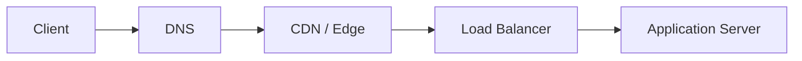

## Reading order

Sub-topics are sequenced for progressive learning: foundations first, then related concepts, then specialized topics.

| Group | Sections | Focus |
|-------|----------|-------|
| **1. Foundations** | 1.1-1.4 | OSI, TCP/IP, handshake, UDP |
| **2. IP layer** | 1.5-1.6 | Addressing, CIDR, MTU |
| **3. Naming and app protocols** | 1.7-1.13 | DNS, HTTP, TLS, HTTP/2/3, QUIC, keep-alive |
| **4. Edge and routing** | 1.14-1.17 | Proxy, NAT, VPN, multicast |
| **5. Scale and delivery** | 1.18-1.22 | CDN, load balancing, real-time patterns |

## Related topics

- [Caching](../03-caching/README.md)  -  CDN edge caching, cache headers
- [Distributed System](../04-distributed-system/README.md)  -  latency, availability, tail latency
- [Security](../10-security/README.md)  -  TLS, encryption in transit
- [Cloud & Kubernetes](../11-cloud-and-kubernetes/README.md)  -  VPC, ingress, service mesh

---


## 1.1 OSI Model


### What is it?

The **Open Systems Interconnection (OSI) model** is a seven-layer conceptual framework describing how data moves from application to physical wire and back. Each layer provides services to the layer above and uses services from the layer below.

### Why it matters

It provides a shared vocabulary for troubleshooting ("layer 4 timeout" = transport) and separates concerns so protocols can evolve independently. Interviews use OSI to frame where encryption, routing, and framing occur.

### How it works

Data descends the stack on send (encapsulation) and ascends on receive (decapsulation):

1. **Application (7):** HTTP, DNS, SMTP  -  user-facing protocols.
2. **Presentation (6):** Encoding, encryption, compression (often folded into app layer in practice).
3. **Session (5):** Session management (rarely distinct today).
4. **Transport (4):** TCP, UDP  -  end-to-end delivery, ports.
5. **Network (3):** IP  -  routing, addressing.
6. **Data Link (2):** Ethernet, MAC addresses, frames.
7. **Physical (1):** Bits on wire/fiber/radio.

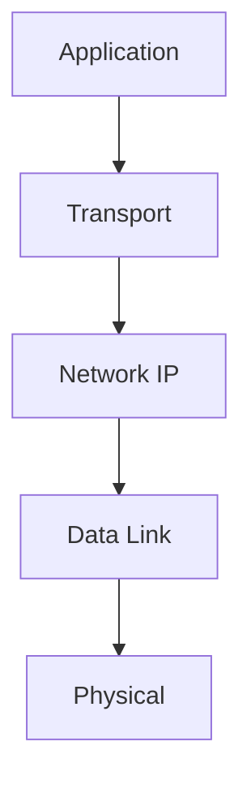

### Key details

| Layer | PDU | Example protocols |
|-------|-----|-------------------|
| 7 | Data | HTTP, gRPC |
| 4 | Segment/Datagram | TCP, UDP |
| 3 | Packet | IPv4, IPv6 |
| 2 | Frame | Ethernet |

- TCP/IP model (4 layers) maps loosely: App ≈ 5 - 7, Transport ≈ 4, Internet ≈ 3, Link ≈ 1 - 2
- Real stacks blur layers 5 - 7 into "application"

### When to use

- Troubleshooting network issues by isolation layer
- Explaining where TLS sits (between app and transport, historically "layer 6")
- Teaching protocol layering in interviews

### Trade-offs / Pitfalls

- OSI is theoretical - production debugging uses TCP/IP model more
- Strict layer boundaries don't always match implementation (TLS in libraries)
- Memorizing all seven layers without understanding function is low value

### References

- [OSI Model  -  computer networking playlist](https://www.youtube.com/playlist?list=PLxCzCOWd7aiGFBD2-2joCpWOLUrDLvVV_)

---


## 1.2 TCP/IP


### What is it?

The **TCP/IP model** is the practical four-layer stack underlying the Internet: **Link**, **Internet (IP)**, **Transport (TCP/UDP)**, and **Application**. It is the implementation counterpart to the OSI reference model.

### Why it matters

Every web request, API call, and database connection over a network uses TCP/IP. Understanding encapsulation, IP routing, and TCP reliability is mandatory for backend and infrastructure engineers.

### How it works

1. Application generates payload (HTTP request).
2. TCP segments data, adds ports, sequence numbers, checksums.
3. IP adds source/destination addresses; routers forward hop-by-hop.
4. Link layer frames packets with MAC addresses on local segment.
5. Reverse on receive; demultiplexing by port delivers to correct socket.

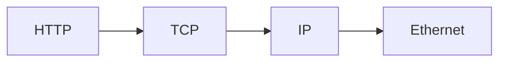

### Key details

- **IPv4:** 32-bit addresses, NAT common, header 20+ bytes
- **IPv6:** 128-bit addresses, no NAT needed ideally, simplified header
- **ICMP:** control messages (ping, unreachable)
- **Ports:** 0 - 65535; well-known 0 - 1023, ephemeral high ports for clients

### When to use

- Foundation for all subsequent networking topics
- Choosing TCP vs. UDP for a service
- Configuring firewalls (layer 3 vs. layer 4 rules)

### Trade-offs / Pitfalls

- IPv4 exhaustion mitigated by NAT but complicates P2P and logging
- IPv6 adoption still incomplete in some corporate networks
- "TCP/IP" colloquially means entire internet stack including app protocols

### References

- [TCP/IP  -  networking fundamentals video](https://www.youtube.com/watch?v=2QGgEk20RXM)

---


## 1.3 TCP Handshake


### What is it?

The **TCP three-way handshake** establishes a reliable connection between client and server before data transfer: **SYN -> SYN-ACK -> ACK**. It synchronizes initial sequence numbers and negotiates parameters.

### Why it matters

Each new TCP connection costs 1 - 3 RTTs before application data flows - significant for HTTPS (TCP + TLS). Connection reuse (keep-alive, HTTP/2) exists largely to amortize handshake cost.

### How it works

1. Client sends **SYN** with initial sequence number (ISN).
2. Server responds **SYN-ACK** with its ISN and ack of client ISN+1.
3. Client sends **ACK** acknowledging server ISN+1.
4. Connection **ESTABLISHED**; application data can flow both ways.
5. Teardown uses **FIN/ACK** four-way close (or RST on abort).

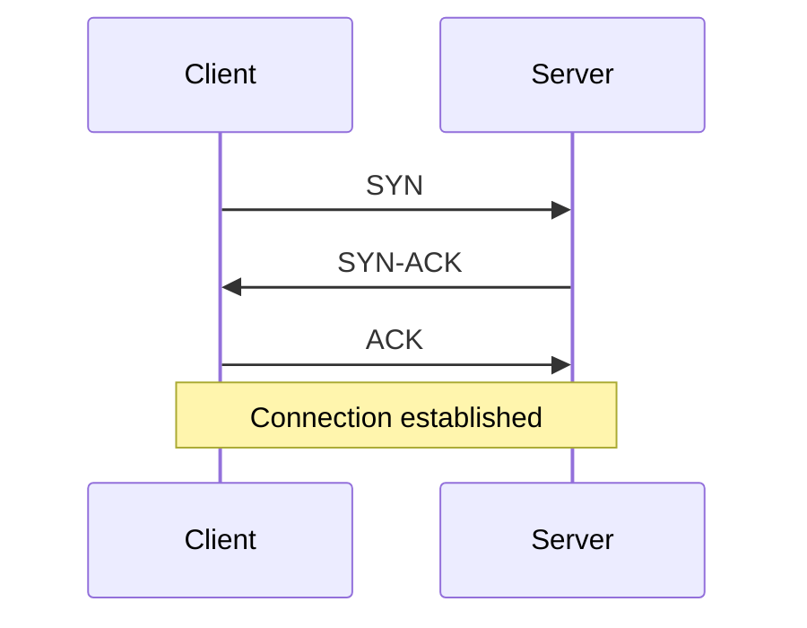

### Key details

- **SYN flood:** attacker sends SYNs without completing - mitigated by SYN cookies
- **RTT** during handshake sets floor for first-byte latency
- **TCP Fast Open (TFO):** cookie allows data in SYN on repeat visits (limited adoption)
- **Backlog queue:** server `listen()` queue for incomplete/handshaking connections

### When to use

- Explaining connection latency in performance analysis
- Tuning SYN backlog and timeout under load
- Understanding half-open connection states in netstat

### Trade-offs / Pitfalls

- Handshake + TLS 1.2 = 2 - 3 RTTs before HTTP request
- Load balancers must handle SYN proxying correctly
- NAT table entries created on handshake - exhaustion under connection storms
- Missing ACK after SYN-ACK leaves half-open connections

### References

- [TCP Handshake  -  TCP/IP video](https://www.youtube.com/watch?v=2QGgEk20RXM)

---


## 1.4 UDP


### What is it?

**User Datagram Protocol (UDP)** is a connectionless transport protocol sending independent datagrams without guaranteed delivery, ordering, or congestion control. Minimal 8-byte header: ports + length + checksum.

### Why it matters

UDP's simplicity enables low-latency use cases where application handles loss: DNS, VoIP, gaming, QUIC/HTTP3, video streaming. No handshake means faster first packet.

### How it works

1. Application sends datagram with source/dest ports.
2. IP routes packet; no connection state in network.
3. Receiver may get duplicates, out-of-order, or nothing.
4. Application implements retry, ordering, or tolerates loss.
5. Optional checksum validates integrity (often offloaded to hardware).

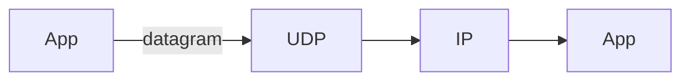

### Key details

- Max practical payload ~65 KB; often limited to avoid fragmentation (~1200 - 1400 bytes safe)
- **QUIC** builds reliable streams on UDP in userspace
- Firewalls often block UDP except DNS - HTTP/3 needs UDP 443 open
- Broadcast/multicast built on UDP at IP layer

### When to use

- Real-time media where late data is useless
- DNS queries (single request-response)
- Custom protocols with application-level reliability (QUIC)
- High-frequency metrics where sampling OK

### Trade-offs / Pitfalls

- No congestion control can starve TCP traffic (fairness concern)
- Application must implement reliability if needed
- NAT binding timeouts differ from TCP (often shorter for UDP)
- Fragmentation causes loss amplification - stay under path MTU

### References

- [UDP  -  TCP/IP and UDP video](https://www.youtube.com/watch?v=2QGgEk20RXM)

---


## 1.5 MTU


### What is it?

**Maximum Transmission Unit (MTU)** is the largest IP packet payload size a link can carry without fragmentation. Ethernet standard MTU is **1500 bytes**; loopback often 65536. **Path MTU** is the minimum MTU along a route.

### Why it matters

MTU mismatches cause fragmentation (performance hit) or **PMTUD black holes** (packets dropped silently when DF bit set). VPN overlays reduce effective MTU (e.g., 1400 bytes).

### How it works

1. Sender creates packet up to interface MTU.
2. If packet exceeds next hop MTU and **Don't Fragment (DF)** set, router drops and sends ICMP "fragmentation needed."
3. Sender reduces size (TCP MSS negotiation) and retransmits.
4. If ICMP blocked, **PMTUD fails** - connection hangs or times out.
5. **MSS clamping** on routers fixes TCP MSS for VPN clients.

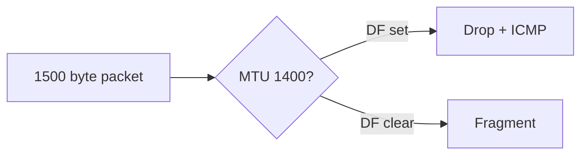

### Key details

- **TCP MSS** = MTU - IP header - TCP header (typically 1460 for 1500 MTU)
- **Jumbo frames:** 9000 MTU in datacenter (lower CPU overhead)
- Cloud VPC MTU often 9001 (enhanced networking) or 1500
- QUIC/UDP apps must handle PMTUD themselves

### When to use

- Debugging mysterious VPN or cross-cloud connectivity failures
- Tuning database replication over WAN
- Configuring Docker/Kubernetes CNI overlay networks

### Trade-offs / Pitfalls

- ICMP filtering breaks PMTUD - common misconfiguration
- Fragmentation increases loss probability (lose one fragment = whole datagram lost)
- Mixed MTU paths hard to diagnose without `tracepath`
- Oversized UDP -> silent black hole if no fragmentation

### References

- [MTU and path MTU discovery  -  video](https://www.youtube.com/watch?v=XMcYwr-yJGA)

---


## 1.6 IP Addressing/Subnetting


### What is it?

**IP addressing** assigns unique identifiers to hosts on IP networks. **Subnetting** divides a network into smaller broadcast domains using a subnet mask - separating network prefix from host portion.

### Why it matters

Correct subnet design enables routing, security zones (public/private subnets), and capacity planning in VPCs. Mis-subnetting causes routing black holes and exhausted address space.

### How it works

1. IPv4 address: four octets (e.g., 192.168.1.10).
2. Subnet mask defines network bits vs. host bits (255.255.255.0 = /24).
3. Hosts in same subnet communicate via L2; cross-subnet via gateway (router).
4. Private ranges (RFC 1918): 10.0.0.0/8, 172.16.0.0/12, 192.168.0.0/16.
5. Gateway IP typically first usable host (.1 in /24).

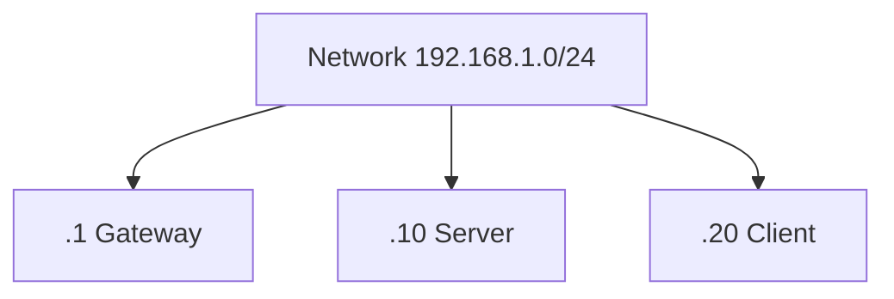

### Key details

- /24 = 256 addresses, 254 usable hosts (minus network/broadcast in classical model)
- **Loopback:** 127.0.0.1
- **Link-local:** 169.254.x.x (APIPA)
- Plan subnets for growth: app tier, DB tier, management per AZ

### When to use

- VPC and cloud network design
- Firewall rule scoping (CIDR blocks)
- On-prem datacenter VLAN planning

### Trade-offs / Pitfalls

- IPv4 /24 exhaustion in large flat networks - need smaller subnets or IPv6
- Overlapping CIDRs break VPN peering
- Broadcast domain size affects ARP storms (less issue in modern L3 fabrics)
- Forgetting reserved addresses (AWS reserves 5 per subnet)

### References

- [IP Addressing and Subnetting  -  video](https://www.youtube.com/watch?v=eWb35_xIKho)

---


## 1.7 CIDR


### What is it?

**Classless Inter-Domain Routing (CIDR)** notation expresses IP addresses and routing prefixes as `address/prefix-length` (e.g., 10.0.0.0/16). Replaced classful A/B/C addressing with flexible prefix lengths.

### Why it matters

CIDR enables efficient address allocation and aggregation in internet routing tables. Cloud security groups, NACLs, and k8s network policies all use CIDR notation.

### How it works

1. `/prefix` indicates number of leading network bits.
2. `/32` = single host; `/0` = default route.
3. Longest prefix match in routers determines route.
4. Supernetting aggregates multiple networks into one route announcement.
5. Calculate host count: 2^(32-prefix) - reserved addresses.

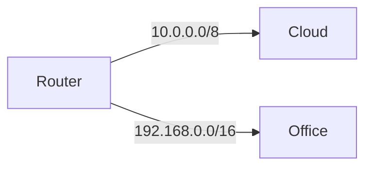

### Key details

| CIDR | Hosts (approx) | Common use |
|------|----------------|------------|
| /32 | 1 | Single host rule |
| /24 | 254 | Small subnet |
| /16 | 65K | VPC |
| /8 | 16M | Large private network |

- **Aggregate routes** reduce BGP table size
- `0.0.0.0/0` means all traffic (default route)

### When to use

- Writing firewall and security group rules
- IPAM (IP address management) planning
- Understanding BGP route advertisements

### Trade-offs / Pitfalls

- Off-by-one prefix errors open huge address ranges
- Overly broad rules (/8) expose too much
- IPv6 CIDR with /64 standard for subnets - different scaling intuition

### References

- [CIDR notation  -  video](https://www.youtube.com/watch?v=7u0XnqS-5xs)

---


## 1.8 DNS


### What is it?

The **Domain Name System (DNS)** is a hierarchical, distributed naming system mapping human-readable domain names (example.com) to IP addresses and other records (MX, TXT, CNAME). Often called "the phone book of the internet."

### Why it matters

Every web request starts with DNS resolution. DNS failures, slow TTLs, or misconfiguration take entire services offline. DNS also enables load distribution, failover, and service discovery.

### How it works

1. Hierarchical namespace: root -> TLD (.com) -> domain -> subdomain.
2. **Authoritative nameservers** hold truth for a zone.
3. **Recursive resolvers** (ISP, 8.8.8.8) cache and query on behalf of clients.
4. Record types: A/AAAA (IP), CNAME (alias), MX (mail), TXT (verification).
5. Responses include TTL controlling cache duration.

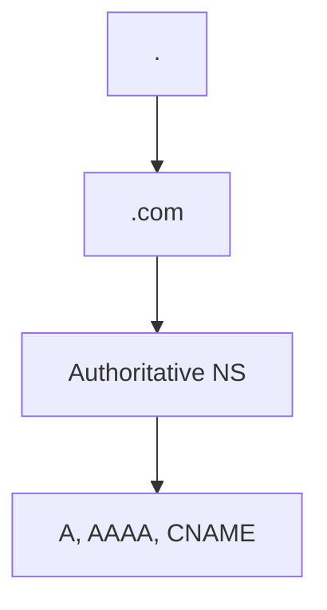

### Key details

- **Glue records** needed when NS is subdomain of domain itself
- **DNSSEC** adds cryptographic authenticity (adoption growing)
- **Split-horizon DNS:** internal vs. external different answers
- **Route 53, Cloudflare** managed DNS with health checks

### When to use

- Domain configuration for any public service
- Internal service discovery (Kubernetes CoreDNS)
- Geo-routing and weighted failover

### Trade-offs / Pitfalls

- Long TTL slows failover propagation
- Short TTL increases query load and latency
- CNAME at apex traditionally problematic (ALIAS/ANAME workarounds)
- DNS cache poisoning mitigated by DNSSEC and random source ports

### References

- [DNS  -  how DNS works video](https://www.youtube.com/watch?v=vhfRArT11jc)

---


## 1.9 DNS Resolution


### What is it?

**DNS resolution** is the step-by-step process a resolver uses to find the IP address for a hostname - from browser cache through OS stub resolver, recursive resolver, root, TLD, and authoritative server.

### Why it matters

Resolution adds latency (often 20 - 100 ms) to every new domain contact. Understanding the chain explains caching benefits, NXDOMAIN failures, and why local `/etc/hosts` overrides work.

### How it works

1. Browser checks **browser cache**, then OS cache.
2. OS sends query to **stub resolver** -> configured recursive (e.g., 8.8.8.8).
3. Recursive checks its cache; on miss queries **root** -> **TLD** (.com) -> **authoritative NS**.
4. Authoritative returns A/AAAA record with TTL.
5. Answer cached at each layer until TTL expires.

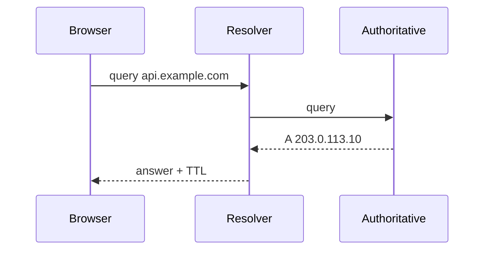

### Key details

- **Negative caching:** NXDOMAIN also cached (SOA MINIMUM TTL)
- **Prefetching:** browsers resolve `<link rel="dns-prefetch">`
- **mDNS/.local** for local network names
- **getaddrinfo()** blocking call - can stall event loops if slow

### When to use

- Debugging "works on my machine" DNS issues
- Tuning TTL for migration/failover
- Implementing connection pooling to same host (avoid repeat resolution)

### Trade-offs / Pitfalls

- Circular CNAME chains cause resolution failure
- Resolver timeouts block application startup
- Split DNS: wrong resolver gets wrong internal IP
- Large DNS responses over UDP truncated -> TCP retry adds latency

### References

- [DNS Resolution  -  step-by-step video](https://www.youtube.com/watch?v=BZISxpdl4lQ)

---


## 1.10 HTTP/HTTPS


### What is it?

**HTTP (Hypertext Transfer Protocol)** is the application-layer protocol for web communication - request/response model with methods (GET, POST, PUT, DELETE), headers, status codes, and body. **HTTPS** is HTTP over TLS, encrypting and authenticating the connection.

### Why it matters

HTTP semantics drive REST APIs, caching, cookies, and CDN behavior. HTTPS is mandatory for security, SEO, and browser features (HTTP/2 often requires TLS in browsers).

### How it works

1. Client opens TCP connection (and TLS handshake for HTTPS).
2. Client sends request line: `GET /path HTTP/1.1`, headers, optional body.
3. Server processes, returns status (`200 OK`), headers, body.
4. Connection closed (HTTP/1.0) or reused (keep-alive).
5. Headers control caching (`Cache-Control`), auth (`Authorization`), content type.

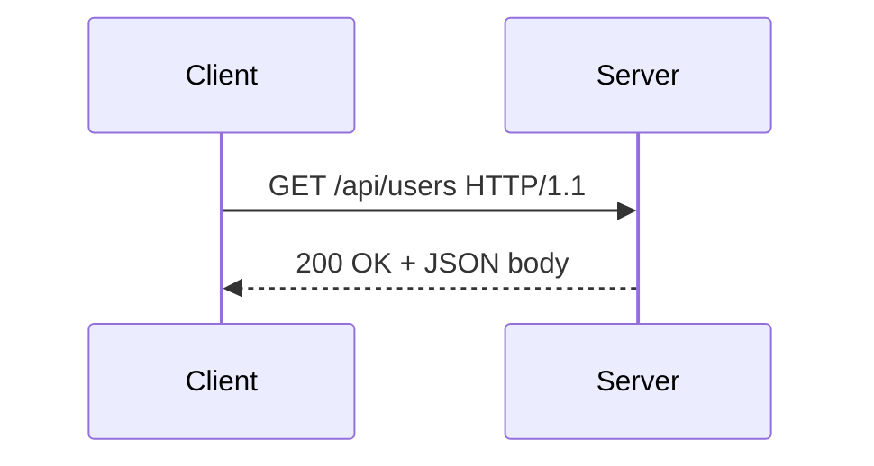

### Key details

| Method | Semantics |
|--------|-----------|
| GET | Safe, idempotent read |
| POST | Create, non-idempotent |
| PUT | Replace, idempotent |
| DELETE | Remove, idempotent |
| PATCH | Partial update |

- Status classes: 2xx success, 3xx redirect, 4xx client error, 5xx server error
- **Stateless:** server doesn't retain session state between requests (cookies add state)

### When to use

- Designing REST/HTTP APIs
- Configuring cache headers and CDN behavior
- Choosing HTTPS termination point (load balancer vs. app)

### Trade-offs / Pitfalls

- HTTP/1.1 head-of-line blocking on single connection
- Mixed content blocked when page is HTTPS but assets HTTP
- Large cookies sent on every request inflate latency
- GET with side effects violates HTTP semantics

### References

- [HTTP and HTTPS  -  web protocol video](https://www.youtube.com/watch?v=FmgIQBQ87fo)

---


## 1.11 SSL/TLS


### What is it?

**TLS (Transport Layer Security)**, successor to SSL, provides **encryption**, **integrity**, and **server authentication** (optional client auth) for TCP connections. HTTPS = HTTP + TLS.

### Why it matters

TLS protects credentials, PII, and session tokens from interception and tampering. Certificate validation prevents man-in-the-middle attacks. TLS handshake cost affects connection latency.

### How it works

1. **ClientHello:** supported cipher suites, TLS versions, SNI (server name).
2. **ServerHello:** chosen cipher, certificate chain, key exchange params.
3. Key exchange establishes shared **session keys** (ECDHE forward secrecy).
4. **Finished** messages verify handshake integrity.
5. Application data encrypted with symmetric cipher (AES-GCM, ChaCha20).

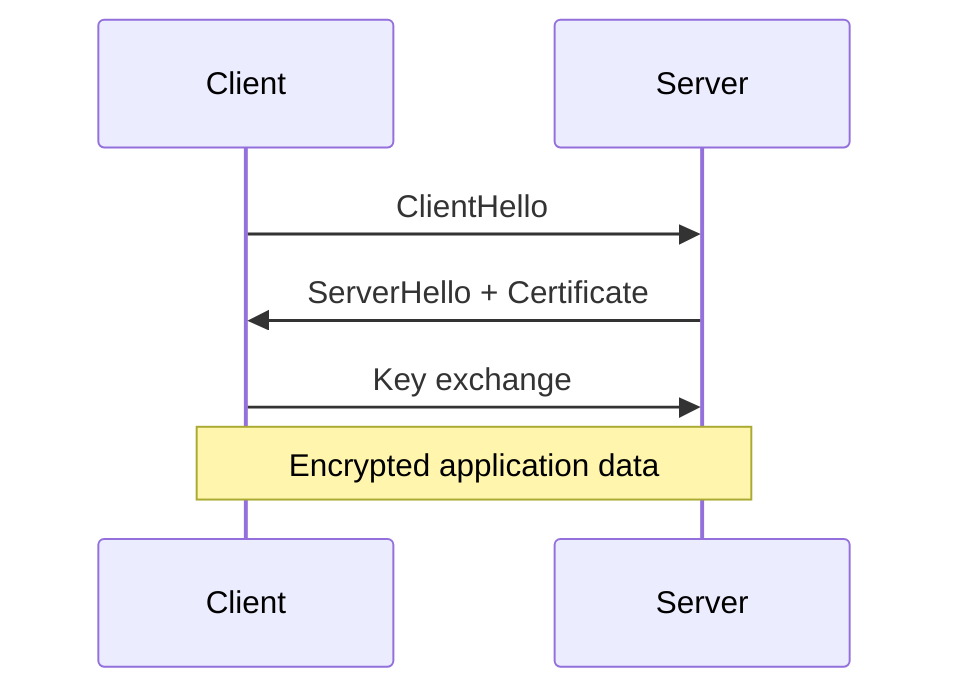

### Key details

- **TLS 1.3:** 1-RTT handshake (0-RTT resumption with replay risk)
- **Certificate chain:** leaf -> intermediate -> root CA in trust store
- **mTLS:** mutual TLS for service-to-service auth
- **Termination:** LB decrypts TLS, forwards plain HTTP to backend (or re-encrypts)

### When to use

- All public web traffic (HTTPS everywhere)
- gRPC over TLS, database connections (PostgreSQL SSL)
- Service mesh sidecar mTLS

### Trade-offs / Pitfalls

- Certificate expiry outages (automate with Let's Encrypt)
- TLS inspection proxies break end-to-end trust
- 0-RTT data vulnerable to replay attacks
- CPU cost of encryption - hardware AES-NI mitigates

### References

- [SSL/TLS  -  encryption handshake video](https://www.youtube.com/watch?v=LJDsdSh1CYM)

---


## 1.12 HTTP2 & HTTP3


### What is it?

**HTTP/2** multiplexes many requests over one TCP connection with binary framing, header compression (HPACK), and stream prioritization - reducing connection count and head-of-line blocking at HTTP layer. **HTTP/3** uses QUIC over UDP instead of TCP, eliminating TCP-level head-of-line blocking.

### Why it matters

HTTP/2 dramatically improved web performance (single connection per origin). HTTP/3 further improves lossy/mobile networks where TCP retransmission blocks all streams.

### How it works

**HTTP/2:**
1. One TCP + TLS connection per origin.
2. Requests split into **streams** with unique IDs.
3. Frames interleaved on wire; HPACK compresses headers.
4. Server push (largely deprecated in practice).
5. TCP loss still blocks all streams (HOL at transport layer).

**HTTP/3:**
1. QUIC connection over UDP with built-in TLS 1.3.
2. Independent streams - loss on one doesn't block others.
3. Connection migration by connection ID (WiFi -> cellular).

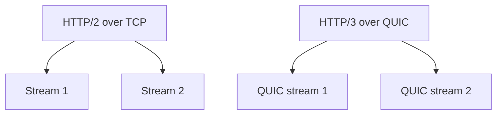

### Key details

- HTTP/2 requires TLS in all major browsers (facto HTTPS)
- **ALPN** negotiates h2 during TLS handshake
- Alt-Svc header advertises HTTP/3 availability
- Load balancers need L7 HTTP/2 or pass-through

### When to use

- HTTP/2: default for modern web servers (nginx, Cloudflare)
- HTTP/3: mobile apps, global users on lossy networks
- API gateways supporting multiplexed client connections

### Trade-offs / Pitfalls

- HTTP/2 multiplexing can overwhelm single server thread if not configured
- QUIC UDP blocked on some corporate firewalls
- Debugging HTTP/3 harder than TCP (Wireshark needs keys)
- Server push wasted bandwidth when assets cached

### References

- [HTTP/2 and HTTP/3  -  protocol evolution video](https://www.youtube.com/watch?v=UMwQjFzTQXw)

---


## 1.13 QUIC


### What is it?

**QUIC (Quick UDP Internet Connections)** is a transport protocol on UDP combining encryption (TLS 1.3 integrated), multiplexed streams, connection migration, and reduced handshake latency. HTTP/3 is the primary application.

### Why it matters

QUIC solves TCP's head-of-line blocking and slow handshake, improving web performance especially on mobile. Google pioneered it; now IETF standard with broad CDN/browser support.

### How it works

1. Client sends initial packet with crypto handshake (0-RTT possible with prior ticket).
2. Connection identified by **Connection ID**, not IP:port tuple.
3. Multiple bidirectional streams within one QUIC connection.
4. Loss recovery per-stream, not whole connection.
5. Built-in congestion control in userspace (not kernel TCP stack).

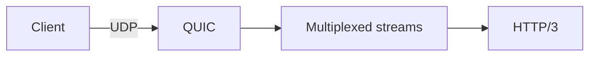

### Key details

- **0-RTT:** resumption sends data immediately (replay risk for non-idempotent ops)
- **Connection migration:** CID survives IP change
- Kernel bypass: userspace implementation (CPU consideration)
- Port 443 UDP standard for HTTP/3

### When to use

- Public websites via CDN (Cloudflare, Fastly default HTTP/3)
- Mobile-first applications
- When TCP middleboxes cause issues

### Trade-offs / Pitfalls

- UDP rate limiting by ISPs
- Higher CPU than kernel TCP at extreme throughput
- NAT rebinding can break CID if not handled
- Incomplete tooling ecosystem vs. TCP

### References

- [QUIC protocol  -  deep dive video](https://www.youtube.com/watch?v=HnDsMehSSY4)

---


## 1.14 Keep Alive Connections


### What is it?

**HTTP keep-alive (persistent connections)** reuses the same TCP connection for multiple HTTP requests/responses, avoiding repeated TCP (+ TLS) handshakes. Controlled by `Connection: keep-alive` header (default in HTTP/1.1).

### Why it matters

Connection setup can cost 2 - 3 RTTs (TCP + TLS). Without keep-alive, each asset on a page opens new connection - devastating for HTTP/1.1 with browser connection limits (6 per host).

### How it works

1. Client and server complete initial TCP + TLS handshake.
2. First HTTP request/response completes; connection stays open.
3. Subsequent requests sent on same connection (serial in HTTP/1.1).
4. Connection closed after `Keep-Alive: timeout=N, max=M` or idle timeout.
5. HTTP/2 multiplexes many requests on one keep-alive connection.

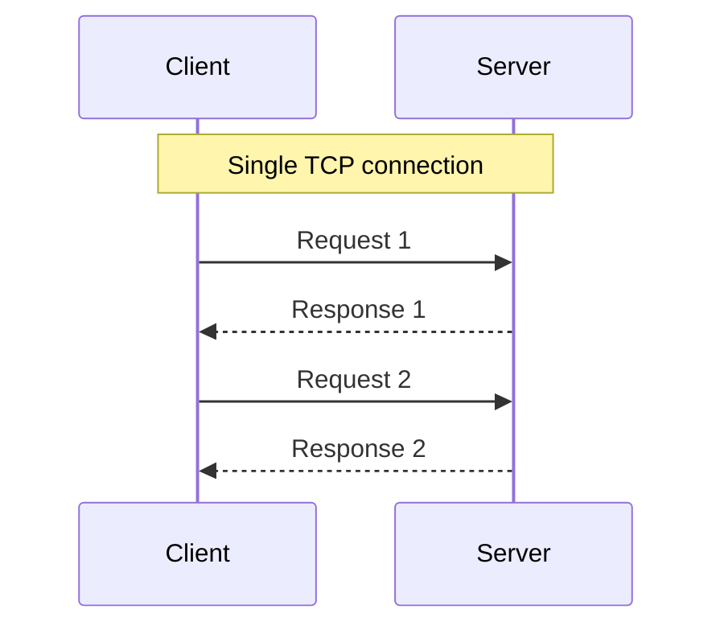

### Key details

- **HTTP/1.1 default:** persistent unless `Connection: close`
- Server `keepalive_timeout` (nginx default 75s)
- **Connection pooling:** client-side reuse to same host (HttpClient, OkHttp)
- **Head-of-line blocking** in HTTP/1.1 motivates HTTP/2 single connection

### When to use

- Always for HTTP/1.1 production servers
- Client libraries: configure pool size matching expected concurrency
- Database and Redis connection pooling (same concept, different protocol)

### Trade-offs / Pitfalls

- Idle connections consume server file descriptors and memory
- Load balancer idle timeout must exceed client keep-alive (or RST mid-request)
- Sticky connection to dead server until client reconnects
- Too many pooled connections across microservices -> connection storm on DB

### References

- [Keep-Alive connections  -  HTTP performance video](https://www.youtube.com/watch?v=zRUdSu3JlK8)

---


## 1.15 Forward & Reverse Proxy


### What is it?

A **forward proxy** sits in front of **clients**, forwarding requests to the internet on their behalf (corporate proxy, privacy proxy). A **reverse proxy** sits in front of **servers**, receiving client requests and routing to backend servers (nginx, HAProxy, API gateway).

### Why it matters

Reverse proxies enable TLS termination, load balancing, caching, WAF, and hiding internal topology. Forward proxies enforce policy, caching, and anonymize client IP.

### How it works

**Reverse proxy:**
1. Client connects to proxy public IP (api.example.com).
2. Proxy terminates TLS, inspects request.
3. Proxy forwards to backend pool (round-robin, least conn).
4. Response returned to client; client never sees backend IP.

**Forward proxy:**
1. Client configured to use proxy.
2. All outbound requests sent to proxy.
3. Proxy fetches from origin, returns to client.

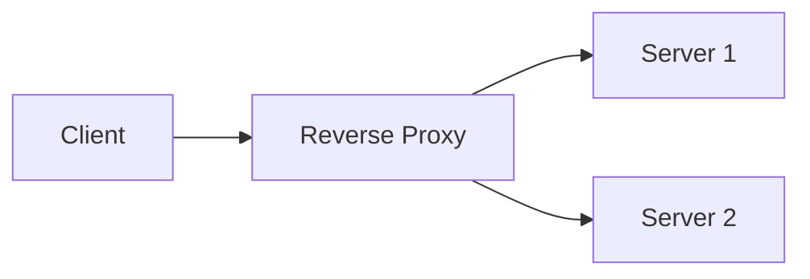

### Key details

- **nginx, Envoy, Traefik** common reverse proxies
- **Squid** traditional forward proxy
- Reverse proxy adds hop - configure `X-Forwarded-For`, `X-Request-ID`
- **Transparent proxy** intercepts without client config

### When to use

- Reverse: any production web/API tier
- Forward: corporate egress filtering, geo-unblocking
- Both: service mesh sidecars act as forward+reverse locally

### Trade-offs / Pitfalls

- Single reverse proxy becomes SPOF without HA pair
- Misconfigured forwarding headers break rate limiting by IP
- SSL termination at proxy - trust boundary for internal network
- Forward proxy adds latency and certificate trust issues (MITM corp proxies)

### References

- [Forward and Reverse Proxy  -  explained video](https://www.youtube.com/watch?v=xo5V9g9joFs)

---


## 1.16 NAT


### What is it?

**Network Address Translation (NAT)** maps private IP addresses inside a network to public IP(s) on the internet, modifying packet headers in transit. Most home routers and cloud NAT gateways use **NAPT** (port-level translation).

### Why it matters

NAT conserves scarce IPv4 addresses and hides internal topology. It also breaks inbound connections unless port forwarding configured - affecting P2P, WebRTC, and debugging client IPs.

### How it works

1. Internal host (192.168.1.10:5000) sends packet to external server.
2. NAT router replaces source with (public_ip:ephemeral_port).
3. NAT table maps ephemeral_port -> internal host:port.
4. Return packets reverse translation using table.
5. Table entries timeout after idle period.

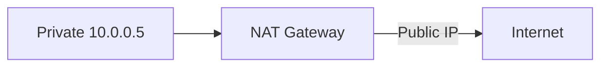

### Key details

- **SNAT:** source translation (outbound from private)
- **DNAT:** destination translation (port forwarding inbound)
- Cloud **NAT Gateway** for private subnet egress without public IPs
- **Carrier-grade NAT (CGNAT)** shares public IP across ISP customers

### When to use

- Private subnet internet access in VPC
- Home/office networks on IPv4
- Hiding internal server IPs from clients

### Trade-offs / Pitfalls

- Breaks end-to-end connectivity - needs STUN/TURN for WebRTC
- Log correlation harder (many clients share one public IP)
- NAT table exhaustion under high connection count
- IPv6 designed to reduce NAT need

### References

- [NAT  -  network address translation video](https://www.youtube.com/watch?v=FTUV0t6JaDA)

---


## 1.17 VPN


### What is it?

A **Virtual Private Network (VPN)** creates an encrypted tunnel over a public network, making remote hosts appear on a private network. Protocols include IPsec, OpenVPN, WireGuard, and TLS-based corporate VPNs.

### Why it matters

VPNs secure remote access, connect site-to-site networks, and bypass geo-restrictions. Zero-trust architectures reduce blanket VPN reliance but VPN remains common for admin access and hybrid cloud.

### How it works

1. Client authenticates to VPN concentrator.
2. Encrypted tunnel established (IPsec SA or WireGuard handshake).
3. Client receives virtual IP in VPN address space.
4. Traffic routed through tunnel (full or split tunnel).
5. Decrypted at gateway; forwarded to internal resources.

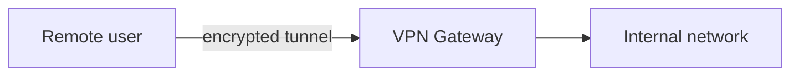

### Key details

- **Split tunnel:** only corporate traffic via VPN; internet direct
- **Full tunnel:** all traffic via corporate (inspection, DLP)
- **WireGuard:** modern, minimal, fast kernel implementation
- **Site-to-site:** gateway-to-gateway for datacenter/cloud linking

### When to use

- Remote employee access to internal tools
- Connecting cloud VPC to on-prem datacenter
- Secure admin access to production (bastion alternative)

### Trade-offs / Pitfalls

- VPN concentrator SPOF and bandwidth bottleneck
- Full tunnel adds latency for SaaS apps
- Compromised VPN creds grant broad network access
- Zero-trust replaces "perimeter VPN trust" with per-request auth

### References

- [VPN  -  virtual private networks video](https://www.youtube.com/watch?v=R-JUOpCgTZc)

---


## 1.18 Anycast/Multicast/Broadcast


### What is it?

Three IP delivery semantics: **Broadcast** (one-to-all on subnet), **Multicast** (one-to-many subscribed group), **Anycast** (one-to-nearest of a group sharing same IP). Anycast powers global DNS and CDN routing.

### Why it matters

Anycast enables any PoP to respond on the same IP - BGP routes to topologically nearest node. Multicast efficient for streaming to many (limited internet support). Broadcast confined to L2 domains.

### How it works

**Broadcast:** packet to 255.255.255.255 or subnet broadcast - 所有 hosts on LAN.

**Multicast:** join IGMP group (224.0.0.0/4); routers replicate to subscribers only.

**Anycast:** same IP announced from multiple locations via BGP; router picks shortest path.

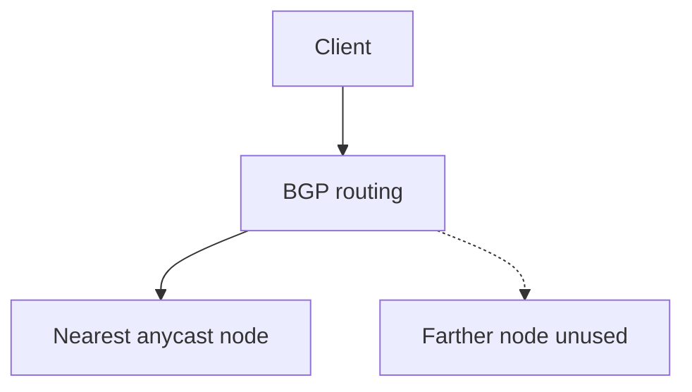

### Key details

- Anycast: Cloudflare 1.1.1.1, Google 8.8.8.8, CDN edges
- Multicast: IPTV within datacenter; not end-to-end internet
- Broadcast storm risk led to L3 switching dominance
- Anycast failure: BGP reconverges to next node (seconds)

### When to use

- Anycast: global DNS resolvers, CDN, DDoS scrubbing
- Multicast: internal market data feeds, video distribution
- Broadcast: ARP, DHCP within subnet only

### Trade-offs / Pitfalls

- Anycast stateful TCP connections break if route changes mid-session
- Multicast not supported in most cloud VPCs
- Broadcast doesn't cross routers by design
- Anycast debugging confusing (which PoP answered?)

### References

- [Anycast, Multicast, Broadcast  -  video](https://www.youtube.com/watch?v=EcWhJbEWxHU)

---


## 1.19 CDN


### What is it?

A **Content Delivery Network (CDN)** distributes cached copies of static (and sometimes dynamic) content to **edge PoPs** geographically close to users, reducing latency and origin load.

### Why it matters

Users globally expect fast page loads. CDN offloads 80 - 90% of static traffic, absorbs DDoS, and provides TLS at edge. Essential for media, e-commerce, and any global web property.

### How it works

1. Origin (S3, nginx) serves content; CDN pulls on first request (**cache miss**).
2. CDN caches at edge PoP with TTL from `Cache-Control`.
3. Subsequent nearby users get **cache hit** from edge.
4. DNS (or anycast) routes user to nearest PoP.
5. Purge API invalidates cached objects on content update.

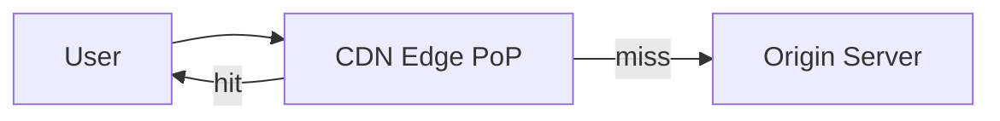

### Key details

- **Cache keys** include URL, query string, headers (Vary)
- **Dynamic acceleration:** route API through CDN private backbone
- Providers: Cloudflare, Akamai, Fastly, CloudFront
- **Stale-while-revalidate** serves old while refreshing

### When to use

- Static assets (JS, CSS, images, video)
- Downloadable files, software updates
- DDoS protection and WAF at edge

### Trade-offs / Pitfalls

- Cache invalidation delay after deploy
- Personalized content hard to cache (need edge logic or short TTL)
- Dynamic HTML caching requires careful cache key design
- Cost scales with bandwidth egress

### References

- [CDN  -  content delivery networks video](https://www.youtube.com/watch?v=ouqqU0FJjhQ)

---


## 1.20 Load Balancer


### What is it?

A **load balancer** distributes incoming traffic across multiple backend servers to improve availability, throughput, and fault tolerance. Operates at L4 (TCP/UDP) or L7 (HTTP) with health checks removing failed nodes.

### Why it matters

Single servers cannot handle modern traffic or provide HA. Load balancers are the entry point for horizontal scaling - every multi-instance web tier uses one (ALB, NLB, nginx, F5).

### How it works

1. Client connects to LB virtual IP (VIP) or DNS name.
2. LB selects backend via algorithm (round-robin, least connections).
3. Forwards connection (L4) or proxies request (L7).
4. Health checks probe backends; unhealthy removed from pool.
5. Session persistence (sticky sessions) optional via cookie or source IP.

```mermaid
flowchart TB
    Users --> LB[Load Balancer]
    LB --> B1[Backend 1]
    LB --> B2[Backend 2]
    LB --> B3[Backend 3]
```

### Key details

- **L4 LB:** fast, protocol-agnostic, no URL routing
- **L7 LB:** content routing, TLS termination, header manipulation
- **Active-active:** all backends serve; **active-passive:** standby
- **Cross-zone LB:** distributes across AZs for HA

### When to use

- Any horizontally scaled stateless service
- TLS termination at edge
- Blue/green and canary deployments (weighted routing)

### Trade-offs / Pitfalls

- LB itself must be HA (multi-node, anycast, or cloud managed)
- Sticky sessions complicate scale-down and can skew load
- L7 LB adds latency vs. L4 pass-through
- WebSocket requires L7 with connection upgrade support

### References

- [Load Balancer  -  system design video](https://www.youtube.com/watch?v=TavIqNcnwSA)

---


## 1.21 Load Balancer Algorithm


### What is it?

**Load balancing algorithms** determine which backend receives each request: round-robin, weighted round-robin, least connections, IP hash, random, least response time, and consistent hash for cache locality.

### Why it matters

Wrong algorithm causes uneven load (some servers saturated, others idle), breaking SLAs despite having capacity. Long-lived connections and varying request costs make algorithm choice non-trivial.

### How it works

1. LB maintains backend pool state (connections, health, weight).
2. On new request, algorithm picks backend from healthy set.
3. **Round-robin:** rotate sequentially.
4. **Least connections:** pick backend with fewest active connections.
5. **Consistent hash:** hash client IP or URL -> stable backend mapping.

```mermaid
flowchart TB
    Req[Incoming requests] --> Algo{Algorithm}
    Algo --> RR[Round Robin]
    Algo --> LC[Least Connections]
    Algo --> CH[Consistent Hash]
```

### Key details

| Algorithm | Best for |
|-----------|----------|
| Round robin | Equal capacity, stateless, uniform requests |
| Weighted RR | Heterogeneous server sizes |
| Least connections | Long-lived connections, variable duration |
| IP hash | Session affinity without cookies |
| Random | Simple, surprisingly effective at scale |
| Least response time | Latency-sensitive, heterogeneous load |

### When to use

- RR: default for homogeneous stateless APIs
- Least conn: WebSocket, database connection pools through LB
- Consistent hash: cache co-location, sharded state

### Trade-offs / Pitfalls

- Round robin ignores current load (slow server gets equal share)
- IP hash fails when client IP changes (mobile networks)
- Least connections overhead tracking state
- Weighted misconfiguration starves small nodes

### References

- [Load Balancer Algorithms  -  comparison video](https://www.youtube.com/watch?v=1fN2UDbtGDQ)

---


## 1.22 SSE & Polling & Websocets


### What is it?

Three patterns for **server-to-client real-time updates**: **polling** (client repeatedly requests), **SSE (Server-Sent Events)** (one-way HTTP stream from server), and **WebSockets** (full-duplex persistent connection).

### Why it matters

Choosing the right pattern affects latency, server load, and infrastructure compatibility. Notifications, live feeds, chat, and collaborative apps depend on these mechanisms.

### How it works

**Polling:**
1. Client requests endpoint every N seconds.
2. Server returns current state (often empty).
3. Simple but wasteful; **long polling** holds request until event.

**SSE:**
1. Client opens HTTP GET with `Accept: text/event-stream`.
2. Server keeps connection open, pushes `data:` lines.
3. Auto-reconnect built into browser EventSource API.

**WebSockets:**
1. HTTP upgrade handshake (`Upgrade: websocket`).
2. Bidirectional framed messages over single TCP connection.
3. Low overhead after establishment.

```mermaid
sequenceDiagram
    participant Client
    participant Server
    Note over Client,Server: WebSocket
    Client->>Server: Upgrade request
    Server-->>Client: 101 Switching
    Client->>Server: message
    Server->>Client: push
```

### Key details

| Pattern | Direction | Protocol | Use case |
|---------|-----------|----------|----------|
| Polling | Pull | HTTP | Simple, low frequency |
| SSE | Server->client | HTTP | Live feeds, notifications |
| WebSocket | Bidirectional | WS | Chat, gaming, collaboration |

- SSE works through most HTTP proxies; WebSocket needs proxy support
- Long polling ties up server threads if not async

### When to use

- Polling: infrequent updates, simplest implementation
- SSE: stock tickers, news feeds, progress streams
- WebSocket: chat, multiplayer, collaborative editing

### Trade-offs / Pitfalls

- Polling scales poorly (empty responses waste bandwidth)
- SSE one-way only; need second channel for client commands
- WebSocket sticky sessions required with multiple servers
- Connection limits (browser ~6 per domain HTTP/1.1) less issue with WS multiplexing

### References

- [SSE, Polling, and WebSockets  -  real-time web video](https://www.youtube.com/watch?v=WS352jTTkPU)

---


## Quick Reference

| # | Topic | Summary |
|---|-------|---------|
| 1.1 | OSI Model | The **Open Systems Interconnection (OSI) model** is a seven-layer conceptual ... |
| 1.2 | TCP/IP | The **TCP/IP model** is the practical four-layer stack underlying the Interne... |
| 1.3 | TCP Handshake | The **TCP three-way handshake** establishes a reliable connection between cli... |
| 1.4 | UDP | **User Datagram Protocol (UDP)** is a connectionless transport protocol sendi... |
| 1.5 | MTU | **Maximum Transmission Unit (MTU)** is the largest IP packet payload size a l... |
| 1.6 | IP Addressing/Subnetting | **IP addressing** assigns unique identifiers to hosts on IP networks. **Subne... |
| 1.7 | CIDR | **Classless Inter-Domain Routing (CIDR)** notation expresses IP addresses and... |
| 1.8 | DNS | The **Domain Name System (DNS)** is a hierarchical, distributed naming system... |
| 1.9 | DNS Resolution | **DNS resolution** is the step-by-step process a resolver uses to find the IP... |
| 1.10 | HTTP/HTTPS | **HTTP (Hypertext Transfer Protocol)** is the application-layer protocol for ... |
| 1.11 | SSL/TLS | **TLS (Transport Layer Security)**, successor to SSL, provides **encryption**... |
| 1.12 | HTTP2 & HTTP3 | **HTTP/2** multiplexes many requests over one TCP connection with binary fram... |
| 1.13 | QUIC | **QUIC (Quick UDP Internet Connections)** is a transport protocol on UDP comb... |
| 1.14 | Keep Alive Connections | **HTTP keep-alive (persistent connections)** reuses the same TCP connection f... |
| 1.15 | Forward & Reverse Proxy | A **forward proxy** sits in front of **clients**, forwarding requests to the ... |
| 1.16 | NAT | **Network Address Translation (NAT)** maps private IP addresses inside a netw... |
| 1.17 | VPN | A **Virtual Private Network (VPN)** creates an encrypted tunnel over a public... |
| 1.18 | Anycast/Multicast/Broadcast | Three IP delivery semantics: **Broadcast** (one-to-all on subnet), **Multicas... |
| 1.19 | CDN | A **Content Delivery Network (CDN)** distributes cached copies of static (and... |
| 1.20 | Load Balancer | A **load balancer** distributes incoming traffic across multiple backend serv... |
| 1.21 | Load Balancer Algorithm | **Load balancing algorithms** determine which backend receives each request: ... |
| 1.22 | SSE & Polling & Websocets | Three patterns for **server-to-client real-time updates**: **polling** (clien... |

---

[â -  Back to master index](../README.md)
