# 1. Networking

> Status: **Documented** — master reference

[<- Back to master index](../README.md)

## Sub-topics

| # | Sub-topic | Status |
|---|-----------|--------|
| 1.1 | [OSI Model](#11-osi-model) | Done |
| 1.2 | [TCP/IP](#12-tcpip) | Done |
| 1.3 | [TCP Handshake](#13-tcp-handshake) | Done |
| 1.4 | [UDP](#14-udp) | Done |
| 1.5 | [MTU](#15-mtu) | Done |
| 1.6 | [IP Addressing/Subnetting](#16-ip-addressingsubnetting) | Done |
| 1.7 | [CIDR](#17-cidr) | Done |
| 1.8 | [DNS](#18-dns) | Done |
| 1.9 | [DNS Resolution](#19-dns-resolution) | Done |
| 1.10 | [HTTP/HTTPS](#110-httphttps) | Done |
| 1.11 | [SSL/TLS](#111-ssltls) | Done |
| 1.12 | [HTTP/2 & HTTP/3](#112-http2-http3) | Done |
| 1.13 | [QUIC](#113-quic) | Done |
| 1.14 | [Keep-Alive Connections](#114-keep-alive-connections) | Done |
| 1.15 | [Forward & Reverse Proxy](#115-forward-reverse-proxy) | Done |
| 1.16 | [NAT](#116-nat) | Done |
| 1.17 | [VPN](#117-vpn) | Done |
| 1.18 | [Unicast, Broadcast, Multicast & Anycast](#118-unicast-broadcast-multicast--anycast) | Done |
| 1.19 | [CDN](#119-cdn) | Done |
| 1.20 | [Load Balancer](#120-load-balancer) | Done |
| 1.22 | [SSE, Polling & WebSockets](#122-sse-polling--websockets) | Done |

---

This chapter is a **networking reference for system design**: protocol layers, transport (TCP/UDP/QUIC), IP addressing, DNS, HTTP/TLS, and edge infrastructure (CDN, load balancers, proxies).

---

## 1.1 OSI Model

The **OSI (Open Systems Interconnection) Model** is a conceptual framework that explains how data travels from one computer to another over a network.

Think of it as a package delivery process. When you send a message from your laptop or mobile phone, many things happen behind the scenes before that message reaches the destination. The OSI model divides these responsibilities into **7 layers** so that each layer has a specific job.

Data moves from **Layer 7 down to Layer 1** on the sender side and then from **Layer 1 up to Layer 7** on the receiver side.

---

### Layer 7 — Application Layer

**Purpose:**  
This is the layer closest to the end user. It provides network services directly to applications.

**Examples:** HTTP, HTTPS, DNS, SMTP, FTP, gRPC

**What happens here?**

When you open a browser and type:

```text
https://google.com
```

The browser creates an HTTP request.

When you send an email, the email client creates an SMTP request.

When you send a WhatsApp message, the application creates a request that needs to be sent over the network.

This layer only cares about: *"What information do I want to send?"*

It does not care about routing, IP addresses, cables, or packet delivery.

**Real-world analogy:** You write a letter and decide what message should be written inside it.

---

### Layer 6 — Presentation Layer

**Purpose:**  
Convert data into a format that both systems can understand.

**Responsibilities:** Data formatting, serialization, encryption, decryption, compression, decompression

**Examples:** JSON, XML, Protocol Buffers (Protobuf), TLS encryption, GZIP compression

**What happens here?**

Suppose your application wants to send:

```text
Hello World
```

The presentation layer may:

- Convert text into bytes
- Compress the data
- Encrypt the data

After encryption, anybody intercepting the traffic cannot easily read the message.

**Real-world analogy:** Before sending a letter, you may translate it into another language or lock it inside a secure box.

---

### Layer 5 — Session Layer

**Purpose:**  
Manage communication sessions between two systems.

**Responsibilities:** Create connection sessions, maintain active sessions, resume interrupted sessions, terminate sessions

**Examples:** WebSocket session, TLS session, gRPC stream

**What happens here?**

Suppose two systems are continuously exchanging messages. The session layer manages:

- Connection start
- Connection maintenance
- Connection recovery
- Connection termination

**Real-world analogy:** A phone call — someone starts the call, both people keep talking, the call remains active, eventually the call ends.

---

### Layer 4 — Transport Layer

**Purpose:**  
Ensure data reaches the correct application and reaches reliably when required.

**Protocols:** TCP, UDP

**Responsibilities:** Reliable delivery, error handling, flow control, port management, packet sequencing

#### TCP (Transmission Control Protocol)

TCP focuses on **reliability**.

**Features:**

- Guaranteed delivery
- Ordered delivery
- Retransmission of lost packets
- Error detection

**Example:**

```text
Packet 1 → Delivered
Packet 2 → Lost
TCP detects the loss and sends Packet 2 again.
```

**Used by:** HTTP, HTTPS, database connections, banking applications, payment systems

**Real-world analogy:** A courier service that requires a delivery confirmation.

#### UDP (User Datagram Protocol)

UDP focuses on **speed**.

**Features:**

- No delivery guarantee
- No retransmission
- No ordering guarantee
- Lower overhead

**Used by:** Video streaming, online gaming, voice calls, DNS queries

**Real-world analogy:** Making an announcement through a loudspeaker — you simply broadcast the message and do not wait for confirmation.

#### Ports

Ports identify which application should receive the data.

| Port | Application |
|------|-------------|
| 80 | HTTP |
| 443 | HTTPS |
| 3306 | MySQL |
| 5432 | PostgreSQL |
| 6379 | Redis |

**IP address** identifies the machine. **Port** identifies the application running on that machine.

**Example:**

```text
192.168.1.10:3306

Machine:      192.168.1.10
Application:  MySQL
```

---

### Layer 3 — Network Layer

**Purpose:**  
Find the destination system and determine the path to reach it.

**Main protocol:** IP (Internet Protocol)

**Responsibilities:** Logical addressing, routing, path selection

**Examples:** `192.168.1.10`, `10.0.0.5`, `8.8.8.8`

**What happens here?**

When data needs to travel from Bangalore to Mumbai — or even India to the USA — routers determine the best route.

Routers only care about:

- Source IP
- Destination IP

They do not care whether the data contains an HTTP request, email, image, or video. Their only job is: *"Where should I send this packet next?"*

**Real-world analogy:** Courier company deciding which city or warehouse the package should move through.

---

### Layer 2 — Data Link Layer

**Purpose:**  
Deliver data within the local network.

**Technologies:** Ethernet, Wi-Fi

**Main identifier:** MAC address (e.g. `AA:BB:CC:DD:EE:FF`)

**Responsibilities:** Local communication, frame creation, MAC addressing, error detection within local network

**Devices:** Network switches

**What happens here?**

Suppose multiple devices are connected to the same office network. The switch checks: *Which device owns this MAC address?* Then forwards the frame to the correct device.

**Real-world analogy:**

- **IP address** → apartment address
- **MAC address** → specific person living in that apartment

---

### Layer 1 — Physical Layer

**Purpose:**  
Physically transmit data.

**Examples:** Network cables, fiber optics, wireless radio signals, network cards

**Responsibilities:** Transmit bits; convert bits into electrical signals, light signals, or radio signals

At this layer there is no HTTP, TCP, UDP, IP, or JSON. Everything becomes **0 and 1**.

**Example:**

```text
01001010
10101011
11100001
```

**Real-world analogy:** Roads, cables, and transportation infrastructure used to physically move packages.

---

### How a Google request travels

| Step | What happens |
|------|--------------|
| 1 | User enters `https://google.com` |
| 2 | **Application layer** creates HTTP request |
| 3 | **Presentation layer** encrypts request using TLS |
| 4 | **Session layer** manages the communication session |
| 5 | **Transport layer** uses TCP and breaks data into segments |
| 6 | **Network layer** adds source and destination IP addresses |
| 7 | **Data link layer** adds source and destination MAC addresses |
| 8 | **Physical layer** converts everything into electrical / light / radio signals |
| 9 | Data travels through switches, routers, ISPs, and internet backbone networks |
| 10 | Google receives the data |
| 11 | The process happens in **reverse order** until Google's application receives the HTTP request |

---

## 1.2 TCP/IP

The **TCP/IP Model** is the practical networking model used on the Internet today.

While the OSI model has 7 layers, the TCP/IP model simplifies networking into **4 layers**.

Every website, mobile application, cloud service, API call, database connection, email, and video stream on the Internet relies on the TCP/IP model.

The TCP/IP model focuses on how data is **actually transmitted** over networks rather than describing networking responsibilities in a highly theoretical manner.

---

### TCP/IP model layers

```text
Application Layer
Transport Layer
Internet Layer
Network Access Layer
```

Data travels from the **top layer to the bottom layer** on the sender side and from the **bottom layer to the top layer** on the receiver side.

---

### Layer 4 — Application Layer

**Purpose:**  
This layer contains all protocols and services that applications use to communicate over a network.

**Examples:** HTTP, HTTPS, DNS, SMTP, POP3, IMAP, FTP, SSH, WebSocket, gRPC

**What happens here?**

Suppose you open a browser and visit:

```text
https://google.com
```

The browser creates an HTTP request.

Suppose you send an email — the email client creates an SMTP request.

Suppose you send a WhatsApp message — the application creates a request that must be transmitted to another device.

This layer focuses on: *What information should be sent?*

It does not care about: IP addresses, routing, packets, cables, or wireless signals.

**Real-world analogy:** You write a letter and decide what information should be sent.

---

### Layer 3 — Transport Layer

**Purpose:**  
Provide communication between applications running on different machines.

**Main protocols:** TCP, UDP

**Responsibilities:** Reliable communication, flow control, error detection, segmentation, port management

#### TCP (Transmission Control Protocol)

**Purpose:** Reliable communication.

**Features:**

- Connection-oriented
- Guaranteed delivery
- Ordered delivery
- Acknowledgement mechanism
- Retransmission of lost packets

**How TCP works:**

1. Connection established
2. Data sent
3. Receiver acknowledges receipt
4. Sender transmits next data

If a packet is lost, the sender automatically retransmits it.

**Example:**

```text
Packet 1 → Received
Packet 2 → Lost
Packet 3 → Received

TCP detects Packet 2 is missing and sends it again.
```

**Applications using TCP:** HTTP, HTTPS, database connections, banking systems, payment systems, file transfers

**Real-world analogy:** Registered courier service — the sender expects confirmation that the package was delivered.

#### TCP three-way handshake

Before sending data, TCP establishes a connection.

| Step | Message | Meaning |
|------|---------|---------|
| 1 | Client → **SYN** | "Can we communicate?" |
| 2 | Server → **SYN + ACK** | "Yes, I received your request and I am ready." |
| 3 | Client → **ACK** | "Great, let's start communication." |

Connection is now established. This process is called the **three-way handshake**.

#### UDP (User Datagram Protocol)

**Purpose:** Fast communication.

**Features:**

- Connectionless
- No delivery guarantee
- No acknowledgement
- No retransmission
- Lower overhead

**How UDP works:** Sender sends data. No confirmation is expected.

**Applications using UDP:** Video streaming, voice calls, online gaming, DNS

**Real-world analogy:** Public announcement system — you announce something and do not wait to verify whether everyone heard it.

#### Ports

**Purpose:** Identify which application should receive incoming data.

| Port | Application |
|------|-------------|
| 80 | HTTP |
| 443 | HTTPS |
| 22 | SSH |
| 3306 | MySQL |
| 5432 | PostgreSQL |
| 6379 | Redis |

**Example:**

```text
192.168.1.10:3306

IP Address:   192.168.1.10
Port:         3306
Application:  MySQL
```

Think of it like:

- **Apartment building** → IP address
- **Apartment number** → port

---

### Layer 2 — Internet Layer

**Purpose:**  
Move packets from one network to another and find the destination machine.

**Main protocol:** IP (Internet Protocol)

**Supporting protocols:** ICMP, ARP, IGMP

**Responsibilities:** Logical addressing, routing, packet forwarding

#### IP address

**Purpose:** Uniquely identify a machine on a network.

**Examples:** `192.168.1.10`, `10.0.0.5`, `8.8.8.8`

Think of an IP address as a postal address — without an address, a package cannot be delivered.

#### Routers

**Purpose:** Forward packets between networks.

Routers examine source IP and destination IP, then decide: *What is the next best path?*

Routers do not care about HTTP, JSON, images, videos, or database queries. They only care about: *Where should this packet go next?*

#### ICMP (Internet Control Message Protocol)

**Purpose:** Network diagnostics and error reporting.

**Examples:** Ping, traceroute

**Common messages:** Destination unreachable, time exceeded, echo request, echo reply

**Example:** `ping google.com` uses ICMP internally.

#### ARP (Address Resolution Protocol)

**Purpose:** Convert IP address into MAC address.

**Example:** For IP `192.168.1.50` — before sending data inside a local network, the machine must know: *What MAC address belongs to this IP?* ARP helps discover that information.

---

### Layer 1 — Network Access Layer

**Purpose:**  
Handle communication within the local network and physically transmit data.

This layer combines **OSI Layer 1 (Physical)** and **OSI Layer 2 (Data Link)**.

**Technologies:** Ethernet, Wi-Fi, fiber, cable networks

**Responsibilities:** MAC addressing, frame creation, error detection, signal transmission

#### MAC address

**Purpose:** Identify a physical network device.

**Example:** `AA:BB:CC:DD:EE:FF`

Every network card has a MAC address.

Think of:

- **IP address** = house address
- **MAC address** = specific person inside that house

#### Switches

**Purpose:** Forward frames within the same local network.

The switch checks the destination MAC address, then forwards traffic to the correct device. Switches do not use IP addresses for forwarding decisions.

#### Physical transmission

Data eventually becomes binary bits:

```text
01010101
10110011
11001010
```

These bits are transmitted through network cables, fiber optics, or Wi-Fi radio signals.

At this stage there is no HTTP, TCP, UDP, or IP — only bits moving through a physical medium.

---

### How a web request travels

User enters:

```text
https://google.com
```

| Step | What happens |
|------|--------------|
| 1 | **Application layer** creates HTTP request |
| 2 | **Transport layer** creates TCP connection using three-way handshake |
| 3 | **Transport layer** breaks data into segments |
| 4 | **Internet layer** adds source and destination IP addresses |
| 5 | **Network access layer** adds MAC addresses |
| 6 | Data is converted into electrical, optical, or wireless signals |
| 7 | Traffic passes through switches and routers |
| 8 | Google receives the packet |
| 9 | Google processes layers in reverse order |
| 10 | Google returns the response |

---

### Encapsulation

Each layer adds its own information.

| Layer | What is added |
|-------|----------------|
| Application | HTTP request |
| Transport | `[TCP Header + HTTP Data]` |
| Internet | `[IP Header + TCP Header + HTTP Data]` |
| Network Access | `[MAC Header + IP Header + TCP Header + HTTP Data]` |

This process is called **encapsulation**.

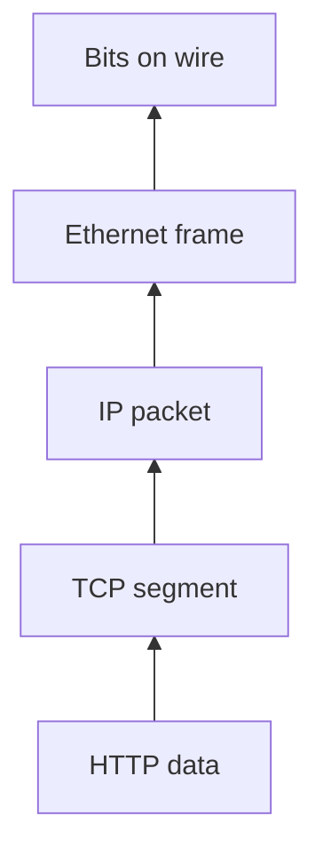

---

### De-encapsulation

On the receiver side:

1. **Network access layer** removes MAC header
2. **Internet layer** removes IP header
3. **Transport layer** removes TCP header
4. **Application layer** receives original data

This process is called **de-encapsulation**.

---

### OSI vs TCP/IP

| | OSI Model | TCP/IP Model |
|---|-----------|--------------|
| Layers | 7 layers | 4 layers |
| Nature | Theoretical model — used for learning networking concepts | Practical model — actually used on the Internet |

| OSI | TCP/IP |
|-----|--------|
| Layer 7, 6, 5 (Application, Presentation, Session) | **Application Layer** |
| Layer 4 (Transport) | **Transport Layer** |
| Layer 3 (Network) | **Internet Layer** |
| Layer 2 + Layer 1 (Data Link + Physical) | **Network Access Layer** |

---

## 1.3 TCP Handshake

Before a client and server can exchange any data, they must establish a TCP connection.

The **TCP three-way handshake** is the process used to:

1. Verify both sides are reachable
2. Exchange Initial Sequence Numbers (ISN)
3. Negotiate TCP options and capabilities
4. Allocate resources for the connection

Only after the handshake completes can application data flow.

---

### Why do we need a handshake?

Imagine making a phone call.

```text
You:     "Hello, can you hear me?"
Friend:  "Yes, I can hear you."
You:     "Great, let's talk."
```

Similarly, TCP first verifies that both client and server can communicate before sending actual data.

---

### Step 1 — SYN

**Client sends:**

```text
SYN
Seq = 1000
```

**Meaning:**

```text
Hello Server,
I want to establish a TCP connection.
My starting sequence number is 1000.
```

**State:**

| Side | State |
|------|-------|
| Client | `SYN_SENT` |
| Server | `LISTEN` |

---

### Step 2 — SYN-ACK

**Server responds:**

```text
SYN + ACK
Seq = 5000
Ack = 1001
```

**Meaning:**

```text
I received your SYN.
My starting sequence number is 5000.
I expect your next byte starting from 1001.
```

**State:**

| Side | State |
|------|-------|
| Client | `SYN_SENT` |
| Server | `SYN_RECEIVED` |

---

### Step 3 — ACK

**Client sends:**

```text
ACK
Ack = 5001
```

**Meaning:**

```text
I received your sequence number.
I expect your next byte starting from 5001.
```

**State:**

| Side | State |
|------|-------|
| Client | `ESTABLISHED` |
| Server | `ESTABLISHED` |

Connection is now fully open.

---

### Visual flow

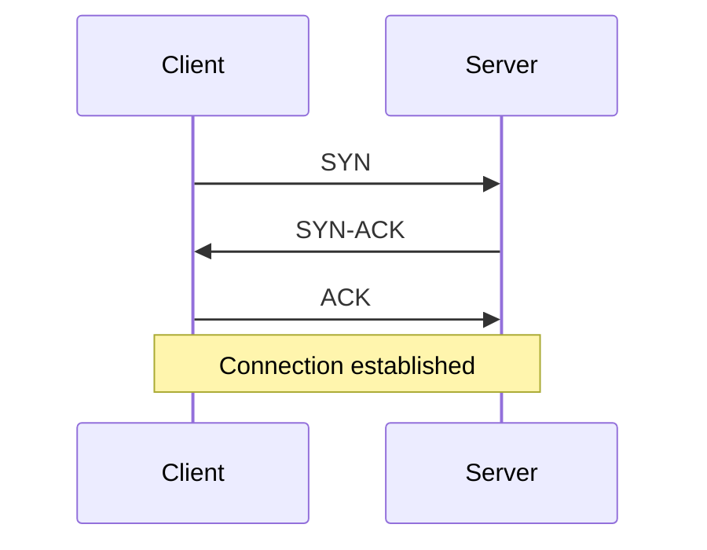

---

### What is Initial Sequence Number (ISN)?

Every TCP connection starts with a random sequence number.

**Example:**

```text
Client ISN = 1000
Server ISN = 5000
```

TCP uses sequence numbers to:

- Track transmitted bytes
- Detect missing packets
- Detect duplicate packets
- Reorder packets
- Acknowledge received data

Without sequence numbers, TCP reliability would not be possible.

---

### Why sequence numbers are important

Suppose packets arrive like this:

```text
Packet 1
Packet 3
Packet 2
```

**Without sequence numbers:** Receiver cannot determine correct order.

**With sequence numbers:**

```text
Seq = 1000
Seq = 1001
Seq = 1002
```

Receiver can correctly reorder the packets.

---

### What is Acknowledgement (ACK)?

ACK means: *"I successfully received the data."*

**Example:**

Client sends:

```text
Seq = 1000
Length = 100 bytes
```

Server replies:

```text
Ack = 1100
```

**Meaning:** *"I received everything up to byte 1099. Please send byte 1100 next."*

ACKs are the foundation of TCP reliability.

---

### What happens if a packet is lost?

**Example:**

```text
Packet 1000 → Received
Packet 1001 → Lost
Packet 1002 → Received
```

Receiver sends:

```text
Ack = 1001
```

**Meaning:** *"I am still waiting for packet 1001."*

Sender retransmits packet 1001. This mechanism guarantees reliable delivery.

---

### TCP options negotiated during handshake

The handshake is not only for connection establishment. Client and server also exchange supported capabilities.

#### MSS (Maximum Segment Size)

Defines maximum payload size per TCP packet.

**Example:** `MSS = 1460 bytes`

**Purpose:** Avoid fragmentation and improve efficiency.

#### Window scaling

Allows larger TCP receive windows.

**Important for:** High bandwidth networks, long-distance communication, cloud environments

Without window scaling, TCP throughput becomes limited.

#### SACK (Selective Acknowledgement)

**Example:**

```text
Received: 1, 2, 4, 5
Missing:  3
```

**Without SACK:** Sender may retransmit 3, 4, 5

**With SACK:** Receiver says *"I already have 4 and 5. Only resend 3."*

**Result:** Less network traffic and faster recovery.

#### Timestamps

Used for:

- RTT measurement
- Better retransmission decisions
- Detecting old packets

#### TCP Fast Open

**Normal TCP:** Handshake first → data second

**TCP Fast Open:** Client may send data with SYN

**Benefit:** Saves approximately one RTT

---

### TCP state transitions

**Client side:**

```text
CLOSED
  |
  V
SYN_SENT
  |
  V
ESTABLISHED
  |
  V
FIN_WAIT
  |
  V
TIME_WAIT
  |
  V
CLOSED
```

**Server side:**

```text
LISTEN
  |
  V
SYN_RECEIVED
  |
  V
ESTABLISHED
  |
  V
CLOSE_WAIT
  |
  V
CLOSED
```

#### Important states

| State | Meaning |
|-------|---------|
| **LISTEN** | Server waiting for incoming connections (e.g. web server on port 443) |
| **SYN_SENT** | Client sent SYN and is waiting for response |
| **SYN_RECEIVED** | Server received SYN and sent SYN-ACK; waiting for final ACK |
| **ESTABLISHED** | Connection fully open; application data can flow |
| **TIME_WAIT** | Connection closed but temporarily retained — prevents delayed packets from affecting future connections |

---

### Connection termination (four-way handshake)

| Opening a connection | Closing a connection |
|----------------------|------------------------|
| SYN | FIN |
| SYN-ACK | ACK |
| ACK | FIN |
| | ACK |

#### Closing process

| Step | Message | Meaning |
|------|---------|---------|
| 1 | Client → **FIN** | "I am done sending data." |
| 2 | Server → **ACK** | "I received your FIN." (Server may still send remaining data.) |
| 3 | Server → **FIN** | "I am done sending data too." |
| 4 | Client → **ACK** | "I received your FIN." Connection closed. |

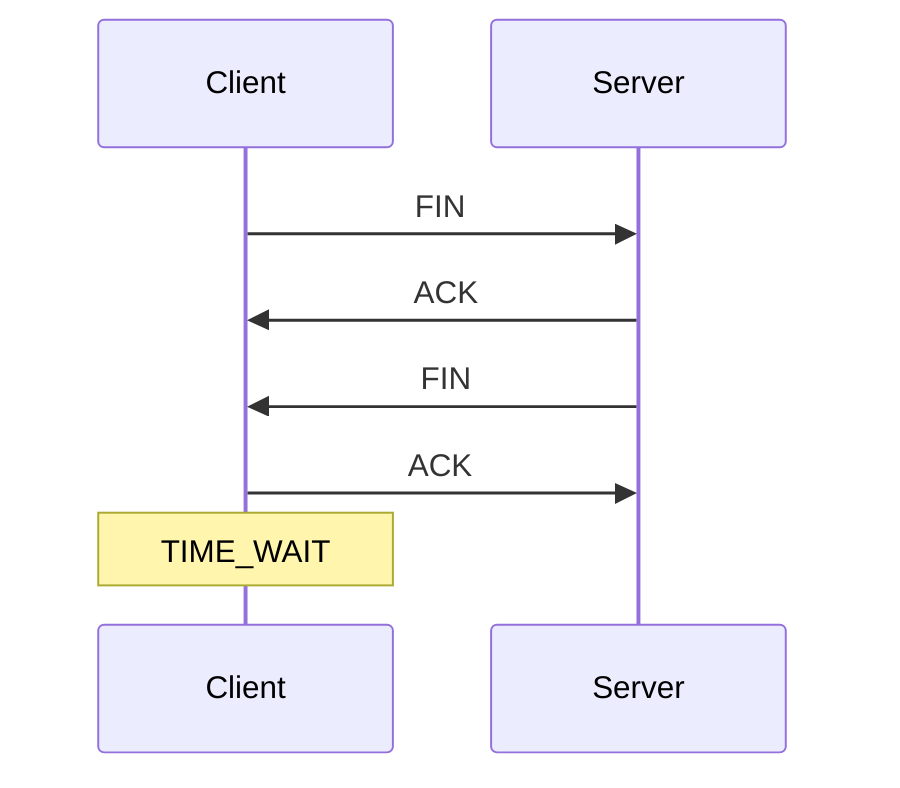

---

### What is TIME_WAIT?

After the final ACK is sent, the active closer enters **TIME_WAIT**.

**Typical duration:** 60–120 seconds

**Purpose:**

1. Ensure final ACK reaches peer
2. Prevent delayed packets from entering future connections

#### Why TIME_WAIT exists

Imagine:

1. Connection A closes
2. A delayed packet from Connection A is still traveling through the network
3. Immediately after closing, Connection B starts using the same ports

**Without TIME_WAIT:** Old packet may enter the new connection → data corruption

**TIME_WAIT prevents this.**

---

### What are ephemeral ports?

Temporary client-side ports assigned by the operating system.

**Examples:** `49152`, `52344`, `60001`

```text
Client:  10.0.0.1:52344
Server:  10.0.0.2:443

52344 is the ephemeral port.
```

#### Ephemeral port exhaustion

Suppose:

```text
Available ephemeral ports = 28,000
TIME_WAIT duration        = 60 seconds

Maximum sustainable new connections:
28,000 / 60 ≈ 466 connections/sec
```

Beyond this, the system may fail to create new connections.

**Typical error:** `Cannot assign requested address`

---

### What is a SYN flood attack?

Attacker repeatedly sends:

```text
SYN
SYN
SYN
SYN
```

But never sends the final ACK.

Server keeps waiting in `SYN_RECEIVED`. Thousands of half-open connections consume memory and resources. Eventually legitimate users cannot connect.

#### What are SYN cookies?

Defense against SYN flood attacks.

**Normal behavior:** Server allocates memory after receiving SYN.

**With SYN cookies:** Server stores no state initially. Connection information is encoded inside the SYN-ACK sequence number. Memory is allocated only after receiving the final ACK.

**Benefit:** Protects server resources during SYN flood attacks.

---

### SYN queue vs accept queue

Common system design interview question.

#### SYN queue

**Contains:** Half-open connections

**State:** `SYN_RECEIVED` — handshake not completed yet

#### Accept queue

**Contains:** Fully established connections

**State:** `ESTABLISHED` — waiting for application to call `accept()`

#### Example

Handshake completed → connection established → application thread is busy → connection waits in **accept queue** until application accepts it.

---

### Why keep-alive exists

**Without keep-alive:**

```text
Request 1 → New TCP connection
Request 2 → New TCP connection
Request 3 → New TCP connection
```

Every request pays handshake cost.

**With keep-alive:**

```text
One TCP connection

Request 1
Request 2
Request 3

Connection reused.
```

**Benefits:** Lower latency, lower CPU usage, fewer handshakes

---

### Why connection pooling exists

**Used by:** Databases, microservices, HTTP clients

**Bad:**

```text
Open TCP → Execute Query → Close TCP
(repeated thousands of times)
```

**Good:**

```text
Create 10–50 TCP connections
Reuse them repeatedly
```

**Benefits:** Reduced latency, reduced CPU overhead, better throughput, fewer connection storms

---

### Common interview questions

| Question | Answer |
|----------|--------|
| Why is the first API request slower? | DNS lookup, TCP handshake, and TLS handshake all happen before application processing starts |
| Why use connection pooling? | Avoid repeated TCP handshakes and reduce latency |
| Why use keep-alive? | Reuse existing TCP connections |
| What is SYN flood? | Attack that creates massive half-open TCP connections |
| Difference between SYN queue and accept queue? | **SYN queue:** handshake not completed. **Accept queue:** handshake completed but application not yet accepted |
| Why does TIME_WAIT exist? | Prevent delayed packets from corrupting future connections and ensure reliable connection closure |

---

### Memory trick

```text
TCP OPEN
  SYN
  SYN-ACK
  ACK
(3 packets)

TCP CLOSE
  FIN
  ACK
  FIN
  ACK
(4 packets)

SYN Queue    = Half-open connections
Accept Queue = Fully open connections waiting for application
TIME_WAIT    = Safety waiting period before final cleanup
```

---

## 1.4 UDP

**UDP (User Datagram Protocol)** is a lightweight transport layer protocol that focuses on **speed** rather than reliability.

Unlike TCP, UDP does not establish a connection before sending data.

| | TCP | UDP |
|---|-----|-----|
| Focus | Reliable but slower | Fast but unreliable |

---

### TCP vs UDP

#### TCP

- Connection-oriented
- Uses 3-way handshake
- Guarantees delivery
- Guarantees packet ordering
- Retransmits lost packets
- Higher overhead
- More latency

**Examples:** HTTP, HTTPS, database connections, file transfers

#### UDP

- Connectionless
- No handshake
- No delivery guarantee
- No ordering guarantee
- No retransmission
- Very low overhead
- Lower latency

**Examples:** Video streaming, voice calls, online gaming, DNS

---

### How UDP works

Client sends:

```text
Packet A
Packet B
Packet C
```

UDP simply sends the packets. It does **not** check:

- Whether packets arrived
- Whether packets arrived in order
- Whether packets were lost

**UDP's philosophy:** *"I sent the packet. My job is done."*

---

### Why is UDP faster?

TCP performs many extra operations:

- Connection establishment
- ACK processing
- Packet ordering
- Retransmissions
- Flow control
- Congestion control

UDP skips all of these.

**Result:** Less CPU usage, less memory usage, lower latency, higher throughput

---

### No handshake

**TCP:**

```text
SYN → SYN-ACK → ACK
(then data transfer starts)
```

**UDP:**

```text
Send packet
```

That's it. No connection setup cost.

---

### No acknowledgements

**TCP:**

```text
Sender:   Packet 1000
Receiver: ACK 1001
```

Sender knows packet arrived.

**UDP:**

```text
Sender: Packet 1000
(no ACK — sender never knows whether packet arrived)
```

---

### No retransmission

**TCP:** Lost packet → sender retransmits

**UDP:** Lost packet → packet is gone forever. No retransmission occurs.

---

### No ordering guarantee

Suppose sender transmits: Packet 1, Packet 2, Packet 3

Receiver may receive: Packet 2, Packet 3, Packet 1

UDP does not fix the order. Application must handle ordering if needed.

---

### Why would anyone use UDP?

Because in some situations **speed is more important than perfect reliability**.

**Example — video call:**

If one video frame is lost:

- **Bad:** Wait for retransmission
- **Good:** Skip the frame and continue

Humans usually won't notice a single missing frame. But they **will** notice a 2-second delay.

---

### Use case: Online gaming

Player position updates:

```text
Player A: X = 100
Next:     X = 101
Next:     X = 102
```

If update 101 is lost, latest update (102) is enough. Retransmitting old position data is often useless. Therefore UDP is preferred.

---

### Use case: Video streaming

Imagine watching a live cricket match.

If one frame is lost:

- **Better:** Skip frame and continue
- **Worse:** Pause video waiting for retransmission

This is why many streaming technologies use UDP internally.

---

### Use case: Voice calls

During a call: Packet 1, Packet 2, Packet 3

If Packet 2 is lost, most users prefer:

```text
Packet 1 → (small audio gap) → Packet 3
```

Rather than: pause conversation and wait for retransmission.

Therefore UDP is preferred.

---

### Use case: DNS

When browser requests `google.com`, DNS request is typically sent using UDP.

**Reason:** Request is very small. Response is very small. Using TCP handshake would add unnecessary overhead.

---

### UDP header

UDP header is very small. Only contains:

- Source port
- Destination port
- Length
- Checksum

**Size:** 8 bytes

**TCP header:** Minimum 20 bytes (often larger because of options)

**Result:** UDP packets have lower protocol overhead.

---

### UDP ports

Like TCP, UDP also uses ports.

| Port | Service |
|------|---------|
| 53 | DNS |
| 67 | DHCP |
| 68 | DHCP client |
| 123 | NTP |
| 161 | SNMP |

**Example:**

```text
192.168.1.10:54321
              |
           UDP port
```

---

### Does UDP have flow control?

**No.**

TCP automatically slows down when receiver or network is overloaded. UDP does not.

If sender sends too fast, receiver may drop packets. Application must handle this.

---

### Does UDP have congestion control?

**No.**

TCP adjusts transmission rate based on network conditions. UDP sends packets regardless of congestion.

Applications using UDP often implement their own congestion handling.

---

### Can UDP be made reliable?

**Yes.** Applications can implement reliability themselves.

Add:

- Sequence numbers
- ACKs
- Retransmissions
- Ordering logic

Many modern protocols do exactly this.

**Examples:** QUIC, RTP, custom gaming protocols

---

### QUIC (important interview topic)

**HTTP/3 uses QUIC.** QUIC runs on top of UDP.

**Why?** UDP allows protocol innovation without changing operating systems.

QUIC adds:

- Reliability
- Encryption
- Multiplexing
- Faster connection setup

**Result:** HTTP/3 is built on UDP rather than TCP.

---

### When to use TCP

Use TCP when **data loss is unacceptable**.

**Examples:** Banking, payments, databases, file transfers, REST APIs, microservices

**Rule:** Reliability > speed

---

### When to use UDP

Use UDP when **low latency is more important than perfect reliability**.

**Examples:** Video streaming, voice calls, online gaming, DNS, live broadcasting

**Rule:** Speed > reliability

---

### Interview takeaways

| TCP | UDP |
|-----|-----|
| Reliable | Fast |
| Ordered | Lightweight |
| Connection-oriented | Connectionless |
| Uses handshake | No handshake |
| Retransmits lost packets | No delivery guarantee, no retransmission |

**Use TCP when** correctness is critical.

**Use UDP when** latency is critical.

---

### Memory trick

```text
TCP: "Did you receive it?"
UDP: "I sent it."

TCP: Reliability first
UDP: Speed first
```

---

## 1.5 MTU

**MTU (Maximum Transmission Unit)** is the maximum amount of data that can be transmitted in a single network packet over a network interface without fragmentation.

In simple words: MTU defines the **largest packet size** that can travel through a network in one piece.

---

### Simple analogy

Imagine a road that allows trucks carrying a maximum load of 1000 kg.

| Shipment | Result |
|----------|--------|
| 800 kg | One truck is enough |
| 1500 kg | Shipment must be split across multiple trucks |

Similarly:

| Data size | Result |
|-----------|--------|
| Data size ≤ MTU | One packet |
| Data size > MTU | Data must be fragmented into multiple packets |

---

### Common MTU values

| Network | MTU |
|---------|-----|
| Ethernet | 1500 bytes |
| Jumbo frames | 9000 bytes |
| PPPoE | 1492 bytes |
| VPN networks | Often 1300–1400 bytes |
| Cloud networks | Typically 1500 bytes |

---

### What does MTU include?

MTU refers to the **entire IP packet size**.

**Example:** MTU = 1500 bytes

Inside those 1500 bytes:

```text
IP Header     = 20 bytes
TCP Header    = 20 bytes
Payload       = 1460 bytes

Total: 20 + 20 + 1460 = 1500 bytes
```

---

### MTU vs MSS

Many people confuse MTU and MSS.

| | MTU | MSS (Maximum Segment Size) |
|---|-----|----------------------------|
| Meaning | Maximum IP packet size | Maximum TCP payload size |
| Includes | Entire packet (headers + data) | Actual application data only |

**Formula:**

```text
MSS = MTU - IP Header - TCP Header
```

**Example:**

```text
MTU         = 1500
IP Header   = 20 bytes
TCP Header  = 20 bytes
MSS         = 1460 bytes
```

---

### Visual representation

```text
MTU = 1500 bytes

+--------------------+
| IP Header  20B     |
+--------------------+
| TCP Header 20B     |
+--------------------+
| Payload    1460B   |
+--------------------+

Total = 1500 bytes
```

---

### What happens when data is larger than MTU?

Suppose MTU = 1500 bytes and application sends 5000 bytes.

Network cannot send 5000 bytes as a single packet. It must split the data.

**Example:**

```text
Packet 1 = 1500 bytes
Packet 2 = 1500 bytes
Packet 3 = 1500 bytes
Packet 4 = remaining bytes
```

This process is called **fragmentation**.

---

### What is fragmentation?

Fragmentation means breaking a large packet into smaller packets so that each packet fits within the MTU limit.

**Example:**

```text
Original packet: 4000 bytes
MTU:             1500 bytes

Result:
  Fragment 1
  Fragment 2
  Fragment 3
```

Receiver later reassembles them.

---

### Why is fragmentation bad?

Fragmentation introduces:

- Additional CPU overhead
- Additional memory usage
- More network overhead
- Higher latency
- Higher packet loss probability

**Example:**

| | Packets |
|---|---------|
| Original | 1 packet |
| After fragmentation | 3 packets |

If even **one fragment** is lost, the entire packet may need retransmission.

Therefore fragmentation is generally avoided.

---

### Path MTU

Data usually travels through multiple networks.

```text
Laptop → Wi-Fi router → ISP → Internet → Cloud server
```

Each network may support a different MTU.

**Example:**

```text
Network A = 1500
Network B = 1400
Network C = 1300

Effective MTU = 1300
```

Because packets must fit through every network segment. This smallest supported MTU is called **path MTU**.

---

### Path MTU Discovery (PMTUD)

**Purpose:** Discover the largest packet size that can travel through the entire network path without fragmentation.

**How it works:**

1. Sender initially sends large packets
2. If a router cannot forward them, router responds: *"Packet too big"*
3. Sender reduces packet size
4. Eventually sender finds the optimal MTU

This process is called **Path MTU Discovery (PMTUD)**.

#### Example

```text
Client MTU        = 1500
Server MTU        = 1500
Intermediate VPN  = 1400

Client sends 1500-byte packet → VPN cannot forward it
Router responds: Packet too big
Client reduces to 1400-byte packet → transmission succeeds
```

---

### Why MTU matters in system design

#### Large MTU

| Pros | Cons |
|------|------|
| Fewer packets | Larger retransmissions |
| Less protocol overhead | Higher impact if packet is lost |
| Better throughput | |

#### Small MTU

| Pros | Cons |
|------|------|
| Less impact from packet loss | More packets |
| Better compatibility | More headers, more CPU overhead |

---

### Jumbo frames

| | Standard Ethernet | Jumbo frames |
|---|-------------------|--------------|
| MTU | 1500 bytes | 9000 bytes |

**Benefits:** Fewer packets, lower CPU overhead, higher throughput

**Commonly used in:** Data centers, storage networks, high-speed internal networks

**Requirement:** Every device on the path must support jumbo frames.

---

### Real-world example

Suppose application needs to send **1 MB** of data.

| MTU | Effect |
|-----|--------|
| 1500 bytes | Many packets required |
| 9000 bytes | Much fewer packets required |

**Result with jumbo frames:** Lower CPU usage, better throughput, higher efficiency

---

### Common interview questions

| Question | Answer |
|----------|--------|
| What is MTU? | Maximum packet size that can be transmitted without fragmentation |
| What is MSS? | Maximum TCP payload size. `MSS = MTU - IP Header - TCP Header` |
| Difference between MTU and MSS? | **MTU:** entire IP packet size. **MSS:** actual TCP payload size |
| Why is fragmentation bad? | More packets, more overhead, higher latency, higher packet loss risk |
| What is path MTU? | Smallest MTU supported across the entire network path |
| What is PMTUD? | Mechanism to discover the largest packet size that can travel without fragmentation |

---

### Memory trick

```text
MTU = Maximum packet size
MSS = Maximum TCP payload size

MTU = 1500
MSS = 1460

MTU includes headers
MSS excludes headers

Large MTU  = better throughput
Small MTU  = better compatibility
```

---

## 1.6 IP Addressing/Subnetting

**IP (Internet Protocol) address** is a logical address assigned to a device on a network.

**Purpose:**

- Identify a device uniquely within a network
- Allow devices to communicate
- Help routers forward packets to the correct destination

**Think of it as:**

- **House address** = IP address
- Without a house address, a courier cannot deliver a package
- Without an IP address, data cannot reach a device

---

### IP address structure (IPv4)

**IPv4 address = 32 bits**

**Example:** `192.168.1.10`

**Actually stored as:**

```text
11000000.10101000.00000001.00001010
```

IPv4 consists of 4 octets:

```text
192 . 168 . 1 . 10
 |     |    |    |
8bit  8bit 8bit 8bit

Total: 8 + 8 + 8 + 8 = 32 bits
```

---

### Public vs private IP

#### Public IP

- Used on the Internet
- Must be globally unique
- **Example:** `8.8.8.8`
- Public IPs are assigned by ISPs

#### Private IP

- Used inside internal networks
- Not routable on the Internet

**Private ranges:**

| Range |
|-------|
| `10.0.0.0` – `10.255.255.255` |
| `172.16.0.0` – `172.31.255.255` |
| `192.168.0.0` – `192.168.255.255` |

**Examples:** `192.168.1.10`, `10.0.0.5`

Most home Wi-Fi networks use private IPs.

---

### Why do we need subnetting?

Suppose a company has **5000 employees**.

**Without subnetting:** Everyone belongs to one huge network.

**Problems:**

- Too much broadcast traffic
- Poor performance
- Harder management
- Security challenges

**Solution:** Divide one large network into smaller networks. This process is called **subnetting**.

---

### What is a subnet?

**Subnet** = sub network — a smaller network created from a larger network.

**Example — company network `192.168.0.0/16` divided into:**

| Department | Subnet |
|------------|--------|
| HR | `192.168.1.0/24` |
| Finance | `192.168.2.0/24` |
| IT | `192.168.3.0/24` |
| Sales | `192.168.4.0/24` |

Each department gets its own network.

---

### Network part vs host part

Every IP address consists of:

```text
Network portion + Host portion
```

**Example:** `192.168.1.10/24`

| Part | Value |
|------|-------|
| Network | `192.168.1` |
| Host | `10` |

**Meaning:** Network = which network? Host = which device inside that network?

---

### What is a subnet mask?

Subnet mask determines which bits belong to **network** and which belong to **host**.

**Example:**

```text
IP Address:    192.168.1.10
Subnet Mask:   255.255.255.0

Binary:
11111111.11111111.11111111.00000000

First 24 bits = Network
Last 8 bits   = Host
```

---

### CIDR notation

**Example:** `192.168.1.0/24` means 24 bits for network, 8 bits for hosts.

**CIDR** = Classless Inter-Domain Routing

Instead of writing `255.255.255.0`, we write `/24`.

| Subnet mask | CIDR |
|-------------|------|
| `255.0.0.0` | `/8` |
| `255.255.0.0` | `/16` |
| `255.255.255.0` | `/24` |
| `255.255.255.128` | `/25` |

CIDR simply tells how many bits belong to the network.

---

### Most common CIDR blocks

#### /8

```text
Network bits = 8
Host bits    = 24
Total addresses = 2^24 = 16,777,216
```

#### /16

```text
Network bits = 16
Host bits    = 16
Total addresses = 2^16 = 65,536
```

#### /24

```text
Network bits = 24
Host bits    = 8
Total addresses = 2^8 = 256
Usable hosts    = 254
```

---

### Why only 254 usable hosts in /24?

**Example:** `192.168.1.0/24`

**Total addresses:** 256

**Reserved:**

| Address | Role |
|---------|------|
| `192.168.1.0` | Network address |
| `192.168.1.255` | Broadcast address |

**Usable:** `192.168.1.1` to `192.168.1.254` → **254 hosts**

---

### Network address

First address of subnet.

**Example:** `192.168.1.0/24` → network address is `192.168.1.0`

Represents the entire network. Cannot be assigned to devices.

---

### Broadcast address

Last address of subnet.

**Example:** `192.168.1.0/24` → broadcast address is `192.168.1.255`

Used to send packets to all devices in the subnet. Cannot be assigned to devices.

---

### How to calculate hosts?

**Formula:**

```text
2^(Host Bits) - 2
```

**Why minus 2?** One network address + one broadcast address.

| CIDR | Host bits | Calculation | Usable hosts |
|------|-----------|-------------|--------------|
| /24 | 8 | 2^8 - 2 = 256 - 2 | **254** |
| /25 | 7 | 2^7 - 2 = 128 - 2 | **126** |
| /26 | 6 | 2^6 - 2 = 64 - 2 | **62** |

---

### Common CIDR interview values

| CIDR | Addresses | Usable hosts |
|------|-----------|--------------|
| /24 | 256 | 254 |
| /25 | 128 | 126 |
| /26 | 64 | 62 |
| /27 | 32 | 30 |
| /28 | 16 | 14 |
| /29 | 8 | 6 |

---

### Subnetting example

**Network:** `192.168.1.0/24`  
**Need:** 4 subnets → borrow 2 host bits → new CIDR: **/26**

#### Subnet 1 — `192.168.1.0/26`

```text
Hosts:     192.168.1.1  to  192.168.1.62
Broadcast: 192.168.1.63
```

#### Subnet 2 — `192.168.1.64/26`

```text
Hosts:     192.168.1.65  to  192.168.1.126
Broadcast: 192.168.1.127
```

#### Subnet 3 — `192.168.1.128/26`

```text
Hosts:     192.168.1.129  to  192.168.1.190
Broadcast: 192.168.1.191
```

#### Subnet 4 — `192.168.1.192/26`

```text
Hosts:     192.168.1.193  to  192.168.1.254
Broadcast: 192.168.1.255
```

---

### Default gateway

Devices communicate outside their subnet through a router.

**Example:**

```text
Laptop:          192.168.1.10
Router:          192.168.1.1
Default Gateway: 192.168.1.1
```

If destination is outside the local network, the packet goes to the router.

---

### Routing example

```text
Source:      192.168.1.10
Destination: 10.0.0.20
```

Different subnet → laptop sends packet to **default gateway** → router forwards packet to destination network.

---

### Why subnetting is important

**Benefits:**

- Reduces broadcast traffic
- Improves performance
- Better security isolation
- Easier network management
- Efficient IP allocation

---

### Cloud example (AWS / Azure / GCP)

```text
VPC: 10.0.0.0/16

Subnets:
  10.0.1.0/24   Public subnet
  10.0.2.0/24   Public subnet
  10.0.10.0/24  Private subnet
  10.0.20.0/24  Database subnet
```

This is subnetting in real-world cloud environments.

---

### Common interview questions

| Question | Answer |
|----------|--------|
| What is an IP address? | Logical address used to identify devices on a network |
| What is a subnet? | A smaller network created from a larger network |
| What is CIDR? | Notation representing network bits (e.g. `/24` = first 24 bits are network bits) |
| Difference between public and private IP? | **Public:** Internet routable. **Private:** internal network only |
| How many hosts in /24? | 2^(32-24) - 2 = **254 hosts** |
| How many hosts in /26? | 2^(32-26) - 2 = **62 hosts** |
| What is network address? | First address of subnet |
| What is broadcast address? | Last address of subnet |
| What is default gateway? | Router used to reach other networks |

---

### Memory trick

```text
IP Address      = House address
Subnet          = Neighborhood
Network Address = Neighborhood name
Host Address    = House number
Router          = Road connecting neighborhoods
CIDR            = How much of IP belongs to network

Host formula: 2^(Host Bits) - 2

/24 = 254 hosts
/25 = 126 hosts
/26 = 62 hosts
```

---

## 1.7 CIDR

**CIDR (Classless Inter-Domain Routing)** is a method used to define how many bits of an IP address belong to the **network** portion and how many belong to the **host** portion.

CIDR was introduced to solve the inefficiency and wastage of IP addresses caused by the older Class A, B, and C networking system.

Today, almost all modern networks use CIDR.

---

### Why CIDR was introduced

Before CIDR, networks used fixed classes.

| Class | Subnet mask | CIDR | Hosts |
|-------|-------------|------|-------|
| A | `255.0.0.0` | `/8` | 16,777,214 |
| B | `255.255.0.0` | `/16` | 65,534 |
| C | `255.255.255.0` | `/24` | 254 |

**Problem:** Suppose a company needs **1000 IP addresses**.

| Class | Issue |
|-------|-------|
| Class C | 254 hosts — too small |
| Class B | 65,534 hosts — too large |

Huge waste of IP addresses.

**CIDR solved this** by allowing flexible network sizes.

---

### How CIDR works

CIDR uses the format:

```text
IP Address / Prefix Length
```

**Example:** `192.168.1.0/24`

| Part | Value |
|------|-------|
| IP address | `192.168.1.0` |
| Network bits | 24 |
| Host bits | 32 - 24 = **8** |

---

### Understanding `/24`

**IPv4 address = 32 bits**

**Example:** `192.168.1.10`

**Binary:**

```text
11000000.10101000.00000001.00001010
```

**CIDR `/24` means:**

- First **24 bits** belong to network
- Last **8 bits** belong to host

**Visualization — `192.168.1.10/24`:**

| Portion | Value |
|---------|-------|
| Network | `192.168.1` |
| Host | `10` |

---

### CIDR vs subnet mask

CIDR and subnet mask represent the **same thing**.

| CIDR | Subnet mask |
|------|-------------|
| `/24` | `255.255.255.0` |
| `/16` | `255.255.0.0` |
| `/8` | `255.0.0.0` |

---

### Common CIDR values

| CIDR | Subnet mask | Usable hosts |
|------|-------------|--------------|
| /8 | `255.0.0.0` | 16,777,214 |
| /16 | `255.255.0.0` | 65,534 |
| /24 | `255.255.255.0` | 254 |
| /25 | `255.255.255.128` | 126 |
| /26 | `255.255.255.192` | 62 |
| /27 | `255.255.255.224` | 30 |
| /28 | `255.255.255.240` | 14 |
| /29 | `255.255.255.248` | 6 |
| /30 | `255.255.255.252` | 2 |

---

### Why is CIDR important?

CIDR allows networks to allocate **exactly** the number of IPs they need.

**Example — need 500 IPs:**

| Approach | Allocation | Hosts |
|----------|------------|-------|
| Old way | `/16` | 65,534 — wasteful |
| CIDR | `/23` | 510 — much more efficient |

---

### CIDR aggregation (supernetting)

CIDR is also used to combine multiple networks into a single route.

**Four networks:**

```text
192.168.0.0/24
192.168.1.0/24
192.168.2.0/24
192.168.3.0/24
```

**Can be summarized as:**

```text
192.168.0.0/22
```

**Benefits:** Smaller routing tables, faster routing decisions, less memory consumption

---

### Why route aggregation matters

Imagine the Internet.

**Without aggregation:** Millions of individual routes — routers would require enormous routing tables.

**With CIDR aggregation:** Many smaller routes become one larger route.

**Result:** Better scalability of the Internet.

---

### CIDR in cloud (AWS / Azure / GCP)

Very common interview topic.

**Example VPC:** `10.0.0.0/16` → **65,534** hosts

**Create subnets:**

| Subnet | Purpose |
|--------|---------|
| `10.0.1.0/24` | Application servers |
| `10.0.2.0/24` | API servers |
| `10.0.10.0/24` | Databases |
| `10.0.20.0/24` | Cache layer |

CIDR determines how many IPs are available in each subnet.

---

### Interview questions

| Question | Answer |
|----------|--------|
| What is CIDR? | Notation to define network and host portions (e.g. `192.168.1.0/24`) |
| What does `/24` mean? | 24 bits = network, 8 bits = hosts |
| Why was CIDR introduced? | To replace inefficient Class A/B/C allocation |
| Difference between CIDR and subnet mask? | Same concept, different representation (`/24` = `255.255.255.0`) |
| How many hosts in `/24`? | **254** |
| How many hosts in `/26`? | **62** |
| What is CIDR aggregation? | Combining multiple networks into one summarized route |
| Why is CIDR important in cloud networking? | Controls VPC and subnet sizes |

---

### Memory trick

```text
CIDR = How many bits belong to the network

/8  = Large network
/16 = Medium network
/24 = Small network

More network bits = smaller number of hosts
Less network bits = larger number of hosts

Formula: Hosts = 2^(32 - CIDR) - 2

/24 = 254 hosts
/25 = 126 hosts
/26 = 62 hosts
/27 = 30 hosts

CIDR = Flexible IP allocation + route aggregation
```

---

## 1.8 DNS

**DNS (Domain Name System)** is the Internet's phonebook.

Its primary job is to translate a human-readable domain name into an IP address.

**Example:**

```text
google.com  →  142.250.xxx.xxx
```

Humans remember names. Computers communicate using IP addresses. DNS acts as the translator between the two.

---

### Why do we need DNS?

Imagine if DNS did not exist. To visit Google, you would need to remember `142.250.193.78`. To visit YouTube: `142.250.193.110`. To visit Amazon: `54.239.28.85`.

This would be extremely difficult.

Instead, we use:

```text
google.com
youtube.com
amazon.com
```

DNS converts these names into IP addresses.

---

### Simple analogy

Suppose you want to call a friend.

You know: **Hareram**  
But your phone needs: **+91XXXXXXXXXX**

```text
Phone contact list:

Hareram  →  +91XXXXXXXXXX
```

Similarly:

```text
google.com  →  142.250.xxx.xxx
```

DNS works like a contact book for the Internet.

---

### DNS hierarchy

```text
                Root (.)
                     |
         -------------------------
         |           |           |
        .com        .org        .net
         |
     google.com
         |
    DNS Records
```

This hierarchical structure allows DNS to scale globally.

Four server roles exist in the system — **recursive resolver**, **root**, **TLD**, and **authoritative**.

---

### Common DNS record types

#### A record

Maps domain name to **IPv4** address.

```text
google.com = 142.250.193.78
```

#### AAAA record

Maps domain name to **IPv6** address.

```text
google.com = 2404:6800:4007::200e
```

#### CNAME record

Alias record.

```text
www.google.com  →  google.com
```

Useful when multiple names point to the same service.

#### MX record

**Mail Exchange** record — defines mail servers.

```text
gmail.com  →  MX: mail.google.com
```

Used for email delivery.

#### TXT record

Stores text-based information.

**Common uses:** SPF, DKIM, domain verification

#### NS record

**Name Server** record — specifies authoritative DNS servers.

```text
google.com  →  ns1.google.com, ns2.google.com
```

---

### What is DNS caching?

DNS lookups are expensive. To improve performance, results are cached.

**Caching locations:** Browser, operating system, resolver

**Benefits:** Faster lookups, lower latency, reduced DNS traffic

---

### TTL (Time To Live)

Every DNS record has **TTL**.

**Example:** `TTL = 300 seconds` → cache this result for **5 minutes**. After expiration, perform lookup again.

---

### DNS over UDP

Most DNS queries use **UDP port 53**.

**Reason:** Small request, small response — faster than TCP.

---

### When does DNS use TCP?

Used when:

- Response is too large
- Zone transfer occurs
- DNSSEC responses are large

**Port:** TCP 53

---

### DNS and CDN

Modern CDNs use DNS heavily.

| User location | `cdn.example.com` resolves to |
|---------------|-------------------------------|
| India | Mumbai CDN server |
| USA | Virginia CDN server |

DNS helps route users to the nearest server.

---

### DNS load balancing

**Example:** `api.company.com`

DNS may return:

```text
10.0.0.1
10.0.0.2
10.0.0.3
```

Traffic distributed across multiple servers. This is called **DNS load balancing**.

---

### Common DNS failures

| Failure | Result |
|---------|--------|
| **DNS server down** | Domain cannot be resolved |
| **Incorrect DNS record** | Traffic routed incorrectly |
| **High TTL** | Changes take longer to propagate |
| **DNS cache poisoning** | Users redirected to malicious sites |

---

## 1.9 DNS Resolution

When you enter `https://google.com`, the browser needs an **IP address**. This section covers **how** that lookup happens — cache by cache, server by server.

---

### DNS resolution flow

User enters:

```text
https://google.com
```

Browser needs an **IP address**. The DNS lookup process begins.

---

### Step-by-step DNS lookup

#### Step 1 — Browser cache

Browser first checks: *"Do I already know Google's IP?"*

If found → return IP immediately. No DNS request needed.

#### Step 2 — Operating system cache

If browser cache misses → check OS DNS cache (Windows DNS cache, Linux DNS cache).

If found → return IP.

#### Step 3 — Local DNS resolver

If OS cache misses → request sent to:

- ISP DNS server, or
- Google DNS (`8.8.8.8`), or
- Cloudflare DNS (`1.1.1.1`)

This is called a **recursive resolver**.

#### Step 4 — Root DNS server

Resolver asks: *"Who knows about `.com` domains?"*

Root server responds: *"I don't know `google.com`, but I know who manages `.com`"* → returns **`.com` TLD name servers**.

#### Step 5 — TLD server

**TLD** = Top Level Domain (`.com`, `.org`, `.net`, `.io`, `.in`)

Resolver asks: *"Who knows `google.com`?"*

TLD responds: *"These are Google's authoritative name servers."*

#### Step 6 — Authoritative name server

Resolver asks: *"What is the IP address of `google.com`?"*

Authoritative server responds:

```text
google.com = 142.250.xxx.xxx
```

#### Step 7 — Return to browser

Resolver caches the result → returns IP to browser → browser connects to `142.250.xxx.xxx` using TCP/UDP.

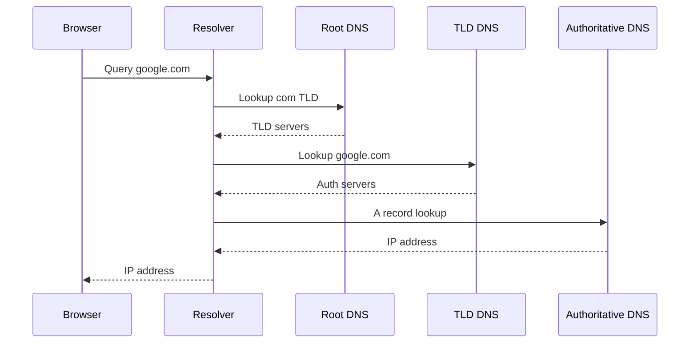

---

### Visual flow

```text
User
 |
Browser Cache
 |
OS Cache
 |
Recursive Resolver
 |
Root DNS
 |
TLD DNS
 |
Authoritative DNS
 |
IP Address Returned
 |
Website Connection
```

---

### Types of DNS servers (in the resolution path)

| Server | Role in resolution |
|--------|-------------------|
| **Recursive resolver** | Receives your query, walks the tree, returns the final answer (Google DNS, Cloudflare, ISP DNS) |
| **Root name server** | Points to the right TLD server (e.g. *"ask `.com` servers"*) |
| **TLD name server** | Points to the domain's authoritative servers |
| **Authoritative name server** | Returns the actual record (A, AAAA, CNAME, etc.) |

---

### CNAME chase

Resolution is not always one hop.

**Example:**

```text
Query: www.example.com
Answer: CNAME www.example.com → cdn.cloudfront.net
Next:  new query for A record of cdn.cloudfront.net → 52.84.x.x
```

Each CNAME in the chain adds another lookup on a full cache miss.

---

### Cache layers and latency

| Cache layer hit? | Typical added latency |
|------------------|----------------------|
| Browser cache | ~0 ms |
| OS cache | ~0–1 ms |
| Recursive resolver cache | ~1–20 ms |
| Full iterative lookup (cache miss) | ~20–150+ ms |

**Worked example:**

```text
T+0s:   Full resolution → ~80 ms (recursive miss)
T+10s:  Same host again → ~0 ms (OS cache hit)
T+400s: TTL expired     → lookup again
```

**Interview point:** Resolution is separate from connection. DNS can succeed and TCP can still fail.

---

### Happy eyeballs (IPv4 vs IPv6)

Modern clients may query both **A** (IPv4) and **AAAA** (IPv6) records and race the connections.

If **AAAA** is published but IPv6 routing is broken, the client may wait hundreds of milliseconds before falling back to IPv4.

---

### Debugging commands

```bash
dig api.example.com              # query via your configured resolver
dig +trace api.example.com       # show full delegation path (iterative)
dig @8.8.8.8 api.example.com   # query a specific recursive resolver
```

**Interview point:** `dig +trace` shows iterative resolution; plain `dig` shows what **your resolver** returns (may be cached).

---

### Common resolution pitfalls

| Pitfall | What happens |
|---------|--------------|
| Long CNAME chain | Extra latency per hop |
| Stale OS cache after DNS change | Laptop still resolves old IP — flush cache or wait TTL |
| Broken AAAA record | Happy eyeballs delay before IPv4 works |
| Resolver timeout | Slow app startup — use async DNS, faster resolver |
| `/etc/hosts` override | Short-circuits network — useful for local dev |

**Runbook — "DNS updated but clients still see old IP":**

1. `dig @authoritative-ns` — is the authoritative server correct?
2. `dig @8.8.8.8` — has the recursive resolver picked it up?
3. `dig` locally — is OS cache stale? Flush if needed.

---

## 1.10 HTTP/HTTPS

### HTTP

**HTTP (Hypertext Transfer Protocol)** is an application-layer, request/response protocol. A client sends a **request** (method, path, headers, optional body); a server returns a **response** (status code, headers, body).

HTTP is **stateless** — each request is independent unless the application adds state (cookies, tokens, server-side sessions).

**Request example (HTTP/1.1):**

```http
GET /api/users/42 HTTP/1.1
Host: api.example.com
Accept: application/json
Authorization: Bearer eyJhbG...
Connection: keep-alive
```

**Response example:**

```http
HTTP/1.1 200 OK
Content-Type: application/json
Cache-Control: private, max-age=60

{"id":42,"name":"Ada"}
```

**HTTP methods:**

| Method | Safe? | Idempotent? | Typical use |
|--------|-------|-------------|-------------|
| **GET** | Yes | Yes | Read resource |
| **POST** | No | No | Create, actions |
| **PUT** | No | Yes | Replace resource |
| **PATCH** | No | No* | Partial update |
| **DELETE** | No | Yes | Remove resource |

**Status code classes:**

| Class | Meaning | Examples |
|-------|---------|----------|
| **2xx** | Success | `200 OK`, `201 Created`, `204 No Content` |
| **3xx** | Redirection | `301`, `302`, `304 Not Modified` |
| **4xx** | Client error | `400`, `401`, `403`, `404`, `429` |
| **5xx** | Server error | `500`, `502`, `503`, `504` |

**Stateless sessions (application layer):**

```text
POST /login  →  200 + Set-Cookie: session=xyz
GET /profile + Cookie: session=xyz  →  server looks up session

HTTP forgot Request 1; the cookie carries identity.
```

---

### HTTPS (HTTP Secure)

**HTTPS = HTTP + TLS (Transport Layer Security)**

HTTP provides communication between client and server. TLS adds:

- **Encryption**
- **Authentication**
- **Integrity**

Without HTTPS, data is sent in plain text. With HTTPS, data is encrypted before transmission.

---

#### Why do we need HTTPS?

Without HTTPS:

- Passwords can be intercepted
- Session cookies can be stolen
- Sensitive information can be read
- Data can be modified in transit

HTTPS protects communication from attackers sitting between client and server. This attack is known as **Man-In-The-Middle (MITM)**.

---

#### HTTPS request flow

User opens:

```text
https://google.com
```

| Step | What happens |
|------|--------------|
| 1 | DNS lookup |
| 2 | TCP handshake |
| 3 | TLS handshake |
| 4 | Secure HTTP communication |

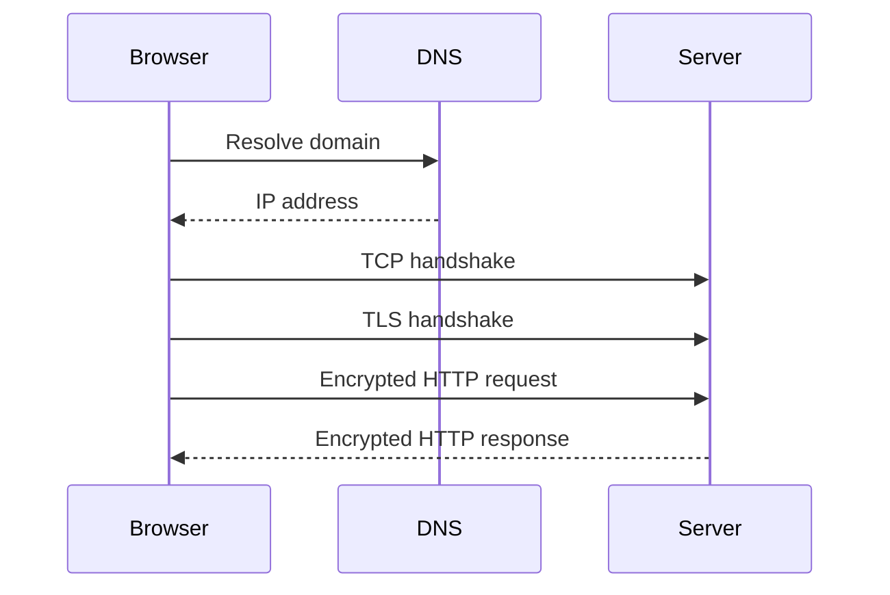

---

#### What HTTPS protects

- Passwords
- Credit card data
- API tokens
- Session cookies
- Request/response payloads

---

#### What HTTPS does NOT hide

HTTPS does **not** completely hide:

- Destination IP
- Domain name (visible via SNI in most deployments)
- Traffic volume
- Traffic timing

**Network can know:** you visited `google.com`  
**Network cannot see:** what you searched

---

## 1.11 SSL/TLS

**HTTPS / TLS communication flow**

**Actors:**

1. Browser / client
2. Server (e.g. `google.com`)
3. Certificate Authority (CA)

TLS sits above TCP — TCP handshake completes first, then TLS runs before any HTTP bytes flow.

---

### Part 1: Certificate creation (one-time setup)

#### Step 1 — Server generates keys

Server creates:

- Server public key
- Server private key

**Important:**

- Public key can be shared
- Private key always remains on the server

#### Step 2 — Server requests certificate from CA

Server sends **domain name** and **server public key** to the CA.

#### Step 3 — CA issues certificate

CA verifies domain ownership and creates a certificate.

**Certificate contains:**

- Domain name
- Server public key
- CA signature

CA sends certificate back to the server.

#### Important note

Certificate is **not encrypted**.

Think of it as: **identity card + trusted authority stamp**

The CA signature proves: *"This public key belongs to this domain."*

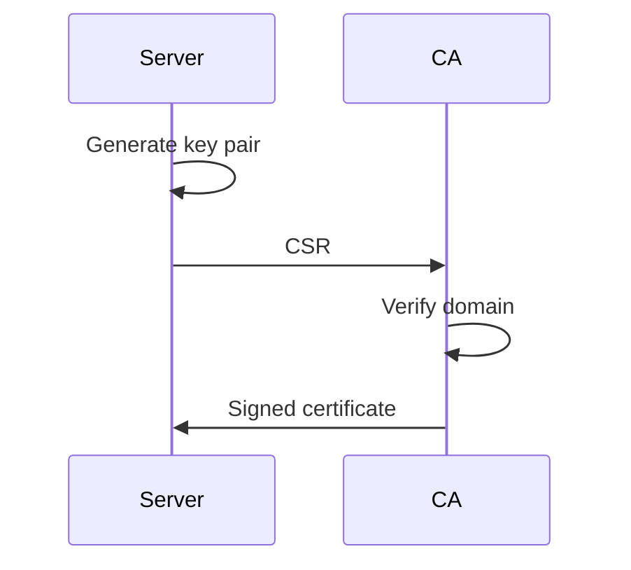

---

### Part 2: TLS handshake

#### Step 4 — Client connects

Client sends **Client Hello** containing:

- Supported TLS versions
- Security options
- Client random value

#### Step 5 — Server responds

Server sends:

- Server Hello
- Certificate
- Server random value

#### Step 6 — Client verifies certificate

Client already has trusted CA public keys.

Client verifies:

- Certificate is valid
- Certificate is not expired
- Domain name matches
- CA signature is valid

If verification succeeds, client trusts the server's public key.

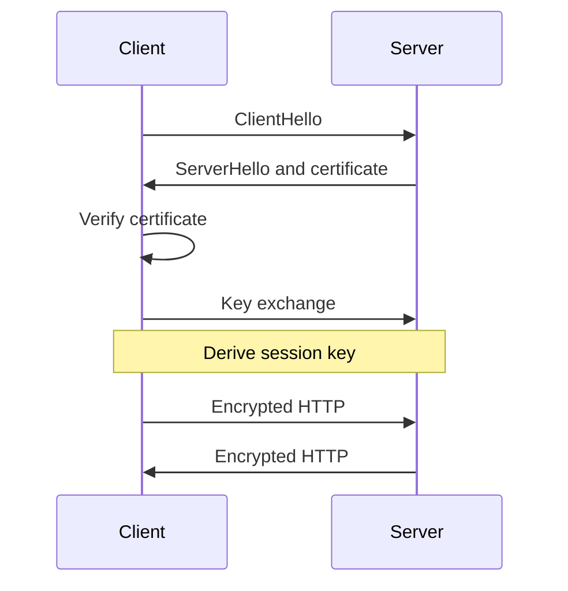

---

### Part 3: Server authentication

At this point client knows the **server public key** from the trusted certificate.

The client must ensure: *"I am really talking to the owner of this public key."*

The server proves this using the **server private key**. This confirms the server's identity.

---

### Part 4: Session key creation

**Goal:** Create one shared secret key that both client and server know. This key encrypts all communication.

Both sides already have:

- Client random value
- Server random value
- Shared secret

Using these, both independently generate the **session key**.

**Important:** Session key is **never sent across the network**. Both sides calculate it separately and end up with exactly the same key.

#### Why random values are used

```text
Connection 1 → Session Key A
Connection 2 → Session Key B
Connection 3 → Session Key C
```

Every connection gets a unique session key.

---

### Part 5: Encrypted communication

Both client and server have the **same session key**.

**Client request** — `GET /users` is encrypted before sending.

**Server** decrypts using session key, processes request, encrypts response.

**Client** decrypts response using the same key.

---

### Who uses which key?

| Key | Used by | Purpose |
|-----|---------|---------|
| **CA private key** | CA | Sign certificates |
| **CA public key** | Client | Verify certificate signature |
| **Server public key** | Client | Trust server identity |
| **Server private key** | Server | Prove ownership of the certificate |
| **Session key** | Client and server | Encrypt and decrypt all HTTPS traffic |

---

### Complete flow in one view

**Certificate setup:**

```text
Server → Request certificate → CA
CA     → Signed certificate  → Server
```

**Live connection:**

```text
Client → Client Hello        → Server
Server → Server Hello        → Client
Server → Certificate         → Client
Client → Verify certificate
Client & Server → Create session key (independently)
Client → Encrypted request   → Server
Server → Encrypted response  → Client
```

---

### Final summary

1. Server gets a certificate from a trusted CA
2. Client verifies the certificate using the CA's public key
3. Client trusts the server's public key contained in the certificate
4. Server proves it owns the corresponding private key
5. Client and server independently create the same session key
6. All HTTPS communication is encrypted using the session key
7. The session key is never transmitted over the network

---

## 1.12 HTTP/2 & HTTP/3

---

### Why was HTTP/2 introduced?

HTTP/1.1 had several problems:

- Multiple TCP connections required
- Head-of-line (HOL) blocking
- Duplicate headers in every request
- Higher latency

HTTP/2 was introduced to improve performance while still using **TCP**.

---

### Why was HTTP/3 introduced?

HTTP/2 solved many HTTP problems but still inherited **TCP limitations**.

**Main issue:** Packet loss in one stream can block all other streams because TCP delivers data in order. This is called **TCP head-of-line blocking**.

HTTP/3 was introduced to solve this using **QUIC over UDP**.

---

### Protocol stack

**HTTP/1.1:**

```text
HTTP → TCP → IP
```

**HTTP/2:**

```text
HTTP/2 → TCP → TLS → IP
```

**HTTP/3:**

```text
HTTP/3 → QUIC → UDP → IP
```

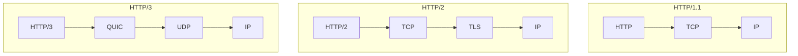

---

### Transport protocol

| | HTTP/2 | HTTP/3 |
|---|--------|--------|
| Transport | **TCP** | **QUIC** (built on UDP) |

This is the biggest difference.

---

### Multiplexing

**HTTP/2**

Supports multiplexing. Multiple requests can use a **single TCP connection**.

```text
Request 1
Request 2
Request 3

All travel simultaneously over one connection.
```

This removes the need for multiple TCP connections.

**HTTP/3**

Also supports multiplexing — but each stream is **independent**. A problem in one stream does not block other streams.

---

### Head-of-line blocking

**HTTP/2:** Application-level HOL blocking is solved. **TCP-level HOL blocking still exists.**

**Example:** Stream A loses a packet → TCP waits for retransmission → Stream B and Stream C must also wait. **All streams are blocked.**

**HTTP/3:** Uses QUIC. Each stream is independent.

If Stream A loses a packet → **only Stream A waits** → Stream B and Stream C continue normally.

**Result:** Better performance on unreliable networks.

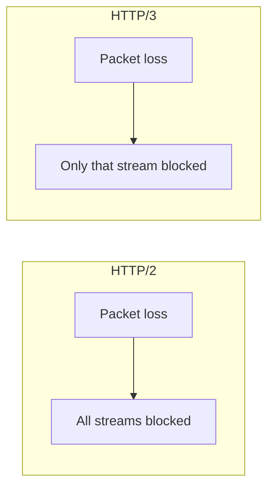

---

### Connection establishment

**HTTP/2**

```text
TCP handshake (SYN → SYN-ACK → ACK)
        +
TLS handshake (Client Hello → Server Hello → ...)
```

**HTTP/3**

QUIC combines transport and security setup. **Fewer round trips.** Faster connection establishment.

---

### Latency

| | HTTP/2 | HTTP/3 |
|---|--------|--------|
| Setup cost | TCP handshake + TLS handshake | QUIC integrated with TLS 1.3 — faster setup |
| Overall | Higher latency than HTTP/3 | **Lower latency** |

---

### Packet loss handling

**HTTP/2**

Packet loss impacts the **entire TCP connection**. Performance drops significantly on mobile networks, Wi-Fi, and long-distance links.

**HTTP/3**

Packet loss affects **only the impacted stream**. Other streams continue processing. Better user experience.

---

### Mobile networks

| | HTTP/2 | HTTP/3 |
|---|--------|--------|
| Network change (Wi-Fi → mobile data) | May require reconnecting; noticeable degradation | Handles transitions better — connection can continue more smoothly |

.

---

### TLS support

| | HTTP/2 | HTTP/3 |
|---|--------|--------|
| TLS versions | Typically TLS 1.2 or TLS 1.3 (separate from TCP) | **Always TLS 1.3** — built directly into QUIC |

---

### Header compression

| | HTTP/2 | HTTP/3 |
|---|--------|--------|
| Compression | **HPACK** — reduces header size | **QPACK** — improved version designed for QUIC |

---

### Real-world example

Browser requests: `index.html`, `style.css`, `app.js`, `logo.png`

**HTTP/2**

Single TCP connection. If the packet carrying `app.js` is lost, TCP pauses delivery — **other resources may also wait**.

**HTTP/3**

Single QUIC connection. If `app.js` packet is lost, **only the `app.js` stream waits** — other resources continue downloading. Page loads faster.

---

### When HTTP/3 shines

Most beneficial on:

- Mobile networks
- High-latency networks
- Unstable connections
- Networks with packet loss

---

### Advantages of HTTP/2

- Multiplexing
- Header compression (HPACK)
- Single TCP connection
- Reduced latency vs HTTP/1.1
- Widely supported

---

### Advantages of HTTP/3

- Uses QUIC over UDP
- No TCP head-of-line blocking
- Faster connection setup
- Better packet loss recovery
- Better mobile performance
- Lower latency

---

### Interview questions

| Question | Answer |
|----------|--------|
| Why was HTTP/2 introduced? | Solve HTTP/1.1 inefficiencies using multiplexing and header compression |
| Why was HTTP/3 introduced? | Eliminate TCP head-of-line blocking |
| What protocol does HTTP/2 use? | **TCP** |
| What protocol does HTTP/3 use? | **QUIC over UDP** |
| Biggest advantage of HTTP/3? | Packet loss in one stream does not block other streams |
| Does HTTP/3 use TLS? | Yes — TLS 1.3 is built into QUIC |

---

### Quick comparison

| Feature | HTTP/2 | HTTP/3 |
|---------|--------|--------|
| Transport | TCP | QUIC (UDP) |
| Multiplexing | Yes | Yes |
| HOL blocking | TCP level still exists | Eliminated at stream level |
| TLS | Separate from TCP | Built-in (TLS 1.3) |
| Connection setup | Slower | Faster |
| Packet loss impact | Entire connection | Single stream only |
| Mobile performance | Good | Better |
| Latency | Lower than HTTP/1.1 | Lowest |

---

## 1.13 QUIC

**QUIC (Quick UDP Internet Connections)** is a modern transport protocol developed by Google. It was created to overcome some of TCP's limitations and improve web performance.

**HTTP/3 is built on top of QUIC.**

Think of it as: **TCP + TLS + performance improvements** combined into a single protocol.

---

### Why was QUIC created?

HTTP/2 improved HTTP significantly but still used TCP.

**Problem:** TCP suffers from head-of-line (HOL) blocking. If one packet is lost, TCP pauses delivery of subsequent packets until the lost packet is retransmitted — even unrelated streams must wait.

**Result:** Higher latency and slower page loads.

QUIC was designed to solve this.

---

### QUIC vs TCP

| | TCP | QUIC |
|---|-----|------|
| Base | Connection-oriented | Built on **UDP** |
| Reliability | Yes | Yes |
| Ordering | Ordered delivery (whole connection) | Ordered **per stream** |
| TLS | Separate handshake | **TLS 1.3 built-in** |
| HOL blocking | Yes | **No TCP-level HOL blocking** |

---

### If QUIC uses UDP, how is it reliable?

UDP itself is connectionless — no acknowledgements, no retransmissions, no ordering guarantees.

**QUIC adds these features itself:**

- Packet acknowledgements
- Retransmissions
- Flow control
- Congestion control
- Stream management

```text
UDP provides transport.
QUIC implements reliability in user space.
```

---

### QUIC protocol stack

```text
HTTP/3 → QUIC → UDP → IP
```

---

### Biggest benefit: no head-of-line blocking

Suppose browser downloads: `index.html`, `style.css`, `app.js`

#### TCP (HTTP/2)

If a packet from `app.js` is lost, TCP waits — `style.css` and `index.html` may also be delayed. **Entire connection is affected.**

#### QUIC (HTTP/3)

Each resource uses its own stream. If `app.js` packet is lost, **only the `app.js` stream waits** — `style.css` and `index.html` continue normally.

**Result:** Faster page loading.

---

### QUIC streams

A QUIC connection contains multiple **independent streams**.

```text
Connection
 |
 |-- Stream 1 → HTML
 |-- Stream 2 → CSS
 |-- Stream 3 → JavaScript
 |-- Stream 4 → Images
```

Each stream operates independently. Packet loss in one stream does not affect others.

---

### Faster connection setup

**HTTP/2**

```text
TCP handshake (SYN → SYN-ACK → ACK)
        +
TLS handshake (Client Hello → Server Hello → ...)
```

Multiple round trips required.

#### QUIC

TLS 1.3 is built directly into QUIC. Transport setup and security setup happen **together**.

**Result:** Fewer round trips, lower latency.

---

### Connection migration

One unique feature of QUIC.

**Example:** Phone on Wi-Fi → user switches to mobile data during a video call.

| | TCP | QUIC |
|---|-----|------|
| Network change | Connection usually breaks; new connection often required | Connection can **continue** |

QUIC identifies connections using **connection IDs** instead of relying only on IP addresses.

**Result:** Better mobile experience.

---

### Encryption

| | TCP | QUIC |
|---|-----|------|
| Encryption | Optional — TLS added separately | **Mandatory** — TLS 1.3 built in |

Every QUIC connection is encrypted.

---

### Congestion control

Just like TCP, QUIC implements:

- Congestion control
- Flow control
- Packet retransmission

**Purpose:** Prevent network overload and maintain performance.

---

### Why QUIC is faster

1. **Fewer round trips** — transport and TLS setup combined
2. **No TCP head-of-line blocking** — streams operate independently
3. **Faster recovery** — packet loss impacts only the affected stream
4. **Connection migration** — handles network changes smoothly

---

### Real-world example

You open `youtube.com`. Browser downloads HTML, CSS, JavaScript, images, video chunks.

| | Behavior |
|---|----------|
| **TCP** | Packet loss may slow everything |
| **QUIC** | Only the affected stream waits; other downloads continue |

This improves page load time, video streaming, and mobile performance.

---

### Disadvantages of QUIC

- More complex implementation
- Higher CPU usage compared to TCP
- Some firewalls may block UDP traffic
- Newer protocol — not as mature as TCP

---

### Interview questions

| Question | Answer |
|----------|--------|
| What is QUIC? | A transport protocol built on UDP that powers HTTP/3 |
| Why was QUIC introduced? | Eliminate TCP head-of-line blocking and reduce latency |
| Does QUIC use UDP? | Yes — QUIC runs on top of UDP |
| If UDP is unreliable, how does QUIC work? | QUIC implements reliability, retransmission, flow control, and congestion control itself |
| Biggest advantage of QUIC? | Independent streams — packet loss in one stream does not block others |
| Does QUIC use TLS? | Yes — TLS 1.3 is built into QUIC |

---

### Quick comparison

| Feature | TCP | QUIC |
|---------|-----|------|
| Transport | TCP | UDP |
| Reliable | Yes | Yes |
| TLS | Separate | Built-in |
| HOL blocking | Yes | No |
| Multiplexing | Limited | Native |
| Connection setup | Slower | Faster |
| Connection migration | No | Yes |
| Used by | HTTP/1, HTTP/2 | **HTTP/3** |

---

### Memory trick

```text
TCP  = Reliable but can block all streams
QUIC = Reliable UDP with built-in TLS and independent streams

HTTP/2 = Multiplexing over TCP
HTTP/3 = Multiplexing over QUIC
```

**Interview one-liner:** QUIC is a modern transport protocol built on UDP that provides TCP-like reliability, built-in TLS, faster connection setup, and eliminates TCP head-of-line blocking.

---

## 1.14 Keep-Alive Connections

**HTTP Keep-Alive** is a mechanism that allows multiple HTTP requests and responses to reuse the same TCP connection.

Instead of creating a new TCP connection for every request, the existing connection remains open and is reused.

This is also called a **persistent connection**.

---

### Why do we need Keep-Alive?

Creating a TCP connection is expensive. Every new connection requires a TCP handshake:

```text
Client → SYN
Server → SYN-ACK
Client → ACK
```

This introduces:

- Extra network latency
- Additional CPU overhead
- More memory usage
- More network traffic

Keep-Alive avoids paying this cost repeatedly.

---

### Without Keep-Alive

Suppose browser loads a webpage containing HTML, CSS, JavaScript, and a logo image.

For each resource:

```text
Open TCP Connection → Request Resource → Receive Response → Close Connection
```

```text
Connection 1 → HTML
Connection 2 → CSS
Connection 3 → JS
Connection 4 → Image
```

**Result:** 4 TCP handshakes, 4 TCP teardowns — wasteful.

---

### With Keep-Alive

Browser opens **1 TCP connection**, then:

```text
Request HTML   → Response HTML
Request CSS    → Response CSS
Request JS     → Response JS
Request Image  → Response Image
```

Same TCP connection reused.

**Result:** Only 1 TCP handshake — much faster.

---

### Visual comparison

#### Without Keep-Alive

```text
Browser
   |
TCP Handshake
   |
Request 1 → Response 1 → Close

Browser
   |
TCP Handshake
   |
Request 2 → Response 2 → Close

Browser
   |
TCP Handshake
   |
Request 3 → Response 3 → Close
```

#### With Keep-Alive

```text
Browser
   |
TCP Handshake
   |
Request 1 → Response 1
   |
Request 2 → Response 2
   |
Request 3 → Response 3
   |
Close Connection
```

---

### Performance benefits

1. **Lower latency** — TCP handshake performed only once
2. **Less CPU usage** — fewer connections created and destroyed
3. **Less network overhead** — fewer SYN and FIN packets
4. **Better throughput** — more useful data transferred, less protocol overhead

---

### Real-world example

Suppose **RTT = 100ms**.

**New TCP connection:**

```text
TCP Handshake = 100ms
HTTP Request  = 100ms
Total         ≈ 200ms
```

**10 separate requests without Keep-Alive:**

```text
10 × 200ms ≈ 2000ms
```

**With Keep-Alive:**

```text
Handshake paid once: 100ms
10 requests:         10 × 100ms ≈ 1000ms
Total:               ≈ 1100ms
```

Almost half the latency.

---

### HTTP/1.0 vs HTTP/1.1

| | HTTP/1.0 | HTTP/1.1 |
|---|----------|----------|
| Default | Connection closed after every request | **Keep-Alive enabled by default** |
| Keep-Alive | Had to be explicitly enabled | Connections stay open unless explicitly closed |

This significantly improved performance.

---

### How long does connection stay open?

Server does not keep connections forever. **Idle timeout** is configured — e.g. 30, 60, or 120 seconds.

If no activity occurs, server closes the connection.

---

### Keep-Alive header

**HTTP/1.1 — keep connection open:**

```http
GET /users HTTP/1.1
Host: api.company.com
Connection: keep-alive
```

**Close connection after response:**

```http
Connection: close
```

---

### Keep-Alive in microservices

```text
API Gateway → User Service → Order Service → Payment Service
```

| | Behavior |
|---|----------|
| **Without Keep-Alive** | Each request creates a new TCP connection — large overhead |
| **With Keep-Alive** | Services reuse existing connections |

**Benefits:** Lower latency, lower CPU consumption, better scalability

---

### Keep-Alive and connection pooling

Most applications use **connection pools** — Spring Boot, Apache HttpClient, OkHttp, Netty.

Instead of creating a connection every time, the pool maintains reusable connections.

**Keep-Alive makes pooling possible.**

---

### Keep-Alive and load balancers

```text
Client → Load Balancer → Backend Server
```

Persistent connections reduce TCP handshakes, TLS handshakes, and CPU usage — improving overall throughput.

---

### Keep-Alive and HTTPS

This is where Keep-Alive becomes even more valuable. HTTPS requires:

```text
TCP Handshake + TLS Handshake
```

Both are expensive.

| | Cost per request |
|---|------------------|
| **Without Keep-Alive** | Every request pays TCP setup + TLS setup |
| **With Keep-Alive** | TCP setup once, TLS setup once — multiple requests reuse the secure connection |

Huge performance improvement.

---

### Interview questions

| Question | Answer |
|----------|--------|
| What is HTTP Keep-Alive? | Reusing the same TCP connection for multiple HTTP requests |
| Why is Keep-Alive useful? | Reduces connection setup overhead and latency |
| What problem does it solve? | Repeated TCP and TLS handshakes |
| Is Keep-Alive enabled by default in HTTP/1.1? | **Yes** |
| Why is Keep-Alive important for HTTPS? | Avoids repeated TCP and TLS handshakes |
| How does Keep-Alive improve microservices? | Reduces network overhead and improves throughput |

---

### Keep-Alive vs HTTP/2

| | HTTP/1.1 + Keep-Alive | HTTP/2 |
|---|----------------------|--------|
| Connection | One connection reused | One connection reused |
| Requests | Generally processed **sequentially** | Multiple requests processed **simultaneously** (multiplexing) |

HTTP/2 still uses Keep-Alive but is much more efficient.

---

### Memory trick

```text
Without Keep-Alive:
  Request → New TCP Connection → Response → Close → (repeat)

With Keep-Alive:
  One TCP Connection → Request 1 → Request 2 → Request 3 → Request 4 → Close later
```

**Interview one-liner:** HTTP Keep-Alive allows multiple HTTP requests to reuse the same TCP connection, avoiding repeated TCP/TLS handshakes and significantly reducing latency.

---

## 1.15 Forward & Reverse Proxy

A **proxy** is an intermediary that sits between two parties and forwards requests and responses.

Instead of client and server communicating directly:

```text
Client → Proxy → Server
```

The proxy acts on behalf of either the **client** or the **server**.

---

### Why do we need a proxy?

Common reasons:

- Security
- Access control
- Caching
- Load balancing
- Anonymity
- Traffic monitoring
- Rate limiting

---

### Forward proxy

#### What is it?

A **forward proxy** sits in front of **clients** and acts on behalf of clients.

The internet sees the proxy, not the actual client.

```text
Client → Forward Proxy → Internet Server
```

---

#### How it works

**Without proxy:**

```text
Client → google.com
```

Server knows client's IP.

**With forward proxy:**

```text
Client → Forward Proxy → google.com
```

Server sees **proxy IP**. Client IP is hidden.

---

#### Real-world example

Suppose a company blocks Facebook, YouTube, and Instagram.

All employee traffic goes through a **corporate forward proxy**. The proxy can:

- Allow websites
- Block websites
- Log requests
- Scan downloads

---

#### Benefits of forward proxy

1. **Client anonymity** — server sees proxy IP instead of client IP
2. **Access control** — block specific websites
3. **Content filtering** — filter inappropriate content
4. **Caching** — store frequently requested resources
5. **Traffic monitoring** — track user activity

---

#### Forward proxy example

```text
Home User → VPN / Corporate Proxy → google.com
```

`google.com` sees **proxy IP**, not user IP.

---

#### Who knows about the proxy?

| | Forward proxy |
|---|---------------|
| Client | **Knows** (configured) |
| Server | Usually does not care |

Think: **proxy representing the client**

**Forward proxy:**

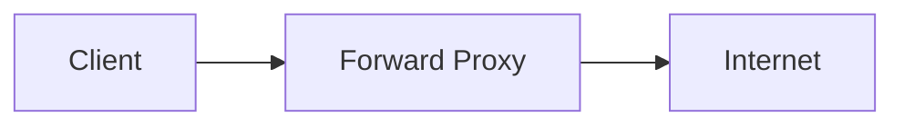

**Reverse proxy:**

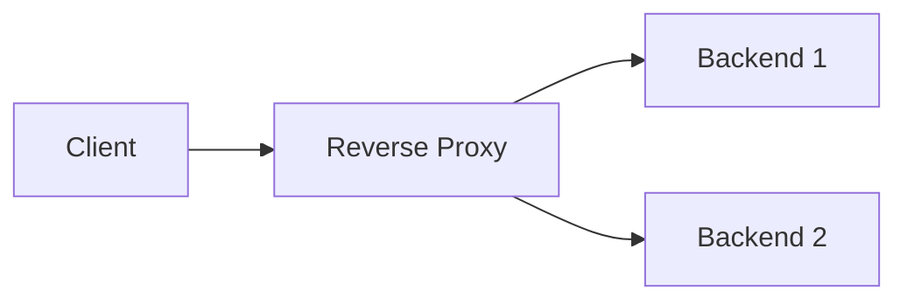

---

### Reverse proxy

#### What is it?

A **reverse proxy** sits in front of **servers** and acts on behalf of servers.

Clients communicate with the proxy. Clients may not know backend servers even exist.

```text
Client → Reverse Proxy → Backend Servers
```

---

#### How it works

Client requests `api.company.com`.

Request first reaches the **reverse proxy**. Proxy forwards request to a **backend server**. Response returns through the proxy.

---

#### Visual flow

```text
Client
   |
Reverse Proxy
   |
---------------------
|         |         |
Server1  Server2  Server3
```

---

#### Benefits of reverse proxy

1. **Load balancing** — distributes traffic across multiple servers
2. **Security** — backend servers hidden from clients
3. **SSL termination** — handles HTTPS/TLS; backends may use plain HTTP internally
4. **Caching** — serve cached responses
5. **Rate limiting** — prevent abuse
6. **DDoS protection** — filters malicious traffic

---

#### Real-world example

When you access `https://amazon.com`, you are usually talking to a **load balancer / reverse proxy** — not directly to application servers.

The proxy decides which backend server should handle the request.

---

#### SSL termination

```text
Client
   |
HTTPS
   |
Reverse Proxy
   |
HTTP
   |
Backend Service
```

Proxy handles TLS handshake, certificate management, and encryption/decryption. Backend services stay simpler.

---

#### Load balancing example

```text
Client Requests
   |
Reverse Proxy
   |
-------------------------
|          |           |
App1       App2       App3
```

```text
Request 1 → App1
Request 2 → App2
Request 3 → App3
```

Traffic distributed evenly. See algorithms above (including **consistent hashing** for cache shards).

---

#### Common reverse proxy products

- Nginx
- HAProxy
- Envoy
- Traefik
- Cloudflare
- AWS ALB

---

### Forward proxy vs reverse proxy

| Feature | Forward proxy | Reverse proxy |
|---------|---------------|---------------|
| Represents | **Client** | **Server** |
| Placed in front of | Clients | Servers |
| Hides | Client identity | Server identity |
| Used by | Clients | Server owners |
| Common uses | VPN, filtering | Load balancing |
| Internet sees | Proxy IP | Proxy IP |

---

## 1.16 NAT

**NAT (Network Address Translation)** is a technique used by routers, firewalls, and cloud gateways to translate one IP address into another.

Most commonly:

```text
Private IP → Public IP
```

This allows devices in a private network to access the internet using a **single public IP address**.

---

### Why do we need NAT?

IPv4 addresses are limited — **~4.3 billion** total.

With billions of phones, laptops, servers, and IoT devices, we would quickly run out of public IPs if every device needed one.

NAT solves this by allowing **many devices to share a single public IP**.

---

### Real-world example

**Home Wi-Fi network:**

```text
Laptop  → 192.168.1.10
Mobile  → 192.168.1.20
TV      → 192.168.1.30

Router public IP → 49.205.100.50
```

| | Behavior |
|---|----------|
| **Without NAT** | Each device needs a public IP |
| **With NAT** | All devices share `49.205.100.50` |

This is how most home networks work.

---

### How NAT works

**Step 1** — Laptop sends request:

```text
Source IP      = 192.168.1.10
Destination IP = google.com
```

**Step 2** — Router receives packet and replaces `192.168.1.10` with `49.205.100.50`

**Step 3** — Google receives:

```text
Source IP = 49.205.100.50
```

Google has no idea the original device was `192.168.1.10`.

**Step 4** — Response comes back to `49.205.100.50`. Router checks NAT table and forwards response to `192.168.1.10`.

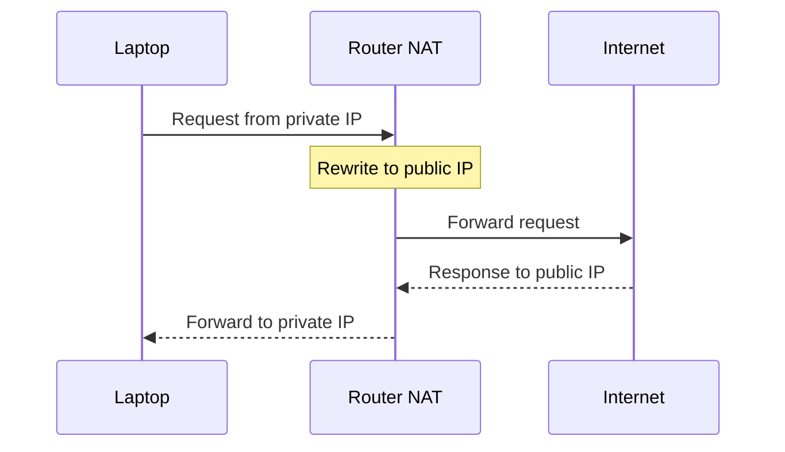

---

### Visual flow

```text
Laptop (192.168.1.10)
    |
Home Router (NAT) — Public IP = 49.205.100.50
    |
Internet
    |
google.com
```

---

### NAT translation table

Router maintains a mapping table:

| Private IP | Port | Public IP | Port |
|------------|------|-----------|------|
| 192.168.1.10 | 5000 | 49.205.100.50 | 30001 |
| 192.168.1.20 | 5001 | 49.205.100.50 | 30002 |
| 192.168.1.30 | 5002 | 49.205.100.50 | 30003 |

This allows many devices to share one public IP.

---

### What is PAT?

**PAT (Port Address Translation)** — also called **NAT overload** — is the most common NAT implementation today.

Instead of using only IP addresses, NAT uses **IP + port** to uniquely identify connections.

---

### PAT example

Three devices access Google simultaneously:

```text
Laptop → 192.168.1.10:5000
Mobile → 192.168.1.20:5000
TV     → 192.168.1.30:5000
```

Router translates to:

```text
49.205.100.50:30001
49.205.100.50:30002
49.205.100.50:30003
```

Now responses can be routed correctly.

---

### Types of NAT

#### 1. Static NAT

One private IP ↔ one public IP — permanent mapping.

```text
192.168.1.10 ↔ 49.205.100.50
```

Used when a server must always have the same public IP.

#### 2. Dynamic NAT

Private IPs are mapped from a **pool** of public IPs:

```text
Private Network → Public IP Pool
                  49.205.100.50
                  49.205.100.51
                  49.205.100.52
```

Mapping assigned dynamically.

#### 3. PAT (NAT overload)

Many private IPs → **one public IP** using different ports.

Most common type. Used in home routers, offices, and cloud NAT gateways.

---

### NAT in cloud

**AWS example** — private subnet:

```text
10.0.2.10
10.0.2.20
```

No public IPs assigned. Need internet access? Install a **NAT Gateway**:

```text
Private Servers → NAT Gateway → Internet
```

Servers can download packages, updates, and Docker images — but remain **inaccessible from the internet**.

---

### Advantages of NAT

1. **Conserves public IP addresses** — thousands of devices can share a few public IPs
2. **Improves security** — private IPs are hidden from the internet
3. **Easy network management** — internal addressing can change without affecting the internet
4. **Cost savings** — fewer public IPs required

---

### Limitations of NAT

1. **Breaks end-to-end connectivity** — internet cannot directly reach private devices
2. **Port exhaustion** — large number of connections may exhaust available ports
3. **Extra processing** — router must maintain NAT table
4. **Some protocols don't like NAT** — SIP, FTP, peer-to-peer apps often require additional configuration

---

### NAT and port forwarding

**Problem:** Internet cannot directly access `192.168.1.10`

**Solution:** Port forwarding on the router:

```text
49.205.100.50:80 → 192.168.1.10:80
```

Now internet users can access the internal server.

---

### NAT vs proxy

| | NAT | Proxy |
|---|-----|-------|
| Layer | Network layer (L3/L4) | Application layer (L7) |
| Changes | IP addresses and ports | Can inspect and modify HTTP/HTTPS requests |

---

## 1.17 VPN

**VPN (Virtual Private Network)** creates a secure, encrypted connection between your device and a VPN server over the public internet.

Once connected, all your network traffic is routed through the VPN server.

```text
Your Device
    |
Encrypted Tunnel
    |
VPN Server
    |
Internet
```

Traffic inside the tunnel is encrypted and protected.

---

### Why do we need a VPN?

VPNs are mainly used for:

1. **Security** — protect data when using public Wi-Fi or untrusted networks
2. **Remote access** — allow employees to securely access company resources from home
3. **Privacy** — hide your real public IP address from websites
4. **Connecting private networks** — connect two office networks securely over the internet

---

### How VPN works

**Without VPN:**

```text
Laptop → Internet → google.com
```

Google sees **your public IP address**.

**With VPN:**

```text
Laptop → Encrypted VPN Tunnel → VPN Server → google.com
```

Google sees **VPN server IP address** instead of your real IP.

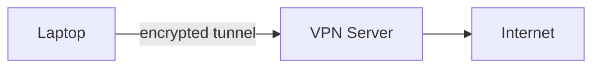

---

### Simple example

Suppose your ISP assigned `49.205.100.50` to your home network.

You connect to a VPN server with IP `20.50.10.100`.

When you browse `google.com`:

| | What Google sees |
|---|------------------|
| **Without VPN** | `49.205.100.50` |
| **With VPN** | `20.50.10.100` |

---

### What is a VPN tunnel?

A **VPN tunnel** is an encrypted communication channel between:

```text
Client Device ↔ VPN Server
```

All traffic passes through this secure tunnel. Anyone intercepting packets on the internet sees **encrypted data only**.

---

### What does VPN encrypt?

VPN encrypts traffic before sending it through the internet.

```text
Original:  Username = hareram, Password = mypassword
Encrypted: Random unreadable encrypted data
```

This prevents attackers from reading sensitive information.

---

### Common types of VPN

#### 1. Remote access VPN

Used by employees working from home.

```text
Employee Laptop → VPN Tunnel → Company Network
```

Employee can access internal applications, databases, and file servers.

#### 2. Site-to-site VPN

Used to connect entire office networks.

```text
Bangalore Office ↔ VPN Tunnel ↔ Mumbai Office
```

Both offices communicate securely.

---

### VPN vs HTTPS

| | HTTPS | VPN |
|---|-------|-----|
| Protects | Browser ↔ website | Device ↔ VPN server |
| Scope | Single site (e.g. Chrome ↔ `google.com`) | **All** device traffic — browser, databases, email, SSH |

---

### VPN vs proxy

| | VPN | Proxy |
|---|-----|-------|
| Encryption | **Yes** — encrypts traffic | Usually no encryption by default |
| Scope | Entire device | Often application-specific |
| Security | More secure | Mostly forwards traffic |
| IP address | Changes visible IP | May hide IP (forward proxy) |

---

### Does VPN make you completely anonymous?

**No.**

| | Reality |
|---|---------|
| VPN hides | Your IP from websites |
| VPN provider | Can still see your traffic |
| Websites | Can still track using cookies/accounts |
| ISPs / governments | May know you are using a VPN |

VPN **improves privacy** but does not provide complete anonymity.

---

### Advantages of VPN

- Secure communication
- Safe use of public Wi-Fi
- Remote access to company resources
- Hides real IP address
- Connects private networks securely

---

### Disadvantages of VPN

- Extra latency — traffic goes through VPN server
- Encryption consumes CPU resources
- VPN server can become a bottleneck
- Requires trust in VPN provider

---

### Real-world system design use case

Company employees work from home.

Instead of exposing databases and internal applications to the internet:

```text
Employee → VPN → Corporate Network
```

Only authenticated VPN users can access internal systems.

This is one of the most common enterprise VPN use cases.

---

### Interview questions

| Question | Answer |
|----------|--------|
| What is a VPN? | An encrypted tunnel between a device and a VPN server over the internet |
| Why use a VPN? | Security, privacy, and remote access |
| What is a VPN tunnel? | An encrypted communication channel between client and VPN server |
| Difference between VPN and HTTPS? | HTTPS secures browser-to-website traffic; VPN secures all traffic between device and VPN server |
| Difference between VPN and Proxy? | VPN encrypts and routes all device traffic; proxy mainly forwards application traffic |

---

## 1.18 Unicast, Broadcast, Multicast & Anycast

---

### The problem

Suppose a device wants to send a packet.

**Question:** Who should receive the packet?

- One device?
- All devices?
- A specific group of devices?
- The nearest available device?

Different communication models exist for different use cases.

---

### 1. Unicast

#### What is it?

**Unicast** means: **one sender → one receiver**

This is the most common type of network communication.

```text
Client → Server
```

One source. One destination.

#### Example

When you open `https://google.com`, your browser sends requests to a specific Google server. This is unicast communication.

#### Real-world use cases

- Web browsing
- REST APIs
- Database connections
- SSH
- Email

| Advantages | Disadvantages |
|------------|---------------|
| Simple, reliable, direct communication | If the same data must be sent to 1 million users, server sends it 1 million times — high bandwidth usage |

---

### 2. Broadcast

#### What is it?

**Broadcast** means: **one sender → everyone on the network**

Packet is delivered to all devices in the broadcast domain.

```text
                 Device A
                      |
Sender ---------------+------------------
          |           |           |
       Device B    Device C    Device D
```

Everyone receives the packet.

#### Example

When your laptop joins a Wi-Fi network, it does not know who the router is. So it broadcasts: *"Who has IP 192.168.1.1?"*

All devices receive the request. Router responds.

#### Common use cases

- ARP (Address Resolution Protocol)
- DHCP discovery

| Advantages | Disadvantages |
|------------|---------------|
| Easy device discovery; useful for local networks | Wastes bandwidth; every device processes packet; doesn't scale well |

**Important:** Broadcast generally works only inside a local network. Routers typically do **not** forward broadcast traffic.

---

### 3. Multicast

#### What is it?

**Multicast** means: **one sender → many interested receivers**

Only devices that joined the multicast group receive the packet.

```text
                    Receiver A
                         |
Sender ------------------|
                         |
                    Receiver B
```

Devices not interested do **not** receive packets.

#### Example

**Live sports streaming** — 100,000 users watching the same match.

| | Behavior |
|---|----------|
| **Without multicast** | Server sends 100,000 separate streams |
| **With multicast** | Server sends **one** stream; network duplicates packets only where needed |

#### Use cases

- IPTV
- Live video broadcasting
- Stock market feeds
- Financial trading systems
- Online classrooms

| Advantages | Disadvantages |
|------------|---------------|
| Saves bandwidth; efficient distribution; one transmission serves many users | Complex network support; not widely supported across internet; mostly used inside private networks |

#### Multicast group

Devices join a multicast group — e.g. `239.1.1.1`. Only members receive packets sent to that address.

---

### 4. Anycast

#### What is it?

**Anycast** means: **one sender → nearest available receiver**

Multiple servers share the **same IP address**. Network routing automatically chooses the nearest or best destination.

```text
                     Server (Mumbai)
                           |
User ----------------------|
                           |
                     Server (Singapore)
                           |
                     Server (London)
```

User reaches the nearest server.

#### Example

Cloudflare has servers in Mumbai, Singapore, London, and New York — all advertise the same anycast IP.

| User location | Routed to |
|---------------|-----------|
| Bangalore | Mumbai |
| Europe | London |

Both users access the **same IP address**.

#### Why is anycast powerful?

Users automatically reach the closest server, lowest-latency server, or available server — without changing configuration.

#### Real-world use cases

- CDNs
- DNS servers
- Cloudflare
- Google DNS (`8.8.8.8`)
- AWS global services

#### Example: Google DNS

You configure `8.8.8.8`.

**Question:** Which Google DNS server receives your request?

**Answer:** Nearest available Google DNS server. This is **anycast**.

| Advantages | Disadvantages |
|------------|---------------|
| Low latency, automatic failover, global scalability, better availability | Complex routing setup; harder troubleshooting |

---

### Comparison

| Communication type | Meaning |
|--------------------|---------|
| **Unicast** | One → one |
| **Broadcast** | One → all |
| **Multicast** | One → many (interested group) |
| **Anycast** | One → nearest one |

#### Visual comparison

```text
Unicast:    Sender → Receiver

Broadcast:  Sender → All devices

Multicast:  Sender → Interested group only

Anycast:    Sender → Nearest server
```

---

### System design relevance

| Domain | Typical model |
|--------|---------------|
| Web applications | Mostly **unicast** |
| Local network discovery | **Broadcast** |
| Live streaming systems | May use **multicast** |
| CDNs and DNS systems | Commonly **anycast** |

---

### Interview questions

| Question | Answer |
|----------|--------|
| What is unicast? | One sender communicates with one receiver |
| What is broadcast? | One sender communicates with all devices on a network |
| What is multicast? | One sender communicates with a selected group of receivers |
| What is anycast? | One sender communicates with the nearest available receiver |
| Why do CDNs use anycast? | Route users automatically to the nearest edge server |
| Why doesn't broadcast scale? | Every device receives and processes the packet |

---

## 1.19 CDN

**CDN (Content Delivery Network)** is a geographically distributed network of servers that stores and delivers content closer to users.

Its primary goals:

- Reduce latency
- Increase speed
- Reduce load on origin servers

Think of a CDN as a **network of cache servers spread across the world**.

---

### Why do we need a CDN?

Suppose your application is hosted in **Mumbai, India**. Users access it from Bangalore, Delhi, London, New York, and Sydney.

| | Behavior |
|---|----------|
| **Without CDN** | Every request travels to Mumbai — higher latency, slower page loads, increased backend load |
| **With CDN** | Users served from nearest CDN location — faster responses, lower latency, better UX |

---

### Real-world example

Netflix stores a movie in a **US data center**. User is in **Bangalore**.

| | Path |
|---|------|
| **Without CDN** | Bangalore user → US data center (long network journey) |
| **With CDN** | Bangalore user → Bangalore CDN edge server (much faster) |

---

### How CDN works

User requests `https://cdn.company.com/logo.png`

**Step 1** — DNS routes user to nearest CDN server

**Step 2** — CDN checks cache: *"Do I already have `logo.png`?"*

#### Case 1: Cache hit

File exists in CDN. CDN returns file immediately. **Origin server is not contacted.**

#### Case 2: Cache miss

File not found. CDN fetches from origin, stores locally, returns response. Future requests become cache hits.

**Cache hit:**

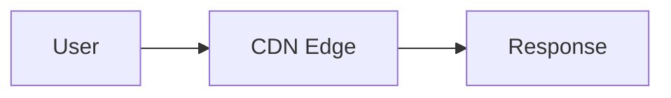

**Cache miss:**

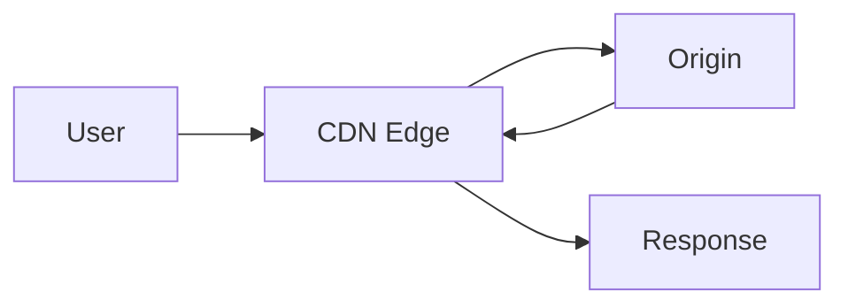

---

### Important terminologies

| Term | Meaning |
|------|---------|
| **Origin server** | Original server where content is stored — application server, S3 bucket, nginx |
| **Edge server** | CDN server located close to users — Mumbai, Bangalore, London, Tokyo |
| **POP (Point of Presence)** | Physical CDN location — e.g. Mumbai POP, Delhi POP, Singapore POP. Each POP contains multiple edge servers |

---

### What content can CDN cache?

**Best for static content:**

- Images, CSS, JavaScript, videos, PDFs, fonts

**Sometimes dynamic content** — API responses, GraphQL responses, HTML pages — if caching rules permit.

---

### CDN cache hit vs cache miss

| | Cache hit | Cache miss |
|---|-----------|------------|
| Meaning | Content already exists in CDN | Content not present — CDN fetches from origin |
| Latency | Fast | Higher on first request |
| Origin load | None | Origin contacted |

---

### Latency example

User in Bangalore, origin server in US:

| | Latency |
|---|---------|
| **Without CDN** | ~250ms |
| **With CDN edge in Bangalore** | ~10ms |

Huge improvement.

---

### CDN benefits

1. **Lower latency** — content served from nearby servers
2. **Reduced origin load** — CDN handles many requests
3. **Better scalability** — traffic distributed across many servers
4. **Higher availability** — multiple edge locations
5. **Improved user experience** — faster page loads

---

### CDN and caching

CDN relies heavily on caching.

```http
Cache-Control: max-age=3600
```

Meaning: store response for **1 hour**. Future requests served directly from CDN.

---

### CDN and video streaming

Platforms like Netflix, YouTube, and Prime Video use CDNs extensively.

Without CDN, millions of users would hit central servers — impossible to scale efficiently.

---

### CDN and system design

Typical architecture:

```text
User → CDN → Load Balancer → Application Servers → Database
```

| Traffic type | Handled by |
|--------------|------------|
| Images, videos, static files | **CDN** |
| Authentication, payments, business logic | **Backend services** |

---

### CDN and DDoS protection

CDNs often provide rate limiting, traffic filtering, and DDoS protection. Malicious traffic is blocked **before** reaching backend servers.

---

### Common CDN providers

- Cloudflare
- Akamai
- Amazon CloudFront
- Google Cloud CDN
- Azure CDN
- Fastly

---

### When should we use a CDN?

**Use CDN when application serves:**

- Images, videos, static assets
- Global traffic
- Large downloads

**Not very useful when:**

- Users are in a single region
- Content changes every request
- Responses cannot be cached

---

### Pull CDN vs push CDN

The main difference: **who is responsible for putting content into the CDN?**

#### 1. Pull CDN

Most commonly used CDN model. Content remains on the **origin server**.

When a user requests content:

1. CDN checks cache
2. If content exists → cache hit
3. If not → cache miss
4. CDN fetches from origin
5. CDN stores in cache
6. Future requests served from CDN

**Flow (cache miss):**

```text
User → CDN → (cache miss) → Origin Server
```

**After first request:**

```text
User → CDN cache
```

**Example:** User requests `logo.png`. CDN does not have it — automatically fetches from origin and stores it. Next users receive it directly from CDN.

| Advantages | Disadvantages |
|------------|---------------|
| Easy to configure | First request is slower (cache miss) |
| No manual uploads to CDN | Origin receives traffic during cache misses |
| Content automatically cached | |
| Origin remains source of truth | |

**Common examples:** Cloudflare, AWS CloudFront, Fastly, Akamai — most websites use pull CDN.

#### 2. Push CDN

Content is **proactively uploaded** to CDN servers before users request it.

**Flow:**

```text
Origin Server → Push content → CDN

Later: User → CDN (content already available)
```

**Example:** Company releases `movie.mp4` — uploaded to CDN in advance. When users request it, CDN serves immediately. **No cache miss.**

| Advantages | Disadvantages |
|------------|---------------|
| No first-request penalty | More management effort |
| Faster initial access | Need upload/synchronization process |
| Good for large static files | Storage costs may be higher |
| Predictable performance | |

**When to use push CDN:** Video streaming, software downloads, large media files, frequently accessed static content.

---

### Pull vs push CDN

| Feature | Pull CDN | Push CDN |
|---------|----------|----------|
| Content loading | On demand | Preloaded |
| Cache miss | Possible | Rare |
| Setup | Simple | More complex |
| Origin traffic | Higher | Lower |
| First request | Slower | Faster |
| Management | Minimal | More effort |
| Most common | **Yes** | No |

---

## 1.20 Load Balancer

A **load balancer** distributes incoming requests across multiple backend servers.

Instead of clients directly contacting application servers:

```text
Client
   |
Load Balancer
   |
--------------------
|        |         |
App1     App2     App3
```

The load balancer decides which server should handle each request.

---

### Why do we need a load balancer?

**Single server:**

```text
Client → Server
```

Problems: server can become overloaded, single point of failure, limited scalability.

**With load balancer:**

```text
Client → Load Balancer → App1 / App2 / App3
```

Benefits: scalability, high availability, fault tolerance, better resource utilization.

---

### What does a load balancer do?

1. Distributes traffic
2. Detects unhealthy servers
3. Removes failed servers
4. Supports SSL termination
5. Supports rate limiting
6. Supports sticky sessions
7. Improves availability

---

### Load balancer flow

```text
Client → Load Balancer → App1 / App2 / App3
```

Request arrives → load balancer selects a server → request forwarded → response returns through load balancer.

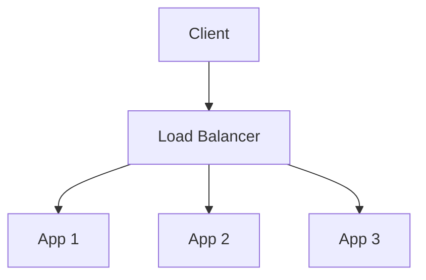

---

### Types of load balancers

Load balancers are generally categorized by OSI layer.

#### 1. Layer 4 load balancer

Works at the **transport layer**. Uses IP address, TCP port, UDP port. Does **not** inspect HTTP data.

**Example decision:** forward based on `192.168.1.10:8080` without looking at URL.

**Examples:** AWS NLB, HAProxy (L4 mode)

| Advantages | Disadvantages |
|------------|---------------|
| Very fast, low latency, high throughput | Cannot inspect HTTP requests; limited routing |

#### 2. Layer 7 load balancer

Works at the **application layer**. Can inspect URL, headers, cookies, query parameters, HTTP methods.

**Example:**

```text
/api/users  → User Service
/api/orders → Order Service
```

**Examples:** Nginx, Envoy, AWS ALB, Traefik

| Advantages | Disadvantages |
|------------|---------------|
| Intelligent routing, API gateway style routing, SSL termination, content-based routing | More CPU intensive; slightly slower than L4 |

---

### Load balancing algorithms

The load balancer must decide: *"Which server gets the next request?"*

#### 1. Round robin

Requests distributed sequentially.

```text
Request 1 → App1
Request 2 → App2
Request 3 → App3
Request 4 → App1
```

Best for servers with similar capacity.

#### 2. Weighted round robin

Servers have weights — e.g. App1 = 5, App2 = 3, App3 = 2. App1 receives more traffic.

Useful when servers have different capacities.

#### 3. Least connections

Request goes to server with fewest active connections.

```text
App1 = 100 connections
App2 = 20 connections  ← next request
App3 = 50 connections
```

Useful when request duration varies.

#### 4. Weighted least connections

Combination of server capacity and active connections. More intelligent than simple least connections.

#### 5. Least response time

Choose server responding fastest — e.g. App1 = 10ms, App2 = 30ms, App3 = 15ms → request goes to App1.

Useful for latency-sensitive systems.

#### 6. Random

Server selected randomly. Simple but uncommon.

#### 7. Hash based

Server selected using hash function — e.g. `Hash(UserId)`, `Hash(SessionId)`, `Hash(ClientIP)`.

Same user often goes to same server. Useful for session affinity.

#### 8. IP hash

Hash based on client IP — User A always goes to App1, User B always goes to App3.

Useful for sticky sessions.

#### 9. Consistent hashing

Place backends and keys on a **hash ring** (0 to 2³²−1). A key walks clockwise to the first backend on the ring.

```text
hash(user:42) → Node B
hash(user:99) → Node C
```

When a node is **added or removed**, only keys **adjacent** to that node move — not all keys (unlike `hash % N`).

```text
hash % N with 3 → 4 backends:  ~75% of keys remap
consistent hash:                ~25% of keys remap
```

**Virtual nodes (vnodes):** Each physical server gets many points on the ring (e.g. 100) to spread load evenly when server count is small.

| | Consistent hash | IP hash |
|---|-----------------|---------|
| Best for | Distributed caches, sharded state, CDN origin selection | Simple stickiness without cookies |
| Pool change | ~1/N keys remap | Almost full reshuffle |
| Hot key risk | Celebrity user id overloads one shard — use salting | Carrier NAT can hot-spot one backend |

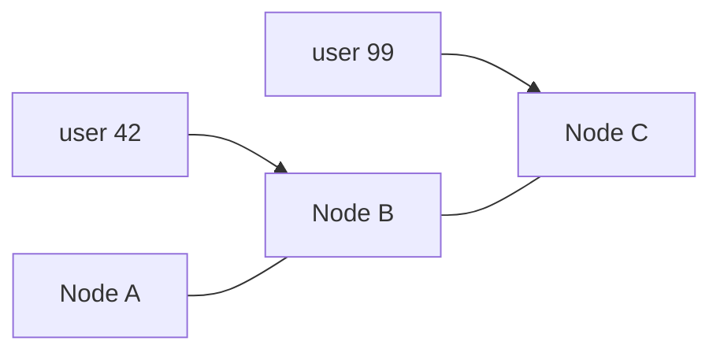

---

### Health checks

Load balancer continuously checks server health.

```http
GET /health
```

| Status | Action |
|--------|--------|
| **Healthy** — `200 OK` | Server stays in pool |
| **Unhealthy** — `500` error or timeout | Server removed from routing |

---

### Sticky sessions (session affinity)

Normally: Request 1 → App1, Request 2 → App2.

**Problem:** Session stored locally on App1.

**Solution:** Sticky sessions — user always routed to same server.

**Techniques:** Cookie based, IP hash, session hash

---

### SSL termination

```text
Client → HTTPS → Load Balancer → HTTP → Backend Servers
```

Load balancer performs TLS handshake, certificate management, and decryption. Backend services remain simpler.

---

### Active-active load balancing

```text
LB1 ─┐
     ├─ Both serve traffic simultaneously
LB2 ─┘
```

**Advantages:** Higher throughput, better utilization

---

### Active-passive load balancing

```text
LB1 → Active
LB2 → Standby (takes over only when LB1 fails)
```

---

### Common load balancers

**Open source:** Nginx, HAProxy, Envoy, Traefik

**Cloud managed:** AWS ALB, AWS NLB, Google Cloud Load Balancer, Azure Load Balancer

---

### System design example

```text
Users → CDN → Load Balancer → App1 / App2 / App3 → Database
```

**Flow:**

1. User sends request
2. CDN serves cached content if available
3. Request reaches load balancer
4. Load balancer selects backend
5. Backend processes request
6. Response returned

---

## 1.22 SSE, Polling & WebSockets

---

### The problem

Suppose we have WhatsApp, live cricket scores, order tracking, stock market dashboards, and live monitoring dashboards. Data changes continuously.

**Question:** How does the client know that new data is available?

**Possible solutions:**

1. Short polling
2. Long polling
3. Server-Sent Events (SSE)
4. WebSockets

---

### 1. Short polling

#### What is it?

Short polling means the client repeatedly sends requests to the server at fixed intervals asking: *"Do you have any new data?"*

#### Flow

```text
Client → GET /updates → Server → "No updates"
(wait 5 seconds)
Client → GET /updates → Server → "No updates"
(wait 5 seconds)
Client → GET /updates → Server → "New data"
```

#### Timeline example

Polling interval = 5 seconds:

```text
0s  → Request
5s  → Request
10s → Request
15s → Request
20s → Request
```

Even if nothing changes.

#### Problem

Suppose new data arrives at **7 seconds**. Client receives it at **10 seconds** — **delay = 3 seconds**.

| Advantages | Disadvantages |
|------------|---------------|
| Very simple | Huge number of unnecessary requests |
| Easy implementation | Wastes CPU and bandwidth |
| Works with normal HTTP | Increased server load; not truly real-time |

**When to use:** Admin dashboards, rarely changing data, small applications

---

### 2. Long polling

#### What is it?

Long polling tries to solve the wastefulness of short polling.

Instead of responding immediately, the server keeps the request open until **new data becomes available** OR a **timeout** occurs.

#### Flow

```text
Client → GET /updates → Server (no response yet — connection remains open)

New event arrives → Server → Response → Client

Client immediately creates another request.
```

#### Timeline example

```text
0s  → Client sends request; server waits
20s → New message arrives; server responds immediately
21s → Client creates new long-poll request
```

**Benefits over short polling:** No repeated requests every few seconds — only responds when data exists.

| Advantages | Disadvantages |
|------------|---------------|
| Fewer requests | Still creates new request after every response |
| Better than polling | Many open connections |
| Near real-time updates | More server resources |
| Works over standard HTTP | Complex timeout handling |

**When to use:** Legacy systems, browsers without SSE/WebSocket support, moderate real-time requirements

---

### 3. Server-Sent Events (SSE)

#### What is it?

SSE allows a server to continuously push updates to the client through a **single long-lived HTTP connection**.

Client sends one request. Server keeps connection open forever.

#### Flow

```text
Client → GET /events → Server (connection stays open)

Server pushes: Event 1 → Event 2 → Event 3 → Event 4

No additional requests needed.
```

#### Important

**Communication direction:** Server → Client **only**

Client can receive updates. Client **cannot** push messages through SSE. For sending data, client must still use normal HTTP APIs.

#### Real example

**Live log viewer** — server generates Log 1, Log 2, Log 3, Log 4; browser instantly receives updates.

#### Spring Boot example

Spring Boot commonly uses **`SseEmitter`** to stream events to the UI.

| Advantages | Disadvantages |
|------------|---------------|
| Real-time updates | One-way communication |
| Simple implementation | Not suitable for chat systems |
| Uses HTTP | Each client keeps one open connection |
| Automatic reconnection | |
| Lightweight | |

**When to use:** Notifications, live dashboards, monitoring systems, order tracking, stock prices, distributed tracing dashboards

---

### 4. WebSockets

#### What is it?

WebSocket creates a **persistent bidirectional** connection between client and server. Both sides can send data at any time.

#### Flow

```text
Client ↔ WebSocket ↔ Server
```

#### How connection is created

**Step 1** — Client sends HTTP request:

```http
GET /chat
Upgrade: websocket
```

**Step 2** — Server responds:

```http
101 Switching Protocols
```

**Step 3** — Connection upgrades from HTTP to WebSocket. Connection remains open.

#### Real example

**WhatsApp:**

```text
User A ↔ WebSocket ↔ Server ↔ WebSocket ↔ User B
```

Messages delivered instantly.

| Advantages | Disadvantages |
|------------|---------------|
| True real-time communication | More complex |
| Bidirectional | Stateful connections |
| Very low latency | Harder to scale |
| Minimal protocol overhead | Higher memory usage |
| Efficient for frequent updates | |

**When to use:** Chat applications, multiplayer games, collaborative editors, trading platforms, video call signaling

---

### Evolution of real-time communication

| Pattern | Behavior |
|---------|----------|
| **Short polling** | Client repeatedly asks: *"Any updates?"* |
| **Long polling** | Client asks once; server waits until data exists |
| **SSE** | Client asks once; server continuously pushes updates |
| **WebSocket** | Both sides continuously communicate |

---

### Connection comparison

**Short polling:**

```text
Request → Response → Close
Request → Response → Close
Request → Response → Close
```

**Long polling:**

```text
Request → Wait → Response → Close
Request → Wait → Response → Close
```

**SSE:**

```text
Request → Open connection → Event → Event → Event → Event
```

**WebSocket:**

```text
Open connection
Client ↔ Server
Client ↔ Server
Client ↔ Server
```

---

### System design examples

| Use case | Best choice | Reason |
|----------|-------------|--------|
| Live order tracking | **SSE** | Server pushes status changes |
| Distributed tracing dashboard | **SSE** | Server pushes new trace events |
| WhatsApp | **WebSocket** | Both users send and receive messages |
| Stock market dashboard | **SSE** | Mostly server-to-client updates |
| Admin dashboard refresh every minute | **Short polling** | Simple and sufficient |

---

[<- Back to master index](../README.md)
