# 1. Networking

[<- Back to master index](../README.md)

---

## Sub-topics

| # | Sub-topic |
|---|-----------|
| 1.1 | [OSI Model](#11-osi-model) |
| 1.2 | [TCP/IP](#12-tcpip) |
| 1.3 | [TCP Handshake](#13-tcp-handshake) |
| 1.4 | [UDP](#14-udp) |
| 1.5 | [MTU](#15-mtu) |
| 1.6 | [IP Addressing/Subnetting](#16-ip-addressingsubnetting) |
| 1.7 | [CIDR](#17-cidr) |
| 1.8 | [DNS](#18-dns) |
| 1.9 | [DNS Resolution](#19-dns-resolution) |
| 1.10 | [HTTP/HTTPS](#110-httphttps) |
| 1.11 | [SSL/TLS](#111-ssltls) |
| 1.12 | [HTTP/2 & HTTP/3](#112-http2--http3) |
| 1.13 | [QUIC](#113-quic) |
| 1.14 | [Keep-Alive Connections](#114-keep-alive-connections) |
| 1.15 | [Forward & Reverse Proxy](#115-forward--reverse-proxy) |
| 1.16 | [NAT](#116-nat) |
| 1.17 | [VPN](#117-vpn) |
| 1.18 | [Unicast, Broadcast, Multicast & Anycast](#118-unicast-broadcast-multicast--anycast) |
| 1.19 | [CDN](#119-cdn) |
| 1.20 | [Load Balancer](#120-load-balancer) |
| 1.22 | [SSE, Polling & WebSockets](#122-sse-polling--websockets) |

---

## 1.1 OSI Model

### Overview

Imagine mailing a package: you write the letter, seal it, label it, hand it to a courier, and the courier drives it through roads until it reaches the right building and the right apartment. The **OSI (Open Systems Interconnection) model** is the same idea for computers — it splits “send data over a network” into **seven layers**, each with one job, so hardware vendors, OS vendors, and app developers can work independently.

Technically, OSI is a **reference model** (not a single protocol stack on the wire). On the sender, application data moves **down** from Layer 7 to Layer 1; each layer adds its own header or transforms the payload. On the receiver, bits move **up** from Layer 1 to Layer 7; each layer strips or processes its part until the application sees the original message.

### What problem it fixes

Without a shared layer model, every team would reinvent “where does encryption go?” or “who assigns ports?” Debugging would be guesswork — is the bug in the browser, the Wi‑Fi driver, or the router? OSI gives a **common vocabulary** for teaching, troubleshooting, and mapping real protocols (HTTP, TCP, IP, Ethernet) to responsibilities.

### What it does

OSI defines seven layers, from user-facing applications down to physical signals:

| Layer | Name | Primary job | Common protocols / tech |
|-------|------|-------------|-------------------------|
| 7 | Application | Services for apps | HTTP, DNS, SMTP, gRPC |
| 6 | Presentation | Format, encrypt, compress | TLS, JSON, Protobuf, GZIP |
| 5 | Session | Manage conversation lifecycle | TLS session, WebSocket session |
| 4 | Transport | End-to-end delivery to a port | TCP, UDP |
| 3 | Network | Logical addressing and routing | IP, ICMP |
| 2 | Data link | Delivery inside one LAN segment | Ethernet, Wi‑Fi, MAC addresses |
| 1 | Physical | Bits on wire / fiber / radio | Cables, NICs, radio |

**IP address** identifies the machine; **port** (Layer 4) identifies the application on that machine (e.g. `192.168.1.10:5432` → PostgreSQL).

### How it works — the architecture inside

Data **encapsulates** on the way down and **de-encapsulates** on the way up. A browser request to `https://google.com` touches every layer:

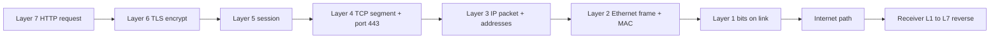

**Layer highlights (sender perspective):**

- **Application (7):** Browser builds `GET /` with `Host: google.com`. Cares about *what* to send, not routing.
- **Presentation (6):** TLS encrypts the HTTP bytes; optional compression (e.g. gzip) may apply to content.
- **Session (5):** TLS and long-lived connections (WebSocket, gRPC streams) manage start, resume, and teardown of the conversation.
- **Transport (4):** TCP segments data, assigns source/destination ports, guarantees order and retransmission. UDP would skip connection setup and reliability.
- **Network (3):** IP adds source and destination IP addresses. Routers read only this layer to forward toward the next hop.
- **Data link (2):** On the local subnet, switches use MAC addresses (`AA:BB:CC:DD:EE:FF`) in Ethernet frames. ARP maps IP → MAC on LANs.
- **Physical (1):** NIC converts frames to electrical, optical, or RF signals — raw 0s and 1s.

| Step | Layer | What happens |
|------|-------|--------------|
| 1 | 7 | User enters `https://google.com`; browser creates HTTP request |
| 2 | 6 | TLS encrypts request bytes |
| 3 | 5 | TLS session established / reused |
| 4 | 4 | TCP breaks payload into segments, port 443 |
| 5 | 3 | IP headers: client IP → Google server IP |
| 6 | 2 | Frame with source/destination MAC on local link |
| 7 | 1 | Signals leave the NIC |
| 8 | — | Routers/switches forward along path |
| 9 | 1–7 | Google’s stack processes layers **in reverse** |

### Pitfalls and design tips

- **OSI is a teaching model; the Internet runs TCP/IP (four layers).** In interviews, map OSI layers to TCP/IP rather than claiming OSI is “what runs on the wire.”
- **Layers 5 and 6 are often merged in practice.** Modern stacks fold presentation (TLS) and session into the application or transport implementation.
- **Don’t debug only at Layer 7.** A “slow website” might be DNS (app), TLS handshake (presentation), TCP retransmits (transport), or Wi‑Fi loss (physical).
- **Routers operate at Layer 3; switches at Layer 2.** Firewalls and NAT often sit at 3–4 boundary — know where your policy applies.

### Real-world example

**Chrome loading `https://www.google.com` over home Wi‑Fi:**

1. **L7:** Chrome issues an HTTP/2 `GET` for `/`.
2. **L6:** TLS 1.3 encrypts the request (certificate verified against the OS trust store).
3. **L4:** TCP connects to `142.250.x.x:443` (after DNS). Segments carry encrypted HTTP/2 frames.
4. **L3:** Packets carry your laptop’s private IP and Google’s public IP; your home router NATs the source.
5. **L2/L1:** Wi‑Fi radio sends Ethernet frames to the access point; ISP routers take over at Layer 3 onward.
6. Google’s edge terminates TLS, HTTP server handles the request, response travels back up the stack on your laptop.

If TLS fails, you see a certificate error (L6). If TCP fails, “connection timed out” (L4). If DNS fails, “server not found” before any packet leaves (effectively L7 dependency). The layer model tells you which tool to use (`curl -v`, `tcpdump`, `ping`, browser devtools).

---

## 1.2 TCP/IP

### Overview

If OSI is the textbook floor plan of a building, **TCP/IP** is the building people actually live in — the **four-layer model** used on the Internet today. Every website, mobile app, API call, and cloud service ultimately packages data as application bytes, transport segments, IP packets, and link-layer frames.

TCP/IP merges OSI’s top three layers into one **Application** layer and the bottom two into **Network Access**. It focuses on what is implemented in Linux, Windows, routers, and cloud VPCs: HTTP over TCP over IP over Ethernet/Wi‑Fi.

### What problem it fixes

Early networks used many incompatible stacks. TCP/IP provides a **minimal, interoperable** set of layers that scale from a laptop on Wi‑Fi to global backbone routers. It separates “reach this host” (IP), “reach this process” (TCP/UDP ports), and “what the app means” (HTTP, DNS, etc.) so each concern can evolve independently.

### What it does

| TCP/IP layer | Maps from OSI | Role |
|--------------|---------------|------|
| Application | 7, 6, 5 | Protocols apps use: HTTP, DNS, SMTP, SSH, gRPC |
| Transport | 4 | TCP (reliable, connection-oriented) or UDP (fast, connectionless); ports |
| Internet | 3 | IP addressing, routing; ICMP diagnostics; ARP on local subnet |
| Network Access | 2, 1 | MAC, frames, physical transmission (Ethernet, Wi‑Fi, fiber) |

**Encapsulation** — each layer wraps the layer above:

| Layer | Payload structure |
|-------|---------------------|
| Application | HTTP request body and headers |
| Transport | `[TCP header | HTTP data]` |
| Internet | `[IP header | TCP header | HTTP data]` |
| Network Access | `[MAC header | IP header | TCP header | HTTP data]` |

The receiver **de-encapsulates** in reverse: strip MAC → strip IP → strip TCP → deliver to the application.

### How it works — the architecture inside

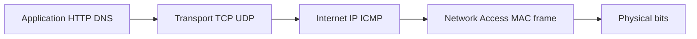

**Transport — TCP vs UDP (summary):**

| | TCP | UDP |
|---|-----|-----|
| Connection | 3-way handshake first | Send immediately |
| Delivery | Guaranteed, ordered | Best effort |
| Overhead | Higher (ACKs, windows) | 8-byte header |
| Typical use | HTTP, DB, payments | DNS, VoIP, QUIC base |

**Internet layer:** IP addresses identify endpoints. Routers forward based on destination IP only — they do not parse HTTP. **ICMP** supports `ping` and “destination unreachable.” **ARP** resolves IP → MAC on the local LAN before the first hop.

**Network access:** Switches forward by MAC within one broadcast domain. Combined physical + data link handles framing and signal.

**Web request walkthrough** (`https://google.com`):

| Step | Layer | Action |
|------|-------|--------|
| 1 | Application | Build HTTP request |
| 2 | Transport | TCP 3-way handshake to port 443 |
| 3 | Transport | Segment HTTP into TCP payloads |
| 4 | Internet | Add client/server IP headers |
| 5 | Network Access | Frame with MAC; transmit on link |
| 6 | — | Switches and routers along path |
| 7 | Receiver | De-encapsulate; TLS + HTTP handle response |

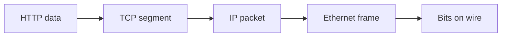

**OSI vs TCP/IP mapping:**

| OSI | TCP/IP |
|-----|--------|
| Application + Presentation + Session | Application |
| Transport | Transport |
| Network | Internet |
| Data Link + Physical | Network Access |

### Pitfalls and design tips

- **“TCP/IP” means the whole stack**, not only TCP — DNS often uses UDP; IP is always involved for routed traffic.
- **NAT lives at the Internet/Transport boundary** (typical home router): rewrites IP/port so many private hosts share one public IP — breaks end-to-end assumptions for inbound connections unless port forwarding or IPv6 is used.
- **Don’t confuse ARP (LAN) with DNS (global names).** ARP: “who owns 192.168.1.1?” DNS: “what IP is google.com?”
- **Default choice for new app APIs:** TCP (HTTP/HTTPS or gRPC). UDP when latency beats loss (media, gaming) or for DNS-sized messages.

### Real-world example

**A REST call from a Kubernetes pod to a service:**

1. App container sends `GET http://payments.default.svc.cluster.local/health` (Application).
2. Cluster DNS returns a ClusterIP; kube-proxy or CNI routes to a backend pod IP (still Application + OS resolver).
3. TCP connects to port 8080; kernel segments the HTTP request (Transport).
4. IP packets use pod CIDR → node routing → possibly overlay (VXLAN/wire) (Internet).
5. veth/bridge/Ethernet on the node delivers frames (Network Access).

If the Service IP works but a pod IP fails, you suspect routing or network policy (Layer 3/4), not JSON parsing (Layer 7). `tcpdump -i any host <ip> and port 8080` shows whether TCP segments leave the pod.

---

## 1.3 TCP Handshake

### Overview

Before two programs can exchange bytes reliably over TCP, they need a short phone call: “Are you there?” “Yes.” “Good, let’s talk.” The **TCP three-way handshake** (SYN → SYN-ACK → ACK) establishes that both sides are alive, exchanges **initial sequence numbers (ISNs)**, negotiates options, and allocates kernel state for the connection.

Technically, the handshake is pure TCP control segments — no application data yet (except optional **TCP Fast Open** cookie data). Only after both ends reach **ESTABLISHED** does HTTP, PostgreSQL wire protocol, or any other app protocol send payload on that socket.

### What problem it fixes

IP delivers packets to a host, not to a specific in-order byte stream. TCP must know both sides’ starting sequence numbers to detect loss, duplication, and reordering. The handshake also prevents old duplicate SYNs from instantiating spurious connections and gives a place to negotiate **MSS**, **window scaling**, **SACK**, and timestamps.

### What it does

| Step | Sender → Receiver | Flags / fields | Meaning |
|------|-------------------|----------------|---------|
| 1 | Client → Server | SYN, Seq = client ISN (e.g. 1000) | “Open connection; my sequence starts at 1000.” |
| 2 | Server → Client | SYN+ACK, Seq = server ISN (e.g. 5000), Ack = 1001 | “Ack your SYN; my sequence starts at 5000.” |
| 3 | Client → Server | ACK, Ack = 5001 | “Ack your SYN; connection open.” |

**States during handshake:**

| Step | Client state | Server state |
|------|--------------|--------------|
| After SYN | `SYN_SENT` | `LISTEN` → `SYN_RECEIVED` |
| After SYN-ACK | `SYN_SENT` | `SYN_RECEIVED` |
| After final ACK | `ESTABLISHED` | `ESTABLISHED` |


**Closing** uses a **four-way** exchange (FIN → ACK → FIN → ACK). The side that sends the first FIN eventually enters **TIME_WAIT** (often 60–120 seconds) so delayed segments cannot poison a later connection reusing the same quad (src IP, src port, dst IP, dst port).

**Sequence numbers and ACKs:** If the client sends bytes 1000–1099, the server ACKs **1100** (“next byte I expect”). Loss of byte 1001–1099 leaves ACK stuck at 1001 until retransmit.

**Options negotiated in handshake:**

| Option | Purpose |
|--------|---------|
| MSS | Max TCP payload per segment (often 1460 on Ethernet) — avoids IP fragmentation |
| Window scaling | Extends receive window beyond 64 KB for high-BDP links |
| SACK | Retransmit only missing segments, not everything after a gap |
| Timestamps | RTT measurement, better loss detection |
| TCP Fast Open | Send data in SYN after prior cookie — saves ~1 RTT |

**SYN queue vs accept queue:** Half-open connections (`SYN_RECEIVED`) sit in the **SYN queue**; fully established sockets waiting for `accept()` sit in the **accept queue**. Backlog tuning (`somaxconn`, `tcp_max_syn_backlog`) matters under load.

### How it works — the architecture inside

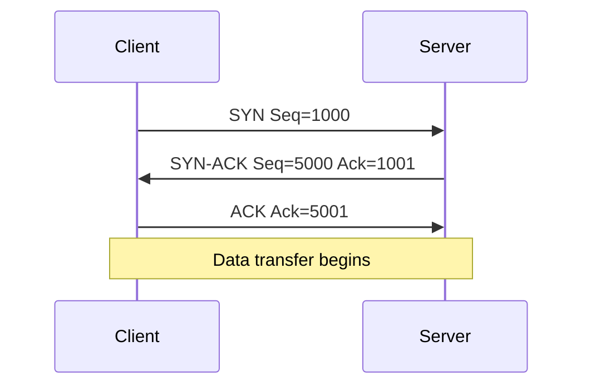

**Ephemeral ports:** Clients use temporary high ports (e.g. 52344). Rough capacity:

```text
Available ephemeral ports ≈ 28,000
TIME_WAIT duration       ≈ 60 s
Sustainable new conn/s   ≈ 28,000 / 60 ≈ 466/s per client IP
```

Beyond that, errors like `Cannot assign requested address` appear — common when load generators omit `TIME_WAIT` reuse settings or connection pooling.

**SYN flood:** Attacker sends many SYNs without final ACK; server fills `SYN_RECEIVED` slots. **SYN cookies** encode state in the SYN-ACK sequence number and allocate full state only after valid ACK.

**Keep-alive and pooling:** HTTP/1.1 `Connection: keep-alive` reuses one TCP connection for many requests. Database pools (HikariCP, pgBouncer) keep dozens of TCP connections open instead of handshake-per-query.

### Pitfalls and design tips

- **Every new TCP connection costs ~1 RTT** (sometimes 2–3 with TLS) — pool connections for DB and service meshes.
- **TIME_WAIT on the active closer is normal** — don’t disable it blindly; fix port exhaustion with more client IPs, pooling, or `tcp_tw_reuse` where appropriate and understood.
- **Load balancers must handle SYN before backends** — SYN flood targets the LB’s SYN queue first.
- **Interview tip:** Distinguish **connection established** (kernel `ESTABLISHED`) from **accepted by app** (blocked in accept queue until a thread calls `accept()`).

### Real-world example

**nginx terminating HTTPS for thousands of short API requests:**

Without keep-alive, each `GET /api/v1/status` pays TCP handshake (~20–50 ms on cross-region links) plus TLS. With `keepalive_timeout 65` and HTTP/1.1, the same client reuses one socket for hundreds of requests — CPU and latency drop sharply.

A Java service using **HikariCP** to PostgreSQL opens a fixed pool (e.g. 20 TCP connections at startup). Each query borrows a connection — no per-query SYN/SYN-ACK/ACK. Under burst traffic, watch `ESTABLISHED` count and accept-queue drops (`ss -ltn`) on the database; if the app is slow to `accept()`, the accept queue fills even though the handshake succeeded.

---

## 1.4 UDP

### Overview

**UDP (User Datagram Protocol)** is the “loudspeaker” of transport protocols: send a message once, don’t wait for applause. There is no connection setup, no automatic retry, and no ordering — which makes it **faster and lighter** than TCP when you can tolerate or handle loss yourself.

UDP adds only an 8-byte header (ports, length, checksum) and hands datagrams to IP. Applications — or newer protocols like **QUIC** — add reliability, encryption, and multiplexing on top when needed.

### What problem it fixes

TCP’s guarantees cost RTTs, CPU, and buffer memory. Real-time video, voice, and live game state prefer **fresh data over old retransmitted data**. DNS questions are tiny request/response pairs where a full TCP handshake would dominate latency. UDP gives a minimal multiplexing layer (ports) without imposing connection state on the OS.

### What it does

| Property | TCP | UDP |
|----------|-----|-----|
| Connection | Required (handshake) | None |
| Reliability | Yes | No |
| Ordering | Yes | No |
| Flow / congestion control | Built in | None |
| Header size | ≥ 20 bytes | 8 bytes |
| Typical ports | 80, 443, 5432 | 53 (DNS), 123 (NTP), QUIC |

Sender transmits datagrams; receiver may get them out of order, duplicated, or not at all. **Checksum** catches some corruption; there is no recovery beyond app logic.

### How it works — the architecture inside

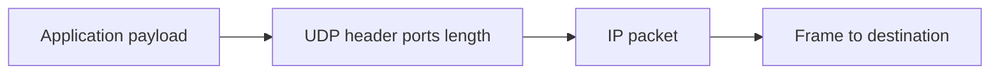

**Why UDP is faster:** Skips handshake, ACK processing, ordered reassembly, retransmission timers, and congestion control — less kernel work per message.

**When loss is acceptable:**

| Scenario | Behavior on loss |
|----------|------------------|
| Video frame | Skip frame; show next |
| Game position | Use latest coordinates |
| Voice packet | Brief gap vs stall |
| DNS query | App retries or tries another resolver |

**Application-level reliability on UDP:** **QUIC** (HTTP/3) adds streams, encryption, loss recovery, and 0-RTT resumption on top of UDP so OS kernels stay unchanged. **RTP** carries media with sequence numbers for jitter buffers.

**Common UDP ports:**

| Port | Service |
|------|---------|
| 53 | DNS |
| 67/68 | DHCP |
| 123 | NTP |
| 443 | QUIC (HTTP/3) over UDP |

### Pitfalls and design tips

- **UDP “unreliable” does not mean “fire and forget” for production** — you need app-level timeouts, retries, or codecs that conceal loss.
- **No congestion control** — high-rate UDP can starve TCP on shared links; QUIC implements its own congestion control.
- **Large DNS responses switch to TCP** — if truncation (TC bit) occurs, resolver retries on TCP 53.
- **Default for APIs:** TCP/HTTP unless you measure that loss tolerance and latency requirements favor UDP or QUIC.
- **Firewall/NAT:** UDP has no “connection” — stateful firewalls track pseudo-flows by IP/port/time; short DNS queries behave differently from long QUIC sessions.

### Real-world example

**Zoom-style voice and DNS on the same laptop:**

1. **Voice (RTP/SRTP over UDP):** Microphone audio is packetized every 20 ms. If packet 37 is lost, the jitter buffer plays packet 36 then 38 — a 20 ms glitch beats waiting 200 ms for TCP-style retransmit.
2. **DNS (UDP port 53):** Resolver sends ~30-byte query `A api.stripe.com`; authoritative reply is often &lt; 512 bytes. Single round trip, no handshake. If the response is large (many records), resolver retries with TCP.

**HTTP/3 (Google, Cloudflare, major CDNs):** Browser speaks QUIC on UDP/443. First visit: crypto + transport setup in fewer round trips than TCP+TLS; later requests multiplex streams without TCP head-of-line blocking between them — still UDP at the bottom, reliability inside QUIC.

---

## 1.5 MTU

### Overview

**MTU (Maximum Transmission Unit)** is the size limit of a single packet on a link — like a bridge with a max truck weight. If your payload is bigger than the path allows, something must **split** (fragment) or **shrink** the packet.

For IPv4 Ethernet, **MTU is typically 1500 bytes** for the entire IP packet (headers + payload). TCP avoids IP fragmentation by negotiating **MSS** (maximum segment size) — usually **1460 bytes** of application data after 20-byte IP and 20-byte TCP headers.

### What problem it fixes

Links differ: Ethernet 1500, VPN tunnels 1400 or less, jumbo frames 9000 in data centers. Without a agreed maximum, oversized packets are dropped or fragmented, wasting CPU and increasing loss sensitivity (lose one fragment, lose whole datagram). MTU and MSS alignment keep throughput predictable.

### What it does

| Concept | Meaning |
|---------|---------|
| MTU | Max **IP packet** size on an interface (headers + payload) |
| MSS | Max **TCP payload** per segment — excludes IP and TCP headers |
| Path MTU | Smallest MTU along the full route |
| PMTUD | Sender discovers path MTU via “packet too big” ICMP |

**Common MTU values:**

| Network | MTU (bytes) |
|---------|-------------|
| Ethernet | 1500 |
| PPPoE | 1492 |
| Many VPNs | 1300–1400 |
| Jumbo frames (DC) | 9000 |

**Fragmentation:** If IP must send 5000 bytes and path MTU is 1500, the packet splits into fragments. Loss of **any** fragment forces whole-packet retransmit — why TCP prefers smaller segments via MSS instead.

### How it works — the architecture inside

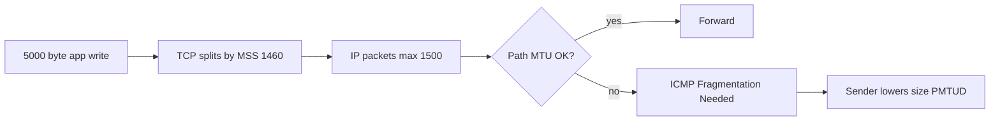

**Packet layout at MTU 1500:**

```text
+------------------+
| IP header   20 B |
+------------------+
| TCP header  20 B |
+------------------+
| Payload   1460 B |
+------------------+
Total IP packet = 1500 bytes
```

**How to calculate — MSS from MTU:**

- **Given:** MTU = 1500, IP header = 20 B, TCP header = 20 B (no options)
- **Formula:** `MSS = MTU − IP header − TCP header`
- **Steps:** `MSS = 1500 − 20 − 20 = 1460` bytes payload per segment
- **Sanity check:** `20 + 20 + 1460 = 1500` — fits one Ethernet frame without IP fragmentation

**Path MTU example:**

```text
Laptop MTU 1500 → ISP 1500 → VPN 1400 → Server 1500
Effective path MTU = 1400
```

Sender that ignores VPN gets ICMP “Fragmentation Needed” (type 3, code 4); TCP lowers MSS or IP layer reduces packet size (PMTUD).

| MTU choice | Tradeoff |
|------------|----------|
| Larger (jumbo 9000) | Fewer packets, higher throughput; all hops must support it |
| Smaller (VPN-safe 1400) | More headers per byte; safer through tunnels |

**How to calculate — packets for 1 MB transfer:**

- **Given:** Data = 1,048,576 bytes, MSS ≈ 1460 bytes payload per segment
- **Segments:** `1,048,576 / 1460 ≈ 718` TCP segments (plus headers on wire)
- **With jumbo MSS ≈ 8960:** `1,048,576 / 8960 ≈ 117` segments — fewer interrupts on NIC

### Pitfalls and design tips

- **PMTUD breaks if ICMP is filtered** — classic “works on LAN, hangs on VPN” bug; set explicit MSS clamp on VPN interfaces or use TCP MSS adjustment.
- **Don’t enable jumbo frames on only some switches** — silent drops or fragmentation surprises.
- **UDP apps must size themselves** — no MSS negotiation; large UDP without fragmentation support gets dropped.
- **Cloud:** AWS/GCP/Azure default 1500; overlay networks may need testing with `ping -M do -s <size>`.

### Real-world example

**Corporate laptop on OpenVPN or WireGuard accessing an internal API:**

Default laptop thinks MTU 1500. VPN encapsulation adds headers; effective tunnel MTU ~1400. Full-size TCP segments hit the tunnel, ICMP “too big” should trigger MSS reduction. If the corporate firewall **blocks ICMP**, PMTUD fails — TCP sends large packets, they black-hole, HTTPS hangs after SYN.

Fix: set interface MTU to 1400 on the VPN client or MSS clamp at the gateway. `ping -f -l 1472` (Windows) or `ping -M do -s 1472` (Linux) toward the server finds the largest size without fragmentation — add 28 bytes for IP+ICMP headers to infer path MTU.

---

## 1.6 IP Addressing/Subnetting

### Overview

An **IP address** is a device’s logical “street address” on a network — routers use it to forward packets toward the right neighborhood and host. **Subnetting** splits one large address block into smaller networks so HR, finance, and production don’t share one flat broadcast domain.

**IPv4** uses 32 bits, written as four octets (`192.168.1.10`). **Public** addresses are globally routable; **private** ranges (`10/8`, `172.16/12`, `192.168/16`) are reused behind NAT inside homes and cloud VPCs.

### What problem it fixes

Flat networks do not scale: thousands of hosts on one LAN generate broadcast storms, weak security boundaries, and routing tables that cannot summarize cleanly. Subnetting allocates **right-sized** address space per team or tier (web, app, database) and keeps traffic local where possible.

### What it does

- **Uniquely identify** a host within a routing domain (with NAT, private IPs repeat in different VPCs).
- **Separate network prefix from host suffix** via subnet mask or CIDR (e.g. `/24` → 24 bits network, 8 bits host).
- **Reserve** first address (network) and last (broadcast) in each subnet — not assignable to hosts.

**Private IPv4 ranges (RFC 1918):**

| Range |
|-------|
| `10.0.0.0` – `10.255.255.255` |
| `172.16.0.0` – `172.31.255.255` |
| `192.168.0.0` – `192.168.255.255` |

**Default gateway:** Host sends off-subnet traffic to the router (e.g. laptop `192.168.1.10/24`, gateway `192.168.1.1`).

### How it works — the architecture inside

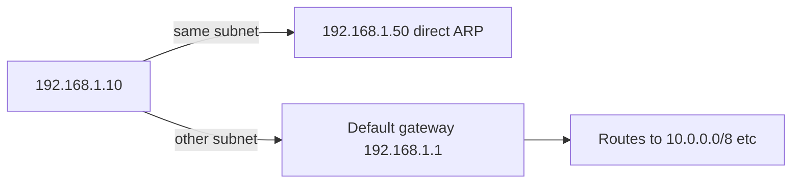

**`192.168.1.10/24` breakdown:**

| Part | Value |
|------|-------|
| Network | `192.168.1.0` |
| Host | `.10` |
| Mask | `255.255.255.0` (= `/24`) |
| Broadcast | `192.168.1.255` |
| Usable hosts | `.1` – `.254` (254 hosts) |

**How to calculate — usable hosts:**

- **Given:** CIDR `/24` → host bits = 32 − 24 = 8
- **Formula:** `usable hosts = 2^host_bits − 2`
- **Steps:** `2^8 = 256`; minus network and broadcast → **254 usable**
- **Sanity check:** `/30` has 2^2 − 2 = **2** hosts — common for point-to-point router links

| CIDR | Host bits | Usable hosts |
|------|-----------|--------------|
| /24 | 8 | 254 |
| /25 | 7 | 126 |
| /26 | 6 | 62 |
| /27 | 5 | 30 |

**Subnetting example — split `192.168.1.0/24` into four `/26` subnets** (borrow 2 host bits → `/26`):

| Subnet | Host range | Broadcast |
|--------|------------|-----------|
| `192.168.1.0/26` | `.1` – `.62` | `.63` |
| `192.168.1.64/26` | `.65` – `.126` | `.127` |
| `192.168.1.128/26` | `.129` – `.190` | `.191` |
| `192.168.1.192/26` | `.193` – `.254` | `.255` |

### Pitfalls and design tips

- **Plan for growth** — exhausting a `/24` in production forces painful renumbering or overlay hacks.
- **AWS/GCP: one subnet = one AZ** for many designs; don’t stretch the same L2 across regions.
- **Broadcast domains vs security groups** — subnetting alone is not a firewall; pair with ACLs/SG/NACLs.
- **Interview:** Know `/24`, `/26`, `/30` cold; explain why `.0` and `.255` are reserved in IPv4 subnets.

### Real-world example

**AWS VPC design for a three-tier web app:**

```text
VPC: 10.0.0.0/16  (65,536 addresses)

10.0.1.0/24   public subnets  — ALB, NAT gateway (AZ-a)
10.0.2.0/24   public subnets  — ALB, NAT (AZ-b)
10.0.10.0/24  private app     — ECS/EKS pods (AZ-a)
10.0.20.0/24  private app     — (AZ-b)
10.0.100.0/24 database        — RDS subnet group (no direct internet route)
```

Web tasks in `10.0.10.0/24` reach RDS on `10.0.100.0/24` via route tables and security groups — not public IPs. NAT in public subnets gives outbound internet for patches without inbound exposure to app tiers. Each `/24` yields 254 private IPs — enough for hundreds of ENIs per AZ with room for AWS reserved addresses.

---

## 1.7 CIDR

### Overview

**CIDR (Classless Inter-Domain Routing)** writes network size as a **prefix length** after a slash — `10.0.0.0/16` means the first 16 bits are the network, the rest are hosts. It replaced rigid **Class A/B/C** sizing so you can allocate **just enough** addresses instead of wasting an entire Class B for 500 machines.

CIDR also enables **route aggregation** (supernetting): many contiguous `/24` blocks advertised as one `/22`, shrinking Internet routing tables.

### What problem it fixes

Classful networking wasted space — a company needing 1,000 IPs got 65,534 (Class B) or struggled with 254 (Class C). Internet routers faced exploding table sizes when every small network announced separately. CIDR flexibly sizes networks and summarizes routes for scalability.

### What it does

- **Notation:** `network_address/prefix` — prefix = count of leading 1-bits in the mask.
- **Equivalence:** `/24` = mask `255.255.255.0`; `/16` = `255.255.0.0`.
- **Aggregation:** `192.168.0.0/24` through `192.168.3.0/24` → summarize as `192.168.0.0/22`.

| CIDR | Mask | Usable IPv4 hosts |
|------|------|-------------------|
| /16 | 255.255.0.0 | 65,534 |
| /23 | 255.255.254.0 | 510 |
| /24 | 255.255.255.0 | 254 |
| /26 | 255.255.255.192 | 62 |

### How it works — the architecture inside


**`192.168.1.10/24` in binary terms:**

- 32-bit address; first **24 bits** fixed for network (`192.168.1`), last **8 bits** for host (`.10`).
- All hosts with same /24 prefix are on-link without a router.

**How to calculate — pick CIDR for N hosts:**

- **Given:** Need at least 500 assignable hosts
- **Find host bits:** Need `2^h − 2 ≥ 500` → `2^9 − 2 = 510` → **9 host bits**
- **Prefix:** `32 − 9 = /23`
- **Result:** One `/23` block (e.g. `10.10.0.0/23`) provides 510 usable IPs
- **Sanity check:** `/24` only gives 254 — too small; `/22` gives 1022 — works but wastes more space

**Aggregation example:**

```text
192.168.0.0/24
192.168.1.0/24
192.168.2.0/24
192.168.3.0/24
→ aggregate to 192.168.0.0/22 (one routing table entry)
```

### Pitfalls and design tips

- **CIDR math errors cause overlaps** — overlapping VPC peering CIDRs break routing; plan address space globally for multi-VPC accounts.
- **Smaller prefix number = bigger network** — `/16` is larger than `/24` (common interview trap).
- **IPv6 uses CIDR everywhere** — `/64` per LAN is standard; don’t subnet IPv6 like IPv4 without understanding SLAAC and ND.
- **Cloud quotas:** AWS default VPC `/16`; carving many `/28` leaves room but watch ENI/IP limits per subnet.

### Real-world example

**GCP custom VPC for a startup expecting ~400 microservices:**

Engineer chooses **`10.20.0.0/22`** (1022 usable IPs) instead of `/16` to avoid peering conflicts with a partner’s `10.0.0.0/16`. Inside:

- `10.20.0.0/24` — GKE nodes (AZ-a)
- `10.20.1.0/24` — GKE nodes (AZ-b)
- `10.20.2.0/25` — managed Redis/Memcached (62 hosts max — enough for managed service endpoints)

When connecting to on-prem via Cloud VPN, they advertise **`10.20.0.0/22` as one route** to the corporate router — four `/24`-sized pieces, one BGP entry. If they had announced each `/24` separately, on-prem table noise grows; aggregation keeps ops simple.

---

## 1.8 DNS

### Overview

**DNS (Domain Name System)** is the Internet’s phonebook: you type `stripe.com`, your computer needs `104.18.x.x` (or similar) to open a TCP connection. DNS maps **human-readable names** to **records** — mostly IP addresses, but also mail servers, aliases, and verification strings.

The system is **hierarchical and distributed** — root servers know TLDs (`.com`), TLD servers know authoritative nameservers for registered domains, and authoritative servers hold the actual records your admin configured.

### What problem it fixes

People cannot memorize IPv4/IPv6 addresses for every service. Services also **change IPs** (failover, CDN, scaling); DNS provides a stable name with updatable records. Without DNS, TLS certificate hostnames, email routing (MX), and CDN steering by geography would not work at human scale.

### What it does

- **Resolves** queries: `A` (IPv4), `AAAA` (IPv6), `CNAME` (alias), `MX` (mail), `TXT` (SPF, DKIM, verification), `NS` (delegation).
- **Caches** answers at browser, OS, and recursive resolver using **TTL** (time to live).
- **Transports** most queries over **UDP port 53**; falls back to **TCP 53** for large responses or zone transfers.
- **Supports** traffic management — multiple A records, geo DNS, low TTL for migrations.

**Hierarchy (simplified):**


### How it works — the architecture inside

| Record | Purpose | Example |
|--------|---------|---------|
| A | Name → IPv4 | `api.example.com → 203.0.113.10` |
| AAAA | Name → IPv6 | `api.example.com → 2001:db8::1` |
| CNAME | Alias → another name | `www.example.com → example.com` |
| MX | Mail server priority + host | `example.com → 10 mail.example.com` |
| TXT | Opaque text | SPF, domain verification |
| NS | Delegates zone | `example.com → ns1.cloudflare.com` |

**Caching:** Resolver stores `(name, type) → answer` until TTL expires. Short TTL (60 s) speeds cutover during migrations; long TTL (3600 s) reduces load and latency.

**CDN / geo routing:** Same name returns different A records based on resolver location — user in Mumbai may get an edge IP in India, user in Virginia a US edge IP.

**DNS load balancing:** Multiple A records for `api.company.com` rotate across app servers — crude distribution without a hardware LB (health checks are limited compared to L7 LB).

### Pitfalls and design tips

- **DNS is not a real-time failover system** — cached old IPs persist until TTL expires; pair with health-checked LB or anycast for fast failover.
- **CNAME at apex** (`example.com` root) historically problematic — use ALIAS/ANAME at provider (Route 53, Cloudflare) or host apex on provider anycast.
- **High TTL during incidents** slows rollback — lower TTL **before** planned migrations.
- **DNSSEC** adds authenticity; without it, cache poisoning is a risk on hostile networks — understand your resolver’s DNSSEC validation.
- **Private zones** (Route 53 Private Hosted Zone, internal BIND) split horizons — `db.prod.internal` resolves differently inside VPC vs public internet.

### Real-world example

**Cloudflare as authoritative DNS for `shop.example.com`:**

1. Registrar NS records point to Cloudflare nameservers.
2. Admin sets `A` record `shop` → origin IP, proxied (orange cloud) so traffic flows through Cloudflare’s edge.
3. `CNAME` `www` → `shop.example.com`.
4. `TXT` records publish SPF and DKIM for SendGrid email.
5. TTL on shop record 300 s — during origin migration, they lower to 60 s, change A to new load balancer IP; within minutes most resolvers pick up the new address.

Stripe’s public API hostname resolves via their CDN/DNS setup — clients never hardcode IPs; certificate validates `api.stripe.com` while backends shift. That separation is why payment SDKs use hostnames, not fixed IPv4 literals.

---

## 1.9 DNS Resolution

### Overview

Typing `https://google.com` triggers a **lookup chain**: your browser asks “what IP is this?” — first locally, then a **recursive resolver**, which may walk the global DNS tree (root → TLD → authoritative) until it gets an answer. The result is cached at each layer so the next visit is nearly instant.

Resolution is iterative behind the scenes: the resolver does the legwork; your laptop usually sends one **recursive** query and receives one answer.

### What problem it fixes

Applications should not embed IP addresses that change hourly. Resolution bridges human names to current infrastructure addresses while minimizing repeated full-tree walks via **multi-tier caching** and **TTL**.

### What it does

1. Check **browser cache** (Chrome DNS cache).
2. Check **OS cache** (`systemd-resolved`, Windows DNS client).
3. Query **recursive resolver** (ISP, `8.8.8.8`, `1.1.1.1`, corporate BIND).
4. Resolver queries **root** → **TLD** (`.com`) → **authoritative** for the domain.
5. Answer returned; cached per TTL; browser opens TCP to the IP.

**Server roles:**

| Role | Job |
|------|-----|
| Recursive resolver | Asks on behalf of client; caches |
| Root | Points to TLD servers |
| TLD | Points to domain’s authoritative NS |
| Authoritative | Returns actual records |

### How it works — the architecture inside

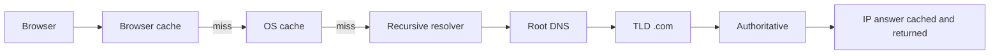

**CNAME chase:** Query `www.example.com` → CNAME `cdn.cloudfront.net` → second lookup for A on `cdn.cloudfront.net`. Each hop adds latency on full miss.

**Cache latency (typical):**

| Layer | Added latency |
|-------|----------------|
| Browser hit | ~0 ms |
| OS hit | ~0–1 ms |
| Resolver hit | ~1–20 ms |
| Full iterative miss | ~20–150+ ms |

**Happy Eyeballs:** Modern clients query **A** and **AAAA** and may race IPv6 vs IPv4. Broken AAAA (published but unroutable) causes noticeable delay before IPv4 succeeds — common pitfall during partial IPv6 rollouts.

**Debug commands:**

```bash
dig api.example.com
dig +trace api.example.com
dig @8.8.8.8 api.example.com
```

### Pitfalls and design tips

- **Long CNAME chains** hurt cold-start latency — flatten to A/ALIAS at apex where possible.
- **Stale OS cache after cutover** — `ipconfig /flushdns` or wait TTL; verify authoritative with `dig @ns1.yourprovider.com`.
- **`/etc/hosts` overrides** — dev machines may bypass DNS entirely for test hostnames.
- **Async DNS in apps** — block startup on resolver timeouts; use connection pooling with pre-resolved endpoints in k8s (ClusterIP avoids external DNS for internal names).
- **Runbook — “DNS updated but clients see old IP”:** (1) `dig @authoritative` — correct? (2) `dig @8.8.8.8` — propagated? (3) local `dig` — flush OS cache.

### Real-world example

**First visit to `https://www.google.com` on a home PC using Cloudflare `1.1.1.1`:**

1. Browser cache miss (first visit).
2. OS cache miss.
3. PC sends UDP query to `1.1.1.1`: “A record for `www.google.com`?”
4. Cloudflare resolver cache hit (common for Google) — if miss, resolver asks root → `.com` TLD → `google.com` authoritative; answer e.g. `142.250.80.x`, TTL 300.
5. Resolver returns IP; OS caches; browser caches.
6. Browser starts TCP+TLS to that IP; **SNI** carries `www.google.com` for certificate selection.

Second tab within TTL: step 3 never leaves the machine — **~0 ms DNS**. `dig +trace www.google.com` from a shell shows the full delegation for learning/debugging, separate from what the browser experiences on cache hit.

---

## 1.10 HTTP/HTTPS

### Overview

**HTTP** is how browsers and APIs ask for things and get answers — a text-based (or binary in HTTP/2+) **request/response** protocol: method, path, headers, optional body in; status, headers, body out. It is **stateless**: each request stands alone unless cookies, tokens, or server sessions add memory.

**HTTPS** is HTTP inside **TLS** — same verbs and status codes, but bytes on the wire are encrypted and authenticated. `https://` on port 443 is the default for the public web and modern APIs.

### What problem it fixes

Apps need a universal, firewall-friendly way to exchange documents (HTML, JSON, images) across heterogeneous clients and servers. HTTP standardizes methods and caching semantics. HTTPS fixes HTTP’s cleartext problem — passwords, cookies, and PII visible to anyone on the path — by adding confidentiality and integrity on top of TCP.

### What it does

**HTTP/1.1 request example:**

```http
GET /api/users/42 HTTP/1.1
Host: api.example.com
Accept: application/json
Authorization: Bearer eyJhbG...
Connection: keep-alive
```

**Response:**

```http
HTTP/1.1 200 OK
Content-Type: application/json
Cache-Control: private, max-age=60

{"id":42,"name":"Ada"}
```

**Methods (interview essentials):**

| Method | Safe | Idempotent | Typical use |
|--------|------|------------|-------------|
| GET | Yes | Yes | Read |
| POST | No | No | Create, actions |
| PUT | No | Yes | Replace |
| PATCH | No | No* | Partial update |
| DELETE | No | Yes | Delete |

**Status classes:** `2xx` success, `3xx` redirect/cache, `4xx` client fault, `5xx` server fault.

**State via cookies:**

```text
POST /login → Set-Cookie: session=xyz
GET /profile + Cookie: session=xyz → server loads session
```

**HTTPS stack:**

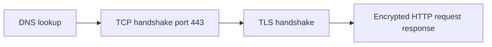

| Step | Action |
|------|--------|
| 1 | Resolve hostname |
| 2 | TCP 3-way handshake |
| 3 | TLS handshake (cert verify, session keys) |
| 4 | HTTP request/response encrypted |

**HTTPS protects:** payloads, cookies, path, headers (from passive eavesdroppers). **It does not hide:** destination IP, SNI hostname (in typical TLS 1.2/1.3 deployments), traffic volume/timing patterns.

### How it works — the architecture inside

Application layer sits on TCP (or QUIC for HTTP/3). **Keep-alive** reuses TCP for multiple HTTP transactions — critical for latency. **TLS** terminates at load balancer (edge TLS) or at app — affects certificate management and whether HTTP inside VPC is cleartext.

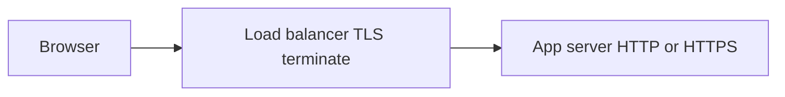

**Caching:** `Cache-Control`, `ETag`, `304 Not Modified` reduce bandwidth. **REST** conventions map resources to nouns and methods to verbs — still HTTP underneath.

### Pitfalls and design tips

- **Mixed content** — HTTPS pages loading HTTP assets get blocked by browsers.
- **TLS termination point** — LB terminates TLS, HTTP to backend must stay on private network; use mTLS for sensitive east-west traffic.
- **POST is not idempotent** — retries need idempotency keys for payments (Stripe pattern).
- **429 / 503** — signal backoff; clients should respect `Retry-After`.
- **Default for new public APIs:** HTTPS only, HSTS enabled, TLS 1.2+ .

### Real-world example

**Stripe API client fetching `GET https://api.stripe.com/v1/customers/cus_123`:**

1. Resolver returns Stripe anycast/CDN edge IP.
2. TCP + TLS 1.3 handshake — client verifies cert for `api.stripe.com` against Mozilla/Apple trust store.
3. Client sends encrypted HTTP GET with `Authorization: Bearer sk_live_...` header.
4. Stripe returns `200` JSON body; `Cache-Control: no-cache` on sensitive resources.
5. SDK may reuse connection (keep-alive) for subsequent pagination requests — one TLS session, many HTTP calls.

A network sniffer on café Wi‑Fi sees only encrypted blobs and SNI to `api.stripe.com` — not the secret key or customer JSON — illustrating what HTTPS does and does not conceal.

---

## 1.11 SSL/TLS

### Overview

**TLS (Transport Layer Security)**, still often called SSL, is the padlock in the browser: it proves you reached the real server (via **certificates** signed by a trusted **CA**), then encrypts everything after the handshake with symmetric **session keys**. HTTPS is HTTP running inside that encrypted tunnel.

Think of the CA as a passport office, the certificate as the passport, and the TLS handshake as showing the passport and agreeing on a one-time session code only you and the server know.

### What problem it fixes

On untrusted networks (Wi‑Fi, ISP paths), cleartext HTTP allows eavesdropping and tampering (**MITM**). TLS provides **confidentiality** (encryption), **integrity** (detect changes), and **authentication** (server identity via PKIX chain). Without it, cookies and credentials are trivially stolen.

### What it does

**Certificate provisioning (offline, periodic):**

1. Server generates key pair (public + private).
2. Server submits CSR to CA (Let’s Encrypt, DigiCert).
3. CA validates domain control; signs certificate binding domain → public key.
4. Server installs cert + private key; private key never leaves server.

**Live connection:**

1. TCP established.
2. **ClientHello** — TLS versions, ciphers, random.
3. **ServerHello** + certificate + random.
4. Client verifies cert chain to trusted root; checks hostname and expiry.
5. Key exchange (ECDHE) establishes shared secret.
6. Both derive **session keys**; symmetric encryption for HTTP records.
7. Optional client certificates for mTLS in service meshes.

| Key material | Who holds it | Role |
|--------------|--------------|------|
| CA private key | CA | Signs certificates |
| CA public key | Client trust store | Verify CA signature |
| Server public key | In certificate | Identity in handshake |
| Server private key | Server only | Prove possession |
| Session keys | Both sides (derived) | Bulk encrypt HTTP |

### How it works — the architecture inside

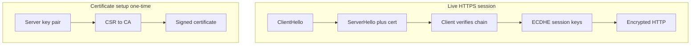

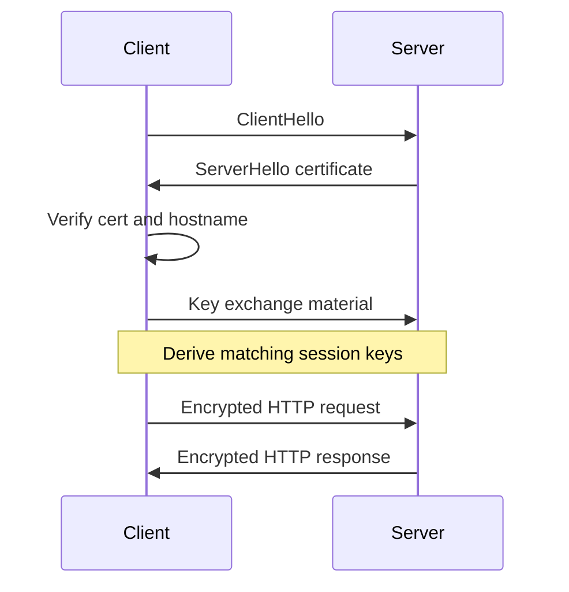

**Session keys are never sent on the wire** — both sides compute them from client random, server random, and ECDHE shared secret. New connection → new keys (forward secrecy when ephemeral DH is used).

**TLS 1.3** reduces round trips vs 1.2 (1-RTT handshake, 0-RTT resumption with replay tradeoffs). **SNI** carries virtual host name in cleartext during handshake — relevant for shared IP hosting and privacy discussions.

### Pitfalls and design tips

- **Expired or wrong-host certificates** — browsers hard-fail; automate renewal (ACME / cert-manager on Kubernetes).
- **TLS termination + HTTP backend** — encrypt VPC links or accept risk on private networks only.
- **0-RTT resumption** — replay risk for non-idempotent POST; disable or guard at app layer.
- **Certificate pinning** in mobile apps — breaks when CDN rotates certs unless pins update with releases.
- **Interview:** Distinguish **asymmetric** crypto (handshake) from **symmetric** (bulk data); know TLS sits above TCP, below HTTP.

### Real-world example

**Let’s Encrypt + cert-manager on Kubernetes for `api.myapp.com`:**

1. Ingress declares TLS host `api.myapp.com`.
2. cert-manager creates ACME order; Let’s Encrypt HTTP-01 or DNS-01 challenge proves domain control.
3. Issued cert stored as Kubernetes `Secret`; nginx ingress loads cert and private key.
4. User visits `https://api.myapp.com` — browser receives Let’s Encrypt-signed cert, validates ISRG Root X1 chain preinstalled on OS.
5. ECDHE key exchange; AES-GCM encrypts JSON API traffic.
6. cert-manager renews at ~30 days before 90-day expiry — no manual ops.

If an attacker presents a self-signed cert for `api.myapp.com`, verification fails at step 4 — browser blocks before any password or token is sent, which is TLS authentication doing its job.

## 1.12 HTTP/2 & HTTP/3

### Overview

Imagine upgrading a highway: first you add carpool lanes so many vehicles share one road instead of opening a new road per trip (HTTP/2), then you replace the single-lane bottleneck with separate lanes per vehicle so one stalled car does not block everyone behind it (HTTP/3). **HTTP/2** keeps TCP but multiplexes many requests on one connection and compresses headers. **HTTP/3** moves HTTP onto **QUIC over UDP**, eliminating TCP-level head-of-line blocking while keeping encryption and reliability.

Technically, HTTP/2 frames multiple streams inside one TLS-protected TCP connection, using **HPACK** header compression and server push (rarely used today). HTTP/3 maps the same HTTP semantics onto **QUIC**, which provides per-stream reliability, integrated **TLS 1.3**, faster handshakes, and connection migration across network changes. Browsers and CDNs increasingly prefer HTTP/3 on lossy mobile and long-RTT paths.

---

### What problem it fixes

**HTTP/1.1** forced browsers to open many TCP connections (typically six per host) because pipelining was broken by head-of-line blocking at the application layer. Each connection paid a **TCP + TLS handshake** tax, and duplicate headers bloated every request.

**HTTP/2** fixed application-level multiplexing and header waste but still rides **TCP**. One lost packet stalls the entire connection — all HTTP/2 streams wait even when their data was already received out of order.

**HTTP/3** fixes **transport-level head-of-line blocking** by making each stream independent inside QUIC, while reducing connection setup round trips.

---

### What it does

| Version | Transport | Key capability |
|---------|-----------|----------------|
| HTTP/1.1 | TCP | One request/response per connection unless Keep-Alive |
| HTTP/2 | TCP + TLS | Multiplexed streams, HPACK compression, single connection |
| HTTP/3 | QUIC (UDP) + TLS 1.3 | Stream-isolated loss recovery, faster setup, connection migration |

Both HTTP/2 and HTTP/3 let a browser fetch `index.html`, CSS, JS, and images concurrently over **one connection** — but only HTTP/3 isolates packet-loss impact to the affected stream.

---

### How it works — the architecture inside

**Protocol stacks:**

```text
HTTP/1.1:  HTTP → TCP → IP
HTTP/2:    HTTP/2 → TLS → TCP → IP
HTTP/3:    HTTP/3 → QUIC (TLS 1.3 inside) → UDP → IP
```

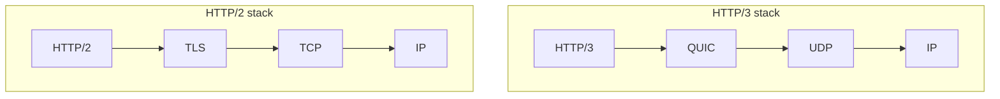

**Multiplexing:** HTTP/2 interleaves binary frames from many streams on one TCP socket. HTTP/3 does the same at the QUIC layer, but retransmissions are scoped per stream.

**Head-of-line blocking under packet loss:**

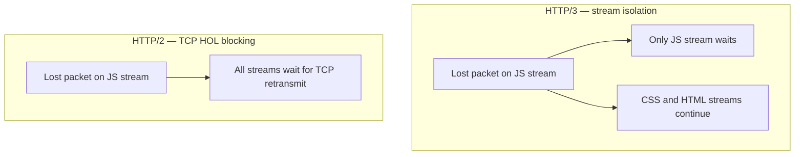

**Connection establishment:** HTTP/2 typically requires TCP handshake (1 RTT) plus TLS 1.2/1.3 handshake (1–2 RTT). QUIC combines transport and TLS 1.3 setup — often **0–1 RTT** on repeat visits with session tickets.

**Header compression:** HTTP/2 uses **HPACK** (static + dynamic tables). HTTP/3 uses **QPACK**, designed for QUIC's out-of-order delivery between control and data streams.

---

### Walkthrough: page load with a lost packet

Browser requests four assets over one connection. A packet carrying a chunk of `app.js` is dropped on a mobile network.

**HTTP/2:** TCP cannot deliver later bytes to the kernel until the gap is filled. Even though `style.css` frames arrived, the browser may not process them — **all four resources stall**.

**HTTP/3:** QUIC retransmits only the `app.js` stream. `style.css`, `logo.png`, and `index.html` keep flowing. Time-to-interactive improves on high-loss links.

---

### Comparison table

| Feature | HTTP/2 | HTTP/3 |
|---------|--------|--------|
| Transport | TCP | QUIC (UDP) |
| Multiplexing | Yes | Yes |
| HOL blocking | TCP level still exists | Eliminated at stream level |
| TLS | Separate handshake | Built into QUIC (TLS 1.3) |
| Connection setup | TCP + TLS RTTs | Fewer RTTs; 0-RTT resumption possible |
| Packet loss impact | Entire connection | Single stream |
| Mobile / network handoff | Often reconnects | Connection migration via connection IDs |
| Header compression | HPACK | QPACK |

---

### Pitfalls and design tips

- **HTTP/3 is not always faster** — on clean datacenter links with low loss, HTTP/2 over TCP can match HTTP/3; gains show up on mobile, Wi-Fi, and cross-continent paths.
- **UDP blocking** — some corporate firewalls rate-limit or block UDP; clients fall back to HTTP/2. Design observability to track alt-svc adoption.
- **CPU cost** — QUIC runs in user space; at extreme QPS, TLS + QUIC can cost more CPU than kernel TCP — load-test before assuming "HTTP/3 = free win."
- **Do not confuse layers** — HTTP/2 solved *application* multiplexing; only HTTP/3 addresses *TCP* HOL blocking.
- **Server push** — largely deprecated; prefer preload hints (`Link: rel=preload`) or HTTP/3 push only when measured to help.
- **Interview angle** — default answer for "why HTTP/3?" is **QUIC stream isolation + integrated TLS + faster handshake**, not "UDP is faster than TCP."

---

### Real-world example: Cloudflare and browser HTTP/3

Cloudflare terminates HTTP/3 at the edge using QUIC. A user in Southeast Asia fetching a JS bundle from a US origin over HTTP/2 may stall all assets when one TCP segment is lost on a congested mobile hop. With HTTP/3, Cloudflare's edge serves multiplexed streams; loss on one asset does not block others. Chrome and Firefox negotiate HTTP/3 via **Alt-Svc** after an initial HTTP/2 connection, then reuse QUIC for subsequent requests — visible in DevTools as `h3`.

---

## 1.13 QUIC

### Overview

Think of QUIC as rebuilding the reliability of TCP and the security of TLS into one engine that rides on UDP — like putting a smart conveyor belt (ordered delivery, retransmits, congestion control) inside a lightweight envelope the internet already delivers everywhere. **QUIC (Quick UDP Internet Connections)** was pioneered by Google and standardized as the transport for **HTTP/3**.

Technically, QUIC is a **user-space, encrypted, connection-oriented** protocol over UDP. It multiplexes independent **streams** with per-stream flow control, embeds **TLS 1.3** (encryption is mandatory), supports **connection migration** via connection IDs, and implements its own loss recovery and congestion control — giving HTTP a modern transport without TCP's cross-stream blocking.

---

### What problem it fixes

TCP enforces **strict byte ordering across the entire connection**. Multiplexed HTTP/2 streams share that fate: one loss event blocks delivery of all subsequent bytes, even for unrelated resources.

Separately, TCP + TLS historically required **multiple round trips** before application data flowed. On 100 ms RTT links, setup latency dominates small requests.

QUIC fixes both: **per-stream reliability** (no TCP HOL blocking) and **combined cryptographic + transport setup** (fewer RTTs).

---

### What it does

- Provides **reliable, ordered delivery per stream** over UDP
- Encrypts **all** payloads with TLS 1.3 integrated into the handshake
- Multiplexes many bidirectional streams on one connection
- Migrates connections when client IP changes (Wi-Fi → LTE) using **connection IDs**, not just 4-tuple
- Implements congestion control, loss detection, and flow control analogous to modern TCP

```text
HTTP/3 → QUIC → UDP → IP
```

---

### How it works — the architecture inside

**Reliability on top of UDP:** UDP alone is connectionless and unreliable. QUIC adds packet numbers, acknowledgements, retransmission timers, and stream state machines in user space — similar responsibilities to TCP, but scoped per stream.

```text
UDP:   datagram delivery, no ordering guarantee
QUIC:  ACKs, retransmits, congestion control, stream multiplexing
```

**Stream model:**

```text
QUIC Connection
 ├── Stream 1 → index.html
 ├── Stream 2 → style.css
 ├── Stream 3 → app.js
 └── Stream 4 → logo.png
```

Loss on Stream 3 triggers retransmit **only** for Stream 3. Streams 1, 2, and 4 advance independently.

**Faster setup (conceptual):**

```text
HTTP/2:  TCP handshake (1 RTT) + TLS handshake (1–2 RTT) → then HTTP
QUIC:    Combined crypto + transport setup (often 1 RTT; 0-RTT resumption on repeat)
```

**Connection migration:** TCP identifies a connection by `(src IP, src port, dst IP, dst port)`. Change networks → connection breaks. QUIC tags packets with a **Connection ID**; endpoints can continue the same logical session across IP changes — critical for mobile clients.

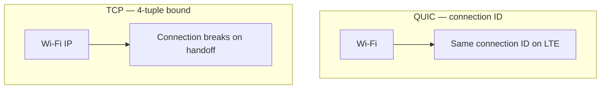

---

### QUIC vs TCP

| Feature | TCP | QUIC |
|---------|-----|------|
| Base protocol | IP | UDP |
| Reliability | Connection-wide ordered byte stream | Per-stream ordered delivery |
| TLS | Separate layer (optional historically) | Mandatory TLS 1.3 built in |
| Multiplexing | Limited (HTTP/2 shares one TCP pipe) | Native many streams |
| HOL blocking on loss | Yes — whole connection | No — only affected stream |
| Connection migration | No | Yes (connection IDs) |
| Typical HTTP binding | HTTP/1.1, HTTP/2 | HTTP/3 |

---

### Pitfalls and design tips

- **Not "UDP = unreliable therefore faster"** — QUIC reintroduces reliability; the win is stream isolation and handshake integration, not skipping ACKs.
- **Firewall and middlebox path** — UDP:443 may be throttled; always implement graceful fallback to TCP/HTTP/2.
- **Higher CPU** — user-space processing and encryption per packet can exceed kernel TCP on small-payload workloads; profile at your QPS.
- **0-RTT resumption** — reduces latency but has replay considerations; disable or restrict for non-idempotent operations.
- **Maturity** — tooling (tcpdump alone is insufficient) needs QUIC-aware analyzers; debugging is harder than TCP.
- **Interview angle** — QUIC is the transport; **HTTP/3 is the HTTP mapping on top**. Do not say "QUIC replaces HTTP."

---

### Real-world example: YouTube and Google services

Google developed QUIC for YouTube and search, measuring faster video start and improved loss recovery on mobile networks. Modern Chrome uses HTTP/3 to Google properties when available. A phone switching from home Wi-Fi to LTE mid-playback benefits from connection migration — the QUIC session can survive where a TCP connection would reset, reducing rebuffering compared to tearing down and re-establishing TCP + TLS.

---

## 1.14 Keep-Alive Connections

### Overview

Opening a TCP connection for every HTTP request is like hanging up and redialing a phone call for each sentence in a conversation. **HTTP Keep-Alive** (persistent connections) keeps the TCP socket open after a response so the next request reuses the same channel — avoiding repeated handshakes and teardowns.

In HTTP/1.1, Keep-Alive is the default unless either side sends `Connection: close`. Combined with **connection pooling** in clients and service meshes, it is foundational to microservice latency and throughput — especially over HTTPS where TLS setup adds another full round-trip sequence.

---

### What problem it fixes

Each new TCP connection costs:

- **1 RTT** (or more) for the three-way handshake
- Additional **TLS handshakes** on HTTPS (1–2 RTT)
- CPU and memory for socket setup/teardown on client, load balancer, and server
- Extra SYN/FIN traffic on the network

Without Keep-Alive, loading a page with ten assets can trigger ten handshakes — most of the time is protocol overhead, not data transfer.

---

### What it does

Keep-Alive leaves the transport connection open across multiple HTTP request/response cycles on the same socket. The server may close idle connections after a configured **timeout** (commonly 30–120 seconds).

```http
GET /users HTTP/1.1
Host: api.company.com
Connection: keep-alive
```

To force close after one response:

```http
Connection: close
```

| HTTP version | Default behavior |
|--------------|------------------|
| HTTP/1.0 | Closed unless `Connection: keep-alive` negotiated |
| HTTP/1.1 | Persistent unless `Connection: close` |

---

### How it works — the architecture inside

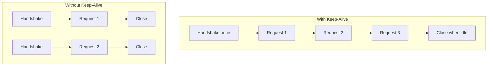

**Connection pooling:** Libraries (OkHttp, Apache HttpClient, `net/http`, Envoy sidecars) maintain a pool of warm connections per host. Keep-Alive makes pooling effective — borrow a socket, send a request, return it to the pool.

**Microservice chains:**

```text
API Gateway → User Service → Order Service → Payment Service
```

Without pooling, each hop opens a new TCP (+ TLS) connection per request. With Keep-Alive pools, internal RPC latency drops sharply at high QPS.

**HTTP/2 note:** HTTP/2 still uses one long-lived connection but **multiplexes** streams concurrently. HTTP/1.1 + Keep-Alive typically processes requests sequentially per connection unless the client opens parallel connections.

---

### How to calculate: latency savings

**Given:** RTT = 100 ms, TLS not included (plain HTTP), 10 sequential requests.

**Without Keep-Alive** — each request pays handshake + request/response:

```text
Per request ≈ 100 ms (handshake) + 100 ms (HTTP) = 200 ms
10 requests  ≈ 10 × 200 ms = 2000 ms
```

**With Keep-Alive** — one handshake, then HTTP RTT per request:

```text
Handshake once = 100 ms
10 requests    = 10 × 100 ms = 1000 ms
Total          ≈ 1100 ms
```

**Sanity check:** ~45% reduction in this model; with TLS (extra 1–2 RTT per new connection), savings are even larger — often the dominant win for HTTPS APIs.

---

### Pitfalls and design tips

- **Idle timeout mismatches** — client pool TTL longer than server/LB idle timeout causes mysterious `ECONNRESET` on reused sockets; align timeouts (client slightly below server).
- **Load balancer stickiness** — persistent connections pin a client to one backend for the connection lifetime; combined with long Keep-Alive, load can skew until connections recycle.
- **HTTP/1.1 head-of-line blocking** — one slow response blocks the next on the same connection; browsers open parallel connections (typically 6) as a workaround — HTTP/2 addresses this differently.
- **Graceful shutdown** — draining a node requires stopping new Keep-Alive accepts and waiting for existing connections to finish or time out.
- **Production defaults** — Nginx `keepalive_timeout`, ALB idle timeout (default 60 s), OkHttp `ConnectionPool` — tune explicitly for your traffic pattern.
- **Interview angle** — Keep-Alive saves **connection setup**; it does not by itself enable **parallel** downloads on HTTP/1.1.

---

### Real-world example: Spring Boot calling downstream REST APIs

A Spring Boot service using **RestTemplate** or **WebClient** with a shared connection pool reuses TCP (+ TLS) sessions to a payment gateway. At 500 RPS, creating 500 new TLS connections per second would exhaust CPU on handshakes and inflate p99 latency. A pool of ~20 warm connections per downstream host cuts setup to near zero for most requests — the gateway sees stable long-lived sessions, and p99 drops from hundreds of milliseconds to tens.

---

## 1.15 Forward & Reverse Proxy

### Overview

A proxy is a middlebox that speaks to one party on behalf of another — like a receptionist who screens visitors (reverse proxy) or a corporate travel desk that books flights for employees without revealing each person's desk number (forward proxy). **Forward proxies** sit near **clients** and forward outbound traffic. **Reverse proxies** sit in front of **servers** and accept inbound traffic on their behalf.

In system design, reverse proxies are everywhere: Nginx, Envoy, HAProxy, AWS ALB, and Cloudflare act as TLS terminators, load balancers, caches, and WAFs. Forward proxies appear in corporate egress filtering and some privacy/VPN-adjacent setups.

---

### What problem it fixes

**Clients** need controlled internet access (block sites, log activity, cache downloads) without exposing every employee IP to the public internet.

**Servers** need a single public entry point that hides fragile backend topology, distributes load, terminates TLS centrally, and shields origins from direct exposure.

Without proxies, every app server would need public IPs, certificate management, rate limiting, and DDoS filtering duplicated across the fleet.

---

### What it does

| Proxy type | Sits in front of | Acts for | Internet sees |
|------------|------------------|----------|---------------|
| **Forward** | Clients | Client | Proxy IP as source |
| **Reverse** | Servers | Server | Proxy IP as destination |

**Forward proxy flow:**

```text
Client → Forward Proxy → Internet Server
```

Server logs show the **proxy's IP**, not the client's.

**Reverse proxy flow:**

```text
Client → Reverse Proxy → Backend pool (App1, App2, App3)
```

Client believes it talks to `api.company.com`; backends may be private.

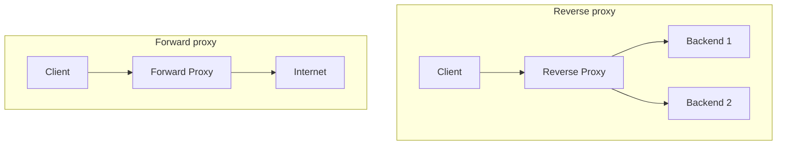

**SSL termination (reverse):**

```text
Client --HTTPS--> Reverse Proxy --HTTP--> Internal service
```

The proxy owns certificates and cipher policy; backends run plain HTTP on a private network.

---

### How it works — the architecture inside

**Forward proxy — corporate egress:** All employee browsers point at `proxy.corp.internal:8080`. Policy engine allows `github.com`, blocks social media, scans downloads, logs URLs. Google sees one NAT/proxy egress IP.

**Reverse proxy — public API:** DNS for `api.company.com` resolves to the proxy VIP. Proxy applies WAF rules, terminates TLS, routes `/api/users` to the user service cluster, `/api/orders` to the order cluster (L7 routing), and caches static `GET` responses when configured.

**Who configures whom:**

| | Forward proxy | Reverse proxy |
|---|---------------|---------------|
| Configured by | Client / IT department | Server / platform team |
| Server aware? | Usually transparent to origin | Origin expects proxy traffic |
| Typical products | Squid, corporate gateways | Nginx, Envoy, HAProxy, ALB, Cloudflare |

---

### Forward vs reverse — comparison

| Feature | Forward proxy | Reverse proxy |
|---------|---------------|---------------|
| Represents | Client | Server |
| Hides | Client identity | Backend topology |
| Common uses | Filtering, logging, caching outbound | Load balancing, TLS, caching inbound |
| Layer | Often HTTP/SOCKS (L7/L5) | L7 (ALB) or L4 (NLB) depending on product |

---

### Pitfalls and design tips

- **Do not conflate with NAT** — NAT rewrites addresses at L3/L4 without understanding HTTP; proxies can inspect URLs, headers, and JWTs.
- **Double proxy confusion** — `Client → Forward proxy → Reverse proxy → Server` happens in enterprises; debug TLS and `X-Forwarded-For` chains carefully.
- **Trust forwarded headers** — backends should only trust `X-Forwarded-For` / `X-Real-IP` from known reverse proxies; otherwise clients can spoof.
- **Forward proxy ≠ VPN** — forward HTTP proxy does not encrypt all device traffic by default; VPN tunnels do.
- **Health checks** — reverse proxy must exclude draining nodes; forward proxy failures block all employee internet access — high availability matters.
- **Interview angle** — "Nginx in front of three app servers" is a **reverse** proxy; "company proxy you configure in browser settings" is **forward**.

---

### Real-world example: Cloudflare as reverse proxy

A SaaS app points DNS for `app.example.com` to Cloudflare. User TLS terminates at Cloudflare's edge (certificate managed there). Cloudflare caches static assets, applies DDoS protection, and forwards dynamic API calls to the origin over a secure tunnel or public IP. The origin never exposes its raw server IP to browsers — only Cloudflare's anycast addresses are attacked or scanned.

---

## 1.16 NAT

### Overview

**NAT (Network Address Translation)** is the router trick that lets dozens of devices in your home share one public IP address — like an apartment building with one street address but many unit numbers inside. The router rewrites **private** source addresses to its **public** IP (and ports) on the way out, and reverses the mapping when responses return.

IPv4 has only ~4.3 billion addresses; NAT plus **private ranges** (`10.x`, `172.16–31.x`, `192.168.x`) let billions of devices reach the internet without each holding a globally routable IP.

---

### What problem it fixes

Public IPv4 exhaustion would have blocked growth of home Wi-Fi, mobile carriers, and cloud private subnets. NAT conserves public addresses and provides a basic **default deny inbound** posture — internal hosts are not directly reachable from the internet unless explicitly forwarded.

---

### What it does

On outbound traffic, the NAT device replaces:

```text
Source: 192.168.1.10:5000  →  49.205.100.50:30001
```

It stores the mapping in a **translation table**. Inbound packets to `49.205.100.50:30001` are rewritten back to `192.168.1.10:5000`.

**PAT (Port Address Translation / NAT overload)** — the common home-router form — multiplexes many private hosts onto **one** public IP using unique source port assignments.

---

### How it works — the architecture inside

```mermaid
sequenceDiagram
    participant L as Laptop 192.168.1.10
    participant R as Router NAT
    participant G as Internet
    L->>R: SYN from 192.168.1.10:5000
    Note over R: Map to 49.205.100.50:30001
    R->>G: SYN from 49.205.100.50:30001
    G-->>R: Response to 49.205.100.50:30001
    R-->>L: Deliver to 192.168.1.10:5000
```

**Translation table example:**

| Private IP | Private port | Public IP | Public port |
|------------|--------------|-----------|-------------|
| 192.168.1.10 | 5000 | 49.205.100.50 | 30001 |
| 192.168.1.20 | 5000 | 49.205.100.50 | 30002 |
| 192.168.1.30 | 5002 | 49.205.100.50 | 30003 |

**NAT types:**

| Type | Mapping | Typical use |
|------|---------|-------------|
| Static NAT | 1 private IP ↔ 1 public IP | Legacy servers needing fixed public IP |
| Dynamic NAT | Private IP ↔ pool of public IPs | Larger enterprises |
| PAT (overload) | Many private IPs → one public IP + ports | Home routers, carrier CGNAT, cloud NAT gateways |

**Cloud pattern (AWS):** Instances in a private subnet (`10.0.2.0/24`) reach the internet via a **NAT Gateway** in a public subnet. Outbound package updates work; inbound connections to instances are blocked unless a load balancer or bastion is provisioned.

**Port forwarding:** Explicit rule on the router:

```text
49.205.100.50:80 → 192.168.1.10:80
```

Allows inbound internet traffic to an internal server.

---

### NAT vs proxy

| | NAT | Proxy |
|---|-----|-------|
| OSI layer | L3/L4 (IP, port rewrite) | L7 for HTTP proxies (can read URLs) |
| Visibility | Transparent to most apps | Client often explicitly configured |
| Protocol awareness | None | Can cache, auth, route by path |

---

### Pitfalls and design tips

- **Breaks end-to-end connectivity** — peer-to-peer games, WebRTC, SIP, and FTP often need STUN/TURN, ALG hacks, or explicit port forwarding.
- **Port exhaustion** — high-connection-count servers behind PAT can exhaust the ~64k port space per public IP; carriers use **CGNAT** which adds another NAT layer.
- **Logging and abuse attribution** — many users share one public IP; correlate by source port + timestamp in logs.
- **IPv6 alternative** — IPv6 reduces need for NAT but NAT64/DNS64 still appear in mixed deployments.
- **Cloud egress** — NAT Gateway is a bandwidth-charged hop; for high egress, architecture reviews consider IPv6, VPC endpoints, or proxy consolidation.
- **Interview angle** — "private subnet internet access" in AWS → **NAT Gateway**, not Internet Gateway on the instance.

---

### Real-world example: home Wi-Fi to Google

Three devices (`192.168.1.10–30`) browse simultaneously. The home router PATs all flows to `49.205.100.50` with distinct ephemeral ports. Google responds to the public IP; the router consults its table and delivers each response to the correct laptop or phone. No device needs its own public IPv4 lease from the ISP.

---

## 1.17 VPN

### Overview

A **VPN (Virtual Private Network)** wraps your traffic in an encrypted tunnel from your device to a VPN endpoint — like sending letters inside a locked armored van across a public road. Outsiders see only van traffic between you and the VPN server; they cannot read the letters inside.

Enterprises use VPNs for **remote access** to private networks. Consumer VPNs market privacy and geo-shifting. In system design interviews, site-to-site and remote-access VPNs explain how engineers reach databases and admin panels without exposing them on the public internet.

---

### What problem it fixes

**Untrusted networks:** Coffee-shop Wi-Fi attackers can sniff unencrypted traffic. VPN encrypts payloads between client and VPN gateway.

**Remote workforce:** Employees need access to internal apps (`10.x` services, LDAP, internal APIs) as if they were on campus — without publishing those services to `0.0.0.0/0`.

**Site interconnection:** Two offices link private RFC1918 networks over the public internet securely.

---

### What it does

```text
Device → Encrypted tunnel → VPN server → Destination (internet or corporate LAN)
```

Websites see the **VPN server's public IP**, not the client's home IP. Corporate resources see the client as part of the private routing domain once authenticated.

**Remote access VPN:** `Employee laptop → VPN concentrator → Corporate network`

**Site-to-site VPN:** `Office A router ↔ IPsec tunnel ↔ Office B router`

---

### How it works — the architecture inside

```mermaid
flowchart LR
    subgraph NoVPN["Without VPN"]
        direction LR
        L1[Laptop] --> I1[Internet] --> G1[google.com sees home IP]
    end
    subgraph VPN["With VPN"]
        direction LR
        L2[Laptop] -->|encrypted tunnel| V[VPN server] --> I2[Internet]
        I2 --> G2[google.com sees VPN IP]
    end
    NoVPN ~~~ VPN
```

**Tunnel encryption:** Payloads are encapsulated and encrypted (IPsec, OpenVPN, WireGuard, etc.) before crossing untrusted hops. Interceptors see ciphertext and tunnel endpoints only.

**VPN vs HTTPS:**

| | HTTPS | VPN |
|---|-------|-----|
| Scope | Single site (browser ↔ server) | **All** device traffic (system-wide routing) |
| Protects | That HTTP session | Everything routed into the tunnel |

**VPN vs forward proxy:**

| | VPN | Forward HTTP proxy |
|---|-----|-------------------|
| Encryption | Tunnel encrypts traffic | Proxy may not encrypt client-to-proxy hop |
| Coverage | OS-level default route or split tunnel | Usually browser/app specific |
| IP seen by sites | VPN egress IP | Proxy egress IP |

---

### Pitfalls and design tips

- **Not anonymous by default** — VPN provider, employer, and destination sites can still identify you (accounts, cookies, DNS leaks).
- **Latency and throughput** — hairpinning through a distant VPN server hurts performance; choose region and split-tunnel policies deliberately.
- **Split tunnel vs full tunnel** — full tunnel sends all traffic via VPN (safer, slower for public sites); split tunnel reduces load but risks data exfil paths.
- **Trust the operator** — consumer VPN shifts trust from ISP to VPN vendor; enterprise VPN shifts operational burden to your security team.
- **Replacing VPN for apps** — modern zero-trust (identity-aware proxies, device posture) reduces blanket VPN use; know the trade-off in interviews.
- **Interview angle** — VPN provides **network-layer private reachability**; it is not a substitute for application auth or mTLS between services.

---

### Real-world example: corporate remote access

A bank runs an internal HR portal at `https://hr.internal.corp` resolvable only on `10.0.0.0/8`. Remote employees connect via VPN; the client receives routes for corporate prefixes. DNS resolves `hr.internal.corp` to a private load balancer; traffic never hits the public internet unencrypted. Failed VPN auth means no route to internal subnets — default deny.

---

## 1.18 Unicast, Broadcast, Multicast & Anycast

### Overview

When one computer sends a packet, who should receive it? The four delivery models answer that question at internet scale. **Unicast** is one-to-one (a phone call). **Broadcast** is one-to-everyone on the local wire (shouting in a room). **Multicast** is one-to-a-subscribed group (a webinar only subscribers watch). **Anycast** is one-to-the-nearest-of-many replicas sharing the same address (the closest franchise branch takes your order).

Most application traffic you build — HTTP APIs, database connections, gRPC — is **unicast**. CDNs and public DNS lean on **anycast**. Live video inside ISPs sometimes uses **multicast**. **Broadcast** is mostly a LAN bootstrap mechanism (ARP, DHCP), not a global internet pattern.

---

### What problem it fixes

Different workloads need different fan-out economics:

- Sending a personalized API response to one client → **unicast**
- Discovering a router or assigning DHCP on a LAN → **broadcast**
- Streaming identical market data to thousands of subscribed traders without N separate copies from source → **multicast**
- Routing users to the closest healthy edge server without client-side region pickers → **anycast**

Picking the wrong model wastes bandwidth, adds latency, or breaks discovery.

---

### What it does

| Model | Delivery | Typical scope |
|-------|----------|---------------|
| **Unicast** | One sender → one receiver | Global — default for TCP/HTTP |
| **Broadcast** | One sender → all hosts on L2 domain | Local subnet; routers do not forward globally |
| **Multicast** | One sender → hosts that joined group | Often enterprise or ISP; limited on public internet |
| **Anycast** | One sender → topologically nearest receiver among many | Global DNS, CDN edges, `8.8.8.8` |

---

### How it works — the architecture inside

**Unicast:** Your laptop opens a TCP connection to one IP returned by DNS for `google.com`. Packets have a single destination address — classic client/server.

**Broadcast:** ARP request: *"Who has `192.168.1.1`?"* sent to broadcast MAC `ff:ff:ff:ff:ff:ff`. Every host on the VLAN sees it; only the router answers. Routers block broadcast from crossing into the internet.

**Multicast:** Hosts join group `239.x.x.x` via IGMP. Network switches replicate packets only to ports with interested receivers — source sends **one** stream; network duplicates where needed.

**Anycast:** Multiple servers in Mumbai, Singapore, and London announce the **same IP** via BGP. Routing topology picks the nearest announcement. User in Bangalore reaches Mumbai; user in Frankfurt reaches London — same address, different physical machine.

```mermaid
flowchart LR
    subgraph Models["Delivery models"]
        direction LR
        U[Unicast 1:1] --- B[Broadcast 1:all LAN]
        B --- M[Multicast 1:group]
        M --- A[Anycast 1:nearest]
    end
```

**Anycast routing (conceptual):**

```text
                    Mumbai POP
                         |
User in Bangalore -------+
                         |
                    Singapore POP
                         |
                    London POP
```

Both users query `8.8.8.8`; BGP sends each to the closest Google POP.

---

### Comparison and system design relevance

| Type | Fan-out | Internet-scale? | Example |
|------|---------|-----------------|---------|
| Unicast | 1 copy | Yes | REST API, database |
| Broadcast | All local | LAN only | ARP, DHCP discover |
| Multicast | Subscribers only | Rare end-to-end | IPTV inside ISP |
| Anycast | Nearest replica | Yes | Cloudflare, Google DNS, CDN |

| Domain | Typical model |
|--------|---------------|
| Web applications | Unicast |
| LAN discovery | Broadcast |
| Live streaming (efficient fan-out) | Multicast where supported |
| Global DNS / CDN edges | Anycast |

---

### Pitfalls and design tips

- **Multicast on the public internet** — generally impractical; design fan-out with CDNs, edge caches, or application-level pub/sub (Kafka, SNS) instead.
- **Broadcast storms** — misconfigured loops can flood VLANs; not a cloud VPC concern but matters on-prem.
- **Anycast and state** — anycast to stateful services requires careful connection draining; TCP sessions do not migrate mid-flight if routing changes.
- **Anycast troubleshooting** — `traceroute` to `8.8.8.8` differs by location; "which server answered?" depends on vantage point.
- **Do not say "CDN uses multicast"** — most commercial CDNs unicast from edge caches; anycast gets users **to** the edge.
- **Interview angle** — `8.8.8.8` is the classic **anycast** example; HTTP is **unicast**.

---

### Real-world example: Google Public DNS (`8.8.8.8`)

Google advertises the same anycast prefix from hundreds of POPs worldwide. A query from Tokyo hits a Tokyo resolver; a query from São Paulo hits a South American POP. The user configures one memorable address; BGP and anycast handle proximity and automatic failover if a POP withdraws its announcement — no client-side region list required.

---

## 1.19 CDN

### Overview

A **CDN (Content Delivery Network)** is a geographically distributed set of cache servers that store copies of content close to users — like placing bookstore branches in every neighborhood instead of shipping every book from one central warehouse. Users hit a nearby **edge** node; latency drops and the **origin** server sees far less traffic.

CDNs cache static assets (images, JS, CSS, video segments) and sometimes cacheable API responses. They also absorb traffic spikes and provide DDoS scrubbing at the edge.

---

### What problem it fixes

A single origin in `us-east-1` serving global users forces every request across long RTT paths (200–300 ms transcontinental). Viral traffic can overwhelm one data center. Large files (video, firmware) multiply egress cost and bandwidth at the origin.

CDN fixes **latency**, **scalability**, and **availability** by serving repeated content from edge POPs.

---

### What it does

1. User requests `https://cdn.example.com/logo.png`
2. **DNS** (often anycast) routes to the nearest CDN edge
3. Edge checks cache:
   - **Hit** — return immediately; origin not contacted
   - **Miss** — fetch from origin, store, respond; later requests hit cache

```mermaid
flowchart LR
    subgraph Hit["Cache hit"]
        direction LR
        U1[User] --> E1[Edge] --> R1[Response]
    end
    subgraph Miss["Cache miss"]
        direction LR
        U2[User] --> E2[Edge] --> O[Origin] --> E2
        E2 --> R2[Response]
    end
    Hit ~~~ Miss
```

**Key terms:**

| Term | Meaning |
|------|---------|
| Origin | Source of truth — S3, app server, nginx |
| Edge / POP | Regional cache cluster close to users |
| Cache hit | Content served from edge |
| Cache miss | Edge fetches from origin on first request |

---

### How it works — the architecture inside

**Typical placement:**

```text
User → CDN edge → (on miss) → Origin / Load balancer → App → Database
```

Static assets served at edge; dynamic auth/payment still reach origin.

**Caching policy:** Origin response headers drive behavior:

```http
Cache-Control: public, max-age=3600
```

CDN may serve that object for one hour without revalidating.

**Pull CDN (default):** Content stays on origin until first user request per edge POP triggers fetch-and-store. CloudFront, Cloudflare, Fastly behave this way for most sites.

**Push CDN:** Large files (movie ISO, game patch) are **uploaded** to CDN storage proactively — no first-request penalty. Common for massive static releases.

| | Pull CDN | Push CDN |
|---|----------|----------|
| Content enters CDN | On demand (miss) | Preloaded |
| First user latency | Higher on cold POP | Low immediately |
| Operational effort | Low | Higher — sync/upload pipeline |
| Typical use | Websites, APIs with cache headers | Huge binaries, live event VOD seeding |

---

### How to calculate: latency improvement

**Given:** User in Bangalore, origin in Virginia USA, RTT ≈ 250 ms one-way (simplified round trip ~250 ms for first byte), CDN edge in Bangalore RTT ~10 ms.

**Without CDN:** Each asset fetch pays ~250 ms network RTT minimum → multi-asset page adds RTTs (or parallel connections).

**With CDN on hit:** Edge RTT ~10 ms → **~25× lower network delay** for cached bytes.

**Sanity check:** Dynamic uncacheable API calls still pay full origin RTT — CDN does not magic away database time.

---

### Pitfalls and design tips

- **Cache invalidation** — version URLs (`app.v2.js`) or purge APIs; stale CSS breaks deployments silently.
- **Do not CDN personalized responses** — `Set-Cookie` / `Authorization` content usually must not be shared across users; respect `Cache-Control: private`.
- **HTTPS and custom domains** — certificate provisioning at edge; automate via ACME or provider APIs.
- **Origin shield** — secondary cache layer reduces miss stampedes when many edges cold-fetch the same object.
- **Dynamic site fallacy** — HTML that changes every request is a poor CDN fit; cache fragments or static assets instead.
- **Interview angle** — pair CDN (static) with load balancer (dynamic); mention **cache key** design (URL, query string, `Vary` header).

---

### Real-world example: Netflix Open Connect

Netflix ships the Open Connect appliance program — CDN caches inside ISP networks. A viewer in Mumbai streams from a nearby cache filled with popular titles during off-peak **push**-style replication from origin. Playback starts with low RTT; ISP and Netflix reduce backbone transit. Uncached long-tail titles may still pull from upstream, but the majority of viewing hits local edge capacity.

---

## 1.20 Load Balancer

### Overview

A **load balancer** is the traffic cop in front of a pool of application servers — directing each incoming request to a healthy backend so no single machine bears the entire load. If one server fails, the balancer stops sending work to it; users stay up on the survivors.

Load balancers operate at **Layer 4** (TCP/UDP — IP and port) or **Layer 7** (HTTP — URL, headers, cookies). They terminate TLS, enforce rate limits, and support **session affinity** when needed.

---

### What problem it fixes

A single app server is a **single point of failure** and vertical scaling limit. Adding servers requires something to **distribute** requests, **detect** failures, and optionally **pin** sessions. Without a load balancer, clients would need to pick a server IP themselves — brittle and unmanageable.

---

### What it does

```text
Clients → Load balancer → App1 / App2 / App3
```

Core responsibilities:

1. **Distribute** traffic by algorithm (round robin, least connections, hash)
2. **Health-check** backends (`GET /health` → remove on failure)
3. **Terminate SSL** at the edge (optional)
4. **Route** by path/host at L7 (`/api/users` vs `/api/orders`)
5. **Rate-limit** and shed load before backends saturate

```mermaid
flowchart LR
    C[Clients] --> LB[Load balancer]
    LB --> A1[App 1]
    LB --> A2[App 2]
    LB --> A3[App 3]
```

---

### How it works — the architecture inside

**Layer 4 (transport):** Forwards TCP connections based on IP/port without parsing HTTP. Fast, high throughput — AWS **NLB**, HAProxy TCP mode. Cannot route `/users` to a different service than `/orders` by URL alone.

**Layer 7 (application):** Terminates HTTP, inspects path/headers, may inject `X-Request-Id`. AWS **ALB**, Nginx, Envoy — supports content-based routing and WAF integration.

**Algorithms:**

| Algorithm | Behavior | When to use |
|-----------|----------|-------------|
| Round robin | Sequential rotation | Equal-capacity stateless servers |
| Weighted round robin | More traffic to higher weight | Mixed instance sizes |
| Least connections | Pick lowest active conn count | Long-lived requests, variable duration |
| Least response time | Pick fastest responder | Latency-sensitive |
| IP hash | `hash(client IP)` | Simple stickiness without cookies |
| Consistent hash | Ring map by key | Distributed caches, minimal remap on node add/drop |

**Consistent hashing:** Backends and keys sit on a ring. `hash(user:42)` walks clockwise to the first node. Adding/removing one node remaps only **adjacent** keys (~`1/N`), unlike `hash % N` which reshuffles most keys.

```text
hash % N, 3 → 4 nodes: ~75% keys move
consistent hash add 1 node: ~25% keys move
```

Use **virtual nodes** (many ring points per physical server) to spread load evenly when the pool is small.

**Health checks:**

```http
GET /health → 200 OK   (in pool)
GET /health → timeout (removed)
```

**Sticky sessions:** When session state is local to App1, route the same user to App1 via cookie (`AWSALB`, `JSESSIONID`) or IP hash — trade-off: uneven load, harder drain.

**Active-active vs active-passive (load balancer tier):**

```mermaid
flowchart LR
    subgraph ActiveActive["Active-active LBs"]
        direction LR
        LB1[LB 1] --> Pool[Backend pool]
        LB2[LB 2] --> Pool
    end
    subgraph ActivePassive["Active-passive LBs"]
        direction LR
        LBA[LB active] --> Pool2[Backend pool]
        LBS[LB standby] -.-> Pool2
    end
    ActiveActive ~~~ ActivePassive
```

---

### Pitfalls and design tips

- **Health check realism** — checking TCP open while app dead returns 502s to users; validate app-level `/health` including dependency flags you mean.
- **Sticky sessions vs stateless** — prefer external session store (Redis) so any node can serve; stickiness complicates deploys.
- **TLS termination** — re-encrypt to backend (mTLS) on zero-trust networks; do not assume "LB HTTPS → plain HTTP internally" is always acceptable.
- **Consistent hash hot spots** — celebrity user IDs overload one shard; add replicas or salted keys.
- **IP hash behind carrier NAT** — thousands of mobile users share one IP → one backend overload.
- **Products** — Nginx, HAProxy, Envoy, AWS ALB/NLB, GCP LB, Azure LB; know L4 vs L7 in interviews.

---

### Real-world example: AWS ALB in front of ECS services

An e-commerce API runs three Fargate tasks behind an **Application Load Balancer**. ALB terminates TLS with ACM certificates, routes `GET /static/*` to a lighter target group (optional), and `POST /checkout` to payment-capable tasks. Target group health checks hit `/actuator/health` every 30 s; failed tasks drain in flight then drop. During deploy, new tasks register before old deregister — rolling capacity without user-visible outage.

---

## 1.22 SSE, Polling & WebSockets

### Overview

Web pages that need live updates — chat, stock tickers, order tracking, sports scores — must answer: *how does the client learn about new data?* **Short polling** asks repeatedly on a timer. **Long polling** holds one HTTP request open until data arrives. **SSE (Server-Sent Events)** keeps a one-way HTTP stream open for server pushes. **WebSockets** upgrade to a full-duplex channel where either side sends anytime.

Choosing the wrong pattern wastes bandwidth (polling), exhausts connections (long poll at scale), or over-engineers (WebSockets for a one-way dashboard).

---

### What problem it fixes

HTTP alone is **request-response**: the server cannot speak first. Real-time UX needs the server to deliver events with low latency without the client spamming empty requests. Each pattern trades **simplicity**, **latency**, **scalability**, and **directionality** differently.

---

### What it does

| Pattern | Direction | Connection | Server complexity |
|---------|-----------|------------|-----------------|
| Short polling | Client pulls | New request per poll | Lowest |
| Long polling | Client pulls (delayed) | One long HTTP request per event batch | Medium |
| SSE | Server pushes | One long-lived HTTP stream | Medium |
| WebSocket | Bidirectional | Persistent upgraded socket | Highest |

**Evolution:**

```text
Short polling  → client asks every N seconds
Long polling   → client asks; server waits until data
SSE            → client asks once; server streams events
WebSocket      → both sides send anytime after upgrade
```

---

### How it works — the architecture inside

**Short polling:**

```text
Client → GET /updates → "none"
(wait 5 s)
Client → GET /updates → "none"
(wait 5 s)
Client → GET /updates → "new data"
```

Simple but wasteful — most responses empty. Event at T=7 s may not be seen until next poll at T=10 s.

**Long polling:**

```text
Client → GET /updates (held open)
... server waits ...
Event arrives → response → connection closes
Client immediately opens next long poll
```

Fewer empty responses; still one request cycle per event batch.

**SSE:**

```text
Client → GET /events (Accept: text/event-stream)
Server streams:
  data: {"status":"shipped"}\n\n
  data: {"status":"out for delivery"}\n\n
```

Single HTTP connection; server → client only. Client sends commands via normal REST. Browser `EventSource` auto-reconnects.

**WebSocket:**

```http
GET /chat HTTP/1.1
Upgrade: websocket
Connection: Upgrade
```

```http
HTTP/1.1 101 Switching Protocols
```

After upgrade, frames flow both ways with low overhead — ideal for chat and collaborative editing.

```mermaid
flowchart LR
    subgraph Polling["Short polling"]
        direction LR
        p1[Request] --> p2[Response] --> p3[Wait N sec] --> p1
    end
    subgraph SSEflow["SSE"]
        direction LR
        s1[One request] --> s2[Event stream]
    end
    subgraph WSflow["WebSocket"]
        direction LR
        w1[Upgrade] --> w2[Bidirectional frames]
    end
    Polling ~~~ SSEflow ~~~ WSflow
```

---

### Comparison — when to use which

| Use case | Best fit | Why |
|----------|----------|-----|
| Admin dashboard refresh every minute | Short polling | Simple, low event rate |
| Legacy browser moderate updates | Long polling | Works without WebSocket |
| Order tracking, live metrics, logs | SSE | One-way push, HTTP-friendly |
| Chat, multiplayer, collaborative edit | WebSocket | Bidirectional low latency |
| Stock ticker (server → client only) | SSE | Simpler than WebSocket |

**Scaling notes:** SSE and WebSockets are **stateful** — each user holds a connection; horizontal scale needs pub/sub backplanes (Redis, Kafka) to fan-in events to the right server. Polling is stateless but multiplies request volume.

---

### Pitfalls and design tips

- **Do not default to WebSockets** — if updates are server → client only, SSE is simpler and passes most corporate proxies.
- **SSE limits** — browser tab connection caps to same host; HTTP/1.1 limit ~6 parallel connections can starve other assets — HTTP/2 helps.
- **Long poll timeouts** — set proxy/LB idle timeout above server long-poll duration or connections drop spuriously.
- **WebSocket load balancers** — require L7 upgrade support and often sticky sessions; NLB alone may not suffice.
- **Polling math** — 10k users polling every 5 s = 2k RPS even when idle; model cost before choosing short poll.
- **Interview angle** — "live dashboard" → **SSE**; "WhatsApp-style chat" → **WebSocket**; mention **stateful connection** scaling cost.

---

### Real-world example: live order tracking with SSE

A food-delivery app exposes `GET /orders/{id}/events` returning `text/event-stream`. Rider GPS updates publish to Redis; the API instance holding the SSE connection writes `data: {"lat":12.97,"lng":77.59}`. The mobile web client uses `EventSource` — auto-reconnect on dropout. Outbound status is server-driven; placing a new order still uses REST `POST`. No WebSocket cluster needed for one-way location pins.

---

[<- Back to master index](../README.md)
