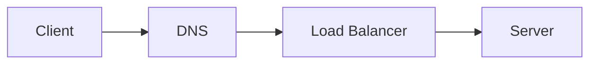

# 1. Networking

> Status: **Documented**

[← Back to master index](../README.md)

---

## Sub-topics

| # | Sub-topic | Status |
|---|-----------|--------|
| 1.1 | [OSI Model](#osi-model) | Done |
| 1.2 | [TCP/IP](#tcp-ip) | Done |
| 1.3 | [TCP Handshake](#tcp-handshake) | Done |
| 1.4 | [UDP](#udp) | Done |
| 1.5 | [IP Addressing/Subnetting](#ip-addressing-subnetting) | Done |
| 1.6 | [CIDR](#cidr) | Done |
| 1.7 | [DNS](#dns) | Done |
| 1.8 | [DNS Resolution](#dns-resolution) | Done |
| 1.9 | [HTTP/HTTPS](#http-https) | Done |
| 1.10 | [SSL/TLS](#ssl-tls) | Done |
| 1.11 | [HTTP2 & HTTP3](#http2-http3) | Done |
| 1.12 | [QUIC](#quic) | Done |
| 1.13 | [Forward & Reverse Proxy](#forward-reverse-proxy) | Done |
| 1.14 | [NAT](#nat) | Done |
| 1.15 | [VPN](#vpn) | Done |
| 1.16 | [SSE & Polling & Websocets](#sse-polling-websocets) | Done |
| 1.17 | [CDN](#cdn) | Done |
| 1.18 | [Anycast/Multicast/Broadcast](#anycast-multicast-broadcast) | Done |
| 1.19 | [Load Balancer](#load-balancer) | Done |
| 1.20 | [Load Balancer Algorithm](#load-balancer-algorithm) | Done |
| 1.21 | [MTU](#mtu) | Done |
| 1.22 | [Keep Alive Connections](#keep-alive-connections) | Done |

---

## 1.1 OSI Model

**Summary:** Seven-layer reference model separating networking concerns from physical transmission to application semantics. Essential for diagnosing where failures and optimizations occur in the stack.

**Key points:**
- Layers 1–4 (Physical→Transport) handle delivery; 5–7 (Session→Application) handle data meaning
- Each layer talks only to adjacent layers via well-defined interfaces
- Real protocols (TCP/IP) map imperfectly—use OSI as a mental map, not a spec

**References:**
- [Video Playlist](https://www.youtube.com/playlist?list=PLxCzCOWd7aiGFBD2-2joCpWOLUrDLvVV_)

---

## 1.2 TCP/IP

**Summary:** The de-facto internet protocol suite combining IP (routing) with TCP/UDP (transport). Foundation for virtually all modern networked services.

**Key points:**
- IP provides best-effort packet delivery; no guaranteed order or delivery
- TCP adds reliability, ordering, and flow control; UDP trades that for speed
- Four layers: Link → Internet (IP) → Transport → Application

**References:**
- [Video](https://www.youtube.com/watch?v=2QGgEk20RXM)

---

## 1.3 TCP Handshake

**Summary:** Three-way SYN-SYN/ACK-ACK exchange establishes a TCP connection with agreed sequence numbers before data transfer. Prevents stale packets from hijacking sessions.

**Key points:**
- Client sends SYN; server replies SYN+ACK; client sends ACK—connection open
- Each side picks initial sequence numbers to detect duplicate/old segments
- Four-way FIN handshake (with TIME_WAIT) cleanly tears down connections

**References:**
- [Video](https://www.youtube.com/watch?v=2QGgEk20RXM)

---

## 1.4 UDP

**Summary:** Connectionless transport with minimal overhead—no handshake, no retransmission, no ordering guarantees. Ideal for latency-sensitive or loss-tolerant workloads.

**Key points:**
- Header is only 8 bytes; no congestion control built in
- Used by DNS, VoIP, gaming, and QUIC (which adds reliability on top)
- Application must handle packet loss, ordering, and fragmentation limits

**References:**
- [Video](https://www.youtube.com/watch?v=2QGgEk20RXM)

---

## 1.5 IP Addressing/Subnetting

**Summary:** Divides IPv4/IPv6 address space into network and host portions so routers forward packets efficiently. Subnetting controls broadcast domains and security boundaries.

**Key points:**
- IPv4: 32-bit dotted decimal; private ranges 10.x, 172.16–31.x, 192.168.x
- Subnet mask defines which bits identify network vs host
- Plan subnets for growth, isolation, and minimal routing tables

**References:**
- [Video](https://www.youtube.com/watch?v=eWb35_xIKho)

---

## 1.6 CIDR

**Summary:** Classless Inter-Domain Routing replaces fixed class A/B/C with flexible prefix notation (e.g., `/24`). Enables efficient global route aggregation.

**Key points:**
- Notation: `192.168.1.0/24` = 256 addresses, 254 usable hosts
- `/prefix` length determines network size: hosts = 2^(32-prefix) − 2
- ISPs aggregate routes (supernetting) to keep BGP tables manageable

**References:**
- [Video](https://www.youtube.com/watch?v=7u0XnqS-5xs)

---

## 1.7 DNS

**Summary:** Hierarchical distributed naming system translating human-readable domain names to IP addresses. Critical single point of dependency for nearly all services.

**Key points:**
- Tree structure: root → TLD (.com) → authoritative nameservers
- Record types: A/AAAA (IP), CNAME (alias), MX (mail), TXT (verification)
- TTL controls cache duration; low TTL enables faster failover

**References:**
- [Video](https://www.youtube.com/watch?v=vhfRArT11jc)

---

## 1.8 DNS Resolution

**Summary:** Multi-step lookup from stub resolver through recursive resolver to authoritative servers. Caching at every layer dramatically reduces latency and load.

**Key points:**
- Recursive resolver queries root → TLD → authoritative if not cached
- Browser/OS cache → ISP resolver → global anycast resolvers (8.8.8.8)
- Failures cause cascading outages—monitor resolver health and TTL strategy

**References:**
- [Video](https://www.youtube.com/watch?v=BZISxpdl4lQ)

---

## 1.9 HTTP/HTTPS

**Summary:** Stateless request-response protocol for web resources. HTTPS wraps HTTP in TLS for encryption, integrity, and server authentication.

**Key points:**
- Methods: GET (read), POST (create), PUT/PATCH (update), DELETE
- Status codes: 2xx success, 4xx client error, 5xx server error
- Headers carry metadata: caching, auth, content-type, cookies

**References:**
- [Video](https://www.youtube.com/watch?v=FmgIQBQ87fo)

---

## 1.10 SSL/TLS

**Summary:** Cryptographic protocol securing transport-layer communication. TLS 1.2+ is standard; deprecated versions (SSL, TLS 1.0/1.1) must be disabled.

**Key points:**
- Handshake negotiates cipher suite, verifies certificate chain, exchanges keys
- Forward secrecy (ECDHE) protects past sessions if private key leaks
- Certificate pinning and HSTS prevent downgrade and MITM attacks

**References:**
- [Video](https://www.youtube.com/watch?v=LJDsdSh1CYM)

---

## 1.11 HTTP2 & HTTP3

**Summary:** HTTP/2 multiplexes streams over one TCP connection with header compression. HTTP/3 moves transport to QUIC over UDP, eliminating head-of-line blocking.

**Key points:**
- HTTP/2: binary framing, server push (rarely used), HPACK compression
- HTTP/2 still suffers TCP-level HOL blocking on packet loss
- HTTP/3: independent streams, 0-RTT reconnect, built-in encryption

**References:**
- [Video](https://www.youtube.com/watch?v=UMwQjFzTQXw)

---

## 1.12 QUIC

**Summary:** UDP-based transport with integrated TLS 1.3, multiplexed streams, and connection migration. Powers HTTP/3 and reduces latency on lossy networks.

**Key points:**
- Combines transport + crypto handshake into ~1 RTT (0-RTT on reconnect)
- Stream-level flow control; one lost packet doesn't block other streams
- Connection ID allows seamless handoff between Wi-Fi and cellular

**References:**
- [Video](https://www.youtube.com/watch?v=HnDsMehSSY4)

---

## 1.13 Forward & Reverse Proxy

**Summary:** Forward proxy acts for clients (egress filtering, caching); reverse proxy sits before servers (load balancing, TLS termination, WAF). Both intercept and forward traffic.

**Key points:**
- Forward: client knows proxy; used for corporate egress, anonymity
- Reverse: client sees proxy as origin; hides backend topology
- Reverse proxies enable SSL offload, rate limiting, and path routing

**References:**
- [Video](https://www.youtube.com/watch?v=xo5V9g9joFs)

---

## 1.14 NAT

**Summary:** Network Address Translation maps private IPs to public IPs, conserving IPv4 space and hiding internal topology. Introduces stateful connection tracking.

**Key points:**
- SNAT: many internal hosts share one public IP via port mapping
- Breaks end-to-end connectivity—complicates P2P, VPN, and passive FTP
- CGNAT stacks NAT layers, making inbound connections nearly impossible

**References:**
- [Video](https://www.youtube.com/watch?v=FTUV0t6JaDA)

---

## 1.15 VPN

**Summary:** Encrypted tunnel over public networks creating a private logical network. Used for remote access, site-to-site links, and zero-trust segmentation.

**Key points:**
- Protocols: IPsec (L3), OpenVPN/WireGuard (flexible), SSL VPN (browser)
- Split tunnel: only corporate traffic through VPN; full tunnel: all traffic
- Performance overhead from encryption; choose cipher and MTU carefully

**References:**
- [Video](https://www.youtube.com/watch?v=R-JUOpCgTZc)

---

## 1.16 SSE & Polling & Websocets

**Summary:** Three patterns for server-to-client updates. Polling is simplest; SSE is one-way push over HTTP; WebSockets enable full-duplex persistent channels.

**Key points:**
- Long polling: hold request open until event—better than short polling
- SSE: text/event-stream over HTTP; auto-reconnect, unidirectional
- WebSockets: upgrade handshake, low overhead, bidirectional—ideal for chat/gaming

**References:**
- [Video](https://www.youtube.com/watch?v=WS352jTTkPU)

---

## 1.17 CDN

**Summary:** Geographically distributed edge servers cache static and dynamic content close to users. Reduces latency, origin load, and bandwidth costs at scale.

**Key points:**
- Edge PoPs serve cached assets; cache miss fetches from origin
- Cache keys based on URL, headers, query params—misconfiguration causes stale content
- Dynamic acceleration and DDoS absorption are key enterprise features

**References:**
- [Video](https://www.youtube.com/watch?v=ouqqU0FJjhQ)

---

## 1.18 Anycast/Multicast/Broadcast

**Summary:** Three IP delivery modes. Broadcast (one-to-all subnet), multicast (one-to-group), anycast (one-to-nearest replica)—each suits different traffic patterns.

**Key points:**
- Broadcast limited to L2 domains; largely replaced by multicast/anycast
- Multicast: efficient for streaming to groups; sparse deployment on internet
- Anycast: same IP on multiple locations; BGP routes to closest—used by DNS/CDN

**References:**
- [Video](https://www.youtube.com/watch?v=EcWhJbEWxHU)

---

## 1.19 Load Balancer

**Summary:** Distributes incoming traffic across backend servers for capacity and availability. Operates at L4 (TCP/UDP) or L7 (HTTP) with different feature sets.

**Key points:**
- L4: fast, connection-based; L7: content-aware routing, TLS, caching
- Health checks remove unhealthy backends automatically
- Sticky sessions (session affinity) trade even distribution for state locality

**References:**
- [Video](https://www.youtube.com/watch?v=TavIqNcnwSA)

---

## 1.20 Load Balancer Algorithm

**Summary:** Algorithm choice determines traffic distribution fairness and resilience. Match algorithm to session state and backend homogeneity.

**Key points:**
- Round robin: simple, even spread; ignores server load
- Least connections: better for long-lived, uneven workloads
- Weighted/consistent hash: capacity-aware; hash preserves session affinity

**References:**
- [Video](https://www.youtube.com/watch?v=1fN2UDbtGDQ)

---

## 1.21 MTU

**Summary:** Maximum Transmission Unit is the largest IP packet size on a link (typically 1500 bytes Ethernet). Mismatch causes fragmentation or silent black holes.

**Key points:**
- Path MTU discovery finds end-to-end limit; blocked ICMP breaks this
- TCP MSS clamping prevents fragmentation on VPN/tunnel interfaces
- Jumbo frames (9000B) improve throughput in data centers but need end-to-end support

**References:**
- [Video](https://www.youtube.com/watch?v=XMcYwr-yJGA)

---

## 1.22 Keep Alive Connections

**Summary:** HTTP persistent connections reuse TCP sockets for multiple requests, avoiding repeated handshakes. Critical for HTTP/1.1 performance and connection pool sizing.

**Key points:**
- `Connection: keep-alive` default in HTTP/1.1; idle timeout closes socket
- Pool size must match expected concurrency—too few causes queueing
- HTTP/2 multiplexing reduces need for many parallel TCP connections

**References:**
- [Video](https://www.youtube.com/watch?v=zRUdSu3JlK8)

---

## Quick Reference

| # | Sub-topic | One-liner |
|---|-----------|-----------|
| 1.1 | OSI Model | 7-layer reference for network troubleshooting |
| 1.2 | TCP/IP | Internet protocol suite: IP + TCP/UDP |
| 1.3 | TCP Handshake | SYN-SYN/ACK-ACK establishes reliable connection |
| 1.4 | UDP | Fast, connectionless, no guarantees |
| 1.5 | IP Addressing/Subnetting | Split address space into routable networks |
| 1.6 | CIDR | Flexible `/prefix` notation for IP blocks |
| 1.7 | DNS | Domain name → IP translation hierarchy |
| 1.8 | DNS Resolution | Recursive lookup with multi-layer caching |
| 1.9 | HTTP/HTTPS | Stateless web protocol over TLS |
| 1.10 | SSL/TLS | Encrypted transport with certificate auth |
| 1.11 | HTTP2 & HTTP3 | Multiplexed HTTP; v3 uses QUIC/UDP |
| 1.12 | QUIC | UDP transport with built-in TLS and streams |
| 1.13 | Forward & Reverse Proxy | Client-side vs server-side traffic intermediary |
| 1.14 | NAT | Private-to-public IP address mapping |
| 1.15 | VPN | Encrypted tunnel for private network access |
| 1.16 | SSE & Polling & Websocets | Real-time update delivery patterns |
| 1.17 | CDN | Edge caching for low-latency content delivery |
| 1.18 | Anycast/Multicast/Broadcast | One-to-nearest, group, and subnet delivery |
| 1.19 | Load Balancer | Traffic distribution across backends |
| 1.20 | Load Balancer Algorithm | Round robin, least conn, consistent hash |
| 1.21 | MTU | Max packet size; fragmentation risk if mismatched |
| 1.22 | Keep Alive Connections | Reuse TCP sockets for HTTP efficiency |

[← Back to master index](../README.md)
