# 1. Networking

> Status: **Documented** — master reference

[<- Back to master index](../README.md)

## Sub-topics

| # | Sub-topic | Status |
|---|-----------|--------|
| 1.1 | [OSI Model](#11-osi-model) | Done |
| 1.2 | [TCP/IP](#12-tcpip) | Done |
| 1.3 | [TCP Handshake](#13-tcp-handshake) | Done |
| 1.4 | [UDP](#14-udp) | Done |
| 1.5 | [MTU](#15-mtu) | Done |
| 1.6 | [IP Addressing/Subnetting](#16-ip-addressingsubnetting) | Done |
| 1.7 | [CIDR](#17-cidr) | Done |
| 1.8 | [DNS](#18-dns) | Done |
| 1.9 | [DNS Resolution](#19-dns-resolution) | Done |
| 1.10 | [HTTP/HTTPS](#110-httphttps) | Done |
| 1.11 | [SSL/TLS](#111-ssltls) | Done |
| 1.12 | [HTTP/2 & HTTP/3](#112-http2-http3) | Done |
| 1.13 | [QUIC](#113-quic) | Done |
| 1.14 | [Keep-Alive Connections](#114-keep-alive-connections) | Done |
| 1.15 | [Forward & Reverse Proxy](#115-forward-reverse-proxy) | Done |
| 1.16 | [NAT](#116-nat) | Done |
| 1.17 | [VPN](#117-vpn) | Done |
| 1.18 | [Anycast/Multicast/Broadcast](#118-anycastmulticastbroadcast) | Done |
| 1.19 | [CDN](#119-cdn) | Done |
| 1.20 | [Load Balancer](#120-load-balancer) | Done |
| 1.21 | [Load Balancer Algorithm](#121-load-balancer-algorithm) | Done |
| 1.22 | [SSE, Polling & WebSockets](#122-sse-polling--websockets) | Done |

---

## 1.1 OSI Model

The **OSI (Open Systems Interconnection) Model** is a conceptual framework that explains how data travels from one computer to another over a network.

Think of it as a package delivery process. When you send a message from your laptop or mobile phone, many things happen behind the scenes before that message reaches the destination. The OSI model divides these responsibilities into **7 layers** so that each layer has a specific job.

Data moves from **Layer 7 down to Layer 1** on the sender side and then from **Layer 1 up to Layer 7** on the receiver side.

---

### Layer 7 — Application Layer

**Purpose:**  
This is the layer closest to the end user. It provides network services directly to applications.

**Examples:** HTTP, HTTPS, DNS, SMTP, FTP, gRPC

**What happens here?**

When you open a browser and type:

```text
https://google.com
```

The browser creates an HTTP request.

When you send an email, the email client creates an SMTP request.

When you send a WhatsApp message, the application creates a request that needs to be sent over the network.

This layer only cares about: *"What information do I want to send?"*

It does not care about routing, IP addresses, cables, or packet delivery.

**Real-world analogy:** You write a letter and decide what message should be written inside it.

---

### Layer 6 — Presentation Layer

**Purpose:**  
Convert data into a format that both systems can understand.

**Responsibilities:** Data formatting, serialization, encryption, decryption, compression, decompression

**Examples:** JSON, XML, Protocol Buffers (Protobuf), TLS encryption, GZIP compression

**What happens here?**

Suppose your application wants to send:

```text
Hello World
```

The presentation layer may:

- Convert text into bytes
- Compress the data
- Encrypt the data

After encryption, anybody intercepting the traffic cannot easily read the message.

**Real-world analogy:** Before sending a letter, you may translate it into another language or lock it inside a secure box.

---

### Layer 5 — Session Layer

**Purpose:**  
Manage communication sessions between two systems.

**Responsibilities:** Create connection sessions, maintain active sessions, resume interrupted sessions, terminate sessions

**Examples:** WebSocket session, TLS session, gRPC stream

**What happens here?**

Suppose two systems are continuously exchanging messages. The session layer manages:

- Connection start
- Connection maintenance
- Connection recovery
- Connection termination

**Real-world analogy:** A phone call — someone starts the call, both people keep talking, the call remains active, eventually the call ends.

---

### Layer 4 — Transport Layer

**Purpose:**  
Ensure data reaches the correct application and reaches reliably when required.

**Protocols:** TCP, UDP

**Responsibilities:** Reliable delivery, error handling, flow control, port management, packet sequencing

#### TCP (Transmission Control Protocol)

TCP focuses on **reliability**.

**Features:**

- Guaranteed delivery
- Ordered delivery
- Retransmission of lost packets
- Error detection

**Example:**

```text
Packet 1 → Delivered
Packet 2 → Lost
TCP detects the loss and sends Packet 2 again.
```

**Used by:** HTTP, HTTPS, database connections, banking applications, payment systems

**Real-world analogy:** A courier service that requires a delivery confirmation.

See also: [1.3 TCP Handshake](#13-tcp-handshake)

#### UDP (User Datagram Protocol)

UDP focuses on **speed**.

**Features:**

- No delivery guarantee
- No retransmission
- No ordering guarantee
- Lower overhead

**Used by:** Video streaming, online gaming, voice calls, DNS queries

**Real-world analogy:** Making an announcement through a loudspeaker — you simply broadcast the message and do not wait for confirmation.

See also: [1.4 UDP](#14-udp)

#### Ports

Ports identify which application should receive the data.

| Port | Application |
|------|-------------|
| 80 | HTTP |
| 443 | HTTPS |
| 3306 | MySQL |
| 5432 | PostgreSQL |
| 6379 | Redis |

**IP address** identifies the machine. **Port** identifies the application running on that machine.

**Example:**

```text
192.168.1.10:3306

Machine:      192.168.1.10
Application:  MySQL
```

---

### Layer 3 — Network Layer

**Purpose:**  
Find the destination system and determine the path to reach it.

**Main protocol:** IP (Internet Protocol)

**Responsibilities:** Logical addressing, routing, path selection

**Examples:** `192.168.1.10`, `10.0.0.5`, `8.8.8.8`

**What happens here?**

When data needs to travel from Bangalore to Mumbai — or even India to the USA — routers determine the best route.

Routers only care about:

- Source IP
- Destination IP

They do not care whether the data contains an HTTP request, email, image, or video. Their only job is: *"Where should I send this packet next?"*

**Real-world analogy:** Courier company deciding which city or warehouse the package should move through.

---

### Layer 2 — Data Link Layer

**Purpose:**  
Deliver data within the local network.

**Technologies:** Ethernet, Wi-Fi

**Main identifier:** MAC address (e.g. `AA:BB:CC:DD:EE:FF`)

**Responsibilities:** Local communication, frame creation, MAC addressing, error detection within local network

**Devices:** Network switches

**What happens here?**

Suppose multiple devices are connected to the same office network. The switch checks: *Which device owns this MAC address?* Then forwards the frame to the correct device.

**Real-world analogy:**

- **IP address** → apartment address
- **MAC address** → specific person living in that apartment

---

### Layer 1 — Physical Layer

**Purpose:**  
Physically transmit data.

**Examples:** Network cables, fiber optics, wireless radio signals, network cards

**Responsibilities:** Transmit bits; convert bits into electrical signals, light signals, or radio signals

At this layer there is no HTTP, TCP, UDP, IP, or JSON. Everything becomes **0 and 1**.

**Example:**

```text
01001010
10101011
11100001
```

**Real-world analogy:** Roads, cables, and transportation infrastructure used to physically move packages.

---

### How a Google request travels

| Step | What happens |
|------|--------------|
| 1 | User enters `https://google.com` |
| 2 | **Application layer** creates HTTP request |
| 3 | **Presentation layer** encrypts request using TLS |
| 4 | **Session layer** manages the communication session |
| 5 | **Transport layer** uses TCP and breaks data into segments |
| 6 | **Network layer** adds source and destination IP addresses |
| 7 | **Data link layer** adds source and destination MAC addresses |
| 8 | **Physical layer** converts everything into electrical / light / radio signals |
| 9 | Data travels through switches, routers, ISPs, and internet backbone networks |
| 10 | Google receives the data |
| 11 | The process happens in **reverse order** until Google's application receives the HTTP request |

---


## 1.2 TCP/IP

The **TCP/IP Model** is the practical networking model used on the Internet today.

While the OSI model has 7 layers, the TCP/IP model simplifies networking into **4 layers**.

Every website, mobile application, cloud service, API call, database connection, email, and video stream on the Internet relies on the TCP/IP model.

The TCP/IP model focuses on how data is **actually transmitted** over networks rather than describing networking responsibilities in a highly theoretical manner.

---

### TCP/IP model layers

```text
Application Layer
Transport Layer
Internet Layer
Network Access Layer
```

Data travels from the **top layer to the bottom layer** on the sender side and from the **bottom layer to the top layer** on the receiver side.

---

### Layer 4 — Application Layer

**Purpose:**  
This layer contains all protocols and services that applications use to communicate over a network.

**Examples:** HTTP, HTTPS, DNS, SMTP, POP3, IMAP, FTP, SSH, WebSocket, gRPC

**What happens here?**

Suppose you open a browser and visit:

```text
https://google.com
```

The browser creates an HTTP request.

Suppose you send an email — the email client creates an SMTP request.

Suppose you send a WhatsApp message — the application creates a request that must be transmitted to another device.

This layer focuses on: *What information should be sent?*

It does not care about: IP addresses, routing, packets, cables, or wireless signals.

**Real-world analogy:** You write a letter and decide what information should be sent.

See also: [1.10 HTTP/HTTPS](#110-httphttps), [1.8 DNS](#18-dns)

---

### Layer 3 — Transport Layer

**Purpose:**  
Provide communication between applications running on different machines.

**Main protocols:** TCP, UDP

**Responsibilities:** Reliable communication, flow control, error detection, segmentation, port management

#### TCP (Transmission Control Protocol)

**Purpose:** Reliable communication.

**Features:**

- Connection-oriented
- Guaranteed delivery
- Ordered delivery
- Acknowledgement mechanism
- Retransmission of lost packets

**How TCP works:**

1. Connection established
2. Data sent
3. Receiver acknowledges receipt
4. Sender transmits next data

If a packet is lost, the sender automatically retransmits it.

**Example:**

```text
Packet 1 → Received
Packet 2 → Lost
Packet 3 → Received

TCP detects Packet 2 is missing and sends it again.
```

**Applications using TCP:** HTTP, HTTPS, database connections, banking systems, payment systems, file transfers

**Real-world analogy:** Registered courier service — the sender expects confirmation that the package was delivered.

#### TCP three-way handshake

Before sending data, TCP establishes a connection.

| Step | Message | Meaning |
|------|---------|---------|
| 1 | Client → **SYN** | "Can we communicate?" |
| 2 | Server → **SYN + ACK** | "Yes, I received your request and I am ready." |
| 3 | Client → **ACK** | "Great, let's start communication." |

Connection is now established. This process is called the **three-way handshake**.

Deep dive: [1.3 TCP Handshake](#13-tcp-handshake)

#### UDP (User Datagram Protocol)

**Purpose:** Fast communication.

**Features:**

- Connectionless
- No delivery guarantee
- No acknowledgement
- No retransmission
- Lower overhead

**How UDP works:** Sender sends data. No confirmation is expected.

**Applications using UDP:** Video streaming, voice calls, online gaming, DNS

**Real-world analogy:** Public announcement system — you announce something and do not wait to verify whether everyone heard it.

See also: [1.4 UDP](#14-udp)

#### Ports

**Purpose:** Identify which application should receive incoming data.

| Port | Application |
|------|-------------|
| 80 | HTTP |
| 443 | HTTPS |
| 22 | SSH |
| 3306 | MySQL |
| 5432 | PostgreSQL |
| 6379 | Redis |

**Example:**

```text
192.168.1.10:3306

IP Address:   192.168.1.10
Port:         3306
Application:  MySQL
```

Think of it like:

- **Apartment building** → IP address
- **Apartment number** → port

---

### Layer 2 — Internet Layer

**Purpose:**  
Move packets from one network to another and find the destination machine.

**Main protocol:** IP (Internet Protocol)

**Supporting protocols:** ICMP, ARP, IGMP

**Responsibilities:** Logical addressing, routing, packet forwarding

#### IP address

**Purpose:** Uniquely identify a machine on a network.

**Examples:** `192.168.1.10`, `10.0.0.5`, `8.8.8.8`

Think of an IP address as a postal address — without an address, a package cannot be delivered.

See also: [1.6 IP Addressing/Subnetting](#16-ip-addressingsubnetting), [1.7 CIDR](#17-cidr)

#### Routers

**Purpose:** Forward packets between networks.

Routers examine source IP and destination IP, then decide: *What is the next best path?*

Routers do not care about HTTP, JSON, images, videos, or database queries. They only care about: *Where should this packet go next?*

#### ICMP (Internet Control Message Protocol)

**Purpose:** Network diagnostics and error reporting.

**Examples:** Ping, traceroute

**Common messages:** Destination unreachable, time exceeded, echo request, echo reply

**Example:** `ping google.com` uses ICMP internally.

#### ARP (Address Resolution Protocol)

**Purpose:** Convert IP address into MAC address.

**Example:** For IP `192.168.1.50` — before sending data inside a local network, the machine must know: *What MAC address belongs to this IP?* ARP helps discover that information.

---

### Layer 1 — Network Access Layer

**Purpose:**  
Handle communication within the local network and physically transmit data.

This layer combines **OSI Layer 1 (Physical)** and **OSI Layer 2 (Data Link)**.

**Technologies:** Ethernet, Wi-Fi, fiber, cable networks

**Responsibilities:** MAC addressing, frame creation, error detection, signal transmission

#### MAC address

**Purpose:** Identify a physical network device.

**Example:** `AA:BB:CC:DD:EE:FF`

Every network card has a MAC address.

Think of:

- **IP address** = house address
- **MAC address** = specific person inside that house

#### Switches

**Purpose:** Forward frames within the same local network.

The switch checks the destination MAC address, then forwards traffic to the correct device. Switches do not use IP addresses for forwarding decisions.

#### Physical transmission

Data eventually becomes binary bits:

```text
01010101
10110011
11001010
```

These bits are transmitted through network cables, fiber optics, or Wi-Fi radio signals.

At this stage there is no HTTP, TCP, UDP, or IP — only bits moving through a physical medium.

---

### How a web request travels

User enters:

```text
https://google.com
```

| Step | What happens |
|------|--------------|
| 1 | **Application layer** creates HTTP request |
| 2 | **Transport layer** creates TCP connection using three-way handshake |
| 3 | **Transport layer** breaks data into segments |
| 4 | **Internet layer** adds source and destination IP addresses |
| 5 | **Network access layer** adds MAC addresses |
| 6 | Data is converted into electrical, optical, or wireless signals |
| 7 | Traffic passes through switches and routers |
| 8 | Google receives the packet |
| 9 | Google processes layers in reverse order |
| 10 | Google returns the response |

---

### Encapsulation

Each layer adds its own information.

| Layer | What is added |
|-------|----------------|
| Application | HTTP request |
| Transport | `[TCP Header + HTTP Data]` |
| Internet | `[IP Header + TCP Header + HTTP Data]` |
| Network Access | `[MAC Header + IP Header + TCP Header + HTTP Data]` |

This process is called **encapsulation**.

---

### De-encapsulation

On the receiver side:

1. **Network access layer** removes MAC header
2. **Internet layer** removes IP header
3. **Transport layer** removes TCP header
4. **Application layer** receives original data

This process is called **de-encapsulation**.

---

### OSI vs TCP/IP

| | OSI Model | TCP/IP Model |
|---|-----------|--------------|
| Layers | 7 layers | 4 layers |
| Nature | Theoretical model — used for learning networking concepts | Practical model — actually used on the Internet |

| OSI | TCP/IP |
|-----|--------|
| Layer 7, 6, 5 (Application, Presentation, Session) | **Application Layer** |
| Layer 4 (Transport) | **Transport Layer** |
| Layer 3 (Network) | **Internet Layer** |
| Layer 2 + Layer 1 (Data Link + Physical) | **Network Access Layer** |

See also: [1.1 OSI Model](#11-osi-model)

---


## 1.3 TCP Handshake

Before a client and server can exchange any data, they must establish a TCP connection.

The **TCP three-way handshake** is the process used to:

1. Verify both sides are reachable
2. Exchange Initial Sequence Numbers (ISN)
3. Negotiate TCP options and capabilities
4. Allocate resources for the connection

Only after the handshake completes can application data flow.

---

### Why do we need a handshake?

Imagine making a phone call.

```text
You:     "Hello, can you hear me?"
Friend:  "Yes, I can hear you."
You:     "Great, let's talk."
```

Similarly, TCP first verifies that both client and server can communicate before sending actual data.

---

### Step 1 — SYN

**Client sends:**

```text
SYN
Seq = 1000
```

**Meaning:**

```text
Hello Server,
I want to establish a TCP connection.
My starting sequence number is 1000.
```

**State:**

| Side | State |
|------|-------|
| Client | `SYN_SENT` |
| Server | `LISTEN` |

---

### Step 2 — SYN-ACK

**Server responds:**

```text
SYN + ACK
Seq = 5000
Ack = 1001
```

**Meaning:**

```text
I received your SYN.
My starting sequence number is 5000.
I expect your next byte starting from 1001.
```

**State:**

| Side | State |
|------|-------|
| Client | `SYN_SENT` |
| Server | `SYN_RECEIVED` |

---

### Step 3 — ACK

**Client sends:**

```text
ACK
Ack = 5001
```

**Meaning:**

```text
I received your sequence number.
I expect your next byte starting from 5001.
```

**State:**

| Side | State |
|------|-------|
| Client | `ESTABLISHED` |
| Server | `ESTABLISHED` |

Connection is now fully open.

---

### Visual flow

```text
Client                              Server

SYN (Seq=1000)
---------------------------------->

                 SYN-ACK
       (Seq=5000 Ack=1001)
<----------------------------------

ACK (Ack=5001)
---------------------------------->

Connection Established
```

---

### What is Initial Sequence Number (ISN)?

Every TCP connection starts with a random sequence number.

**Example:**

```text
Client ISN = 1000
Server ISN = 5000
```

TCP uses sequence numbers to:

- Track transmitted bytes
- Detect missing packets
- Detect duplicate packets
- Reorder packets
- Acknowledge received data

Without sequence numbers, TCP reliability would not be possible.

---

### Why sequence numbers are important

Suppose packets arrive like this:

```text
Packet 1
Packet 3
Packet 2
```

**Without sequence numbers:** Receiver cannot determine correct order.

**With sequence numbers:**

```text
Seq = 1000
Seq = 1001
Seq = 1002
```

Receiver can correctly reorder the packets.

---

### What is Acknowledgement (ACK)?

ACK means: *"I successfully received the data."*

**Example:**

Client sends:

```text
Seq = 1000
Length = 100 bytes
```

Server replies:

```text
Ack = 1100
```

**Meaning:** *"I received everything up to byte 1099. Please send byte 1100 next."*

ACKs are the foundation of TCP reliability.

---

### What happens if a packet is lost?

**Example:**

```text
Packet 1000 → Received
Packet 1001 → Lost
Packet 1002 → Received
```

Receiver sends:

```text
Ack = 1001
```

**Meaning:** *"I am still waiting for packet 1001."*

Sender retransmits packet 1001. This mechanism guarantees reliable delivery.

---

### TCP options negotiated during handshake

The handshake is not only for connection establishment. Client and server also exchange supported capabilities.

#### MSS (Maximum Segment Size)

Defines maximum payload size per TCP packet.

**Example:** `MSS = 1460 bytes`

**Purpose:** Avoid fragmentation and improve efficiency.

#### Window scaling

Allows larger TCP receive windows.

**Important for:** High bandwidth networks, long-distance communication, cloud environments

Without window scaling, TCP throughput becomes limited.

#### SACK (Selective Acknowledgement)

**Example:**

```text
Received: 1, 2, 4, 5
Missing:  3
```

**Without SACK:** Sender may retransmit 3, 4, 5

**With SACK:** Receiver says *"I already have 4 and 5. Only resend 3."*

**Result:** Less network traffic and faster recovery.

#### Timestamps

Used for:

- RTT measurement
- Better retransmission decisions
- Detecting old packets

#### TCP Fast Open

**Normal TCP:** Handshake first → data second

**TCP Fast Open:** Client may send data with SYN

**Benefit:** Saves approximately one RTT

---

### TCP state transitions

**Client side:**

```text
CLOSED
  |
  V
SYN_SENT
  |
  V
ESTABLISHED
  |
  V
FIN_WAIT
  |
  V
TIME_WAIT
  |
  V
CLOSED
```

**Server side:**

```text
LISTEN
  |
  V
SYN_RECEIVED
  |
  V
ESTABLISHED
  |
  V
CLOSE_WAIT
  |
  V
CLOSED
```

#### Important states

| State | Meaning |
|-------|---------|
| **LISTEN** | Server waiting for incoming connections (e.g. web server on port 443) |
| **SYN_SENT** | Client sent SYN and is waiting for response |
| **SYN_RECEIVED** | Server received SYN and sent SYN-ACK; waiting for final ACK |
| **ESTABLISHED** | Connection fully open; application data can flow |
| **TIME_WAIT** | Connection closed but temporarily retained — prevents delayed packets from affecting future connections |

---

### Connection termination (four-way handshake)

| Opening a connection | Closing a connection |
|----------------------|------------------------|
| SYN | FIN |
| SYN-ACK | ACK |
| ACK | FIN |
| | ACK |

#### Closing process

| Step | Message | Meaning |
|------|---------|---------|
| 1 | Client → **FIN** | "I am done sending data." |
| 2 | Server → **ACK** | "I received your FIN." (Server may still send remaining data.) |
| 3 | Server → **FIN** | "I am done sending data too." |
| 4 | Client → **ACK** | "I received your FIN." Connection closed. |

---

### What is TIME_WAIT?

After the final ACK is sent, the active closer enters **TIME_WAIT**.

**Typical duration:** 60–120 seconds

**Purpose:**

1. Ensure final ACK reaches peer
2. Prevent delayed packets from entering future connections

#### Why TIME_WAIT exists

Imagine:

1. Connection A closes
2. A delayed packet from Connection A is still traveling through the network
3. Immediately after closing, Connection B starts using the same ports

**Without TIME_WAIT:** Old packet may enter the new connection → data corruption

**TIME_WAIT prevents this.**

---

### What are ephemeral ports?

Temporary client-side ports assigned by the operating system.

**Examples:** `49152`, `52344`, `60001`

```text
Client:  10.0.0.1:52344
Server:  10.0.0.2:443

52344 is the ephemeral port.
```

#### Ephemeral port exhaustion

Suppose:

```text
Available ephemeral ports = 28,000
TIME_WAIT duration        = 60 seconds

Maximum sustainable new connections:
28,000 / 60 ≈ 466 connections/sec
```

Beyond this, the system may fail to create new connections.

**Typical error:** `Cannot assign requested address`

---

### What is a SYN flood attack?

Attacker repeatedly sends:

```text
SYN
SYN
SYN
SYN
```

But never sends the final ACK.

Server keeps waiting in `SYN_RECEIVED`. Thousands of half-open connections consume memory and resources. Eventually legitimate users cannot connect.

#### What are SYN cookies?

Defense against SYN flood attacks.

**Normal behavior:** Server allocates memory after receiving SYN.

**With SYN cookies:** Server stores no state initially. Connection information is encoded inside the SYN-ACK sequence number. Memory is allocated only after receiving the final ACK.

**Benefit:** Protects server resources during SYN flood attacks.

---

### SYN queue vs accept queue

Common system design interview question.

#### SYN queue

**Contains:** Half-open connections

**State:** `SYN_RECEIVED` — handshake not completed yet

#### Accept queue

**Contains:** Fully established connections

**State:** `ESTABLISHED` — waiting for application to call `accept()`

#### Example

Handshake completed → connection established → application thread is busy → connection waits in **accept queue** until application accepts it.

---

### Why keep-alive exists

**Without keep-alive:**

```text
Request 1 → New TCP connection
Request 2 → New TCP connection
Request 3 → New TCP connection
```

Every request pays handshake cost.

**With keep-alive:**

```text
One TCP connection

Request 1
Request 2
Request 3

Connection reused.
```

**Benefits:** Lower latency, lower CPU usage, fewer handshakes

See also: [1.14 Keep-Alive Connections](#114-keep-alive-connections)

---

### Why connection pooling exists

**Used by:** Databases, microservices, HTTP clients

**Bad:**

```text
Open TCP → Execute Query → Close TCP
(repeated thousands of times)
```

**Good:**

```text
Create 10–50 TCP connections
Reuse them repeatedly
```

**Benefits:** Reduced latency, reduced CPU overhead, better throughput, fewer connection storms

---

### Common interview questions

| Question | Answer |
|----------|--------|
| Why is the first API request slower? | DNS lookup, TCP handshake, and TLS handshake all happen before application processing starts |
| Why use connection pooling? | Avoid repeated TCP handshakes and reduce latency |
| Why use keep-alive? | Reuse existing TCP connections |
| What is SYN flood? | Attack that creates massive half-open TCP connections |
| Difference between SYN queue and accept queue? | **SYN queue:** handshake not completed. **Accept queue:** handshake completed but application not yet accepted |
| Why does TIME_WAIT exist? | Prevent delayed packets from corrupting future connections and ensure reliable connection closure |

---

### Memory trick

```text
TCP OPEN
  SYN
  SYN-ACK
  ACK
(3 packets)

TCP CLOSE
  FIN
  ACK
  FIN
  ACK
(4 packets)

SYN Queue    = Half-open connections
Accept Queue = Fully open connections waiting for application
TIME_WAIT    = Safety waiting period before final cleanup
```

---

## 1.4 UDP

**UDP (User Datagram Protocol)** is a lightweight transport layer protocol that focuses on **speed** rather than reliability.

Unlike TCP, UDP does not establish a connection before sending data.

| | TCP | UDP |
|---|-----|-----|
| Focus | Reliable but slower | Fast but unreliable |

---

### TCP vs UDP

#### TCP

- Connection-oriented
- Uses 3-way handshake
- Guarantees delivery
- Guarantees packet ordering
- Retransmits lost packets
- Higher overhead
- More latency

**Examples:** HTTP, HTTPS, database connections, file transfers

See also: [1.3 TCP Handshake](#13-tcp-handshake)

#### UDP

- Connectionless
- No handshake
- No delivery guarantee
- No ordering guarantee
- No retransmission
- Very low overhead
- Lower latency

**Examples:** Video streaming, voice calls, online gaming, DNS

---

### How UDP works

Client sends:

```text
Packet A
Packet B
Packet C
```

UDP simply sends the packets. It does **not** check:

- Whether packets arrived
- Whether packets arrived in order
- Whether packets were lost

**UDP's philosophy:** *"I sent the packet. My job is done."*

---

### Why is UDP faster?

TCP performs many extra operations:

- Connection establishment
- ACK processing
- Packet ordering
- Retransmissions
- Flow control
- Congestion control

UDP skips all of these.

**Result:** Less CPU usage, less memory usage, lower latency, higher throughput

---

### No handshake

**TCP:**

```text
SYN → SYN-ACK → ACK
(then data transfer starts)
```

**UDP:**

```text
Send packet
```

That's it. No connection setup cost.

---

### No acknowledgements

**TCP:**

```text
Sender:   Packet 1000
Receiver: ACK 1001
```

Sender knows packet arrived.

**UDP:**

```text
Sender: Packet 1000
(no ACK — sender never knows whether packet arrived)
```

---

### No retransmission

**TCP:** Lost packet → sender retransmits

**UDP:** Lost packet → packet is gone forever. No retransmission occurs.

---

### No ordering guarantee

Suppose sender transmits: Packet 1, Packet 2, Packet 3

Receiver may receive: Packet 2, Packet 3, Packet 1

UDP does not fix the order. Application must handle ordering if needed.

---

### Why would anyone use UDP?

Because in some situations **speed is more important than perfect reliability**.

**Example — video call:**

If one video frame is lost:

- **Bad:** Wait for retransmission
- **Good:** Skip the frame and continue

Humans usually won't notice a single missing frame. But they **will** notice a 2-second delay.

---

### Use case: Online gaming

Player position updates:

```text
Player A: X = 100
Next:     X = 101
Next:     X = 102
```

If update 101 is lost, latest update (102) is enough. Retransmitting old position data is often useless. Therefore UDP is preferred.

---

### Use case: Video streaming

Imagine watching a live cricket match.

If one frame is lost:

- **Better:** Skip frame and continue
- **Worse:** Pause video waiting for retransmission

This is why many streaming technologies use UDP internally.

---

### Use case: Voice calls

During a call: Packet 1, Packet 2, Packet 3

If Packet 2 is lost, most users prefer:

```text
Packet 1 → (small audio gap) → Packet 3
```

Rather than: pause conversation and wait for retransmission.

Therefore UDP is preferred.

---

### Use case: DNS

When browser requests `google.com`, DNS request is typically sent using UDP.

**Reason:** Request is very small. Response is very small. Using TCP handshake would add unnecessary overhead.

See also: [1.8 DNS](#18-dns)

---

### UDP header

UDP header is very small. Only contains:

- Source port
- Destination port
- Length
- Checksum

**Size:** 8 bytes

**TCP header:** Minimum 20 bytes (often larger because of options)

**Result:** UDP packets have lower protocol overhead.

---

### UDP ports

Like TCP, UDP also uses ports.

| Port | Service |
|------|---------|
| 53 | DNS |
| 67 | DHCP |
| 68 | DHCP client |
| 123 | NTP |
| 161 | SNMP |

**Example:**

```text
192.168.1.10:54321
              |
           UDP port
```

---

### Does UDP have flow control?

**No.**

TCP automatically slows down when receiver or network is overloaded. UDP does not.

If sender sends too fast, receiver may drop packets. Application must handle this.

---

### Does UDP have congestion control?

**No.**

TCP adjusts transmission rate based on network conditions. UDP sends packets regardless of congestion.

Applications using UDP often implement their own congestion handling.

---

### Can UDP be made reliable?

**Yes.** Applications can implement reliability themselves.

Add:

- Sequence numbers
- ACKs
- Retransmissions
- Ordering logic

Many modern protocols do exactly this.

**Examples:** QUIC, RTP, custom gaming protocols

---

### QUIC (important interview topic)

**HTTP/3 uses QUIC.** QUIC runs on top of UDP.

**Why?** UDP allows protocol innovation without changing operating systems.

QUIC adds:

- Reliability
- Encryption
- Multiplexing
- Faster connection setup

**Result:** HTTP/3 is built on UDP rather than TCP.

See also: [1.13 QUIC](#113-quic), [1.12 HTTP/2 & HTTP/3](#112-http2-http3)

---

### When to use TCP

Use TCP when **data loss is unacceptable**.

**Examples:** Banking, payments, databases, file transfers, REST APIs, microservices

**Rule:** Reliability > speed

---

### When to use UDP

Use UDP when **low latency is more important than perfect reliability**.

**Examples:** Video streaming, voice calls, online gaming, DNS, live broadcasting

**Rule:** Speed > reliability

---

### Interview takeaways

| TCP | UDP |
|-----|-----|
| Reliable | Fast |
| Ordered | Lightweight |
| Connection-oriented | Connectionless |
| Uses handshake | No handshake |
| Retransmits lost packets | No delivery guarantee, no retransmission |

**Use TCP when** correctness is critical.

**Use UDP when** latency is critical.

---

### Memory trick

```text
TCP: "Did you receive it?"
UDP: "I sent it."

TCP: Reliability first
UDP: Speed first
```

---


## 1.5 MTU

**MTU (Maximum Transmission Unit)** is the maximum amount of data that can be transmitted in a single network packet over a network interface without fragmentation.

In simple words: MTU defines the **largest packet size** that can travel through a network in one piece.

---

### Simple analogy

Imagine a road that allows trucks carrying a maximum load of 1000 kg.

| Shipment | Result |
|----------|--------|
| 800 kg | One truck is enough |
| 1500 kg | Shipment must be split across multiple trucks |

Similarly:

| Data size | Result |
|-----------|--------|
| Data size ≤ MTU | One packet |
| Data size > MTU | Data must be fragmented into multiple packets |

---

### Common MTU values

| Network | MTU |
|---------|-----|
| Ethernet | 1500 bytes |
| Jumbo frames | 9000 bytes |
| PPPoE | 1492 bytes |
| VPN networks | Often 1300–1400 bytes |
| Cloud networks | Typically 1500 bytes |

---

### What does MTU include?

MTU refers to the **entire IP packet size**.

**Example:** MTU = 1500 bytes

Inside those 1500 bytes:

```text
IP Header     = 20 bytes
TCP Header    = 20 bytes
Payload       = 1460 bytes

Total: 20 + 20 + 1460 = 1500 bytes
```

---

### MTU vs MSS

Many people confuse MTU and MSS.

| | MTU | MSS (Maximum Segment Size) |
|---|-----|----------------------------|
| Meaning | Maximum IP packet size | Maximum TCP payload size |
| Includes | Entire packet (headers + data) | Actual application data only |

**Formula:**

```text
MSS = MTU - IP Header - TCP Header
```

**Example:**

```text
MTU         = 1500
IP Header   = 20 bytes
TCP Header  = 20 bytes
MSS         = 1460 bytes
```

See also: [1.3 TCP Handshake](#13-tcp-handshake) (MSS negotiated during handshake)

---

### Visual representation

```text
MTU = 1500 bytes

+--------------------+
| IP Header  20B     |
+--------------------+
| TCP Header 20B     |
+--------------------+
| Payload    1460B   |
+--------------------+

Total = 1500 bytes
```

---

### What happens when data is larger than MTU?

Suppose MTU = 1500 bytes and application sends 5000 bytes.

Network cannot send 5000 bytes as a single packet. It must split the data.

**Example:**

```text
Packet 1 = 1500 bytes
Packet 2 = 1500 bytes
Packet 3 = 1500 bytes
Packet 4 = remaining bytes
```

This process is called **fragmentation**.

---

### What is fragmentation?

Fragmentation means breaking a large packet into smaller packets so that each packet fits within the MTU limit.

**Example:**

```text
Original packet: 4000 bytes
MTU:             1500 bytes

Result:
  Fragment 1
  Fragment 2
  Fragment 3
```

Receiver later reassembles them.

---

### Why is fragmentation bad?

Fragmentation introduces:

- Additional CPU overhead
- Additional memory usage
- More network overhead
- Higher latency
- Higher packet loss probability

**Example:**

| | Packets |
|---|---------|
| Original | 1 packet |
| After fragmentation | 3 packets |

If even **one fragment** is lost, the entire packet may need retransmission.

Therefore fragmentation is generally avoided.

---

### Path MTU

Data usually travels through multiple networks.

```text
Laptop → Wi-Fi router → ISP → Internet → Cloud server
```

Each network may support a different MTU.

**Example:**

```text
Network A = 1500
Network B = 1400
Network C = 1300

Effective MTU = 1300
```

Because packets must fit through every network segment. This smallest supported MTU is called **path MTU**.

---

### Path MTU Discovery (PMTUD)

**Purpose:** Discover the largest packet size that can travel through the entire network path without fragmentation.

**How it works:**

1. Sender initially sends large packets
2. If a router cannot forward them, router responds: *"Packet too big"*
3. Sender reduces packet size
4. Eventually sender finds the optimal MTU

This process is called **Path MTU Discovery (PMTUD)**.

#### Example

```text
Client MTU        = 1500
Server MTU        = 1500
Intermediate VPN  = 1400

Client sends 1500-byte packet → VPN cannot forward it
Router responds: Packet too big
Client reduces to 1400-byte packet → transmission succeeds
```

---

### Why MTU matters in system design

#### Large MTU

| Pros | Cons |
|------|------|
| Fewer packets | Larger retransmissions |
| Less protocol overhead | Higher impact if packet is lost |
| Better throughput | |

#### Small MTU

| Pros | Cons |
|------|------|
| Less impact from packet loss | More packets |
| Better compatibility | More headers, more CPU overhead |

---

### Jumbo frames

| | Standard Ethernet | Jumbo frames |
|---|-------------------|--------------|
| MTU | 1500 bytes | 9000 bytes |

**Benefits:** Fewer packets, lower CPU overhead, higher throughput

**Commonly used in:** Data centers, storage networks, high-speed internal networks

**Requirement:** Every device on the path must support jumbo frames.

---

### Real-world example

Suppose application needs to send **1 MB** of data.

| MTU | Effect |
|-----|--------|
| 1500 bytes | Many packets required |
| 9000 bytes | Much fewer packets required |

**Result with jumbo frames:** Lower CPU usage, better throughput, higher efficiency

---

### Common interview questions

| Question | Answer |
|----------|--------|
| What is MTU? | Maximum packet size that can be transmitted without fragmentation |
| What is MSS? | Maximum TCP payload size. `MSS = MTU - IP Header - TCP Header` |
| Difference between MTU and MSS? | **MTU:** entire IP packet size. **MSS:** actual TCP payload size |
| Why is fragmentation bad? | More packets, more overhead, higher latency, higher packet loss risk |
| What is path MTU? | Smallest MTU supported across the entire network path |
| What is PMTUD? | Mechanism to discover the largest packet size that can travel without fragmentation |

---

### Memory trick

```text
MTU = Maximum packet size
MSS = Maximum TCP payload size

MTU = 1500
MSS = 1460

MTU includes headers
MSS excludes headers

Large MTU  = better throughput
Small MTU  = better compatibility
```

---


## 1.6 IP Addressing/Subnetting

**IP (Internet Protocol) address** is a logical address assigned to a device on a network.

**Purpose:**

- Identify a device uniquely within a network
- Allow devices to communicate
- Help routers forward packets to the correct destination

**Think of it as:**

- **House address** = IP address
- Without a house address, a courier cannot deliver a package
- Without an IP address, data cannot reach a device

---

### IP address structure (IPv4)

**IPv4 address = 32 bits**

**Example:** `192.168.1.10`

**Actually stored as:**

```text
11000000.10101000.00000001.00001010
```

IPv4 consists of 4 octets:

```text
192 . 168 . 1 . 10
 |     |    |    |
8bit  8bit 8bit 8bit

Total: 8 + 8 + 8 + 8 = 32 bits
```

---

### Public vs private IP

#### Public IP

- Used on the Internet
- Must be globally unique
- **Example:** `8.8.8.8`
- Public IPs are assigned by ISPs

#### Private IP

- Used inside internal networks
- Not routable on the Internet

**Private ranges:**

| Range |
|-------|
| `10.0.0.0` – `10.255.255.255` |
| `172.16.0.0` – `172.31.255.255` |
| `192.168.0.0` – `192.168.255.255` |

**Examples:** `192.168.1.10`, `10.0.0.5`

Most home Wi-Fi networks use private IPs.

---

### Why do we need subnetting?

Suppose a company has **5000 employees**.

**Without subnetting:** Everyone belongs to one huge network.

**Problems:**

- Too much broadcast traffic
- Poor performance
- Harder management
- Security challenges

**Solution:** Divide one large network into smaller networks. This process is called **subnetting**.

---

### What is a subnet?

**Subnet** = sub network — a smaller network created from a larger network.

**Example — company network `192.168.0.0/16` divided into:**

| Department | Subnet |
|------------|--------|
| HR | `192.168.1.0/24` |
| Finance | `192.168.2.0/24` |
| IT | `192.168.3.0/24` |
| Sales | `192.168.4.0/24` |

Each department gets its own network.

---

### Network part vs host part

Every IP address consists of:

```text
Network portion + Host portion
```

**Example:** `192.168.1.10/24`

| Part | Value |
|------|-------|
| Network | `192.168.1` |
| Host | `10` |

**Meaning:** Network = which network? Host = which device inside that network?

---

### What is a subnet mask?

Subnet mask determines which bits belong to **network** and which belong to **host**.

**Example:**

```text
IP Address:    192.168.1.10
Subnet Mask:   255.255.255.0

Binary:
11111111.11111111.11111111.00000000

First 24 bits = Network
Last 8 bits   = Host
```

---

### CIDR notation

**CIDR** = Classless Inter-Domain Routing

Instead of writing `255.255.255.0`, we write `/24`.

| Subnet mask | CIDR |
|-------------|------|
| `255.0.0.0` | `/8` |
| `255.255.0.0` | `/16` |
| `255.255.255.0` | `/24` |
| `255.255.255.128` | `/25` |

CIDR simply tells how many bits belong to the network.

See also: [1.7 CIDR](#17-cidr)

---

### Most common CIDR blocks

#### /8

```text
Network bits = 8
Host bits    = 24
Total addresses = 2^24 = 16,777,216
```

#### /16

```text
Network bits = 16
Host bits    = 16
Total addresses = 2^16 = 65,536
```

#### /24

```text
Network bits = 24
Host bits    = 8
Total addresses = 2^8 = 256
Usable hosts    = 254
```

---

### Why only 254 usable hosts in /24?

**Example:** `192.168.1.0/24`

**Total addresses:** 256

**Reserved:**

| Address | Role |
|---------|------|
| `192.168.1.0` | Network address |
| `192.168.1.255` | Broadcast address |

**Usable:** `192.168.1.1` to `192.168.1.254` → **254 hosts**

---

### Network address

First address of subnet.

**Example:** `192.168.1.0/24` → network address is `192.168.1.0`

Represents the entire network. Cannot be assigned to devices.

---

### Broadcast address

Last address of subnet.

**Example:** `192.168.1.0/24` → broadcast address is `192.168.1.255`

Used to send packets to all devices in the subnet. Cannot be assigned to devices.

---

### How to calculate hosts?

**Formula:**

```text
2^(Host Bits) - 2
```

**Why minus 2?** One network address + one broadcast address.

| CIDR | Host bits | Calculation | Usable hosts |
|------|-----------|-------------|--------------|
| /24 | 8 | 2^8 - 2 = 256 - 2 | **254** |
| /25 | 7 | 2^7 - 2 = 128 - 2 | **126** |
| /26 | 6 | 2^6 - 2 = 64 - 2 | **62** |

---

### Common CIDR interview values

| CIDR | Addresses | Usable hosts |
|------|-----------|--------------|
| /24 | 256 | 254 |
| /25 | 128 | 126 |
| /26 | 64 | 62 |
| /27 | 32 | 30 |
| /28 | 16 | 14 |
| /29 | 8 | 6 |

---

### Subnetting example

**Network:** `192.168.1.0/24`  
**Need:** 4 subnets → borrow 2 host bits → new CIDR: **/26**

#### Subnet 1 — `192.168.1.0/26`

```text
Hosts:     192.168.1.1  to  192.168.1.62
Broadcast: 192.168.1.63
```

#### Subnet 2 — `192.168.1.64/26`

```text
Hosts:     192.168.1.65  to  192.168.1.126
Broadcast: 192.168.1.127
```

#### Subnet 3 — `192.168.1.128/26`

```text
Hosts:     192.168.1.129  to  192.168.1.190
Broadcast: 192.168.1.191
```

#### Subnet 4 — `192.168.1.192/26`

```text
Hosts:     192.168.1.193  to  192.168.1.254
Broadcast: 192.168.1.255
```

---

### Default gateway

Devices communicate outside their subnet through a router.

**Example:**

```text
Laptop:          192.168.1.10
Router:          192.168.1.1
Default Gateway: 192.168.1.1
```

If destination is outside the local network, the packet goes to the router.

---

### Routing example

```text
Source:      192.168.1.10
Destination: 10.0.0.20
```

Different subnet → laptop sends packet to **default gateway** → router forwards packet to destination network.

---

### Why subnetting is important

**Benefits:**

- Reduces broadcast traffic
- Improves performance
- Better security isolation
- Easier network management
- Efficient IP allocation

---

### Cloud example (AWS / Azure / GCP)

```text
VPC: 10.0.0.0/16

Subnets:
  10.0.1.0/24   Public subnet
  10.0.2.0/24   Public subnet
  10.0.10.0/24  Private subnet
  10.0.20.0/24  Database subnet
```

This is subnetting in real-world cloud environments.

---

### Common interview questions

| Question | Answer |
|----------|--------|
| What is an IP address? | Logical address used to identify devices on a network |
| What is a subnet? | A smaller network created from a larger network |
| What is CIDR? | Notation representing network bits (e.g. `/24` = first 24 bits are network bits) |
| Difference between public and private IP? | **Public:** Internet routable. **Private:** internal network only |
| How many hosts in /24? | 2^(32-24) - 2 = **254 hosts** |
| How many hosts in /26? | 2^(32-26) - 2 = **62 hosts** |
| What is network address? | First address of subnet |
| What is broadcast address? | Last address of subnet |
| What is default gateway? | Router used to reach other networks |

---

### Memory trick

```text
IP Address      = House address
Subnet          = Neighborhood
Network Address = Neighborhood name
Host Address    = House number
Router          = Road connecting neighborhoods
CIDR            = How much of IP belongs to network

Host formula: 2^(Host Bits) - 2

/24 = 254 hosts
/25 = 126 hosts
/26 = 62 hosts
```

---


## 1.7 CIDR

**CIDR (Classless Inter-Domain Routing)** is a method used to define how many bits of an IP address belong to the **network** portion and how many belong to the **host** portion.

CIDR was introduced to solve the inefficiency and wastage of IP addresses caused by the older Class A, B, and C networking system.

Today, almost all modern networks use CIDR.

See also: [1.6 IP Addressing/Subnetting](#16-ip-addressingsubnetting)

---

### Why CIDR was introduced

Before CIDR, networks used fixed classes.

| Class | Subnet mask | CIDR | Hosts |
|-------|-------------|------|-------|
| A | `255.0.0.0` | `/8` | 16,777,214 |
| B | `255.255.0.0` | `/16` | 65,534 |
| C | `255.255.255.0` | `/24` | 254 |

**Problem:** Suppose a company needs **1000 IP addresses**.

| Class | Issue |
|-------|-------|
| Class C | 254 hosts — too small |
| Class B | 65,534 hosts — too large |

Huge waste of IP addresses.

**CIDR solved this** by allowing flexible network sizes.

---

### How CIDR works

CIDR uses the format:

```text
IP Address / Prefix Length
```

**Example:** `192.168.1.0/24`

| Part | Value |
|------|-------|
| IP address | `192.168.1.0` |
| Network bits | 24 |
| Host bits | 32 - 24 = **8** |

---

### Understanding `/24`

**IPv4 address = 32 bits**

**Example:** `192.168.1.10`

**Binary:**

```text
11000000.10101000.00000001.00001010
```

**CIDR `/24` means:**

- First **24 bits** belong to network
- Last **8 bits** belong to host

**Visualization — `192.168.1.10/24`:**

| Portion | Value |
|---------|-------|
| Network | `192.168.1` |
| Host | `10` |

---

### CIDR vs subnet mask

CIDR and subnet mask represent the **same thing**.

| CIDR | Subnet mask |
|------|-------------|
| `/24` | `255.255.255.0` |
| `/16` | `255.255.0.0` |
| `/8` | `255.0.0.0` |

---

### Common CIDR values

| CIDR | Subnet mask | Usable hosts |
|------|-------------|--------------|
| /8 | `255.0.0.0` | 16,777,214 |
| /16 | `255.255.0.0` | 65,534 |
| /24 | `255.255.255.0` | 254 |
| /25 | `255.255.255.128` | 126 |
| /26 | `255.255.255.192` | 62 |
| /27 | `255.255.255.224` | 30 |
| /28 | `255.255.255.240` | 14 |
| /29 | `255.255.255.248` | 6 |
| /30 | `255.255.255.252` | 2 |

---

### How to calculate hosts

**Formula:**

```text
2^(Host Bits) - 2
```

**Why -2?**

- One address reserved for **network address**
- One address reserved for **broadcast address**

#### Example 1 — `192.168.1.0/24`

```text
Host bits = 32 - 24 = 8
Hosts     = 2^8 - 2 = 256 - 2 = 254 hosts
```

#### Example 2 — `192.168.1.0/26`

```text
Host bits = 32 - 26 = 6
Hosts     = 2^6 - 2 = 64 - 2 = 62 hosts
```

---

### Network address

The first address in a CIDR block.

**Example:** `192.168.1.0/24` → network address is `192.168.1.0`

Represents the entire subnet. Cannot be assigned to a device.

---

### Broadcast address

The last address in a CIDR block.

**Example:** `192.168.1.0/24` → broadcast address is `192.168.1.255`

Used to send traffic to all devices in the subnet. Cannot be assigned to a device.

---

### Usable host range

**Example:** `192.168.1.0/24`

| | Address |
|---|---------|
| Network address | `192.168.1.0` |
| Broadcast address | `192.168.1.255` |
| **Usable hosts** | `192.168.1.1` to `192.168.1.254` |

---

### Why is CIDR important?

CIDR allows networks to allocate **exactly** the number of IPs they need.

**Example — need 500 IPs:**

| Approach | Allocation | Hosts |
|----------|------------|-------|
| Old way | `/16` | 65,534 — wasteful |
| CIDR | `/23` | 510 — much more efficient |

---

### CIDR aggregation (supernetting)

CIDR is also used to combine multiple networks into a single route.

**Four networks:**

```text
192.168.0.0/24
192.168.1.0/24
192.168.2.0/24
192.168.3.0/24
```

**Can be summarized as:**

```text
192.168.0.0/22
```

**Benefits:** Smaller routing tables, faster routing decisions, less memory consumption

---

### Why route aggregation matters

Imagine the Internet.

**Without aggregation:** Millions of individual routes — routers would require enormous routing tables.

**With CIDR aggregation:** Many smaller routes become one larger route.

**Result:** Better scalability of the Internet.

---

### Subnetting using CIDR

**Network:** `192.168.1.0/24`  
**Need:** 4 subnets → borrow 2 host bits → new CIDR: **/26**

#### Subnet 1 — `192.168.1.0/26`

```text
Hosts:     192.168.1.1  –  192.168.1.62
Broadcast: 192.168.1.63
```

#### Subnet 2 — `192.168.1.64/26`

```text
Hosts:     192.168.1.65  –  192.168.1.126
Broadcast: 192.168.1.127
```

#### Subnet 3 — `192.168.1.128/26`

```text
Hosts:     192.168.1.129  –  192.168.1.190
Broadcast: 192.168.1.191
```

#### Subnet 4 — `192.168.1.192/26`

```text
Hosts:     192.168.1.193  –  192.168.1.254
Broadcast: 192.168.1.255
```

---

### CIDR in cloud (AWS / Azure / GCP)

Very common interview topic.

**Example VPC:** `10.0.0.0/16` → **65,534** hosts

**Create subnets:**

| Subnet | Purpose |
|--------|---------|
| `10.0.1.0/24` | Application servers |
| `10.0.2.0/24` | API servers |
| `10.0.10.0/24` | Databases |
| `10.0.20.0/24` | Cache layer |

CIDR determines how many IPs are available in each subnet.

---

### Interview questions

| Question | Answer |
|----------|--------|
| What is CIDR? | Notation to define network and host portions (e.g. `192.168.1.0/24`) |
| What does `/24` mean? | 24 bits = network, 8 bits = hosts |
| Why was CIDR introduced? | To replace inefficient Class A/B/C allocation |
| Difference between CIDR and subnet mask? | Same concept, different representation (`/24` = `255.255.255.0`) |
| How many hosts in `/24`? | **254** |
| How many hosts in `/26`? | **62** |
| What is CIDR aggregation? | Combining multiple networks into one summarized route |
| Why is CIDR important in cloud networking? | Controls VPC and subnet sizes |

---

### Memory trick

```text
CIDR = How many bits belong to the network

/8  = Large network
/16 = Medium network
/24 = Small network

More network bits = smaller number of hosts
Less network bits = larger number of hosts

Formula: Hosts = 2^(32 - CIDR) - 2

/24 = 254 hosts
/25 = 126 hosts
/26 = 62 hosts
/27 = 30 hosts

CIDR = Flexible IP allocation + route aggregation
```

---


## 1.8 DNS

**DNS (Domain Name System)** is the Internet's phonebook.

Its primary job is to translate a human-readable domain name into an IP address.

**Example:**

```text
google.com  →  142.250.xxx.xxx
```

Humans remember names. Computers communicate using IP addresses. DNS acts as the translator between the two.

For the step-by-step lookup chain (browser cache → root → TLD → authoritative), see [1.9 DNS Resolution](#19-dns-resolution).

---

### Why do we need DNS?

Imagine if DNS did not exist. To visit Google, you would need to remember `142.250.193.78`. To visit YouTube: `142.250.193.110`. To visit Amazon: `54.239.28.85`.

This would be extremely difficult.

Instead, we use:

```text
google.com
youtube.com
amazon.com
```

DNS converts these names into IP addresses.

---

### Simple analogy

Suppose you want to call a friend.

You know: **Hareram**  
But your phone needs: **+91XXXXXXXXXX**

```text
Phone contact list:

Hareram  →  +91XXXXXXXXXX
```

Similarly:

```text
google.com  →  142.250.xxx.xxx
```

DNS works like a contact book for the Internet.

---

### DNS hierarchy

```text
                Root (.)
                     |
         -------------------------
         |           |           |
        .com        .org        .net
         |
     google.com
         |
    DNS Records
```

This hierarchical structure allows DNS to scale globally.

Four server roles exist in the system — **recursive resolver**, **root**, **TLD**, and **authoritative**. How they work together during a lookup is in [1.9 DNS Resolution](#19-dns-resolution).

---

### Common DNS record types

#### A record

Maps domain name to **IPv4** address.

```text
google.com = 142.250.193.78
```

#### AAAA record

Maps domain name to **IPv6** address.

```text
google.com = 2404:6800:4007::200e
```

#### CNAME record

Alias record.

```text
www.google.com  →  google.com
```

Useful when multiple names point to the same service.

#### MX record

**Mail Exchange** record — defines mail servers.

```text
gmail.com  →  MX: mail.google.com
```

Used for email delivery.

#### TXT record

Stores text-based information.

**Common uses:** SPF, DKIM, domain verification

#### NS record

**Name Server** record — specifies authoritative DNS servers.

```text
google.com  →  ns1.google.com, ns2.google.com
```

---

### What is DNS caching?

DNS lookups are expensive. To improve performance, results are cached.

**Caching locations:** Browser, operating system, resolver

**Benefits:** Faster lookups, lower latency, reduced DNS traffic

---

### TTL (Time To Live)

Every DNS record has **TTL**.

**Example:** `TTL = 300 seconds` → cache this result for **5 minutes**. After expiration, perform lookup again.

---

### DNS over UDP

Most DNS queries use **UDP port 53**.

**Reason:** Small request, small response — faster than TCP.

See also: [1.4 UDP](#14-udp)

---

### When does DNS use TCP?

Used when:

- Response is too large
- Zone transfer occurs
- DNSSEC responses are large

**Port:** TCP 53

---

### DNS and CDN

Modern CDNs use DNS heavily.

| User location | `cdn.example.com` resolves to |
|---------------|-------------------------------|
| India | Mumbai CDN server |
| USA | Virginia CDN server |

DNS helps route users to the nearest server.

See also: [1.19 CDN](#119-cdn)

---

### DNS load balancing

**Example:** `api.company.com`

DNS may return:

```text
10.0.0.1
10.0.0.2
10.0.0.3
```

Traffic distributed across multiple servers. This is called **DNS load balancing**.

See also: [1.20 Load Balancer](#120-load-balancer)

---

### Common DNS failures

| Failure | Result |
|---------|--------|
| **DNS server down** | Domain cannot be resolved |
| **Incorrect DNS record** | Traffic routed incorrectly |
| **High TTL** | Changes take longer to propagate |
| **DNS cache poisoning** | Users redirected to malicious sites |

---


## 1.9 DNS Resolution

When you enter `https://google.com`, the browser needs an **IP address**. This section covers **how** that lookup happens — cache by cache, server by server.

For DNS concepts, record types, TTL, and failures, see [1.8 DNS](#18-dns).

---

### DNS resolution flow

User enters:

```text
https://google.com
```

Browser needs an **IP address**. The DNS lookup process begins.

---

### Step-by-step DNS lookup

#### Step 1 — Browser cache

Browser first checks: *"Do I already know Google's IP?"*

If found → return IP immediately. No DNS request needed.

#### Step 2 — Operating system cache

If browser cache misses → check OS DNS cache (Windows DNS cache, Linux DNS cache).

If found → return IP.

#### Step 3 — Local DNS resolver

If OS cache misses → request sent to:

- ISP DNS server, or
- Google DNS (`8.8.8.8`), or
- Cloudflare DNS (`1.1.1.1`)

This is called a **recursive resolver**.

#### Step 4 — Root DNS server

Resolver asks: *"Who knows about `.com` domains?"*

Root server responds: *"I don't know `google.com`, but I know who manages `.com`"* → returns **`.com` TLD name servers**.

#### Step 5 — TLD server

**TLD** = Top Level Domain (`.com`, `.org`, `.net`, `.io`, `.in`)

Resolver asks: *"Who knows `google.com`?"*

TLD responds: *"These are Google's authoritative name servers."*

#### Step 6 — Authoritative name server

Resolver asks: *"What is the IP address of `google.com`?"*

Authoritative server responds:

```text
google.com = 142.250.xxx.xxx
```

#### Step 7 — Return to browser

Resolver caches the result → returns IP to browser → browser connects to `142.250.xxx.xxx` using TCP/UDP.

---

### Visual flow

```text
User
 |
Browser Cache
 |
OS Cache
 |
Recursive Resolver
 |
Root DNS
 |
TLD DNS
 |
Authoritative DNS
 |
IP Address Returned
 |
Website Connection
```

---

### Types of DNS servers (in the resolution path)

| Server | Role in resolution |
|--------|-------------------|
| **Recursive resolver** | Receives your query, walks the tree, returns the final answer (Google DNS, Cloudflare, ISP DNS) |
| **Root name server** | Points to the right TLD server (e.g. *"ask `.com` servers"*) |
| **TLD name server** | Points to the domain's authoritative servers |
| **Authoritative name server** | Returns the actual record (A, AAAA, CNAME, etc.) |

---

### CNAME chase

Resolution is not always one hop.

**Example:**

```text
Query: www.example.com
Answer: CNAME www.example.com → cdn.cloudfront.net
Next:  new query for A record of cdn.cloudfront.net → 52.84.x.x
```

Each CNAME in the chain adds another lookup on a full cache miss.

---

### Cache layers and latency

| Cache layer hit? | Typical added latency |
|------------------|----------------------|
| Browser cache | ~0 ms |
| OS cache | ~0–1 ms |
| Recursive resolver cache | ~1–20 ms |
| Full iterative lookup (cache miss) | ~20–150+ ms |

**Worked example:**

```text
T+0s:   Full resolution → ~80 ms (recursive miss)
T+10s:  Same host again → ~0 ms (OS cache hit)
T+400s: TTL expired     → lookup again
```

**Interview point:** Resolution is separate from connection. DNS can succeed and TCP can still fail.

---

### Happy eyeballs (IPv4 vs IPv6)

Modern clients may query both **A** (IPv4) and **AAAA** (IPv6) records and race the connections.

If **AAAA** is published but IPv6 routing is broken, the client may wait hundreds of milliseconds before falling back to IPv4.

---

### Debugging commands

```bash
dig api.example.com              # query via your configured resolver
dig +trace api.example.com       # show full delegation path (iterative)
dig @8.8.8.8 api.example.com   # query a specific recursive resolver
```

**Interview point:** `dig +trace` shows iterative resolution; plain `dig` shows what **your resolver** returns (may be cached).

---

### Common resolution pitfalls

| Pitfall | What happens |
|---------|--------------|
| Long CNAME chain | Extra latency per hop |
| Stale OS cache after DNS change | Laptop still resolves old IP — flush cache or wait TTL |
| Broken AAAA record | Happy eyeballs delay before IPv4 works |
| Resolver timeout | Slow app startup — use async DNS, faster resolver |
| `/etc/hosts` override | Short-circuits network — useful for local dev |

**Runbook — "DNS updated but clients still see old IP":**

1. `dig @authoritative-ns` — is the authoritative server correct?
2. `dig @8.8.8.8` — has the recursive resolver picked it up?
3. `dig` locally — is OS cache stale? Flush if needed.

---


## 1.10 HTTP/HTTPS

### HTTP

**HTTP (Hypertext Transfer Protocol)** is an application-layer, request/response protocol. A client sends a **request** (method, path, headers, optional body); a server returns a **response** (status code, headers, body).

HTTP is **stateless** — each request is independent unless the application adds state (cookies, tokens, server-side sessions).

**Request example (HTTP/1.1):**

```http
GET /api/users/42 HTTP/1.1
Host: api.example.com
Accept: application/json
Authorization: Bearer eyJhbG...
Connection: keep-alive
```

**Response example:**

```http
HTTP/1.1 200 OK
Content-Type: application/json
Cache-Control: private, max-age=60

{"id":42,"name":"Ada"}
```

**HTTP methods:**

| Method | Safe? | Idempotent? | Typical use |
|--------|-------|-------------|-------------|
| **GET** | Yes | Yes | Read resource |
| **POST** | No | No | Create, actions |
| **PUT** | No | Yes | Replace resource |
| **PATCH** | No | No* | Partial update |
| **DELETE** | No | Yes | Remove resource |

**Status code classes:**

| Class | Meaning | Examples |
|-------|---------|----------|
| **2xx** | Success | `200 OK`, `201 Created`, `204 No Content` |
| **3xx** | Redirection | `301`, `302`, `304 Not Modified` |
| **4xx** | Client error | `400`, `401`, `403`, `404`, `429` |
| **5xx** | Server error | `500`, `502`, `503`, `504` |

**Stateless sessions (application layer):**

```text
POST /login  →  200 + Set-Cookie: session=xyz
GET /profile + Cookie: session=xyz  →  server looks up session

HTTP forgot Request 1; the cookie carries identity.
```

---

### HTTPS (HTTP Secure)

**HTTPS = HTTP + TLS (Transport Layer Security)**

HTTP provides communication between client and server. TLS adds:

- **Encryption**
- **Authentication**
- **Integrity**

Without HTTPS, data is sent in plain text. With HTTPS, data is encrypted before transmission.

Full TLS deep dive: [1.11 SSL/TLS](#111-ssltls)

---

#### Why do we need HTTPS?

Without HTTPS:

- Passwords can be intercepted
- Session cookies can be stolen
- Sensitive information can be read
- Data can be modified in transit

HTTPS protects communication from attackers sitting between client and server. This attack is known as **Man-In-The-Middle (MITM)**.

---

#### HTTPS request flow

User opens:

```text
https://google.com
```

| Step | What happens | Section |
|------|--------------|---------|
| 1 | DNS lookup | [1.9](#19-dns-resolution) |
| 2 | TCP handshake | [1.3](#13-tcp-handshake) |
| 3 | TLS handshake | [1.11](#111-ssltls) |
| 4 | Secure HTTP communication | (this section) |

---

#### TLS handshake (overview)

**Purpose:**

- Verify server identity
- Exchange encryption keys
- Establish secure channel

##### Step 1 — Client Hello

Browser sends:

- Supported TLS versions
- Supported cipher suites
- Random value

Example: *"I support TLS 1.2 and TLS 1.3"*

##### Step 2 — Server Hello

Server responds with:

- Selected TLS version
- Selected cipher suite
- Server certificate

Example: *"I choose TLS 1.3"*

##### Step 3 — Certificate verification

Browser validates:

- Certificate is not expired
- Domain name matches
- Certificate issued by trusted CA
- Certificate signature is valid

If validation fails, browser displays: **"Your connection is not private"**

##### What is a certificate?

A certificate is a website's **digital identity card**.

**Contains:** domain name, public key, issuer (CA), expiry date

Example: `google.com` certificate proves *"This server really belongs to google.com"*

##### What is a Certificate Authority (CA)?

A CA is a trusted organization that issues certificates.

**Examples:** Let's Encrypt, DigiCert, GlobalSign

Browsers already trust these authorities.

##### Step 4 — Key exchange

Client and server securely generate a shared secret used to create **session keys**. After this step, secure communication begins.

---

#### Why two types of encryption?

**Asymmetric encryption** — uses public key + private key

- **Purpose:** Securely exchange keys
- **Examples:** RSA, ECDHE

**Symmetric encryption** — uses a single shared key

- **Purpose:** Encrypt actual data (much faster)
- **Examples:** AES, ChaCha20

---

#### Session keys

Once the TLS handshake completes, client and server generate temporary session keys. All requests and responses are encrypted using these keys.

**Benefits:** Fast encryption, better performance, unique per connection

---

#### TLS 1.2 vs TLS 1.3

| | TLS 1.2 | TLS 1.3 |
|---|---------|---------|
| Handshake | More steps | Faster handshake |
| Security | Older algorithms allowed | Fewer insecure algorithms |
| Today | Still seen | **Preferred** |

---

#### What HTTPS protects

- Passwords
- Credit card data
- API tokens
- Session cookies
- Request/response payloads

---

#### What HTTPS does NOT hide

HTTPS does **not** completely hide:

- Destination IP
- Domain name (visible via SNI in most deployments)
- Traffic volume
- Traffic timing

**Network can know:** you visited `google.com`  
**Network cannot see:** what you searched

See also: [1.14 Keep-Alive](#114-keep-alive-connections) · [1.12 HTTP/2 & HTTP/3](#112-http2-http3)

---


## 1.11 SSL/TLS

HTTPS overview (why HTTPS, request flow, what it protects): [1.10 HTTP/HTTPS](#110-httphttps).

**TLS (Transport Layer Security)**, successor to SSL, provides **encryption**, **integrity**, and **server authentication** (optional client auth) for TCP connections. **HTTPS = HTTP + TLS**.

TLS sits **above TCP** in the stack — TCP must be established first (see [1.3 TCP Handshake](#13-tcp-handshake)), then TLS runs its own handshake before any HTTP bytes flow.

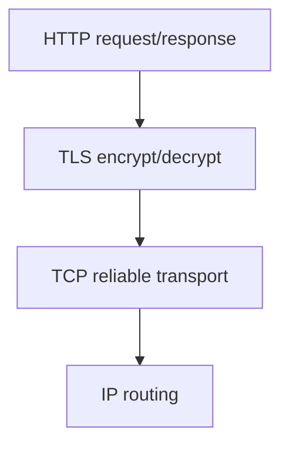

### Why it matters

TLS protects credentials, PII, and session tokens from interception and tampering. Certificate validation prevents man-in-the-middle attacks. TLS handshake cost affects connection latency (often +1–2 RTTs on top of TCP).

**Interview framing:** "HTTPS is not just encryption — the client must **trust** the server's identity via a CA-signed certificate, then both sides derive a **session key** that never crosses the wire."

### How it works

#### 1. Certificate issuance (one-time setup)

Before any client connects, the server obtains a **digital certificate** from a **Certificate Authority (CA)**.

**Actors:** Browser/client · Server (e.g. `google.com`) · Certificate Authority (Let's Encrypt, DigiCert, etc.)

**Server generates a key pair:**

| Key | Where it lives | Purpose |
|-----|----------------|---------|
| **Server public key** | Embedded in certificate; shared with world | Encrypt/verify; identity binding |
| **Server private key** | **Only on server** — never sent | Prove ownership of certificate |

**Server requests certificate** — sends domain name + public key (CSR) to CA. CA verifies domain ownership (HTTP challenge, DNS TXT) and issues:

```text
Certificate contents:
  - Domain name
  - Server public key
  - CA signature (proves CA vouches for this binding)
  - Validity dates, serial number
```

**Important:** The certificate is **not encrypted** — it is **signed** (identity card + trusted authority stamp). Anyone can read it; only the CA could produce a valid signature using the **CA private key**.

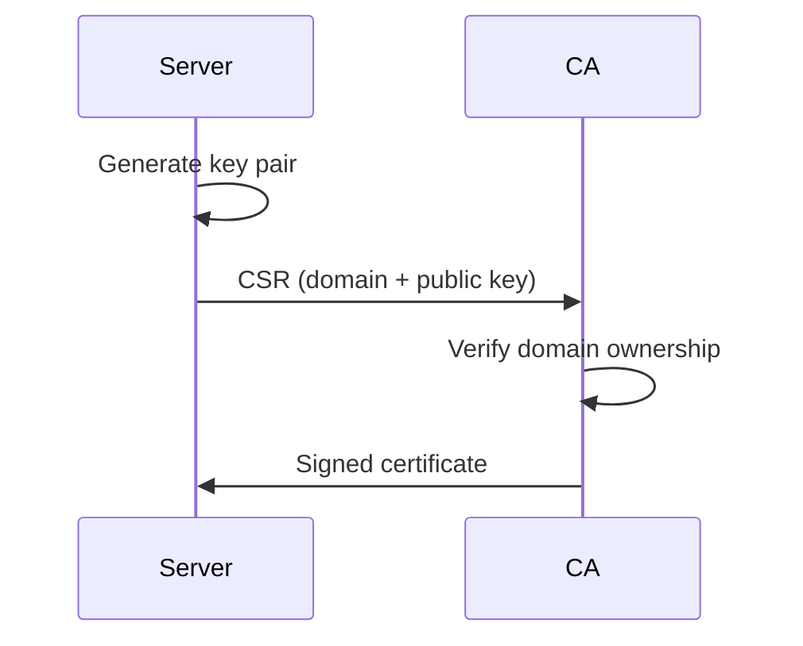

#### 2. TLS handshake

**ClientHello** — client sends supported TLS versions, cipher suites, **client random**, and **SNI** (hostname, e.g. `api.example.com`).

**ServerHello** — server responds with chosen params, **server random**, and **certificate chain** (leaf → intermediate → root).

**Client verifies certificate** using OS trust store:

| Check | Failure result |
|-------|----------------|
| Not expired | Reject connection |
| Domain matches SNI (CN/SAN) | Name mismatch warning |
| CA signature valid | Untrusted certificate |
| Chain to trusted root | Unknown issuer |

**Server proves private key ownership** — typically **CertificateVerify** (TLS 1.3): signs handshake transcript with server private key. Blocks MITM even if an attacker has a stolen cert without the private key.

#### 3. Session key derivation

Both sides independently compute the same **symmetric session key** — it is **never sent on the network**.

| Input | Source |
|-------|--------|
| Client random | ClientHello |
| Server random | ServerHello |
| Shared secret | ECDHE key exchange |

A **key derivation function (KDF)** combines these into session keys (separate encrypt/decrypt keys in practice). Unique randoms per connection enable **forward secrecy** with ECDHE.

#### 4. Encrypted application data

1. Client encrypts `GET /users` → ciphertext over TCP.
2. Server decrypts with session key → processes request.
3. Server encrypts response → client decrypts.

Bulk traffic uses **symmetric** ciphers (AES-GCM, ChaCha20-Poly1305). Asymmetric keys are used only during the handshake.

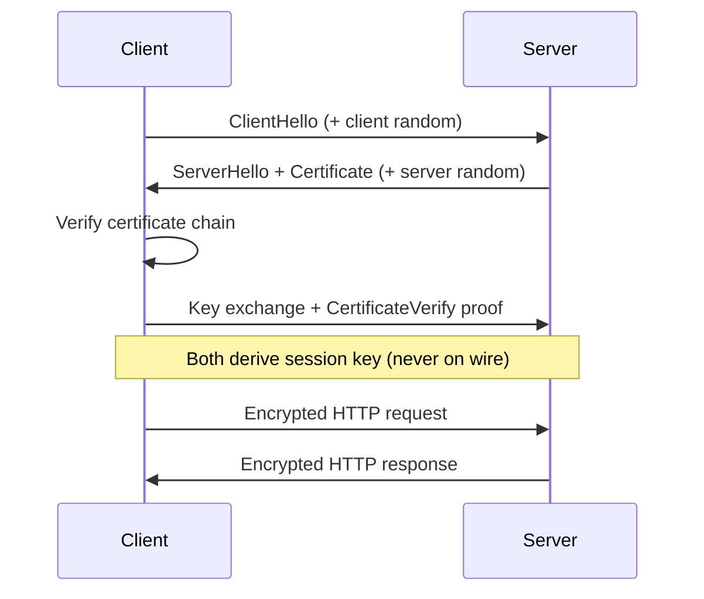

**Handshake quick reference:**

1. ClientHello → 2. ServerHello + cert → 3. Verify + key exchange → 4. Finished → 5. Encrypted HTTP

### Key details

#### Who uses which key?

| Key | Used by | Purpose |
|-----|---------|---------|
| **CA private key** | CA only | Sign certificates |
| **CA public key** | Client (trust store) | Verify certificate signature |
| **Server public key** | Client | Know server's identity; key exchange |
| **Server private key** | Server only | Prove cert ownership |
| **Session key** | Client **and** server | Encrypt/decrypt all HTTPS traffic |

- **TLS 1.3:** 1-RTT full handshake; **0-RTT resumption** with replay risk
- **TLS 1.2:** often 2-RTT full handshake; still common on legacy systems
- **Certificate chain:** leaf → intermediate → root CA in trust store
- **mTLS:** client also presents a certificate — mutual auth for service mesh / internal APIs
- **Termination:** LB decrypts TLS at edge, forwards HTTP to backend (or re-encrypts)
- **Session resumption:** TLS tickets / PSK skip full handshake on repeat connections

**Summary:**

1. Server gets **CA-signed certificate** binding domain → public key.
2. Client **verifies** cert via trusted CA public keys.
3. Server **proves** private key ownership.
4. Both **derive** the same session key (never on the wire).
5. All HTTPS traffic encrypted with session key.

### When to use

- All public web traffic (HTTPS everywhere)
- gRPC over TLS, database connections (PostgreSQL SSL)
- Service mesh sidecar mTLS

### Trade-offs / Pitfalls

- Certificate expiry outages (automate with Let's Encrypt / ACME)
- TLS termination at LB — traffic LB→app may be plaintext unless re-encrypted
- TLS inspection proxies break end-to-end trust
- 0-RTT data vulnerable to replay attacks
- CPU cost of encryption — hardware AES-NI mitigates
- Confusing **certificate** (public, signed identity) with **encrypted channel** (session key does bulk encryption)

### References

- [SSL/TLS — encryption handshake video](https://www.youtube.com/watch?v=LJDsdSh1CYM)

---


## 1.12 HTTP/2 & HTTP/3

QUIC transport details: [1.13 QUIC](#113-quic) · HTTP/HTTPS basics: [1.10](#110-httphttps)

---

### Why was HTTP/2 introduced?

HTTP/1.1 had several problems:

- Multiple TCP connections required
- Head-of-line (HOL) blocking
- Duplicate headers in every request
- Higher latency

HTTP/2 was introduced to improve performance while still using **TCP**.

---

### Why was HTTP/3 introduced?

HTTP/2 solved many HTTP problems but still inherited **TCP limitations**.

**Main issue:** Packet loss in one stream can block all other streams because TCP delivers data in order. This is called **TCP head-of-line blocking**.

HTTP/3 was introduced to solve this using **QUIC over UDP**.

---

### Protocol stack

**HTTP/1.1:**

```text
HTTP → TCP → IP
```

**HTTP/2:**

```text
HTTP/2 → TCP → TLS → IP
```

**HTTP/3:**

```text
HTTP/3 → QUIC → UDP → IP
```

---

### Transport protocol

| | HTTP/2 | HTTP/3 |
|---|--------|--------|
| Transport | **TCP** | **QUIC** (built on UDP) |

This is the biggest difference.

---

### Multiplexing

#### HTTP/2

Supports multiplexing. Multiple requests can use a **single TCP connection**.

```text
Request 1
Request 2
Request 3

All travel simultaneously over one connection.
```

This removes the need for multiple TCP connections.

#### HTTP/3

Also supports multiplexing — but each stream is **independent**. A problem in one stream does not block other streams.

---

### Head-of-line blocking

#### HTTP/2

Application-level HOL blocking is solved. **TCP-level HOL blocking still exists.**

**Example:** Stream A loses a packet → TCP waits for retransmission → Stream B and Stream C must also wait. **All streams are blocked.**

#### HTTP/3

Uses QUIC. Each stream is independent.

If Stream A loses a packet → **only Stream A waits** → Stream B and Stream C continue normally.

**Result:** Better performance on unreliable networks.

---

### Connection establishment

#### HTTP/2

```text
TCP handshake (SYN → SYN-ACK → ACK)
        +
TLS handshake (Client Hello → Server Hello → ...)
```

#### HTTP/3

QUIC combines transport and security setup. **Fewer round trips.** Faster connection establishment.

---

### Latency

| | HTTP/2 | HTTP/3 |
|---|--------|--------|
| Setup cost | TCP handshake + TLS handshake | QUIC integrated with TLS 1.3 — faster setup |
| Overall | Higher latency than HTTP/3 | **Lower latency** |

---

### Packet loss handling

#### HTTP/2

Packet loss impacts the **entire TCP connection**. Performance drops significantly on mobile networks, Wi-Fi, and long-distance links.

#### HTTP/3

Packet loss affects **only the impacted stream**. Other streams continue processing. Better user experience.

---

### Mobile networks

| | HTTP/2 | HTTP/3 |
|---|--------|--------|
| Network change (Wi-Fi → mobile data) | May require reconnecting; noticeable degradation | Handles transitions better — connection can continue more smoothly |

See [1.13 QUIC](#113-quic) for connection migration (connection ID).

---

### TLS support

| | HTTP/2 | HTTP/3 |
|---|--------|--------|
| TLS versions | Typically TLS 1.2 or TLS 1.3 (separate from TCP) | **Always TLS 1.3** — built directly into QUIC |

---

### Header compression

| | HTTP/2 | HTTP/3 |
|---|--------|--------|
| Compression | **HPACK** — reduces header size | **QPACK** — improved version designed for QUIC |

---

### Real-world example

Browser requests: `index.html`, `style.css`, `app.js`, `logo.png`

#### HTTP/2

Single TCP connection. If the packet carrying `app.js` is lost, TCP pauses delivery — **other resources may also wait**.

#### HTTP/3

Single QUIC connection. If `app.js` packet is lost, **only the `app.js` stream waits** — other resources continue downloading. Page loads faster.

---

### When HTTP/3 shines

Most beneficial on:

- Mobile networks
- High-latency networks
- Unstable connections
- Networks with packet loss

---

### Advantages of HTTP/2

- Multiplexing
- Header compression (HPACK)
- Single TCP connection
- Reduced latency vs HTTP/1.1
- Widely supported

---

### Advantages of HTTP/3

- Uses QUIC over UDP
- No TCP head-of-line blocking
- Faster connection setup
- Better packet loss recovery
- Better mobile performance
- Lower latency

---

### Interview questions

| Question | Answer |
|----------|--------|
| Why was HTTP/2 introduced? | Solve HTTP/1.1 inefficiencies using multiplexing and header compression |
| Why was HTTP/3 introduced? | Eliminate TCP head-of-line blocking |
| What protocol does HTTP/2 use? | **TCP** |
| What protocol does HTTP/3 use? | **QUIC over UDP** |
| Biggest advantage of HTTP/3? | Packet loss in one stream does not block other streams |
| Does HTTP/3 use TLS? | Yes — TLS 1.3 is built into QUIC |

---

### Quick comparison

| Feature | HTTP/2 | HTTP/3 |
|---------|--------|--------|
| Transport | TCP | QUIC (UDP) |
| Multiplexing | Yes | Yes |
| HOL blocking | TCP level still exists | Eliminated at stream level |
| TLS | Separate from TCP | Built-in (TLS 1.3) |
| Connection setup | Slower | Faster |
| Packet loss impact | Entire connection | Single stream only |
| Mobile performance | Good | Better |
| Latency | Lower than HTTP/1.1 | Lowest |

---


## 1.13 QUIC

HTTP/2 vs HTTP/3 comparison: [1.12 HTTP/2 & HTTP/3](#112-http2-http3) · UDP basics: [1.4](#14-udp)

**QUIC (Quick UDP Internet Connections)** is a modern transport protocol developed by Google. It was created to overcome some of TCP's limitations and improve web performance.

**HTTP/3 is built on top of QUIC.**

Think of it as: **TCP + TLS + performance improvements** combined into a single protocol.

---

### Why was QUIC created?

HTTP/2 improved HTTP significantly but still used TCP.

**Problem:** TCP suffers from head-of-line (HOL) blocking. If one packet is lost, TCP pauses delivery of subsequent packets until the lost packet is retransmitted — even unrelated streams must wait.

**Result:** Higher latency and slower page loads.

QUIC was designed to solve this.

---

### QUIC vs TCP

| | TCP | QUIC |
|---|-----|------|
| Base | Connection-oriented | Built on **UDP** |
| Reliability | Yes | Yes |
| Ordering | Ordered delivery (whole connection) | Ordered **per stream** |
| TLS | Separate handshake | **TLS 1.3 built-in** |
| HOL blocking | Yes | **No TCP-level HOL blocking** |

---

### If QUIC uses UDP, how is it reliable?

UDP itself is connectionless — no acknowledgements, no retransmissions, no ordering guarantees.

**QUIC adds these features itself:**

- Packet acknowledgements
- Retransmissions
- Flow control
- Congestion control
- Stream management

```text
UDP provides transport.
QUIC implements reliability in user space.
```

---

### QUIC protocol stack

```text
HTTP/3 → QUIC → UDP → IP
```

Full comparison with HTTP/1.1 and HTTP/2 stacks: [1.12](#112-http2-http3)

---

### Biggest benefit: no head-of-line blocking

Suppose browser downloads: `index.html`, `style.css`, `app.js`

#### TCP (HTTP/2)

If a packet from `app.js` is lost, TCP waits — `style.css` and `index.html` may also be delayed. **Entire connection is affected.**

#### QUIC (HTTP/3)

Each resource uses its own stream. If `app.js` packet is lost, **only the `app.js` stream waits** — `style.css` and `index.html` continue normally.

**Result:** Faster page loading.

---

### QUIC streams

A QUIC connection contains multiple **independent streams**.

```text
Connection
 |
 |-- Stream 1 → HTML
 |-- Stream 2 → CSS
 |-- Stream 3 → JavaScript
 |-- Stream 4 → Images
```

Each stream operates independently. Packet loss in one stream does not affect others.

---

### Faster connection setup

#### HTTP/2

```text
TCP handshake (SYN → SYN-ACK → ACK)
        +
TLS handshake (Client Hello → Server Hello → ...)
```

Multiple round trips required.

#### QUIC

TLS 1.3 is built directly into QUIC. Transport setup and security setup happen **together**.

**Result:** Fewer round trips, lower latency.

---

### Connection migration

One unique feature of QUIC.

**Example:** Phone on Wi-Fi → user switches to mobile data during a video call.

| | TCP | QUIC |
|---|-----|------|
| Network change | Connection usually breaks; new connection often required | Connection can **continue** |

QUIC identifies connections using **connection IDs** instead of relying only on IP addresses.

**Result:** Better mobile experience.

---

### Encryption

| | TCP | QUIC |
|---|-----|------|
| Encryption | Optional — TLS added separately | **Mandatory** — TLS 1.3 built in |

Every QUIC connection is encrypted.

---

### Congestion control

Just like TCP, QUIC implements:

- Congestion control
- Flow control
- Packet retransmission

**Purpose:** Prevent network overload and maintain performance.

---

### Why QUIC is faster

1. **Fewer round trips** — transport and TLS setup combined
2. **No TCP head-of-line blocking** — streams operate independently
3. **Faster recovery** — packet loss impacts only the affected stream
4. **Connection migration** — handles network changes smoothly

---

### Real-world example

You open `youtube.com`. Browser downloads HTML, CSS, JavaScript, images, video chunks.

| | Behavior |
|---|----------|
| **TCP** | Packet loss may slow everything |
| **QUIC** | Only the affected stream waits; other downloads continue |

This improves page load time, video streaming, and mobile performance.

---

### Disadvantages of QUIC

- More complex implementation
- Higher CPU usage compared to TCP
- Some firewalls may block UDP traffic
- Newer protocol — not as mature as TCP

---

### Interview questions

| Question | Answer |
|----------|--------|
| What is QUIC? | A transport protocol built on UDP that powers HTTP/3 |
| Why was QUIC introduced? | Eliminate TCP head-of-line blocking and reduce latency |
| Does QUIC use UDP? | Yes — QUIC runs on top of UDP |
| If UDP is unreliable, how does QUIC work? | QUIC implements reliability, retransmission, flow control, and congestion control itself |
| Biggest advantage of QUIC? | Independent streams — packet loss in one stream does not block others |
| Does QUIC use TLS? | Yes — TLS 1.3 is built into QUIC |

---

### Quick comparison

| Feature | TCP | QUIC |
|---------|-----|------|
| Transport | TCP | UDP |
| Reliable | Yes | Yes |
| TLS | Separate | Built-in |
| HOL blocking | Yes | No |
| Multiplexing | Limited | Native |
| Connection setup | Slower | Faster |
| Connection migration | No | Yes |
| Used by | HTTP/1, HTTP/2 | **HTTP/3** |

---

### Memory trick

```text
TCP  = Reliable but can block all streams
QUIC = Reliable UDP with built-in TLS and independent streams

HTTP/2 = Multiplexing over TCP
HTTP/3 = Multiplexing over QUIC
```

**Interview one-liner:** QUIC is a modern transport protocol built on UDP that provides TCP-like reliability, built-in TLS, faster connection setup, and eliminates TCP head-of-line blocking.

---


## 1.14 Keep Alive Connections

TCP handshake details: [1.3 TCP Handshake](#13-tcp-handshake) · HTTP/2 multiplexing: [1.12 HTTP/2 & HTTP/3](#112-http2-http3) · HTTPS: [1.10](#110-httphttps)

**HTTP Keep-Alive** is a mechanism that allows multiple HTTP requests and responses to reuse the same TCP connection.

Instead of creating a new TCP connection for every request, the existing connection remains open and is reused.

This is also called a **persistent connection**.

---

### Why do we need Keep-Alive?

Creating a TCP connection is expensive. Every new connection requires a TCP handshake:

```text
Client → SYN
Server → SYN-ACK
Client → ACK
```

This introduces:

- Extra network latency
- Additional CPU overhead
- More memory usage
- More network traffic

Keep-Alive avoids paying this cost repeatedly.

---

### Without Keep-Alive

Suppose browser loads a webpage containing HTML, CSS, JavaScript, and a logo image.

For each resource:

```text
Open TCP Connection → Request Resource → Receive Response → Close Connection
```

```text
Connection 1 → HTML
Connection 2 → CSS
Connection 3 → JS
Connection 4 → Image
```

**Result:** 4 TCP handshakes, 4 TCP teardowns — wasteful.

---

### With Keep-Alive

Browser opens **1 TCP connection**, then:

```text
Request HTML   → Response HTML
Request CSS    → Response CSS
Request JS     → Response JS
Request Image  → Response Image
```

Same TCP connection reused.

**Result:** Only 1 TCP handshake — much faster.

---

### Visual comparison

#### Without Keep-Alive

```text
Browser
   |
TCP Handshake
   |
Request 1 → Response 1 → Close

Browser
   |
TCP Handshake
   |
Request 2 → Response 2 → Close

Browser
   |
TCP Handshake
   |
Request 3 → Response 3 → Close
```

#### With Keep-Alive

```text
Browser
   |
TCP Handshake
   |
Request 1 → Response 1
   |
Request 2 → Response 2
   |
Request 3 → Response 3
   |
Close Connection
```

---

### Performance benefits

1. **Lower latency** — TCP handshake performed only once
2. **Less CPU usage** — fewer connections created and destroyed
3. **Less network overhead** — fewer SYN and FIN packets
4. **Better throughput** — more useful data transferred, less protocol overhead

---

### Real-world example

Suppose **RTT = 100ms**.

**New TCP connection:**

```text
TCP Handshake = 100ms
HTTP Request  = 100ms
Total         ≈ 200ms
```

**10 separate requests without Keep-Alive:**

```text
10 × 200ms ≈ 2000ms
```

**With Keep-Alive:**

```text
Handshake paid once: 100ms
10 requests:         10 × 100ms ≈ 1000ms
Total:               ≈ 1100ms
```

Almost half the latency.

---

### HTTP/1.0 vs HTTP/1.1

| | HTTP/1.0 | HTTP/1.1 |
|---|----------|----------|
| Default | Connection closed after every request | **Keep-Alive enabled by default** |
| Keep-Alive | Had to be explicitly enabled | Connections stay open unless explicitly closed |

This significantly improved performance.

---

### How long does connection stay open?

Server does not keep connections forever. **Idle timeout** is configured — e.g. 30, 60, or 120 seconds.

If no activity occurs, server closes the connection.

---

### Keep-Alive header

**HTTP/1.1 — keep connection open:**

```http
GET /users HTTP/1.1
Host: api.company.com
Connection: keep-alive
```

**Close connection after response:**

```http
Connection: close
```

---

### Keep-Alive in microservices

```text
API Gateway → User Service → Order Service → Payment Service
```

| | Behavior |
|---|----------|
| **Without Keep-Alive** | Each request creates a new TCP connection — large overhead |
| **With Keep-Alive** | Services reuse existing connections |

**Benefits:** Lower latency, lower CPU consumption, better scalability

---

### Keep-Alive and connection pooling

Most applications use **connection pools** — Spring Boot, Apache HttpClient, OkHttp, Netty.

Instead of creating a connection every time, the pool maintains reusable connections.

**Keep-Alive makes pooling possible.**

---

### Keep-Alive and load balancers

```text
Client → Load Balancer → Backend Server
```

Persistent connections reduce TCP handshakes, TLS handshakes, and CPU usage — improving overall throughput.

---

### Keep-Alive and HTTPS

This is where Keep-Alive becomes even more valuable. HTTPS requires:

```text
TCP Handshake + TLS Handshake
```

Both are expensive.

| | Cost per request |
|---|------------------|
| **Without Keep-Alive** | Every request pays TCP setup + TLS setup |
| **With Keep-Alive** | TCP setup once, TLS setup once — multiple requests reuse the secure connection |

Huge performance improvement. TLS details: [1.11 SSL/TLS](#111-ssltls)

---

### Interview questions

| Question | Answer |
|----------|--------|
| What is HTTP Keep-Alive? | Reusing the same TCP connection for multiple HTTP requests |
| Why is Keep-Alive useful? | Reduces connection setup overhead and latency |
| What problem does it solve? | Repeated TCP and TLS handshakes |
| Is Keep-Alive enabled by default in HTTP/1.1? | **Yes** |
| Why is Keep-Alive important for HTTPS? | Avoids repeated TCP and TLS handshakes |
| How does Keep-Alive improve microservices? | Reduces network overhead and improves throughput |

---

### Keep-Alive vs HTTP/2

| | HTTP/1.1 + Keep-Alive | HTTP/2 |
|---|----------------------|--------|
| Connection | One connection reused | One connection reused |
| Requests | Generally processed **sequentially** | Multiple requests processed **simultaneously** (multiplexing) |

HTTP/2 still uses Keep-Alive but is much more efficient. See [1.12](#112-http2-http3).

---

### Memory trick

```text
Without Keep-Alive:
  Request → New TCP Connection → Response → Close → (repeat)

With Keep-Alive:
  One TCP Connection → Request 1 → Request 2 → Request 3 → Request 4 → Close later
```

**Interview one-liner:** HTTP Keep-Alive allows multiple HTTP requests to reuse the same TCP connection, avoiding repeated TCP/TLS handshakes and significantly reducing latency.

---


## 1.15 Forward & Reverse Proxy

Load balancing deep dive: [1.20 Load Balancer](#120-load-balancer) · CDN edge caching: [1.19 CDN](#119-cdn) · TLS: [1.11 SSL/TLS](#111-ssltls)

A **proxy** is an intermediary that sits between two parties and forwards requests and responses.

Instead of client and server communicating directly:

```text
Client → Proxy → Server
```

The proxy acts on behalf of either the **client** or the **server**.

---

### Why do we need a proxy?

Common reasons:

- Security
- Access control
- Caching
- Load balancing
- Anonymity
- Traffic monitoring
- Rate limiting

---

### Forward proxy

#### What is it?

A **forward proxy** sits in front of **clients** and acts on behalf of clients.

The internet sees the proxy, not the actual client.

```text
Client → Forward Proxy → Internet Server
```

---

#### How it works

**Without proxy:**

```text
Client → google.com
```

Server knows client's IP.

**With forward proxy:**

```text
Client → Forward Proxy → google.com
```

Server sees **proxy IP**. Client IP is hidden.

---

#### Real-world example

Suppose a company blocks Facebook, YouTube, and Instagram.

All employee traffic goes through a **corporate forward proxy**. The proxy can:

- Allow websites
- Block websites
- Log requests
- Scan downloads

---

#### Benefits of forward proxy

1. **Client anonymity** — server sees proxy IP instead of client IP
2. **Access control** — block specific websites
3. **Content filtering** — filter inappropriate content
4. **Caching** — store frequently requested resources
5. **Traffic monitoring** — track user activity

---

#### Forward proxy example

```text
Home User → VPN / Corporate Proxy → google.com
```

`google.com` sees **proxy IP**, not user IP.

---

#### Who knows about the proxy?

| | Forward proxy |
|---|---------------|
| Client | **Knows** (configured) |
| Server | Usually does not care |

Think: **proxy representing the client**

---

### Reverse proxy

#### What is it?

A **reverse proxy** sits in front of **servers** and acts on behalf of servers.

Clients communicate with the proxy. Clients may not know backend servers even exist.

```text
Client → Reverse Proxy → Backend Servers
```

---

#### How it works

Client requests `api.company.com`.

Request first reaches the **reverse proxy**. Proxy forwards request to a **backend server**. Response returns through the proxy.

---

#### Visual flow

```text
Client
   |
Reverse Proxy
   |
---------------------
|         |         |
Server1  Server2  Server3
```

---

#### Benefits of reverse proxy

1. **Load balancing** — distributes traffic across multiple servers
2. **Security** — backend servers hidden from clients
3. **SSL termination** — handles HTTPS/TLS; backends may use plain HTTP internally
4. **Caching** — serve cached responses
5. **Rate limiting** — prevent abuse
6. **DDoS protection** — filters malicious traffic

---

#### Real-world example

When you access `https://amazon.com`, you are usually talking to a **load balancer / reverse proxy** — not directly to application servers.

The proxy decides which backend server should handle the request.

---

#### SSL termination

```text
Client
   |
HTTPS
   |
Reverse Proxy
   |
HTTP
   |
Backend Service
```

Proxy handles TLS handshake, certificate management, and encryption/decryption. Backend services stay simpler.

---

#### Load balancing example

```text
Client Requests
   |
Reverse Proxy
   |
-------------------------
|          |           |
App1       App2       App3
```

```text
Request 1 → App1
Request 2 → App2
Request 3 → App3
```

Traffic distributed evenly. Algorithms and pitfalls: [1.20](#120-load-balancer)

---

#### Common reverse proxy products

- Nginx
- HAProxy
- Envoy
- Traefik
- Cloudflare
- AWS ALB

---

### Forward proxy vs reverse proxy

| Feature | Forward proxy | Reverse proxy |
|---------|---------------|---------------|
| Represents | **Client** | **Server** |
| Placed in front of | Clients | Servers |
| Hides | Client identity | Server identity |
| Used by | Clients | Server owners |
| Common uses | VPN, filtering | Load balancing |
| Internet sees | Proxy IP | Proxy IP |

---


## 1.16 NAT


### What is it?

**Network Address Translation (NAT)** maps private IP addresses inside a network to public IP(s) on the internet, modifying packet headers in transit. Most home routers and cloud NAT gateways use **NAPT** (port-level translation).

### Why it matters

NAT conserves scarce IPv4 addresses and hides internal topology. It also breaks inbound connections unless port forwarding configured - affecting P2P, WebRTC, and debugging client IPs.

### How it works

1. Internal host (192.168.1.10:5000) sends packet to external server.
2. NAT router replaces source with (public_ip:ephemeral_port).
3. NAT table maps ephemeral_port -> internal host:port.
4. Return packets reverse translation using table.
5. Table entries timeout after idle period.

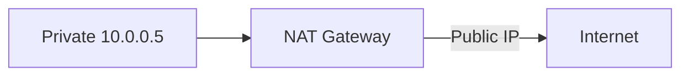

### Key details

- **SNAT:** source translation (outbound from private)
- **DNAT:** destination translation (port forwarding inbound)
- Cloud **NAT Gateway** for private subnet egress without public IPs
- **Carrier-grade NAT (CGNAT)** shares public IP across ISP customers

### When to use

- Private subnet internet access in VPC
- Home/office networks on IPv4
- Hiding internal server IPs from clients

### Trade-offs / Pitfalls

- Breaks end-to-end connectivity - needs STUN/TURN for WebRTC
- Log correlation harder (many clients share one public IP)
- NAT table exhaustion under high connection count
- IPv6 designed to reduce NAT need

### References

- [NAT — network address translation video](https://www.youtube.com/watch?v=FTUV0t6JaDA)

---


## 1.17 VPN


### What is it?

A **Virtual Private Network (VPN)** creates an encrypted tunnel over a public network, making remote hosts appear on a private network. Protocols include IPsec, OpenVPN, WireGuard, and TLS-based corporate VPNs.

### Why it matters

VPNs secure remote access, connect site-to-site networks, and bypass geo-restrictions. Zero-trust architectures reduce blanket VPN reliance but VPN remains common for admin access and hybrid cloud.

### How it works

1. Client authenticates to VPN concentrator.
2. Encrypted tunnel established (IPsec SA or WireGuard handshake).
3. Client receives virtual IP in VPN address space.
4. Traffic routed through tunnel (full or split tunnel).
5. Decrypted at gateway; forwarded to internal resources.

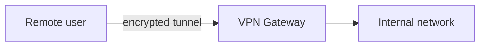

### Key details

- **Split tunnel:** only corporate traffic via VPN; internet direct
- **Full tunnel:** all traffic via corporate (inspection, DLP)
- **WireGuard:** modern, minimal, fast kernel implementation
- **Site-to-site:** gateway-to-gateway for datacenter/cloud linking

### When to use

- Remote employee access to internal tools
- Connecting cloud VPC to on-prem datacenter
- Secure admin access to production (bastion alternative)

### Trade-offs / Pitfalls

- VPN concentrator SPOF and bandwidth bottleneck
- Full tunnel adds latency for SaaS apps
- Compromised VPN creds grant broad network access
- Zero-trust replaces "perimeter VPN trust" with per-request auth

### References

- [VPN — virtual private networks video](https://www.youtube.com/watch?v=R-JUOpCgTZc)

---


## 1.18 Anycast/Multicast/Broadcast

**Broadcast** — one-to-all on a LAN subnet (e.g., ARP, DHCP); does not cross routers.

**Multicast** — one-to-many to subscribed hosts (IGMP, `224.0.0.0/4`); common inside datacenters; limited on the public internet.

**Anycast** — same IP announced from multiple sites via BGP; routers deliver to the **nearest** node. Powers global **DNS (Domain Name System)** resolvers (`8.8.8.8`), **CDN (Content Delivery Network)** edges, and DDoS scrubbing.

**When asked in interviews:** contrast the three delivery semantics; note anycast + stateful TCP breaks if BGP path changes mid-session; multicast is rarely available in cloud VPCs.

See [1.8 DNS](#18-dns) and [1.19 CDN](#119-cdn) for production examples.

---


## 1.19 CDN


### What is it?

A **Content Delivery Network (CDN)** distributes cached copies of static (and sometimes dynamic) content to **edge PoPs** geographically close to users, reducing latency and origin load.

### Why it matters

Users globally expect fast page loads. CDN offloads 80 - 90% of static traffic, absorbs DDoS, and provides TLS at edge. Essential for media, e-commerce, and any global web property.

### How it works

1. Origin (S3, nginx) serves content; CDN pulls on first request (**cache miss**).
2. CDN caches at edge PoP with TTL from `Cache-Control`.
3. Subsequent nearby users get **cache hit** from edge.
4. DNS (or anycast) routes user to nearest PoP.
5. Purge API invalidates cached objects on content update.

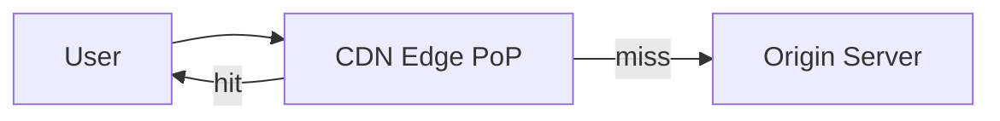

### Key details

- **Cache keys** include URL, query string, headers (Vary)
- **Dynamic acceleration:** route API through CDN private backbone
- Providers: Cloudflare, Akamai, Fastly, CloudFront
- **Stale-while-revalidate** serves old while refreshing

#### Push CDN vs pull CDN

CDNs populate edge caches in two fundamentally different ways:

| Model | How content reaches edge | Who initiates upload | Storage at edge | Best for |
|-------|--------------------------|----------------------|-----------------|----------|
| **Pull CDN** | Edge fetches from origin on first user request (cache miss) | Origin passive; CDN pulls on demand | Minimized — only recently requested content | High-traffic sites; content accessed unpredictably |
| **Push CDN** | You upload or pre-publish content directly to CDN | Developer/CI pushes to CDN | Higher — you control what is stored | Low-traffic sites; infrequent updates; large releases you want live immediately |

**Pull CDN flow:**
1. User requests `cdn.example.com/app.js`.
2. Edge PoP has miss → fetches from origin.
3. Caches with TTL from `Cache-Control`.
4. Subsequent users at that PoP get cache hit.

**Push CDN flow:**
1. Build pipeline uploads assets to CDN storage (S3 + CloudFront invalidation, or FTP/API upload).
2. URLs point directly to CDN hostname.
3. Content is at edge before first user request — no cold-start latency on first hit.

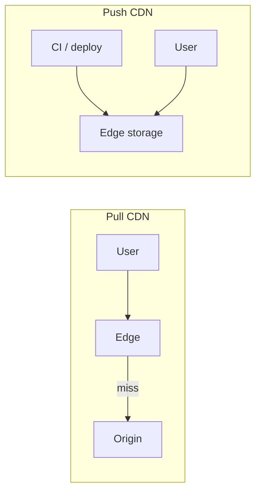

**Trade-offs:**
- **Pull:** simpler origin integration; first request per PoP is slow; TTL expiry can cause redundant origin fetches if content unchanged.
- **Push:** predictable go-live; you manage upload + purge; wasted edge storage if content is rarely accessed.

Most modern CDNs (CloudFront, Cloudflare, Fastly) support **both** — static sites often use pull with origin (S3/nginx); release artifacts and versioned bundles are often pushed via deploy hooks.

### Production rules

#### Purge and invalidation

| Operation | Scope | Propagation | Use when |
|-----------|-------|-------------|----------|
| **URL purge** | Single path | Seconds–minutes per PoP | One bad object, emergency fix |
| **Wildcard / prefix purge** | `/*` or `/assets/*` | Minutes; may rate-limit | Bad deploy of static bundle |
| **Surrogate-key purge** | Tag-based (Fastly, Cloudflare) | Fast, batched | Purge all objects for `product-123` |
| **Versioned URLs** | No purge needed | Instant (new URL) | **Preferred** — `app.a1b2c3.js` immutable |

```text
Runbook — "users still see old JS after deploy":
1. Confirm deploy uploaded NEW object (check origin ETag/hash)
2. If cache-busted URL (hash in filename): purge NOT needed — check HTML still references old URL
3. If purge API called: check API response 200 + purge ID; verify not rate-limited (429)
4. dig edge IP → curl -H "Cache-Control: no-cache" https://cdn.../app.js — compare PoPs
5. If partial PoP stale: open provider ticket; temporary fix = lower TTL on that path
6. Nuclear: purge /* (expect origin spike on next global miss wave)
```

#### Purge failure modes

| Failure | Symptom | Mitigation |
|---------|---------|------------|
| **Rate limit** | 429; partial purge | Batch surrogate keys; use versioning instead |
| **Wrong cache key** | Purge "succeeds" but object stale | Include query string / `Vary` headers in key; purge exact URL |
| **PoP propagation lag** | Fixed in US, stale in EU for 5 min | Wait SLA (provider-specific); don't chain deploys |
| **Stale-while-revalidate** | Old content served while refresh async | Set `stale-while-revalidate=0` for HTML; immutable for assets |
| **Purge API down** | Deploy blocked | Fallback: new versioned filename; bypass CDN to origin temporarily |
| **Origin still old** | Purge irrelevant | Fix origin first — CDN re-fetches stale on miss |

#### Sizing

| Signal | Rule | Notes |
|--------|------|-------|
| Origin spike after purge | Every PoP may refetch same object | Purge off-peak; warm critical paths |
| Bandwidth | Cache hit ratio < 85% on static | Review TTL; versioned assets |
| Purge API quota | ~100–1000 paths/min (provider-dependent) | Surrogate keys beat 10k URL purges |
| HTML TTL | 60–300 s max if not versioned | Long TTL only with fingerprinted assets |

### When to use

- Static assets (JS, CSS, images, video)
- Downloadable files, software updates
- DDoS protection and WAF at edge

### Trade-offs / Pitfalls

| Pitfall | Consequence | Mitigation |
|---------|-------------|------------|
| Cache invalidation delay after deploy | Users see stale assets | Versioned URLs; surrogate-key purge |
| Personalized content hard to cache | Low hit ratio | Edge logic; short TTL; cache key design |
| Dynamic HTML caching | Wrong user sees wrong page | `private`, `Vary`, don't cache authenticated HTML |
| Cost scales with bandwidth egress | Bill shock | Compress; hit ratio; tiered pricing |
| Purge without versioned URLs | Every deploy needs global invalidation | Fingerprint assets; purge HTML only |
| Full-site purge at peak | Origin miss storm; latency spike | Purge off-peak; warm cache; versioned bundles |
| Ignoring `Vary: Accept-Encoding` | Purged gzip; brotli variant still stale | Purge all variants or normalize encoding at edge |

### References

- [CDN — content delivery networks video](https://www.youtube.com/watch?v=ouqqU0FJjhQ)

---


## 1.20 Load Balancer


### What is it?

A **load balancer (LB)** sits in front of multiple backend servers and **distributes incoming traffic** across them. Goals: higher **throughput**, better **availability** (survive node failure), and horizontal **scalability**.

Two main layers:
- **L4 (Transport)** - routes TCP/UDP connections by IP:port; fast; no HTTP awareness
- **L7 (Application)** - routes HTTP/gRPC by URL path, headers, host; TLS termination, cookies

Examples: AWS ALB/NLB, nginx, HAProxy, F5, Envoy, Kubernetes Service + Ingress.

### Why it matters

No single server handles modern traffic volumes. The load balancer is the **front door** of almost every scaled system - it enables rolling deploys (drain unhealthy nodes), health-based routing, and SSL at the edge.

### How it works

1. Client resolves DNS to LB VIP (virtual IP) or hostname (`api.example.com`)
2. Client connects to LB (TLS often terminates here at L7)
3. LB selects backend using algorithm — see [1.21 Load Balancer Algorithm](#121-load-balancer-algorithm) (round-robin, least connections, consistent hash)
4. LB forwards request (L7 proxy) or connection (L4 pass-through)
5. **Health checks** probe backends (`GET /health` every 10s); unhealthy nodes removed from pool
6. Optional **session affinity (sticky sessions):** same client always hits same backend via cookie or source IP hash

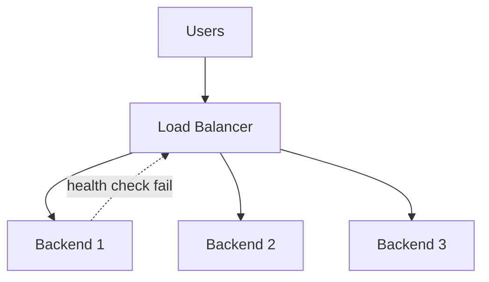

**L4 vs L7 decision:**

| | L4 (NLB) | L7 (ALB/nginx) |
|---|----------|----------------|
| Speed | Faster (no HTTP parse) | Slightly more CPU |
| Routing | IP + port only | Path, header, host |
| TLS | Pass-through or terminate | Terminate + route |
| Use case | DB proxy, gaming UDP, raw TCP | REST APIs, WebSocket upgrade |
| WebSocket | TCP pass-through works | Needs upgrade support |

**High availability for the LB itself:**
- Active-passive pair (keepalived/VRRP) with floating VIP
- Cloud-managed LB (AWS ELB) spans AZs automatically
- DNS failover to secondary region (higher TTL trade-off)

**Deployment patterns:**
- **Active-active:** all backends serve traffic simultaneously
- **Active-passive:** standby waits for failover
- **Cross-zone:** LB distributes across availability zones (survive AZ outage)

### Key details

- **Health check tuning:** too aggressive -> flapping; too lazy -> send traffic to dead nodes
- **Connection draining:** on deploy, stop new connections to instance, wait for in-flight to finish
- **X-Forwarded-For / X-Real-IP:** LB injects client IP for backend logging and rate limiting
- **WebSocket:** requires L7 with HTTP upgrade support + often **sticky sessions** or shared pub/sub backplane
- **gRPC:** L7 LB with HTTP/2 aware routing (path, metadata)
- **SSL/TLS:** terminate at LB (centralized cert management) vs pass-through (end-to-end encryption)

### Production rules

#### Health checks — avoid flapping

Flapping: backend alternates healthy ↔ unhealthy → connections churn, alerts noise, uneven load.

| Parameter | Too aggressive | Too lazy | Production starting point |
|-----------|----------------|----------|---------------------------|
| **Interval** | CPU spike from probes; false fail on slow GC | Traffic to dying node 30+ s | 10–30 s |
| **Timeout** | Fails during normal latency spike | Hung backends stay in pool | 2–5 s (match p99 app latency) |
| **Healthy threshold** | Slow to mark up after deploy | — | 2–3 consecutive successes |
| **Unhealthy threshold** | **Flapping** on single timeout | — | 2–5 consecutive failures |
| **Path** | 200 on `/` that hits DB | — | Dedicated `/health` or `/ready` (liveness vs readiness) |

```text
Split probes:
  Liveness  (/health)  → process up; LB keeps sending traffic
  Readiness (/ready)   → can serve traffic; K8s removes from Service, LB should mirror

Runbook — "LB flapping during deploy":
1. Check if health path shares fate with DB (mark unhealthy when DB slow → cascade)
2. Increase unhealthy threshold temporarily OR use preStop hook + drain
3. Verify probe not hitting auth-gated path (401 → unhealthy)
4. Align LB idle timeout > app graceful shutdown window
```

#### Connection draining (deploy runbook)

| Step | AWS ALB | nginx / generic |
|------|---------|-----------------|
| 1. Stop new traffic | Target deregistration delay | `weight=0` or remove from upstream |
| 2. Wait in-flight | `deregistration_delay` (default 300 s) | `proxy_read_timeout` + worker drain |
| 3. App shutdown | `preStop` sleep ≥ drain period | `SIGTERM` handler stops accept, finishes requests |
| 4. Force kill | After `terminationGracePeriodSeconds` | `worker_shutdown_timeout` |

```text
Sizing drain window:
  drain_seconds ≥ p99_request_duration + p99_websocket_idle_between_messages
  Typical API: 30–60 s
  WebSocket/chat: 300–3600 s OR force disconnect with client reconnect
```

**Rule:** `LB deregistration delay` ≥ `app graceful shutdown` ≥ longest in-flight request. If app exits first, LB RSTs active connections.

#### Sizing

| Resource | Rule of thumb | Notes |
|----------|---------------|-------|
| Connections per L7 LB | 10k–100k+ (managed ELB scales) | Watch `SurgeQueueLength`, `TargetConnectionErrorCount` |
| Health check QPS | `N_targets × (1/interval)` | 100 targets @ 10s = 10 RPS probe load — use `/ready` lightweight |
| New connections/sec | SYN rate limit at LB under viral spike | Pre-warm; use CDN; connection pooling from clients |
| Cross-zone LB | +1–2 ms latency | Worth it for AZ survival; enable on ALB |

### When to use

- More than one app server instance (almost always in production)
- Zero-downtime rolling deployments
- Geographic or AZ redundancy
- DDoS absorption at edge (CDN + LB)

### Trade-offs / Pitfalls

| Pitfall | Consequence | Mitigation |
|---------|-------------|------------|
| Sticky sessions | Uneven load; required for in-memory state | External session store (Redis) |
| SSL termination at LB | Plaintext LB→backend | TLS to backend or private VPC |
| Misconfigured health checks | Healthy nodes marked bad | Dedicated `/health`; no auth on probe |
| Single LB SPOF | Full outage if LB fails | HA pair or managed multi-AZ LB |
| Source IP hash + carrier NAT | Hot backend; unfair distribution | Cookie or user-id affinity |
| Health check flapping | Traffic yo-yo; alert fatigue; session drops | Raise unhealthy threshold; liveness vs readiness |
| Drain shorter than in-flight | RST mid-request; 502 burst on deploy | `deregistration_delay` ≥ p99 request time |
| No preStop / graceful shutdown | Pod killed while LB still sends traffic | `preStop` sleep; SIGTERM handler |
| Readiness tied to dependency | One DB blip drains entire fleet | Readiness = local only; degrade gracefully |

### References

- [Load Balancer Algorithms - comparison video](https://www.youtube.com/watch?v=1fN2UDbtGDQ)

---


## 1.21 Load Balancer Algorithm


### What is it?

A **load balancing algorithm** is the policy a load balancer (L4 or L7) uses to pick **one backend** from a healthy pool for each incoming connection or request. The algorithm sees only what the LB tracks—connection counts, weights, hashes of IP/URL/header—not application-level "CPU busy" unless exposed via custom metrics or slow-start.

**Core algorithms (tier-1):**

| Algorithm | Selection rule |
|-----------|----------------|
| **Round robin** | Rotate through backends in fixed order |
| **Weighted round robin** | Round robin proportional to weight |
| **Least connections** | Backend with fewest active connections |
| **IP hash** | `hash(client_ip) % N` → fixed backend |
| **Consistent hash** | Hash into ring; minimal remap when nodes added/removed |

### Why it matters

The wrong algorithm creates **false capacity**: three servers at 90% CPU while two sit idle, or sticky sessions break when mobile clients change IP. Algorithm choice interacts with **connection duration**, **request cost variance**, and **statefulness**.

| Workload shape | Bad choice | Symptom |
|----------------|------------|---------|
| Long WebSocket sessions | Round robin | Even count but one server holds all heavy rooms |
| Heterogeneous instance sizes | Plain round robin | Small nodes overwhelmed |
| In-memory session cache | Round robin | Cache miss storm on every server |
| Sharded cache cluster | Round robin | Same key on all nodes—no locality |

**Interview point:** L4 LB sees TCP connections; L7 LB sees HTTP requests. One HTTP/2 connection with 100 streams = **1 connection** for least-conn but **100 requests** for per-request RR.

### How it works

**Round robin (RR)**

```text
Backends: [A, B, C]
Request 1 → A,  Request 2 → B,  Request 3 → C,  Request 4 → A, ...
```

Pseudo-code:

```text
index = 0
on each request:
    backend = pool[index % pool.size]
    index++
    forward(backend)
```

Assumes **equal capacity**, **stateless** handlers, and **uniform** request cost.

**Weighted round robin (WRR)**

```text
Weights: A=3, B=1, C=1  →  pattern A,A,A,B,C repeating
```

Use when nodes differ (large vs small instances, canary with weight=1 vs prod weight=9).

**Least connections**

```text
On each new connection:
    pick backend with minimum active_connection_count
    increment count on assign; decrement on close
```

Best when requests hold connections for **variable or long** durations (TLS, DB through LB, WebSocket, gRPC streams).

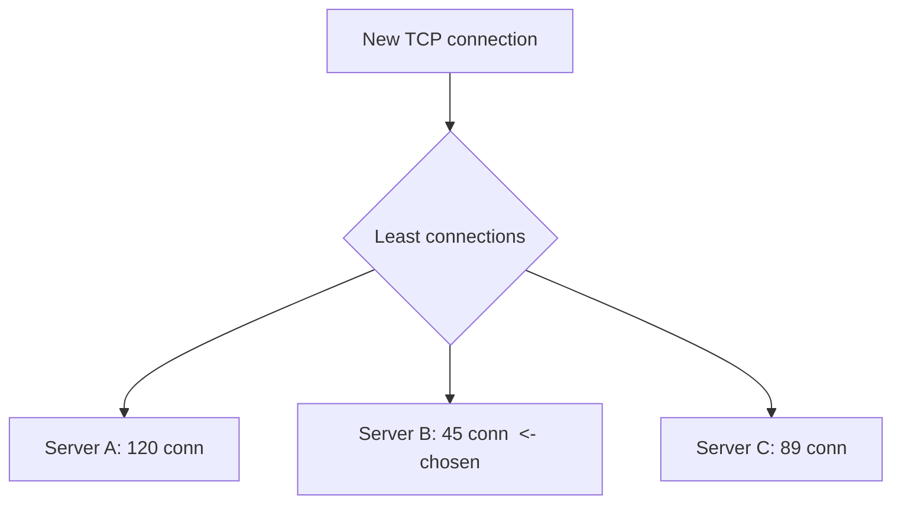

**IP hash (session affinity without cookies)**

```text
backend_index = hash(client_src_ip) % number_of_backends
```

Same client IP → same backend until pool size changes (then **most** mappings reshuffle—unlike consistent hash).

**Consistent hashing**

Place backends and keys on a **hash ring** (0 to 2³²-1). Key (URL, user id, cookie) walks clockwise to first backend.

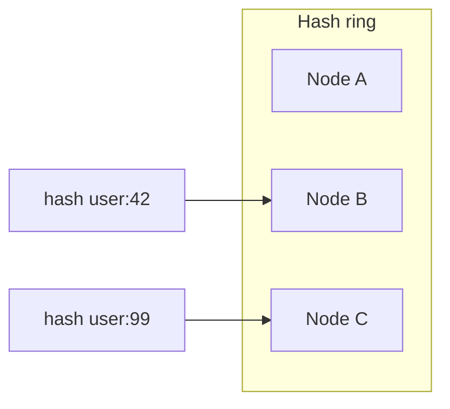

When a node is **added/removed**, only keys **adjacent** to that node on the ring move—not all keys (unlike `hash % N`).

**Worked example — RR vs least conn:**

```text
5 backends, 5 new connections/sec, each lives 60 seconds

Round robin: each backend gets 1 conn/sec → 60 active each (balanced)

If 1 connection is a 24h WebSocket and others are 1s HTTP:
  RR: unlucky backend holds WebSocket + fair share of short — skewed load
  Least conn: new shorts avoid the WebSocket-heavy backend
```

**Consistent hash + virtual nodes (vnodes):**

Each physical server gets **many** points on the ring (e.g., 100) to spread load evenly when server count is small.

```text
add_server("B"):
  only keys between A's vnode and B's vnodes move from A to B
  (~1/N of keys move for N servers)
```

### Key details

| Algorithm | Best for | Avoid when |
|-----------|----------|------------|
| **Round robin** | Homogeneous stateless APIs, short requests | Long connections, skewed work |
| **Weighted RR** | Mixed instance sizes, canary traffic split | Need dynamic load awareness |
| **Least connections** | WebSocket, gRPC streams, LDAP, DB pool LB | Connection counting expensive at huge scale |
| **IP hash** | Simple stickiness without app cookies | Mobile/carrier NAT (many users → one IP) |
| **Consistent hash** | Distributed caches, sharded state | Hot keys dominate one node |
| **Random** | Surprisingly even at scale; zero state | Need stickiness |
| **Least response time** | Heterogeneous latency (LB adds RTT probe) | Noisy measurements |

**Health checks interact with algorithms:** unhealthy backends removed from pool → connections redistributed → possible **thundering herd** on remaining nodes.

**Maglev hashing (Google):** Deterministic permutation table—fast lookup, used in some L4/L7 proxies.

**Interview point:** Consistent hash solves **cache locality** when adding/removing nodes; IP hash is simpler but remaps almost everything when N changes.

### Production rules

#### NAT, mobile, and affinity pitfalls

| Client type | IP stability | Safe affinity key | Risk |
|-------------|--------------|-------------------|------|
| **Desktop broadband** | Stable hours–days | Source IP hash OK | CGNAT still collides |
| **Mobile 4G/5G** | Changes on tower handoff | **Cookie / user-id hash** | IP hash → mid-session backend switch |
| **Corporate NAT** | Thousands share one IP | Never IP hash for load spread | One backend gets NAT avalanche |
| **IPv6 privacy addresses** | Rotates (RFC 4941) | Cookie or auth token | IP hash useless |
| **WebSocket long-lived** | IP may change on reconnect | Sticky cookie + pub/sub backplane | See [1.22](#122-sse-polling--websockets) |

```text
Decision tree:
  Stateless REST API        → round robin or least conn (no stickiness)
  In-memory session         → externalize session OR cookie stickiness
  Public mobile API         → NEVER IP hash for distribution
  Sharded cache             → consistent hash on tenant_id / cache key
  Carrier NAT office egress → WRR or least conn; not IP hash
```

#### Sizing and tuning

| Workload | Algorithm | Weight / conn limit hint |
|----------|-----------|---------------------------|
| Homogeneous K8s pods (8 vCPU each) | Round robin | Equal weights |
| Mixed ASG (4 vCPU + 16 vCPU) | Weighted RR | Weight ∝ CPU or measured RPS |
| WebSocket fanout | Least connections | 1 conn = 1 user; cap ~10k–50k conn/instance |
| Memcached via LB | Consistent hash + vnodes | 100–200 vnodes per physical node |
| Canary 5% | Weighted RR | new=1, stable=19 |

**HTTP/2 note:** One TCP connection multiplexes many requests → **least connections** at L4 understates load; prefer L7 per-request RR or enable connection coalescing awareness.

### When to use

- **Round robin:** Default for stateless REST behind homogeneous pods (Kubernetes Service default).
- **Weighted RR:** Canary deploys (90/10), mixed instance types in ASG.
- **Least connections:** API gateway to WebSocket servers, TCP proxy to legacy app servers.
- **IP hash / consistent hash:** Memcached/Redis client-less clustering through LB, sticky sessions without `Set-Cookie`.
- **Consistent hash on URL:** CDN origin selection, API sharding gateway (`user_id` in path).

### Trade-offs / Pitfalls

| Pitfall | Why it hurts | Mitigation |
|---------|--------------|------------|
| RR ignores live load | Slow server gets equal share | Least conn or adaptive LB |
| IP hash + mobile users | IP changes mid-session → new backend | App session cookie or user-id hash |
| IP hash + carrier NAT | Thousands of users share one IP → one backend hot | Don't use IP hash for public mobile APIs |
| Consistent hash hot keys | Celebrity user id overloads one shard | Salting, sub-shards, application-level split |
| Least conn bookkeeping | CPU/memory per connection table | Sampling approximations at extreme scale |
| Wrong weights in WRR | Small node starved or large node overloaded | Measure CPU/RPS; tune weights |
| HTTP/2 multiplexing + RR | One TCP carries many requests to one pod | L7 per-request balancing or more pods |
| Removing backend without drain | In-flight requests killed | Connection draining, graceful shutdown |

**Comparison — hash % N vs consistent hash (3 → 4 backends):**

```text
hash % N:     ~75% of keys remap (almost full reshuffle)
consistent:   ~25% of keys remap (only new node's arc)
```

### References

- [Load Balancer Algorithms — comparison video](https://www.youtube.com/watch?v=1fN2UDbtGDQ)

---


## 1.22 SSE, Polling & WebSockets


### What is it?

Three families of techniques for **real-time or near-real-time** communication between client and server:

| Pattern | Direction | Connection |
|---------|-----------|------------|
| **Short polling** | Client pulls | Repeated HTTP requests every N seconds |
| **Long polling** | Client pulls (held) | HTTP request stays open until event or timeout |
| **SSE (Server-Sent Events)** | Server pushes | One persistent HTTP stream (`text/event-stream`) |
| **WebSocket** | Bidirectional | Single TCP connection upgraded from HTTP; full-duplex framed messages |

**WebSocket** is a protocol (`ws://` or `wss://`) enabling **bidirectional, full-duplex** communication over a **persistent** connection with minimal per-message overhead after the initial handshake.

### Why it matters

Choosing the wrong pattern wastes bandwidth (polling empty responses), ties up threads (sync long polling), or over-engineers (WebSocket when SSE suffices). Live chat, notifications, collaborative editing, stock tickers, and multiplayer games all depend on picking the right mechanism.

**WebSocket use cases:**
- **Live chat** - customer support, livestream chat, team messaging
- **Broadcast** - sports scores, traffic, stock quotes, news alerts (often combined with pub/sub)
- **Data sync** - DB change pushed to all connected clients (polls, live dashboards)
- **Multiplayer collaboration** - cursors, presence, shared documents (Figma-style)
- **In-app notifications** - event-driven alerts
- **Live location** - rideshare, fleet tracking, delivery ETA

### How it works

**a) Short polling**

1. Client calls API every 1-2 seconds (e.g. `GET /messages?since=...`)
2. Server returns current state; often **empty** when nothing changed
3. High HTTP overhead; poor for true real-time

**b) Long polling**

1. Client sends HTTP request; server **holds** it until data arrives or timeout
2. Client immediately opens new long poll after response
3. Challenges: message ordering with multiple parallel connections; still reconnects after each timeout

**c) Server-Sent Events (SSE)**

1. Client: `GET /events` with `Accept: text/event-stream`
2. Server keeps connection open; pushes `data: {...}\n\n` lines
3. Browser `EventSource` API auto-reconnects on disconnect
4. **One-way only** (server -> client); client still uses normal HTTP for commands

**d) WebSocket**

1. **TCP connection** established (same as HTTP)
2. **HTTP upgrade handshake:**
   - Client: `Upgrade: websocket`, `Connection: Upgrade`, `Sec-WebSocket-Key`
   - Server: `101 Switching Protocols`, `Sec-WebSocket-Accept`
3. Subprotocol negotiated (e.g. `json`, `mqtt`)
4. Connection switches to **WebSocket framing** - async bidirectional messages
5. Uses `ws://` (plain) or **`wss://`** (TLS) - always use `wss://` in production

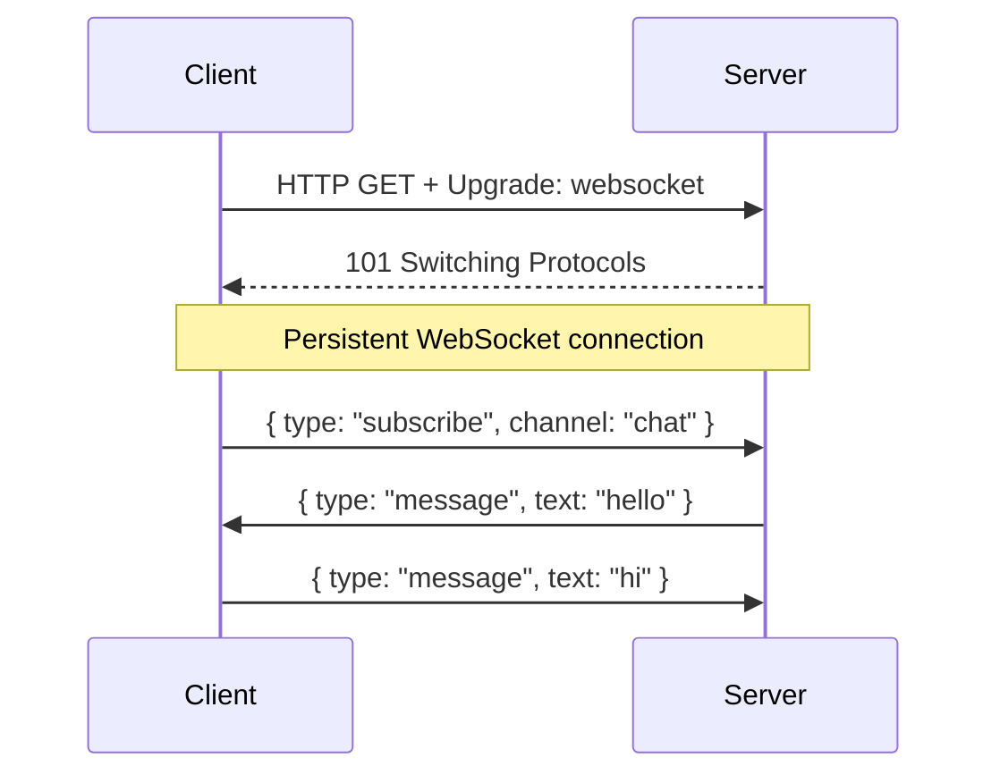

**Comparison at a glance:**

| | Short poll | Long poll | SSE | WebSocket |
|---|------------|-----------|-----|-----------|
| Direction | Pull | Pull | Server push | Bidirectional |
| Overhead | Very high | Medium | Low | Lowest after handshake |
| Real-time | Poor | Better | Good | Best |
| Browser API | fetch | fetch | EventSource | WebSocket |
| Proxy friendly | Yes | Mostly | Yes | Needs L7 proxy support |

**Scaling WebSockets across servers:**

- Connections are **stateful** - server holds socket per client
- **Sticky sessions** (session affinity) route same client to same instance, OR
- **Pub/sub backplane** (Redis, Kafka) so any server can push to clients on other nodes
- Load balancer must support **HTTP upgrade** (L7 ALB/nginx, not naive L4 TCP drain)

**Popular libraries:** Socket.IO (reconnect + fallbacks), SignalR (.NET), SockJS (fallback transports), `ws` (Node.js minimal)

### Key details

- **When NOT to use WebSocket:** CRUD-heavy apps with no realtime need -> HTTP is simpler; audio/video streaming -> WebRTC; server-only push of text -> **SSE is simpler and scales easier**
- **Drawbacks of WebSocket:** stateful connections consume memory; harder to scale than stateless HTTP; some corporate proxies/firewalls block WS; no built-in reconnect spec (app must implement); presence/detection of disconnects is imperfect
- **Security:** use `wss://`; validate `Origin` header; authenticate during handshake (JWT in query or cookie); guard against XSS injecting into WS messages
- **SSE advantages:** automatic reconnect; works over standard HTTP/2; simpler ops than WS cluster
- **HTTP/1.1 connection limit** (~6 per domain) matters less once upgraded to single WS

### Production rules

#### Sticky sessions vs shared state

| Approach | How | Pros | Cons |
|----------|-----|------|------|
| **LB cookie stickiness** | `AWSALB` / `SERVERID` cookie | Simple; no app change | Uneven load; lost on cookie clear; deploy must drain |
| **IP hash** | L4/L7 hash of source IP | No cookie | NAT/mobile breaks; hot spots |
| **External session store** | Redis/DB for session | Even LB distribution; survives deploy | Extra infra; latency |
| **Pub/sub backplane** | Redis Pub/Sub, Kafka, NATS | Any node can push to any client | Complexity; backplane SPOF without cluster |

```text
Prefer: external session store + round robin (stateless nodes)
Use sticky only when: legacy app with in-memory state you cannot refactor yet
Always pair sticky with: connection drain on deploy (1.20)
```

#### Pub/sub backplane runbook

```text
Architecture:
  Client WS → Server A (subscribes user:123 on Redis channel)
  Event on Server B → PUBLISH user:123 → Server A → push to client socket

Runbook — "messages not delivered cross-server":
1. Verify all app instances connected to same Redis cluster (not localhost)
2. Check channel naming matches (tenant prefix, user id)
3. Monitor Redis: connected_clients, pubsub_channels, memory
4. On Redis failover: clients must reconnect; expect brief message gap
5. Scale: Redis Pub/Sub does not persist — missed messages if subscriber offline
   → for guaranteed delivery use Kafka + per-user consumer or SSE with offset
```

#### Sizing

| Resource | Rule of thumb | Notes |
|----------|---------------|-------|
| WS connections per instance | 10k–65k (depends on RAM, msg size) | ~10–50 KB per idle connection |
| Heartbeat interval | 30 s ping/pong | Detect dead peers; keep NAT binding alive |
| Redis Pub/Sub fanout | O(subscribers) per message | Hot channel (1M subs) → shard channels or edge broadcast |
| Reconnect storm | Plan 2× normal connect rate after outage | Jittered exponential backoff on client |
| LB idle timeout | > app heartbeat interval | NAT UDP/TCP timeout 30–120 s — align WS ping |

### When to use

| Need | Choose |
|------|--------|
| Updates every 30+ seconds, simple app | Short polling |
| Near-real-time, server push only (scores, logs, notifications) | **SSE** |
| Chat, gaming, collaboration, bidirectional sync | **WebSocket** |
| Firewall/proxy uncertainty | SSE or long polling first; SockIO fallbacks |

### Trade-offs / Pitfalls

| Pitfall | Consequence | Mitigation |
|---------|-------------|------------|
| Short polling | Empty responses waste bandwidth | SSE or WebSocket when updates are frequent |
| Long polling | Ties up worker threads if sync | Async server (Node, Netty) |
| SSE one-way | Client commands need separate channel | HTTP POST or companion API |
| WebSocket multi-server | Messages lost without shared state | Sticky sessions or pub/sub backplane |
| Connection storms on reconnect | LB/origin overload after outage | Jittered backoff; rate limit handshakes |
| Default to WebSocket everywhere | Unnecessary ops complexity | SSE for server-push-only feeds |
| Sticky without drain | Deploy kills active WS; mass disconnect | Drain + client reconnect with backoff |
| Pub/sub without persistence | Gap during subscriber reconnect | Kafka or client-side catch-up API |
| Redis backplane SPOF | All cross-node push fails | Redis Cluster / Sentinel |
| LB L4 only for WS | Upgrade headers stripped | L7 ALB/nginx with `proxy_http_version 1.1` |

### References

- [WebSockets - Hareram Singh (use cases, handshake, polling vs SSE comparison)](https://medium.com/@hareramcse/websockets-74244f33bff4)
- [SSE, Polling, and WebSockets - video](https://www.youtube.com/watch?v=WS352jTTkPU)

---

[<- Back to master index](../README.md)
