# 1. Networking

> Status: **Documented**  -  master reference

[<- Back to master index](../README.md)

## Sub-topics

| # | Sub-topic | Status |
|---|-----------|--------|
| 1.1 | [OSI Model](#11-osi-model) | Done |
| 1.2 | [TCP/IP](#12-tcpip) | Done |
| 1.3 | [TCP Handshake](#13-tcp-handshake) | Done |
| 1.4 | [UDP](#14-udp) | Done |
| 1.5 | [MTU](#15-mtu) | Done |
| 1.6 | [IP Addressing/Subnetting](#16-ip-addressingsubnetting) | Done |
| 1.7 | [CIDR](#17-cidr) | Done |
| 1.8 | [DNS](#18-dns) | Done |
| 1.9 | [DNS Resolution](#19-dns-resolution) | Done |
| 1.10 | [HTTP/HTTPS](#110-httphttps) | Done |
| 1.11 | [SSL/TLS](#111-ssltls) | Done |
| 1.12 | [HTTP2 & HTTP3](#112-http2-http3) | Done |
| 1.13 | [QUIC](#113-quic) | Done |
| 1.14 | [Keep Alive Connections](#114-keep-alive-connections) | Done |
| 1.15 | [Forward & Reverse Proxy](#115-forward-reverse-proxy) | Done |
| 1.16 | [NAT](#116-nat) | Done |
| 1.17 | [VPN](#117-vpn) | Done |
| 1.18 | [Anycast/Multicast/Broadcast](#118-anycastmulticastbroadcast) | Done |
| 1.19 | [CDN](#119-cdn) | Done |
| 1.20 | [Load Balancer](#120-load-balancer) | Done |
| 1.21 | [Load Balancer Algorithm](#121-load-balancer-algorithm) | Done |
| 1.22 | [SSE & Polling & Websocets](#122-sse-polling-websocets) | Done |


## Topic Overview

Networking is the substrate on which every distributed system runs. Requests traverse DNS, load balancers, proxies, TLS terminators, and TCP connections before application code executes. Understanding the stack - from IP addressing and routing to HTTP/2 multiplexing and QUIC - lets you diagnose latency, design resilient architectures, and make informed trade-offs in interviews and production.

Modern web performance is largely a networking problem: connection setup cost, head-of-line blocking, geographic distance, and buffer bloat dominate user-perceived speed as much as server CPU. CDN placement, keep-alive tuning, and protocol choice (HTTP/3 over UDP) directly affect scalability and cost.

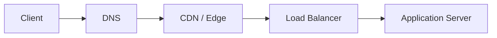

## Reading order

Sub-topics are sequenced for progressive learning: foundations first, then related concepts, then specialized topics.

| Group | Sections | Focus |
|-------|----------|-------|
| **1. Foundations** | 1.1-1.4 | OSI, TCP/IP, handshake, UDP |
| **2. IP layer** | 1.5-1.6 | Addressing, CIDR, MTU |
| **3. Naming and app protocols** | 1.7-1.13 | DNS, HTTP, TLS, HTTP/2/3, QUIC, keep-alive |
| **4. Edge and routing** | 1.14-1.17 | Proxy, NAT, VPN, multicast |
| **5. Scale and delivery** | 1.18-1.22 | CDN, load balancing, real-time patterns |

## Related topics

- [Caching](../03-caching/README.md)  -  CDN edge caching, cache headers
- [Distributed System](../04-distributed-system/README.md)  -  latency, availability, tail latency
- [Security](../10-security/README.md)  -  TLS, encryption in transit
- [Cloud & Kubernetes](../11-cloud-and-kubernetes/README.md)  -  VPC, ingress, service mesh

---


## 1.1 OSI Model


### What is it?

The **Open Systems Interconnection (OSI) model** is a seven-layer conceptual framework describing how data moves from application to physical wire and back. Each layer provides services to the layer above and uses services from the layer below.

### Why it matters

It provides a shared vocabulary for troubleshooting ("layer 4 timeout" = transport) and separates concerns so protocols can evolve independently. Interviews use OSI to frame where encryption, routing, and framing occur.

### How it works

Data descends the stack on send (encapsulation) and ascends on receive (decapsulation):

1. **Application (7):** HTTP, DNS, SMTP  -  user-facing protocols.
2. **Presentation (6):** Encoding, encryption, compression (often folded into app layer in practice).
3. **Session (5):** Session management (rarely distinct today).
4. **Transport (4):** TCP, UDP  -  end-to-end delivery, ports.
5. **Network (3):** IP  -  routing, addressing.
6. **Data Link (2):** Ethernet, MAC addresses, frames.
7. **Physical (1):** Bits on wire/fiber/radio.

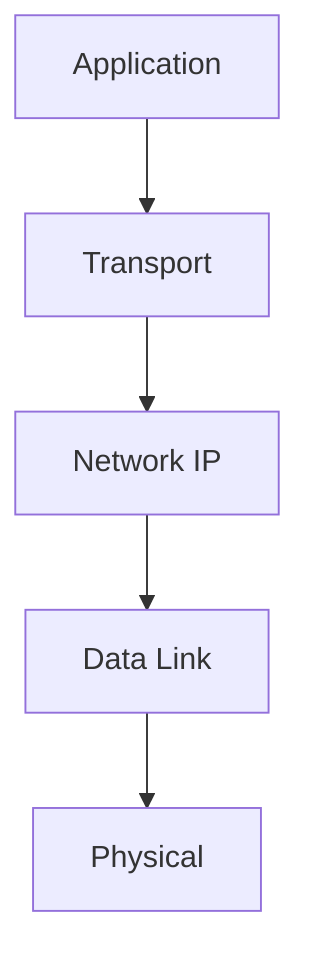

### Key details

| Layer | PDU | Example protocols |
|-------|-----|-------------------|
| 7 | Data | HTTP, gRPC |
| 4 | Segment/Datagram | TCP, UDP |
| 3 | Packet | IPv4, IPv6 |
| 2 | Frame | Ethernet |

- TCP/IP model (4 layers) maps loosely: App ≈ 5 - 7, Transport ≈ 4, Internet ≈ 3, Link ≈ 1 - 2
- Real stacks blur layers 5 - 7 into "application"

### When to use

- Troubleshooting network issues by isolation layer
- Explaining where TLS sits (between app and transport, historically "layer 6")
- Teaching protocol layering in interviews

### Trade-offs / Pitfalls

- OSI is theoretical - production debugging uses TCP/IP model more
- Strict layer boundaries don't always match implementation (TLS in libraries)
- Memorizing all seven layers without understanding function is low value

### References

- [OSI Model  -  computer networking playlist](https://www.youtube.com/playlist?list=PLxCzCOWd7aiGFBD2-2joCpWOLUrDLvVV_)

---


## 1.2 TCP/IP


### What is it?

The **TCP/IP model** is the practical four-layer stack underlying the Internet: **Link**, **Internet (IP)**, **Transport (TCP/UDP)**, and **Application**. It is the implementation counterpart to the OSI reference model.

### Why it matters

Every web request, API call, and database connection over a network uses TCP/IP. Understanding encapsulation, IP routing, and TCP reliability is mandatory for backend and infrastructure engineers.

### How it works

1. Application generates payload (HTTP request).
2. TCP segments data, adds ports, sequence numbers, checksums.
3. IP adds source/destination addresses; routers forward hop-by-hop.
4. Link layer frames packets with MAC addresses on local segment.
5. Reverse on receive; demultiplexing by port delivers to correct socket.

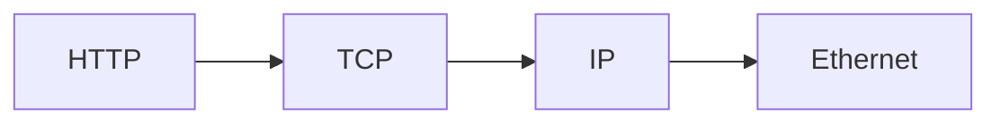

### Key details

- **IPv4:** 32-bit addresses, NAT common, header 20+ bytes
- **IPv6:** 128-bit addresses, no NAT needed ideally, simplified header
- **ICMP:** control messages (ping, unreachable)
- **Ports:** 0 - 65535; well-known 0 - 1023, ephemeral high ports for clients

### When to use

- Foundation for all subsequent networking topics
- Choosing TCP vs. UDP for a service
- Configuring firewalls (layer 3 vs. layer 4 rules)

### Trade-offs / Pitfalls

- IPv4 exhaustion mitigated by NAT but complicates P2P and logging
- IPv6 adoption still incomplete in some corporate networks
- "TCP/IP" colloquially means entire internet stack including app protocols

### References

- [TCP/IP  -  networking fundamentals video](https://www.youtube.com/watch?v=2QGgEk20RXM)

---


## 1.3 TCP Handshake


### What is it?

The **TCP three-way handshake** is the connection-establishment ritual that must complete before any application bytes flow. It exchanges three segments in order: **SYN → SYN-ACK → ACK**. Each side announces an **initial sequence number (ISN)**—a 32-bit counter used to order bytes, detect duplicates, and acknowledge receipt.

Beyond sequence numbers, the handshake negotiates **TCP options** embedded in the SYN segments: maximum segment size (MSS), window scaling, selective ACK (SACK), timestamps, and (optionally) TCP Fast Open cookies. Until both sides agree the connection is open, the socket state machine remains in `SYN_SENT` / `SYN_RECEIVED`; only after the final ACK does it reach **ESTABLISHED**.

**Worked example (sequence numbers):**

| Step | Segment | Client ISN | Server ISN | Meaning |
|------|---------|------------|------------|---------|
| 1 | Client → Server: SYN, seq=1000 | 1000 | — | "I want to connect; my first byte will be seq 1000." |
| 2 | Server → Client: SYN-ACK, seq=5000, ack=1001 | 1000 | 5000 | "Accepted; my ISN is 5000; I expect your next byte at 1001." |
| 3 | Client → Server: ACK, ack=5001 | 1000 | 5000 | "I expect your next byte at 5001." Connection open. |

Teardown is a separate **four-way FIN/ACK** dance (or an abrupt **RST**). Handshake cost is paid once per new TCP connection unless connections are reused.

### Why it matters

Every **new** TCP connection pays at least **one full round-trip time (RTT)** before the server can accept application data—and often more:

| Stack layer | Typical extra RTTs (cold connection) |
|-------------|--------------------------------------|
| TCP 3-way handshake | 1 RTT |
| TLS 1.2 (full handshake) | +2 RTTs |
| TLS 1.3 (1-RTT mode) | +1 RTT |
| **Total before first HTTP byte** | **2–4 RTTs** |

On a 100 ms cross-region link, 3 RTTs = **300 ms** of pure wait before your API handler runs. That is why **HTTP keep-alive**, **connection pooling**, and **HTTP/2 multiplexing** exist: they amortize handshake + TLS cost across many requests.

**Interview point:** "Why is my API slow on the first request but fast after?" → cold TCP + TLS setup. "Why do microservices behind LBs see connection storms?" → each pod may open thousands of short-lived TCP connections per second.

### How it works

**Connection establishment (3-way):**

1. **Client → SYN:** `SYN=1`, `seq=client_ISN`, optional TCP options (MSS, window scale, SACK, timestamps).
2. **Server → SYN-ACK:** `SYN=1`, `ACK=1`, `seq=server_ISN`, `ack=client_ISN+1`. Server moves to `SYN_RECEIVED`; may queue socket in **accept backlog** if `listen()` backlog is configured.
3. **Client → ACK:** `ACK=1`, `ack=server_ISN+1`. Both sides enter **ESTABLISHED**. Application `send()`/`write()` may now place data in the send buffer.

**Connection teardown (4-way, graceful):**

1. Side A sends **FIN** (no more data from A).
2. Side B **ACK**s the FIN (B may still send data—half-close).
3. Side B sends **FIN** when done.
4. Side A **ACK**s; A enters **TIME_WAIT** (typically 2× MSL ≈ 60–120 s on Linux).

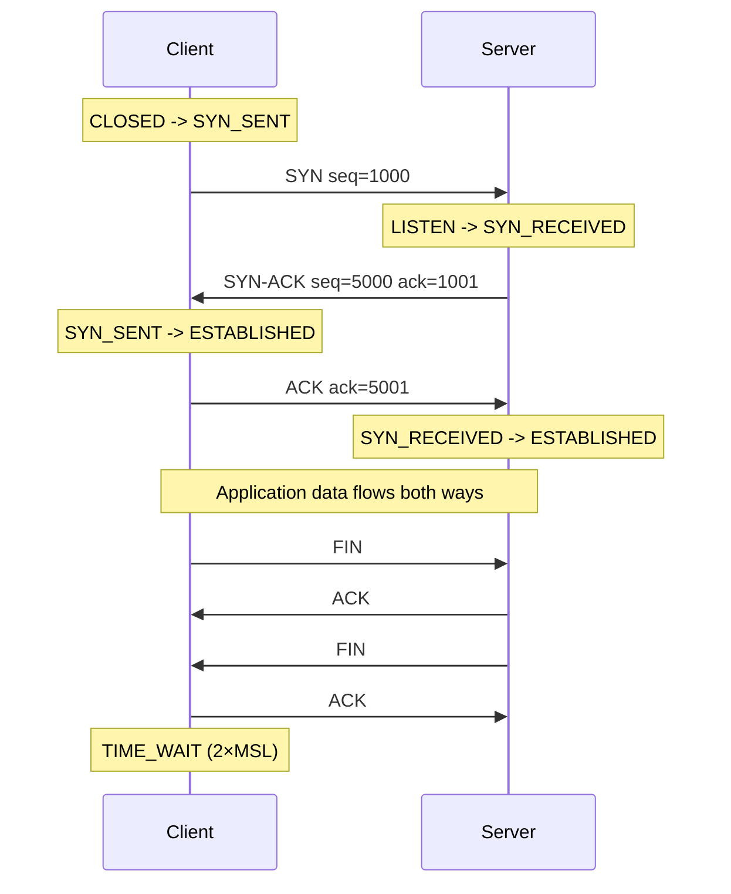

**TCP state machine (simplified):**

```text
CLOSED --[active open, send SYN]--> SYN_SENT --[recv SYN-ACK, send ACK]--> ESTABLISHED
LISTEN --[recv SYN, send SYN-ACK]--> SYN_RECEIVED --[recv ACK]--> ESTABLISHED
ESTABLISHED --[send FIN]--> FIN_WAIT_1 --> ... --> TIME_WAIT --> CLOSED
```

**Half-open connections:** If the client sends SYN but never completes the handshake (network drop, attacker), the server holds `SYN_RECEIVED` state until **SYN backlog timeout** (often 60–180 s). `netstat` shows many `SYN_RECV` entries under SYN flood.

### Key details

**SYN flood attack**

Attacker floods SYN packets with **spoofed source IPs**. Server allocates connection table entries and sends SYN-ACKs to victims that never reply. The **accept queue** and **half-open connection table** fill; legitimate clients get dropped or time out.

**Mitigations:**

| Technique | How it works |
|-----------|--------------|
| **SYN cookies** | Server encodes connection state in the SYN-ACK sequence number; no state stored until valid ACK returns |
| **SYN proxy** (LB/firewall) | Edge completes handshake with client; separate backend handshake |
| **Rate limiting** | Drop excess SYNs per source / globally |
| **Increase `tcp_max_syn_backlog`** | More half-open slots (does not stop attack, buys time) |

```text
# Linux tuning (illustrative)
net.ipv4.tcp_syncookies = 1          # enable SYN cookies under pressure
net.core.somaxconn = 4096            # upper bound for listen() backlog
net.ipv4.tcp_max_syn_backlog = 8192  # half-open queue size
```

**TIME_WAIT**

After the side that **actively closes** sends the final ACK, it enters **TIME_WAIT** for **2 × MSL** (Maximum Segment Lifetime, often 60 s → TIME_WAIT ≈ 60–120 s). Purpose: (1) ensure the final ACK reaches the peer if lost; (2) let delayed duplicate segments from the old connection expire so they cannot corrupt a **new** connection with the same 4-tuple (src IP, src port, dst IP, dst port).

**Symptoms:** High-traffic clients (load generators, proxies) exhaust **ephemeral ports** because thousands of sockets sit in TIME_WAIT.

**Mitigations:** `SO_REUSEADDR`, connection pooling (fewer unique 4-tuples), tune `ip_local_port_range`, let the **server** initiate close where possible, or (controversial) `tcp_tw_reuse` on Linux for outgoing connections.

**Worked example — port exhaustion:**

```text
Ephemeral port range: 32768–60999 → ~28,000 ports
Each short-lived client connection: 1 socket in TIME_WAIT for ~60 s
Sustained rate: 28,000 / 60 ≈ 467 new connections/sec before "Cannot assign requested address"
```

**Listen backlog**

`listen(backlog)` creates two conceptual queues on Linux:

| Queue | Holds | Overflow behavior |
|-------|-------|-------------------|
| **SYN queue** (half-open) | Handshakes in progress | SYN cookies or drop |
| **Accept queue** (full-open) | ESTABLISHED sockets waiting for `accept()` | Client may think connected; server app slow to `accept()` → timeouts |

**TCP Fast Open (TFO):** Server issues a cookie; on repeat visits client may send **data in the SYN**, saving ~1 RTT. Limited adoption (middleboxes sometimes drop SYNs with payload).

**Interview point:** Distinguish **SYN queue** vs **accept queue**. "Backlog full" often means the application is not calling `accept()` fast enough, not that SYN flood is occurring.

### When to use

- **Performance analysis:** Attribute first-byte latency to TCP + TLS RTTs; justify keep-alive and regional edge placement.
- **Capacity planning:** Estimate max new connections/sec given TIME_WAIT duration and ephemeral port range.
- **Incident response:** `ss -s`, `netstat -an | grep SYN_RECV`, `TIME_WAIT` counts during connection storms or DDoS.
- **Load balancer design:** Decide SYN proxy vs pass-through; tune health checks that open new TCP per probe.
- **Kernel tuning:** Adjust `somaxconn`, `tcp_max_syn_backlog`, syncookies before high-traffic launches.

### Trade-offs / Pitfalls

| Pitfall | What goes wrong | Mitigation |
|---------|-----------------|------------|
| New TCP per HTTP request | 1+ RTT + TLS per request | Keep-alive, HTTP/2, connection pools |
| TLS 1.2 on high-latency links | +2 RTTs on top of TCP | TLS 1.3, session resumption (PSK/tickets) |
| LB SYN pass-through under attack | Backend half-open table saturated | SYN proxy at edge |
| NAT gateway connection limits | Each TCP through NAT consumes mapping entry | Reuse connections; raise limits |
| Missing ACK after SYN-ACK | Half-open socket until timeout | Shorter timeouts; syncookies |
| Aggressive `TIME_WAIT` reuse | Rare duplicate segment corruption | Prefer pooling over disabling TIME_WAIT |
| Health check opens new TCP every 5 s | Thousands of wasted handshakes | Less frequent checks or reuse where supported |

**Latency budget example (SF client → Virginia server, ~70 ms RTT):**

```text
TCP handshake:     1 × 70 ms =  70 ms
TLS 1.2 handshake: 2 × 70 ms = 140 ms
HTTP request/response: 1 × 70 ms =  70 ms (minimum)
─────────────────────────────────────────
Cold first request: ~280 ms before JSON arrives
Warm keep-alive:    ~70 ms (one RTT for HTTP only)
```

### References

- [TCP Handshake  -  TCP/IP video](https://www.youtube.com/watch?v=2QGgEk20RXM)

---


## 1.4 UDP


### What is it?

**User Datagram Protocol (UDP)** is a connectionless transport protocol sending independent datagrams without guaranteed delivery, ordering, or congestion control. Minimal 8-byte header: ports + length + checksum.

### Why it matters

UDP's simplicity enables low-latency use cases where application handles loss: DNS, VoIP, gaming, QUIC/HTTP3, video streaming. No handshake means faster first packet.

### How it works

1. Application sends datagram with source/dest ports.
2. IP routes packet; no connection state in network.
3. Receiver may get duplicates, out-of-order, or nothing.
4. Application implements retry, ordering, or tolerates loss.
5. Optional checksum validates integrity (often offloaded to hardware).

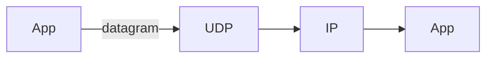

### Key details

- Max practical payload ~65 KB; often limited to avoid fragmentation (~1200 - 1400 bytes safe)
- **QUIC** builds reliable streams on UDP in userspace
- Firewalls often block UDP except DNS - HTTP/3 needs UDP 443 open
- Broadcast/multicast built on UDP at IP layer

### When to use

- Real-time media where late data is useless
- DNS queries (single request-response)
- Custom protocols with application-level reliability (QUIC)
- High-frequency metrics where sampling OK

### Trade-offs / Pitfalls

- No congestion control can starve TCP traffic (fairness concern)
- Application must implement reliability if needed
- NAT binding timeouts differ from TCP (often shorter for UDP)
- Fragmentation causes loss amplification - stay under path MTU

### References

- [UDP  -  TCP/IP and UDP video](https://www.youtube.com/watch?v=2QGgEk20RXM)

---


## 1.5 MTU


### What is it?

**Maximum Transmission Unit (MTU)** is the largest IP packet payload size a link can carry without fragmentation. Ethernet standard MTU is **1500 bytes**; loopback often 65536. **Path MTU** is the minimum MTU along a route.

### Why it matters

MTU mismatches cause fragmentation (performance hit) or **PMTUD black holes** (packets dropped silently when DF bit set). VPN overlays reduce effective MTU (e.g., 1400 bytes).

### How it works

1. Sender creates packet up to interface MTU.
2. If packet exceeds next hop MTU and **Don't Fragment (DF)** set, router drops and sends ICMP "fragmentation needed."
3. Sender reduces size (TCP MSS negotiation) and retransmits.
4. If ICMP blocked, **PMTUD fails** - connection hangs or times out.
5. **MSS clamping** on routers fixes TCP MSS for VPN clients.

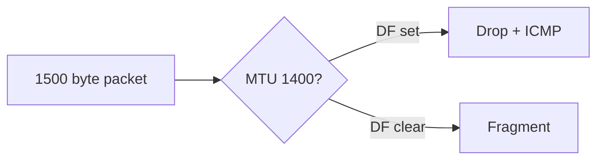

### Key details

- **TCP MSS** = MTU - IP header - TCP header (typically 1460 for 1500 MTU)
- **Jumbo frames:** 9000 MTU in datacenter (lower CPU overhead)
- Cloud VPC MTU often 9001 (enhanced networking) or 1500
- QUIC/UDP apps must handle PMTUD themselves

### When to use

- Debugging mysterious VPN or cross-cloud connectivity failures
- Tuning database replication over WAN
- Configuring Docker/Kubernetes CNI overlay networks

### Trade-offs / Pitfalls

- ICMP filtering breaks PMTUD - common misconfiguration
- Fragmentation increases loss probability (lose one fragment = whole datagram lost)
- Mixed MTU paths hard to diagnose without `tracepath`
- Oversized UDP -> silent black hole if no fragmentation

### References

- [MTU and path MTU discovery  -  video](https://www.youtube.com/watch?v=XMcYwr-yJGA)

---


## 1.6 IP Addressing/Subnetting


### What is it?

**IP addressing** assigns unique identifiers to hosts on IP networks. **Subnetting** divides a network into smaller broadcast domains using a subnet mask - separating network prefix from host portion.

### Why it matters

Correct subnet design enables routing, security zones (public/private subnets), and capacity planning in VPCs. Mis-subnetting causes routing black holes and exhausted address space.

### How it works

1. IPv4 address: four octets (e.g., 192.168.1.10).
2. Subnet mask defines network bits vs. host bits (255.255.255.0 = /24).
3. Hosts in same subnet communicate via L2; cross-subnet via gateway (router).
4. Private ranges (RFC 1918): 10.0.0.0/8, 172.16.0.0/12, 192.168.0.0/16.
5. Gateway IP typically first usable host (.1 in /24).

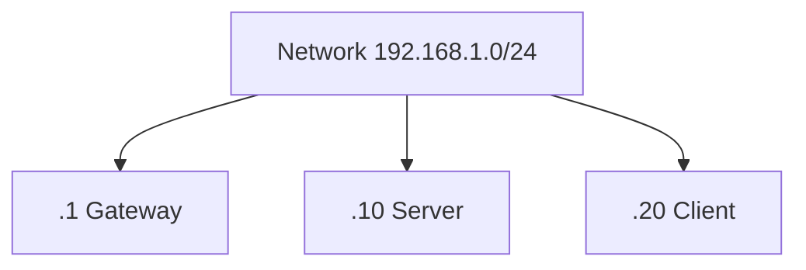

### Key details

- /24 = 256 addresses, 254 usable hosts (minus network/broadcast in classical model)
- **Loopback:** 127.0.0.1
- **Link-local:** 169.254.x.x (APIPA)
- Plan subnets for growth: app tier, DB tier, management per AZ

### When to use

- VPC and cloud network design
- Firewall rule scoping (CIDR blocks)
- On-prem datacenter VLAN planning

### Trade-offs / Pitfalls

- IPv4 /24 exhaustion in large flat networks - need smaller subnets or IPv6
- Overlapping CIDRs break VPN peering
- Broadcast domain size affects ARP storms (less issue in modern L3 fabrics)
- Forgetting reserved addresses (AWS reserves 5 per subnet)

### References

- [IP Addressing and Subnetting  -  video](https://www.youtube.com/watch?v=eWb35_xIKho)

---


## 1.7 CIDR


### What is it?

**Classless Inter-Domain Routing (CIDR)** notation expresses IP addresses and routing prefixes as `address/prefix-length` (e.g., 10.0.0.0/16). Replaced classful A/B/C addressing with flexible prefix lengths.

### Why it matters

CIDR enables efficient address allocation and aggregation in internet routing tables. Cloud security groups, NACLs, and k8s network policies all use CIDR notation.

### How it works

1. `/prefix` indicates number of leading network bits.
2. `/32` = single host; `/0` = default route.
3. Longest prefix match in routers determines route.
4. Supernetting aggregates multiple networks into one route announcement.
5. Calculate host count: 2^(32-prefix) - reserved addresses.

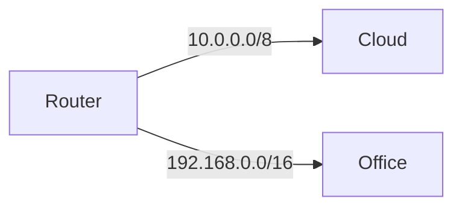

### Key details

| CIDR | Hosts (approx) | Common use |
|------|----------------|------------|
| /32 | 1 | Single host rule |
| /24 | 254 | Small subnet |
| /16 | 65K | VPC |
| /8 | 16M | Large private network |

- **Aggregate routes** reduce BGP table size
- `0.0.0.0/0` means all traffic (default route)

### When to use

- Writing firewall and security group rules
- IPAM (IP address management) planning
- Understanding BGP route advertisements

### Trade-offs / Pitfalls

- Off-by-one prefix errors open huge address ranges
- Overly broad rules (/8) expose too much
- IPv6 CIDR with /64 standard for subnets - different scaling intuition

### References

- [CIDR notation  -  video](https://www.youtube.com/watch?v=7u0XnqS-5xs)

---


## 1.8 DNS


### What is it?

The **Domain Name System (DNS)** is a hierarchical, distributed database that maps human-readable names (`api.example.com`) to machine-usable records—primarily IP addresses, but also mail routes, aliases, text blobs, and service locations. It is the internet's **naming and directory service**: decentralized, cached at every layer, and queried billions of times per day.

**Namespace hierarchy (right-to-left):**

```text
api.shop.example.com.
│   │    │       │    └── root (implicit dot)
│   │    │       └─────── TLD (.com)
│   │    └─────────────── registered domain (example.com)
│   └──────────────────── subdomain (shop)
└──────────────────────── host label (api)
```

**Two roles every engineer should distinguish:**

| Role | Who | Responsibility |
|------|-----|----------------|
| **Authoritative nameserver** | Domain owner (Route 53, Cloudflare, registrar) | **Source of truth** for a zone (`example.com` and below) |
| **Recursive resolver** | ISP, `8.8.8.8`, `1.1.1.1`, corporate DNS | Queries on behalf of clients; **caches** answers until TTL expires |

### Why it matters

**Every** network interaction that uses a hostname starts with DNS—often multiple lookups (page HTML, CDN, API, analytics). DNS is on the **critical path** for availability:

- Wrong A record → entire service unreachable
- Stale cache after migration → split traffic to old and new IPs
- NXDOMAIN → hard failure before TCP even starts
- Slow resolver → adds 20–200 ms to every **new** domain contact

DNS also enables **traffic management** without app changes: weighted records, geo-routing, failover health checks, and internal service discovery (Kubernetes CoreDNS, Consul).

**Interview point:** "DNS is eventually consistent by design." TTL controls how long the world believes your answer. You cannot flip traffic instantly unless TTL was lowered days in advance.

### How it works

1. **Zone delegation:** Parent zone (`.com`) holds **NS records** pointing to authoritative servers for `example.com`.
2. **Authoritative server** answers queries for names in its zone from a **zone file** or API (Route 53, etc.).
3. **Recursive resolver** walks the tree on cache miss: root → TLD → authoritative → returns answer to stub client.
4. Every positive answer includes **TTL** (seconds); resolvers cache and may serve stale answers until expiry.
5. **UDP port 53** by default; responses > 512 bytes (classic) or > EDNS0 size trigger **TCP fallback** (extra RTT).

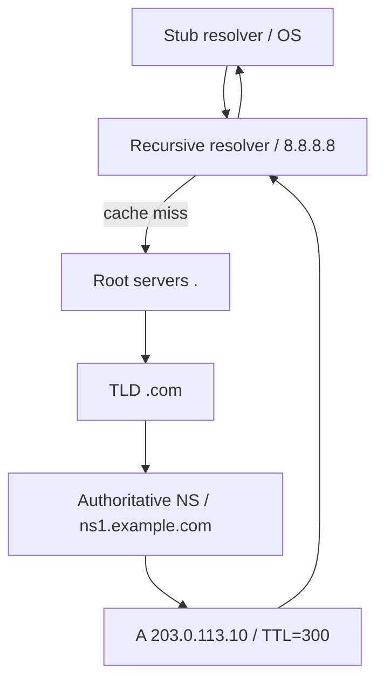

**Common record types (what to know for interviews):**

| Type | Stores | Example use |
|------|--------|-------------|
| **A** | IPv4 address | `api.example.com → 203.0.113.10` |
| **AAAA** | IPv6 address | Dual-stack services |
| **CNAME** | Alias to another name | `www` → `cdn.provider.com` (cannot coexist with other records on same name) |
| **MX** | Mail server hostname + priority | Email delivery (`10 mail.example.com`) |
| **TXT** | Arbitrary text | SPF, DKIM, domain verification, ACME challenges |
| **NS** | Delegates subdomain to other nameservers | `sub.example.com` → separate zone |
| **SRV** | Service location (port, host, priority) | `_https._tcp.example.com` |
| **CAA** | Which CAs may issue certs | Security hardening |

**TTL (Time To Live)**

TTL is a **per-record** hint: "you may cache this answer for N seconds."

```text
api.example.com.  300  IN  A  203.0.113.10
                  ^^^
                  TTL = 300 s → resolvers worldwide may serve this IP for 5 min
```

| TTL strategy | Failover speed | Resolver load | When |
|--------------|----------------|---------------|------|
| High (3600–86400) | Slow (up to 1 h stale) | Low | Stable infra |
| Low (30–60) | Fast propagation | High query volume | Migrations, blue/green |
| Pre-migration | Lower TTL **days before** cutover | — | Planned IP change |

**Authoritative vs recursive (worked example):**

```text
You type: curl https://api.example.com

1. OS asks recursive resolver (configured via DHCP or 8.8.8.8):
   "What is A for api.example.com?"

2. Recursive (if not cached):
   - Asks root: "where is .com?" → gets .com TLD NS
   - Asks .com TLD: "where is example.com?" → gets example.com authoritative NS
   - Asks authoritative: "A for api.example.com?" → 203.0.113.10, TTL=300

3. Recursive caches 203.0.113.10 for 300 s, returns to OS.

4. OS caches in its own resolver cache; curl opens TCP to 203.0.113.10.
```

You **configure** authoritative DNS when you own a domain. You **consume** recursive DNS as a client (or run your own resolver internally).

### Key details

- **Glue records:** When NS targets live **inside** the zone they delegate (e.g., `ns1.example.com` for `example.com`), parent TLD must publish **glue A/AAAA** alongside NS or resolution loops.
- **DNSSEC:** Cryptographic chain of trust (DS → DNSKEY → RRSIG). Prevents cache poisoning; does not encrypt queries (use DoH/DoT for privacy).
- **Split-horizon / split DNS:** Same name, different answer inside corp network vs public internet (`db.internal` → `10.0.1.5` internally, NXDOMAIN externally).
- **Wildcard:** `*.example.com` matches one label level only—not `a.b.example.com`.
- **CNAME at apex (`example.com`):** Standard DNS forbids CNAME at zone apex; providers offer **ALIAS/ANAME** (resolve at query time, return A).
- **Managed DNS (Route 53, Cloudflare):** Health-checked failover, latency routing, weighted round-robin at DNS layer.
- **Negative caching:** NXDOMAIN cached per SOA **MINIMUM** field—reduces hammering on typos.

**Interview point:** CNAME vs A—CNAME adds an extra lookup hop and cannot be used at apex; A is direct but you must update IP manually on migration.

### When to use

- **Public services:** A/AAAA for app servers; CNAME for CDN/vendor aliases; MX/TXT for email and verification.
- **Internal platforms:** Private zones (Route 53 Private, Azure Private DNS) for service discovery.
- **Kubernetes:** CoreDNS resolves `*.svc.cluster.local` inside the cluster.
- **Traffic shifting:** Weighted/latency records before deploying new region.
- **Debugging:** `dig +trace`, `nslookup`, check TTL before planned migration.

### Trade-offs / Pitfalls

| Pitfall | Consequence | Mitigation |
|---------|-------------|------------|
| Long TTL during incident | Traffic keeps hitting failed IP | Pre-lower TTL; use short TTL on failover records |
| Short TTL everywhere | Higher latency, resolver load, cost | TTL per record (stable CDN CNAME high, migration A low) |
| CNAME chains | Multiple lookups, failure amplification | Flatten to A/ALIAS where possible |
| Wrong NS delegation | Domain entirely broken | Verify at registrar + authoritative |
| Split DNS mismatch | "Works in office, fails on VPN" | Document which resolver each environment uses |
| UDP truncation → TCP | Extra RTT on large responses (DNSSEC, many records) | EDNS0 buffer size; keep responses lean |
| Cache poisoning (historical) | Wrong IP served | DNSSEC, random source ports, QNAME minimization |

### References

- [DNS  -  how DNS works video](https://www.youtube.com/watch?v=vhfRArT11jc)

---


## 1.9 DNS Resolution


### What is it?

**DNS resolution** is the end-to-end process of turning a hostname into one or more IP addresses (and other record data)—from the application's `getaddrinfo("api.example.com")` call through browser/OS caches, stub resolver, recursive resolver, and the authoritative chain (root → TLD → zone).

Resolution is **not** a single lookup: CNAME chains add hops; A + AAAA mean two logical questions; negative answers (NXDOMAIN) are also cached.

### Why it matters

DNS resolution sits on the **critical path** for cold connections:

| Cache layer hit? | Typical added latency |
|------------------|----------------------|
| Browser cache | ~0 ms |
| OS resolver cache | ~0–1 ms |
| Recursive resolver cache | ~1–20 ms (LAN) |
| Full iterative lookup | ~20–150+ ms (depends on RTT to authoritative) |

A slow or blocking `getaddrinfo()` can **stall an entire event loop** in Node.js or Python if called synchronously on the hot path. Understanding the chain explains:

- Why `dns-prefetch` and connection pooling help
- Why NXDOMAIN still "feels" slow (negative cache TTL)
- Why `/etc/hosts` and `127.0.0.1` overrides work immediately (short-circuit before network)

**Interview point:** Resolution is separate from connection. DNS can succeed and TCP can still fail (firewall, wrong port).

### How it works

**Full resolution chain (cache miss on `api.example.com`):**

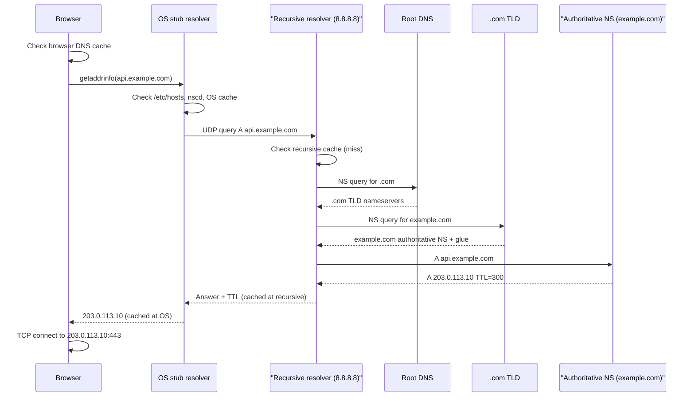

**Step-by-step (numbered):**

1. **Application** calls resolver API (`getaddrinfo`, Java `InetAddress`, Go `net.LookupHost`).
2. **Browser cache** (Chrome, etc.) may answer first for navigations; separate from OS cache.
3. **OS stub resolver** checks **`/etc/hosts`** (static overrides), then local cache (`systemd-resolved`, Windows DNS Client).
4. **Stub forwards** to configured **recursive resolver** (DHCP-provided ISP DNS, `8.8.8.8`, corporate internal resolver).
5. **Recursive resolver** on cache miss performs **iterative** queries:
   - Root hints → TLD nameservers for `.com`
   - TLD → authoritative NS for `example.com`
   - Authoritative → final A/AAAA (following CNAMEs if present)
6. Answer returns with **TTL**; cached at recursive, then OS; app receives IP list (often happy-eyeballs between A and AAAA).

**CNAME chase example:**

```text
Query: www.example.com
Authoritative: CNAME www.example.com → cdn.cloudfront.net
Recursive: new query A cdn.cloudfront.net → 52.84.x.x
Total: 2 authoritative round-trips on full miss (more if chain longer)
```

**Pseudo-code (recursive resolver logic, simplified):**

```text
function resolve(name, type):
    if cached(name, type) and not expired:
        return cache[name, type]

    if name is CNAME:
        target = query_authoritative(name, CNAME)
        return resolve(target, type)   // chase

    // walk delegation
    servers = root_hints
    for each label from TLD down:
        servers = query(s servers, NS for zone)
    answer = query(s servers, type for name)
    cache[name, type] = answer with TTL
    return answer
```

### Key details

| Mechanism | Behavior |
|-----------|----------|
| **Positive caching** | A/AAAA/CNAME stored until TTL expires |
| **Negative caching (NXDOMAIN)** | "Name does not exist" cached per SOA MINIMUM TTL |
| **DNS prefetch** | `<link rel="dns-prefetch" href="//cdn.example.com">` warms browser cache early |
| **Preconnect** | DNS + TCP + TLS in advance (`rel="preconnect"`) |
| **mDNS (.local)** | Multicast on LAN; not global DNS |
| **DoH / DoT** | DNS over HTTPS/TLS to recursive—privacy, bypasses local ISP DNS |
| **QNAME minimization** | Recursive sends minimal labels to each hop (privacy) |
| **getaddrinfo blocking** | Sync call can block thread; use async DNS in servers |

**Worked example — cache layers after first lookup:**

```text
T+0s:   Full resolution → 80 ms (recursive miss)
T+10s:  Same host again → 0 ms (OS cache hit)
T+400s: TTL=300 expired → 20 ms (recursive still cached? depends on when recursive TTL started)
```

**Debugging commands:**

```bash
dig api.example.com                    # single query via configured resolver
dig +trace api.example.com             # show full delegation path
dig @8.8.8.8 api.example.com           # specific recursive
nslookup -type=A api.example.com 8.8.8.8
```

**Interview point:** `dig +trace` shows iterative resolution; `dig` alone shows what **your stub resolver** returns (may be cached).

### When to use

- **Incident debugging:** Is it DNS or TCP/TLS/app? (`dig` vs `curl -v` vs `traceroute`)
- **Migration planning:** Lower TTL → change records → wait 2× old TTL → verify global propagation (`dig @multiple resolvers`)
- **Performance:** Prefetch/preconnect for critical third-party origins; pool connections to avoid repeat lookups
- **Split-horizon issues:** Compare answers from corporate resolver vs `8.8.8.8`
- **Local dev:** `/etc/hosts` or `dnsmasq` to point `api.local` → `127.0.0.1`

### Trade-offs / Pitfalls

| Pitfall | Symptom | Fix |
|---------|---------|-----|
| Circular CNAME chain | SERVFAIL / resolution failure | Audit zone file |
| Long CNAME chain | Extra latency per hop | Flatten or ALIAS |
| Resolver timeout (5 s default) | Slow app startup | Faster resolver; async DNS; cache |
| Wrong corporate resolver | Internal IP leaked externally or vice versa | Split DNS policies |
| Large DNSSEC response | UDP truncate → TCP retry | EDNS0; TCP from start |
| Stale OS cache after change | "I updated DNS but laptop still old" | Flush cache; wait TTL |
| IPv6 AAAA published but broken | Happy eyeballs delay | Fix AAAA or remove |
| Assuming DNS load balances | DNS round-robin is crude | Use LB IP or short TTL + health checks |

**Happy eyeballs (brief):** Modern stacks try IPv6 and IPv4 in parallel with short timeout; broken AAAA can add **300 ms+** delay before falling back to IPv4.

### References

- [DNS Resolution  -  step-by-step video](https://www.youtube.com/watch?v=BZISxpdl4lQ)

---


## 1.10 HTTP/HTTPS


### What is it?

**HTTP (Hypertext Transfer Protocol)** is an **application-layer**, **request/response** protocol. A client sends a **request** (method, path, headers, optional body); a server returns a **response** (status code, headers, body). HTTP is deliberately **stateless**: each request is independent unless the application adds state (cookies, tokens, server-side sessions).

**HTTPS** is HTTP over **TLS** (Transport Layer Security). TLS provides **confidentiality** (encryption), **integrity** (tamper detection), and **authentication** (certificate proves server identity). Browsers require HTTPS for modern features (HTTP/2 in practice, geolocation, secure cookies).

**Request structure (HTTP/1.1):**

```http
GET /api/users/42 HTTP/1.1
Host: api.example.com
Accept: application/json
Authorization: Bearer eyJhbG...
Connection: keep-alive

(body empty for GET)
```

**Response structure:**

```http
HTTP/1.1 200 OK
Content-Type: application/json
Cache-Control: private, max-age=60
Content-Length: 87

{"id":42,"name":"Ada"}
```

### Why it matters

HTTP semantics drive **REST API design**, **CDN caching**, **browser security**, and **observability** (status codes, headers in logs). Misusing methods or cache headers causes subtle production bugs: double POST charges, stale data served from CDN, credentials leaked over plaintext.

HTTPS is baseline for security: prevents credential sniffing, enables integrity, and is a ranking signal. Termination point (LB vs app) affects certificate management, client IP visibility, and mTLS options.

**Interview point:** HTTP is stateless; "session" is application-layer convention (cookie + server store or JWT).

### How it works

**Typical HTTPS request lifecycle:**

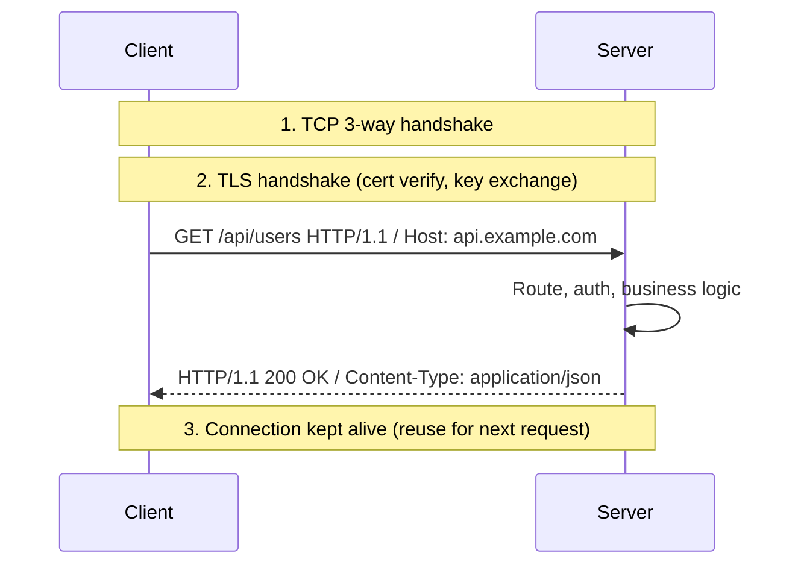

1. **DNS** resolves hostname → IP.
2. **TCP** connection established (3-way handshake).
3. **TLS handshake** (HTTPS): negotiate cipher suite, verify server certificate chain, derive session keys.
4. Client sends **HTTP request** over encrypted channel.
5. Server maps path to handler; may read body (POST/PUT).
6. Server returns **status + headers + body**.
7. **Connection: keep-alive** (default HTTP/1.1) reuses TCP+TLS for subsequent requests on same host.

**HTTP methods (semantics matter for APIs and caches):**

| Method | Safe? | Idempotent? | Typical use | Body? |
|--------|-------|-------------|-------------|-------|
| **GET** | Yes | Yes | Read resource | No |
| **HEAD** | Yes | Yes | Metadata only (no body) | No |
| **POST** | No | No | Create, actions, non-idempotent ops | Yes |
| **PUT** | No | Yes | Replace entire resource | Yes |
| **PATCH** | No | No* | Partial update | Yes |
| **DELETE** | No | Yes | Remove resource | Optional |

*PATCH idempotency depends on patch document design.

**Status code classes:**

| Class | Meaning | Examples |
|-------|---------|----------|
| **1xx** | Informational | `100 Continue` |
| **2xx** | Success | `200 OK`, `201 Created`, `204 No Content` |
| **3xx** | Redirection | `301 Moved Permanently`, `302 Found`, `304 Not Modified` |
| **4xx** | Client error | `400 Bad Request`, `401 Unauthorized`, `403 Forbidden`, `404 Not Found`, `429 Too Many Requests` |
| **5xx** | Server error | `500 Internal Server Error`, `502 Bad Gateway`, `503 Service Unavailable`, `504 Gateway Timeout` |

**Worked example — conditional GET (caching):**

```http
# First request
GET /logo.png HTTP/1.1
→ 200 OK, ETag: "abc123", body: (image bytes)

# Second request
GET /logo.png HTTP/1.1
If-None-Match: "abc123"
→ 304 Not Modified (no body — browser uses cache)
```

**HTTPS / TLS overview (what happens in the handshake):**

| Phase | Purpose |
|-------|---------|
| ClientHello | Client proposes TLS version, cipher suites, SNI (hostname) |
| ServerHello + Certificate | Server picks params; sends cert chain for `api.example.com` |
| Key exchange | ECDHE → shared secret (forward secrecy) |
| Finished | Both sides derive symmetric keys; HTTP now encrypted |

TLS 1.3 completes in **1 RTT** (vs 2 for TLS 1.2). **Session resumption** (tickets/PSK) can reduce repeat connection cost to **0 RTT** (with replay trade-offs).

**Stateless model:**

```text
Request 1: POST /login → 200 + Set-Cookie: session=xyz
Request 2: GET /profile + Cookie: session=xyz → server looks up session store

HTTP itself forgot Request 1; the COOKIE carries identity.
```

### Key details

- **Host header:** Required in HTTP/1.1 for virtual hosting (one IP, many sites).
- **Content-Type / Accept:** Negotiate representation (`application/json` vs `text/html`).
- **Cache-Control:** `public`, `private`, `max-age`, `no-store` — drives CDN and browser behavior.
- **Authorization:** `Bearer` JWT, Basic (rare), custom schemes — not the same as `401` vs `403`.
- **Cookies:** `Set-Cookie` with `HttpOnly`, `Secure`, `SameSite` — security-critical.
- **Chunked transfer:** Body without fixed `Content-Length` (streaming).
- **HTTP/2+:** Same semantics; different framing (multiplexing) — see section 1.12.

**Common interview mistakes:**

| Mistake | Correct mental model |
|---------|---------------------|
| GET with side effects (delete on GET) | Violates safe semantics; caches may replay GET |
| 401 vs 403 | 401 = not authenticated; 403 = authenticated but denied |
| POST is always create | POST is "process this" — create is common convention |
| HTTPS encrypts URL path | SNI/hostname visible; path encrypted in TLS 1.3+ (ESNI/ECH emerging) |

### When to use

- **REST/HTTP APIs:** Map resources to nouns; methods to safe/idempotent semantics.
- **CDN configuration:** Cache GET/HEAD with correct `Cache-Control`; don't cache POST.
- **Auth design:** Stateless JWT in `Authorization` vs session cookie.
- **TLS termination:** At LB (centralized certs, WAF) vs app (end-to-end, mTLS to backend).
- **Debugging:** `curl -v`, browser DevTools Network tab — status, headers, waterfall.

### Trade-offs / Pitfalls

| Pitfall | Impact | Mitigation |
|---------|--------|------------|
| HTTP/1.1 HOL blocking | One slow response blocks others on same connection | HTTP/2 multiplexing or more connections |
| Large cookies on every request | Inflates every request header | Slim tokens; domain-scoped cookies |
| Mixed content (HTTPS page, HTTP assets) | Browser blocks or warns | Upgrade all assets to HTTPS |
| `no-store` forgotten on sensitive pages | Cached at shared proxy | Explicit cache headers |
| Terminate TLS at LB only | Traffic LB→app may be plaintext | TLS to backend or private network |
| Long polling holds connections | Exhausts worker/connection limits | WebSocket/SSE or async workers |
| Retry POST on timeout | Duplicate side effects | Idempotency keys |

**Latency stack (recap):**

```text
DNS + TCP + TLS + HTTP request/response
≈ 0–100 ms + 1 RTT + 1–2 RTT + 1 RTT  (minimum one RTT for HTTP/1.1 response)
```

### References

- [HTTP and HTTPS  -  web protocol video](https://www.youtube.com/watch?v=FmgIQBQ87fo)

---


## 1.11 SSL/TLS


### What is it?

**TLS (Transport Layer Security)**, successor to SSL, provides **encryption**, **integrity**, and **server authentication** (optional client auth) for TCP connections. HTTPS = HTTP + TLS.

### Why it matters

TLS protects credentials, PII, and session tokens from interception and tampering. Certificate validation prevents man-in-the-middle attacks. TLS handshake cost affects connection latency.

### How it works

1. **ClientHello:** supported cipher suites, TLS versions, SNI (server name).
2. **ServerHello:** chosen cipher, certificate chain, key exchange params.
3. Key exchange establishes shared **session keys** (ECDHE forward secrecy).
4. **Finished** messages verify handshake integrity.
5. Application data encrypted with symmetric cipher (AES-GCM, ChaCha20).

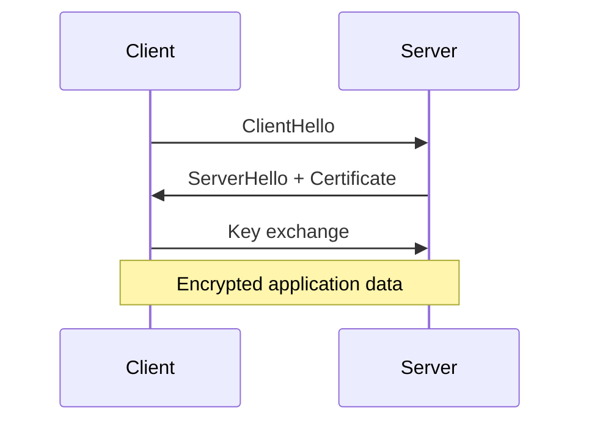

### Key details

- **TLS 1.3:** 1-RTT handshake (0-RTT resumption with replay risk)
- **Certificate chain:** leaf -> intermediate -> root CA in trust store
- **mTLS:** mutual TLS for service-to-service auth
- **Termination:** LB decrypts TLS, forwards plain HTTP to backend (or re-encrypts)

### When to use

- All public web traffic (HTTPS everywhere)
- gRPC over TLS, database connections (PostgreSQL SSL)
- Service mesh sidecar mTLS

### Trade-offs / Pitfalls

- Certificate expiry outages (automate with Let's Encrypt)
- TLS inspection proxies break end-to-end trust
- 0-RTT data vulnerable to replay attacks
- CPU cost of encryption - hardware AES-NI mitigates

### References

- [SSL/TLS  -  encryption handshake video](https://www.youtube.com/watch?v=LJDsdSh1CYM)

---


## 1.12 HTTP2 & HTTP3


### What is it?

**HTTP/2** multiplexes many requests over one TCP connection with binary framing, header compression (HPACK), and stream prioritization - reducing connection count and head-of-line blocking at HTTP layer. **HTTP/3** uses QUIC over UDP instead of TCP, eliminating TCP-level head-of-line blocking.

### Why it matters

HTTP/2 dramatically improved web performance (single connection per origin). HTTP/3 further improves lossy/mobile networks where TCP retransmission blocks all streams.

### How it works

**HTTP/2:**
1. One TCP + TLS connection per origin.
2. Requests split into **streams** with unique IDs.
3. Frames interleaved on wire; HPACK compresses headers.
4. Server push (largely deprecated in practice).
5. TCP loss still blocks all streams (HOL at transport layer).

**HTTP/3:**
1. QUIC connection over UDP with built-in TLS 1.3.
2. Independent streams - loss on one doesn't block others.
3. Connection migration by connection ID (WiFi -> cellular).

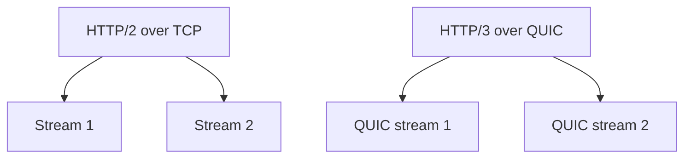

### Key details

- HTTP/2 requires TLS in all major browsers (facto HTTPS)
- **ALPN** negotiates h2 during TLS handshake
- Alt-Svc header advertises HTTP/3 availability
- Load balancers need L7 HTTP/2 or pass-through

### When to use

- HTTP/2: default for modern web servers (nginx, Cloudflare)
- HTTP/3: mobile apps, global users on lossy networks
- API gateways supporting multiplexed client connections

### Trade-offs / Pitfalls

- HTTP/2 multiplexing can overwhelm single server thread if not configured
- QUIC UDP blocked on some corporate firewalls
- Debugging HTTP/3 harder than TCP (Wireshark needs keys)
- Server push wasted bandwidth when assets cached

### References

- [HTTP/2 and HTTP/3  -  protocol evolution video](https://www.youtube.com/watch?v=UMwQjFzTQXw)

---


## 1.13 QUIC


### What is it?

**QUIC (Quick UDP Internet Connections)** is a transport protocol on UDP combining encryption (TLS 1.3 integrated), multiplexed streams, connection migration, and reduced handshake latency. HTTP/3 is the primary application.

### Why it matters

QUIC solves TCP's head-of-line blocking and slow handshake, improving web performance especially on mobile. Google pioneered it; now IETF standard with broad CDN/browser support.

### How it works

1. Client sends initial packet with crypto handshake (0-RTT possible with prior ticket).
2. Connection identified by **Connection ID**, not IP:port tuple.
3. Multiple bidirectional streams within one QUIC connection.
4. Loss recovery per-stream, not whole connection.
5. Built-in congestion control in userspace (not kernel TCP stack).

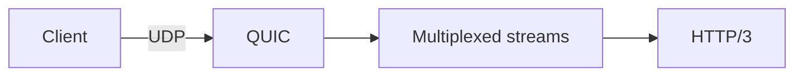

### Key details

- **0-RTT:** resumption sends data immediately (replay risk for non-idempotent ops)
- **Connection migration:** CID survives IP change
- Kernel bypass: userspace implementation (CPU consideration)
- Port 443 UDP standard for HTTP/3

### When to use

- Public websites via CDN (Cloudflare, Fastly default HTTP/3)
- Mobile-first applications
- When TCP middleboxes cause issues

### Trade-offs / Pitfalls

- UDP rate limiting by ISPs
- Higher CPU than kernel TCP at extreme throughput
- NAT rebinding can break CID if not handled
- Incomplete tooling ecosystem vs. TCP

### References

- [QUIC protocol  -  deep dive video](https://www.youtube.com/watch?v=HnDsMehSSY4)

---


## 1.14 Keep Alive Connections


### What is it?

**HTTP keep-alive (persistent connections)** reuses the same TCP connection for multiple HTTP requests/responses, avoiding repeated TCP (+ TLS) handshakes. Controlled by `Connection: keep-alive` header (default in HTTP/1.1).

### Why it matters

Connection setup can cost 2 - 3 RTTs (TCP + TLS). Without keep-alive, each asset on a page opens new connection - devastating for HTTP/1.1 with browser connection limits (6 per host).

### How it works

1. Client and server complete initial TCP + TLS handshake.
2. First HTTP request/response completes; connection stays open.
3. Subsequent requests sent on same connection (serial in HTTP/1.1).
4. Connection closed after `Keep-Alive: timeout=N, max=M` or idle timeout.
5. HTTP/2 multiplexes many requests on one keep-alive connection.

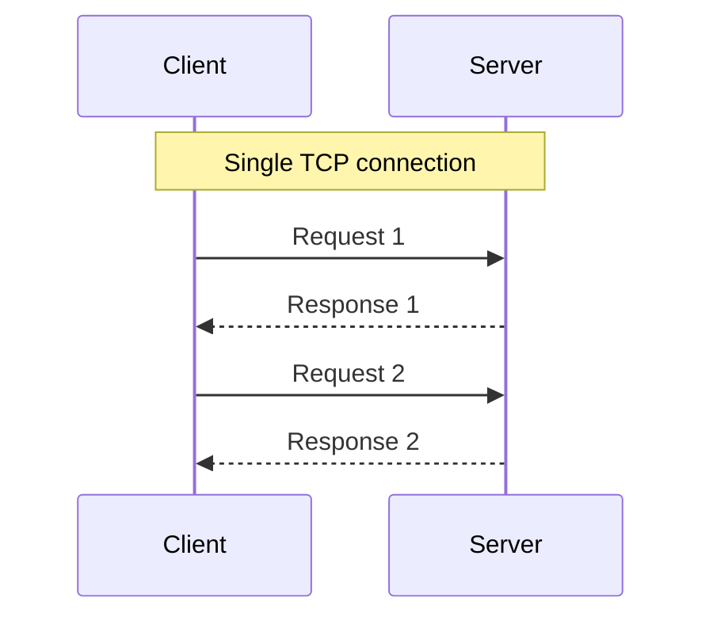

### Key details

- **HTTP/1.1 default:** persistent unless `Connection: close`
- Server `keepalive_timeout` (nginx default 75s)
- **Connection pooling:** client-side reuse to same host (HttpClient, OkHttp)
- **Head-of-line blocking** in HTTP/1.1 motivates HTTP/2 single connection

### When to use

- Always for HTTP/1.1 production servers
- Client libraries: configure pool size matching expected concurrency
- Database and Redis connection pooling (same concept, different protocol)

### Trade-offs / Pitfalls

- Idle connections consume server file descriptors and memory
- Load balancer idle timeout must exceed client keep-alive (or RST mid-request)
- Sticky connection to dead server until client reconnects
- Too many pooled connections across microservices -> connection storm on DB

### References

- [Keep-Alive connections  -  HTTP performance video](https://www.youtube.com/watch?v=zRUdSu3JlK8)

---


## 1.15 Forward & Reverse Proxy


### What is it?

A **proxy** is an intermediary that forwards requests on behalf of another party.

| Type | Sits in front of | Client knows proxy? | Typical use |
|------|------------------|---------------------|-------------|
| **Forward proxy** | Clients (outbound) | Yes (configured) | Corporate egress, VPN, privacy |
| **Reverse proxy** | Servers (inbound) | No (looks like origin) | Load balancing, TLS, API gateway |

**Reverse proxy** is what most system design discussions mean: nginx, HAProxy, Envoy, AWS ALB, Cloudflare.

### Why it matters

- **TLS termination** at edge - backends speak plain HTTP in private VPC
- **Load balancing** across app pool
- **Caching** static responses at edge
- **Security** - WAF, rate limiting, DDoS absorption, hide internal IPs
- **Routing** - path-based routing (`/api` -> service A, `/admin` -> service B)

Forward proxies control **outbound** traffic: block malicious sites, log employee browsing, cache downloads.

### How it works

**Reverse proxy flow:**

```text
1. Client resolves api.example.com -> LB/proxy IP (public)
2. Client TLS handshake with proxy (certificate for api.example.com)
3. Proxy decrypts, inspects HTTP request
4. Proxy selects backend (round-robin, least-conn, consistent hash)
5. Proxy forwards to backend:10.0.1.5 (private IP)
6. Backend responds; proxy returns to client (may re-encrypt)
```

**Forward proxy flow:**

```text
1. Browser configured: HTTP_PROXY=proxy.corp.com:8080
2. Browser sends GET http://example.com TO proxy (not direct)
3. Proxy fetches example.com on behalf of client
4. Proxy returns response; origin sees proxy IP, not client IP
```

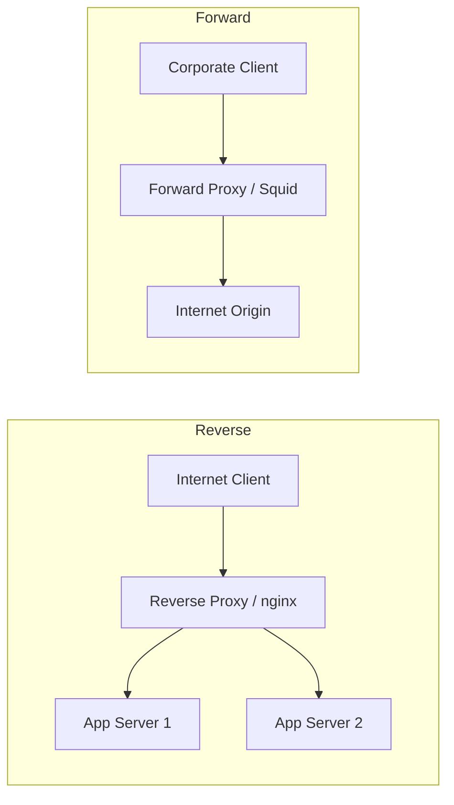

**Critical headers (reverse proxy):**

| Header | Purpose |
|--------|---------|
| `X-Forwarded-For` | Original client IP chain |
| `X-Forwarded-Proto` | `http` or `https` as client used |
| `X-Request-ID` | Correlation for tracing |
| `Host` | Original host header for virtual hosting |

Apps must trust these only from known proxy IPs.

### Key details

- **nginx** - most common reverse proxy + static file server
- **Envoy** - L7 proxy, foundation of Istio service mesh
- **API Gateway** (Kong, AWS API Gateway) - reverse proxy + auth + rate limit + analytics
- **Transparent forward proxy** - intercepts traffic via network policy without client config
- **Service mesh sidecar** - each pod has local reverse+forward proxy (Envoy) for east-west traffic

### When to use

- **Reverse:** every production web/API tier; SSL at edge; path routing to microservices
- **Forward:** corporate networks, compliance filtering, anonymizing scrapers
- **Both together:** mesh sidecar proxies outbound calls from app container

### Trade-offs / Pitfalls

- Reverse proxy **SPOF** without HA (keepalived VIP or cloud-managed LB)
- Wrong `X-Forwarded-For` trust -> IP spoofing bypasses rate limits
- TLS termination shifts trust boundary - encrypt VPC east-west or use mTLS to backends
- Extra network hop adds latency (~0.5-2ms)
- Large file uploads need proxy buffer tuning (`client_max_body_size`)

### References

- [Proxy Server - Hareram Singh](https://medium.com/@hareramcse/proxy-server-d390bc83f3a9)
- [Forward and Reverse Proxy - video](https://www.youtube.com/watch?v=xo5V9g9joFs)

---


## 1.16 NAT


### What is it?

**Network Address Translation (NAT)** maps private IP addresses inside a network to public IP(s) on the internet, modifying packet headers in transit. Most home routers and cloud NAT gateways use **NAPT** (port-level translation).

### Why it matters

NAT conserves scarce IPv4 addresses and hides internal topology. It also breaks inbound connections unless port forwarding configured - affecting P2P, WebRTC, and debugging client IPs.

### How it works

1. Internal host (192.168.1.10:5000) sends packet to external server.
2. NAT router replaces source with (public_ip:ephemeral_port).
3. NAT table maps ephemeral_port -> internal host:port.
4. Return packets reverse translation using table.
5. Table entries timeout after idle period.

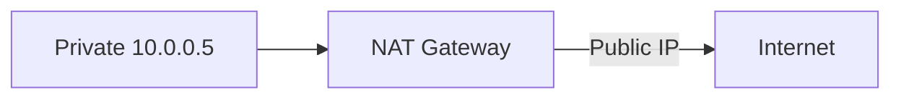

### Key details

- **SNAT:** source translation (outbound from private)
- **DNAT:** destination translation (port forwarding inbound)
- Cloud **NAT Gateway** for private subnet egress without public IPs
- **Carrier-grade NAT (CGNAT)** shares public IP across ISP customers

### When to use

- Private subnet internet access in VPC
- Home/office networks on IPv4
- Hiding internal server IPs from clients

### Trade-offs / Pitfalls

- Breaks end-to-end connectivity - needs STUN/TURN for WebRTC
- Log correlation harder (many clients share one public IP)
- NAT table exhaustion under high connection count
- IPv6 designed to reduce NAT need

### References

- [NAT  -  network address translation video](https://www.youtube.com/watch?v=FTUV0t6JaDA)

---


## 1.17 VPN


### What is it?

A **Virtual Private Network (VPN)** creates an encrypted tunnel over a public network, making remote hosts appear on a private network. Protocols include IPsec, OpenVPN, WireGuard, and TLS-based corporate VPNs.

### Why it matters

VPNs secure remote access, connect site-to-site networks, and bypass geo-restrictions. Zero-trust architectures reduce blanket VPN reliance but VPN remains common for admin access and hybrid cloud.

### How it works

1. Client authenticates to VPN concentrator.
2. Encrypted tunnel established (IPsec SA or WireGuard handshake).
3. Client receives virtual IP in VPN address space.
4. Traffic routed through tunnel (full or split tunnel).
5. Decrypted at gateway; forwarded to internal resources.


### Key details

- **Split tunnel:** only corporate traffic via VPN; internet direct
- **Full tunnel:** all traffic via corporate (inspection, DLP)
- **WireGuard:** modern, minimal, fast kernel implementation
- **Site-to-site:** gateway-to-gateway for datacenter/cloud linking

### When to use

- Remote employee access to internal tools
- Connecting cloud VPC to on-prem datacenter
- Secure admin access to production (bastion alternative)

### Trade-offs / Pitfalls

- VPN concentrator SPOF and bandwidth bottleneck
- Full tunnel adds latency for SaaS apps
- Compromised VPN creds grant broad network access
- Zero-trust replaces "perimeter VPN trust" with per-request auth

### References

- [VPN  -  virtual private networks video](https://www.youtube.com/watch?v=R-JUOpCgTZc)

---


## 1.18 Anycast/Multicast/Broadcast


### What is it?

Three IP delivery semantics: **Broadcast** (one-to-all on subnet), **Multicast** (one-to-many subscribed group), **Anycast** (one-to-nearest of a group sharing same IP). Anycast powers global DNS and CDN routing.

### Why it matters

Anycast enables any PoP to respond on the same IP - BGP routes to topologically nearest node. Multicast efficient for streaming to many (limited internet support). Broadcast confined to L2 domains.

### How it works

**Broadcast:** packet to 255.255.255.255 or subnet broadcast - 所有 hosts on LAN.

**Multicast:** join IGMP group (224.0.0.0/4); routers replicate to subscribers only.

**Anycast:** same IP announced from multiple locations via BGP; router picks shortest path.

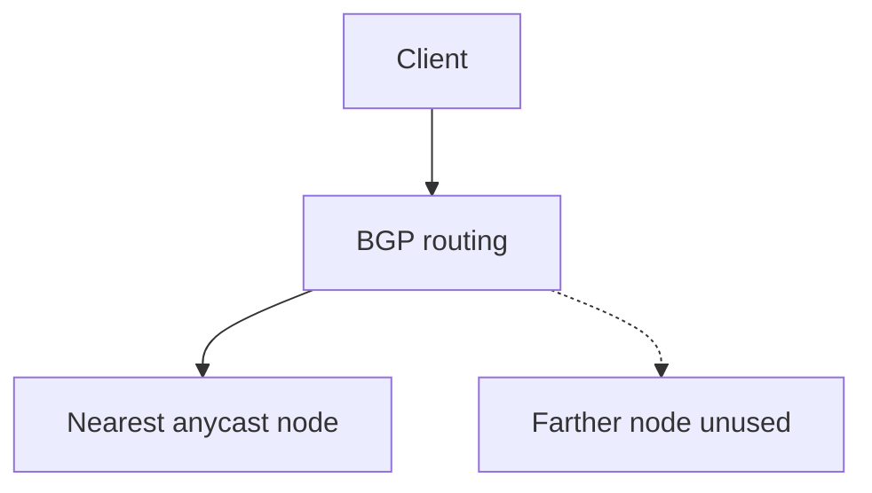

### Key details

- Anycast: Cloudflare 1.1.1.1, Google 8.8.8.8, CDN edges
- Multicast: IPTV within datacenter; not end-to-end internet
- Broadcast storm risk led to L3 switching dominance
- Anycast failure: BGP reconverges to next node (seconds)

### When to use

- Anycast: global DNS resolvers, CDN, DDoS scrubbing
- Multicast: internal market data feeds, video distribution
- Broadcast: ARP, DHCP within subnet only

### Trade-offs / Pitfalls

- Anycast stateful TCP connections break if route changes mid-session
- Multicast not supported in most cloud VPCs
- Broadcast doesn't cross routers by design
- Anycast debugging confusing (which PoP answered?)

### References

- [Anycast, Multicast, Broadcast  -  video](https://www.youtube.com/watch?v=EcWhJbEWxHU)

---


## 1.19 CDN


### What is it?

A **Content Delivery Network (CDN)** distributes cached copies of static (and sometimes dynamic) content to **edge PoPs** geographically close to users, reducing latency and origin load.

### Why it matters

Users globally expect fast page loads. CDN offloads 80 - 90% of static traffic, absorbs DDoS, and provides TLS at edge. Essential for media, e-commerce, and any global web property.

### How it works

1. Origin (S3, nginx) serves content; CDN pulls on first request (**cache miss**).
2. CDN caches at edge PoP with TTL from `Cache-Control`.
3. Subsequent nearby users get **cache hit** from edge.
4. DNS (or anycast) routes user to nearest PoP.
5. Purge API invalidates cached objects on content update.

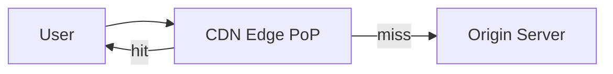

### Key details

- **Cache keys** include URL, query string, headers (Vary)
- **Dynamic acceleration:** route API through CDN private backbone
- Providers: Cloudflare, Akamai, Fastly, CloudFront
- **Stale-while-revalidate** serves old while refreshing

### When to use

- Static assets (JS, CSS, images, video)
- Downloadable files, software updates
- DDoS protection and WAF at edge

### Trade-offs / Pitfalls

- Cache invalidation delay after deploy
- Personalized content hard to cache (need edge logic or short TTL)
- Dynamic HTML caching requires careful cache key design
- Cost scales with bandwidth egress

### References

- [CDN  -  content delivery networks video](https://www.youtube.com/watch?v=ouqqU0FJjhQ)

---


## 1.20 Load Balancer


### What is it?

A **load balancer (LB)** sits in front of multiple backend servers and **distributes incoming traffic** across them. Goals: higher **throughput**, better **availability** (survive node failure), and horizontal **scalability**.

Two main layers:
- **L4 (Transport)** - routes TCP/UDP connections by IP:port; fast; no HTTP awareness
- **L7 (Application)** - routes HTTP/gRPC by URL path, headers, host; TLS termination, cookies

Examples: AWS ALB/NLB, nginx, HAProxy, F5, Envoy, Kubernetes Service + Ingress.

### Why it matters

No single server handles modern traffic volumes. The load balancer is the **front door** of almost every scaled system - it enables rolling deploys (drain unhealthy nodes), health-based routing, and SSL at the edge.

### How it works

1. Client resolves DNS to LB VIP (virtual IP) or hostname (`api.example.com`)
2. Client connects to LB (TLS often terminates here at L7)
3. LB selects backend using algorithm (round-robin, least connections, consistent hash)
4. LB forwards request (L7 proxy) or connection (L4 pass-through)
5. **Health checks** probe backends (`GET /health` every 10s); unhealthy nodes removed from pool
6. Optional **session affinity (sticky sessions):** same client always hits same backend via cookie or source IP hash

```mermaid
flowchart TB
    Users --> LB[Load Balancer]
    LB --> B1[Backend 1]
    LB --> B2[Backend 2]
    LB --> B3[Backend 3]
    B1 -.->|health check fail| LB
```

**L4 vs L7 decision:**

| | L4 (NLB) | L7 (ALB/nginx) |
|---|----------|----------------|
| Speed | Faster (no HTTP parse) | Slightly more CPU |
| Routing | IP + port only | Path, header, host |
| TLS | Pass-through or terminate | Terminate + route |
| Use case | DB proxy, gaming UDP, raw TCP | REST APIs, WebSocket upgrade |
| WebSocket | TCP pass-through works | Needs upgrade support |

**High availability for the LB itself:**
- Active-passive pair (keepalived/VRRP) with floating VIP
- Cloud-managed LB (AWS ELB) spans AZs automatically
- DNS failover to secondary region (higher TTL trade-off)

**Deployment patterns:**
- **Active-active:** all backends serve traffic simultaneously
- **Active-passive:** standby waits for failover
- **Cross-zone:** LB distributes across availability zones (survive AZ outage)

### Key details

- **Health check tuning:** too aggressive -> flapping; too lazy -> send traffic to dead nodes
- **Connection draining:** on deploy, stop new connections to instance, wait for in-flight to finish
- **X-Forwarded-For / X-Real-IP:** LB injects client IP for backend logging and rate limiting
- **WebSocket:** requires L7 with HTTP upgrade support + often **sticky sessions** or shared pub/sub backplane
- **gRPC:** L7 LB with HTTP/2 aware routing (path, metadata)
- **SSL/TLS:** terminate at LB (centralized cert management) vs pass-through (end-to-end encryption)

### When to use

- More than one app server instance (almost always in production)
- Zero-downtime rolling deployments
- Geographic or AZ redundancy
- DDoS absorption at edge (CDN + LB)

### Trade-offs / Pitfalls

- **Sticky sessions** break even load distribution; required for in-memory session state (prefer external session store)
- **SSL termination at LB** means traffic LB->backend may be plain HTTP (secure VPC or re-encrypt)
- **Misconfigured health checks** mark healthy nodes bad (wrong path, auth required on `/health`)
- **Single LB** is SPOF unless HA pair or managed service
- **Source IP hash** for stickiness fails behind carrier NAT (many users, one IP)

### References

- [Load Balancer Algorithms - comparison video](https://www.youtube.com/watch?v=1fN2UDbtGDQ)

---


## 1.21 Load Balancer Algorithm


### What is it?

A **load balancing algorithm** is the policy a load balancer (L4 or L7) uses to pick **one backend** from a healthy pool for each incoming connection or request. The algorithm sees only what the LB tracks—connection counts, weights, hashes of IP/URL/header—not application-level "CPU busy" unless exposed via custom metrics or slow-start.

**Core algorithms (tier-1):**

| Algorithm | Selection rule |
|-----------|----------------|
| **Round robin** | Rotate through backends in fixed order |
| **Weighted round robin** | Round robin proportional to weight |
| **Least connections** | Backend with fewest active connections |
| **IP hash** | `hash(client_ip) % N` → fixed backend |
| **Consistent hash** | Hash into ring; minimal remap when nodes added/removed |

### Why it matters

The wrong algorithm creates **false capacity**: three servers at 90% CPU while two sit idle, or sticky sessions break when mobile clients change IP. Algorithm choice interacts with **connection duration**, **request cost variance**, and **statefulness**.

| Workload shape | Bad choice | Symptom |
|----------------|------------|---------|
| Long WebSocket sessions | Round robin | Even count but one server holds all heavy rooms |
| Heterogeneous instance sizes | Plain round robin | Small nodes overwhelmed |
| In-memory session cache | Round robin | Cache miss storm on every server |
| Sharded cache cluster | Round robin | Same key on all nodes—no locality |

**Interview point:** L4 LB sees TCP connections; L7 LB sees HTTP requests. One HTTP/2 connection with 100 streams = **1 connection** for least-conn but **100 requests** for per-request RR.

### How it works

**Round robin (RR)**

```text
Backends: [A, B, C]
Request 1 → A,  Request 2 → B,  Request 3 → C,  Request 4 → A, ...
```

Pseudo-code:

```text
index = 0
on each request:
    backend = pool[index % pool.size]
    index++
    forward(backend)
```

Assumes **equal capacity**, **stateless** handlers, and **uniform** request cost.

**Weighted round robin (WRR)**

```text
Weights: A=3, B=1, C=1  →  pattern A,A,A,B,C repeating
```

Use when nodes differ (large vs small instances, canary with weight=1 vs prod weight=9).

**Least connections**

```text
On each new connection:
    pick backend with minimum active_connection_count
    increment count on assign; decrement on close
```

Best when requests hold connections for **variable or long** durations (TLS, DB through LB, WebSocket, gRPC streams).

```mermaid
flowchart TB
    Req[New TCP connection] --> LC{Least connections}
    LC --> B1["Server A: 120 conn"]
    LC --> B2["Server B: 45 conn  <- chosen"]
    LC --> B3["Server C: 89 conn"]
```

**IP hash (session affinity without cookies)**

```text
backend_index = hash(client_src_ip) % number_of_backends
```

Same client IP → same backend until pool size changes (then **most** mappings reshuffle—unlike consistent hash).

**Consistent hashing**

Place backends and keys on a **hash ring** (0 to 2³²-1). Key (URL, user id, cookie) walks clockwise to first backend.

```mermaid
flowchart LR
    subgraph ring [Hash ring]
        N1[Node A]
        N2[Node B]
        N3[Node C]
    end
    K1["hash user:42"] --> N2
    K2["hash user:99"] --> N3
```

When a node is **added/removed**, only keys **adjacent** to that node on the ring move—not all keys (unlike `hash % N`).

**Worked example — RR vs least conn:**

```text
5 backends, 5 new connections/sec, each lives 60 seconds

Round robin: each backend gets 1 conn/sec → 60 active each (balanced)

If 1 connection is a 24h WebSocket and others are 1s HTTP:
  RR: unlucky backend holds WebSocket + fair share of short — skewed load
  Least conn: new shorts avoid the WebSocket-heavy backend
```

**Consistent hash + virtual nodes (vnodes):**

Each physical server gets **many** points on the ring (e.g., 100) to spread load evenly when server count is small.

```text
add_server("B"):
  only keys between A's vnode and B's vnodes move from A to B
  (~1/N of keys move for N servers)
```

### Key details

| Algorithm | Best for | Avoid when |
|-----------|----------|------------|
| **Round robin** | Homogeneous stateless APIs, short requests | Long connections, skewed work |
| **Weighted RR** | Mixed instance sizes, canary traffic split | Need dynamic load awareness |
| **Least connections** | WebSocket, gRPC streams, LDAP, DB pool LB | Connection counting expensive at huge scale |
| **IP hash** | Simple stickiness without app cookies | Mobile/carrier NAT (many users → one IP) |
| **Consistent hash** | Distributed caches, sharded state | Hot keys dominate one node |
| **Random** | Surprisingly even at scale; zero state | Need stickiness |
| **Least response time** | Heterogeneous latency (LB adds RTT probe) | Noisy measurements |

**Health checks interact with algorithms:** unhealthy backends removed from pool → connections redistributed → possible **thundering herd** on remaining nodes.

**Maglev hashing (Google):** Deterministic permutation table—fast lookup, used in some L4/L7 proxies.

**Interview point:** Consistent hash solves **cache locality** when adding/removing nodes; IP hash is simpler but remaps almost everything when N changes.

### When to use

- **Round robin:** Default for stateless REST behind homogeneous pods (Kubernetes Service default).
- **Weighted RR:** Canary deploys (90/10), mixed instance types in ASG.
- **Least connections:** API gateway to WebSocket servers, TCP proxy to legacy app servers.
- **IP hash / consistent hash:** Memcached/Redis client-less clustering through LB, sticky sessions without `Set-Cookie`.
- **Consistent hash on URL:** CDN origin selection, API sharding gateway (`user_id` in path).

### Trade-offs / Pitfalls

| Pitfall | Why it hurts | Mitigation |
|---------|--------------|------------|
| RR ignores live load | Slow server gets equal share | Least conn or adaptive LB |
| IP hash + mobile users | IP changes mid-session → new backend | App session cookie or user-id hash |
| IP hash + carrier NAT | Thousands of users share one IP → one backend hot | Don't use IP hash for public mobile APIs |
| Consistent hash hot keys | Celebrity user id overloads one shard | Salting, sub-shards, application-level split |
| Least conn bookkeeping | CPU/memory per connection table | Sampling approximations at extreme scale |
| Wrong weights in WRR | Small node starved or large node overloaded | Measure CPU/RPS; tune weights |
| HTTP/2 multiplexing + RR | One TCP carries many requests to one pod | L7 per-request balancing or more pods |
| Removing backend without drain | In-flight requests killed | Connection draining, graceful shutdown |

**Comparison — hash % N vs consistent hash (3 → 4 backends):**

```text
hash % N:     ~75% of keys remap (almost full reshuffle)
consistent:   ~25% of keys remap (only new node's arc)
```

### References

- [Load Balancer Algorithms  -  comparison video](https://www.youtube.com/watch?v=1fN2UDbtGDQ)

---


## 1.22 SSE & Polling & Websocets


### What is it?

Three families of techniques for **real-time or near-real-time** communication between client and server:

| Pattern | Direction | Connection |
|---------|-----------|------------|
| **Short polling** | Client pulls | Repeated HTTP requests every N seconds |
| **Long polling** | Client pulls (held) | HTTP request stays open until event or timeout |
| **SSE (Server-Sent Events)** | Server pushes | One persistent HTTP stream (`text/event-stream`) |
| **WebSocket** | Bidirectional | Single TCP connection upgraded from HTTP; full-duplex framed messages |

**WebSocket** is a protocol (`ws://` or `wss://`) enabling **bidirectional, full-duplex** communication over a **persistent** connection with minimal per-message overhead after the initial handshake.

### Why it matters

Choosing the wrong pattern wastes bandwidth (polling empty responses), ties up threads (sync long polling), or over-engineers (WebSocket when SSE suffices). Live chat, notifications, collaborative editing, stock tickers, and multiplayer games all depend on picking the right mechanism.

**WebSocket use cases:**
- **Live chat** - customer support, livestream chat, team messaging
- **Broadcast** - sports scores, traffic, stock quotes, news alerts (often combined with pub/sub)
- **Data sync** - DB change pushed to all connected clients (polls, live dashboards)
- **Multiplayer collaboration** - cursors, presence, shared documents (Figma-style)
- **In-app notifications** - event-driven alerts
- **Live location** - rideshare, fleet tracking, delivery ETA

### How it works

**a) Short polling**

1. Client calls API every 1-2 seconds (e.g. `GET /messages?since=...`)
2. Server returns current state; often **empty** when nothing changed
3. High HTTP overhead; poor for true real-time

**b) Long polling**

1. Client sends HTTP request; server **holds** it until data arrives or timeout
2. Client immediately opens new long poll after response
3. Challenges: message ordering with multiple parallel connections; still reconnects after each timeout

**c) Server-Sent Events (SSE)**

1. Client: `GET /events` with `Accept: text/event-stream`
2. Server keeps connection open; pushes `data: {...}\n\n` lines
3. Browser `EventSource` API auto-reconnects on disconnect
4. **One-way only** (server -> client); client still uses normal HTTP for commands

**d) WebSocket**

1. **TCP connection** established (same as HTTP)
2. **HTTP upgrade handshake:**
   - Client: `Upgrade: websocket`, `Connection: Upgrade`, `Sec-WebSocket-Key`
   - Server: `101 Switching Protocols`, `Sec-WebSocket-Accept`
3. Subprotocol negotiated (e.g. `json`, `mqtt`)
4. Connection switches to **WebSocket framing** - async bidirectional messages
5. Uses `ws://` (plain) or **`wss://`** (TLS) - always use `wss://` in production

```mermaid
sequenceDiagram
    participant Client
    participant Server
    Client->>Server: HTTP GET + Upgrade: websocket
    Server-->>Client: 101 Switching Protocols
    Note over Client,Server: Persistent WebSocket connection
    Client->>Server: { type: "subscribe", channel: "chat" }
    Server->>Client: { type: "message", text: "hello" }
    Client->>Server: { type: "message", text: "hi" }
```

**Comparison at a glance:**

| | Short poll | Long poll | SSE | WebSocket |
|---|------------|-----------|-----|-----------|
| Direction | Pull | Pull | Server push | Bidirectional |
| Overhead | Very high | Medium | Low | Lowest after handshake |
| Real-time | Poor | Better | Good | Best |
| Browser API | fetch | fetch | EventSource | WebSocket |
| Proxy friendly | Yes | Mostly | Yes | Needs L7 proxy support |

**Scaling WebSockets across servers:**

- Connections are **stateful** - server holds socket per client
- **Sticky sessions** (session affinity) route same client to same instance, OR
- **Pub/sub backplane** (Redis, Kafka) so any server can push to clients on other nodes
- Load balancer must support **HTTP upgrade** (L7 ALB/nginx, not naive L4 TCP drain)

**Popular libraries:** Socket.IO (reconnect + fallbacks), SignalR (.NET), SockJS (fallback transports), `ws` (Node.js minimal)

### Key details

- **When NOT to use WebSocket:** CRUD-heavy apps with no realtime need -> HTTP is simpler; audio/video streaming -> WebRTC; server-only push of text -> **SSE is simpler and scales easier**
- **Drawbacks of WebSocket:** stateful connections consume memory; harder to scale than stateless HTTP; some corporate proxies/firewalls block WS; no built-in reconnect spec (app must implement); presence/detection of disconnects is imperfect
- **Security:** use `wss://`; validate `Origin` header; authenticate during handshake (JWT in query or cookie); guard against XSS injecting into WS messages
- **SSE advantages:** automatic reconnect; works over standard HTTP/2; simpler ops than WS cluster
- **HTTP/1.1 connection limit** (~6 per domain) matters less once upgraded to single WS

### When to use

| Need | Choose |
|------|--------|
| Updates every 30+ seconds, simple app | Short polling |
| Near-real-time, server push only (scores, logs, notifications) | **SSE** |
| Chat, gaming, collaboration, bidirectional sync | **WebSocket** |
| Firewall/proxy uncertainty | SSE or long polling first; SockIO fallbacks |

### Trade-offs / Pitfalls

- **Polling** - empty responses waste bandwidth; does not scale to millions of clients
- **Long polling** - ties up worker threads if server is not async (Node, Netty, async servlet)
- **SSE** - one-way; client commands need separate HTTP/WS channel
- **WebSocket** - sticky sessions or pub/sub required for multi-server; connection storms on reconnect after outage; heartbeats/ping-pong needed to detect dead peers
- **Do not default to WebSocket** for every "realtime" feature - SSE covers many notification feeds with less complexity

### References

- [WebSockets - Hareram Singh (use cases, handshake, polling vs SSE comparison)](https://medium.com/@hareramcse/websockets-74244f33bff4)
- [SSE, Polling, and WebSockets - video](https://www.youtube.com/watch?v=WS352jTTkPU)

---


## Quick Reference

| # | Topic | Summary |
|---|-------|---------|
| 1.1 | OSI Model | The **Open Systems Interconnection (OSI) model** is a seven-layer conceptual ... |
| 1.2 | TCP/IP | The **TCP/IP model** is the practical four-layer stack underlying the Interne... |
| 1.3 | TCP Handshake | The **TCP three-way handshake** establishes a reliable connection between cli... |
| 1.4 | UDP | **User Datagram Protocol (UDP)** is a connectionless transport protocol sendi... |
| 1.5 | MTU | **Maximum Transmission Unit (MTU)** is the largest IP packet payload size a l... |
| 1.6 | IP Addressing/Subnetting | **IP addressing** assigns unique identifiers to hosts on IP networks. **Subne... |
| 1.7 | CIDR | **Classless Inter-Domain Routing (CIDR)** notation expresses IP addresses and... |
| 1.8 | DNS | The **Domain Name System (DNS)** is a hierarchical, distributed naming system... |
| 1.9 | DNS Resolution | **DNS resolution** is the step-by-step process a resolver uses to find the IP... |
| 1.10 | HTTP/HTTPS | **HTTP (Hypertext Transfer Protocol)** is the application-layer protocol for ... |
| 1.11 | SSL/TLS | **TLS (Transport Layer Security)**, successor to SSL, provides **encryption**... |
| 1.12 | HTTP2 & HTTP3 | **HTTP/2** multiplexes many requests over one TCP connection with binary fram... |
| 1.13 | QUIC | **QUIC (Quick UDP Internet Connections)** is a transport protocol on UDP comb... |
| 1.14 | Keep Alive Connections | **HTTP keep-alive (persistent connections)** reuses the same TCP connection f... |
| 1.15 | Forward & Reverse Proxy | A **forward proxy** sits in front of **clients**, forwarding requests to the ... |
| 1.16 | NAT | **Network Address Translation (NAT)** maps private IP addresses inside a netw... |
| 1.17 | VPN | A **Virtual Private Network (VPN)** creates an encrypted tunnel over a public... |
| 1.18 | Anycast/Multicast/Broadcast | Three IP delivery semantics: **Broadcast** (one-to-all on subnet), **Multicas... |
| 1.19 | CDN | A **Content Delivery Network (CDN)** distributes cached copies of static (and... |
| 1.20 | Load Balancer | A **load balancer** distributes incoming traffic across multiple backend serv... |
| 1.21 | Load Balancer Algorithm | **Load balancing algorithms** determine which backend receives each request: ... |
| 1.22 | SSE & Polling & Websocets | Three patterns for **server-to-client real-time updates**: **polling** (clien... |

---

[â -  Back to master index](../README.md)
