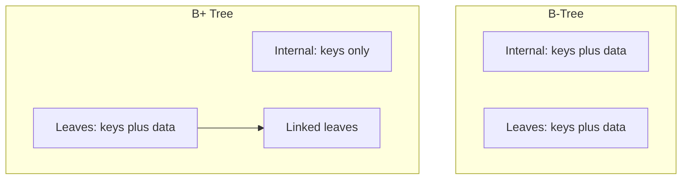
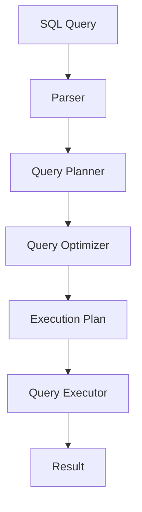
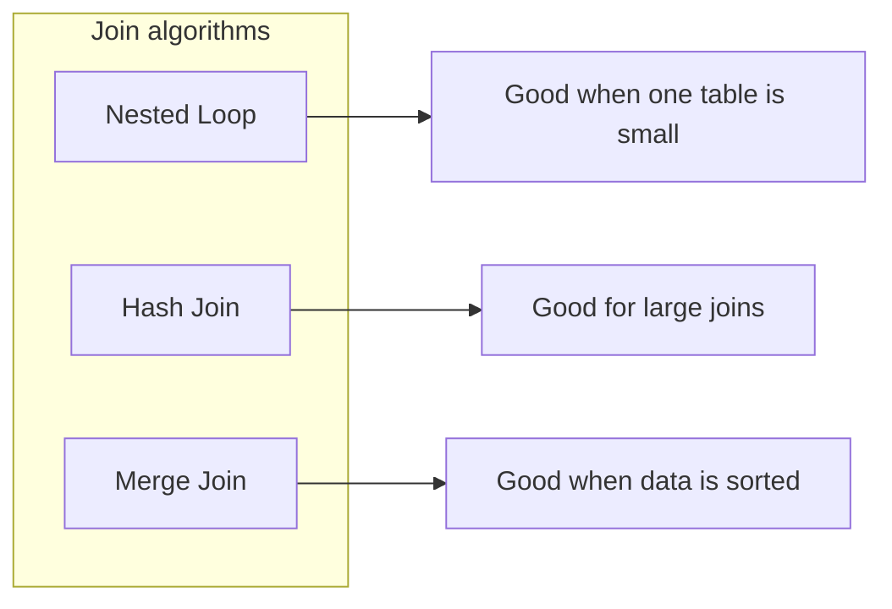
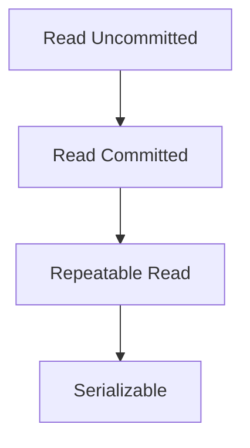
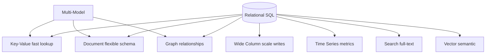
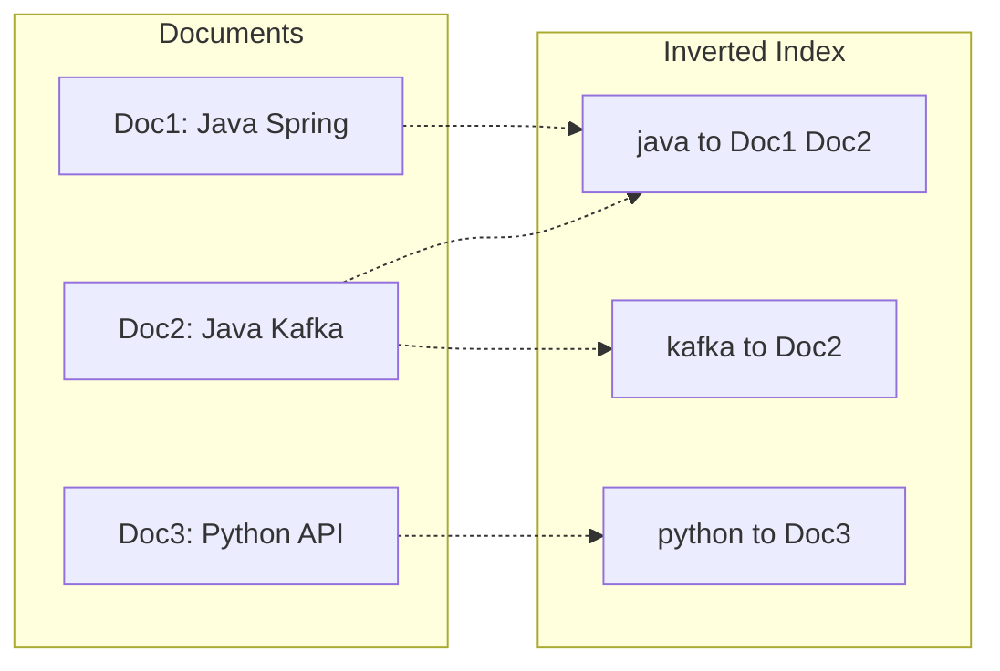
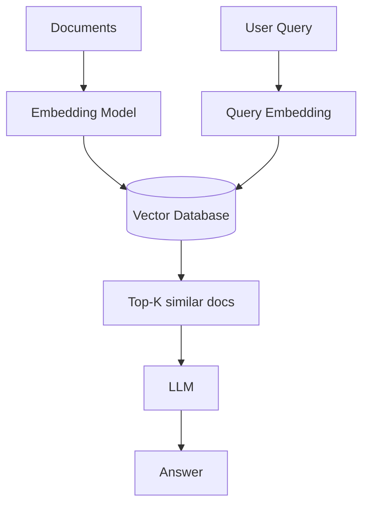
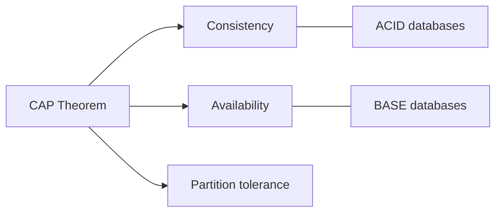

# 2. Databases

> Status: **Documented**  -  master reference

[<- Back to master index](../README.md)

## Sub-topics

| # | Sub-topic | Status |
|---|-----------|--------|
| 2.1 | [Normalization & Denormalization](#21-normalization--denormalization) | Done |
| 2.2 | [Indexing](#22-indexing) | Done |
| 2.3 | [B Tree/B+ Tree](#23-b-treeb-tree) | Done |
| 2.4 | [Query Planner / Optimizer](#24-query-planner--optimizer) | Done |
| 2.5 | [Views/ Materialized View](#25-views-materialized-view) | Done |
| 2.6 | [Isolation Levels](#26-isolation-levels) | Done |
| 2.7 | [MVCC](#27-mvcc) | Done |
| 2.8 | [Redo/undo/bin Logs](#28-redoundobin-logs) | Done |
| 2.9 | [LSM Tree/SSTables/WAL](#29-lsm-treesstableswal) | Done |
| 2.10 | [Page Cache](#210-page-cache) | Done |
| 2.11 | [Vacuum Process](#211-vacuum-process) | Done |
| 2.12 | [Key Value Stores](#212-key-value-stores) | Done |
| 2.13 | [Document Databases](#213-document-databases) | Done |
| 2.14 | [Wide Column Databases](#214-wide-column-databases) | Done |
| 2.15 | [Graph Databases](#215-graph-databases) | Done |
| 2.16 | [Time Series Databases](#216-time-series-databases) | Done |
| 2.17 | [Search Databases](#217-search-databases) | Done |
| 2.18 | [Vector Databases](#218-vector-databases) | Done |
| 2.19 | [Multi Model Databases](#219-multi-model-databases) | Done |
| 2.20 | [ACID/BASE Properties](#220-acidbase-properties) | Done |
| 2.21 | [SQL Tuning](#221-sql-tuning) | Done |

---

## 2.1 Normalization & Denormalization

### What is normalization?

**Normalization** is the process of organizing data in a database to:

- Reduce data redundancy (duplicate data)
- Improve data consistency
- Avoid insert, update, and delete anomalies
- Make data easier to maintain

In simple words: **store each piece of information only once.**

---

### Problem without normalization

**Student table (unnormalized):**

| StudentID | StudentName | CourseID | CourseName |
|-----------|-------------|----------|------------|
| 101 | Ram | C01 | Java |
| 101 | Ram | C02 | Spring |
| 102 | Shyam | C01 | Java |

**Problems:**

1. **Data redundancy** — student name "Ram" stored multiple times; course name "Java" stored multiple times
2. **Update anomaly** — if Java becomes Java Programming, multiple rows must be updated
3. **Insert anomaly** — cannot add a new course until a student enrolls
4. **Delete anomaly** — deleting last student from a course removes course information

---

### Normalized design

**Student table:**

| StudentID | StudentName |
|-----------|-------------|
| 101 | Ram |
| 102 | Shyam |

**Course table:**

| CourseID | CourseName |
|----------|------------|
| C01 | Java |
| C02 | Spring |

**Enrollment table:**

| StudentID | CourseID |
|-----------|----------|
| 101 | C01 |
| 101 | C02 |
| 102 | C01 |

**Benefits:** No duplicate student data, no duplicate course data, easy maintenance, better consistency

---

### Normal forms

#### 1NF (First Normal Form)

**Rules:**

- No repeating groups
- Each column contains atomic values
- Each row must be unique

**Bad:**

| ID | Name | Phones |
|----|------|--------|
| 1 | Ram | 111,222,333 |

**Good:**

| ID | Name | Phone |
|----|------|-------|
| 1 | Ram | 111 |
| 1 | Ram | 222 |
| 1 | Ram | 333 |

---

#### 2NF (Second Normal Form)

**Rules:**

- Must satisfy 1NF
- No partial dependency

**Partial dependency:** when a non-key column depends on only part of a composite key.

**Example — StudentCourse:**

| StudentID | CourseID | StudentName |
|-----------|----------|-------------|
| 101 | C01 | Ram |

**Composite key:** `(StudentID, CourseID)`

**Problem:** `StudentName` depends only on `StudentID`, not on the entire composite key.

**Solution:** Move `StudentName` to Student table.

---

#### 3NF (Third Normal Form)

**Rules:**

- Must satisfy 2NF
- No transitive dependency

**Example — Employee:**

| EmpID | DeptID | DeptName |
|-------|--------|----------|
| E101 | D10 | IT |

**Problem:**

```text
EmpID → DeptID
DeptID → DeptName
Therefore: EmpID → DeptName  (transitive dependency)
```

**Solution:**

**Employee:**

| EmpID | DeptID |
|-------|--------|
| E101 | D10 |

**Department:**

| DeptID | DeptName |
|--------|----------|
| D10 | IT |

---

#### BCNF (Boyce-Codd Normal Form)

Stricter version of 3NF.

**Rule:** Every determinant must be a candidate key.

Used when 3NF still has some anomalies. Mostly asked in interviews; rarely implemented manually.

---

### Advantages of normalization

1. Eliminates duplicate data
2. Improves consistency
3. Reduces storage usage
4. Easier maintenance
5. Better data integrity
6. Prevents anomalies

---

### Disadvantages of normalization

1. More tables
2. More JOIN operations
3. Complex queries
4. Slightly slower reads

---

### What is denormalization?

**Denormalization** is the process of intentionally adding duplicate data to improve read performance.

In simple words: **trade storage for speed.**

---

### Normalized example

**Orders:**

| OrderID | CustomerID |
|---------|------------|
| O1 | C1 |

**Customer:**

| CustomerID | CustomerName |
|------------|--------------|
| C1 | Ram |

To get order details:

```sql
SELECT *
FROM Orders o
JOIN Customer c ON o.CustomerID = c.CustomerID;
```

JOIN required.

---

### Denormalized example

**Orders:**

| OrderID | CustomerID | CustomerName |
|---------|------------|--------------|
| O1 | C1 | Ram |

No JOIN needed.

| | |
|---|---|
| **Faster reads** | Yes |
| **More storage** | Yes |
| **Possible inconsistency** | Yes |

---

### Why companies denormalize?

Applications usually perform:

- **90% reads**
- **10% writes**

**Examples:** E-commerce, social media, analytics systems, reporting systems, dashboards

Read performance becomes more important.

---

### Normalization vs denormalization

| Feature | Normalization | Denormalization |
|---------|---------------|-----------------|
| Data duplicate | Minimal | High |
| Storage | Less | More |
| Read speed | Slower | Faster |
| Write speed | Better | Costly updates |
| Consistency | High | Lower |
| Joins | More | Less |
| Maintenance | Easy | Difficult |

---

### Real-world example

#### OLTP systems (transactional)

**Examples:** Banking, payment systems, order management

**Use:** **Normalization**

**Reason:** Data consistency is critical.

#### OLAP / analytics systems

**Examples:** Data warehouse, reporting, dashboards

**Use:** **Denormalization**

**Reason:** Fast query performance is critical.

---


## 2.2 Indexing

**Indexing** is a data structure technique used by databases to quickly locate records without scanning the entire table.

Think of an index in a database exactly like the **index of a book**.

| | Behavior |
|---|----------|
| **Without index** | To find "Caching" in a 1000-page book, you may need to scan many pages |
| **With index** | Look at the index page and jump directly to the required page number |

The database works similarly.

---

### Why indexing is needed?

Suppose we have:

**EMPLOYEE**

| ID | NAME | SALARY |
|----|------|--------|
| 1 | Ram | 50000 |
| 2 | Mohan | 60000 |
| 3 | Sita | 70000 |
| ... | ... | ... |
| 1000000 | John | 90000 |

**Query:**

```sql
SELECT * FROM EMPLOYEE WHERE ID = 1000000;
```

| | Without index | With index |
|---|---------------|------------|
| Behavior | Full table scan — rows 1, 2, 3 … 1000000 | Direct jump to row location |
| Time complexity | **O(N)** | **O(log N)** |

Huge performance improvement.

---

### How database stores data?

Data is stored in **pages/blocks** on disk.

```text
Disk Page 1: ID 1, ID 2, ID 3
Disk Page 2: ID 4, ID 5, ID 6
Disk Page 3: ID 7, ID 8, ID 9
```

| | Without index | With index |
|---|---------------|------------|
| Behavior | Reads many disk pages | Searches index first, then reads required page |
| Cost | Disk I/O is expensive | Less disk I/O |

---

### What is an index?

An index is a separate data structure containing:

```text
(Index Key) → (Pointer to actual row)
```

**EMPLOYEE table:**

| ID | NAME |
|----|------|
| 1 | Ram |
| 2 | Mohan |
| 3 | Sita |

**Index:**

```text
1 → Row Address A
2 → Row Address B
3 → Row Address C
```

Database first searches the index, then retrieves the actual row.

---

### Primary index

Created on **primary key**.

```sql
CREATE TABLE EMPLOYEE (
    ID INT PRIMARY KEY,
    NAME VARCHAR(100)
);
```

Most databases automatically create an index on `ID`.

**Advantage:** Fast lookup by primary key.

```sql
SELECT * FROM EMPLOYEE WHERE ID = 100;
```

---

### Secondary index

Index on a **non-primary-key** column.

```sql
CREATE INDEX idx_name ON EMPLOYEE(NAME);
```

```sql
SELECT * FROM EMPLOYEE WHERE NAME = 'Ram';
```

| | Without index | With index |
|---|---------------|------------|
| Lookup | Full scan | Direct lookup |

---

### Unique index

Ensures uniqueness.

```sql
CREATE UNIQUE INDEX idx_email ON CUSTOMER(EMAIL);
```

Not allowed:

```text
abc@gmail.com
abc@gmail.com  → duplicate causes error
```

---

### Composite index

Index on **multiple columns**.

```sql
CREATE INDEX idx_emp ON EMPLOYEE(DEPARTMENT_ID, SALARY);
```

Stored as:

```text
(1, 50000)
(1, 70000)
(2, 60000)
```

---

### Leftmost prefix rule

Index: `(DEPARTMENT_ID, SALARY)`

**Works for:**

```sql
WHERE DEPARTMENT_ID = 1
WHERE DEPARTMENT_ID = 1 AND SALARY = 50000
```

**May NOT efficiently work for:**

```sql
WHERE SALARY = 50000
```

**Reason:** Index is sorted first by `DEPARTMENT_ID`.

---

### Clustered index

**Definition:** Actual table data is physically stored in index order.

ID values physically stored as: `1, 2, 3, 4, 5` — data on disk itself is sorted.

| Advantages | Disadvantages |
|------------|---------------|
| Fast range queries | Only **one** clustered index possible (data can be physically sorted in only one way) |

**Example:** In SQL Server, primary key often becomes clustered index.

---

### Non-clustered index

Data remains separate. Index stores pointers.

```text
Index:
ID  Pointer
1   → Row A
2   → Row B
3   → Row C
```

Actual table data can be anywhere.

**Advantage:** Multiple indexes possible.

---

### Clustered vs non-clustered

| | Clustered | Non-clustered |
|---|-----------|---------------|
| Model | **Index = data** | **Index → pointer → data** |
| Analogy | Book pages arranged alphabetically | Separate index page tells where chapter exists |

---

### Index structures

| Structure | Used for | Details |
|-----------|----------|---------|
| **B+ tree** | Most relational indexes (MySQL, PostgreSQL, Oracle) | Range + point lookups — see **§2.3** |
| **Hash** | Equality-only lookups | O(1) seek; no range support |

---

### Hash index

Uses a hash function.

```text
hash("Ram") → Bucket 10
```

| Good for | Bad for |
|----------|---------|
| `WHERE NAME = 'Ram'` — **O(1)** | `WHERE NAME > 'Ram'`, `WHERE NAME BETWEEN ...` — no ordering |

---

### Index scan types

#### 1. Full table scan

Read every row. Slow for large tables.

#### 2. Index seek

Directly locate row. Fastest operation.

```sql
WHERE ID = 100
```

#### 3. Range scan

```sql
WHERE SALARY BETWEEN 50000 AND 70000
```

Reads only relevant index range.

---

### Covering index

**Table:** `ID | NAME | SALARY`

**Index:** `(NAME, SALARY)`

**Query:**

```sql
SELECT SALARY FROM EMPLOYEE WHERE NAME = 'Ram';
```

Database gets everything from the index — **no table lookup needed**.

**Benefits:** Extremely fast.

---

### Index selectivity

```text
Selectivity = Unique Values / Total Rows
```

| Column | Selectivity | Index useful? |
|--------|-------------|---------------|
| **Gender** (Male, Female) | Very poor | Usually not |
| **Email** (1M unique) | Excellent | Highly useful |

---

### When index is not used?

1. Small tables
2. Low selectivity columns
3. Leading wildcard search — `WHERE NAME LIKE '%ram'`
4. Functions on indexed columns — `WHERE UPPER(NAME) = 'RAM'` (index may not be used)

---

### Drawbacks of indexing

1. **Extra storage** — table 100 MB + indexes 50 MB = 150 MB total
2. **Slower inserts** — database updates table + every index on insert
3. **Slower updates** — if indexed column changes, table and index both update
4. **Slower deletes** — index entries must also be removed

---

### When should we create index?

**Good candidates:**

- Primary keys
- Foreign keys
- Frequently searched columns
- Frequently sorted columns
- JOIN columns
- WHERE clause columns

**Examples:**

```sql
WHERE customer_id = ?
WHERE email = ?
ORDER BY created_date
JOIN customer_id
```

---

### When should we avoid index?

- Very small tables
- Frequently updated columns
- Boolean columns
- Gender columns
- Status columns with few values

---

### Real-world example

**Amazon product table:**

```text
PRODUCT: product_id, name, category_id, price
```

**Indexes:**

```sql
PRIMARY KEY (product_id)
INDEX (category_id)
INDEX (price)
-- Composite: (category_id, price)
```

**Query:**

```sql
SELECT * FROM PRODUCT
WHERE category_id = 10 AND price < 5000;
```

Database uses composite index and avoids scanning millions of products.

---


## 2.3 B Tree/B+ Tree

Before understanding B-tree and B+ tree, we need to understand **why they were created**.

---

### Problem with binary search tree (BST)

**Balanced example:**

```text
           50
          /  \
        30    70
       / \    / \
      20 40 60 80
```

Search `50 → 70 → 80` — complexity: **O(log N)** for search, insert, delete. Looks good.

**But if data is inserted in sorted order** (`10, 20, 30, 40, 50, 60`):

```text
10
 \
  20
    \
     30
       \
        40
          \
           50
```

Complexity becomes **O(N)** — this is an **unbalanced tree**. For millions of records this becomes inefficient.

---

### Another problem with BST

Suppose one node can store only one value. For 1 million records, you need approximately **1 million nodes**.

Database stores data on **disk**. Disk access is expensive. If the database has to traverse many nodes, many disk reads are required.

**This is why databases do not use BST.**

---

### What is a B-tree?

**B-tree** is a self-balancing **multi-way** search tree.

| | BST node | B-tree node |
|---|----------|-------------|
| Keys per node | One key | **Multiple keys** |

**Example:**

```text
          [30 | 60]
          /   |   \
       <30  30-60  >60
```

One node can store many keys → tree height becomes very small → **fewer disk reads**.

---

### Terminology

**Order (m):** maximum number of children a node can have.

**Example — order = 4:**

```text
Maximum children = 4
Maximum keys     = 3

Formula: Maximum Keys = m - 1
```

---

### Example of B-tree

**Order = 4:**

```text
                [30 | 60]
               /    |    \
          [10|20] [40|50] [70|80]
```

**Rules:**

1. Keys inside node are sorted
2. Children are also sorted
3. All leaf nodes remain at same level
4. Tree remains balanced

---

### Search in B-tree

Search **50**:

```text
                [30 | 60]
               /    |    \
          [10|20] [40|50] [70|80]
```

**Step 1:** Compare with 30 and 60 — `30 < 50 < 60` → move to middle child

**Step 2:** Node `[40 | 50]` — **50 found**. Search complete.

---

### Why B-tree is fast?

Suppose each node stores **100 keys**:

| Level | Keys covered |
|-------|----------------|
| 1 | 100 |
| 2 | 10,000 |
| 3 | 1,000,000 |

Only **3 levels** needed to search 1 million records — very few disk accesses.

---

### Insertion in B-tree

**Order = 4** → maximum keys = **3**

**Current tree:** `[10 | 20 | 30]`

**Insert 40** → node becomes `[10 | 20 | 30 | 40]` → **node overflow** (max keys = 3).

---

### Node split

**Overflowed node:** `[10 | 20 | 30 | 40]`

**Middle value:** `20` — promoted to parent.

**Result:**

```text
          [20]
         /    \
      [10]  [30|40]
```

Tree remains balanced.

---

### Larger insertion example

Insert: `10, 20, 30, 40, 50, 60`

```text
Step 1:  [10]
Step 2:  [10|20]
Step 3:  [10|20|30]
Step 4:  overflow →
          [20]
         /    \
      [10]  [30|40]

Insert 50:
          [20]
         /    \
      [10] [30|40|50]

Insert 60 — right node overflows [30|40|50|60], promote 40:

             [20|40]
            /   |    \
         [10] [30] [50|60]
```

---

### Deletion in B-tree

Deletion is more complex. A node may have **too few keys**.

Database performs **borrowing** or **merging** to maintain balance.

**Example:**

```text
             [20|40]
            /   |    \
         [10] [30] [50|60]

Delete 30 → node becomes empty
```

Database may borrow from sibling **or** merge nodes.

**Goal:** Maintain minimum number of keys.

---

### Why B-tree is good for databases?

1. Balanced structure
2. Very small height
3. Fewer disk reads
4. Efficient inserts
5. Efficient deletes
6. Efficient searches

---

### Limitation of B-tree

In B-tree, data can exist in **internal nodes** and **leaf nodes**.

```text
          [30 | 60]
          /   |   \
       Data Data Data
```

When doing range queries (`30` to `100`), the database must visit many internal nodes — **not optimal**.

To solve this problem, **B+ tree** was introduced.

---

### What is B+ tree?

**B+ tree** is an improved version of B-tree.

| | B-tree | B+ tree |
|---|--------|---------|
| Data location | Can exist anywhere | **Only in leaf nodes** |
| Internal nodes | Keys + data possible | **Keys only** (routing) |

---

### B+ tree structure

```text
                     [30 | 60]
                    /    |     \
                   /     |      \
                [ ]    [ ]     [ ]

Leaf level:

      [10|20] -> [30|40|50] -> [60|70|80]
```

Leaf nodes are connected using **linked list pointers** — this is the biggest advantage.

---

### Search in B+ tree

Search **40**:

**Root:** `[30|60]` — 40 lies between 30 and 60 → move to middle leaf

**Leaf:** `[30|40|50]` — **40 found**

---

### Why are internal nodes smaller?

Internal nodes store **only keys** — no actual row data.

```text
Root: [30|60]   (no row data stored)
```

Because nodes are smaller:

- More keys fit inside one page
- Tree height decreases
- Fewer disk reads

---

### Range query in B+ tree

```sql
SELECT * FROM EMPLOYEE
WHERE salary BETWEEN 30000 AND 80000;
```

**B+ tree leaf chain:**

```text
[10|20] -> [30|40|50] -> [60|70|80]
```

Database:

1. Finds first value (30)
2. Traverses linked leaves
3. Reads 40, 50, 60, 70, 80

No need to traverse the tree repeatedly — **very efficient**.

---

### Why databases prefer B+ tree?

Most database operations are:

1. Range search
2. `ORDER BY`
3. `BETWEEN`
4. Pagination
5. Sorting

**Examples:**

```sql
WHERE age BETWEEN 20 AND 40
ORDER BY salary
LIMIT 100 OFFSET 1000
```

B+ tree handles these efficiently.

---

### B-tree vs B+ tree

| Feature | B-tree | B+ tree |
|---------|--------|---------|
| Data storage | Internal + leaf nodes | **Leaf nodes only** |
| Leaf node links | Not linked | **Linked together** |
| Range queries | Good | **Excellent** |
| Tree height | Slightly larger | **Smaller** |
| Sequential access | Slower | **Faster** |
| Disk reads | More | **Less** |

---

### Why modern databases use B+ tree?

Databases such as **MySQL (InnoDB)**, **PostgreSQL**, **Oracle**, and **SQL Server** primarily use B+ tree indexes because:

1. Lower tree height
2. Better page utilization
3. Faster range scans
4. Better sequential access
5. Reduced disk I/O
6. Efficient sorting and pagination

---

### Visual summary



```text
B-Tree:  data may exist in internal and leaf nodes
B+ Tree: data only in leaves; leaves linked for range scans
```

The linked leaf structure is the main reason B+ trees are preferred for database indexing.

---


## 2.4 Query Planner / Optimizer

When a SQL query is submitted to a database, the database does **NOT** directly execute the query.

Instead, it first determines the **most efficient way** to execute the query.

This process is handled by:

1. Query Parser
2. Query Planner
3. Query Optimizer
4. Query Executor

---

### High level flow



---

### Example

```sql
SELECT *
FROM employee
WHERE employee_id = 100;
```

Database does not immediately execute it. Instead it asks:

1. Should I scan entire table?
2. Should I use an index?
3. Which index should I use?
4. How many rows are expected?
5. What is the cheapest execution path?

---

### Step 1: Query parser

**Input:**

```sql
SELECT *
FROM employee
WHERE employee_id = 100;
```

**Parser checks:**

1. SQL syntax
2. Table existence
3. Column existence
4. User permissions

Parser converts SQL into an internal structure:

```text
SELECT
 |
FROM employee
 |
WHERE employee_id=100
```

This structure is often called a **parse tree**.

---

### Step 2: Query planner

The planner creates **possible execution strategies**.

**Query:**

```sql
SELECT *
FROM employee
WHERE employee_id = 100;
```

**Possible plans:**

**Plan A — full table scan:** read every row

**Plan B — use primary key index:** jump directly to row

**Plan C — use secondary index:** search index first

The planner generates candidate plans.

---

### Step 3: Query optimizer

The optimizer evaluates all possible plans and selects the **cheapest** one.

**Goal — minimize:**

- CPU usage
- Memory usage
- Disk reads
- Network cost

---

### Optimizer example

**Table:** `EMPLOYEE` — **10,000,000 rows**

**Indexes:** `PRIMARY KEY(employee_id)`

**Query:**

```sql
SELECT *
FROM employee
WHERE employee_id = 100;
```

| Plan | Strategy | Rows read | Cost |
|------|----------|-----------|------|
| A | Full table scan | 10,000,000 | Very high |
| B | Index lookup | 1 | Very low |

**Optimizer chooses:** Plan B

---

### What is execution plan?

**Execution plan** is the final strategy chosen by the optimizer.

```text
Index Seek
    |
    V
Table Lookup
    |
    V
Return Result
```

This is what the database finally executes.

---

### How does optimizer decide?

Optimizer uses:

1. Statistics
2. Index metadata
3. Table metadata
4. Cost estimation

---

### Statistics

Database continuously collects information.

**Employee table example:**

| Metric | Value |
|--------|-------|
| Rows | 10,000,000 |
| Distinct departments | 100 |
| Distinct employee IDs | 10,000,000 |
| Distinct gender values | 2 |

This information helps the optimizer estimate costs.

---

### Cardinality

**Cardinality** means the number of **unique values**.

| Column | Example values | Cardinality |
|--------|----------------|-------------|
| EMAIL | a@gmail.com, b@gmail.com, c@gmail.com | **High** |
| GENDER | Male, Female | **Low** |

---

### Why cardinality matters?

**Query:**

```sql
SELECT *
FROM employee
WHERE gender = 'Male';
```

Assume **Male = 5 million rows**. Using an index may require **5 million index lookups**.

Optimizer may decide: **full table scan is cheaper**.

**Query:**

```sql
SELECT *
FROM employee
WHERE employee_id = 100;
```

Only **one row** expected — optimizer prefers **index**.

---

### Cost-based optimizer

Most modern databases use **cost-based optimization (CBO)**.

Optimizer estimates:

```text
Cost = CPU + Memory + Disk I/O + Network
```

Plan with **lowest estimated cost** wins.

**Example:**

| Plan | Strategy | Cost |
|------|----------|------|
| A | Full scan | 1000 |
| B | Index scan | 100 |
| C | Primary key lookup | 5 |

**Optimizer chooses:** Plan C

---

### Join optimization

Optimizer spends significant time deciding how joins should be executed.



```sql
SELECT *
FROM orders o
JOIN customers c
ON o.customer_id = c.id;
```

Optimizer also picks **join order** — `(A JOIN B) JOIN C` vs `A JOIN (B JOIN C)` can differ dramatically in cost.

| Algorithm | Idea | Best when |
|-----------|------|-----------|
| **Nested loop** | For each outer row, scan inner | One table is small |
| **Hash join** | Build hash table on one side, probe with other | Large equi-joins |
| **Merge join** | Walk two sorted inputs in parallel | Data already sorted |

**Join order example:** tables A (10 rows), B (100), C (10M) — `(A JOIN B) JOIN C` is usually cheaper than `(B JOIN C) JOIN A`.

---

### Index selection

**Indexes:**

```text
INDEX(name)
INDEX(email)
INDEX(city)
```

**Query:**

```sql
SELECT *
FROM customer
WHERE email = 'abc@gmail.com';
```

Optimizer chooses **INDEX(email)** because it is most selective.

---

### Composite index selection

**Indexes:**

```text
(name)
(city)
(city, age)
```

**Query:**

```sql
WHERE city = 'Bangalore'
AND age = 25
```

Optimizer likely chooses **(city, age)** because it can satisfy both predicates.

---

### Query rewriting

Optimizer may rewrite queries internally.

**Example 1:**

```sql
WHERE salary > 5000 AND salary > 10000
```

Can become:

```sql
WHERE salary > 10000
```

**Example 2 — subquery:**

```sql
SELECT *
FROM employee
WHERE dept_id IN (
    SELECT id
    FROM department
);
```

May be rewritten as **JOIN**.

---

### Predicate pushdown

**Query:**

```sql
SELECT *
FROM (
    SELECT *
    FROM employee
) e
WHERE department = 'IT';
```

Optimizer pushes filter earlier — equivalent to:

```sql
SELECT *
FROM employee
WHERE department = 'IT';
```

Less data processed.

---

### Projection pushdown

**Bad:**

```sql
SELECT * FROM employee
```

**Better:**

```sql
SELECT name FROM employee
```

Optimizer tries to fetch only required columns — reduces I/O.

---

### Why same query can become slow?

| Reason | What goes wrong |
|--------|-----------------|
| **Outdated statistics** | Optimizer thinks 100 rows exist; actual is 10 million → wrong plan |
| **Index missing** | No efficient path to data |
| **Data distribution changed** | Old estimates no longer match reality |
| **Poor join order** | Expensive intermediate result |

---

### EXPLAIN plan

Databases provide execution plan inspection.

**MySQL:**

```sql
EXPLAIN
SELECT *
FROM employee
WHERE employee_id = 100;
```

**PostgreSQL:**

```sql
EXPLAIN ANALYZE
SELECT *
FROM employee
WHERE employee_id = 100;
```

Output may show **Index Scan** or **Sequential Scan** along with estimated costs.

---

### Common operations in execution plan

| Operation | What it does |
|-----------|--------------|
| **Table scan** | Read entire table |
| **Index scan** | Read index entries |
| **Index seek** | Direct index lookup |
| **Hash join** | Join using hash table |
| **Merge join** | Join sorted datasets |
| **Nested loop** | Repeated matching |
| **Sort** | Sort rows |
| **Aggregate** | `COUNT`, `SUM`, `AVG`, `GROUP BY` |

---

### Real-world example

**Query:**

```sql
SELECT *
FROM orders
WHERE order_id = 100;
```

**Without optimizer:** database may scan **50 million rows**.

**With optimizer:**

1. Detect primary key index
2. Estimate one matching row
3. Choose index seek
4. Read one row
5. Return result

Execution time drops from **seconds** to **milliseconds**.

---

### Summary

| Component | Role |
|-----------|------|
| **Query planner** | Generates possible execution strategies |
| **Query optimizer** | Evaluates those strategies and chooses the lowest-cost plan |
| **Execution plan** | The final strategy used to execute the SQL query |

Modern databases rely heavily on **statistics**, **indexes**, **cardinality estimation**, **join algorithms**, and **cost calculations** to determine the most efficient way to retrieve data.

---


## 2.5 Views/ Materialized View

A **view** is a virtual table created from the result of a SQL query.

A **materialized view** is a physical copy of the query result stored in the database.

The biggest difference is:

| | View | Materialized view |
|---|------|-------------------|
| What is stored | **SQL definition only** | **Actual query result data** |

---

### Why do we need views?

Suppose we have:

**EMPLOYEE**

| ID | NAME | SALARY | DEPT_ID |
|----|------|--------|---------|
| 1 | Ram | 50000 | 10 |
| 2 | Sita | 60000 | 20 |

**DEPARTMENT**

| ID | NAME |
|----|------|
| 10 | Engineering |
| 20 | HR |

**Frequently used query:**

```sql
SELECT e.id,
       e.name,
       d.name AS department
FROM employee e
JOIN department d
ON e.dept_id = d.id;
```

Instead of writing this query repeatedly, we can create a **view**.

---

### What is a view?

**Definition:** A view is a stored SQL query that behaves like a **virtual table**.

**Example:**

```sql
CREATE VIEW employee_details AS
SELECT e.id,
       e.name,
       d.name AS department
FROM employee e
JOIN department d
ON e.dept_id = d.id;
```

Now we can query:

```sql
SELECT *
FROM employee_details;
```

Database internally executes:

```sql
SELECT e.id,
       e.name,
       d.name
FROM employee e
JOIN department d
ON e.dept_id = d.id;
```

---

### How view works internally?

```text
View Definition: employee_details
        |
        V
Stored SQL Query
        |
        V
Base Tables
        |
        V
employee + department
```

The view itself contains **NO DATA** — it only stores SQL.

---

### View example

**Base tables:**

**EMPLOYEE**

| ID | NAME | DEPT_ID |
|----|------|---------|
| 1 | Ram | 10 |
| 2 | Sita | 20 |

**DEPARTMENT**

| ID | NAME |
|----|------|
| 10 | Engineering |
| 20 | HR |

**View:** `employee_details`

**Query result:**

| ID | NAME | DEPARTMENT |
|----|------|------------|
| 1 | Ram | Engineering |
| 2 | Sita | HR |

Data comes from underlying tables.

---

### Advantages of views

**1. Simplifies complex queries**

Instead of writing large joins repeatedly, users query the view.

**2. Security — hide sensitive columns**

```sql
CREATE VIEW employee_public AS
SELECT id, name
FROM employee;
```

Users cannot access salary column.

**3. Reusability**

Same logic reused across applications.

**4. Logical abstraction**

Applications don't need to know table structure details.

---

### View does not store data

**Example:**

```sql
CREATE VIEW employee_view AS
SELECT * FROM employee;
```

If employee table changes:

```sql
INSERT INTO employee VALUES (3, 'John');
```

View automatically reflects new data — because every query executes against the base table.

---

### Drawback of views

Every time a view is queried:

1. View SQL executes
2. Joins execute
3. Aggregations execute
4. Sorting executes

For large datasets this may become expensive.

---

### Example of performance issue

**View:**

```sql
CREATE VIEW sales_summary AS
SELECT region,
       SUM(amount)
FROM sales
GROUP BY region;
```

Suppose **sales table = 100 million rows**.

Every query:

```sql
SELECT * FROM sales_summary;
```

Database re-executes `GROUP BY region` again and again — **expensive**.

---

### Materialized view

**Definition:** A materialized view stores the actual query result **physically on disk**.

Unlike a normal view, the result is **precomputed**.

---

### Materialized view example

```sql
CREATE MATERIALIZED VIEW sales_summary AS
SELECT region,
       SUM(amount)
FROM sales
GROUP BY region;
```

Database executes query **once**. Result stored physically:

**sales_summary**

| Region | Total |
|--------|-------|
| East | 5000000 |
| West | 7000000 |

Future queries read directly from this stored result.

---

### How materialized view works?

**Normal view:**

```text
User Query
    |
    V
Execute SQL
    |
    V
Read Base Tables
    |
    V
Return Result
```

**Materialized view:**

```text
User Query
    |
    V
Read Stored Result
    |
    V
Return Result
```

No need to execute complex query again.

---

### Performance benefit

**Base table:** `sales` — 100 million rows

**Query:**

```sql
SELECT region, SUM(amount)
FROM sales
GROUP BY region;
```

| Approach | Execution time |
|----------|----------------|
| Direct query on base table | ~5 seconds |
| Materialized view (precomputed) | ~10 milliseconds |

Huge improvement.

---

### The problem with materialized view

Suppose sales table changes:

```sql
INSERT INTO sales VALUES (...);
```

Materialized view does **NOT** automatically contain the new data — stored result becomes **stale**.

---

### Refreshing materialized view

To update stored data:

```sql
REFRESH MATERIALIZED VIEW sales_summary;
```

Database:

1. Re-runs original query
2. Rebuilds result
3. Stores latest data

---

### Refresh strategies

1. **Complete refresh**
2. **Incremental refresh**

---

### Complete refresh

Database deletes existing data and recomputes everything.

**Example:** 100 million rows — database processes all rows again.

Simple but **expensive**.

---

### Incremental refresh

Database processes only **changed rows**.

**Example:**

- Existing sales: 100 million rows
- New rows: 1000

Only **1000 rows** processed — much faster.

---

### View vs materialized view

| Feature | View | Materialized view |
|---------|------|-------------------|
| Data storage | No | **Yes** |
| Stores query result | No | **Yes** |
| Storage requirement | Very low | Higher |
| Query speed | Slower | **Faster** |
| Data freshness | Always latest | May become stale |
| Refresh needed | No | **Yes** |
| Complex aggregations | Executed every time | **Precomputed once** |

---

### When to use view?

Use when:

1. Data must always be current
2. Query complexity should be hidden
3. Security restrictions are needed
4. Performance is not a major issue

**Examples:** employee information, customer details, application abstraction layer

---

### When to use materialized view?

Use when:

1. Query is expensive
2. Data changes infrequently
3. Fast reads are important
4. Reporting systems are used
5. Analytics workloads exist

**Examples:** sales reports, daily revenue reports, dashboard metrics, aggregated statistics

---

### Real-world example

**E-commerce system** — orders table: **500 million rows**

Dashboard needs:

- Revenue by country
- Revenue by category
- Revenue by month

Running aggregation on 500 million rows for every dashboard request is expensive.

**Instead:** nightly materialized views are generated. Dashboard reads directly from the materialized views.

**Result:** fast dashboard loading with minimal database load.

---

### Visual summary

**View:**

```text
        Query
          |
          V
     Execute SQL
          |
          V
     Base Tables
          |
          V
        Result

No data stored.
```

**Materialized view:**

```text
        Query
          |
          V
 Stored Query Result
          |
          V
        Result

Data physically stored.
```

---

## 2.6 Isolation Levels

**Isolation** is one of the **ACID** properties.

| Letter | Property |
|--------|----------|
| A | Atomicity |
| C | Consistency |
| I | **Isolation** |
| D | Durability |

Isolation determines how multiple **concurrent transactions** interact with each other.

**Goal:** Ensure one transaction does not improperly interfere with another transaction.

---

### Why do we need isolation?

Suppose **account balance = 1000**.

**Transaction T1:** withdraw 200

**Transaction T2:** read balance

If both transactions execute simultaneously, T2 may read **inconsistent data**.

Isolation levels define what data a transaction is allowed to see while other transactions are running.

---

### Concurrent transactions

**Transaction T1:**

```text
BEGIN
Balance = 1000
Balance = 800
COMMIT
```

**Transaction T2:**

```text
BEGIN
Read Balance
COMMIT
```

**Question:** Should T2 see `1000` or `800`?

**Answer depends on isolation level.**

---

### Transaction anomalies

Isolation levels exist to prevent anomalies.

**Main anomalies:**

1. Dirty read
2. Non-repeatable read
3. Phantom read

---

### Dirty read

**Definition:** Reading **uncommitted** data from another transaction.

**Example — initial balance = 1000**

**Transaction T1:**

```sql
BEGIN;
UPDATE account SET balance = 500;
-- Not committed yet
```

**Transaction T2:**

```sql
BEGIN;
SELECT balance;  -- Result = 500
COMMIT;
```

**Transaction T1:**

```sql
ROLLBACK;  -- Balance becomes 1000 again
```

**Problem:** T2 read data that never actually existed — this is a **dirty read**.

---

### Non-repeatable read

**Definition:** Reading the same row twice and getting **different values**.

**Example — initial salary = 50000**

**Transaction T1:**

```sql
BEGIN;
SELECT salary;  -- Result = 50000
```

**Transaction T2:**

```sql
BEGIN;
UPDATE salary = 60000;
COMMIT;
```

**Transaction T1:**

```sql
SELECT salary;  -- Result = 60000
COMMIT;
```

**Problem:** Same query produced different results — this is a **non-repeatable read**.

---

### Phantom read

**Definition:** Re-running a query and getting **additional or missing rows**.

**Transaction T1:**

```sql
BEGIN;
SELECT * FROM employee WHERE dept = 'IT';
-- Result: 1, 2, 3
```

**Transaction T2:**

```sql
BEGIN;
INSERT employee 4 dept = 'IT';
COMMIT;
```

**Transaction T1:**

```sql
SELECT * FROM employee WHERE dept = 'IT';
-- Result: 1, 2, 3, 4
COMMIT;
```

**Problem:** A new row appeared — this is a **phantom read**.

---

### Isolation levels

SQL standard defines four levels:

1. Read uncommitted
2. Read committed
3. Repeatable read
4. Serializable

As isolation **increases:**

- Consistency **increases**
- Concurrency **decreases**

---

### Hierarchy



Higher isolation → more safety, less concurrency.

---

### 1. Read uncommitted

Lowest isolation level. Transactions can read **uncommitted** data.

| Anomaly | Allowed? |
|---------|----------|
| Dirty read | Yes |
| Non-repeatable read | Yes |
| Phantom read | Yes |

**Example:**

```text
T1: BEGIN → UPDATE balance = 500 (not committed)

T2: SELECT balance → Result = 500

Allowed — even though T1 has not committed.
```

**Advantages:**

1. Maximum concurrency
2. Very little locking
3. High throughput

**Disadvantages:**

1. Dirty reads
2. Inconsistent results
3. Unreliable data

---

### 2. Read committed

Most commonly used isolation level.

**Rule:** A transaction can only read **committed** data. Dirty reads are prevented.

**Example:**

```text
T1: BEGIN → UPDATE balance = 500 (not committed)

T2: SELECT balance → Result = 1000 (not 500)

Because update is uncommitted.
```

| Anomaly | Allowed? |
|---------|----------|
| Dirty read | **No** |
| Non-repeatable read | Yes |
| Phantom read | Yes |

**Example of non-repeatable read (still allowed):**

```text
T1: SELECT salary → 50000

T2: UPDATE salary = 60000 → COMMIT

T1: SELECT salary → 60000

Different result — still allowed.
```

---

### 3. Repeatable read

**Rule:** If a row is read once, it must appear **unchanged** throughout the transaction.

| Anomaly | Allowed? |
|---------|----------|
| Dirty read | **No** |
| Non-repeatable read | **No** |
| Phantom read | Yes |

**Example:**

```text
T1: BEGIN → SELECT salary → 50000

T2: UPDATE salary = 60000 → COMMIT

T1: SELECT salary → 50000

Still sees original value — row remains consistent.
```

**Phantom read still possible:**

```text
T1: SELECT * WHERE dept = 'IT' → 1, 2, 3

T2: INSERT employee 4 dept = 'IT' → COMMIT

T1: SELECT * WHERE dept = 'IT' → 1, 2, 3, 4

New row appears — phantom row still allowed.
```

---

### 4. Serializable

Highest isolation level. Transactions execute as if they were running **one by one** — equivalent to **sequential execution**.

**Example:** Instead of T1 + T2 running together, database behaves as:

```text
T1 then T2
   OR
T2 then T1
```

| Anomaly | Allowed? |
|---------|----------|
| Dirty read | **No** |
| Non-repeatable read | **No** |
| Phantom read | **No** |

**Example:**

```text
T1: BEGIN → SELECT * WHERE dept = 'IT'

T2: INSERT employee 4 dept = 'IT'

T1: SELECT * WHERE dept = 'IT'

Result remains unchanged — no phantom rows.
```

**Advantages:**

1. Highest consistency
2. No anomalies
3. Strongest correctness guarantees

**Disadvantages:**

1. More locking
2. Reduced concurrency
3. Higher waiting time
4. Lower throughput

---

### Locking behind isolation levels

Databases typically use:

1. **Shared locks** (read lock)
2. **Exclusive locks** (write lock)

**Shared lock** — used for reading. Multiple transactions can hold shared locks simultaneously.

```text
T1 READ + T2 READ → Allowed
```

**Exclusive lock** — used for writing. Only one transaction can hold it.

```text
T1 UPDATE → T2 UPDATE → Second transaction waits
```

---

### MVCC (implementation note)

PostgreSQL and InnoDB implement isolation using **MVCC** — transactions read **snapshots** instead of blocking every writer. Full internals: **§2.7 MVCC**.

---

### Isolation level summary

| Level | Dirty read | Non-repeatable read | Phantom read |
|-------|------------|---------------------|--------------|
| Read uncommitted | Yes | Yes | Yes |
| Read committed | No | Yes | Yes |
| Repeatable read | No | No | Yes |
| Serializable | No | No | No |

---

### Concurrency summary

| Isolation level | Concurrency |
|-----------------|-------------|
| Read uncommitted | Highest |
| Read committed | High |
| Repeatable read | Medium |
| Serializable | Lowest |

---

### Visual summary

| Level | Behavior |
|-------|----------|
| **Read uncommitted** | Can read uncommitted changes |
| **Read committed** | Can read only committed data |
| **Repeatable read** | Same row remains stable during transaction |
| **Serializable** | Transactions behave as if executed one at a time |

---

## 2.7 MVCC

**MVCC** (Multi-Version Concurrency Control) is a concurrency control mechanism used by modern databases to allow multiple transactions to read and write data simultaneously without blocking each other unnecessarily.

**Used by:** PostgreSQL, MySQL (InnoDB), Oracle, CockroachDB, MariaDB

**Goal:** Increase concurrency while maintaining transaction isolation.

---

### Why was MVCC needed?

Before MVCC, databases primarily relied on **locks**.

**Example:**

```text
Transaction T1:
BEGIN
UPDATE account SET balance = 500;
(Not committed)

Transaction T2:
SELECT * FROM account;
```

**Question:** Should T2 wait?

**Traditional lock-based systems:** Yes — T2 waits until T1 commits or rolls back.

**Problems:**

1. Reduced concurrency
2. Increased waiting
3. Lock contention
4. Deadlocks

MVCC was introduced to solve these problems.

---

### Core idea of MVCC

Instead of modifying rows directly, database creates **multiple versions** of rows.

- Old version remains available
- New version is created separately
- Transactions see different versions depending on when they started

---

### Traditional approach

**Account:**

| ID | Balance |
|----|---------|
| 1 | 1000 |

**T1 updates:** balance = 500

Database overwrites `1000 → 500` — old value disappears.

---

### MVCC approach

**Version 1:**

| ID | Balance |
|----|---------|
| 1 | 1000 |

**T1 updates balance** — database creates **Version 2:**

| ID | Balance |
|----|---------|
| 1 | 500 |

Both versions exist temporarily.

---

### Visual representation

```text
Row ID = 1

Version 1: Balance = 1000
Version 2: Balance = 500

Database chooses which version a transaction can see.
```

---

### Transaction snapshot

MVCC uses **snapshots**. A transaction sees a consistent snapshot of the database at a specific point in time.

**Example:**

```text
T1 starts at 10:00
T2 starts at 10:01
T3 starts at 10:02
```

Each transaction may see a **different version** of the same row.

---

### Example

**Initial row:** balance = 1000

**T1 START** — snapshot time = 10:00

T1 sees: balance = 1000

**T2 START** — `UPDATE balance = 500` → `COMMIT`

**T1 reads balance again** — result: **1000**

Even though database now contains **500**, because T1 continues reading its original snapshot.

---

### Why this is powerful?

- Readers are **not blocked** by writers
- Writers are **not blocked** by readers

This dramatically improves throughput.

---

### Without MVCC

```text
T1: UPDATE balance → Lock acquired

T2: SELECT balance → Wait... Wait... Wait...

T1: COMMIT

T2: Read balance

Blocking occurs.
```

---

### With MVCC

```text
T1: UPDATE balance

T2: SELECT balance → Reads old version immediately

No waiting. No blocking.
```

---

### How database tracks versions

Every row contains metadata. Conceptually:

| ID | Balance | Created | Deleted |
|----|---------|---------|---------|
| | | Transaction that created row version | Transaction that invalidated row version |

---

### Version tracking example

**Original row:**

| ID | Balance | Created | Deleted |
|----|---------|---------|---------|
| 1 | 1000 | TXN 10 | NULL |

**Transaction 20 updates row.**

**Old row becomes:**

| ID | Balance | Created | Deleted |
|----|---------|---------|---------|
| 1 | 1000 | TXN 10 | TXN 20 |

**New row created:**

| ID | Balance | Created | Deleted |
|----|---------|---------|---------|
| 1 | 500 | TXN 20 | NULL |

Both versions coexist.

---

### Which version is visible?

Database checks:

1. Transaction start time
2. Snapshot information
3. Version metadata

Then determines which row version should be returned.

---

### Snapshot isolation

MVCC enables **snapshot isolation** — a transaction sees a consistent snapshot of the database throughout its execution.

**Example:**

```text
T1 START → Reads employee count = 100

T2: Adds employee → Count = 101 → COMMIT

T1 reads employee count again → Still sees 100

Consistent snapshot maintained.
```

---

### MVCC and read committed

**Read committed:** every statement sees **latest committed** data.

```text
T1: SELECT salary → 50000

T2: UPDATE salary = 60000 → COMMIT

T1: SELECT salary → 60000

Each statement gets a fresh snapshot.
```

---

### MVCC and repeatable read

**Repeatable read:** entire transaction uses **same snapshot**.

```text
T1: SELECT salary → 50000

T2: UPDATE salary = 60000 → COMMIT

T1: SELECT salary → 50000

Snapshot does not change.
```

---

### What happens during delete?

`DELETE` does not immediately remove row — database marks row as deleted.

| ID | Balance | Created | Deleted |
|----|---------|---------|---------|
| 1 | 1000 | TXN 10 | TXN 30 |

Older transactions can still see it.

---

### Garbage collection

Old row versions consume storage. Eventually they must be removed — database performs cleanup.

**PostgreSQL** uses **VACUUM** to:

1. Remove dead row versions
2. Reclaim storage
3. Improve performance

**MySQL InnoDB** uses **undo logs** — old row versions stored in undo segments. Database uses these versions to provide snapshot reads.

---

### MVCC benefits

| Benefit | What it means |
|---------|---------------|
| **Readers don't block writers** | Read operations continue while updates are occurring |
| **Writers don't block readers** | High concurrency |
| **Fewer locks** | Less lock contention |
| **Better performance** | Especially for read-heavy workloads |
| **Consistent snapshots** | Reliable transaction views |

---

### MVCC costs

| Cost | What it means |
|------|---------------|
| **Additional storage** | Multiple row versions stored |
| **Cleanup required** | Dead versions must be removed |
| **More complex implementation** | Version management is complicated |
| **Long transactions** | Can prevent cleanup of old versions — storage usage may increase |

---

### Locking still exists

MVCC does **NOT** completely eliminate locks.

```sql
UPDATE account SET balance = 500 WHERE id = 1;
```

If another transaction tries:

```sql
UPDATE account SET balance = 700 WHERE id = 1;
```

Database still needs locking — two writers cannot safely update the same row simultaneously.

---

### MVCC + locking

Modern databases usually combine **MVCC + locks**:

| Mechanism | Used for |
|-----------|----------|
| **MVCC** | Reads |
| **Locks** | Write conflicts |

---

### Visual example

```text
Initial Version V1: Balance = 1000

T1 starts → Sees V1

T2 updates → Creates V2: Balance = 500

T1 still sees V1: Balance = 1000

New transactions see V2: Balance = 500
```

---

### Summary

MVCC allows multiple versions of the same row to exist simultaneously.

Instead of blocking readers and writers, the database provides each transaction with an appropriate version of the data based on its snapshot.

This enables:

- High concurrency
- Reduced locking
- Consistent reads
- Better performance

**Core principle:** Never overwrite data immediately — create a new version and let each transaction read the version it is supposed to see.

---


---


## 2.8 Redo/undo/bin Logs

These logs are used to guarantee:

1. Durability
2. Recovery
3. Consistency
4. Replication

They solve **different problems**. Many developers confuse them because all three contain information about database changes.

Think of them as:

| Log | Mental model |
|-----|--------------|
| **UNDO log** | How to go **BACK** |
| **REDO log** | How to go **FORWARD** |
| **BINLOG** | **What happened** in the database |

---

### Why do we need logs?

Suppose **account balance = 1000**.

```sql
UPDATE account SET balance = 800 WHERE id = 1;
```

Now imagine:

1. Database updates memory
2. Before data is written to disk, server **crashes**

**Question:** After restart, should balance be `1000` or `800`?

Database needs a recovery mechanism. **Logs solve this problem.**

---

### Database memory architecture

```text
                Application
                      |
                      V
              Database Engine
                      |
                      V
             Buffer Pool (RAM)
                      |
                      V
                 Disk Storage
```

---

### What is buffer pool?

Data is read from disk into **RAM (buffer pool)** and modified there first; disk is updated later. Page cache behavior in depth: **§2.10 Page Cache**.

---

### Example

| Location | Balance |
|----------|---------|
| Disk (initial) | 1000 |
| After `UPDATE balance = 800` in RAM | 800 |
| Disk (not flushed yet) | Still 1000 |

Database has not flushed page yet.

---

### Problem

Server crashes now. **RAM is lost.**

How does database know that balance should become **800**?

**Answer:** REDO log

---

### UNDO log

**Definition:** UNDO log stores information needed to **reverse** a change.

**Purpose:** Rollback transactions

**Think:** "How can I undo what I just did?"

---

### UNDO example

**Initial value:** balance = 1000

**Transaction:** `UPDATE balance = 800`

**Before update executes**, UNDO log stores:

```text
Old Value = 1000
```

**Then update happens:** balance = 800

---

### If transaction rolls back

```sql
BEGIN;
UPDATE balance = 800;
ROLLBACK;
```

Database reads UNDO log → old value = 1000 → restores balance = **1000**

---

### UNDO log contains

Typical information:

- Row ID
- Old value
- Transaction ID

**Example:**

```text
TXN 100
Row 1
Old Balance = 1000
```

---

### Multiple updates

```sql
BEGIN;
-- Balance = 1000
UPDATE balance = 900;
UPDATE balance = 800;
UPDATE balance = 700;
ROLLBACK;
```

**UNDO log:**

| Step | Stored old value |
|------|------------------|
| 1 | 1000 |
| 2 | 900 |
| 3 | 800 |

**Rollback process:** `700 → 800 → 900 → 1000` — original state restored.

---

### MVCC and UNDO log

In **MySQL InnoDB**, old versions of rows are often stored inside **undo segments**. MVCC uses these old versions to provide consistent reads.

---

### REDO log

**Definition:** REDO log stores information needed to **reapply** changes after a crash.

**Purpose:** Crash recovery

**Think:** "How can I redo committed changes?"

---

### REDO example

**Initial disk value:** balance = 1000

**Transaction:** `UPDATE balance = 800`

Database writes REDO log: `"Set Balance = 800"`

Transaction **COMMITS** → server **crashes** before page reaches disk.

**After restart:**

| Source | Value |
|--------|-------|
| Disk | 1000 |
| REDO log | Balance should be 800 |

Database replays REDO log → balance becomes **800**

---

### Why REDO log exists?

Writing a small log record is **faster** than writing entire database pages to disk.

**Process:**

1. Write REDO log
2. Commit transaction
3. Flush actual data later

This technique is called **Write Ahead Logging (WAL)**.

---

### Write Ahead Logging (WAL)

**Rule:** REDO log must be written to disk **before** modified page is written.

```text
Update Row
    |
    V
Write REDO Log
    |
    V
Commit
    |
    V
Write Data Page Later
```

---

### Why is this safe?

Even if crash occurs, database can **replay REDO log**. No committed data is lost.

This provides **durability (ACID)**.

---

### REDO log contains

- Transaction ID
- Row ID
- New value

**Example:**

```text
TXN 100
Row 1
Balance = 800
```

---

### UNDO vs REDO

| | UNDO | REDO |
|---|------|------|
| **Stores** | Old values | New values |
| **Purpose** | Rollback | Recovery |
| **Direction** | Backward | Forward |

**Example — balance = 1000, `UPDATE balance = 800`:**

| Log | Records |
|-----|---------|
| UNDO | Balance was 1000 |
| REDO | Balance should become 800 |

---

### Crash recovery

Database crash occurs. **Recovery process:**

1. Read logs
2. Determine committed transactions
3. **REDO** committed transactions
4. **UNDO** incomplete transactions

**Example:**

```text
T1: UPDATE balance = 800 → COMMIT

T2: UPDATE balance = 600 → CRASH (before COMMIT)
```

**Recovery:**

- **REDO T1** → apply balance = 800
- **UNDO T2** → remove balance = 600

**Final state:** balance = **800**

---

### BINLOG (binary log)

A completely different log.

**Definition:** Binary log (binlog) records all database changes in **sequential order**.

**Used primarily for:**

1. Replication
2. Point-in-time recovery
3. Auditing

Most commonly associated with **MySQL**.

---

### Important

| Log | Scope |
|-----|-------|
| **REDO log** | Recovery of **storage engine** |
| **BINLOG** | Recovery and replication of **database events** |

Different purposes.

---

### Binlog example

**User executes:**

```sql
INSERT INTO customer VALUES (1, 'Ram');
```

Binlog records: `INSERT customer(1,'Ram')`

**User executes:**

```sql
UPDATE customer SET name = 'Shyam' WHERE id = 1;
```

Binlog records: `UPDATE customer id=1`

Binlog becomes chronological history: `INSERT`, `UPDATE`, `DELETE`, `ALTER`, `CREATE`, ...

---

### Binlog for replication

```text
Master Database
       |
       V
     Binlog
       |
       V
Replica Database
```

**Master writes:** `UPDATE balance = 800`

1. Binlog records event
2. Replica reads binlog
3. Replica executes same update

Both databases stay synchronized.

---

### Point-in-time recovery

Suppose **2 PM backup** taken. At **4 PM**, user accidentally deletes data. Need recovery to **3:59 PM**.

**Process:**

1. Restore backup from 2 PM
2. Replay binlogs until 3:59 PM

Database restored precisely.

---

### Binlog formats

1. Statement based
2. Row based
3. Mixed

---

### Statement based

Stores SQL.

```sql
UPDATE employee SET salary = 1000
```

| | |
|---|---|
| **Advantages** | Smaller logs |
| **Disadvantages** | Can produce inconsistencies |

---

### Row based

Stores row changes.

```text
Before: Salary = 500
After:  Salary = 1000
```

| | |
|---|---|
| **Advantages** | More accurate |
| **Disadvantages** | Larger logs |

---

### Mixed

Database chooses best format automatically.

---

### REDO log vs BINLOG

| Feature | REDO | BINLOG |
|---------|------|--------|
| **Scope** | Storage engine | Database server |
| **Purpose** | Crash recovery | Replication & recovery |
| **Contains** | Physical changes | Logical changes |
| **Usage** | Recover committed data | Replay database events |
| **Crash recovery** | Yes | Indirectly |

---

### Visual flow

```text
Application
     |
     V
 UPDATE balance = 800
     |
     +----------------+
     |                |
     V                V
UNDO LOG         REDO LOG
(Old Value)      (New Value)
     |
     V
 Commit
     |
     V
 BINLOG
(Database Event)
```

---

### Summary

| Log | Stores | Used for |
|-----|--------|----------|
| **UNDO log** | Old values | Rollback and MVCC |
| **REDO log** | New values | Crash recovery and durability |
| **BINLOG** | Database change events | Replication and point-in-time recovery |

**Core idea:**

- **UNDO** = Go back
- **REDO** = Go forward
- **BINLOG** = Record what happened

---


## 2.9 LSM Tree/SSTables/WAL

These concepts are commonly used in:

- Cassandra
- ScyllaDB
- RocksDB
- LevelDB
- HBase
- Bigtable
- YugabyteDB
- TiKV

They are designed primarily for:

1. Extremely fast writes
2. High write throughput
3. Large-scale distributed systems

---

### The problem with B+ trees

Traditional databases (MySQL, PostgreSQL, Oracle, SQL Server) typically use **B+ trees**.

Suppose:

```sql
UPDATE user SET age = 25 WHERE id = 100;
```

B+ tree may require:

1. Find page
2. Load page into memory
3. Modify page
4. Write page back

Multiple **random disk operations** occur.

```text
Seek Page A
Seek Page B
Seek Page C
```

Very expensive — especially on HDDs.

For write-heavy systems (millions of writes/sec), B+ trees become less efficient. Need something optimized for writes.

**Solution:** LSM tree

---

### What is LSM tree?

**LSM** = Log Structured Merge Tree

It is a **write-optimized** storage structure.

**Core idea:** Instead of updating data everywhere, keep appending writes sequentially and merge them later.

**Traditional B+ tree:**

```text
Write → Modify existing pages
```

**LSM tree:**

```text
Write → Append sequentially
```

Sequential writes are much faster than random writes.

---

### High level architecture

```text
                    Write Request
                          |
                          V
                        WAL
                          |
                          V
                      MemTable
                          |
                          V
                     SSTable 1
                          |
                          V
                     SSTable 2
                          |
                          V
                     SSTable 3
                          |
                          V
                     Compaction
```

---

### Main components

1. WAL
2. MemTable
3. SSTable
4. Compaction

---

### Step 1: Write Ahead Log (WAL)

Before data enters memory, the write is appended to the **WAL** on disk (same durability idea as **§2.8**). Example: `PUT(user1, "Ram")` — if the server crashes, the WAL is replayed.

---

### Step 2: MemTable

After WAL write succeeds, data goes into **MemTable**.

```text
MemTable:
user1 -> Ram
user2 -> Mohan
user3 -> Sita
```

**Characteristics:**

1. Stored in RAM
2. Sorted structure
3. Extremely fast writes

Usually implemented using red-black tree, skip list, or AVL tree.

**Why sorted?** Later conversion to SSTable becomes efficient.

---

### Step 3: MemTable becomes full

Suppose memTable limit = **100 MB**, current size = **100 MB**.

MemTable **freezes**. New MemTable created. Old MemTable is flushed to disk.

```text
MemTable (user1, user2, user3)
      |
      V
   Flush
      |
      V
  SSTable
```

---

### What is SSTable?

**SSTable** = Sorted String Table — immutable sorted file stored on disk.

**Immutable** means cannot be modified.

**Example SSTable:**

```text
user1 -> Ram
user2 -> Mohan
user3 -> Sita
user4 -> John
```

**Properties:**

1. Sorted
2. Immutable
3. Stored on disk
4. Fast sequential reads

---

### Why immutable?

Suppose SSTable contains `user1 -> Ram`. Need update: `user1 -> Shyam`.

Database **does NOT** modify SSTable — instead creates new version elsewhere.

**Advantages:**

1. No random writes
2. Simpler storage
3. Faster writes

---

### Multiple SSTables

Over time:

```text
SSTable-1
SSTable-2
SSTable-3
SSTable-4
```

**Example:**

| SSTable | Entry |
|---------|-------|
| SSTable-1 | user1 -> Ram |
| SSTable-4 (later update) | user1 -> Shyam |

Same key exists in **multiple SSTables**.

---

### How reads work

**Search:** `user1`

1. Check MemTable — not found
2. Check newest SSTable — found: `user1 -> Shyam`
3. Return result

**Newest SSTable wins.** Older versions ignored.

---

### Read path

```text
            Read Request
                   |
                   V
              MemTable
                   |
                   V
           SSTable-4
                   |
                   V
           SSTable-3
                   |
                   V
           SSTable-2
                   |
                   V
           SSTable-1
```

Without optimization this becomes slow — need **bloom filters** and **indexes**.

---

### Bloom filter

A probabilistic data structure used to answer: **"Can this key exist here?"**

Before searching SSTable, check bloom filter.

| Bloom filter says | Action |
|-------------------|--------|
| **Definitely not present** | Skip SSTable completely |
| **Maybe present** | Search SSTable |

Reduces disk reads significantly.

---

### Sparse index

SSTable is sorted. Database stores small index.

**Example data:**

```text
user1, user2, user3, user4, user5, user6, user7
```

**Sparse index:**

```text
user1 -> Offset 0
user4 -> Offset 400
user7 -> Offset 700
```

Allows quick seeking into SSTable.

---

### Compaction

Most important concept in LSM trees.

Over time: SSTable-1, SSTable-2, SSTable-3, SSTable-4

**Problems:**

1. Duplicate keys
2. Deleted keys
3. Too many files

**Need cleanup. Solution:** compaction.

**Example:**

| SSTable | Entry |
|---------|-------|
| SSTable-1 | user1 -> Ram |
| SSTable-2 | user1 -> Shyam |

Compaction merges them into **SSTable-New:** `user1 -> Shyam`

Older SSTables deleted.

---

### Deletion in LSM tree

Suppose `DELETE user1`.

Database doesn't immediately remove data. Instead writes:

```text
user1 -> TOMBSTONE
```

Tombstone means **"this key is deleted."**

During compaction, old value removed permanently.

---

### Compaction types

1. Size tiered
2. Leveled

---

### Size tiered compaction

Similar-sized SSTables merged.

```text
100 MB + 100 MB + 100 MB + 100 MB → 400 MB SSTable
```

| | |
|---|---|
| **Advantages** | Fewer writes |
| **Disadvantages** | More read amplification |

---

### Leveled compaction

Data organized into levels.

```text
Level 0: SSTable A, SSTable B
Level 1: SSTable C
Level 2: SSTable D
```

| | |
|---|---|
| **Advantages** | Faster reads |
| **Disadvantages** | More write amplification |

---

### Write amplification

One user write may trigger multiple internal rewrites during compaction.

**Example:** user writes 1 MB → database eventually rewrites 10 MB → **write amplification = 10x**

---

### Read amplification

One read may require checking multiple SSTables.

```text
MemTable → SSTable-10 → SSTable-9 → SSTable-8
```

More SSTables → more reads.

---

### Space amplification

Multiple versions coexist.

```text
user1 -> Ram
user1 -> Shyam
user1 -> Raj
```

All may temporarily exist — consumes additional storage.

---

### LSM tree vs B+ tree

| Feature | B+ tree | LSM tree |
|---------|---------|----------|
| Write performance | Good | **Excellent** |
| Read performance | **Excellent** | Good |
| Range queries | **Excellent** | Good |
| Sequential writes | Limited | **Excellent** |
| Compaction needed | No | **Yes** |
| Write amplification | Lower | Higher |

---

### Why distributed databases love LSM trees

Distributed databases receive huge amounts of writes.

**Examples:** user events, click streams, logs, metrics, IoT data, time series data

LSM trees convert random writes into fast sequential writes — ideal for large-scale, write-heavy workloads.

---

### Visual summary

**Write path:**

```text
Write
  |
  V
 WAL
  |
  V
 MemTable (RAM)
  |
  V
 Flush
  |
  V
 SSTable (Disk)
  |
  V
 Compaction
```

**Read path:**

```text
Read
 |
 V
 MemTable
 |
 V
 Bloom Filter
 |
 V
 SSTables
 |
 V
 Result
```

---

## 2.10 Page Cache

**Page cache** is a memory area used to store frequently accessed disk pages in RAM.

**Purpose:** Reduce expensive disk I/O operations.

**Core idea:** Instead of reading data from disk every time, keep recently used data in memory.

---

### Why do we need page cache?

Disk access is much slower than RAM access.

**Approximate access times:**

| Layer | Speed |
|-------|-------|
| CPU cache | Nanoseconds |
| RAM | Tens of nanoseconds |
| SSD | Microseconds |
| HDD | Milliseconds |

**Example:** customer table = 10 GB

```sql
SELECT * FROM customer WHERE id = 100;
```

**Without cache:** read disk page → return data

**Next request** (same query): read disk page again → return data

Repeated disk reads are expensive.

**Solution:** Keep disk page in memory.

---

### What is a page?

Databases do not read individual rows. They read fixed-size blocks called **pages**.

**Typical page sizes:** 4 KB, 8 KB, 16 KB, 32 KB (depends on database)

**Example:**

```text
Page 1: Customer 1, Customer 2, Customer 3, Customer 4
Page 2: Customer 5, Customer 6, Customer 7, Customer 8
```

Database reads **entire page** — not individual rows.

---

### What is page cache?

Suppose page 100 resides on disk.

**Disk:** Page 100, Page 101, Page 102

**First query:** `SELECT * FROM customer WHERE id = 100`

Database loads **Page 100** into RAM.

**RAM (page cache):** Page 100

Future queries use RAM — no disk access required.

---

### Page cache workflow

```text
User Query
    |
    V
Need Page 100
    |
    V
Check Page Cache
```

**If found — cache hit:** return data

**If not found — cache miss:**

1. Read from disk
2. Store in cache
3. Return data

---

### Cache hit

Page already exists in memory.

```text
Query: Need Page 100
Page Cache: Page 100 present
Result: Immediate access — no disk I/O
```

---

### Cache miss

Page not available in memory.

```text
Query: Need Page 100
Page Cache: Page 100 missing
```

Database:

1. Read from disk
2. Load into cache
3. Return result

---

### Visual example

**First query:** `SELECT customer 100`

```text
Cache: Empty
Disk read: Page 100
Page inserted into cache
```

**Second query:** `SELECT customer 100`

```text
Cache: Page 100 found
No disk access
```

---

### Page cache vs database buffer pool

Many developers confuse these terms.

| Layer | Provides |
|-------|----------|
| **Operating system** | Page cache |
| **Database** | Buffer pool |

Both cache disk pages — but they operate at **different layers**.

---

### Operating system page cache

```text
Application
      |
      V
Database
      |
      V
Operating System
      |
      V
Page Cache
      |
      V
Disk
```

OS automatically caches files. Database file pages may already exist inside OS memory.

---

### Database buffer pool

Many databases implement their own cache.

**Example:** MySQL InnoDB — **Buffer Pool**

```text
Application
      |
      V
Database
      |
      V
Buffer Pool
      |
      V
Disk
```

Database directly manages memory.

---

### Why databases have their own cache?

Database knows:

1. Query patterns
2. Hot data
3. Transaction state
4. Dirty pages

Operating system does not — therefore DBMS can make better decisions.

---

### Dirty page

Very important concept.

| Location | Balance |
|----------|---------|
| Disk | 1000 |
| Buffer pool | 800 |

Page modified in memory. Disk still contains old value.

Such a page is called a **dirty page**.

---

### Clean page

Memory version = disk version — no pending changes.

| Location | Balance |
|----------|---------|
| Disk | 1000 |
| RAM | 1000 |

This is a **clean page**.

---

### Flushing

Dirty pages must eventually be written back to disk. This process is called **flush**.

```text
Dirty Page (Balance = 800)
      |
      V
Write to disk
      |
      V
Disk updated → page becomes clean
```

---

### Cache eviction

Memory is limited. Eventually cache becomes full — need to remove pages.

```text
Page Cache: Page 1, Page 2, Page 3, Page 4 — Memory full
Need space for: Page 5
Database evicts old pages
```

---

### LRU (Least Recently Used)

Most famous eviction strategy.

```text
Recently used: Page 4, Page 3
Not recently used: Page 1

Evict: Page 1 (least recently accessed)
```

---

### Other eviction policies

1. LRU
2. CLOCK
3. LFU
4. Adaptive algorithms

**LFU (Least Frequently Used):**

```text
Page A access count = 100
Page B access count = 2

Evict: Page B
```

---

### Read ahead (prefetching)

Database predicts future reads.

```sql
SELECT * FROM orders ORDER BY id;
```

Database notices **sequential scan**.

Instead of loading only Page 1, database loads Page 1, Page 2, Page 3, Page 4 — future requests become faster.

---

### Hot pages

Frequently accessed pages.

**Example:** popular product (product ID = 100) — millions of reads. Its page stays in cache for a long time.

---

### Cold pages

Rarely accessed pages — e.g. old customer records. Likely candidates for eviction.

---

### Page cache and indexes

Indexes also occupy pages.

```text
B+ Tree: Root Page → Internal Page → Leaf Page
```

Frequently used index pages remain in memory — index lookups become extremely fast.

---

### Page cache in query execution

```sql
SELECT * FROM customer WHERE id = 100;
```

**Step 1:** Need index page → check cache

**Step 2:** Need data page → check cache

**Step 3:** If pages exist → return immediately — no disk access required

---

### Why page cache is critical?

Suppose database size = **1 TB**, RAM = **64 GB**.

Entire database cannot fit in memory.

Page cache stores **most frequently accessed pages**.

Often: **5% of data generates 95% of traffic** — caching that 5% provides huge performance gains.

---

### Visual summary

```text
                Query
                  |
                  V
            Need Page 100
                  |
                  V
           Check Cache
         /             \
   Cache Hit        Cache Miss
       |                  |
       V                  V
 Return Data      Read From Disk
                       |
                       V
                Store In Cache
                       |
                       V
                  Return Data
```

---

### Page cache vs row cache

| | Page cache | Row cache |
|---|------------|-----------|
| **Caches** | Entire pages (e.g. 8 KB page) | Individual rows (e.g. customer ID 100) |
| **Usage** | Most databases primarily work with page-level caching | Less common at DB engine level |

---

## 2.11 Vacuum Process

The **VACUUM** process is primarily associated with **PostgreSQL** and exists because of how **MVCC** works.

**Purpose:**

1. Remove obsolete row versions
2. Reclaim storage space
3. Prevent table bloat
4. Update statistics
5. Maintain query performance

---

### Why is VACUUM needed?

PostgreSQL does not overwrite rows in place. **UPDATE** and **DELETE** leave **old row versions** on disk until no active transaction needs them — see **§2.7 MVCC**. Those obsolete versions are **dead tuples**.

---

### Dead tuples

In PostgreSQL, rows are called **tuples**.

When a row version is no longer needed by any transaction, it becomes a **dead tuple**.

```text
Version 1: ID=1, NAME=Ram     → Dead tuple
Version 2: ID=1, NAME=Shyam   → Active tuple
```

Dead tuples occupy disk space.

---

### DELETE operation

```sql
DELETE FROM customer WHERE id = 1;
```

PostgreSQL does **NOT** immediately remove row — instead marks row as deleted.

```text
Before delete: ID=1, NAME=Ram
After delete:  ID=1, NAME=Ram (marked deleted)
```

Row still exists physically.

---

### Problem without VACUUM

Imagine **100 million rows** with **90 million updates** — 90 million old versions remain.

Table size keeps growing.

**Result:** more storage, more disk reads, slower queries.

This phenomenon is called **table bloat**.

---

### What is table bloat?

| | Count |
|---|-------|
| Logical rows | 1 million |
| Physical rows | 10 million |

Old versions still occupy space — large amount of wasted storage.

---

### What does VACUUM do?

VACUUM scans tables and identifies:

1. Dead tuples
2. Obsolete row versions

Then marks their space **reusable**.

**Important:** Standard VACUUM does **NOT** necessarily shrink the table file — it makes space available for future inserts.

---

### Example

| | Size |
|---|------|
| Table size | 100 MB |
| Rows deleted | 40 MB |

**After VACUUM:**

| | |
|---|---|
| Table file | Still 100 MB |
| Reusable space | 40 MB becomes reusable internally |

---

### How VACUUM works

1. Scan table
2. Identify dead tuples
3. Check if active transactions still need them
4. Mark space reusable
5. Update visibility information

---

### Visibility map

PostgreSQL maintains metadata describing whether pages contain tuples that may need future vacuuming.

This helps VACUUM avoid scanning every page.

**Example:**

| Page | State |
|------|-------|
| Page 1 | All tuples visible |
| Page 2 | Contains dead tuples |

VACUUM focuses on relevant pages.

---

### Autovacuum

Running VACUUM manually would be impractical. Therefore PostgreSQL includes **AUTOVACUUM**.

Background workers automatically:

1. Detect dead tuples
2. Run vacuum
3. Update statistics

Most production systems rely on autovacuum.

---

### Autovacuum trigger

**Example:** table with 1,000,000 rows — large number of UPDATEs and DELETEs.

When dead tuples exceed threshold, autovacuum starts automatically.

---

### VACUUM vs VACUUM FULL

These are **very different** operations.

---

### VACUUM

**Purpose:** Remove dead tuples

**Characteristics:**

- Reuses space
- Does not usually shrink file
- Non-blocking
- Safer for production

**Example:** table 100 MB, deleted data 40 MB → after VACUUM: table file still 100 MB, **40 MB reusable space**

---

### VACUUM FULL

**Purpose:** Physically rebuild table

**Process:**

1. Create new compact table
2. Copy live rows
3. Remove dead rows
4. Replace original table

**Result:** file size actually shrinks.

```text
Before: 100 MB (60 MB live data)
After VACUUM FULL: 60 MB
```

---

### Disadvantage of VACUUM FULL

- Requires stronger locking
- Can block activity
- Consumes more I/O

Usually used only when **severe table bloat** exists.

---

### VACUUM and indexes

Dead tuples affect indexes too.

```text
Index entry: ID=1 → Row Version 1
Row Version 1 becomes dead
```

VACUUM removes obsolete index entries.

**Benefits:** smaller indexes, faster lookups

---

### VACUUM and query performance

**Without VACUUM:** millions of dead tuples — sequential scan must traverse many useless rows → performance degrades.

**After VACUUM:** dead tuples cleaned → less data scanned → better performance

---

### ANALYZE

PostgreSQL also maintains statistics:

- Row counts
- Value distribution
- Cardinality estimates

Query optimizer relies on these statistics. Statistics become outdated as data changes.

---

### VACUUM ANALYZE

```sql
VACUUM ANALYZE table_name;
```

**Performs:**

1. Vacuum cleanup
2. Statistics refresh

**Benefits:** cleaner tables, better execution plans

---

### FREEZE and transaction IDs

PostgreSQL assigns a **transaction ID (XID)** to every transaction. Transaction IDs are finite — eventually they can wrap around.

Old tuples must be **frozen**. VACUUM performs **tuple freezing** — this prevents **transaction ID wraparound**.

Without it, database may eventually **refuse writes** to protect data integrity.

---

### Common PostgreSQL maintenance flow

```text
UPDATE / DELETE / INSERT
      |
      V
Dead tuples created
      |
      V
Autovacuum detects
      |
      V
VACUUM
      |
      V
Space reclaimed
      |
      V
Statistics updated
```

---

### VACUUM vs compaction (LSM databases)

**PostgreSQL (MVCC):**

```text
Old row versions → VACUUM → Cleanup
```

**LSM databases:**

```text
Multiple SSTables → Compaction → Cleanup
```

Both solve a similar problem — removing obsolete data — but implementation is completely different.

---

### Visual example

**Before updates:** `ID=1 Ram`

**After update:**

```text
Version 1: ID=1 Ram (Dead)
Version 2: ID=1 Shyam (Live)
```

**After VACUUM:** Version 1 removed, Version 2 retained

---

### Summary

VACUUM is a PostgreSQL maintenance process that cleans up **dead tuples** created by MVCC.

**Its responsibilities include:**

- Reclaiming reusable space
- Preventing table bloat
- Cleaning index entries
- Maintaining query performance
- Updating visibility information
- Supporting transaction ID management

**Core idea:** MVCC creates multiple row versions. VACUUM removes versions that are no longer needed by any active transaction.

---


---

Different workloads need different data models. Use this map to pick where to read:

| If you need… | Start at |
|--------------|----------|
| Simple key lookups, caching, sessions | §2.12 Key-Value |
| Flexible JSON documents | §2.13 Document |
| Massive writes, time-series, IoT | §2.14 Wide Column |
| Relationship traversal | §2.15 Graph |
| Metrics and monitoring | §2.16 Time Series |
| Full-text search and logs | §2.17 Search |
| Semantic / AI similarity search | §2.18 Vector |
| Multiple models in one engine | §2.19 Multi-Model |



---

## 2.12 Key Value Stores

A **key-value store** is the simplest type of database.

Data is stored as:

```text
(Key) -> (Value)
```

Just like a `HashMap` or dictionary in programming.

---

### Basic idea

**Example:**

```text
"user:1001" -> "Ram"
"user:1002" -> "Shyam"
"user:1003" -> "Sita"
```

Think of it as `HashMap<String, String>`:

```text
"user:1001" => { "name": "Ram", "age": 25 }
```

Database retrieves values using **keys**.

---

### Real-world example

Suppose **user ID = 1001**.

| | |
|---|---|
| **Key** | `user:1001` |
| **Value** | `{ "name": "Ram", "age": 25, "city": "Bangalore" }` |

**Lookup:** `GET user:1001`

**Result:**

```json
{
  "name": "Ram",
  "age": 25,
  "city": "Bangalore"
}
```

---

### Why key-value stores exist?

Traditional relational databases provide tables, joins, relationships, constraints, and complex queries.

Sometimes applications only need:

1. Extremely fast reads
2. Extremely fast writes
3. Simple lookups by key

For such cases relational databases can be **overkill**.

**Solution:** key-value store

---

### Core operations

| Operation | Purpose |
|-----------|---------|
| **PUT** | Insert or update |
| **GET** | Retrieve value |
| **DELETE** | Remove key |

**PUT example:**

```text
Key:   user:1001
Value: Ram

Storage: user:1001 -> Ram
```

**GET example:** `GET user:1001` → `Ram`

**DELETE example:** `DELETE user:1001` → key removed

---

### Internal structure

Most key-value stores use:

1. Hash tables
2. LSM trees
3. B+ trees

depending on implementation.

---

### Hash table approach

```text
Key: user:1001
Hash function: hash(user:1001) → Bucket 25
Value found
```

**Average lookup:** O(1)

---

### LSM tree approach

Disk-based KV stores (RocksDB, Cassandra) use the **LSM tree** write path — see **§2.9** for WAL, MemTable, SSTable, and compaction.

---

### Data model

Unlike relational databases — no tables, no rows, no foreign keys.

Everything is **key → value**.

**Example:**

```text
Key: cart:1001

Value: {
  "products": [101, 102, 103]
}
```

---

### Key design

Very important in key-value databases.

| Quality | Example |
|---------|---------|
| Bad | `1001` |
| Good | `user:1001` |
| Better | `customer:india:1001` |

**Reason:** Easy organization and lookup.

---

### Composite keys

Keys often encode business information.

```text
order:1001
order:1002
order:1003
```

Or:

```text
user:1001:profile
user:1001:settings
user:1001:sessions
```

Common practice in **Redis**.

---

### No joins

**Relational database:**

```text
Customer (ID=1)  +  Orders (Customer_ID=1)  →  JOIN
```

**Key-value store:** no joins. Application must fetch data manually.

```text
GET customer:1
GET order:101
GET order:102
```

---

### No foreign keys

**Relational database:** `Customer_ID` references `Customer` — database enforces integrity.

**Key-value store:** no such concept — **application handles consistency**.

---

### Schemaless

Different values can have completely different structures.

```json
user:1 → { "name": "Ram" }
user:2 → { "name": "Shyam", "city": "Delhi" }
```

Allowed.

---

### Partitioning

Key-value stores are easy to distribute.

```text
Hash(Key) → Partition selection
```

**Example:**

| Key | Hash result |
|-----|-------------|
| `user:1001` | Node A |
| `user:2001` | Node B |

This allows **horizontal scaling**.

---

### Consistent hashing

Large distributed systems often use **consistent hashing**.

**Purpose:** Distribute keys across nodes.

**Benefits:**

1. Load balancing
2. Easy scaling
3. Minimal data movement

---

### Replication

Key-value stores usually replicate data.

```text
Node A: user:1001
  → replicated to Node B, Node C
```

**Benefits:** high availability, fault tolerance

---

### Eventual consistency

Many distributed key-value stores prioritize **availability** and **partition tolerance**.

Updates may take time to propagate.

```text
Node A: user = Ram
Node B: still sees old value
```

Temporary inconsistency allowed.

---

### Examples of key-value databases

**In-memory:**

- Redis
- Memcached

**Disk-based:**

- RocksDB
- LevelDB

**Distributed:**

- DynamoDB
- Cassandra
- Riak
- etcd

---

### Redis example

```text
SET user:1001 "Ram"
Stored as: user:1001 -> Ram

GET user:1001
Returns: Ram
```

---

### DynamoDB example

**Partition key:** `userId`

**Item:**

```json
{
  "userId": 1001,
  "name": "Ram",
  "age": 25
}
```

Lookup performed using `userId`.

---

### Advantages

1. Extremely fast reads
2. Extremely fast writes
3. Simple data model
4. Easy horizontal scaling
5. High availability
6. Excellent for caching
7. Handles massive traffic

---

### Disadvantages

1. No joins
2. Limited query capabilities
3. Data duplication often needed
4. Application handles relationships
5. Weak data constraints
6. Complex analytics difficult

---

### When to use key-value stores?

**Excellent for:**

| Use case | Example key |
|----------|-------------|
| Caching | `user:1001` |
| Sessions | `session:abc123` |
| Shopping carts | `cart:1001` |
| Feature flags | `feature:newUI` |
| Rate limiting | `user:1001:requestCount` |
| User preferences | `user:1001:settings` |
| Authentication tokens | `token:xyz123` |
| Real-time counters | `likes:post:100` |

---

### When not to use?

Avoid when:

1. Heavy joins required
2. Complex relationships exist
3. Complex reporting needed
4. Strong relational constraints required
5. SQL analytics are important

---

### Key-value store vs relational database

| Feature | Relational | Key-value |
|---------|------------|-----------|
| Data model | Tables | Key → value |
| Joins | Supported | Not supported |
| Schema | Fixed | Flexible |
| Scalability | Moderate | Excellent |
| Lookup by key | Fast | Extremely fast |
| Complex queries | Excellent | Limited |

---

### Visual summary

```text
                Key-Value Store

      user:1001  --->  Ram
      user:1002  --->  Shyam
      user:1003  --->  Sita

Request: GET user:1002
      |
      V
Lookup key
      |
      V
Return value: Shyam
```

---

## 2.13 Document Databases

A **document database** is a type of NoSQL database that stores data as **documents** instead of rows and columns.

Documents are typically stored in **JSON**, **BSON**, or **XML** formats.

---

### Why document databases exist?

Relational databases store data in tables.

**CUSTOMER**

| ID | NAME | AGE |
|----|------|-----|
| 1 | Ram | 25 |

If customer has address, phone numbers, preferences, and social accounts, relational databases often require **multiple tables**:

```text
CUSTOMER
ADDRESS
PHONE
PREFERENCES
```

Queries may require **joins**.

Document databases solve this by storing related information together in a **single document**.

---

### Document structure

**Example:**

```json
{
  "id": 1,
  "name": "Ram",
  "age": 25,
  "address": {
    "city": "Bangalore",
    "country": "India"
  },
  "phones": [
    "9999999999",
    "8888888888"
  ]
}
```

Everything related to the user exists inside one document.

---

### Document database vs key-value store

**Key-value store:**

```text
Key: user:1
Value: { huge blob }
```

Database usually treats value as **opaque**.

**Document database:**

```json
{
  "id": 1,
  "name": "Ram",
  "age": 25
}
```

Database **understands document structure** — can query individual fields.

---

### Core idea

**Document database** = key-value store **+ document awareness**

Database understands `name`, `age`, `city`, `country` inside the document.

---

### Examples of document databases

- MongoDB
- CouchDB
- Amazon DocumentDB
- Firebase Firestore
- RavenDB

---

### How data is stored

```text
Collection → Documents
```

**Equivalent comparison:**

| Relational | Document |
|------------|----------|
| Table → Rows | Collection → Documents |

---

### Example

**`users` collection:**

**Document 1:** `{ "id": 1, "name": "Ram" }`

**Document 2:** `{ "id": 2, "name": "Sita" }`

**Document 3:** `{ "id": 3, "name": "John" }`

---

### Collections

A **collection** is similar to a table.

| Relational | Document |
|------------|----------|
| `TABLE: CUSTOMER` | `COLLECTION: users` |

Collection contains multiple documents.

---

### Schema flexibility

One of the biggest advantages.

```json
Document 1: { "id": 1, "name": "Ram" }
Document 2: { "id": 2, "name": "Sita", "city": "Delhi" }
Document 3: { "id": 3, "name": "John", "age": 30, "country": "USA" }
```

All valid — **no schema changes required**.

---

### Relational database comparison

**In SQL:** adding new column often requires `ALTER TABLE`

**In document database:** just insert document — **no migration required**

---

### Nested documents

Document databases support nested structures.

```json
{
  "id": 1,
  "address": {
    "city": "Bangalore",
    "state": "Karnataka"
  }
}
```

Address stored directly inside document.

---

### Array support

Documents can contain arrays.

```json
{
  "id": 1,
  "skills": ["Java", "Spring", "Kafka"]
}
```

Relational databases usually require additional tables.

---

### Read operations

**Find user:** `{ "id": 1 }`

Database directly retrieves document — **no joins needed**.

---

### Write operations

**Insert:**

```json
{
  "id": 1,
  "name": "Ram"
}
```

Stored as a single document.

---

### Indexing

Document databases support indexes.

```json
{
  "id": 1,
  "name": "Ram",
  "city": "Bangalore"
}
```

**Index on:** `city`

**Query:** `city = Bangalore` → fast lookup

---

### Index on nested fields

```json
{
  "name": "Ram",
  "address": {
    "city": "Bangalore"
  }
}
```

Index can be created on **`address.city`** — database can search nested values efficiently.

---

### Query examples

| Query | |
|-------|---|
| `age > 25` | |
| `city = Bangalore` | |
| `skills contains Java` | |
| `address.country = India` | |

Database understands document structure.

---

### Embedding

Store related data inside one document.

```json
{
  "orderId": 100,
  "customer": {
    "id": 1,
    "name": "Ram"
  }
}
```

Customer embedded directly.

---

### Referencing

Alternative approach.

**Customer:**

```json
{ "id": 1, "name": "Ram" }
```

**Order:**

```json
{
  "orderId": 100,
  "customerId": 1
}
```

Similar to foreign keys — but database generally does **not** enforce relationships automatically.

---

### Embedding vs referencing

| | Embedding | Referencing |
|---|-----------|-------------|
| **Storage** | Data stored together | Data stored separately |
| **Advantages** | Fast reads, no joins, fewer queries | Less duplication, easier updates |

---

### Internal storage

Many modern document databases use **B+ trees** or **LSM trees** for indexing and storage.

**MongoDB** — historically B-tree based indexes

Many cloud-native document databases internally use **LSM trees**.

---

### Sharding

Document databases scale horizontally.

```text
Users Collection

Shard A: Users 1 - 1M
Shard B: Users 1M - 2M
Shard C: Users 2M - 3M
```

Data distributed across servers.

---

### Replication

```text
Primary → Replica 1, Replica 2
```

**Benefits:** high availability, fault tolerance

---

### Advantages

1. Flexible schema
2. Easy handling of JSON data
3. Fast development
4. Natural mapping to objects
5. Supports nested structures
6. Easy horizontal scaling
7. Good read performance
8. Fewer joins

---

### Disadvantages

1. Data duplication
2. Limited join capabilities
3. Weak relationship enforcement
4. Complex transactions can be harder
5. Analytics often easier in SQL databases

---

### When to use document databases?

**Excellent for:**

- User profiles
- Product catalogs
- Content management systems
- E-commerce applications
- Mobile applications
- Configuration management
- Microservices
- JSON-heavy workloads

---

### When not to use?

Avoid when:

1. Heavy joins required
2. Strong relational constraints needed
3. Complex financial transactions
4. Highly normalized data models

---

### Relational DB vs document DB

| Feature | Relational | Document |
|---------|------------|----------|
| Storage | Tables & rows | JSON documents |
| Schema | Fixed | Flexible |
| Joins | Excellent | Limited |
| Relationships | Strong | Weak |
| Scaling | Harder | Easier |
| Nested data | Complex | Natural |

---

## 2.14 Wide Column Databases

A **wide column database** (also called a **column family database**) is a NoSQL database designed for:

- Massive scalability
- Huge datasets
- High write throughput
- Distributed systems

**Examples:** Cassandra, HBase, ScyllaDB, Google Bigtable

---

### Important terminology

The term "wide column database" is often confusing.

It **does NOT** mean **columnar database** such as Snowflake, ClickHouse, or Vertica — these are completely different systems.

| | Wide column database | Columnar database |
|---|----------------------|-------------------|
| **Optimized for** | Scalability, high write throughput, distributed storage | Analytics, data warehousing, aggregations |

Do not confuse them.

---

### Why were wide column databases created?

Traditional relational databases struggle when:

1. Data grows to petabytes
2. Billions of writes occur daily
3. Thousands of servers are required
4. Horizontal scaling becomes difficult

Large internet companies needed systems for user activity logs, clickstreams, IoT data, messaging, telemetry, and time-series workloads.

**Result:** wide column databases

---

### Evolution

```text
Relational DB → Key-Value Store → Wide Column Store

More structured than key-value
Less structured than SQL
```

---

### Basic data model

**Relational database:**

| ID | Name | Age |
|----|------|-----|
| (every row follows same schema) | | |

**Wide column database:**

```text
User1: Name = Ram,  Age = 25
User2: Name = Sita, City = Delhi, Email = sita@gmail.com
```

Rows can have **different columns**.

---

### Core structure

Terminology varies by database. General model:

```text
Keyspace
   |
   V
Table / Column Family
   |
   V
Partition
   |
   V
Rows
   |
   V
Columns
```

---

### Keyspace

Similar to **database**.

**Example:** `ecommerce` — contains tables.

---

### Column family

Similar to **table**: `users`, `orders`, `payments`

But internally behaves differently from SQL tables.

---

### Row key

Every row has a unique key.

**Example:** `UserId = 1001`

This key determines storage location, partition, and routing.

---

### Partition key

Most important concept.

```text
UserId = 1001
Hash(UserId) → Node selection
```

Database immediately knows which server stores data.

---

### Example data

**User 1001:** Name = Ram, Age = 25, City = Bangalore

**User 1002:** Name = Sita, Email = sita@gmail.com

Columns can vary.

---

### Why "wide" column?

A row may contain **hundreds**, **thousands**, or even **millions** of columns.

**Example:** `sensor:1001`

```text
timestamp1 = value
timestamp2 = value
timestamp3 = value
...
millions more
```

Very wide row.

---

### Sparse storage

**Relational database — user table:**

```text
ID | Name | Age | Email | City
(missing values become NULL)
```

**Wide column database** — only stores existing columns:

```text
User1: Name = Ram
User2: Name = Sita, Email = sita@gmail.com
```

No storage wasted for missing columns.

---

### Internal storage

Wide-column engines (Cassandra, HBase) use **LSM trees** internally — see **§2.9** for architecture. Write and read paths below are typical.

---

### Write path

```text
Insert Request
      |
      V
WAL → MemTable → Acknowledge Write

Later: Flush MemTable → SSTable
```

Extremely fast writes.

---

### Read path

```text
Read Request
      |
      V
MemTable → Bloom Filter → SSTables → Result
```

---

### Distribution

Suppose **100 servers**:

```text
Hash(UserId) → Server selection

User 1001 → Node 7
User 2001 → Node 45
User 3001 → Node 81
```

Automatic distribution.

---

### Consistent hashing

Used by many systems.

**Benefits:**

1. Load balancing
2. Easy scaling
3. Fault tolerance

---

### Replication

Data copied to multiple nodes.

```text
Node A → Node B, Node C
```

If one node fails, others serve requests.

---

### Consistency levels

Many wide-column databases provide **tunable consistency**.

**Write to 3 replicas** — possible write rules: `ONE`, `QUORUM`, `ALL`

**Read rules:** `ONE`, `QUORUM`, `ALL`

**Trade-off:** consistency vs availability

**Example:** replication factor = 3, write consistency = `QUORUM` → at least **2 of 3** nodes must acknowledge → write succeeds.

---

### Time series example

**Partition key:** `deviceId`

**Columns:** `timestamp1`, `timestamp2`, `timestamp3`, `timestamp4`, `timestamp5`, ...

Perfect fit for sensor data.

---

### Event log example

**UserId = 1001**

**Columns:** `event1`, `event2`, `event3`, `event4`, `event5`

Efficient storage.

---

### Comparison with key-value store

**Key-value store:** `user1 -> blob` — database does not deeply understand individual fields.

**Wide column database:**

```text
user1
Name = Ram
Age = 25
City = Bangalore
```

Database **understands columns**.

---

### Comparison with document database

**Document database:**

```json
{
  "id": 1,
  "name": "Ram",
  "city": "Bangalore"
}
```

Entire document stored together.

**Wide column database:**

```text
Row Key = 1
Name = Ram
City = Bangalore
```

Column-oriented row structure.

---

### Advantages

1. Massive horizontal scalability
2. High write throughput
3. Fault tolerance
4. Efficient sparse data storage
5. Excellent for time-series data
6. Handles petabyte scale
7. Easy distribution across nodes

---

### Disadvantages

1. Limited join support
2. Complex data modeling
3. Query flexibility lower than SQL
4. Secondary indexes can be expensive
5. Eventual consistency often used

---

### When to use?

**Excellent for:**

- IoT data
- Telemetry
- User activity tracking
- Clickstream data
- Messaging systems
- Time-series data
- Large event storage
- Distributed logging

---

### When not to use?

Avoid when:

1. Heavy joins required
2. Complex relational models
3. Ad-hoc SQL queries
4. Financial systems requiring strong relational constraints

---

### Relational DB vs wide column DB

| Feature | Relational | Wide column |
|---------|------------|-------------|
| Schema | Fixed | Flexible |
| Joins | Excellent | Poor |
| Horizontal scaling | Harder | Excellent |
| Write throughput | Good | Excellent |
| Distributed design | Optional | Core design |
| Petabyte scale | Difficult | Designed for it |

---

### Visual summary

```text
Partition Key: User:1001
       |
       V
+----------------------+
| Name  -> Ram         |
| Age   -> 25          |
| City  -> Bangalore   |
| Email -> ram@gmail.com|
+----------------------+

Write → WAL → MemTable → SSTable → Compaction
```

---

## 2.15 Graph Databases

A **graph database** is a database designed to store and query **relationships** between data efficiently.

Unlike relational databases that focus on tables and joins, graph databases focus on:

```text
Nodes + Relationships (Edges)
```

---

### Why graph databases exist?

Many real-world problems are **relationship-heavy**.

**Examples:** social networks, fraud detection, recommendation systems, network routing, knowledge graphs, dependency analysis

Traditional databases can store relationships, but querying **deep relationships** often becomes expensive.

**Example:** find **"friends of friends of friends"**

**In SQL:** multiple JOINs required — as relationship depth increases, performance degrades.

Graph databases solve this naturally.

---

### Core concepts

Graph database consists of:

1. **Nodes**
2. **Edges** (relationships)
3. **Properties**

---

### Nodes

Nodes represent **entities**.

**Examples:** Person, Product, Company, City, Movie

```text
(Ram)  (Sita)  (John)
```

Each node represents an object.

---

### Edges (relationships)

Edges connect nodes.

```text
(Ram) ---- FRIEND_OF ----> (Sita)
(Ram) ---- WORKS_FOR ----> (Google)
```

Edges define how entities are connected.

---

### Properties

Nodes and edges can contain attributes.

**Node (Person):**

```json
{
  "id": 1,
  "name": "Ram",
  "age": 25
}
```

**Relationship (FRIEND_OF):**

```json
{
  "since": 2020
}
```

Relationships are **first-class citizens**.

---

### Visual example

```text
          FRIEND_OF
(Ram) -----------------> (Sita)
  |
 WORKS_FOR
  |
  V
(Company A)
```

This is a graph.

---

### Graph terminology

| Term | Meaning |
|------|---------|
| **Node** | Entity |
| **Edge** | Relationship |
| **Property** | Attributes |
| **Traversal** | Moving through relationships |

---

### Relational database approach

**Customer table:**

| ID | Name |
|----|------|

**Friendship table:**

| UserId | FriendId |
|--------|----------|

**Find friends of friends** — requires self join, multiple joins — complex queries.

---

### Graph database approach

```text
(Ram) --FRIEND_OF--> (Sita) --FRIEND_OF--> (John)
```

Traversal becomes straightforward:

1. Start at Ram
2. Follow FRIEND_OF edge
3. Follow FRIEND_OF edge
4. Reach John

---

### Index-free adjacency

One of the most important concepts.

**Traditional database:** index lookup → join → index lookup → join

**Graph database:** node directly points to connected nodes.

```text
(Ram) ----> (Sita)
```

Database follows pointer — **no expensive joins**.

---

### Traversal

Traversal means walking through relationships.

**Example — find friends of Ram:**

```text
(Ram)
 |\
 | \
 V  V
(Sita) (John)
```

**Result:** Sita, John

---

### Deep traversals

**Example:** find friends of friends up to **5 levels** deep.

```text
(Ram) → (Sita) → (John) → (Raj) → (Ajay)
```

Graph databases excel at this.

---

### Types of graph databases

1. **Property graph**
2. **RDF graph**

---

### Property graph

Most common model.

**Node:**

```json
{ "id": 1, "name": "Ram" }
```

**Relationship (FRIEND_OF):**

```json
{ "since": 2020 }
```

**Used by:** Neo4j, Amazon Neptune, ArangoDB

---

### RDF graph

Uses **triples**.

| | |
|---|---|
| **Subject** | Ram |
| **Predicate** | FRIEND_OF |
| **Object** | Sita |

Represented as: `(Ram, FRIEND_OF, Sita)`

Common in semantic web and knowledge graphs.

**Used by:** Apache Jena, Stardog

---

### Social network example

```text
(Ram)
 | \
 |  \
 V   V
(Sita) (John)
   |
   V
(Raj)
```

**Queries:**

- Who are Ram's friends?
- Who are friends of Ram's friends?
- What is shortest path between Ram and Raj?

Perfect graph use cases.

---

### Recommendation engine

```text
(Ram) --BOUGHT--> (Phone)
```

Other users who purchased Phone also purchased Laptop.

Recommendation systems often use graphs.

---

### Fraud detection

```text
Account A, Account B, Account C
All linked to: same address, same phone, same device
```

Graph reveals hidden connections — widely used in banking, payments, insurance.

---

### Knowledge graph

```text
(India) --CAPITAL--> (New Delhi)
(New Delhi) --LOCATED_IN--> (India)
(Mumbai) --LOCATED_IN--> (India)
```

Search engines often build large knowledge graphs.

---

### Shortest path queries

```text
(Ram) → (Sita) → (John) → (Raj)
```

**Shortest path:** Ram → Sita → John → Raj

Graph databases support such operations efficiently.

---

### Centrality analysis

Determine **most important node**.

**Example:** social network — person with most connections.

**Useful in:** social networks, fraud detection, network analysis

---

### Storage model

Graph databases typically store:

**Node records:**

```text
Node ID = 1
Properties
```

**Relationship records:**

```text
FRIEND_OF
Start Node → End Node
```

Direct pointers maintained.

---

### Query languages

**Neo4j — Cypher**

Find Ram's friends:

```cypher
MATCH (p)-[:FRIEND_OF]->(f)
WHERE p.name = 'Ram'
RETURN f
```

Graph-specific query language.

---

### Graph database vs relational database

| Feature | Relational | Graph |
|---------|------------|-------|
| Relationships | Joins | Edges |
| Deep relationship queries | Expensive | Excellent |
| Traversal performance | Moderate | Excellent |
| Structured data | Excellent | Good |
| Complex aggregations | Excellent | Moderate |

---

### Graph database vs document database

| | Document database | Graph database |
|---|-------------------|----------------|
| **Stores** | Documents | Relationships |
| **Optimizes** | Data retrieval | Relationship traversal |

---

### Advantages

1. Excellent relationship queries
2. Fast traversals
3. Natural data modeling
4. Efficient multi-hop queries
5. Excellent for connected data
6. Powerful recommendation engines
7. Strong fraud detection capabilities

---

### Disadvantages

1. Not ideal for heavy aggregations
2. Complex horizontal scaling
3. Smaller ecosystem than SQL
4. Less suitable for traditional reporting
5. Learning curve for graph modeling

---

### When to use graph databases?

**Excellent for:**

- Social networks
- Fraud detection
- Recommendation engines
- Knowledge graphs
- Network topology
- Identity resolution
- Dependency tracking
- Supply chain analysis

---

### When not to use?

Avoid when:

1. Data has few relationships
2. Traditional OLTP workloads dominate
3. Heavy reporting is required
4. Simple CRUD is sufficient
5. Relationship traversals are rare

---

### Visual summary

```text
           FRIEND_OF
(Ram) -----------------> (Sita)
   |
 WORKS_FOR
   |
   V
(Company A)

Node: Ram
Edge: FRIEND_OF
Property: name = Ram
Traversal: Ram -> Sita
```

---

## 2.16 Time Series Databases

A **time series database (TSDB)** is a database specifically designed to store and query data that **changes over time**.

Every record is associated with a **timestamp**.

**Examples:** InfluxDB, TimescaleDB, Prometheus, QuestDB, OpenTSDB, VictoriaMetrics

---

### What is time series data?

**Time series data** = data points indexed by time.

**Temperature:**

```text
10:00 -> 30°C
10:01 -> 31°C
10:02 -> 29°C
```

**CPU usage:**

```text
10:00 -> 40%
10:01 -> 45%
10:02 -> 50%
```

**Stock price:**

```text
10:00 -> 100
10:01 -> 101
10:02 -> 99
```

**Time is the most important dimension.**

---

### Why not use a relational database?

You can.

| Timestamp | CPU Usage |
|-----------|-----------|
| 10:00 | 40 |
| 10:01 | 45 |

However time-series workloads often have:

1. Billions of inserts
2. Mostly append-only writes
3. Large retention periods
4. Range-based queries
5. Aggregation-heavy workloads

Traditional databases are not optimized specifically for these patterns.

**TSDBs are specialized for:** time-based writes, time-based reads, compression, retention, aggregation

---

### Common use cases

| Domain | Examples |
|--------|----------|
| **Monitoring** | CPU, memory, disk metrics |
| **IoT** | Sensor readings, device telemetry |
| **Finance** | Stock prices, trading data |
| **Application analytics** | User activity, click streams |
| **Observability** | Logs, metrics, traces |

---

### Data model

Most TSDBs store: **measurement + timestamp + value + tags**

**Temperature reading example:**

| Component | Value |
|-----------|-------|
| Measurement | `temperature` |
| Timestamp | `2026-06-25 10:00:00` |
| Value | `30` |
| Tags | `city=Bangalore`, `device=sensor1` |

**Record:**

```text
temperature
timestamp=2026-06-25T10:00:00
value=30
city=Bangalore
device=sensor1
```

---

### Key components

1. Timestamp
2. Metric
3. Tags
4. Fields

---

### Timestamp

Most important field — every data point has time attached.

**Example:** `2026-06-25 10:00:00`

---

### Metric

Metric identifies what is being measured.

**Examples:** `cpu_usage`, `memory_usage`, `temperature`, `request_count`

---

### Tags

Tags are **indexed metadata** — used for filtering.

**Example:**

```text
cpu_usage
host=server1
region=india
```

**Query:** `cpu_usage WHERE host='server1'`

---

### Fields

Actual values.

```text
cpu_usage → value=75
temperature → value=30
```

---

### Example record

| | |
|---|---|
| **Measurement** | `cpu_usage` |
| **Tags** | `host=server1`, `region=india` |
| **Fields** | `value=70` |
| **Timestamp** | `2026-06-25 10:00:00` |

---

### Internal storage

Most TSDBs optimize storage by:

1. Sorting by timestamp
2. Compressing values
3. Storing data in chunks
4. Using LSM trees or custom engines

**Common write path:**

```text
Write → WAL → Memory Buffer → Time Blocks → Disk
```

---

### Append-only nature

Most time-series data is **inserted** — rarely updated.

```text
CPU Usage: 10:00 -> 40, 10:01 -> 50, 10:02 -> 60
```

New values appended continuously. Updates are uncommon.

---

### Chunking

Instead of storing each record separately, TSDBs often group records into **chunks**.

```text
Chunk 1: 10:00, 10:01, 10:02, 10:03
Chunk 2: 10:04, 10:05, 10:06, 10:07
```

**Benefits:** better compression, faster scanning, less storage overhead

---

### Compression

Time-series data usually changes slowly.

```text
CPU: 40, 41, 40, 42, 41
```

Store **differences** instead of full values.

**Techniques:** delta encoding, run length encoding, Gorilla compression, dictionary compression

Storage savings can be huge.

---

### Time-based partitioning

Data is often partitioned by time.

```text
2026 → January, February, March
```

Or by day: `2026-06-25`, `2026-06-26`, `2026-06-27`

**Benefit:** fast range scans

---

### Query patterns

Most common query: **show CPU usage for last 1 hour**

```sql
SELECT *
WHERE timestamp >= now() - 1h
```

Time-range queries are the **primary workload**.

---

### Downsampling

Raw data may be huge — 1-second metrics = **86,400 points/day**. Need long-term storage.

**Solution:** downsampling

```text
Raw:     10:00 -> 40, 10:01 -> 42, 10:02 -> 41
Hourly:  10:00 -> 41 (average)
```

Reduces storage significantly.

---

### Retention policy

Very important feature.

| Data type | Retention |
|-----------|-----------|
| Raw data | 7 days |
| Hourly aggregates | 1 year |

Delete older data automatically — TSDBs often support this natively.

---

### Continuous aggregates

Frequently requested metrics are **precomputed**.

```text
Raw data: millions of records
Precomputed: hourly average CPU
```

Queries become much faster.

---

### High cardinality

One of the biggest challenges.

| | Example |
|---|---------|
| **Good** | `host=server1`, `host=server2`, `host=server3` |
| **Bad** | `userId=1` … `userId=10000000` (millions of unique tag values) |

This is called **high cardinality** — can consume huge memory.

---

### Replication

Large TSDB deployments replicate data.

```text
Node A → Node B, Node C
```

**Provides:** high availability, fault tolerance

---

### Example: monitoring system

```text
Server1: CPU=40, Memory=70, Disk=50
Every second: metrics generated

Collector → TSDB → Dashboard
```

Typical observability architecture.

---

### Prometheus example

| | |
|---|---|
| **Metric** | `http_requests_total` |
| **Labels** | `service=payment`, `region=india` |
| **Value** | `10000` |
| **Timestamp** | `2026-06-25T10:00:00` |

---

### TimescaleDB example

TimescaleDB extends PostgreSQL. Internally uses **hypertables** — large time-series tables automatically partitioned by time.

---

### Advantages

1. Optimized for time-based queries
2. Extremely high write throughput
3. Excellent compression
4. Native retention policies
5. Built-in aggregation support
6. Efficient range scans
7. Excellent for monitoring

---

### Disadvantages

1. Specialized use case
2. Poor fit for complex joins
3. Not ideal for transactional systems
4. High cardinality can be difficult
5. Limited relational modeling

---

### When to use?

**Excellent for:**

- System monitoring
- Application metrics
- IoT devices
- Sensor data
- Financial tick data
- Telemetry
- Observability platforms
- Machine metrics

---

### When not to use?

Avoid when:

1. Heavy joins required
2. Traditional business transactions
3. Complex relationships exist
4. General-purpose OLTP workloads

---

### Time series DB vs relational DB

| Feature | Relational | Time series |
|---------|------------|-------------|
| Primary data model | Rows & tables | Timestamped metrics |
| Write pattern | Mixed | Mostly append |
| Compression | Moderate | Excellent |
| Retention policies | Manual | Native |
| Range queries | Good | Excellent |
| Monitoring workloads | Possible | Ideal |

---

### Visual summary

```text
Metric: cpu_usage

Timestamp    Value
10:00        40
10:01        42
10:02        41
10:03        43

Write → WAL → Memory Buffer → Time Chunks → Disk

Retention:
  Raw Data    → 7 days
  Aggregates  → 1 year
```

---

## 2.17 Search Databases

A **search database** is a database specifically designed for fast **text searching**, **filtering**, **ranking**, and **retrieval** of documents.

Unlike traditional databases that answer *"Find record with ID = 100"*, search databases answer:

*"Find documents related to distributed systems and caching"*

---

### Why search databases exist?

Traditional databases are optimized for CRUD operations, transactions, exact lookups, and joins.

```sql
SELECT * FROM users WHERE id = 100;
```

Very efficient.

But suppose you need:

- Find all documents containing **"microservices"**
- Find products similar to **"wireless noise cancelling headphones"**

Traditional databases struggle with this. Search databases are built specifically for these workloads.

---

### Common examples

- Elasticsearch
- OpenSearch
- Apache Solr
- Algolia
- Meilisearch
- Typesense

---

### Real-world examples

| Use case | Example |
|----------|---------|
| **Google search** | `"best java tutorial"` → ranked results |
| **E-commerce** | `"iphone charger"` → relevant products |
| **Log analysis** | `ERROR AND payment-service` → matching logs |

---

### Core idea

Store documents in a way that enables **extremely fast searching**.

Instead of finding an exact key — find **words**, **phrases**, **patterns**, **documents**.

---

### What is a document?

In search databases, a **document** is a searchable record.

```json
{
  "id": 100,
  "title": "Introduction to Java",
  "content": "Java is a programming language"
}
```

This entire record becomes searchable.

---

### Full-text search

Most important feature.

**Query:** `Java`

Database finds all documents containing `Java` — even among millions of documents.

---

### The problem

Suppose **10 million documents**.

**Naive approach** for search `"Java"`:

1. Read every document
2. Check text

Extremely slow. Need a better solution.

---

### Inverted index

Most important concept in search databases.

Instead of **Document → Words**, store **Word → Documents**.



**Example:**

| Term | Posting list |
|------|--------------|
| Java | Doc1, Doc2 |
| Spring | Doc1 |
| Kafka | Doc2 |
| Python | Doc3 |

Search becomes extremely fast.

---

### Why "inverted"?

**Normal index:** Document → Words

**Inverted index:** Word → Documents

Relationship reversed.

---

### Tokenization

Before indexing, text is broken into **tokens**.

**Document:** `"Java Spring Boot"`

**Tokens:** `Java`, `Spring`, `Boot`

Each token enters the inverted index.

---

### Stop words

Common words are often ignored: `the`, `is`, `a`, `an`, `of`

These words provide little search value.

---

### Stemming

Words may be reduced to root form.

```text
running, runs, run → run
```

Improves search quality.

---

### Search process

**User search:** `"java kafka"`

```text
Lookup java  → Doc1, Doc2
Lookup kafka → Doc2
Intersection → Doc2
Return result
```

---

### Relevance scoring

Not all results are equally relevant.

**Query:** `java`

| Document | Content | Likely rank |
|----------|---------|-------------|
| Document A | Java Java Java Java | Higher |
| Document B | Java | Lower |

Search engines calculate scores.

---

### TF-IDF

Traditional ranking algorithm.

| Component | Meaning |
|-----------|---------|
| **TF** (Term Frequency) | How often term appears |
| **IDF** (Inverse Document Frequency) | How rare the term is |

Rare important words get higher scores.

---

### BM25

Modern search engines commonly use **BM25** — improved ranking algorithm over TF-IDF.

**Used by:** Elasticsearch, OpenSearch, Solr

---

### Phrase search

**Search:** `"spring boot"` — need exact phrase.

| Document | Match? |
|----------|--------|
| Spring Boot Tutorial | Yes |
| Spring Framework and Boot Concepts | May not match exact phrase |

---

### Fuzzy search

Handles spelling mistakes.

| Search | Matches |
|--------|---------|
| `javva` | `java` |
| `sprng` | `spring` |

Very useful for user-facing search.

---

### Autocomplete

**User types:** `jav`

**Suggestions:** `java`, `javascript`, `java spring`

Implemented using specialized indexes.

---

### Filtering

Search databases support filters.

```text
Query: java
Filter: year > 2025
Filter: author = Ram
```

Search + filtering combined.

---

### Faceting

Common in e-commerce.

**Search:** `laptop`

**Show:**

```text
Brand:  Dell (100), HP (50), Lenovo (80)
Price:  0-500, 500-1000
```

Called **faceting**.

---

### Log analytics

Massive use case.

```text
Logs: ERROR, INFO, WARN
Search: service=payment AND ERROR
```

Find matching logs instantly.

---

### Distributed search

Search databases scale horizontally.

```text
100 million documents → Shard 1, Shard 2, Shard 3, Shard 4
Queries execute across all shards
```

---

### Shards

A **shard** is a subset of data.

```text
Documents 1-25M   → Shard 1
Documents 26-50M  → Shard 2
Documents 51-75M  → Shard 3
Documents 76-100M → Shard 4
```

---

### Replication

```text
Primary Shard → Replica 1, Replica 2
```

**Provides:** fault tolerance, high availability

---

### Near real-time search

Most search databases are not fully transactional like PostgreSQL.

Insert document → may become searchable after a few seconds.

This is called **near real-time search**.

---

### Search database vs relational database

| Feature | Relational | Search |
|---------|------------|--------|
| Exact lookup | Excellent | Good |
| Full-text search | Limited | Excellent |
| Relevance ranking | Limited | Excellent |
| Transactions | Excellent | Limited |
| Joins | Excellent | Limited |

---

### Search database vs document database

| | Document database | Search database |
|---|-------------------|-----------------|
| **Stores** | JSON documents | Searchable documents |
| **Optimized for** | CRUD | Text search, ranking, filtering |

---

### Common architecture

```text
Application → PostgreSQL (transactional data)
                  |
              Sync data
                  |
                  V
            Elasticsearch (search operations)
```

Very common architecture — PostgreSQL for transactions, Elasticsearch for search.

---

### Advantages

1. Extremely fast full-text search
2. Relevance ranking
3. Fuzzy search
4. Autocomplete
5. Faceted search
6. Scalable search
7. Excellent log analytics

---

### Disadvantages

1. Weak transaction support
2. Limited join capabilities
3. Data duplication often required
4. Eventual consistency common
5. Additional operational complexity

---

### When to use?

**Excellent for:**

- Website search
- Product search
- Log analytics
- Knowledge bases
- Document search
- Monitoring platforms
- Autocomplete systems
- Search engines

---

### When not to use?

Avoid when:

1. Strong ACID transactions required
2. Heavy relational queries needed
3. Complex joins required
4. Search functionality is minimal

---

### Visual summary

**Documents:**

```text
Doc1: Java Spring Boot
Doc2: Java Kafka
Doc3: Python FastAPI
```

**Inverted index:**

```text
Java   -> Doc1, Doc2
Kafka  -> Doc2
Python -> Doc3
```

**Search flow:**

```text
Search "Java Kafka"
      |
      V
Lookup terms
      |
      V
Find matching documents
      |
      V
Rank results
      |
      V
Return results
```

---

## 2.18 Vector Databases

A **vector database** is a specialized database designed to store, index, and search **vectors (embeddings)**.

It is primarily used in:

- AI applications
- Generative AI
- Semantic search
- Recommendation systems
- Image search
- Similarity search
- Retrieval-Augmented Generation (RAG)

---

### Why vector databases exist?

**Traditional databases** answer: *"Find exact match"*

```sql
SELECT * FROM users WHERE id = 100;
```

**Search databases** answer: *"Find documents containing word Java"*

**Vector databases** answer: *"Find content that means the same thing"*

**Example:**

| | |
|---|---|
| **Query** | "How do I reset my password?" |
| **Document** | "I forgot my login credentials" |

No common keywords — yet meanings are similar. Traditional search may miss it. **Vector search finds it.**

---

### What is a vector?

A vector is simply a **list of numbers**.

**Example:** `[0.12, 0.45, -0.88, 0.91]`

Modern AI models convert data into vectors:

| Data | Embedding |
|------|-----------|
| Text: "Java Programming" | `[0.12, 0.55, -0.33, 0.89, ...]` |
| Image: dog picture | `[0.91, -0.22, 0.11, ...]` |
| Audio: speech recording | `[0.73, 0.19, -0.42, ...]` |

Everything becomes vectors.

---

### What is an embedding?

**Embedding** = numerical representation of data.

```text
Text: "I love Java"
      |
      V
Embedding Model
      |
      V
Vector: [0.1, 0.5, -0.2, ...]
```

Similar meanings generate **similar vectors**.

**Example:** `"I love Java"` and `"I enjoy Java"` — vectors become close together.

---

### Vector space

Imagine vectors plotted in space.

```text
Java Programming *
Spring Boot      *
Kafka              *

Cooking                    *
Recipe                       *
```

Related concepts cluster together. Unrelated concepts stay far apart.

---

### The main problem

Suppose **100 million vectors** — need to find most similar vectors.

**Naive approach:** compare against every vector — very slow.

Need **specialized indexing**.

---

### Similarity search

Core operation of vector databases.

```text
Query Vector → Find nearest vectors → Return most similar records
```

Called **nearest neighbor search**.

---

### Example

**Stored documents:**

| Doc | Content |
|-----|---------|
| Doc1 | Spring Boot Tutorial |
| Doc2 | Kafka Event Streaming |
| Doc3 | Java Microservices |

**User query:** "How to build microservices in Java?"

Embedding generated → **nearest match: Doc3** → returned to user.

---

### Distance metrics

To determine similarity, vector databases measure **distance** between vectors.

| | Meaning |
|---|---------|
| **Smaller distance** | More similar |
| **Larger distance** | Less similar |

---

### Euclidean distance

Straight-line distance.

Point A `(1,1)`, Point B `(2,2)` — distance calculated geometrically.

Common but not always ideal.

---

### Cosine similarity

Most common metric — measures **angle** between vectors.

| Relationship | Similarity |
|--------------|------------|
| Same direction | ≈ 1 |
| Opposite direction | ≈ -1 |
| Unrelated | ≈ 0 |

Widely used in NLP systems.

---

### Dot product

Another similarity measure — often used by modern embedding models.

---

### Exact search

Compare query vector against **every** vector.

| | |
|---|---|
| **Accuracy** | 100% |
| **Performance** | Poor |

Not practical for billions of vectors.

---

### Approximate Nearest Neighbor (ANN)

Most vector databases use **ANN search**.

**Goal:** find *almost* nearest vectors — much faster, small accuracy tradeoff.

---

### Why ANN?

**100 million vectors:**

| Approach | Behavior |
|----------|----------|
| **Exact search** | Check all vectors |
| **ANN** | Check only promising candidates |

Massive speed improvement.

---

### HNSW

Most popular ANN algorithm.

**Full form:** Hierarchical Navigable Small World

**Core idea:** create graph-like structure between vectors. Search starts at high level, gradually navigates toward nearest vectors — very fast.

Used by many vector databases.

---

### IVF (Inverted File Index)

Another ANN technique — vectors grouped into **clusters**.

```text
Find nearest cluster → Search vectors inside cluster
```

Avoids scanning everything.

---

### PQ (Product Quantization)

Compression technique — reduces memory usage, allows storage of huge vector collections.

---

### Metadata filtering

Vectors often include metadata.

```json
Document: "Java Tutorial"
Metadata: { "language": "english", "year": 2026 }
```

**Query:** find similar documents `WHERE language = 'english'`

**Vector search + metadata filter**

---

### Example record

| | |
|---|---|
| **Document** | "Spring Boot Guide" |
| **Embedding** | `[0.12, 0.45, -0.88, ...]` |
| **Metadata** | `{ "id": 101, "category": "java" }` |

---

### RAG (Retrieval Augmented Generation)

Most common GenAI use case.



This architecture powers many AI assistants.

---

### Image search

Image (dog) → embedding `[0.9, 0.2, ...]` → query with another dog image → find visually similar images.

---

### Recommendation systems

User likes Java, Spring, Kafka → embedding created → find similar users/content → generate recommendations.

---

### Popular vector databases

**Dedicated vector databases:**

- Pinecone
- Weaviate
- Milvus
- Qdrant
- Chroma

**Traditional databases with vector support:**

- PostgreSQL (pgvector)
- Elasticsearch
- Redis
- MongoDB Atlas Vector Search

---

### Vector database vs search database

| | Search database | Vector database |
|---|-----------------|-----------------|
| **Matching** | Keyword matching | Meaning matching |
| **Query** | `java tutorial` | `learn java` |
| **Can match** | Documents containing exact words | `java tutorial`, `java guide`, `java course` — even without exact keywords |

---

### Vector database vs relational database

| Feature | Relational | Vector |
|---------|------------|--------|
| Primary operation | Exact lookup | Similarity search |
| Data type | Rows | Embeddings |
| Index | B-tree | HNSW / IVF / ANN |
| Query | `WHERE id = 1` | Find similar items |

---

### Advantages

1. Semantic search
2. Similarity search
3. Ideal for AI applications
4. Fast ANN queries
5. Image/text/audio search
6. Foundation for RAG
7. Recommendation systems

---

### Disadvantages

1. Approximate results
2. Additional embedding generation step
3. More complex than SQL search
4. High memory requirements
5. Embedding quality affects accuracy

---

### When to use?

**Excellent for:**

- RAG systems
- AI chatbots
- Semantic search
- Recommendation engines
- Image similarity search
- Audio similarity search
- Knowledge retrieval
- Enterprise search

---

### When not to use?

Avoid when:

1. Exact lookup required
2. Traditional transactions needed
3. Strong relational queries needed
4. No semantic search requirement

---

### Visual summary

```text
Text: "How do I learn Java?"
      |
      V
Embedding Model
      |
      V
[0.12, 0.55, -0.91 ...]
      |
      V
Vector Database → Similarity Search → Nearest Vectors → Relevant Documents

Traditional Search: Keyword Match
Vector Search:      Meaning Match

B-Tree:  Exact Lookup
HNSW:    Similarity Lookup
```

---

## 2.19 Multi Model Databases

A **multi-model database** is a database that supports **multiple database models** within a single database engine.

Instead of choosing only relational, document, graph, or key-value — a multi-model database can support **several of them simultaneously**.

---

### Why multi-model databases exist?

Modern applications often have different types of data.

**Example — e-commerce application:**

| Data | Type | Model |
|------|------|-------|
| Users | Structured data | Relational |
| Product catalog | JSON documents | Document |
| Recommendations | Relationships | Graph |
| Sessions | Fast lookups | Key-value |

Traditionally you would need:

```text
PostgreSQL + MongoDB + Neo4j + Redis
```

Multiple systems — more complexity.

Multi-model databases attempt to solve this.

---

### Core idea

**One database** supports rows, documents, graphs, and key-value through **one storage engine**.

---

### Common examples

- ArangoDB
- Azure Cosmos DB
- FaunaDB
- OrientDB
- Couchbase

Some modern databases also provide multiple models through **extensions**:

- PostgreSQL
- MongoDB

---

### Single-model vs multi-model

**Single model:**

| Database | Model |
|----------|-------|
| Redis | Key-value |
| Neo4j | Graph |
| MongoDB | Document |

Focused on one model.

**Multi-model:** one system supports document, graph, key-value (and more) **together**.

---

### Supported data models

Commonly supported models:

**1. Document model**

```json
{ "id": 1, "name": "Ram" }
```

**2. Key-value model**

```text
user:1001 -> data
```

**3. Graph model**

```text
(Ram) --FRIEND_OF--> (Sita)
```

**4. Relational model** — tables, rows, columns

**5. Vector model** (some modern systems) — embeddings `[0.12, 0.45, -0.99]`

---

### Example: social network

| Data | Stored as |
|------|-----------|
| User profile | Document `{ "id": 1, "name": "Ram" }` |
| Session | Key-value `session:abc123` |
| Friend relationships | Graph `Ram -> Sita` |

All inside the **same database**.

---

### Document + graph example

**Document:**

```json
{ "id": 1, "name": "Ram" }
```

**Relationship:**

```text
(Ram) --PURCHASED--> (Product)
```

Document and graph coexist.

---

### ArangoDB example

One collection may store **documents**. Another collection stores **graph relationships**. Query engine can access both.

---

### Storage layer

Internally there are two common approaches.

**Approach 1 — single storage engine:**

```text
Document + Graph + Key-Value → all stored using same engine
```

True multi-model architecture.

**Approach 2 — multiple engines hidden behind single interface:**

```text
Document Engine | Graph Engine | KV Engine
User sees one database
```

---

### Querying

One major challenge: **how to query multiple models?**

**Example:** find users who bought Product X and are friends of User Y

Requires **document query + graph traversal** — multi-model query engine handles this.

---

### Graph + document query

**Document (user):**

```json
{ "id": 1, "name": "Ram" }
```

**Graph:** `Ram -> Sita`

**Query:** find friends of Ram and retrieve their profile documents — possible within one system.

---

### Distribution

Many multi-model databases support:

- Sharding
- Replication
- Distributed clusters

Because modern workloads often require horizontal scaling.

---

### Consistency

Depends on implementation.

| | |
|---|---|
| Some databases | ACID transactions |
| Others | Eventual consistency |

Depends on architecture.

---

### Multi-model vs polyglot persistence

Very important distinction.

**Polyglot persistence** — use multiple databases:

```text
PostgreSQL + MongoDB + Redis + Neo4j
```

Each solves one problem. Application integrates them.

**Multi-model database** — one database supports multiple models. Less operational complexity.

---

### Advantages

1. Fewer databases to manage
2. Unified storage platform
3. Reduced operational overhead
4. Cross-model queries
5. Less data synchronization
6. Easier development
7. Single security model

---

### Disadvantages

1. Often not best-in-class for every model
2. Increased internal complexity
3. Performance trade-offs
4. Vendor lock-in risk
5. Specialized features may be missing

---

### Real example

**E-commerce platform:**

| Use case | Model |
|----------|-------|
| Users | Document |
| Recommendations | Graph |
| Sessions | Key-value |
| AI search | Vector |

Single multi-model database can potentially support all.

---

### Multi-model vs document database

| | Document database | Multi-model database |
|---|-------------------|----------------------|
| **Primary focus** | JSON documents (e.g. MongoDB) | Documents + graphs + key-value + others |
| **Support** | One model | Broader support |

---

### Multi-model vs relational database

| Feature | Relational | Multi-model |
|---------|------------|-------------|
| Data types | Tables | Tables, documents, graphs, KV, vectors |
| Flexibility | Lower | Higher |
| Complexity | Lower | Higher |

---

### When to use?

**Excellent for:**

- Applications with mixed data types
- Microservice platforms
- Recommendation systems
- Knowledge graphs
- Content platforms
- Modern SaaS applications
- AI applications

---

### When not to use?

Avoid when:

1. Only one data model needed
2. Specialized database performs better
3. Maximum performance required for one specific workload

---

### Architecture example

```text
                     Application
                           |
                           V
             Multi-Model Database
                           |
      +---------+---------+---------+
      |         |         |         |
      V         V         V         V
  Document    Graph    Key-Value  Vector

Single platform — multiple data models
```

---

### Reality of modern databases

The line between database types is becoming increasingly blurred.

| Database | Capabilities |
|----------|--------------|
| **PostgreSQL** | Relational, JSON, full-text search, vector support |
| **MongoDB** | Document, search, vector search |
| **OpenSearch** | Search, vector search |

Many modern databases are gradually evolving toward **multi-model capabilities**.

---

## 2.20 ACID/BASE Properties

**ACID** and **BASE** are two different approaches for handling data consistency in databases.

| | ACID | BASE |
|---|------|------|
| **Prioritizes** | Correctness, consistency, reliability | Availability, scalability, performance |
| **Commonly associated with** | Relational databases, OLTP, financial systems | NoSQL, distributed systems, large-scale internet apps |

---

### Why do we need these concepts?

Suppose Ram transfers ₹1000 to Sita.

| | Balance |
|---|---------|
| **Initial — Ram** | ₹5000 |
| **Initial — Sita** | ₹2000 |

**Transaction:**

1. Deduct ₹1000 from Ram
2. Add ₹1000 to Sita

**Expected result:** Ram = ₹4000, Sita = ₹3000

**What if server crashes after step 1?**

Ram = ₹4000, Sita = ₹2000 — **₹1000 disappeared**.

Database must prevent such situations. This is where **ACID** comes in.

---

### ACID

**A**tomicity · **C**onsistency · **I**solation · **D**urability

These properties guarantee reliable transaction processing.

---

### A = Atomicity

Atomicity means: **all operations happen OR none happen**.

**Transaction:**

- Deduct ₹1000 from Ram
- Add ₹1000 to Sita

Both succeed **or** both fail — no partial execution allowed.

**Example — server crashes after step 1:**

```text
Step 1: Ram = ₹4000
Step 2: Server crashes

Atomicity → Rollback Step 1

Final state: Ram = ₹5000, Sita = ₹2000
```

Nothing partially committed.

**How database implements atomicity:** **undo logs** — before modification, old values stored. If failure occurs, undo changes.

---

### C = Consistency

Consistency means: database moves from one **valid state** to another valid state. Rules must never be violated.

**Example rule:** account balance ≥ 0

| | |
|---|---|
| Before transaction | Balance = ₹1000 |
| Withdraw ₹2000 | Result = -₹1000 → **constraint violated** |

Transaction **rejected**.

**Examples of consistency rules:** primary key uniqueness, foreign key integrity, check constraints, business rules

---

### I = Isolation

Isolation means: concurrent transactions should **not interfere** with each other.

**Example — initial balance ₹1000:**

```text
T1: Read balance → ₹1000
T2: Update balance → ₹2000 → COMMIT
T1: Read again → ₹2000
```

Same transaction sees different values — **non-repeatable read**.

Isolation levels control such behavior (read uncommitted, read committed, repeatable read, serializable).

**How database implements isolation:** locks, MVCC, snapshots, transaction scheduling

---

### D = Durability

Durability means: once **committed**, data survives failures.

Transaction committed → power failure immediately after → database restarts → **committed data must still exist**.

**How database implements durability:** WAL (write ahead log), redo logs, disk persistence, replication — changes written safely before commit.

---

### ACID summary

| Property | Meaning |
|----------|---------|
| **Atomicity** | All or nothing |
| **Consistency** | Rules always valid |
| **Isolation** | Concurrent transactions safe |
| **Durability** | Committed data never lost |

**Visualization:**

```text
Transaction
      |
      V
+----------------------+
| Atomicity            |
| Consistency          |
| Isolation            |
| Durability           |
+----------------------+
      |
      V
Reliable Transaction
```

---

### Limitations of ACID

In distributed systems, strong consistency is expensive.

**Challenges:** network latency, node failures, cross-region replication

Large internet companies needed massive scalability and high availability — this led to **BASE**.

---

### BASE

**B**asically **A**vailable · **S**oft state · **E**ventual consistency

BASE is a philosophy used by many NoSQL databases.

---

### B = Basically Available

System should remain **available** even during failures.

**Example — 3 replicas:** Node A, Node B, Node C. Node B fails → system still serves requests. Availability prioritized.

---

### A = Soft State

System state may **temporarily change** without new input — because replication happens asynchronously.

Node A updated, Node B not updated yet — different nodes may temporarily contain different values.

---

### E = Eventual Consistency

Given enough time, **all replicas eventually become consistent**.

```text
Node A: Ram (updated)
Node B: old value
→ After synchronization → Node B: Ram
```

Eventually all nodes agree.

---

### Example: social media

User updates profile photo.

```text
Immediately: Server A = new photo, Server B = old photo
A few seconds later: all servers show new photo
```

Temporary inconsistency — acceptable.

---

### BASE in practice

Used by many distributed systems.

**Examples:** Cassandra, DynamoDB, Riak

**Designed for:** high availability, horizontal scalability, fault tolerance

---

### ACID vs BASE

| Feature | ACID | BASE |
|---------|------|------|
| Consistency | Strong | Eventual |
| Availability | Lower priority | Higher priority |
| Scalability | Moderate | Excellent |
| Transactions | Strong | Limited |
| Data accuracy | Immediate | Eventually correct |

---

### Banking example

Transfer money — requirements: no lost money, no duplicate money, no inconsistent balance.

**ACID required.**

---

### Social media example

Like count — Server A: 100, Server B: 101. Temporary difference acceptable.

**BASE works well.**

---

### E-commerce example

Inventory: 1 item left, two users order simultaneously — **strong consistency often required**. **ACID preferred.**

---

### Netflix/YouTube example

Video view count: 100001, 100002, 100003 — small temporary inconsistency acceptable.

**BASE preferred.**

---

### Modern reality

Most modern databases combine both ideas.

| Database | Approach |
|----------|----------|
| **PostgreSQL** | Strong ACID |
| **MongoDB** | Document model + ACID transactions |
| **Cassandra** | BASE + configurable consistency |
| **DynamoDB** | BASE + strong read option |

The industry is moving toward **hybrid approaches**.

---

### CAP relationship

BASE is heavily influenced by the **CAP theorem** — during a network partition, systems tend toward **consistency** (ACID-style) or **availability** (BASE-style).



---

### Visual summary

**ACID:**

```text
Atomicity · Consistency · Isolation · Durability
Goal: Correctness, Reliability
Used for: Banking, Payments, Orders, Financial Systems
```

**BASE:**

```text
Basically Available · Soft State · Eventual Consistency
Goal: Availability, Scalability
Used for: Social Media, Caching, Analytics, Large Distributed Systems
```

---

## 2.21 SQL Tuning

**SQL tuning** is the process of improving the performance of SQL queries so that they:

- Execute faster
- Use less CPU
- Use less memory
- Reduce disk I/O
- Reduce network traffic

**Goal:** Get the same result — but with **less resource consumption**.

---

### Why SQL tuning is important?

Suppose a table contains **100 rows**:

```sql
SELECT * FROM customers WHERE id = 100;
```

Fast.

Now imagine **100 million rows** — the same query can become expensive if not optimized properly.

**Poor SQL can cause:**

- Slow APIs
- High CPU usage
- High disk I/O
- Database bottlenecks
- Connection pool exhaustion

---

### How a query executes?

The database parses SQL, the **optimizer** picks an execution plan, and the engine runs it — see **§2.4 Query Planner** for the full pipeline. **SQL tuning** means steering that plan toward fewer scans, cheaper joins, and better index use.

---

### Execution plan

Execution plan tells **how** database will retrieve data.

```sql
SELECT * FROM customer WHERE id = 100;
```

**Possible plans:** table scan **OR** index scan — optimizer chooses one.

Performance depends heavily on this choice.

---

### Most important rule

Before tuning: **understand the execution plan**.

Never optimize blindly.

**Questions:**

1. Is index used?
2. Is table scan occurring?
3. Is join expensive?
4. Is sorting expensive?
5. Is aggregation expensive?

---

### Full table scan

```sql
SELECT * FROM customer WHERE city = 'Bangalore';
```

**Without index:** database scans every row.

```text
100 million rows — check row 1, row 2, row 3 ... row 100 million
```

Expensive.

---

### Index scan

**Index on:** `city`

```sql
SELECT * FROM customer WHERE city = 'Bangalore';
```

Database uses index — only matching rows visited. Much faster.

---

### Cardinality and index choice

**Cardinality** (unique values per column) drives whether an index helps — low cardinality (e.g. gender) often leads to full scans. Same concept for the optimizer in **§2.4**; for index design see **§2.2** (index selectivity).

---

### SELECT *

Bad practice in large systems.

```sql
SELECT * FROM customer;
```

Returns every column — potential problems: more disk reads, more network traffic, more memory.

**Better:**

```sql
SELECT id, name FROM customer;
```

Fetch only needed columns.

---

### LIMIT result set

**Bad:**

```sql
SELECT * FROM orders;
```

Returns millions of rows.

**Better:**

```sql
SELECT * FROM orders LIMIT 100;
```

Reduces workload.

---

### N+1 query problem

Very common application issue.

**Step 1:**

```sql
SELECT * FROM customer;
```

100 customers returned.

**Then for each customer:**

```sql
SELECT * FROM orders WHERE customer_id = ?;
```

100 additional queries → **total: 101 queries** — called **N+1 problem**.

**Better approach:** join — single query.

---

### JOIN performance

| Table | Rows |
|-------|------|
| Customer | 100 million |
| Orders | 500 million |

Join can become expensive. Need indexes on `customer.id` and `orders.customer_id` — without indexes: huge scans.

---

### Indexing for joins

```sql
SELECT *
FROM customer c
JOIN orders o ON c.id = o.customer_id;
```

**Recommended indexes:** `customer(id)`, `orders(customer_id)` — allows efficient join processing.

---

### Functions on indexed columns

**Bad:**

```sql
SELECT * FROM customer WHERE LOWER(email) = 'abc@test.com';
```

Index may not be used — database must evaluate `LOWER()` for every row → potential table scan.

**Better:** store normalized value **or** create function-based index.

---

### Leading wildcards

**Bad:** `WHERE name LIKE '%ram'` — index often unusable, database scans large portions of table.

**Better:** `WHERE name LIKE 'ram%'` — index can often be used.

---

### OR conditions

```sql
WHERE city = 'Delhi' OR city = 'Mumbai';
```

Sometimes optimizer chooses scan. Alternative: `UNION ALL` can be more efficient in some cases — depends on execution plan.

---

### Subquery vs JOIN

```sql
SELECT *
FROM orders
WHERE customer_id IN (
  SELECT id FROM customer
);
```

Optimizer may rewrite internally. Sometimes JOIN performs better — always verify execution plan.

---

### EXISTS vs IN

| | |
|---|---|
| `WHERE EXISTS(...)` | Often useful for large datasets |
| `WHERE IN(...)` | May perform differently |

Behavior depends on database.

---

### Sorting cost

```sql
SELECT * FROM customer ORDER BY created_date;
```

Without suitable index, database performs sort operation. Large sorts require CPU, memory, disk.

---

### Index for ORDER BY

**Index:** `(created_date)`

**Query:** `ORDER BY created_date`

Database may use index ordering — avoid explicit sorting.

---

### GROUP BY cost

```sql
SELECT city, COUNT(*) FROM customer GROUP BY city;
```

Database must read rows, group rows, aggregate rows — can be expensive.

---

### Index design for tuning

Most high-impact wins come from the right **composite**, **covering**, and **leftmost-prefix** indexes — definitions and rules in **§2.2 Indexing**. When tuning, verify the plan uses them (index seek, not heap fetch).

**Covering index example:** `SELECT name FROM customer WHERE city = 'Bangalore'` with index `(city, name)` — all columns served from the index, no table lookup.

---

### Outdated statistics

Optimizer decisions rely on statistics:

- Row count
- Cardinality
- Data distribution

Statistics become stale → wrong estimates → poor execution plan.

**Need:** `ANALYZE` / statistics refresh

---

### Partition pruning

**Partitioned table:** `Orders_2024`, `Orders_2025`, `Orders_2026`

**Query:** `WHERE year = 2026`

Database scans only `Orders_2026` — avoids scanning entire dataset.

---

### Pagination

**Bad:** `LIMIT 100000, 100` — database skips huge amount of rows, can become slow.

**Better — keyset pagination:**

```sql
WHERE id > last_seen_id
LIMIT 100
```

Much more scalable.

---

### Common performance bottlenecks

1. Missing indexes
2. Too many indexes
3. Table scans
4. Expensive joins
5. Large sort operations
6. Large aggregations
7. N+1 queries
8. Outdated statistics
9. Returning too much data
10. Poor schema design

---

### SQL tuning process

```text
Step 1: Identify slow query
      |
      V
Step 2: Check execution plan
      |
      V
Step 3: Find bottleneck
      |
      V
Step 4: Improve query
      |
      V
Step 5: Improve indexes
      |
      V
Step 6: Recheck plan
      |
      V
Measure improvement
```

---

### Tools used

- `EXPLAIN`
- `EXPLAIN ANALYZE`
- Execution plans
- Query statistics
- Performance monitoring

---

### Example

**Query:**

```sql
SELECT * FROM customer WHERE email = 'abc@test.com';
```

**Without index:** table scan, 100 million rows → **~10 seconds**

**Create index:** `(email)` → index scan → **~10 milliseconds**

**1000× improvement possible.**

---

### SQL tuning vs database tuning

| | SQL tuning | Database tuning |
|---|------------|-----------------|
| **Focus** | Optimize queries, indexes, joins | Memory settings, connection pools, disk configuration, cache settings, replication, partitioning |

SQL tuning focuses specifically on **query performance**.

---

[<- Back to master index](../README.md)
