# 2. Databases

> Status: **Documented**  -  master reference

[<- Back to master index](../README.md)

## Sub-topics

| # | Sub-topic | Status |
|---|-----------|--------|
| 2.1 | [Normalization/Denormalizatio](#21-normalizationdenormalizatio) | Done |
| 2.2 | [Indexing](#22-indexing) | Done |
| 2.3 | [B Tree/B+ Tree](#23-b-treeb-tree) | Done |
| 2.4 | [Query Planner/ optimizer](#24-query-planner-optimizer) | Done |
| 2.5 | [Views/ Materialized View](#25-views-materialized-view) | Done |
| 2.6 | [Isolation Levels](#26-isolation-levels) | Done |
| 2.7 | [MVCC](#27-mvcc) | Done |
| 2.8 | [Redo/undo/bin Logs](#28-redoundobin-logs) | Done |
| 2.9 | [LSM Tree/SSTables/WAL](#29-lsm-treesstableswal) | Done |
| 2.10 | [Page Cache](#210-page-cache) | Done |
| 2.11 | [Vacuum Process](#211-vacuum-process) | Done |
| 2.12 | [Key Value Stores](#212-key-value-stores) | Done |
| 2.13 | [Document Databases](#213-document-databases) | Done |
| 2.14 | [Wide Column Databases](#214-wide-column-databases) | Done |
| 2.15 | [Graph Databases](#215-graph-databases) | Done |
| 2.16 | [Time Series Databases](#216-time-series-databases) | Done |
| 2.17 | [Search Databases](#217-search-databases) | Done |
| 2.18 | [Vector Databases](#218-vector-databases) | Done |
| 2.19 | [Multi Model Databases](#219-multi-model-databases) | Done |
| 2.20 | [ACID Properties](#220-acid-properties) | Done |
| 2.21 | [BASE Properties](#221-base-properties) | Done |
| 2.22 | [SQL Tuning](#222-sql-tuning) | Done |


## Topic Overview

Databases are the persistent foundation of nearly every application: they store state, enforce constraints, and execute queries at scale. System design interviews and production architecture both require understanding **how databases work internally** - not just SQL syntax - including storage engines, indexing structures, transaction isolation, and the trade-offs between relational, document, wide-column, graph, and specialized stores.

Choosing and tuning a database means matching **access patterns** (point lookups vs. scans vs. graph traversals) to the right **data model** and **storage engine** (B-tree vs. LSM). Operational concerns - WAL durability, vacuum, page cache, query planning - determine whether a database stays fast and reliable under load or becomes the system bottleneck.

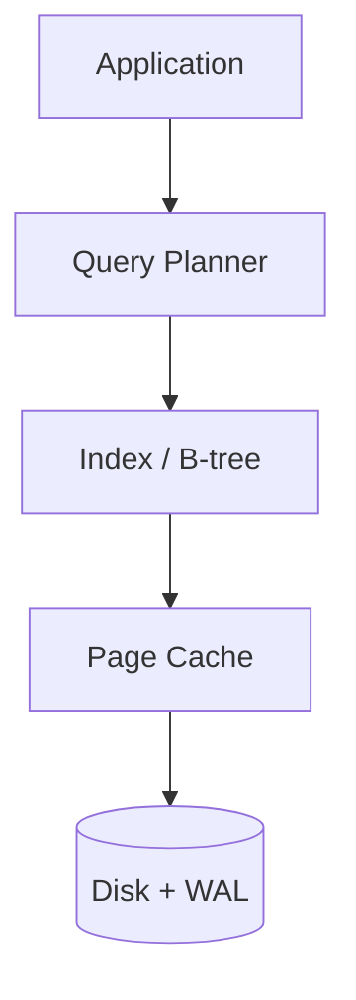

---


## 2.1 Normalization/Denormalizatio


### What is it?

**Normalization** organizes data into related tables to eliminate redundancy and update anomalies, following normal forms (1NF through 5NF). **Denormalization** intentionally duplicates data across tables or documents to optimize read performance at the cost of write complexity.

### Why it matters

Normalized schemas preserve integrity and simplify updates; denormalized schemas reduce JOINs and speed reads at scale. Most production systems normalize the OLTP core and denormalize read models (CQRS, materialized views).

### How it works

**Normalization:**
1. Split repeating groups into separate tables (1NF).
2. Remove partial dependencies on composite keys (2NF).
3. Remove transitive dependencies (3NF) - most OLTP targets 3NF.
4. Enforce relationships via foreign keys.

**Denormalization:**
1. Identify hot read paths with expensive JOINs.
2. Duplicate columns or embed documents (e.g., order line items in order doc).
3. Update all copies on write or accept eventual consistency via events.

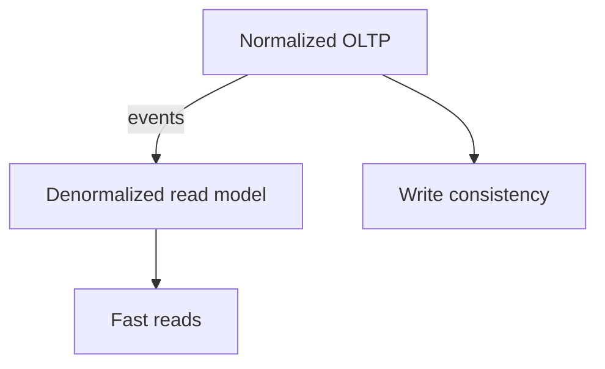

### Key details

- 3NF: every non-key attribute depends only on the key
- Denormalization common in analytics, caches, and NoSQL document stores
- **Star schema** in warehouses denormalizes dimensions around facts
- Trade update anomalies for read speed consciously

### When to use

- Normalize: transactional systems, frequently updated data
- Denormalize: read-heavy dashboards, search indexes, embedded documents

### Trade-offs / Pitfalls

- Denormalized data drifts if update paths missed
- Over-normalization causes JOIN explosion
- BCNF/4NF rarely needed in practice - diminishing returns
- Microservices often denormalize across service boundaries via events

---


## 2.2 Indexing


### What is it?

An **index** is a separate data structure (usually a **B+ tree** in relational DBs) that maps indexed column values to row locations. It lets the database find rows by key in **O(log n)** page lookups instead of scanning every row (**O(n)** sequential scan).

Think of a book index: you look up a term in the index, jump to the page - you don't read every page.

Indexes are **not free** - every `INSERT`/`UPDATE`/`DELETE` must also update index entries.

### Why it matters

On a table with 100 million rows, `WHERE user_id = 123` without an index reads millions of pages (seconds to minutes). With an index on `user_id`, the same query reads ~3-4 pages (milliseconds). Indexing is often the **largest single lever** for OLTP performance.

Wrong indexes waste disk, slow writes, and fool the optimizer into bad plans.

### How it works

1. Query arrives: `SELECT name FROM users WHERE email = 'a@b.com'`
2. **Query planner** estimates cost of seq scan vs index scan
3. If selective enough, planner chooses **index seek** on `email` index
4. Index returns row IDs (or primary key) pointing to heap/table rows
5. Database fetches row data (unless **covering index** has all columns)

**Index types:**

| Type | Structure | Best for |
|------|-----------|----------|
| B-tree (default) | Balanced tree | Equality, range, sorting |
| Hash | Hash table | Equality only (PostgreSQL) |
| GIN/GiST | Inverted/generalized | Full-text, JSON, geo |
| Partial | Subset of rows | `WHERE status = 'active'` |
| Composite | Multiple columns | Multi-column WHERE/JOIN |

**Composite index left-prefix rule:**

Index on `(last_name, first_name)` supports:
- `WHERE last_name = 'Smith'` - yes
- `WHERE last_name = 'Smith' AND first_name = 'John'` - yes
- `WHERE first_name = 'John'` alone - **no** (cannot use index efficiently)

**Covering index (index-only scan):**

Index includes all columns in SELECT: `CREATE INDEX idx ON users(email) INCLUDE (name)`  
Query reads only index pages - never touches heap -> fastest path.

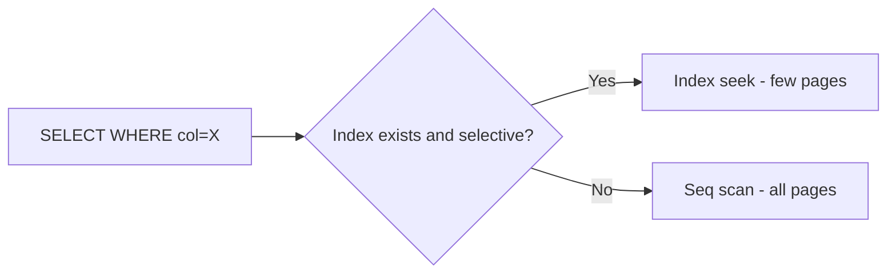

**Clustered vs non-clustered:**

- **Clustered (InnoDB PK):** row data stored in index leaf pages - table IS the PK index
- **Non-clustered:** index leaves hold pointer to heap row (PostgreSQL secondary indexes)

### Key details

- **Selectivity:** index helps when predicate filters small fraction of rows (`user_id` good; `gender` alone often bad)
- **Write amplification:** 5 indexes on a table = 5 extra writes per INSERT
- **Index bloat:** dead tuples from updates -> `REINDEX`, `VACUUM` (PostgreSQL)
- **Functions break indexes:** `WHERE LOWER(email) = 'x'` won't use index on `email` unless expression index
- **EXPLAIN ANALYZE** is mandatory to verify index usage in production queries
- Foreign keys should almost always be indexed (JOIN and CASCADE performance)

### When to use

- Columns in `WHERE`, `JOIN ON`, `ORDER BY` with high cardinality
- Foreign key columns
- Columns used for range queries (`created_at`, `price`)
- Avoid indexing boolean/low-cardinality columns alone unless partial index

### Trade-offs / Pitfalls

- Too many indexes slow writes and increase storage (SSD still costs money)
- Wrong column order in composite index -> index unused
- Optimizer may choose seq scan if it estimates most rows match anyway
- Index maintenance during bulk load - drop index, load, recreate is faster
- Unique index enforces constraint but adds write cost on every insert

### References

- PostgreSQL EXPLAIN documentation; Use The Index, Luke (use-the-index-luke.com)

---


## 2.3 B Tree/B+ Tree


### What is it?

**B-trees** and **B+ trees** are **balanced search trees** optimized for **block-oriented storage** (disk, SSD pages). Instead of binary tree nodes with 2 children, each node holds **hundreds of keys** (high **fanout**), keeping tree height very shallow—typically 3–4 levels for billions of rows.

| Variant | Internal nodes | Leaf nodes |
|---------|----------------|------------|
| **B-tree** | Keys + pointers to children **and** optionally row data | May hold data |
| **B+ tree** | Keys + pointers only (routing) | **All** data/pointers; leaves **linked** for range scans |

**PostgreSQL, MySQL InnoDB, SQLite** use B+ tree (or close variants) for primary and secondary indexes. One **page** (often 8–16 KB) = one node.

**Why "B"?** Originally "Bayer/Balanced"; think **"bushy"** (wide nodes, short trees).

### Why it matters

Almost every OLTP **index seek** and **range scan** is a B+ tree walk. Performance is measured in **page reads**, not pointer hops:

```text
1 billion rows, fanout ~500:
  height ≈ log₅₀₀(10⁹) ≈ 3.4 → 4 page reads worst case for point lookup
```

Understanding **splits**, **fill factor**, and **clustered vs secondary** indexes explains:

- Why `WHERE id = 123` is microseconds but `WHERE unindexed_col = x` scans millions of pages
- Why random UUID primary keys cause **write amplification** (constant page splits)
- Why `ORDER BY indexed_col LIMIT 10` is cheap (leaf chain scan, no sort)

**Interview point:** B+ tree is optimized for **disk I/O**, not CPU. Minimize pages touched.

### How it works

**Point lookup (primary key):**

1. Start at **root page**; binary search within page for key range → child pointer.
2. Repeat at internal levels until **leaf page**.
3. Leaf contains key + row (clustered) or key + PK pointer (secondary).
4. Total I/O ≈ **tree height** page reads (often cached in buffer pool).

**Range scan (`WHERE age BETWEEN 20 AND 30`):**

1. Seek to first key ≥ 20 in leaf.
2. Walk **leaf linked list** sequentially until key > 30.
3. No backtracking up the tree—leaves are a sorted linked chain.

**Insert:**

1. Find target leaf.
2. If leaf has space → insert in sorted order.
3. If leaf **full** → **split** into two leaves, promote **middle key** to parent.
4. If parent full → split propagates upward; rare **root split** increases height by 1.

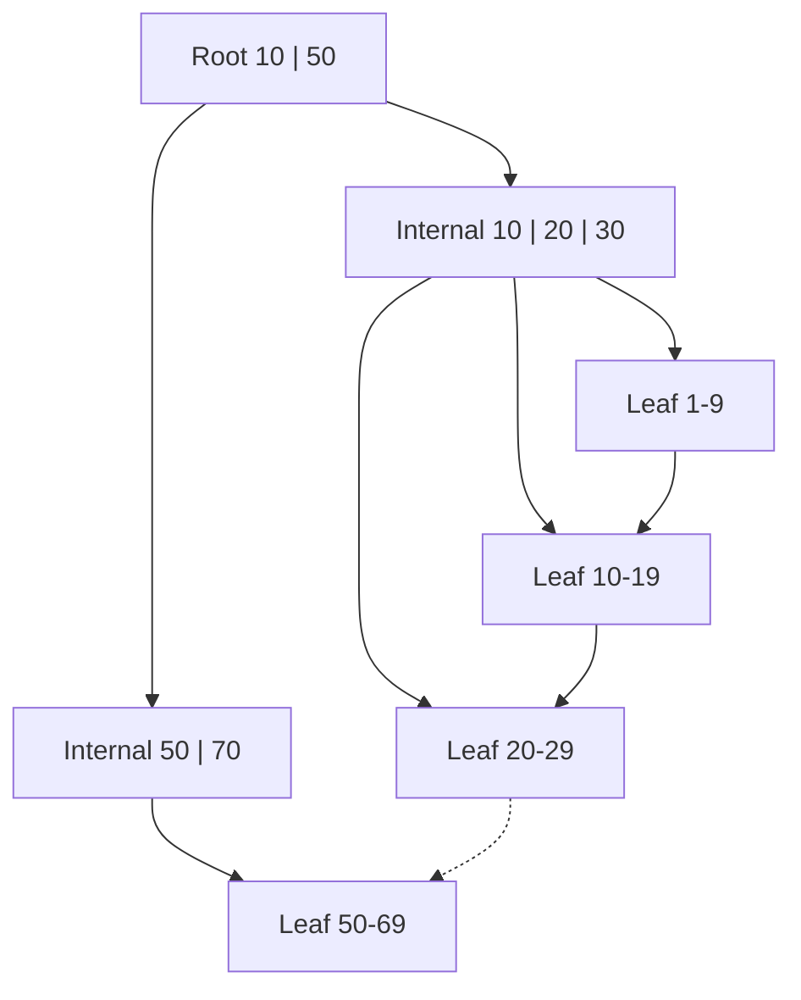

**Split worked example:**

```text
Leaf full: [10, 15, 20, 25, 30]  (max 4 keys — simplified)

Split →
  Left leaf:  [10, 15]
  Right leaf: [25, 30]
  Parent promotes separator: 20

New insert 22 goes to right leaf.
```

**Delete:** Remove key; if leaf **underflows** (< 50% fill typically), **merge** with sibling or **borrow** from sibling; may shrink height if root empties.

**Pseudo-code (search):**

```text
function search(node, key):
    while node is not leaf:
        child = find_child_pointer(node.keys, key)
        node = load_page(child)
    return binary_search(node.leaf_keys, key)
```

### Key details

**Pages and fanout**

| Parameter | Typical value | Effect |
|-----------|---------------|--------|
| Page size | 8 KB (PostgreSQL), 16 KB (InnoDB) | Larger → more keys/node, shallower tree |
| Fanout | 100–500 keys/internal node | Higher → fewer I/Os per lookup |
| Fill factor | ~90% after bulk load; ~50% min on delete | Low fill → wasted space, more pages |

**Clustered vs secondary (InnoDB vs PostgreSQL):**

| Engine | Clustered index | Secondary index leaf |
|--------|-----------------|----------------------|
| **InnoDB** | PK leaf = **full row** | Stores **PK values** → extra lookup (bookmark lookup) |
| **PostgreSQL** | Table heap separate; PK index like secondary | Leaf has **TID** (block, offset) → heap fetch |

**Range vs point:**

```sql
-- Point: 3–4 page reads (index seek)
SELECT * FROM users WHERE id = 42;

-- Range: seek + scan along leaf chain
SELECT * FROM users WHERE created_at BETWEEN '2024-01-01' AND '2024-01-31';

-- Covering index: never touch heap if all columns in index
SELECT email FROM users WHERE id = 42;  -- if index is (id, email)
```

**Write amplification:** Random inserts (UUID v4 PK) land in random leaves → splits on hot pages spread across tree; sequential inserts (auto-increment, time-ordered) append to right edge → fewer splits.

**Interview point:** Secondary index lookup in InnoDB = **index seek + table lookup** (unless covering). PostgreSQL = index + heap TID fetch (visibility check).

### When to use

- **Default** for relational indexes (equality, range, `ORDER BY`, prefix `LIKE 'abc%'`)
- **Composite indexes** for multi-column predicates (left-prefix rule)
- **Moderate write rates** with read-heavy OLTP
- **Not** the only option: full-table analytics scans may prefer seq scan; extreme write throughput may prefer **LSM** (RocksDB, Cassandra)

### Trade-offs / Pitfalls

| Pitfall | Effect | Mitigation |
|---------|--------|------------|
| Random UUID PK | Page splits, fragmented inserts | UUID v7 (time-ordered), SERIAL, or separate surrogate key |
| Wide rows | Lower fanout, deeper tree | Narrow PK; vertical partitioning |
| Over-indexing | Every write updates all indexes | Index only queried columns |
| Ignoring clustering | Secondary queries cause random heap I/O | Cluster related columns in PK (carefully) |
| Assuming O(log n) CPU | Constant is **page I/O** | Fit hot pages in buffer pool |
| LSM comparison | B+ tree worse at **sustained write** throughput | Choose engine for workload (OLTP vs ingest) |
| Full scan cheaper | Optimizer skips index when % rows large | Update statistics; understand selectivity |

**B+ tree vs LSM (interview summary):**

| | B+ tree (InnoDB, Postgres) | LSM (RocksDB, Cassandra) |
|---|---------------------------|--------------------------|
| Reads | Few page reads, predictable | May merge multiple SSTables |
| Writes | In-place + splits (random I/O) | Sequential append + async merge |
| Best for | OLTP read-heavy | Write-heavy ingest |

### References

- [B-Tree and B+ Tree  -  data structures video](https://www.youtube.com/watch?v=aZjYr87r1b8)

---


## 2.4 Query Planner/ optimizer


### What is it?

The **query planner** (optimizer) chooses how to execute a SQL statement - join order, index vs. scan, parallel workers - based on **statistics**, **cost model**, and **available indexes**. Goal: minimize estimated total cost (I/O + CPU).

### Why it matters

Identical SQL can run in milliseconds or minutes depending on plan chosen. Understanding planners explains why `EXPLAIN` matters and why statistics must be current.

### How it works

1. Parse SQL into query tree.
2. Generate candidate plans (join algorithms: nested loop, hash, merge).
3. Estimate row counts using table statistics (histograms, ndistinct).
4. Assign cost to each plan; pick lowest estimated cost.
5. Execute plan; optionally adapt (adaptive join in SQL Server, etc.).

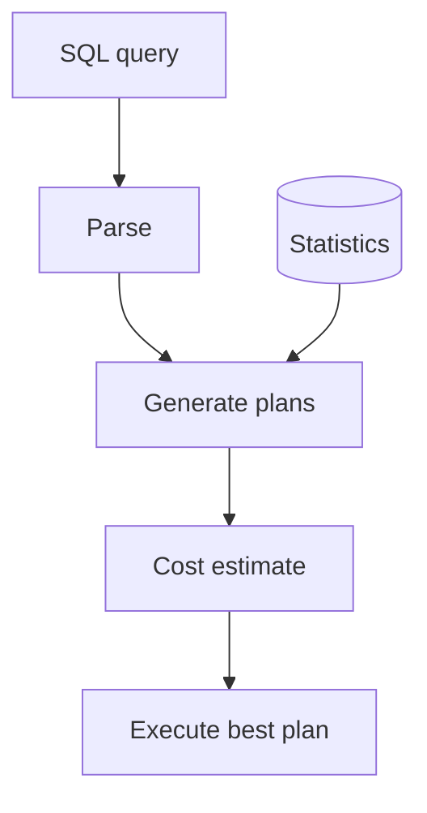

### Key details

- **EXPLAIN ANALYZE** compares estimate vs. actual rows - detects stale stats
- **Parameter sniffing:** plan cached for first parameter values may be wrong for others
- Hints available but discouraged (optimizer usually smarter with good stats)
- Correlated subqueries sometimes optimized to joins (decorrelation)

### When to use

- Debugging slow queries (always EXPLAIN first)
- After large data changes (run ANALYZE)
- Index design validation

### Trade-offs / Pitfalls

- Bad statistics -> catastrophic plan (nested loop on huge table)
- Overly complex SQL defeats optimizer
- OR conditions often prevent index use
- Cost models differ per DB - tuning knowledge doesn't fully transfer

### References

- [Query Planner and Optimizer  -  video](https://www.youtube.com/watch?v=fj9pK8isRA4)

---


## 2.5 Views/ Materialized View


### What is it?

A **view** is a stored SQL query acting as a virtual table - no data stored, computed on each access. A **materialized view** physically stores the query result and must be refreshed to reflect base table changes.

### Why it matters

Views simplify complex queries and enforce access control. Materialized views accelerate expensive aggregations (dashboards, reports) without hitting raw tables every time.

### How it works

**View:**
1. `CREATE VIEW v AS SELECT ...`
2. Queries against `v` expand to underlying SQL at plan time.
3. Optimizer may push predicates through to base tables.

**Materialized view:**
1. `CREATE MATERIALIZED VIEW mv AS SELECT ...`
2. Result stored on disk like a table.
3. `REFRESH MATERIALIZED VIEW` (full or concurrent) updates snapshot.

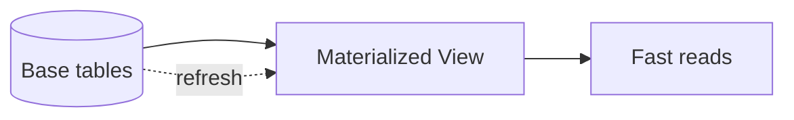

### Key details

- PostgreSQL supports concurrent refresh (unique index required)
- Incremental refresh possible in some systems (Oracle, SQL Server indexed views)
- Views can be **updatable** if simple enough (single table, no aggregation)
- Staleness window between refreshes

### When to use

- View: security abstraction, query simplification
- Materialized view: heavy aggregations, pre-computed joins for BI

### Trade-offs / Pitfalls

- Materialized view storage cost and refresh load
- Full refresh locks reads in some DBs without CONCURRENTLY
- Stale MV misleads users if refresh lag unmonitored
- Complex views may prevent predicate pushdown

### References

- [Views and Materialized Views  -  SQL video](https://www.youtube.com/watch?v=XI1rk1Uaf7U)

---


## 2.6 Isolation Levels


### What is it?

**Transaction isolation levels** define which **concurrency anomalies** are allowed when multiple transactions run at the same time. Higher isolation = stricter rules = fewer bugs visible to users, but more locking/abort overhead.

SQL standard defines four levels (weakest → strongest):

```text
READ UNCOMMITTED → READ COMMITTED → REPEATABLE READ → SERIALIZABLE
```

Each level forbids certain **phenomena** (anomalies):

| Phenomenon | Definition |
|------------|------------|
| **Dirty read** | Transaction T2 reads data written by T1 that T1 has **not committed** (may roll back) |
| **Non-repeatable read** | T1 reads row twice; T2 **updates** row between reads; T1 sees different values |
| **Phantom read** | T1 runs same range query twice; T2 **inserts/deletes** rows matching range; T1 sees different row set |

**Lost update** (not always in SQL table but interview favorite): two transactions read same value, both increment, both write—one update lost.

### Why it matters

Too **weak** isolation → production bugs that are hell to reproduce:

```text
Double booking: two txs both see "1 seat left", both sell it → oversold
Wrong balance: read uncommitted sees rolled-back transfer
Report drift: repeatable needed for consistent financial snapshot
```

Too **strong** isolation → throughput collapse:

```text
SERIALIZABLE under contention → many serialization failures → retry storms
Lock waits on hot rows → p99 latency spikes
```

**Real defaults differ:**

| Database | Default isolation |
|----------|-------------------|
| **PostgreSQL** | READ COMMITTED |
| **MySQL InnoDB** | REPEATABLE READ |
| **SQL Server** | READ COMMITTED |

**Interview point:** "Repeatable read" in PostgreSQL ≠ MySQL—Postgres RR uses MVCC snapshots and **prevents phantoms** for standard queries; classic SQL RR definition still allows phantoms.

### How it works

**Lifecycle (conceptual):**

1. Transaction `BEGIN`; isolation level set (`SET TRANSACTION ISOLATION LEVEL ...` or session default).
2. Each **read** either: reads latest committed (RC), holds shared lock (locking RR), or reads **snapshot** (MVCC).
3. Each **write** creates new row version or acquires exclusive lock.
4. Conflicts detected at **read time**, **write time**, or **commit time** depending on implementation.
5. **Serializable** goal: observed behavior equals **some serial execution order** of transactions.

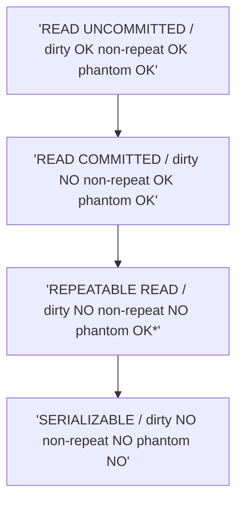

**Standard SQL anomaly matrix:**

| Level | Dirty read | Non-repeatable read | Phantom read |
|-------|------------|---------------------|--------------|
| READ UNCOMMITTED | Possible | Possible | Possible |
| READ COMMITTED | **Not** | Possible | Possible |
| REPEATABLE READ | **Not** | **Not** | Possible* |
| SERIALIZABLE | **Not** | **Not** | **Not** |

*PostgreSQL REPEATABLE READ prevents phantoms via snapshot; InnoDB RR uses next-key locks to prevent phantoms.

**Worked example — dirty read (READ UNCOMMITTED only):**

```text
T1: BEGIN
T1: UPDATE accounts SET balance = 0 WHERE id = 1  -- not committed
T2: BEGIN (READ UNCOMMITTED)
T2: SELECT balance FROM accounts WHERE id = 1  → 0   -- dirty!
T1: ROLLBACK
T2: believed balance was 0 — wrong decision
```

**Worked example — non-repeatable read (READ COMMITTED allows):**

```text
T1: BEGIN
T1: SELECT balance FROM accounts WHERE id = 1  → 100
T2: BEGIN
T2: UPDATE accounts SET balance = 50 WHERE id = 1
T2: COMMIT
T1: SELECT balance FROM accounts WHERE id = 1  → 50   -- different!
T1: COMMIT
```

**Worked example — phantom read:**

```text
T1: BEGIN
T1: SELECT COUNT(*) FROM rooms WHERE hotel_id = 5 AND booked = false  → 1
T2: BEGIN
T2: INSERT INTO rooms (...) booked = false  -- new available room row
T2: COMMIT
T1: SELECT COUNT(*) ...  → 2   -- phantom row appeared
T1: COMMIT
```

**Implementation mechanisms:**

| Approach | Used by | How |
|----------|---------|-----|
| **Locking** | SQL Server RC/RR | Shared locks on read; exclusive on write |
| **MVCC snapshots** | PostgreSQL, InnoDB | Readers see snapshot; writers new versions |
| **SSI (Serializable Snapshot Isolation)** | PostgreSQL SERIALIZABLE | Tracks rw-dependencies; abort on dangerous cycles |

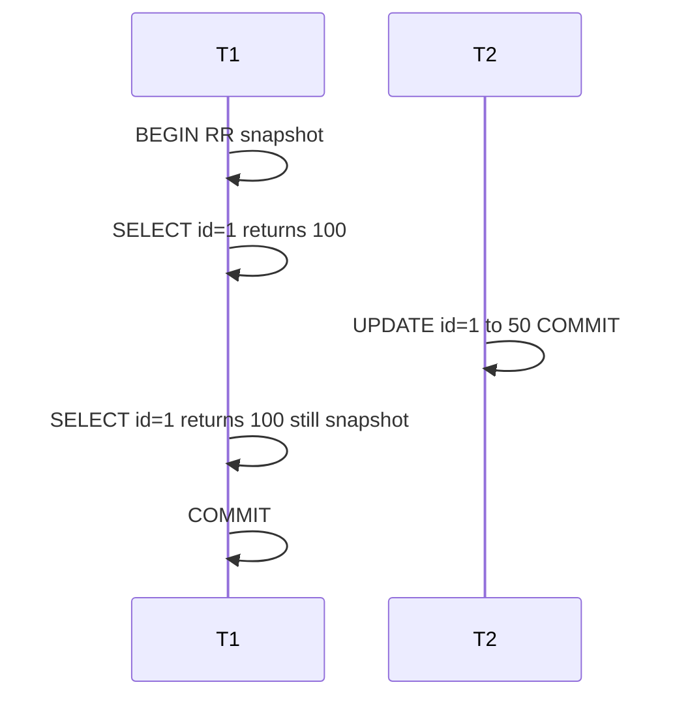

### Key details

**PostgreSQL specifics:**

- **READ COMMITTED:** each **statement** sees a fresh snapshot of committed data.
- **REPEATABLE READ:** one snapshot for entire transaction; no phantoms for normal SELECT.
- **SERIALIZABLE:** SSI—may get `40001 serialization_failure` → app must retry.

**InnoDB REPEATABLE READ:**

- Consistent **read view** at first consistent read.
- **Next-key locks** (gap + record) on indexes prevent phantom inserts in locking reads (`SELECT ... FOR UPDATE`).

**Choosing level (practical):**

```sql
-- Report needing stable numbers for one txn
BEGIN ISOLATION LEVEL REPEATABLE READ;
SELECT SUM(amount) FROM ledger WHERE date = CURRENT_DATE;
SELECT COUNT(*) FROM ledger WHERE date = CURRENT_DATE;
COMMIT;  -- both see same snapshot

-- Financial invariant: transfer must not interleave
BEGIN ISOLATION LEVEL SERIALIZABLE;
-- debit + credit
COMMIT;  -- or retry on conflict
```

**Interview point:** Application can emulate stronger invariants with `SELECT FOR UPDATE` even at RC—but deadlocks and lock order matter.

### When to use

| Level | Typical use |
|-------|-------------|
| **READ COMMITTED** | Default web OLTP; short transactions; acceptable occasional re-read |
| **READ UNCOMMITTED** | Rare; analytics approximations (most DBs map to RC anyway) |
| **REPEATABLE READ** | Single-txn reports, batch read consistency, migration validation |
| **SERIALIZABLE** | Critical invariants (inventory, ledger) when app locking is error-prone |

### Trade-offs / Pitfalls

| Pitfall | Consequence | Mitigation |
|---------|-------------|------------|
| ORM default ≠ DB default | Unexpected anomalies | Explicit isolation in connection pool |
| Long RR/Serializable txn | Blocks vacuum, holds locks, retries | Keep serializable txns short |
| Retry not implemented for SSI | User sees random errors | Catch `40001`, exponential backoff |
| Distributed txs across DBs | No global isolation level | Saga, outbox, idempotency |
| Assuming same name = same behavior | Postgres RR ≠ SQL Server RR | Read engine docs |
| RC + read-modify-write race | Lost update | `UPDATE ... WHERE version = ?` or `FOR UPDATE` |
| Phantom under RC | Double booking in gap | `FOR UPDATE`, unique constraints, SERIALIZABLE |

**Lost update fix pattern (optimistic locking):**

```sql
UPDATE products SET stock = stock - 1, version = version + 1
WHERE id = 42 AND version = 7;
-- if rows_affected = 0 → retry
```

### References

- [Isolation Levels  -  database concurrency video](https://www.youtube.com/watch?v=89YYHMYfymk)

---


## 2.7 MVCC


### What is it?

**Multi-Version Concurrency Control (MVCC)** stores **multiple versions** of each logical row. Readers access a **snapshot** of the database as of a point in time; writers create **new versions** without overwriting old ones in place. Old versions are reclaimed later by **vacuum** (PostgreSQL) or **purge** (InnoDB).

Core idea: **readers don't block writers; writers don't block readers** (for normal reads). Conflicts appear on **write-write** overlap or under **serializable** rules.

**PostgreSQL row versioning (conceptual columns on every tuple):**

| Field | Meaning |
|-------|---------|
| `xmin` | Transaction ID that **inserted** this version |
| `xmax` | Transaction ID that **deleted/updated** this version (0 if live) |
| `ctid` | Physical location (block, offset); updates create new tuple with new ctid |

### Why it matters

MVCC is how PostgreSQL, InnoDB, Oracle, and others sustain **high read concurrency** without shared read locks on row data. A long-running report and a burst of writes can coexist—reports see a stable snapshot; writes append new versions.

Without understanding MVCC you cannot debug:

- **Table bloat** (dead tuples not vacuumed)
- **Transaction ID wraparound** emergencies (PostgreSQL)
- **Write skew** under snapshot isolation
- **Index-only scan** failures (visibility map stale)

**Interview point:** UPDATE in Postgres = INSERT new tuple + mark old deleted—not in-place overwrite.

### How it works

**Transaction IDs and snapshots:**

1. Each transaction gets a **xid** (PostgreSQL) or **read view** (InnoDB trx id).
2. On first statement, engine builds **snapshot**: set of active xids at that instant.
3. **Visibility rule** (PostgreSQL, simplified): tuple version is visible if:
   - `xmin` is **committed** and was committed **before** snapshot
   - AND (`xmax` is 0 OR `xmax` transaction **not committed** at snapshot time OR `xmax` started after snapshot)

**UPDATE path:**

```text
Row v1: (id=1, balance=100)  xmin=100, xmax=0

Txn 200 UPDATE balance=80:
  - Insert v2: (id=1, balance=80)  xmin=200, xmax=0
  - Mark v1: xmax=200
  - Both exist until vacuum removes v1
```

**DELETE path:** Set `xmax` on latest version; no new row (unless soft-delete pattern).

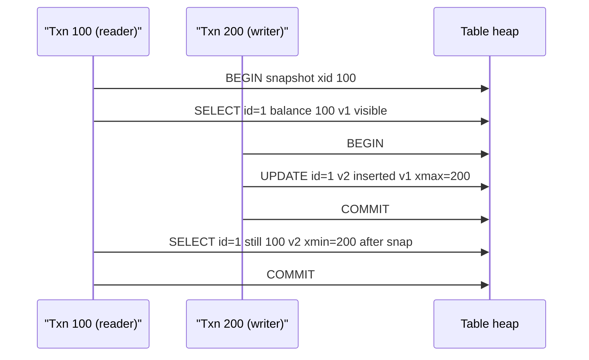

**Visibility pseudo-code (PostgreSQL-style):**

```text
function is_visible(tuple, snapshot):
    if xmin_txn not committed: return false
    if xmin_txn in snapshot.active: return false  // started after reader
    if xmax == 0: return true
    if xmax_txn not committed: return true        // delete not yet final
    if xmax_txn in snapshot.active: return true // deleted after reader snap
    return false                                  // deleted before reader saw it
```

**Vacuum / purge:**

```text
When no active snapshot needs old versions:
  VACUUM marks space in pages as reusable (PostgreSQL)
  PURGE thread reclaims undo log space (InnoDB)
```

Long-running transactions **pin** old snapshots → vacuum cannot remove dead tuples → **bloat**.

**PostgreSQL concurrent read/write (default READ COMMITTED):**

| Statement | Snapshot taken |
|-----------|----------------|
| Each SELECT in RC | New snapshot at statement start |
| Entire txn in RR | One snapshot at first statement |

**Write-write conflict:**

```text
T1: UPDATE row SET x=1 WHERE id=5  -- waits if T2 holds row lock (FOR UPDATE path)
T2: UPDATE row SET x=2 WHERE id=5  -- second commit wins or deadlock depending on timing
```

Plain MVCC UPDATE takes **row-level exclusive lock** on latest version during update—two writers still serialize on same row.

### Key details

**Snapshot isolation vs serializable:**

| Property | Snapshot isolation (RR in PG) | Serializable (SSI) |
|----------|------------------------------|---------------------|
| Read-write conflicts | Readers ignore writers | Tracks dependencies |
| Write skew | **Possible** | Detected → abort |
| Phantom (normal SELECT) | Prevented in PG RR | Prevented |

**Write skew classic example:**

```text
Constraints: at least one doctor on duty (application-enforced)

T1: SELECT count(on duty) → 1; thinks OK to set Alice off
T2: SELECT count(on duty) → 1; thinks OK to set Bob off
T1: UPDATE Alice off; COMMIT
T2: UPDATE Bob off; COMMIT
→ zero on duty — neither txn saw the other's write in snapshot
```

Fix: `SERIALIZABLE`, `SELECT FOR UPDATE` on duty rows, or constraint trigger.

**InnoDB MVCC (differences):**

- Versions stored in **undo log** (rollback segment); base row overwritten in place for latest version.
- **Read view** hides trx ids newer than view or not committed.
- **Purge** async cleans undo history.

**PostgreSQL operational:**

| Issue | Cause | Fix |
|-------|-------|-----|
| Table bloat | Long txn + autovacuum lag | Kill long queries; tune autovacuum |
| Xid wraparound | ~2 billion xids; old DB not vacuumed | Aggressive vacuum freeze |
| Index-only scan miss | Visibility map not set | VACUUM; heap fetches required |

**HOT (Heap-Only Tuple):** PostgreSQL optimization—if UPDATE doesn't change indexed columns, new version stays on same page without new index entries.

**Interview point:** MVCC trades **storage** (dead tuples) for **read concurrency**. Vacuum is not optional housekeeping—it is correctness + space + xid safety.

### When to use

- **Implicit:** PostgreSQL and InnoDB use MVCC by default—you design **with** it.
- **Connection pools:** Keep transactions short; return connections with `ROLLBACK` if needed.
- **Reporting:** `REPEATABLE READ` or replica snapshot for consistent exports.
- **Debugging:** `pg_stat_activity.xact_start`, `age(datfrozenxid)` for wraparound risk.
- **Choosing isolation:** Pair MVCC with RC for OLTP; SSI when app-level locking is insufficient.

### Trade-offs / Pitfalls

| Pitfall | Symptom | Mitigation |
|---------|---------|------------|
| Long open transaction | Bloat, vacuum can't truncate | Timeouts; avoid txn in ORM lazy session |
| Assuming reads never block writes | Locking reads (`FOR UPDATE`) block | Know when locks taken |
| Write skew under RR | Invariant violated | SERIALIZABLE or explicit locks |
| Stale index-only scans | Extra heap fetches | Regular VACUUM |
| ORM `@Transactional` spanning HTTP | Holds snapshot minutes | Transaction per request |
| Monitoring only live rows | Disk usage grows | Track dead tuples `n_dead_tup` |
| InnoDB undo bloat | Disk full on undo tablespace | Tune purge; shorten long reads |

**Worked example — bloat math:**

```text
1M updates/day on hot row → 1M dead tuples/day if vacuum delayed
Each tuple ~100 bytes → ~100 MB/day bloat on one row hotspot (extreme)
Real tables: millions of dead tuples → seq scans slow, indexes fat
```

### References

- [MVCC  -  multi-version concurrency video](https://www.youtube.com/watch?v=TBmDBw1IIoY)

---


## 2.8 Redo/undo/bin Logs


### What is it?

Database **logs** ensure durability and recoverability: **redo log** (WAL) records changes to reapply after crash; **undo log** records old values to rollback uncommitted transactions; **binlog** (MySQL) streams changes for replication and CDC.

### Why it matters

Without WAL, committed transactions lost on crash. Without undo, rollback impossible. Binlog enables replicas and event-driven architectures.

### How it works

1. Transaction modifies pages in memory.
2. **WAL/redo** record written and fsynced **before** commit ack.
3. Dirty pages flushed later (checkpoint).
4. Crash recovery: redo committed, undo in-flight transactions.
5. Binlog written for replication (may be sync or async with redo).

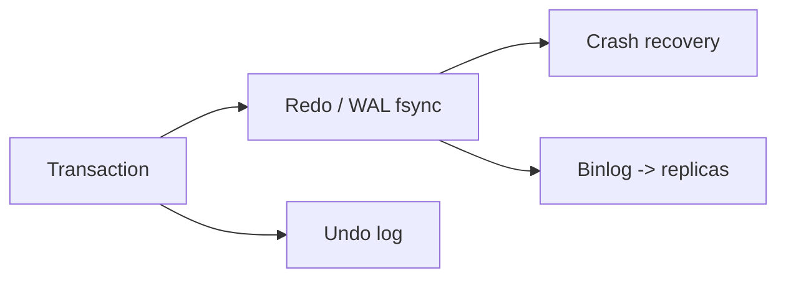

### Key details

- **Write-ahead logging:** log before data page on disk
- PostgreSQL WAL segments; InnoDB redo log files circular
- **Group commit** batches fsync for throughput
- Logical vs. physical redo differs per DB

### When to use

- Understanding commit latency (fsync bound)
- Replication lag troubleshooting
- CDC pipelines (Debezium reads binlog/WAL)

### Trade-offs / Pitfalls

- Sync binlog + sync redo = highest durability, slowest commits
- WAL disk full stops all writes
- Long-running txn prevents undo log purge
- Confusing redo (physical) with binlog (logical) in MySQL

### References

- [Redo, Undo, and Bin Logs  -  video](https://www.youtube.com/watch?v=47LvbDGD4cc)

---


## 2.9 LSM Tree/SSTables/WAL


### What is it?

**Log-Structured Merge (LSM) trees** buffer writes in memory (**memtable**), flush immutable **SSTables** (Sorted String Tables) to disk, and periodically **compact** overlapping files. **WAL** (write-ahead log) ensures durability before memtable ack. Used in RocksDB, LevelDB, Cassandra, HBase, DynamoDB.

### Why it matters

LSM excels at **high write throughput** and sequential I/O - ideal for time-series, messaging metadata, and write-heavy KV stores. Trade-off: read amplification and compaction overhead.

### How it works

1. Write appended to WAL, then memtable (in-memory sorted structure).
2. Memtable full -> flush to disk as new SSTable (sorted, immutable).
3. Read checks memtable + SSTables (bloom filters skip irrelevant files).
4. **Compaction** merges SSTables, discards tombstones, reduces read amplification.
5. Levels (L0, L1,  - ) organize size-tiered or leveled compaction.

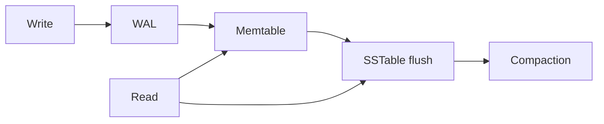

### Key details

- **Write amplification:** rewriting data during compaction
- **Read amplification:** checking multiple SSTables per read
- **Bloom filter:** probabilistic "key not in this file" skip
- Tombstones mark deletes until compaction purges

### When to use

- Write-heavy workloads (logging, IoT, counters)
- Key-value and wide-column stores
- When sequential write bandwidth matters

### Trade-offs / Pitfalls

- Read latency less predictable than B-tree
- Compaction can cause latency spikes (I/O contention)
- Space amplification until compaction runs
- Range delete expensive (many tombstones)

### References

- [LSM Trees  -  video overview](https://www.youtube.com/watch?v=P2xtlLymqqI)
- [LSM Trees deep dive  -  Medium article](https://medium.com/@dwivedi.ankit21/lsm-trees-the-go-to-data-structure-for-databases-search-engines-and-more-c3a48fa469d2)

---


## 2.10 Page Cache


### What is it?

The **page cache** (buffer pool) is DB-managed memory holding frequently accessed **disk pages** (typically 8 - 16 KB) in RAM. Reads hit cache avoid disk; dirty pages flushed asynchronously.

### Why it matters

Disk is 1000× slower than RAM. Cache hit ratio dominates OLTP performance. Sizing buffer pool correctly is primary DB tuning knob.

### How it works

1. Read request for page ID.
2. Cache lookup; **hit** -> return from memory.
3. **Miss** -> read from disk, insert into cache (evict LRU/LFU page if full).
4. Write modifies page in cache; marks dirty.
5. Background writer/checkpointer flushes dirty pages; WAL ensures durability before ack.

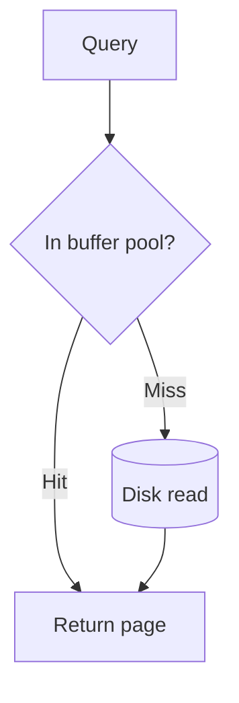

### Key details

- PostgreSQL: `shared_buffers`; InnoDB: `innodb_buffer_pool_size`
- Target 70 - 80% of RAM on dedicated DB server (leave OS cache room)
- **Double buffering:** OS page cache + DB cache - some DBs use direct I/O
- Cold cache after restart causes temporary slow period

### When to use

- Sizing any dedicated database server
- Explaining post-restart performance dip
- Distinguishing DB cache from OS cache in troubleshooting

### Trade-offs / Pitfalls

- Too small -> excessive disk I/O
- Too large -> memory pressure, swapping kills performance
- Full table scan evicts hot pages (scan pollution)
- Monitoring hit ratio alone misses query efficiency

### References

- [Page Cache  -  database memory video](https://www.youtube.com/watch?v=syPEMXQwaYQ)

---


## 2.11 Vacuum Process


### What is it?

**VACUUM** (PostgreSQL terminology; similar concepts elsewhere) reclaims space from dead row versions left by MVCC updates/deletes, updates visibility map, and prevents transaction ID wraparound.

### Why it matters

Without vacuum, tables bloat (disk grows, scans slow) and PostgreSQL risks **xid wraparound** shutdown. Autovacuum is critical background maintenance.

### How it works

1. MVCC leaves dead tuples when rows updated/deleted.
2. Vacuum scans pages marking dead space reusable.
3. **Autovacuum** triggers based on dead tuple count threshold.
4. **VACUUM FULL** rewrites table compactly (exclusive lock).
5. Freezes old xids to prevent wraparound.

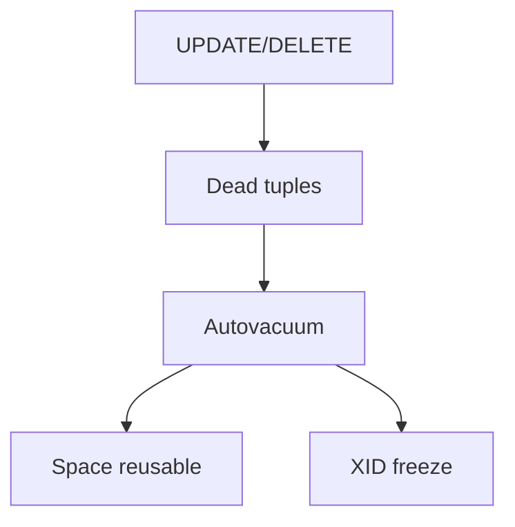

### Key details

- Long transactions block vacuum (dead tuples accumulate)
- Visibility map enables index-only scans after vacuum
- Bloat measurable via `pg_stat_user_tables`, pgstattuple
- Tune `autovacuum_vacuum_scale_factor` for high-churn tables

### When to use

- PostgreSQL operational maintenance
- Investigating table growth without row count growth
- After bulk deletes (manual VACUUM ANALYZE)

### Trade-offs / Pitfalls

- VACUUM FULL downtime on large tables
- Aggressive autovacuum increases I/O
- Not all dead space returned to OS (only marked reusable)
- Replication slots can block WAL removal similarly

### References

- [Vacuum Process  -  PostgreSQL maintenance video](https://www.youtube.com/watch?v=fTl8-pnaJCE)

---


## 2.12 Key Value Stores


### What is it?

**Key-value stores** map opaque keys to blob values with simple get/put/delete operations - no query language, no joins. Examples: Redis, DynamoDB, Riak, etcd (with consistency features).

### Why it matters

Simplest data model enables extreme scale, low latency, and flexible schema. Foundation for caching, session stores, feature flags, and Dynamo-style distributed systems.

### How it works

1. Client sends key (and optional value) via API.
2. Store hashes key to partition/shard.
3. Single-key read/write typically O(1) with hash table or LSM backend.
4. Optional TTL on keys; eviction policies in memory stores.
5. Distributed KV adds replication and quorum consistency.

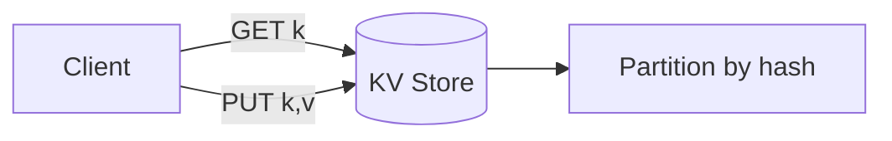

### Key details

- Redis: in-memory, rich types, pub/sub, persistence optional
- DynamoDB: managed, partition key + sort key, on-demand capacity
- Consistency tunable (strong vs. eventual read in Dynamo)
- No ad-hoc queries - access pattern must be key-known upfront

### When to use

- Session cache, rate limiting, leaderboards (Redis sorted sets)
- User preferences keyed by user ID
- High-scale simple lookups at known key

### Trade-offs / Pitfalls

- Secondary access patterns need duplicate keys or separate index
- Large values hurt performance and cost
- In-memory stores need persistence strategy for durability
- Hot keys limit partition throughput

### References

- [Key-Value Stores  -  system design video](https://www.youtube.com/watch?v=VfcRxtBKI54)

---


## 2.13 Document Databases


### What is it?

**Document databases** store semi-structured **JSON/BSON documents** with flexible schema, indexed fields, and query languages (MongoDB Query API, CouchDB views). Documents can embed arrays and nested objects.

### Why it matters

Matches object-oriented and event payloads naturally; schema evolution without migrations. Good for catalogs, content management, user profiles with varying attributes.

### How it works

1. Application inserts document with `_id` (often ObjectId).
2. Store persists BSON/JSON with optional schema validation.
3. Indexes on nested fields (e.g., `address.city`).
4. Queries filter, project, aggregate via pipeline.
5. Sharding by shard key distributes collections.

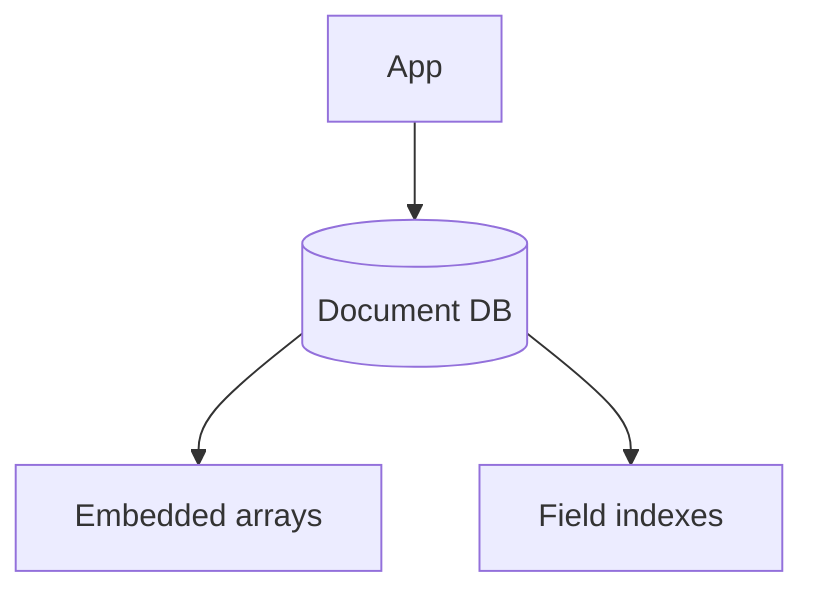

### Key details

- MongoDB: replica sets, sharded clusters, aggregation framework
- Embedding vs. referencing trade-off (1: few -> embed; many -> reference)
- **Schema validation** optional JSON Schema in MongoDB 3.6+
- Change streams for CDC

### When to use

- Heterogeneous records (products with different attributes)
- Rapid prototyping with evolving schema
- Read-heavy document retrieval by ID or indexed fields

### Trade-offs / Pitfalls

- Unbounded document growth (16 MB limit in MongoDB)
- Joins (`$lookup`) expensive - denormalize preferred
- Wrong shard key -> jumbo chunks, unbalanceable
- Transaction support added but cross-shard costly

### References

- [Document Databases  -  MongoDB overview video](https://www.youtube.com/watch?v=cODCpXtPHbQ)

---


## 2.14 Wide Column Databases


### What is it?

**Wide-column stores** (column-family) organize data by row key with **dynamic columns** grouped in families - sparse tables with billions of rows. Examples: Cassandra, HBase, ScyllaDB. Inspired by Google's Bigtable.

### Why it matters

Optimized for **massive scale writes**, time-series, and access by known row key + column qualifier. Linear scale-out on commodity hardware.

### How it works

1. Row key determines partition (hash or range).
2. Within row, columns sorted by name (wide rows possible).
3. Column families stored separately on disk (LSM backend).
4. Tunable consistency per query (ONE, QUORUM, ALL).
5. CQL (Cassandra) provides SQL-like interface.

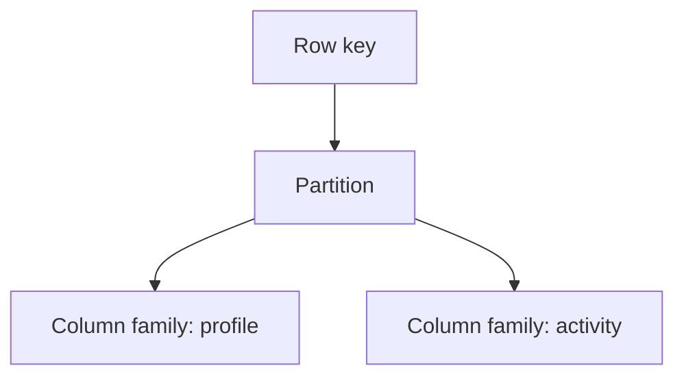

### Key details

- **Partition key** choice critical - avoid hotspots
- **Clustering columns** define sort order within partition
- No joins, no multi-partition ACID transactions (lightweight transactions limited)
- **TTL** on columns for automatic expiry

### When to use

- Time-series metrics, IoT sensor data
- High write throughput event logging
- Known access pattern: row key + column range scan

### Trade-offs / Pitfalls

- Secondary indexes weak (local index per node)
- Large partitions cause memory pressure and repair issues
- Data modeling inverted from relational (query-first design)
- Eventual consistency requires application idempotency

---


## 2.15 Graph Databases


### What is it?

**Graph databases** store **nodes** (entities) and **edges** (relationships) as first-class citizens, optimized for traversals - friends-of-friends, shortest path, pattern matching. Examples: Neo4j, Amazon Neptune, JanusGraph.

### Why it matters

Relational JOINs explode for deep graph queries (6-hop friends). Native graph stores index adjacency for millisecond traversals on connected data.

### How it works

1. Create nodes with labels and properties.
2. Create directed/undirected edges with types and properties.
3. Query with graph language (Cypher, Gremlin, SPARQL).
4. Index-free adjacency: each node points to neighbors.
5. Traversal follows pointers without expensive JOINs.


### Key details

- **Property graph** (Neo4j) vs. **RDF triple store** (semantic web)
- Depth-first traversal native; shallow wide queries also fast
- Sharding graphs harder than KV (min-cut partitioning)
- ACID transactions on subgraph in Neo4j

### When to use

- Social networks, recommendation "people also bought"
- Fraud ring detection, knowledge graphs, dependency maps
- When queries are primarily relationship traversals

### Trade-offs / Pitfalls

- Poor for bulk analytics aggregating entire graph
- Not a general-purpose OLTP replacement
- Horizontal scaling more complex than Cassandra
- Supernodes (celebrity with billion edges) need modeling tricks

---


## 2.16 Time Series Databases


### What is it?

**Time-series databases (TSDB)** optimize storage and queries for **timestamped metrics** - append-mostly writes, time-range scans, downsampling, retention policies. Examples: InfluxDB, TimescaleDB, Prometheus, QuestDB.

### Why it matters

Metrics, monitoring, IoT, and financial ticks generate enormous append-only streams. General RDBMS struggle with compression and time-range query efficiency at this scale.

### How it works

1. Data points: (timestamp, metric name, tags, value).
2. Writes batched and compressed by time block.
3. Queries aggregate over time windows (avg, p99 last 1h).
4. **Retention policies** drop or downsample old data.
5. Often paired with Grafana for visualization.

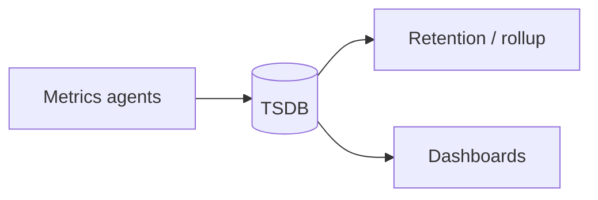

### Key details

- **TimescaleDB:** PostgreSQL extension - hypertables chunk by time
- **Prometheus:** pull model, PromQL, local TSDB
- Compression ratios 10:1 common with gorilla encoding
- High cardinality tags (unique per request) kill performance

### When to use

- Application and infrastructure monitoring
- IoT sensor history
- Financial OHLCV bars, analytics on time-ordered events

### Trade-offs / Pitfalls

- Updates/deletes uncommon and often unsupported efficiently
- Cardinality explosion from bad label design
- Long-term storage cost needs downsampling tiering
- Not suited for general transactional workloads

---


## 2.17 Search Databases


### What is it?

**Search databases** (Elasticsearch, OpenSearch, Solr) build **inverted indexes** mapping terms to document IDs, enabling full-text search, fuzzy matching, faceting, and relevance ranking at scale.

### Why it matters

SQL `LIKE '%term%'` cannot scale. Search engines power product search, log analytics (ELK), and autocomplete with sub-second response on billions of documents.

### How it works

1. Documents indexed with analyzed text (tokenized, stemmed, lowercased).
2. Inverted index: term -> posting list (doc IDs + positions).
3. Query parsed; boolean/phrase/scoring applied (BM25 default).
4. Results ranked by relevance score + filters/aggregations.
5. Distributed as shards with replicas for scale and HA.

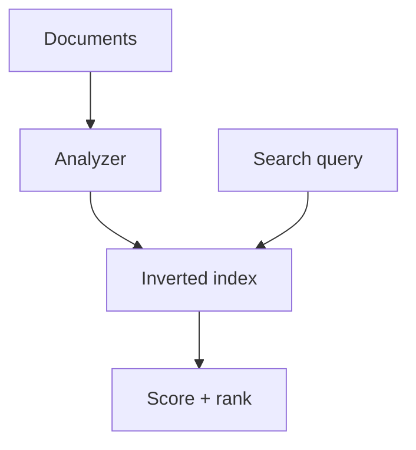

### Key details

- Near-real-time: refresh interval before searchable
- **Sharding** by hash; **replicas** for read scale
- Mapping defines field types (keyword vs. text)
- ELK stack: Elasticsearch + Logstash + Kibana

### When to use

- Product/site search with facets
- Log and trace analytics
- Autocomplete and fuzzy name matching

### Trade-offs / Pitfalls

- Not a system of record - sync from primary DB via CDC
- Reindex required for breaking mapping changes
- Split-brain and yellow cluster states in ops
- Heavy aggregations memory-intensive

---


## 2.18 Vector Databases


### What is it?

**Vector databases** store **embeddings** (high-dimensional float arrays) and support **similarity search** (nearest neighbors) via indexes like HNSW, IVF, or PQ. Examples: Pinecone, Weaviate, Milvus, pgvector extension.

### Why it matters

LLM applications need semantic search, RAG (retrieval-augmented generation), and recommendation by meaning not keywords. Vector DBs make billion-scale similarity queries practical.

### How it works

1. Embed text/image via model (OpenAI, sentence-transformers).
2. Store vector + metadata payload in collection.
3. Build ANN (approximate nearest neighbor) index.
4. Query: embed question -> find top-k similar vectors.
5. Return associated documents to LLM context.


### Key details

- **HNSW:** graph-based ANN, high recall, memory heavy
- **Cosine vs. L2 vs. dot product** - must match training normalization
- Hybrid search: vector + keyword filter (metadata pre-filter)
- pgvector brings vectors into PostgreSQL for simpler ops

### When to use

- Semantic document search, RAG chatbots
- Image similarity, duplicate detection
- Recommendation by content embedding

### Trade-offs / Pitfalls

- Approximate index -> missed relevant results
- Embedding model change requires full re-index
- High dimensionality (1536+) memory cost
- Stale embeddings if source documents change

---


## 2.19 Multi Model Databases


### What is it?

**Multi-model databases** support multiple data models - document, graph, key-value, relational - in one engine with unified query and storage. Examples: ArangoDB, Azure Cosmos DB, FaunaDB.

### Why it matters

Reduces operational overhead of running separate Mongo, Neo4j, and Redis clusters when application needs multiple paradigms on overlapping data.

### How it works

1. Single cluster stores documents that may embed graph edges.
2. Query languages expose graph traversals, document filters, KV access.
3. Unified replication, backup, and security model.
4. Storage layer may use document store with graph index overlay.
5. API choice per access pattern on same data.

```mermaid
flowchart TB
    App --> MM[(Multi-model DB)]
    MM --> Doc[Document API]
    MM --> Graph[Graph API]
    MM --> KV[Key-Value API]
```

### Key details

- Cosmos DB: API-compatible layers (SQL, Mongo, Cassandra, Gremlin)
- Trade-off: jack-of-all-trades vs. best-in-class per model
- Operational simplicity vs. feature depth
- Licensing and vendor lock-in considerations

### When to use

- Startup reducing ops burden before scale forces specialization
- Applications genuinely needing graph + document on same entities
- Cloud-managed multi-API (Cosmos) for global distribution

### Trade-offs / Pitfalls

- None match peak performance of specialized DB per model
- Query language complexity across paradigms
- Cosmos RU pricing requires careful modeling
- Migration out harder with proprietary APIs

### References

- [Multi-Model Databases  -  overview video](https://www.youtube.com/watch?v=hwYadL33HdI)

---


## 2.20 ACID Properties


### What is it?

**ACID** is the set of guarantees relational databases provide for **transactions** — grouped operations that succeed or fail as a unit:

| Property | Meaning | Example failure if violated |
|----------|---------|----------------------------|
| **Atomicity** | All operations in a transaction commit or none do | Money debited but not credited |
| **Consistency** | Transaction brings DB from one valid state to another (constraints hold) | Negative account balance allowed |
| **Isolation** | Concurrent transactions don't interfere improperly | Lost update, dirty read |
| **Durability** | Committed data survives crash | Power loss after "success" loses write |

### Why it matters

OLTP systems (payments, inventory, bookings) depend on ACID for correctness. When interviews ask for "strong consistency," they often mean **ACID transactions on a single database** — distinct from distributed linearizability (see [Ch. 4](../04-distributed-system/README.md)).

### How it works

1. Client begins transaction (`BEGIN`).
2. Executes reads/writes within transaction boundary.
3. Database holds changes in transaction log / MVCC snapshot.
4. `COMMIT` → WAL flushed, locks released, durable.
5. `ROLLBACK` → all changes in transaction discarded.

```mermaid
sequenceDiagram
    participant App
    participant DB
    App->>DB: BEGIN
    App->>DB: UPDATE accounts SET balance = balance - 100
    App->>DB: UPDATE accounts SET balance = balance + 100
    App->>DB: COMMIT
    DB-->>App: OK (durable)
```

### Key details

- **Consistency** in ACID ≠ CAP consistency — ACID consistency means constraint satisfaction, not replica agreement.
- Isolation level (see [2.6](#26-isolation-levels)) trades concurrency for anomalies.
- Durability via **WAL** — commit returns after log fsync, not necessarily data page write.
- Single-node ACID is well understood; **distributed ACID** (2PC, Spanner) adds latency and availability trade-offs.

### When to use

- Financial transfers, order placement, inventory decrement
- Any multi-step write that must not leave partial state
- Default choice for RDBMS OLTP workloads

### Trade-offs / Pitfalls

- ACID transactions don't span arbitrary microservices without distributed transaction cost
- Long transactions hold locks → throughput collapse
- Over-using serializable isolation when read committed suffices

---


## 2.21 BASE Properties


### What is it?

**BASE** describes the relaxed consistency model common in **NoSQL** and highly available distributed stores — a deliberate alternative to strict ACID:

| Property | Meaning |
|----------|---------|
| **Basically Available** | System guarantees availability for most requests; degraded responses possible under stress |
| **Soft state** | State may change over time without new input (replication lag, TTL expiry) |
| **Eventually consistent** | Given no new writes, all replicas converge to the same value |

BASE is not "no consistency" — it accepts **temporary inconsistency** in exchange for **availability and partition tolerance** (AP in CAP).

### Why it matters

At scale, synchronous cross-replica coordination is expensive. Dynamo-style KV stores, Cassandra, and DNS prioritize availability; applications handle staleness via versioning, conflict resolution, or user-tolerant UX (social likes, view counts).

### How it works

1. Write goes to one or more replicas (often async replication).
2. Read may return slightly stale data from nearest replica.
3. Background replication, read repair, or anti-entropy converge replicas.
4. Application uses **idempotency**, **version vectors**, or **last-write-wins** for conflicts.

```mermaid
flowchart LR
    W[Write to node A] --> A[(Replica A)]
    A -.->|async| B[(Replica B)]
    A -.->|async| C[(Replica C)]
    R[Read from B] -->|may be stale| Client
```

### ACID vs BASE

| Aspect | ACID (RDBMS) | BASE (NoSQL / distributed) |
|--------|--------------|----------------------------|
| Consistency | Strong per transaction | Eventual across replicas |
| Availability under partition | May block writes (CP) | Serves reads/writes (AP) |
| Schema | Fixed, enforced | Flexible, application-enforced |
| Best for | Transactions, joins | High write throughput, global scale |
| Examples | PostgreSQL, MySQL | Cassandra, DynamoDB, Riak |

Many systems are **hybrid**: PostgreSQL for payments (ACID) + Redis/Cassandra for sessions and feeds (BASE).

### When to use

- High availability more important than immediate global consistency
- Read-heavy with tolerable staleness (feeds, recommendations, analytics)
- Geographic distribution with async replication

### Trade-offs / Pitfalls

- "Eventually" without bound is not a spec — define acceptable staleness
- Application must handle conflicts — not pushed to DB
- BASE inappropriate for invariant-critical data without careful design (use strong quorum or separate ACID store)

---


## 2.22 SQL Tuning


### What is it?

**SQL tuning** is the practice of optimizing query performance and database resource usage — indexes, query shape, execution plans, connection management, and schema design — without changing application correctness.

### Why it matters

A missing index on a 100M-row table can turn a 5 ms query into a 30-second full table scan. SQL tuning is often the **highest ROI** performance work before sharding or adding cache layers.

### How it works

**1. Measure first**

```sql
EXPLAIN (ANALYZE, BUFFERS) SELECT * FROM orders WHERE user_id = 123;
```

Look for: `Seq Scan` (bad on large tables), high `rows`, `Buffers: shared read` (disk I/O).

**2. Index strategically**

- Index columns in `WHERE`, `JOIN`, `ORDER BY` predicates.
- Composite index column order matters: `(user_id, created_at)` supports `WHERE user_id = ? ORDER BY created_at`.
- Avoid over-indexing — each index slows writes.

**3. Fix query patterns**

| Problem | Symptom | Fix |
|---------|---------|-----|
| **N+1 queries** | 1 query + N per row in loop | JOIN, batch `IN (...)`, ORM eager load |
| **SELECT \*** | Large row transfer | Select only needed columns |
| **Implicit cast** | Index not used | Match column type to parameter |
| **OR on different columns** | Full scan | `UNION ALL` of two indexed queries |
| **OFFSET pagination** | Slow deep pages | Keyset / cursor pagination |

**4. Connection pool sizing**

```text
pool_size ≈ (core_count × 2) + effective_spindle_count   # rough starting point
```

Too many connections → DB context switching; too few → app threads block.

**5. Schema and planner hints**

- Keep statistics updated (`ANALYZE`).
- Partition large tables by time or tenant.
- Use covering indexes (`INCLUDE` columns) to avoid heap lookups.

```mermaid
flowchart TB
    Slow[Slow query] --> Explain[EXPLAIN ANALYZE]
    Explain --> Scan{Seq scan?}
    Scan -->|Yes| Idx[Add/fix index]
    Scan -->|No| Shape[Rewrite query / N+1 fix]
    Idx --> Verify[Re-measure]
    Shape --> Verify
```

### Key details

- **p99 matters** — average query time hides tail latency from lock contention.
- **Read replicas** offload analytics; don't run heavy reports on primary OLTP.
- **Materialized views** (see [2.5](#25-views-materialized-view)) precompute expensive aggregations.
- Cache (Ch. 3) complements tuning — don't cache your way out of a missing index on hot path.

### When to use

- p99 latency SLO breached on DB-bound endpoints
- CPU or IOPS saturation on database node
- Before scaling horizontally — tune single node first

### Trade-offs / Pitfalls

- Index every column — write amplification and storage bloat
- Hint forcing bad plan after data distribution changes
- Tuning reports on production primary during peak
- Ignoring lock contention — fast plan but serializes all writers

---

[<- Back to master index](../README.md)
