# 2. Databases

> Status: **Documented**  -  master reference

[<- Back to master index](../README.md)

## Sub-topics

| # | Sub-topic | Status |
|---|-----------|--------|
| 2.1 | [Normalization/Denormalizatio](#21-normalizationdenormalizatio) | Done |
| 2.2 | [Indexing](#22-indexing) | Done |
| 2.3 | [B Tree/B+ Tree](#23-b-treeb-tree) | Done |
| 2.4 | [Query Planner/ optimizer](#24-query-planner-optimizer) | Done |
| 2.5 | [Views/ Materialized View](#25-views-materialized-view) | Done |
| 2.6 | [Isolation Levels](#26-isolation-levels) | Done |
| 2.7 | [MVCC](#27-mvcc) | Done |
| 2.8 | [Redo/undo/bin Logs](#28-redoundobin-logs) | Done |
| 2.9 | [LSM Tree/SSTables/WAL](#29-lsm-treesstableswal) | Done |
| 2.10 | [Page Cache](#210-page-cache) | Done |
| 2.11 | [Vacuum Process](#211-vacuum-process) | Done |
| 2.12 | [Key Value Stores](#212-key-value-stores) | Done |
| 2.13 | [Document Databases](#213-document-databases) | Done |
| 2.14 | [Wide Column Databases](#214-wide-column-databases) | Done |
| 2.15 | [Graph Databases](#215-graph-databases) | Done |
| 2.16 | [Time Series Databases](#216-time-series-databases) | Done |
| 2.17 | [Search Databases](#217-search-databases) | Done |
| 2.18 | [Vector Databases](#218-vector-databases) | Done |
| 2.19 | [Multi Model Databases](#219-multi-model-databases) | Done |

## Topic Overview

Databases are the persistent foundation of nearly every application: they store state, enforce constraints, and execute queries at scale. System design interviews and production architecture both require understanding **how databases work internally** - not just SQL syntax - including storage engines, indexing structures, transaction isolation, and the trade-offs between relational, document, wide-column, graph, and specialized stores.

Choosing and tuning a database means matching **access patterns** (point lookups vs. scans vs. graph traversals) to the right **data model** and **storage engine** (B-tree vs. LSM). Operational concerns - WAL durability, vacuum, page cache, query planning - determine whether a database stays fast and reliable under load or becomes the system bottleneck.

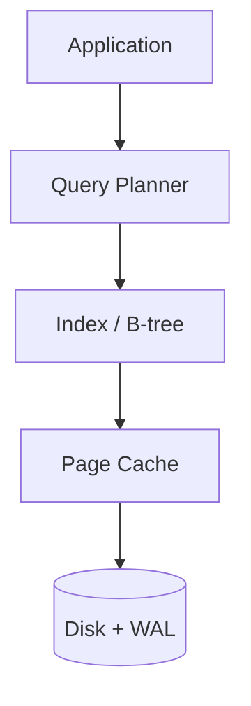

## Reading order

Sub-topics are sequenced for progressive learning: foundations first, then related concepts, then specialized topics.

| Group | Sections | Focus |
|-------|----------|-------|
| **1. Schema and queries** | 2.1-2.5 | Normalization, indexes, B-tree, planner, views |
| **2. Transactions and storage** | 2.6-2.11 | Isolation, MVCC, logs, LSM, page cache, vacuum |
| **3. Database families** | 2.12-2.19 | KV, document, wide-column, graph, specialized stores |

## Related topics

- [Caching](../03-caching/README.md)  -  reducing DB read load
- [Distributed Databases](../05-distributed-databases/README.md)  -  sharding, replication, consensus
- [Distributed System](../04-distributed-system/README.md)  -  consistency, durability, CAP
- [Search Systems](../14-search-systems/README.md)  -  inverted indexes, Elasticsearch

---

## 2.1 Normalization/Denormalizatio

### What is it?

**Normalization** organizes data into related tables to eliminate redundancy and update anomalies, following normal forms (1NF through 5NF). **Denormalization** intentionally duplicates data across tables or documents to optimize read performance at the cost of write complexity.

### Why it matters

Normalized schemas preserve integrity and simplify updates; denormalized schemas reduce JOINs and speed reads at scale. Most production systems normalize the OLTP core and denormalize read models (CQRS, materialized views).

### How it works

**Normalization:**
1. Split repeating groups into separate tables (1NF).
2. Remove partial dependencies on composite keys (2NF).
3. Remove transitive dependencies (3NF) - most OLTP targets 3NF.
4. Enforce relationships via foreign keys.

**Denormalization:**
1. Identify hot read paths with expensive JOINs.
2. Duplicate columns or embed documents (e.g., order line items in order doc).
3. Update all copies on write or accept eventual consistency via events.

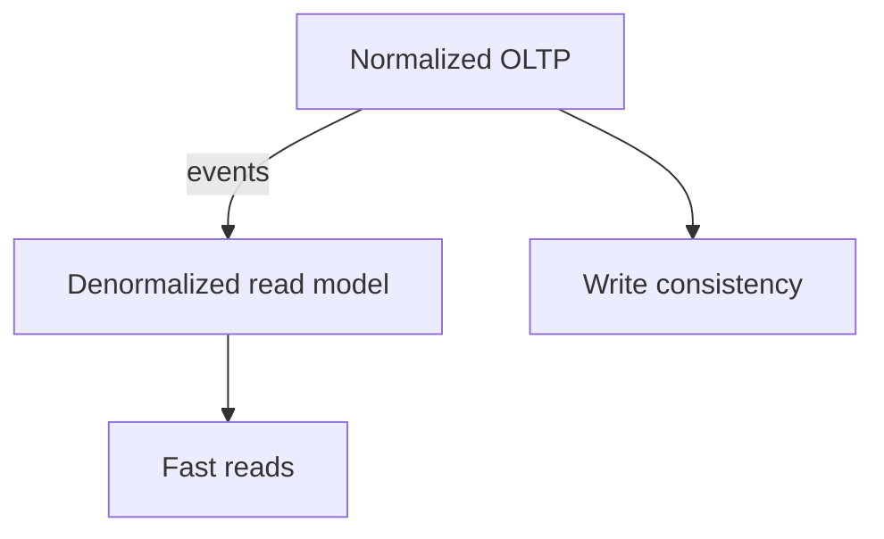

### Key details

- 3NF: every non-key attribute depends only on the key
- Denormalization common in analytics, caches, and NoSQL document stores
- **Star schema** in warehouses denormalizes dimensions around facts
- Trade update anomalies for read speed consciously

### When to use

- Normalize: transactional systems, frequently updated data
- Denormalize: read-heavy dashboards, search indexes, embedded documents

### Trade-offs / Pitfalls

- Denormalized data drifts if update paths missed
- Over-normalization causes JOIN explosion
- BCNF/4NF rarely needed in practice - diminishing returns
- Microservices often denormalize across service boundaries via events

---

## 2.2 Indexing

### What is it?

An **index** is a separate data structure (usually a **B+ tree** in relational DBs) that maps indexed column values to row locations. It lets the database find rows by key in **O(log n)** page lookups instead of scanning every row (**O(n)** sequential scan).

Think of a book index: you look up a term in the index, jump to the page - you don't read every page.

Indexes are **not free** - every `INSERT`/`UPDATE`/`DELETE` must also update index entries.

### Why it matters

On a table with 100 million rows, `WHERE user_id = 123` without an index reads millions of pages (seconds to minutes). With an index on `user_id`, the same query reads ~3-4 pages (milliseconds). Indexing is often the **largest single lever** for OLTP performance.

Wrong indexes waste disk, slow writes, and fool the optimizer into bad plans.

### How it works

1. Query arrives: `SELECT name FROM users WHERE email = 'a@b.com'`
2. **Query planner** estimates cost of seq scan vs index scan
3. If selective enough, planner chooses **index seek** on `email` index
4. Index returns row IDs (or primary key) pointing to heap/table rows
5. Database fetches row data (unless **covering index** has all columns)

**Index types:**

| Type | Structure | Best for |
|------|-----------|----------|
| B-tree (default) | Balanced tree | Equality, range, sorting |
| Hash | Hash table | Equality only (PostgreSQL) |
| GIN/GiST | Inverted/generalized | Full-text, JSON, geo |
| Partial | Subset of rows | `WHERE status = 'active'` |
| Composite | Multiple columns | Multi-column WHERE/JOIN |

**Composite index left-prefix rule:**

Index on `(last_name, first_name)` supports:
- `WHERE last_name = 'Smith'` - yes
- `WHERE last_name = 'Smith' AND first_name = 'John'` - yes
- `WHERE first_name = 'John'` alone - **no** (cannot use index efficiently)

**Covering index (index-only scan):**

Index includes all columns in SELECT: `CREATE INDEX idx ON users(email) INCLUDE (name)`  
Query reads only index pages - never touches heap -> fastest path.

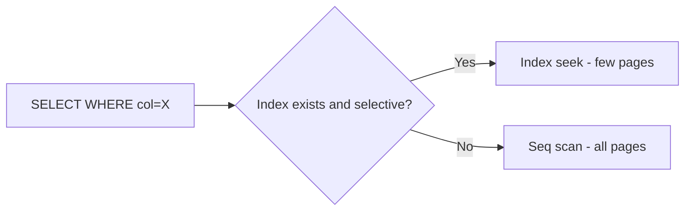

**Clustered vs non-clustered:**

- **Clustered (InnoDB PK):** row data stored in index leaf pages - table IS the PK index
- **Non-clustered:** index leaves hold pointer to heap row (PostgreSQL secondary indexes)

### Key details

- **Selectivity:** index helps when predicate filters small fraction of rows (`user_id` good; `gender` alone often bad)
- **Write amplification:** 5 indexes on a table = 5 extra writes per INSERT
- **Index bloat:** dead tuples from updates -> `REINDEX`, `VACUUM` (PostgreSQL)
- **Functions break indexes:** `WHERE LOWER(email) = 'x'` won't use index on `email` unless expression index
- **EXPLAIN ANALYZE** is mandatory to verify index usage in production queries
- Foreign keys should almost always be indexed (JOIN and CASCADE performance)

### When to use

- Columns in `WHERE`, `JOIN ON`, `ORDER BY` with high cardinality
- Foreign key columns
- Columns used for range queries (`created_at`, `price`)
- Avoid indexing boolean/low-cardinality columns alone unless partial index

### Trade-offs / Pitfalls

- Too many indexes slow writes and increase storage (SSD still costs money)
- Wrong column order in composite index -> index unused
- Optimizer may choose seq scan if it estimates most rows match anyway
- Index maintenance during bulk load - drop index, load, recreate is faster
- Unique index enforces constraint but adds write cost on every insert

### References

- PostgreSQL EXPLAIN documentation; Use The Index, Luke (use-the-index-luke.com)

---

## 2.3 B Tree/B+ Tree

### What is it?

**B-trees** and **B+ trees** are balanced tree structures storing sorted keys in pages, optimized for **disk I/O** (wide nodes, shallow height). B+ trees keep all values in leaf nodes linked for range scans; internal nodes only route. Default index structure in PostgreSQL, MySQL InnoDB, SQLite.

### Why it matters

Most OLTP index lookups and range queries go through B+ trees. Understanding page splits, fill factor, and seek vs. scan explains index performance limits.

### How it works

1. Root-to-leaf search: O(log n) page reads.
2. Leaf pages contain keys + row pointers (or row data if clustered).
3. Insert: find leaf; if full, **split** page and propagate key up.
4. Delete may **merge** underfilled pages.
5. Range query: scan linked leaf pages sequentially.

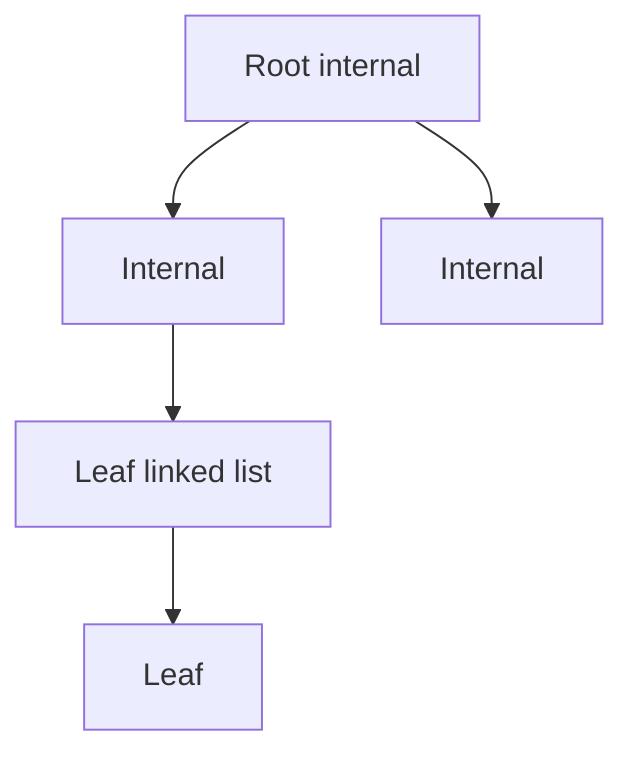

### Key details

- Typical fanout 100 - 500 keys per page -> 4 levels for billions of rows
- **Clustered B+ tree:** leaf = row data (InnoDB PK)
- **Secondary index:** leaf stores PK values for lookup
- Random inserts cause page splits (write amplification)

### When to use

- Default for relational indexes
- Range queries, ORDER BY, prefix LIKE 'abc%'
- Moderate write rates with read-heavy mix

### Trade-offs / Pitfalls

- Poor for very high write throughput (splits) vs. LSM
- UUID primary keys cause random insert hotspots (page splits)
- Wide rows reduce fanout, deepen tree
- Not ideal for full-table sequential scan workloads

### References

- [B-Tree and B+ Tree  -  data structures video](https://www.youtube.com/watch?v=aZjYr87r1b8)

---

## 2.4 Query Planner/ optimizer

### What is it?

The **query planner** (optimizer) chooses how to execute a SQL statement - join order, index vs. scan, parallel workers - based on **statistics**, **cost model**, and **available indexes**. Goal: minimize estimated total cost (I/O + CPU).

### Why it matters

Identical SQL can run in milliseconds or minutes depending on plan chosen. Understanding planners explains why `EXPLAIN` matters and why statistics must be current.

### How it works

1. Parse SQL into query tree.
2. Generate candidate plans (join algorithms: nested loop, hash, merge).
3. Estimate row counts using table statistics (histograms, ndistinct).
4. Assign cost to each plan; pick lowest estimated cost.
5. Execute plan; optionally adapt (adaptive join in SQL Server, etc.).

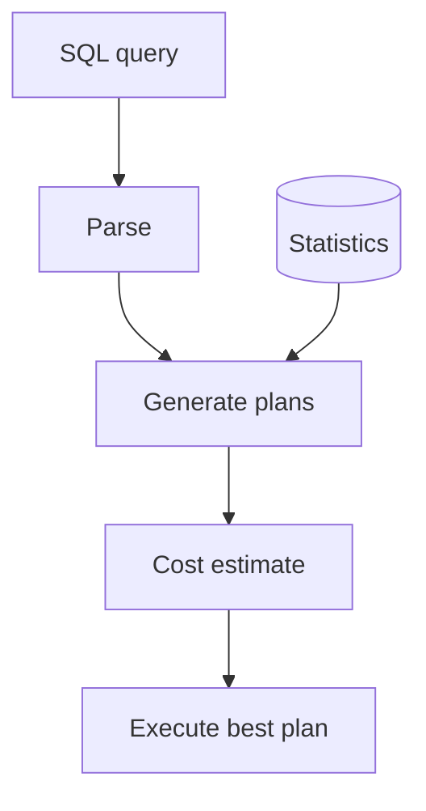

### Key details

- **EXPLAIN ANALYZE** compares estimate vs. actual rows - detects stale stats
- **Parameter sniffing:** plan cached for first parameter values may be wrong for others
- Hints available but discouraged (optimizer usually smarter with good stats)
- Correlated subqueries sometimes optimized to joins (decorrelation)

### When to use

- Debugging slow queries (always EXPLAIN first)
- After large data changes (run ANALYZE)
- Index design validation

### Trade-offs / Pitfalls

- Bad statistics -> catastrophic plan (nested loop on huge table)
- Overly complex SQL defeats optimizer
- OR conditions often prevent index use
- Cost models differ per DB - tuning knowledge doesn't fully transfer

### References

- [Query Planner and Optimizer  -  video](https://www.youtube.com/watch?v=fj9pK8isRA4)

---

## 2.5 Views/ Materialized View

### What is it?

A **view** is a stored SQL query acting as a virtual table - no data stored, computed on each access. A **materialized view** physically stores the query result and must be refreshed to reflect base table changes.

### Why it matters

Views simplify complex queries and enforce access control. Materialized views accelerate expensive aggregations (dashboards, reports) without hitting raw tables every time.

### How it works

**View:**
1. `CREATE VIEW v AS SELECT ...`
2. Queries against `v` expand to underlying SQL at plan time.
3. Optimizer may push predicates through to base tables.

**Materialized view:**
1. `CREATE MATERIALIZED VIEW mv AS SELECT ...`
2. Result stored on disk like a table.
3. `REFRESH MATERIALIZED VIEW` (full or concurrent) updates snapshot.

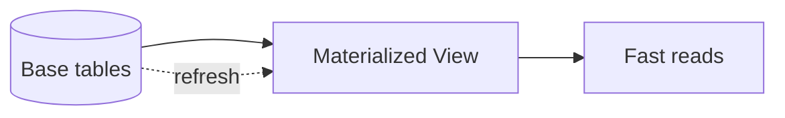

### Key details

- PostgreSQL supports concurrent refresh (unique index required)
- Incremental refresh possible in some systems (Oracle, SQL Server indexed views)
- Views can be **updatable** if simple enough (single table, no aggregation)
- Staleness window between refreshes

### When to use

- View: security abstraction, query simplification
- Materialized view: heavy aggregations, pre-computed joins for BI

### Trade-offs / Pitfalls

- Materialized view storage cost and refresh load
- Full refresh locks reads in some DBs without CONCURRENTLY
- Stale MV misleads users if refresh lag unmonitored
- Complex views may prevent predicate pushdown

### References

- [Views and Materialized Views  -  SQL video](https://www.youtube.com/watch?v=XI1rk1Uaf7U)

---

## 2.6 Isolation Levels

### What is it?

**Transaction isolation levels** define how much concurrent transactions interfere with each other - what anomalies (dirty reads, non-repeatable reads, phantom reads) are permitted. SQL defines four standard levels: READ UNCOMMITTED, READ COMMITTED, REPEATABLE READ, SERIALIZABLE.

### Why it matters

Too weak isolation causes data corruption visible to users (double booking, wrong balances). Too strong isolation increases lock contention and kills throughput. Production systems default to READ COMMITTED (PostgreSQL) or REPEATABLE READ (MySQL InnoDB) with application-level handling of edge cases.

### How it works

1. Transaction begins; isolation level set per session or globally.
2. Reads may use shared locks, snapshot (MVCC), or no locks depending on level.
3. Writes acquire exclusive locks or create new row versions.
4. Conflicts detected at read, write, or commit time (optimistic vs. pessimistic).
5. Scheduler produces a history equivalent to some serial order (serializable) or allows defined anomalies.

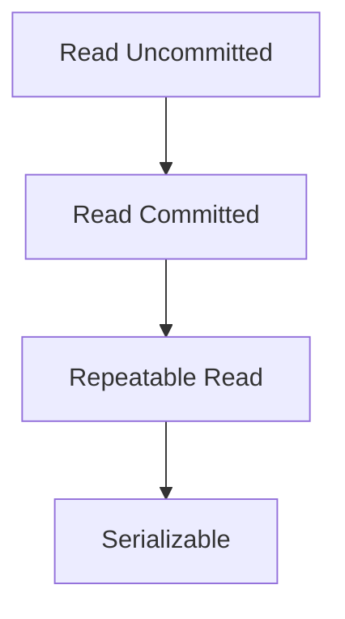

### Key details

| Level | Dirty read | Non-repeatable | Phantom |
|-------|------------|----------------|---------|
| Read Uncommitted | Yes | Yes | Yes |
| Read Committed | No | Yes | Yes |
| Repeatable Read | No | No | Yes* |
| Serializable | No | No | No |

*PostgreSQL RR prevents phantoms; standard SQL definition may differ.

- **Snapshot isolation** (MVCC) common implementation of RR
- **Serializable snapshot isolation (SSI)** in PostgreSQL 9.1+ for true serializable

### When to use

- READ COMMITTED: default for most OLTP web apps
- REPEATABLE READ: reports within one transaction needing stable snapshot
- SERIALIZABLE: financial invariants where application locking is error-prone

### Trade-offs / Pitfalls

- Higher isolation -> more rollbacks and retries
- ORM default isolation may not match DB default
- Distributed transactions across DBs don't inherit single-DB isolation
- "Serializable" in one DB ≠ same guarantees in another

### References

- [Isolation Levels  -  database concurrency video](https://www.youtube.com/watch?v=89YYHMYfymk)

---

## 2.7 MVCC

### What is it?

**Multi-Version Concurrency Control (MVCC)** keeps multiple versions of each row; readers see a **snapshot** as of transaction start without blocking writers. Writers create new versions; old versions garbage-collected later (vacuum).

### Why it matters

MVCC enables high read concurrency in PostgreSQL, InnoDB, Oracle - readers don't acquire blocking locks on row data. Foundation for snapshot isolation and repeatable read.

### How it works

1. Each transaction assigned **transaction ID (xid)**.
2. Row versions tagged with `xmin` (creating xid) and `xmax` (deleting xid).
3. Read visibility rule: version visible if created before snapshot and not deleted before snapshot.
4. UPDATE = insert new version + mark old deleted.
5. Vacuum removes dead versions no longer visible to any transaction.

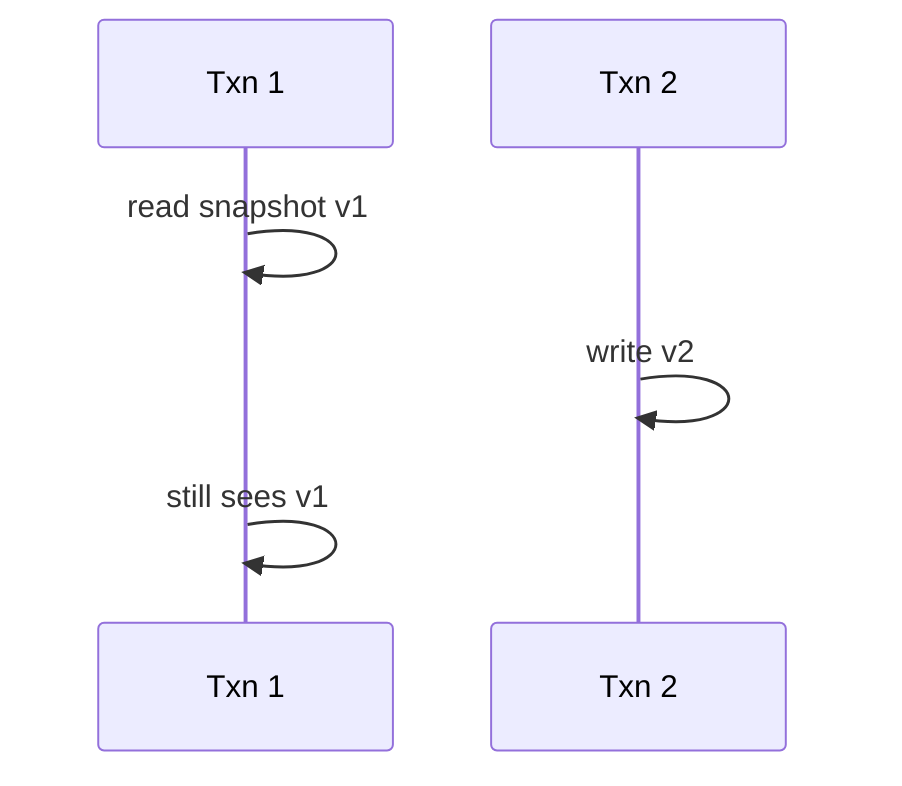

### Key details

- **Snapshot isolation:** each statement or transaction sees consistent snapshot
- Long transactions block vacuum -> table bloat
- **Transaction ID wraparound** requires aggressive vacuum (PostgreSQL)
- Conflicts detected on commit for serializable variants (SSI)

### When to use

- Built into PostgreSQL, InnoDB - understand defaults
- Choosing isolation and connection pool timeouts
- Debugging bloat and vacuum issues

### Trade-offs / Pitfalls

- Storage overhead from dead row versions
- Write skew possible under snapshot isolation (needs SSI or app logic)
- Index-only scans must verify visibility map
- ORM long sessions hold snapshots unintentionally

### References

- [MVCC  -  multi-version concurrency video](https://www.youtube.com/watch?v=TBmDBw1IIoY)

---

## 2.8 Redo/undo/bin Logs

### What is it?

Database **logs** ensure durability and recoverability: **redo log** (WAL) records changes to reapply after crash; **undo log** records old values to rollback uncommitted transactions; **binlog** (MySQL) streams changes for replication and CDC.

### Why it matters

Without WAL, committed transactions lost on crash. Without undo, rollback impossible. Binlog enables replicas and event-driven architectures.

### How it works

1. Transaction modifies pages in memory.
2. **WAL/redo** record written and fsynced **before** commit ack.
3. Dirty pages flushed later (checkpoint).
4. Crash recovery: redo committed, undo in-flight transactions.
5. Binlog written for replication (may be sync or async with redo).

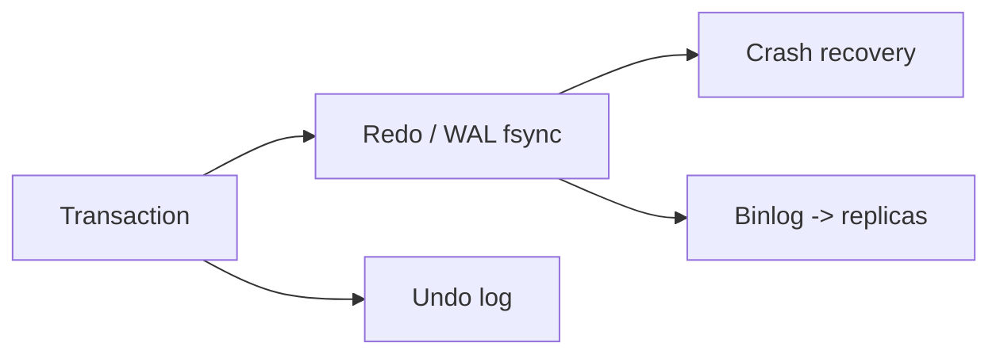

### Key details

- **Write-ahead logging:** log before data page on disk
- PostgreSQL WAL segments; InnoDB redo log files circular
- **Group commit** batches fsync for throughput
- Logical vs. physical redo differs per DB

### When to use

- Understanding commit latency (fsync bound)
- Replication lag troubleshooting
- CDC pipelines (Debezium reads binlog/WAL)

### Trade-offs / Pitfalls

- Sync binlog + sync redo = highest durability, slowest commits
- WAL disk full stops all writes
- Long-running txn prevents undo log purge
- Confusing redo (physical) with binlog (logical) in MySQL

### References

- [Redo, Undo, and Bin Logs  -  video](https://www.youtube.com/watch?v=47LvbDGD4cc)

---

## 2.9 LSM Tree/SSTables/WAL

### What is it?

**Log-Structured Merge (LSM) trees** buffer writes in memory (**memtable**), flush immutable **SSTables** (Sorted String Tables) to disk, and periodically **compact** overlapping files. **WAL** (write-ahead log) ensures durability before memtable ack. Used in RocksDB, LevelDB, Cassandra, HBase, DynamoDB.

### Why it matters

LSM excels at **high write throughput** and sequential I/O - ideal for time-series, messaging metadata, and write-heavy KV stores. Trade-off: read amplification and compaction overhead.

### How it works

1. Write appended to WAL, then memtable (in-memory sorted structure).
2. Memtable full -> flush to disk as new SSTable (sorted, immutable).
3. Read checks memtable + SSTables (bloom filters skip irrelevant files).
4. **Compaction** merges SSTables, discards tombstones, reduces read amplification.
5. Levels (L0, L1,  - ) organize size-tiered or leveled compaction.

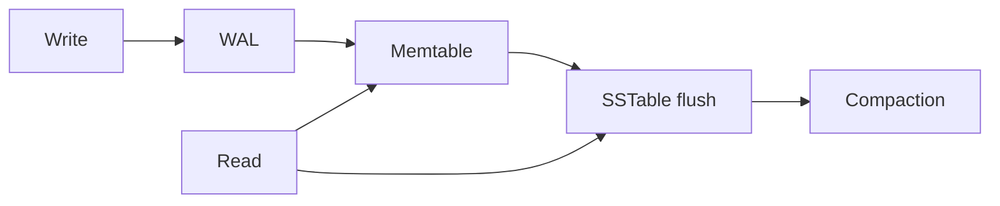

### Key details

- **Write amplification:** rewriting data during compaction
- **Read amplification:** checking multiple SSTables per read
- **Bloom filter:** probabilistic "key not in this file" skip
- Tombstones mark deletes until compaction purges

### When to use

- Write-heavy workloads (logging, IoT, counters)
- Key-value and wide-column stores
- When sequential write bandwidth matters

### Trade-offs / Pitfalls

- Read latency less predictable than B-tree
- Compaction can cause latency spikes (I/O contention)
- Space amplification until compaction runs
- Range delete expensive (many tombstones)

### References

- [LSM Trees  -  video overview](https://www.youtube.com/watch?v=P2xtlLymqqI)
- [LSM Trees deep dive  -  Medium article](https://medium.com/@dwivedi.ankit21/lsm-trees-the-go-to-data-structure-for-databases-search-engines-and-more-c3a48fa469d2)

---

## 2.10 Page Cache

### What is it?

The **page cache** (buffer pool) is DB-managed memory holding frequently accessed **disk pages** (typically 8 - 16 KB) in RAM. Reads hit cache avoid disk; dirty pages flushed asynchronously.

### Why it matters

Disk is 1000× slower than RAM. Cache hit ratio dominates OLTP performance. Sizing buffer pool correctly is primary DB tuning knob.

### How it works

1. Read request for page ID.
2. Cache lookup; **hit** -> return from memory.
3. **Miss** -> read from disk, insert into cache (evict LRU/LFU page if full).
4. Write modifies page in cache; marks dirty.
5. Background writer/checkpointer flushes dirty pages; WAL ensures durability before ack.

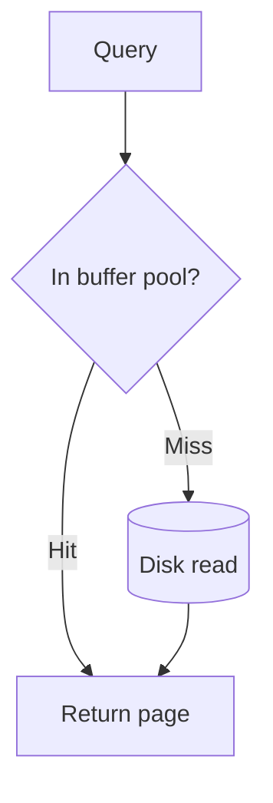

### Key details

- PostgreSQL: `shared_buffers`; InnoDB: `innodb_buffer_pool_size`
- Target 70 - 80% of RAM on dedicated DB server (leave OS cache room)
- **Double buffering:** OS page cache + DB cache - some DBs use direct I/O
- Cold cache after restart causes temporary slow period

### When to use

- Sizing any dedicated database server
- Explaining post-restart performance dip
- Distinguishing DB cache from OS cache in troubleshooting

### Trade-offs / Pitfalls

- Too small -> excessive disk I/O
- Too large -> memory pressure, swapping kills performance
- Full table scan evicts hot pages (scan pollution)
- Monitoring hit ratio alone misses query efficiency

### References

- [Page Cache  -  database memory video](https://www.youtube.com/watch?v=syPEMXQwaYQ)

---

## 2.11 Vacuum Process

### What is it?

**VACUUM** (PostgreSQL terminology; similar concepts elsewhere) reclaims space from dead row versions left by MVCC updates/deletes, updates visibility map, and prevents transaction ID wraparound.

### Why it matters

Without vacuum, tables bloat (disk grows, scans slow) and PostgreSQL risks **xid wraparound** shutdown. Autovacuum is critical background maintenance.

### How it works

1. MVCC leaves dead tuples when rows updated/deleted.
2. Vacuum scans pages marking dead space reusable.
3. **Autovacuum** triggers based on dead tuple count threshold.
4. **VACUUM FULL** rewrites table compactly (exclusive lock).
5. Freezes old xids to prevent wraparound.

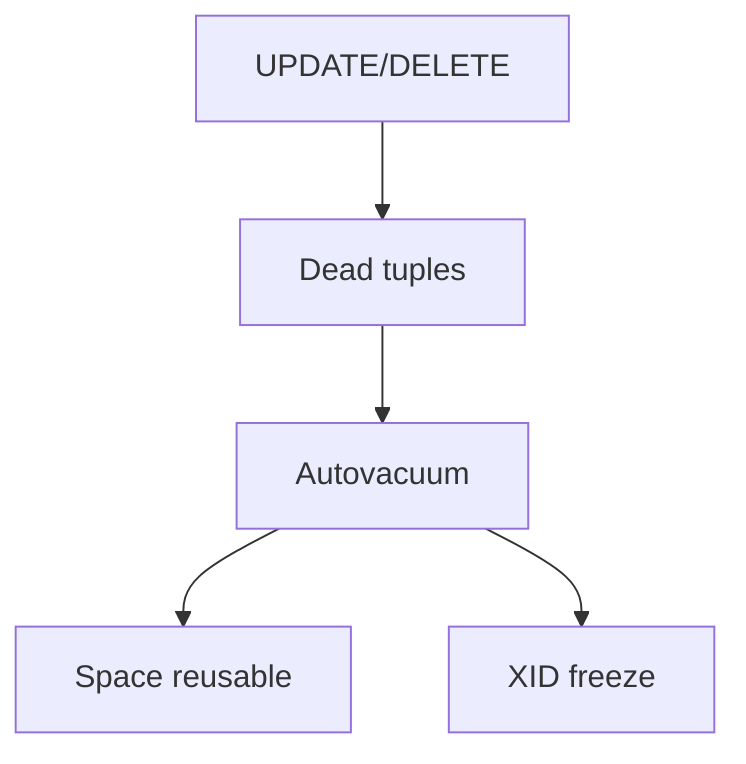

### Key details

- Long transactions block vacuum (dead tuples accumulate)
- Visibility map enables index-only scans after vacuum
- Bloat measurable via `pg_stat_user_tables`, pgstattuple
- Tune `autovacuum_vacuum_scale_factor` for high-churn tables

### When to use

- PostgreSQL operational maintenance
- Investigating table growth without row count growth
- After bulk deletes (manual VACUUM ANALYZE)

### Trade-offs / Pitfalls

- VACUUM FULL downtime on large tables
- Aggressive autovacuum increases I/O
- Not all dead space returned to OS (only marked reusable)
- Replication slots can block WAL removal similarly

### References

- [Vacuum Process  -  PostgreSQL maintenance video](https://www.youtube.com/watch?v=fTl8-pnaJCE)

---

## 2.12 Key Value Stores

### What is it?

**Key-value stores** map opaque keys to blob values with simple get/put/delete operations - no query language, no joins. Examples: Redis, DynamoDB, Riak, etcd (with consistency features).

### Why it matters

Simplest data model enables extreme scale, low latency, and flexible schema. Foundation for caching, session stores, feature flags, and Dynamo-style distributed systems.

### How it works

1. Client sends key (and optional value) via API.
2. Store hashes key to partition/shard.
3. Single-key read/write typically O(1) with hash table or LSM backend.
4. Optional TTL on keys; eviction policies in memory stores.
5. Distributed KV adds replication and quorum consistency.

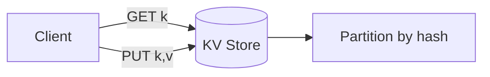

### Key details

- Redis: in-memory, rich types, pub/sub, persistence optional
- DynamoDB: managed, partition key + sort key, on-demand capacity
- Consistency tunable (strong vs. eventual read in Dynamo)
- No ad-hoc queries - access pattern must be key-known upfront

### When to use

- Session cache, rate limiting, leaderboards (Redis sorted sets)
- User preferences keyed by user ID
- High-scale simple lookups at known key

### Trade-offs / Pitfalls

- Secondary access patterns need duplicate keys or separate index
- Large values hurt performance and cost
- In-memory stores need persistence strategy for durability
- Hot keys limit partition throughput

### References

- [Key-Value Stores  -  system design video](https://www.youtube.com/watch?v=VfcRxtBKI54)

---

## 2.13 Document Databases

### What is it?

**Document databases** store semi-structured **JSON/BSON documents** with flexible schema, indexed fields, and query languages (MongoDB Query API, CouchDB views). Documents can embed arrays and nested objects.

### Why it matters

Matches object-oriented and event payloads naturally; schema evolution without migrations. Good for catalogs, content management, user profiles with varying attributes.

### How it works

1. Application inserts document with `_id` (often ObjectId).
2. Store persists BSON/JSON with optional schema validation.
3. Indexes on nested fields (e.g., `address.city`).
4. Queries filter, project, aggregate via pipeline.
5. Sharding by shard key distributes collections.

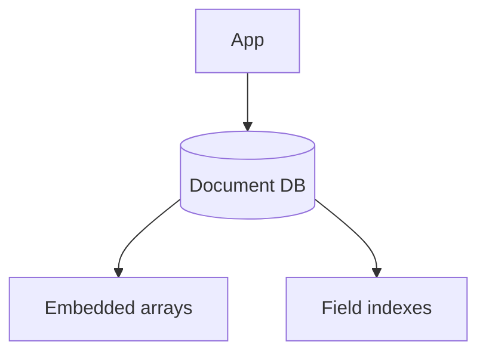

### Key details

- MongoDB: replica sets, sharded clusters, aggregation framework
- Embedding vs. referencing trade-off (1: few -> embed; many -> reference)
- **Schema validation** optional JSON Schema in MongoDB 3.6+
- Change streams for CDC

### When to use

- Heterogeneous records (products with different attributes)
- Rapid prototyping with evolving schema
- Read-heavy document retrieval by ID or indexed fields

### Trade-offs / Pitfalls

- Unbounded document growth (16 MB limit in MongoDB)
- Joins (`$lookup`) expensive - denormalize preferred
- Wrong shard key -> jumbo chunks, unbalanceable
- Transaction support added but cross-shard costly

### References

- [Document Databases  -  MongoDB overview video](https://www.youtube.com/watch?v=cODCpXtPHbQ)

---

## 2.14 Wide Column Databases

### What is it?

**Wide-column stores** (column-family) organize data by row key with **dynamic columns** grouped in families - sparse tables with billions of rows. Examples: Cassandra, HBase, ScyllaDB. Inspired by Google's Bigtable.

### Why it matters

Optimized for **massive scale writes**, time-series, and access by known row key + column qualifier. Linear scale-out on commodity hardware.

### How it works

1. Row key determines partition (hash or range).
2. Within row, columns sorted by name (wide rows possible).
3. Column families stored separately on disk (LSM backend).
4. Tunable consistency per query (ONE, QUORUM, ALL).
5. CQL (Cassandra) provides SQL-like interface.

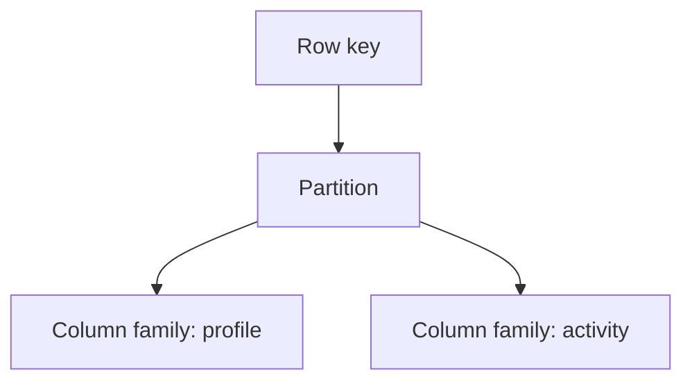

### Key details

- **Partition key** choice critical - avoid hotspots
- **Clustering columns** define sort order within partition
- No joins, no multi-partition ACID transactions (lightweight transactions limited)
- **TTL** on columns for automatic expiry

### When to use

- Time-series metrics, IoT sensor data
- High write throughput event logging
- Known access pattern: row key + column range scan

### Trade-offs / Pitfalls

- Secondary indexes weak (local index per node)
- Large partitions cause memory pressure and repair issues
- Data modeling inverted from relational (query-first design)
- Eventual consistency requires application idempotency

---

## 2.15 Graph Databases

### What is it?

**Graph databases** store **nodes** (entities) and **edges** (relationships) as first-class citizens, optimized for traversals - friends-of-friends, shortest path, pattern matching. Examples: Neo4j, Amazon Neptune, JanusGraph.

### Why it matters

Relational JOINs explode for deep graph queries (6-hop friends). Native graph stores index adjacency for millisecond traversals on connected data.

### How it works

1. Create nodes with labels and properties.
2. Create directed/undirected edges with types and properties.
3. Query with graph language (Cypher, Gremlin, SPARQL).
4. Index-free adjacency: each node points to neighbors.
5. Traversal follows pointers without expensive JOINs.

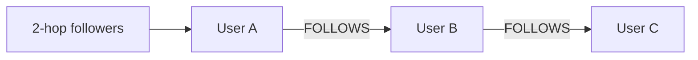

### Key details

- **Property graph** (Neo4j) vs. **RDF triple store** (semantic web)
- Depth-first traversal native; shallow wide queries also fast
- Sharding graphs harder than KV (min-cut partitioning)
- ACID transactions on subgraph in Neo4j

### When to use

- Social networks, recommendation "people also bought"
- Fraud ring detection, knowledge graphs, dependency maps
- When queries are primarily relationship traversals

### Trade-offs / Pitfalls

- Poor for bulk analytics aggregating entire graph
- Not a general-purpose OLTP replacement
- Horizontal scaling more complex than Cassandra
- Supernodes (celebrity with billion edges) need modeling tricks

---

## 2.16 Time Series Databases

### What is it?

**Time-series databases (TSDB)** optimize storage and queries for **timestamped metrics** - append-mostly writes, time-range scans, downsampling, retention policies. Examples: InfluxDB, TimescaleDB, Prometheus, QuestDB.

### Why it matters

Metrics, monitoring, IoT, and financial ticks generate enormous append-only streams. General RDBMS struggle with compression and time-range query efficiency at this scale.

### How it works

1. Data points: (timestamp, metric name, tags, value).
2. Writes batched and compressed by time block.
3. Queries aggregate over time windows (avg, p99 last 1h).
4. **Retention policies** drop or downsample old data.
5. Often paired with Grafana for visualization.

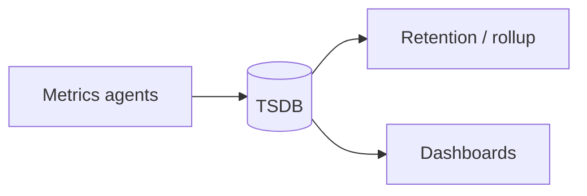

### Key details

- **TimescaleDB:** PostgreSQL extension - hypertables chunk by time
- **Prometheus:** pull model, PromQL, local TSDB
- Compression ratios 10:1 common with gorilla encoding
- High cardinality tags (unique per request) kill performance

### When to use

- Application and infrastructure monitoring
- IoT sensor history
- Financial OHLCV bars, analytics on time-ordered events

### Trade-offs / Pitfalls

- Updates/deletes uncommon and often unsupported efficiently
- Cardinality explosion from bad label design
- Long-term storage cost needs downsampling tiering
- Not suited for general transactional workloads

---

## 2.17 Search Databases

### What is it?

**Search databases** (Elasticsearch, OpenSearch, Solr) build **inverted indexes** mapping terms to document IDs, enabling full-text search, fuzzy matching, faceting, and relevance ranking at scale.

### Why it matters

SQL `LIKE '%term%'` cannot scale. Search engines power product search, log analytics (ELK), and autocomplete with sub-second response on billions of documents.

### How it works

1. Documents indexed with analyzed text (tokenized, stemmed, lowercased).
2. Inverted index: term -> posting list (doc IDs + positions).
3. Query parsed; boolean/phrase/scoring applied (BM25 default).
4. Results ranked by relevance score + filters/aggregations.
5. Distributed as shards with replicas for scale and HA.

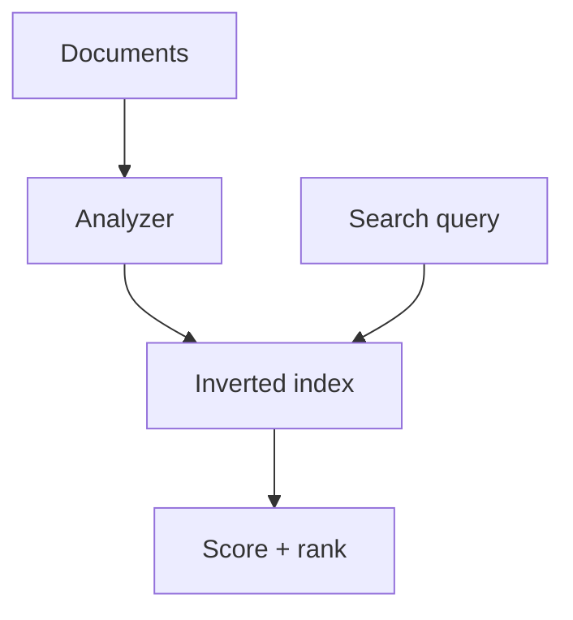

### Key details

- Near-real-time: refresh interval before searchable
- **Sharding** by hash; **replicas** for read scale
- Mapping defines field types (keyword vs. text)
- ELK stack: Elasticsearch + Logstash + Kibana

### When to use

- Product/site search with facets
- Log and trace analytics
- Autocomplete and fuzzy name matching

### Trade-offs / Pitfalls

- Not a system of record - sync from primary DB via CDC
- Reindex required for breaking mapping changes
- Split-brain and yellow cluster states in ops
- Heavy aggregations memory-intensive

---

## 2.18 Vector Databases

### What is it?

**Vector databases** store **embeddings** (high-dimensional float arrays) and support **similarity search** (nearest neighbors) via indexes like HNSW, IVF, or PQ. Examples: Pinecone, Weaviate, Milvus, pgvector extension.

### Why it matters

LLM applications need semantic search, RAG (retrieval-augmented generation), and recommendation by meaning not keywords. Vector DBs make billion-scale similarity queries practical.

### How it works

1. Embed text/image via model (OpenAI, sentence-transformers).
2. Store vector + metadata payload in collection.
3. Build ANN (approximate nearest neighbor) index.
4. Query: embed question -> find top-k similar vectors.
5. Return associated documents to LLM context.

### Key details

- **HNSW:** graph-based ANN, high recall, memory heavy
- **Cosine vs. L2 vs. dot product** - must match training normalization
- Hybrid search: vector + keyword filter (metadata pre-filter)
- pgvector brings vectors into PostgreSQL for simpler ops

### When to use

- Semantic document search, RAG chatbots
- Image similarity, duplicate detection
- Recommendation by content embedding

### Trade-offs / Pitfalls

- Approximate index -> missed relevant results
- Embedding model change requires full re-index
- High dimensionality (1536+) memory cost
- Stale embeddings if source documents change

---

## 2.19 Multi Model Databases

### What is it?

**Multi-model databases** support multiple data models - document, graph, key-value, relational - in one engine with unified query and storage. Examples: ArangoDB, Azure Cosmos DB, FaunaDB.

### Why it matters

Reduces operational overhead of running separate Mongo, Neo4j, and Redis clusters when application needs multiple paradigms on overlapping data.

### How it works

1. Single cluster stores documents that may embed graph edges.
2. Query languages expose graph traversals, document filters, KV access.
3. Unified replication, backup, and security model.
4. Storage layer may use document store with graph index overlay.
5. API choice per access pattern on same data.

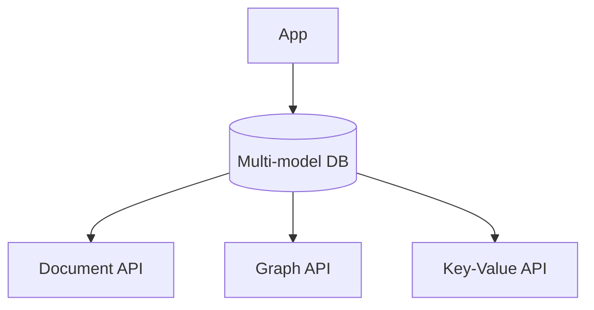

### Key details

- Cosmos DB: API-compatible layers (SQL, Mongo, Cassandra, Gremlin)
- Trade-off: jack-of-all-trades vs. best-in-class per model
- Operational simplicity vs. feature depth
- Licensing and vendor lock-in considerations

### When to use

- Startup reducing ops burden before scale forces specialization
- Applications genuinely needing graph + document on same entities
- Cloud-managed multi-API (Cosmos) for global distribution

### Trade-offs / Pitfalls

- None match peak performance of specialized DB per model
- Query language complexity across paradigms
- Cosmos RU pricing requires careful modeling
- Migration out harder with proprietary APIs

### References

- [Multi-Model Databases  -  overview video](https://www.youtube.com/watch?v=hwYadL33HdI)

---

## Quick Reference

| # | Topic | Summary |
|---|-------|---------|
| 2.1 | Normalization/Denormalizatio | **Normalization** organizes data into related tables to eliminate redundancy ... |
| 2.2 | Indexing | An **index** is a secondary data structure that speeds lookups by key or colu... |
| 2.3 | B Tree/B+ Tree | **B-trees** and **B+ trees** are balanced tree structures storing sorted keys... |
| 2.4 | Query Planner/ optimizer | The **query planner** (optimizer) chooses how to execute a SQL statement - join... |
| 2.5 | Views/ Materialized View | A **view** is a stored SQL query acting as a virtual table - no data stored, co... |
| 2.6 | Isolation Levels | **Transaction isolation levels** define how much concurrent transactions inte... |
| 2.7 | MVCC | **Multi-Version Concurrency Control (MVCC)** keeps multiple versions of each ... |
| 2.8 | Redo/undo/bin Logs | Database **logs** ensure durability and recoverability: **redo log** (WAL) re... |
| 2.9 | LSM Tree/SSTables/WAL | **Log-Structured Merge (LSM) trees** buffer writes in memory (**memtable**), ... |
| 2.10 | Page Cache | The **page cache** (buffer pool) is DB-managed memory holding frequently acce... |
| 2.11 | Vacuum Process | **VACUUM** (PostgreSQL terminology; similar concepts elsewhere) reclaims spac... |
| 2.12 | Key Value Stores | **Key-value stores** map opaque keys to blob values with simple get/put/delet... |
| 2.13 | Document Databases | **Document databases** store semi-structured **JSON/BSON documents** with fle... |
| 2.14 | Wide Column Databases | **Wide-column stores** (column-family) organize data by row key with **dynami... |
| 2.15 | Graph Databases | **Graph databases** store **nodes** (entities) and **edges** (relationships) ... |
| 2.16 | Time Series Databases | **Time-series databases (TSDB)** optimize storage and queries for **timestamp... |
| 2.17 | Search Databases | **Search databases** (Elasticsearch, OpenSearch, Solr) build **inverted index... |
| 2.18 | Vector Databases | **Vector databases** store **embeddings** (high-dimensional float arrays) and... |
| 2.19 | Multi Model Databases | **Multi-model databases** support multiple data models - document, graph, key-v... |

---

[â -  Back to master index](../README.md)
