# 2. Databases

[<- Back to master index](../README.md)

---

## Sub-topics

| # | Sub-topic |
|---|-----------|
| 2.1 | [Normalization & Denormalization](#21-normalization--denormalization) |
| 2.2 | [Indexing](#22-indexing) |
| 2.3 | [B Tree/B+ Tree](#23-b-treeb-tree) |
| 2.4 | [Query Planner / Optimizer](#24-query-planner--optimizer) |
| 2.5 | [Views/ Materialized View](#25-views-materialized-view) |
| 2.6 | [Isolation Levels](#26-isolation-levels) |
| 2.7 | [MVCC](#27-mvcc) |
| 2.8 | [Redo/undo/bin Logs](#28-redoundobin-logs) |
| 2.9 | [LSM Tree/SSTables/WAL](#29-lsm-treesstableswal) |
| 2.10 | [Page Cache](#210-page-cache) |
| 2.11 | [Vacuum Process](#211-vacuum-process) |
| 2.12 | [Key Value Stores](#212-key-value-stores) |
| 2.13 | [Document Databases](#213-document-databases) |
| 2.14 | [Wide Column Databases](#214-wide-column-databases) |
| 2.15 | [Graph Databases](#215-graph-databases) |
| 2.16 | [Time Series Databases](#216-time-series-databases) |
| 2.17 | [Search Databases](#217-search-databases) |
| 2.18 | [Vector Databases](#218-vector-databases) |
| 2.19 | [Multi Model Databases](#219-multi-model-databases) |
| 2.20 | [ACID/BASE Properties](#220-acidbase-properties) |
| 2.21 | [SQL Tuning](#221-sql-tuning) |

---

## 2.1 Normalization & Denormalization

### Overview

Imagine a school office that keeps one master roster for students and one for courses, then a simple enrollment sheet that only lists who takes what. Nobody copies "Ram" or "Java" onto every line — each fact lives in one place. That is normalization: one canonical home for each piece of information.

Technically, normalization is the process of decomposing relational tables so that each non-key attribute depends only on the key of its table, eliminating redundant copies of the same fact. Denormalization deliberately reintroduces controlled duplication — often as extra columns on a hot read table — to trade storage and update complexity for fewer joins at query time.

### What problem it fixes

Without normalization, a single wide table mixes entities. A classic enrollment example stores student name and course name on every enrollment row:

| StudentID | StudentName | CourseID | CourseName |
|-----------|-------------|----------|------------|
| 101 | Ram | C01 | Java |
| 101 | Ram | C02 | Spring |
| 102 | Shyam | C01 | Java |

That design creates four practical failures:

1. **Update anomaly** — renaming "Java" to "Java Programming" touches many rows; partial updates leave inconsistent names.
2. **Insert anomaly** — you cannot register a new course until at least one student enrolls.
3. **Delete anomaly** — removing the last enrollment for a course can erase the course record entirely.
4. **Redundant storage** — "Ram" and "Java" are repeated on every related row.

Denormalization fixes the opposite problem: normalized schemas force joins on read-heavy paths. When 90% of traffic is `SELECT` and only 10% is `INSERT`/`UPDATE`, repeated joins over large tables become the bottleneck.

### What it does

**Normalization** splits data into entity tables linked by foreign keys so each fact is stored once. **Denormalization** copies frequently joined attributes onto a parent or summary table so common reads avoid joins. Neither is universally "correct" — OLTP systems lean normalized; analytics and feed-style reads often lean denormalized.

### How it works — the architecture inside

#### Normalized decomposition

Split the enrollment example into three tables:

**Student**

| StudentID | StudentName |
|-----------|-------------|
| 101 | Ram |
| 102 | Shyam |

**Course**

| CourseID | CourseName |
|----------|------------|
| C01 | Java |
| C02 | Spring |

**Enrollment**

| StudentID | CourseID |
|-----------|----------|
| 101 | C01 |
| 101 | C02 |
| 102 | C01 |

To list a student's courses you join three small tables once; each name change updates a single row.

#### Normal forms (progressive rules)

| Form | Rule | Fix pattern |
|------|------|-------------|
| **1NF** | Atomic columns, no repeating groups, unique rows | Split `Phones: 111,222` into one phone per row |
| **2NF** | 1NF + no partial dependency on a composite key | Move `StudentName` out of `(StudentID, CourseID)` enrollment |
| **3NF** | 2NF + no transitive dependency (`A → B → C`) | Move `DeptName` out of `Employee(EmpID, DeptID, DeptName)` into `Department` |
| **BCNF** | Every determinant is a candidate key | Stricter 3NF for edge cases; mostly interview theory |

**3NF walkthrough — employee and department:**

| EmpID | DeptID | DeptName |
|-------|--------|----------|
| E101 | D10 | IT |

`EmpID → DeptID → DeptName` is transitive. Split into `Employee(EmpID, DeptID)` and `Department(DeptID, DeptName)`.

#### Denormalized read path

**Normalized orders query:**

```sql
SELECT o.order_id, c.customer_name
FROM orders o
JOIN customer c ON o.customer_id = c.customer_id;
```

**Denormalized orders table:**

| OrderID | CustomerID | CustomerName |
|---------|------------|--------------|
| O1 | C1 | Ram |

Same read becomes a single-table scan — no join.

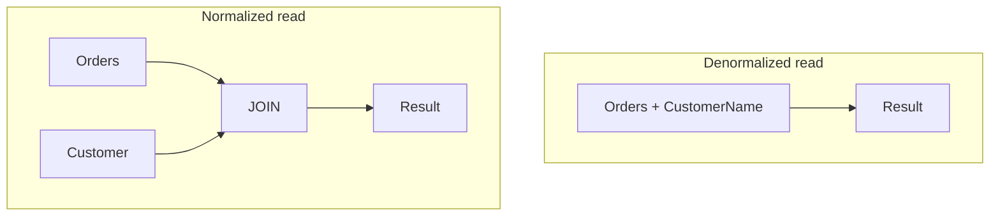

#### Normalization vs denormalization

| Dimension | Normalization | Denormalization |
|-----------|---------------|-----------------|
| Duplicate data | Minimal | Higher |
| Read latency | More joins | Fewer joins |
| Write path | Single-row updates | Must update all copies |
| Consistency | Strong by design | Requires discipline (triggers, app logic, CDC) |
| Typical workload | OLTP, ledgers | Dashboards, caches, search feeds |

### Pitfalls and design tips

- **Default for new transactional schemas:** normalize to 3NF first; denormalize only after measuring join cost on real queries.
- **Do not denormalize without a write strategy** — every copy of `customer_name` on `orders` must update when the customer renames; triggers, materialized views, or event-driven sync are common patterns.
- **Star schemas in warehouses are intentional denormalization** — fact tables plus dimension tables are not "bad normalization"; they optimize analytic scans.
- **Over-normalization hurts** — splitting every attribute into micro-tables can produce dozens of joins for a simple screen; balance theory with query plans.
- **Interview angle:** cite OLTP (banking) vs OLAP (reporting) — consistency vs read throughput — not "always normalize."

### Real-world example

**Stripe-style payment ledger (OLTP):** `accounts`, `transactions`, and `merchants` stay normalized. A charge row references `merchant_id`; merchant legal name lives once in `merchants`. A mistaken merchant rename updates one row — critical for audit trails.

**Shopify-style merchant dashboard (OLAP):** nightly ETL builds denormalized `daily_revenue_by_store` with `store_name`, `region`, and `gmv` pre-joined. The dashboard reads a few wide summary rows instead of joining fact and dimension tables on every page load. Staleness of hours is acceptable; sub-second reads are not.

---

## 2.2 Indexing

### Overview

A database index works like a book's index at the back: instead of reading every page to find "Caching," you look up the term and jump to page 412. Without an index the engine walks the whole table — a full scan.

An index is a separate ordered structure mapping **index key → row location** (or row data in clustered designs). Lookups drop from **O(N)** table scans to **O(log N)** tree seeks for typical B+ tree indexes, dramatically reducing disk pages read per query.

### What problem it fixes

On a million-row `employee` table:

```sql
SELECT * FROM employee WHERE id = 1000000;
```

Without an index the database may read every page sequentially. Disk I/O dominates latency — each extra page costs orders of magnitude more than CPU. Indexes exist so equality, range, sort, and join predicates can skip irrelevant pages.

### What it does

Indexes maintain a sorted (or hashed) copy of selected column values plus pointers to heap rows. The optimizer chooses index seek, index scan, or table scan based on selectivity and statistics. Writes pay a cost: every index on a table must be updated on insert, update, or delete.

### How it works — the architecture inside

#### Index entry model

```text
(Index Key) → (Pointer to row / row data)
```

**Employee table**

| ID | NAME |
|----|------|
| 1 | Ram |
| 2 | Mohan |

**Index on ID**

```text
1 → Row A
2 → Row B
```

#### Index types

| Type | Created on | Lookup pattern |
|------|------------|----------------|
| **Primary** | Primary key | Automatic in most engines; unique, not null |
| **Secondary** | Non-PK columns | `CREATE INDEX idx_name ON employee(name)` |
| **Unique** | Any column(s) | Enforces uniqueness: `CREATE UNIQUE INDEX idx_email ON customer(email)` |
| **Composite** | Multiple columns | Sorted lexicographically: `(department_id, salary)` |
| **Covering** | Includes all SELECT columns | Index-only scan — no heap fetch |

#### Clustered vs non-clustered

| | Clustered | Non-clustered |
|---|-----------|---------------|
| Data layout | Table rows stored in index key order | Separate structure; index holds pointers |
| Count per table | One (the table *is* the clustered index) | Many |
| Range scans | Excellent on cluster key | Good; may require key lookups |
| Engine note | SQL Server PK often clustered; InnoDB PK is clustered | Secondary indexes point to PK |

#### Leftmost prefix rule

Index `(department_id, salary)` supports:

```sql
WHERE department_id = 1
WHERE department_id = 1 AND salary = 50000
```

It generally does **not** efficiently support `WHERE salary = 50000` alone — the index is sorted first by `department_id`.

#### Hash vs B+ tree

| Structure | Good for | Bad for |
|-----------|----------|---------|
| **B+ tree** | `=`, ranges, `ORDER BY`, `BETWEEN` | Slightly more overhead than hash for pure equality |
| **Hash** | Equality `WHERE name = 'Ram'` — O(1) bucket seek | Range, sort, prefix `LIKE` — no ordering |

#### Scan types

| Scan | When | Cost |
|------|------|------|
| **Table scan** | No useful index or optimizer expects most rows | O(rows) |
| **Index seek** | Highly selective equality on indexed column | O(log N) + few pages |
| **Index range scan** | `BETWEEN`, inequalities | Reads contiguous index leaf range |
| **Index-only scan** | Covering index satisfies all columns | No heap access |

#### Selectivity

```text
Selectivity = Distinct Values / Total Rows
```

**How to calculate:**

- **Given:** `gender` column, 1,000,000 rows, 2 values (M/F)
- **Selectivity:** `2 / 1,000,000 ≈ 0.000002` — very low; index rarely helps unless combined with other predicates
- **Given:** `email`, 1,000,000 rows, 999,500 distinct emails
- **Selectivity:** `0.9995` — excellent index candidate

**Sanity check:** if a predicate returns ~50% of rows, a full scan is often cheaper than millions of random heap lookups.

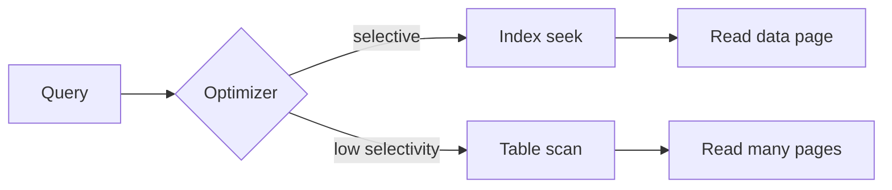

### Pitfalls and design tips

- **Index foreign keys and frequent WHERE/JOIN columns** — missing FK indexes is a top production slow-query cause.
- **Avoid indexing low-cardinality columns alone** — `status`, `is_active`, `gender` unless combined in a composite with a selective leading column.
- **Leading wildcard kills indexes** — `WHERE name LIKE '%ram'` cannot use a B+ tree index; `LIKE 'ram%'` can.
- **Functions on indexed columns** — `WHERE UPPER(email) = 'X'` may skip the index unless you add a functional index (PostgreSQL) or store normalized values.
- **Write amplification** — ten secondary indexes on a hot insert table means eleven structures updated per row; benchmark before indexing everything.
- **Default choice:** B+ tree secondary indexes on selective lookup columns; revisit after `EXPLAIN ANALYZE` on production-shaped data.

### Real-world example

**Amazon product catalog pattern:** `product` holds millions of rows. Typical indexes:

```sql
PRIMARY KEY (product_id)
INDEX (category_id)
INDEX (price)
-- composite for category + price filters
INDEX (category_id, price)
```

Query:

```sql
SELECT * FROM product
WHERE category_id = 10 AND price < 5000;
```

The composite index narrows to category 10 in the B+ tree, then walks the price range within those leaf entries — avoiding a full catalog scan.

---

## 2.3 B Tree/B+ Tree

### Overview

A balanced phone tree in a call center routes you through menus — "press 1 for billing, 2 for support" — instead of listening to every option in one long list. A B-tree does the same for disk pages: each node holds many keys and branches, so the tree stays shallow even with millions of records.

B-trees and B+ trees are self-balancing multi-way search trees designed for block-oriented storage. Each node fits one disk page; high fan-out keeps tree height to 3–4 levels for billions of keys. B+ trees store all row data in linked leaf nodes, making range scans and sorting the default fast path — which is why InnoDB, PostgreSQL, Oracle, and SQL Server use them for indexes.

### What problem it fixes

A binary search tree degrades to a linked list when keys arrive sorted (`10, 20, 30, …`), turning **O(log N)** into **O(N)**. Even a balanced BST stores one key per node — millions of nodes mean millions of potential disk hops. Databases need a structure where each I/O reads hundreds of keys and tree height stays minimal.

### What it does

- **B-tree:** keys and optional row data in internal and leaf nodes; search, insert, delete with node splits and merges to maintain balance.
- **B+ tree:** internal nodes hold routing keys only; all data lives in leaf nodes linked as a doubly linked list for sequential traversal.

Both guarantee all leaves at the same depth. Inserts that overflow a node split it and promote a middle key to the parent.

### How it works — the algorithm inside

#### B-tree node layout (order m = 4)

```text
Maximum children = 4
Maximum keys     = m - 1 = 3

                [30 | 60]
               /    |    \
          [10|20] [40|50] [70|80]
```

**Search for 50:** compare at root → `30 < 50 < 60` → middle child → found in `[40|50]`.

#### Why shallow height matters

If each node holds ~100 keys:

| Level | Keys addressable |
|-------|------------------|
| 1 | 100 |
| 2 | 10,000 |
| 3 | 1,000,000 |

Three disk reads can locate one row among a million — the design target for index depth.

#### Insertion and split (order 4, max 3 keys)

Start: `[10|20|30]`. Insert 40 → overflow `[10|20|30|40]`. Promote middle key 20:

```text
          [20]
         /    \
      [10]  [30|40]
```

Continue inserting 50, 60 — right child overflows, promote 40:

```text
             [20|40]
            /   |    \
         [10] [30] [50|60]
```

Deletion reverses via borrowing from siblings or merging underfull nodes.

#### B+ tree leaf chain

```text
                     [30 | 60]          ← internal: keys only
                    /    |     \
      [10|20] <-> [30|40|50] <-> [60|70|80]   ← leaves: data + next pointer
```

**Range query** `salary BETWEEN 30000 AND 80000`:

1. Tree descent to first qualifying leaf key.
2. Walk the leaf linked list — no repeated root-to-leaf trips.

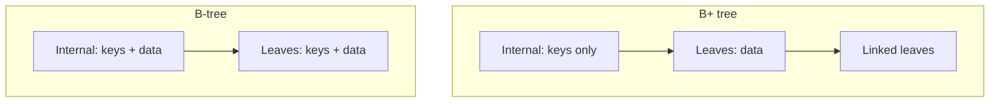

#### B-tree vs B+ tree

| Feature | B-tree | B+ tree |
|---------|--------|---------|
| Data in internal nodes | Yes | No — routing only |
| Leaf linkage | No | Yes — sequential scan |
| Tree height | Slightly taller | Shorter (more keys per page) |
| Range / ORDER BY | Good | Excellent |
| Typical use | Some filesystems | Relational DB indexes |

### Pitfalls and design tips

- **Do not say "databases use B-trees" without qualifying B+ tree** — interviewers often want the leaf-linked-list distinction.
- **Clustered B+ tree index defines physical row order** — choose the cluster key carefully; monotonic inserts on UUID v4 PKs cause page splits and fragmentation (consider sequential IDs or `uuidv7`).
- **Index-only scans require INCLUDE/covering columns** — PK lookups in InnoDB read the clustered index directly; secondary indexes do a double lookup unless covering.
- **Hash indexes are not a drop-in replacement** — no range support; used for in-memory or equality-only workloads.

### Real-world example

**MySQL InnoDB primary key:** table data is the clustered B+ tree on the primary key. `SELECT * FROM orders WHERE order_id = 8821` descends the PK tree and reads the leaf page containing the full row. A secondary index on `customer_id` stores `(customer_id → order_id)` and performs a second PK lookup — motivating covering indexes for hot queries like `SELECT order_id, created_at WHERE customer_id = ?`.

---

## 2.4 Query Planner / Optimizer

### Overview

When you ask GPS for a route, it does not drive the first path it imagines — it compares highways, tolls, and traffic. A SQL engine does the same before touching data: it parses your query, imagines several execution strategies, estimates cost, and picks the cheapest plan.

The query pipeline is **parser → planner (generate candidates) → optimizer (pick lowest cost) → executor**. The output is an **execution plan** — the actual algorithm sequence (index seek, hash join, sort, etc.) the engine will run.

### What problem it fixes

```sql
SELECT * FROM employee WHERE employee_id = 100;
```

On a 10-million-row table, a naive full scan reads every page. The optimizer must decide whether an index seek on `employee_id` (expecting one row) beats scanning millions. Wrong choices — outdated statistics, missing indexes, bad join order — turn millisecond queries into minutes.

### What it does

The **parser** validates syntax, resolves tables/columns, and builds a parse tree. The **planner** enumerates access paths (table scan, index scan, join orders, join algorithms). The **optimizer** assigns costs from statistics (row counts, cardinality, index selectivity) and selects the minimum-cost plan. The **executor** runs that plan and returns rows.

### How it works — the architecture inside

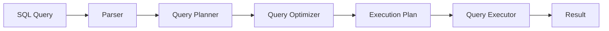

#### Cost-based plan selection

**Employee table:** 10,000,000 rows, `PRIMARY KEY(employee_id)`.

| Plan | Strategy | Estimated rows read | Relative cost |
|------|----------|---------------------|---------------|
| A | Sequential scan | 10,000,000 | Very high |
| B | Index seek on PK | 1 | Very low |

Optimizer picks Plan B.

**Cost model (simplified):**

```text
Cost ≈ CPU + Memory + Disk I/O + Network
```

#### Cardinality drives index vs scan

```sql
SELECT * FROM employee WHERE gender = 'Male';
```

If `'Male'` matches ~5,000,000 rows, random heap lookups via an index can cost more than one sequential scan. Optimizer may choose table scan.

```sql
SELECT * FROM employee WHERE employee_id = 100;
```

One row expected — index seek wins.

#### Join optimization

```sql
SELECT * FROM orders o
JOIN customers c ON o.customer_id = c.id;
```

| Algorithm | Mechanism | Best when |
|-----------|-----------|-----------|
| **Nested loop** | For each outer row, probe inner | Small inner table or indexed inner |
| **Hash join** | Build hash on one side, probe with other | Large equi-joins, no useful index |
| **Merge join** | Walk two sorted inputs | Inputs already ordered on join key |

**Join order matters:** tables A (10 rows), B (100), C (10M) — `(A JOIN B) JOIN C` usually beats `(B JOIN C) JOIN A` because the intermediate result stays small.

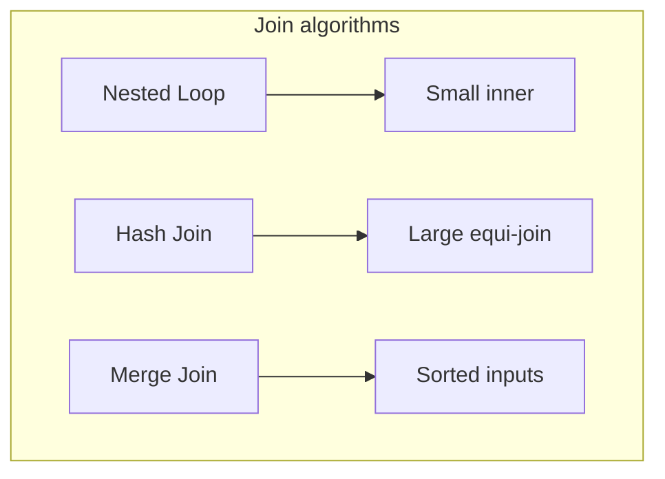

#### Index and composite selection

Indexes: `(name)`, `(city)`, `(city, age)`.

```sql
WHERE city = 'Bangalore' AND age = 25
```

Optimizer prefers `(city, age)` — both predicates satisfied from one index prefix.

#### Query rewriting

Optimizer transforms SQL internally:

- `WHERE salary > 5000 AND salary > 10000` → `WHERE salary > 10000`
- Correlated subquery → semi-join or hash join
- **Predicate pushdown** — filter inside subqueries early
- **Projection pushdown** — fetch only needed columns

#### Inspecting plans

```sql
-- MySQL
EXPLAIN SELECT * FROM employee WHERE employee_id = 100;

-- PostgreSQL
EXPLAIN ANALYZE SELECT * FROM employee WHERE employee_id = 100;
```

Common plan nodes: `Seq Scan`, `Index Scan`, `Index Only Scan`, `Hash Join`, `Merge Join`, `Nested Loop`, `Sort`, `Aggregate`.

### Pitfalls and design tips

- **Stale statistics are the #1 surprise slow query** — run `ANALYZE` (PostgreSQL) or ensure auto-stats (SQL Server, MySQL) after large loads.
- **`SELECT *` hides projection pushdown** — fetch only columns you need; wide rows bloat sort/hash memory.
- **Parameter sniffing (SQL Server) / generic plans** — first parameter value can lock a bad plan; know `RECOMPILE` or plan guides when needed.
- **Functions on indexed columns** — optimizer may not use the index; match predicate shape to index definition.
- **Do not trust EXPLAIN without ANALYZE on PostgreSQL** — estimated rows vs actual rows divergence signals stats or correlation issues.
- **Interview tip:** walk through parser → planner → optimizer → executor; cite cardinality and cost, not "the database is smart."

### Real-world example

**Orders lookup by primary key:**

```sql
SELECT * FROM orders WHERE order_id = 100;
```

On a 50-million-row table:

1. Parser validates `orders.order_id`.
2. Optimizer reads stats — PK unique, one row expected.
3. Plan: `Index Seek` on PK → single leaf fetch.
4. Executor returns one row in milliseconds.

Without the optimizer, a full scan touches millions of pages — seconds of I/O. `EXPLAIN` showing `Seq Scan` on a PK filter is a red flag to investigate immediately.

---

## 2.5 Views/ Materialized View

### Overview

A regular view is a saved recipe — the database stores the SQL, not the meal. Every time you "open" it, the kitchen cooks from scratch. A materialized view is meal prep: the result is cooked once, stored in the fridge, and served quickly until you decide to refresh it.

A **view** is a virtual table defined by a query; execution always hits base tables. A **materialized view** persists the query result on disk, trading freshness for read speed on expensive aggregations and joins.

### What problem it fixes

Teams repeat the same complex join:

```sql
SELECT e.id, e.name, d.name AS department
FROM employee e
JOIN department d ON e.dept_id = d.id;
```

Views hide that complexity. But on a 100-million-row `sales` table, a view wrapping `GROUP BY region` re-aggregates on every dashboard refresh — five seconds per request adds up. Materialized views precompute once; reads drop to milliseconds.

### What it does

| | View | Materialized view |
|---|------|-------------------|
| Stored artifact | SQL definition | Physical rows |
| Freshness | Always current | Stale until refresh |
| Read cost | Pays full query each time | Scans stored snapshot |
| Storage | Negligible | Grows with result size |
| Typical use | Security, abstraction | Reporting, dashboards |

### How it works — the architecture inside

#### View execution path

```sql
CREATE VIEW employee_details AS
SELECT e.id, e.name, d.name AS department
FROM employee e
JOIN department d ON e.dept_id = d.id;
```

```sql
SELECT * FROM employee_details;
```

Internally the engine expands to the base join — no data is cached in the view object.

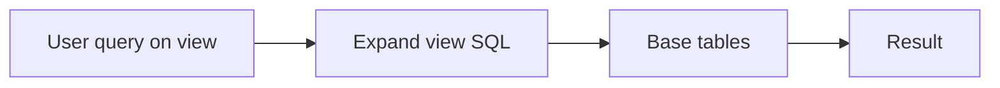

#### Materialized view path

```sql
CREATE MATERIALIZED VIEW sales_summary AS
SELECT region, SUM(amount) AS total
FROM sales
GROUP BY region;
```

Build time: engine runs aggregation once, writes:

| Region | Total |
|--------|-------|
| East | 5000000 |
| West | 7000000 |

Reads hit `sales_summary` directly. After `INSERT INTO sales`, the MV is stale until:

```sql
REFRESH MATERIALIZED VIEW sales_summary;
```

#### Refresh strategies

| Strategy | Behavior | Cost |
|----------|----------|------|
| **Complete refresh** | Rebuild entire result | Simple; expensive on huge tables |
| **Incremental refresh** | Apply changes since last refresh | Complex; needs change log or constraints (Oracle, PostgreSQL with unique indexes) |

PostgreSQL concurrent refresh requires a unique index on the MV. Oracle and SQL Server offer incremental options on qualified views.

#### When to choose which

| Need | Choice |
|------|--------|
| Hide schema, row-level security, always-fresh reads | View |
| Expensive aggregation, tolerable staleness | Materialized view |
| Real-time dashboard on live writes | View + careful indexing, or stream to OLAP |

### Pitfalls and design tips

- **Views are not a performance feature by default** — they do not cache; a slow underlying query stays slow.
- **Updatable views have restrictions** — joins and aggregates often block `INSERT`/`UPDATE` through the view.
- **MV refresh window vs SLA** — nightly refresh means dashboards show yesterday; document staleness for users.
- **Complete refresh locks reads on some engines** — use `REFRESH MATERIALIZED VIEW CONCURRENTLY` (PostgreSQL) when available.
- **Do not confuse with replicas** — MVs are query snapshots, not HA failover targets.

### Real-world example

**E-commerce orders (500M rows):** dashboard panels need revenue by country, category, and month. Running `GROUP BY` on raw `orders` per page load saturates the OLTP cluster. Nightly ETL builds materialized views `mv_revenue_by_country`, `mv_revenue_by_category`, `mv_revenue_by_month`. The BI app queries MVs only — sub-100 ms loads, minimal impact on checkout traffic.

---

## 2.6 Isolation Levels

### Overview

Isolation levels are like rules for parallel editors working on the same document: strict rules mean nobody sees half-finished edits, but people wait longer for the file. Looser rules let everyone work faster, but someone might read a paragraph that gets deleted a second later.

In ACID, **Isolation** defines what one transaction may see while another is in flight. SQL defines four standard levels that trade **consistency guarantees** against **concurrency** (locking or snapshot overhead).

### What problem it fixes

Account balance = 1000. Transaction T1 withdraws 200; T2 reads balance mid-flight. Without rules, T2 might read 800 before T1 commits, or read 500 from an update that rolls back — corrupt application logic. Isolation levels document which anomalies are permitted.

### What it does

Each level prevents a subset of **dirty read**, **non-repeatable read**, and **phantom read**:

| Anomaly | Definition |
|---------|------------|
| **Dirty read** | Read uncommitted data that may roll back |
| **Non-repeatable read** | Same row read twice returns different committed values |
| **Phantom read** | Same query run twice returns different row sets (new/deleted rows) |

Higher isolation → fewer anomalies → typically lower throughput.

### How it works — the architecture inside

#### Anomaly walkthroughs

**Dirty read:** T1 `UPDATE balance = 500` (uncommitted). T2 reads 500. T1 `ROLLBACK` → 500 never really existed.

**Non-repeatable read:** T1 reads salary 50000. T2 updates to 60000 and commits. T1 reads salary again → 60000.

**Phantom read:** T1 `SELECT * FROM employee WHERE dept = 'IT'` → 3 rows. T2 inserts a new IT employee and commits. T1 repeats query → 4 rows.

#### The four SQL levels


| Level | Dirty read | Non-repeatable | Phantom |
|-------|------------|----------------|---------|
| Read uncommitted | Allowed | Allowed | Allowed |
| Read committed | Prevented | Allowed | Allowed |
| Repeatable read | Prevented | Prevented | Allowed* |
| Serializable | Prevented | Prevented | Prevented |

\*PostgreSQL repeatable read also prevents phantom reads on indexed predicates via serialization techniques; MySQL InnoDB RR uses next-key locks — behavior varies by engine.

#### Locking model (simplified)

| Lock | Readers | Writers |
|------|---------|---------|
| **Shared (S)** | Multiple concurrent | Blocked by exclusive |
| **Exclusive (X)** | Blocked | One writer |

Serializable and some RR implementations use additional predicate or next-key locks to block phantoms.

#### Engine implementations

PostgreSQL and InnoDB default to **MVCC snapshots** rather than blocking every reader — see section 2.7. **Read committed** in PostgreSQL takes a new snapshot per statement; **repeatable read** holds one snapshot for the transaction. Oracle only exposes RC and serializable (snapshot isolation).

### Pitfalls and design tips

- **Default safe choice for apps:** `READ COMMITTED` (PostgreSQL, SQL Server default) or engine default; escalate only when provably needed.
- **Serializable in PostgreSQL uses SSI** — may abort transactions with serialization failures; apps need retry logic.
- **Do not assume SQL standard = your database** — MySQL RR + InnoDB gap locks differ from PostgreSQL RR.
- **`READ UNCOMMITTED` is rare in production** — dirty reads break almost all business invariants; SQL Server allows it; PostgreSQL treats it as RC.
- **Long transactions at high isolation block vacuum/MVCC cleanup** — keep serializable transactions short.
- **Interview:** name the three anomalies, map to levels, mention MVCC as the implementation layer.

### Real-world example

**Bank transfer (two accounts):** application runs at **repeatable read** or **serializable**. Debit and credit must not interleave with a concurrent balance report that sees money duplicated or missing. Fintech services often use `SELECT … FOR UPDATE` on account rows at RC — explicit row locks — instead of serializable for the whole session, balancing safety and throughput.

---

## 2.7 MVCC

### Overview

Instead of erasing and rewriting a whiteboard while others are still copying it, MVCC gives each person their own snapshot photo of the board at a known time. Writers draw on a new layer; readers keep looking at their photo until their transaction ends.

**Multi-Version Concurrency Control** stores multiple row versions rather than overwriting in place. Each transaction reads versions visible to its snapshot, so readers rarely block writers and writers rarely block readers. PostgreSQL, InnoDB, Oracle, and CockroachDB rely on MVCC for default isolation.

### What problem it fixes

Lock-based systems force `SELECT` to wait behind an uncommitted `UPDATE` on the same row. Under concurrent OLTP load, lock queues grow — throughput collapses and deadlocks appear. MVCC lets reads proceed against an older committed (or snapshot) version while a new version is being written.

### What it does

On `UPDATE`, the engine marks the old row version dead for new snapshots and inserts a new version with the updated values. Metadata (`xmin`/`xmax` in PostgreSQL, `DB_TRX_ID` in InnoDB) records which transactions created or invalidated each version. `DELETE` tombstones the row without immediate physical removal. Cleanup (VACUUM in PostgreSQL, purge in InnoDB) reclaims dead versions when no snapshot needs them.

### How it works — the architecture inside

#### Version chain

**Original row:**

| ID | Balance | Created | Deleted |
|----|---------|---------|---------|
| 1 | 1000 | TXN 10 | NULL |

**TXN 20 updates balance to 500:**

| ID | Balance | Created | Deleted |
|----|---------|---------|---------|
| 1 | 1000 | TXN 10 | TXN 20 |
| 1 | 500 | TXN 20 | NULL |

Both versions coexist until purge.

#### Snapshot visibility

T1 starts at 10:00, sees balance 1000. T2 updates to 500 and commits at 10:01. T1 reads again → still 1000 (repeatable snapshot). New transaction T3 → sees 500.

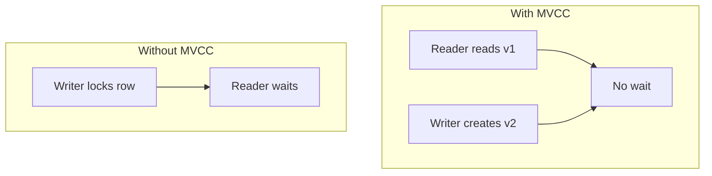

#### Isolation interaction

| Level | Snapshot behavior (PostgreSQL-style) |
|-------|--------------------------------------|
| Read committed | New snapshot **per statement** |
| Repeatable read | One snapshot **per transaction** |

**Read committed example:** T1 first `SELECT salary` → 50000; T2 commits 60000; T1 second `SELECT` → 60000.

**Repeatable read:** both reads → 50000.

#### Writers still conflict

```sql
-- T1 and T2 both try:
UPDATE account SET balance = balance - 100 WHERE id = 1;
```

Second writer blocks or fails on conflict — MVCC does not eliminate write-write locking.

| Mechanism | Handles |
|-----------|---------|
| MVCC | Read vs write |
| Row locks | Write vs write |

#### Garbage collection

| Engine | Cleanup |
|--------|---------|
| PostgreSQL | `VACUUM` removes dead tuples; freeze XIDs |
| InnoDB | Purge thread reclaims undo history |

Long-running open transactions hold back cleanup → table bloat and undo growth.

### Pitfalls and design tips

- **"MVCC means lock-free" is false** — only read/write overlap is optimized; hot write rows still serialize.
- **Long transactions are toxic** — open snapshot prevents vacuum/purge; monitor `pg_stat_activity` / `information_schema.innodb_trx`.
- **Snapshot isolation ≠ full serializable** — classic SI allows write skew; PostgreSQL serializable adds SSI checks.
- **Index-only scans must check visibility** — PostgreSQL may need heap visit to confirm tuple visibility map.
- **Interview:** explain version chain + snapshot; tie to isolation levels and VACUUM.

### Real-world example

**PostgreSQL read-heavy API:** thousands of `SELECT product WHERE id = ?` per second while inventory workers `UPDATE stock`. Readers hit visible snapshots without waiting on each stock adjustment. Inventory updates create new row versions; autovacuum reclaims dead tuples overnight. A forgotten `BEGIN` left open for hours during a deploy can block vacuum on hot `products` — ops playbooks kill idle in transaction sessions.

---

## 2.8 Redo/undo/bin Logs

### Overview

Think of three notebooks: **undo** records how to reverse a change you might still cancel; **redo** records how to replay finished work after a power cut; **binlog** is the security camera timeline of everything that happened — used to rebuild or copy the system elsewhere.

Relational engines split durability (redo/WAL), transaction rollback and MVCC history (undo), and logical replication or point-in-time recovery (binlog in MySQL, WAL archiving in PostgreSQL). They are complementary, not interchangeable.

### What problem it fixes

```sql
UPDATE account SET balance = 800 WHERE id = 1;
```

Balance changes in the buffer pool (RAM). Before the dirty page reaches disk, the server crashes. On restart: should balance be 1000 (disk) or 800 (committed transaction)? Without redo, committed work is lost. Without undo, rolled-back or in-flight work corrupts state. Without binlog, replicas cannot follow the primary.

### What it does

| Log | Direction | Primary role |
|-----|-----------|--------------|
| **UNDO** | Backward | Rollback; store prior values for MVCC reads |
| **REDO** | Forward | Crash recovery of committed changes (WAL) |
| **BINLOG** | Event stream | Replication, PITR, audit (MySQL); logical change record |

### How it works — the architecture inside

```text
                Application
                      |
                      V
              Database Engine
                      |
                      V
             Buffer Pool (RAM)
                      |
                      V
                 Disk Storage
```

#### UNDO walkthrough

Balance 1000 → `UPDATE` to 800. Before change, undo records `old = 1000`. On `ROLLBACK`, engine applies undo → restores 1000. Chained updates roll back stepwise: 700 → 800 → 900 → 1000.

InnoDB stores old versions in undo segments for MVCC readers.

#### REDO and Write-Ahead Logging

On commit, **redo log must reach disk before** the modified data page is considered durable (WAL rule):

```text
Update row in memory
    → Append REDO record
    → COMMIT (redo fsync)
    → Return success to client
    → Lazy flush dirty page to data files
```

Crash after commit: restart replays redo → balance 800. Crash before commit: redo not applied (or undone) → balance 1000.

#### Crash recovery algorithm

1. Scan redo log from last checkpoint.
2. **REDO** committed transactions not yet on disk.
3. **UNDO** incomplete transactions.

Example: T1 committed `balance = 800`; T2 crashed mid-update to 600. Result after recovery: 800.

#### BINLOG (MySQL)

Separate from InnoDB redo. Records logical events:

```text
INSERT customer(1, 'Ram')
UPDATE customer SET name = 'Shyam' WHERE id = 1
```

**Replication:**

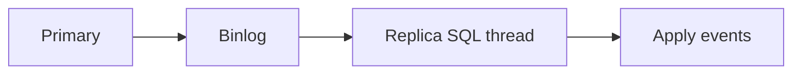

**Point-in-time recovery:** restore 2 PM backup + replay binlog until 3:59 PM before accidental `DROP`.

#### Binlog formats

| Format | Records | Trade-off |
|--------|---------|-----------|
| Statement | SQL text | Small; non-deterministic UDFs risky |
| Row | Before/after row images | Larger; accurate |
| Mixed | Server chooses | Default compromise |

#### REDO vs BINLOG

| | REDO (InnoDB) | BINLOG (MySQL server) |
|---|---------------|------------------------|
| Scope | Storage engine pages | Server-level events |
| Consumer | Crash recovery | Replicas, PITR |
| Physical vs logical | Physical page changes | Logical SQL or row events |

PostgreSQL uses a unified WAL for both durability and logical decoding — different packaging, same conceptual split.

### Pitfalls and design tips

- **Confusing redo with binlog** — classic interview trap; redo is for engine recovery, binlog is for replication/PITR.
- **`sync_binlog` and `innodb_flush_log_at_trx_commit`** — MySQL durability tuning; values `< 1` trade crash safety for speed.
- **Replica lag** — binlog apply slower than primary write rate; monitor seconds behind master.
- **Statement-based replication breaks on non-deterministic SQL** — prefer row format for safer replicas.
- **Long-running transactions inflate undo** — unrelated to binlog but pairs with MVCC ops hygiene.

### Real-world example

**MySQL primary/replica:** checkout service commits an order. InnoDB writes redo, marks transaction committed, returns OK. Async thread writes binlog event `INSERT INTO orders …`. Replica I/O thread pulls binlog; SQL thread replays insert. If primary dies after commit but before replica applies, failover may be seconds behind — apps design idempotent consumers and monitor lag. Nightly full backup plus binlog archive enables restore to one second before an accidental `DELETE` without redo logs on the replica host.

---

## 2.9 LSM Tree/SSTables/WAL

### Overview

An LSM tree behaves like a busy inbox: new mail is tossed on top quickly (append-only); later you sort and merge stacks into filed binders (SSTables). You avoid rifling through every drawer for each new letter (random disk writes).

**Log-Structured Merge trees** batch writes into an in-memory sorted buffer, flush immutable sorted files (SSTables) to disk, and periodically **compact** overlapping files. Cassandra, RocksDB, LevelDB, HBase, and TiKV use this pattern for write-heavy distributed workloads.

### What problem it fixes

B+ tree updates hunt random pages — read-modify-write on disk. At millions of writes per second (IoT, metrics, event logs), random I/O becomes the ceiling. LSM trees convert writes into **sequential appends** — fast on HDDs and still efficient on SSDs — and pay read and compaction costs later.

### What it does

1. Append every write to **WAL** (durability).
2. Insert into **MemTable** (in-RAM sorted structure).
3. When MemTable fills, **flush** to immutable **SSTable** on disk.
4. **Reads** check MemTable then SSTables newest-first.
5. **Compaction** merges SSTables, drops tombstones and duplicate keys.

### How it works — the architecture inside

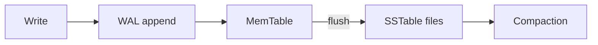

#### Write path detail

`PUT user1 → Ram`:

1. Append to WAL on disk.
2. Insert into MemTable (skip list / red-black tree).
3. MemTable reaches 64–128 MB → freeze, new MemTable, background flush to `SSTable-1`.

Updates do not edit old SSTables — write `user1 → Shyam` to a newer SSTable; newest wins on read.

#### SSTable structure

Immutable sorted file:

```text
user1 -> Ram
user2 -> Mohan
user3 -> Sita
```

Plus **sparse index** (sample keys → file offsets) and often a **Bloom filter** per file.

**Read `user1`:** check MemTable → Bloom filter on SSTable-4 (maybe) → binary search within file → return `Shyam`.

#### Deletes and tombstones

`DELETE user1` writes `user1 → TOMBSTONE`. Compaction removes old values when tombstone meets them.

#### Compaction strategies

| Strategy | Behavior | Read amp | Write amp |
|----------|----------|----------|-----------|
| **Size-tiered** | Merge similar-sized files | Higher | Lower |
| **Leveled** | Fixed levels, non-overlap per level | Lower | Higher |

**Amplification definitions:**

- **Write amplification** — bytes rewritten internally per user byte written
- **Read amplification** — files checked per read
- **Space amplification** — duplicate keys across levels before compaction

**How to calculate write amplification:**

- **Given:** compaction rewrites 10 MB of SSTables for every 1 MB of new user writes over an hour
- **Write amplification ≈** `10 / 1 = 10×`
- **Sanity check:** leveled compaction often 10–30×; size-tiered lower write amp, higher read amp


#### LSM vs B+ tree

| | B+ tree | LSM tree |
|---|---------|----------|
| Write pattern | Random page update | Sequential append |
| Read latency | Low | Higher without Bloom/leveling |
| Range scan | Excellent | Good after compaction |
| Background work | Minimal | Compaction required |

### Pitfalls and design tips

- **Compaction storms** — sudden IO spikes when many SSTables merge; tune thresholds and off-peak scheduling.
- **Tombstone accumulation** — delayed compaction + many deletes can slow reads; set `gc_grace_seconds` (Cassandra) appropriately.
- **Not ideal for read-mostly OLTP** — PostgreSQL/MySQL B+ trees win on indexed point reads with MVCC.
- **Bloom false positives** — only "definitely not in file"; false positive costs one disk seek.
- **Default for write-heavy distributed storage** — Cassandra, Kafka Streams RocksDB state, TiKV.

### Real-world example

**Cassandra time-series events:** devices emit `INSERT INTO events (device_id, ts, payload)` at high QPS. Writes append to commitlog (WAL) and memtable per node; periodic flush creates SSTables on disk. Reads for `device_id = X AND ts > T` hit Bloom filters to skip irrelevant SSTables, then merge sorted runs. Weekly compaction (leveled or size-tiered) drops superseded event versions and tombstones from TTL expirations.

---

## 2.10 Page Cache

### Overview

A page cache is the librarian's desk: books you just returned stay on the desk instead of walking back to the warehouse shelf. The next reader gets instant access. When the desk is full, the least-used book goes back to storage.

Databases and operating systems cache fixed-size **pages** (typically 4–32 KB) of table and index files in RAM. Cache hits avoid disk latency — microseconds vs milliseconds — which dominates query time on large datasets.

### What problem it fixes

10 GB `customer` table; repeated:

```sql
SELECT * FROM customer WHERE id = 100;
```

Without caching, each query reads the same disk page. RAM is orders of magnitude faster than SSD/HDD. The page cache keeps hot pages in memory across requests.

### What it does

On page access:

1. Check buffer pool / OS page cache for the page.
2. **Hit** — return from RAM.
3. **Miss** — read from disk, install in cache (evicting another page if full), return.

Modified pages become **dirty** until flushed to disk. Eviction policies (LRU, CLOCK, LFU) choose victims when memory is full.

### How it works — the architecture inside

#### Pages, not rows

Engines read aligned blocks:

```text
Page 1: Customer 1–4
Page 2: Customer 5–8
```

One row lookup may load an entire 8 KB page — neighbors become cache candidates.

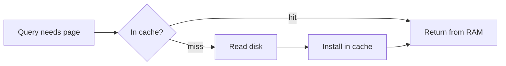

#### Buffer pool vs OS page cache

| Layer | Name | Who manages |
|-------|------|-------------|
| Database | Buffer pool (InnoDB, shared_buffers) | DBMS — knows dirty pages, checkpoints |
| OS | Page cache | Kernel — caches any file blocks |

Both may cache the same file blocks — **double buffering** risk if DB buffer is oversized relative to RAM.

#### Dirty vs clean pages

| State | RAM vs disk |
|-------|-------------|
| **Clean** | Identical — safe to evict |
| **Dirty** | RAM newer — must flush before evict (or rely on WAL + redo) |

Checkpoint process writes dirty pages back gradually.

#### Eviction and prefetch

**LRU:** evict least recently used page when full.

**Read-ahead:** sequential scan detects pattern, prefetches pages 2–4 while serving page 1.

**Hot vs cold:** popular product row's page stays resident; archival rows evicted first.

#### Cache effectiveness

**How to calculate buffer pool hit ratio (InnoDB):**

- **Given:** `Innodb_buffer_pool_read_requests = 9,900,000`, `Innodb_buffer_pool_reads = 100,000`
- **Hits:** `9,900,000 - 100,000 = 9,800,000`
- **Hit ratio:** `9,800,000 / 9,900,000 ≈ 99.0%`
- **Sanity check:** OLTP targets often > 99%; sudden drops signal full scan or working set larger than RAM.

1 TB database on 64 GB RAM — only hot ~5% of pages may serve 95% of queries (Pareto).

#### Index pages cached too

B+ tree root and upper internal pages stay hot — index depth becomes pure RAM hops after warm-up.

### Pitfalls and design tips

- **Size buffer pool ~70–80% of dedicated DB RAM** on a database-only host — leave headroom for connections and OS.
- **Double caching** — Linux page cache + huge buffer pool; direct I/O (`O_DIRECT`) on some engines avoids duplicate copies.
- **Full table scans pollute cache** — one-off analytics scan can evict hot OLTP pages; use replica or `pg_buffercache` monitoring.
- **`shared_buffers` too low in PostgreSQL** — excessive kernel cache reliance; too high without `effective_cache_size` tuning confuses planner.
- **Cold start after restart** — expect elevated latency until cache warms; gradual traffic ramp helps.

### Real-world example

**PostgreSQL `shared_buffers = 16GB` on a 32 GB instance:** steady-state product lookup by PK hits the buffer pool — `EXPLAIN ANALYZE` shows buffer hits, no read I/O. Nightly batch job sequential-scans a cold history table on a replica so OLTP buffer pool on primary retains hot catalog and index pages for checkout traffic.

---

## 2.11 Vacuum Process

### Overview

MVCC leaves ghost copies of updated rows lying around — like draft sticky notes still on the wall after the final poster goes up. **VACUUM** is PostgreSQL's janitor: it removes sticky notes nobody needs anymore, marks the wall space reusable, and updates the building directory so searches do not scan empty rooms.

PostgreSQL never overwrites rows in place. `UPDATE` and `DELETE` leave **dead tuples** until no transaction can see them. VACUUM (usually via **autovacuum**) reclaims that space, maintains index health, updates planner statistics, and prevents transaction ID wraparound.

### What problem it fixes

100 million logical rows with heavy updates can leave hundreds of millions of physical row versions on disk — **table bloat**. Sequential scans touch dead tuples; indexes point at obsolete versions; disk grows without live data growth. Without vacuum, queries slow and PostgreSQL risks **transaction ID wraparound** — a hard stop on writes to protect data integrity.

### What it does

| Mode | Effect |
|------|--------|
| **VACUUM** | Mark dead tuple space reusable; update visibility map; non-blocking |
| **VACUUM FULL** | Rewrite table compactly; shrinks file; exclusive lock — disruptive |
| **VACUUM ANALYZE** | Vacuum plus refresh `pg_statistic` for optimizer |
| **Autovacuum** | Background workers triggered by dead tuple thresholds |

### How it works — the architecture inside

#### Dead tuple lifecycle

```sql
UPDATE customer SET name = 'Shyam' WHERE id = 1;
```

```text
Version 1: id=1, name=Ram     (dead after commit of v2)
Version 2: id=1, name=Shyam   (live)
```

`DELETE` marks row dead without immediate removal.

#### Standard VACUUM

1. Scan table (or skip all-visible pages via **visibility map**).
2. For each dead tuple, confirm no open snapshot needs it.
3. Mark space free for reuse within the same table file.
4. Clean index entries pointing to dead tuples.

**Important:** table file size often **unchanged** — 100 MB file with 40 MB dead becomes 100 MB with 40 MB reusable holes.

#### VACUUM FULL

Build new compact copy, swap files — file shrinks to live data only. Requires stronger locks; not for routine ops.

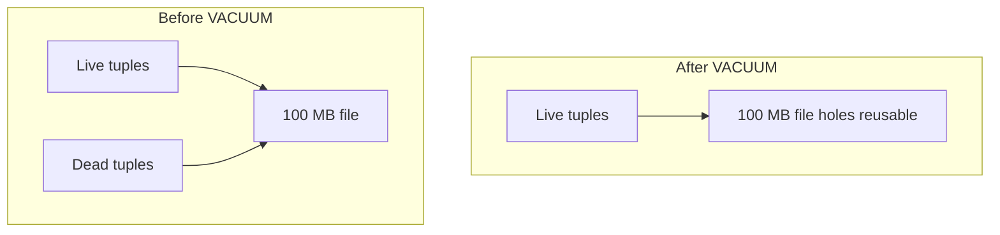

#### Autovacuum triggers

When `dead_tuples > autovacuum_vacuum_threshold + autovacuum_vacuum_scale_factor * reltuples`, worker starts. High-churn tables (JSON metadata, session stores) need aggressive thresholds or manual tuning.

#### FREEZE and XID wraparound

Every transaction gets an XID (32-bit, wraps). **Freeze** marks old tuples permanently visible so wraparound cannot confuse visibility. Autovacuum **freezes** aggressively on old tables. If `% age` approaches `autovacuum_freeze_max_age`, PostgreSQL escalates vacuum urgency; extreme neglect forces shutdown until vacuum completes.

#### ANALYZE connection

Stale statistics → bad plans (see section 2.4). `VACUUM ANALYZE` pairs cleanup with stats refresh after large deletes.

#### Contrast with LSM compaction

| Engine | Obsolete data cleanup |
|--------|----------------------|
| PostgreSQL MVCC | VACUUM dead tuples |
| LSM stores | SSTable compaction |

Same problem — garbage versions — different mechanics.

### Pitfalls and design tips

- **Never ignore autovacuum warnings** — `transaction ID wraparound` alerts are production emergencies.
- **Avoid routine `VACUUM FULL`** — use `pg_repack` or logical rewrite for shrink with less locking.
- **Long `idle in transaction` sessions block vacuum** — ORMs leaving transactions open are a common root cause of bloat.
- **Monitor `n_dead_tup` in `pg_stat_user_tables`** — sudden growth correlates with slow scans.
- **Hot tables need custom autovacuum params** — lower scale_factor, more workers.
- **MySQL/InnoDB uses purge, not VACUUM** — do not claim all databases vacuum; this section is PostgreSQL-specific.

### Real-world example

**High-update `sessions` table in PostgreSQL:** auth service updates `last_seen` every request. Millions of dead tuples accumulate daily. Autovacuum on `sessions` runs with lowered `autovacuum_vacuum_scale_factor = 0.02` so cleanup starts at 2% dead vs default 20%. Without tuning, `SELECT session WHERE token = ?` degrades as heap pages fill with dead rows; `pg_stat_user_tables.n_dead_tup` and `EXPLAIN` buffer reads guide ops before `VACUUM FULL` on a maintenance window.

## 2.12 Key Value Stores

### Overview

Picture a coat-check counter at a theater: you hand over a ticket number and get your coat back — no questions about what else is in the room, no joining coats to owners across tables. A **key-value store** works the same way: every piece of data lives behind a single lookup key, like a giant distributed dictionary.

Technically, a key-value store maps opaque or semi-structured **values** to unique **keys** with O(1)-ish point lookups. Engines range from in-memory hash tables (Redis, Memcached) to disk-backed LSM trees (RocksDB, LevelDB) to distributed systems (DynamoDB, Cassandra, etcd). There are no tables, joins, or enforced schemas — the application owns relationships and consistency rules.

---

### What problem it fixes

Relational databases excel at structured queries, joins, and constraints. Many production workloads need none of that — only extremely fast reads and writes by a known key: session tokens, feature flags, shopping carts, rate-limit counters, cache entries. Running those through SQL adds parser overhead, join machinery, and schema rigidity you do not need.

Key-value stores fix the **simplicity vs speed** gap: one key in, one value out, horizontally shardable by hashing the key, with replication for availability. They are the default layer under caching, session management, and configuration in large systems.

---

### What it does

Core operations are minimal:

| Operation | Purpose |
|-----------|---------|
| **PUT / SET** | Insert or overwrite a key |
| **GET** | Retrieve the value for a key |
| **DELETE** | Remove a key |

Values can be strings, JSON blobs, or richer types (Redis supports lists, sets, sorted sets, hashes). The store does not interpret relationships between keys — your application fetches `customer:1`, `order:101`, and `order:102` separately if it needs all three.

---

### How it works — the architecture inside

#### Storage engines

| Engine | Typical use | Lookup |
|--------|-------------|--------|
| **Hash table** | In-memory caches | Average O(1) via `hash(key) → bucket` |
| **LSM tree** | Disk-based / distributed KV | WAL → MemTable → SSTable; see section 2.9 |
| **B+ tree** | Some embedded KV stores | Log-structured ordered key range scans |

#### Key design

Keys are your only query dimension — design them deliberately:

| Quality | Example |
|---------|---------|
| Bad | `1001` (ambiguous, no namespace) |
| Good | `user:1001` |
| Better | `customer:india:1001` |

Composite key patterns group related data:

```text
user:1001:profile
user:1001:settings
user:1001:sessions
```

#### Distribution and replication

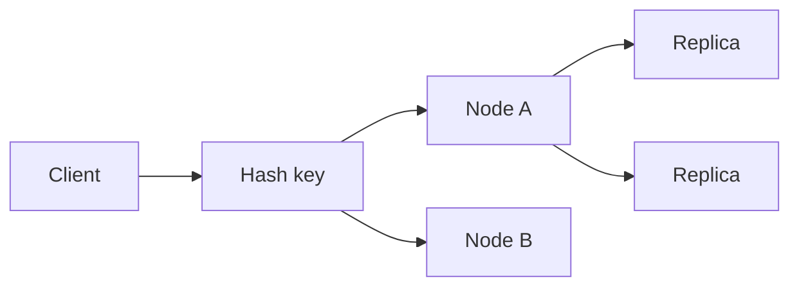

**Consistent hashing** maps keys to nodes so adding or removing a server moves only a fraction of keys. Replicas (often three) provide fault tolerance; many distributed KV stores offer **eventual consistency** — a write on Node A may lag on Node B for milliseconds.

#### Request path (lookup)

```text
GET user:1002
      |
      V
Hash(user:1002) → correct partition
      |
      V
Read from memory / SSTable / replica
      |
      V
Return value: Shyam
```

---

### Walkthrough: caching a user profile

1. Application receives `GET /users/1001`.
2. Cache check: `GET user:1001` on Redis.
3. **Hit** — return JSON immediately; skip PostgreSQL.
4. **Miss** — query PostgreSQL, then `SET user:1001 <json> EX 3600`.
5. Next 3,600 seconds of reads cost one in-memory lookup.

| Store type | Example products |
|------------|------------------|
| In-memory | Redis, Memcached |
| Embedded disk | RocksDB, LevelDB |
| Managed distributed | DynamoDB, etcd |

---

### Pitfalls and design tips

- **Not a replacement for SQL** — no joins, ad-hoc analytics, or foreign-key enforcement; duplicate data across keys when you need denormalized reads.
- **Key hot spots** — hashing `user:1`, `user:2`, … works; a single key like `global:counter` does not scale writes.
- **Do not confuse with document DBs** — Redis treats a JSON string as opaque unless you use RedisJSON; MongoDB indexes inside documents.
- **TTL and eviction** — set expirations on cache keys; configure `maxmemory-policy` (e.g. `allkeys-lru`) so Redis evicts under memory pressure.
- **Cassandra as wide-column, not pure KV** — Cassandra is often listed with KV stores but understands columns; model partition keys carefully.
- **Default choice** — Redis for sessions, rate limits, and hot-object cache; DynamoDB when you need managed, multi-AZ KV at AWS scale.

---

### Real-world example

**Instagram session store (pattern used widely at Meta scale):** session IDs map to serialized auth state in Memcached/Redis. Every API request does `GET session:<token>` before hitting heavier services. Sub-millisecond latency and horizontal sharding by session key keep login state off the primary OLTP database. DynamoDB uses the same model: partition key `userId`, item attributes as the value — point reads at millions of requests per second without SQL.

---

## 2.13 Document Databases

### Overview

Think of a document database as a filing cabinet where each folder holds **everything** about one thing — name, address, phone numbers, preferences — on a single sheet instead of spread across four binders you must cross-reference. You pull one folder and you are done.

Technically, a **document database** stores self-contained records (JSON, BSON, or XML) in **collections**. The engine understands field paths inside documents, so you can query `address.city = "Bangalore"` or `skills` contains `"Java"` without joining tables. Schema is flexible: documents in the same collection can have different fields.

---

### What problem it fixes

Relational modeling for rich, nested objects often explodes into many tables — `CUSTOMER`, `ADDRESS`, `PHONE`, `PREFERENCES` — with joins on every read. Mobile and web APIs naturally serialize to JSON; mapping that to rows adds ORM complexity and migration friction when product fields evolve weekly.

Document databases fix **read locality** and **schema agility**: one document per entity, nested arrays and objects stored inline, indexes on nested paths like `address.city`. Writes are often a single `insert` or `update` with no `ALTER TABLE`.

---

### What it does

| Relational | Document |
|------------|----------|
| Database → Table → Row | Database → Collection → Document |
| Fixed columns | Flexible fields per document |
| JOIN for related data | Embed or reference by ID |

**Document database = key-value store + structure awareness.** The database indexes and queries inside the value, not just the key.

Example document:

```json
{
  "id": 1,
  "name": "Ram",
  "age": 25,
  "address": { "city": "Bangalore", "country": "India" },
  "phones": ["9999999999", "8888888888"]
}
```

---

### How it works — the architecture inside

#### Embedding vs referencing

| Approach | When to use | Trade-off |
|----------|-------------|-----------|
| **Embedding** | One-to-few, read-heavy, data changes together | Fast reads; duplication if embedded entity is shared |
| **Referencing** | One-to-many, shared entities, frequent updates | Normalized; extra round-trip or `$lookup` |

Embedded order example:

```json
{
  "orderId": 100,
  "customer": { "id": 1, "name": "Ram" },
  "items": [{ "sku": "A1", "qty": 2 }]
}
```

Referenced pattern: `orders.customerId → customers._id` — similar to foreign keys, but the database usually does **not** enforce referential integrity.

#### Indexing and queries

Indexes on top-level or nested fields (`address.city`) turn field filters into index seeks. Query examples: `age > 25`, `skills contains "Java"`, `address.country = "India"`.

#### Storage and scaling

Many engines use **B+ trees** (MongoDB classic) or **LSM trees** (cloud-native variants). **Sharding** splits collections by shard key (often `_id` or a compound key); **replication** (primary → secondaries) provides failover.

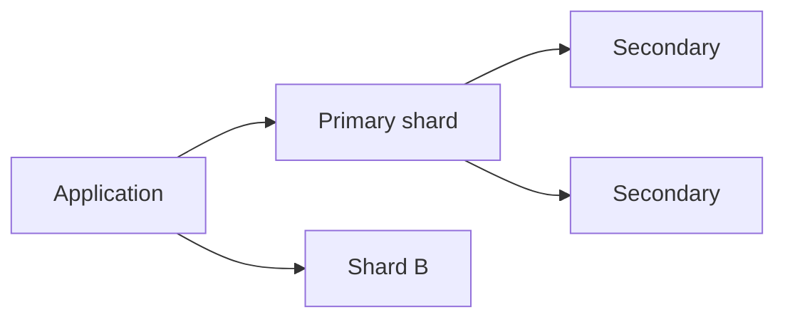

---

### Walkthrough: product catalog query

Collection `products`, millions of documents with varying attributes (electronics have `warrantyMonths`; clothing has `sizes`).

```javascript
db.products.find({
  "category": "laptop",
  "specs.ramGB": { "$gte": 16 },
  "price": { "$lt": 800 }
})
```

1. Index on `(category, specs.ramGB, price)` narrows candidates.
2. Matching documents returned as full JSON — no join to a `specs` table.
3. New field `ecoRating` added to some products — no migration for the whole collection.

---

### Pitfalls and design tips

- **Document size limits** — MongoDB caps documents at 16 MB; huge arrays belong in separate collections or blob storage.
- **Unbounded array growth** — embedding unbounded `comments` or `events` bloats documents and slows reads; reference or cap.
- **Write amplification on embedded shared data** — changing a vendor name embedded in 10,000 product docs means 10,000 updates.
- **Multi-document ACID** — MongoDB 4+ supports multi-document transactions, but design for single-document atomicity when possible.
- **Not for heavy analytics** — warehouse SQL or columnar engines beat document DBs for cross-collection reporting.
- **Default choice** — MongoDB or Firestore for mobile/web backends with JSON-shaped domain models and evolving schemas.

---

### Real-world example

**eBay product listings** historically relied on document-oriented storage patterns for catalog items where each listing has a different attribute set (auction vs fixed-price, category-specific fields). One document per listing powers search indexing and detail-page reads without normalizing hundreds of optional attributes into sparse SQL columns.

---

## 2.14 Wide Column Databases

### Overview

Imagine a spreadsheet where **each row can have completely different columns** — one person has `Age` and `City`, another has `Email` only — and some rows stretch sideways with millions of timestamp columns for sensor readings. That is the mental model for a **wide-column database**: rows keyed by a partition key, columns sparse and optional, optimized for scale-out writes.

Technically, wide-column stores (Cassandra, HBase, ScyllaDB, Google Bigtable) sit between key-value and relational: they understand **column names and values** within a row but not arbitrary SQL joins. They are built for distributed, append-heavy, petabyte workloads — **not** the same as **columnar analytics** databases (ClickHouse, Snowflake), which optimize OLAP aggregations.

---

### What problem it fixes

Relational databases hit ceilings when data reaches petabytes, billions of writes per day, and thousands of nodes. Internet-scale use cases — clickstreams, IoT telemetry, messaging logs, time-ordered events — need horizontal write throughput and fault tolerance without a single master bottleneck.

Wide-column databases fix **massive partitioned writes** and **sparse wide rows**: only store columns that exist, replicate with tunable consistency, and route any row by `hash(partition_key)`.

---

### What it does

Hierarchy (terminology varies by product):

```text
Keyspace (like a database)
   └── Table / Column Family
         └── Row Key → { Column → Value, Column → Value, ... }
```

| Concept | Role |
|---------|------|
| **Row key** | Unique row identifier; drives storage location |
| **Partition key** | Subset of row key that determines which node holds data |
| **Clustering columns** | Optional sort order within a partition |

Example rows:

```text
User:1001  →  Name=Ram, Age=25, City=Bangalore
User:1002  →  Name=Sita, Email=sita@gmail.com
```

No NULL storage for missing columns — **sparse storage** saves space.

---

### How it works — the architecture inside

#### Write and read paths (LSM-based)

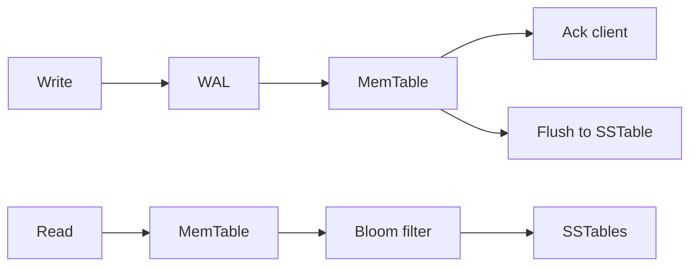

Writes append to WAL and MemTable — fast acknowledgment. Reads merge MemTable + SSTables, often skipping irrelevant files via Bloom filters (see section 2.9).

#### Distribution and tunable consistency

```text
Hash(UserId) → Node 7 of 100
Replication factor 3 → copies on nodes 7, 45, 81
```

Cassandra-style **consistency levels**: write `QUORUM` with RF=3 means 2 of 3 replicas must ack. Reads at `ONE` favor latency; `QUORUM` read + write gives stronger guarantees.

#### Wide rows for time series

Partition key `deviceId`, clustering key `timestamp` — one row per device with millions of time-ordered columns, or one row per `(deviceId, day)` depending on model.

---

### Walkthrough: IoT temperature events

```sql
-- CQL-style mental model
INSERT INTO readings (device_id, day, ts, temp_c) VALUES ('sensor-42', '2026-06-25', '10:00', 30.1);
```

1. `device_id` hashes to owning node.
2. Write hits WAL → MemTable; client gets ack in low milliseconds.
3. Query: all readings for `sensor-42` on `2026-06-25` — single partition scan, no cross-node join.

---

### Pitfalls and design tips

- **Do not confuse with columnar OLAP** — Snowflake/ClickHouse are for analytics; Cassandra is for operational scale-out writes.
- **Hot partitions** — if partition key is `country` and all traffic is `US`, one node saturates; use high-cardinality partition keys plus clustering keys.
- **Secondary indexes are expensive** — they fan out to many nodes; prefer query patterns aligned with primary key design.
- **ALLOW FILTERING** in Cassandra — a smell; means you are fighting the data model.
- **Repairs and compaction** — operational overhead; plan for `nodetool repair` and monitor compaction backlog.
- **Default choice** — Cassandra or ScyllaDB for multi-datacenter, write-heavy event logs and time-series at huge scale.

---

### Real-world example

**Netflix viewing history and telemetry** (public talks describe Cassandra-style wide-column storage for high-volume, geographically distributed writes). Each user's or device's events partition by a key so writes spread across the ring; replicas in multiple regions survive AZ failure without a single SQL primary.

---

## 2.15 Graph Databases

### Overview

A graph database is like a subway map: stations are **entities**, lines between them are **relationships**, and the fastest route is found by following connections — not by joining two spreadsheets of stations and edges in SQL.

Technically, a **graph database** stores **nodes** (entities), **edges** (typed relationships), and **properties** on both. Traversals — friends-of-friends, shortest path, dependency chains — are first-class operations via index-free adjacency: each node holds direct pointers to neighbors instead of repeated join hash lookups.

---

### What problem it fixes

Relational databases represent relationships with foreign keys and joins. Shallow joins are fine; **multi-hop** queries (`friends of friends of friends`, fraud ring detection, supply-chain dependencies) explode in SQL complexity and cost — each hop adds a join and index lookup.

Graph databases fix **relationship-heavy read patterns**: the query engine walks edges from a start node, keeping performance more stable as depth grows (for bounded degree) than nested SQL self-joins.

---

### What it does

| Component | Example |
|-----------|---------|
| **Node** | `(:Person {name: "Ram", age: 25})` |
| **Edge** | `[:FRIEND_OF {since: 2020}]` |
| **Traversal** | Walk from Ram along `FRIEND_OF` twice |

Two common models:

| Model | Used by | Shape |
|-------|---------|-------|
| **Property graph** | Neo4j, Neptune, ArangoDB | Labeled nodes and typed edges with properties |
| **RDF triple store** | Apache Jena, Stardog | `(subject, predicate, object)` triples |

Query languages include **Cypher** (Neo4j), **Gremlin**, and **SPARQL** (RDF).

---

### How it works — the architecture inside

#### Index-free adjacency

```text
Relational:  index → row → index → row → index → row  (per hop)
Graph:       (Ram) ──pointer──> (Sita) ──pointer──> (John)
```

Relationship records store start node ID, end node ID, type, and properties — the database follows physical links.

#### Traversal example (Cypher)

```cypher
MATCH (p:Person {name: 'Ram'})-[:FRIEND_OF*1..3]->(fof)
RETURN DISTINCT fof.name
```

Finds friends up to three hops without writing three self-joins.

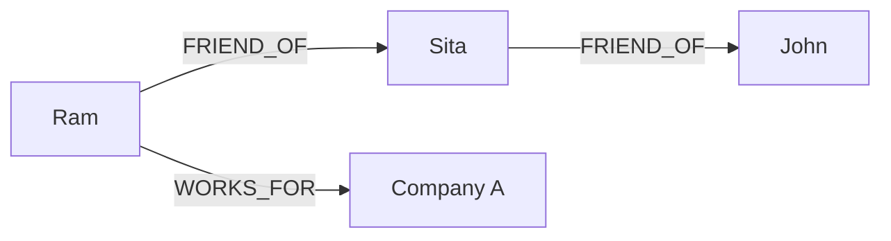

#### Use-case fit

| Pattern | Why graph fits |
|---------|----------------|
| Social networks | Multi-hop friend queries |
| Fraud detection | Shared device/address edges reveal rings |
| Recommendations | `BOUGHT` edges link users and products |
| Knowledge graphs | `CAPITAL_OF`, `LOCATED_IN` triples |
| Dependency graphs | Service A depends on B depends on C |

---

### Walkthrough: shortest path

Graph: Ram → Sita → John → Raj. Query shortest path Ram to Raj.

1. Start at node `Ram`.
2. BFS or bidirectional search along edges.
3. Result path: Ram → Sita → John → Raj — three hops, no SQL join tree.

Centrality algorithms (PageRank, betweenness) identify influential nodes — useful in fraud and network analysis.

---

### Pitfalls and design tips

- **Poor fit for bulk aggregations** — `SUM(revenue) GROUP BY region` belongs in SQL/warehouse, not Neo4j.
- **Sharding graphs is hard** — cross-partition traversals are expensive; many graph DBs scale vertically or partition by domain.
- **Supernodes** — a celebrity with 10M `FOLLOWED` edges slows traversals; model with intermediate nodes or ranking summaries.
- **Do not store everything as a graph** — CRUD on flat entities without relationship queries wastes the model.
- **RDF vs property graph** — choose RDF for semantic web interoperability; property graphs for app-centric models.
- **Default choice** — Neo4j or Neptune when relationship traversal is the core query, not an occasional join.

---

### Real-world example

**PayPal fraud detection** (documented graph-analytics pattern): accounts, devices, addresses, and transactions are nodes; shared attributes create edges. A ring of accounts linked to one device surfaces in one traversal — the same pattern in SQL requires many self-joins and is slower to iterate as analysts add new edge types.

---

## 2.16 Time Series Databases

### Overview

A time series database is a lab notebook where **every measurement is stamped with when it happened** — temperature every minute, CPU every second — and you mostly **add new lines** rather than rewrite old ones. Queries ask "what happened in the last hour?" not "update row 47."

Technically, a **TSDB** (InfluxDB, Prometheus, TimescaleDB, QuestDB, VictoriaMetrics) optimizes **append-only**, timestamp-ordered data: tags for filtering, fields for values, aggressive compression, time-based retention, and downsampling. Time is the primary partition and sort key.

---

### What problem it fixes

You can store metrics in PostgreSQL, but at billions of points per day the workload exposes mismatches: mostly inserts, rare updates, range scans by time, aggregation-heavy dashboards, and automatic expiry of raw data. General OLTP indexes and row storage waste space and I/O.

TSDBs fix **monitoring-scale ingest and retention**: sort by timestamp, compress deltas, chunk into blocks, drop or aggregate old data by policy, and serve `last 1 hour` queries from hot buffers.

---

### What it does

Data model (Influx/Prometheus style):

| Piece | Example | Indexed? |
|-------|---------|----------|
| **Measurement / metric name** | `cpu_usage` | Yes |
| **Timestamp** | `2026-06-25T10:00:00Z` | Primary ordering |
| **Tags** (metadata) | `host=server1`, `region=india` | Yes — filter dimensions |
| **Fields** (values) | `value=70.5` | Stored, not always indexed |

Record:

```text
cpu_usage,host=server1,region=india value=70.5 1719304800
```

---

### How it works — the architecture inside

#### Write path

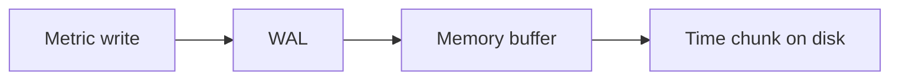

#### Compression and chunking

Points in a chunk share a time window. Values that change slowly compress well:

```text
Raw: 40, 41, 40, 42, 41  →  delta encoding → few bytes
```

Techniques: delta encoding, Gorilla (Facebook's TSDB paper), run-length encoding.

#### Retention and downsampling

| Tier | Retention | Resolution |
|------|-----------|------------|
| Raw | 7 days | 1 second |
| Downsampled | 1 year | 1 hour average |

**How to calculate — storage after downsampling:**

- **Given:** 1 metric, 10,000 hosts, 1 sample/sec, 7 days raw retention.
- Raw points: `10,000 × 86,400 sec/day × 7 days = 6.05 × 10⁹` points.
- At ~16 bytes/point compressed ≈ **97 GB** raw tier.
- Hourly average: `86,400 / 3,600 = 24` points/day/host → `10,000 × 24 × 365 = 87.6 × 10⁶` points/year ≈ **1.4 GB** yearly tier.
- **Sanity check:** 24× reduction per day × fewer days in hot tier explains why dashboards query aggregates beyond last week.

#### High cardinality warning

Tags must stay low-cardinality: `host=server1` (good). `userId=<millions>` (bad) — each unique tag combination becomes a new in-memory series in Prometheus-style engines.

---

### Walkthrough: Prometheus alert on error rate

1. App exposes `http_requests_total{service="payment",status="500"}` counter.
2. Prometheus scrapes every 15s; appends to TSDB head block.
3. Query: `rate(http_requests_total{status="500"}[5m]) > 0.01`
4. Alert fires; Grafana charts last 24h from compressed blocks.
5. After 15 days, raw blocks compact; long-term store may keep only hourly rollups.

---

### Pitfalls and design tips

- **Counters vs gauges** — Prometheus counters monotonically increase; use `rate()` for derivatives. Reset behavior breaks naive dashboards.
- **Cardinality explosion** — never tag high-cardinality IDs (`request_id`, `user_id`) on every metric.
- **Not for OLTP** — orders, inventory, and joins belong in relational DBs.
- **TimescaleDB hybrid** — PostgreSQL extension with hypertables gives SQL + retention; good when you already run Postgres.
- **Clock skew** — align NTP on scrapers and agents; out-of-order writes complicate compaction.
- **Default choice** — Prometheus + Grafana for service metrics; Influx or VictoriaMetrics for high-cardinality ops telemetry with long retention.

---

### Real-world example

**Uber's M3 metrics stack** (open-sourced, built for Prometheus-compatible ingestion at fleet scale) shards time series by label set, replicates for durability, and downsamples for long-term storage — the standard pattern behind SLO dashboards and on-call paging for thousands of microservices.

---

## 2.17 Search Databases

### Overview

A search database is the index at the back of a textbook turned inside out: instead of "which page mentions Java?", you start at the word **Java** and instantly see every page that contains it — ranked by relevance, not just exact ID lookup.

Technically, **search engines** (Elasticsearch, OpenSearch, Solr, Algolia, Meilisearch) build **inverted indexes** (term → posting lists of document IDs), tokenize and stem text, score results with BM25, and scale horizontally via shards. They answer fuzzy, phrase, and faceted queries relational `LIKE '%java%'` cannot run at million-document scale.

---

### What problem it fixes

OLTP databases optimize point lookups and transactions:

```sql
SELECT * FROM users WHERE id = 100;  -- fast
```

They struggle with:

- Full-text: all documents containing "microservices"
- Relevance ranking: best match for "wireless noise cancelling headphones"
- Log analytics: `service=payment AND ERROR` across terabytes

Search databases fix **text retrieval at scale** with structures built for token lookup, scoring, and distributed query-merge — not row-by-row table scans.

---

### What it does

A **document** in search context is any JSON record you index:

```json
{
  "id": 100,
  "title": "Introduction to Java",
  "content": "Java is a programming language"
}
```

Capabilities:

| Feature | Purpose |
|---------|---------|
| **Inverted index** | O(1) term → document list |
| **Tokenization / stemming** | `running` → `run` |
| **BM25 scoring** | Rank by term frequency and rarity |
| **Fuzzy / autocomplete** | Typo tolerance, prefix suggestions |
| **Facets** | Aggregate filters (brand, price bucket) |
| **Filters** | Structured `year > 2025` combined with text query |

---

### How it works — the architecture inside

#### Inverted index build

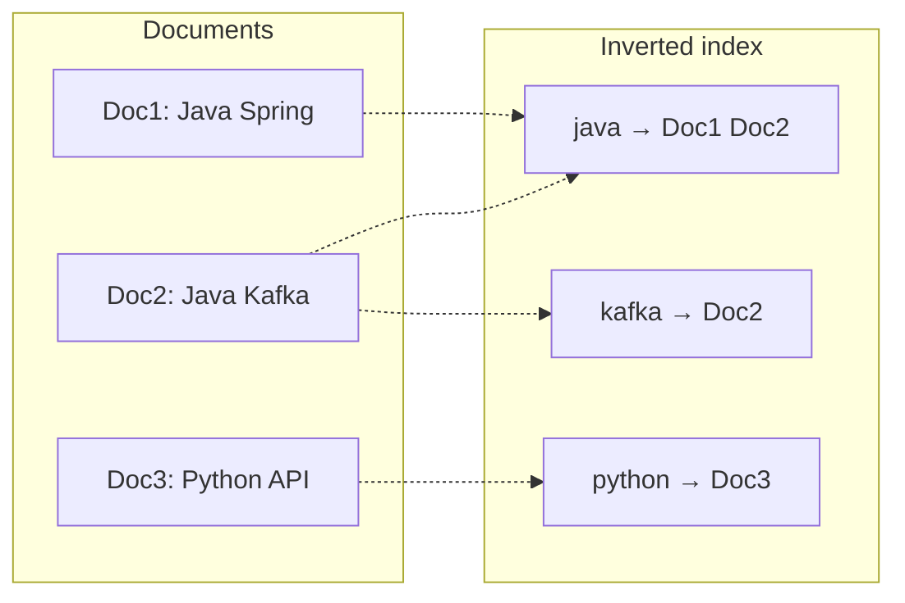

Indexing pipeline: document → analyze (tokenize, lower-case, remove stop words) → update posting lists per term.

#### Search execution

Query `"java kafka"`:

```text
java  → {Doc1, Doc2}
kafka → {Doc2}
intersect → Doc2
score with BM25 → return ranked hits
```

#### Distributed layout

```text
100M docs → Shard1 (0-25M), Shard2, Shard3, Shard4
Query fan-out → merge top-K per shard → global top-K
Primary shard + replicas for HA
```

**Near real-time:** new docs land in a refresh interval (Elasticsearch default ~1s segments) — not instant like single-row SQL commit.

#### Common dual-store architecture

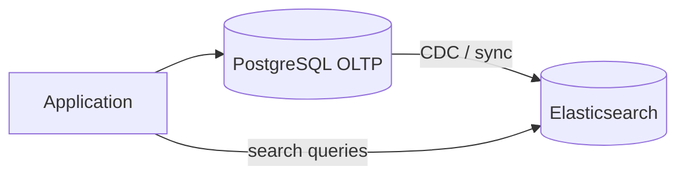

PostgreSQL remains source of truth; Elasticsearch serves search and analytics views.

---

### Walkthrough: e-commerce product search

1. Product saved in PostgreSQL on checkout admin write.
2. Change stream indexes document into OpenSearch: title, description, facets (`brand`, `price`).
3. User searches `iphone charger` — tokenizer yields `iphone`, `charger`; BM25 ranks listings with both terms in title higher.
4. Facet aggregations return brand counts alongside results.
5. Typo `iphon charger` still matches via fuzzy edit distance.

---

### Pitfalls and design tips

- **Not your system of record** — weak transactions; rebuild index from OLTP if corrupted.
- **Mapping explosions** — dynamic mapping on high-cardinality fields (`user_id` as keyword × millions) blows heap.
- **Reindex pain** — changing analyzers requires reindex; plan index aliases (`products_v2`) for zero-downtime swap.
- **Score vs filter** — use `filter` context for exact facets (cached, no scoring); `must` for full-text.
- **Deep pagination** — `from: 10000` is slow; use `search_after` cursors.
- **Default choice** — OpenSearch/Elasticsearch beside PostgreSQL for product, log, and knowledge-base search.

---

### Real-world example

**Shopify product search** runs on Elasticsearch-class infrastructure: catalog documents denormalized from transactional stores, sharded by shop or region, with analyzers tuned for SKUs and synonyms. Merchant admin uses SQL; storefront search hits the inverted index — separate engines, synchronized by pipeline.

---

## 2.18 Vector Databases

### Overview

Keyword search finds documents that contain the word "password." Vector search finds documents that **mean the same thing** — "I forgot my login credentials" matches "How do I reset my password?" even with zero shared words. Think of matching songs by melody similarity, not title spelling.

Technically, a **vector database** stores **embeddings** — fixed-length float arrays from ML models — and answers **nearest neighbor** queries via distance metrics (cosine similarity, dot product) and **approximate** indexes (HNSW, IVF) for billion-scale collections. Core to semantic search, recommendations, image similarity, and RAG pipelines.

---

### What problem it fixes

| Store type | Query |
|------------|-------|
| Relational | Exact match `WHERE id = 100` |
| Search | Keyword match `java AND spring` |
| Vector | Semantic similarity in embedding space |

Brute-force comparing a query vector to 100M vectors is O(n) per query — unusable at scale. Vector databases fix **similarity retrieval** with ANN structures that trade a small accuracy loss for 100–1000× speedup, plus optional metadata filters (`category = java`).

---

### What it does

Pipeline:

```text
Text/image → Embedding model → vector [0.12, 0.45, -0.88, ...]
Store vector + metadata (id, title, source)
Query → embed question → ANN search → top-K similar records
```

Distance intuition (cosine similarity):

| Relationship | Cosine sim |
|--------------|------------|
| Same direction (similar meaning) | ≈ 1 |
| Orthogonal (unrelated) | ≈ 0 |
| Opposite | ≈ -1 |

---

### How it works — the architecture inside

#### ANN algorithms

| Algorithm | Idea | Trade-off |
|-----------|------|-----------|
| **Exact (flat)** | Compare all vectors | 100% recall; slow |
| **HNSW** | Layered navigable small-world graph | Default in many DBs; fast, tunable `ef_construction` |
| **IVF** | Cluster vectors; search nearest clusters | Lower memory with training step |
| **PQ** | Compress vectors for RAM | Faster, lower precision |

HNSW search: enter top layer graph → greedy walk toward query → refine in lower layers → return top-K neighbors.

#### Metadata filtering

```json
{
  "text": "Spring Boot Guide",
  "embedding": [0.12, 0.45, -0.88],
  "metadata": { "language": "english", "year": 2026 }
}
```

Query: nearest neighbors **where** `language = english` — pre-filter or post-filter depending on engine (Pinecone, Qdrant, pgvector, Weaviate).

#### RAG architecture

```mermaid
flowchart LR
    Docs[Documents] --> Emb[Embedding model]
    Emb --> VDB[(Vector DB)]
    Q[User query] --> QEmb[Query embedding]
    QEmb --> VDB
    VDB --> TopK[Top-K chunks]
    TopK --> LLM[LLM]
    LLM --> Ans[Answer]
```

Products: Pinecone, Weaviate, Milvus, Qdrant, Chroma; extensions in PostgreSQL (**pgvector**), Elasticsearch, Redis, MongoDB Atlas.

---

### Walkthrough: support-bot semantic FAQ

1. Ingest 5,000 help articles; embed each chunk with `text-embedding-3-small` (1536 dims).
2. Upsert into Qdrant with payload `{article_id, section}`.
3. User asks "locked out after too many tries."
4. Query embedded → ANN returns top 5 chunks about account lockout (no shared keywords with "locked out").
5. Chunks fed to LLM as context; answer cites article links.

---

### Pitfalls and design tips

- **Approximate ≠ exact** — tune `ef_search` / recall benchmarks; legal/medical search may need higher recall or exact re-rank.
- **Embedding model lock-in** — query and corpus must use the same model and dimension; re-embed everything on model change.
- **Chunking strategy dominates quality** — 512-token overlapping chunks beat whole-page embeds for RAG.
- **Not a document store** — keep source text in object storage or SQL; vectors are indexes.
- **Memory cost** — 1M × 1536-dim × 4 bytes ≈ **6 GB** raw vectors before HNSW graph overhead; plan PQ or sharding.
- **Default choice** — pgvector inside existing Postgres for moderate scale; Pinecone/Qdrant for managed ANN at large scale.

---

### Real-world example

**Notion AI / enterprise RAG pattern:** workspace pages chunked and embedded into a vector index (internal or Pinecone-class service). User question embeds to the same space; top-K blocks retrieved and passed to the LLM with citation metadata — keyword search alone misses paraphrased questions across millions of notes.

---

## 2.19 Multi Model Databases

### Overview

Most teams pick a separate toolbox — SQL for orders, Mongo for catalogs, Redis for sessions, Neo4j for recommendations. A **multi-model database** is the Swiss Army knife: one engine exposes document, key-value, graph, relational, and sometimes vector APIs over shared or coordinated storage.

Technically, multi-model systems (ArangoDB, Azure Cosmos DB, Couchbase, FaunaDB) reduce the number of operational surfaces while letting different features of one application use the shape of data that fits — documents for profiles, graphs for friendships, KV for TTL sessions — without four backup pipelines and four consistency models to reason about.

---

### What problem it fixes

Polyglot persistence works but costs multiply:

```text
PostgreSQL + MongoDB + Redis + Neo4j
→ four ops teams, four failure modes, sync lag between stores
```

An e-commerce app needs relational orders, JSON catalogs, graph recommendations, and session TTL. Multi-model databases fix **operational consolidation** and **cross-model queries** (e.g. graph traversal returning document fields) inside one cluster — at the cost of rarely being best-in-class at every model.

---

### What it does

Supported models in one product:

| Model | Example |
|-------|---------|
| Document | `{ "id": 1, "name": "Ram" }` |
| Key-value | `session:abc123 → blob` |
| Graph | `(Ram)-[:FRIEND_OF]->(Sita)` |
| Relational | Tables with SQL (some products) |
| Vector | Embedding search (modern Cosmos, Mongo, Postgres extensions blur the line) |

**Polyglot persistence** = multiple databases chosen deliberately. **Multi-model** = one vendor/engine, multiple APIs.

---

### How it works — the architecture inside

#### Storage approaches

```mermaid
flowchart LR
    subgraph Single["Single engine"]
        API[Unified API] --> Engine[One storage engine]
    end
    subgraph Multi["Facade engine"]
        API2[Unified API] --> Doc[Document layer]
        API2 --> Graph[Graph layer]
        API2 --> KV[KV layer]
    end
```

**Single engine** (ArangoDB): documents and edges live in collections the query planner joins. **Facade** (some cloud offerings): model-specific subsystems behind one endpoint and billing account.

#### Cross-model query

Find friends of user Y who bought product X:

1. Graph traversal `(:User)-[:BOUGHT]->(:Product {sku: X})`.
2. Filter friends of Y on `FRIEND_OF` edges.
3. Return document profiles from the same store — no cross-database join.

Sharding and replication apply at the cluster level regardless of model.

---

### Walkthrough: social + catalog on ArangoDB

| Data | Model |
|------|-------|
| User profile | Document in `users` |
| Session | KV `session:{token}` with TTL |
| Friends | Edge collection `knows` |
| "Friends who bought SKU-42" | AQL: graph traversal + document filter |

One backup, one replication topology, one security ACL layer.

---

### Pitfalls and design tips

- **Jack of all trades** — graph depth or SQL analytics may underperform dedicated Neo4j or Snowflake.
- **Vendor lock-in** — proprietary APIs (Cosmos SQL API, Fauna FQL) migrate harder than plain Postgres.
- **Blurred marketing** — PostgreSQL + JSONB + pgvector is "multi-model enough" for many teams without a new database.
- **Consistency varies** — Cosmos offers tunable levels; understand RU pricing and partition key design per API.
- **When polyglot wins** — team already operates best-in-class specialists; extreme scale on one model only.
- **Default choice** — extend PostgreSQL first; adopt Cosmos or ArangoDB when unified global distribution or native graph+document queries justify ops simplification.

---

### Real-world example

**Siemens IoT on Azure Cosmos DB** (published case studies): device telemetry, metadata documents, and relationship graphs for asset hierarchies colocated with global distribution and tunable consistency — one service for models that would otherwise split across SQL, blob, and graph stores per region.

---

## 2.20 ACID/BASE Properties

### Overview

**ACID** is the bank teller who moves money between accounts inside a locked glass booth — either both ledgers update or neither does, and once you get a receipt, the transfer survived even if the power fails. **BASE** is the social network like counter: servers may disagree by one or two likes for a few seconds, but the site stays up while millions post at once.

Technically, **ACID** (Atomicity, Consistency, Isolation, Durability) defines transactional guarantees in OLTP systems — undo/redo logs, locks or MVCC, and WAL persistence. **BASE** (Basically Available, Soft state, Eventual consistency) describes many large-scale NoSQL designs that favor availability and partition tolerance, accepting temporary divergence until replication converges.

---

### What problem it fixes

Distributed systems cannot maximize consistency, availability, and partition tolerance simultaneously (CAP theorem). During a network split, you choose whether to reject writes to stay consistent (**CP / ACID-leaning**) or accept writes that may temporarily disagree (**AP / BASE-leaning**).

Without a clear model, teams build payment flows on eventually consistent stores (lost money) or run global chat on strict serializable SQL (outages under partition). ACID and BASE name the two dominant engineering postures so you match the database to the business invariant.

---

### What it means

#### ACID — four guarantees

| Property | Meaning | Implementation sketch |
|----------|---------|------------------------|
| **Atomicity** | All steps commit or none | Undo log rolls back partial work |
| **Consistency** | Valid state → valid state (constraints hold) | PK, FK, CHECK, app rules |
| **Isolation** | Concurrent txs don't corrupt each other | Locks, MVCC snapshots (section 2.6) |
| **Durability** | Committed survives crash | WAL flushed before ack (section 2.8) |

Transfer ₹1000 Ram → Sita: deduct and credit are one atomic unit. Crash after deduct alone → rollback restores ₹1000.

#### BASE — three ideas

| Idea | Meaning |
|------|---------|
| **Basically Available** | System responds even if some replicas are down |
| **Soft state** | Replicas may differ without new writes (replication lag) |
| **Eventual consistency** | Given no new writes, all replicas converge |

Profile photo update: Server A shows new image immediately; Server B shows old for seconds — acceptable for social feeds, unacceptable for account balances.

---

### How to achieve it — techniques by target

#### When you need ACID

- Financial transfers, inventory deduction, double-entry bookkeeping
- Use PostgreSQL, MySQL InnoDB, SQL Server with default transactional DDL
- Keep transactions short; index foreign keys; pick isolation level deliberately (section 2.6)

#### When BASE is acceptable

- View counts, analytics counters, activity feeds, cache layers
- Use Cassandra (`QUORUM` tuned), DynamoDB (eventual default, `ConsistentRead` when needed), Riak
- Design idempotent writes and conflict resolution (last-write-wins, CRDTs, version vectors)

#### Hybrid reality (modern default)

| Database | Posture |
|----------|---------|
| PostgreSQL | Strong ACID default |
| MongoDB | Multi-document ACID transactions (4.0+) |
| Cassandra | Tunable consistency per query |
| DynamoDB | Eventual writes; optional strong reads |

```mermaid
flowchart LR
    subgraph CAP["During partition"]
        C[Consistency path]
        A[Availability path]
    end
    C --- ACID[ACID OLTP]
    A --- BASE[BASE scale-out]
```

Banking transfer → ACID. YouTube view count → BASE.

---

### Walkthrough: same outage, two policies

**ACID bank:** Node crashes mid-transfer → undo log rolls back debit → customer balance unchanged → error returned → no money created or destroyed.

**BASE social like:** Write hits replica A; B lags → user sees 101 likes on A, 100 on B → gossip repair syncs → both show 101 within seconds.

---

### Pitfalls and design tips

- **ACID ≠ single machine only** — Spanner and CockroachDB provide serializable distributed transactions with latency cost.
- **BASE ≠ no consistency ever** — tune read/write quorums; use strong consistency for the few keys that need it.
- **Inventory oversell** — eventual inventory counts cause double sales; use conditional writes (DynamoDB `ConditionExpression`) or SQL `SELECT FOR UPDATE`.
- **Do not cite CAP as excuse** — many outages are misconfiguration, not physics.
- **Interview framing** — "choose per operation": ACID for money movement, BASE for engagement metrics on the same platform.
- **Default choice** — ACID SQL for authoritative state; Redis/Cassandra for derived, replaceable, or eventually consistent views.

---

### Real-world example

**Stripe ledger** (described in engineering posts): payment intents and balances require atomic, durable commits with strict invariants — classic ACID on PostgreSQL-class storage. **Twitter/X display counts** and **Netflix play counts** tolerate seconds of divergence across regions; availability under partition matters more than instant global agreement — BASE-style replicated counters.

---

## 2.21 SQL Tuning

### Overview

SQL tuning is like fixing traffic flow on a highway: the destination stays the same, but you remove unnecessary detours, open an express lane (index), and stop sending ten thousand cars when you only need ten. The query still returns the right rows — it just stops wasting CPU, disk, and connection pool slots.

Technically, **SQL tuning** steers the **query optimizer** (section 2.4) toward better plans: fewer full table scans, cheaper joins, index-only reads, smaller result sets, and accurate statistics. Tools are `EXPLAIN` / `EXPLAIN ANALYZE`, index design (section 2.2), and application query patterns.

---

### What problem it fixes

```sql
SELECT * FROM customers WHERE id = 100;
```

On 100 rows — instant. On **100 million** rows without an index — the database reads every page. One slow query at 1000 QPS exhausts CPU, fills connection pools, and backs up APIs. SQL tuning fixes **predictable latency at scale** without buying bigger hardware first.

Symptoms of untuned SQL: high `seq scan` in plans, N+1 loops from ORMs, sort/hash spills to disk, paginated APIs timing out on `OFFSET 100000`.

---

### What it does

Tuning targets:

| Resource | Tuning lever |
|----------|--------------|
| Disk I/O | Indexes, partition pruning, fewer columns |
| CPU | Avoid functions on indexed columns, push filters down |
| Memory | Smaller sorts, appropriate `work_mem` |
| Network | `SELECT` only needed columns, LIMIT |
| Latency | Join order, covering indexes, keyset pagination |

Same correct result — lower cost plan.

---

### How it works — the algorithm inside

#### Read the execution plan first

Never add indexes blindly. Check:

1. Seq scan vs index scan?
2. Nested loop on huge inner table?
3. Expensive sort or hash aggregate?
4. Estimated rows wildly wrong → stale statistics?

PostgreSQL example:

```sql
EXPLAIN (ANALYZE, BUFFERS)
SELECT id, name FROM customer WHERE email = 'abc@test.com';
```

#### High-impact patterns

| Anti-pattern | Fix |
|--------------|-----|
| Full table scan on filter column | B-tree index on filter column |
| `SELECT *` | List required columns |
| `LOWER(email) = ...` | Functional index or store normalized email |
| `LIKE '%ram'` | Leading wildcard can't use B-tree; use trigram/GiST or search engine |
| N+1 ORM queries | Single JOIN or batch `IN (...)` |
| `LIMIT 100000, 100` | Keyset: `WHERE id > $last ORDER BY id LIMIT 100` |
| Join without index on FK | Index `orders(customer_id)` |
| Stale stats | `ANALYZE` / auto-vacuum stats |

#### Index scan vs seq scan

```sql
SELECT * FROM customer WHERE city = 'Bangalore';
```

Without index: 100M row scan. With index on `city`: seek matching leaf pages — often 1000× faster for selective predicates.

**Cardinality matters:** index on `gender` (two values) may still seq-scan; index on `email` (unique) almost always wins.

#### Covering index

Query: `SELECT name FROM customer WHERE city = 'Bangalore'`

Index `(city, name)` — **index-only scan**, no heap fetch.

#### Tuning workflow

```mermaid
flowchart LR
    S1[Slow query] --> S2[EXPLAIN ANALYZE]
    S2 --> S3[Find bottleneck]
    S3 --> S4[Fix SQL / index]
    S4 --> S5[Re-measure]
```

---

### Walkthrough: email lookup

**Before:**

```sql
SELECT * FROM customer WHERE email = 'abc@test.com';
```

Plan: `Seq Scan on customer` — 100M rows, ~10 seconds.

**After:**

```sql
CREATE INDEX idx_customer_email ON customer (email);
SELECT id, name FROM customer WHERE email = 'abc@test.com';
```

Plan: `Index Scan using idx_customer_email` — ~10 ms.

**Sanity check:** 10s → 10ms ≈ 1000× — plausible when selectivity returns one row from 100M.

---

### Pitfalls and design tips

- **Too many indexes** — each index slows writes and vacuum; add for proven slow queries, not speculatively on every column.
- **Optimizer hints as last resort** — fix stats and schema first; hints ossify bad plans when data grows.
- **ORM hidden N+1** — enable query logging in staging; one page load should not fire 500 queries.
- **Functions kill indexes** — `WHERE created_at::date = '2026-06-25'` → rewrite to range on raw timestamp.
- **SQL tuning ≠ instance tuning** — `shared_buffers`, connection pools, and storage matter separately.
- **Default choice** — `EXPLAIN ANALYZE` on every production slow query > 100ms; composite indexes matching `WHERE` + `ORDER BY` columns left-to-right.

---

### Real-world example

**GitHub query performance work** (public database posts): adding targeted indexes and rewriting hot path queries on the `repositories` and notification tables dropped P99 latency on feed endpoints — same pattern as the email index walkthrough: identify seq scan in `EXPLAIN`, add selective index, verify row estimates after `ANALYZE`, ship with before/after timing in CI benchmarks.


[<- Back to master index](../README.md)
