# 3. Caching

> Status: **Documented**  -  master reference

[<- Back to master index](../README.md)

## Sub-topics

| # | Sub-topic | Status |
|---|-----------|--------|
| 3.1 | [Cache Fundamentals](#31-cache-fundamentals) | Done |
| 3.2 | [Cache Aside Pattern](#32-cache-aside-pattern) | Done |
| 3.3 | [Read Through Cache](#33-read-through-cache) | Done |
| 3.4 | [Write Through Cache](#34-write-through-cache) | Done |
| 3.5 | [Write Back Cache](#35-write-back-cache) | Done |
| 3.6 | [Write Around Cache](#36-write-around-cache) | Done |
| 3.7 | [Local Cache](#37-local-cache) | Done |
| 3.8 | [Distributed Cache](#38-distributed-cache) | Done |
| 3.9 | [Near Cache](#39-near-cache) | Done |
| 3.10 | [Cache Invalidation](#310-cache-invalidation) | Done |
| 3.11 | [Cache Warming](#311-cache-warming) | Done |
| 3.12 | [Cache Penetration](#312-cache-penetration) | Done |
| 3.13 | [Cache Avalanche](#313-cache-avalanche) | Done |
| 3.14 | [Cache Stampede](#314-cache-stampede) | Done |

---

## 3.1 Cache Fundamentals

### What is cache?

Cache is a high-speed storage layer that stores frequently accessed data temporarily so future requests can be served faster without hitting the original data source.

**Goal:**

- Reduce latency
- Reduce database load
- Improve throughput
- Improve user experience

**Example: User Profile Request**

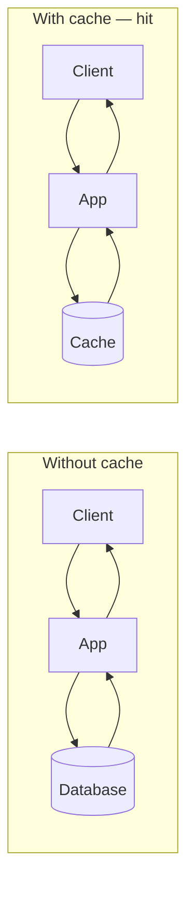

On cache miss, the app loads from the database, stores the result, then returns (see hit/miss flow below).

### Why do we need cache?

**Problems Without Cache:**

- High database load
- Increased response time
- Expensive queries executed repeatedly
- Poor scalability

**Benefits:**

- Faster response time
- Reduced database traffic
- Better application scalability
- Lower infrastructure cost

**Example:**

Database Query Time = 500ms

Without Cache:

```text
Request 1 = 500ms
Request 2 = 500ms
Request 3 = 500ms
```

With Cache:

```text
Request 1 = 500ms (Cache Miss)
Request 2 = 5ms   (Cache Hit)
Request 3 = 5ms   (Cache Hit)
```

### Cache hit and cache miss

**Cache Hit:** Requested data exists in cache. Response time ~1ms to 10ms.

**Cache Miss:** Requested data not found in cache. Response time depends on database.

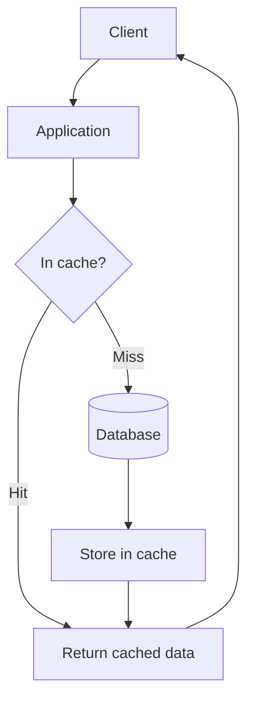

**Formula:**

```text
Cache Hit Ratio = (Cache Hits / Total Requests) * 100
```

**Example:**

```text
Hits = 900
Misses = 100

Hit Ratio = 900/1000 = 90%
```

### Types of cache

A) Browser Cache
B) CDN Cache
C) Application Cache
D) Distributed Cache
E) Database Cache
F) CPU Cache

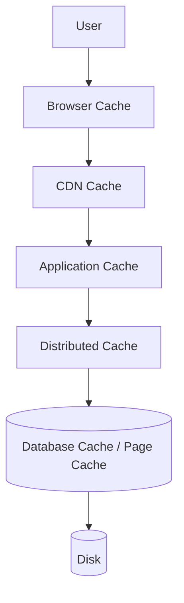

### In-memory cache

Data stored in RAM.

**Examples:**

- Redis
- Memcached
- Hazelcast
- Caffeine

**Advantages:**

- Extremely fast

**Disadvantages:**

- Limited by RAM
- Data loss on restart (unless persisted)

### Cache eviction policies

When cache becomes full, some data must be removed.

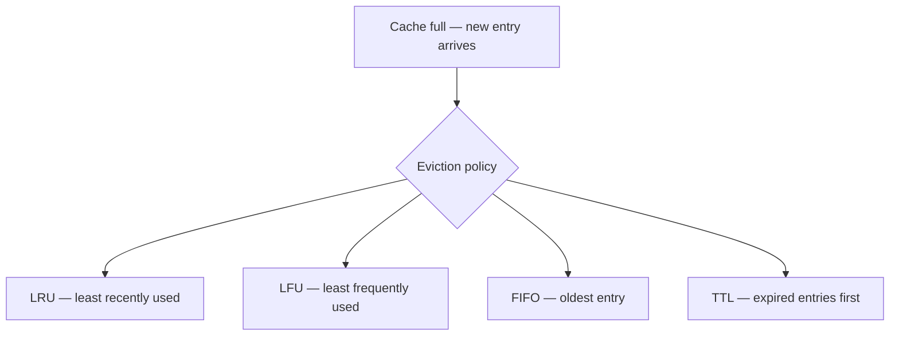

#### A) LRU (Least Recently Used)

Remove least recently accessed item.

**Example:**

```text
Capacity = 3

A B C

Access A

A C B

Add D

Remove B

Result:
A C D
```

#### B) LFU (Least Frequently Used)

Remove item with lowest access count.

**Example:**

```text
A -> 10 accesses
B -> 2 accesses
C -> 5 accesses

Add D

Remove B
```

#### C) FIFO (First In First Out)

Remove oldest entry.

**Example:**

```text
A B C

Add D

Remove A
```

#### D) TTL (Time To Live)

Data automatically expires after time limit.

**Example:**

```text
User Data TTL = 5 minutes

After 5 minutes:
Data removed automatically
```

---

## 3.2 Cache Aside Pattern

Most commonly used strategy.

**Flow:**

1. Check cache
2. If found return
3. If not found query DB
4. Store in cache
5. Return response

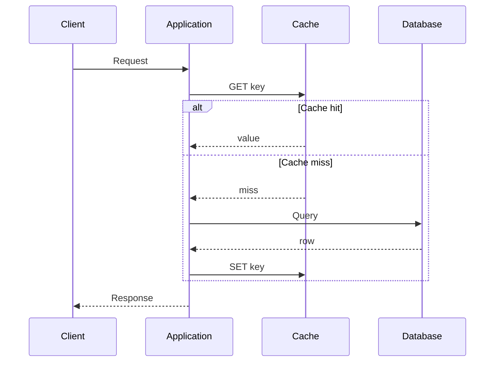

**Advantages:**

- Easy to implement
- Cache only frequently used data

**Disadvantages:**

- First request is slow
- Possible stale data

**Used By:**

- Facebook
- Netflix
- Most microservices

---

## 3.3 Read Through Cache

Cache itself talks to database. Application never accesses DB directly.

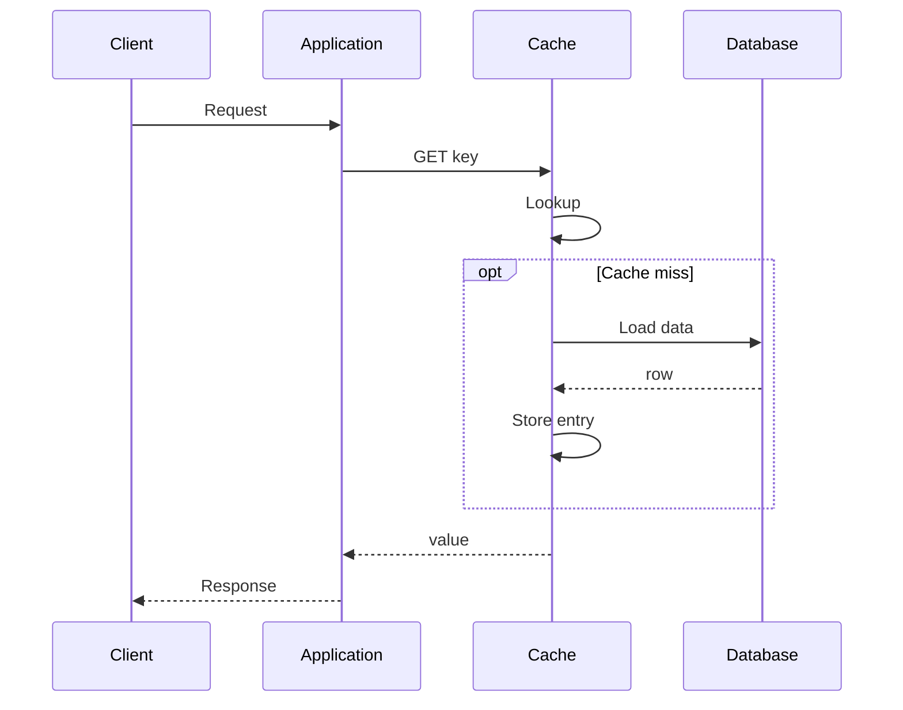

**Advantages:**

- Simpler application code
- Automatic cache management

**Disadvantages:**

- More complex cache layer

---

## 3.4 Write Through Cache

Both cache and DB updated together on every write.

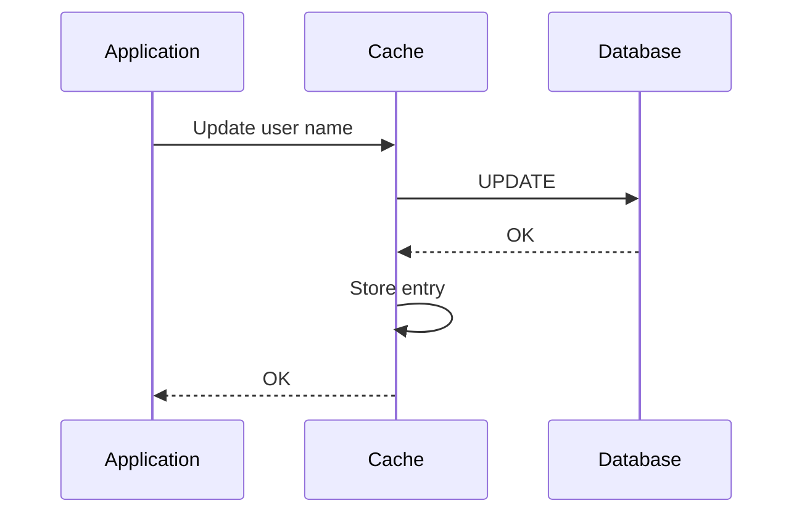

**Advantages:**

- Cache always fresh
- High read performance

**Disadvantages:**

- Slower writes

---

## 3.5 Write Back Cache

Data first written to cache. Database updated later asynchronously.

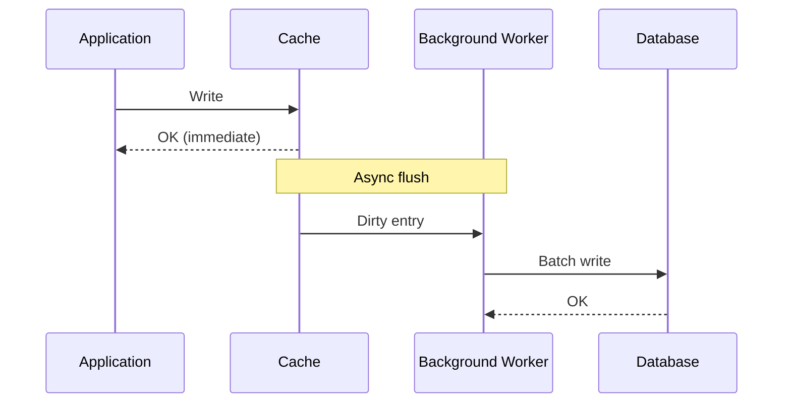

**Advantages:**

- Very fast writes

**Disadvantages:**

- Risk of data loss
- Complex implementation

**Used In:**

- High throughput systems
- Analytics systems

---

## 3.6 Write Around Cache

Write directly to database. Cache updated only when read occurs.

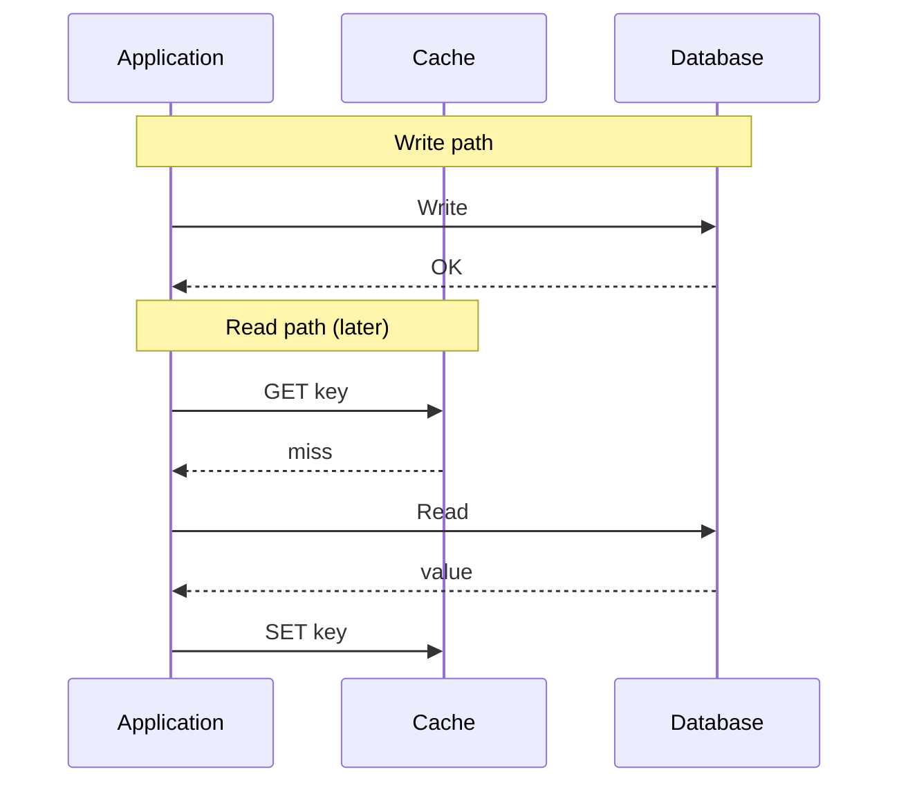

**Advantages:**

- Avoid cache pollution

**Disadvantages:**

- First read causes cache miss

**Useful When:**

- Data written frequently
- Data read rarely

---

## 3.7 Local Cache

Cache inside application instance.

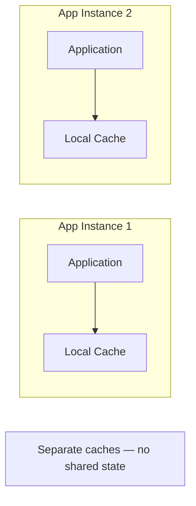

**Examples:**

- Caffeine
- Guava Cache

**Advantages:**

- Very fast
- No network call

**Disadvantages:**

- Data inconsistency between nodes

---

## 3.8 Distributed Cache

Separate cache cluster shared by all services.

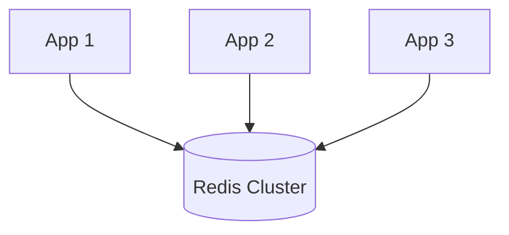

**Advantages:**

- Shared cache
- Consistent view

**Disadvantages:**

- Network overhead

**Examples:**

- Redis
- Hazelcast
- Ignite

### Redis vs Memcached

**Redis:**

- Rich data structures
- Persistence support
- Replication support
- Pub/Sub
- Lua scripting

**Memcached:**

- Simple key-value
- Pure in-memory
- Multi-threaded
- Less features

---

## 3.9 Near Cache

Combination of local cache and distributed cache.

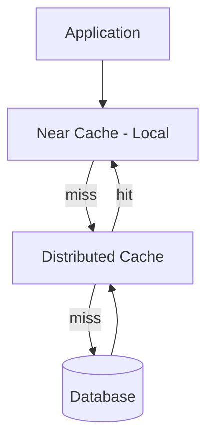

**Advantages:**

- Faster reads
- Reduced network calls

**Examples:**

- Hazelcast Near Cache
- Apache Ignite Near Cache

### Multi-level cache

L1 Cache = Local Cache · L2 Cache = Distributed Cache · L3 Cache = Database

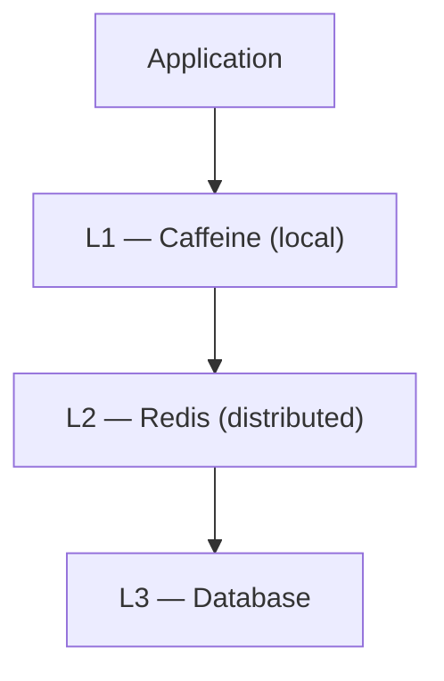

**Benefits:**

- Extremely low latency
- Reduced Redis traffic
- Reduced DB traffic

---

## 3.10 Cache Invalidation

One of the hardest problems in software engineering.

**Purpose:**
Remove stale data from cache.

**Methods:**

1. TTL Expiration
2. Manual Invalidation
3. Event Based Invalidation
4. Version Based Invalidation

**Example:**

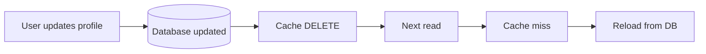

### Cache consistency

**Challenge:** Database = `"John"` but Cache = `"Johnny"` — data is inconsistent.

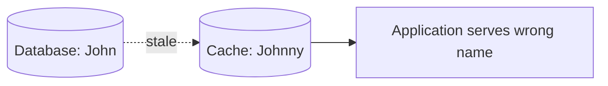

**Solutions:**

A) Write Through
B) Event Driven Updates
C) Cache Invalidation
D) Short TTL

---

## 3.11 Cache Warming

Preload cache before traffic arrives.

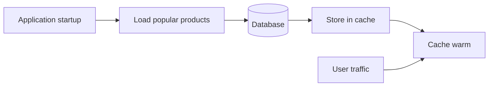

**Benefits:**

- Avoid startup cache misses
- Faster initial responses

---

## 3.12 Cache Penetration

Requests for non-existing data continuously hit DB (e.g. User ID `99999999` not present — every request: cache miss → database).

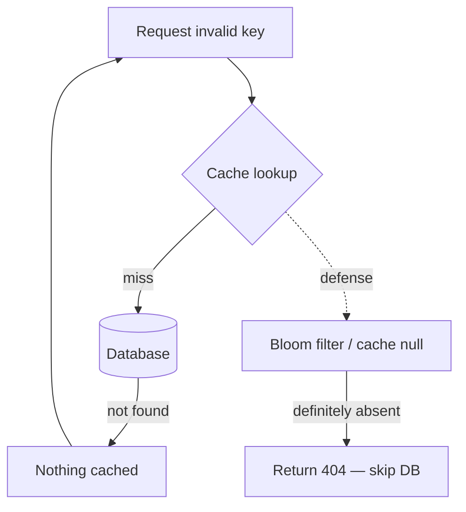

**Solution:**

- Cache null values
- Bloom Filters

---

## 3.13 Cache Avalanche

Many cache entries expire together (e.g. 100,000 keys with TTL = 1 hour all expire at once → traffic hits DB at once).

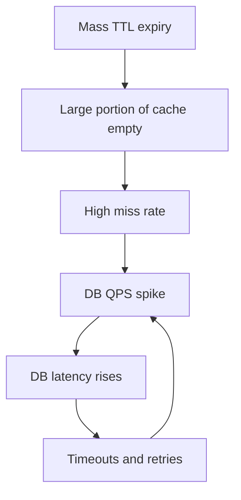

**Solutions:**

- Random TTL
- Multi-level Cache
- Rate Limiting

**Example:**

Instead of:

```text
TTL = 60 min
```

Use:

```text
TTL = 60-90 min random
```

---

## 3.14 Cache Stampede

### Cache breakdown (hot key problem)

A highly popular key expires.

**Example:** Product `iPhone` — millions of users request it. Key expires → all requests hit DB simultaneously → database overload.

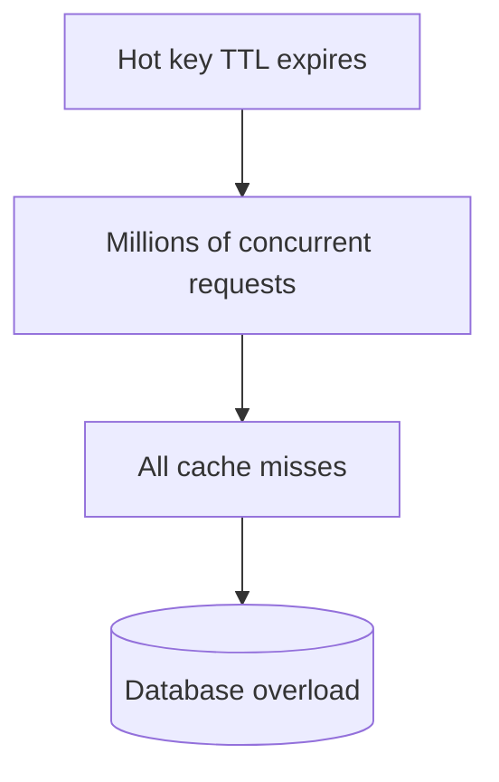

**Solutions:**

- Mutex Lock
- Hot Key Never Expires
- Logical Expiration

### Cache stampede

Multiple threads regenerate same cache value when a key expires (e.g. 1000 requests all hit database).

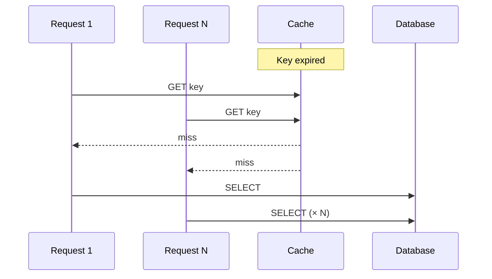

**Solutions:**

- Distributed Lock
- Request Coalescing
- Single Flight Pattern

```mermaid
sequenceDiagram
    participant R1 as Request 1
    participant RN as Request N
    participant Cache
    participant Lock
    participant DB as Database
    R1->>Cache: GET — miss
    R1->>Lock: Acquire lock
    RN->>Cache: GET — miss
    RN->>Lock: Wait
    R1->>DB: SELECT (one query)
    DB-->>R1: value
    R1->>Cache: SET
    R1->>Lock: Release
    Cache-->>RN: hit
```

---

[<- Back to master index](../README.md)
