# 3. Caching

> Status: **Documented**  -  master reference

[<- Back to master index](../README.md)

## Sub-topics

| # | Sub-topic | Status |
|---|-----------|--------|
| 3.1 | [Cache Fundamentals](#31-cache-fundamentals) | Done |
| 3.2 | [Cache Aside Pattern](#32-cache-aside-pattern) | Done |
| 3.3 | [Read Through Cache](#33-read-through-cache) | Done |
| 3.4 | [Write Through Cache](#34-write-through-cache) | Done |
| 3.5 | [Write Back Cache](#35-write-back-cache) | Done |
| 3.6 | [Refresh Ahead Cache](#36-refresh-ahead-cache) | Done |
| 3.7 | [Distributed Cache](#37-distributed-cache) | Done |
| 3.8 | [Near Cache](#38-near-cache) | Done |
| 3.9 | [Cache Invalidation](#39-cache-invalidation) | Done |
| 3.10 | [Cache Stampede](#310-cache-stampede) | Done |
| 3.11 | [Cache Avalanche](#311-cache-avalanche) | Done |
| 3.12 | [Cache Penetration](#312-cache-penetration) | Done |
| 3.13 | [Cache Warming](#313-cache-warming) | Done |


## Topic Overview

Caching stores frequently accessed data in a faster, closer storage tier so applications avoid repeated expensive work - disk I/O, network round-trips, or heavy computation. In system design, caching is one of the highest-leverage optimizations: a well-placed cache can reduce latency by orders of magnitude and absorb read traffic that would otherwise saturate databases.

Caches exist at every layer: CPU L1/L2/L3, OS page cache, CDN edge nodes, in-process hash maps, and dedicated distributed stores like Redis or Memcached. The design challenge is not merely "add Redis" but choosing the right **pattern** (who reads/writes the cache), **consistency model** (how stale data is tolerated), and **failure modes** (stampede, avalanche, penetration) that determine whether caching helps or harms production systems.

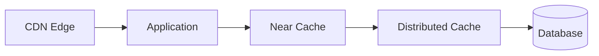
```mermaid
flowchart LR
    App[Application] --> L1[Near Cache]
    L1 --> L2[Distributed Cache]
    L2 --> DB[(Database)]
    CDN[CDN Edge] --> App
```

---


## 3.1 Cache Fundamentals


### What is it?

A cache is a store of data duplicated from a slower **source of truth**, kept in faster media (memory, SSD, edge node) with the expectation that future requests will reuse it. Caches exploit two access patterns:

| Locality type | Definition | Example |
|---------------|------------|---------|
| **Temporal locality** | Recently used data is likely reused soon | User refreshes profile page 3× in 10 seconds |
| **Spatial locality** | Data near a recently accessed item is likely accessed next | Loading `user:123` then `user:123:orders` |

Caches sit at every layer of the stack: CPU L1/L2/L3, OS page cache, CDN edge, in-process maps (Caffeine), and distributed stores (Redis).

### Why it matters

Without caching, every user request hits the database at full cost. Caches decouple read throughput from backend capacity, shrink p99 latency, and provide a buffer during traffic spikes - often the difference between a system that scales linearly and one that collapses under load.

**Hit ratio drives ROI.** A 95% hit ratio means only 5% of reads reach the DB; at 1M RPS that is 50K DB queries vs 1M without cache.

### How it works

1. Application receives a request for data keyed by an identifier (e.g., `user:123`).
2. Application checks the cache for that key.
3. **Cache hit:** data is returned immediately from fast storage.
4. **Cache miss:** application fetches from the authoritative store, optionally populates the cache, and returns the result.
5. Entries expire via **TTL** (time-to-live), explicit invalidation, or **eviction** when memory is full.

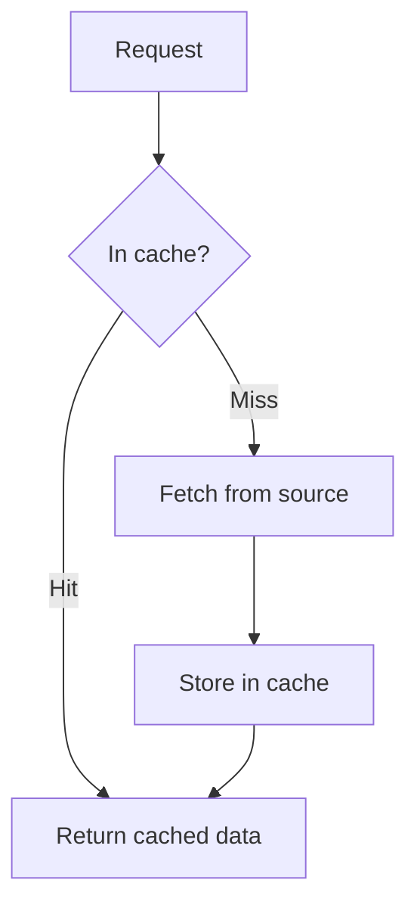
```mermaid
flowchart TB
    Req[Request] --> Lookup{In cache?}
    Lookup -->|Hit| Return[Return cached data]
    Lookup -->|Miss| Fetch[Fetch from source]
    Fetch --> Store[Store in cache]
    Store --> Return
```

**Hit ratio math:**

```text
hit_ratio   = hits / (hits + misses)
miss_ratio  = 1 - hit_ratio
effective_latency = (hit_ratio × cache_latency) + (miss_ratio × source_latency)

Example: 95% hits, cache 1ms, DB 20ms
  → 0.95×1 + 0.05×20 = 1.95ms average (vs 20ms uncached)
```

### Key details

#### Hit ratio

| Metric | Formula | Healthy target |
|--------|---------|----------------|
| Hit ratio | `hits / (hits + misses)` | 90%+ hot paths |
| Miss rate | `misses / total` | < 10% |
| Eviction rate | evictions/sec | Low; high = working set > cache |

Monitor per key prefix (`product:*`, `session:*`). A global 90% hit ratio can hide a 0% hit on checkout keys.

#### TTL (time-to-live)

TTL is the maximum age before an entry is considered stale and removed (or refreshed).

| TTL strategy | When to use | Risk |
|--------------|-------------|------|
| Fixed TTL | Stable reference data | Mass expiry at same time (avalanche) |
| TTL + jitter | Hot keys with fixed base TTL | Slight staleness spread |
| No TTL + invalidation | Must be fresh on write | Missed invalidation = stale forever |
| Short TTL safety net | Combined with delete-on-write | Extra DB load on expiry |

```text
# Jitter example (Python)
import random
ttl = 300 + random.randint(0, 60)   # 300-360s
cache.set("product:42", data, ex=ttl)
```

#### Eviction policies (when cache is full)

| Policy | Behavior | Best for | Weakness |
|--------|----------|----------|----------|
| **LRU** (Least Recently Used) | Evict longest-unaccessed entry | General web caching; temporal locality | One-time scan pollutes hot set |
| **LFU** (Least Frequently Used) | Evict lowest access-count entry | Stable hot keys (top products) | New keys evicted before warming |
| **FIFO** | Evict oldest inserted entry | Simple embedded caches | Ignores access pattern |
| **TTL-only** | Expire by age, no explicit eviction | Small bounded caches | Memory spike before expiry |
| **Random** | Evict random entry | Memcached default in some configs | Unpredictable hit ratio |

Redis default: `maxmemory-policy` options include `allkeys-lru`, `volatile-lru`, `allkeys-lfu`. LRU is approximated with a sample of keys (not perfect LRU - good enough at scale).

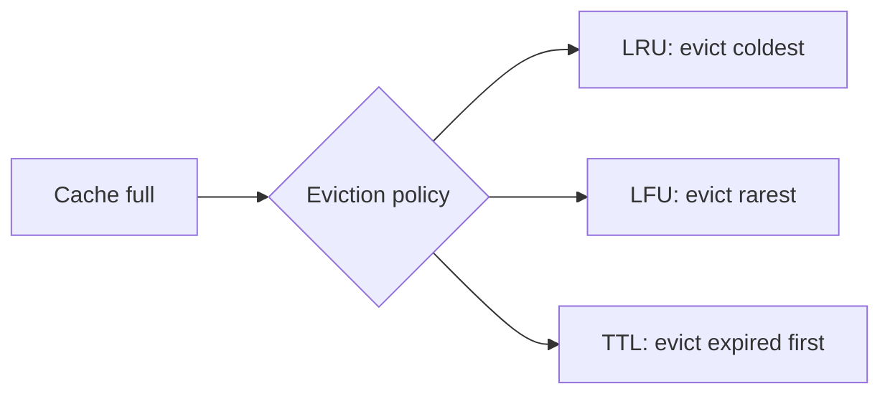
```mermaid
flowchart LR
    Full[Cache full] --> Policy{Eviction policy}
    Policy --> LRU["LRU: evict coldest"]
    Policy --> LFU["LFU: evict rarest"]
    Policy --> TTL["TTL: evict expired first"]
```

#### Locality in practice

- **CPU:** cache lines (64 bytes) exploit spatial locality - reading `array[i]` loads neighbors.
- **DB page cache:** sequential scan benefits spatial locality on disk blocks.
- **CDN:** entire static asset cached after first byte request (spatial).
- **Application:** prefetch related keys (`user:123` + `user:123:preferences`) into cache together.

| Concept | Description |
|---------|-------------|
| **Write policy** | Whether writes go to cache, source, or both (see 3.2-3.5) |
| **Cache coherence** | How multiple cache layers stay consistent with each other and the source |
| **Working set** | Unique keys accessed in a time window; must fit in cache for high hit ratio |

### When to use

- Read-heavy workloads with repeated access to the same keys (read:write ≥ 10:1)
- Expensive computations or aggregations that can be memoized
- Data that changes infrequently relative to read frequency
- Protecting downstream services (DB, third-party APIs) from overload

### Trade-offs / Pitfalls

- Stale data if TTL or invalidation is wrong - users see outdated information
- Memory cost scales with cached working set; unbounded caching causes OOM
- **Working set > cache size** → constant eviction → hit ratio collapses
- LRU thrashing: large one-time scan evicts entire hot set
- Cache adds operational complexity: monitoring hit ratio, eviction, cluster health
- Cold start after deploy or restart causes thundering herd on the backend (see 3.11, 3.13)

### References

- [Cache Fundamentals - System Design video](https://www.youtube.com/watch?v=1NngTUYPdpI)

---


## 3.2 Cache Aside Pattern


### What is it?

**Cache-aside** (also called **lazy loading** or **look-aside**) is the pattern where the **application** owns all cache logic. The cache is a passive key-value store; it does not know about the database.

- **Read:** app checks cache first; on miss, loads from DB and populates cache
- **Write:** app writes to DB (source of truth), then **invalidates** (deletes) or updates the cache key

This is the default pattern for **Redis + PostgreSQL/MySQL** in most production services.

### Why it matters

- Only data that is actually read gets cached (no wasted memory on cold rows)
- Works with any cache (Redis, Memcached, in-process Caffeine) and any database
- Simple mental model for developers; no cache-vendor magic required
- Decouples cache failure from DB - if Redis is down, app can still read DB (degraded latency)

### How it works

**Read path (cache hit):**

```text
1. value = cache.get("user:123")
2. if value != null -> return value   // HIT - no DB call
```

**Read path (cache miss):**

```text
1. value = cache.get("user:123")       // MISS
2. value = db.query("SELECT ... WHERE id=123")
3. cache.set("user:123", value, TTL=300s)
4. return value
```

**Write path (recommended: invalidate-on-write):**

```text
1. db.update("UPDATE users SET name=? WHERE id=123", ...)
2. cache.delete("user:123")            // invalidate, do NOT update cache here
3. Next read will miss and repopulate fresh data from DB
```

**Why invalidate instead of update-on-write?**

Race scenario with update-on-write:
1. Thread A writes DB `name=Alice` -> updates cache `name=Alice`
2. DB write fails/rolls back (still `name=Bob` in DB)
3. Cache shows `Alice`, DB shows `Bob` -> **inconsistent until TTL**

With invalidate-on-write, failed DB write should skip cache delete; successful write always clears stale cache.

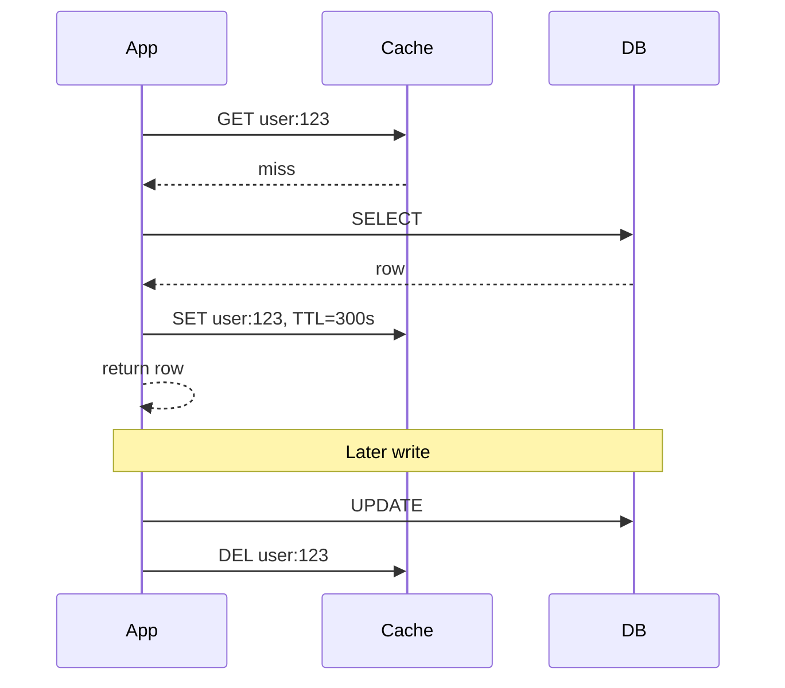
```mermaid
sequenceDiagram
    participant App
    participant Cache
    participant DB
    App->>Cache: GET user:123
    Cache-->>App: miss
    App->>DB: SELECT
    DB-->>App: row
    App->>Cache: SET user:123, TTL=300s
    App-->>App: return row
    Note over App,DB: Later write
    App->>DB: UPDATE
    App->>Cache: DEL user:123
```

**Read-after-write consistency (same user):**

If a user updates their profile then immediately reads it, they may hit stale cache if invalidation is async. Fixes:
- Delete cache **before** or **synchronously after** DB commit in same request
- **Read-your-writes:** route that user's reads to DB or use versioned keys for 1-2 seconds
- Short TTL as safety net (e.g. 60s) even with explicit invalidation

### Key details

- **TTL is mandatory** even with invalidation - protects against missed invalidation code paths (new service writes DB but forgets cache)
- **Cache key design:** `entity:id` (e.g. `product:42`), optional version suffix `product:42:v5`
- **Null caching:** cache short TTL for "not found" to prevent **cache penetration** (repeated DB lookups for missing keys)
- **Hit ratio target:** 90%+ on hot paths; monitor `cache_hits / (hits + misses)`
- **Read:write ratio:** ideal 10:1 or higher; write-heavy tables benefit less from cache-aside
- **Multiple writers:** use pub/sub (Redis) or CDC (Debezium) so all services evict the same keys
- **Comparison to other patterns:**
  - Read-through: cache loads on miss automatically (app only talks to cache)
  - Write-through: cache and DB updated together on write (stronger consistency, slower writes)
  - Write-back: write to cache first, async flush to DB (fast writes, durability risk)

### When to use

- Default choice for application-level caching with Redis/Memcached
- Read-heavy workloads (product pages, user profiles, config)
- When you need control over exactly which queries are cached
- Polyglot persistence (different DBs, one shared Redis cluster)

### Trade-offs / Pitfalls

- **Stale reads** - invalidation bug or race between DB commit and cache delete
- **Thundering herd** - hot key expires; thousands of concurrent misses hit DB (see 3.10 Cache Stampede)
- **Cache avalanche** - entire Redis cluster restart causes mass miss (see 3.11)
- **Duplicated logic** - every service touching the data must implement cache-aside correctly
- **Cold start** - after deploy, empty cache -> DB load spike until warmed (see 3.13 Cache Warming)
- **Does not help** if working set >> cache memory (constant eviction, low hit ratio)

### References

- [Cache Fundamentals - video](https://www.youtube.com/watch?v=1NngTUYPdpI)

---


## 3.3 Read Through Cache


### What is it?

In **read-through**, the cache itself is responsible for loading data on a miss. The application only talks to the cache; the cache library or server fetches from DB when the key is absent and stores it before returning.

### Why it matters

Centralizes read logic in one place, reducing duplicated cache-miss handling across services. Useful when many clients share the same cache abstraction.

### How it works

1. Application requests key from cache layer.
2. Cache checks internal store.
3. On miss, cache **automatically** calls a loader function / DB and populates itself.
4. Cache returns data to application - application never touches DB directly for reads.

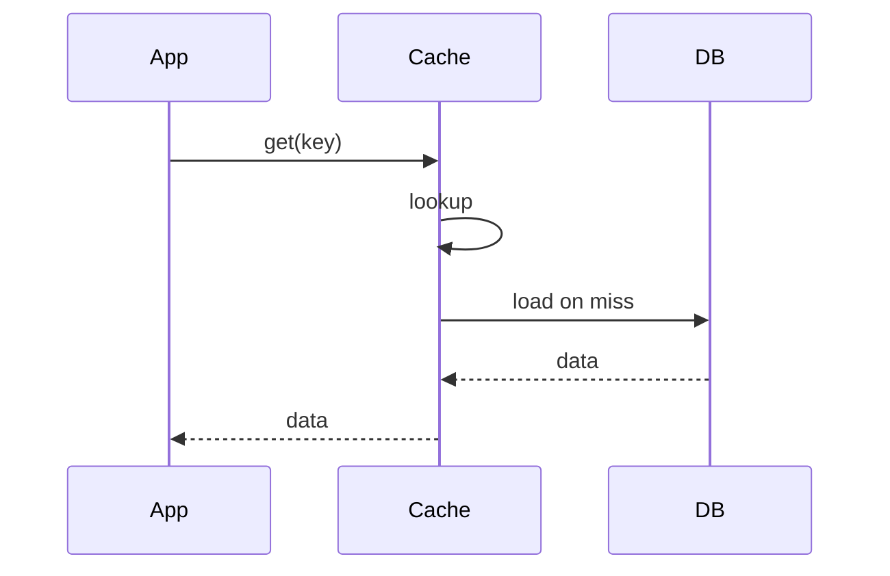
```mermaid
sequenceDiagram
    participant App
    participant Cache
    participant DB
    App->>Cache: get(key)
    Cache->>Cache: lookup
    Cache->>DB: load on miss
    DB-->>Cache: data
    Cache-->>App: data
```

### Key details

- Loader callback must be registered with the cache (e.g., Guava `CacheLoader`, Hazelcast `MapLoader`)
- Cache and DB can briefly disagree during concurrent writes unless invalidation is coordinated
- Simplifies application read path at cost of coupling cache config to DB schema
- Often combined with write-through or write-behind for full cache-managed persistence

### When to use

- Shared cache client library used by many microservices
- When you want uniform miss-handling without per-service boilerplate
- Embedded caches (Caffeine, Ehcache) with defined loading semantics

### Trade-offs / Pitfalls

- Loader failures propagate as cache errors - need circuit breaking on DB
- Harder to implement partial/chunked caching (cache loads whole object)
- Write path still needs separate strategy (usually invalidate or write-through)
- Debugging requires understanding cache loader behavior, not just app code

---


## 3.4 Write Through Cache


### What is it?

**Write-through** writes synchronously to **both** cache and database on every update. The cache and DB are updated in the same operation before the write is acknowledged to the caller.

### Why it matters

Keeps cache and DB consistent on writes - no stale cache entries after an update. Reads after writes always hit warm, correct data in cache (assuming write succeeded).

### How it works

1. Application sends write to cache layer.
2. Cache writes to DB first (or in coordinated transaction).
3. Cache updates its own entry.
4. Acknowledges success to application.
5. Subsequent reads hit cache with fresh data.

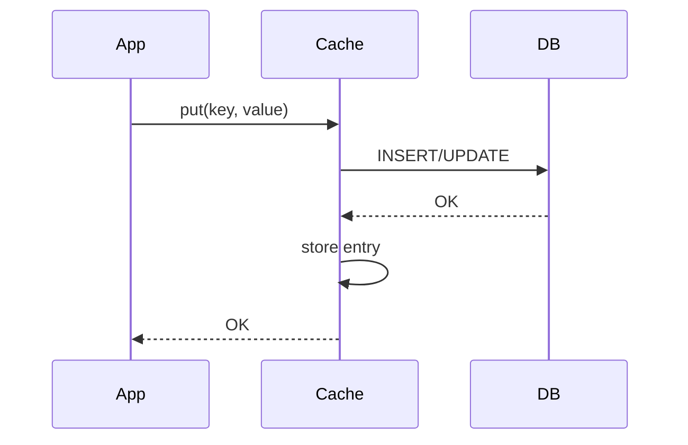
```mermaid
sequenceDiagram
    participant App
    participant Cache
    participant DB
    App->>Cache: put(key, value)
    Cache->>DB: INSERT/UPDATE
    DB-->>Cache: OK
    Cache->>Cache: store entry
    Cache-->>App: OK
```

### Key details

- Write latency = cache write + DB write (slower than write-back)
- Eliminates stale-read problem for keys that were written
- Cache only holds data that has been written or read - cold keys still miss
- Used in systems requiring strong read-after-write consistency for cached entities

### When to use

- Read-after-write consistency is mandatory
- Write volume is moderate relative to reads
- Financial or inventory systems where stale cache after write is unacceptable

### Trade-offs / Pitfalls

- Higher write latency than direct DB write or write-back
- Failed DB write must roll back cache update - needs transactional coordination
- Caching data that is never read wastes memory (writes populate cache unnecessarily)
- Does not protect DB from read load for keys never written through cache

---


## 3.5 Write Back Cache


### What is it?

**Write-back** (write-behind) acknowledges writes to the cache immediately and **asynchronously** flushes to the database later. The cache acts as a temporary buffer; DB is updated in batches or on a schedule.

### Why it matters

Dramatically reduces write latency and DB write load for bursty or high-frequency update patterns. Essential for write-heavy analytics buffers, session stores, and metrics aggregation.

### How it works

1. Application writes to cache; cache returns immediately.
2. Cache marks entry as **dirty** (modified, not yet persisted).
3. Background flush process periodically writes dirty entries to DB.
4. On cache eviction or crash before flush, data may be lost unless WAL/replication protects it.

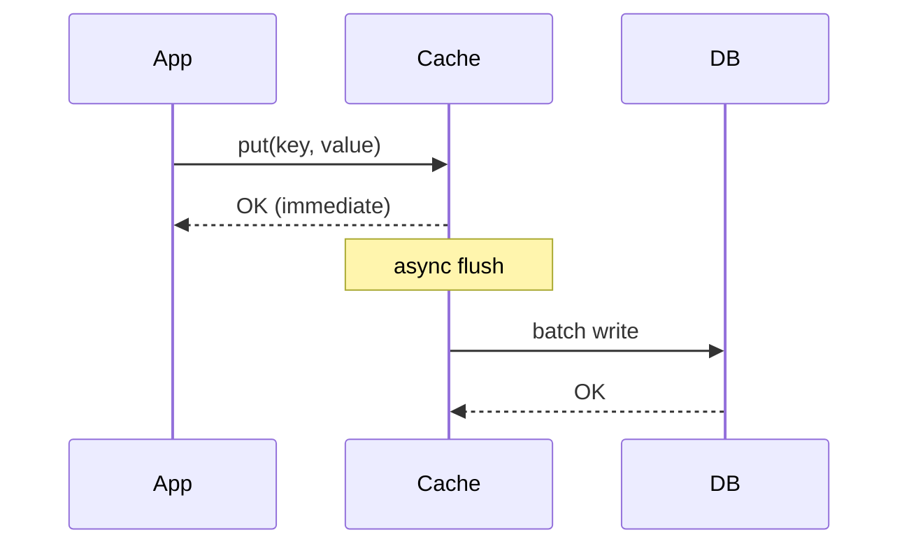
```mermaid
sequenceDiagram
    participant App
    participant Cache
    participant DB
    App->>Cache: put(key, value)
    Cache-->>App: OK (immediate)
    Note over Cache: async flush
    Cache->>DB: batch write
    DB-->>Cache: OK
```

### Key details

- **Durability risk:** crash between cache write and DB flush loses data
- Batching improves DB throughput (fewer transactions)
- Ordering matters for related keys - flush order can cause temporary inconsistency
- Often paired with replication or persistent cache (Redis AOF) to reduce loss window

### When to use

- Write-heavy workloads where latency matters more than immediate durability
- Metrics, counters, activity feeds, click streams
- Systems that can tolerate seconds of data loss (with replication mitigation)

### Trade-offs / Pitfalls

- Data loss on cache node failure if not replicated
- Complex recovery: rebuilding cache from DB may overwrite newer buffered writes
- Read-your-writes not guaranteed if read goes to replica before flush
- Debugging write ordering bugs is difficult

---


## 3.6 Refresh Ahead Cache


### What is it?

**Refresh-ahead** proactively reloads cache entries **before** they expire, based on access patterns or fixed schedules. Hot keys are refreshed in the background so users rarely experience miss latency.

### Why it matters

Eliminates latency spikes on TTL expiry for predictable hot keys. Critical for product catalog pages, config blobs, or feature flags read on every request.

### How it works

1. Cache entry is accessed; cache tracks access frequency and TTL remaining.
2. When TTL drops below a threshold (e.g., 20% remaining) and key is hot, cache triggers background refresh.
3. Loader fetches fresh data from source and replaces entry **without** evicting first.
4. User requests continue hitting the old entry until refresh completes (no miss).

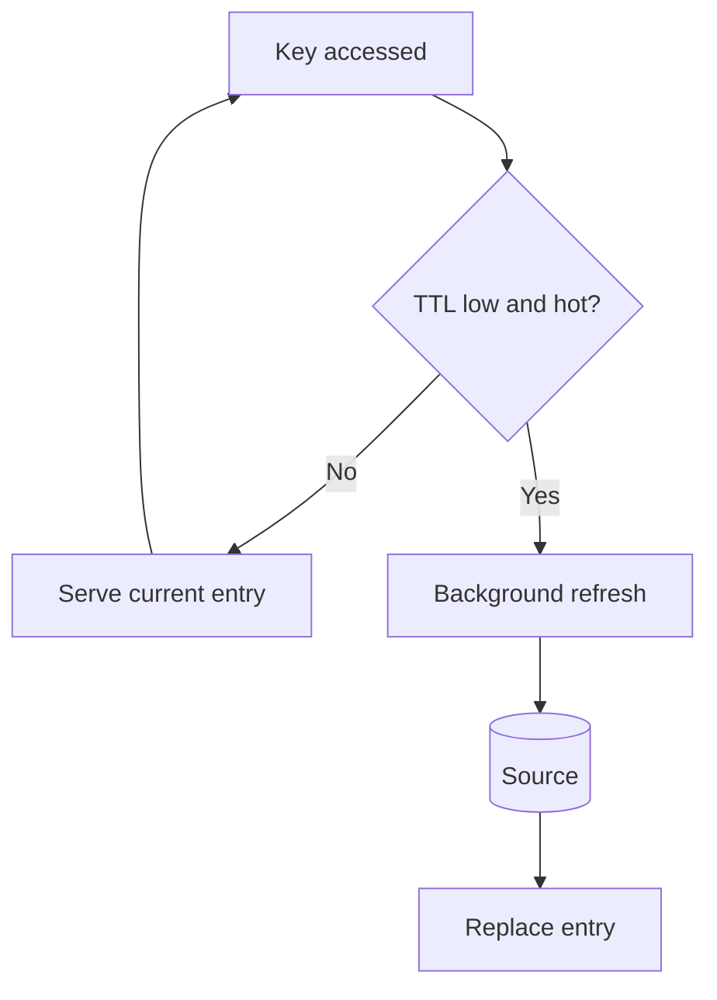
```mermaid
flowchart TB
    Access[Key accessed] --> Check{TTL low and hot?}
    Check -->|No| Serve[Serve current entry]
    Check -->|Yes| BG[Background refresh]
    BG --> Source[(Source)]
    Source --> Update[Replace entry]
    Serve --> Access
```

### Key details

- Requires access tracking (frequency counters, last-access time)
- Refresh storms if many hot keys expire simultaneously - stagger TTLs
- Wasted refresh if key stops being accessed after refresh scheduled
- Guava/Caffeine support `refreshAfterWrite`; Redis requires custom logic or jobs

### When to use

- Extremely hot keys where miss latency is unacceptable
- Data with predictable refresh cost and known access patterns
- Configuration, reference data, homepage aggregates

### Trade-offs / Pitfalls

- Background load on source even when data unchanged
- Stale data served during slow refresh (old entry kept until new one ready)
- Complex tuning: refresh threshold, thread pool size, rate limits
- Over-refreshing low-value keys wastes resources

---


## 3.7 Distributed Cache


### What is it?

A **distributed cache** spans multiple nodes, presenting a unified key space with **partitioning** (sharding) for capacity and **replication** for fault tolerance and read scaling. Examples: **Redis Cluster**, Memcached pools, Hazelcast, Apache Ignite.

Single-node Redis caps at ~64 GB RAM (practical) and is a SPOF; clustering adds horizontal scale and survivability.

### Why it matters

Single-node memory limits cap cache size; distributed caches scale horizontally to terabytes and survive node failures without losing entire cache capacity. A 6-node Redis Cluster with 32 GB each = ~192 GB addressable key space (minus replication overhead).

### How it works

**Request routing (Redis Cluster example):**

1. Client computes `CRC16(key) mod 16384` → **hash slot** (0-16383).
2. Cluster maps slot ranges to primary nodes (e.g., slots 0-5460 → Node A).
3. Client sends `GET user:123` to the node owning that slot (MOVED/ASK redirects if topology changed).
4. Primary serves writes; replicas async-replicate and can serve read scaling (with staleness risk).

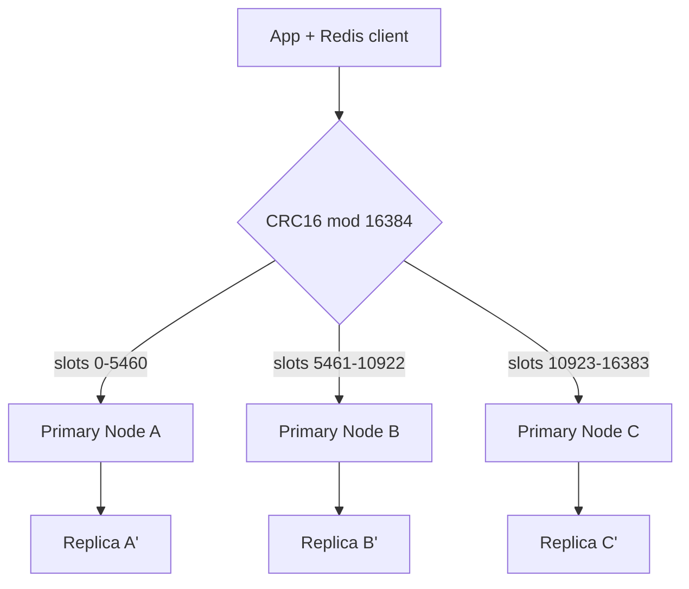
```mermaid
flowchart TB
    Client[App + Redis client] --> Slot{CRC16 mod 16384}
    Slot -->|slots 0-5460| N1[Primary Node A]
    Slot -->|slots 5461-10922| N2[Primary Node B]
    Slot -->|slots 10923-16383| N3[Primary Node C]
    N1 --> R1[Replica A']
    N2 --> R2[Replica B']
    N3 --> R3[Replica C']
```

**Partitioning strategies:**

| Strategy | How | Used by | Hot-key mitigation |
|----------|-----|---------|-------------------|
| **Hash slots** | Fixed slot count; keys hash to slot | Redis Cluster (16384 slots) | Hash tags `{user:123}:profile` force same slot |
| **Consistent hashing** | Keys on ring; nodes own arc segments | Memcached clients, Twemproxy | Virtual nodes spread load |
| **Range partitioning** | Key ranges assigned to nodes | Some custom caches | Manual rebalancing |
| **Directory-based** | Lookup service maps key → node | Dynamo-style | Flexible but extra hop |

**Replication:**

| Mode | Behavior | Durability | Read scaling |
|------|----------|------------|--------------|
| **Async replica** | Primary acks before replica confirms | Risk loss on primary crash | `READONLY` on replica (stale) |
| **Semi-sync** | Wait for 1+ replica ack | Better; higher write latency | Limited |
| **No replica** | Single copy per slot | Fast; no failover data | N/A |

**Failover flow (Redis Cluster):**

```text
1. Primary Node B fails
2. Other primaries detect via gossip (cluster bus, port 16379)
3. Replica B' promoted to primary for B's slots
4. Cluster publishes new topology; clients refresh slot map
5. Brief window: clients may get MOVED errors or miss data if async lag
```

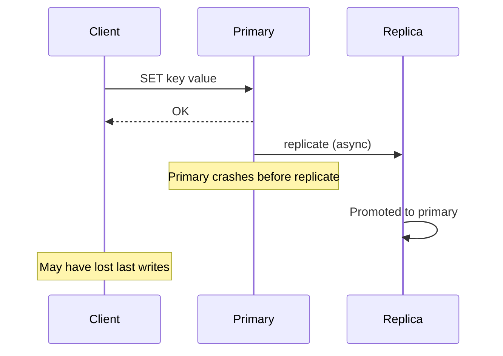
```mermaid
sequenceDiagram
    participant Client
    participant Primary
    participant Replica
    Client->>Primary: SET key value
    Primary-->>Client: OK
    Primary->>Replica: replicate (async)
    Note over Primary: Primary crashes before replicate
    Replica->>Replica: Promoted to primary
    Note over Client: May have lost last writes
```

### Key details

| Aspect | Redis Cluster | Memcached pool |
|--------|---------------|----------------|
| **Partitioning** | 16384 hash slots, auto-migrated | Client-side consistent hash |
| **Replication** | Built-in primary-replica per slot | None (client treats as separate pools) |
| **Multi-key ops** | Only if keys share slot (`{tag}`) | No cross-node transactions |
| **Client** | Cluster-aware (Jedis, Lettuce) | Ketama, Twemproxy proxy |
| **Resharding** | `redis-cli --cluster reshard` | Add node → ring rebalance |

**Hash tag example (co-locate related keys):**

```text
user:{123}:profile   → hashes only {123}
user:{123}:orders    → same slot as profile
MGET works atomically on same slot
```

**Client routing options:**

- **Smart client:** library caches slot map; follows MOVED/ASK redirects.
- **Proxy (Twemproxy, Envoy, Corvus):** app talks to proxy; proxy routes to backend.
- **Sidecar:** service mesh handles routing per pod.

### When to use

- Cache working set exceeds single machine RAM (> 32-64 GB)
- High availability required (no single point of failure)
- Multiple services sharing centralized cache tier
- Global deployments with geo-distributed cache (Redis Enterprise Active-Active)

### Trade-offs / Pitfalls

- Network latency between app and remote cache (0.5-2 ms same-AZ vs. nanoseconds for L1)
- **Hot keys** on single shard cause skew despite hashing - monitor per-slot QPS
- **CROSSSLOT** errors if multi-key transaction spans slots without hash tags
- Split-brain and failover can cause brief inconsistency or **lost writes** (async replication)
- Resharding during peak traffic causes latency spikes and MOVED storms
- Operational overhead: cluster monitoring, version upgrades, `CLUSTER NODES` health

---


## 3.8 Near Cache


### What is it?

A **near cache** (L1) sits in the application process memory in front of a **remote distributed cache** (L2). Frequently accessed entries are kept locally to avoid network round-trips on every read.

### Why it matters

Cuts p99 latency for hot keys from milliseconds to nanoseconds. Essential in microservices making hundreds of cache calls per request.

### How it works

1. App checks local near cache (in-heap Caffeine/Guava map).
2. Local hit -> return immediately (no network).
3. Local miss -> fetch from remote cache (Redis).
4. Remote hit -> populate near cache with shorter TTL, return.
5. Remote miss -> load from DB per cache-aside logic.

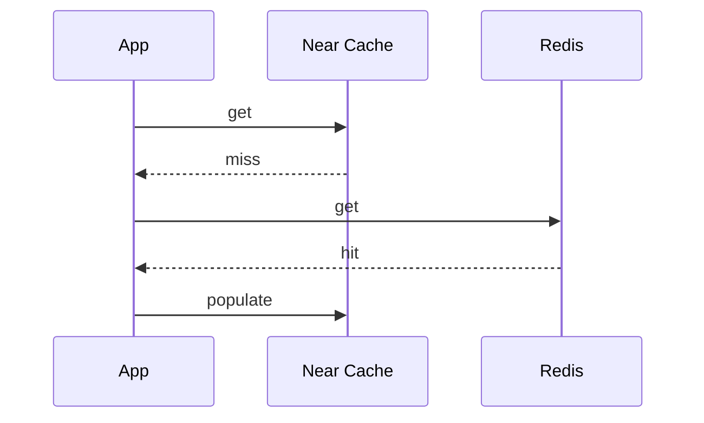
```mermaid
sequenceDiagram
    participant App
    participant L1 as Near Cache
    participant L2 as Redis
    App->>L1: get
    L1-->>App: miss
    App->>L2: get
    L2-->>App: hit
    App->>L1: populate
```

### Key details

- Near cache TTL should be **shorter** than remote cache TTL to limit staleness
- Invalidation must propagate: remote invalidation + local eviction (pub/sub, Hazelcast events)
- Memory bounded per instance - each pod has its own L1 (not shared)
- Stale L1 entries across pods until TTL expires if invalidation missed

### When to use

- High QPS services with repeated reads of same keys per instance
- Latency-sensitive paths (auth tokens, feature flags, product metadata)
- ORM second-level cache (Hibernate) pattern

### Trade-offs / Pitfalls

- **Consistency:** pods see different L1 state briefly
- Total memory = near cache × number of pods (multiplied footprint)
- Invalidation complexity increases significantly
- Harder to debug "works on one pod, stale on another"

---


## 3.9 Cache Invalidation


### What is it?

**Cache invalidation** removes or updates cached entries when underlying data changes so clients do not read stale values. Phil Karlton: *"There are only two hard things in Computer Science: cache invalidation and naming things."*

Invalidation is distinct from **expiry** (TTL): invalidation is event-driven on data change; TTL is time-driven regardless of change.

### Why it matters

Wrong invalidation causes users to see outdated prices, permissions, or content - often worse than a cache miss because stale data looks legitimate. A $9.99 price cached after a $99 sale causes legal and revenue damage.

### How it works

**Invalidation strategies:**

| Strategy | Mechanism | Consistency | Complexity |
|----------|-----------|-------------|------------|
| **TTL-only** | Entry expires after fixed time | Weak; stale until TTL | Low |
| **Delete on write** | `DEL key` after DB commit (cache-aside) | Strong if ordered correctly | Medium |
| **Update on write** | `SET key` new value after DB write | Risky on DB rollback | Medium |
| **Version stamp** | Key = `entity:id:v5`; bump version on write | Old versions become orphans | Medium |
| **Write-through** | Cache + DB updated together | Strong on success path | High |
| **Pub/sub broadcast** | Writer publishes evict event | Eventual across subscribers | Medium |
| **CDC (Change Data Capture)** | Binlog → Kafka → evict consumers | Decoupled; near-real-time | High |

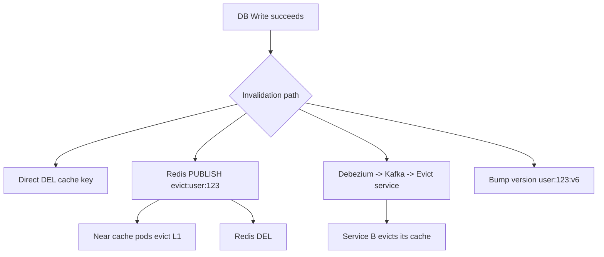
```mermaid
flowchart TB
    Write[DB Write succeeds] --> Path{Invalidation path}
    Path --> Del[Direct DEL cache key]
    Path --> Pub["Redis PUBLISH evict:user:123"]
    Path --> CDC[Debezium -> Kafka -> Evict service]
    Path --> Ver["Bump version user:123:v6"]
    Pub --> L1[Near cache pods evict L1]
    Pub --> L2[Redis DEL]
    CDC --> SvcB[Service B evicts its cache]
```

**Recommended order (cache-aside delete):**

```text
1. BEGIN transaction
2. UPDATE users SET name='Alice' WHERE id=123
3. COMMIT
4. cache.delete("user:123")     # after commit, not before
5. return success to client
```

**Race conditions and fixes:**

| Race | Scenario | Fix |
|------|----------|-----|
| **Read repopulates stale** | T1 reads miss → loads old DB value → T2 writes DB + deletes cache → T1 writes stale to cache | Delete cache *after* commit; short TTL; versioned keys |
| **Delete before commit** | Cache deleted → read miss → loads old DB → cache repopulated stale → commit updates DB | Never delete before commit |
| **Lost invalidation** | Service A writes DB; Service B caches reads; A forgets to publish evict | CDC or domain events for all writers |
| **Thundering herd after invalidation** | Mass delete → simultaneous misses | Single-flight on repopulate (3.10) |

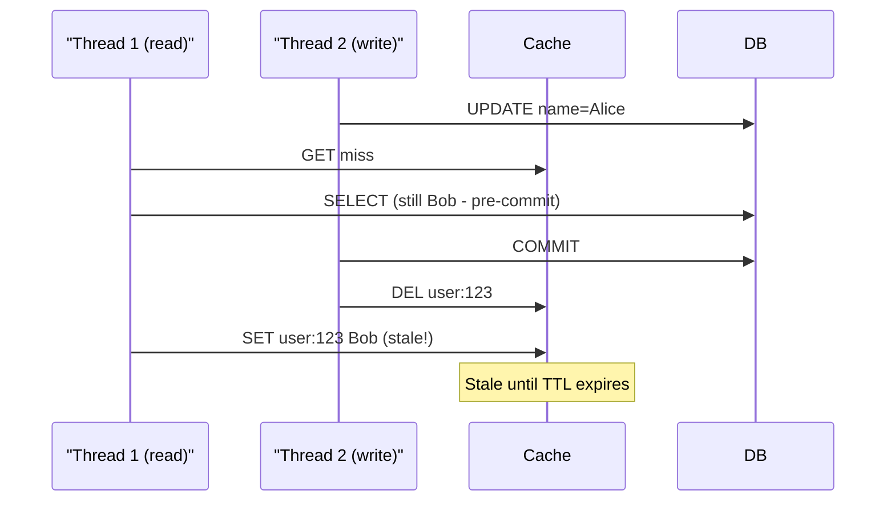
```mermaid
sequenceDiagram
    participant T1 as "Thread 1 (read)"
    participant T2 as "Thread 2 (write)"
    participant Cache
    participant DB
    T2->>DB: UPDATE name=Alice
    T1->>Cache: GET miss
    T1->>DB: SELECT (still Bob - pre-commit)
    T2->>DB: COMMIT
    T2->>Cache: DEL user:123
    T1->>Cache: SET user:123 Bob (stale!)
    Note over Cache: Stale until TTL expires
```

**CDC / pub-sub invalidation architecture:**

```text
PostgreSQL WAL → Debezium → Kafka topic "db.users"
  → Invalidation service consumes event
  → DEL user:123 in Redis
  → PUBLISH evict:user:123 for L1 near caches
```

| Approach | Pros | Cons |
|----------|------|------|
| **Redis pub/sub** | Low latency; simple | No persistence; subscribers offline = missed evicts |
| **Kafka** | Durable; replay; multi-consumer | Higher latency; more infra |
| **Debezium CDC** | Captures ALL DB writes; no app code change | Schema coupling; lag seconds |

**Bulk / pattern invalidation:**

- Redis `SCAN` + `DEL` for `product:42:*` - slow on large keyspaces; blocks if not careful.
- Maintain **inverse index**: `product:42 → [key1, key2, ...]` updated on cache write.
- **Cache tags** (some frameworks): tag `catalog-v2` on keys; invalidate all with tag.

### Key details

- **Cache aside + delete** is most common; order matters: **DB commit first**, then delete cache
- **Near cache (3.8):** remote DEL does not evict in-process L1 - need local pub/sub listener
- **Multi-region:** invalidate in all regions or accept cross-region staleness with short TTL
- **Idempotent evict:** `DEL` missing key is safe; evict handlers should be retryable

### When to use

- Any cache-aside or near-cache deployment where data mutates
- Multi-service systems where one service writes and others cache reads
- Event-driven architectures using domain events for eviction
- CDC when many legacy writers touch the same tables

### Trade-offs / Pitfalls

- Over-invalidation kills hit ratio; under-invalidation serves stale data
- Pub/sub without durable queue: subscriber restart misses evictions
- CDC lag (100ms-5s) means brief staleness window
- Forgotten code paths that write DB but skip invalidation are common bugs
- Full cache flush (`FLUSHALL`) is a blunt instrument - causes avalanche (3.11)
- Version stamps orphan old keys until TTL/memory eviction - memory leak if unbounded versions

---


## 3.10 Cache Stampede


### What is it?

A **cache stampede** (also **thundering herd** or **dog-piling**) happens when a **popular cache key expires** (or is evicted) and **many concurrent requests** simultaneously get a cache miss. Each request independently recomputes the value or queries the database for the **same key**, overwhelming the backend.

One hot key expiring can take down the database during peak traffic (Black Friday, viral product page, homepage config).

### Why it matters

Caching exists to protect the DB. Stampede is the failure mode where the cache **stops protecting** at the worst moment - exactly when traffic is highest and the key is hottest.

### How it works

**Timeline of a stampede:**

```text
T=0     Key "product:42" TTL expires (or Redis flush)
T=0+1ms 10,000 requests arrive for product page
T=0+2ms All 10,000 GET cache -> MISS
T=0+3ms All 10,000 fire SELECT * FROM products WHERE id=42
T=0+5ms DB connection pool exhausted (max 100 connections)
T=0+10ms Timeouts cascade; retries double load
```

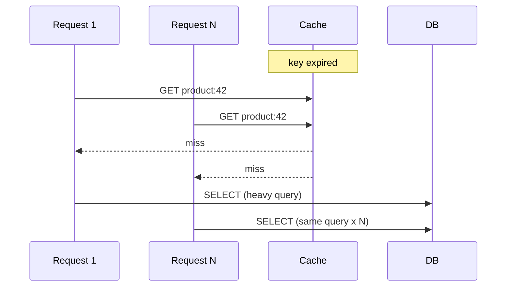
```mermaid
sequenceDiagram
    participant R1 as Request 1
    participant R2 as Request N
    participant Cache
    participant DB
    Note over Cache: key expired
    R1->>Cache: GET product:42
    R2->>Cache: GET product:42
    Cache-->>R1: miss
    Cache-->>R2: miss
    R1->>DB: SELECT (heavy query)
    R2->>DB: SELECT (same query x N)
```

**Mitigation strategies (use in combination):**

| Strategy | How it works | Trade-off |
|----------|--------------|-----------|
| **Distributed lock / single-flight** | First miss acquires lock `lock:product:42`; others wait or spin; one thread loads DB, writes cache, releases lock | Waiters see latency spike; lock holder crash needs TTL on lock |
| **Request coalescing** | Go `singleflight`, Java pattern - duplicate in-flight requests share one result | Language/library support needed |
| **Probabilistic early expiration** | Refresh cache at random time before TTL (e.g. between 80-100% of TTL) so keys don't all expire together | Slightly stale data possible |
| **Stale-while-revalidate** | Return stale value immediately; one background worker refreshes | User may see old data briefly |
| **Never expire hot keys** | Refresh-ahead (3.6) or no TTL + explicit invalidation on write | Requires invalidation discipline |
| **Circuit breaker on miss path** | Cap concurrent DB queries per key | Legitimate users wait longer |
| **Pre-warming** | Scheduled job refreshes hot keys before peak (3.13) | Ops overhead |

**Single-flight pseudo-code:**

```text
on cache_miss(key):
  if lock.acquire("load:" + key, timeout=5s):
    try:
      value = db.load(key)
      cache.set(key, value, TTL)
      return value
    finally:
      lock.release("load:" + key)
  else:
    wait until cache populated OR timeout -> retry get
```

**Redis lock pattern:** `SET lock:key NX EX 10` (set if not exists, 10s expiry)

### Key details

- Stampede affects **one key**; **cache avalanche** (3.11) affects **many keys** or whole cluster
- Hot keys: product launch, config blob, OAuth JWKS, homepage feed
- **TTL jitter:** `TTL = base + random(0, 60s)` spreads expiry times
- Memcached `gets` + CAS can implement coalescing at protocol level
- Monitor: `cache_miss_rate` spike + `db_query_rate` spike on same endpoint

### When to use mitigations

- Any cache with TTL on keys with **high fan-out** (same key, many users)
- Computed aggregates (leaderboards, counts) cached with expiry
- High-traffic e-commerce, social feeds, config services

### Trade-offs / Pitfalls

- Locking: if loader is slow, all waiters queue (worse p99 than one slow query)
- Stale-while-revalidate: user sees outdated price/stock briefly - may be unacceptable for checkout
- Jitter alone does not help if **all traffic** aligns with natural expiry (scheduled publish)
- Forgotten lock release (crash) -> 5s blackout until lock TTL expires
- Single-flight in multi-instance app **requires distributed lock** (Redis), not just in-process mutex

---


## 3.11 Cache Avalanche


### What is it?

**Cache avalanche** is mass cache failure or **simultaneous expiry of many keys** (or an entire cluster), causing a flood of traffic to the backend. Broader than **stampede** (3.10, one hot key) - avalanche affects large portions of the key space or all nodes at once.

| Failure mode | Scope | Typical trigger |
|--------------|-------|-----------------|
| **Cache stampede** | Single hot key | TTL expiry on `product:42` |
| **Cache avalanche** | Many keys or whole tier | Redis restart, uniform TTL, `FLUSHALL` |

### Why it matters

Redis cluster restart, network partition, or uniform TTL on millions of keys can take down the database layer in seconds. Recovery time depends on how fast the cache repopulates vs. how fast DB fails. A cold Redis after deploy turns a 5% DB load into 100% DB load instantly.

### How it works

**Common triggers:**

1. **Redis cluster restart** - rolling upgrade, OOM kill, bad config deploy → empty cache cluster-wide.
2. **Mass expiry** - warming job sets `TTL=3600` on 10M keys at same timestamp → all expire together.
3. **Cache flush** - `FLUSHALL` in wrong environment or failed migration script.
4. **Failover** - promoted replica empty or stale; brief total miss window.
5. **Power/network** - entire AZ cache tier unreachable; apps treat as mass miss.

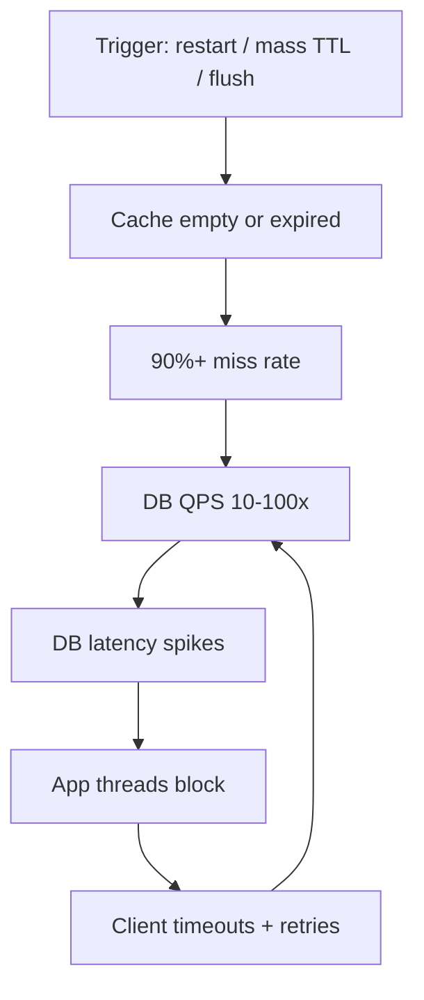
```mermaid
flowchart TB
    Event["Trigger: restart / mass TTL / flush"] --> Empty[Cache empty or expired]
    Empty --> Miss[90%+ miss rate]
    Miss --> Flood[DB QPS 10-100x]
    Flood --> Slow[DB latency spikes]
    Slow --> Block[App threads block]
    Block --> Timeout[Client timeouts + retries]
    Timeout --> Flood
```

**Timeline (Redis restart example):**

```text
T=0      Redis cluster rolling restart begins
T=30s    All pods new; cache 0% populated
T=31s    50K RPS × 95% miss = 47.5K DB queries/sec (normal: 2.5K)
T=45s    DB connection pool exhausted; p99 > 30s
T=60s    Cascading timeouts; retry storm doubles effective load
T=5min   Cache gradually warms; system recovers if DB survived
```

### Key details

**Mitigation strategies:**

| Strategy | How | Effect |
|----------|-----|--------|
| **TTL jitter** | `TTL = base + random(0, base×0.1)` | Spreads expiry over time |
| **Staggered warming** | Warm keys in batches with offset TTLs | Avoid identical expiry |
| **Never cold switch** | Blue/green: warm new Redis before traffic cut | No empty cache moment |
| **Multi-tier cache** | L1 in-process survives brief L2 outage | Reduces miss fraction |
| **Circuit breaker** | Open DB path when error rate > threshold | Stops cascade; returns errors |
| **Rate limit miss path** | Max N concurrent DB loads per service | Caps DB damage |
| **Graceful degradation** | Serve stale snapshot or defaults | UX over freshness |
| **Redis persistence** | AOF/RDB reload after restart | Faster warm than full DB reload |
| **Hysteresis on failover** | Don't fail back until stable | Avoid flip-flop empty windows |

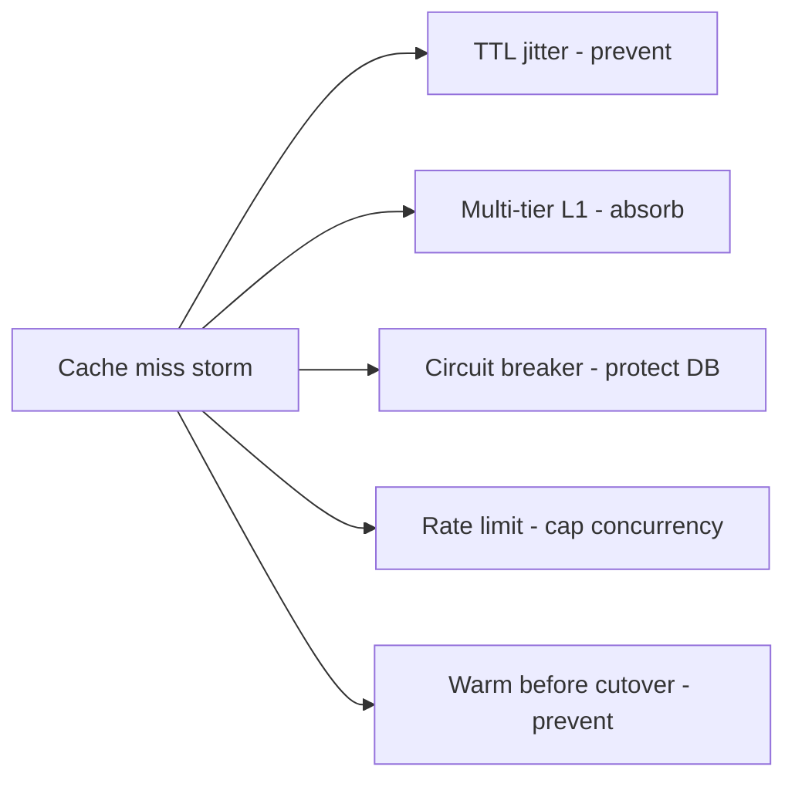
```mermaid
flowchart LR
    Miss[Cache miss storm] --> M1[TTL jitter - prevent]
    Miss --> M2[Multi-tier L1 - absorb]
    Miss --> M3[Circuit breaker - protect DB]
    Miss --> M4[Rate limit - cap concurrency]
    Miss --> M5[Warm before cutover - prevent]
```

**TTL jitter implementation:**

```text
base_ttl = 3600
jitter   = random(0, 360)          # 0-10%
cache.set(key, value, ex=base_ttl + jitter)
```

**Circuit breaker on miss path (pseudo-code):**

```text
on cache_miss(key):
  if db_circuit.is_open():
    return fallback_or_503()
  if miss_rate_limiter.try_acquire():
    return db.load(key)
  else:
    return fallback_or_retry_after()
```

### When to use mitigations

- Large-scale Redis/Memcached deployments (any restart affects all keys)
- After deploys that restart cache tier - mandatory warm job (3.13)
- Batch cache warming with identical timestamps (dangerous without jitter)
- Black Friday / viral events where DB headroom is tight

### Trade-offs / Pitfalls

- Circuit breaker open state returns errors to users - product decision
- Rate limiting on miss increases latency for legitimate requests
- Multi-tier adds consistency complexity (stale L1 during L2 outage)
- AOF reload after restart helps but replay is slow for huge datasets
- **Preventing avalanche ≠ preventing stampede** - need both jitter and single-flight
- Monitoring: alert on `cache_hit_ratio` drop + `db_connections` spike correlation

### References

- [Cache Avalanche - system design discussion](https://www.linkedin.com/posts/alexxubyte_systemdesign-coding-interviewtips-share-7436445893542801409-YVJI/)

---


## 3.12 Cache Penetration


### What is it?

**Cache penetration** happens when requests query for keys that **do not exist** in the database (malicious or accidental), bypassing the cache every time because nothing valid gets stored - each request hits DB at full cost.

Related but distinct:

| Term | Cause | Keys exist in DB? |
|------|-------|-------------------|
| **Penetration** | Non-existent keys never cached | No |
| **Breakdown** | Cache tier down | N/A |
| **Avalanche (3.11)** | Mass expiry / restart | Yes, but cache empty |

### Why it matters

Attackers enumerate random IDs (`user:-1`, `user:999999999`) to bypass cache and DDoS the database. Legitimate bugs (null results not cached) cause the same pattern. At 10K random IDs/sec, a 95% hit ratio is 0% effective - every request is a miss.

### How it works

1. Request for non-existent key `user:fake-id`.
2. Cache miss (key never stored).
3. DB query returns empty.
4. Application returns 404 **without** caching the negative result.
5. Repeat - cache provides zero protection.

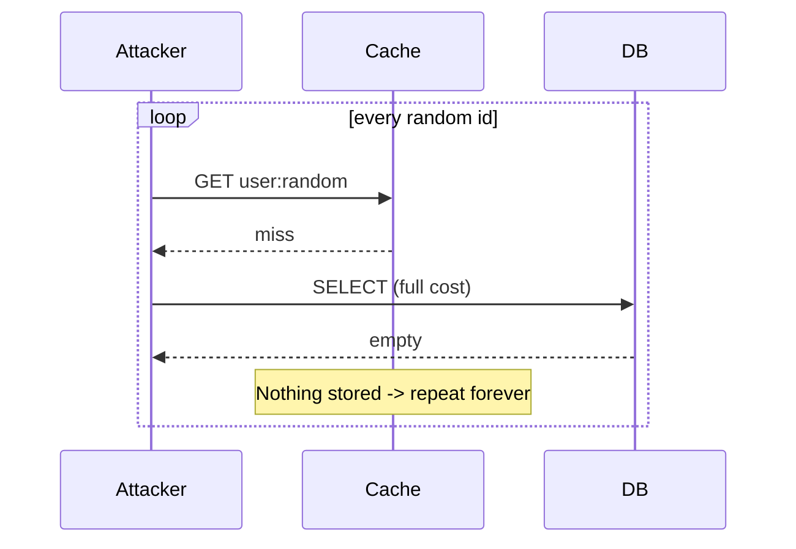
```mermaid
sequenceDiagram
    participant Attacker
    participant Cache
    participant DB
    loop every random id
        Attacker->>Cache: GET user:random
        Cache-->>Attacker: miss
        Attacker->>DB: SELECT (full cost)
        DB-->>Attacker: empty
        Note over Cache: Nothing stored -> repeat forever
    end
```

**Defense layers (use in combination):**

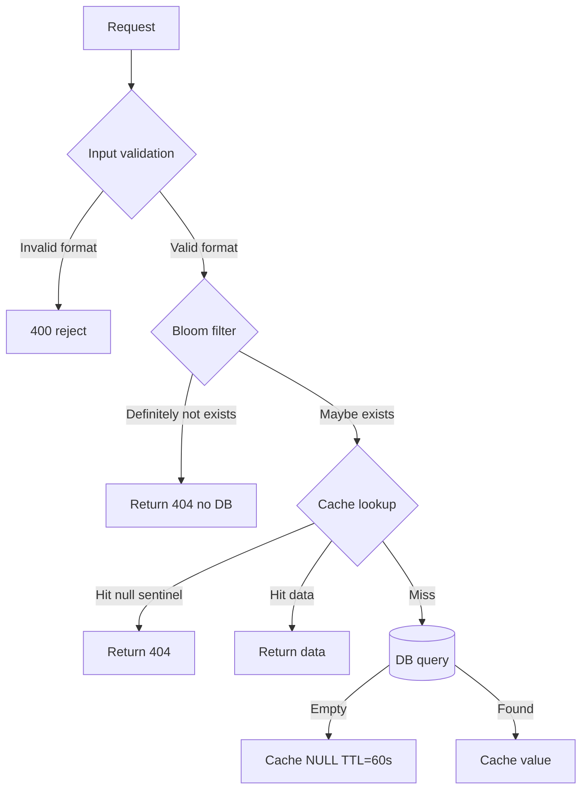
```mermaid
flowchart TB
    Req[Request] --> Val{Input validation}
    Val -->|Invalid format| Reject[400 reject]
    Val -->|Valid format| Bloom{Bloom filter}
    Bloom -->|Definitely not exists| Short[Return 404 no DB]
    Bloom -->|Maybe exists| Cache{Cache lookup}
    Cache -->|Hit null sentinel| N404[Return 404]
    Cache -->|Hit data| Data[Return data]
    Cache -->|Miss| DB[(DB query)]
    DB -->|Empty| NullCache[Cache NULL TTL=60s]
    DB -->|Found| PosCache[Cache value]
```

### Key details

| Defense | How | Limits attack to | Trade-off |
|---------|-----|------------------|-----------|
| **Cache nulls** | `SET user:fake NULL EX 60` on empty DB result | Re-DB once per 60s per key | Infinite random keys fill cache |
| **Bloom filter** | Probabilistic set of all valid IDs; "not in set" → skip DB | Zero DB for definite negatives | False positive (~1%) blocks new valid IDs briefly |
| **Input validation** | Reject non-UUID, negative IDs, out-of-range | Malformed keys only | Must not reject valid edge cases |
| **Rate limiting** | Per-IP/user cap on 404 endpoints | Sustained QPS to DB | Legitimate scanners throttled |

**Null cache pattern:**

```text
on cache_miss(key):
  value = db.load(key)
  if value is None:
    cache.set(key, NULL_SENTINEL, ttl=60)   # short TTL
    return 404
  cache.set(key, value, ttl=300)
  return value
```

**Bloom filter pattern:**

```text
# Rebuild nightly from DB: all valid user IDs
bloom = BloomFilter(expected_items=10_000_000, fp_rate=0.01)

on request(user_id):
  if user_id not in bloom:
    return 404                            # definitely invalid
  # maybe valid - proceed cache → DB path
```

| Bloom filter parameter | Typical value | Notes |
|------------------------|---------------|-------|
| False positive rate | 0.1% - 1% | Lower = more memory |
| Rebuild frequency | Hourly / daily | New users delayed until rebuild |
| Memory (10M items, 1% FP) | ~12 MB | Cheap vs DB load |

**Rate limiting example:**

```text
# Per IP: max 100 requests/min to /api/user/{id}
# Returns 429 before cache/DB for abusive patterns
```

### When to use

- Public APIs with enumerable ID spaces (REST `/users/{id}`)
- Search/autocomplete with arbitrary user input
- Any cache-aside system where null results are common
- High-value DB endpoints targeted by scrapers

### Trade-offs / Pitfalls

- Caching nulls alone: attacker uses infinite random keys → cache memory exhaustion - **must pair with Bloom filter or rate limit**
- Bloom false positive: new user created, not yet in filter → 404 until rebuild - use short grace period or dual-check
- Short TTL on null entries still allows sustained attack at `attack_rate / ttl` DB QPS
- Validation rules must not reject valid edge-case IDs (snowflake IDs, UUID v7)
- Do not cache null with long TTL - attacker poisons cache with fake keys that later become valid

---


## 3.13 Cache Warming


### What is it?

**Cache warming** pre-populates the cache with anticipated data **before** traffic arrives or after a cold start, so the first real users get hits instead of misses.

### Why it matters

Deploys, restarts, and new region spin-ups otherwise cause a cold cache and miss storm. Warming shifts load to a controlled window (off-peak job, CI step) instead of user-facing latency.

### How it works

1. Identify key set to warm: top products, active users, config blobs, static reference data.
2. Batch job or startup hook reads from DB/source.
3. Writes entries to cache with appropriate TTL.
4. Optionally stagger keys or use refresh-ahead to maintain warmth.
5. Production traffic arrives to warm cache.

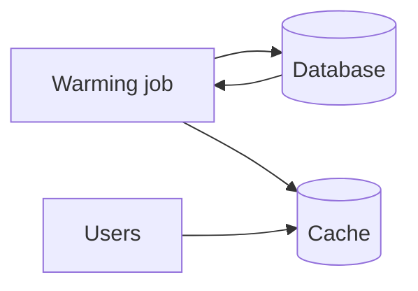
```mermaid
flowchart LR
    Job[Warming job] --> DB[(Database)]
    DB --> Job
    Job --> Cache[(Cache)]
    Users[Users] --> Cache
```

### Key details

- Warm **measured** hot keys from access logs, not entire tables
- Warming huge datasets can itself overload DB - rate-limit the job
- TTL should be set at warm time; consider longer TTL for stable reference data
- Blue/green deploy: warm cache in new environment before traffic switch
- CDN warming uses similar idea (prefetch to edge PoPs)

### When to use

- After cache cluster rebuild or failover
- Before known traffic events (product launch, marketing campaign)
- New datacenter or region cutover
- Scheduled daily warm of dashboard aggregates

### Trade-offs / Pitfalls

- Warming wrong keys wastes memory and DB load with no hit ratio benefit
- Stale data if warm snapshot is old and TTL is long
- Race with live invalidation during warm job
- Warm job failure leaves cache cold - monitor and alert

---

[<- Back to master index](../README.md)
