# 3. Caching

[<- Back to master index](../README.md)

---

## Sub-topics

| # | Sub-topic |
|---|-----------|
| 3.1 | [Cache Fundamentals](#31-cache-fundamentals) |
| 3.2 | [Cache Aside Pattern](#32-cache-aside-pattern) |
| 3.3 | [Read Through Cache](#33-read-through-cache) |
| 3.4 | [Write Through Cache](#34-write-through-cache) |
| 3.5 | [Write Back Cache](#35-write-back-cache) |
| 3.6 | [Write Around Cache](#36-write-around-cache) |
| 3.7 | [Local Cache](#37-local-cache) |
| 3.8 | [Distributed Cache](#38-distributed-cache) |
| 3.9 | [Near Cache](#39-near-cache) |
| 3.10 | [Cache Invalidation](#310-cache-invalidation) |
| 3.11 | [Cache Warming](#311-cache-warming) |
| 3.12 | [Cache Penetration](#312-cache-penetration) |
| 3.13 | [Cache Avalanche](#313-cache-avalanche) |
| 3.14 | [Cache Stampede](#314-cache-stampede) |

---

## 3.1 Cache Fundamentals

### Overview

Imagine you keep your most-used tools on the desk instead of walking to the garage every time. A **cache** is that desk — a small, fast place for data you reach for often, so you do not pay the full cost of fetching it from the slow original source on every request.

Technically, a cache is a **high-speed storage layer** (usually RAM) that holds copies of frequently accessed data temporarily. Reads that hit the cache avoid the database, disk, or remote service. The trade-off is memory cost, eviction when full, and the risk of serving slightly stale data — in exchange for lower latency, higher throughput, and reduced load on the authoritative store.

---

### What problem it fixes

Without a cache, every request pays the full price of the slow path:

- **High database load** — the same expensive query runs thousands of times per second.
- **Increased response time** — disk and network round-trips dominate latency (often hundreds of milliseconds).
- **Poor scalability** — the database becomes the bottleneck before application servers do.
- **Higher cost** — you scale the database tier instead of adding cheap RAM.

Caching moves hot data closer to the application so repeated reads are served from memory in roughly 1–10 ms instead of 50–500 ms.

---

### What it does

A cache sits between the application and the authoritative data source. On a **read**, the app checks the cache first. On a **hit**, it returns immediately. On a **miss**, it loads from the source, stores a copy in the cache, and returns. On a **write**, behavior depends on the caching pattern (see sections 3.2–3.6). Caches also **evict** entries when memory is full, using policies like LRU or TTL.

---

### How it works — the architecture inside

#### Hit vs miss flow

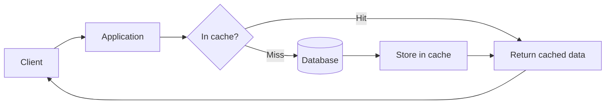

**Cache hit** — the key exists in cache; response time is typically ~1–10 ms.

**Cache miss** — the key is absent; the app loads from the database, populates the cache, then returns. The first request pays full database latency.

#### Cache hit ratio

```text
Cache Hit Ratio = (Cache Hits / Total Requests) × 100
```

**How to calculate:**

- **Given:** 900 hits and 100 misses in one hour.
- **Step 1:** Total requests = 900 + 100 = 1,000.
- **Step 2:** Hit ratio = (900 / 1,000) × 100 = **90%**.
- **Sanity check:** A healthy read-heavy API often targets 85–99% depending on workload; below 70% may mean TTL is too short, working set exceeds cache size, or penetration/avalanche issues.

#### Before and after caching

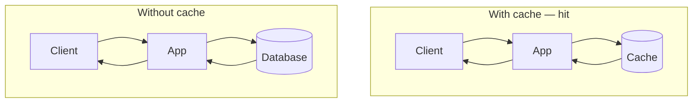

Example with a 500 ms database query:

```text
Without cache:  Request 1 = 500 ms,  Request 2 = 500 ms,  Request 3 = 500 ms
With cache:     Request 1 = 500 ms (miss),  Request 2 = 5 ms (hit),  Request 3 = 5 ms (hit)
```

#### Layers of cache in a typical stack

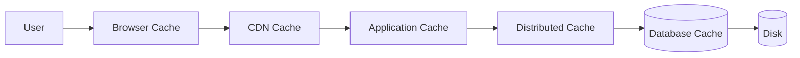

| Layer | Where it lives | Typical use |
|-------|----------------|-------------|
| Browser | Client device | Static assets, `Cache-Control` headers |
| CDN | Edge PoPs | Images, JS, video, API responses at the edge |
| Application | In-process (Caffeine, Guava) | Config, session fragments, hot objects |
| Distributed | Redis, Memcached cluster | Shared session, product catalog, rate limits |
| Database | Query/buffer pool inside DB | Frequently read pages and index blocks |

#### In-memory cache

Data lives in **RAM**. Examples: Redis, Memcached, Hazelcast, Caffeine. Extremely fast, but bounded by available memory and (for pure in-memory stores) data can be lost on restart unless persistence is enabled.

#### Eviction policies

When the cache is full, something must be removed to make room.

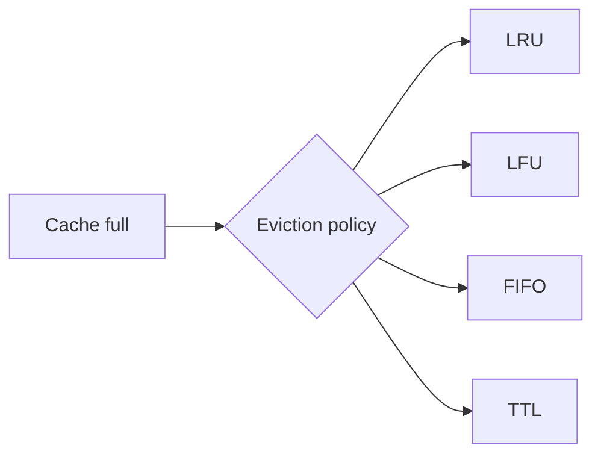

| Policy | Rule | Good when |
|--------|------|-----------|
| **LRU** (Least Recently Used) | Evict the item not accessed longest | General-purpose; temporal locality |
| **LFU** (Least Frequently Used) | Evict the item with fewest hits | Stable hot set (e.g. top products) |
| **FIFO** (First In First Out) | Evict oldest insertion | Simple queues; less common in production |
| **TTL** (Time To Live) | Entry expires after fixed duration | Data with known freshness needs |

**LRU walkthrough** — capacity = 3, state `A B C`. Access `A` → order becomes `A C B` (B least recent). Insert `D` → evict `B` → `A C D`.

**LFU walkthrough** — `A` has 10 hits, `B` has 2, `C` has 5. Insert `D` → evict `B` (lowest count).

**TTL walkthrough** — user profile TTL = 5 minutes. After expiry the entry is gone; next read is a miss and reloads from the database.

---

### Pitfalls and design tips

- **Do not cache everything** — cold, large, or rarely read data wastes RAM and evicts useful entries (cache pollution).
- **Size the working set** — if hot keys exceed cache capacity, hit ratio collapses even with a good policy.
- **LRU is the default** for most application caches (Caffeine, Guava, Redis `volatile-lru`); use LFU when access frequency matters more than recency.
- **TTL alone is not invalidation** — expired entries can still cause stampedes (see 3.14); pair TTL with jitter or proactive refresh for hot keys.
- **Interview angle:** distinguish **cache hit ratio** (efficiency) from **latency p99** (user experience); 95% hit ratio with a 1% of requests hitting a 2 s query still hurts tail latency.

---

### Real-world example

**Redis as a session store.** A stateless API tier stores `session:{userId}` in Redis with a 24-hour TTL. On each authenticated request, the app does `GET session:abc123` (~1 ms). On login, it `SET`s the session JSON. Without Redis, every request would query PostgreSQL for session rows — at 10,000 RPS that is 10,000 extra queries per second. With ~98% of sessions hit in Redis, PostgreSQL load drops to roughly 200 reads/s for session data, and median auth middleware latency falls from ~15 ms (DB) to ~1 ms (Redis).

---

## 3.2 Cache Aside Pattern

### Overview

You check your coat pocket before walking to the closet. If the keys are there, you leave immediately. If not, you fetch them from the closet and put a spare set in your pocket for next time. **Cache aside** (also called **lazy loading**) works the same way: the application owns the logic — check cache, on miss load from the database, write to cache, return.

Technically, cache aside means the **cache is not authoritative**. The application reads and writes the database directly for persistence; the cache is an optional acceleration layer the app manages explicitly. Writes typically update the database first, then delete or update the cache entry. This is the most common pattern in microservices because it is simple, works with any database, and only caches data that is actually read.

---

### What problem it fixes

- **Cold-start latency on every path** — without caching, every read hits the database.
- **Over-caching** — unlike write-through, you only populate the cache when data is actually requested (no wasted entries for writes that are never read).
- **Tight coupling** — the cache layer does not need to understand your schema or ORM; the app controls what gets cached and for how long.

---

### What it does

On **read:**

1. Application checks cache for the key.
2. **Hit** → return cached value.
3. **Miss** → query database, store result in cache, return to client.

On **write:**

1. Application writes to the database (source of truth).
2. Application **invalidates** (deletes) or updates the cache entry — if you skip this step, readers see stale data until TTL expires.

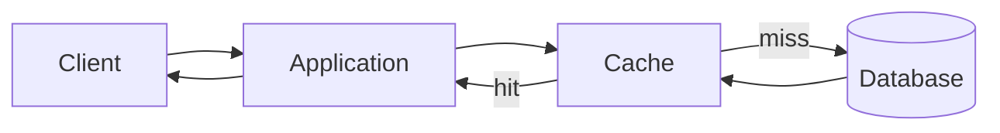

---

### How it works — the architecture inside

The application sits **beside** the cache, not behind it. Neither the database nor the cache calls the other; only the application orchestrates both.

**Read path (miss):**

```text
1. GET product:42 from Redis          → nil (miss)
2. SELECT * FROM products WHERE id=42 → row returned
3. SET product:42 {json} EX 3600      → cached for 1 hour
4. Return row to client
```

**Write path (update + invalidate):**

```text
1. UPDATE products SET price=999 WHERE id=42
2. DEL product:42 from Redis          → force next read to reload
3. Return success
```

Alternative on write: **update cache** instead of delete (`SET product:42` with new JSON). Delete is safer when the cached object is aggregated or denormalized — you avoid writing a partial stale blob.

| Aspect | Cache aside | Read-through (3.3) |
|--------|-------------|---------------------|
| Who loads on miss? | Application | Cache library/service |
| Write path | App → DB, then invalidate cache | Varies by implementation |
| Complexity | Low in app code | Lower app code; smarter cache |
| Stale data risk | Medium (if invalidation missed) | Medium |

---

### Pitfalls and design tips

- **Stale reads after write** — the classic bug: update DB, forget `DEL` on cache; users see old data until TTL. Always pair writes with invalidation or cache update in the same code path.
- **Thundering herd on miss** — many concurrent misses for the same key all hit the DB (see 3.14). Use locking or singleflight on hot keys.
- **Do not use cache aside for strong consistency** — it is eventually consistent by design; use write-through or read-your-writes patterns if you need fresher reads immediately after a write.
- **Default choice** for new microservices with Redis + PostgreSQL/MySQL — Facebook, Netflix, and most SaaS APIs use this pattern for entity reads.
- **Libraries:** Spring `@Cacheable` / `@CacheEvict`, Python `django-redis`, Go `go-redis` with manual get/set/del.

---

### Real-world example

**Netflix metadata reads.** When a device requests title metadata, the API service checks a distributed cache (historically EVCache, Redis-family) for `title:{id}`. On a miss, it loads from Cassandra, serializes the payload, writes to cache with TTL, and returns. Catalog updates write to Cassandra and publish an invalidation event so edge caches drop stale title blobs — cache aside with event-driven invalidation at scale.

---

## 3.3 Read Through Cache

### Overview

Instead of you fetching groceries from the warehouse every time the pantry is empty, a **smart pantry** does it for you: you only ever ask the pantry, and it restocks itself from the warehouse when needed. **Read-through** caching hides the database behind the cache — the application talks only to the cache on reads, and the cache library loads from the database on a miss.

Technically, the **cache provider** implements a loader callback (or built-in integration). On `cache.get(key)`, if the key is absent the cache synchronously fetches from the authoritative store, stores the value, and returns it. Application read code simplifies to a single `get` call with no manual miss handling.

---

### What problem it fixes

- **Duplicated miss logic** — every service reimplementing “check cache → query DB → set cache” leads to bugs and inconsistency.
- **Scattered cache keys** — centralizing load logic in the cache layer keeps key naming and serialization in one place.
- **Boilerplate** — read paths shrink from five steps to one API call.

---

### What it does

On read, the application requests data from the cache layer only. The cache layer:

1. Returns the value if present (hit).
2. On miss, calls a **loader** function (or ORM hook) to fetch from the database.
3. Stores the result and returns it to the application.

The application does **not** query the database directly on the read path.

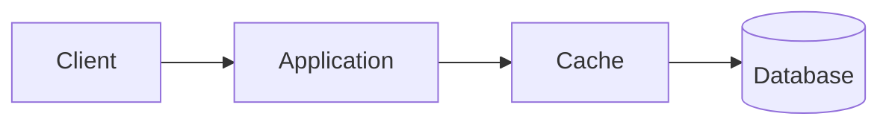

---

### How it works — the architecture inside

The cache acts as a **facade** with a pluggable data source.

```text
function cache.get(key):
    value = internal_store.get(key)
    if value is not null:
        return value                    // hit
    value = loader.load(key)            // miss — cache calls DB
    if value is not null:
        internal_store.put(key, value)
    return value
```

**Loader contract:** must be idempotent for the same key; should handle “key not found” (return null or throw, depending on design).

| | Cache aside (3.2) | Read-through |
|--|-----------------|--------------|
| Miss handling | Application code | Cache layer |
| DB coupling | App knows both stores | Loader knows DB |
| Testability | Easy to mock each step | Mock cache + loader |
| Write path | App manages separately | Still usually app-managed |

**Hazelcast `MapLoader`**, **Google Guava `LoadingCache`**, and **Caffeine `LoadingCache`** are common read-through implementations at the local-cache level. Distributed products (Hazelcast, Ignite) support `CacheLoader` interfaces for cluster-wide read-through.

---

### Pitfalls and design tips

- **Loader failures block the request** — on miss, the caller waits for DB + cache write; slow queries stall every miss. Time out and circuit-break the loader.
- **Read-through ≠ write-through** — writes still need a separate strategy; do not assume the cache handles persistence.
- **Null caching** — if the loader returns “not found,” decide whether to cache null (short TTL) to prevent penetration (see 3.12).
- **Prefer cache aside** when you need fine-grained invalidation across many microservices; read-through shines in monoliths or shared cache libraries with one loader module.
- **Interview tip:** read-through moves complexity from application to cache infrastructure — trade operational ownership accordingly.

---

### Real-world example

**Guava `LoadingCache` in a Java monolith.** A service defines `LoadingCache<Long, UserProfile> cache = CacheBuilder.newBuilder().expireAfterWrite(10, MINUTES).build(userId -> userDao.findById(userId))`. Controllers call `cache.get(userId)` only. First access for user 7 hits MySQL inside the loader; subsequent calls for 10 minutes return from heap with no SQL. The loader is defined once; twenty controllers share it without copy-paste miss logic.

---

## 3.4 Write Through Cache

### Overview

When you update your phone contacts, both the phone and the cloud backup save the change at the same time — neither is left behind. **Write-through** caching updates the cache and the database **together on every write**, so the cache always holds the latest committed value.

Technically, on a write request the application (or cache layer) writes to the cache first or in the same transaction step as the database write. Reads then hit fresh data in cache without waiting for a separate invalidation. Writes are slower because every mutation pays both cache and DB latency, but read-after-write consistency within the cache is strong.

---

### What problem it fixes

- **Stale cache after writes** — cache aside requires explicit invalidation; missing a `DEL` causes wrong reads. Write-through eliminates that class of bug for cached keys.
- **Read-heavy workloads with frequent updates** — if writes are moderate but reads are huge, keeping cache synchronized on write maximizes hit ratio with fresh data.
- **Simpler read path** — reads are always `GET` from cache; no miss-reload race with a just-written value.

---

### What it does

On **write:**

1. Application sends new value to cache layer.
2. Cache layer writes to cache **and** persists to database (synchronously).
3. Acknowledge success only when both complete (or define failure semantics if one fails).

On **read:**

1. Application reads from cache.
2. Value is present and current because every write updated it.

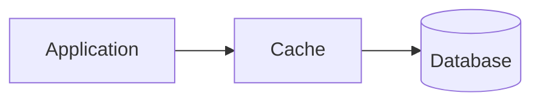

---

### How it works — the architecture inside

```text
function write(key, value):
    cache_store.put(key, value)       // 1. update cache
    database.persist(key, value)      // 2. update DB — both must succeed
    return OK

function read(key):
    return cache_store.get(key)       // always fresh if key was ever written
```

**Ordering matters.** Common approaches:

- **Cache first, then DB** — faster reads of the new value immediately, but risk cache ahead of DB if DB write fails (must rollback cache).
- **DB first, then cache** — safer durability; brief window where cache is stale until update completes.

Production systems often use **DB first, then cache update** with retry, or a transactional outbox if both must be atomic across nodes.

| Pattern | Write latency | Read freshness | Data loss risk |
|---------|---------------|----------------|----------------|
| Write-through | Higher (2 writes) | Strong in cache | Low if DB-first |
| Cache aside | Lower on write | Eventual | Low |
| Write-back (3.5) | Lowest | Eventual | Higher |

---

### Pitfalls and design tips

- **Slow writes** — every write hits two systems; not suitable for firehose ingestion (use write-back or write-around instead).
- **Write amplification** — updating one field may require rewriting a large cached object; consider field-level caching or smaller keys.
- **Cache stores data never read** — unlike cache aside, write-through populates cache even if no reader ever asks for that key.
- **Use when:** read:write ratio is very high (e.g. 100:1) and freshness matters (product price, inventory count displayed on every page).
- **Redis:** not write-through by default — you implement it in application code or use frameworks that wrap dual writes.

---

### Real-world example

**Inventory count on a product page.** An e-commerce service uses write-through for `stock:{sku}`: every purchase decrements stock in PostgreSQL and immediately updates the same key in Redis. Product pages read only from Redis. Shoppers never see “in stock” from cache while the database already sold the last unit — the write path kept both in sync. Writes are ~2× slower than DB-only, but product pages serve 50,000 reads/s from Redis at sub-millisecond latency.

---

## 3.5 Write Back Cache

### Overview

You jot a note on a sticky pad and stick it on your monitor; later, when you have a quiet moment, you copy it into the official logbook. **Write-back** (also **write-behind**) acknowledges writes to the cache immediately and **flushes to the database asynchronously** in the background.

Technically, the cache is the **write buffer**. The application writes only to cache and gets a fast ACK. A background worker or periodic flush persists dirty entries to the database. This maximizes write throughput and absorbs spikes, at the cost of durability risk if the cache node crashes before flush.

---

### What problem it fixes

- **Write latency bottlenecks** — synchronous DB writes at 10k+ events/s overwhelm the database.
- **Write burst smoothing** — many updates to the same key collapse into one DB write on flush (natural coalescing).
- **Analytics and logging pipelines** — events can land in cache/memory first, then batch-insert to warehouse DB.

---

### What it does

On **write:**

1. Application writes to cache; cache marks entry **dirty**.
2. Application receives immediate success.
3. Background worker later persists dirty entries to the database.

On **read:**

- Usually served from cache if present; may need to merge with DB for keys not yet flushed.

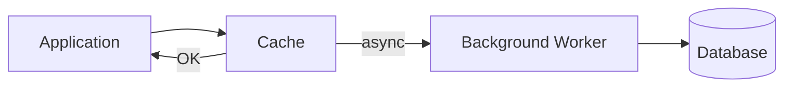

---

### How it works — the architecture inside

```text
function write(key, value):
    cache.put(key, value)
    cache.mark_dirty(key)
    return OK                              // fast — no DB wait

function flush_worker():
    for key in cache.dirty_keys():
        value = cache.get(key)
        database.upsert(key, value)
        cache.clear_dirty(key)
```

**Flush triggers:** time-based (every N seconds), size-based (dirty queue length), or shutdown hook (graceful drain).

| Concern | Write-through | Write-back |
|---------|---------------|------------|
| Write speed | Slower | Fastest |
| Durability | Strong | Window of loss |
| DB load | Per write | Batched |
| Complexity | Moderate | Higher (flush, recovery) |

**Recovery after crash:** unflushed dirty entries may be lost unless the cache has **persistence** (Redis AOF/RDB, or replicated memory with fsync policies). On restart, reconcile cache vs DB or accept last-window data loss.

---

### Pitfalls and design tips

- **Data loss window** — default seconds to minutes of writes can vanish on crash; unacceptable for payments, orders, or account balances unless you add durable WAL.
- **Read-your-writes across instances** — other app nodes may read stale DB until flush completes; route reads to same cache partition or wait for flush on critical paths.
- **Ordering** — concurrent updates to the same key need last-write-wins or versioning in the flush worker.
- **Use for:** metrics aggregation, click-stream buffers, CDN origin shields — not primary financial ledger without replication.
- **Linux page cache** and **database buffer pools** are write-back at the OS/DB level; application-level write-back mirrors the same pattern.

---

### Real-world example

**Analytics event buffering.** A tracking service accepts 100,000 events/s. Each event is appended to a Redis list `events:buffer` with sub-millisecond `LPUSH`. A worker every 5 seconds `LRANGE`s the list, bulk-inserts into ClickHouse, then `DEL`s the buffer. Spikes that would choke synchronous inserts are absorbed in Redis. If Redis fails before flush, at most 5 seconds of analytics events are lost — acceptable for this workload, documented in the SLA.

---

## 3.6 Write Around Cache

### Overview

You file important documents directly in the archive room and only photocopy them to your desk when someone actually asks to read them. **Write-around** writes **straight to the database** and does not update the cache on write. The cache is populated only on a subsequent read (cache aside on the read path).

Technically, writes bypass the cache entirely. This avoids **cache pollution** — filling cache with data that will never be read again. Reads still use cache-aside: miss → load DB → populate cache. The first read after a write is a miss; later reads are fast.

---

### What problem it fixes

- **Cache pollution from write-heavy, read-rare data** — logging, audit trails, or append-only events written constantly but queried rarely should not evict hot keys.
- **Wasted cache memory** — write-through or write-back would store every write even when no reader exists.
- **Large burst writes** — bulk imports do not thrash the cache with cold entries.

---

### What it does

On **write:**

1. Application writes only to the database.
2. Cache is untouched (stale entry may remain until TTL or invalidation — see pitfall below).

On **read:**

1. Check cache → on miss, load from DB, store in cache, return.

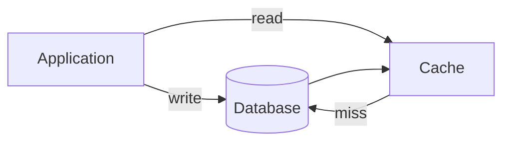

---

### How it works — the architecture inside

```text
function write(key, value):
    database.upsert(key, value)          // cache not updated
    return OK

function read(key):
    value = cache.get(key)
    if value is not null:
        return value                     // may be stale if key was in cache
    value = database.get(key)
    cache.set(key, value)
    return value
```

**Stale entry problem:** if `product:42` was cached, a write-around update to DB leaves old data in cache until TTL expires or you explicitly invalidate. Production write-around almost always **deletes the cache key on write** (write-around + invalidate) even though it does not populate on write.

| Workload | Best pattern |
|----------|--------------|
| Write often, read rarely | Write-around |
| Read often after write | Cache aside with invalidate, or write-through |
| Append-only logs | Write-around (no cache) or no cache at all |

---

### Pitfalls and design tips

- **Must invalidate on write** if the key might already be cached — otherwise write-around serves stale data longer than cache aside with proper invalidation.
- **First read after write is slow** — acceptable when reads are infrequent; unacceptable for “edit then immediately view” UX without invalidation.
- **Do not confuse with write-back** — write-around skips cache on write; write-back uses cache as primary write target.
- **Good fit:** user activity logs, IoT telemetry landing in DB, nightly batch imports.

---

### Real-world example

**Social post creation.** When a user publishes a post, the service inserts into PostgreSQL and does not write to Redis. Feed readers rarely open that post in the first second; when someone does, the read path misses `post:{id}`, loads from DB, caches for 1 hour. Millions of writes per day do not flood Redis with posts nobody reads. If the author opens their post immediately, the app deletes `post:{id}` on create so the first view reloads fresh content.

---

## 3.7 Local Cache

### Overview

Each chef keeps their own prep station with salt, oil, and knives within arm’s reach — no trip to the shared pantry for every pinch. A **local cache** lives **inside the application process** (same JVM, Node worker, or Go binary), so lookups are in-memory pointer reads with **no network hop**.

Technically, a local cache is an in-heap (or off-heap) key-value store per application instance. Libraries like **Caffeine** (Java), **Guava Cache**, **node-cache**, or a simple `sync.Map` in Go provide TTL, size limits, and eviction. Latency is nanoseconds to low microseconds — orders of magnitude faster than Redis — but each pod has its own copy with no cross-node consistency unless combined with a distributed layer (see 3.9).

---

### What problem it fixes

- **Network overhead on every read** — calling Redis for static config or reference data adds 0.5–2 ms per hop; local cache removes that for hot keys.
- **Redis/Memcached saturation** — shielding the distributed cache from extremely hot keys (feature flags, country lists) reduces cluster QPS.
- **GC-friendly bounded structures** — libraries enforce max entries and TTL so heap use stays predictable.

---

### What it does

Each app instance maintains its own cache map. On read, the thread checks the local map first. On miss, it may call a distributed cache, database, or loader. On write/invalidation, only **that instance’s** map is updated unless you broadcast invalidation events.

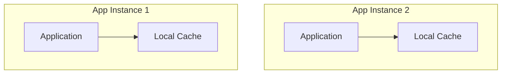

Separate caches — no shared state between pods.

---

### How it works — the architecture inside

```text
function local_get(key):
    if local_map.contains(key) and not expired(key):
        return local_map.get(key)        // ~100 ns – 1 µs
    value = distributed_cache.get(key)   // or DB
    local_map.put(key, value, ttl=60s)
    return value
```

**Caffeine example (conceptual):**

```text
Cache<String, Config> cache = Caffeine.newBuilder()
    .maximumSize(10_000)
    .expireAfterWrite(5, MINUTES)
    .build();
```

| Property | Local cache | Distributed cache (3.8) |
|----------|-------------|-------------------------|
| Latency | Fastest | + network RTT |
| Consistency across pods | None | Shared view |
| Memory | Per instance × N pods | Centralized pool |
| Survives deploy | No (rebuilds on start) | Yes |

**Invalidation across nodes:** publish to Redis Pub/Sub, Kafka, or Hazelcast topic — each instance drops matching local keys when it receives the event.

---

### Pitfalls and design tips

- **Inconsistent views** — pod A caches `price=10`, pod B still shows `price=9` until TTL; fine for config, bad for authorization tokens unless TTL is very short.
- **Memory × replicas** — 10,000 entries × 50 pods = 500,000 logical copies; cap `maximumSize` per instance.
- **Do not store user-specific PII** in long-TTL local cache on shared workers without encryption — heap dumps leak data.
- **Default:** Caffeine over Guava for new Java services (better eviction, near-optimal hit rate).
- **Use for:** feature flags, static reference data, parsed JWT claims (short TTL), compiled regex, schema metadata.

---

### Real-world example

**Spring Boot + Caffeine for feature flags.** A service loads `feature:x` from a config API on startup into a Caffeine cache (5-minute TTL, max 500 keys). At 20,000 RPS, local hits avoid 20,000 Redis calls/s per pod. When ops flips a flag, a webhook publishes `invalidate:feature:x` via Redis Pub/Sub; each pod evicts that key and reloads on next access — typically within one second cluster-wide.

---

## 3.8 Distributed Cache

### Overview

Instead of every employee duplicating the company phone book on their desk, everyone shares one **central bulletin board** in the break room. A **distributed cache** is a separate cluster (often Redis or Memcached) that all application instances talk to over the network, giving a **consistent shared view** of cached data.

Technically, clients hash keys to shards across cache nodes (or use a Redis Cluster slot map). Values are serialized (JSON, Protobuf, or binary). The cluster handles replication, failover, and memory limits. You pay one network round-trip per operation (~0.5–2 ms in-region) but eliminate per-pod inconsistency for shared keys like sessions, rate-limit counters, and product catalog snippets.

---

### What problem it fixes

- **Cross-instance inconsistency** — local caches diverge; distributed cache is one source for shared hot data.
- **Database overload at scale** — thousands of app servers share one cache tier instead of each hammering the DB.
- **Stateful coordination** — sessions, locks, leader election, and rate limits need a central fast store.

---

### What it does

Application servers act as clients. Standard operations: `GET`, `SET`, `DEL`, `INCR`, `EXPIRE`. The cluster routes keys to the correct node, replicates for HA (Redis primary/replica), and evicts by policy when memory is full.

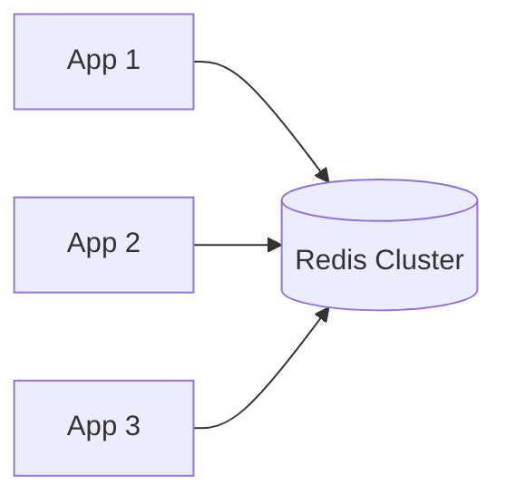

---

### How it works — the architecture inside

**Sharding:** `slot = hash(key) mod num_shards` (Redis Cluster uses 16,384 slots). Each node owns a slot range.

**Replication:** primary accepts writes, replicas async-copy for read scaling and failover.

**Client discovery:** smart clients (JedisCluster, Lettuce, `go-redis` cluster mode) cache the slot map and follow `MOVED`/`ASK` redirects.

#### Redis vs Memcached

| Feature | Redis | Memcached |
|---------|-------|-----------|
| Data structures | Strings, hashes, lists, sets, sorted sets | String values only |
| Persistence | RDB snapshots, AOF | Pure RAM — restart loses data |
| Replication | Primary/replica, Sentinel, Cluster | None (client hashes to pool) |
| Threading | Single-threaded command loop (I/O threads optional) | Multi-threaded |
| Pub/Sub, Lua | Yes | No |
| Typical use | Sessions, rankings, streams, locks | Simple object cache, HTML fragments |

**When to pick Memcached:** large blob cache, simplest GET/SET, multi-threaded CPU for huge keyspaces, no durability requirement.

**When to pick Redis:** need TTL + structures (`HSET` user session fields), persistence, replica failover, or atomic `INCR` / distributed locks.

**Memory planning (rough):**

```text
Total RAM needed ≈ (avg_value_size + key_overhead) × key_count × replication_factor × 1.25
```

**How to calculate:**

- **Given:** 2M keys, 2 KB average value, 1 replica, 25% fragmentation headroom.
- **Step 1:** Raw data ≈ 2M × 2 KB = 4 GB.
- **Step 2:** With replica ≈ 8 GB.
- **Step 3:** With headroom ≈ 8 × 1.25 = **10 GB** cluster capacity.

---

### Pitfalls and design tips

- **Large values** — Redis single values > 512 KB hurt latency; split or compress.
- **Hot keys** — one shard overloads while others idle; use local near-cache (3.9) or key replication with random suffix reads.
- **KEYS *** — never in production; use `SCAN` for iteration.
- **Cache aside + Redis:** standard stack; use connection pooling and pipeline batching for bulk reads.
- **Eviction:** set `maxmemory-policy` (e.g. `allkeys-lru`) before OOM kills the process.

---

### Real-world example

**Twitter/X timeline caching (historical pattern).** Timeline fragments were cached in Redis clusters keyed by user and cursor. Fan-out services `GET timeline:{userId}:{page}` from Redis; on miss, reconstruct from Manhattan/MySQL, `SET` with TTL, return. Shared Redis cut per-timeline DB reads from hundreds to one per cache window across thousands of stateless API hosts.

---

## 3.9 Near Cache

### Overview

You keep today's calendar on your desk (**near**) but walk to the shared filing cabinet (**far**) only when the desk copy is missing. **Near cache** combines a **local L1** cache in each application instance with a **distributed L2** (Redis, Hazelcast) — reads try L1 first, then L2, then the database.

Technically, the near cache is a client-side overlay: Hazelcast **Near Cache**, Ignite **Near Cache**, or a hand-rolled Caffeine + Redis stack. L1 hits avoid network entirely; L1 misses hit L2 at LAN speed; L2 misses hit DB. Invalidation must propagate from L2 to all L1 copies, usually via pub/sub or cache event listeners.

---

### What problem it fixes

- **Redis network RTT on every read** — at 50k RPS per pod, even 1 ms × 50k = 50 s of cumulative wait per second of wall time; L1 absorbs the hottest fraction.
- **Redis CPU/network saturation** — mega-hot keys (global config, viral product) are read from heap 99% of the time.
- **Latency tails** — p99 drops when most requests never leave the process.

---

### What it does

Read path: **L1 → L2 → DB**. Write/invalidation: update authoritative store, invalidate L2, broadcast L1 invalidation to all clients.

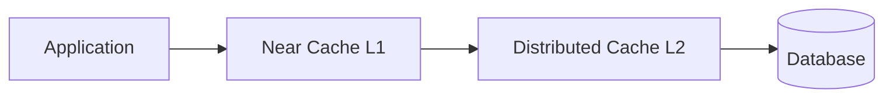

**Multi-level summary:**

```text
L1 = Local (Caffeine)     — microseconds
L2 = Distributed (Redis)  — ~1 ms
L3 = Database             — ~10–500 ms
```

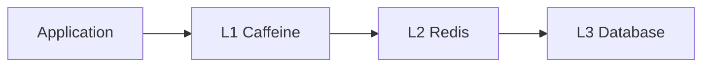

---

### How it works — the architecture inside

```text
function read(key):
    v = L1.get(key)
    if v: return v
    v = L2.get(key)
    if v:
        L1.put(key, v, ttl=30s)          // shorter L1 TTL than L2
        return v
    v = database.load(key)
    L2.set(key, v, ttl=3600s)
    L1.put(key, v, ttl=30s)
    return v
```

**L1 TTL ≤ L2 TTL** — local copies expire sooner so stale windows stay small.

**Invalidation flow:**

```text
1. Admin updates record in DB
2. DEL key on Redis (L2)
3. Publish INVALIDATE key on Pub/Sub
4. Each app instance removes key from Caffeine (L1)
```

| Level | Hit latency | Consistency |
|-------|-------------|-------------|
| L1 only | ~1 µs | Per-pod, shortest TTL |
| L2 | ~1 ms | Shared across cluster |
| DB | Highest | Authoritative |

---

### Pitfalls and design tips

- **Stale L1 after L2 invalidation** — if pub/sub is missed, L1 serves old data until TTL; keep L1 TTL short (seconds to minutes).
- **Memory multiplication** — same key in L1 on every pod; only cache truly hot keys locally.
- **Hazelcast Near Cache** tracks invalidations from server automatically; roll-your-own needs reliable invalidation channel.
- **Not for strongly consistent reads** — accept eventual consistency or skip L1 for financial balances.
- **Interview:** near cache is the standard answer for “Redis is still too slow / too loaded at scale.”

---

### Real-world example

**Hazelcast Near Cache for reference data.** A bank’s pricing service uses a Hazelcast map `fx-rates` backed by Oracle. Each API pod enables Near Cache with 1,000-entry LRU and 60 s local TTL. Rate lookups at 30,000 RPS per data center hit local heap ~95% of the time; Hazelcast cluster sees ~1,500 RPS instead of 30,000. When treasury updates a rate, the map entry is updated on the server and near-cache invalidation events clear stale copies on all members within milliseconds.

---

## 3.10 Cache Invalidation

### Overview

“There are only two hard things in Computer Science: cache invalidation and naming things.” The joke sticks because caches are copies — when the real data changes, the copy must be updated or removed, or users see **wrong answers at lightning speed**.

Technically, **cache invalidation** is any mechanism that removes or refreshes stale entries so subsequent reads reflect the authoritative store. Strategies include TTL expiry, explicit delete on write, event-driven invalidation, and version stamps. The right mix depends on consistency requirements, write frequency, and how many cache layers (local, distributed, CDN) hold the same data.

---

### What problem it fixes

- **Stale reads** — database says `name=John`, cache still serves `name=Johnny`.
- **Indefinite wrongness** — without TTL or invalidation, a bad value lives until manual flush.
- **Multi-layer drift** — browser, CDN, Redis, and local cache can all disagree; invalidation must target the right layer.

---

### What it does

Invalidation makes cached entries **absent or updated** so the next read reloads truth from the source (or receives a pushed update). It does not replace the database; it keeps derivatives in sync.

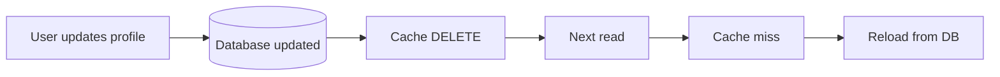

---

### How it works — the architecture inside

#### Methods

| Method | How | Pros | Cons |
|--------|-----|------|------|
| **TTL expiration** | Key auto-expires after N seconds | Simple; self-healing | Stale until expiry; avalanche risk (3.13) |
| **Manual invalidation** | `DEL key` on write path | Precise | Easy to forget in one code path |
| **Event-based** | DB change → Kafka/SQS → consumers `DEL` | Decoupled; multi-service | Event lag; ordering |
| **Version-based** | Cache key includes `v=42`; bump version on write | Instant switch; no delete race | Key proliferation; storage |

#### Consistency problem

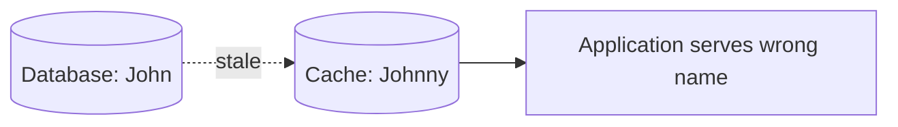

**Mitigations:**

- **Write-through (3.4)** — update cache on every write.
- **Delete on write (cache aside)** — `DEL` after DB commit.
- **Short TTL** — bound staleness when invalidation fails.
- **Version in key** — `user:42:v7`; on update publish `v8`, old entries become orphans.

#### Event-driven invalidation

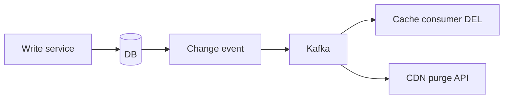

**Cache-aside + invalidation (most common):**

```text
on_write:
    db.update(entity)
    redis.del(cache_key(entity.id))
    optional: publish Invalidated(entity.id)
```

---

### Pitfalls and design tips

- **Delete vs update** — delete is safer for denormalized blobs; update avoids miss stampede but can write partial stale fields.
- **Race:** read miss loads old DB value while write in flight — use versioning or transactional ordering.
- **CDN invalidation** — API `PURGE` can take seconds globally; do not assume instant edge freshness.
- **Local + distributed** — invalidating Redis is not enough; notify pods to clear L1 (3.9).
- **Interview:** “How do you keep cache consistent?” → pattern name + invalidation trigger + TTL backstop.

---

### Real-world example

**Shopify product updates.** Merchant saves a product in admin → write service updates MySQL → emits `ProductUpdated` on Kafka. Search and storefront services consume the event: Redis `DEL product:{id}`, local Caffeine evict, and Algolia index update. Next customer request misses Redis, loads fresh row, caches with 1 h TTL. Worst-case staleness without events would be 1 hour; with events it is typically sub-second plus one read miss.

---

## 3.11 Cache Warming

### Overview

A restaurant pre-heats the ovens before the dinner rush so the first orders are not delayed. **Cache warming** preloads the cache with expected hot data **before** real user traffic arrives — at deploy, before a sale, or on a schedule — so early requests are hits instead of a wall of misses.

Technically, a warmup job queries the database (or upstream API) for top-N keys — bestsellers, config, featured feeds — and `SET`s them in Redis or local cache. Warmup can run in the deployment pipeline, on application `ready` hook, or via a cron. Goal: shift cache misses from user-facing peak to background windows.

---

### What problem it fixes

- **Cold cache after deploy** — new pods or flushed Redis → every request misses → DB spike (related to 3.13 avalanche).
- **Predictable traffic spikes** — Black Friday, product launch, sports event; known keys can be preloaded.
- **Slow first user experience** — first visitor after restart pays full DB latency for the entire critical path.

---

### What it does

Warmup **writes** entries into cache without a user-triggered read. After warmup, traffic arrives to a populated cache. It does not replace ongoing invalidation or TTL — it only sets initial state.

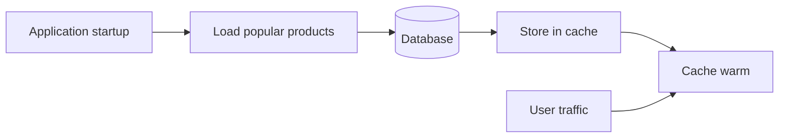

---

### How it works — the architecture inside

**Common triggers:**

| Trigger | When | Example |
|---------|------|---------|
| Deploy hook | Before marking pod ready | K8s `postStart` or readiness after warm |
| Scheduled cron | Off-peak hours | 5 AM reload top 10k SKUs |
| Event-driven | Before known spike | Pre-warm sale SKUs 1 h before launch |

**Warmup algorithm (typical):**

```text
1. keys = db.query("SELECT id FROM products ORDER BY weekly_sales DESC LIMIT 10000")
2. for batch in chunks(keys, 500):
       rows = db.fetch(batch)
       redis.mset({ product:{id}: row for row in rows })
3. log metrics: warmed_count, duration, errors
```

**Readiness gate:** Kubernetes readiness probe returns false until warmup completes (or a minimum fraction), so load balancers do not send traffic to cold pods.

**What to warm:**

- Top traffic keys (from analytics / access logs).
- Static config and feature flags.
- Auth JWKS, geo IP DB snippets, homepage aggregates.

**What not to warm:**

- Long tail of rarely accessed IDs — wastes memory and startup time.

---

### Pitfalls and design tips

- **Stale warmup data** — if warmup runs hours before traffic and data changes, TTL or re-warm before the event.
- **Startup time SLO** — warming 1M keys can delay deploy; warm only critical subset or warm asynchronously with partial readiness.
- **Thundering herd on partial warm** — if warmup covers 80% of traffic, the remaining 20% still need stampede protection (3.14).
- **Do not warm secrets** into shared Redis without encryption and tight TTL.
- **Measure:** compare miss rate and p99 latency first 5 minutes with vs without warmup.

---

### Real-world example

**E-commerce flash sale.** One hour before a sneaker drop, a job reads the 50 sale SKUs from PostgreSQL and writes `product:{id}` into Redis with 4-hour TTL. It also precomputes `homepage:flash` JSON. At launch, 200k users/min hit product pages — ~99% Redis hits. Without warmup, the same traffic would have opened with an empty cache and could have overloaded the product DB in the first minute.

---

## 3.12 Cache Penetration

### Overview

A prank caller asks the library for thousands of book titles that do not exist; the librarian checks the shelf every time instead of keeping a “not in catalog” list. **Cache penetration** is when requests for **keys that never exist** (or no longer exist) always miss the cache and hammer the database — because you only cache positive results.

Technically, attackers or buggy clients request random IDs (`userId=99999999`), deleted records, or malformed keys. Each lookup: cache miss → DB query → null → nothing stored → next request repeats. At scale this bypasses the cache entirely and can look like a DDoS on the database.

---

### What problem it fixes

- **Uncacheable misses** — negative lookups that never populate the cache.
- **Malicious enumeration** — scanning ID space to exfiltrate or overload.
- **Wasted DB capacity** — legitimate cache protecting hot data, but cold absent keys still cost full query price.

---

### What it does

Defenses **short-circuit** known-absent keys before the database, or **cache the absence** briefly so repeated probes hit Redis instead of SQL.

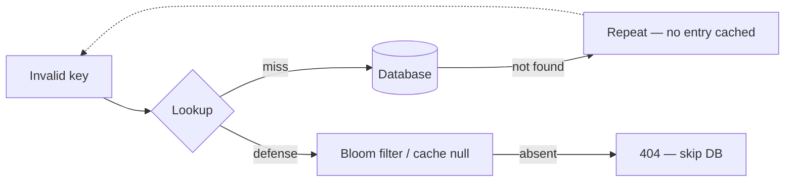

---

### How it works — the architecture inside

#### Defense 1: Cache null values

On DB miss, store a sentinel with **short TTL**:

```text
function get_user(id):
    v = redis.get("user:" + id)
    if v == "NULL": return not_found
    if v: return parse(v)
    row = db.query(id)
    if row is null:
        redis.set("user:" + id, "NULL", ex=60)    // 60 s — block repeat probes
        return not_found
    redis.set("user:" + id, row, ex=3600)
    return row
```

**Trade-off:** attackers can fill Redis with garbage keys — cap null-entry rate, use Bloom filter first, or rate-limit by IP.

#### Defense 2: Bloom filter

Maintain a Bloom filter of **all valid IDs** (loaded from DB periodically or updated on insert).

```text
function get_user(id):
    if not bloom.might_contain(id):
        return not_found                         // skip DB — safe rejection
    // possibly present — continue normal cache + DB path
```

See chapter 13.1 for Bloom filter sizing. False positives still hit DB occasionally; false negatives must not occur for inserted IDs.

#### Defense 3: Input validation

Reject malformed IDs at the API gateway (`id` must be UUID, or numeric range 1–10M) before cache/DB.

| Defense | Stops | Risk |
|---------|-------|------|
| Null cache | Repeat lookups for same bad key | Redis pollution |
| Bloom filter | Random non-existent IDs | False positive DB hits; rebuild lag |
| Validation | Out-of-range junk | Does not stop valid-format fake IDs |

---

### Pitfalls and design tips

- **Null TTL too long** — user created after a null cache may 404 for minutes; keep null TTL short (30–120 s).
- **Bloom filter stale** — new users not yet in filter get rejected — refresh on schedule or on insert.
- **Do not cache null for unbounded key spaces** — attacker sends unique keys forever; combine with rate limiting and WAF.
- **Interview:** penetration = misses for **non-existent** keys; stampede (3.14) = many misses for **one hot existent** key.
- **Redis:** `SET key NULL EX 60` with application convention; Memcached supports similar with special marker bytes.

---

### Real-world example

**API user lookup abuse.** A public API uses Redis + PostgreSQL. Attackers scrape `GET /users/{id}` with random UUIDs — 50k RPS, all DB misses. Team adds a Bloom filter rebuilt hourly from `SELECT id FROM users` (~100M rows, ~120 MB bitmap) in front of Redis. Requests for IDs not in the filter return 404 in <1 ms with no SQL. Legitimate rare false positives (~1%) still query DB. DB load from abuse drops from 50k QPS to near zero.

---

## 3.13 Cache Avalanche

### Overview

Fifty alarms in a building all use the same cheap battery that dies on the same day — suddenly every alarm fails at once. **Cache avalanche** (cache mass expiry) happens when **many keys expire at the same time** (or the cache cluster fails), causing a synchronized wave of misses that overwhelms the database.

Technically, if 100,000 keys are set with `TTL=3600` at deploy, they all expire together one hour later. Every subsequent read misses, QPS to the database spikes, latency rises, timeouts trigger retries, and retries amplify the flood — a feedback loop that can take down the DB tier.

---

### What problem it fixes

- **Correlated TTL expiry** — batch imports, cache warm jobs, or code that sets identical TTL without jitter.
- **Full cache flush** — Redis restart, `FLUSHALL`, or bad deploy clears everything at once.
- **Cascading failure** — DB slowdown → app retries → more DB load.

---

### What it does

Avalanche mitigation **decorrelates** expiry times and **absorbs** miss spikes so the database never sees a step-function load increase.

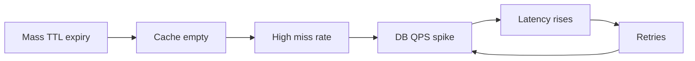

---

### How it works — the architecture inside

#### Random TTL jitter

Instead of fixed TTL, add random spread:

```text
TTL = base_ttl + random(0, jitter_max)

Example:
  base = 60 min, jitter = 0–30 min
  key A expires at 72 min, key B at 81 min, key C at 65 min
```

Spreads expirations over a window so misses arrive gradually.

**How to calculate:**

- **Given:** 100,000 keys, base TTL 3600 s, jitter uniform 0–1800 s.
- **Step 1:** Expiry window width = 1800 s (30 min).
- **Step 2:** Average expiry rate ≈ 100,000 / 1800 ≈ **56 keys/s** hitting DB on miss (if none refreshed proactively) vs 100,000 in one second without jitter.

#### Multi-level cache (3.9)

L1 local cache survives L2 mass expiry briefly — absorbs fraction of reads while L2 repopulates.

#### Rate limiting and circuit breakers

Cap DB queries per second from cache-miss path; return degraded response rather than retry storm.

#### Never-expire + background refresh

Hot keys use logical expiry (3.14): serve stale value while one worker refreshes.

#### High availability

Redis Sentinel/Cluster with replicas — avoid single-point flush; persistence (AOF) for faster warm restart.

| Technique | Targets |
|-----------|---------|
| TTL jitter | Correlated expiry |
| Multi-level cache | L2 empty, L1 still hits |
| Rate limit | Retry amplification |
| Proactive refresh | Hot keys never go cold together |

---

### Pitfalls and design tips

- **Jitter on top of batch warm** — warmup sets 10k keys with same TTL → still avalanches; jitter at `SET` time is mandatory.
- **Retry storms** — clients with aggressive retries turn a DB blip into outage; use exponential backoff and jitter on clients too.
- **Avalanche vs stampede** — avalanche is **many keys** expiring together; stampede is **one key** with **many concurrent** missers (3.14). Both can happen at once during a flush.
- **Monitor:** cache hit ratio drop + DB QPS spike + aligned timestamps → likely avalanche.

---

### Real-world example

**Daily config reload.** A service cached 80,000 tenant config blobs with `EX 86400` at midnight cron — all expired at next midnight. DB CPU hit 100% for four minutes. Fix: `TTL = 86400 + random(0, 7200)` per key and stagger cron over 2 hours. Peak miss rate fell from 80k/s to ~11/s average spread, DB CPU stayed under 40%.

---

## 3.14 Cache Stampede

### Overview

A celebrity posts a half-off coupon link; everyone rushes the same store door at once when it opens. **Cache stampede** (thundering herd, cache breakdown) is when **many concurrent requests** miss the same hot cache key (often right after expiry) and **all** query the database to rebuild it — the DB sees N identical expensive queries instead of one.

Technically, at T+0 a viral product key `product:iphone` expires. 10,000 in-flight requests see a miss, each runs `SELECT ... WHERE id=iphone`, each tries `SET` the result. Database connections saturate, latency explodes, and the cache repopulates only after the damage is done.

---

### What problem it fixes

- **Duplicate work on miss** — N threads/regions rebuild identical value.
- **Hot key expiry** — one popular key carries disproportionate traffic; its expiry is a system-wide event.
- **DB connection exhaustion** — stampede fills connection pools; unrelated queries fail too.

---

### What it does

Stampede controls ensure **at most one** recomputation per key (or per key per window) while other waiters receive the fresh value or a stale fallback — converting N database queries into 1.

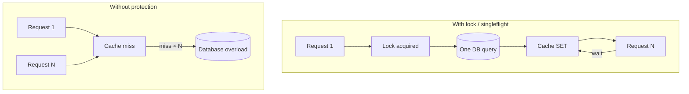

---

### How it works — the architecture inside

#### Mutex / distributed lock

Only one holder rebuilds; others wait or spin on cache:

```text
function get(key):
    v = cache.get(key)
    if v: return v
    if acquire_lock("lock:" + key, ttl=10s):
        try:
            v = db.load(key)
            cache.set(key, v, ttl=3600)
        finally:
            release_lock("lock:" + key)
    else:
        wait_until(cache.get(key) != null OR timeout)
        v = cache.get(key)
    return v
```

**Redis:** `SET lock:product:42 NX EX 10` — set if not exists, 10 s expiry prevents deadlocks.

#### Singleflight (request coalescing)

In-process (Go `singleflight`, Java pattern with `ConcurrentHashMap` futures): concurrent goroutines share one in-flight loader call.

```text
// Go: import "golang.org/x/sync/singleflight"
result, err, _ := group.Do(key, func() (interface{}, error) {
    return loadFromDB(key)
})
```

#### Logical expiration (never hard-expire hot keys)

Store `{ value, expireAt }` in cache. After `expireAt`, **return stale value immediately** to readers; **one** background task refreshes. Users never see a miss storm.

```text
cached = { data: {...}, logical_expiry: T }
if now > logical_expiry:
    if not refresh_in_progress(key):
        async_refresh(key)              // one worker
    return cached.data                  // stale but fast
```

#### Hot key never expires + proactive refresh

Cron or jittered refresh at 80% of TTL before expiry — key never goes cold.

| Technique | Scope | Library / tool |
|-----------|-------|----------------|
| Distributed lock | Cross-pod | Redis Redlock, `SET NX` |
| Singleflight | Single process | `golang.org/x/sync/singleflight` |
| Logical expiry | Hot read-mostly keys | Application pattern |
| Early refresh | Scheduled hot keys | Sidecar cron, Celery |

---

### Pitfalls and design tips

- **Lock timeout too short** — slow DB query outlives lock; second builder starts — size lock TTL > p99 query time.
- **Waiters timeout** — clients that give up and retry **add** to herd; use singleflight or short wait on cache poll.
- **Stale logical expiry** — document that post-expiry reads may be seconds old; unacceptable for stock count without version checks.
- **Stampede vs penetration** — stampede = existent **hot** key; penetration = **non-existent** keys (3.12).
- **Facebook memcache:** historically used lease/gets and dogpile prevention; modern stacks use Redis + singleflight.

---

### Real-world example

**Viral product page on Shopify-scale storefront.** `GET product:drop-2024` serves 40k RPS from Redis. TTL 300 s expires during peak. Without protection, 40k PostgreSQL queries fire in one second. Team adds `singleflight` in the Go API layer plus Redis `SET lock:product:drop-2024 NX EX 15` as cross-pod backstop. One query runs (~80 ms); waiters block on `singleflight` or read cache after `SET`. DB sees 1 query per expiry window, not 40k. p99 latency stays under 50 ms instead of spiking to 30 s.

---

[<- Back to master index](../README.md)
