# 3. Caching

> Status: **Documented** — all sub-topics below include overview, diagrams, and key points.

[← Back to master index](../README.md)

---

## Sub-topics

| # | Sub-topic | Status |
|---|-----------|--------|
| 3.1 | [Cache Fundamentals](#31-cache-fundamentals) | Done |
| 3.2 | [Cache Aside Pattern](#32-cache-aside-pattern) | Done |
| 3.3 | [Read Through Cache](#33-read-through-cache) | Done |
| 3.4 | [Write Through Cache](#34-write-through-cache) | Done |
| 3.5 | [Write Back Cache](#35-write-back-cache) | Done |
| 3.6 | [Refresh Ahead Cache](#36-refresh-ahead-cache) | Done |
| 3.7 | [Distributed Cache](#37-distributed-cache) | Done |
| 3.8 | [Near Cache](#38-near-cache) | Done |
| 3.9 | [Cache Invalidation](#39-cache-invalidation) | Done |
| 3.10 | [Cache Stampede](#310-cache-stampede) | Done |
| 3.11 | [Cache Avalanche](#311-cache-avalanche) | Done |
| 3.12 | [Cache Penetration](#312-cache-penetration) | Done |
| 3.13 | [Cache Warming](#313-cache-warming) | Done |

---

## Pattern Comparison (at a glance)

| Pattern | Who loads on miss? | Write path | Consistency | Best for |
|---------|-------------------|------------|-------------|----------|
| **Cache Aside** | Application | App → DB, then invalidate cache | Eventual | General read-heavy apps |
| **Read Through** | Cache layer | Same as paired write strategy | Depends on write | Transparent cache proxy |
| **Write Through** | N/A | App → Cache → DB (sync) | Stronger | Read-after-write consistency |
| **Write Back** | N/A | App → Cache → DB (async) | Eventual | Write-heavy, low latency |
| **Refresh Ahead** | Cache (proactive) | Background refresh | Slightly stale OK | Hot keys with TTL |

---

## 3.1 Cache Fundamentals

### Overview

A **cache** is a fast storage layer that holds copies of data closer to where it is consumed. Instead of hitting a slow database or remote service on every request, the application checks the cache first.

### High-level architecture

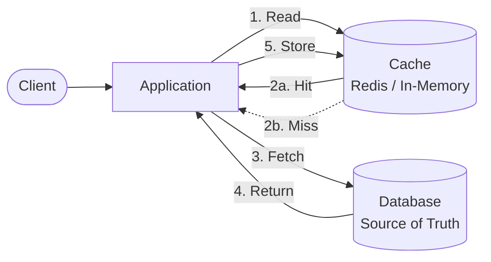

### Cache hit vs miss

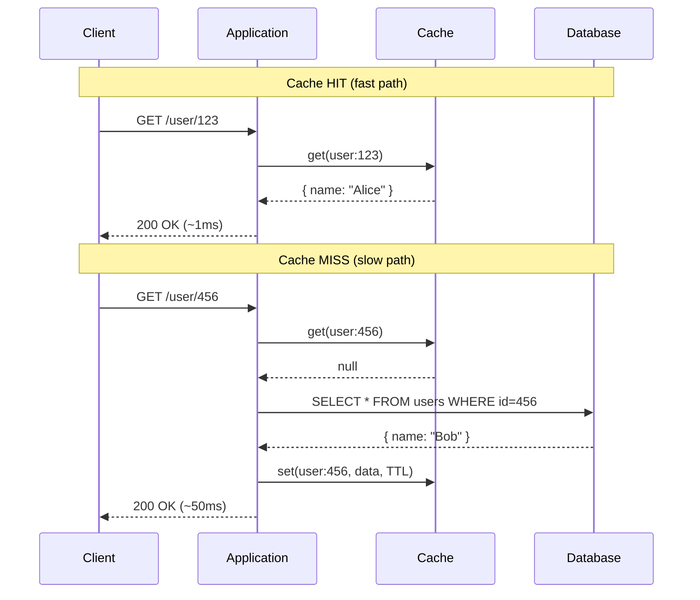

### Key concepts

| Term | Meaning |
|------|---------|
| **Cache hit** | Requested data found in cache |
| **Cache miss** | Data not in cache; load from source |
| **TTL** | Time To Live — how long an entry stays valid |
| **Eviction** | Removing entries when cache is full (LRU, LFU, FIFO) |
| **Hit ratio** | `hits / (hits + misses)` — primary health metric |

### Cache layers in the stack

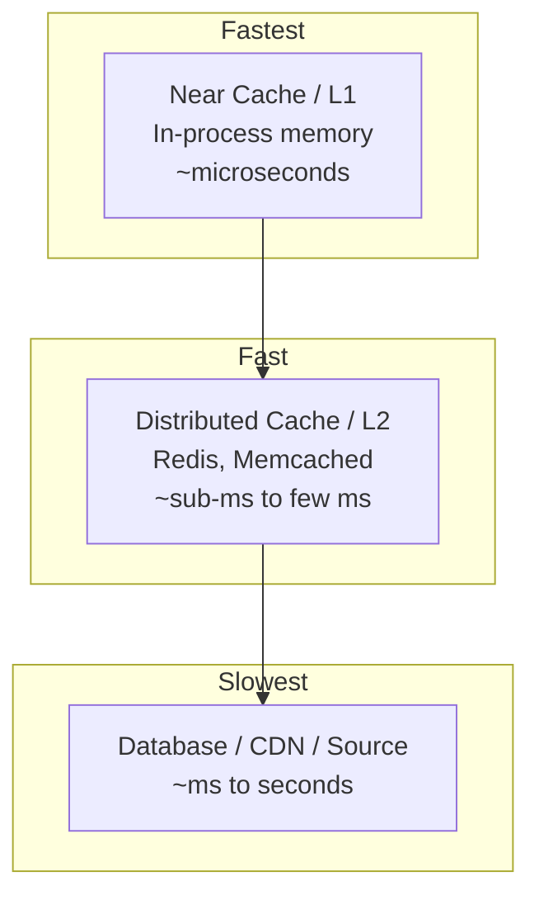

### When caching helps

- Read-heavy workloads (90%+ reads)
- Data that changes less often than it is read
- Expensive computations or aggregations
- Hot keys accessed by many users

### When caching hurts

- Strong consistency required on every read
- Data changes constantly and must always be fresh
- Very large objects that exceed memory budget
- Low-traffic data where cache overhead exceeds benefit

### References

- [Cache Fundamentals (YouTube)](https://www.youtube.com/watch?v=1NngTUYPdpI)

---

## 3.2 Cache Aside Pattern

**Also known as:** Lazy loading, Look-aside cache

### Overview

The **application** owns all cache logic. The cache does not talk to the database on its own. This is the most common pattern in production.

### Architecture

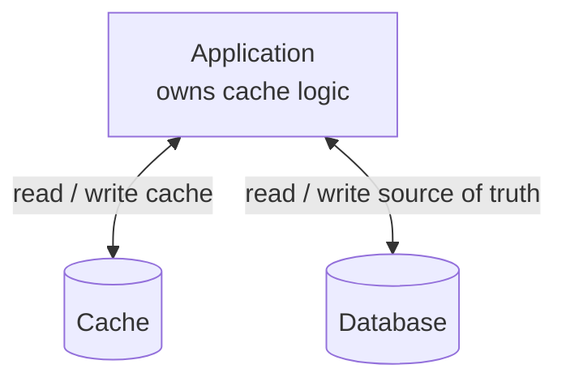

### Read flow (cache aside)

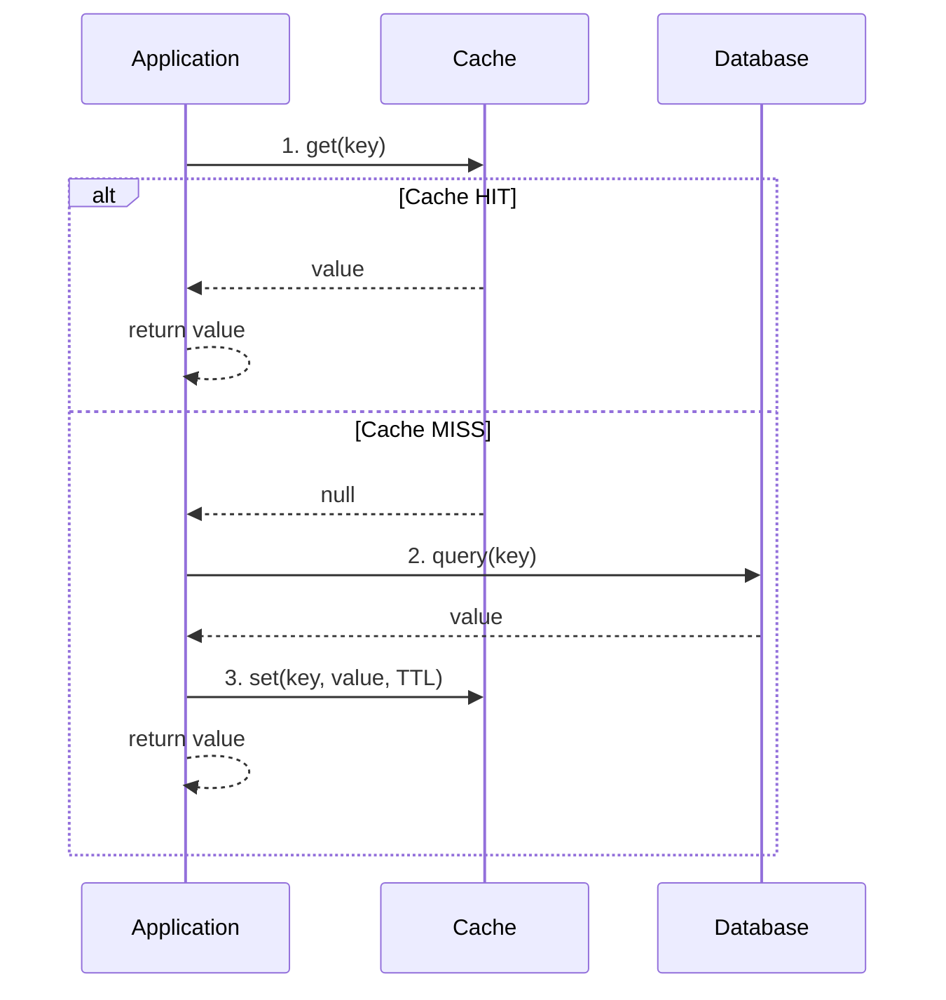

### Write flow (cache aside)

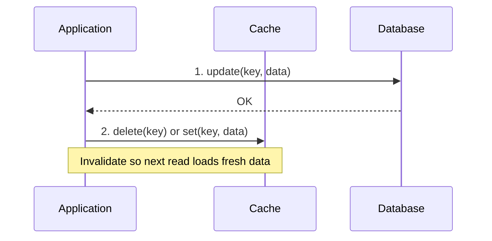

### Pros and cons

| Pros | Cons |
|------|------|
| Simple, widely used | App code must handle miss/populate/invalidate |
| Cache only stores requested data | First request after miss is always slow |
| Cache failure does not block DB | Stale data if invalidation is missed |

### When to use

- General-purpose caching (default choice)
- Read-heavy systems where not all data needs caching
- Teams that want explicit control over what gets cached

### Example (pseudo-code)

```text
function get(key):
    value = cache.get(key)
    if value != null: return value
    value = db.get(key)
    if value != null: cache.set(key, value, ttl=3600)
    return value

function update(key, data):
    db.update(key, data)
    cache.delete(key)
```

---

## 3.3 Read Through Cache

### Overview

The **cache sits in front of the database**. On a miss, the **cache layer** (not the application) loads data from the DB and stores it automatically.

### Architecture

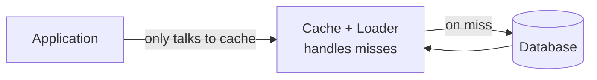

### Read flow

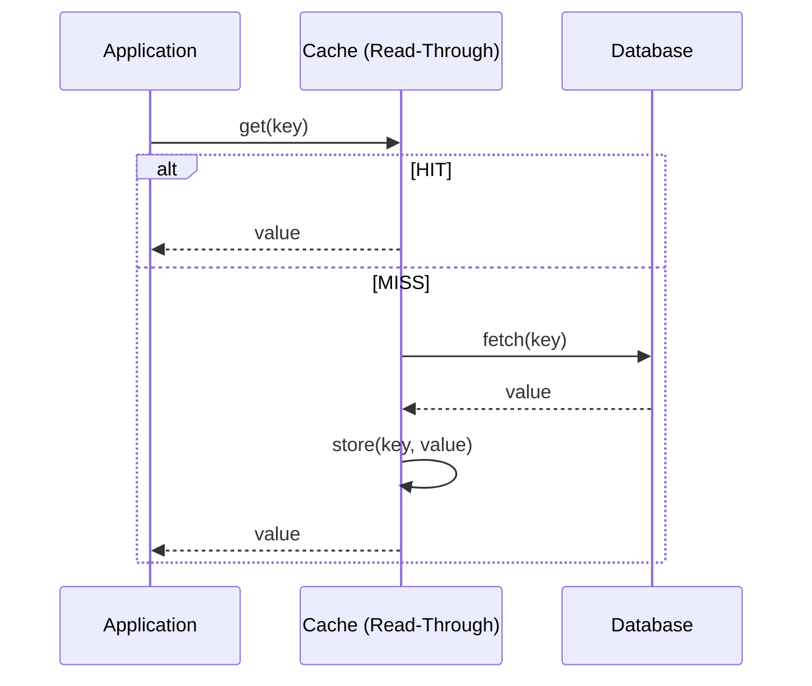

### Cache Aside vs Read Through

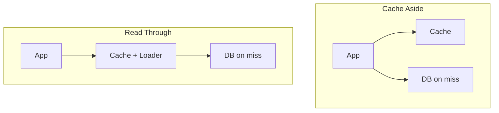

| | Cache Aside | Read Through |
|---|-------------|--------------|
| Who loads on miss? | Application | Cache layer |
| App complexity | Higher | Lower |
| Flexibility | High | Lower |

### When to use

- ORM / framework-integrated caches (e.g. Hibernate second-level cache)
- Standardized data access layers where cache is a transparent proxy

---

## 3.4 Write Through Cache

### Overview

On every **write**, data is written to the **cache and database synchronously** before the operation is considered complete.

### Architecture

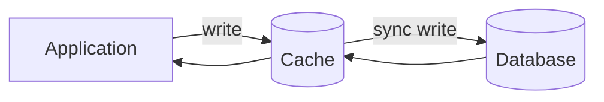

### Write flow

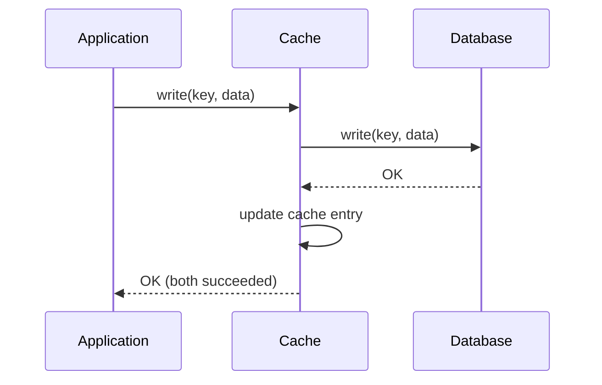

### Read after write

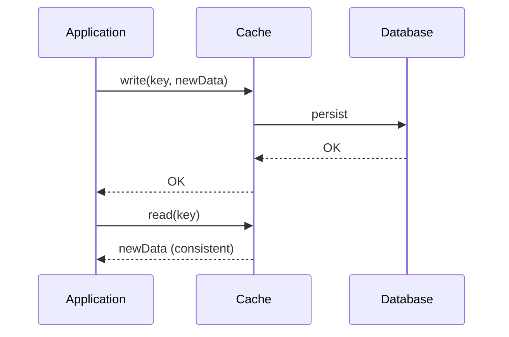

### Pros and cons

| Pros | Cons |
|------|------|
| Cache and DB stay consistent on writes | Higher write latency (two writes) |
| Next read is a cache hit | May cache data that is never read |

### When to use

- Read-after-write consistency matters
- Moderate write volume with heavy read traffic on same keys

---

## 3.5 Write Back Cache

**Also known as:** Write-behind cache

### Overview

Writes go to the **cache first**. The cache **asynchronously** flushes updates to the database later.

### Architecture

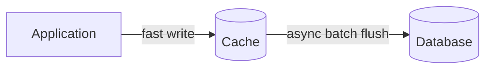

### Write flow

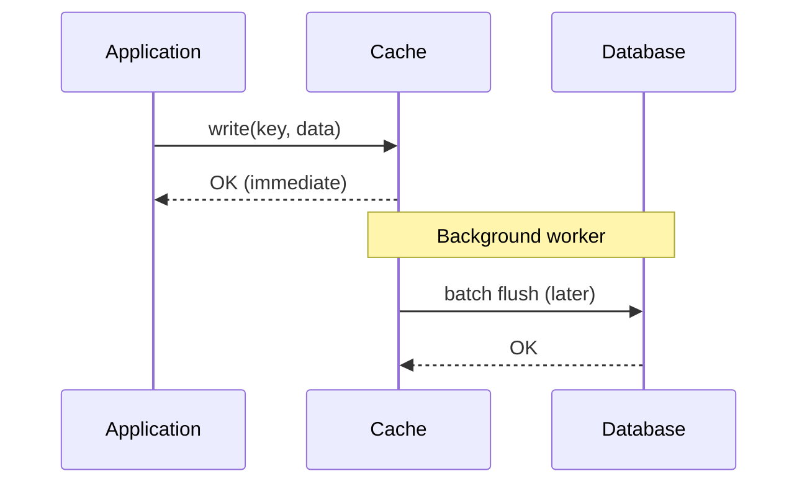

### Write Through vs Write Back

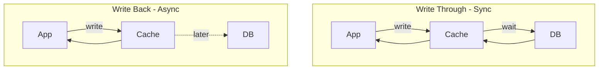

| | Write Through | Write Back |
|---|---------------|------------|
| Write latency | Higher | Lower |
| Consistency | Stronger | Eventual |
| Durability risk | Lower | Higher if cache fails before flush |

### When to use

- Write-heavy, latency-sensitive systems
- Counters, analytics buffers (with recovery strategy)
- **Not** ideal for financial/critical data without durability guarantees

---

## 3.6 Refresh Ahead Cache

### Overview

The cache **proactively refreshes** entries **before they expire**, so users rarely see a miss on hot keys.

### How it works

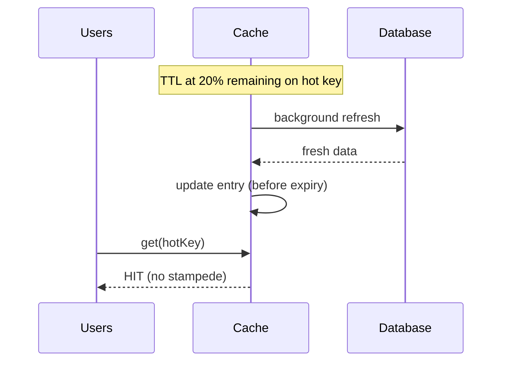

### Timeline

```mermaid
gantt
    title Refresh Ahead vs Plain TTL
    dateFormat X
    axisFormat %s

    section Plain TTL
    Serve from cache     :0, 80
    Expiry - all miss    :crit, 80, 90
    DB rebuild storm     :90, 100

    section Refresh Ahead
    Serve from cache     :0, 80
    Background refresh   :active, 70, 85
    Seamless continue    :85, 100
```

### Related patterns

- **Stale-while-revalidate** — serve old value while refreshing in background
- **Refresh ahead** — refresh *before* expiry, not after

### When to use

- Hot keys with predictable access (home page, top products, config)
- Libraries like Caffeine (`refreshAfterWrite`)
- Pairs well with [Cache Stampede](#310-cache-stampede) mitigation

---

## 3.7 Distributed Cache

### Overview

A **shared cache tier** used by **multiple application instances**, accessed over the network (Redis, Memcached, Hazelcast).

### Architecture

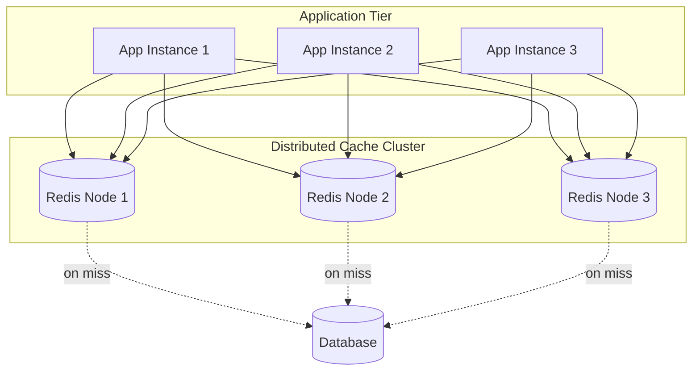

### Why distributed?

| Benefit | Description |
|---------|-------------|
| **Shared state** | All app nodes see the same cached data |
| **Horizontal scale** | Add cache nodes to grow capacity |
| **Centralized invalidation** | Delete key once → all apps see miss |
| **Persistence** | Redis RDB/AOF for recovery |

### Common technologies

| System | Notes |
|--------|-------|
| **Redis** | Rich structures, pub/sub, persistence, cluster |
| **Memcached** | Simple key-value, multi-threaded |
| **Hazelcast / Ignite** | In-memory data grid, near-cache support |

### Design considerations

- **Sharding** — split keys across nodes
- **Replication** — copies for HA and read scaling
- **Serialization** — JSON, Protobuf, Kryo
- **Network latency** — typically 0.5–2 ms per round trip

---

## 3.8 Near Cache

**Also known as:** Local cache, L1 cache

### Overview

A small, fast cache in the **same process** as the application, in front of a remote distributed cache.

### Three-tier read path

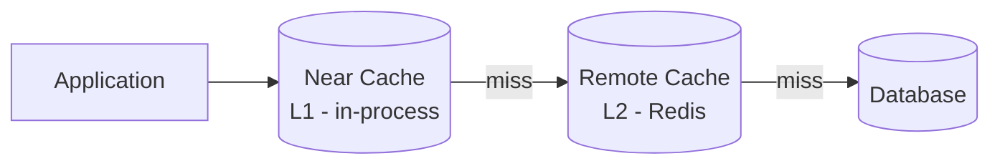

### Read sequence

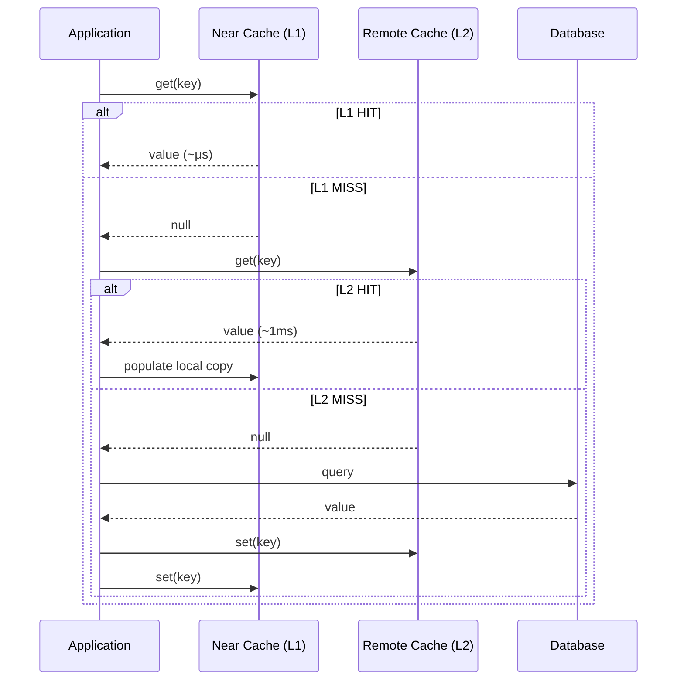

### Benefits and trade-offs

| Benefit | Trade-off |
|---------|-----------|
| Microsecond access for hot keys | Memory per instance |
| Fewer network calls to Redis | Local copies can be stale |
| Higher throughput on hot keys | Same key duplicated on many nodes |

### When to use

- Read-heavy workloads with hot keys
- Latency-sensitive services (even 1–2 ms Redis is too slow)
- Data that tolerates brief staleness (catalogs, config, profiles)

### Implementations

- Caffeine, Guava Cache (Java)
- Hazelcast/Ignite embedded near-cache mode

---

## 3.9 Cache Invalidation

> *"There are only two hard things in Computer Science: cache invalidation and naming things."* — Phil Karlton

### Overview

Removing or updating stale cache entries when underlying data changes.

### Strategies

```mermaid
flowchart TB
    Write[Data Updated in DB]
    Write --> TTL[TTL Expiry<br/>Simple, eventual]
    Write --> Delete[Delete on Write<br/>Fresh on next read]
    Write --> Update[Update on Write<br/>Immediate cache hit]
    Write --> Event[Event-Driven<br/>Pub/Sub invalidation]
```

### Delete on write flow

```mermaid
sequenceDiagram
    participant A as Application
    participant C as Cache
    participant D as Database

    A->>D: UPDATE user SET name='Alice'
    D-->>A: OK
    A->>C: DELETE user:123
    Note over A,C: Next read = miss → fresh from DB
```

### Event-driven invalidation

```mermaid
flowchart LR
    DB[(Database)] -->|CDC / binlog| Bus[Message Bus<br/>Kafka]
    Bus --> I1[App Instance 1<br/>cache.delete]
    Bus --> I2[App Instance 2<br/>cache.delete]
    Bus --> I3[App Instance 3<br/>cache.delete]
```

### Strategy comparison

| Strategy | Pros | Cons |
|----------|------|------|
| **TTL expiry** | Simple, no coordination | Stale until expiry |
| **Delete on write** | Fresh on next read | Extra write; miss after update |
| **Update on write** | Next read is hit | Logic must stay in sync |
| **Event-driven** | Scales across instances | Needs pub/sub or CDC |

### Common pitfalls

- Forgetting to invalidate on one code path
- Race: read repopulates stale data after delete but before DB commit
- Flushing entire cache on any write (too broad)

---

## 3.10 Cache Stampede

**Also known as:** Cache dog-piling, thundering herd on cache miss

### Overview

A **popular cache entry expires** and **many concurrent requests** simultaneously miss and all try to **rebuild the cache** at once — hammering the database.

### The problem

```mermaid
sequenceDiagram
    participant R1 as Request 1
    participant R2 as Request 2
    participant RN as Request N
    participant C as Cache
    participant D as Database

    Note over C: Hot key expires at T
    R1->>C: get(hotKey)
    R2->>C: get(hotKey)
    RN->>C: get(hotKey)
    C-->>R1: MISS
    C-->>R2: MISS
    C-->>RN: MISS
    R1->>D: SELECT ...
    R2->>D: SELECT ...
    RN->>D: SELECT ...
    Note over D: Database overwhelmed
```

### Single-flight solution

```mermaid
sequenceDiagram
    participant R1 as Request 1
    participant R2 as Request 2
    participant C as Cache
    participant L as Lock
    participant D as Database

    R1->>C: get(hotKey) → MISS
    R1->>L: acquire lock
    R2->>C: get(hotKey) → MISS
    R2->>L: wait...
    R1->>D: fetch once
    D-->>R1: data
    R1->>C: set(hotKey)
    R1->>L: release
    R2->>C: get(hotKey) → HIT
```

### Mitigation strategies

| Strategy | How it works |
|----------|--------------|
| **Locking / single-flight** | Only one thread rebuilds; others wait |
| **Probabilistic early expiration** | Refresh before TTL with jitter |
| **Stale-while-revalidate** | Serve stale while one worker refreshes |
| **Mutex per key** | Redis `SETNX` — one instance rebuilds |
| **Request coalescing** | Merge duplicate in-flight requests |

---

## 3.11 Cache Avalanche

**Also known as:** Cache avalanche effect

### Overview

**Many cache entries expire at the same time** (or the cache layer fails), causing a **mass miss wave** that overwhelms the backend.

### The problem

```mermaid
flowchart TB
    Deploy[Deploy: all keys cached<br/>with TTL = 3600s]
    Wait[All keys expire together<br/>at T + 3600s]
    Wave[Mass miss wave]
    DB[(Database collapse)]

    Deploy --> Wait --> Wave --> DB
```

### Stampede vs Avalanche

| | Cache Stampede | Cache Avalanche |
|---|----------------|-----------------|
| **Scope** | One **hot key** | **Many keys** or entire cache |
| **Trigger** | Single expiry | Bulk expiry, restart, cluster failure |
| **Scale** | Concentrated | System-wide |

### TTL jitter fix

```mermaid
gantt
    title Without vs With TTL Jitter
    dateFormat X
    axisFormat %s

    section No Jitter
    Key A expires :crit, 3600, 3601
    Key B expires :crit, 3600, 3601
    Key C expires :crit, 3600, 3601

    section With Jitter
    Key A expires :3600, 3601
    Key B expires :3650, 3651
    Key C expires :3720, 3721
```

### Mitigation

| Strategy | Description |
|----------|-------------|
| **TTL jitter** | `TTL = base + random(0, jitter)` |
| **Staggered warming** | Populate cache gradually |
| **Circuit breaker** | Protect backend when miss rate spikes |
| **HA cache** | Replication, persistence, multi-AZ |

### References

- [Cache Avalanche (LinkedIn)](https://www.linkedin.com/posts/alexxubyte_systemdesign-coding-interviewtips-share-7436445893542801409-YVJI/)

---

## 3.12 Cache Penetration

### Overview

Requests for **data that does not exist** (and will never exist) bypass the cache and **hit the database every time**.

### The problem

```mermaid
sequenceDiagram
    participant Attacker as Attacker / Bad Request
    participant A as Application
    participant C as Cache
    participant D as Database

    loop Random invalid IDs
        Attacker->>A: GET /user?id=999999999
        A->>C: get(user:999999999)
        C-->>A: null (not cached)
        A->>D: SELECT ... (full query)
        D-->>A: not found
        Note over A,C: null not stored → repeat forever
    end
```

### Negative caching solution

```mermaid
sequenceDiagram
    participant A as Application
    participant C as Cache
    participant D as Database

    A->>C: get(key)
    C-->>A: NOT_FOUND_SENTINEL
    Note over A: No DB hit

    A->>C: get(newKey)
    C-->>A: null
    A->>D: query
    D-->>A: not found
    A->>C: set(newKey, NOT_FOUND, TTL=60s)
```

### Mitigation

| Strategy | Description |
|----------|-------------|
| **Negative caching** | Short-TTL placeholder for "not found" |
| **Bloom filter** | Fast "definitely does not exist" check |
| **Input validation** | Reject malformed IDs at API layer |
| **Rate limiting** | Throttle suspicious clients |

### Example (pseudo-code)

```text
value = cache.get(key)
if value == NOT_FOUND_SENTINEL: return null

value = db.get(key)
if value == null:
    cache.set(key, NOT_FOUND_SENTINEL, ttl=60s)
else:
    cache.set(key, value, ttl=3600s)
```

---

## 3.13 Cache Warming

**Also known as:** Cache preloading, cache priming

### Overview

Loading data into the cache **before it is needed**, so first real user requests are **hits** instead of cold misses.

### Without vs with warming

```mermaid
sequenceDiagram
    participant U as User
    participant A as Application
    participant C as Cache
    participant D as Database

    Note over U,D: Without warming
    U->>A: first request
    A->>C: miss
    A->>D: slow query
    D-->>U: response (slow)

    Note over U,D: With warming
    A->>D: preload hot keys at startup
    A->>C: populate cache
    U->>A: first request
    A->>C: HIT
    C-->>U: response (fast)
```

### Warming approaches

```mermaid
flowchart TB
    W[Cache Warming Strategies]
    W --> E[Eager at startup]
    W --> S[Scheduled cron]
    W --> EV[Event-driven on deploy]
    W --> L[Replay access logs]
```

| Approach | Description |
|----------|-------------|
| **Eager at startup** | Load critical keys when service boots |
| **Scheduled** | Cron before peak hours |
| **Event-driven** | On deploy or data change |
| **Replay logs** | Preload from recent traffic patterns |

### Best practices

- Warm only **hot / critical** data
- Use **TTL jitter** when warming many keys — avoid [Cache Avalanche](#311-cache-avalanche)
- Coordinate across instances so all nodes don't hit DB at once
- Don't mark instance ready until warm completes (if SLO requires it)

### Example (pseudo-code)

```text
on_startup():
    hot_keys = analytics.get_top_keys(limit=1000)
    for key in hot_keys:
        value = db.fetch(key)
        cache.set(key, value, ttl=3600 + random_jitter())
```

---

## Quick Reference

| Sub-topic | Problem / Focus | Core idea |
|-----------|-----------------|-----------|
| **3.1 Fundamentals** | Why cache? | Fast layer between app and source |
| **3.2 Cache Aside** | Who owns logic? | App loads on miss, invalidates on write |
| **3.3 Read Through** | Simpler app reads | Cache loads from DB on miss |
| **3.4 Write Through** | Write consistency | Sync write to cache + DB |
| **3.5 Write Back** | Write latency | Async flush cache → DB |
| **3.6 Refresh Ahead** | Expiry spikes | Proactive refresh before TTL |
| **3.7 Distributed** | Multi-instance sharing | Shared Redis/Memcached cluster |
| **3.8 Near Cache** | Remote cache latency | Local L1 in front of L2 |
| **3.9 Invalidation** | Stale data | TTL, delete, events |
| **3.10 Stampede** | One hot key expires | Single-flight, locking |
| **3.11 Avalanche** | Mass expiry | TTL jitter, staggered warm |
| **3.12 Penetration** | Invalid keys | Negative caching, Bloom filter |
| **3.13 Warming** | Cold start | Preload hot data before traffic |

---

[← Back to master index](../README.md)
