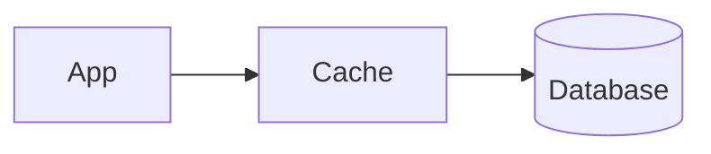
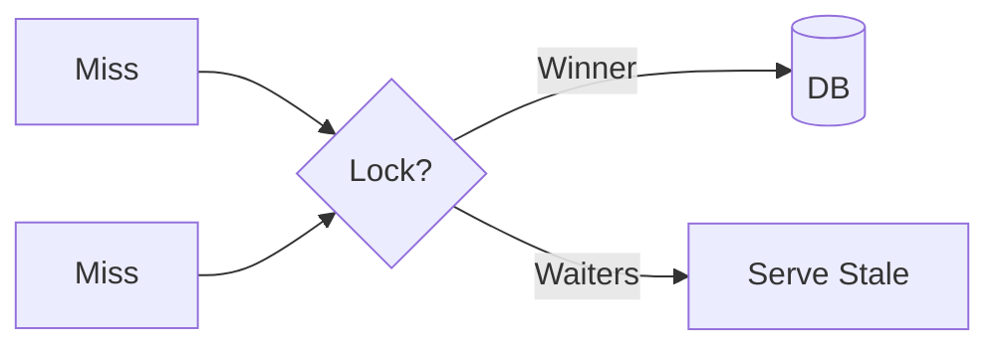

# 3. Caching

> Status: **Documented**

[← Back to master index](../README.md)

---

## Sub-topics

| # | Sub-topic | Status |
|---|-----------|--------|
| 3.1 | [Cache Fundamentals](#cache-fundamentals) | Done |
| 3.2 | [Cache Aside Pattern](#cache-aside-pattern) | Done |
| 3.3 | [Read Through Cache](#read-through-cache) | Done |
| 3.4 | [Write Through Cache](#write-through-cache) | Done |
| 3.5 | [Write Back Cache](#write-back-cache) | Done |
| 3.6 | [Refresh Ahead Cache](#refresh-ahead-cache) | Done |
| 3.7 | [Distributed Cache](#distributed-cache) | Done |
| 3.8 | [Near Cache](#near-cache) | Done |
| 3.9 | [Cache Invalidation](#cache-invalidation) | Done |
| 3.10 | [Cache Stampede](#cache-stampede) | Done |
| 3.11 | [Cache Avalanche](#cache-avalanche) | Done |
| 3.12 | [Cache Penetration](#cache-penetration) | Done |
| 3.13 | [Cache Warming](#cache-warming) | Done |

---

## 3.1 Cache Fundamentals

**Summary:** Store frequently accessed data in fast storage (RAM) to reduce latency and backend load. Hit ratio and TTL strategy determine effectiveness.

**Key points:**
- Local (in-process) vs remote (Redis/Memcached)—latency vs consistency trade-off
- Cache hit ratio = hits / (hits + misses); target > 90% for hot paths
- Every cache introduces staleness—define acceptable freshness per use case

**References:**
- [Video](https://www.youtube.com/watch?v=1NngTUYPdpI)

---

## 3.2 Cache Aside Pattern

**Summary:** Application manages cache explicitly—read on miss from DB then populate; write updates DB then invalidates cache. Most common and flexible pattern.

**Key points:**
- Read: check cache → miss → load DB → set cache → return
- Write: update DB first, then delete/update cache entry
- Race conditions possible—use TTL or version tags as safety net

---

## 3.3 Read Through Cache

**Summary:** Cache layer transparently loads data from backing store on miss. Application only talks to cache—simpler code, cache provider handles population.

**Key points:**
- Cache library fetches from DB automatically on miss
- Single point of configuration for loading logic
- Less application control over load behavior and error handling

---

## 3.4 Write Through Cache

**Summary:** Writes go to cache first; cache synchronously updates backing store. Guarantees cache and DB consistency on every write at latency cost.

**Key points:**
- Every write waits for both cache and DB confirmation
- Cache always warm for written keys—no stale reads after write
- Higher write latency; unsuitable for write-heavy bursts

---

## 3.5 Write Back Cache

**Summary:** Writes update cache immediately; DB write deferred asynchronously. Maximum write speed but risk of data loss on cache failure.

**Key points:**
- Batch and coalesce writes to reduce DB load
- Must flush dirty entries before shutdown or on eviction
- Use only when durability delay is acceptable

---

## 3.6 Refresh Ahead Cache

**Summary:** Proactively refreshes entries before TTL expiry based on access patterns. Eliminates miss latency for predictable hot keys.

**Key points:**
- Background refresh triggered at ~80% of TTL for frequently accessed keys
- User always gets fast response—never waits for refresh
- Wastes resources on keys that stop being accessed

---

## 3.7 Distributed Cache

**Summary:** Shared cache cluster (Redis Cluster, Memcached pool) accessible by all application instances. Enables horizontal scale and consistent shared state.

**Key points:**
- Partition data across nodes via consistent hashing
- Replication for HA; sentinel/cluster mode for failover
- Network hop adds ~1ms vs local cache—still 100× faster than DB

---

## 3.8 Near Cache

**Summary:** L1 local cache in each app instance backed by L2 distributed cache. Combines microsecond local hits with cross-instance consistency via L2.

**Key points:**
- Local cache: Caffeine/Guava in-process; short TTL (seconds)
- L2 (Redis) provides shared truth; local is best-effort acceleration
- Invalidation must propagate to all L1 instances via pub/sub

---

## 3.9 Cache Invalidation

**Summary:** The hard problem—keeping cache coherent when source data changes. Strategies: TTL expiry, explicit delete, or event-driven invalidation.

**Key points:**
- TTL-only is simplest but serves stale data until expiry
- Event-driven (CDC, message bus) gives near-real-time consistency
- Invalidate related keys on write—cache key design must anticipate this

---

## 3.10 Cache Stampede

**Summary:** Many concurrent requests miss the same expired key and all hit the DB simultaneously. Can overwhelm backend during peak or after mass expiry.

**Key points:**
- Mitigate with request coalescing (single-flight/mutex per key)
- Probabilistic early expiration spreads refresh load over time
- Lock-based: first miss acquires lock, others wait or serve stale

---

## 3.11 Cache Avalanche

**Summary:** Mass simultaneous cache expiry causes cascading DB overload. Differs from stampede—many keys expire at once, not just one hot key.

**Key points:**
- Never set identical TTLs—add random jitter (±10–20%)
- Stagger warming; use tiered TTLs for related keys
- Circuit breaker on DB when miss rate spikes

**References:**
- [Article](https://www.linkedin.com/posts/alexxubyte_systemdesign-coding-interviewtips-share-7436445893542801409-YVJI/)

---

## 3.12 Cache Penetration

**Summary:** Queries for non-existent keys bypass cache every time, hammering the DB. Attackers exploit this with random invalid key lookups.

**Key points:**
- Cache null/negative results with short TTL for missing keys
- Bloom filter pre-check rejects known-absent keys in O(1)
- Input validation and rate limiting block malicious key patterns

---

## 3.13 Cache Warming

**Summary:** Pre-populate cache before traffic arrives or after deployment. Eliminates cold-start miss storms on hot data paths.

**Key points:**
- Warm on deploy, cron schedule, or traffic prediction
- Prioritize top-N keys by historical access frequency
- Coordinate warming across instances to avoid duplicate DB load

---

## Quick Reference

| # | Sub-topic | One-liner |
|---|-----------|-----------|
| 3.1 | Cache Fundamentals | Fast storage layer; hit ratio drives value |
| 3.2 | Cache Aside Pattern | App-managed read/write with explicit invalidation |
| 3.3 | Read Through Cache | Cache auto-loads on miss |
| 3.4 | Write Through Cache | Sync write to cache + DB |
| 3.5 | Write Back Cache | Async DB write; fastest, least durable |
| 3.6 | Refresh Ahead Cache | Proactive refresh before expiry |
| 3.7 | Distributed Cache | Shared Redis/Memcached cluster |
| 3.8 | Near Cache | L1 local + L2 distributed tiers |
| 3.9 | Cache Invalidation | TTL, explicit delete, or event-driven |
| 3.10 | Cache Stampede | Thundering herd on single hot key miss |
| 3.11 | Cache Avalanche | Mass expiry causes DB overload |
| 3.12 | Cache Penetration | Non-existent keys bypass cache |
| 3.13 | Cache Warming | Pre-load hot keys before traffic |

[← Back to master index](../README.md)
