# 3. Caching

> Status: **Documented**  -  master reference

[<- Back to master index](../README.md)

## Sub-topics

| # | Sub-topic | Status |
|---|-----------|--------|
| 3.1 | [Cache Fundamentals](#31-cache-fundamentals) | Done |
| 3.2 | [Cache Aside Pattern](#32-cache-aside-pattern) | Done |
| 3.3 | [Read Through Cache](#33-read-through-cache) | Done |
| 3.4 | [Write Through Cache](#34-write-through-cache) | Done |
| 3.5 | [Write Back Cache](#35-write-back-cache) | Done |
| 3.6 | [Refresh Ahead Cache](#36-refresh-ahead-cache) | Done |
| 3.7 | [Distributed Cache](#37-distributed-cache) | Done |
| 3.8 | [Near Cache](#38-near-cache) | Done |
| 3.9 | [Cache Invalidation](#39-cache-invalidation) | Done |
| 3.10 | [Cache Stampede](#310-cache-stampede) | Done |
| 3.11 | [Cache Avalanche](#311-cache-avalanche) | Done |
| 3.12 | [Cache Penetration](#312-cache-penetration) | Done |
| 3.13 | [Cache Warming](#313-cache-warming) | Done |

## Topic Overview

Caching stores frequently accessed data in a faster, closer storage tier so applications avoid repeated expensive work - disk I/O, network round-trips, or heavy computation. In system design, caching is one of the highest-leverage optimizations: a well-placed cache can reduce latency by orders of magnitude and absorb read traffic that would otherwise saturate databases.

Caches exist at every layer: CPU L1/L2/L3, OS page cache, CDN edge nodes, in-process hash maps, and dedicated distributed stores like Redis or Memcached. The design challenge is not merely "add Redis" but choosing the right **pattern** (who reads/writes the cache), **consistency model** (how stale data is tolerated), and **failure modes** (stampede, avalanche, penetration) that determine whether caching helps or harms production systems.

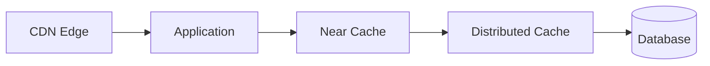

## Reading order

Sub-topics are sequenced for progressive learning: foundations first, then related concepts, then specialized topics.

| Group | Sections | Focus |
|-------|----------|-------|
| **1. Basics** | 3.1 | Fundamentals |
| **2. Cache patterns** | 3.2-3.6 | Aside, read/write-through, write-back, refresh-ahead |
| **3. Deployment** | 3.7-3.9 | Distributed, near cache, invalidation |
| **4. Failure modes** | 3.10-3.13 | Stampede, avalanche, penetration, warming |

## Related topics

- [Databases](../02-databases/README.md)  -  storage engines, page cache, query optimization
- [Distributed System](../04-distributed-system/README.md)  -  consistency, latency, availability trade-offs
- [Distributed Databases](../05-distributed-databases/README.md)  -  replication and partitioning at scale
- [Networking](../01-networking/README.md)  -  CDN, load balancing, keep-alive

---

## 3.1 Cache Fundamentals

### What is it?

A cache is a store of data duplicated from a slower **source of truth**, kept in faster media (memory, SSD, edge node) with the expectation that future requests will reuse it. Caches are governed by **temporal locality** (recently used data is likely reused) and **spatial locality** (nearby data is likely accessed together).

### Why it matters

Without caching, every user request hits the database at full cost. Caches decouple read throughput from backend capacity, shrink p99 latency, and provide a buffer during traffic spikes - often the difference between a system that scales linearly and one that collapses under load.

### How it works

1. Application receives a request for data keyed by an identifier (e.g., `user:123`).
2. Application checks the cache for that key.
3. **Cache hit:** data is returned immediately from fast storage.
4. **Cache miss:** application fetches from the authoritative store, optionally populates the cache, and returns the result.
5. Entries expire via **TTL** (time-to-live), explicit invalidation, or eviction when memory is full.

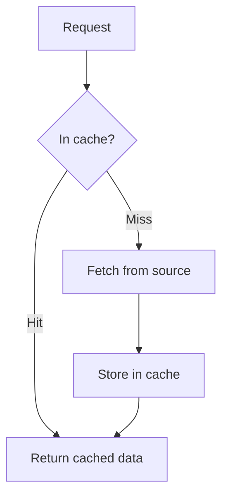

### Key details

| Concept | Description |
|---------|-------------|
| **Hit ratio** | Percentage of requests served from cache; target often 90%+ for hot paths |
| **TTL** | Maximum age before entry is considered stale and removed |
| **Eviction policy** | LRU, LFU, FIFO - chooses what to remove when cache is full |
| **Write policy** | Determines whether writes go to cache, source, or both (see patterns below) |
| **Cache coherence** | How multiple cache layers stay consistent with each other and the source |

### When to use

- Read-heavy workloads with repeated access to the same keys
- Expensive computations or aggregations that can be memoized
- Data that changes infrequently relative to read frequency
- Protecting downstream services (DB, third-party APIs) from overload

### Trade-offs / Pitfalls

- Stale data if TTL or invalidation is wrong - users see outdated information
- Memory cost scales with cached working set; unbounded caching causes OOM
- Cache adds operational complexity: monitoring hit ratio, eviction, cluster health
- Cold start after deploy or restart causes thundering herd on the backend

### References

- [Cache Fundamentals  -  System Design video](https://www.youtube.com/watch?v=1NngTUYPdpI)

---

## 3.2 Cache Aside Pattern

### What is it?

**Cache-aside** (a.k.a. **lazy loading**) puts the application in control: the app reads from cache first, on miss loads from DB and writes to cache; on write, the app updates the DB and **invalidates or updates** the cache entry. The cache is not aware of the database.

### Why it matters

It is the most common production pattern because it is simple, works with any cache and any DB, and only caches data that is actually requested. Redis + PostgreSQL almost always use cache-aside.

### How it works

**Read path:**
1. App queries cache for key.
2. Hit -> return data.
3. Miss -> query DB, store result in cache with TTL, return data.

**Write path:**
1. App writes to DB (source of truth).
2. App deletes cache key (invalidate) or updates cache entry.
3. Next read repopulates cache on miss.

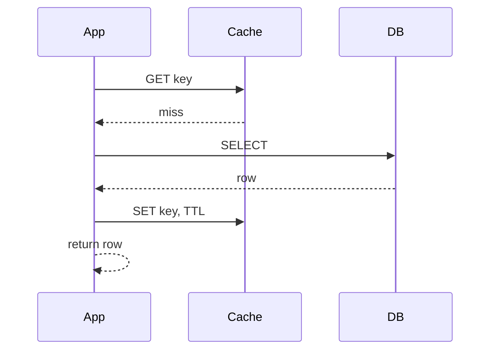

### Key details

- Application owns cache logic - no magic in the cache layer
- **Invalidate-on-write** is safer than update-on-write (avoids race conditions where DB write fails but cache shows new value)
- TTL provides safety net if invalidation is missed
- Works well when read:write ratio is high (10:1 or greater)

### When to use

- General-purpose caching with Redis/Memcached
- When you need full control over what gets cached
- Heterogeneous data where not everything should be cached
- Teams comfortable implementing invalidation in application code

### Trade-offs / Pitfalls

- **Stale reads** if invalidation fails silently or races occur (read after write before invalidate completes)
- First request after invalidation always misses - latency spike per key
- Application code must handle cache logic everywhere data is accessed
- Does not help if working set exceeds cache size (constant churn, low hit ratio)

---

## 3.3 Read Through Cache

### What is it?

In **read-through**, the cache itself is responsible for loading data on a miss. The application only talks to the cache; the cache library or server fetches from DB when the key is absent and stores it before returning.

### Why it matters

Centralizes read logic in one place, reducing duplicated cache-miss handling across services. Useful when many clients share the same cache abstraction.

### How it works

1. Application requests key from cache layer.
2. Cache checks internal store.
3. On miss, cache **automatically** calls a loader function / DB and populates itself.
4. Cache returns data to application - application never touches DB directly for reads.

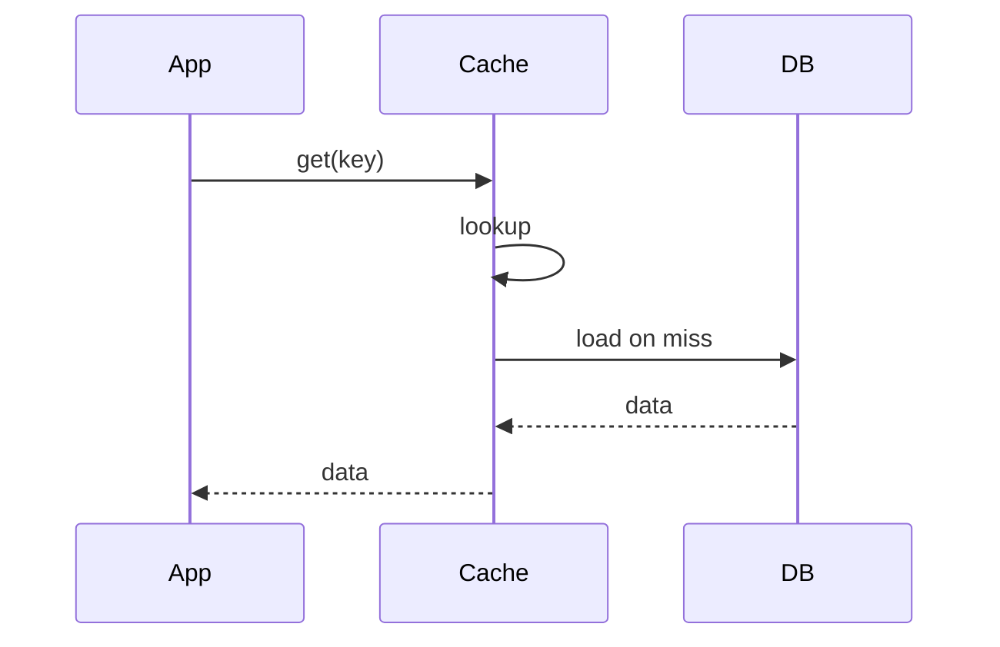

### Key details

- Loader callback must be registered with the cache (e.g., Guava `CacheLoader`, Hazelcast `MapLoader`)
- Cache and DB can briefly disagree during concurrent writes unless invalidation is coordinated
- Simplifies application read path at cost of coupling cache config to DB schema
- Often combined with write-through or write-behind for full cache-managed persistence

### When to use

- Shared cache client library used by many microservices
- When you want uniform miss-handling without per-service boilerplate
- Embedded caches (Caffeine, Ehcache) with defined loading semantics

### Trade-offs / Pitfalls

- Loader failures propagate as cache errors - need circuit breaking on DB
- Harder to implement partial/chunked caching (cache loads whole object)
- Write path still needs separate strategy (usually invalidate or write-through)
- Debugging requires understanding cache loader behavior, not just app code

---

## 3.4 Write Through Cache

### What is it?

**Write-through** writes synchronously to **both** cache and database on every update. The cache and DB are updated in the same operation before the write is acknowledged to the caller.

### Why it matters

Keeps cache and DB consistent on writes - no stale cache entries after an update. Reads after writes always hit warm, correct data in cache (assuming write succeeded).

### How it works

1. Application sends write to cache layer.
2. Cache writes to DB first (or in coordinated transaction).
3. Cache updates its own entry.
4. Acknowledges success to application.
5. Subsequent reads hit cache with fresh data.

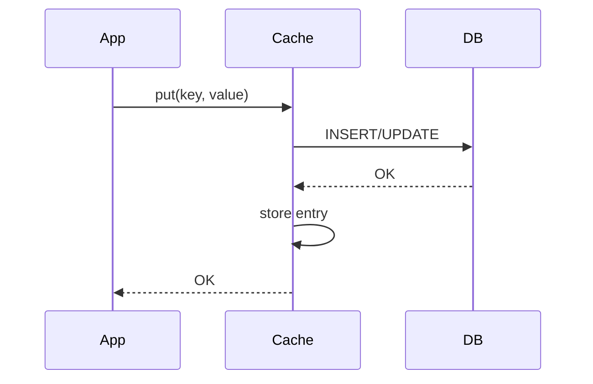

### Key details

- Write latency = cache write + DB write (slower than write-back)
- Eliminates stale-read problem for keys that were written
- Cache only holds data that has been written or read - cold keys still miss
- Used in systems requiring strong read-after-write consistency for cached entities

### When to use

- Read-after-write consistency is mandatory
- Write volume is moderate relative to reads
- Financial or inventory systems where stale cache after write is unacceptable

### Trade-offs / Pitfalls

- Higher write latency than direct DB write or write-back
- Failed DB write must roll back cache update - needs transactional coordination
- Caching data that is never read wastes memory (writes populate cache unnecessarily)
- Does not protect DB from read load for keys never written through cache

---

## 3.5 Write Back Cache

### What is it?

**Write-back** (write-behind) acknowledges writes to the cache immediately and **asynchronously** flushes to the database later. The cache acts as a temporary buffer; DB is updated in batches or on a schedule.

### Why it matters

Dramatically reduces write latency and DB write load for bursty or high-frequency update patterns. Essential for write-heavy analytics buffers, session stores, and metrics aggregation.

### How it works

1. Application writes to cache; cache returns immediately.
2. Cache marks entry as **dirty** (modified, not yet persisted).
3. Background flush process periodically writes dirty entries to DB.
4. On cache eviction or crash before flush, data may be lost unless WAL/replication protects it.

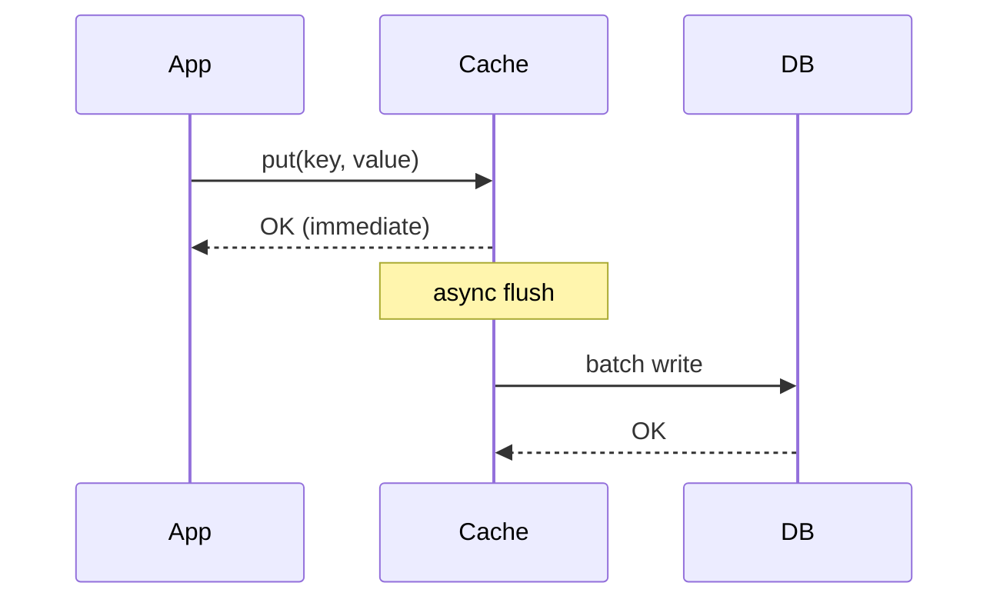

### Key details

- **Durability risk:** crash between cache write and DB flush loses data
- Batching improves DB throughput (fewer transactions)
- Ordering matters for related keys - flush order can cause temporary inconsistency
- Often paired with replication or persistent cache (Redis AOF) to reduce loss window

### When to use

- Write-heavy workloads where latency matters more than immediate durability
- Metrics, counters, activity feeds, click streams
- Systems that can tolerate seconds of data loss (with replication mitigation)

### Trade-offs / Pitfalls

- Data loss on cache node failure if not replicated
- Complex recovery: rebuilding cache from DB may overwrite newer buffered writes
- Read-your-writes not guaranteed if read goes to replica before flush
- Debugging write ordering bugs is difficult

---

## 3.6 Refresh Ahead Cache

### What is it?

**Refresh-ahead** proactively reloads cache entries **before** they expire, based on access patterns or fixed schedules. Hot keys are refreshed in the background so users rarely experience miss latency.

### Why it matters

Eliminates latency spikes on TTL expiry for predictable hot keys. Critical for product catalog pages, config blobs, or feature flags read on every request.

### How it works

1. Cache entry is accessed; cache tracks access frequency and TTL remaining.
2. When TTL drops below a threshold (e.g., 20% remaining) and key is hot, cache triggers background refresh.
3. Loader fetches fresh data from source and replaces entry **without** evicting first.
4. User requests continue hitting the old entry until refresh completes (no miss).

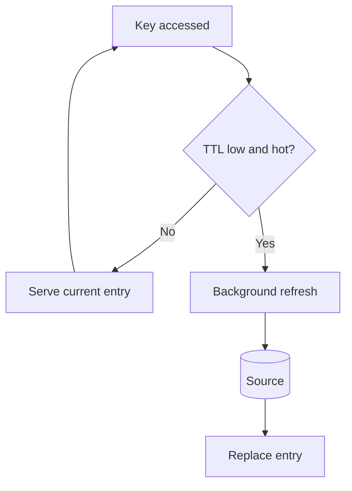

### Key details

- Requires access tracking (frequency counters, last-access time)
- Refresh storms if many hot keys expire simultaneously - stagger TTLs
- Wasted refresh if key stops being accessed after refresh scheduled
- Guava/Caffeine support `refreshAfterWrite`; Redis requires custom logic or jobs

### When to use

- Extremely hot keys where miss latency is unacceptable
- Data with predictable refresh cost and known access patterns
- Configuration, reference data, homepage aggregates

### Trade-offs / Pitfalls

- Background load on source even when data unchanged
- Stale data served during slow refresh (old entry kept until new one ready)
- Complex tuning: refresh threshold, thread pool size, rate limits
- Over-refreshing low-value keys wastes resources

---

## 3.7 Distributed Cache

### What is it?

A **distributed cache** spans multiple nodes, presenting a unified key space with replication or sharding for capacity and fault tolerance. Examples: Redis Cluster, Memcached pools, Hazelcast, Apache Ignite.

### Why it matters

Single-node memory limits cap cache size; distributed caches scale horizontally to terabytes and survive node failures without losing entire cache capacity.

### How it works

1. Keys are partitioned across nodes via **consistent hashing** or hash slots.
2. Client routes request to correct node (smart client or proxy).
3. Replicas copy data for reads scaling and failover.
4. On node failure, cluster rebalances keys to surviving nodes.

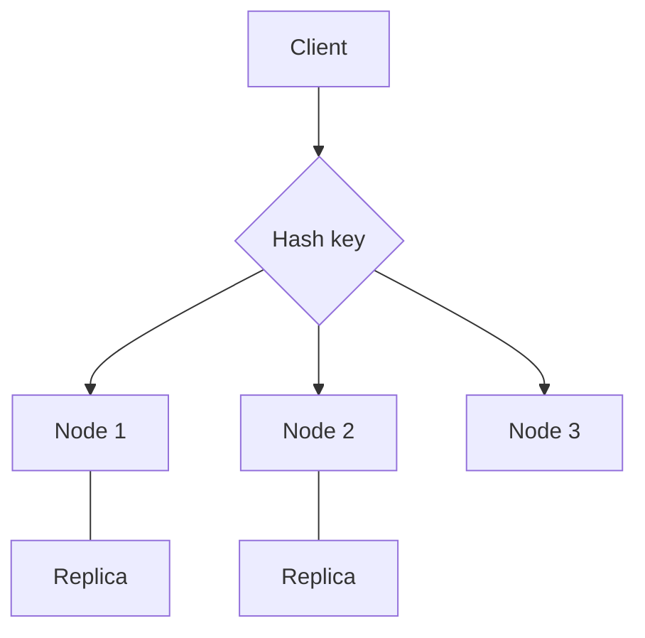

### Key details

| Aspect | Options |
|--------|---------|
| **Partitioning** | Hash slot (Redis), consistent hash ring (Memcached clients) |
| **Replication** | Primary-replica async sync; quorum for durability |
| **Consistency** | Eventual across replicas; no cross-key transactions in most caches |
| **Client routing** | Cluster-aware client vs. proxy (Twemproxy, Envoy) |

### When to use

- Cache working set exceeds single machine RAM
- High availability required (no single point of failure)
- Multiple services sharing centralized cache tier
- Global deployments with geo-distributed cache (Redis Enterprise, etc.)

### Trade-offs / Pitfalls

- Network latency between app and remote cache (1 - 5 ms vs. microseconds for local)
- Hot keys on single shard cause skew despite hashing
- Split-brain and failover can cause brief inconsistency or data loss
- Operational overhead: cluster monitoring, resharding, version upgrades

---

## 3.8 Near Cache

### What is it?

A **near cache** (L1) sits in the application process memory in front of a **remote distributed cache** (L2). Frequently accessed entries are kept locally to avoid network round-trips on every read.

### Why it matters

Cuts p99 latency for hot keys from milliseconds to nanoseconds. Essential in microservices making hundreds of cache calls per request.

### How it works

1. App checks local near cache (in-heap Caffeine/Guava map).
2. Local hit -> return immediately (no network).
3. Local miss -> fetch from remote cache (Redis).
4. Remote hit -> populate near cache with shorter TTL, return.
5. Remote miss -> load from DB per cache-aside logic.

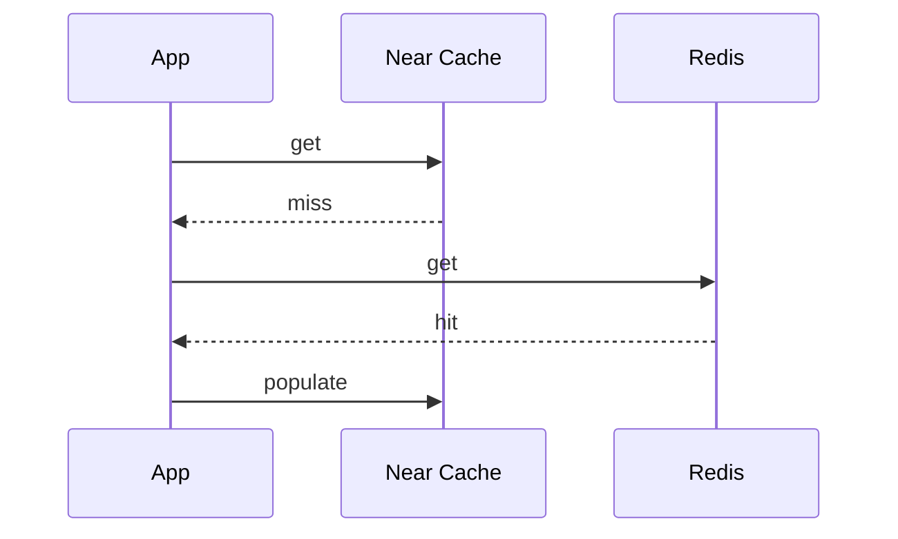

### Key details

- Near cache TTL should be **shorter** than remote cache TTL to limit staleness
- Invalidation must propagate: remote invalidation + local eviction (pub/sub, Hazelcast events)
- Memory bounded per instance - each pod has its own L1 (not shared)
- Stale L1 entries across pods until TTL expires if invalidation missed

### When to use

- High QPS services with repeated reads of same keys per instance
- Latency-sensitive paths (auth tokens, feature flags, product metadata)
- ORM second-level cache (Hibernate) pattern

### Trade-offs / Pitfalls

- **Consistency:** pods see different L1 state briefly
- Total memory = near cache × number of pods (multiplied footprint)
- Invalidation complexity increases significantly
- Harder to debug "works on one pod, stale on another"

---

## 3.9 Cache Invalidation

### What is it?

**Cache invalidation** removes or updates cached entries when underlying data changes so clients do not read stale values. Phil Karlton's famous quote: "There are only two hard things in Computer Science: cache invalidation and naming things."

### Why it matters

Wrong invalidation causes users to see outdated prices, permissions, or content - often worse than a cache miss because stale data looks legitimate.

### How it works

**Strategies:**
1. **TTL-only:** entries expire naturally; simple but stale until expiry.
2. **Delete on write:** app deletes cache key after DB update (cache-aside standard).
3. **Publish/subscribe:** DB change event triggers all cache nodes to evict (Redis pub/sub, Kafka consumers).
4. **Version stamps:** cache key includes version; bump version on write, old keys become orphans.
5. **Write-through:** cache updated synchronously with DB (no separate invalidation).

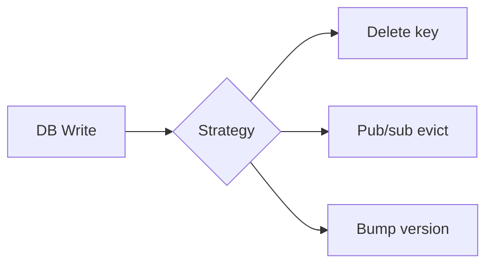

### Key details

- **Cache aside + delete** is most common; order matters: DB first, then delete cache
- **Race:** read repopulates stale value between DB write and delete - use short TTL or versioned keys
- **Bulk invalidation:** tag-based keys (`product:*`) require scan or maintained index of keys
- CDC (Debezium) can drive invalidation from binlog for decoupled services

### When to use

- Any cache-aside or near-cache deployment where data mutates
- Multi-service systems where one service writes and others cache reads
- Event-driven architectures using domain events for eviction

### Trade-offs / Pitfalls

- Over-invalidation kills hit ratio; under-invalidation serves stale data
- Distributed invalidation lag causes temporary inconsistency across regions
- Forgotten code paths that write DB but skip invalidation are common bugs
- Full cache flush is a blunt instrument - causes massive miss storm

---

## 3.10 Cache Stampede

### What is it?

A **cache stampede** (thundering herd) occurs when a popular cache entry expires and **many concurrent requests** simultaneously miss, each triggering an independent expensive recomputation or DB query for the same key.

### Why it matters

A single hot key expiry can overwhelm the database - exactly when you thought the cache was protecting you. Black Friday outages often involve stampede dynamics.

### How it works

1. Hot key `product:42` expires at T=0.
2. 10,000 requests arrive in the same 100 ms window.
3. All 10,000 miss cache and query DB for `product:42`.
4. DB connection pool exhausted; latency spikes globally.

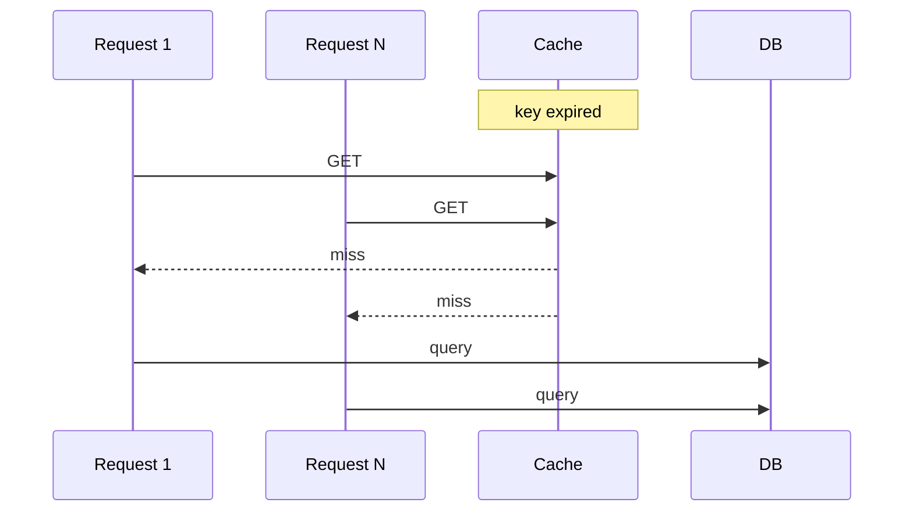

### Key details

| Mitigation | Mechanism |
|------------|-----------|
| **Locking / single-flight** | First miss acquires lock; others wait for result |
| **Probabilistic early expiry** | Jitter TTL so keys don't all expire together |
| **Request coalescing** | Memcached `gets` + CAS or Go `singleflight` |
| **Stale-while-revalidate** | Serve stale value while one worker refreshes |
| **External pre-warming** | Refresh-ahead before expiry |

### When to use mitigations

- Any system with hot keys and TTL-based expiry
- High fan-out pages (homepage, viral product)
- Computed aggregates (leaderboards, counts) cached with TTL

### Trade-offs / Pitfalls

- Locking adds latency for waiters if refresh is slow
- Serving stale during revalidate trades consistency for availability
- Jitter alone doesn't help if traffic spike aligns with expiry
- Single-flight must handle worker crash (lock timeout required)

---

## 3.11 Cache Avalanche

### What is it?

**Cache avalanche** is mass cache failure or simultaneous expiry of **many keys** (or entire cache cluster), causing a flood of traffic to the backend. Broader than stampede (one key) - avalanche affects large portions of the key space or all nodes.

### Why it matters

Redis cluster restart, network partition, or uniform TTL on millions of keys can take down the database layer in seconds. Recovery time depends on how fast the cache repopulates vs. how fast DB fails.

### How it works

1. Trigger event: cache cluster reboot, bad deploy flushing cache, or TTL set identically at cache warm.
2. Large fraction of requests become cache misses simultaneously.
3. Backend receives 10 - 100× normal load.
4. Cascading failure: DB slow -> app threads block -> timeouts -> retries amplify load.

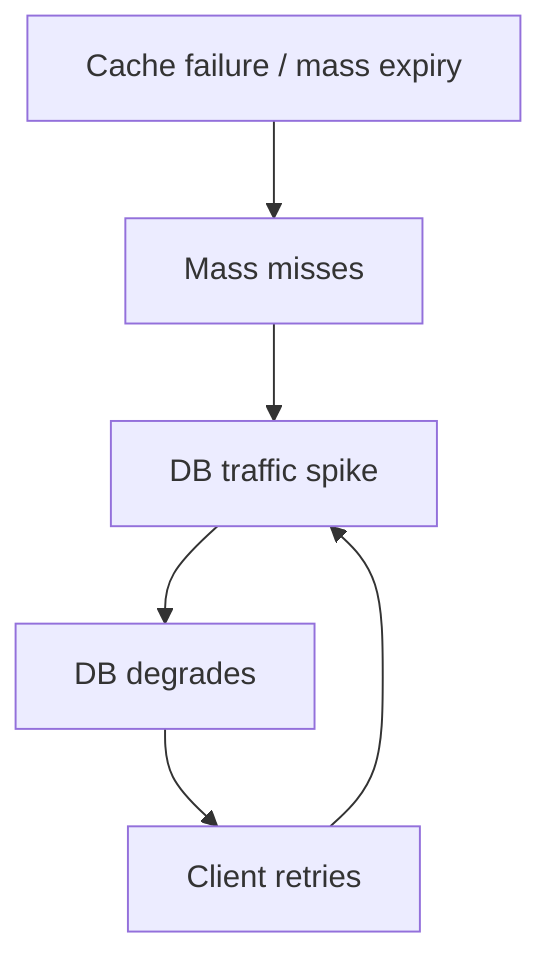

### Key details

- **TTL jitter:** add random offset (±10%) to every key's TTL
- **Circuit breaker:** stop hitting DB when error rate spikes
- **Rate limiting** on miss path to cap concurrent DB queries
- **Multi-tier cache:** L1 survives brief L2 outage
- **Graceful degradation:** return defaults or cached stale bulk snapshot

### When to use mitigations

- Large-scale Redis/Memcached deployments
- After deploys that restart cache tier
- Batch cache warming with identical timestamps (dangerous)

### Trade-offs / Pitfalls

- Circuit breaker open state returns errors to users - product decision
- Rate limiting on miss increases latency for legitimate requests
- Multi-tier adds consistency complexity
- Replicas help availability but failover still causes brief miss window

### References

- [Cache Avalanche  -  system design discussion](https://www.linkedin.com/posts/alexxubyte_systemdesign-coding-interviewtips-share-7436445893542801409-YVJI/)

---

## 3.12 Cache Penetration

### What is it?

**Cache penetration** happens when requests query for keys that **do not exist** in the database (malicious or accidental), bypassing the cache every time because nothing valid gets stored - each request hits DB full cost.

### Why it matters

Attackers can enumerate random IDs (`user:-1`, `user:999999999`) to bypass cache entirely and DDoS the database. Legitimate bugs (null results not cached) cause the same pattern.

### How it works

1. Request for non-existent key `user:fake-id`.
2. Cache miss (key never stored).
3. DB query returns empty.
4. Application returns 404 **without** caching the negative result.
5. Repeat step 1 - 4 for every request - cache provides zero protection.

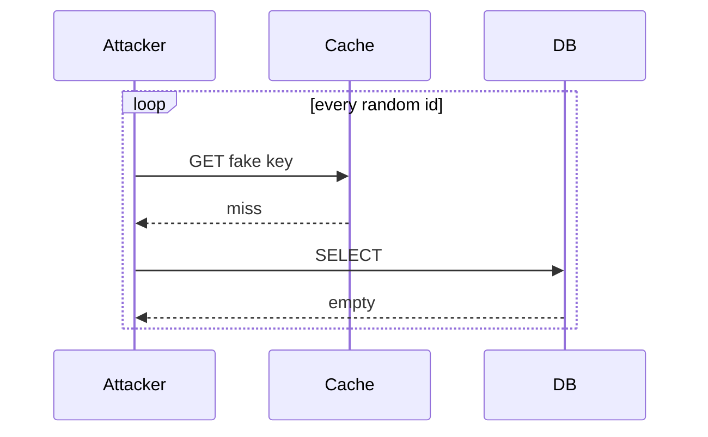

### Key details

| Defense | Description |
|---------|-------------|
| **Cache nulls** | Store sentinel for missing keys with short TTL (60s) |
| **Bloom filter** | Probabilistic set: "key definitely doesn't exist" skips DB |
| **Input validation** | Reject malformed IDs before cache/DB |
| **Rate limiting** | Per-IP caps on 404-generating endpoints |

### When to use

- Public APIs with enumerable ID spaces
- Search/autocomplete with arbitrary user input
- Any cache-aside system where null results are common

### Trade-offs / Pitfalls

- Caching nulls fills cache with garbage if attack uses infinite random keys - combine with Bloom filter
- Bloom filter false positives block legitimate new keys briefly
- Short TTL on null entries still allows sustained attack at reduced rate
- Validation rules must not reject valid edge-case IDs

---

## 3.13 Cache Warming

### What is it?

**Cache warming** pre-populates the cache with anticipated data **before** traffic arrives or after a cold start, so the first real users get hits instead of misses.

### Why it matters

Deploys, restarts, and new region spin-ups otherwise cause a cold cache and miss storm. Warming shifts load to a controlled window (off-peak job, CI step) instead of user-facing latency.

### How it works

1. Identify key set to warm: top products, active users, config blobs, static reference data.
2. Batch job or startup hook reads from DB/source.
3. Writes entries to cache with appropriate TTL.
4. Optionally stagger keys or use refresh-ahead to maintain warmth.
5. Production traffic arrives to warm cache.

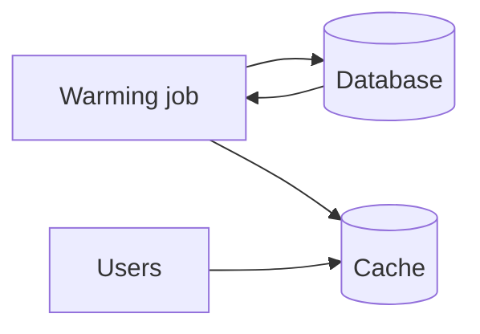

### Key details

- Warm **measured** hot keys from access logs, not entire tables
- Warming huge datasets can itself overload DB - rate-limit the job
- TTL should be set at warm time; consider longer TTL for stable reference data
- Blue/green deploy: warm cache in new environment before traffic switch
- CDN warming uses similar idea (prefetch to edge PoPs)

### When to use

- After cache cluster rebuild or failover
- Before known traffic events (product launch, marketing campaign)
- New datacenter or region cutover
- Scheduled daily warm of dashboard aggregates

### Trade-offs / Pitfalls

- Warming wrong keys wastes memory and DB load with no hit ratio benefit
- Stale data if warm snapshot is old and TTL is long
- Race with live invalidation during warm job
- Warm job failure leaves cache cold - monitor and alert

---

## Quick Reference

| # | Topic | Summary |
|---|-------|---------|
| 3.1 | Cache Fundamentals | A cache is a store of data duplicated from a slower **source of truth**, kept... |
| 3.2 | Cache Aside Pattern | **Cache-aside** (a.k.a. **lazy loading**) puts the application in control: th... |
| 3.3 | Read Through Cache | In **read-through**, the cache itself is responsible for loading data on a mi... |
| 3.4 | Write Through Cache | **Write-through** writes synchronously to **both** cache and database on ever... |
| 3.5 | Write Back Cache | **Write-back** (write-behind) acknowledges writes to the cache immediately an... |
| 3.6 | Refresh Ahead Cache | **Refresh-ahead** proactively reloads cache entries **before** they expire, b... |
| 3.7 | Distributed Cache | A **distributed cache** spans multiple nodes, presenting a unified key space ... |
| 3.8 | Near Cache | A **near cache** (L1) sits in the application process memory in front of a **... |
| 3.9 | Cache Invalidation | **Cache invalidation** removes or updates cached entries when underlying data... |
| 3.10 | Cache Stampede | A **cache stampede** (thundering herd) occurs when a popular cache entry expi... |
| 3.11 | Cache Avalanche | **Cache avalanche** is mass cache failure or simultaneous expiry of **many ke... |
| 3.12 | Cache Penetration | **Cache penetration** happens when requests query for keys that **do not exis... |
| 3.13 | Cache Warming | **Cache warming** pre-populates the cache with anticipated data **before** tr... |

---

[â -  Back to master index](../README.md)
