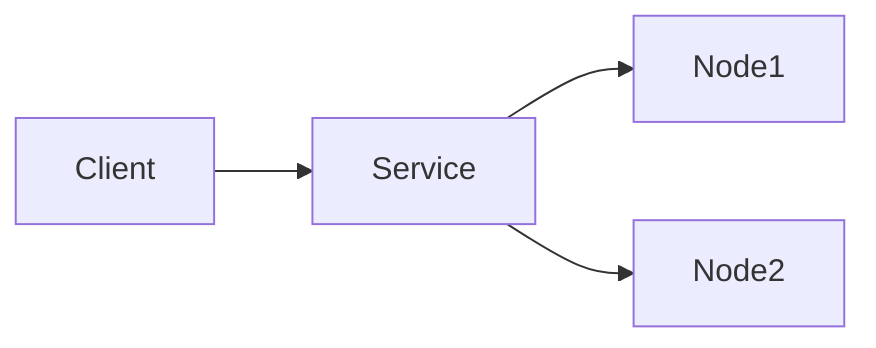
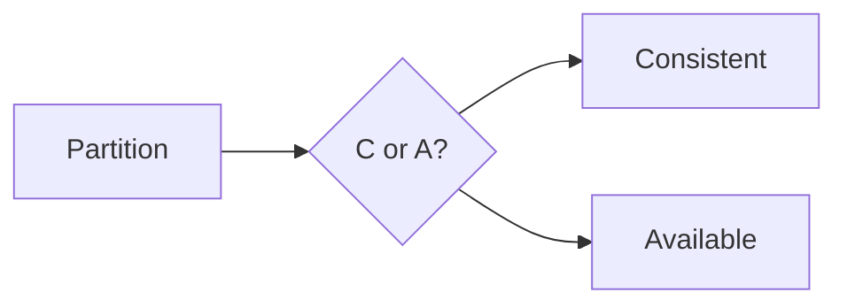

# 4. Distributed System

> Status: **Documented**

[← Back to master index](../README.md)

---

## Sub-topics

| # | Sub-topic | Status |
|---|-----------|--------|
| 4.1 | [Scalability](#scalability) | Done |
| 4.2 | [Availability](#availability) | Done |
| 4.3 | [Reliability](#reliability) | Done |
| 4.4 | [Durability](#durability) | Done |
| 4.5 | [Fault Tolerance](#fault-tolerance) | Done |
| 4.6 | [Resilience](#resilience) | Done |
| 4.7 | [Throughput](#throughput) | Done |
| 4.8 | [Latency](#latency) | Done |
| 4.9 | [Tail Latency](#tail-latency) | Done |
| 4.10 | [Consistency](#consistency) | Done |
| 4.11 | [Concurrency](#concurrency) | Done |
| 4.12 | [CAP Theorem](#cap-theorem) | Done |
| 4.13 | [PACELC Theorem](#pacelc-theorem) | Done |
| 4.14 | [Strong Consistency](#strong-consistency) | Done |
| 4.15 | [Eventual Consistency](#eventual-consistency) | Done |
| 4.16 | [Causal Consistency](#causal-consistency) | Done |
| 4.17 | [Linearizability](#linearizability) | Done |
| 4.18 | [Backpressure](#backpressure) | Done |
| 4.19 | [Graceful Degradation](#graceful-degradation) | Done |
| 4.20 | [Failover](#failover) | Done |
| 4.21 | [Redundancy](#redundancy) | Done |
| 4.22 | [Capacity Planning](#capacity-planning) | Done |
| 4.23 | [Bottleneck Analysis](#bottleneck-analysis) | Done |

---

## 4.1 Scalability

**Summary:** Ability to handle growing load by adding resources. Vertical (bigger machine) vs horizontal (more machines)—horizontal enables unlimited growth but adds complexity.

**Key points:**
- Stateless services scale horizontally behind load balancers
- Shared mutable state (DB, sessions) is the usual scaling bottleneck
- Measure scale limits before hitting them—load test at 2× expected peak

---

## 4.2 Availability

**Summary:** Fraction of time a system is operational and serving requests. Expressed as nines: 99.9% = 8.7 hrs downtime/year; 99.99% = 52 min.

**Key points:**
- HA requires eliminating single points of failure at every layer
- Multi-AZ deployment is baseline; multi-region for disaster recovery
- Availability ≠ correctness—system can be up but serving stale/wrong data

---

## 4.3 Reliability

**Summary:** Probability a system performs correctly over time without failure. Broader than availability—includes data correctness and predictable behavior.

**Key points:**
- MTBF (mean time between failures) and MTTR (mean time to repair) drive uptime
- Defensive coding, timeouts, and retries improve reliability
- Chaos testing validates reliability assumptions under real failure modes

---

## 4.4 Durability

**Summary:** Once committed, data survives crashes, power loss, and disk failures. Achieved via replication, WAL, and fsync policies.

**Key points:**
- Single-node durability: WAL + fsync before ACK
- Cross-node durability: replicate to N nodes before confirming write
- Durability and performance trade off—batch fsync improves throughput

---

## 4.5 Fault Tolerance

**Summary:** System continues operating correctly when components fail. Requires detecting failures fast and routing around them automatically.

**Key points:**
- Fail-fast health checks remove bad nodes from rotation
- Graceful handling of partial failures—never cascade total outage
- Design for failure: assume any node, network, or disk can die anytime

---

## 4.6 Resilience

**Summary:** Ability to absorb shocks and recover quickly without permanent damage. Goes beyond fault tolerance—includes adaptive behavior under stress.

**Key points:**
- Circuit breakers, bulkheads, and rate limits contain blast radius
- Auto-scaling and queue buffering absorb traffic spikes
- Post-incident learning and runbooks improve future recovery speed

---

## 4.7 Throughput

**Summary:** Rate of successfully processed requests or transactions per unit time. Limited by slowest component in the pipeline (Amdahl's law).

**Key points:**
- Batch processing and pipelining increase throughput at latency cost
- Parallelize independent work; partition data to remove contention
- Profile before optimizing—measure actual RPS ceiling under load

---

## 4.8 Latency

**Summary:** Time from request initiation to response delivery. Dominated by network RTT, queuing delay, and serial processing steps.

**Key points:**
- Minimize round trips—batch API calls, use connection pooling
- Caching eliminates repeated expensive computations
- Every sync call in the critical path adds its full latency

---

## 4.9 Tail Latency

**Summary:** Latency at high percentiles (p99, p999)—the slow requests users actually notice. Average latency hides worst-case pain.

**Key points:**
- p99 often 10× median due to GC pauses, slow disks, retries
- Hedged requests and deadline propagation cut tail latency
- Monitor p99/p999, not just averages, for SLO compliance

---

## 4.10 Consistency

**Summary:** All nodes agree on data state at a given time. Spectrum from strong (all see same value) to eventual (converges later).

**Key points:**
- Strong consistency simplifies application logic but limits availability
- Eventual consistency enables scale but requires conflict handling
- Choose per operation—not globally one consistency model

---

## 4.11 Concurrency

**Summary:** Multiple operations executing simultaneously on shared resources. Requires coordination to prevent race conditions and data corruption.

**Key points:**
- Locks, semaphores, and atomic operations serialize conflicting access
- Lock-free structures (CAS) reduce contention at complexity cost
- Distributed concurrency needs consensus or CRDTs—harder than single-node

---

## 4.12 CAP Theorem

**Summary:** During a network partition, a distributed system must choose between Consistency and Availability—it cannot guarantee both. Partition tolerance is mandatory in distributed systems.

**Key points:**
- CP systems (ZooKeeper, etcd): reject writes during partition to stay consistent
- AP systems (Cassandra, DynamoDB): accept writes, reconcile conflicts later
- Partitions are rare but inevitable—design explicitly for P, then choose C or A

---

## 4.13 PACELC Theorem

**Summary:** Extends CAP: if Partition, choose A or C; Else (normal operation), choose Latency or Consistency. Better models real-world trade-offs.

**Key points:**
- PA/EL: Dynamo, Cassandra—available + low latency, eventual consistency
- PC/EC: HBase, MongoDB (strong)—consistent even without partition
- Most production systems are PA/EL with tunable consistency per query

---

## 4.14 Strong Consistency

**Summary:** All reads return the most recent write. Users see a single global order of operations—as if one copy of data exists.

**Key points:**
- Implemented via single leader, quorum reads/writes, or consensus
- Linearizability is strongest form—real-time ordering guarantee
- Costs latency (cross-node coordination) and availability during failures

---

## 4.15 Eventual Consistency

**Summary:** Replicas converge to the same state given no new writes. Reads may return stale data temporarily but system stays available.

**Key points:**
- Conflict resolution: last-write-wins, vector clocks, or CRDTs
- Read-your-writes/session consistency are common middle-ground guarantees
- Acceptable for social feeds, analytics, DNS—not for bank balances

---

## 4.16 Causal Consistency

**Summary:** Preserves cause-effect ordering across operations without requiring global total order. If A caused B, all nodes see A before B.

**Key points:**
- Weaker than linearizability; stronger than eventual consistency
- Vector clocks track causal dependencies between events
- Useful for collaborative editing and distributed messaging

---

## 4.17 Linearizability

**Summary:** Strongest consistency model—every operation appears to take effect atomically at some point between invocation and response, respecting real-time order.

**Key points:**
- Register reads always return latest write; no stale reads ever
- Expensive: requires coordination on every operation
- Required for leader election, distributed locks, and financial transactions

---

## 4.18 Backpressure

**Summary:** Mechanism where overloaded downstream components signal upstream to slow down. Prevents unbounded queue growth and cascading failures.

**Key points:**
- Bounded queues drop or block when full—never unbounded buffers
- Reactive Streams, gRPC flow control, and Kafka consumer lag are examples
- Without backpressure, slow consumers cause OOM and total system crash

---

## 4.19 Graceful Degradation

**Summary:** System reduces functionality under stress rather than failing completely. Core features stay up; non-essential features disabled.

**Key points:**
- Feature flags disable recommendations, analytics, or heavy computations first
- Serve cached/stale data rather than error when backend is slow
- Define degradation tiers in advance—don't decide during an outage

---

## 4.20 Failover

**Summary:** Automatic switch to standby component when primary fails. Active-passive (cold/warm standby) or active-active (both serve traffic).

**Key points:**
- Detect failure via health checks; promote standby within seconds
- Split-brain risk when both nodes think they're primary—use fencing
- DNS/load balancer redirect traffic; clients may need retry logic

---

## 4.21 Redundancy

**Summary:** Duplicate critical components so failure of one doesn't stop service. N+1 redundancy: N needed + 1 spare for any single failure.

**Key points:**
- Geographic redundancy protects against datacenter/region outages
- Data redundancy via replication; compute redundancy via replicas
- Redundancy adds cost and consistency complexity—right-size per tier

---

## 4.22 Capacity Planning

**Summary:** Forecast resource needs from growth projections and headroom targets. Prevents both over-provisioning (waste) and under-provisioning (outages).

**Key points:**
- Model: current usage × growth rate × headroom factor (1.5–3×)
- Plan for peak (Black Friday), not average daily load
- Include dependencies—DB capacity must scale with app tier

---

## 4.23 Bottleneck Analysis

**Summary:** Systematic identification of the slowest component limiting overall performance. Fix the bottleneck, then find the next one.

**Key points:**
- Use profiling, tracing, and saturation metrics (CPU, I/O, connections)
- Common bottlenecks: DB queries, lock contention, network bandwidth
- Optimizing non-bottleneck components yields zero improvement (Amdahl)

---

## Quick Reference

| # | Sub-topic | One-liner |
|---|-----------|-----------|
| 4.1 | Scalability | Grow capacity via horizontal/vertical scaling |
| 4.2 | Availability | Uptime percentage (nines) |
| 4.3 | Reliability | Correct operation over time |
| 4.4 | Durability | Committed data survives failures |
| 4.5 | Fault Tolerance | Continue operating when components fail |
| 4.6 | Resilience | Absorb shocks and recover quickly |
| 4.7 | Throughput | Requests processed per second |
| 4.8 | Latency | Request-to-response time |
| 4.9 | Tail Latency | p99/p999 slow-request percentiles |
| 4.10 | Consistency | Agreement on data state across nodes |
| 4.11 | Concurrency | Simultaneous access to shared resources |
| 4.12 | CAP Theorem | Partition forces C vs A trade-off |
| 4.13 | PACELC Theorem | Normal ops: latency vs consistency |
| 4.14 | Strong Consistency | All reads see latest write |
| 4.15 | Eventual Consistency | Replicas converge over time |
| 4.16 | Causal Consistency | Preserve cause-effect ordering |
| 4.17 | Linearizability | Strongest real-time ordering guarantee |
| 4.18 | Backpressure | Slow upstream when downstream overloaded |
| 4.19 | Graceful Degradation | Reduce features, not full failure |
| 4.20 | Failover | Auto-switch to standby on failure |
| 4.21 | Redundancy | Duplicate components for fault survival |
| 4.22 | Capacity Planning | Forecast resources with headroom |
| 4.23 | Bottleneck Analysis | Find and fix the slowest component |

[← Back to master index](../README.md)
