# 4. Distributed System

> Status: **Documented**  -  master reference

[<- Back to master index](../README.md)

## Sub-topics

### Performance & capacity

| # | Sub-topic | Status |
|---|-----------|--------|
| 4.1 | [Scalability](#41-scalability) | Done |
| 4.2 | [Throughput](#42-throughput) | Done |
| 4.3 | [Latency](#43-latency) | Done |
| 4.4 | [Tail Latency](#44-tail-latency) | Done |
| 4.22 | [Capacity Planning](#422-capacity-planning) | Done |
| 4.23 | [Bottleneck Analysis](#423-bottleneck-analysis) | Done |

### Reliability & fault handling

| # | Sub-topic | Status |
|---|-----------|--------|
| 4.5 | [Availability](#45-availability) | Done |
| 4.6 | [Reliability](#46-reliability) | Done |
| 4.7 | [Durability](#47-durability) | Done |
| 4.8 | [Fault Tolerance](#48-fault-tolerance) | Done |
| 4.9 | [Resilience](#49-resilience) | Done |
| 4.10 | [Redundancy](#410-redundancy) | Done |
| 4.11 | [Failover](#411-failover) | Done |
| 4.20 | [Backpressure](#420-backpressure) | Done |
| 4.21 | [Graceful Degradation](#421-graceful-degradation) | Done |

### Consistency & concurrency

| # | Sub-topic | Status |
|---|-----------|--------|
| 4.12 | [Consistency](#412-consistency) | Done |
| 4.13 | [Concurrency](#413-concurrency) | Done |
| 4.14 | [CAP Theorem](#414-cap-theorem) | Done |
| 4.15 | [PACELC Theorem](#415-pacelc-theorem) | Done |
| 4.16 | [Strong Consistency](#416-strong-consistency) | Done |
| 4.17 | [Eventual Consistency](#417-eventual-consistency) | Done |
| 4.18 | [Causal Consistency](#418-causal-consistency) | Done |
| 4.19 | [Linearizability](#419-linearizability) | Done |

---


## 4.1 Scalability

### What is scalability?

Scalability is the ability of a system to handle increasing amounts of traffic, users, requests, or data without significant performance degradation.

**Simple definition:** As demand grows, the system should continue to perform efficiently.

**Example:**

```text
100 users   → Response time = 100 ms
10,000 users → Response time = 120 ms
```

This system is considered scalable.

### Why scalability is important?

Without scalability:

- Application becomes slow
- Requests start failing
- Database becomes overloaded
- System crashes during traffic spikes
- Poor user experience

**Examples:**

- E-commerce sale events
- IPL ticket booking
- Black Friday sales
- Banking applications
- Social media platforms

### Types of scalability

#### A) Vertical scaling (scale up)

Adding more resources to the same machine.

**Example:** Increase CPU, RAM, disk.

**Before:**

```text
Server — 4 CPU, 8 GB RAM
```

**After:**

```text
Server — 16 CPU, 64 GB RAM
```

**Advantages:**

- Simple
- No application changes

**Disadvantages:**

- Hardware limit exists
- Expensive
- Single point of failure

#### B) Horizontal scaling (scale out)

Adding more servers.

**Before:**

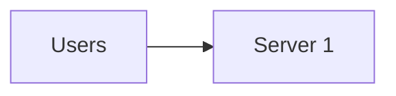

**After:**

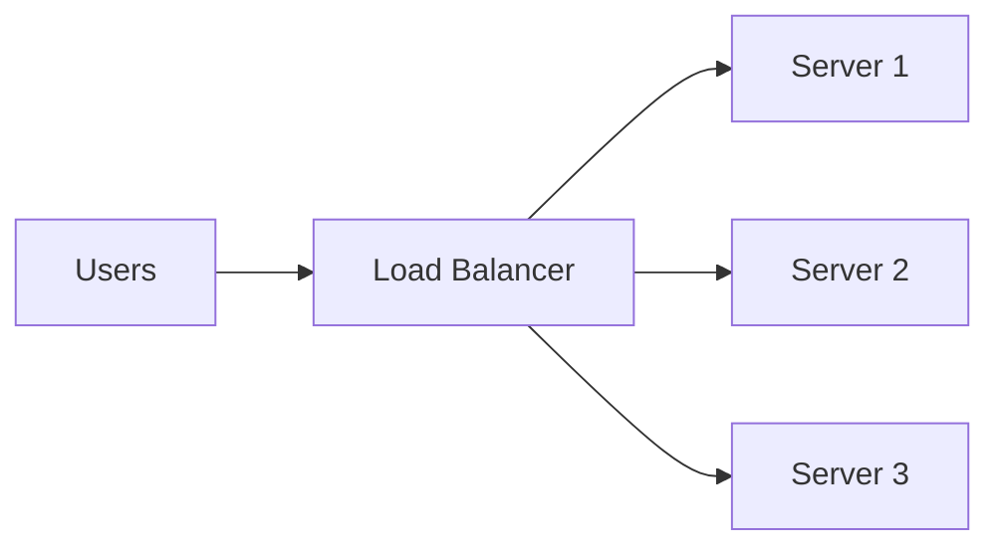

**Advantages:**

- High availability
- Better fault tolerance
- Virtually unlimited growth

**Disadvantages:**

- More complex
- Requires distributed architecture

### Performance vs scalability

**Performance:** How fast a system is today.

```text
Response Time = 50 ms
```

**Scalability:** How well the system behaves when load increases.

```text
100 Users   → 50 ms
10,000 Users → 60 ms
```

A system can be:

- High performance but not scalable
- Scalable but not high performance

### Scalability bottlenecks

Common bottlenecks:

1. CPU
2. Memory (RAM)
3. Disk I/O
4. Network
5. Database
6. External APIs
7. Locks and synchronization

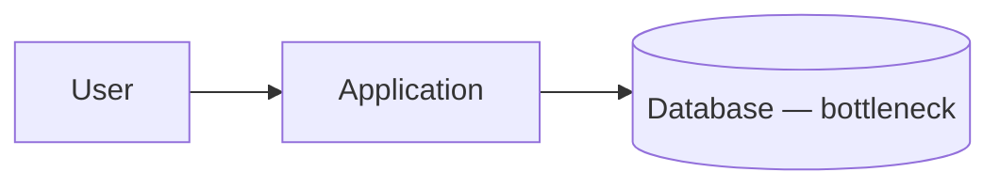

Even if the application scales, the database may limit throughput.

### Key scalability metrics

#### A) Throughput

Number of requests processed per second.

```text
Example: 1000 requests/sec — higher is better
```

#### B) Latency

Time taken to process one request.

```text
Example: 150 ms — lower is better
```

#### C) Response time

Time from request sent until response received.

```text
Example: 200 ms
```

#### D) Concurrency

Number of simultaneous users or requests.

```text
Example: 10,000 active users
```

### Scaling strategies

#### A) Load balancing

Distribute traffic across multiple servers.

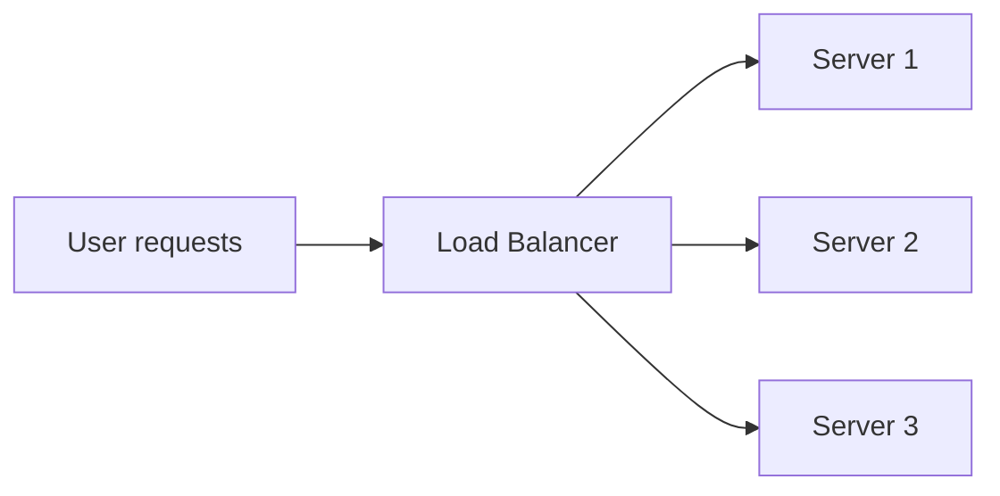

**Benefits:**

- Better utilization
- High availability
- Increased capacity

#### B) Caching

Store frequently used data closer to users.

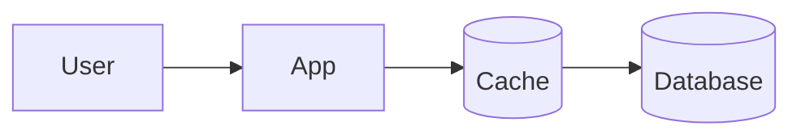

**Benefits:**

- Faster responses
- Reduced DB load

#### C) Database scaling

Methods:

1. Read replicas
2. Sharding
3. Partitioning
4. Caching

#### D) Asynchronous processing

Instead of doing everything immediately.

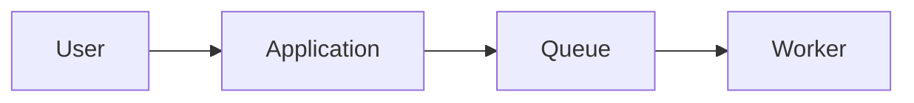

**Examples:**

- Email sending
- Notifications
- Report generation

### Read scaling

Increase read capacity using replicas.

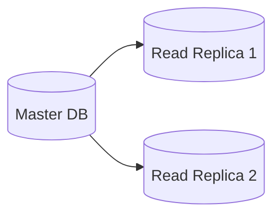

**Writes:** Master

**Reads:** Replicas

**Benefits:**

- More read throughput
- Reduced load on primary DB

### Write scaling

Harder than read scaling.

**Sharding:**

```text
Users A–M → Shard 1
Users N–Z → Shard 2
```

Data distributed across databases.

**Benefits:**

- Increased write capacity
- Better storage scalability

### Stateless vs stateful

**Stateless** — server does not store user session. Any request can go to any server.

**Benefits:**

- Easy horizontal scaling
- Better fault tolerance

**Example:** REST APIs

**Stateful** — server stores user session. User must return to the same server.

**Problems:**

- Difficult scaling
- Session management issues

### High availability vs scalability

**High availability** — system remains operational during failures. Goal: minimize downtime.

```text
Example: 99.99% uptime
```

**Scalability** — system handles increasing load. Goal: handle growth.

A system can have high availability, scalability, or both.

### Real world example

Suppose 10,000 users visit Amazon.

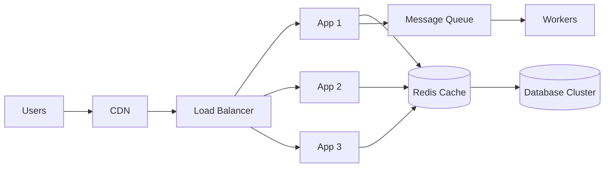

**Scalability achieved using:**

- CDN
- Load balancer
- Multiple app servers
- Redis cache
- Database replicas
- Sharding
- Async processing

### Golden rules of scalability

1. Avoid single points of failure.
2. Design stateless services.
3. Cache aggressively.
4. Scale horizontally whenever possible.
5. Use load balancers.
6. Move heavy tasks to background workers.
7. Optimize database queries.
8. Monitor latency and throughput.
9. Use asynchronous communication.
10. Plan for growth from day one.

---


## 4.2 Throughput

### What is throughput?

Throughput is the amount of work a system can complete in a given period of time.

In system design, it usually means: **number of requests processed per second.**

**Formula:**

```text
Throughput = Total Requests Processed / Time
```

**Example:**

```text
1000 requests processed in 1 second

Throughput = 1000 Requests/Second (RPS)
```

### Simple example

Suppose an API server processes:

```text
100 requests in 1 second  →  Throughput = 100 RPS
```

After optimization:

```text
1000 requests in 1 second  →  Throughput = 1000 RPS
```

The system's throughput has increased.

### Real world analogy

Imagine a highway toll booth.

**Scenario 1:** 1 car passes every second → Throughput = 1 car/second

**Scenario 2:** 10 cars pass every second → Throughput = 10 cars/second

Higher throughput means more work completed.

### Throughput in different systems

| System | Unit |
|--------|------|
| Web server | Requests/second |
| Database | Queries/second (QPS) |
| Message queue | Messages/second |
| Network | MB/second, GB/second |
| Storage | IOPS (read/write operations per second) |

### Throughput vs latency

**Latency:** Time taken to complete **one** request.

**Throughput:** Number of requests completed in a time period.

**Example:**

```text
Request takes 100 ms        →  Latency = 100 ms
System processes 1000/sec   →  Throughput = 1000 RPS
```

A system can have:

- High throughput + high latency
- Low throughput + low latency

They are different metrics.

### Example — restaurant

**One chef:** serves 10 customers/hour → Throughput = 10/hour

**Five chefs:** serve 50 customers/hour → Throughput = 50/hour

More workers usually increase throughput.

### Factors affecting throughput

1. CPU capacity
2. Memory (RAM)
3. Disk speed
4. Network bandwidth
5. Database performance
6. Number of threads
7. Lock contention
8. Cache hit ratio

### How to improve throughput?

Horizontal scaling, load balancing, caching, and async processing — same strategies as [§4.1 Scalability](#41-scalability) (`### Scaling strategies`).

### Throughput in system design interviews

Interviewers often ask expected throughput. RPS estimation from users and request rate — worked examples in [§4.22 Capacity Planning](#422-capacity-planning).

### Throughput vs concurrency

**Concurrency** is how many requests are active at once; **throughput** is how many complete per second. They are related by Little's Law — see [§4.13 Concurrency](#413-concurrency).

### Throughput vs bandwidth

**Bandwidth:** Amount of data transferred (capacity).

```text
Example: 1 Gbps network
```

**Throughput:** Actual useful work completed.

```text
Example: 500 MB/sec transferred
```

Bandwidth is capacity. Throughput is actual achieved performance.

### Little's Law relation

Relates throughput, response time, and concurrency. Full treatment and example in [§4.13 Concurrency](#413-concurrency).

---


## 4.3 Latency

### What is latency?

Latency is the time taken for a request to travel through a system and receive a response.

**Simple definition:** How long does one request take?

**Formula:**

```text
Latency = Response Received Time - Request Sent Time
```

**Example:**

```text
Request sent      : 10:00:00.000
Response received : 10:00:00.150

Latency = 150 ms
```

### Simple example

User clicks **"View Profile"**.

```text
Page loads in 200 ms   →  Latency = 200 ms
Page loads in 2 sec    →  Latency = 2000 ms
```

Higher latency means slower experience.

### Real world analogy

Suppose you order coffee.

```text
Order given     : 10:00 AM
Coffee received : 10:05 AM

Latency = 5 minutes
```

- **Throughput** answers: How many coffees can be served per hour?
- **Latency** answers: How long does one customer wait?

### Types of latency

#### A) Network latency

Time taken for data to travel across the network.

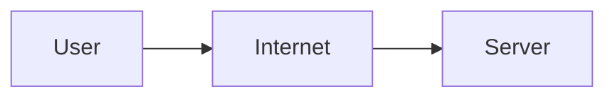

**Examples:** DNS lookup, TCP connection, internet delay

#### B) Application latency

Time spent inside application logic.

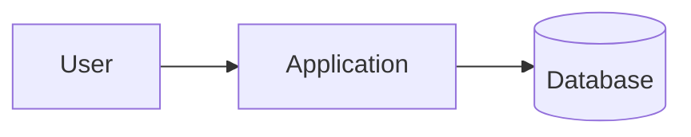

**Examples:** Business logic, validation, data processing

#### C) Database latency

Time spent executing database operations.

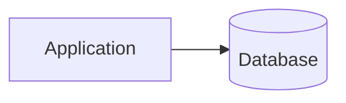

**Examples:** SELECT, INSERT, JOIN operations

#### D) Disk latency

Time required to read/write data.

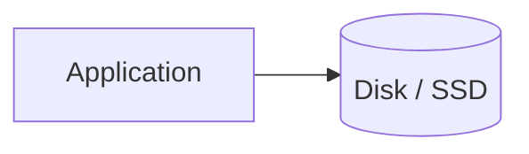

**Examples:** HDD access, SSD access

### Components of latency

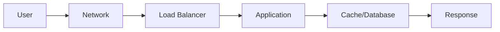

**Total latency =**

```text
Network latency
+ Load balancer delay
+ Application processing
+ Database time
+ Response transfer time
```

### Latency vs response time

In interviews, these terms are often used interchangeably.

**Latency:** Time before processing starts or first byte arrives.

**Response time:** Complete time until entire response is received.

**Example:**

```text
Request sent
  → 100 ms network delay
  → 200 ms processing
  → 100 ms response transfer
  → Response received

Latency       ≈ 100 ms
Response time ≈ 400 ms
```

### Latency vs throughput

Different metrics — a system can have high throughput with high latency, or low throughput with low latency. Canonical comparison and examples in [§4.2 Throughput](#42-throughput).

### Latency percentiles

Average latency is misleading. Use **P50**, **P95**, and **P99** instead. Full treatment in [§4.4 Tail Latency](#44-tail-latency).

### Factors affecting latency

1. Slow network
2. High CPU usage
3. Memory pressure
4. Slow database queries
5. Lock contention
6. Disk I/O delays
7. Cache misses
8. Large payload size
9. Garbage collection
10. External API calls

### How to reduce latency?

#### A) Caching

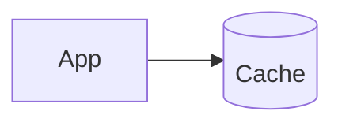

```text
Before cache: App → Database  →  Latency = 200 ms
After cache:  App → Cache      →  Latency = 10 ms
```

#### B) CDN

Serve content closer to users.

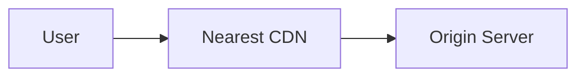

Reduces network latency.

#### C) Database optimization

- Indexes
- Query tuning
- Partitioning

Reduces DB latency.

#### D) Load balancing

Distributes requests efficiently. Prevents overloaded servers.

#### E) Asynchronous processing

Move heavy operations to background.

**Examples:** Email sending, report generation, notifications

Reduces user-facing latency.

### Example latency breakdown

```text
DNS lookup         = 20 ms
TCP handshake      = 15 ms
TLS handshake      = 25 ms
Load balancer      = 5 ms
Application logic  = 40 ms
Database query     = 60 ms
Response transfer  = 15 ms
--------------------------------
Total              = 180 ms
```

### Latency in distributed systems

Every network call adds latency.

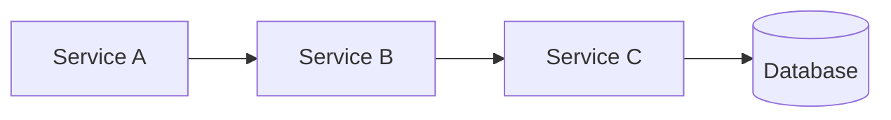

**Example:**

```text
A → B  = 20 ms
B → C  = 30 ms
C → DB = 50 ms

Total latency increases rapidly.
```

This is why microservices must avoid excessive chaining.

### Little's Law

Relates throughput, latency, and concurrency. See [§4.13 Concurrency](#413-concurrency).

### Real world targets

| System | Target |
|--------|--------|
| Google Search | ~100–300 ms |
| Online payment | < 1–2 sec |
| Gaming | < 50 ms preferred |
| Video streaming | < 1 sec startup |
| High-frequency trading | Microseconds |

### Interview definition

Latency is the amount of time taken for a request, operation, or message to travel through a system and receive a response. It is typically measured in milliseconds (ms) and is a key metric for evaluating system responsiveness and user experience.

---


## 4.4 Tail Latency

### What is tail latency?

Tail latency refers to the latency of the **slowest requests** in a system.

Instead of looking at average latency, we look at the **tail end** of the latency distribution.

**Examples:**

- P95 latency
- P99 latency
- P99.9 latency

These are called **tail latencies**.

### Why average latency is misleading?

Suppose 100 requests:

```text
95 requests = 50 ms
4 requests  = 500 ms
1 request   = 5000 ms

Average latency ≈ 100 ms   ← looks good
```

**Reality:** One user waited 5 seconds. User experience is terrible for that user. Average hides the problem.

### Latency distribution

**Example request latencies:**

```text
50 ms, 52 ms, 48 ms, 55 ms, 50 ms, 60 ms, 70 ms, 80 ms, 500 ms, 3000 ms
```

Most requests are fast. Few requests are extremely slow. These slow requests form the **tail**.

```text
50  60  70  80  100  500  3000
                        ↑
                       Tail
```

### Percentiles

| Percentile | Meaning |
|------------|---------|
| **P50** (median) | 50% of requests complete within this time |
| **P95** | 95% complete within this time — 5% are slower |
| **P99** | 99% complete within this time — 1% are slower |
| **P99.9** | 99.9% complete within this time — 0.1% are slower |

### Example

Assume 1,000 requests:

```text
900 requests = 50 ms
90 requests  = 200 ms
9 requests   = 1000 ms
1 request    = 5000 ms
```

**Metrics:**

```text
Average ≈ 78 ms
P50     = 50 ms
P95     = 200 ms
P99     = 1000 ms
P99.9   = 5000 ms
```

- **Average** says: system is fast.
- **P99** says: some users wait 1 second.
- **P99.9** says: some users wait 5 seconds.

### Why tail latency matters?

Users experience the slow requests.

Nobody cares if average is 50 ms when:

- Checkout takes 10 seconds
- Payment takes 15 seconds
- Search hangs for 5 seconds

Slowest requests often determine user satisfaction, revenue, and reliability perception.

### Tail latency in distributed systems

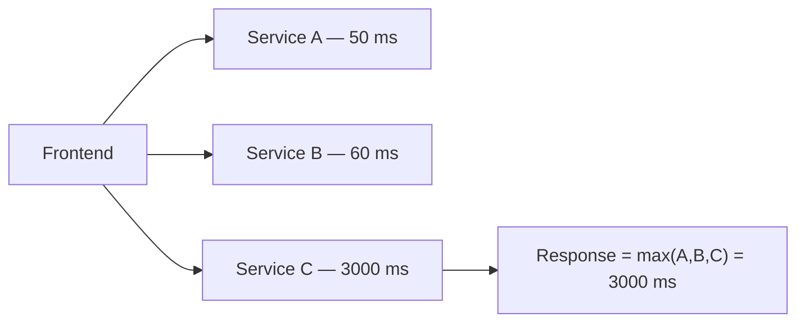

One slow dependency can delay everything.

### Fan-out problem

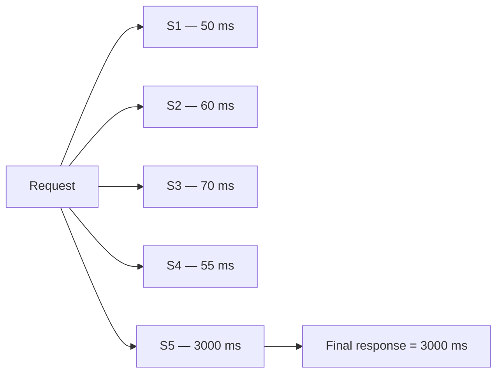

Even if four services are fast, one slow service sets the final response time.

As the number of services increases, tail latency becomes more common.

### Causes of tail latency

**A) Garbage collection (GC)** — JVM pauses (normal = 20 ms, GC request = 2 sec)

**B) CPU contention** — many threads competing for CPU

**C) Lock contention** — threads waiting for locks

**D) Slow database queries** — missing indexes, large joins, full table scans

**E) Network delays** — packet loss, retries, congestion

**F) Disk I/O** — slow reads/writes

**G) External APIs** — third-party service delays

### Tail latency amplification

Suppose each service has:

```text
99% requests = 50 ms
1% requests  = 1000 ms
```

| Services | P(all fast) | P(at least one slow) |
|----------|-------------|----------------------|
| 1 | 99% | 1% |
| 10 | 0.99^10 ≈ 90.4% | ≈ 9.6% |
| 100 | 0.99^100 ≈ 36.6% | ≈ 63.4% |

This is called **tail latency amplification**.

### How to reduce tail latency?

**A) Timeouts** — prevent waiting forever (e.g. API timeout = 2 sec)

**B) Retries** — retry transient failures

**C) Caching** — avoid expensive operations

**D) Database optimization** — indexes, query tuning, read replicas

**E) Load balancing** — avoid overloaded servers

**F) Resource isolation** — separate critical workloads

**G) Asynchronous processing** — move slow tasks to background

**H) Hedged requests** — send duplicate request if one becomes slow

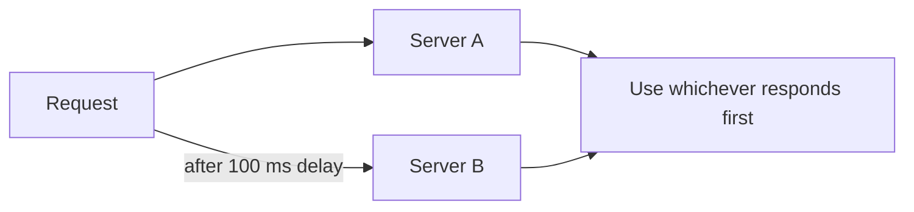

Used by **Google** (*Tail at Scale*) and other large-scale systems.

### Real world example

**Search system:**

```text
Average = 80 ms
P95     = 150 ms
P99     = 900 ms
P99.9   = 5 sec
```

**Management sees:** 80 ms average — everything looks fine.

**Users experience:** 5-second delays.

This is why engineers monitor **P95, P99, and P99.9** instead of only averages.

---


## 4.5 Availability

### What is availability?

Availability is the ability of a system to remain operational and accessible when users need it.

**Simple definition:** Can users successfully use the system right now?

A highly available system continues serving requests even when failures occur.

### Example

**Online banking application** — users can login, check balance, and transfer money 24 hours a day. System is **available**.

If the server crashes and users cannot login → system is **unavailable**.

### Availability formula

```text
Availability (%) = Uptime / (Uptime + Downtime) × 100
```

**Example:**

```text
Uptime   = 364 days
Downtime = 1 day

Availability = 364 / 365 × 100 = 99.73%
```

### What is uptime?

**Uptime** — time the system is functioning correctly.

**Examples:** Website accessible, API responding, database reachable

**Downtime** — time the system cannot serve users.

**Examples:** Server crash, database failure, network outage

### The "nines" of availability

| Availability | Downtime/year |
|--------------|---------------|
| **99%** (two nines) | ≈ 3.65 days |
| **99.9%** (three nines) | ≈ 8.76 hours |
| **99.99%** (four nines) | ≈ 52.56 minutes |
| **99.999%** (five nines) | ≈ 5.26 minutes |
| **99.9999%** (six nines) | ≈ 31.5 seconds |

### High availability (HA)

High availability means the system continues operating even when components fail. **Goal:** minimize downtime.

**Without HA:**

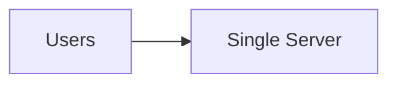

If the server fails → system is down.

**With HA:**

```mermaid
flowchart LR
    Users[Users] --> LB[Load Balancer] --> A[Server A]
    LB --> B[Server B]
```

If Server A fails, traffic goes to Server B — system remains available.

### Why systems become unavailable?

Common causes:

1. Server crash
2. Database failure
3. Network failure
4. Disk failure
5. Software bugs
6. Memory leaks
7. Human errors
8. Cloud region outage
9. DDoS attacks
10. Dependency failures

### How to improve availability?

#### A) Redundancy

Keep multiple copies of resources.

**Example:** 2 application servers, 2 databases, 2 network links

#### B) Load balancing

```mermaid
flowchart LR
    Users[Users] --> LB[Load Balancer] --> S1[Server 1]
    LB --> S2[Server 2]
    LB --> S3[Server 3]
```

If one server dies, others continue serving traffic.

#### C) Database replication

```mermaid
flowchart LR
    Primary[(Primary)] --> R1[(Replica 1)]
    Primary --> R2[(Replica 2)]
```

If one replica fails, others continue serving reads.

#### D) Multi-AZ deployment

AZ = Availability Zone

```mermaid
flowchart LR
    Region[Region] --> AZ1[AZ 1]
    Region --> AZ2[AZ 2]
    Region --> AZ3[AZ 3]
```

Failure of one AZ does not affect the entire system.

#### E) Multi-region deployment

```text
Region 1 · Region 2 · Region 3
```

Protects against regional outages.

### Availability, reliability, and durability

These three properties are often confused. See [§4.6 Reliability](#46-reliability) and [§4.7 Durability](#47-durability) for deep dives.

| | Availability | Reliability | Durability |
|---|--------------|-------------|------------|
| **Question** | Can users access the system? | Does the system work correctly? | Is committed data preserved? |
| **Example failure** | Database down | Wrong balance returned | Data lost after crash |
| **Website example** | HTTP 200 but wrong data → high availability, low reliability | ATM on but dispenses wrong amount | Transaction survives server restart |

### Availability vs scalability

**Availability:** Handle failures (server crashes, system still works).

**Scalability:** Handle growth (10 users → 1 million users). See [§4.1 Scalability](#41-scalability).

### CAP theorem connection

During a network partition, systems trade consistency for availability (or vice versa). See [§4.14 CAP Theorem](#414-cap-theorem).

### Real world examples

| System | Target |
|--------|--------|
| Social media | 99.9% – 99.99% |
| Banking systems | 99.99%+ |
| Cloud providers | 99.99% – 99.999% |

### SLA, SLO, and availability

| Term | Meaning | Example |
|------|---------|---------|
| **SLA** (Service Level Agreement) | Promise made to customers | 99.95% availability |
| **SLO** (Service Level Objective) | Internal engineering target | 99.99% availability |
| **SLI** (Service Level Indicator) | Actual measured value | 99.97% availability |

### Interview example

**Question:** Design a payment service with 99.99% availability.

**Possible solution:**

- Multiple application servers
- Load balancer
- Database replication
- Auto scaling
- Multi-AZ deployment
- Health checks
- Failover mechanism
- Monitoring and alerting

---


## 4.6 Reliability

### What is reliability?

Reliability is the ability of a system to consistently perform its intended function correctly over a period of time.

**Simple definition:** A reliable system does the right thing every time.

It is not enough for a system to be available — it must also produce correct results.

### Example

**Scenario 1:** User transfers ₹10,000. Account A = −₹10,000, Account B = +₹10,000. Transaction succeeds correctly → system is **reliable**.

**Scenario 2:** Money deducted from Account A but not credited to Account B. System was **available**, but not **reliable**.

### Reliability formula

```text
Reliability = Successful Operations / Total Operations
```

**Example:**

```text
1,000,000 requests
999,900 successful

Reliability = 999,900 / 1,000,000 = 99.99%
```

See [§4.5 Availability](#45-availability) for how availability, reliability, and durability differ.

### Characteristics of a reliable system

1. Correctness
2. Consistency
3. Fault tolerance
4. Data integrity
5. Predictable behavior
6. Error recovery
7. Minimal failures

### Types of failures impacting reliability

**A) Hardware failures** — disk crash, memory corruption, CPU failures

**B) Software failures** — bugs, `NullPointerException`, memory leaks

**C) Network failures** — packet loss, timeouts, network partitions

**D) Human errors** — wrong deployment, accidental data deletion

**E) Dependency failures** — database outage, external API failure

### How to improve reliability?

- **Redundancy** — see [§4.10 Redundancy](#410-redundancy)
- **Replication** — multiple data copies; see [§4.10](#410-redundancy)
- **Backups** — protect against data loss
- **Monitoring** — error rate, CPU, memory, latency
- **Automated recovery** — auto restart, auto scaling, failover
- **Testing** — unit, integration, load, chaos tests

### Fault tolerance and reliability

**Fault tolerance:** Ability to continue working after failures. See [§4.8 Fault Tolerance](#48-fault-tolerance).

**Example:** Server A crashes. Traffic automatically moves to Server B. System remains functional.

Higher fault tolerance usually improves reliability.

### Error budget

```text
Reliability target = 99.99%
Allowed failure rate = 0.01%

1,000,000 requests → allowed failures = 100
```

This acceptable failure amount is called the **error budget**.

### MTBF and MTTR

**MTBF (Mean Time Between Failures)** — average operating time before failure. Higher MTBF = better reliability.

```text
Example: System fails every 1000 hours → MTBF = 1000 hours
```

**MTTR (Mean Time To Repair)** — average recovery time. Lower MTTR = better reliability.

```text
Example: Recovery time = 10 minutes → MTTR = 10 minutes
```

### Reliability in distributed systems

```mermaid
flowchart LR
    User[User] --> FE[Frontend] --> A[Service A] --> B[Service B] --> DB[(Database)]
```

If any component fails, the entire request may fail.

Reliability depends on every service, every network call, and every dependency.

### Reliability patterns

Retry, circuit breaker, bulkhead, fallback, and idempotency. See [§4.8 Fault Tolerance](#48-fault-tolerance).

### Real world examples

| System | Requirement |
|--------|-------------|
| Payment systems | Correct transactions, no money loss, no duplicate payments |
| Airline booking | Accurate reservations, no double booking |
| Banking systems | Data integrity, transaction consistency |

Very high reliability required.

### Reliability metrics

1. Success rate
2. Error rate
3. MTBF
4. MTTR
5. Transaction failure rate
6. Data loss events
7. SLA compliance

### Interview question

**Q:** Can a system be highly available but unreliable?

**Answer:** Yes.

**Example:** An API returns HTTP 200 for every request, but returns incorrect customer information. Availability is high because it responds. Reliability is low because results are incorrect.

---


## 4.7 Durability

### What is durability?

Durability is the guarantee that once data has been successfully committed or acknowledged by a system, it will not be lost even if failures occur.

**Simple definition:** Once the system says the data is saved, it must never disappear.

Durability is the **D** in ACID properties.

### Example

**Bank transfer:** User transfers ₹10,000. System responds: **"Transaction Successful"**.

Immediately after: database crashes, server restarts, or power failure occurs.

- Transaction still exists after recovery → **durability = high**
- Transaction disappears → **durability = low**

### Why durability is important?

Users trust systems because they expect:

- Payments not to disappear
- Orders not to vanish
- Messages not to be lost
- Files not to be deleted unexpectedly

Without durability, data loss becomes common.

See [§4.5 Availability](#45-availability) for how availability, reliability, and durability differ.

### Durability vs persistence

**Persistence:** Data stored on non-volatile storage.

**Durability:** Guarantee that committed data survives failures.

**Example:** Data written to disk. Disk fails. Data lost. Persistence existed, but durability was insufficient.

### What can cause data loss?

1. Server crash
2. Power failure
3. Disk failure
4. Database crash
5. Software bugs
6. Human errors
7. Network failure
8. Cloud infrastructure failure

### How systems achieve durability?

#### A) Write Ahead Log (WAL)

Before modifying actual data, write the operation to the log first.

```mermaid
flowchart LR
    Txn[Transaction] --> WAL[Write to WAL] --> Flush[Flush to disk] --> DB[(Update database)]
```

If a crash occurs, the database can **replay WAL** during recovery.

#### B) Redo logs

Database stores changes before applying them.

```text
UPDATE Account SET Balance = 1000
```

Change recorded in log. If crash happens, database replays log and restores data.

#### C) Replication

Store copies of data on multiple machines.

```mermaid
flowchart LR
    Primary[(Primary DB)] --> R1[(Replica 1)]
    Primary --> R2[(Replica 2)]
```

If primary crashes, replicas still contain data. Durability improves significantly.

#### D) Backups

Periodic snapshots of data (daily, hourly).

Used when data corruption, accidental deletion, or entire database loss occurs.

#### E) RAID storage

RAID provides disk redundancy — same data on multiple disks.

```mermaid
flowchart LR
    Data[Data] --> D1[Disk 1]
    Data --> D2[Disk 2]
```

If one disk fails, data remains available.

**Common RAID types:** RAID 1 (mirroring), RAID 5, RAID 6, RAID 10

### Distributed durability

Modern systems often store data across multiple nodes.

```mermaid
flowchart LR
    Write[Write] --> A[Node A]
    Write --> B[Node B]
    Write --> C[Node C]
```

Data written to all nodes. If one node fails, data still exists elsewhere.

### Durability in ACID transactions

```text
A = Atomicity
C = Consistency
I = Isolation
D = Durability
```

**Durability means:** After `COMMIT` succeeds, the transaction must survive server restart, database crash, and power outage.

### Example of durability failure

User uploads file. System responds: **"Upload Successful"**. Immediately after, server crashes. File no longer exists.

This is a **durability failure**.

### Durability in popular systems

**Relational databases** — PostgreSQL, MySQL, Oracle

Use: WAL, redo logs, checkpoints, replication

**Distributed databases** — Cassandra, DynamoDB

Use: replication, multiple nodes, distributed storage

**Cloud storage** — Amazon S3, Google Cloud Storage

Store multiple copies of data across different infrastructure.

### Cost of durability

Higher durability usually means less data loss, but also:

- More disk writes
- More replication traffic
- Higher storage cost
- Slightly higher latency

| Approach | Trade-off |
|----------|-----------|
| Write to 1 server | Fast, less durable |
| Write to 3 servers | Slightly slower, more durable |

### Real world example

**Payment system** — user pays ₹5,000.

**Requirements:**

- Transaction recorded
- Survives restart
- Survives server crash
- Survives database failover
- Never disappears after commit

---


## 4.8 Fault Tolerance

### What is fault tolerance?

Fault tolerance is the ability of a system to continue operating correctly even when one or more components fail.

**Simple definition:** The system keeps working despite failures.

The goal is not to prevent failures. The goal is to continue serving users when failures occur.

### Example

**Without fault tolerance:**

```mermaid
flowchart LR
    Users[Users] --> A[Server A]
```

Server A crashes → system down.

**With fault tolerance:**

```mermaid
flowchart LR
    Users[Users] --> LB[Load Balancer] --> A[Server A]
    LB --> B[Server B]
```

Server A crashes → traffic moves to Server B → system continues working.

### Why fault tolerance is important?

Failures are inevitable.

**Examples:** Server crashes, database failures, disk failures, network issues, software bugs, cloud outages, human mistakes.

A well-designed system assumes failures will happen.

### Types of failures

**A) Hardware failure** — disk crash, CPU failure, memory failure

**B) Software failure** — bugs, memory leaks, application crash

**C) Network failure** — packet loss, high latency, network partition

**D) Dependency failure** — database unavailable, external API down, cache cluster failure

**E) Human error** — bad deployment, wrong configuration, accidental deletion

### Fault tolerance vs high availability

**Fault tolerance:** System continues functioning despite failures.

**High availability:** System remains accessible with minimal downtime. See [§4.5 Availability](#45-availability).

Fault tolerance is often one of the mechanisms used to achieve high availability.

### Fault tolerance vs reliability

**Fault tolerance:** Ability to survive failures.

**Reliability:** Ability to consistently perform correctly over time. See [§4.6 Reliability](#46-reliability).

Fault tolerance contributes to higher reliability.

### Redundancy

Redundancy is the foundation of fault tolerance. See [§4.10 Redundancy](#410-redundancy) for types, diagrams, and SPOF elimination.

### Failover

Automatic switching to a backup component when the primary fails. See [§4.11 Failover](#411-failover).

### Replication

Replication creates multiple copies of data.

```mermaid
flowchart LR
    Primary[(Primary)] --> R1[(Replica 1)]
    Primary --> R2[(Replica 2)]
```

**Benefits:** Data survives failures, better availability, improved fault tolerance.

### Load balancing

```mermaid
flowchart LR
    Users[Users] --> LB[Load Balancer] --> S1[Server 1]
    LB --> S2[Server 2]
    LB --> S3[Server 3]
```

If S2 fails, load balancer routes traffic to S1 and S3. Users continue using the system.

### Distributed system example

**Without fault tolerance:**

```mermaid
flowchart LR
    User[User] --> FE[Frontend] --> A[Service A] --> DB[(Database)]
```

If database fails → entire request fails.

**With fault tolerance:**

```mermaid
flowchart LR
    User[User] --> FE[Frontend] --> A[Service A] --> DB1[(DB 1)]
    A --> DB2[(DB 2)]
```

If DB1 fails → DB2 serves requests.

### Common fault tolerance patterns

#### A) Retry pattern

Retry temporary failures.

```text
Request failed → Retry 1 → Retry 2 → Retry 3
```

**Useful for:** Temporary network issues, transient service failures

#### B) Circuit breaker pattern

**Without circuit breaker:**

```mermaid
flowchart LR
    A[Service A] --> B[Service B — down]
```

Every request waits and fails.

**With circuit breaker:**

```mermaid
flowchart LR
    A[Service A] --> CB[Circuit Breaker] --> B[Service B]
```

If Service B fails repeatedly, circuit opens — requests fail immediately. Prevents cascading failures.

#### C) Bulkhead pattern

Bulkhead isolates resources between different workloads.

**Without bulkhead:** Shared thread pool — Feature A overloads system → everything becomes slow.

**With bulkhead:** Pool A, Pool B, Pool C — failure in one workload does not affect others.

#### D) Fallback pattern

If a dependency fails, return an alternative response.

**Example:** Product recommendation service down → return **"Popular Products"** instead of an error. User still gets a response.

#### E) Graceful degradation

Disable non-critical features instead of total failure. See [§4.21 Graceful Degradation](#421-graceful-degradation).

### Network partitions

In distributed systems, nodes may lose communication.

```mermaid
flowchart LR
    A[Node A] -.X.- B[Node B]
```

Both nodes still running, but cannot communicate. This is called a **network partition**. Handling network partitions is a major fault tolerance challenge.

### Single point of failure (SPOF)

A component whose failure brings down the entire system. See [§4.10 Redundancy](#410-redundancy) for elimination patterns.

### Chaos engineering

Chaos engineering intentionally introduces failures to verify that the system can tolerate them.

**Examples:** Kill servers, stop databases, simulate network failures, introduce latency

**Popular tools:** Netflix Chaos Monkey, AWS Fault Injection Simulator, Gremlin. Also covered in [§4.9 Resilience](#49-resilience).

### Real world example

Payment and banking systems combine load balancing, replication, and failover. End-to-end diagram in [§4.11 Failover](#411-failover).

---


## 4.9 Resilience

### What is resilience?

Resilience is the ability of a system to withstand failures, recover quickly, and continue providing acceptable service.

**Simple definition:** A resilient system can absorb failures and recover from them.

Unlike fault tolerance, resilience does not require the system to continue operating perfectly during failures. It focuses on:

- Surviving failures
- Recovering quickly
- Minimizing user impact

### Example

**Payment service crashes.**

**Without resilience:** Service crashes. Users cannot make payments. Manual intervention required. System remains unavailable.

**With resilience:** System automatically detects failure, restarts service, recovers state, and resumes operations. Users experience minimal disruption.

### Why resilience is important?

Failures are unavoidable.

**Examples:** Server crashes, database failures, network outages, software bugs, cloud outages, traffic spikes.

A resilient system assumes failures will happen and prepares for them.

### Resilience vs fault tolerance

**Fault tolerance:** System continues operating during failures. See [§4.8 Fault Tolerance](#48-fault-tolerance).

**Resilience:** System survives failures and recovers quickly.

**Example — Server A fails:**

- **Fault tolerance:** Traffic immediately switches to Server B. Users notice nothing.
- **Resilience:** Service may briefly degrade but recovers automatically.

### Resilience vs high availability

**High availability:** Keep service accessible. See [§4.5 Availability](#45-availability).

**Resilience:** Handle failures and recover from unexpected situations.

High availability focuses on uptime. Resilience focuses on recovery and adaptation.

### Resilience vs reliability

**Reliability:** Perform correctly over time. See [§4.6 Reliability](#46-reliability).

**Resilience:** Recover when things go wrong.

Reliable systems fail less often. Resilient systems recover faster when failures occur.

### Characteristics of resilient systems

1. Failure detection
2. Automatic recovery
3. Graceful degradation
4. Fault isolation
5. Self-healing
6. Adaptability
7. Redundancy

### Failure detection

System continuously monitors:

- CPU
- Memory
- Latency
- Error rate
- Health checks

When abnormal behavior is detected, recovery mechanisms start automatically.

### Self-healing

System automatically fixes problems without human intervention.

**Example:** Application crashes → Kubernetes detects failure → new container starts automatically → service becomes healthy again.

### Graceful degradation

When failures occur, disable non-essential features. See [§4.21 Graceful Degradation](#421-graceful-degradation).

### Redundancy

Maintain multiple copies of critical components. See [§4.10 Redundancy](#410-redundancy).

### Retry mechanism

Temporary failures often recover after a short delay. Also covered under [§4.8 Fault Tolerance](#48-fault-tolerance) patterns.

```text
Request failed → Retry #1 → Retry #2 → Retry #3
```

### Circuit breaker

Prevents cascading failures when a dependency is slow or down. Diagram and detail in [§4.8 Fault Tolerance](#48-fault-tolerance).

### Bulkhead pattern

Separate resources for different workloads.

**Without bulkhead:** Shared resource pool — Feature A overloads system → everything becomes slow.

**With bulkhead:** Pool A, Pool B, Pool C — one failure remains isolated.

### Timeouts

Never wait indefinitely.

```text
External API timeout = 2 seconds
```

If response not received → abort request. Prevents resource exhaustion.

### Fallback mechanism

Provide alternative behavior when a dependency fails. See [§4.21 Graceful Degradation](#421-graceful-degradation) (fallback responses).

### Auto scaling

Resilient systems adapt to load changes.

```text
Traffic spike: 1,000 users → 100,000 users
```

System automatically adds Server A, B, C. Performance remains acceptable. See [§4.1 Scalability](#41-scalability).

### Chaos engineering

Practice intentionally injecting failures to verify resilience. See [§4.8 Fault Tolerance](#48-fault-tolerance).

### Resilience in microservices

```mermaid
flowchart LR
    FE[Frontend] --> Order[Order Service] --> Payment[Payment Service] --> Inventory[Inventory Service]
```

Payment service fails.

**Resilient design:** Retry, circuit breaker, fallback, timeout — system continues operating with reduced functionality.

### Real world example

**Video streaming platform requirements:**

- Handle server failures
- Handle traffic spikes
- Handle network issues
- Recover automatically
- Continue serving users

```mermaid
flowchart LR
    Users[Users] --> CDN[CDN] --> LB[Load Balancer] --> App1[App 1]
    LB --> App2[App 2]
    App1 --> Cache[(Cache Cluster)]
    App2 --> Cache
    Cache --> DB[(Database Cluster)]
```

If a server, cache node, or database node fails, the platform automatically detects failure, routes around it, recovers services, and maintains acceptable experience.

This ability to absorb failures, adapt, and recover is **resilience**.

---


## 4.10 Redundancy

### What is redundancy?

Redundancy is the practice of having extra or duplicate components, resources, or data so that if one component fails, another can take over.

**Simple definition:** Keep backups of critical components.

Redundancy is one of the most important techniques for achieving:

- High availability
- Fault tolerance
- Reliability
- Resilience

### Why redundancy is needed?

Hardware eventually fails. Software eventually crashes. Networks eventually break.

```text
Without redundancy:  Single failure → System failure
With redundancy:     Single failure → Backup takes over → System continues working
```

### Simple example

**Without redundancy:**

```mermaid
flowchart LR
    Users[Users] --> A[Server A]
```

Server A fails → system down.

**With redundancy:**

```mermaid
flowchart LR
    Users[Users] --> LB[Load Balancer] --> A[Server A]
    LB --> B[Server B]
```

Server A fails → traffic goes to Server B → system continues working.

### Types of redundancy

1. Server redundancy
2. Database redundancy
3. Network redundancy
4. Storage redundancy
5. Geographic redundancy
6. Power redundancy

### Server redundancy

Multiple application servers perform the same function.

```mermaid
flowchart LR
    Users[Users] --> LB[Load Balancer] --> App1[App 1]
    LB --> App2[App 2]
```

If App1 crashes, App2 continues serving traffic.

**Benefits:** Higher availability, better fault tolerance, load distribution

### Database redundancy

Multiple database copies exist.

```mermaid
flowchart LR
    Primary[(Primary DB)] --> R1[(Replica 1)]
    Primary --> R2[(Replica 2)]
```

If primary fails, replica becomes new primary. See [§4.11 Failover](#411-failover).

**Benefits:** Prevent data loss, increase availability, faster disaster recovery

### Storage redundancy

Store data on multiple disks.

```mermaid
flowchart LR
    Data[Data] --> D1[Disk 1]
    Data --> D2[Disk 2]
```

If Disk 1 fails, Disk 2 still contains data.

**Common example:** RAID 1 (mirroring)

### Network redundancy

Provide multiple network paths.

```mermaid
flowchart LR
    Server[Server] --> ISP1[ISP 1]
    Server --> ISP2[ISP 2]
```

If ISP1 fails, traffic uses ISP2. Network remains available.

### Power redundancy

Provide multiple power sources.

```mermaid
flowchart LR
    Server[Server] --> PA[Power A]
    Server --> PB[Power B]
```

If one power source fails, system continues running.

**Common examples:** UPS, generators, dual power supplies

### Geographic redundancy

Resources exist in multiple locations.

```text
Region 1 · Region 2 · Region 3
```

If Region 1 becomes unavailable, traffic shifts to Region 2.

**Protects against:** Natural disasters, regional outages, data center failures

### Active-active redundancy

All redundant components serve traffic simultaneously.

```mermaid
flowchart LR
    Users[Users] --> LB[Load Balancer] --> S1[Server 1]
    LB --> S2[Server 2]
    LB --> S3[Server 3]
```

All servers process requests.

**Benefits:** High availability, better utilization, higher throughput

### Active-passive redundancy

One component serves traffic. Backup waits in standby mode.

```mermaid
flowchart LR
    Primary[Primary — active] -->|fails| Secondary[Secondary — standby]
```

Primary fails → secondary takes over.

**Benefits:** Simpler setup, easier management

**Disadvantage:** Backup resources remain mostly idle

### Redundancy vs backup

**Redundancy:** Provides immediate replacement during failures.

```text
Server A fails → Server B immediately serves traffic
```

**Backup:** Used to restore data later.

```text
Database deleted → Restore from backup
```

Redundancy prevents downtime. Backup helps recover lost data.

### Redundancy vs replication

**Redundancy:** General concept of having extras.

**Replication:** Specific technique of copying data.

```mermaid
flowchart LR
    Primary[(Primary DB)] --> Replica[(Replica)]
```

Replication is one way to achieve redundancy.

### Redundancy vs fault tolerance

**Redundancy:** Extra resources available.

**Fault tolerance:** Ability to continue operating when failures occur. See [§4.8 Fault Tolerance](#48-fault-tolerance).

Redundancy enables fault tolerance. Without redundancy, fault tolerance is difficult.

### Eliminating single point of failure (SPOF)

A **SPOF** is a component whose failure causes system failure.

**Without redundancy:**

```mermaid
flowchart LR
    Users[Users] --> DB[(Database)]
```

Database failure → entire system down. Database is a SPOF.

**With redundancy:**

```mermaid
flowchart LR
    Users[Users] --> DB1[(DB 1)]
    Users --> DB2[(DB 2)]
```

SPOF removed.

### Cost of redundancy

**Benefits:**

- Higher availability
- Better reliability
- Better fault tolerance
- Faster recovery

**Costs:**

- More hardware
- More storage
- More network resources
- Higher operational complexity

### Real world example

Online payment systems require redundancy at every tier. End-to-end diagram in [§4.11 Failover](#411-failover).

---


## 4.11 Failover

### What is failover?

Failover is the process of automatically or manually switching from a failed component to a healthy backup component.

**Simple definition:** When the primary system fails, a backup system takes over.

Failover is one of the key mechanisms used to achieve:

- High availability
- Fault tolerance
- Resilience

### Why failover is needed?

Failures are inevitable.

**Examples:** Server crashes, database failures, hardware failures, network outages, data center failures.

```text
Without failover:  Failure → Service down
With failover:     Failure → Backup takes over → Service continues running
```

### Simple example

**Without failover:**

```mermaid
flowchart LR
    Users[Users] --> A[Server A]
```

Server A fails → system down.

**With failover:**

```mermaid
flowchart LR
    Users[Users] --> LB[Load Balancer] --> A[Server A]
    LB --> B[Server B]
```

Server A fails → traffic goes to Server B. Users continue using the system.

### Failover process

Typical steps:

1. Detect failure
2. Mark component unhealthy
3. Select backup resource
4. Redirect traffic
5. Resume service

```mermaid
flowchart LR
    Fail[Primary server fails] --> Detect[Health check detects failure] --> Redirect[Traffic redirected] --> Backup[Backup server takes over]
```

### Types of failover

1. Automatic failover
2. Manual failover

### Automatic failover

System automatically performs failover without human intervention.

```mermaid
flowchart LR
    Fail[Primary fails] --> Check[Health check detects failure] --> Activate[Backup activated automatically]
```

**Benefits:** Fast recovery, minimal downtime, no human intervention

**Common in:** Cloud platforms, databases, Kubernetes clusters

### Manual failover

Human operator initiates failover.

```mermaid
flowchart LR
    Fail[Primary fails] --> Detect[Engineer detects issue] --> Activate[Engineer activates backup]
```

**Benefits:** More control

**Disadvantages:** Slower recovery, human error possible

### Database failover

```mermaid
flowchart LR
    Primary[(Primary — active)] -->|fails| Replica[(Replica — standby)]
    Replica -->|promoted| Primary
```

**Normal operation:** Writes → primary. Reads → primary/replica.

Primary fails → replica promoted → replica becomes new primary. Database service continues.

### Application failover

```mermaid
flowchart LR
    Users[Users] --> LB[Load Balancer] --> App1[App 1]
    LB --> App2[App 2]
```

App1 crashes → load balancer stops sending traffic to App1 → traffic goes to App2. Application remains available.

### Network failover

```mermaid
flowchart LR
    Server[Server] --> ISP1[ISP 1]
    Server --> ISP2[ISP 2]
```

ISP1 fails → traffic automatically uses ISP2. Network connectivity continues.

### Data center failover

```mermaid
flowchart LR
    R1[Region 1 — active] -->|outage| R2[Region 2 — standby]
```

Region 1 outage → traffic redirected to Region 2. Service remains available.

### Active-passive failover

Primary handles traffic; backup takes over on failure. Architecture types in [§4.10 Redundancy](#410-redundancy) (`### Active-passive redundancy`).

### Active-active failover

Both nodes serve traffic simultaneously. Architecture types in [§4.10 Redundancy](#410-redundancy) (`### Active-active redundancy`).

### Failover vs redundancy

**Redundancy:** Extra components exist (primary server + backup server). See [§4.10 Redundancy](#410-redundancy).

**Failover:** Process of switching to the backup server.

Redundancy provides backups. Failover uses those backups.

### Failover vs fault tolerance

**Failover:** Recovery after a failure.

**Fault tolerance:** Continue operating despite failure. See [§4.8 Fault Tolerance](#48-fault-tolerance).

**Example:** Primary fails → backup activated = **failover**. Users never notice the failure = **fault tolerance**.

### Health checks

Failover depends heavily on health monitoring.

**Common health checks:**

- HTTP endpoint
- TCP connection
- Database connectivity
- Memory usage
- CPU usage

If health check fails → node marked unhealthy → failover begins.

### Failover time

```text
Failover time = Time to detect failure + Time to switch to backup
```

**Example:**

```text
Failure detection = 5 seconds
Traffic switch    = 2 seconds
Failover time     = 7 seconds
```

Smaller failover time means higher availability.

### Challenges in failover

1. Split brain problem
2. Data synchronization
3. False failure detection
4. Recovery delays
5. State management

### Split brain problem

```mermaid
flowchart LR
    P[Primary node] -.X.- S[Secondary node]
```

Network partition occurs → both nodes believe they are primary → **data inconsistency**.

Distributed systems use leader election, quorum, and consensus algorithms to avoid split brain.

### Real world example

**Online banking system:**

```mermaid
flowchart LR
    Users[Users] --> LB[Load Balancer] --> App1[App 1]
    LB --> App2[App 2]
    App1 --> Primary[(Primary DB)]
    App1 --> Replica[(Replica DB)]
    App2 --> Primary
    App2 --> Replica
```

**App1 fails** → traffic goes to App2.

**Primary DB fails** → replica promoted.

Users continue to login, check balance, and transfer money.

Failover ensures that backup resources automatically take over when primary resources fail.

---


## 4.12 Consistency

### What is consistency?

Consistency means that all users and systems see the same data at the same time after an update.

**Simple definition:** Every read returns the most recent write.

Consistency ensures that data remains correct, valid, and synchronized across the system.

### Simple example

**Bank account balance** — initial balance ₹10,000. User transfers ₹2,000 → new balance ₹8,000.

- If all users immediately see ₹8,000 → **consistency maintained**
- If some see ₹8,000 and others still see ₹10,000 → **consistency violated**

### Consistency in ACID

```text
A = Atomicity
C = Consistency
I = Isolation
D = Durability
```

In ACID, consistency means a transaction moves the database from one **valid state** to another **valid state**.

**Example:** Balance cannot become negative if business rules prohibit it.

```text
Before: A = ₹1000, B = ₹500
Transfer ₹100
After:  A = ₹900,  B = ₹600
```

Database remains valid.

> **Note:** ACID **C** (valid state) is different from distributed **consistency** (replica agreement) below.

### Consistency in distributed systems

In distributed systems, consistency means all replicas eventually or immediately agree on the same value.

```text
Node A = 100 · Node B = 100 · Node C = 100
Update: 100 → 200
```

- **Strong consistency:** All nodes immediately show 200
- **Weak consistency:** Some nodes may temporarily show 100

### Why consistency is important?

Without consistency:

- Wrong balances
- Duplicate orders
- Incorrect inventory
- Data corruption
- User confusion

**Critical systems** (banking, payments, trading, airline booking) need strong consistency.

### Consistency model spectrum

Models ordered from weakest to strongest guarantees. Deep dives in §4.16–§4.19.

```mermaid
flowchart LR
    EC[Eventual] --> Causal[Causal] --> Strong[Strong] --> Lin[Linearizability]
```

| Model | Summary | Deep dive |
|-------|---------|-----------|
| **Eventual** | Replicas converge over time; stale reads possible | [§4.17](#417-eventual-consistency) |
| **Causal** | Cause appears before effect | [§4.18](#418-causal-consistency) |
| **Strong** | All reads return latest write | [§4.16](#416-strong-consistency) |
| **Linearizability** | Strongest single-object guarantee | [§4.19](#419-linearizability) |

### Strong vs eventual consistency

```mermaid
flowchart LR
    subgraph Strong[Strong consistency]
        W1[Write] --> All[All replicas updated] --> R1[Read latest data]
    end
    subgraph Eventual[Eventual consistency]
        W2[Write] --> Some[Some replicas updated] --> Diff[Temporary differences] --> Sync[Eventually synced]
    end
```

### Read-your-writes consistency

A user should always see their own latest update.

**Example:** User changes profile picture → immediately refreshes profile → sees new picture.

### Monotonic read consistency

Once a user sees a newer value, they should never see an older value later.

**Example:** User sees Version 5 → later read should not return Version 4.

### Causal consistency

Related operations seen in correct order. See [§4.18 Causal Consistency](#418-causal-consistency).

### Linearizability

Strongest form of consistency. See [§4.19 Linearizability](#419-linearizability).

### Replication and consistency

```mermaid
flowchart LR
    Primary[(Primary DB)] --> R1[(Replica 1)]
    Primary --> R2[(Replica 2)]
```

Write occurs on primary.

| When reads allowed | Model |
|--------------------|-------|
| After all replicas updated | Strong consistency |
| Immediately | Eventual consistency |

### Consistency vs availability

Suppose network partition occurs.

| Option | Behavior | Result |
|--------|----------|--------|
| **A** | Reject requests — maintain correct data | Consistency high, availability lower |
| **B** | Serve requests — allow stale data | Availability high, consistency lower |

This trade-off is central to the [CAP Theorem](#414-cap-theorem). Full treatment in [§4.14 CAP Theorem](#414-cap-theorem).

### Consistency models in practice

| Model | Example technologies |
|-------|---------------------|
| **Strong consistency** | PostgreSQL, Google Spanner, etcd |
| **Eventual consistency** | Cassandra, Amazon DynamoDB |

Many modern systems allow configurable consistency levels — fast reads **or** strongly consistent reads depending on business requirements.

---


## 4.13 Concurrency

### What is concurrency?

Concurrency is the ability of a system to handle multiple tasks, requests, or operations at the same time.

**Simple definition:** Multiple tasks are in progress simultaneously.

**Important:** Concurrency does **not** necessarily mean multiple tasks execute at the exact same moment. It means the system is managing multiple tasks during the same time period.

### Simple example

Suppose 100 users access a website simultaneously. The server is handling User 1, User 2, … User 100 requests.

```text
Concurrency = 100
```

The server is managing 100 active requests.

### Real world analogy

**Restaurant — single waiter:** Customer A orders food. While food is cooking, waiter takes order from Customer B. While B is deciding, waiter serves Customer C.

Multiple tasks are progressing. This is **concurrency**.

### Concurrency vs parallelism

**Concurrency:** Multiple tasks are in progress.

**Parallelism:** Multiple tasks execute at the exact same time.

```mermaid
flowchart LR
    subgraph SingleCore[Single core — concurrency only]
        T1[Task A] ~~~ T2[Task B] ~~~ T3[Task C]
    end
    subgraph MultiCore[Multi-core — concurrency + parallelism]
        C1[Core 1: Task A] ~~~ C2[Core 2: Task B] ~~~ C3[Core 3: Task C]
    end
```

**Single CPU core** — CPU rapidly switches between tasks: concurrency = yes, parallelism = no.

**Multi-core CPU** — each core runs a task simultaneously: concurrency = yes, parallelism = yes.

**Summary:** Concurrency = dealing with many tasks. Parallelism = doing many tasks simultaneously.

### Why concurrency is important?

**Without concurrency:**

```text
Request 1 → Request 2 waits → Request 3 waits
```

System becomes slow.

**With concurrency:** Request 1, 2, and 3 all progress together. Better resource utilization.

### Concurrency in web applications

**E-commerce website** — 1000 users simultaneously search products, add to cart, checkout.

```text
Concurrency = 1000 active requests
```

System must handle all requests without blocking.

### Concurrency vs throughput

**Concurrency:** Number of active requests.

**Throughput:** Number of completed requests per second. See [§4.2 Throughput](#42-throughput).

**Example:**

```text
Concurrency = 1000 active requests
Throughput  = 5000 RPS
```

They measure different things.

### Concurrency vs latency

**Latency:** Time taken by one request. See [§4.3 Latency](#43-latency).

**Concurrency:** Number of active requests.

**Example:** Latency = 200 ms, Concurrency = 500. They are related but different.

### Little's Law

```text
Concurrency = Throughput × Latency
```

**Example:**

```text
Throughput = 1000 RPS
Latency    = 200 ms = 0.2 sec

Concurrency = 1000 × 0.2 = 200 requests
```

At any instant, about 200 requests are active. Used in capacity planning — see [§4.22 Capacity Planning](#422-capacity-planning).

### Thread-based concurrency

Traditional approach: one request → one thread.

```mermaid
flowchart LR
  R1[Request 1] --> T1[Thread 1]
  R2[Request 2] --> T2[Thread 2]
  R3[Request N] --> TN[Thread N]
```

```text
1000 requests → 1000 threads
```

**Problems:** High memory usage, context switching overhead, limited scalability

### Asynchronous concurrency

Modern systems often use async I/O, event loops, and non-blocking operations.

```mermaid
flowchart LR
    R1[Request A — waiting on DB] --> Loop[Event loop]
    R2[Request B — runs while A waits] --> Loop
    Loop --> CPU[CPU stays productive]
```

**Examples:** Node.js, Netty, Spring WebFlux

### Common concurrency problems

#### A) Race condition

Two threads update same data simultaneously.

**Example:** Balance = ₹1000. Thread A withdraws ₹100. Thread B withdraws ₹100. Incorrect final balance possible.

#### B) Deadlock

Thread A waits for Lock B. Thread B waits for Lock A. Neither can proceed. System becomes stuck.

#### C) Starvation

Some tasks never receive resources. High-priority tasks continuously execute; low-priority task never runs.

#### D) Livelock

Processes continue changing state but make no actual progress. Both processes remain active yet useful work never completes.

### Controlling concurrency

Common techniques:

- Locks
- Mutexes
- Semaphores
- Read-write locks
- Atomic operations
- Optimistic locking
- Pessimistic locking

### Concurrency in databases

Multiple users access data simultaneously.

**Problems:** Lost updates, dirty reads, non-repeatable reads, phantom reads

**Solutions:** Transactions, isolation levels, MVCC

### Concurrency in distributed systems

**Example:** User A, B, and C update inventory simultaneously. Multiple services may attempt updates at the same time.

**Common solutions:**

- Distributed locks
- Leader election
- Versioning
- Consensus algorithms

### Concurrency limiting

Too much concurrency can overload a system.

**Example:** Server capacity = 1000 concurrent requests. Incoming = 5000 concurrent requests.

**Result:** High latency, timeouts, failures

**Solutions:** Rate limiting, queueing, [backpressure](#420-backpressure), load shedding

### Real world example

**Video streaming platform** — 100,000 users watching videos.

```text
Active streams = 100,000 concurrent requests
```

System must manage connections, stream data, handle failures, and maintain performance.

Concurrency represents how many users, requests, operations, or tasks are being handled by the system at the same time.

---


## 4.14 CAP Theorem

### What is CAP theorem?

CAP theorem states that a distributed system can guarantee at most **two** of the following **three** properties at the same time:

```text
C = Consistency
A = Availability
P = Partition Tolerance
```

During a network partition, a distributed system must choose between **consistency** or **availability**, because partition tolerance is usually non-negotiable in distributed systems.

### Who proposed it?

CAP theorem was proposed by **Eric Brewer** in 2000.

It was later formally proven by **Seth Gilbert** and **Nancy Lynch**.

### The three properties

```text
         CAP
          C
         / \
        /   \
       /     \
      A-------P
```

Every distributed system deals with consistency, availability, and partition tolerance.

### Consistency (C)

Every read receives the latest write.

**Example:** User A writes balance = ₹5000. Immediately, User B reads balance = ₹5000. No stale data allowed. All nodes see the same value.

### Availability (A)

Every request receives a response — success or failure. No request hangs forever. System remains operational.

### Partition tolerance (P)

System continues functioning even when network communication between nodes breaks.

```mermaid
flowchart LR
    A[Node A] -.X.- B[Node B]
```

Nodes cannot communicate. This is called a **network partition**. Distributed systems must assume partitions can happen.

### What is a network partition?

A network partition occurs when some nodes are alive but cannot communicate with each other.

```text
Before:  Node A <----> Node B
After:   Node A   X   Node B
```

Both nodes are running. Only communication is broken.

### Why can't we have all three?

```mermaid
flowchart LR
    Write[User writes to Node A] --> Partition[Partition: A X B]
    Read[User reads from Node B] --> Choice{System choice}
    Choice -->|Option 1| Stale[Return stale data — A yes, C no]
    Choice -->|Option 2| Reject[Reject request — C yes, A no]
```

Cannot guarantee both. This is the essence of CAP theorem.

### CP systems

**CP = Consistency + Partition Tolerance**

When partition occurs, system prefers correctness. If latest data cannot be guaranteed, request is rejected.

**Example:** Node A updated, Node B cannot confirm → read request **rejected**.

**Advantages:** Strong consistency, no stale data

**Disadvantages:** Reduced availability

**Typical use cases:** Banking, payment systems, inventory systems

### AP systems

**AP = Availability + Partition Tolerance**

When partition occurs, system prefers availability. Requests are served even if data might not be the latest.

**Example:** Node A updated, Node B not updated yet → read request returns **old value**.

**Advantages:** High availability, better user experience

**Disadvantages:** Stale reads possible

**Typical use cases:** Social media, product recommendations, DNS systems

### What about CA?

**CA = Consistency + Availability** — possible only when there is **no** network partition.

```mermaid
flowchart LR
    App[Application] --> DB[(Database)]
```

No distributed communication. Consistency = yes, availability = yes. Partition tolerance not required.

In real distributed systems, partitions are inevitable. Therefore CA is rarely discussed for distributed architectures.

### Visual example

```text
Before partition:  Node A = 100, Node B = 100
User updates:      100 → 200
Partition happens: Node A = 200, Node B = 100
Read from Node B:
  CP choice → Reject request
  AP choice → Return 100
```

This is the CAP trade-off.

### Eventual consistency

Most AP systems use eventual consistency. See [§4.17 Eventual Consistency](#417-eventual-consistency).

```text
Immediately: Node A = 200, Node B = 100
Later:       Node A = 200, Node B = 200
```

All replicas eventually converge. Temporary inconsistency accepted.

### Real world examples

| Type | Examples | Characteristics |
|------|----------|-----------------|
| **CP** | etcd, ZooKeeper | Strong consistency; may reject requests during partition |
| **AP** | Cassandra, Amazon DynamoDB | Highly available; may return stale data |

### Common interview misconception

**Wrong:** "You can only choose any two of C, A, P."

**Correct:** When a network partition occurs, you must choose between **consistency** or **availability**. Partition tolerance is not optional for distributed systems.

**Real choice:** CP or AP.

### CAP theorem in system design

When designing a distributed system, ask: **"What is more important during a network partition?"**

| Priority | Choose | Examples |
|----------|--------|----------|
| Correctness critical | **CP** | Banking, payments, trading |
| Availability critical | **AP** | Social media, analytics, recommendations |

Business requirements determine the CAP choice.

### Summary of CAP options

**CP**

- Strong consistency
- Partition tolerance
- Reduced availability

**AP**

- Availability
- Partition tolerance
- Not strong consistency

**CA**

- Consistency
- Availability
- Not practical in distributed systems because partitions can occur

---


## 4.15 PACELC Theorem

### What is PACELC theorem?

PACELC is an extension of [CAP Theorem](#414-cap-theorem). It explains trade-offs not only during network partitions but also during normal operation.

```text
P = Partition
A = Availability
C = Consistency
E = Else
L = Latency
C = Consistency
```

**Meaning:**

- If there is a **partition (P)** → choose **availability (A)** or **consistency (C)**
- **Else (E)** — when there is no partition → choose **latency (L)** or **consistency (C)**

PACELC provides a more realistic view of distributed systems than CAP.

### Why was PACELC introduced?

CAP focuses only on partition scenarios. It does not answer: **what happens when there is no partition?**

In real systems, most of the time there is no partition. PACELC explains trade-offs during normal operation as well.

### Who proposed it?

PACELC was proposed by **Daniel Abadi** in 2010.

### PACELC formula

**If partition exists** — choose availability **or** consistency.

**Else** — choose latency **or** consistency.

```text
Written as: PA/EL · PA/EC · PC/EL · PC/EC
```

### Understanding the "PAC" part

This part is identical to CAP.

```mermaid
flowchart LR
    Partition[Network partition: A X B] --> Choice{Choice}
    Choice -->|Option 1| Avail[Serve requests — A high, C lower]
    Choice -->|Option 2| Cons[Reject until sync — C high, A lower]
```

### Understanding the "ELC" part

Assume no partition — everything is healthy.

**Question:** Should a write wait until all replicas confirm the update?

| Option | Consistency | Latency |
|--------|-------------|---------|
| Wait for all replicas | High | Higher |
| Return immediately | Lower | Lower |

This is the **ELC trade-off**.

### Latency vs consistency

```mermaid
flowchart LR
    Primary[(Primary DB)] --> R1[(Replica 1)]
    Primary --> R2[(Replica 2)]
```

**Option A — wait for all replicas:** Write latency ~200 ms → **strong consistency**

**Option B — primary responds immediately:** Write latency ~20 ms → replication later → **eventual consistency**

### Why latency matters?

Modern applications require fast response times, global availability, and good user experience.

Cross-region replication may take 50 ms, 100 ms, 200 ms, or more. Waiting for every replica increases response time significantly. Many systems choose lower latency instead of strict consistency.

### PACELC classifications

Common forms: **PA/EL** · **PA/EC** · **PC/EL** · **PC/EC**

### PA/EL systems

| When | Choice |
|------|--------|
| Partition | Availability |
| Else | Low latency |

**Characteristics:** High availability, fast responses, eventual consistency

**Example:** Amazon DynamoDB, Cassandra

**Behavior:** Partition → continue serving. Normal operation → favor low latency.

### PA/EC systems

| When | Choice |
|------|--------|
| Partition | Availability |
| Else | Consistency |

**Characteristics:** High availability, stronger consistency, higher latency. Less common.

### PC/EC systems

| When | Choice |
|------|--------|
| Partition | Consistency |
| Else | Consistency |

**Characteristics:** Strong consistency, higher latency, may reject requests

**Examples:** etcd, ZooKeeper

**Common in:** Distributed coordination, leader election, configuration management

### PC/EL systems

| When | Choice |
|------|--------|
| Partition | Consistency |
| Else | Low latency |

**Characteristics:** Consistent during partition, faster during normal operation. Less common than PA/EL and PC/EC.

### CAP vs PACELC

| Theorem | Answers |
|---------|---------|
| **CAP** | What happens during a partition? |
| **PACELC** | What happens during a partition **and** when there is no partition? |

PACELC is therefore a broader model.

### Real world example

**Global e-commerce** — regions: India, Europe, US. User places order in India.

| Option | Latency | Consistency |
|--------|---------|-------------|
| **A** — wait for Europe and US replicas | High | Strong |
| **B** — return immediately | Low | Eventual |

This is the ELC trade-off.

### PACELC and database design

**Relational databases** often favor consistency.

**Many distributed NoSQL databases** favor availability and low latency — because fast responses are often more valuable than perfectly synchronized data.

### Practical interview insight

**CAP says:** During partitions, choose consistency or availability.

**PACELC adds:** Even when partitions do **not** exist, choose consistency or latency.

This explains why many modern distributed databases intentionally accept eventual consistency to achieve lower latency and higher scalability.

### PACELC summary

```text
CAP:
  Partition → Consistency OR Availability

PACELC:
  Partition → Consistency OR Availability
  Else      → Consistency OR Latency
```

CAP focuses on failure scenarios. PACELC focuses on both failure scenarios and normal operation.

Most large-scale distributed systems today are designed with PACELC trade-offs in mind because latency is often just as important as consistency.

---


## 4.16 Strong Consistency

### Why do we need different consistency models?

In distributed systems, data is often replicated across multiple nodes.

**Question:** After a write occurs, when should other users see it?

Different answers lead to different consistency models.

```text
Consistency strength:

Strong Consistency
        ↑
Causal Consistency
        ↑
Eventual Consistency
```

Stronger consistency usually means more correctness, but higher latency and more coordination.

### What is strong consistency?

Once a write is acknowledged, all future reads immediately return the latest value.

**Simple definition:** Every read gets the newest data.

**Example:**

```text
Balance = ₹1000
User A updates → Balance = ₹2000
User B reads immediately → Balance = ₹2000
```

Old value can never be returned.

### Strong consistency visual

```mermaid
flowchart LR
    Write[Write] --> Primary[(Primary)] --> R1[(Replica 1)]
    Primary --> R2[(Replica 2)]
    R1 --> Read[Read]
    R2 --> Read
```

Write completes only after replicas have synchronized. All nodes return the same value.

### Characteristics

**Advantages:**

- Latest data always visible
- No stale reads
- Easy to reason about
- Predictable behavior

**Disadvantages:**

- Higher latency
- Lower availability during partition
- More network coordination

### Use cases

- Banking
- Payments
- Inventory management
- Stock trading
- Airline booking

See also [§4.19 Linearizability](#419-linearizability) for the strongest single-object guarantee.

---


## 4.17 Eventual Consistency

### What is eventual consistency?

If no new writes occur, all replicas will eventually converge to the same value.

**Simple definition:** Data may be temporarily different, but eventually becomes the same.

### Example

```mermaid
flowchart LR
    W[Write: Likes 100 → 101] --> P[Primary = 101]
    P --> R1[Replica1 = 101]
    P --> R2[Replica2 = 100]
    P --> R3[Replica3 = 100]
    R2 --> Sync[Replication]
    R3 --> Sync
    Sync --> Done[All nodes = 101]
```

```text
Likes = 100 → User likes post → Likes = 101

Immediately:
  Primary = 101, Replica1 = 101, Replica2 = 100, Replica3 = 100

Some users see 101, others see 100.

After replication: All nodes = 101 → eventually consistent.
```

### Characteristics

**Advantages:**

- High availability
- Low latency
- High scalability
- Better performance

**Disadvantages:**

- Stale reads
- Temporary inconsistency
- Conflict resolution needed

### Use cases

- Social media likes
- View counters
- Product recommendations
- Analytics systems
- DNS

---


## 4.18 Causal Consistency

### What is causal consistency?

Operations that are causally related must be seen by everyone in the same order.

**Simple definition:** Cause must appear before effect.

Stronger than eventual consistency. Weaker than strong consistency.

### What is a causal relationship?

Operation B depends on Operation A.

**Example:**

```text
Step 1: User creates post
Step 2: Friend comments on post

Post = cause · Comment = effect
```

### Example

User A creates post: **"Hello World"**. User B comments: **"Nice post"**.

Users should **never** see the comment before the post.

```text
Correct order:  Post → Comment
```

### Causal consistency visual

```mermaid
flowchart LR
    A["Write A — Create Post"] --> B["Write B — Add Comment"]
```

All users must observe A before B. Unrelated operations may appear in different orders.

### Characteristics

**Advantages:**

- Preserves cause-and-effect
- More intuitive user experience
- Better availability than strong
- Better correctness than eventual

**Disadvantages:**

- More complex implementation
- Some coordination needed
- Not as strong as strong consistency

### Use cases

- Social networks
- Chat applications
- Collaborative editing
- Comment systems
- Messaging platforms

### Example comparison

**Scenario:** User A creates post (ID = 100). User B adds comment **"Great post"**.

| Model | Behavior |
|-------|----------|
| **Strong** | All users immediately see post + comment. No delay anywhere. |
| **Eventual** | Some users may temporarily see comment only, nothing, or post only. Order not guaranteed. |
| **Causal** | Users may not immediately see latest updates, but if they see the comment, they must first see the post. Cause-before-effect guaranteed. |

### Strength comparison

```text
Strongest  →  Strong Consistency
Middle     →  Causal Consistency
Weakest    →  Eventual Consistency
```

### Latency comparison

| Model | Latency |
|-------|---------|
| Strong consistency | Highest |
| Causal consistency | Medium |
| Eventual consistency | Lowest |

### Example database behavior

| Model | Write path |
|-------|------------|
| **Strong** | Write → wait for synchronization → success |
| **Eventual** | Write → success → synchronize later |
| **Causal** | Write → track dependencies → preserve order while syncing |

### Summary table

| Property | Strong | Causal | Eventual |
|----------|--------|--------|----------|
| Latest read | Always | Not always | Not guaranteed |
| Stale reads | No | Possible | Possible |
| Ordering | Guaranteed | Cause→effect guaranteed | Not guaranteed |
| Latency | High | Medium | Low |
| Availability | Lower | Medium | High |
| Use cases | Banking, payments | Chat, social media | Likes, counters, analytics |

---


## 4.19 Linearizability

### What is linearizability?

Linearizability is the strongest consistency model in distributed systems. It guarantees that every operation appears to happen instantaneously at a single point in time between its start and completion.

**Simple definition:** Once a write completes, every future read must see that write immediately.

From the user's perspective, all operations appear to execute one by one in a single global order.

### Why do we need linearizability?

**Banking example:**

```text
Initial balance = ₹1000
User A deposits ₹500 → Balance = ₹1500
User B checks balance immediately
```

If User B sees ₹1000 → **problem**. If User B sees ₹1500 → **correct**.

Linearizability guarantees that once the deposit succeeds, all future reads see ₹1500.

### The core idea

Each operation appears to occur at a single instant called the **linearization point**.

```text
Real execution:     Start ---------------- End
Linearizable view:  Start ---- X ---- End
                              ↑
                    operation happens here
```

Although the operation takes time, the system behaves as if it happened at one exact moment.

### Linearizable write example

```text
Initial: X = 10
User A writes X = 20 → write completes
User B reads X → must return 20 (never 10)
```

Latest successful write must be visible.

### Linearizable timeline

```text
Time →
Write(X=20)  |---------|
                    Read(X)  →  must return 20
```

If read starts after write completes, returning 10 would violate linearizability.

### Linearizability rule

If operation A finishes before operation B starts, then every node must observe **A before B**. This ordering cannot be violated.

### Example

```text
Write Balance = 5000 (completed)
Read Balance   →  must return 5000 (not 4000, not old value)
```

Latest completed write always wins.

### Linearizability in distributed systems

```mermaid
flowchart LR
    W[Write Balance = ₹5000] --> A[Node A]
    W --> B[Node B]
    W --> C[Node C]
    A --> Read[All future reads = ₹5000]
    B --> Read
    C --> Read
```

Before acknowledgment, the system ensures required replicas have accepted the write. After success, all future reads must return ₹5000. No stale reads allowed.

### Linearizability vs eventual consistency

**Eventual consistency** — write = 5000; Replica A = 5000, B = 4000, C = 4000. Some users may still see 4000. Eventually all become 5000. **Allowed.**

**Linearizability** — after acknowledgment, every read = 5000. Stale reads **forbidden.**

### Linearizability vs causal consistency

**Causal consistency** guarantees cause before effect (create post, then add comment — never comment first). Latest value may not always be visible.

**Linearizability** guarantees the latest write is always visible. Much stronger guarantee. See [§4.18 Causal Consistency](#418-causal-consistency).

### Linearizability vs sequential consistency

**Sequential consistency** — all operations appear in a single order, but that order does not necessarily match real-world timing.

**Linearizability** — all operations appear in a single order **and** must respect real-time ordering.

```text
Linearizability ⊂ Sequential Consistency
```

Linearizability is stronger.

### Example of sequential but not linearizable

```text
Initial: X = 0
User A writes X = 1 (completes)
User B reads X = 0
```

This violates real-time ordering → **not linearizable**. But a global order may still exist → **sequentially consistent, not linearizable**.

### Advantages

- Strongest consistency
- Easy to reason about
- No stale reads
- Predictable behavior
- Ideal for critical systems

### Disadvantages

- Higher latency
- More coordination
- Lower availability during partitions
- Expensive across regions

Strong guarantees come with cost.

### Use cases

- Banking systems
- Payment systems
- Inventory management
- Distributed locks
- Leader election
- Configuration management

Anywhere correctness is more important than latency.

### How linearizability is achieved?

Common techniques:

- Consensus algorithms (Raft, Paxos)
- Majority quorums
- Leader-based replication
- Synchronous replication

**Popular technologies:** etcd, ZooKeeper, Google Spanner

### Quorum example

```mermaid
flowchart LR
    W[Write request] --> N1[Node 1]
    W --> N2[Node 2]
    W --> N3[Node 3]
    N1 --> Majority["2 of 3 — write success"]
    N2 --> Majority
```

Future reads consult majority to ensure latest value.

### Real world analogy

**ATM example:** Balance = ₹10,000. You withdraw ₹2,000. ATM shows transaction successful. Immediately check balance → expected ₹8,000, not ₹10,000. This behavior is linearizable.

### Relationship with other consistency models

```text
Strongest
    ↓
Linearizability
    ↓
Sequential Consistency
    ↓
Causal Consistency
    ↓
Eventual Consistency
```

As we move downward: lower latency, higher availability, weaker guarantees.

### Summary

Linearizability guarantees that every operation appears to occur atomically at a single point in time and that all nodes observe operations in real-time order.

Once a write completes, every future read must return that latest value.

No stale reads. No reordering. Strongest practical consistency model used in distributed systems.

---


## 4.20 Backpressure

### What is backpressure?

Backpressure is a mechanism used to prevent a fast producer from overwhelming a slow consumer.

**Simple definition:** When consumers cannot keep up, the system slows down or limits producers.

**Goal — prevent:**

- Memory overflow
- Resource exhaustion
- High latency
- System crashes

### Why is backpressure needed?

In distributed systems, data often flows between components at different speeds.

**Example:**

```text
Producer speed  = 10,000 messages/sec
Consumer speed  =  1,000 messages/sec
Problem         =  9,000 messages accumulate every second
```

Eventually queues become full, memory increases, latency grows, and the system crashes. Backpressure prevents this.

### Simple pipe analogy

```text
Water in  = 100 liters/min
Water out =  20 liters/min

Without control → pipe overflows
With backpressure → input flow reduced → system remains stable
```

### Producer-consumer model

```mermaid
flowchart LR
    Producer[Producer] --> Queue[Queue] --> Consumer[Consumer]
```

Producer generates work. Consumer processes work. If producer is faster than consumer, the queue grows. Backpressure controls producer speed.

### Without backpressure

```text
Producer: 10,000 msg/sec
Consumer:  1,000 msg/sec
Queue growth: 9,000 msg/sec → queue full → memory exhausted → crash
```

### With backpressure

```text
Consumer signals: "Slow down"
Producer reduced to 1,000 msg/sec → queue remains stable → system survives
```

### Where is backpressure used?

- Distributed systems
- Event streaming
- Reactive systems
- Messaging platforms
- APIs
- Databases
- Microservices

### Message queue example

```mermaid
flowchart LR
    Producer[Producer] --> Queue["Queue (100K capacity)"] --> Consumer[Consumer]
```

Consumer becomes slow → queue fills. **Backpressure actions:** slow producers, reject new messages, apply rate limits. Prevents queue explosion.

### Streaming system example

```text
IoT sensors: 100,000 events/sec
Analytics:    10,000 events/sec
```

Without backpressure → events accumulate → memory overflow. With backpressure → event production slows → system remains stable.

### Reactive streams approach

Consumer controls demand (pull-based flow control):

```text
Consumer says "Send 100 items" → Producer sends 100
→ Consumer processes 100 → Consumer requests more
```

### Push vs pull model

**Push model** — producer decides speed. Risk: consumer overload.

```mermaid
flowchart LR
    Producer[Producer] --> Consumer[Consumer]
```

**Pull model** — consumer decides speed. Better backpressure control.

```mermaid
flowchart LR
    Consumer[Consumer] -->|requests data| Producer[Producer]
```

### Common backpressure strategies

1. Buffering
2. Dropping
3. Rate limiting
4. Blocking
5. Load shedding
6. Pull-based consumption

### Buffering

Store excess requests temporarily.

```mermaid
flowchart LR
    Producer[Producer] --> Buffer[Buffer] --> Consumer[Consumer]
```

**Advantages:** Smooth traffic spikes

**Disadvantages:** Memory usage, increased latency

### Dropping

Discard excess requests when queue is full.

**Advantages:** Protect system

**Disadvantages:** Data loss

**Useful for:** Metrics, monitoring events, logs

### Rate limiting

Restrict incoming request rate.

```text
Allow 100 requests/second — extra requests rejected
```

Protects downstream services.

### Blocking

Producer waits when consumer cannot keep up. Queue full → producer pauses → resumes after capacity available. Simple but may increase latency.

### Load shedding

Reject less important requests during overload. See [§4.21 Graceful Degradation](#421-graceful-degradation).

**E-commerce example:**

| Keep | Drop |
|------|------|
| Checkout, payments | Recommendations, analytics |

### Backpressure in microservices

```mermaid
flowchart LR
    FE[Frontend] --> Order[Order Service] --> Payment[Payment Service] --> DB[(Database)]
```

Database slows → payment slows → order slows → frontend receives limits. Pressure propagates backward. This is backpressure.

### Backpressure in modern tools

Technologies supporting backpressure:

- Apache Kafka
- Apache Flink
- Project Reactor
- RxJava
- gRPC

Many use the **Reactive Streams** specification internally.

### Real world example

**Video streaming platform** — millions of users request videos. Storage service becomes slow.

**Without backpressure:** Requests pile up → high memory, timeouts, service failure.

**With backpressure:** System slows request intake, queues work, rejects excess load, protects resources → service remains stable.

Backpressure is a flow-control mechanism that prevents fast producers from overloading slower consumers, ensuring system stability under heavy load.

---


## 4.21 Graceful Degradation

### What is graceful degradation?

Graceful degradation is the ability of a system to continue functioning with reduced capabilities when some components fail.

**Simple definition:** When failures occur, the system provides limited functionality instead of completely stopping.

**Goal:** Avoid total system failure. Core services remain available even if non-critical services fail.

### Why is it important?

In large distributed systems, failures are inevitable.

**Examples:** Service crashes, database issues, network problems, third-party API failures, traffic spikes.

```text
Without graceful degradation:  One component fails → entire system unavailable
With graceful degradation:     One component fails → reduced functionality, core still works
```

### Simple example

**E-commerce website features:** Product search, details, cart, checkout, recommendations, reviews.

**Recommendation service fails:**

| Without | With |
|---------|------|
| Entire page crashes | Hide recommendations |
| Users cannot shop | Search and checkout continue — users can still place orders |

### Core idea

Identify **critical features** (must remain operational) and **non-critical features** (can be disabled temporarily). System prioritizes critical functionality.

### Example architecture

```mermaid
flowchart LR
    FE[Frontend] --> Search[Search]
    FE --> Payment[Payment]
    FE --> Rec[Recommendation — fails]
```

Recommendations hidden. Search and payment continue. Users keep shopping.

### Benefits

- Higher availability
- Better user experience
- Improved resilience
- Reduced outage impact
- Better fault isolation

System survives partial failures.

### Common degradation strategies

1. Disable features
2. Use cached data
3. Fallback responses
4. Reduce quality
5. Read-only mode
6. Load shedding

### Disable non-critical features

Most common strategy.

**Streaming platform:** Video playback (critical) vs comments, recommendations, analytics (non-critical). Recommendation service fails → hide recommendations → video playback continues.

### Fallback responses

Provide alternative content when a service becomes unavailable.

**Example:** Recommendation service down → instead of error, show **popular products**. User still gets useful information.

### Use cached data

Live service fails → serve cached response.

**Example:** News website — latest articles service down → show cached articles. Information may be slightly old but system remains functional.

### Read-only mode

When writes become risky, allow only reads.

**Example:** Database under maintenance.

| Allowed | Not allowed |
|---------|-------------|
| View orders, view profile | Create orders, update data |

Partial functionality retained.

### Reduce quality

Common in media systems.

**Example:** Video streaming during network congestion — serve **720p** instead of **4K**. Video continues playing. Functionality preserved.

### Load shedding

Reject low-priority requests during overload. See also [§4.20 Backpressure](#420-backpressure).

**E-commerce:**

| Keep | Drop |
|------|------|
| Checkout, payment | Recommendations, analytics |

Critical business functions survive.

### Circuit breaker support

Circuit breakers often help implement graceful degradation.

```mermaid
flowchart LR
    FE[Frontend] --> CB[Circuit Breaker] --> Rec[Recommendation Service]
    CB -->|opens| Fallback[Fallback activated]
```

Service becomes slow → circuit opens → fallback activated → system avoids cascading failures.

### Graceful degradation vs failover

**Failover** — switch to backup component (e.g. primary DB fails → replica takes over). Goal: maintain **full** functionality. See [§4.11 Failover](#411-failover).

**Graceful degradation** — continue with reduced functionality (e.g. recommendations hidden). Goal: maintain **core** functionality.

### Graceful degradation vs fault tolerance

**Fault tolerance** — system continues normally despite failure; users often notice no difference. See [§4.8 Fault Tolerance](#48-fault-tolerance).

**Graceful degradation** — system continues with reduced capabilities; users may notice limited functionality, but service remains usable.

### Microservices example

```mermaid
flowchart LR
    FE[Frontend] --> Auth[Auth]
    FE --> Order[Order]
    FE --> Payment[Payment]
    FE --> Review[Review]
    FE --> Rec[Recommendation — fails]
```

Only recommendation feature disabled. Users can still login, order products, and make payments.

### Real world examples

| System | Degradation |
|--------|-------------|
| Video streaming | Network slow → lower video quality |
| Search engine | Ad service down → show search results only |
| Social media | Recommendation down → show cached feed |
| E-commerce | Review service down → hide reviews |

Core business functionality preserved.

### Design principles

1. Identify critical features
2. Isolate failures
3. Provide fallbacks
4. Use circuit breakers
5. Use caching
6. Prioritize core workflows
7. Monitor degraded state

Design for partial failure, not just total success.

### Summary

Graceful degradation is a design approach where a system continues operating with reduced functionality when failures occur.

```text
Without:  Failure → Complete outage
With:     Failure → Reduced features → Core services continue
```

**Examples:** Hide recommendations, use cached data, lower video quality, enable read-only mode, drop non-critical requests.

The primary goal is to keep the most important user functionality available even when parts of the system fail.

---


## 4.22 Capacity Planning

### What is capacity planning?

Capacity planning is the process of estimating and preparing the resources required to handle current and future system load.

**Simple definition:** Determine how much infrastructure is needed to support expected traffic.

**Resources may include:** CPU, memory (RAM), storage, network bandwidth, database connections, cache capacity.

**Goal:** Ensure the system can handle expected traffic without performance degradation.

### Why is capacity planning important?

**Without capacity planning:**

| Too few resources | Too many resources |
|-------------------|-------------------|
| Slow response times | Increased cost |
| Timeouts | Resource waste |
| System crashes | |

Capacity planning helps balance **performance** and **cost**.

### Basic example

```text
Current users     = 10,000
Expected growth   = 10,000 → 100,000 users

Question: Can current infrastructure support 100,000 users?
```

Capacity planning answers this before the traffic arrives.

### Key questions

Capacity planning tries to answer:

1. How much traffic will arrive?
2. How many servers are needed?
3. How much storage is required?
4. How much bandwidth is required?
5. When should scaling happen?

### Capacity planning workflow

```mermaid
flowchart LR
    A[Estimate traffic] --> B[Estimate resource usage]
    B --> C[Calculate infrastructure needs]
    C --> D[Add safety margin]
    D --> E[Deploy capacity]
```

### Important metrics

**Traffic metrics:** DAU (daily active users), MAU (monthly active users), requests per second (RPS), concurrent users.

**Performance metrics:** Latency, throughput, error rate. See [§4.2 Throughput](#42-throughput) and [§4.3 Latency](#43-latency).

**Resource metrics:** CPU usage, memory usage, storage usage, network usage.

### Estimating request load

```text
Daily users                  = 1,000,000
Average requests/user/day    = 20

Total requests per day       = 1,000,000 × 20 = 20,000,000
Requests per second (avg)    = 20,000,000 / 86,400 ≈ 231 RPS
```

Average load estimated.

### Peak traffic calculation

Average traffic is usually not enough.

```text
Average RPS              = 200
Peak traffic multiplier  = 10

Peak RPS                 = 200 × 10 = 2,000 RPS
```

Infrastructure must handle peaks, not averages.

### Capacity planning for servers

```text
One server supports     = 500 RPS
Expected peak load      = 2,000 RPS

Required servers        = 2,000 / 500 = 4 servers
With buffer             = 4 + 2 = 6 servers
```

### Capacity planning for storage

**Example:** Users upload photos.

```text
Daily upload            = 100 GB
One year storage        = 100 × 365 = 36.5 TB
Replication factor      = 3

Storage needed          = 36.5 × 3 = 109.5 TB
```

### Capacity planning for databases

Estimate: read traffic, write traffic, query complexity, data growth.

```text
Peak reads  = 10,000/sec
Peak writes = 2,000/sec
```

Database capacity must support both. Future growth must also be considered.

### Capacity planning for cache

Determine **working set size** — frequently accessed data.

```text
Frequently accessed data = 50 GB
Cache capacity           should be > 50 GB
```

Ensures high cache hit ratio. See [§3 Caching](../03-caching/README.md).

### Little's Law in capacity planning

Use Little's Law to estimate how many requests are in flight at peak — needed for thread pools, connection pools, and queue sizing. Formula and example in [§4.13 Concurrency](#413-concurrency).

### Headroom

Never run systems at 100% utilization.

```text
Server capacity   = 1,000 RPS
Operate at        = 60%–70%
```

Leave room for traffic spikes, failures, deployments, and unexpected growth.

### Capacity planning for failures

```text
Cluster: Server1, Server2, Server3, Server4

One server fails → remaining servers must handle load
```

Plan capacity assuming failures will occur. This is **redundancy planning**. See [§4.10 Redundancy](#410-redundancy).

### Horizontal vs vertical scaling

**Vertical scaling** — add more CPU/RAM to one server (8 CPU → 32 CPU).

**Horizontal scaling** — add more servers (1 server → 10 servers).

Capacity planning determines which approach is appropriate. See [§4.1 Scalability](#41-scalability).

### Common mistakes

- Planning for average load only
- Ignoring traffic spikes
- Ignoring growth
- Ignoring failures
- No safety buffer
- Ignoring database bottlenecks

These mistakes often cause outages.

### Real world example

**Video streaming platform**

```text
Expected users           = 10 million
Peak concurrent users    = 1 million
```

Need capacity for: streaming servers, CDN, databases, cache, network bandwidth, storage.

All resources must scale together.

### Capacity planning steps in system design interviews

1. Estimate users
2. Estimate traffic
3. Calculate RPS
4. Estimate storage
5. Estimate bandwidth
6. Estimate cache size
7. Estimate database load
8. Add safety margin

This forms the foundation of high-level system design.

### Summary

Capacity planning is the process of estimating future resource requirements to ensure a system can handle expected traffic, growth, and failures.

**It helps determine:** number of servers, storage requirements, database capacity, cache capacity, network bandwidth.

**Good capacity planning prevents:** outages, resource exhaustion, performance degradation, unnecessary infrastructure cost.

**Goal:** Deliver reliable performance while maintaining efficient infrastructure utilization.

---


## 4.23 Bottleneck Analysis

### What is a bottleneck?

A bottleneck is the component in a system that limits overall performance, throughput, or scalability.

**Simple definition:** The slowest component that restricts the performance of the entire system.

No matter how fast other components are, the system cannot perform better than its bottleneck.

### Why is bottleneck analysis important?

Many performance problems occur because one component becomes overloaded.

**Without identifying the bottleneck:**

- Wrong optimization efforts
- Increased infrastructure cost
- Poor performance improvements

Bottleneck analysis helps identify the real limiting factor.

### Real world analogy

Imagine a highway:

```text
4 lanes → 1-lane bridge → 4 lanes
```

Although most of the road has 4 lanes, traffic slows at the 1-lane bridge. The bridge is the bottleneck. System throughput is limited by it.

### Simple system example

```text
Users → Load Balancer → Application → Database

Load Balancer  = 20,000 RPS
Application    = 15,000 RPS
Database       =  2,000 RPS

Maximum system throughput = 2,000 RPS
```

Database is the bottleneck.

### Key principle

```text
System throughput = capacity of slowest component

API layer   = 10,000 RPS
Database    =  2,000 RPS

Maximum system throughput = 2,000 RPS
```

Adding more API servers will not help.

### Common bottlenecks

1. CPU
2. Memory
3. Disk I/O
4. Network
5. Database
6. Cache
7. External services
8. Locks

### CPU bottleneck

**Symptoms:** High CPU usage, slow response time, increased request queue.

**Example:** CPU usage = 100% → requests start waiting.

**Possible solutions:** Add more CPUs, optimize algorithms, horizontal scaling. See [§4.1 Scalability](#41-scalability).

### Memory bottleneck

**Symptoms:** High RAM usage, frequent garbage collection, out-of-memory errors.

**Example:** Application uses 95% memory → system becomes unstable.

**Possible solutions:** Add memory, reduce memory usage, improve caching strategy.

### Disk I/O bottleneck

**Symptoms:** Slow queries, slow file operations, high disk wait time.

```text
Database writes     = 50,000/sec
Disk can handle     = 10,000/sec
```

Disk becomes bottleneck.

**Solutions:** SSD storage, faster disks, sharding.

### Network bottleneck

**Symptoms:** High latency, packet loss, bandwidth saturation.

```text
Network capacity    = 1 Gbps
Traffic demand      = 5 Gbps
```

Network becomes bottleneck.

**Solutions:** Upgrade bandwidth, compression, CDN.

### Database bottleneck

Most common bottleneck.

**Symptoms:** Slow queries, connection pool exhaustion, high query latency.

```text
Application   = 20,000 RPS
Database      =  2,000 QPS
```

Database limits system performance.

**Solutions:** Indexing, query optimization, read replicas, caching, sharding.

### Cache bottleneck

Cache can also become overloaded.

**Symptoms:** High cache latency, connection saturation, low throughput.

**Solutions:** Scale cache cluster, partition cache, optimize access patterns. See [§3 Caching](../03-caching/README.md).

### External service bottleneck

```text
Application → Payment API (slow response)
```

Entire request becomes slow.

**Solutions:** Timeouts, circuit breakers, caching, async processing. See [§4.21 Graceful Degradation](#421-graceful-degradation).

### Lock contention bottleneck

```text
Thread A ──┐
         ├── Shared lock
Thread B ──┘
```

Many threads wait for the same lock. Throughput decreases dramatically.

**Solutions:** Reduce lock scope, optimistic locking, lock-free structures.

### Bottleneck analysis process

```mermaid
flowchart LR
    S1[Measure metrics] --> S2[Identify slow component]
    S2 --> S3[Verify root cause]
    S3 --> S4[Optimize bottleneck]
    S4 --> S5[Repeat analysis]
```

1. Measure system metrics
2. Identify slow component
3. Verify root cause
4. Optimize bottleneck
5. Repeat analysis — new bottlenecks often emerge

### Important rule

After fixing one bottleneck, another bottleneck usually appears.

```text
Database bottleneck fixed → network becomes bottleneck
```

Performance tuning is iterative.

### Tools used for analysis

**Monitoring:** CPU usage, memory usage, network usage, disk usage.

**Observability:** Metrics, logs, traces. See [§9 Observability](../09-observability/README.md).

**Common tools:** Prometheus (metrics), Grafana (dashboards), Jaeger (distributed tracing).

### Performance metrics to check

- Throughput
- Latency
- CPU
- Memory
- Disk I/O
- Network usage
- Error rate
- Queue length

These metrics help identify bottlenecks. See [§4.2 Throughput](#42-throughput), [§4.3 Latency](#43-latency), and [§4.22 Capacity Planning](#422-capacity-planning).

### Real world example

**Video streaming platform** — users increase from 100,000 → 1,000,000.

**System components:** CDN, load balancer, application servers, cache, database.

Database CPU hits 100%.

**Result:** Increased latency, request timeouts, lower throughput. Database identified as bottleneck.

**Possible fixes:** Read replicas, caching, query optimization.

### Summary

A bottleneck is the component that limits the overall performance and scalability of a system.

```text
System performance = performance of slowest component
```

**Common bottlenecks:** CPU, memory, disk, network, database, cache, external services, locks.

Bottleneck analysis is the process of identifying, measuring, and eliminating performance constraints to improve overall system efficiency and scalability.

---

[<- Back to master index](../README.md)
