# 4. Distributed System

> Status: **Documented**  -  master reference

[<- Back to master index](../README.md)

## Sub-topics

| # | Sub-topic | Status |
|---|-----------|--------|
| 4.1 | [Scalability](#41-scalability) | Done |
| 4.2 | [Throughput](#42-throughput) | Done |
| 4.3 | [Latency](#43-latency) | Done |
| 4.4 | [Tail Latency](#44-tail-latency) | Done |
| 4.5 | [Availability](#45-availability) | Done |
| 4.6 | [Reliability](#46-reliability) | Done |
| 4.7 | [Durability](#47-durability) | Done |
| 4.8 | [Fault Tolerance](#48-fault-tolerance) | Done |
| 4.9 | [Resilience](#49-resilience) | Done |
| 4.10 | [Redundancy](#410-redundancy) | Done |
| 4.11 | [Failover](#411-failover) | Done |
| 4.12 | [Consistency](#412-consistency) | Done |
| 4.13 | [Concurrency](#413-concurrency) | Done |
| 4.14 | [CAP Theorem](#414-cap-theorem) | Done |
| 4.15 | [PACELC Theorem](#415-pacelc-theorem) | Done |
| 4.16 | [Strong Consistency](#416-strong-consistency) | Done |
| 4.17 | [Eventual Consistency](#417-eventual-consistency) | Done |
| 4.18 | [Causal Consistency](#418-causal-consistency) | Done |
| 4.19 | [Linearizability](#419-linearizability) | Done |
| 4.20 | [Backpressure](#420-backpressure) | Done |
| 4.21 | [Graceful Degradation](#421-graceful-degradation) | Done |
| 4.22 | [Capacity Planning](#422-capacity-planning) | Done |
| 4.23 | [Bottleneck Analysis](#423-bottleneck-analysis) | Done |


## Topic Overview

A **distributed system** is a collection of independent computers that appear to users as a single coherent system. Components communicate over a network, have no shared clock, and can fail independently. Nearly every production system at scale - microservices, databases, CDNs, message queues - is distributed by necessity.

Designing distributed systems means trading off properties that are easy in a single machine: strong consistency, low latency, and perfect availability cannot all hold simultaneously when networks partition. Understanding **CAP**, **consistency models**, **failure modes**, and **operational metrics** (latency, throughput, tail latency) is foundational for architecture interviews and real engineering decisions.

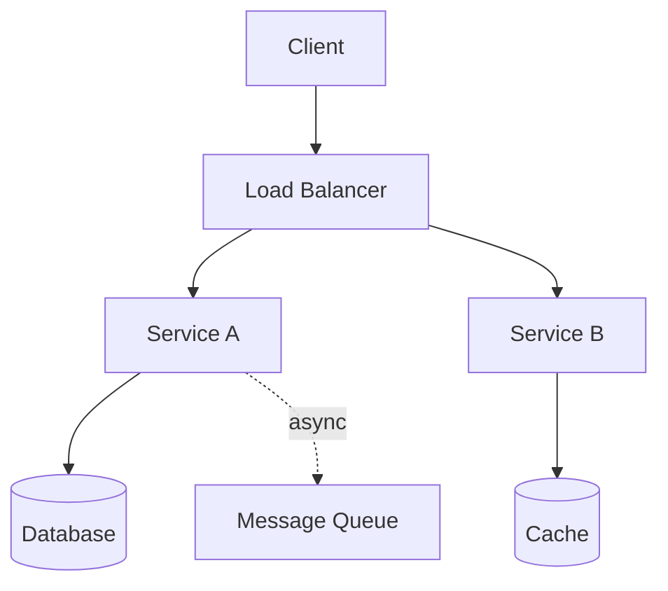

## Reading order

Sub-topics are sequenced for progressive learning: foundations first, then related concepts, then specialized topics.

| Group | Sections | Focus |
|-------|----------|-------|
| **1. Performance** | 4.1-4.4 | Scale, throughput, latency, tail latency |
| **2. Reliability** | 4.5-4.11 | Availability through failover |
| **3. Consistency** | 4.12-4.17 | Models from CAP to linearizability |
| **4. Operations** | 4.18-4.23 | Backpressure, degradation, capacity, bottlenecks |

## Related topics

- [Distributed Databases](../05-distributed-databases/README.md)  -  sharding, replication, consensus
- [Caching](../03-caching/README.md)  -  performance, consistency at the edge
- [Messaging & Events](../06-messaging-and-events/README.md)  -  async communication, ordering
- [Reliability Engineering](../12-reliability-engineering/README.md)  -  DR, HA, chaos engineering
- [Observability](../09-observability/README.md)  -  SLI/SLO, tracing, alerting

---


## 4.1 Scalability


### What is it?

**Scalability** is the ability of a system to handle increased load by adding resources - without requiring fundamental redesign. **Horizontal scaling** adds more machines; **vertical scaling** adds CPU/RAM to existing machines.

### Why it matters

A system that doesn't scale hits hard ceilings: latency degrades, errors spike, and revenue stops growing. Scalability is planned upfront through stateless services, partitioning, and async processing.

### How it works

1. Identify **stateless** tiers (can add replicas freely) vs. **stateful** tiers (need sharding/replication).
2. Add load balancer in front of stateless app servers.
3. Partition data (sharding) when single DB node saturates.
4. Offload work via queues, caches, and CDNs.
5. Measure saturation points (CPU, connections, disk IOPS) and scale before limits.

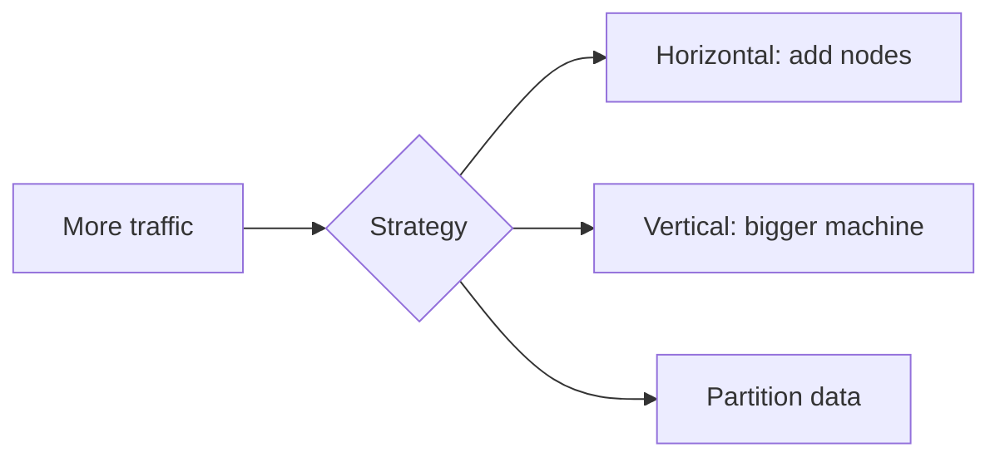

### Key details

- **Scalable ≠ fast:** a slow system can scale by adding nodes but remain slow per request
- **Amdahl's Law:** serial portions of work limit speedup from parallelization
- **Elasticity:** cloud auto-scaling responds to load automatically
- Bottleneck migrates as you scale (DB often becomes limit after app scales)

### When to use

- Designing any system expected to grow 10× or more
- Choosing between monolith scale-up vs. microservices scale-out
- Capacity reviews before product launches

### Trade-offs / Pitfalls

- Horizontal scaling adds coordination overhead (service discovery, distributed transactions)
- Stateful services are harder to scale than stateless
- Premature sharding adds complexity before it's needed
- Cost grows sub-linearly at best; often super-linear with cross-region traffic

---


## 4.2 Throughput


### What is it?

**Throughput** is the rate of work completed per unit time - requests per second (RPS), transactions per second (TPS), bytes per second. It measures **capacity**, not speed of individual operations.

### Why it matters

Throughput determines how much traffic a system can serve before saturation. Capacity planning and load testing target throughput headroom (e.g., 2× peak load).

### How it works

1. Identify the **slowest stage** in the pipeline (bottleneck).
2. Measure throughput at each tier under load test.
3. Scale bottleneck tier (more connections, shards, workers).
4. Batch work where possible (DB bulk insert, Kafka batch consume).
5. Monitor throughput vs. target in production dashboards.

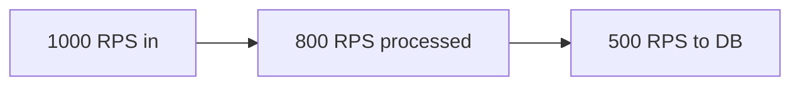

### Key details

- Throughput and latency often inversely related under load (queueing theory)
- **Little's Law:** L = λ × W (concurrency = arrival rate × response time)
- Peak vs. sustained throughput differ (burst buffers hide peaks briefly)
- Horizontal scale increases aggregate throughput if bottleneck is parallelizable

### When to use

- Load testing before launches
- Sizing Kafka partitions, DB connection pools, worker counts
- Comparing sync vs. async processing architectures

### Trade-offs / Pitfalls

- Maximizing throughput can sacrifice per-request latency (large batches)
- Reported RPS may count cached/fast paths differently than DB-heavy paths
- Throughput limits change with payload size and query complexity
- Ignoring downstream throughput causes cascading overload

---


## 4.3 Latency


### What is it?

**Latency** is the time between initiating a request and receiving a complete response. Components include network RTT, queue wait, processing, and I/O. Usually measured in milliseconds.

### Why it matters

User experience degrades sharply above ~100 - 300 ms for interactive apps. Latency drives architecture choices: caching, CDN, geographic distribution, async processing.

### How it works

1. Break request path into segments and measure each (tracing).
2. Reduce round-trips (HTTP/2 multiplexing, batch APIs, colocation).
3. Cache hot data closer to users.
4. Use connection pooling to avoid TCP/TLS handshake per request.
5. Optimize slow queries and serial critical paths.

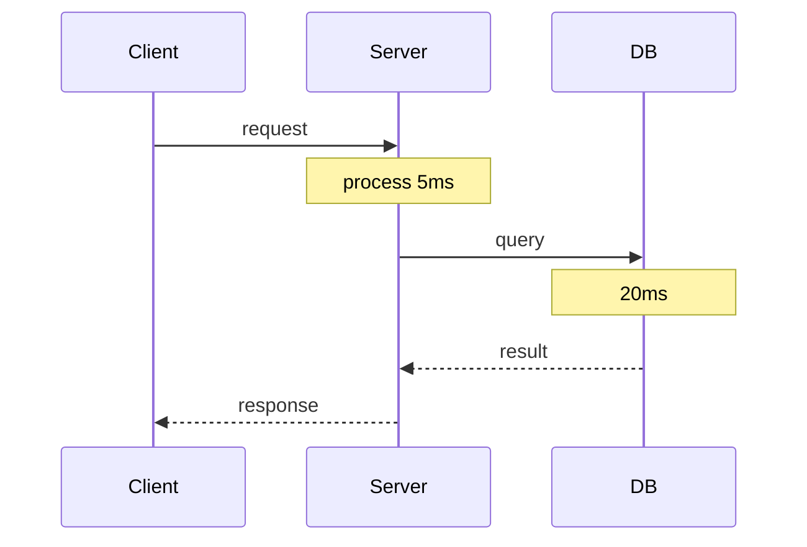

### Key details

| Component | Typical range |
|-----------|---------------|
| Same-AZ network | 0.1 - 0.5 ms |
| Cross-region | 50 - 150 ms |
| SSD random read | 0.1 ms |
| HDD seek | 5 - 10 ms |

- **RTT** dominates in chatty protocols; design fewer round-trips
- Latency ≠ response time under load (queueing adds wait)

### When to use

- Setting latency SLOs (p50, p95, p99)
- Choosing sync vs. async user flows
- Evaluating edge vs. central processing

### Trade-offs / Pitfalls

- Optimizing average latency ignores tail (see tail latency)
- Caching lowers latency but introduces staleness
- Microservices add network hops - latency compounds
- Cold starts (serverless, JVM) spike first-request latency

---


## 4.4 Tail Latency


### What is it?

**Tail latency** refers to high-percentile response times - p95, p99, p999 - the slowest requests in a distribution. A few slow requests dominate user-perceived quality at scale.

### Why it matters

If 1% of requests are 10× slower, with fan-out (one request calling 100 backends) the probability of hitting a slow backend approaches certainty. Google - s "Tail at Scale" paper showed why p99 matters more than mean.

### How it works

1. Measure and alert on p99/p999, not just averages.
2. Reduce variance: avoid GC pauses, lock contention, slow disks on any node.
3. **Hedged requests:** send duplicate request if first is slow (careful with load).
4. **Canary routing:** detect slow instances via LB and drain them.
5. Limit fan-out; parallelize with timeout per branch.

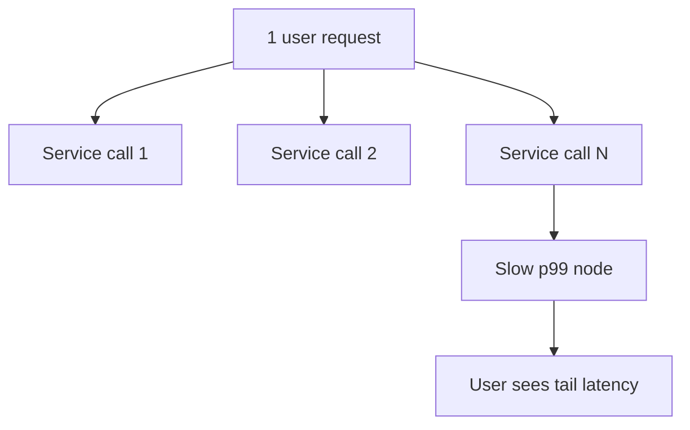

### Key details

- p99 of 500 ms with p50 of 50 ms indicates outliers, not uniform slowness
- **Head-of-line blocking** in queues inflates tails
- Shared resources (noisy neighbor) cause tail spikes in multi-tenant cloud
- Retry storms worsen tail latency under load

### When to use

- SLO definitions for user-facing APIs
- Load balancer health check tuning (latency-based routing)
- Database connection pool and timeout configuration

### Trade-offs / Pitfalls

- Hedged requests double load on recovery - use sparingly
- Chasing p999.9 may cost more than business value
- Aggregated metrics hide per-tenant tail issues
- Tracing sampling often misses rare tail events

---


## 4.5 Availability


### What is it?

**Availability** is the fraction of time a system is operational and serving correct responses, usually expressed as "nines": 99.9% (three nines) ≈ 8.76 hours downtime/year; 99.99% ≈ 52 minutes/year.

### Why it matters

Downtime directly costs revenue, trust, and SLA penalties. Availability targets drive architecture: redundant nodes, multi-AZ deployment, health checks, and failover automation.

### How it works

1. Eliminate single points of failure (SPOF) via redundancy.
2. Deploy across multiple availability zones or regions.
3. Health checks remove unhealthy instances from load balancers.
4. Automated failover promotes standby when primary fails.
5. Measure uptime with synthetic probes and real user monitoring.

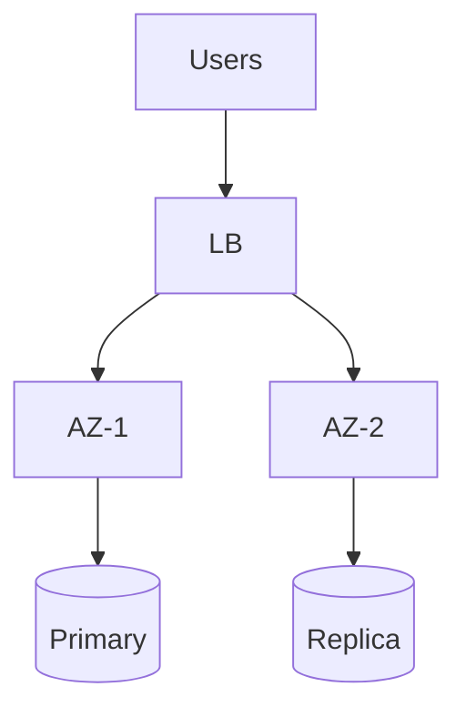

### Key details

| Nines | Downtime/year | Typical use |
|-------|---------------|-------------|
| 99% | 3.65 days | Internal tools |
| 99.9% | 8.76 hours | Standard SaaS |
| 99.99% | 52 min | Payment, core infra |
| 99.999% | 5.26 min | Telco, critical systems |

- Availability = uptime / (uptime + downtime); excludes planned maintenance if SLA defines it
- **High availability (HA)** pairs active/passive or active/active redundancy

### When to use

- Defining SLA/SLO with business stakeholders
- Choosing single-region vs. multi-region architecture
- Evaluating cloud provider AZ/region strategies

### Trade-offs / Pitfalls

- Higher nines cost exponentially more in infra and engineering
- Availability ≠ correctness (system can be "up" but returning errors)
- Dependency chain: 99.99% × 99.99% = 99.98% combined availability
- Maintenance windows must be planned or use rolling updates

---


## 4.6 Reliability


### What is it?

**Reliability** is the probability that a system performs its intended function correctly over a specified period under stated conditions. Unlike availability (binary up/down), reliability emphasizes **correct behavior** and **mean time between failures (MTBF)**.

### Why it matters

A service that is "available" but returns wrong answers or loses data is unreliable. Reliability engineering focuses on defect prevention, testing, and learning from incidents.

### How it works

1. Define expected behavior (SLOs, invariants).
2. Build with error handling, retries with backoff, idempotency.
3. Test failure scenarios (chaos engineering, fault injection).
4. Monitor error rates, not just uptime.
5. Post-incident reviews drive systemic fixes.

### Key details

- **MTBF:** average time between failures; higher is better
- **MTTR:** mean time to repair; lower improves effective availability
- Effective uptime ≈ MTBF / (MTBF + MTTR)
- Reliability includes data integrity, not just request success

### When to use

- Safety-critical or financial systems
- Setting error budget policies alongside SLOs
- Comparing build quality vs. operational redundancy

### Trade-offs / Pitfalls

- Redundancy improves availability but can hide bugs (failover masks corruption)
- Over-retrying reduces reliability of downstream services
- Reliability metrics need business-defined "correct"

---


## 4.7 Durability


### What is it?

**Durability** guarantees that once data is acknowledged as written, it survives crashes, power loss, and disk failures. It is the **D** in ACID and a distinct concern from availability.

### Why it matters

Users expect saved data to persist. Losing orders, messages, or payments after "success" destroys trust and violates regulations.

### How it works

1. Writes go to **write-ahead log (WAL)** on disk before acknowledging client.
2. Data replicated to multiple nodes (sync or quorum) before ack.
3. Backups and snapshots provide recovery from catastrophic failure.
4. fsync and replication policies trade latency for durability strength.

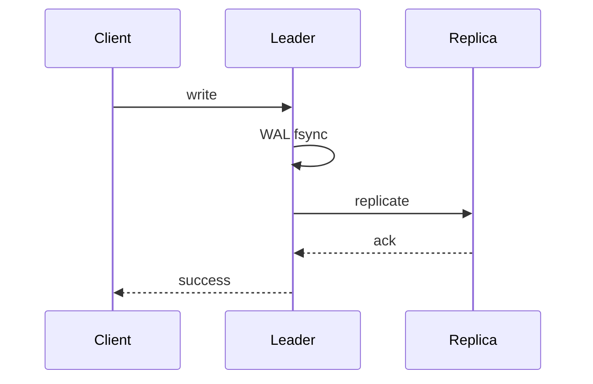

### Key details

- **Sync replication:** ack after replica confirms (stronger durability, higher latency)
- **Async replication:** ack after local write (faster, risk of loss on crash)
- Object storage (S3) achieves 11 nines durability via erasure coding across AZs
- Durability ≠ consistency: data can be durable but stale on reads

### When to use

- Any persistent store: databases, queues, file systems
- Choosing replication mode (PostgreSQL synchronous vs. asynchronous)
- Compliance requirements for record retention

### Trade-offs / Pitfalls

- Strong durability increases write latency
- Disk full or replication lag can block writes
- Backups untested = no durability guarantee in practice
- Client-side ack before server fsync creates false sense of safety

---


## 4.8 Fault Tolerance


### What is it?

**Fault tolerance** is the ability of a system to continue operating - possibly at reduced capacity - when one or more components fail. Failures may be hardware, software, network, or human error.

### Why it matters

At scale, failure is continuous: disks die, packets drop, deploys break. Fault-tolerant design assumes failure is normal, not exceptional.

### How it works

1. **Detect:** health checks, heartbeats, timeouts.
2. **Isolate:** circuit breakers stop failure propagation.
3. **Recover:** failover, automatic restart, self-healing (Kubernetes).
4. **Degrade:** serve partial functionality rather than total outage.
5. **Redundancy:** N+1 or 2N capacity for critical paths.

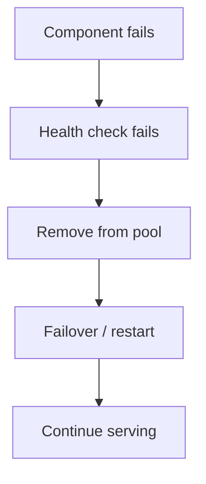

### Key details

- **Byzantine faults:** malicious or arbitrary behavior (blockchain, military systems)
- **Crash-stop faults:** node stops responding (most cloud assumptions)
- **Fail-fast:** detect errors early and abort rather than corrupt state
- Graceful vs. ungraceful shutdown affects recovery time

### When to use

- Multi-tier architectures with external dependencies
- Designing retry, timeout, and bulkhead policies
- Mission-critical systems requiring no single point of failure

### Trade-offs / Pitfalls

- Fault tolerance adds complexity and cost (extra replicas, cross-AZ traffic)
- Split-brain if failover detection is wrong
- Masking faults can delay root-cause discovery
- "Strangler" partial failure harder to test than total outage

---


## 4.9 Resilience


### What is it?

**Resilience** is the capacity to absorb disturbances, adapt to stress, and recover quickly while maintaining core function. It extends fault tolerance with **learning**, **adaptation**, and **operational practices** (chaos engineering, runbooks).

### Why it matters

Modern systems face unpredictable load spikes, dependency outages, and cascading failures. Resilience engineering builds systems and teams that bend without breaking.

### How it works

1. Design for **failure as default** (timeouts everywhere, no infinite waits).
2. Implement **bulkheads** isolating thread pools per dependency.
3. Use **circuit breakers** and **rate limiters** on outbound calls.
4. Practice **chaos experiments** in production-like environments.
5. Automate rollback and feature flags for fast mitigation.

### Key details

- Resilience ⊃ fault tolerance (includes process and culture)
- **Adaptive concurrency** adjusts limits based on downstream health
- **Idempotency keys** enable safe retries after ambiguous failures
- Blameless postmortems convert incidents into systemic improvements

### When to use

- Microservices with many cross-service dependencies
- Building SRE practices and error budgets
- Systems with variable or adversarial traffic

### Trade-offs / Pitfalls

- Over-isolation wastes resources (too many small pools)
- Circuit breakers open too aggressively cause false outages
- Chaos without guardrails can cause real incidents
- Resilience patterns add latency (retries, hedging)

---


## 4.10 Redundancy


### What is it?

**Redundancy** duplicates critical components so failure of one does not stop the system. Forms include **N+1** (one spare), **2N** (full duplicate), geographic redundancy, and erasure-coded storage.

### Why it matters

Mean time between failures applies to every component. Redundancy converts single-component failure from outage into capacity reduction.

### How it works

1. Identify SPOFs (single power supply, single DB, single region).
2. Add redundant instances with independent failure domains.
3. Load balance across redundant paths.
4. Ensure redundant copies are **diverse** (different AZ, rack, provider).
5. Test failure of each redundant layer regularly.

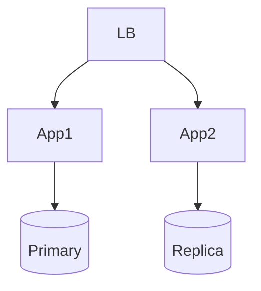

### Key details

- **Active-passive:** standby idle until failover
- **Active-active:** all nodes serve traffic; need conflict handling
- **Erasure coding:** storage redundancy with less overhead than 3× replication
- Correlated failures (same bug on all nodes) defeat redundancy

### When to use

- Any availability target above single-server uptime
- Data durability (3 replicas minimum for cloud disks)
- Network paths (multi-homed, dual ISP)

### Trade-offs / Pitfalls

- Cost scales with redundancy level
- Active-active write conflicts need resolution
- Shared codebase = shared bug (redundant but simultaneously wrong)
- Operational complexity of keeping replicas in sync

---


## 4.11 Failover


### What is it?

**Failover** is the automatic or manual switch from a failed **primary** component to a **standby** so service continues. **Failback** returns traffic to the original primary when restored.

### Why it matters

Human-driven recovery takes minutes to hours; automated failover targets seconds. Critical for database HA, load balancer VIPs, and DNS routing.

### How it works

1. Health monitor detects primary failure (missed heartbeats).
2. **Passive failover:** promote standby replica to primary.
3. **Active-active:** traffic already split; remove failed node from pool.
4. Update DNS/VIP/service registry to point clients to new primary.
5. Reconcile state (replay WAL, resync replica) before failback.

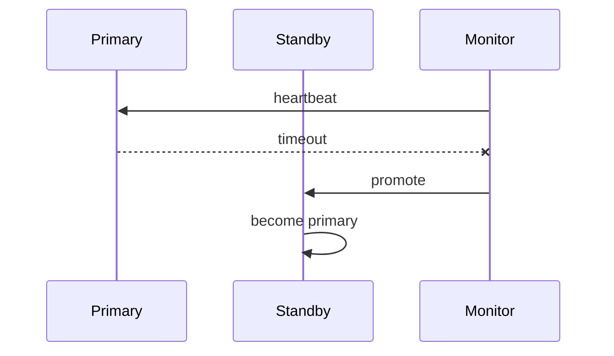

### Key details

- **Split-brain:** two nodes think they are primary - use fencing (STONITH)
- **RTO:** recovery time objective; failover speed target
- **RPO:** data loss window with async replication
- DNS failover limited by TTL propagation delay

### When to use

- Database primary-replica setups
- Multi-region disaster recovery
- Load balancer active/passive pairs

### Trade-offs / Pitfalls

- False positive failover causes unnecessary disruption
- Async replication -> lost writes on failover
- Clients cache old primary address
- Failback requires reverse sync complexity

---


## 4.12 Consistency


### What is it?

**Consistency** in distributed systems defines what guarantees readers observe about writes - whether all nodes show the same data at the same time, and in what order updates appear. It spans a spectrum from strong (linearizable) to weak (eventual).

### Why it matters

Wrong consistency choice causes lost updates, stale reads, and violated business invariants. Payment balances need strong consistency; social media likes often tolerate eventual.

### How it works

1. Classify operations: read-heavy vs. write-heavy, need for ordering.
2. Choose storage/replication model matching required guarantee.
3. Use transactions, locks, or consensus where strong ordering needed.
4. Use async replication and conflict resolution where eventual OK.
5. Document guarantees per API endpoint for client developers.

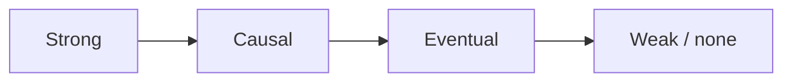

### Key details

- Consistency is about **observable behavior**, not internal replication timing
- **CAP** forces partition-time choice between C and A
- Different objects in same system can have different consistency (per-key tiers)
- Client libraries can provide stronger semantics than storage alone (read-your-writes)

### When to use

- Every multi-node or replicated data design
- Choosing between SQL, Dynamo-style KV, CRDTs
- Defining API contracts for mobile/offline clients

### Trade-offs / Pitfalls

- Strong consistency costs latency and availability during partitions
- "Eventually consistent" without bound is not a spec - define convergence time
- Application bugs mimic consistency failures (cache not invalidated)
- Distributed transactions don't solve all cross-service consistency needs

---


## 4.13 Concurrency


### What is it?

**Concurrency** is the ability of a system to make progress on multiple tasks simultaneously - via threads, processes, async I/O, or distributed workers. **Parallelism** is actual simultaneous execution on multiple CPUs.

### Why it matters

Single-threaded servers cannot use modern multi-core hardware. Concurrent design enables throughput but introduces races, deadlocks, and ordering bugs.

### How it works

1. Identify shared mutable state (critical sections).
2. Protect with locks, mutexes, or atomic operations.
3. Prefer **immutable data** and message passing to reduce sharing.
4. Use **actor model** or **event loop** (Node.js, Netty) for I/O-bound work.
5. In distributed setting, use partitions so each shard handles subset without cross-shard locks.

### Key details

- **Race condition:** outcome depends on scheduling order
- **Deadlock:** circular wait on locks
- **Livelock:** threads active but no progress
- **Optimistic concurrency:** compare-and-swap, version columns (MVCC)
- Distributed concurrency needs clocks or consensus for global ordering

### When to use

- Multi-threaded servers, worker pools, parallel batch jobs
- Designing idempotent consumers for at-least-once delivery
- Database transaction isolation level selection

### Trade-offs / Pitfalls

- Fine-grained locking complexity vs. coarse locking contention
- Lock-free structures harder to verify correct
- Distributed locks (Redis Redlock) have edge cases - prefer design without locks
- Too much concurrency overwhelms DB with connections

---


## 4.14 CAP Theorem


### What is it?

The **CAP theorem** (Brewer) states that a distributed data store can provide at most **two of three** during a **network partition**: **Consistency** (all nodes see same data), **Availability** (every request gets a response), **Partition tolerance** (system continues despite network splits).

### Why it matters

Partitions happen in production (switch failures, AZ outages). You must choose whether to reject requests (CP) or serve possibly stale data (AP) during the partition.

### How it works

1. **Partition occurs:** nodes cannot communicate.
2. **CP choice:** reject writes/reads that cannot be verified quorum -> consistent but unavailable to some clients.
3. **AP choice:** accept reads/writes on isolated sides -> available but divergent until merge.
4. After partition heals, reconcile divergent state (conflict resolution, anti-entropy).

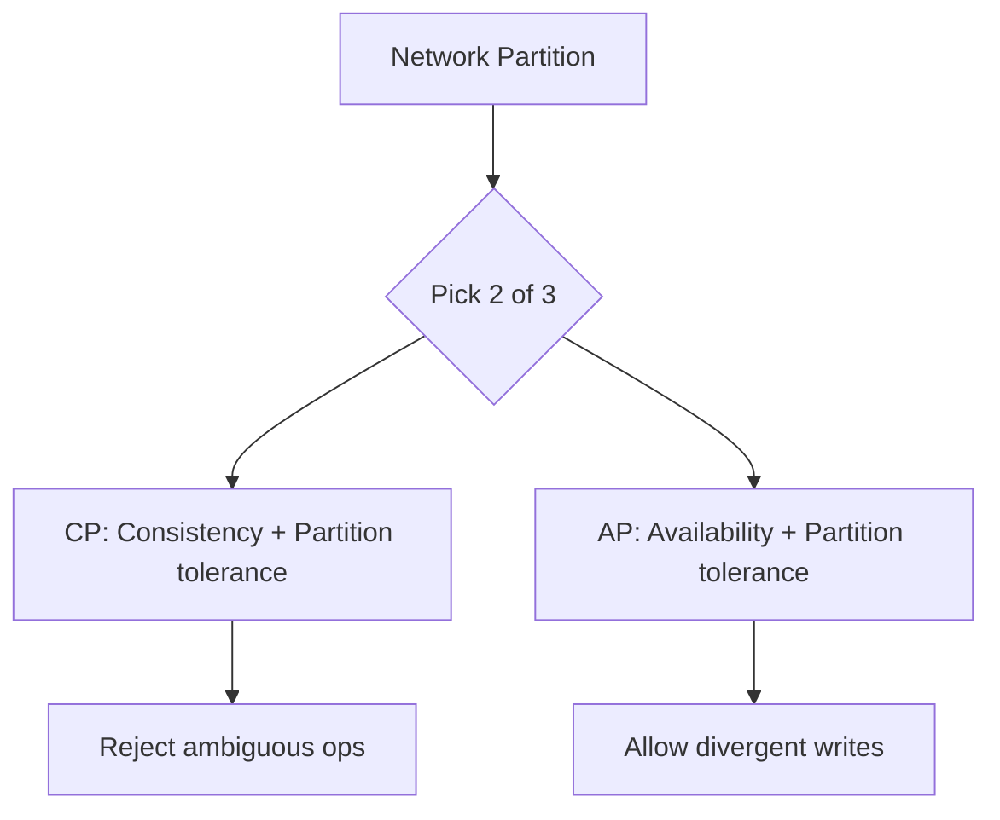

### Key details

- **Partition tolerance is not optional** in distributed systems - effectively choose C vs. A under partition
- CAP applies to **linearizability-style consistency**, not all consistency definitions
- Most systems are **AP with tunable consistency** (quorum reads/writes)
- No partition -> can achieve CA on single node (not useful at scale)

### When to use

- Explaining Dynamo/Cassandra (AP) vs. etcd/ZooKeeper (CP) positioning
- Interview framing for database selection
- Designing behavior during regional failover

### Trade-offs / Pitfalls

- CAP oversimplified - consistency and availability are spectrums
- PACELC extends the model for normal operation
- "CA systems" usually aren't truly distributed
- Application-level consistency may differ from storage CAP class

---


## 4.15 PACELC Theorem


### What is it?

**PACELC** extends CAP: if **P**artition, choose **A** or **C**; **E**lse (normal operation), choose **L**atency or **C**onsistency. It captures that even without partitions, strong consistency costs latency (cross-replica coordination).

### Why it matters

Most of a system's life runs without partitions - you still trade latency for consistency on every write. PACELC explains why DynamoDB defaults to fast eventually consistent reads.

### How it works

1. **During partition:** same as CAP (PA vs. PC).
2. **During normal ops:** replicate synchronously (LC, higher latency) or asynchronously (EL, lower latency).
3. Systems labeled **PA/EL** (Cassandra, Dynamo) favor availability and low latency.
4. Systems labeled **PC/EC** (traditional RDBMS sync replica) favor consistency.

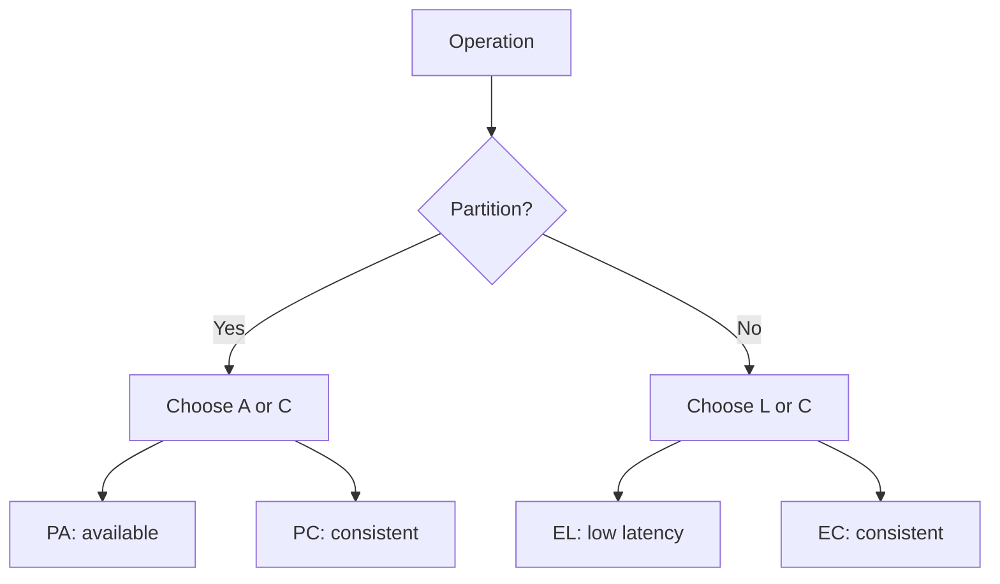

### Key details

| System | Partition | Else |
|--------|-----------|------|
| Cassandra | PA | EL |
| MongoDB (default) | PA | EL |
| PostgreSQL sync rep | PC | EC |
| etcd | PC | EC |

- Tunable per operation in some systems (strong vs. eventual read in DynamoDB)

### When to use

- Nuanced database comparisons beyond CAP slogans
- Explaining read consistency options in cloud databases
- Designing per-API consistency/latency tiers

### Trade-offs / Pitfalls

- Not all systems fit cleanly into one quadrant
- Latency vs. consistency trade-off depends on replication distance
- Strong reads on AP systems may still hit stale replicas if not requested

---


## 4.16 Strong Consistency


### What is it?

**Strong consistency** (often implemented as **linearizability** for registers) guarantees that after a write completes, all subsequent reads return that value or a newer one. Users see a single copy of data updating in real-time order.

### Why it matters

Financial transfers, inventory deduction, and leader election require strong consistency - double-spend or oversell are unacceptable.

### How it works

1. Writes go through a **single leader** or **consensus quorum** (majority ack).
2. Reads contact leader or quorum of replicas verifying latest version.
3. Linearization point assigned to each operation in global order.
4. Transactions (2PC, Raft log apply) serialize conflicting updates.

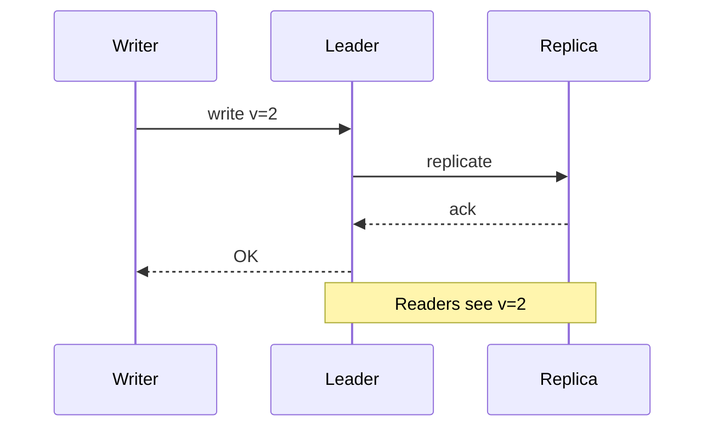

### Key details

- Implemented via sync replication, Raft/Paxos, or single-node DB
- Cross-region strong consistency adds 100+ ms per write
- Spanner uses TrueTime for external consistency globally
- "Strong" must be defined precisely - serializable ≠ linearizable

### When to use

- Money, inventory, booking systems with limited stock
- Coordination services (locks, service discovery)
- When regulatory audit requires read-after-write truth

### Trade-offs / Pitfalls

- Lower availability during partition (CP behavior)
- Higher latency from quorum waits
- Harder to scale writes (single leader bottleneck)
- Misconfigured "strong" reads from async replica are not actually strong

---


## 4.17 Eventual Consistency


### What is it?

**Eventual consistency** guarantees that if no new updates occur, all replicas will **converge** to the same value given sufficient time. During convergence, reads may return stale or conflicting versions.

### Why it matters

Enables highly available, low-latency global systems (DNS, CDN, Dynamo-style KV). Most users tolerate seconds of staleness for social feeds, analytics, and session data.

### How it works

1. Writes accepted at any replica (or leader with async fan-out).
2. Replicas propagate updates via gossip, anti-entropy, or read repair.
3. Clients may read stale data until replication completes.
4. Conflicts resolved via **LWW** (last-write-wins), vector clocks, or CRDT merge.

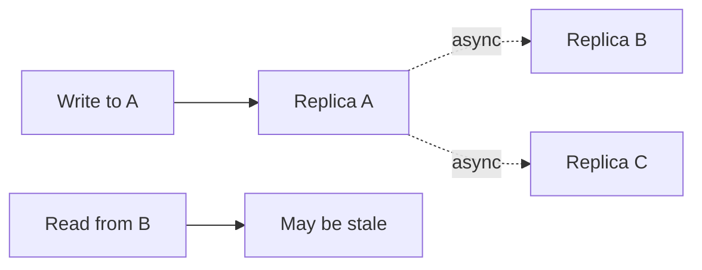

### Key details

- Convergence time unbounded without extra mechanisms (SLA on staleness helps)
- **Read repair:** stale read triggers background fix
- **Hinted handoff:** writes routed around down nodes
- Version vectors detect conflicts for application merge

### When to use

- High write/read throughput globally
- Caching layers, shopping carts, activity feeds
- Systems with natural conflict resolution (counters, sets)

### Trade-offs / Pitfalls

- Application must handle stale reads and conflicts
- LWW loses concurrent updates silently
- Testing eventual behavior is harder than strong consistency
- "Eventually" without monitoring -> never converges if replication broken

---


## 4.18 Causal Consistency


### What is it?

**Causal consistency** preserves **cause-and-effect** order: if operation A happens-before B, everyone sees A before B. Concurrent operations may be seen in different orders by different clients.

### Why it matters

Stronger than eventual (no arbitrary reordering of related events) but weaker than linearizable (allows concurrent reorder). Fits collaborative apps, comment threads, and message ordering.

### How it works

1. Track **causal dependencies** with vector clocks or version chains.
2. Replica applies updates respecting happens-before, not wall clock.
3. Client reads may lag but never show effect before cause.
4. Concurrent writes still need merge policy.

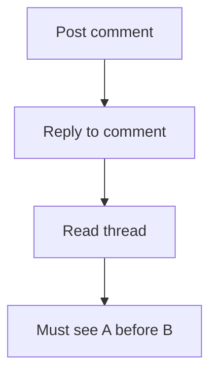

### Key details

- **Read-your-writes:** client sees own updates (common session guarantee)
- **Monotonic reads:** no going backward in time per client
- Weaker than sequential consistency; stronger than eventual
- Implemented in some message queues and research systems (COPS)

### When to use

- Social threads, chat, collaborative editing metadata
- When ordering between related events matters but global total order doesn't
- Mobile offline sync with dependency tracking

### Trade-offs / Pitfalls

- Vector clock size grows with replica count
- Concurrent operations still expose anomalies without CRDTs
- Less common in mainstream DBs than strong or eventual
- Clients must pass causal tokens for correct reads in some designs

---


## 4.19 Linearizability


### What is it?

**Linearizability** is the strongest single-object consistency model: every operation appears to occur atomically at some point between its invocation and response, respecting real-time order. All clients agree on a single sequential history.

### Why it matters

Gold standard for correctness of registers, locks, and leader election. If a system is linearizable, reasoning about concurrent behavior matches sequential intuition.

### How it works

1. Each operation assigned a linearization point on a timeline.
2. History equivalent to some sequential execution of same operations.
3. If op1 completes before op2 starts (real time), op1 precedes op2 in order.
4. Achieved via consensus (Raft, Paxos) or single leader with sync replication.

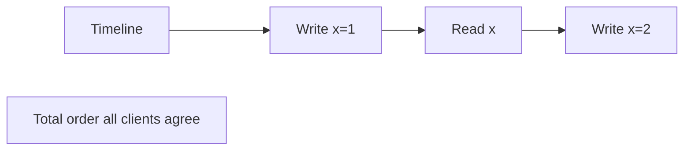

### Key details

- **Linearizable ≠ serializable:** serializable is multi-object transaction property
- etcd, ZooKeeper, Consul provide linearizable reads/writes (with caveats)
- Performance cost: coordination on every operation
- **Sticky sessions** don't imply linearizability across clients

### When to use

- Distributed locks, leader election, config stores
- When interview or spec says "strongest consistency for single key"
- Comparing correctness of coordination services

### Trade-offs / Pitfalls

- Not scalable for high-throughput data plane
- Clock skew irrelevant to linearization (uses real-time precedence)
- Partial linearizability bugs in complex systems hard to detect (Jepsen testing)
- Confused with "strong consistency" colloquially

---


## 4.20 Backpressure


### What is it?

**Backpressure** is a flow-control mechanism where an overloaded downstream component signals upstream to **slow down** or **stop sending** work temporarily, preventing unbounded queue growth and cascading failure.

### Why it matters

Without backpressure, fast producers overwhelm slow consumers - memory exhausts, GC pauses, and latency explodes. Essential in streaming, RPC, and reactive systems.

### How it works

1. Consumer exposes capacity (queue depth, credits).
2. Producer checks capacity before sending; blocks or drops if full.
3. **Reactive streams** (Project Reactor, RxJava) propagate pressure via `request(n)`.
4. HTTP/2 flow control limits in-flight bytes per stream.
5. Message queues use prefetch limits and consumer ack pacing.

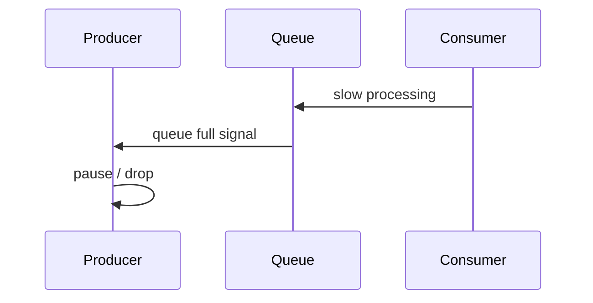

### Key details

- **Drop vs. block:** block preserves data but increases latency; drop sheds load
- **Bounded queues** are prerequisite for effective backpressure
- gRPC flow control built on HTTP/2 windows
- Kafka consumer `max.poll.records` limits batch size

### When to use

- Stream processing pipelines (Flink, Kafka)
- Service-to-service RPC under variable load
- Any producer faster than consumer scenario

### Trade-offs / Pitfalls

- Blocking producers can deadlock if circular dependencies
- Dropping requires business acceptance (lost messages)
- Backpressure without metrics hides chronic under-provisioning
- Thread pool rejection is crude backpressure - needs caller handling

---


## 4.21 Graceful Degradation


### What is it?

**Graceful degradation** deliberately reduces functionality or quality during stress or partial failure so **core features remain available** rather than total system failure.

### Why it matters

Users prefer limited service (text-only feed, cached recommendations) over error pages. Degradation policies are product decisions encoded in engineering.

### How it works

1. Identify **tier-1** (must work) vs. **tier-3** (nice-to-have) features.
2. Feature flags disable non-critical paths under load.
3. Serve **stale cache** or **default content** when dependencies fail.
4. **Shed load:** return 503 with Retry-After for non-essential endpoints.
5. Circuit breakers trigger degraded mode automatically.

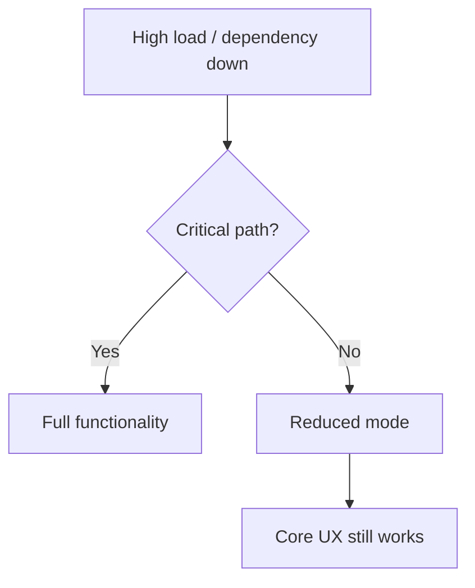

### Key details

- Netflix: skip personalization, show popular titles
- E-commerce: disable reviews widget, keep checkout
- Requires pre-built fallback content and tested code paths
- Monitor degraded mode duration - don't normalize broken state

### When to use

- Large consumer-facing platforms with optional enrichments
- Dependency on third-party APIs with variable reliability
- Black Friday / viral event preparedness

### Trade-offs / Pitfalls

- Degraded UX erodes trust if prolonged unnoticed
- Fallback data can be wrong (stale prices) - legal/compliance risk
- Complex Cartesian product of failure modes to test
- Teams may neglect degraded paths in development

---


## 4.22 Capacity Planning


### What is it?

**Capacity planning** forecasts resource needs (CPU, memory, storage, network, licenses) to meet future load with acceptable performance and headroom - typically 30 - 50% buffer above expected peak.

### Why it matters

Under-provisioning causes outages; over-provisioning wastes budget. Planning connects business growth forecasts to infrastructure spend and hiring.

### How it works

1. Measure current usage at peak (metrics, load tests).
2. Project growth (users, data volume, request rate).
3. Identify scaling limits per tier (connections, IOPS, shard count).
4. Model cost vs. performance options (scale up, out, optimize).
5. Schedule procurement/leads time before limits hit (6 - 12 months for bare metal).

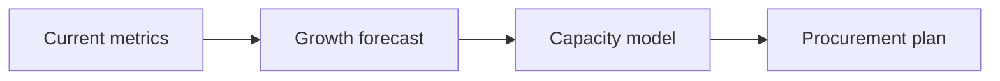

### Key details

- **Headroom:** operate at 60 - 70% of max under normal peak
- Include **seasonality** and **marketing events**
- Plan for **worst-case dependency** (DB often limits first)
- Revisit quarterly; cloud elasticity reduces but doesn't eliminate planning

### When to use

- Annual budget cycles
- Before major product launches or geographic expansion
- When approaching known platform limits (Kafka partition count, DB size)

### Trade-offs / Pitfalls

- Growth forecasts wrong -> sudden crunch or waste
- Ignoring data growth (storage, index size) focuses only on RPS
- Reserved capacity vs. on-demand trade-offs in cloud
- Organizational silos hide cross-team bottlenecks

---


## 4.23 Bottleneck Analysis


### What is it?

**Bottleneck analysis** identifies the slowest constraint limiting system throughput or causing latency dominance - the "narrowest pipe" in the pipeline per **Theory of Constraints**.

### Why it matters

Optimizing non-bottlenecks yields zero improvement. Finding the real limit focuses engineering effort and spend.

### How it works

1. Map end-to-end request path with latency breakdown (tracing).
2. Load test while monitoring all tiers (CPU, disk, network, pool saturation).
3. Increase load until one metric saturates first - that's the bottleneck.
4. Relieve bottleneck (scale, cache, optimize query).
5. Repeat - bottleneck migrates to next tier.

```mermaid
flowchart LR
    C[Client] -->|5ms| App
    App -->|200ms| DB
    DB -->|2ms| Disk
    Note[Bottleneck: DB query]
```

### Key details

- **Utilization law:** ρ = λ/μ; near 100% utilization -> queueing delays explode
- Common bottlenecks: DB connections, lock contention, GC, single hot shard
- **Profiling** vs. **load testing:** need both micro and macro views
- External dependencies (payment API) become bottleneck outside your control

### When to use

- Performance incidents and post-mortems
- Before and after optimization projects
- Architecture reviews ("what breaks first at 10×?")

### Trade-offs / Pitfalls

- Local optima: faster app exposes DB bottleneck
- Bottleneck shifts under different workload mixes
- Averages hide hot keys and tail-driven bottlenecks
- Premature micro-optimization before identifying system bottleneck

---


## Quick Reference

| # | Topic | Summary |
|---|-------|---------|
| 4.1 | Scalability | **Scalability** is the ability of a system to handle increased load by adding... |
| 4.2 | Throughput | **Throughput** is the rate of work completed per unit time - requests per secon... |
| 4.3 | Latency | **Latency** is the time between initiating a request and receiving a complete... |
| 4.4 | Tail Latency | **Tail latency** refers to high-percentile response times - p95, p99, p999 - the ... |
| 4.5 | Availability | **Availability** is the fraction of time a system is operational and serving ... |
| 4.6 | Reliability | **Reliability** is the probability that a system performs its intended functi... |
| 4.7 | Durability | **Durability** guarantees that once data is acknowledged as written, it survi... |
| 4.8 | Fault Tolerance | **Fault tolerance** is the ability of a system to continue operating - possibly... |
| 4.9 | Resilience | **Resilience** is the capacity to absorb disturbances, adapt to stress, and r... |
| 4.10 | Redundancy | **Redundancy** duplicates critical components so failure of one does not stop... |
| 4.11 | Failover | **Failover** is the automatic or manual switch from a failed **primary** comp... |
| 4.12 | Consistency | **Consistency** in distributed systems defines what guarantees readers observ... |
| 4.13 | Concurrency | **Concurrency** is the ability of a system to make progress on multiple tasks... |
| 4.14 | CAP Theorem | The **CAP theorem** (Brewer) states that a distributed data store can provide... |
| 4.15 | PACELC Theorem | **PACELC** extends CAP: if **P**artition, choose **A** or **C**; **E**lse (no... |
| 4.16 | Strong Consistency | **Strong consistency** (often implemented as **linearizability** for register... |
| 4.17 | Eventual Consistency | **Eventual consistency** guarantees that if no new updates occur, all replica... |
| 4.18 | Causal Consistency | **Causal consistency** preserves **cause-and-effect** order: if operation A h... |
| 4.19 | Linearizability | **Linearizability** is the strongest single-object consistency model: every o... |
| 4.20 | Backpressure | **Backpressure** is a flow-control mechanism where an overloaded downstream c... |
| 4.21 | Graceful Degradation | **Graceful degradation** deliberately reduces functionality or quality during... |
| 4.22 | Capacity Planning | **Capacity planning** forecasts resource needs (CPU, memory, storage, network... |
| 4.23 | Bottleneck Analysis | **Bottleneck analysis** identifies the slowest constraint limiting system thr... |

---

[â -  Back to master index](../README.md)
