# 4. Distributed System

> Status: **Documented**  -  master reference

[<- Back to master index](../README.md)

## Sub-topics

| # | Sub-topic | Status |
|---|-----------|--------|
| 4.1 | [Scalability](#41-scalability) | Done |
| 4.2 | [Throughput](#42-throughput) | Done |
| 4.3 | [Latency](#43-latency) | Done |
| 4.4 | [Tail Latency](#44-tail-latency) | Done |
| 4.5 | [Availability](#45-availability) | Done |
| 4.6 | [Reliability](#46-reliability) | Done |
| 4.7 | [Durability](#47-durability) | Done |
| 4.8 | [Fault Tolerance](#48-fault-tolerance) | Done |
| 4.9 | [Resilience](#49-resilience) | Done |
| 4.10 | [Redundancy](#410-redundancy) | Done |
| 4.11 | [Failover](#411-failover) | Done |
| 4.12 | [Consistency](#412-consistency) | Done |
| 4.13 | [Concurrency](#413-concurrency) | Done |
| 4.14 | [CAP Theorem](#414-cap-theorem) | Done |
| 4.15 | [PACELC Theorem](#415-pacelc-theorem) | Done |
| 4.16 | [Strong Consistency](#416-strong-consistency) | Done |
| 4.17 | [Eventual Consistency](#417-eventual-consistency) | Done |
| 4.18 | [Causal Consistency](#418-causal-consistency) | Done |
| 4.19 | [Linearizability](#419-linearizability) | Done |
| 4.20 | [Backpressure](#420-backpressure) | Done |
| 4.21 | [Graceful Degradation](#421-graceful-degradation) | Done |
| 4.22 | [Capacity Planning](#422-capacity-planning) | Done |
| 4.23 | [Bottleneck Analysis](#423-bottleneck-analysis) | Done |


## Topic Overview

A **distributed system** is a collection of independent computers that appear to users as a single coherent system. Components communicate over a network, have no shared clock, and can fail independently. Nearly every production system at scale - microservices, databases, CDNs, message queues - is distributed by necessity.

Designing distributed systems means trading off properties that are easy in a single machine: strong consistency, low latency, and perfect availability cannot all hold simultaneously when networks partition. Understanding **CAP**, **consistency models**, **failure modes**, and **operational metrics** (latency, throughput, tail latency) is foundational for architecture interviews and real engineering decisions.

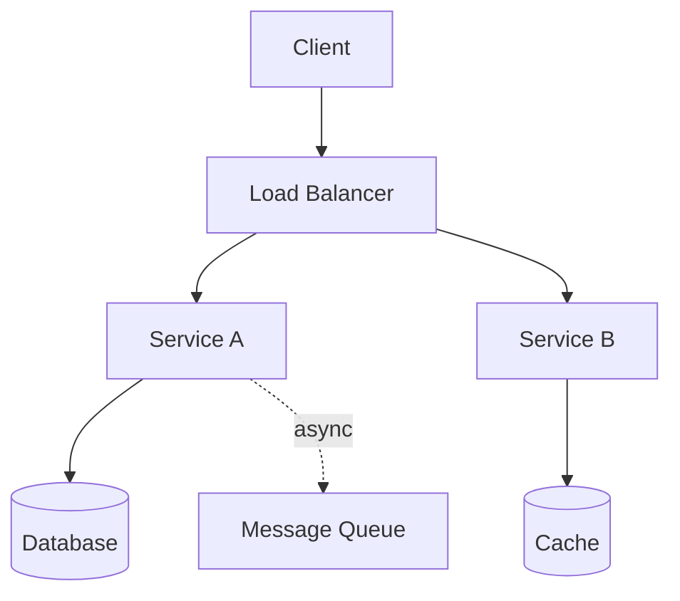

---


## 4.1 Scalability


### What is it?

**Scalability** is the ability of a system to handle increased load by adding resources - without requiring fundamental redesign. **Horizontal scaling** adds more machines; **vertical scaling** adds CPU/RAM to existing machines.

### Why it matters

A system that doesn't scale hits hard ceilings: latency degrades, errors spike, and revenue stops growing. Scalability is planned upfront through stateless services, partitioning, and async processing.

### How it works

1. Identify **stateless** tiers (can add replicas freely) vs. **stateful** tiers (need sharding/replication).
2. Add load balancer in front of stateless app servers.
3. Partition data (sharding) when single DB node saturates.
4. Offload work via queues, caches, and CDNs.
5. Measure saturation points (CPU, connections, disk IOPS) and scale before limits.

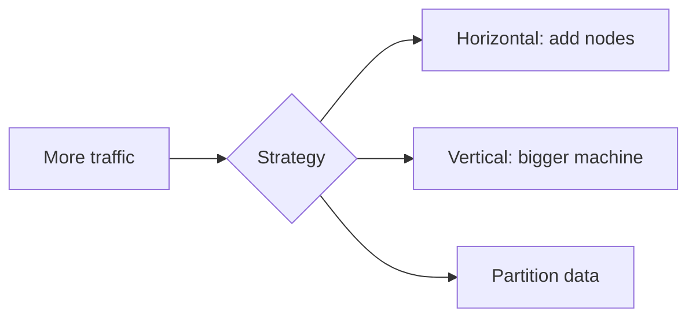

### Key details

- **Scalable ≠ fast:** a slow system can scale by adding nodes but remain slow per request
- **Amdahl's Law:** serial portions of work limit speedup from parallelization
- **Elasticity:** cloud auto-scaling responds to load automatically
- Bottleneck migrates as you scale (DB often becomes limit after app scales)

### When to use

- Designing any system expected to grow 10× or more
- Choosing between monolith scale-up vs. microservices scale-out
- Capacity reviews before product launches

### Trade-offs / Pitfalls

- Horizontal scaling adds coordination overhead (service discovery, distributed transactions)
- Stateful services are harder to scale than stateless
- Premature sharding adds complexity before it's needed
- Cost grows sub-linearly at best; often super-linear with cross-region traffic

---


## 4.2 Throughput


### What is it?

**Throughput** is the rate of work completed per unit time - requests per second (RPS), transactions per second (TPS), bytes per second. It measures **capacity**, not speed of individual operations.

### Why it matters

Throughput determines how much traffic a system can serve before saturation. Capacity planning and load testing target throughput headroom (e.g., 2× peak load).

### How it works

1. Identify the **slowest stage** in the pipeline (bottleneck).
2. Measure throughput at each tier under load test.
3. Scale bottleneck tier (more connections, shards, workers).
4. Batch work where possible (DB bulk insert, Kafka batch consume).
5. Monitor throughput vs. target in production dashboards.

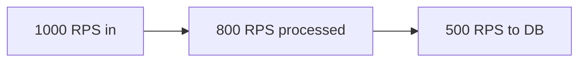

### Key details

- Throughput and latency often inversely related under load (queueing theory)
- **Little's Law:** L = λ × W (concurrency = arrival rate × response time)
- Peak vs. sustained throughput differ (burst buffers hide peaks briefly)
- Horizontal scale increases aggregate throughput if bottleneck is parallelizable

### When to use

- Load testing before launches
- Sizing Kafka partitions, DB connection pools, worker counts
- Comparing sync vs. async processing architectures

### Trade-offs / Pitfalls

- Maximizing throughput can sacrifice per-request latency (large batches)
- Reported RPS may count cached/fast paths differently than DB-heavy paths
- Throughput limits change with payload size and query complexity
- Ignoring downstream throughput causes cascading overload

---


## 4.3 Latency


### What is it?

**Latency** is the time between initiating a request and receiving a complete response. It is the sum of independent components along the critical path - not a single number. Usually measured in milliseconds; user-perceived quality degrades sharply above ~100-300 ms for interactive apps.

**Latency vs. response time under load:** at low utilization, latency ≈ service time. Under saturation, **queueing delay** dominates (see below).

### Why it matters

Latency drives architecture choices: caching, CDN, geographic distribution, async processing, and connection pooling. A 200 ms cross-region hop makes synchronous microservice chains untenable for real-time UX.

### How it works

**Latency budget breakdown (typical API request):**

```text
Total latency = client_processing
              + network_RTT (× hops)
              + queue_wait
              + server_processing
              + downstream_calls
              + DB_query_time
              + serialization
```

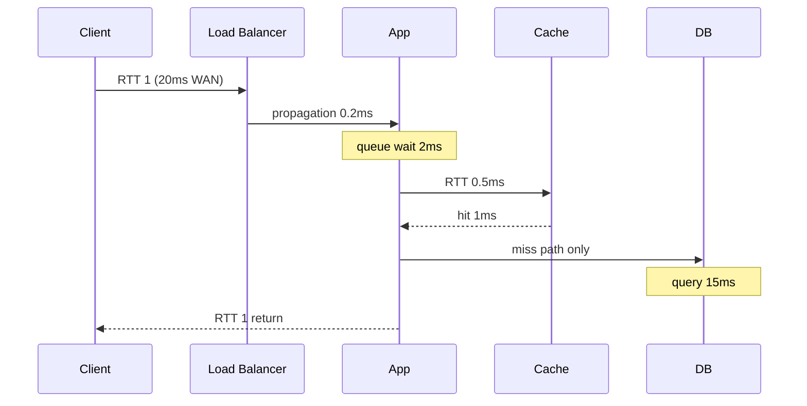

#### RTT (round-trip time)

Time for a packet to travel client → server → client. Dominates **chatty** protocols with many small requests.

| Path | Typical RTT |
|------|-------------|
| Same host (loopback) | < 0.1 ms |
| Same rack / AZ | 0.1 - 0.5 ms |
| Cross-AZ (same region) | 1 - 3 ms |
| Cross-region (US ↔ EU) | 80 - 150 ms |
| Mobile 4G | 30 - 80 ms |
| Satellite | 500+ ms |

**Design rule:** minimize round-trips. One `GET /user?include=orders,profile` beats three sequential REST calls (3× RTT saved).

```text
# Bad: 3 round-trips × 100ms cross-region = 300ms minimum
GET /users/123
GET /users/123/orders
GET /users/123/profile

# Good: 1 round-trip
GET /users/123?expand=orders,profile
```

#### Propagation delay

Time for signal to traverse the physical link (distance / speed). Cross-region RTT is mostly propagation - cannot be optimized with faster CPUs.

- Speed of light in fiber ≈ 200,000 km/s → ~67 ms minimum US coast-to-coast one-way.
- **Colocation** and **edge computing** move compute closer to users to reduce propagation.

#### Queueing delay

When arrival rate approaches service capacity, requests wait in queue. **Kingman's formula** (simplified): queue delay explodes as utilization → 100%.

| Utilization (ρ) | Queue delay trend |
|-----------------|-------------------|
| ρ < 70% | Negligible queue wait |
| ρ = 80% | Moderate tails |
| ρ > 90% | p99 latency spikes |
| ρ → 100% | Unbounded wait |

**Little's Law:** `L = λ × W` (average concurrency = arrival rate × average time in system). More requests in flight = longer waits.

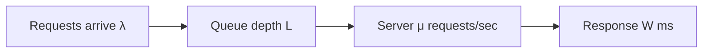

**Example:** App handles 1000 RPS at 50 ms each (μ = 20K/s per instance). At 800 RPS (ρ = 4% per instance with 20 instances), queueing is negligible. At 19K RPS/instance (ρ = 95%), p99 explodes.

### Key details

| Component | Typical range | Optimization |
|-----------|---------------|--------------|
| Same-AZ network | 0.1 - 0.5 ms | Keep services in same AZ |
| Cross-region | 50 - 150 ms | Async, regional replicas, CDN |
| SSD random read | 0.1 ms | Index tuning, cache |
| HDD seek | 5 - 10 ms | Avoid random I/O |
| TLS handshake | 1 - 3 RTTs | TLS 1.3, session resumption |
| JVM warm-up | 100ms - 2s first req | Warm pools, GraalVM native |
| GC pause | 10 - 200 ms | Tune heap, ZGC/Shenandoah |

- **Tail latency (4.4)** often exceeds mean due to queueing, GC, slow shards
- **Connection pooling** avoids TCP+TLS handshake per request (~1-3 RTTs saved)
- **HTTP/2 multiplexing** shares one connection across parallel requests

### When to use

- Setting latency SLOs (p50, p95, p99) per endpoint
- Choosing sync vs. async user flows (checkout sync; email async)
- Evaluating edge vs. central processing
- Capacity planning: keep ρ < 70% at peak for headroom

### Trade-offs / Pitfalls

- Optimizing average latency ignores tail (see 4.4)
- Caching lowers latency but introduces staleness
- Microservices add network hops - latency **compounds** serially, not averages
- Cold starts (serverless, JVM) spike first-request latency
- Measuring latency at LB hides client-side and last-mile delay
- Cross-region strong consistency adds RTT to every write quorum

---


## 4.4 Tail Latency


### What is it?

**Tail latency** refers to high-percentile response times - p95, p99, p999 - the slowest requests in a distribution. A few slow requests dominate user-perceived quality at scale.

### Why it matters

If 1% of requests are 10× slower, with fan-out (one request calling 100 backends) the probability of hitting a slow backend approaches certainty. Google - s "Tail at Scale" paper showed why p99 matters more than mean.

### How it works

1. Measure and alert on p99/p999, not just averages.
2. Reduce variance: avoid GC pauses, lock contention, slow disks on any node.
3. **Hedged requests:** send duplicate request if first is slow (careful with load).
4. **Canary routing:** detect slow instances via LB and drain them.
5. Limit fan-out; parallelize with timeout per branch.

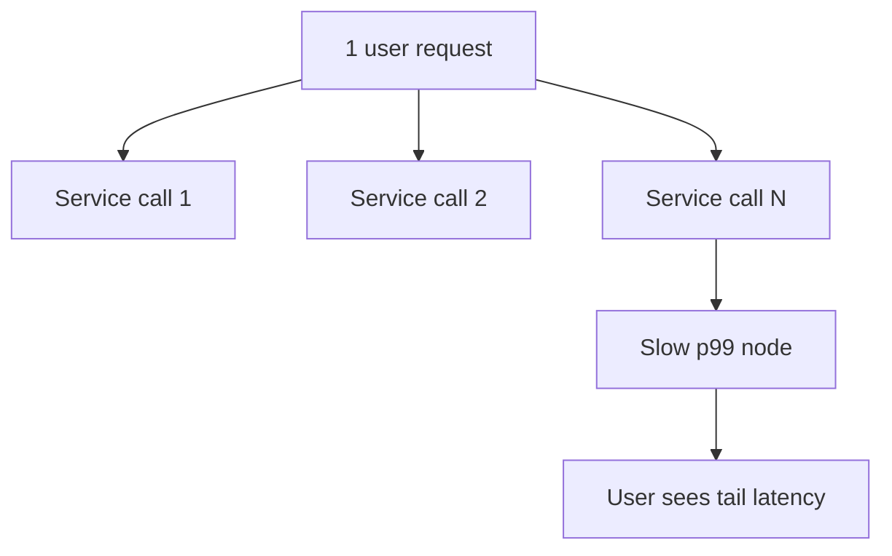

### Key details

#### Percentiles: p50, p95, p99, p999

Latency distributions are **skewed** — a few slow requests dominate user experience at scale. Report percentiles, not just mean.

| Percentile | Meaning | Who feels it |
|------------|---------|--------------|
| **p50** (median) | Half of requests faster | Typical user |
| **p95** | 95% faster | Unlucky session |
| **p99** | 99% faster | 1 in 100 requests — **SLO target** for APIs |
| **p999** | 99.9% faster | Tail outliers; debug GC, slow shards |

```text
Example distribution (1000 requests):
  p50 = 45 ms    ← "feels fast"
  mean = 120 ms  ← pulled up by outliers
  p99 = 800 ms   ← 10 users/min at 1000 RPS see this
  max = 12,000 ms
```

**SLO example:** "99% of API requests complete in < 300 ms" = **p99 < 300 ms**. Alert on p99 burn rate, not mean.

**Why mean lies:** 990 requests at 50 ms + 10 at 5 s → mean ≈ 99 ms, but 1% of users wait 5 seconds.

#### Fan-out amplification

One user request often triggers **N parallel backend calls**. Tail latency **compounds** — you don't average percentiles across calls.

**Google "Tail at Scale" rule of thumb:**

```text
P(slow user response) ≈ 1 − (1 − p_slow)^N

If each of N backends has 1% chance of p99 slowness:
  N=1   → 1% slow
  N=10  → ~10% slow user responses
  N=100 → ~63% slow (effectively certain to hit one slow shard)
```

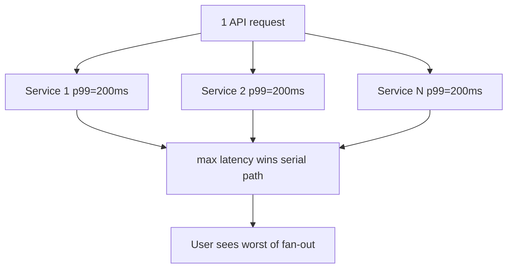

**Mitigations:**

| Technique | Mechanism |
|-----------|-----------|
| **Reduce fan-out** | Denormalize, batch API, GraphQL DataLoader |
| **Parallel + timeout** | `max(child_timeout)` not sum; cap each branch |
| **Hedged requests** | Send duplicate if first slow; doubles load — use sparingly |
| **Canary / outlier detection** | LB ejects high-latency instances |
| **Tiered timeouts** | 50 ms cache → 200 ms DB → fail fast |
| **Partial response** | Return core data; async enrich optional fields |

- p99 of 500 ms with p50 of 50 ms indicates outliers, not uniform slowness
- **Head-of-line blocking** in queues inflates tails
- Shared resources (noisy neighbor) cause tail spikes in multi-tenant cloud
- Retry storms worsen tail latency under load

### When to use

- SLO definitions for user-facing APIs
- Load balancer health check tuning (latency-based routing)
- Database connection pool and timeout configuration

### Trade-offs / Pitfalls

- Hedged requests double load on recovery - use sparingly
- Chasing p999.9 may cost more than business value
- Aggregated metrics hide per-tenant tail issues
- Tracing sampling often misses rare tail events

---


## 4.5 Availability


### What is it?

**Availability** is the fraction of time a system is operational and serving **correct** responses, expressed as **nines** (percentage of uptime per year). It measures whether the service is reachable - distinct from **reliability** (correct behavior) and **latency** (how fast).

```text
Availability = uptime / (uptime + downtime)
             = MTBF / (MTBF + MTTR)    # mean time between failures / repair
```

### Why it matters

Downtime directly costs revenue, trust, and SLA penalties. Availability targets drive architecture: redundant nodes, multi-AZ deployment, health checks, and failover automation. Choosing "four nines" vs "three nines" can 10× infrastructure cost.

### How it works

1. Eliminate single points of failure (SPOF) via redundancy (4.10).
2. Deploy across multiple availability zones or regions.
3. Health checks remove unhealthy instances from load balancers.
4. Automated failover promotes standby when primary fails (4.11).
5. Measure uptime with synthetic probes and real user monitoring (RUM).

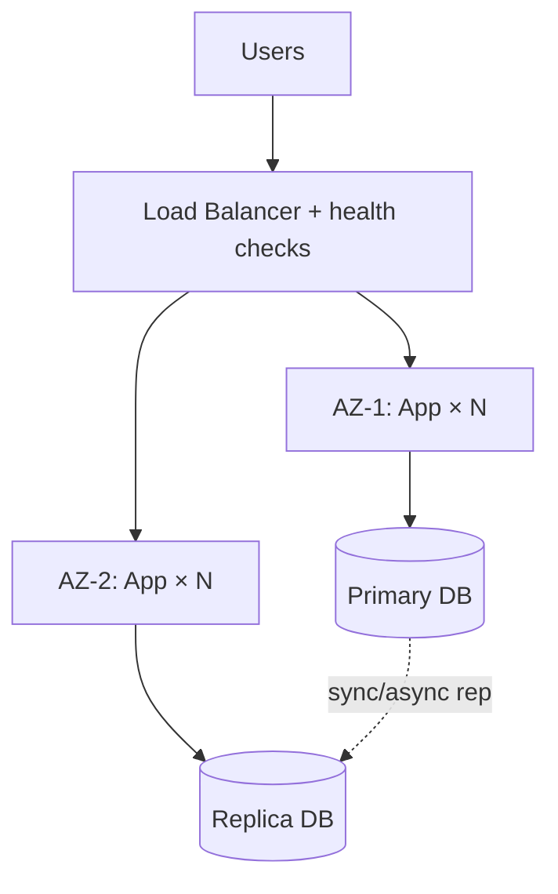

### Key details

#### Nines table and downtime math

| Availability | Downtime/year | Downtime/month | Downtime/week | Typical use |
|--------------|---------------|----------------|---------------|-------------|
| **90%** (1 nine) | 36.5 days | 3 days | 16.8 hours | Dev/test |
| **99%** (2 nines) | 3.65 days | 7.2 hours | 1.68 hours | Internal tools |
| **99.9%** (3 nines) | 8.76 hours | 43.8 min | 10.1 min | Standard SaaS |
| **99.99%** (4 nines) | 52.6 min | 4.38 min | 1.01 min | Payments, core API |
| **99.999%** (5 nines) | 5.26 min | 26.3 sec | 6.05 sec | Telco, hospital systems |
| **99.9999%** (6 nines) | 31.5 sec | 2.6 sec | 0.6 sec | Rare; multi-region DR |

```text
Downtime/year = (1 - availability) × 365 × 24 × 60 minutes

99.9%  → 0.001 × 525,600 min = 525.6 min ≈ 8.76 hours
99.99% → 0.0001 × 525,600 min = 52.56 min
```

#### SLA vs. SLO vs. SLI

| Term | Meaning | Example |
|------|---------|---------|
| **SLI** (indicator) | Measured metric | Successful requests / total requests |
| **SLO** (objective) | Internal target | 99.95% success over 30 days |
| **SLA** (agreement) | Contract with penalties | 99.9% or credits refunded |

**Error budget:** at 99.9% SLO, you can afford ~43 min downtime/month. Spending it on risky deploys vs. incidents is an engineering/product trade-off.

#### Combined availability (dependency chain)

Independent components in series **multiply**:

```text
End-to-end availability = A₁ × A₂ × A₃ × ...

Example: API (99.99%) × DB (99.99%) × Cache (99.9%)
  = 0.9999 × 0.9999 × 0.999
  = 0.9988 ≈ 99.88% (worse than any single component)
```

Parallel redundancy improves availability:

```text
Two AZs each 99.9% (fail independently):
  A = 1 - (0.001 × 0.001) = 99.9999% (if failover works)
```

#### High availability patterns

| Pattern | Description | Availability gain |
|---------|-------------|-------------------|
| **Active-active** | All nodes serve traffic | Survives N-1 node loss |
| **Active-passive** | Standby on hot/warm/cold standby | Depends on failover speed |
| **Multi-AZ** | Replicas in isolated failure domains | Survives single AZ outage |
| **Multi-region** | Geographic redundancy | Survives region disaster |

### When to use

- Defining SLA/SLO with business stakeholders
- Choosing single-region vs. multi-region architecture
- Evaluating cloud provider AZ/region strategies
- Error budget policies for release velocity

### Trade-offs / Pitfalls

- Higher nines cost **exponentially** more in infra and engineering
- Availability ≠ correctness (system "up" but returning 500s counts as down in good SLIs)
- **Planned maintenance** may or may not count against SLA - define in contract
- Dependency chain math: adding components lowers combined availability
- Active-active write conflicts need resolution - complexity trade-off
- Measuring at LB misses client-side failures and partial degradation

---


## 4.6 Reliability


### What is it?

**Reliability** is the probability that a system performs its intended function correctly over a specified period under stated conditions. Unlike availability (binary up/down), reliability emphasizes **correct behavior** and **mean time between failures (MTBF)**.

### Why it matters

A service that is "available" but returns wrong answers or loses data is unreliable. Reliability engineering focuses on defect prevention, testing, and learning from incidents.

### How it works

1. Define expected behavior (SLOs, invariants).
2. Build with error handling, retries with backoff, idempotency.
3. Test failure scenarios (chaos engineering, fault injection).
4. Monitor error rates, not just uptime.
5. Post-incident reviews drive systemic fixes.

### Key details

- **MTBF:** average time between failures; higher is better
- **MTTR:** mean time to repair; lower improves effective availability
- Effective uptime ≈ MTBF / (MTBF + MTTR)
- Reliability includes data integrity, not just request success

### When to use

- Safety-critical or financial systems
- Setting error budget policies alongside SLOs
- Comparing build quality vs. operational redundancy

### Trade-offs / Pitfalls

- Redundancy improves availability but can hide bugs (failover masks corruption)
- Over-retrying reduces reliability of downstream services
- Reliability metrics need business-defined "correct"

---


## 4.7 Durability


### What is it?

**Durability** guarantees that once data is acknowledged as written, it survives crashes, power loss, and disk failures. It is the **D** in ACID and a distinct concern from availability.

### Why it matters

Users expect saved data to persist. Losing orders, messages, or payments after "success" destroys trust and violates regulations.

### How it works

1. Writes go to **write-ahead log (WAL)** on disk before acknowledging client.
2. Data replicated to multiple nodes (sync or quorum) before ack.
3. Backups and snapshots provide recovery from catastrophic failure.
4. fsync and replication policies trade latency for durability strength.

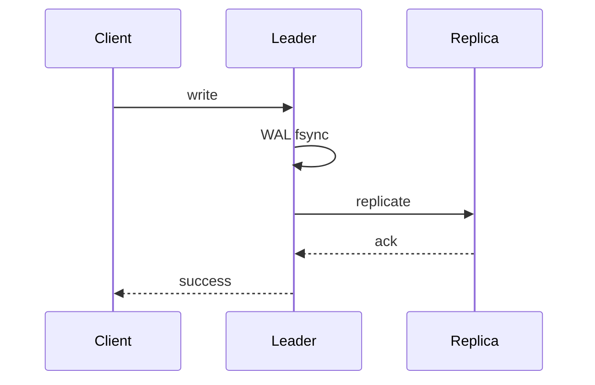

### Key details

- **Sync replication:** ack after replica confirms (stronger durability, higher latency)
- **Async replication:** ack after local write (faster, risk of loss on crash)
- Object storage (S3) achieves 11 nines durability via erasure coding across AZs
- Durability ≠ consistency: data can be durable but stale on reads

### When to use

- Any persistent store: databases, queues, file systems
- Choosing replication mode (PostgreSQL synchronous vs. asynchronous)
- Compliance requirements for record retention

### Trade-offs / Pitfalls

- Strong durability increases write latency
- Disk full or replication lag can block writes
- Backups untested = no durability guarantee in practice
- Client-side ack before server fsync creates false sense of safety

---


## 4.8 Fault Tolerance


### What is it?

**Fault tolerance** is the ability of a system to continue operating - possibly at reduced capacity - when one or more components fail. Failures may be hardware, software, network, or human error.

### Why it matters

At scale, failure is continuous: disks die, packets drop, deploys break. Fault-tolerant design assumes failure is normal, not exceptional.

### How it works

1. **Detect:** health checks, heartbeats, timeouts.
2. **Isolate:** circuit breakers stop failure propagation.
3. **Recover:** failover, automatic restart, self-healing (Kubernetes).
4. **Degrade:** serve partial functionality rather than total outage.
5. **Redundancy:** N+1 or 2N capacity for critical paths.

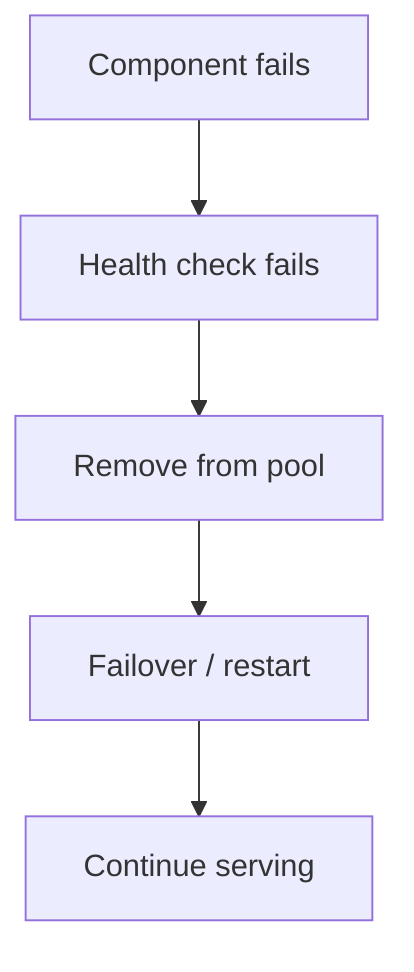

### Key details

#### Failure domains

A **failure domain** is the blast-radius boundary for a single fault — everything inside can fail together.

| Domain | Typical shared fate | Design response |
|--------|---------------------|-----------------|
| **Process** | Crash, OOM, bug | Restart; multiple processes per host |
| **Host / VM** | Kernel panic, disk | Replicas on different hosts |
| **Rack** | Top-of-rack switch | Spread replicas across racks |
| **Availability Zone (AZ)** | Power, flood, misconfig | Multi-AZ deployment; quorum across AZs |
| **Region** | Earthquake, provider outage | Multi-region DR; async replication |
| **Dependency** | Payment API down | Circuit breaker, degrade, cache |

```text
Bad:  primary DB + replica on same host → host death = total loss
Good: primary AZ-a, replicas AZ-b, AZ-c → survives single AZ
```

**Correlated failures defeat redundancy:** same software version on all nodes → one bug kills all replicas. Mitigate with **canary deploys**, **shuffle sharding** (AWS), diverse instance types.

#### Bulkheads

**Bulkhead pattern** (from ship compartments) **isolates resources** so overload in one area cannot exhaust shared pools.

| Bulkhead type | Example | Prevents |
|---------------|---------|----------|
| **Thread pool per dependency** | 20 threads for payments, 50 for catalog | Slow payment API starving catalog |
| **Connection pool limits** | Max 10 DB conns per service | Connection stampede to DB |
| **Semaphore / rate limit** | 100 concurrent exports | Batch job blocking interactive traffic |
| **Cell-based architecture** | Users A–M on cell 1, N–Z on cell 2 | Celebrity outage contained to one cell |
| **Queue partitioning** | Priority queue vs bulk queue | Backfill starving real-time |

```mermaid
flowchart TB
    subgraph Bulkhead['Thread pools (bulkheads)']
        API["API threads: 100"]
        API --> PoolA["Payment pool: 20"]
        API --> PoolB["Catalog pool: 50"]
        API --> PoolC["Search pool: 30"]
    end
    PoolA --> Pay[Payment Svc]
    PoolB --> Cat[Catalog Svc]
    PoolC --> Search[Search Svc]
```

**Hystrix / resilience4j / Envoy** implement bulkheads with circuit breakers. **Kubernetes** resource limits (`limits.cpu`, `limits.memory`) are coarse bulkheads at pod level.

**Without bulkheads:** one slow dependency blocks all worker threads → entire service returns 503 even for unrelated endpoints.

- **Byzantine faults:** malicious or arbitrary behavior (blockchain, military systems)
- **Crash-stop faults:** node stops responding (most cloud assumptions)
- **Fail-fast:** detect errors early and abort rather than corrupt state
- Graceful vs. ungraceful shutdown affects recovery time

### When to use

- Multi-tier architectures with external dependencies
- Designing retry, timeout, and bulkhead policies
- Mission-critical systems requiring no single point of failure

### Trade-offs / Pitfalls

- Fault tolerance adds complexity and cost (extra replicas, cross-AZ traffic)
- Split-brain if failover detection is wrong
- Masking faults can delay root-cause discovery
- "Strangler" partial failure harder to test than total outage

---


## 4.9 Resilience


### What is it?

**Resilience** is the capacity to absorb disturbances, adapt to stress, and recover quickly while maintaining core function. It extends fault tolerance with **learning**, **adaptation**, and **operational practices** (chaos engineering, runbooks).

### Why it matters

Modern systems face unpredictable load spikes, dependency outages, and cascading failures. Resilience engineering builds systems and teams that bend without breaking.

### How it works

1. Design for **failure as default** (timeouts everywhere, no infinite waits).
2. Implement **bulkheads** isolating thread pools per dependency.
3. Use **circuit breakers** and **rate limiters** on outbound calls.
4. Practice **chaos experiments** in production-like environments.
5. Automate rollback and feature flags for fast mitigation.

### Key details

- Resilience ⊃ fault tolerance (includes process and culture)
- **Adaptive concurrency** adjusts limits based on downstream health
- **Idempotency keys** enable safe retries after ambiguous failures
- Blameless postmortems convert incidents into systemic improvements

### When to use

- Microservices with many cross-service dependencies
- Building SRE practices and error budgets
- Systems with variable or adversarial traffic

### Trade-offs / Pitfalls

- Over-isolation wastes resources (too many small pools)
- Circuit breakers open too aggressively cause false outages
- Chaos without guardrails can cause real incidents
- Resilience patterns add latency (retries, hedging)

---


## 4.10 Redundancy


### What is it?

**Redundancy** duplicates critical components so failure of one does not stop the system. Forms include **N+1** (one spare), **2N** (full duplicate), geographic redundancy, and erasure-coded storage.

### Why it matters

Mean time between failures applies to every component. Redundancy converts single-component failure from outage into capacity reduction.

### How it works

1. Identify SPOFs (single power supply, single DB, single region).
2. Add redundant instances with independent failure domains.
3. Load balance across redundant paths.
4. Ensure redundant copies are **diverse** (different AZ, rack, provider).
5. Test failure of each redundant layer regularly.

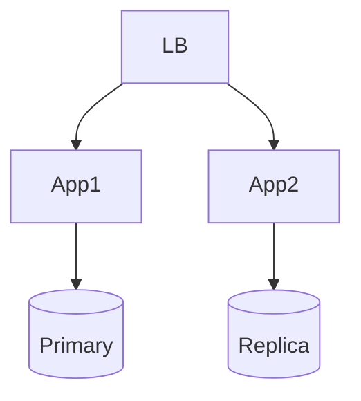

### Key details

- **Active-passive:** standby idle until failover
- **Active-active:** all nodes serve traffic; need conflict handling
- **Erasure coding:** storage redundancy with less overhead than 3× replication
- Correlated failures (same bug on all nodes) defeat redundancy

### When to use

- Any availability target above single-server uptime
- Data durability (3 replicas minimum for cloud disks)
- Network paths (multi-homed, dual ISP)

### Trade-offs / Pitfalls

- Cost scales with redundancy level
- Active-active write conflicts need resolution
- Shared codebase = shared bug (redundant but simultaneously wrong)
- Operational complexity of keeping replicas in sync

---


## 4.11 Failover


### What is it?

**Failover** is the automatic or manual switch from a failed **primary** component to a **standby** so service continues. **Failback** returns traffic to the original primary when restored and synchronized.

Failover targets are measured as **RTO** (how fast) and **RPO** (how much data loss).

| Metric | Meaning | Example |
|--------|---------|---------|
| **RTO** (Recovery Time Objective) | Max acceptable downtime | 30 seconds for API |
| **RPO** (Recovery Point Objective) | Max acceptable data loss | 0 for payments; 5 min for logs |

### Why it matters

Human-driven recovery takes minutes to hours; automated failover targets seconds. Critical for database HA, load balancer VIPs, DNS routing, and Kubernetes pod rescheduling.

### How it works

#### Active-passive failover

Standby is idle (or read-only) until primary fails. One node serves writes at a time.

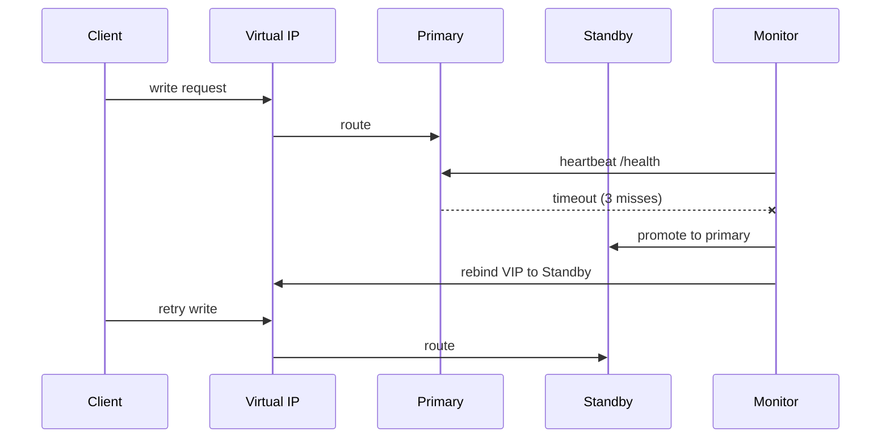

**Steps:**
1. Health monitor detects primary failure (missed heartbeats, failed `/health`).
2. **Fencing (STONITH):** isolate dead primary to prevent split-brain writes.
3. Promote standby replica to primary (DB) or assume VIP (network).
4. Update service registry / DNS / VIP so clients route to new primary.
5. Replay WAL / resync before failback.

#### Active-active failover

All nodes serve traffic simultaneously. Failure = remove bad node from pool; no promotion needed.

```text
LB health check fails on Node B → drain B → traffic to A and C only
No promotion; reduced capacity until B replaced
```

#### Virtual IP (VIP) failover

A **floating IP** moves from primary to standby hardware. Clients connect to VIP; underlying host changes transparently (if L2/L3 network supports gratuitous ARP / BGP update).

| Component | VIP role |
|-----------|----------|
| **Keepalived + VRRP** | Linux HA pair shares VIP |
| **Cloud LB** | Managed VIP (ALB, NLB) abstracts instances |
| **Kubernetes Service** | ClusterIP / external LB with endpoint updates |

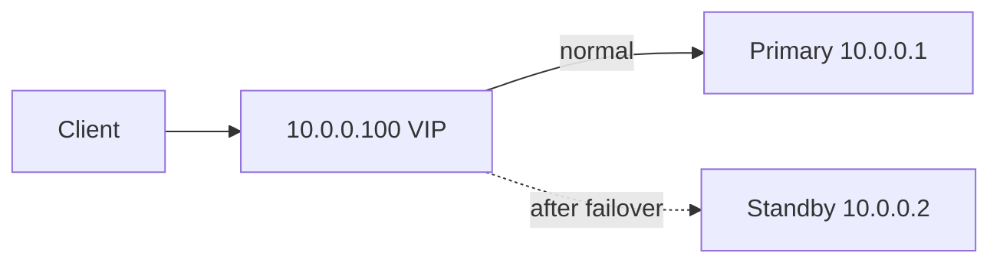

#### Health checks

| Check type | What it tests | Risk |
|------------|---------------|------|
| **TCP probe** | Port open | False positive: process hung but port listens |
| **HTTP `/health`** | App returns 200 | Better; can check DB connectivity |
| **Deep check** | Query DB, disk space | Slower; may flap under load |
| **Heartbeat lease** | etcd/K8s lease renewal | Leader election integration |

**Tuning:**
- `interval`: 5-10s typical
- `unhealthy_threshold`: 2-3 consecutive failures before failover (avoid flapping)
- `healthy_threshold`: 2 successes before re-admitting to pool

```text
# Example K8s liveness + readiness
livenessProbe:  /health/live   # restart pod if dead
readinessProbe: /health/ready  # remove from LB if not ready
```

### Key details

| Failover type | RTO | RPO | Complexity |
|---------------|-----|-----|------------|
| **Hot standby** (sync rep) | Seconds | 0 | Medium |
| **Warm standby** (async rep) | Seconds-minutes | Seconds of writes | Medium |
| **Cold standby** (restore backup) | Minutes-hours | Hours | Low cost |
| **DNS failover** | Minutes (TTL) | Depends | Low; slow propagation |
| **K8s pod reschedule** | Seconds | N/A (stateless) | Low for stateless apps |

- **Split-brain:** two nodes think they are primary - use **fencing** (STONITH, power off, isolate network)
- **Async replication:** promoted standby may lack last writes → RPO > 0
- **Client stickiness:** clients cache old primary IP - connection pools need refresh
- **Failback:** reverse sync (new primary → old primary) before role swap

### When to use

- Database primary-replica setups (PostgreSQL, MySQL, MongoDB replica set)
- Multi-region disaster recovery
- Load balancer active/passive pairs (Keepalived, cloud NLB)
- Stateful services on Kubernetes with persistent leader election

### Trade-offs / Pitfalls

- **False positive failover** causes unnecessary disruption (flapping health checks)
- Async replication → **lost writes** on failover (measure RPO honestly)
- Clients cache old primary address (DNS TTL, connection pool)
- Failback requires reverse sync complexity - often stay on new primary
- VIP failover needs L2 adjacency or BGP - not trivial cross-subnet
- Automated failover without human verification can promote corrupted node

---


## 4.12 Consistency


### What is it?

**Consistency** in distributed systems defines what guarantees readers observe about writes - whether all nodes show the same data at the same time, and in what order updates appear. It spans a spectrum from strong (linearizable) to weak (eventual).

### Why it matters

Wrong consistency choice causes lost updates, stale reads, and violated business invariants. Payment balances need strong consistency; social media likes often tolerate eventual.

### How it works

1. Classify operations: read-heavy vs. write-heavy, need for ordering.
2. Choose storage/replication model matching required guarantee.
3. Use transactions, locks, or consensus where strong ordering needed.
4. Use async replication and conflict resolution where eventual OK.
5. Document guarantees per API endpoint for client developers.


### Key details

- Consistency is about **observable behavior**, not internal replication timing
- **CAP** forces partition-time choice between C and A
- Different objects in same system can have different consistency (per-key tiers)
- Client libraries can provide stronger semantics than storage alone (read-your-writes)

### When to use

- Every multi-node or replicated data design
- Choosing between SQL, Dynamo-style KV, CRDTs
- Defining API contracts for mobile/offline clients

### Trade-offs / Pitfalls

- Strong consistency costs latency and availability during partitions
- "Eventually consistent" without bound is not a spec - define convergence time
- Application bugs mimic consistency failures (cache not invalidated)
- Distributed transactions don't solve all cross-service consistency needs

---


## 4.13 Concurrency


### What is it?

**Concurrency** is the ability of a system to make progress on multiple tasks simultaneously - via threads, processes, async I/O, or distributed workers. **Parallelism** is actual simultaneous execution on multiple CPUs.

### Why it matters

Single-threaded servers cannot use modern multi-core hardware. Concurrent design enables throughput but introduces races, deadlocks, and ordering bugs.

### How it works

1. Identify shared mutable state (critical sections).
2. Protect with locks, mutexes, or atomic operations.
3. Prefer **immutable data** and message passing to reduce sharing.
4. Use **actor model** or **event loop** (Node.js, Netty) for I/O-bound work.
5. In distributed setting, use partitions so each shard handles subset without cross-shard locks.

### Key details

- **Race condition:** outcome depends on scheduling order
- **Deadlock:** circular wait on locks
- **Livelock:** threads active but no progress
- **Optimistic concurrency:** compare-and-swap, version columns (MVCC)
- Distributed concurrency needs clocks or consensus for global ordering

### When to use

- Multi-threaded servers, worker pools, parallel batch jobs
- Designing idempotent consumers for at-least-once delivery
- Database transaction isolation level selection

### Trade-offs / Pitfalls

- Fine-grained locking complexity vs. coarse locking contention
- Lock-free structures harder to verify correct
- Distributed locks (Redis Redlock) have edge cases - prefer design without locks
- Too much concurrency overwhelms DB with connections

---


## 4.14 CAP Theorem


### What is it?

The **CAP theorem** (Eric Brewer, 2000) states that a distributed data store cannot simultaneously provide all three of the following **during a network partition**:

| Property | Meaning |
|----------|---------|
| **C - Consistency** | Every read receives the most recent write (or an error) - all nodes agree on the same data |
| **A - Availability** | Every request to a non-failing node receives a non-error response (no indefinite blocking) |
| **P - Partition tolerance** | System continues operating despite arbitrary message loss or delay between nodes |

You can have at most **two** during a partition. In practice **P is mandatory** (networks always fail eventually), so the real choice is **CP vs AP** when a partition occurs.

### Why it matters

Partitions are not theoretical - AZ failures, switch misconfigurations, GC pauses, and cross-region link cuts happen in production. Your architecture must define: *when replicas cannot talk, do we reject requests or serve possibly stale/conflicting data?*

This drives database selection (Cassandra vs etcd), failover behavior, and incident response playbooks.

### How it works

**Normal operation (no partition):** systems can often provide strong consistency AND availability - CAP's constraint applies when the network **splits** replicas into isolated groups.

**Step-by-step during partition:**

1. Network splits Node A (DC-1) from Node B (DC-2); they cannot exchange messages
2. Client in DC-1 writes `balance=80` to A; client in DC-2 reads from B

**CP path (Consistency + Partition tolerance):**
- Reject reads/writes that cannot reach a **quorum** (majority of replicas)
- DC-2 client gets error/timeout instead of stale `balance=100`
- After heal: single truth from consensus log; no silent divergence
- Examples: **etcd, ZooKeeper, Consul**, PostgreSQL with synchronous replication (writes blocked if standby unreachable)

**AP path (Availability + Partition tolerance):**
- Both sides accept reads and writes independently
- DC-2 may return stale data OR accept conflicting writes (`balance=50` on both sides)
- After heal: **conflict resolution** - last-write-wins, vector clocks, CRDTs, or manual merge
- Examples: **Cassandra, DynamoDB, Riak** (with weak consistency settings)

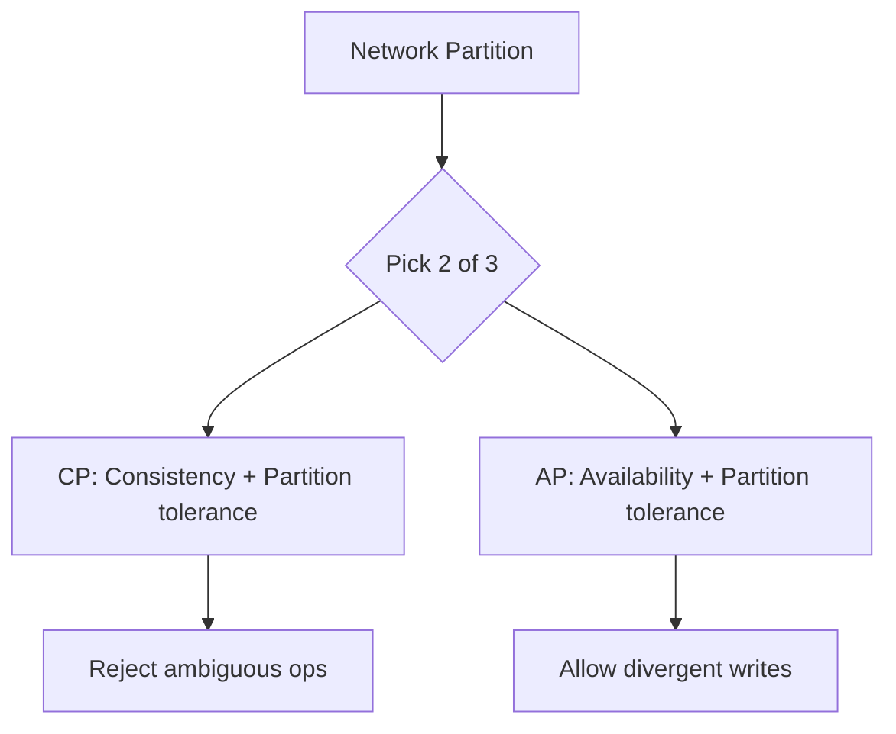

**After partition heals:**
- CP systems replay missed log entries; clients retry failed ops
- AP systems run **anti-entropy** (repair replicas), merge conflicts, or alert operators

### Key details

- **"CA systems"** (e.g. single-node RDBMS) are not truly distributed - they avoid partitions by not scaling across networks
- CAP **Consistency** means linearizable replica agreement - not the same as ACID **serializability** across multiple keys
- Most production stores are **AP with tunable consistency** - Cassandra/DynamoDB let you choose quorum size per read/write
- **Microservices do not escape CAP** - each datastore, cache, and queue makes its own CAP choice; your API composes them
- Interview framing: *"We use CP etcd for leader election and AP Cassandra for the high-write event log"*

| System | Typical posture | Behavior on partition |
|--------|-----------------|----------------------|
| etcd / ZooKeeper | CP | Minority partition unavailable for writes |
| Cassandra | AP (tunable) | Quorum W+R>N for strong; ONE for eventual |
| DynamoDB | AP (tunable) | `ConsistentRead=true` costs latency |
| Redis Cluster | AP | Async replication; failover may lose writes |
| CockroachDB | CP | Requires majority for commits |

**Common misconceptions:**
- "We chose all three with our microservices" - No; each component still faces CAP
- "CAP only matters during disasters" - Partition definition includes slow networks and dropped packets
- "AP means no consistency ever" - AP means availability during partition; quorums restore consistency when possible

### When to use

- Comparing **Dynamo/Cassandra (AP)** vs **etcd/ZooKeeper (CP)** in architecture reviews
- Deciding payment ledger (CP) vs product catalog cache (AP) storage
- Designing regional failover: which APIs fail closed vs degrade gracefully
- Every system design interview involving distributed databases

### Trade-offs / Pitfalls

- CAP is a **simplified model** - consistency and availability are spectrums, not binary switches
- Use **PACELC** (4.15) for trade-offs when the network is healthy (latency vs consistency)
- Choosing AP without a **merge/reconciliation story** causes silent data loss after partition heal
- Choosing CP without **client retry logic** causes poor UX during partial outages
- Application caches add another consistency layer on top of the database's CAP choice

### References

- [Consistency - Hareram Singh](https://medium.com/@hareramcse/consistency-1a80d8d63580)

---


## 4.15 PACELC Theorem


### What is it?

**PACELC** (Daniel Abadi, 2012) extends CAP by stating that **even when the network is normal** (no partition), you still trade off **latency** against **consistency**.

**Full theorem:**

> If there is a **P**artition, choose between **A**vailability and **C**onsistency (same as CAP).
> **E**lse (normal operation), choose between **L**atency and **C**onsistency.

```text
PACELC = PA/EL or PC/EC (common shorthand labels)
         │    └── Else: Latency vs Consistency
         └── Partition: Availability vs Consistency
```

CAP alone only describes partition behavior; PACELC explains why DynamoDB's default reads are fast *and* eventually consistent even when the network is healthy.

### Why it matters

Most of a system's life runs without partitions - you still trade latency for consistency on every replicated read/write. PACELC explains:
- Why synchronous cross-region replication adds 100+ ms per write
- Why Cassandra defaults to `ONE` quorum (low latency, eventual)
- Why etcd always coordinates a quorum (consistent, higher latency)

### How it works

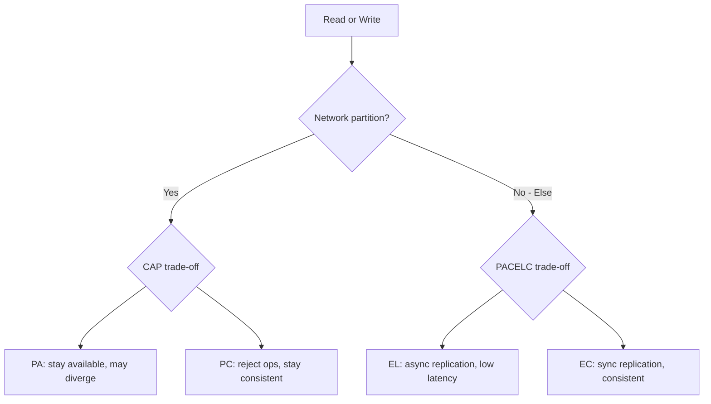

**During partition (same as CAP):**
- **PA:** accept reads/writes on both sides; reconcile later
- **PC:** reject ops that cannot reach quorum; preserve single truth

**During normal operation (the EL/EC choice):**

| Choice | Mechanism | Read latency | Consistency |
|--------|-----------|--------------|-------------|
| **EL** | Async replication; read from nearest replica | Low (~1 ms) | May be stale |
| **EC** | Sync quorum before ack; read from leader/quorum | Higher (~5-50 ms) | Strong / linearizable |

**Example write path:**

```text
EL (Cassandra ONE):  write to local replica → ack client → async gossip to others
EC (PostgreSQL sync): write to primary → wait for standby fsync → ack client
```

### Key details

#### Full system classification table

| System | On Partition | Else (normal) | Notes |
|--------|--------------|---------------|-------|
| **Cassandra** | PA | EL | Tunable CL: QUORUM → EC-like |
| **DynamoDB** | PA | EL | `ConsistentRead=true` → EC reads |
| **Riak** | PA | EL | Strong consistency via riak_dt / not default |
| **MongoDB** | PA | EL | `writeConcern: majority` → EC writes |
| **PostgreSQL (async rep)** | PA | EL | Reads from replica may be stale |
| **PostgreSQL (sync rep)** | PC | EC | Writes block if standby down |
| **MySQL Group Replication** | PC | EC | Majority quorum required |
| **etcd / ZooKeeper / Consul** | PC | EC | Raft consensus always |
| **CockroachDB / Spanner** | PC | EC | Global consistency; Spanner uses TrueTime |
| **Redis Cluster** | PA | EL | Async replication; failover may lose writes |
| **Memcached** | PA | EL | No replication; partition = split brain |
| **Kafka** | PC | EC | ISR quorum for committed messages |
| **S3** | PA | EL | Read-after-write eventual for overwrites |

#### Tunable consistency (bridge EL ↔ EC)

Many AP systems let you pay latency per operation:

| System | Tunable knob | Effect |
|--------|--------------|--------|
| Cassandra | `ConsistencyLevel` ONE/QUORUM/ALL | Higher CL = more EC-like |
| DynamoDB | `ConsistentRead` | Strong read costs 2× RCU |
| MongoDB | `readConcern` / `writeConcern` | `majority` = EC |
| Riak | `PR/PW` values | Quorum reads/writes |

```text
# DynamoDB: default EL read
GetItem(Key=...)                           # eventual

# EC read: 2× read cost, higher latency
GetItem(Key=..., ConsistentRead=true)
```

#### Interview framing

- *"Cassandra is PA/EL by default; we use QUORUM for writes and reads on payment tables to move toward EC when needed."*
- *"Our config store uses PC/EC (etcd) because leader election must be linearizable."*
- *"PACELC reminds us that cross-region sync replication is an EC choice even without partitions."*

### When to use

- Nuanced database comparisons beyond CAP slogans
- Explaining read consistency options in cloud databases
- Designing per-API consistency/latency tiers (catalog EL, inventory EC)
- Justifying why payment service accepts higher write latency

### Trade-offs / Pitfalls

- Not all systems fit cleanly into one quadrant - tunable knobs blur lines
- EL → EC per operation still doesn't give cross-key transactions
- Latency vs. consistency trade-off depends on **replication distance** (same AZ vs cross-region)
- Strong reads on AP systems hit stale replicas if routing wrong replica
- PACELC doesn't cover durability (use replication mode separately)
- Teams confuse "no partition" with "no trade-off" - EL/EC always applies with replicas

---


## 4.16 Strong Consistency


### What is it?

**Strong consistency** is a broad term meaning reads reflect the latest successful write. In practice it usually means one of:

| Model | Guarantee | Scope |
|-------|-----------|-------|
| **Linearizability** | Real-time ordering; each op atomic at a point in time | Single register/object |
| **Sequential consistency** | All agree on some sequential order (not necessarily real-time) | Multi-object |
| **Serializable** | Transactions appear in some serial order | Multi-key transactions |

Colloquially "strong" often means **read-after-write**: after update, a read returns the new value. Precise definition matters in interviews and specs.

### Why it matters

Financial transfers, inventory deduction, and leader election require strong consistency - double-spend or oversell are unacceptable. Ambiguous "strong" without definition leads to production bugs (reading stale replica labeled "strong").

### How it works

**Single-leader replication (most common):**

1. All writes go to **leader** (primary).
2. Leader applies to local log, replicates to followers.
3. **Sync replication:** ack after quorum of followers confirm (strong, slower).
4. **Reads from leader** (or quorum-verified followers) return latest committed value.

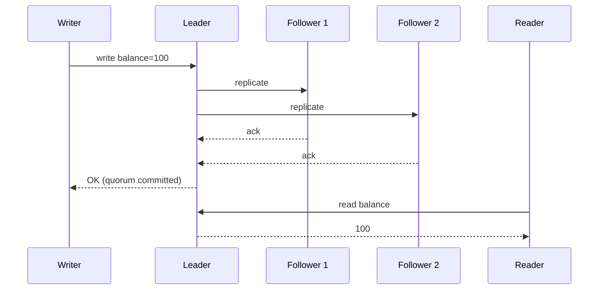

**Consensus-based (Raft/Paxos):**

1. Leader proposes entry to replicated log.
2. Majority (quorum) persists before commit.
3. All nodes apply log in same order → consistent state.
4. Used by etcd, CockroachDB, TiKV.

**Distributed transactions (2PC):**

```text
Coordinator: PREPARE → all participants vote
             COMMIT  → all apply (or ABORT all)
Strong across shards; blocks on participant failure
```

### Key details

| Implementation | Consistency level | Write latency | Partition behavior |
|----------------|-------------------|---------------|-------------------|
| Single-node RDBMS | Linearizable (single node) | Low | Not distributed |
| PostgreSQL sync rep | Strong on leader reads | Medium | CP on partition |
| Raft (etcd) | Linearizable | Medium | CP; minority partition unavailable |
| Spanner | External consistency (TrueTime) | High (global) | CP with clocks |
| DynamoDB `ConsistentRead` | Strong for single item | 2× read cost | AP system; strong per key |

**Read paths that are NOT strong (common bugs):**

```text
❌ Write to primary, read from async replica
❌ Read from Redis cache without invalidation
❌ Read from local near-cache after remote write on another pod
✅ Read from leader or quorum with version check
```

**Cross-region strong consistency:**

- Requires sync replication across regions → 100-200 ms per write (RTT bound).
- Spanner uses **TrueTime** (GPS + atomic clocks) for global `commit timestamp`.
- Most systems choose **strong per region, eventual cross region**.

### When to use

- Money, inventory, booking with limited stock
- Coordination services (locks, leader election, service discovery)
- Regulatory audit requiring read-after-write truth
- Any invariant that must hold globally (`balance >= 0`)

### Trade-offs / Pitfalls

- Lower availability during partition (CP behavior - minority side rejects ops)
- Higher latency from quorum waits and cross-region sync
- Harder to scale writes (single leader bottleneck per shard)
- Misconfigured "strong" reads from async replica are not actually strong
- **Strong consistency ≠ ACID serializable** across arbitrary multi-key without explicit transactions
- 2PC coordinator failure blocks until recovery

---


## 4.17 Eventual Consistency


### What is it?

**Eventual consistency** guarantees that if **no new updates** are made to a given object, all replicas will **converge** to the same value given sufficient time. During convergence, reads may return **stale** or **conflicting** versions.

There is no bound on staleness unless you add one (SLA: "reads lag < 5s p99").

### Why it matters

Enables highly available, low-latency global systems (DNS, CDN, Dynamo-style KV). Most users tolerate seconds of staleness for social feeds, analytics, session data, and product catalogs.

### How it works

**Basic replication flow:**

1. Write accepted at one replica (or leader with async fan-out).
2. Update propagates via replication log, gossip, or anti-entropy.
3. Reads from other replicas may return pre-update value.
4. Convergence when all replicas receive all updates.

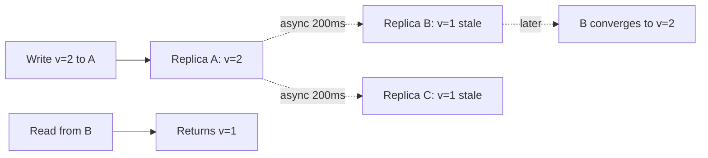

#### Read repair

On read, if replicas disagree, the **latest version** is returned to client and stale replicas are updated in background.

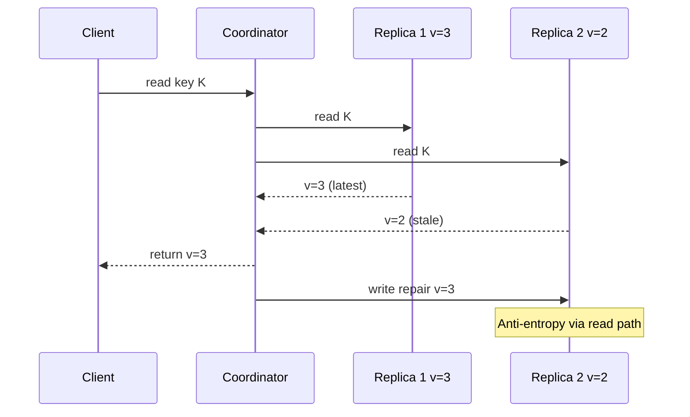

| Aspect | Read repair | Background anti-entropy |
|--------|-------------|-------------------------|
| Trigger | Client read discovers mismatch | Scheduled / gossip protocol |
| Cost | Paid on read path latency | Background bandwidth |
| Used by | Cassandra (with `LOCAL_QUORUM`) | Cassandra, Riak, Dynamo |

#### Anti-entropy

Background process compares replica state and syncs missing writes (Merkle trees, hash comparisons).

```text
1. Each replica hashes key ranges (Merkle tree)
2. Peers exchange tree roots
3. Divergent branches identified → sync missing data
4. Runs continuously (Cassandra repair) or on schedule (weekly)
```

```mermaid
flowchart TB
    R1[Replica A Merkle tree] --> Compare{Compare roots}
    R2[Replica B Merkle tree] --> Compare
    Compare -->|differ| Drill[Drill into child hashes]
    Drill --> Sync[Transfer missing SSTables / ops]
```

**Other convergence mechanisms:**

| Mechanism | Description |
|-----------|-------------|
| **Gossip protocol** | Epidemic spread of updates peer-to-peer |
| **Hinted handoff** | Store writes for temporarily down replica; deliver on recovery |
| **Last-write-wins (LWW)** | Timestamp/version picks winner; silent data loss on conflict |
| **Vector clocks** | Detect concurrent writes; app merges |
| **CRDTs** | Mathematically merge without coordination |

**Conflict example (LWW):**

```text
Replica A: set name="Alice"  t=100
Replica B: set name="Bob"    t=101   (partition healed)
Result: name="Bob" (Alice update lost silently)
```

### Key details

- Convergence time **unbounded** without monitoring - define SLA on replication lag
- **Hinted handoff:** write goes to healthy replica + hint for down node; prevents temporary unavailability
- **Quorum reads/writes:** `W + R > N` gives strong-ish consistency when no partition (not true EC)
- Monitor: `replication_lag_seconds`, Merkle repair progress, conflict counters

| System | Default model | Stronger option |
|--------|---------------|-----------------|
| Cassandra | Eventual (ONE) | QUORUM / LOCAL_QUORUM |
| DynamoDB | Eventual reads | `ConsistentRead=true` |
| DNS | Eventual (TTL-bound) | Low TTL for faster convergence |
| S3 | Eventual for overwrites | Read-after-write for new objects |

### When to use

- High write/read throughput globally
- Caching layers, shopping carts, activity feeds, view counts
- Systems with natural conflict resolution (counters, sets, CRDTs)
- Data where brief staleness is acceptable (product description, avatar)

### Trade-offs / Pitfalls

- Application must handle stale reads and explicit conflict merge
- LWW loses concurrent updates silently - dangerous for financial state
- Testing eventual behavior harder than strong consistency (timing-dependent)
- "Eventually" without monitoring → never converges if replication broken
- Read repair adds latency spike on contested keys
- Anti-entropy repair during peak can cause I/O storms

---


## 4.18 Causal Consistency


### What is it?

**Causal consistency** preserves **cause-and-effect** order: if operation A happens-before B, everyone sees A before B. Concurrent operations may be seen in different orders by different clients.

### Why it matters

Stronger than eventual (no arbitrary reordering of related events) but weaker than linearizable (allows concurrent reorder). Fits collaborative apps, comment threads, and message ordering.

### How it works

1. Track **causal dependencies** with vector clocks or version chains.
2. Replica applies updates respecting happens-before, not wall clock.
3. Client reads may lag but never show effect before cause.
4. Concurrent writes still need merge policy.

```mermaid
flowchart TB
    A[Post comment] --> B[Reply to comment]
    B --> C[Read thread]
    C --> OK[Must see A before B]
```

### Key details

- **Read-your-writes:** client sees own updates (common session guarantee)
- **Monotonic reads:** no going backward in time per client
- Weaker than sequential consistency; stronger than eventual
- Implemented in some message queues and research systems (COPS)

### When to use

- Social threads, chat, collaborative editing metadata
- When ordering between related events matters but global total order doesn't
- Mobile offline sync with dependency tracking

### Trade-offs / Pitfalls

- Vector clock size grows with replica count
- Concurrent operations still expose anomalies without CRDTs
- Less common in mainstream DBs than strong or eventual
- Clients must pass causal tokens for correct reads in some designs

---


## 4.19 Linearizability


### What is it?

**Linearizability** is the strongest single-object consistency model. Every operation appears to occur **atomically** at some instant between its invocation and response, and the global history respects **real-time ordering**: if operation A completes before B begins (in real wall-clock time), A appears before B in the sequential history.

All clients agree on a single sequential order - as if there were one copy of the data and no replication lag visible.

### Why it matters

Gold standard for correctness of registers, distributed locks, and leader election. If a system is linearizable, reasoning about concurrent behavior matches sequential intuition - critical for coordination primitives.

### How it works

1. Each operation assigned a **linearization point** on a timeline.
2. History is equivalent to some **sequential** execution of the same operations.
3. **Real-time constraint:** `A completes → B starts` implies A precedes B in the order.
4. Achieved via consensus (Raft, Paxos), single leader with sync replication, or hardware serializability (single node).

```mermaid
flowchart LR
    subgraph Timeline
        W1[Write x=1] --> W2[Write x=2]
        W2 --> R1[Read x=2]
    end
    Note[All observers agree on this order]
```

**Valid linearizable history example:**

```text
Client 1:  |-- write(x=1) --|
Client 2:                    |-- read x → 1 --|
Client 1:                              |-- write(x=2) --|
Client 2:                                            |-- read x → 2 --|

Linearization points: write1 at t1, read1 at t2 (sees 1), write2 at t3, read2 at t4 (sees 2)
```

**NOT linearizable (stale read violates real-time order):**

```text
Client 1:  |-- write(x=1) --|  (completes at t=100)
Client 2:  |-- read x → 0 --|  (starts at t=150, still sees old value)
→ Read should have linearized after write; violates real-time order
```

### Key details

#### Linearizability vs. sequential consistency

| Property | Linearizability | Sequential consistency |
|----------|-----------------|------------------------|
| **Single global order** | Yes | Yes |
| **Respects real-time order** | **Yes** | No |
| **Example violation** | N/A | Write finishes, read starts later, still sees old value |
| **Strength** | Stronger | Weaker |
| **Typical systems** | etcd, ZooKeeper (with caveats) | Some shared-memory hardware models |

```text
Sequential consistency ALLOWS:
  Process P1: write(x=1) completes at t=10
  Process P2: read(x) starts at t=20 → may still return 0
  (as long as ALL processes see the same sequential story)

Linearizability FORBIDS this - read at t=20 must see write from t=10
```

#### Linearizability vs. serializability

| | Linearizability | Serializability |
|---|-----------------|-----------------|
| **Scope** | Single object / register | Multi-key **transactions** |
| **Question answered** | "What order do ops appear?" | "Can transactions reorder?" |
| **Example** | Atomic counter increment | Transfer A→B debit+credit atomic |
| **Composable** | Per-object | Whole transaction bundle |

A system can be serializable but not linearizable (reordering within transaction bounds), or linearizable per key without cross-key serializability.

#### Real-time order and clocks

Linearizability uses **real-time precedence** (wall clock), not logical clocks:

```text
if resp_time(A) < start_time(B)  →  A must precede B in linearization order
```

Clock skew between nodes does not relax this - coordination service assigns order at commit time.

| System | Linearizable? | Caveats |
|--------|---------------|---------|
| **etcd / Raft** | Yes (default) | `read index` ensures linearizable reads |
| **ZooKeeper** | Yes (sync reads) | `sync()` before read for linearizability |
| **Consul** | Yes (with consistent mode) | Stale reads in default mode |
| **DynamoDB** | Per-item strong read | Not cross-item |
| **Cassandra** | No (default) | SERIAL not full linearizability |
| **Single RDBMS node** | Yes | One copy of data |

**Jepsen testing:** industry standard for finding linearizability violations in distributed databases under partition/failure.

### When to use

- Distributed locks, leader election, config stores (etcd, ZooKeeper)
- When interview or spec says "strongest consistency for single key"
- Comparing correctness guarantees of coordination services
- Implementing compare-and-swap / fencing tokens

### Trade-offs / Pitfalls

- Not scalable for high-throughput data plane (coordination per op)
- **Sticky sessions** to one replica do not guarantee linearizability across clients
- Partial linearizability bugs in complex systems hard to detect without Jepsen
- Confused with "strong consistency" colloquially - always define precisely
- Linearizable reads from followers require quorum or leader confirmation (extra RTT)
- Multi-object invariants need **transactions** or **serializability**, not linearizability alone

---


## 4.20 Backpressure


### What is it?

**Backpressure** is a flow-control mechanism where an overloaded downstream component signals upstream to **slow down** or **stop sending** work temporarily, preventing unbounded queue growth and cascading failure.

### Why it matters

Without backpressure, fast producers overwhelm slow consumers - memory exhausts, GC pauses, and latency explodes. Essential in streaming, RPC, and reactive systems.

### How it works

1. Consumer exposes capacity (queue depth, credits).
2. Producer checks capacity before sending; blocks or drops if full.
3. **Reactive streams** (Project Reactor, RxJava) propagate pressure via `request(n)`.
4. HTTP/2 flow control limits in-flight bytes per stream.
5. Message queues use prefetch limits and consumer ack pacing.

```mermaid
sequenceDiagram
    participant Prod as Producer
    participant Queue
    participant Cons as Consumer
    Cons->>Queue: slow processing
    Queue->>Prod: queue full signal
    Prod->>Prod: pause / drop
```

### Key details

- **Drop vs. block:** block preserves data but increases latency; drop sheds load
- **Bounded queues** are prerequisite for effective backpressure
- gRPC flow control built on HTTP/2 windows
- Kafka consumer `max.poll.records` limits batch size

### When to use

- Stream processing pipelines (Flink, Kafka)
- Service-to-service RPC under variable load
- Any producer faster than consumer scenario

### Trade-offs / Pitfalls

- Blocking producers can deadlock if circular dependencies
- Dropping requires business acceptance (lost messages)
- Backpressure without metrics hides chronic under-provisioning
- Thread pool rejection is crude backpressure - needs caller handling

---


## 4.21 Graceful Degradation


### What is it?

**Graceful degradation** deliberately reduces functionality or quality during stress or partial failure so **core features remain available** rather than total system failure.

### Why it matters

Users prefer limited service (text-only feed, cached recommendations) over error pages. Degradation policies are product decisions encoded in engineering.

### How it works

1. Identify **tier-1** (must work) vs. **tier-3** (nice-to-have) features.
2. Feature flags disable non-critical paths under load.
3. Serve **stale cache** or **default content** when dependencies fail.
4. **Shed load:** return 503 with Retry-After for non-essential endpoints.
5. Circuit breakers trigger degraded mode automatically.

```mermaid
flowchart TB
    Load[High load / dependency down] --> Check{Critical path?}
    Check -->|Yes| Full[Full functionality]
    Check -->|No| Degrade[Reduced mode]
    Degrade --> Core[Core UX still works]
```

### Key details

- Netflix: skip personalization, show popular titles
- E-commerce: disable reviews widget, keep checkout
- Requires pre-built fallback content and tested code paths
- Monitor degraded mode duration - don't normalize broken state

### When to use

- Large consumer-facing platforms with optional enrichments
- Dependency on third-party APIs with variable reliability
- Black Friday / viral event preparedness

### Trade-offs / Pitfalls

- Degraded UX erodes trust if prolonged unnoticed
- Fallback data can be wrong (stale prices) - legal/compliance risk
- Complex Cartesian product of failure modes to test
- Teams may neglect degraded paths in development

---


## 4.22 Capacity Planning


### What is it?

**Capacity planning** forecasts resource needs (CPU, memory, storage, network, licenses) to meet future load with acceptable performance and headroom - typically 30 - 50% buffer above expected peak.

### Why it matters

Under-provisioning causes outages; over-provisioning wastes budget. Planning connects business growth forecasts to infrastructure spend and hiring.

### How it works

1. Measure current usage at peak (metrics, load tests).
2. Project growth (users, data volume, request rate).
3. Identify scaling limits per tier (connections, IOPS, shard count).
4. Model cost vs. performance options (scale up, out, optimize).
5. Schedule procurement/leads time before limits hit (6 - 12 months for bare metal).

```mermaid
flowchart LR
    Metrics[Current metrics] --> Forecast[Growth forecast]
    Forecast --> Model[Capacity model]
    Model --> Plan[Procurement plan]
```

### Key details

- **Headroom:** operate at 60 - 70% of max under normal peak
- Include **seasonality** and **marketing events**
- Plan for **worst-case dependency** (DB often limits first)
- Revisit quarterly; cloud elasticity reduces but doesn't eliminate planning

### When to use

- Annual budget cycles
- Before major product launches or geographic expansion
- When approaching known platform limits (Kafka partition count, DB size)

### Trade-offs / Pitfalls

- Growth forecasts wrong -> sudden crunch or waste
- Ignoring data growth (storage, index size) focuses only on RPS
- Reserved capacity vs. on-demand trade-offs in cloud
- Organizational silos hide cross-team bottlenecks

---


## 4.23 Bottleneck Analysis


### What is it?

**Bottleneck analysis** identifies the slowest constraint limiting system throughput or causing latency dominance - the "narrowest pipe" in the pipeline per **Theory of Constraints**.

### Why it matters

Optimizing non-bottlenecks yields zero improvement. Finding the real limit focuses engineering effort and spend.

### How it works

1. Map end-to-end request path with latency breakdown (tracing).
2. Load test while monitoring all tiers (CPU, disk, network, pool saturation).
3. Increase load until one metric saturates first - that's the bottleneck.
4. Relieve bottleneck (scale, cache, optimize query).
5. Repeat - bottleneck migrates to next tier.

```mermaid
flowchart LR
    C[Client] -->|5ms| App
    App -->|200ms| DB
    DB -->|2ms| Disk
    Note["Bottleneck: DB query"]
```

### Key details

- **Utilization law:** ρ = λ/μ; near 100% utilization -> queueing delays explode
- Common bottlenecks: DB connections, lock contention, GC, single hot shard
- **Profiling** vs. **load testing:** need both micro and macro views
- External dependencies (payment API) become bottleneck outside your control

### When to use

- Performance incidents and post-mortems
- Before and after optimization projects
- Architecture reviews ("what breaks first at 10×?")

### Trade-offs / Pitfalls

- Local optima: faster app exposes DB bottleneck
- Bottleneck shifts under different workload mixes
- Averages hide hot keys and tail-driven bottlenecks
- Premature micro-optimization before identifying system bottleneck

---

[â -  Back to master index](../README.md)
