# 4. Distributed System

[<- Back to master index](../README.md)

---

## Sub-topics

| # | Sub-topic |
|---|-----------|
| 4.1 | [Scalability](#41-scalability) |
| 4.2 | [Throughput](#42-throughput) |
| 4.3 | [Latency](#43-latency) |
| 4.4 | [Tail Latency](#44-tail-latency) |
| 4.5 | [Availability](#45-availability) |
| 4.6 | [Reliability](#46-reliability) |
| 4.7 | [Durability](#47-durability) |
| 4.8 | [Fault Tolerance](#48-fault-tolerance) |
| 4.9 | [Resilience](#49-resilience) |
| 4.10 | [Redundancy](#410-redundancy) |
| 4.11 | [Failover](#411-failover) |
| 4.12 | [Consistency](#412-consistency) |
| 4.13 | [Concurrency](#413-concurrency) |
| 4.14 | [CAP Theorem](#414-cap-theorem) |
| 4.15 | [PACELC Theorem](#415-pacelc-theorem) |
| 4.16 | [Strong Consistency](#416-strong-consistency) |
| 4.17 | [Eventual Consistency](#417-eventual-consistency) |
| 4.18 | [Causal Consistency](#418-causal-consistency) |
| 4.19 | [Linearizability](#419-linearizability) |
| 4.20 | [Backpressure](#420-backpressure) |
| 4.21 | [Graceful Degradation](#421-graceful-degradation) |
| 4.22 | [Capacity Planning](#422-capacity-planning) |
| 4.23 | [Bottleneck Analysis](#423-bottleneck-analysis) |

---

## 4.1 Scalability

### Overview

Imagine a coffee shop that starts with one barista. When the morning rush hits, customers wait in a long line — the shop does not scale. Adding a second register (horizontal scaling) or a faster espresso machine on the same counter (vertical scaling) lets the shop serve more people without the experience falling apart.

Technically, scalability is the ability of a system to handle growing load — more users, requests, or data — without disproportionate degradation in latency, throughput, or availability. A scalable system keeps response times roughly stable as demand increases, usually by adding resources or removing bottlenecks rather than rewriting the product.

### What problem it fixes

Without scalability, growth becomes a liability:

- Response times climb as load increases
- Requests time out or fail under spikes (sales events, viral posts)
- Databases and external APIs saturate first, dragging down the whole stack
- A single overloaded component becomes the ceiling for the entire product

Scalability addresses the question: *what happens when 100 users become 100,000?*

### What it does

Scalability gives you headroom. You can add capacity — CPU, servers, replicas, shards — and the system continues to meet latency and throughput targets. It separates **performance** (how fast the system is right now) from **scalability** (how gracefully performance holds as load grows). A system can be fast at low load but collapse at peak; a scalable one degrades slowly or predictably.

### How it works — the architecture inside

**Vertical scaling (scale up)** adds resources to one machine — more CPU, RAM, or faster disks. Simple to operate, but hardware has hard limits, cost rises non-linearly, and the machine remains a single point of failure.

**Horizontal scaling (scale out)** adds more machines behind a load balancer. Capacity grows with node count; failure of one node does not take down the fleet. Trade-off: the application must tolerate distribution — stateless services, shared storage, or explicit session affinity.

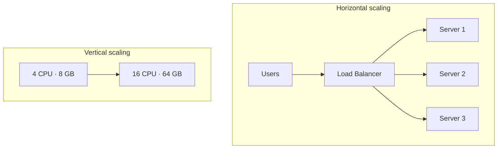

**Common bottlenecks** appear in predictable order: CPU and memory on app servers, then database connections and disk I/O, then network bandwidth and external API rate limits. Locks and synchronous calls amplify contention. Even a horizontally scaled app tier fails if every request hits one primary database.

| Layer | Scaling lever | Typical pattern |
|-------|---------------|-----------------|
| Compute | Horizontal | Stateless app servers behind LB |
| Reads | Replicas + cache | Master writes, replicas serve reads |
| Writes | Sharding / partitioning | Split keys across DB nodes |
| Heavy work | Async queues | API acks fast; workers process later |

**Read scaling** — replicate the primary database; route SELECT traffic to replicas. Writes still go to the primary; replication lag means replicas may be slightly stale.

**Write scaling** — partition data by key (user ID, tenant, geography). Each shard owns a subset of writes. Cross-shard transactions are expensive; design boundaries to minimize them.

**Stateless vs stateful** — stateless servers store no session locally; any instance can serve any request. Stateful servers bind a user to one instance (in-memory session), complicating scale-out unless you externalize session state to Redis or similar.

### Pitfalls and design tips

- **Do not confuse scalability with performance** — optimizing one hot loop helps today; sharding and caching help tomorrow's traffic.
- **Default to horizontal + stateless** for web and API tiers; vertical scaling is a stopgap, not a long-term strategy.
- **Find the real bottleneck** — adding app servers while the DB is at 100% connection usage buys nothing.
- **Plan for hot keys** — one viral shard can negate sharding benefits; use key splitting or local caching.
- **Interview angle:** name the bottleneck before naming the fix; mention CDN, cache, read replicas, sharding, and async workers in that rough order of cost vs impact.

### Real-world example

During a flash sale, traffic to a product page might jump 50×. A typical scalable path:

1. **CDN** serves static assets at the edge — most requests never hit origin.
2. **Load balancer** spreads dynamic requests across N identical app pods (Kubernetes HPA adds pods when CPU crosses a threshold).
3. **Redis** caches product catalog and inventory snapshots — cache hit avoids a DB round trip (~1 ms vs ~50 ms).
4. **Read replicas** handle product lookups; **primary** handles orders and inventory decrements.
5. **SQS / Kafka** accepts order events; workers confirm payment and send email asynchronously.

If 10,000 RPS were hitting one DB, cache + replicas might reduce primary load to ~500 write-heavy RPS — within capacity without rewriting the monolith.

---

## 4.2 Throughput

### Overview

Throughput is how much work finishes per unit of time — like counting how many cars pass a toll booth per minute. More booths (parallelism) or faster processing raises throughput; it does not necessarily shorten how long one car waits (latency).

In distributed systems, throughput usually means **requests per second (RPS)** or **queries per second (QPS)** — the rate at which the system completes useful operations. It is the primary capacity metric for sizing clusters, load tests, and SLAs.

### What problem it fixes

Teams need a single number to answer: *can this system handle peak traffic?* Without throughput targets, you discover limits during outages — checkout failing on Black Friday, APIs throttling partners, message queues backing up for hours. Throughput gives engineering and finance a shared language for capacity planning and hardware spend.

### What it does

Throughput measures **completed work over time**, not in-flight work. It varies by domain:

| System | Typical unit |
|--------|--------------|
| Web / API | Requests/sec (RPS) |
| Database | Queries/sec (QPS) |
| Message queue | Messages/sec |
| Network | MB/sec, Gbps |
| Storage | IOPS |

Throughput and latency are independent dimensions. A batch system might process 10,000 records/sec with 2 s latency per record; an interactive API might do 100 RPS at 20 ms each.

**How to calculate:**

**Given:** 12,000 requests completed in 30 seconds.

```text
Throughput = Total requests / Time
           = 12,000 / 30
           = 400 RPS
```

**Sanity check:** At 400 RPS sustained, one hour ≈ 1.44 million requests — reasonable for a mid-size API, not for a global search index without sharding.

**Bandwidth vs throughput:** A 1 Gbps link is *capacity*; if protocol overhead and congestion limit you to 600 Mbps of useful payload, *throughput* is 600 Mbps. Bandwidth is the pipe; throughput is what actually gets through.

### How it works — the architecture inside

Throughput rises when you remove serial bottlenecks and add parallel paths:

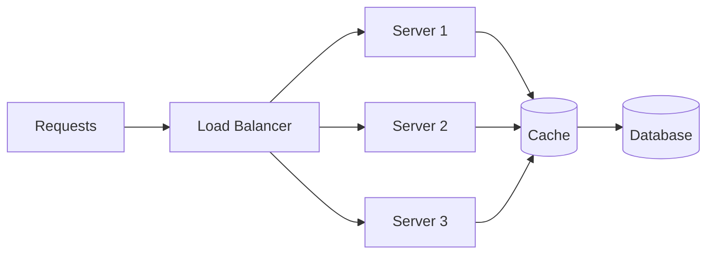

Each layer contributes:

1. **More workers** — horizontal scale adds independent request handlers.
2. **Caching** — repeated reads skip expensive backend work.
3. **Async pipelines** — accept writes fast, process in background workers.
4. **Connection pooling & batching** — amortize DB and network setup cost.

**Little's Law** links throughput (λ), average latency (W), and concurrency (L):

```text
L = λ × W
```

**Given:** Throughput λ = 1,000 RPS, average latency W = 0.2 s.

```text
Concurrency L = 1,000 × 0.2 = 200 in-flight requests
```

If latency doubles without dropping RPS, concurrency doubles — thread pools and memory pressure rise accordingly.

### Pitfalls and design tips

- **Peak vs average** — size for peak throughput (P99 load × safety factor), not daily average.
- **Saturation hides in queues** — throughput can look flat while latency explodes; watch queue depth and thread pool utilization.
- **Do not optimize RPS alone** — 10,000 RPS of 500 ms errors is worse than 500 RPS of successful 50 ms responses.
- **Interview default:** state RPS, mention concurrency via Little's Law, and note the bottleneck (usually DB or external API).

### Real-world example

A REST API on three instances each handles ~350 RPS at 60% CPU → ~1,050 RPS fleet capacity. Load test shows DB at 80% max connections at 900 RPS. Adding two read replicas and a Redis cache for hot keys raises effective read throughput to ~2,500 RPS while keeping the primary below 60% connections — the measured improvement is throughput, not latency alone.

---

## 4.3 Latency

### Overview

Latency is the wait — the time from asking a question until you get an answer. In a restaurant, it is order-to-table, not how many tables the kitchen serves per hour (throughput).

For systems, latency is the delay for a single operation: client sends a request, the stack processes it, the client receives a response. Users feel latency directly; it drives perceived speed more than server-side throughput charts.

### What problem it fixes

Slow systems lose users, revenue, and trust. Payment flows that exceed a few seconds increase abandonment; search above ~300 ms feels sluggish; gaming and trading demand sub-100 ms. Latency budgeting forces teams to identify which hop — DNS, TLS, network, DB, serialization — consumes the budget so optimizations have a target.

### What it does

Latency measures **one operation end-to-end**. Common variants:

| Term | Meaning |
|------|---------|
| **Network latency** | Propagation and routing delay between client and server |
| **Application latency** | Business logic, serialization, in-process work |
| **Database latency** | Query execution, lock wait, disk read |
| **Tail latency** | Slowest fraction of requests (see 4.4) |

**Response time** often means full download time; **latency** sometimes means time-to-first-byte (TTFB). In interviews, clarify which you mean.

**How to calculate:**

**Given:** Request sent at `T0 = 0 ms`, first byte at `T1 = 95 ms`, full body at `T2 = 180 ms`.

```text
TTFB (latency)     ≈ 95 ms
Response time      = 180 ms
Transfer time      = 180 − 95 = 85 ms
```

### How it works — the architecture inside

Total latency is the sum of hops — in microservices, hops multiply:

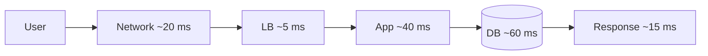

**Typical breakdown (single-region API):**

```text
DNS lookup         ≈ 10–30 ms
TCP + TLS          ≈ 20–50 ms
Load balancer      ≈ 1–5 ms
Application logic  ≈ 10–100 ms
Database           ≈ 5–200 ms (query-dependent)
Serialization      ≈ 1–10 ms
```

**Reducing latency:**

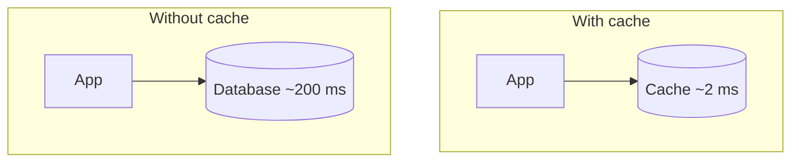

- **CDN / edge** — serve static assets geographically close to users.
- **Caching** — Redis, in-process LRU, HTTP cache headers.
- **DB tuning** — indexes, query plans, connection pooling, read replicas for read-heavy paths.
- **Async** — return 202 immediately; poll or push when long work completes.
- **Avoid chatty microservices** — five sequential 20 ms RPCs add 100 ms plus serialization overhead.

### Pitfalls and design tips

- **Average latency lies** — report P50, P95, P99; one slow dependency dominates user experience.
- **Cold start matters** — serverless and JVM warm-up can add seconds to first requests.
- **Payload size** — compress JSON, paginate lists; serialization and transfer scale with bytes.
- **Do not chain sync calls** — parallelize independent fetches (fan-out/fan-in with deadlines).
- **Targets by domain:** search ~100–300 ms, payments < 2 s, interactive gaming < 50 ms — state the SLO, then budget hops.

### Real-world example

A profile page initially took ~420 ms P95: 25 ms network, 180 ms from three sequential gRPC calls to user, prefs, and avatar services, 150 ms DB on the prefs path, 65 ms JSON rendering. Collapsing user+prefs into one query, parallelizing avatar fetch with a 80 ms deadline, and caching prefs in Redis cut P95 to ~95 ms — mostly network + one DB round trip.

---

## 4.4 Tail Latency

### Overview

Most customers get their coffee in two minutes; one unlucky customer waits fifteen because the machine jammed. **Tail latency** describes those slow outliers — the top 1% or 0.1% of requests — not the average wait.

In production, a few slow requests often define user frustration, SLA breaches, and cascading timeouts. Tail latency is the metric that tells you whether "fast on average" is actually fast for everyone.

### What problem it fixes

Averages hide misery. Ninety-nine fast requests and one 30-second hang produce a misleading ~350 ms average while 1% of users see an unusable product. Monitoring only mean latency misses GC pauses, disk stalls, lock contention, and one bad shard in a fan-out. Tail metrics align observability with real user pain and revenue-sensitive paths (checkout, login, search).

### What it does

Tail latency uses **percentiles** over a window of requests:

| Percentile | Meaning |
|------------|---------|
| **P50** (median) | Half of requests finish faster |
| **P95** | 5% are slower |
| **P99** | 1% are slower |
| **P99.9** | 0.1% are slower |

**How to calculate (illustrative):**

**Given:** 1,000 request latencies sorted ascending; 990 complete in ≤50 ms, 9 in ≤200 ms, 1 at 5,000 ms.

```text
P50  ≈ 50 ms   (request #500)
P95  ≈ 200 ms  (request #950)
P99  ≈ 5,000 ms (request #990)
Mean ≈ (990×50 + 9×200 + 1×5000) / 1000 ≈ 78 ms
```

The mean looks healthy; P99 exposes the five-second outlier.

**Tail amplification:** If each of *n* parallel calls has a 1% chance of being slow (>1 s), the probability that **at least one** is slow in a fan-out is:

```text
P(at least one slow) = 1 − (0.99)^n

n = 10  → ≈ 9.6%
n = 100 → ≈ 63.4%
```

More dependencies mean tail risk compounds even when each service looks fine in isolation.

### How it works — the architecture inside

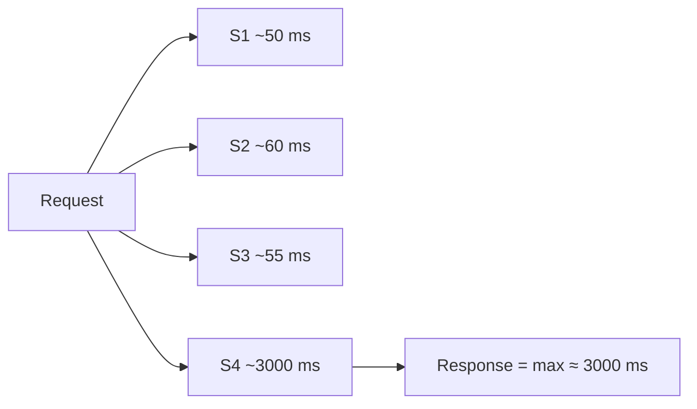

One slow leg sets wall-clock time for parallel fan-out. Serial chains add latencies: 50 + 60 + 3,000 = 3,110 ms.

**Common tail causes:** GC stop-the-world pauses, CPU throttling, lock contention, slow queries (missing index), disk I/O spikes, packet loss/retries, noisy neighbors on shared hosts, cold caches, overloaded downstream APIs.

**Mitigations:**

| Technique | Effect |
|-----------|--------|
| **Timeouts + deadlines** | Cap wait; fail fast instead of hoarding threads |
| **Hedged requests** | Send duplicate after delay; take first success (Google *Tail at Scale*) |
| **Caching** | Remove variable backend path |
| **Isolation** | Separate pools for critical vs batch traffic (bulkheads) |
| **Load shedding** | Drop low-priority work under pressure |

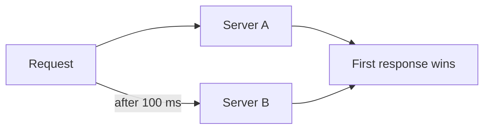

### Pitfalls and design tips

- **Alert on P99/P999**, not mean — SLOs should use percentiles aligned with product (e.g. "P99 < 500 ms").
- **Retries can worsen tails** — retry storms amplify load; use exponential backoff and jitter.
- **Hedging costs 2× load** on the delayed path — use only for idempotent, critical reads.
- **Interview talking point:** explain fan-out amplification with `(1 − p)^n`.

### Real-world example

A search cluster reported 80 ms average latency. P99 was 900 ms, P99.9 was 5 s — traced to one shard with a hot key causing long merges. Rebalancing shards and adding a local cache on the hot partition dropped P99 to 120 ms without changing average much. Dashboards switched from mean to P95/P99 for release gates.

---

## 4.5 Availability

### Overview

Availability is whether the lights are on when you flip the switch — can a customer complete the action they came for, right now? A bank app that loads but cannot transfer money is partially unavailable even if the homepage works.

Technically, availability is the fraction of time a system correctly serves its intended function, usually expressed as uptime percentage over a period. It is the foundation of SLAs customers see ("99.9% uptime") and of on-call paging policies.

### What it means

```text
Availability (%) = Uptime / (Uptime + Downtime) × 100
```

**How to calculate:**

**Given:** 364 days uptime, 1 day downtime in a year.

```text
Availability = 364 / 365 × 100 ≈ 99.73%  ("two nines" territory)
```

**The nines table** — downtime budget per year:

| Availability | Downtime / year |
|--------------|-----------------|
| 99% (2 nines) | ~3.65 days |
| 99.9% (3 nines) | ~8.76 hours |
| 99.99% (4 nines) | ~52.6 minutes |
| 99.999% (5 nines) | ~5.26 minutes |

Each extra nine is roughly 10× less allowed downtime — and disproportionately more engineering cost.

Availability differs from **reliability** (correct results) and **durability** (data survives failures). An API returning HTTP 200 with wrong balances is *available* but *unreliable*. Data lost after "success" is a *durability* failure.

| | Availability | Reliability | Durability |
|---|--------------|-------------|------------|
| Question | Can users reach the service? | Does it do the right thing? | Is committed data still there after failure? |
| Example failure | Region down | Wrong charge amount | Transaction missing after crash |

### How to achieve it — techniques by target

**Eliminate single points of failure** — redundant app servers, DB replicas, multi-AZ deployment, health-checked load balancers.

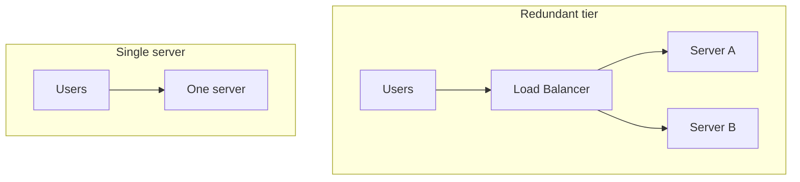

**Multi-AZ** — replicate across availability zones in one region; one AZ loss should not drop the service.

**Multi-region** — active-passive or active-active for regional disasters; trades cost and consistency complexity for geographic isolation.

**Operational practices:** automated failover, autoscaling, dependency timeouts, runbooks, error budgets (SLO internal target stricter than SLA customer promise).

| Term | Role |
|------|------|
| **SLI** | Measured signal (e.g. successful probe ratio) |
| **SLO** | Internal target (e.g. 99.95%) |
| **SLA** | Contract with consequences (e.g. 99.9%) |

### Pitfalls and design tips

- **Availability ≠ correctness** — always pair uptime SLOs with error-rate and correctness checks.
- **Dependency chains** — your 99.99% stack multiplied by a 99.9% vendor yields lower end-to-end availability.
- **Maintenance counts** — planned downtime eats the same budget unless you use rolling deploys and redundant cells.
- **CAP reminder:** during partition, strict consistency may require rejecting requests — an availability hit by design.

### Real-world example

A payment API targets 99.99% availability (~52 min/year budget). Architecture: three AZs, two app instances per AZ behind an ALB, RDS Multi-AZ with automatic failover (~60–120 s), health checks every 10 s, multi-region read replica for disaster recovery (manual failover, RTO ~15 min). Monthly SLI is derived from synthetic probes + real success ratio on `/health` and payment endpoint 2xx rate.

---

## 4.6 Reliability

### Overview

Reliability is trust — when you submit an order, the right amount is charged once, inventory decrements correctly, and the confirmation email matches reality. A system that is always online but frequently wrong is unreliable.

Reliability is the probability that a system performs its intended function correctly over time — often measured as successful operations divided by total operations, or as mean time between failures (MTBF) relative to mean time to repair (MTTR).

### What it means

```text
Reliability = Successful operations / Total operations
```

**How to calculate:**

**Given:** 1,000,000 payment attempts, 999,900 succeed.

```text
Reliability = 999,900 / 1,000,000 = 99.99%
Error budget (failures allowed) = 100 at this volume
```

**MTBF and MTTR:**

```text
Availability ≈ MTBF / (MTBF + MTTR)
```

**Given:** MTBF = 720 hours, MTTR = 1 hour.

```text
Availability ≈ 720 / 721 ≈ 99.86%
```

Improving reliability means fewer failures (higher MTBF) or faster recovery (lower MTTR).

Failure modes that erode reliability: hardware faults, software bugs, network partitions, human misconfiguration, and **dependency failures** — any downstream timeout or corrupt response poisons the user-facing outcome.

### How to achieve it — techniques by target

| Target | Techniques |
|--------|------------|
| **Correctness** | Transactions, idempotency keys, validation, strong consistency where money moves |
| **Fault containment** | Circuit breakers, bulkheads, timeouts |
| **Detection** | Metrics on error rate, anomaly detection, distributed tracing |
| **Recovery** | Retries with backoff (idempotent ops only), automated rollback, chaos testing |
| **Verification** | Integration tests, property-based tests, reconciliation jobs (ledger vs bank) |

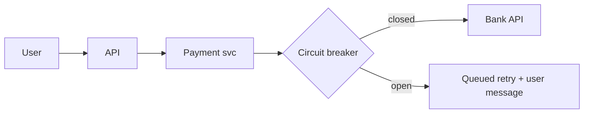

**Idempotency** — duplicate POST with same `Idempotency-Key` must not double-charge; essential for reliable retries.

**Error budget culture** — if SLO is 99.99% reliability, product and engineering share a fixed failure allowance; spending it on risky launches requires explicit trade-off.

### Pitfalls and design tips

- **At-least-once delivery + non-idempotent handlers = duplicates** — always design writes to be safe under retry.
- **Partial failures** — money debited but not credited is a reliability bug, not just an availability blip.
- **Monitoring success HTTP codes alone** — 200 with empty or stale body still fails the user.
- **Interview classic:** "Can a system be highly available but unreliable?" Yes — always-on wrong answers.

### Real-world example

Stripe-style payment APIs require idempotency keys, ledger double-entry reconciliation nightly, and alerting when authorization success rate drops 0.1% below baseline. A deploy that broke tax calculation was caught within minutes by reconciliation detecting mismatched totals — availability was 100% while reliability would have been compromised without the batch check.

---

## 4.7 Durability

### Overview

Durability is the promise that once the system says "saved," the data survives — power loss, disk crash, or node failure. Like a signed receipt in a safe deposit box: the transaction record outlives the clerk's shift.

In databases, durability is the **D** in ACID: after commit, data persists on non-volatile storage and survives process restart. In distributed stores, it often means replication to a quorum of nodes before acknowledging a write.

### What problem it fixes

Users and regulators expect committed financial records, orders, and messages not to vanish. Without durability guarantees, "success" responses are lies — data loss destroys trust, causes legal exposure, and makes recovery from backups the only path (slow, lossy for recent writes).

### What it does

Durability guarantees **survival of committed data** across failures. It is related but distinct from **persistence** (data on disk) and **availability** (service reachable). A persistent disk that fails without replication can still lose data.

Loss causes: power loss before flush, disk failure, software bug overwriting pages, operator error, single-node commit without replica ack.

### How it works — the architecture inside

**Write-Ahead Log (WAL)** — append the intended change to a sequential log and **fsync** to disk before updating main data structures. On crash, replay the log to reconstruct committed state.

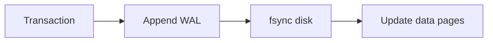

PostgreSQL, MySQL InnoDB, and most OLTP engines use WAL variants.

**Replication** — commit only after *N* replicas acknowledge (e.g. RDS synchronous replica, Kafka `acks=all`, Cassandra `QUORUM`).

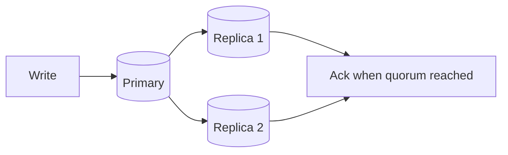

**Backups & snapshots** — point-in-time recovery for operator error and regional loss; not a substitute for synchronous durability on the hot path.

**RAID / erasure coding** — protect against single-disk failure at the storage layer.

| Approach | Durability | Latency impact |
|----------|------------|----------------|
| Single disk, async flush | Low | Lowest |
| WAL + fsync | Medium–high | +1–5 ms typical |
| Sync replicate to 2+ nodes | High | + network RTT |

**How to calculate (replication sketch):**

**Given:** Independent replica survival probability 99.9% each, write committed to 3 replicas.

```text
P(all three survive) = 0.999³ ≈ 0.997  (~99.7% durability against independent node loss)
```

Correlated failures (same rack, region) break independence — geographic replication addresses that class.

### Pitfalls and design tips

- **`fsync` matters** — buffered writes lie about durability until flushed.
- **Ack before replicate** — some NoSQL configs return success after primary write only; know your RPO.
- **Backups without tested restore** — durability on paper only; run restore drills.
- **Do not confuse ACID Consistency with replica consistency** — different concepts.

### Real-world example

A user transfer commits in PostgreSQL: WAL record fsynced, synchronous standby acks, then `COMMIT` returns to the app. Primary datacenter power loss triggers failover to standby; WAL replay on standby completes any in-flight committed transactions. RPO ≈ 0 for sync config; RTO minutes with managed failover (RDS Multi-AZ, Patroni).

---

## 4.8 Fault Tolerance

### Overview

Fault tolerance is continuing to serve despite broken parts — like a plane with redundant hydraulics that lands safely when one circuit fails. The goal is not zero failures; failures are expected.

A fault-tolerant system detects component failure and routes around it — via redundancy, failover, degraded modes — so users still get an acceptable outcome.

### What problem it fixes

Hardware fails, networks partition, deployments introduce bugs, and dependencies go offline. Without fault tolerance, any single failure becomes a total outage. Fault tolerance converts **fail-stop events** into **partial impairment** with bounded blast radius.

### What it does

Fault tolerance spans **prevention** (eliminate SPOFs), **detection** (health checks, heartbeats), **containment** (bulkheads, circuit breakers), and **recovery** (failover, retry, rollback). It underpins high availability and contributes to reliability but does not guarantee correctness by itself.

### How it works — the architecture inside

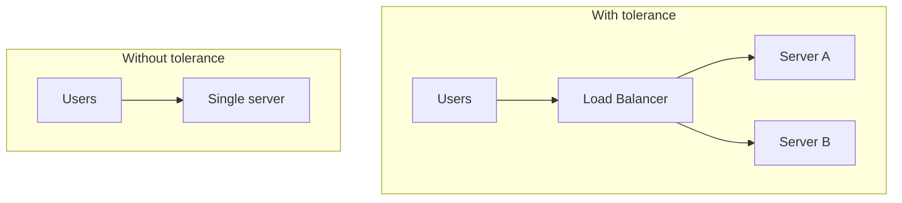

**Failure types:** hardware, software crash, network partition, dependency outage, human error.

**Core patterns:**

| Pattern | Behavior |
|---------|----------|
| **Retry** | Transient errors (timeout, 503) — backoff + jitter, cap attempts |
| **Circuit breaker** | After failure threshold, fail fast; periodic half-open probe |
| **Bulkhead** | Separate thread pools / connections per dependency |
| **Fallback** | Cached or default response when live path fails |
| **Graceful degradation** | Disable non-critical features; keep checkout alive |

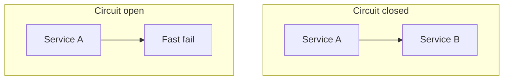

**Network partitions** — nodes alive but unreachable; both sides may think they are primary (**split brain**) without quorum/leader election (etcd, Raft, Pacemaker).

**Chaos engineering** — inject failures (Netflix Chaos Monkey, AWS FIS) to prove tolerance before production surprises.

### Pitfalls and design tips

- **Retries on non-idempotent POSTs** — duplicate side effects; use idempotency tokens.
- **Circuit breaker tuning** — too aggressive opens on blips; too lax allows cascade.
- **Shared fate** — all replicas in one AZ are one failure domain.
- **Fault tolerance ≠ resilience** — tolerance emphasizes continued operation; resilience emphasizes recovery speed and learning.

### Real-world example

An order service calls inventory via HTTP with 500 ms timeout, 3 retries (exponential backoff), and a circuit breaker (open after 50% errors in 10 s). When inventory is down, checkout uses a cached "in stock" flag with a banner "availability confirmed at payment" — orders queue for inventory reconciliation. Users complete purchase; ops fixes inventory without a full storefront outage.

---

## 4.9 Resilience

### Overview

Resilience is how quickly and cleanly a system bounces back after a hit — rubber ball, not glass. Brief degradation is acceptable if recovery is automatic and impact is bounded.

Where fault tolerance asks *can we keep running during failure?*, resilience asks *can we absorb shock, learn, and restore normal service without a manual war room?*

### What problem it fixes

Outages, traffic spikes, and bad deploys are inevitable. Resilience reduces **mean time to recovery (MTTR)**, limits blast radius, and prevents temporary faults from becoming cascading blackouts. It connects engineering design to business continuity — how long until revenue flows again.

### What it does

Resilient systems combine:

1. **Detection** — SLO dashboards, synthetic checks, anomaly alerts
2. **Isolation** — bulkheads, rate limits, cell-based architecture
3. **Adaptation** — autoscaling, load shedding, feature flags
4. **Recovery** — self-healing pods (Kubernetes restart), automated rollback, runbooks-as-code
5. **Learning** — postmortems, chaos experiments, improved defaults

Resilience overlaps fault tolerance and availability but emphasizes **dynamic response** — scaling out under load, degrading features, draining bad nodes — not only static redundancy.

### How it works — the architecture inside

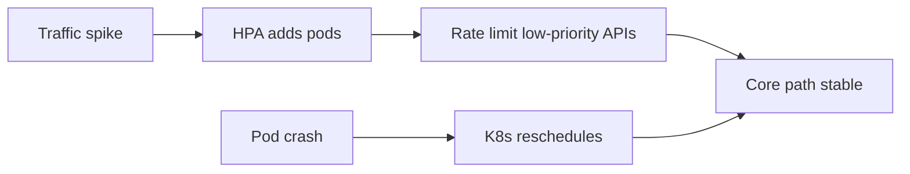

**Microservice resilience stack:**

| Layer | Tooling examples |
|-------|------------------|
| Client | Timeouts, retries, bulkhead (Resilience4j, Polly) |
| Edge | API gateway rate limits, WAF |
| Mesh | Istio/Linkerd circuit breaking, outlier detection |
| Platform | K8s liveness/readiness, cluster autoscaler |
| Process | Blameless postmortems, game days |

**Graceful degradation** — turn off recommendations, use stale cache for catalog, queue writes during DB stress.

**Autoscaling** — horizontal pod autoscaler on CPU/RPS/custom metric; scale-to-zero cautiously for latency-sensitive paths.

### Pitfalls and design tips

- **Resilience theater** — retries without timeouts increase load on a dying dependency.
- **Manual failover runbooks** — fine for DR, too slow for AZ blip; automate the common cases.
- **Missing bulkheads** — one noisy tenant can starve others on shared pools.
- **Chaos without hypothesis** — random failure injection without success criteria wastes effort.

### Real-world example

During a viral stream launch, a video platform sees 20× API traffic. CDN absorbs most video bytes; origin autoscales API pods from 50 to 400; recommendation service circuit opens and homepage shows "Trending" static list; write-heavy social feed queues with 30 s delay while playback stays real-time. P99 playback start < 1.5 s throughout; full feature set restores within 20 minutes as caches warm and circuits close.

---

## 4.10 Redundancy

### Overview

Redundancy is keeping spares — a second tire in the trunk, not because you expect a flat every trip, but because one flat without a spare ends the journey. Extra components stand ready when primary ones fail.

In systems, redundancy duplicates compute, storage, network paths, or geographic presence so failure of one unit does not eliminate capability.

### What problem it fixes

Every component has a non-zero failure rate. A non-redundant design converts independent hardware MTBF into system-wide downtime. Redundancy is the prerequisite for failover, fault tolerance, and high availability — without spare capacity, there is nothing to fail *over* to.

### What it does

Redundancy adds **standby or parallel capacity**:

| Type | Scope |
|------|--------|
| Server | Multiple app instances |
| Database | Primary + replicas |
| Storage | RAID, replicated volumes |
| Network | Dual NICs, multi-homed ISPs |
| Geographic | Multi-AZ, multi-region |
| Power | UPS, generator, dual PSU |

**Active-active** — all nodes serve traffic (load balanced). Higher utilization, harder consistency.

**Active-passive** — standby waits; simpler, idle cost.

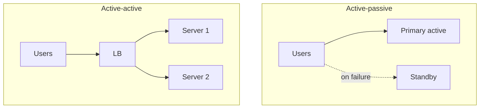

**Redundancy vs backup:** redundancy enables **immediate** takeover; backups restore **historical** state after data loss or corruption — complementary, not interchangeable.

**Redundancy vs replication:** replication is a mechanism (copying data); redundancy is the outcome (extra copy exists).

### How it works — the architecture inside

**Eliminating SPOFs:**

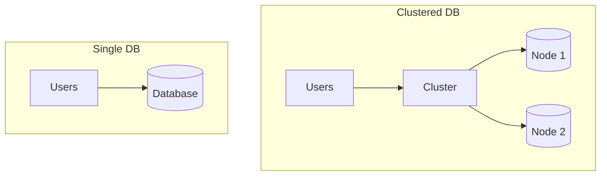

Load balancers themselves must be redundant (DNS failover, anycast VIP, managed LB service).

**Cost trade-off:** 2× hardware ≈ 2× capex; active-passive leaves ~50% idle; cross-region replication adds egress and consistency complexity.

**How to calculate:**

```text
Given: 3 app servers in active-active (any one can serve full load)
       Single-server availability p = 99.5% per month (0.5% downtime each)

Step 1 — probability all replicas fail at once (independent failure domains):
  P(all down) = (1 − p)³ = 0.005³ = 1.25 × 10⁻⁷

Step 2 — fleet availability:
  Availability ≈ 1 − (1 − p)³ ≈ 1 − 0.000000125 ≈ 99.99999%

Result: ~three extra nines vs a single node — at ~3× server capex

Sanity check: if all three share one AZ/power domain, correlated failure
  collapses this — independence assumption must hold for the math to apply
```

```text
Given: Active-passive pair, primary handles 100% traffic, standby idle

Step 1 — capex:
  2 servers × $500/mo = $1,000/mo (≈2× single-server cost)

Step 2 — utilization:
  Primary at 60% CPU, standby at ~5% (health checks only) → ~32% fleet average

Result: ~2× hardware cost for N+1 failover; ~50% of compute idle until failover

Sanity check: active-active spreads load and uses both boxes; active-passive
  is cheaper to reason about but wastes half the fleet under normal operation
```

### Pitfalls and design tips

- **Redundant but not independent** — same power strip, same switch, same bug in all replicas = one failure domain.
- **Split brain** — two primaries without quorum; use fencing/STONITH or consensus.
- **Replication lag** — standby may be minutes stale; RPO/RTO must match business rules before promoting.
- **Default for new systems:** N+1 at minimum for stateless tiers; database with auto-failover + tested backups.

### Real-world example

A payment stack runs three app AZs, RDS Multi-AZ primary + standby, ElastiCache cluster mode with 3 shards × 2 replicas, and Route 53 health-checked failover to a warm secondary region. Primary AZ loss: LB drains unhealthy targets (~30 s), RDS fails over (~90 s), cache promotes replica — card authorization continues with < 2 min blip, no manual step for AZ failure.

---

## 4.11 Failover

### Overview

Failover is the baton pass — when the lead runner drops, the next runner takes the track without restarting the race. Backup components become primary after failure detection.

Failover is the **procedure** that redundancy enables: detect unhealthy primary, promote or route to standby, resume service.

### What problem it fixes

Without automated failover, every outage waits for a human to page, diagnose, and manually switch DNS or promote a database — minutes to hours of downtime. Failover compresses recovery to seconds or minutes, preserving availability SLOs and reducing operator error under pressure.

### What it does

Typical sequence:

1. **Detect** — health check fails (HTTP `/health`, TCP, replication lag threshold)
2. **Isolate** — stop sending traffic to failed node (LB drain, VIP withdraw)
3. **Promote** — standby becomes primary (DB), or traffic shifts to peers (stateless)
4. **Reconcile** — fix split-brain risk, resync replicas, alert ops

**Automatic vs manual:** cloud managed services (RDS, Cloud SQL) automate; some orgs require manual approval for cross-region DR to avoid flapping.

**How to calculate:**

```text
Failover time = Detection time + Election/promotion time + Client rediscovery time
```

**Given:** Health check interval 10 s (worst case 10 s detection), promotion 5 s, DNS TTL 30 s.

```text
Worst-case user impact ≈ 10 + 5 + 30 = 45 s (if clients cache old endpoint)
```

Using low-TTL DNS or anycast VIP reduces client rediscovery.

### How it works — the architecture inside

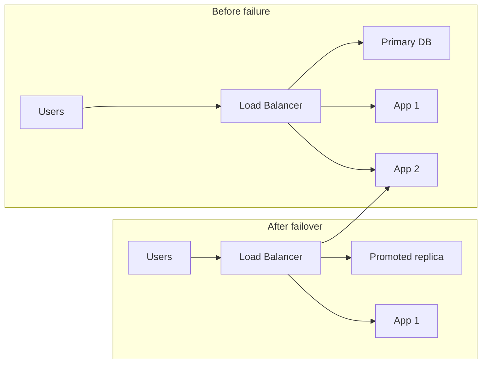

**Database failover** — synchronous standby minimizes RPO; asynchronous allows smaller cross-region lag but risks lost commits on promote.

**Split brain** — partition leaves two nodes thinking they are primary; prevent with quorum (majority must hold lock), STONITH (fence old primary), or consensus (Raft leader term).

**False positive detection** — flaky network triggers unnecessary failover; use multiple observers, hysteresis, and **fencing** before promote.

| Challenge | Mitigation |
|-----------|------------|
| Data lag on standby | Sync replication or accept RPO > 0 |
| Session stickiness | Externalize sessions; connection pool refresh |
| In-flight transactions | Idempotency; client retry |
| Split brain | Quorum, leader epoch, manual break-glass |

### Pitfalls and design tips

- **Untested failover** — rehearse quarterly; "works in theory" fails at 3 AM.
- **Clients cache stale endpoints** — use service discovery (Consul, K8s Service) not hard-coded IP.
- **Promote without fencing** — old primary accepting writes causes divergence.
- **Interview:** distinguish failover (recovery action) from fault tolerance (user-transparent continuity).

### Real-world example

Patroni-managed PostgreSQL cluster: etcd quorum holds leader lock. Primary stops responding; Patonni detects via REST API after 3 failed checks (~15 s), promotes synchronous replica, updates HAProxy backend. Apps using JDBC with `targetServerType=primary` reconnect automatically. Total write unavailability ~20 s; no committed sync-replicated transaction lost (RPO 0).

---

## 4.12 Consistency

### Overview

Consistency is everyone reading the same page of the ledger after a deposit — not one teller seeing ₹8,000 and another still showing ₹10,000. In distributed systems, it defines what readers observe after writers commit.

Technically, consistency models specify **ordering and visibility** of reads and writes across replicas — from strong (read latest write) to eventual (replicas converge later). The right model trades latency and availability against correctness guarantees the business requires.

### What problem it fixes

Replicated systems introduce **time** between write and read paths. Without an explicit consistency model, developers assume "read my write" and ship bugs — stale inventory oversell, double booking, confused account balances. Naming the model sets client expectations and drives replication protocol choice.

### What it does

**ACID consistency** (different term): transaction moves database from one valid state to another (constraints hold). **Distributed consistency**: replicas agree on value order and visibility.

**Spectrum (weakest → strongest):**

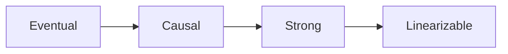

| Model | Guarantee (informal) |
|-------|----------------------|
| **Eventual** | Replicas converge if writes stop; reads may be stale |
| **Causal** | Causally related ops seen in order |
| **Strong / sequential** | All see same order; reads see latest commit |
| **Linearizable** | Real-time ordering; each op appears atomic at a point in time |

**Session guarantees** often used in products:

- **Read-your-writes** — user sees own updates immediately (sticky session or version check).
- **Monotonic reads** — never go backward in time for a user session.

### How it works — the architecture inside

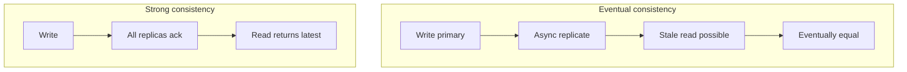

**Primary-replica flow:**

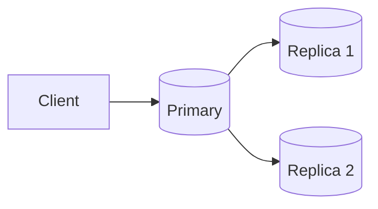

- **Sync replicate before ack** → strong, higher write latency.
- **Ack after primary only** → eventual, lower latency, stale reads from replicas.

**Consistency vs availability under partition:**

| Choice | Behavior |
|--------|----------|
| Favor consistency | Reject writes/reads that cannot reach quorum — CP |
| Favor availability | Serve possibly stale data — AP |

CAP theorem formalizes this trade-off during network partition; PACELC extends it to normal operation (latency vs consistency).

**Technology mapping:**

| Stronger | Weaker |
|----------|--------|
| PostgreSQL (single node), Spanner, etcd | Cassandra ( tunable), DynamoDB ( eventual default ) |
| ZooKeeper, Consul (linearizable reads) | DNS, CDN caches |

Many stores offer **per-request levels** — e.g. DynamoDB `ConsistentRead=true`, Cassandra `LOCAL_QUORUM` vs `ONE`.

### Pitfalls and design tips

- **Do not say "strong consistency" without scope** — single object? cross-object transaction? single region?
- **Eventual is not "no consistency"** — it is a convergence bound; need conflict resolution (LWW, CRDTs, vector clocks).
- **Read-your-writes ≠ linearizability** — session guarantee vs global real-time order.
- **Default interview answer:** money and inventory → strong or transactional; social likes, view counts → eventual with idempotent counters.

### Real-world example

E-commerce inventory during checkout:

1. **Add to cart** — eventual catalog cache OK (stale price rare, corrected at checkout).
2. **Reserve inventory** — strong compare-and-set on primary DB row or DynamoDB conditional update on `version` attribute; fails if stock insufficient.
3. **Payment** — ACID transaction on order + ledger tables.
4. **Search index** — eventual via CDC to Elasticsearch; product may appear in search seconds after launch.

Mixing models intentionally: strong where oversell costs money, eventual where staleness is cheap.

---

## 4.13 Concurrency

### Overview

Imagine a single waiter in a busy restaurant: while one table's food is cooking, the waiter takes another order and serves a third table. Multiple customers make progress at once even though the waiter does only one thing at a time — that is concurrency in everyday terms.

Technically, concurrency is the ability of a system to manage multiple in-flight tasks, requests, or operations during the same time window. It does not require simultaneous execution on separate CPU cores (that is parallelism); it means the system interleaves or schedules work so many operations advance without each one blocking the entire machine.

### What problem it fixes

Without concurrency, a server handles one request at a time: Request 2 waits until Request 1 finishes, Request 3 waits behind Request 2, and utilization stays low while users experience long queues. Concurrency lets the system keep working on other requests while some are blocked on I/O (database, network, disk), improving throughput and resource use under load.

### What it does

Concurrency tracks and schedules many active operations at once — web requests, database transactions, stream consumers, or goroutines. It separates *how many things are in progress* (concurrency) from *how many complete per second* (throughput) and *how long one operation takes* (latency). Modern runtimes achieve this with threads, async event loops, or lightweight tasks (goroutines, virtual threads) instead of one OS thread per request.

### How it works — the architecture inside

**Concurrency vs parallelism**

| Concept | Meaning | Example |
|---------|---------|---------|
| Concurrency | Many tasks in progress; may time-share one core | Single-core server interleaving 100 requests |
| Parallelism | Many tasks execute at the same instant | Four cores each running a different task |

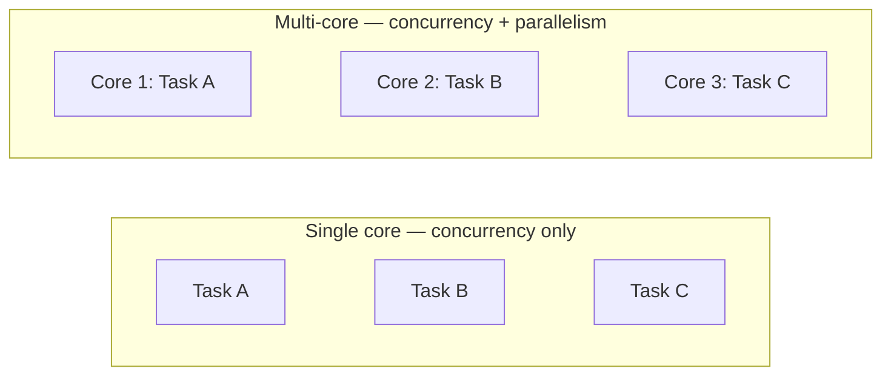

**Little's Law** ties the three metrics together:

```text
Concurrency = Throughput × Latency
```

**How to calculate:**

- **Given:** Throughput = 1,000 RPS, average latency = 200 ms = 0.2 s
- **Step:** Concurrency = 1,000 × 0.2
- **Result:** ~200 requests in flight at any instant
- **Sanity check:** If latency doubles at fixed throughput, in-flight work doubles — queues grow.

**Thread-based vs async concurrency**

```mermaid
flowchart LR
    subgraph ThreadModel["One thread per request"]
        direction LR
        R1[Request 1] --> T1[Thread 1]
        R2[Request 2] --> T2[Thread 2]
        R3[Request N] --> TN[Thread N]
    end
    subgraph AsyncModel["Event loop — many requests, few threads"]
        direction LR
        RA[Request A — waiting on DB] --> Loop[Event loop]
        RB[Request B — runs while A waits] --> Loop
        Loop --> CPU[CPU stays productive]
    end
```

Thread-per-request is simple but scales poorly (memory per stack, context-switch cost). Async I/O (Node.js, Netty, Spring WebFlux, Tokio) multiplexes many requests onto a small thread pool: when one request waits on I/O, the runtime schedules another.

**Common failure modes when concurrency is uncontrolled**

| Problem | What happens | Typical fix |
|---------|--------------|-------------|
| Race condition | Two writers corrupt shared state | Locks, atomics, transactions |
| Deadlock | Circular lock wait; no progress | Lock ordering, timeouts |
| Starvation | Low-priority work never runs | Fair queues, priority caps |
| Livelock | Processes retry forever without finishing | Backoff, give up and fail |

**Concurrency in distributed systems**

Multiple services or regions may update the same record (inventory, balance). Local mutexes are not enough across nodes — use distributed locks (Redis Redlock, etcd leases), leader election, optimistic versioning (CAS), or consensus (Raft) depending on consistency needs.

**Concurrency limiting**

Unbounded concurrency overloads downstream resources. When capacity is 1,000 concurrent requests but 5,000 arrive, latency spikes and timeouts cascade. Apply rate limits, bounded queues, backpressure, and load shedding before the system enters failure mode.

### Pitfalls and design tips

- Do not confuse concurrency with parallelism in interviews — a single-core machine can be highly concurrent but not parallel.
- Thread-per-request breaks around a few thousand concurrent connections; default to async or a worker pool for I/O-bound web services.
- Little's Law uses *average* latency; tail latency (p99) drives queue depth during spikes — size pools for peaks, not averages alone.
- Database concurrency needs explicit isolation levels and MVCC; "just add threads" without transaction design causes lost updates and phantom reads.
- Too much concurrency without backpressure is worse than too little — always bound queues and connection pools.

### Real-world example

Netflix's API tier handles millions of concurrent playback and browse sessions. Each session maps to async work on a shared event loop or small thread pool rather than one OS thread per viewer. While one request waits on a recommendation service or entitlement check, the runtime serves other sessions — concurrency keeps CPU and network busy. When downstream slows, concurrency limits and queue bounds (backpressure) prevent unbounded memory growth from piled-up requests.

---

## 4.14 CAP Theorem

### Overview

When two offices lose phone contact but both stay open, each must decide: refuse customers until numbers match (correct but unavailable), or keep serving with possibly outdated records (available but inconsistent). CAP formalizes that same forced choice for distributed software during network splits.

The CAP theorem (Brewer, 2000; proved by Gilbert and Lynch) states that when a network partition occurs, a distributed data store can guarantee at most two of three properties: **Consistency** (every read sees the latest write), **Availability** (every request gets a non-error response), and **Partition tolerance** (the system continues despite broken links between nodes). In practice, partitions happen, so the real trade-off is **CP vs AP** during a split.

### What problem it fixes

Teams often assume a replicated database can be fully consistent and always online. CAP makes the partition case explicit: you cannot simultaneously refuse stale reads and always answer every request when replicas cannot talk. Naming the trade-off early prevents designing a payment ledger like a social feed, or vice versa.

### What it does

CAP classifies distributed stores by what they sacrifice when the network fails between nodes. **CP** systems (etcd, ZooKeeper) may reject reads or writes until quorum is restored. **AP** systems (Cassandra, DynamoDB in many configurations) keep serving but may return stale values until replication catches up. **CA** (single-node or same-AZ cluster with no partition assumption) is not a meaningful label for geographically distributed systems.

### How it works — the architecture inside

**The three properties**

| Property | Guarantee during normal operation |
|----------|-----------------------------------|
| C — Consistency | Every read returns the most recent successful write |
| A — Availability | Every request receives a response (not a hang or indeterminate failure) |
| P — Partition tolerance | System continues operating when nodes cannot communicate |

**Network partition — the forcing event**

```mermaid
flowchart LR
    subgraph Before["Before partition"]
        direction LR
        NA1[Node A = 100] <-->|sync| NB1[Node B = 100]
    end
    subgraph After["After partition — write on A"]
        direction LR
        NA2[Node A = 200] -.X.- NB2[Node B = 100]
        Read[Read from B] --> Choice{System choice}
        Choice -->|CP| Reject[Reject or block read]
        Choice -->|AP| Stale[Return 100]
    end
    Before ~~~ After
```

User writes 200 on Node A; partition isolates Node B still at 100. A read on B forces a choice: return stale data (AP) or fail the read until sync (CP). You cannot guarantee both C and A while P holds.

**CP vs AP at a glance**

| | CP | AP |
|---|----|----|
| Partition behavior | Reject or block if latest unknown | Serve from local replica |
| Stale reads | Avoided | Possible |
| Typical domains | Coordination, payments, inventory locks | Feeds, DNS, shopping carts, analytics |
| Examples | etcd, ZooKeeper | Cassandra, DynamoDB (eventual reads) |

**CA and why it rarely applies**

A single PostgreSQL instance behind one app server is consistent and available until the disk dies — partition tolerance between replicas is not the question. Once data spans AZs or regions, partitions are possible and CA is not a design option.

**Interview correction**

Wrong: "Pick any two letters forever." Correct: **During a partition**, choose consistency or availability; partition tolerance is assumed in distributed deployments. Outside partitions, many systems offer both C and A — PACELC (4.15) covers that nuance.

### Pitfalls and design tips

- CAP is about **one partition event**, not a permanent binary label — the same product may be CP for writes and AP for reads.
- "Consistency" in CAP is linearizable-style read freshness, not ACID transactional consistency across unrelated keys.
- Do not cite CAP to justify avoiding replication — replication improves availability; CAP describes behavior *when links break*.
- Banking ledgers and inventory often need CP or strong quorum writes; social likes and view counts tolerate AP.
- etcd/ZooKeeper for leader election and config; Cassandra/Dynamo-style stores for high write availability at global scale.

### Real-world example

During an AWS AZ failure, a Cassandra cluster configured for `LOCAL_QUORUM` writes continues accepting writes in surviving AZs (AP-leaning): clients get responses, but a reader in an isolated partition might briefly see an old row until gossip and repair converge. By contrast, a Kubernetes control plane using etcd will fail write operations if a majority of etcd members are unreachable (CP): schedulers wait rather than act on potentially divergent state — correctness over liveness for cluster brain.

---

## 4.15 PACELC Theorem

### Overview

CAP only speaks up when the network breaks. Most of the time links are fine — yet you still choose whether every write waits for distant replicas or returns fast with lagging copies. PACELC adds that everyday trade-off.

PACELC (Daniel Abadi, 2010) extends CAP: **If Partition (P)**, choose **Availability (A)** or **Consistency (C)**; **Else (E)** — when there is no partition — choose **Latency (L)** or **Consistency (C)**. It explains why many "AP" systems feel fast even when the network is healthy: they skip synchronous wide-area replication to keep response times low.

### What problem it fixes

CAP leaves engineers asking, "We are not partitioned right now — why can't we have strong consistency and 10 ms writes?" PACELC answers: because strong consistency across regions requires waiting for distant replicas, which raises latency. The theorem names the normal-path trade-off that dominates user experience 99.9% of the time.

### What it does

PACELC classifies systems along two axes:

```text
P happens →  A  or  C
else      →  L  or  C
```

Common labels: **PA/EL** (available under partition, low latency otherwise — DynamoDB, Cassandra), **PC/EC** (consistent under partition and otherwise — etcd, ZooKeeper), plus less common **PA/EC** and **PC/EL** combinations.

### How it works — the architecture inside

**PAC — same as CAP during failure**

```mermaid
flowchart LR
    Partition[Network partition: A X B] --> Choice{Choice}
    Choice -->|PA| Avail[Serve requests — may be stale]
    Choice -->|PC| Cons[Block or reject until quorum]
```

**ELC — the everyday trade-off**

```mermaid
flowchart LR
    Client[Write request] --> Primary[(Primary)]
    Primary --> R1[(Replica — same region)]
    Primary --> R2[(Replica — other region)]
    Primary -->|Option A: wait for R2| Slow[Write ack ~200 ms — strong C]
    Primary -->|Option B: ack after local| Fast[Write ack ~20 ms — eventual C]
```

| Write policy | Consistency | Latency (typical) |
|--------------|-------------|-------------------|
| Sync all replicas before ack | Strong | High (especially cross-region) |
| Ack after local / quorum, replicate async | Weaker | Low |

**PACELC classification table**

| Label | On partition | Normal operation | Examples |
|-------|--------------|------------------|----------|
| PA/EL | Availability | Low latency | DynamoDB, Cassandra |
| PA/EC | Availability | Consistency | Rare; some multi-DC SQL with sync |
| PC/EC | Consistency | Consistency | etcd, ZooKeeper |
| PC/EL | Consistency | Low latency | Less common hybrid designs |

**CAP vs PACELC**

| Question | CAP | PACELC |
|----------|-----|--------|
| When? | During partition only | Partition + steady state |
| Trade-off | C vs A | C vs A, then C vs L |

### Pitfalls and design tips

- Most user-facing latency complaints come from the **EL** choice, not from partition behavior — measure cross-region replication delay before promising linearizable writes globally.
- PA/EL is the default for global NoSQL at scale; do not bolt strong consistency onto the same path without accepting multi-hundred-ms writes.
- Read-your-writes and session consistency are middle grounds between EL and EC — PACELC is a spectrum, not four rigid boxes.
- Interview framing: "We are PA/EL for product catalog, PC/EC for inventory locks" shows nuanced design, not CAP slogans.
- Spanner achieves externally strong consistency with TrueTime — it pays the latency and infrastructure cost PACELC says you cannot avoid cheaply.

### Real-world example

A global e-commerce order service in Mumbai writes an order record. **Option A (EC):** wait until replicas in Frankfurt and Virginia acknowledge — user sees spinner for 150–300 ms, but any region read is current. **Option B (EL):** ack when the Mumbai primary commits, replicate asynchronously — user sees confirmation in ~30 ms, but a support agent in Virginia might see the order a second later. Most checkout UIs choose EL; fraud holds or inventory deduction may use a stronger, slower path on the same platform.

---

## 4.16 Strong Consistency

### Overview

Strong consistency is like a single shared notebook: once someone writes a new balance, every reader who opens the book next sees that number — never an old one. No one gets a photocopy that has not caught up yet.

Formally, after a write is acknowledged, every subsequent read returns the latest value (or blocks until it can). Replicas do not serve stale data. Achieving this requires coordination — synchronous replication, quorum reads/writes, or a single leader — which increases latency and reduces availability during partitions compared to eventual models.

### What problem it fixes

Financial balances, seat inventory, and lock ownership break if clients read stale values after a successful write. Strong consistency prevents "I deposited money but the ATM still shows zero" and overselling the last airline seat across two data centers.

### What it does

Strong consistency ensures all nodes (or all clients through quorum) agree on the current value before a read succeeds. Writes typically propagate to a majority of replicas or complete a two-phase commit before the client receives success. Reads may contact the leader or a quorum to guarantee freshness.

### How it works — the architecture inside

**Write path with synchronous replication**

```mermaid
flowchart LR
    Write[Client write] --> Primary[(Primary)]
    Primary --> R1[(Replica 1)]
    Primary --> R2[(Replica 2)]
    R1 --> Ack[All required replicas ack]
    R2 --> Ack
    Ack --> Success[Write success to client]
    R1 --> Read[Subsequent read]
    R2 --> Read
    Read --> Latest[Always latest value]
```

**Consistency spectrum (this section in context)**

```text
Stronger ←————————————————————→ Weaker
Linearizability → Strong → Causal → Eventual
```

Strong consistency (as commonly used) sits below linearizability (4.19) but above causal and eventual: all users see the latest write, though not every formal linearizability edge case is enforced.

| Aspect | Strong | Eventual (4.17) |
|--------|--------|-----------------|
| Stale reads | Not allowed after ack | Allowed temporarily |
| Write latency | Higher (sync replication) | Lower (async replication) |
| Availability in partition | May block | Usually stays up |
| Typical use | Banking, inventory, booking | Likes, counters, CDN |

### Pitfalls and design tips

- "Strong" means different things to different vendors — ask whether reads are linearizable, quorum-based, or merely "no stale after write on same session."
- Cross-region strong consistency multiplies latency by RTT; keep strongly consistent data in one region or shard by locality.
- Do not apply strong consistency to entire social graphs or analytics — cost and contention explode.
- PostgreSQL synchronous replication and MySQL semi-sync are strong-consistency tools at single-primary scale; etcd/Raft for distributed metadata.
- During partition, CP behavior (rejecting requests) is the price — plan client retries and clear error messages.

### Real-world example

An airline reservation system holds 1 seat left on a flight. Two agents in different cities attempt to book simultaneously. With strong consistency (single authoritative partition or quorum write), the first committed booking wins; the second receives "sold out" immediately — not a confirmation that later gets revoked when replicas sync. The write does not ack until the inventory partition reflects zero remaining seats on all required replicas.

---

## 4.17 Eventual Consistency

### Overview

Eventual consistency is like gossip in a large office: when news breaks, not everyone hears it at once, but if nobody adds conflicting rumors, everyone converges on the same story after a while.

If writes stop, all replicas will eventually hold the same value. Until then, different clients may read different versions. Systems accept temporary divergence in exchange for high availability, low write latency, and partition resilience — then use replication, anti-entropy repair, or CRDT merge rules to converge.

### What problem it fixes

Forcing global synchronous updates on every like, view count, or DNS change would make global services slow and fragile. Many data types tolerate brief skew; eventual consistency removes the coordination bottleneck for high write throughput and geographic spread.

### What it does

A write acks when the local node (or a small local quorum) persists the change; background replication propagates updates to other replicas. Reads may hit any replica and return a stale value until gossip, read repair, or Merkle-tree sync aligns copies. Conflict resolution (last-write-wins, vector clocks, CRDTs) handles concurrent writes to the same key.

### How it works — the architecture inside

**Replication timeline**

```mermaid
flowchart LR
    W[Write: likes 100 → 101] --> P[Primary = 101]
    P --> R1[Replica1 = 101]
    P --> R2[Replica2 = 100]
    P --> R3[Replica3 = 100]
    R2 --> Sync[Background replication]
    R3 --> Sync
    Sync --> Done[All nodes = 101]
```

```text
Immediately:  Primary = 101, Replica2 = 100  →  users see 101 or 100
After sync:   All = 101                         →  converged
```

**Trade-off table**

| | Eventual | Strong (4.16) |
|---|----------|---------------|
| Write latency | Low | High |
| Stale reads | Yes, bounded by replication lag | No (after ack) |
| Partition behavior | Stay available | May reject |
| Conflict handling | Required | Rare |
| Examples | DynamoDB (default reads), Cassandra, DNS | etcd, Spanner (strong mode) |

**Convergence mechanisms**

- **Anti-entropy:** periodic background compare-and-repair between replicas (Cassandra repair).
- **Read repair:** stale read triggers write-back to lagging replica on read path.
- **CRDTs:** data structures merge without central coordination (collaborative counters, sets).

### Pitfalls and design tips

- Eventual does not mean "never consistent" — measure replication lag (p99) and alert when it exceeds product tolerance.
- Last-write-wins loses concurrent updates silently — use vector clocks or application merge for carts and collaborative docs.
- Reading from any replica without `LOCAL_QUORUM` or similar guarantees maximizes staleness — tune consistency level per use case.
- Counters and likes tolerate eventual; account balances and inventory usually do not — split models within one product.
- DNS TTL is eventual consistency in practice: changes propagate over seconds to hours depending on cache.

### Real-world example

Amazon DynamoDB accepts a `PutItem` when the storage node in the user's region persists it. A global secondary index or a read in another region may lag by milliseconds to seconds. For a shopping cart, briefly showing an old item count is acceptable; the cart converges after replication. Product pages use the same model for non-critical attributes (review counts) while checkout calls stronger conditional writes on inventory keys.

---

## 4.18 Causal Consistency

### Overview

Causal consistency is weaker than a single global timeline but stronger than "everyone eventually agrees": if you saw someone reply to a post, you must have been able to see the post first — cause before effect, never the reverse.

Operations that are causally related (one influenced the other) are seen by all nodes in the same order. Concurrent, unrelated operations may appear in different orders to different viewers. This preserves intuitive ordering for threads, comments, and messages without paying for full linearizability on every read.

### What problem it fixes

Pure eventual consistency allows anomalies like seeing a reply without its parent post. Strong consistency over every social interaction is expensive globally. Causal consistency targets the middle: preserve human-meaningful order where dependencies exist, stay available and faster than strong models.

### What it does

The system tracks causal dependencies (version vectors, Lamport clocks, or "happens-before" metadata). When replicating, it ensures dependent operations are not observed out of order. Unrelated writes can replicate in any order. Reads may still lag the latest value, but never violate cause → effect ordering.

### How it works — the architecture inside

**Causal chain**

```mermaid
flowchart LR
    A["Write A — create post"] --> B["Write B — add comment"]
    B --> C["Write C — reply to comment"]
```

Every observer must see A before B, and B before C. Two users editing unrelated posts have no ordering requirement between those posts.

**Model comparison**

| Scenario | Strong (4.16) | Eventual (4.17) | Causal |
|----------|---------------|-----------------|--------|
| Post then comment | Both visible immediately everywhere | Comment may appear before post | Comment never before post |
| Latest value always | Yes | No | No |
| Latency | Highest | Lowest | Medium |
| Implementation cost | High | Low | Medium (metadata on writes) |

**Write path sketch**

| Model | Ack behavior |
|-------|--------------|
| Strong | Wait for sync/quorum |
| Eventual | Local write, async fan-out |
| Causal | Local write + attach dependency vector; replicate preserving order |

**Strength ordering**

```text
Linearizability → Strong → Causal → Eventual
```

### Pitfalls and design tips

- Causal consistency requires clients or servers to pass context (version vectors) on reads/writes — stateless REST without tokens loses causal guarantees.
- "Causal+" and session guarantees are practical subsets — many products implement causal order within a user's session first.
- Do not assume causal order across unrelated microservices unless you propagate trace or vector metadata on every call.
- MongoDB sessions, COPS, and some geo-replicated research systems expose causal models; most mainstream DBs default to stronger or weaker extremes.
- Interview tip: chat and comment threads are the canonical causal use case; bank transfers are not.

### Real-world example

In a group chat, Alice sends "Meet at 5?" (message M1). Bob replies "Works for me" (M2), which causally depends on M1. A causal store tags M2 with M1's ID. When Charlie's client syncs, it may not yet show M2, but it will never display M2 without M1 — the UI never shows a floating reply. Unrelated messages from other rooms can arrive in any order without violating the model.

---

## 4.19 Linearizability

### Overview

Linearizability is the strictest practical guarantee: once an operation completes, every later operation anywhere in the system must behave as if that write happened at one instant between its start and finish — and everyone reads from that single shared timeline.

From the client's view, all operations execute atomically one after another in real-time order. After a successful write, no read may return the old value. This is stronger than sequential consistency (which ignores real-time ordering) and stronger than causal or eventual models — and it costs latency, coordination, and partition resilience.

### What problem it fixes

Distributed systems without a clear global order produce visible bugs: money deposits that disappear on the next read, leader election double-masters, or stale lock holders. Linearizability gives programmers the illusion of a single copy of data — the same mental model as a non-distributed variable.

### What it does

Each operation has a **linearization point** — the instant it appears to take effect. If operation A completes before B starts in real time, every observer sees A before B. Writes typically require quorum persistence (majority of replicas) before ack; reads contact a quorum or the leader to ensure they see the latest completed write.

### How it works — the architecture inside

**Linearization point**

```text
Real execution:     Start —————————— End
Linearizable view:  Start —— X —— End
                            ↑
                  effect happens here
```

**Write then read**

```text
Initial: X = 10
Write X = 20 completes at t=100
Read at t=150 → must return 20 (never 10)
```

**Quorum write (3 nodes, write quorum = 2)**

```mermaid
flowchart LR
    W[Write request] --> N1[Node 1]
    W --> N2[Node 2]
    W --> N3[Node 3]
    N1 --> Majority["2 of 3 ack → success"]
    N2 --> Majority
    Majority --> Future[Future reads via quorum see new value]
```

**How to calculate:**

```text
Given: N = 3 replicas, write quorum W = 2, read quorum R = 2

Step 1 — overlap rule (read sees a write):
  R + W > N  →  2 + 2 = 4 > 3 ✓
  Every read quorum shares ≥1 node with every write quorum

Step 2 — fault tolerance (majority must survive):
  Max simultaneous failures f = ⌊(N − 1) / 2⌋ = ⌊2/2⌋ = 1
  Cluster stays writable if W = 2 nodes remain reachable

Step 3 — write latency (single-region):
  Client waits for slowest of W acks ≈ max(RTT₁, RTT₂) + fsync
  Example: 2 × 5 ms RTT + 3 ms disk ≈ 8 ms quorum write overhead

Result: 3-node Raft/etcd tolerates 1 failure; linearizable writes need
        majority (2 of 3) before ack

Sanity check: N = 4 with W = 2 allows split-brain (two partitions of 2
  each both think they have quorum) — odd N is standard for consensus
```

**Comparison with related models**

| Model | Global order | Real-time order | Stale read after write |
|-------|--------------|-----------------|------------------------|
| Linearizability | Yes | Yes | Forbidden |
| Sequential consistency | Yes | No | Possible |
| Causal (4.18) | Partial (causal deps) | Partial | Possible |
| Eventual (4.17) | No | No | Allowed temporarily |

**Sequential but not linearizable example**

Write X=1 completes at t=10. Read at t=20 returns X=0. A global order might still exist if the read is ordered before the write in that artificial sequence — but real-time order is violated, so this is not linearizable.

**Implementation techniques**

- Raft / Paxos consensus on a replicated log
- Majority quorums for read and write (etcd, ZooKeeper)
- Leader-based replication with sync follower ack
- Google Spanner: TrueTime + two-phase commit for external linearizability across shards

### Pitfalls and design tips

- Linearizability is per object (register) unless you use transactional protocols across keys — "linearizable system" often means linearizable individual operations.
- Cross-region linearizability pays RTT on every write — reserve for locks, leader election, metadata, not bulk analytics.
- etcd guarantees linearizable reads when reading through the Raft leader; reading followers without lease may break linearizability.
- Do not confuse with serializable SQL isolation — serializable is about transaction interleaving; linearizability is about real-time visibility of individual ops.
- Default choice: strong coordination service (etcd/Consul) for cluster brain; linearizable user data only where regulation or correctness demands it.

### Real-world example

etcd backs Kubernetes leader election and config storage. When a controller writes a new `Lease` or updates a `Pod` status, Raft commits the entry on a majority before the API returns success. Another controller reading through the leader immediately sees that write — no stale leader, no double scheduler acting on old state. The cost is write latency tied to disk fsync and network RTT within the cluster, which is acceptable for control-plane metadata but not for million-RPS user feeds.

---

## 4.20 Backpressure

### Overview

Backpressure is the plumbing principle that when the drain is slow, you turn down the faucet instead of flooding the floor. The slow part signals upstream to send less until it can catch up.

In software, a fast producer (API gateway, Kafka topic, sensor fleet) must not outrun a slow consumer (database, payment processor, indexer). Backpressure slows, buffers, drops, or rejects excess work so queues stay bounded, memory stays stable, and latency does not grow without limit until the process crashes.

### What problem it fixes

Uncontrolled push pipelines accumulate messages: 10,000 events/sec in, 1,000 out → 9,000/sec queue growth → OOM, GC thrashing, or multi-minute lag. Without backpressure, one slow dependency causes cascading timeouts across the call chain.

### What it does

Consumers expose capacity (queue depth, credits, pull requests). Producers respect signals: block, rate-limit, shed load, or drop low-priority items. Pressure propagates backward through microservice chains so the entry point throttles before the database catches fire.

### How it works — the architecture inside

**Producer–consumer pipeline**

```mermaid
flowchart LR
    Producer[Producer] --> Queue[Bounded queue] --> Consumer[Consumer]
```

**Without vs with backpressure**

```mermaid
flowchart LR
    subgraph Without["Without backpressure"]
        direction LR
        P1[10K msg/s in] --> Q1[Queue grows without bound]
        Q1 --> C1[1K msg/s out]
        Q1 --> Crash[OOM / timeout]
    end
    subgraph With["With backpressure"]
        direction LR
        P2[Throttled to 1K msg/s] --> Q2[Stable queue]
        Q2 --> C2[1K msg/s out]
        C2 --> OK[System stable]
    end
    Without ~~~ With
```

**Push vs pull**

| Model | Who sets pace | Backpressure |
|-------|---------------|--------------|
| Push | Producer | Hard — needs explicit signals (HTTP 429, `onBackpressureBuffer`) |
| Pull | Consumer | Natural — consumer requests next batch (Reactive Streams, Kafka poll) |

Reactive Streams pattern: consumer requests `n` items; producer sends at most `n`; after processing, consumer requests more.

**Strategy table**

| Strategy | Behavior | Good for | Risk |
|----------|----------|----------|------|
| Buffering | Queue bursts | Smooth spikes | Memory, latency |
| Blocking | Producer waits on full queue | Simple pipelines | Thread starvation |
| Rate limiting | Cap ingress RPS | API protection | Rejected client retries |
| Dropping | Discard excess | Metrics, sampling | Data loss |
| Load shedding | Drop low-priority work | Overload (ties to 4.21) | Reduced features |
| Pull consumption | Consumer-driven fetch | Kafka, Flink, gRPC streams | Requires client cooperation |

**Microservice chain**

```mermaid
flowchart LR
    FE[Frontend] --> Order[Order service] --> Payment[Payment] --> DB[(Database)]
```

When DB slows, connection pools fill, payment blocks, order blocks, gateway returns 503 or queues — pressure travels upstream.

**How to calculate:**

```text
Given: Producer rate λ_in = 10,000 msg/s
       Consumer rate λ_out = 1,000 msg/s
       Bounded queue capacity Q_max = 50,000 messages

Step 1 — net queue growth rate:
  dQ/dt = λ_in − λ_out = 10,000 − 1,000 = 9,000 msg/s

Step 2 — time until queue full (starting empty):
  t_fill = Q_max / 9,000 = 50,000 / 9,000 ≈ 5.6 s

Step 3 — memory if unbounded after 60 s:
  Q(60 s) = 9,000 × 60 = 540,000 messages
  At 2 KB/msg → ≈ 1.08 GB heap growth from backlog alone

Result: without backpressure, OOM in ~5.6 s with a 50K cap; unbounded
        queue adds ~540K messages in one minute

Sanity check: throttling producer to λ_out = 1,000 msg/s keeps queue
  stable (dQ/dt = 0) — backpressure must cap ingress at consumer capacity
```

```text
Given: Bounded queue Q_max = 1,000, consumer λ_out = 500 msg/s
       Producer burst λ_in = 2,000 msg/s for 2 s, then 500 msg/s steady

Step 1 — burst accumulation:
  Excess in burst = (2,000 − 500) × 2 = 3,000 messages
  Queue overflows (3,000 > 1,000) unless producer blocks or drops

Step 2 — choose blocking backpressure:
  Producer limited to 500 msg/s once queue full → stable depth ≤ 1,000

Result: queue depth stays ≤ Q_max; producer blocks ~75% of burst capacity

Sanity check: if blocking uses thread-per-request, blocked threads can
  exhaust the pool — pair bounded queues with async or reactive pull
```

### Pitfalls and design tips

- Unbounded in-memory queues (`LinkedBlockingQueue` without capacity) hide backpressure until the JVM dies — always bound buffers and monitor queue depth.
- Kafka consumers use poll loop + `max.poll.records`; slow processing triggers rebalance if you ignore processing time — tune parallelism and `pause()` partitions.
- HTTP clients need timeouts and max concurrent requests; otherwise backpressure never reaches the caller.
- Dropping is intentional data loss — use only for telemetry; never for payments without business sign-off.
- gRPC flow control, Project Reactor (`onBackpressure`), RxJava, and Flink credit-based flow implement backpressure explicitly — prefer these over fire-and-forget loops.

### Real-world example

Apache Flink applies credit-based flow control between operators: a downstream task signals how many records it can accept; upstream stops emitting until credits return. When a sink to Elasticsearch slows during reindexing, the backpressure propagates to the Kafka source operator, which pauses consumption — lag grows in Kafka (durable buffer) instead of heap blowing up inside the job manager. Operators monitor backpressure ratio in the Flink UI to find the slow stage.

---

## 4.21 Graceful Degradation

### Overview

Graceful degradation is a ship closing non-essential watertight doors when one compartment floods — the vessel stays afloat and reaches port with reduced comfort, not a total sinking.

When parts of a distributed system fail or overload, the product continues offering core value with reduced features: hide recommendations, serve cached articles, drop to 720p video, or enter read-only mode. Users see limitations, not a blank error page — unlike failover (4.11), which aims to restore full function on backup infrastructure.

### What problem it fixes

Microservice architectures multiply failure domains. A down review service or slow ad server should not take checkout offline. Without degradation design, optional dependencies become single points of failure for the entire user journey.

### What it does

Engineers classify features as critical (auth, search, checkout, playback) vs optional (recommendations, analytics beacons, rich previews). On dependency failure, timeout, or overload, the system disables or substitutes optional paths via circuit breakers, fallbacks, and cached responses while isolating faults so they do not cascade.

### How it works — the architecture inside

**Feature priority under failure**

```mermaid
flowchart LR
    FE[Frontend] --> Search[Search — critical]
    FE --> Payment[Payment — critical]
    FE --> Rec[Recommendations — fails]
    Rec -.->|hidden| FE
    Search --> OK[User can still shop]
    Payment --> OK
```

**Degradation techniques**

| Technique | What happens | Example |
|-----------|--------------|---------|
| Disable feature | UI omits broken widget | Hide reviews when review API open-circuits |
| Fallback response | Static or cheaper substitute | Show "popular items" instead of personalized recs |
| Cached data | Stale but usable | News site serves last good homepage snapshot |
| Read-only mode | Writes blocked, reads OK | Maintenance window on primary DB |
| Reduce quality | Lower fidelity, same function | 720p stream instead of 4K |
| Load shedding | Drop low-priority requests | Skip analytics events, keep checkout |

**Circuit breaker pattern**

```mermaid
flowchart LR
    FE[Frontend] --> CB[Circuit breaker] --> Rec[Recommendation service]
    CB -->|open after failures| Fallback[Cached popular products]
```

After error threshold, breaker opens — fast-fail locally instead of hammering the sick service.

**Graceful degradation vs related ideas**

| | Graceful degradation | Failover (4.11) | Fault tolerance (4.8) |
|---|----------------------|-----------------|-------------------------|
| Goal | Core features with reduced extras | Full function on backup | Often invisible recovery |
| User impact | Noticeable reduction | Should be minimal | Ideally none |
| Example | Hide recs | Promote replica DB | RAID rebuild transparently |

**How to calculate:**

```text
Given: Checkout SLO = 99.9% success (error budget = 0.1%)
       1,000,000 checkout attempts/month
       Optional rec-service failures would add 0.08% errors if not isolated
       Core path (catalog + cart + payment) failure rate = 0.02%

Step 1 — monthly error budget (checkouts):
  Allowed failures = 1,000,000 × 0.001 = 1,000 failures/month

Step 2 — without degradation (rec failures fail whole page):
  Total error rate ≈ 0.02% + 0.08% = 0.10% → 1,000 failures (budget exhausted)

Step 3 — with degradation (hide rec widget, core path only):
  Effective error rate ≈ 0.02% → 200 failures/month

Result: degradation preserves ~800 failures/month of budget for real
        checkout bugs and deploy risk

Sanity check: shedding optional features should not hide core-path SLO
  regressions — monitor checkout and rec circuits separately
```

```text
Given: Peak traffic = 10,000 RPS, system capacity = 8,000 RPS (overload)
       Critical tier (checkout) needs 3,000 RPS capacity
       Sheddable tier (analytics + recs) = 4,000 RPS

Step 1 — deficit without shedding:
  Overload = 10,000 − 8,000 = 2,000 RPS over capacity → queues grow, all paths slow

Step 2 — shed low-priority 4,000 RPS first:
  Remaining demand ≈ 6,000 RPS < 8,000 capacity → core fits with headroom

Result: drop ~40% of ingress (non-critical) to protect checkout latency

Sanity check: classify traffic before the incident — ad-hoc shedding under
  fire often drops the wrong requests; use feature flags and priority queues
```

### Pitfalls and design tips

- Define critical paths in writing before launch — "everything is critical" means nothing degrades safely.
- Fallbacks need their own data source (cache, static JSON); a fallback that calls the same failing service is useless.
- Circuit breakers need half-open probes and metrics — permanent open state hides a recovered dependency.
- Degraded mode still needs monitoring and SLOs — "partially down" is not "done investigating."
- Netflix Hystrix (legacy) and resilience4j popularized per-dependency breakers; service meshes (Istio outlier detection) offer similar isolation at the network layer.
- Test degradation in game days — flip off recommendation dependencies and verify checkout still completes.

### Real-world example

When Amazon's product recommendation service latency spikes, product detail and search pages often load without the "Customers also bought" carousel — core catalog, price, and add-to-cart remain. The page may serve a cached or simplified layout from CDN edge templates. Revenue-critical paths stay up; personalization yields to stability. Contrast with payment failure, which blocks purchase — that path is not degradable, it must succeed or show a hard error.

---

## 4.22 Capacity Planning

### Overview

Capacity planning is sizing the kitchen before the dinner rush: enough stoves, prep space, and staff so orders finish on time — but not so much idle equipment that rent eats the margin.

It is the process of estimating CPU, memory, storage, bandwidth, connections, and cache needed for current and future load, with headroom for spikes and failures. Good plans balance performance against cost; bad plans cause outages (too little) or waste (too much).

### What it means

Capacity planning answers: How many requests per second will we see at peak? How many servers, how much disk, how many DB connections, and how large a cache for the working set? Outputs are concrete numbers — server count, TB of storage, Gbps bandwidth — plus a safety margin (often 30–40% headroom) so one failed node or a traffic spike does not breach limits.

### How to achieve it — techniques by target

**Workflow**

```mermaid
flowchart LR
    A[Estimate traffic] --> B[Estimate per-request resources]
    B --> C[Calculate infrastructure]
    C --> D[Add headroom for peaks and failures]
    D --> E[Deploy and re-measure]
```

**Traffic → RPS**

**How to calculate average RPS:**

- **Given:** 1,000,000 DAU, 20 requests/user/day
- **Step:** Daily requests = 1,000,000 × 20 = 20,000,000; RPS_avg = 20,000,000 / 86,400
- **Result:** ~231 RPS average
- **Peak:** Peak RPS = RPS_avg × peak multiplier (often 5–10× for consumer apps) → ~1,150–2,310 RPS

**Servers**

**How to calculate:**

- **Given:** One server handles 500 RPS at 70% CPU; peak = 2,000 RPS
- **Step:** Min servers = 2,000 / 500 = 4; add 2 for failure headroom (N+1 or N+2)
- **Result:** 6 application servers
- **Sanity check:** If one dies, 5 × 500 = 2,500 RPS capacity > 2,000 peak

**Storage with replication**

**How to calculate:**

- **Given:** 100 GB uploads/day, 1-year retention, replication factor 3
- **Step:** Raw = 100 × 365 = 36.5 TB; with replication = 36.5 × 3
- **Result:** ~109.5 TB

**Cache (working set)**

- **Given:** 50 GB of hot keys serve 90% of reads
- **Target:** Cache ≥ working set → plan ≥ 50 GB (often 1.2–2× for eviction slack)

**Little's Law for in-flight work**

Concurrency = Throughput × Latency (see 4.13). Use peak throughput and p99 latency to size thread pools, HTTP connection pools, and queue depth — not average latency alone.

**Headroom and failure assumptions**

| Practice | Typical target |
|----------|----------------|
| CPU utilization at steady state | 60–70% max |
| Plan for node loss | Remaining nodes absorb peak |
| Peak vs average | Size for peak × growth factor |

**Horizontal vs vertical scaling**

Add CPUs/RAM (vertical) when single-node simplicity matters; add instances (horizontal) when RPS scales linearly and you need redundancy. Capacity planning picks which dimension binds first (often DB or cache, not app servers).

### Pitfalls and design tips

- Sizing for average traffic guarantees pain at peak — always model peak multiplier and launch-day spikes.
- App servers scale easily; databases and caches hit walls first — plan read replicas, sharding, and cache tier early.
- Ignore growth and you re-architect under fire — include 6–12 month growth in every estimate.
- 100% utilization leaves no room for deploys, GC pauses, or one slow query — headroom is not waste.
- Interview structure: users → requests/day → RPS → storage/bandwidth → cache → DB QPS → add margin.
- Re-measure after launch — capacity planning is a loop, not a spreadsheet once.

### Real-world example

Meta capacity teams forecast major events (New Year's, election night) by combining historical peak RPS, expected concurrent viewers, and per-service CPU/memory curves from production profiling. They pre-scale frontend pools and warm caches hours ahead, provision extra video encoding capacity, and validate that remaining clusters can absorb loss of one AZ at peak. Post-event metrics feed the next forecast — iterative planning prevents both overload and massive idle spend.

---

## 4.23 Bottleneck Analysis

### Overview

A bottleneck is the narrowest bridge on a four-lane highway — widening the road elsewhere does not speed traffic until you fix that bridge. The whole system's speed is capped by its slowest stage.

Bottleneck analysis finds which component — CPU, disk, network, database, lock, or external API — limits throughput or drives tail latency, so optimization effort and money go to the binding constraint instead of faster parts that do not matter.

### What problem it fixes

Teams often scale app servers while the database stays at 100% CPU — spend increases, performance barely moves. Without identifying the true limiter, you optimize the wrong layer, miss the root cause, and repeat the cycle after every partial fix.

### What it does

Measure end-to-end metrics (RPS, p99 latency, error rate, queue depth) and resource utilization per tier. Compare theoretical capacity of each hop; the component operating at saturation (or with highest queue wait) is the bottleneck. Fix it, re-measure — a new bottleneck usually appears elsewhere (iterative tuning).

### How it works — the architecture inside

**Chain rule**

```text
Users → Load balancer → App tier → Database

LB capacity     = 20,000 RPS
App capacity    = 15,000 RPS
DB capacity     =  2,000 QPS

System max throughput = min(20K, 15K, 2K) = 2,000 RPS
```

Adding app servers without fixing the DB does not raise the ceiling.

**Analysis loop**

```mermaid
flowchart LR
    S1[Measure metrics] --> S2[Find saturated component]
    S2 --> S3[Confirm root cause]
    S3 --> S4[Fix bottleneck]
    S4 --> S1
```

**Common bottleneck signatures**

| Component | Symptoms | Typical fixes |
|-----------|----------|---------------|
| CPU | High `%util`, run queue | Optimize hot code, scale out, better algorithms |
| Memory | OOM, long GC pauses | Heap tuning, leak fix, more RAM |
| Disk I/O | High `iowait`, slow writes | SSD, batch writes, separate WAL |
| Network | Bandwidth saturation, retransmits | Compression, CDN, more links |
| Database | Connection pool exhausted, slow queries | Indexes, replicas, cache, shard |
| Cache | Eviction storm, high miss latency | Scale cluster, fix hot keys |
| External API | Upstream dominates trace span | Timeout, circuit breaker, async, cache |
| Lock contention | Threads blocked on same mutex | Shorter critical sections, lock-free structures |

**Disk example**

**How to calculate:**

- **Given:** App attempts 50,000 writes/s; disk sustains 10,000 IOPS
- **Result:** Disk is bottleneck at 10,000/s regardless of app capacity
- **Fix:** Faster storage, write batching, or sharding writes across disks

**After one fix**

Database optimized from 2,000 → 8,000 QPS — network at 1 Gbps may become the new cap at 5 Gbps demand. Performance tuning is sequential; stop when SLOs are met or cost limits bind.

**Observability inputs**

Metrics (Prometheus), dashboards (Grafana), and distributed traces (Jaeger, Tempo) show which span dominates latency. Compare with saturation alerts on CPU, memory, disk, and pool exhaustion.

### Pitfalls and design tips

- Optimize only what you measure — guesswork rebuilds the wrong tier.
- p99 latency often reveals bottlenecks averages hide (GC pauses, lock storms, slow replicas).
- Caching masks DB bottlenecks until the cache working set exceeds RAM — watch miss rate.
- External SaaS (payments, identity) won't scale with your servers — trace full request path.
- Fixing microbenchmarks while macro RPS unchanged means wrong bottleneck — validate with load tests at production shape.
- Use the USE method (Utilization, Saturation, Errors) per resource; for services, follow the critical path in traces.

### Real-world example

A video platform grows from 100K to 1M concurrent viewers. CDN and app tiers scale horizontally, but API p99 latency jumps when database CPU pegs 100%. `EXPLAIN` shows unindexed lookups on a viewing-history table; connection pool waits appear in traces. Team adds a read replica for history queries, indexes the hot columns, and moves session state to Redis — DB CPU drops to 45%, RPS headroom restored. Next bottleneck shifts to origin encode capacity during live events — analysis repeats.

---


[<- Back to master index](../README.md)
