# 4. Distributed System

> Status: **Documented** — all sub-topics below include overview, diagrams, and key points.

[← Back to master index](../README.md)

---

## Sub-topics

| # | Sub-topic | Status |
|---|-----------|--------|
| 4.1 | [Scalability](#41-scalability) | Done |
| 4.2 | [Availability](#42-availability) | Done |
| 4.3 | [Reliability](#43-reliability) | Done |
| 4.4 | [Durability](#44-durability) | Done |
| 4.5 | [Fault Tolerance](#45-fault-tolerance) | Done |
| 4.6 | [Resilience](#46-resilience) | Done |
| 4.7 | [Throughput](#47-throughput) | Done |
| 4.8 | [Latency](#48-latency) | Done |
| 4.9 | [Tail Latency](#49-tail-latency) | Done |
| 4.10 | [Consistency](#410-consistency) | Done |
| 4.11 | [Concurrency](#411-concurrency) | Done |
| 4.12 | [CAP Theorem](#412-cap-theorem) | Done |
| 4.13 | [PACELC Theorem](#413-pacelc-theorem) | Done |
| 4.14 | [Strong Consistency](#414-strong-consistency) | Done |
| 4.15 | [Eventual Consistency](#415-eventual-consistency) | Done |
| 4.16 | [Causal Consistency](#416-causal-consistency) | Done |
| 4.17 | [Linearizability](#417-linearizability) | Done |
| 4.18 | [Backpressure](#418-backpressure) | Done |
| 4.19 | [Graceful Degradation](#419-graceful-degradation) | Done |
| 4.20 | [Failover](#420-failover) | Done |
| 4.21 | [Redundancy](#421-redundancy) | Done |
| 4.22 | [Capacity Planning](#422-capacity-planning) | Done |
| 4.23 | [Bottleneck Analysis](#423-bottleneck-analysis) | Done |

---

## What is a distributed system?

A **distributed system** is a collection of independent computers that work together as a single coherent system. Users perceive one service; behind the scenes, many nodes communicate over an unreliable network.

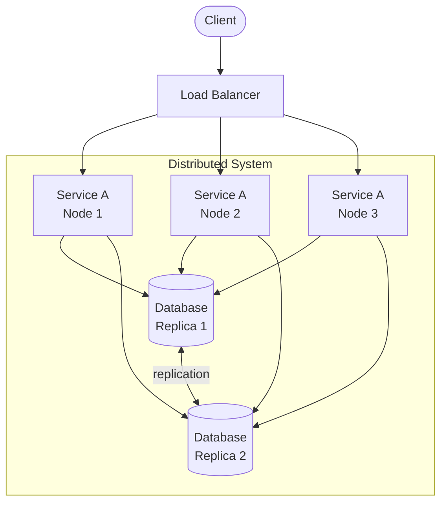

### Core property trade-offs

| Property | Question it answers |
|----------|---------------------|
| **Scalability** | Can we handle more load? |
| **Availability** | Is the system up when users need it? |
| **Reliability** | Does it work correctly over time? |
| **Durability** | Is data safe after writes? |
| **Consistency** | Do all nodes agree on data? |
| **Latency** | How fast are responses? |
| **Throughput** | How many requests per second? |

---

## 4.1 Scalability

### Overview

**Scalability** is the ability of a system to handle increased load by adding resources — without redesigning the architecture.

### Vertical vs horizontal scaling

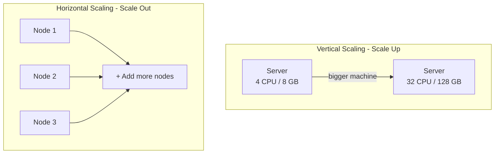

| Type | How | Pros | Cons |
|------|-----|------|------|
| **Vertical** | Bigger CPU/RAM/disk | Simple, no code changes | Hardware ceiling, single point of failure |
| **Horizontal** | More machines | Near-unlimited scale, fault isolation | Requires load balancing, distributed state |

### Scaling dimensions

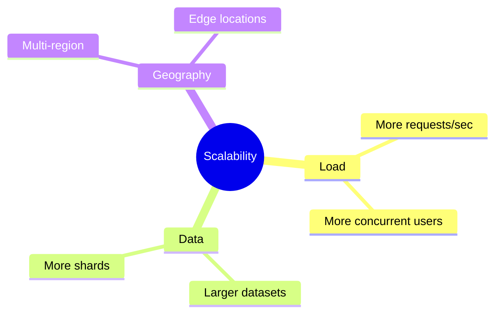

### Key indicators you need to scale

- CPU/memory consistently above 70–80%
- Rising queue depth or request latency under load
- Database connection pool exhaustion
- Disk I/O saturation

### Design patterns for scale

- **Stateless services** — any node can handle any request
- **Sharding / partitioning** — split data across nodes
- **Caching** — reduce backend load ([Caching](../03-caching/README.md))
- **Async processing** — offload work to queues

---

## 4.2 Availability

### Overview

**Availability** is the proportion of time a system is operational and accessible. Usually expressed as a percentage ("nines").

### Availability math

```
Availability = Uptime / (Uptime + Downtime)

99.9%  ("three nines")  ≈ 8.76 hours downtime/year
99.99% ("four nines")   ≈ 52.6 minutes downtime/year
99.999%("five nines")   ≈ 5.26 minutes downtime/year
```

### High availability architecture

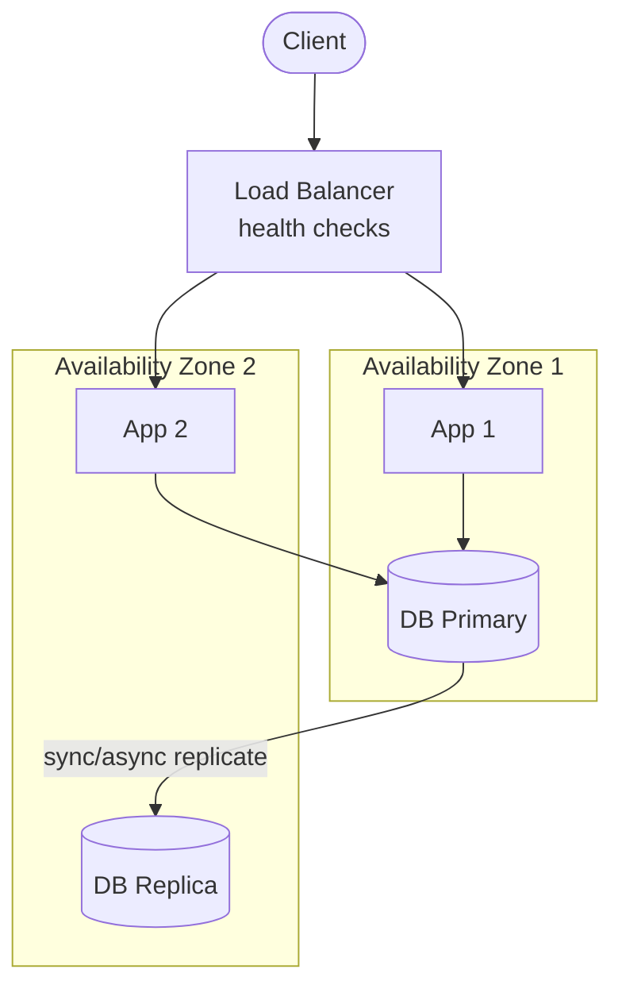

### What reduces availability

- Single points of failure (one server, one DB, one region)
- No health checks or auto-recovery
- Long deployment windows without rolling updates
- Cascading failures (one slow dependency takes down all)

### Improving availability

| Technique | How it helps |
|-----------|--------------|
| Redundancy | No single component failure stops the system |
| Health checks | Remove unhealthy nodes from rotation |
| Multi-AZ / multi-region | Survive datacenter outages |
| Circuit breakers | Stop calling failing dependencies |

---

## 4.3 Reliability

### Overview

**Reliability** is the probability that a system performs its intended function correctly for a specified period under stated conditions. A system can be *available* but *unreliable* (up but returning wrong answers).

### Availability vs reliability

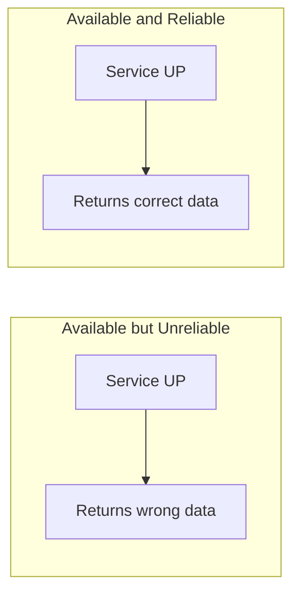

| | Availability | Reliability |
|---|--------------|-------------|
| **Measures** | Is it up? | Does it work correctly? |
| **Example failure** | Server down | Silent data corruption |
| **Mitigation** | Redundancy, failover | Testing, checksums, idempotency |

### Building reliable systems

- **Idempotent operations** — safe retries
- **Input validation** — reject bad data early
- **Monitoring + alerting** — detect incorrect behavior
- **Chaos testing** — verify behavior under failure
- **Data integrity checks** — checksums, constraints, audits

---

## 4.4 Durability

### Overview

**Durability** guarantees that once data is committed, it survives crashes, power loss, and hardware failures.

### Write path and durability

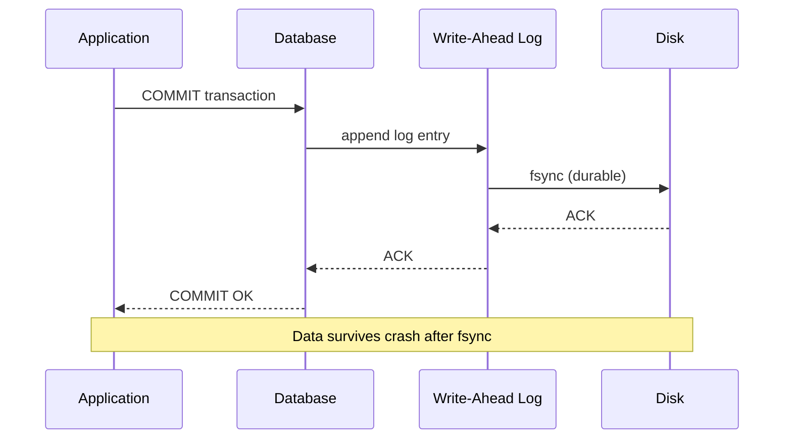

### Durability mechanisms

| Mechanism | Used in |
|-----------|---------|
| **Write-ahead log (WAL)** | PostgreSQL, MySQL InnoDB |
| **Replication** | Copies on multiple nodes |
| **Snapshots + backups** | Point-in-time recovery |
| **Erasure coding** | Object storage (S3, HDFS) |

### Durability vs performance

Stronger durability (sync replication, fsync on every write) adds latency. Systems often offer tunable durability:

- **Sync replication** — highest durability, higher latency
- **Async replication** — lower latency, risk of data loss on primary failure

---

## 4.5 Fault Tolerance

### Overview

**Fault tolerance** is the ability to continue operating — possibly at reduced capacity — when components fail.

### Failure types

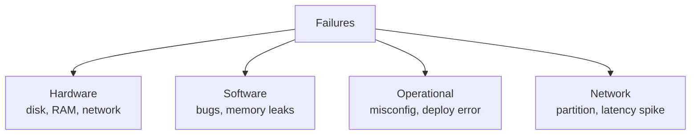

### Fault-tolerant design

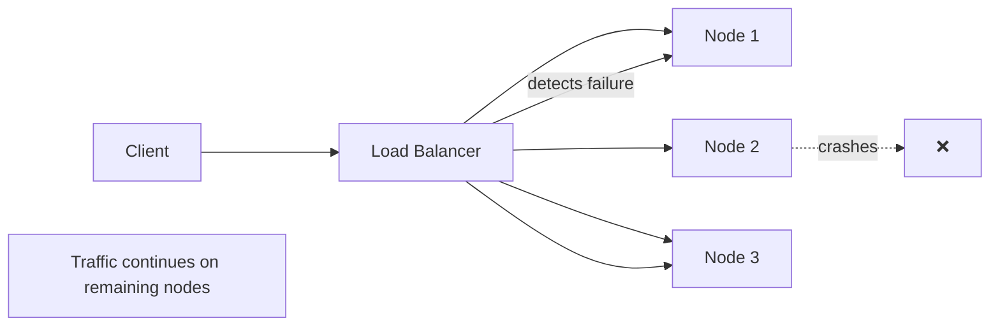

### Techniques

| Technique | Protects against |
|-----------|------------------|
| Replication | Node/disk failure |
| Retry with backoff | Transient network errors |
| Circuit breaker | Cascading dependency failure |
| Timeouts | Hung connections |
| Bulkheads | Resource exhaustion in one area |

---

## 4.6 Resilience

### Overview

**Resilience** is the ability to **recover quickly** from failures and adapt to stress. Fault tolerance is about surviving; resilience is about **bouncing back**.

### Fault tolerance vs resilience

| | Fault Tolerance | Resilience |
|---|-----------------|------------|
| **Focus** | Continue during failure | Recover and learn |
| **Example** | Replica takes over | Auto-scale after traffic spike |
| **Practices** | Redundancy | Chaos engineering, runbooks, auto-healing |

### Resilience patterns

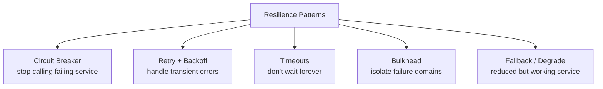

### Building resilience

- Define **SLOs** and **error budgets** (see [Observability](../09-observability/README.md))
- Practice **chaos engineering** — inject failures in staging/prod
- Automate **recovery** (Kubernetes self-healing, auto-restart)
- Document **runbooks** for common failure scenarios

---

## 4.7 Throughput

### Overview

**Throughput** is the number of operations completed per unit of time (e.g., requests/sec, records/sec, MB/sec).

### Throughput in a request path

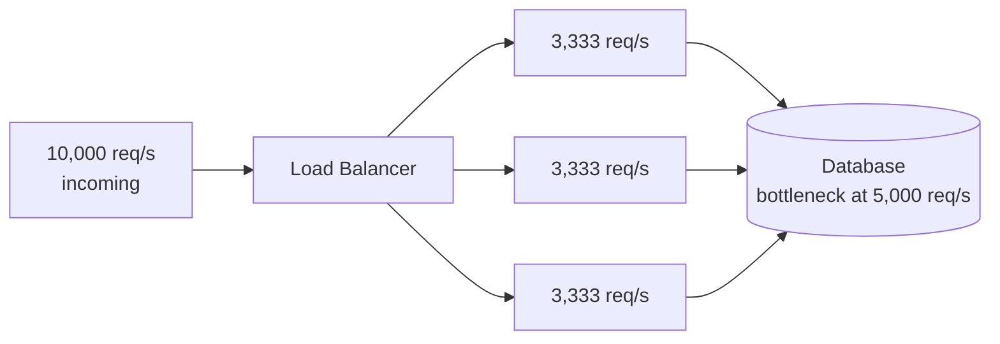

### Improving throughput

| Approach | Effect |
|----------|--------|
| Horizontal scaling | More nodes processing in parallel |
| Batching | Fewer round trips (DB batch inserts) |
| Async / queues | Decouple producers from consumers |
| Caching | Avoid repeated expensive work |
| Connection pooling | Reuse DB connections |

### Throughput vs latency

Often inversely related under load — pushing for max throughput can increase queueing delay and latency.

---

## 4.8 Latency

### Overview

**Latency** is the time between sending a request and receiving a response. Users feel latency directly.

### Latency breakdown (typical web request)

```mermaid
gantt
    title Request Latency Breakdown (~100ms total)
    dateFormat X
    axisFormat %s

    DNS + TCP + TLS     :0, 20
    Server processing   :20, 50
    Database query      :50, 85
    Response transfer   :85, 100
```

### Latency components

| Component | Typical range |
|-----------|-----------------|
| Network round trip | 1–100+ ms (depends on distance) |
| Load balancer | < 1 ms |
| Application logic | 1–50 ms |
| Database query | 1–100+ ms |
| Serialization | 0.1–5 ms |

### Reducing latency

- **Geographic proximity** — deploy closer to users (CDN, edge)
- **Caching** — avoid repeated DB hits
- **Fewer network hops** — reduce chatty service calls
- **Async where possible** — don't block on non-critical work
- **Efficient queries + indexes** — faster DB responses

---

## 4.9 Tail Latency

### Overview

**Tail latency** (p99, p999) measures the slowest requests. Average latency can look healthy while 1% of users have a terrible experience.

### Why averages lie

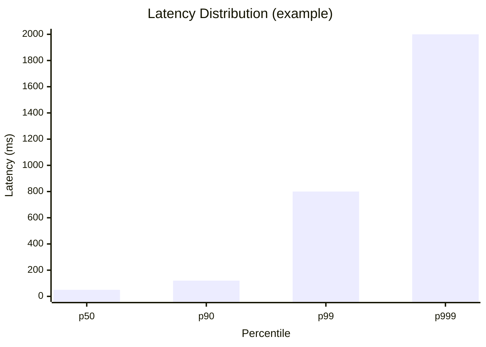

| Percentile | Meaning |
|------------|---------|
| **p50 (median)** | Half of requests faster than this |
| **p99** | 99% faster; 1 in 100 is slower |
| **p999** | 1 in 1000 is very slow |

### Causes of tail latency

- **GC pauses** — JVM stop-the-world
- **Slow disks** — one bad node in a cluster
- **Head-of-line blocking** — one slow request blocks others
- **Hot keys** — uneven load on one shard
- **Retries** — amplify load during incidents

### Mitigations

- **Timeout budgets** — cap wait time per hop
- **Hedged requests** — send duplicate request if first is slow (careful with load)
- **Load balancing** — least-connections, power-of-two choices
- **Isolate slow paths** — separate thread pools (bulkhead)

---

## 4.10 Consistency

### Overview

**Consistency** in distributed systems means all nodes agree on the value of data — or the rules for how and when they will agree.

### Consistency spectrum

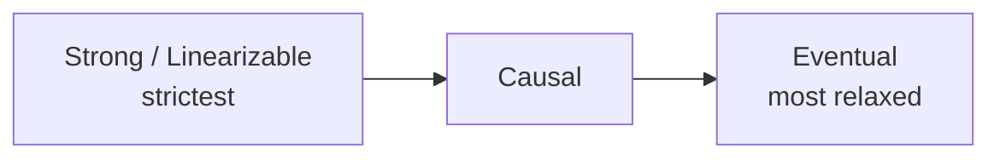

### Why consistency is hard

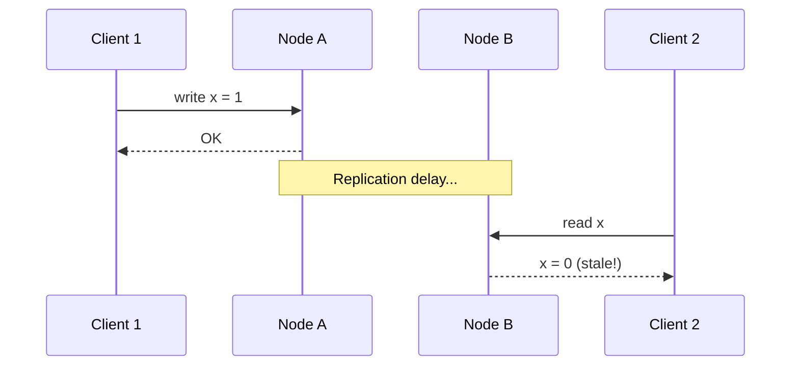

Network delays and partitions make it impossible to have perfect consistency, availability, and partition tolerance simultaneously — see [CAP Theorem](#412-cap-theorem).

---

## 4.11 Concurrency

### Overview

**Concurrency** means multiple operations happen at the same time — multiple users, threads, or nodes accessing shared resources simultaneously.

### Concurrency in distributed systems

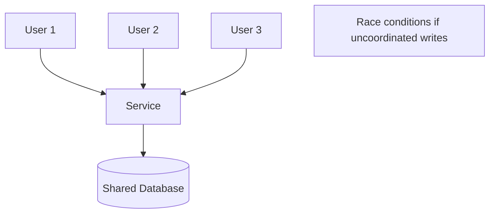

### Common problems

| Problem | Description |
|---------|-------------|
| **Race condition** | Outcome depends on timing of concurrent operations |
| **Lost update** | Two writes; one overwrites the other |
| **Dirty read** | Read uncommitted data from another transaction |
| **Deadlock** | Two transactions waiting on each other |

### Solutions

| Solution | Use case |
|----------|----------|
| **Locks** (distributed lock) | Exclusive access to a resource |
| **Optimistic concurrency** | Version numbers / ETags; fail on conflict |
| **Transactions** | ACID guarantees within a database |
| **Idempotency keys** | Safe retries without duplicate effects |
| **Message ordering** | Kafka partitions, single-writer per key |

---

## 4.12 CAP Theorem

### Overview

The **CAP theorem** (Brewer's theorem) states that a distributed system can provide at most **two of three** guarantees during a **network partition**:

- **C** — Consistency (every read gets the latest write)
- **A** — Availability (every request gets a response)
- **P** — Partition tolerance (system works despite network splits)

### CAP triangle

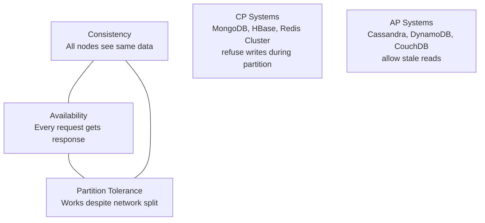

### During a network partition

```mermaid
flowchart TB
    subgraph split [Network Partition]
        N1[Node 1]
        N2[Node 2]
        N3[Node 3]
        N1 --- N2
        N3
    end
    N1 -.x.- N3
    N2 -.x.- N3

    Choice{Must choose}
    Choice --> CP[CP: Block writes<br/>to preserve consistency]
    Choice --> AP[AP: Accept writes<br/>on both sides - eventual sync]
```

### Key insight

In practice, **partitions happen** — so the real choice is between **CP** and **AP** during a partition. Most modern systems offer tunable consistency per operation.

---

## 4.13 PACELC Theorem

### Overview

**PACELC** extends CAP: if there is a **P**artition, choose **A** or **C**; **E**lse (normal operation), choose **L**atency or **C**onsistency.

```
If Partition → choose Availability or Consistency
Else         → choose Latency or Consistency
```

### PACELC decision space

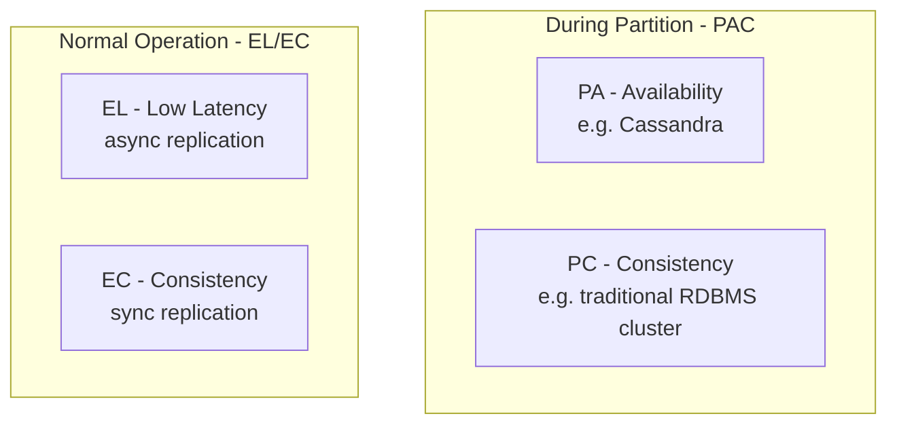

### System examples

| System | Partition behavior | Normal behavior |
|--------|-------------------|-----------------|
| **DynamoDB / Cassandra** | PA (available) | EL (async replicate for speed) |
| **MongoDB (default)** | PC (consistent) | EC (sync to primaries) |
| **PostgreSQL sync rep** | PC | EC |

### Why PACELC matters

CAP only describes partition scenarios. In the **99% of time when the network is healthy**, you still trade latency vs consistency — PACELC captures that everyday trade-off.

---

## 4.14 Strong Consistency

### Overview

**Strong consistency** (often implemented as **linearizability**) means every read returns the most recent write. All nodes appear as a single, up-to-date copy.

### Strong consistency read

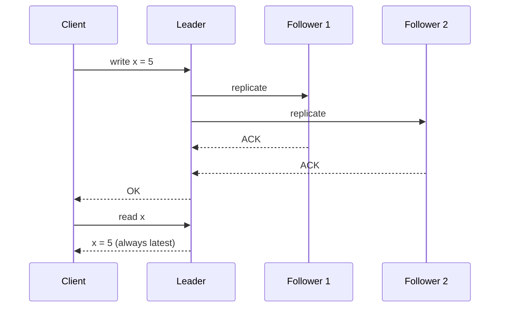

### How to achieve it

- **Single leader** — all writes go through one node
- **Synchronous replication** — wait for replicas before ACK
- **Consensus protocols** — Raft, Paxos for leader election and log replication
- **Distributed transactions** — 2PC across services (expensive)

### Trade-offs

| Pros | Cons |
|------|------|
| Simple mental model for developers | Higher write latency |
| No stale reads | Lower availability during partition |
| Easier to reason about | Harder to scale writes globally |

### When to use

- Financial transactions, inventory, booking systems
- Any domain where stale reads cause business errors

---

## 4.15 Eventual Consistency

### Overview

**Eventual consistency** guarantees that if no new writes occur, all replicas will **eventually** converge to the same value. Reads may return stale data temporarily.

### Eventual consistency timeline

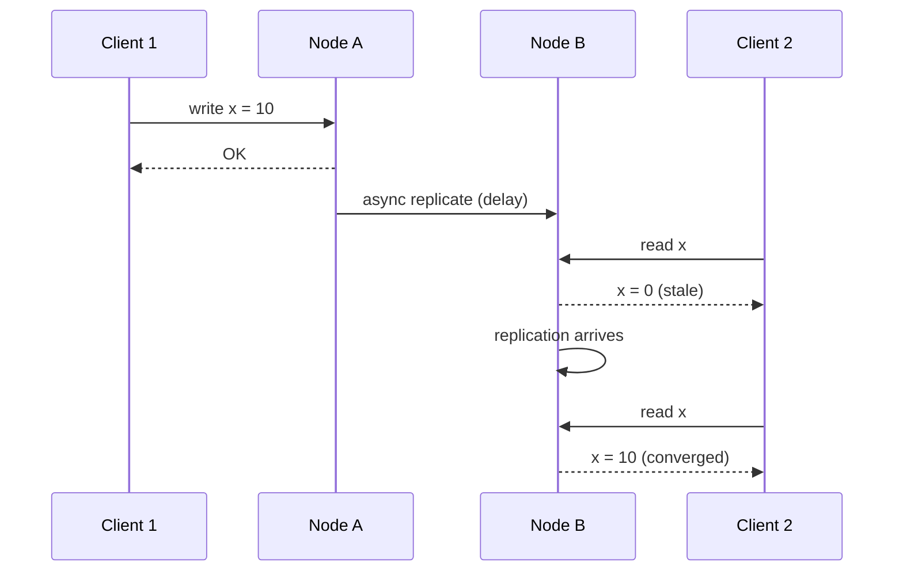

### Conflict resolution

When concurrent writes happen on different nodes:

| Strategy | Description |
|----------|-------------|
| **Last-write-wins (LWW)** | Timestamp decides winner |
| **Version vectors** | Track causality per replica |
| **Application merge** | Business logic resolves conflict |
| **CRDTs** | Data structures that merge automatically |

### When to use

- Social feeds, likes, view counts
- DNS, CDN cache propagation
- Shopping cart (with careful merge logic)
- Systems prioritizing availability and low latency

---

## 4.16 Causal Consistency

### Overview

**Causal consistency** preserves **cause-and-effect** order: if operation A happened before B (causally), everyone sees A before B. Concurrent unrelated writes may still be seen in different orders.

### Causal vs eventual

```mermaid
sequenceDiagram
    participant Alice
    participant Bob
    participant System

    Alice->>System: Post: "Going to Paris"
    Alice->>System: Comment: "See the Eiffel Tower"
    Note over System: Comment causally depends on Post
    Bob->>System: read feed
    System-->>Bob: Must see Post BEFORE Comment
```

### Happens-before relationship

```mermaid
flowchart LR
    W1[Write A] -->|causes| W2[Write B]
    W3[Write C]
    W1 -.->|concurrent| W3
```

- **A → B**: all nodes see A before B
- **A ∥ C**: nodes may see A and C in any order

### Implementation

- **Vector clocks** — track causal history per operation
- **Version stamps** — attach dependency metadata to writes

### When to use

- Chat / messaging (messages in a thread must be ordered)
- Collaborative editing with dependency chains
- Stronger than eventual, weaker (faster) than linearizable

---

## 4.17 Linearizability

### Overview

**Linearizability** is the strongest single-object consistency model. Every operation appears to happen at a single instant between its start and end — as if there is only one copy of the data.

### Linearizable vs sequential

```mermaid
timeline
    title Linearizable Timeline
    Client A writes x=1 : 0, 1
    Client B reads x (sees 1) : 2, 3
    Client C writes x=2 : 4, 5
    Client D reads x (sees 2) : 6, 7
```

### Requirements

- Reads never return stale values after a write has completed
- All operations have a global order consistent with real-time
- More expensive than eventual or causal consistency

### How systems achieve it

| Approach | Example |
|----------|---------|
| Single leader + sync replication | PostgreSQL with sync standby |
| Consensus-based log | etcd, ZooKeeper (Raft) |
| Distributed locks | For critical sections |

### When to use

- Leader election, distributed locks
- Inventory deduction (prevent overselling)
- Coordination services (config, service discovery)

---

## 4.18 Backpressure

### Overview

**Backpressure** is a flow-control mechanism where a **downstream component signals upstream to slow down** when it cannot keep up — preventing overload and cascading failure.

### Without backpressure (system collapse)

```mermaid
flowchart LR
    P[Producer<br/>1000 msg/s] -->|unbounded queue| Q[Queue grows<br/>∞ memory]
    Q --> C[Consumer<br/>100 msg/s]
    Q --> X[OOM / crash]
```

### With backpressure

```mermaid
flowchart LR
    P[Producer] -->|slow down signal| Q[Bounded Queue<br/>max 1000]
    Q --> C[Consumer]
    C -->|queue full| P
```

### Backpressure mechanisms

| Mechanism | Where used |
|-----------|------------|
| **Bounded queues** | In-process buffers |
| **HTTP 429 / 503** | API rate limiting |
| **TCP flow control** | Network layer |
| **Reactive streams** | Project Reactor, RxJava |
| **Kafka consumer lag** | Scale consumers when lag grows |
| **gRPC streaming** | Client respects server capacity |

### Signs you need backpressure

- Memory growing unbounded in queues
- Latency increasing linearly with load
- Cascading timeouts across services

---

## 4.19 Graceful Degradation

### Overview

**Graceful degradation** means the system **reduces functionality** under stress but remains **partially usable** — instead of failing completely.

### Degradation levels

```mermaid
flowchart TB
    Normal[Normal<br/>Full features]
    Degraded1[Degraded L1<br/>Disable recommendations]
    Degraded2[Degraded L2<br/>Serve cached / stale data]
    Degraded3[Degraded L3<br/>Read-only mode]
    Down[Hard failure<br/>503 everywhere]

    Normal --> Degraded1 --> Degraded2 --> Degraded3
    Degraded3 -.->|unmitigated| Down
```

### Examples

| Scenario | Degradation strategy |
|----------|---------------------|
| Search index slow | Return cached popular results |
| Recommendation service down | Show default / trending items |
| Payment gateway timeout | Queue order for later processing |
| DB overloaded | Serve read-only from cache |
| High traffic event | Disable non-critical features (analytics, previews) |

### Design principles

- Identify **critical vs optional** features upfront
- Pre-build **fallback responses** (static defaults, stale cache)
- Use **feature flags** to toggle features without deploy
- Communicate degraded state to users ("results may be delayed")

---

## 4.20 Failover

### Overview

**Failover** is the automatic or manual switch from a failed primary component to a standby backup.

### Active-passive failover

```mermaid
sequenceDiagram
    participant C as Client
    participant LB as Load Balancer
    participant P as Primary
    participant S as Standby

    C->>LB: request
    LB->>P: forward
    P-->>C: response
    Note over P: Primary fails
    LB->>LB: health check fails
    LB->>S: promote / route traffic
    C->>LB: request
    LB->>S: forward
    S-->>C: response
```

### Active-active failover

```mermaid
flowchart TB
    Client --> LB[Load Balancer]
    LB --> N1[Node 1 - Active]
    LB --> N2[Node 2 - Active]
    N1 -.->|fails| X[❌]
    LB -->|remove unhealthy| N2
    Note[No promotion needed - peers already serving]
```

### Failover types

| Type | Description | Downtime |
|------|-------------|----------|
| **Automatic** | Health checks trigger switch | Seconds to minutes |
| **Manual** | Operator promotes standby | Minutes (controlled) |
| **DNS failover** | Change DNS to backup region | Minutes (TTL dependent) |

### Failover challenges

- **Split brain** — two nodes think they are primary
- **Data loss** — async replication lag on failover
- **Flapping** — rapid back-and-forth between nodes
- **Cold standby** — standby not warmed up, slow first requests

---

## 4.21 Redundancy

### Overview

**Redundancy** means duplicating critical components so failure of one does not stop the system.

### Redundancy layers

```mermaid
flowchart TB
    subgraph redundancy [Redundancy at Every Layer]
        LB1[LB 1] --- LB2[LB 2]
        A1[App 1] --- A2[App 2] --- A3[App 3]
        DB1[(DB Primary)] --- DB2[(DB Replica)]
        R1[Redis 1] --- R2[Redis 2]
    end
    Client --> LB1
```

### Types of redundancy

| Type | Description | Example |
|------|-------------|---------|
| **Active-active** | All copies serve traffic | Multiple app servers behind LB |
| **Active-passive** | Standby waits until needed | DB primary + hot standby |
| **N+1** | One extra node beyond minimum | 4 nodes to survive 1 failure |
| **N+2** | Two extra nodes | Higher fault tolerance |
| **Geographic** | Copies in multiple regions | Multi-region deployment |

### Redundancy vs cost

More redundancy = higher cost and complexity (replication lag, consistency). Right-size based on availability targets (see [4.2 Availability](#42-availability)).

---

## 4.22 Capacity Planning

### Overview

**Capacity planning** estimates the resources needed to meet current and future demand — before performance degrades or outages occur.

### Capacity planning workflow

```mermaid
flowchart LR
    M[Measure<br/>current usage] --> F[Forecast<br/>growth]
    F --> T[Test<br/>load testing]
    T --> P[Plan<br/>headroom + scale triggers]
    P --> D[Deploy<br/>infrastructure]
    D --> M
```

### What to measure

| Metric | Why |
|--------|-----|
| Requests/sec (peak and average) | Size compute tier |
| CPU / memory utilization | Right-size instances |
| DB connections / query latency | Database capacity |
| Storage growth rate | Disk planning |
| Network bandwidth | Egress costs, limits |

### Headroom rule of thumb

Plan for **2–3× current peak** or ensure auto-scaling triggers at **~70% utilization** — not at 95%.

### Load testing

```mermaid
flowchart TB
    LT[Load Test Tool<br/>k6, Gatling, JMeter]
    LT -->|simulate 2x peak| System[Your System]
    System --> Metrics[Measure:<br/>latency, errors, saturation]
    Metrics --> Decision{SLO met?}
    Decision -->|Yes| OK[Capacity sufficient]
    Decision -->|No| Scale[Add resources / optimize]
```

### Key questions

- What is peak traffic today? Expected in 6–12 months?
- What is the bottleneck under 2× load?
- Does auto-scaling respond fast enough for traffic spikes?

---

## 4.23 Bottleneck Analysis

### Overview

**Bottleneck analysis** identifies the single slowest component limiting overall system throughput — fixing non-bottlenecks does not improve performance.

### Amdahl's Law intuition

If 90% of work is parallelizable and 10% is serial, max speedup is **10×** — no matter how many nodes you add.

```
Speedup = 1 / ((1 - P) + P/N)
P = parallelizable fraction, N = nodes
```

### Finding bottlenecks

```mermaid
flowchart LR
    C[Client] -->|50ms| LB[LB<br/>1ms]
    LB -->|100ms| App[App<br/>20ms]
    App -->|800ms| DB[(DB<br/>BOTTLENECK)]
    App -->|30ms| Cache[Cache]
```

**Rule:** Optimize the **slowest hop first** (DB at 800ms above, not cache at 30ms).

### Common bottlenecks

| Layer | Symptom | Fix |
|-------|---------|-----|
| **Database** | High query time, lock waits | Indexes, read replicas, sharding |
| **Network** | High latency between services | Colocate, batch calls, caching |
| **CPU** | 100% utilization | Optimize code, scale out |
| **Disk I/O** | Slow reads/writes | SSD, caching, async writes |
| **Single hot key** | One shard overloaded | Key splitting, local cache |
| **External API** | Third-party rate limits | Cache, queue, circuit breaker |

### Analysis tools

- **Distributed tracing** — find slow spans (Jaeger, Zipkin)
- **APM** — Datadog, New Relic, Prometheus + Grafana
- **DB explain plans** — `EXPLAIN ANALYZE`
- **Profiler** — flame graphs for CPU hotspots

### Bottleneck analysis process

1. **Measure end-to-end latency** — break down per component
2. **Identify the dominant cost** — usually one component is 80%+ of delay
3. **Fix the bottleneck** — optimize or scale that component
4. **Repeat** — next bottleneck appears after first is fixed

---

## Quick Reference

| Sub-topic | One-line summary |
|-----------|------------------|
| **4.1 Scalability** | Handle more load by scaling up or out |
| **4.2 Availability** | System uptime — measured in nines |
| **4.3 Reliability** | Correct behavior over time |
| **4.4 Durability** | Committed data survives failures |
| **4.5 Fault Tolerance** | Continue operating when parts fail |
| **4.6 Resilience** | Recover quickly and adapt to stress |
| **4.7 Throughput** | Operations per second |
| **4.8 Latency** | Time per operation |
| **4.9 Tail Latency** | Slowest requests (p99/p999) |
| **4.10 Consistency** | Nodes agreeing on data |
| **4.11 Concurrency** | Simultaneous access coordination |
| **4.12 CAP** | Pick 2 of C, A, P during partition |
| **4.13 PACELC** | Latency vs consistency when no partition |
| **4.14 Strong Consistency** | Always read latest write |
| **4.15 Eventual Consistency** | Replicas converge over time |
| **4.16 Causal Consistency** | Preserve cause-effect ordering |
| **4.17 Linearizability** | Strongest single-object consistency |
| **4.18 Backpressure** | Slow producers when consumers lag |
| **4.19 Graceful Degradation** | Reduced features vs total failure |
| **4.20 Failover** | Switch to backup on failure |
| **4.21 Redundancy** | Duplicate components for safety |
| **4.22 Capacity Planning** | Forecast and provision resources |
| **4.23 Bottleneck Analysis** | Find and fix the slowest component |

---

## Related topics

- [5. Distributed Databases](../05-distributed-databases/README.md) — sharding, replication, consensus
- [3. Caching](../03-caching/README.md) — reduce latency and load
- [8. Microservices](../08-microservices/README.md) — circuit breaker, bulkhead, saga
- [9. Observability](../09-observability/README.md) — SLA, SLO, SLI, tracing
- [12. Reliability Engineering](../12-reliability-engineering/README.md) — chaos, DR, HA

---

[← Back to master index](../README.md)
