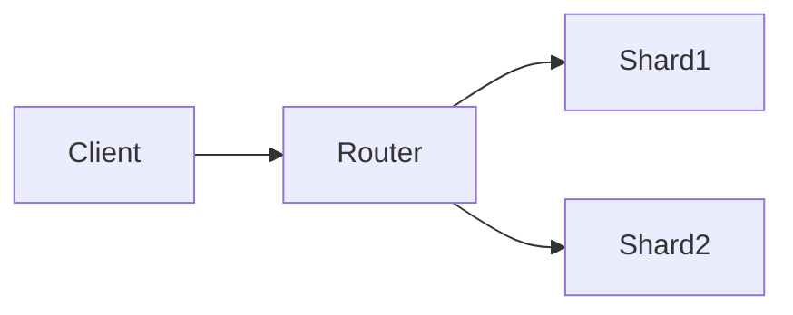
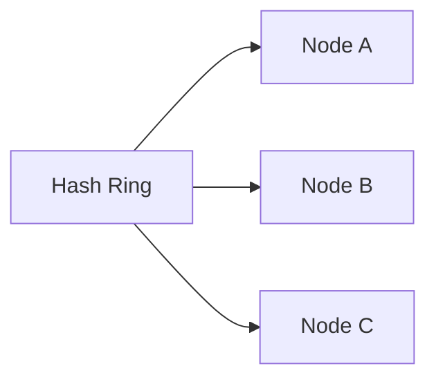
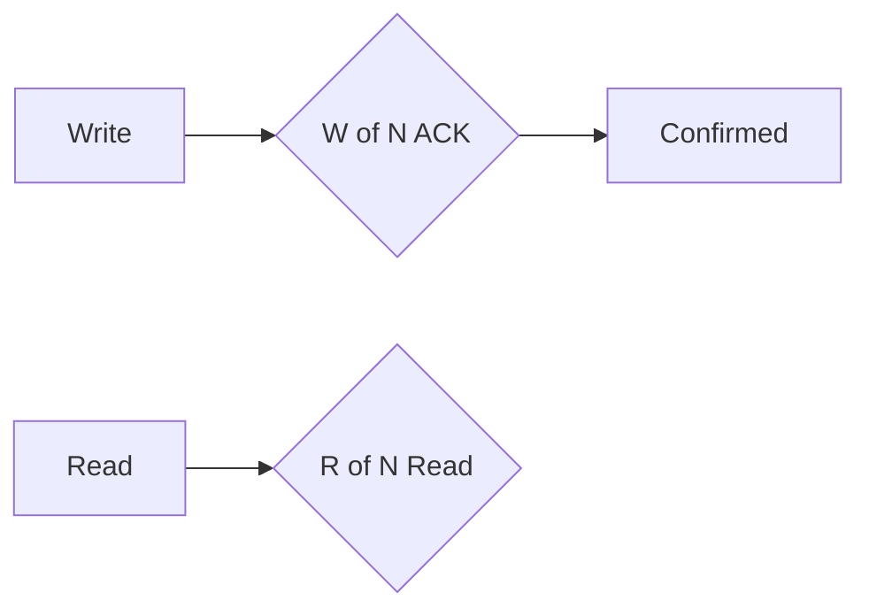
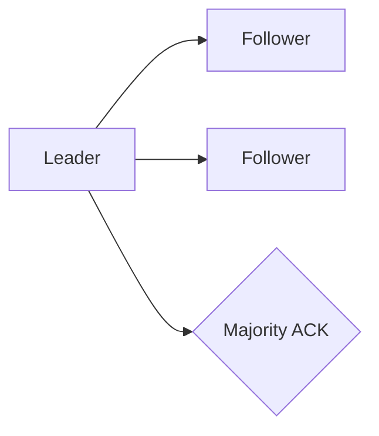

# 5. Distributed Databases

> Status: **Documented**

[← Back to master index](../README.md)

---

## Sub-topics

| # | Sub-topic | Status |
|---|-----------|--------|
| 5.1 | [Sharding](#sharding) | Done |
| 5.2 | [Partitioning](#partitioning) | Done |
| 5.3 | [Hash Partitioning](#hash-partitioning) | Done |
| 5.4 | [Range Partitioning](#range-partitioning) | Done |
| 5.5 | [Geo Partitioning](#geo-partitioning) | Done |
| 5.6 | [Rebalancing](#rebalancing) | Done |
| 5.7 | [Hot Partitions](#hot-partitions) | Done |
| 5.8 | [Consistent Hashing](#consistent-hashing) | Done |
| 5.9 | [Rendezvous Hashing](#rendezvous-hashing) | Done |
| 5.10 | [Virtual Nodes](#virtual-nodes) | Done |
| 5.11 | [Replication](#replication) | Done |
| 5.12 | [Leader Follower Replication](#leader-follower-replication) | Done |
| 5.13 | [Multi Leader Replication](#multi-leader-replication) | Done |
| 5.14 | [Quorum Reads](#quorum-reads) | Done |
| 5.15 | [Quorum Writes](#quorum-writes) | Done |
| 5.16 | [Distributed Transactions](#distributed-transactions) | Done |
| 5.17 | [Two Phase Commit](#two-phase-commit) | Done |
| 5.18 | [Three Phase Commit](#three-phase-commit) | Done |
| 5.19 | [Distributed Locking](#distributed-locking) | Done |
| 5.20 | [Split Brain](#split-brain) | Done |
| 5.21 | [Consensus](#consensus) | Done |
| 5.22 | [Paxos](#paxos) | Done |
| 5.23 | [Raft](#raft) | Done |
| 5.24 | [Leader Election](#leader-election) | Done |
| 5.25 | [Lamport Clocks](#lamport-clocks) | Done |
| 5.26 | [Vector Clocks](#vector-clocks) | Done |
| 5.27 | [Gossip Protocol](#gossip-protocol) | Done |
| 5.28 | [Membership Protocols](#membership-protocols) | Done |

---

## 5.1 Sharding

**Summary:** Horizontal data splitting across independent database nodes. Each shard holds a subset; together they serve the full dataset at scale.

**Key points:**
- Application or proxy routes queries to correct shard by partition key
- Cross-shard joins and transactions are expensive—design around single-shard access
- Resharding required when adding nodes—plan key space carefully upfront

---

## 5.2 Partitioning

**Summary:** General term for dividing data into segments (partitions/shards). Can be horizontal (rows) or vertical (columns/tables).

**Key points:**
- Horizontal: split rows by key—most common for scale-out
- Vertical: split tables/columns—rarely used at distributed scale
- Partition key choice is the most critical sharding decision

---

## 5.3 Hash Partitioning

**Summary:** `hash(key) mod N` distributes rows evenly across N partitions. Uniform spread but resharding remaps nearly all keys.

**Key points:**
- Even distribution when hash function is uniform
- Range queries span all partitions—no locality benefit
- Adding nodes changes mod N—requires full rehash or consistent hashing

---

## 5.4 Range Partitioning

**Summary:** Assign contiguous key ranges to partitions (A–M → shard1, N–Z → shard2). Efficient range scans but risks hot spots on popular ranges.

**Key points:**
- Adjacent keys on same shard—great for time-series and alphabetical access
- Hot spots when key distribution is skewed (e.g., recent timestamps)
- Dynamic range splitting when a partition grows too large

---

## 5.5 Geo Partitioning

**Summary:** Partition data by geographic region for data residency and low-latency local access. Required for GDPR and multi-region compliance.

**Key points:**
- Route users to nearest region's partition automatically
- Cross-region queries add latency—design for local-first access
- Replication across regions for DR while keeping primary write local

---

## 5.6 Rebalancing

**Summary:** Redistribute partitions when nodes join or leave the cluster. Goal: even load with minimal data movement and no downtime.

**Key points:**
- Consistent hashing limits data movement to K/N keys on node change
- Background migration with dual-read/dual-write during transition
- Monitor partition size and request rate—rebalance before hotspots form

---

## 5.7 Hot Partitions

**Summary:** One partition receives disproportionate traffic—celebrity user, trending item, or bad key design. Bottlenecks entire shard regardless of cluster size.

**Key points:**
- Detect via per-partition QPS and size metrics
- Mitigate: split hot key into sub-keys, add caching layer, or salting
- Hash partitioning doesn't help if one logical key dominates

---

## 5.8 Consistent Hashing

**Summary:** Maps keys and nodes to a hash ring; keys assigned to next clockwise node. Adding/removing a node moves only adjacent key ranges.

**Key points:**
- O(K/N) keys remapped when one of N nodes changes
- Virtual nodes spread load evenly when physical nodes differ in capacity
- Used by DynamoDB, Cassandra, and distributed caches

---

## 5.9 Rendezvous Hashing

**Summary:** Highest Random Weight hashing—each key picks the node with highest hash(key, node) score. No ring structure; simpler than consistent hashing.

**Key points:**
- Minimal key movement on node add/remove
- O(nodes) computation per lookup—fine for small clusters
- Used when simplicity beats ring management overhead

---

## 5.10 Virtual Nodes

**Summary:** Each physical node mapped to many points on the hash ring. Smooths load distribution when nodes have unequal capacity or count is small.

**Key points:**
- High-capacity nodes get more vnodes for proportional load share
- Typically 100–200 vnodes per physical node in production
- More vnodes = better balance but more metadata to manage

---

## 5.11 Replication

**Summary:** Copy data across multiple nodes for durability and read scaling. Synchronous (strong consistency) or asynchronous (eventual consistency).

**Key points:**
- Factor of replication (RF=3): tolerate 1 node failure with quorum
- Async replication: fast writes, risk of data loss on primary failure
- Sync replication: no data loss, higher write latency

---

## 5.12 Leader Follower Replication

**Summary:** Single leader accepts all writes; followers replicate the log and serve read traffic. Simplest and most common replication topology.

**Key points:**
- Leader serializes all writes—natural ordering guarantee
- Followers may lag (replication lag)—stale reads unless read-from-leader
- Automatic leader election on leader failure via consensus

---

## 5.13 Multi Leader Replication

**Summary:** Multiple nodes accept writes independently. Enables multi-datacenter writes but introduces write conflict resolution.

**Key points:**
- Each datacenter has local leader—low-latency regional writes
- Conflicts when same key written concurrently at different leaders
- Resolution: LWW, vector clocks, or application-level merge

---

## 5.14 Quorum Reads

**Summary:** Read from R replicas; strong read if R + W > N (total replicas). Ensures overlap with latest write quorum.

**Key points:**
- R=1: fast but may read stale data from lagging replica
- R=N: strongest read consistency; slowest
- Tune R and W per operation—strong reads vs low latency

---

## 5.15 Quorum Writes

**Summary:** Write acknowledged after W replicas persist it. W + R > N guarantees read sees latest write.

**Key points:**
- W=1: fast but vulnerable to data loss if node dies before replication
- W=N: full durability before ACK; highest write latency
- Sloppy quorum + hinted handoff handles temporary replica unavailability

---

## 5.16 Distributed Transactions

**Summary:** Atomic commit across multiple nodes or shards. Hard in distributed systems—2PC is standard but blocks on coordinator failure.

**Key points:**
- Prefer avoiding cross-shard transactions via data modeling
- Saga pattern: sequence of local transactions with compensating actions
- Percolator/Spanner use TrueTime or MVCC for global transactions

---

## 5.17 Two Phase Commit

**Summary:** Coordinator prepares all participants (Phase 1), then commits if all vote yes (Phase 2). Atomic but blocking—coordinator failure stalls participants.

**Key points:**
- Prepare: participants write WAL and vote; hold locks until decision
- Commit/Abort: coordinator decides; participants apply or rollback
- Not partition tolerant—use 3PC or Paxos-based alternatives for HA

---

## 5.18 Three Phase Commit

**Summary:** Adds pre-commit phase to 2PC so participants can timeout and abort if coordinator dies. Reduces indefinite blocking but still not fault tolerant.

**Key points:**
- CanCommit → PreCommit → DoCommit phases
- Timeout in pre-commit allows unilateral abort without coordinator
- Rarely used in production—Raft/Paxos preferred for consensus

---

## 5.19 Distributed Locking

**Summary:** Mutual exclusion across nodes for critical sections. Requires fencing tokens to prevent stale lock holders from writing.

**Key points:**
- Redis Redlock, ZooKeeper ephemeral nodes, etcd leases
- Always use fencing tokens—lock expiry alone causes split-brain writes
- Prefer idempotent design over distributed locks when possible

---

## 5.20 Split Brain

**Summary:** Network partition causes two nodes to both believe they are leader. Both accept writes—data diverges irreconcilably without fencing.

**Key points:**
- Prevent with quorum majority requirement for leadership
- STONITH/fencing: forcefully shut down non-leader before promotion
- Use odd number of nodes (3, 5) for clear majority during partition

---

## 5.21 Consensus

**Summary:** Agreement among distributed nodes on a single value or log order despite failures. Foundation for leader election, replication, and distributed locks.

**Key points:**
- Requires majority quorum to make progress during partition
- Safety: never two leaders; liveness: eventually elect leader
- Implemented via Paxos, Raft, or ZAB protocols

---

## 5.22 Paxos

**Summary:** Classic consensus algorithm—proposers, acceptors, learners agree on a value in two phases. Proven correct but notoriously hard to implement and explain.

**Key points:**
- Phase 1: prepare with proposal number; Phase 2: accept value
- Multi-Paxos optimizes for log replication with single long-lived leader
- Used internally by Chubby, early ZooKeeper; largely superseded by Raft for new systems

---

## 5.23 Raft

**Summary:** Understandable consensus via leader election, log replication, and safety. Standard for etcd, CockroachDB, and TiKV.

**Key points:**
- Leader appends entries; followers replicate; commit when majority ACK
- Leader election on timeout if no heartbeat received
- Log matching property ensures identical committed prefix across nodes

---

## 5.24 Leader Election

**Summary:** Process of selecting one node as coordinator from a group. Must be safe (at most one leader) and live (eventually elect one).

**Key points:**
- Bully algorithm, ring algorithm for simple cases
- Production: Raft/ZAB with term numbers and vote requests
- Lease-based leadership with TTL prevents stale leaders

---

## 5.25 Lamport Clocks

**Summary:** Logical clock assigning monotonically increasing timestamps to events. Captures happens-before relationship but not concurrent events.

**Key points:**
- Counter incremented on send; max(local, received) + 1 on receive
- If A → B then timestamp(A) < timestamp(B); converse not guaranteed
- Cannot detect concurrent events—use vector clocks instead

---

## 5.26 Vector Clocks

**Summary:** Each node maintains a vector of counters per replica. Detects concurrent writes for conflict resolution in eventually consistent stores.

**Key points:**
- V(A) < V(B) means A happened-before B; incomparable = concurrent
- Used in Dynamo, Riak, and CRDT conflict detection
- Vector size grows with replica count—pruned in practice

---

## 5.27 Gossip Protocol

**Summary:** Epidemic protocol where nodes randomly exchange state with peers. Eventually all nodes converge without central coordinator.

**Key points:**
- O(log N) rounds to propagate update across N nodes
- Used for membership, failure detection, and metadata dissemination
- Cassandra, Consul, and Dynamo use gossip for cluster awareness

---

## 5.28 Membership Protocols

**Summary:** Track which nodes are alive and part of the cluster. Accurate membership is prerequisite for routing, replication, and consensus.

**Key points:**
- SWIM protocol: ping-ack with indirect probing for failure detection
- False positives cause unnecessary failovers—tune suspicion timeouts
- Join/leave events trigger rebalancing and quorum recalculation

---

## Quick Reference

| # | Sub-topic | One-liner |
|---|-----------|-----------|
| 5.1 | Sharding | Split data across independent DB nodes |
| 5.2 | Partitioning | Divide data into segments by key/range |
| 5.3 | Hash Partitioning | hash(key) mod N for even spread |
| 5.4 | Range Partitioning | Contiguous key ranges per shard |
| 5.5 | Geo Partitioning | Region-based for residency and latency |
| 5.6 | Rebalancing | Redistribute partitions on cluster change |
| 5.7 | Hot Partitions | Skewed traffic overloads one shard |
| 5.8 | Consistent Hashing | Hash ring; minimal remap on node change |
| 5.9 | Rendezvous Hashing | Highest hash score wins assignment |
| 5.10 | Virtual Nodes | Multiple ring points per physical node |
| 5.11 | Replication | Copy data across nodes for durability |
| 5.12 | Leader Follower Replication | Single writer, multiple read replicas |
| 5.13 | Multi Leader Replication | Multiple write nodes; conflict resolution |
| 5.14 | Quorum Reads | R-of-N reads for consistency guarantee |
| 5.15 | Quorum Writes | W-of-N writes before ACK |
| 5.16 | Distributed Transactions | Atomic commit across nodes/shards |
| 5.17 | Two Phase Commit | Prepare then commit; blocks on failure |
| 5.18 | Three Phase Commit | Non-blocking variant of 2PC |
| 5.19 | Distributed Locking | Cross-node mutual exclusion |
| 5.20 | Split Brain | Dual leaders during partition |
| 5.21 | Consensus | Agreement on value/order despite failures |
| 5.22 | Paxos | Classic two-phase consensus algorithm |
| 5.23 | Raft | Leader-based understandable consensus |
| 5.24 | Leader Election | Select single coordinator safely |
| 5.25 | Lamport Clocks | Logical timestamps for ordering |
| 5.26 | Vector Clocks | Detect concurrent events per replica |
| 5.27 | Gossip Protocol | Epidemic state propagation |
| 5.28 | Membership Protocols | Track alive nodes in cluster |

[← Back to master index](../README.md)
