# 5. Distributed Databases

> Status: **Documented**

[<- Back to master index](../README.md)

---

## Overview

Distributed databases spread data and query load across multiple nodes - often in different racks, regions, or continents - so a single machine is never the bottleneck or single point of failure. They combine **partitioning** (how data is split), **replication** (how copies are kept), and **consensus** (how nodes agree on state) to deliver scale, availability, and durability together.

Designing or operating a distributed database means choosing trade-offs you cannot escape: partition tolerance is mandatory on real networks, so you pick between consistency and availability (CAP), and between latency and consistency when the network is healthy (PACELC). Interview discussions usually center on partition keys, replication mode, quorum math, failure handling, and when distributed transactions are worth the cost.

This chapter walks from horizontal scaling mechanics (sharding, hashing) through replication and quorums, distributed transactions, consensus algorithms, and logical clocks - everything you need to reason about systems like Cassandra, DynamoDB, CockroachDB, etcd, and Kafka's metadata layer.

---

## Sub-topics

| # | Sub-topic | Status |
|---|-----------|--------|
| 5.1 | [Partitioning](#51-partitioning) | Done |
| 5.2 | [Sharding](#52-sharding) | Done |
| 5.3 | [Hash Partitioning](#53-hash-partitioning) | Done |
| 5.4 | [Range Partitioning](#54-range-partitioning) | Done |
| 5.5 | [Geo Partitioning](#55-geo-partitioning) | Done |
| 5.6 | [Hot Partitions](#56-hot-partitions) | Done |
| 5.7 | [Rebalancing](#57-rebalancing) | Done |
| 5.8 | [Consistent Hashing](#58-consistent-hashing) | Done |
| 5.9 | [Virtual Nodes](#59-virtual-nodes) | Done |
| 5.10 | [Rendezvous Hashing](#510-rendezvous-hashing) | Done |
| 5.11 | [Replication](#511-replication) | Done |
| 5.12 | [Leader Follower Replication](#512-leader-follower-replication) | Done |
| 5.13 | [Multi Leader Replication](#513-multi-leader-replication) | Done |
| 5.14 | [Quorum Reads](#514-quorum-reads) | Done |
| 5.15 | [Quorum Writes](#515-quorum-writes) | Done |
| 5.16 | [Distributed Transactions](#516-distributed-transactions) | Done |
| 5.17 | [Two Phase Commit](#517-two-phase-commit) | Done |
| 5.18 | [Three Phase Commit](#518-three-phase-commit) | Done |
| 5.19 | [Distributed Locking](#519-distributed-locking) | Done |
| 5.20 | [Split Brain](#520-split-brain) | Done |
| 5.21 | [Consensus](#521-consensus) | Done |
| 5.22 | [Paxos](#522-paxos) | Done |
| 5.23 | [Raft](#523-raft) | Done |
| 5.24 | [Leader Election](#524-leader-election) | Done |
| 5.25 | [Lamport Clocks](#525-lamport-clocks) | Done |
| 5.26 | [Vector Clocks](#526-vector-clocks) | Done |
| 5.27 | [Gossip Protocol](#527-gossip-protocol) | Done |
| 5.28 | [Membership Protocols](#528-membership-protocols) | Done |


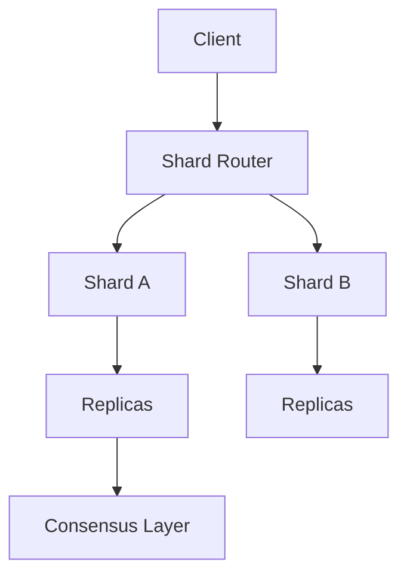

---


## Reading order

Sub-topics are sequenced for progressive learning: foundations first, then related concepts, then specialized topics.

| Group | Sections | Focus |
|-------|----------|-------|
| **1. Partitioning** | 5.1-5.7 | Sharding strategies, hot keys, rebalancing |
| **2. Routing** | 5.8-5.10 | Consistent hashing, vnodes, rendezvous |
| **3. Replication** | 5.11-5.15 | Leader models, quorums |
| **4. Transactions** | 5.16-5.20 | 2PC/3PC, locks, split brain |
| **5. Coordination** | 5.21-5.28 | Consensus, clocks, gossip, membership |

---
---

## 5.1 Partitioning


### What is it?

**Partitioning** divides a table or dataset into segments called partitions. In distributed systems, partitioning usually means horizontal splits (by row/key); vertical partitioning splits columns or tables.

### Why it matters

Partitioning is the abstraction beneath sharding, replication placement, and parallel query execution. Every distributed store partitions data - the design question is *how*.

### How it works

1. Define a partition key or partitioning scheme.
2. Assign each partition to a storage node or replica group.
3. Metadata service (or client library) tracks partition -> node mapping.
4. Queries touching one partition stay local; multi-partition queries coordinate.

### Diagram

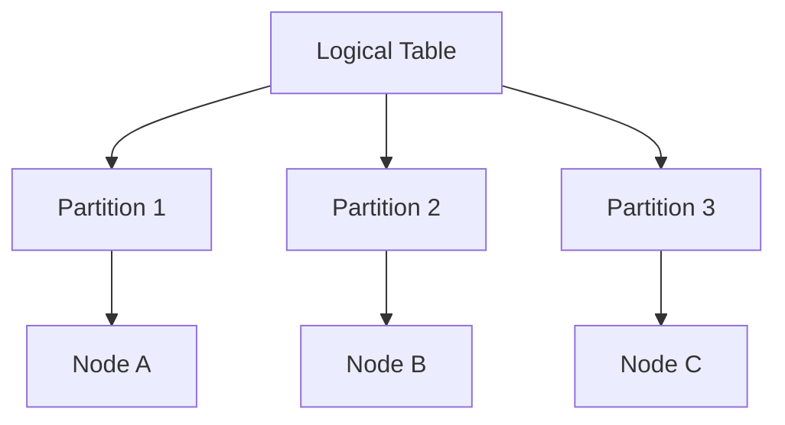

### Key details

- **Horizontal:** rows split by key - standard for scale-out.
- **Vertical:** rarely used at distributed scale; splits rarely co-accessed columns.
- Partition count often fixed upfront or grows via splitting.
- Partition = unit of replication, migration, and sometimes ordering.

### When to use

Always, in any distributed database. The choice is strategy (hash, range, list), not whether to partition.

### Trade-offs / Pitfalls

- Too few partitions -> cannot scale; too many -> metadata and coordination overhead.
- Partition boundaries are hard to change - choose keys that match query patterns.

### References

*(No curated references for this sub-topic in `_topics.json`.)*

---


## 5.2 Sharding


### What is it?

**Sharding** is horizontal partitioning of a dataset across independent database instances (shards), each holding a disjoint subset of rows. The cluster collectively stores the full dataset; no single node holds everything.

### Why it matters

Sharding is the primary path to write scalability beyond one machine's disk, CPU, and memory limits. It is foundational for multi-tenant SaaS, social graphs, and any workload that outgrows vertical scaling.

### How it works

A **shard key** (partition key) determines which shard owns a row. The application or a routing layer computes the target shard on every read and write.

1. Choose a shard key with high cardinality and even access distribution.
2. Map keys to shards via hash, range, or directory lookup.
3. Route single-key queries to one shard; fan out only when necessary.
4. Plan resharding before data volume makes migration painful.

### Diagram

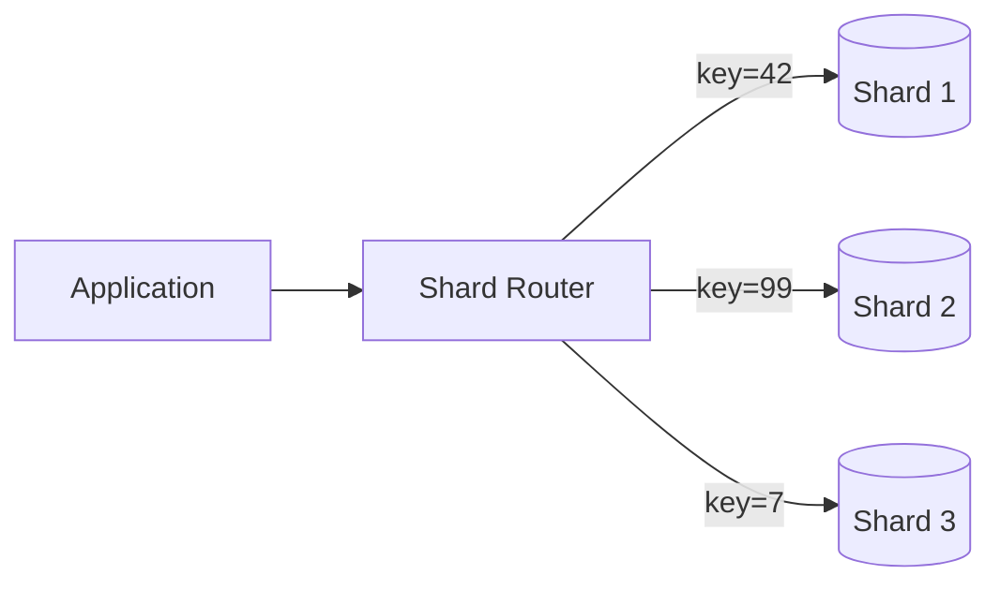

### Key details

| Aspect | Detail |
|--------|--------|
| Shard key | Must appear in most queries to avoid scatter-gather |
| Cross-shard ops | Joins, transactions, and global aggregates are expensive |
| Resharding | Requires dual-write, copy, or consistent-hash migration |
| Shared nothing | Each shard has its own storage and compute |

### When to use

- Dataset or write throughput exceeds one node.
- Access patterns are mostly single-key or single-shard.
- You can accept operational complexity of multi-shard operations.

### Trade-offs / Pitfalls

- Poor shard key choice creates hot shards and negates scale benefits.
- Cross-shard ACID transactions are rare and slow - design around single-shard boundaries.
- Operational overhead: backups, schema migrations, and monitoring multiply per shard.

### References

*(No curated references for this sub-topic in `_topics.json`.)*

---


## 5.3 Hash Partitioning


### What is it?

**Hash partitioning** assigns rows to partitions using `hash(partition_key) mod N` (or similar). Keys hash to a fixed bucket count, distributing rows pseudo-randomly.

### Why it matters

Delivers even spread when keys are uniformly distributed - ideal for point lookups without range locality requirements.

### How it works

1. Client supplies partition key.
2. System computes hash -> partition index.
3. Router directs request to the node hosting that partition.
4. Range queries must query all partitions (scatter-gather).

### Diagram

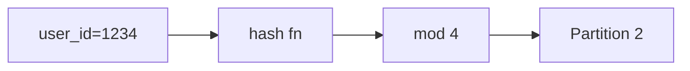

### Key details

| Pro | Con |
|-----|-----|
| Even distribution | No range-scan locality |
| Simple routing | Resizing N remaps most keys |
| Fast point lookups | Hot keys still hot (same hash bucket) |

### When to use

- Equality lookups on a high-cardinality key.
- No need for range queries on the partition key.
- Stable partition count or consistent hashing for elasticity.

### Trade-offs / Pitfalls

- Adding shards with naive `mod N` requires massive data movement - use consistent hashing instead.
- Skewed key distribution (e.g., celebrity users) still creates hot partitions.

### References

*(No curated references for this sub-topic in `_topics.json`.)*

---


## 5.4 Range Partitioning


### What is it?

**Range partitioning** assigns contiguous key ranges to partitions - e.g., A - M on shard 1, N - Z on shard 2, or time buckets for events.

### Why it matters

Enables efficient range scans, time-series ingestion patterns, and ordered iteration - common in analytics and event stores.

### How it works

1. Define ordered key space (string, timestamp, composite).
2. Assign ranges to partitions; metadata tracks boundaries.
3. Point and range queries hit only relevant partitions.
4. Split partitions when a range grows too large (dynamic splitting).

### Diagram

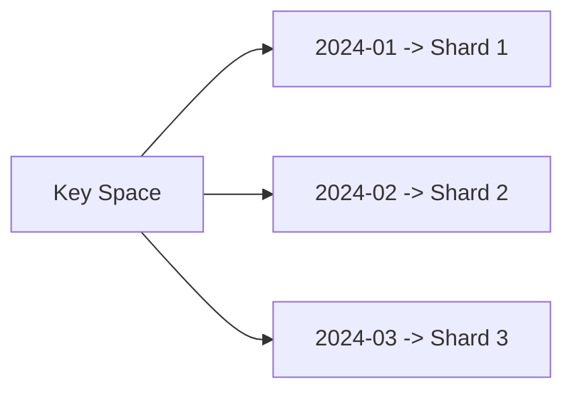

### Key details

- Excellent for `WHERE ts BETWEEN ...` and prefix scans.
- Risk of hot spots on latest time range or popular prefixes.
- Split/merge operations rebalance without full rehash.

### When to use

- Time-series, logs, and ordered event data.
- Range-heavy queries on the partition key.
- Keys have natural ordering you want to preserve locally.

### Trade-offs / Pitfalls

- Append-mostly workloads pile onto the "latest" partition - mitigate with pre-splitting or hash sub-partitioning.
- Uneven range sizes require active rebalancing.

### References

*(No curated references for this sub-topic in `_topics.json`.)*

---


## 5.5 Geo Partitioning


### What is it?

**Geo partitioning** (geo-sharding, data residency partitioning) places data in specific geographic regions based on tenant location, user country, or compliance rules.

### Why it matters

Required for GDPR, data sovereignty laws, and latency-sensitive global apps. Keeps personal data in-region and routes users to nearest replicas.

### How it works

1. Partition key includes region/tenant locale (e.g., `EU-tenant-42`).
2. Metadata pins partitions to datacenters in that region.
3. Global router sends requests to the correct regional cluster.
4. Cross-region reads/writes are explicit and often restricted.

### Diagram

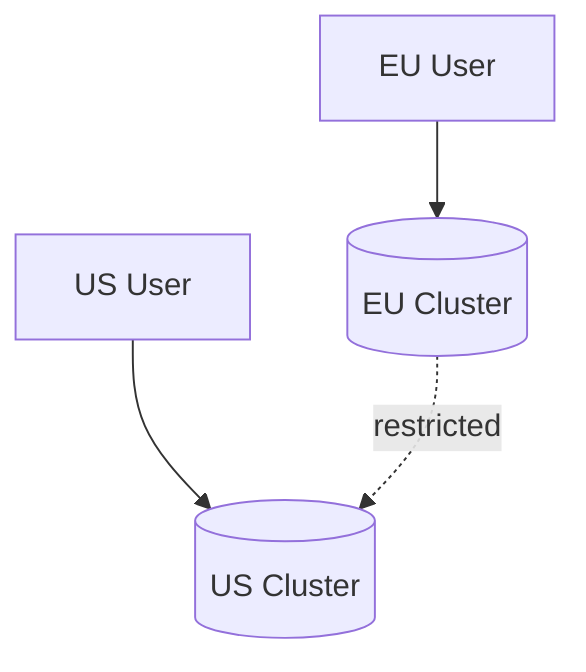

### Key details

- Compliance: data never leaves jurisdiction without legal basis.
- Latency: reads served locally; cross-region replication optional.
- Disaster recovery may require cross-region replicas with policy controls.

### When to use

- Multi-region products with residency requirements.
- Latency-sensitive regional user bases.
- Regulatory mandates on data location.

### Trade-offs / Pitfalls

- Global queries and reports require federated query or aggregation layer.
- Cross-region failover conflicts with residency - design DR per jurisdiction.
- Operational complexity: N regional deployments instead of one global cluster.

### References

*(No curated references for this sub-topic in `_topics.json`.)*

---


## 5.6 Hot Partitions


### What is it?

A **hot partition** (hot spot) is a shard or partition receiving disproportionate read/write traffic - often from a skewed key (viral post, celebrity user, latest time bucket).

### Why it matters

One hot partition caps throughput at a single node's limit despite many shards - defeating horizontal scale and causing tail latency spikes.

### How it works

Detection and mitigation follow a loop:

1. Monitor per-partition QPS, CPU, and queue depth.
2. Identify skewed keys via metrics or tracing.
3. Apply mitigation: split partition, add salt to key, cache, or async write path.
4. Validate even spread after change.

### Diagram

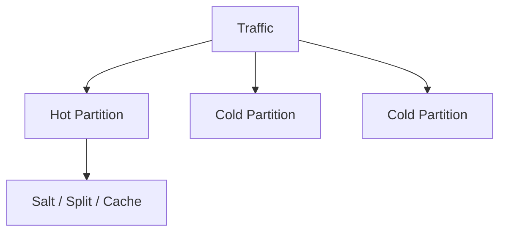

### Key details

| Mitigation | Mechanism |
|------------|-----------|
| Key salting | `hash(user_id + random_suffix)` spreads writes |
| Split partition | Divide key range into sub-partitions |
| Write-behind cache | Absorb read pressure on hot key |
| Dedicated shard | Isolate known hot tenant |

### When to use

Mitigate when p99 latency or throttle errors correlate with single partition metrics.

### Trade-offs / Pitfalls

- Salting breaks single-key locality - reads must fan out and merge.
- Caching hot data helps reads but not write-heavy hot keys.
- Prevention at schema design time beats reactive firefighting.

### References

*(No curated references for this sub-topic in `_topics.json`.)*

---


## 5.7 Rebalancing


### What is it?

**Rebalancing** moves partitions between nodes to restore even load and capacity utilization after adds, removes, or traffic skew.

### Why it matters

Without rebalancing, new nodes sit idle while old nodes overload; removing failed nodes leaves data under-replicated.

### How it works

1. Monitor per-node partition size, QPS, and disk usage.
2. Select partitions to move (largest, hottest, or random under consistent hash).
3. Copy partition data to target node while serving reads (often dual-read period).
4. Update routing metadata atomically; drain old copy; verify consistency.

### Diagram

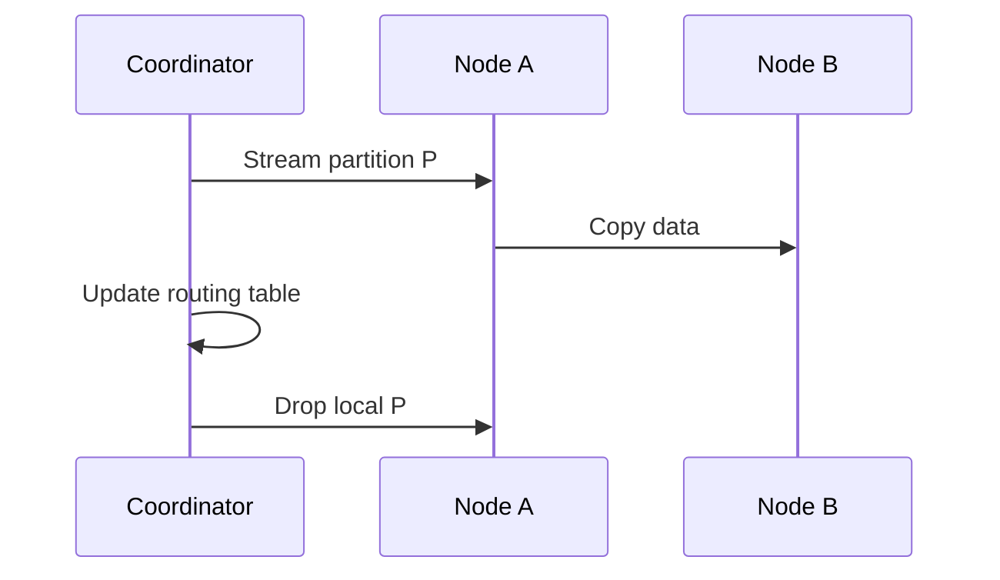

### Key details

- Background migration throttled to avoid saturating network/disk.
- Consistent hashing minimizes keys moved when adding one node.
- Rebalancing during peak traffic risks latency spikes - schedule or rate-limit.

### When to use

- After scaling cluster up or down.
- When hot partitions or disk imbalance detected.
- Post-failure recovery to restore replication factor.

### Trade-offs / Pitfalls

- Moving large partitions takes hours - plan capacity before urgency.
- Incorrect routing updates cause split reads or lost writes.
- Rebalance + production traffic competes for I/O.

### References

*(No curated references for this sub-topic in `_topics.json`.)*

---


## 5.8 Consistent Hashing


### What is it?

**Consistent hashing** maps keys and nodes onto a fixed hash ring. Adding or removing a node only remaps keys adjacent to that node on the ring - not the entire key space.

### Why it matters

Enables elastic scaling with minimal data movement - critical for caches (Memcached), Dynamo-style stores, and load balancers.

### How it works

1. Hash nodes and keys to positions on a 0 - 2³² ring.
2. Key belongs to the first node clockwise from its position.
3. Add node: only keys between predecessor and new node migrate.
4. Use virtual nodes (vnodes) for even distribution.

### Diagram

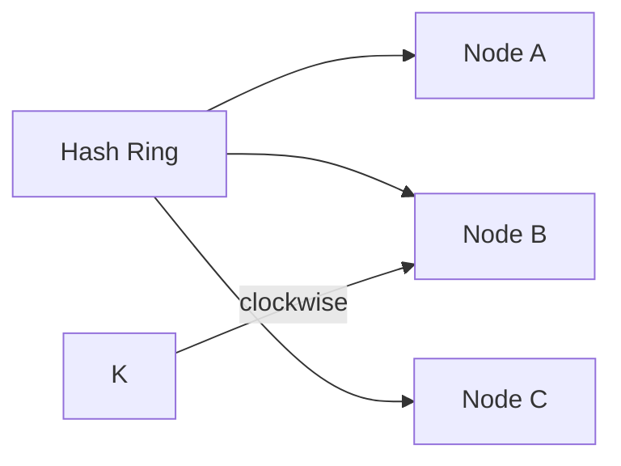

### Key details

- Typical libraries: Ketama, jump consistent hash (alternative).
- Without vnodes, physical nodes own uneven arc segments.
- Replication: walk clockwise to find N successor nodes for copies.

### When to use

- Dynamic cluster membership (frequent add/remove).
- Distributed caches and peer-to-peer systems.
- Minimizing data migration during scale events.

### Trade-offs / Pitfalls

- Basic consistent hash still uneven with few physical nodes - use vnodes.
- Hot keys remain hot; hashing does not fix access skew.
- Ring metadata must be consistent across clients and servers.

### References

*(No curated references for this sub-topic in `_topics.json`.)*

---


## 5.9 Virtual Nodes


### What is it?

**Virtual nodes** (vnodes) map each physical machine to many points on a consistent hash ring - e.g., 100 - 256 virtual tokens per host.

### Why it matters

Smooths load distribution when physical node counts are small and prevents one physical server from owning half the ring.

### How it works

1. Physical node `A` registers vnodes `A-0  -  A-N` on the ring.
2. Key routing uses vnode ownership as usual.
3. When node fails, its vnodes redistribute across survivors evenly.
4. More vnodes -> better balance, more metadata.

### Diagram

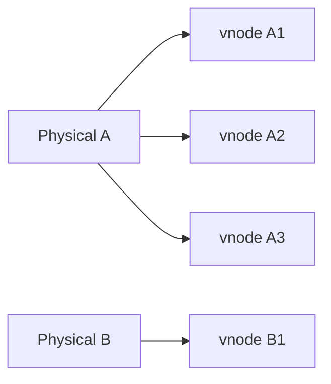

### Key details

- Cassandra default: 256 tokens per node (legacy) or vnode-based.
- Rebalance granularity = one vnode at a time.
- Trade vnode count vs metadata size and lookup cost.

### When to use

- Any consistent-hash cluster with < ~100 physical nodes.
- When observed partition size variance is high without vnodes.

### Trade-offs / Pitfalls

- Too few vnodes -> imbalance; too many -> gossip/metadata overhead.
- vnode reassignment during failure must be atomic in routing tables.

### References

*(No curated references for this sub-topic in `_topics.json`.)*

---


## 5.10 Rendezvous Hashing


### What is it?

**Rendezvous hashing** (highest random weight hashing) assigns each key to the node with the highest score from `hash(node, key)` among all nodes.

### Why it matters

Minimal remapping on node add/remove (only keys that preferred the new/changed node move), with simpler logic than ring maintenance for some deployments.

### How it works

1. For key K, compute weight `W(N,K)` for every node N.
2. Select node with maximum W.
3. On node add: only keys where new node wins move to it.
4. On node remove: keys on removed node re-pick max among survivors.

### Diagram

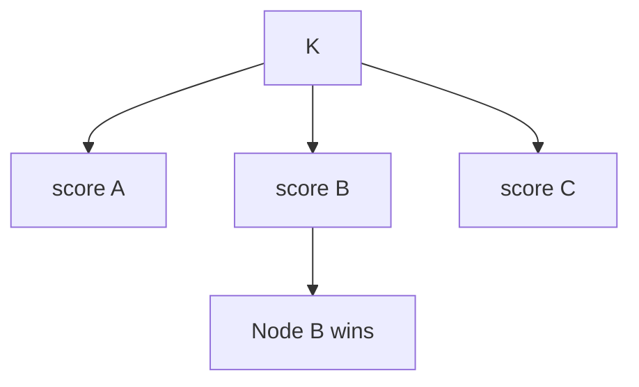

### Key details

- O(nodes) per lookup - fine for tens of nodes, costly at thousands.
- Excellent distribution properties without virtual nodes.
- Used in CDN routing and some load balancers.

### When to use

- Moderate node counts with frequent membership changes.
- When you want uniform spread without ring complexity.
- Client-side sharding with simple implementation.

### Trade-offs / Pitfalls

- Does not scale to huge node sets - cache scores or use hierarchical hashing.
- Still subject to hot key problems at application level.

### References

*(No curated references for this sub-topic in `_topics.json`.)*

---


## 5.11 Replication


### What is it?

**Replication** maintains copies of data on multiple nodes for durability, availability, and read scalability. Each partition typically has a replication factor (RF) of 3 or more.

### Why it matters

Single-copy data dies with the disk. Replication survives node loss, enables local reads, and supports geographic distribution.

### How it works

1. Choose replication topology: leader-follower, multi-leader, or leaderless.
2. On write, propagate to RF nodes per policy (sync/async).
3. On read, fetch from leader, nearest replica, or quorum.
4. Repair divergence via anti-entropy, read repair, or consensus log.

### Diagram

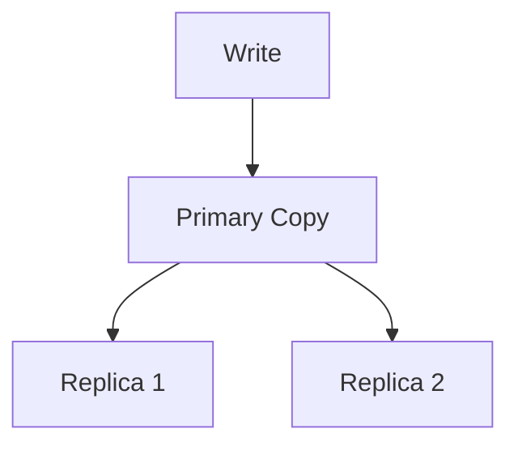

### Key details

| Style | Write path | Conflict handling |
|-------|------------|-------------------|
| Leader-follower | Single leader orders writes | None on single leader |
| Multi-leader | Leaders accept local writes | Conflict resolution needed |
| Leaderless | Quorum writes | Version vectors / LWW |

### When to use

Always for production data you cannot afford to lose. RF=3 is the common default for HA.

### Trade-offs / Pitfalls

- Sync replication increases latency; async risks data loss on failure.
- More replicas = higher storage and write amplification costs.

### References

*(No curated references for this sub-topic in `_topics.json`.)*

---


## 5.12 Leader Follower Replication


### What is it?

**Leader-follower** (primary-replica) replication sends all writes through a single **leader** node, which replicates an ordered log to **follower** replicas. Reads may hit leader or followers depending on consistency needs.

### Why it matters

The dominant model for RDBMS (PostgreSQL, MySQL) and many distributed stores (Kafka partitions, MongoDB replica sets). Simple consistency story: one write ordering authority.

### How it works

1. Client sends write to leader.
2. Leader appends to local log and streams to followers.
3. Followers apply entries in order.
4. Leader acknowledges after sync to quorum or all followers.
5. Follower promotion on leader failure via election.

### Diagram

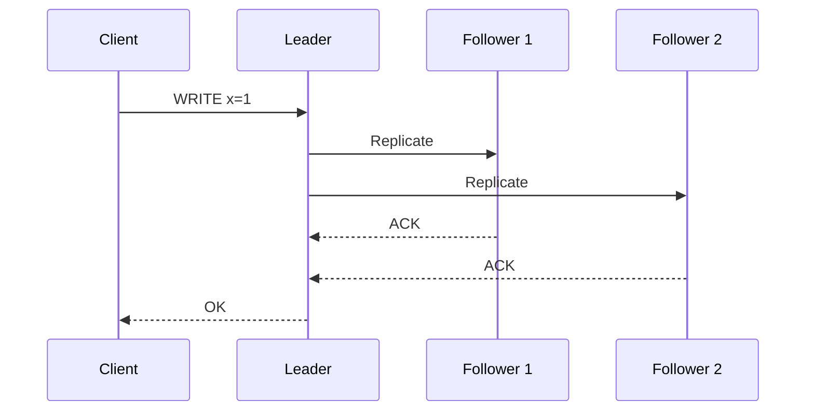

### Key details

- **Sync replication:** no data loss if leader dies after ACK; higher latency.
- **Async replication:** faster; promoted follower may lag (lost writes).
- Follower reads may be stale unless read-from-leader or quorum read.

### When to use

- Strong ordering required per partition.
- Workloads tolerate single-leader write bottleneck or shard widely.
- Familiar ops model with clear failover story.

### Trade-offs / Pitfalls

- Leader is a write bottleneck and failover sensitivity point.
- Async lag causes "split brain" risk if auto-promote without quorum.
- Cross-datacenter leader-follower adds WAN latency to every commit.

### References

*(No curated references for this sub-topic in `_topics.json`.)*

---


## 5.13 Multi Leader Replication


### What is it?

**Multi-leader** (multi-master) replication allows multiple nodes to accept writes, synchronizing changes between leaders - often one leader per region.

### Why it matters

Enables write-locality for geo-distributed apps: users write to the nearest datacenter without cross-WAN round trips on every operation.

### How it works

1. Each region has a leader accepting local writes.
2. Leaders exchange changes via replication log or conflict-free structures.
3. Conflicts detected when same row updated concurrently at two leaders.
4. Resolution via LWW, version vectors, or application merge logic.

### Diagram

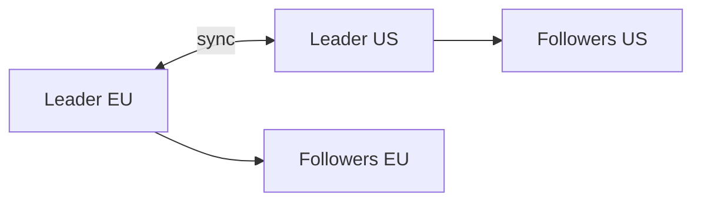

### Key details

- Common in CouchDB, some MySQL geo clusters, and mobile sync (offline writes).
- Conflict-free Replicated Data Types (CRDTs) avoid conflicts by design for specific data types.
- Not suitable when application assumes single global order.

### When to use

- Multi-region write locality is mandatory.
- Conflicts are rare or mergeable (counters, sets, CRDTs).
- Brief inconsistency across regions is acceptable.

### Trade-offs / Pitfalls

- Write-write conflicts are inevitable - must have resolution strategy.
- Debugging "which write won" is harder than single-leader.
- Global uniqueness constraints (auto-increment IDs) break without coordination.

### References

*(No curated references for this sub-topic in `_topics.json`.)*

---


## 5.14 Quorum Reads


### What is it?

A **quorum read** fetches data from multiple replicas and returns the value with the highest version once `R` nodes respond, where `R` is the read quorum size.

### Why it matters

Tunable consistency without single-leader reads - foundation of Dynamo-style availability during partial failures.

### How it works

1. Client (or coordinator) sends read to all N replicas.
2. Wait for R responses with version metadata.
3. Return newest version by version clock or timestamp.
4. Optionally trigger read repair if replicas disagree.

### Diagram

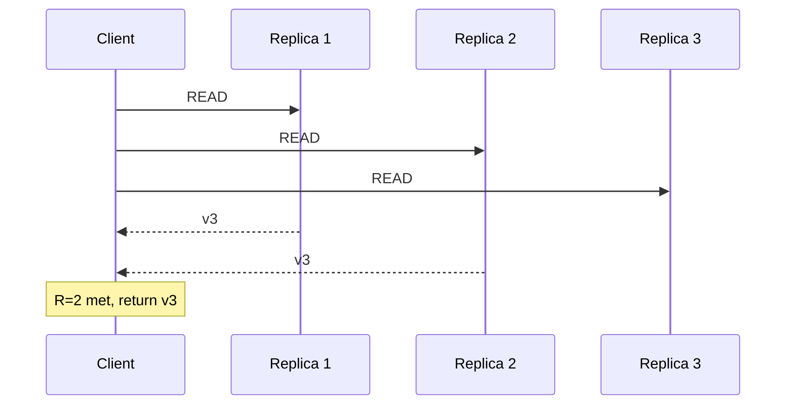

### Key details

- With `R + W > N`, quorum read sees latest quorum write (strong event).
- Smaller R -> faster, possibly stale reads.
- Read repair fixes divergent replicas on read path.

### When to use

- Leaderless systems (Cassandra, Riak, DynamoDB tunable consistency).
- When you need read availability during node outages.
- Tunable R per query (ONE vs QUORUM vs ALL).

### Trade-offs / Pitfalls

- `R=1` reads may return stale or conflicting data.
- Quorum reads cost more latency than single-replica reads.
- Sloppy quorums (fallback to other nodes) trade consistency for availability.

### References

*(No curated references for this sub-topic in `_topics.json`.)*

---


## 5.15 Quorum Writes


### What is it?

A **quorum write** acknowledges a write after `W` of `N` replicas persist it. Combined with read quorums, it defines the consistency/latency envelope.

### Why it matters

The write side of tunable quorum consistency - lets operators choose between durability guarantees and write latency.

### How it works

1. Coordinator receives write with version.
2. Sends write to all N replicas (or preferred nodes).
3. ACK client when W replicas confirm.
4. Remaining replicas catch up asynchronously (hinted handoff).

### Diagram

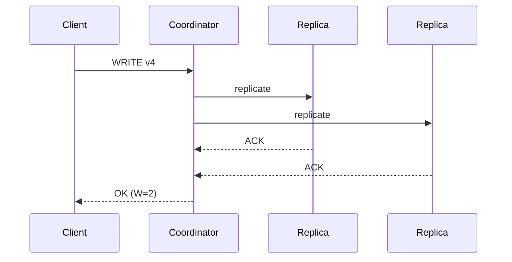

### Key details

| Config | Effect |
|--------|--------|
| W=N | Slowest, strongest durability |
| W=1 | Fastest, risk if that node dies before replication |
| W + R > N | Overlap guarantees read sees latest write |

### When to use

- Dynamo-family databases with per-query consistency levels.
- When network partitions require continuing writes with minority partitions (carefully).

### Trade-offs / Pitfalls

- `W=1` + node death before async replicate -> lost write.
- Concurrent writes to same key with `W < N` need version resolution on read.
- Quorum math must be understood before claiming linearizability.

### References

*(No curated references for this sub-topic in `_topics.json`.)*

---


## 5.16 Distributed Transactions


### What is it?

A **distributed transaction** spans multiple nodes or shards, requiring atomic commit or abort across all participants - preserving ACID across partition boundaries.

### Why it matters

Business invariants often cross shards (debit one account, credit another). Without distributed transactions, applications must implement compensating logic manually.

### How it works

Common patterns:

1. **Two-phase commit (2PC):** coordinator prepares all, then commits all.
2. **Saga:** sequence of local transactions with compensations.
3. **Percolator / Calvin:** layered timestamps or ordered locking across cells.
4. **Spanner:** TrueTime + Paxos per shard + external consistency.

### Diagram

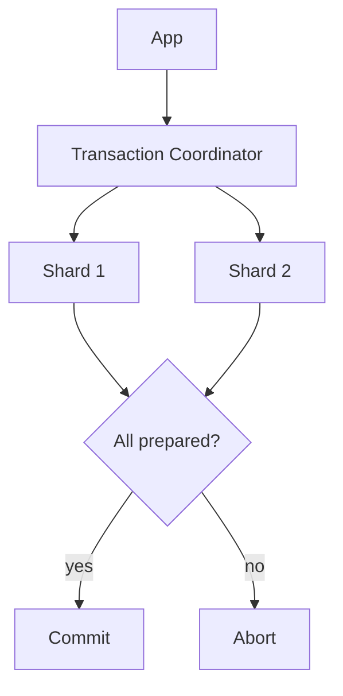

### Key details

- Cross-shard joins in one SQL statement often imply distributed transaction underneath.
- Latency = slowest participant + coordination round trips.
- Many systems avoid them - design bounded contexts per shard instead.

### When to use

- Financial transfers and inventory where atomicity is non-negotiable.
- Systems built for it: Spanner, CockroachDB, TiDB.
- Low-frequency cross-shard ops, not bulk ETL.

### Trade-offs / Pitfalls

- 2PC blocks on coordinator or participant failure (in doubt state).
- Throughput ceiling far below single-shard transactions.
- Prefer sagas or single-shard design when eventual consistency is acceptable.

### References

*(No curated references for this sub-topic in `_topics.json`.)*

---


## 5.17 Two Phase Commit


### What is it?

**Two-phase commit (2PC)** is a distributed atomic commit protocol. A **coordinator** runs a **prepare** phase (all vote yes/no) then a **commit** or **abort** phase.

### Why it matters

The textbook answer for atomic cross-node commit - and a cautionary tale for blocking and availability trade-offs in interviews.

### How it works

**Phase 1  -  Prepare:**

1. Coordinator writes decision log, sends `PREPARE` to participants.
2. Each participant validates, locks resources, writes undo log, votes `YES` or `NO`.

**Phase 2  -  Commit/Abort:**

3. If all `YES`, coordinator sends `COMMIT`; else `ABORT`.
4. Participants apply decision, release locks, ACK.
5. Coordinator marks transaction complete.

### Diagram

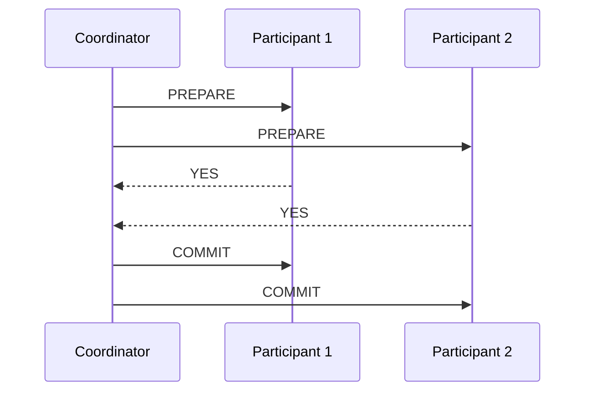

### Key details

- **Blocking:** if coordinator dies after prepare, participants hold locks until recovery.
- **In-doubt:** participants unsure commit vs abort until coordinator log replayed.
- XA transactions in databases use 2PC across resource managers.

### When to use

- Infrequent cross-database operations with strong atomicity needs.
- Internal control planes with reliable coordinator (not user-facing hot path).
- When 3PC or Paxos-backed transaction layer is unavailable.

### Trade-offs / Pitfalls

- Coordinator SPOF - must be HA with durable log.
- Not partition tolerant: minority partition cannot commit.
- Prefer saga/outbox for high-throughput microservices.

### References

*(No curated references for this sub-topic in `_topics.json`.)*

---


## 5.18 Three Phase Commit


### What is it?

**Three-phase commit (3PC)** adds a **pre-commit** phase after prepare so participants know global decision before committing - reducing indefinite blocking if coordinator fails *after* pre-commit.

### Why it matters

Illustrates evolution beyond 2PC's blocking problem; rarely deployed in production but useful for understanding consensus trade-offs.

### How it works

1. **CanCommit:** coordinator asks if participants *can* commit (non-blocking probe).
2. **PreCommit:** if all agree, coordinator sends pre-commit; participants ready but not final.
3. **DoCommit:** coordinator sends commit; participants apply.
4. Timeout rules allow participants to commit if pre-commit received and coordinator silent.

### Diagram

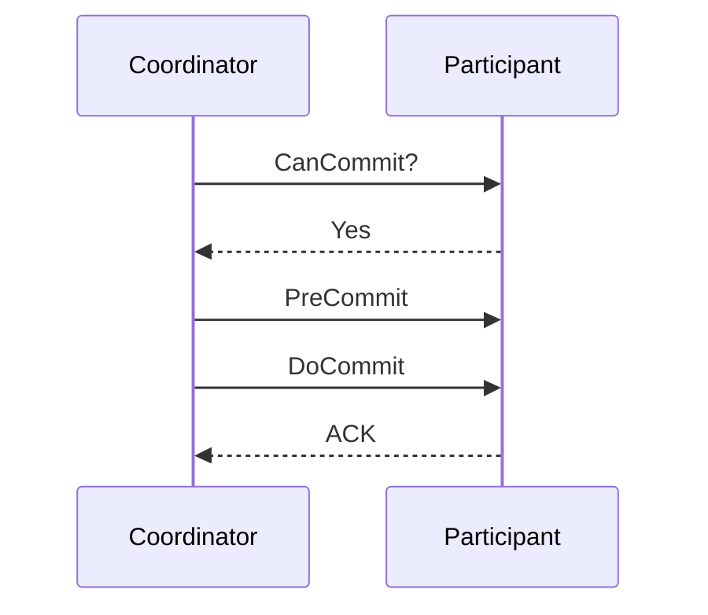

### Key details

- Assumes network bounded delay (synchronous model) - fails under async networks with partitions.
- More round trips than 2PC -> higher latency.
- Largely superseded by Paxos/Raft for production coordination.

### When to use

- Academic / interview context more than greenfield systems.
- When comparing why modern systems chose consensus logs over 3PC.

### Trade-offs / Pitfalls

- Still vulnerable under network partition + timing assumptions.
- Operational complexity without wide library support.
- Real systems use Raft/Paxos + transaction layer instead.

### References

*(No curated references for this sub-topic in `_topics.json`.)*

---


## 5.19 Distributed Locking


### What is it?

A **distributed lock** grants exclusive access to a resource across processes/nodes - implemented via consensus stores, databases with TTL leases, or dedicated services (Redis Redlock, ZooKeeper ephemeral nodes).

### Why it matters

Prevents duplicate work, enforces single-writer invariants, and coordinates leader election - but is a frequent source of outages when misused.

### How it works

1. Client acquires lock on key `/locks/resource` with TTL lease.
2. Perform critical section work.
3. Release lock (delete key) before TTL if healthy.
4. Fencing: stale lock holder must be blocked via monotonic token (fencing token) on storage writes.

### Diagram

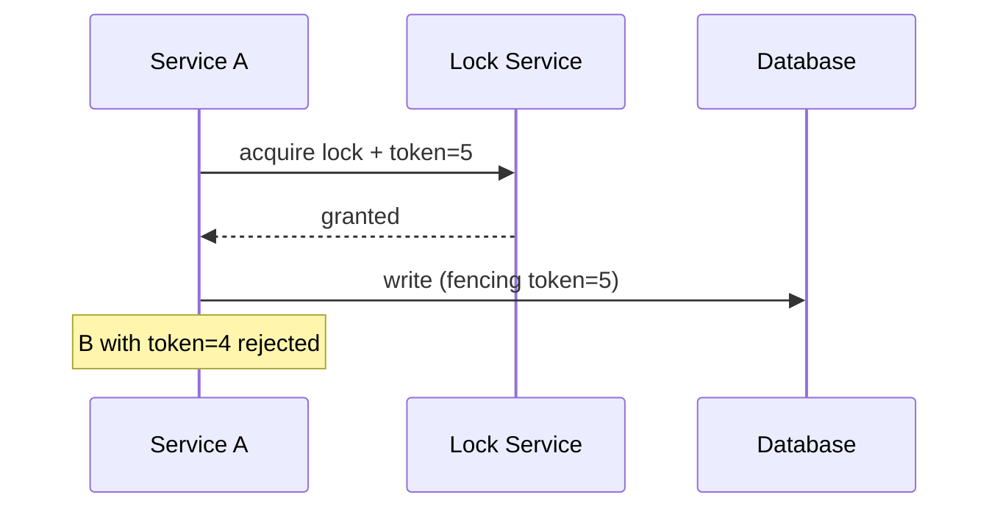

### Key details

- Lease TTL protects against dead holder - but work must finish before expiry.
- Redlock debate: clock skew and GC pauses can violate safety without fencing.
- Prefer idempotency and database constraints over locks when possible.

### When to use

- Short critical sections (cron leader, migration runner).
- Resources without natural compare-and-swap semantics.
- With fencing tokens on downstream writes.

### Trade-offs / Pitfalls

- Long-held locks -> availability killer on holder crash until TTL.
- Without fencing, delayed old holder can corrupt data after lease expires.
- Heavy lock contention -> redesign for optimistic concurrency.

### References

*(No curated references for this sub-topic in `_topics.json`.)*

---


## 5.20 Split Brain


### What is it?

**Split brain** occurs when a cluster partitions into two groups that each believe they are the legitimate primary - both accepting writes and diverging irreconcilably.

### Why it matters

Classic catastrophic failure mode for databases and distributed locks; causes duplicate IDs, double spending, and data corruption.

### How it works

Typical scenario:

1. Network partition isolates leader from majority of replicas.
2. Minority side still serves if misconfigured; majority elects new leader.
3. Both sides accept writes during partition.
4. On heal, conflicting histories require manual merge or last-writer-wins data loss.

### Diagram

```mermaid
flowchart TB
    subgraph Partition A
        L1[Old Leader]
    end
    subgraph Partition B
        L2[New Leader]
    end
    L1 -.->|network cut| L2
```

### Key details

- Prevention: require **quorum** for leadership and writes (`majority of N`).
- STONITH: fence old leader (shutdown or revoke credentials).
- Witness nodes in third AZ break ties for 2-node clusters.

### When to use

Understanding split brain is prerequisite to designing HA - not something to "use," but to prevent.

### Trade-offs / Pitfalls

- Auto-failover without quorum checks causes split brain.
- Manual failover during partial outages often triggers it.
- "Brain peering" in misconfigured Redis/Mongo clusters is a real incident pattern.

### References

*(No curated references for this sub-topic in `_topics.json`.)*

---


## 5.21 Consensus


### What is it?

**Consensus** is the problem of getting multiple nodes to agree on a single value or ordered log of values, despite crashes and network delays. Solved protocols guarantee safety (never two decisions) and liveness (eventually decides, with sufficient majority).

### Why it matters

Underpins leader election, replicated logs, and distributed configuration (etcd, ZooKeeper, Raft in CockroachDB/TiDB). Without consensus, replicas diverge with no automatic reconciliation.

### How it works

General pattern (replicated state machine):

1. Leader receives client command.
2. Leader appends to replicated log via consensus rounds.
3. Majority acknowledges persistence.
4. Leader applies committed entry to state machine.
5. Followers apply same entries in order.

### Diagram

```mermaid
flowchart LR
    C[Client] --> L[Leader]
    L --> Log[Replicated Log]
    Log --> SM[State Machine]
    F1[Follower] --> Log
    F2[Follower] --> Log
```

### Key details

- Requires majority (quorum) for fault tolerance: `2f+1` nodes tolerate `f` failures.
- FLP impossibility: no deterministic async consensus with one faulty process - protocols use timeouts/randomization.
- Consensus ≠ distributed transactions (but transactions can use consensus per shard).

### When to use

- Strongly consistent metadata, locks, and small critical state.
- Building or operating Raft/Paxos-backed systems.
- Whenever multiple nodes must share one authoritative ordered history.

### Trade-offs / Pitfalls

- Latency tied to WAN round trips if leaders and majorities span regions.
- Not for high-volume bulk data - only coordination metadata at scale.
- Mis-sized clusters (even counts without witness) reduce fault tolerance.

### References

*(No curated references for this sub-topic in `_topics.json`.)*

---


## 5.22 Paxos


### What is it?

**Paxos** is a family of consensus protocols (single-decree, Multi-Paxos) where proposers, acceptors, and learners agree on values through numbered ballots and majority quorums.

### Why it matters

The theoretical foundation of distributed consensus - Chubby, early ZooKeeper, and Spanner build on Paxos variants. Understanding Paxos clarifies why Raft was designed.

### How it works

**Single Paxos round:**

1. Proposer picks ballot number N, sends `prepare(N)` to acceptors.
2. Acceptors promise not to accept lower ballots; return highest accepted value.
3. Proposer sends `accept(N, value)` with chosen value.
4. Majority accept -> value chosen; learners notified.
5. Multi-Paxos elects stable leader to run many rounds efficiently.

### Diagram

```mermaid
sequenceDiagram
    participant P as Proposer
    participant A1 as Acceptor
    participant A2 as Acceptor
    P->>A1: prepare N
    P->>A2: prepare N
    A1-->>P: promise
    A2-->>P: promise
    P->>A1: accept v
    P->>A2: accept v
```

### Key details

- Correct but famously hard to implement and reason about.
- Multi-Paxos needs stable leader for liveness in practice.
- Superseded for new projects by Raft in many ecosystems - same guarantees, clearer structure.

### When to use

- Maintaining legacy Paxos systems (Chubby, some storage engines).
- Research and interviews requiring formal consensus background.
- When existing stack already provides battle-tested Paxos (don't roll your own).

### Trade-offs / Pitfalls

- Implementation complexity leads to subtle bugs.
- Without dedicated leader, liveness suffers from proposer contention.
- Operational tooling less approachable than Raft ecosystems.

### References

*(No curated references for this sub-topic in `_topics.json`.)*

---


## 5.23 Raft


### What is it?

**Raft** is a consensus algorithm designed for understandability: leader election, log replication, and safety rules structured in clear phases. Used in etcd, Consul, CockroachDB, TiKV, and many cloud control planes.

### Why it matters

Default teaching and implementation choice for replicated logs - balances formal guarantees with engineer-friendly mental model.

### How it works

1. **Follower** times out -> becomes **candidate**, requests votes.
2. Majority votes -> **leader** elected for term T.
3. Client writes go to leader; leader appends entry, replicates to followers.
4. Entry **committed** once on majority; leader applies and responds.
5. New election if leader fails (higher term disrupts stale leaders).

### Diagram

```mermaid
flowchart TB
    F[Follower] -->|timeout| C[Candidate]
    C -->|majority votes| L[Leader]
    L -->|heartbeat| F
    L -->|replicate log| F
```

### Key details

| Rule | Purpose |
|------|---------|
| Term monotonic | Prevents stale leaders serving writes |
| Log matching | Same index+term -> same prefix |
| Commit majority | Safety without all nodes ACK |
| Snapshot + compaction | Bound log growth |

### When to use

- New strongly consistent coordination service.
- Per-shard replication in distributed SQL (CockroachDB model).
- Replacing ZooKeeper when simpler ops model desired (etcd).

### Trade-offs / Pitfalls

- Leader-centric writes don't scale write throughput - shard instead.
- Cross-region Raft clusters pay WAN latency on every commit.
- Joint consensus required for membership changes - plan node adds carefully.

### References

*(No curated references for this sub-topic in `_topics.json`.)*

---


## 5.24 Leader Election


### What is it?

**Leader election** selects one node as coordinator for a term - using Raft votes, ZooKeeper sequential ephemeral nodes, or lease-based campaigns in Kubernetes.

### Why it matters

Avoids split brain by ensuring at most one active leader per epoch; required for single-writer replication and distributed task runners.

### How it works

**Raft election example:**

1. Follower misses heartbeats -> increments term, votes for self.
2. Requests votes from peers; each node votes at most once per term.
3. Candidate with majority becomes leader, sends heartbeats.
4. Split vote -> new random timeout, retry next term.

### Diagram

```mermaid
sequenceDiagram
    participant F1 as Follower 1
    participant F2 as Follower 2
    participant F3 as Follower 3
    F1->>F2: RequestVote term=5
    F1->>F3: RequestVote term=5
    F2-->>F1: Grant
    F3-->>F1: Grant
    Note over F1: Becomes Leader
```

### Key details

- Epoch/term numbers fence stale leaders automatically in Raft.
- Bully algorithm and ring election used in simpler LAN contexts.
- K8s Lease API: lightweight election for controllers.

### When to use

- HA services needing exactly one active worker (scheduler, stream processor).
- Raft/ZK-backed clusters during failover.
- Any system transitioning from follower to leader on failure.

### Trade-offs / Pitfalls

- Flapping leadership (thrashing) if timeouts too aggressive.
- Even-sized clusters need tie-breaker or witness for clean majority.
- Election storms during network glitches - tune backoff and quorum.

### References

*(No curated references for this sub-topic in `_topics.json`.)*

---


## 5.25 Lamport Clocks


### What is it?

A **Lamport clock** is a logical timestamp: each node increments a counter on local events and sends max(local, received)+1 on message send - establishing **happens-before** ordering for causally related events.

### Why it matters

Physical clocks drift; Lamport clocks give consistent event ordering for debugging, replication metadata, and conflict comparison without synchronized NTP.

### How it works

1. Initialize counter L=0 on each process.
2. On local event: L := L+1, stamp event.
3. On send: L := L+1, attach L to message.
4. On receive: L := max(L, message.L)+1.

### Diagram

```mermaid
sequenceDiagram
    participant A
    participant B
    A->>A: L=1
    A->>B: msg L=2
    B->>B: L=3
```

### Key details

- If A -> B causally, then L(A) < L(B).
- Converse false: L(a) < L(b) does not imply causality.
- Cannot detect concurrent (unordered) events - use vector clocks.

### When to use

- Total ordering of events in single log merge.
- Backup conflict resolution when concurrency rare.
- Teaching foundation for vector clocks and version vectors.

### Trade-offs / Pitfalls

- Concurrent events get arbitrary order - may violate application semantics.
- Not sufficient for Dynamo-style conflict detection alone.
- Distributed tracing sometimes uses hybrid logical + physical clocks.

### References

*(No curated references for this sub-topic in `_topics.json`.)*

---


## 5.26 Vector Clocks


### What is it?

A **vector clock** is a vector of counters - one per node - updated on local and receive events. Compare vectors to detect if events are ordered, concurrent, or equal.

### Why it matters

Enables **true concurrency detection** for multi-leader and leaderless stores - foundation of version vectors in Riak, Dynamo, and CRDT metadata.

### How it works

1. Each node maintains vector V of length N (nodes).
2. Local event: V[self]++.
3. Send message with V attached.
4. On receive: V[i] = max(V[i], msg.V[i]) for all i; then V[self]++.
5. Compare: V1 < V2 if all V1[i]≤V2[i] and strict; incomparable = concurrent.

### Diagram

```mermaid
flowchart LR
    E1[Event A: 1,0] --> E2[Event B: 1,1]
    E3[Event C: 0,1] --> E2
    E1 -.concurrent.- E3
```

### Key details

- Version vectors are pragmatic finite-node variant with pruning.
- Concurrent writes require application merge or sibling versions.
- Size grows with replica count - compact with dotted version vectors.

### When to use

- Multi-master replication conflict detection.
- Causal consistency tracking across services.
- Building or debugging eventually consistent data stores.

### Trade-offs / Pitfalls

- Vector size and comparison cost scale with node count.
- Pruning old entries risks misclassifying concurrency.
- Application must handle sibling conflicts - storage won't guess semantics.

### References

*(No curated references for this sub-topic in `_topics.json`.)*

---


## 5.27 Gossip Protocol


### What is it?

**Gossip** (epidemic) protocols spread information peer-to-peer by random node pairs exchanging state - each round doubling reach until all nodes converge.

### Why it matters

Scalable, decentralized membership and metadata dissemination without central coordinator - used in Cassandra, Consul, and failure detectors.

### How it works

1. Each node holds local state (membership, hash ring, health).
2. Every T seconds, pick random peer, exchange summaries.
3. Merge received state (newer timestamps win).
4. Repeat until cluster converges (typically O(log N) rounds).

### Diagram

```mermaid
flowchart LR
    A -->|gossip| B
    B -->|gossip| C
    C -->|gossip| D
    A -.->|eventually| D
```

### Key details

- Types: anti-entropy (state sync), dissemination (event broadcast), aggregation.
- Phi accrual failure detector often pairs with gossip membership.
- Bounded bandwidth per node regardless of cluster size.

### When to use

- Large clusters where centralized registry doesn't scale.
- Eventually consistent cluster view acceptable (seconds delay).
- Cassandra/Scylla ring propagation, Consul LAN gossip.

### Trade-offs / Pitfalls

- Convergence delay - not for sub-millisecond consistency needs.
- Split brain periods if partition + aggressive failure detection.
- Malicious or buggy nodes can spread false membership without auth.

### References

*(No curated references for this sub-topic in `_topics.json`.)*

---


## 5.28 Membership Protocols


### What is it?

**Membership protocols** track which nodes are alive, joining, or leaving the cluster - via heartbeats, gossip, ZooKeeper ephemeral nodes, or SWIM (scalable weakly-consistent membership).

### Why it matters

Correct routing, replication, and consensus all depend on accurate membership. Wrong view -> writes to dead nodes, lost quorum, or split brain.

### How it works

**SWIM-style example:**

1. Nodes ping random peers periodically.
2. Indirect probe via third party on timeout.
3. Broadcast `suspect` then `confirm dead` with incarnation numbers.
4. New joins announce via seed nodes or gossip merge.

### Diagram

```mermaid
flowchart TB
    Join[New Node] --> Seed[Seed Nodes]
    Seed --> Gossip[Membership Gossip]
    Gossip --> View[Cluster View]
    Heartbeat[Heartbeats] --> View
```

### Key details

| Protocol | Characteristic |
|----------|----------------|
| Strong (ZK/etcd) | Accurate, centralized consensus |
| SWIM | Scalable, weakly consistent |
| Static config | Simple, poor elasticity |

### When to use

- Auto-scaling database clusters and service meshes.
- Failure detection integrated with load balancer backends.
- Choosing between strong membership (small control plane) vs gossip (large data plane).

### Trade-offs / Pitfalls

- False positive failure detection removes healthy nodes (flapping).
- Slow detection delays failover; fast detection increases false positives.
- Join storms during mass restart - use gradual rejoin and health gates.

### References

*(No curated references for this sub-topic in `_topics.json`.)*

---


## Quick Reference

| # | Topic | Summary |
|---|-------|---------|
| 5.1 | Partitioning | **Partitioning** divides a table or dataset into segments called partitions. ... |
| 5.2 | Sharding | **Sharding** is horizontal partitioning of a dataset across independent datab... |
| 5.3 | Hash Partitioning | **Hash partitioning** assigns rows to partitions using `hash(partition_key) m... |
| 5.4 | Range Partitioning | **Range partitioning** assigns contiguous key ranges to partitions - e.g., A - M ... |
| 5.5 | Geo Partitioning | **Geo partitioning** (geo-sharding, data residency partitioning) places data ... |
| 5.6 | Hot Partitions | A **hot partition** (hot spot) is a shard or partition receiving disproportio... |
| 5.7 | Rebalancing | **Rebalancing** moves partitions between nodes to restore even load and capac... |
| 5.8 | Consistent Hashing | **Consistent hashing** maps keys and nodes onto a fixed hash ring. Adding or ... |
| 5.9 | Virtual Nodes | **Virtual nodes** (vnodes) map each physical machine to many points on a cons... |
| 5.10 | Rendezvous Hashing | **Rendezvous hashing** (highest random weight hashing) assigns each key to th... |
| 5.11 | Replication | **Replication** maintains copies of data on multiple nodes for durability, av... |
| 5.12 | Leader Follower Replication | **Leader-follower** (primary-replica) replication sends all writes through a ... |
| 5.13 | Multi Leader Replication | **Multi-leader** (multi-master) replication allows multiple nodes to accept w... |
| 5.14 | Quorum Reads | A **quorum read** fetches data from multiple replicas and returns the value w... |
| 5.15 | Quorum Writes | A **quorum write** acknowledges a write after `W` of `N` replicas persist it.... |
| 5.16 | Distributed Transactions | A **distributed transaction** spans multiple nodes or shards, requiring atomi... |
| 5.17 | Two Phase Commit | **Two-phase commit (2PC)** is a distributed atomic commit protocol. A **coord... |
| 5.18 | Three Phase Commit | **Three-phase commit (3PC)** adds a **pre-commit** phase after prepare so par... |
| 5.19 | Distributed Locking | A **distributed lock** grants exclusive access to a resource across processes... |
| 5.20 | Split Brain | **Split brain** occurs when a cluster partitions into two groups that each be... |
| 5.21 | Consensus | **Consensus** is the problem of getting multiple nodes to agree on a single v... |
| 5.22 | Paxos | **Paxos** is a family of consensus protocols (single-decree, Multi-Paxos) whe... |
| 5.23 | Raft | **Raft** is a consensus algorithm designed for understandability: leader elec... |
| 5.24 | Leader Election | **Leader election** selects one node as coordinator for a term - using Raft vot... |
| 5.25 | Lamport Clocks | A **Lamport clock** is a logical timestamp: each node increments a counter on... |
| 5.26 | Vector Clocks | A **vector clock** is a vector of counters - one per node - updated on local and ... |
| 5.27 | Gossip Protocol | **Gossip** (epidemic) protocols spread information peer-to-peer by random nod... |
| 5.28 | Membership Protocols | **Membership protocols** track which nodes are alive, joining, or leaving the... |

---

[â -  Back to master index](../README.md)
