# 5. Distributed Databases

> Status: **Documented**

[<- Back to master index](../README.md)

---

## Overview

Distributed databases spread data and query load across multiple nodes - often in different racks, regions, or continents - so a single machine is never the bottleneck or single point of failure. They combine **partitioning** (how data is split), **replication** (how copies are kept), and **consensus** (how nodes agree on state) to deliver scale, availability, and durability together.

Designing or operating a distributed database means choosing trade-offs you cannot escape: partition tolerance is mandatory on real networks, so you pick between consistency and availability (CAP), and between latency and consistency when the network is healthy (PACELC). Interview discussions usually center on partition keys, replication mode, quorum math, failure handling, and when distributed transactions are worth the cost.

This chapter walks from horizontal scaling mechanics (sharding, hashing) through replication and quorums, distributed transactions, consensus algorithms, and logical clocks - everything you need to reason about systems like Cassandra, DynamoDB, CockroachDB, etcd, and Kafka's metadata layer.

---

## Sub-topics

| # | Sub-topic | Status |
|---|-----------|--------|
| 5.1 | [Partitioning](#51-partitioning) | Done |
| 5.2 | [Sharding](#52-sharding) | Done |
| 5.3 | [Hash Partitioning](#53-hash-partitioning) | Done |
| 5.4 | [Range Partitioning](#54-range-partitioning) | Done |
| 5.5 | [Geo Partitioning](#55-geo-partitioning) | Done |
| 5.6 | [Hot Partitions](#56-hot-partitions) | Done |
| 5.7 | [Rebalancing](#57-rebalancing) | Done |
| 5.8 | [Consistent Hashing](#58-consistent-hashing) | Done |
| 5.9 | [Virtual Nodes](#59-virtual-nodes) | Done |
| 5.10 | [Rendezvous Hashing](#510-rendezvous-hashing) | Done |
| 5.11 | [Replication](#511-replication) | Done |
| 5.12 | [Leader Follower Replication](#512-leader-follower-replication) | Done |
| 5.13 | [Multi Leader Replication](#513-multi-leader-replication) | Done |
| 5.14 | [Quorum Reads](#514-quorum-reads) | Done |
| 5.15 | [Quorum Writes](#515-quorum-writes) | Done |
| 5.16 | [Distributed Transactions](#516-distributed-transactions) | Done |
| 5.17 | [Two Phase Commit](#517-two-phase-commit) | Done |
| 5.18 | [Three Phase Commit](#518-three-phase-commit) | Done |
| 5.19 | [Distributed Locking](#519-distributed-locking) | Done |
| 5.20 | [Split Brain](#520-split-brain) | Done |
| 5.21 | [Consensus](#521-consensus) | Done |
| 5.22 | [Paxos](#522-paxos) | Done |
| 5.23 | [Raft](#523-raft) | Done |
| 5.24 | [Leader Election](#524-leader-election) | Done |
| 5.25 | [Lamport Clocks](#525-lamport-clocks) | Done |
| 5.26 | [Vector Clocks](#526-vector-clocks) | Done |
| 5.27 | [Gossip Protocol](#527-gossip-protocol) | Done |
| 5.28 | [Membership Protocols](#528-membership-protocols) | Done |


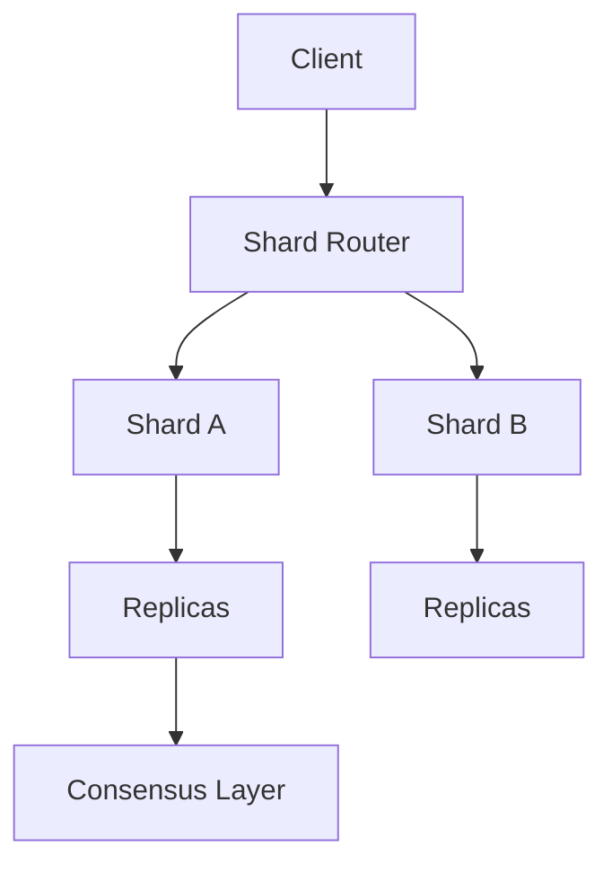

---


---

## 5.1 Partitioning


### What is it?

**Partitioning** divides a logical table or dataset into disjoint **segments** (partitions), each owning a subset of rows or keys. In distributed systems, **horizontal partitioning** splits rows by a partition key; **vertical partitioning** splits columns or related tables onto different stores.

Partitioning is the **unit of placement**: each partition is assigned to one or more nodes, replicated as a group, migrated during rebalancing, and often the scope of ordering guarantees.

**Contrast with replication:** partitioning answers *which subset of data lives here*; replication answers *how many copies of that subset exist*.

### Why it matters

Every distributed database partitions data — the design question is *how*, not *whether*. Partitioning drives:

- **Write/read parallelism** — independent partitions process concurrently
- **Failure isolation** — one bad partition does not take down the whole dataset
- **Operational boundaries** — backup, compaction, and migration happen per partition
- **Query routing** — single-partition queries stay local; scatter-gather costs multiply

Poor partition design creates hot spots, expensive cross-partition transactions, and painful rebalancing.

### How it works

1. **Choose partition key** — high cardinality, aligned with dominant query pattern (`user_id`, `tenant_id`, `order_id`).
2. **Apply scheme** — hash, range, list, or composite (see 5.3–5.5).
3. **Map partition → node** — metadata service (Cassandra system tables, DynamoDB partitions, Spanner tablets) or client-side consistent hash.
4. **Route requests** — coordinator or driver looks up partition for key; sends read/write to owning replica group.
5. **Coordinate multi-partition ops** — scatter-gather queries, 2PC, or application-level fan-out when query spans partitions.

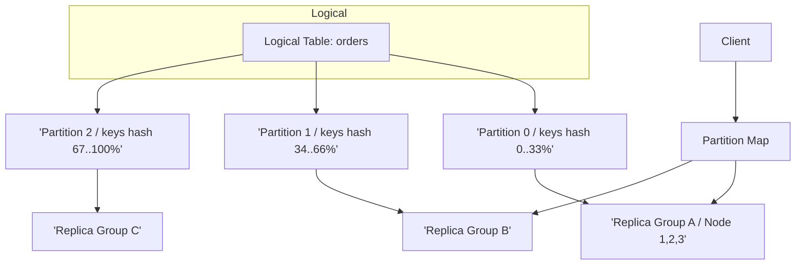

**Worked example — e-commerce orders:**

| Partition key | Query | Partitions touched |
|---------------|-------|-------------------|
| `customer_id` | `SELECT * FROM orders WHERE customer_id = 42` | **1** (ideal) |
| `order_id` | `SELECT * FROM orders WHERE order_id = 99` | **1** if keyed by order |
| `status` | `SELECT * FROM orders WHERE status = 'PENDING'` | **All** (scatter-gather) |
| `created_at` | Range scan last 7 days | **Subset** (range partitioning) |

### Key details

| Type | Split by | Best for | Risk |
|------|----------|----------|------|
| **Horizontal** | Row/key | Scale-out OLTP | Cross-partition joins |
| **Vertical** | Column/table | Wide rows, cold columns | Joins across stores |
| **Functional** | Tenant/region | Compliance, isolation | Uneven tenant sizes |

**Production patterns:**

- **Partition = replication unit** — Cassandra vnodes, Kafka partitions, Spanner tablets all replicate at partition granularity.
- **Partition = ordering scope** — Kafka and DynamoDB Streams guarantee order *within* a partition key, not globally.
- **Co-partitioning** — place related tables on same key (`user_id` on `users` and `profiles`) to enable local joins.
- **Pre-splitting** — create enough empty partitions upfront (Cassandra, HBase) to avoid hot latest-range partition on time-series ingest.

**Partition count guidance:**

| Factor | Too few | Too many |
|--------|---------|----------|
| Throughput | Single-node ceiling | — |
| Metadata | — | Routing table bloat, gossip overhead |
| Rebalancing | Large moves per change | Fine-grained but noisy |
| Consumers | Kafka: under-parallelized | File handle / election cost |

### When to use

Always in distributed storage. Choose strategy based on access pattern:

- **Point lookups, even spread** → hash partitioning (5.3)
- **Range scans, time-series** → range partitioning (5.4)
- **Data residency** → geo/list partitioning (5.5)

### Trade-offs / Pitfalls

- **Wrong partition key** — low-cardinality keys (`status`, `country`) collapse to few partitions; fix at schema time, not after petabytes.
- **Partition boundary changes** — re-keying data is a migration project; prefer keys stable for entity lifetime.
- **Secondary indexes** — often global indexes scatter writes (DynamoDB GSI, Cassandra SASI); understand hidden cross-partition cost.
- **Assuming partitions = shards** — in some systems one shard hosts many partitions (vnode model); terminology varies by product.

### References

- Designing Data-Intensive Applications, Ch. 6 (Partitioning)
- Dynamo (Amazon) partition and consistent hashing paper

---


## 5.2 Sharding


### What is it?

**Sharding** is horizontal partitioning of a dataset across **independent database instances** (shards), each holding a disjoint subset of rows with its own storage engine, CPU, and memory. The cluster collectively stores the full dataset; no single node holds everything.

Sharding is partitioning at **deployment scale** — each shard is often a full database process (MySQL shard, MongoDB shard, Vitess tablet), not just a logical segment on a shared cluster.

**Sharding vs partitioning:**

| Term | Typical meaning |
|------|-----------------|
| Partitioning | Logical segment; may share nodes (Cassandra, Kafka) |
| Sharding | Physical instance boundary; shared-nothing architecture |
| In practice | Used interchangeably — context matters |

### Why it matters

Sharding is the primary path to **write scalability** beyond one machine's limits:

- **Disk** — single-node storage caps (~few TB practical)
- **CPU/memory** — index and buffer pool pressure
- **Connection limits** — connection pools saturate one host
- **Blast radius** — isolate failures and noisy neighbors per shard

Foundational for multi-tenant SaaS (shard per tenant tier), social graphs (shard by `user_id`), and hyperscale OLTP (Vitess, Citus, MongoDB sharded cluster).

### How it works

A **shard key** (partition key) determines shard ownership on every read/write.

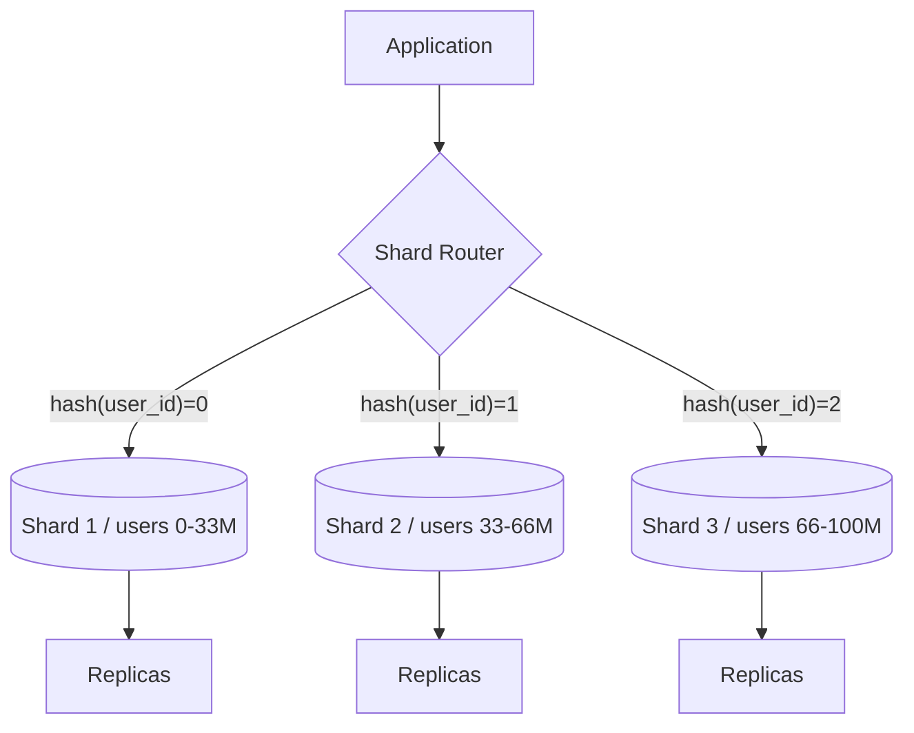

**Routing layers:**

| Layer | Examples | Notes |
|-------|----------|-------|
| Application | Custom hash in service code | Simple; logic duplicated |
| Proxy | Vitess VTGate, ProxySQL, mongos | Centralized routing, connection pooling |
| Driver | DynamoDB SDK, Cassandra driver | Client-side token awareness |
| Directory | ZooKeeper shard map, etcd | Flexible; lookup on every request |

**Request flow:**

1. Client sends `GET user:12345`.
2. Router computes `shard = hash(12345) mod N` (or range/directory lookup).
3. Connection pool opens to target shard primary.
4. Query executes locally — no cross-shard coordination.

**Cross-shard query (expensive):**

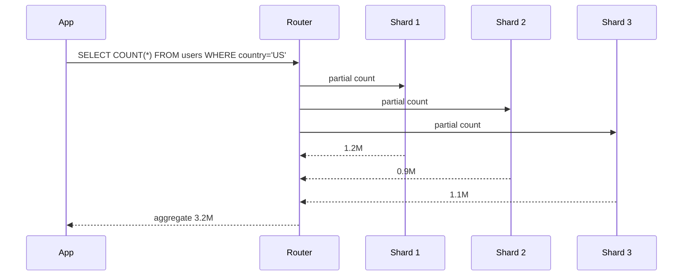

### Key details

| Aspect | Detail |
|--------|--------|
| Shard key | Must appear in **most** queries; high cardinality; avoid monotonic hot keys |
| Cross-shard ops | Joins, global `UNIQUE`, serial `AUTO_INCREMENT` break without extra coordination |
| Resharding | Dual-write, copy-and-cutover, or consistent-hash migration (5.7, 5.8) |
| Shared nothing | Each shard = independent failure domain; no shared disk |
| Schema migrations | Run per shard; version drift is an operational nightmare |

**Production patterns:**

- **Vitess / Citus** — managed sharding with distributed query planner for limited cross-shard SQL.
- **MongoDB** — `mongos` routes; chunks migrated by balancer; shard key immutable after collection creation.
- **DynamoDB** — transparent sharding; partitions split/merge automatically; hot key problem remains.
- **Tenant isolation** — enterprise tier on dedicated shard; free tier on shared shard pool.
- **Read replicas per shard** — scale reads without multiplying write shards.

**Resharding strategies:**

| Strategy | Downtime | Complexity | When |
|----------|----------|------------|------|
| Double capacity + split | Low | Medium | Planned growth |
| Consistent hash add node | Low | High | Elastic cache/NoSQL |
| Directory update | Config window | Low | Small clusters |
| Re-key application | High | Very high | Wrong key chosen — avoid |

### When to use

- Dataset or write throughput exceeds one node after vertical scaling.
- Access patterns are **mostly single-key or single-shard** (`user_id`, `tenant_id`).
- Team can operate N databases (monitoring, backups, failover per shard).
- Cross-shard transactions are rare or delegated to saga/outbox (6.20).

### Trade-offs / Pitfalls

- **Celebrity user problem** — one hot `user_id` saturates a shard; mitigate with sub-sharding, caching, or async write path (5.6).
- **Cross-shard ACID** — 2PC across shards kills latency; CockroachDB/Spanner shard *internally* with consensus instead.
- **Global secondary indexes** — write amplification to all shards (MongoDB, DynamoDB GSI).
- **Operational multiplication** — 32 shards = 32x backup jobs, 32x failover drills, 32x schema migration risk.
- **Joins across shards** — application-side join or denormalize; SQL sharding proxies have limits.

### References

- Vitess architecture docs; MongoDB sharding guide
- Designing Data-Intensive Applications, Ch. 6

---


## 5.3 Hash Partitioning


### What is it?

**Hash partitioning** assigns rows to partitions using `hash(partition_key) mod N` (or similar). Keys hash to a fixed bucket count, distributing rows pseudo-randomly.

### Why it matters

Delivers even spread when keys are uniformly distributed - ideal for point lookups without range locality requirements.

### How it works

1. Client supplies partition key.
2. System computes hash -> partition index.
3. Router directs request to the node hosting that partition.
4. Range queries must query all partitions (scatter-gather).

### Diagram

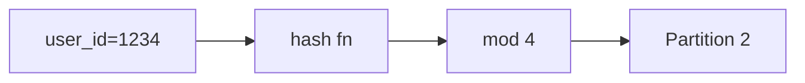

### Key details

| Pro | Con |
|-----|-----|
| Even distribution | No range-scan locality |
| Simple routing | Resizing N remaps most keys |
| Fast point lookups | Hot keys still hot (same hash bucket) |

### When to use

- Equality lookups on a high-cardinality key.
- No need for range queries on the partition key.
- Stable partition count or consistent hashing for elasticity.

### Trade-offs / Pitfalls

- Adding shards with naive `mod N` requires massive data movement - use consistent hashing instead.
- Skewed key distribution (e.g., celebrity users) still creates hot partitions.

### References

*(No curated references for this sub-topic in `_topics.json`.)*

---


## 5.4 Range Partitioning


### What is it?

**Range partitioning** assigns contiguous key ranges to partitions - e.g., A - M on shard 1, N - Z on shard 2, or time buckets for events.

### Why it matters

Enables efficient range scans, time-series ingestion patterns, and ordered iteration - common in analytics and event stores.

### How it works

1. Define ordered key space (string, timestamp, composite).
2. Assign ranges to partitions; metadata tracks boundaries.
3. Point and range queries hit only relevant partitions.
4. Split partitions when a range grows too large (dynamic splitting).

### Diagram

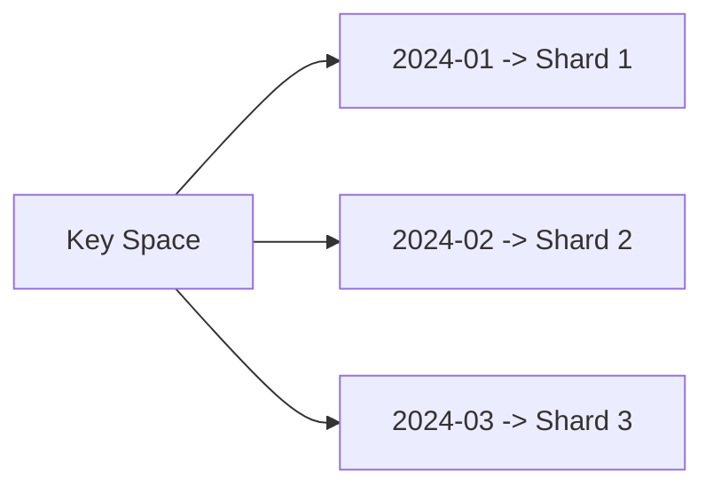

### Key details

- Excellent for `WHERE ts BETWEEN ...` and prefix scans.
- Risk of hot spots on latest time range or popular prefixes.
- Split/merge operations rebalance without full rehash.

### When to use

- Time-series, logs, and ordered event data.
- Range-heavy queries on the partition key.
- Keys have natural ordering you want to preserve locally.

### Trade-offs / Pitfalls

- Append-mostly workloads pile onto the "latest" partition - mitigate with pre-splitting or hash sub-partitioning.
- Uneven range sizes require active rebalancing.

### References

*(No curated references for this sub-topic in `_topics.json`.)*

---


## 5.5 Geo Partitioning


### What is it?

**Geo partitioning** (geo-sharding, data residency partitioning) places data in specific geographic regions based on tenant location, user country, or compliance rules.

### Why it matters

Required for GDPR, data sovereignty laws, and latency-sensitive global apps. Keeps personal data in-region and routes users to nearest replicas.

### How it works

1. Partition key includes region/tenant locale (e.g., `EU-tenant-42`).
2. Metadata pins partitions to datacenters in that region.
3. Global router sends requests to the correct regional cluster.
4. Cross-region reads/writes are explicit and often restricted.

### Diagram

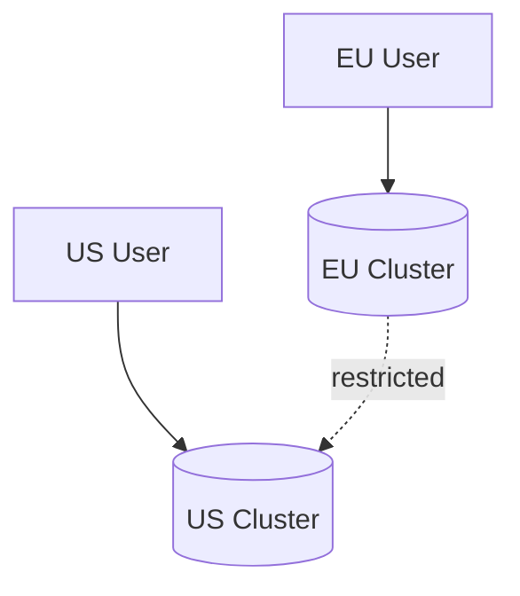

### Key details

- Compliance: data never leaves jurisdiction without legal basis.
- Latency: reads served locally; cross-region replication optional.
- Disaster recovery may require cross-region replicas with policy controls.

### When to use

- Multi-region products with residency requirements.
- Latency-sensitive regional user bases.
- Regulatory mandates on data location.

### Trade-offs / Pitfalls

- Global queries and reports require federated query or aggregation layer.
- Cross-region failover conflicts with residency - design DR per jurisdiction.
- Operational complexity: N regional deployments instead of one global cluster.

### References

*(No curated references for this sub-topic in `_topics.json`.)*

---


## 5.6 Hot Partitions


### What is it?

A **hot partition** (hot spot) is a shard or partition receiving disproportionate read/write traffic - often from a skewed key (viral post, celebrity user, latest time bucket).

### Why it matters

One hot partition caps throughput at a single node's limit despite many shards - defeating horizontal scale and causing tail latency spikes.

### How it works

Detection and mitigation follow a loop:

1. Monitor per-partition QPS, CPU, and queue depth.
2. Identify skewed keys via metrics or tracing.
3. Apply mitigation: split partition, add salt to key, cache, or async write path.
4. Validate even spread after change.

### Diagram

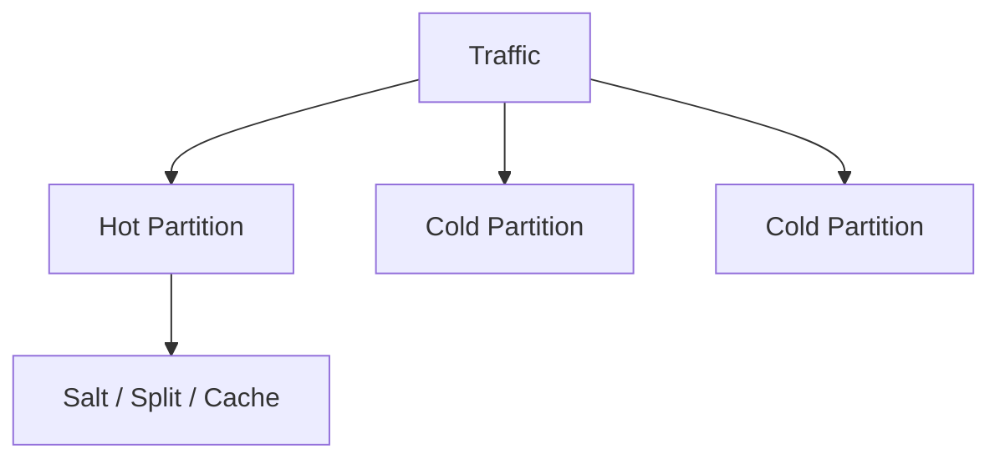

### Key details

#### Symptoms

Hot partitions show up in metrics before user complaints — one partition diverges from cluster norms.

| Signal | What you see | Tools |
|--------|--------------|-------|
| **Per-partition QPS** | One partition 10–1000× others | DynamoDB `ConsumedReadCapacityUnits`, Cassandra `nodetool tablestats` |
| **Throttle errors** | `ProvisionedThroughputExceeded`, 429 on one key | CloudWatch, API metrics |
| **CPU / IOPS saturation** | Single node pegged while peers idle | Node dashboards |
| **Tail latency** | p99 spikes correlate with one shard | Distributed tracing, partition tags |
| **Replication lag** | One replica falls behind on hot key range | `ReplicationLag`, PostgreSQL `pg_stat_replication` |
| **Queue depth** | Kafka partition consumer lag on one partition | `kafka.consumer.lag` |

**Common hot-key causes:**

```text
Partition key = status          →  all "ACTIVE" rows on one shard
Partition key = trending_post_id →  viral content
Time-series key = current_date  →  all writes hit "today" range
Tenant key = mega_customer      →  one B2B tenant dominates
```

#### Fixes and salting

| Fix | How | Trade-off |
|-----|-----|-----------|
| **Key salting** | Append random suffix: `user_id#3` spread across N logical shards | Reads must fan-out to N keys and merge |
| **Write sharding** | Split hot logical key into `post:123:shard0..7` | Application aggregates on read |
| **Caching** | CDN / Redis in front of hot key | Helps reads; write-heavy celebs still hot |
| **Dedicated partition** | Isolate known hot tenant to own shard | Ops overhead; plan ahead |
| **Partition split** | DynamoDB auto-splits; Cassandra split range | Eventually helps; lag during split |
| **Async write path** | Queue writes for counters, likes | Eventual consistency on count |

**Salting pattern (writes):**

```text
# Before: all traffic → partition hash(celebrity_user_42)
partition_key = celebrity_user_42

# After: spread across 8 salted partitions
partition_key = celebrity_user_42#${random 0..7}
write to one random suffix

# Read total followers: query all 8 suffixes, sum in app
```

**Salting pattern (DynamoDB):**

```text
PK = HOT#${user_id % 10}   SK = user_id
→ 10 partitions absorb write load
GSI or scatter-gather read to reconstruct per-user view
```

**Prevention at schema time:** choose high-cardinality partition keys aligned with access (`user_id`, not `country`); for time-series use **hash prefix + timestamp** (`hash(device_id) + date`).

### When to use

Mitigate when p99 latency or throttle errors correlate with single partition metrics.

### Trade-offs / Pitfalls

- Salting breaks single-key locality - reads must fan out and merge.
- Caching hot data helps reads but not write-heavy hot keys.
- Prevention at schema design time beats reactive firefighting.

### References

*(No curated references for this sub-topic in `_topics.json`.)*

---


## 5.7 Rebalancing


### What is it?

**Rebalancing** moves partitions between nodes to restore even load and capacity utilization after adds, removes, or traffic skew.

### Why it matters

Without rebalancing, new nodes sit idle while old nodes overload; removing failed nodes leaves data under-replicated.

### How it works

1. Monitor per-node partition size, QPS, and disk usage.
2. Select partitions to move (largest, hottest, or random under consistent hash).
3. Copy partition data to target node while serving reads (often dual-read period).
4. Update routing metadata atomically; drain old copy; verify consistency.

### Diagram

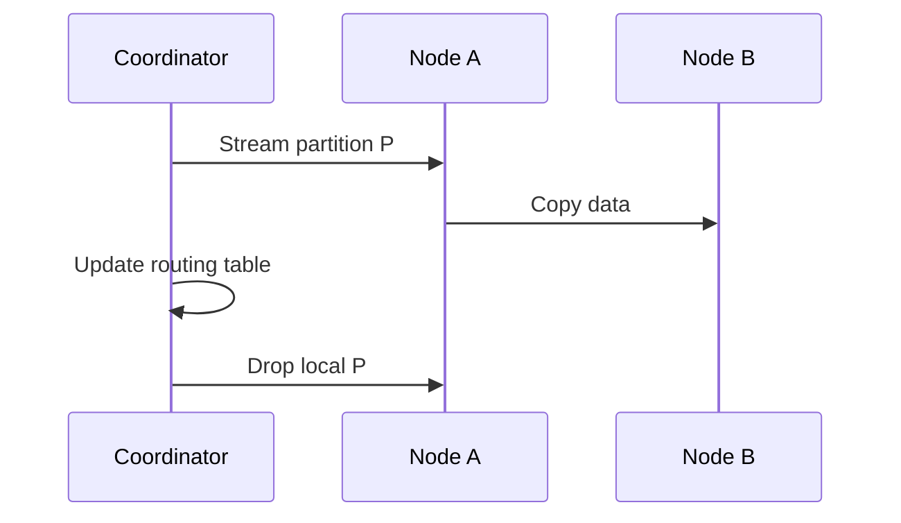

### Key details

- Background migration throttled to avoid saturating network/disk.
- Consistent hashing minimizes keys moved when adding one node.
- Rebalancing during peak traffic risks latency spikes - schedule or rate-limit.

### When to use

- After scaling cluster up or down.
- When hot partitions or disk imbalance detected.
- Post-failure recovery to restore replication factor.

### Trade-offs / Pitfalls

- Moving large partitions takes hours - plan capacity before urgency.
- Incorrect routing updates cause split reads or lost writes.
- Rebalance + production traffic competes for I/O.

### References

*(No curated references for this sub-topic in `_topics.json`.)*

---


## 5.8 Consistent Hashing


### What is it?

**Consistent hashing** maps both **keys** (cache entries, user IDs, objects) and **nodes** (servers) onto a fixed **hash ring** (positions `0` to `2^32-1`). Each key is assigned to the **first node clockwise** from the key's position on the ring.

When a node is **added** or **removed**, only keys in the arc between that node and its predecessor move - not the entire key space. This minimizes data migration during cluster resize.

**Contrast with naive `hash(key) % N`:**
- When N changes from 3 to 4, **almost all keys** remap -> mass cache miss / data shuffle
- Consistent hashing: only ~`1/N` of keys move per node change

### Why it matters

- **Distributed caches** (Memcached, Redis Cluster) - add/remove nodes without invalidating entire cache
- **Dynamo-style databases** - partition data across nodes with minimal rebalance
- **Load balancers** (some L7/L4 designs) - stable backend selection
- **CDNs and P2P** (Chord, Kademlia) - routing in large peer networks

### How it works

1. Place each physical server at one or more points on the ring (hash of node ID)
2. Hash the key: `position = hash("user:123")`
3. Walk clockwise from `position` until you hit the first server -> that server owns the key
4. **Add node D:** only keys between D's predecessor and D migrate to D
5. **Remove node B:** keys owned by B migrate to B's successor on the ring

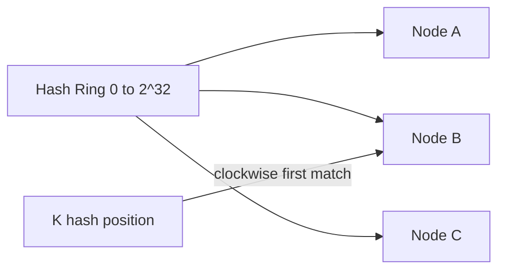

**Virtual nodes (vnodes):**

One physical server maps to **many** points on the ring (e.g. 100-256 vnodes per host). Without vnodes, uneven arc sizes cause hot servers when node count is small.

Example: 3 physical nodes with 100 vnodes each = 300 ring points -> near-uniform distribution.

**Replication on the ring:**

For replication factor R=3, key owner is first clockwise node; replicas are 2nd and 3rd clockwise nodes.

**Worked example:**

Ring with nodes A, B, C. Key `K` hashes between B and C -> owned by C.  
Add node D between B and K -> only keys that were on C and fall between D and K move to D (~fraction `1/(N+1)` of keys).

### Key details

| Approach | Remap on node change | Load balance | Notes |
|----------|---------------------|--------------|-------|
| `hash % N` | ~all keys | Even if uniform hash | Simple; bad for elastic clusters |
| Consistent hash | ~`1/N` keys per change | Uneven without vnodes | Memcached Ketama |
| Consistent hash + vnodes | ~`1/N` keys | Good | Cassandra, DynamoDB |
| Jump consistent hash | Minimal | Good | No ring metadata; Google paper |

- **Hot keys:** consistent hashing spreads **keys** evenly but not **traffic** - `celebrity_user` still hammers one node; fix with key splitting or local cache
- **Client vs server routing:** client computes owner (Dynamo) or server redirects (Redis Cluster MOVED/ASK)
- **Metadata service:** ring membership must be consistent across clients; gossip or ZooKeeper/KRaft
- Libraries: **Ketama** (Memcached), **libketama**, **jump hash** (no virtual nodes needed)

### When to use

- Clusters that **grow and shrink** frequently (auto-scaling cache pools)
- Distributed storage where rebalancing terabytes is expensive
- Any system design interview involving "how do you shard data across servers?"

### Trade-offs / Pitfalls

- Few physical nodes without vnodes -> **uneven load** (one node owns 50% of ring)
- Hot keys are **not solved** by hashing alone
- Ring membership changes during migration need **handoff protocol** (read from old + new owner during move)
- Jump consistent hash avoids vnodes but limits flexibility for heterogeneous node capacities (weighted vnodes help)

### References

- Used in Dynamo (Amazon), Cassandra, Riak, Memcached client libraries

---


## 5.9 Virtual Nodes


### What is it?

**Virtual nodes** (vnodes) map each physical machine to many points on a consistent hash ring - e.g., 100 - 256 virtual tokens per host.

### Why it matters

Smooths load distribution when physical node counts are small and prevents one physical server from owning half the ring.

### How it works

1. Physical node `A` registers vnodes `A-0  -  A-N` on the ring.
2. Key routing uses vnode ownership as usual.
3. When node fails, its vnodes redistribute across survivors evenly.
4. More vnodes -> better balance, more metadata.

### Diagram

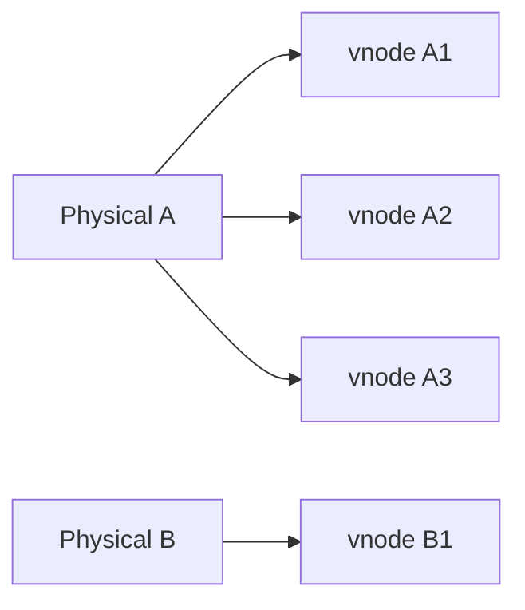

### Key details

- Cassandra default: 256 tokens per node (legacy) or vnode-based.
- Rebalance granularity = one vnode at a time.
- Trade vnode count vs metadata size and lookup cost.

### When to use

- Any consistent-hash cluster with < ~100 physical nodes.
- When observed partition size variance is high without vnodes.

### Trade-offs / Pitfalls

- Too few vnodes -> imbalance; too many -> gossip/metadata overhead.
- vnode reassignment during failure must be atomic in routing tables.

### References

*(No curated references for this sub-topic in `_topics.json`.)*

---


## 5.10 Rendezvous Hashing


### What is it?

**Rendezvous hashing** (highest random weight hashing) assigns each key to the node with the highest score from `hash(node, key)` among all nodes.

### Why it matters

Minimal remapping on node add/remove (only keys that preferred the new/changed node move), with simpler logic than ring maintenance for some deployments.

### How it works

1. For key K, compute weight `W(N,K)` for every node N.
2. Select node with maximum W.
3. On node add: only keys where new node wins move to it.
4. On node remove: keys on removed node re-pick max among survivors.

### Diagram

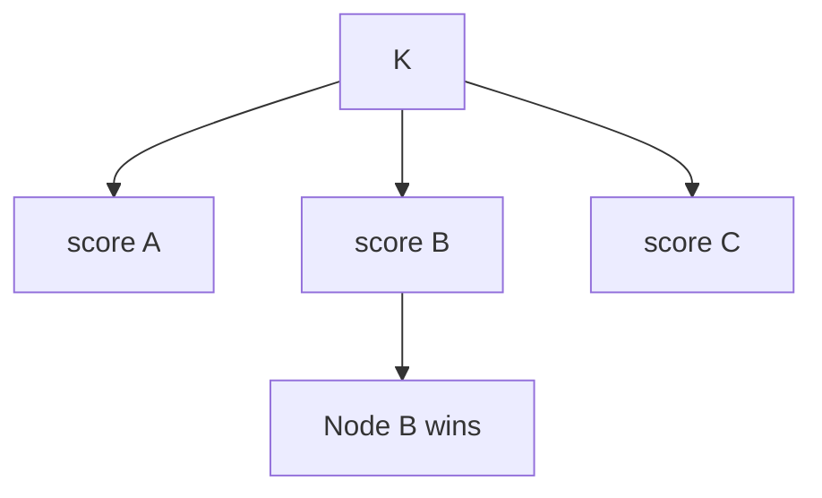

### Key details

- O(nodes) per lookup - fine for tens of nodes, costly at thousands.
- Excellent distribution properties without virtual nodes.
- Used in CDN routing and some load balancers.

### When to use

- Moderate node counts with frequent membership changes.
- When you want uniform spread without ring complexity.
- Client-side sharding with simple implementation.

### Trade-offs / Pitfalls

- Does not scale to huge node sets - cache scores or use hierarchical hashing.
- Still subject to hot key problems at application level.

### References

*(No curated references for this sub-topic in `_topics.json`.)*

---


## 5.11 Replication


### What is it?

**Replication** maintains multiple **copies** of the same data on different nodes for **durability** (survive disk/node loss), **availability** (serve reads during failure), and **latency** (read from nearest replica). Each partition typically has a **replication factor (RF)** — commonly 3 in production.

Replication is orthogonal to partitioning: every partition has its own replica set.

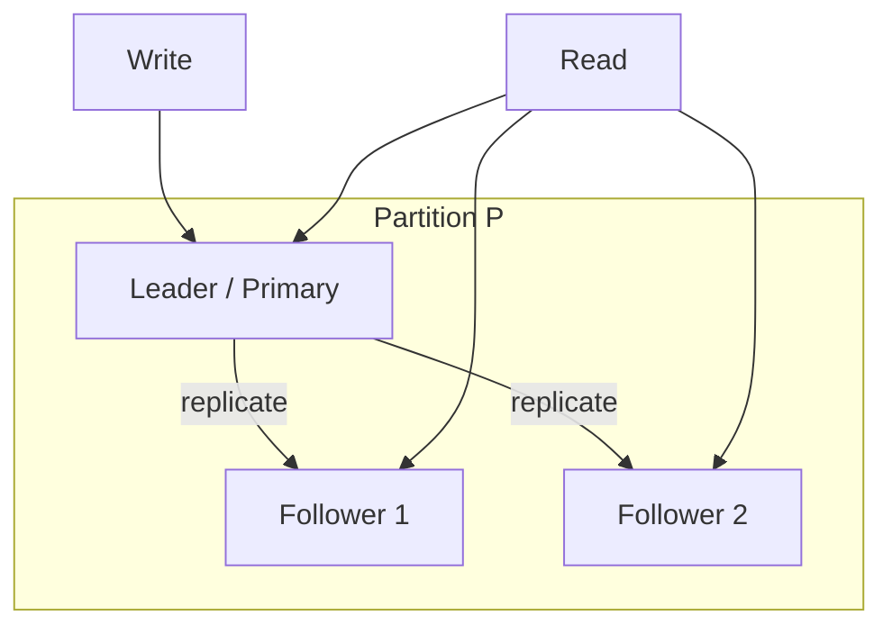

### Why it matters

Single-copy data dies with the disk. Without replication:

- Node failure = **data loss** and **downtime**
- Maintenance windows require full outage
- Reads cannot scale horizontally off primaries
- Geographic users pay WAN latency on every read

Replication is non-negotiable for production data you cannot afford to lose.

### How it works

**Three replication topologies:**

| Topology | Write path | Read path | Conflict handling |
|----------|------------|-----------|-------------------|
| **Leader-follower** | Single leader orders writes | Leader or stale follower | None (single writer) |
| **Multi-leader** | Multiple leaders accept local writes | Nearest leader | LWW, version vectors, CRDTs |
| **Leaderless** | Quorum write to any N replicas | Quorum read from R replicas | Version merge on read |

**Replication sync spectrum:**

```mermaid
flowchart LR
    subgraph Sync['Synchronous (strong)']
        W1[Write] --> L1[Leader]
        L1 --> F1[Follower ACK]
        F1 --> ACK[Client ACK]
    end
    subgraph Async['Asynchronous (fast)']
        W2[Write] --> L2[Leader]
        L2 --> ACK2[Client ACK]
        L2 -.->|background| F2[Follower]
    end
```

1. **Choose topology** — match consistency needs and write locality (5.12, 5.13).
2. **On write** — leader or coordinator replicates to RF nodes per sync policy.
3. **On read** — fetch from leader, nearest replica, or quorum (5.14, 5.15).
4. **On divergence** — anti-entropy repair, read repair, or consensus log replay.

**Worked example — RF=3, N=3:**

- Data written to nodes A, B, C
- A fails → reads/writes continue from B, C if quorum allows
- A returns → catch-up via hinted handoff or full rebuild

### Key details

| Parameter | Typical value | Meaning |
|-----------|---------------|---------|
| RF | 3 | Tolerate 1 node loss with quorum |
| `min.insync.replicas` | 2 | Kafka: min replicas for `acks=all` |
| Sync replicas | All or quorum | Durability vs latency trade-off |
| Read preference | `nearest`, `primary` | MongoDB, Cassandra drivers |

**Production patterns:**

- **3 AZ deployment** — one replica per availability zone; survive full AZ loss with quorum.
- **Read replicas for analytics** — async follower serves reporting; lag monitored; never used for money reads without policy.
- **Chain replication** — leader → follower1 → follower2 reduces leader fan-out (some systems).
- **Geo-replication** — async cross-region for DR; sync only if product requires global strong consistency (Spanner).
- **Anti-entropy** — Cassandra `nodetool repair` fixes silent divergence between replicas.

**Replication vs backup:**

| | Replication | Backup |
|---|-------------|--------|
| Purpose | HA, read scale | Point-in-time recovery, human error |
| Lag | Seconds or less | Hours (snapshot schedule) |
| Corruption | Replicates bad writes | Snapshot may predate corruption |

### When to use

Always for production durable data. Defaults:

- **RF=3** for HA databases and Kafka topics
- **Leader-follower** when strong per-partition ordering required
- **Leaderless + quorum** when AP availability during partition matters (Dynamo family)
- **Multi-leader** only with explicit conflict resolution (geo writes)

### Trade-offs / Pitfalls

- **Sync replication** — latency = slowest replica RTT; cross-region sync hurts write p99.
- **Async replication** — promoted follower may **lag**; lost writes on failover if not monitored.
- **Stale reads** — reading followers without `read-your-writes` confuses users and breaks invariants.
- **Write amplification** — RF=3 means 3x disk writes; RF=5 rare except extreme durability needs.
- **Split brain** — two primaries without quorum fencing (5.20); always require majority for leadership.

### References

- Designing Data-Intensive Applications, Ch. 5 (Replication)
- Dynamo paper (leaderless replication)

---


## 5.12 Leader Follower Replication


### What is it?

**Leader-follower** (primary-replica) replication sends all writes through a single **leader** node, which replicates an ordered log to **follower** replicas. Reads may hit leader or followers depending on consistency needs.

### Why it matters

The dominant model for RDBMS (PostgreSQL, MySQL) and many distributed stores (Kafka partitions, MongoDB replica sets). Simple consistency story: one write ordering authority.

### How it works

1. Client sends write to leader.
2. Leader appends to local log and streams to followers.
3. Followers apply entries in order.
4. Leader acknowledges after sync to quorum or all followers.
5. Follower promotion on leader failure via election.

### Diagram

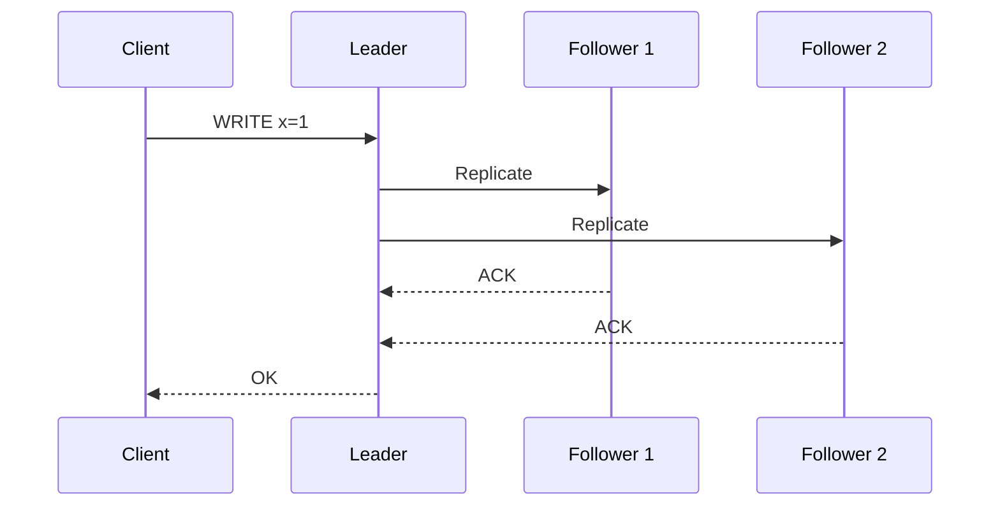

### Key details

#### Synchronous vs asynchronous replication

| Mode | Ack when | Durability (RPO) | Latency | Partition behavior |
|------|----------|------------------|---------|-------------------|
| **Sync** | Quorum/all followers persist | **0** lost writes on leader death after ack | Highest (WAN RTT per replica) | CP: minority partition cannot commit |
| **Async** | Leader local write done | **> 0** — promoted replica may lack last writes | Lowest | AP: leader accepts writes; followers catch up |
| **Semi-sync** | At least 1 follower ack | Bounded loss (1 replica) | Middle | Common MySQL compromise |

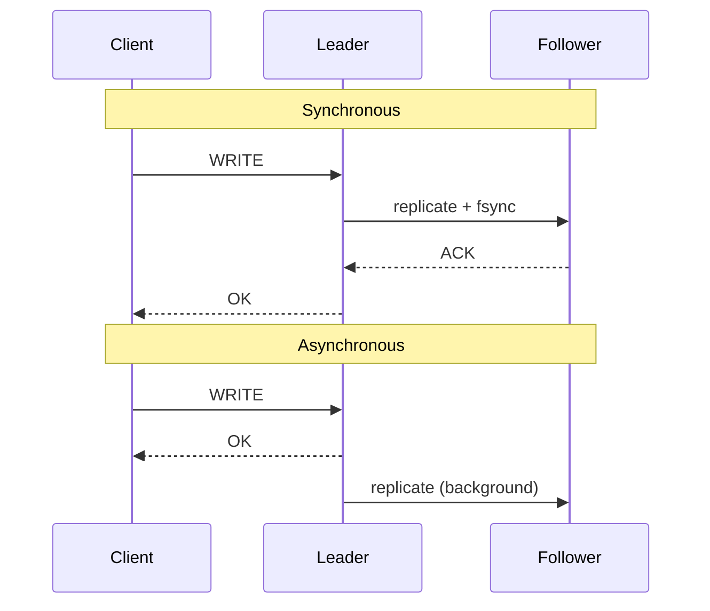

**PostgreSQL examples:**

```text
synchronous_commit = on          → wait for sync standby (strong)
synchronous_commit = remote_write → wait for standby receive
synchronous_commit = off         → async (faster, riskier)
```

**MySQL:** `innodb_flush_log_at_trx_sync` + semi-sync plugin waits for one replica.

**Read consistency:**

| Read from | Consistency |
|-----------|-------------|
| Leader / primary | Latest committed (strong) |
| Async follower | **Stale** — replication lag seconds |
| Sync quorum follower | Strong if read-after-quorum |

Use `read-your-writes` session routing or `WAIT FOR REPLICA` after write when reading followers.

#### Failover

When the leader dies, a follower is **promoted** to accept writes.

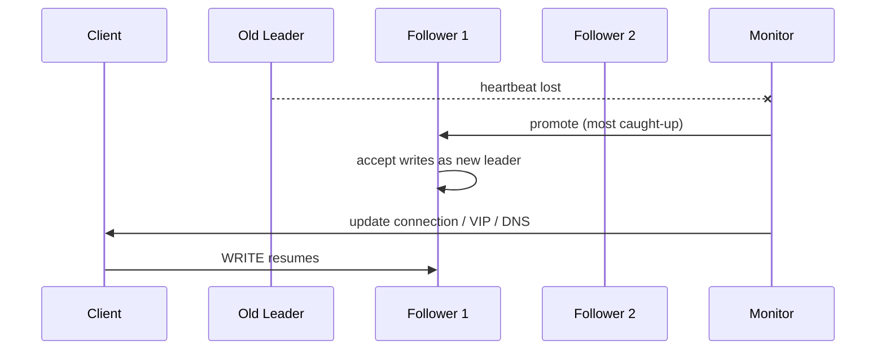

| Step | Action |
|------|--------|
| 1. **Detect** | Missed heartbeats (3× interval), `/health` fails, Raft election timeout |
| 2. **Elect** | Raft majority vote; PostgreSQL `pg_promote()`; MongoDB replica set election |
| 3. **Fence** | STONITH old leader — revoke VIP, isolate network — prevent split-brain |
| 4. **Catch-up** | New leader at highest LSN; other replicas resync |
| 5. **Redirect** | VIP, DNS TTL, driver `primary` endpoint, K8s Service update |

**RPO / RTO by replication mode:**

| Mode | RPO on failover | Typical RTO |
|------|-----------------|-------------|
| Sync replication | 0 | Seconds (automated) |
| Async replication | Seconds–minutes of writes | Seconds–minutes |
| Manual promotion | Depends on lag at death | Minutes (human) |

**Split-brain prevention:** require **quorum** for promotion (`majority of N` replicas). Two-node clusters need **witness** or **arbiter** (MongoDB) in third AZ.

**Failover pitfalls:**

- Promoting async replica → **lost writes** not yet replicated
- Clients cache old primary IP → connection pool refresh needed
- Long failover → brief write unavailability (CP) or dual-write risk (misconfigured AP)
- **Logical replication** lag in PostgreSQL — verify `pg_last_wal_replay_lsn` before promote

- Follower reads may be stale unless read-from-leader or quorum read.

### When to use

- Strong ordering required per partition.
- Workloads tolerate single-leader write bottleneck or shard widely.
- Familiar ops model with clear failover story.

### Trade-offs / Pitfalls

- Leader is a write bottleneck and failover sensitivity point.
- Async lag causes "split brain" risk if auto-promote without quorum.
- Cross-datacenter leader-follower adds WAN latency to every commit.

### References

*(No curated references for this sub-topic in `_topics.json`.)*

---


## 5.13 Multi Leader Replication


### What is it?

**Multi-leader** (multi-master) replication allows multiple nodes to accept writes, synchronizing changes between leaders - often one leader per region.

### Why it matters

Enables write-locality for geo-distributed apps: users write to the nearest datacenter without cross-WAN round trips on every operation.

### How it works

1. Each region has a leader accepting local writes.
2. Leaders exchange changes via replication log or conflict-free structures.
3. Conflicts detected when same row updated concurrently at two leaders.
4. Resolution via LWW, version vectors, or application merge logic.

### Diagram

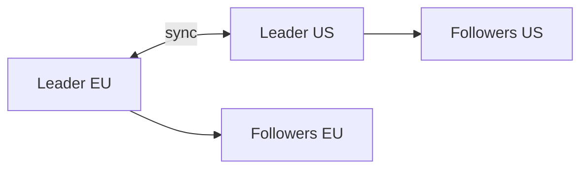

### Key details

- Common in CouchDB, some MySQL geo clusters, and mobile sync (offline writes).
- Conflict-free Replicated Data Types (CRDTs) avoid conflicts by design for specific data types.
- Not suitable when application assumes single global order.

### When to use

- Multi-region write locality is mandatory.
- Conflicts are rare or mergeable (counters, sets, CRDTs).
- Brief inconsistency across regions is acceptable.

### Trade-offs / Pitfalls

- Write-write conflicts are inevitable - must have resolution strategy.
- Debugging "which write won" is harder than single-leader.
- Global uniqueness constraints (auto-increment IDs) break without coordination.

### References

*(No curated references for this sub-topic in `_topics.json`.)*

---


## 5.14 Quorum Reads


### What is it?

A **quorum read** contacts multiple replicas and returns a value only after **R** of **N** replicas respond, selecting the **highest version** among responses. Combined with write quorums (5.15), quorums provide **tunable consistency** without a single leader for reads.

Foundation of **Dynamo-style** (AP) systems: Cassandra, Riak, DynamoDB (with `ConsistentRead`), Voldemort.

### Why it matters

Leaderless architectures must answer: *"Which replica has the latest value?"* Quorum reads:

- Survive replica unavailability (read from any R alive nodes)
- Detect stale replicas via version metadata
- Enable **read repair** — fix divergent replicas on the read path
- Tune latency vs freshness per query (`ONE` vs `QUORUM` vs `ALL`)

### How it works

**Parameters:**

- **N** — replication factor (total replicas)
- **R** — read quorum size (replicas contacted for read)
- **W** — write quorum size (see 5.15)

```mermaid
sequenceDiagram
    participant C as Client
    participant Co as Coordinator
    participant N1 as Replica 1
    participant N2 as Replica 2
    participant N3 as Replica 3
    C->>Co: READ key=K
    Co->>N1: read K
    Co->>N2: read K
    Co->>N3: read K
    N1-->>Co: value=v3, version=3
    N2-->>Co: value=v3, version=3
    N3-->>Co: timeout
    Note over Co: R=2 met; max version=3
    Co-->>C: return v3
    Co->>N3: async read repair v3
```

**Step-by-step:**

1. Coordinator (often any node, or token owner) receives read.
2. Sends parallel read to **preferred replicas** (often local + replicas in same DC).
3. Waits for **R** responses with `(value, version)` tuples.
4. Returns value with **highest version** (version vector or timestamp).
5. If replicas disagree and `R + W > N`, returned value is guaranteed to include latest quorum write.
6. **Read repair** — async write of newest value to stale replicas.

**Consistency levels (Cassandra example):**

| Level | R | Behavior |
|-------|---|----------|
| `ONE` | 1 | Fastest; may return stale data |
| `LOCAL_ONE` | 1 in local DC | Low latency multi-DC |
| `QUORUM` | majority of N | Balanced |
| `LOCAL_QUORUM` | majority in local DC | Avoid cross-DC on every read |
| `ALL` | N | Slowest; fails if any replica down |

### Key details

**The overlap guarantee (`R + W > N`):**

For N=3, W=2, R=2: any read quorum of 2 nodes **must overlap** any write quorum of 2 nodes by at least one replica — that replica holds the latest write.

```
N=3 replicas: {A, B, C}
Write quorum W=2: {A,B} or {A,C} or {B,C}
Read quorum R=2: must share at least 1 node with any write set
→ reader sees latest committed quorum write
```

| Config | Consistency | Availability on partition |
|--------|-------------|---------------------------|
| R=1, W=1 | Eventual | High |
| R=2, W=2, N=3 | Strong quorum | Minority partition cannot R or W |
| R=3, W=3 | Linearizable-ish | Low — any down node blocks |

**Sloppy quorum / hinted handoff:**

When preferred replicas are down, coordinator may write/read from **fallback** nodes outside the natural replica set, returning hints for when primary returns. Improves availability but **weakens** strict quorum guarantees — document when enabled.

**Production patterns:**

- **LOCAL_QUORUM** in multi-DC Cassandra — avoid cross-WAN on every read.
- **DynamoDB `ConsistentRead=true`** — reads from leader replica; eventually consistent is default (cheaper).
- **Monitor read repair rate** — high repair rate signals replication lag or node issues.
- **Speculative retry** — if R responses slow, issue extra read to different replica (latency vs cost).

### When to use

- Leaderless systems (Cassandra, Scylla, Riak).
- Need read availability when some replicas are down.
- Tunable consistency per query — analytics `ONE`, billing `QUORUM`.
- Pair with idempotent writes and version columns for conflict detection.

### Trade-offs / Pitfalls

- **`R=1` reads** — fast but may return **stale** or conflicting siblings; never for financial balances without application merge.
- **Latency cost** — QUORUM waits for slowest of R replicas; tail latency matters.
- **`R + W ≤ N`** — no overlap guarantee; you have **eventual consistency** only — know your math.
- **Sloppy quorum** — availability win that breaks strict consistency claims in minority partitions.
- **Not linearizable by default** — need `R=W=majority` + careful conflict handling; compare to Raft leader reads.

### References

- Dynamo paper (quorum replication)
- Cassandra consistency level documentation

---


## 5.15 Quorum Writes


### What is it?

A **quorum write** acknowledges a write only after **W** of **N** replicas persist it. Together with read quorum **R**, the pair `(W, R, N)` defines the **consistency/latency/availability envelope** — the core of **tunable consistency** in Dynamo-family databases.

**The fundamental rule:** when `R + W > N`, read and write quorums **overlap**, so a quorum read is guaranteed to see the latest quorum write (for a single register, absent concurrent writes).

### Why it matters

Leaderless systems have no single authority to serialize writes. Quorum writes let operators **dial consistency**:

- `W=1` — optimize write latency; risk loss if that node dies before async replicate
- `W=QUORUM` — durable commit with minority node failure tolerance
- `W=N` — all replicas must ACK; strongest durability; fails on any replica outage

Interview must-know: **write the math**, explain overlap, and state when concurrent writes need version resolution.

### How it works

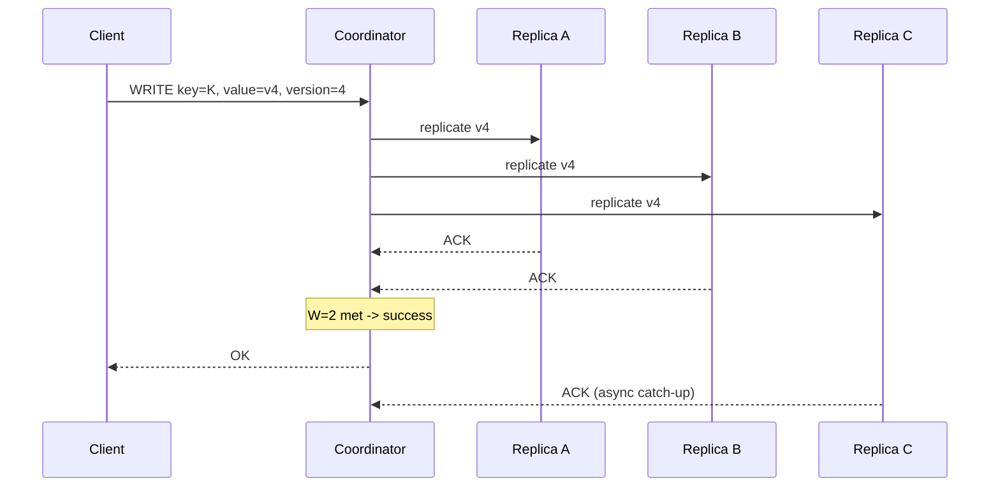

**Write path:**

1. Coordinator receives write with new version (timestamp, UUID, or counter).
2. Computes replica set from partition placement (token ring).
3. Sends write to all N replicas (or preferred set).
4. Waits for **W** acknowledgments.
5. Returns success to client; remaining replicas catch up via **hinted handoff** or **read repair**.
6. Concurrent writes to same key with `W < N` may create **siblings** — resolved on read via LWW or application logic.

### Key details

**W + R > N math (N=3):**

| W | R | W+R | Overlap? | Typical use |
|---|---|-----|----------|-------------|
| 1 | 1 | 2 | No | Fast writes + fast reads; eventual |
| 2 | 2 | 4 | **Yes** | Balanced quorum (most common) |
| 3 | 1 | 4 | Yes | Strong writes, fast stale reads |
| 1 | 3 | 4 | Yes | Fast writes, strong reads |
| 3 | 3 | 6 | Yes | Strongest; any down node blocks |

**Visual overlap (N=3, W=2, R=2):**

```text
Write to {A,B}:     ●●○  or  ●○●  or  ○●●
Read from {B,C}:    ○●●  or  ●●○  etc.
Any write {A,B} and read {B,C} share at least B → latest write visible
```

**Tunable consistency presets (Cassandra):**

| Use case | CL write | CL read | Notes |
|----------|----------|---------|-------|
| Analytics counter | `ONE` | `ONE` | Loss acceptable |
| User profile | `QUORUM` | `QUORUM` | Default balanced |
| Financial ledger | `ALL` | `ALL` | Or use LWT / external lock |
| Multi-DC | `LOCAL_QUORUM` | `LOCAL_QUORUM` | Per-DC quorum |

**Concurrent write problem:**

When two clients write with `W=2` concurrently:

```text
Client 1: write v1 to {A,B}  ✓
Client 2: write v2 to {B,C}  ✓
Both succeed! No single latest value without version merge on read.
```

Mitigations: **lightweight transactions (LWT / Paxos)** in Cassandra, **conditional writes** in DynamoDB, or design for commutative updates.

**Production patterns:**

- **LOCAL_QUORUM + LOCAL_QUORUM** — standard multi-DC Cassandra production default.
- **`min.insync.replicas=2` + `acks=all`** — Kafka's quorum write analog.
- **Hinted handoff** — write to temporary node when preferred replica down; ship hint when it returns.
- **Monitor `W` latency p99** — slow replica dominates quorum write tail.
- **Avoid `W=1` for money** — node death between ACK and replicate = silent loss.

### When to use

- Dynamo-family databases with per-query consistency levels.
- Need writes to continue when minority replicas unavailable (AP during partition).
- Willing to handle sibling conflicts for availability.
- Pair with `R + W > N` when reads must see latest quorum write.

### Trade-offs / Pitfalls

- **`W=1`** — fastest write; **data loss** if acknowledging node fails before background replicate.
- **`W + R ≤ N`** — no overlap; claiming "strong consistency" is wrong.
- **Concurrent writes** — quorum does not serialize writers; need LWT, locks, or CRDTs.
- **Sloppy quorum** — writes to non-replica nodes during outage weaken guarantees.
- **Not a distributed transaction** — quorum is per-key; multi-key atomicity needs separate mechanism (5.16).
- **Latency** — `W=ALL` blocked by slowest or dead replica.

### References

- Dynamo paper (W, R, N tunable consistency)
- Cassandra consistency levels and lightweight transactions

---


## 5.16 Distributed Transactions


### What is it?

A **distributed transaction** spans multiple nodes or shards, requiring atomic commit or abort across all participants - preserving ACID across partition boundaries.

### Why it matters

Business invariants often cross shards (debit one account, credit another). Without distributed transactions, applications must implement compensating logic manually.

### How it works

Common patterns:

1. **Two-phase commit (2PC):** coordinator prepares all, then commits all.
2. **Saga:** sequence of local transactions with compensations.
3. **Percolator / Calvin:** layered timestamps or ordered locking across cells.
4. **Spanner:** TrueTime + Paxos per shard + external consistency.

### Diagram

```mermaid
flowchart TB
    App --> TC[Transaction Coordinator]
    TC --> S1[Shard 1]
    TC --> S2[Shard 2]
    S1 --> Decision{All prepared?}
    S2 --> Decision
    Decision -->|yes| Commit
    Decision -->|no| Abort
```

### Key details

- Cross-shard joins in one SQL statement often imply distributed transaction underneath.
- Latency = slowest participant + coordination round trips.
- Many systems avoid them - design bounded contexts per shard instead.

### When to use

- Financial transfers and inventory where atomicity is non-negotiable.
- Systems built for it: Spanner, CockroachDB, TiDB.
- Low-frequency cross-shard ops, not bulk ETL.

### Trade-offs / Pitfalls

- 2PC blocks on coordinator or participant failure (in doubt state).
- Throughput ceiling far below single-shard transactions.
- Prefer sagas or single-shard design when eventual consistency is acceptable.

### References

*(No curated references for this sub-topic in `_topics.json`.)*

---


## 5.17 Two Phase Commit


### What is it?

**Two-phase commit (2PC)** is a distributed **atomic commit protocol**. A **coordinator** (transaction manager) runs:

1. **Phase 1 — Prepare:** ask all participants to vote; each locks resources and writes undo log
2. **Phase 2 — Commit or Abort:** if all vote YES, send COMMIT; otherwise ABORT

Goal: all participants commit or all abort — **atomicity** across nodes. Used in **XA transactions** (JDBC across two databases), some distributed SQL engines, and as the conceptual baseline for why modern systems prefer sagas and consensus.

### Why it matters

The textbook answer for cross-node atomicity — and a **cautionary tale** for blocking, coordinator failure, and partition intolerance. Interviewers expect you to draw both phases, explain **in-doubt** state, and contrast with **3PC** (5.18), **Saga** (6.x), and **Raft-backed** transactions (CockroachDB, Spanner).

### How it works

```mermaid
sequenceDiagram
    participant TC as Coordinator
    participant P1 as "Participant 1 (Shard A)"
    participant P2 as "Participant 2 (Shard B)"
    TC->>TC: write decision log (START)
    TC->>P1: PREPARE(txn_id)
    TC->>P2: PREPARE(txn_id)
    P1->>P1: validate, lock rows, write undo log
    P2->>P2: validate, lock rows, write undo log
    P1-->>TC: VOTE YES
    P2-->>TC: VOTE YES
    TC->>TC: log COMMIT decision
    TC->>P1: COMMIT(txn_id)
    TC->>P2: COMMIT(txn_id)
    P1->>P1: apply, release locks
    P2->>P2: apply, release locks
    P1-->>TC: ACK
    P2-->>TC: ACK
```

**Phase 1 — Prepare (voting):**

| Step | Coordinator | Participant |
|------|-------------|-------------|
| 1 | Persist `txn_id` in **transaction log** | — |
| 2 | Send `PREPARE(txn_id)` to all | Receive prepare |
| 3 | — | Validate constraints, acquire **locks** |
| 4 | — | Write **undo log** (for abort rollback) |
| 5 | — | Vote `YES` or `NO` (vote NO on any failure) |
| 6 | Collect votes | Hold locks until COMMIT/ABORT |

**Phase 2 — Commit/Abort (decision):**

| Outcome | Coordinator action | Participant action |
|---------|-------------------|-------------------|
| All YES | Log COMMIT; send `COMMIT` to all | Apply changes; release locks |
| Any NO | Log ABORT; send `ABORT` to all | Rollback via undo log; release locks |
| Coordinator crash after prepare | — | **Blocked** in prepared state |

**Abort path:**

```mermaid
sequenceDiagram
    participant TC as Coordinator
    participant P1 as Participant 1
    participant P2 as Participant 2
    TC->>P1: PREPARE
    TC->>P2: PREPARE
    P1-->>TC: YES
    P2-->>TC: NO (constraint violation)
    TC->>TC: log ABORT
    TC->>P1: ABORT
    TC->>P2: ABORT
    P1->>P1: rollback undo log
```

### Key details

**Coordinator failure scenarios:**

| Failure point | Participant state | Recovery |
|---------------|-------------------|----------|
| Before prepare sent | No locks | Safe to abort locally |
| After some YES votes | Prepared, locks held | **In-doubt** until coordinator recovers |
| After COMMIT logged | Must commit | Replay coordinator log |
| Coordinator dead post-prepare | **Blocked indefinitely** | Manual intervention or timeout heuristic (unsafe) |

**The blocking problem:**

If coordinator crashes **after** participants voted YES but **before** sending COMMIT/ABORT:

- Participants hold **locks** and wait forever (or until coordinator recovers)
- Other transactions block on locked rows
- This is why 2PC is **not partition tolerant** and avoided on hot paths

**In-doubt transactions:**

```text
Participant log: PREPARED txn_42 — outcome unknown
Cannot unilaterally COMMIT (coordinator may have aborted)
Cannot unilaterally ABORT (coordinator may have committed)
→ must contact coordinator or heuristic rollback (dangerous)
```

**XA / JDBC example:**

```text
UserService DB (RM1) + Inventory DB (RM2) under JTA coordinator
BEGIN → prepare both → commit both
Any RM timeout → entire XA transaction rolls back
```

**Production patterns (where 2PC still appears):**

- **Infrequent admin operations** — cross-database migrations with human oversight
- **XA across two RDBMS** — legacy enterprise integration (declining in microservices)
- **Internal control planes** — coordinator is HA with durable log (ZooKeeper transaction, not user-facing)
- **NOT microservice hot paths** — use **outbox** (6.20) or **saga** instead

**2PC vs alternatives:**

| Protocol | Atomicity | Blocking | Partition tolerant | Throughput |
|----------|-----------|----------|-------------------|------------|
| 2PC | Yes | **Yes** | No | Low |
| 3PC | Yes | Reduced* | No* | Lower |
| Saga | Compensating | No | Yes | High |
| Raft + per-shard txn | Yes | No* | Majority | Medium |
| Outbox | Eventual | No | Yes | High |

*3PC assumes bounded delay; still fails under async network partitions.

### When to use

- Rare cross-database operations with **strong atomicity** and low frequency.
- HA coordinator with **durable transaction log** and recovery procedures.
- Internal tooling, not customer-facing checkout at 10k TPS.

### Trade-offs / Pitfalls

- **Coordinator SPOF** — must replicate coordinator log (Spanner uses Paxos for this layer).
- **Locks held through WAN** — prepare phase latency = sum of participant RTTs.
- **Minority partition cannot commit** — CP behavior during network split.
- **Heuristic rollback** — forcing abort on in-doubt txn risks inconsistency if coordinator actually committed.
- **Prefer saga/outbox** for microservices — 2PC couples availability of all participants.

### References

- Gray & Reuter: Transaction Processing (2PC specification)
- Designing Data-Intensive Applications, Ch. 9 (Distributed transactions)

---


## 5.18 Three Phase Commit


### What is it?

**Three-phase commit (3PC)** adds a **pre-commit** phase after prepare so participants know global decision before committing - reducing indefinite blocking if coordinator fails *after* pre-commit.

### Why it matters

Illustrates evolution beyond 2PC's blocking problem; rarely deployed in production but useful for understanding consensus trade-offs.

### How it works

1. **CanCommit:** coordinator asks if participants *can* commit (non-blocking probe).
2. **PreCommit:** if all agree, coordinator sends pre-commit; participants ready but not final.
3. **DoCommit:** coordinator sends commit; participants apply.
4. Timeout rules allow participants to commit if pre-commit received and coordinator silent.

### Diagram

```mermaid
sequenceDiagram
    participant TC as Coordinator
    participant P as Participant
    TC->>P: CanCommit?
    P-->>TC: Yes
    TC->>P: PreCommit
    TC->>P: DoCommit
    P-->>TC: ACK
```

### Key details

- Assumes network bounded delay (synchronous model) - fails under async networks with partitions.
- More round trips than 2PC -> higher latency.
- Largely superseded by Paxos/Raft for production coordination.

### When to use

- Academic / interview context more than greenfield systems.
- When comparing why modern systems chose consensus logs over 3PC.

### Trade-offs / Pitfalls

- Still vulnerable under network partition + timing assumptions.
- Operational complexity without wide library support.
- Real systems use Raft/Paxos + transaction layer instead.

### References

*(No curated references for this sub-topic in `_topics.json`.)*

---


## 5.19 Distributed Locking


### What is it?

A **distributed lock** grants exclusive access to a resource across processes/nodes - implemented via consensus stores, databases with TTL leases, or dedicated services (Redis Redlock, ZooKeeper ephemeral nodes).

### Why it matters

Prevents duplicate work, enforces single-writer invariants, and coordinates leader election - but is a frequent source of outages when misused.

### How it works

1. Client acquires lock on key `/locks/resource` with TTL lease.
2. Perform critical section work.
3. Release lock (delete key) before TTL if healthy.
4. Fencing: stale lock holder must be blocked via monotonic token (fencing token) on storage writes.

### Diagram

```mermaid
sequenceDiagram
    participant A as Service A
    participant L as Lock Service
    participant DB as Database
    A->>L: acquire lock + token=5
    L-->>A: granted
    A->>DB: write (fencing token=5)
    Note over A: B with token=4 rejected
```

### Key details

- Lease TTL protects against dead holder - but work must finish before expiry.
- Redlock debate: clock skew and GC pauses can violate safety without fencing.
- Prefer idempotency and database constraints over locks when possible.

### When to use

- Short critical sections (cron leader, migration runner).
- Resources without natural compare-and-swap semantics.
- With fencing tokens on downstream writes.

### Trade-offs / Pitfalls

- Long-held locks -> availability killer on holder crash until TTL.
- Without fencing, delayed old holder can corrupt data after lease expires.
- Heavy lock contention -> redesign for optimistic concurrency.

### References

*(No curated references for this sub-topic in `_topics.json`.)*

---


## 5.20 Split Brain


### What is it?

**Split brain** occurs when a cluster partitions into two groups that each believe they are the legitimate primary - both accepting writes and diverging irreconcilably.

### Why it matters

Classic catastrophic failure mode for databases and distributed locks; causes duplicate IDs, double spending, and data corruption.

### How it works

Typical scenario:

1. Network partition isolates leader from majority of replicas.
2. Minority side still serves if misconfigured; majority elects new leader.
3. Both sides accept writes during partition.
4. On heal, conflicting histories require manual merge or last-writer-wins data loss.

### Diagram

```mermaid
flowchart TB
    subgraph Partition A
        L1[Old Leader]
    end
    subgraph Partition B
        L2[New Leader]
    end
    L1 -.->|network cut| L2
```

### Key details

- Prevention: require **quorum** for leadership and writes (`majority of N`).
- STONITH: fence old leader (shutdown or revoke credentials).
- Witness nodes in third AZ break ties for 2-node clusters.

### When to use

Understanding split brain is prerequisite to designing HA - not something to "use," but to prevent.

### Trade-offs / Pitfalls

- Auto-failover without quorum checks causes split brain.
- Manual failover during partial outages often triggers it.
- "Brain peering" in misconfigured Redis/Mongo clusters is a real incident pattern.

### References

*(No curated references for this sub-topic in `_topics.json`.)*

---


## 5.21 Consensus


### What is it?

**Consensus** is the problem of getting multiple nodes to agree on a single value or ordered log of values, despite crashes and network delays. Solved protocols guarantee safety (never two decisions) and liveness (eventually decides, with sufficient majority).

### Why it matters

Underpins leader election, replicated logs, and distributed configuration (etcd, ZooKeeper, Raft in CockroachDB/TiDB). Without consensus, replicas diverge with no automatic reconciliation.

### How it works

General pattern (replicated state machine):

1. Leader receives client command.
2. Leader appends to replicated log via consensus rounds.
3. Majority acknowledges persistence.
4. Leader applies committed entry to state machine.
5. Followers apply same entries in order.

### Diagram

```mermaid
flowchart LR
    C[Client] --> L[Leader]
    L --> Log[Replicated Log]
    Log --> SM[State Machine]
    F1[Follower] --> Log
    F2[Follower] --> Log
```

### Key details

- Requires majority (quorum) for fault tolerance: `2f+1` nodes tolerate `f` failures.
- FLP impossibility: no deterministic async consensus with one faulty process - protocols use timeouts/randomization.
- Consensus ≠ distributed transactions (but transactions can use consensus per shard).

### When to use

- Strongly consistent metadata, locks, and small critical state.
- Building or operating Raft/Paxos-backed systems.
- Whenever multiple nodes must share one authoritative ordered history.

### Trade-offs / Pitfalls

- Latency tied to WAN round trips if leaders and majorities span regions.
- Not for high-volume bulk data - only coordination metadata at scale.
- Mis-sized clusters (even counts without witness) reduce fault tolerance.

### References

*(No curated references for this sub-topic in `_topics.json`.)*

---


## 5.22 Paxos


### What is it?

**Paxos** is a family of consensus protocols (single-decree, Multi-Paxos) where proposers, acceptors, and learners agree on values through numbered ballots and majority quorums.

### Why it matters

The theoretical foundation of distributed consensus - Chubby, early ZooKeeper, and Spanner build on Paxos variants. Understanding Paxos clarifies why Raft was designed.

### How it works

**Single Paxos round:**

1. Proposer picks ballot number N, sends `prepare(N)` to acceptors.
2. Acceptors promise not to accept lower ballots; return highest accepted value.
3. Proposer sends `accept(N, value)` with chosen value.
4. Majority accept -> value chosen; learners notified.
5. Multi-Paxos elects stable leader to run many rounds efficiently.

### Diagram

```mermaid
sequenceDiagram
    participant P as Proposer
    participant A1 as Acceptor
    participant A2 as Acceptor
    P->>A1: prepare N
    P->>A2: prepare N
    A1-->>P: promise
    A2-->>P: promise
    P->>A1: accept v
    P->>A2: accept v
```

### Key details

- Correct but famously hard to implement and reason about.
- Multi-Paxos needs stable leader for liveness in practice.
- Superseded for new projects by Raft in many ecosystems - same guarantees, clearer structure.

### When to use

- Maintaining legacy Paxos systems (Chubby, some storage engines).
- Research and interviews requiring formal consensus background.
- When existing stack already provides battle-tested Paxos (don't roll your own).

### Trade-offs / Pitfalls

- Implementation complexity leads to subtle bugs.
- Without dedicated leader, liveness suffers from proposer contention.
- Operational tooling less approachable than Raft ecosystems.

### References

*(No curated references for this sub-topic in `_topics.json`.)*

---


## 5.23 Raft


### What is it?

**Raft** is a **consensus algorithm** designed for understandability. It elects a **leader** per **term**, replicates an **ordered log** to followers, and commits entries once stored on a **majority**. Used in **etcd**, **Consul**, **CockroachDB**, **TiKV**, **NATS JetStream**, and countless control planes.

Raft solves the same problem as Paxos (5.22) — agreed ordered log despite crashes — with a clearer structure: **leader election**, **log replication**, **safety rules**.

### Why it matters

Default teaching and implementation choice for **strongly consistent replicated logs**. Understanding Raft explains:

- How Kubernetes stores cluster state (etcd)
- How distributed SQL shards agree on writes (CockroachDB)
- Why leader failure causes brief unavailability
- What **term** numbers fence stale leaders

### How it works

**Node states:**

```mermaid
stateDiagram-v2
    [*] --> Follower
    Follower --> Candidate: election timeout
    Candidate --> Leader: majority votes
    Candidate --> Follower: discover higher term
    Leader --> Follower: discover higher term
    Leader --> Follower: new leader elected
```

**1. Leader election**

1. Follower misses **heartbeat** from leader → election timeout fires (randomized 150–300ms typical).
2. Increments **term** T, becomes **candidate**, votes for self.
3. Sends `RequestVote(term=T)` to all peers.
4. Each node votes **at most once per term** for first valid candidate.
5. **Majority votes** → becomes **leader**; sends heartbeats to suppress elections.
6. **Split vote** (no majority) → new random timeout; retry term T+1.

```mermaid
sequenceDiagram
    participant F1 as Follower 1
    participant F2 as Follower 2
    participant F3 as Follower 3
    Note over F1,F3: Leader died
    F1->>F1: timeout -> Candidate term=5
    F1->>F2: RequestVote term=5
    F1->>F3: RequestVote term=5
    F2-->>F1: Grant vote
    F3-->>F1: Grant vote
    Note over F1: Majority -> Leader term=5
    F1->>F2: AppendEntries heartbeat
    F1->>F3: AppendEntries heartbeat
```

**2. Log replication**

1. Client sends command to **leader only**.
2. Leader appends entry `(term, index, command)` to local log.
3. Leader sends `AppendEntries` RPC to followers with **prevLogIndex/prevLogTerm** for consistency check.
4. Follower rejects if log mismatch; leader **decrements nextIndex** and retries (backtrack).
5. Follower appends matching entries, responds success.
6. Entry **committed** when replicated on **majority** (not merely sent).
7. Leader applies committed entries to **state machine**, responds to client.
8. Followers apply entries in order as they become committed.

```mermaid
sequenceDiagram
    participant C as Client
    participant L as Leader
    participant F1 as Follower 1
    participant F2 as Follower 2
    C->>L: SET x=1
    L->>L: append index=10 term=3
    L->>F1: AppendEntries index=10
    L->>F2: AppendEntries index=10
    F1-->>L: success
    F2-->>L: success
    Note over L: majority=2/3 -> commit index 10
    L->>L: apply to state machine
    L-->>C: OK
```

**3. Terms — logical clocks for leadership**

| Concept | Purpose |
|---------|---------|
| **Term** | Monotonically increasing epoch number |
| **Higher term** | Always supersedes lower; stale leader ignored |
| **Vote per term** | At most one vote prevents split leadership |
| **Log entry term** | Identifies which leader created entry |

**Stale leader scenario:**

```text
Leader L (term 3) partitioned from majority
Majority elects L2 (term 4)
L recovers, sends AppendEntries term=3
Followers reject: "my term is 4" → L steps down to follower
```

**4. Commit rule (majority)**

Entry at index `i` is **committed** when:

- Stored on replicas in **majority**, AND
- Entry's term equals **current leader term** (Raft paper safety detail)

Leader then applies and notifies followers via subsequent `AppendEntries`.

**Cluster size math:**

| Nodes N | Majority | Tolerates failures |
|---------|----------|-------------------|
| 3 | 2 | 1 |
| 5 | 3 | 2 |
| 7 | 4 | 3 |

Always use **odd** counts or add **witness** for tie-breaking.

### Key details

| Rule | Purpose |
|------|---------|
| **Election safety** | At most one leader per term |
| **Leader append-only** | Leader never overwrites own log |
| **Log matching** | Same index+term → identical prefix |
| **Leader completeness** | Committed entries present in all future leader logs |
| **State machine safety** | Same apply order on all nodes |

**Production patterns:**

- **etcd** — 3 or 5 nodes for K8s control plane; never even count without witness.
- **CockroachDB** — **Range** = Raft group per shard; many Raft groups per cluster.
- **Joint consensus** — membership changes use transitional config to avoid two majorities (node add/remove safely).
- **Snapshots** — compact log; new follower installs snapshot instead of replaying full history.
- **Pre-vote** (etcd enhancement) — prevent disrupted follower from spuriously incrementing term.
- **Read index / lease read** — leader serves linearizable reads without log entry (with caveats).

**Raft vs quorum (Dynamo):**

| | Raft | Quorum (W/R/N) |
|---|------|----------------|
| Ordering | Total order via leader | Per-key; concurrent writers |
| Consistency | Strong (linearizable writes) | Tunable |
| Write path | Leader only | Any coordinator |
| Failover | Election + brief unavailability | Continues with quorum |

### When to use

- New **coordination service** (config, locks, service discovery).
- **Per-shard replication** in distributed SQL (CockroachDB, TiDB/TiKV).
- Replacing ZooKeeper when simpler ops model desired.
- Any system needing **one authoritative ordered history** per partition.

### Trade-offs / Pitfalls

- **Leader write bottleneck** — scale writes by sharding into many Raft groups.
- **WAN latency** — cross-region Raft pays RTT on every commit; keep majority in one region.
- **Membership changes** — use joint consensus; naive add/remove risks two leaders.
- **Election storms** — tune `election_timeout`, use pre-vote; flaky network causes leadership flapping.
- **Even node counts** — 4 nodes tolerates only 1 failure (majority=3), same as 3 nodes but more cost.
- **Not for bulk data** — Raft coordinates metadata; data plane uses object storage or SSTables.

### References

- Raft paper: "In Search of an Understandable Consensus Algorithm" (Ongaro & Ousterhout)
- etcd Raft implementation docs; CockroachDB architecture

---


## 5.24 Leader Election


### What is it?

**Leader election** selects one node as coordinator for a term - using Raft votes, ZooKeeper sequential ephemeral nodes, or lease-based campaigns in Kubernetes.

### Why it matters

Avoids split brain by ensuring at most one active leader per epoch; required for single-writer replication and distributed task runners.

### How it works

**Raft election example:**

1. Follower misses heartbeats -> increments term, votes for self.
2. Requests votes from peers; each node votes at most once per term.
3. Candidate with majority becomes leader, sends heartbeats.
4. Split vote -> new random timeout, retry next term.

### Diagram

```mermaid
sequenceDiagram
    participant F1 as Follower 1
    participant F2 as Follower 2
    participant F3 as Follower 3
    F1->>F2: RequestVote term=5
    F1->>F3: RequestVote term=5
    F2-->>F1: Grant
    F3-->>F1: Grant
    Note over F1: Becomes Leader
```

### Key details

- Epoch/term numbers fence stale leaders automatically in Raft.
- Bully algorithm and ring election used in simpler LAN contexts.
- K8s Lease API: lightweight election for controllers.

### When to use

- HA services needing exactly one active worker (scheduler, stream processor).
- Raft/ZK-backed clusters during failover.
- Any system transitioning from follower to leader on failure.

### Trade-offs / Pitfalls

- Flapping leadership (thrashing) if timeouts too aggressive.
- Even-sized clusters need tie-breaker or witness for clean majority.
- Election storms during network glitches - tune backoff and quorum.

### References

*(No curated references for this sub-topic in `_topics.json`.)*

---


## 5.25 Lamport Clocks


### What is it?

A **Lamport clock** is a logical timestamp: each node increments a counter on local events and sends max(local, received)+1 on message send - establishing **happens-before** ordering for causally related events.

### Why it matters

Physical clocks drift; Lamport clocks give consistent event ordering for debugging, replication metadata, and conflict comparison without synchronized NTP.

### How it works

1. Initialize counter L=0 on each process.
2. On local event: L := L+1, stamp event.
3. On send: L := L+1, attach L to message.
4. On receive: L := max(L, message.L)+1.

### Diagram

```mermaid
sequenceDiagram
    participant A
    participant B
    A->>A: L=1
    A->>B: msg L=2
    B->>B: L=3
```

### Key details

- If A -> B causally, then L(A) < L(B).
- Converse false: L(a) < L(b) does not imply causality.
- Cannot detect concurrent (unordered) events - use vector clocks.

### When to use

- Total ordering of events in single log merge.
- Backup conflict resolution when concurrency rare.
- Teaching foundation for vector clocks and version vectors.

### Trade-offs / Pitfalls

- Concurrent events get arbitrary order - may violate application semantics.
- Not sufficient for Dynamo-style conflict detection alone.
- Distributed tracing sometimes uses hybrid logical + physical clocks.

### References

*(No curated references for this sub-topic in `_topics.json`.)*

---


## 5.26 Vector Clocks


### What is it?

A **vector clock** is a vector of counters - one per node - updated on local and receive events. Compare vectors to detect if events are ordered, concurrent, or equal.

### Why it matters

Enables **true concurrency detection** for multi-leader and leaderless stores - foundation of version vectors in Riak, Dynamo, and CRDT metadata.

### How it works

1. Each node maintains vector V of length N (nodes).
2. Local event: V[self]++.
3. Send message with V attached.
4. On receive: V[i] = max(V[i], msg.V[i]) for all i; then V[self]++.
5. Compare: V1 < V2 if all V1[i]≤V2[i] and strict; incomparable = concurrent.

### Diagram

```mermaid
flowchart LR
    E1["Event A: 1,0"] --> E2["Event B: 1,1"]
    E3["Event C: 0,1"] --> E2
    E1 -.concurrent.- E3
```

### Key details

- Version vectors are pragmatic finite-node variant with pruning.
- Concurrent writes require application merge or sibling versions.
- Size grows with replica count - compact with dotted version vectors.

### When to use

- Multi-master replication conflict detection.
- Causal consistency tracking across services.
- Building or debugging eventually consistent data stores.

### Trade-offs / Pitfalls

- Vector size and comparison cost scale with node count.
- Pruning old entries risks misclassifying concurrency.
- Application must handle sibling conflicts - storage won't guess semantics.

### References

*(No curated references for this sub-topic in `_topics.json`.)*

---


## 5.27 Gossip Protocol


### What is it?

**Gossip** (epidemic) protocols spread information peer-to-peer by random node pairs exchanging state - each round doubling reach until all nodes converge.

### Why it matters

Scalable, decentralized membership and metadata dissemination without central coordinator - used in Cassandra, Consul, and failure detectors.

### How it works

1. Each node holds local state (membership, hash ring, health).
2. Every T seconds, pick random peer, exchange summaries.
3. Merge received state (newer timestamps win).
4. Repeat until cluster converges (typically O(log N) rounds).

### Diagram

```mermaid
flowchart LR
    A -->|gossip| B
    B -->|gossip| C
    C -->|gossip| D
    A -.->|eventually| D
```

### Key details

- Types: anti-entropy (state sync), dissemination (event broadcast), aggregation.
- Phi accrual failure detector often pairs with gossip membership.
- Bounded bandwidth per node regardless of cluster size.

### When to use

- Large clusters where centralized registry doesn't scale.
- Eventually consistent cluster view acceptable (seconds delay).
- Cassandra/Scylla ring propagation, Consul LAN gossip.

### Trade-offs / Pitfalls

- Convergence delay - not for sub-millisecond consistency needs.
- Split brain periods if partition + aggressive failure detection.
- Malicious or buggy nodes can spread false membership without auth.

### References

*(No curated references for this sub-topic in `_topics.json`.)*

---


## 5.28 Membership Protocols


### What is it?

**Membership protocols** track which nodes are alive, joining, or leaving the cluster - via heartbeats, gossip, ZooKeeper ephemeral nodes, or SWIM (scalable weakly-consistent membership).

### Why it matters

Correct routing, replication, and consensus all depend on accurate membership. Wrong view -> writes to dead nodes, lost quorum, or split brain.

### How it works

**SWIM-style example:**

1. Nodes ping random peers periodically.
2. Indirect probe via third party on timeout.
3. Broadcast `suspect` then `confirm dead` with incarnation numbers.
4. New joins announce via seed nodes or gossip merge.

### Diagram

```mermaid
flowchart TB
    Join[New Node] --> Seed[Seed Nodes]
    Seed --> Gossip[Membership Gossip]
    Gossip --> View[Cluster View]
    Heartbeat[Heartbeats] --> View
```

### Key details

| Protocol | Characteristic |
|----------|----------------|
| Strong (ZK/etcd) | Accurate, centralized consensus |
| SWIM | Scalable, weakly consistent |
| Static config | Simple, poor elasticity |

### When to use

- Auto-scaling database clusters and service meshes.
- Failure detection integrated with load balancer backends.
- Choosing between strong membership (small control plane) vs gossip (large data plane).

### Trade-offs / Pitfalls

- False positive failure detection removes healthy nodes (flapping).
- Slow detection delays failover; fast detection increases false positives.
- Join storms during mass restart - use gradual rejoin and health gates.

### References

*(No curated references for this sub-topic in `_topics.json`.)*

---

[<- Back to master index](../README.md)
