# 5. Distributed Databases

[<- Back to master index](../README.md)

---

## Sub-topics

| # | Sub-topic |
|---|-----------|
| 5.1 | [Partitioning](#51-partitioning) |
| 5.2 | [Sharding](#52-sharding) |
| 5.3 | [Hash Partitioning](#53-hash-partitioning) |
| 5.4 | [Range Partitioning](#54-range-partitioning) |
| 5.5 | [Geo Partitioning](#55-geo-partitioning) |
| 5.6 | [Hot Partitions](#56-hot-partitions) |
| 5.7 | [Rebalancing](#57-rebalancing) |
| 5.8 | [Consistent Hashing](#58-consistent-hashing) |
| 5.9 | [Virtual Nodes](#59-virtual-nodes) |
| 5.10 | [Rendezvous Hashing](#510-rendezvous-hashing) |
| 5.11 | [Replication](#511-replication) |
| 5.12 | [Leader Follower Replication](#512-leader-follower-replication) |
| 5.13 | [Multi Leader Replication](#513-multi-leader-replication) |
| 5.14 | [Quorum Reads](#514-quorum-reads) |
| 5.15 | [Quorum Writes](#515-quorum-writes) |
| 5.16 | [Distributed Transactions](#516-distributed-transactions) |
| 5.17 | [Two Phase Commit](#517-two-phase-commit) |
| 5.18 | [Three Phase Commit](#518-three-phase-commit) |
| 5.19 | [Distributed Locking](#519-distributed-locking) |
| 5.20 | [Split Brain](#520-split-brain) |
| 5.21 | [Consensus](#521-consensus) |
| 5.22 | [Paxos](#522-paxos) |
| 5.23 | [Raft](#523-raft) |
| 5.24 | [Leader Election](#524-leader-election) |
| 5.25 | [Lamport Clocks](#525-lamport-clocks) |
| 5.26 | [Vector Clocks](#526-vector-clocks) |
| 5.27 | [Gossip Protocol](#527-gossip-protocol) |
| 5.28 | [Membership Protocols](#528-membership-protocols) |
| 5.29 | [Sharding, Bucketing & Partitioning](#529-sharding-bucketing--partitioning) |

---

## 5.1 Partitioning

### Overview

Imagine a warehouse that holds every product a company has ever sold. Eventually the building is too big to search, too heavy for one floor, and too busy for one loading dock. Partitioning is the decision to split that warehouse into aisles — each aisle holds a slice of inventory, and workers go to the right aisle instead of walking the whole building.

Technically, **partitioning** splits a large dataset into smaller parts called **partitions** (often called **shards** when each part is its own database). Instead of one server holding everything, data and workload spread across multiple machines. Common strategies — range, hash, list/geo, and directory — choose which slice owns each record.

---

### What problem it fixes

As data and traffic grow on a single database:

- Storage fills up
- Read and write requests concentrate on one machine
- Indexes and backups take longer
- One failure takes down all data

Partitioning distributes both **storage** and **request load** so no single node must hold or serve the entire dataset.

---

### What it does

Partitioning answers: *which slice of the data lives on which server?*

It supports two structural forms:

| Type | What splits | Result |
|------|-------------|--------|
| **Horizontal** | Rows | Same schema, different rows per partition |
| **Vertical** | Columns | Different tables or databases per column group |

It also supports multiple **routing strategies** for choosing a partition:

| Strategy | How partition is chosen | Best for | Main risk |
|----------|-------------------------|----------|-----------|
| **Range** | Key falls in a value range | Time-series, range scans, retention by range | Hot partitions |
| **Hash** | `Hash(key) % N` | Even spread across nodes | Poor range-query locality; resharding cost |
| **List / geo** | Category or region | Data residency, low latency per region | Skew if one region dominates |
| **Directory** | Lookup table | Flexible routing, uneven tenants | Metadata service availability |

A **shard** is usually a separate database instance; a **partition** is often a sub-table inside one instance. Production systems often combine both layers.

---

### How it works — the architecture inside

**Horizontal partitioning** — rows spread across partitions:

```text
Original table          Partition-1          Partition-2
UserID | Name           UserID | Name        UserID | Name
1      | A              1      | A           3      | C
2      | B              2      | B           4      | D
3      | C
4      | D
```

**Vertical partitioning** — columns split by access pattern:

```text
User table: UserID | Name
Profile table: UserID | Address
```

**Range-based routing:**

```text
Partition-1   UserID : 1 – 10,000
Partition-2   UserID : 10,001 – 20,000
Partition-3   UserID : 20,001 – 30,000
```

**Hash-based routing:**

```text
Partition = Hash(Key) % N

Hash(101) % 3 = 2
Hash(202) % 3 = 1
Hash(303) % 3 = 0
```

**List-based routing** (geo is a common case):

```text
Partition-1   Country = India
Partition-2   Country = USA
Partition-3   Country = UK
```

**Directory-based routing** — a lookup service stores locations:

```text
UserID 101 → Server A
UserID 205 → Server C
UserID 309 → Server B
```

**Example — 100 million users across four servers:**

```text
Server-1  →  Users 1 to 25 Million
Server-2  →  Users 25M to 50 Million
Server-3  →  Users 50M to 75 Million
Server-4  →  Users 75M to 100 Million
```

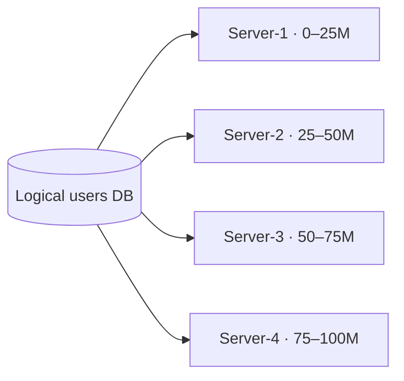

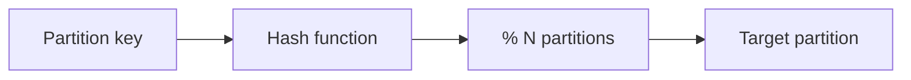

**How to calculate:**

```text
Given: 100 million user rows, target ≤ 30 million rows per partition
       4 physical servers (shards)

Step 1 — minimum partition count:
  Partitions needed = 100M / 30M ≈ 3.34 → round up to 4 partitions

Step 2 — rows per partition (even split):
  100M / 4 = 25 million rows per server

Step 3 — hash routing check (UserID 50,000,001):
  Partition index = 50,000,001 % 4 = 1 → Server-2 (0-indexed: partition 1)

Result: 4 partitions, ~25M rows each, point lookup hits 1 of 4 servers

Sanity check: 25M rows × ~1 KB/row ≈ 25 GB data per shard before indexes —
  verify disk and memory headroom, not just row count
```

---

### Pitfalls and design tips

- **Cross-partition queries** — joins and aggregations that span partitions are expensive; design the partition key around your hottest query paths.
- **Uneven distribution** — range and list strategies skew easily; monitor per-partition size and QPS (see 5.6 Hot Partitions).
- **Resharding cost** — changing partition count with naive `hash % N` moves most keys; plan for rebalancing (5.7) or consistent hashing (5.8) early.
- **Shard vs partition naming** — in interviews, clarify whether you mean independent DB instances (shards) or logical splits inside one engine (partitions).
- **Default for new systems** — hash or consistent-hash sharding on a high-cardinality key (user ID, order ID) unless range scans or geo compliance drive a different choice.

---

### Real-world example

**Cassandra** tables declare a **partition key** (and optional clustering columns). All rows sharing the same partition key live on one token range — one physical partition. A social feed keyed by `user_id` keeps one user's posts co-located for fast reads; a poorly chosen key (e.g. a single `country` value) creates one giant partition and a hot spot.

---


## 5.2 Sharding

### Overview

Partitioning is splitting a warehouse into aisles; **sharding** is giving each aisle its own building with its own staff and power supply. Each shard is an independent database that holds only a fraction of total data, so no single machine must store or serve everything.

Technically, sharding is horizontal partitioning across **multiple independent database instances**. A **shard key** decides placement, and a **shard router** (or client library) directs each request to the correct shard. Strategies mirror partitioning — range, hash, geo, directory — but at deployment scale across separate databases.

---

### What problem it fixes

A single database eventually hits hard limits:

```text
                Database
                    |
            ----------------
            |              |
        Too much data   Too much traffic
```

Storage grows, read and write QPS climb, and the database becomes the system bottleneck. Sharding distributes **data**, **read traffic**, and **write traffic** across many databases.

---

### What it does

| Term | Meaning |
|------|---------|
| **Shard** | A database containing a subset of data |
| **Shard key** | Attribute that decides placement — e.g. `UserID`, `CustomerID`, `Country` |
| **Shard router** | Component that maps a key to the correct shard |

Each shard stores only its slice. A point lookup touches one shard; scatter-gather queries may touch many.

---

### How it works — the architecture inside

**100 million users across three shards:**

```text
                 Users
                   |
        -------------------------
        |           |           |
      Shard-1     Shard-2     Shard-3
        |           |           |
     1–33M       34–66M      67–100M
```

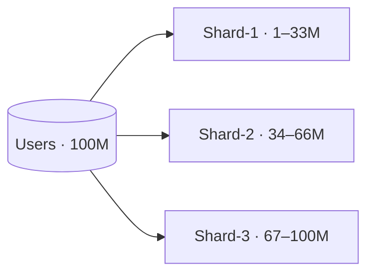

**Request routing:**

```text
Shard-1  →  UserID 1–1000
Shard-2  →  UserID 1001–2000
Shard-3  →  UserID 2001–3000

Request: Get User 1500
Router checks UserID → Shard-2 → only Shard-2 queried
```

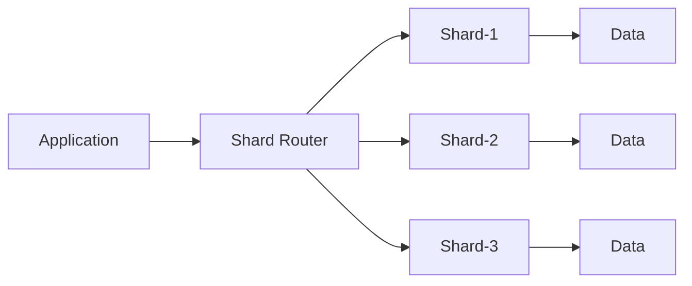

**Walkthrough — six users split three ways:**

```text
Shard-1: UserID 1, 2
Shard-2: UserID 3, 4
Shard-3: UserID 5, 6
```

**Flow:** request arrives → router hashes or ranges the shard key → request sent to one shard → result returned.

Sharding combines with **replication** — each shard typically has its own primary and replicas (see 5.11).

**How to calculate:**

```text
Given: 100 million users, 3 shards, replication factor RF = 2
       ~500 bytes/user row (data + indexes)

Step 1 — users per shard:
  100M / 3 ≈ 33.3 million users/shard

Step 2 — storage per shard (primary only):
  33.3M × 500 B ≈ 16.7 GB primary data per shard

Step 3 — total physical storage (RF = 2):
  16.7 GB × 2 × 3 shards ≈ 100 GB across cluster

Step 4 — write QPS per shard (even spread):
  Peak 15,000 writes/s fleet → 15,000 / 3 = 5,000 writes/s per shard leader

Result: 3 shards, ~33M users each, ~5K writes/s per primary at peak

Sanity check: one hot shard key can 10× one shard's QPS — monitor per-shard
  traffic, not fleet average; add shards before any primary exceeds CPU target
```

---

### Pitfalls and design tips

- **Bad shard keys** — low-cardinality keys (country, status) concentrate data; prefer high-cardinality, evenly distributed keys.
- **Cross-shard transactions** — avoid designing workflows that need ACID across shards; use sagas or per-shard consistency.
- **Operational overhead** — N shards means N backup jobs, N migration paths, and routing logic to maintain.
- **Resharding** — adding shards with `hash % N` reshuffles most data; plan consistent hashing or a directory layer before you need it.
- **Interview angle** — sharding is a scaling **architecture** choice, not a first-day optimization; exhaust vertical scaling, read replicas, and caching first unless requirements demand it.

---

### Real-world example

**Vitess** (used by YouTube and others) sits in front of many MySQL shards. Applications talk to Vitess; it parses SQL, routes by sharding key, and can reshuffle with minimal app changes. The shard key and VSchema define which rows live on which MySQL instance — the application does not hard-code shard URLs.

---


## 5.3 Hash Partitioning

### Overview

If you randomly assign each customer to a checkout lane instead of letting everyone queue behind the newest account numbers, lines stay roughly even. **Hash partitioning** does the same for data: a hash function turns each key into a number, and modulo arithmetic picks a partition so load spreads without manual range tuning.

Technically, partition placement is `Partition = Hash(Key) % NumberOfPartitions`. The hash spreads keys pseudo-randomly across partitions, aiming for uniform storage and traffic — unlike range partitioning, which preserves order but risks skew.

---

### What problem it fixes

Without hashing, natural key clustering can skew partitions:

```text
Without hashing
  Partition-1  →  90% of data
  Partition-2  →   5% of data
  Partition-3  →   5% of data

With hashing
  Partition-1  →  ~33%
  Partition-2  →  ~33%
  Partition-3  →  ~33%
```

Hashing improves balance when keys are not naturally uniform. (Skewed **access** patterns on popular keys can still create hot partitions — see 5.6.)

---

### What it does

Given a partition key and `N` partitions:

1. Compute `hash(key)`
2. Apply `% N` to get partition index
3. Route inserts and point lookups to that partition only

Point reads never scan unrelated partitions. Range queries often must hit **all** partitions.

---

### How it works — the algorithm inside

```text
NumberOfPartitions = 4
Formula: Partition = UserID % 4

UserID = 100  →  100 % 4 = 0  →  P0
UserID = 101  →  101 % 4 = 1  →  P1
UserID = 102  →  102 % 4 = 2  →  P2
UserID = 103  →  103 % 4 = 3  →  P3
```

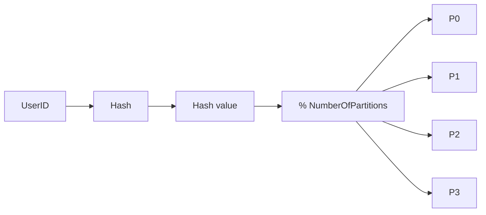

**Distribution with three partitions:**

```text
NumberOfPartitions = 3
Formula: Partition = UserID % 3

UserID | Partition
100    | P1
101    | P2
102    | P0
103    | P1
104    | P2
105    | P0

P0: 102, 105
P1: 100, 103
P2: 101, 104
```

**Insert:** `UserID = 125` → `125 % 3 = 2` → store in P2.

**Lookup:** `UserID = 125` → `125 % 3 = 2` → read P2 only.

**How to calculate:**

```text
Given: UserID = 12,345, partition key formula = UserID % 8
       Cluster has 8 hash partitions (P0–P7)

Step 1 — compute partition index:
  12,345 % 8 = 1  →  route to P1

Step 2 — verify distribution (sample of 8 consecutive IDs):
  12,344 % 8 = 0,  12,345 % 8 = 1,  …  12,351 % 8 = 7
  One ID per partition in any block of 8 consecutive IDs

Step 3 — resharding cost if N changes 8 → 10:
  Keys that remap ≈ (1 − 1/10) of all keys ≈ 90% move (naive modulo)

Result: UserID 12,345 lives on P1; changing N without consistent hashing
        forces ~90% key migration

Sanity check: hash(UserID) % N spreads storage; it does not spread traffic
  on a single viral UserID — hot keys stay hot on one partition
```

---

### Pitfalls and design tips

- **Changing N is painful** — `hash(key) % 4` vs `% 5` reassigns most keys; use consistent hashing (5.8) or directory routing when elasticity matters.
- **No range locality** — `WHERE user_id BETWEEN 1000 AND 2000` fans out to every partition; use range partitioning (5.4) if range scans dominate.
- **Related rows scatter** — two keys that "belong together" land on different partitions unless you design a composite or shared partition key.
- **Modulo on raw IDs** — sequential IDs modulo N can still be even enough for storage, but celebrity keys create hot partitions regardless of hash balance.
- **Production default** — MurmurHash or similar on a string shard key, not bare `%` on auto-increment IDs, when you need stable distribution across string identifiers.

---


## 5.4 Range Partitioning

### Overview

Think of filing cabinets labeled by month: January's papers go in drawer one, February's in drawer two. **Range partitioning** divides data by contiguous value ranges on a partition key — you know exactly which drawer holds a record by checking which range its key falls into.

Technically, each partition owns a half-open or closed interval of key values (e.g. UserID 1–1000 on P1). Range queries that align with the key hit one or few partitions; unlike hash partitioning, data location is human-readable and ordered.

---

### What problem it fixes

Monolithic tables with time-ordered or ID-ordered access patterns benefit from splitting along natural boundaries:

```text
P1  →  Jan orders
P2  →  Feb orders
P3  →  Mar orders
```

Retention ("drop partitions older than 90 days"), archival, and range scans become cheap when each range maps to one partition.

---

### What it does

Partition rules define intervals; each record routes to the partition whose range contains its key.

```text
P1  :  UserID 1 – 1000
P2  :  UserID 1001 – 2000
P3  :  UserID 2001 – 3000

UserID = 750   →  P1
UserID = 1450  →  P2
UserID = 2800  →  P3
```

---

### How it works — the architecture inside

```text
UserID space: 1 ---------------------------------- 3000

|------P1------|------P2------|------P3------|
1            1000          2000          3000
```

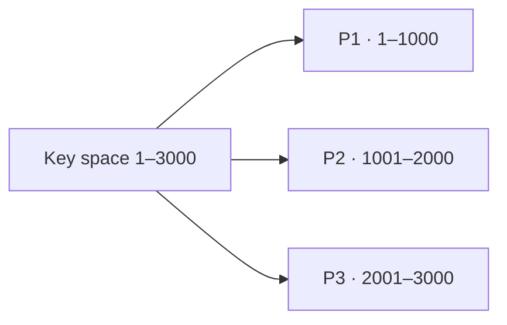

**Smaller example:**

```text
P1  :  1 – 100
P2  :  101 – 200
P3  :  201 – 300

UserID | Partition
50     | P1
120    | P2
250    | P3
```

**Range queries:**

```text
Query 120–180  →  only P2
Query 50–250   →  P1, P2, and P3
```

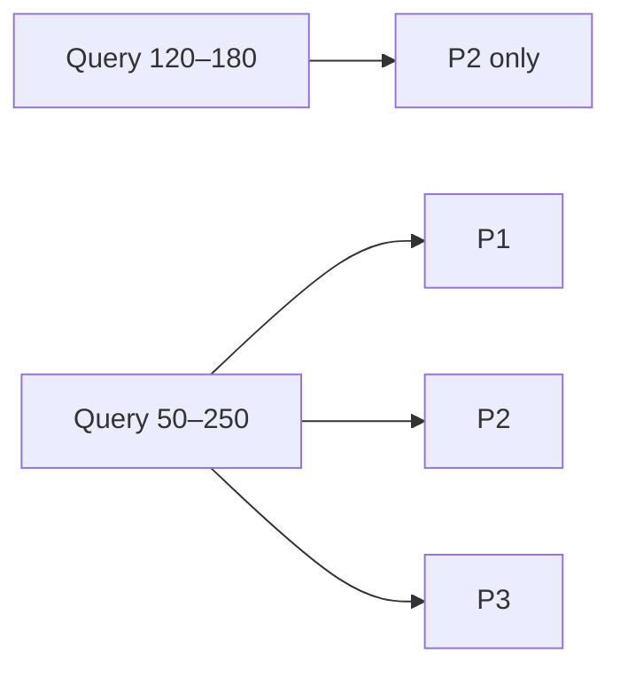

**Common range keys:**

| Key | Example ranges |
|-----|----------------|
| **UserID** | P1 → 1–1000, P2 → 1001–2000 |
| **OrderID** | P1 → 1–50000, P2 → 50001–100000 |
| **Date** | P1 → January, P2 → February |
| **Age** | P1 → 0–18, P2 → 19–40 |

**How to calculate:**

```text
Given: 3 million orders, UserID range 1–3,000,000
       Range partitions: P1 = 1–1,000,000, P2 = 1,000,001–2,000,000,
                         P3 = 2,000,001–3,000,000
       Query: SELECT * WHERE UserID BETWEEN 1,200,000 AND 1,500,000

Step 1 — identify overlapping partitions:
  Range 1.2M–1.5M lies entirely inside P2 (1,000,001–2,000,000)

Step 2 — partitions scanned:
  1 partition (P2 only), not all 3

Step 3 — expected rows if uniform:
  3M / 3 = ~1M rows in P2; query range = 300,000 IDs → ~300,000 rows

Result: single-partition range scan on P2 (~300K rows)

Sanity check: query 50–2,500,000 would hit all 3 partitions — wide ranges
  erase the pruning benefit of range partitioning
```

---

### Pitfalls and design tips

- **Hot trailing edge** — the newest range (latest month, highest IDs) often absorbs most writes; split ranges or combine with hashing for the hot band.
- **Boundary management** — poorly chosen cut points leave one partition 10× larger than others; monitor size and split proactively.
- **Rebalancing** — moving range boundaries requires data migration; plan split operations during low traffic.
- **vs hash** — choose range when ordered scans, TTL by time, or predictable pruning matter; choose hash when even spread matters more than locality.
- **Time-series default** — partition by day or hour on `timestamp` for append-heavy metrics and logs; drop old partitions instead of deleting rows.

---

### Real-world example

**PostgreSQL declarative partitioning** lets you define a parent table and child tables per range (e.g. `orders_2024_01`, `orders_2024_02`). Inserts route to the child whose `CHECK` constraint matches the order date; a query `WHERE order_date BETWEEN '2024-01-01' AND '2024-01-31'` scans only January's child via partition pruning.

---


## 5.5 Geo Partitioning

### Overview

A global company opens regional offices so Mumbai staff file Mumbai paperwork locally instead of shipping every form to headquarters. **Geo partitioning** stores data in the region it belongs to — India users on India infrastructure, US users on US infrastructure — so reads and compliance stay close to home.

Technically, this is **list-based** or **geographic** partitioning: the partition key is a geographic attribute (`Country`, `Region`, `State`, `City`), and all rows for that value route to the same partition or shard.

---

### What problem it fixes

Global applications face latency and regulation:

- Users far from a single central database see high round-trip times
- Data residency laws may require citizen data to stay in-country
- Regional outages should not take down unrelated regions

Geo grouping keeps regional traffic regional and simplifies per-jurisdiction retention and legal holds.

---

### What it does

The geographic attribute on each record determines placement:

```text
+--------+---------+
| UserID | Country |
+--------+---------+
| 101    | India   |  →  India partition
| 202    | USA     |  →  USA partition
```

Partitions are predefined lists of regions, not computed ranges or hashes.

---

### How it works — the architecture inside

```text
P1  →  India
P2  →  USA
P3  →  Europe

P1 (India):   101, 102
P2 (USA):     201, 202
P3 (Europe):  301, 302
```

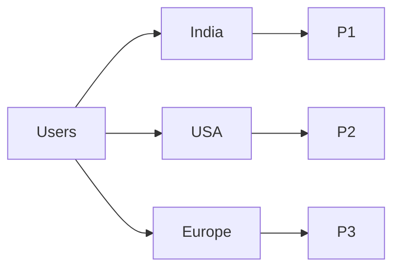

**Retrieval:** `UserID = 601, Country = USA` → identify USA → read USA partition only.

**Partitioning levels:**

| Level | Examples |
|-------|----------|
| **Country** | India, USA, UK, Germany |
| **Region** | Asia, Europe, North America |
| **State** | Karnataka, Maharashtra |
| **City** | Bengaluru, Mumbai |

---

### Pitfalls and design tips

- **Population skew** — one country may hold 80% of users; India partition becomes hot (5.6). Sub-partition large regions (India-North / India-South).
- **User relocation** — a user moving countries may require cross-partition migration; design account region as sticky or allow explicit transfer workflows.
- **Multi-region queries** — global analytics must fan out to every geo partition; use a separate OLAP pipeline for cross-region reporting.
- **Not a latency cure alone** — geo partition helps only if the app routes to the regional endpoint; DNS and API gateways must align with partition map.
- **Compliance** — pair geo partitioning with encryption keys and backup policies per region; placement alone does not satisfy GDPR without access controls.

---

### Real-world example

**Azure Cosmos DB** multi-region accounts can pin a partition key range to a preferred region. A document with `tenantRegion = "EU"` is written and replicated according to the account's regional topology — keeping EU tenant data in EU datacenters for residency while still offering multi-region read availability within policy.

---


## 5.6 Hot Partitions

### Overview

Ten checkout lanes are useless if nine stand empty and one has a mile-long queue. A **hot partition** is that overcrowded lane — one slice of your data absorbs most traffic or storage while siblings sit idle.

Technically, a hot partition receives disproportionate read/write QPS or holds far more data than peers. It becomes a **bottleneck** even though the system is "distributed." Hot partitions arise from skewed keys, skewed access patterns, or poor strategy choice — not from having too few machines alone.

---

### What problem it fixes

Distributed systems only scale when work spreads evenly. Hot partitions cause:

- Uneven CPU, memory, and disk utilization
- Higher latency on the overloaded node
- Risk of throttling or failure while other nodes have spare capacity

Identifying and mitigating hot partitions restores the benefit of sharding and partitioning.

---

### What it does

Hot partitions are a **failure mode to detect and correct**, not a feature. Symptoms include one partition at 80–90% of traffic, elevated p99 latency on one shard, or one Cassandra partition growing without bound.

**Hot data vs hot partition:**

| Concept | Scope | Example |
|---------|-------|---------|
| **Hot data** | Specific record(s) | UserID 100 — celebrity account |
| **Hot partition** | Entire shard/slice | India partition — 85% of requests |

---

### How it works — the architecture inside

**Skewed traffic:**

```text
Partitions: P1, P2, P3

Traffic:  P1 → 80%   P2 → 10%   P3 → 10%
Result:   P1 is hot
```

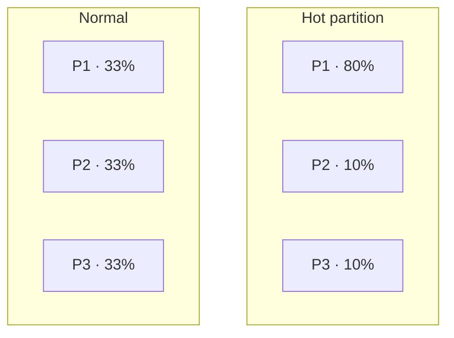

**Range partitioning — active users cluster in low IDs:**

```text
P1 → UserID 1–1000   (90% of traffic)
P2 → UserID 1001–2000
P3 → UserID 2001–3000
```

**Geo partitioning — dominant region:**

```text
India → 85% traffic   USA → 10%   Europe → 5%
```

**Social feed — celebrity partition:**

```text
P1 → Celebrity posts   (millions of reads)
P2, P3 → Regular users
```

**Effects:** slower responses, resource exhaustion, reduced overall efficiency — the system scales on paper but not in practice.

**How to calculate:**

```text
Given: 3 partitions, traffic split P1 = 80%, P2 = 10%, P3 = 10%
       Fleet capacity if perfectly balanced = 9,000 QPS total
       Each partition max = 3,000 QPS

Step 1 — actual traffic per partition:
  P1 = 9,000 × 0.80 = 7,200 QPS  (exceeds 3,000 cap → hot)
  P2 = 900 QPS,  P3 = 900 QPS     (underutilized)

Step 2 — effective fleet throughput (bottleneck):
  P1 throttles at 3,000 QPS; P2 + P3 serve 1,800 QPS
  Usable fleet ≈ 3,000 + 900 + 900 = 4,800 QPS (53% of nominal 9,000)

Step 3 — skew ratio:
  P1 carries 7,200 / 3,000 = 2.4× its fair share (240% of target)

Result: hot partition caps fleet at ~4,800 QPS despite 9,000 QPS nominal

Sanity check: adding a 4th partition without fixing skew does not help if
  80% of keys still route to the same hot key or range
```

---

### Pitfalls and design tips

- **Mitigations** — split hot ranges, add read replicas for hot shards, cache hot keys at the edge, or introduce a sub-key (e.g. `celebrity_id + bucket`) to spread writes.
- **DynamoDB / Cassandra** — watch for partitions exceeding ~10 GB or 3,000 RCU; redesign partition key before AWS throttles you.
- **Do not blame hash alone** — hash balances **keys**, not **traffic**; a viral post on one key stays hot on one partition.
- **Monitoring** — alert on per-partition QPS and size variance; mean cluster utilization hides hot spots.
- **Interview angle** — always mention hot partitions when proposing range or geo sharding; propose composite keys or hybrid strategies.

---


## 5.7 Rebalancing

### Overview

Over time, one filing cabinet overflows while others stay half empty. **Rebalancing** is the deliberate job of moving folders between cabinets until each holds a fair share — both in gigabytes and in daily foot traffic.

Technically, rebalancing redistributes data across partitions or shards when storage or load becomes uneven, or when nodes are added or removed. The goal is balanced data **and** balanced traffic without unnecessary downtime.

---

### What problem it fixes

Partitions drift out of balance as data grows and access patterns shift:

```text
Before:  P1 → 70 GB   P2 → 20 GB   P3 → 10 GB
```

Uneven storage leads to hot partitions, wasted capacity on small nodes, and risk that the largest node fails first. Rebalancing corrects the skew.

---

### What it does

Rebalancing:

1. Identifies overloaded or underloaded partitions
2. Selects data to move
3. Copies records to target partitions
4. Updates routing metadata
5. Resumes normal traffic

Triggers include size imbalance, traffic imbalance, adding a shard, removing a shard, or hitting storage limits.

---

### How it works — the architecture inside

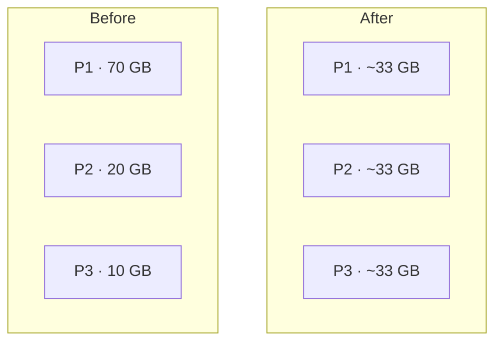

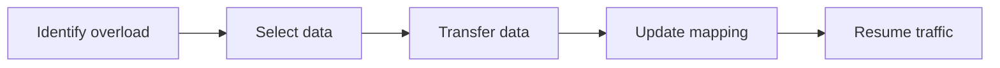

**Adding shard P4:**

```text
Before:  P1 → 33%   P2 → 33%   P3 → 34%   P4 → 0%
After:   P1 → 25%   P2 → 25%   P3 → 25%   P4 → 25%
```

**Removing P4:** data on P4 redistributes to P1, P2, P3.

**User-level example:**

```text
Before:  P1: users 1–6 (75%)   P2: user 7   P3: user 8
After:   P1: 1,2,3   P2: 4,5,7   P3: 6,8
```

**Geo split when India overloads:**

```text
Before:  India → 80M users (one partition)
After:   India-North, India-South, USA, Europe
```

**Workload effect:**

```text
Before:  P1 → 80% traffic
After:   P1 → 34%   P2 → 33%   P3 → 33%
```

Naive `hash % N` reshuffling moves most keys when N changes — consistent hashing (5.8) limits migration to keys near the changed ring position.

**How to calculate:**

```text
Given: Total data = 90 GB across 3 partitions (P1 = 70 GB, P2 = 20 GB, P3 = 10 GB)
       Target: ≤ 35 GB per partition after rebalance

Step 1 — data to move from P1:
  Excess = 70 − 35 = 35 GB must leave P1

Step 2 — redistribution plan:
  Move 15 GB P1 → P2  (P2: 20 + 15 = 35 GB)
  Move 20 GB P1 → P3  (P3: 10 + 20 = 30 GB)
  P1 after: 70 − 35 = 35 GB

Step 3 — migration time at 500 MB/s network:
  35 GB / 500 MB/s ≈ 70 s minimum (plus routing cutover)

Result: ~35 GB transferred; all three partitions within target band

Sanity check: rebalance during peak doubles I/O on source and target —
  throttle to 10–20% of link capacity in production
```

---

### Pitfalls and design tips

- **Migration cost** — large transfers saturate network and I/O; throttle background moves and use dual-write or read-from-both during cutover.
- **Metadata consistency** — clients must not route to old owners mid-move; use versioned routing tables or centralized coordinators (etcd, ZooKeeper).
- **Timing** — rebalance during low traffic; feature-flag progressive rollout per key range.
- **Elasticity planning** — if you expect frequent node add/remove, adopt consistent hashing + virtual nodes from the start.
- **Cassandra / Kafka** — both have built-in rebalance concepts (token moves, partition reassignment); understand their progress APIs before production cluster resize.

---


## 5.8 Consistent Hashing

### Overview

Adding a new shelf to a library should not require relocating every book — only the ones near that shelf. **Consistent hashing** maps both servers and data keys onto a ring so when you add or remove a server, only keys near that change move, not the entire collection.

Technically, consistent hashing places partitions and keys on a logical **hash ring** (0 to max hash, wrapping). Each key is stored on the first partition encountered moving clockwise from the key's position. Adding or removing a partition reassigns only the arc between its neighbors.

---

### What problem it fixes

Traditional modulo hashing reshuffles almost everything when partition count changes:

```text
Partition = Hash(Key) % N

N = 3:  Hash(100) % 3 = P1
N = 4:  Hash(100) % 4 = P0   ← same key, new home
```

Most records must migrate — expensive and risky during scaling. Consistent hashing bounds migration to keys in the affected arc (~1/N of data when adding one of N nodes, in the uniform case).

---

### What it does

- Hash each partition to a point on the ring
- Hash each key to a point on the ring
- Assign key → first partition clockwise (wraps at max value)
- On add/remove, only keys between changed neighbors move

---

### How it works — the architecture inside

**Ring placement:**

```text
P1 (20)   P2 (50)   P3 (80)

Key A → 10   → clockwise → P1 (20)
Key B → 35   → clockwise → P2 (50)
Key C → 65   → clockwise → P3 (80)
Key D → 90   → wrap → P1 (20)
```

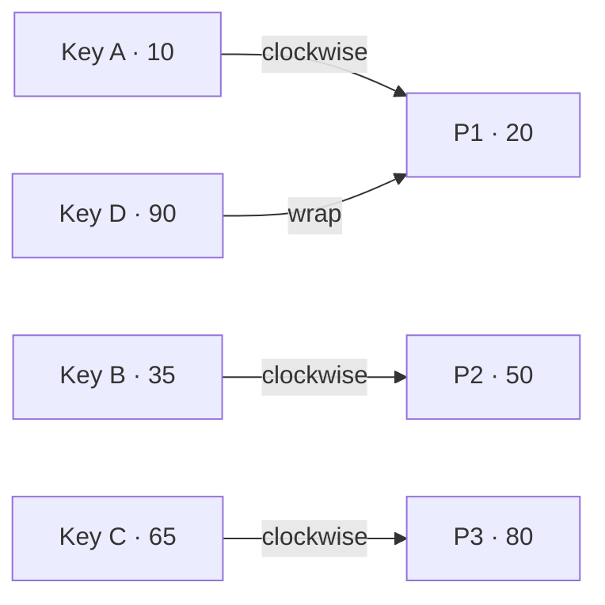

**Assignment rule:** key at position 40 on ring with P1=20, P2=50 → move clockwise to 50 → **P2**.

**Add P4 at 65:**

```text
Before:  P1 ---- P2 ----------- P3
After:   P1 ---- P2 ---- P4 ---- P3
```

Only keys between P2 and P4 move (e.g. K3 at 60 moves from P3 to P4).

**Remove P2:** P2's keys move to the next partition clockwise (P3); other keys unchanged.

**Walkthrough:**

```text
K1 → 10 → P1    K2 → 35 → P2    K3 → 60 → P3    K4 → 90 → P1
Add P4(65):  only K3 → P4 moves
```

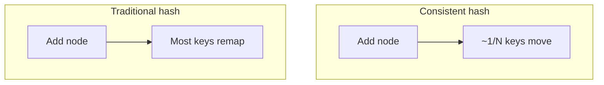

**How to calculate:**

```text
Given: 1 billion keys, N = 4 nodes on the ring (uniform key distribution)
       Add 5th node P5 to the cluster

Step 1 — keys moved with consistent hashing (uniform arcs):
  Fraction migrating ≈ 1 / (N + 1) = 1/5 = 20%
  Keys moved ≈ 1B × 0.20 = 200 million keys

Step 2 — compare to naive modulo (N = 4 → 5):
  Fraction remapping ≈ 1 − 1/5 = 80%
  Keys moved ≈ 1B × 0.80 = 800 million keys

Step 3 — migration time (200M keys, 1 KB each, 500 MB/s link):
  Data ≈ 200 GB; time ≈ 200 GB / 500 MB/s ≈ 400 s (~6.7 min) data copy only

Result: consistent hash moves ~200M keys; naive hash moves ~800M keys

Sanity check: without vnodes, arc lengths are uneven — actual migration may
  differ from 20%; add vnodes (5.9) before trusting uniform math
```

---

### Pitfalls and design tips

- **Uneven arcs** — random server positions leave uneven segments; use virtual nodes (5.9).
- **Ring state** — all clients and proxies need the same ring view; gossip or a config service publishes membership changes.
- **Hot spots remain** — consistent hashing balances **ownership**, not **access**; viral keys still need caching.
- **Where it appears** — Dynamo-style databases, memcached client rings, Cassandra token ranges, CDN edge selection.
- **vs rendezvous hashing (5.10)** — rings minimize state and migration; HRW avoids ring management at the cost of O(servers) hashes per lookup.

---

### Real-world example

**Amazon Dynamo** (2007 paper) introduced consistent hashing for peer-to-peer storage nodes. When a node joins, it claims a token range on the ring; only keys in that range migrate from the successor node. DynamoDB's partition model evolved from this lineage — elastic scale without full-table reshuffles on every node change.

---


## 5.9 Virtual Nodes

### Overview

One person guarding half the museum floor is unfair if two others split the other half. **Virtual nodes (vnodes)** give each physical server several ticket booths spaced around the hash ring so no machine owns one giant slice while others guard slivers.

Technically, a vnode is a logical placement of a physical server on the consistent hash ring. Instead of one hash point per machine, each server registers many points (e.g. S1-A, S1-B, S1-C), smoothing arc lengths and improving load balance when using consistent hashing (5.8).

---

### What problem it fixes

Single-point ring placement skews ownership:

```text
Ring:  P1(10)   P2(30)   P3(90)

P1 owns ~20%   P2 owns ~20%   P3 owns ~60%
```

P3 becomes a hot partition. Virtual nodes split each physical server's responsibility into many smaller arcs that interleave around the ring.

---

### What it does

- Map each physical server to `V` virtual positions on the ring (often `hash(server_id + i)`)
- Assign keys to the first vnode clockwise; vnode maps back to physical host
- On add/remove of a server, only vnodes for that server change; migration stays localized

---

### How it works — the architecture inside

**Without vnodes:**

```text
0 ------------------------------------------ 100
P1       P2                          P3
```

**With vnodes:**

```text
0 ------------------------------------------ 100
P1A  P2A  P3A  P1B  P2B  P3B  P1C  P2C  P3C
```

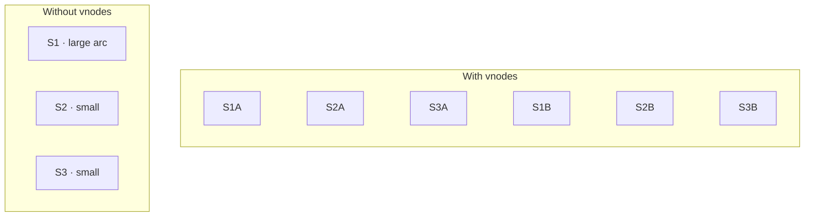

**Assignment:** key at 35, ring `P1A(10) P2A(25) P3A(40) ...` → clockwise to 40 → **P3A** → physical server P3.

**Load comparison:**

```text
Without vnodes:  S1 → 15%   S2 → 25%   S3 → 60%
With vnodes:     S1 → 33%   S2 → 34%   S3 → 33%
```

**Add S4:** insert S4A, S4B, S4C; only keys near new vnodes move.

**Remove S2:** drop S2A, S2B, S2C; their keys reassign to next clockwise vnode.

**How to calculate:**

```text
Given: 3 physical servers, V = 256 vnodes per server
       Total vnodes on ring = 3 × 256 = 768
       Target load per server = 33.3% ± 5%

Step 1 — expected keys per physical server (uniform):
  Each server owns 256/768 ≈ 33.3% of keyspace

Step 2 — skew without vnodes (example from section):
  S1 = 15%, S2 = 25%, S3 = 60% → max/min ratio = 60/15 = 4×

Step 3 — skew with 256 vnodes per server:
  Expected spread ≈ 33% ± 3–5% (law of large numbers on arc count)

Step 4 — add 4th server (256 new vnodes):
  Keys migrating ≈ 256 / (768 + 256) = 256/1024 = 25% of keyspace

Result: vnodes cut skew from 4× to ~1.1×; adding 4th node moves ~25% of keys

Sanity check: V = 8 vnodes is too few — skew remains visible; V = 256 is
  Cassandra's default for a reason; V = 10,000 adds metadata overhead
```

---

### Pitfalls and design tips

- **Vnode count** — too few vnodes leave skew; too many increase metadata and lookup cost. Cassandra often uses 256 vnodes per node; memcached clients use 40–160 per host as a starting range.
- **Unequal hardware** — assign more vnodes to larger machines to weight capacity.
- **Rebalance churn** — adding a node with many vnodes triggers multiple small moves; throttle to protect production traffic.
- **State size** — every client may cache the full vnode list; prefer centralized routing for very large clusters.
- **Interview tip** — "consistent hashing + vnodes" is the standard answer for elastic cache and storage rings.

---

### Real-world example

**Apache Cassandra** switched from one token per node to vnodes (default 256 per node). Each vnode owns a slice of the ring; `nodetool status` shows token ranges per vnode. Adding a node distributes many small ranges instead of one contiguous chunk, speeding bootstrap and balancing disk use across the cluster.

---


## 5.10 Rendezvous Hashing

### Overview

Instead of walking a circular hallway to find the right office, imagine every candidate office scores a bid for your package and the highest bid wins. **Rendezvous hashing** (highest random weight hashing — **HRW**) picks the owning server per key by hashing the key together with each server name and choosing the maximum score.

Technically, for key `K` and servers `S1…Sn`, compute `score = Hash(K + Si)` for each server; the server with the highest score owns `K`. No hash ring, no virtual nodes — and when servers are added or removed, only keys whose winner changes migrate.

---

### What problem it fixes

Distributed caches and storage layers need:

- Even key distribution across servers
- Minimal data movement on topology change
- Simple mental model without ring maintenance

HRW delivers consistent-hashing-like migration properties without ring state, at the cost of more hash evaluations per lookup.

---

### What it does

For every key:

1. Combine key + each server identifier
2. Hash to a score
3. Assign to the server with the highest score

Adding S4: recompute scores; only keys where S4 wins move to S4. Removing S2: only keys that previously won on S2 pick a new winner.

---

### How it works — the algorithm inside

```text
Servers: S1, S2, S3
Key: User123

Hash(User123 + S1) = 150
Hash(User123 + S2) = 420
Hash(User123 + S3) = 310

Highest → 420 → User123 stored on S2
```

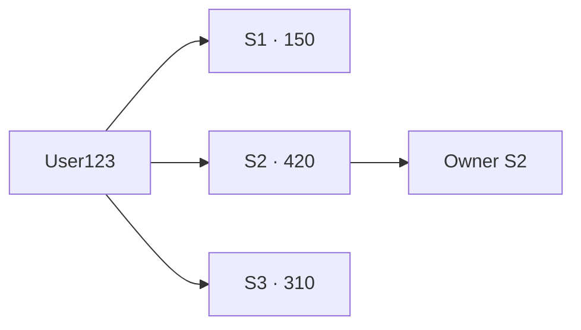

**Another key:**

```text
Order789:  S1 → 550   S2 → 120   S3 → 470   →  Owner S1
```

**Add S4 to User123:**

```text
Before:  S2 wins (420)
After:   S4 → 500   →  new owner S4 (only this key moves)
```

**Remove S2:**

```text
Before:  S2 → 700 (owner)
After:   S3 → 500 wins among remaining
```

| | Consistent hashing | Rendezvous hashing |
|---|-------------------|-------------------|
| Structure | Hash ring | No ring |
| Lookup | Clockwise successor | Max score over all servers |
| Balance aid | Virtual nodes | Built-in spread |
| Lookup cost | O(log N) with tree | O(N) hash per server |

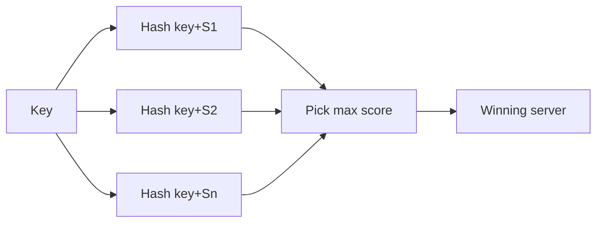

**How to calculate:**

```text
Given: 3 servers (S1, S2, S3), 1 million keys, add server S4

Step 1 — probability a random key's winner changes when adding S4:
  Under HRW, key moves only if Hash(K+S4) > max(Hash(K+S1), Hash(K+S2), Hash(K+S3))
  For uniform hash scores, P(move) ≈ 1 / (n + 1) where n = old server count
  P(move) ≈ 1/4 = 25%

Step 2 — keys that migrate:
  1M × 0.25 = 250,000 keys

Step 3 — lookup cost per read:
  3 servers → 3 hashes; after add → 4 hashes (O(N) per key lookup)

Result: ~250K keys move to S4; each lookup evaluates 4 hash scores

Sanity check: same ~1/(N+1) migration order as consistent hashing, but
  HRW's O(N) lookup makes it best for small N (tens), not thousands
```

---

### Pitfalls and design tips

- **O(N) per lookup** — acceptable for tens of servers; for thousands, use ring hashing or hierarchical HRW.
- **Stable hash required** — use a fixed hash (Murmur3, SHA-256 truncated) so scores do not jump on process restart.
- **Weighted servers** — multiply score by weight or duplicate server IDs in the candidate list for heterogeneous capacity.
- **Use cases** — CDN origin pickers, distributed cache clients, gateway routing when N is small and simplicity beats ring ops.
- **Not for Dynamo-scale nodes** — prefer consistent hashing + vnodes when membership changes constantly and N is large.

---


## 5.11 Replication

### Overview

Keeping one copy of important documents in a single drawer is risky — fire, theft, or a spilled coffee ends everything. **Replication** stores identical copies of data on multiple servers so one failure does not erase availability.

Technically, each copy is a **replica**. A **primary** (leader) often accepts writes and propagates changes; **replicas** serve reads and stand by for failover. **Replication factor (RF)** counts how many copies exist. Replication combines with sharding — each shard has its own replica set.

---

### What problem it fixes

Single-server storage is a single point of failure:

```text
Without replication:  Server-1 fails → data unavailable
With replication:     S1 fails → S2, S3 still serve data
```

Replication improves **availability**, **fault tolerance**, and **read scalability** at the cost of storage, sync complexity, and consistency trade-offs.

---

### What it does

| Concept | Role |
|---------|------|
| **Primary / leader** | Main writable copy; source of truth for writes |
| **Replica / follower** | Duplicate copy; read scaling and failover |
| **Replication factor (RF)** | Number of copies per piece of data |
| **Sync replication** | Ack after replicas confirm — stronger durability, higher latency |
| **Async replication** | Ack after primary only — faster, risk of stale reads |

**Replication modes:**

| Mode | Writes |
|------|--------|
| **Single-primary (leader–follower)** | One leader — see 5.12 |
| **Multi-primary** | Multiple leaders — see 5.13 |
| **Peer-to-peer** | Any node may coordinate |

**RF examples:**

```text
RF = 1  →  one copy
RF = 3  →  three copies on Server-A, B, C
```

---

### How it works — the architecture inside

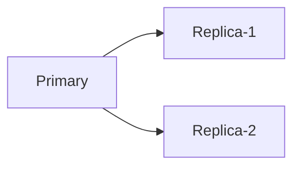

**Write path:**

```text
Client → Primary updates → propagate → Replica-1, Replica-2 updated
```

**Read path** — clients may read primary or any replica:

```text
Client-1 → Replica-1
Client-2 → Replica-2
Client-3 → Primary
```

**Sharding + replication:**

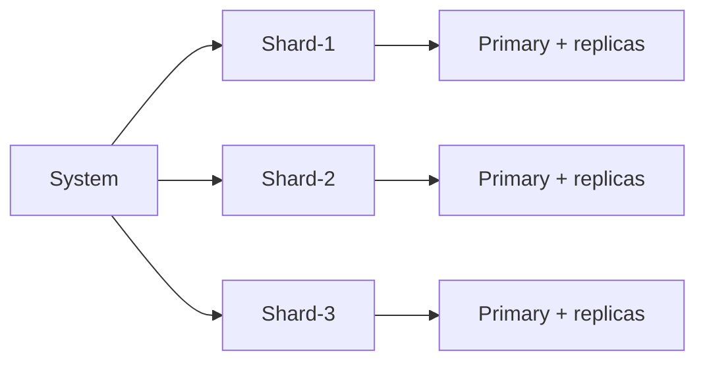

**Failure with RF = 3:** S1 dies → S2 and S3 still hold data → service continues (after failover or quorum reads).

Quorum tuning for reads and writes: 5.14 and 5.15.

**How to calculate:**

```text
Given: Primary data = 500 GB, replication factor RF = 3
       Async replication, peak write rate = 10,000 rows/s
       Average row = 2 KB, replication lag target < 5 s

Step 1 — total physical storage:
  500 GB × RF = 1,500 GB across all replicas

Step 2 — write fan-out per primary write:
  1 primary + (RF − 1) replica updates = 2 network copies per row (RF=3)

Step 3 — replication throughput needed at peak:
  10,000 rows/s × 2 KB = 20 MB/s outbound from primary

Step 4 — lag bound (replica apply rate must keep up):
  If replica applies 25 MB/s > 20 MB/s → lag stable
  If replica applies 10 MB/s < 20 MB/s → lag grows 10 MB/s net
  Lag after 5 s deficit ≈ (20 − 10) × 5 = 50 MB unapplied (~25,000 rows)

Result: RF=3 → 1.5 TB total; 20 MB/s replication stream; need apply rate
        ≥ ingest rate to keep lag under 5 s

Sanity check: sync replication adds RTT to every commit — RF=3 with sync
  acks from 2 replicas is durability win, not a lag-free async setup
```

---

### Pitfalls and design tips

- **Replication ≠ backup** — replicas replay live writes; deleted data deletes on replicas too. Keep separate backups and PITR.
- **Lag** — async replicas serve stale reads; use quorum reads or read-from-leader when freshness matters.
- **Split brain** — two primaries without fencing cause divergent writes; use consensus or STONITH before promoting a replica.
- **RF and cost** — RF=3 triples storage and write fan-out; RF=2 is common for non-critical caches.
- **Default** — leader–follower with async replication to local replicas; sync only for financial or inventory critical paths.

---

### Real-world example

**PostgreSQL streaming replication** ships WAL records from primary to standbys. A read replica applies WAL asynchronously; `synchronous_standby_names` can require one standby to ACK before commit returns. On primary failure, `pg_promote` on a standby becomes the new primary — classic leader–follower replication in production.

---


## 5.12 Leader Follower Replication

### Overview

One editor holds the master manuscript; assistants make copies and distribute them to branch offices for reading. Only the editor applies corrections — that is **leader–follower replication**: one **leader** takes all writes; **followers** copy the leader and serve reads.

Technically, the leader is the source of truth for writes. Followers receive a replication stream (binlog, WAL, oplog) and apply changes in order. Reads scale across followers; writes stay serialized through the leader. Failover promotes a follower when the leader dies.

---

### What problem it fixes

A single database handles limited write throughput and is a single failure domain. Leader–follower replication provides:

- Multiple read paths (followers)
- Hot standby for disaster recovery
- Clear write ordering (no multi-leader conflicts)

---

### What it does

| Component | Role |
|-----------|------|
| **Leader** | Processes all writes |
| **Follower** | Read-only copy; may become leader |
| **Client** | Sends writes to leader; reads to leader or followers |

**Synchronous vs asynchronous** (from 5.11): sync waits for follower ACK; async returns after leader commit — followers may lag.

---

### How it works — the architecture inside

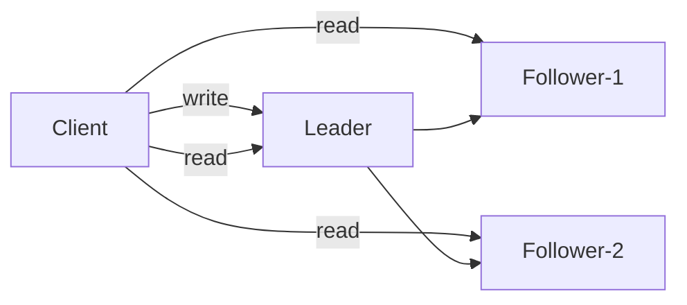

**Write:** `UserID = 101, Name = Alice` → client → leader updated → followers updated.

**Read:** any node can serve; followers may return stale data if replication lags.

**Replication lag example:**

```text
Leader:    Name = Alice
Follower:  Name = Alex   ← not yet applied
```

**Failover:**

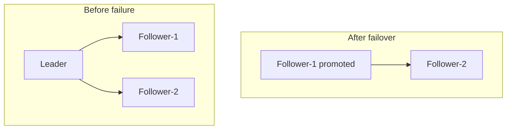

Leader fails → cluster elects or promotes a follower → clients redirect writes to new leader.

**How to calculate:**

```text
Given: Async replication, leader write rate = 5,000 TPS
       Follower apply rate = 4,500 TPS (10% slower than leader)
       Initial lag = 0 at t = 0

Step 1 — lag growth rate:
  d(lag)/dt = 5,000 − 4,500 = 500 transactions/s

Step 2 — lag after 60 s:
  Lag = 500 × 60 = 30,000 transactions behind

Step 3 — stale read window:
  Reader on follower may miss last 30,000 writes (~6 s of leader traffic)

Step 4 — RPO on leader crash (async):
  Unreplicated writes ≈ current lag = 30,000 txns at crash instant

Result: ~30K txns (~6 s) stale/RPO exposure unless reads route to leader

Sanity check: sync replica cuts RPO to ~0 but adds one RTT per commit;
  route "read your writes" sessions to leader or track replication LSN
```

---

### Pitfalls and design tips

- **Leader write bottleneck** — all writes hit one node; shard before chasing multi-leader complexity.
- **Stale reads** — route session-sensitive reads to leader or use "read your writes" token tracking.
- **Failover data loss** — async replication may lose last seconds of writes on leader death; measure RPO before auto-promote.
- **Thundering herd** — after failover, cold follower caches spike load; warm standbys and connection pooling help.
- **MySQL / Postgres / MongoDB** — all ship leader–follower; know your vendor's promotion tool (`repmgr`, Orchestrator, Replica Set election).

---

### Real-world example

**MongoDB replica sets** elect a primary from secondaries. Drivers default writes to the primary; `readPreference=secondary` sends analytics to secondaries. On primary loss, an election promotes the most caught-up secondary — leader–follower with automatic failover in under ~30 seconds for typical deployments.

---


## 5.13 Multi Leader Replication

### Overview

What if every branch office could edit the catalog locally and sync changes overnight? **Multi-leader replication** lets multiple servers accept writes, each acting as a leader that replicates to the others — great for geographic distribution, dangerous when two offices edit the same line differently.

Technically, writes are not restricted to one node. Each leader propagates changes to peer leaders and their followers. Conflicts arise when two leaders update the same row concurrently — the system must detect and resolve them (last-write-wins, vector clocks, application merge).

---

### What problem it fixes

A single leader in one region forces every global write across an ocean:

- Write latency for distant users
- Leader as write throughput ceiling
- Regional outage may block writes worldwide

Multi-leader places writable nodes in each region so local writes stay local.

---

### What it does

```text
          Leader-A <-------> Leader-B
               \               /
                \             /
                 Leader-C
```

- Any leader accepts reads and writes
- Leaders replicate to each other
- Remaining leaders continue if one fails
- Conflict resolution is mandatory

---

### How it works — the architecture inside

```mermaid
flowchart LR
    C[Clients] --> LA[Leader-A]
    C --> LB[Leader-B]
    C --> LC[Leader-C]
    LA <-->|replicate| LB
    LB <-->|replicate| LC
    LA <-->|replicate| LC
```

**Write to Leader-A:** `UserID = 101, Name = Alice` → A updates → replicates to B and C.

**Write to Leader-B:** `UserID = 202, Name = Bob` → B updates → replicates to A and C.

**Conflict:**

```text
Initial:  UserID = 101, Name = John
Leader-A: Name = Alice   (concurrent)
Leader-B: Name = Alex

After sync without merge: divergent or one value wins via policy
```

```mermaid
flowchart LR
    C1[Client-1] --> LA[Leader-A · Alice]
    C2[Client-2] --> LB[Leader-B · Alex]
    LA --> Conflict[Replication conflict]
    LB --> Conflict
```

| | Leader–follower | Multi-leader |
|---|-----------------|--------------|
| **Writes** | Leader only | Any leader |
| **Conflicts** | None (single writer) | Must resolve |
| **Latency** | Remote writers pay RTT | Local writes per region |
| **Complexity** | Lower | Higher |

**How to calculate:**

```text
Given: User in Singapore, single leader in Virginia (RTT ≈ 200 ms one-way)
       Multi-leader with writable node in Singapore (RTT ≈ 5 ms)

Step 1 — single-leader write latency (round trip to leader):
  App → Virginia leader → ack ≈ 2 × 200 ms = 400 ms per write

Step 2 — multi-leader local write:
  App → Singapore leader → ack ≈ 2 × 5 ms = 10 ms per write

Step 3 — conflict probability (rough order-of-magnitude):
  If 2 regions edit same row concurrently at 100 writes/s each:
  Collision rate depends on app; even 0.01% → 0.02 conflicts/s →
  ~1,700 conflicts/day needing merge policy

Result: multi-leader saves ~390 ms/write locally; pays conflict resolution cost

Sanity check: 400 ms write RTT is why global apps use regional leaders;
  bank ledgers still use single-leader or per-shard leaders to avoid merges
```

---

### Pitfalls and design tips

- **Conflict resolution policy** — define LWW, CRDT, or application-level merge before shipping; "we'll figure it out" fails in production.
- **Not for strongly consistent inventory** — bank balances and seat booking need single-leader or distributed transactions.
- **CouchDB / mobile sync** — multi-leader shines for offline-first apps with mergeable document state.
- **Galera / Tungsten** — MySQL multi-primary exists but needs conflict-aware schemas and careful write routing.
- **Interview** — cite geo write latency as the motivator; cite conflicts as the price.

---

### Real-world example

**CouchDB** replication is multi-master between nodes and devices. Two users edit the same document offline; on sync, CouchDB stores both revisions and flags a `_conflict` for the application to merge. The database does not silently pick a winner — conflict handling is explicit by design.

---


## 5.14 Quorum Reads

### Overview

Asking one witness about an event might get yesterday's story; asking three and trusting the majority vote gets you closer to the truth. A **quorum read** contacts multiple replicas and waits until enough agree before returning data — trading latency for a better chance of reading the latest write.

Technically, with replication factor **N** and read quorum **R**, the read completes after **R** replicas respond (often returning the highest version among them). Combined with write quorum **W** where `R + W > N`, a read quorum overlaps a write quorum on at least one replica that saw the latest write.

---

### What problem it fixes

Reading a single replica — especially a lagging follower — returns stale data:

```text
R1 → Version 7    R2 → Version 7    R3 → Version 6
```

Read only R3 → stale. Quorum reads reduce stale-read probability and tolerate unavailable replicas: with `N=3, R=2`, one dead replica still allows a read.

---

### What it does

- Broadcast read to all or a subset of replicas
- Wait until **R** responses arrive
- Return the value with the highest version (or merge per policy)
- Succeed if at least R replicas are reachable

---

### How it works — the architecture inside

```mermaid
flowchart LR
    Client[Client] --> R1[Replica-1]
    Client --> R2[Replica-2]
    Client --> R3[Replica-3]
    R1 --> Q{R responses?}
    R2 --> Q
    R3 --> Q
    Q -->|yes| Result[Return highest version]
```

**Example — N = 3, R = 2:**

```text
Client reads UserID = 101
R1 → Version 5
R2 → Version 5
R3 → Version 4  (slow)

R1 + R2 respond → quorum met → return Version 5
```

**RF = 5, R = 3:**

```text
R1, R2, R3 → Version 10 → quorum → return 10
```

**How to calculate:**

**Given:** `N = 3` replicas, desired overlap with writes using `W = 2`.

**Step 1 — quorum overlap rule:**

```text
R + W > N
R + 2 > 3
R > 1
```

**Step 2 — choose minimum R for fault tolerance:** to tolerate `F` failed replicas on read, need `R ≤ N - F` and enough live nodes: `R ≤ N - F` with at least R nodes up → `F = N - R`.

For `N = 3, R = 2`: tolerate 1 failed replica (need 2 of 3).

**Step 3 — verify overlap:** `R + W = 2 + 2 = 4 > 3` ✓ — every read quorum shares at least one node with every write quorum.

**Sanity check:** `R = 1` would allow stale reads from a single lagging replica; `R = N` is strongest but least available.

**Given:** `N = 5`, `W = 3`, find minimum R for strong overlap.

```text
R + 3 > 5  →  R > 2  →  minimum R = 3
```

With `R = 3, W = 3`: tolerate 2 failed replicas on read and on write independently.

---

### Pitfalls and design tips

- **Latency** — every read waits for the slowest of R replicas; use local-quorum or monotonic reads when strict global quorum is overkill.
- **Not linearizable alone** — quorum + LWW can still anomaly under concurrent writes; see leader leases or consensus for strict linearizability.
- **Cassandra `LOCAL_QUORUM`** — quorum within the local datacenter avoids cross-region read RTT.
- **SLA math** — if each replica has 99.9% availability, `R=2 of 3` has roughly `1 - (0.001)^2` per pair — model before picking R.
- **Interview** — always state `R + W > N` when discussing tunable consistency.

---

### Real-world example

**Apache Cassandra** reads at `QUORUM` level contact `⌊N/2⌋ + 1` replicas (for `N=3`, that's 2). A write at `QUORUM` with the same N guarantees the read sees at least one replica that participated in the write — the standard Dynamo-quorum trade-off for tunable consistency.

---


## 5.15 Quorum Writes

### Overview

You do not need every branch office to stamp a form before it counts — just enough signatures that any future audit will find a copy. A **quorum write** succeeds after **W** replicas acknowledge, not all **N**, so the system stays available when some replicas are slow or down while still leaving enough copies for safe reads.

Technically, the client or coordinator writes to all replicas but returns success after **W** ACKs. Remaining replicas catch up asynchronously. Paired with read quorum **R** where `R + W > N`, reads and writes overlap on at least one replica — the foundation of tunable consistency in Dynamo-style stores.

---

### What problem it fixes

Waiting for all **N** replicas blocks on the slowest node:

```text
N = 5, all must ACK → one slow replica delays every write
W = 3 → write completes after any 3 fast ACKs
```

Quorum writes improve **availability** and **latency** while tolerating replica failure — if `N=3, W=2` and one replica is down, writes still succeed.

---

### What it does

1. Client sends write to coordinator
2. Coordinator forwards to all N replicas
3. Replicas persist and ACK
4. Coordinator returns success when W ACKs received
5. Stragglers update eventually

---

### How it works — the architecture inside

```mermaid
flowchart LR
    Client[Client] --> R1[Replica-1]
    Client --> R2[Replica-2]
    Client --> R3[Replica-3]
    R1 --> Q{W ACKs?}
    R2 --> Q
    R3 --> Q
    Q -->|yes| OK[Success]
```

**N = 3, W = 2:**

```text
Write: UserID = 101, Name = Alice
R1 → ACK
R2 → ACK
R3 → pending

Quorum met → success returned; R3 catches up later
```

**Failure tolerance:**

```text
N = 3, W = 2, R3 down
R1 → ACK, R2 → ACK → write succeeds
```

**RF = 5, W = 3:** need any three of five ACKs.

| | All-replica write | Quorum write |
|---|-------------------|--------------|
| **Success when** | Every replica ACKs | W replicas ACK |
| **N = 5** | 5 ACKs required | e.g. 3 ACKs |

**How to calculate:**

**Given:** `N = 3`, target to survive 1 replica failure on write.

**Step 1 — minimum W:**

```text
Live replicas needed = W
Fault tolerance: W ≤ N - F
For F = 1: W ≤ 2
Choose W = 2 (minimum for 1 failure)
```

**Step 2 — pair with R for read freshness:**

```text
R + W > N
R + 2 > 3
R > 1  →  minimum R = 2
```

**Step 3 — consistency check:** with `N=3, W=2, R=2`, both quorums intersect in at least `2 + 2 - 3 = 1` replica — that replica must have the latest committed write.

**Given:** `N = 5`, want to tolerate 2 failures on write.

```text
W ≤ N - F = 5 - 2 = 3   →  W = 3
R + 3 > 5  →  R ≥ 3
```

**Sanity check:** `W = 1` returns fast but a read with `R = 1` may miss the write entirely — never use `W=1` with `R=1` when you need consistency.

**Latency estimate:** if each replica ACK takes 5 ms p50, `W=3 of 5` waits for the third-fastest — roughly the 60th percentile of replica latency, not the sum.

---

### Pitfalls and design tips

- **Hinted handoff / repair** — replicas that missed the write need anti-entropy; monitor pending write backlog.
- **W + R > N is necessary, not sufficient** — concurrent writes to the same key still need versioning (vector clocks, LWW timestamps).
- **ANY write level** — Cassandra `ONE` write is fast but unsafe with `ONE` read; match W and R to SLA.
- **Durability vs availability** — raising W increases durability exposure on ACK; lowering W increases availability risk on read.
- **Production starting point** — `N=3, W=2, R=2` for balanced AP with reasonable freshness; `LOCAL_QUORUM` in multi-DC.

---

### Real-world example

**Amazon DynamoDB** uses `W`/`R` style consistency via read/write capacity on replicated storage nodes. A strongly consistent read in DynamoDB fetches from a quorum of replicas that includes the leader for that partition, ensuring you do not read a pre-write stale value — quorum mechanics behind the "consistent read" API flag.

---

## 5.16 Distributed Transactions

### Overview

Picture a travel booking where you pay for a flight, reserve a hotel, and rent a car. If the flight charges your card but the hotel is sold out, you want the whole trip cancelled — not a charge with no room. A **distributed transaction** is that same all-or-nothing guarantee stretched across separate databases and services that do not share one machine.

Technically, a distributed transaction coordinates multiple independent participants — payment, inventory, order services each with their own store — so they reach a single outcome: **commit everywhere** or **rollback everywhere**. A coordinator drives the protocol; participants vote and apply the decision. The goal is atomicity across system boundaries, not just inside one database. **Microservices** usually implement this with sagas and transaction outbox rather than classic 2PC — see [8.9 Distributed Transactions](../08-microservices/README.md#89-distributed-transactions).

---

### What problem it fixes

A single-database transfer is simple:

```text
BEGIN
  Deduct 100 from Account-A
  Add 100 to Account-B
COMMIT
```

In microservices, one business action may touch three separate stores:

```text
Step 1: Payment deducts money     ✓
Step 2: Inventory reserve fails   ✗

Without coordination: money gone, no order — inconsistent state
```

Distributed transactions prevent **partial updates** when a logical operation spans multiple systems. The invariant is strict:

```text
COMMIT everywhere   OR   ROLLBACK everywhere

Never: Service-A commits while Service-B rolls back
```

---

### What it does

A distributed transaction wraps a multi-system operation in a single atomic unit:

| Role | Responsibility |
|------|----------------|
| **Coordinator** | Starts the transaction, collects votes, decides commit or abort, notifies participants |
| **Participant** | Executes local work, votes ready or not, applies the coordinator's final decision |

**Transaction states:**

| State | Meaning |
|-------|---------|
| **Started** | Transaction has begun |
| **Prepared** | Participant validated work and is ready to commit |
| **Committed** | Changes are permanent |
| **Aborted** | Changes are discarded |

Common protocols: two-phase commit (5.17) and three-phase commit (5.18). Consensus algorithms (Raft, Paxos) often replace classic 2PC in production metadata and configuration stores.

---

### How it works — the architecture inside

```mermaid
flowchart LR
    Client[Client] --> Txn[Coordinator]
    Txn --> Pay[Payment service]
    Txn --> Inv[Inventory service]
    Txn --> Ord[Order service]
    Pay --> DBA[(Database-A)]
    Inv --> DBB[(Database-B)]
    Ord --> DBC[(Database-C)]
```

**E-commerce purchase — price ₹1000:**

```text
Step 1: Payment deduct ₹1000
Step 2: Reserve product in inventory
Step 3: Create order record

All succeed → COMMIT across all three
Any failure  → ROLLBACK across all three
```

The coordinator does not perform business logic itself; it orchestrates votes and the final decision. Participants hold locks or write-ahead state during the prepare phase so they can commit or undo once instructed.

```mermaid
flowchart LR
    Start[Start txn] --> Prep[Prepare phase]
    Prep --> Vote{All YES?}
    Vote -->|Yes| Commit[Commit phase]
    Vote -->|No| Abort[Rollback all]
    Commit --> Done[Success]
    Abort --> Done2[No partial state]
```

**How to calculate:**

```text
Given: 3 participants (payment, inventory, order), RTT = 20 ms each hop
       Prepare + commit phases (classic 2PC)

Step 1 — minimum round trips:
  Prepare: coordinator → 3 participants + 3 votes back = 2 × 20 ms = 40 ms
  Commit:  coordinator → 3 participants + 3 acks     = 40 ms
  Total coordination ≈ 80 ms (excluding local DB work)

Step 2 — participant lock hold time:
  Locks held from local prepare until commit/abort message arrives
  If coordinator slow or blocked, locks held ≥ 80 ms + coordinator delay

Step 3 — timeout sizing:
  Client timeout should exceed 2 × RTT × participants + local prepare
  Example: 80 ms network + 200 ms local prepare + 100 ms margin = 380 ms min

Result: 3-participant 2PC adds ~80 ms coordination overhead; locks block
        concurrent writers on touched rows for the full transaction

Sanity check: adding a 4th participant adds another RTT pair — 2PC latency
  grows linearly with participant count; sagas avoid long cross-service locks
```

---

### Pitfalls and design tips

- **Prefer sagas or outbox patterns** for most microservice flows — classic distributed transactions block on coordinator failure and add latency across every hop.
- **Do not confuse** a local DB transaction inside one service with a cross-service distributed transaction; only the latter needs a coordinator protocol.
- **2PC blocks participants** if the coordinator dies after prepare — design timeouts, recovery logs, or use consensus-backed transaction managers (Spanner, TiDB).
- **Interview angle:** name the coordinator/participant roles and the all-commit-or-all-abort rule; mention that production often avoids 2PC across arbitrary HTTP services.
- **Operational cost:** each participant adds a network round trip; more services mean higher tail latency and greater blast radius on coordinator failure.

---

### Real-world example

**Bank transfer across two account databases:** Account-A lives on DB shard 1, Account-B on shard 2. A transfer coordinator (or the application's transaction manager) sends prepare to both shards. Each shard checks balance and locks rows. If both vote YES, the coordinator sends commit; if either votes NO (insufficient funds), both roll back. The customer never sees money leave one account without arriving in the other — the same invariant a single-database `BEGIN…COMMIT` provides, extended across shards.

---

## 5.17 Two Phase Commit

### Overview

Two-phase commit (2PC) is like a group dinner where everyone confirms they can pay their share before anyone's card is charged. Phase 1 asks "are you ready?"; phase 2 says "charge everyone" or "cancel the whole bill." No one commits alone — the coordinator waits for unanimous readiness first.

Technically, **2PC** is the standard distributed transaction protocol with two rounds: **Prepare** (participants vote YES/NO) and **Commit** or **Rollback** (coordinator broadcasts the decision). It guarantees atomicity when all participants and the coordinator eventually recover, but it is vulnerable to **blocking** if the coordinator fails after prepare. For when to use 2PC vs saga vs outbox in **microservices**, see [8.9 Distributed Transactions](../08-microservices/README.md#89-distributed-transactions).

---

### What problem it fixes

Without a coordinated vote, services can diverge:

```text
Payment → YES (money deducted locally)
Inventory → NO (out of stock)

Uncoordinated: payment might commit while inventory aborts
```

2PC ensures the coordinator collects votes before any participant makes changes permanent. If any participant votes NO, **everyone** rolls back — even nodes that were ready.

---

### What it does

| Phase | Coordinator action | Participant action |
|-------|-------------------|-------------------|
| **Phase 1 — Prepare** | Send `PREPARE` | Validate operation, acquire locks, vote YES or NO |
| **Phase 2 — Commit** | Send `COMMIT` if all YES; else `ROLLBACK` | Apply or undo local changes, release locks |

Participants **do not commit independently**. They wait for the coordinator's phase-2 message.

---

### How it works — the algorithm inside

```mermaid
flowchart LR
    C[Coordinator] --> Pay[Payment]
    C --> Inv[Inventory]
    C --> Ord[Order]
```

**Success flow:**

```text
Prepare:
  Payment   → YES (balance available)
  Inventory → YES (stock available)
  Order     → YES (can create order)

Commit:
  Payment commit → Inventory commit → Order commit → success
```

```mermaid
flowchart LR
    P[Prepare] --> Y[All YES]
    Y --> C[Commit]
    C --> OK[Success]
```

**Failure flow:**

```text
Prepare:
  Payment → YES
  Inventory → NO (out of stock)
  Order → YES

Coordinator decision: ROLLBACK all — no changes persist
```

**The blocking problem:**

```text
All participants vote YES
Coordinator crashes before sending COMMIT

Payment, Inventory, Order → waiting indefinitely
```

Participants cannot safely decide alone — they hold prepared state until the coordinator recovers. Three-phase commit (5.18) and consensus-based logs reduce but do not fully eliminate this trade-off in every deployment.

**How to calculate — minimum votes for commit:**

```text
Given: N participants (excluding coordinator)

To commit in standard 2PC:
  Required YES votes = N (unanimous — every participant must vote YES)

Given: N = 3 participants
  Payment YES, Inventory YES, Order YES → 3/3 → COMMIT
  Any single NO → 0 tolerated → ROLLBACK

Round trips (approximate):
  Phase 1: 1 broadcast + N responses = N + 1 messages
  Phase 2: 1 broadcast + N acks     = N + 1 messages
  Total: 2N + 2 messages minimum
```

For N = 3: 2×3 + 2 = **8 messages** minimum per transaction.

---

### Pitfalls and design tips

- **Blocking after prepare** is the classic 2PC weakness — plan coordinator HA (paired coordinators with shared log, or Paxos/Raft-backed TM).
- **Do not use 2PC across unreliable WAN links** for user-facing latency-sensitive paths; consider sagas with compensating transactions instead.
- **Idempotent commit/abort handlers** on participants — coordinators may retry phase-2 messages after recovery.
- **Interview default:** draw Prepare → unanimous YES → Commit; mention blocking when coordinator dies post-prepare.
- **Production:** XA transactions in databases, Java JTA, and some message brokers implement 2PC; many cloud-native stacks avoid it for cross-service calls.

---

### Real-world example

**Java EE / JTA across two JDBC datasources:** An application server acts as coordinator. `@Transactional` business logic touches `DataSource-A` (orders) and `DataSource-B` (billing). At commit time, the transaction manager sends XA prepare to both databases. Both return XA_OK or XA_RBROLLBACK. Only on dual OK does the TM send commit to both — giving atomicity across two physical databases from application code that looks like a single transaction.

---

## 5.18 Three Phase Commit

### Overview

Three-phase commit (3PC) adds a middle checkpoint to 2PC — like confirming "we're definitely going to pay" before anyone's card is actually charged. The extra round gives participants more information about the coordinator's intent, which can reduce indefinite blocking when timing assumptions hold.

Technically, **3PC** extends 2PC with a **pre-commit** phase between prepare and commit: Prepare → Pre-commit → Commit. Participants learn the coordinator has decided to commit before the final commit step, so a minority partition can sometimes timeout and abort safely instead of waiting forever. Microservices rarely use raw 3PC — see [8.9](../08-microservices/README.md#89-distributed-transactions) for practical alternatives.

---

### What problem it fixes

In 2PC, if all participants vote YES and the coordinator crashes before `COMMIT`, participants remain **blocked** in prepared state with no safe local decision.

3PC addresses this by making the coordinator's commit intention visible earlier. After pre-commit, participants know a commit is imminent; under **bounded network delay** assumptions, timeouts can break deadlocks that 2PC cannot.

---

### What it does

| Phase | Purpose |
|-------|---------|
| **1 — Prepare** | Same as 2PC: participants vote YES/NO |
| **2 — Pre-commit** | Coordinator signals commit intent; participants acknowledge |
| **3 — Commit** | Final commit (or abort if earlier phase failed) |

Extra round trip compared to 2PC, exchanged for reduced blocking risk in theory.

---

### How it works — the algorithm inside

```mermaid
flowchart LR
    P[Prepare] --> PC[Pre-commit]
    PC --> C[Commit]
```

```text
Coordinator
    → Prepare (collect votes)
    → Pre-commit (broadcast intent if all YES)
    → Commit (make permanent)
```

If the coordinator fails **after** pre-commit, participants that received pre-commit can eventually commit on timeout (under the protocol's synchrony assumptions). If it fails before pre-commit, participants abort.

**How to calculate — message count vs 2PC:**

```text
Given: N participants

2PC messages ≈ 2N + 2
3PC messages ≈ 3N + 3  (one extra round)

For N = 5:
  2PC ≈ 12 messages
  3PC ≈ 18 messages  (+50% coordination overhead)
```

---

### Pitfalls and design tips

- **3PC assumes bounded delay** — in real async networks (WAN, GC pauses), timeouts can cause incorrect aborts or duplicate commits without careful design.
- **Rarely deployed raw** — production systems use Raft, Paxos, or Spanner's TrueTime instead of textbook 3PC across arbitrary nodes.
- **Know it for interviews** — explain the blocking problem in 2PC and how pre-commit helps; then note why Raft won in practice.
- **Extra latency** on every transaction — the third phase is not free; only justified when blocking cost exceeds round-trip cost.

---

## 5.19 Distributed Locking

### Overview

A distributed lock is a "talking stick" for a cluster — only the holder may change a shared resource, and everyone else must wait. Local mutexes work inside one process; when three servers can all withdraw from the same bank balance, you need a lock everyone agrees on.

Technically, **distributed locking** provides mutual exclusion across processes, services, or machines via a central or consensus-backed lock service. The pattern is acquire → perform work → release, often with **TTL leases** so crashed holders cannot block the resource forever.

---

### What problem it fixes

**Race without a lock:**

```text
Server-A: read balance 1000 → withdraw 500 → write 500
Server-B: read balance 1000 → withdraw 700 → write 300

Both read 1000 concurrently → final balance wrong (lost update)
```

**Inventory oversell:** two users buy the last item; both servers see stock = 1 and both succeed without coordination.

---

### What it does

```text
Acquire lock → Modify resource → Release lock
```

| Concept | Role |
|---------|------|
| **Lock manager** | Grants, tracks, and revokes ownership |
| **Lock owner** | Single holder at a time |
| **TTL / lease** | Auto-expire if owner crashes |
| **Mutual exclusion** | Only one writer (or reader, for RW locks) at a time |

```mermaid
flowchart LR
    U[Unlocked] --> A[Acquire]
    A --> L[Locked — work]
    L --> R[Release]
    R --> U
```

---

### How it works — the architecture inside

```mermaid
flowchart LR
    LS[Lock service] --> SA[Server-A]
    LS --> SB[Server-B]
    LS --> SC[Server-C]
```

**Inventory example — stock = 1:**

```text
Server-A: acquire lock ✓ → update 1→0 → release ✓
Server-B: acquire lock ✓ → read stock 0 → reject purchase ✓
```

**Lease-based lock:**

```text
Lock valid until T + 30s
Owner must renew (heartbeat) to keep working
Crash → lease expires → another server can acquire
```

**Fencing tokens:** when an old leader's lease expires and a new leader acquires the lock, the storage layer rejects writes from the stale holder using monotonically increasing tokens — critical for split-brain scenarios (5.20).

**How to calculate:**

```text
Given: Lock TTL = 30 s, job duration = 45 s, heartbeat renew every 10 s

Step 1 — lease renewals during job:
  Renewals at t = 10, 20, 30 s → lease extended to 40, 50, 60 s
  Job completes at 45 s while lease valid until 60 s ✓

Step 2 — failure case (TTL = 30 s, no renewal, job = 45 s):
  Owner crashes at t = 0; lease expires at t = 30 s
  New owner acquires at t = 30 s while old owner still running until t = 45 s
  Overlap window = 15 s (split-brain risk without fencing)

Step 3 — safe TTL sizing:
  TTL ≥ max(job duration) + network jitter + GC pause
  Or: TTL = 30 s with renew every TTL/3 (10 s) and abort if renew fails

Step 4 — recovery time after crash:
  New acquirer waits ≤ TTL = 30 s (no renewals)

Result: renew every TTL/3; pair with fencing tokens if work can outlive TTL

Sanity check: TTL = 5 min after crash means 5 min before failover —
  balance recovery speed (short TTL) vs false expiry (long TTL + renew)
```

---

### Pitfalls and design tips

- **Redis `SET key NX PX ttl`** — common but not consensus-safe alone; use Redlock only with eyes open, or prefer **etcd**, **ZooKeeper**, or **Consul** for correctness-critical locks.
- **TTL too short** → work outlives lease → two holders; **TTL too long** → slow recovery after crash.
- **Always pair locks with fencing** on the protected resource (DynamoDB conditional writes, ZooKeeper sequential nodes).
- **Not a substitute for consensus** — locks control access; consensus picks cluster-wide decisions (leader, config).
- **Deadlock risk** across resources — define lock ordering; use try-lock with timeout.
- **Interview:** contrast DB row locks (single instance) vs distributed locks (cross-service).

---

### Real-world example

**Kubernetes leader election for a controller:** Multiple controller replicas run, but only the leader processes work queue items. Each replica competes for a **Lease** object in etcd (`coordination.k8s.io/v1`). The winner renews the lease every few seconds; on crash, lease expires and another replica becomes leader within seconds — preventing duplicate pod scheduling or duplicate cron job runs.

---

## 5.20 Split Brain

### Overview

Split brain is a cluster that develops two bosses after a network cut — like a company where the east and west offices each promote a CEO because neither can reach the other. Both sides keep making decisions, and when the network heals, their records conflict.

Technically, **split brain** occurs when a network partition leaves multiple nodes believing they are the legitimate leader or primary. Each partition accepts writes independently, producing **divergent datasets** that are expensive or impossible to merge automatically.

---

### What problem it fixes

Split brain is not something you deploy — it is a **failure mode** you design against. Without quorum rules, minority partitions may elect a second leader and accept writes, violating the single-writer invariant replication depends on.

---

### What it does

Prevention techniques ensure **at most one writable primary** per logical cluster epoch:

| Technique | Mechanism |
|-----------|-----------|
| **Quorum / majority** | Only the partition holding > N/2 nodes may elect leader or accept writes |
| **Fencing** | Storage rejects writes from superseded leaders via tokens or epoch numbers |
| **Heartbeats** | Detect partition; trigger step-down when majority is lost |
| **Consensus** | Raft/Paxos embed majority rules in leader election and commit |

---

### How it works — the architecture inside

```mermaid
flowchart LR
    subgraph Before["Before partition"]
        direction LR
        AL[A · Leader] --- B1[B]
        AL --- C1[C]
        AL --- D1[D]
    end
    subgraph After["After partition"]
        direction LR
        subgraph G1["Group-1"]
            A2[A · Leader]
            B2[B]
        end
        subgraph G2["Group-2"]
            C2[C · Leader]
            D2[D]
        end
    end
    Before ~~~ After
```

**Write divergence:**

```text
Leader-A (Group-1): balance = 1000
Leader-C (Group-2): balance = 1500

Network heals → which value is correct?
```

**Quorum rule — 5 nodes, majority = 3:**

```text
Partition: Group-1 (A, B, C) → 3 nodes → can operate
           Group-2 (D, E)    → 2 nodes → must stop writes / step down
```

**How to calculate — quorum size:**

```text
Given: N replicas (odd N preferred)

Quorum Q = floor(N / 2) + 1

Examples:
  N = 3 → Q = 2  (tolerates 1 failure)
  N = 5 → Q = 3  (tolerates 2 failures)
  N = 7 → Q = 4  (tolerates 3 failures)

Maximum failures tolerated while maintaining quorum:
  f = floor((N - 1) / 2)

For N = 5, f = 2 — lose 3 nodes and no majority remains
```

**Fencing after new election:**

```text
Leader-A loses majority → cluster elects Leader-C with epoch 2
Leader-A returns → storage rejects A's writes (epoch 1 < 2)
```

---

### Pitfalls and design tips

- **Even replica counts** (2, 4) tie on split — prefer odd N or explicit tie-breaker.
- **STONITH / fencing** is mandatory for shared-disk HA — without it, old primary can corrupt data on shared storage.
- **Do not confuse** temporary unavailability (minority partition stops) with data loss — availability is traded for consistency during partition.
- **Manual failover** without quorum checks is a common ops cause of split brain — automate with Raft/etcd or cloud-managed failover.
- **Interview:** draw partition, two leaders, explain majority-only-writes; cite fencing tokens.

---

### Real-world example

**PostgreSQL streaming replication without quorum:** Primary and standby lose connectivity; standby is promoted manually while primary still accepts writes (misconfigured `pg_ctl promote` during flaky network). Both sides diverge — classic split brain. Fix: use **Patroni** or **etcd-backed leader election** with explicit primary demotion and `pg_rewind` or rebuild for the loser.

---

## 5.21 Consensus

### Overview

Consensus is a committee vote that must end with everyone agreeing on the same minutes — even if some members leave the room or mail arrives late. Distributed nodes need the same guarantee for leader identity, configuration, and replicated log entries.

Technically, **consensus** is the process by which a set of nodes agree on a single value or ordered log despite crashes and network delays. Correct protocols satisfy **agreement** (all decide the same), **validity** (decided value was proposed), and **termination** (decision eventually reached when enough nodes are reachable).

---

### What problem it fixes

Without consensus:

```text
Node-A thinks Leader = A
Node-B thinks Leader = B
Node-C thinks Leader = C

→ split brain, conflicting writes, inconsistent state
```

Nodes must agree on: who is leader, which config version is active, whether to commit a transaction, what the next log entry is.

---

### What it does

| Property | Meaning |
|----------|---------|
| **Agreement** | All non-faulty nodes decide the same value |
| **Validity** | Chosen value was proposed by some node |
| **Termination** | Decision completes if majority is reachable |

**Leader-based pattern (Raft, Multi-Paxos):**

```mermaid
flowchart LR
    P[Proposal] --> V[Voting]
    V --> M[Majority]
    M --> C[Commit]
```

---

### How it works — the architecture inside

**Partition behavior:**

```text
5 nodes: A B C D E

Partition:
  Group-1: A B C (majority 3) → can decide
  Group-2: D E (minority 2)  → cannot commit new values
```

**Consensus vs quorum vs distributed lock:**

| | Quorum | Consensus | Distributed lock |
|---|--------|-----------|------------------|
| **What** | Minimum responses to proceed | Agreement on a specific value | Exclusive access to a resource |
| **Example** | Need 3 of 5 acks | All agree Leader = C | Only one job runner |

Quorum is often a **building block** inside consensus (Raft commit rule, Paxos accept majority).

**How to calculate — fault tolerance:**

```text
Given: N nodes, quorum Q = floor(N/2) + 1

Consensus can proceed while at least Q nodes are reachable:
  Minimum alive nodes = Q

For N = 5, Q = 3:
  2 failures OK (3 alive)
  3 failures → no quorum → cluster pauses (no split-brain writes)
```

**Popular algorithms:**

| Algorithm | Typical use |
|-----------|-------------|
| **Raft** | etcd, Consul, CockroachDB, TiKV |
| **Paxos** | Chubby, Spanner, early ZooKeeper |
| **ZAB** | Apache ZooKeeper atomic broadcast |

---

### Pitfalls and design tips

- **Consensus ≠ every operation** — use it for metadata, leader election, and small critical state; not for every user write at web scale.
- **Minority partition stops** — by design; do not "fix" by allowing dual writes.
- **Even numbers of voters** complicate ties — use odd membership or weighted votes.
- **Interview:** state agreement, validity, termination; default to Raft for explainability.
- **Latency:** every committed entry needs majority round trips — colocate voters when possible.

---

### Real-world example

**etcd cluster (Raft) storing Kubernetes API state:** Three or five etcd members run Raft. When you `kubectl apply`, the API server proposes a change to the Raft log. The leader replicates to a majority; once committed, all members apply the same key update. Scheduler and controllers all read consistent cluster state — leader identity and object versions come from one agreed log.

---

## 5.22 Paxos

### Overview

Paxos is the original parliamentary procedure for computers — propose a motion, collect promises from a majority of voters, then bind them to one outcome. Even competing proposers with different ideas eventually converge on a single chosen value.

Technically, **Paxos** is a family of consensus protocols where **proposers** suggest values, **acceptors** vote in two phases (Prepare, Accept), and **learners** observe the chosen result. A value is decided when a majority of acceptors accept the same proposal.

---

### What problem it fixes

Multiple nodes may propose different values simultaneously:

```text
Proposer-1: Leader = A
Proposer-2: Leader = B

Without Paxos: conflicting leaders
With Paxos: exactly one value chosen per slot
```

---

### What it does

**Roles:**

| Role | Function |
|------|----------|
| **Proposer** | Initiates proposals with increasing proposal numbers |
| **Acceptor** | Votes; promises not to accept older numbers |
| **Learner** | Learns the chosen value once majority accepts |

**Two phases:**

| Phase | Message | Outcome |
|-------|---------|---------|
| **Prepare** | `PREPARE(N)` | Acceptors return Promise if N is highest seen |
| **Accept** | `ACCEPT(N, value)` | Majority Accepted → value chosen |

---

### How it works — the algorithm inside

```mermaid
flowchart LR
    Prep[Prepare N] --> Prom[Promise majority]
    Prom --> Acc[Accept N, value]
    Acc --> Chosen[Value chosen]
```

**Example — 5 acceptors, need majority 3:**

```text
Prepare(100):  A1 Promise, A2 Promise, A3 Promise → majority
Accept(100, Leader=B): A1 Accepted, A2 Accepted, A3 Accepted
Chosen: Leader = B
```

**Competing proposers:**

```text
Proposal #100 (Leader=A) in flight
Proposal #200 (Leader=B) arrives — higher number wins promises
#200 proceeds; #100 aborted
```

**Multi-Paxos:** run Paxos repeatedly for a sequence of log slots — basis for replicated state machines.

**How to calculate — Paxos majority:**

```text
Given: N acceptors

Majority M = floor(N / 2) + 1

N = 5 → M = 3
Failures tolerated in accept phase: N - M = 2

Prepare and Accept each need M responses:
  Minimum messages per decision (simplified): 2M proposer→acceptor + M acceptor→proposer
  For N=5, M=3: at least 6 request + 3 response paths per successful slot
```

---

### Pitfalls and design tips

- **Hard to implement correctly** — production uses tested libraries (Chubby, log device internals), not hand-rolled Single-Paxos.
- **Interview:** mention Paxos for Google Chubby/Spanner lineage; explain Raft as the teachable alternative.
- **Livelock risk** with dueling proposers — Multi-Paxos elects a stable leader proposer.
- **Learners** may lag; do not serve reads from learners without linearizability guarantees.
- **One value per instance** in basic Paxos — chain many instances for a full replicated log.

---

### Real-world example

**Google Chubby (lock service):** Chubby uses Paxos (via Multi-Paxos) to replicate its small, critical dataset across a few replicas per cell. Clients use Chubby for coarse-grained locks, leader election, and reliable metadata. The replicated log ensures all replicas agree on lock holders and sequence numbers — a production Paxos deployment predating Raft's popularity.

---

## 5.23 Raft

### Overview

Raft is Paxos with a designated speaker — one leader handles all proposals, followers copy the leader's notebook, and elections pick a new speaker when the leader goes quiet. The rules are explicit enough to implement from the paper.

Technically, **Raft** achieves consensus through **leader election**, **log replication**, and **majority commit**. Each node is a follower, candidate, or leader; terms act as logical clocks; the leader's log is the source of truth for new entries.

---

### What problem it fixes

Distributed nodes need one ordered history of operations:

```text
Without Raft: divergent logs, ambiguous leader, split brain
With Raft: one leader per term, committed entries identical on majority
```

---

### What it does

| Component | Purpose |
|-----------|---------|
| **Leader election** | `RequestVote` RPCs; majority grants leadership |
| **Log replication** | `AppendEntries` carries new log entries and heartbeats |
| **Commit rule** | Entry committed once stored on majority |
| **Terms** | Monotonic epoch; stale leaders step down |

**Node states:**

```mermaid
flowchart LR
    F[Follower] -->|timeout| Cand[Candidate]
    Cand -->|majority votes| L[Leader]
    Cand -->|higher term| F
    L -->|higher term| F
```

---

### How it works — the algorithm inside

**Leader election:**

```text
Cluster: A B C D E — Leader A crashes
Followers miss heartbeats → C becomes candidate
Votes: B→C, C→C, D→C → 3/5 majority → C is leader
```

**Log replication:**

```text
Client → Leader: update balance = 1000
Leader appends entry at index N
Leader → followers: AppendEntries
Majority ack → entry committed → apply to state machine → OK to client
```

```mermaid
flowchart LR
    C[Client write] --> L[Leader append]
    L --> F1[Follower 1 ack]
    L --> F2[Follower 2 ack]
    F1 --> Maj[Majority]
    F2 --> Maj
    Maj --> Commit[Commit + respond]
```

**Network partition:**

```text
Group-1: A B C (3) → elects leader, commits
Group-2: D E (2)   → cannot elect → no new commits (split brain prevented)
```

**Log consistency:** if follower is behind, leader sends missing entries until logs match, then replicates new ones.

**How to calculate — Raft commit quorum:**

```text
Given: N Raft peers (leader counts as voter)

Commit quorum Q = floor(N / 2) + 1

Leader replicates to itself + needs Q-1 follower acks (leader included in count)

For N = 5, Q = 3:
  Leader + any 2 followers → entry committed

Maximum simultaneous failures tolerated: floor((N-1)/2)
  N=5 → 2 failures OK, 3 failures → no commits
```

---

### Pitfalls and design tips

- **Leader bottleneck** — all writes go through leader; consider sharding (multiple Raft groups) for throughput.
- **Follower reads** are stale unless you implement lease-reads or read-index protocol.
- **Split votes** on election — randomize election timeout to reduce repeated ties.
- **etcd, Consul, CockroachDB, TiKV** — default real-world Raft references for interviews.
- **Joint consensus** needed for membership changes — never change N in one atomic step without configuration change protocol.

---

### Real-world example

**CockroachDB range replication:** Each data range runs its own Raft group (typically 3 or 5 replicas). A write to a key routes to the range leader; the leader proposes a Raft entry; on majority commit, the write is durable and visible at a chosen consistency level. Range splits add new Raft groups — consensus at scale via many small Raft clusters, not one global log.

---

## 5.24 Leader Election

### Overview

Leader election is picking one captain for the ship so the crew does not steer in opposite directions. In software, exactly one node coordinates writes, replication, and sometimes client requests while others stand by.

Technically, **leader election** selects one node from a membership set to act as coordinator. Triggers include cluster startup, leader crash, network partition, or voluntary step-down. Raft's `RequestVote` and heartbeats are the canonical modern implementation.

---

### What problem it fixes

```text
Without election: multiple nodes accept writes → conflicts, split brain
With election: one leader, followers replicate or forward
```

---

### What it does

| Leader responsibility | Examples |
|----------------------|----------|
| Accept client writes | Single write path |
| Replicate log | Leader–follower replication |
| Send heartbeats | Suppress spurious elections |
| Coordinate operations | Job scheduling, metadata updates |

```mermaid
flowchart LR
    Client[Client] --> Leader[Leader]
    Leader --> F1[Follower]
    Leader --> F2[Follower]
    Leader --> F3[Follower]
```

**Triggers:**

| Event | Response |
|-------|----------|
| Cluster startup | Election until leader emerges |
| Leader failure | Followers timeout → new election |
| Partition | Majority side elects; minority waits |
| Step-down | Voluntary resignation → new term |

---

### How it works — the algorithm inside

**Raft election sequence:**

```text
Follower → (no heartbeat within election timeout) → Candidate
Candidate → RequestVote to all peers
Majority grants vote → Candidate becomes Leader
Leader → periodic AppendEntries (heartbeats)
```

**Split vote:**

```text
5 nodes: votes split B=2, C=2 → no majority
→ increment term, randomized backoff, retry
```

**Leader lease (conceptual):**

```text
Leadership valid for lease interval L
Must renew via heartbeats before L expires
Followers reject stale leader after lease + clock skew budget
```

**How to calculate — election majority:**

```text
Given: N voting nodes

Votes required = floor(N / 2) + 1

N = 5 → need 3 votes (candidate may vote for itself → 2 others)

Election timeout guidance (implementation):
  Random timeout in [150ms, 300ms] per follower (etcd defaults vary)
  Heartbeat interval < min election timeout (e.g. 50ms heartbeat, 150ms+ election)
```

---

### Pitfalls and design tips

- **Flapping leadership** — tune heartbeat vs election timeout; ensure network stability.
- **Prefer odd voter count** — avoids tie votes at exactly half membership.
- **Do not run two leaders** even briefly — use fencing on storage when promoting standbys.
- **Kubernetes Lease API** and **etcd elections** — concrete APIs to cite in interviews.
- **Read scaling:** followers serve reads only with explicit staleness bounds or read-index.

---

### Real-world example

**Consul server leader election:** Consul servers run Raft. One server is leader; others are followers. Service catalog writes and ACL changes go through the leader. Clients discover the leader via health checks; on leader loss, followers hold election within one to two election timeouts — typically sub-second with tuned LAN settings — restoring a single write coordinator.

---

## 5.25 Lamport Clocks

### Overview

Lamport clocks are ticket numbers at a conference — every action gets the next number, and when you receive someone else's number you bump yours higher. You cannot prove real-world time, but you can prove "this happened before that" when messages link events.

Technically, a **Lamport clock** is a per-node integer counter advanced on local events and synchronized on message send/receive. If event A **happened-before** event B (written A → B), then Lamport(A) < Lamport(B). The converse is false — equal or lesser timestamps do not prove causality.

---

### What problem it fixes

Physical clocks drift and are unsynchronized:

```text
Node-A wall clock: 10:00:01.002
Node-B wall clock: 10:00:00.998

You cannot order events by wall clock reliably
```

Distributed systems need **logical ordering** for logs, conflict resolution hints, and debugging — without NTP perfection.

---

### What it does

Every node maintains counter `Clock`. Three rules:

| Rule | When | Action |
|------|------|--------|
| **1** | Local event | `Clock = Clock + 1` |
| **2** | Send message | Increment, attach timestamp to message |
| **3** | Receive message | `Clock = max(Local, Received) + 1` |

---

### How it works — the algorithm inside

```text
Initial: A = 0, B = 0

Event-1: A local event        → A = 1
Event-2: A sends message      → A = 2, message carries 2
Event-3: B receives message   → B = max(0, 2) + 1 = 3
```

```mermaid
flowchart LR
    A1[A: local → 1] --> A2[A: send → 2]
    A2 --> B3[B: recv → 3]
```

**Happened-before (→):** send → receive is causal; Lamport timestamps respect this order.

**Concurrent events — limitation:**

```text
A: event timestamp 10 (no message to B)
B: event timestamp 8

10 > 8 does NOT imply A → B — events may be independent
```

Lamport clocks **cannot detect concurrency** — use vector clocks (5.26) when that matters.

**How to calculate — receive rule:**

```text
Given: Local clock L, received timestamp R

After receive:
  New clock = max(L, R) + 1

Example 1: L = 15, R = 11 → max(15,11)+1 = 16
Example 2: L = 5,  R = 12 → max(5,12)+1  = 13
```

---

### Pitfalls and design tips

- **Do not use Lamport time as wall clock** — it is a partial order, not UTC.
- **Conflict resolution:** "higher timestamp wins" with Lamport alone can pick arbitrary winner for concurrent writes — unsafe without application merge logic.
- **Dynamo-style systems** often pair vector clocks or version vectors for concurrency detection.
- **Low overhead** — one integer per node; good for logging and metrics ordering.
- **Interview:** state the three rules and the one-way guarantee (→ implies <, not reverse).

---

### Real-world example

**Amazon Dynamo (early versioning):** Dynamo nodes attach version information to writes for eventual consistency and conflict detection. While Dynamo popularized vector clocks for concurrent write detection, Lamport-style logical ordering appears in related systems for operation ordering in replication logs where strict wall-clock sync is unavailable across data centers.

---

## 5.26 Vector Clocks

### Overview

A vector clock is a scoreboard with one column per player — you see not just your score but everyone's latest known score. Comparing full vectors tells you whether one event definitely came first, or whether two events happened in parallel worlds.

Technically, a **vector clock** is an array of counters (one per node). Updates follow send/receive rules like Lamport, but comparison uses **dominance**: V1 → V2 if every component of V1 ≤ V2 and at least one is strictly less. Incomparable vectors mean **concurrent** events.

---

### What problem it fixes

Lamport timestamps can order concurrent events arbitrarily:

```text
Lamport: if TS(A) < TS(B), you might think A → B
Reality: A and B may be concurrent (no causal link)
```

Vector clocks detect concurrency for conflict resolution in multi-leader and offline-first systems.

---

### What it does

For nodes A, B, C, vector format `[A, B, C]`:

| Rule | Action |
|------|--------|
| **Local event** | Increment own component |
| **Send** | Increment own component; attach full vector |
| **Receive** | Element-wise max with received vector; increment own component |

**Comparison outcomes:**

| Relation | Condition |
|----------|-----------|
| V1 before V2 | All V1[i] ≤ V2[i], at least one strict < |
| V1 after V2 | V2 before V1 |
| Concurrent | Neither dominates |

---

### How it works — the algorithm inside

```text
Initial: A=[0,0,0], B=[0,0,0]

A local event     → A=[1,0,0]
A sends           → A=[2,0,0], message carries [2,0,0]
B receives        → max([0,1,0],[2,0,0])=[2,1,0] → increment B → [2,2,0]
```

**Concurrent example:**

```text
V1 = [3,1,0]  (event on A)
V2 = [1,4,0]  (event on B)

3 > 1 but 1 < 4 → neither dominates → concurrent
```

```mermaid
flowchart LR
    EA["Event A: 3,1,0"] -.concurrent.- EB["Event B: 1,4,0"]
```

**How to calculate — dominance check:**

```text
V1 = [2, 1, 0]
V2 = [2, 3, 0]

Compare each dimension:
  2 ≤ 2 ✓, 1 < 3 ✓, 0 ≤ 0 ✓, at least one strict → V1 → V2

V3 = [3, 1, 0] vs V4 = [1, 4, 0]:
  3 > 1 but 1 < 4 → not all ≤ → concurrent
```

**Storage cost:**

```text
Vector size = N nodes

10 nodes  → 10 integers per version
100 nodes → 100 integers — impractical at huge scale; use dotted version vectors or shrink strategies
```

---

### Pitfalls and design tips

- **Does not scale to thousands of nodes** — use version vectors with pruning, or CRDTs for specific data types.
- **Sibling conflicts** in CouchDB/Riak require application merge (merge function, LWW only if business allows).
- **Clock size in messages** grows with cluster — batch or compress for WAN replication.
- **Interview:** contrast Lamport (one int, no concurrency) vs vector (array, detects concurrency).
- **Riak, Cassandra lightweight transactions, CouchDB** — cite vector or dotted version clocks in conflict scenarios.

---

### Real-world example

**Riak sibling objects:** Two clients update the same key concurrently on different replicas. Each write carries a vector clock. On read, if neither clock dominates the other, Riak returns **siblings** — multiple values — and the application merges them (e.g. union of shopping cart items). Vector clocks made the concurrency visible instead of silently picking a loser.

---

## 5.27 Gossip Protocol

### Overview

Gossip spreads news the way rumors do — you tell two friends, they each tell two more, and soon the whole town knows without a central bulletin board. No single node phones everyone; work is spread across random pairwise chats.

Technically, a **gossip protocol** is decentralized epidemic dissemination: each node periodically exchanges state with a small random subset of peers. Membership changes, failure suspicions, and metadata propagate with **eventual** cluster-wide consistency, tolerating node loss and avoiding O(N²) broadcast.

---

### What problem it fixes

Central membership servers become bottlenecks and single points of failure. Full broadcast to N nodes per update costs O(N) per event — expensive at thousands of nodes.

Gossip achieves **scalable propagation** with bounded per-node fan-out.

---

### What it does

```text
Step 1: Node learns new information (failure, join, config)
Step 2: Select k random peers
Step 3: Exchange state (push, pull, or push-pull)
Step 4: Peers repeat → entire cluster learns eventually
```

| Model | Behavior |
|-------|----------|
| **Push** | Sender pushes updates to peers |
| **Pull** | Receiver asks peers for newer state |
| **Push-pull** | Both — most practical (compare versions, sync diffs) |

---

### How it works — the architecture inside

```text
Cluster: A B C D E — only A knows "Node-X failed"

Round 1: A → B           → {A,B} know
Round 2: A → C, B → D    → {A,B,C,D} know
Round 3: C → E           → all know
```

```mermaid
flowchart LR
    A[Node-A] --> B[Node-B]
    A --> C[Node-C]
    B --> D[Node-D]
    C --> E[Node-E]
```

**Failure detection via gossip:**

```text
A expects heartbeats from C → silence → A marks C suspect
A gossips "C suspect" → B, D learn → corroboration → C marked down
```

**How to calculate — epidemic spread rounds:**

```text
Given: N nodes, each gossips to k peers per round (idealized epidemic model)

Rounds to reach most nodes ≈ log(N) / log(k)  (order of magnitude)

Example: N = 1024, k = 2
  Rounds ≈ log₂(1024) / log₂(2) = 10/1 ≈ 10 rounds

Example: N = 10,000, k = 3
  Rounds ≈ log(10000)/log(3) ≈ 4/0.477 ≈ 9 rounds

Real systems add redundancy (multiple gossip targets per interval) for faster convergence under packet loss.
```

**Gossip vs broadcast:**

| | Broadcast | Gossip |
|---|-----------|--------|
| **Fan-out** | O(N) per source | O(k) per node per round |
| **Latency** | One hop | O(log N) rounds |
| **Coordinator** | Required | None |

---

### Pitfalls and design tips

- **Eventual consistency window** — not all nodes know immediately; design APIs for stale membership tolerance.
- **Duplicate and out-of-order messages** — use version numbers or hashes per key; idempotent merge.
- **SWIM protocol** (memberlist) — production failure detection with gossip; cite HashiCorp Serf, Cassandra gossip.
- **Separate gossip from leader heartbeats** — Raft heartbeats are point-to-point; gossip is for wide membership sync.
- **Anti-entropy rate** — tune gossip interval vs convergence SLA; faster gossip = more bandwidth.

---

### Real-world example

**Apache Cassandra gossip:** Each node gossips endpoint state (up/down, load, schema version) to 1–3 peers every second. Failure detection uses phi accrual over gossiped heartbeats — no central registry. When a node joins, its state epidemically spreads; operators see cluster membership converge within seconds without a dedicated membership server.

---

## 5.28 Membership Protocols

### Overview

A membership protocol is the cluster's attendance sheet — who is in the room, who left early, and who stopped answering texts. Every node needs a reasonably current list to route requests, form quorums, and stop sending work to the dead.

Technically, **membership protocols** track **join**, **leave**, **failure**, and **recovery** of nodes. Each member maintains a view (membership list) updated via heartbeats, gossip, or a coordination service. States typically progress Alive → Suspect → Failed.

---

### What problem it fixes

```text
Node-C crashes — if others still think C is alive:
  requests to C fail repeatedly
  quorums miscount available voters
  load balancers send traffic to a ghost
```

Dynamic clusters (autoscaling, rolling deploys) constantly change membership; static config files rot within minutes.

---

### What it does

| Event | Membership update |
|-------|-------------------|
| **Join** | Add node; propagate to cluster |
| **Graceful leave** | Remove node; stop routing |
| **Failure** | Mark suspect then failed after missed signals |
| **Recovery** | Re-admit with new epoch or replaced identity |

**Typical states:**

| State | Meaning |
|-------|---------|
| **Alive** | Node responding normally |
| **Suspect** | Missed heartbeats; not yet confirmed down |
| **Failed** | Confirmed unreachable |
| **Left** | Graceful departure |

---

### How it works — the architecture inside

```mermaid
flowchart LR
    subgraph Centralized["Centralized"]
        direction LR
        MS[Membership server] --> A1[Node A]
        MS --> B1[Node B]
    end
    subgraph Decentralized["Decentralized gossip"]
        direction LR
        A2[Node A] --- B2[Node B]
        B2 --- C2[Node C]
        C2 --- D2[Node D]
        A2 --- D2
    end
    Centralized ~~~ Decentralized
```

**Heartbeat failure path:**

```text
Alive → (missed heartbeats) → Suspect → (corroboration / timeout) → Failed
Gossip propagates Failed state to all members
```

**Centralized vs decentralized:**

| Style | Pros | Cons |
|-------|------|------|
| **Central server** | Simple, consistent view | SPOF, scale limits |
| **Gossip (decentralized)** | Scalable, fault tolerant | Temporary view divergence |

Membership feeds **service discovery** (which nodes exist) but is not the same as discovering API endpoints for Payment vs Inventory services.

**How to calculate:**

```text
Given: Phi-accrual failure detector (Cassandra/Akka style)
       Heartbeat interval = 1 s, acceptable delay μ = 100 ms, stddev σ = 50 ms
       Node misses 3 consecutive heartbeats

Step 1 — expected arrival vs observed silence:
  Expected gap between heartbeats ≈ 1 s
  Observed silence = 3 s

Step 2 — phi threshold (simplified intuition):
  φ ≈ −log10(P(node still alive | 3 s silence))
  With μ = 0.1 s, σ = 0.05 s, 3 s silence is many σ above mean
  φ >> 8 (typical suspect threshold) → mark suspect/failed

Step 3 — tuning trade-off:
  Low φ threshold (e.g. 4) → fast failure detection, more false positives
  High φ threshold (e.g. 12) → tolerates GC pauses, slower detection

Step 4 — detection time vs heartbeat:
  Fixed rule: 3 missed × 1 s = 3 s to suspect
  Phi-accrual: may suspect at 2 s if jitter is low, hold at 4 s during known GC

Result: use suspect state + φ ≥ 8 before marking failed; pair with
        graceful leave to avoid deploy false alarms

Sanity check: phi accrual adapts to network jitter; fixed "3 misses"
  fires during a 3 s stop-the-world GC on an otherwise healthy node
```

---

### Pitfalls and design tips

- **False positives** during GC pauses or network blips — use suspect state and phi accrual before marking failed.
- **Network partition** can create competing membership views — pair with quorum for decisions (5.20).
- **Symmetric partition:** both sides may mark the other failed — design merge rules on heal.
- **SWIM, Consul gossip, Cassandra, Kubernetes Endpoints** — real mechanisms to name.
- **Graceful leave** (`decommission`) avoids false failure storms during deploys.

---

### Real-world example

**HashiCorp Serf (SWIM + gossip):** Serf runs an agent on each node, gossiping membership and health. When a node fails health checks, Serf marks it failed and emits events; Consul uses Serf for LAN membership so catalog nodes match reality. Operators drain a node with `leave` before shutdown — membership removes it cleanly without a false failure alert.

---

## 5.29 Sharding, Bucketing & Partitioning

### Overview

Imagine a national library system: branches in different cities (sharding), separate reading rooms per neighborhood inside each branch (bucketing), and dated shelf sections replaced wholesale when archives rotate (partitioning). Together they keep any single shelf from holding a hundred million books.

Technically, this **three-layer pattern** combines **sharding** (spread across physical DB instances), **bucketing** (schema-per-tenant-group isolation inside a logical database), and **range partitioning** (sub-tables inside each bucket for fast retention). A **control plane** routes each customer to exactly one bucket on one physical instance.

---

### What problem it fixes

One monolithic `index_events` table growing from 1M to 100M rows causes:

| Symptom | Root cause |
|---------|------------|
| Slow INSERT | Larger indexes per insert |
| Slow SELECT | Huge working set |
| Slow DELETE | Row-by-row delete, vacuum bloat |
| Painful maintenance | Reindex locks production |
| Reindex SLA miss | Bulk replay overloads one node |

---

### What it does

| Layer | Purpose | Typical implementation |
|-------|---------|------------------------|
| **Sharding (PhDB)** | Scale across machines | Multiple PostgreSQL instances |
| **Bucketing** | Tenant isolation | Schema per bucket in one LoDB |
| **Partitioning** | Keep tables small | Range partitions inside bucket |

```text
Customer → Bucket (schema) → LoDB → PhDB (shard)
Inside bucket: range partitions for events/logs
Control plane: entity_buckets + buckets tables route every request
```

**Mental model:**

```text
PhDB = country · LoDB = state · Schema (bucket) = city · Customer = resident
```

---

### How it works — the architecture inside

```mermaid
flowchart LR
    subgraph PhDB1["PhDB-1"]
        direction LR
        LoDB1[installbase_db] --> B1[bucket_0001]
        LoDB1 --> B2[bucket_0002]
        B1 --> P1[events partitions]
    end
    subgraph PhDB2["PhDB-2"]
        direction LR
        LoDB2[installbase_db] --> B3[bucket_0003]
    end
    CP[Control plane] -->|routes| B1
    CP --> B3
```

**Shared-nothing rules:**

1. All data for one customer lives in **exactly one bucket** — never split a customer across buckets.
2. **No cross-bucket joins** on the hot path.

```sql
-- Allowed
SELECT * FROM bucket_0003.customer WHERE id = 'CUST_101';

-- Avoid on hot path
-- JOIN bucket_0001.customer WITH bucket_0005.orders
```

**Control plane tables:**

```sql
CREATE TABLE buckets (
  bucket_id INT PRIMARY KEY,
  db_instance_id TEXT NOT NULL,
  space_left INT NOT NULL DEFAULT 1000000,
  bucket_schema TEXT,
  is_active BOOLEAN NOT NULL DEFAULT TRUE
);

CREATE TABLE entity_buckets (
  entity_id TEXT PRIMARY KEY,
  bucket_id INT REFERENCES buckets(bucket_id)
);
```

**Read flow:**

```text
1. Lookup entity_buckets → bucket_id
2. Lookup buckets → db_instance_id, bucket_schema
3. Connect to PhDB / LoDB
4. SET search_path TO bucket_000X
5. Execute query

If mapping not found on read → return not found (never auto-assign on read)
```

**Write flow (new customer):**

```text
1. Check entity_buckets — exists?
2. If no → assign bucket with most space_left, insert mapping
3. SET search_path → insert business data
4. Decrement space_left (or recompute periodically)
```

**Bucket assignment:**

```sql
SELECT bucket_id FROM buckets
WHERE space_left > 0 AND is_active = TRUE
ORDER BY space_left DESC LIMIT 1;
```

**Partition lifecycle:**

```mermaid
flowchart LR
    Inserts[Inserts to active partition] --> Monitor[Monitor size / sequence]
    Monitor --> Create[Scheduler adds next partition]
    Monitor --> Drop[DROP oldest after row move]
```

```text
DROP partition → O(metadata), not O(rows)
DELETE millions of rows → vacuum storm, index bloat
```

**How to calculate — partition provisioning:**

```text
Given: active_partitions = 10, reserve = 2

total_partitions ≈ (2 × active_partitions) + reserve
                 = (2 × 10) + 2 = 22 provisioned

Plan disk for 2× active data during reindex / bulk replay
```

**How to calculate — shard and node sizing (1,000 TB, ~1 KB/row):**

```text
Given:
  Total data = 1,000 TB
  Target shard size = 2 TB per primary

Primary shards = 1,000 / 2 = 500 shards
Replication factor RF = 3
Physical storage = 1,000 × 3 = 3,000 TB

Usable disk per node = 10 TB - 2 OS - 1 reserve = 7 TB
Nodes ≈ 3,000 / 7 ≈ 429 nodes (round up for headroom)

Partition strategy per shard (avoid hot month):
  Monthly range × hash(user_id) % 8
  → 12 × 8 = 96 partitions per year per shard
```

**How to calculate — rows per partition (100B rows, 100 shards):**

```text
Rows per shard = 100B / 100 = 1B rows/shard

Monthly only:     1B / 12 ≈ 83M rows/month  (hotspot risk)
Monthly + hash×8: 1B / 96 ≈ 10.4M rows/partition  (safer)

Usable disk per server = 10 - 2 OS - 1 logs = 7 TB
Size shards so primary + indexes + 2× headroom fits 7 TB
```

| Concern | Layer |
|---------|-------|
| Machine limits | Sharding (PhDB) |
| Tenant isolation | Bucketing (schema) |
| Table size / retention | Partitioning (DROP) |
| Routing | Control plane |

**Shard vs partition:**

| Term | Where | Purpose |
|------|-------|---------|
| **Shard** | Different DB instance | Horizontal scale across servers |
| **Partition** | Inside one instance | Query prune + instant retention |

---

### Pitfalls and design tips

- **Wrong `search_path`** → cross-tenant data leak — set schema in connection middleware every request.
- **Uneven bucket fill** → one PhDB overloaded — `ORDER BY space_left DESC` and least-loaded instance on new bucket creation.
- **No reserve partitions** → insert fails during spike — pre-create 2+ empty partitions via scheduler only.
- **Partition DDL in API** → timeouts — background migration job with locks against duplicate bucket IDs.
- **Auto-assign bucket on read** → phantom tenants — assign only on explicit create/write.
- **Cross-bucket joins in OLTP** → scatter-gather pain — denormalize or async analytics pipeline.
- **Privileged buckets** for enterprise tenants — exclude from shared pool assignment query.

---

### Real-world example

**PostgreSQL multi-tenant SaaS (1M customers, ~100k per bucket):** Ten PostgreSQL instances (PhDB) each host multiple schemas (`bucket_0001` … `bucket_0010`) inside `installbase_db`. The control plane maps `CUST_101` → `bucket_0002` on PhDB-1. High-volume `events` tables are range-partitioned by ID inside each schema; nightly jobs `DROP` partitions older than 90 days instead of `DELETE` millions of rows — keeping inserts fast and retention predictable while reindex jobs bulk-load into fresh partitions sized for 2× temporary row count.


[<- Back to master index](../README.md)
