# 5. Distributed Databases

> Status: **Documented**

[<- Back to master index](../README.md)

---

## Overview

Distributed databases spread data and query load across multiple nodes so a single machine is not the bottleneck or sole point of failure. They combine **partitioning** (how data is split), **replication** (how copies are kept), and **consensus** (how nodes agree on state).

Interview discussions usually center on partition keys, replication mode, quorum math (`R + W > N`), failure handling, and when distributed transactions are worth the cost. For CAP/PACELC framing, see [Chapter 4 — Consistency](../04-distributed-system/README.md#412-consistency).

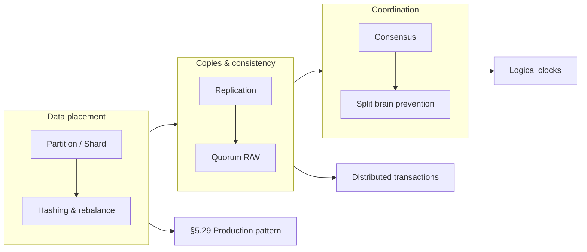

---

## Sub-topics

### Data placement & routing

| # | Sub-topic | Status |
|---|-----------|--------|
| 5.1 | [Partitioning](#51-partitioning) | Done — taxonomy & strategies |
| 5.2 | [Sharding](#52-sharding) | Done |
| 5.3 | [Hash Partitioning](#53-hash-partitioning) | Done |
| 5.4 | [Range Partitioning](#54-range-partitioning) | Done |
| 5.5 | [Geo Partitioning](#55-geo-partitioning) | Done |
| 5.6 | [Hot Partitions](#56-hot-partitions) | Done |
| 5.7 | [Rebalancing](#57-rebalancing) | Done |
| 5.8 | [Consistent Hashing](#58-consistent-hashing) | Done |
| 5.9 | [Virtual Nodes](#59-virtual-nodes) | Done |
| 5.10 | [Rendezvous Hashing](#510-rendezvous-hashing) | Done |
| 5.29 | [Sharding, Bucketing & Partitioning](#529-sharding-bucketing--partitioning) | Done — production stack |

### Replication & quorums

| # | Sub-topic | Status |
|---|-----------|--------|
| 5.11 | [Replication](#511-replication) | Done — overview |
| 5.12 | [Leader Follower Replication](#512-leader-follower-replication) | Done |
| 5.13 | [Multi Leader Replication](#513-multi-leader-replication) | Done |
| 5.14 | [Quorum Reads](#514-quorum-reads) | Done — `R + W > N` canonical |
| 5.15 | [Quorum Writes](#515-quorum-writes) | Done |

### Transactions & coordination

| # | Sub-topic | Status |
|---|-----------|--------|
| 5.16 | [Distributed Transactions](#516-distributed-transactions) | Done — overview |
| 5.17 | [Two Phase Commit](#517-two-phase-commit) | Done |
| 5.18 | [Three Phase Commit](#518-three-phase-commit) | Done |
| 5.19 | [Distributed Locking](#519-distributed-locking) | Done |
| 5.20 | [Split Brain](#520-split-brain) | Done |

### Consensus & leadership

| # | Sub-topic | Status |
|---|-----------|--------|
| 5.21 | [Consensus](#521-consensus) | Done — problem & properties |
| 5.22 | [Paxos](#522-paxos) | Done |
| 5.23 | [Raft](#523-raft) | Done — canonical election & log |
| 5.24 | [Leader Election](#524-leader-election) | Done — concept & triggers |

### Ordering, membership & production

| # | Sub-topic | Status |
|---|-----------|--------|
| 5.25 | [Lamport Clocks](#525-lamport-clocks) | Done |
| 5.26 | [Vector Clocks](#526-vector-clocks) | Done |
| 5.27 | [Gossip Protocol](#527-gossip-protocol) | Done |
| 5.28 | [Membership Protocols](#528-membership-protocols) | Done |

---

## 5.1 Partitioning

### What is partitioning?

Partitioning is the process of splitting a large dataset into smaller parts called **partitions** (or **shards**).

Instead of storing all data on a single database server, data is distributed across multiple servers.

**Example — users database:**

```text
Server-1  →  Users 1 to 25 Million
Server-2  →  Users 25M to 50 Million
Server-3  →  Users 50M to 75 Million
Server-4  →  Users 75M to 100 Million
```

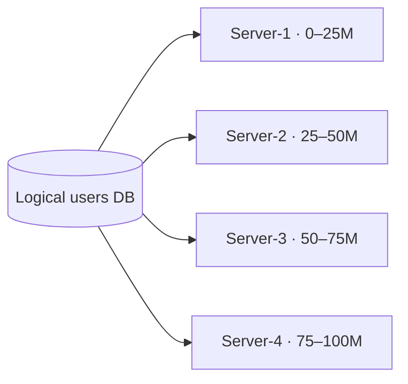

For sharding at deployment scale, see [§5.2 Sharding](#52-sharding). For production shard → bucket → partition layering, see [§5.29 Sharding, Bucketing & Partitioning](#529-sharding-bucketing--partitioning).

### Why partitioning is needed?

As data grows:

- Storage requirements increase
- Number of requests increases
- Database size becomes very large

Partitioning distributes data and workload across multiple machines.

### Types of partitioning

#### A) Horizontal partitioning

Rows are distributed across multiple partitions.

**Original table:**

```text
+--------+-------+
| UserID | Name  |
+--------+-------+
| 1      | A     |
| 2      | B     |
| 3      | C     |
| 4      | D     |
+--------+-------+
```

**Partition-1:**

```text
+--------+-------+
| UserID | Name  |
+--------+-------+
| 1      | A     |
| 2      | B     |
+--------+-------+
```

**Partition-2:**

```text
+--------+-------+
| UserID | Name  |
+--------+-------+
| 3      | C     |
| 4      | D     |
+--------+-------+
```

**Characteristics:** Same schema, different rows.

#### B) Vertical partitioning

Columns are distributed into different tables or databases.

**User table:**

```text
+--------+--------+
| UserID | Name   |
+--------+--------+
```

**Profile table:**

```text
+--------+---------+
| UserID | Address |
+--------+---------+
```

**Characteristics:** Different columns, same entity data spread across tables.

### Partitioning strategies

#### A) Range-based partitioning

Data is divided based on value ranges. See [§5.4 Range Partitioning](#54-range-partitioning).

```text
Partition-1   UserID : 1 – 10,000
Partition-2   UserID : 10,001 – 20,000
Partition-3   UserID : 20,001 – 30,000
```

#### B) Hash-based partitioning

A hash function determines the partition. See [§5.3 Hash Partitioning](#53-hash-partitioning).

```text
Partition = Hash(Key) % N

N = number of partitions

Hash(101) % 3 = 2
Hash(202) % 3 = 1
Hash(303) % 3 = 0
```

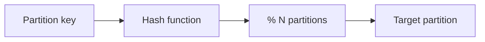

#### C) List-based partitioning

Data is divided using predefined values. See [§5.5 Geo Partitioning](#55-geo-partitioning) for region/list-style placement.

```text
Partition-1   Country = India
Partition-2   Country = USA
Partition-3   Country = UK
```

#### D) Directory-based partitioning

A lookup service stores partition locations.

```text
Directory

UserID 101 → Server A
UserID 205 → Server C
UserID 309 → Server B
```

The directory tells where the data exists.

#### Strategy comparison (canonical)

| Strategy | How partition is chosen | Best for | Main risk |
|----------|-------------------------|----------|-----------|
| **Range** | Key falls in a value range — [§5.4](#54-range-partitioning) | Time-series, range scans, retention by range | Hot partitions — [§5.6](#56-hot-partitions) |
| **Hash** | `Hash(key) % N` — [§5.3](#53-hash-partitioning) | Even spread across nodes | Poor range-query locality; resharding — [§5.8](#58-consistent-hashing) |
| **List / geo** | Category or region — [§5.5](#55-geo-partitioning) | Data residency, low latency per region | Skew if one region dominates |
| **Directory** | Lookup table | Flexible routing, uneven tenants | Metadata service availability |

**Shard vs partition:** a **shard** is usually a separate database instance; a **partition** is often a sub-table inside one instance. Combined production pattern: [§5.29](#529-sharding-bucketing--partitioning).

### Benefits

- Data is distributed across servers
- Storage load is spread out
- Request load is distributed
- Large datasets become manageable
- System can grow by adding partitions

### Challenges

- Queries may need data from multiple partitions
- Data may not be evenly distributed — see [§5.6 Hot Partitions](#56-hot-partitions)
- Partition management becomes necessary
- Data movement may be required when partitions change — see [§5.7 Rebalancing](#57-rebalancing)

### Real-world usage

| Domain | Usage |
|--------|-------|
| Social media | User data stored across multiple shards |
| E-commerce | Customer and order data distributed across servers |
| Messaging systems | Messages partitioned across clusters |

### Summary

Partitioning = splitting data into smaller pieces.

**Main types:**

1. Horizontal partitioning
2. Vertical partitioning

**Common strategies:**

1. Range-based
2. Hash-based
3. List-based
4. Directory-based

**Result:** Large datasets are distributed across multiple partitions instead of being stored on a single server.

---


## 5.2 Sharding

### What is sharding?

Sharding is a database scaling technique where data is split across multiple databases called **shards**.

Each shard contains only a portion of the total data. A shard is an independent database that stores a subset of records.

**Example — users database (100 million users):**

```text
                 Users
                   |
        -------------------------
        |           |           |
      Shard-1     Shard-2     Shard-3
        |           |           |
     1–33M       34–66M      67–100M
```

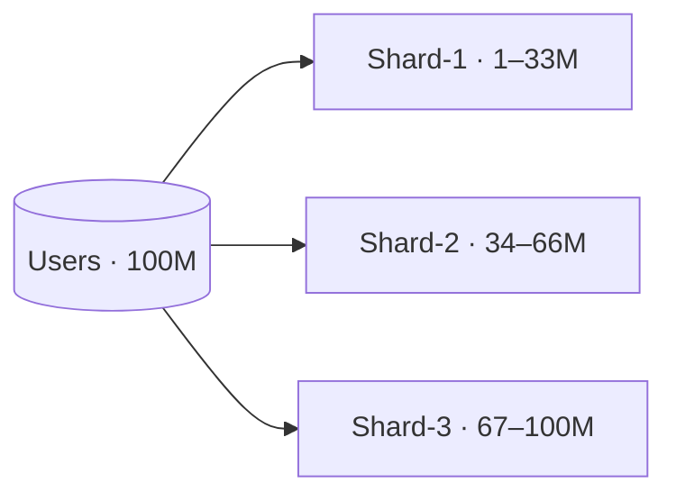

Instead of storing all users in one database, users are distributed among multiple databases. See [§5.1 Partitioning](#51-partitioning) for the general split-data concept.

### Terminology

| Term | Meaning |
|------|---------|
| **Shard** | A database containing a subset of data |
| **Shard key** | The attribute used to decide which shard stores data — e.g. `UserID`, `CustomerID`, `Country`, `Email` |
| **Shard router** | Component responsible for directing requests to the correct shard |

### Why sharding is needed?

**Single database problems:**

```text
                Database
                    |
            ----------------
            |              |
        Too much data   Too much traffic
```

As data grows:

- Storage increases
- Read requests increase
- Write requests increase
- Database becomes a bottleneck

Sharding distributes both data and traffic.

### How sharding works

```text
Shard-1  →  UserID 1–1000
Shard-2  →  UserID 1001–2000
Shard-3  →  UserID 2001–3000

Request: Get User 1500
Router checks UserID → User 1500 → Shard-2
Only Shard-2 is queried.
```


### Sharding strategies

Same strategies as [§5.1 Partitioning](#51-partitioning) — applied across **independent database instances** (shards) instead of partitions inside one DB:

| Strategy | Section |
|----------|---------|
| Range-based | [§5.4 Range Partitioning](#54-range-partitioning) |
| Hash-based | [§5.3 Hash Partitioning](#53-hash-partitioning) |
| Geographic | [§5.5 Geo Partitioning](#55-geo-partitioning) |
| Directory-based | [§5.1](#51-partitioning) (directory strategy) |

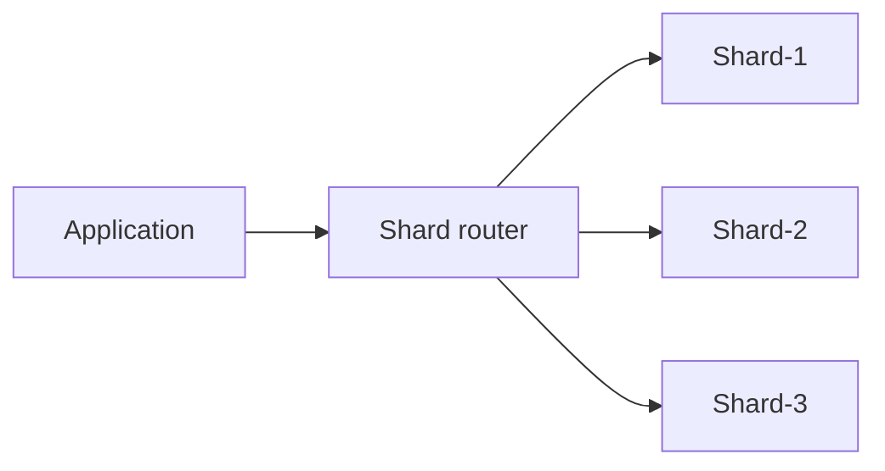

### Shard key

A shard key determines where data is stored.

**Example:** `UserID` — UserID 100, 200, 300. The shard key is processed to determine the shard.

Good shard keys distribute data evenly. Bad shard keys may place most records in one shard — see [§5.6 Hot Partitions](#56-hot-partitions).

### Shard architecture

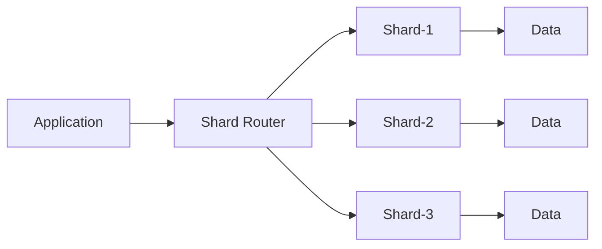

**Flow:**

1. Request arrives
2. Router determines shard
3. Request sent to shard
4. Result returned

### Benefits

- Distributes data across databases
- Distributes read traffic
- Distributes write traffic
- Reduces load on a single database
- Supports large-scale systems
- Increases overall storage capacity

### Challenges

- Managing multiple shards
- Data may become unevenly distributed
- Queries across shards can be complex
- Data movement may be required — see [§5.7 Rebalancing](#57-rebalancing)
- Routing logic is needed

### Example

**User table:**

```text
+--------+--------+
| UserID | Name   |
+--------+--------+
| 1      | A      |
| 2      | B      |
| 3      | C      |
| 4      | D      |
| 5      | E      |
| 6      | F      |
+--------+--------+
```

**Shard-1:**

```text
+--------+--------+
| UserID | Name   |
+--------+--------+
| 1      | A      |
| 2      | B      |
+--------+--------+
```

**Shard-2:**

```text
+--------+--------+
| UserID | Name   |
+--------+--------+
| 3      | C      |
| 4      | D      |
+--------+--------+
```

**Shard-3:**

```text
+--------+--------+
| UserID | Name   |
+--------+--------+
| 5      | E      |
| 6      | F      |
+--------+--------+
```

### Summary

Sharding = horizontal partitioning of data across multiple independent databases.

**Core components:** shard, shard key, shard router.

**Common strategies:** range-based, hash-based, directory-based, geographic sharding.

**Goal:** Distribute data and traffic across multiple databases instead of relying on a single database server.

For production shard → bucket → partition layering, see [§5.29 Sharding, Bucketing & Partitioning](#529-sharding-bucketing--partitioning).

---


## 5.3 Hash Partitioning

### What is hash partitioning?

Hash partitioning is a partitioning technique where a hash function is applied to a partition key to determine which partition stores the data.

Instead of storing data based on ranges or categories, the partition is selected using a mathematical function.

```text
Partition = Hash(Key) % NumberOfPartitions
```

### Why hash partitioning?

The goal is to distribute data across partitions as evenly as possible.

```text
Without hashing
  Partition-1  →  90% of data
  Partition-2  →   5% of data
  Partition-3  →   5% of data

With hashing
  Partition-1  →  ~33%
  Partition-2  →  ~33%
  Partition-3  →  ~33%
```

Data becomes more balanced across partitions. Uneven keys can still create hot partitions — see [§5.6 Hot Partitions](#56-hot-partitions).

### How hash partitioning works

```text
NumberOfPartitions = 4

Partitions: P0, P1, P2, P3

Formula: Partition = UserID % 4

UserID = 100  →  100 % 4 = 0  →  P0
UserID = 101  →  101 % 4 = 1  →  P1
UserID = 102  →  102 % 4 = 2  →  P2
UserID = 103  →  103 % 4 = 3  →  P3
```

### Visualization

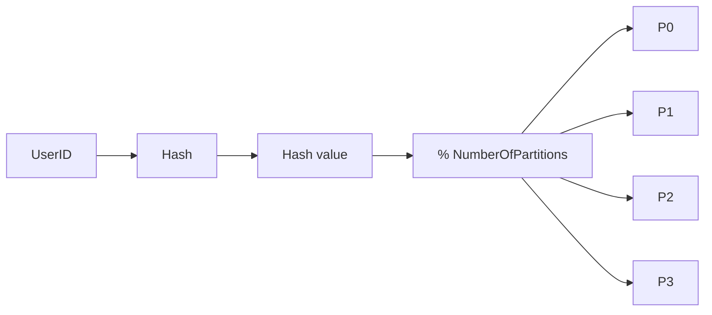

### Example

```text
NumberOfPartitions = 3
Formula: Partition = UserID % 3

+--------+------------+
| UserID | Partition  |
+--------+------------+
| 100    | P1         |
| 101    | P2         |
| 102    | P0         |
| 103    | P1         |
| 104    | P2         |
| 105    | P0         |
+--------+------------+
```

**Data distribution:**

```text
P0: 102, 105
P1: 100, 103
P2: 101, 104
```

### Data insertion

```text
Insert UserID = 125  →  125 % 3 = 2  →  Store in P2
Insert UserID = 126  →  126 % 3 = 0  →  Store in P0
Insert UserID = 127  →  127 % 3 = 1  →  Store in P1
```

### Data retrieval

**Find UserID = 125:**

1. `125 % 3 = 2`
2. Go directly to P2
3. Search inside P2

No need to check other partitions.

### Comparison with range partitioning

See the **strategy comparison** table in [§5.1 Partitioning](#51-partitioning).

### Advantages

- Data is spread across partitions
- Load distribution is generally uniform
- Simple partition selection process
- Direct access to the target partition
- Suitable for large datasets

### Disadvantages

- Data location is not human-readable
- Related records may end up in different partitions
- Changing the number of partitions may require redistributing data — see [§5.8 Consistent Hashing](#58-consistent-hashing) and [§5.7 Rebalancing](#57-rebalancing)
- Range-based queries may need to access multiple partitions

### Summary

Hash partitioning uses a hash function to determine where data is stored.

```text
Partition = Hash(Key) % NumberOfPartitions

UserID = 101  →  101 % 3 = 2  →  Store in Partition-2
```

**Goal:** Distribute data evenly across partitions using a hash function.

---


## 5.4 Range Partitioning

### What is range partitioning?

Range partitioning is a partitioning technique where data is divided into partitions based on a range of values.

Each partition stores records whose partition key falls within a specific range.

```text
P1  →  UserID 1 – 1000
P2  →  UserID 1001 – 2000
P3  →  UserID 2001 – 3000
```

The partition is determined by checking which range contains the key value.

### Why range partitioning?

Large datasets can be divided into smaller partitions using meaningful value ranges.

**Orders:**

```text
P1  →  Jan orders
P2  →  Feb orders
P3  →  Mar orders
```

**Users:**

```text
P1  →  UserID 1–1000
P2  →  UserID 1001–2000
P3  →  UserID 2001–3000
```

### How range partitioning works

**Partition rules:**

```text
P1  :  UserID 1 – 1000
P2  :  UserID 1001 – 2000
P3  :  UserID 2001 – 3000
```

**Examples:**

```text
UserID = 750   →  range 1–1000      →  P1
UserID = 1450  →  range 1001–2000   →  P2
UserID = 2800  →  range 2001–3000   →  P3
```

### Visualization

```text
UserID space: 1 ---------------------------------- 3000

|------P1------|------P2------|------P3------|
1            1000          2000          3000
```

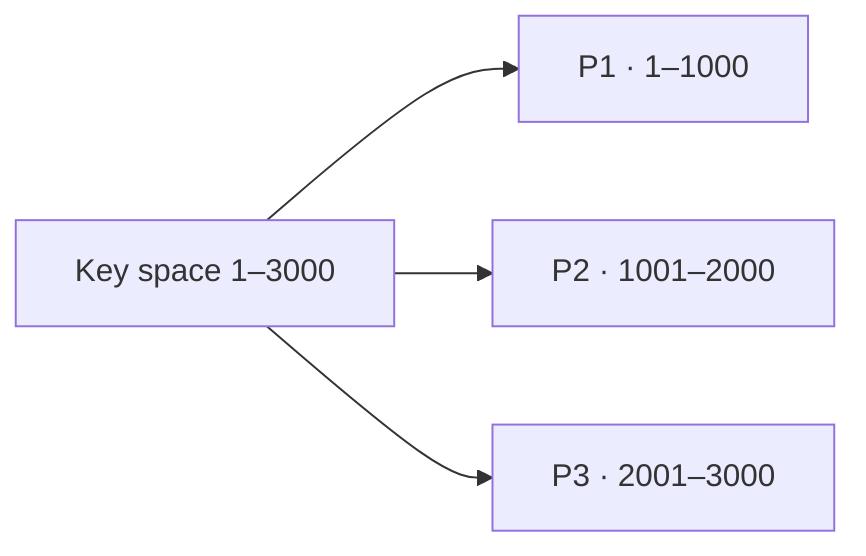

### Example

**Partition rules:**

```text
P1  :  1 – 100
P2  :  101 – 200
P3  :  201 – 300
```

```text
+--------+-----------+
| UserID | Partition |
+--------+-----------+
| 50     | P1        |
| 75     | P1        |
| 120    | P2        |
| 180    | P2        |
| 250    | P3        |
| 290    | P3        |
+--------+-----------+
```

**Data distribution:**

```text
P1: 50, 75
P2: 120, 180
P3: 250, 290
```

### Data insertion

```text
Insert UserID = 90   →  range 1–100    →  P1
Insert UserID = 170  →  range 101–200  →  P2
Insert UserID = 275  →  range 201–300  →  P3
```

### Data retrieval

**Find UserID = 170:**

1. Identify the range — 170 belongs to 101–200
2. Go directly to P2
3. Search inside P2

### Range query example

**Query: find users from 120 to 180**

```text
Range 120–180 → data exists only in P2 → only P2 searched
```

**Query: find users from 50 to 250**

```text
Required partitions: P1, P2, P3 → multiple partitions checked
```

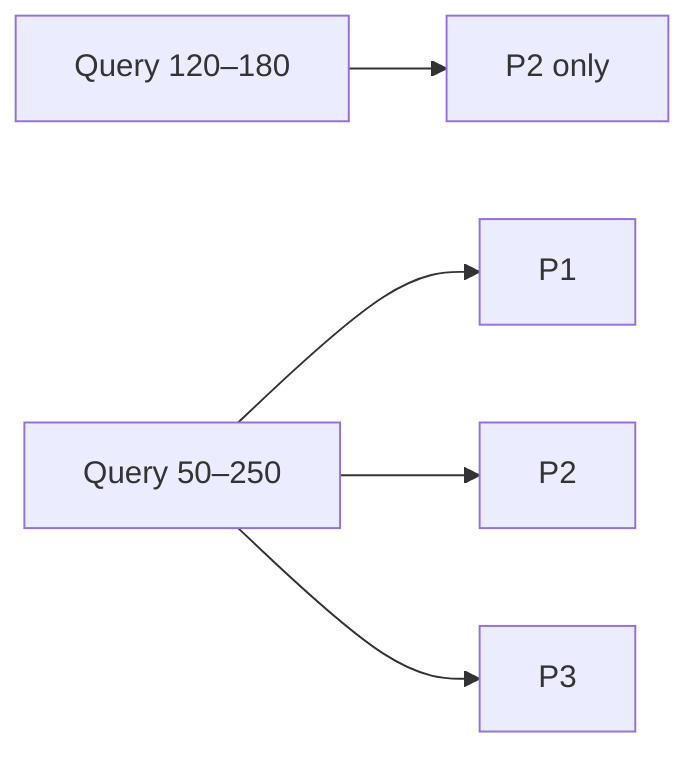

### Common range keys

| Key | Example ranges |
|-----|----------------|
| **UserID** | P1 → 1–1000, P2 → 1001–2000 |
| **OrderID** | P1 → 1–50000, P2 → 50001–100000 |
| **Date** | P1 → January, P2 → February, P3 → March |
| **Age** | P1 → 0–18, P2 → 19–40, P3 → 41–60 |

### Advantages

- Easy to understand
- Data location is predictable
- Efficient for range-based queries
- Simple partition selection
- Natural fit for ordered data

### Disadvantages

- Data may become unevenly distributed — see [§5.6 Hot Partitions](#56-hot-partitions)
- Some partitions may grow much larger than others
- Certain partitions may receive more traffic
- Partition boundaries must be managed

### Comparison with hash partitioning

See the **strategy comparison** table in [§5.1 Partitioning](#51-partitioning).

### Summary

Range partitioning divides data according to predefined value ranges.

```text
P1  →  UserID 1–1000
P2  →  UserID 1001–2000
P3  →  UserID 2001–3000
```

A record is stored in the partition whose range contains its key value.

**Goal:** Organize data into partitions using continuous value ranges.

---


## 5.5 Geo Partitioning

### What is geo partitioning?

Geo partitioning is a partitioning technique where data is divided based on geographical regions.

Each partition stores data belonging to a specific location or region.

**Examples:**

```text
India users   →  India partition
USA users     →  USA partition
Europe users  →  Europe partition
```

Data is stored according to geographic boundaries. Also called **list-based** or **geographic sharding** — see [§5.1 Partitioning](#51-partitioning) and [§5.2 Sharding](#52-sharding).

### Why geo partitioning?

Applications often serve users from different parts of the world.

Instead of storing all data in a single partition, data is grouped by region.

```text
Users from India   →  India partition
Users from USA     →  USA partition
Users from Europe  →  Europe partition
```

### How geo partitioning works

**Partition key:** `Country`, `State`, `Region`, `City`

The geographical attribute determines where data is stored.

**Example:**

```text
+--------+---------+
| UserID | Country |
+--------+---------+
| 101    | India   |
+--------+---------+
→ Stored in India partition
```

**Another user:**

```text
+--------+---------+
| UserID | Country |
+--------+---------+
| 202    | USA     |
+--------+---------+
→ Stored in USA partition
```

### Visualization

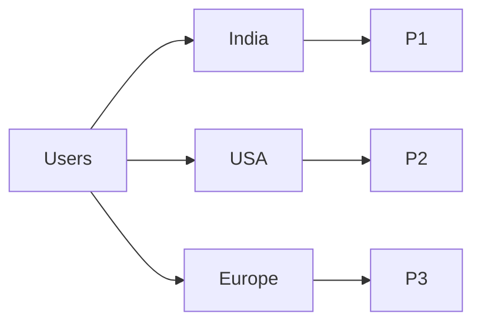

### Example

**Partitions:**

```text
P1  →  India
P2  →  USA
P3  →  Europe
```

**User records:**

```text
+--------+---------+
| UserID | Country |
+--------+---------+
| 101    | India   |
| 102    | India   |
| 201    | USA     |
| 202    | USA     |
| 301    | Germany |
| 302    | France  |
+--------+---------+
```

**Data distribution:**

```text
P1 (India):   101, 102
P2 (USA):     201, 202
P3 (Europe):  301, 302
```

### Data insertion

```text
UserID = 501, Country = India    →  P1
UserID = 601, Country = USA      →  P2
UserID = 701, Country = Germany  →  P3
```

### Data retrieval

**Find UserID = 601, Country = USA:**

1. Identify region — USA
2. Access USA partition
3. Retrieve record

### Common geo partitioning levels

| Level | Examples |
|-------|----------|
| **Country** | India, USA, UK, Germany |
| **Region** | Asia, Europe, North America, South America |
| **State** | Karnataka, Maharashtra, Tamil Nadu |
| **City** | Bengaluru, Mumbai, Delhi |

### Real-world example

**Global e-commerce platform:**

```text
India customers   →  India partition
USA customers     →  USA partition
Europe customers  →  Europe partition
```

**Global social media platform:**

```text
Asian users     →  Asia partition
European users  →  Europe partition
```

### Advantages

- Data is organized by location
- Users from the same region are grouped together
- Easier regional data management
- Supports geographically distributed systems
- Data can be separated by country or region

### Disadvantages

- Data distribution may not be equal — see [§5.6 Hot Partitions](#56-hot-partitions)
- Some regions may contain significantly more data
- Users moving between regions may require data relocation
- Queries involving multiple regions may need access to several partitions

### Comparison with other strategies

See the **strategy comparison** table in [§5.1 Partitioning](#51-partitioning). Geo partitioning adds **region** as the partition key for latency and compliance.

### Summary

Geo partitioning divides data according to geographic regions.

```text
India   →  Partition-1
USA     →  Partition-2
Europe  →  Partition-3
```

A geographic attribute such as country, state, region, or city determines where data is stored.

**Goal:** Group and manage data based on geographical boundaries.

---


## 5.6 Hot Partitions

### What is a hot partition?

A hot partition is a partition that receives significantly more traffic or stores significantly more data than other partitions.

As a result, one partition becomes overloaded while other partitions remain underutilized.

### How does it happen?

When data is not distributed evenly, some partitions receive more requests than others.

```text
Partitions: P1, P2, P3

Traffic distribution:
  P1  →  80% of requests
  P2  →  10% of requests
  P3  →  10% of requests

P1 becomes a hot partition.
```

### Visualization

**Normal distribution:**

```text
P1  ========
P2  ========
P3  ========
```

**Hot partition scenario:**

```text
P1  ====================================
P2  ====
P3  ====
```

P1 receives most of the traffic.

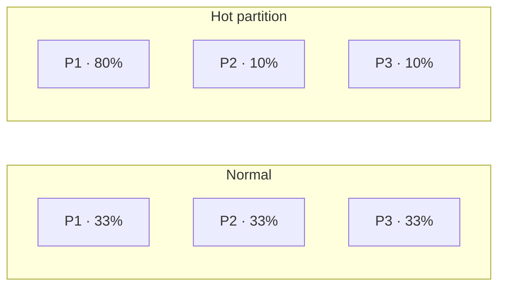

### Example using range partitioning

See [§5.4 Range Partitioning](#54-range-partitioning).

```text
P1  →  UserID 1–1000
P2  →  UserID 1001–2000
P3  →  UserID 2001–3000

Most active users in UserID 1–1000

Traffic:  P1 → 90%   P2 → 5%   P3 → 5%
Result:   P1 becomes a hot partition
```

### Example using geo partitioning

See [§5.5 Geo Partitioning](#55-geo-partitioning).

```text
India  →  P1
USA    →  P2
Europe →  P3

Traffic:  India → 85%   USA → 10%   Europe → 5%
Result:   India partition becomes hot
```

### Example using social media

```text
Posts partition:
  P1  →  Celebrity posts
  P2  →  Regular users
  P3  →  Regular users

Millions access celebrity content.

Traffic:  P1 → extremely high   P2 → low   P3 → low
Result:   P1 becomes a hot partition
```

### Characteristics of a hot partition

- Receives most read requests
- Receives most write requests
- Higher CPU usage
- Higher memory usage
- Higher disk activity
- Handles much more load than other partitions

### Problems caused by hot partitions

```text
Traffic:  P1 → 90%   P2 → 5%   P3 → 5%
```

**Effects:**

- Uneven workload
- Slower response times
- Increased latency
- Resource exhaustion
- Reduced overall system efficiency

Even though multiple partitions exist, one partition becomes the bottleneck. See [§4.23 Bottleneck Analysis](../04-distributed-system/README.md#423-bottleneck-analysis).

### Example

**Users table:**

```text
P1  →  India
P2  →  USA
P3  →  Europe

India users   →  10 million requests
USA users     →   1 million requests
Europe users  →  500K requests

Load:  P1 → very high   P2 → moderate   P3 → low
Result: P1 becomes a hot partition
```

### Hot data vs hot partition

**Hot data** — a specific record or small set of records receives heavy traffic.

```text
Example: UserID = 100 receives millions of requests
```

**Hot partition** — an entire partition receives heavy traffic.

```text
Example: Partition P1 receives most system requests
```

### Summary

Hot partition = a partition that receives a disproportionately high amount of traffic or stores a disproportionately large amount of data.

```text
P1  →  80% traffic
P2  →  10% traffic
P3  →  10% traffic
```

**Result:** P1 becomes the hot partition while other partitions remain underutilized.

---


## 5.7 Rebalancing

### What is rebalancing?

Rebalancing is the process of redistributing data across partitions (shards) so that data and traffic are more evenly distributed.

It is performed when some partitions become larger or busier than others.

**Goal:**

```text
Balanced data distribution
+
Balanced traffic distribution
```

### Why rebalancing is needed?

Over time, partitions may become uneven.

**Before rebalancing:**

```text
P1  →  70 GB
P2  →  20 GB
P3  →  10 GB
```

P1 stores most of the data.

**Result:**

- Uneven storage usage
- Uneven workload
- Hot partitions may occur — see [§5.6 Hot Partitions](#56-hot-partitions)

To correct this imbalance, data is redistributed.

### Visualization

**Before:**

```text
P1  ==============================
P2  ==========
P3  =====
```

**After:**

```text
P1  ==============
P2  ==============
P3  ==============
```

Data is more evenly distributed.

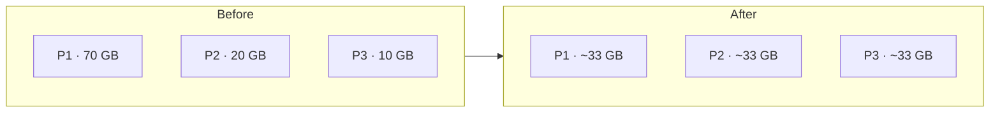

### Example

**Initial distribution:**

```text
P1: User 1, 2, 3, 4, 5, 6
P2: User 7
P3: User 8

Storage:  P1 → 75%   P2 → 12.5%   P3 → 12.5%
P1 is overloaded.
```

**After rebalancing:**

```text
P1: User 1, 2, 3
P2: User 4, 5, 7
P3: User 6, 8

Distribution becomes more balanced.
```

### When rebalancing occurs

1. One partition stores much more data than others
2. One partition receives significantly more traffic
3. A new partition is added
4. An existing partition is removed
5. Storage limits are reached

### Rebalancing after adding a shard

**Before:** P1, P2, P3

```text
Data:  P1 → 33%   P2 → 33%   P3 → 34%
```

**New shard added:** P4

```text
Before rebalancing:  P1 → 33%   P2 → 33%   P3 → 34%   P4 → 0%
After rebalancing:   P1 → 25%   P2 → 25%   P3 → 25%   P4 → 25%
```

Some data is moved to P4.

### Rebalancing after removing a shard

**Before:** P1, P2, P3, P4

**Remove P4.** Data stored in P4: User A, User B, User C

**After rebalancing:**

```text
P1 ← some data
P2 ← some data
P3 ← some data
```

Data from P4 is redistributed.

### Rebalancing process

1. Identify overloaded partitions
2. Select data to move
3. Transfer data to target partitions
4. Update partition mapping information
5. Resume normal traffic flow

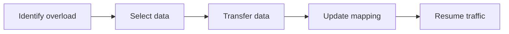

### Effect on system

```text
Before:  P1 → 80%   P2 → 10%   P3 → 10%
After:   P1 → 34%   P2 → 33%   P3 → 33%
```

Workload becomes more balanced.

### Example with geo partitioning

See [§5.5 Geo Partitioning](#55-geo-partitioning).

**Before:**

```text
India partition   →  80 million users
USA partition     →  10 million users
Europe partition  →  10 million users
```

India partition becomes overloaded.

**After rebalancing:**

```text
India-North partition
India-South partition
USA partition
Europe partition
```

Traffic and storage are distributed more evenly.

### Benefits

- More balanced storage usage
- More balanced request load
- Reduces overloaded partitions
- Better resource utilization
- Supports system growth

### Challenges

- Data movement can be expensive
- Large datasets take time to transfer
- Additional coordination is required
- Temporary increase in network traffic
- Metadata updates are needed

Changing partition count with naive `hash % N` moves most keys — see [§5.8 Consistent Hashing](#58-consistent-hashing) for minimizing migration.

### Summary

Rebalancing is the process of moving data between partitions to achieve a more even distribution of data and workload.

```text
Before:  P1 → 70%   P2 → 20%   P3 → 10%
After:   P1 → 33%   P2 → 33%   P3 → 34%
```

**Goal:** Prevent overloaded partitions and maintain balanced resource utilization across the system.

---


## 5.8 Consistent Hashing

Part of the **hash-ring routing** cluster: [§5.9 Virtual Nodes](#59-virtual-nodes) (load balance), [§5.10 Rendezvous Hashing](#510-rendezvous-hashing) (alternative). Used when partition count changes — [§5.7 Rebalancing](#57-rebalancing).

### What is consistent hashing?

Consistent hashing is a hashing technique used to distribute data across multiple servers (or shards) while minimizing data movement when servers are added or removed.

Unlike traditional hash partitioning, only a small portion of data needs to be redistributed when the number of servers changes.

### Problem with traditional hashing

```text
Partition = Hash(Key) % N

N = number of partitions
```

**Example — N = 3:**

```text
UserID = 100
Hash(100) % 3 = P1
```

**Add a new partition — N = 4:**

```text
Hash(100) % 4 = P0
```

The same data now belongs to a different partition. **Result:** many records must be moved.

```text
Before adding P3:  P0, P1, P2
After adding P3:   P0, P1, P2, P3  →  most keys get reassigned
```

See [§5.3 Hash Partitioning](#53-hash-partitioning).

### Basic idea

Instead of hashing data directly to partition numbers, both data and partitions are placed on a logical ring.

Data is stored in the first partition encountered while moving clockwise around the ring.

### Hash ring

```text
Logical ring

                0
               / \
              /   \
             /     \
      75                 25
             \     /
              \   /
               \ /
                50

Hash values wrap around:

Maximum value  →  100 wraps to 0
```

### Placing servers on the ring

```text
                P1
                 |
         P3 -----+----- P2

Each partition receives a position based on its hash.

Example ring:

                     P1 (20)
                         \
                          \
P3 (80) ------------------- P2 (50)
```

### Placing data on the ring

```text
Key A → 10
Key B → 35
Key C → 65
Key D → 90
```

**Key A (10):** clockwise → P1 (20) → stored in **P1**

**Key B (35):** clockwise → P2 (50) → stored in **P2**

**Key C (65):** clockwise → P3 (80) → stored in **P3**

**Key D (90):** clockwise → wrap around → P1 (20) → stored in **P1**

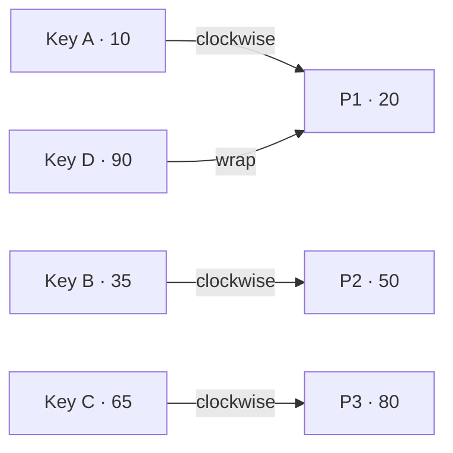

### Data assignment rule

**Rule:** Store data in the first partition encountered while moving clockwise around the ring.

**Example:**

```text
Key position = 40

Ring:  P1 = 20   P2 = 50   P3 = 80

Move clockwise: 40 → 50  →  Store in P2
```

### Adding a new partition

**Before:** P1 (20), P2 (50), P3 (80)

**Add P4 (65):**

```text
Before:  P1 ---- P2 ----------- P3
After:   P1 ---- P2 ---- P4 ---- P3
```

Only keys that fall between **P2 and P4** need to move. Other keys remain unchanged.

### Removing a partition

**Before:** P1 (20), P2 (50), P3 (80)

**Remove P2** — keys belonging to P2 move to the next partition clockwise:

```text
P1 (20)   P3 (80)
```

Only P2's data is reassigned. Other data remains unchanged.

### Visualization of minimal data movement

```text
Traditional hashing — add new partition:
  Most data  →  reassigned

Consistent hashing — add new partition:
  Small portion  →  reassigned
```

See [§5.7 Rebalancing](#57-rebalancing).

### Example

**Partitions:** P1 → 20, P2 → 50, P3 → 80

**Keys:** K1 → 10, K2 → 35, K3 → 60, K4 → 90

**Assignments:**

```text
K1 → P1
K2 → P2
K3 → P3
K4 → P1
```

**Add P4 → 65. New assignments:**

```text
K1 → P1
K2 → P2
K3 → P4   ← only K3 moved
K4 → P1
```

### Benefits

- Minimal data movement
- Easy addition of partitions
- Easy removal of partitions
- Supports distributed systems
- Reduces rebalancing overhead
- Scales efficiently

### Challenges

- Data may not be evenly distributed — see [§5.9 Virtual Nodes](#59-virtual-nodes)
- Ring management is required
- Partition positions must be maintained
- Additional routing logic is needed

### Summary

Consistent hashing places both data and partitions on a logical hash ring.

**Rule:** A key is stored in the first partition encountered while moving clockwise around the ring.

**Key advantage:** When partitions are added or removed, only a small portion of data needs to be moved.

```text
Traditional hashing:  Hash(Key) % N  →  most data moves when N changes
Consistent hashing:   hash ring       →  only affected keys move
```

---


## 5.9 Virtual Nodes

Extension of [§5.8 Consistent Hashing](#58-consistent-hashing) — multiple virtual positions per physical server for even load.

### What are virtual nodes?

A virtual node (vnode) is a logical node that represents a physical server on the consistent hash ring.

Instead of placing a server only once on the ring, the same server is placed multiple times at different positions.

```text
Physical server  →  multiple virtual nodes
```

This helps distribute data more evenly. See [§5.8 Consistent Hashing](#58-consistent-hashing).

### Why are virtual nodes needed?

Without virtual nodes, servers may be unevenly placed on the hash ring.

```text
Ring:  P1(10)   P2(30)   P3(90)

Distribution:
  P1  →  small portion
  P2  →  large portion
  P3  →  very large portion
```

Some servers receive much more data than others.

**Result:** uneven storage, uneven traffic, hot partitions — see [§5.6 Hot Partitions](#56-hot-partitions).

### Problem without virtual nodes

```text
Hash ring:  0 ---------------------------------------- 100

            P1(10)      P2(30)                    P3(90)
```

**Ownership:**

```text
P1 owns  (90 → 10)   wrap-around arc
P2 owns  (10 → 30)
P3 owns  (30 → 90)
```

**Approximate distribution:**

```text
P1  →  20%
P2  →  20%
P3  →  60%
```

P3 stores much more data.

### Basic idea of virtual nodes

**Instead of:**

```text
P1  →  one position
P2  →  one position
P3  →  one position
```

**Use:**

```text
P1  →  multiple positions   (P1-A, P1-B, P1-C)
P2  →  multiple positions   (P2-A, P2-B, P2-C)
P3  →  multiple positions   (P3-A, P3-B, P3-C)
```

These are virtual nodes.

### Hash ring with virtual nodes

**Without vnodes:**

```text
0 ------------------------------------------ 100

P1       P2                          P3
```

**With vnodes:**

```text
0 ------------------------------------------ 100

P1A  P2A  P3A  P1B  P2B  P3B  P1C  P2C  P3C
```

Server positions are spread throughout the ring.

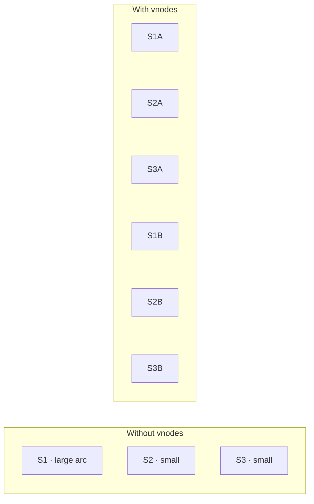

### Data assignment

**Rule:** A key is assigned to the first vnode encountered clockwise.

**Example:**

```text
Ring:  P1A(10)  P2A(25)  P3A(40)  P1B(55)  P2B(70)  P3B(85)

Key = 35  →  move clockwise  →  40  →  assigned to P3A  →  physical server P3
```

### Example

**Physical servers:** S1, S2, S3

**Virtual nodes:**

```text
S1-A  S1-B  S1-C
S2-A  S2-B  S2-C
S3-A  S3-B  S3-C
```

**Hash ring order:**

```text
S1A  S2A  S3A  S1B  S2B  S3B  S1C  S2C  S3C
```

Keys are distributed across virtual nodes. Each virtual node ultimately belongs to a physical server.

### Adding a new server

**Before:** S1, S2, S3 with vnodes S1A/B/C, S2A/B/C, S3A/B/C

**Add S4** with new virtual nodes S4A, S4B, S4C

Only keys near these new virtual nodes move. Most keys remain unchanged.

### Removing a server

**Remove S2** — virtual nodes S2A, S2B, S2C removed.

Only keys owned by those virtual nodes are reassigned. Other keys remain unaffected.

### Load distribution

```text
Without vnodes:  S1 → 15%   S2 → 25%   S3 → 60%   (uneven)

With vnodes:     S1 → 33%   S2 → 34%   S3 → 33%   (balanced)
```

### Visualization

**Without virtual nodes:**

```text
Ring:  S1 ---------------- S2 -------------------- S3
       Large ownership differences.
```

**With virtual nodes:**

```text
Ring:  S1  S2  S3  S1  S3  S2  S1  S2  S3
       Ownership spread across the ring — more balanced data distribution.
```

### Benefits

- Better load balancing
- More uniform data distribution
- Reduces hot partitions
- Easier scaling
- Smaller impact when adding servers
- Smaller impact when removing servers

### Summary

Virtual nodes are multiple logical positions of the same physical server on a consistent hash ring.

```text
Instead of:  S1, S2, S3

Use:
  S1A  S1B  S1C
  S2A  S2B  S2C
  S3A  S3B  S3C
```

**Result:**

- More balanced data distribution
- Better load balancing
- Reduced chance of hot partitions
- Improved effectiveness of consistent hashing

---


## 5.10 Rendezvous Hashing

### What is rendezvous hashing?

Rendezvous hashing (highest random weight hashing — **HRW**) is a hashing technique used to assign data to servers (or shards).

For every key, a score is calculated against every server. The server with the highest score becomes the owner of that key.

**Rule:** Key belongs to the server with the highest hash score.

### Why is it used?

Like consistent hashing, rendezvous hashing aims to:

- Distribute data across servers
- Support adding servers
- Support removing servers
- Minimize data movement

It achieves these goals **without using a hash ring**. See [§5.8 Consistent Hashing](#58-consistent-hashing) for ring-based assignment.

### Basic idea

For a given key:

1. Combine key + server
2. Calculate hash score
3. Repeat for all servers
4. Pick the server with the highest score

```text
Score = Hash(Key + Server)

Highest score wins.
```

### Example

**Servers:** S1, S2, S3

**Key:** `User123`

**Calculate scores:**

```text
Hash(User123 + S1) = 150
Hash(User123 + S2) = 420
Hash(User123 + S3) = 310
```

**Highest score:** 420

**Result:** `User123` → **S2**

### Visualization

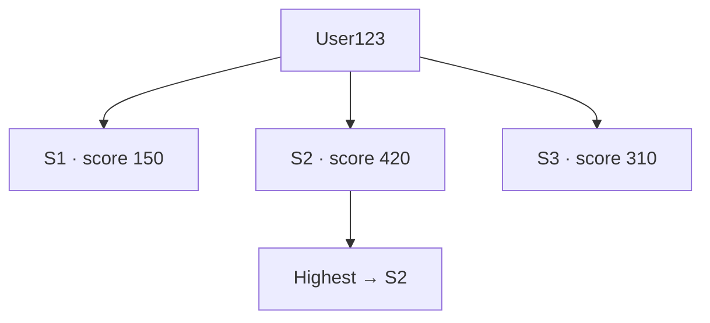

```text
                 User123
                     |
    ------------------------------------
    |                 |               |
  S1 · 150         S2 · 420        S3 · 310
                     |
                 Highest → S2
```

### Another example

**Key:** `Order789`

```text
Hash(Order789 + S1) = 550
Hash(Order789 + S2) = 120
Hash(Order789 + S3) = 470

Highest score = 550  →  Order789 → S1
```

### Data assignment

**Key = K1:**

```text
S1 → 200   S2 → 600   S3 → 450   →  Winner: S2   →  Store K1 in S2
```

**Key = K2:**

```text
S1 → 900   S2 → 100   S3 → 400   →  Winner: S1   →  Store K2 in S1
```

### Adding a new server

**Current servers:** S1, S2, S3

**Add S4** — recalculate for each key:

```text
Hash(Key + S1)
Hash(Key + S2)
Hash(Key + S3)
Hash(Key + S4)
```

Only keys for which S4 gets the highest score will move to S4. Other keys remain unchanged.

### Example of adding server

**Before — Key = User123:**

```text
S1 → 150   S2 → 420   S3 → 310   →  Owner: S2
```

**After adding S4:**

```text
S1 → 150   S2 → 420   S3 → 310   S4 → 500   →  New owner: S4
```

Owner changes S2 → S4. Only this key moves.

### Removing a server

**Before:**

```text
S1 → 200   S2 → 700   S3 → 500   →  Owner: S2
```

**Remove S2** — recalculate:

```text
S1 → 200   S3 → 500   →  New owner: S3
```

Only keys owned by S2 are reassigned.

### Load distribution

Many keys (K1, K2, K3, K4, K5, …) each independently choose the server with the highest score.

**Result:** keys naturally spread across servers.

```text
S1 → 34%   S2 → 33%   S3 → 33%   (approximately balanced)
```

### Comparison with consistent hashing

| | Consistent hashing | Rendezvous hashing |
|---|-------------------|-------------------|
| Structure | Uses a hash ring | No hash ring |
| Lookup | Clockwise on ring | Score every server |
| Virtual nodes | Often needed for balance | Not required |
| Ownership | First partition clockwise | Highest score wins |

### Benefits

- Simple concept
- No hash ring
- Balanced key distribution
- Minimal data movement
- Easy server addition
- Easy server removal

### Challenges

For each key, a score must be calculated for **every** server:

```text
Hash(Key + S1)
Hash(Key + S2)
Hash(Key + S3)
...
Hash(Key + Sn)
```

As the number of servers increases, more hash calculations are required.

### Summary

Rendezvous hashing assigns a key to the server with the highest hash score.

```text
Score = Hash(Key + Server)

User123:
  S1 → 150   S2 → 420   S3 → 310
  Highest = 420  →  User123 → S2
```

**Key characteristics:**

- No hash ring
- No virtual nodes
- Balanced distribution
- Minimal data movement when servers are added or removed

---


## 5.11 Replication

Replication modes (leader–follower, multi-leader) and failover are covered in [§5.12](#512-leader-follower-replication) and [§5.13](#513-multi-leader-replication). Quorum tuning: [§5.14](#514-quorum-reads) / [§5.15](#515-quorum-writes).

### What is replication?

Replication is the process of maintaining multiple copies of the same data on different servers.

Each copy is called a **replica**.

**Goal:** Store identical data on multiple machines.

```text
                Original data
                      |
          --------------------------
          |           |            |
       Replica-1   Replica-2   Replica-3
```

All replicas contain the same data.

### Why replication is needed?

If data exists on only one server, failure of that server makes the data unavailable.

**Without replication:**

```text
Database → Server-1
Server-1 fails → data unavailable
```

**With replication:**

```text
Database → S1, S2, S3
One server fails → data still exists on other servers
```

### Basic architecture

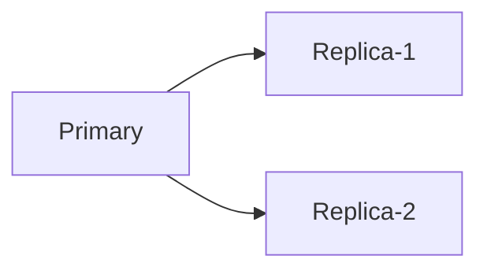

Primary stores the main copy. Replicas store duplicate copies.

### Write operation

1. Client sends write request
2. Primary updates data
3. Primary propagates changes to replicas

**Example — write `User = Alice`:**

```text
Primary updated
      |
      V
Replica-1 updated
Replica-2 updated
```

All copies become identical.

### Read operation

Reads may be served from primary or replicas.

```text
                Primary
                   |
          ------------------
          |                |
      Replica-1        Replica-2

Client-1 → Replica-1
Client-2 → Replica-2
Client-3 → Primary
```

Multiple servers can serve read requests.

### Example

**Original record:**

```text
+--------+-------+
| UserID | Name  |
+--------+-------+
| 101    | Alice |
+--------+-------+
```

Same record on primary, replica-1, and replica-2 — all servers contain identical data.

### Types of replication

| Mode | Writes | Section |
|------|--------|---------|
| **Single-primary (leader–follower)** | One primary | [§5.12](#512-leader-follower-replication) |
| **Multi-primary** | Multiple leaders | [§5.13](#513-multi-leader-replication) |
| **Peer-to-peer** | Any node may coordinate | Ad-hoc clusters |

### Synchronous vs asynchronous

| | Synchronous | Asynchronous |
|---|-------------|--------------|
| **Ack** | After replicas confirm | After primary only |
| **Risk** | Higher latency | Replication lag on reads |

Used in detail in [§5.12](#512-leader-follower-replication).

### Replication factor

**Replication factor (RF)** — number of copies maintained for each piece of data.

```text
RF = 1   →  one copy   (S1)
RF = 2   →  two copies (S1, S2)
RF = 3   →  three copies (S1, S2, S3)
```

**Example — RF = 3:** user data exists on Server-A, Server-B, Server-C.

### Failure scenario

```text
RF = 3:  S1, S2, S3
S1 fails → remaining copies: S2, S3 → data still available
```

### Sharding + replication

See [§5.2 Sharding](#52-sharding).

```text
                System
                   |
    ----------------------------------
    |               |               |
  Shard-1        Shard-2         Shard-3
    |               |               |
  P,R,R           P,R,R           P,R,R
```

Each shard has its own primary and replicas.

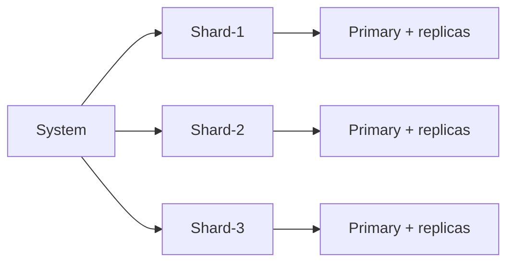

### Benefits

- Multiple copies of data
- Higher availability
- Improved fault tolerance
- Reduced risk of data loss
- Read requests can be distributed
- Supports large-scale systems

### Challenges

- Additional storage required
- Data synchronization needed
- Network overhead increases
- Replica management complexity
- Updates must be propagated

### Summary

Replication is the process of maintaining multiple copies of the same data on different servers.

```text
Primary
   |
-------------------
|                 |
Replica-1     Replica-2
```

**Core concepts:** primary, replica, replication factor, synchronous replication, asynchronous replication.

**Goal:** Improve availability, fault tolerance, and data durability by storing multiple copies of data.

---


## 5.12 Leader Follower Replication

### What is leader-follower replication?

Leader-follower replication is a replication model where one server acts as the **leader** and one or more servers act as **followers**.

The leader accepts write operations. Followers receive copies of the leader's data.

```text
                Leader
                   |
        ---------------------
        |                   |
     Follower-1        Follower-2
```

All followers maintain copies of leader data. See [§5.11 Replication](#511-replication).

### Components

| Component | Role |
|-----------|------|
| **Leader** | Main server responsible for processing writes |
| **Follower** | Replica servers that maintain copies of leader data |
| **Client** | Application sending read and write requests |

### Basic architecture

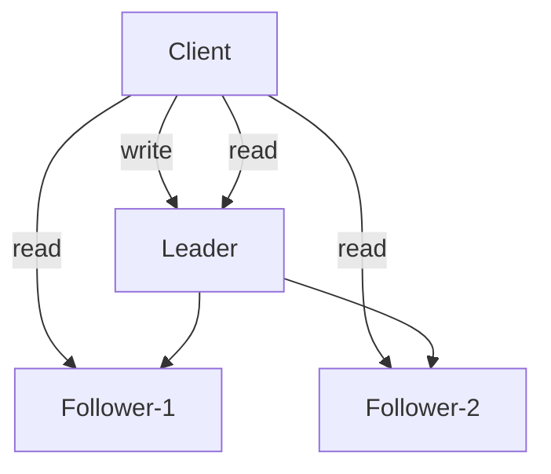

Leader contains the source of truth.

### Write operation

1. Client sends write request
2. Leader updates its data
3. Leader propagates changes to followers

**Example — insert user:**

```text
UserID = 101, Name = Alice

Client → Leader updated → Follower-1 updated → Follower-2 updated
```

All copies become identical.

### Write flow visualization

```text
                Client
                   |
                   V
                Leader
                   |
        ---------------------
        |                   |
        V                   V
    Follower-1         Follower-2
```

Writes always go through the leader.

### Read operation

Reads can be served by leader or followers.

```text
                Leader
                   |
        ---------------------
        |                   |
   Follower-1         Follower-2

Client-A → Follower-1
Client-B → Follower-2
Client-C → Leader
```

Read traffic can be distributed.

### Read flow visualization

```text
Client-1  ----->  Follower-1
Client-2  ----->  Follower-2
Client-3  ----->  Leader
```

Multiple servers can serve read requests.

### Example

```text
+--------+-------+
| UserID | Name  |
+--------+-------+
| 101    | Alice |
+--------+-------+
```

Same record on leader, follower-1, and follower-2 — all nodes contain the same data.

### Synchronous vs asynchronous replication

Covered in [§5.11 Replication](#511-replication) (sync waits for followers; async returns after leader). Leader–follower specifics below.

### Leader failure

**Before failure:**

```text
                Leader
                   |
        ---------------------
        |                   |
     Follower-1       Follower-2
```

**Leader fails:**

```text
             X Leader (failed)
        ---------------------
        |                   |
     Follower-1       Follower-2
```

A follower may become the new leader.

### Failover

**Before:** Leader, Follower-1, Follower-2

**Leader fails.**

**After:** Follower-1 → new leader; Follower-2 → follower

```text
Before:  Leader → Followers
After:   New Leader → Followers
```

See [§4.11 Failover](../04-distributed-system/README.md#411-failover).

### Replication lag

Sometimes followers are not updated immediately.

```text
Leader:    UserID = 101, Name = Alice
Follower:  UserID = 101, Name = Alex   ← not yet updated
```

This temporary difference is called **replication lag**.

### Benefits

- Multiple copies of data
- High availability
- Improved fault tolerance
- Read load distribution
- Reduced load on leader for reads
- Data remains available after failures

### Challenges

- Leader can become a bottleneck
- Replication lag may occur
- Failover management required
- Additional storage needed
- Synchronization overhead

### Summary

Leader-follower replication consists of one leader plus multiple followers.

```text
                Leader
                   |
        ---------------------
        |                   |
     Follower-1       Follower-2

Writes:  Client → Leader
Reads:   Client → Leader or followers
```

**Core concepts:** leader, followers, replication, failover, replication lag.

**Goal:** Maintain multiple copies of data while centralizing write operations through a leader.

---


## 5.13 Multi Leader Replication

### What is multi-leader replication?

Multi-leader replication is a replication model where multiple servers act as leaders and can accept write operations.

Each leader replicates its changes to other leaders and replicas.

Unlike leader-follower replication, writes are not restricted to a single leader.

```text
          Leader-A <-------> Leader-B
               \               /
                \             /
                 Leader-C
```

All leaders can process writes. See [§5.12 Leader Follower Replication](#512-leader-follower-replication) for single-leader model.

### Why multi-leader replication?

In some systems, a single leader may become a bottleneck.

Instead of routing all writes to one server, multiple leaders can accept writes independently.

**Benefits include:**

- Distributed write handling
- Reduced write bottlenecks
- Improved availability

### Basic architecture

```text
                Client requests
                      |
      -------------------------------------
      |                |                 |
      V                V                 V
   Leader-A        Leader-B         Leader-C
      |                |                 |
      -------------------------------------
                Replication
```

Each leader can receive writes.

```mermaid
flowchart TB
    C[Client requests] --> LA[Leader-A]
    C --> LB[Leader-B]
    C --> LC[Leader-C]
    LA <-->|replicate| LB
    LB <-->|replicate| LC
    LA <-->|replicate| LC
```

### Write operation

**Example — Client sends `UserID = 101`, `Name = Alice` to Leader-A:**

```text
Client → Leader-A updated → Leader-B updated → Leader-C updated
```

All leaders eventually receive the change.

### Another write example

**Client sends `UserID = 202`, `Name = Bob` to Leader-B:**

```text
Client → Leader-B updated → Leader-A updated → Leader-C updated
```

Every leader propagates updates to others.

### Visualization

```text
                 Leader-A
                 /      \
                /        \
         Leader-B ------ Leader-C

Replication occurs between leaders.
```

### Read operation

Reads can be served from Leader-A, Leader-B, or Leader-C.

```text
Client-1 → Leader-A
Client-2 → Leader-B
Client-3 → Leader-C
```

Any leader can handle reads.

### Data synchronization

```text
Leader-A receives: UserID = 101, Name = Alice
      |
      V
Leader-B
      |
      V
Leader-C
```

All leaders eventually receive the same update.

### Conflict problem

Multiple leaders can accept writes at the same time.

```text
Leader-A:  UserID = 101, Name = Alice
Leader-B:  UserID = 101, Name = Alex   (at the same time)
```

**Conflict:**

```text
Leader-A → Alice
Leader-B → Alex
```

Different leaders contain different values.

### Conflict visualization

```text
Client-1 → Leader-A   Name = Alice
Client-2 → Leader-B   Name = Alex

Both updates occur independently.
Conflict occurs when replication happens.
```

### Example of conflict

**Initial state:** UserID = 101, Name = John

```text
Update 1 (Leader-A):  Name = Alice
Update 2 (Leader-B):  Name = Alex

Before synchronization:
  Leader-A → Alice
  Leader-B → Alex
```

### Leader failure

**Before:** Leader-A, Leader-B, Leader-C

**Leader-A fails** → remaining: Leader-B, Leader-C

Writes can still be processed by remaining leaders. System continues operating.

### Replication flow

```text
Write at Leader-A  →  Leader-B  →  Leader-C

or

Write at Leader-C  →  Leader-A  →  Leader-B
```

Changes spread among leaders.

### Leader-follower vs multi-leader

See [§5.12](#512-leader-follower-replication).

| | Leader-follower | Multi-leader |
|---|-----------------|--------------|
| **Topology** | Leader → followers | Leader-A, Leader-B, Leader-C |
| **Writes** | Only leader | Any leader |

### Benefits

- Multiple write locations
- Reduced write bottlenecks
- Improved availability
- Better geographic distribution
- System continues even if one leader fails

### Challenges

- Conflict management required
- More complex replication
- Data synchronization overhead
- Multiple leaders must stay consistent
- Increased operational complexity

### Summary

Multi-leader replication allows multiple leaders to accept write requests.

```text
         Leader-A
            |
     ----------------
     |              |
  Leader-B      Leader-C
```

**Characteristics:**

- Multiple writable leaders
- Leaders replicate changes to one another
- Reads can be served by any leader
- Writes can be accepted by any leader
- Conflicts may occur when leaders update the same data independently

**Goal:** Distribute write operations across multiple leaders instead of relying on a single leader.

---


## 5.14 Quorum Reads

### What is a quorum read?

A quorum read is a read operation where the system collects responses from a minimum number of replicas before returning the result.

Instead of reading from just one replica, the system consults multiple replicas and uses enough responses to form a quorum.

Quorum read ensures that the returned data is likely to be the latest version.

### Basic idea

**Replication factor (RF)** — number of replicas storing the same data.

```text
RF = 3  →  Replica-1, Replica-2, Replica-3
```

**Read quorum (R)** — number of replicas that must respond to a read.

```text
RF = 3, R = 2  →  at least 2 replicas must respond before completing the read
```

See [§5.11 Replication](#511-replication) for RF. Write quorum in [§5.15 Quorum Writes](#515-quorum-writes).

### Architecture

```mermaid
flowchart TB
    Client[Client] --> Req[Read request]
    Req --> R1[Replica-1]
    Req --> R2[Replica-2]
    Req --> R3[Replica-3]
    R1 --> Q{Quorum met?}
    R2 --> Q
    R3 --> Q
    Q -->|R responses| Result[Return result]
```

### Example

```text
RF = 3   Replicas: R1, R2, R3
R = 2

Client requests UserID = 101
System contacts R1, R2, R3
Responses from R1, R2 → quorum achieved → read succeeds
```

### Version example

**UserID = 101:**

```text
R1 → Version 5
R2 → Version 5
R3 → Version 4

R = 2
Responses: R1 → V5, R2 → V5
Result: Version 5 returned
```

Latest data is obtained from quorum responses (highest version among responders).

### Read flow

1. Client sends read request
2. Request reaches replicas
3. Replicas return stored versions
4. System waits until quorum is reached
5. Appropriate version is returned

### Example with RF = 5

```text
Replicas: R1, R2, R3, R4, R5
R = 3

Responses:
  R1 → Version 10
  R2 → Version 10
  R3 → Version 10

Quorum achieved → result returned
```

### Quorum condition (canonical)

```text
N = replication factor
R = read quorum
W = write quorum

Commonly:  R + W > N

Example:  N = 3, R = 2, W = 2  →  2 + 2 > 3  ✓
```

This guarantees overlap between reads and writes so a read quorum sees at least one replica that participated in the latest write quorum. Write side: [§5.15](#515-quorum-writes).

### Why multiple replicas are read?

```text
R1 → Version 7
R2 → Version 7
R3 → Version 6
```

Reading only R3 may return old data. Reading multiple replicas increases the probability of obtaining the latest version.

### Example

```text
RF = 3

R1 → Alice
R2 → Alice
R3 → Alex

R = 2
Responses: R1 → Alice, R2 → Alice
Result: Alice
```

The quorum agrees on the latest value.

### Benefits

- Increased likelihood of reading recent data
- Works even if some replicas are unavailable
- Improves fault tolerance
- Supports distributed databases
- Reduces dependency on a single replica

### Challenges

- Multiple replicas must be contacted
- Read latency can increase
- More network communication required
- Additional coordination is needed
- Quorum calculation adds complexity

### Quorum read vs single replica read

**Single replica read:**

```text
Client → Replica  →  one response required
```

**Quorum read:**

```text
Client → multiple replicas → quorum responses required
```

### Summary

Quorum read is a read operation that requires responses from a minimum number of replicas before returning data.

```text
N = replication factor
R = read quorum
W = write quorum

Example:  N = 3, R = 2
Read must obtain responses from at least 2 replicas.
```

**Goal:** Increase the likelihood of returning the latest data while maintaining availability in a replicated system.

---


## 5.15 Quorum Writes

### What is a quorum write?

A quorum write is a write operation that is considered successful only after a minimum number of replicas acknowledge the write.

Instead of waiting for all replicas, the system waits for a specified number of replicas called the **write quorum (W)**.

Quorum write helps maintain consistency while allowing the system to tolerate replica failures.

### Basic idea

```text
N = total number of replicas (replication factor)
W = minimum replicas that must confirm the write
```

**Example:**

```text
N = 3   Replicas: R1, R2, R3
W = 2   At least 2 replicas must ACK before success is returned
```

See [§5.11 Replication](#511-replication). Read side in [§5.14 Quorum Reads](#514-quorum-reads).

### Architecture

```mermaid
flowchart TB
    Client[Client] --> Req[Write request]
    Req --> R1[Replica-1]
    Req --> R2[Replica-2]
    Req --> R3[Replica-3]
    R1 --> Q{W ACKs?}
    R2 --> Q
    R3 --> Q
    Q -->|quorum met| OK[Return success]
```

### Write flow

1. Client sends write request
2. System forwards write to replicas
3. Replicas store the data
4. Replicas send acknowledgements
5. When write quorum is reached, success is returned

### Example

```text
N = 3, W = 2
Write: UserID = 101, Name = Alice

R1 → ACK
R2 → ACK

Quorum achieved → write succeeds
R3 may update later
```

### Visualization

```text
                    Client
                       |
                Write request
       --------------------------------
       |              |              |
      R1             R2             R3
     ACK            ACK          Pending
       |              |
       ---------------
              |
        Quorum met
              |
      Return success
```

### Example with RF = 5

```text
Replicas: R1, R2, R3, R4, R5
W = 3

R1 → ACK, R2 → ACK, R3 → ACK
Quorum achieved → write succeeds
```

### Failure scenario

```text
N = 3, W = 2
R3 fails

R1 → ACK
R2 → ACK

Write still succeeds because quorum is achieved.
```

### Quorum overlap

Uses the same `R + W > N` rule as [§5.14 Quorum Reads](#514-quorum-reads) so writes and reads overlap on at least one replica.

### Why not wait for all replicas?

```text
N = 5

All replicas:  need R1, R2, R3, R4, R5
              → one slow/unavailable replica delays the write

Quorum:        W = 3 → only 3 ACKs required → write completes faster
```

### Example

```text
N = 3, W = 2
Write: Balance = 500

R1 → ACK
R2 → ACK
R3 → no response

Write succeeds — quorum achieved.
```

### Benefits

- Tolerates replica failures
- Improves availability
- Does not require all replicas to respond
- Supports distributed databases
- Increases probability that future reads see recent writes

### Challenges

- Multiple replicas must be updated
- More network communication required
- Additional coordination needed
- Higher write latency than a single-replica write
- Quorum management adds complexity

### Quorum write vs all-replica write

| | All-replica write | Quorum write |
|---|-------------------|--------------|
| **Success when** | Every replica ACKs | Enough replicas ACK (W) |
| **N = 5 example** | Need 5 ACKs | Need only W ACKs (e.g. 3) |

### Summary

Quorum write succeeds only after acknowledgements from a minimum number of replicas.

```text
N = replication factor
W = write quorum
R = read quorum

Example:  N = 3, W = 2  →  write succeeds after 2 replica ACKs

Common rule:  R + W > N
```

**Goal:** Maintain data consistency while allowing the system to continue operating when some replicas are slow or unavailable.

---


## 5.16 Distributed Transactions

### What is a distributed transaction?

A distributed transaction is a transaction that involves multiple independent systems, databases, services, or nodes and guarantees that all participating systems reach the same final outcome.

**Outcome:**

```text
COMMIT everywhere   OR   ROLLBACK everywhere
```

**Never:**

```text
Service-A → commit
Service-B → rollback
```

That creates inconsistency.

### Why do we need distributed transactions?

**Single database transaction — transfer ₹100:**

```text
BEGIN
  Deduct 100 from Account-A
  Add 100 to Account-B
COMMIT
```

Everything happens inside one database.

**Distributed system** — payment, wallet, inventory, and order services each with their own database. A single business operation may span multiple services.

**Example — buy product:**

1. Deduct money
2. Reserve inventory
3. Create order

All three operations must succeed together.

### Problem without distributed transactions

**Scenario — buy iPhone:**

```text
Step 1: Payment success        ✓
Step 2: Inventory failed       ✗

Result: money deducted, no order → inconsistent
```

**Another example:**

```text
Step 1: Wallet deducted        ✓
Step 2: Order creation failed  ✗

Customer loses money. Order does not exist.
```

### Distributed transaction architecture

```mermaid
flowchart TB
    Client[Client] --> Txn[Transaction]
    Txn --> Pay[Payment service]
    Txn --> Inv[Inventory service]
    Txn --> Ord[Order service]
    Pay --> DBA[(Database-A)]
    Inv --> DBB[(Database-B)]
    Ord --> DBC[(Database-C)]
```

Multiple databases participate.

### Participants

**A) Coordinator** — controls transaction execution.

Responsibilities: start transaction, ask participants to prepare, decide commit/rollback, notify participants.

**B) Participants** — services or databases involved (payment, inventory, order).

### Transaction states

| State | Meaning |
|-------|---------|
| **Started** | Transaction begins |
| **Prepared** | Participant validated and ready to commit |
| **Committed** | Changes permanently stored |
| **Aborted** | Changes discarded |

### Example: e-commerce order

**Purchase product — price ₹1000**

Services: payment, inventory, order.

```text
Step 1: Payment deduct ₹1000
Step 2: Reserve product
Step 3: Create order

If all succeed → COMMIT
Otherwise      → ROLLBACK
```

### Protocols

Distributed transactions are commonly implemented with:

- [§5.17 Two Phase Commit](#517-two-phase-commit) — prepare, then commit or rollback
- [§5.18 Three Phase Commit](#518-three-phase-commit) — adds pre-commit to reduce blocking

### Distributed transactions in microservices

```text
Service-A (wallet)   Service-B (inventory)   Service-C (orders)

Purchase flow: wallet deduct → inventory reserve → order create
All services must agree on outcome.
```

### Challenges

| Challenge | Issue |
|-----------|-------|
| **Network failures** | Messages lost; coordinator unreachable |
| **Service failures** | Participant crashes |
| **High latency** | Multiple network round trips |
| **Scalability** | More participants → more coordination |
| **Blocking** | Participants wait for coordinator |

### Benefits

- Strong consistency
- Atomic execution
- Prevents partial updates
- Reliable multi-system operations
- Maintains business correctness

### Real-world examples

| Domain | Participants |
|--------|--------------|
| **Banking** | Account-A database, Account-B database |
| **E-commerce** | Payment, inventory, order |
| **Travel booking** | Flight, hotel, payment |
| **Payroll** | Salary, tax, bank |

### Summary

A distributed transaction involves multiple services, databases, or nodes.

**Rule:** ALL commit OR ALL rollback.

**Key components:** coordinator, participants.

**Protocols:** [§5.17 Two Phase Commit](#517-two-phase-commit), [§5.18 Three Phase Commit](#518-three-phase-commit).

**Advantages:** atomicity across systems, strong consistency.

**Challenges:** blocking, failures, latency, coordination overhead.

**Goal:** Keep multiple distributed systems in a consistent state while executing a single business operation.

---


## 5.17 Two Phase Commit

### What is two-phase commit (2PC)?

Two-phase commit is the most common distributed transaction protocol.

It consists of:

- **Phase-1:** Prepare
- **Phase-2:** Commit (or rollback)

See [§5.16 Distributed Transactions](#516-distributed-transactions) for when and why distributed transactions are needed.

### Architecture

```text
                Coordinator
                     |
       --------------------------------
       |              |               |
    Payment      Inventory        Order
```

Participants do not immediately commit.

```mermaid
flowchart TB
    C[Coordinator] --> Pay[Payment]
    C --> Inv[Inventory]
    C --> Ord[Order]
```

### Phase-1: Prepare

Coordinator sends **PREPARE**.

```text
                Coordinator
                     |
      -----------------------------------
      |               |                 |
   Payment       Inventory         Order
```

Each participant checks:

- Can I perform the operation?
- Are resources available?
- Any validation failures?

- If ready → vote **YES**
- Otherwise → vote **NO**

### Prepare example

```text
Payment service    →  balance available?     YES
Inventory service  →  stock available?       YES
Order service      →  can create order?       YES

Responses: Payment → YES, Inventory → YES, Order → YES
```

Coordinator receives all YES votes.

### Phase-2: Commit

Since all participants voted YES, coordinator sends **COMMIT**.

```text
                Coordinator
                     |
      -----------------------------------
      |               |                 |
   Payment       Inventory         Order
     COMMIT        COMMIT         COMMIT
```

Changes become permanent.

### Success flow

```text
Client
   |
   V
Prepare request
   |
   V
Payment → YES
Inventory → YES
Order → YES
   |
   V
Commit request
   |
   V
Payment commit
Inventory commit
Order commit
   |
   V
Transaction success
```

```mermaid
flowchart LR
    P[Prepare] --> Y[All YES]
    Y --> C[Commit]
    C --> OK[Success]
```

### Failure flow

```text
Prepare request

Payment → YES
Inventory → NO
Order → YES

Coordinator decision: ROLLBACK

Payment rollback
Inventory rollback
Order rollback

Final result: no changes persist
```

### Failure scenario 1

```text
Payment service   → YES
Inventory service → NO (out of stock)

Decision: ROLLBACK — everything undone
```

### Failure scenario 2

```text
Payment service   → YES
Inventory service → YES
Order service     → NO

Decision: ROLLBACK

Even though some services are ready, nothing is committed.
```

### Blocking problem in 2PC

```text
All participants vote YES
Coordinator crashes before COMMIT

Payment   → waiting
Inventory → waiting
Order     → waiting
```

Participants cannot decide themselves. They remain blocked until the coordinator recovers.

This is called the **blocking problem**. [§5.18 Three Phase Commit](#518-three-phase-commit) attempts to reduce this.

### Summary

**Phase-1:** PREPARE — participants vote YES or NO.

**Phase-2:** COMMIT if all YES; ROLLBACK if any NO.

**Risk:** coordinator failure after prepare leaves participants blocked.

---


## 5.18 Three Phase Commit

### What is three-phase commit (3PC)?

Three-phase commit is an extension of two-phase commit.

**Phases:**

1. Prepare
2. Pre-commit
3. Commit

**Goal:** Reduce blocking situations that occur in [§5.17 Two Phase Commit](#517-two-phase-commit).

See [§5.16 Distributed Transactions](#516-distributed-transactions) for the broader context.

### Flow

```text
Coordinator
      |
      V
Prepare
      |
      V
Pre-commit
      |
      V
Commit
```

```mermaid
flowchart LR
    P[Prepare] --> PC[Pre-commit]
    PC --> C[Commit]
```

### How it helps

In 2PC, if all participants vote YES and the coordinator crashes before sending COMMIT, participants remain blocked.

3PC adds a **pre-commit** phase so participants know the coordinator has decided to commit before the final commit step, reducing indefinite blocking when timing assumptions hold.

### Summary

**3PC phases:** Prepare → Pre-commit → Commit.

**Compared to 2PC:** extra round trip, but aims to reduce the blocking problem after coordinator failure.

**Note:** still assumes bounded network delay; production systems often use consensus protocols (Raft/Paxos) instead.

---


## 5.19 Distributed Locking

### What is distributed locking?

Distributed locking is a mechanism used to ensure that only one process, service, or machine can access or modify a shared resource at a time in a distributed system.

**Goal:** Prevent multiple distributed nodes from performing conflicting operations simultaneously.

### Why is distributed locking needed?

**Single server** — Thread-1 and Thread-2 use a local mutex/lock.

**Distributed system** — Server-A, Server-B, Server-C may all try to update the same resource. Local locks cannot coordinate across machines. A **distributed lock** is required.

### Problem without distributed locking

**Example — bank balance ₹1000:**

```text
Server-A: withdraw ₹500  →  reads 1000  →  1000 - 500 = 500
Server-B: withdraw ₹700  →  reads 1000  →  1000 - 700 = 300
```

Final balance may become incorrect. This is a **race condition**.

### Basic idea

Before modifying a resource:

1. Acquire lock
2. Perform operation
3. Release lock

```text
Acquire lock → Modify resource → Release lock
```

Only one owner can hold the lock at a time.

### Architecture

```mermaid
flowchart TB
    LS[Lock service] --> SA[Server-A]
    LS --> SB[Server-B]
    LS --> SC[Server-C]
```

Servers request locks from a central locking system.

### Example

**Shared resource:** product inventory, available stock = 1. Two users buy simultaneously.

**Without lock:** Server-A and Server-B both purchase → both may succeed → **overselling**.

**With lock:** Server-A acquires lock; Server-B waits → only one purchase succeeds.

### Lock acquisition

```text
Server-A → request lock → lock available → grant lock

Server-A → acquire lock → lock granted
```

### Lock contention

```text
Server-A → lock owner
Server-B → waiting
Server-C → waiting
```

Server-B requests lock while Server-A holds it → denied or wait. Only one owner exists.

### Lock release

```text
Server-A → release lock → lock available
```

Another server can acquire it.

### Lock life cycle

```text
Unlocked → acquire lock → locked → perform work → release lock → unlocked
```

```mermaid
flowchart LR
    U[Unlocked] --> A[Acquire]
    A --> L[Locked]
    L --> W[Perform work]
    W --> R[Release]
    R --> U
```

### Lock with expiration (TTL)

**Problem:** server acquires lock, then crashes — lock never released.

**Solution:** TTL (time to live).

```text
Lock duration = 30 seconds
If owner crashes → after 30 seconds lock auto-expires
```

### Example using inventory

```text
Stock = 1

Server-A: acquire lock ✓ → update 1→0 ✓ → release lock ✓
Server-B: acquire lock ✓ → check stock 0 → purchase rejected ✓
```

Correct result.

### Lease-based lock

A lease is a lock with an expiration time.

```text
Lock valid until 12:00:30 PM
If not renewed before expiration, ownership is lost

Acquire lease → perform work → renew lease → continue
```

### Distributed lock manager

A lock manager maintains lock ownership.

**Responsibilities:** grant lock, reject lock, track owner, manage expiration, release lock.

```text
             Lock manager
                    |
       ----------------------------
       |             |            |
      S1            S2           S3
```

### Common use cases

| Use case | Purpose |
|----------|---------|
| **Inventory management** | Prevent overselling |
| **Payment processing** | Avoid duplicate payments |
| **Schedulers** | Ensure only one server runs a job |
| **Leader election** | Only one node becomes leader — see [§5.24 Leader Election](#524-leader-election) |
| **File processing** | Prevent multiple workers processing the same file |

### Failure scenario

```text
Server-A acquires lock ✓
Server-A crashes ✗

Without expiration: lock remains forever
With expiration:    lock expires → another server can proceed
```

### Benefits

- Prevents race conditions
- Protects shared resources
- Ensures mutual exclusion
- Avoids duplicate processing
- Maintains consistency

### Challenges

- Additional network calls
- Lock service can become a bottleneck
- Deadlock risks
- Lock expiration management
- Failure handling complexity

### Distributed lock vs database lock

| | Database lock | Distributed lock |
|---|---------------|------------------|
| **Scope** | Inside a single database | Across multiple services, machines, and databases |

### Summary

Distributed locking ensures that only one distributed node can access or modify a shared resource at a time.

```text
Acquire lock → Perform operation → Release lock
```

**Key concepts:** lock owner, lock manager, lock expiration (TTL), lease, mutual exclusion.

**Goal:** Prevent concurrent conflicting operations across multiple distributed systems.

---


## 5.20 Split Brain

### What is split brain?

Split brain is a failure scenario in a distributed system where multiple nodes believe they are the leader (or primary) at the same time.

As a result, independent groups of nodes continue operating separately and make conflicting decisions.

**Result:**

```text
Multiple leaders + multiple sources of truth + data inconsistency
```

### Why is it called "split brain"?

**Originally:** one cluster, one leader.

**After network partition:** the cluster divides into multiple groups.

```text
Before:
      Node-A (Leader)
           |
    -----------------
    |       |       |
  Node-B  Node-C  Node-D

After partition:
  Group-1: Node-A, Node-B
  Group-2: Node-C, Node-D

Both groups may think: "We are the active cluster."
```

The cluster's "brain" is split.

### How split brain occurs

Most commonly caused by:

- Network partition
- Communication failures
- Cluster isolation
- Node connectivity issues

```text
                Leader
                   |
       ------------------------
       |          |           |
       B          C           D

Network failure → Leader cannot reach C and D

Group-1: Leader, B
Group-2: C, D
```

### Network partition

```text
Before:  A (Leader) — all nodes communicate
         / | \
        B  C  D

After:   A (Leader)     |     C
         |              |     D
         B         [network failure]

Two isolated groups exist.
```

### Split brain scenario

```text
Group-1:  A (Leader), B
Group-2:  C, D  — cannot see A, may assume leader failed → C becomes leader

Now:  A → leader   AND   C → leader
Two leaders exist simultaneously.
```

### Visualization

```mermaid
flowchart TB
    subgraph Before[Before partition]
        AL[A · Leader] --- B1[B]
        AL --- C1[C]
        AL --- D1[D]
    end
    subgraph After[After partition]
        subgraph G1[Group-1]
            A2[A · Leader]
            B2[B]
        end
        subgraph G2[Group-2]
            C2[C · Leader]
            D2[D]
        end
    end
```

Both sides think they are correct.

### Problem caused by split brain

```text
Leader-A:  update balance = 1000
Leader-C:  update balance = 1500

When connectivity returns — which is correct? 1000? 1500?
Both clusters contain different data.
```

### Database example

```text
Before partition:  Primary balance = 500, Replica balance = 500

After partition:
  Primary side → 600
  Replica side → 700

Two versions exist → data divergence.
```

### Multi-writer problem

```text
Group-1 accepts writes
Group-2 accepts writes

User name:  Group-1 → Alice,  Group-2 → Alex
After recovery → conflict exists.
```

### Split brain in leader election

Leader election systems need exactly one leader. See [§5.24 Leader Election](#524-leader-election).

```text
Before:  Leader = A
After partition:  A isolated; others elect Leader = C

A thinks: "I am leader."
C thinks: "I am leader."
→ Split brain.
```

### Detection

Cluster monitors node connectivity, heartbeats, and leader status.

```text
Heartbeats:  A → B, A → C, A → D
If heartbeats stop → nodes suspect failure or partition.
```

### Quorum to prevent split brain

Only the partition holding a **majority** may elect a leader and accept writes. Minority partitions must stop.

```text
5 nodes: A B C D E — majority = 3

Partition: Group-1 (A B C) → can operate
           Group-2 (D E)    → cannot elect leader / must stop writes
```

Majority math and replica quorums: [§5.14](#514-quorum-reads), [§5.15](#515-quorum-writes). Election details: [§5.23 Raft](#523-raft).

### Fencing

Fencing prevents an old leader from continuing work. Related to [§5.19 Distributed Locking](#519-distributed-locking).

```text
Leader-A loses connectivity → cluster elects Leader-C
Even if A returns, it cannot continue acting as leader — A is fenced off.
```

### Real-world example

```text
Distributed database: Node-A is leader
Network partition → Node-C becomes leader
Both accept writes → after recovery, different datasets exist
Manual or automatic conflict resolution required.
```

### Effects of split brain

- Multiple leaders
- Data inconsistency
- Conflicting writes
- Lost updates
- Corrupted state
- Difficult recovery

### Prevention techniques

| Technique | How it helps |
|-----------|--------------|
| **Quorum** | Majority required for operation |
| **Leader election** | Ensure only one valid leader — [§5.24](#524-leader-election) |
| **Heartbeats** | Continuous node monitoring |
| **Fencing tokens** | Prevent old leaders from acting |
| **Consensus algorithms** | Raft, Paxos — [§5.22](#522-paxos), [§5.23](#523-raft) |

### Summary

Split brain occurs when a partitioned cluster has multiple nodes believing they are leader simultaneously.

```text
Group-1: A (Leader)    Group-2: C (Leader)
→ Two leaders, two sources of truth, potential data inconsistency
```

**Common cause:** network partition.

**Common solution:** quorum-based systems — only the partition with majority nodes remains active.

**Goal:** Prevent multiple leaders and maintain a single, consistent view of the system.

---


## 5.21 Consensus

### What is consensus?

Consensus is the process by which multiple distributed nodes agree on a single value, decision, or system state.

Even if some nodes fail or network issues occur, all healthy nodes eventually agree on the same result.

```text
Many nodes → one agreed decision
```

### Why is consensus needed?

```text
Distributed system: Node-A, Node-B, Node-C, Node-D, Node-E
Each node has its own view of the system.
```

Without consensus:

- Multiple leaders may exist
- Different nodes may store different values
- [Split brain](#520-split-brain) may occur
- System becomes inconsistent

Consensus ensures everyone agrees.

### What do nodes need to agree on?

| Decision type | Example question |
|---------------|------------------|
| **Leader election** | Who is the leader? — [§5.24](#524-leader-election) |
| **Database update** | Which value is correct? |
| **Configuration change** | Which configuration is active? |
| **Transaction decision** | Commit or rollback? |

### Example: leader election

Without consensus, nodes may each claim leadership; with consensus, all agree on one leader (e.g. **Leader = C**). Protocol detail: [§5.24](#524-leader-election), [§5.23 Raft](#523-raft).

### Example: database update

```text
Current value: balance = 1000
Node-A receives: balance = 1200
Node-B receives: balance = 1500

Consensus determines the official value.
Final agreed state: balance = 1500 (or another agreed value)
All nodes eventually converge.
```

### Consensus requirements

| Property | Meaning |
|----------|---------|
| **Agreement** | All healthy nodes agree on the same value |
| **Validity** | Chosen value must be proposed by some node |
| **Termination** | Nodes eventually reach a decision |

### Consensus visualization

```text
Before:
  Node-A → X    Node-B → Y    Node-C → X    Node-D → Y

Consensus process →

After:
  Node-A → X    Node-B → X    Node-C → X    Node-D → X

Everyone agrees.
```

### Network failure scenario

```text
Nodes: A, B, C, D, E

Partition:
  Group-1: A B C
  Group-2: D E

Consensus ensures only one side can make decisions — helps prevent split brain.
```

See [§5.20 Split Brain](#520-split-brain).

### Leader-based consensus

Many systems elect a **leader** that proposes changes; followers acknowledge; a **majority** commits the decision. Full protocol walkthrough: [§5.23 Raft](#523-raft) (operations) and [§5.22 Paxos](#522-paxos) (classic two-phase accept).

```mermaid
flowchart LR
    P[Proposal] --> V[Voting]
    V --> M[Majority]
    M --> C[Commit]
```

### Failure tolerance & partitions

```text
5 nodes, 2 failed → 3 remain → majority OK → consensus continues
5 nodes, only 2 alive → no majority → decisions pause until quorum returns
```

Partition behavior (majority side only stays active): [§5.20 Split Brain](#520-split-brain).

### Popular consensus algorithms

| Algorithm | Notes |
|-----------|-------|
| **Raft** | Leader-based — election, log replication, majority voting — [§5.23](#523-raft) |
| **Paxos** | Classic protocol — proposers, acceptors, learners — [§5.22](#522-paxos) |
| **ZAB** | ZooKeeper Atomic Broadcast — used in Apache ZooKeeper; atomic broadcast and consensus |

### Consensus vs quorum

| | Quorum | Consensus |
|---|--------|-----------|
| **What** | Minimum number of nodes required to proceed | Agreement on a specific decision or value |
| **Example** | 5 nodes → need 3 responses | All active nodes agree: Leader = Node-C |

Quorum is often used to achieve consensus.

### Consensus vs distributed locking

| | Distributed locking | Consensus |
|---|---------------------|-----------|
| **Purpose** | Controls access to a resource | Makes a cluster-wide decision |
| **Example** | Who can access the resource? | Who becomes leader? |

See [§5.19 Distributed Locking](#519-distributed-locking).

### Benefits

- Prevents split brain
- Maintains consistency
- Enables reliable leader election
- Supports fault tolerance
- Provides a single agreed system state

### Challenges

- Network communication overhead
- Increased latency
- Complex implementation
- Majority requirement
- Handling node failures

### Summary

Consensus is the process by which distributed nodes agree on a single value, state, or decision.

```text
Nodes: A B C D E
Decision: Leader = C
After consensus: all nodes agree Leader = C
```

**Key concepts:** agreement, majority voting, quorum, leader election, fault tolerance.

**Popular algorithms:** Raft ([§5.23](#523-raft)), Paxos ([§5.22](#522-paxos)), ZAB (ZooKeeper).

**Goal:** Ensure distributed systems maintain a single, consistent view of critical decisions despite failures and network issues.

---


## 5.22 Paxos

> **Interview:** Paxos is the classic **consensus** protocol (proposers, acceptors, learners, majority quorums). Correct but hard to implement. New systems usually use **[§5.23 Raft](#523-raft)** — same idea, clearer leader-based structure. Mention Paxos when discussing Google Chubby, Spanner, or early ZooKeeper.

### What is Paxos?

Paxos is a distributed consensus algorithm that enables multiple nodes in a distributed system to agree on a single value even when some nodes fail.

```text
Many nodes → one agreed value
```

Paxos solves the consensus problem. See [§5.21 Consensus](#521-consensus).

### Why Paxos is needed

```text
Distributed system: A, B, C, D, E

Nodes may fail, recover, experience network issues, or receive different messages.
Despite these problems, all nodes must agree on the same decision.
```

Example — leader election: Leader = C; all nodes must agree on this result.

### Core idea

Paxos ensures only one value is chosen. Even if multiple nodes propose different values, eventually one value wins and becomes the agreed value.

```text
Node-A proposes Leader = A
Node-B proposes Leader = B
Paxos guarantees only one value is accepted.
```

### Roles in Paxos

Paxos defines three logical roles:

1. **Proposer** — suggests a value
2. **Acceptor** — votes on proposals
3. **Learner** — discovers the final chosen value

### Proposer

A proposer suggests a value.

```text
Propose: Leader = A   or   Balance = 1000
```

A proposer tries to get its value accepted.

### Acceptor

Acceptors vote on proposals and determine which proposal becomes chosen.

```text
Acceptors: A1, A2, A3, A4, A5
Majority agreement is required.
```

### Learner

Learners discover the final chosen value.

```text
Chosen value: Leader = C
Learners receive this and update their state.
```

### Architecture

```text
                Proposer
                    |
                    V
          ---------------------
          |     Acceptors     |
          ---------------------
           |    |    |    |
           V    V    V    V
               Learners
```

```mermaid
flowchart TB
    P[Proposer]
    P --> A1[A1]
    P --> A2[A2]
    P --> A3[A3]
    P --> A4[A4]
    A1 --> L[Learners]
    A2 --> L
    A3 --> L
    A4 --> L
```

### Proposal number

Every proposal has a unique proposal number.

```text
Proposal #1 → Leader = A
Proposal #2 → Leader = B

Higher numbers are newer:  #100 > #50  →  #100 has higher priority
```

### Two phases of Paxos

| Phase | Name |
|-------|------|
| **Phase 1** | Prepare |
| **Phase 2** | Accept |

### Phase 1: Prepare

Proposer sends `PREPARE(N)` where N = proposal number.

```text
Example: PREPARE(100) sent to acceptors

Proposer ---- Prepare(100) ----> A1
         ---- Prepare(100) ----> A2
         ---- Prepare(100) ----> A3
```

### Acceptor response

If the proposal number is greater than any previously seen proposal, the acceptor replies **Promise**.

```text
Prepare(100):
  A1 → Promise
  A2 → Promise
  A3 → Promise

Acceptors promise not to accept smaller proposal numbers in the future.
```

### Majority requirement

```text
5 acceptors: A1 A2 A3 A4 A5
Majority: 3

A1 → Promise, A2 → Promise, A3 → Promise  →  majority achieved → proposer proceeds
```

### Phase 2: Accept

Proposer sends `ACCEPT(N, VALUE)`.

```text
Example: Accept(100, Leader=A)

Proposer ---- Accept ----> A1
         ---- Accept ----> A2
         ---- Accept ----> A3
```

### Acceptor decision

```text
Acceptors receive: Accept(100, Leader=A)

A1 → Accepted
A2 → Accepted
A3 → Accepted

Majority accepted → value becomes chosen.
```

### Learning phase

```text
Chosen value: Leader = A
Learners receive notification → all nodes update state → final agreement: Leader = A
```

### Complete flow

```text
Step 1: Proposer creates proposal
Step 2: Prepare(N)
Step 3: Acceptors send Promise
Step 4: Majority promises received
Step 5: Accept(N, Value)
Step 6: Majority accept
Step 7: Value chosen

Prepare → Promise → Accept → Accepted → Chosen value
```

```mermaid
flowchart LR
    Prep[Prepare] --> Prom[Promise]
    Prom --> Acc[Accept]
    Acc --> Acpt[Accepted]
    Acpt --> Chosen[Chosen value]
```

### Example

```text
5 acceptors: A1 A2 A3 A4 A5
Proposal #100: Leader = B

Prepare(100):  A1 → Promise, A2 → Promise, A3 → Promise  →  majority
Accept(100, B): A1 → Accepted, A2 → Accepted, A3 → Accepted
Chosen value: Leader = B
```

### Competing proposers

```text
Proposer-1: Proposal #100, Leader = A
Proposer-2: Proposal #200, Leader = B

200 > 100 → Proposal #200 eventually wins.
Higher proposal numbers dominate.
```

### Failure tolerance

```text
5 acceptors: A1 A2 A3 A4 A5
Failures: A4, A5 failed
Remaining: A1 A2 A3 → majority still exists → consensus continues
```

### When Paxos stops working

```text
5 acceptors, need majority = 3
Available: A1, A2 only (2 nodes)
Majority unavailable → consensus cannot be reached
```

### Characteristics

- Majority-based consensus
- Fault tolerant
- Handles node failures and message delays
- Guarantees a single chosen value
- No split-brain decisions — see [§5.20 Split Brain](#520-split-brain)

### Challenges

- Difficult to understand
- Complex implementation
- Many message exchanges
- High coordination overhead
- Hard to debug

### Multi-Paxos

Basic Paxos decides **one** value (e.g. Leader = A).

For continuous operations, systems use **Multi-Paxos** — repeatedly runs Paxos efficiently for many decisions.

### Paxos vs Raft

| | Paxos | Raft |
|---|-------|------|
| **Age / style** | Older, more theoretical | Designed to be easier to understand |
| **Adoption** | Chubby, Spanner, early ZooKeeper | etcd, Consul, CockroachDB, TiKV |
| **Shared goals** | Consensus, leader election, fault tolerance | Same |

Details: [§5.23 Raft](#523-raft).

### Summary

Paxos allows multiple nodes to agree on a single value.

```text
Roles:     Proposer, Acceptor, Learner
Phases:    Prepare → Accept
Majority:  (N/2) + 1  (5 acceptors → need 3)
```

**Guarantees:** one chosen value, consensus despite failures, prevention of conflicting decisions.

**Goal:** Enable reliable consensus in distributed systems even when nodes fail or networks become unreliable.

---


## 5.23 Raft

### What is Raft?

Raft is a distributed consensus algorithm designed to allow multiple nodes in a distributed system to agree on the same sequence of operations.

It provides:

- Consensus
- Leader election
- Log replication
- Fault tolerance

```text
Many nodes → one leader → one consistent state
```

See [§5.21 Consensus](#521-consensus). Alternative: [§5.22 Paxos](#522-paxos).

### Why Raft is needed

```text
Distributed system: Node-A, Node-B, Node-C, Node-D, Node-E

Nodes can fail, recover, become unreachable, or receive delayed messages.
Despite failures, all nodes must agree on the same state.
```

Example: Leader = Node-C — all nodes agree.

### Core idea

Raft simplifies consensus by electing a leader. All changes go through the leader; followers do not independently decide values.

```text
          Leader
             |
      -----------------
      |       |       |
      F1      F2      F3

Leader coordinates the cluster.
```

```mermaid
flowchart TB
    L[Leader]
    L --- F1[Follower F1]
    L --- F2[Follower F2]
    L --- F3[Follower F3]
```

### Raft node states

A node can be in one of three states:

1. **Follower**
2. **Candidate**
3. **Leader**

```mermaid
stateDiagram-v2
    [*] --> Follower
    Follower --> Candidate: election timeout
    Candidate --> Leader: majority votes
    Candidate --> Follower: discover higher term
    Leader --> Follower: discover higher term
    Leader --> Follower: new leader elected
```

### Follower

Default state.

**Responsibilities:**

- Receive requests from leader
- Receive heartbeats
- Replicate logs
- Vote in elections

Followers do not initiate updates.

### Leader

Leader manages the cluster.

**Responsibilities:**

- Accept client requests
- Replicate logs
- Send heartbeats
- Coordinate consensus

Only one leader should exist in a term.

### Candidate

Temporary state during leader election. A follower becomes a candidate when it does not hear from a leader for some time.

```text
Follower → Candidate → Leader
                  or → Follower
```

### Term

A term is a logical time period in Raft.

```text
Term 1: Leader = A
Term 2: Leader = C
Term 3: Leader = B

Each election creates a new term.
Only one leader should exist per term.
```

### Heartbeats

Leader periodically sends heartbeats.

**Purpose:** prove leader is alive; prevent new elections.

```text
             Leader
                |
      --------------------
      |        |         |
      V        V         V
     F1       F2        F3
  Heartbeat Heartbeat Heartbeat
```

### Leader failure

```text
Before: Leader = A, Followers B C D E
Leader crashes → followers stop receiving heartbeats → election begins
```

### Election timeout

Followers wait for heartbeats. If timeout occurs: Follower → Candidate.

```text
Follower → no heartbeat → timeout → Candidate
```

### Leader election

Candidate requests votes.

```text
Candidate = C
Requests "Vote for me" sent to A, B, D, E
```

### RequestVote

```text
Candidate C sends RequestVote

          Candidate-C
                |
      --------------------
      |        |         |
      V        V         V
      A        B         D

Responses: Vote, Vote, Vote
```

```mermaid
sequenceDiagram
    participant C as Candidate C
    participant B as Node B
    participant D as Node D
    C->>B: RequestVote
    C->>D: RequestVote
    B-->>C: Grant vote
    D-->>C: Grant vote
```

### Majority voting

```text
5 nodes: A B C D E
Majority: 3

Votes: A → C, B → C, D → C
Total votes: 3 → majority achieved → C becomes leader
```

### Leader election example

```text
Cluster: A B C D E
Leader A crashes → C becomes candidate

Votes:  A → offline, B → C, C → C, D → C, E → no vote
Votes received: 3 → Leader = C
```

See [§5.24 Leader Election](#524-leader-election).

### Log replication

Leader receives updates, stores them in its log, then replicates to followers.

```text
Example: balance = 1000

           Leader
              |
      ----------------
      |      |       |
      V      V       V
      F1     F2      F3
```

### Log entry

```text
Index 1: Create User
Index 2: Update Balance
Index 3: Create Order

Leader and followers maintain logs.
```

### Replication process

```text
Step 1: Client sends request
Step 2: Leader appends log entry
Step 3: Leader sends entry to followers
Step 4: Followers acknowledge
Step 5: Majority acknowledgement reached
Step 6: Entry committed
```

```mermaid
sequenceDiagram
    participant C as Client
    participant L as Leader
    participant F1 as Follower 1
    participant F2 as Follower 2
    C->>L: update balance = 1000
    L->>L: append log entry
    L->>F1: AppendEntries
    L->>F2: AppendEntries
    F1-->>L: ack
    F2-->>L: ack
    Note over L: majority → commit
    L-->>C: OK
```

### AppendEntries RPC

Leader sends **AppendEntries** containing:

- Term
- Previous log index
- Previous log term
- New entries

Used for log replication and heartbeats.

### Commit rule

A log entry becomes committed when a majority of nodes store it.

```text
5 nodes → need 3 nodes
Leader + Follower-1 + Follower-2 store entry → majority → entry committed
```

### Log consistency

```text
Leader:   Index 1, Index 2, Index 3
Follower: Index 1, Index 2

Leader sends missing entries → follower catches up → logs become identical
```

### Network partition

```text
5 nodes: A B C D E

Partition:
  Group-1: A B C  →  majority (3) → can continue
  Group-2: D E    →  cannot elect leader

Split brain prevented.
```

See [§5.20 Split Brain](#520-split-brain).

### Failure tolerance

```text
5 nodes, need majority = 3
Failures: D, E failed
Remaining: A B C → consensus continues
```

### When Raft stops working

```text
5 nodes, need majority = 3
Alive: A B only (2 nodes)
Majority unavailable → cluster cannot commit new entries
```

### Characteristics

- Leader-based consensus
- Majority voting
- Log replication
- Fault tolerance
- Strong consistency
- Prevents split brain

### Raft vs Paxos

| | Raft | Paxos |
|---|------|-------|
| **Understandability** | Easier to understand | More theoretical, harder to implement |
| **Structure** | Leader-centric, structured workflow | Proposer/acceptor/learner |
| **Shared goal** | Consensus | Consensus |

Details: [§5.22 Paxos](#522-paxos).

### Summary

Raft is a distributed consensus algorithm based on leader election and log replication.

```text
Node states:  Follower, Candidate, Leader
Components:   Leader election, heartbeats, log replication, majority voting
Key RPCs:     RequestVote, AppendEntries
Concepts:     Term, commit index
Majority:     (N / 2) + 1
```

**Goal:** Ensure all nodes agree on the same ordered sequence of operations despite failures, crashes, and network partitions.

---


## 5.24 Leader Election

### What is leader election?

Leader election is the process of selecting one node from a group of distributed nodes to act as the leader.

The selected leader coordinates important operations for the cluster.

```text
Many nodes → one leader
```

### Why is leader election needed?

```text
Distributed system: Node-A, Node-B, Node-C, Node-D, Node-E
```

**Without leader election:**

- Multiple leaders may exist
- Nodes may make conflicting decisions
- [Split brain](#520-split-brain) can occur
- Data inconsistency may happen

**With leader election:** one node becomes leader; all nodes agree on that leader.

### What does a leader do?

| Responsibility | Examples |
|----------------|----------|
| Accept client requests | Single write coordinator |
| Coordinate writes | Ordered updates |
| Manage replication | [§5.12 Leader–Follower](#512-leader-follower-replication) |
| Coordinate consensus | [§5.21 Consensus](#521-consensus) |
| Schedule cluster operations | Job assignment, metadata |
| Maintain cluster state | Authoritative view |

```text
                Leader
                   |
      --------------------------
      |            |           |
      V            V           V
   Follower     Follower    Follower
```

### Leader-based system

```text
                Leader
                   |
       -------------------------
       |           |           |
       V           V           V
      N1          N2          N3

Writes: Client → Leader
Reads:  Client → Leader (or followers)
```

### When is leader election triggered?

| Trigger | What happens |
|---------|----------------|
| **Cluster startup** | No leader exists → election starts |
| **Leader failure** | Current leader crashes → new election |
| **Network partition** | Leader unreachable → election may occur |
| **Leader step-down** | Current leader voluntarily leaves |

### Leader failure example

```text
Before: Leader = A, Followers B C D E
A crashes → followers stop receiving leader messages → election begins
```

### Election mechanics (see Raft)

Raft is the usual reference implementation:

```text
Follower → (no heartbeat / timeout) → Candidate → RequestVote → majority → Leader
```

| Topic | Canonical section |
|-------|-------------------|
| Heartbeats, AppendEntries | [§5.23 Raft](#523-raft) |
| RequestVote, terms, split vote | [§5.23 Raft](#523-raft) |
| Majority rule `(N/2)+1` | [§5.14](#514-quorum-reads) / [§5.21 Consensus](#521-consensus) |
| Partition + minority side | [§5.20 Split Brain](#520-split-brain) |

```mermaid
stateDiagram-v2
    [*] --> Follower
    Follower --> Candidate: election timeout
    Candidate --> Leader: majority votes
    Candidate --> Follower: higher term / split vote retry
    Leader --> Follower: superseded
```

### Split vote

```text
5 nodes: A→B, B→B, C→C, D→C, E→no vote → B=2, C=2 → no majority → retry with new term
```

### Network partition

```text
Group-1 (A B C): majority → can elect leader
Group-2 (D E):   no majority → cannot elect leader (split brain prevented)
```

### Leader election using consensus

Consensus systems perform elections using majority voting.

**Examples:** [Raft](#523-raft), [Paxos](#522-paxos)

Only one leader should be elected at a time.

### Leader lease

A leader may hold leadership for a specific time period.

```text
Leader valid until: 12:00:30 PM
Leadership must be renewed before expiration.
```

### Leader step-down

A leader may voluntarily relinquish leadership — e.g. when it learns a newer term exists.

```text
Leader A steps down → A becomes follower → new election occurs
```

### Characteristics

- Single active leader
- Majority-based election
- Heartbeat monitoring
- Automatic recovery
- Failure handling
- Cluster coordination

### Benefits

- Centralized coordination
- Simplified decision making
- Prevents conflicting updates
- Supports consensus algorithms
- Helps avoid split brain

### Challenges

- Leader can become a bottleneck
- Election causes temporary unavailability
- Network partitions complicate elections
- Requires majority availability
- Additional coordination overhead

### Summary

Leader election selects one node to coordinate a distributed system.

```text
Leader fails → election starts → candidates request votes
→ majority achieved → new leader elected
```

**Key concepts:** leader, follower, candidate, heartbeat, election timeout, majority voting.

**Formula:** majority = (N / 2) + 1

**Goal:** Ensure exactly one node coordinates the cluster at any given time while maintaining consistency and fault tolerance.

---


## 5.25 Lamport Clocks

### What are Lamport clocks?

Lamport clocks are logical clocks used in distributed systems to determine the ordering of events.

They help answer: *Which event happened before another event?* — without relying on synchronized physical clocks.

**Goal:** establish event ordering across distributed nodes.

### Why are Lamport clocks needed?

```text
Distributed system: Node-A, Node-B, Node-C
Each node has its own local clock.
```

Physical clocks may drift, be unsynchronized, or show different times — so physical time cannot always be trusted to determine event order.

Lamport clocks provide logical ordering.

### Basic idea

Every node maintains a logical counter.

```text
Node-A clock = 5
Node-B clock = 12
Node-C clock = 8

The counter increases whenever events occur.
```

### Events

Examples that receive a logical timestamp:

- Send message
- Receive message
- Database update
- Request processing
- Transaction execution

### Lamport clock rules

| Rule | When | Action |
|------|------|--------|
| **Rule 1** | Before executing any event | `Clock = Clock + 1` |
| **Rule 2** | When sending a message | Attach current clock value |
| **Rule 3** | When receiving a message | `Clock = Max(LocalClock, ReceivedClock) + 1` |

These three rules define Lamport clocks.

### Rule 1: internal event

```text
Node-A: clock = 5
Internal event occurs → clock = 6

Every local event increments the clock.
```

### Rule 2: send message

```text
Node-A: clock = 10
Before sending: clock++ → clock = 11
Message sent with timestamp = 11

Node-A (clock = 11) ---- Message(11) ----> Node-B
```

### Rule 3: receive message

```text
Node-B: current clock = 15, received timestamp = 11

Calculation: Max(15, 11) + 1 = 16
New clock: 16
```

### Simple example

```text
Initial: A = 0, B = 0

Event-1: A performs local event → A = 1
Event-2: A sends message → A = 2, message timestamp = 2
Event-3: B receives message → B = Max(0, 2) + 1 = 3

Final: A = 2, B = 3
```

### Visualization

```text
Node-A                    Node-B
Clock=0                   Clock=0
  | Event → A=1
  | Send → A=2
  |-------------------->
                          Receive → B=3
```

```mermaid
sequenceDiagram
    participant A as Node-A
    participant B as Node-B
    A->>A: local event, clock=1
    A->>A: send prep, clock=2
    A->>B: message timestamp=2
    B->>B: receive, clock=Max(0,2)+1=3
```

### Another example

```text
Initial: A = 5, B = 8
A sends message → A = 6, timestamp = 6
B receives → B = Max(8, 6) + 1 = 9
Final: A = 6, B = 9
```

### Happened-before relation

Lamport introduced the **happened-before** relation, written **A → B** — meaning event A happened before event B.

```text
Send message → receive message
Send always happens before receive.
```

### Example of happened-before

```text
Node-A: Event-1 — send message
Node-B: Event-2 — receive message

Relationship: Event-1 → Event-2
Lamport timestamps preserve this ordering.
```

### Message ordering

```text
Node-A: event timestamp = 10 → message sent
Node-B: receive timestamp = 11
Ordering: 10 < 11 → receive occurred after send
```

### Multiple nodes

```text
Nodes: A, B, C
Clocks: A = 4, B = 7, C = 3

Each node independently maintains its own logical clock.
Messages synchronize ordering information.
```

### Concurrent events

```text
Node-A: event timestamp = 10
Node-B: event timestamp = 10
No messages exchanged → events may be concurrent
```

Lamport clocks cannot determine whether one actually happened before the other.

### Limitation

Lamport clocks guarantee:

```text
If A → B  then  Timestamp(A) < Timestamp(B)
```

However:

```text
Timestamp(A) < Timestamp(B)  does NOT always mean  A → B
```

Causality cannot always be inferred. For concurrency detection, use [§5.26 Vector Clocks](#526-vector-clocks).

### Example of limitation

```text
Node-A: event timestamp = 5
Node-B: event timestamp = 8
No communication between nodes

Even though 5 < 8, it does not mean Event-A happened before Event-B.
Events may be independent.
```

### Use cases

- Distributed databases
- Event ordering
- Distributed logs
- Replication systems
- Consensus protocols
- Message processing systems

### Benefits

- Simple implementation
- No synchronized clocks required
- Preserves causal ordering of messages
- Low overhead
- Works in distributed environments

### Challenges

- Cannot fully capture causality
- Cannot identify concurrent events
- Provides partial ordering only
- Less expressive than vector clocks — [§5.26](#526-vector-clocks)

### Lamport clock vs physical clock

| | Physical clock | Lamport clock |
|---|----------------|---------------|
| **Basis** | Actual time (e.g. 10:30:05 AM) | Logical counter (e.g. timestamp = 25) |
| **Problems** | Clock drift, synchronization issues | Partial ordering only |
| **Provides** | Wall-clock time | Logical event ordering |

### Lamport clock vs vector clock

| | Lamport clock | Vector clock |
|---|---------------|--------------|
| **Structure** | Single counter per node (e.g. A = 15) | Multiple counters (e.g. [A=5, B=3, C=7]) |
| **Concurrency** | Cannot detect | Can identify concurrency |

Details: [§5.26 Vector Clocks](#526-vector-clocks).

### Summary

Lamport clocks order events in distributed systems using logical counters.

```text
Rules:
  1. Increment before every event
  2. Send timestamp with messages
  3. On receive: Clock = Max(LocalClock, ReceivedClock) + 1

Guarantee: If Event-A happened before Event-B, then Timestamp(A) < Timestamp(B)
```

**Key purpose:** provide logical ordering of distributed events without relying on synchronized physical clocks.

---


## 5.26 Vector Clocks

### What are vector clocks?

Vector clocks are logical clocks used in distributed systems to determine:

- Event ordering
- Causal relationships
- Concurrent events

They extend [Lamport clocks](#525-lamport-clocks) by providing more complete causality information.

**Goal:** determine whether A happened before B, B happened before A, or A and B happened concurrently.

### Why vector clocks are needed?

Lamport clocks guarantee `A → B` implies `timestamp(A) < timestamp(B)`, but **not** the converse — they cannot detect concurrency. Vector clocks fix that. See [§5.25 Lamport Clocks](#525-lamport-clocks).

### Basic idea

Instead of one logical counter, each node maintains a vector of counters.

```text
Nodes: A, B, C
Vector format: [A, B, C]

Example [3, 5, 2]:
  A has seen 3 events from A
  B has seen 5 events from B
  C has seen 2 events from C
```

### Initial state

```text
Nodes: A, B, C
Initial vectors: A = [0,0,0], B = [0,0,0], C = [0,0,0]
All counters start at zero.
```

### Rule 1: local event

When a node performs a local event, increment its own counter.

```text
Node-A: before [0,0,0] → local event → after [1,0,0]
Only A's counter changes.

Node-B: before [0,0,0] → local event → after [0,1,0]
Only B's component increases.
```

### Rule 2: send message

Before sending a message: increment local counter; attach entire vector clock.

```text
Node-A: before [1,0,0]
Send message → after increment [2,0,0]
Message carries [2,0,0]
```

### Rule 3: receive message

When receiving a message:

1. Take element-wise maximum
2. Increment own counter

```text
NewVector[i] = Max(Local[i], Received[i])
Then increment receiver's own entry.
```

### Receive example

```text
Node-A sends [2,0,0]
Node-B current vector [0,1,0]

Element-wise max: Max([0,1,0], [2,0,0]) = [2,1,0]
Increment B counter → [2,2,0]
Final: B = [2,2,0]
```

### Visualization

```text
Node-A: [1,0,0] → local event → [2,0,0]
              |
              | message [2,0,0]
              V
Node-B: [0,1,0] → merge [2,1,0] → increment B → [2,2,0]
```

```mermaid
flowchart LR
    E1["Event A: 1,0"] --> E2["Event B: 1,1"]
    E3["Event C: 0,1"] --> E2
    E1 -.concurrent.- E3
```

### Complete example

```text
Initial: A = [0,0,0], B = [0,0,0], C = [0,0,0]

Event-1: A local event → A = [1,0,0]
Event-2: A sends message → A = [2,0,0]
Event-3: B receives → merge [2,1,0], increment → B = [2,2,0]

Final: A = [2,0,0], B = [2,2,0], C = [0,0,0]
```

### Happened-before relation

For two vectors V1 and V2, **V1 happened before V2** if:

- Every component in V1 ≤ corresponding component in V2, **and**
- At least one component is strictly smaller

### Example: V1 before V2

```text
V1 = [1,2,0],  V2 = [2,3,0]

1 ≤ 2,  2 ≤ 3,  0 ≤ 0  — at least one strictly smaller
Therefore V1 → V2
```

### Another example

```text
V1 = [2,1,0],  V2 = [5,4,0]
2 ≤ 5,  1 ≤ 4,  0 ≤ 0  →  V1 happened before V2
```

### Concurrent events

Two events are **concurrent** if neither vector dominates the other.

```text
V1 = [3,1,0],  V2 = [1,4,0]

3 > 1  but  1 < 4  — no vector is completely larger
Result: concurrent events
```

### Visualization of concurrency

```text
Node-A: Event-A [3,1,0]
Node-B: Event-B [1,4,0]
No communication — events occurred independently → concurrency detected
```

### Comparison with Lamport clocks

| | Lamport | Vector |
|---|---------|--------|
| **Structure** | Single counter | Per-node vector |
| **Concurrency** | Cannot detect | Can detect |

Full Lamport treatment: [§5.25](#525-lamport-clocks).

### Storage overhead

```text
For N nodes: vector size = N

10 nodes → vector length 10
100 nodes → vector length 100

As cluster size grows, vectors become larger.
```

### Use cases

- Distributed databases
- Conflict detection — [§5.13 Multi-Leader Replication](#513-multi-leader-replication)
- Replication systems
- Event synchronization
- Distributed storage
- Version tracking

### Benefits

- Captures causality
- Detects concurrent events
- Preserves event ordering
- No synchronized clocks needed
- More accurate than Lamport clocks

### Challenges

- Higher storage overhead
- Larger messages
- More memory usage
- Complex comparison logic
- Difficult at very large scale

### Vector clock comparison rules

| Case | Condition | Meaning |
|------|-----------|---------|
| **1** | V1 < V2 (dominates) | V1 happened before V2 |
| **2** | V2 < V1 | V1 happened after V2 |
| **3** | Neither dominates | Concurrent |

### Summary

Vector clocks track causality between events in distributed systems.

```text
Representation: [A, B, C, ...]

Rules:
  1. Local event — increment own counter
  2. Send message — increment counter and send vector
  3. Receive message — element-wise max, then increment receiver counter
```

**Advantages:** event ordering, causality tracking, concurrency detection.

**Main difference from Lamport clocks:** Lamport = ordering only; vector = ordering + concurrency detection.

**Goal:** Determine whether distributed events are causally related or occurred independently.

---


## 5.27 Gossip Protocol

### What is gossip protocol?

Gossip protocol is a decentralized communication mechanism used in distributed systems where nodes periodically exchange information with a small number of other nodes.

Information spreads through the cluster similarly to how rumors spread among people.

**Goal:** spread information across the entire cluster without central coordination.

### Why is it called gossip?

```text
Human gossip:
  Person-A → Person-B → Person-C → Person-D → everyone knows

Distributed systems:
  Node-A → Node-B → Node-C → Node-D → entire cluster learns
```

### Basic idea

Instead of sending updates to every node directly, each node communicates with only a few random nodes. Over time the information propagates to all nodes.

```text
Node-A knows something → A → B → D → E → C → eventually every node learns it
```

### Architecture

```text
                Node-A
               /      \
              V        V
         Node-B      Node-C
            |            |
            V            V
         Node-D      Node-E
             \        /
              V      V
               Node-F

Information spreads gradually.
```

```mermaid
flowchart TB
    A[Node-A] --> B[Node-B]
    A --> C[Node-C]
    B --> D[Node-D]
    C --> E[Node-E]
    D --> F[Node-F]
    E --> F
```

### How gossip works

```text
Step 1: A node receives new information
Step 2: It selects one or more random peers
Step 3: Information is shared
Step 4: Receiving nodes repeat the process
Step 5: Eventually all nodes receive the update
```

### Simple example

```text
Cluster: A B C D E
Only A knows: Server-X failed

Round 1: A → B           → known: A B
Round 2: A → C, B → D    → known: A B C D
Round 3: C → E           → known: A B C D E

Entire cluster informed.
```

### Visualization

```text
Round 0: A
Round 1: A ---> B
Round 2: A ---> C,  B ---> D
Round 3: C ---> E
All nodes know the update.
```

### Gossip cycles

Information spreads in rounds.

```text
Round-1: A → B
Round-2: B → C
Round-3: C → D
Round-4: D → E
Each round expands knowledge.
```

### Membership information

Nodes often gossip alive nodes, failed nodes, new joins, and cluster topology.

```text
Node-C crashes → Node-A learns → gossip spreads "C is down"
→ eventually all nodes know
```

See [§5.28 Membership Protocols](#528-membership-protocols).

### Failure detection

```text
Node-A expects updates from Node-C → no updates received
→ Node-A suspects failure → information gossiped throughout cluster
```

### Failure detection example

```text
Node-C fails → Node-A detects → A → B → D → E
Message: "Node-C is unreachable" → entire cluster becomes aware
```

### Push model

Node-A has information and sends updates to peers.

```text
Node-A ---- Update ----> B
       ---- Update ----> C
```

Information is pushed outward.

### Pull model

Nodes ask peers for updates.

```text
Node-B ---- Request ----> A
A sends missing information
```

Information is pulled.

### Push-pull model

Combination of both — node A sends updates; node B requests updates. Most practical systems use push-pull.

### Example of push-pull

```text
Node-A: version = 10
Node-B: version = 8

A shares version 10; B requests missing updates → both synchronized
```

### Information propagation

```text
100 nodes, each gossips to 2 random peers
Information spreads exponentially → eventually all nodes receive it
```

### Benefits

- No central coordinator
- Highly scalable
- Fault tolerant
- Decentralized
- Efficient information spreading
- Handles dynamic clusters well

### Challenges

- Temporary inconsistency
- Information propagation delay
- Duplicate messages
- Additional network traffic
- No immediate global visibility

### Gossip vs broadcast

| | Broadcast | Gossip |
|---|-----------|--------|
| **Pattern** | One node sends to every node (A → B,C,D,E,F,G) | A → B → D → F → G — gradual spread |
| **Cost** | Network cost grows quickly | More scalable |

### Gossip vs heartbeat

| | Heartbeat | Gossip |
|---|-----------|--------|
| **Purpose** | Direct liveness signal (A → B) | Cluster-wide information dissemination |
| **Spread** | Point-to-point | A → B → C → D across the cluster |

See [§5.24 Leader Election](#524-leader-election) (leader heartbeats).

### Use cases

- Cluster membership management — [§5.28](#528-membership-protocols)
- Failure detection
- Distributed databases
- Service discovery
- Peer-to-peer systems
- Distributed caches
- State synchronization

### Example system flow

```text
Node-X fails
  → Node-A detects failure
  → A gossips to B
  → B gossips to C
  → C gossips to D
  → entire cluster learns failure
```

### Characteristics

- Decentralized communication
- Peer-to-peer information exchange
- Random node selection
- Eventual cluster-wide propagation
- Scalable failure detection
- Eventual consistency

### Summary

Gossip protocol spreads information across distributed systems without a central coordinator.

```text
Node receives information
  → shares with random peers
  → peers repeat process
  → entire cluster learns information
```

**Common uses:** membership management, failure detection, service discovery, state synchronization.

**Key idea:** information spreads the way rumors spread through a social network.

**Goal:** efficiently distribute information across large distributed systems without relying on a central coordinator.

---


## 5.28 Membership Protocols

### What are membership protocols?

Membership protocols are mechanisms used in distributed systems to track which nodes are currently part of the cluster and which nodes have failed, joined, or left.

**Goal:** maintain an accurate view of cluster membership.

```text
Cluster: A, B, C, D, E

Membership protocol determines:
  - Which nodes are alive
  - Which nodes are down
  - Which nodes joined
  - Which nodes left
```

### Why are membership protocols needed?

Distributed systems are dynamic. Nodes may join, leave, crash, or recover.

Without membership management, nodes would not know the current state of the cluster.

```text
Node-C crashes — if other nodes do not know:
  requests may continue being sent to C → failures increase
```

### Cluster membership view

Every node maintains a membership list.

```text
Membership list: A, B, C, D, E
Each node knows current active members.
```

### Membership events

| Event | What happens |
|-------|----------------|
| **Node join** | New node enters cluster |
| **Node leave** | Node gracefully exits |
| **Node failure** | Node crashes unexpectedly |
| **Node recovery** | Failed node returns |

### Node join example

```text
Initial: A, B, C
Node-D joins → updated membership: A, B, C, D
All nodes eventually learn about D.
```

### Node leave example

```text
Initial: A, B, C, D
Node-D leaves gracefully → updated membership: A, B, C
Cluster removes D.
```

### Node failure example

```text
Initial: A, B, C, D
Node-C crashes → updated membership: A, B, D
Node-C marked failed.
```

### Membership architecture

```text
               Cluster
                   |
      -------------------------
      |           |           |
      V           V           V
      A           B           C
       \         / \         /
        \       /   \       /
         \     /     \     /
              D       E

Each node participates in membership management.
```

### Membership list

```text
Node-A view:
+----------------+
| Node | Status  |
+----------------+
| A    | Alive   |
| B    | Alive   |
| C    | Alive   |
| D    | Alive   |
+----------------+

Membership list stores cluster state.
```

### Heartbeats & failure detection

Nodes send periodic **heartbeats** (or gossip liveness). Missed heartbeats → **Suspect** → verification → **Failed** → membership list updated.

```text
Alive → (missed heartbeats) → Suspect → (confirmed) → Failed
```

Propagation across the cluster often uses [§5.27 Gossip Protocol](#527-gossip-protocol). Leader heartbeats in Raft: [§5.23](#523-raft). Election triggers: [§5.24 Leader Election](#524-leader-election).

### Membership states

| State | Meaning |
|-------|---------|
| **Alive** | Node functioning normally |
| **Suspect** | Possible failure |
| **Failed** | Failure confirmed |
| **Left** | Gracefully exited |

### Centralized membership

A dedicated server maintains membership.

```text
          Membership Server
                   |
      -------------------------
      |           |           |
      V           V           V
      A           B           C

Nodes ask central server for membership.
```

**Advantages:** simple design, easy management.

**Limitations:** single point of failure, scalability limits.

### Decentralized membership

No central server — all nodes participate; membership information is shared among peers.

```text
A ----- B
| \   / |
|  \ /  |
|   X   |
|  / \  |
| /   \ |
C ----- D
```

### Gossip-based membership

Most modern systems use [gossip protocols](#527-gossip-protocol) to propagate join/leave/failure updates (see round-by-round example in [§5.27](#527-gossip-protocol)).

```text
Node-C fails → A detects → gossip A→B→D→E → all nodes mark C failed
```

### Benefits

- Tracks active nodes
- Detects failures
- Supports node joins and leaves
- Enables cluster coordination
- Supports service discovery

### Challenges

- False failure detection
- Network partitions — [§5.20 Split Brain](#520-split-brain)
- Delayed propagation
- Membership inconsistency
- Additional network traffic

### Membership vs service discovery

| | Membership | Service discovery |
|---|------------|-------------------|
| **Tracks** | Cluster nodes (A, B, C, D) | Services (Payment, Inventory, Order) |
| **Relationship** | Membership often supports service discovery | |

### Real-world usage

| System type | What membership tracks |
|-------------|------------------------|
| **Distributed databases** | Database nodes |
| **Distributed caches** | Cache servers |
| **Consensus systems** | Voting members — [§5.21 Consensus](#521-consensus) |
| **Container platforms** | Cluster machines |

### Summary

Membership protocols manage which nodes belong to a distributed system.

**Responsibilities:** detect joins, detect leaves, detect failures, maintain membership lists, propagate cluster state.

**Common techniques:** heartbeats, failure detection, [gossip protocols](#527-gossip-protocol), membership lists.

**Membership states:** Alive, Suspect, Failed, Left.

**Goal:** provide every node with an up-to-date view of the cluster so the distributed system can operate correctly despite joins, leaves, and failures.

---


## 5.29 Sharding, Bucketing & Partitioning

**Capstone** of the placement track (§5.1–§5.10) — combines [§5.2 Sharding](#52-sharding), in-DB [§5.4 Range Partitioning](#54-range-partitioning), and schema-as-bucket isolation for PostgreSQL-style OLTP.

### Objective

This pattern explains:

- **Why** sharding + bucketing + partitioning is needed
- **How** it is designed
- **How** it works at runtime
- **What** rules must be followed in production

### Problem statement (why this system exists)

We are building a system that handles:

- Millions of customers
- Continuous writes (events, updates, logs)
- Frequent reads (APIs, indexing, reporting)
- Heavy deletes (retention policies, cleanup jobs)
- Periodic full reindex / bulk replay

Without design, one table (`index_events`) growing 1M → 100M rows causes:

| Symptom | Root cause |
|---------|------------|
| Slow INSERT | Every insert updates larger indexes; more disk I/O |
| Slow SELECT | Large working set; even indexed queries degrade |
| Slow DELETE | Row-by-row delete; vacuum/bloat overhead |
| Painful maintenance | Reindex, vacuum lock or throttle production |
| Reindex / replay breaks SLA | Millions of writes in hours overload one node |

### What is the three-layer pattern?

| Layer | Purpose | Typical implementation |
|-------|---------|------------------------|
| **Sharding** | Spread load across machines | Multiple DB instances (PhDB) |
| **Bucketing** | Isolate tenant/customer groups | Schema per bucket inside a logical DB |
| **Partitioning** | Keep individual tables fast | Range (or hash) sub-tables inside each bucket |

```text
Sharding      → SCALE       (many machines)
Bucketing     → ISOLATION   (customer groups)
Partitioning  → PERFORMANCE (manageable tables, fast retention)
```

**Mental model:**

```text
Customer → Bucket → Schema → LoDB (logical DB) → PhDB (physical DB)
```

**Analogy:** PhDB = country · LoDB = state · Schema (bucket) = city · Customer = resident

```mermaid
flowchart TB
    subgraph PhDB1["PhDB-1 (PostgreSQL instance)"]
        LoDB1[installbase_db]
        LoDB1 --> B1[bucket_0001 schema]
        LoDB1 --> B2[bucket_0002 schema]
    end
    subgraph PhDB2["PhDB-2"]
        LoDB2[installbase_db]
        LoDB2 --> B3[bucket_0003 schema]
    end
    B1 --> P1[events_p1..pN partitions]
    CP[(Control plane / metadata)] -->|routes| B1
    CP --> B3
```

### Layer 1 — Physical DB (PhDB) / sharding

The actual PostgreSQL **instance or cluster** (CPU, memory, disk). Often **primary + replica** per instance for HA.

```text
PhDB-1 (Server A)    PhDB-2 (Server B)
```

See [§5.2 Sharding](#52-sharding).

### Layer 2 — Logical DB (LoDB)

Application-facing database: `CREATE DATABASE installbase_db;` — connection string usually targets LoDB, not raw instance name.

### Layer 3 — Bucket (= schema)

Each bucket is a **namespace** with identical table structure, holding a **disjoint subset of customers**:

```sql
CREATE SCHEMA bucket_0001;
-- same tables in every bucket: customer, events, ...
```

**Distribution example** (1M customers, ~100k per bucket):

```text
bucket_0001 → customers 1–100k      on PhDB-1
bucket_0002 → customers 100k–200k   on PhDB-1
bucket_0003 → customers 200k–300k   on PhDB-2
```

### Layer 4 — Partitioning (inside bucket)

High-volume tables (events, logs) use **range partitioning** within the bucket:

```sql
CREATE TABLE events (
  id BIGINT,
  data TEXT
) PARTITION BY RANGE (id);

-- P1: 0–1M, P2: 1M–2M, P3: 2M–3M ...
```

PostgreSQL routes inserts to the correct child partition; queries with range predicates **prune** irrelevant partitions. See [§5.4 Range Partitioning](#54-range-partitioning).

### Shared-nothing rules

1. **All data for one customer lives in exactly one bucket** — never split a customer across buckets.
2. **No cross-bucket joins** in the hot path.

```sql
-- Allowed (single bucket)
SELECT * FROM bucket_0003.customer WHERE id = 'CUST_101';

-- Avoid (cross-bucket — slow, breaks scale)
-- JOIN bucket_0001.customer WITH bucket_0005.orders
```

Cross-shard queries need **scatter-gather**, **denormalization**, or an **analytics pipeline** — not OLTP SQL joins.

### Control plane (metadata)

A small **routing catalog** (often a separate lightweight DB) answers: *where is this customer?*

**`buckets` — where buckets live and capacity:**

```sql
CREATE TABLE buckets (
  bucket_id        INT PRIMARY KEY,
  db_instance_id   TEXT NOT NULL,      -- e.g. 'PhDB-2'
  space_left       INT NOT NULL DEFAULT 1000000,
  privileged       BOOLEAN NOT NULL DEFAULT FALSE,
  is_active        BOOLEAN NOT NULL DEFAULT TRUE,
  bucket_schema    TEXT               -- e.g. 'bucket_0003'
);
```

**`entity_buckets` — customer → bucket (most important routing table):**

```sql
CREATE TABLE entity_buckets (
  entity_id   TEXT PRIMARY KEY,
  bucket_id   INT REFERENCES buckets(bucket_id)
);
```

```text
CUST_101 → bucket_0002
CUST_202 → bucket_0005
```

Use a sequence (`seq_bucket`) for new bucket IDs. This is your **shard map** — equivalent to Vitess topology or DynamoDB partition metadata.

### Read flow

```mermaid
sequenceDiagram
    participant API
    participant Meta as Control plane
    participant DB as PhDB + LoDB
    API->>Meta: entity_id = CUST_101
    Meta->>Meta: SELECT bucket_id, db_instance_id
    API->>DB: CONNECT installbase_db
    API->>DB: SET search_path TO bucket_0002
    API->>DB: SELECT ... WHERE id = CUST_101
```

```text
Step 1: Lookup entity_buckets → bucket_id
Step 2: Lookup buckets → db_instance_id, bucket_schema
Step 3: Connect to target PhDB / LoDB
Step 4: SET search_path TO bucket_000X (PostgreSQL)
Step 5: Execute query
```

**Important:** If mapping **not found** on read → return empty / not found. **Do not** auto-assign a bucket on read.

### Write flow (new customer)

```text
Step 1: Check entity_buckets — exists?
Step 2: If no → assign bucket (see below), insert mapping
Step 3: Connect + SET search_path
Step 4: Insert / update business data
Step 5: Decrement space_left on bucket (or recompute periodically)
```

### Bucket assignment (even distribution)

```sql
SELECT bucket_id
FROM buckets
WHERE space_left > 0 AND privileged = FALSE AND is_active = TRUE
ORDER BY space_left DESC
LIMIT 1;
```

If none available → **create new bucket** (pick least-loaded PhDB, `CREATE SCHEMA`, run DDL, register in `buckets`).

Prefer buckets with the **most remaining capacity** (`ORDER BY space_left DESC`) to avoid hotspots.

### Bucket creation

```text
Step 1: Choose least-loaded PhDB (by bucket count or disk/CPU)
Step 2: nextval('seq_bucket') → new bucket_id
Step 3: CREATE SCHEMA bucket_XXXX + create all tables (migrations)
Step 4: Insert row in buckets; ready for assignments
```

Run DDL via **migration job**, not user-facing API.

### Partition lifecycle (inside bucket)

```mermaid
flowchart LR
    Inserts[Inserts to active partition] --> Monitor[Monitor sequence / size]
    Monitor --> Create[Scheduler creates next partition]
    Monitor --> Drop[Drop oldest after data move]
    Drop --> Move[Move unprocessed rows to latest]
```

```text
Step 1: Inserts land in current range partition
Step 2: Monitor ID sequence or row count
Step 3: Background scheduler adds future partitions (keep 2+ empty reserve)
Step 4: Before DROP old partition → move unprocessed rows to latest partition
Step 5: DROP TABLE old partition — O(metadata), not O(rows)
```

**Full reindex / replay scenario:**

```text
1. Read master data
2. Bulk insert into events (may hit 2× row count during migration)
3. Process / index
4. Drop old partitions when cutover complete
```

**Why partition + DROP beats DELETE:**

```text
DELETE millions of rows → vacuum storm, index bloat, long locks
DROP partition           → instant, predictable
```

**Partition count formula:**

```text
total_partitions ≈ (2 × active_partitions) + reserve_partitions
Example: 10 active → 20 + 2 = 22 provisioned
```

Plan for **2× active data** during reindex, replay, or bulk import.

### Combined stack (final picture)

```text
PhDB-2
└── installbase_db (LoDB)
    ├── bucket_0003 (schema)
    │   ├── customer
    │   └── events → events_p1, events_p2, ... (range partitions)
    └── bucket_0004
        └── ...
```

| Concern | Layer that solves it |
|---------|---------------------|
| Machine limits | Sharding (PhDB) |
| Tenant isolation | Bucketing (schema) |
| Table size / retention | Partitioning (range + DROP) |
| Routing | Control plane (`entity_buckets`) |

### Production rules

| Practice | Reason |
|----------|--------|
| Partition creation in **scheduler** | Avoid API latency spikes and lock contention |
| **Locks** around bucket creation / partition DDL | Prevent duplicate bucket IDs or half-created schemas |
| Monitor `space_left`, partition fill rate, vacuum | Early warning before insert failures |
| **Privileged** buckets | Dedicated enterprise tenants — excluded from shared pool assignment |
| `search_path` per request | Wrong schema = wrong tenant data (critical security bug) |

### Pitfalls

| Pitfall | Consequence | Mitigation |
|---------|-------------|------------|
| Missing `search_path` | Cross-tenant data leak or wrong reads | Set schema in connection/session middleware |
| Uneven bucket fill | One PhDB overloaded | `space_left` + least-loaded PhDB on create |
| No reserve partitions | Insert fails during spike | Pre-create 2+ empty partitions |
| Large partitions never dropped | Storage and query decay | Rolling window + DROP not DELETE |
| Cross-bucket joins in API | Latency, distributed tx pain | Denormalize; async aggregation |
| Auto-assign bucket on read | Phantom tenants, routing corruption | Assign only on explicit create/write |
| Partition DDL in API | Timeouts under load | Background scheduler only |
| Ignoring 2× during reindex | Disk full mid-migration | Size for double active set |

### Shard vs partition (one-line mental model)

| Term | Where it lives | Purpose |
|------|----------------|---------|
| **Shard** | Different DB instance / machine | Horizontal scale across servers |
| **Partition** | Inside one DB instance | Query speed + easy retention (DROP) |

```text
Machine 1 → Shard 1 → orders_2024_01_0 .. orders_2024_01_7
Machine 2 → Shard 2 → orders_2024_01_0 .. orders_2024_01_7
```

They are **combined** at petabyte scale: shard for machine limits, partition for table size.

### Worked sizing — 1,000 TB at ~1 KB/row

```text
Total data     = 1,000 TB
Target shard   = 2 TB per primary  → 500 primary shards
RF = 3         → 3,000 TB physical storage

Node usable disk (10 TB - 2 OS - 1 reserve) = 7 TB
Nodes needed   = 3,000 / 7 ≈ 429 nodes (round up for headroom)

Partition strategy per shard (avoid hotspots):
  Level 1: monthly range partition (12/year)
  Level 2: hash(user_id) % 8 sub-buckets
  → 12 × 8 = 96 partitions per year per shard
```

### Worked sizing — 100 billion rows, 100 shards

```text
Rows per shard = 100B / 100 = 1B rows/shard

Monthly only:     1B / 12 ≈ 83M rows/month  (risk: hot month)
Monthly + hash×8: 1B / 96 ≈ 10.4M rows/partition  (safer)

Disk per server: 10 TB - OS 2 TB - logs/backup 1 TB = 7 TB usable
Plan shards so primary data + indexes + 2× headroom fits usable disk
```

Rebalancing when shards skew: [§5.7 Rebalancing](#57-rebalancing).

### When to use

- Millions of customers or entities with **per-entity locality** (all rows for customer X together)
- Continuous writes + heavy deletes (retention) + periodic **full reindex**
- PostgreSQL (or similar) where **schema-per-tenant** is acceptable vs database-per-tenant cost
- Team can operate **control plane** + automated bucket/partition jobs

### Summary

Sharding, bucketing, and partitioning work together so data is **distributed**, customers are **isolated**, and tables stay **operationally small**.

```text
Customer → Bucket (schema) → LoDB → PhDB (shard)
Inside bucket: range partitions for events/logs + DROP for retention
Control plane: entity_buckets + buckets tables route every request
```

**Hard rules:** one customer per bucket; no cross-bucket joins on hot path; never auto-assign bucket on read; partition DDL in scheduler only.

**Goal:** Scale OLTP past single-table limits while keeping retention, reindex, and tenant isolation manageable in production.

---

[<- Back to master index](../README.md)
