# 6. Messaging & Events

> Status: **Documented**

[<- Back to master index](../README.md)

---

## Overview

Messaging and event-driven architecture decouple producers from consumers in time, space, and scale. Instead of synchronous RPC chains, services publish facts (events) or commands to durable intermediaries - queues, logs, or streams - so downstream systems react at their own pace, scale independently, and survive transient failures.

The design space spans **delivery semantics** (at-most-once, at-least-once, exactly-once), **ordering guarantees** (per-partition vs global), and **architectural patterns** (event sourcing, CQRS, outbox, CDC). Kafka dominates high-throughput event streaming; RabbitMQ and Pulsar fill complementary niches. Interview depth here means articulating trade-offs, drawing partition/consumer-group behavior, and explaining how to achieve reliable side effects without distributed transactions.

This chapter covers transport primitives through platform specifics (Kafka, RabbitMQ), delivery guarantees, failure handling (DLQ, retry), and higher-level patterns that build reliable distributed workflows on top of messages.

---

## Sub-topics

| # | Sub-topic | Status |
|---|-----------|--------|
| 6.1 | [Message Queues](#61-message-queues) | Done |
| 6.2 | [Publish Subscribe](#62-publish-subscribe) | Done |
| 6.3 | [Event Streaming](#63-event-streaming) | Done |
| 6.4 | [Event Driven Architecture](#64-event-driven-architecture) | Done |
| 6.5 | [Kafka](#65-kafka) | Done |
| 6.6 | [Kafka Partitions](#66-kafka-partitions) | Done |
| 6.7 | [Kafka Consumer Groups](#67-kafka-consumer-groups) | Done |
| 6.8 | [RabbitMQ](#68-rabbitmq) | Done |
| 6.9 | [ActiveMQ](#69-activemq) | Done |
| 6.10 | [Pulsar](#610-pulsar) | Done |
| 6.11 | [Ordering Guarantees](#611-ordering-guarantees) | Done |
| 6.12 | [At Most Once Delivery](#612-at-most-once-delivery) | Done |
| 6.13 | [At Least Once Delivery](#613-at-least-once-delivery) | Done |
| 6.14 | [Exactly Once Delivery](#614-exactly-once-delivery) | Done |
| 6.15 | [Dead Letter Queue](#615-dead-letter-queue) | Done |
| 6.16 | [Retry Queue](#616-retry-queue) | Done |
| 6.17 | [Event Sourcing](#617-event-sourcing) | Done |
| 6.18 | [CQRS](#618-cqrs) | Done |
| 6.19 | [Change Data Capture (CDC)](#619-change-data-capture-cdc) | Done |
| 6.20 | [Outbox Pattern](#620-outbox-pattern) | Done |
| 6.21 | [Event Replay](#621-event-replay) | Done |
| 6.22 | [Event Versioning](#622-event-versioning) | Done |
| 6.23 | [Schema Registry](#623-schema-registry) | Done |


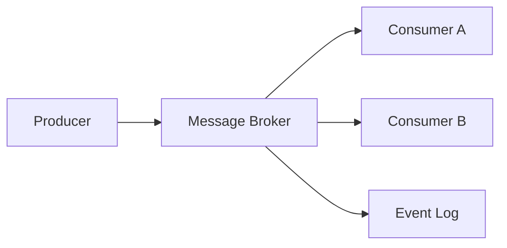

---


---

## 6.1 Message Queues


### What is it?

A **message queue** is a FIFO buffer between producers and consumers. Producers enqueue messages; consumers dequeue (often with acknowledgment). Each message is typically consumed by **one** consumer in a competing-consumer group.

### Why it matters

Queues smooth traffic spikes, isolate failure domains, and enable async processing - payment webhooks, email sending, order fulfillment - without blocking the caller.

### How it works

1. Producer sends message to named queue via broker API.
2. Broker persists message (memory, disk, or replicated log).
3. Consumer polls or receives push delivery.
4. Consumer processes and sends ACK; broker deletes or marks complete.
5. On failure/timeout, message redelivered or moved to DLQ.

### Diagram

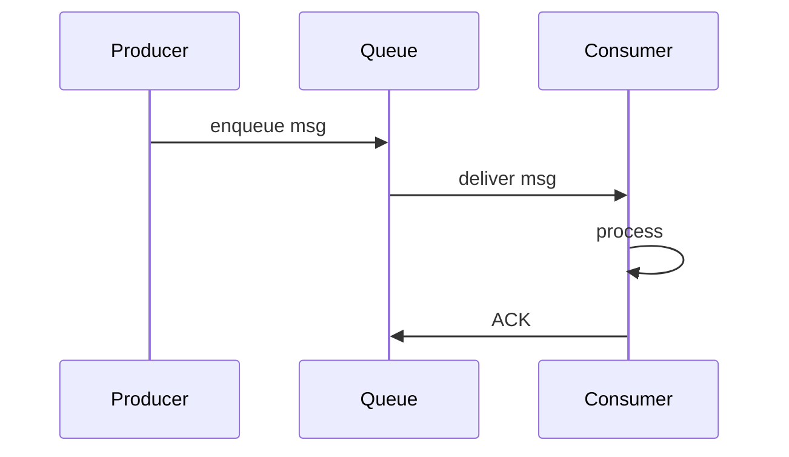

### Key details

| Pattern | Behavior |
|---------|----------|
| Point-to-point | One consumer per message |
| Competing consumers | Scale workers on same queue |
| Priority queue | Urgent messages jump ahead |
| Delay queue | Visible after TTL |

### When to use

- Task distribution and background jobs.
- Load leveling when producers burst faster than consumers.
- Decoupling services that don't need broadcast.

### Trade-offs / Pitfalls

- No built-in replay - once consumed and ACKed, message is gone (unless dead-lettered).
- Ordering only guaranteed with single consumer per queue.
- Poison messages block processing without DLQ strategy.

### References

*(No curated references for this sub-topic in `_topics.json`.)*

---


## 6.2 Publish Subscribe


### What is it?

**Publish-subscribe (pub/sub)** routes each published message to **all** subscribers interested in a topic. Producers don't target specific consumers; the broker fans out based on subscriptions.

### Why it matters

Enables event notification to many independent services - order placed -> inventory, analytics, email, search index - without the producer knowing subscribers.

### How it works

1. Subscribers register interest in topic(s).
2. Publisher sends message to topic exchange.
3. Broker copies message to every bound subscriber queue/stream.
4. Each subscriber processes independently at its own rate.

### Diagram

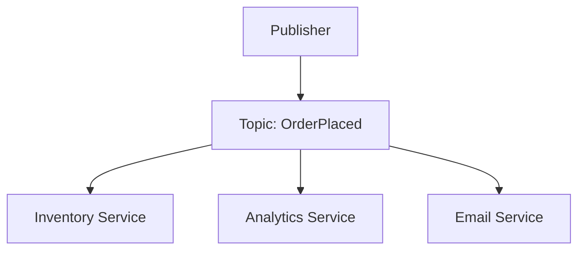

### Key details

- **Topic-based:** routing by topic name (Kafka, SNS).
- **Content-based:** filter by message attributes (advanced brokers).
- Decouples producer count from consumer topology.

### When to use

- Broadcast events to multiple downstream systems.
- Microservices reacting to domain events.
- Real-time notifications and cache invalidation fan-out.

### Trade-offs / Pitfalls

- Slow subscribers don't slow others but may lag unboundedly - monitor consumer lag.
- Ordering across subscribers not coordinated.
- Topic explosion without governance becomes unmanageable.

### References

*(No curated references for this sub-topic in `_topics.json`.)*

---


## 6.3 Event Streaming


### What is it?

**Event streaming** treats messages as an **append-only, durable log** retained for a configurable period. Consumers read at their offset; multiple independent consumer groups replay the same stream.

### Why it matters

Combines messaging with storage - enables replay, audit, stream processing, and decoupled analytics without separate ETL batch windows.

### How it works

1. Producers append records to partitioned log.
2. Broker replicates partitions for durability.
3. Consumers track offset per partition.
4. New consumer groups start from earliest or latest offset.
5. Stream processors (Flink, Kafka Streams) derive materialized views.

### Diagram

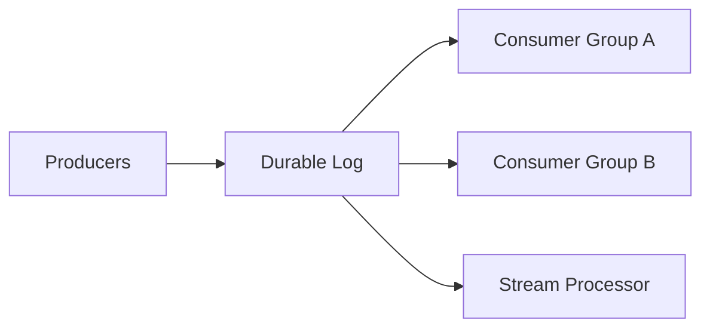

### Key details

- Retention: time-based (7 days) or size-based.
- Immutability: append-only; corrections are compensating events.
- Ordering per partition key, not globally.

### When to use

- High-throughput event backbone (Kafka, Pulsar).
- Event sourcing storage layer.
- Real-time analytics and CDC pipelines.

### Trade-offs / Pitfalls

- Storage cost grows with retention and partition count.
- Unbounded replay can overwhelm downstream if misconfigured.
- Not a drop-in replacement for task queues without consumer design.

### References

*(No curated references for this sub-topic in `_topics.json`.)*

---


## 6.4 Event Driven Architecture


### What is it?

**Event-driven architecture (EDA)** structures systems around production, detection, and consumption of **domain events** - past-tense facts (`OrderPlaced`) - rather than synchronous command chains.

### Why it matters

Loose coupling, independent scaling, temporal decoupling, and natural audit trail. Core to modern microservices and reactive systems.

### How it works

1. Service completes business action, publishes event to bus.
2. Interested services subscribe and react asynchronously.
3. Choreography: no central orchestrator; events trigger next steps.
4. Observability via correlation IDs across event chains.

### Diagram

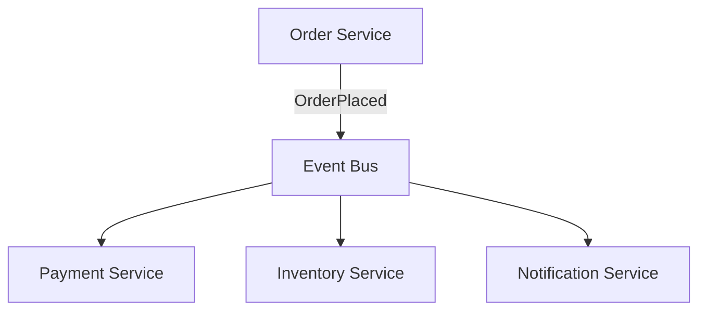

### Key details

- Events vs commands: events are facts; commands are requests (often separate channels).
- Event notification (thin) vs event-carried state transfer (fat payloads).
- Saga choreography is EDA for distributed transactions.

### When to use

- Many subscribers need same signal.
- Peak load buffering and async workflows.
- Integrating third-party systems without tight coupling.

### Trade-offs / Pitfalls

- Distributed debugging harder than monolith stack traces - need tracing.
- Eventual consistency complicates UX (pending states).
- Event schema governance essential (registry, versioning).

### References

*(No curated references for this sub-topic in `_topics.json`.)*

---


## 6.5 Kafka


### What is it?

**Apache Kafka** is a distributed **commit log** (not a traditional message queue). Producers append immutable, ordered records to **topics**; topics are split into **partitions** for parallelism; consumers read at their own pace using **offsets**. Data is **retained on disk** for days or weeks (configurable), enabling **replay**.

Mental model: **distributed, fault-tolerant, append-only log** that many producers write to and many consumer groups read from independently.

### Why it matters

Kafka is the de facto **event streaming platform** for microservices, real-time analytics, log aggregation, CDC pipelines, and stream processing (Kafka Streams, Flink). It decouples services in time (async) and space (publishers don't know subscribers).

### How it works

**Core components:**

| Component | Role |
|-----------|------|
| **Broker** | Server storing partitions on disk |
| **Topic** | Named stream of records (like a table log) |
| **Partition** | Ordered, immutable sequence within a topic; unit of parallelism |
| **Offset** | Monotonic position of consumer within a partition |
| **Producer** | Writes batches to a partition (key hash or round-robin) |
| **Consumer group** | Set of consumers sharing work; one consumer per partition max |
| **ISR** | In-sync replicas - followers caught up with leader |
| **Controller** | Manages leader election (ZooKeeper legacy or **KRaft** mode) |

**Write path:**

1. Producer picks partition: `hash(key) % numPartitions` (same key -> same partition -> **ordering per key**)
2. Producer sends batch to **partition leader** broker
3. Leader appends to log; followers in ISR replicate
4. ACK after `acks=0` (fire-forget), `acks=1` (leader only), or `acks=all` (all ISR)

**Read path:**

1. Consumer joins **consumer group**; coordinator assigns partitions (rebalance on join/leave)
2. Consumer polls records from assigned partitions
3. After processing, commits offset (auto or manual `commitSync`)
4. On restart, resumes from last committed offset

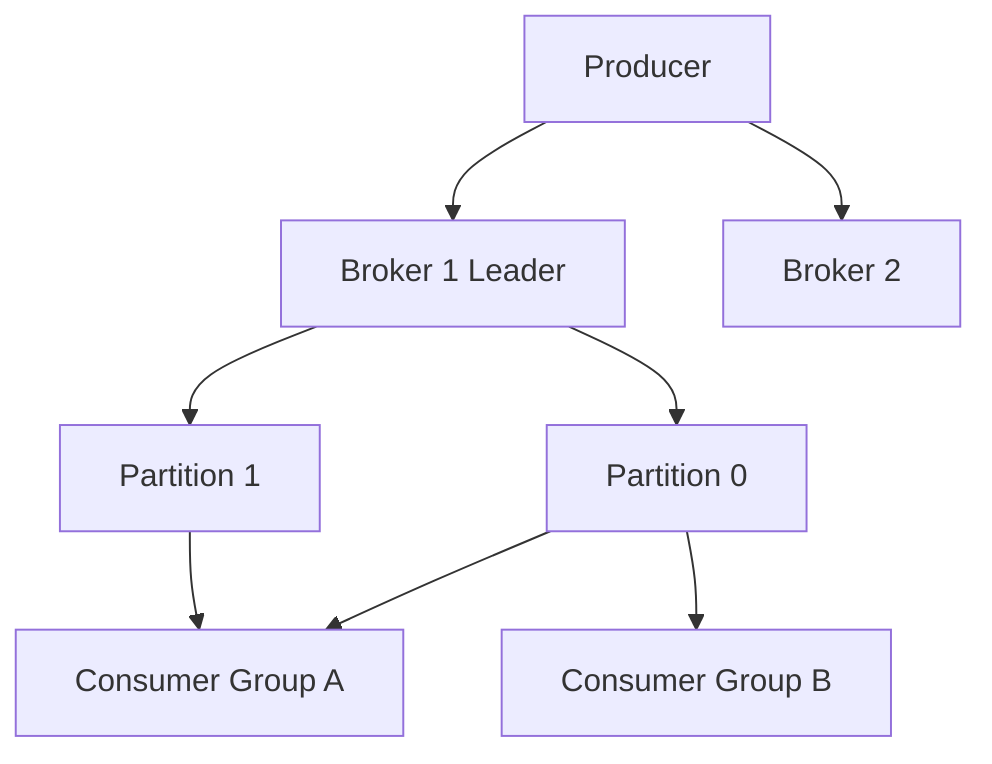

**Ordering guarantees:**

- **Within a partition:** strict order
- **Across partitions:** no global order
- Need global order -> single partition (limits throughput) or design for per-key ordering

**Retention and replay:**

- Messages not deleted after consume (unlike RabbitMQ ack-and-delete default)
- New consumer group starts at `earliest` or `latest` offset
- Enables **event replay** for new services, bug fixes, backfill

### Key details

#### Production configuration (defaults to verify)

| Setting | Dev | Production | Why |
|---------|-----|------------|-----|
| `replication.factor` | 1 | **3** | Survive 2 broker failures |
| `min.insync.replicas` | 1 | **2** | With RF=3, leader won't ack `acks=all` if only 1 replica |
| `acks` | 1 | **`all`** | Durability — wait for ISR |
| `unclean.leader.election.enable` | true | **false** | Never promote out-of-sync replica (data loss) |
| `log.retention.hours` | 168 | **72–168+** | Balance disk vs replay window |
| `num.partitions` | 1 | **plan upfront** | Hard to change without rebalance pain |

#### ISR (In-Sync Replicas) — production mental model

```text
Topic: orders, partition 0, replication.factor=3

Broker 1 = LEADER   (offset 1000)
Broker 2 = FOLLOWER (offset 1000)  ← in ISR
Broker 3 = FOLLOWER (offset 998)   ← lagging, NOT in ISR

Producer with acks=all:
  → waits for Broker 1 + all ISR followers (Broker 2)
  → Broker 3 catch-up does not block ack

If Broker 1 dies:
  → Controller elects new leader from ISR only (Broker 2)
  → Broker 3 catches up later, rejoins ISR
```

**ISR shrink alert** (`UnderReplicatedPartitions` / `OfflinePartitions`):

```text
Symptom:  ISR size drops from 3 → 1
Cause:    Slow disk, network partition, broker JVM GC pause
Risk:     Single replica — next broker death = data loss
Action:   Page on-call; do not ignore "ISR=1" in prod
```

#### Broker failure scenarios

| Event | What happens | Your action |
|-------|--------------|-------------|
| **Follower dies** | ISR shrinks; leader continues; under-replicated | Replace broker; ISR heals when follower catches up |
| **Leader dies** | Controller elects new leader from ISR (~seconds) | Brief produce/consume pause; monitor `LeaderElectionRate` |
| **Controller dies** | Another broker becomes controller | Usually transparent |
| **AZ loss (RF=3, 3 AZs)** | 1 broker per partition lost; 2 ISR remain | Cluster survives if `min.insync.replicas=2` |
| **AZ loss (RF=3, 2 AZs)** | Some partitions lose majority | **Offline partitions** — manual recovery |
| **Disk full on broker** | Broker stops; ISR shrinks | Expand disk; retention policy; tiered storage |

**Broker replacement runbook (simplified):**

```text
1. Confirm cluster health (under-replicated count)
2. Decommission broker gracefully (kafka-reassign-partitions or KRaft remove)
3. Provision replacement with same broker.id OR new id + rebalance
4. Wait until all partitions ISR=RF
5. Verify consumer lag normalized
```

#### Consumer lag — alerting and triage

**Lag definition:**

```text
lag(partition) = log_end_offset - committed_offset

Consumer group lag = sum(lag) across all assigned partitions
```

**Alert thresholds (starting points):**

| Metric | Warning | Critical | Notes |
|--------|---------|----------|-------|
| **Max partition lag** | > 10K msgs | > 100K or growing 15m | One stuck partition blocks ordering for that key |
| **Group lag (time)** | > 5 min behind | > 30 min | Use `kafka-consumer-groups --describe` |
| **Lag growth rate** | +20%/5min | monotonic 30m | Consumer slower than produce rate |
| **Under-replicated partitions** | > 0 for 5m | > 0 for 15m | Replication problem, not consumer |

**Triage flowchart:**

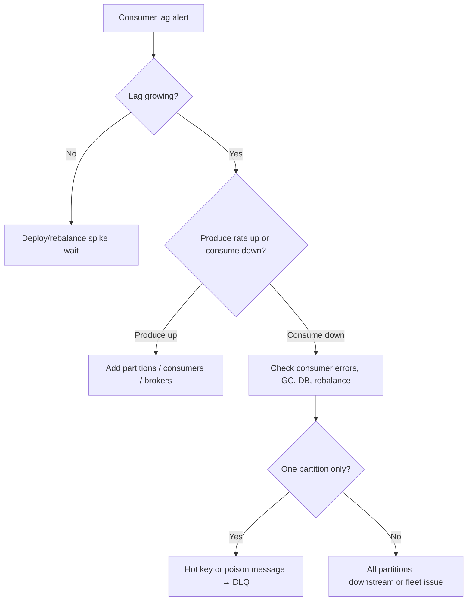

**Common lag causes:**

| Symptom | Cause | Fix |
|---------|-------|-----|
| One partition lag only | Hot key, poison message loop | Salt keys; DLQ bad message (6.15) |
| All partitions lag after deploy | Slow handler, missing index | Rollback; profile consumer |
| Lag after rebalance | `max.poll.interval` exceeded | Increase interval; shrink batch size |
| Lag spikes at top of hour | Batch job publishes burst | Pre-scale consumers; partition count |
| Lag flat but high | Under-provisioned forever | Add consumers (≤ partition count) |

#### Producer durability checklist

```text
enable.idempotence=true     # dedup within producer session (PID + sequence)
acks=all                    # wait for ISR
retries > 0                 # safe with idempotence
max.in.flight.requests=5    # or 1 for strict ordering per partition
```

**What you still DON'T get:** cross-partition atomicity without transactions; consumer-side exactly-once needs transactional consume or outbox (6.20).

#### Capacity planning rules of thumb

| Resource | Rule |
|----------|------|
| **Partitions** | Start with `max(12, target_throughput_MB/s ÷ per_partition_MB/s)`; often 12–48 per topic |
| **Consumers per group** | ≤ partition count (extra consumers idle) |
| **Brokers** | RF=3 → min 3 brokers; add brokers before disk >70% |
| **Disk** | `daily_ingress_GB × retention_days × RF × 1.1` |
| **Network** | Replication doubles write traffic internally |

- **Hot partition problem:** bad key choice (all `key=null`) → one partition gets all traffic → salt keys or increase partitions with awareness of ordering needs
- **Exactly-once:** idempotent producer + transactions for read-process-write; most teams use at-least-once + idempotent consumers
- **Compaction:** `log.cleanup.policy=compact` keeps latest value per key (changelog topics, CDC state)
- **KRaft:** removes ZooKeeper dependency (Kafka 3.3+ production ready); plan migration for ZK clusters

**Kafka vs traditional queue:**

| | Kafka | RabbitMQ |
|---|-------|----------|
| Model | Log (retain) | Queue (delete on ack) |
| Consumers | Multiple independent groups | Competing consumers share queue |
| Replay | Yes | Limited |
| Throughput | Very high | Moderate |
| Ordering | Per partition | Per queue |

### When to use

- High-throughput event streaming (millions msg/sec)
- Multiple services need same event stream independently
- Audit log, activity feed, metrics pipeline
- Stream processing with windowed aggregations
- CDC (Debezium) from database to Kafka

### Trade-offs / Pitfalls

| Pitfall | Symptom | Fix |
|---------|---------|-----|
| `acks=1` only | Messages lost on leader crash before replicate | `acks=all` + `min.insync.replicas=2` |
| `unclean.leader.election=true` | Silent data loss after failover | Set **false** in prod |
| ISR=1 ignored | Total data loss on next failure | Alert on under-replicated partitions |
| Over-partitioning | High metadata overhead, slow rebalance | 12–48/topic typical; don't use 1000s lightly |
| Under-partitioning | Can't scale consumers | Add partitions early (requires rebalance) |
| No lag alerts | Discover outage from users | Alert max lag + growth rate |
| Rebalance storm | Periodic consume stalls | Static membership, cooperative rebalance (6.7) |
| Treating Kafka as task queue | No native delay/retry | Retry topics + DLQ (6.15, 6.16) |
| `key=null` on everything | Single hot partition | Hash meaningful business key |

### References

- Apache Kafka documentation; Confluent blog (design papers)
- See [6.7 Consumer Groups](#67-kafka-consumer-groups), [6.15 DLQ](#615-dead-letter-queue), [6.20 Outbox](#620-outbox-pattern)

---


## 6.6 Kafka Partitions


### What is it?

A **Kafka partition** is an ordered, immutable sequence of records within a topic. Partitions are the unit of parallelism - more partitions -> higher throughput and more consumer parallelism.

### Why it matters

Partition design determines ordering scope, max consumer count per group, and load distribution. Wrong partition count is expensive to fix.

### How it works

1. Topic created with N partitions (e.g., 12).
2. Producer with key: `partition = hash(key) mod N` -> per-key ordering.
3. Producer without key: sticky or round-robin assignment.
4. Each partition has one leader broker; replicas on others.
5. Consumers in group: max one consumer per partition per group.

### Diagram

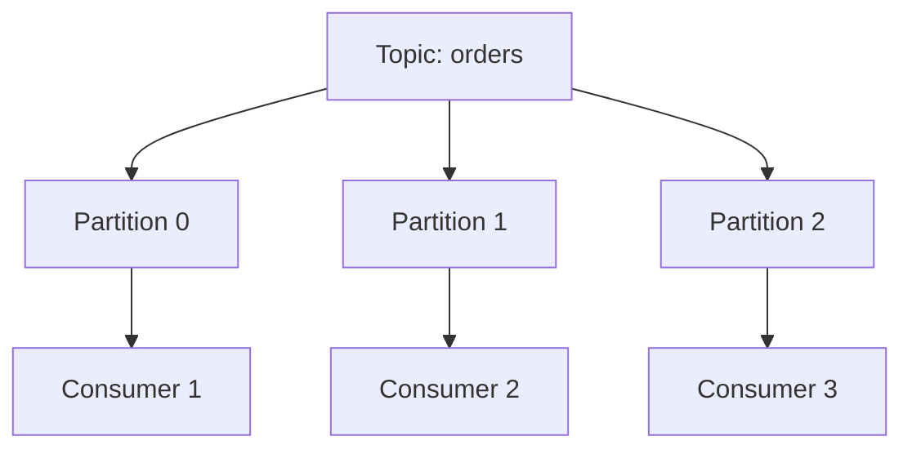

### Key details

- Ordering guaranteed **within** partition only.
- Partition count ≥ max consumers in group for full parallelism.
- Increasing partitions does not reorder existing keys retroactively.

### When to use

- Scale consumption horizontally with partition count.
- Preserve order per entity (user_id, order_id) via partition key.

### Trade-offs / Pitfalls

- Too few partitions -> throughput ceiling; too many -> file handles and election overhead.
- Re-partitioning changes key->partition mapping - plan upfront.
- Cross-partition transactions are limited and costly.

### References

*(No curated references for this sub-topic in `_topics.json`.)*

---


## 6.7 Kafka Consumer Groups


### What is it?

A **consumer group** is a set of consumers sharing the same `group.id` that **jointly consume** a topic — each partition is assigned to **at most one** consumer in the group at a time. This is Kafka's **horizontal scaling unit** for processing.

Different groups reading the same topic are **independent** (fan-out). Consumers **within** a group **compete** for partitions (load sharing).

### Why it matters

Misconfigured consumer groups cause **rebalance storms**, **duplicate processing**, **stuck partitions**, and **lag incidents** — the most common Kafka production pain after hot partitions.

### How it works

**Assignment:**

```text
Topic orders: 12 partitions (P0..P11)
Consumer group checkout-workers: 4 consumers

Ideal assignment (range or cooperative sticky):
  C1 → P0, P1, P2
  C2 → P3, P4, P5
  C3 → P6, P7, P8
  C4 → P9, P10, P11

Max useful consumers = partition count (12)
13th consumer sits idle
```

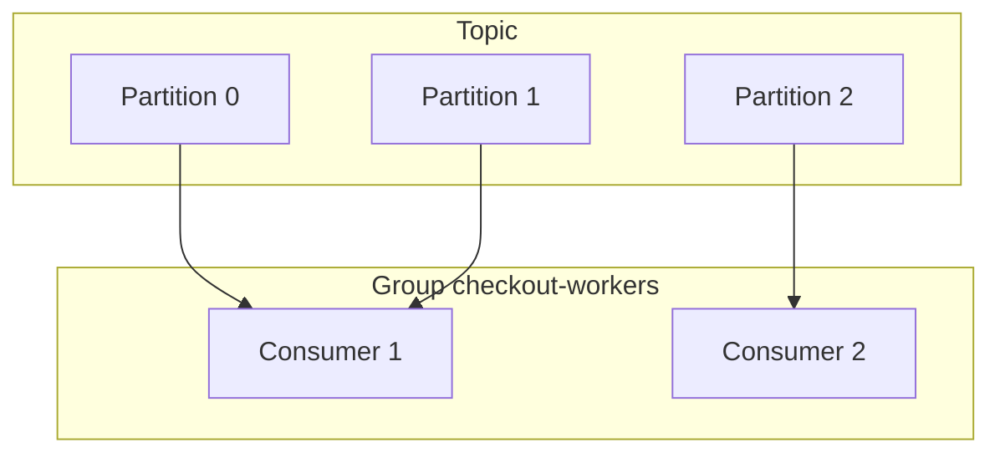

**Lifecycle events that trigger rebalance:**

| Event | What happens |
|-------|----------------|
| New consumer joins | Partitions revoked + reassigned ("stop-the-world" in classic protocol) |
| Consumer leaves / crashes | Its partitions reassigned |
| Consumer exceeds `max.poll.interval.ms` | Considered dead → rebalance |
| Partition count increased | Rebalance to include new partitions |
| Rolling deploy | Pod kill → join → rebalance per wave |

**Read + commit flow:**

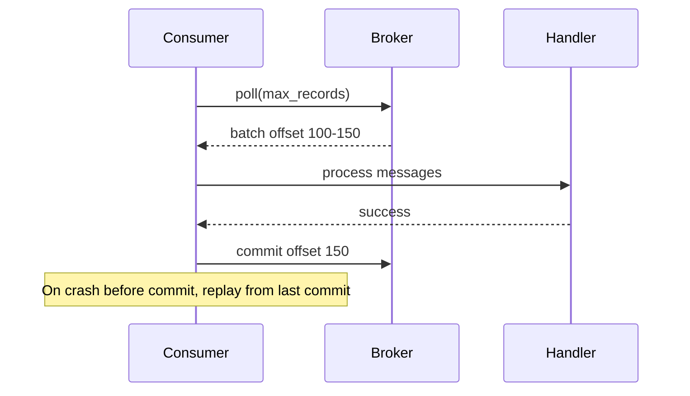

1. Consumer polls assigned partitions.
2. Processes batch (ideally idempotent).
3. Commits offset **after** successful processing (at-least-once).
4. On restart, resumes from last committed offset.

### Key details

#### Production configuration

| Setting | Typical prod value | Pitfall if wrong |
|---------|-------------------|------------------|
| `max.poll.interval.ms` | 5–15 min (long handlers) | Too low → rebalance during slow job |
| `session.timeout.ms` | 10–45 s | Too low → false death detection |
| `heartbeat.interval.ms` | < session/3 | Must be frequent enough |
| `max.poll.records` | Tune with processing time | Huge batch → exceed poll interval |
| `enable.auto.commit` | **false** for critical paths | Auto-commit before process → message loss on crash |
| `partition.assignment.strategy` | `CooperativeStickyAssignor` | Range assignor → more churn |

**Static membership (rolling deploys):**

```properties
group.instance.id=checkout-worker-pod-3
session.timeout.ms=60000
```

Pod restarts with same `group.instance.id` → **no immediate rebalance** → avoids stop-the-world during deploy.

#### Consumer lag (primary health metric)

```text
lag(partition) = log_end_offset - committed_offset

Alert: lag > 10,000 for 15 min
Alert: lag increasing while processing rate flat → slow consumer or poison message
```

| Lag pattern | Likely cause |
|-------------|--------------|
| One partition hot | Bad key skew (all to one partition) |
| All partitions lag | Under-provisioned consumers or slow handler |
| Lag spike after deploy | Rebalance + duplicate processing window |
| Lag flat high | Consumer stuck / blocked on DB |

#### Processing guarantees

```text
# WRONG — at-most-once (lose messages)
process(msg)
commit(offset)

# WRONG — can lose on crash between process and commit
auto.commit = true

# RIGHT — at-least-once
process(msg)          # must be idempotent
commit(offset)

# Exactly-once effect
idempotent consumer + outbox / dedup table (6.20)
```

**Rebalance storm during deploy:**

```text
10 pods rolling restart, no static membership
→ 10 sequential rebalances in 5 minutes
→ processing stops each time
→ lag explodes

Fix: static group.instance.id, cooperative sticky, or pause consumption during deploy
```

### When to use

- Scale event processing horizontally (add consumers up to partition count)
- Independent fan-out: `billing-group` and `analytics-group` both read `orders`
- Competing workers on same task queue topic

### Trade-offs / Pitfalls

| Pitfall | Symptom | Mitigation |
|---------|---------|------------|
| More consumers than partitions | Idle consumers, no speedup | Increase partitions (plan ahead — hard to reduce) |
| Long processing in poll loop | `max.poll.interval` exceeded | Async processing + pause/resume, or increase interval |
| Commit before process | Lost messages on crash | Commit after success |
| Rebalance during processing | Duplicate handling | Idempotent consumer + `processed_events` table |
| No lag monitoring | Silent backlog until SLA breach | Alert per group/topic |
| `EARLIEST` reset on new group | Reprocess entire history | Use `LATEST` or explicit offset |

### References

- Kafka consumer protocol; CooperativeStickyAssignor docs
- See [6.5 Kafka](#65-kafka), [6.15 Dead Letter Queue](#615-dead-letter-queue)

---


## 6.8 RabbitMQ


### What is it?

**RabbitMQ** is a message broker implementing AMQP. Messages route through **exchanges** (direct, topic, fanout, headers) to **queues** bound with routing keys - flexible routing vs Kafka's log model.

### Why it matters

Excellent for task queues, RPC reply patterns, complex routing, and moderate throughput with per-message acknowledgments and TTL/dead-letter built in.

### How it works

1. Publisher sends to exchange with routing key.
2. Exchange matches bindings -> delivers to queue(s).
3. Consumer prefetch limits unacked messages.
4. Consumer ACK/NACK; NACK with requeue or route to DLX.
5. Optional priority, TTL, and delayed message plugins.

### Diagram

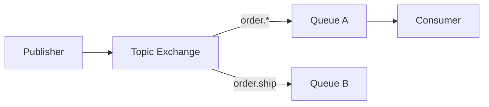

### Key details

| Exchange type | Routing |
|---------------|---------|
| Direct | Exact routing key match |
| Topic | Pattern `order.*` |
| Fanout | All bound queues |
| Headers | Attribute match |

### When to use

- Work queues with routing flexibility.
- Request-reply over temporary reply queues.
- Lower volume than Kafka with rich broker-side routing.

### Trade-offs / Pitfalls

- Not a replayable log - messages deleted after ACK.
- Clustering and mirrored queues have operational nuances (quorum queues preferred).
- Throughput lower than Kafka for firehose ingestion.

### References

*(No curated references for this sub-topic in `_topics.json`.)*

---


## 6.9 ActiveMQ


### What is it?

**Apache ActiveMQ** (Classic and Artemis) is a JMS-compliant message broker supporting queues, topics, and enterprise integration patterns with Java-centric APIs.

### Why it matters

Legacy enterprise messaging standard - common in Java EE estates migrating to Kafka or cloud-native brokers.

### How it works

1. Producers send to JMS queue or topic via ConnectionFactory.
2. Broker persists (KahaDB) or holds in memory.
3. Consumers receive via push or pull; transacted sessions for batch ACK.
4. Artemis uses journal + paging for high performance vs Classic.

### Diagram

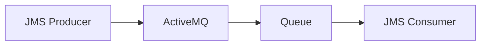

### Key details

- JMS 1.1/2.0 semantics: queues (P2P) vs topics (pub/sub).
- Artemis redesigned storage; preferred for new deployments.
- Bridges and network of brokers for federation.

### When to use

- Existing JMS application estate.
- Java middleware requiring standard APIs.
- Moderate messaging with enterprise support contracts.

### Trade-offs / Pitfalls

- Lower ecosystem momentum vs Kafka/RabbitMQ for new systems.
- Network of brokers complexity for geo distribution.
- Migration to Kafka often needed for scale and replay.

### References

*(No curated references for this sub-topic in `_topics.json`.)*

---


## 6.10 Pulsar


### What is it?

**Apache Pulsar** separates **serving** (brokers) from **storage** (Apache BookKeeper ledgers). Topics are segmented ledgers; supports multi-tenancy, geo-replication, and unified queuing + streaming.

### Why it matters

Alternative to Kafka when you need independent compute/storage scale, native tiered storage, and built-in multi-tenancy without cluster sprawl.

### How it works

1. Producer writes to topic partition (managed ledger on BookKeeper).
2. Broker serves consumers; storage nodes persist entry replicas.
3. Subscriptions: exclusive, shared, failover, key_shared.
4. Offload old segments to S3 for cheap retention.

### Diagram

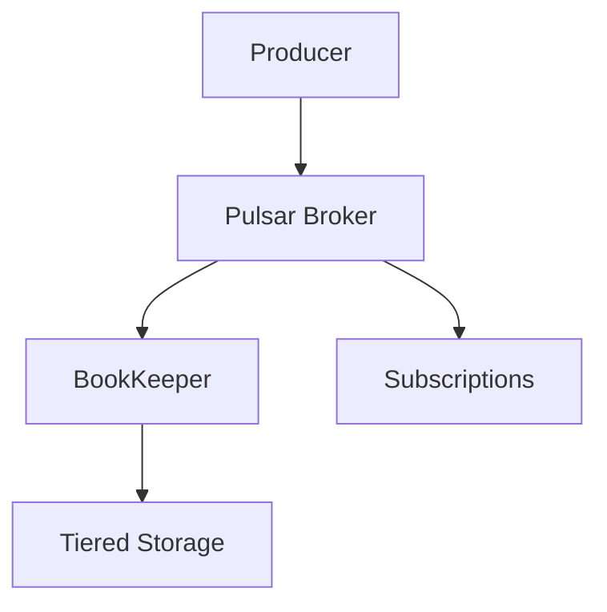

### Key details

- **Key_shared** subscription: order per key with parallelism (like Kafka partitions).
- Geo-replication at namespace level.
- Functions framework for lightweight stream processing.

### When to use

- Multi-tenant SaaS messaging backbone.
- Long retention with tiered storage cost control.
- Need both queue and stream semantics in one platform.

### Trade-offs / Pitfalls

- Smaller community/tooling vs Kafka.
- BookKeeper adds operational surface area.
- Migration path from Kafka exists but not trivial.

### References

*(No curated references for this sub-topic in `_topics.json`.)*

---


## 6.11 Ordering Guarantees


### What is it?

**Ordering guarantees** define whether consumers observe messages in **send order** — globally across a topic, **per partition/key**, or **not at all**. Ordering is one of the most misunderstood messaging properties: brokers often guarantee less than producers assume.

**Three levels:**

| Level | Scope | Throughput | Example |
|-------|-------|------------|---------|
| **Global order** | Entire topic/queue | Lowest (single pipe) | Audit log serial pipeline |
| **Partition/key order** | Same key only | High | `order_id` lifecycle events |
| **No order** | Independent messages | Highest | Metrics, independent alerts |

### Why it matters

Many business invariants require order:

- **Debit before credit** on same account
- **Created → Paid → Shipped** on same order
- **Schema version N before N+1** migration events

Violating assumed order causes subtle bugs: negative balances, duplicate shipments, corrupted projections. Ordering choice directly limits **parallelism** — you cannot have strict global order *and* unlimited horizontal scale.

### How it works

**1. Global ordering — single partition**

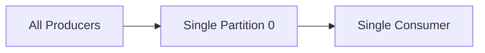

- Kafka: topic with `num.partitions=1`
- RabbitMQ: single queue, single consumer
- **Ceiling:** one consumer process throughput (~tens of thousands msg/s)

**2. Partition/key ordering (production default)**

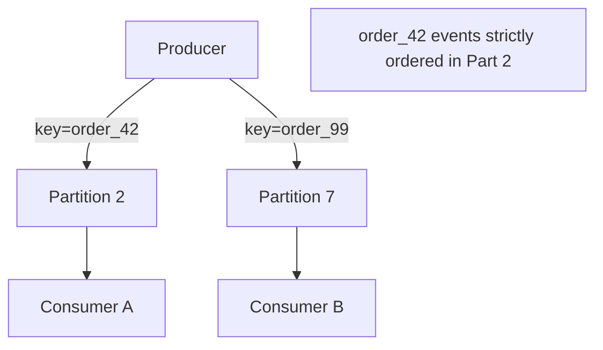

- `partition = hash(key) % numPartitions`
- Same key → same partition → **FIFO within partition**
- Different keys → parallel, **no relative order**

**Kafka example:**

```text
Topic: orders (12 partitions)
Producer: key=order_id → hash(order_id) % 12
Events for order_42 always land in same partition → processed in offset order
```

**3. No ordering — maximum parallelism**

- Round-robin partition assignment (no key)
- Multiple competing consumers on one queue
- Fan-out pub/sub with independent subscriber queues

**4. Application-layer ordering detection**

When order cannot be guaranteed by broker:

```text
message: { sequence: 42, entity_id: "acct_1", type: "DEBIT" }
consumer: buffer until sequence 41 applied; reject or reorder gaps
```

### Key details

**Ordering vs parallelism trade-off:**

| Partitions | Max consumers (per group) | Order scope |
|------------|---------------------------|-------------|
| 1 | 1 | Global |
| 12 | 12 | Per-key only |
| 100 | 100 | Per-key only |

**What breaks ordering in practice:**

| Scenario | Effect | Mitigation |
|----------|--------|------------|
| Consumer rebalance | Duplicate + reorder window | Idempotent consumer; sticky assignor |
| Retry queue | Message re-enters out of order | Per-key retry topic; sequence numbers |
| Multiple producers | Interleaved writes to partition | Single producer per key or versioning |
| Cross-partition transaction | No atomic order across keys | Saga; design bounded context |
| Async publish thread pool | Send order ≠ enqueue order | `max.in.flight.requests=1` (Kafka) |

**Production patterns:**

- **Entity lifecycle** — partition by `order_id`, `user_id`, `account_id`.
- **Kafka `enable.idempotence=true`** — preserves order per partition on retry (PID + sequence).
- **Pulsar `Key_Shared`** — order per key with multiple consumers.
- **RabbitMQ** — single active consumer per queue for strict order; or consistent-hash exchange by key.
- **Poison message** — DLQ removes one message; later messages on same key may process "early" — handle gaps.
- **Global order escape hatch** — single partition for control commands only; data plane stays partitioned.

**Ordering across consumer groups:**

```text
Consumer Group A and Group B both read same topic independently
Each group maintains its own offset — ordering is per-partition in both,
but Group A and Group B are not synchronized with each other
```

### When to use

| Requirement | Design |
|-------------|--------|
| Per-entity lifecycle | Partition by entity ID |
| Global serial pipeline | Single partition; accept throughput cap |
| Independent events | No key; maximize partitions |
| Cross-entity workflow | Saga + correlation ID; not broker order |

### Trade-offs / Pitfalls

- **Assuming global order** on multi-partition topic — wrong; only per-partition order holds.
- **Rebalance during deploy** — cooperative-sticky assignor reduces partition movement.
- **`key=null`** in Kafka — round-robin; no ordering guarantee for related events.
- **Retry/DLQ** — reprocessed message may arrive after newer messages for same key without sequence checks.
- **Pub/sub fan-out** — each subscriber queue ordered independently; no cross-subscriber order.
- **Clock skew** — timestamp ordering across producers unreliable; use broker offset or sequence.

### References

- Kafka partitioning and ordering documentation
- Designing Data-Intensive Applications, Ch. 11 (Stream processing)

---


## 6.12 At Most Once Delivery


### What is it?

**At-most-once** delivery guarantees a message is delivered **zero or one times** — **never duplicated**, but **loss is possible**. Achieved when the system ACKs or discards a message **before** durable processing completes, or when the producer does not wait for broker persistence.

Also called **fire-and-forget** or **best-effort** semantics.

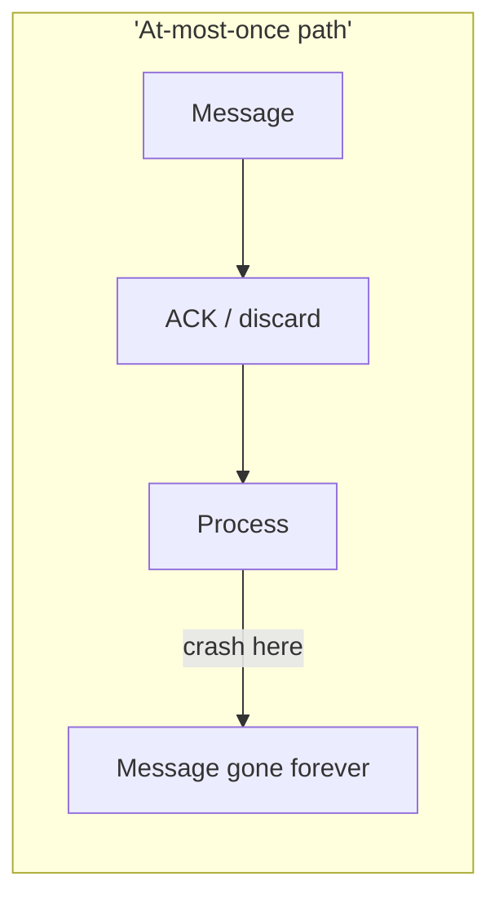

### Why it matters

Highest **throughput** and lowest **latency** — acceptable when approximate data beats correctness:

- Metrics and telemetry (missing 0.01% of datapoints OK)
- Sampled distributed traces
- Live dashboard tick updates
- Non-critical notifications

**Critical distinction:** at-most-once is often chosen **accidentally** via misconfiguration (`enable.auto.commit=true` before process, `acks=0`), not deliberately.

### How it works

**Producer-side loss:**

| Config | Broker behavior | Loss scenario |
|--------|-----------------|---------------|
| Kafka `acks=0` | No wait for broker | Broker crash before replicate |
| Kafka `acks=1` + leader dies | Leader ACK only | Unreplicated leader failure |
| UDP / unreliable transport | No retry | Network drop |
| Async send without callback | Client buffer loss | Process crash before flush |

**Consumer-side loss (most common accidental pattern):**

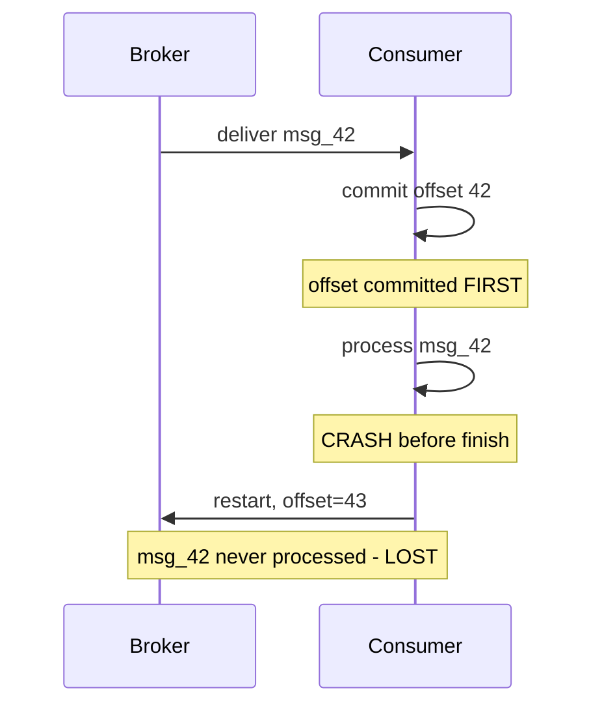

```text
WRONG (at-most-once):
  poll() → commit offset → process()   // crash after commit = loss

RIGHT (at-least-once):
  poll() → process() → commit offset   // crash before commit = redelivery
```

**Kafka configurations that produce at-most-once:**

```properties
# Producer: may lose before broker
acks=0

# Consumer: commit before processing
enable.auto.commit=true
# (auto-commit runs on poll interval, often before your handler finishes)
```

**RabbitMQ at-most-once:**

- Auto-ACK mode (`noAck=true`) — broker removes message on deliver, before consumer processes
- Consumer crash after delivery = message gone

### Key details

**Delivery semantics comparison:**

| Semantic | Duplicates | Loss | Typical config |
|----------|------------|------|----------------|
| At-most-once | Never | Possible | ACK before process; `acks=0` |
| At-least-once | Possible | Never* | Process before ACK |
| Exactly-once | Never (effect) | Never* | Transactions + idempotency |

*Assuming broker durability and correct config.

**When at-most-once is deliberate:**

```text
Metrics agent → statsd/Kafka with acks=0
  Lose occasional counter increment
  SLO: 99.9% visibility acceptable
  Cost: cannot afford 50ms per metric for acks=all
```

**Detecting silent loss:**

| Technique | How |
|-----------|-----|
| Producer counter vs consumer counter | Compare `sent_total` vs `received_total` |
| Sequence gaps | Monotonic `seq` field; alert on gaps |
| End-to-end checksum | Sample audit trail |
| Broker metrics | `record-error-rate`, under-replicated partitions |

**Production patterns:**

- **Explicit choice** — document in SLO: "telemetry stream is best-effort"
- **Never at-most-once for money** — orders, payments, inventory need at-least-once minimum
- **Kafka metrics pipeline** — `acks=1` or `acks=0` with monitoring; not for billing events
- **Separate topics** — critical events on `acks=all` topic; metrics on fire-and-forget topic
- **Review auto-commit** — default `enable.auto.commit=true` surprises teams migrating from queues

### When to use

- Metrics, click streams, sampled logs where **loss < 0.1%** is acceptable.
- High-frequency sensor data with redundant sources.
- Ephemeral notifications ("typing indicator") where missing one is invisible.
- **Never** for orders, payments, audit trails, or legally required records.

### Trade-offs / Pitfalls

- **Silent loss** — no redelivery means no second chance; hardest failure mode to debug.
- **Accidental at-most-once** — most common bug: commit offset before DB transaction commits.
- **`acks=0` during broker maintenance** — silent drop spike invisible to producer.
- **Confusing with idempotency** — at-most-once avoids duplicates by accepting loss; different goal than exactly-once.
- **Testing blind spot** — happy-path tests pass; loss only visible under crash injection.

### References

- Kafka producer `acks` documentation
- Messaging semantics overview (Jakob Jenkov / enterprise integration patterns)

---


## 6.13 At Least Once Delivery


### What is it?

**At-least-once** delivery means the broker will deliver a message **one or more times** - it will **never silently drop** a persisted message, but **duplicates are possible**.

Achieved when: message is **persisted** before ACK to producer, consumer **ACKs after processing**, and broker **redelivers** on missing ACK or consumer crash.

### Why it matters

This is the **default practical guarantee** for production messaging. It is achievable without exotic infrastructure. The trade-off is explicit: **you must make consumers idempotent** (safe to process the same message twice).

Most teams should default to at-least-once + idempotency rather than chasing true exactly-once everywhere.

### How it works

**Happy path:**

```text
1. Producer sends message -> broker persists to disk/replicas
2. Broker ACKs producer
3. Consumer receives message
4. Consumer processes (e.g. update DB)
5. Consumer sends ACK / commits offset
6. Broker marks message consumed
```

**Failure -> duplicate:**

```text
1-4. Same as above
5. Consumer crashes BEFORE ACK
6. Broker redelivers same message to another consumer
7. Consumer processes again -> DUPLICATE unless idempotent
```

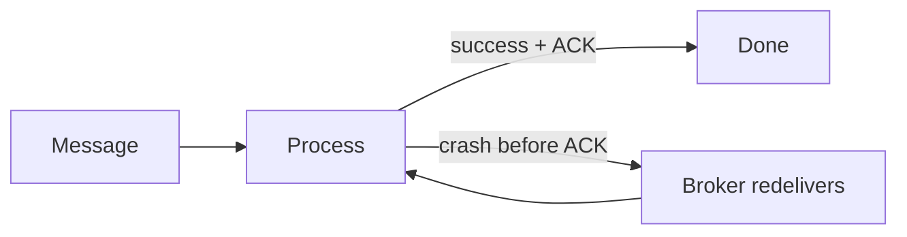

**Kafka offset commit timing (critical):**

| Strategy | Guarantee | Risk |
|----------|-----------|------|
| Commit **after** process | At-least-once | Duplicate on crash before commit |
| Commit **before** process | At-most-once | **Loss** on crash after commit |
| Transactional commit with process | Exactly-once (Kafka) | Complexity |

**Idempotency patterns:**

1. **Natural idempotency:** `SET status = PAID WHERE id=X` (same result if run twice)
2. **Idempotency key:** client sends `Idempotency-Key: uuid`; store in DB with UNIQUE constraint
3. **Message ID dedup table:** `INSERT INTO processed(message_id)` - duplicate insert fails
4. **Upsert by business key:** `ON CONFLICT DO NOTHING`

### Key details

- RabbitMQ: manual ACK after successful processing; `nack` with requeue on transient failure
- Kafka: `enable.auto.commit=false`; commit offset in `finally` block after DB commit
- **Ordering + redelivery:** duplicate may arrive out of order - design for per-key idempotency
- Pair with **DLQ** after N retries to stop poison message loops

### When to use

- Default for microservice event handlers, webhooks, async jobs
- When duplicate handling is cheaper than distributed transactions
- Payment-adjacent flows with strong idempotency keys

### Trade-offs / Pitfalls

- **No idempotency = data corruption** (double charge, duplicate email)
- Commit-before-process is NOT at-least-once - it is at-most-once with message loss
- Infinite retry on poison message without DLQ blocks partition
- Side effects outside DB (send email) need outbox pattern or idempotent provider APIs

### References

- Kafka consumer delivery semantics documentation

---


## 6.14 Exactly Once Delivery


### What is it?

**Exactly-once semantics** (EOS) means the **effect** of each message is applied **once**, even when the network retries, consumers crash, or producers resend. True end-to-end exactly-once across heterogeneous systems is **impossible** without cooperation at every layer; in practice we mean **exactly-once processing** within a bounded pipeline.

Marketing says "exactly-once"; engineering means **idempotent producer + atomic offset commit + idempotent consumer** or equivalent.

### Why it matters

Payments, inventory deduction, ledger postings cannot tolerate duplicates. Interviewers test whether you know the difference between **broker guarantee**, **producer guarantee**, and **end-to-end business guarantee**.

### How it works

**Three layers of "exactly once":**

1. **Idempotent producer (Kafka):** `enable.idempotence=true` - broker dedupes by `PID + sequence number` per partition
2. **Transactional writes (Kafka):** `transactional.id` - atomic write to multiple partitions + consumer offset in one transaction
3. **Idempotent consumer:** business-level dedup even if message delivered twice

**Kafka exactly-once pipeline:**

```text
Producer (idempotent + transactional)
  -> consume from input topic
  -> process
  -> produce to output topic + commit consumer offset
  ALL in single transaction
```

**Outbox pattern (database + message broker):**

```text
BEGIN TRANSACTION
  UPDATE orders SET status='PAID'
  INSERT INTO outbox(event_id, payload) VALUES (...)
COMMIT
-- separate relay process reads outbox, publishes to Kafka, marks sent
```

Ensures DB and event are consistent without dual-write race.

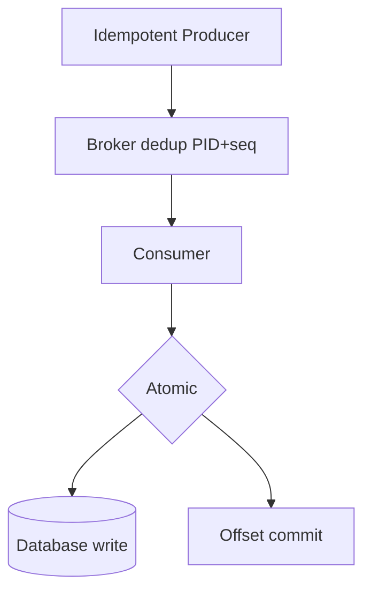

**What "exactly once" does NOT cover:**

- Email sent twice if SMTP called outside transaction
- External API without idempotency key
- Consumer crash after DB commit but before offset commit -> duplicate on replay (need idempotent consumer anyway)

### Key details

- Kafka EOS requires: `acks=all`, `min.insync.replicas>=2`, idempotent producer, transactions
- Performance cost: transactional overhead ~10-20% vs at-least-once
- **Simpler alternative:** at-least-once + idempotency key in DB (Stripe model) - often preferred
- Flink/Kafka Streams provide EOS within stream topology

### When to use

- Financial transactions, inventory, accounting entries
- Stream processing where duplicate aggregation corrupts results
- When idempotency at consumer is hard (complex multi-table side effects)

### Trade-offs / Pitfalls

- **EOS != end-to-end** across email, HTTP callbacks, third parties
- Operational complexity: transaction timeout, `abortTransaction` on failure
- Cross-service EOS needs **distributed transactions** or saga - not Kafka alone
- Many teams over-engineer EOS when idempotency key would suffice

### References

- Kafka exactly-once semantics (Confluent); Transactional outbox pattern (microservices.io)

---


## 6.15 Dead Letter Queue


### What is it?

A **dead letter queue (DLQ)** isolates messages that **cannot be processed successfully** after bounded retries — **poison messages** — so they do not block the main queue or infinite-retry the entire pipeline.

DLQ is not "logging" — it is a **first-class queue/topic** with monitoring, ownership, and a **replay runbook**.

### Why it matters

One bad message (schema change, corrupt JSON, unexpected null) without a DLQ can:

```text
1. Consumer throws on every poll
2. Partition processing stalls (lag grows forever)
3. Retries hammer already-failing downstream
4. On-call pages for "Kafka lag" with no obvious root cause
```

DLQ converts "infinite failure loop" into **actionable quarantine**.

### How it works

**Standard pipeline:**

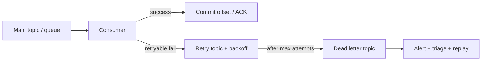

1. Consumer processes message.
2. **Retryable error** (503, timeout) → retry topic with delay (6.16).
3. **Non-retryable** or **max attempts exceeded** → publish to DLQ with metadata.
4. Alert fires on `DLQ depth > 0`.
5. Engineer fixes bug/schema → **replay** DLQ to main topic.

**Kafka DLQ message envelope (recommended):**

```json
{
  "original_topic": "orders",
  "original_partition": 3,
  "original_offset": 918273,
  "original_key": "ord_123",
  "original_payload": { "...": "..." },
  "failure_reason": "JsonParseException: missing field amount",
  "stack_trace": "...",
  "failed_at": "2026-06-24T10:15:00Z",
  "consumer_group": "checkout-workers",
  "retry_count": 5
}
```

**Broker-native vs application pattern:**

| Platform | DLQ mechanism |
|----------|---------------|
| **RabbitMQ** | Dead-letter exchange (DLX) + `x-death` headers |
| **SQS** | Redrive policy → DLQ after `maxReceiveCount` |
| **Kafka** | Manual: `orders-retry` → `orders-dlq` topics (no built-in DLQ) |
| **Azure Service Bus** | Forward to dead-letter sub-queue |

**Kafka retry + DLQ topology:**

```text
orders (main)
  → consumer fails
  → orders-retry-1s (delay via consumer sleep or timing wheel)
  → still fails
  → orders-retry-5m
  → still fails
  → orders-dlq
```

### Key details

#### Production rules

| Rule | Why |
|------|-----|
| **Alert on any DLQ depth > 0** | DLQ is not optional logging — page on-call |
| **Include original metadata** | Cannot debug without offset/key/payload |
| **Cap retries** | Never infinite retry (amplifies outages) |
| **Idempotent replay** | Reprocessing DLQ must not double-charge |
| **Separate DLQ per domain** | `payments-dlq` vs `emails-dlq` — different owners |
| **Retention on DLQ** | Keep 7–30 days for investigation |

#### Replay runbook

```text
1. STOP auto-replay scripts
2. Identify failure class (schema? downstream? bad data?)
3. Fix code / deploy / backfill schema registry
4. Sample 10 DLQ messages — dry-run in staging
5. Replay in batches (1000/msg) with rate limit
6. Monitor main consumer lag + error rate
7. If errors reappear → STOP replay (not fixed yet)
```

**Replay without re-poisoning:**

```text
# Option A: New consumer group reads DLQ, publishes to main
# Option B: kafka-console-producer with transformed payload
# Option C: Admin tool with idempotency keys preserved
```

#### DLQ vs discard

| Approach | When |
|----------|------|
| **DLQ** | Unknown failure, needs human triage, compliance audit |
| **Discard + metric** | Known bad format, sampled telemetry, no business value |
| **Skip + log** | Only if volume is huge and loss is acceptable (rare) |

### When to use

- Every production async consumer pipeline (Kafka, SQS, RabbitMQ)
- Schema evolution (Avro/Protobuf) — incompatible reader version
- Downstream dependency failures after retry exhaustion
- Payment, inventory, billing — never silently drop

### Trade-offs / Pitfalls

| Pitfall | Consequence | Fix |
|---------|-------------|-----|
| DLQ with no alerts | Messages die silently | Pager on depth |
| Replay without fix | Re-poisons main queue | Root-cause first |
| No idempotency on replay | Duplicate charges | Dedup table / idempotency keys |
| DLQ grows unbounded | Storage cost + lost visibility | Retention + weekly review |
| Stripping payload for PII | Cannot reproduce bug | Tokenize, don't delete |
| Kafka "DLQ" as afterthought | Ad-hoc log topic nobody owns | Formal topic + dashboard |

### References

- RabbitMQ dead-letter exchanges; AWS SQS DLQ
- See [6.16 Retry Queue](#616-retry-queue), [6.7 Consumer Groups](#67-kafka-consumer-groups)

---


## 6.16 Retry Queue


### What is it?

A **retry queue** (or retry topic) holds messages that failed with **transient errors** and schedules **delayed re-attempts** before they are sent to the **DLQ** (6.15). It separates "try again later" from "give up forever."

### Why it matters

Without delayed retry:

```text
Consumer fails on DB timeout
→ immediate redelivery
→ 1000 consumers × instant retry = DB never recovers (retry storm)
```

Backoff gives dependencies time to heal.

### How it works

```mermaid
flowchart LR
    Main[Main topic] --> Consumer
    Consumer -->|success| ACK[Commit]
    Consumer -->|retryable| R1[Retry 1s]
    R1 --> Consumer
    Consumer -->|still fail| R2[Retry 5m]
    R2 --> Consumer
    Consumer -->|max attempts| DLQ[DLQ]
```

**Exponential backoff schedule (example):**

| Attempt | Delay before next try |
|---------|----------------------|
| 1 | 1 s |
| 2 | 5 s |
| 3 | 30 s |
| 4 | 5 min |
| 5 | 30 min |
| 6+ | → DLQ |

**With jitter:**

```text
delay = min(cap, base * 2^attempt) + random(0, base)
# prevents synchronized retry wave when DB recovers
```

**Classify errors in code:**

```text
Retryable:    TimeoutException, 503, 429, OptimisticLockException
Non-retryable: JsonParseException, 400, 404, ValidationException
              → skip retry, go straight to DLQ
```

**Kafka implementation patterns:**

| Pattern | How |
|---------|-----|
| **Multiple retry topics** | `orders-retry-1s`, `orders-retry-5m` — consumer per delay |
| **Single retry + sleep** | Consumer sleeps (blocks partition — avoid for long delays) |
| **Timing wheel / scheduler** | Store in DB/Redis with `retry_at`, republish later |
| **Broker delay plugins** | RabbitMQ TTL + DLX; SQS visibility timeout |

### Key details

| Practice | Reason |
|----------|--------|
| **Max attempts cap** | e.g. 5–7; then DLQ |
| **Jitter on every retry** | Avoid thundering herd on recovery |
| **Circuit breaker on downstream** | Stop retrying into fire (8.16) |
| **Retry budget** | Cap total retry QPS per service |
| **Preserve message key** | Same key → same partition → ordering preserved |

**Retry storm scenario:**

```text
Payment API down 10 minutes
→ 50K messages fail
→ all retry in 30s
→ 50K concurrent calls when API flickers up
→ API dies again

Fix: exponential backoff + jitter + circuit breaker open → fast-fail to retry topic slowly
```

### When to use

- Transient downstream blips (DB failover, 503, rate limits)
- Optimistic locking conflicts
- Network timeouts between services

### Trade-offs / Pitfalls

- Retry without DLQ → infinite loop
- Long delay in Kafka consumer thread → `max.poll.interval` violation (6.7)
- Retrying non-idempotent side effects → duplicates (need idempotency keys)
- Regional outage → millions of retries — pause consumption globally

### References

- See [6.15 Dead Letter Queue](#615-dead-letter-queue), [8.17 Retry Pattern](../08-microservices/README.md#817-retry-pattern)

---


## 6.17 Event Sourcing


### What is it?

**Event sourcing** persists state as an append-only sequence of domain events, not current row values. Current state is derived by **replaying** events (or snapshots + replay).

### Why it matters

Complete audit history, temporal queries ("balance on date X"), and natural integration with event-driven systems - state and messaging share the same truth.

### How it works

1. Command arrives: `Deposit($100)`.
2. Validate against current aggregate state (from events or snapshot).
3. Append `MoneyDeposited` event to event store.
4. Projectors update read models (SQL, cache) from event stream.
5. Periodic snapshots truncate replay cost for large aggregates.

### Diagram

```mermaid
flowchart LR
    Cmd[Command] --> Agg[Aggregate]
    Agg --> Store[Event Store]
    Store --> Proj[Projector]
    Proj --> Read[Read Model]
```

### Key details

- Aggregate = consistency boundary; one stream per aggregate ID.
- Optimistic concurrency via expected version.
- Deletes are compensating events (`UserDeactivated`), not physical erase.

### When to use

- Audit and compliance require immutable history.
- Complex domain with rich lifecycle (finance, logistics).
- CQRS read/write scale split.

### Trade-offs / Pitfalls

- Querying current state without projections is slow - need read models.
- Schema evolution on historical events (upcasting).
- Learning curve and infrastructure vs simple CRUD.

### References

*(No curated references for this sub-topic in `_topics.json`.)*

---


## 6.18 CQRS


### What is it?

**Command Query Responsibility Segregation (CQRS)** splits the **write path** (commands that change state) from the **read path** (queries that display data). Writes go through a **command model** optimized for business rules; reads hit **read models** optimized for queries (denormalized tables, search indexes, caches).

Often paired with **event sourcing** (writes append events; read models are projections), but CQRS does not require it.

### Why it matters

Read and write workloads have different scaling and schema needs:
- **Write:** normalized schema, strong invariants, transactional consistency
- **Read:** denormalized views, Elasticsearch facets, pre-aggregated dashboards

Forcing one schema for both leads to slow queries or polluted domain models.

### How it works

**Simple CQRS (same database, separate APIs):**

```text
POST /commands/PlaceOrder -> OrderCommandHandler -> normalized DB
GET  /queries/OrderSummary  -> OrderQueryHandler   -> denormalized view table
```

**Full CQRS + event-driven projections:**

```text
1. Command: PlaceOrder -> Write aggregate -> persist event to event store
2. Event bus: OrderPlaced event published
3. Projector A: updates SQL read table (order list UI)
4. Projector B: updates Elasticsearch (search)
5. Projector C: updates Redis cache (order detail)
6. Query API reads only from read models - never touches write store
```

```mermaid
flowchart TB
    Cmd[Command API] --> WS[Write Store / Event Log]
    WS --> Bus[Event Bus]
    Bus --> P1[SQL Read Model]
    Bus --> P2[Search Index]
    Bus --> P3[Cache]
    Qry[Query API] --> P1
    Qry --> P2
    Qry --> P3
```

**Eventual consistency lag:** user places order (write succeeds) -> read model updates in 100ms-2s -> UI may briefly show stale list unless you use read-your-writes pattern (route to write store for immediate read, or version polling).

**Rebuild read model:** replay all events from beginning - useful after bug fix in projector logic.

### Key details

| Variant | Complexity | When |
|---------|------------|------|
| Separate handlers, same DB | Low | Start here |
| Separate read DBs | Medium | Read scaling |
| Event sourcing + multiple projections | High | Audit, temporal queries |

- **Not every query needs CQRS** - start with read replicas before full projection pipeline
- **Command validation** on write side only; read models trust events
- **Idempotent projectors** - same event processed twice must not double-count

### When to use

- Extreme read:write ratio (social feed, analytics dashboard)
- Same data needs SQL + search + graph views
- Event sourcing already adopted (natural fit)
- Complex domain with rich write rules but many read shapes

### Trade-offs / Pitfalls

- **Eventual consistency UX** - "I saved but don't see it" complaints
- **More moving parts** - lag monitoring, projector failures, schema migrations on projections
- **Overkill for CRUD** - simple admin panels don't need CQRS
- **Debugging** - trace from read anomaly back through projector to source event

### References

- Martin Fowler CQRS; Microsoft microservices architecture guide

---


## 6.19 Change Data Capture (CDC)


### What is it?

**Change Data Capture (CDC)** streams row-level database changes (insert, update, delete) from transaction log (WAL, binlog) to message bus - without application dual-write.

### Why it matters

Reliable integration pattern: keep OLTP DB as source of truth while search indexes, caches, and warehouses stay synchronized with minimal application code.

### How it works

1. CDC connector (Debezium) reads database replication log.
2. Converts row changes to events with before/after payload.
3. Publishes to Kafka topic per table or schema.
4. Consumers update Elasticsearch, Redis, data warehouse.
5. Initial snapshot + streaming for backfill.

### Diagram

```mermaid
flowchart LR
    DB[(OLTP DB)] --> Log[WAL / Binlog]
    Log --> CDC[Debezium]
    CDC --> Kafka[Kafka]
    Kafka --> Index[Search Index]
```

### Key details

- Ordering per table primary key generally preserved.
- Tombstone events for deletes in Kafka compaction topics.
- Schema changes require evolution strategy.

### When to use

- Legacy DB must remain system of record but needs real-time fan-out.
- Avoid outbox when you can tolerate log-ordering semantics.
- Data warehouse near-real-time ingestion.

### Trade-offs / Pitfalls

- Log retention limits vs long CDC downtime - snapshot recovery needed.
- Wide tables generate large events; consider column filtering.
- Deletes and GDPR erasure need compaction/tombstone policies.

### References

*(No curated references for this sub-topic in `_topics.json`.)*

---


## 6.20 Outbox Pattern


### What is it?

The **transactional outbox pattern** atomically persists **business state** and an **outbound event record** in the **same local database transaction**. A separate **relay** process reads the outbox table and publishes to the message broker — eliminating the **dual-write problem**.

```mermaid
flowchart TB
    subgraph SameTxn['Single DB transaction']
        BR[Business row UPDATE]
        OB[Outbox INSERT]
    end
    SameTxn --> Commit[COMMIT]
    Commit --> Relay[Outbox Relay]
    Relay --> Broker[Kafka / RabbitMQ]
    Broker --> Consumers[Downstream consumers]
```

**Dual-write problem (why outbox exists):**

```text
WITHOUT outbox:
  1. UPDATE orders SET status='PAID'     ✓ commits
  2. kafka.publish(OrderPaid)            ✗ crashes here
  → DB says PAID, no event → inventory never decrements

  OR:
  1. kafka.publish(OrderPaid)            ✓
  2. UPDATE orders                       ✗ rolls back
  → event fired, DB says PENDING → phantom shipment
```

### Why it matters

Microservices need **reliable event emission** after local commits without **2PC across DB and Kafka** (5.17). Outbox is the industry-standard solution:

- Used with **Debezium CDC**, polling relays, or framework support (MassTransit, Axon, Micronaut)
- Enables **at-least-once delivery** to broker with **exactly-once effect** when consumers are idempotent
- Foundation for **event-driven sagas** and **CQRS** projections (6.17, 6.18)

### How it works

**1. Transactional write (application)**

```sql
BEGIN;
  UPDATE orders SET status = 'PAID', updated_at = NOW()
    WHERE id = 'ord_123' AND status = 'PENDING';

  INSERT INTO outbox (id, aggregate_type, aggregate_id, event_type, payload, created_at)
  VALUES (
    'evt_uuid_1',
    'Order',
    'ord_123',
    'OrderPaid',
    '{"orderId":"ord_123","amount":99.00}',
    NOW()
  );
COMMIT;
```

Both succeed or both roll back — **no orphan state**.

**2. Relay publishes (separate process)**

```mermaid
sequenceDiagram
    participant S as Order Service
    participant DB as Database
    participant R as Outbox Relay
    participant K as Kafka
    S->>DB: BEGIN - UPDATE order + INSERT outbox
    S->>DB: COMMIT
    loop poll or CDC
        R->>DB: read unpublished outbox rows
        R->>K: publish OrderPaid
        R->>DB: mark published / DELETE row
    end
```

**Relay implementations:**

| Method | Mechanism | Latency | Scale |
|--------|-----------|---------|-------|
| **Polling** | `SELECT * FROM outbox WHERE published=false LIMIT 100` | 100ms–1s | Simple; DB load at high volume |
| **CDC (Debezium)** | Read outbox table from WAL/binlog | Near real-time | Preferred at scale |
| **Log tail** | Same DB transaction log | Low | Requires CDC infra |

**3. Consumer idempotency**

Relay guarantees **at-least-once** to broker (crash after publish, before mark-sent → duplicate). Consumers must dedupe:

```sql
INSERT INTO processed_events (event_id) VALUES ('evt_uuid_1')
ON CONFLICT DO NOTHING;
-- only process if insert succeeded
```

### Key details

**Outbox table schema (typical):**

| Column | Purpose |
|--------|---------|
| `id` | Unique event ID (UUID) — idempotency key |
| `aggregate_type` | `Order`, `Payment` |
| `aggregate_id` | Entity ID for partition key |
| `event_type` | `OrderPaid` — routing in Debezium |
| `payload` | JSON / Avro bytes |
| `created_at` | Ordering, monitoring lag |
| `published_at` | NULL until relay succeeds |

**Debezium outbox event router:**

```json
{
  "id": "evt_uuid_1",
  "aggregateType": "Order",
  "aggregateId": "ord_123",
  "type": "OrderPaid",
  "payload": { "orderId": "ord_123", "amount": 99.00 }
}
```

Debezium transforms row → Kafka topic `Order` with key `ord_123` — no custom relay code.

**Outbox vs dual write vs 2PC:**

| Approach | Atomicity | Complexity | Coupling |
|----------|-----------|------------|----------|
| Dual write (DB + publish) | **None** | Low | Loose |
| 2PC (XA) | Strong | High | Tight; blocking |
| **Transactional outbox** | **Local ACID** | Medium | Loose; eventual publish |
| CDC from main table | No outbox table | Medium | Couples event shape to schema |

**Outbox vs Change Data Capture (6.19):**

| | Outbox | CDC on business table |
|---|--------|----------------------|
| Event shape | Explicit domain events | Row before/after |
| Coupling | Decoupled from schema | Every column change emits |
| Intent | `OrderPaid` business fact | `status` column changed |
| When | Domain events, sagas | Integrate legacy DB |

**Production patterns:**

- **Partition relay by `aggregate_id`** — preserve per-entity ordering in Kafka.
- **Relay HA** — multiple relay instances with `FOR UPDATE SKIP LOCKED` polling, or single CDC connector.
- **Cleanup** — archive/delete published rows; partition outbox table by date.
- **Monitoring** — `now() - created_at` for unpublished rows = **outbox lag** alert.
- **Transactional inbox** — symmetric pattern for idempotent inbound message processing.
- **NestJS / Spring** — libraries wrap outbox insert in same `@Transactional` boundary.

**Failure scenarios:**

| Failure | Result | Recovery |
|---------|--------|----------|
| Crash before COMMIT | No row, no event | Client retries command |
| Crash after COMMIT, before relay | Row in outbox | Relay publishes on restart |
| Crash after publish, before mark | Duplicate event | Consumer idempotency |
| Relay faster than consumer | Kafka lag | Scale consumers |

### When to use

- Microservice must emit events **after** local DB commit reliably.
- Replacing unsafe `save()` then `kafka.send()` sequencing.
- Saga choreography — notify next step on state transition.
- Event sourcing migration — outbox bridges CRUD services to event bus.

### Trade-offs / Pitfalls

- **Relay lag** — 100ms–seconds between commit and publish; UI may need polling or WebSocket.
- **Outbox table growth** — published rows must be purged; index bloat without archival.
- **Polling at scale** — `SELECT` hammers DB; migrate to Debezium CDC on outbox table.
- **Not cross-service atomicity** — only single DB boundary; multi-service sagas still need compensation.
- **Event schema in outbox** — evolve payload with versioning (6.22); old rows replay on failure.
- **Ordering** — relay must publish per `aggregate_id` in `created_at` order for single-entity sequence.

### References

- microservices.io — Transactional outbox pattern
- Debezium outbox event router documentation
- Gunnar Morling: "Reliable Microservices Data Exchange With the Outbox Pattern"

---


## 6.21 Event Replay


### What is it?

**Event replay** re-processes **historical events** from a durable log (Kafka, event store, WAL) to rebuild read models, recover from bugs, bootstrap new consumers, or backfill analytics — without re-emitting from source systems.

Replay is Kafka's superpower: the log is retained; consumers are **views** over history.

### Why it matters

```text
Bug shipped in projector: "revenue = price × qty × 1.1" (wrong tax)
→ all dashboards wrong for 30 days
→ fix code + replay from offset 0 → correct projections without touching OLTP
```

Without replay capability, you must run expensive one-off SQL migrations or lose historical correctness.

### How it works

**Three replay modes:**

| Mode | How | Use case |
|------|-----|----------|
| **Offset reset** | New consumer group, `auto.offset.reset=earliest` | New service needs full history |
| **Timestamp seek** | `offsetsForTimes()` from T0 | Replay from incident start |
| **Partition clone** | Copy topic to `orders-replay` | Isolate replay load from live |

```mermaid
flowchart TB
    Log[(Kafka / Event Store)] -->|read from offset 0 or T0| Proj[Projector / Consumer]
    Proj -->|idempotent upsert| ReadDB[(Read model / warehouse)]
    Proj -->|suppress| Side[External side effects]
    Snap[Snapshot at offset N] -.->|start here| Proj
```

**Standard replay runbook:**

```text
1. DECLARE replay window (start offset/time, end offset/time)
2. DEPLOY fixed projector code (feature flag: replay_mode=true)
3. SCALE consumers (≤ partition count; watch downstream DB)
4. SUPPRESS side effects (emails, webhooks, charges)
5. MONITOR lag + DB write IOPS (expect 2–10× normal load)
6. VALIDATE row counts / checksums vs sample
7. CUT OVER read traffic OR swap table
8. DISABLE replay_mode; document offsets replayed
```

**Replay with snapshots (event sourcing):**

```text
Aggregate state at offset 1,000,000 stored as snapshot
Replay events 1,000,001 → latest only
→ hours → minutes for large aggregates
```

**Kafka offset reset example:**

```bash
# New group reads from beginning
kafka-consumer-groups --bootstrap-server $BS \
  --group billing-rebuild-v2 \
  --reset-offsets --to-earliest \
  --topic orders --execute

# Or seek to timestamp (incident at 2026-06-20 14:00 UTC)
```

### Key details

#### Side effects during replay

| Side effect | Replay behavior |
|-------------|-----------------|
| **DB projection** | Safe with idempotent upsert (`ON CONFLICT UPDATE`) |
| **Send email** | **Suppress** — check `replay_mode` flag |
| **Charge card** | **Never replay** — use read-only projection |
| **Publish downstream event** | Write to `orders-replay-output` topic, not live |
| **Metrics** | Tag `replay=true` to exclude from SLO dashboards |

```text
if (context.isReplay()) {
    return; // skip external API
}
paymentClient.charge(...);
```

#### Performance and sizing

| Factor | Rule of thumb |
|--------|---------------|
| **Throughput** | Replay speed ≤ min(producer ingest, consumer CPU, DB write capacity) |
| **Parallelism** | One consumer per partition — add partitions before replay if needed |
| **DB load** | Expect 2–10× write IOPS; throttle with `max.poll.records` |
| **Duration** | `total_events / replay_throughput` — plan maintenance window |
| **Retention** | Kafka retention must cover replay window or use tiered storage / export |

**2× load rule:** replay + live traffic on same DB → schedule replay off-peak or use isolated replica.

#### Versioned projectors

```text
ProjectorV1: OrderPlaced → flat order table
ProjectorV2: OrderPlaced + OrderLineItem → normalized schema

Replay with V2 code over V1-era events:
  → upcast V1 events to V2 in handler (6.22)
  → or maintain separate projection table `orders_v2`
```

### When to use

- Bug fix in projection / aggregation logic
- New consumer service bootstrapping from history
- Reindex search (Elasticsearch) from canonical event log
- DR recovery of derived read models (not source of truth)
- Regulatory backfill / audit reconstruction

### Trade-offs / Pitfalls

| Pitfall | Consequence | Fix |
|---------|-------------|-----|
| Replay without `replay_mode` | Duplicate emails/charges | Flag + idempotency keys |
| Replay on live consumer group | Offset chaos for prod | **New** consumer group name |
| Same DB as production | Replay kills prod p99 | Isolated replica or off-peak |
| Retention too short | Can't replay far enough | Export to S3 / extend retention |
| Non-idempotent upserts | Duplicate rows | Business-key upsert |
| Ignoring ordering | Corrupt aggregate state | Replay per-partition in order |
| No end offset | Replays into live events | Set `--to-offset` or timestamp end |

### References

- Kafka consumer offset management; Martin Fowler — Event Sourcing
- See [6.22 Event Versioning](#622-event-versioning), [6.13 At Least Once](#613-at-least-once-delivery), [6.20 Outbox](#620-outbox-pattern)

---


## 6.22 Event Versioning


### What is it?

**Event versioning** manages schema changes over an immutable event stream - adding fields, renaming, or restructuring without breaking old consumers or losing historical replay fidelity.

### Why it matters

Events live forever in sourcing and Kafka retention; breaking changes brick replay and downstream consumers.

### How it works

1. Prefer **backward-compatible** changes: add optional fields only.
2. Use version in event type (`OrderPlacedV2`) or envelope metadata.
3. **Upcasting:** transform V1 -> V2 in projector on read.
4. Dual-write transition period for major breaking changes.
5. Schema registry enforces compatibility rules.

### Diagram

```mermaid
flowchart LR
    V1[Event V1] --> Up[Upcaster]
    Up --> V2[Event V2 model]
    V2 --> Proj[Projector]
```

### Key details

| Change | Compatibility |
|--------|---------------|
| Add optional field | Backward compatible |
| Remove field | Breaking |
| Rename field | Breaking without alias |
| New event type | Parallel consumers |

### When to use

- Any long-lived event stream or event-sourced aggregate.
- Shared topics across team boundaries.

### Trade-offs / Pitfalls

- "Just change the JSON" breaks replay and external consumers.
- Too many versions -> upcaster chain complexity.
- Protobuf/Avro helps but still requires compatibility discipline.

### References

*(No curated references for this sub-topic in `_topics.json`.)*

---


## 6.23 Schema Registry


### What is it?

A **schema registry** (Confluent Schema Registry, AWS Glue) stores Avro/Protobuf/JSON schemas for topics; producers register schemas, consumers fetch by ID embedded in message.

### Why it matters

Enforces contract compatibility, reduces payload size, and prevents "schema anarchy" in polyglot Kafka ecosystems.

### How it works

1. Producer registers schema for subject `orders-value`.
2. Registry returns schema ID; producer serializes with ID prefix.
3. Consumer deserializes using ID -> fetches schema from registry.
4. CI checks BACKWARD/FULL compatibility before deploy.
5. Evolution rules reject breaking producer deploys.

### Diagram

```mermaid
flowchart LR
    Prod[Producer] --> Reg[Schema Registry]
    Prod --> Kafka[Kafka]
    Kafka --> Cons[Consumer]
    Cons --> Reg
```

### Key details

- Compatibility modes: BACKWARD (new consumer, old data), FORWARD, FULL.
- Subject naming: topic-value, topic-key strategies.
- Glue Schema Registry for AWS-managed Kafka.

### When to use

- Avro/Protobuf serialization in Kafka.
- Multi-team shared topics with contract governance.
- CI/CD gates on schema compatibility.

### Trade-offs / Pitfalls

- Registry downtime blocks serde unless cached schemas suffice.
- JSON Schema support less mature than Avro in some stacks.
- Overhead for tiny teams with few topics may not justify.

### References

*(No curated references for this sub-topic in `_topics.json`.)*

---

[<- Back to master index](../README.md)
