# 6. Messaging & Events

[<- Back to master index](../README.md)

---

## Sub-topics

| # | Sub-topic |
|---|-----------|
| 6.1 | [Message Queues](#61-message-queues) |
| 6.2 | [Publish Subscribe](#62-publish-subscribe) |
| 6.3 | [Event Streaming](#63-event-streaming) |
| 6.4 | [Event Driven Architecture](#64-event-driven-architecture) |
| 6.5 | [Kafka](#65-kafka) |
| 6.6 | [Kafka Partitions](#66-kafka-partitions) |
| 6.7 | [Kafka Consumer Groups](#67-kafka-consumer-groups) |
| 6.8 | [RabbitMQ](#68-rabbitmq) |
| 6.9 | [ActiveMQ](#69-activemq) |
| 6.10 | [Pulsar](#610-pulsar) |
| 6.11 | [Ordering Guarantees](#611-ordering-guarantees) |
| 6.12 | [At Most Once Delivery](#612-at-most-once-delivery) |
| 6.13 | [At Least Once Delivery](#613-at-least-once-delivery) |
| 6.14 | [Exactly Once Delivery](#614-exactly-once-delivery) |
| 6.15 | [Dead Letter Queue](#615-dead-letter-queue) |
| 6.16 | [Retry Queue](#616-retry-queue) |
| 6.17 | [Event Sourcing](#617-event-sourcing) |
| 6.18 | [CQRS](#618-cqrs) |
| 6.19 | [Change Data Capture (CDC)](#619-change-data-capture-cdc) |
| 6.20 | [Outbox Pattern](#620-outbox-pattern) |
| 6.21 | [Event Replay](#621-event-replay) |
| 6.22 | [Event Versioning](#622-event-versioning) |
| 6.23 | [Schema Registry](#623-schema-registry) |

---

## 6.1 Message Queues

### Overview

Picture a busy restaurant kitchen. Orders do not go straight from the waiter to one chef who must finish every dish before taking the next ticket — they go on a rail where any available cook picks up the next job. A **message queue** works the same way for software: one service drops off work, walks away, and another service processes it when ready.

Technically, a message queue is an asynchronous buffer between **producers** (senders) and **consumers** (workers). The producer enqueues a message; the broker stores it durably; a consumer dequeues, processes, and acknowledges. This decouples services in time and failure domains — the producer does not block on the consumer, and a slow or down consumer does not immediately break the producer if the queue absorbs the backlog.

---

### What problem it fixes

Synchronous call chains create brittle systems:

```text
Client → Service A → Service B → Service C
```

Problems stack quickly: tight coupling, latency adds up, failures propagate, and you cannot scale each hop independently.

A queue inserts a durable buffer:

```text
Client → Service A → Queue → Service B
```

The producer returns after enqueueing; the consumer works at its own pace. Queues also **level load** during spikes — a burst of orders lands in the queue instead of overwhelming a payment service — and survive partial outages when messages wait safely until workers recover.

---

### What it does

A message queue supports three roles:

| Component | Role |
|-----------|------|
| **Producer** | Creates and sends messages |
| **Message queue** | Stores messages until a consumer is ready |
| **Consumer** | Reads, processes, and acknowledges messages |

Typical message contents: **payload** (business data), **metadata** (routing hints), **timestamp**, and a unique **message ID**.

Two common models share the same broker infrastructure:

| Model | Delivery | Use case |
|-------|----------|----------|
| **Point-to-point queue** | One consumer per message | Order processing, background jobs |
| **Publish-subscribe topic** | Copy to every subscriber | Domain events fan-out |

Queues excel at **work distribution** — competing consumers drain the same backlog in parallel. Topics excel at **event broadcast** — every interested service gets its own copy.

---

### How it works — the architecture inside

**Basic lifecycle:**

```text
Step 1: Producer sends message
Step 2: Queue stores message
Step 3: Consumer fetches message
Step 4: Consumer processes message
Step 5: Consumer ACKs → queue removes message
```

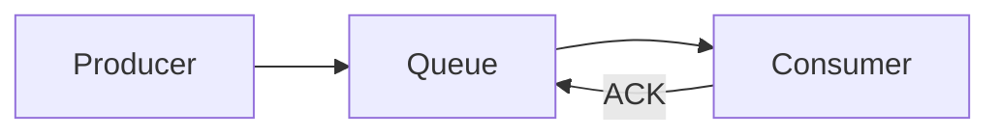

**Acknowledgement (ACK).** The consumer must confirm successful processing. Without ACK, the broker keeps the message (or redelivers it after a timeout). This is the foundation of at-least-once delivery.

**Visibility timeout.** After delivery, the message is hidden from other consumers for a period (Amazon SQS uses this pattern). If the consumer crashes before ACK, the message becomes visible again and another worker can pick it up.

**Competing consumers.** Multiple workers read the same queue; each message goes to exactly one consumer — horizontal scale without duplicate work on the same job.

```text
                Consumer 1
               /
Queue ---------
               \
                Consumer 2
```

**Retry and dead letter queue (DLQ).** On transient failure, the message returns to the queue or a retry topic. After repeated failures, it moves to a **DLQ** so poison messages do not block the entire pipeline.

**Backpressure.** When producers outpace consumers, queue depth grows. Responses: add consumers, rate-limit producers, auto-scale workers, or shed load at the edge.

**Message batching.** Consumers can pull and process multiple messages per round trip — fewer network calls, higher throughput, lower cost per message.

**Ordering.** Strict FIFO across parallel consumers is hard. Solutions: single consumer, FIFO queue types, or partition by key (Kafka-style). See section 6.11 for the full ordering treatment.

---

### Pitfalls and design tips

- **Do not treat every queue like a log.** Classic queues delete on ACK; they are for tasks, not long-term event history. Use event streaming (section 6.3) when you need replay.
- **Default to at-least-once + idempotent consumers** for anything involving money, inventory, or orders. At-most-once is only for metrics and telemetry where loss is acceptable (section 6.12).
- **Set prefetch / visibility timeout** to match handler duration — too short causes duplicate delivery; too long delays recovery after crashes.
- **Monitor queue depth and age-of-oldest-message** — a growing queue is the earliest sign of consumer starvation.
- **Interview angle:** "Why not just HTTP between services?" — decoupling, load leveling, and surviving downstream outages without failing the caller.

---

### Real-world example

**Order confirmation email (Amazon SQS-style flow).**

1. User completes checkout; the Order Service writes the order to its database.
2. Order Service publishes `{ "orderId": 123, "event": "ORDER_CREATED" }` to an SQS queue.
3. Order Service returns HTTP 200 immediately — it does not wait for email delivery.
4. Three Email Service workers compete on the queue. Worker B receives the message; SQS hides it from A and C for the visibility timeout.
5. Worker B sends the confirmation email, then calls `DeleteMessage` (ACK).
6. If Worker B crashes mid-send, the message reappears after the timeout and Worker A retries.

The queue absorbed the spike during a flash sale and kept checkout fast even when the email provider was slow.

---

## 6.2 Publish Subscribe

### Overview

Think of a radio station. The DJ broadcasts on one frequency; anyone tuned in hears the same show — the DJ does not know who is listening, and listeners do not need to know who is on air. **Publish-subscribe (pub/sub)** applies that pattern to software: publishers emit events to a **topic**, and every subscribed consumer receives a copy.

Technically, pub/sub decouples producers from consumers through a **broker** and a logical **topic** channel. Publishers write once; the broker fans out to all active subscribers. Unlike a work queue, each subscriber gets its own copy — ideal for domain events that many systems must react to independently.

---

### What problem it fixes

Point-to-point wiring does not scale when many services care about the same event:

```text
Order Service
      |
      +--> Email Service
      |
      +--> Analytics Service
      |
      +--> Inventory Service
```

Every new subscriber means changing the Order Service. Pub/sub inverts the dependency:

```text
                    Email Service
                          ^
Order Service --> Topic --+--> Analytics Service
                          |
                          +--> Inventory Service
```

Adding a Fraud Service means subscribing to the topic — the Order Service stays unchanged.

---

### What it does

| Component | Role |
|-----------|------|
| **Publisher** | Produces events (Order Service, User Service) |
| **Topic** | Named channel (`OrderCreated`, `PaymentCompleted`) |
| **Subscriber** | Receives every message published to the topic |
| **Broker** | Routes, stores (if durable), and delivers |

**Queue vs topic:**

| | Queue | Pub/sub topic |
|---|-------|---------------|
| **Purpose** | Work distribution | Event distribution |
| **Consumers** | One per message | Many subscribers |
| **Message copies** | One | One per subscriber |
| **Example** | Payment job queue | `ORDER_CREATED` broadcast |

**Subscription models:**

| Model | Behavior | Trade-off |
|-------|----------|-----------|
| **Push** | Broker delivers to subscriber | Real-time; subscriber can be overwhelmed |
| **Pull** | Subscriber polls the broker | Better flow control; slight delay |

**Durable vs non-durable:**

| | Durable | Non-durable |
|---|---------|-------------|
| **Subscriber offline** | Messages retained; delivered on reconnect | Messages lost |
| **Use** | Must-not-miss events | Fire-and-forget notifications |

**Filtering.** Subscribers can receive only matching events — by routing key pattern (RabbitMQ topic exchange) or subscription filter (AWS SNS, Google Pub/Sub).

---

### How it works — the architecture inside

```text
Step 1: Publisher creates event
Step 2: Event sent to topic
Step 3: Broker receives event
Step 4: Broker copies event to all subscribers
```

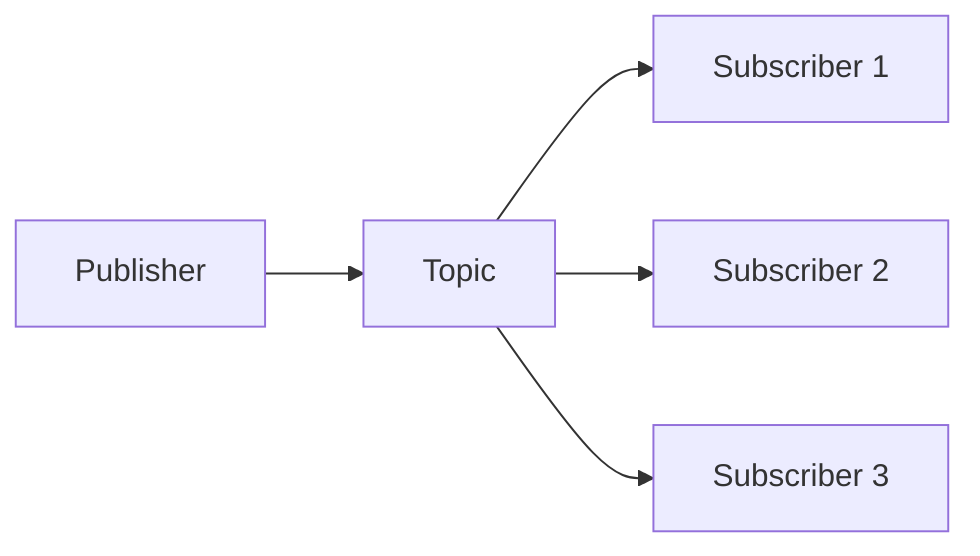

**Fan-out.** One published event reaches Email, SMS, Analytics, and Inventory in parallel — the defining pub/sub pattern.

**Scaling subscribers with consumer groups (Kafka-style).** One topic can feed multiple independent **consumer groups**. Inside a group, partitions are shared (each message processed once). Across groups, every group receives all messages — pub/sub at the group level, work-queue inside a group.

```text
Topic --> Consumer Group A (analytics)
      --> Consumer Group B (notifications)
      --> Consumer Group C (fraud)
```

**Message flow example:**

```json
{
  "orderId": 1001,
  "event": "ORDER_CREATED"
}
```

Publisher sends once → broker delivers independent copies to Subscriber A, B, and C.

---

### Pitfalls and design tips

- **Pub/sub is not a task queue.** If only one worker should process each payment, use a queue — not a topic with competing subscribers on the same subscription.
- **Expect eventual consistency.** Subscribers update at different speeds; do not assume all downstream views are synchronized immediately after publish.
- **Plan for duplicates** under at-least-once delivery — subscribers need idempotent handlers keyed by event ID.
- **Durable subscriptions cost storage.** Retain only as long as the slowest subscriber needs catch-up time.
- **Default for new microservices:** publish domain facts to a topic; let interested services subscribe rather than chaining HTTP callbacks.

---

### Real-world example

**Shopify-style order event fan-out.**

1. Checkout completes; Order Service persists the order and publishes `orders/created` with `{ orderId, customerId, lineItems, total }`.
2. A Kafka topic (or SNS topic) receives the event.
3. **Inventory subscriber** reserves stock in its own database.
4. **Email subscriber** enqueues a confirmation template send.
5. **Analytics subscriber** increments real-time dashboard counters.
6. A new **Recommendations subscriber** is added next quarter — it subscribes to the same topic without any Order Service code change.

Each service processes at its own pace; a slow analytics pipeline does not block email delivery.

---

## 6.3 Event Streaming

### Overview

A security camera records everything to a DVR — you can watch live or rewind to any moment later. **Event streaming** treats business activity the same way: events are appended to a durable log as they happen, and many consumers can read live or replay history.

Technically, event streaming is a continuous, **append-only log** of immutable facts. Producers append events; a broker retains them for a configurable period; consumers track their **offset** (position in the log) and read forward. Unlike classic queues, processed events are **not deleted** — they remain available for replay, new consumers, and audit.

---

### What problem it fixes

The traditional pattern — write to a database, let consumers poll — creates load, delay, and tight coupling:

```text
Application → Database → consumers query repeatedly
```

Event streaming moves facts to a shared log in real time:

```text
Application → Event Stream → Analytics / Search / Notifications
```

Benefits: millisecond-to-second latency, decoupled systems, horizontal scale via partitions, and the ability to **rebuild** a downstream system by replaying from offset zero after a bug fix.

---

### What it does

An **event** is an immutable record of something that already happened:

```json
{
  "orderId": 1001,
  "event": "ORDER_CREATED",
  "timestamp": "2026-06-25T10:00:00Z"
}
```

| Component | Role |
|-----------|------|
| **Producer** | Appends events |
| **Event stream / topic** | Ordered, partitioned log |
| **Broker** | Stores and serves events (Kafka, Pulsar, Kinesis) |
| **Consumer** | Reads from an offset; may belong to a consumer group |

**Stream vs classic queue:**

| | Message queue | Event stream |
|---|---------------|--------------|
| **After processing** | Message usually removed | Event **retained** |
| **Re-read** | No (unless DLQ/retry) | Yes — replay from any offset |
| **Primary use** | Task distribution | Pipelines, analytics, audit |

**Log-based storage.** Events land at offsets 0, 1, 2, 3… in each partition. Nothing is updated in place — only appended.

**Retention.** `retention = 7 days` means events stay available for replay even after every current consumer has read them.

**Partitions.** Large topics split into parallel shards. Ordering is guaranteed **within** a partition, not across partitions.

**Consumer groups.** Consumers in the same group divide partitions — each partition assigned to at most one consumer in the group. Different groups each read the full stream independently.

---

### How it works — the architecture inside

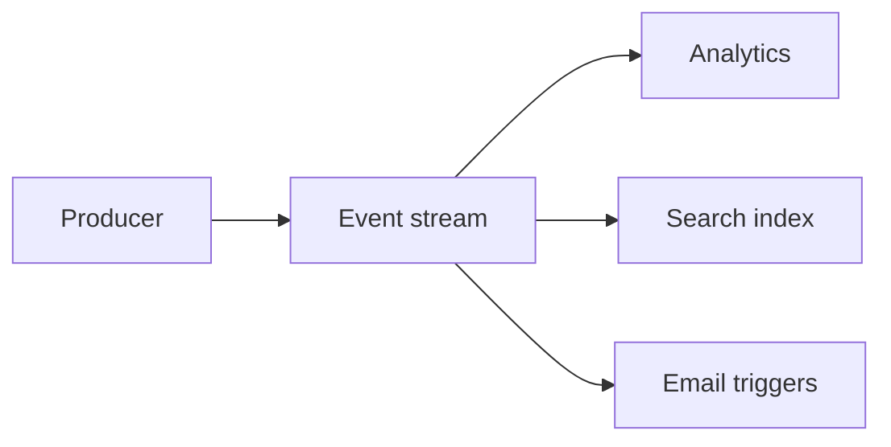

**Offset tracking.**

```text
Partition 0: Offset 0 → User Registered
             Offset 1 → Login
             Offset 2 → Order Created

Consumer: "I processed through offset 1" → next read starts at offset 2
```

**Replay.** Reset a consumer's offset (or deploy a new consumer group) to reprocess history — e.g. fix a bug in the analytics transformer and rebuild dashboards from day one.

**Stream processing.** Frameworks (Kafka Streams, Flink, Spark Streaming) read the log and compute aggregations, joins, and alerts in real time — fraud scoring, recommendations, IoT anomaly detection.

**Batch vs streaming:**

| | Batch | Streaming |
|---|-------|-----------|
| **Pattern** | Collect → process hourly | Process each event as it arrives |
| **Latency** | Minutes to hours | Milliseconds to seconds |

---

### Pitfalls and design tips

- **Retention is storage cost.** Size topics for expected volume × retention window; use tiered storage (Pulsar) or compaction (Kafka) for key-value changelog topics.
- **Schema drift breaks consumers.** Use a schema registry and version events before dozens of teams depend on implicit JSON shapes.
- **Do not assume global ordering.** Use partition keys (order ID, user ID) for per-entity order; see section 6.11.
- **Streaming ≠ event sourcing.** Streaming is often the transport; event sourcing is a domain pattern where state equals the sum of events (section 6.17).
- **Interview default:** Kafka for high-throughput durable logs; RabbitMQ for task queues — know which problem you are solving.

---

### Real-world example

**LinkedIn activity pipeline (Kafka's origin use case).**

1. A member views a profile; the front-end service emits `ProfileViewed` to the `page-view` topic.
2. Kafka appends the event to a partition chosen by `hash(viewerId)`.
3. A **real-time counter** consumer updates trending metrics within seconds.
4. A **search ranking** consumer adjusts relevance signals.
5. Six months later, a data science team launches a new model. They create a new consumer group, reset to the earliest offset, and replay six months of `page-view` events to train offline — without touching production writers.

The log is the system of record for "what happened"; consumers are disposable views over that history.

---

## 6.4 Event Driven Architecture

### Overview

Instead of one service calling the next in a rigid chain — like dominoes that all fall when one tips — **event-driven architecture (EDA)** lets each service react when it hears news it cares about. The Order Service announces "order created"; Payment, Email, and Inventory each decide what to do, without the Order Service knowing their addresses.

Technically, EDA is an architectural style where services communicate through **asynchronous domain events** rather than synchronous request-response chains. A producer publishes a fact; the broker distributes it; consumers react independently. The result is loose coupling, independent scaling, and fault isolation — at the cost of distributed tracing complexity and eventual consistency.

---

### What problem it fixes

Synchronous orchestration chains fail together:

```text
Order Service → Payment → Email → Inventory (each waits for the next)
```

One slow or failed hop blocks the user response and risks cascading failure.

Event-driven flow returns fast and decouples reactions:

```text
Order Service → Order Created Event → Payment / Email / Inventory
```

The order API responds after persisting and publishing; downstream services catch up asynchronously.

---

### What it does

| Component | Role |
|-----------|------|
| **Event producer** | Emits facts when state changes |
| **Event broker** | Kafka, RabbitMQ, Pulsar, cloud buses |
| **Event consumer** | Subscribes and reacts |

Events are **immutable**, **past-tense**, and **time-ordered**:

```json
{
  "eventType": "ORDER_CREATED",
  "orderId": 1001,
  "timestamp": "2026-06-25T10:00:00Z"
}
```

**Two coordination styles:**

| | Choreography | Orchestration |
|---|--------------|---------------|
| **Control** | Distributed — each service reacts to events | Central orchestrator directs steps |
| **Coupling** | Very low | Higher — orchestrator is a dependency |
| **Debugging** | Harder — no single workflow owner | Easier — orchestrator holds state |
| **Example** | `OrderCreated` → Payment listens → `PaymentCompleted` → Shipping listens | Saga orchestrator calls Payment, then Inventory, then Shipping |

**Eventual consistency.** For a short window, the order database may show "paid" while inventory still shows "reserved pending" — services converge independently. Design UIs and APIs to tolerate lag or expose status explicitly.

**Idempotency.** At-least-once delivery means the same `PaymentCompleted` event may arrive twice — consumers dedupe by `eventId` or business key.

---

### How it works — the architecture inside

```text
Step 1: User creates order
Step 2: Order Service stores order
Step 3: Order Service publishes ORDER_CREATED
Step 4: Consumers react in parallel:
         Inventory → reserve stock
         Email → send confirmation
         Analytics → update dashboard
```

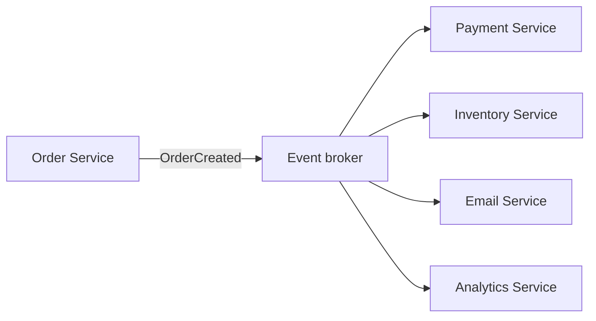

**Failure handling.** Consumer failure triggers retry with backoff; exhausted retries land in a DLQ for manual inspection. Correlation IDs in event metadata tie a single business transaction across services for distributed tracing.

**Common EDA building blocks:**

| Pattern | Role |
|---------|------|
| Pub/sub | Fan-out domain events |
| Event streaming | Durable retained log |
| Event sourcing | State = replay of all events |
| CQRS | Separate write and read models |
| Outbox pattern | Atomic DB write + event publish |

---

### Pitfalls and design tips

- **Choreography without tracing is opaque.** Propagate `correlationId` and `causationId` on every event; use OpenTelemetry across consumers.
- **Do not publish before commit.** Use the outbox pattern or transactional messaging so a DB rollback does not leave orphan events in the bus.
- **Version events early.** Add optional fields; never rename or remove required fields without a migration plan.
- **Orchestration vs choreography:** prefer choreography for simple fan-out; use orchestration (saga) when you need compensating transactions across many steps.
- **Not everything should be async.** User-facing read paths that need immediate consistency still belong on synchronous APIs or read models fed by events.

---

### Real-world example

**Uber trip lifecycle (choreographed EDA).**

1. Rider requests a trip; Trip Service persists state and publishes `TripRequested`.
2. **Matching Service** consumes the event, finds a driver, publishes `DriverAssigned`.
3. **Notification Service** pushes "Your driver is arriving" to rider and driver apps.
4. **Pricing Service** listens to `TripCompleted` and emits `FareCalculated`.
5. **Billing Service** consumes `FareCalculated` and charges the payment method.

No central trip orchestrator owns the entire workflow — each team owns its reaction. If Notification Service is down, messages backlog in Kafka and deliver when it recovers; the trip itself is not blocked.

---

## 6.5 Kafka

### Overview

Imagine a library that never throws away returned books — every edition is shelved in strict order, labeled by aisle and shelf number, and any number of reading clubs can start from page one or join where they left off. **Apache Kafka** is that library for events: a distributed, replicated **commit log** built for massive throughput and replay.

Technically, Kafka is an event streaming platform. Producers append records to **topics** sharded into **partitions**; **brokers** store and replicate them; **consumers** in **consumer groups** read by **offset**. Data is retained after consumption, enabling multiple independent readers, fault recovery, and stream processing at millions of events per second.

---

### What problem it fixes

Traditional message brokers delete messages after ACK — poor fit for analytics pipelines, audit logs, and rebuilding downstream systems. Kafka provides:

- Durable, retained logs with configurable retention
- Horizontal scale via partitions and broker clusters
- Independent consumer groups (fan-out without duplicate processing within a group)
- Replay from any offset

Companies including LinkedIn (origin), Netflix, Uber, and Airbnb use Kafka as the central nervous system for real-time and batch-derived workloads.

---

### What it does

| Component | Role |
|-----------|------|
| **Producer** | Sends records to a topic partition |
| **Topic** | Logical category (`orders`, `payments`) |
| **Partition** | Ordered, append-only shard of a topic |
| **Broker** | Server that stores partition logs |
| **Consumer** | Reads records from assigned partitions |
| **Consumer group** | Cooperating consumers sharing partition work |
| **Offset** | Monotonic position within a partition |
| **KRaft** | Modern metadata quorum (replaces ZooKeeper) |

**Producer partition choice:** `hash(key) % partitionCount` — same key always lands in the same partition for per-key ordering. No key → round-robin.

**Replication.** Each partition has one **leader** broker and follower replicas. Producers write to the leader; followers replicate. **ISR** (in-sync replicas) are caught-up followers eligible for leader election.

**Retention and compaction.** Time/size retention keeps raw history. **Log compaction** keeps only the latest record per key — useful for changelog topics (user profiles, config).

**Acknowledgements (`acks`):**

| Setting | Behavior |
|---------|----------|
| `acks=0` | Fire-and-forget; may lose data |
| `acks=1` | Leader ACK |
| `acks=all` | All ISR replicas ACK — production default |

Pair `acks=all` with `replication.factor=3` and `min.insync.replicas=2`.

---

### How it works — the architecture inside

```text
Producer → Topic → Partition → Broker (leader + followers) → Consumer group
```

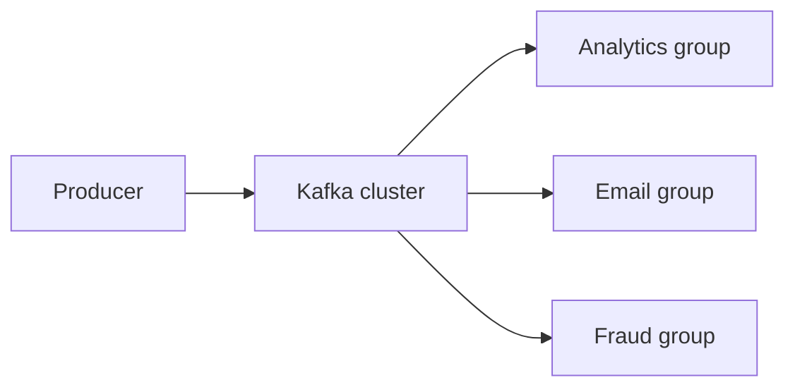

**Message flow within a partition:**

```text
Partition 0:
  Offset 0 → Order Created
  Offset 1 → Payment Completed
  Offset 2 → Order Shipped

Consumer commits offset 2 → restart resumes at offset 3
```

**Consumer group rules.**

- Partitions are divided among group members — each partition assigned to at most one consumer in the group.
- Maximum useful consumers per group = partition count; extra consumers sit idle.
- Different groups on the same topic each receive **all** messages independently.

**Production consumer settings:**

| Setting | Guidance |
|---------|----------|
| `enable.auto.commit` | `false` — commit after successful processing |
| `max.poll.interval.ms` | Long enough for slow handlers (5–15 min) |
| `group.instance.id` | Static per pod to reduce rebalance storms on deploy |
| Consumer lag | `log_end_offset − committed_offset` — alert on sustained high lag |

**Commit order (at-least-once):** `process(message)` → then `commit(offset)`. Handlers must be idempotent.

**Exactly-once semantics (EOS).** Idempotent producer + transactions enable read-process-write without duplicates — high complexity; most teams use at-least-once + idempotent consumers instead.

**Ecosystem:** Kafka Connect (DB integration), Kafka Streams (processing), Schema Registry (Avro/Protobuf schemas).

---

### Pitfalls and design tips

- **Hot partitions** from `key=null` or skewed keys (e.g. all events keyed to one merchant) — monitor per-partition byte rate.
- **Kafka is not a task queue.** Long-running jobs need retry topics + DLQ; do not block partition consumption for minutes.
- **`unclean.leader.election.enable=false`** — avoid promoting out-of-sync replicas and losing data.
- **Plan partition count upfront** — increasing partitions later does not reorder existing keys but affects assignment; rule of thumb: `partitions ≥ target_write_RPS / per_consumer_throughput`.
- **KRaft for new clusters** — simpler operations than ZooKeeper; faster metadata recovery.

---

### Real-world example

**Netflix Keystone pipeline.**

1. Microservices across Netflix emit operational and product events to regional Kafka clusters.
2. Producers set keys like `viewingSessionId` so related events stay ordered within a partition.
3. Real-time consumers power operational dashboards and anomaly detection with sub-minute lag targets.
4. Kafka Connect sinks the same topics to S3 for the data warehouse — batch and stream share one log.
5. When a downstream transformer ships a bug, engineers reset the consumer group offset and replay 24 hours of events to rebuild corrected aggregates — no re-emission from source services.

Kafka is the durable spine; consumers are replaceable projections over the log.

---

## 6.6 Kafka Partitions

### Overview

A supermarket checkout has multiple lanes — each lane serves customers in the order they arrived, but lane 3 does not know whether lane 1's customer came first. **Kafka partitions** are those lanes: parallel pipelines inside one topic, each preserving strict order internally while the topic as a whole scales out.

Technically, a partition is an ordered, append-only log segment on a broker. Producers choose a partition via key hash or explicit assignment. Throughput scales with partition count; ordering guarantees apply **only within** a single partition.

---

### What problem it fixes

A single log serializes all writes and reads — one partition caps throughput. Splitting a topic into N partitions lets N consumers in a group process in parallel while still giving per-entity ordering when events share a key.

Without partition keys, related events may scatter across partitions and arrive out of order at consumers — breaking workflows like `Created → Paid → Shipped`.

---

### What it does

```text
Orders Topic → Partition 0 | Partition 1 | Partition 2

Order 101 (key=101) → P0
Order 102 (key=102) → P1
Order 103 (key=103) → P2
```

| Mechanism | Effect |
|-----------|--------|
| `hash(key) % N` | Same key → same partition → per-key FIFO |
| No key | Round-robin → maximum spread, no key-level order |
| Partition count | Upper bound on parallel consumers per group |

**Replication.** Each partition is replicated across brokers (typically RF=3). One leader serves reads/writes; ISR followers stay in sync for failover.

---

### How it works — the architecture inside

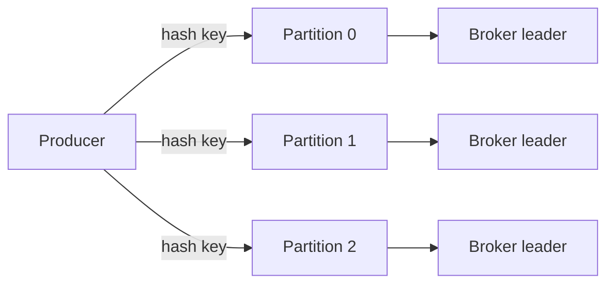

**Partition selection walkthrough.**

1. Producer sends `{ key: "customer-42", value: OrderCreated }`.
2. Kafka computes `hash("customer-42") % 12` → partition 7.
3. All future events for customer 42 land on partition 7 at offsets 0, 1, 2…
4. Consumer assigned partition 7 reads them strictly in offset order.

**Scaling rule:** consumers in one group ≤ partition count. Twelve partitions and four consumers → each consumer handles ~3 partitions. A thirteenth consumer has no partition to claim.

**Sizing trade-off:**

| Partitions | Ordering | Throughput | Overhead |
|------------|----------|------------|----------|
| 1 | Global topic order | Lowest | Minimal metadata |
| Many | Per-key only | Highest | More broker file handles, rebalance cost |

Too few partitions → throughput ceiling. Too many → metadata overhead, longer rebalances, and idle consumers if not matched to traffic.

---

### Pitfalls and design tips

- **Choose business IDs as keys** — `orderId`, `accountId`, `userId` — not random UUIDs if order matters.
- **Null keys** for throughput-sensitive, order-agnostic telemetry only.
- **Increasing partitions** does not reshuffle existing data — plan count near expected peak; use Kafka's partition reassignment tools for broker balance, not as a frequent knob.
- **One slow partition** (hot key) limits an entire consumer — detect skew in per-partition lag metrics.
- **Interview line:** "Ordering in Kafka is per-partition; the partition key is how you buy ordering without giving up parallelism."

---

### Real-world example

**Stripe-style payment events.**

Payment events for `account_abc` use `account_abc` as the Kafka key. `ChargeCreated`, `ChargeCaptured`, and `RefundIssued` for that account all append to the same partition. A fraud scorer consuming that partition sees refunds only after captures — balance logic stays correct. Accounts are spread across hundreds of partitions so thousands of accounts process in parallel without global lock-step.

---

## 6.7 Kafka Consumer Groups

### Overview

A relay race team hands off batons so each runner covers one leg — no two runners hold the same baton at once, but multiple teams can run the same course independently. A **consumer group** is that team for Kafka: cooperating consumers split partitions so each message is processed once per group, while other groups read the full stream separately.

Technically, consumers sharing a `group.id` coordinate partition assignment via the group coordinator. Rebalances redistribute partitions when members join, leave, or crash. Committed offsets record progress per partition — restart or new deploy resumes without re-reading the entire log (unless you choose to).

---

### What problem it fixes

A single consumer on a high-volume topic becomes a bottleneck. Multiple uncoordinated consumers on the same topic would duplicate work. Consumer groups provide **load-balanced, exactly-once-per-group** consumption with horizontal scale bounded by partition count.

Separately, different applications (analytics vs billing vs search) need the **same** events without stepping on each other's offsets — separate consumer groups solve that.

---

### What it does

**Within one group:**

```text
Partition 0 → Consumer 1
Partition 1 → Consumer 2
Partition 2 → Consumer 3
```

Each message in the topic is delivered to **one** consumer in the group.

**Across groups:**

```text
orders topic → analytics-group (all messages)
            → email-group (all messages)
            → fraud-group (all messages)
```

Each group maintains its own offset commits — fan-out with independent progress.

| Concept | Behavior |
|---------|----------|
| Same `group.id` | Partitions shared; cooperative consumption |
| Different `group.id` | Independent reads of identical topic data |
| Max active consumers | One per partition per group |
| Static membership | `group.instance.id` reduces rebalance on rolling deploy |

---

### How it works — the architecture inside

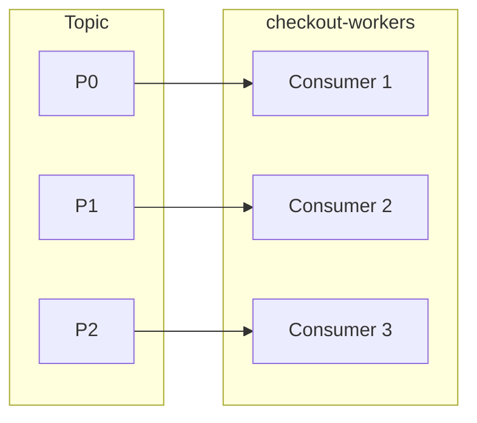

**Assignment example:** topic `orders` has 12 partitions; group `checkout-workers` has 4 consumers → roughly P0–P2 to C1, P3–P5 to C2, etc.

**Rebalance triggers:** consumer join/leave, crash, `max.poll.interval.ms` exceeded (handler too slow), partition count change.

**Consumer lag:**

```text
lag = log_end_offset − committed_offset
```

Sustained lag on one partition often signals a hot key or a slow handler.

**Commit-after-process (at-least-once):**

```text
poll() → process(record) → commitSync(offset + 1)
```

Committing before process → at-most-once risk. Auto-commit with long processing → duplicate risk on crash.

**Cooperative sticky assignor** (`CooperativeStickyAssignor`) revokes fewer partitions per rebalance than range assignor — less duplicate processing during deploys.

---

### Pitfalls and design tips

- **`max.poll.interval.ms` too low** — slow handlers trigger rebalance loops; consumer never makes progress.
- **`enable.auto.commit=true` with side effects** — offset may commit before processing finishes → message loss on crash.
- **More consumers than partitions** — extras idle; add partitions (carefully) or merge groups.
- **Rebalance during deploy** — use static `group.instance.id` and cooperative protocols; drain gracefully.
- **Monitor lag per partition**, not just aggregate — one hot partition hides inside a healthy average.

---

### Real-world example

**DoorDash order pipeline — two groups on `order-events`.**

1. **Group `dispatch`** (8 consumers, 8 partitions): assigns drivers in real time; commits offset after dispatch API succeeds. Lag alert fires if any partition exceeds 30 seconds.
2. **Group `data-warehouse`** (2 consumers, 8 partitions): sinks events to BigQuery via Kafka Connect — lag of hours is acceptable; offsets are independent of dispatch.
3. During deploy, dispatch pods use `group.instance.id=dispatch-pod-3` so Kafka reassigns only that pod's partitions — not a full cluster rebalance.

Same topic, two purposes, zero offset collision.

---

## 6.8 RabbitMQ

### Overview

A post office does not deliver every letter directly from sender to recipient's desk — it sorts mail into bins by address, and workers pull from each bin. **RabbitMQ** is that sorting office for messages: producers hand envelopes to an **exchange**, which routes them into **queues**, and consumers pick up work from their queue.

Technically, RabbitMQ is an open-source **AMQP message broker**. Its distinguishing feature is **flexible broker-side routing** — direct, fanout, topic, and headers exchanges — plus acknowledgements, persistence, prefetch, and dead-letter queues for reliable task processing at moderate-to-high throughput.

---

### What problem it fixes

Direct HTTP calls fail when the downstream service is unavailable:

```text
Order Service → Email Service (Email down → checkout fails or times out)
```

With RabbitMQ:

```text
Order Service → RabbitMQ Queue → Email Service
```

The message waits safely until a worker is healthy — decoupling availability and smoothing load spikes.

---

### What it does

**Critical rule:** producers never send directly to a queue. Flow is always:

```text
Producer → Exchange → Queue → Consumer
```

| Component | Role |
|-----------|------|
| **Exchange** | Routes messages by type and rules |
| **Binding** | Links exchange to queue with optional routing key |
| **Queue** | Buffers messages until consumed and ACKed |
| **Routing key** | Producer-supplied hint (`order.created`) |

**Exchange types:**

| Type | Routing behavior |
|------|------------------|
| **Direct** | Exact routing key match |
| **Fanout** | Broadcast to all bound queues |
| **Topic** | Pattern match (`order.*`, `order.#`) |
| **Headers** | Match message headers |

**Reliability knobs:**

- **Durable queue + persistent message** — survive broker restart
- **Manual ACK** — delete only after successful processing
- **Prefetch count** — cap unacked messages per consumer (prevent memory blow-up)
- **DLQ** — poison messages after max retries

**Competing consumers** on one queue distribute tasks — each message to exactly one worker.

---

### How it works — the architecture inside

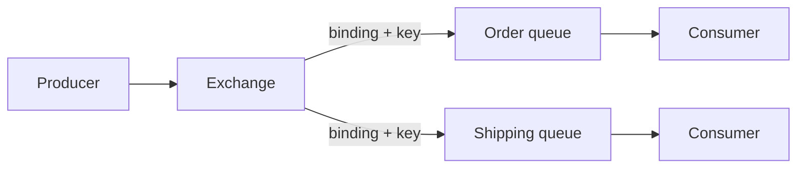

**Topic exchange walkthrough.**

```text
Binding: order.*  → Analytics queue
Binding: order.shipped → Shipping queue

Publish routing key order.created → Analytics only
Publish routing key order.shipped → Analytics AND Shipping
```

Wildcards: `*` = one word; `#` = zero or more words.

**ACK flow:**

```text
Consumer receives → processes → basicAck → RabbitMQ deletes message
Crash before ACK → message redelivered (at-least-once)
```

**Quorum queues** (modern default for HA) use Raft consensus — preferred over legacy mirrored queues for data safety.

---

### Pitfalls and design tips

- **Fanout for pub/sub, single queue for work queues** — mixing patterns on one queue causes confusion about who should process what.
- **Auto-ACK** only for disposable metrics — otherwise you get at-most-once loss on crash.
- **Unbounded queue growth** when consumers lag — monitor `messages_ready` and `messages_unacknowledged`; scale consumers or throttle producers.
- **Ordering** requires single active consumer per queue — competing consumers break strict FIFO.
- **Choose RabbitMQ over Kafka** when you need complex routing, low-latency tasks, and delete-on-success semantics — not multi-day replay at billions of events.

---

### Real-world example

**Background job routing at a SaaS billing platform.**

1. `InvoiceService` publishes to the `billing` **topic exchange** with routing key `invoice.created`.
2. Bindings route `invoice.created` to `pdf-render-queue` and `analytics-queue`.
3. Three workers compete on `pdf-render-queue` with `prefetch=10` — each generates a PDF, uploads to S3, then ACKs.
4. A malformed invoice crashes the PDF worker five times; RabbitMQ dead-letters the message to `pdf-render-dlq` for ops review while other invoices keep flowing.

Exchanges decouple "what happened" from "which workers care" without the invoice service knowing queue names.

---

## 6.9 ActiveMQ

### Overview

ActiveMQ is the enterprise Java team's long-distance operator — it speaks many protocols (JMS, AMQP, MQTT, STOMP) and connects legacy mainframes, Spring apps, and mobile clients through one broker. If your organization standardizes on **JMS** for messaging, ActiveMQ is often already in the data center.

Technically, **Apache ActiveMQ** is a multi-protocol message broker. The classic broker targets JMS **queues** (point-to-point) and **topics** (pub/sub). **ActiveMQ Artemis** is the modern high-performance core recommended for new deployments — same concepts, better throughput and clustering.

---

### What problem it fixes

Enterprise Java systems historically integrated through JMS, not raw HTTP or Kafka. ActiveMQ provides:

- Standard JMS API (`ConnectionFactory`, `Session`, `Destination`)
- Reliable async messaging between JVM services
- Queue/worker and topic/broadcast patterns in one broker
- Request-reply over temporary reply queues (RPC-style without synchronous HTTP)

It bridges brownfield integration — insurance claims, banking workflows, ERP connectors — where JMS is the contract.

---

### What it does

| Component | Role |
|-----------|------|
| **Producer** | Sends to a queue or topic |
| **Consumer** | Receives and acknowledges |
| **Queue** | One consumer per message |
| **Topic** | Many subscribers per message |
| **Broker** | ActiveMQ server |
| **ConnectionFactory** | JMS entry point for connections |

**Queue vs topic:**

| | Queue | Topic |
|---|-------|------|
| **Delivery** | One consumer | All active subscribers |
| **Use** | Task processing | Event broadcast |

**JMS message types:** `TextMessage`, `ObjectMessage`, `MapMessage`, `BytesMessage`, `StreamMessage`.

**Persistence:** persistent messages survive broker restart; non-persistent trade durability for speed.

**Durable subscribers** on topics retain messages while offline — non-durable subscribers miss events during downtime.

**Message groups** route related messages to the same consumer for ordered processing per customer.

**DLQ** after retry exhaustion — same poison-message pattern as RabbitMQ.

---

### How it works — the architecture inside

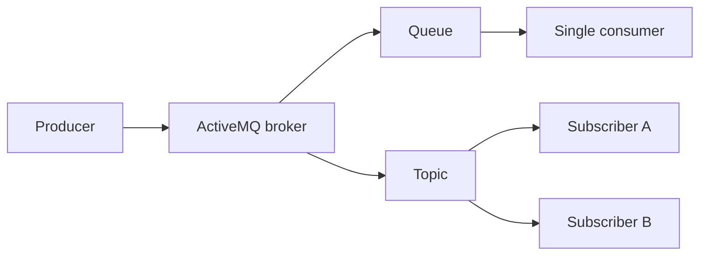

**JMS client stack:**

```text
Application → ConnectionFactory → Connection → Session → Producer/Consumer → Destination
```

**Request-reply:**

```text
Client → request queue → Server → response queue → Client
```

Correlation ID in message headers ties reply to request.

**High availability:** master/slave failover, network of brokers for geographic distribution, Artemis replicated stores for modern clusters.

**ActiveMQ Classic vs Artemis:**

| | Classic | Artemis |
|---|---------|---------|
| **Status** | Legacy maintenance | Recommended for new systems |
| **Performance** | Moderate | Significantly faster |
| **Clustering** | Network of brokers | Built-in HA replication |

---

### Pitfalls and design tips

- **New Java projects → Artemis**, not Classic — better performance and supported clustering path.
- **ObjectMessage** ties you to Java serialization — prefer JSON/TextMessage for cross-language services.
- **Not a replay log** — limited retention vs Kafka; use Kafka when analytics needs historical re-read.
- **Message selectors** filter in the broker but add CPU cost — prefer routing to dedicated queues when volume is high.
- **Interview context:** ActiveMQ = JMS enterprise integration; RabbitMQ = flexible AMQP routing; Kafka = streaming scale.

---

### Real-world example

**Bank payment settlement (JMS queue).**

1. A core banking JVM service enqueues `SettlementRequest` XML as a persistent `TextMessage` on `settlement.queue`.
2. Three adapter instances compete on the queue; JMS ensures each message goes to one adapter.
3. The adapter calls an external clearinghouse API; on success it calls `message.acknowledge()`.
4. Broker restart overnight does not lose unacked persistent messages — they redeliver on startup.
5. Messages failing validation after five redelivers route to `ActiveMQ.DLQ` for compliance review.

JMS gives the bank a standardized API across vendors; ActiveMQ is the on-prem broker they operate.

---

## 6.10 Pulsar

### Overview

Most messaging systems weld the waiter and the pantry into one role — take orders and store food in the same kitchen. **Apache Pulsar** splits them: stateless **brokers** serve clients while **Apache BookKeeper** stores message ledgers separately. You can add more waiters or more pantry space independently.

Technically, Pulsar is a distributed pub/sub and streaming platform (originated at Yahoo, now Apache). It offers Kafka-like partitioned topics and retention with RabbitMQ-like subscription flexibility — plus built-in **multi-tenancy** and **geo-replication** — at the cost of operating brokers and BookKeeper (and optionally tiered object storage).

---

### What problem it fixes

Kafka couples storage to broker disks — scaling read throughput often means copying partition data to more brokers. Pulsar decouples serving from storage:

| | Kafka | Pulsar |
|---|-------|--------|
| **Broker** | Compute + local log segments | Stateless compute |
| **Storage** | On broker disks | BookKeeper ledgers |
| **Scale** | Joint | Independent |

Teams needing multi-region replication without MirrorMaker-style plumbing, or SaaS platforms isolating tenants on one cluster, benefit from Pulsar's first-class features.

---

### What it does

| Component | Role |
|-----------|------|
| **Broker** | Accepts publishes, serves subscriptions — stateless |
| **BookKeeper** | Replicated ledger storage |
| **Topic** | Logical channel, optionally partitioned |
| **Subscription** | Consumer's cursor on a topic |

**Subscription modes:**

| Mode | Behavior |
|------|----------|
| **Exclusive** | One consumer only |
| **Shared** | Competing consumers — round-robin |
| **Failover** | One active, standby on failure |
| **Key_Shared** | Same key → same consumer — per-key ordering |

**Retention and replay.** Messages persist after ACK; reset the subscription cursor to replay — Kafka-offset-reset equivalent.

**Geo-replication.** Built-in cross-cluster topic replication between regions.

**Multi-tenancy.** Tenants and namespaces isolate quotas, ACLs, and topics on shared hardware.

**Tiered storage.** Offload old ledgers to S3-compatible object storage for cheap long retention.

---

### How it works — the architecture inside

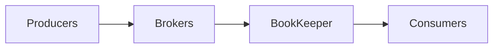

```text
Producer → topic → broker → BookKeeper ledger → consumer ACK → cursor advances
```

**Key_Shared walkthrough.**

1. Events keyed by `userId=42` arrive on a partitioned topic.
2. Pulsar assigns all key-42 messages to Consumer B within the subscription.
3. User 42's `Login`, `Purchase`, `Logout` process in order on B while other users parallelize on A and C.

**Delivery guarantees:** at-most-once, at-least-once (default with ACK), effectively-once with idempotent consumers.

---

### Pitfalls and design tips

- **More moving parts than Kafka** — brokers, BookKeeper bookies, ZooKeeper or etcd metadata, optional tiered storage — staff accordingly.
- **Smaller connector ecosystem** than Kafka — verify Kafka Connect equivalents exist for your sources.
- **Overkill for simple task queues** — RabbitMQ or SQS is simpler for point-to-point jobs.
- **Strong fit:** multi-tenant SaaS event backbone, multi-region active-active, teams that outgrow Kafka broker disk coupling.
- **Key_Shared** is the Pulsar answer to Kafka's partition key + single consumer per partition — understand assignment on rebalance.

---

### Real-world example

**Yahoo's original Pulsar deployment (documented design goal).**

Yahoo built Pulsar to unify messaging for Mail, Finance, and Sports properties on shared infrastructure. Each property is a **tenant** with isolated namespaces. Global users publish to regional brokers; **geo-replication** copies critical topics between US and Asia clusters so failover does not require a separate MirrorMaker pipeline. BookKeeper replication (typically 3 copies across bookies) survives single-machine loss without losing acknowledged messages.

The split architecture let Yahoo scale broker pools for read-heavy fan-out without rebalancing terabytes of disk per broker add — the pattern Pulsar still sells to large multi-team platforms.

---

## 6.11 Ordering Guarantees

### Overview

A single-file line at a bank teller preserves who arrived first. Open ten tellers without coordination and two people from the same account might be served out of order — deposits and withdrawals could interleave wrongly. **Ordering guarantees** in messaging systems work the same way: parallelism is bought with narrower ordering scope.

Technically, most brokers guarantee FIFO **only within a constrained unit** — a Kafka partition, a single RabbitMQ queue with one consumer, or a Pulsar Key_Shared key. Global ordering across an entire high-throughput topic requires a single serial pipeline and sacrifices scale.

---

### What problem it fixes

Many workflows are state machines that break if events arrive shuffled:

```text
Order Created → Payment Completed → Order Shipped
```

If `Shipped` is processed before `Payment Completed`, you ship unpaid orders. Messaging systems must expose **where** order is preserved and **how** to route related events to the same serial pipeline.

---

### What it does

**Kafka's core rule:**

```text
Ordering guaranteed WITHIN a partition
Ordering NOT guaranteed ACROSS partitions
```

| Scope | Guaranteed? |
|-------|-------------|
| Single partition | Yes — offset order |
| Same key (same partition) | Yes — per-entity order |
| Entire topic (many partitions) | No |
| Global (all events) | Only with one partition |

**Partition by business key:**

```text
hash(OrderID) → partition 3
All events for Order 1001 → partition 3 → offsets 0, 1, 2 in order
```

**Producer-side ordering hazards.** Retries without idempotence can reorder: M2 succeeds, M1 retries later → M2 consumed before M1.

**Fix:**

```properties
enable.idempotence=true
```

Kafka assigns sequence numbers per partition; retries do not create duplicates or reorder visible records.

**Consumer group rule.** One partition → at most one consumer per group — otherwise two consumers could interleave reads from the same log.

**Other brokers (brief):**

| Broker | Ordering |
|--------|----------|
| **RabbitMQ** | Single queue + single consumer; competing consumers break order |
| **SQS FIFO** | Per message group ID |
| **Pulsar Key_Shared** | Per key within subscription |

---

### How it works — the architecture inside

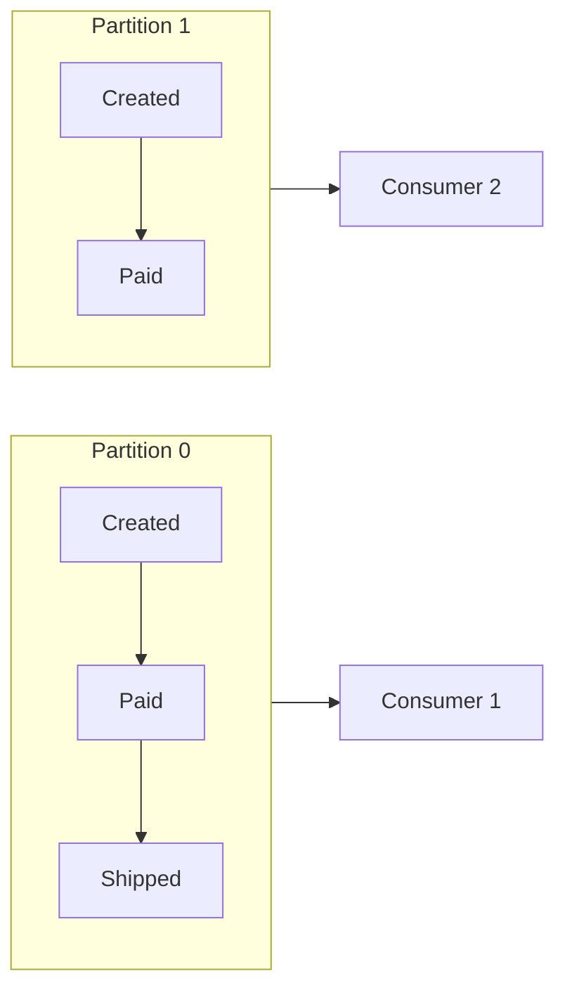

**Multiple partitions — no global order:**

```text
P0: A, C
P1: B, D

Observed global order might be A, B, C, D or B, A, D, C — both valid
```

**Ordering vs throughput trade-off:**

| Design | Ordering | Throughput |
|--------|----------|------------|
| 1 partition | Global for topic | Limited |
| N partitions + keys | Per entity | High |
| N partitions, no keys | None across entities | Highest |

**Replication preserves order.** Followers replicate the leader's offset sequence; leader failover promotes a replica with an identical ordered log.

---

### Pitfalls and design tips

- **Default design: per-entity ordering** — `accountId`, `orderId` as key — not global FIFO.
- **Enable idempotent producer** whenever order matters and retries are enabled.
- **`max.in.flight.requests.per.connection`** — with idempotence, keep ≤ 5; without it, set to 1 if you must minimize reorder risk (hurts throughput).
- **Do not add partitions** to fix consumer lag on a single hot key — only more consumers on **other** keys help; hot keys need application-level splitting or async serialization.
- **Rebalance** does not break partition order — only one consumer reads a partition at a time.

---

### Real-world example

**Bank account ledger (Kafka).**

Events: `Deposit ₹1000`, `Withdraw ₹500`, `Withdraw ₹200` for account `ACC-99`.

1. Producer sets key `ACC-99` → all three events land on partition 5.
2. A single consumer in the `ledger` group reads offsets 100, 101, 102 in order.
3. Running balance math stays correct: 1000 → 500 → 300.
4. If `Withdraw ₹500` were processed before `Deposit ₹1000` because keys were missing and events split across partitions, the account could incorrectly reject valid withdrawals.

The key is not optional decoration — it is the ordering contract.

---

## 6.12 At Most Once Delivery

### Overview

A weather station that drops readings when the radio buffer is full prefers a gap in the chart over plotting the same storm twice. **At-most-once delivery** makes the same trade for messages: each message is delivered zero or one times — **never twice**, but loss is acceptable.

Technically, at-most-once means the broker or consumer treats a message as "done" before processing is guaranteed to complete — or the producer does not wait for broker confirmation. There is no redelivery on failure. Duplicates are impossible; gaps are possible.

---

### What problem it fixes

Reliable delivery requires acknowledgements, retries, and idempotence — complexity and latency. For **high-volume, low-stakes** data (metrics, clickstream, debug logs), losing a fraction of events is cheaper than deduplicating billions of duplicates or blocking on ACKs.

At-most-once maximizes throughput and simplicity when the business tolerates gaps.

---

### What it does

```text
✓ Delivered zero or one time
✓ May be lost
✗ Never delivered twice
```

**Canonical comparison:**

| | At most once | At least once | Exactly once |
|---|--------------|---------------|--------------|
| **Deliveries** | 0 or 1 | 1 or more | 1 effective processing |
| **Duplicates** | No | Possible | No |
| **Loss** | Possible | Avoided* | Avoided* |
| **Complexity** | Lowest | Medium | Highest |

*With durable broker and correct consumer design.

**Typical mechanisms:**

| System | At-most-once configuration |
|--------|---------------------------|
| **Kafka consumer** | `enable.auto.commit=true` + commit before process |
| **Kafka producer** | `acks=0` (fire-and-forget) |
| **RabbitMQ** | Auto-ACK on deliver |
| **SQS** | Delete message before processing completes |

---

### How it works — the architecture inside

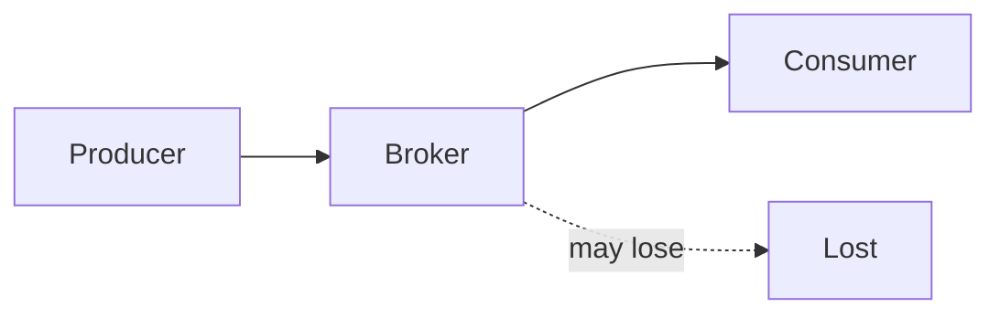

**Consumer-side timeline:**

```text
Step 1: Queue holds Message A
Step 2: Consumer receives A → broker deletes A immediately
Step 3: Consumer crashes during processing
Result: Message A lost forever — no retry
```

Contrast with at-least-once:

```text
Receive → process → ACK → delete
Crash before ACK → redeliver → possible duplicate
```

**Kafka offset example:**

```text
Offset 10: poll → auto-commit offset 10 → crash before process
Restart from offset 11 → offset 10 never processed
```

**Producer `acks=0`:** producer does not wait for broker write confirmation — fastest, least durable.

---

### Pitfalls and design tips

- **Never use for money, inventory, orders, or medical records** — loss is silent; you will not know which events disappeared.
- **Auto-commit Kafka consumers** are at-most-once if processing fails after a commit — fine for log shipping, dangerous for billing side effects.
- **If you chose at-most-once, do not also build expensive dedup** — you are paying twice for the wrong guarantee.
- **Good fit:** application logs, Datadog-style metrics, sampling telemetry, A/B impression counters where ±1% error is acceptable.
- **Interview contrast:** at-most-once = speed; at-least-once = reliability + idempotent handlers; exactly-once = hardest, often "effectively once" in practice.

---

### Real-world example

**Web analytics beacon (browser → collector).**

1. A retail site fires a `page_view` JSON blob to an ingestion endpoint on every page load.
2. The collector enqueues to Kafka with `acks=1` on a lossy edge cluster; overflow drops events rather than blocking the browser.
3. Consumers use `enable.auto.commit=true` and commit offsets every second — if a consumer pod dies, up to one second of partition events may be skipped.
4. Product analytics dashboards show "~99.9% of sessions" — stakeholders accept minor under-counting; they explicitly reject duplicate session counts that would inflate conversion rates.

Speed and volume win; a missing click rarely changes a merchandising decision.

## 6.13 At Least Once Delivery

### Overview

Picture a postal worker who will not throw away your letter until you sign the delivery receipt. If you sign, the letter leaves their bag. If you crash on the couch before signing, they come back tomorrow — maybe with the same letter again. That is at-least-once delivery: the broker keeps the message until the consumer confirms success, so nothing is lost, but the same work might arrive twice.

Technically, **at-least-once delivery** means a message is delivered **one or more times**. The broker stores the message, delivers it to a consumer, and removes it (or commits the offset) only after a successful **acknowledgement (ACK)**. If the consumer processes the message but crashes before ACK, or the ACK is lost on the network, the broker redelivers. Duplicates are possible; loss is not — when ACK semantics are configured correctly.

---

### What problem it fixes

Distributed messaging fails at every step: producers disconnect, brokers restart, consumers crash mid-processing. Without a durability + ACK contract, messages vanish silently — orders never ship, payments never settle.

At-least-once fixes **message loss** by making the broker responsible for redelivery until it receives proof of successful processing:

```text
Broker keeps message  →  consumer processes  →  consumer ACKs  →  broker deletes / commits offset
No ACK               →  broker assumes failure  →  redelivery
```

The trade-off is explicit: reliability over duplicate-freedom.

| Guaranteed | Not guaranteed |
|------------|----------------|
| No message loss (with correct ACK config) | No duplicate processing |

---

### What it does

At-least-once delivery provides:

- **Durable storage** — the broker persists messages until ACKed.
- **Automatic redelivery** — transient consumer failures trigger retry without producer involvement.
- **Offset / visibility semantics** — Kafka commits offsets after processing; SQS hides messages until timeout; RabbitMQ uses manual ACK.

It does **not** make your business logic duplicate-safe. That is the application's job through **idempotent consumers**.

---

### How it works — the architecture inside

```text
Step 1: Producer sends message
Step 2: Broker stores message durably
Step 3: Consumer receives message
Step 4: Consumer processes message
Step 5: Consumer sends ACK (or commits offset)
Step 6: Broker deletes message / advances offset
```

**Normal path:** one delivery, one ACK, message removed.

**Failure path:** consumer processes → crashes before ACK → broker redelivers → possible duplicate.

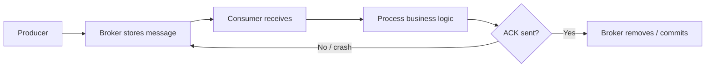

The broker cannot know whether processing finished — only whether ACK arrived. A payment that succeeded but was never ACKed will be retried.

#### Idempotent consumer pattern

Processing the same message twice must produce the **same result** as processing it once:

```text
Receive message → check message ID / idempotency key
  → already processed? → ignore
  → new? → process → record ID as processed
```

Patterns: natural idempotency (`SET status = PAID WHERE status != PAID`), `UNIQUE` idempotency key column, `processed_events` table, `ON CONFLICT DO NOTHING`.

**Bad:** `Deposit ₹1000` run twice → ₹2000 deposited.

**Good:** message ID `TXN-101` already in dedup table → skip → ₹1000 deposited once.

#### Broker examples

**RabbitMQ:** manual ACK — missing ACK → message redelivered.

**Kafka:** `enable.auto.commit = false` — commit offset **after** processing. Crash before commit → offset unchanged → message read again.

```text
Offset 10: read → process → crash (no commit) → restart → read offset 10 again
```

---

### Pitfalls and design tips

- **Default for production** — at-least-once is the standard choice for orders, payments, and inventory; at-most-once is only for metrics and logs where loss is acceptable.
- **Commit offset after processing** (Kafka) — never auto-commit before business logic completes.
- **Always use message IDs or idempotency keys** — duplicates are when, not if.
- **Pair with retry limits and DLQ** — redelivery without bounds becomes an infinite loop on poison messages.
- **Do not confuse broker guarantee with end-to-end guarantee** — ACK after DB write but before external API call can still duplicate side effects; design idempotency at every layer that mutates state.
- **Interview angle:** "We use at-least-once + idempotent consumers" is the honest production answer; claiming true exactly-once across heterogeneous systems is usually overstated.

---

### Real-world example

An e-commerce **Inventory Service** consumes `OrderCreated` from a queue. It decrements stock and ACKs. The JVM runs out of memory after the DB update but before ACK. RabbitMQ redelivers the message on restart. Without an idempotency check on `orderId`, stock drops twice. With `processed_orders(order_id UNIQUE)`, the second delivery is a no-op — the order is fulfilled exactly once in business terms while the broker delivered at-least-once.

---

## 6.14 Exactly Once Delivery

### Overview

Imagine a bank teller who must move money exactly once — not lose the transfer, and not run it twice if the power flickers. That is the user-facing promise of exactly-once: each message is processed once and only once. In practice, the teller's ledger uses duplicate-transaction IDs, because true atomicity across separate buildings (database and message broker) is extraordinarily hard.

Technically, **exactly-once delivery** means a message is **never lost** and **never processed more than once**. Achieving this end-to-end across a database, message broker, and external APIs requires **atomicity** between business processing and acknowledgement — or compensating patterns (idempotency, inbox, transactions) that produce the same observable outcome as true exactly-once.

---

### What problem it fixes

The classic failure: consumer receives message → updates database → crashes before ACK → broker redelivers → database updated twice.

```text
Queue → Consumer → DB updated → crash before ACK
→ broker retries → DB updated again → duplicate result
```

Exactly-once (or equivalent behavior) fixes **duplicate side effects** in domains where repetition is unacceptable: bank transfers, payment capture, inventory accounting, billing ledgers.

---

### What it does

Exactly-once semantics aim to unify two operations into one atomic unit:

1. **Business processing** (database write, state change)
2. **Message acknowledgement** (ACK, offset commit, mark processed)

When both succeed together or both roll back, the system cannot enter the "processed but not ACKed" trap that creates duplicates on retry.

Mechanisms include:

- **Idempotent consumer + dedup store** — practical default
- **Kafka EOS** — idempotent producer + transactions + atomic offset commit
- **Outbox / inbox patterns** — local DB atomicity, then async publish
- **Two-phase commit (2PC)** — strong but slow; rarely used for messaging today

---

### How it works — the architecture inside

#### The core challenge

```text
Receive → process → ACK   (naive — crash between process and ACK still duplicates)
```

Both steps must succeed as **one unit**, or duplicates must be harmless via idempotency.

#### Identity check (inbox pattern)

Store processed message IDs before processing:

```text
Message ID = TXN-100
Processed IDs: TXN-50, TXN-60 → TXN-100 not found → process → insert TXN-100
Future duplicate TXN-100 → found → ignore
```

This is **at-least-once delivery + idempotent consumer** — the pragmatic production definition of "exactly-once behavior."

#### Kafka exactly-once semantics (EOS)

Kafka provides EOS through three layers:

1. **Idempotent producer** (`enable.idempotence = true`) — broker dedupes by producer ID + sequence per partition; network retries do not create duplicate log records.
2. **Transactions** (`transactional.id`) — multi-partition writes are all-or-nothing.
3. **Atomic offset commit** — consumer offset committed in the same transaction as output records (read-process-write topology).

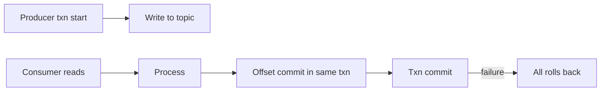

Requires `acks = all`, healthy ISR (`min.insync.replicas`), and adds latency (~10–20%). Flink and Kafka Streams provide EOS within stream topologies.

EOS does **not** automatically cover SMTP, external HTTP APIs without idempotency keys, or heterogeneous systems without cooperation at every layer.

#### Outbox and inbox

**Outbox (producer side):** same DB transaction writes business row + outbox event row; relay publishes later — guarantees no event loss from the write path.

**Inbox (consumer side):** store processed message IDs; duplicates are ignored — exactly-once **behavior** on top of at-least-once delivery.

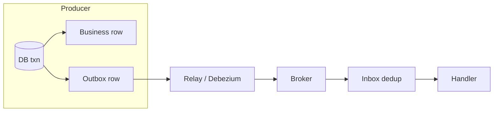

#### Comparison for a ₹10,000 bank transfer

| Guarantee | Risk |
|-----------|------|
| At-most-once | Transfer may be **lost** |
| At-least-once | Transfer may run **twice** |
| Exactly-once (or idempotent equivalent) | Transferred **once** — required behavior |

---

### Pitfalls and design tips

- **Pragmatic default:** at-least-once + `UNIQUE` idempotency key on the consumer — many teams over-engineer Kafka transactions when a dedup table suffices.
- **EOS scope is bounded** — it covers Kafka producer → consumer within a transactional topology, not your payment gateway or email provider.
- **2PC across DB + broker** — strong consistency but blocking, slow, and fragile; outbox is the modern replacement.
- **Cost:** transactions, dedup tables, outbox relay, and lower throughput — reserve full EOS for money, inventory, and ledgers.
- **Interview angle:** distinguish **broker semantics** (Kafka EOS) from **business semantics** (idempotency key on `payment_id`).

---

### Real-world example

A **payment service** uses Kafka EOS in a stream topology: read `PaymentRequested`, write `PaymentCaptured` and commit the consumer offset in one transaction. Separately, the REST callback to a card processor uses an idempotency key `payment_id` — because Kafka EOS does not span that HTTP boundary. The combination achieves exactly-once **effect** for the business: one charge, one ledger entry, one downstream event.

---

## 6.15 Dead Letter Queue

### Overview

A hospital triage nurse does not keep resuscitating a patient chart with a permanently wrong blood type — after a few attempts, the case goes to a specialist review desk. A **dead letter queue (DLQ)** is that review desk for messages: after bounded retries fail, the poison message is quarantined instead of blocking the ward.

Technically, a **DLQ** is a dedicated queue or topic that stores messages that could not be processed after exhausting retry attempts. It isolates **poison messages** (corrupt payloads, schema mismatches, logic bugs) from the main processing path, with monitoring, ownership, and a replay runbook.

---

### What problem it fixes

**Without DLQ:**

```text
Message → consumer → failure → retry → failure → retry → …
→ infinite retry loop, wasted CPU, queue blockage, masked root cause
```

**With DLQ:**

```text
Message → consumer → failure → retry 1 → retry 2 → retry 3 → DLQ
→ problematic message isolated; main queue keeps flowing
```

DLQ converts infinite failure loops into actionable quarantine.

---

### What it does

A DLQ:

- **Captures failed messages** after `maxRetries` or `maxReceiveCount`
- **Preserves context** — original payload, error, retry count, timestamp, source topic/partition/offset
- **Enables triage** — ops and engineers inspect, classify, fix root cause, replay idempotently
- **Protects throughput** — one bad message cannot stall the entire consumer group

DLQ is a **first-class queue** with alerts, not optional logging.

---

### How it works — the architecture inside

```text
Step 1: Message arrives on main queue / topic
Step 2: Consumer attempts processing
Step 3: Processing fails
Step 4: Broker or app retries (up to limit)
Step 5: Retry limit exceeded
Step 6: Message moved to DLQ
```

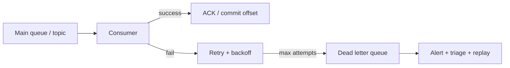

#### Common failure reasons

| Cause | Example |
|-------|---------|
| Invalid data | `"orderId": null` when required |
| Application bug | `NullPointerException` in handler |
| Downstream outage | DB or payment API unavailable (should retry first, not DLQ immediately) |
| Schema mismatch | Producer sends unexpected JSON shape |
| Corrupt message | Malformed JSON/XML |

#### Recommended DLQ envelope

```json
{
  "messageId": "123",
  "original_topic": "orders",
  "original_partition": 3,
  "original_offset": 918273,
  "payload": { "orderId": 1001 },
  "retryCount": 5,
  "error": "NullPointerException",
  "failed_at": "2026-06-24T10:15:00Z"
}
```

#### Platform mechanisms

| Platform | DLQ mechanism |
|----------|---------------|
| **RabbitMQ** | Dead-letter exchange (DLX) + `x-death` headers |
| **SQS** | Redrive policy → DLQ after `maxReceiveCount` |
| **Kafka** | Manual: application publishes to `*-dlq` topic |
| **Azure Service Bus** | Forward to dead-letter sub-queue |

**RabbitMQ:** main queue sets `x-dead-letter-exchange` → DLX routes to DLQ.

**Kafka:** no built-in DLQ — application publishes failed events to `orders-dlq` after retry exhaustion.

**SQS:** `maxReceiveCount = 5` → message moves to configured DLQ automatically.

#### Replay runbook

```text
1. Stop auto-replay scripts
2. Classify failure (schema? downstream? bad data?)
3. Fix code / deploy / schema
4. Sample messages — dry-run in staging
5. Replay in batches with rate limit
6. Monitor lag + error rate; stop if errors return
```

Replay must be **idempotent** — duplicates are expected on redelivery.

---

### Pitfalls and design tips

- **Configure DLQ everywhere in production** — no DLQ means poison messages retry forever or block partitions.
- **Alert on DLQ depth > 0** — a growing DLQ usually signals a bug, outage, or bad deploy.
- **Separate DLQ per domain** — `payments-dlq` vs `emails-dlq` for clear ownership.
- **Do not replay before fixing root cause** — re-poisoning the main queue wastes another cycle.
- **Retention 7–30 days** — long enough for investigation; tune per compliance needs.
- **Distinguish transient vs permanent errors** — DB down → retry queue; invalid JSON → DLQ immediately.

---

### Real-world example

An **Inventory Service** consumes order events. The inventory database is down for maintenance. Retries 1–3 fail with connection timeouts. After `maxRetries = 3`, the message lands in `orders-dlq` with the connection error attached. PagerDuty fires on DLQ depth. After DB recovery, ops replays DLQ messages in batches of 100 with rate limiting; idempotent handlers on `orderId` prevent double-decrement.

---

## 6.16 Retry Queue

### Overview

When a restaurant kitchen burns a dish, the waiter does not immediately shove the same order back through the line — they wait a minute, let the grill cool, then retry. A **retry queue** does the same for messages: failed deliveries wait with **backoff** before re-entering the main queue, giving downstream systems time to recover.

Technically, a **retry queue** is an intermediate holding area (or delayed visibility mechanism) where failed messages rest before reprocessing. Combined with exponential backoff, jitter, and a max retry count leading to DLQ, it handles **transient failures** without retry storms.

---

### What problem it fixes

**Without delay:**

```text
Message → consumer → failure → immediate retry → failure → immediate retry → …
→ retry storm, CPU spike, cascading failure when dependency flickers back
```

**With retry queue:**

```text
Message → consumer → failure → retry queue → (wait) → main queue → consumer
→ reduced load, time for recovery, controlled retries
```

---

### What it does

A retry queue:

- **Delays reprocessing** after transient failures (DB down, 503, 429, timeout)
- **Classifies errors** — retryable vs permanent (permanent → DLQ immediately)
- **Tracks attempt metadata** — `retryCount`, last error, timestamp
- **Pairs with DLQ** — after `maxRetries`, quarantine poison messages

| | Retry queue | DLQ |
|---|-------------|-----|
| **Purpose** | Temporary recovery | Permanent failure storage |
| **Expectation** | Message may succeed later | Message needs investigation |
| **Returned to main** | Yes (automatic) | No (manual replay) |

---

### How it works — the architecture inside

```text
Main queue → consumer → success → ACK
                    → failure → retry queue → (delay) → main queue → consumer
                    → still failing after max → DLQ
```

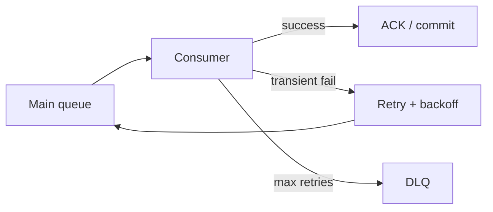

#### Error classification

```text
Retryable:     TimeoutException, 503, 429, OptimisticLockException
Non-retryable: JsonParseException, 400, 404, ValidationException → DLQ immediately
```

#### Retry strategies

| Strategy | Behavior | When to use |
|----------|----------|-------------|
| **Fixed delay** | Same wait every attempt | Simple; poor under load |
| **Exponential backoff** | Delay doubles each attempt | Production default |
| **Incremental** | Delay increases linearly | Moderate load smoothing |

**Exponential backoff with jitter (recommended):**

```text
delay = min(cap, base × 2^attempt) + random(0, base)
```

Jitter prevents synchronized retry waves when thousands of consumers recover simultaneously.

**How to calculate:**

Given: `base = 1 s`, `cap = 30 min`, `attempt` starts at 0.

| Attempt | `base × 2^attempt` | After `min(cap, …)` | With jitter `+ random(0, 1s)` |
|---------|-------------------|---------------------|-------------------------------|
| 0 | 1 s | 1 s | ~1.0–2.0 s |
| 1 | 2 s | 2 s | ~2.0–3.0 s |
| 2 | 4 s | 4 s | ~4.0–5.0 s |
| 3 | 8 s | 8 s | ~8.0–9.0 s |
| 4 | 16 s | 16 s | ~16–17 s |
| 5 | 32 s | 32 s | ~32–33 s |
| … | … | … | … |
| 11 | 2,048 s ≈ 34 min | 30 min (capped) | ~30–31 min |

**Sanity check:** 50,000 messages failing together without jitter all retry at T+30s → second outage. Jitter spreads load across a window.

**Example production schedule:**

| Attempt | Delay before next try |
|---------|----------------------|
| 1 | 1 s |
| 2 | 5 s |
| 3 | 30 s |
| 4 | 5 min |
| 5 | 30 min |
| 6+ | → DLQ |

#### Platform implementations

**RabbitMQ:** retry queue with TTL; on expiry, dead-letter exchange routes back to main queue.

**Kafka:** application-managed — `orders-retry-1s`, `orders-retry-5m` topics, or scheduler republishing from DB/Redis when `retry_at` is due. Avoid long `sleep()` in consumer thread (blocks partition, violates `max.poll.interval`).

**SQS:** visibility timeout acts as built-in retry — message hidden, then visible again after timeout.

#### Staged retry queues

```text
Main → fail → retry-10s → fail → retry-1m → fail → retry-5m → fail → DLQ
```

---

### Pitfalls and design tips

- **Exponential backoff + jitter + max retries + DLQ** — production default trio.
- **Never infinite retries** — corrupted JSON will never succeed on attempt 100.
- **Preserve partition key** (Kafka) — retries for the same entity should stay ordered per key.
- **Circuit breaker** — when payment API is down, fast-fail to retry topic slowly instead of hammering a dead endpoint.
- **Monitor retry-queue depth and retry rate** — spikes often precede DLQ growth.
- **Idempotent consumers** — every retry is a potential duplicate delivery.

---

### Real-world example

An order processor hits a **rate-limited inventory API** (HTTP 429). The handler classifies 429 as retryable, publishes to `orders-retry` with `retryCount = 1` and `retry_at = now + 10s`. A scheduler republishes to the main topic when due. On attempt 3 the API recovers; processing succeeds. A separate message with invalid JSON goes straight to DLQ — no retry queue — because retry will never fix malformed data.

---

## 6.17 Event Sourcing

### Overview

A bank passbook does not erase yesterday's lines when you deposit today — it appends new entries, and your balance is the sum of the story. **Event sourcing** treats the business the same way: instead of overwriting current state in a row, the system stores every change as an immutable **event** and derives state by replaying them.

Technically, **event sourcing** is a pattern where the **event log** is the source of truth, not the current-state table. Commands that pass validation produce events; events are appended to a per-aggregate stream; read models and current state are **projections** built by replaying events (optionally from a snapshot).

---

### What problem it fixes

Traditional CRUD stores only current state:

```text
| AccountID | Balance |
| 101       | 5000    |
```

You cannot answer how the balance became ₹5000, who changed it, or what happened on March 3. Updates overwrite history — bad for audit, debugging, regulatory compliance, and rebuilding views after bugs.

Event sourcing fixes **lost history** and **inability to reconstruct state** from a canonical record.

---

### What it does

Event sourcing:

- **Appends immutable events** — `AccountCreated`, `MoneyDeposited`, `OrderShipped`
- **Derives state** — `State = Replay(Events)` (from offset 0 or latest snapshot)
- **Models deletes as events** — `UserDeactivated`, not physical erase
- **Enables replay** — rebuild read models, fix projectors, onboard new consumers
- **Defines aggregates** — one event stream per aggregate ID (consistency boundary)

| Approach | Stores |
|----------|--------|
| **Traditional** | Current state |
| **Event sourcing** | History of changes (events) |

---

### How it works — the architecture inside

```text
Command → business logic → generate event → append to event store → projector updates read model
```

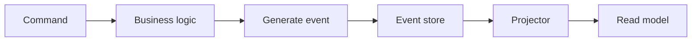

#### Commands vs events

| | Command | Event |
|---|---------|-------|
| **Represents** | Intent | Fact |
| **Example** | `DepositMoney(1000)` | `MoneyDeposited(1000)` |
| **Meaning** | "Please do this." | "This happened." |

#### Walkthrough — account lifecycle

```text
Event 1: AccountCreated          → balance = 0
Event 2: MoneyDeposited ₹1000    → balance = 1000
Event 3: MoneyDeposited ₹500     → balance = 1500
Event 4: MoneyWithdrawn ₹200     → balance = 1300
```

Replay: `0 + 1000 + 500 − 200 = 1300`.

#### Event store

Append-only log per aggregate:

```text
| SeqNo | Event            |
| 1     | AccountCreated   |
| 2     | Deposit 1000     |
| 3     | Deposit 500      |
| 4     | Withdraw 200     |
```

Optimistic concurrency: reject commands when `expectedVersion` does not match stream head.

#### Snapshots

**Problem:** millions of events → full replay is slow on startup.

**Solution:** periodic snapshot + replay only events after snapshot.

```text
Snapshot at event #5000: balance = ₹1,00,000
→ replay events 5001 … N only
```

**How to calculate:**

Given: 2,000,000 events, replay cost ≈ 0.5 ms/event, snapshot at event 1,800,000 with balance already materialized.

- Full replay: `2,000,000 × 0.5 ms = 1,000 s` ≈ 16.7 min
- With snapshot: `(2,000,000 − 1,800,000) × 0.5 ms = 100 s` ≈ 1.7 min

**Sanity check:** snapshot every 10,000–100,000 events is typical; tune by aggregate size and replay SLA.

#### Event sourcing vs event streaming

| | Event sourcing | Event streaming |
|---|----------------|-----------------|
| **Purpose** | Store history (source of truth) | Move events between services |
| **Focus** | State reconstruction | Real-time communication |

Event sourcing answers *what happened?* Event streaming answers *who should receive it?*

---

### Pitfalls and design tips

- **Not for simple CRUD** — small internal tools without audit needs add complexity for little gain.
- **Event versioning is mandatory** — schemas evolve; old events live forever in the log (see 6.22).
- **Querying raw events is hard** — build projections (often paired with CQRS).
- **Storage grows monotonically** — plan retention, compaction policies, and snapshots.
- **Eventual consistency on read models** — write path is canonical; reads may lag.
- **Do not mutate events in place** — compensating events only; rewriting history breaks audit and replay.

---

### Real-world example

An **e-commerce order** stream: `OrderCreated` → `PaymentCompleted` → `OrderPacked` → `OrderShipped` → `OrderDelivered`. Current status is never updated in place — each transition is an appended event. Customer support replays the stream for order `ORD-8821` and sees the exact timeline. A projector bug miscalculated tax for 30 days; engineers fix the projector and replay from snapshot — dashboards correct without touching the OLTP event log.

---

## 6.18 CQRS

### Overview

A restaurant separates the kitchen (where orders are cooked and recipes enforced) from the menu board and waiter scripts (optimized for fast reading). **CQRS** does the same for software: **commands** change state through a write model; **queries** read from a separate read model tuned for the questions users ask.

Technically, **CQRS (Command Query Responsibility Segregation)** splits write and read paths into different models, handlers, and often different databases. Writes enforce business rules and consistency; reads use denormalized projections, search indexes, or caches — synchronized by events, with eventual consistency between sides.

---

### What problem it fixes

Most applications are **read-heavy**: Amazon might see ~10M product views/day vs ~10K updates/day. One schema serving both forces complex joins on the read path and transactional contention on the write path. Heavy `SELECT` analytics queries slow `INSERT`/`UPDATE` on the same tables.

CQRS fixes **read/write interference** and enables **independent scaling** of each path.

---

### What it does

CQRS provides:

- **Command side** — `CreateOrder`, `DepositMoney`; validates, mutates, emits events
- **Query side** — `GetOrder`, `SearchProducts`; read-only, optimized shapes
- **Separate stores** (in full form) — write DB for consistency; read DB / Elasticsearch / Redis for speed
- **Event-driven sync** — projectors update read models from the write path or event log

CQRS does **not** require event sourcing — but the two pair naturally when the write side is an event store.

---

### How it works — the architecture inside

**Traditional:**

```text
Read + write → single model / single database
```

**CQRS:**

```text
Command API → write model → write store
                ↓ events
            projectors → read model(s) → query API
```

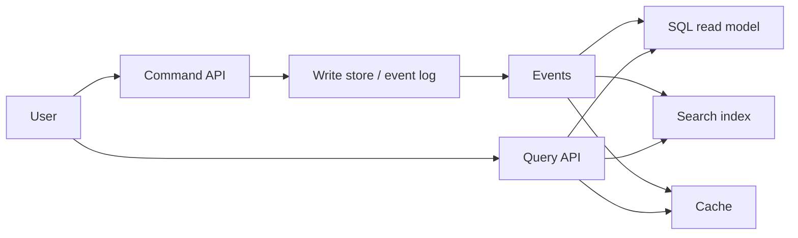

#### Deployment variants

| Variant | Complexity | When |
|---------|------------|------|
| Separate handlers, same DB | Low | Start here |
| Separate read DBs | Medium | Read scaling |
| Event sourcing + multiple projections | High | Audit, temporal queries |

Simple start:

```text
POST /commands/PlaceOrder → command handler → normalized DB
GET  /queries/OrderSummary → query handler → denormalized view table
```

#### Read model shape

Denormalized for fast reads — no joins at query time:

```json
{
  "orderDetails": { "orderId": 1001, "status": "SHIPPED" },
  "customerDetails": { "name": "Jane", "tier": "GOLD" },
  "productDetails": [ { "sku": "ABC", "qty": 2 } ]
}
```

#### Eventual consistency

```text
Write DB updated → read DB not updated yet → temporary inconsistency → eventually synchronized
```

Typical lag: 100 ms–2 s. UX mitigations: read-your-writes (route immediate read to write store), version polling, or show "pending" state.

#### Scaling example

```text
Read traffic:  100,000 req/sec
Write traffic: 1,000 req/sec
→ scale read replicas / search cluster independently
```

Projectors must be **idempotent** — same event twice must not double-count.

---

### Pitfalls and design tips

- **Try read replicas before full CQRS** — many apps do not need separate projection pipelines.
- **Debugging is harder** — read anomaly → trace projector → find source event.
- **Projector failure** — monitor lag; stale read models are a common production incident.
- **Not for small CRUD apps** — complexity tax is real.
- **Interview angle:** CQRS solves read scaling and domain complexity, not "make my monolith cooler."

---

### Real-world example

An **e-commerce platform** uses a normalized write DB for `PlaceOrder` commands (inventory reservation, payment authorization). A projector listens to `OrderCreated` and `OrderShipped` events and maintains a denormalized `order_summary_view` plus an Elasticsearch product catalog. Product search serves 50k QPS from Elasticsearch; writes stay at 200 TPS on PostgreSQL — each side scaled independently.

---

## 6.19 Change Data Capture (CDC)

### Overview

Instead of asking "did anything change?" every five seconds by querying the whole database, imagine a security camera on the transaction log that streams every insert, update, and delete the moment it happens. **Change Data Capture (CDC)** watches the database's own write log and publishes row-level changes as events — no application dual-write required.

Technically, **CDC** captures **INSERT**, **UPDATE**, and **DELETE** operations from a database and propagates them to downstream systems (search indexes, caches, warehouses, microservices) in near real time. Log-based CDC (reading WAL/binlog) is preferred over polling or triggers for production scale.

---

### What problem it fixes

**Without CDC:**

```text
Service B polls database every 5 seconds: SELECT * WHERE updated_at > ?
→ high DB load, delayed sync, missed edge cases, wasted queries
```

**With CDC:**

```text
Row changes → transaction log → CDC connector → event published → consumers (real-time)
```

CDC keeps the OLTP database as source of truth while search, analytics, and caches stay synchronized **without** the application writing to two places.

---

### What it does

CDC:

- **Detects row-level changes** — before/after images on UPDATE
- **Publishes change events** — often to Kafka via Debezium
- **Supports initial snapshot + streaming** — backfill existing rows, then tail the log
- **Preserves ordering** — generally per table or primary key

| Operation | CDC event |
|-----------|-----------|
| **INSERT** | New row |
| **UPDATE** | `before` + `after` |
| **DELETE** | Tombstone / delete event |

---

### How it works — the architecture inside

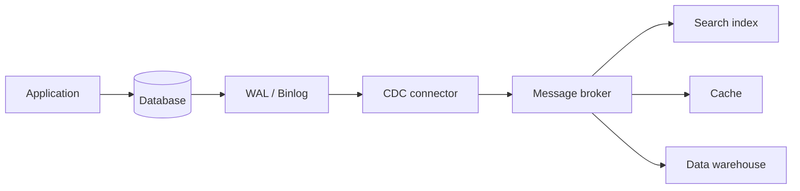

#### CDC approaches

| Approach | Mechanism | Trade-off |
|----------|-----------|-----------|
| **Timestamp** | `WHERE UpdatedAt > last_read` | Simple; polling; can miss deletes |
| **Trigger** | DB trigger → change table | Immediate; slows writes |
| **Log-based** | Read WAL / binlog / redo log | Low DB impact; production default |

**Log-based flow:**

```text
Application INSERT order → transaction log records change
→ CDC reads log → publishes OrderCreated (no extra queries on hot tables)
```

| Database | Log |
|----------|-----|
| **PostgreSQL** | WAL |
| **MySQL** | Binlog |
| **SQL Server** | Transaction log |
| **Oracle** | Redo log |

**Debezium** is the common open-source connector: database log → Kafka topics.

#### CDC vs polling

| | Polling | CDC (log-based) |
|---|---------|-----------------|
| **Latency** | Seconds–minutes | Milliseconds–seconds |
| **DB load** | High (repeated queries) | Low (sequential log read) |
| **Deletes** | Hard to detect | Captured |

#### CDC vs event sourcing vs outbox

| | CDC | Event sourcing | Outbox |
|---|-----|----------------|--------|
| **Source of truth** | Database rows | Event log | Database + designed domain events |
| **Event shape** | Row before/after | Domain events | Domain events you design |
| **Who emits** | Log connector | Application on command | Application in same txn |

CDC on a **business table** emits what changed in SQL. **Outbox** emits the event you intended (`OrderPaid`, not `row.status: PAID → SHIPPED`).

---

### Pitfalls and design tips

- **Prefer log-based CDC** — timestamp polling does not scale and misses subtle failures.
- **Schema evolution** — captured table DDL changes need a strategy (see 6.22, 6.23).
- **Wide tables** — large before/after payloads; use column filtering in connector config.
- **Deletes and GDPR** — tombstone events and compaction policies for Kafka compacted topics.
- **Long connector downtime** — log retention may expire; plan snapshot recovery.
- **Do not use CDC as domain modeling** — row changes ≠ rich domain events; pair with outbox when semantics matter.

---

### Real-world example

A product catalog lives in **PostgreSQL**. On each `INSERT`/`UPDATE` to `products`, Debezium streams changes to Kafka topic `db.products`. An Elasticsearch consumer indexes the `after` image — search results update within seconds of the DB commit. The application never calls Elasticsearch directly; one write path, many derived views.

---

## 6.20 Outbox Pattern

### Overview

You would not mail a wedding invitation and update the guest spreadsheet in two separate buildings hoping both succeed. The **outbox pattern** writes the guest row and the "send invitation" note in the **same ledger transaction**; a clerk mails invitations later from the outbox tray. Database and "intent to publish" commit together — no half-done state.

Technically, the **outbox pattern** stores a pending event row in an **outbox table** inside the same database transaction as the business write. A **relay** (polling process or CDC connector) reads unpublished outbox rows and publishes to the message broker asynchronously — eliminating dual-write inconsistency without two-phase commit across DB and Kafka.

---

### What problem it fixes

```text
Step 1: Save order to database     ✓ success
Step 2: Publish OrderCreated event ✗ failure

Result: order exists; inventory, payment, shipping never notified → inconsistent system
```

Or the reverse: event published, DB rolls back → phantom event.

The root cause: **no atomic transaction spans PostgreSQL and Kafka**. Naive `save()` then `kafka.send()` is unsafe.

---

### What it does

The outbox pattern:

- **Atomically persists** business data + outbox event row in one DB transaction
- **Defers publishing** to a background relay — at-least-once to the broker
- **Guarantees no event loss** from the write path (once txn commits, event row exists)
- **Requires idempotent consumers** — relay may publish duplicates

| Guaranteed | Not guaranteed |
|------------|----------------|
| No event loss after DB commit | No duplicate publishes on broker |

---

### How it works — the architecture inside

```mermaid
flowchart LR
    subgraph Txn[Single DB transaction]
        BR[Business row INSERT/UPDATE]
        OB[Outbox row INSERT]
    end
    Txn --> Commit[COMMIT]
    Commit --> Relay[Outbox publisher / Debezium]
    Relay --> Broker[Kafka / RabbitMQ]
    Broker --> Consumers[Downstream consumers]
```

#### Transactional write example

```sql
BEGIN;
  UPDATE orders SET status = 'PAID' WHERE id = 'ord_123';
  INSERT INTO outbox (id, aggregate_type, aggregate_id, event_type, payload, created_at)
  VALUES ('evt_uuid_1', 'Order', 'ord_123', 'OrderPaid', '{"orderId":"ord_123"}', NOW());
COMMIT;
```

Both succeed or both roll back — never partial.

#### Outbox table schema

| Column | Purpose |
|--------|---------|
| `id` | Unique event ID — idempotency key |
| `aggregate_type` / `aggregate_id` | Routing, partition key |
| `event_type` | `OrderPaid` — topic routing |
| `payload` | JSON / Avro |
| `created_at` | Ordering, lag monitoring |
| `published_at` | NULL until relay succeeds |

#### Relay implementations

| Method | Mechanism | Latency | Scale |
|--------|-----------|---------|-------|
| **Polling** | `SELECT … WHERE published_at IS NULL FOR UPDATE SKIP LOCKED` | 100 ms–1 s | Simple; DB load at volume |
| **CDC (Debezium)** | Read outbox from WAL/binlog | Near real-time | Preferred at scale |

**Debezium Outbox Event Router** transforms outbox rows → Kafka topics by `aggregate_type`, key by `aggregate_id` — minimal custom relay code.

#### Failure scenarios

| Scenario | Result | Recovery |
|----------|--------|----------|
| Crash before COMMIT | Rollback — nothing saved | Client retries command |
| Order + outbox saved; relay crashes | Event not yet on broker | Relay retries on restart |
| Published; crash before mark sent | Duplicate on broker | Idempotent consumers |

**How to calculate — outbox lag alert:**

Given: `published_at IS NULL` rows with `created_at` timestamps.

- `lag_p99 = percentile(now() − created_at)` for unpublished rows
- Alert when `lag_p99 > 30 s` (tune to SLA)

Example: 500 unpublished rows, oldest `created_at` = 45 s ago → relay stalled or under-provisioned.

**Sanity check:** steady-state lag should be sub-second with CDC; seconds with polling at moderate volume.

#### Outbox vs 2PC

| | Outbox | 2PC |
|---|--------|-----|
| **Complexity** | Low | High |
| **Performance** | High | Lower (blocking) |
| **Availability** | High | Coordinator failure blocks |

Modern systems prefer outbox over 2PC across DB and broker.

---

### Pitfalls and design tips

- **Default for microservices emitting domain events** — replaces unsafe dual-write.
- **Monitor outbox lag** — growing unpublished count means relay failure or overload.
- **Cleanup policy** — delete or archive published rows; do not let the outbox table grow forever.
- **Symmetric inbound: transactional inbox** — dedup on consume for end-to-end correctness.
- **Prefer Debezium on outbox table at scale** — polling hammers DB under high write TPS.
- **Not for monoliths with no messaging** — added table and relay for no benefit.

---

### Real-world example

An **Order Service** on PostgreSQL creates an order and inserts `OrderCreated` into `outbox` in one transaction. Debezium tails the outbox table and publishes to Kafka topic `orders`. Inventory, shipping, and payment services consume the event. When the relay restarts after a crash, it republishes an event that was committed but not yet marked sent — consumers dedupe on `outbox.id`.

---

## 6.21 Event Replay

### Overview

A DVR lets you rewind a game to rewatch from the fourth quarter — or from the opening whistle if you need the full story. **Event replay** does that for system history: re-read stored events from the log or event store to rebuild state, fix a bug in a projector, or onboard a new service with years of context.

Technically, **event replay** reprocesses previously stored events — from offset 0, a timestamp, or a snapshot — through consumers or projectors. It is a core capability of event sourcing, Kafka (immutable log + consumer offsets), and CQRS read-model recovery.

---

### What problem it fixes

- **New consumer** needs three years of order history — no backfill API exists.
- **Projector bug** computed wrong tax for 30 days — fix code, replay, correct dashboards without touching OLTP.
- **Read model corrupted** — replay events to rebuild.
- **New projection** — CQRS dashboard from existing event log.

Without durable event storage and replay mechanics, these require expensive one-off ETL from source systems.

---

### What it does

Event replay:

- **Re-reads** events from Kafka topic, event store, or DLQ (for manual replay)
- **Reconstructs state** — `State = Replay(Events)` from beginning or snapshot
- **Supports selective scope** — full log, time window, event type filter
- **Requires side-effect discipline** — suppress emails, charges, and live publishes during replay

---

### How it works — the architecture inside

```mermaid
flowchart LR
    Log[(Kafka / event store)] -->|read from offset 0 or snapshot| Proj[Projector / consumer]
    Proj -->|idempotent upsert| ReadDB[(Read model)]
    Proj -->|suppress| Side[External side effects]
    Snap[Snapshot at offset N] -.->|start here| Proj
```

#### Kafka replay modes

| Mode | How | Use case |
|------|-----|----------|
| **Offset reset** | New consumer group, `auto.offset.reset = earliest` | New service needs full history |
| **Timestamp seek** | `offsetsForTimes()` from T0 | Replay from incident start |
| **Partition clone** | Copy to `orders-replay` topic | Isolate replay load from live |

```bash
kafka-consumer-groups --bootstrap-server $BS \
  --group billing-rebuild-v2 \
  --reset-offsets --to-earliest \
  --topic orders --execute
```

Use a **new consumer group name** — never reset offsets on the live production group.

#### Replay strategies

| Strategy | Description | Trade-off |
|----------|-------------|-----------|
| **Full replay** | All events from 1 … N | Most accurate; slowest |
| **Partial replay** | Snapshot → remaining events only | Much faster |
| **Selective replay** | Specific event types | Analytics backfills |

**How to calculate — replay duration estimate:**

Given: 5,000,000 events, consumer processes 2,000 events/sec (limited by DB writes).

- `duration = 5,000,000 / 2,000 = 2,500 s` ≈ **42 min**

With snapshot at event 4,500,000: replay only 500,000 events → **~4 min**.

**Sanity check:** expect 2–10× normal write IOPS during replay; scale consumers ≤ partition count.

#### Side effects during replay

| Side effect | Replay behavior |
|-------------|-----------------|
| **DB projection** | Safe with idempotent upsert (`ON CONFLICT UPDATE`) |
| **Send email** | **Suppress** — `replay_mode` flag |
| **Charge card** | **Never replay** |
| **Publish downstream** | Write to `orders-replay-output`, not live topic |

```text
if (context.isReplay()) return; // skip external API
```

#### Replay vs retry

| | Retry | Event replay |
|---|-------|--------------|
| **Purpose** | Recover one failed message | Reprocess history |
| **Scope** | Single message | Many events |
| **Timing** | Immediately / backoff | Any time |

#### Replay runbook

```text
1. Declare replay window (start/end offset or timestamp)
2. Deploy fixed projector (replay_mode = true)
3. Scale consumers (≤ partition count; watch DB load)
4. Suppress side effects
5. Monitor lag + write IOPS
6. Validate checksums / row counts
7. Cut over read traffic
8. Disable replay_mode; document offsets replayed
```

Kafka retention must cover the replay window — expired segments cannot be replayed.

---

### Pitfalls and design tips

- **Never replay side effects blindly** — duplicate emails and charges are the classic disaster.
- **Event versioning** — old V1 events must still deserialize during replay (see 6.22).
- **Isolate replay load** — separate consumer group, clone topic, or off-peak window.
- **Idempotent projectors** — replays and at-least-once delivery both duplicate.
- **Not possible without durable logs** — CRUD-only systems have nothing to replay.

---

### Real-world example

A **recommendation service** launches six months after the order platform. Engineers create consumer group `recommendations-bootstrap` with `auto.offset.reset = earliest` on the `orders` topic. The projector builds user purchase history from all `OrderDelivered` events. `replay_mode = true` skips sending "you might also like" emails during the backfill. After lag reaches zero, they disable replay mode and route live traffic to the new service.

---

## 6.22 Event Versioning

### Overview

Old diary entries do not rewrite themselves when you start recording your email address too — new pages have more fields, and readers must understand both formats. **Event versioning** is how systems evolve event schemas on **immutable logs** without breaking producers, consumers, or replay of events written years ago.

Technically, **event versioning** is the practice of changing event structure over time while maintaining **compatibility** — backward (new code reads old events), forward (old code reads new events), or full (both). Strategies include version fields, separate event types, schema registry enforcement, and upcasting on read.

---

### What problem it fixes

Events are **immutable** once appended to Kafka or an event store:

```text
Millions of V1 events exist → product needs email field → schema must change
Old events cannot be edited → consumers and replay must handle all versions
```

Breaking changes (rename, remove required field, change type) brick production consumers and historical replay.

---

### What it does

Event versioning:

- **Defines compatibility rules** for schema changes
- **Allows safe evolution** — add optional fields with defaults
- **Supports multiple representations** — version field, parallel event types, upcasters
- **Preserves replayability** — 2023 events must process in 2026

---

### How it works — the architecture inside

#### What can change safely

| Change | Compatibility |
|--------|---------------|
| Add optional field with default | Backward compatible |
| Remove field | Breaking |
| Rename field | Breaking (without alias / dual-read) |
| Change data type | Breaking |
| New event type | Parallel consumers |

**Good:**

```json
V1: { "name": "John" }
V2: { "name": "John", "email": "john@gmail.com" }
```

**Bad:**

```json
V1: { "name": "John" }
V2: { "fullName": "John" }
```

Old consumers expect `name` — they break on `fullName`.

#### Compatibility types

| Type | Meaning |
|------|---------|
| **Backward** | New consumer reads old events (missing new fields → defaults) |
| **Forward** | Old consumer reads new events (ignores unknown fields) |
| **Full** | Both directions — ideal for shared topics |

#### Strategies

**1. Version field in payload**

```json
{ "version": 2, "orderId": 1001, "customerId": 500 }
```

Consumer branches on `version`.

**2. Separate event types**

`UserCreated` and `UserCreatedV2` — simple but proliferates types.

**3. Schema registry**

Central store validates compatibility on register (see 6.23).

**4. Upcasting (event sourcing)**

Transform old shape to current model before processing:

```mermaid
flowchart LR
    V1[Event V1] --> Up[Upcaster]
    Up --> V2[Current model]
    V2 --> Proj[Projector / handler]
```

```json
Old: { "name": "John" }
Upcast: { "name": "John", "email": "unknown" }
```

Major breaking changes may need a **dual-write transition** — publish both V1 and V2 temporarily.

#### Payment event example

```json
V1: { "amount": 1000 }
V2: { "amount": 1000, "currency": "INR" }
```

Old consumers ignore `currency`; new consumers default `currency` to `"INR"` when absent on V1 events during replay.

---

### Pitfalls and design tips

- **Prefer add optional fields** — never rewrite history in the log.
- **Test replay with old event fixtures** in CI — catch breakage before deploy.
- **Document upcaster chains** — each new version adds a transform; chains grow over time.
- **Coordinate deploy order** — with backward mode, deploy consumer before producer; with forward, reverse.
- **Outbox payloads need versioning too** — same rules apply to rows in the outbox table.
- **Interview angle:** "rename field" is almost always breaking — use alias field or new event type.

---

### Real-world example

A shared Kafka topic `users` carries `UserCreated` events. Team adds optional `marketingOptIn` with default `false` in Avro schema V2. Confluent Schema Registry runs in **BACKWARD** mode — registration succeeds because new schema reads old data. Consumers deployed first apply default `false` to millions of V1 events during replay. No topic compaction or re-publish required.

---

## 6.23 Schema Registry

### Overview

A construction site shares one official blueprint binder — electricians and plumbers pull the same revision, and the inspector rejects plans that would not fit existing walls. A **schema registry** is that binder for messages: producers register schemas, consumers fetch by ID, and incompatible changes are rejected before they hit production.

Technically, a **schema registry** is a centralized service that stores, versions, and validates schemas (Avro, Protobuf, JSON Schema) for serialized messages. Producers embed a **schema ID** in each message; consumers deserialize using the schema looked up from the registry — smaller payloads than embedding full JSON schemas per message.

---

### What problem it fixes

**Without registry:**

```json
Producer:  { "orderId": 1001, "amount": 500 }
Consumer expects: { "orderId": 1001, "amount": 500, "currency": "INR" }
→ deserialization failure or silent data loss
```

Multiple teams, evolving schemas, and no central contract → production crashes on deploy and undetected drift between services.

---

### What it does

A schema registry:

- **Stores schemas** per subject (`orders-value`, `payments-key`)
- **Assigns schema IDs** — referenced in each Kafka record
- **Validates compatibility** on registration — rejects breaking changes
- **Versions schemas** — V1, V2, V3 per subject
- **Enables CI gates** — block producer deploy if schema incompatible

Popular implementations: **Confluent Schema Registry**, **AWS Glue Schema Registry**.

---

### How it works — the architecture inside

```mermaid
flowchart LR
    Prod[Producer] --> Reg[Schema Registry]
    Prod -->|schema ID + payload| Kafka[Kafka]
    Kafka --> Cons[Consumer]
    Cons --> Reg
    Reg --> Cons
```

```text
Step 1: Producer defines Avro/Protobuf schema
Step 2: Producer registers schema under subject (e.g. orders-value)
Step 3: Registry assigns schema ID = 15
Step 4: Producer sends [magic byte | schema ID | serialized data]
Step 5: Consumer fetches schema 15 from registry (cached locally)
Step 6: Consumer deserializes payload
```

#### Why schema ID?

Full schema in every message wastes bandwidth. Typical Kafka record:

```text
[0x00 magic][4-byte schema ID][Avro binary payload]
```

Registry holds: `schema 15 = { orderId: long, amount: double, currency: string default "INR" }`.

**How to calculate — payload size savings:**

Given: Avro schema JSON ≈ 400 bytes; message payload ≈ 80 bytes; 1,000,000 messages/day.

- **Without registry** (JSON with embedded field names per message): ~200 bytes/msg → 200 MB/day
- **With Avro + schema ID**: ~80 bytes/msg + negligible 5-byte header → 80 MB/day

**Sanity check:** savings grow with schema complexity and volume; 50–70% reduction is common on verbose JSON.

#### Compatibility modes (Confluent)

| Mode | Registry behavior |
|------|-------------------|
| **BACKWARD** | New schema readable by old consumers — **default** |
| **FORWARD** | Old consumers can read new schema |
| **FULL** | Backward + forward |
| **NONE** | No validation — avoid in production |

#### Compatible Avro evolution

```json
V1: { "type": "record", "name": "Order", "fields": [{ "name": "orderId", "type": "long" }] }
V2: adds { "name": "customerId", "type": "long", "default": 0 }
→ BACKWARD compatible — registry accepts
```

**Invalid:** `amount` changes from `double` to `string` → registry rejects.

#### Subjects and naming

```text
orders-value, orders-key, payments-value
```

Naming strategies: `{topic}-value`, `{topic}-key`, or custom record name.

#### Supported formats

| Format | Notes |
|--------|-------|
| **Avro** | Most common in Kafka ecosystems |
| **Protobuf** | Strong typing; widely used |
| **JSON Schema** | Supported; less mature in some stacks |

---

### Pitfalls and design tips

- **Registry availability** — consumers cache schemas, but new deploys need registry up; run HA cluster.
- **BACKWARD by default** — deploy consumers before producers when adding fields.
- **Avoid raw JSON on shared multi-team topics** — no compile-time or registry enforcement.
- **Schema governance in CI** — `mvn schema-registry:validate` or equivalent before merge.
- **Do not use NONE compatibility in production** — breaking changes slip through.
- **Glue vs Confluent** — AWS-native stacks use Glue; Kafka-centric stacks use Confluent; serializer config differs.

---

### Real-world example

An **Order Service** publishes `OrderCreated` as Avro to Kafka. V1 schema has `orderId` and `amount`. Product adds `customerId` — engineer registers V2 with `customerId` default `0`. Confluent Schema Registry validates BACKWARD compatibility and assigns ID 16. Producers immediately send ID 16; old consumers still read messages (ignore or default `customerId`). New consumers deployed first use `customerId` for partitioning downstream fulfillment — no coordinated big-bang deploy, no topic wipe.


[<- Back to master index](../README.md)
