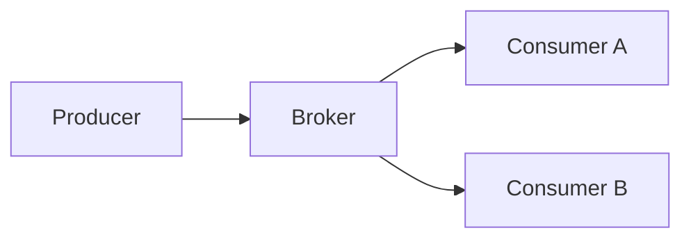
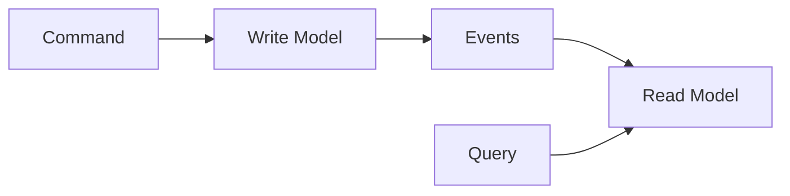
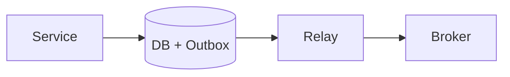

# 6. Messaging & Events

> Status: **Documented** — cheat-sheet reference for all sub-topics below.

[← Back to master index](../README.md)

---

## Sub-topics

| # | Sub-topic | Status |
|---|-----------|--------|
| 6.1 | [Message Queues](#61-message-queues) | Done |
| 6.2 | [Publish Subscribe](#62-publish-subscribe) | Done |
| 6.3 | [Event Streaming](#63-event-streaming) | Done |
| 6.4 | [Kafka](#64-kafka) | Done |
| 6.5 | [Kafka Partitions](#65-kafka-partitions) | Done |
| 6.6 | [Kafka Consumer Groups](#66-kafka-consumer-groups) | Done |
| 6.7 | [RabbitMQ](#67-rabbitmq) | Done |
| 6.8 | [ActiveMQ](#68-activemq) | Done |
| 6.9 | [Pulsar](#69-pulsar) | Done |
| 6.10 | [Ordering Guarantees](#610-ordering-guarantees) | Done |
| 6.11 | [Exactly Once Delivery](#611-exactly-once-delivery) | Done |
| 6.12 | [At Least Once Delivery](#612-at-least-once-delivery) | Done |
| 6.13 | [At Most Once Delivery](#613-at-most-once-delivery) | Done |
| 6.14 | [Dead Letter Queue](#614-dead-letter-queue) | Done |
| 6.15 | [Retry Queue](#615-retry-queue) | Done |
| 6.16 | [Event Driven Architecture](#616-event-driven-architecture) | Done |
| 6.17 | [Event Sourcing](#617-event-sourcing) | Done |
| 6.18 | [CQRS](#618-cqrs) | Done |
| 6.19 | [Change Data Capture (CDC)](#619-change-data-capture-cdc) | Done |
| 6.20 | [Event Replay](#620-event-replay) | Done |
| 6.21 | [Outbox Pattern](#621-outbox-pattern) | Done |
| 6.22 | [Event Versioning](#622-event-versioning) | Done |
| 6.23 | [Schema Registry](#623-schema-registry) | Done |

---

## Overview

Async messaging decouples producers from consumers, absorbs traffic spikes, and enables event-driven workflows across services.

---

## 6.1 Message Queues

**Summary:** Point-to-point async channels where each message is consumed by exactly one worker. Ideal for task distribution, job processing, and load leveling.

- **Decoupling** — producers don't wait for or know consumers
- **Buffering** — absorbs bursts; consumers pull at their own pace
- **Acknowledgment** — consumer ACK/NACK controls redelivery on failure

---

## 6.2 Publish Subscribe

**Summary:** One-to-many fan-out: publishers emit to a topic; all subscribers receive a copy. Suited for notifications, cache invalidation, and domain events.

- **Topic-based routing** — subscribers bind to topics or filters
- **Loose coupling** — new subscribers added without producer changes
- **At-least-once common** — subscribers must be idempotent

---

## 6.3 Event Streaming

**Summary:** Durable, ordered, append-only logs that retain events for replay and multiple independent consumer groups. Bridges messaging and data pipelines.

- **Immutable log** — events are appended, not deleted by consumers
- **Replay** — consumers re-read from any offset
- **Retention policy** — time- or size-based; enables audit and recovery

---

## 6.4 Kafka

**Summary:** Distributed commit log with high throughput, horizontal scaling via partitions, and strong ecosystem (Connect, Streams, Schema Registry).

- **Broker cluster** — topics split into partitions across brokers
- **ZooKeeper/KRaft** — cluster metadata and leader election
- **Producer acks** — `acks=all` for durability; trade latency for safety

---

## 6.5 Kafka Partitions

**Summary:** The unit of parallelism in Kafka; ordering is guaranteed only within a single partition.

- **Key-based routing** — same key → same partition → per-key order
- **More partitions** — higher write/read parallelism; more consumer threads
- **Rebalancing cost** — too many partitions hurts broker overhead

---

## 6.6 Kafka Consumer Groups

**Summary:** A group of consumers that cooperatively divide partitions; each partition is assigned to at most one consumer in the group.

- **Scale-out** — add consumers up to partition count
- **Rebalance** — partition reassignment on join/leave (brief pause)
- **Offset commit** — track read position; auto vs manual commit trade-offs

---

## 6.7 RabbitMQ

**Summary:** Feature-rich AMQP broker with exchanges, queues, routing keys, and flexible delivery patterns (work queues, pub/sub, RPC).

- **Exchange types** — direct, topic, fanout, headers
- **Dead-letter exchange** — route failed messages to DLQ
- **Prefetch** — limit unacked messages per consumer for fair dispatch

---

## 6.8 ActiveMQ

**Summary:** Java-centric JMS broker supporting queues and topics with enterprise features (XA transactions, embedded mode).

- **JMS API** — standard Java messaging interface
- **Queues vs topics** — point-to-point vs pub/sub semantics
- **Artemis successor** — ActiveMQ Artemis is the modern high-performance fork

---

## 6.9 Pulsar

**Summary:** Cloud-native streaming with layered storage (BookKeeper), multi-tenancy, and unified queue + stream model via shared subscriptions.

- **Segmented storage** — brokers and storage separated for elasticity
- **Geo-replication** — built-in cross-region replication
- **Subscription modes** — exclusive, shared, failover, key_shared

---

## 6.10 Ordering Guarantees

**Summary:** Trade-off between parallelism and strict sequence. Full global order kills throughput; partition-level order is the practical default.

- **Single partition** — total order within topic partition
- **Key partitioning** — order per entity (user, order ID)
- **Out-of-order risk** — retries and multiple consumers can reorder

---

## 6.11 Exactly Once Delivery

**Summary:** Each message processed once end-to-end — hardest guarantee; requires idempotent consumers, transactional writes, and deduplication.

- **Kafka EOS** — transactional producer + `read_committed` consumers
- **Idempotent producer** — dedup by PID + sequence number
- **Still need idempotent handlers** — side effects must tolerate retries

---

## 6.12 At Least Once Delivery

**Summary:** Messages may be delivered more than once but never lost. Default for most systems; consumers must be idempotent or use dedup keys.

- **ACK after processing** — commit offset only after success
- **Retry on failure** — redeliver until success or DLQ
- **Duplicate handling** — store processed message IDs or use upserts

---

## 6.13 At Most Once Delivery

**Summary:** Messages delivered zero or one time; loss is acceptable for metrics, logs, or fire-and-forget telemetry.

- **ACK before processing** — fastest, risk of loss on crash
- **No retry** — failed messages discarded
- **Use when** — stale data is worse than missing data

---

## 6.14 Dead Letter Queue

**Summary:** Parking lot for messages that fail processing after max retries. Prevents poison pills from blocking the main queue.

- **Isolation** — bad messages don't block healthy traffic
- **Inspection** — manual replay or fix-and-requeue
- **Alerting** — DLQ depth is a critical metric

---

## 6.15 Retry Queue

**Summary:** Deferred redelivery with backoff before sending to DLQ. Separates transient failures from permanent ones.

- **Exponential backoff** — reduce thundering herd on downstream recovery
- **Max attempts** — cap retries; route to DLQ after threshold
- **Jitter** — randomize delay to spread retry spikes

---

## 6.16 Event Driven Architecture

**Summary:** Services communicate via events instead of synchronous calls. Enables loose coupling, independent scaling, and reactive workflows.

- **Event notification** — lightweight signal ("OrderPlaced")
- **Event-carried state transfer** — event carries full payload
- **Choreography** — services react to events without central orchestrator

---

## 6.17 Event Sourcing

**Summary:** Store state as an append-only sequence of domain events, not current row values. State is derived by replaying events.

- **Audit trail** — complete history of every change
- **Temporal queries** — reconstruct state at any point in time
- **Snapshots** — periodic compaction to avoid full replay cost

---

## 6.18 CQRS

**Summary:** Command Query Responsibility Segregation — separate write model (commands) from read model (queries), often fed by events.

- **Write side** — optimized for business rules and consistency
- **Read side** — denormalized projections for fast queries
- **Eventual consistency** — read model lags behind writes

---

## 6.19 Change Data Capture (CDC)

**Summary:** Stream database row-level changes (insert/update/delete) to messaging systems. Bridges OLTP databases and event pipelines without app code changes.

- **Log-based CDC** — read DB transaction log (Debezium, Maxwell)
- **Near real-time** — low latency replication to Kafka/search/cache
- **Ordering** — per-table or per-key ordering preserved

---

## 6.20 Event Replay

**Summary:** Re-process historical events from the log to rebuild state, fix bugs, or migrate projections.

- **Offset reset** — consumers seek to earlier position
- **New consumer group** — replay without affecting live consumers
- **Idempotency required** — replay creates duplicates without dedup

---

## 6.21 Outbox Pattern

**Summary:** Atomically write business data and an outbox event in the same DB transaction; a relay process publishes to the broker. Solves dual-write problem.

- **Same transaction** — DB row + outbox row committed together
- **Relay/poller** — reads outbox, publishes, marks sent
- **At-least-once publish** — relay retries; consumers stay idempotent

---

## 6.22 Event Versioning

**Summary:** Evolve event schemas without breaking consumers. Upstream and downstream must agree on compatibility rules.

- **Backward compatible** — new consumers read old events (add optional fields)
- **Forward compatible** — old consumers ignore unknown fields
- **Dual-write / dual-read** — migration period with both versions

---

## 6.23 Schema Registry

**Summary:** Central store for Avro/Protobuf/JSON schemas with compatibility checks. Enforces contract between producers and consumers.

- **Schema ID in message** — compact wire format
- **Compatibility modes** — BACKWARD, FORWARD, FULL, NONE
- **CI validation** — reject breaking schema changes at deploy time

---

## Quick Reference

| Concept | Pattern | Delivery | When to use |
|---------|---------|----------|-------------|
| Task queue | Message Queue | At-least-once | Job processing, async work |
| Broadcast | Pub/Sub | At-least-once | Notifications, fan-out |
| Data pipeline | Event Streaming | At-least-once / EOS | Analytics, CDC, replay |
| Failed messages | DLQ + Retry | — | Poison pill isolation |
| DB + broker sync | Outbox | At-least-once | Transactional event publish |
| State history | Event Sourcing + CQRS | — | Audit, complex domains |
| Schema evolution | Schema Registry | — | Multi-team Kafka contracts |
