# 6. Messaging & Events

> Status: **Documented**

[← Back to master index](../README.md)

---

## Overview

Messaging and event-driven architecture decouple producers from consumers in time, space, and scale. Instead of synchronous RPC chains, services publish facts (events) or commands to durable intermediaries—queues, logs, or streams—so downstream systems react at their own pace, scale independently, and survive transient failures.

The design space spans **delivery semantics** (at-most-once, at-least-once, exactly-once), **ordering guarantees** (per-partition vs global), and **architectural patterns** (event sourcing, CQRS, outbox, CDC). Kafka dominates high-throughput event streaming; RabbitMQ and Pulsar fill complementary niches. Interview depth here means articulating trade-offs, drawing partition/consumer-group behavior, and explaining how to achieve reliable side effects without distributed transactions.

This chapter covers transport primitives through platform specifics (Kafka, RabbitMQ), delivery guarantees, failure handling (DLQ, retry), and higher-level patterns that build reliable distributed workflows on top of messages.

---

## Sub-topics

| # | Sub-topic | Status |
|---|-----------|--------|
| 6.1 | [Message Queues](#message-queues) | Done |
| 6.2 | [Publish Subscribe](#publish-subscribe) | Done |
| 6.3 | [Event Streaming](#event-streaming) | Done |
| 6.4 | [Kafka](#kafka) | Done |
| 6.5 | [Kafka Partitions](#kafka-partitions) | Done |
| 6.6 | [Kafka Consumer Groups](#kafka-consumer-groups) | Done |
| 6.7 | [RabbitMQ](#rabbitmq) | Done |
| 6.8 | [ActiveMQ](#activemq) | Done |
| 6.9 | [Pulsar](#pulsar) | Done |
| 6.10 | [Ordering Guarantees](#ordering-guarantees) | Done |
| 6.11 | [Exactly Once Delivery](#exactly-once-delivery) | Done |
| 6.12 | [At Least Once Delivery](#at-least-once-delivery) | Done |
| 6.13 | [At Most Once Delivery](#at-most-once-delivery) | Done |
| 6.14 | [Dead Letter Queue](#dead-letter-queue) | Done |
| 6.15 | [Retry Queue](#retry-queue) | Done |
| 6.16 | [Event Driven Architecture](#event-driven-architecture) | Done |
| 6.17 | [Event Sourcing](#event-sourcing) | Done |
| 6.18 | [CQRS](#cqrs) | Done |
| 6.19 | [Change Data Capture (CDC)](#change-data-capture-cdc) | Done |
| 6.20 | [Event Replay](#event-replay) | Done |
| 6.21 | [Outbox Pattern](#outbox-pattern) | Done |
| 6.22 | [Event Versioning](#event-versioning) | Done |
| 6.23 | [Schema Registry](#schema-registry) | Done |

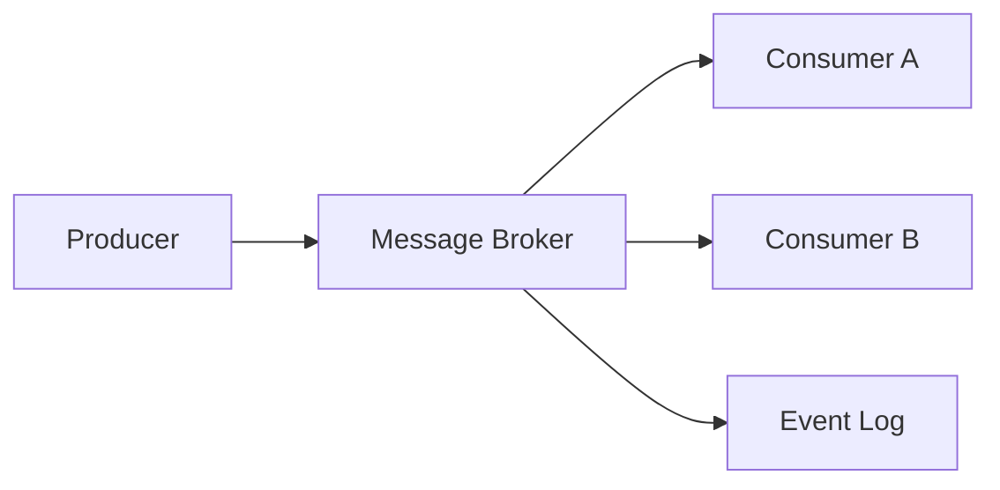

---

## 6.1 Message Queues

### What is it?

A **message queue** is a FIFO buffer between producers and consumers. Producers enqueue messages; consumers dequeue (often with acknowledgment). Each message is typically consumed by **one** consumer in a competing-consumer group.

### Why it matters

Queues smooth traffic spikes, isolate failure domains, and enable async processing—payment webhooks, email sending, order fulfillment—without blocking the caller.

### How it works

1. Producer sends message to named queue via broker API.
2. Broker persists message (memory, disk, or replicated log).
3. Consumer polls or receives push delivery.
4. Consumer processes and sends ACK; broker deletes or marks complete.
5. On failure/timeout, message redelivered or moved to DLQ.

### Diagram

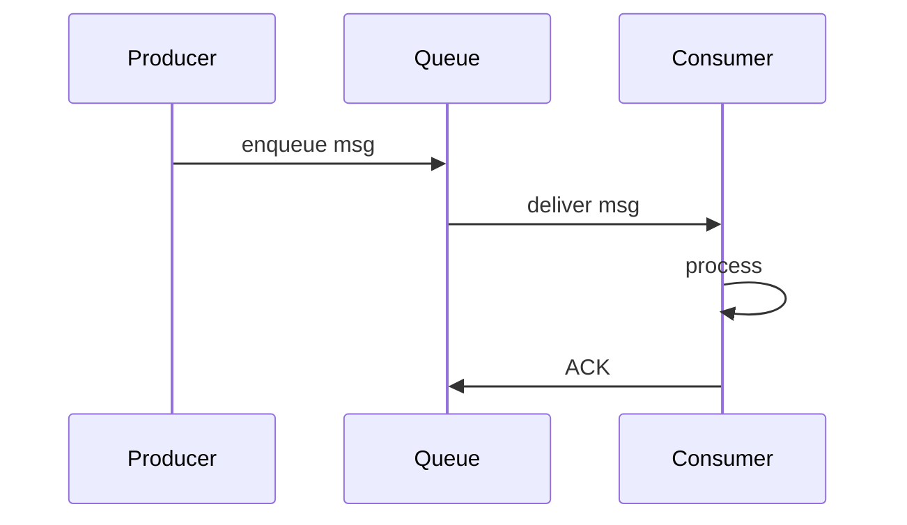

### Key details

| Pattern | Behavior |
|---------|----------|
| Point-to-point | One consumer per message |
| Competing consumers | Scale workers on same queue |
| Priority queue | Urgent messages jump ahead |
| Delay queue | Visible after TTL |

### When to use

- Task distribution and background jobs.
- Load leveling when producers burst faster than consumers.
- Decoupling services that don't need broadcast.

### Trade-offs / Pitfalls

- No built-in replay—once consumed and ACKed, message is gone (unless dead-lettered).
- Ordering only guaranteed with single consumer per queue.
- Poison messages block processing without DLQ strategy.

### References

*(No curated references for this sub-topic in `_topics.json`.)*

---

## 6.2 Publish Subscribe

### What is it?

**Publish-subscribe (pub/sub)** routes each published message to **all** subscribers interested in a topic. Producers don't target specific consumers; the broker fans out based on subscriptions.

### Why it matters

Enables event notification to many independent services—order placed → inventory, analytics, email, search index—without the producer knowing subscribers.

### How it works

1. Subscribers register interest in topic(s).
2. Publisher sends message to topic exchange.
3. Broker copies message to every bound subscriber queue/stream.
4. Each subscriber processes independently at its own rate.

### Diagram

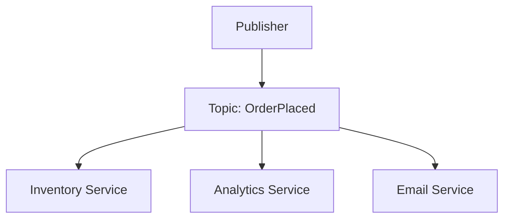

### Key details

- **Topic-based:** routing by topic name (Kafka, SNS).
- **Content-based:** filter by message attributes (advanced brokers).
- Decouples producer count from consumer topology.

### When to use

- Broadcast events to multiple downstream systems.
- Microservices reacting to domain events.
- Real-time notifications and cache invalidation fan-out.

### Trade-offs / Pitfalls

- Slow subscribers don't slow others but may lag unboundedly—monitor consumer lag.
- Ordering across subscribers not coordinated.
- Topic explosion without governance becomes unmanageable.

### References

*(No curated references for this sub-topic in `_topics.json`.)*

---

## 6.3 Event Streaming

### What is it?

**Event streaming** treats messages as an **append-only, durable log** retained for a configurable period. Consumers read at their offset; multiple independent consumer groups replay the same stream.

### Why it matters

Combines messaging with storage—enables replay, audit, stream processing, and decoupled analytics without separate ETL batch windows.

### How it works

1. Producers append records to partitioned log.
2. Broker replicates partitions for durability.
3. Consumers track offset per partition.
4. New consumer groups start from earliest or latest offset.
5. Stream processors (Flink, Kafka Streams) derive materialized views.

### Diagram

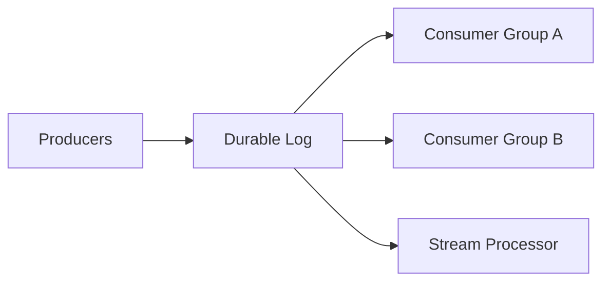

### Key details

- Retention: time-based (7 days) or size-based.
- Immutability: append-only; corrections are compensating events.
- Ordering per partition key, not globally.

### When to use

- High-throughput event backbone (Kafka, Pulsar).
- Event sourcing storage layer.
- Real-time analytics and CDC pipelines.

### Trade-offs / Pitfalls

- Storage cost grows with retention and partition count.
- Unbounded replay can overwhelm downstream if misconfigured.
- Not a drop-in replacement for task queues without consumer design.

### References

*(No curated references for this sub-topic in `_topics.json`.)*

---

## 6.4 Kafka

### What is it?

**Apache Kafka** is a distributed commit log: producers write to **topics** split into **partitions**; consumers read via **consumer groups** with offset tracking. Built for high throughput, horizontal scale, and durable retention.

### Why it matters

De facto enterprise event streaming platform—powers real-time pipelines, microservice communication, and log aggregation at LinkedIn-scale patterns.

### How it works

1. Cluster of brokers; topics partitioned across brokers.
2. Producer picks partition (key hash or round-robin), appends batch.
3. Leader replica accepts; followers replicate ISR (in-sync replicas).
4. Consumer group coordinator assigns partitions to members.
5. Consumers commit offsets after processing (auto or manual).

### Diagram

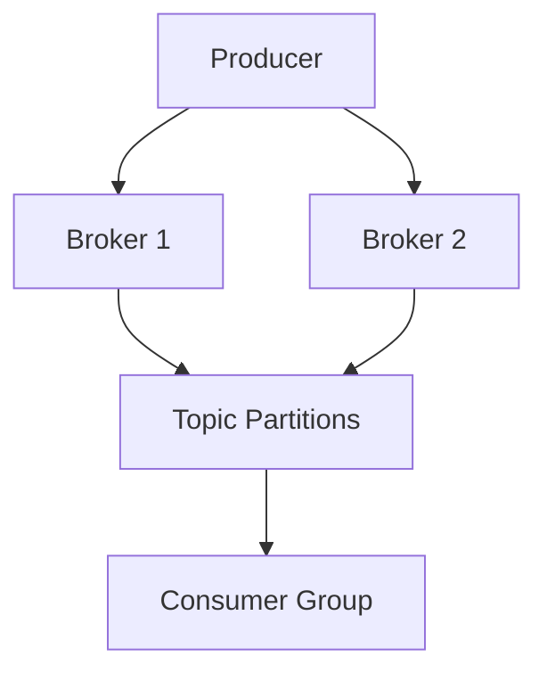

### Key details

| Component | Role |
|-----------|------|
| ZooKeeper/KRaft | Cluster metadata & controller |
| ISR | Replicas caught up with leader |
| Offset | Consumer position in partition |
| Replication factor | Durability per partition |

### When to use

- Millions of events/sec with retention and replay.
- Multiple independent consumers on same data.
- Stream processing with Kafka Streams/Flink.

### Trade-offs / Pitfalls

- Ops complexity: tuning partitions, rebalancing, ISR shrink.
- Poor key choice → hot partitions.
- Exactly-once requires idempotent producer + transactional API discipline.

### References

*(No curated references for this sub-topic in `_topics.json`.)*

---

## 6.5 Kafka Partitions

### What is it?

A **Kafka partition** is an ordered, immutable sequence of records within a topic. Partitions are the unit of parallelism—more partitions → higher throughput and more consumer parallelism.

### Why it matters

Partition design determines ordering scope, max consumer count per group, and load distribution. Wrong partition count is expensive to fix.

### How it works

1. Topic created with N partitions (e.g., 12).
2. Producer with key: `partition = hash(key) mod N` → per-key ordering.
3. Producer without key: sticky or round-robin assignment.
4. Each partition has one leader broker; replicas on others.
5. Consumers in group: max one consumer per partition per group.

### Diagram

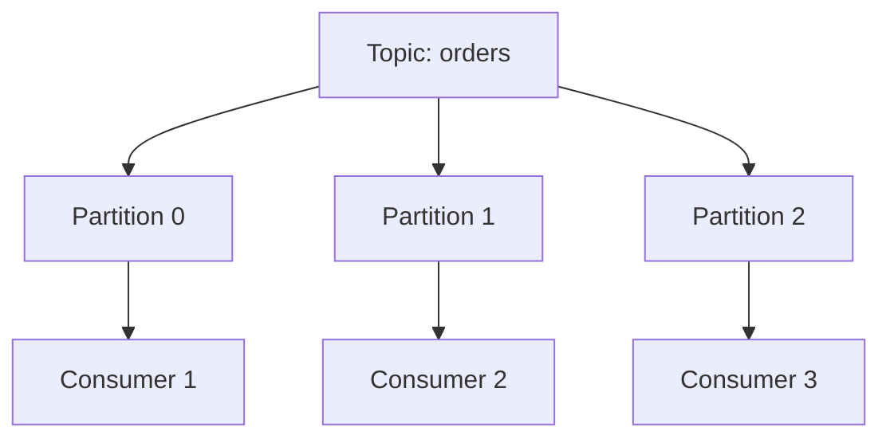

### Key details

- Ordering guaranteed **within** partition only.
- Partition count ≥ max consumers in group for full parallelism.
- Increasing partitions does not reorder existing keys retroactively.

### When to use

- Scale consumption horizontally with partition count.
- Preserve order per entity (user_id, order_id) via partition key.

### Trade-offs / Pitfalls

- Too few partitions → throughput ceiling; too many → file handles and election overhead.
- Re-partitioning changes key→partition mapping—plan upfront.
- Cross-partition transactions are limited and costly.

### References

*(No curated references for this sub-topic in `_topics.json`.)*

---

## 6.6 Kafka Consumer Groups

### What is it?

A **consumer group** is a set of consumers sharing a `group.id` that jointly consume a topic—each partition assigned to exactly one member. Enables scalable parallel processing with at-least-once semantics.

### Why it matters

The scaling mechanism for Kafka consumers. Adding consumers (up to partition count) divides work; removing triggers rebalance.

### How it works

1. Consumers join group; coordinator assigns partitions (range, round-robin, sticky).
2. Member reads assigned partitions, commits offsets to `__consumer_offsets`.
3. Member failure → rebalance → partitions reassigned.
4. New group with same id resumes from last committed offsets.

### Diagram

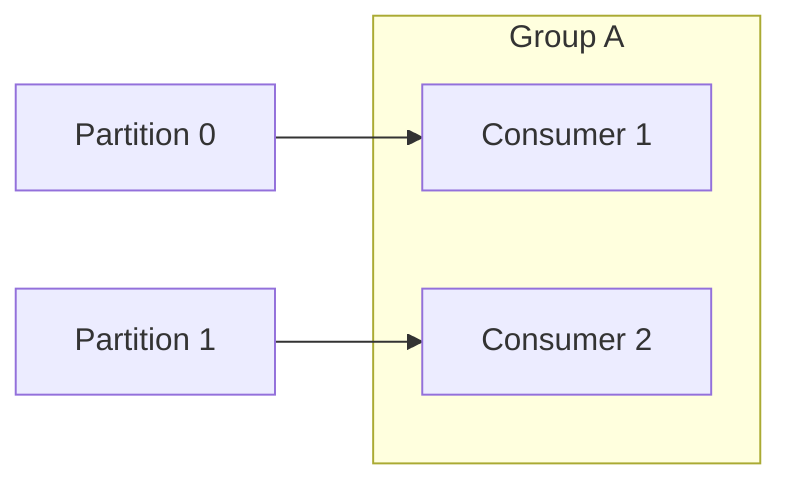

### Key details

- Static membership reduces rebalance churn during rolling deploys.
- `max.poll.interval` and session timeout govern failure detection.
- Separate groups = independent consumption of same topic (fan-out).

### When to use

- Horizontally scale event processing workers.
- Deploy multiple services reading same topic with different logic.

### Trade-offs / Pitfalls

- Rebalance stops consumption briefly—"stop-the-world" during deploys if not tuned.
- One slow consumer on a partition blocks that partition's progress.
- Duplicate processing during rebalance if offsets committed after processing incorrectly.

### References

*(No curated references for this sub-topic in `_topics.json`.)*

---

## 6.7 RabbitMQ

### What is it?

**RabbitMQ** is a message broker implementing AMQP. Messages route through **exchanges** (direct, topic, fanout, headers) to **queues** bound with routing keys—flexible routing vs Kafka's log model.

### Why it matters

Excellent for task queues, RPC reply patterns, complex routing, and moderate throughput with per-message acknowledgments and TTL/dead-letter built in.

### How it works

1. Publisher sends to exchange with routing key.
2. Exchange matches bindings → delivers to queue(s).
3. Consumer prefetch limits unacked messages.
4. Consumer ACK/NACK; NACK with requeue or route to DLX.
5. Optional priority, TTL, and delayed message plugins.

### Diagram

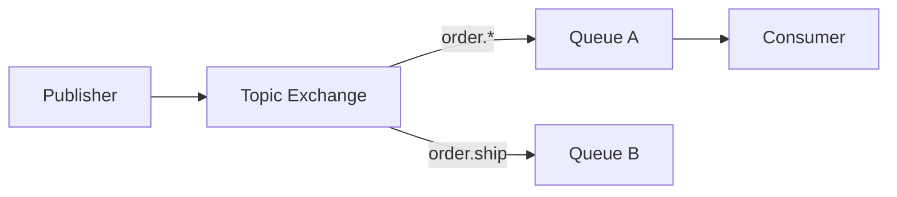

### Key details

| Exchange type | Routing |
|---------------|---------|
| Direct | Exact routing key match |
| Topic | Pattern `order.*` |
| Fanout | All bound queues |
| Headers | Attribute match |

### When to use

- Work queues with routing flexibility.
- Request-reply over temporary reply queues.
- Lower volume than Kafka with rich broker-side routing.

### Trade-offs / Pitfalls

- Not a replayable log—messages deleted after ACK.
- Clustering and mirrored queues have operational nuances (quorum queues preferred).
- Throughput lower than Kafka for firehose ingestion.

### References

*(No curated references for this sub-topic in `_topics.json`.)*

---

## 6.8 ActiveMQ

### What is it?

**Apache ActiveMQ** (Classic and Artemis) is a JMS-compliant message broker supporting queues, topics, and enterprise integration patterns with Java-centric APIs.

### Why it matters

Legacy enterprise messaging standard—common in Java EE estates migrating to Kafka or cloud-native brokers.

### How it works

1. Producers send to JMS queue or topic via ConnectionFactory.
2. Broker persists (KahaDB) or holds in memory.
3. Consumers receive via push or pull; transacted sessions for batch ACK.
4. Artemis uses journal + paging for high performance vs Classic.

### Diagram

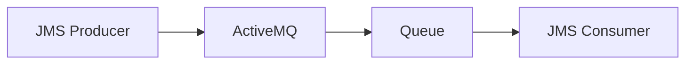

### Key details

- JMS 1.1/2.0 semantics: queues (P2P) vs topics (pub/sub).
- Artemis redesigned storage; preferred for new deployments.
- Bridges and network of brokers for federation.

### When to use

- Existing JMS application estate.
- Java middleware requiring standard APIs.
- Moderate messaging with enterprise support contracts.

### Trade-offs / Pitfalls

- Lower ecosystem momentum vs Kafka/RabbitMQ for new systems.
- Network of brokers complexity for geo distribution.
- Migration to Kafka often needed for scale and replay.

### References

*(No curated references for this sub-topic in `_topics.json`.)*

---

## 6.9 Pulsar

### What is it?

**Apache Pulsar** separates **serving** (brokers) from **storage** (Apache BookKeeper ledgers). Topics are segmented ledgers; supports multi-tenancy, geo-replication, and unified queuing + streaming.

### Why it matters

Alternative to Kafka when you need independent compute/storage scale, native tiered storage, and built-in multi-tenancy without cluster sprawl.

### How it works

1. Producer writes to topic partition (managed ledger on BookKeeper).
2. Broker serves consumers; storage nodes persist entry replicas.
3. Subscriptions: exclusive, shared, failover, key_shared.
4. Offload old segments to S3 for cheap retention.

### Diagram

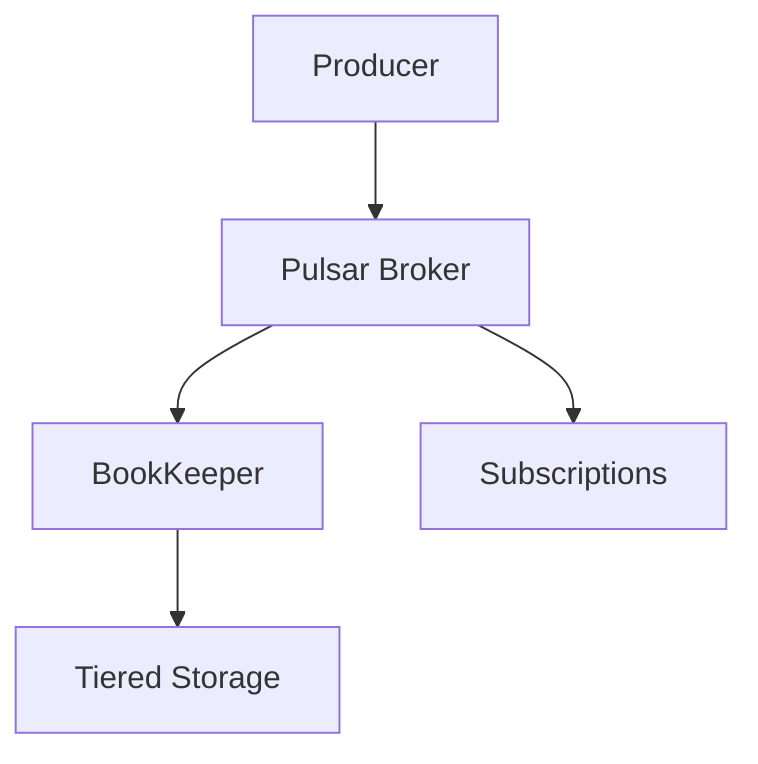

### Key details

- **Key_shared** subscription: order per key with parallelism (like Kafka partitions).
- Geo-replication at namespace level.
- Functions framework for lightweight stream processing.

### When to use

- Multi-tenant SaaS messaging backbone.
- Long retention with tiered storage cost control.
- Need both queue and stream semantics in one platform.

### Trade-offs / Pitfalls

- Smaller community/tooling vs Kafka.
- BookKeeper adds operational surface area.
- Migration path from Kafka exists but not trivial.

### References

*(No curated references for this sub-topic in `_topics.json`.)*

---

## 6.10 Ordering Guarantees

### What is it?

**Ordering guarantees** define whether consumers see messages in send order—globally, per partition/key, or not at all.

### Why it matters

Many invariants require order (account debits before credits on same account). Violating assumed order causes subtle financial and inventory bugs.

### How it works

1. **Global order:** single partition/queue (limits throughput).
2. **Partition key order:** same key → same partition → ordered per key.
3. **No order:** multiple partitions, competing consumers without key affinity.
4. Sequence numbers or versioning detect out-of-order at application layer.

### Diagram

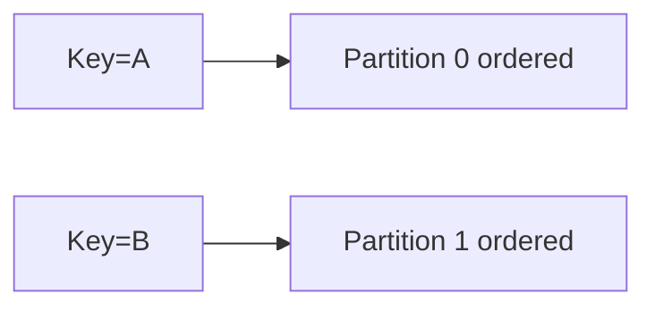

### Key details

| Level | Throughput | Use case |
|-------|------------|----------|
| Global | Low | Strict serial pipeline |
| Per-key | High | Entity lifecycle events |
| None | Highest | Independent metrics |

### When to use

- Per-entity order: partition by `user_id` or `order_id`.
- Global order only when business truly requires serial processing.

### Trade-offs / Pitfalls

- Rebalance can deliver duplicate or reorder during failure—design idempotent handlers.
- Multiple producers to same partition still need sequence checks if clocks skew.
- "Ordering" in pub/sub with multiple subscribers is per-subscriber queue only.

### References

*(No curated references for this sub-topic in `_topics.json`.)*

---

## 6.11 Exactly Once Delivery

### What is it?

**Exactly-once delivery** (more precisely **exactly-once processing semantics**) ensures each message side effect happens once despite retries, duplicates, and failures—combining idempotent consumers, transactional writes, and deduplication.

### Why it matters

Payments, inventory, and ledger systems cannot tolerate duplicate processing. Interviewers probe whether you know true end-to-end exactly-once is impossible without cooperation at producer, broker, and consumer.

### How it works

**Kafka exactly-once pipeline example:**

1. Idempotent producer: broker dedupes by PID + sequence.
2. Transactions: atomic write across partitions + offset commit.
3. Consumer: read-process-write in single transaction to output topic + offsets.
4. Application: idempotent handlers with business-key dedup store.

### Diagram

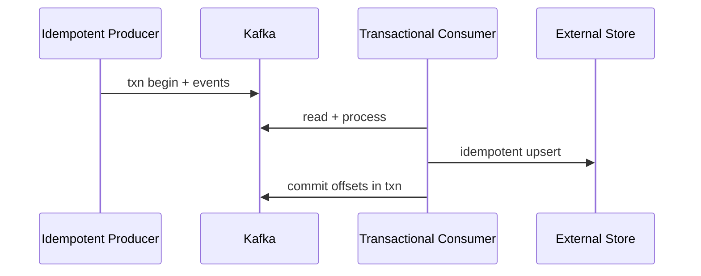

### Key details

- Broker guarantees ≠ application guarantees without idempotent sinks.
- EOS in Kafka: `enable.idempotence=true`, `isolation.level=read_committed`.
- Alternative: at-least-once + idempotency keys (Stripe, SQS).

### When to use

- Financial events, inventory decrements, state machine transitions.
- Stream processing joining multiple inputs with no duplicate output.

### Trade-offs / Pitfalls

- Higher latency and throughput cost for transactional mode.
- External side effects (email, HTTP) never truly exactly-once—use outbox + idempotency.
- Debugging transactional aborts is harder than at-least-once.

### References

*(No curated references for this sub-topic in `_topics.json`.)*

---

## 6.12 At Least Once Delivery

### What is it?

**At-least-once** delivery guarantees every message is delivered one or more times—never silently lost—if the consumer ACKs after processing but crashes before ACK, or network retries occur.

### Why it matters

The **default practical guarantee** for durable messaging. Achievable with persistence + ACK + redelivery; consumers must be idempotent.

### How it works

1. Broker persists message until ACKed.
2. Consumer processes message.
3. Consumer sends ACK; if crash before ACK, broker redelivers.
4. Duplicate delivery possible → consumer dedupes by message ID.

### Diagram

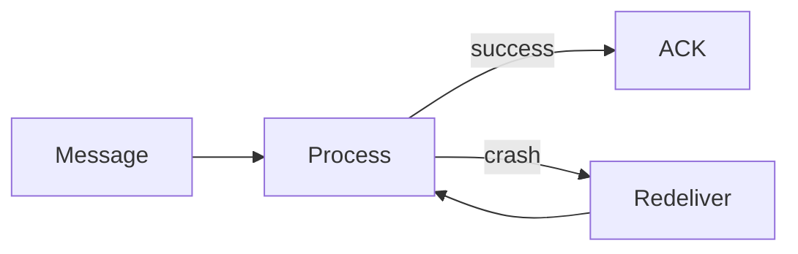

### Key details

- Kafka: commit offset after processing (or before—at-most-once risk).
- Pattern: store processed IDs in DB with unique constraint.
- Preferred over exactly-once when idempotency is cheap.

### When to use

- Default for most microservice event handlers.
- When duplicate handling is simpler than transactional overhead.

### Trade-offs / Pitfalls

- Without idempotency, duplicates corrupt state.
- Committing offset before processing → message loss on crash (not at-least-once).
- Poison message infinite retry without DLQ.

### References

*(No curated references for this sub-topic in `_topics.json`.)*

---

## 6.13 At Most Once Delivery

### What is it?

**At-most-once** delivery may lose messages but never duplicates—consumer ACKs before processing or broker fires-and-forgets without persistence.

### Why it matters

Highest throughput, lowest latency—for metrics, logs, and telemetry where approximate counts beat correctness.

### How it works

1. Producer sends without waiting for broker durability (acks=0 in Kafka).
2. Or consumer commits offset **before** processing.
3. Crash after ACK loses message permanently.
4. No redelivery attempts.

### Diagram

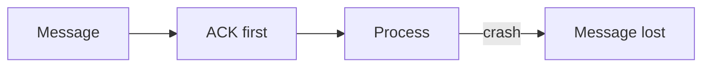

### Key details

- Kafka `acks=0` or `enable.auto.commit=true` with early commit.
- UDP-style semantics over reliable transport.
- Acceptable loss rate must be quantified in SLO.

### When to use

- Metrics, click streams, sampling traces.
- Non-critical notifications where loss < 0.1% OK.

### Trade-offs / Pitfalls

- Unacceptable for money, orders, or audit trails.
- Silent loss hard to detect without producer-side counters.
- Often chosen accidentally via misconfigured auto-commit.

### References

*(No curated references for this sub-topic in `_topics.json`.)*

---

## 6.14 Dead Letter Queue

### What is it?

A **dead letter queue (DLQ)** holds messages that failed processing after max retries—poison messages isolated so they don't block the main queue.

### Why it matters

Prevents one bad message from infinite retry loops starving healthy traffic; enables manual inspection and replay after fix.

### How it works

1. Consumer fails processing; NACK or retry count increments.
2. Broker routes to DLQ after threshold (RabbitMQ DLX, SQS redrive policy, Kafka retry topic).
3. Operators alert on DLQ depth.
4. Fix bug/schema; replay DLQ to main topic with tooling.

### Diagram

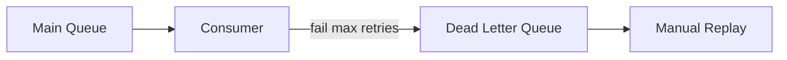

### Key details

- Include failure reason, stack trace, original headers in DLQ metadata.
- Monitor DLQ as critical alert—not optional logging.
- Idempotent replay to avoid duplicate side effects.

### When to use

- Any production queue/stream consumer pipeline.
- Schema validation failures and downstream dependency outages.

### Trade-offs / Pitfalls

- DLQ growth without process → unbounded storage and missed incidents.
- Replaying without root-cause fix re-poisons main queue.
- Kafka needs explicit retry/DLT pattern (not one built-in DLQ button).

### References

*(No curated references for this sub-topic in `_topics.json`.)*

---

## 6.15 Retry Queue

### What is it?

A **retry queue** (delay queue) holds failed messages for backoff period before re-attempting main processing—separate from DLQ which is terminal failure.

### Why it matters

Transient failures (DB timeout, rate limit) self-heal with backoff; immediate redelivery amplifies outages.

### How it works

1. Processing fails with retryable error.
2. Message published to retry topic with delay header/TTL.
3. After delay, message returns to main consumer.
4. Exponential backoff: 1s, 5s, 30s, 5m; then DLQ.

### Diagram

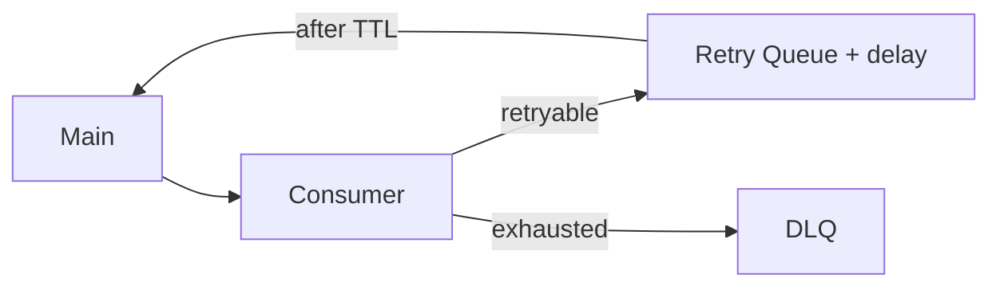

### Key details

- Distinguish retryable vs non-retryable exceptions in code.
- Jitter prevents synchronized retry storms.
- Max attempts cap required—never infinite retry.

### When to use

- Downstream dependency blips (HTTP 503, throttling).
- Optimistic locking conflicts with short backoff.

### Trade-offs / Pitfalls

- Retry storm during regional outage overwhelms recovering service—use circuit breaker.
- Clock-based delay queues vary in broker support.
- Ordering not preserved across retry paths.

### References

*(No curated references for this sub-topic in `_topics.json`.)*

---

## 6.16 Event Driven Architecture

### What is it?

**Event-driven architecture (EDA)** structures systems around production, detection, and consumption of **domain events**—past-tense facts (`OrderPlaced`)—rather than synchronous command chains.

### Why it matters

Loose coupling, independent scaling, temporal decoupling, and natural audit trail. Core to modern microservices and reactive systems.

### How it works

1. Service completes business action, publishes event to bus.
2. Interested services subscribe and react asynchronously.
3. Choreography: no central orchestrator; events trigger next steps.
4. Observability via correlation IDs across event chains.

### Diagram

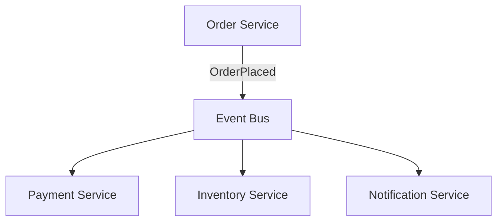

### Key details

- Events vs commands: events are facts; commands are requests (often separate channels).
- Event notification (thin) vs event-carried state transfer (fat payloads).
- Saga choreography is EDA for distributed transactions.

### When to use

- Many subscribers need same signal.
- Peak load buffering and async workflows.
- Integrating third-party systems without tight coupling.

### Trade-offs / Pitfalls

- Distributed debugging harder than monolith stack traces—need tracing.
- Eventual consistency complicates UX (pending states).
- Event schema governance essential (registry, versioning).

### References

*(No curated references for this sub-topic in `_topics.json`.)*

---

## 6.17 Event Sourcing

### What is it?

**Event sourcing** persists state as an append-only sequence of domain events, not current row values. Current state is derived by **replaying** events (or snapshots + replay).

### Why it matters

Complete audit history, temporal queries ("balance on date X"), and natural integration with event-driven systems—state and messaging share the same truth.

### How it works

1. Command arrives: `Deposit($100)`.
2. Validate against current aggregate state (from events or snapshot).
3. Append `MoneyDeposited` event to event store.
4. Projectors update read models (SQL, cache) from event stream.
5. Periodic snapshots truncate replay cost for large aggregates.

### Diagram

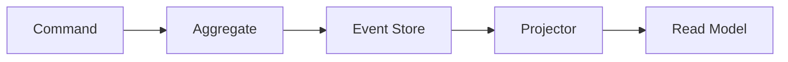

### Key details

- Aggregate = consistency boundary; one stream per aggregate ID.
- Optimistic concurrency via expected version.
- Deletes are compensating events (`UserDeactivated`), not physical erase.

### When to use

- Audit and compliance require immutable history.
- Complex domain with rich lifecycle (finance, logistics).
- CQRS read/write scale split.

### Trade-offs / Pitfalls

- Querying current state without projections is slow—need read models.
- Schema evolution on historical events (upcasting).
- Learning curve and infrastructure vs simple CRUD.

### References

*(No curated references for this sub-topic in `_topics.json`.)*

---

## 6.18 CQRS

### What is it?

**Command Query Responsibility Segregation (CQRS)** separates **write model** (commands, domain logic) from **read model** (optimized queries)—often fed by events from the write side.

### Why it matters

Read and write workloads scale differently; read models can be denormalized for UI without polluting write schema.

### How it works

1. Commands hit write API → update aggregate → emit events.
2. Projectors consume events → update one or more read databases (SQL, Elasticsearch, cache).
3. Queries hit read API only—never touch write store.
4. Eventual lag between write and read models exposed in UI.

### Diagram

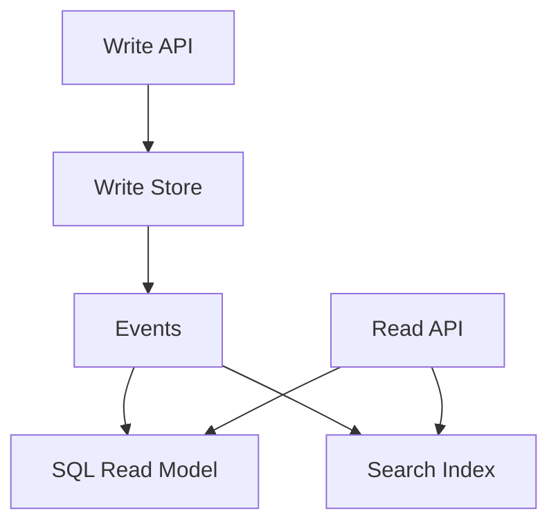

### Key details

- Simple CQRS: separate classes/DBs without event sourcing.
- Full stack: event sourcing + multiple projections.
- Read model rebuild = replay all events.

### When to use

- Read:write ratio extreme (social feeds, dashboards).
- Multiple query shapes on same data (graph + table + search).
- Paired with event sourcing for audit-heavy domains.

### Trade-offs / Pitfalls

- Eventual consistency UX challenges.
- Operational complexity: more stores to monitor and sync.
- Overkill for simple CRUD domains.

### References

*(No curated references for this sub-topic in `_topics.json`.)*

---

## 6.19 Change Data Capture (CDC)

### What is it?

**Change Data Capture (CDC)** streams row-level database changes (insert, update, delete) from transaction log (WAL, binlog) to message bus—without application dual-write.

### Why it matters

Reliable integration pattern: keep OLTP DB as source of truth while search indexes, caches, and warehouses stay synchronized with minimal application code.

### How it works

1. CDC connector (Debezium) reads database replication log.
2. Converts row changes to events with before/after payload.
3. Publishes to Kafka topic per table or schema.
4. Consumers update Elasticsearch, Redis, data warehouse.
5. Initial snapshot + streaming for backfill.

### Diagram

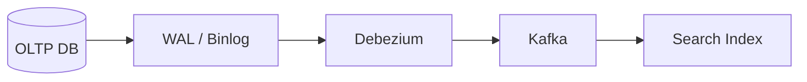

### Key details

- Ordering per table primary key generally preserved.
- Tombstone events for deletes in Kafka compaction topics.
- Schema changes require evolution strategy.

### When to use

- Legacy DB must remain system of record but needs real-time fan-out.
- Avoid outbox when you can tolerate log-ordering semantics.
- Data warehouse near-real-time ingestion.

### Trade-offs / Pitfalls

- Log retention limits vs long CDC downtime—snapshot recovery needed.
- Wide tables generate large events; consider column filtering.
- Deletes and GDPR erasure need compaction/tombstone policies.

### References

*(No curated references for this sub-topic in `_topics.json`.)*

---

## 6.20 Event Replay

### What is it?

**Event replay** re-processes historical events from the log or event store—rebuilding projections, recovering after bug, or bootstrapping new consumer.

### Why it matters

Unique advantage of event streaming and event sourcing; turns the log into reproducible system history.

### How it works

1. Reset consumer offset to `earliest` or specific timestamp.
2. Or deploy new projector reading full event store from version 0.
3. Process events idempotently into target store.
4. Cut over read traffic when projection caught up.
5. Snapshots accelerate replay start point.

### Diagram

```mermaid
flowchart LR
    Log[Event Log] -->|replay| Proj[New Projector]
    Proj --> NewDB[(New Read DB)]
```

### Key details

- Replay speed limited by processing throughput—parallelize by partition.
- Side effects (emails) must be suppressed or deduped during replay.
- Versioned projectors: replay with new business logic = new view.

### When to use

- Bug fix in projection logic requires rebuild.
- New analytics consumer needs full history.
- Disaster recovery of derived read models.

### Trade-offs / Pitfalls

- Re-emitting side effects duplicates external actions—use "replay mode" flag.
- Long replays delay time-to-recovery—maintain snapshots.
- Storage retention must cover replay window needed.

### References

*(No curated references for this sub-topic in `_topics.json`.)*

---

## 6.21 Outbox Pattern

### What is it?

The **outbox pattern** writes domain changes and outbound message records in the **same local database transaction**—a separate relay process publishes outbox rows to the message broker.

### Why it matters

Solves the dual-write problem: DB committed but message never sent (or vice versa) without 2PC across DB and Kafka.

### How it works

1. Business transaction: `UPDATE orders SET ...` + `INSERT INTO outbox (payload)`.
2. Single DB commit—atomic together.
3. Outbox relay (polling or CDC) reads unpublished rows.
4. Publishes to broker; marks row published or deletes.
5. Consumers process with idempotency (at-least-once relay).

### Diagram

```mermaid
sequenceDiagram
    participant S as Service
    participant DB as Database
    participant R as Outbox Relay
    participant K as Kafka
    S->>DB: BEGIN txn
    S->>DB: UPDATE business row
    S->>DB: INSERT outbox event
    S->>DB: COMMIT
    R->>DB: poll outbox
    R->>K: publish event
    R->>DB: mark sent
```

### Key details

- Debezium outbox event router: structured JSON in outbox table → Kafka.
- Relay must be HA but duplicates OK with idempotent consumers.
- Ordering per aggregate if single outbox table partitioned by ID.

### When to use

- Microservice must emit events after local DB commit reliably.
- Replacing unsafe "write DB then fire-and-forget publish".
- Saga step completion notifications.

### Trade-offs / Pitfalls

- Relay lag adds milliseconds to seconds delivery delay.
- Outbox table growth without cleanup/archival.
- Polling inefficient at scale—prefer CDC on outbox table.

### References

*(No curated references for this sub-topic in `_topics.json`.)*

---

## 6.22 Event Versioning

### What is it?

**Event versioning** manages schema changes over an immutable event stream—adding fields, renaming, or restructuring without breaking old consumers or losing historical replay fidelity.

### Why it matters

Events live forever in sourcing and Kafka retention; breaking changes brick replay and downstream consumers.

### How it works

1. Prefer **backward-compatible** changes: add optional fields only.
2. Use version in event type (`OrderPlacedV2`) or envelope metadata.
3. **Upcasting:** transform V1 → V2 in projector on read.
4. Dual-write transition period for major breaking changes.
5. Schema registry enforces compatibility rules.

### Diagram

```mermaid
flowchart LR
    V1[Event V1] --> Up[Upcaster]
    Up --> V2[Event V2 model]
    V2 --> Proj[Projector]
```

### Key details

| Change | Compatibility |
|--------|---------------|
| Add optional field | Backward compatible |
| Remove field | Breaking |
| Rename field | Breaking without alias |
| New event type | Parallel consumers |

### When to use

- Any long-lived event stream or event-sourced aggregate.
- Shared topics across team boundaries.

### Trade-offs / Pitfalls

- "Just change the JSON" breaks replay and external consumers.
- Too many versions → upcaster chain complexity.
- Protobuf/Avro helps but still requires compatibility discipline.

### References

*(No curated references for this sub-topic in `_topics.json`.)*

---

## 6.23 Schema Registry

### What is it?

A **schema registry** (Confluent Schema Registry, AWS Glue) stores Avro/Protobuf/JSON schemas for topics; producers register schemas, consumers fetch by ID embedded in message.

### Why it matters

Enforces contract compatibility, reduces payload size, and prevents "schema anarchy" in polyglot Kafka ecosystems.

### How it works

1. Producer registers schema for subject `orders-value`.
2. Registry returns schema ID; producer serializes with ID prefix.
3. Consumer deserializes using ID → fetches schema from registry.
4. CI checks BACKWARD/FULL compatibility before deploy.
5. Evolution rules reject breaking producer deploys.

### Diagram

```mermaid
flowchart LR
    Prod[Producer] --> Reg[Schema Registry]
    Prod --> Kafka[Kafka]
    Kafka --> Cons[Consumer]
    Cons --> Reg
```

### Key details

- Compatibility modes: BACKWARD (new consumer, old data), FORWARD, FULL.
- Subject naming: topic-value, topic-key strategies.
- Glue Schema Registry for AWS-managed Kafka.

### When to use

- Avro/Protobuf serialization in Kafka.
- Multi-team shared topics with contract governance.
- CI/CD gates on schema compatibility.

### Trade-offs / Pitfalls

- Registry downtime blocks serde unless cached schemas suffice.
- JSON Schema support less mature than Avro in some stacks.
- Overhead for tiny teams with few topics may not justify.

### References

*(No curated references for this sub-topic in `_topics.json`.)*

---

## Quick Reference

| Concept | One-liner | Default choice |
|---------|-----------|----------------|
| Queue | One consumer per message | Task workers |
| Pub/sub | Fan-out to all subscribers | Domain events |
| Event stream | Durable replayable log | Kafka backbone |
| Partition | Parallelism + order unit | Key by entity ID |
| Consumer group | Scale consumers per topic | `group.id` per service |
| At-least-once | May duplicate, never lose | Default + idempotency |
| Exactly-once | Broker txn + idempotent sink | Kafka streams, critical ledger |
| DLQ | Poison message isolation | Alert on depth |
| Outbox | Atomic DB + message intent | Reliable microservice emit |
| Event sourcing | State = event replay | Audit-heavy domains |
| CQRS | Separate read/write models | High read scale |
| CDC | DB log → events | Debezium + Kafka |
| Schema registry | Contract enforcement | Avro BACKWARD compatible |
