# 6. Messaging & Events

> Status: **Documented**

[<- Back to master index](../README.md)

---

## Overview

Messaging and event-driven architecture decouple producers from consumers in time, space, and scale. Instead of synchronous RPC chains, services publish facts (events) or commands to durable intermediaries - queues, logs, or streams - so downstream systems react at their own pace, scale independently, and survive transient failures.

The design space spans **delivery semantics** (at-most-once, at-least-once, exactly-once), **ordering** (per-partition vs global), and **architectural patterns** (event sourcing, CQRS, outbox, CDC). Kafka dominates high-throughput streaming; RabbitMQ and Pulsar fill complementary niches.

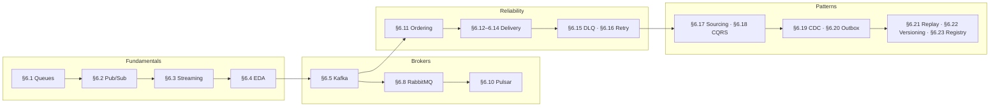

### Pattern cluster (§6.17–§6.23)

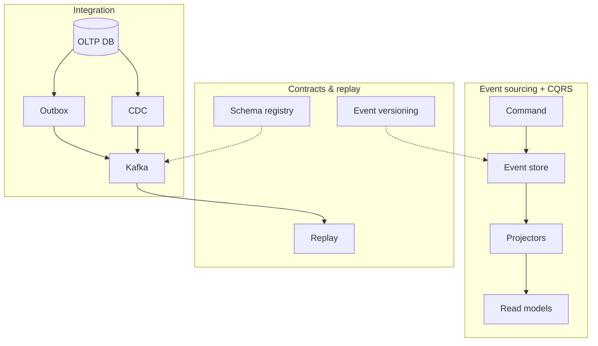

---

## Sub-topics

### Fundamentals & communication patterns

| # | Sub-topic | Status |
|---|-----------|--------|
| 6.1 | [Message Queues](#61-message-queues) | Done |
| 6.2 | [Publish Subscribe](#62-publish-subscribe) | Done |
| 6.3 | [Event Streaming](#63-event-streaming) | Done |
| 6.4 | [Event Driven Architecture](#64-event-driven-architecture) | Done |

### Brokers & platforms

| # | Sub-topic | Status |
|---|-----------|--------|
| 6.5 | [Kafka](#65-kafka) | Done — partitions & consumer groups |
| 6.6 | [Kafka Partitions](#66-kafka-partitions) | Index → §6.5 |
| 6.7 | [Kafka Consumer Groups](#67-kafka-consumer-groups) | Index → §6.5 |
| 6.8 | [RabbitMQ](#68-rabbitmq) | Done |
| 6.9 | [ActiveMQ](#69-activemq) | Done |
| 6.10 | [Pulsar](#610-pulsar) | Done |

### Ordering, delivery & failure handling

| # | Sub-topic | Status |
|---|-----------|--------|
| 6.11 | [Ordering Guarantees](#611-ordering-guarantees) | Done — canonical |
| 6.12 | [At Most Once Delivery](#612-at-most-once-delivery) | Done — comparison hub |
| 6.13 | [At Least Once Delivery](#613-at-least-once-delivery) | Done |
| 6.14 | [Exactly Once Delivery](#614-exactly-once-delivery) | Done |
| 6.15 | [Dead Letter Queue](#615-dead-letter-queue) | Done |
| 6.16 | [Retry Queue](#616-retry-queue) | Done |

### Data & integration patterns

| # | Sub-topic | Status |
|---|-----------|--------|
| 6.17 | [Event Sourcing](#617-event-sourcing) | Done |
| 6.18 | [CQRS](#618-cqrs) | Done |
| 6.19 | [Change Data Capture (CDC)](#619-change-data-capture-cdc) | Done |
| 6.20 | [Outbox Pattern](#620-outbox-pattern) | Done |
| 6.21 | [Event Replay](#621-event-replay) | Done |
| 6.22 | [Event Versioning](#622-event-versioning) | Done |
| 6.23 | [Schema Registry](#623-schema-registry) | Done |

---

## 6.1 Message Queues

### What is a message queue?

A message queue is a communication mechanism that allows different services or applications to exchange messages **asynchronously**.

Instead of Service A directly calling Service B, Service A sends a message to a queue and continues its work. Service B processes the message later.

This helps decouple services and improves scalability and reliability.

### Why message queues?

**Without a queue:**

```text
Client → Service A → Service B → Service C
```

Problems: tight coupling, high latency, failures propagate, poor scalability.

**With a queue:**

```text
Client → Service A → Queue → Service B
```

Benefits: asynchronous communication, better fault tolerance, load leveling, independent scaling, improved reliability.

### Core components

| Component | Role |
|-----------|------|
| **Producer** | Creates and sends messages to the queue |
| **Message queue** | Stores messages temporarily; delivers to consumers |
| **Consumer** | Reads and processes messages |

```text
Order Service
     |
     v
+------------+
|   Queue    |
+------------+
     |
     v
Email Service
```

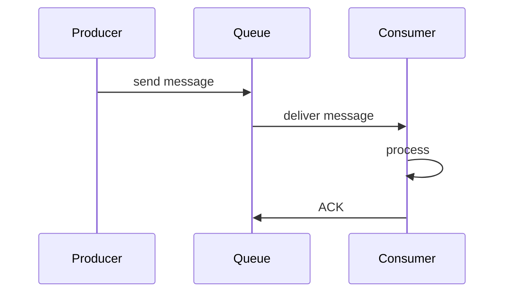

### How it works

```text
Step 1: Producer sends message
Step 2: Queue stores message
Step 3: Consumer fetches message
Step 4: Consumer processes message
Step 5: Queue removes message after successful processing

Producer → Queue → Consumer
```

### Message structure

```json
{
  "orderId": 123,
  "userId": 456,
  "event": "ORDER_CREATED"
}
```

Typically includes: **payload**, **metadata**, **timestamp**, **message ID**.

### Synchronous vs asynchronous

| | Synchronous | Asynchronous |
|---|-------------|--------------|
| **Pattern** | Service A → Service B (wait for response) | Service A → Queue → Service B |
| **Pros** | Simple | Fast response, decoupled, scalable |
| **Cons** | Higher latency, tight coupling | More moving parts |

### Queue models

#### Point-to-point queue

One message consumed by **one** consumer.

```text
Producer → Queue → Consumer
```

Example: order processing (competing workers on one queue).

#### Publish-subscribe (pub/sub)

One message delivered to **multiple** consumers via a topic.

```text
              Consumer A
                   ^
Producer --> Topic-+--> Consumer B
                   |
              Consumer C
```

Example: `ORDER_CREATED` → email, analytics, inventory — all receive the same event.

Full treatment: [§6.2 Publish Subscribe](#62-publish-subscribe).

Delivery semantics: [§6.12–§6.14](#612-at-most-once-delivery) (canonical comparison in §6.12).

### Acknowledgement (ACK)

Consumer must acknowledge after successful processing.

```text
Queue → Consumer → process OK → Consumer sends ACK → Queue deletes message

Without ACK: queue keeps (or redelivers) the message
```

### Message retry

```text
Queue → Consumer → failure
Message returned to queue → retried later
```

Benefits: handles temporary failures, reduces message loss. Retry topics and backoff: [§6.16 Retry Queue](#616-retry-queue).

### Dead letter queue (DLQ)

When a message fails repeatedly, move it to a **DLQ** instead of infinite retry.

```text
Queue → Consumer → failure (e.g. 5 retries) → DLQ
```

Benefits: stops poison messages blocking the queue; easier debugging. Detail: [§6.15 Dead Letter Queue](#615-dead-letter-queue).

### Message ordering

Messages may need to be processed in send order.

```text
Order Created → Payment Completed → Order Shipped
```

Challenges: multiple consumers, parallel processing.

Solutions: single partition, FIFO queues. See [§6.11 Ordering Guarantees](#611-ordering-guarantees).

### Backpressure

**Problem:** producer rate exceeds consumer rate.

```text
Producer: 10,000 msg/sec
Consumer:  1,000 msg/sec
→ queue grows rapidly
```

Solutions: add consumers, rate limiting, auto-scaling. Related: [Chapter 4 — Backpressure](../04-distributed-system/README.md#420-backpressure).

### Competing consumers

Multiple consumers process the same queue; **each message goes to only one consumer**.

```text
                Consumer 1
               /
Queue ---------
               \
                Consumer 2
```

Benefits: parallel processing, higher throughput. Kafka consumer groups: [§6.5 Kafka](#65-kafka).

### Visibility timeout

After a consumer receives a message, it becomes **temporarily invisible** to other consumers.

```text
ACK received     → delete message
Consumer crashes → message becomes visible again → redelivered
```

Prevents duplicate processing while work is in flight (e.g. Amazon SQS).

### Message batching

Process multiple messages in one round trip instead of one-by-one.

```text
[Msg1] [Msg2] [Msg3] → batch process
```

Benefits: fewer network calls, better throughput, lower cost.

### Common use cases

| Use case | Flow |
|----------|------|
| **Order processing** | Order Service → Queue → Payment Service |
| **Email notifications** | User signup → Queue → Email Service |
| **Video processing** | Upload → Queue → Encoding Service |
| **Log processing** | Application → Queue → Analytics |
| **Event-driven architecture** | Event → Queue/Topic → inventory + notification + analytics |

Event-driven patterns: [§6.4 Event Driven Architecture](#64-event-driven-architecture).

### Popular message queue systems

| System | Notes | Section |
|--------|-------|---------|
| **Apache Kafka** | Distributed event streaming, high throughput, partitions | [§6.5](#65-kafka) |
| **RabbitMQ** | Traditional broker, routing, reliable delivery | [§6.8](#68-rabbitmq) |
| **Amazon SQS** | Managed, highly scalable | Cloud-native queues |
| **Apache ActiveMQ** | JMS-based messaging | [§6.9](#69-activemq) |
| **Redis Streams** | Lightweight queueing | Streams / lists |
| **Apache Pulsar** | Multi-tenant streaming | [§6.10](#610-pulsar) |

### Advantages

- Decouples services
- Improves scalability
- Better fault tolerance
- Asynchronous processing
- Handles traffic spikes
- Reliable message delivery (with correct ACK/retry/DLQ design)

### Disadvantages

- Increased complexity
- Message duplication possible (at-least-once)
- Ordering challenges
- Operational overhead
- Debugging becomes harder

### Summary

A message queue lets producers and consumers communicate asynchronously through a durable buffer.

```text
Producer → Queue → Consumer (+ ACK)
```

**Key ideas:** decoupling, competing consumers, delivery guarantees, retry/DLQ, ordering, backpressure.

**Goal:** Scale and isolate services while surviving spikes and partial failures.

---


## 6.2 Publish Subscribe

### What is pub/sub?

Publish-subscribe (pub/sub) is a messaging pattern where publishers send messages to a **topic** and multiple **subscribers** receive those messages.

- Publishers do **not** know who the subscribers are
- Subscribers do **not** know who the publishers are
- Both are decoupled through a broker/topic

Contrast with point-to-point queues: [§6.1 Message Queues](#61-message-queues).

### Why pub/sub?

**Problem with direct communication:**

```text
Order Service
      |
      +--> Email Service
      |
      +--> Analytics Service
      |
      +--> Inventory Service
```

Problems: tight coupling, hard to add new services, difficult maintenance.

**Solution: pub/sub**

```text
                    Email Service
                          ^
Order Service --> Topic --+--> Analytics Service
                          |
                          +--> Inventory Service
```

Benefits: loose coupling, easy scalability, easy addition of new services.

### Core components

| Component | Role | Examples |
|-----------|------|----------|
| **Publisher** | Produces events/messages | Order, Payment, User services |
| **Topic** | Logical channel for messages | `OrderCreated`, `PaymentCompleted`, `UserRegistered` |
| **Subscriber** | Receives messages from topic | Email, Analytics, Inventory services |

### How pub/sub works

```text
Step 1: Publisher creates event
Step 2: Event sent to topic
Step 3: Broker receives event
Step 4: Broker distributes event to all subscribers

Publisher → Topic → Sub1, Sub2, Sub3
```

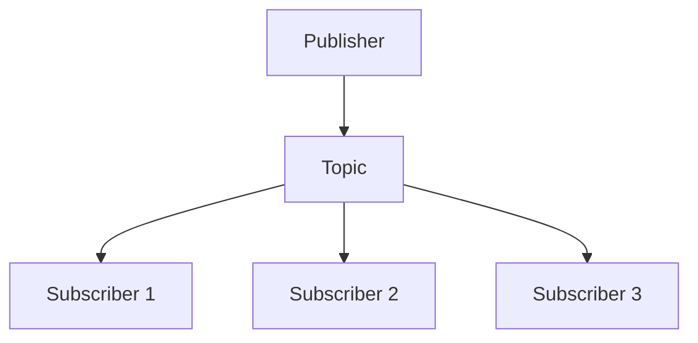

### Real-world example

**Order created event**

```text
Publisher: Order Service

Subscribers: Email, Inventory, Analytics

Order Service -- Order Created --> Order Topic
                                    /    |    \
                                   v     v     v
                              Email  Inventory Analytics

All receive the same event.
```

### Topic vs queue

| | Queue | Pub/sub topic |
|---|-------|---------------|
| **Purpose** | Work distribution | Event distribution |
| **Consumers** | One consumer per message | Many subscribers |
| **Message copies** | One | One per subscriber |
| **Example** | Payment processing | Order created event |

See [§6.1](#61-message-queues).

### Message flow

```json
{
  "orderId": 1001,
  "event": "ORDER_CREATED"
}
```

Publisher sends event → broker copies event → delivered to Subscriber A, B, and C.

### Broker

The broker manages topics, message routing, delivery, and subscriber registration.

| System | Section |
|--------|---------|
| Apache Kafka | [§6.5](#65-kafka) |
| RabbitMQ | [§6.8](#68-rabbitmq) |
| Amazon SNS / Google Pub/Sub / Azure Service Bus | Managed cloud pub/sub |

### Fan-out pattern

One event sent to many services — **fan-out**.

```text
Publisher --> Topic --> Email / SMS / Analytics / Inventory
```

### Subscription types

| Model | How it works | Pros | Cons |
|-------|--------------|------|------|
| **Push** | Broker pushes to subscriber | Real-time | Consumer may be overloaded |
| **Pull** | Subscriber pulls from broker | Better control | Slight delay |

### Durable vs non-durable subscription

| | Durable | Non-durable |
|---|---------|-------------|
| **Subscriber offline** | Messages retained; delivered when back | Messages lost |
| **Trade-off** | No data loss | Faster, less storage |

### Message ordering

```text
OrderCreated → PaymentCompleted → OrderShipped
```

Must arrive in the same order when required. Challenge: multiple partitions/subscribers.

Solutions: single partition, FIFO topics, ordering keys. See [§6.11 Ordering Guarantees](#611-ordering-guarantees).

Delivery semantics: [§6.12–§6.14](#612-at-most-once-delivery).

### Filtering

Subscribers receive only relevant events.

```text
Topic: Orders — OrderCreated, OrderCancelled, OrderShipped

Subscriber A: only OrderCreated
Subscriber B: only OrderShipped

Broker filters (or routes) messages per subscription.
```

### Scaling pub/sub

**Publisher scale:** many publishers → one topic.

**Subscriber scale:** one topic → multiple consumer groups (each group processes independently).

```text
Topic --> Consumer Group A
      --> Consumer Group B
      --> Consumer Group C
```

Allows very high event throughput with horizontal scaling.

### Pub/sub in Kafka

```text
Order Topic
  |
  +--> Consumer Group: Analytics
  |
  +--> Consumer Group: Notifications

Within same consumer group: each message processed once (partition assignment)
Across different groups: each group receives the message
```

Detail: [§6.5 Kafka](#65-kafka).

### Common use cases

| Use case | Pattern |
|----------|---------|
| **Order processing** | Order Service → Order Topic → Email / Inventory / Analytics |
| **User registration** | User Service → User Topic → Email / CRM / Analytics |
| **Microservices** | Service A → Topic → B, C, D (no direct dependencies) |
| **Real-time notifications** | Publisher → Notification Topic → Mobile / Email / SMS |
| **Event-driven architecture** | Every service publishes; others subscribe |

See [§6.4 Event Driven Architecture](#64-event-driven-architecture).

### Advantages

- Loose coupling
- Easy scalability
- Easy addition of new services
- Event-driven architecture
- High throughput
- Better maintainability

### Disadvantages

- Harder debugging
- Message duplication (under at-least-once)
- Ordering challenges
- Eventual consistency
- Broker dependency

### Queue vs pub/sub (summary)

| | Queue | Pub/sub |
|---|-------|---------|
| **Purpose** | Work distribution | Event distribution |
| **Consumers** | One per message | Many subscribers |
| **Copies** | One | One per subscriber |
| **Example** | Payment job queue | Order created broadcast |

### Summary

Pub/sub decouples publishers and subscribers through a topic and broker.

```text
Publisher → Topic → all interested subscribers (fan-out)
```

**Key ideas:** fan-out, durable subscriptions, consumer groups, filtering, delivery guarantees.

**Goal:** Broadcast domain events to many services without point-to-point wiring.

---


## 6.3 Event Streaming

### What is event streaming?

Event streaming is the continuous flow of events from producers to consumers in real time.

Instead of processing data in batches, events are captured, stored, and processed as they occur.

An **event** represents something that happened in the system — e.g. user logged in, order created, payment completed, product viewed, sensor reading received.

Compare: [§6.1 Message Queues](#61-message-queues), [§6.2 Publish Subscribe](#62-publish-subscribe).

### What is an event?

An event = a **fact that happened in the past**.

```json
{
  "orderId": 1001,
  "event": "ORDER_CREATED",
  "timestamp": "2026-06-25T10:00:00Z"
}
```

Characteristics: **immutable**, **time-ordered**, **historical record**, **can be replayed**.

### Why event streaming?

**Traditional approach:**

```text
Application → Database → consumers query repeatedly
```

Problems: high load, delayed updates, poor scalability.

**Event streaming approach:**

```text
Application → Event Stream → Analytics / Search / Notifications
```

Benefits: real-time processing, decoupled systems, high scalability, replay capability.

### Core components

| Component | Role | Examples |
|-----------|------|----------|
| **Producer** | Creates events | Order, Payment, User services |
| **Event stream** | Continuous sequence of events | Event 1, 2, 3… |
| **Broker** | Stores and distributes events | Kafka, Pulsar, Kinesis — [§6.5](#65-kafka), [§6.10](#610-pulsar) |
| **Consumer** | Processes events | Analytics, recommendations, notifications |

### High-level flow

```text
Producer → Stream → Analytics / Search / Email

Multiple consumers can read the same event.
```

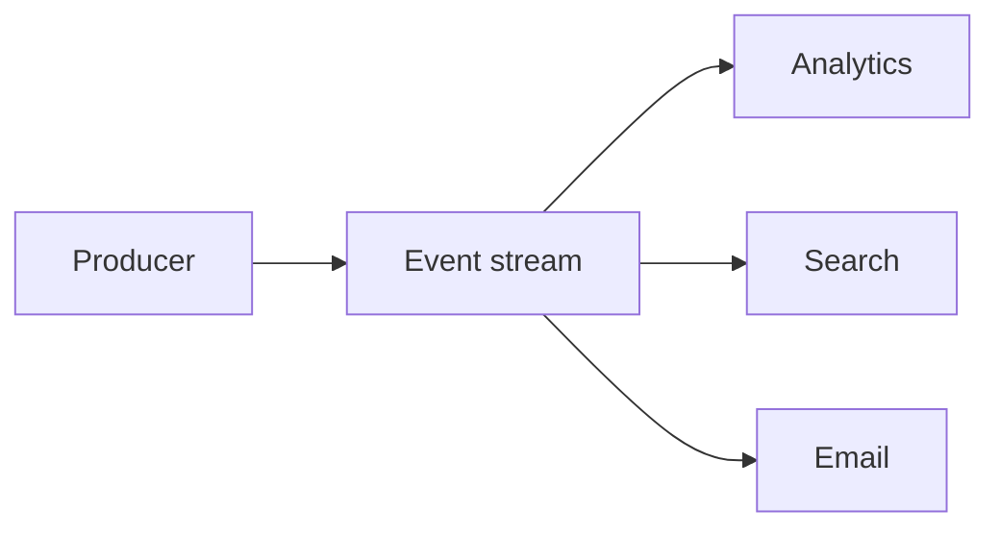

### Event stream vs message queue

| | Message queue | Event stream |
|---|---------------|--------------|
| **Flow** | Producer → Queue → Consumer | Producer → Stream → A, B, C |
| **After processing** | Message usually removed | Event **remains stored** |
| **Re-read** | No (unless DLQ/retry) | Yes — replay from offset |

### Key idea: events are not deleted immediately

```text
Traditional queue:  message processed → deleted

Event stream:     event processed → still stored → consumers can replay later
```

### Log-based storage

Most streaming systems use an **append-only log**.

```text
Offset 0 → User Registered
Offset 1 → Login
Offset 2 → Order Created
Offset 3 → Payment Completed

New events appended; nothing updated in-place.
```

### Offset

Every event has a unique position in the log.

```text
Offset 0, 1, 2, 3…

Consumer: "I processed until Offset 2" → next read from Offset 3
```

Kafka partitions: [§6.5 Kafka](#65-kafka).

### Event retention

Events stored for a configurable period.

```text
Retention = 7 days → events available for replay even after consumers process them
```

### Event replay

Replay is a major advantage — e.g. analytics bug fixed → replay from Offset 0.

```text
Stored events → replay → consumer reprocesses history
```

Detail: [§6.21 Event Replay](#621-event-replay).

### Real-world example

```text
Customer places order → Order Created event

Consumers (independently):
  Inventory, Email, Analytics, Recommendation
```

### Partitions

Large streams split into **partitions** for parallelism.

```text
Topic: Partition 0 | Partition 1 | Partition 2

Order 101 → P0,  Order 102 → P1,  Order 103 → P2
```

Benefits: parallel processing, higher throughput, better scalability. See [§6.5 Kafka](#65-kafka).

### Ordering

**Within a partition:** order preserved.

```text
P0: Offset 0 Order Created → Offset 1 Payment → Offset 2 Shipped
```

**Across partitions:** ordering **not** guaranteed. See [§6.11 Ordering Guarantees](#611-ordering-guarantees).

### Consumer groups

A **consumer group** = consumers working together; each partition assigned to one consumer in the group.

```text
Partition 0 → Consumer 1
Partition 1 → Consumer 2
Partition 2 → Consumer 3
```

Benefits: parallelism, load balancing. See [§6.5 Kafka](#65-kafka).

### Multiple consumer groups

```text
Orders Topic → Analytics Group (all events)
            → Email Group (all events)
            → Inventory Group (all events)

Inside a group: each event processed once
Across groups: every group receives all events
```

### Event-driven architecture

Services communicate via events — no direct service-to-service calls for every reaction.

```text
Order Service → Order Created → Email / Analytics / Inventory
```

See [§6.4 Event Driven Architecture](#64-event-driven-architecture).

### Stream processing

Process events as they arrive.

Examples: fraud detection, recommendations, real-time analytics, stock trading, IoT monitoring.

### Batch processing vs streaming

| | Batch | Streaming |
|---|-------|-----------|
| **Pattern** | Collect → process every hour | Event → immediate processing |
| **Latency** | Minutes or hours | Milliseconds or seconds |

### Exactly-once processing

If a consumer crashes after processing: risk of duplicates or missed events.

Streaming systems (e.g. Kafka) provide **exactly-once semantics (EOS)** mechanisms.

See [§6.14 Exactly Once Delivery](#614-exactly-once-delivery).

### Event sourcing relationship

Event sourcing stores all state changes as events; current state = replay of events.

```text
Account Created → Money Deposited → Money Withdrawn
```

Event streaming often acts as the **transport layer** for event sourcing. See [§6.17 Event Sourcing](#617-event-sourcing).

### Popular event streaming systems

| System | Notes | Section |
|--------|-------|---------|
| **Apache Kafka** | Most popular; distributed; high throughput | [§6.5](#65-kafka) |
| **Apache Pulsar** | Multi-tenant; distributed | [§6.10](#610-pulsar) |
| **Amazon Kinesis** | AWS managed | — |
| **Redpanda** | Kafka-compatible; no JVM | — |
| **Azure Event Hubs** | Cloud-native streaming | — |

### Common use cases

| Use case | Flow |
|----------|------|
| **Real-time analytics** | Website → stream → dashboard |
| **Fraud detection** | Payment → stream → fraud engine |
| **Recommendations** | User click → stream → recommendation engine |
| **IoT monitoring** | Sensors → stream → monitoring |
| **Activity tracking** | User actions → stream → analytics |

### Advantages

- Real-time processing
- High throughput
- Replay capability
- Decoupled services
- Horizontal scalability
- Durable storage
- Event history preserved

### Disadvantages

- More operational complexity
- Event schema management — [§6.23 Schema Registry](#623-schema-registry)
- Ordering challenges
- Storage requirements (retention)
- Debugging can be difficult

### Message queue vs pub/sub vs event streaming

| | Message queue | Pub/sub | Event streaming |
|---|---------------|---------|-----------------|
| **Purpose** | Work distribution | Event distribution | Continuous event processing |
| **Consumers** | One per message | Many | Many (independent groups) |
| **Removed after use?** | Usually yes | Usually yes | **No** — retained |
| **Example** | Payment job | Notifications | Analytics + monitoring + replay |

### Summary

Event streaming is a durable, append-only log of facts consumed in real time and replayed on demand.

```text
Producer → append-only stream (offsets, partitions) → many consumer groups
```

**Key ideas:** immutability, retention, offsets, partitions, consumer groups, replay.

**Goal:** Real-time, scalable event pipelines with a permanent (retained) event history.

---


## 6.4 Event Driven Architecture

### What is EDA?

Event-driven architecture (EDA) is a software architecture pattern where services communicate through **events** instead of direct synchronous calls.

A service publishes an event when something happens; other interested services react to that event.

**Key idea:** services communicate by events, not by direct calls.

Building blocks: [§6.1 Message Queues](#61-message-queues), [§6.2 Pub/Sub](#62-publish-subscribe), [§6.3 Event Streaming](#63-event-streaming).

### What is an event?

An event represents something that **happened** (past tense).

Examples: User Registered, Order Created, Payment Completed, Product Added to Cart, Order Shipped.

```json
{
  "eventType": "ORDER_CREATED",
  "orderId": 1001,
  "timestamp": "2026-06-25T10:00:00Z"
}
```

Events are: **immutable**, **historical facts**, **time-ordered**, **replayable**.

### Why EDA?

**Traditional (synchronous wiring):**

```text
Order Service → Payment, Email, Inventory (direct calls)
```

Problems: tight coupling, hard to scale, cascading failures, difficult maintenance.

**Event-driven:**

```text
Order Service → Order Created Event → Payment / Email / Inventory
```

Benefits: loose coupling, scalability, flexibility, fault tolerance.

### Core components

| Component | Role | Examples |
|-----------|------|----------|
| **Event producer** | Generates events | Order, User, Payment services |
| **Event broker** | Receives and distributes events | Kafka [§6.5](#65-kafka), RabbitMQ [§6.8](#68-rabbitmq), Pulsar [§6.10](#610-pulsar) |
| **Event consumer** | Listens and reacts | Analytics, Email, Inventory |

### High-level flow

```text
Producer → Event Broker → Consumer A / B / C

Producer does not know consumers; consumers do not know producer.
```

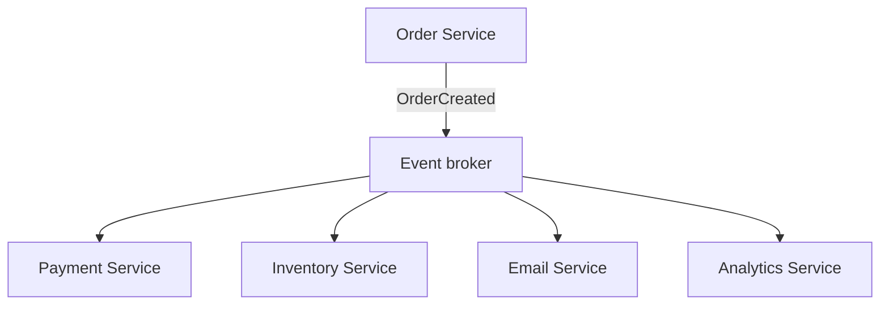

### Real-world example

```text
Customer places order → Order Service → Order Created Event

React independently:
  Payment, Inventory, Email, Analytics
```

### Synchronous vs event-driven

| | Synchronous | Event-driven |
|---|-------------|--------------|
| **Flow** | Order → Payment → Email (chain waits) | Order publishes event → returns immediately |
| **Problems** | High latency, dependencies, failure propagation | — |
| **Benefits** | Simple to trace in one request | Low latency response, decoupled, scalable |

### Event flow example

```text
Step 1: User creates order
Step 2: Order Service stores order
Step 3: Order Service publishes { "event": "ORDER_CREATED" }
Step 4: Consumers react:
  Inventory → reserve stock
  Email → send confirmation
  Analytics → update dashboard
```

### Event choreography

Services react to events **independently** — no central coordinator.

```text
Order Created → Payment Service → Payment Completed
             → Shipping Service → Order Shipped
```

| Pros | Cons |
|------|------|
| Fully decoupled, easy scaling, no central bottleneck | Hard debugging, hard to track flow, complex event chains |

Common with pub/sub and streams. Distributed sagas often use choreography.

### Event orchestration

A **central orchestrator** controls the workflow.

```text
Order Service → Order Orchestrator → Payment / Inventory / Shipping
```

| Pros | Cons |
|------|------|
| Easier monitoring, debugging, workflow control | Central dependency, potential bottleneck |

Saga orchestration patterns: [Chapter 8 — Microservices](../08-microservices/README.md).

### Choreography vs orchestration

| | Choreography | Orchestration |
|---|--------------|---------------|
| **Control** | Distributed | Centralized |
| **Communication** | Events | Commands / directed steps |
| **Coupling** | Very low | Higher |
| **Debugging** | Harder | Easier |

### Eventual consistency

In EDA, services update independently — for a short time, order data may differ from inventory data; **eventually** all converge.

See [Chapter 4 — Eventual Consistency](../04-distributed-system/README.md#417-eventual-consistency).

### Event schema

Events should follow a defined structure for compatibility.

```json
{
  "eventType": "PAYMENT_COMPLETED",
  "paymentId": 100,
  "orderId": 50,
  "timestamp": "2026-06-25"
}
```

Versioning and registry: [§6.22 Event Versioning](#622-event-versioning), [§6.23 Schema Registry](#623-schema-registry).

### Idempotency

Under at-least-once delivery, the same event may arrive twice — consumers must handle duplicates safely (e.g. dedupe by **event ID**).

See [§6.13 At Least Once Delivery](#613-at-least-once-delivery).

Delivery semantics: [§6.12–§6.14](#612-at-most-once-delivery).

### Failure handling

```text
Order Created → Email Service fails → retry
If retries exhausted → Dead Letter Queue (DLQ)
```

[§6.15 Dead Letter Queue](#615-dead-letter-queue), [§6.16 Retry Queue](#616-retry-queue).

### Common EDA patterns

| Pattern | Idea | Section |
|---------|------|---------|
| **Pub/sub** | Publisher → topic → many subscribers | [§6.2](#62-publish-subscribe) |
| **Event streaming** | Durable log; events retained | [§6.3](#63-event-streaming) |
| **Event sourcing** | State = replay of all events | [§6.17](#617-event-sourcing) |
| **CQRS** | Separate write and read models | [§6.18](#618-cqrs) |

### EDA in microservices

Microservices + EDA is a common combination.

Benefits: independent deployment, independent scaling, loose coupling, fault isolation.

```text
User, Order, Payment, Inventory services — communicate through events
```

### Popular technologies

| Technology | Section |
|------------|---------|
| Apache Kafka | [§6.5](#65-kafka) |
| RabbitMQ | [§6.8](#68-rabbitmq) |
| Apache Pulsar | [§6.10](#610-pulsar) |
| Amazon SNS / EventBridge, Azure Event Hubs, Google Pub/Sub | Managed cloud |

### Use cases

| Domain | Event | Triggers |
|--------|-------|----------|
| **E-commerce** | Order Created | Payment, inventory, shipping, notification |
| **Banking** | Transaction | Fraud detection, notifications, auditing |
| **Ride sharing** | Ride Requested | Driver matching, pricing, notifications |
| **IoT** | Sensor reading | Monitoring, alerts, analytics |
| **Social media** | User activity | Feed updates, recommendations, analytics |

### Advantages

- Loose coupling
- Scalability
- High availability
- Fault isolation
- Real-time processing
- Easier service evolution
- Better extensibility

### Disadvantages

- Complex debugging (need tracing/correlation IDs)
- Eventual consistency
- Event schema management
- Monitoring challenges
- Duplicate event handling

### Summary

EDA centers systems on **domain events** instead of synchronous call chains.

```text
Producer publishes fact → broker → independent consumers react
```

**Key ideas:** choreography vs orchestration, eventual consistency, idempotency, schema versioning.

**Goal:** Build scalable, evolvable systems where services react to what happened without tight point-to-point coupling.

---


## 6.5 Kafka

### What is Apache Kafka?

Apache Kafka is a distributed **event streaming** platform for real-time data pipelines, event-driven systems, and streaming applications.

Designed for: high throughput, fault tolerance, scalability, durability, real-time processing.

```text
Think of Kafka as: "A distributed commit log"
or: "A highly scalable event streaming platform"
```

Context: [§6.3 Event Streaming](#63-event-streaming), [§6.4 EDA](#64-event-driven-architecture).

### Why Kafka?

**Traditional queue problems:** limited scalability, messages deleted after consumption, difficult replay, lower throughput.

**Kafka provides:** millions of events/sec, durable storage, event replay, horizontal scaling, multiple independent consumers.

### Where Kafka is used

Companies: Netflix, Uber, LinkedIn, Airbnb, Amazon, banking, e-commerce.

Use cases: event streaming, log aggregation, analytics, fraud detection, monitoring, IoT processing.

### Kafka high-level architecture

```text
Producer → Kafka → Consumer A / B / C

Producer writes events; consumers read independently.
```

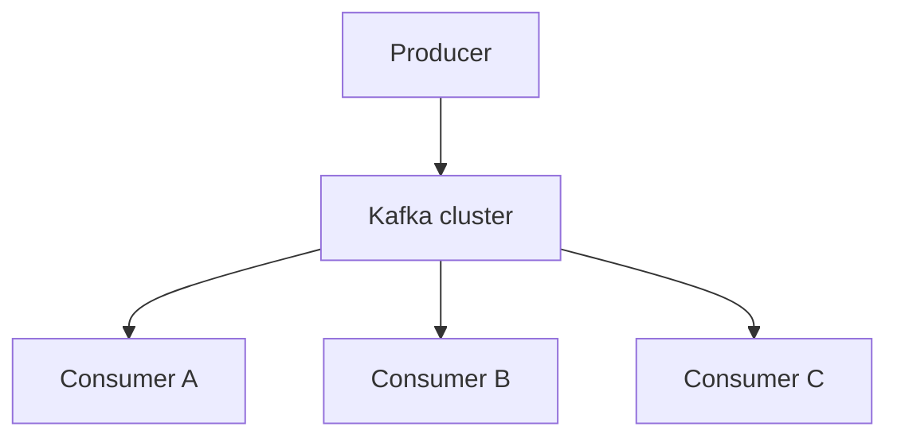

### Core components

| # | Component | Role |
|---|-----------|------|
| 1 | **Producer** | Sends events |
| 2 | **Topic** | Logical category of events |
| 3 | **Partition** | Parallel shard of a topic |
| 4 | **Broker** | Kafka server storing data |
| 5 | **Consumer** | Reads events |
| 6 | **Consumer group** | Consumers sharing work |
| 7 | **Offset** | Position in partition log |
| 8 | **ZooKeeper** | Legacy cluster metadata |
| 9 | **KRaft** | Modern metadata mode (Kafka Raft) |

### Topic

A topic is a logical category of events.

```text
Examples: orders, payments, users

Orders topic: Order Created, Order Paid, Order Shipped
```

Producer writes to topic; consumers read from topic.

### Partition

Topics are split into partitions for parallelism.

```text
Orders Topic → Partition 0 | Partition 1 | Partition 2

Order 101 → P0,  Order 102 → P1,  Order 103 → P2
```

Benefits: parallelism, scalability, load distribution.

### Broker

Kafka server = **broker**. Cluster example: Broker 1, Broker 2, Broker 3.

Responsibilities: store data, handle requests, replicate partitions, serve consumers.

### Producer

Sends messages to Kafka.

```text
Order Service → send(event) → Orders Topic
```

Partition choice: hash of **key** (or round-robin if no key).

### Consumer

Reads messages from Kafka.

```text
Orders Topic → poll() → Analytics Service
```

### Offset

Every message has a unique offset in its partition.

```text
Partition 0:
  Offset 0 → Order Created
  Offset 1 → Payment Completed
  Offset 2 → Order Shipped
```

Consumer remembers last offset (e.g. 100) → after restart, continue from 101.

Benefits: recovery, replay, fault tolerance. Replay: [§6.21 Event Replay](#621-event-replay).

### Message flow

```text
Producer → Topic → Partition → Broker → Consumer
```

### Ordering guarantee

**Within a partition:** strict order. **Across partitions:** not guaranteed. Keys, idempotent producer, trade-offs: [§6.11 Ordering Guarantees](#611-ordering-guarantees).

### Keys in Kafka

Producer may set a **key** (e.g. customer ID = 123).

```text
Hash(123) → Partition 2

All events for customer 123 → same partition → ordering per customer
```

### Replication

Partitions are replicated for fault tolerance.

```text
Partition 0 — Leader
              +--> Follower 1
              +--> Follower 2
```

**Replication factor (RF) = 3** → three copies of data.

Producer writes to **leader**; followers replicate. Consumers read from leader (by default).

### ISR (in-sync replicas)

**ISR** = replicas fully caught up with the leader.

```text
Leader + Replica A (ISR) + Replica B (ISR)
```

Kafka elects new leaders only from ISR members.

### Leader election

```text
Before: Broker 1 = leader, Broker 2/3 = followers
Leader crashes → Broker 2 elected leader from ISR
```

Related: [Chapter 5 — Leader Election](../05-distributed-databases/README.md#524-leader-election).

### Consumer group

Multiple consumers in one **group** share partition work.

```text
Partition 0 → Consumer 1
Partition 1 → Consumer 2
Partition 2 → Consumer 3
```

**Rule:** one partition → at most **one** consumer per group (3 partitions, 3 consumers = full utilization).

### Multiple consumer groups

```text
Orders Topic → Analytics Group (all messages)
            → Email Group (all messages)
            → Fraud Group (all messages)

Inside a group: each message processed once
Across groups: every group receives all messages
```

### Consumer group operations (production)

**Assignment example:**

```text
Topic orders: 12 partitions (P0..P11), group checkout-workers: 4 consumers

C1 → P0–P2,  C2 → P3–P5,  C3 → P6–P8,  C4 → P9–P11
Max useful consumers = partition count (13th consumer sits idle)
```

**Rebalance triggers:** consumer join/leave, crash, `max.poll.interval.ms` exceeded, partition count change, rolling deploy.

| Setting | Typical prod | Pitfall if wrong |
|---------|--------------|----------------|
| `max.poll.interval.ms` | 5–15 min | Too low → rebalance during slow handler |
| `enable.auto.commit` | **false** | Commit before process → message loss |
| `partition.assignment.strategy` | `CooperativeStickyAssignor` | Less churn than range assignor |
| `group.instance.id` | static per pod | Rolling deploy without rebalance storm |

**Consumer lag:**

```text
lag = log_end_offset − committed_offset
```

Alert on sustained high lag; one hot partition → bad key skew (`key=null`).

**Commit order (at-least-once):**

```text
process(message) → then commit(offset)   # handler must be idempotent
```

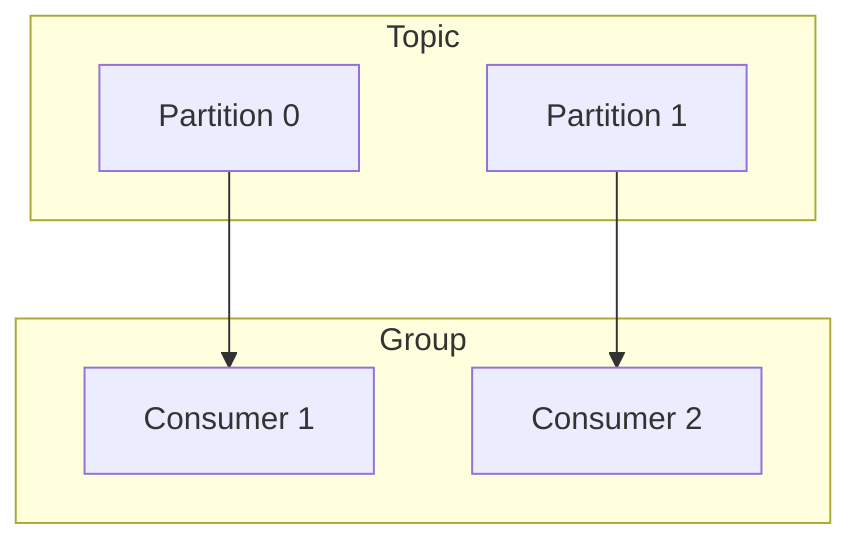

### Retention

Kafka retains data after consumption.

```text
Retention = 7 days → messages available for replay
```

### Message replay

```text
Consumer offset = 100 → reset to 0 → reprocess from start
```

Benefits: recovery, debugging, rebuilding downstream systems.

### Acknowledgements (`acks`)

| Setting | Behavior | Trade-off |
|---------|----------|-----------|
| **`acks=0`** | Producer does not wait | Fastest; least reliable |
| **`acks=1`** | Leader confirms | Balanced |
| **`acks=all`** | All ISR replicas confirm | Most reliable (production default) |

Pair with `min.insync.replicas=2` when `replication.factor=3`.

### Exactly-once semantics (EOS)

Consumer crash can cause duplicate processing. Kafka supports:

- Idempotent producer
- Transactions
- Exactly-once processing (read-process-write)

See [§6.14 Exactly Once Delivery](#614-exactly-once-delivery). Most teams use at-least-once + idempotent consumers.

### Log compaction

Keeps **latest value per key** instead of all history.

```text
User1 → A, User1 → B, User1 → C  →  compacted: User1 → C
```

Useful for caches, user profiles, current-state topics.

### Kafka KRaft

| | Legacy | Modern |
|---|--------|--------|
| **Metadata** | Kafka + ZooKeeper | Kafka + **KRaft** (Kafka Raft metadata mode) |
| **Benefits** | — | Simpler ops, faster leader election, no ZooKeeper |

### Kafka ecosystem

| Component | Purpose |
|-----------|---------|
| **Kafka Producer / Consumer** | Write and read events |
| **Kafka Streams** | Real-time stream processing |
| **Kafka Connect** | Database ↔ Kafka integration |
| **Schema Registry** | Event schemas — [§6.23](#623-schema-registry) |

### Real-world example

```text
Customer places order → Order Service → Orders Topic
  → Payment, Email, Analytics, Inventory (one event, many consumers)
```

### Kafka vs RabbitMQ

| | Kafka | RabbitMQ |
|---|-------|----------|
| **Purpose** | Event streaming | Message queue |
| **Storage** | Persistent log | Queue |
| **Replay** | Supported | Limited |
| **Throughput** | Very high | Lower |

RabbitMQ detail: [§6.8 RabbitMQ](#68-rabbitmq).

### Advantages

- Extremely high throughput
- Durable storage
- Event replay
- Horizontal scaling
- Fault tolerant
- Distributed architecture
- Strong ecosystem

### Disadvantages

- Operational complexity
- Storage management
- Ordering only within partition
- Learning curve
- Monitoring required (consumer lag, ISR)

### Production essentials

| Setting | Production guidance |
|---------|---------------------|
| `replication.factor` | **3** |
| `min.insync.replicas` | **2** (with RF=3) |
| `acks` | **`all`** |
| `enable.idempotence` | **true** on producers |
| `unclean.leader.election.enable` | **false** |
| Partitions | Plan upfront — `partitions ≥ write_RPS / consumer_speed` |

**Pitfalls:** hot partition (`key=null`), treating Kafka as a task queue (use retry topics + [§6.15 DLQ](#615-dead-letter-queue)), no lag alerts.

### Summary

Kafka is a distributed, replicated commit log with topics, partitions, and consumer groups.

```text
Producer → topic/partition (offsets) → consumer groups (independent fan-out + replay)
```

**Key ideas:** per-key ordering, ISR replication, offsets, retention, `acks`, KRaft.

**Goal:** Durable, high-throughput event backbone for real-time and replayable pipelines.

---


## 6.6 Kafka Partitions

> **Canonical coverage:** partitions, keys, ordering, and scaling rules are in [§6.5 Kafka — Partition](#65-kafka), [Keys in Kafka](#65-kafka), and [Ordering guarantee](#65-kafka). This entry is a sub-topic index only.

| Quick reference | Detail in §6.5 |
|----------------|----------------|
| Ordering | [§6.11 Ordering Guarantees](#611-ordering-guarantees) |
| Partition key | `hash(key) % N` |
| Scale consumers | ≤ partition count per group |
| Pitfall | Too few partitions caps throughput; too many adds metadata overhead |

---


## 6.7 Kafka Consumer Groups

> **Canonical coverage:** consumer groups, fan-out across groups, and production ops are in [§6.5 Kafka — Consumer group](#65-kafka), [Multiple consumer groups](#65-kafka), and [Consumer group operations (production)](#65-kafka). This entry is a sub-topic index only.

| Quick reference | Detail in §6.5 |
|----------------|----------------|
| Same `group.id` | Partitions shared among members |
| Different groups | Independent reads of same topic |
| Max consumers | One per partition per group |
| Ops | Lag, rebalance, commit-after-process |

---


## 6.8 RabbitMQ

### What is RabbitMQ?

RabbitMQ is an open-source **message broker** that implements **AMQP** (Advanced Message Queuing Protocol).

It sits between producers and consumers and ensures reliable delivery of messages.

```text
Producer → RabbitMQ → Consumer
```

Primarily used for: message queuing, asynchronous processing, work distribution, service decoupling, reliable messaging.

Compare: [§6.5 Kafka](#65-kafka) (event streaming log vs queue broker).

### Why RabbitMQ?

**Without RabbitMQ:**

```text
Order Service → Email Service
Email down → request may fail
```

**With RabbitMQ:**

```text
Order Service → RabbitMQ Queue → Email Service
Email down → message waits in queue
```

Benefits: reliability, decoupling, fault tolerance, async processing.

### High-level architecture

```text
Producer → Exchange → Queue → Consumer
```

**Important:** producer **never** sends directly to a queue — producer sends to an **exchange**; the exchange routes to queue(s).

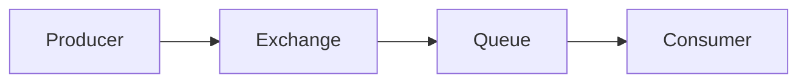

### Core components

| Component | Role |
|-----------|------|
| **Producer** | Creates and sends messages |
| **Exchange** | Routes messages to queues |
| **Queue** | Stores messages until consumed |
| **Binding** | Links exchange to queue |
| **Consumer** | Reads and processes messages |
| **Broker** | RabbitMQ server |
| **Routing key** | Used by exchange for routing |

### Broker

RabbitMQ server responsibilities: receive, store, route, and deliver messages.

### Producer

```text
Order Service → RabbitMQ

{ "orderId": 1001, "event": "ORDER_CREATED" }
```

### Queue

Stores messages until consumed and **acknowledged**.

```text
+----------------+
| Order Queue    |
+----------------+
```

### Consumer

```text
Email Service: read → process → send ACK
```

### Exchange

The central routing concept.

```text
Producer → Exchange → Queue A
                    → Queue B

Exchange decides: "Where should this message go?"
```

### Binding

Connection between **exchange** and **queue**.

```text
Orders Exchange → Order Queue
               → Analytics Queue
```

Binding + routing key determine routing.

### Routing key

Producer attaches a routing key; exchange uses it to route.

```text
Examples: order.created, order.shipped, payment.completed
```

### Message flow

```text
Producer → Exchange → Queue → Consumer
```

### Exchange types

| Type | Routing |
|------|---------|
| **Direct** | Exact routing key match |
| **Fanout** | Broadcast to all bound queues |
| **Topic** | Pattern match (`*`, `#`) |
| **Headers** | Match message headers (less common) |

#### Direct exchange

Routes using **exact** routing key match.

```text
Routing key order.created → Direct Exchange → Order Queue only

order.shipped → Shipping Queue
```

#### Fanout exchange

Broadcasts to **all** bound queues — no routing key needed.

```text
Producer → Fanout Exchange → Queue A, B, C (all receive)
```

Used for notifications and pub/sub. See [§6.2 Publish Subscribe](#62-publish-subscribe).

#### Topic exchange

Pattern matching on routing keys.

```text
Binding pattern order.* matches order.created, order.shipped, order.cancelled
```

**Wildcards:**

| Symbol | Meaning | Example |
|--------|---------|---------|
| `*` | Exactly one word | `order.*` → `order.created` |
| `#` | Zero or more words | `order.#` → `order.created.payment` |

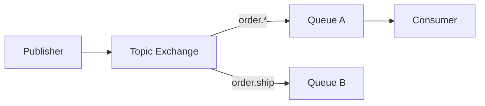

#### Headers exchange

Routes on message headers (e.g. `country=India`, `type=Premium`) instead of routing key.

### Acknowledgements (ACK)

```text
Consumer receives message → processes → sends ACK → RabbitMQ deletes message

No ACK (e.g. consumer crash) → message remains available for redelivery
```

See [§6.13 At Least Once Delivery](#613-at-least-once-delivery).

### Message durability

| | Effect |
|---|--------|
| **Durable queue** | Queue survives broker restart |
| **Persistent message** | Message written to disk |

For maximum reliability: use **both** durable queue and persistent messages.

### Redelivery

```text
Consumer crashes before ACK → RabbitMQ redelivers → no message loss (at-least-once)
```

### Dead letter queue (DLQ)

After repeated failures, message moves to DLQ.

```text
Queue → retry failed → DLQ (debug / manual fix)
```

Detail: [§6.15 Dead Letter Queue](#615-dead-letter-queue).

### Prefetch count

Limits unacked messages per consumer.

```text
Prefetch = 5 → consumer holds at most 5 messages at once → prevents overload
```

### Competing consumers

Multiple consumers on the same queue — each message processed by **one** consumer.

```text
Queue → Consumer 1 / Consumer 2 / Consumer 3
```

Benefits: load balancing, higher throughput. See [§6.1 Message Queues](#61-message-queues).

### Pub/sub using RabbitMQ

```text
Producer → Fanout Exchange → Email / Analytics / SMS
```

All bound queues receive the same message.

### Ordering

| Setup | Ordering |
|-------|----------|
| **Single queue, single consumer** | Preserved |
| **Multiple competing consumers** | Not guaranteed |

See [§6.11 Ordering Guarantees](#611-ordering-guarantees).

### Clustering

```text
Node 1 | Node 2 | Node 3 → high availability, scalability
```

### Quorum queues

Modern queue type using **Raft consensus** (preferred over classic mirrored queues).

Benefits: high availability, better reliability, fault tolerance.

### RabbitMQ vs Kafka

| | RabbitMQ | Kafka |
|---|----------|-------|
| **Purpose** | Message queue / task processing | Event streaming |
| **Replay** | Limited | Strong |
| **Latency** | Very low | Low |
| **Throughput** | Moderate | Extremely high |
| **Routing** | Excellent (exchanges) | Topic + partition key |
| **Model** | Delete on ACK | Retained log |

Detail: [§6.5 Kafka](#65-kafka).

### When to use RabbitMQ?

- Background jobs
- Email / order processing
- Task queues
- Microservice communication
- RPC-style messaging
- Workflow systems

### When to use Kafka?

- Event streaming
- Real-time analytics
- Clickstream data
- Audit logs
- Event sourcing — [§6.17](#617-event-sourcing)
- Big data pipelines

### Advantages

- Easy to use
- Reliable delivery
- Flexible routing (exchange types)
- Supports retries and DLQ
- Good for microservices

### Disadvantages

- Lower throughput than Kafka
- Limited event replay
- Queue storage growth if consumers lag
- Complex cluster management

### Summary

RabbitMQ routes messages **producer → exchange → queue → consumer** with flexible AMQP routing.

```text
Key concepts: exchange, binding, routing key, ACK, durability, prefetch, competing consumers
```

**Goal:** Reliable async work distribution and decoupling with rich broker-side routing.

---


## 6.9 ActiveMQ

### What is Apache ActiveMQ?

Apache ActiveMQ is an open-source **message broker** for communication between distributed applications.

Implements: **JMS** (Java Message Service), **AMQP**, **MQTT**, **STOMP**, **OpenWire**.

Used for: enterprise messaging, asynchronous communication, system integration, microservices messaging, event-driven systems.

Compare: [§6.8 RabbitMQ](#68-rabbitmq) (AMQP-native), [§6.5 Kafka](#65-kafka) (streaming).

### What is a message broker?

```text
Without broker:  Service A → Service B (direct dependency)

With ActiveMQ:   Service A → ActiveMQ → Service B

Benefits: decoupling, reliability, scalability
```

### Why ActiveMQ?

**Distributed system problems:** tight coupling, service downtime, slow processing, request failures.

**ActiveMQ solution:**

```text
Producer → Queue → Consumer
Messages stored safely until processed
```

### Core components

| Component | Role |
|-----------|------|
| **Producer** | Sends messages |
| **Consumer** | Receives and processes messages |
| **Queue** | Point-to-point destination |
| **Topic** | Publish-subscribe destination |
| **Broker** | ActiveMQ server |
| **Message** | Payload + headers |
| **Connection factory** | JMS entry point for connections |
| **Destination** | Queue or topic |

### Broker

ActiveMQ server responsibilities: accept, store, route, and deliver messages.

### Producer

```text
Order Service → ActiveMQ

{ "orderId": 1001, "event": "ORDER_CREATED" }
```

### Consumer

```text
Email Service: read → process → acknowledge
```

### Destination

Where messages are sent — two types: **queue** or **topic**.

### Queue model (point-to-point)

One message → **one** consumer.

```text
Producer → Queue → Consumer

Order queue with Consumers A, B, C — only ONE gets each message
```

See [§6.1 Message Queues](#61-message-queues).

### Topic model (publish-subscribe)

One message → **many** consumers.

```text
Producer → Topic → A, B, C (all receive)

Order Created → Email, Analytics, Inventory
```

See [§6.2 Publish Subscribe](#62-publish-subscribe).

### Queue vs topic

| | Queue | Topic |
|---|-------|-------|
| **Consumers** | One per message | Many |
| **Copies** | Single | Multiple |
| **Use case** | Task processing | Event broadcasting |

### Message flow

```text
Producer → Broker → Queue/Topic → Consumer
```

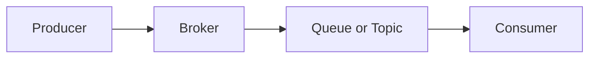

### JMS (Java Message Service)

JMS is the Java API for messaging; ActiveMQ is a popular **JMS provider**.

**JMS components:** ConnectionFactory, Connection, Session, Producer, Consumer, Destination.

```text
Application → ConnectionFactory → Connection → Session → Producer/Consumer
```

### Message types

| Type | Example |
|------|---------|
| **TextMessage** | `"Order Created"` |
| **ObjectMessage** | Java object |
| **MapMessage** | Key-value pairs |
| **BytesMessage** | Binary data |
| **StreamMessage** | Stream of values |

### Message persistence

| Mode | Behavior |
|------|----------|
| **Persistent** | Stored on disk; survives broker restart |
| **Non-persistent** | Memory only; faster, less reliable |

### Acknowledgements

```text
Consumer → ACK → broker removes message
No ACK (crash) → broker redelivers
```

See [§6.13 At Least Once Delivery](#613-at-least-once-delivery).

### Delivery modes

| Mode | Trade-off |
|------|-----------|
| **Persistent** | Reliable; slower |
| **Non-persistent** | Fast; less reliable |

### Message selectors

Consumers filter messages — e.g. only `type='payment'`.

### Durable vs non-durable subscribers (topics)

| | Durable | Non-durable |
|---|---------|-------------|
| **Subscriber offline** | Messages retained; delivered on return | Messages lost |
| **Use** | Must-not-miss events | Fire-and-forget notifications |

### Request-reply pattern

```text
Client → request queue → Server → response queue → Client
```

Similar to RPC over messaging.

### Message groups

Route related messages to the same consumer for **ordered** processing (e.g. all events for Customer 101).

### Dead letter queue (DLQ)

```text
Retries exhausted → message moved to DLQ (debugging, stop endless retry)
```

See [§6.15 Dead Letter Queue](#615-dead-letter-queue).

### Network of brokers

```text
Broker A ↔ Broker B ↔ Broker C
```

Benefits: scalability, geographic distribution.

### High availability

```text
Master broker → slave broker (failover)
Modern: shared storage HA, replicated storage
```

### ActiveMQ Artemis

**Apache ActiveMQ Artemis** — modern implementation.

Benefits: faster, better scalability and clustering, improved performance. **Recommended for new ActiveMQ deployments.**

### ActiveMQ vs RabbitMQ

| | ActiveMQ | RabbitMQ |
|---|----------|----------|
| **Strength** | Strong JMS; enterprise Java | Flexible AMQP routing |
| **Best for** | Java enterprise applications | General-purpose messaging |

Detail: [§6.8 RabbitMQ](#68-rabbitmq).

### ActiveMQ vs Kafka

| | ActiveMQ | Kafka |
|---|----------|-------|
| **Purpose** | Message queue | Event streaming |
| **Storage** | Queue-based | Log-based |
| **Replay** | Limited | Excellent |
| **Use cases** | Task processing | Analytics, streaming |

Detail: [§6.5 Kafka](#65-kafka).

### When to use ActiveMQ?

- Enterprise Java applications
- JMS-based systems
- Banking, insurance, legacy enterprise integration
- Reliable task queues
- Request-reply messaging

### When to use ActiveMQ Artemis?

- Modern JMS applications
- High-throughput enterprise messaging
- Large-scale enterprise systems
- Cloud-native Java applications

### ActiveMQ Classic vs Artemis

| | ActiveMQ Classic | ActiveMQ Artemis |
|---|------------------|------------------|
| **Status** | Older implementation | Modern implementation |
| **Performance** | Moderate | Much faster |
| **Architecture** | Traditional | High-performance core |
| **Recommended** | Legacy maintenance | **Yes** for new systems |

### Advantages

- Strong JMS support
- Reliable messaging
- Queue and topic support
- Durable subscriptions
- Dead letter queues
- Request-reply support
- Enterprise-ready

### Disadvantages

- Lower throughput than Kafka
- More Java-centric
- Less suitable for event streaming
- Complex clustering
- Older Classic versions slower

### Summary

ActiveMQ is a multi-protocol enterprise broker with JMS queues/topics at its core.

```text
Producer → broker → queue (one consumer) or topic (many subscribers)
Prefer Artemis for new deployments; consider Kafka for streaming/replay at scale.
```

**Goal:** Reliable async messaging for Java enterprise and integrated distributed systems.

---


## 6.10 Pulsar

### What is Apache Pulsar?

**Apache Pulsar** is a distributed messaging and event-streaming platform designed for high throughput, low latency, scalability, multi-tenancy, and geo-replication.

It combines features of **message queues** (RabbitMQ-style) and **event streaming** (Kafka-style) in a single system.

Open-source publish-subscribe messaging, originally developed at Yahoo, now an **Apache Software Foundation** project.

Peers: Kafka, RabbitMQ, ActiveMQ — with a **different architecture** (storage/compute separation).

### Core components

1. **Producers** — publish messages
2. **Consumers** — subscribe and consume
3. **Topics** — logical channels (`orders`, `payments`, `notifications`)
4. **Brokers** — stateless serving layer (accept, route, serve consumers)
5. **BookKeeper** — persistent storage layer (ledgers)

### High-level architecture

```text
Producer → Pulsar broker → Apache BookKeeper → consumer
```

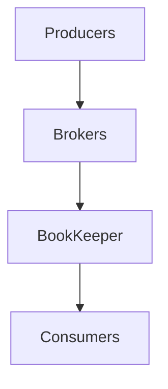

**Biggest difference from Kafka:** storage and compute are **separated**.

| | Kafka | Pulsar |
|---|-------|--------|
| **Broker** | Compute + storage (log segments on broker) | Compute only (stateless) |
| **Storage** | Inside broker | **BookKeeper** (ledgers) |

Scale brokers and storage **independently** — more flexible at large scale.

Detail: [§6.5 Kafka](#65-kafka).

### Brokers

Responsibilities: accept messages, serve consumers, route traffic, manage topics.

Brokers are **stateless** → easy horizontal scaling.

### BookKeeper

Persistent storage layer — messages stored in **ledgers** with replication, durability, and fault tolerance.

Optional **tiered storage** offload to object storage (S3) for long retention at lower cost.

### Topics and message flow

```text
Producer → topic → broker → BookKeeper → consumer
```

**Partitioned topics** (`orders` partition 0, 1, 2) for higher throughput — same idea as Kafka partitions.

### Subscriptions

Pulsar supports multiple subscription modes:

| Mode | Behavior | Ordering |
|------|----------|----------|
| **Exclusive** | One consumer only; second rejected | Per subscription |
| **Shared** | Multiple consumers; messages distributed (competing consumers) | Not per-message |
| **Failover** | One active + standby; standby takes over on failure | Per subscription |
| **Key_Shared** | Same message key → same consumer | **Per key** (like Kafka partition key) |

```text
Key = User123 → all User123 events → one consumer → ordering per user
```

### Ordering guarantees

- **Single partition:** ordering guaranteed
- **Multiple partitions:** ordering only **within** each partition

Same rule as Kafka — canonical detail: [§6.11 Ordering Guarantees](#611-ordering-guarantees).

### Message acknowledgments

```text
Consumer receives → processes → sends ACK → broker marks consumed
No ACK → message redelivered (at-least-once)
```

### Delivery guarantees

| Guarantee | Behavior |
|-----------|----------|
| **At-most-once** | May lose messages; no redelivery |
| **At-least-once** | No loss; duplicates possible |
| **Effectively once** | At-least-once + **idempotent** consumers |

Detail: [§6.12](#612-at-most-once-delivery) · [§6.13](#613-at-least-once-delivery) · [§6.14](#614-exactly-once-delivery).

### Message retention and event replay

Pulsar retains messages after consumption — useful for replay, recovery, and analytics.

```text
Reset consumer cursor / position → read old messages again
```

Similar to Kafka offset reset — [§6.21 Event Replay](#621-event-replay).

### Geo-replication

Built-in cross-region topic replication:

```text
Region A ↔ Region B — topics replicated automatically
```

Useful for disaster recovery and multi-region applications (Kafka typically needs MirrorMaker or cluster linking).

### Multi-tenancy

Strong Pulsar feature — single cluster, isolated **tenants** (Tenant A, B, C). Useful for SaaS and cloud platforms.

### Pulsar vs Kafka

| | Kafka | Pulsar |
|---|-------|--------|
| **Storage architecture** | Storage inside broker | BookKeeper (separated) |
| **Scaling** | Scale brokers (storage tied) | Independent compute + storage |
| **Geo-replication** | Additional setup | Built-in |
| **Multi-tenancy** | Basic | Strong |
| **Ecosystem** | Largest | Smaller |
| **Complexity** | Simpler ops | More components (brokers + BookKeeper) |

### Pulsar vs RabbitMQ

| | RabbitMQ | Pulsar |
|---|----------|--------|
| **Focus** | Message queue | Streaming + queueing |
| **Retention / replay** | Limited | Strong (log-style retention) |
| **Replay** | Not native | Native cursor reset |

Detail: [§6.8 RabbitMQ](#68-rabbitmq).

### Use cases

- Event streaming and microservices
- IoT, financial systems, analytics pipelines
- Real-time processing
- Multi-region and multi-tenant platforms

### Advantages

- Storage–compute separation and high scalability
- Built-in geo-replication and multi-tenancy
- Event replay and strong durability (BookKeeper)
- Flexible subscription modes (exclusive, shared, failover, key_shared)

### Disadvantages

- More components (brokers + BookKeeper + optional tiered storage)
- Higher operational complexity
- Smaller ecosystem and community than Kafka
- Steeper setup for small teams

### When to use Pulsar?

- Large-scale systems needing independent broker/storage scaling
- Multi-tenant SaaS backbones
- Multi-region deployments with built-in replication
- Event streaming where Kafka ops model is a poor fit

### When not to use?

- Small projects or simple point-to-point queues
- Teams new to messaging (Kafka/RabbitMQ lower barrier)
- When Kafka ecosystem (connectors, tooling) is required

### Summary

```text
Pulsar = queue + streaming unified; brokers stateless, BookKeeper stores ledgers
Choose for multi-tenant / multi-region scale; Kafka for ecosystem maturity
```

**Goal:** Kafka-like streaming with RabbitMQ-like flexibility and separated storage scaling.

---


## 6.11 Ordering Guarantees

Kafka context: [§6.5 Kafka](#65-kafka). This section is the **canonical** treatment of ordering (partitions, keys, producer config, consumer groups).

### What is ordering guarantee?

Ordering guarantee means Kafka ensures messages are consumed in the **same order they were produced**.

```text
Produced:  A → B → C
Consumed:  A → B → C   (not B → A → C)
```

### Key rule

```text
Kafka guarantees ordering ONLY within a single partition.
Kafka does NOT guarantee ordering across multiple partitions.
```

### Ordering scope

| Guaranteed | Not guaranteed |
|------------|----------------|
| Partition ordering | Topic-level ordering |
| | Global ordering |

### Single partition example

```text
Orders topic — Partition 0

Offset 0 → Order Created
Offset 1 → Payment Completed
Offset 2 → Order Shipped

Consumer reads: Created → Payment → Shipped
```

### Why ordering works

Kafka stores messages in an **append-only log** per partition.

```text
Partition 0: Offset 0, 1, 2, 3…
Written sequentially → read sequentially
```

### Multiple partitions

```text
Partition 0: A, C
Partition 1: B, D

Global order could be A B C D or B A D C — NOT guaranteed
```

### How Kafka decides partition

Producer sends **key + value**.

```text
Hash(key) → partition

CustomerID = 101 → always Partition 2
```

All messages for the same key land in the same partition.

### Key-based ordering

```text
Customer 101: Created → Updated → Deleted
Key = CustomerID 101 → Partition 2

Offsets 0 → Created, 1 → Updated, 2 → Deleted
```

### Without key

```text
Message A → Partition 0
Message B → Partition 2
Message C → Partition 1
→ ordering across related events may be lost
```

### Good practice

Use a **business identifier** as the key:

```text
OrderID, CustomerID, AccountID, UserID
→ related events stay in the same partition
```

### Producer retries and ordering

```text
Send M1, M2 — M1 fails, M2 succeeds, M1 retried later
Possible result: M2 before M1 → ordering broken
```

**Solution:** enable idempotent producer.

```properties
enable.idempotence=true
```

Kafka then avoids duplicates and preserves order per partition on retry.

### Max in-flight requests

Multiple in-flight requests can reorder on retry.

```properties
enable.idempotence=true
max.in.flight.requests.per.connection=5   # (or ≤5 with idempotence)
```

### Ordering with multiple producers

```text
Producer A and B both write to Partition 0
Interleaved by arrival: A1, B1, A2, B2 — stored in broker receive order
```

### Consumer group ordering

```text
Partition 0 → Consumer 1
Partition 1 → Consumer 2
Partition 2 → Consumer 3

Ordering preserved within each partition
```

**Rule:** one partition → at most **one** consumer per consumer group.

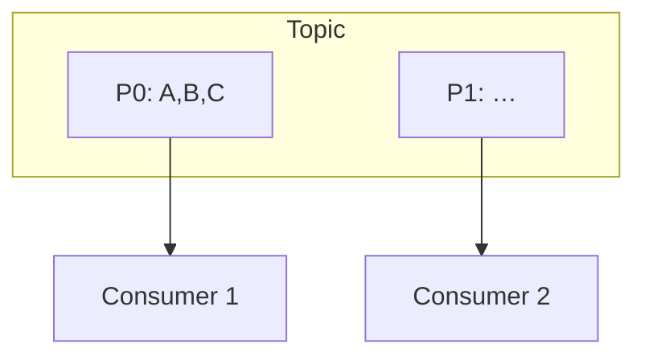

### Rebalancing

```text
Before: P0 → Consumer 1
New consumer joins → P0 → Consumer 2

Only one consumer reads a partition at a time → ordering intact
```

Detail: [§6.5 — Consumer group operations](#65-kafka).

### Ordering vs throughput

| | Single partition | Multiple partitions |
|---|------------------|---------------------|
| **Ordering** | Perfect (global for topic) | Per-key only |
| **Throughput** | Limited | High |
| **Trade-off** | Order vs scalability | |

### Achieving global ordering

**Option 1 — single partition**

```text
Topic → Partition 0 only → total ordering
Problem: limited scalability
```

**Option 2 — partition by entity (most common)**

```text
Key = OrderID / CustomerID / AccountID
→ ordering per entity, parallel across entities
```

### Real-world example

```text
Bank account: Deposit ₹1000 → Withdraw ₹500 → Withdraw ₹200

Wrong order → incorrect balance
Solution: AccountID as Kafka key → same partition → order preserved
```

### Ordering in replication

```text
Leader: Offset 0→A, 1→B, 2→C
Followers replicate in same order → identical log
```

### Ordering after leader failure

```text
Leader crashes → follower promoted
Follower copied offsets in order → ordering preserved
```

### Best practices

- Use message keys (business IDs)
- Enable idempotent producer
- Avoid unnecessary partitions for entities that need strict order
- Keep related events on the same key
- Design for **per-entity** ordering, not global

### Ordering in other brokers (brief)

| Broker | Ordering |
|--------|----------|
| **RabbitMQ** | Single queue + single consumer; competing consumers break order — [§6.8](#68-rabbitmq) |
| **Message queue** | FIFO per queue if one consumer — [§6.1](#61-message-queues) |
| **Pub/sub** | No cross-subscriber order — [§6.2](#62-publish-subscribe) |

### Summary

```text
Partition = unit of ordering in Kafka
Key = route related events to same partition
enable.idempotence = preserve order on producer retry
```

**Goal:** Per-entity (or global single-partition) ordering without assuming topic-wide FIFO.

---


## 6.12 At Most Once Delivery

> **Delivery guarantees hub:** canonical three-way comparison lives here. Detail for each guarantee: [§6.13](#613-at-least-once-delivery), [§6.14](#614-exactly-once-delivery).

### What is at-most-once delivery?

At-most-once delivery means a message is delivered **zero or one** time.

```text
✓ May be delivered once
✓ May be lost
✗ Never delivered twice
```

In simple words: *better to lose a message than process it more than once.*

### Delivery guarantee comparison (canonical)

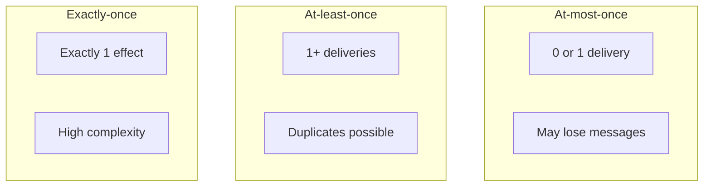

| | At most once | At least once | Exactly once |
|---|--------------|---------------|--------------|
| **Deliveries** | 0 or 1 | 1 or more | Exactly 1 |
| **Duplicates** | No | Possible | No |
| **Loss** | Possible | No* | No* |
| **Section** | §6.12 | [§6.13](#613-at-least-once-delivery) | [§6.14](#614-exactly-once-delivery) |

*With correct broker durability and consumer design.

### Visualization

```text
Producer → Queue/Broker → Consumer

Message may reach consumer once OR be lost — never duplicated.
```

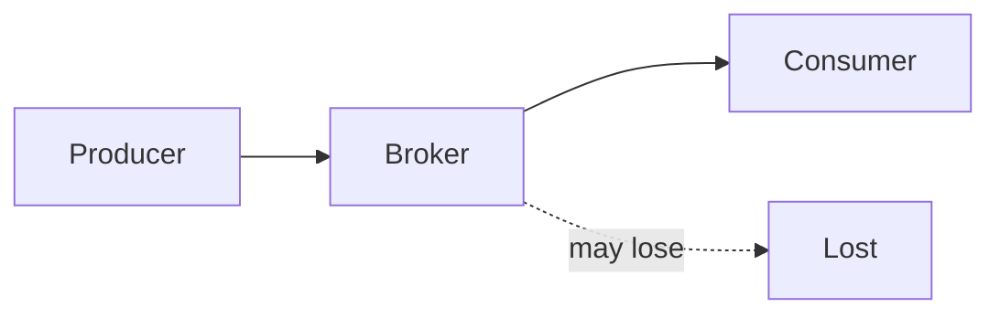

### How it works

Message is considered **delivered before processing completes**.

```text
Queue → Consumer → queue removes message immediately → consumer processes
Consumer crashes → message lost forever (no retry, no redelivery)
```

### Example

```text
Step 1: Queue contains Message A
Step 2: Consumer receives A → queue deletes A
Step 3: Consumer crashes
Result: Message A lost permanently
```

### Timeline

```text
Message A → Queue → Consumer → ✗ crash → message lost
```

### Why message loss happens

Broker assumes: *once I sent the message, my job is done* — no acknowledgement required before removal.

### With acknowledgement (contrast)

```text
Queue → Consumer → process → ACK → delete message
```

Safer pattern — used in **at-least-once** systems. See [§6.13](#613-at-least-once-delivery).

### Without acknowledgement

```text
Queue → Consumer → delete immediately
Crash → message lost forever
```

### Advantages

- Very fast
- Low latency
- Simple implementation
- No duplicate messages
- Minimal network overhead

### Disadvantages

- Message loss possible
- No retry
- No reliability guarantee
- Data may be missing

### Real-world example

```text
Website analytics: user click → analytics queue → analytics service
One lost click event → usually acceptable
```

### Good use cases

- Metrics collection
- Monitoring data
- Logging
- User activity tracking
- Telemetry
- Non-critical notifications

### Bad use cases

Message loss is unacceptable for:

- Banking / payments
- Order processing
- Inventory updates
- Financial or medical systems

### Kafka example

```text
enable.auto.commit=true
Offset committed BEFORE processing

Consumer crashes → restart at next offset → previous message skipped forever
→ at-most-once behavior
```

```text
Offset 10: receive → commit → crash → restart from 11 → offset 10 lost
```

Producer-side at-most-once: `acks=0` (fire-and-forget). See [§6.5 Kafka](#65-kafka).

### RabbitMQ example

```text
Auto ACK enabled → message acknowledged on deliver → consumer crashes → message lost
```

See [§6.8 RabbitMQ](#68-rabbitmq).

### When to choose at-most-once?

Choose when speed matters more than reliability, small data loss is acceptable, and duplicates must be avoided.

Examples: application logs, metrics, monitoring events, clickstream analytics.

### Summary

```text
At-most-once = fast and simple, no duplicates, loss is possible
Avoid for money, orders, inventory; OK for metrics and telemetry
```

**Goal:** Maximum throughput where occasional loss is acceptable.

---


## 6.13 At Least Once Delivery

### What is at-least-once delivery?

At-least-once delivery means a message is guaranteed to be delivered **one or more** times.

```text
✓ Will NOT be lost (when broker + ACK configured correctly)
✓ May be delivered multiple times
✗ Duplicate processing is possible
```

In simple words: *better to process a message twice than lose it completely.*

See [§6.12](#612-at-most-once-delivery) for the three-way delivery comparison.

### Visualization

```text
Producer → Broker → Consumer → process → ACK → broker deletes message
```

**Key idea:** broker keeps the message until it receives a successful **ACK**. No ACK → redelivery.

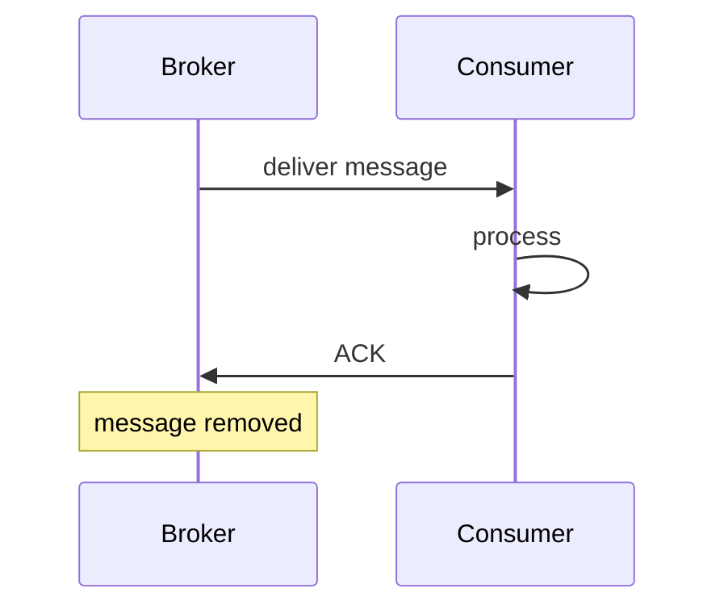

### How it works

```text
Step 1: Producer sends message
Step 2: Broker stores message
Step 3: Consumer receives message
Step 4: Consumer processes message
Step 5: Consumer sends ACK
Step 6: Broker deletes message (or commits offset)
```

### Normal flow

```text
Producer → Broker → Consumer → process → ACK → delete
→ delivered once in the successful case
```

### Failure scenario

```text
Consumer processes → crashes before ACK
→ broker retries → message redelivered → possible duplicate
```

### Timeline

```text
Message A → consumer receives → processes → ✗ crash before ACK
→ broker waits → Message A redelivered → processed twice
```

### Why duplicates happen

Broker cannot know if processing finished successfully.

```text
Payment succeeds → consumer crashes before ACK → broker retries
→ payment processed again → duplicate (unless idempotent)
```

### The golden rule

| Guaranteed | Not guaranteed |
|------------|----------------|
| No message loss | No duplicates |

### Idempotency

**Most important concept** with at-least-once delivery: processing the same message multiple times produces the **same result**.

**Bad example:**

```text
Message: Deposit ₹1000 — processed twice → ₹2000 deposited (wrong)
```

**Good example:**

```text
Message ID = TXN-101
If already processed → ignore; else process → only one deposit
```

### Idempotent consumer pattern

```text
Receive message → check message ID
  → already processed? → ignore
  → new? → process → record ID as processed
```

Patterns: natural idempotency (`SET status=PAID`), UNIQUE idempotency key, `processed_events` table, `ON CONFLICT DO NOTHING`.

### RabbitMQ example

```text
Queue → Consumer → process → manual ACK
Missing ACK → RabbitMQ redelivers → at-least-once
```

See [§6.8 RabbitMQ](#68-rabbitmq).

### Kafka example

```text
enable.auto.commit=false
Process message → commit offset AFTER processing
Crash before commit → message read again → duplicate possible
```

```text
Offset 10: read → process → ✗ crash (no commit) → restart → read offset 10 again
```

See [§6.5 Kafka](#65-kafka).

### Delivery timeline

```text
Message A → process → failure → retry → process again
Outcomes: 1, 2, or 3 times — but never zero times
```

### Advantages

- No message loss
- Reliable delivery
- Fault tolerant
- Supports retries
- Widely used (default for production messaging)

### Disadvantages

- Duplicate processing
- Idempotency required
- More storage / retry overhead

### Common use cases

- Order processing
- Payment systems
- Email sending
- Inventory updates
- Banking systems
- Microservices messaging

### Real-world example

```text
Order Created → queue → Inventory Service
Service crashes before ACK → message stays in queue → recovers → processes again
No order lost (inventory handler must be idempotent)
```

### Best practices

- Use message IDs
- Build **idempotent consumers**
- Use retry policies — [§6.16 Retry Queue](#616-retry-queue)
- Configure **DLQ** after max retries — [§6.15 Dead Letter Queue](#615-dead-letter-queue)
- **Commit offset after processing** (Kafka)
- Track processed messages (dedup store)
- DB + outbox for side effects — [§6.20 Outbox Pattern](#620-outbox-pattern)

### Summary

```text
At-least-once = no loss, duplicates possible → idempotent consumers required
Default choice for orders, payments, inventory
```

**Goal:** Reliable delivery with acceptable duplicate risk handled in application code.

---


## 6.14 Exactly Once Delivery

### What is exactly-once delivery?

Exactly-once delivery means a message is **processed exactly one time**.

```text
✓ Never lost
✓ Never duplicated
✓ Processed exactly once
```

In simple words: *the message must be processed once and only once.*

See [§6.12](#612-at-most-once-delivery) for the three-way delivery comparison.

### Why is it hard?

Distributed systems can fail at any time.

```text
Consumer receives → processes → crashes
Did processing complete? Or did it fail?
Broker often cannot know → uncertainty makes exactly-once very difficult
```

### Problem scenario

```text
Step 1: Consumer receives message
Step 2: Database updated
Step 3: Consumer crashes before ACK
→ Broker thinks processing failed → retries
→ Database updated twice → duplicate processing
```

```text
Queue → Consumer → database updated → ✗ crash before ACK
→ broker retries → database updated again → duplicate result
```

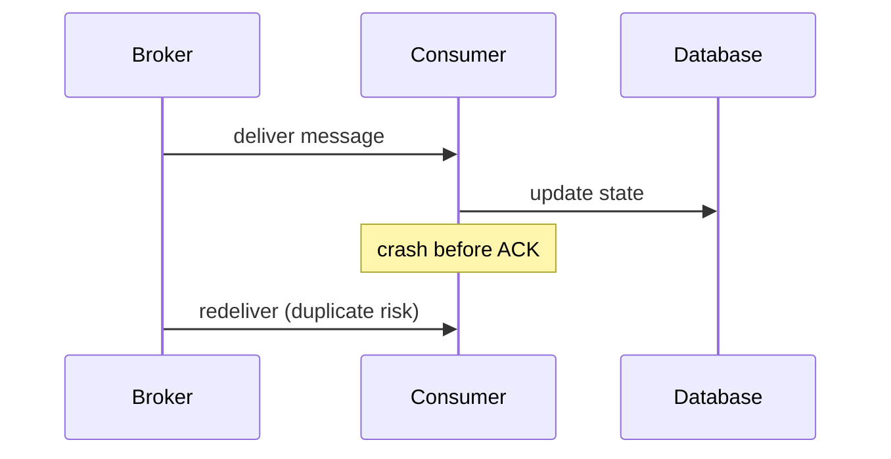

### Goal of exactly-once

```text
Message → processed once → never processed again (even during failures)
```

### Key requirements

- No message loss
- No duplicate processing
- **Atomic operations** (business work + acknowledgement as one unit)
- Fault tolerance

### Naive approach (insufficient)

```text
Receive → process → ACK
```

Crash between **process** and **ACK** → duplicates still possible. See [§6.13 At Least Once](#613-at-least-once-delivery).

### The core challenge

Both must succeed as **one unit**:

1. Business processing
2. Message acknowledgement (ACK / offset commit)

### Atomicity

**Atomic = all or nothing.**

```text
Database update + offset commit
→ either both succeed OR both fail — never partial success
```

### Exactly-once using identity check

Store processed message IDs; before processing, check inbox/dedup table.

```text
Message ID = TXN-100
Processed IDs: TXN-50, TXN-60 → TXN-100 not found → process → insert TXN-100
Future duplicate TXN-100 → found → ignore
```

Practical pattern: **at-least-once delivery + idempotent consumer** (see practical approach below).

### Idempotency

Exactly-once often relies on **idempotent operations** — repeated execution produces the same result.

**Bad:** `Deposit ₹1000` run twice → ₹2000 (wrong).

**Good:** `TXN-101` already processed → ignore duplicate → ₹1000 deposited once.

### Kafka exactly-once semantics (EOS)

Kafka provides EOS using:

1. **Idempotent producers** — `enable.idempotence=true`; broker dedupes by producer ID + sequence per partition
2. **Transactions** — `transactional.id`; all-or-nothing multi-partition writes
3. **Atomic offset commit** — consumer offset committed in same transaction as processing (read-process-write topology)

**Idempotent producer:** retry after network failure without duplicate records in the log.

**Transactions:** messages A, B, C — either all committed or none.

```text
Producer → Kafka topic → Consumer
  → transaction start → business processing → offset commit → transaction commit
  → everything succeeds or everything rolls back
```

Requires `acks=all`, healthy **ISR** (`min.insync.replicas`), and adds latency/overhead (~10–20%). Flink and Kafka Streams provide EOS within stream topologies. Detail: [§6.5 Kafka](#65-kafka).

EOS does **not** automatically cover SMTP, external HTTP APIs without idempotency keys, or heterogeneous systems without cooperation at every layer.

### Outbox pattern

Popular microservice solution when **DB updated but event publish fails**.

```text
Same DB transaction: business data + outbox event row
→ background relay reads outbox → publishes to broker
```

Guarantees **local consistency** between database and eventual event emission. Detail: [§6.20 Outbox Pattern](#620-outbox-pattern).

### Inbox pattern

Consumer-side complement: store processed message IDs in an **inbox** table.

```text
Duplicate arrives → check inbox → already processed? → ignore
```

Provides exactly-once **behavior** on top of at-least-once delivery.

### Two-phase commit (2PC)

```text
Coordinator → prepare (DB + broker) → commit
```

Strong consistency but **slow, complex, blocking** — rarely used for messaging today. See distributed transactions in [Chapter 5](../05-distributed-databases/README.md).

### Why exactly-once is expensive

- Transactions and coordination
- Additional storage (outbox, inbox, dedup tables)
- Deduplication logic
- Lower throughput and higher latency

### Advantages

- No duplicates
- No data loss
- Strong consistency
- Ideal for critical systems

### Disadvantages

- Complex implementation
- Lower performance
- Higher latency
- More infrastructure cost

### Real-world example

**Bank transfer ₹10,000:**

| Guarantee | Risk |
|-----------|------|
| At-most-once | Transfer may be **lost** |
| At-least-once | Transfer may run **twice** |
| Exactly-once | Transferred **exactly once** — required behavior |

### Use cases

- Banking transactions
- Payment processing
- Trading systems
- Financial ledgers
- Inventory accounting
- Billing systems

### Practical approach

True exactly-once delivery across an entire distributed system is extremely difficult. Most production systems implement:

```text
At-least-once delivery + idempotent processing
→ achieves practical exactly-once behavior
```

Many teams over-engineer Kafka transactions when a **UNIQUE idempotency key** on the consumer suffices.

### Summary

```text
Exactly-once = no loss, no duplicates — high complexity and cost
Kafka EOS: idempotent producer + transactions + atomic offset commit
Pragmatic default: at-least-once + idempotency keys / inbox table
```

**Goal:** Correctness for money, inventory, and ledgers — choose the simplest mechanism that meets the guarantee.

---


## 6.15 Dead Letter Queue

> Pairs with [§6.16 Retry Queue](#616-retry-queue): retry handles transient failures; DLQ quarantines poison messages after max attempts.

### What is a dead letter queue (DLQ)?

A **dead letter queue (DLQ)** is a special queue used to store messages that could not be processed successfully after multiple retry attempts.

Instead of retrying forever, failed messages are moved to the DLQ for later inspection.

In simple words: *DLQ is a parking lot for bad messages.*

DLQ is not optional logging — it is a **first-class queue/topic** with monitoring, ownership, and a **replay runbook**.

### Why do we need a DLQ?

**Without DLQ:**

```text
Message → consumer → ✗ failure → retry → ✗ failure → retry → ✗ failure → …
→ infinite retry loop
```

Problems: wasted resources, queue blockage, system overload, difficult debugging.

**With DLQ:**

```text
Message → consumer → ✗ failure → retry 1 → retry 2 → retry 3 → DLQ
→ problematic message isolated
```

Pair with bounded retries — detail: [§6.16 Retry Queue](#616-retry-queue).

### How DLQ works

```text
Step 1: Message arrives
Step 2: Consumer tries processing
Step 3: Processing fails
Step 4: Broker retries (up to limit)
Step 5: Retry limit exceeded
Step 6: Message moved to DLQ
```

### Message flow

```text
Producer → main queue → consumer → ✗ failure
  → retry queue → ✗ retry limit reached → dead letter queue
```

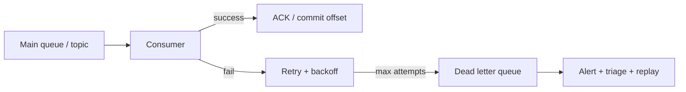

### Common reasons for failure

1. **Invalid data** — required field missing (`"orderId": null`)
2. **Application bug** — consumer throws exception
3. **Database failure** — DB unavailable
4. **External service failure** — payment API down
5. **Schema mismatch** — producer sends unexpected format
6. **Corrupt messages** — malformed JSON/XML

### Example

```json
{ "orderId": 1001 }
```

Consumer expects `customerId` as well — missing field → consumer fails → retries exhausted → move to DLQ.

### Retry strategy

```text
Message → attempt 1 ✗ → attempt 2 ✗ → attempt 3 ✗ → DLQ
```

### Why not retry forever?

Corrupted message `{ "invalid": "data" }` fails on retry 1, 2, and 100 — infinite retries waste resources. DLQ prevents this.

### DLQ contents

Typically stores:

- Original message
- Error details
- Retry count
- Timestamp
- Failure reason

**Recommended envelope (Kafka / application DLQ):**

```json
{
  "messageId": "123",
  "original_topic": "orders",
  "original_partition": 3,
  "original_offset": 918273,
  "payload": { "orderId": 1001 },
  "retryCount": 5,
  "error": "NullPointerException",
  "failed_at": "2026-06-24T10:15:00Z"
}
```

### Real-world example

```text
E-commerce: Order queue → Inventory Service
Order message arrives; inventory DB down
Retry 1 ✗ → retry 2 ✗ → retry 3 ✗ → move to DLQ
→ operations team investigates
```

### DLQ in RabbitMQ

```text
Queue → ✗ processing failure → Dead Letter Exchange (DLX) → DLQ
```

RabbitMQ routes failed messages via **Dead Letter Exchange (DLX)**.

**Configuration:**

```text
Main queue (x-dead-letter-exchange) → DLX → dead letter queue
```

See [§6.8 RabbitMQ](#68-rabbitmq).

### DLQ in Kafka

Kafka has **no built-in DLQ**. Application creates separate topics:

```text
orders-topic → consumer ✗ → publish failed event → orders-dlq-topic
```

**Retry topology (application-managed):**

```text
orders → fail → orders-retry → still fails → orders-dlq
```

See [§6.5 Kafka](#65-kafka).

### DLQ in AWS SQS

```text
Main queue → ✗ failure (after max receive count) → DLQ
```

Configuration: `maxReceiveCount = 5` — after 5 failures, message moves to DLQ.

### DLQ in microservices

```text
Order Service → order queue → Inventory Service → ✗ failure → order DLQ
→ operations team reviews failures
```

### DLQ monitoring

Important metrics:

- DLQ message count
- Retry count
- Failure rate
- Oldest message age

High DLQ volume usually indicates application bug, service outage, or bad data. **Alert on DLQ depth > 0.**

### DLQ reprocessing

After the root cause is fixed:

```text
DLQ → reprocessing service → main queue
```

Example: database repaired → re-submit failed messages.

**Replay runbook:**

```text
1. Stop auto-replay scripts
2. Identify failure class (schema? downstream? bad data?)
3. Fix code / deploy / schema
4. Sample messages — dry-run in staging
5. Replay in batches with rate limit
6. Monitor lag + error rate; stop if errors return
```

Replay must be **idempotent** — see [§6.13 At Least Once](#613-at-least-once-delivery) and [§6.14 Exactly Once](#614-exactly-once-delivery).

### Best practices

- Always configure DLQ
- Add retry limits — [§6.16](#616-retry-queue)
- Log failure reasons
- Monitor DLQ growth; alert on spikes
- Build replay tools
- Separate DLQ per service/domain (`payments-dlq` vs `emails-dlq`)
- Retention 7–30 days for investigation

### Common mistakes

- No DLQ configured
- Infinite retries
- Ignoring DLQ messages (no alerts)
- No monitoring
- Replaying without fixing root cause (re-poisons main queue)

### Advantages

- Prevents infinite retries
- Isolates bad messages (poison messages)
- Easier debugging
- Improves reliability
- Better observability
- Protects main queue

### Disadvantages

- Additional storage
- Operational overhead
- Requires monitoring
- Reprocessing logic needed

### Broker-native summary

| Platform | DLQ mechanism |
|----------|---------------|
| **RabbitMQ** | Dead-letter exchange (DLX) + `x-death` headers |
| **SQS** | Redrive policy → DLQ after `maxReceiveCount` |
| **Kafka** | Manual: application publishes to `*-dlq` topic |
| **Azure Service Bus** | Forward to dead-letter sub-queue |

### Summary

```text
DLQ = parking lot for poison messages after bounded retries
Configure everywhere in production; monitor, alert, replay idempotently
```

**Goal:** Convert infinite failure loops into actionable quarantine.

---


## 6.16 Retry Queue

> Pairs with [§6.15 Dead Letter Queue](#615-dead-letter-queue): bounded retries with backoff before quarantine.

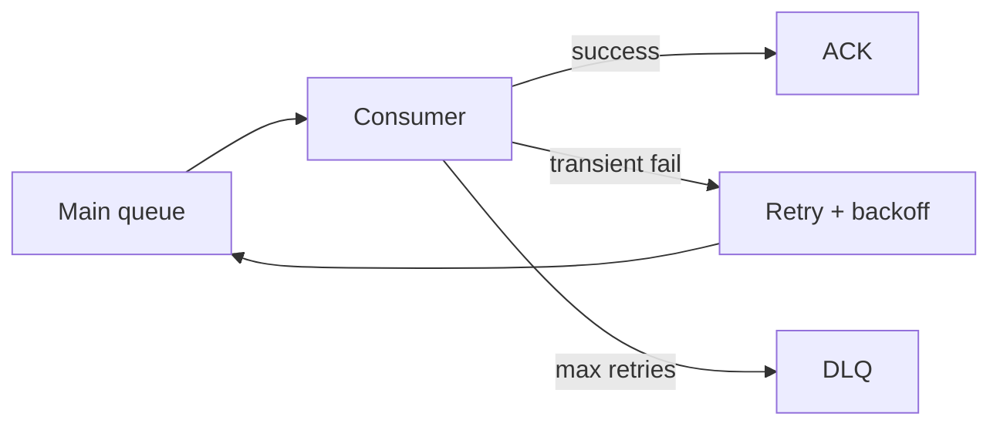

### What is a retry queue?

A **retry queue** is an intermediate queue used to temporarily hold failed messages before they are retried again.

Instead of immediately reprocessing a failed message, it is placed in a retry queue and retried **after a delay**.

In simple words: *retry queue gives failed messages another chance after waiting for some time.*

After max retries, messages go to the **DLQ** — [§6.15 Dead Letter Queue](#615-dead-letter-queue).

### Why do we need retry queues?

**Without retry queue:**

```text
Message → consumer → ✗ failure → immediate retry → ✗ failure → immediate retry → …
```

Problems: retry storm, high CPU, service overload, cascading failures.

**With retry queue:**

```text
Message → consumer → ✗ failure → retry queue → (wait) → main queue → consumer
```

Benefits: reduced load, time for recovery, controlled retries.

### When is a retry queue used?

**Temporary failures (retry):**

- Database down
- Network timeout
- External API failure
- Service unavailable
- Rate limiting (429)

**Permanent failures (skip retry → DLQ):**

- Invalid data
- Corrupted message
- Bad schema

Classify in code:

```text
Retryable:     TimeoutException, 503, 429, OptimisticLockException
Non-retryable: JsonParseException, 400, 404, ValidationException → DLQ immediately
```

### High-level flow

```text
Producer → main queue → consumer → success → done
                              → ✗ failure → retry queue → main queue → consumer
                              → success OR DLQ (after max retries)
```

### Message lifecycle

```text
Message arrives → process → ✗ fail → retry queue → delay → main queue → process again
```

### Example

```json
{ "orderId": 1001 }
```

Inventory database down → processing fails → move to retry queue → wait 30 seconds → retry → DB recovered → processing succeeds.

### Retry strategies

1. **Fixed delay** — same wait every retry
2. **Exponential backoff** — delay doubles (most common)
3. **Incremental backoff** — delay increases linearly

#### 1. Fixed delay retry

```text
Retry 1 → 30 sec → retry 2 → 30 sec → retry 3 → 30 sec
```

Simple but not optimal under load.

#### 2. Exponential backoff

```text
Retry 1 → 10 sec → retry 2 → 20 sec → retry 3 → 40 sec → retry 4 → 80 sec
```

Prevents retry storms, API overload, and database overload; gives systems time to recover.

**With jitter (recommended):**

```text
delay = min(cap, base × 2^attempt) + random(0, base)
```

Jitter avoids synchronized retry waves when a dependency recovers.

**Example schedule:**

| Attempt | Delay before next try |
|---------|----------------------|
| 1 | 1 s |
| 2 | 5 s |
| 3 | 30 s |
| 4 | 5 min |
| 5 | 30 min |
| 6+ | → DLQ |

#### 3. Incremental backoff

```text
Retry 1 → 10 sec → retry 2 → 20 sec → retry 3 → 30 sec → retry 4 → 40 sec
```

### Common architecture

```text
Main queue → consumer → success → done
                    → ✗ failure → retry queue → (delay) → main queue
```

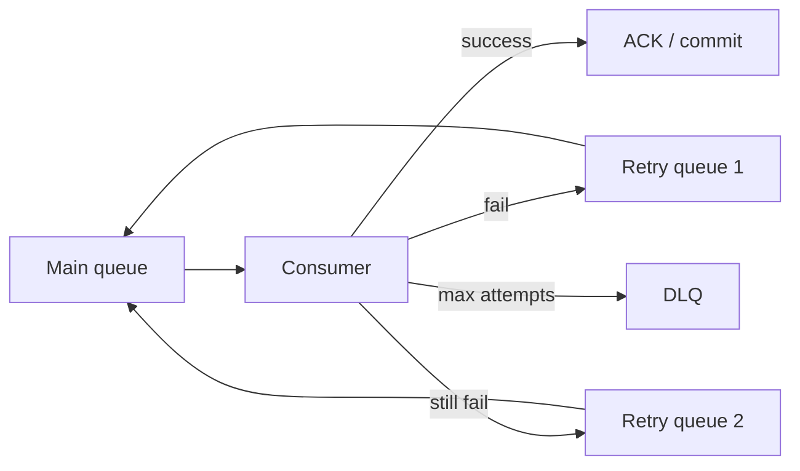

### Multiple retry queues

Large systems often use staged delays:

```text
Main queue → ✗ → retry queue 1 (10 sec) → ✗ → retry queue 2 (1 min) → ✗ → retry queue 3 (5 min) → ✗ → DLQ
```

### Retry count

Message metadata usually tracks attempts:

```json
{ "messageId": "123", "retryCount": 2 }
```

Every failure increments count. When `retryCount >= maxRetry` → move to DLQ.

### Retry queue vs DLQ

| | Retry queue | DLQ |
|---|-------------|-----|
| **Purpose** | Temporary recovery | Permanent failure storage |
| **Expectation** | Message may succeed later | Message needs investigation |
| **Returned to main queue** | Yes | No (replay is manual) |

**Examples:** database down → retry queue; invalid JSON → DLQ (retry will never fix it).

### RabbitMQ implementation

```text
Main queue → ✗ failure → retry queue (TTL = 30 sec)
→ TTL expires → dead letter exchange → main queue
```

Retry queue uses **TTL (time to live)**; after expiry, message routes back via DLX. See [§6.8 RabbitMQ](#68-rabbitmq).

### Kafka implementation

Application-managed topics:

```text
orders-topic → ✗ failure → orders-retry-topic → consumer waits / schedules → retry later
→ still fails → orders-dlq-topic
```

| Pattern | How |
|---------|-----|
| **Multiple retry topics** | `orders-retry-1s`, `orders-retry-5m` — one consumer per delay |
| **Single retry + scheduler** | Store `retry_at` in DB/Redis; republish when due |
| **Sleep in consumer** | Blocks partition — avoid for long delays (`max.poll.interval` violation) |

See [§6.5 Kafka](#65-kafka).

### AWS SQS implementation

```text
Main queue → ✗ failure → visibility timeout (message hidden) → timeout expires → visible again
```

Acts as a built-in retry mechanism without a separate retry queue.

### Retry storm scenario

```text
Payment API down 10 minutes → 50K messages fail → all retry in 30s
→ 50K concurrent calls when API flickers up → API dies again
```

Fix: exponential backoff + jitter + circuit breaker (fast-fail to retry topic slowly).

### Best practices

- Use **exponential backoff** with jitter
- **Limit retry count**; use DLQ after max retries — [§6.15](#615-dead-letter-queue)
- Store retry metadata (`retryCount`, error, timestamp)
- Monitor retry rates and retry-queue depth
- Separate **transient** vs **permanent** errors
- Preserve message key (Kafka) so ordering is maintained per key
- Idempotent consumers — [§6.13](#613-at-least-once-delivery)

### Common mistakes

- Infinite retries (no DLQ)
- Immediate retries (no delay)
- Ignoring retry metrics
- Treating all failures equally
- Long sleep in Kafka consumer thread → partition stall

### Advantages

- Improves reliability
- Handles transient failures
- Reduces message loss
- Prevents retry storms
- Improves fault tolerance

### Disadvantages

- Increased complexity
- Additional queues/topics
- Longer end-to-end latency
- More monitoring needed

### Summary

```text
Retry queue = delayed second chance for transient failures
Exponential backoff + max retries + DLQ = production default
```

**Goal:** Recover from blips without overwhelming downstream systems or losing messages.

---


## 6.17 Event Sourcing

> Often paired with [§6.18 CQRS](#618-cqrs). Replay mechanics: [§6.21](#621-event-replay). Schema evolution: [§6.22](#622-event-versioning).

### What is event sourcing?

**Event sourcing** is a design pattern where the application stores every change to an entity as a sequence of **immutable events** instead of storing only the current state.

| Approach | Stores |
|----------|--------|
| **Traditional** | Current state |
| **Event sourcing** | History of changes (events) |

### Traditional approach

```text
Bank account — current balance = ₹5000

| AccountID | Balance |
| 101       | 5000    |
```

Problem: past changes are lost. Cannot answer how the balance became ₹5000 or what transactions occurred.

### Event sourcing approach

Store every event:

```text
Account Created
Money Deposited ₹1000
Money Deposited ₹5000
Money Withdrawn ₹1000
```

Current balance is **derived** by replaying events.

### Core idea

```text
State = Replay(Events)
```

Current state is not the source of truth — **events are the source of truth**.

### What is an event?

An event is a **fact that happened**.

Examples: `UserRegistered`, `OrderCreated`, `PaymentCompleted`, `MoneyDeposited`, `MoneyWithdrawn`.

```json
{ "eventType": "MoneyDeposited", "amount": 1000 }
```

### Event characteristics

- **Immutable** — once created, never updated
- Historical fact
- Time ordered
- Append only

Deletes are modeled as compensating events (e.g. `UserDeactivated`), not physical erase.

### Example — account lifecycle

```text
Event 1: AccountCreated          → balance = 0
Event 2: MoneyDeposited ₹1000    → balance = 1000
Event 3: MoneyDeposited ₹500     → balance = 1500
Event 4: MoneyWithdrawn ₹200     → balance = 1300
```

### Visualization

```text
Account stream (Account 101):
  Offset 0 → AccountCreated
  Offset 1 → Deposit 1000
  Offset 2 → Deposit 500
  Offset 3 → Withdraw 200
Replay all events → balance = 1300
```

Each entity has its own **event stream** — Account 101 and Account 102 are independent streams.

**Aggregate** = consistency boundary; one stream per aggregate ID. Optimistic concurrency via expected version.

### How event sourcing works

```text
Command → business logic → generate event → store event → update read model
```

```mermaid
flowchart LR
    Cmd[Command] --> Logic[Business logic]
    Logic --> Event[Generate event]
    Event --> Store[Event store]
    Store --> Proj[Projector]
    Proj --> Read[Read model]
```

### Flow example

User deposits ₹1000:

```text
Command: DepositMoney(1000)
Validation: amount > 0
Generate event: MoneyDeposited(1000)
Store event → update read model (projection)
```

### Commands vs events

| | Command | Event |
|---|---------|-------|
| **Represents** | Intent | Fact |
| **Example** | `DepositMoney(1000)` | `MoneyDeposited(1000)` |
| **Meaning** | "Please do this." | "This happened." |

### Event store

Database that stores events append-only:

```text
| SeqNo | Event            |
| 1     | AccountCreated   |
| 2     | Deposit 1000     |
| 3     | Deposit 500      |
| 4     | Withdraw 200     |
```

### Rebuilding state

Replay all events in order:

```text
AccountCreated → 0 → +1000 → 1500 → -200 → final balance = 1300
```

### Event replay

```text
Stored events → replay → reconstruct state
```

Useful for recovery, debugging, and auditing. **Rebuild read model:** replay all events after fixing projector logic.

### Audit trail

Traditional DB: only current state. Event sourcing: complete history — who changed an order, when, and what changed.

### Snapshots

**Problem:** millions of events → replay becomes slow.

**Solution:** store state periodically.

```text
Snapshot: balance = ₹1,00,000 at event #5000
→ replay only events 5001 onward
```

Benefits: faster startup and recovery.

### Eventual consistency

Common with event sourcing:

```text
Write model → events → read model (may lag slightly → eventually consistent)
```

Detail: [§6.18 CQRS](#618-cqrs).

### CQRS + event sourcing

Very common combination — command side handles writes; query side handles reads; events synchronize both.

```text
Command → event store → read model → query
```

CQRS does not require event sourcing, but they pair well. Full CQRS detail: [§6.18](#618-cqrs) — not duplicated here.

### Event versioning

Schema evolves over time (`amount` only → `amount` + `currency`). Solutions: version field, schema registry, upcasting.

Detail: [§6.22 Event Versioning](#622-event-versioning).

### Real-world example — e-commerce order

```text
OrderCreated → PaymentCompleted → OrderPacked → OrderShipped → OrderDelivered
Current order status derived from events
```

### Banking example

```text
AccountCreated → deposit ₹1000 → deposit ₹500 → withdraw ₹300 → deposit ₹200
Replay → balance = ₹1400 — complete history preserved
```

### Advantages

- Complete audit trail
- Full history preserved
- Easy debugging and event replay
- Natural fit for event-driven systems — [§6.4](#64-event-driven-architecture)
- Supports CQRS and state reconstruction

### Disadvantages

- Complex design
- Event versioning challenges
- Large event storage
- Replay overhead (mitigate with snapshots)
- Eventual consistency on read models
- Difficult querying without projections

### When to use event sourcing?

- Banking systems, financial ledgers, payment systems
- Audit-heavy and regulatory compliance applications
- Trading platforms, order management systems

### When not to use?

- Simple CRUD applications
- Small internal tools
- Systems without audit requirements
- Low-complexity domains

### Event sourcing vs CRUD

| CRUD | Event sourcing |
|------|----------------|
| Store current state (`balance = ₹5000`) | Store changes (`deposit 1000`, `deposit 5000`, `withdraw 1000`) |
| Balance is stored directly | Balance derived by replay |

### Event sourcing vs event streaming

| | Event sourcing | Event streaming |
|---|----------------|-----------------|
| **Purpose** | Store history | Move events |
| **Source of truth** | Events | Usually database |
| **Focus** | State reconstruction | Real-time communication |

Event sourcing answers *what happened?* Event streaming answers *who should receive the event?*

Detail: [§6.3 Event Streaming](#63-event-streaming).

### Summary

```text
Event sourcing = events are source of truth; state = replay(events)
Pair with CQRS for read models; snapshots for scale; versioning for schema evolution
```

**Goal:** Immutable history and auditability where CRUD loses the past.

---


## 6.18 CQRS

> Often paired with [§6.17 Event Sourcing](#617-event-sourcing). Read models rebuilt via [§6.21 Event Replay](#621-event-replay).

### What is CQRS?

**CQRS (Command Query Responsibility Segregation)** separates:

1. **Commands** — write operations that change state
2. **Queries** — read operations that return data

into different models. Instead of one model for both reads and writes, CQRS uses specialized models for each purpose.

| Letter | Meaning |
|--------|---------|
| **C** | Command |
| **Q** | Query |
| **R** | Responsibility |
| **S** | Segregation |

CQRS does **not** require event sourcing — but the two are often paired. Event sourcing detail: [§6.17](#617-event-sourcing).

### Core idea

**Traditional:**

```text
Read + write → single model
```

**CQRS:**

```text
Write model ──events──► read model
Reads and writes handled separately
```

### Why CQRS?

In most applications, **read traffic >> write traffic**.

Example — Amazon: ~10M product views/day vs ~10K product updates/day.

One database for both causes resource contention, scaling issues, and complex queries affecting writes. CQRS addresses this.

### Traditional CRUD architecture

```text
Application → database
  Reads:  SELECT
  Writes: INSERT / UPDATE / DELETE
Same schema for both
```

**CRUD example** — users table: `SELECT *` and `UPDATE` on the same model.

### CQRS architecture

```text
              +-------------+
              | Write model |
              +-------------+
                     |
                  Events
                     |
                     v
              +-------------+
              | Read model  |
              +-------------+
```

- **Write side:** optimized for consistency, transactions, business rules
- **Read side:** optimized for fast queries, search, analytics

### Command side

**Command** = intent to change state. Examples: `CreateOrder`, `UpdateUser`, `CancelOrder`, `DepositMoney`.

Commands **modify** data.

```json
CreateOrder { "orderId": 1001 } → order created → state changes
```

### Query side

**Query** = request for data. Examples: `GetUser`, `GetOrder`, `GetBalance`, `GetProducts`.

Queries **never modify** data.

```text
GetOrder(1001) → { "orderId": 1001, "status": "SHIPPED" }
```

### CQRS flow

```text
User → command → write model → database / event store
  → read model updated → query model serves reads
```

```mermaid
flowchart TB
    User[User] --> Cmd[Command API]
    User --> Qry[Query API]
    Cmd --> WS[Write store / event log]
    WS --> Bus[Events]
    Bus --> P1[SQL read model]
    Bus --> P2[Search index]
    Bus --> P3[Cache]
    Qry --> P1
    Qry --> P2
    Qry --> P3
```

### Real-world example — e-commerce

| Write side | Read side |
|------------|-----------|
| Create / update / delete product | Search product, product details, recommendations |

Different optimization requirements per side.

### Separate databases

CQRS often uses a **write database** and a **read database**:

```text
Write DB → events → read DB
```

| Write DB | Read DB |
|----------|---------|
| Consistency, transactions | Fast queries, search, analytics |

**Variants:**

| Variant | Complexity | When |
|---------|------------|------|
| Separate handlers, same DB | Low | Start here |
| Separate read DBs | Medium | Read scaling |
| Event sourcing + multiple projections | High | Audit, temporal queries |

Simple CQRS (same database, separate APIs):

```text
POST /commands/PlaceOrder → command handler → normalized DB
GET  /queries/OrderSummary → query handler → denormalized view table
```

Not every app needs full CQRS — consider read replicas first.

### Event flow

```text
Command → write model → database → event → read model update
→ read model available for queries
```

Projectors may update SQL, Elasticsearch, Redis in parallel. **Idempotent projectors** — same event twice must not double-count.

### Eventual consistency

```text
Write DB updated → read DB not updated yet → temporary inconsistency
→ eventually read DB synchronized
```

Lag is often 100ms–2s. UX pitfall: *"I saved but don't see it."*

Mitigations: read-your-writes (route immediate read to write store), version polling, or show pending state in UI.

### CQRS + event sourcing

Most common combination:

```text
Command → event store → events → read model (projection)
```

**Bank example:**

```text
Command: Deposit ₹1000 → event: MoneyDeposited → read model: balance = ₹1000
Query: GetBalance → returns ₹1000
```

Full event-sourcing mechanics: [§6.17 Event Sourcing](#617-event-sourcing).

### Read model

Denormalized for fast reads — no complex joins:

```json
{
  "orderDetails": { ... },
  "customerDetails": { ... },
  "productDetails": { ... }
}
```

**Rebuild read model:** replay all events after fixing projector logic — [§6.17](#617-event-sourcing).

### Scaling benefits

```text
Read traffic:  100,000 req/sec
Write traffic: 1,000 req/sec
→ scale read side independently
```

### Use cases

- E-commerce, banking, trading systems
- Inventory and booking systems
- Social media platforms (extreme read:write ratio)

### When to use CQRS?

- High read traffic
- Complex business logic on writes
- Event-driven systems — [§6.4](#64-event-driven-architecture)
- Need independent scaling
- Event sourcing architecture

### When not to use CQRS?

- Small applications, simple CRUD, low traffic
- Small internal tools

CQRS adds complexity — avoid when CRUD suffices.

### Advantages

- Independent scaling of read and write paths
- Better performance per workload
- Optimized reads and writes
- Supports event sourcing
- Flexible architecture; easier complex domain modeling on write side

### Disadvantages

- Increased complexity and infrastructure
- Eventual consistency on read models
- Data synchronization / projector failure handling
- Harder debugging (trace read anomaly → projector → source event)

### CQRS vs CRUD

| | CRUD | CQRS |
|---|------|------|
| **Read model** | One | Separate |
| **Write model** | One | Separate |
| **Database** | One | Often separate |
| **Complexity** | Low | High |

### CQRS + event sourcing example

```text
Command: CreateOrder
  → write model stores OrderCreated in event store
  → read model updates order view
Query: GetOrder → returns order data from read model
```

### Summary

```text
CQRS = separate command (write) and query (read) models
Scale reads independently; pair with event sourcing when audit/history matters
Start simple (same DB, separate handlers) before full projection pipeline
```

**Goal:** Match architecture to read-heavy workloads without polluting write models with query concerns.

---


## 6.19 Change Data Capture (CDC)

> Complements [§6.20 Outbox Pattern](#620-outbox-pattern): CDC streams DB row changes; outbox emits designed domain events from the same transaction.

### What is change data capture (CDC)?

**Change Data Capture (CDC)** captures changes made to a database and propagates those changes to other systems in real time.

Instead of repeatedly querying the database, CDC detects **INSERT**, **UPDATE**, and **DELETE** operations and publishes them as events.

### Core idea

```text
Database → detect changes → publish events → other systems
```

CDC answers: *what changed in the database?*

```mermaid
flowchart LR
    DB[(Database)] --> Log[WAL / Binlog]
    Log --> CDC[CDC connector]
    CDC --> Broker[Message broker]
    Broker --> Analytics[Analytics]
    Broker --> Search[Search index]
    Broker --> DW[Data warehouse]
```

### Why do we need CDC?

**Without CDC:**

```text
Database ← polling every 5 seconds ← Service B
```

Problems: high database load, delayed updates, wasted queries.

**With CDC:**

```text
Database → change happens → CDC → event published → consumers (real-time)
```

Keeps OLTP DB as source of truth while search indexes, caches, and warehouses stay synchronized — **without application dual-write**.

### Real-world example

```text
INSERT INTO orders → CDC detects new row → publishes OrderCreated event
→ consumers receive event instantly
```

### High-level architecture

```text
Database → CDC → message broker → analytics / search index / data warehouse
```

### What changes can CDC capture?

| Operation | Meaning |
|-----------|---------|
| **INSERT** | New record created |
| **UPDATE** | Existing record modified |
| **DELETE** | Record removed |

**Example — UPDATE:**

```text
Before: { "id": 1, "name": "John" }
After:  { "id": 1, "name": "Johnny" }

CDC event:
{ "operation": "UPDATE", "before": { ... }, "after": { ... } }
```

### CDC approaches

1. **Timestamp based** — query `WHERE UpdatedAt > LastReadTime`
2. **Trigger based** — DB trigger writes to change/audit table
3. **Log based** — read WAL / transaction log (most modern systems)

#### 1. Timestamp based CDC

```text
| ID | Name | UpdatedAt |
```

Advantages: simple. Disadvantages: missed updates possible, polling required, extra queries.

#### 2. Trigger based CDC

```text
Orders table → INSERT/UPDATE/DELETE trigger → change table
```

Advantages: easy to understand, immediate detection. Disadvantages: database overhead, slower writes, maintenance complexity.

#### 3. Log based CDC (preferred)

CDC reads the database **write-ahead log (WAL)** or **transaction log** directly — no polling, no triggers.

```text
Application INSERT order → transaction log records change
→ CDC reads log → publishes OrderCreated
```

Advantages: minimal DB impact, real-time, reliable, scalable, captures all changes. This is how **Debezium** works.

**Database logs:**

| Database | Log |
|----------|-----|
| **MySQL** | Binlog |
| **PostgreSQL** | WAL |
| **SQL Server** | Transaction log |
| **Oracle** | Redo log |

### CDC flow

```text
Application → database → transaction log → CDC connector → Kafka → consumers
```

Initial **snapshot + streaming** for backfill when connector starts or after long downtime.

### Popular CDC tool — Debezium

Debezium reads MySQL binlog, PostgreSQL WAL, SQL Server logs, Oracle logs — publishes changes to Kafka.

```text
Database → transaction log → Debezium → Kafka topic → consumers
```

See [§6.5 Kafka](#65-kafka).

### CDC + Kafka

Very common architecture:

```text
Database → Debezium → Kafka → analytics / search / reporting
```

One database change updates many systems.

### CDC vs polling

| | Polling | CDC |
|---|---------|-----|
| **Mechanism** | Repeated queries | Capture changes |
| **Latency** | High | Low |
| **Database load** | High | Low |
| **Efficiency** | Low | High |

### CDC vs event sourcing

| | CDC | Event sourcing |
|---|-----|----------------|
| **Source of truth** | Database | Events |
| **Events generated** | After DB change | Before / instead of current-state storage |
| **Direction** | Database → events | Events → database (derived state) |

Detail: [§6.17 Event Sourcing](#617-event-sourcing).

### CDC vs outbox pattern

| | CDC (on business/outbox table) | Outbox |
|---|--------------------------------|--------|
| **Who emits events** | Log connector reads DB changes | App writes outbox row in same transaction |
| **Event shape** | Row-level change | Domain event you design |

Detail: [§6.20 Outbox Pattern](#620-outbox-pattern).

### Real-world use cases

1. **Search synchronization** — database → CDC → Elasticsearch
2. **Data warehouse** — database → CDC → warehouse
3. **Microservices integration** — Service A DB → CDC → Kafka → Service B
4. **Cache synchronization** — database → CDC → Redis

### Key operational details

- Ordering generally preserved per table / primary key
- **Tombstone events** for deletes (Kafka compacted topics)
- **Schema evolution** on captured tables needs a strategy — [§6.22 Event Versioning](#622-event-versioning)
- Log retention limits vs long CDC downtime → snapshot recovery needed
- Wide tables → large events; consider column filtering
- Deletes and GDPR erasure need compaction/tombstone policies

### Advantages

- Real-time updates, low latency
- Reduced database load vs polling
- Reliable data propagation
- Supports event-driven systems — [§6.4](#64-event-driven-architecture)
- Easy integration with existing OLTP databases

### Disadvantages

- Additional infrastructure (connector, broker)
- Event ordering challenges across tables
- Schema evolution complexity
- Operational complexity; debugging can be difficult

### When to use CDC?

- Database replication and search index updates
- Analytics pipelines and data warehouses
- Event-driven microservices integration
- Cache synchronization

### When not to use?

- Small applications with no integration needs
- Simple CRUD with no downstream consumers

### Summary

```text
CDC = database changes → events in real time (log-based preferred)
Debezium + Kafka is the common stack; complements outbox and event sourcing
```

**Goal:** Propagate DB changes to search, cache, warehouse, and services without dual-write bugs.

---


## 6.20 Outbox Pattern

> Alternative to polling the business table via [§6.19 CDC](#619-change-data-capture-cdc). Relay often uses CDC on the outbox table.

### What is the outbox pattern?

The **outbox pattern** is a reliability pattern used in distributed systems and microservices to ensure that **database changes** and **event publishing** happen consistently.

It solves: *database update succeeds but event publishing fails.*

### The problem

```text
Order Service:
  Step 1: Save order to database     ✓ success
  Step 2: Publish OrderCreated event ✗ failure

Result: order exists in DB but inventory, payment, and shipping never receive the event
→ system inconsistent
```

```mermaid
flowchart TB
    S[Order service] --> DB[(Save order ✓)]
    S --> K[Publish event ✗]
    K -.->|missing| Inv[Inventory]
    K -.->|missing| Pay[Payment]
    K -.->|missing| Ship[Shipping]
```

### Why does this happen?

Database and message broker are **different systems** (e.g. PostgreSQL + Kafka). You must update both — but **no atomic transaction** spans DB and broker.

### Naive approach (insufficient)

```text
BEGIN → save order → publish event → COMMIT
```

Database transaction cannot control Kafka/RabbitMQ — **partial failure** is possible.

**Dual-write without outbox:**

```text
UPDATE orders SET status='PAID' ✓  →  kafka.publish(OrderPaid) ✗
→ DB says PAID, no event → inventory never decrements

OR: publish ✓ → DB update ✗ rolls back → phantom event
```

### Outbox pattern solution

Instead of publishing directly:

1. Save business data
2. Save event in **outbox table**

Both inside the **same database transaction**. A background process publishes later.

```mermaid
flowchart TB
    subgraph SameTxn[Single DB transaction]
        BR[Business row]
        OB[Outbox INSERT]
    end
    SameTxn --> Commit[COMMIT]
    Commit --> Relay[Outbox publisher / Debezium]
    Relay --> Broker[Kafka / RabbitMQ]
    Broker --> Consumers[Downstream consumers]
```

### Architecture

```text
                +------------+
                | Database   |
                +------------+
                       |
       +---------------+---------------+
       |                               |
       v                               v
 Business table                 Outbox table
                                       |
                               Outbox publisher → Kafka
```

### Flow

```text
Command → database transaction
  → save order + save event to outbox → COMMIT
  → outbox publisher → Kafka → consumers
```

### Step-by-step example

```text
Create order orderId=1001
Transaction:
  INSERT INTO orders ...
  INSERT INTO outbox { "event": "OrderCreated", "orderId": 1001 }
COMMIT → both succeed together → no inconsistency
```

**Transactional write:**

```sql
BEGIN;
  UPDATE orders SET status = 'PAID' WHERE id = 'ord_123';
  INSERT INTO outbox (id, aggregate_type, aggregate_id, event_type, payload, created_at)
  VALUES ('evt_uuid_1', 'Order', 'ord_123', 'OrderPaid', '{"orderId":"ord_123"}', NOW());
COMMIT;
```

### Outbox table

Stores pending events:

```text
| ID | EventType    | Status |
| 1  | OrderCreated | NEW    |
```

**Typical schema:**

| Column | Purpose |
|--------|---------|
| `id` | Unique event ID (UUID) — idempotency key |
| `aggregate_type` / `aggregate_id` | Entity routing, partition key |
| `event_type` | `OrderPaid` — Debezium routing |
| `payload` | JSON / Avro |
| `created_at` | Ordering, lag monitoring |
| `published_at` | NULL until relay succeeds |

### Outbox publisher

Background process:

```text
Outbox table → read unpublished rows → publish to broker → mark sent / delete row
```

**Relay implementations:**

| Method | Mechanism | Latency | Scale |
|--------|-----------|---------|-------|
| **Polling** | `SELECT … WHERE published=false` | 100ms–1s | Simple; DB load at volume |
| **CDC (Debezium)** | Read outbox from WAL/binlog | Near real-time | Preferred at scale |

Relay HA: `FOR UPDATE SKIP LOCKED` for polling, or single CDC connector. Monitor **outbox lag** (`now() - created_at` for unpublished rows).

### Event flow

```text
Orders table → outbox table → publisher → Kafka topic → consumers
```

### Atomicity guarantee

Single database transaction:

```text
Insert order AND insert outbox event
→ either both commit OR both rollback — never partial success
```

Database ACID ensures order row and outbox row are stored together → **no event can be lost** from the write path.

### Failure scenarios

| Scenario | Result | Recovery |
|----------|--------|----------|
| **1.** Crash before COMMIT | Transaction rolls back — nothing saved | Consistent; client retries |
| **2.** Order + outbox saved; publisher crashes | Event not published yet | Outbox row remains; publisher retries on restart |
| **3.** Event published; crash before mark sent | Duplicate publish possible | **Idempotent consumers** |

### Important consequence

| Guaranteed | Not guaranteed |
|------------|----------------|
| No event loss (from DB commit) | No duplicates on broker |

Consumers should be idempotent — [§6.13 At Least Once](#613-at-least-once-delivery), [§6.14 Exactly Once](#614-exactly-once-delivery).

```text
Event ID = EVT-100 → already processed? → ignore : process
```

Symmetric inbound pattern: **transactional inbox** table.

### Outbox + CDC

Modern architecture — instead of polling:

```text
Orders DB → outbox table → Debezium → Kafka
```

Debezium automatically publishes new outbox records. Detail: [§6.19 Change Data Capture](#619-change-data-capture-cdc).

**Debezium outbox event router** transforms row → Kafka topic by `aggregateType` with key `aggregateId` — minimal custom relay code.

### Outbox + Kafka

Most common stack:

```text
Application → database → outbox table → Debezium → Kafka
```

See [§6.5 Kafka](#65-kafka).

### Real-world example

```text
Order Service: order created → save order + save outbox event
→ Debezium reads outbox → publishes OrderCreated
→ inventory, shipping, payment services updated — all stay consistent
```

Foundation for event-driven sagas and CQRS projections — [§6.17](#617-event-sourcing), [§6.18](#618-cqrs).

### Outbox vs direct publishing

| Direct publishing | Outbox |
|-------------------|--------|
| Save order → publish event (separate steps) | Save order + save event (same transaction) |
| Risk: order saved, event lost | No event loss from write path |

### Outbox vs 2PC

| | Outbox | 2PC (two-phase commit) |
|---|--------|------------------------|
| **Complexity** | Low | High |
| **Performance** | High | Lower |
| **Availability** | High | Blocking possible |

Modern systems prefer outbox over 2PC across DB and broker. See [Chapter 5](../05-distributed-databases/README.md) distributed transactions.

**Outbox vs CDC on business table** — explicit domain events vs row before/after: [§6.19](#619-change-data-capture-cdc).

### Advantages

- Prevents event loss after local commit
- Strong consistency within single DB boundary
- No distributed transactions across DB + broker
- Works well with Kafka and Debezium
- Reliable microservice communication; scalable relay

### Disadvantages

- Additional outbox table and publisher process
- Duplicate events possible (need idempotent consumers)
- Relay lag (100ms–seconds between commit and publish)
- Operational complexity (cleanup, monitoring, schema evolution — [§6.22](#622-event-versioning))

### When to use outbox?

- Microservices and event-driven architecture — [§6.4](#64-event-driven-architecture)
- Kafka integration, reliable domain-event publishing
- Replacing unsafe `save()` then `kafka.send()` sequencing

### When not to use?

- Simple monoliths without messaging
- Small CRUD applications with no downstream consumers

### Summary

```text
Outbox = atomic DB write + event row; relay publishes asynchronously
At-least-once to broker + idempotent consumers = practical exactly-once effect
Prefer Debezium CDC on outbox table at scale
```

**Goal:** Eliminate dual-write inconsistency without 2PC across database and message broker.

---


## 6.21 Event Replay

### What is event replay?

**Event replay** is the process of re-reading and re-processing previously stored events to rebuild state, recover systems, fix bugs, or create new views.

One of the biggest advantages of:

- Event sourcing — [§6.17](#617-event-sourcing)
- Kafka — [§6.5](#65-kafka)
- Event streaming — [§6.3](#63-event-streaming)

### Core idea

Events are stored permanently (within retention). Because events are retained, they can be replayed anytime.

```text
Stored events → replay → reconstruct state
```

```mermaid
flowchart TB
    Log[(Kafka / event store)] -->|read from offset 0 or snapshot| Proj[Projector / consumer]
    Proj -->|idempotent upsert| ReadDB[(Read model)]
    Proj -->|suppress| Side[External side effects]
    Snap[Snapshot at offset N] -.->|start here| Proj
```

### Why event replay?

```text
Events: OrderCreated → PaymentCompleted → OrderShipped
New Analytics Service added — how process old events? → replay historical events
```

### Real-world example

E-commerce events (`OrderCreated`, `PaymentCompleted`, `OrderDelivered`). New **recommendation service** needs past order history → replay all historical events → build recommendations.

### Event replay in event sourcing

```text
Event store: AccountCreated → deposit ₹1000 → deposit ₹500 → withdraw ₹200
Replay: 0 + 1000 + 500 - 200 = balance ₹1300
```

**Rule:** `State = Replay(Events)` — replay from beginning (or snapshot) to rebuild state.

```text
Offset 1 → AccountCreated
Offset 2 → Deposit 1000
Offset 3 → Deposit 500
Offset 4 → Withdraw 200
Replay → balance = 1300
```

Snapshots truncate replay — detail in [§6.17](#617-event-sourcing).

### Kafka event replay

Kafka stores events for a **retention period**. Consumers track **offsets** — replay means move offset back and read events again.

```text
Topic: offset 0 → Event A, offset 1 → Event B, offset 2 → Event C
Current offset = 3 → reset to 0 → consumer reads A, B, C again
```

**How Kafka supports replay:** messages live in immutable logs; consumption does not remove them — only offsets advance.

```text
Producer → Kafka topic → consumer
Replay: reset offset → consumer reprocesses events
```

### Use cases

| # | Use case | Scenario |
|---|----------|----------|
| **1** | New consumer | Analytics service needs 3 years of order history |
| **2** | Bug fix | Incorrect projector logic → fix code → replay → correct state |
| **3** | Disaster recovery | Read model DB corrupted → replay events → rebuild |
| **4** | New read model | CQRS — new dashboard projection from event log |

**Bug-fix example:**

```text
Projector bug: wrong tax calculation for 30 days
→ fix code + replay from offset 0 → correct dashboards without touching OLTP
```

### Event replay with CQRS

```text
Write model → events → read model
Read model lost → replay events → read model rebuilt
```

Detail: [§6.18 CQRS](#618-cqrs).

**Full rebuild example:**

```text
OrderCreated → PaymentCompleted → OrderPacked → OrderShipped → OrderDelivered
Replay → order status = Delivered (derived again)
```

### Replay strategies

| Strategy | Description | Trade-off |
|----------|-------------|-----------|
| **Full replay** | All events from event 1 … N | Most accurate; can be slow |
| **Partial replay** | Snapshot → replay remaining events only | Much faster |
| **Selective replay** | Specific event types only (e.g. payments) | Useful for analytics |

**Snapshots timeline:**

```text
Events 1 … 1,000,000 → snapshot saved → replay only 1,000,001 onward
```

### Kafka replay modes

| Mode | How | Use case |
|------|-----|----------|
| **Offset reset** | New consumer group, `auto.offset.reset=earliest` | New service needs full history |
| **Timestamp seek** | `offsetsForTimes()` from T0 | Replay from incident start |
| **Partition clone** | Copy topic to `orders-replay` | Isolate replay load from live |

**Common offset reset options:**

| Setting | Behavior |
|---------|----------|
| `earliest` | Read from beginning |
| `latest` | Read only new events |
| Specific offset | Read from chosen position |

```bash
kafka-consumer-groups --bootstrap-server $BS \
  --group billing-rebuild-v2 \
  --reset-offsets --to-earliest \
  --topic orders --execute
```

Use a **new consumer group name** for replay — never reset offsets on the live production group.

### Event replay challenges

1. Long replay time
2. Large storage / retention requirements
3. Event versioning — [§6.22](#622-event-versioning)
4. Duplicate side effects

### Duplicate side effects problem

```text
Replay event → send email → replay again → send email again (bad)
```

**Solution:** separate **state changes** from **side effects** — disable external actions during replay.

| Side effect | Replay behavior |
|-------------|-----------------|
| **DB projection** | Safe with idempotent upsert (`ON CONFLICT UPDATE`) |
| **Send email** | **Suppress** — `replay_mode` flag |
| **Charge card** | **Never replay** — read-only projection |
| **Publish downstream** | Write to `orders-replay-output`, not live topic |
| **Metrics** | Tag `replay=true` |

```text
if (context.isReplay()) return; // skip external API
```

### Event replay vs retry

| | Retry | Event replay |
|---|-------|--------------|
| **Purpose** | Handle failure | Reprocess history |
| **Scope** | Single message | Many events |
| **Timing** | Immediately / with backoff | Any time |

Retry detail: [§6.16 Retry Queue](#616-retry-queue).

### Replay runbook

```text
1. Declare replay window (start/end offset or timestamp)
2. Deploy fixed projector (replay_mode=true)
3. Scale consumers (≤ partition count; watch DB load)
4. Suppress side effects
5. Monitor lag + write IOPS (expect 2–10× normal)
6. Validate checksums / row counts
7. Cut over read traffic
8. Disable replay_mode; document offsets replayed
```

**Performance:** replay speed limited by consumer CPU, DB writes, and `max.poll.records`. Kafka retention must cover the replay window.

### Advantages

- Rebuild state and read models
- Disaster recovery and bug correction
- Historical analysis and new consumer onboarding
- Core capability for event sourcing and Kafka

### Disadvantages

- Time consuming and resource intensive
- Event versioning complexity on old events
- Side-effect duplication risk if not suppressed

### When to use event replay?

- Event sourcing, Kafka, CQRS read-model recovery
- Analytics backfills, new services, data recovery

### When not to use?

- Systems without stored events
- Traditional CRUD without an event log
- Short-lived transient events (no durable history)

### Summary

```text
Event replay = reprocess stored history; Kafka offsets + event store retention enable it
Full replay for accuracy; snapshots for speed; never replay side effects blindly
```

**Goal:** Correct derived state from the canonical event log without re-emitting from source systems.

---


## 6.22 Event Versioning

> Kafka enforcement via [§6.23 Schema Registry](#623-schema-registry). Replay implications: [§6.21](#621-event-replay).

### What is event versioning?

**Event versioning** is the practice of evolving event schemas over time **without breaking** existing producers and consumers.

It allows old and new versions of events to coexist safely.

### Why do we need event versioning?

Events are **immutable**. Once stored in Kafka, an event store, or an event-sourcing system, they cannot be modified.

```text
Problem: millions of old events exist → new requirements → schema must change
```

**Example:**

```json
V1 UserCreated: { "userId": 101, "name": "John" }
V2 UserCreated: { "userId": 101, "name": "John", "email": "john@gmail.com" }
```

What about all the V1 events already in the log? → **need versioning.**

### Core challenge

```text
Producer upgraded, consumer still old  — OR —
Consumer upgraded, old events still exist
→ both must continue working
```

Events live forever in retention / event stores; breaking changes brick **replay** — [§6.21 Event Replay](#621-event-replay).

### What can change?

1. Add fields
2. Remove fields
3. Rename fields
4. Change data types
5. Split events
6. Merge events

Schema evolution must preserve compatibility.

**Example — field added:**

```json
V1: { "orderId": 1001 }
V2: { "orderId": 1001, "customerId": 500 }
```

Old consumers should still work (ignore unknown / use defaults).

### Event evolution rule

**Prefer:** add optional fields with defaults.

**Avoid:** remove or rename fields — breaks consumers.

| Change | Compatibility |
|--------|---------------|
| Add optional field | Backward compatible |
| Remove field | Breaking |
| Rename field | Breaking (without alias) |
| New event type | Parallel consumers |

**Good change:**

```json
V1: { "name": "John" }
V2: { "name": "John", "email": "john@gmail.com" }
```

**Bad change:**

```json
V1: { "name": "John" }
V2: { "fullName": "John" }
```

Field renamed → old consumers break.

### Compatibility types

| Type | Meaning | Example |
|------|---------|---------|
| **Backward** | New consumer reads old events | New consumer expects `email` → missing on old event → use default |
| **Forward** | Old consumer reads new events | Old consumer ignores extra `email` field |
| **Full** | Both directions work | Best scenario |

### Event versioning strategies

1. **Version field** in payload
2. **Separate event types** (`UserCreated` vs `UserCreatedV2`)
3. **Schema registry** (Kafka) — detail: [§6.23 Schema Registry](#623-schema-registry)
4. **Upcasting** (event sourcing)

#### 1. Version field

```json
{ "version": 2, "orderId": 1001, "customerId": 500 }
```

Consumer branches on `version`.

#### 2. Separate event types

Instead of versioning one type, publish `UserCreated` and `UserCreatedV2` — consumers choose. Simple but proliferates types.

#### 3. Schema registry

Centralized schema store with compatibility checks — [§6.23 Schema Registry](#623-schema-registry).

#### 4. Upcasting

Common in event sourcing — transform old events to current shape **before** processing (especially on replay).

```mermaid
flowchart LR
    V1[Event V1] --> Up[Upcaster]
    Up --> V2[Event V2 model]
    V2 --> Proj[Projector / handler]
```

**Example:**

```json
Old: { "name": "John" }
Upcast: { "name": "John", "email": "unknown" }
→ consumer always sees latest format
```

Major breaking changes may need a **dual-write transition** period (publish both V1 and V2 temporarily).

### Event sourcing challenge

Events stored for years — replay in 2026 must handle 2023 V1, 2024 V2, 2025 V3 events.

Detail: [§6.17 Event Sourcing](#617-event-sourcing).

### Kafka example

```text
Producer V1: { "orderId": 1001 }
Producer V2: { "orderId": 1001, "customerId": 500 }
→ consumers (or deserializers) handle both schemas
```

### Real-world example — payment event

```json
V1: { "amount": 1000 }
V2: { "amount": 1000, "currency": "INR" }
```

Old consumers ignore `currency`; new consumers use it — both continue working.

### Best practices

- Keep events immutable; never rewrite history in the log
- Prefer adding optional fields; use defaults for missing values
- Avoid removing required fields or renaming without aliases
- Use schema registry with CI compatibility checks
- Test replay with old event fixtures
- Version carefully; document upcaster chains

### Common mistakes

- Renaming fields without dual-read period
- Removing required fields
- Changing data types in place
- Breaking compatibility without coordinated deploy
- Ignoring old events during replay / new consumer bootstrap

### Advantages

- Safe schema evolution over years
- Supports event replay and new consumers
- Backward and forward compatibility
- Long-term maintainability of shared topics

### Disadvantages

- Additional complexity and multiple schema versions
- More testing (old + new payloads)
- Upcaster chain maintenance over time

### When to use event versioning?

- Any long-lived Kafka topic or event-sourced aggregate
- Shared topics across team boundaries
- Outbox payloads — [§6.20](#620-outbox-pattern)

### Summary

```text
Event versioning = evolve schemas on immutable logs without breaking prod or replay
Add fields > remove/rename; schema registry + upcasting for Kafka and event sourcing
```

**Goal:** Old and new producers/consumers coexist while history remains replayable.

---


## 6.23 Schema Registry

### What is a schema registry?

A **schema registry** is a centralized service used to store, manage, validate, and version schemas for events and messages.

It ensures producers and consumers agree on the structure of data being exchanged.

Popular implementations: **Confluent Schema Registry**, **AWS Glue Schema Registry**.

### Problem without schema registry

```json
Producer:  { "orderId": 1001, "amount": 500 }
Consumer expects: { "orderId": 1001, "amount": 500, "currency": "INR" }
→ consumer may fail — schema mismatch
```

Or producer sends `{ "orderId": 1001 }` while consumer expects `customerId` → consumer crashes.

### Why do we need it?

In event-driven systems with multiple producers, multiple consumers, and evolving schemas, you need a **central authority** for schema management.

Detail on evolution strategies: [§6.22 Event Versioning](#622-event-versioning).

### High-level architecture

```text
          +----------------+
          | Schema Registry|
          +----------------+
                  ^
        +---------+---------+
        |                   |
    Producer              Consumer
        |                   |
        +-------- Kafka -----+
```

Producer registers schema; consumer fetches schema by ID.

```mermaid
flowchart LR
    Prod[Producer] --> Reg[Schema Registry]
    Prod --> Kafka[Kafka]
    Kafka --> Cons[Consumer]
    Cons --> Reg
```

### What is a schema?

Defines fields, data types, required fields, and validation rules.

```text
OrderCreated: orderId (long), amount (double), currency (string)
```

### Supported formats

| Format | Notes |
|--------|-------|
| **Avro** | Most common in Kafka ecosystems |
| **Protobuf** | Strong typing; widely used |
| **JSON Schema** | Supported; less mature in some stacks |

Kafka stacks commonly use **Avro + Schema Registry**. See [§6.5 Kafka](#65-kafka).

### With schema registry

```text
Producer → validate schema → schema registry → Kafka
Invalid schema changes rejected → compatibility maintained
```

### How it works

```text
Step 1: Producer creates schema
Step 2: Producer registers schema (subject e.g. orders-value)
Step 3: Registry assigns schema ID
Step 4: Producer sends schema ID + serialized data
Step 5: Consumer fetches schema by ID
Step 6: Consumer deserializes message
```

### Flow

```text
Producer → schema registry → schema ID = 15 → Kafka topic
→ consumer → fetch schema 15 → deserialize data
```

### Why schema ID?

Instead of sending the full schema with every message, send **schema ID = 15** — smaller payloads, better performance.

```text
Kafka message: { schemaId: 101, data: ... }
Registry: schema 101 = { orderId: long, amount: double }
```

### Schema evolution

Registry tracks versions and **checks compatibility** on register:

```text
V1: { orderId } → V2: { orderId, customerId } → validated before deploy
```

### Compatibility modes (registry)

Configured per subject in Confluent Schema Registry (and similar products). Mode definitions and examples: [§6.22 Event Versioning](#622-event-versioning).

| Mode | Registry behavior |
|------|-------------------|
| **Backward** | New schema readable by old consumers — **default** |
| **Forward** | Old consumers can read new schema |
| **Full** | Backward + forward |
| **None** | No validation — avoid in production |

### Avro example — compatible change

```json
V1: { "type": "record", "name": "Order", "fields": [{ "name": "orderId", "type": "long" }] }
V2: adds { "name": "customerId", "type": "long", "default": 0 }
→ backward compatible — registry accepts
```

### Invalid change

```text
V1: amount (double) → V2: amount (string)
→ data type changed → registry rejects schema
```

### Schema versioning

```text
OrderCreated V1 → V2 → V3 — all versions tracked per subject
```

### Schema registry in Kafka

```text
Producer → Avro serializer → schema registry → Kafka topic
Consumer → Avro deserializer → schema registry
```

### Common operations

- Register schema
- Get schema / fetch version
- Validate schema
- Check compatibility (CI gate before deploy)

### Subjects

Schemas stored under **subjects** — each subject maintains its own version history:

```text
orders-value, orders-key, payments-value
```

Naming strategies: `{topic}-value`, `{topic}-key`.

### Real-world example

```text
Order Service V1: OrderCreated { orderId }
Later need customerId → V2: { orderId, customerId }
→ registry validates → consumers continue working
```

### Benefits

- Centralized schema management and versioning
- Automatic compatibility checks
- Smaller messages (schema ID vs full schema)
- Safer deployments; prevents schema drift
- Easier maintenance across teams

### Disadvantages

- Extra infrastructure and operational overhead
- Learning curve (Avro/Protobuf tooling)
- **Dependency on registry availability** — consumers cache schemas but new deploys need registry up

### Schema registry vs no registry

| | Without registry | With registry |
|---|------------------|---------------|
| **Schema management** | Manual | Centralized |
| **Compatibility** | Risky | Automatic checks |
| **Versioning** | Difficult | Built-in per subject |

### Best practices

- Use Avro or Protobuf for Kafka topics
- Enable compatibility checks (backward by default)
- Prefer adding fields with defaults — [§6.22](#622-event-versioning)
- Avoid removing fields or changing types
- Schema governance in CI/CD (reject breaking producer deploys)
- Avoid raw JSON everywhere on shared multi-team topics

### Common mistakes

- Breaking compatibility (rename, remove required fields)
- Changing field types in place
- No schema governance process
- Deploying producer before consumer can read new schema (without forward/full mode)

### When to use schema registry?

- Avro/Protobuf serialization in Kafka
- Multi-team shared topics with contract governance
- Long-lived event streams requiring safe evolution

### Summary

```text
Schema registry = central contracts for Kafka messages (Avro/Protobuf + schema ID)
Backward compatibility by default; registry rejects breaking changes at deploy time
```

**Goal:** Agreed data contracts, safe evolution, and smaller payloads across producers and consumers.

---

[<- Back to master index](../README.md)
