# 7. API Design

> Status: **Documented**

[<- Back to master index](../README.md)

---

## Overview

API design defines how services expose capabilities to clients and each other — shaping developer experience, evolvability, performance, and security.

Choose a **protocol** ([REST](#71-rest), [GraphQL](#72-graphql), [gRPC](#73-grpc), or legacy [SOAP](#74-soap)) based on audience, latency, and contract needs. Production APIs add an **[API gateway](#75-api-gateway)** for cross-cutting policy, **[versioning](#78-api-versioning)** for safe evolution, **[OpenAPI](#712-openapi)** contracts, **[security](#716-api-security)** and **[traffic control](#718-rate-limiting)**, and **[idempotency](#720-idempotency)** for safe retries.

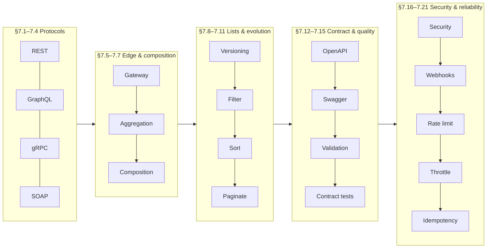

### Protocol picker

| | [REST](#71-rest) | [GraphQL](#72-graphql) | [gRPC](#73-grpc) | [SOAP](#74-soap) |
|---|------------------|------------------------|------------------|------------------|
| **Nature** | Architectural style | Query language + runtime | RPC framework | XML protocol |
| **Payload** | JSON (typical) | JSON | Protobuf (binary) | XML |
| **Transport** | HTTP | HTTP (`POST /graphql`) | HTTP/2 | HTTP, SMTP, … |
| **Contract** | [OpenAPI](#712-openapi) | GraphQL SDL | `.proto` | WSDL |
| **Caching** | Strong for `GET` | Harder | Internal use | Limited |
| **Best for** | Public CRUD, mobile/web | Multi-client, flexible screens | Service-to-service | Enterprise, regulated legacy |

Public browsers usually see REST or GraphQL at the edge; gRPC behind the [gateway](#75-api-gateway); SOAP only where mandated.

### List API pipeline


Always **filter → sort → paginate**. Document query params in OpenAPI.

### Multi-service responses

| Pattern | When | Latency |
|---------|------|---------|
| **[Aggregation](#76-api-aggregation)** | Independent service calls (dashboard fan-out) | `MAX` of calls |
| **[Composition](#77-api-composition)** | Sequential chains (step B needs step A's result) | `SUM` of calls |

Often implemented in a **BFF** behind the gateway — not heavy domain logic in gateway plugins.

---

## Sub-topics

### Protocols & styles

| # | Sub-topic | Status |
|---|-----------|--------|
| 7.1 | [REST](#71-rest) | Done |
| 7.2 | [GraphQL](#72-graphql) | Done |
| 7.3 | [gRPC](#73-grpc) | Done |
| 7.4 | [SOAP](#74-soap) | Done |

### Edge, routing & multi-service APIs

| # | Sub-topic | Status |
|---|-----------|--------|
| 7.5 | [API Gateway](#75-api-gateway) | Done |
| 7.6 | [API Aggregation](#76-api-aggregation) | Done — parallel fan-out |
| 7.7 | [API Composition](#77-api-composition) | Done — sequential + business view |

### Versioning & list APIs

| # | Sub-topic | Status |
|---|-----------|--------|
| 7.8 | [API Versioning](#78-api-versioning) | Done |
| 7.9 | [Pagination](#79-pagination) | Done |
| 7.10 | [Filtering](#710-filtering) | Done |
| 7.11 | [Sorting](#711-sorting) | Done |

### Contract, validation & testing

| # | Sub-topic | Status |
|---|-----------|--------|
| 7.12 | [OpenAPI](#712-openapi) | Done — specification |
| 7.13 | [Swagger](#713-swagger) | Done — tooling |
| 7.14 | [Request Validation](#714-request-validation) | Done |
| 7.15 | [Contract Testing](#715-contract-testing) | Done |

### Security, events & traffic

| # | Sub-topic | Status |
|---|-----------|--------|
| 7.16 | [API Security](#716-api-security) | Done |
| 7.17 | [Webhooks](#717-webhooks) | Done |
| 7.18 | [Rate Limiting](#718-rate-limiting) | Done — reject excess |
| 7.19 | [Throttling](#719-throttling) | Done — slow/queue under load |

### Safe retries

| # | Sub-topic | Status |
|---|-----------|--------|
| 7.20 | [Idempotency](#720-idempotency) | Done — concept & HTTP methods |
| 7.21 | [Idempotency Keys](#721-idempotency-keys) | Done — `POST` implementation |

---

## 7.1 REST

> **Protocol context:** compare [REST vs GraphQL vs gRPC vs SOAP](#protocol-picker) in the chapter intro.

### What is REST?

**REST (Representational State Transfer)** is an architectural style used for building web services and APIs. It allows different applications to communicate over **HTTP**.

```text
Mobile App → REST API → Database
Web App    → REST API → Database
```

REST is not a protocol — it is a set of **constraints** on how to use HTTP. Compare alternatives: [§7.2 GraphQL](#72-graphql), [§7.3 gRPC](#73-grpc).

### Core idea

Everything is treated as a **resource**.

Examples: User, Product, Order, Payment.

Resources are identified using **URLs**:

```text
/users
/products
/orders
```

### HTTP methods

| Method | Purpose | Example |
|--------|---------|---------|
| **GET** | Retrieve data | `GET /users/1` |
| **POST** | Create new data | `POST /users` |
| **PUT** | Update entire resource | `PUT /users/1` |
| **PATCH** | Update partial resource | `PATCH /users/1` |
| **DELETE** | Remove resource | `DELETE /users/1` |

`GET` is **safe** (read-only). `PUT` and `DELETE` are **idempotent** (safe to retry). `POST` is not — use [§7.21 Idempotency Keys](#721-idempotency-keys) for safe retries.

### Request and response

**Client request:**

```http
GET /users/1
```

**Server response:**

```json
{
  "id": 1,
  "name": "John"
}
```

### REST characteristics

1. **Client–server** — client sends requests; server processes them
2. **Stateless** — every request is independent; server does not remember previous requests
3. **Cacheable** — responses can be stored and reused (`GET` + `Cache-Control` / `ETag`)
4. **Uniform interface** — standard way to access resources (URLs + HTTP methods + representations)
5. **Layered system** — requests can pass through API gateways, load balancers, CDNs — [§7.5 API Gateway](#75-api-gateway)

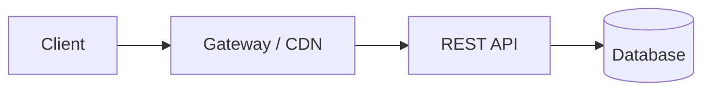

### Resource naming convention

| Good | Bad |
|------|-----|
| `GET /users` | `GET /getUsers` |
| `GET /orders` | `GET /fetchOrders` |
| `POST /products` | `POST /createProduct` |

Use **nouns** for resources; HTTP methods express the action.

```text
/users           collection
/users/{id}      single resource
/users/{id}/orders   sub-collection (when owned by user)
```

### HTTP status codes

| Code | Meaning |
|------|---------|
| **200 OK** | Request successful |
| **201 Created** | Resource created |
| **400 Bad Request** | Invalid request |
| **401 Unauthorized** | Authentication required |
| **403 Forbidden** | Access denied |
| **404 Not Found** | Resource does not exist |
| **409 Conflict** | State conflict (duplicate, version mismatch) |
| **422 Unprocessable Entity** | Valid syntax, business rule failure |
| **429 Too Many Requests** | Rate limited — [§7.18](#718-rate-limiting) |
| **500 Internal Server Error** | Server failure |

Return consistent error bodies (e.g. `application/problem+json`) instead of `200` with `{ "error": true }`.

### Simple flow

```text
Client → GET /users/1 → Server → fetch from database
→ JSON response → Client
```

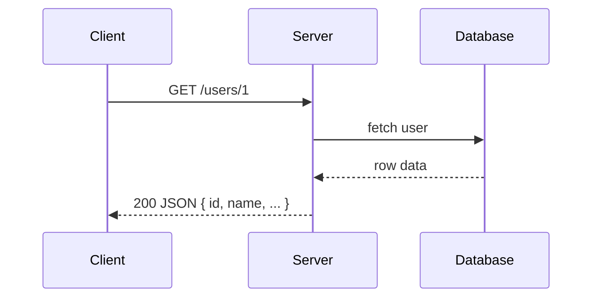

### Data format

Most REST APIs use **JSON**.

```json
{
  "id": 101,
  "name": "Alice",
  "email": "alice@example.com"
}
```

Content negotiation: client sends `Accept: application/json`. API versioning: [§7.8 API Versioning](#78-api-versioning). List APIs: [§7.9 Pagination](#79-pagination), [§7.10 Filtering](#710-filtering), [§7.11 Sorting](#711-sorting). Contract docs: [§7.12 OpenAPI](#712-openapi).

### When to use REST

- Public HTTP APIs for mobile and web clients
- CRUD-heavy domains with clear resource boundaries
- Cacheable reads and broad client/tooling support

### Trade-offs

- **Over/under-fetching** — fixed resource shapes may need multiple calls (BFF, GraphQL, or aggregation — [§7.6](#76-api-aggregation))
- **RPC-in-REST** — verbs in URLs lose HTTP semantics
- **POST without idempotency** — retries after timeout can duplicate side effects — [§7.20](#720-idempotency)

### Summary

```text
REST = architectural style for APIs
Uses HTTP + URLs + resources + JSON (typically)
Operations: GET, POST, PUT, PATCH, DELETE
Goal: simple, scalable, standardized communication between applications
```

---


## 7.2 GraphQL

> **Protocol context:** [Protocol picker](#protocol-picker).

### What is GraphQL?

**GraphQL** is a **query language for APIs**. It allows clients to request exactly the data they need from the server.

Developed by Facebook (Meta).

```text
Client → GraphQL API → Database
```

Unlike [§7.1 REST](#71-rest), where the server defines fixed response shapes per endpoint, GraphQL returns a **graph-shaped response** matching the client's query tree.

### Why GraphQL?

In REST, the **server** decides what data is returned. In GraphQL, the **client** decides what fields are needed.

This helps avoid:

1. **Over-fetching** — getting more data than needed
2. **Under-fetching** — making multiple API calls to get required data

**Example:** User has `id`, `name`, `email`, `age`, `address`. Client only needs `name`:

```graphql
{
  user(id: 1) {
    name
  }
}
```

**Response:**

```json
{
  "data": {
    "user": {
      "name": "John"
    }
  }
}
```

### Core components

| Component | Purpose |
|-----------|---------|
| **Query** | Read data |
| **Mutation** | Create, update, delete data |
| **Subscription** | Real-time updates |

#### Query

```graphql
{
  user(id: 1) {
    id
    name
    email
  }
}
```

#### Mutation

```graphql
mutation {
  createUser(name: "John") {
    id
    name
  }
}
```

#### Subscription

```graphql
subscription {
  newMessage {
    id
    text
  }
}
```

### Single endpoint

**REST** — multiple endpoints:

```text
GET /users
GET /orders
GET /products
```

**GraphQL** — single endpoint:

```http
POST /graphql
```

All queries, mutations, and subscriptions go through one endpoint.

### Schema

The **schema** defines available data, types, queries, and mutations.

```graphql
type User {
  id: ID
  name: String
  email: String
}

type Query {
  user(id: ID!): User
}

type Mutation {
  createUser(name: String!): User
}
```

Strong typing enables introspection, validation, and client code generation — [§7.12 OpenAPI](#712-openapi) plays a similar contract role for REST.

### Resolver

A **resolver** contains the logic for fetching or updating data.

```text
Query → resolver → database → response
```

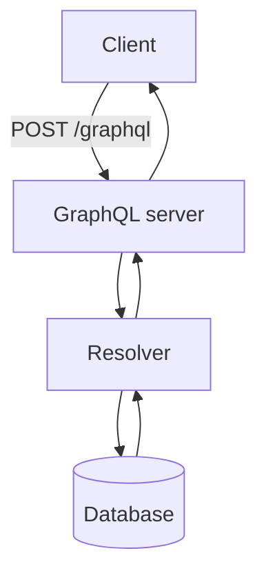

### Example flow

**Client query:**

```graphql
{
  user(id: 1) {
    name
    email
  }
}
```

```text
Client → GraphQL server → resolver → database
→ response: { "data": { "user": { "name": "John", "email": "john@gmail.com" } } }
```

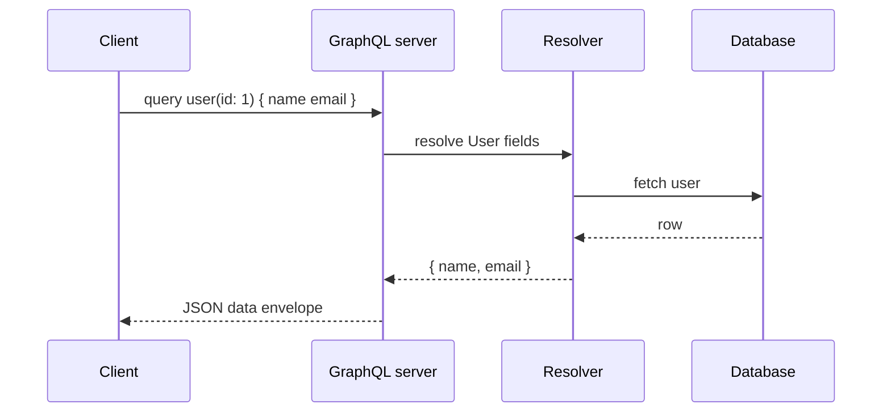

**N+1 pitfall:** one resolver call per nested object can explode DB queries — mitigate with **DataLoader** batching in production.

### Advantages

- Fetch only required data
- Single endpoint
- Flexible queries
- Strong schema and typing
- Better for mobile (less payload, fewer round trips)
- Reduces network calls

### Disadvantages

- More complex than REST
- Query optimization can be difficult (depth/complexity limits, rate limiting — [§7.18](#718-rate-limiting))
- Caching is harder than REST `GET` + CDN
- Higher learning curve
- Expensive queries can stress backends without guardrails

### When to use GraphQL?

- Multiple clients (web, iOS, Android) with different field needs
- Screens that aggregate data from many domains in one request
- Rapid frontend iteration without a new REST endpoint per screen

### When not to use?

- Simple CRUD APIs where REST + OpenAPI suffices
- Public APIs that rely heavily on HTTP/CDN caching
- Teams without capacity to operate schema versioning and resolver performance

### Summary

```text
GraphQL = query language for APIs
Components: Query, Mutation, Subscription
Key benefit: client requests exactly the data it needs
Common endpoint: POST /graphql
```

**Goal:** Flexible, client-driven data fetching over a single typed schema.

---


## 7.3 gRPC

> **Protocol context:** [Protocol picker](#protocol-picker).

### What is gRPC?

**gRPC (Google Remote Procedure Call)** is a high-performance communication framework developed by Google. It allows one service to directly call methods on another service **as if they were local functions**.

Commonly used in **microservices**.

```text
Service A → gRPC → Service B
```

### Why gRPC?

**Traditional REST:** HTTP + JSON.

**gRPC:** HTTP/2 + **Protocol Buffers (Protobuf)**.

Benefits:

- Faster communication
- Smaller payload size
- Lower latency
- Better performance

### Basic idea

Instead of calling URLs:

```http
GET /users/1
```

You call methods directly:

```text
GetUser(1)
```

Looks like a normal function call in generated client code.

### Architecture

```text
Client → RPC call → gRPC server → business logic → database → response
```

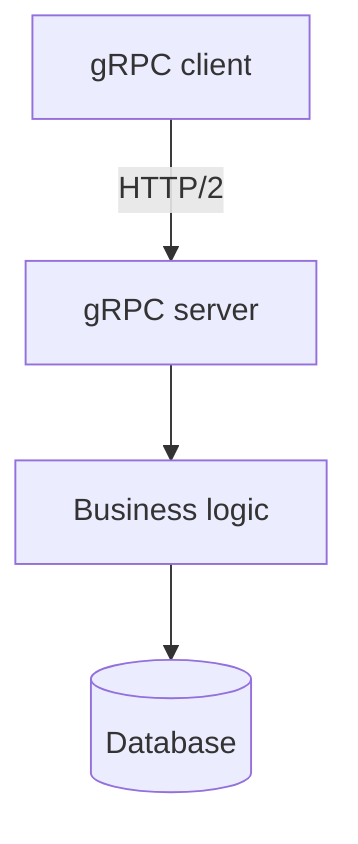

### Protocol Buffers (Protobuf)

Protobuf is a compact **binary** format used by gRPC.

```protobuf
// user.proto
message User {
  int32 id = 1;
  string name = 2;
}
```

Advantages:

- Smaller than JSON
- Faster serialization
- Language independent (code generation for Java, Go, Python, etc.)

### Service definition

```protobuf
service UserService {
  rpc GetUser(UserRequest) returns (UserResponse);
}
```

Meaning: client calls `GetUser()`; server returns `UserResponse`.

**Request:**

```protobuf
message UserRequest {
  int32 id = 1;
}
```

**Response:**

```protobuf
message UserResponse {
  int32 id = 1;
  string name = 2;
}
```

### Communication flow

```text
Client: GetUser(1)
  → gRPC stub → HTTP/2 request → gRPC server → database
  → UserResponse returned
```

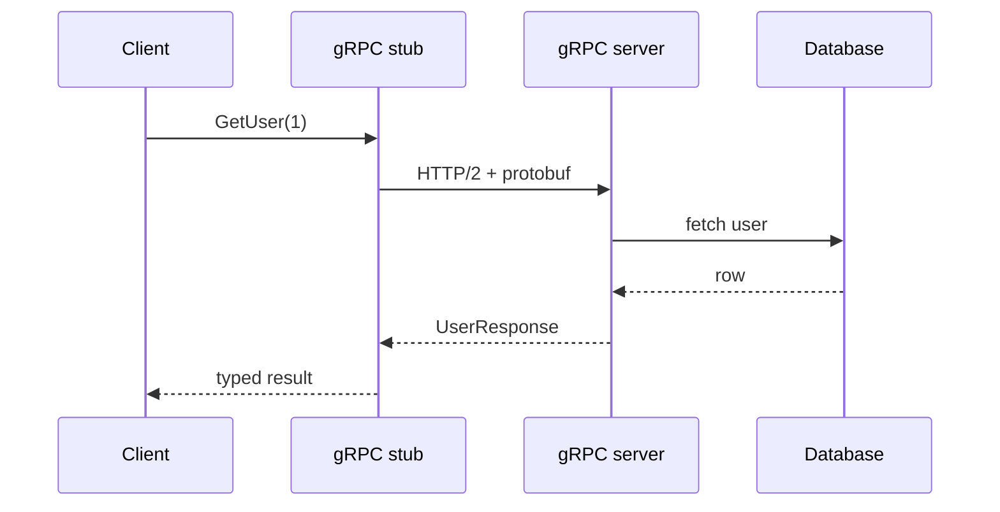

### HTTP/2 features

1. **Multiplexing** — multiple requests over one connection
2. **Header compression** (HPACK) — smaller network overhead
3. **Persistent connection** — connection reused many times
4. **Streaming support** — real-time communication

### Types of gRPC calls

| Type | Pattern | Example |
|------|---------|---------|
| **1. Unary** | One request → one response | `GetUser()` |
| **2. Server streaming** | One request → many responses | `GetAllOrders()` |
| **3. Client streaming** | Many requests → one response | `UploadLogs()` |
| **4. Bidirectional streaming** | Many requests ↔ many responses | Chat application |

```text
Unary:           Client ---> Server --->

Server streaming: Client ---> Server <--- (stream)

Client streaming: Client ---> (stream) ---> Server <---

Bidirectional:    Client <----------> Server
```

### Stub

**Stub** is auto-generated client code. Instead of writing HTTP calls manually:

```text
userService.GetUser(1)
```

The stub converts the call into a gRPC request over HTTP/2.

### Advantages

- Extremely fast; small payloads
- HTTP/2 multiplexing and compression
- Strongly typed APIs with code generation
- Supports streaming (all four RPC types)
- Ideal for microservices and polyglot teams

### Disadvantages

- Harder to debug than REST (binary, not human readable)
- **Limited browser support** — needs grpc-web proxy at the edge
- Higher learning curve (`.proto`, codegen, tooling)
- Load balancers must support HTTP/2 (L7) or client-side balancing

**Production habits:** set **deadlines/timeouts** on every RPC; use **mTLS** in zero-trust networks; never reuse protobuf field numbers when evolving schemas.

### When to use gRPC?

- Building microservices with low latency and high throughput
- Real-time streaming (logs, metrics, feeds, chat backends)
- Internal service-to-service communication

### When not to use?

- Public browser-facing APIs (prefer REST or GraphQL at the edge)
- Teams without protobuf/codegen workflow
- Simple integrations where curl-friendly JSON is enough

### Summary

```text
gRPC = high-performance RPC framework
Uses HTTP/2 + Protocol Buffers (Protobuf)
RPC types: Unary, Server streaming, Client streaming, Bidirectional streaming
Best use case: fast communication between microservices
```

**Goal:** Typed, low-latency RPC between backend services.

---


## 7.4 SOAP

> **Protocol context:** [Protocol picker](#protocol-picker).

### What is SOAP?

**SOAP (Simple Object Access Protocol)** is a protocol used for exchanging data between applications over a network. It defines **strict rules** for how messages should be formatted and transmitted.

SOAP was widely used before REST became popular. Today it remains in **legacy enterprise** and regulated integrations.

```text
Client → SOAP service → Database
```

Compare modern alternatives: [§7.1 REST](#71-rest), [§7.3 gRPC](#73-grpc).

### Why SOAP?

SOAP was designed for:

- Standardized communication
- Enterprise applications
- High security
- Reliability
- Transaction support

Commonly used in: banking systems, payment gateways, insurance systems, government services.

### Message format

SOAP uses **XML only**.

```xml
<soap:Envelope>
  <soap:Body>
    <GetUser>
      <id>1</id>
    </GetUser>
  </soap:Body>
</soap:Envelope>
```

All requests and responses are XML.

### SOAP architecture

```text
Client → SOAP request (XML) → SOAP server → business logic → database
→ SOAP response (XML) → client
```

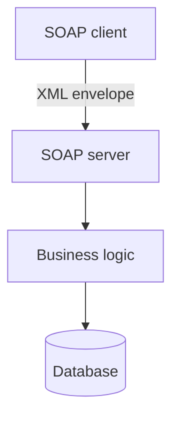

### Main components

| # | Component | Role |
|---|-----------|------|
| 1 | **Envelope** | Root element — defines start and end of every message |
| 2 | **Header** | Metadata (authentication, security tokens, transaction info) |
| 3 | **Body** | Actual request or response data |
| 4 | **Fault** | Error handling (e.g. invalid user ID) |

**Header example:**

```xml
<Header>
  <!-- Authentication info, WS-Security tokens -->
</Header>
```

**Fault example:**

```xml
<Fault>
  Invalid User ID
</Fault>
```

### WSDL

**WSDL (Web Services Description Language)** is an XML document describing:

- Available operations
- Request and response formats
- Service endpoint

Acts as a **contract** between client and server.

```text
Operations: GetUser(), CreateUser(), DeleteUser()
```

Similar role to OpenAPI for REST — [§7.12 OpenAPI](#712-openapi) — or `.proto` for gRPC.

### Communication flow

```text
Client: GetUser request
  → SOAP XML message → SOAP server → database
  → SOAP XML response → client
```

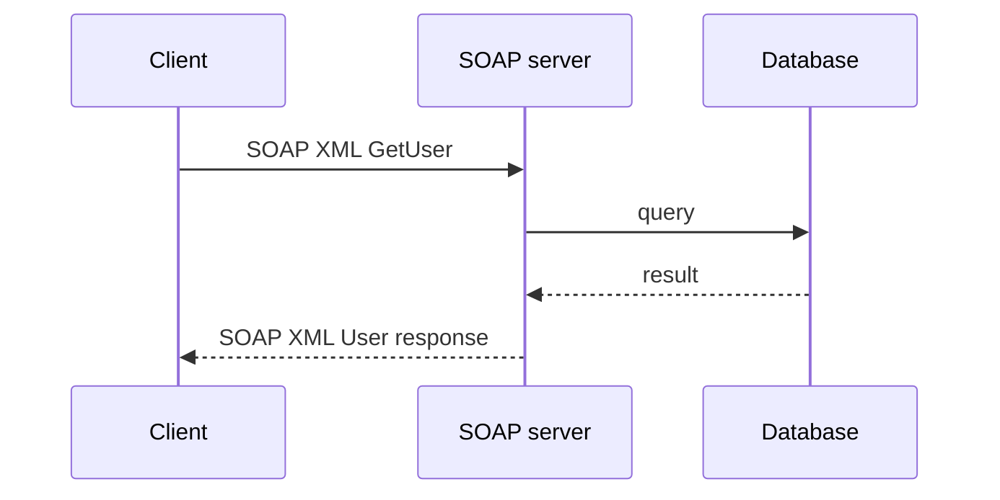

### Transport protocols

SOAP can work with:

- HTTP / HTTPS
- SMTP
- TCP
- JMS

[§7.1 REST](#71-rest) mainly uses HTTP. SOAP supports **multiple transports** — useful when messaging buses or legacy middleware are required.

### Security

SOAP provides **WS-Security**:

- Message encryption
- Digital signatures
- Authentication
- Integrity checking

Used in highly secure, regulated systems. Detail: [§7.16 API Security](#716-api-security).

### Reliability

SOAP supports:

- Guaranteed delivery
- Transactions (WS-AtomicTransaction, etc.)
- Message reliability

Important in financial systems where delivery and atomicity matter.

### SOAP request example

```xml
<soap:Envelope>
  <soap:Body>
    <GetUser>
      <id>101</id>
    </GetUser>
  </soap:Body>
</soap:Envelope>
```

### SOAP response example

```xml
<soap:Envelope>
  <soap:Body>
    <User>
      <id>101</id>
      <name>John</name>
    </User>
  </soap:Body>
</soap:Envelope>
```

### Advantages

- Strong security support (WS-Security)
- Formal contract via WSDL
- Reliable messaging and transaction support
- Language independent
- Enterprise standard with mature Java/.NET tooling

### Disadvantages

- Verbose XML — large payload size
- Slower than REST or gRPC
- More complex to develop and maintain
- WS-* interoperability can be painful

### When to use SOAP?

- Strong security and compliance requirements
- Transactions and guaranteed delivery matter
- Integrating with **legacy enterprise** or B2B partners mandating WSDL
- Banking, insurance, government systems

### When not to use?

- Greenfield public or mobile APIs (prefer REST or GraphQL)
- High-throughput internal microservices (prefer gRPC)
- Teams wanting simple JSON + curl debugging

Modern pattern: wrap SOAP behind [§7.5 API Gateway](#75-api-gateway) or REST adapter for new clients.

### Summary

```text
SOAP = XML-based protocol with WSDL contract and WS-Security
Components: Envelope, Header, Body, Fault
Best for: banking, insurance, government, enterprise integrations
Key strength: security, reliability, standardization
```

**Goal:** Strict, secure, reliable messaging where enterprise contracts and WS-* standards are required.

---


## 7.5 API Gateway

> **Cross-cutting hub:** auth and TLS → [§7.16](#716-api-security); rate limits → [§7.18](#718-rate-limiting); aggregation → [§7.6](#76-api-aggregation); composition/BFF → [§7.7](#77-api-composition).

### What is an API gateway?

An **API gateway** is a **single entry point** for all client requests in a microservices architecture.

Instead of clients calling multiple services directly, they communicate through the gateway.

```text
Client → API Gateway → User Service
                    → Order Service
                    → Payment Service
```

### Problem without API gateway

The client must know every service URL:

```text
Mobile App → User Service
          → Order Service
          → Payment Service
```

Issues: complex client logic, tight coupling, multiple network calls, difficult service discovery.

### Solution: API gateway

```text
Client → API Gateway → User / Order / Payment services
```

Benefits: simpler clients, better security, centralized routing.

### How it works

```text
Step 1: Client sends request — GET /users/101
Step 2: API gateway receives request
Step 3: Gateway routes to User Service
Step 4: Response returned to client
```

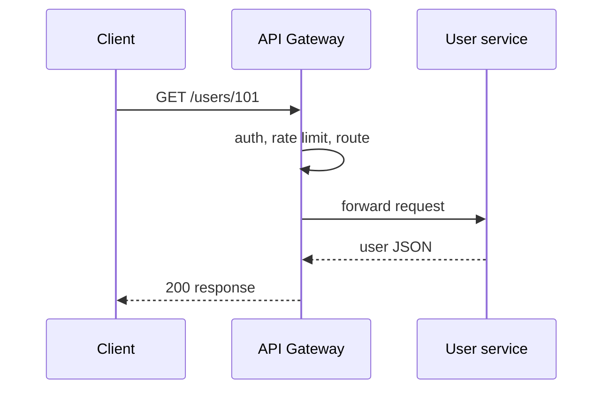

### Responsibilities

| # | Responsibility | Summary |
|---|----------------|---------|
| 1 | **Request routing** | `/users` → User Service, `/orders` → Order Service |
| 2 | **Authentication** | Validate identity (e.g. JWT) before forwarding |
| 3 | **Authorization** | Check permissions (e.g. `/admin` for admins only) |
| 4 | **Load balancing** | Distribute across service instances |
| 5 | **Rate limiting** | Cap requests (e.g. 100/min) → `429` — [§7.18](#718-rate-limiting) |
| 6 | **Caching** | Return cached `GET /products` without hitting backend |
| 7 | **Monitoring & logging** | Requests, latency, errors, traffic |
| 8 | **Request aggregation** | Combine multi-service data in one response — [§7.6](#76-api-aggregation) |

#### 1. Request routing

```text
/users    → User Service
/orders   → Order Service
/payments → Payment Service
```

#### 2. Authentication

```text
Client → JWT token → API Gateway → verify token → forward to service
```

Detail: [§7.16 API Security](#716-api-security).

#### 3. Authorization

```text
Admin user → can access /admin
Normal user → denied
```

#### 4. Load balancing

```text
Gateway → User Service instance 1 / 2 / 3
```

Prevents overload on a single instance.

#### 5. Rate limiting

Cap requests per client (e.g. 100/min → `429`). Detail: [§7.18 Rate Limiting](#718-rate-limiting) — not [§7.19 Throttling](#719-throttling) (slow/queue).

#### 6. Caching

```text
GET /products → gateway cache hit → response without backend call
```

Lower latency and reduced database load.

#### 7. Monitoring & logging

Track requests, response times, errors, and traffic for troubleshooting and SLOs.

#### 8. Request aggregation

**Without gateway/BFF:** client calls User, Order, and Payment services — **3 network calls**.

**With aggregation:** client makes **1 call**; gateway (or BFF) fans out and merges — [§7.6 API Aggregation](#76-api-aggregation).

### Architecture

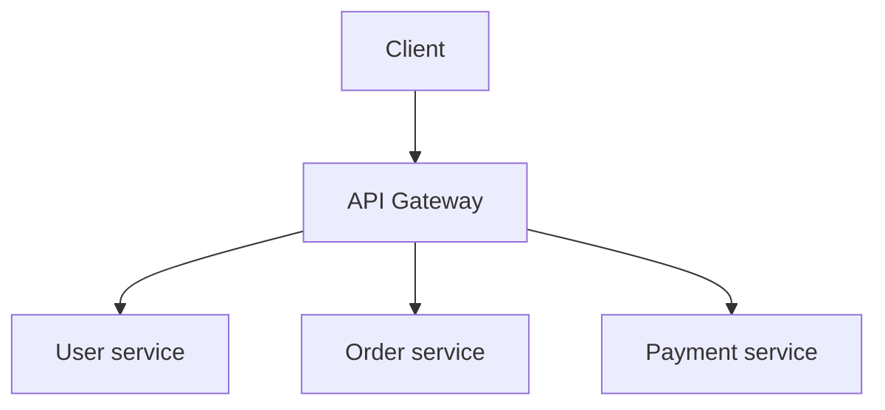

### API gateway vs load balancer

| | Load balancer | API gateway |
|---|---------------|-------------|
| **Routes to** | Multiple instances of the **same** service | **Different** services |
| **Example** | User Service → instance 1, 2, 3 | `/users`, `/orders`, `/payments` |
| **Extra features** | Traffic distribution | Auth, rate limiting, caching, routing, aggregation |

### API gateway vs BFF

| | API gateway | BFF (Backend for Frontend) |
|---|-------------|----------------------------|
| **Job** | Edge policy: TLS, auth, quotas, routing | Client-specific aggregation and response shaping |
| **Logic** | Infrastructure only — no domain rules | Thin orchestration per client (mobile vs web) |
| **Typical path** | `Client → Gateway → Services` | `Client → Gateway → BFF → Services` |

Detail: [§7.7 API Composition](#77-api-composition) for sequential fan-out.

### Popular API gateways

- Kong
- NGINX / NGINX Plus
- AWS API Gateway
- Spring Cloud Gateway
- Apigee
- Traefik
- Envoy

### Advantages

- Single entry point; simplifies clients
- Centralized security (auth, TLS termination)
- Load balancing, rate limiting, caching
- Better monitoring and observability
- Request aggregation at the edge

### Disadvantages

- Additional network hop (latency)
- Can become a bottleneck without scaling
- **Single point of failure** if not deployed redundantly (multi-AZ, ≥2 instances)
- Increased operational complexity (routing config, GitOps)

**Mitigation:** HA gateway tier, autoscaling, never put domain business logic in gateway plugins — keep policy at edge, aggregation in BFF.

### When to use an API gateway?

- Multiple microservices exposed to external clients
- Centralized API keys, OAuth, JWT validation, quota tiers
- Need canary routing or protocol translation (REST → gRPC — [§7.3](#73-grpc))

### Summary

```text
API Gateway = single entry point for microservices
Responsibilities: routing, auth, authorization, load balancing,
  rate limiting, caching, monitoring, aggregation
Simplifies client communication with multiple backend services
```

**Goal:** One secure, observable front door for all public API traffic.

---


## 7.6 API Aggregation

> **Parallel fan-out:** combine independent service calls at once. For **sequential** calls when later steps depend on earlier results, see [§7.7 API Composition](#77-api-composition).

### What is API aggregation?

**API aggregation** is a pattern where data from **multiple services** is combined into a **single response**.

Instead of the client calling many services, one component gathers data from all services and returns a unified response.

**Goal:** reduce client-side complexity and network calls.

### Problem

E-commerce example — services: User, Order, Payment. A user dashboard needs user info, orders, and payment details.

**Without aggregation:**

```text
Client → User Service
      → Order Service
      → Payment Service
```

Three separate API calls.

**Issues:** more network calls, higher latency, complex client logic, more error handling on the client.

### Solution: API aggregation

```text
Client → Aggregator service
           → User Service
           → Order Service
           → Payment Service
→ one combined response
```

Often implemented as a **BFF** behind [§7.5 API Gateway](#75-api-gateway).

### Example flow

**Step 1:** Client requests `GET /dashboard/101`

**Step 2:** Aggregator calls User, Order, and Payment services (in parallel when independent)

**Step 3:** Responses collected:

```json
{ "id": 101, "name": "John" }
{ "orders": [ ... ] }
{ "payments": [ ... ] }
```

**Step 4–5:** Aggregator merges and returns:

```json
{
  "user": { "id": 101, "name": "John" },
  "orders": [ ... ],
  "payments": [ ... ]
}
```

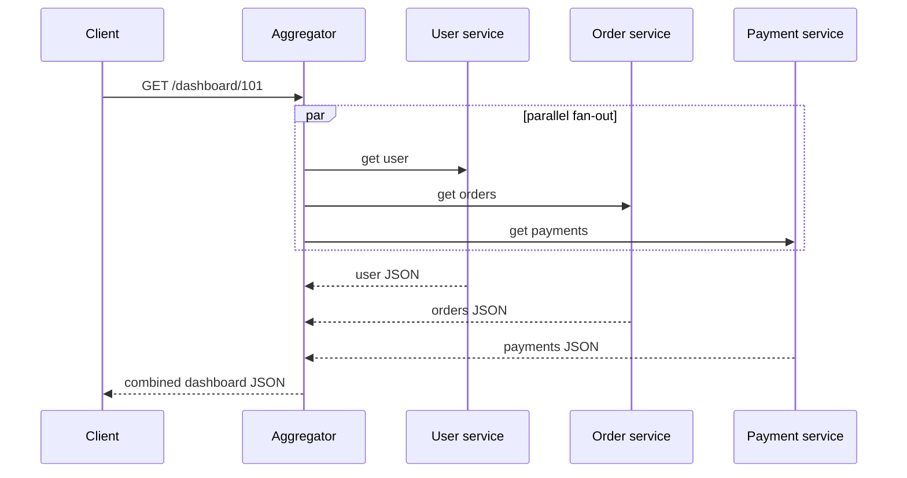

### Architecture

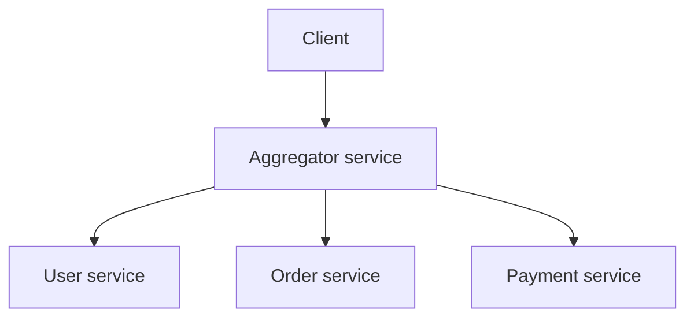

### Benefits

1. Fewer network calls
2. Lower client complexity
3. Better user experience (faster screens)
4. Centralized data composition
5. Reduced latency (when parallel)

### Parallel execution

Good aggregators call independent services **in parallel**:

```text
Aggregator → User Service
          → Order Service   (simultaneously)
          → Payment Service

Total latency = MAX(user, order, payment)
NOT SUM(user + order + payment)
```

Set **per-call deadlines** — tail latency equals the slowest dependency.

### Failure handling

```text
User ✓  Order ✓  Payment ✗
```

**Options:**

1. **Partial data** — `{ "user": {...}, "orders": [...], "payments": null }`
2. **Fail entire request** — `500 Internal Server Error`

Choice depends on business requirements (degraded UI vs strict consistency).

### Where aggregation happens

| Location | Pattern |
|----------|---------|
| **API Gateway** | Gateway plugin or built-in composition — [§7.5](#75-api-gateway) |
| **Dedicated aggregator / BFF** | Separate service owns dashboard/profile endpoints |

Prefer a **dedicated BFF** over a “smart gateway” with heavy business logic in plugins.

### Use cases

- User dashboard, customer profile, order summary
- Product detail page (product + reviews + inventory)
- Analytics and reporting dashboards
- Any screen requiring data from multiple services

### API aggregation vs API composition

Canonical comparison — detail in [§7.7](#77-api-composition).

| | [Aggregation](#76-api-aggregation) (§7.6) | [Composition](#77-api-composition) (§7.7) |
|---|------------------------------------------|------------------------------------------|
| **Primary focus** | Parallel fan-out when calls are **independent** | **Sequential** chains when step B needs step A's output |
| **Latency** | `MAX(service times)` | `SUM(service times)` for chains |
| **Overlap** | Terms often used interchangeably for BFF dashboard patterns | Includes parallel assembly + business-centric merging |

### API aggregation vs API gateway

| | API aggregation | API gateway |
|---|-----------------|-------------|
| **Focus** | Data composition — merge multi-service responses | Edge entry point: routing, auth, rate limiting, caching, monitoring |
| **Relationship** | Gateway **may** aggregate, but aggregation is only one feature | Gateway is not required to aggregate — prefer **BFF** for domain merge logic |

### API aggregation vs GraphQL

| | API aggregation | GraphQL |
|---|-----------------|---------|
| **Who shapes response** | Backend decides fixed DTO | Client chooses fields in query |
| **Flexibility** | Fixed combined response | Flexible per screen — [§7.2](#72-graphql) |

GraphQL resolvers often perform aggregation implicitly.

### Challenges

- Increased complexity and an extra service layer
- Partial failures and timeout handling
- Data consistency across services (eventual consistency)
- Coupling to backend schemas — changes ripple to aggregator
- Amplified load on backends without caching

### Summary

```text
API Aggregation = combine data from multiple services into one response
Purpose: fewer client calls, simpler frontend, better performance
Flow: Client → Aggregator → Service A/B/C → single combined response
Common use cases: dashboards, profiles, reporting, e-commerce screens
```

**Goal:** One round trip for multi-domain screens; parallelize independent fetches.

---


## 7.7 API Composition

> **Canonical split:** see [Multi-service responses](#multi-service-responses) and [§7.6 Aggregation](#76-api-aggregation).

### What is API composition?

**API composition** fetches data from multiple microservices and merges it into a **single business-centric response** — often via a **BFF** behind [§7.5 API Gateway](#75-api-gateway).

When calls are independent, use the same parallel pattern as [§7.6](#76-api-aggregation). Composition adds **sequential orchestration** when one service's output is input to the next.

### Sequential composition (key differentiator)

When one service **depends** on another, calls must run in order:

```text
Get User → Get User Orders → Get Order Payments

Latency = SUM(step times)
```

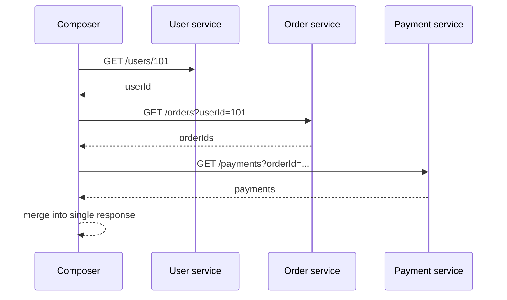

Minimize chain depth; cache intermediate results; use circuit breakers per hop.

### Example: order summary chain

**Client:** `GET /order-summary/101`

```text
1. GET /users/101        → customer name
2. GET /orders/101       → line items (needs valid user)
3. GET /payments/order/101 → payment status (needs order id)
```

Composer returns one JSON object — client makes **one** round trip.

### Parallel assembly

When dashboard fields are independent (user + orders + payments by user id), parallel fan-out is identical to [§7.6 API Aggregation](#76-api-aggregation) — do not duplicate that pattern here.

### Composition flow

```text
Receive request → determine services → fetch (parallel or sequential)
→ transform and merge → return composed response
```

### Failure handling

Same options as [§7.6](#76-api-aggregation): partial response vs fail entire request. Sequential chains fail fast on the blocking step — consider cached fallbacks for non-critical hops.

### API composition vs database join

| | Database join | API composition |
|---|---------------|-----------------|
| **Where data merges** | Single database | Application layer across microservices |
| **Example** | `JOIN` users + orders in one DB | User DB + Order DB + Payment DB merged in composer |

In microservices, data lives in separate stores — composition replaces SQL joins at the app layer.

### Use cases

- **Sequential:** booking (availability → reserve → pay), checkout, fraud check before payment
- **Parallel:** customer dashboard — see [§7.6](#76-api-aggregation)
- Admin reports, product detail (reviews after product id known)

### Challenges

- Deep chains add latency and fragility — prefer denormalized read models or CQRS projections for hot paths
- Coupling to downstream schemas; partial failure handling
- Do not put heavy composition in gateway plugins — use a dedicated BFF

### Summary

```text
API Composition = unified response from multiple microservices
Parallel independent calls → §7.6; sequential dependent chains → this section
Flow: Client → Composer/BFF → services → composed response
```

**Goal:** One client-facing endpoint that assembles distributed domain data.

---


## 7.8 API Versioning

### What is API versioning?

**API versioning** is the practice of maintaining different versions of an API when changes are introduced that may affect existing clients.

It allows new features and modifications to be released **without breaking** applications already using the API.

### Why API versioning is needed

1. Maintain backward compatibility
2. Support existing clients
3. Introduce new features safely
4. Modify request/response structures
5. Deprecate old functionality gradually

Public and partner APIs on [§7.1 REST](#71-rest) almost always need an explicit versioning policy.

### Example without versioning

**Original:**

```http
GET /users
```

```json
{ "id": 1, "name": "John" }
```

**Later breaking change:**

```json
{ "userId": 1, "fullName": "John" }
```

Clients expecting `id` and `name` may break. Versioning prevents this.

### Example with versioning

**Version 1:**

```http
GET /v1/users
```

```json
{ "id": 1, "name": "John" }
```

**Version 2:**

```http
GET /v2/users
```

```json
{ "userId": 1, "fullName": "John" }
```

Old clients stay on v1; new clients adopt v2.

### Common versioning strategies

| # | Strategy | Example |
|---|----------|---------|
| 1 | **URI versioning** | `GET /v1/users`, `GET /v2/users` |
| 2 | **Query parameter** | `GET /users?version=1` |
| 3 | **Header** | `GET /users` + `API-Version: 1` |
| 4 | **Media type** | `Accept: application/vnd.company.v1+json` |

#### 1. URI versioning

Version in the URL path — most common.

| Advantages | Disadvantages |
|------------|---------------|
| Easy to understand and test; widely used; cache-friendly | Multiple URLs for the same resource |

#### 2. Query parameter versioning

```http
GET /users?version=1
GET /users?version=2
```

| Advantages | Disadvantages |
|------------|---------------|
| Same path | Less common; easy to overlook |

#### 3. Header versioning

```http
GET /users
API-Version: 1
```

| Advantages | Disadvantages |
|------------|---------------|
| Clean URLs; resource path unchanged | Harder to test manually (curl needs headers) |

#### 4. Media type versioning

```http
GET /users
Accept: application/vnd.company.v1+json
```

| Advantages | Disadvantages |
|------------|---------------|
| Flexible; close to REST content negotiation | More complex for clients and documentation |

Document the chosen strategy in [§7.12 OpenAPI](#712-openapi).

### When to create a new version

Create a new major version when:

1. Response structure changes (breaking)
2. Request structure changes (breaking)
3. Existing fields are **removed**
4. Field **names** change
5. Business **behavior** changes incompatibly

### When versioning may not be needed

Usually **not** required for:

1. Adding **optional** fields
2. Performance improvements
3. Internal refactoring
4. Bug fixes
5. Non-breaking enhancements

```json
// v1
{ "id": 1, "name": "John" }
// additive — OK without new version
{ "id": 1, "name": "John", "email": "john@test.com" }
```

**Rule:** additive changes within a major version; breaking changes → new major version.

### Backward compatibility

Older clients continue working without changes until they migrate. v2 must not break v1 clients while both run in parallel.

### API deprecation

When an older version is no longer recommended:

1. Announce deprecation (`Deprecation`, `Sunset` HTTP headers)
2. Provide migration guide
3. Allow transition period
4. Remove version after sufficient notice and zero/low traffic

```text
/v1/users + /v2/users → v1 deprecated → clients migrate → v1 removed
```

### Real flow

```text
Client request → API gateway / REST API → identify version
→ route to v1 or v2 logic → generate response → client
```

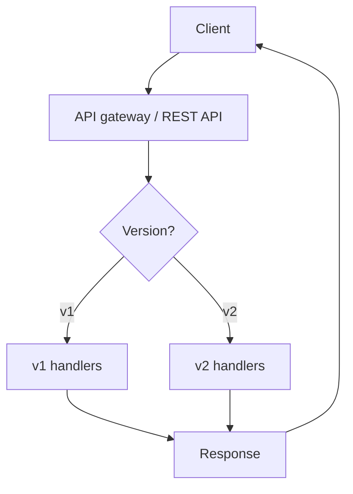

See [§7.5 API Gateway](#75-api-gateway) for edge routing (`/v1/*` vs `/v2/*`).

### Best practices

1. Use clear version naming (`v1`, `v2` — not dates unless policy says so)
2. Maintain backward compatibility within a major version
3. Avoid frequent major version bumps
4. Document every version in OpenAPI
5. Deprecate old versions gradually with timelines
6. Give clients migration time
7. Keep one consistent strategy across the API surface

### Summary

```text
API Versioning = multiple API versions coexist; existing clients keep working
Approaches: URI path, query param, header, media type (URI most common)
Benefits: backward compatibility, safe evolution, controlled breaking changes
```

**Goal:** Evolve public APIs without stranding integrators — [§7.1 REST](#71-rest).

---


## 7.9 Pagination

> See [List API pipeline](#list-api-pipeline-7911) in the chapter intro. Also: [§7.10 Filtering](#710-filtering), [§7.11 Sorting](#711-sorting) — apply **filter → sort → paginate**.

### What is pagination?

**Pagination** divides a large set of data into smaller **chunks (pages)** instead of returning everything in a single API response.

**Without pagination:**

```http
GET /users
```

```json
[ User1, User2, ... User100000 ]
```

Problems: large response size, increased network usage, slow response time, high memory consumption.

### Why pagination is needed

1. Faster API responses
2. Reduced server load
3. Reduced network traffic
4. Better user experience
5. Easier data navigation

Never expose unbounded list endpoints in production — cap with a max `size`/`limit`.

### Common pagination parameters

| Parameter | Meaning |
|-----------|---------|
| `page` | Page number (1-based typical) |
| `size` or `limit` | Records per page |

```http
GET /users?page=1&size=10
```

Returns users 1–10.

### How page numbers work

Total users = 50, page size = 10:

| Page | Records | Request |
|------|---------|---------|
| 1 | 1–10 | `GET /users?page=1&size=10` |
| 2 | 11–20 | `GET /users?page=2&size=10` |
| 3 | 21–30 | `GET /users?page=3&size=10` |
| 4 | 31–40 | `GET /users?page=4&size=10` |
| 5 | 41–50 | `GET /users?page=5&size=10` |

### Database calculation

```text
OFFSET = (page - 1) × size

page = 3, size = 10 → OFFSET = 20
```

```sql
SELECT * FROM users
LIMIT 10 OFFSET 20;
```

Skips first 20 rows, returns next 10.

**Caveat:** deep `OFFSET` scans many rows — slow on large tables; prefer cursor pagination for feeds.

### Typical paginated response

```http
GET /users?page=2&size=10
```

```json
{
  "page": 2,
  "size": 10,
  "totalRecords": 50,
  "totalPages": 5,
  "data": [ ... ]
}
```

| Field | Meaning |
|-------|---------|
| `page` | Current page |
| `size` | Records per page |
| `totalRecords` | Total matching rows (optional — expensive to compute) |
| `totalPages` | `ceil(totalRecords / size)` |
| `data` | Records for this page |

### 1. Page-based pagination

```http
GET /users?page=2&size=10
```

Simple for admin UIs with page numbers. Rows inserted/deleted during browsing can cause **duplicates or gaps** between pages.

### 2. Limit-offset pagination

```http
GET /users?limit=10&offset=20
```

Same SQL as page-based: records 21–30. `offset=20`, `limit=10`.

### 3. Cursor pagination

Uses a **cursor** instead of page number:

```http
GET /users?cursor=100
```

```json
{
  "nextCursor": 110,
  "data": [ ... ]
}
```

Fetch records **after** cursor value 100. Stable when data changes frequently — avoids duplicate/missing records during navigation. Best for infinite scroll and high-churn feeds.

```sql
SELECT * FROM users WHERE id > :cursor ORDER BY id LIMIT 10;
```

### Sorting with pagination

```http
GET /users?page=1&size=10&sort=name
GET /users?page=1&size=10&sort=createdDate,desc
```

Always define a **stable sort key** (often `id` as tiebreaker). Detail: [§7.11 Sorting](#711-sorting).

### Filtering with pagination

```http
GET /users?status=ACTIVE&page=1&size=10
```

Process: filter → paginate → return page. Detail: [§7.10 Filtering](#710-filtering).

### Real flow

```text
Client request → REST API → read page & size → calculate OFFSET
→ query DB (LIMIT/OFFSET or cursor) → build paginated response → client
```

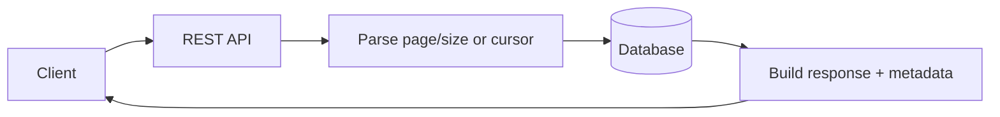

### Comparison

| Approach | Example | Best for | Trade-off |
|----------|---------|----------|-----------|
| **Page-based** | `?page=2&size=10` | Admin tables, jump to page N | Offset cost; unstable under churn |
| **Limit-offset** | `?limit=10&offset=20` | Same as page-based | Same |
| **Cursor** | `?cursor=100` | Feeds, infinite scroll | No random page jump |

### Summary

```text
Pagination = return data in manageable chunks
Approaches: page-based, limit-offset, cursor
Benefits: faster responses, lower memory, less traffic, better scale and UX
```

**Goal:** Bounded list responses on every collection endpoint in [§7.1 REST](#71-rest) APIs.

---


## 7.10 Filtering

> Pipeline: [filter → sort → paginate](#list-api-pipeline-7911). Combine with [§7.9 Pagination](#79-pagination) and [§7.11 Sorting](#711-sorting).

### What is filtering?

**Filtering** retrieves only records that match specific conditions instead of returning all available data.

It helps clients get exactly the data they need.

```http
GET /users              → all users
GET /users?status=ACTIVE → only ACTIVE users
```

### Why filtering is needed

1. Reduce unnecessary data transfer
2. Improve response time
3. Reduce server processing
4. Provide relevant data to clients
5. Improve user experience

### Common filtering parameters

Each query parameter acts as a filter condition:

```http
GET /users?status=ACTIVE
GET /users?city=Bangalore
GET /users?department=IT
GET /products?category=Electronics
```

**Whitelist** allowed filter fields in the API contract; reject unknown parameters with `400`. Use **parameterized queries** only — never concatenate user input into SQL.

### Single field filtering

```http
GET /users?status=ACTIVE
```

```sql
SELECT * FROM users WHERE status = 'ACTIVE';
```

### Multiple field filtering

```http
GET /users?status=ACTIVE&city=Bangalore
```

```sql
SELECT * FROM users
WHERE status = 'ACTIVE' AND city = 'Bangalore';
```

### Filtering by numeric values

```http
GET /employees?salary=50000
```

```sql
SELECT * FROM employees WHERE salary = 50000;
```

### Range filtering

```http
GET /products?minPrice=1000&maxPrice=5000
```

Products with price between 1000 and 5000:

```sql
SELECT * FROM products
WHERE price >= 1000 AND price <= 5000;
```

### Date filtering

```http
GET /orders?orderDate=2026-06-25
```

```sql
SELECT * FROM orders WHERE order_date = '2026-06-25';
```

```http
GET /orders?fromDate=2026-01-01&toDate=2026-06-30
```

```sql
SELECT * FROM orders
WHERE order_date BETWEEN '2026-01-01' AND '2026-06-30';
```

### Search filtering

**Exact:**

```http
GET /users?name=John
```

```sql
SELECT * FROM users WHERE name = 'John';
```

**Partial:**

```http
GET /users?name=Joh
```

```sql
SELECT * FROM users WHERE name LIKE '%Joh%';
```

Prefer indexed search (full-text, prefix) over leading-wildcard `LIKE` on large tables.

### IN filtering

```http
GET /users?status=ACTIVE,PENDING
```

```sql
SELECT * FROM users WHERE status IN ('ACTIVE', 'PENDING');
```

### Boolean filtering

```http
GET /users?verified=true
```

```sql
SELECT * FROM users WHERE verified = true;
```

### Filtering with sorting

```http
GET /users?status=ACTIVE&sort=name,asc
```

Flow: filter → sort. Detail: [§7.11 Sorting](#711-sorting).

```sql
SELECT * FROM users
WHERE status = 'ACTIVE'
ORDER BY name ASC;
```

### Filtering with pagination

```http
GET /users?status=ACTIVE&page=1&size=10
```

Flow: filter → paginate. Detail: [§7.9 Pagination](#79-pagination).

```sql
SELECT * FROM users
WHERE status = 'ACTIVE'
LIMIT 10 OFFSET 0;
```

### Combined example

```http
GET /products?category=Electronics&minPrice=1000&maxPrice=10000&sort=price,asc&page=1&size=20
```

Flow:

1. Filter by category
2. Filter by price range
3. Sort by price ascending
4. Paginate (page 1, size 20)
5. Return results

### Real flow

```text
Client request → REST API → read filter parameters
→ validate input → build WHERE conditions → fetch matching records
→ optional sort → optional pagination → response
```

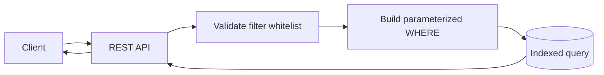

### Challenges

- Unindexed filters → full table scans
- Overly flexible filter DSL → expensive queries; cap complexity
- Composite indexes for common multi-filter combinations

### Summary

```text
Filtering = return only records matching query conditions
Examples: ?status=ACTIVE | ?city=Bangalore | ?minPrice=1000&maxPrice=5000
Combine with sorting, pagination, search, and date ranges
Benefits: faster responses, less data, more relevant results
```

**Goal:** Let clients narrow collections safely on every list endpoint — [§7.1 REST](#71-rest).

---


## 7.11 Sorting

> Pipeline: [filter → sort → paginate](#list-api-pipeline-7911). Combine with [§7.9 Pagination](#79-pagination) and [§7.10 Filtering](#710-filtering).

### What is sorting?

**Sorting** arranges data in a specific order before returning it from an API.

Data can be sorted on fields such as name, age, salary, created date, updated date, or price.

Sorting helps clients receive data in a meaningful, organized way.

### Why sorting is needed

1. Display data in a user-friendly order
2. Show latest records first
3. Show highest or lowest values
4. Improve data readability
5. Support reporting and analytics

Consistent ordering is required for stable [§7.9 cursor pagination](#79-pagination).

### Ascending and descending order

| Order | Meaning | Examples |
|-------|---------|----------|
| **ASC** | Smallest → largest; A → Z; oldest → newest | `1,2,3,4,5` · `A,B,C,D,E` |
| **DESC** | Largest → smallest; Z → A; newest → oldest | `5,4,3,2,1` · `E,D,C,B,A` |

### Sorting parameters in REST API

```http
GET /users?sort=name
```

Sort by `name` ascending (default).

```http
GET /users?sort=name,desc
```

Sort by `name` descending.

**Whitelist** allowed sort fields in the API contract — reject unknown fields with `400` to prevent expensive or unsafe `ORDER BY`.

### Example data

```json
[
  { "id": 1, "name": "John" },
  { "id": 2, "name": "Alice" },
  { "id": 3, "name": "David" }
]
```

### Sort by name ascending

```http
GET /users?sort=name,asc
```

```json
[
  { "id": 2, "name": "Alice" },
  { "id": 3, "name": "David" },
  { "id": 1, "name": "John" }
]
```

### Sort by name descending

```http
GET /users?sort=name,desc
```

```json
[
  { "id": 1, "name": "John" },
  { "id": 3, "name": "David" },
  { "id": 2, "name": "Alice" }
]
```

### Sorting by date

```http
GET /orders?sort=createdDate,desc   → newest first
GET /orders?sort=createdDate,asc    → oldest first
```

### Multiple field sorting

```http
GET /employees?sort=department,asc&sort=salary,desc
```

1. Sort by `department` ascending
2. Within same department, sort `salary` descending

Use a **unique tiebreaker** (e.g. `id`) for stable pagination across pages.

### Database query examples

```http
GET /users?sort=name,asc
```

```sql
SELECT * FROM users ORDER BY name ASC;
```

```http
GET /users?sort=name,desc
```

```sql
SELECT * FROM users ORDER BY name DESC;
```

Ensure **indexes** match common `sort` + `filter` combinations.

### Sorting with pagination

```http
GET /users?page=1&size=10&sort=name,asc
```

Flow: sort → paginate → return first page.

```sql
SELECT * FROM users
ORDER BY name ASC
LIMIT 10 OFFSET 0;
```

### Sorting with filtering

```http
GET /users?status=ACTIVE&sort=name,asc
```

Flow: filter → sort → return results.

```sql
SELECT * FROM users
WHERE status = 'ACTIVE'
ORDER BY name ASC;
```

### Common sortable fields

| API | Examples |
|-----|----------|
| **User** | `name`, `age`, `city`, `createdDate` |
| **Product** | `price`, `rating`, `createdDate` |
| **Order** | `orderDate`, `amount`, `status` |

### Real flow

```text
Client request → REST API → read sort parameter
→ validate field name → ORDER BY → fetch sorted data → response
```

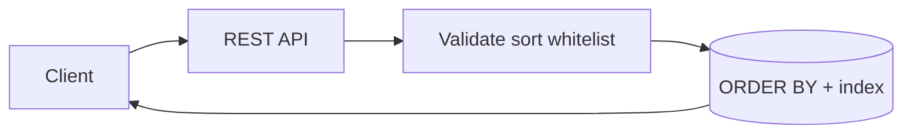

### Summary

```text
Sorting = arrange API data before sending to client
Syntax: ?sort=name | ?sort=name,asc | ?sort=name,desc | ?sort=createdDate,desc
Multi-field: ?sort=department,asc&sort=salary,desc
Works with pagination and filtering for organized list APIs
```

**Goal:** Predictable, indexed ordering on every collection endpoint — [§7.1 REST](#71-rest).

---


## 7.12 OpenAPI

> **Tooling:** interactive docs and codegen live in [§7.13 Swagger](#713-swagger) — this section is the **specification**.

### What is OpenAPI?

**OpenAPI** is a standard specification used to describe [REST](#71-rest) APIs in a **machine-readable** format.

It defines:

- Available endpoints
- Request parameters
- Request body
- Response structure
- Authentication methods
- Error responses

OpenAPI provides a **common contract** between API providers and API consumers.

### Why OpenAPI is needed

1. Standardized API documentation
2. Better API understanding
3. Automatic code generation
4. Easy API testing
5. Improved collaboration between teams
6. Client SDK generation
7. API contract definition

Versioned APIs ([§7.8](#78-api-versioning)) should document each major version in the spec (`info.version` and/or separate spec files per version).

### What is OpenAPI Specification (OAS)?

**OpenAPI Specification (OAS)** is the official format used to describe APIs.

Usually written as:

- **YAML** — `openapi.yaml`
- **JSON** — `openapi.json`

### Main components of OpenAPI

| # | Component | Purpose |
|---|-----------|---------|
| 1 | OpenAPI version | Spec format version (`3.0.0`, `3.1.0`) |
| 2 | `info` | API metadata (title, description, version) |
| 3 | `servers` | Base URLs |
| 4 | `paths` | Endpoints and HTTP methods |
| 5 | `parameters` | Query, path, header params |
| 6 | `requestBody` | Request payload schema |
| 7 | `responses` | Status codes and response schemas |
| 8 | `components` | Reusable schemas, parameters, responses |
| 9 | `security` | Auth schemes (API key, OAuth2, JWT, etc.) |

### Basic OpenAPI structure

```yaml
openapi: 3.0.0

info:
  title: User API
  version: 1.0.0

servers:
  - url: https://api.example.com

paths:
  /users:
    get:
      summary: Get all users
```

#### 1. OpenAPI version

Specifies the OpenAPI specification version:

```yaml
openapi: 3.0.0
# or
openapi: 3.1.0
```

OpenAPI 3.1 aligns with JSON Schema — useful for rich validation rules in [§7.14 Request Validation](#714-request-validation).

#### 2. Info section

API metadata:

```yaml
info:
  title: User API
  description: API for managing users
  version: 1.0.0
```

Fields: `title`, `description`, `version`.

#### 3. Servers section

Defines API base URLs:

```yaml
servers:
  - url: https://api.example.com
```

#### 4. Paths section

Defines endpoints:

```yaml
paths:
  /users:
    get:
      summary: Get Users
    post:
      summary: Create User
```

#### 5. Parameters

Query parameters, path variables, headers, etc.

`GET /users?page=1`:

```yaml
parameters:
  - name: page
    in: query
    required: false
    schema:
      type: integer
```

See [§7.9 Pagination](#79-pagination), [§7.10 Filtering](#710-filtering), [§7.11 Sorting](#711-sorting) for list-API query params to document here.

#### 6. Request body

Request payload structure for `POST /users`:

```json
{ "name": "John" }
```

```yaml
requestBody:
  required: true
  content:
    application/json:
      schema:
        type: object
        properties:
          name:
            type: string
```

#### 7. Responses

```yaml
responses:
  "200":
    description: Success
  "404":
    description: User Not Found
```

#### 8. Components

Reusable definitions — reduces duplication:

```yaml
components:
  schemas:
    User:
      type: object
      properties:
        id:
          type: integer
        name:
          type: string
```

Benefits: reusability, less duplication, easier maintenance.

#### 9. Security

Authentication mechanisms — API key, Basic auth, OAuth2, JWT:

```yaml
components:
  securitySchemes:
    bearerAuth:
      type: http
      scheme: bearer
      bearerFormat: JWT

security:
  - bearerAuth: []
```

See [§7.16 API Security](#716-api-security) for auth patterns in production.

### Complete simple example

```yaml
openapi: 3.0.0

info:
  title: User API
  version: 1.0.0

servers:
  - url: https://api.example.com

paths:
  /users:
    get:
      summary: Get Users
      responses:
        "200":
          description: Success
```

### OpenAPI documentation tools

Common tools (details in [§7.13 Swagger](#713-swagger)):

| Tool | Role |
|------|------|
| Swagger UI | Interactive API explorer |
| Swagger Editor | Design and validate specs |
| Swagger Codegen | Legacy code generation |
| OpenAPI Generator | Modern client/server codegen |

These tools can visualize APIs, generate documentation, client code, and server stubs.

### OpenAPI vs Swagger

```text
OpenAPI = specification (§7.12) · Swagger = tooling (§7.13)
```

### Benefits of OpenAPI

1. Clear API documentation
2. Better developer experience
3. Faster integration
4. Automatic client generation
5. Automated testing support ([§7.15 Contract Testing](#715-contract-testing))
6. Consistent API design
7. Improved maintainability

**Pitfall:** spec drift from implementation — validate in CI (lint with Spectral, diff breaking changes with oasdiff) and keep spec and code in sync.

### Real flow

```text
API design → create OpenAPI spec → generate documentation
→ generate client SDKs → implement API → test API → publish docs
```

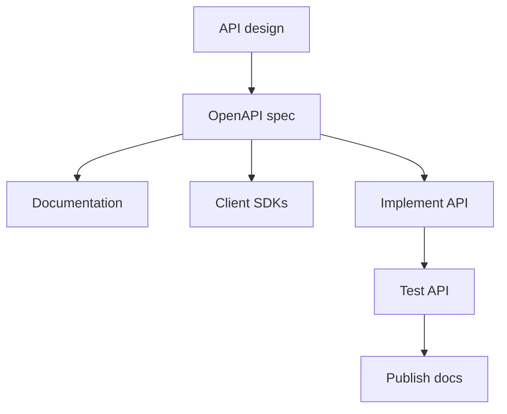

Design-first: write the spec before implementation. Code-first: generate the spec from annotations — either way, the spec is the contract.

### Summary

```text
OpenAPI = machine-readable REST API contract (YAML/JSON)
Defines: endpoints, parameters, bodies, responses, security, schemas
Tools: Swagger UI, Swagger Editor, OpenAPI Generator
Benefits: standardized docs, collaboration, codegen, testing, maintainability
```

**Goal:** One source of truth for what the API promises — [§7.1 REST](#71-rest).

---


## 7.13 Swagger

> **Specification:** the contract format is [§7.12 OpenAPI](#712-openapi) — Swagger is the **tooling** layer.

### What is Swagger?

**Swagger** is a set of tools used for designing, documenting, testing, and consuming [REST](#71-rest) APIs.

It helps developers understand and interact with APIs through a **graphical interface** without writing client code first.

Swagger works with the [OpenAPI Specification (OAS)](#712-openapi) — the spec is the contract; Swagger is the tooling layer.

### Why Swagger is needed

1. Interactive API documentation
2. Easy API testing
3. Better collaboration between teams
4. Faster API development
5. Automatic code generation
6. Improved API understanding

### Swagger ecosystem

| # | Tool | Purpose |
|---|------|---------|
| 1 | **Swagger UI** | Web UI from an OpenAPI spec — explore and try endpoints |
| 2 | **Swagger Editor** | Create and edit OpenAPI YAML/JSON with validation |
| 3 | **Swagger Codegen** | Generate clients and server stubs from specs |

**Note:** [OpenAPI Generator](https://openapi-generator.tech/) is the actively maintained successor to Swagger Codegen for new projects.

#### 1. Swagger UI

Generates a web-based interface from an [OpenAPI](#712-openapi) specification.

Features:

- View API documentation
- Explore endpoints
- Execute API requests (**Try it out**)
- View request and response details

Example: for `GET /users`, click **Try it out** and execute the request in the browser.

Typical URLs (Spring Boot and similar):

```text
/swagger-ui.html
/swagger-ui/index.html
```

Host the spec at `/openapi.json` or `/v3/api-docs`; Swagger UI reads it and renders operations.

#### 2. Swagger Editor

Used to create and edit OpenAPI specifications.

Features:

- Write OpenAPI YAML
- Validate specifications
- Preview documentation
- Detect syntax errors

```yaml
openapi: 3.0.0

info:
  title: User API
  version: 1.0.0
```

Design-first workflows: author here, then implement against the spec ([§7.12](#712-openapi)).

#### 3. Swagger Codegen

Generates source code from OpenAPI definitions:

- Java, Python, JavaScript clients
- Server stubs

Benefits: less manual coding, faster integration. Prefer **OpenAPI Generator** for new codegen pipelines.

### How Swagger works

```text
Step 1: Create OpenAPI specification
Step 2: Swagger reads specification
Step 3: Generate interactive documentation
Step 4: Developers test APIs
```

### Swagger UI example

Endpoint `GET /users/{id}` — Swagger UI displays:

```text
GET /users/{id}

Parameters:
  id : integer

Responses:
  200 Success
  404 Not Found
```

Users enter parameter values and execute requests directly from the browser.

### Swagger with Spring Boot

Swagger/OpenAPI can auto-generate documentation from Spring Boot apps:

1. Add Swagger/OpenAPI dependency (e.g. springdoc-openapi)
2. Start the application
3. Open Swagger UI URL
4. Explore APIs

Annotation-driven: code changes can refresh the published spec — keep it aligned with [§7.12](#712-openapi) in CI.

### Advantages of Swagger

1. Interactive documentation
2. Easy API testing
3. Faster onboarding
4. Better API visibility
5. Reduced communication gaps
6. Automatic documentation updates (when spec is generated from code)
7. Code generation support

**Production caution:** exposing Swagger UI without auth reveals the full API surface. Use dev/staging, or protect with auth; disable **Try it out** against production when possible.

### Example OpenAPI document used by Swagger

```yaml
openapi: 3.0.0

info:
  title: User API
  version: 1.0.0

paths:
  /users:
    get:
      summary: Get Users
      responses:
        "200":
          description: Success
```

Swagger reads this file and generates browsable documentation.

### Real flow

```text
Create API → create OpenAPI spec → Swagger reads spec
→ generate documentation → developers test APIs → integrate applications
```

```mermaid
flowchart TB
    API[Create / implement API] --> Spec[OpenAPI spec]
    Spec --> SW[Swagger UI / Editor]
    SW --> Doc[Interactive docs]
    Doc --> Test[Developers test APIs]
    Test --> Int[Client integration]
    Spec --> Gen[Codegen / OpenAPI Generator]
    Gen --> SDK[Client SDKs]
```

### Common use cases

1. API documentation
2. API testing (manual try-it-out)
3. Client SDK generation
4. Server stub generation
5. API design validation
6. Team collaboration and partner onboarding

Pairs with [§7.15 Contract Testing](#715-contract-testing) for automated verification beyond manual try-it-out.

### Summary

```text
Swagger = toolset for OpenAPI (UI, Editor, Codegen)
Swagger UI = explore and execute APIs in the browser
OpenAPI = spec; Swagger = tools that read the spec
Benefits: interactive docs, testing, codegen, collaboration
```

**Goal:** Make the [OpenAPI](#712-openapi) contract explorable without Postman — [§7.1 REST](#71-rest).

---


## 7.14 Request Validation

### What is request validation?

**Request validation** is the process of checking incoming [REST](#71-rest) API requests **before** processing them.

It ensures request data is correct, complete, and follows expected rules. If validation fails, the API returns an error response instead of processing invalid data.

Rules are often defined in [§7.12 OpenAPI](#712-openapi) schemas and enforced at the API boundary.

### Why request validation is needed

1. Prevent invalid data from entering the system
2. Improve data quality
3. Avoid application errors (fewer opaque `500` responses)
4. Improve security
5. Provide meaningful error messages
6. Maintain data integrity

### Example without validation

```http
POST /users
```

```json
{
  "name": "",
  "email": "abc",
  "age": -5
}
```

Problems: empty name, invalid email, negative age — invalid data may be stored in the database.

### Example with validation

Same request → structured rejection:

```json
{
  "message": "Validation Failed",
  "errors": [
    "Name cannot be empty",
    "Invalid email format",
    "Age must be greater than 0"
  ]
}
```

### Common validation types

| # | Type | Rule |
|---|------|------|
| 1 | **Required field** | Field must be present |
| 2 | **Length** | String length within min/max |
| 3 | **Format** | Email, phone, date, URL, etc. |
| 4 | **Range** | Numeric value within bounds |
| 5 | **Pattern** | Matches regex (e.g. digits only) |
| 6 | **Custom** | Business rules (unique username, etc.) |

#### 1. Required field validation

```json
{ "email": "john@test.com" }
```

Error: **Name is required.**

#### 2. Length validation

Username: min 3, max 20.

```json
{ "username": "ab" }
```

Error: **Username must contain at least 3 characters.**

#### 3. Format validation

```json
{ "email": "invalid-email" }
```

Error: **Invalid email format.**

#### 4. Range validation

Age: min 18, max 60.

```json
{ "age": 10 }
```

Error: **Age must be between 18 and 60.**

#### 5. Pattern validation

PIN: digits only.

```json
{ "pinCode": "ABC123" }
```

Error: **PIN Code must contain only numbers.**

#### 6. Custom validation

Business-specific rules:

- Username must be unique
- Email must not already exist
- Account balance cannot be negative

Runs after syntactic validation — often requires a database or domain service lookup.

### Request validation flow

```text
Client request → REST API → validate request data
  ├─ failed  → return error response
  └─ success → process request → store data → success response
```

```mermaid
flowchart TB
    C[Client request] --> API[REST API]
    API --> V{Validate}
    V -->|Failed| E[Error response]
    V -->|Success| P[Process request]
    P --> S[Store data]
    S --> OK[Success response]
```

Validate at the **API boundary** before business logic — fail fast with clear errors.

### Validation for query parameters

List APIs ([§7.9 Pagination](#79-pagination), [§7.10 Filtering](#710-filtering)):

```http
GET /users?page=-1
```

Error: **Page number must be greater than 0.**

```http
GET /users?size=500
```

Error: **Maximum page size exceeded.**

### Validation for path variables

```http
GET /users/abc
```

Expected: `GET /users/101`

Error: **User ID must be numeric.**

### Validation for request body

```http
POST /users
```

```json
{ "name": "", "email": "invalid" }
```

Errors:

- Name is required
- Invalid email format

### Standard error response

```json
{
  "timestamp": "2026-06-25T10:30:00",
  "status": 400,
  "error": "Bad Request",
  "message": "Validation Failed",
  "errors": [
    "Name is required",
    "Invalid email format"
  ]
}
```

Use a **consistent error envelope** across all endpoints. Avoid leaking internal details (stack traces, SQL) — see [§7.16 API Security](#716-api-security).

### HTTP status codes used

| Code | When |
|------|------|
| **400 Bad Request** | Malformed request or invalid data (common default) |
| **422 Unprocessable Entity** | Syntax OK but semantic/validation rules fail (some APIs prefer this for body validation) |

Pick one convention per API and document it in OpenAPI.

### Request validation in Spring Boot

Common Jakarta Bean Validation annotations:

| Annotation | Purpose |
|------------|---------|
| `@NotNull` | Field cannot be null |
| `@NotBlank` | Cannot be null or empty/whitespace |
| `@Size` | Min/max length |
| `@Email` | Valid email format |
| `@Min` / `@Max` | Numeric bounds |
| `@Pattern` | Regex match |

Example rules for:

```json
{ "name": "John", "email": "john@test.com", "age": 25 }
```

| Field | Rules |
|-------|-------|
| `name` | Required, minimum 3 characters |
| `email` | Required, valid email format |
| `age` | Must be greater than 18 |

Result: **validation passed** → handler runs.

Other stacks: Pydantic (Python), JSON Schema middleware, framework validators tied to OpenAPI `requestBody` schemas.

### Best practices

1. Validate **all** incoming requests (body, query, path, headers where relevant)
2. Return clear, field-level error messages
3. Validate at the API boundary
4. Use standard HTTP status codes consistently
5. Avoid exposing internal implementation details in errors
6. Keep validation rules in sync with [§7.12 OpenAPI](#712-openapi)
7. Reject unknown fields (fail-closed) for public APIs when appropriate

### Summary

```text
Request Validation = check requests before processing; reject invalid data early
Types: required, length, format, range, pattern, custom (business rules)
Spring: @NotNull, @NotBlank, @Size, @Email, @Min, @Max, @Pattern
Benefits: data quality, security, fewer errors, consistent API behavior
```

**Goal:** Never let bad input reach business logic or the database — [§7.1 REST](#71-rest).

---


## 7.15 Contract Testing

### What is contract testing?

**Contract testing** verifies that communication between two services follows an **agreed contract**.

The contract defines:

- Request structure
- Response structure
- Data types
- Required fields
- Status codes

It ensures API providers and consumers can communicate correctly **without breaking integrations** — often without spinning up the full system.

Contracts are often expressed as [§7.12 OpenAPI](#712-openapi) specs or consumer-driven pact files.

### Why contract testing is needed

1. Prevent integration failures
2. Detect breaking API changes early
3. Ensure compatibility between services
4. Reduce end-to-end testing dependency
5. Improve confidence during deployments
6. Support independent service development

Breaking field renames (`id` → `userId`) are caught in CI before deploy — complements [§7.8 API Versioning](#78-api-versioning).

### What is a contract?

A **contract** is an agreement between **API consumer** and **API provider**.

```http
GET /users/101
```

Expected response:

```json
{
  "id": 101,
  "name": "John",
  "email": "john@test.com"
}
```

The consumer expects `id`, `name`, and `email`. If the provider changes this structure without notice, the contract is broken.

### Problem without contract testing

**Provider (old):**

```json
{ "id": 101, "name": "John" }
```

**Provider (new — breaking):**

```json
{ "userId": 101, "fullName": "John" }
```

Consumer still expects `id` and `name` → **runtime failure** in production.

### Contract testing solution

Before deployment:

1. Verify provider follows the contract
2. Verify consumer expectations
3. Detect breaking changes
4. Prevent production failures

This is **not** [§7.14 Request Validation](#714-request-validation) — contracts test **agreed shapes between services**, not whether a single request field is well-formed.

### Participants

| Role | Description | Example |
|------|-------------|---------|
| **Consumer** | Application that **calls** an API | Web app, mobile app, microservice |
| **Provider** | Application that **exposes** the API | User Service exposing `GET /users/{id}` |

Example: **Order Service** (consumer) calls **User Service** (provider).

### Consumer-driven contract testing

Most common approach:

```text
Consumer defines expectations → provider verifies expectations are met
```

#### Example contract

Consumer expectation:

```http
GET /users/101
```

Expected: status `200`

```json
{ "id": 101, "name": "John" }
```

The contract is generated from these expectations.

#### Contract verification

Provider runs verification tests and checks:

- Endpoint exists
- Status code matches
- Required fields exist
- Data types match

**All pass** → contract verified. **Any fail** → provider build fails before release.

### Contract testing flow

```text
Consumer → create contract → publish contract
→ provider downloads contract → verify API against contract → pass / fail
```

```mermaid
flowchart TB
    C[Consumer] --> CC[Create contract]
    CC --> Pub[Publish / store contract]
    Pub --> P[Provider]
    P --> V[Verify API against contract]
    V --> R{Result}
    R -->|Pass| D[Deploy safely]
    R -->|Fail| F[Block release]
```

### What contract testing validates

1. Endpoint URL
2. HTTP method
3. Request headers
4. Query parameters
5. Path variables
6. Request body
7. Response body
8. Status codes
9. Data types

#### Example validation

Contract schema:

```json
{ "id": "number", "name": "string" }
```

Valid — **PASS:**

```json
{ "id": 101, "name": "John" }
```

Invalid — **FAIL** (`id` must be numeric):

```json
{ "id": "ABC", "name": "John" }
```

### Contract testing vs integration testing

| | Contract testing | Integration testing |
|---|------------------|---------------------|
| **Focus** | API agreement between consumer and provider | Full system interaction |
| **Speed** | Fast | Slower |
| **Environment** | No full stack required | Requires dependent systems running |
| **Scope** | Communication contract | Broader end-to-end behavior |

Use both: contracts for fast compatibility gates; integration/E2E for full flows (auth, latency, side effects).

### Contract testing in microservices

```text
Order Service → User Service
```

Order Service expects `{ "id": 1, "name": "John" }`. Contract tests ensure User Service keeps honoring that shape across independent deploys.

### Popular contract testing tools

| Tool | Notes |
|------|-------|
| **Pact** | Consumer-driven; multi-language; pact broker |
| **Spring Cloud Contract** | Spring Boot — contract definition, stubs, verification |
| **Hoverfly** | Service virtualization / simulation |
| **Dredd** | Validates API implementation against OpenAPI |

#### Pact (consumer-driven)

1. Consumer test defines expected request/response → pact file
2. Pact published to broker
3. Provider CI verifies it satisfies all consumer pacts
4. Breaking change fails provider build

#### Spring Cloud Contract

Used in Spring Boot: define contracts (Groovy/YAML), generate stubs for consumers, verify provider in CI.

OpenAPI-based alternative: diff provider spec against previous version or consumer expectations (oasdiff in CI).

### Benefits of contract testing

1. Detects breaking changes early
2. Improves API reliability
3. Reduces integration issues
4. Faster feedback than full E2E
5. Supports independent deployments
6. Improves release confidence

### Real flow

```text
Consumer defines expectations → generate contract → store contract
→ provider verification → pass / fail → deploy safely
```

### Best practices

1. Keep contracts small and focused
2. Validate **required** fields; allow provider to add optional fields
3. Automate contract verification in CI/CD
4. Version contracts when APIs version ([§7.8](#78-api-versioning))
5. Avoid testing business logic inside contracts — test **communication shape** only
6. Keep pacts fresh; stale contracts give false confidence

### Summary

```text
Contract Testing = verify consumer and provider agree on API shape
Roles: consumer (caller), provider (exposer), contract, verification
Tools: Pact, Spring Cloud Contract, Hoverfly, Dredd
Benefits: early breaking-change detection, reliable integrations, safer deploys
```

**Goal:** Catch integration breaks in CI, not in production — [§7.1 REST](#71-rest).

---


## 7.16 API Security

### What is API security?

**API security** is the practice of protecting [REST](#71-rest) APIs from unauthorized access, data breaches, attacks, and misuse.

It ensures only authorized users and applications can access API resources while maintaining **confidentiality**, **integrity**, and **availability** (CIA).

### Why API security is important

1. Protect sensitive data
2. Prevent unauthorized access
3. Secure communication
4. Prevent cyber attacks
5. Maintain data integrity
6. Meet compliance requirements

APIs are a primary attack surface — design security from day one, not as an afterthought.

### Common security threats

| # | Threat |
|---|--------|
| 1 | Unauthorized access |
| 2 | Data exposure |
| 3 | SQL injection |
| 4 | Cross-site scripting (XSS) |
| 5 | Brute force attacks |
| 6 | Denial of service (DoS) |
| 7 | Credential theft |
| 8 | Man-in-the-middle attacks |

### Authentication vs authorization

| | Authentication | Authorization |
|---|------------------|---------------|
| **Question** | Who are you? | What are you allowed to do? |
| **Purpose** | Verify identity | Determine permissions |
| **Examples** | Username/password, JWT, OAuth2 login | Admin vs user role, read vs write |

Both are required: authenticating a user does not mean they can access every resource (prevent BOLA/IDOR — check object ownership).

### Secure communication using HTTPS

| | HTTP | HTTPS |
|---|------|-------|
| **Transport** | Plain text | Encrypted (SSL/TLS) |
| **Risk** | Interception, tampering | Mitigated |

```text
https://api.example.com/users
```

Always terminate TLS at the [§7.5 API Gateway](#75-api-gateway) or load balancer. Use **mTLS** for service-to-service where appropriate.

### API keys

Unique identifier to authenticate API requests:

```http
GET /users
X-API-KEY: abc123xyz
```

| Advantages | Limitations |
|------------|-------------|
| Simple to implement | Limited security if leaked |
| Easy for partners/scripts | Rotate and store in secret managers — never in repos |

Document key usage in [§7.12 OpenAPI](#712-openapi) `securitySchemes`.

### JWT (JSON Web Token)

Token-based authentication:

1. User logs in
2. Server generates token
3. Client stores token
4. Client sends token with requests

```http
Authorization: Bearer <token>
```

Benefits: stateless, scalable, widely used.

**Token expiration:** e.g. 30 minutes — after expiry, re-authenticate. Reduces risk if a token is stolen. Avoid long-lived JWTs in `localStorage` (XSS risk); prefer short-lived tokens + refresh flow or HttpOnly cookies.

### OAuth 2.0

Authorization framework — apps access resources **on behalf of users** without sharing passwords.

Examples: Login with Google, GitHub, Facebook.

Benefits: secure delegation, industry standard, third-party app support.

Often paired with OpenID Connect (OIDC) for identity. Define flows in OpenAPI security schemes.

### Role-based access control (RBAC)

Access granted by **role**:

| Role | Permissions (example) |
|------|------------------------|
| **ADMIN** | Create, delete, update any user |
| **USER** | View profile, update own profile |

Enforce at every endpoint after authentication — authorization is not optional.

### Input validation

Validate all incoming data ([§7.14 Request Validation](#714-request-validation)):

- Required fields
- Data types
- Length limits
- Allowed values

Benefits: prevent invalid data, reduce injection and abuse risks.

### SQL injection prevention

Malicious SQL inserted via input fields.

**Unsafe:** string concatenation in queries.

**Safe:** parameterized queries / prepared statements.

Never trust client input — validate at the boundary and use ORM/query APIs that parameterize by default.

### Rate limiting

Brief: cap requests per client → `429`. Detail: [§7.18](#718-rate-limiting) (not [§7.19 throttling](#719-throttling)).

### CORS (Cross-Origin Resource Sharing)

Controls which **browser origins** may call the API.

```text
Allowed: https://myapp.com
Blocked: https://unknown-site.com
```

Prevents unauthorized browser-based access from arbitrary domains. Server-to-server calls are not constrained by CORS — still require auth.

### Secure headers

Common HTTP security headers:

| Header | Purpose |
|--------|---------|
| `Content-Security-Policy` | Restrict script/resource sources |
| `X-Frame-Options` | Clickjacking protection |
| `X-Content-Type-Options` | MIME sniffing protection |
| `Strict-Transport-Security` | Force HTTPS |

### Error handling

Do not expose sensitive internals in error responses.

**Bad:**

```json
{ "error": "Database password incorrect" }
```

**Good:**

```json
{ "error": "Internal Server Error" }
```

Align with [§7.14](#714-request-validation) validation errors — helpful for clients on `400`, generic on `500`.

### Logging and monitoring

Track:

- Login attempts
- Failed requests
- Security violations
- Suspicious activity

Benefits: early threat detection, audit trail, easier troubleshooting. Avoid logging secrets or full tokens.

### API security flow

```text
Client request → HTTPS → authentication → authorization
→ input validation → business processing → response
```

```mermaid
flowchart TB
    C[Client request] --> TLS[HTTPS / TLS]
    TLS --> Auth[Authentication]
    Auth --> AuthZ[Authorization]
    AuthZ --> Val[Input validation]
    Val --> Biz[Business processing]
    Biz --> R[Response]
```

### Security best practices

1. Always use HTTPS
2. Implement authentication
3. Implement authorization (per endpoint and per resource)
4. Validate inputs ([§7.14](#714-request-validation))
5. Use JWT or OAuth2 appropriately
6. Apply [rate limiting](#718-rate-limiting)
7. Use secure headers
8. Avoid sensitive error messages
9. Monitor API activity
10. Rotate secrets and API keys regularly

### Common HTTP status codes

| Code | Meaning |
|------|---------|
| **200 OK** | Request successful |
| **401 Unauthorized** | Authentication required or failed |
| **403 Forbidden** | Authenticated but access denied |
| **429 Too Many Requests** | Rate limit exceeded |

### Summary

```text
API Security = protect APIs from unauthorized access and attacks
Mechanisms: HTTPS, API keys, JWT, OAuth2, RBAC, validation, rate limiting, CORS, headers
Benefits: secure communication, data protection, controlled access, attack prevention
```

**Goal:** Confidentiality, integrity, and availability for every [REST](#71-rest) endpoint.

---


## 7.17 Webhooks

### What are webhooks?

A **webhook** is a mechanism that lets one application automatically send **real-time** data or event notifications to another when a specific event occurs.

Instead of repeatedly asking an API for updates (**polling**), the server **pushes** information to a predefined URL via HTTP — typically `POST`.

Inverse of normal [REST](#71-rest) calls: the **provider initiates** communication when an event happens.

### Why webhooks are needed

1. Real-time notifications
2. Reduce unnecessary API calls
3. Faster event processing
4. Better system integration
5. Lower network overhead

### Webhook vs polling

| | Polling | Webhook |
|---|---------|---------|
| **Pattern** | Client repeatedly asks: "Any updates?" | Server pushes when event occurs |
| **Example** | `GET /orders/status` every 30 seconds | `POST /webhook/orders` on order created |
| **Downsides** | Many wasted requests, server load, delayed updates | Subscriber must expose a reliable endpoint |
| **Upsides** | Simple client logic | Real-time, fewer calls, better performance |

### Webhook example

Customer pays → **Payment Successful** event → payment system sends:

```http
POST https://myapp.com/webhook/payment
```

```json
{
  "paymentId": "P1001",
  "status": "SUCCESS",
  "amount": 500
}
```

Receiving app processes the event immediately.

### How webhooks work

1. **Consumer registers** webhook URL (e.g. `https://myapp.com/webhook/orders`)
2. **Provider stores** the URL
3. **Event occurs** (e.g. order created)
4. **Provider sends** HTTP `POST` with event payload
5. **Consumer receives** and processes data

### Webhook flow

```text
Consumer registers URL → provider stores URL → event occurs
→ provider POSTs to webhook endpoint → consumer processes event
```

```mermaid
sequenceDiagram
    participant C as Consumer app
    participant P as Provider app
    participant W as Webhook endpoint
    C->>P: Register webhook URL
    Note over P: Event occurs
    P->>W: POST event payload
    W-->>P: 200 OK / 202 Accepted
    W->>W: Process async
```

Return **2xx quickly**, then process asynchronously — providers time out slow handlers and retry.

### Common webhook events

| Domain | Events |
|--------|--------|
| **E-commerce** | Order created, shipped, payment successful |
| **User management** | User created/updated, password changed |
| **Messaging** | Message delivered, read |
| **Subscriptions** | Created, renewed, cancelled |

### Webhook request example

```http
POST /webhook/orders
Content-Type: application/json
```

```json
{
  "event": "ORDER_CREATED",
  "orderId": 1001,
  "customerId": 501
}
```

Include a stable **`event_id`** for deduplication ([§7.20 Idempotency](#720-idempotency), [§7.21 Idempotency Keys](#721-idempotency-keys)).

### Webhook response

Typically:

- `200 OK` or `202 Accepted`

```json
{ "message": "Webhook Received" }
```

Acknowledge receipt before heavy processing finishes.

### Webhook retry mechanism

If delivery fails, the provider **retries** (often with exponential backoff):

```text
Attempt 1 → failed → Attempt 2 → failed → Attempt 3 → success
```

Benefits: improved reliability, reduced event loss. Dead endpoints after max retries → DLQ for manual replay.

### Webhook security

Webhooks must be secured — anyone can send HTTP requests to a public URL. See [§7.16 API Security](#716-api-security).

| Method | How |
|--------|-----|
| **Secret token** | Provider sends `X-Webhook-Token`; consumer verifies |
| **Signature validation** | HMAC over payload → `X-Signature`; consumer recalculates |
| **HTTPS** | Encrypt data in transit |
| **IP whitelisting** | Allow only provider IP ranges (fragile alone — combine with signatures) |

#### Secret token validation

```http
X-Webhook-Token: secret123
```

Invalid token → reject request.

#### Signature validation

```http
X-Signature: abcxyz123
```

Provider signs payload + secret; consumer verifies — prevents tampering and confirms sender.

#### HTTPS

Always use `https://myapp.com/webhook/orders` — never plain HTTP for production webhooks.

**Registration:** challenge/echo verification when subscribing (provider POSTs challenge token; subscriber must echo it back) to prove URL ownership.

### Idempotency in webhooks

The same event may be delivered **more than once** (retries). Process by unique `event_id` so duplicate **Order Created** webhooks create only one order.

Details: [§7.20](#720-idempotency) / [§7.21](#721-idempotency-keys).

### Webhook challenges

1. Delivery failures (subscriber down)
2. Duplicate events
3. Network issues
4. Security (forged requests, SSRF on registration if provider fetches user URLs)
5. Event ordering not guaranteed — use sequence numbers or timestamps

### Webhook best practices

1. Use HTTPS
2. Verify signatures or shared secrets
3. Implement provider retries + subscriber idempotency
4. Log webhook events for audit and replay
5. Return responses quickly; process async
6. Monitor failed deliveries
7. Validate subscriber URLs on registration (prevent SSRF)

### Webhooks vs REST API requests

| | REST API | Webhook |
|---|----------|---------|
| **Who initiates** | Client | Server (provider) |
| **When** | On demand | When event occurs |
| **Example** | `GET /orders/1001` | `POST /webhook/orders` after ship event |

### Real-world examples

**Payment gateway:**

```text
Payment success → webhook sent → order service updates status
```

**E-commerce:**

```text
Order shipped → webhook sent → customer notification service
```

(Stripe, GitHub, Shopify, and similar SaaS platforms use this pattern extensively.)

### Summary

```text
Webhooks = server-push event notifications via HTTP POST (event-driven)
vs polling: real-time, fewer calls, lower overhead
Security: HTTPS, secret tokens, signature verification
Handle: retries, idempotency, fast 2xx, async processing
```

**Goal:** Real-time integrations without polling — [§7.1 REST](#71-rest) in reverse.

---


## 7.18 Rate Limiting

### What is rate limiting?

A **rate limiter** controls how much traffic a client or service may send over a time window. It caps the number of [REST](#71-rest) API requests allowed in that period; when the threshold is exceeded, **extra calls are denied** (typically HTTP `429 Too Many Requests`).

Example: **100 requests per minute** — the 101st request is rejected.

Part of [§7.16 API Security](#716-api-security). Commonly enforced at [§7.5 API Gateway](#75-api-gateway) middleware before backends.

### Why rate limiting is needed

1. Prevent API abuse and **DoS resource starvation**
2. Protect server resources — filter excessive requests from bots or misbehavior
3. Ensure **fair usage** across tenants
4. Improve system stability; avoid overburdened servers
5. Control infrastructure costs — fewer servers needed when excess traffic is capped
6. Allocate capacity to **high-priority APIs** and paid tiers

**Real-world:** without limits, one client at 10,000 req/min overloads the system; with a 100 req/min cap per client, traffic stays stable for everyone.

### How rate limiting works

```text
Request received → check count → within limit?
  ├─ yes → process request
  └─ no  → reject (429)
```

```mermaid
flowchart TB
    R[Request received] --> C{Within limit?}
    C -->|Yes| OK[Process request]
    C -->|No| X[Reject — HTTP 429]
```

Enforce **before** expensive handler work — not after DB queries.

### Where to enforce

| Layer | Notes |
|-------|-------|
| **Client-side** | SDK backoff — cooperative only, not a security control |
| **Server-side** | Inside each app instance — weak in clusters unless shared state |
| **Middleware / gateway** | **Recommended** — one enforcement point (Kong, Envoy, NGINX, AWS API Gateway, Spring filter) |

```mermaid
flowchart LR
    Client --> MW[Rate limiter middleware / gateway]
    MW -->|allowed| API[Backend services]
    MW -->|denied| R429[429 + Retry-After]
```

### Common limits and HTTP response

| Example limit |
|---------------|
| 100 requests / minute |
| 500 requests / hour |
| 1,000 requests / day |
| 10 login attempts / minute |

When exceeded:

```http
HTTP/1.1 429 Too Many Requests
Retry-After: 60
```

```json
{
  "error": "Rate Limit Exceeded",
  "message": "Try again later"
}
```

| Header | Meaning |
|--------|---------|
| `X-RateLimit-Limit` | Max requests in window |
| `X-RateLimit-Remaining` | Requests left |
| `X-RateLimit-Reset` | Unix time when window resets |

Document limits in [§7.12 OpenAPI](#712-openapi).

### Rate limiting algorithms

| Algorithm | Burst behavior | Memory | Best for |
|-----------|----------------|--------|----------|
| **Token bucket** | Allows bursts up to bucket size | O(1) per client | Public APIs, short bursts |
| **Leaky bucket** | Smooth fixed outflow | O(queue size) | Fixed-capacity downstream |
| **Fixed window** | Spikes at window edges | O(1) | Simple internal limits |
| **Sliding window log** | Accurate | O(requests in window) | Strict per-minute limits |
| **Sliding window counter** | Smooth, approximate | O(1)–O(2) windows | **High-scale production APIs** |

#### 1. Token bucket

Bucket with capacity **b**; tokens refill at rate **r** tokens/sec. When full, overflow is discarded. Each request consumes **1 token** — enough tokens → process; else → drop.

Typically **one bucket per client identity** (API key, user ID) **per endpoint**.

| Pros | Cons |
|------|------|
| Easy to implement; memory efficient | Two tunable parameters: bucket size **b**, refill rate **r** |
| Allows short traffic bursts while tokens remain | |

Example: `b=4`, `r=1/sec` → burst of 4, then 1 req/sec steady.

#### 2. Leaky bucket

Similar idea, but requests sit in a **FIFO queue** and drain at a **fixed outflow rate**. Queue full → drop new request.

| Pros | Cons |
|------|------|
| Memory efficient with bounded queue | Old queued requests can starve recent ones under surge |
| Constant processing rate | Responses feel delayed (async queue) |
| | Tune queue size and outflow rate |

#### 3. Fixed window counter

Timeline split into fixed windows; counter per window per client. Over limit → reject until window resets.

Example: 3 requests/minute — requests 1–3 allowed; 4th dropped; counter resets at next minute.

**Edge burst problem:** 3 requests at `2:00:59` + 3 at `2:01:00` = **6 requests in ~2 seconds** across the boundary — twice the intended rate.

| Pros | Cons |
|------|------|
| Memory efficient; easy to understand | Boundary spikes (see above) |

#### 4. Sliding window log

Keep a **log of request timestamps** per client (Redis sorted sets are common). On each request: remove timestamps older than `now - window`, add current time, reject if log size > limit.

More accurate than fixed window — boundary is **dynamic**, not aligned to clock minutes.

| Pros | Cons |
|------|------|
| Precise rate over rolling window | Higher memory; rejected requests may still store timestamps |

Example (limit 2/min): requests at `1:00:01`, `1:00:30` allowed (size 2); `1:00:50` rejected (size 3); at `1:01:40` outdated entries removed, request allowed again.

#### 5. Sliding window counter (rolling rate limiter)

Hybrid of fixed window + sliding log — smooths bursts by **weighting the previous window**:

```text
weighted_count = (prev_window_count × (1 - overlap_fraction)) + current_window_count
```

If `weighted_count > limit` → reject.

Example: limit **4 req/min**. Previous window: 4 requests; current window 25% elapsed with 2 requests.  
`weighted = 4 × (1 - 0.25) + 2 = 5` → **reject** even though neither window alone exceeded 4.

| Pros | Cons |
|------|------|
| Smooths spikes; O(1)-ish per client | Less strict for very small time units |

**Production favorite** at scale, often backed by Redis.

### Distributed rate limiting (Redis)

Per-pod counters multiply effective quota by replica count in Kubernetes/ASG. Use a **shared store** with **atomic** operations.

For key `rate:{userId}` on each request (sliding window log pattern):

1. `ZREMRANGEBYSCORE` — remove timestamps older than `now - windowMs`
2. `ZADD` — add current timestamp (score = time)
3. `EXPIRE` — TTL = window size (cleanup)
4. `ZRANGE 0 -1` — count entries in window
5. Wrap in **`MULTI` / `EXEC`** — no race between app instances

```text
allowed = redis.transaction {
  zremrangebyscore(key, 0, now - windowMs)
  zadd(key, now, now)
  expire(key, windowMs)
  count = zcard(key)
  return count <= maxRequests
}
```

**Spring Boot example:**

```java
@Component
public class RedisRateLimiter {

    private final RedisTemplate<String, String> redisTemplate;

    public RedisRateLimiter(RedisTemplate<String, String> redisTemplate) {
        this.redisTemplate = redisTemplate;
    }

    public boolean isAllowed(String key, int maxRequests, long slidingWindowInMs) {
        String redisKey = "rate:" + key;
        long currentTime = Instant.now().toEpochMilli();
        long windowStartTime = currentTime - slidingWindowInMs;

        return Boolean.TRUE.equals(redisTemplate.execute(new SessionCallback<Boolean>() {
            @Override
            public Boolean execute(RedisOperations operations) {
                operations.multi();
                operations.opsForZSet().removeRangeByScore(redisKey, 0, windowStartTime);
                operations.opsForZSet().add(redisKey, String.valueOf(currentTime), currentTime);
                operations.expire(redisKey, Duration.ofMillis(slidingWindowInMs));
                operations.opsForZSet().range(redisKey, 0, -1);
                List<Object> results = operations.exec();
                Set<String> timestamps = (Set<String>) results.get(3);
                return timestamps.size() <= maxRequests;
            }
        }));
    }
}
```

```java
@GetMapping("/api/data")
public ResponseEntity<String> getData(@RequestHeader("user-id") String userId) {
    if (rateLimiter.isAllowed(userId, 5, 60_000)) {
        return ResponseEntity.ok("Request allowed.");
    }
    return ResponseEntity.status(429).body("Rate limit exceeded.");
}
```

**Walkthrough (limit 2/min):** `1:00:01` → size 1, allowed. `1:01:40` → remove before `1:00:40`, size 1, allowed. `1:01:50` → size 2, allowed. Next request → size 3, **rejected**.

**Identity:** prefer API key or user ID over IP (corporate NAT). **Granularity:** global limit + stricter cap on expensive paths (`/search`, login). **Fail-open vs fail-closed** when Redis is down — document the product choice.

### Rate limiting based on

Limits tracked per: user ID, API key, IP address, access token, or OAuth client — separately per identity.

### Rate limiting in microservices

```mermaid
flowchart TB
    C[Client] --> GW[API Gateway]
    GW --> RL{Rate limit}
    RL -->|Exceeded| E429[429]
    RL -->|OK| MS[Microservice]
```

Coarse quotas at gateway; optional per-endpoint limits in services.

### Rate limiting vs throttling

| | Rate limiting (this section) | [Throttling §7.19](#719-throttling) |
|---|------------------------------|-------------------------------------|
| **Behavior** | Reject excess (`429`) | Slow or queue under overload |
| **Focus** | Per-client quota | System protection |

Use both at the gateway.

### Best practices

1. Define reasonable tiered limits (free vs paid)
2. Return **429** with `Retry-After` and `X-RateLimit-*` headers
3. Enforce at gateway with **shared distributed state**
4. Monitor `rate_limit_exceeded` metrics by client tier and endpoint
5. Use sliding window counter or token bucket to avoid fixed-window boundary spikes
6. On mutating `POST`s, retries after `429` must reuse the same idempotency key — [§7.21](#721-idempotency-keys)

### Summary

```text
Rate Limiting = cap client traffic per window; deny excess with 429
Algorithms: token bucket, leaky bucket, fixed window, sliding window log/counter
Distributed: Redis ZSET + MULTI/EXEC; enforce at gateway middleware
Benefits: DoS protection, fair usage, stability, cost control
```

**Goal:** Fair, stable APIs under load — [§7.1 REST](#71-rest).

---


## 7.19 Throttling

### What is throttling?

**Throttling** controls the **rate at which requests are processed** when traffic becomes too high.

Instead of immediately rejecting every excess request, throttling may:

- Slow down request processing
- Delay responses
- Queue requests
- Limit throughput

Goal: protect the system from overload while **maintaining availability** — graceful degradation vs hard reject ([§7.18 Rate Limiting](#718-rate-limiting)).

### Why throttling is needed

1. Prevent server overload
2. Maintain system stability
3. Ensure fair resource usage
4. Handle traffic spikes
5. Improve application availability
6. Protect backend services

### Real-world example

**Normal:** 100 req/s, server capacity 500 req/s → all processed normally.

**Spike:** 5,000 req/s

| Without throttling | With throttling |
|--------------------|-----------------|
| Server crash, slow responses, resource exhaustion | Controlled processing rate; system stays stable |

### How throttling works

```text
Client requests → API gateway / server → traffic threshold check
  ├─ normal traffic → process normally
  └─ high traffic   → slow down / delay / queue → controlled processing
```

```mermaid
flowchart TB
    C[Client requests] --> GW[API gateway / server]
    GW --> T{Traffic level?}
    T -->|Normal| OK[Process normally]
    T -->|High| TH[Slow / delay / queue]
    TH --> CP[Controlled processing]
```

### Throttling example

Allowed processing rate: **100 requests/second**  
Incoming: **1,000 requests/second**

Result: ~100 processed per second; remainder **delayed**, **queued**, or **rejected** depending on implementation (leaky bucket behaves like throttling — see [§7.18](#718-rate-limiting)).

### Common throttling techniques

| # | Technique | Behavior |
|---|-----------|----------|
| 1 | **Request delaying** | Intentionally increase latency under load |
| 2 | **Request queuing** | Buffer in FIFO queue; drain at fixed rate |
| 3 | **Bandwidth limiting** | Cap data transfer (e.g. 10 MB/s) |
| 4 | **Connection limiting** | Cap concurrent connections (e.g. 100) |
| 5 | **Dynamic throttling** | Adjust limits from live metrics (CPU, queue depth) |

#### 1. Request delaying

Under heavy load, responses slow intentionally.

```text
Normal: 100 ms response
Heavy load: 500 ms response
```

Reduces pressure while keeping the service up.

#### 2. Request queuing

Requests enter a queue (e.g. capacity 100) and are processed gradually — similar to the **leaky bucket** pattern in [§7.18](#718-rate-limiting).

Benefits: fewer dropped requests; smoother traffic. Risk: tail latency and client timeouts if the queue grows.

#### 3. Bandwidth limiting

Caps bytes transferred per second — prevents network congestion and protects shared infrastructure.

#### 4. Connection limiting

Caps active connections (e.g. 100 concurrent). Additional connections **wait** or are **rejected**.

#### 5. Dynamic throttling

Limits adapt to current load:

```text
CPU 30%  → allow ~1000 req/s
CPU 90%  → throttle to ~200 req/s
```

Also used: adaptive concurrency (AIMD) in load balancers; premium tenants may get dedicated capacity; combine with autoscaling when delay alone is insufficient.

### Throttling vs rate limiting

See [§7.18](#718-rate-limiting) for algorithms and distributed Redis patterns. **Throttling** (this section) = processing-speed control when **aggregate** load is high; rate limiting = per-client request caps.

Use **both** at the gateway.

### Where throttling is implemented

| Layer | Examples |
|-------|----------|
| API gateway | AWS API Gateway, Kong, Apigee, Azure API Management |
| Load balancer / reverse proxy | NGINX, Envoy |
| Application layer | In-process queues, semaphores |
| Cloud platforms | Managed traffic shaping |

See [§7.5 API Gateway](#75-api-gateway).

### Throttling in microservices

```mermaid
flowchart TB
    C[Client] --> GW[API Gateway]
    GW --> M[Traffic monitoring]
    M -->|High traffic| TH[Apply throttling]
    M -->|OK| F[Forward requests]
    TH --> F
    F --> MS[Microservice]
```

### HTTP status codes

| Code | When |
|------|------|
| **429 Too Many Requests** | Threshold exceeded (also used by rate limiting) |
| **503 Service Unavailable** | Server cannot accept more work; retry later |

Return meaningful bodies and `Retry-After` where applicable — opaque throttling frustrates clients.

### Benefits of throttling

1. Prevents system crashes
2. Improves stability under spikes
3. Protects backend services and shared databases
4. Better resource utilization
5. Maintains service availability (degraded but up)

### Challenges of throttling

1. Increased response time and tail latency
2. Queue management complexity
3. User experience impact if delays are unbounded
4. Threshold tuning difficulty
5. Queues may mask capacity debt without autoscaling

### Best practices

1. **Combine** throttling with [rate limiting](#718-rate-limiting)
2. Monitor traffic patterns and queue depth
3. Enforce at API gateway where possible
4. Configure realistic thresholds per tier
5. Provide clear error responses (`429`, `503`, `Retry-After`)
6. Prefer **dynamic throttling** when load is unpredictable
7. Protect critical services and paid tiers first

### Summary

```text
Throttling = control processing speed under high load (delay, queue, limit throughput)
vs Rate Limiting = cap how many requests a client may send (reject excess)
Techniques: delaying, queuing, bandwidth/connection limits, dynamic throttling
Benefits: stability, spike handling, backend protection, availability
```

**Goal:** Stay available under overload — complement [§7.18](#718-rate-limiting), don't confuse the two.

---


## 7.20 Idempotency

> **Implementation:** unsafe `POST` retries use [§7.21 Idempotency Keys](#721-idempotency-keys).

### What is idempotency?

**Idempotency** means performing the same operation **multiple times** produces the **same result** as performing it once.

In [REST](#71-rest) APIs, if the same request is sent repeatedly, server state should be **unchanged after the first successful execution** (or reach the same final state).

### Why idempotency is important

1. Prevent duplicate operations
2. Handle network retries safely
3. Improve API reliability
4. Support fault tolerance
5. Prevent duplicate payments/orders
6. Ensure consistent system state

### Simple example

```http
PUT /users/101
```

```json
{ "email": "john@test.com" }
```

Send once → email updated. Send 10 times → email remains `john@test.com`. **Same final state** — idempotent.

### Idempotent vs non-idempotent

| | Idempotent | Non-idempotent |
|---|------------|----------------|
| **Behavior** | Repeated requests → same final result | Repeated requests → different results |
| **Methods** | `GET`, `PUT`, `DELETE`, `HEAD`, `OPTIONS` | `POST` (usually) |

### HTTP methods and idempotency

| Method | Idempotent? | Notes |
|--------|-------------|-------|
| `GET` | Yes | Read-only; state unchanged |
| `PUT` | Yes | Same body → same resource state |
| `DELETE` | Yes | 2nd delete → already gone (`404`/`204` OK) |
| `HEAD`, `OPTIONS` | Yes | Safe metadata reads |
| `POST` | **Usually no** | Creates new resource each call |
| `PATCH` | **Depends** | Replace field = yes; increment = no |

#### GET

```http
GET /users/101
```

Repeated calls return the same data; server state does not change.

#### PUT

```http
PUT /users/101
{ "name": "John" }
```

1st request → name is John. 10th request → name still John.

#### DELETE

```http
DELETE /users/101
```

1st request → user deleted. 2nd request → already deleted; no additional change.

#### POST (non-idempotent)

```http
POST /orders
{ "product": "Laptop" }
```

| Request | Result |
|---------|--------|
| 1st | Order ID 1001 |
| 2nd | Order ID 1002 |
| 3rd | Order ID 1003 |

Each call creates a **new** resource.

#### PATCH (depends)

Idempotent replace:

```http
PATCH /users/101
{ "name": "John" }
```

Non-idempotent increment:

```http
PATCH /counter
{ "increment": 1 }
```

1st → count 1, 2nd → count 2, 3rd → count 3.

### Network retry problem

```text
Client POST /payments → payment processed → response lost (network)
→ client retries POST /payments → payment processed again
→ duplicate payment
```

`POST` is unsafe to retry without extra machinery. Solution: [§7.21 Idempotency Keys](#721-idempotency-keys).

```mermaid
sequenceDiagram
    participant C as Client
    participant API as API
    C->>API: POST /payments
    Note over API: Payment succeeds
    Note over C,API: Response lost
    C->>API: Retry POST
    Note over API: Without key → duplicate charge
```

### Where idempotency matters

1. Payment APIs
2. Order APIs
3. Banking systems
4. Financial transactions
5. Booking systems
6. [Webhook](#717-webhooks) processing (at-least-once delivery)

### Benefits and challenges

**Benefits:** prevents duplicates, safe retries, reliability, fault tolerance, consistent data.

**Challenges:** storage for keys, expiration management, duplicate-detection logic, implementation complexity — handled in [§7.21](#721-idempotency-keys).

### Best practices

1. Rely on natural idempotency for `GET` / `PUT` / `DELETE`
2. Use **idempotency keys** for critical `POST` APIs
3. Design `PATCH` to be repeatable when possible
4. Document retry policy (`5xx`/`429` → retry with same key)
5. Never perform side effects on `GET`

### Real-world flow (with idempotency key)

```text
Customer clicks Pay → POST /payments → payment processed
→ network failure → client retries with same Idempotency-Key
→ previous response returned → no duplicate payment
```

Details: [§7.21](#721-idempotency-keys).

### Summary

```text
Idempotency = same request many times → same final result
GET/PUT/DELETE: naturally idempotent; POST: usually not; PATCH: depends
POST retries need Idempotency-Key for payments, orders, bookings
```

**Goal:** Safe retries over unreliable networks — [§7.1 REST](#71-rest).

---


## 7.21 Idempotency Keys

> **Concept:** HTTP method idempotency rules are in [§7.20 Idempotency](#720-idempotency).

### What is an idempotency key?

An **idempotency key** is a client-generated unique token sent in a header so the server recognizes retries and returns the **original result** without re-executing side effects.

Makes unsafe-to-retry `POST` operations safe — see [§7.20 Idempotency](#720-idempotency) for HTTP method behavior.

```http
POST /payments
Idempotency-Key: abc123xyz
```

Industry reference: Stripe `Idempotency-Key` header pattern.

### How idempotency keys work

```text
Request received → check idempotency key
  ├─ new key      → process request → store result → return response
  └─ existing key → return stored response (no re-processing)
```

```mermaid
flowchart TB
    R[Request received] --> K{Idempotency key?}
    K -->|New| P[Process request]
    P --> S[Store result]
    S --> OK[Return response]
    K -->|Existing| C[Return stored response]
```

**Request 1:**

```http
POST /payments
Idempotency-Key: abc123xyz
```

Payment processed; response stored.

**Request 2 (retry, same key):** server detects duplicate key → returns previous response → **no new payment**.

### Payment example

```http
POST /payments
Idempotency-Key: PAY-10001
```

```json
{ "amount": 500 }
```

**First response:**

```json
{ "paymentId": "P101", "status": "SUCCESS" }
```

**Retry with same key** → same `paymentId` and `status` — no duplicate charge.

### Client rules

1. Generate **one unique key per logical user action** (button click) — UUID v4 recommended
2. Send the **same key** on every retry of that action
3. Retry on `5xx`, `429`, timeouts — reuse key ([§7.18](#718-rate-limiting))
4. On `409 Conflict` (same key, different body) — fix client bug; do not blindly retry

```http
POST /v1/payment_intents
Idempotency-Key: 7f3a8b2c-4e1d-4a9f-b3c2-1d8e9f0a2b3c
Content-Type: application/json

{ "amount": 4999, "currency": "usd" }
```

### Server behavior

| Scenario | Action |
|----------|--------|
| New key | Process; store status + full response |
| Known key, same body | Replay cached response (same HTTP status + body) |
| Known key, **different** body | `409 Conflict` |
| Known key, still `processing` | Wait, `409`, or block until complete |
| Key expired (e.g. >24h) | Treat as new request |

**Idempotency record** (typical fields):

| Field | Purpose |
|-------|---------|
| `idempotency_key` | Client token |
| `account_id` | Scope per tenant — `(account_id, key)` unique |
| `request_hash` | Same key + different body → `409` |
| `status` | `processing` / `completed` / `failed` |
| `response_code`, `response_body` | Exact replay |
| `expires_at` | TTL (24–72h typical) |

**Atomic claim before side effects:**

```sql
INSERT INTO idempotency_keys (key, account_id, request_hash, status)
VALUES ($1, $2, $3, 'processing')
ON CONFLICT (key, account_id) DO NOTHING
RETURNING id;
-- No row returned → lookup existing and replay or 409
```

Redis alternative: `SET idem:{account}:{key} processing NX EX 86400` — only the winner processes.

Write the `processing` record **before** charging/creating — prevents double execution on crash between payment and store.

### Real-world flow

```mermaid
sequenceDiagram
    participant C as Client
    participant API as API
    participant DB as Idempotency store
    C->>API: POST Idempotency-Key: PAY-10001
    API->>DB: INSERT key, status=processing
    API->>API: Execute payment
    API->>DB: UPDATE completed, store response
    Note over C,API: Network failure
    C->>API: Retry same key
    API->>DB: SELECT key
    DB-->>API: completed + cached response
    API-->>C: Same body — no re-charge
```

### Best practices

1. Require keys on critical `POST` endpoints (payments, orders)
2. Store request results with TTL; purge expired keys
3. Validate payload hash against key (`409` on mismatch)
4. Scope keys per authenticated account/tenant
5. Replay **exact** status code and body on retry
6. Document `Idempotency-Key` in [§7.12 OpenAPI](#712-openapi)
7. Webhook/queue consumers: dedup by `event_id` — [§7.17](#717-webhooks)

### Challenges

| Challenge | Mitigation |
|-----------|------------|
| Storage growth | TTL + partition by date |
| Concurrent duplicate race | `ON CONFLICT`, Redis `SETNX`, serialize on key |
| Stuck `processing` after crash | Timeout + sweeper job |
| Async side effects (email, webhook) | Outbox + dedup by `event_id` |
| Header stripped by gateway | Allowlist `Idempotency-Key` in [§7.5 Gateway](#75-api-gateway) |

### Summary

```text
Idempotency-Key = client token so POST retries return the first result
Header: Idempotency-Key (UUID per user action)
Server: claim key → process → store response → replay on duplicate key
Essential for payments, orders, and any retry-safe POST
```

**Goal:** Turn unsafe `POST` retries into at-most-once side effects — [§7.20 Idempotency](#720-idempotency).

---

[<- Back to master index](../README.md)
