# 7. API Design

[<- Back to master index](../README.md)

---

## Sub-topics

| # | Sub-topic |
|---|-----------|
| 7.1 | [REST](#71-rest) |
| 7.2 | [GraphQL](#72-graphql) |
| 7.3 | [gRPC](#73-grpc) |
| 7.4 | [SOAP](#74-soap) |
| 7.5 | [API Gateway](#75-api-gateway) |
| 7.6 | [API Aggregation](#76-api-aggregation) |
| 7.7 | [API Composition](#77-api-composition) |
| 7.8 | [API Versioning](#78-api-versioning) |
| 7.9 | [Pagination](#79-pagination) |
| 7.10 | [Filtering](#710-filtering) |
| 7.11 | [Sorting](#711-sorting) |
| 7.12 | [OpenAPI](#712-openapi) |
| 7.13 | [Swagger](#713-swagger) |
| 7.14 | [Request Validation](#714-request-validation) |
| 7.15 | [Contract Testing](#715-contract-testing) |
| 7.16 | [API Security](#716-api-security) |
| 7.17 | [Webhooks](#717-webhooks) |
| 7.18 | [Rate Limiting](#718-rate-limiting) |
| 7.19 | [Throttling](#719-throttling) |
| 7.20 | [Idempotency](#720-idempotency) |
| 7.21 | [Idempotency Keys](#721-idempotency-keys) |

---

## 7.1 REST

### Overview

Think of a restaurant menu: you point at a dish name on the menu (the URL), say what you want done with it — bring it, replace it, remove it (the HTTP method) — and the kitchen sends back a plate in a standard format (usually JSON). You do not need to know how the kitchen is organized; you only need the menu and the rules everyone agrees on. **REST** works the same way for software: clients name **resources** with URLs and use a small set of HTTP verbs to read or change them.

Technically, **REST (Representational State Transfer)** is an **architectural style**, not a protocol. It constrains how you use HTTP: resources identified by URLs, representations (JSON, XML) transferred in request/response bodies, **stateless** servers, cacheable reads, and a uniform interface. Roy Fielding described it in 2000; today it is the default shape for public HTTP APIs — mobile apps, SPAs, and partner integrations almost always speak REST over TLS.

---

### What problem it fixes

Before shared conventions, every team invented its own RPC-style URLs (`/getUser`, `/deleteOrder`), mixed GET with side effects, and returned inconsistent status codes. Clients could not cache safely, gateways could not route predictably, and documentation drifted from behavior.

REST fixes that by standardizing:

- **What** you address — nouns (`/users`, `/orders/{id}`), not verbs in the path
- **How** you act — HTTP methods (`GET`, `POST`, `PUT`, `PATCH`, `DELETE`)
- **What happened** — HTTP status codes (`200`, `201`, `404`, `409`, `429`)
- **Whether you can retry** — safe/idempotent semantics per method

```text
Without REST conventions  →  every API is a one-off integration
With REST                 →  one mental model works across Stripe, GitHub, AWS, and your own services
```

---

### What it does

A REST API exposes **resources** — users, products, orders — as addressable entities. Clients:

1. **Read** with `GET` (safe, cacheable)
2. **Create** with `POST` (not idempotent by default)
3. **Replace** with `PUT` (idempotent full update)
4. **Patch** with `PATCH` (partial update)
5. **Delete** with `DELETE` (idempotent)

The server returns a **representation** of resource state (typically JSON) plus metadata in headers (`ETag`, `Cache-Control`, `Location` on create).

| Method | Purpose | Idempotent? | Safe? |
|--------|---------|-------------|-------|
| **GET** | Retrieve | Yes | Yes |
| **POST** | Create | No | No |
| **PUT** | Full replace | Yes | No |
| **PATCH** | Partial update | Usually | No |
| **DELETE** | Remove | Yes | No |

---

### How it works — the architecture inside

REST applies six constraints (Fielding); the ones that matter daily:

1. **Client–server** — UI and API evolve independently
2. **Stateless** — each request carries all context (auth token, filters); the server does not store session state in memory between calls
3. **Cacheable** — `GET` responses can sit behind CDNs and browser caches when headers allow
4. **Uniform interface** — URLs + methods + representations + hypermedia (optional `links` in JSON)
5. **Layered system** — clients talk to a gateway or CDN; they need not know which internal service answered
6. **Code on demand** (optional) — rarely used in JSON APIs

#### Request–response flow

```http
GET /users/1
Accept: application/json
Authorization: Bearer <token>
```

```json
{
  "id": 1,
  "name": "John",
  "email": "john@example.com"
}
```

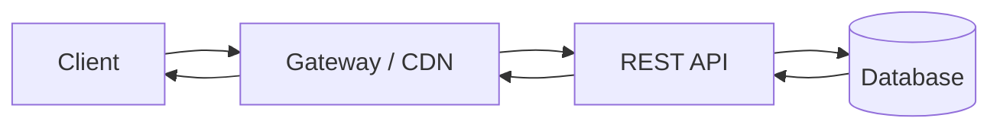

#### Resource naming

Use **plural nouns**; let HTTP methods express the action:

| Good | Bad |
|------|-----|
| `GET /users` | `GET /getUsers` |
| `POST /orders` | `POST /createOrder` |
| `GET /users/{id}/orders` | `GET /fetchUserOrders` |

```text
/users              collection
/users/{id}         single resource
/users/{id}/orders  sub-collection owned by user
```

#### Status codes clients rely on

| Code | Meaning |
|------|---------|
| **200 OK** | Success with body |
| **201 Created** | Resource created (`Location` header points to new URL) |
| **204 No Content** | Success, no body (common on DELETE) |
| **400 Bad Request** | Malformed input |
| **401 Unauthorized** | Authentication missing or invalid |
| **403 Forbidden** | Authenticated but not allowed |
| **404 Not Found** | Resource does not exist |
| **409 Conflict** | State conflict (duplicate, version mismatch) |
| **422 Unprocessable Entity** | Valid syntax, business rule failure |
| **429 Too Many Requests** | Rate limited |
| **500 Internal Server Error** | Server failure |

Return structured error bodies (e.g. `application/problem+json`) — never `200 OK` with `{ "error": true }` buried in JSON.

#### REST constraints in one pipeline

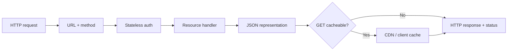

---

### Pitfalls and design tips

- **RPC-in-REST** — verbs in URLs (`/cancelOrder`) throw away HTTP semantics; use `POST /orders/{id}/cancellation` or `PATCH` with a status field instead.
- **Over-fetching / under-fetching** — fixed resource shapes may need multiple round trips; consider BFF aggregation or GraphQL for screen-heavy clients, not a dozen bespoke `/users-with-everything` endpoints.
- **POST without idempotency** — network timeouts cause clients to retry; duplicate charges or orders follow unless you add idempotency keys on mutating POSTs.
- **Ignoring caching** — mark safe `GET`s with `ETag` / `Cache-Control`; public catalog APIs benefit enormously at the CDN.
- **Default choice** — for new public HTTP APIs with CRUD-shaped domains, REST + OpenAPI is still the interview and industry default unless you have a clear reason for GraphQL or gRPC at the edge.

---

### Real-world example

**GitHub REST API** (`api.github.com`) is a well-documented production REST surface. A client fetches a repository with:

```http
GET /repos/octocat/Hello-World
Accept: application/vnd.github+json
```

GitHub returns `200` with a JSON representation (name, stars, default branch, `html_url`). List endpoints use query parameters for pagination (`?page=2&per_page=30`), filtering is minimal on REST paths, and **rate limits** return `403` with `X-RateLimit-Remaining` headers — clients read HTTP semantics directly without custom envelope parsing. The same resource model works for PATs, GitHub Apps, and OAuth tokens because every call is stateless and self-contained.

---

## 7.2 GraphQL

### Overview

Imagine ordering à la carte instead of fixed combo meals: you tick only the items you want on one order form, and the kitchen brings exactly that — not extra fries you will not eat, and not three separate trips for burger, drink, and dessert. **GraphQL** lets API clients do the same: one request names the exact fields and nested objects needed for a screen.

Technically, **GraphQL** is a **query language and runtime** for APIs (open-sourced by Meta in 2015). Clients send a typed query or mutation to a **single HTTP endpoint** (usually `POST /graphql`). A **schema** defines types and operations; **resolvers** fetch data per field. The response mirrors the query tree — no more, no less — which attacks over-fetching and under-fetching that plague coarse REST resources.

---

### What problem it fixes

In REST, each endpoint returns a **fixed JSON shape**. A mobile home screen might need user name, two order fields, and a product thumbnail — but `GET /users/{id}` returns 30 fields and still omits nested orders, so the client calls `GET /users/{id}`, `GET /orders?user=…`, and `GET /products/{id}` sequentially.

GraphQL fixes:

- **Over-fetching** — request only `name`, not the full user object
- **Under-fetching** — nest `orders { id total }` inside `user` in one round trip
- **Version sprawl** — one evolving schema instead of `/v3/users-lite` endpoints per client

```text
REST screen assembly  →  N endpoints × fixed payloads
GraphQL screen query  →  1 POST with a field tree shaped to the UI
```

---

### What it does

GraphQL exposes three operation types:

| Operation | Purpose |
|-----------|---------|
| **Query** | Read data (like GET, but arbitrary shape) |
| **Mutation** | Create, update, delete |
| **Subscription** | Real-time stream (WebSocket or SSE transport) |

All operations hit one endpoint. The server validates the query against the schema **before** execution — unknown fields fail fast.

**Example query** — client needs only a name:

```graphql
{
  user(id: "1") {
    name
  }
}
```

**Response:**

```json
{
  "data": {
    "user": {
      "name": "John"
    }
  }
}
```

**Mutation example:**

```graphql
mutation {
  createUser(name: "John") {
    id
    name
  }
}
```

---

### How it works — the architecture inside

#### Schema as contract

```graphql
type User {
  id: ID!
  name: String
  email: String
  orders: [Order!]!
}

type Query {
  user(id: ID!): User
}

type Mutation {
  createUser(name: String!): User
}
```

The schema is the public contract — introspection lets tools (GraphiQL, codegen) discover it at runtime.

#### Resolver execution

Each field can have a **resolver** function:

```text
Query.user(id) → resolver loads user row
User.orders    → resolver loads orders for that user id
```

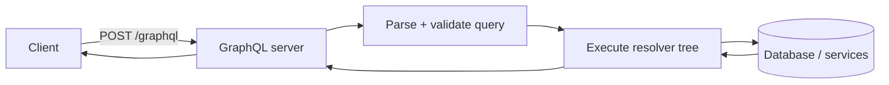

#### N+1 problem and DataLoader

Naive resolvers call the database once **per list item**:

```text
users(10) → 1 query
each user.orders → 10 more queries  →  11 total (N+1)
```

Production servers batch with **DataLoader** (or similar): collect keys during the same tick, issue one `WHERE user_id IN (…)` query, map results back to fields.

#### GraphQL vs REST at the wire

| | REST | GraphQL |
|---|------|---------|
| Endpoints | Many (`/users`, `/orders`) | One (`/graphql`) |
| Response shape | Server-defined per URL | Client-defined per query |
| Caching | HTTP cache on `GET` URLs | Needs application-level cache (or persisted queries) |
| Errors | HTTP status per resource | `200` with `errors` array possible; partial `data` |

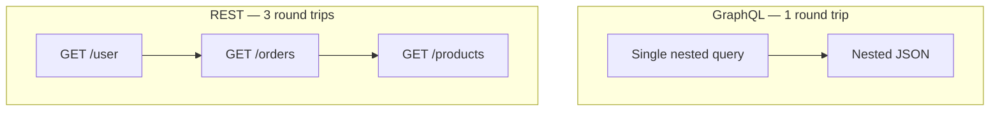

---

### Pitfalls and design tips

- **Expensive queries** — deep nesting (`user { friends { friends { … }}}`) can melt databases; enforce **depth limits**, **complexity scoring**, and timeouts.
- **Caching is harder** — CDNs do not cache `POST /graphql` by default; use persisted queries, APQ, or server-side field caching (Redis) for hot reads.
- **Not a drop-in for every API** — simple CRUD with stable shapes is often cheaper as REST + OpenAPI.
- **Authorization at field level** — resolvers must check permissions per field, not only at the top-level operation.
- **When to choose** — multiple clients (web, iOS, Android) with different field needs on the same backend; rapid UI iteration without new REST endpoints per screen.

---

### Real-world example

**Shopify Storefront API** exposes GraphQL for merchant storefronts. A theme requests a product grid in one query — product titles, prices, and image URLs — without Shopify defining a bespoke REST endpoint per theme layout. The client sends one `POST` to the GraphQL endpoint; Shopify's resolvers fan out to catalog, inventory, and pricing services behind the schema. Mobile clients benefit from smaller payloads (fewer unused fields) compared to downloading full REST product objects designed for admin tools.

---

## 7.3 gRPC

### Overview

Calling a service in another building feels like calling a local function when someone hands you a phone that already dials the right extension — you say what you want, not how to route packets. **gRPC** gives backend services that experience: generated client code lets `userService.GetUser(1)` feel like a local method while the framework handles HTTP/2, serialization, and retries on the wire.

Technically, **gRPC (Google Remote Procedure Call)** is a **high-performance RPC framework** using **HTTP/2** and **Protocol Buffers (Protobuf)** by default. You define services and messages in `.proto` files, run `protoc` to generate stubs, and get strongly typed, compact binary RPC between polyglot microservices — unary, server streaming, client streaming, or bidirectional streaming.

---

### What problem it fixes

REST + JSON over HTTP/1.1 is human-friendly but costly at scale: text payloads, per-request connection overhead, no first-class streaming, and informally typed contracts (OpenAPI helps but does not enforce binary layout).

gRPC fixes for **service-to-service** traffic:

- **Latency** — HTTP/2 multiplexing + binary Protobuf
- **Contract drift** — `.proto` is the source of truth; codegen breaks builds on incompatible changes
- **Streaming** — first-class server/client/bidi streams for logs, chat, live feeds
- **Polyglot** — same `.proto` generates Java, Go, Python, C++ clients

```text
REST JSON between 50 microservices  →  CPU on serialization, connection churn, fuzzy contracts
gRPC + Protobuf                     →  typed stubs, shared connections, smaller frames
```

---

### What it does

Instead of:

```http
GET /users/1
```

Generated clients call:

```text
GetUser(UserRequest{id: 1}) → UserResponse
```

Four RPC patterns:

| Type | Pattern | Example use |
|------|---------|-------------|
| **Unary** | One request → one response | `GetUser` |
| **Server streaming** | One request → many responses | Live price ticks |
| **Client streaming** | Many requests → one response | Upload log batch |
| **Bidirectional** | Many ↔ many | Chat relay |

---

### How it works — the architecture inside

#### Protobuf service definition

```protobuf
syntax = "proto3";

message UserRequest {
  int32 id = 1;
}

message UserResponse {
  int32 id = 1;
  string name = 2;
}

service UserService {
  rpc GetUser(UserRequest) returns (UserResponse);
}
```

`protoc` generates **stubs** on the client and **service base classes** on the server.

#### Call path

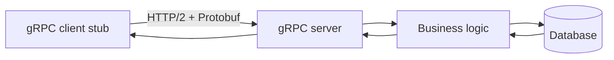

```text
Client: GetUser(1)
  → stub serializes UserRequest
  → HTTP/2 frame on persistent connection
  → server deserializes, runs handler
  → UserResponse returned on same connection
```

#### HTTP/2 features gRPC relies on

1. **Multiplexing** — many RPCs on one TCP connection
2. **HPACK header compression** — smaller metadata overhead
3. **Flow control** — backpressure between peers
4. **Streams** — foundation for streaming RPC types

#### Browser gap

Browsers do not speak native gRPC. Public browser clients use **gRPC-Web** through Envoy or similar proxies that translate to backend gRPC.

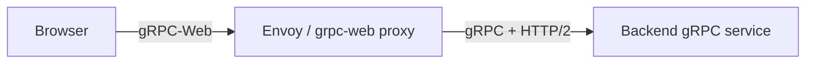

---

### Pitfalls and design tips

- **Not for public browser APIs** — expose REST or GraphQL at the edge; use gRPC internally.
- **Debugging** — binary payloads need `grpcurl` or logging interceptors; invest in observability (OpenTelemetry gRPC instrumentation).
- **Deadlines required** — set `context` deadlines on every RPC; default "forever" calls stall thread pools.
- **Schema evolution** — never reuse Protobuf field numbers; add new fields with new numbers; reserve removed numbers.
- **Load balancing** — L7 balancers must understand HTTP/2; long-lived connections need **client-side load balancing** or proxyless gRPC in service meshes (Istio, Linkerd).
- **mTLS** — use mutual TLS between services in zero-trust networks.
- **Default choice** — internal microservices with throughput and latency SLOs; sync service-to-service on Kubernetes.

---

### Real-world example

**Google Cloud** publishes many APIs (Spanner, Pub/Sub, Bigtable) with gRPC as a first-class transport alongside REST. A Go service using the Spanner client calls generated stubs; Protobuf messages cross Google's backbone over HTTP/2 with authentication metadata in headers. The same `.proto` definitions power clients in Java and Python — teams share one contract file in version control, and incompatible field changes fail at codegen time rather than in production JSON parsing.

---

## 7.4 SOAP

### Overview

Think of registered mail with a mandatory form: every envelope must have labeled sections for sender ID, security stamps, and the letter inside — heavy paperwork, but banks and governments trust it because nothing is informal. **SOAP** is that form for software integration: strict XML envelopes, formal contracts, and built-in hooks for security and reliable delivery.

Technically, **SOAP (Simple Object Access Protocol)** is a **protocol** (not a style) for exchanging structured messages in **XML**. A **WSDL** document describes operations, types, and endpoints. **WS-*** standards add security (WS-Security), transactions, and reliable messaging. SOAP peaked in enterprise Java/.NET era; greenfield public APIs rarely choose it, but banking, insurance, and government B2B integrations still mandate it.

---

### What problem it fixes

Early enterprise integrations needed **legally traceable**, **schema-validated**, **transport-flexible** messaging — not ad hoc JSON posts. Partners required signed, encrypted payloads and formal contracts before connecting billing, claims, or payment systems.

SOAP fixes:

- **Contract rigor** — WSDL is machine-readable; tooling generates clients
- **Security in the message** — WS-Security (encryption, signatures) independent of HTTPS
- **Transport choice** — HTTP, SMTP, JMS — not locked to REST's HTTP assumption
- **Fault model** — standardized XML fault elements for errors

```text
Hand-rolled XML over FTP  →  no standard errors, security, or codegen
SOAP + WSDL               →  partner runs wsimport / svcutil and integrates
```

---

### What it does

Every SOAP message is an XML **envelope** with:

| Part | Role |
|------|------|
| **Envelope** | Root wrapper for every message |
| **Header** | Metadata — auth tokens, transaction IDs, WS-Security |
| **Body** | Operation payload (request or response) |
| **Fault** | Standardized error structure |

**Request example:**

```xml
<soap:Envelope xmlns:soap="http://schemas.xmlsoap.org/soap/envelope/">
  <soap:Body>
    <GetUser xmlns="http://example.com/users">
      <id>101</id>
    </GetUser>
  </soap:Body>
</soap:Envelope>
```

**Response example:**

```xml
<soap:Envelope xmlns:soap="http://schemas.xmlsoap.org/soap/envelope/">
  <soap:Body>
    <GetUserResponse xmlns="http://example.com/users">
      <User>
        <id>101</id>
        <name>John</name>
      </User>
    </GetUserResponse>
  </soap:Body>
</soap:Envelope>
```

---

### How it works — the architecture inside

#### WSDL as contract

WSDL lists **ports**, **bindings**, **messages**, and **types**:

```text
Operations: GetUser, CreateUser, DeleteUser
Endpoint:   https://partner.example.com/UserService
Binding:    SOAP 1.2 over HTTPS
```

Client tooling reads WSDL and generates stubs — similar role to OpenAPI for REST or `.proto` for gRPC.

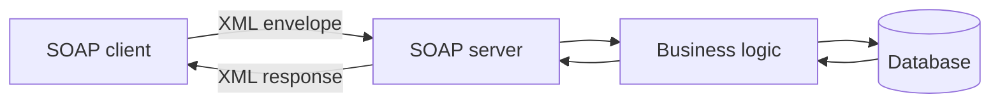

#### Communication flow

```text
Client stub builds XML → HTTPS POST → SOAP server
  → validates envelope → runs operation → XML response
```

#### WS-Security layer

For regulated industries, security rides **inside** the SOAP header:

- XML encryption of body fields
- Digital signatures for integrity
- Username tokens or SAML assertions

HTTPS alone encrypts the tunnel; WS-Security can encrypt **parts** of the message for end-to-end audit requirements.

#### SOAP vs REST vs gRPC

| | SOAP | REST | gRPC |
|---|------|------|------|
| Format | XML | JSON (typical) | Protobuf |
| Contract | WSDL | OpenAPI (optional) | `.proto` |
| Transport | HTTP, JMS, SMTP, … | HTTP | HTTP/2 |
| Browser friendly | Poor | Excellent | Needs grpc-web |
| Typical era | Enterprise B2B | Public APIs | Internal microservices |

---

### Pitfalls and design tips

- **Verbosity** — XML envelopes dwarf JSON; budget bandwidth and parsing CPU.
- **WS-*interop pain** — "SOAP compatible" partners often disagree on which WS-* specs are mandatory; plan contract tests early.
- **Do not greenfield SOAP** for mobile or SPA clients — wrap legacy SOAP behind a REST or GraphQL **adapter** at an API gateway for new consumers.
- **Tooling** — Java JAX-WS and .NET WCF knowledge is shrinking; document WSDL versions and run automated round-trip tests.
- **When you must use it** — partner mandates WSDL, regulated messaging, or existing ESB/JMS bus integration.

---

### Real-world example

**Salesforce Enterprise API** still exposes SOAP endpoints alongside REST for enterprise CRM integrations. A billing system generated from Salesforce's WSDL calls `create()` on `Account` objects with session IDs in the SOAP header; the XML contract predates many partners' REST migrations. Teams keep SOAP for batch ERP sync while newer mobile features call REST — the same domain, two transports, because enterprise buyers standardized on WSDL a decade ago.

---

## 7.5 API Gateway

### Overview

A hotel concierge is the one desk guests approach: they ask for dinner, spa, and dry cleaning, and the concierge routes requests to the right department — you do not wander the back hallways yourself. An **API gateway** is that desk for software clients: one front door, one TLS certificate, one place to show ID before any microservice sees traffic.

Technically, an **API gateway** is an **edge proxy** (or managed service) that terminates client connections and applies **cross-cutting policies** — routing, authentication, rate limiting, TLS, logging — before forwarding to upstream services. It is infrastructure, not a place for domain business rules; heavy response shaping belongs in a BFF (see 7.7).

---

### What problem it fixes

Without a gateway, every mobile or web client must:

- Know dozens of internal service hostnames
- Implement auth, retries, and circuit breaking itself
- Open many connections across the public internet
- Change when services split, merge, or move

```text
Client → User service
      → Order service      →  tight coupling, duplicated policy, N exposed services
      → Payment service
```

The gateway fixes **client complexity** and **security sprawl** by centralizing the front door.

---

### What it does

| Responsibility | What happens |
|----------------|--------------|
| **Request routing** | `/users` → User Service, `/orders` → Order Service |
| **Authentication** | Validate JWT, API key, or OAuth token before forward |
| **Authorization** | Route-level or claim-based access (`/admin` only for admins) |
| **Load balancing** | Spread traffic across instances of the same service |
| **Rate limiting** | Return `429` when quotas exceeded |
| **Caching** | Serve cacheable `GET` responses at the edge |
| **Monitoring** | Access logs, latency metrics, trace propagation |
| **Protocol translation** | REST at edge → gRPC internally (optional) |
| **Aggregation (light)** | Some gateways can fan out — prefer BFF for domain merges |

---

### How it works — the architecture inside

```text
Step 1: Client → GET /users/101 + Authorization header
Step 2: Gateway terminates TLS, validates JWT, checks rate limit
Step 3: Gateway routes to User Service instance (load balanced)
Step 4: Response proxied back with added trace headers
```

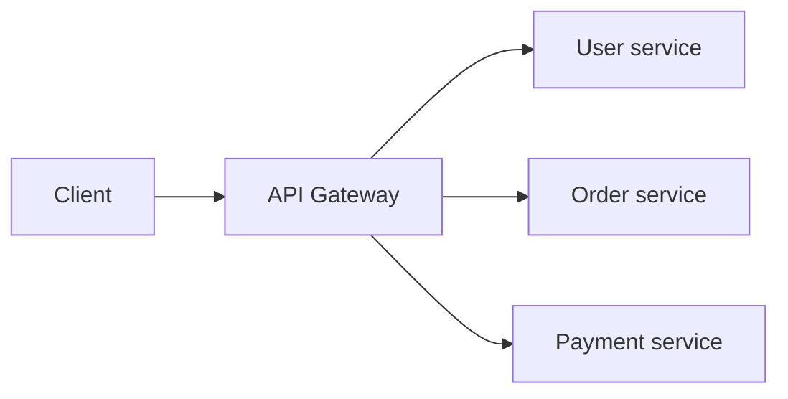

#### Gateway vs load balancer

| | Load balancer | API gateway |
|---|---------------|-------------|
| Routes to | Instances of **one** service | **Different** services by path/host |
| Example | User Svc inst 1/2/3 | `/users`, `/orders`, `/payments` |
| Extra features | Traffic distribution | Auth, quotas, routing, WAF, caching |

#### Gateway vs BFF

| | API gateway | BFF |
|---|-------------|-----|
| Job | Edge policy — TLS, auth, quotas | Client-specific aggregation and DTO shaping |
| Logic | Infrastructure only | Thin orchestration per client (mobile vs web) |
| Path | `Client → Gateway → Services` | `Client → Gateway → BFF → Services` |

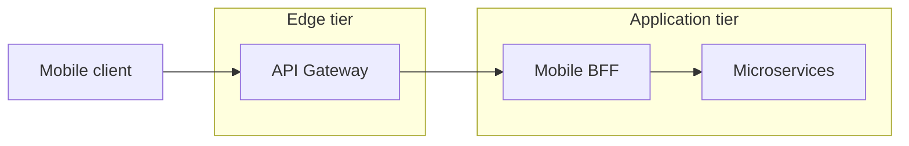

**Popular implementations:** Kong, NGINX, AWS API Gateway, Spring Cloud Gateway, Apigee, Traefik, Envoy.

---

### Pitfalls and design tips

- **Single point of failure** — run ≥2 gateway instances across AZs; health-check and autoscale.
- **Extra hop latency** — usually acceptable for policy; do not add heavy computation at the gateway.
- **Fat gateway anti-pattern** — Lua plugins that encode business rules become undeployable monoliths; keep domain logic in BFFs or services.
- **Config sprawl** — treat routes as code (GitOps, declarative CRDs in Kubernetes).
- **Interview angle** — gateway = **cross-cutting edge**; BFF = **client-shaped API**; load balancer = **same service, many pods**.

---

### Real-world example

**Netflix** historically routed public device traffic through **Zuul** (and later **Spring Cloud Gateway** patterns) before requests reached internal microservices. Devices see one API hostname; Zuul handled authentication context, routing to the correct service cluster, and request logging — internal service URLs never shipped in mobile apps. When a service splits, Netflix updates gateway routes; clients stay stable.

---

## 7.6 API Aggregation

### Overview

Planning a group trip, one friend calls the airline, hotel, and car rental at the same time, then texts everyone a single itinerary — instead of each traveler making three calls. **API aggregation** does that for apps: one backend component fans out to several services **in parallel**, merges the answers, and returns one JSON payload so the phone makes one round trip.

Technically, **API aggregation** is a **composition pattern** where an aggregator (often a **BFF** or dedicated service) issues **independent** downstream calls concurrently, waits for all (or tolerates partial failure), and assembles a combined response. Latency is roughly **max(service times)**, not the sum — the key performance win over naive client-side chaining.

---

### What problem it fixes

A dashboard needs user profile, orders, and payments. Without aggregation:

```text
Client → User Service
      → Order Service     →  3 RTTs, 3 error paths, loading spinners stack
      → Payment Service
```

Mobile networks amplify the pain. Aggregation moves orchestration **server-side** where connections to internal services are fast and policies (timeouts, circuit breakers) are uniform.

---

### What it does

1. Client calls **one** endpoint — e.g. `GET /dashboard/101`
2. Aggregator fans out **in parallel** when calls do not depend on each other
3. Aggregator merges JSON into a single DTO
4. Client renders one response

**Merged response example:**

```json
{
  "user": { "id": 101, "name": "John" },
  "orders": [ { "id": 5001, "total": 49.99 } ],
  "payments": [ { "orderId": 5001, "status": "PAID" } ]
}
```

When calls are **sequential** (step B needs step A's output), that is **composition** (7.7) — not parallel aggregation.

---

### How it works — the architecture inside

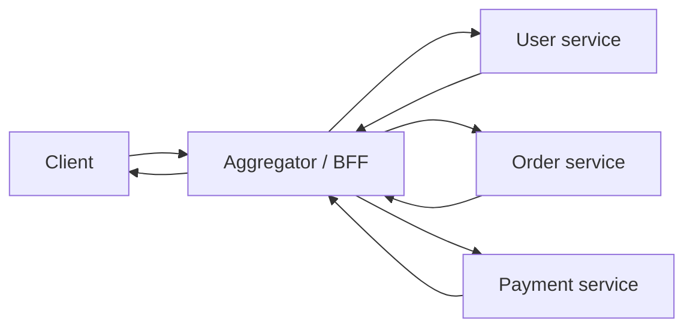

#### Parallel fan-out timing

```text
Aggregator starts:
  T0: call User, Order, Payment simultaneously
  T_end = max(T_user, T_order, T_payment)

NOT T_user + T_order + T_payment
```

**How to calculate:**

```text
Given: T_user = 80 ms, T_order = 120 ms, T_payment = 200 ms (parallel fan-out)

Step 1 — identify parallel calls:
  User, Order, Payment start at T0 (no dependency between them)

Step 2 — aggregator wait time:
  T_end = max(80, 120, 200) = 200 ms

Step 3 — compare to sequential (for sanity):
  T_sequential = 80 + 120 + 200 = 400 ms

Result: dashboard latency ≈ 200 ms (not 400 ms)

Sanity check: tail latency is set by the slowest dependency (Payment);
             if Payment p99 is 500 ms, dashboard p99 ≈ 500 ms regardless of fast User/Order.
```

Set **per-dependency deadlines** — tail latency equals the slowest call unless you return partial data earlier.

#### Failure modes

| Outcome | Strategy |
|---------|----------|
| Payment down, User + Order OK | Partial response with `payments: null` and degraded UI |
| User down (blocking) | Fail entire request `502`/`503` |
| Slow Order | Timeout + circuit breaker; optional stale cache |

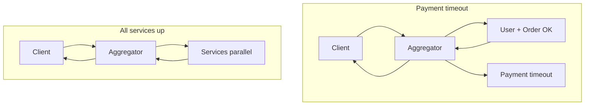

#### Where aggregation lives

| Location | Trade-off |
|----------|-----------|
| **API Gateway plugin** | Fast to prototype; hard to test domain merges |
| **Dedicated BFF service** | Preferred — versioned with client, unit-testable merge logic |
| **GraphQL resolvers** | Implicit aggregation per field tree |

#### Aggregation vs GraphQL

| | Aggregation (BFF) | GraphQL |
|---|-------------------|---------|
| Who shapes response | Backend defines fixed dashboard DTO | Client picks fields per query |
| Flexibility | One payload per screen | Per-screen queries without new endpoints |
| Caching | Straightforward HTTP cache on BFF URL | Needs field-level or persisted-query caching |

---

### Pitfalls and design tips

- **Do not aggregate inside gateway plugins** for non-trivial domain rules — migrate to a BFF when `if order.status == …` appears.
- **Schema coupling** — aggregator DTOs break when downstream services rename fields; use anti-corruption layers or consumer-driven contracts.
- **Thundering herd** — one dashboard view × 1M users = N× downstream QPS; cache hot aggregates briefly (Redis, 30–60s TTL).
- **Partial failure UX** — document which sections are optional vs blocking; return `207`-style semantics in JSON metadata if clients need machine-readable degradation.
- **Confused with composition** — parallel independent fetches = aggregation; chained dependent fetches = composition (7.7).

---

### Real-world example

**SoundCloud** (and many media apps) popularized the **BFF per client** pattern: a mobile BFF exposes `/me/home` that aggregates feed, playlists, and social graph services in parallel. The mobile app makes one HTTPS call on cold start; the BFF runs inside the same datacenter as dependencies with millisecond RTTs. When the playlists service slows, the BFF can return cached playlists with a stale flag while other sections stay fresh — logic impractical in the client across three separate REST calls.

---

## 7.7 API Composition

### Overview

Some errands must happen in order: you cannot pay for a package before you know the shipping quote, and you cannot get the quote before you enter the address. **API composition** is the backend pattern for that — call service B with the result from service A, then service C, and only then hand the client one finished answer.

Technically, **API composition** fetches data from multiple microservices and merges it into a **business-centric response**, often through a **BFF**. When downstream calls are **independent**, parallel fan-out matches aggregation (7.6). Composition's differentiator is **sequential orchestration** — later steps need identifiers or decisions from earlier steps — so latency tends toward the **sum** of step times.

---

### What problem it fixes

Microservices split data across bounded contexts (User DB, Order DB, Payment DB). SQL `JOIN` is no longer available. Clients should not orchestrate five internal calls with branching logic. Composition centralizes **workflow** server-side: checkout, booking, fraud-check-then-capture.

```text
Client chains 5 internal APIs  →  fragile, slow on mobile, leaks domain rules
Composer/BFF orchestrates      →  one client endpoint, one error model
```

---

### What it does

The composer:

1. Receives a client request (`GET /order-summary/101`)
2. Determines required services and **order** (parallel vs sequential)
3. Fetches and **transforms** results
4. Returns one composed JSON object

**Sequential example:**

```text
1. GET /users/101        → customer name
2. GET /orders?user=101  → line items (needs user context)
3. GET /payments/order/101 → status (needs order id)
```

**Parallel example** (same as 7.6): user + orders + payments by known `userId` — run simultaneously.

---

### How it works — the architecture inside

#### Sequential chain

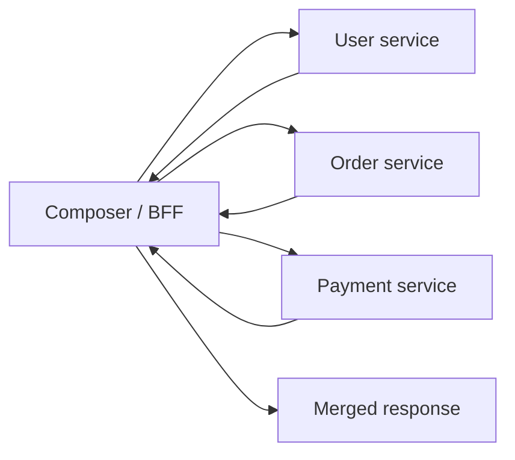

```text
Latency ≈ T_user + T_order + T_payment
Minimize depth; cache stable intermediate reads.
```

**How to calculate:**

```text
Given: T_user = 50 ms, T_order = 90 ms, T_payment = 150 ms (sequential chain)

Step 1 — sum each hop (later step needs earlier output):
  T_total = 50 + 90 + 150 = 290 ms

Step 2 — compare to parallel aggregation (same services, independent):
  T_parallel = max(50, 90, 150) = 150 ms

Step 3 — depth cost:
  Extra latency vs parallel = 290 − 150 = 140 ms (sequential tax)

Result: order-summary latency ≈ 290 ms end-to-end

Sanity check: six sequential 50 ms hops → 300 ms minimum;
             a read-model projection often beats deep composition chains.
```

#### Composition vs database join

| | SQL join | API composition |
|---|----------|-----------------|
| Where merge happens | One database | Application layer |
| Consistency | ACID in one DB | Eventual across services |
| Example | `JOIN users ON orders` | User Svc + Order Svc + merge |

#### End-to-end flow

```text
Receive request → plan graph (DAG) of service calls
  → execute parallel groups / sequential chains
  → map to client DTO → return
```

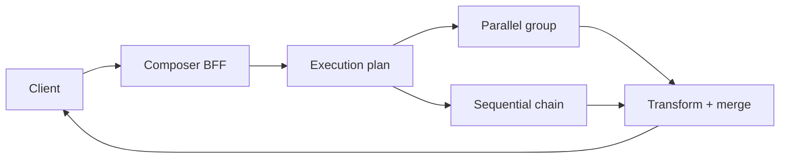

#### Failure handling

Sequential chains **fail fast** on the blocking step — no order id means payment lookup never starts. Options:

- Return `424 Failed Dependency` with which step failed
- Serve cached non-critical data (product image) while blocking on payment status
- **Saga** / compensating transactions for multi-step writes (booking hold → charge → confirm)

---

### Pitfalls and design tips

- **Deep chains hurt latency** — if `order-summary` needs 6 sequential hops, consider a **read model** (CQRS projection) materialized by events.
- **Same as aggregation?** — terms overlap in conversation; use **parallel vs sequential** to be precise in design docs and interviews.
- **Gateway plugins** — same anti-pattern as 7.6; use a dedicated BFF service with tests.
- **Write composition** — reads are easier; multi-service writes need idempotency keys and clear rollback (cancel hold if payment fails).
- **Use cases** — checkout (availability → reserve → pay), fraud check before capture, admin reports where each filter narrows the next query.

---

### Real-world example

**Airline booking APIs** (GDS and modern OTAs) compose sequentially: search availability (needs route + date) → price quote (needs fare class from availability) → create PNR (needs passenger details + selected flights) → payment capture (needs PNR locator). A mobile BFF exposes `POST /bookings` while internally calling reservation, pricing, and payment services in order. The client sees one progress spinner; the BFF enforces timeouts and returns a single error if the hold expires before payment.

---

## 7.8 API Versioning

### Overview

A utility company does not swap every meter in town overnight when billing rules change — old meters still work for years while new installs use the updated model. **API versioning** does the same for software clients: ship breaking improvements on `/v2` while `/v1` keeps answering until integrators migrate.

Technically, **API versioning** is the practice of running **multiple incompatible contract generations** side by side. Version selection happens via URL path, query parameter, header, or media type. Within a major version, **additive** changes (new optional fields) are expected; **breaking** changes (rename, remove, behavior change) require a new major version and a deprecation timeline.

---

### What problem it fixes

You rename `id` → `userId` and `name` → `fullName` in a popular public API. Thousands of mobile apps and partner scripts still parse the old JSON — they crash or corrupt data on the next deploy.

Versioning fixes **uncontrolled breakage**:

```json
// v1 — existing clients
{ "id": 1, "name": "John" }

// v2 — breaking rename without versioning would break everyone
{ "userId": 1, "fullName": "John" }
```

With versioning, v1 and v2 coexist; clients choose explicitly.

---

### What it does

- Exposes **parallel endpoints or representations** for the same domain concept
- Routes each request to the correct handler set based on version token
- Documents **deprecation** (`Deprecation`, `Sunset` headers) and migration guides
- Allows **additive** evolution inside a major version without new routes

**Additive change (no new major version):**

```json
{ "id": 1, "name": "John", "email": "john@test.com" }
```

New optional `email` on v1 — old clients ignore unknown fields.

---

### How it works — the architecture inside

#### Common strategies

| Strategy | Example | Notes |
|----------|---------|-------|
| **URI path** | `GET /v1/users`, `GET /v2/users` | Most common; easy to test and cache |
| **Query parameter** | `GET /users?version=1` | Same path; easy to overlook in docs |
| **Header** | `API-Version: 1` | Clean URLs; harder manual curl |
| **Media type** | `Accept: application/vnd.company.v1+json` | Pure content negotiation; verbose |

#### Routing at the edge

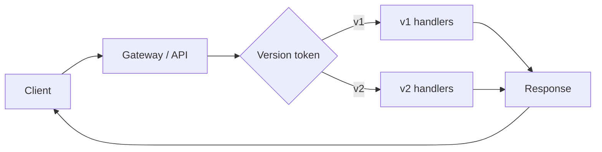

```text
Client request → identify version (path/header/Accept)
  → route to handler module → generate version-specific DTO → response
```

#### When to bump major version

Create **v2** when you:

- Remove or rename fields
- Change field types (`string` id → `integer`)
- Alter behavior existing clients rely on (pagination defaults, error codes)
- Restructure URLs for the same resource

Usually **not** required for: bug fixes, performance work, new optional fields, internal refactors with identical wire format.

#### Deprecation lifecycle

```text
Ship v2 → mark v1 deprecated (headers + docs)
  → monitor v1 traffic → migration period (months)
  → announce sunset date → disable v1 when traffic ≈ 0
```

---

### Pitfalls and design tips

- **Pick one strategy** per API surface — mixing URI and header versioning confuses integrators.
- **Avoid version explosion** — frequent `/v3`, `/v4` fatigue; prefer additive JSON within v1 when possible.
- **GraphQL** — version the schema with `@deprecated` fields and nullable additions; avoid parallel `/graphql-v2` endpoints unless necessary.
- **Gateway routing** — map `/v1/*` and `/v2/*` to different upstream clusters or code paths in CI.
- **Document in OpenAPI** — separate spec files or `servers` + tags per version; Stripe and Twilio publish migration tables — copy that clarity.
- **Interview rule** — additive = same major; breaking = new major + deprecation plan.

---

### Real-world example

**Stripe API** versions by dated releases (`2023-10-16`, etc.). Clients pin a version in the dashboard or `Stripe-Version` header; Stripe runs transformations so one codebase serves many pinned versions. When Stripe removes a deprecated field, accounts on old versions keep working until they upgrade — integrators test against a new date in staging before flipping production. That model trades URI simplicity for explicit, dated contract snapshots favored by payment compliance.

---

## 7.9 Pagination

### Overview

A phone book does not arrive in one box weighing fifty pounds — you flip to a letter, read a page, then turn to the next. **Pagination** splits a huge list API into pages so each response stays small, fast, and easy to render in a table or feed.

Technically, **pagination** bounds collection endpoints with `page`/`size`, `limit`/`offset`, or **cursor** tokens. The server executes `LIMIT` + `OFFSET` or keyset (`WHERE id > :cursor`) queries and returns metadata (`totalRecords`, `nextCursor`) alongside the `data` array. Production APIs always cap maximum page size to prevent abuse.

---

### What problem it fixes

```http
GET /users
```

returning 100,000 user objects causes:

- Multi-megabyte JSON payloads
- Timeouts on mobile networks
- Memory spikes in app servers and databases
- Poor UX — tables and feeds need incremental loading

```text
Unbounded GET /users  →  O(n) rows every request
Paginated GET         →  O(page size) per request
```

---

### What it does

Clients request a **window** into a larger result set:

```http
GET /users?page=2&size=10
```

Server returns records 11–20 plus metadata:

```json
{
  "page": 2,
  "size": 10,
  "totalRecords": 50,
  "totalPages": 5,
  "data": [ ... ]
}
```

Three common approaches:

| Approach | Example | Latency model |
|----------|---------|---------------|
| **Page-based** | `?page=2&size=10` | `OFFSET = (page-1)×size` |
| **Limit-offset** | `?limit=10&offset=20` | Same as page-based |
| **Cursor (keyset)** | `?cursor=eyJpZCI6MTAwfQ` | `WHERE sort_key > cursor ORDER BY … LIMIT` |

---

### How it works — the architecture inside

#### Page-based / offset math

```text
OFFSET = (page - 1) × size

page = 3, size = 10  →  OFFSET = 20
```

```sql
SELECT * FROM users
ORDER BY id ASC
LIMIT 10 OFFSET 20;
```

Returns rows 21–30 (0-indexed skip 20, take 10).

**How to calculate — deep offset cost:**

```text
Given: table has 10M rows, query uses ORDER BY id LIMIT 10 OFFSET 1_000_000

Step 1 — rows the engine must walk:
  scan_and_discard ≈ OFFSET + LIMIT = 1_000_000 + 10 = 1_000_010 rows

Step 2 — compare to cursor (keyset) on indexed id:
  WHERE id > last_seen_id LIMIT 10 → ≈ 10 index lookups (O(page size), not O(offset))

Step 3 — rough latency ratio (same hardware, indexed id):
  offset page 100k vs cursor page 100k → offset often 10×–100× slower at deep pages

Result: page 100,001 via offset touches ~1M rows before returning 10

Sanity check: OFFSET 0 is cheap; OFFSET in the millions is an anti-pattern —
             switch to cursor for infinite scroll and high-churn feeds.
```

**How to calculate total pages:**

```text
Given: totalRecords = 50, size = 10

totalPages = ceil(50 / 10) = 5

Page 5 returns records 41–50 (5 rows)
```

#### Cursor pagination

Encode the last seen sort key (often `id` or `(created_at, id)`):

```http
GET /users?cursor=100&limit=10
```

```sql
SELECT * FROM users
WHERE id > 100
ORDER BY id ASC
LIMIT 10;
```

Response:

```json
{
  "data": [ ... ],
  "nextCursor": "110",
  "hasMore": true
}
```

Stable when rows are inserted or deleted during browsing — offset pages can **duplicate or skip** rows when the dataset shifts.

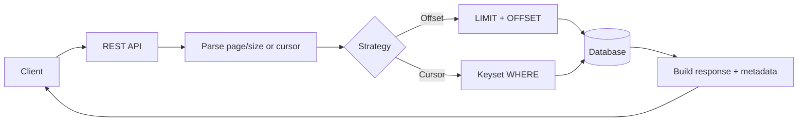

#### List pipeline order

Always apply in this order when combining features:

```text
filter → sort → paginate
```

Sorting before pagination ensures page 2 means the same ordered slice everywhere.

---

### Pitfalls and design tips

- **Deep offset cost** — `OFFSET 100000` scans and discards 100k rows; switch to cursor for infinite scroll and high-churn feeds.
- **Unstable offset pages** — users refreshing page 2 during inserts see duplicates; cursors fix this.
- **Expensive `totalRecords`** — `COUNT(*)` on filtered million-row tables hurts; return `hasMore` without total, or cache counts.
- **Max `size`** — cap at 100 (or lower); reject `?size=100000` with `400`.
- **Cursor encoding** — use opaque base64 JSON `{"id":100,"createdAt":"…"}`; do not expose raw internal keys if security matters.
- **Tiebreaker** — always include unique `id` in sort when primary sort field is non-unique.

---

### Real-world example

**GitHub REST API** lists issues with `?page=2&per_page=30` (offset-style) and documents maximum `per_page=100`. Link headers (`Link: <…>; rel="next"`) tell clients the next page URL without manual offset math. For the **GraphQL** connection model, GitHub uses **cursor** pagination (`first`, `after`, `pageInfo { endCursor hasNextPage }`) — the pattern Twitter popularized for stable feeds. REST list endpoints on github.com still teach both styles in one product.

---

## 7.10 Filtering

### Overview

A library catalog computer that lets you narrow by genre, year, and language beats dumping every book on the floor. **Filtering** lets API clients request **only rows that match conditions** — status, date range, category — instead of downloading the full table and searching locally.

Technically, filtering maps **query parameters** to safe, **parameterized** `WHERE` clauses (or search-engine queries). The server **whitelists** allowed filter fields, rejects unknown parameters with `400`, and relies on **indexes** matching common filter combinations. Filtering runs **before** sort and pagination in the list pipeline.

---

### What problem it fixes

```http
GET /users
```

returns every user — active, suspended, test accounts. The client filters in memory: wasted bandwidth, slower screens, and leaked rows the client should never see.

```http
GET /users?status=ACTIVE&city=Bangalore
```

returns only matching rows from the database — smaller payload, faster query with the right index.

---

### What it does

Each query parameter is a predicate:

| Request | Meaning |
|---------|---------|
| `?status=ACTIVE` | Equality |
| `?minPrice=1000&maxPrice=5000` | Range |
| `?fromDate=2026-01-01&toDate=2026-06-30` | Date window |
| `?status=ACTIVE,PENDING` | `IN` list |
| `?name=Joh` | Prefix or contains search |
| `?verified=true` | Boolean |

Combined example:

```http
GET /products?category=Electronics&minPrice=1000&maxPrice=10000&sort=price,asc&page=1&size=20
```

Flow: filter → sort → paginate → respond.

---

### How it works — the architecture inside

#### Single and multi-field filters

```http
GET /users?status=ACTIVE&city=Bangalore
```

```sql
SELECT * FROM users
WHERE status = 'ACTIVE' AND city = 'Bangalore';
```

#### Range and date filters

```http
GET /products?minPrice=1000&maxPrice=5000
```

```sql
SELECT * FROM products
WHERE price >= 1000 AND price <= 5000;
```

```http
GET /orders?fromDate=2026-01-01&toDate=2026-06-30
```

```sql
SELECT * FROM orders
WHERE order_date BETWEEN '2026-01-01' AND '2026-06-30';
```

#### Search patterns

```http
GET /users?name=John        -- exact match
GET /users?name=Joh         -- prefix: name LIKE 'Joh%'
```

Avoid leading wildcards (`%Joh`) on large tables without full-text indexes.

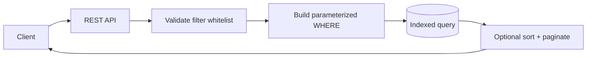

#### Validation pipeline

```text
Read query params → reject unknown keys (400)
  → bind values as parameters (never string concat SQL)
  → choose index-friendly predicates
  → execute → return JSON array or paginated envelope
```

---

### Pitfalls and design tips

- **SQL injection** — only parameterized queries; never `"... WHERE name = '" + param + "'"`
- **Unindexed filters** — `WHERE LOWER(email)` full table scan; add functional indexes or dedicated search (Elasticsearch).
- **Filter DSL creep** — `?filter=(status eq ACTIVE) and (price gt 100)` is powerful but expensive; cap complexity or use a search service.
- **Composite indexes** — for `?status=ACTIVE&city=Bangalore`, index `(status, city)` not two single-column indexes.
- **Empty vs missing** — define whether `?tag=` means empty string match or ignore.
- **Document allowed filters** in OpenAPI `parameters` — surprises become `400`, not silent ignores.

---

### Real-world example

**Stripe List API** documents filter parameters on list endpoints — e.g. `GET /v1/charges?customer=cus_123&limit=10` returns only charges for that customer. Parameters are whitelisted; invalid combinations return Stripe's standard error object. Under the hood, indexed columns back each filter; clients paginate with `starting_after` cursors (see 7.9) through the filtered subset, not the entire charges table.

---

## 7.11 Sorting

### Overview

Spreadsheet columns you can click to sort A→Z or newest-first turn chaos into something readable. **Sorting** on list APIs does the same server-side: clients say which field and direction, and the database returns rows in that order before pagination slices a page.

Technically, sorting maps `sort` query parameters to an **`ORDER BY`** clause with a **whitelist** of allowed columns. Multi-field sort uses comma-separated fields or repeated parameters. A **unique tiebreaker** (usually `id`) keeps order stable across pages — critical for cursor pagination (7.9).

---

### What problem it fixes

Unordered lists return rows in insertion or primary-key order — fine for machines, poor for humans who want "newest orders first" or "cheapest products." Client-side sorting breaks down when data is paginated (you only sort the current page, not the global list).

```http
GET /orders?sort=createdDate,desc
```

ensures **every page** sees globally consistent ordering from the database index.

---

### What it does

| Request | SQL equivalent |
|---------|----------------|
| `?sort=name` | `ORDER BY name ASC` (default asc) |
| `?sort=name,desc` | `ORDER BY name DESC` |
| `?sort=department,asc&sort=salary,desc` | `ORDER BY department ASC, salary DESC` |

**Example ascending by name:**

```http
GET /users?sort=name,asc
```

```json
[
  { "id": 2, "name": "Alice" },
  { "id": 3, "name": "David" },
  { "id": 1, "name": "John" }
]
```

Common sortable fields by domain:

| API | Typical fields |
|-----|----------------|
| Users | `name`, `createdDate`, `city` |
| Products | `price`, `rating`, `createdDate` |
| Orders | `orderDate`, `amount`, `status` |

---

### How it works — the architecture inside

#### Parameter → ORDER BY

```http
GET /users?status=ACTIVE&sort=name,asc
```

```sql
SELECT * FROM users
WHERE status = 'ACTIVE'
ORDER BY name ASC, id ASC   -- id as tiebreaker
LIMIT 10 OFFSET 0;
```

Reject unknown sort fields with `400` — never pass user strings directly into `ORDER BY` (SQL injection vector).

#### Multi-field sort semantics

```http
GET /employees?sort=department,asc&sort=salary,desc
```

1. Group by `department` A→Z
2. Within each department, highest `salary` first
3. Tiebreak on `id` for stable pages

#### Sort with pagination

```text
filter → sort → paginate
```

```http
GET /users?page=1&size=10&sort=createdDate,desc
```

Page 2 continues the **same global order** — without a tiebreaker, rows sharing `createdDate` may shuffle between requests.

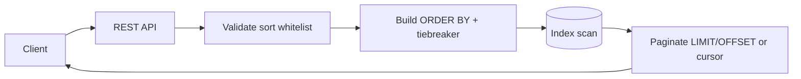

#### Index alignment

For `WHERE status = 'ACTIVE' ORDER BY createdDate DESC`, a composite index `(status, created_date DESC)` avoids filesort on large tables.

---

### Pitfalls and design tips

- **Sort injection** — whitelist column names; map `sort=price` → internal enum, not raw concatenation.
- **Non-deterministic pages** — without `id` tiebreaker, offset pagination shows duplicates across pages when values tie.
- **Cursor + sort** — cursor must encode all sort key columns, not only `id`.
- **Case sensitivity** — define whether `sort=name` is case-sensitive; document `citext` or normalized columns.
- **Nullable fields** — SQL `NULLS FIRST` / `NULLS LAST` behavior varies by database; document and test.
- **Expensive sorts** — `ORDER BY RANDOM()` or unindexed computed fields do not scale; precompute or restrict.

---

### Real-world example

**Amazon product search APIs** (and most e-commerce list endpoints) expose `sort=price-asc` / `sort=review-rank` style parameters backed by search indexes (Elasticsearch / proprietary ranking), not raw SQL on checkout databases. A `sort=price` request maps to an indexed numeric field; tiebreakers use product ASIN so page 2 of results does not reshuffle when two items share the same price — the same stability principle as `ORDER BY price, id` in SQL-backed catalogs.

## 7.12 OpenAPI

### Overview

Imagine two teams building a bridge from opposite banks without a shared blueprint — each side guesses dimensions until something does not fit. An OpenAPI document is that blueprint for HTTP APIs: a single, machine-readable description both sides can read, generate code from, and test against.

Technically, **OpenAPI** (formerly Swagger Specification) is a standard format — usually YAML or JSON — that describes REST-style APIs: endpoints, parameters, request and response bodies, authentication, and error shapes. Version 3.1 aligns with JSON Schema, which makes rich validation rules portable. The spec is the **contract**; tools like Swagger UI and OpenAPI Generator consume it for docs and codegen.

---

### What problem it fixes

Without a formal contract, API knowledge lives in Slack threads, outdated wiki pages, and tribal memory. Consumers discover breaking changes in production. Providers ship endpoints that do not match what clients expected. Manual SDK maintenance drifts from the real API.

OpenAPI fixes the coordination gap:

```text
One spec file  →  docs, client SDKs, server stubs, contract tests, lint rules
```

Versioned APIs should document each major version in `info.version` and/or separate spec files per version so consumers know which contract they are integrating against.

---

### What it does

OpenAPI defines what an API **promises** — not how it is implemented:

| Component | Purpose |
|-----------|---------|
| `openapi` | Spec format version (`3.0.0`, `3.1.0`) |
| `info` | Title, description, API version |
| `servers` | Base URLs (`https://api.example.com`) |
| `paths` | Endpoints and HTTP methods |
| `parameters` | Query, path, header params |
| `requestBody` | Payload schema |
| `responses` | Status codes and response schemas |
| `components` | Reusable schemas, parameters, security schemes |
| `security` | Auth requirements per operation |

It supports **design-first** workflows (write spec, then implement) and **code-first** workflows (generate spec from annotations). Either way, the spec should remain the authoritative contract.

---

### How it works

A minimal spec skeleton:

```yaml
openapi: 3.0.0

info:
  title: User API
  version: 1.0.0

servers:
  - url: https://api.example.com

paths:
  /users:
    get:
      summary: Get all users
      responses:
        "200":
          description: Success
```

**Paths** map URL templates to operations. **Components** hold shared types — a `User` schema referenced from multiple endpoints avoids duplication. **Security schemes** declare bearer JWT, API keys, or OAuth2 flows; `security` at the root or operation level marks which scheme applies.

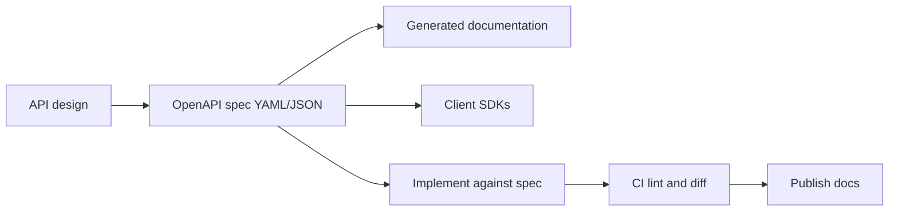

Interactive docs and codegen tooling are covered in the next section; here the focus is the **specification itself**.

**Bearer auth example:**

```yaml
components:
  securitySchemes:
    bearerAuth:
      type: http
      scheme: bearer
      bearerFormat: JWT

security:
  - bearerAuth: []
```

List APIs should document pagination, filtering, and sorting query parameters in `parameters` so clients and validators share one definition.

---

### Pitfalls and design tips

- **Spec drift** — the most common failure mode. Validate in CI with Spectral (style rules) and diff breaking changes with oasdiff before release.
- **OpenAPI ≠ Swagger** — OpenAPI is the spec; Swagger is the tooling brand. Do not use the terms interchangeably in design docs.
- **Optional vs required** — mark fields `required` explicitly; undocumented optional fields become integration roulette.
- **Error shapes** — document `400`, `401`, `404`, `429` response bodies in `components/responses` so clients handle failures consistently.
- **Default choice** — OpenAPI 3.1 + JSON Schema for new public APIs; keep the spec in the same repo as the service.

---

### Real-world example

GitHub publishes OpenAPI descriptions for its REST API. A partner team downloads `openapi.json`, runs OpenAPI Generator to produce a typed Java client, and implements against generated models. When GitHub adds an optional field, existing clients keep working. When a required field is renamed, oasdiff flags a breaking change in the provider's CI before the release ships — consumers are not surprised at runtime.

---

## 7.13 Swagger

### Overview

An OpenAPI file is like sheet music — precise, but not everyone reads notation fluently. **Swagger** is the concert hall: tools that turn the spec into a browsable, try-it-out interface so developers can explore endpoints without writing a client first.

Swagger is the **tooling ecosystem** around OpenAPI — Swagger UI for interactive docs, Swagger Editor for authoring, and legacy Swagger Codegen (superseded for new work by **OpenAPI Generator**). The spec format is OpenAPI; Swagger tools **read** that spec and render or generate from it.

---

### What problem it fixes

Raw YAML does not help a product manager test `POST /orders` or a new hire understand auth headers. Teams otherwise maintain separate Postman collections that drift from production. Swagger UI closes the gap by rendering every operation, parameter, and response schema from the live spec — one source of truth, zero duplicate doc maintenance.

---

### What it does

| Tool | Role |
|------|------|
| **Swagger UI** | Web UI from an OpenAPI spec — explore and execute endpoints |
| **Swagger Editor** | Create and edit OpenAPI YAML/JSON with live validation |
| **Swagger Codegen** | Legacy client/server generation |
| **OpenAPI Generator** | Actively maintained successor for new codegen pipelines |

Typical Spring Boot setup (springdoc-openapi): add dependency, start the app, open `/swagger-ui/index.html`. The framework scans controllers and publishes `/v3/api-docs`; Swagger UI reads that JSON and renders operations with a **Try it out** button.

---

### How it works

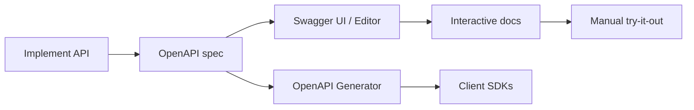

**Swagger UI flow for `GET /users/{id}`:**

1. Reads the spec and lists `GET /users/{id}` with parameter `id` (integer).
2. Developer enters `101` and clicks **Execute**.
3. Browser sends the real HTTP request to the configured `servers` URL.
4. Response body and status code display inline.

**Design-first:** author in Swagger Editor → implement handlers to match. **Code-first:** annotations generate the spec → Swagger UI reflects code changes on restart. Both paths require CI checks so the published UI never lies about production behavior.

---

### Pitfalls and design tips

- **Never expose unauthenticated Swagger UI on production** — it reveals the full API surface. Use dev/staging, protect with auth, or disable **Try it out** against prod backends.
- **Prefer OpenAPI Generator** over Swagger Codegen for new projects — active maintenance and broader language targets.
- **Host the spec at a stable URL** (`/openapi.json`, `/v3/api-docs`) so UI, partners, and CI pull the same file.
- **Interview angle** — Swagger UI is for humans; contract tests (Pact, Dredd) automate what Try it out does manually.

---

### Real-world example

A fintech startup publishes `https://api.staging.example.com/swagger-ui/index.html` for partner onboarding. Integrators browse payment endpoints, test sandbox calls from the browser, then run OpenAPI Generator to produce a Python client. When the team renames a field, the staging UI updates on deploy and partners see the change before production cutover — no separate PDF API guide to maintain.

---

## 7.14 Request Validation

### Overview

A restaurant host checks reservations at the door — wrong name, no table. Request validation is the API equivalent: reject malformed or rule-breaking input **before** it reaches the kitchen (business logic and database).

Validation runs at the **API boundary** on path variables, query parameters, headers, and request bodies. Rules often live in OpenAPI schemas and are enforced by framework middleware (Jakarta Bean Validation in Spring, Pydantic in FastAPI, JSON Schema validators). Failed validation returns a structured error — typically HTTP `400` or `422` — instead of an opaque `500`.

---

### What problem it fixes

Unvalidated input causes garbage in the database, security holes (injection, oversized payloads), and confusing server errors:

```http
POST /users
```

```json
{ "name": "", "email": "abc", "age": -5 }
```

Without validation, empty names, invalid emails, and negative ages may persist. With validation, the API responds immediately:

```json
{
  "message": "Validation Failed",
  "errors": [
    "Name cannot be empty",
    "Invalid email format",
    "Age must be greater than 0"
  ]
}
```

---

### What it does

| Validation type | Rule |
|-----------------|------|
| **Required** | Field must be present |
| **Length** | String min/max |
| **Format** | Email, URL, date, phone |
| **Range** | Numeric bounds |
| **Pattern** | Regex (e.g. digits only) |
| **Custom** | Business rules (unique username) — often needs DB lookup |

Query parameters need the same discipline: `GET /users?page=-1` → reject; `GET /users?size=500` when max is 100 → reject. Path variables: `GET /users/abc` when ID must be numeric → reject.

---

### How it works

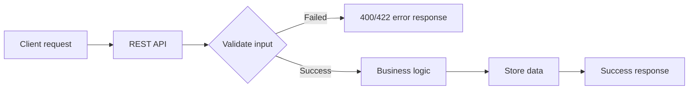

Validate **before** handlers run — fail fast with field-level messages. Use a **consistent error envelope** across endpoints:

```json
{
  "timestamp": "2026-06-25T10:30:00",
  "status": 400,
  "error": "Bad Request",
  "message": "Validation Failed",
  "errors": ["Name is required", "Invalid email format"]
}
```

**Spring Boot annotations (common):**

| Annotation | Purpose |
|------------|---------|
| `@NotNull` | Field cannot be null |
| `@NotBlank` | Not null, empty, or whitespace |
| `@Size` | Min/max length |
| `@Email` | Valid email format |
| `@Min` / `@Max` | Numeric bounds |
| `@Pattern` | Regex match |

Pick **one** convention for body validation errors (`400` vs `422`) and document it in OpenAPI. Custom business rules (unique email) run after syntactic validation via domain services.

---

### Pitfalls and design tips

- **Do not leak internals** — no stack traces, SQL fragments, or internal hostnames in validation errors.
- **Reject unknown fields** on public APIs when appropriate (fail-closed) — prevents mass-assignment surprises.
- **Sync rules with OpenAPI** — if the spec says `age` max 120, the validator must match.
- **Custom validation is slower** — cache existence checks where safe; never block the boundary on unbounded DB scans.
- **Never perform side effects on failed validation** — log at debug, not error, for noisy clients.

---

### Real-world example

Stripe's API validates `amount` as a positive integer in smallest currency unit at the boundary. A client sending `"amount": "-500"` receives a `400` with a typed error object (`type`, `param`, `message`) before any payment logic runs. Integrators fix the client without triggering partial charges or support tickets about mysterious `500` errors.

---

## 7.15 Contract Testing

### Overview

Two phone companies agree on a plug standard so any charger fits any socket. **Contract testing** is that agreement for microservices: the consumer documents what it expects; the provider proves it still delivers that shape — without spinning up the entire system for every build.

A **contract** captures request/response structure, required fields, data types, and status codes. Contracts are often OpenAPI specs or consumer-driven pact files. The goal is to catch breaking renames (`id` → `userId`) in CI, not in production at 2 a.m.

---

### What problem it fixes

**Provider (old):**

```json
{ "id": 101, "name": "John" }
```

**Provider (new — breaking):**

```json
{ "userId": 101, "fullName": "John" }
```

The Order Service still parses `id` and `name` → runtime failure after an innocent-looking deploy. Contract tests fail the provider build when the response shape drifts.

This is **not** request validation on a single call — contracts test **agreed communication between services**, not whether one email field is well-formed.

---

### What it does

| Role | Description |
|------|-------------|
| **Consumer** | Calls the API (web app, mobile, microservice) |
| **Provider** | Exposes the API (User Service, Payment API) |
| **Contract** | Documented expectations |
| **Verification** | Provider CI checks live or stubbed API against contract |

**Consumer-driven flow:** consumer tests define expected request/response → pact file published → provider CI verifies all consumer pacts → pass or block release.

---

### How it works

```mermaid
flowchart LR
    C[Consumer] --> CC[Create contract]
    CC --> Pub[Publish to broker]
    Pub --> P[Provider CI]
    P --> V[Verify API shape]
    V -->|Pass| D[Deploy]
    V -->|Fail| F[Block release]
```

**What contracts validate:** URL, method, headers, query/path params, body, response body, status codes, types.

Contract schema expects `{ "id": "number", "name": "string" }`:

- `{ "id": 101, "name": "John" }` → **PASS**
- `{ "id": "ABC", "name": "John" }` → **FAIL**

**Contract testing vs integration testing:**

| | Contract testing | Integration testing |
|---|------------------|---------------------|
| **Focus** | API agreement | Full system behavior |
| **Speed** | Fast | Slower |
| **Environment** | No full stack required | Dependent systems running |
| **Scope** | Communication shape | Auth, latency, side effects |

**Tools:**

| Tool | Notes |
|------|-------|
| **Pact** | Consumer-driven; pact broker; multi-language |
| **Spring Cloud Contract** | Groovy/YAML contracts; stubs for consumers |
| **Dredd** | Validates implementation against OpenAPI |
| **Hoverfly** | Service virtualization |

Use contracts for fast compatibility gates; use integration/E2E for full flows.

---

### Pitfalls and design tips

- **Test shape, not business logic** — contracts should not assert order totals; assert fields exist and types match.
- **Allow provider to add optional fields** — consumers should not break on new JSON keys.
- **Version contracts** when APIs version — stale pacts give false confidence.
- **Keep pacts small** — one focused interaction per pact, not an entire user journey.
- **Complement, don't replace** E2E — contracts won't catch auth misconfiguration or DB deadlocks.

---

### Real-world example

Pactflow hosts pact files from a React frontend (consumer) and a Node User Service (provider). When a developer renames `email` to `emailAddress` without notice, provider verification fails in GitHub Actions before merge. The consumer team is notified via the pact broker; they update together or the provider ships a backward-compatible alias field. Production never sees the break.

---

## 7.16 API Security

### Overview

A bank vault has a door (authentication), badges for each room (authorization), and cameras on the lobby (monitoring). API security layers the same ideas onto HTTP: prove identity, enforce permissions, encrypt transit, and detect abuse — on every endpoint, not as a late add-on.

APIs are a primary attack surface. Security design covers **confidentiality**, **integrity**, and **availability** (CIA): HTTPS for transport, tokens for identity, RBAC for access, validation against injection, rate limits against abuse, and safe error handling so attackers do not harvest internals.

---

### What problem it fixes

Unprotected APIs expose sensitive data, allow credential stuffing, SQL injection, and denial-of-service via unbounded traffic. Common threats: unauthorized access, data exposure, XSS, brute force, credential theft, man-in-the-middle on plain HTTP.

Authentication alone is insufficient — a logged-in user must not read another user's orders (BOLA/IDOR). Every mutating endpoint needs **authorization** checked against the authenticated principal and resource ownership.

---

### What it does

| Mechanism | Purpose |
|-----------|---------|
| **HTTPS / TLS** | Encrypt data in transit; terminate at gateway or load balancer |
| **API keys** | Simple partner/script auth — rotate via secret managers |
| **JWT** | Stateless bearer tokens; short expiry + refresh flow |
| **OAuth 2.0** | Delegated access (Login with Google); often paired with OIDC |
| **RBAC** | Role-based permissions (ADMIN vs USER) |
| **Input validation** | Block injection and malformed payloads at boundary |
| **Rate limiting** | Cap abuse — see next sections |
| **CORS** | Restrict browser origins (not server-to-server) |
| **Security headers** | CSP, HSTS, X-Frame-Options, X-Content-Type-Options |

---

### How it works

```mermaid
flowchart LR
    C[Client request] --> TLS[HTTPS TLS]
    TLS --> Auth[Authentication]
    Auth --> AuthZ[Authorization]
    AuthZ --> Val[Input validation]
    Val --> Biz[Business logic]
    Biz --> R[Response]
```

**Authentication vs authorization:**

| | Authentication | Authorization |
|---|----------------|---------------|
| **Question** | Who are you? | What may you do? |
| **Examples** | Password, JWT, OAuth login | Admin role, own-resource check |

**JWT flow:** login → server issues token → client sends `Authorization: Bearer <token>` → server validates signature and expiry. Prefer short-lived access tokens; avoid long-lived JWTs in `localStorage` (XSS risk).

**SQL injection:** never concatenate user input into SQL — use parameterized queries or ORM APIs.

**Error handling:**

```json
{ "error": "Internal Server Error" }
```

Not: `{ "error": "Database password incorrect" }`.

**Status codes:** `401` authentication failed; `403` authenticated but forbidden; `429` rate limited.

---

### Pitfalls and design tips

- **API keys in repos** — use secret managers; rotate on leak.
- **CORS is not auth** — server-to-server callers ignore CORS; still require tokens.
- **Log without secrets** — never log full JWTs, API keys, or passwords.
- **mTLS** for high-trust service-to-service meshes where bearer tokens alone are insufficient.
- **Default for new systems** — HTTPS everywhere, OAuth2/OIDC for user-facing apps, RBAC on every route, validation at boundary.

---

### Real-world example

AWS API Gateway terminates TLS, validates SigV4-signed requests, and applies usage plans (rate limits per API key). A compromised mobile app key can be throttled and revoked in the console without redeploying Lambda backends — authentication, authorization, and abuse control sit at one enforcement point before compute runs.

---

## 7.17 Webhooks

### Overview

Polling is asking "any mail yet?" every thirty seconds. Webhooks are the doorbell — the provider rings your URL when something happens. Instead of the client pulling updates, the **server pushes** an HTTP `POST` to a subscriber endpoint when an event occurs.

Webhooks invert normal REST: the provider initiates communication. They power real-time integrations — payment confirmations, CI build notifications, order shipments — with fewer wasted requests than polling.

---

### What problem it fixes

Polling `GET /orders/status` every few seconds wastes bandwidth, loads servers, and still delivers updates late. Webhooks deliver events at the moment they occur: payment succeeded, order shipped, user created.

Trade-off: the subscriber must expose a reliable, secure HTTPS endpoint and handle duplicates and retries.

---

### What it does

1. **Consumer registers** webhook URL with the provider.
2. **Provider stores** the URL (and often a signing secret).
3. **Event occurs** (order created, payment captured).
4. **Provider POSTs** JSON payload to the subscriber.
5. **Consumer acknowledges** with `200` or `202`, then processes (often asynchronously).

```http
POST https://myapp.com/webhook/payment
Content-Type: application/json

{
  "event": "PAYMENT_SUCCESS",
  "paymentId": "P1001",
  "status": "SUCCESS",
  "amount": 500
}
```

Include a stable **`event_id`** for deduplication — the same event may arrive more than once after retries.

---

### How it works

```mermaid
flowchart LR
    Reg[Register webhook URL] --> Store[Provider stores URL]
    Store --> Event[Event occurs]
    Event --> POST[Provider POSTs payload]
    POST --> Ack[Subscriber 200/202]
    Ack --> Proc[Async processing]
```

**Webhook vs polling:**

| | Polling | Webhook |
|---|---------|---------|
| **Who asks** | Client repeatedly | Provider on event |
| **Latency** | Up to poll interval | Near real-time |
| **Load** | Many empty requests | One POST per event |

**Retry:** failed delivery → exponential backoff → dead-letter queue after max attempts.

**How to calculate — webhook retry backoff:**

```text
Given: initial delay = 1 s, multiplier = 2, max attempts = 5, jitter ±20%

Step 1 — attempt schedule (no jitter):
  attempt 1: immediate
  wait 1 s  → attempt 2
  wait 2 s  → attempt 3
  wait 4 s  → attempt 4
  wait 8 s  → attempt 5

Step 2 — total retry window:
  1 + 2 + 4 + 8 = 15 s of backoff delays (+ handler time per try)

Step 3 — with jitter (example attempt 3):
  base 4 s → random in [3.2 s, 4.8 s] spreads thundering herds

Result: subscriber has ≈ 15–20 s to recover before DLQ on 5-attempt policy

Sanity check: return 2xx within provider timeout (often 5–30 s) on first try;
             design idempotent handlers — same event_id may arrive on attempts 2–5.
```

**Security** (public URLs accept anyone's HTTP):

| Method | How |
|--------|-----|
| **HMAC signature** | Provider signs payload; consumer verifies `X-Signature` |
| **Shared secret header** | `X-Webhook-Token` must match |
| **HTTPS only** | Never production webhooks over plain HTTP |
| **Registration challenge** | Provider sends challenge token; subscriber echoes to prove URL ownership |

Return **2xx quickly** — providers time out slow handlers and retry, causing duplicates.

---

### Pitfalls and design tips

- **Idempotency required** — process by `event_id`; duplicate `ORDER_CREATED` must not create two orders.
- **Ordering not guaranteed** — use sequence numbers or timestamps; design handlers to tolerate out-of-order delivery.
- **SSRF on registration** — validate subscriber URLs; do not let users register `http://169.254.169.254/`.
- **Async processing** — acknowledge first, process in a queue; heavy work in the HTTP thread causes retry storms.
- **Monitor failed deliveries** — alert when DLQ depth grows.

---

### Real-world example

Stripe sends `payment_intent.succeeded` to `https://merchant.com/webhooks/stripe` with an `Stripe-Signature` HMAC header. The merchant verifies the signature, returns `200` within seconds, enqueues the event, and updates order status by `event.id` stored in a dedup table. A network blip causes Stripe to retry the same payload three times — only one order fulfillment runs because `event.id` was already processed.

---

## 7.18 Rate Limiting

### Overview

A theme park hands out timed entry wristbands so one group cannot pack every ride at once. **Rate limiting** caps how many API requests a client may send in a time window; excess requests get **rejected** (usually HTTP `429 Too Many Requests`) instead of overwhelming backends.

It protects against abuse, ensures fair usage across tenants, controls cost, and keeps systems stable. Enforcement belongs at the **API gateway** or shared middleware with **distributed state** — per-pod counters multiply quotas by replica count in Kubernetes.

---

### What problem it fixes

One client at 10,000 req/min can starve others and trigger cascading failures. Without limits, bots brute-force login, scrapers hammer list endpoints, and misconfigured retry loops amplify load. Rate limiting rejects or sheds excess traffic **before** expensive database work.

---

### What it does

On each request:

```text
Check counter for client identity → within limit? → process : return 429 + Retry-After
```

**Identity keys:** API key, user ID, OAuth client ID, or IP (IP is weak behind corporate NAT — prefer authenticated identity).

**Response headers:**

| Header | Meaning |
|--------|---------|
| `X-RateLimit-Limit` | Max requests in window |
| `X-RateLimit-Remaining` | Requests left |
| `X-RateLimit-Reset` | Unix time when window resets |
| `Retry-After` | Seconds to wait |

Document limits in OpenAPI. On mutating `POST`s, clients must reuse the same idempotency key when retrying after `429`.

---

### How it works

```mermaid
flowchart LR
    Client --> MW[Gateway rate limiter]
    MW -->|Allowed| API[Backend services]
    MW -->|Denied| R429[429 Retry-After]
```

**Algorithm comparison:**

| Algorithm | Burst behavior | Memory | Best for |
|-----------|----------------|--------|----------|
| **Token bucket** | Allows bursts up to bucket size | O(1) per client | Public APIs, short bursts |
| **Leaky bucket** | Smooth fixed outflow | O(queue) | Fixed-capacity downstream |
| **Fixed window** | Spikes at window edges | O(1) | Simple internal limits |
| **Sliding window log** | Accurate | O(requests in window) | Strict per-minute limits |
| **Sliding window counter** | Smooth, approximate | O(1)–O(2) | High-scale production APIs |

#### Token bucket

Bucket capacity **b**; tokens refill at rate **r** per second. Each request consumes one token. Tokens do not accumulate beyond **b**. Empty bucket → reject.

#### Fixed window edge problem

Limit 3 req/min: three requests at `2:00:59` and three at `2:01:00` → **six requests in two seconds** across the boundary.

#### Sliding window counter

```text
weighted_count = (prev_window_count × (1 − overlap_fraction)) + current_window_count
```

If `weighted_count > limit` → reject. Smooths boundary spikes; common in Redis-backed gateways.

#### Distributed enforcement (Redis)

Per-pod counters are unsafe in clusters. Use atomic Redis operations:

```text
MULTI
  ZREMRANGEBYSCORE key 0 (now - windowMs)
  ZADD key now now
  EXPIRE key windowMs
  ZCARD key
EXEC
→ allow if count <= maxRequests
```

**How to calculate:**

**Given:** tier limit = 100 requests per minute; desired burst allowance = 20 requests.

**Step 1 — sustained refill rate:**

```text
r = 100 requests / 60 seconds ≈ 1.67 tokens/sec
```

**Step 2 — bucket size for burst:**

```text
b = 20 tokens (maximum accumulated burst)
```

**Step 3 — behavior after idle:**

Client idle → bucket fills to 20 tokens → client may send 20 requests immediately → bucket empty → steady rate ≈ 1.67 req/sec (≈ 100/min long-term).

**Sanity check:** 20 burst + 40 sec × 1.67/sec ≈ 20 + 67 = 87 < 100 in the first minute after burst — sustained cap still holds over rolling minutes.

**Sliding window counter example:**

**Given:** limit = 4 req/min; previous window had 4 requests; current window 25% elapsed with 2 requests.

```text
weighted = 4 × (1 − 0.25) + 2 = 4 × 0.75 + 2 = 5
```

5 > 4 → **reject**, even though neither fixed window alone exceeded 4.

---

### Pitfalls and design tips

- **Enforce before handler work** — not after three DB queries.
- **Fail-open vs fail-closed** when Redis is down — document the product choice.
- **Tiered limits** — free vs paid; stricter caps on `/login` and expensive search paths.
- **Fixed window** is easy but spikes at boundaries — prefer token bucket or sliding window counter at scale.
- **Rate limiting ≠ throttling** — limiting rejects excess; throttling slows or queues (next section). Use both at the gateway.

---

### Real-world example

GitHub's REST API returns `X-RateLimit-Limit`, `X-RateLimit-Remaining`, and `X-RateLimit-Reset` on every response. Unauthenticated requests share a low pool; authenticated tokens get 5,000 points/hour. A CI script that ignores `429` and `Retry-After` gets blocked; one that backs off stays within quota — the headers make the budget visible without reading docs.

---

## 7.19 Throttling

### Overview

Rate limiting is a bouncer who turns away guests when the club is full. **Throttling** is the bartender who still serves everyone but pours slower when the line wraps around the block — the system stays open, just degraded.

Throttling controls **how fast** requests are processed when aggregate load is high: delay responses, queue work, cap bandwidth or concurrent connections, or dynamically reduce throughput based on CPU and queue depth. Goal: protect backends from collapse while maintaining **availability**.

---

### What problem it fixes

A spike from 100 req/s to 5,000 req/s without throttling crashes services, exhausts connection pools, and triggers cascading timeouts. Throttling absorbs the spike — processing 100/s while the rest waits, drops, or receives `503` — so databases and payment gateways survive.

---

### What it does

| Technique | Behavior |
|-----------|----------|
| **Request delaying** | Increase latency under load (100 ms → 500 ms) |
| **Request queuing** | FIFO buffer; drain at fixed rate (leaky-bucket style) |
| **Bandwidth limiting** | Cap bytes/sec on large payloads |
| **Connection limiting** | Cap concurrent connections; extras wait or reject |
| **Dynamic throttling** | Adjust limits from live metrics (CPU 90% → cut to 200 req/s) |

**HTTP codes:** `429` when client quota exceeded; `503 Service Unavailable` when the server cannot accept more work — include `Retry-After` when possible.

---

### How it works

```mermaid
flowchart LR
    C[Client requests] --> GW[Gateway]
    GW --> M{Traffic level?}
    M -->|Normal| OK[Forward immediately]
    M -->|High| TH[Delay or queue]
    TH --> CP[Controlled drain rate]
    CP --> MS[Microservices]
```

**Example:** allowed processing rate 100 req/s; incoming 1,000 req/s → ~100 processed per second; remainder queued (risk: tail latency) or rejected depending on policy.

**How to calculate — throttle queue wait:**

```text
Given: drain rate = 100 req/s, arrival burst = 1,000 req/s for 10 s, queue capacity = 500

Step 1 — net accumulation per second during burst:
  net = 1,000 − 100 = 900 req/s queued

Step 2 — queue fill after 1 second:
  queued = 900 (> capacity 500) → 400 rejected or shed immediately (policy-dependent)

Step 3 — if first 500 are admitted, time to drain after burst stops:
  drain_time = 500 / 100 = 5 s

Step 4 — tail latency for last queued request:
  wait ≈ 5 s (plus processing time) before response

Result: p99 latency spikes to seconds under sustained overload; cap queue depth

Sanity check: unbounded queues turn overload into hour-long waits — prefer 503 + Retry-After
             when queue > cap instead of infinite buffering.
```

**Throttling vs rate limiting:**

| | Rate limiting | Throttling |
|---|---------------|------------|
| **Scope** | Per-client quota | System-wide or aggregate load |
| **Behavior** | Reject excess (`429`) | Slow, queue, or shape traffic |
| **Goal** | Fairness and abuse prevention | Overload protection |

Leaky bucket in rate limiting behaves like throttling — constant outflow from a queue. Use **both** at the gateway: per-client caps plus system-wide backpressure.

**Dynamic throttling:**

```text
CPU 30%  → allow ~1000 req/s
CPU 90%  → throttle to ~200 req/s
```

Combine with autoscaling when delay alone masks capacity debt.

---

### Pitfalls and design tips

- **Unbounded queues** — cap queue depth; shed load with `503` rather than hour-long waits.
- **Tail latency** — queued requests blow p99; monitor queue depth and age.
- **User experience** — opaque throttling without `Retry-After` frustrates clients; document degraded mode.
- **Premium tiers** — reserve capacity or separate queues for paid traffic under stress.
- **Not a substitute for capacity** — throttling buys time; autoscale or add replicas for sustained growth.

---

### Real-world example

AWS API Gateway usage plans combine rate limiting (steady requests/sec) with burst buckets. When a Lambda backend slows, API Gateway can return `429` or `503` while integrations queue briefly — protecting downstream DynamoDB from write throttle storms during a flash sale. Merchants see elevated latency in dashboards rather than a hard outage.

---

## 7.20 Idempotency

### Overview

Pressing an elevator button twice does not send the car to two floors — the command is **idempotent**. In APIs, calling the same operation multiple times should leave the system in the **same final state** as calling it once.

HTTP methods differ: `GET`, `PUT`, and `DELETE` are naturally idempotent; `POST` usually creates a new resource on every call. Over unreliable networks, clients retry on timeouts — without idempotency, a payment `POST` charged once may be charged again when the response is lost.

---

### What problem it fixes

```text
Client POST /payments → payment succeeds → response lost
→ client retries POST → duplicate charge
```

Retries are correct behavior for `5xx`, `429`, and timeouts. Non-idempotent `POST` turns retries into duplicate orders, double bookings, or twin ledger entries. Idempotency — natural or via keys — makes retries safe.

---

### What it does

| Method | Idempotent? | Notes |
|--------|-------------|-------|
| `GET` | Yes | Read-only |
| `PUT` | Yes | Same body → same resource state |
| `DELETE` | Yes | Second delete → already gone (`404`/`204` OK) |
| `HEAD`, `OPTIONS` | Yes | Safe metadata |
| `POST` | **Usually no** | Each call may create new resource |
| `PATCH` | **Depends** | Replace field = yes; increment = no |

**POST example (non-idempotent):**

```http
POST /orders
{ "product": "Laptop" }
```

Three identical calls → three order IDs (1001, 1002, 1003).

**PUT example (idempotent):**

```http
PUT /users/101
{ "email": "john@test.com" }
```

Ten identical calls → email still `john@test.com`.

Critical domains: payments, orders, banking, bookings, webhook processing (at-least-once delivery).

---

### How it works

```mermaid
flowchart LR
    C[Client] -->|POST /payments| API[API]
    API --> Pay[Process payment]
    Pay -.->|Response lost| C
    C -->|Retry POST| API
    API --> Dup[Duplicate charge without key]
```

Safe `POST` retries require **idempotency keys** (next section): client sends a unique token; server returns the stored result on duplicate without re-executing side effects.

**PATCH nuance:**

```http
PATCH /users/101
{ "name": "John" }
```

Idempotent replace. But:

```http
PATCH /counter
{ "increment": 1 }
```

Each call adds 1 — not idempotent.

**Retry policy:** retry `GET`/`PUT`/`DELETE` freely; retry `POST` only with the same idempotency key; never perform side effects on `GET`.

---

### Pitfalls and design tips

- **Do not make `GET` mutate** — caches and prefetchers will trigger side effects.
- **Design `PATCH` as replace** when possible — increments and toggles are retry hazards.
- **Webhook consumers** — deduplicate by `event_id`, not by hoping for exactly-once delivery.
- **Interview distinction** — idempotent HTTP method vs idempotent **business operation** (`POST` with key).

---

### Real-world example

A mobile banking app times out on `POST /transfers`. Without idempotency, the user taps "Retry" and sends the same transfer twice. With an idempotency key generated on first tap, the second request returns the original transfer ID and status — the ledger shows one debit. The user sees "Transfer complete" instead of a support call about a duplicate payment.

---

## 7.21 Idempotency Keys

### Overview

A coat-check ticket lets the desk return your jacket without issuing a second one — even if you ask twice. An **idempotency key** is that ticket for `POST` requests: a client-generated unique token in a header so the server recognizes retries and replays the **first result** instead of running side effects again.

Industry pattern: `Idempotency-Key` header (Stripe, many payment APIs). One key per logical user action (button click); same key on every retry of that action.

---

### What problem it fixes

Unsafe `POST` retries duplicate charges, orders, and inventory reservations. Idempotency keys turn at-least-once network delivery into **at-most-once side effects** for the business operation — the server stores the outcome keyed by the token.

---

### What it does

```http
POST /payments
Idempotency-Key: 7f3a8b2c-4e1d-4a9f-b3c2-1d8e9f0a2b3c
Content-Type: application/json

{ "amount": 4999, "currency": "usd" }
```

| Scenario | Server action |
|----------|---------------|
| New key | Process; store status + full response |
| Known key, same body | Replay cached response (same status + body) |
| Known key, different body | `409 Conflict` |
| Known key, still `processing` | Block, wait, or return `409` |
| Key expired (e.g. >24h) | Treat as new request |

**Idempotency record fields:**

| Field | Purpose |
|-------|---------|
| `idempotency_key` | Client token |
| `account_id` | Scope per tenant — `(account_id, key)` unique |
| `request_hash` | Detect same key + different body |
| `status` | `processing` / `completed` / `failed` |
| `response_code`, `response_body` | Exact replay |
| `expires_at` | TTL (24–72h typical) |

**How to calculate — idempotency key TTL window:**

```text
Given: client retry window = 2 min (timeouts + 3 retries), ops replay window = 24 h, payment dispute window = 72 h

Step 1 — minimum TTL (cover client retries):
  TTL_min ≥ max_retry_span ≈ 2–5 min → use at least 24 h for safety margin

Step 2 — business-driven TTL (payments):
  TTL = max(client_retry, support_replay, dispute_lookback) ≈ 72 h

Step 3 — storage estimate:
  keys/day = 50k mutating POSTs × 72 h / 24 h ≈ 150k live keys

Step 4 — memory (Redis, ~500 B/record):
  150k × 500 B ≈ 75 MB for idempotency store

Result: set expires_at = now + 72 h; purge via TTL index or Redis EX

Sanity check: TTL too short → duplicate charges on late retries;
             TTL too long → unbounded store; 24–72 h is the usual production band.
```

---

### How it works

```mermaid
flowchart LR
    R[Request] --> K{Key exists?}
    K -->|New| Claim[Atomic claim]
    Claim --> P[Process side effects]
    P --> S[Store completed response]
    S --> OK[Return response]
    K -->|Existing| C[Replay stored response]
```

**Atomic claim before side effects:**

```sql
INSERT INTO idempotency_keys (key, account_id, request_hash, status)
VALUES ($1, $2, $3, 'processing')
ON CONFLICT (key, account_id) DO NOTHING
RETURNING id;
-- No row returned → lookup existing and replay or 409
```

Redis alternative: `SET idem:{account}:{key} processing NX EX 86400` — only the winner processes.

Write the `processing` record **before** charging — prevents double execution if the process crashes between payment gateway call and store update.

**Client rules:**

1. Generate one UUID v4 per user action.
2. Send the **same key** on every retry (`5xx`, `429`, timeout).
3. On `409` with different body — fix the client bug; do not blindly retry.

```mermaid
flowchart LR
    C[Client] -->|POST key PAY-10001| API[API]
    API --> DB[(Idempotency store)]
    API --> Pay[Execute payment]
    Pay --> DB
    C -->|Retry same key| API
    API --> DB
    DB --> C
```

---

### Pitfalls and design tips

- **Concurrent duplicate race** — use `ON CONFLICT`, Redis `SETNX`, or serialize on key.
- **Stuck `processing`** after crash — timeout + sweeper job to fail or complete orphaned records.
- **Storage growth** — TTL + partition by date; purge expired keys.
- **Async side effects** (email, webhook) — outbox pattern + dedup by `event_id`.
- **Gateway strips header** — allowlist `Idempotency-Key` on API gateway.
- **Document in OpenAPI** — parameter on critical `POST` operations.

---

### Real-world example

Stripe requires `Idempotency-Key` on `POST /v1/payment_intents`. A checkout service generates `uuid4()` when the user clicks Pay and stores it in session state. The first request creates `pi_abc123` and charges the card. A timeout triggers retry with the same key — Stripe returns the original `pi_abc123` with HTTP `200`, not a second charge. A bug that changes `amount` on retry gets `409 Conflict`, surfacing the client error in logs before money moves twice.


[<- Back to master index](../README.md)
