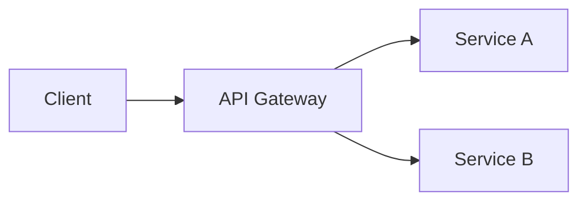
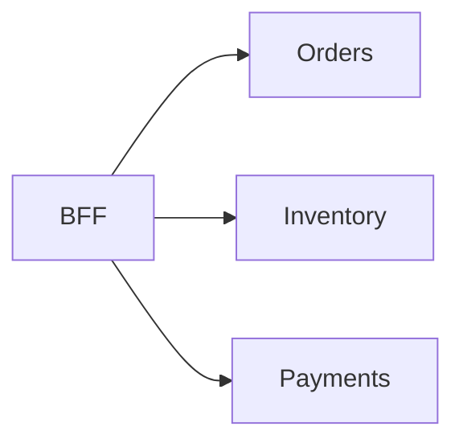

# 7. API Design

> Status: **Documented** — cheat-sheet reference for all sub-topics below.

[← Back to master index](../README.md)

---

## Sub-topics

| # | Sub-topic | Status |
|---|-----------|--------|
| 7.1 | [REST](#71-rest) | Done |
| 7.2 | [GraphQL](#72-graphql) | Done |
| 7.3 | [gRPC](#73-grpc) | Done |
| 7.4 | [SOAP](#74-soap) | Done |
| 7.5 | [API Gateway](#75-api-gateway) | Done |
| 7.6 | [API Aggregation](#76-api-aggregation) | Done |
| 7.7 | [API Composition](#77-api-composition) | Done |
| 7.8 | [API Versioning](#78-api-versioning) | Done |
| 7.9 | [Pagination](#79-pagination) | Done |
| 7.10 | [Filtering](#710-filtering) | Done |
| 7.11 | [Sorting](#711-sorting) | Done |
| 7.12 | [OpenAPI](#712-openapi) | Done |
| 7.13 | [Swagger](#713-swagger) | Done |
| 7.14 | [Request Validation](#714-request-validation) | Done |
| 7.15 | [API Security](#715-api-security) | Done |
| 7.16 | [Webhooks](#716-webhooks) | Done |
| 7.17 | [Rate Limiting](#717-rate-limiting) | Done |
| 7.18 | [Throttling](#718-throttling) | Done |
| 7.19 | [Idempotency](#719-idempotency) | Done |
| 7.20 | [Idempotency Keys](#720-idempotency-keys) | Done |
| 7.21 | [Contract Testing](#721-contract-testing) | Done |

---

## Overview

APIs are the contract between systems. Good design balances consistency, evolvability, performance, and developer experience.

---

## 7.1 REST

**Summary:** Resource-oriented HTTP API using nouns, standard verbs, and status codes. Ubiquitous, cacheable, and easy to debug.

- **Resources** — `/users/123`, not `/getUser`
- **HTTP verbs** — GET (read), POST (create), PUT/PATCH (update), DELETE
- **Stateless** — each request carries all context (auth, params)

---

## 7.2 GraphQL

**Summary:** Query language where clients request exactly the fields they need in one round trip. Single endpoint, strongly typed schema.

- **Over/under-fetching solved** — client shapes the response
- **N+1 risk** — resolvers need DataLoader/batching
- **Mutations + subscriptions** — writes and real-time on same schema

---

## 7.3 gRPC

**Summary:** High-performance RPC over HTTP/2 with Protocol Buffers. Best for service-to-service, streaming, and low-latency internal APIs.

- **Binary serialization** — smaller payloads than JSON
- **Streaming** — unary, server, client, bidirectional
- **Code generation** — stubs from `.proto` files

---

## 7.4 SOAP

**Summary:** XML-based enterprise protocol with WSDL contracts, WS-* standards, and built-in security. Legacy but still in banking/telecom.

- **WSDL** — machine-readable contract
- **Heavy payloads** — XML overhead vs JSON/Protobuf
- **Prefer REST/gRPC** — for new greenfield systems

---

## 7.5 API Gateway

**Summary:** Single entry point for routing, auth, rate limiting, SSL termination, and protocol translation. Shields backend services from clients.

- **Cross-cutting concerns** — auth, logging, throttling in one place
- **Routing** — path/host-based to microservices
- **BFF alternative** — gateway for generic; BFF for client-specific

---

## 7.6 API Aggregation

**Summary:** Combine multiple backend responses into one client response at the gateway/BFF. Reduces client round trips.

- **Server-side join** — gateway calls N services, merges result
- **Latency** — bounded by slowest downstream call
- **Partial failure** — degrade gracefully or return 207/multi-status

---

## 7.7 API Composition

**Summary:** Orchestrate calls across services to fulfill one use case, often with logic between calls. Differs from simple aggregation by adding business flow.

- **Sequential/parallel calls** — chain dependent requests
- **Saga-friendly** — compensating actions on failure
- **BFF pattern** — composition tailored per client type

---

## 7.8 API Versioning

**Summary:** Evolve APIs without breaking existing clients. Version via URL, header, query param, or content negotiation.

- **URL path** — `/v1/users` (explicit, easy to route)
- **Header** — `Accept: application/vnd.api+json;version=2`
- **Deprecation policy** — sunset timeline + migration docs

---

## 7.9 Pagination

**Summary:** Return large collections in chunks to bound response size and memory. Critical for list endpoints.

- **Offset/limit** — simple; poor performance on deep pages
- **Cursor-based** — opaque cursor; stable under concurrent writes
- **Link headers** — `rel="next"` for HATEOAS-style navigation

---

## 7.10 Filtering

**Summary:** Let clients narrow results server-side (`?status=active&role=admin`). Reduces payload and client-side work.

- **Query params** — `filter[field]=value` or flat `?status=active`
- **Index alignment** — filter fields must be indexed in DB
- **Validation** — whitelist allowed filter fields

---

## 7.11 Sorting

**Summary:** Order results by one or more fields (`?sort=-createdAt,name`). Ascending/descending per field.

- **Whitelist sort fields** — prevent sort on unindexed columns
- **Stable sort** — tie-breaker field (e.g., `id`) for consistency
- **Default sort** — document implicit ordering

---

## 7.12 OpenAPI

**Summary:** Machine-readable specification (YAML/JSON) describing endpoints, schemas, auth, and examples. Industry standard for REST documentation.

- **Spec-first or code-first** — design then implement, or generate from code
- **Codegen** — client SDKs and server stubs
- **Contract source of truth** — drives docs, tests, mocks

---

## 7.13 Swagger

**Summary:** Tooling ecosystem (UI, Editor, Codegen) built around OpenAPI specs. "Swagger" often used interchangeably with OpenAPI.

- **Swagger UI** — interactive API explorer
- **Swagger Editor** — design and validate specs
- **OpenAPI 3.x** — current spec version

---

## 7.14 Request Validation

**Summary:** Reject malformed input at the boundary before business logic. Return 400 with clear field-level errors.

- **Schema validation** — JSON Schema, Bean Validation, Pydantic
- **Fail fast** — validate auth, headers, body, query in order
- **Consistent error format** — RFC 7807 Problem Details

---

## 7.15 API Security

**Summary:** Protect APIs with authentication, authorization, input sanitization, TLS, and rate limits. Defense in depth at gateway and service.

- **OAuth2/OIDC + JWT** — standard auth for APIs
- **Least privilege** — scope/role checks per endpoint
- **OWASP API Top 10** — BOLA, broken auth, mass assignment

---

## 7.16 Webhooks

**Summary:** Server-initiated HTTP callbacks to notify external systems of events. Inverts the polling model.

- **Registration** — client provides callback URL + secret
- **Signature verification** — HMAC payload signing
- **Retry + DLQ** — exponential backoff on delivery failure

---

## 7.17 Rate Limiting

**Summary:** Cap request volume per client/key/time window to protect backend and ensure fair usage.

- **Algorithms** — token bucket, leaky bucket, fixed/sliding window
- **Headers** — `X-RateLimit-Limit`, `Remaining`, `Retry-After`
- **429 Too Many Requests** — standard response code

---

## 7.18 Throttling

**Summary:** Slow down or queue excess traffic rather than hard reject. Smoother degradation than abrupt 429s.

- **Queue-based** — buffer bursts, process at steady rate
- **Priority tiers** — premium clients get higher limits
- **Backpressure** — signal upstream to slow producers

---

## 7.19 Idempotency

**Summary:** Repeating the same request produces the same result as once. Essential for safe retries on POST/payment operations.

- **Safe methods** — GET, PUT, DELETE are naturally idempotent
- **POST is not** — needs idempotency keys or unique constraints
- **Side effects** — charging card twice is the classic failure mode

---

## 7.20 Idempotency Keys

**Summary:** Client sends unique key (header) per logical operation; server stores result and returns cached response on duplicate key.

- **Header** — `Idempotency-Key: uuid`
- **TTL** — key store expires after 24–72 hours
- **409 on conflict** — same key, different body = error

---

## 7.21 Contract Testing

**Summary:** Verify provider and consumer agree on API shape without full integration tests. Pact and OpenAPI diff are common tools.

- **Consumer-driven** — consumer defines expected contract
- **Provider verification** — provider tests against consumer pacts
- **CI gate** — block deploy on contract breakage

---

## Quick Reference

| Style | Format | Best for | Trade-off |
|-------|--------|----------|-----------|
| REST | JSON + HTTP | Public APIs, CRUD | Over-fetching |
| GraphQL | Query language | Flexible clients | Complexity, N+1 |
| gRPC | Protobuf + HTTP/2 | Internal microservices | Browser support |
| SOAP | XML + WSDL | Legacy enterprise | Verbose |
| Gateway | — | Auth, routing, limits | Single point of failure |
| Pagination | cursor > offset | Large lists | Cursor state management |
| Writes | idempotency key | Payments, creates | Key store overhead |
| Evolution | versioning + contracts | Long-lived APIs | Maintenance burden |
