# 7. API Design

> Status: **Documented**

[<- Back to master index](../README.md)

---

## Overview

API design defines how services expose capabilities to clients and each other - shaping developer experience, evolvability, performance, and security. Modern systems choose among **REST** (resource-oriented HTTP), **GraphQL** (client-driven queries), **gRPC** (binary RPC over HTTP/2), and legacy **SOAP** based on audience, latency needs, and contract rigor.

Beyond protocol choice, production APIs need **gateways** for cross-cutting concerns (auth, rate limits, routing), consistent **pagination and filtering**, explicit **versioning**, and **idempotency** for safe retries. Poor API design creates coupling, outage amplification, and breaking changes that stall client teams.

This chapter covers protocol trade-offs, gateway patterns, query conventions, documentation (OpenAPI/Swagger), security, traffic control, and contract testing - everything needed to design and defend API decisions in system design interviews.

---

## Sub-topics

| # | Sub-topic | Status |
|---|-----------|--------|
| 7.1 | [REST](#71-rest) | Done |
| 7.2 | [GraphQL](#72-graphql) | Done |
| 7.3 | [gRPC](#73-grpc) | Done |
| 7.4 | [SOAP](#74-soap) | Done |
| 7.5 | [API Gateway](#75-api-gateway) | Done |
| 7.6 | [API Aggregation](#76-api-aggregation) | Done |
| 7.7 | [API Composition](#77-api-composition) | Done |
| 7.8 | [API Versioning](#78-api-versioning) | Done |
| 7.9 | [Pagination](#79-pagination) | Done |
| 7.10 | [Filtering](#710-filtering) | Done |
| 7.11 | [Sorting](#711-sorting) | Done |
| 7.12 | [OpenAPI](#712-openapi) | Done |
| 7.13 | [Swagger](#713-swagger) | Done |
| 7.14 | [Request Validation](#714-request-validation) | Done |
| 7.15 | [Contract Testing](#715-contract-testing) | Done |
| 7.16 | [API Security](#716-api-security) | Done |
| 7.17 | [Webhooks](#717-webhooks) | Done |
| 7.18 | [Rate Limiting](#718-rate-limiting) | Done |
| 7.19 | [Throttling](#719-throttling) | Done |
| 7.20 | [Idempotency](#720-idempotency) | Done |
| 7.21 | [Idempotency Keys](#721-idempotency-keys) | Done |


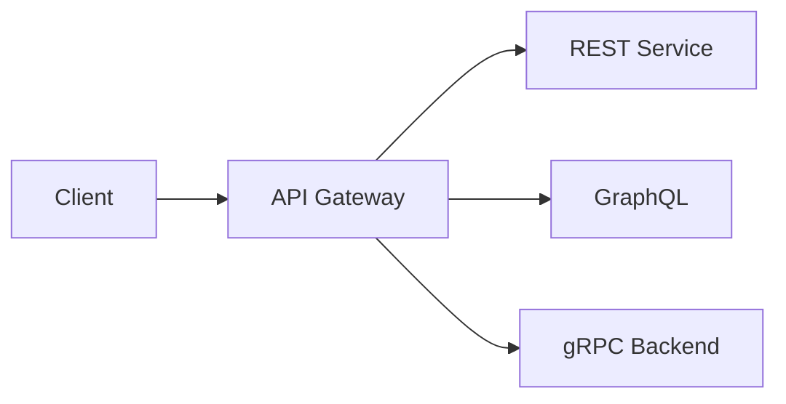

---


## Reading order

Sub-topics are sequenced for progressive learning: foundations first, then related concepts, then specialized topics.

| Group | Sections | Focus |
|-------|----------|-------|
| **1. Protocols** | 7.1-7.4 | REST, GraphQL, gRPC, SOAP |
| **2. Gateway and composition** | 7.5-7.7 | Gateway, aggregation, composition |
| **3. API design** | 7.8-7.11 | Versioning, pagination, filtering, sorting |
| **4. Contracts and quality** | 7.12-7.15 | OpenAPI, Swagger, validation, contract tests |
| **5. Production concerns** | 7.16-7.21 | Security, webhooks, limits, idempotency |

---
---

## 7.1 REST


### What is it?

**REST** (Representational State Transfer) models APIs as **resources** (nouns) identified by URLs, manipulated with HTTP verbs (`GET`, `POST`, `PUT`, `PATCH`, `DELETE`) and standard status codes.

### Why it matters

Universal support in browsers, CDNs, and tooling; cache-friendly; easy onboarding. Default choice for public HTTP APIs and BFFs.

### How it works

1. Design resources: `/users/{id}`, `/orders/{id}/items`.
2. Use HTTP semantics: `GET` safe/idempotent, `POST` create, `PUT` replace, `PATCH` partial update.
3. Represent state in JSON (typically) with hypermedia optional (HATEOAS).
4. Leverage HTTP caching (`ETag`, `Cache-Control`) for reads.
5. Errors as problem+json with consistent structure.

### Diagram

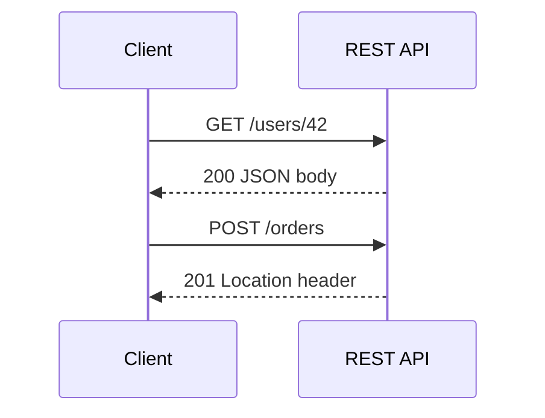

### Key details

| Verb | Idempotent | Safe | Typical use |
|------|------------|------|-------------|
| GET | Yes | Yes | Read |
| POST | No | No | Create |
| PUT | Yes | No | Upsert/replace |
| DELETE | Yes | No | Remove |

### When to use

- Public APIs, mobile/web clients, CDN-cacheable reads.
- CRUD-heavy domains with clear resources.
- Teams prioritizing simplicity over binary efficiency.

### Trade-offs / Pitfalls

- Over-fetching and under-fetching -> multiple round trips or bloated payloads.
- "REST-ish" RPC disguised as REST (`POST /getUser`) loses verb semantics.
- N+1 client calls without aggregation/BFF.

### References

*(No curated references for this sub-topic in `_topics.json`.)*

---


## 7.2 GraphQL


### What is it?

**GraphQL** is a query language and runtime where clients request exactly the fields needed in one round trip; a schema defines types, queries, mutations, and subscriptions.

### Why it matters

Solves over/under-fetching for diverse clients (mobile vs web); single endpoint; strong typing and introspection for tooling.

### How it works

1. Server exposes GraphQL schema (types, resolvers).
2. Client sends query document specifying nested fields.
3. Server resolves fields - potentially N+1 without DataLoader batching.
4. Mutations for writes; subscriptions for push updates.
5. Validation rejects unknown fields before execution.

### Diagram

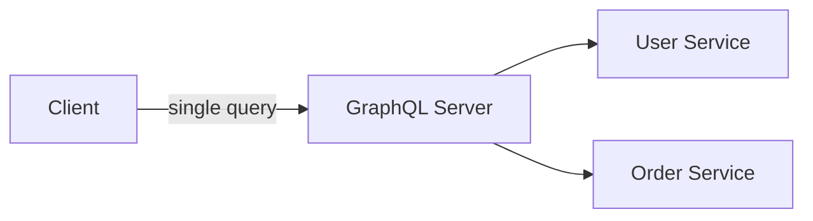

### Key details

- Query complexity/depth limits prevent abusive queries.
- Caching harder than REST URL-level HTTP cache.
- Federation composes subgraphs (Apollo Router).

### When to use

- Multiple clients with different data shape needs.
- Aggregating microservices behind one graph (BFF alternative).
- Rapid frontend iteration without backend releases per field.

### Trade-offs / Pitfalls

- Expensive queries can DOS server - rate limit and analyze complexity.
- File upload and caching require extra patterns.
- Error handling and HTTP status mapping less crisp than REST.

### References

*(No curated references for this sub-topic in `_topics.json`.)*

---


## 7.3 gRPC


### What is it?

**gRPC** is a high-performance RPC framework using **Protocol Buffers** over HTTP/2 - strongly typed contracts, bidirectional streaming, and low latency binary serialization.

### Why it matters

Default for internal service-to-service communication where browsers aren't clients - efficient, contract-first, supports streaming.

### How it works

1. Define `.proto` service and messages.
2. Codegen stubs for client/server in many languages.
3. Unary, server-streaming, client-streaming, or bidi RPC calls over HTTP/2.
4. Metadata headers for auth/tracing; status codes as gRPC status.
5. Load balancing via service mesh or client-side resolver.

### Diagram

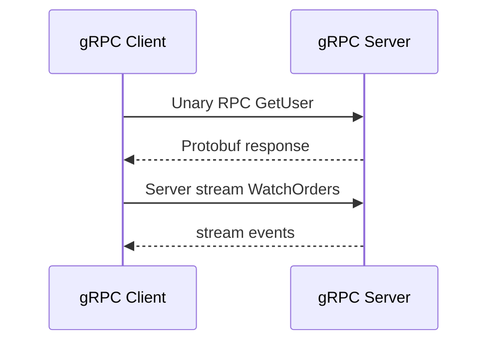

### Key details

| vs REST | gRPC advantage |
|---------|----------------|
| Payload | Binary, smaller |
| Contract | Enforced protobuf |
| Streaming | First-class |
| Browser | Needs grpc-web proxy |

### When to use

- Internal microservice RPC with performance requirements.
- Streaming telemetry, logs, or real-time feeds.
- Polyglot services needing generated clients.

### Trade-offs / Pitfalls

- Not human-debuggable without tooling (grpcurl).
- Browser-native limitations - grpc-web adds hop.
- Breaking proto changes need careful field numbering discipline.

### References

*(No curated references for this sub-topic in `_topics.json`.)*

---


## 7.4 SOAP


### What is it?

**SOAP** (Simple Object Access Protocol) is an XML-based messaging protocol with strict contracts (WSDL), WS-* standards (security, transactions), common in enterprise and legacy integrations.

### Why it matters

Still present in banking, telecom, and government integrations - understanding SOAP helps maintain and wrap legacy systems behind modern APIs.

### How it works

1. WSDL defines operations, types, and endpoint binding.
2. Client sends SOAP envelope (XML) over HTTP(S) or JMS.
3. Server validates against schema, executes operation, returns SOAP response.
4. WS-Security for signing/encryption; often ESB middleware.

### Diagram

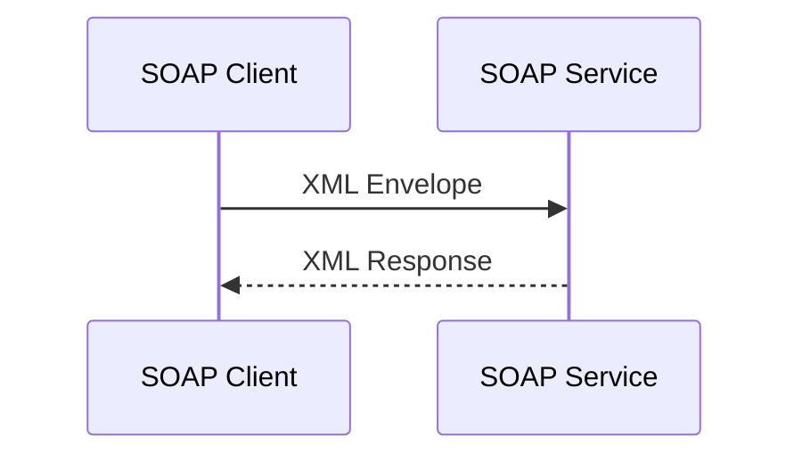

### Key details

- Verbose XML payloads vs JSON/gRPC.
- Strong tooling in Java/.NET enterprise stacks.
- Often replaced by REST/gRPC with adapter layer.

### When to use

- Integrating with legacy enterprise systems requiring SOAP.
- Contract mandates (B2B partner WSDL).
- Not for greenfield public APIs.

### Trade-offs / Pitfalls

- High ceremony, poor developer ergonomics vs REST.
- Performance and payload size overhead.
- WS-* stack complexity and interoperability pain.

### References

*(No curated references for this sub-topic in `_topics.json`.)*

---


## 7.5 API Gateway


### What is it?

An **API gateway** is a reverse proxy at the edge routing client requests to backend services - centralizing auth, TLS termination, rate limiting, routing, and protocol translation.

### Why it matters

Single front door for clients simplifies security and observability; hides internal topology; enables canary and blue-green routing without client changes.

### How it works

1. Client calls `api.example.com/v1/...`.
2. Gateway validates JWT/API key, applies rate limit.
3. Routes to service via path/host rules (Kong, NGINX, AWS API Gateway, Envoy).
4. Optional request/response transformation (REST -> gRPC).
5. Logs metrics, traces with correlation ID injection.

### Diagram

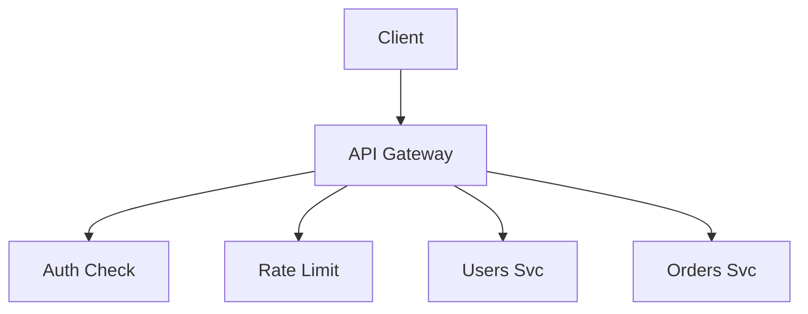

### Key details

| Feature | Benefit |
|---------|---------|
| TLS termination | Central cert management |
| JWT validation | Offload from every service |
| Path routing | `/users` -> user cluster |
| WAF integration | Edge security |

### When to use

- Multiple backend microservices exposed to external clients.
- Centralized auth, quotas, and API keys.
- Need BFF-less simple routing or combine with BFF behind gateway.

### Trade-offs / Pitfalls

- Gateway becomes critical SPOF and scaling bottleneck - must be HA.
- Business logic creep into gateway ("smart gateway" anti-pattern).
- Extra network hop adds latency - co-locate with services when possible.

### References

*(No curated references for this sub-topic in `_topics.json`.)*

---


## 7.6 API Aggregation


### What is it?

**API aggregation** combines data from multiple backend services into **one response** for the client - reducing round trips (mobile on slow networks).

### Why it matters

Clients shouldn't orchestrate five REST calls per screen; aggregation improves latency and simplifies client code.

### How it works

1. Client calls aggregated endpoint (BFF or gateway plugin).
2. Aggregator fans out parallel requests to services A, B, C.
3. Waits for all (or partial with timeout/fallback).
4. Merges results into unified DTO.
5. Returns single JSON to client.

### Diagram

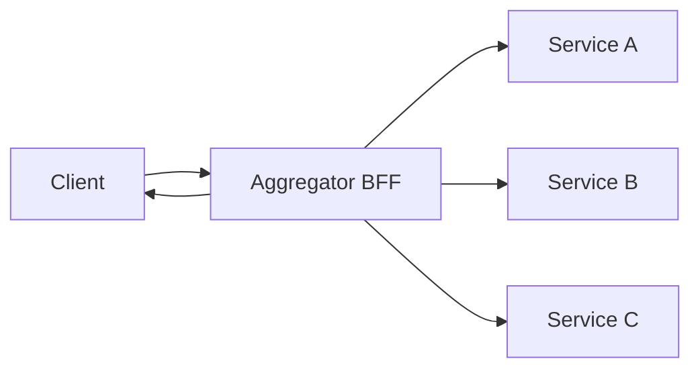

### Key details

- Parallel `async` fetches minimize wall-clock latency.
- Partial failure: return degraded response vs fail entire request.
- Caching aggregated responses reduces backend load.

### When to use

- Mobile/web screens needing data from many domains.
- Public API simplifying partner integration.
- GraphQL resolvers perform aggregation implicitly.

### Trade-offs / Pitfalls

- Aggregator couples to backend schemas - changes ripple.
- Tail latency = slowest dependency; set per-call deadlines.
- Without caching, aggregator amplifies load on backends.

### References

*(No curated references for this sub-topic in `_topics.json`.)*

---


## 7.7 API Composition


### What is it?

**API composition** (choreographed aggregation) builds a response by **sequentially** calling services when later calls depend on earlier results - e.g., get user, then orders for that user.

### Why it matters

Differs from parallel aggregation; necessary when data dependencies exist. Common in saga-style read paths and GraphQL resolver chains.

### How it works

1. Receive client request.
2. Call service A -> extract ID needed for B.
3. Call service B with ID from A.
4. Optionally call C with combined context.
5. Compose final response; handle any step failure.

### Diagram

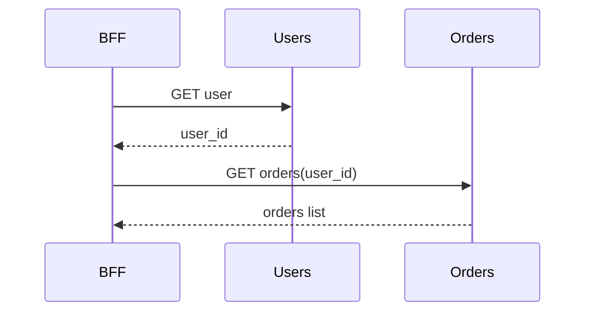

### Key details

- Latency sums across sequential hops - minimize chain depth.
- Cache intermediate results when keys repeat.
- Circuit breakers per hop prevent cascade.

### When to use

- Dependent data fetches unavoidable in business flow.
- Server-side alternative to client-side waterfall requests.

### Trade-offs / Pitfalls

- Deep chains fragile - prefer event-carried state or denormalized read models.
- Error in step 2 wastes step 1 work - compensate or return partial.
- Testing requires mocking full chain.

### References

*(No curated references for this sub-topic in `_topics.json`.)*

---


## 7.8 API Versioning


### What is it?

**API versioning** manages breaking changes without stranding existing clients - via URL path (`/v2/`), headers (`Accept-Version`), query param, or content negotiation.

### Why it matters

Clients update on different schedules; breaking changes without versioning cause production outages for integrators.

### How it works

1. Define compatibility policy: additive changes only within major version.
2. Introduce `/v2` when breaking (field removal, semantic change).
3. Run v1 and v2 in parallel during migration window.
4. Deprecation headers (`Sunset`, `Deprecation`) signal timeline.
5. Retire old version after metrics show zero traffic.

### Diagram

```mermaid
flowchart LR
    ClientOld --> V1[/v1/users]
    ClientNew --> V2[/v2/users]
    V1 --> Svc[User Service]
    V2 --> Svc
```

### Key details

| Strategy | Pros | Cons |
|----------|------|------|
| URL path | Obvious, cacheable | URL proliferation |
| Header | Clean URLs | Harder to test manually |
| Separate deploy | Full isolation | Ops overhead |

### When to use

- Public APIs with external consumers.
- Any breaking schema or behavior change.

### Trade-offs / Pitfalls

- Maintaining N versions doubles test matrix.
- "Version everything" for internal APIs may be overkill - use compatibility discipline instead.
- Forgetting sunset dates leaves eternal v1 debt.

### References

*(No curated references for this sub-topic in `_topics.json`.)*

---


## 7.9 Pagination


### What is it?

**Pagination** splits large result sets into pages - via **offset/limit**, **cursor/keyset**, or **seek** methods - protecting server and client from unbounded responses.

### Why it matters

Returning 1M rows crashes browsers and databases; pagination is mandatory for list APIs at scale.

### How it works

**Offset pagination:**

1. Client requests `?offset=100&limit=20`.
2. Server runs `LIMIT 20 OFFSET 100`.
3. Returns data + total count (optional).

**Cursor pagination:**

1. Server returns opaque cursor with page.
2. Client requests `?cursor=abc&limit=20`.
3. Server queries `WHERE id > last_id ORDER BY id LIMIT 20`.

### Diagram

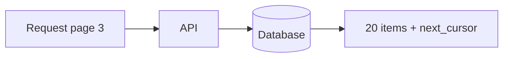

### Key details

- Offset: simple but slow/deep pages (`OFFSET` scans rows).
- Cursor: stable under concurrent inserts; no random page jump.
- Include `has_next`, `next_cursor` in response contract.

### When to use

- Cursor: infinite scroll, high-churn feeds, large tables.
- Offset: admin UIs with page numbers, small datasets.

### Trade-offs / Pitfalls

- Offset pagination inconsistent if rows inserted/deleted during browsing.
- Omitting max `limit` allows `limit=999999` abuse.
- Total count queries expensive - make optional.

### References

*(No curated references for this sub-topic in `_topics.json`.)*

---


## 7.10 Filtering


### What is it?

**Filtering** lets clients narrow collections with query parameters - `?status=active&role=admin` - translated to safe database/API predicates.

### Why it matters

Clients need subsets without downloading full collections; filtering must be indexed and validated to stay performant.

### How it works

1. Define allowed filter fields whitelist in API contract.
2. Parse query params -> AST or SQL WHERE clauses (parameterized).
3. Reject unknown fields with 400.
4. Ensure DB indexes match common filter combinations.
5. Document operators: `eq`, `gt`, `in`, `like` (RSQL/FIQL patterns).

### Diagram

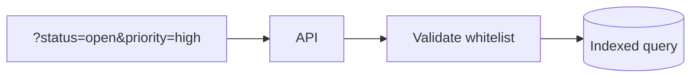

### Key details

- Never concatenate user input into SQL - parameterized queries only.
- Composite indexes for multi-filter queries.
- GraphQL: arguments on list fields serve same role.

### When to use

- Search/list APIs with varied client slice needs.
- Admin dashboards and reporting endpoints.

### Trade-offs / Pitfalls

- Unindexed filters cause full table scans.
- Overly flexible filter DSL enables expensive queries - complexity limits needed.
- Filter + sort + pagination interaction must be documented.

### References

*(No curated references for this sub-topic in `_topics.json`.)*

---


## 7.11 Sorting


### What is it?

**Sorting** orders results by one or more fields - `?sort=created_at:desc,name:asc` - with whitelist validation and index backing.

### Why it matters

Consistent ordering required for cursor pagination and user-visible lists; arbitrary sort fields are a common DoS vector.

### How it works

1. Client specifies `sort` parameter with field and direction.
2. API validates against allowed sort fields.
3. Translate to `ORDER BY` with parameter binding.
4. Combine with pagination key (sort field often = cursor field).
5. Default sort when omitted (e.g., `created_at desc`).

### Diagram

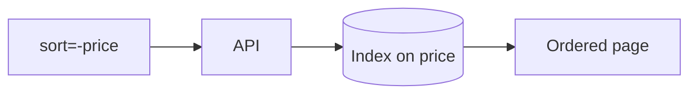

### Key details

- Multi-column sort order matters for stable pagination.
- Sorting on unindexed JSON fields is slow.
- Locale-aware string sort needs explicit collation rules.

### When to use

- Any list API where order matters to users.
- Cursor pagination requires deterministic sort key (ideally unique).

### Trade-offs / Pitfalls

- Sorting + filtering on different indexes -> planner may fail to use index.
- Changing default sort is breaking for cursor clients.
- Random sort (`ORDER BY RAND()`) doesn't scale.

### References

*(No curated references for this sub-topic in `_topics.json`.)*

---


## 7.12 OpenAPI


### What is it?

**OpenAPI Specification (OAS)** is a machine-readable YAML/JSON format describing REST API paths, parameters, request/response schemas, and security schemes - language-agnostic contract.

### Why it matters

Single source of truth for codegen, documentation, mock servers, contract tests, and gateway import - API-first design enabler.

### How it works

1. Author `openapi.yaml` (design-first) or generate from code annotations.
2. Validate spec in CI (Spectral lint rules).
3. Generate server stubs or client SDKs.
4. Publish to portal (Redoc, Stoplight).
5. Gate deployments on breaking change detection (oasdiff).

### Diagram

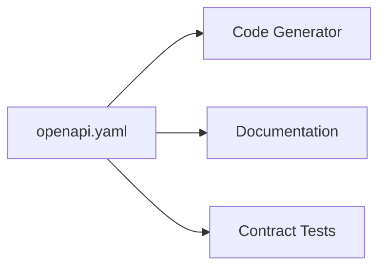

### Key details

- OpenAPI 3.1 aligns with JSON Schema.
- Reusable components: `schemas`, `parameters`, `responses`.
- `examples` and `description` fields improve consumer UX.

### When to use

- REST APIs with external or multi-team consumers.
- CI/CD SDK generation pipeline.
- API review process before implementation.

### Trade-offs / Pitfalls

- Spec drift from implementation if not generated from code in CI.
- Complex APIs produce huge specs hard to review.
- Doesn't cover gRPC (use protobuf) or GraphQL (use SDL).

### References

*(No curated references for this sub-topic in `_topics.json`.)*

---


## 7.13 Swagger


### What is it?

**Swagger** is the tooling ecosystem around OpenAPI - Swagger UI (interactive docs), Swagger Editor, and historical name for the spec before OpenAPI 3 rebranding.

### Why it matters

De facto interactive API explorer during development; stakeholders try endpoints without Postman setup.

### How it works

1. Host OpenAPI spec at `/openapi.json`.
2. Swagger UI renders try-it-out forms per operation.
3. OAuth2 flows configured for authenticated tryouts.
4. Editor validates syntax live during design sessions.

### Diagram

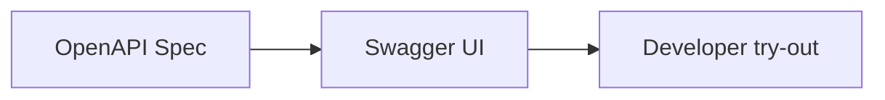

### Key details

- Swagger UI vs Redoc: UI interactive, Redoc prettier read-only.
- Don't expose Swagger UI in production without auth (info disclosure).
- Codegen: OpenAPI Generator (successor to swagger-codegen).

### When to use

- Dev/staging API documentation and manual testing.
- Onboarding partners with live contract explorer.

### Trade-offs / Pitfalls

- Production exposure leaks full API surface to attackers.
- "Try it out" against prod risky - disable or protect.
- Confusion between Swagger 2.0 and OpenAPI 3.x feature sets.

### References

*(No curated references for this sub-topic in `_topics.json`.)*

---


## 7.14 Request Validation


### What is it?

**Request validation** checks incoming payloads against schema - types, required fields, formats, bounds - before business logic runs, returning `400 Bad Request` with field-level errors.

### Why it matters

First defense against injection, malformed data, and confusing 500 errors; shifts failures left with clear client feedback.

### How it works

1. Define JSON Schema / OpenAPI / bean validation rules.
2. Middleware validates body, query, path params on entry.
3. Reject with structured error: `{ "field": "email", "error": "invalid format" }`.
4. Pass validated DTO to handler - no raw map parsing in business code.
5. Validate content-type and payload size limits.

### Diagram

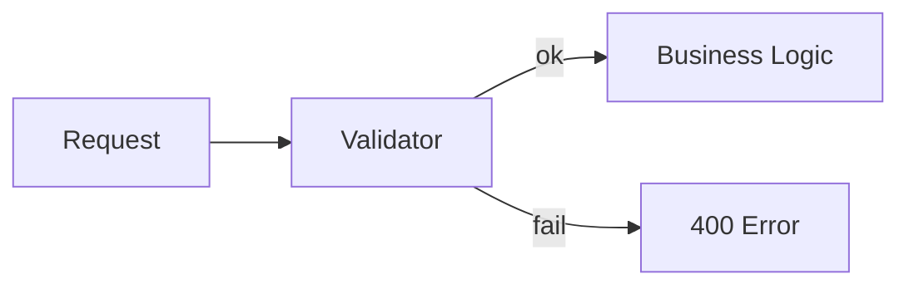

### Key details

- Frameworks: Jakarta Validation, Pydantic, JSON Schema middleware.
- Whitelist unknown fields vs strip (fail-closed preferred for APIs).
- Consistent error envelope across all endpoints.

### When to use

- Every production API boundary - non-negotiable baseline.
- Especially public APIs with untrusted clients.

### Trade-offs / Pitfalls

- Validation only at edge; internal service calls still need trust boundaries.
- Overly leaky validation messages aid attackers (user enumeration).
- Divergence between OpenAPI spec and runtime validation rules.

### References

*(No curated references for this sub-topic in `_topics.json`.)*

---


## 7.15 Contract Testing


### What is it?

**Contract testing** verifies consumer and provider agree on API shape and behavior without full end-to-end tests - consumer-driven contracts (Pact) or schema validation against OpenAPI.

### Why it matters

Microservices break when provider changes response without notice; contract tests catch incompatibilities in CI before deploy.

### How it works

**Pact (consumer-driven):**

1. Consumer test defines expected request/response mock (pact file).
2. Pact file published to broker.
3. Provider CI verifies it can satisfy all consumer pacts.
4. Breaking change fails provider build before production.

### Diagram

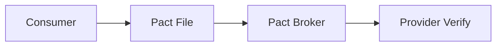

### Key details

- Consumer-driven: consumers define needs; avoids gold-plated provider APIs.
- OpenAPI diff: provider spec vs consumer expectations.
- Not replacement for E2E - tests contract slice only.

### When to use

- Many microservices with independent deploy cycles.
- Public APIs with external consumers publishing pacts.
- Preventing "works on my machine" integration failures.

### Trade-offs / Pitfalls

- Pact maintenance overhead for large consumer counts.
- Contracts don't test latency, auth integration, or side effects.
- False confidence if provider verifies against stale pacts.

### References

*(No curated references for this sub-topic in `_topics.json`.)*

---


## 7.16 API Security


### What is it?

**API security** encompasses authentication (who), authorization (what), transport encryption, input sanitization, rate limiting, and audit logging for API endpoints.

### Why it matters

APIs are the primary attack surface - OWASP API Security Top 10 (BOLA, broken auth, unbounded consumption) targets API-specific failures.

### How it works

1. **TLS 1.2+** for all traffic; mTLS for service-to-service.
2. **OAuth2/OIDC + JWT** for user delegation; API keys for partners.
3. **Scope/role checks** per endpoint (RBAC/ABAC).
4. Validate object ownership (prevent BOLA/IDOR).
5. Rate limit, WAF, audit sensitive operations.

### Diagram

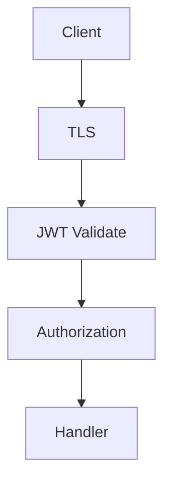

### Key details

| Threat | Mitigation |
|--------|------------|
| BOLA | Check resource ownership |
| Broken auth | Short-lived tokens, rotation |
| Injection | Parameterized queries, validation |
| Excessive data | Field-level authz |

### When to use

Always - from design phase, not bolted on after launch.

### Trade-offs / Pitfalls

- JWT in localStorage -> XSS theft; prefer HttpOnly cookies or short-lived tokens.
- API keys in repos - use secret managers.
- Security theater: auth without authorization checks per object.

### References

*(No curated references for this sub-topic in `_topics.json`.)*

---


## 7.17 Webhooks


### What is it?

**Webhooks** are HTTP callbacks: when an event occurs, the API **POSTs** a payload to a subscriber-configured URL - inverse of polling.

### Why it matters

Real-time integrations (Stripe payments, GitHub pushes) without client polling overhead; standard pattern for SaaS extensibility.

### How it works

1. Subscriber registers URL + secret via API.
2. Event occurs (payment succeeded).
3. Provider signs payload (HMAC-SHA256 with secret).
4. POST to subscriber URL with retry backoff on failure.
5. Subscriber verifies signature, returns 2xx quickly, processes async.

### Diagram

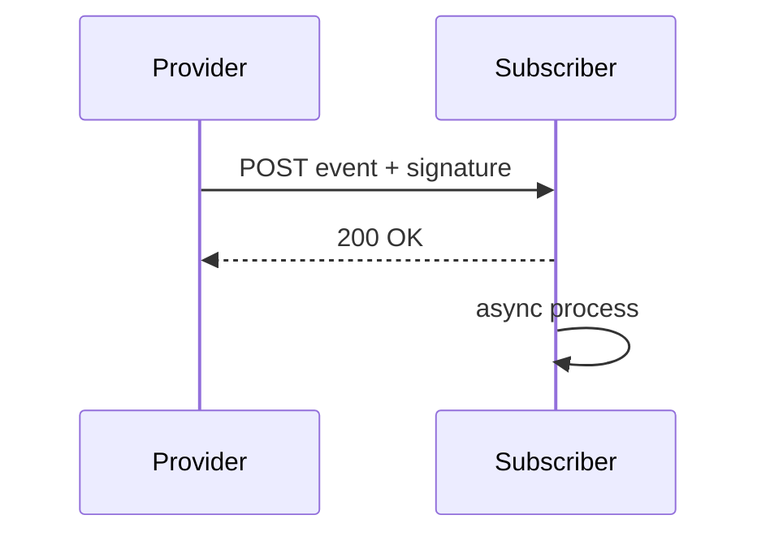

### Key details

- Idempotent processing by `event_id`.
- Exponential retry for days; DLQ for dead endpoints.
- Challenge verification on URL registration (echo token).

### When to use

- Push notifications to partner systems.
- Event-driven integrations without message bus access.

### Trade-offs / Pitfalls

- Subscriber downtime -> retry queues backlog at provider.
- SSRF risk if provider fetches user-supplied URLs - validate allowlists.
- Ordering not guaranteed - use sequence numbers.

### References

*(No curated references for this sub-topic in `_topics.json`.)*

---


## 7.18 Rate Limiting


### What is it?

**Rate limiting** caps requests per client/IP/API key over a time window - protecting backends from abuse, ensuring fair tenancy, and enforcing SLA tiers.

### Why it matters

Prevents DoS, runaway scripts, and noisy neighbors on shared infrastructure; required for public APIs and cost control.

### How it works

**Token bucket example:**

1. Each client has bucket capacity C refilling at rate R/sec.
2. Request consumes one token; reject with `429` if empty.
3. Gateway or middleware enforces centrally.
4. Response headers: `X-RateLimit-Remaining`, `Retry-After`.
5. Different limits per tier (free vs paid).

### Diagram

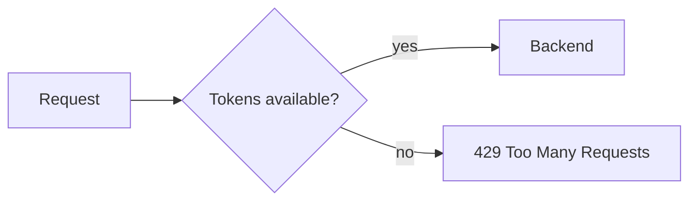

### Key details

| Algorithm | Behavior |
|-----------|----------|
| Token bucket | Allows bursts up to bucket size |
| Fixed window | Simple; boundary burst issue |
| Sliding window | Smoother; more state |
| Leaky bucket | Constant outflow rate |

### When to use

- All public and partner APIs.
- Expensive endpoints (search, ML inference) with stricter limits.
- Login endpoints against brute force.

### Trade-offs / Pitfalls

- Distributed rate limiting needs Redis - not per-instance counters.
- Shared NAT IPs block innocent users behind same corporate IP.
- 429 without `Retry-After` frustrates well-behaved clients.

### References

*(No curated references for this sub-topic in `_topics.json`.)*

---


## 7.19 Throttling


### What is it?

**Throttling** slows or queues requests when load exceeds capacity - graceful degradation vs hard reject (rate limit). May delay responses or shed low-priority traffic.

### Why it matters

Keeps system alive under overload - returns slower responses instead of cascading failures and OOM crashes.

### How it works

1. Monitor queue depth, CPU, or error rate.
2. When threshold exceeded, apply delay or priority queue.
3. Premium tenants bypass or get dedicated capacity.
4. Combine with autoscaling when delay insufficient.
5. Communicate degraded mode via headers/monitoring.

### Diagram

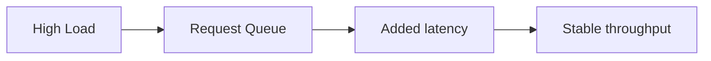

### Key details

- Throttling = backpressure at API layer.
- Adaptive concurrency (AIMD) in load balancers.
- Different from rate limit: system protection vs per-client quota.

### When to use

- Sudden traffic spikes beyond provisioned capacity.
- Protecting shared databases during incidents.
- Tiered SLA: throttle free tier before paid.

### Trade-offs / Pitfalls

- Queues increase tail latency - clients may timeout anyway.
- Without autoscaling, throttling masks capacity debt.
- User frustration if throttling opaque - return meaningful status.

### References

*(No curated references for this sub-topic in `_topics.json`.)*

---


## 7.20 Idempotency


### What is it?

An operation is **idempotent** if performing it multiple times has the same effect as once - critical for safe retries on unreliable networks.

### Why it matters

Clients, gateways, and message consumers retry on timeout; without idempotency, duplicate charges, orders, and emails occur.

### How it works

**Natural idempotency:**

- `GET`, `PUT` (same body), `DELETE` are HTTP-idempotent.

**Application idempotency:**

1. Assign unique operation ID (payment intent).
2. First execution performs side effect and records ID.
3. Retry with same ID returns cached result without re-executing.
4. Database unique constraints enforce deduplication.

### Diagram

```mermaid
sequenceDiagram
    participant C as Client
    participant API as API
    participant DB as Store
    C->>API: POST /pay (id=abc)
    API->>DB: check id=abc
    DB-->>API: not found
    API->>DB: execute + store result
    C->>API: POST /pay (id=abc) retry
    API->>DB: check id=abc
    DB-->>API: found
    API-->>C: cached result
```

### Key details

- `POST` is NOT idempotent by default - must design explicitly.
- Side effects outside DB (email) need outbox + dedup.
- Time-bound idempotency windows (24h) limit storage.

### When to use

- Payment, order creation, inventory reservation.
- Any mutating API called over unreliable networks.
- Webhook and message consumer handlers.

### Trade-offs / Pitfalls

- Storing every idempotency record grows storage - TTL and archive.
- Concurrent duplicate requests race - use DB unique constraint or lock.
- Returning different HTTP status on replay vs first call confuses clients.

### References

*(No curated references for this sub-topic in `_topics.json`.)*

---


## 7.21 Idempotency Keys


### What is it?

An **idempotency key** is a client-generated unique token (UUID) sent in header (`Idempotency-Key`) on mutating requests so the server deduplicates retries within a retention window.

### Why it matters

Standard pattern (Stripe, PayPal) for POST idempotency - clients retry safely on `504 Gateway Timeout` without double charge.

### How it works

1. Client generates UUID for each logical operation.
2. Sends `Idempotency-Key: <uuid>` with `POST`.
3. Server checks key store (Redis/DB) atomically.
4. If new: process, store response with key; if exists: return stored response.
5. Keys scoped per client/account to prevent cross-tenant collision.

### Diagram

```mermaid
sequenceDiagram
    participant C as Client
    participant API as API
    C->>API: POST Idempotency-Key: uuid-1
    API-->>C: 201 Created
    C->>API: POST Idempotency-Key: uuid-1
    API-->>C: 201 same body replay
```

### Key details

- Stripe: 24-hour key retention; same key + different body -> 409 conflict.
- Store HTTP status + body for faithful replay.
- Keys must be unguessable (UUID v4) - not sequential integers.

### When to use

- Payment and money movement APIs.
- Order/subscription creation endpoints.
- Any POST where duplicate is unacceptable.

### Trade-offs / Pitfalls

- Client forgetting key on retry -> duplicate operations.
- Server must hash request body with key to detect misuse.
- Distributed store for keys must be strongly consistent for correctness.

### References

*(No curated references for this sub-topic in `_topics.json`.)*

---


## Quick Reference

| # | Topic | Summary |
|---|-------|---------|
| 7.1 | REST | **REST** (Representational State Transfer) models APIs as **resources** (noun... |
| 7.2 | GraphQL | **GraphQL** is a query language and runtime where clients request exactly the... |
| 7.3 | gRPC | **gRPC** is a high-performance RPC framework using **Protocol Buffers** over ... |
| 7.4 | SOAP | **SOAP** (Simple Object Access Protocol) is an XML-based messaging protocol w... |
| 7.5 | API Gateway | An **API gateway** is a reverse proxy at the edge routing client requests to ... |
| 7.6 | API Aggregation | **API aggregation** combines data from multiple backend services into **one r... |
| 7.7 | API Composition | **API composition** (choreographed aggregation) builds a response by **sequen... |
| 7.8 | API Versioning | **API versioning** manages breaking changes without stranding existing client... |
| 7.9 | Pagination | **Pagination** splits large result sets into pages - via **offset/limit**, **cu... |
| 7.10 | Filtering | **Filtering** lets clients narrow collections with query parameters - `?status=... |
| 7.11 | Sorting | **Sorting** orders results by one or more fields - `?sort=created_at:desc,name:... |
| 7.12 | OpenAPI | **OpenAPI Specification (OAS)** is a machine-readable YAML/JSON format descri... |
| 7.13 | Swagger | **Swagger** is the tooling ecosystem around OpenAPI - Swagger UI (interactive d... |
| 7.14 | Request Validation | **Request validation** checks incoming payloads against schema - types, require... |
| 7.15 | Contract Testing | **Contract testing** verifies consumer and provider agree on API shape and be... |
| 7.16 | API Security | **API security** encompasses authentication (who), authorization (what), tran... |
| 7.17 | Webhooks | **Webhooks** are HTTP callbacks: when an event occurs, the API **POSTs** a pa... |
| 7.18 | Rate Limiting | **Rate limiting** caps requests per client/IP/API key over a time window - prot... |
| 7.19 | Throttling | **Throttling** slows or queues requests when load exceeds capacity - graceful d... |
| 7.20 | Idempotency | An operation is **idempotent** if performing it multiple times has the same e... |
| 7.21 | Idempotency Keys | An **idempotency key** is a client-generated unique token (UUID) sent in head... |

---

[â -  Back to master index](../README.md)
