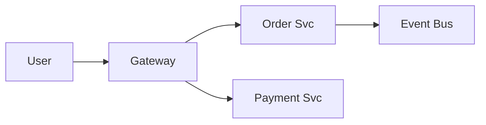
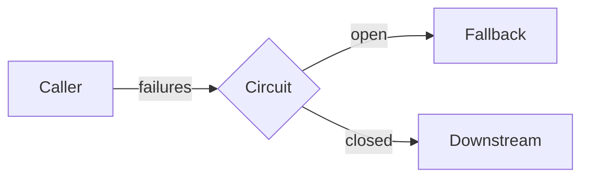
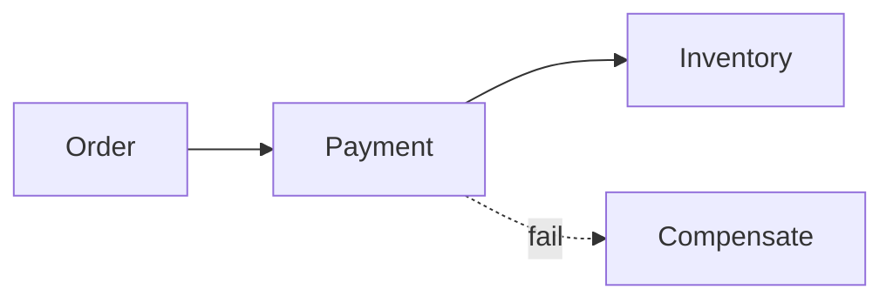

# 8. Microservices

> Status: **Documented** — cheat-sheet reference for all sub-topics below.

[← Back to master index](../README.md)

---

## Sub-topics

| # | Sub-topic | Status |
|---|-----------|--------|
| 8.1 | [Monolith](#81-monolith) | Done |
| 8.2 | [Modular Monolith](#82-modular-monolith) | Done |
| 8.3 | [Microservices](#83-microservices) | Done |
| 8.4 | [Service Registry](#84-service-registry) | Done |
| 8.5 | [Service Discovery](#85-service-discovery) | Done |
| 8.6 | [Service Mesh](#86-service-mesh) | Done |
| 8.7 | [Sidecar Pattern](#87-sidecar-pattern) | Done |
| 8.8 | [Circuit Breaker](#88-circuit-breaker) | Done |
| 8.9 | [Retry Pattern](#89-retry-pattern) | Done |
| 8.10 | [Bulkhead Pattern](#810-bulkhead-pattern) | Done |
| 8.11 | [Saga Pattern](#811-saga-pattern) | Done |
| 8.12 | [Choreography](#812-choreography) | Done |
| 8.13 | [Orchestration](#813-orchestration) | Done |
| 8.14 | [BFF Pattern](#814-bff-pattern) | Done |
| 8.15 | [Strangler Pattern](#815-strangler-pattern) | Done |
| 8.16 | [DDD](#816-ddd) | Done |
| 8.17 | [Bounded Context](#817-bounded-context) | Done |
| 8.18 | [Hexagonal Architecture](#818-hexagonal-architecture) | Done |
| 8.19 | [Clean Architecture](#819-clean-architecture) | Done |
| 8.20 | [Onion Architecture](#820-onion-architecture) | Done |
| 8.21 | [Dependency Injection](#821-dependency-injection) | Done |

---

## Overview

Microservices decompose an application into independently deployable services aligned to business capabilities, connected by network calls and async events.

---

## 8.1 Monolith

**Summary:** Single deployable unit containing all features, sharing one codebase and database. Simple to build and operate early on.

- **Single process** — one build, one deploy
- **Shared DB** — easy joins; schema coupling grows over time
- **Scale** — vertical or replicate entire app

---

## 8.2 Modular Monolith

**Summary:** Monolith with strict internal module boundaries (packages, DB schemas per module). Extract to microservices later without big-bang rewrite.

- **Module APIs** — no direct cross-module DB access
- **Compile-time boundaries** — ArchUnit, package-private
- **Best of both** — operational simplicity + domain separation

---

## 8.3 Microservices

**Summary:** Independently deployable services owning their data, communicating via APIs and events. Enables team autonomy and targeted scaling.

- **Database per service** — no shared tables across services
- **Distributed complexity** — network, consistency, observability
- **Team alignment** — Conway's Law; one team per service

---

## 8.4 Service Registry

**Summary:** Central catalog of service instances and their network locations. Eureka, Consul, and etcd are common implementations.

- **Registration** — services heartbeat on startup/shutdown
- **Health-aware** — deregister unhealthy instances
- **Metadata** — version, zone, weight for routing

---

## 8.5 Service Discovery

**Summary:** Clients or load balancers resolve logical service name to live instance addresses. Client-side (Ribbon) vs server-side (K8s DNS).

- **DNS-based** — Kubernetes Service names
- **Client-side LB** — client picks instance from registry
- **Service mesh** — sidecar handles discovery transparently

---

## 8.6 Service Mesh

**Summary:** Infrastructure layer (Istio, Linkerd) handling service-to-service traffic: mTLS, retries, metrics, tracing without app code changes.

- **Data plane** — sidecar proxies intercept traffic
- **Control plane** — policies, certs, routing rules
- **Observability** — uniform metrics/traces across all services

---

## 8.7 Sidecar Pattern

**Summary:** Helper container/process deployed alongside the main app container sharing network namespace. Offloads cross-cutting concerns.

- **Same pod** — K8s sidecar pattern (app + envoy)
- **Transparent proxy** — no SDK in application code
- **Logging/mTLS** — sidecar handles uniformly

---

## 8.8 Circuit Breaker

**Summary:** Stop calling a failing downstream after threshold; fail fast and allow recovery. Prevents cascade failures.

- **States** — Closed → Open → Half-Open
- **Fallback** — cached response or degraded mode
- **Libraries** — Resilience4j, Polly, Istio outlier detection

---

## 8.9 Retry Pattern

**Summary:** Automatically retry transient failures with backoff and jitter. Must combine with idempotency and circuit breaker.

- **Transient only** — retry 5xx/timeouts, not 4xx
- **Exponential backoff + jitter** — avoid retry storms
- **Max attempts** — cap retries; escalate to DLQ

---

## 8.10 Bulkhead Pattern

**Summary:** Isolate resources (thread pools, connections) per dependency so one slow service can't exhaust all resources.

- **Thread pool per downstream** — failure containment
- **Connection limits** — cap concurrent calls per service
- **Named after ship compartments** — flood one, others float

---

## 8.11 Saga Pattern

**Summary:** Distributed transaction as a sequence of local transactions with compensating actions on failure. Alternative to 2PC across services.

- **Choreography** — services react to events
- **Orchestration** — central coordinator drives steps
- **Compensation** — undo prior steps (cancel reservation, refund)

---

## 8.12 Choreography

**Summary:** Saga without central coordinator; each service publishes events and reacts to others. Decentralized, loosely coupled.

- **Event-driven** — no single point of failure
- **Harder to trace** — flow spread across services
- **Risk of cycles** — careful event design needed

---

## 8.13 Orchestration

**Summary:** Central saga orchestrator calls each service in sequence and triggers compensations on failure. Explicit workflow, easier to reason about.

- **Orchestrator service** — owns saga state machine
- **Commands** — tell each participant what to do
- **Visibility** — single place to monitor saga progress

---

## 8.14 BFF Pattern

**Summary:** Backend-for-Frontend: dedicated API layer per client type (mobile, web) shaping responses and aggregating calls.

- **Client-optimized** — mobile gets lean payloads
- **Decouples UI from microservices** — frontend teams own BFF
- **Not a god service** — one BFF per client persona

---

## 8.15 Strangler Pattern

**Summary:** Incrementally replace monolith functionality by routing traffic to new services while old system shrinks. Low-risk migration path.

- **Facade/proxy** — route new features to new service
- **Peel off domains** — extract one bounded context at a time
- **Dual-run** — validate parity before cutover

---

## 8.16 DDD

**Summary:** Domain-Driven Design aligns software structure with business domain using ubiquitous language, aggregates, and bounded contexts.

- **Ubiquitous language** — devs and domain experts share terms
- **Aggregates** — consistency boundary for transactions
- **Anti-corruption layer** — translate external models at boundaries

---

## 8.17 Bounded Context

**Summary:** Explicit boundary where a domain model is defined and consistent. Maps directly to microservice candidates.

- **One model per context** — "Customer" differs in Sales vs Support
- **Context map** — relationships between contexts (ACL, shared kernel)
- **Service boundary** — don't share DB across contexts

---

## 8.18 Hexagonal Architecture

**Summary:** Ports and adapters: core domain isolated from infrastructure via interfaces. DB, HTTP, messaging are interchangeable adapters.

- **Ports** — interfaces the domain defines
- **Adapters** — infrastructure implements ports
- **Testability** — swap real DB for in-memory in tests

---

## 8.19 Clean Architecture

**Summary:** Concentric layers: entities → use cases → adapters → frameworks. Dependencies point inward only.

- **Use cases** — application business rules
- **Frameworks outermost** — Spring, DB, UI are details
- **Uncle Bob** — Robert C. Martin's layered approach

---

## 8.20 Onion Architecture

**Summary:** Similar to hexagonal/clean: domain model at center, application services around it, infrastructure on the outside.

- **Domain services** — core logic, no infra imports
- **Application layer** — orchestrates domain objects
- **Infrastructure** — persistence, messaging implementations

---

## 8.21 Dependency Injection

**Summary:** Invert control: dependencies provided externally (constructor injection) rather than created inside classes. Enables testing and swapping implementations.

- **Constructor injection** — preferred; immutable, explicit
- **IoC container** — Spring, Guice wire dependencies
- **Interface-based** — depend on abstractions, not concretions

---

## Quick Reference

| Pattern | Problem solved | Key trade-off |
|---------|----------------|---------------|
| Monolith | Simplicity | Scaling & team coupling |
| Modular monolith | Future extraction | Discipline required |
| Microservices | Autonomy, scale | Distributed ops cost |
| Circuit breaker | Cascade failure | False opens |
| Retry + bulkhead | Transient errors, isolation | Latency, complexity |
| Saga | Distributed transactions | Compensation logic |
| BFF | Client-specific APIs | More services to maintain |
| Strangler | Monolith migration | Dual-system period |
| DDD + bounded context | Service boundaries | Upfront domain work |
| Hexagonal/Clean/Onion | Testable domain core | Boilerplate layers |
