# 8. Microservices

> Status: **Documented**

[<- Back to master index](../README.md)

---

## Overview

Applications evolve along an **architecture spectrum**: **[monolith](#81-monolith)** → **[modular monolith](#82-modular-monolith)** → **[microservices](#83-microservices)**. Microservices split the system into independently deployable services with **service-owned data**, communicating over the network (REST, gRPC, events).

Success at the distributed end requires more than splitting code: **discovery** ([§8.12](#812-service-registry), [§8.14](#814-service-mesh)), **resilience** ([§8.16–§8.18](#816-circuit-breaker)), **sagas** ([§8.19–§8.21](#819-saga-pattern)), and observability. **DDD** and bounded contexts ([§8.6–§8.7](#86-ddd)) guide where to draw boundaries.

### Learning path

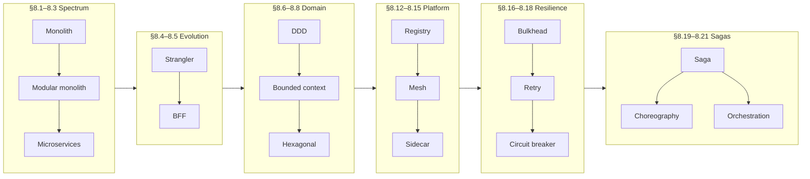

### Architecture spectrum

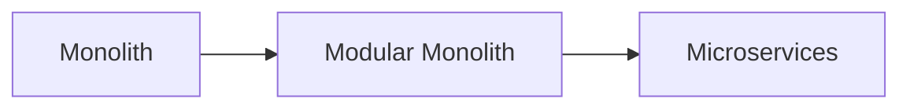

Many teams start monolith → modular monolith as complexity grows → microservices only when scale, teams, and ops maturity justify the cost.

### Comparison

| Feature | [Monolith](#81-monolith) | [Modular monolith](#82-modular-monolith) | [Microservices](#83-microservices) |
|---------|--------------------------|------------------------------------------|-------------------------------------|
| **Deployment unit** | Single | Single | Multiple |
| **Code organization** | Low | High | Very high |
| **Scalability** | Whole app | Whole app | Per service |
| **Complexity** | Low | Medium | High |
| **Database** | Shared | Shared (often) | Service-owned |
| **Communication** | Method call | Method call / module API | Network (REST, gRPC, events) |
| **Technology flexibility** | Low | Low | High |
| **Fault isolation** | Low | Low | High |
| **Operational cost** | Low | Low | High |
| **Development speed** | Fast | Fast | Moderate |
| **Maintenance** | Hard at scale | Easier | Easier per service |

### When to use

| Style | Fit |
|-------|-----|
| **Monolith** | Small apps, startups, small teams, simple requirements |
| **Modular monolith** | Medium/large apps, clear module boundaries, growing teams, possible future split |
| **Microservices** | Large scale, multiple teams, high scalability, frequent independent deploys, complex domains |

Migration path: [§8.4 Strangler Pattern](#84-strangler-pattern).

### Resilience stack

Apply patterns **outer → inner** on outbound calls:

```text
Caller → bulkhead (§8.18) → retry (§8.17) → circuit breaker (§8.16) → dependency
```

| Pattern | Handles |
|---------|---------|
| **Bulkhead** | Slow dependency exhausting local threads/pools |
| **Retry** | Transient failures (backoff + jitter) |
| **Circuit breaker** | Persistent failures — fail fast |

Pair every call with a **timeout**. Safe retries need [idempotency](../07-api-design/README.md#721-idempotency-keys).

### Saga execution styles

| | [Choreography](#820-choreography) | [Orchestration](#821-orchestration) |
|---|-----------------------------------|-------------------------------------|
| **Coordinator** | None — event reactions | Central orchestrator |
| **Best for** | Simple event-native pipelines | Complex branching, visibility |

Hub: [§8.19 Saga Pattern](#819-saga-pattern).

### Production layout (sketch)

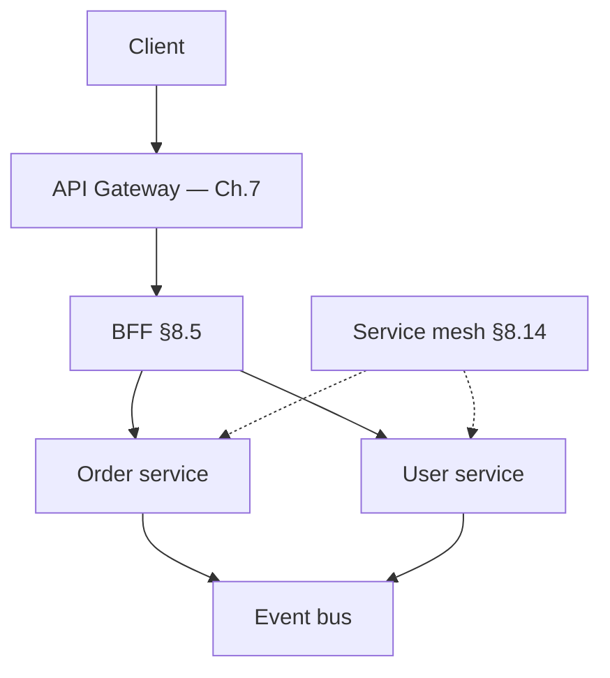

---

## Section index

> Numbering skips removed topics (former §8.9–8.11, §8.13 — discovery covered in [§8.12](#812-service-registry)).

### Architecture spectrum

| # | Sub-topic |
|---|-----------|
| 8.1 | [Monolith](#81-monolith) |
| 8.2 | [Modular Monolith](#82-modular-monolith) |
| 8.3 | [Microservices](#83-microservices) |

### Migration & client patterns

| # | Sub-topic |
|---|-----------|
| 8.4 | [Strangler Pattern](#84-strangler-pattern) |
| 8.5 | [BFF Pattern](#85-bff-pattern) |

### Domain & structure

| # | Sub-topic |
|---|-----------|
| 8.6 | [DDD](#86-ddd) |
| 8.7 | [Bounded Context](#87-bounded-context) |
| 8.8 | [Hexagonal Architecture](#88-hexagonal-architecture) |

### Discovery & mesh

| # | Sub-topic |
|---|-----------|
| 8.12 | [Service Registry](#812-service-registry) |
| 8.14 | [Service Mesh](#814-service-mesh) |
| 8.15 | [Sidecar Pattern](#815-sidecar-pattern) |

### Resilience & distributed workflows

| # | Sub-topic |
|---|-----------|
| 8.16 | [Circuit Breaker](#816-circuit-breaker) |
| 8.17 | [Retry Pattern](#817-retry-pattern) |
| 8.18 | [Bulkhead Pattern](#818-bulkhead-pattern) |
| 8.19 | [Saga Pattern](#819-saga-pattern) |
| 8.20 | [Choreography](#820-choreography) |
| 8.21 | [Orchestration](#821-orchestration) |

---

## 8.1 Monolith

> **Spectrum:** compare [Monolith vs Modular Monolith vs Microservices](#comparison) in the chapter intro.

### What is a monolith?

A **monolith** is an application where all components — UI, business logic, database access, and services — are packaged and deployed as a **single unit**.

### Architecture

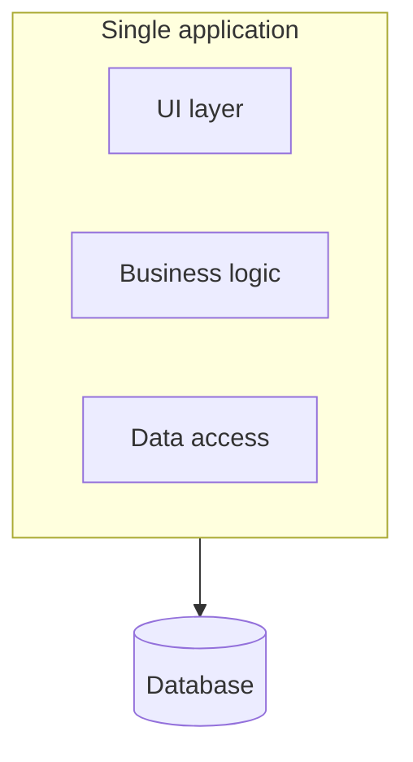

### Characteristics

Single codebase, single deploy, shared database — see [comparison table](#comparison).

### Advantages

1. Simple development and deployment
2. Easy debugging (in-process calls, single stack trace)
3. Lower operational complexity
4. Faster communication between components (method calls, no network)

### Disadvantages

1. Difficult to scale individual features — scale the **whole** app
2. Large codebase becomes hard to maintain
3. Every deployment affects the entire application
4. Technology stack is usually fixed for the whole system

### Example

**E-commerce application** in one deployable:

- User management
- Product catalog
- Order management
- Payment processing

All packaged and deployed together.

### Summary

```text
Monolith = one codebase, one deploy, shared DB, in-process communication
Best for: startups, small teams, simple domains
Evolution: → modular monolith (§8.2) when boundaries matter
```

---


## 8.2 Modular Monolith

> **Spectrum:** [Comparison table](#comparison) · next step toward [§8.3 Microservices](#83-microservices).

### What is a modular monolith?

A **modular monolith** is a monolithic application divided into **well-defined independent modules**, but still deployed as a **single application**.

### Architecture

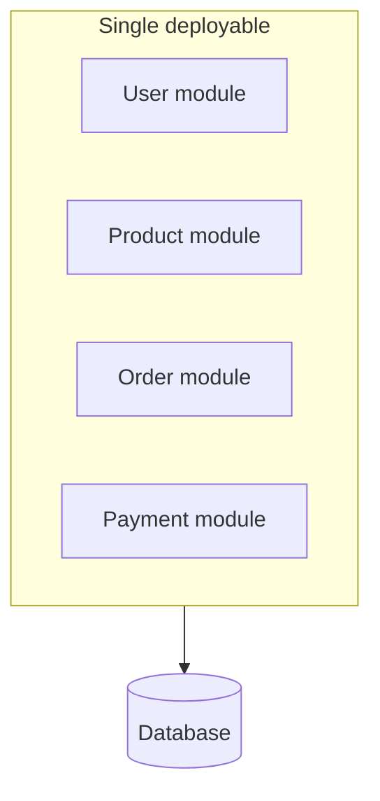

Modules communicate through **interfaces** or **events** — not by reaching into each other's internals.

### Characteristics

Single deploy with strict module boundaries — see [comparison table](#comparison).

### Advantages

1. Better maintainability than a flat monolith
2. Easier code organization by domain
3. Simpler deployment than microservices
4. Can evolve into microservices later ([§8.4 Strangler](#84-strangler-pattern))

### Disadvantages

1. Entire application still deployed together
2. Shared resources may create dependencies
3. Independent scaling of one module is not possible

### Best practices

1. Enforce **strict module boundaries** (package rules, ArchUnit, Spring Modulith)
2. Avoid direct access between module **internals**
3. Use interfaces or domain events for cross-module communication
4. Each module owns its tables — avoid cross-module foreign keys where possible

### Example

**Banking application** — one deployable:

- Customer module
- Account module
- Loan module
- Transaction module

### Summary

```text
Modular Monolith = one deploy, many bounded modules with strict interfaces
Best for: growing teams, medium/large apps, future extraction path
Evolution: → microservices (§8.3) when independent scale/deploy is required
```

---


## 8.3 Microservices

> **Spectrum:** [When to use](#when-to-use) · boundaries via [§8.6 DDD](#86-ddd) / [§8.7 Bounded Context](#87-bounded-context) · migrate via [§8.4 Strangler](#84-strangler-pattern).

### What are microservices?

**Microservices** architecture divides an application into multiple **small, independently deployable services**. Each service owns a specific **business capability** and typically its own database.

### Architecture

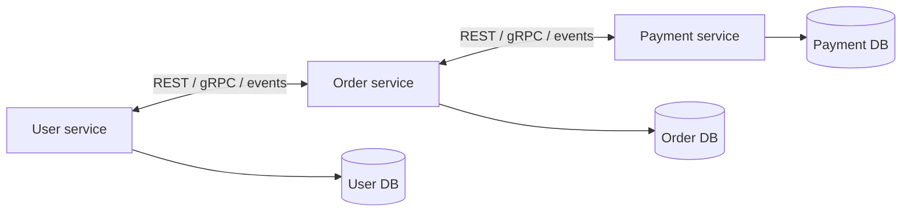

API styles: [Ch.7 API Design](../07-api-design/README.md). Async integration: [Ch.6 Messaging](../06-messaging-and-events/README.md).

### Characteristics

Independent deploys, service-owned databases — see [comparison table](#comparison).

### Advantages

1. Independent scaling per service
2. Independent deployment — teams release on their own cadence
3. Better fault isolation
4. Teams can work independently (Conway's Law)
5. Technology flexibility per service

### Disadvantages

1. Complex deployment and monitoring
2. Network latency on every cross-service call
3. Distributed transactions are difficult — use [§8.19 Saga](#819-saga-pattern), not 2PC
4. More infrastructure (discovery, mesh, gateway, tracing)
5. Increased operational cost

### Example

**E-commerce platform:**

| Service | Responsibility |
|---------|----------------|
| User service | Accounts, profiles |
| Product service | Catalog |
| Inventory service | Stock |
| Order service | Orders |
| Payment service | Payments |
| Notification service | Email/SMS |

Each can be developed, deployed, and scaled independently. Client aggregation: [§8.5 BFF](#85-bff-pattern) · [Ch.7 API Gateway](../07-api-design/README.md#75-api-gateway).

### Operational prerequisites

Before splitting, invest in:

- CI/CD per service, containers / Kubernetes
- [Service discovery](#812-service-registry) and API gateway
- Distributed tracing and structured logging
- Resilience: [§8.16 Circuit Breaker](#816-circuit-breaker), [§8.17 Retry](#817-retry-pattern), [§8.18 Bulkhead](#818-bulkhead-pattern)
- Contract testing and API versioning ([Ch.7](../07-api-design/README.md))

### When not to split prematurely

- Small team with no scaling or deploy-coupling pain yet
- Splitting by **technical layer** (validation service, DAO service) — prefer business capabilities
- No platform maturity for observability and discovery

Stay on [§8.1 Monolith](#81-monolith) or [§8.2 Modular Monolith](#82-modular-monolith) until triggers are real.

### Summary

```text
Microservices = independent services, service-owned DB, network communication
Best for: large scale, multiple teams, independent deploy/scale needs
Cost: distributed ops complexity — sagas, discovery, resilience, observability
```

---


## 8.4 Strangler Pattern

> **Migration path:** [Monolith → Microservices](#architecture-spectrum) evolution in the chapter intro. Router: [Ch.7 API Gateway](../07-api-design/README.md#75-api-gateway).

### What is the strangler pattern?

The **Strangler pattern** is a migration strategy used to **gradually** transform a monolithic application into a new architecture (typically [microservices](#83-microservices)) **without rewriting the entire system at once**.

The name comes from the **strangler fig** tree, which grows around an existing tree and gradually replaces it.

### Purpose

1. Modernize legacy applications
2. Reduce migration risk
3. Enable gradual transition
4. Avoid **big bang** rewrites
5. Allow continuous business operations during migration

Ideal follow-on from a [§8.2 modular monolith](#82-modular-monolith) where module boundaries are already clear.

### How it works

#### Step 1 — Monolith handles everything

```text
Client → Monolith
```

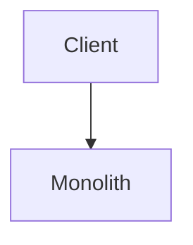

#### Step 2 — Extract first service

```text
Client → Gateway → Monolith
                → New service
```

Some requests hit the new service; the rest stay on the monolith.

#### Step 3 — More functionality moves

```text
Client → Gateway → User service
                → Order service
                → Payment service
                → Monolith (shrinking)
```

The monolith becomes smaller over time.

#### Step 4 — Monolith retired

```text
Client → Gateway → User / Order / Payment services
```

All traffic on new services; legacy monolith decommissioned.

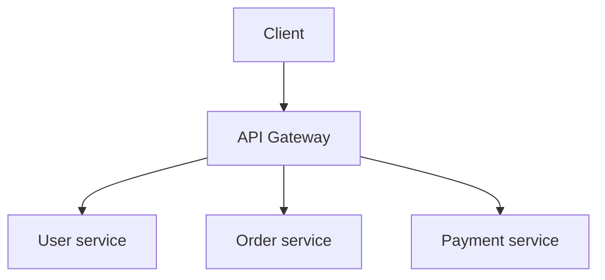

### Key components

| # | Component | Role |
|---|-----------|------|
| 1 | **Legacy system** | Existing monolith — continues serving unmigrated requests |
| 2 | **New services** | Extracted microservices for migrated capabilities |
| 3 | **Router / API gateway** | Routes each request to monolith **or** new service |
| 4 | **Data migration strategy** | Sync or cut over data; keep old and new consistent during transition |

Use an **anti-corruption layer** when legacy and new domain models differ — translate at the boundary, don't leak monolith schemas into new services.

### Request flow example

**Before migration:**

```text
Client → Monolith → Database
```

**After migrating user management:**

```text
Client → API Gateway
           ├─→ User service     (GET/POST /users)
           └─→ Monolith         (GET /orders, POST /payments, …)
```

User-related paths go to **User service**; everything else stays on the monolith until extracted.

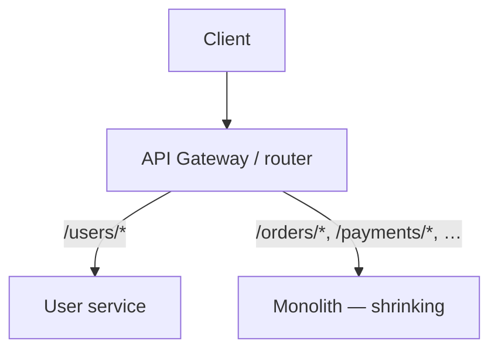

### Migration steps

1. **Identify a module** to extract (e.g. user management)
2. **Create** the new service
3. **Redirect traffic** at the gateway
4. **Validate** functionality (contract tests — [Ch.7 §7.15](../07-api-design/README.md#715-contract-testing))
5. **Migrate data** if required (CDC, dual-write, or one-time backfill)
6. **Remove** old code from the monolith
7. **Repeat** for other modules

### Example — e-commerce monolith

**Legacy monolith modules:**

```text
User management · Product catalog · Order processing
Payment processing · Notification system
```

| Phase | Extract |
|-------|---------|
| 1 | User service |
| 2 | Product service |
| 3 | Order service |
| 4 | Payment service |
| 5 | Retire monolith |

### Advantages

1. **Low risk** — small incremental changes, easier rollback
2. **Continuous delivery** — no long system downtime
3. **Faster feedback** — learn from each step
4. **Reduced business impact** — existing features keep running
5. **Better testing** — validate service by service

### Disadvantages

1. **Temporary complexity** — monolith and microservices coexist
2. **Data synchronization** — keeping old and new systems consistent
3. **Routing complexity** — gateway rules grow with each extraction
4. **Longer duration** — full migration may take months or years

### When to use

- Migrating a legacy [monolith](#81-monolith)
- Building [microservices](#83-microservices) gradually
- Large rewrite is too risky
- Business cannot tolerate downtime
- Incremental modernization is required

### When not to use

- Application is very small — [monolith](#81-monolith) is enough
- Complete rewrite is genuinely easier and low risk
- Legacy system is near retirement anyway
- Migration cost exceeds business value

### Strangler pattern vs big bang migration

| Feature | Strangler pattern | Big bang rewrite |
|---------|-------------------|------------------|
| **Risk** | Low | High |
| **Downtime** | Minimal | High |
| **Deployment** | Incremental | One-time |
| **Rollback** | Easy | Difficult |
| **Business continuity** | Excellent | Risky |
| **Migration duration** | Longer | Shorter |
| **Failure impact** | Small per step | Large |

### Summary

```text
Strangler = gradually replace legacy with new services while old system still runs
Flow: monolith → extract User → Order → Payment → retire monolith
Gateway routes traffic; data sync is the hardest part
Safest common path from monolith to microservices
```

---


## 8.5 BFF Pattern

> **Aggregation detail:** parallel fan-out and composition patterns — [Ch.7 §7.6–7.7](../07-api-design/README.md). **Gateway vs BFF:** [Ch.7 §7.5](../07-api-design/README.md#api-gateway-vs-bff).

### What is BFF?

**Backend for Frontend (BFF)** is an architectural pattern where a **separate backend service** is created for **each frontend application**.

Instead of all clients calling the same backend APIs, each frontend gets its own **tailored** backend layer.

### Purpose

1. Optimize APIs for specific frontends
2. Reduce over-fetching and under-fetching
3. Simplify frontend development
4. Improve performance (fewer round trips)
5. Decouple frontend and backend evolution

Core domain services stay **client-agnostic**; BFF owns presentation-shaped APIs only.

### Problem without BFF

Different clients have different needs — web, mobile, smart TV — all calling one **shared backend**:

```text
Web / Mobile / TV clients → Shared backend → Microservices
```

**Issues:**

- Mobile receives unnecessary data (over-fetching)
- Web needs multiple API calls (under-fetching)
- Backend cluttered with client-specific `if (mobile)` logic
- Changes for one client risk breaking others

### Solution: BFF pattern

Dedicated backend per frontend:

```text
Web    → Web BFF    ─┐
Mobile → Mobile BFF ─┼→ User / Product / Order / Payment services
TV     → TV BFF    ─┘
```

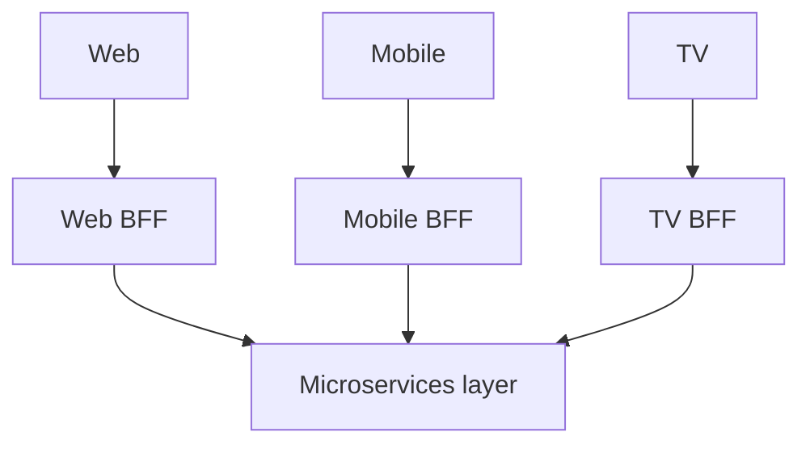

### How BFF works

**Mobile screen needs:** user name, recent orders, wallet balance.

**Without BFF** — mobile app calls three services (three network requests):

```text
Mobile → User service
      → Order service
      → Wallet service
```

**With BFF** — one call; BFF aggregates internally ([Ch.7 aggregation](../07-api-design/README.md#76-api-aggregation)):

```text
Mobile → Mobile BFF → User / Order / Wallet services
```

```json
{
  "name": "John",
  "walletBalance": 500,
  "recentOrders": [ ... ]
}
```

### Responsibilities of BFF

| # | Responsibility | Notes |
|---|----------------|-------|
| 1 | **API aggregation** | Combine multiple service responses |
| 2 | **Data transformation** | UI-friendly DTOs — not raw domain models |
| 3 | **Authentication handling** | Token validation, session concerns at edge of client API |
| 4 | **Client-specific logic** | Platform rules only — **not** core business rules |
| 5 | **Response optimization** | Return only fields that screen needs |

**Rule:** thin orchestration — no domain ownership. Business logic stays in microservices.

### Example — web homepage

Services: User, Product, Inventory, Cart.

`GET /homepage` on **Web BFF** internally calls User + Product + Cart → one consolidated response (user details, recommended products, cart count).

### Advantages

1. Better performance — fewer frontend requests, lower latency
2. Frontend independence — web and mobile evolve separately
3. Simpler frontend code — less client-side orchestration
4. Optimized responses — right payload per platform
5. Faster development — parallel frontend/BFF teams

### Disadvantages

1. More services to deploy and monitor
2. Code duplication risk across BFFs — share libraries, not domain logic
3. Operational overhead
4. Poorly designed BFF can become a bottleneck or **god service**

### When to use

- Multiple frontend applications (web, mobile, TV, tablet)
- Mobile and web need different data shapes or call patterns
- Frontends evolve on different release cadences
- Frequent API aggregation per screen

Examples: e-commerce, banking, social media, streaming.

### When not to use

- Only one frontend
- Small application with identical client needs
- Frontends share the same API contract comfortably

### Real-world example

**Netflix** — web, Android, iOS, smart TV each with different UI needs; client-specific backend layers return optimized payloads per platform.

### BFF vs API gateway

See [Ch.7 — API gateway vs BFF](../07-api-design/README.md#api-gateway-vs-bff). BFF sits **behind** the gateway and shapes APIs per client.

### BFF + API gateway (typical production layout)

```text
Client → API Gateway → Web BFF / Mobile BFF / TV BFF → Microservices
```

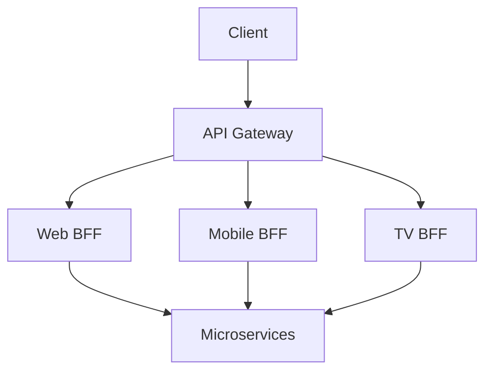

| Layer | Handles |
|-------|---------|
| **API Gateway** | Authentication, rate limiting, routing, logging — [Ch.7](../07-api-design/README.md) |
| **BFF** | Aggregation, transformation, client-specific endpoints |

Used in [§8.4 Strangler](#84-strangler-pattern) migrations and [§8.3](#83-microservices) client-facing tiers.

### Summary

```text
BFF = dedicated backend per frontend (Web BFF, Mobile BFF, …)
Frontend → BFF → microservices
Benefits: tailored APIs, performance, simpler clients, independent evolution
Pair with API Gateway for cross-cutting policy at the edge
```

---


## 8.6 DDD

> **Bounded context deep dive:** [§8.7](#87-bounded-context) · service boundaries: [§8.3 Microservices](#83-microservices) · structure: [§8.8 Hexagonal Architecture](#88-hexagonal-architecture).

### What is DDD?

**Domain-Driven Design (DDD)** is a software design approach that focuses on modeling software around the **business domain** and its rules.

Introduced by **Eric Evans** (*Domain-Driven Design*, 2003).

**Core idea:** solve business problems by creating software models that closely reflect the real business domain.

### What is a domain?

The **domain** is the business area for which software is built.

| Domain | Concepts |
|--------|----------|
| **Banking** | Accounts, transactions, loans, customers |
| **E-commerce** | Products, orders, payments, inventory |
| **Healthcare** | Patients, doctors, appointments, prescriptions |

### Why DDD?

| Without DDD | With DDD |
|-------------|----------|
| Technical design drives development | Business concepts become software concepts |
| Business rules scattered | Shared **ubiquitous language** |
| Hard to talk with domain experts | Developers and experts use same terms |
| Complex systems hard to maintain | Clear boundaries; scales to [microservices](#83-microservices) |

### Strategic design

Strategic design divides a large domain into manageable parts.

| # | Concept | Summary |
|---|---------|---------|
| 1 | **Ubiquitous language** | Common vocabulary for devs, analysts, domain experts, testers |
| 2 | **Bounded context** | Boundary where a model is valid — [§8.7](#87-bounded-context) |
| 3 | **Context mapping** | How contexts interact (events, ACL, partnerships) |

#### 1. Ubiquitous language

Everyone uses the same business terms in conversation **and** code.

Business says **"Place order"** → code uses `Order`, `Customer`, `Product`, `Payment` — not `DataObject`, `EntityRecord`, `TransactionInfo`.

Benefits: fewer misunderstandings, better collaboration.

#### 2. Bounded context (overview)

A boundary where a domain model and ubiquitous language are consistent — full examples in [§8.7 Bounded Context](#87-bounded-context).

#### 3. Context mapping (overview)

Describes how bounded contexts interact while staying independent:

```text
Order context → Payment context → Shipping context
```

Integration via defined contracts (APIs, events) — not shared database tables across contexts.

### Tactical design

Building blocks **inside** a bounded context:

| # | Building block | Role |
|---|----------------|------|
| 1 | **Entity** | Identity + lifecycle |
| 2 | **Value object** | Identity-free, usually immutable |
| 3 | **Aggregate** | Consistency cluster |
| 4 | **Repository** | Load/save aggregates |
| 5 | **Domain service** | Logic spanning entities |
| 6 | **Domain event** | Something important happened |
| 7 | **Factory** | Complex object creation |

#### 1. Entity

Identified by unique **ID**; mutable; has lifecycle.

```json
{ "id": 101, "name": "John" }
```

Name can change; same customer because `id` is unchanged.

#### 2. Value object

Identified by **values**, not ID; usually immutable.

```json
{ "city": "Bangalore", "pinCode": "560001" }
```

Address change → replace with a new value object.

| | Entity | Value object |
|---|--------|--------------|
| **Identity** | Yes (ID) | No |
| **Mutable** | Yes | Usually no |
| **Compared by** | ID | Values |
| **Lifecycle** | Yes | No |

#### 3. Aggregate

Cluster of related objects treated as one **consistency boundary**:

```text
Order (root)
 ├── OrderItem
 └── ShippingAddress
```

Only the **aggregate root** is referenced from outside.

#### Aggregate root

Controls access inside the aggregate.

```text
order.addItem()     ✓
orderItem.update()  ✗  (direct access prohibited)
```

Maintains invariants and business rules in one place.

#### 4. Repository

Abstracts persistence — hide DB details; load/save **aggregates**:

```java
interface OrderRepository {
    Order findById(Long id);
    void save(Order order);
}
```

#### 5. Domain service

Logic that does not belong on a single entity — e.g. **transfer money** across two accounts:

```text
TransferMoneyService.transfer(from, to, amount)
```

#### 6. Domain event

Represents something important in the domain:

`OrderPlaced` · `PaymentCompleted` · `AccountCreated` · `ProductOutOfStock`

```text
Order created → OrderPlaced event → Notification service, Inventory service
```

Events integrate contexts without tight coupling — [Ch.6 Messaging](../06-messaging-and-events/README.md).

#### 7. Factory

Encapsulates complex creation — `OrderFactory.createOrder()` instead of scattered `new` calls across layers.

### DDD layered architecture

```text
+----------------------------------+
| Presentation (controllers, APIs) |
+----------------------------------+
| Application (use cases)          |
+----------------------------------+
| Domain (entities, aggregates)  |
+----------------------------------+
| Infrastructure (DB, Kafka, APIs) |
+----------------------------------+
```

Dependency rule: **inward** toward domain — see [§8.8 Hexagonal Architecture](#88-hexagonal-architecture).

### DDD in microservices

One **bounded context** per service when splitting — mapping and examples: [§8.7 Bounded Context](#87-bounded-context) · [§8.3 Microservices](#83-microservices).

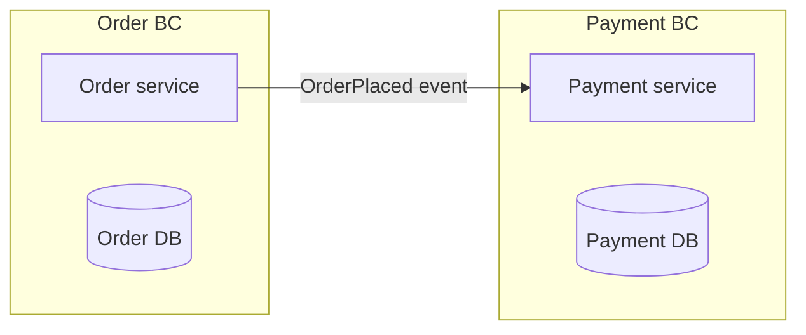

### Advantages

1. Business-oriented design
2. Better maintainability
3. Clear separation of responsibilities
4. Easier scaling along context boundaries
5. Better collaboration with domain experts
6. Natural fit for microservices and [§8.2 modular monolith](#82-modular-monolith)

### Disadvantages

1. Learning curve
2. More initial design effort
3. Overkill for simple CRUD
4. Requires ongoing domain expert access

### When to use

- Complex business rules
- Large enterprise applications
- Multiple teams
- Long-term maintainability matters
- Microservices or modular monolith planned

Examples: banking, insurance, e-commerce, healthcare, supply chain.

### When not to use

- Simple CRUD
- Small project or short-lived prototype
- Limited business complexity

### Summary

```text
DDD = business domain first
Strategic: ubiquitous language, bounded context, context mapping
Tactical: entity, value object, aggregate, repository, domain service, event, factory
Flow: business domain → bounded context → domain model → implementation
```

---


## 8.7 Bounded Context

> **DDD foundation:** [§8.6 DDD](#86-ddd) (ubiquitous language, tactical patterns) · **Deployment:** [§8.3 Microservices](#83-microservices) · **Legacy integration:** anti-corruption layer in [§8.4 Strangler](#84-strangler-pattern).

### What is a bounded context?

A **bounded context** is a logical boundary within which a particular **domain model**, **business rules**, and **terminology** have a specific, consistent meaning.

It is one of the most important concepts in [Domain-Driven Design](#86-ddd).

**Core idea:** the same business term can mean **different things** in different parts of a system. A bounded context defines **where** a model is valid — and where it is not.

### Why do we need bounded context?

In large applications, the same entity means different things to different departments.

**Term: Product**

| Team | Product means |
|------|----------------|
| **Inventory** | Stock quantity, warehouse location, reorder level |
| **Sales** | Price, discount, promotion |
| **Marketing** | Campaign, advertisement, rating |

One giant `Product` model for all teams creates confusion. Bounded context **splits** the model by business responsibility.

### Without bounded context

Single overloaded model:

```text
Product: id, name, stockQuantity, warehouseLocation, reorderLevel,
         price, discount, promotion, campaign, advertisement, rating
```

Problems: large entity, mixed responsibilities, hard maintenance, tight coupling.

### With bounded context

**Inventory context**

```text
Product: id, stockQuantity, warehouseLocation, reorderLevel
```

**Sales context**

```text
Product: id, price, discount, promotion
```

**Marketing context**

```text
Product: id, campaign, advertisement, rating
```

Each context has its **own** model and rules.

### Real-world e-commerce example

```text
Customer context · Product context · Order context
Payment context · Shipping context
```

Each context owns its business rules, data, and domain model.

#### Order context

Focus: order processing. Entities: `Order`, `OrderItem`, `OrderStatus`. Rules: create/cancel order, calculate total.

#### Payment context

Focus: payments. Entities: `Payment`, `Transaction`, `Refund`. Rules: authorize, capture, refund.

#### Shipping context

Focus: delivery. Entities: `Shipment`, `Tracking`, `Delivery`. Rules: create shipment, track, confirm delivery.

### Same term, different meaning — Customer

| Context | Customer model |
|---------|----------------|
| **Customer** | Name, email, phone, address |
| **Order** | `customerId`, shipping address only |
| **Marketing** | Preferences, interests, campaign history |

Different shape for different needs — **do not** force one enterprise `Customer` table across all.

### Boundary rule

| Inside a bounded context | Outside |
|--------------------------|---------|
| Same language ([ubiquitous language](#86-ddd)) | Different language allowed |
| Same model | Different models allowed |
| Same business rules | Different rules allowed |

Integrate at the boundary via APIs or events — not shared mutable schemas.

### Bounded context and microservices

Often:

```text
1 bounded context ≈ 1 microservice
```

```text
Order context     → Order service
Payment context   → Payment service
Shipping context  → Shipping service
```

**However:** bounded context ≠ always microservice. A context can live inside a [monolith](#81-monolith), [modular monolith](#82-modular-monolith), or microservice deployment.

### Communication between contexts

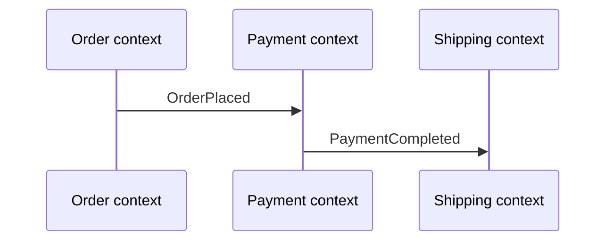

Channels: REST, gRPC, Kafka, domain events — [Ch.7](../07-api-design/README.md), [Ch.6](../06-messaging-and-events/README.md). Use an **anti-corruption layer** at legacy boundaries ([§8.4](#84-strangler-pattern)).

### Context map

Shows relationships and dependencies between contexts:

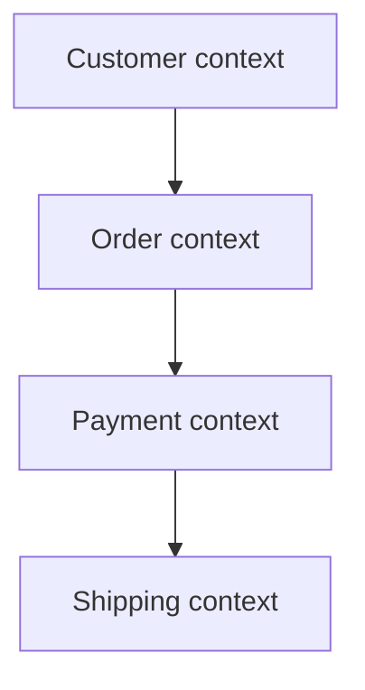

Document upstream/downstream relationships, published language, and integration style per pair.

### When to create a new bounded context

- Business rules differ
- Terminology differs
- Different teams own the capability
- **Data ownership** differs
- Independent deployment is needed

### Banking example

```text
Customer context · Account context · Loan context · Payment context
```

Each owns its model and rules.

### Bounded context vs module

| | Module | Bounded context |
|---|--------|-----------------|
| **Separation** | Technical (packages) | Business (domain) |
| **Example** | `com.bank.customer` | Customer domain, loan domain |

A bounded context may contain **multiple** modules; a module alone is not a context.

### Bounded context vs microservice

| | Bounded context | Microservice |
|---|-----------------|--------------|
| **Type** | Logical business boundary (DDD) | Deployment / runtime boundary |
| **Relationship** | Often **implemented as** a microservice — not required |

### Advantages

1. Clear responsibilities
2. Better maintainability
3. Reduced coupling
4. Easier team ownership (Conway's Law)
5. Easier scaling per domain
6. Better domain modeling

### Disadvantages

1. Initial design effort
2. More cross-context communication
3. Integration complexity
4. Requires domain knowledge

### Summary

```text
Bounded Context = boundary where one domain model and language are valid
Principles: own rules, own data, clear edges, independent evolution
E-commerce chain: Customer → Order → Payment → Shipping (events/contracts between)
```

---


## 8.8 Hexagonal Architecture

> **Domain model:** [§8.6 DDD](#86-ddd) · bounded contexts: [§8.7](#87-bounded-context).

### What is hexagonal architecture?

**Hexagonal architecture** (also **ports and adapters**) isolates **core business logic** from external systems — databases, UI, messaging, third-party APIs.

Introduced by **Alistair Cockburn**.

**Core idea:** business logic should **not** depend on infrastructure; infrastructure should depend on business logic.

### Problem with traditional layered architecture

```text
Controller → Service → Repository → Database
```

Problems:

- Business logic depends on the database layer
- Hard to unit-test domain in isolation
- Difficult to swap infrastructure
- Tight coupling

### Hexagonal solution

Domain **core** in the center; **ports** (interfaces) face **adapters** (implementations) on each side:

```text
        UI/API
           |
    [Inbound adapters]
           |
    [Inbound ports]
           |
      DOMAIN CORE
           |
    [Outbound ports]
           |
    [Outbound adapters]
           |
    Database / Kafka / external APIs
```

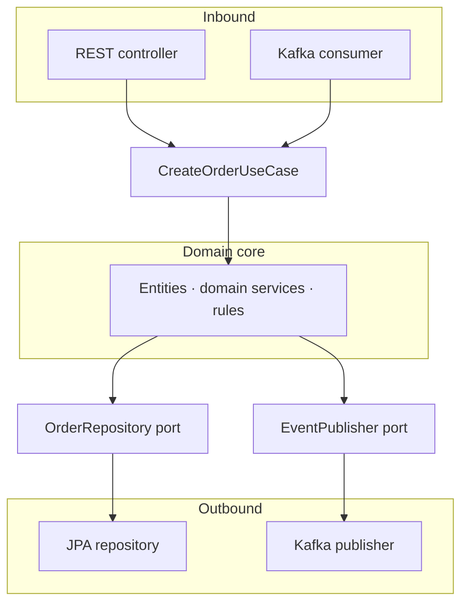

The core knows nothing about REST, JPA, or Kafka — only port interfaces.

### Main components

| # | Component | Role |
|---|-----------|------|
| 1 | **Domain core** | Business rules, entities, value objects, domain services |
| 2 | **Ports** | Interfaces for in/out communication |
| 3 | **Adapters** | Concrete implementations of ports |

#### 1. Domain core

Includes `Order`, `Customer`, `Payment`, aggregates, and rules from [§8.6 DDD](#86-ddd).

Must **not** reference: database technology, REST frameworks, Kafka clients, or external SDKs.

#### 2. Ports

**Inbound ports** — what the application offers to the outside:

```java
public interface CreateOrderUseCase {
    Order createOrder(CreateOrderRequest request);
}
```

**Outbound ports** — what the domain needs from infrastructure:

```java
public interface OrderRepository {
    Order findById(Long id);
    void save(Order order);
}
```

#### 3. Adapters

| Type | Examples |
|------|----------|
| **Inbound** | REST controllers, GraphQL resolvers, CLI, message consumers |
| **Outbound** | JPA repository, Kafka adapter, email client, payment API client |

```text
OrderController → CreateOrderUseCase (inbound port)
JpaOrderRepository implements OrderRepository (outbound port)
```

### Request flow — create order

```text
Client → REST controller → inbound port (CreateOrderUseCase)
      → domain service → outbound port (OrderRepository)
      → database adapter → database
```

### Code structure example

```text
com.ecommerce
├── domain/          (entities, services, port interfaces)
├── application/     (use case implementations)
├── adapter/
│   ├── inbound/     (rest, kafka consumers)
│   └── outbound/    (persistence, email, payment)
└── configuration/
```

### Order creation example

**Domain service** implements inbound port; depends on outbound port only:

```java
class OrderService implements CreateOrderUseCase {
    private final OrderRepository repository;

    public Order create(OrderRequest request) {
        Order order = new Order(...);
        repository.save(order);
        return order;
    }
}
```

**Database adapter:**

```java
class JpaOrderRepository implements OrderRepository {
    public void save(Order order) { /* JPA */ }
}
```

### Dependency rule

Dependencies point **inward**:

```text
✓ Controller → use case → domain → port ← adapter implements port
✗ Domain → JPA / JDBC / HttpClient directly
```

### Advantages

1. **High testability** — domain tests without DB, Kafka, or HTTP
2. **Loose coupling** — swap MySQL → PostgreSQL without domain changes
3. **Technology independence** — REST ↔ GraphQL, Kafka ↔ RabbitMQ at adapter layer
4. **Better maintainability** — clear separation of concerns
5. **Supports DDD** — entities, aggregates, repositories as ports

### Disadvantages

1. More classes and interfaces
2. Higher initial complexity
3. Overkill for small CRUD apps

### Hexagonal vs layered architecture

| Feature | Layered | Hexagonal |
|---------|---------|-----------|
| **Coupling** | Higher | Lower |
| **Testability** | Medium | High |
| **Flexibility** | Medium | High |
| **Technology lock-in** | Higher | Lower |
| **Complexity** | Low | Medium–high |

### Hexagonal + DDD

Common combination inside a [bounded context](#87-bounded-context):

```text
Order aggregate → OrderRepository port → JpaOrderRepository adapter
```

DDD defines the **model**; hexagonal **protects** it from infrastructure.

### When to use

- Large enterprise or [microservice](#83-microservices) with real domain logic
- Complex business rules ([§8.6 DDD](#86-ddd))
- Multiple inbound channels (REST + events) or outbound integrations
- Long-term maintainability

Examples: banking, insurance, e-commerce, payments.

### When not to use

- Small CRUD applications
- Short prototypes
- Very simple systems

### Summary

```text
Hexagonal = domain core + ports + adapters
Inbound: external → port → domain
Outbound: domain → port → adapter → infrastructure
Principle: infrastructure depends on domain, never the reverse
```

---


## 8.12 Service Registry

> **Client- vs server-side discovery** covered below. **Mesh:** [§8.14 Service Mesh](#814-service-mesh). **External clients:** [Ch.7 API Gateway](../07-api-design/README.md#75-api-gateway).

### What is a service registry?

A **service registry** is a central directory where microservices **register** themselves and where other services can **discover** them.

It enables **service discovery** in a [microservices](#83-microservices) architecture.

### Problem solved

Service instances are **dynamic**:

- New instances start; existing instances stop
- Auto-scaling adds or removes instances
- Containers change IP addresses on restart

Hardcoding URLs (`http://10.1.2.15:8080`) breaks. The registry tracks **current** healthy instances.

### Without service registry

```text
Order service → http://10.1.2.15:8080 (payment)
```

Problems: IP changes, container restarts, multiple instances after scale-out, manual config updates.

### With service registry

```text
Payment-1, Payment-2 → register → Service Registry
Order service → discover PAYMENT-SERVICE → call an instance
```

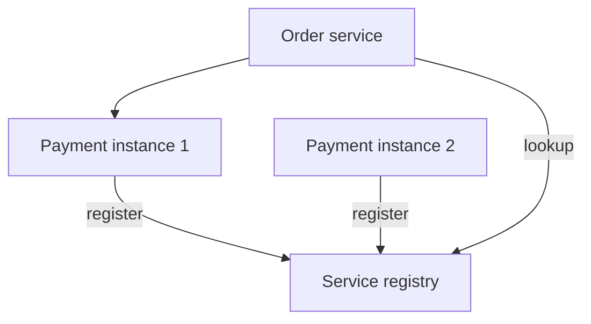

### What information is stored?

| Field | Example |
|-------|---------|
| Service name | `PAYMENT-SERVICE` |
| Host / IP + port | `10.0.1.1:8080` |
| Health status | UP / DOWN |
| Metadata | version, zone, tags |

Multiple instances per service name are normal.

### Service registration process

1. **Payment service starts**
2. **Registers** — `PAYMENT-SERVICE` @ `10.0.1.1:8080`
3. **Registry stores** instance; sends periodic **heartbeats** (e.g. every 30s)
4. Heartbeat stops → instance marked **DOWN** and removed from routing

### Service discovery process

1. Order service needs payment service
2. **Queries registry** — “Where is `PAYMENT-SERVICE`?”
3. Registry returns instances — `10.0.1.1:8080`, `10.0.1.2:8080`
4. Order service calls one instance (often with client-side load balancing)

### Discovery types

| | Client-side discovery | Server-side discovery |
|---|----------------------|---------------------|
| **Flow** | Client queries registry, picks instance | Client → load balancer → registry/backends |
| **Examples** | Spring Cloud + Eureka | Kubernetes Service, AWS ALB |
| **Pros** | Simple, efficient | Client unaware of instance list |
| **Cons** | Discovery logic in each client | Extra infrastructure hop |

```text
Client-side:  Order → Eureka → pick instance → Payment
Server-side:  Order → Load balancer → Payment (LB uses registry/endpoints)
```

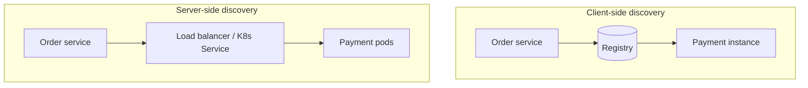

### Health checks

Registry (or platform) verifies health continuously:

```text
10.0.1.1:8080  Status: UP   → included in responses
10.0.1.2:8080  Status: DOWN → removed from routing
```

Registration should align with **readiness** — not just process start.

### Popular service registries

| Registry | Notes |
|----------|-------|
| **Netflix Eureka** | AP-oriented; Spring Cloud integration |
| **HashiCorp Consul** | Service catalog + health checks + KV |
| **Apache ZooKeeper** | Coordination; older stacks |
| **etcd** | K8s control plane backing store |
| **Kubernetes Services** | Built-in DNS + Endpoints — often no separate Eureka |

### Eureka example

```text
Eureka Server
    ↑ register / heartbeat
Order service · Payment service · User service
```

**Spring Cloud Eureka flow:** service starts → registers → heartbeats → Eureka updates registry → peers discover instances.

### Load balancing with registry

Client discovers all `PAYMENT-SERVICE` instances and applies:

- Round robin
- Random
- Least connections
- Weighted

Registry **knows where** instances are; load balancer **chooses which** gets the request — often used together.

### Service registry in Kubernetes

```text
Pod → Service → DNS: payment-service.default.svc.cluster.local
```

Control plane maintains Endpoints from ready pods — **server-side** discovery without a separate Eureka cluster.

### Service registry vs API gateway

| | Service registry | API gateway |
|---|------------------|-------------|
| **Role** | Find service **locations** (service-to-service) | **Entry point** for external clients |
| **Concerns** | Registration, health, lookup | Routing, auth, rate limits |

### Real-world flow

```text
Order service → registry → payment instance → process payment
```

When payment scales to Payment-1/2/3, registry tracks all instances automatically.

### Advantages

1. Dynamic discovery
2. No hardcoded URLs
3. Supports auto-scaling
4. High availability when registry is clustered
5. Better fault tolerance (unhealthy instances dropped)
6. Easier rolling deploys

### Disadvantages

1. Additional infrastructure (unless using K8s native)
2. Registry failure or partition risk — design for HA
3. Operational complexity
4. Network dependency for lookup

### Summary

```text
Service Registry = central directory of service instances
Flow: startup → register → heartbeats → peers discover → communicate
Examples: Eureka, Consul, ZooKeeper, etcd, Kubernetes Services
Benefit: dynamic lookup without hardcoded IPs
```

---


## 8.14 Service Mesh

> **Sidecar pattern:** [§8.15](#815-sidecar-pattern) · **Registry only:** [§8.12](#812-service-registry) · **Resilience:** [§8.16 Circuit Breaker](#816-circuit-breaker), [§8.17 Retry](#817-retry-pattern) · **Edge traffic:** [Ch.7 API Gateway](../07-api-design/README.md#75-api-gateway).

### What is a service mesh?

A **service mesh** is a dedicated infrastructure layer that manages **service-to-service** communication in [microservices](#83-microservices).

It handles networking without application code changes:

- Service discovery · Load balancing · Traffic routing
- Security (mTLS) · Authentication · Authorization
- Observability · Retries · Circuit breaking

**Core idea:**

```text
Business logic  → application code
Networking logic → service mesh
```

### Why service mesh?

As services grow, each would otherwise implement discovery, retries, TLS, auth, metrics, tracing, and traffic rules — leading to **duplication**, **inconsistent** behavior, and hard maintenance across languages.

### Without service mesh

Every service embeds retry, TLS, and metrics logic. Same concerns reimplemented in Order, Payment, Inventory, User services.

### With service mesh

```text
Order service → sidecar proxy → payment sidecar → payment service
```

Application holds **business logic only**; proxies handle networking.

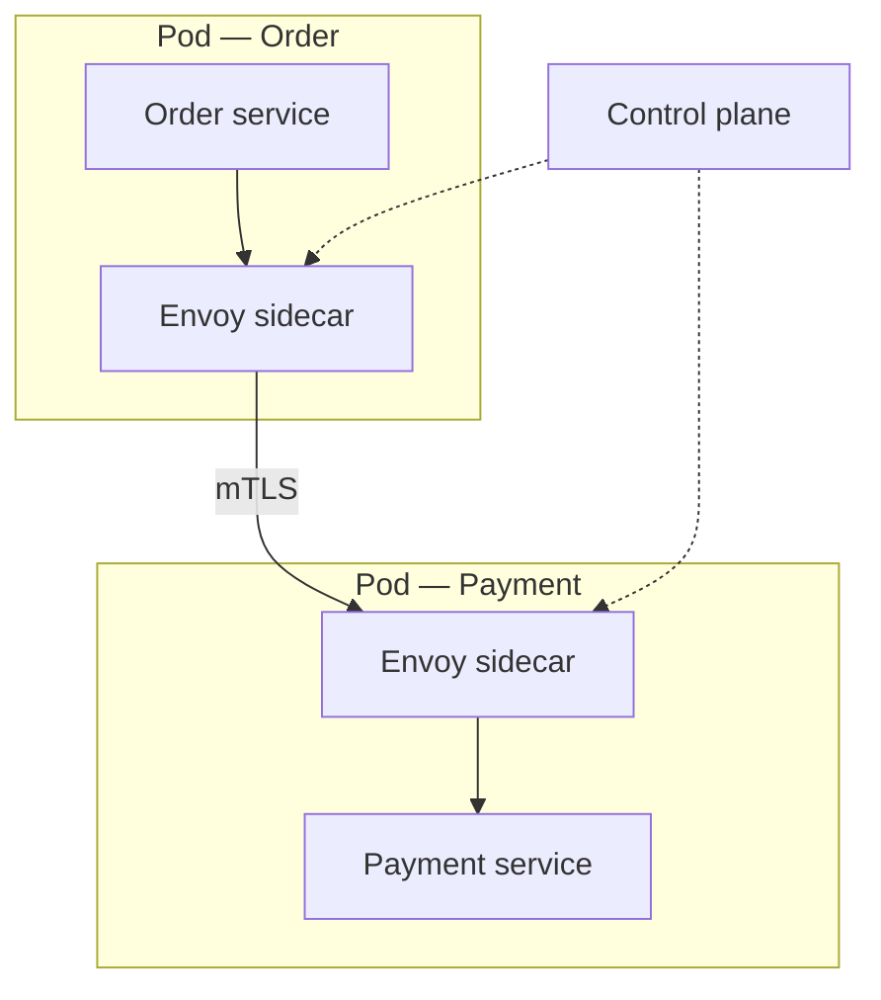

### Main components

| # | Component | Role |
|---|-----------|------|
| 1 | **Data plane** | Sidecar proxies — actual traffic |
| 2 | **Control plane** | Configures all proxies centrally |

#### Data plane

Handles real service-to-service traffic (usually **Envoy** sidecars):

```text
Order service → Envoy → Payment service
```

Responsibilities: routing, load balancing, encryption, metrics, retries.

#### Control plane

Manages proxies: configuration, security policies, traffic rules, certificates.

```text
Control plane → config push → Proxy / Proxy / Proxy
```

Examples: **Istiod** (Istio), Linkerd controller.

### Request flow

```text
Order service → order sidecar → payment sidecar → payment service
```

Sidecar applies authentication, TLS, retry policy, logging **before** forwarding.

Detail: [§8.15 Sidecar Pattern](#815-sidecar-pattern).

### Key features

| # | Feature | Summary |
|---|---------|---------|
| 1 | **Service discovery** | Finds `payment-service` instances automatically — complements [§8.12](#812-service-registry) |
| 2 | **Load balancing** | Round robin, least request, random, weighted across instances |
| 3 | **mTLS** | Mutual TLS — both client and server verify identity |
| 4 | **Traffic routing** | Canary (90% v1 / 10% v2), blue-green, A/B tests |
| 5 | **Retries** | Central policy (e.g. 3 retries, 500 ms delay) — [§8.17](#817-retry-pattern) |
| 6 | **Circuit breaker** | Stops calls when failures exceed threshold — [§8.16](#816-circuit-breaker) |
| 7 | **Observability** | Request count, error rate, latency, throughput |
| 8 | **Distributed tracing** | Trace ID across Order → Payment → Inventory (Jaeger, Zipkin, OpenTelemetry) |

Circuit breaker detail: [§8.16](#816-circuit-breaker). Retry policy: [§8.17](#817-retry-pattern).

#### mTLS

```text
Order service ←—— certificates ——→ Payment service
```

Encrypts traffic and authenticates **both** sides (not just server TLS).

### Service mesh in Kubernetes

```text
Kubernetes cluster → Istio control plane → Envoy sidecars → microservices
```

Most meshes target Kubernetes; alternatives include VM workloads with mesh gateways.

### Popular service meshes

| Mesh | Notes |
|------|-------|
| **Istio** | Envoy data plane; widely adopted |
| **Linkerd** | Lightweight Rust proxy |
| **Consul Connect** | HashiCorp integration |
| **AWS App Mesh** | Managed on AWS |

Also: **Cilium** (eBPF, optional sidecar-less mode).

### Service registry vs service mesh

| | [Service registry](#812-service-registry) | Service mesh |
|---|------------------------------------------|--------------|
| **Purpose** | Find service locations | Manage full communication |
| **Examples** | Eureka, Consul | Istio, Linkerd |
| **Scope** | Registration + discovery | + security, routing, retries, tracing |

Mesh **includes** discovery and much more.

### API gateway vs service mesh

| | API gateway | Service mesh |
|---|-------------|--------------|
| **Traffic** | **North-south** (client → cluster) | **East-west** (service ↔ service) |
| **Examples** | Auth, rate limiting, edge routing | mTLS, retries, traffic policies, tracing |

```text
Client → API Gateway → [ Service Mesh: Order ↔ Payment ↔ Inventory ]
                              ↑ sidecars on each service
```

Use **both**: gateway at the edge; mesh between internal services.

### Advantages

1. Centralized traffic management
2. Strong security with mTLS
3. Automatic retries and [circuit breaking](#816-circuit-breaker)
4. Detailed observability and tracing
5. No changes to business code
6. Consistent policies across polyglot services

### Disadvantages

1. Increased infrastructure complexity
2. Extra CPU/memory per sidecar (~50–100 MB per pod typical)
3. Added latency per hop (~0.5–1.5 ms)
4. Steeper learning curve; harder debugging
5. Not needed for small systems

### When to use

- Large microservices estate (often **20+** services)
- Strong zero-trust / mTLS requirements
- Need distributed tracing and advanced traffic control
- Running on Kubernetes with platform team capacity

### When not to use

- Small monolith or few services
- Few internal service calls
- Team lacks operational experience — prefer libraries + [§8.12](#812-service-registry) first

### Summary

```text
Service Mesh = data plane (sidecar proxies) + control plane (policy)
Handles: discovery, LB, mTLS, retries, circuit break, routing, observability
Principle: networking out of app code into infrastructure layer
Flow: Order → order proxy → payment proxy → Payment
```

---


## 8.15 Sidecar Pattern

> **Service mesh:** sidecars are the mesh **data plane** — [§8.14 Service Mesh](#814-service-mesh). **Edge traffic:** [Ch.7 API Gateway](../07-api-design/README.md#75-api-gateway).

### What is the sidecar pattern?

The **sidecar pattern** deploys a **helper component** alongside the main application in the same host, container group, or Kubernetes pod.

The sidecar provides supporting features **without modifying** application code.

**Core idea:**

```text
Application = business logic
Sidecar      = infrastructure / cross-cutting concerns
```

### Why is it called sidecar?

Like a motorcycle **sidecar** attachment: the main vehicle is the application; the sidecar is a companion with a different job — they travel together.

### Problem

Every microservice might need logging, monitoring, metrics, TLS, discovery, config, and tracing. Without sidecars, each service duplicates that logic (Java, Node, Python — inconsistent and hard to maintain).

### Solution

Move common concerns into a sidecar in the same pod:

```text
+--------------------------------+
| Pod                            |
|  Order service (business only) |
|  Sidecar (infra)               |
+--------------------------------+
```

### Architecture

**Without sidecar** — app handles logging, monitoring, retry, TLS inline.

**With sidecar:**

```text
Client → Application → Sidecar → external systems / other services
```

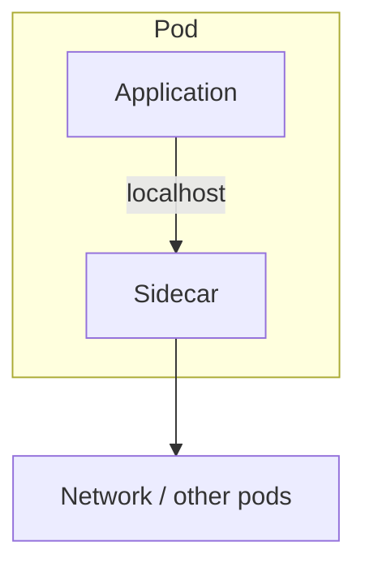

### Characteristics

1. Runs alongside the application
2. Shares lifecycle (start/stop with the pod)
3. Provides auxiliary capabilities
4. Can be updated independently of app image
5. Transparent to business logic

### Kubernetes example

```text
Pod: Order service container + Envoy sidecar container
Shared: network namespace (localhost between containers)
```

Communication app → sidecar on **localhost** is very fast.

### Common use cases

| # | Use case | Role |
|---|----------|------|
| 1 | **Service mesh proxy** | Routing, mTLS, retry, circuit break — [§8.14](#814-service-mesh) |
| 2 | **Logging** | Tail log files → ELK / Splunk (Fluent Bit) |
| 3 | **Monitoring** | Scrape `/metrics` → Prometheus |
| 4 | **Security** | Auth, certs, encryption (Vault agent) |
| 5 | **Configuration** | Pull from config server / vault → local files |
| 6 | **Data sync** | Sync external data → local cache for app |

#### Service mesh sidecar (most common)

```text
Order service → Envoy sidecar → payment sidecar → payment service
```

Used by **Istio**, **Linkerd**, **Consul Connect** (Envoy or native proxy).

#### Logging sidecar

```text
App writes log.txt → logging sidecar → centralized store
```

No logging SDK required in every language.

#### Monitoring sidecar

Scrapes app metrics endpoint → monitoring platform (CPU, memory, request count, latency).

#### Configuration sidecar

Fetches secrets/config from Vault or config server; app reads local files updated by sidecar.

### Request flow (mesh)

East-west traffic when sidecars form the mesh data plane — see [§8.14 Service Mesh](#814-service-mesh).

### Sidecar vs library

| | Library in app | Sidecar |
|---|----------------|---------|
| **Coupling** | Per-language SDKs | Language-independent |
| **Updates** | Redeploy every service | Update sidecar image / control plane |
| **Example** | Resilience4j in Java only | Same Envoy for Java, Go, Python |

### Sidecar vs API gateway

| | Sidecar | API gateway |
|---|---------|-------------|
| **Placement** | Beside **each** service | Single **edge** entry |
| **Traffic** | East-west (internal) | North-south (external clients) |

### Sidecar vs service mesh

| | Sidecar | Service mesh |
|---|---------|--------------|
| **What** | **Deployment pattern** (helper process) | Full networking **solution** |
| **Relationship** | Mesh **uses** sidecar proxies | Istio → Envoy sidecars |

### Advantages

1. **Separation of concerns** — business vs infrastructure
2. **Reusability** — same sidecar image across services
3. **Technology independence** — polyglot apps, one proxy
4. **Easier maintenance** — policy changes without app redeploy
5. **Centralized security** — mTLS and auth at proxy

### Disadvantages

1. Extra CPU, memory, network per pod
2. More containers to operate
3. Harder debugging (extra hop)
4. Small added latency through proxy

**Note:** Istio **ambient** mode moves some functions to the node (less per-pod sidecar overhead).

### When to use

- Cross-cutting concerns across many services
- Kubernetes + [service mesh](#814-service-mesh)
- Centralized logging, monitoring, tracing
- Same infrastructure behavior for all languages

### When not to use

- Small monolith or very few services
- Strict resource limits with no platform team
- Simple app where libraries in-process are enough

### Summary

```text
Sidecar = helper alongside app (same pod)
Handles: logging, monitoring, security, retry, routing, discovery
Mesh example: Istio → Envoy sidecar → microservice
Principle: business logic in app; infrastructure in sidecar
```

---


## 8.16 Circuit Breaker

> **Retries:** use together with [§8.17 Retry Pattern](#817-retry-pattern) — retry transient errors; breaker stops persistent failures. **Mesh:** [§8.14](#814-service-mesh) outlier detection. **Isolation:** [§8.18 Bulkhead](#818-bulkhead-pattern).

### What is the circuit breaker pattern?

A **circuit breaker** is a resilience pattern that **prevents cascading failures** when a dependent service becomes slow or unavailable.

Inspired by **electrical circuit breakers**: normal flow → fault → circuit **opens** → flow stops until safe to retry.

### Problem

```text
Order service → payment service (slow or down)
```

Order service keeps calling → timeouts pile up → thread pool exhaustion, connection pool exhaustion, higher latency, **cascading failure** across the system.

**Without circuit breaker** — 1,000 requests × 10 s timeout = 1,000 blocked threads.

### With circuit breaker

```text
Order service → circuit breaker → payment service
```

Failures are monitored; when threshold is exceeded the circuit **opens** and further calls **fail fast** (no network wait).

### Main goals

1. Prevent cascading failures
2. Fail fast
3. Improve system stability
4. Enable automatic recovery
5. Protect resources (threads, connections)

### Circuit breaker states

| State | Behavior |
|-------|----------|
| **Closed** | Normal — requests pass; failures counted |
| **Open** | Tripped — requests rejected immediately |
| **Half-open** | Probe — limited test requests to check recovery |

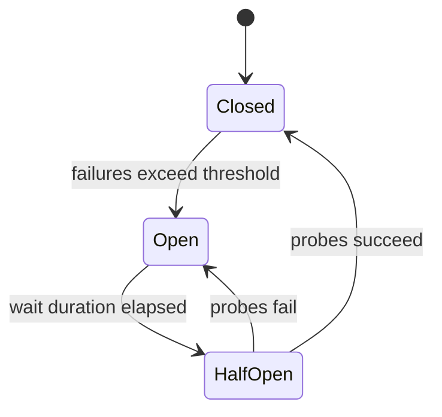

#### 1. Closed state

Requests allowed. Monitor successes, failures, response times.

Example: 100 requests — 98 success, 2 failure (2%) → stays **closed**.

#### 2. Open state

Threshold exceeded — e.g. 60 failures in 100 requests (60%) with 50% threshold.

```text
Order service ──X── payment service  (no outbound call)
```

Benefits: no timeout waits, less pressure on failing service, resources freed.

#### 3. Half-open state

After wait period, allow a **few** test requests.

- Success → **closed**
- Failure → **open** again

### Lifecycle example

```text
1. Payment healthy        → CLOSED
2. Failures increase
3. Threshold exceeded     → OPEN
4. Wait expires           → HALF-OPEN
5. Test requests succeed  → CLOSED
```

### Configuration concepts

| Parameter | Example | Meaning |
|-----------|---------|---------|
| **Failure rate threshold** | 50% | Open when failure rate exceeds this |
| **Minimum calls** | 10 | Need enough samples before tripping |
| **Time window** | 1 minute | Evaluate failures in sliding window |
| **Open state duration** | 30 seconds | Wait before half-open |
| **Half-open requests** | 5 | Probe calls allowed |

Example window: 40 success + 30 failure in 1 min → 42.8% failure rate.

### Request flow

**Healthy:**

```text
Order service → circuit breaker → payment service
```

**Failing (open):**

```text
Order service → circuit breaker → ✗ (immediate reject)
```

### Fallback

Alternative when circuit is open:

- Return message: “Payment temporarily unavailable”
- Use cached response
- Degraded feature path

```java
@CircuitBreaker(name = "paymentService", fallbackMethod = "fallback")
public PaymentResponse processPayment() { /* call payment */ }

public PaymentResponse fallback() {
    return new PaymentResponse("Payment service unavailable");
}
```

### Retry vs circuit breaker

See [resilience stack](#resilience-stack) in the chapter intro. Canonical breaker detail: this section; retry detail: [§8.17](#817-retry-pattern).

### Circuit breaker vs timeout

| | Timeout | Circuit breaker |
|---|---------|-----------------|
| **Limits** | Wait time **per** request | **Stops** calls after repeated failures |
| **Example** | Max 5 s per call | 50% failures → open |

Always pair timeouts with breakers — each failed call should fail quickly.

### Spring Boot / Resilience4j

Common stack: **Resilience4j** (Hystrix is legacy/deprecated).

```java
@CircuitBreaker(name = "paymentService", fallbackMethod = "fallback")
public PaymentResponse processPayment() { ... }
```

### Other implementations

| Library / platform |
|------------------|
| **Resilience4j** (Java) |
| **Netflix Hystrix** (legacy) |
| **Istio / Envoy** outlier detection ([§8.14](#814-service-mesh)) |
| **Polly** (.NET) |
| **go-resilience** (Go) |

### Circuit breaker in service mesh

```text
Application → Envoy sidecar → payment service
```

Breaker/outlier ejection configured on proxy — no app code; centralized policy ([§8.15](#815-sidecar-pattern)).

### Real-world e-commerce example

Checkout calls payment, inventory, notification.

Payment fails:

- **Without breaker:** checkout hangs; threads exhausted
- **With breaker:** payment fails fast + fallback; inventory/notification stay healthy

### Advantages

1. Prevents cascading failures
2. Reduces resource consumption
3. Faster failure detection
4. Automatic recovery (half-open)
5. Better user experience with fallbacks
6. Increased system stability

### Disadvantages

1. Additional complexity and tuning
2. Wrong thresholds → flapping or slow trip
3. Harder debugging (open vs real outage)
4. Users see errors unless fallback is designed

### When to use

- External and internal service calls
- Microservice communication
- Payment gateways, third-party APIs
- Network-dependent operations

### When not to use

- Local in-process calls
- Simple apps with no remote dependencies

### Summary

```text
Circuit Breaker = fail fast when dependency is unhealthy
States: CLOSED → OPEN → HALF-OPEN → CLOSED
Use with: timeouts, retries (§8.17), bulkheads (§8.18)
Principle: stop hammering a failing service; probe recovery
```

---


## 8.17 Retry Pattern

> **Circuit breaker:** [§8.16](#816-circuit-breaker) — retry transient failures; breaker stops when failures persist. **Idempotency:** [§7.20](../07-api-design/README.md#720-idempotency) / [§7.21](../07-api-design/README.md#721-idempotency-keys). **Isolation:** [§8.18](#818-bulkhead-pattern).

### What is the retry pattern?

The **retry pattern** automatically **re-attempts a failed operation** before declaring final failure.

**Purpose:** handle **transient** failures that may succeed after a short delay.

**Transient failure examples:**

- Network glitches
- Temporary service overload
- Connection timeouts
- DNS lookup issues
- Brief database unavailability
- Temporary message broker issues

### Why retry?

```text
Order service → payment service
```

A request fails due to network timeout or temporary overload.

| | Outcome |
|---|---------|
| **Without retry** | Error returned — service might recover milliseconds later |
| **With retry** | Attempt #1 fail → attempt #2 success — user never sees failure |

### How retry works

```text
Request → call service
            ├─ success → return result
            └─ failure → retry again
```

Repeat until **success** or **maximum retries** reached.

```text
Attempt #1 → fail → wait → attempt #2 → fail → wait → attempt #3 → success
```

### Common retry strategies

| Strategy | Description |
|----------|-------------|
| **1. Immediate** | Retry right away — simple, fast; can overload failing service |
| **2. Fixed delay** | Wait fixed time (e.g. 2 s) between attempts |
| **3. Exponential backoff** | Delay grows: `base × 2^retryCount` (1 s → 2 s → 4 s) |
| **4. Exponential + jitter** | Randomize delay — **recommended** for distributed systems |

#### Exponential backoff

```text
Attempt #1 fail → wait 1 s
Attempt #2 fail → wait 2 s
Attempt #3 fail → wait 4 s
Attempt #4 success
```

Reduces pressure on a struggling dependency — most widely used strategy.

#### Jitter — prevent retry storms

Without jitter, 1,000 clients retry at the same instants (1 s, 2 s, 4 s) → traffic spikes.

With jitter: client A 1.2 s, client B 1.8 s, client C 1.4 s → load spread over time.

### Types of failures

**Retry only transient failures.**

| Retryable | Non-retryable |
|-----------|---------------|
| Network timeout, connection reset | Invalid input, validation error |
| HTTP 503, 504 | HTTP 400, 401, 403 |
| Temporary DB / queue unavailability | Authentication / authorization failure |
| | Business rule violations |

**Bad retry:** `amount: -100` → `400 Bad Request` — retrying 10× still fails.

**Good retry:** valid payment → `503 Service Unavailable` — may succeed after delay.

### Typical configuration

| Parameter | Example |
|-----------|---------|
| Maximum attempts | 3 |
| Initial delay | 1 second |
| Backoff multiplier | 2 |

Result: attempt 1 → wait 1 s → attempt 2 → wait 2 s → attempt 3 → wait 4 s.

### Idempotency and retry

Retries may execute the **same operation multiple times**.

```text
Create payment — attempt #1 succeeds, response lost
Client retries → without idempotency: duplicate payment
With idempotency key: payment created once — safe retry
```

Safest for: **GET**, idempotent **PUT/DELETE**, operations with [idempotency keys](../07-api-design/README.md#721-idempotency-keys).

### Request flow

```text
Order service → retry component → payment service
                      ├─ retry on transient failure
                      └─ success
```

```mermaid
flowchart TB
    Call[Outbound call] --> OK{Success?}
    OK -->|Yes| Return[Return result]
    OK -->|No| Type{Transient?}
    Type -->|No| Fail[Fail immediately]
    Type -->|Yes| CB{Circuit open?}
    CB -->|Yes| Fast[Fail fast — §8.16]
    CB -->|No| Attempts{Attempts left?}
    Attempts -->|No| Fail
    Attempts -->|Yes| Wait[Backoff + jitter]
    Wait --> Call
```

### Retry with circuit breaker

Use the [resilience stack](#resilience-stack) from the chapter intro: **bulkhead → retry → circuit breaker**. Retry only when the breaker is **closed** — see [§8.16](#816-circuit-breaker).

### Spring Boot / Resilience4j

Common libraries: **Resilience4j**, **Spring Retry**.

```java
@Retry(name = "paymentService")
public PaymentResponse processPayment() { /* remote call */ }
```

**Resilience4j retry config (conceptual):**

| Setting | Example |
|---------|---------|
| Max attempts | 3 |
| Wait duration | 1 second |
| Retry exceptions | `TimeoutException`, `IOException` |

### Retry in message processing

```text
Consumer → process message → failure → retry (bounded)
```

**Kafka consumer:** retry N times, then **dead letter queue (DLQ)** for manual inspection.

### Advantages

1. Handles temporary failures
2. Improves reliability
3. Better user experience
4. Automatic recovery
5. Easy to implement

### Disadvantages

1. Increased latency (wait between attempts)
2. More network traffic
3. Risk of **retry storms** without jitter
4. Can overload a failing service
5. **Duplicate operations** if not idempotent

### Best practices

1. **Retry only transient failures** — classify errors explicitly
2. **Exponential backoff** — prefer `1s → 2s → 4s` over fixed `1s → 1s → 1s`
3. **Add jitter** — avoid synchronized retry waves
4. **Combine with circuit breaker** — retry when closed; fail fast when open
5. **Ensure idempotency** — especially for `POST` and message consumers

### When to use

- REST / gRPC calls between services
- Database connections
- Kafka and message queues
- External third-party APIs

### When not to use

- Validation errors
- Authentication / authorization failures
- Business rule violations
- Permanent failures that will not self-heal

See [§8.16](#816-circuit-breaker) and [resilience stack](#resilience-stack) for how retry fits with circuit breaker.

### Real-world example

Payment processing:

```text
Attempt #1 timeout → retry → attempt #2 timeout → retry → attempt #3 success
```

Customer experiences no failure.

### Summary

```text
Retry = automatically re-attempt operations that may succeed later
Best strategy: exponential backoff + jitter
Best combination: retry + circuit breaker + timeout
Principle: temporary failures should not immediately become user-visible failures
```

---


## 8.18 Bulkhead Pattern

> **Resilience stack:** [§8.17 Retry](#817-retry-pattern) → [§8.16 Circuit Breaker](#816-circuit-breaker) — bulkhead isolates **local** resources first. **Microservices:** [§8.3](#83-microservices).

### What is the bulkhead pattern?

The **bulkhead pattern** isolates resources into **separate pools** so failure in one part of the system does not bring down the entire application.

Inspired by **ship bulkheads** — watertight compartments. If one floods, the rest stay safe:

```text
+-------------------------------+
| Compartment A | Compartment B |
|    Flooded    |     Safe      |
+-------------------------------+
```

### Problem

```text
Order service
      ├─ payment service (slow)
      ├─ inventory service
      └─ notification service
```

Without isolation: threads block, connection pools exhaust, memory rises — **entire order service** becomes unresponsive. One failing dependency affects everything.

### Without bulkhead

```text
                    Order service
                           |
         +-----------------+-----------------+
         v                 v                 v
      Payment          Inventory        Notify

Shared thread pool = 100 threads
Payment requests occupy all 100
Inventory and notification get 0 → stop working
```

### With bulkhead

```text
Order service
      ├─ payment pool      (20 threads)
      ├─ inventory pool  (40 threads)
      └─ notification pool (40 threads)
```

Payment pool exhausted → inventory and notification **remain healthy**. Only one compartment affected.

### Core idea

Isolate critical resources:

- Threads
- Connection pools
- Queues
- Memory / CPU limits
- Service instances

| | Without isolation | With isolation |
|---|-------------------|----------------|
| **Model** | One shared pool (100 threads) | Dedicated pool per dependency |
| **Effect** | All services compete | Each dependency gets dedicated capacity |

### Types of bulkheads

#### 1. Thread pool bulkhead

Separate thread pools per dependency:

```text
Order service
      ├─ payment thread pool      (20)
      ├─ inventory thread pool    (40)
      └─ notification thread pool (40)
```

Failure in one pool cannot consume threads from another.

#### 2. Semaphore bulkhead

Limits **concurrent calls** without dedicated threads.

Example: max concurrent payment calls = 10. When limit reached → request **rejected** (no extra resources consumed).

```text
Semaphore limit = 5
Requests 1–5 → allowed
Request 6   → rejected
```

#### Thread pool vs semaphore

| Feature | Thread pool | Semaphore |
|---------|-------------|-----------|
| Isolation | Strong | Medium |
| Resource usage | Higher | Lower |
| Complexity | Higher | Lower |
| Concurrency control | Yes | Yes |
| Dedicated threads | Yes | No |

### Real-world e-commerce example

Order service depends on payment, inventory, recommendation.

| | Without bulkhead | With bulkhead |
|---|------------------|---------------|
| Payment slow | All threads blocked | Payment pool (20) saturated only |
| Result | Inventory + recommendations down | Inventory (40) + recommendations (40) still work |

### Request flow

```text
Client → order service
              ├─ payment bulkhead
              ├─ inventory bulkhead
              └─ notification bulkhead
```

```mermaid
flowchart TB
    App[Order service] --> PoolA["Bulkhead: payment"]
    App --> PoolB["Bulkhead: inventory"]
    App --> PoolC["Bulkhead: notification"]
    PoolA --> Pay[Payment API]
    PoolB --> Inv[Inventory API]
    PoolC --> Notify[Notification API]
```

### Combined resilience patterns

**Typical stack** (outer → inner):

```text
Order service → bulkhead → retry → circuit breaker → payment service
```

| Pattern | Role |
|---------|------|
| **Bulkhead** [this section] | Protect **local** resources (threads, connections) |
| **Retry** [§8.17](#817-retry-pattern) | Handle **transient** failures |
| **Circuit breaker** [§8.16](#816-circuit-breaker) | **Fail fast** on persistent remote failure |

Examples:

- Payment **down** → circuit breaker opens → fail fast
- Payment **slow** → bulkhead caps resource use → other dependencies stay healthy

### In microservices

Each external dependency often gets:

- Dedicated thread pool
- Dedicated connection pool
- Dedicated timeout configuration

### Database example

| | Without bulkhead | With bulkhead |
|---|------------------|---------------|
| Shared pool (100) | Analytics queries consume all connections | Transactional pool = 80, analytics pool = 20 |
| Result | Transactional ops fail | Analytics cannot starve critical paths |

### Kubernetes example

Resource isolation per workload:

| Workload | CPU | Memory |
|----------|-----|--------|
| Payment pods | 2 | 4 GB |
| Inventory pods | 2 | 4 GB |
| Notification pods | 1 | 2 GB |

### Resilience4j bulkhead

Common Java library: **Resilience4j** — `SemaphoreBulkhead` and `ThreadPoolBulkhead`.

```java
@Bulkhead(name = "paymentService", type = Bulkhead.Type.SEMAPHORE)
public PaymentResponse processPayment() { /* remote call */ }
```

### Advantages

1. Prevents cascading failures
2. Protects critical resources
3. Improves system stability
4. Better fault isolation
5. Improves availability
6. Limits impact of slow services

### Disadvantages

1. More configuration and capacity planning
2. Additional resource management (memory per pool)
3. Possible request rejection when pool saturated
4. Wrong sizing → starvation within a bulkhead

### Best practices

1. **Isolate critical dependencies** — separate pools per downstream
2. **Separate connection pools** per destination
3. **Configure timeouts** per bulkhead path
4. **Combine with circuit breakers** — local isolation + remote fail-fast
5. **Monitor pool utilization** — alert before saturation
6. **Avoid oversized pools** — more threads ≠ more throughput if DB is the bottleneck

### When to use

- Multiple external dependencies
- Microservices with high traffic
- Shared resources that can be exhausted
- High availability requirements

Examples: banking, e-commerce, payment gateways, trading systems.

### When not to use

- Small apps with few dependencies
- No meaningful shared resource contention

Comparison with retry and circuit breaker: [resilience stack](#resilience-stack) in the chapter intro.

### Summary

```text
Bulkhead = divide resources into independent compartments

Without: one slow dependency → entire application impacted
With:    payment pool saturated → inventory + notification healthy

Stack: bulkhead → retry → circuit breaker → target service
Principle: isolate resources so one failure cannot consume all system capacity
```

---


## 8.19 Saga Pattern

> **Execution styles:** [§8.20 Choreography](#820-choreography) (events, no coordinator) · [§8.21 Orchestration](#821-orchestration) (central coordinator). **Idempotency:** [§7.20](../07-api-design/README.md#720-idempotency) / [§7.21](../07-api-design/README.md#721-idempotency-keys).

### What is the saga pattern?

The **saga pattern** manages **distributed transactions** across microservices **without** a traditional global transaction (2PC).

**Core idea:**

| Instead of | Use |
|------------|-----|
| One global transaction → commit/rollback everywhere | Multiple **local transactions** + **compensating transactions** for rollback |

There is no global lock; consistency across services is **eventual**.

### Why saga?

**Monolith** — single database:

```text
BEGIN → update orders, payment, inventory → COMMIT (or ROLLBACK)
```

**Microservices** — each service has its own DB:

```text
Order service → Order DB
Payment service → Payment DB
Inventory service → Inventory DB
```

ACID across all three is slow, complex, and poorly scalable. Saga replaces it.

### Problem

Customer places an order:

```text
1. Create order
2. Reserve inventory
3. Process payment
4. Create shipment
```

```text
Order → inventory → payment → shipping
```

If payment fails after inventory succeeds — you need rollback, but there is **no global transaction**.

| Monolith | Microservices |
|----------|---------------|
| `ROLLBACK` undoes everything automatically | Order DB updated, inventory DB updated, payment failed — need another mechanism |

### Saga solution

A saga is a **sequence of local transactions**. Each successful step has a corresponding **compensating transaction**.

**Happy path:**

```text
Create order → reserve inventory → process payment → create shipment
```

**Failure path (payment fails):**

```text
Release inventory → cancel order
```

### Key concepts

| Concept | Meaning |
|---------|---------|
| **Local transaction** | Commit within one service and its DB |
| **Compensating transaction** | Semantic undo of a completed step |
| **Saga coordinator** | Optional — central orchestrator ([§8.21](#821-orchestration)) |
| **Event-driven workflow** | Services react to events ([§8.20](#820-choreography)) |

#### Local transaction examples

| Service | Forward action |
|---------|----------------|
| Order | Create order → commit |
| Inventory | Reserve inventory → commit |
| Payment | Charge payment → commit |

Each service manages its own database.

#### Compensating transaction examples

| Forward | Compensate |
|---------|------------|
| Reserve inventory | Release inventory |
| Create order | Cancel order |
| Create shipment | Cancel shipment |

Compensation is **application-defined** — not automatic like SQL `ROLLBACK`. Some steps are hard to undo (email sent, goods shipped).

### Saga execution models

Two main approaches — see dedicated sections for depth:

| | [Choreography](#820-choreography) | [Orchestration](#821-orchestration) |
|---|-----------------------------------|-------------------------------------|
| **Coordinator** | None — event reactions | Central orchestrator |
| **Communication** | Domain events | Commands + replies |
| **Pros** | Decoupled, no coordinator SPOF | Visible workflow, easier debugging |
| **Cons** | Hard to trace, complex event chains | Extra component, possible bottleneck |

Full flows, diagrams, and trade-offs: [§8.20](#820-choreography) · [§8.21](#821-orchestration).

### E-commerce example

| Step | Service | Action |
|------|---------|--------|
| 1 | Order | Create order — status `PENDING` |
| 2 | Inventory | Reserve stock |
| 3 | Payment | Charge customer |
| 4 | Shipping | Create shipment → order `COMPLETED` |

**Failure after step 2:** release inventory, cancel order → order `CANCELLED`, inventory restored.

```mermaid
sequenceDiagram
    participant O as Order service
    participant I as Inventory service
    participant P as Payment service

    O->>O: Create order (PENDING)
    O->>I: Reserve stock
    I-->>O: OK
    O->>P: Charge card
    P-->>O: FAIL
    O->>I: Compensate: release reservation
    O->>O: Compensate: cancel order
```

### Saga state transitions

**Success path:**

```text
STARTED → ORDER_CREATED → INVENTORY_RESERVED → PAYMENT_COMPLETED → SHIPPING_CREATED → COMPLETED
```

**Failure path:**

```text
PAYMENT_FAILED → RELEASE_INVENTORY → CANCEL_ORDER → FAILED
```

```mermaid
stateDiagram-v2
    [*] --> OrderCreated
    OrderCreated --> InventoryReserved: reserve OK
    InventoryReserved --> PaymentCompleted: charge OK
    PaymentCompleted --> ShipmentCreated: ship OK
    ShipmentCreated --> Completed
    InventoryReserved --> ReleaseInventory: charge FAIL
    ReleaseInventory --> Cancelled
    Completed --> [*]
    Cancelled --> [*]
```

### Events in saga

Examples: `OrderCreated`, `InventoryReserved`, `InventoryReleased`, `PaymentCompleted`, `PaymentFailed`, `ShipmentCreated`, `OrderCancelled`.

Use a stable **`saga_id`** / correlation ID in every event, log, and trace.

### Common technologies

**Messaging (choreography):**

| Platform |
|----------|
| **Apache Kafka** |
| **RabbitMQ** |
| **AWS SQS / SNS** |

**Orchestration frameworks:**

| Framework |
|-----------|
| **Temporal** |
| **Camunda / Zeebe** |
| **Netflix Conductor** |

### Saga vs 2PC

| | Saga | 2PC |
|---|------|-----|
| Scalability | High | Low |
| Performance | High | Lower |
| Availability | High | Lower |
| Coupling | Loose | Tight |
| Microservices fit | Excellent | Poor |
| Rollback | Compensation | Transaction rollback |

### Saga vs ACID transaction

| | ACID transaction | Saga |
|---|------------------|------|
| Consistency | Immediate | Eventual |
| Database | Single | Multiple |
| Rollback | Automatic | Compensation-based |

### Eventual consistency

During execution, data may be temporarily inconsistent:

```text
Order created → inventory reserved → payment pending
```

Eventually: all steps succeed **or** compensations run and the system converges to a consistent state.

### Challenges

1. Complex compensation logic (refunds async; irreversible side effects)
2. Event ordering issues
3. Duplicate events — require idempotency
4. Monitoring complexity (especially choreography)
5. Partial compensation failure — retries, timeouts, manual intervention

### Best practices

1. **Design idempotent operations** — [§7.21](../07-api-design/README.md#721-idempotency-keys)
2. **Keep local transactions small**
3. **Define compensation early** for each forward step
4. **Use reliable messaging** (outbox pattern, at-least-once + dedup)
5. **Monitor saga state** — alert on stuck `PENDING` sagas

### When to use

- Microservices with multiple databases
- Distributed business processes
- Event-driven systems
- Long-running workflows

Examples: order processing, payments, travel booking, insurance claims, banking.

### When not to use

- Monolith with single database
- Simple CRUD with no cross-service transaction

### Real-world example — travel booking

```text
Book flight → reserve hotel → reserve car → payment
```

Payment fails → compensate: cancel flight, hotel, car.

### Summary

```text
Saga = local transactions + compensating actions → eventual consistency

Success: create order → reserve inventory → process payment → create shipment
Failure: payment failed → release inventory → cancel order

Principle: replace global transactions with local commits and semantic undo
```

---


## 8.20 Choreography

> **Saga hub:** [§8.19](#819-saga-pattern) — local transactions, compensation, eventual consistency. **Alternative:** [§8.21 Orchestration](#821-orchestration) (central coordinator).

### What is choreography-based saga?

**Choreography** implements a saga through **events** — each service listens and reacts. There is **no central coordinator**.

```text
Order service → OrderCreated event → inventory service → InventoryReserved event → payment service → …
```

Each service owns its step and publishes the next event when its local transaction commits.

### Architecture

```text
Order service
      |
      | OrderCreated
      v
Inventory service
      |
      | InventoryReserved
      v
Payment service
      |
      | PaymentCompleted
      v
Shipping service
```

```mermaid
flowchart LR
    O[Order service] -->|OrderCreated| Bus[Event bus]
    Bus --> I[Inventory service]
    I -->|InventoryReserved| Bus
    Bus --> P[Payment service]
    P -->|PaymentCompleted| Bus
    Bus --> S[Shipping service]
```

### Success flow

```text
Order created → inventory reserved → payment completed → shipment created → saga completed
```

### Failure flow

```text
Order created → inventory reserved → payment failed
```

**Compensation via events** (reverse semantic undo):

```text
InventoryReleased → OrderCancelled
```

```mermaid
flowchart LR
    P[Payment service] -->|PaymentFailed| Bus[Event bus]
    Bus --> I[Inventory: release stock]
    Bus --> O[Order: cancel]
    I -->|InventoryReleased| Bus
    O -->|OrderCancelled| Bus
```

Services that completed earlier steps subscribe to failure events and run their **compensating transactions** locally.

### How it works (step by step)

1. Order service commits order locally → publishes `OrderCreated` (with `saga_id`).
2. Inventory consumes event → reserves stock → publishes `InventoryReserved` or `ReservationFailed`.
3. Payment consumes success event → charges → publishes `PaymentCompleted` or `PaymentFailed`.
4. Order service listens for terminal events → updates order status.
5. On failure events, downstream/upstream services publish compensations (`InventoryReleased`, `OrderCancelled`).

### Events in choreography

| Event | Typical publisher |
|-------|-------------------|
| `OrderCreated` | Order service |
| `InventoryReserved` / `InventoryReleased` | Inventory service |
| `PaymentCompleted` / `PaymentFailed` | Payment service |
| `ShipmentCreated` | Shipping service |
| `OrderCancelled` | Order service |

Require **idempotent consumers** and a stable **`saga_id`** on every message — [§7.21](../07-api-design/README.md#721-idempotency-keys).

### Common messaging platforms

| Platform |
|----------|
| **Apache Kafka** |
| **RabbitMQ** |
| **AWS SQS / SNS** |

Use schema registry / versioned contracts; pair local DB commit with **outbox pattern** before publishing.

### Advantages

1. No central coordinator — no orchestrator SPOF
2. Highly decoupled services
3. Natural fit for event-driven architecture
4. Teams own services end-to-end
5. Scales well for high-throughput async pipelines

### Disadvantages

1. Hard to see full saga state — “where is order X?” needs distributed trace + event log
2. Complex debugging as event chains grow
3. Compensating flows **scatter** across subscribers
4. Adding a step often means updating **multiple** services
5. Risk of cyclic or ambiguous event chains without strict contracts

### When to use

- Simple to moderate flows (roughly 2–6 steps)
- Mature event platform and schema discipline
- Teams want autonomy without a workflow engine
- Loose coupling more important than centralized visibility

### When not to use

- Complex branching, timers, or human approval steps — prefer [§8.21](#821-orchestration)
- Need a single pane for in-flight workflow state
- Compensation logic is hard to express as pure event reactions

### Best practices

1. **Correlation ID** (`saga_id`) on every event, log, and span
2. **Idempotent handlers** — at-least-once delivery is normal
3. **Explicit event contracts** — avoid implicit “if this then that” across teams
4. **Compensation events** designed up front alongside forward events
5. **Distributed tracing** — mandatory for operability

Style comparison: [Saga execution styles](#saga-execution-styles) in the chapter intro · [§8.21 Orchestration](#821-orchestration).

### Summary

```text
Choreography = saga via events, no central boss
Success: services chain forward events after local commits
Failure: compensation events undo prior steps
Principle: each service knows only its events — design contracts carefully
```

---


## 8.21 Orchestration

> **Saga hub:** [§8.19](#819-saga-pattern) — local transactions, compensation, eventual consistency. **Alternative:** [§8.20 Choreography](#820-choreography) (event-driven, no coordinator).

### What is orchestration-based saga?

**Orchestration** implements a saga with a **central coordinator** (orchestrator) that **commands** each service step-by-step and drives **compensation** on failure.

The orchestrator holds (or persists) workflow state; services execute local transactions when told.

### Architecture

```text
                +------------------+
                | Saga orchestrator|
                +------------------+
                         |
         +---------------+---------------+
         v               v               v
    Order service   Inventory service  Payment service
```

```mermaid
sequenceDiagram
    participant Orch as Saga orchestrator
    participant O as Order service
    participant I as Inventory service
    participant P as Payment service
    participant S as Shipping service

    Orch->>O: createOrder
    O-->>Orch: OK
    Orch->>I: reserveInventory
    I-->>Orch: OK
    Orch->>P: processPayment
    P-->>Orch: OK
    Orch->>S: createShipment
    S-->>Orch: OK
    Note over Orch: Saga COMPLETED
```

### Success flow

```text
Orchestrator → create order → reserve inventory → process payment → create shipment → saga completed
```

Each step: orchestrator sends command → service runs **local transaction** → replies success/failure → orchestrator advances state.

### Failure flow

```text
Orchestrator → create order → reserve inventory → process payment → FAIL
```

**Compensation** (orchestrator-driven, typically reverse order):

```text
Release inventory → cancel order → saga FAILED
```

```mermaid
sequenceDiagram
    participant Orch as Saga orchestrator
    participant O as Order service
    participant I as Inventory service
    participant P as Payment service

    Orch->>O: createOrder
    O-->>Orch: OK
    Orch->>I: reserveInventory
    I-->>Orch: OK
    Orch->>P: processPayment
    P-->>Orch: FAIL
    Orch->>I: releaseInventory (compensate)
    I-->>Orch: OK
    Orch->>O: cancelOrder (compensate)
    O-->>Orch: OK
```

### How it works (step by step)

1. Client starts saga at orchestrator (or order service triggers workflow).
2. Orchestrator calls inventory: reserve — waits for reply.
3. On success, calls payment: charge.
4. On payment failure, orchestrator runs compensate sequence: release inventory, cancel order.
5. Orchestrator **persists state** between steps (durable workflows survive restarts).

### Orchestration frameworks

| Framework | Notes |
|-----------|-------|
| **Temporal** | Durable workflows, timers, retries built-in |
| **Camunda / Zeebe** | BPMN, human tasks |
| **Netflix Conductor** | JSON-defined workflows |

Messaging for choreography is optional here — orchestrator typically uses **synchronous commands** (HTTP/gRPC) or task queues with explicit callbacks.

### Advantages

1. **Easy monitoring** — single view of in-flight sagas
2. **Centralized workflow** — branching, timeouts, retries in one place
3. **Easier debugging** — “order 123 is on step 3” is explicit
4. Compensation sequence is **explicit** in orchestrator code
5. Better for long-running processes with timers or human steps

### Disadvantages

1. **Additional component** to build, deploy, and operate
2. Orchestrator can become a **bottleneck** or SPOF — must run HA with durable state
3. **Tighter coupling** — services expose APIs the orchestrator calls
4. Risk of **fat orchestrator** accumulating business logic that belongs in domain services

### When to use

- Complex sagas with branching, parallel steps, or timers
- Human approval or long-running business processes
- Need centralized dashboard for stuck / in-flight workflows
- Compensation hard to express as a pure event chain ([§8.20](#820-choreography))

### When not to use

- Simple linear event pipelines where teams prefer full autonomy
- Cannot operate a reliable, HA workflow engine
- Very high fan-out where central coordination does not scale

### Best practices

1. Keep orchestrator **thin** — workflow coordination only; business rules stay in services
2. Run orchestrator **HA** with durable state (Temporal, Camunda handle this)
3. **Idempotent** service endpoints — orchestrator will retry steps
4. Define compensation in workflow code alongside forward steps
5. Alert on sagas stuck past SLA; support manual intervention

Style comparison: [Saga execution styles](#saga-execution-styles) in the chapter intro · [§8.20 Choreography](#820-choreography).

### Summary

```text
Orchestration = central coordinator drives saga steps and compensation
Success: orchestrator commands each local transaction in sequence
Failure: orchestrator runs explicit compensate steps
Principle: trade decoupling for visibility and control
```

---

[<- Back to master index](../README.md)
