# 8. Microservices

> Status: **Documented**

[<- Back to master index](../README.md)

---

## Overview

**Microservices** decompose an application into independently deployable services aligned to business capabilities - each owning its data, scaling on its own cadence, and communicating over networks (HTTP, gRPC, events). The alternative spectrum runs from **monoliths** (single deployable) through **modular monoliths** (logical modules, physical unity) to fine-grained services.

Success requires more than splitting code: **service discovery**, **resilience patterns** (circuit breaker, bulkhead, retry), **distributed workflows** (saga), and **observability** become mandatory. **Domain-Driven Design (DDD)** and architectural styles (hexagonal, clean, onion) guide boundaries so services don't become distributed balls of mud.

This chapter covers when to split, how services find each other, mesh-based infrastructure, failure containment, saga orchestration vs choreography, migration patterns (strangler, BFF), and structural architectures for maintainable service code.

---

## Sub-topics

| # | Sub-topic | Status |
|---|-----------|--------|
| 8.1 | [Monolith](#81-monolith) | Done |
| 8.2 | [Modular Monolith](#82-modular-monolith) | Done |
| 8.3 | [Microservices](#83-microservices) | Done |
| 8.4 | [Strangler Pattern](#84-strangler-pattern) | Done |
| 8.5 | [BFF Pattern](#85-bff-pattern) | Done |
| 8.6 | [DDD](#86-ddd) | Done |
| 8.7 | [Bounded Context](#87-bounded-context) | Done |
| 8.8 | [Hexagonal Architecture](#88-hexagonal-architecture) | Done |
| 8.9 | [Clean Architecture](#89-clean-architecture) | Done |
| 8.10 | [Onion Architecture](#810-onion-architecture) | Done |
| 8.11 | [Dependency Injection](#811-dependency-injection) | Done |
| 8.12 | [Service Registry](#812-service-registry) | Done |
| 8.13 | [Service Discovery](#813-service-discovery) | Done |
| 8.14 | [Service Mesh](#814-service-mesh) | Done |
| 8.15 | [Sidecar Pattern](#815-sidecar-pattern) | Done |
| 8.16 | [Circuit Breaker](#816-circuit-breaker) | Done |
| 8.17 | [Retry Pattern](#817-retry-pattern) | Done |
| 8.18 | [Bulkhead Pattern](#818-bulkhead-pattern) | Done |
| 8.19 | [Saga Pattern](#819-saga-pattern) | Done |
| 8.20 | [Choreography](#820-choreography) | Done |
| 8.21 | [Orchestration](#821-orchestration) | Done |


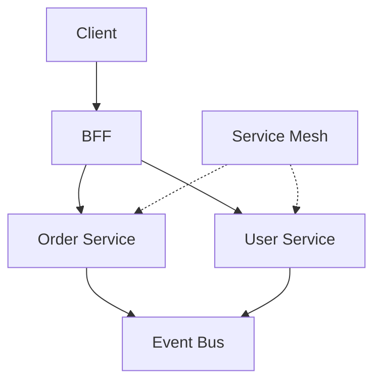

---


## Reading order

Sub-topics are sequenced for progressive learning: foundations first, then related concepts, then specialized topics.

| Group | Sections | Focus |
|-------|----------|-------|
| **1. Architecture evolution** | 8.1-8.5 | Monolith -> microservices, strangler, BFF |
| **2. Domain design** | 8.6-8.11 | DDD, bounded context, layered architectures |
| **3. Runtime platform** | 8.12-8.15 | Discovery, mesh, sidecar |
| **4. Resilience and sagas** | 8.16-8.21 | Breaker, retry, bulkhead, saga patterns |

---
---

## 8.1 Monolith


### What is it?

A **monolith** is a single deployable unit containing all application functionality - one codebase, one process (or clustered replicas of the same binary), typically one shared database.

### Why it matters

Simplest operational model: one build, one deploy, in-process calls, ACID transactions across modules. Most products should start here.

### How it works

1. All features compile into one artifact (JAR, binary).
2. Modules call each other via function invocations.
3. Shared database with foreign keys across domains.
4. Scale by running multiple instances behind load balancer.
5. Deploy entire unit on every release.

### Diagram

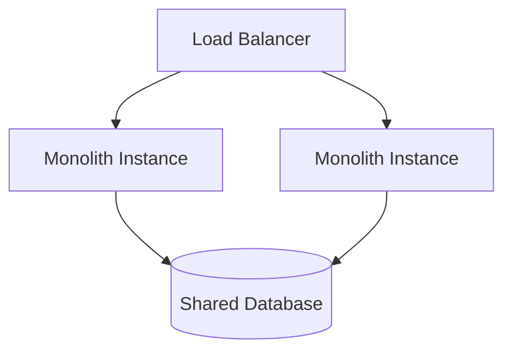

### Key details

| Advantage | Limitation |
|-----------|------------|
| Simple debugging | Scale all or nothing |
| ACID transactions | Deploy coupling |
| Low latency calls | Technology lock-in |
| Easy local dev | Blast radius on failure |

### When to use

- New products and startups proving product-market fit.
- Small teams (< 10 engineers) without clear domain splits.
- Low operational maturity - avoid microservices tax.

### Trade-offs / Pitfalls

- Codebase grows -> compile times, cognitive load, "big ball of mud".
- One slow module can starve threads for entire app.
- Premature microservice split is worse than disciplined monolith.

### References

*(No curated references for this sub-topic in `_topics.json`.)*

---


## 8.2 Modular Monolith


### What is it?

A **modular monolith** keeps one deployable but enforces **strict module boundaries** - packages with explicit APIs, no cross-module DB access, potential to extract modules into services later.

### Why it matters

Best of both worlds for many teams: monolith ops simplicity with microservice-ready boundaries when scale or org structure demands split.

### How it works

1. Divide codebase into modules by bounded context (orders, billing).
2. Modules communicate only through public interfaces (Java modules, packages).
3. Each module owns its tables; no foreign keys across module schemas.
4. Integration events for cross-module async needs.
5. Extract hottest module to service when metrics justify.

### Diagram

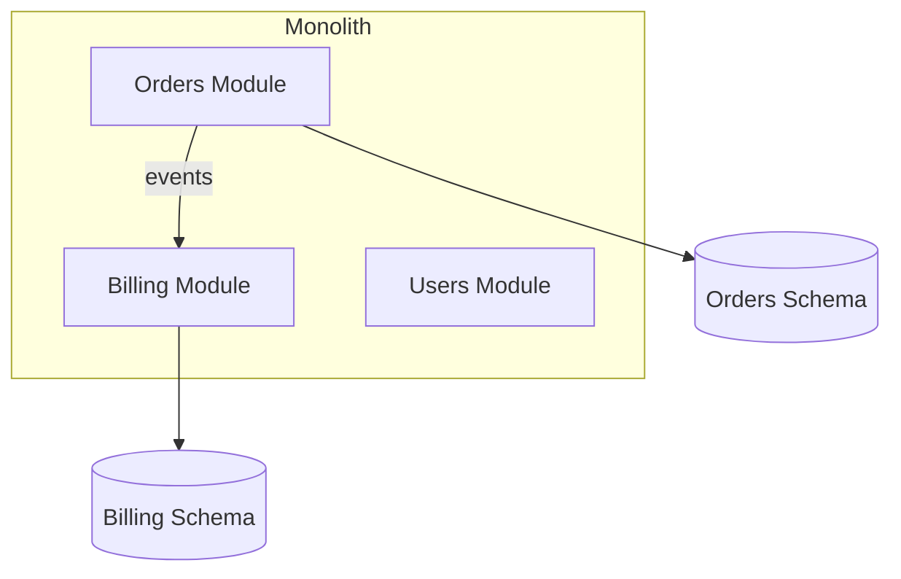

### Key details

- Spring Modulith, Gradle modules, ArchUnit tests enforce boundaries.
- Cheaper than microservices; rehearsal for eventual extraction.
- Shared runtime still means correlated failures.

### When to use

- Growing monolith with clear domains but not ready for distributed ops.
- Team wants to defer microservices until extraction trigger clear.

### Trade-offs / Pitfalls

- Boundaries erode without tooling enforcement - becomes "folders monolith".
- Still single scaling unit; can't scale billing independently yet.
- Extraction requires finishing modularization debt first.

### References

*(No curated references for this sub-topic in `_topics.json`.)*

---


## 8.3 Microservices


### What is it?

**Microservices** are independently deployable services, each implementing a business capability, owning private data, and communicating via well-defined APIs or events.

### Why it matters

Enables team autonomy, polyglot stacks, independent scaling, and fault isolation - when organizational scale and operational maturity justify distributed complexity.

### How it works

1. Identify bounded contexts (DDD) as service candidates.
2. Each service has own database (database-per-service).
3. Sync calls (REST/gRPC) or async events for integration.
4. CI/CD pipeline per service; container orchestration (K8s).
5. Shared platform: discovery, mesh, observability, gateway.

### Diagram

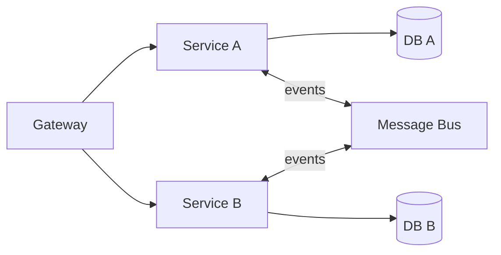

### Key details

- Conway's Law: service boundaries mirror team structure.
- Distributed transactions avoided - sagas and eventual consistency.
- "Micro" refers to scope of responsibility, not lines of code.

### When to use

- Multiple teams needing independent release cycles.
- Different scaling profiles per domain (search vs billing).
- Mature DevOps, observability, and platform engineering.

### Trade-offs / Pitfalls

- Distributed debugging, data consistency, and integration testing harder.
- Latency and partial failure on every cross-service call.
- Nano-services anti-pattern: too many tiny services -> ops nightmare.

### References

*(No curated references for this sub-topic in `_topics.json`.)*

---


## 8.4 Strangler Pattern


### What is it?

The **strangler fig pattern** incrementally replaces a legacy monolith by routing slices of traffic to new microservices - growing new system around old until monolith can be decommissioned.

### Why it matters

Low-risk migration path vs big-bang rewrite; delivers value incrementally while legacy still runs.

### How it works

1. Place facade/proxy (API gateway) in front of monolith.
2. Implement new service for one feature (e.g., notifications).
3. Gateway routes `/notifications/*` to new service; rest to monolith.
4. Repeat feature by feature; extract data via CDC or dual-write.
5. Retire monolith modules when traffic and data fully migrated.

### Diagram

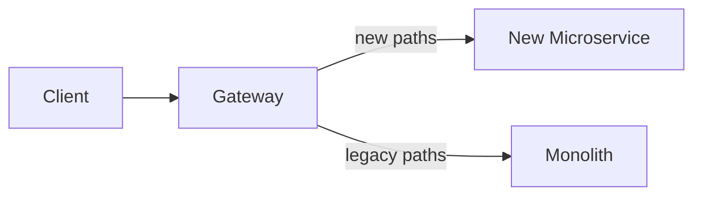

### Key details

- Anti-corruption layer translates between old and new models.
- Data sync hardest part - CDC, strangler data pump, or temporary dual-write.
- Feature flags control routing percentage for canary extraction.

### When to use

- Large legacy system unmaintainable but business cannot stop.
- Gradual modernization with measurable milestones.
- Team learning microservices while shipping features.

### Trade-offs / Pitfalls

- Long transition period maintaining two systems.
- Data inconsistency during dual-running phase.
- "Strangler" never finishes if scope creep adds features to monolith.

### References

*(No curated references for this sub-topic in `_topics.json`.)*

---


## 8.5 BFF Pattern


### What is it?

**Backend for Frontend (BFF)** is a dedicated API layer per client type (web, mobile, IoT) that aggregates and shapes backend microservice responses for that client's specific needs.

### Why it matters

Mobile and web need different payloads and aggregation; one generic API forces compromises. BFF keeps core services client-agnostic.

### How it works

1. Mobile BFF and Web BFF deploy as separate services.
2. Each calls internal microservices (gRPC/REST).
3. Aggregates parallel fetches; trims fields for mobile bandwidth.
4. Handles client-specific auth token exchange.
5. Core domain services expose generic contracts, not UI-driven shapes.

### Diagram

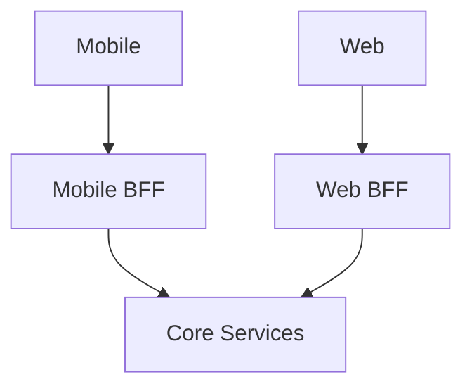

### Key details

- Not a god-service - thin orchestration only, no domain ownership.
- GraphQL can serve BFF role with single graph per client.
- Team ownership often follows client team (mobile team owns mobile BFF).

### When to use

- Multiple client platforms with diverging API needs.
- Reduce chatty client calls via server-side aggregation.
- Different release cadence for client-specific API tweaks.

### Trade-offs / Pitfalls

- N BFFs -> duplication risk; share aggregation libraries.
- BFF becomes dumping ground for business logic - enforce thin boundary.
- Extra hop adds latency - co-locate with gateway or services.

### References

*(No curated references for this sub-topic in `_topics.json`.)*

---


## 8.6 DDD


### What is it?

**Domain-Driven Design (DDD)** is an approach aligning software structure with business domain - ubiquitous language, bounded contexts, aggregates, and strategic design for complex domains.

### Why it matters

Microservice boundaries drawn around org chart fail; DDD draws them around **domain** boundaries where language and rules are cohesive.

### How it works

1. Collaborate with domain experts; define ubiquitous language.
2. Identify bounded contexts (sales, shipping, billing).
3. Model aggregates as consistency boundaries inside contexts.
4. Map context relationships (shared kernel, anti-corruption layer).
5. Implement each bounded context as module or service.

### Diagram

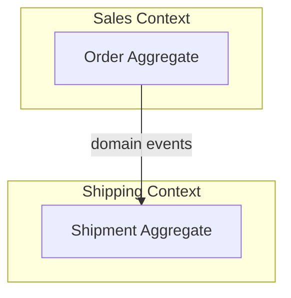

### Key details

- **Tactical:** entities, value objects, aggregates, repositories, domain events.
- **Strategic:** context map, subdomain classification (core/supporting/generic).
- Not every project needs full DDD ceremony - scale rigor to complexity.

### When to use

- Complex business rules with expert stakeholders.
- Defining microservice boundaries in ambiguous domains.
- Legacy modernization needing shared vocabulary.

### Trade-offs / Pitfalls

- Over-engineering simple CRUD with DDD patterns.
- Bounded contexts misidentified -> wrong service splits.
- Requires ongoing domain expert access - not one-time workshop.

### References

*(No curated references for this sub-topic in `_topics.json`.)*

---


## 8.7 Bounded Context


### What is it?

A **bounded context** is a boundary within which a domain model and ubiquitous language are consistent. Same word ("customer") may mean different things in different contexts.

### Why it matters

Primary unit for microservice decomposition - one bounded context -> one service (ideally). Prevents leaky shared models across domains.

### How it works

1. Map business capabilities and team ownership.
2. Draw context boundaries where terminology or rules diverge.
3. Define integration: published language, ACL for legacy.
4. Each context owns its persistence and APIs.
5. Sync via events or explicit translation at boundaries.

### Diagram

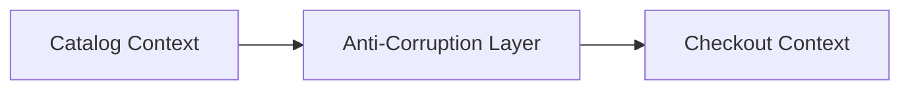

### Key details

- Context map documents relationships: upstream/downstream, conformist, ACL.
- Shared kernel only for truly stable tiny shared model - use sparingly.
- "Customer" in CRM ≠ "Customer" in billing - don't unify prematurely.

### When to use

- Any microservice boundary discussion.
- Resolving "should this be one service or two?" debates.

### Trade-offs / Pitfalls

- Contexts too large -> mini-monolith; too small -> distributed mud.
- Ignoring context map -> accidental tight coupling via shared DB.
- Integration without ACL spreads legacy model corruption.

### References

*(No curated references for this sub-topic in `_topics.json`.)*

---


## 8.8 Hexagonal Architecture


### What is it?

**Hexagonal architecture** (ports and adapters) places **domain logic at the center**, surrounded by **ports** (interfaces) and **adapters** (implementations) for HTTP, DB, messaging.

### Why it matters

Testable domain without framework coupling; swap infrastructure (Postgres -> Mongo, REST -> gRPC) without touching business rules.

### How it works

1. Define domain entities and use cases in core (no framework imports).
2. **Inbound ports:** application service interfaces called by controllers.
3. **Outbound ports:** repository, event publisher interfaces.
4. **Adapters:** REST controller, JPA repository implement ports.
5. Dependency direction always points inward toward domain.

### Diagram

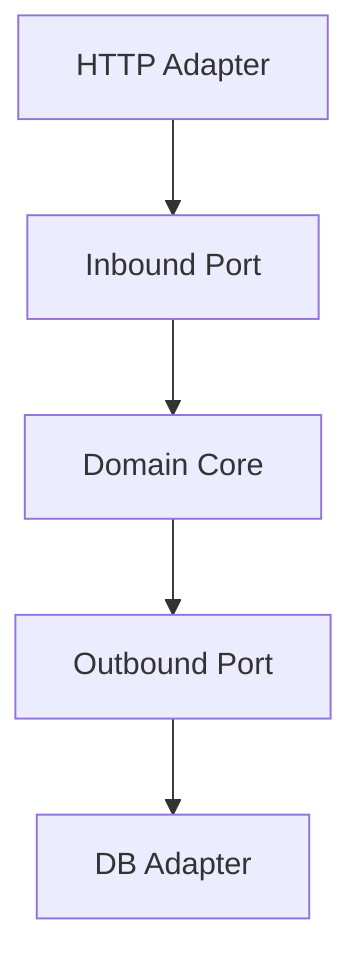

### Key details

- Same idea as clean/onion - terminology differs (ports/adapters).
- Enables contract tests on domain without spinning HTTP server.
- Anti-corruption layer is outbound adapter translating external models.

### When to use

- Services with non-trivial domain logic worth isolating.
- Multiple inbound channels (REST + events + CLI) sharing core.
- Long-lived services expecting infrastructure churn.

### Trade-offs / Pitfalls

- Boilerplate interfaces for simple CRUD services - YAGNI risk.
- Team must discipline against domain importing Spring annotations.
- Mapping between domain and DTOs adds code.

### References

*(No curated references for this sub-topic in `_topics.json`.)*

---


## 8.9 Clean Architecture


### What is it?

**Clean architecture** (Uncle Bob) organizes code in concentric rings: entities -> use cases -> interface adapters -> frameworks. Dependency rule: inner layers know nothing of outer layers.

### Why it matters

Framework-agnostic business logic; microservices benefit from testable use cases independent of HTTP and ORM details.

### How it works

1. **Entities:** enterprise business rules.
2. **Use cases:** application-specific orchestration (interactors).
3. **Interface adapters:** controllers, presenters, gateways.
4. **Frameworks:** Spring, DB drivers at outer edge.
5. Data crosses boundaries via simple DTOs or domain objects - not framework types.

### Diagram

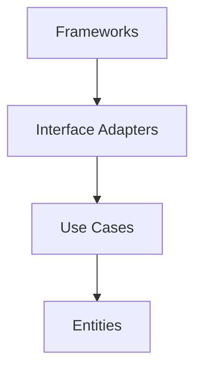

### Key details

- Use case class per application operation (`PlaceOrderUseCase`).
- Presenter pattern formats output for HTTP vs CLI.
- Overlaps heavily with hexagonal - often used interchangeably in practice.

### When to use

- Complex application logic deserving isolated unit tests.
- Teams following Uncle Bob / SOLID training.
- Services expected to outlive specific framework versions.

### Trade-offs / Pitfalls

- Ceremony for simple services - judge by domain complexity.
- Anemic domain model if use cases hold all logic and entities are bags.
- Circular dependency fights if dependency rule not enforced in reviews.

### References

*(No curated references for this sub-topic in `_topics.json`.)*

---


## 8.10 Onion Architecture


### What is it?

**Onion architecture** layers application around domain model: domain model center -> domain services -> application services -> infrastructure (ORM, HTTP) on outside.

### Why it matters

Similar to hexagonal/clean - emphasizes rich domain model at core rather than anemic entities; infrastructure is pluggable shell.

### How it works

1. **Domain model:** entities, value objects, domain services, repository interfaces.
2. **Application services:** coordinate use cases, transactions, security.
3. **Infrastructure:** ORM mappings, REST controllers, message listeners.
4. Interfaces defined inward; implementations outward.
5. Application depends on domain abstractions only.

### Diagram

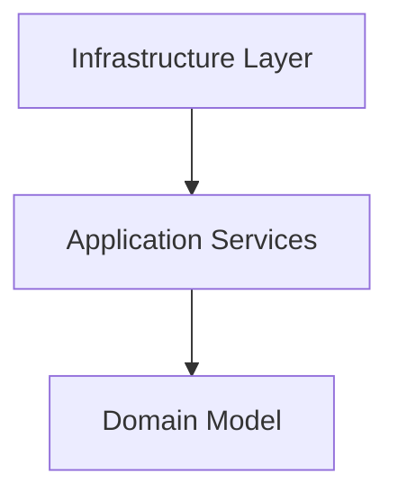

### Key details

- Repository interface in domain; implementation in infrastructure.
- Domain events raised by aggregates, handled in application/infrastructure.
- Often combined with DDD tactical patterns.

### When to use

- DDD projects wanting explicit layering naming.
- Teams preferring "layers" mental model over "ports/adapters" vocabulary.

### Trade-offs / Pitfalls

- Layer bypass (controller -> repository) erodes architecture - ArchUnit enforcement helps.
- Duplicate concepts with hexagonal - pick one vocabulary per team.
- Thick application layer -> anemic domain smell.

### References

*(No curated references for this sub-topic in `_topics.json`.)*

---


## 8.11 Dependency Injection


### What is it?

**Dependency injection (DI)** provides a component's dependencies from outside rather than self-constructing them - via constructor injection, enabling testability and loose coupling.

### Why it matters

Foundation of Spring, NestJS, and modern frameworks; essential for swapping real adapters with mocks in tests and wiring hexagonal ports to adapters.

### How it works

1. Class declares dependencies via constructor parameters (interfaces).
2. DI container (Spring ApplicationContext) instantiates graph at startup.
3. Container resolves interface -> implementation bindings from config.
4. Scopes: singleton (default), prototype, request-scoped.
5. Tests override bindings with `@MockBean` or manual constructor injection.

### Diagram

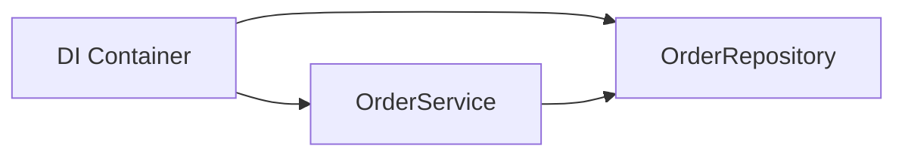

### Key details

- Prefer constructor injection over field injection (testability, immutability).
- `@Configuration` classes define bean wiring in Spring.
- Pure DI without framework: manual composition root in `main()`.

### When to use

- Essentially all structured service applications.
- Hexagonal/clean architectures wiring ports to adapters.
- Unit testing with mocked outbound dependencies.

### Trade-offs / Pitfalls

- Magic container failures at runtime if bean missing - not compile-time.
- Over-injection of tiny dependencies -> constructor with 15 parameters (code smell).
- Service locator anti-pattern bypasses explicit dependencies.

### References

*(No curated references for this sub-topic in `_topics.json`.)*

---


## 8.12 Service Registry


### What is it?

A **service registry** is a database of running service instances - host, port, health, metadata - where services **register** on startup and **deregister** on shutdown.

### Why it matters

Dynamic environments (Kubernetes, autoscaling) change instance addresses constantly; clients need current roster without hardcoded IPs.

### How it works

1. Service starts, registers `order-service:10.0.1.5:8080` with registry (Consul, Eureka, etcd).
2. Sends periodic heartbeats; missed heartbeats -> unhealthy.
3. Clients or load balancers query registry for healthy instances.
4. On shutdown, graceful deregister or TTL expiry removes stale entries.

### Diagram

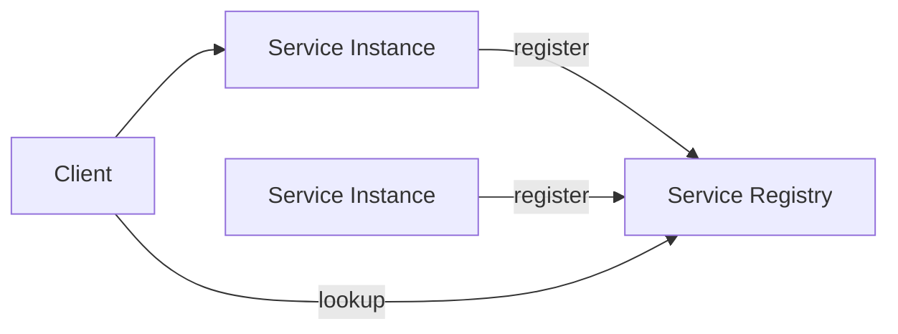

### Key details

- Kubernetes: etcd-backed API server is implicit registry via Endpoints.
- Eureka: AP-oriented; tolerates partition at cost of stale reads.
- Consul: health checks + KV + service mesh integration.

### When to use

- Any dynamic microservice deployment not behind static load balancer config.
- Client-side load balancing (Ribbon-style) patterns.

### Trade-offs / Pitfalls

- Registry outage blocks new discoveries - not always existing connections.
- Stale registrations -> requests to dead instances without health checks.
- Prefer platform-native discovery (K8s DNS) over custom Eureka when possible.

### References

*(No curated references for this sub-topic in `_topics.json`.)*

---


## 8.13 Service Discovery


### What is it?

**Service discovery** is the client or platform mechanism to **find** available instances of a service name - via registry lookup, DNS, or service mesh control plane.

### Why it matters

Enables location transparency: callers use logical name `order-service`, not IP lists that change every deploy.

### How it works

**Client-side discovery:**

1. Client queries registry for `payment-service`.
2. Load balances across returned instances (round-robin, least-conn).
3. Caches list; refreshes on failure or TTL.

**Server-side discovery:**

1. Client calls load balancer / K8s Service VIP.
2. Platform resolves to healthy pod/backend.

### Diagram

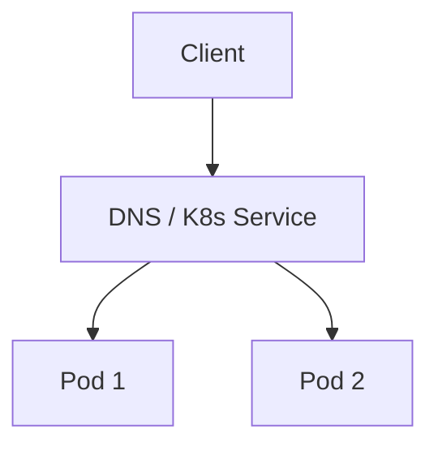

### Key details

| Mode | Examples |
|------|----------|
| Client-side | Eureka + Ribbon, gRPC resolver |
| Server-side | AWS ALB, K8s kube-proxy |
| Mesh | Istio xDS endpoints |

### When to use

- All microservice communication in dynamic infra.
- Multi-region active-active with geo-DNS layer.

### Trade-offs / Pitfalls

- Client-side: library coupling and cache staleness in every language.
- DNS TTL delays propagation of changes.
- Hardcoded service URLs in config defeat discovery purpose.

### References

*(No curated references for this sub-topic in `_topics.json`.)*

---


## 8.14 Service Mesh


### What is it?

A **service mesh** is infrastructure layer handling service-to-service traffic - mTLS, retries, metrics, tracing, circuit breaking - via **sidecar proxies** (Envoy) controlled by a central plane (Istio, Linkerd).

### Why it matters

Moves cross-cutting networking concerns out of application code into uniform platform policy - consistent security and observability across polyglot services.

### How it works

1. Each pod runs app container + Envoy sidecar (data plane).
2. All egress/ingress traffic routed through sidecar.
3. Control plane (Istiod) pushes routes, certs, policies to sidecars.
4. mTLS encrypts east-west traffic automatically.
5. Telemetry exported without app instrumentation changes.

### Diagram

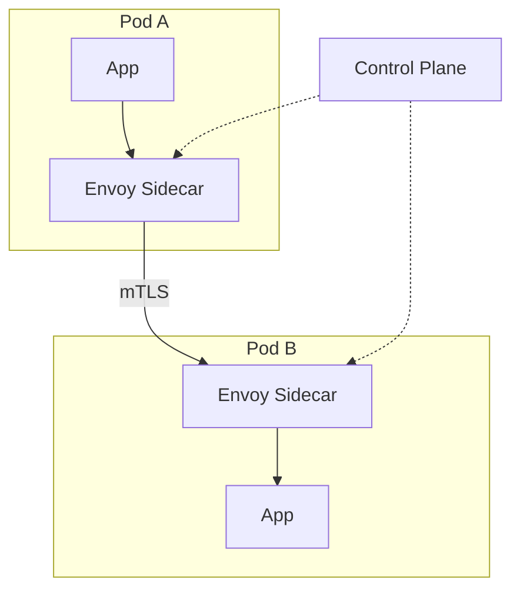

### Key details

- L7 routing: canary, fault injection, timeout per route.
- Cost: extra CPU/memory per sidecar; added latency (~1ms).
- CNI alternatives (Cilium) blur mesh vs kernel networking.

### When to use

- Many microservices needing uniform mTLS and tracing.
- Polyglot stack where library-based resilience inconsistent.
- Progressive delivery (canary, traffic mirroring) at platform level.

### Trade-offs / Pitfalls

- Operational complexity - debugging requires mesh expertise.
- Sidecar resource overhead at high pod density.
- Overkill for small service counts - start with gateway + good libraries.

### References

*(No curated references for this sub-topic in `_topics.json`.)*

---


## 8.15 Sidecar Pattern


### What is it?

The **sidecar pattern** deploys a helper process alongside the main application container in the same pod - sharing network namespace, extending functionality without changing app code.

### Why it matters

Foundation of service mesh, log shipping (Fluent Bit), and proxy-based security - separation of concerns between app logic and platform plumbing.

### How it works

1. Kubernetes pod spec defines two containers: `app` + `sidecar`.
2. Sidecar intercepts traffic via `iptables` (istio-init) or eBPF redirect.
3. App may call `localhost:15001` unaware of mesh routing.
4. Sidecar handles TLS, retries, metrics export.
5. Lifecycle tied - sidecar starts/stops with app pod.

### Diagram

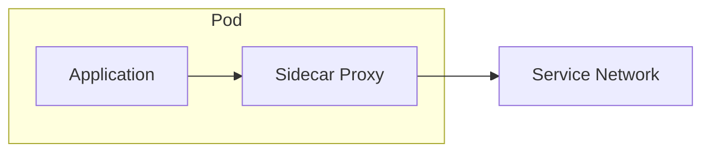

### Key details

- Ambient mesh (Istio) moves sidecar functions to node-level - reducing per-pod overhead.
- Non-mesh sidecars: Vault agent for secret rotation.
- `shareProcessNamespace` rare - usually separate containers.

### When to use

- Service mesh deployment (Envoy, Linkerd proxy).
- Log/metric collection without app SDK.
- Language-agnostic policy enforcement.

### Trade-offs / Pitfalls

- Two containers to monitor and resource-limit per pod.
- Startup ordering: app may start before sidecar ready - readiness probes matter.
- Debugging which container failed increases triage time.

### References

*(No curated references for this sub-topic in `_topics.json`.)*

---


## 8.16 Circuit Breaker


### What is it?

A **circuit breaker** is a resilience pattern that **stops calling a failing downstream service** after errors exceed a threshold - like an electrical breaker that trips to prevent fire. Instead of waiting for timeouts on every call, the caller **fails fast** while the dependency is unhealthy.

Named states mirror electrical circuits: **Closed** (normal), **Open** (tripped), **Half-Open** (testing recovery).

Popularized by **Netflix Hystrix**; modern equivalents: **Resilience4j**, **Istio outlier detection**, **Envoy** passive health checks.

### Why it matters

Without a circuit breaker, one slow/failing dependency causes:
1. Caller threads block waiting for timeout (thread pool exhaustion)
2. Retries amplify load on already-failing service
3. Cascade failure across the call chain (**cascading outage**)

Circuit breaker converts slow failure into fast failure, preserving resources for healthy paths and enabling **fallback** responses.

### How it works

**State machine:**

```text
CLOSED (normal)
  -> count failures in sliding window (e.g. last 10 calls, or 50% failure rate in 30s)
  -> threshold exceeded -> OPEN

OPEN (tripped)
  -> all calls fail immediately (no network call to downstream)
  -> return fallback or error to caller
  -> after waitDuration (e.g. 30s) -> HALF-OPEN

HALF-OPEN (probe)
  -> allow limited probe requests (e.g. 1 in 5)
  -> probe success -> CLOSED
  -> probe failure -> OPEN again
```

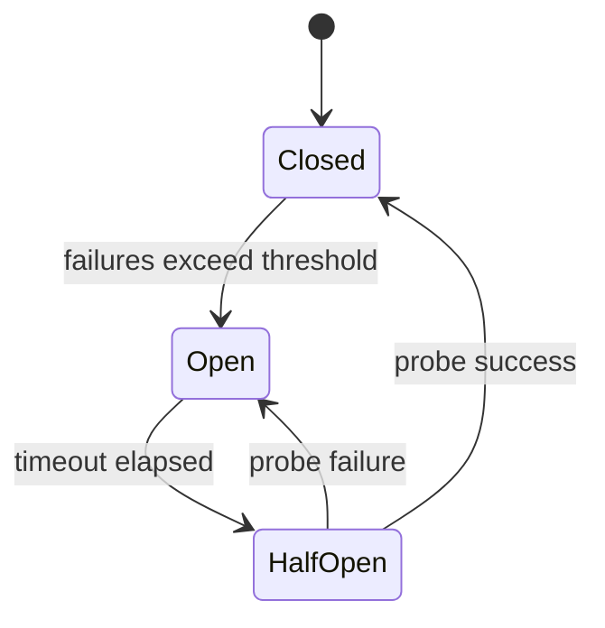

**Example with Resilience4j-style config:**

| Parameter | Example | Meaning |
|-----------|---------|---------|
| `failureRateThreshold` | 50% | Trip when half of calls fail |
| `slidingWindowSize` | 20 | Evaluate last 20 calls |
| `waitDurationInOpenState` | 30s | Stay open before half-open |
| `permittedCallsInHalfOpenState` | 3 | Probe calls allowed |

**Combined patterns:**

- **Circuit breaker + retry:** retry only when closed; never retry when open
- **Circuit breaker + timeout:** cap wait per call (e.g. 2s) before counting as failure
- **Circuit breaker + bulkhead:** isolate thread pools per dependency
- **Fallback:** return cached default, degraded feature, or friendly error message

```text
try:
  result = circuitBreaker.execute(() -> paymentService.charge())
except CircuitOpen:
  return cachedQuote()  // fallback
```

### Key details

- Monitor **state transition metrics** (`circuit_opened_total`) - alert before users notice
- Tune thresholds per dependency - payment service stricter than avatar image service
- **Do not put circuit breaker on database** in a way that hides connection pool misconfiguration
- Service mesh (Istio) can eject unhealthy hosts without app code changes
- Half-open flapping: increase `waitDuration` or require multiple successful probes

### When to use

- Every **synchronous** cross-service call on critical user paths
- Third-party APIs with variable reliability (payments, SMS, maps)
- During incidents to prevent retry storms from amplifying outage
- Microservices with deep call chains (A -> B -> C -> D)

### Trade-offs / Pitfalls

- **Open circuit = errors to users** unless fallback exists - design degraded UX ("payments temporarily unavailable")
- Wrong threshold -> **flapping** (open/close/open rapidly) or slow detection (too many failures before trip)
- Circuit breaker on wrong granularity (whole service vs single endpoint) blocks healthy operations
- Does not replace **root cause fix** - only contains blast radius
- Async/event-driven paths need different patterns (DLQ, backpressure)

### References

- Netflix Hystrix design docs; Resilience4j user guide

---


## 8.17 Retry Pattern


### What is it?

The **retry pattern** re-attempts failed operations - transient network blips, 503 responses - with backoff and jitter, bounded by max attempts.

### Why it matters

Networks and clouds are unreliable; sensible retries convert transient failures into success without user-visible errors.

### How it works

1. Call fails with retryable error (timeout, 503, connection reset).
2. Wait `base * 2^attempt + random_jitter`.
3. Retry up to N times.
4. Non-retryable errors (400, 404) fail immediately.
5. Only safe with **idempotent** operations or idempotency keys.

### Diagram

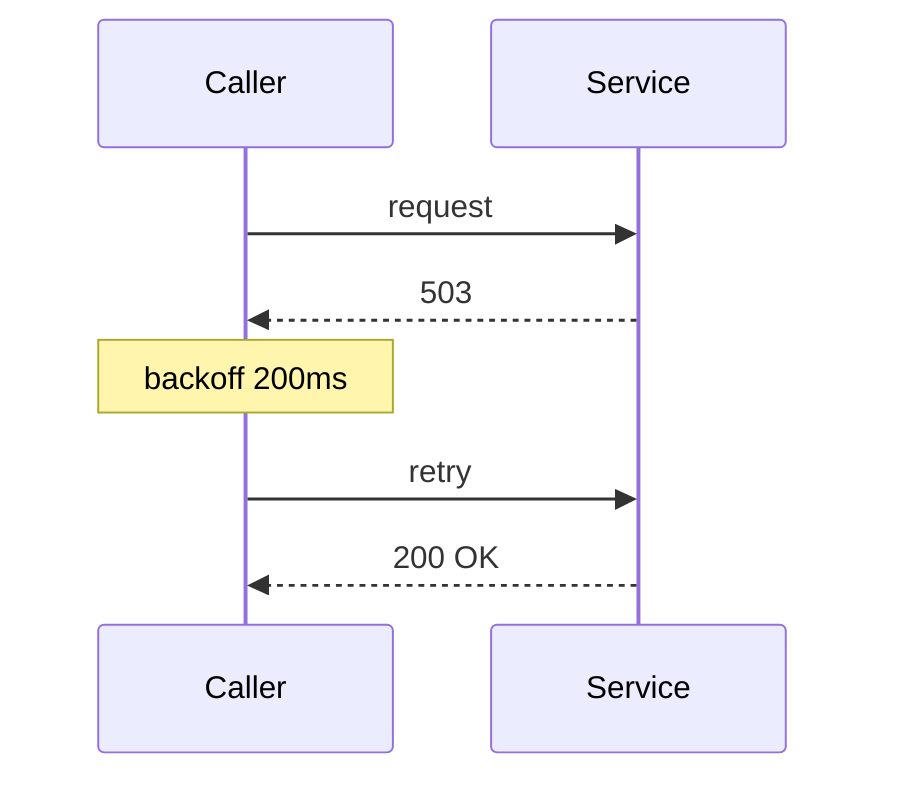

### Key details

- Exponential backoff + jitter prevents thundering herd on recovery.
- Retry budgets cap total retry traffic (Google SRE).
- Idempotent POST requires idempotency key before retrying.

### When to use

- Read operations and idempotent writes.
- gRPC/HTTP clients with configurable retry policies.
- Message consumers processing at-least-once.

### Trade-offs / Pitfalls

- Retries without breaker amplify outage (retry storm).
- Non-idempotent POST retry -> duplicate side effects.
- Max attempts too high -> multiplies tail latency.

### References

*(No curated references for this sub-topic in `_topics.json`.)*

---


## 8.18 Bulkhead Pattern


### What is it?

The **bulkhead pattern** isolates resources (thread pools, connections) per dependency or tenant - so one slow service cannot exhaust the entire pool shared by others.

### Why it matters

Named after ship compartments: one hull breach floods one section, not the whole vessel. Limits blast radius of dependency failures.

### How it works

1. Assign dedicated thread pool / connection limit per downstream service.
2. Calls to service A use pool A only; service B uses pool B.
3. If A is slow, pool A saturates; B remains responsive.
4. Reject excess calls to saturated pool immediately (fail fast).
5. Semaphore-based bulkheads in async code.

### Diagram

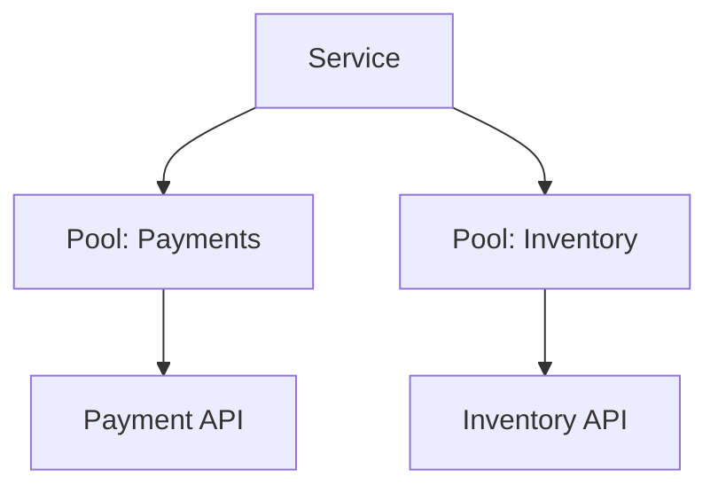

### Key details

- Hystrix thread pools per command key; Resilience4j bulkhead.
- K8s: separate deployments per critical dependency path.
- Connection pool sizing per destination in HTTP clients.

### When to use

- Multiple downstream dependencies with varying latency SLAs.
- Multi-tenant systems isolating noisy neighbor tenants.
- High fan-out BFF calling many services.

### Trade-offs / Pitfalls

- More pools -> more threads -> higher memory; tune carefully.
- Wrong pool sizing still allows starvation within bulkhead.
- Doesn't help if shared DB is the actual bottleneck.

### References

*(No curated references for this sub-topic in `_topics.json`.)*

---


## 8.19 Saga Pattern


### What is it?

A **saga** is a sequence of **local transactions** across services, each with a **compensating action** to undo prior steps on failure - achieving distributed workflow without 2PC.

### Why it matters

Cross-service business processes (place order -> reserve inventory -> charge payment) need failure recovery; sagas are the standard microservices alternative to distributed ACID.

### How it works

**Happy path:**

1. Order service creates order (pending).
2. Inventory reserves stock.
3. Payment charges card.
4. Order marked confirmed.

**Failure path (payment fails):**

5. Compensate inventory (release reservation).
6. Compensate order (cancel).

### Diagram

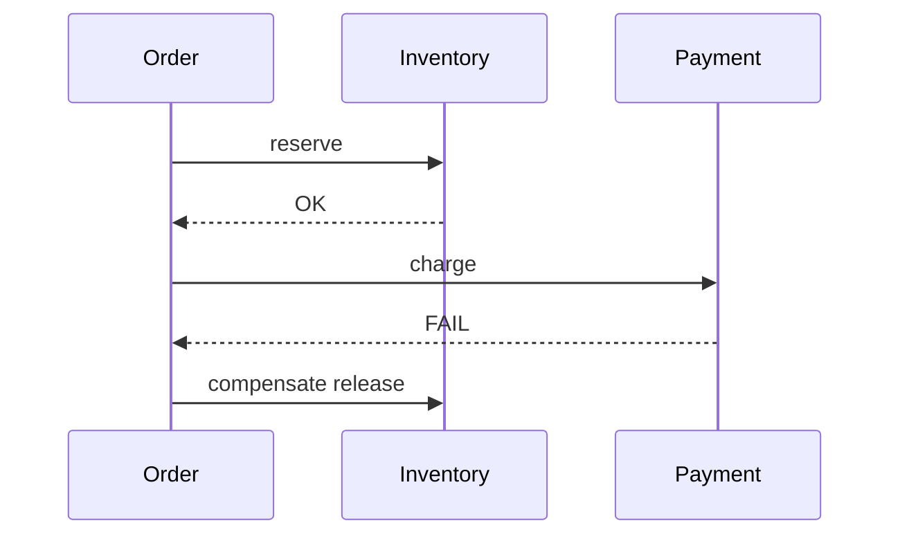

### Key details

- Compensations are business logic (not automatic DB rollback).
- Each step must be idempotent.
- Saga state machine tracks current step.

### When to use

- Long-running business transactions across microservices.
- When 2PC latency/availability unacceptable.
- Paired with outbox for reliable event emission per step.

### Trade-offs / Pitfalls

- Compensations not always possible (email sent, shipped goods).
- Eventual consistency visible to users mid-saga.
- Debugging stuck sagas requires orchestration visibility.

### References

*(No curated references for this sub-topic in `_topics.json`.)*

---


## 8.20 Choreography


### What is it?

**Choreography** implements sagas via **events**: each service listens and reacts - no central coordinator. Order placed -> inventory reacts -> payment reacts.

### Why it matters

Loose coupling, no orchestrator SPOF, natural fit for event-driven architecture - preferred when workflow is simple and teams own services end-to-end.

### How it works

1. Order service publishes `OrderPlaced`.
2. Inventory consumes, reserves, publishes `InventoryReserved` or `ReservationFailed`.
3. Payment consumes success event, charges, publishes `PaymentCompleted`.
4. Order service listens for completion events to update status.
5. Failure events trigger compensating events (`ReleaseInventory`).

### Diagram

```mermaid
flowchart LR
  O[Order Svc] -->|OrderPlaced| Bus[Event Bus]
  Bus --> I[Inventory Svc]
  I -->|Reserved| Bus
  Bus --> P[Payment Svc]
  P -->|Paid| Bus
  Bus --> O
```

### Key details

- No single view of saga state - distributed tracing essential.
- Cyclic dependencies risk if event chains poorly designed.
- Works best with clear event contracts and schema registry.

### When to use

- Few steps, clear event flow, mature event platform.
- Teams want autonomy without central workflow engine.
- High throughput async pipelines.

### Trade-offs / Pitfalls

- Hard to answer "where is order X in workflow?" without correlation IDs and event log.
- Compensating flows scatter across services - hard to reason about globally.
- Adding step requires updating multiple subscribers.

### References

*(No curated references for this sub-topic in `_topics.json`.)*

---


## 8.21 Orchestration


### What is it?

**Orchestration** implements sagas with a **central coordinator** (orchestrator) that commands each service step-by-step and handles compensation on failure.

### Why it matters

Explicit workflow visibility, easier complex branching, and single place for timeout/retry policy - better for long workflows with many steps.

### How it works

1. Client starts saga at orchestrator (Temporal, Camunda, custom).
2. Orchestrator calls inventory service: reserve.
3. On success, calls payment: charge.
4. On payment failure, orchestrator calls inventory: release.
5. Orchestrator persists saga state durably between steps.

### Diagram

```mermaid
sequenceDiagram
    participant Orch as Orchestrator
    participant I as Inventory
    participant P as Payment
    Orch->>I: reserve
    I-->>Orch: OK
    Orch->>P: charge
    P-->>Orch: FAIL
    Orch->>I: compensate
```

### Key details

- Temporal/Cadence: workflow code as state machine with durable timers.
- Orchestrator must be HA with persistent state store.
- Commands vs events: orchestrator sends imperative commands.

### When to use

- Complex sagas with branching, timers, human approval steps.
- Need centralized monitoring of in-flight workflows.
- Compensations hard to express as pure event chain.

### Trade-offs / Pitfalls

- Orchestrator SPOF and scaling concern - must engineer for HA.
- Couples services to orchestrator API (tighter than choreography).
- Risk of "smart orchestrator" accumulating business logic.

### References

*(No curated references for this sub-topic in `_topics.json`.)*

---


## Quick Reference

| # | Topic | Summary |
|---|-------|---------|
| 8.1 | Monolith | A **monolith** is a single deployable unit containing all application functio... |
| 8.2 | Modular Monolith | A **modular monolith** keeps one deployable but enforces **strict module boun... |
| 8.3 | Microservices | **Microservices** are independently deployable services, each implementing a ... |
| 8.4 | Strangler Pattern | The **strangler fig pattern** incrementally replaces a legacy monolith by rou... |
| 8.5 | BFF Pattern | **Backend for Frontend (BFF)** is a dedicated API layer per client type (web,... |
| 8.6 | DDD | **Domain-Driven Design (DDD)** is an approach aligning software structure wit... |
| 8.7 | Bounded Context | A **bounded context** is a boundary within which a domain model and ubiquitou... |
| 8.8 | Hexagonal Architecture | **Hexagonal architecture** (ports and adapters) places **domain logic at the ... |
| 8.9 | Clean Architecture | **Clean architecture** (Uncle Bob) organizes code in concentric rings: entiti... |
| 8.10 | Onion Architecture | **Onion architecture** layers application around domain model: domain model c... |
| 8.11 | Dependency Injection | **Dependency injection (DI)** provides a component's dependencies from outsid... |
| 8.12 | Service Registry | A **service registry** is a database of running service instances - host, port,... |
| 8.13 | Service Discovery | **Service discovery** is the client or platform mechanism to **find** availab... |
| 8.14 | Service Mesh | A **service mesh** is infrastructure layer handling service-to-service traffi... |
| 8.15 | Sidecar Pattern | The **sidecar pattern** deploys a helper process alongside the main applicati... |
| 8.16 | Circuit Breaker | A **circuit breaker** stops calling a failing downstream service after error ... |
| 8.17 | Retry Pattern | The **retry pattern** re-attempts failed operations - transient network blips, ... |
| 8.18 | Bulkhead Pattern | The **bulkhead pattern** isolates resources (thread pools, connections) per d... |
| 8.19 | Saga Pattern | A **saga** is a sequence of **local transactions** across services, each with... |
| 8.20 | Choreography | **Choreography** implements sagas via **events**: each service listens and re... |
| 8.21 | Orchestration | **Orchestration** implements sagas with a **central coordinator** (orchestrat... |

---

[â -  Back to master index](../README.md)
