# 8. Microservices

> Status: **Documented**

[<- Back to master index](../README.md)

---

## Overview

Applications evolve along an **architecture spectrum**: **[monolith](#81-monolith)** → **[modular monolith](#82-modular-monolith)** → **[microservices](#83-microservices)**. Microservices split the system into independently deployable services with **service-owned data**, communicating over the network (REST, gRPC, events).

Success at the distributed end requires more than splitting code: **discovery**, **resilience** (circuit breaker, bulkhead, retry), **sagas**, and **observability** — covered in later sections. **DDD** and bounded contexts guide where to draw boundaries.

### Architecture spectrum


Many teams start monolith → modular monolith as complexity grows → microservices only when scale, teams, and ops maturity justify the cost.

### Comparison

| Feature | [Monolith](#81-monolith) | [Modular monolith](#82-modular-monolith) | [Microservices](#83-microservices) |
|---------|--------------------------|------------------------------------------|-------------------------------------|
| **Deployment unit** | Single | Single | Multiple |
| **Code organization** | Low | High | Very high |
| **Scalability** | Whole app | Whole app | Per service |
| **Complexity** | Low | Medium | High |
| **Database** | Shared | Shared (often) | Service-owned |
| **Communication** | Method call | Method call / module API | Network (REST, gRPC, events) |
| **Technology flexibility** | Low | Low | High |
| **Fault isolation** | Low | Low | High |
| **Operational cost** | Low | Low | High |
| **Development speed** | Fast | Fast | Moderate |
| **Maintenance** | Hard at scale | Easier | Easier per service |

### When to use

| Style | Fit |
|-------|-----|
| **Monolith** | Small apps, startups, small teams, simple requirements |
| **Modular monolith** | Medium/large apps, clear module boundaries, growing teams, possible future split |
| **Microservices** | Large scale, multiple teams, high scalability, frequent independent deploys, complex domains |

Migration path: [§8.4 Strangler Pattern](#84-strangler-pattern).

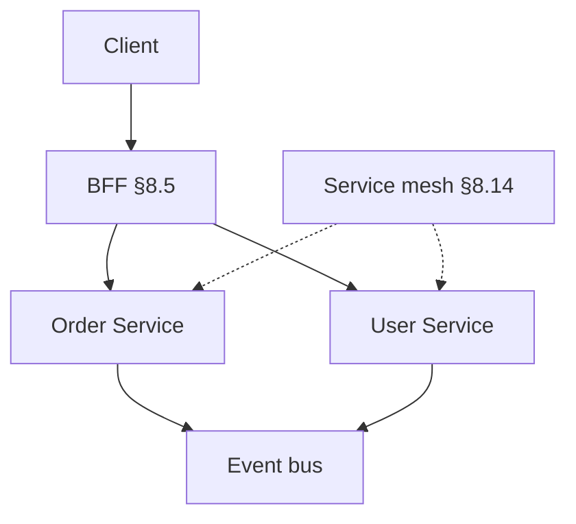

---

## Sub-topics

### Architecture spectrum

| # | Sub-topic | Status |
|---|-----------|--------|
| 8.1 | [Monolith](#81-monolith) | Done |
| 8.2 | [Modular Monolith](#82-modular-monolith) | Done |
| 8.3 | [Microservices](#83-microservices) | Done |

### Migration & client patterns

| # | Sub-topic | Status |
|---|-----------|--------|
| 8.4 | [Strangler Pattern](#84-strangler-pattern) | Done |
| 8.5 | [BFF Pattern](#85-bff-pattern) | Done |

### Domain & structure

| # | Sub-topic | Status |
|---|-----------|--------|
| 8.6 | [DDD](#86-ddd) | Done |
| 8.7 | [Bounded Context](#87-bounded-context) | Done |
| 8.8 | [Hexagonal Architecture](#88-hexagonal-architecture) | Done |
| 8.9 | [Clean Architecture](#89-clean-architecture) | Done |
| 8.10 | [Onion Architecture](#810-onion-architecture) | Done |
| 8.11 | [Dependency Injection](#811-dependency-injection) | Done |

### Discovery & mesh

| # | Sub-topic | Status |
|---|-----------|--------|
| 8.12 | [Service Registry](#812-service-registry) | Done |
| 8.13 | [Service Discovery](#813-service-discovery) | Done |
| 8.14 | [Service Mesh](#814-service-mesh) | Done |
| 8.15 | [Sidecar Pattern](#815-sidecar-pattern) | Done |

### Resilience & distributed workflows

| # | Sub-topic | Status |
|---|-----------|--------|
| 8.16 | [Circuit Breaker](#816-circuit-breaker) | Done |
| 8.17 | [Retry Pattern](#817-retry-pattern) | Done |
| 8.18 | [Bulkhead Pattern](#818-bulkhead-pattern) | Done |
| 8.19 | [Saga Pattern](#819-saga-pattern) | Done |
| 8.20 | [Choreography](#820-choreography) | Done |
| 8.21 | [Orchestration](#821-orchestration) | Done |

---

## 8.1 Monolith

> **Spectrum:** compare [Monolith vs Modular Monolith vs Microservices](#comparison) in the chapter intro.

### What is a monolith?

A **monolith** is an application where all components — UI, business logic, database access, and services — are packaged and deployed as a **single unit**.

### Architecture

```text
+-------------------------+
|       Application       |
|-------------------------|
| UI Layer                |
| Business Logic Layer    |
| Data Access Layer       |
+-------------------------+
            |
            v
       Database
```

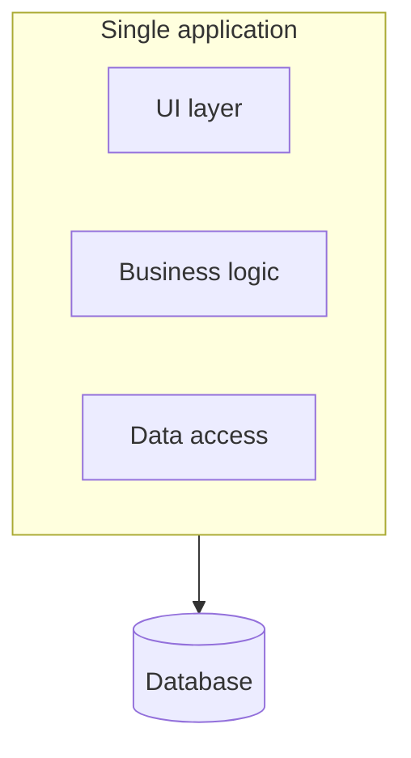

### Characteristics

- Single codebase
- Single deployment unit
- Usually shares one database
- All modules run in the same process

### Advantages

1. Simple development and deployment
2. Easy debugging (in-process calls, single stack trace)
3. Lower operational complexity
4. Faster communication between components (method calls, no network)

### Disadvantages

1. Difficult to scale individual features — scale the **whole** app
2. Large codebase becomes hard to maintain
3. Every deployment affects the entire application
4. Technology stack is usually fixed for the whole system

### Example

**E-commerce application** in one deployable:

- User management
- Product catalog
- Order management
- Payment processing

All packaged and deployed together.

### Summary

```text
Monolith = one codebase, one deploy, shared DB, in-process communication
Best for: startups, small teams, simple domains
Evolution: → modular monolith (§8.2) when boundaries matter
```

**Goal:** Default starting point — simplest ops until complexity forces change.

---


## 8.2 Modular Monolith

> **Spectrum:** [Comparison table](#comparison) · next step toward [§8.3 Microservices](#83-microservices).

### What is a modular monolith?

A **modular monolith** is a monolithic application divided into **well-defined independent modules**, but still deployed as a **single application**.

### Architecture

```text
+-----------------------------------+
|          Application              |
|-----------------------------------|
| User Module                       |
| Product Module                    |
| Order Module                      |
| Payment Module                    |
+-----------------------------------+
                 |
                 v
             Database
```

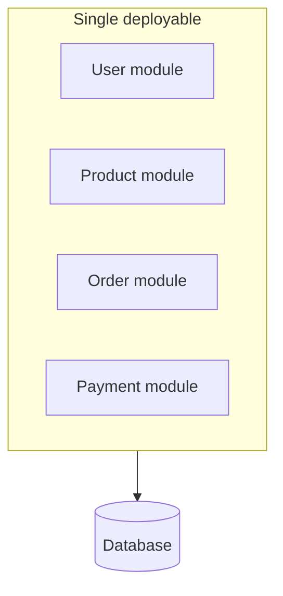

Modules communicate through **interfaces** or **events** — not by reaching into each other's internals.

### Characteristics

- Single deployment unit
- Clear module boundaries
- Modules communicate through interfaces
- Shared runtime and often shared database

### Advantages

1. Better maintainability than a flat monolith
2. Easier code organization by domain
3. Simpler deployment than microservices
4. Can evolve into microservices later ([§8.4 Strangler](#84-strangler-pattern))

### Disadvantages

1. Entire application still deployed together
2. Shared resources may create dependencies
3. Independent scaling of one module is not possible

### Best practices

1. Enforce **strict module boundaries** (package rules, ArchUnit, Spring Modulith)
2. Avoid direct access between module **internals**
3. Use interfaces or domain events for cross-module communication
4. Each module owns its tables — avoid cross-module foreign keys where possible

### Example

**Banking application** — one deployable:

- Customer module
- Account module
- Loan module
- Transaction module

### Summary

```text
Modular Monolith = one deploy, many bounded modules with strict interfaces
Best for: growing teams, medium/large apps, future extraction path
Evolution: → microservices (§8.3) when independent scale/deploy is required
```

**Goal:** Monolith simplicity with microservice-ready boundaries.

---


## 8.3 Microservices

> **Spectrum:** [When to use](#when-to-use) · boundaries via [§8.6 DDD](#86-ddd) / [§8.7 Bounded Context](#87-bounded-context) · migrate via [§8.4 Strangler](#84-strangler-pattern).

### What are microservices?

**Microservices** architecture divides an application into multiple **small, independently deployable services**. Each service owns a specific **business capability** and typically its own database.

### Architecture

```text
+------------+     +------------+     +------------+
| User       |     | Order      |     | Payment    |
| Service    |<--->| Service    |<--->| Service    |
+------------+     +------------+     +------------+
      |                  |                   |
      v                  v                   v
 User DB            Order DB          Payment DB
```

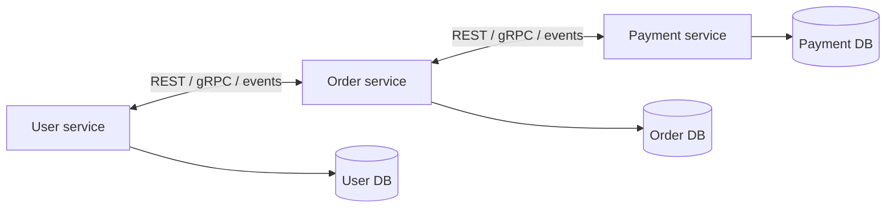

API styles: [Ch.7 API Design](../07-api-design/README.md). Async integration: [Ch.6 Messaging](../06-messaging-and-events/README.md).

### Characteristics

- Multiple independent services
- Independent deployment per service
- Each service owns its database (**database per service**)
- Communication via REST, GraphQL, gRPC, Kafka, etc.

### Advantages

1. Independent scaling per service
2. Independent deployment — teams release on their own cadence
3. Better fault isolation
4. Teams can work independently (Conway's Law)
5. Technology flexibility per service

### Disadvantages

1. Complex deployment and monitoring
2. Network latency on every cross-service call
3. Distributed transactions are difficult — use [§8.19 Saga](#819-saga-pattern), not 2PC
4. More infrastructure (discovery, mesh, gateway, tracing)
5. Increased operational cost

### Example

**E-commerce platform:**

| Service | Responsibility |
|---------|----------------|
| User service | Accounts, profiles |
| Product service | Catalog |
| Inventory service | Stock |
| Order service | Orders |
| Payment service | Payments |
| Notification service | Email/SMS |

Each can be developed, deployed, and scaled independently. Client aggregation: [§8.5 BFF](#85-bff-pattern) · [Ch.7 API Gateway](../07-api-design/README.md#75-api-gateway).

### Operational prerequisites

Before splitting, invest in:

- CI/CD per service, containers / Kubernetes
- [Service discovery](#812-service-registry) and API gateway
- Distributed tracing and structured logging
- Resilience: [§8.16 Circuit Breaker](#816-circuit-breaker), [§8.17 Retry](#817-retry-pattern), [§8.18 Bulkhead](#818-bulkhead-pattern)
- Contract testing and API versioning ([Ch.7](../07-api-design/README.md))

### When not to split prematurely

- Small team with no scaling or deploy-coupling pain yet
- Splitting by **technical layer** (validation service, DAO service) — prefer business capabilities
- No platform maturity for observability and discovery

Stay on [§8.1 Monolith](#81-monolith) or [§8.2 Modular Monolith](#82-modular-monolith) until triggers are real.

### Summary

```text
Microservices = independent services, service-owned DB, network communication
Best for: large scale, multiple teams, independent deploy/scale needs
Cost: distributed ops complexity — sagas, discovery, resilience, observability
```

**Goal:** Team autonomy and per-domain scale — not “micro” for its own sake.

---


## 8.4 Strangler Pattern

> **Migration path:** [Monolith → Microservices](#architecture-spectrum) evolution in the chapter intro. Router: [Ch.7 API Gateway](../07-api-design/README.md#75-api-gateway).

### What is the strangler pattern?

The **Strangler pattern** is a migration strategy used to **gradually** transform a monolithic application into a new architecture (typically [microservices](#83-microservices)) **without rewriting the entire system at once**.

The name comes from the **strangler fig** tree, which grows around an existing tree and gradually replaces it.

### Purpose

1. Modernize legacy applications
2. Reduce migration risk
3. Enable gradual transition
4. Avoid **big bang** rewrites
5. Allow continuous business operations during migration

Ideal follow-on from a [§8.2 modular monolith](#82-modular-monolith) where module boundaries are already clear.

### How it works

#### Step 1 — Monolith handles everything

```text
Client → Monolith
```

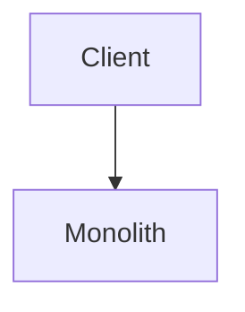

#### Step 2 — Extract first service

```text
Client → Gateway → Monolith
                → New service
```

Some requests hit the new service; the rest stay on the monolith.

#### Step 3 — More functionality moves

```text
Client → Gateway → User service
                → Order service
                → Payment service
                → Monolith (shrinking)
```

The monolith becomes smaller over time.

#### Step 4 — Monolith retired

```text
Client → Gateway → User / Order / Payment services
```

All traffic on new services; legacy monolith decommissioned.

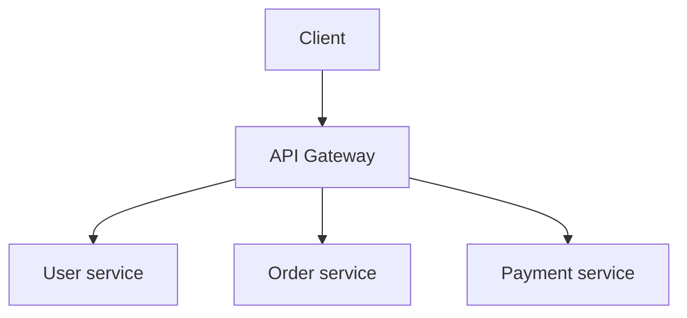

### Key components

| # | Component | Role |
|---|-----------|------|
| 1 | **Legacy system** | Existing monolith — continues serving unmigrated requests |
| 2 | **New services** | Extracted microservices for migrated capabilities |
| 3 | **Router / API gateway** | Routes each request to monolith **or** new service |
| 4 | **Data migration strategy** | Sync or cut over data; keep old and new consistent during transition |

Use an **anti-corruption layer** when legacy and new domain models differ — translate at the boundary, don't leak monolith schemas into new services.

### Request flow example

**Before migration:**

```text
Client → Monolith → Database
```

**After migrating user management:**

```text
Client → API Gateway
           ├─→ User service     (GET/POST /users)
           └─→ Monolith         (GET /orders, POST /payments, …)
```

User-related paths go to **User service**; everything else stays on the monolith until extracted.

### Migration steps

1. **Identify a module** to extract (e.g. user management)
2. **Create** the new service
3. **Redirect traffic** at the gateway
4. **Validate** functionality (contract tests — [Ch.7 §7.15](../07-api-design/README.md#715-contract-testing))
5. **Migrate data** if required (CDC, dual-write, or one-time backfill)
6. **Remove** old code from the monolith
7. **Repeat** for other modules

### Example — e-commerce monolith

**Legacy monolith modules:**

```text
User management · Product catalog · Order processing
Payment processing · Notification system
```

| Phase | Extract |
|-------|---------|
| 1 | User service |
| 2 | Product service |
| 3 | Order service |
| 4 | Payment service |
| 5 | Retire monolith |

### Real-world timeline (example)

| Month | Milestone |
|-------|-----------|
| 1 | User service extracted |
| 3 | Order service extracted |
| 5 | Payment service extracted |
| 7 | Notification service extracted |
| 9 | Monolith retired |

### Advantages

1. **Low risk** — small incremental changes, easier rollback
2. **Continuous delivery** — no long system downtime
3. **Faster feedback** — learn from each step
4. **Reduced business impact** — existing features keep running
5. **Better testing** — validate service by service

### Disadvantages

1. **Temporary complexity** — monolith and microservices coexist
2. **Data synchronization** — keeping old and new systems consistent
3. **Routing complexity** — gateway rules grow with each extraction
4. **Longer duration** — full migration may take months or years

### When to use

- Migrating a legacy [monolith](#81-monolith)
- Building [microservices](#83-microservices) gradually
- Large rewrite is too risky
- Business cannot tolerate downtime
- Incremental modernization is required

### When not to use

- Application is very small — [monolith](#81-monolith) is enough
- Complete rewrite is genuinely easier and low risk
- Legacy system is near retirement anyway
- Migration cost exceeds business value

### Strangler pattern vs big bang migration

| Feature | Strangler pattern | Big bang rewrite |
|---------|-------------------|------------------|
| **Risk** | Low | High |
| **Downtime** | Minimal | High |
| **Deployment** | Incremental | One-time |
| **Rollback** | Easy | Difficult |
| **Business continuity** | Excellent | Risky |
| **Migration duration** | Longer | Shorter |
| **Failure impact** | Small per step | Large |

### Summary

```text
Strangler = gradually replace legacy with new services while old system still runs
Flow: monolith → extract User → Order → Payment → retire monolith
Gateway routes traffic; data sync is the hardest part
Safest common path from monolith to microservices
```

**Goal:** Modernize without stopping the business — [§8.3 Microservices](#83-microservices).

---


## 8.5 BFF Pattern


### What is it?

**Backend for Frontend (BFF)** is a dedicated API layer per client type (web, mobile, IoT) that aggregates and shapes backend microservice responses for that client's specific needs.

### Why it matters

Mobile and web need different payloads and aggregation; one generic API forces compromises. BFF keeps core services client-agnostic.

### How it works

1. Mobile BFF and Web BFF deploy as separate services.
2. Each calls internal microservices (gRPC/REST).
3. Aggregates parallel fetches; trims fields for mobile bandwidth.
4. Handles client-specific auth token exchange.
5. Core domain services expose generic contracts, not UI-driven shapes.

### Diagram

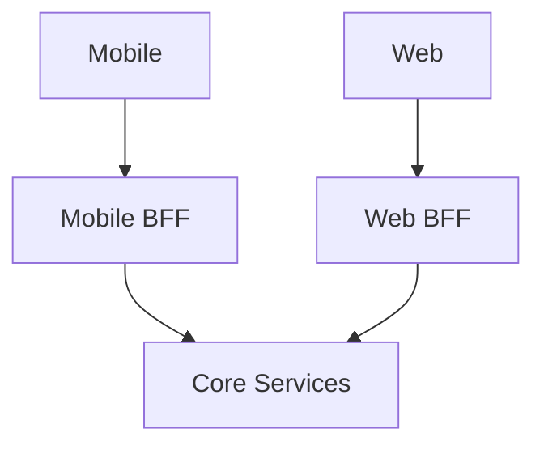

### Key details

- Not a god-service - thin orchestration only, no domain ownership.
- GraphQL can serve BFF role with single graph per client.
- Team ownership often follows client team (mobile team owns mobile BFF).

### When to use

- Multiple client platforms with diverging API needs.
- Reduce chatty client calls via server-side aggregation.
- Different release cadence for client-specific API tweaks.

### Trade-offs / Pitfalls

- N BFFs -> duplication risk; share aggregation libraries.
- BFF becomes dumping ground for business logic - enforce thin boundary.
- Extra hop adds latency - co-locate with gateway or services.

### References

*(No curated references for this sub-topic in `_topics.json`.)*

---


## 8.6 DDD


### What is it?

**Domain-Driven Design (DDD)** is an approach aligning software structure with business domain - ubiquitous language, bounded contexts, aggregates, and strategic design for complex domains.

### Why it matters

Microservice boundaries drawn around org chart fail; DDD draws them around **domain** boundaries where language and rules are cohesive.

### How it works

1. Collaborate with domain experts; define ubiquitous language.
2. Identify bounded contexts (sales, shipping, billing).
3. Model aggregates as consistency boundaries inside contexts.
4. Map context relationships (shared kernel, anti-corruption layer).
5. Implement each bounded context as module or service.

### Diagram

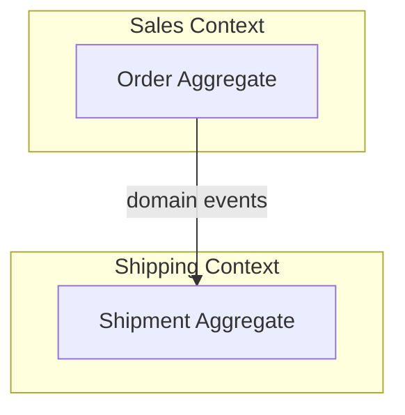

### Key details

- **Tactical:** entities, value objects, aggregates, repositories, domain events.
- **Strategic:** context map, subdomain classification (core/supporting/generic).
- Not every project needs full DDD ceremony - scale rigor to complexity.

### When to use

- Complex business rules with expert stakeholders.
- Defining microservice boundaries in ambiguous domains.
- Legacy modernization needing shared vocabulary.

### Trade-offs / Pitfalls

- Over-engineering simple CRUD with DDD patterns.
- Bounded contexts misidentified -> wrong service splits.
- Requires ongoing domain expert access - not one-time workshop.

### References

*(No curated references for this sub-topic in `_topics.json`.)*

---


## 8.7 Bounded Context


### What is it?

A **bounded context** is a boundary within which a domain model and ubiquitous language are consistent. Same word ("customer") may mean different things in different contexts.

### Why it matters

Primary unit for microservice decomposition - one bounded context -> one service (ideally). Prevents leaky shared models across domains.

### How it works

1. Map business capabilities and team ownership.
2. Draw context boundaries where terminology or rules diverge.
3. Define integration: published language, ACL for legacy.
4. Each context owns its persistence and APIs.
5. Sync via events or explicit translation at boundaries.

### Diagram

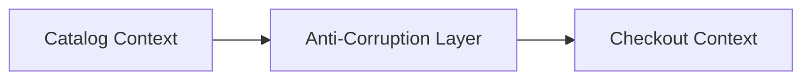

### Key details

- Context map documents relationships: upstream/downstream, conformist, ACL.
- Shared kernel only for truly stable tiny shared model - use sparingly.
- "Customer" in CRM ≠ "Customer" in billing - don't unify prematurely.

### When to use

- Any microservice boundary discussion.
- Resolving "should this be one service or two?" debates.

### Trade-offs / Pitfalls

- Contexts too large -> mini-monolith; too small -> distributed mud.
- Ignoring context map -> accidental tight coupling via shared DB.
- Integration without ACL spreads legacy model corruption.

### References

*(No curated references for this sub-topic in `_topics.json`.)*

---


## 8.8 Hexagonal Architecture


### What is it?

**Hexagonal architecture** (ports and adapters) places **domain logic at the center**, surrounded by **ports** (interfaces) and **adapters** (implementations) for HTTP, DB, messaging.

### Why it matters

Testable domain without framework coupling; swap infrastructure (Postgres -> Mongo, REST -> gRPC) without touching business rules.

### How it works

1. Define domain entities and use cases in core (no framework imports).
2. **Inbound ports:** application service interfaces called by controllers.
3. **Outbound ports:** repository, event publisher interfaces.
4. **Adapters:** REST controller, JPA repository implement ports.
5. Dependency direction always points inward toward domain.

### Diagram

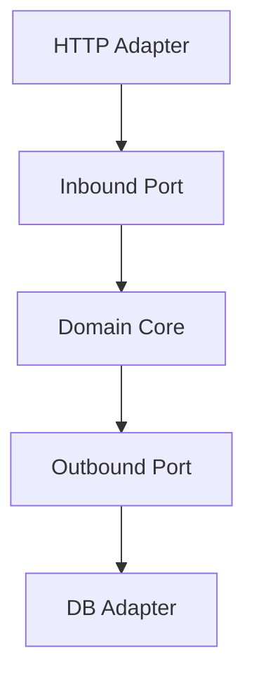

### Key details

- Same idea as clean/onion - terminology differs (ports/adapters).
- Enables contract tests on domain without spinning HTTP server.
- Anti-corruption layer is outbound adapter translating external models.

### When to use

- Services with non-trivial domain logic worth isolating.
- Multiple inbound channels (REST + events + CLI) sharing core.
- Long-lived services expecting infrastructure churn.

### Trade-offs / Pitfalls

- Boilerplate interfaces for simple CRUD services - YAGNI risk.
- Team must discipline against domain importing Spring annotations.
- Mapping between domain and DTOs adds code.

### References

*(No curated references for this sub-topic in `_topics.json`.)*

---


## 8.9 Clean Architecture


### What is it?

**Clean architecture** (Uncle Bob) organizes code in concentric rings: entities -> use cases -> interface adapters -> frameworks. Dependency rule: inner layers know nothing of outer layers.

### Why it matters

Framework-agnostic business logic; microservices benefit from testable use cases independent of HTTP and ORM details.

### How it works

1. **Entities:** enterprise business rules.
2. **Use cases:** application-specific orchestration (interactors).
3. **Interface adapters:** controllers, presenters, gateways.
4. **Frameworks:** Spring, DB drivers at outer edge.
5. Data crosses boundaries via simple DTOs or domain objects - not framework types.

### Diagram

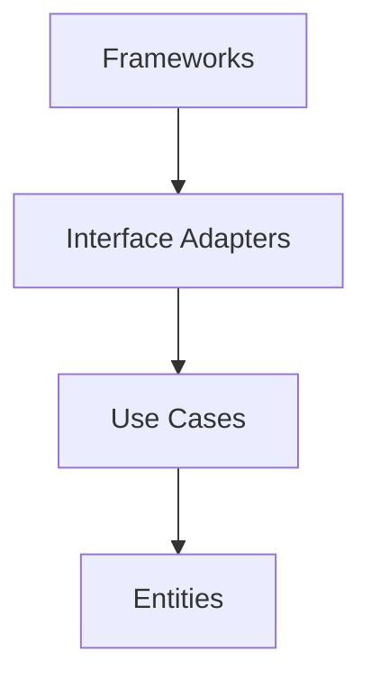

### Key details

- Use case class per application operation (`PlaceOrderUseCase`).
- Presenter pattern formats output for HTTP vs CLI.
- Overlaps heavily with hexagonal - often used interchangeably in practice.

### When to use

- Complex application logic deserving isolated unit tests.
- Teams following Uncle Bob / SOLID training.
- Services expected to outlive specific framework versions.

### Trade-offs / Pitfalls

- Ceremony for simple services - judge by domain complexity.
- Anemic domain model if use cases hold all logic and entities are bags.
- Circular dependency fights if dependency rule not enforced in reviews.

### References

*(No curated references for this sub-topic in `_topics.json`.)*

---


## 8.10 Onion Architecture


### What is it?

**Onion architecture** layers application around domain model: domain model center -> domain services -> application services -> infrastructure (ORM, HTTP) on outside.

### Why it matters

Similar to hexagonal/clean - emphasizes rich domain model at core rather than anemic entities; infrastructure is pluggable shell.

### How it works

1. **Domain model:** entities, value objects, domain services, repository interfaces.
2. **Application services:** coordinate use cases, transactions, security.
3. **Infrastructure:** ORM mappings, REST controllers, message listeners.
4. Interfaces defined inward; implementations outward.
5. Application depends on domain abstractions only.

### Diagram

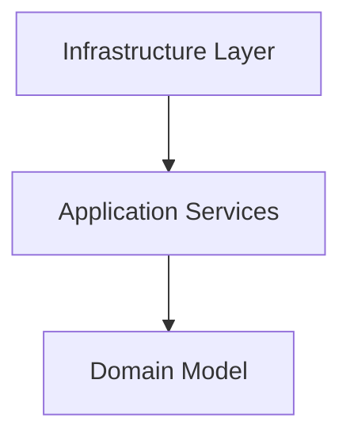

### Key details

- Repository interface in domain; implementation in infrastructure.
- Domain events raised by aggregates, handled in application/infrastructure.
- Often combined with DDD tactical patterns.

### When to use

- DDD projects wanting explicit layering naming.
- Teams preferring "layers" mental model over "ports/adapters" vocabulary.

### Trade-offs / Pitfalls

- Layer bypass (controller -> repository) erodes architecture - ArchUnit enforcement helps.
- Duplicate concepts with hexagonal - pick one vocabulary per team.
- Thick application layer -> anemic domain smell.

### References

*(No curated references for this sub-topic in `_topics.json`.)*

---


## 8.11 Dependency Injection


### What is it?

**Dependency injection (DI)** provides a component's dependencies from outside rather than self-constructing them - via constructor injection, enabling testability and loose coupling.

### Why it matters

Foundation of Spring, NestJS, and modern frameworks; essential for swapping real adapters with mocks in tests and wiring hexagonal ports to adapters.

### How it works

1. Class declares dependencies via constructor parameters (interfaces).
2. DI container (Spring ApplicationContext) instantiates graph at startup.
3. Container resolves interface -> implementation bindings from config.
4. Scopes: singleton (default), prototype, request-scoped.
5. Tests override bindings with `@MockBean` or manual constructor injection.

### Diagram

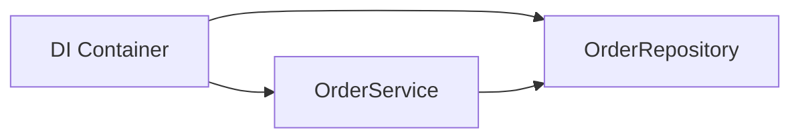

### Key details

- Prefer constructor injection over field injection (testability, immutability).
- `@Configuration` classes define bean wiring in Spring.
- Pure DI without framework: manual composition root in `main()`.

### When to use

- Essentially all structured service applications.
- Hexagonal/clean architectures wiring ports to adapters.
- Unit testing with mocked outbound dependencies.

### Trade-offs / Pitfalls

- Magic container failures at runtime if bean missing - not compile-time.
- Over-injection of tiny dependencies -> constructor with 15 parameters (code smell).
- Service locator anti-pattern bypasses explicit dependencies.

### References

*(No curated references for this sub-topic in `_topics.json`.)*

---


## 8.12 Service Registry


### What is it?

A **service registry** is a database of running service instances - host, port, health, metadata - where services **register** on startup and **deregister** on shutdown.

### Why it matters

Dynamic environments (Kubernetes, autoscaling) change instance addresses constantly; clients need current roster without hardcoded IPs.

### How it works

1. Service starts, registers `order-service:10.0.1.5:8080` with registry (Consul, Eureka, etcd).
2. Sends periodic heartbeats; missed heartbeats -> unhealthy.
3. Clients or load balancers query registry for healthy instances.
4. On shutdown, graceful deregister or TTL expiry removes stale entries.

### Diagram

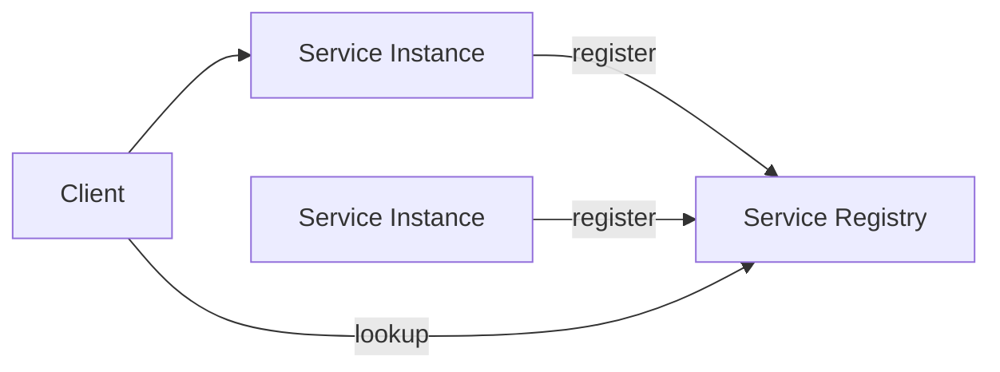

### Key details

- Kubernetes: etcd-backed API server is implicit registry via Endpoints.
- Eureka: AP-oriented; tolerates partition at cost of stale reads.
- Consul: health checks + KV + service mesh integration.

### When to use

- Any dynamic microservice deployment not behind static load balancer config.
- Client-side load balancing (Ribbon-style) patterns.

### Trade-offs / Pitfalls

- Registry outage blocks new discoveries - not always existing connections.
- Stale registrations -> requests to dead instances without health checks.
- Prefer platform-native discovery (K8s DNS) over custom Eureka when possible.

### References

*(No curated references for this sub-topic in `_topics.json`.)*

---


## 8.13 Service Discovery


### What is it?

**Service discovery** is how callers resolve a **logical service name** (`payment-service`, `orders.grpc`) to **healthy instance endpoints** (IP:port, pod DNS) in dynamic infrastructure where instances are created and destroyed continuously.

Without discovery, every deploy changes IPs and breaks hardcoded configs.

### Why it matters

```text
K8s pod restarts → new IP every 30 seconds
Auto-scaling adds 10 instances at 9am
AZ failure removes half the fleet

Caller must find current healthy backends without manual config updates
```

Discovery failures manifest as **intermittent 503s**, **sticky calls to dead IPs**, or **thundering herd on one instance**.

### How it works

**Client-side discovery:**

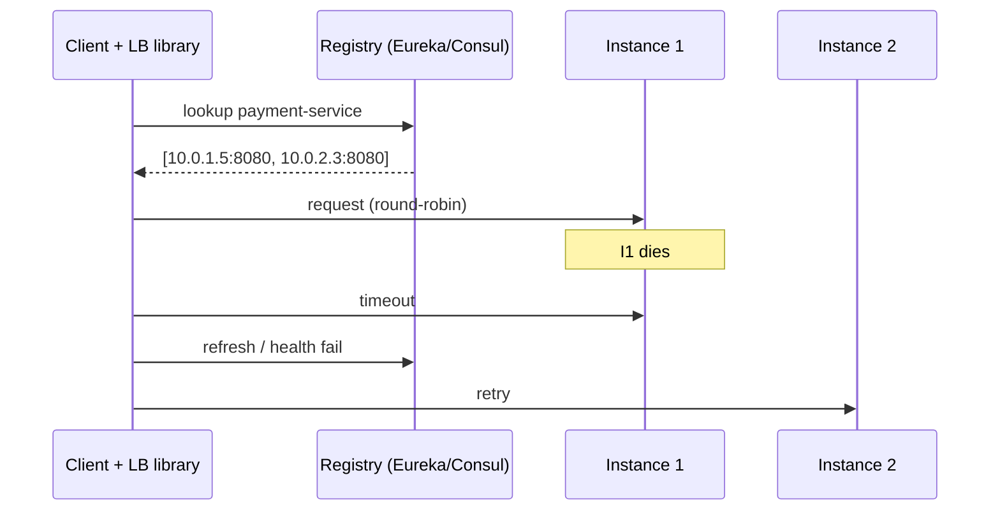

1. Client queries registry for service name.
2. Client caches instance list locally.
3. Client load-balances (round-robin, least-conn, weighted).
4. On failure, refresh cache or mark instance bad.

**Server-side discovery:**

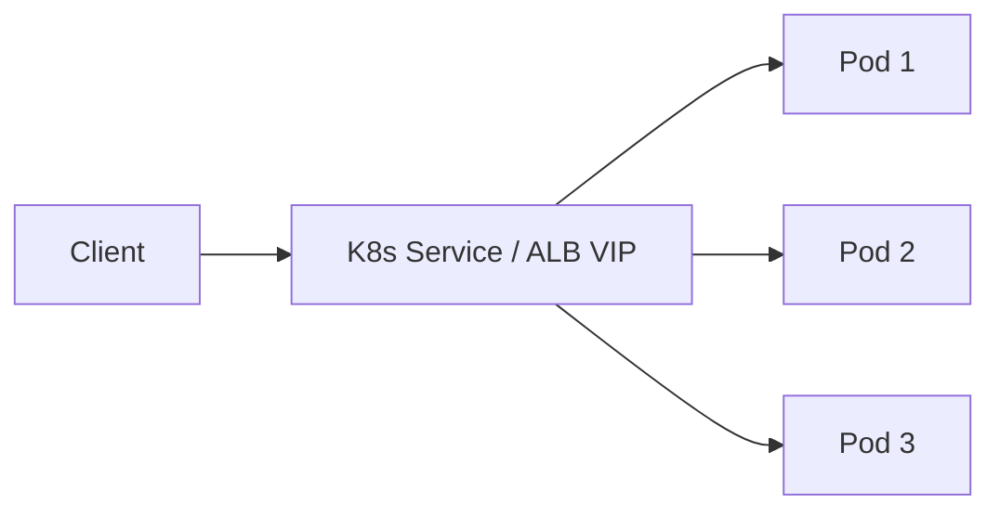

1. Client calls stable virtual IP / DNS name.
2. Platform (kube-proxy, ALB, Envoy) routes to healthy backend.
3. Client has no instance list — platform handles it.

| Mode | Examples | Who load-balances |
|------|----------|-------------------|
| **Client-side** | Eureka + Ribbon, gRPC custom resolver, Consul | Application library |
| **Server-side** | K8s Service, AWS ALB/NLB, GCP ILB | Platform proxy |
| **Service mesh** | Istio, Linkerd via xDS | Sidecar Envoy |

**Kubernetes specifics:**

```text
Service "payment" → ClusterIP 10.96.0.5
kube-proxy / eBPF dataplane → endpoints from ready pods
DNS: payment.default.svc.cluster.local → ClusterIP

Headless service (clusterIP: None) → DNS returns all pod A records
  → client-side LB for StatefulSets
```

### Key details

#### Production failure modes

| Symptom | Cause | Fix |
|---------|-------|-----|
| Calls to dead IP | Stale client cache, long TTL | Lower cache TTL; fail-fast refresh |
| All traffic to one pod | Broken LB algorithm / subsetting bug | Check endpoint count; restart kube-proxy |
| 503 after deploy | Readiness probe passes before app warm | PreStop hook, graceful drain, minReadySeconds |
| Intermittent cross-AZ latency | Suboptimal locality | Topology-aware routing, same-AZ preference |
| Eureka "self-preservation" | Registry won't evict dead instances | Tune thresholds; prefer K8s native discovery |
| DNS NXDOMAIN after scale-up | DNS cache at client (JVM 30s+) | Use HTTP keep-alive + reconnect; or mesh |

#### Stale registry timeline

```text
T=0   Instance crashes (no graceful deregister)
T=1   Registry still lists instance (heartbeat TTL 30s)
T=2   Clients send traffic → timeouts for 30–90s
T=3   Registry evicts; cache refresh

Mitigation: health-check from client; connection timeout < 2s; outlier detection (mesh)
```

#### Discovery + health checks

```text
Registration ≠ healthy

Good: register only when /health returns 200 AND dependencies up
Better: readiness probe removes from endpoints before SIGTERM
Best:  graceful shutdown — deregister → wait in-flight → exit
```

**gRPC discovery:**

```text
resolver://kubernetes:///payment:grpc
→ watches Endpoints API
→ updates channel backends on pod changes
```

### When to use

- All microservice communication in dynamic infra (K8s, ECS, Nomad)
- Multi-region with geo-DNS + regional service registries
- gRPC long-lived channels (need resolver watching backend changes)

### Trade-offs / Pitfalls

| Approach | Pros | Cons |
|----------|------|------|
| Client-side | Fine-grained LB; no extra hop | Library per language; cache bugs |
| Server-side | Simple client; battle-tested LBs | Extra hop; less per-request control |
| DNS-based | Universal | TTL propagation delay |
| Hardcoded URLs | "Simple" | Breaks on every deploy — never in prod |

### References

- Kubernetes Services and Endpoints; gRPC load balancing guide
- See [8.14 Service Mesh](#814-service-mesh), [1.20 Load Balancer](../01-networking/README.md#120-load-balancer)

---


## 8.14 Service Mesh


### What is it?

A **service mesh** is a dedicated infrastructure layer for **service-to-service (east-west)** communication. It handles cross-cutting concerns - **mTLS**, retries, timeouts, circuit breaking, load balancing, metrics, tracing - via **sidecar proxies** attached to each workload, controlled by a **control plane** (Istio/Istiod, Linkerd).

Application code stays business-focused; networking policy is declarative (YAML).

### Why it matters

In a 50-service microservices estate:
- Java service uses Resilience4j, Go service uses custom retries, Python has none -> **inconsistent** resilience
- mTLS between every pair is impractical to configure per app
- Distributed tracing requires instrumentation in every language

Service mesh **uniformizes** security and observability at the platform layer.

### How it works

**Data plane (sidecar - usually Envoy):**
1. Each pod: `app container` + `envoy sidecar` (iptables/CNI redirects all traffic through sidecar)
2. Outbound call from app -> localhost:15001 -> Envoy -> remote Envoy -> target app
3. Sidecar handles: TLS, retry, timeout, load balance, telemetry export

**Control plane (Istiod / Linkerd controller):**
1. Stores routing rules, cert authority, service registry
2. Pushes config to all sidecars (xDS protocol)
3. Issues short-lived certs for automatic **mTLS** between services

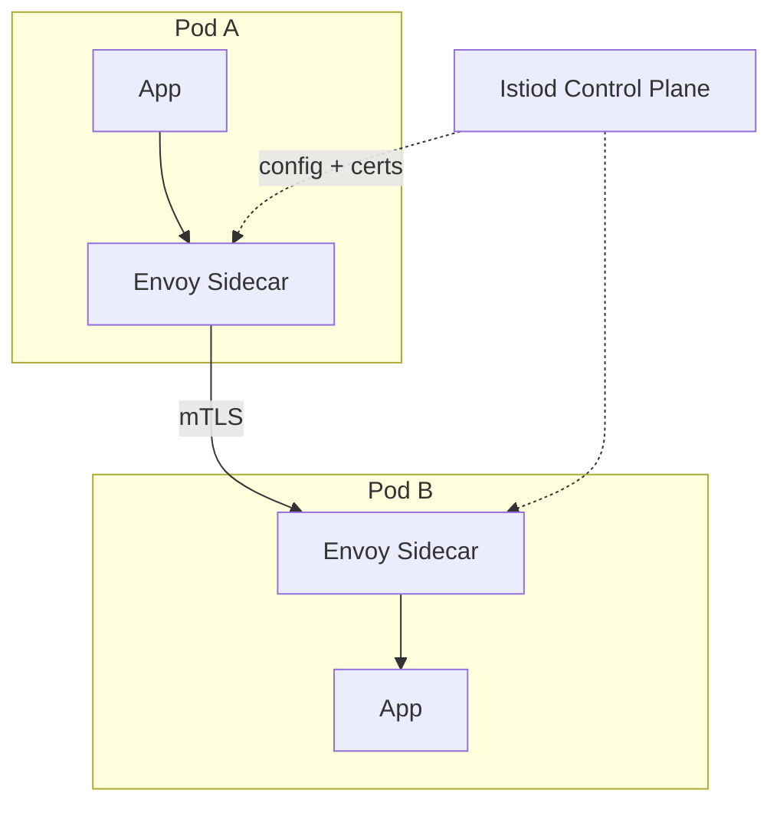

**Platform capabilities without app changes:**

| Feature | Mesh policy example |
|---------|---------------------|
| mTLS | `PeerAuthentication: STRICT` |
| Retry | `VirtualService: retries: 3` |
| Timeout | `route timeout: 2s` |
| Circuit break | `DestinationRule: outlierDetection` |
| Canary | 90% v1 / 10% v2 traffic split |
| Fault injection | delay 5s on 1% of requests (chaos) |
| Tracing | auto-inject trace headers |

**vs API Gateway:**

| | API Gateway | Service Mesh |
|---|-------------|--------------|
| Traffic | North-south (client -> cluster) | East-west (service -> service) |
| Location | Edge | Sidecar per pod |
| Examples | Kong, AWS API GW | Istio, Linkerd |

### Key details

- **Cost:** ~50-100MB RAM + CPU per sidecar per pod; at 500 pods = significant cluster overhead
- **Latency:** ~0.5-1.5ms added per hop (sidecar proxy)
- **Alternatives:** library-based resilience (Resilience4j), **Cilium** service mesh (eBPF, no sidecar)
- **When to skip:** <10 services, homogeneous stack, good shared libraries
- **Debugging:** `istioctl proxy-config`, Envoy admin `:15000`, access logs

### When to use

- 20+ microservices, polyglot stack, zero-trust mTLS requirement
- Platform team owns progressive delivery (canary, mirroring)
- Consistent observability without per-language instrumentation

### Trade-offs / Pitfalls

- **Operational complexity** - Istio learning curve is steep
- **Sidecar resource tax** at high pod density
- **Debugging harder** - extra hop obscures where latency/failure occurs
- **Overkill early** - start with API gateway + good client libraries; add mesh when pain justifies cost
- **iptables/CNI conflicts** with some network plugins

### References

- Istio documentation; Linkerd docs; Envoy proxy architecture

---


## 8.15 Sidecar Pattern


### What is it?

The **sidecar pattern** deploys a helper process alongside the main application container in the same pod - sharing network namespace, extending functionality without changing app code.

### Why it matters

Foundation of service mesh, log shipping (Fluent Bit), and proxy-based security - separation of concerns between app logic and platform plumbing.

### How it works

1. Kubernetes pod spec defines two containers: `app` + `sidecar`.
2. Sidecar intercepts traffic via `iptables` (istio-init) or eBPF redirect.
3. App may call `localhost:15001` unaware of mesh routing.
4. Sidecar handles TLS, retries, metrics export.
5. Lifecycle tied - sidecar starts/stops with app pod.

### Diagram

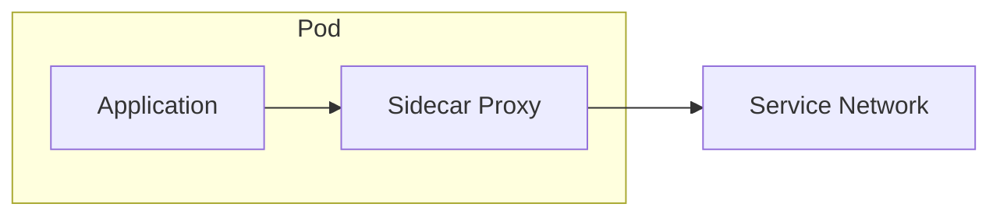

### Key details

- Ambient mesh (Istio) moves sidecar functions to node-level - reducing per-pod overhead.
- Non-mesh sidecars: Vault agent for secret rotation.
- `shareProcessNamespace` rare - usually separate containers.

### When to use

- Service mesh deployment (Envoy, Linkerd proxy).
- Log/metric collection without app SDK.
- Language-agnostic policy enforcement.

### Trade-offs / Pitfalls

- Two containers to monitor and resource-limit per pod.
- Startup ordering: app may start before sidecar ready - readiness probes matter.
- Debugging which container failed increases triage time.

### References

*(No curated references for this sub-topic in `_topics.json`.)*

---


## 8.16 Circuit Breaker


### What is it?

A **circuit breaker** is a resilience pattern that **stops calling a failing downstream service** after errors exceed a threshold - like an electrical breaker that trips to prevent fire. Instead of waiting for timeouts on every call, the caller **fails fast** while the dependency is unhealthy.

Named states mirror electrical circuits: **Closed** (normal), **Open** (tripped), **Half-Open** (testing recovery).

Popularized by **Netflix Hystrix**; modern equivalents: **Resilience4j**, **Istio outlier detection**, **Envoy** passive health checks.

### Why it matters

Without a circuit breaker, one slow/failing dependency causes:
1. Caller threads block waiting for timeout (thread pool exhaustion)
2. Retries amplify load on already-failing service
3. Cascade failure across the call chain (**cascading outage**)

Circuit breaker converts slow failure into fast failure, preserving resources for healthy paths and enabling **fallback** responses.

### How it works

**State machine:**

```text
CLOSED (normal)
  -> count failures in sliding window (e.g. last 10 calls, or 50% failure rate in 30s)
  -> threshold exceeded -> OPEN

OPEN (tripped)
  -> all calls fail immediately (no network call to downstream)
  -> return fallback or error to caller
  -> after waitDuration (e.g. 30s) -> HALF-OPEN

HALF-OPEN (probe)
  -> allow limited probe requests (e.g. 1 in 5)
  -> probe success -> CLOSED
  -> probe failure -> OPEN again
```

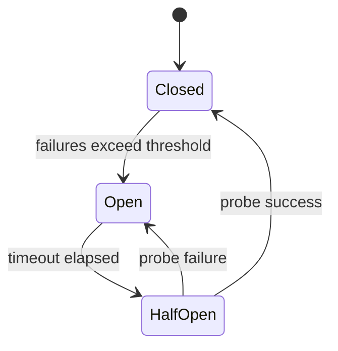

**Example with Resilience4j-style config:**

| Parameter | Example | Meaning |
|-----------|---------|---------|
| `failureRateThreshold` | 50% | Trip when half of calls fail |
| `slidingWindowSize` | 20 | Evaluate last 20 calls |
| `waitDurationInOpenState` | 30s | Stay open before half-open |
| `permittedCallsInHalfOpenState` | 3 | Probe calls allowed |

**Combined patterns:**

- **Circuit breaker + retry:** retry only when closed; never retry when open
- **Circuit breaker + timeout:** cap wait per call (e.g. 2s) before counting as failure
- **Circuit breaker + bulkhead:** isolate thread pools per dependency
- **Fallback:** return cached default, degraded feature, or friendly error message

```text
try:
  result = circuitBreaker.execute(() -> paymentService.charge())
except CircuitOpen:
  return cachedQuote()  // fallback
```

### Key details

- Monitor **state transition metrics** (`circuit_opened_total`) - alert before users notice
- Tune thresholds per dependency - payment service stricter than avatar image service
- **Do not put circuit breaker on database** in a way that hides connection pool misconfiguration
- Service mesh (Istio) can eject unhealthy hosts without app code changes
- Half-open flapping: increase `waitDuration` or require multiple successful probes

### When to use

- Every **synchronous** cross-service call on critical user paths
- Third-party APIs with variable reliability (payments, SMS, maps)
- During incidents to prevent retry storms from amplifying outage
- Microservices with deep call chains (A -> B -> C -> D)

### Trade-offs / Pitfalls

- **Open circuit = errors to users** unless fallback exists - design degraded UX ("payments temporarily unavailable")
- Wrong threshold -> **flapping** (open/close/open rapidly) or slow detection (too many failures before trip)
- Circuit breaker on wrong granularity (whole service vs single endpoint) blocks healthy operations
- Does not replace **root cause fix** - only contains blast radius
- Async/event-driven paths need different patterns (DLQ, backpressure)

### References

- Netflix Hystrix design docs; Resilience4j user guide

---


## 8.17 Retry Pattern


### What is it?

The **retry pattern** re-attempts failed operations when errors are **transient** — network blips, `503 Service Unavailable`, connection resets, throttling — using **bounded attempts**, **exponential backoff**, and **jitter**.

Retries are dangerous without rules: they can turn a brief outage into a **retry storm** that prevents recovery.

### Why it matters

```text
Without retries:  1 transient blip → user-visible failure
With bad retries: 1 outage → 10× amplified load → longer outage
With good retries: most blips heal; dependency gets breathing room
```

Every microservice client library (HTTP, gRPC, AWS SDK) has retries — you must **configure** them, not accept defaults blindly.

### How it works

**Decision tree:**

```mermaid
flowchart TB
    Call[Outbound call] --> OK{Success?}
    OK -->|Yes| Return[Return result]
    OK -->|No| Type{Error type?}
    Type -->|4xx except 429| Fail[Do not retry]
    Type -->|408, 429, 5xx, timeout| CB{Circuit open?}
    CB -->|Yes| Fast[Fail fast]
    CB -->|No| Attempts{Attempts left?}
    Attempts -->|No| Fail
    Attempts -->|Yes| Wait[Backoff + jitter]
    Wait --> Call
```

**Exponential backoff with jitter:**

```text
delay = min(max_delay, base * 2^attempt) + random(0, jitter_ms)

Example: base=200ms, attempt=3, jitter=0-100ms
  delay = 200 * 8 + rand = ~1600-1700ms
```

**Retryable vs non-retryable (HTTP):**

| Status / error | Retry? | Why |
|----------------|--------|-----|
| `200–299` | N/A | Success |
| `400 Bad Request` | No | Client bug — same request will fail |
| `401/403` | No | Auth issue — won't self-heal |
| `404` | No | Resource missing |
| `408 Timeout` | Yes | Transient |
| `429 Too Many Requests` | Yes | Respect `Retry-After` header |
| `500/502/503/504` | Yes | Server/overload — may recover |
| Connection reset / timeout | Yes | Network blip |

**Idempotency requirement:**

```text
GET, PUT, DELETE     → safe to retry (idempotent by HTTP semantics)
POST create charge   → MUST use Idempotency-Key header before retry
                     → otherwise duplicate payment on timeout+retry
```

```mermaid
sequenceDiagram
    participant C as Client
    participant S as Service
    C->>S: POST /charge (Idempotency-Key: abc)
    S-->>C: timeout (unknown if processed)
    Note over C: backoff 500ms
    C->>S: POST /charge (Idempotency-Key: abc)
    S-->>C: 200 OK (deduped on server)
```

### Key details

#### Production configuration

| Parameter | Typical value | Notes |
|-----------|---------------|-------|
| `maxAttempts` | 3–5 | More = longer tail latency |
| `baseDelay` | 100–500 ms | Per dependency SLA |
| `maxDelay` | 5–30 s | Cap exponential growth |
| `jitter` | Full or equal | AWS recommends full jitter |
| `retryBudget` | 10% of requests | Google SRE — limit total retry traffic |
| `perTryTimeout` | < total deadline | Leave room for multiple attempts |

**gRPC retry policy (conceptual):**

```json
{
  "maxAttempts": 4,
  "initialBackoff": "0.2s",
  "maxBackoff": "5s",
  "backoffMultiplier": 2,
  "retryableStatusCodes": ["UNAVAILABLE", "DEADLINE_EXCEEDED"]
}
```

#### Retry + circuit breaker + bulkhead

```text
1. Bulkhead limits concurrent calls to dependency (8.18)
2. Circuit breaker opens when failure rate high (8.16)
3. When OPEN → do not retry (fail fast immediately)
4. When CLOSED → retry with backoff for transient errors
5. When HALF-OPEN → single probe, no retry loop
```

**Retry storm timeline:**

```text
T=0   Dependency slow (p99 5s)
T=1   1000 clients timeout at 2s, each retries 3×
T=2   Effective load = 3000+ RPS → dependency dies
T=5   Full outage

Mitigation: jitter + circuit breaker + lower maxAttempts
```

#### Message consumers (Kafka/SQS)

Same rules apply — retry in consumer loop must coordinate with:

- **Idempotent handler** (dedup table)
- **max.poll.interval** (Kafka — don't block poll thread long)
- **Visibility timeout** (SQS — extend or delete before retry)
- **DLQ** after max attempts (6.15)

### When to use

- Read operations and idempotent writes
- gRPC/HTTP clients calling internal services
- Message consumers with at-least-once delivery
- Cloud SDK calls (throttling, regional failover blips)

### Trade-offs / Pitfalls

| Pitfall | Consequence | Mitigation |
|---------|-------------|------------|
| Retry non-idempotent POST | Duplicate orders/charges | Idempotency-Key |
| Retry when circuit open | Amplifies outage | Check breaker state first |
| No jitter | Synchronized retry wave | Always add randomness |
| maxAttempts too high | p99 explodes | Cap at 3–5 for user-facing |
| Retry on 400 | Waste + log noise | Classify errors explicitly |
| Default AWS SDK retries | Hidden retry storm | Configure explicitly |

### References

- Google SRE — Handling Overload; AWS exponential backoff and jitter
- See [8.16 Circuit Breaker](#816-circuit-breaker), [6.16 Retry Queue](../06-messaging-and-events/README.md#616-retry-queue)

---


## 8.18 Bulkhead Pattern


### What is it?

The **bulkhead pattern** isolates resources (thread pools, connections) per dependency or tenant - so one slow service cannot exhaust the entire pool shared by others.

### Why it matters

Named after ship compartments: one hull breach floods one section, not the whole vessel. Limits blast radius of dependency failures.

### How it works

1. Assign dedicated thread pool / connection limit per downstream service.
2. Calls to service A use pool A only; service B uses pool B.
3. If A is slow, pool A saturates; B remains responsive.
4. Reject excess calls to saturated pool immediately (fail fast).
5. Semaphore-based bulkheads in async code.

### Diagram

```mermaid
flowchart TB
    App[Service] --> PoolA["Pool: Payments"]
    App --> PoolB["Pool: Inventory"]
    PoolA --> Pay[Payment API]
    PoolB --> Inv[Inventory API]
```

### Key details

- Hystrix thread pools per command key; Resilience4j bulkhead.
- K8s: separate deployments per critical dependency path.
- Connection pool sizing per destination in HTTP clients.

### When to use

- Multiple downstream dependencies with varying latency SLAs.
- Multi-tenant systems isolating noisy neighbor tenants.
- High fan-out BFF calling many services.

### Trade-offs / Pitfalls

- More pools -> more threads -> higher memory; tune carefully.
- Wrong pool sizing still allows starvation within bulkhead.
- Doesn't help if shared DB is the actual bottleneck.

### References

*(No curated references for this sub-topic in `_topics.json`.)*

---


## 8.19 Saga Pattern


### What is it?

A **saga** is a **long-running business transaction** decomposed into a sequence of **local transactions** — each in one service with its own database — coordinated so that a failure triggers **compensating transactions** (semantic undo) rather than a distributed two-phase commit (2PC).

There is no global lock; consistency is **eventual** across services.

### Why it matters

In microservices, **2PC/XA across databases** is avoided (blocking, fragile, poor availability). Sagas are the standard pattern for:

- Place order → reserve inventory → charge payment → confirm shipment
- Book travel → reserve flight → reserve hotel → charge card
- Sign up → create account → provision tenant → send welcome email

**Interview framing:** "Saga = local ACID steps + compensating actions; choreography = events; orchestration = central coordinator."

### How it works

**Happy path (3-step order saga):**

```mermaid
sequenceDiagram
    participant O as Order Service
    participant I as Inventory Service
    participant P as Payment Service

    O->>O: T1 Create order (PENDING)
    O->>I: T2 Reserve stock
    I-->>O: OK
    O->>P: T3 Charge card
    P-->>O: OK
    O->>O: T4 Mark order CONFIRMED
```

**Failure path — payment fails, compensate in reverse order:**

```mermaid
sequenceDiagram
    participant O as Order Service
    participant I as Inventory Service
    participant P as Payment Service

    O->>I: Reserve stock OK
    O->>P: Charge card NO
    O->>I: Compensate: ReleaseReservation
    O->>O: Compensate: Cancel order
```

**Compensating transactions vs rollback:**

| DB rollback | Saga compensation |
|-------------|-------------------|
| Automatic, atomic | **Application-defined** semantic undo |
| `ROLLBACK` restores rows | `ReleaseInventory`, `RefundPayment`, `CancelOrder` |
| Works in one database | Works across independent databases |
| Instant | May be async, eventually consistent |

Not all steps are compensable:

| Step | Compensatable? | Notes |
|------|----------------|-------|
| Reserve inventory | Yes | `ReleaseReservation` |
| Charge payment | Yes | `Refund` (may be async) |
| Send email | **No** | Use "pending send" until saga commits |
| Ship physical goods | Hard | Avoid confirming until payment succeeds |

**Saga implementation styles:**

### Choreography vs orchestration

| Dimension | Choreography | Orchestration |
|-----------|--------------|---------------|
| **Coordinator** | None — services react to events | Central orchestrator (Temporal, Camunda) |
| **Communication** | Domain events on message bus | Commands + replies to orchestrator |
| **Visibility** | Distributed — hard to see full state | Single workflow state store |
| **Coupling** | Loose — subscribers know events | Services know orchestrator API |
| **Complexity** | Simple flows (2–4 steps) | Complex branching, timers, human steps |
| **Failure handling** | Compensating events scatter | Orchestrator drives compensate sequence |
| **SPOF** | Bus availability | Orchestrator (must be HA) |
| **Best for** | Event-native teams, simple pipelines | Long workflows, many branches |

**Choreography diagram:**

```mermaid
flowchart LR
    O[Order Svc] -->|OrderPlaced| Bus[Event Bus]
    Bus --> I[Inventory Svc]
    I -->|InventoryReserved| Bus
    Bus --> P[Payment Svc]
    P -->|PaymentFailed| Bus
    Bus --> I2["Inventory: ReleaseStock"]
    Bus --> O2["Order: Cancelled"]
```

**Orchestration diagram:**

```mermaid
sequenceDiagram
    participant Orch as Orchestrator
    participant O as Order
    participant I as Inventory
    participant P as Payment

    Orch->>O: createOrder
    Orch->>I: reserve
    Orch->>P: charge
    P-->>Orch: FAIL
    Orch->>I: release (compensate)
    Orch->>O: cancel (compensate)
```

**Saga state machine (orchestrator view):**

```mermaid
stateDiagram-v2
    [*] --> OrderCreated
    OrderCreated --> InventoryReserved: reserve OK
    InventoryReserved --> PaymentCaptured: charge OK
    PaymentCaptured --> Confirmed
    InventoryReserved --> CompensatingInventory: charge FAIL
    CompensatingInventory --> Cancelled: release OK
    Confirmed --> [*]
    Cancelled --> [*]
```

**Design rules every saga step must follow:**

1. **Idempotent** — retries safe (`Idempotency-Key`, unique business ID)
2. **Compensable** — define explicit undo for each forward action
3. **Commutative where possible** — compensation order may differ from forward order
4. **Pivot transaction** — point of no return (e.g., shipment) — minimize steps after pivot
5. **Outbox pattern** — publish events atomically with local DB commit

### Key details

| Tool | Style | Notes |
|------|-------|-------|
| Temporal / Cadence | Orchestration | Durable workflows, timers, retries built-in |
| Camunda / Zeebe | Orchestration | BPMN, human tasks |
| Kafka + events | Choreography | Schema registry, consumer idempotency |
| Custom saga table | Either | `saga_id`, `step`, `status` in DB |

**Visibility requirements:** correlation ID (`saga_id`) in every log, span, and event; dashboard for stuck sagas in `PENDING` > N minutes.

### When to use

- Business processes spanning multiple microservices with independent databases
- When 2PC is unacceptable (latency, availability, cloud DB limitations)
- Long-running flows with timeouts (payment auth expires in 15 min)

### Trade-offs / Pitfalls

- **No isolation like ACID:** other transactions see intermediate state (dirty reads) — design UX accordingly
- **Compensation ≠ undo:** refund takes days; email cannot be unsent
- **Choreography debugging:** "where is order 123?" requires distributed trace + event log
- **Orchestrator SPOF:** must run HA with durable state (Temporal handles this)
- **Cyclic events:** `OrderFailed` triggers `Release` triggers `OrderUpdated` loop — clear event contracts
- **Partial compensation failure:** need retry, manual intervention, and saga timeout alerts

### References

- [Chris Richardson — Saga pattern](https://microservices.io/patterns/data/saga.html)
- [Temporal — Saga documentation](https://docs.temporal.io/saga)

---


## 8.20 Choreography


### What is it?

**Choreography** implements sagas via **events**: each service listens and reacts - no central coordinator. Order placed -> inventory reacts -> payment reacts.

### Why it matters

Loose coupling, no orchestrator SPOF, natural fit for event-driven architecture - preferred when workflow is simple and teams own services end-to-end.

### How it works

1. Order service publishes `OrderPlaced`.
2. Inventory consumes, reserves, publishes `InventoryReserved` or `ReservationFailed`.
3. Payment consumes success event, charges, publishes `PaymentCompleted`.
4. Order service listens for completion events to update status.
5. Failure events trigger compensating events (`ReleaseInventory`).

### Diagram

```mermaid
flowchart LR
  O[Order Svc] -->|OrderPlaced| Bus[Event Bus]
  Bus --> I[Inventory Svc]
  I -->|Reserved| Bus
  Bus --> P[Payment Svc]
  P -->|Paid| Bus
  Bus --> O
```

### Key details

- No single view of saga state - distributed tracing essential.
- Cyclic dependencies risk if event chains poorly designed.
- Works best with clear event contracts and schema registry.

### When to use

- Few steps, clear event flow, mature event platform.
- Teams want autonomy without central workflow engine.
- High throughput async pipelines.

### Trade-offs / Pitfalls

- Hard to answer "where is order X in workflow?" without correlation IDs and event log.
- Compensating flows scatter across services - hard to reason about globally.
- Adding step requires updating multiple subscribers.

### References

*(No curated references for this sub-topic in `_topics.json`.)*

---


## 8.21 Orchestration


### What is it?

**Orchestration** implements sagas with a **central coordinator** (orchestrator) that commands each service step-by-step and handles compensation on failure.

### Why it matters

Explicit workflow visibility, easier complex branching, and single place for timeout/retry policy - better for long workflows with many steps.

### How it works

1. Client starts saga at orchestrator (Temporal, Camunda, custom).
2. Orchestrator calls inventory service: reserve.
3. On success, calls payment: charge.
4. On payment failure, orchestrator calls inventory: release.
5. Orchestrator persists saga state durably between steps.

### Diagram

```mermaid
sequenceDiagram
    participant Orch as Orchestrator
    participant I as Inventory
    participant P as Payment
    Orch->>I: reserve
    I-->>Orch: OK
    Orch->>P: charge
    P-->>Orch: FAIL
    Orch->>I: compensate
```

### Key details

- Temporal/Cadence: workflow code as state machine with durable timers.
- Orchestrator must be HA with persistent state store.
- Commands vs events: orchestrator sends imperative commands.

### When to use

- Complex sagas with branching, timers, human approval steps.
- Need centralized monitoring of in-flight workflows.
- Compensations hard to express as pure event chain.

### Trade-offs / Pitfalls

- Orchestrator SPOF and scaling concern - must engineer for HA.
- Couples services to orchestrator API (tighter than choreography).
- Risk of "smart orchestrator" accumulating business logic.

### References

*(No curated references for this sub-topic in `_topics.json`.)*

---

[<- Back to master index](../README.md)
