# 8. Microservices

[<- Back to master index](../README.md)

---

## Sub-topics

| # | Sub-topic |
|---|-----------|
| 8.1 | [Monolith](#81-monolith) |
| 8.2 | [Modular Monolith](#82-modular-monolith) |
| 8.3 | [Microservices](#83-microservices) |
| 8.4 | [Strangler Pattern](#84-strangler-pattern) |
| 8.5 | [BFF Pattern](#85-bff-pattern) |
| 8.6 | [DDD](#86-ddd) |
| 8.7 | [Bounded Context](#87-bounded-context) |
| 8.8 | [Hexagonal Architecture](#88-hexagonal-architecture) |
| 8.9 | [Distributed Transactions](#89-distributed-transactions) |
| 8.12 | [Service Registry](#812-service-registry) |
| 8.14 | [Service Mesh](#814-service-mesh) |
| 8.15 | [Sidecar Pattern](#815-sidecar-pattern) |
| 8.16 | [Circuit Breaker](#816-circuit-breaker) |
| 8.17 | [Retry Pattern](#817-retry-pattern) |
| 8.18 | [Bulkhead Pattern](#818-bulkhead-pattern) |
| 8.19 | [Saga Pattern](#819-saga-pattern) |
| 8.20 | [Choreography](#820-choreography) |
| 8.21 | [Orchestration](#821-orchestration) |

---

## 8.1 Monolith

### Overview

Picture a small restaurant where one chef handles everything — taking orders, cooking, plating, and washing dishes. Everyone works in the same kitchen, shares the same pantry, and ships one combined meal ticket at the end. That is a **monolith**: one deployable unit where UI, business logic, and data access live together and talk through in-process method calls.

Technically, a **monolith** packages all application components into a **single codebase and deployment artifact**. Components share one runtime, one process (or tightly coupled process group), and typically one database. Communication is synchronous and local — no network hops between modules. Scaling means scaling the whole application; technology choices apply uniformly across the system.

---

### What problem it fixes

Early-stage products need speed, not distribution complexity. Teams building MVPs, internal tools, or small consumer apps face:

- **Operational overhead** — multiple deploy pipelines, service discovery, and distributed tracing are premature when traffic is low.
- **Coordination cost** — splitting code across services before domain boundaries are clear creates integration pain without benefit.
- **Debugging friction** — distributed systems make a single user request harder to trace; a monolith keeps the stack trace in one process.

A monolith fixes this by keeping everything in one place: one build, one deploy, one database schema, one log stream. Developers refactor across layers freely; local method calls have microsecond latency instead of millisecond network round trips.

---

### What it does

A monolith delivers a complete application as one unit:

| Aspect | Behavior |
|--------|----------|
| **Deployment** | Single artifact (JAR, WAR, container image) |
| **Code organization** | One repository, often layered (controller → service → repository) |
| **Database** | Shared schema; cross-module joins are normal |
| **Communication** | In-process calls, shared memory, direct function invocation |
| **Scaling** | Horizontal replicas of the entire app behind a load balancer |
| **Technology** | One primary language and framework per deployable |

---

### How it works — the architecture inside

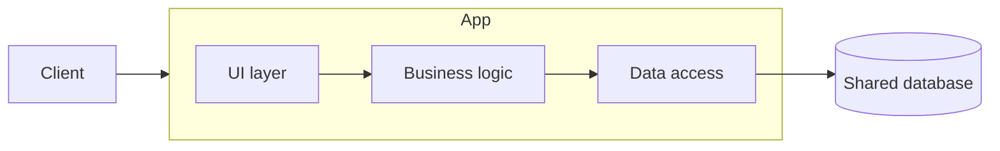

**Request flow:**

```text
HTTP request → controller → service layer → repository → database → response
```

All layers run in the same JVM, Node process, or container. Transactions span modules naturally — `BEGIN` … `COMMIT` across order and payment tables in one database is straightforward ACID.

**Typical e-commerce monolith modules** (logical, not separate deployables):

```text
User management · Product catalog · Order processing · Payment · Notifications
```

All packaged into one deployable; a single release updates every module simultaneously.

| Dimension | Monolith | Modular monolith (8.2) | Microservices (8.3) |
|-----------|----------|--------------------------|----------------------|
| **Deployment unit** | Single | Single | Multiple |
| **Code organization** | Low | High | Very high |
| **Scalability** | Whole app | Whole app | Per service |
| **Complexity** | Low | Medium | High |
| **Database** | Shared | Shared (often) | Service-owned |
| **Communication** | Method call | Method call / module API | Network |
| **Fault isolation** | Low | Low | High |
| **Operational cost** | Low | Low | High |

---

### Pitfalls and design tips

- **Do not treat "monolith" as a permanent label** — many successful systems stay monolithic for years; extract only when triggers are real (team coupling, independent scale needs, deploy conflicts).
- **Avoid the "big ball of mud"** — even in a monolith, enforce package boundaries early; evolve toward a modular monolith (8.2) before jumping to microservices.
- **Interview angle:** monolith is the correct default for startups and small teams; interviewers want to hear *when* you would split, not that microservices are always better.
- **Scaling trap:** scaling the whole app to handle one hot endpoint (e.g. product search) wastes resources on idle modules — this is a common migration trigger.
- **Default choice for new systems:** monolith or modular monolith unless you have proven multi-team, multi-scale requirements from day one.

---

### Real-world example

**Shopify's early architecture** ran as a Ruby on Rails monolith for years while processing billions in GMV. The team optimized within one codebase — caching, database sharding, and background job queues — before extracting services where boundaries were unmistakable. The lesson: a well-operated monolith outperforms a poorly split microservices estate. Extraction came when specific modules (payments, fulfillment) needed independent scale and team ownership, not because "microservices" was fashionable.

---

## 8.2 Modular Monolith

### Overview

Think of a large warehouse divided into clearly marked zones — receiving, storage, packing, shipping — each with its own team and rules, but still one building with one loading dock. Workers in packing do not rummage through receiving's shelves; they request items through defined handoff points. A **modular monolith** applies the same idea to code: strict module boundaries inside a single deployable.

Technically, a **modular monolith** is a monolithic application decomposed into **well-defined modules** with explicit interfaces, each owning a slice of domain logic. It still ships as one artifact and often shares one database, but cross-module access goes through published APIs or domain events — never direct reach into another module's internals. Tools like Spring Modulith, ArchUnit, or package-level access rules enforce boundaries at build time.

---

### What problem it fixes

A flat monolith grows into a **big ball of mud**: every module can call every other module's internals, schema tables become entangled, and a change in payments breaks checkout silently.

| Pain | How modular monolith helps |
|------|---------------------------|
| Unclear ownership | Modules map to domain areas with explicit boundaries |
| Accidental coupling | Build-time rules block illegal cross-module imports |
| Hard to extract later | Clean module seams become future microservice cut lines |
| Deploy risk | Still one deploy — no distributed-systems tax yet |

It fixes organizational and structural problems **without** introducing network latency, service discovery, or distributed transactions.

---

### What it does

A modular monolith:

- Deploys as **one unit** (same as a classic monolith).
- Organizes code into **domain-aligned modules** (User, Order, Payment, Inventory).
- Communicates across modules via **interfaces, facades, or domain events** — not direct database access across module tables.
- Often assigns **table ownership** per module (Order module owns `orders`; Payment owns `payments`) even within a shared database instance.
- Can evolve into microservices via the Strangler pattern (8.4) when a module is ready for independent deployment.

---

### How it works — the architecture inside

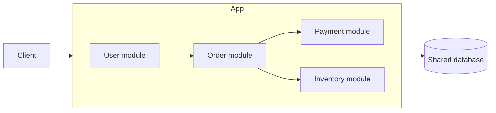

**Boundary enforcement:**

```text
Order module.publicApi.placeOrder()  ✓  (via interface)
Order module → Payment module.internal.dao  ✗  (blocked by ArchUnit / package rules)
```

**Cross-module communication options:**

| Style | When to use |
|-------|-------------|
| **Synchronous interface** | Immediate consistency needed within request |
| **In-process domain events** | Decouple modules; eventual consistency acceptable |
| **Shared DB with owned tables** | Simplest; avoid cross-module foreign keys |

**Banking modular monolith example:**

```text
Customer module · Account module · Loan module · Transaction module
```

One deployable; each module exposes a narrow public API. Transaction module calls Account via `AccountService.debit()` — never `AccountRepository` directly.

---

### Pitfalls and design tips

- **Shared database is still shared failure domain** — a bad migration or runaway query affects all modules; monitor per-module query patterns even in one DB.
- **Spring Modulith / ArchUnit** are production tools learners should name — they turn boundary rules into CI failures, not code-review nagging.
- **Do not confuse "module" with "bounded context"** — a bounded context (8.7) is a business boundary; a module is a technical package. They often align but are not identical.
- **Interview angle:** modular monolith is the recommended stepping stone before microservices; mention Strangler (8.4) as the extraction path.
- **Common mistake:** creating modules by technical layer (`validation-module`, `dao-module`) instead of business capability — mirrors the microservices anti-pattern.

---

### Real-world example

**Spring Modulith** (VMware/Spring team) formalizes modular monoliths in Spring Boot: each module is a Java package with an `ApplicationModule` descriptor, verified events for cross-module communication, and integration tests that assert no illegal dependencies. Teams ship one JAR to production while the build guarantees Order cannot import Payment internals. When Order needs independent scale, the module's event contracts and public API are already the extraction boundary — the Strangler router sends `/orders/*` to a new service with minimal rewrite.

---

## 8.3 Microservices

### Overview

Imagine a hospital where cardiology, radiology, pharmacy, and billing are separate departments — each with its own staff, budget, and records room, coordinating over phone and forms instead of sharing one desk. A **microservices** architecture splits software the same way: small, independently deployable services, each owning a business capability and usually its own database.

Technically, **microservices** decompose an application into **autonomous services** that communicate over the network (REST, gRPC, message queues). Each service encapsulates one bounded context (8.7), deploys on its own cadence, scales independently, and persists data in a **service-owned database** — no shared mutable schema across services. Distributed concerns — discovery (8.12), resilience (8.16–8.18), distributed transactions (8.9), sagas (8.19), observability — become first-class platform requirements.

---

### What problem it fixes

Large organizations hit limits with monoliths:

| Trigger | Symptom | Microservice response |
|---------|---------|----------------------|
| **Team scale** | 50 engineers stepping on one release | Teams own services independently (Conway's Law) |
| **Scale mismatch** | Search needs 20× capacity; admin needs 1× | Scale search service alone |
| **Deploy coupling** | Payment fix blocked by unrelated UI bug | Independent deploy per service |
| **Technology fit** | ML inference in Python; billing in Java | Polyglot services per need |
| **Fault isolation** | Memory leak in recommendations takes down checkout | Blast radius limited to one service |

Microservices trade operational complexity for **organizational and runtime independence** at scale.

---

### What it does

Each microservice:

- Owns a **single business capability** (orders, payments, inventory — not "validation layer").
- Has its own **codebase, CI/CD pipeline, and deployment lifecycle**.
- Stores data in a **private database** — other services access data only via API or events.
- Exposes a **network contract** (REST/gRPC) and/or publishes **domain events**.
- Runs multiple **instances** behind load balancing for availability and scale.

**E-commerce service map:**

| Service | Responsibility | Database |
|---------|----------------|----------|
| User | Accounts, profiles | User DB |
| Product | Catalog | Product DB |
| Inventory | Stock levels | Inventory DB |
| Order | Order lifecycle | Order DB |
| Payment | Charges, refunds | Payment DB |
| Notification | Email, SMS | Notification DB |

---

### How it works — the architecture inside

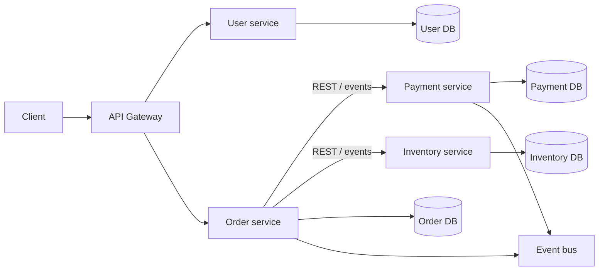

**Typical request — place order:**

```text
1. Client → API Gateway → Order service
2. Order service → Inventory service (reserve stock) — synchronous or via event
3. Order service → Payment service (charge) — synchronous
4. Order service publishes OrderPlaced → Notification service sends email (async)
5. Each service commits its own local transaction — no global 2PC
```

**Operational prerequisites** before splitting:

- CI/CD per service, containers / Kubernetes
- Service discovery (8.12) and API gateway
- Distributed tracing (OpenTelemetry) and structured logging
- Resilience stack: bulkhead (8.18) → retry (8.17) → circuit breaker (8.16)
- Contract testing and API versioning

| Dimension | Monolith | Modular monolith | Microservices |
|-----------|----------|------------------|---------------|
| **Independent deploy** | No | No | Yes |
| **Independent scale** | No | No | Yes |
| **Network latency** | None | None | Every cross-service call |
| **Distributed transactions** | N/A | N/A | Sagas + outbox (8.9), not 2PC across services |
| **Operational cost** | Low | Low | High |

---

### Pitfalls and design tips

- **When not to use:** small team, no scaling pain, no deploy conflicts — stay on monolith or modular monolith (8.1, 8.2).
- **Anti-pattern:** splitting by technical layer (`validation-service`, `dao-service`) — split by **business capability** aligned to bounded contexts (8.7).
- **Data ownership:** never share a database between services; shared DB reintroduces monolith coupling with network overhead.
- **Production stack:** Kubernetes Services for discovery, Istio/Linkerd for mesh (8.14), Temporal for sagas (8.21), Resilience4j for breakers.
- **Interview angle:** name the **distributed systems tax** — latency, partial failure, eventual consistency — and what platform pieces you add before splitting.

---

### Real-world example

**Netflix** runs hundreds of microservices behind a custom API gateway (Zuul, evolving to newer edge layers). The `Playback` service scales independently from `Billing`; an outage in recommendations does not block video streaming because services are isolated with circuit breakers (Hystrix, now resilience patterns in the mesh). Each team owns deployment, on-call, and SLOs for their service. The trade-off is a large platform organization (service mesh, chaos engineering, centralized tracing) that a 10-person startup cannot replicate — which is why Netflix's model is a destination, not a day-one architecture.

---

## 8.4 Strangler Pattern

### Overview

Picture renovating a busy train station while trains keep running: you build a new platform beside the old one, redirect one track at a time, and eventually retire the original structure. The **Strangler pattern** does the same for software — gradually replacing a monolith with microservices without a risky big-bang rewrite.

Technically, the Strangler pattern is an **incremental migration strategy**: new capabilities (or extracted modules) run as independent services; an **API gateway or router** sends traffic to the new service or the legacy monolith based on route rules. Data is synchronized or cut over per module. The monolith **shrinks** until it can be decommissioned. Named after the strangler fig tree that grows around and replaces its host.

---

### What problem it fixes

Big-bang rewrites fail often:

| Big-bang risk | Strangler mitigation |
|---------------|---------------------|
| Years of no business value | Each extraction delivers incremental value |
| High downtime | Legacy keeps serving unmigrated routes |
| Hard rollback | Roll back one route at the gateway |
| Requirements drift during rewrite | Continuous delivery on both old and new |
| All-or-nothing testing | Contract-test each extracted service independently |

Teams with a running monolith that has grown too large need a **safe path** to microservices without stopping the business.

---

### What it does

The Strangler pattern:

1. **Identifies** a module to extract (e.g. user management).
2. **Builds** a new microservice with equivalent (or improved) API.
3. **Routes** matching requests at the gateway to the new service; everything else stays on the monolith.
4. **Migrates data** (CDC, dual-write, or one-time backfill) while both systems run.
5. **Removes** the old code from the monolith once validated.
6. **Repeats** until the monolith is empty and retired.

**Key components:**

| Component | Role |
|-----------|------|
| **Legacy monolith** | Serves unmigrated functionality |
| **New services** | Handle extracted capabilities |
| **Router / API gateway** | Path-based routing to old or new |
| **Anti-corruption layer** | Translates legacy models at the boundary |
| **Data sync** | Keeps old and new stores consistent during transition |

---

### How it works — the architecture inside

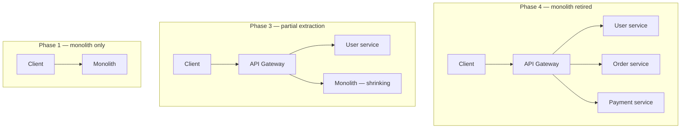

**Request routing after extracting users:**

```text
Client → API Gateway
           ├─→ /users/*     → User service (new)
           └─→ /orders/*, /payments/*, … → Monolith (legacy)
```

**E-commerce extraction phases:**

| Phase | Extract | Monolith still handles |
|-------|---------|------------------------|
| 1 | User service | Products, orders, payments, notifications |
| 2 | Product service | Orders, payments, notifications |
| 3 | Order service | Payments, notifications |
| 4 | Payment service | Notifications |
| 5 | Retire monolith | — |

**Data migration strategies:**

| Strategy | Trade-off |
|----------|-----------|
| **CDC (Change Data Capture)** | Near-real-time sync; Debezium → Kafka common |
| **Dual-write** | Write to both during transition; risk of inconsistency |
| **One-time backfill + cutover** | Simpler; brief read-only window may be needed |

---

### Pitfalls and design tips

- **Data sync is the hardest part** — budget more time for migration than for writing the new service.
- **Anti-corruption layer** at the boundary prevents legacy table shapes from leaking into new domain models.
- **When not to use:** tiny app, legacy near retirement, or rewrite genuinely cheaper — do not Strangler for sport.
- **Gateway routing rules grow** with each extraction — automate route config and test in CI.
- **Interview angle:** contrast with big-bang on risk, rollback, and business continuity; mention contract testing (Ch.7) at each cutover.

---

### Real-world example

**Amazon's early evolution** from a single C++ monolith to service-oriented architecture followed strangler-like extraction: the bookstore core remained while checkout, recommendations, and fulfillment peeled off behind internal APIs. Modern teams use the same pattern with **AWS API Gateway** or **Kong** routing `/catalog/*` to a new ECS service while `/legacy-reports/*` still hits the monolith. Each phase ships to production in weeks, not years — product owners see catalog improvements while orders still run on proven legacy code until Order service passes shadow traffic tests.

---

## 8.5 BFF Pattern

### Overview

A hotel concierge speaks your language, knows what you care about, and handles five phone calls behind the scenes so you make one request. A **Backend for Frontend (BFF)** does that for apps: a dedicated backend tailored to each client type (web, mobile, TV), aggregating and shaping data from core microservices into exactly what that screen needs.

Technically, a **BFF** is a **thin orchestration layer** per frontend. It calls multiple domain services, combines responses, transforms to UI-friendly DTOs, and exposes client-specific endpoints — e.g. `GET /mobile/home` returning name, wallet balance, and recent orders in one payload. Core domain services stay **client-agnostic**; presentation logic lives in the BFF, not scattered as `if (mobile)` branches in shared APIs.

---

### What problem it fixes

One shared API for web, mobile, and TV creates friction:

| Problem | Without BFF | With BFF |
|---------|-------------|----------|
| **Over-fetching** | Mobile downloads web-sized payloads | Mobile BFF returns minimal fields |
| **Under-fetching** | Mobile makes 5 round trips per screen | BFF aggregates in one server-side call |
| **Coupled evolution** | Mobile change risks breaking web | Each BFF evolves with its frontend |
| **Backend clutter** | Domain services full of presentation logic | Domain stays pure; BFF owns shaping |

Network round trips on mobile are expensive (latency, battery); server-side aggregation in a BFF cuts client complexity and improves perceived performance.

---

### What it does

Each BFF:

| Responsibility | Notes |
|----------------|-------|
| **API aggregation** | Fan-out to User + Order + Wallet; merge responses |
| **Data transformation** | Domain models → screen-specific DTOs |
| **Auth at client edge** | Token validation before fan-out (policy also at gateway) |
| **Client-specific logic** | Pagination size, image URLs, feature flags per platform |
| **Response optimization** | Only fields the current screen needs |

**Rule:** thin orchestration — **no domain ownership**. Business rules stay in microservices; BFF does not own order state or payment logic.

---

### How it works — the architecture inside

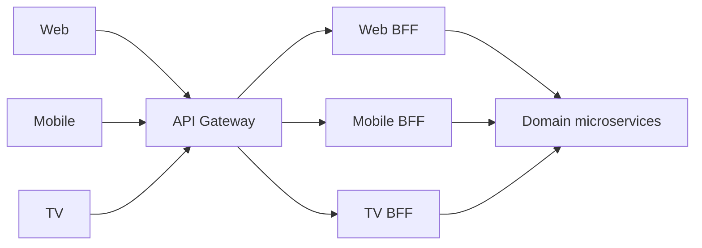

**Mobile home screen — without vs with BFF:**

```text
Without BFF:
  Mobile → User service
        → Order service
        → Wallet service     (3 network hops from device)

With BFF:
  Mobile → Mobile BFF → User + Order + Wallet   (1 hop from device)
```

**Response from Mobile BFF:**

```json
{
  "name": "John",
  "walletBalance": 500,
  "recentOrders": [{ "id": "ord_1", "total": 42.00 }]
}
```

**BFF vs API Gateway:**

| Layer | Handles | Placement |
|-------|---------|-----------|
| **API Gateway** | Auth, rate limiting, TLS, routing | Edge — all clients |
| **BFF** | Aggregation, transformation, client APIs | Behind gateway, per client type |

```text
Client → API Gateway → Web BFF / Mobile BFF → Microservices
```

---

### Pitfalls and design tips

- **When not to use:** single frontend, identical API needs across clients — a shared API is simpler.
- **God-service risk:** BFF that accumulates business logic becomes an undeployable monolith — keep it thin.
- **Duplication across BFFs:** share client libraries and DTO mappers, not domain logic.
- **Interview angle:** BFF sits **behind** the gateway; gateway = cross-cutting policy, BFF = client shaping.
- **Production pattern:** Netflix and Spotify use client-specific GraphQL or REST BFF layers; mention parallel fan-out with timeouts per dependency.

---

### Real-world example

**Spotify** serves web, desktop, mobile, and embedded (cars, speakers) clients. Each client type has different screen densities and bandwidth: mobile home needs six data sources (recent plays, recommendations, podcasts, offline status) in under 200 ms. Spotify's client backends aggregate gRPC calls to playlist, user, and catalog services server-side, returning one tailored payload. The core `Playlist` service knows nothing about car UI vs phone UI — that shaping lives entirely in the BFF tier, letting mobile and web teams ship on independent release trains.

---

## 8.6 DDD

### Overview

Building software without talking to the business is like a translator who never meets the author — you guess at meaning and ship the wrong book. **Domain-Driven Design (DDD)** puts the **business domain** at the center: developers, analysts, and domain experts share one vocabulary, and code structure mirrors how the business actually works.

Technically, **DDD** (Eric Evans, 2003) is a design approach combining **strategic patterns** (ubiquitous language, bounded contexts, context mapping) with **tactical building blocks** (entities, value objects, aggregates, repositories, domain events). The goal is a model that reflects business rules faithfully, scales along domain boundaries, and maps naturally to modular monoliths (8.2) or microservices (8.3).

---

### What problem it fixes

Technical-first design scatters business rules and creates communication gaps:

| Without DDD | With DDD |
|-------------|----------|
| `DataObject`, `EntityRecord` in code | `Order`, `Customer`, `Payment` match business terms |
| Rules duplicated across layers | Invariants enforced in aggregates |
| One giant `Product` model for all teams | Bounded contexts (8.7) with focused models |
| Hard to split for microservices | Context boundaries become service boundaries |

DDD fixes the **modeling and language** problem that makes large systems unmaintainable regardless of deployment style.

---

### What it does

**Strategic design** — divide and relate domains:

| Concept | Role |
|---------|------|
| **Ubiquitous language** | Shared vocabulary in conversation and code |
| **Bounded context** | Boundary where one model is valid (see 8.7) |
| **Context mapping** | How contexts integrate (events, ACL, partnerships) |

**Tactical design** — building blocks inside a context:

| Block | Role |
|-------|------|
| **Entity** | Identity + lifecycle (`Order` with `id`) |
| **Value object** | Immutable, compared by value (`Money`, `Address`) |
| **Aggregate** | Consistency cluster; root controls access |
| **Repository** | Load/save aggregates; hide persistence |
| **Domain service** | Logic spanning entities (`TransferMoney`) |
| **Domain event** | `OrderPlaced`, `PaymentCompleted` |
| **Factory** | Complex aggregate creation |

**Layered architecture (dependency inward):**

```text
Presentation → Application (use cases) → Domain → Infrastructure
```

Hexagonal architecture (8.8) formalizes the same dependency rule with ports and adapters.

---

### How it works — the architecture inside

**Aggregate example — Order:**

```text
Order (aggregate root)
 ├── OrderItem (value object / entity)
 └── ShippingAddress (value object)
```

Only the root is referenced from outside:

```text
order.addItem(productId, qty)   ✓
orderItem.updateQuantity(5)     ✗  (direct access prohibited)
```

**Entity vs value object:**

| | Entity | Value object |
|---|--------|--------------|
| **Identity** | Yes (ID) | No |
| **Mutable** | Yes | Usually immutable |
| **Compared by** | ID | All attribute values |
| **Example** | `Customer { id: 101 }` | `Money { amount: 50, currency: USD }` |

**DDD in microservices:**

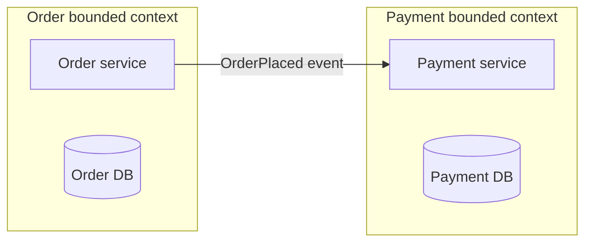

One bounded context often maps to one microservice — but a context can also live inside a modular monolith.

**Repository port:**

```java
interface OrderRepository {
    Order findById(OrderId id);
    void save(Order order);
}
```

Domain depends on the interface; JPA adapter implements it in infrastructure (hexagonal, 8.8).

---

### Pitfalls and design tips

- **Overkill for simple CRUD** — admin panels with no business rules do not need full tactical DDD.
- **Aggregates too large** — one aggregate per transaction boundary; do not model entire `Customer` history as one aggregate.
- **Anemic domain model** — logic pushed to "service" classes with dumb entities defeats the purpose; put rules on aggregates.
- **Interview angle:** distinguish strategic (bounded context) from tactical (aggregate); explain how contexts guide microservice splits.
- **Production:** event-driven integration via Kafka domain events; outbox pattern for reliable publish-after-commit.

---

### Real-world example

**Uber's marketplace domain** uses bounded contexts for `Trip`, `Pricing`, `Driver`, and `Rider` — each with its own ubiquitous language. A "trip" in the Rider context means ETA and fare estimate; in the Driver context it means route and payout. Services communicate via domain events (`TripRequested`, `TripCompleted`) rather than shared trip tables. When Pricing changes surge algorithms, the Trip service does not redeploy — it consumes updated fare events. DDD boundaries made this independent evolution possible.

---

## 8.7 Bounded Context

### Overview

The word "account" at a bank means something different to the teller (balance, withdrawals), the loan officer (collateral, interest rate), and marketing (login frequency, product offers). A **bounded context** draws a line around each meaning: inside the line, terms and rules are consistent; outside, another context may use the same word differently.

Technically, a **bounded context** is a logical boundary in DDD where a specific **domain model**, **ubiquitous language**, and **business rules** apply consistently. It defines data ownership, integration contracts, and team responsibility. It is a **design** boundary — deployable as a monolith module, modular monolith package, or microservice (8.3).

---

### What problem it fixes

Large systems collapse when one model tries to represent every department's view:

**Without bounded contexts — overloaded `Product`:**

```text
Product: id, name, stockQuantity, warehouseLocation, price, discount,
         campaign, advertisement, rating
```

Inventory, sales, and marketing teams fight over one schema; changes break unrelated features.

**With bounded contexts:**

| Context | Product model |
|---------|---------------|
| **Inventory** | `id, stockQuantity, warehouseLocation, reorderLevel` |
| **Sales** | `id, price, discount, promotion` |
| **Marketing** | `id, campaign, advertisement, rating` |

Each context owns its slice; integration happens via APIs or events, not shared mutable tables.

---

### What it does

A bounded context:

- Defines **where a model is valid** and where it is not.
- Owns **business rules** for its domain slice.
- Owns **data** — other contexts reference by ID, not foreign keys across databases.
- Integrates via **published contracts** (REST, gRPC, domain events).
- Often maps to **one team's ownership** (Conway's Law).

**E-commerce context chain:**

```text
Customer → Order → Payment → Shipping
```

Each publishes events (`OrderPlaced`, `PaymentCompleted`) consumed by downstream contexts.

---

### How it works — the architecture inside

**Same term, different shape — Customer:**

| Context | Customer representation |
|---------|-------------------------|
| **Customer** | Name, email, phone, address |
| **Order** | `customerId`, shipping address snapshot |
| **Marketing** | Preferences, campaign history |

**Context communication:**

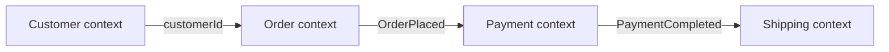

**Anti-corruption layer (ACL):** at legacy boundaries (Strangler, 8.4), translate monolith's `UserRecord` into the new context's `Customer` aggregate — never import legacy schema directly.

**Bounded context vs microservice:**

| | Bounded context | Microservice |
|---|-----------------|--------------|
| **Type** | Logical (DDD) | Deployment (runtime) |
| **Relationship** | Often implemented as one service | May contain one context — not required |

```text
1 bounded context ≈ 1 microservice   (common, not mandatory)
```

**When to create a new context:**

- Business rules differ materially
- Terminology differs across teams
- Different teams own the capability
- Data ownership differs
- Independent deployment is needed

---

### Pitfalls and design tips

- **Do not force one enterprise data model** — "single source of truth" tables across contexts recreate monolith coupling.
- **Context mapping document** — draw upstream/downstream relationships and integration style per pair (events vs sync API).
- **Interview angle:** bounded context is the **primary input** for microservice boundaries; wrong boundaries are expensive to fix.
- **Common mistake:** confusing Java package modules with bounded contexts — a context is a business boundary, not a folder name.
- **Integration:** prefer events for loose coupling; sync API when immediate read-your-writes consistency is required.

---

### Real-world example

**Walmart's e-commerce platform** separates `Catalog`, `Cart`, `Checkout`, and `Fulfillment` contexts. The Cart context stores `lineItems` with product ID and price **snapshot** at add-to-cart time — it does not join Catalog tables at read time. When Catalog reprices a product, existing carts keep their snapshot until checkout refreshes. This explicit boundary prevents a pricing bug in Catalog from corrupting in-flight carts and lets each context scale and deploy independently on Kubernetes.

---

## 8.8 Hexagonal Architecture

### Overview

A power strip lets you plug in any device — lamp, charger, fan — without rewiring the house. The wall socket is the **port**; each plug is an **adapter**. **Hexagonal architecture** (ports and adapters) puts your business logic at the center with stable interfaces outward, so you swap databases, APIs, or message brokers without touching domain rules.

Technically, hexagonal architecture (Alistair Cockburn) isolates the **domain core** from infrastructure. **Inbound ports** define what the application offers (use cases); **outbound ports** define what it needs (repositories, event publishers). **Adapters** implement those ports — REST controllers, JPA repositories, Kafka producers. Dependencies point **inward**: infrastructure depends on domain, never the reverse.

---

### What problem it fixes

Traditional layered architecture couples business logic to infrastructure:

```text
Controller → Service → Repository → Database
```

Problems:

- Domain imports JPA annotations, HTTP frameworks, Kafka clients
- Unit tests require a database or embedded container
- Swapping PostgreSQL for MongoDB touches business code
- Multiple entry points (REST + Kafka consumer) duplicate logic in controllers

Hexagonal architecture fixes **testability and technology lock-in** by making the domain pure.

---

### What it does

| Component | Role |
|-----------|------|
| **Domain core** | Entities, aggregates, domain services, business rules |
| **Inbound ports** | Use case interfaces (`CreateOrderUseCase`) |
| **Outbound ports** | Dependency interfaces (`OrderRepository`, `EventPublisher`) |
| **Inbound adapters** | REST, GraphQL, CLI, Kafka consumers |
| **Outbound adapters** | JPA, JDBC, Kafka producer, email client |

The core knows **only port interfaces** — not REST, SQL, or broker specifics.

---

### How it works — the architecture inside

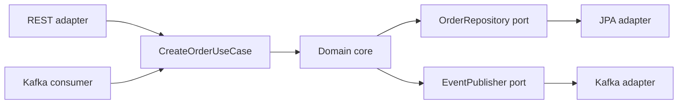

**Create order flow:**

```text
Client → OrderController (inbound adapter)
      → CreateOrderUseCase (inbound port)
      → OrderService (domain)
      → OrderRepository.save() (outbound port)
      → JpaOrderRepository (outbound adapter) → PostgreSQL
```

**Dependency rule:**

```text
✓ Adapter → Port → Domain
✗ Domain → JPA / HttpClient / KafkaClient
```

**Package layout:**

```text
com.ecommerce
├── domain/           entities, port interfaces
├── application/      use case implementations
├── adapter/
│   ├── inbound/      rest, kafka consumers
│   └── outbound/     persistence, messaging, email
└── configuration/
```

**Hexagonal vs layered:**

| Feature | Layered | Hexagonal |
|---------|---------|-----------|
| **Coupling** | Domain often depends on persistence | Domain depends only on ports |
| **Testability** | Needs DB for most tests | Domain tests with mock ports |
| **Swapping tech** | Touches service layer | New adapter only |

**With DDD:** aggregate root + repository port + JPA adapter is the standard combination inside a bounded context (8.7).

---

### Pitfalls and design tips

- **Overkill for CRUD** — five interfaces for `GET /items` adds ceremony without benefit.
- **Leaky ports** — outbound port that returns JPA entities defeats the purpose; return domain types.
- **Interview angle:** explain dependency direction inward; name inbound vs outbound ports with examples.
- **Production:** Spring Boot with `@RestController` as inbound adapter, `JpaRepository` hidden behind domain port; Testcontainers only in adapter integration tests.
- **Multiple inbound adapters** — same `CreateOrderUseCase` called from REST and Kafka consumer; logic written once in domain.

---

### Real-world example

**Allegro** (Polish e-commerce) adopted hexagonal architecture for payment processing: the `Payment` domain core defines `PaymentGateway` as an outbound port. Production uses a Przelewy24 adapter; integration tests use an in-memory fake. When Allegro added Apple Pay, engineers shipped a new adapter without modifying `ChargePaymentUseCase` or aggregate invariants. Domain unit tests run in milliseconds with no network — adapter tests run separately against sandbox APIs.

---

## 8.9 Distributed Transactions

### Overview

Imagine splitting a bank transfer across three branches that each keep their own ledger — you cannot walk to one counter and ask them to lock all three books at once. **Distributed transactions** in microservices face the same constraint: each service owns its database, yet business workflows (checkout, booking, payout) must stay coherent when steps fail halfway through.

Technically, microservices abandon a single global `BEGIN … COMMIT` across services. Instead you choose among **coordination protocols** (two-phase commit, three-phase commit), **workflow patterns** (saga with compensating actions), and **reliability patterns** (transaction outbox) depending on how strong consistency must be, how long the workflow runs, and whether a message broker sits between steps. This section is the **microservices hub** for those choices; protocol depth for 2PC/3PC lives in [5.17](../05-distributed-databases/README.md#517-two-phase-commit) and [5.18](../05-distributed-databases/README.md#518-three-phase-commit), outbox relay mechanics in [6.20](../06-messaging-and-events/README.md#620-outbox-pattern), and saga execution styles in [8.19](#819-saga-pattern), [8.20](#820-choreography), and [8.21](#821-orchestration).

---

### What problem it fixes

**Monolith** — one database:

```text
BEGIN → INSERT order, UPDATE inventory, INSERT payment → COMMIT or ROLLBACK
```

One failure rolls back everything atomically.

**Microservices** — separate databases:

```text
Order service DB  ·  Payment service DB  ·  Inventory service DB
```

Naive approaches fail:

| Naive approach | Failure mode |
|----------------|--------------|
| HTTP call chain with no rollback | Payment fails after inventory reserved — stuck state |
| Dual write: DB + Kafka without outbox | Order saved, event lost — downstream never runs |
| 2PC across HTTP microservices | High latency, blocking, coordinator SPOF, poor partition behavior |

Distributed transaction patterns answer: **how do we keep the business correct when there is no single database transaction?**

---

### What it does — the four patterns at a glance

| Pattern | Consistency | How it works | Typical use in microservices |
|---------|-------------|--------------|------------------------------|
| **Two-phase commit (2PC)** | Strong (atomic all-or-nothing) | Coordinator: Prepare → unanimous YES → Commit | Rare across HTTP services; XA/JTA across co-located databases |
| **Three-phase commit (3PC)** | Strong (with timing assumptions) | Prepare → Pre-commit → Commit; reduces blocking vs 2PC in theory | Almost never raw across microservices; know for interviews |
| **Saga** | Eventual (compensating undo) | Sequence of **local** transactions; compensate on failure | Checkout, booking, payout — default for cross-service workflows |
| **Transaction outbox** | Atomic write + async publish | Business row + outbox row in **one DB txn**; relay publishes later | Reliable events for choreography sagas; avoids dual-write |

```text
Strong consistency, short, few participants  →  2PC (usually inside one platform, not across 10 HTTP APIs)
Long-running, many services, partitions OK   →  Saga (+ outbox for event steps)
DB commit must match event publish           →  Transaction outbox (not 2PC to Kafka)
```

---

### Compared to the alternative

**Single-database ACID transaction** (modular monolith or one service per aggregate):

```text
Pros: simple rollback, immediate consistency, one lock domain
Cons: does not span independently deployed services with separate DBs
```

**Distributed patterns trade atomicity for autonomy:**

| | Single DB txn | 2PC | Saga + outbox |
|---|---------------|-----|---------------|
| **Atomicity** | Full ACID | All-or-nothing across participants | Per-step ACID; global eventual |
| **Locks** | One database | Held across prepare phase | None across services |
| **Failure handling** | Rollback | Block or abort all | Compensate completed steps |
| **Latency** | Low | High (2+ round trips) | Async-friendly |
| **Microservices default?** | N/A (one DB) | No | Yes |

---

### How it works — the architecture inside

#### The coordination problem

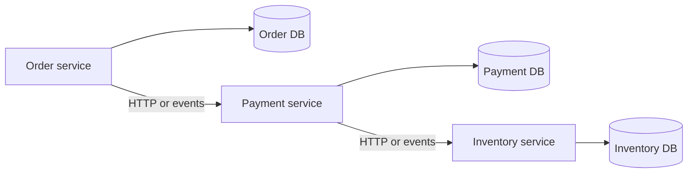

Each box commits **locally**. The patterns below decide how those local commits relate.

---

#### Two-phase commit (2PC)

A **coordinator** (transaction manager, app server, or workflow engine) runs two rounds:

```text
Phase 1 — Prepare:  "Can you commit?"  → each participant votes YES/NO, holds locks
Phase 2 — Commit:   all YES → COMMIT everyone; any NO → ROLLBACK everyone
```

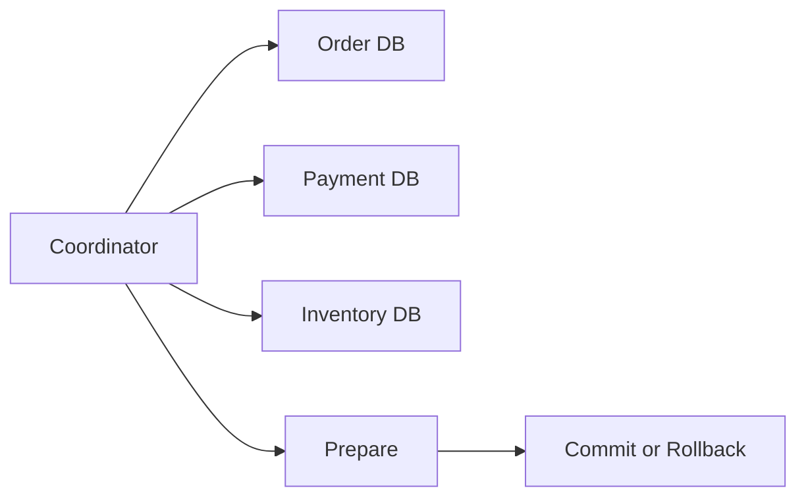

**When to use in microservices:**

- **Inside** a platform: Java **JTA/XA** across two JDBC datasources, some message brokers with XA, Spanner-style globally consistent stores.
- **Avoid** classic 2PC across arbitrary REST/gRPC microservices — blocking, tight coupling, coordinator failure leaves participants stuck in **prepared** state.

**When not to use:** user-facing checkout over WAN; many participants; long-running steps.

See [5.17 Two Phase Commit](../05-distributed-databases/README.md#517-two-phase-commit) for message counts, blocking diagram, and XA example.

---

#### Three-phase commit (3PC)

Adds a **pre-commit** phase so participants learn the coordinator intends to commit before the final commit:

```text
Prepare → Pre-commit → Commit
```

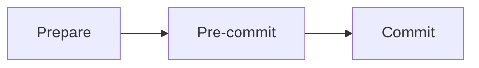

**Intent:** if the coordinator dies after pre-commit, participants can sometimes complete or abort on timeout instead of blocking forever (requires **bounded network delay** assumptions).

**When to use in microservices:** practically **never** as a hand-rolled protocol between services. Production uses **Raft/Paxos**, Spanner, or **sagas** instead.

**When to know it:** interviews — explain 2PC blocking, how pre-commit helps in theory, why real systems moved to consensus or sagas.

See [5.18 Three Phase Commit](../05-distributed-databases/README.md#518-three-phase-commit) for phase detail and overhead math.

---

#### Saga pattern

A **saga** is an ordered sequence of **local transactions**, one per service. If step *n* fails, run **compensating transactions** for steps *1 … n−1* (semantic undo: `releaseInventory`, `cancelOrder`).

```text
Happy:  create order → reserve stock → charge card → ship
Fail:   charge fails → release stock → cancel order
```

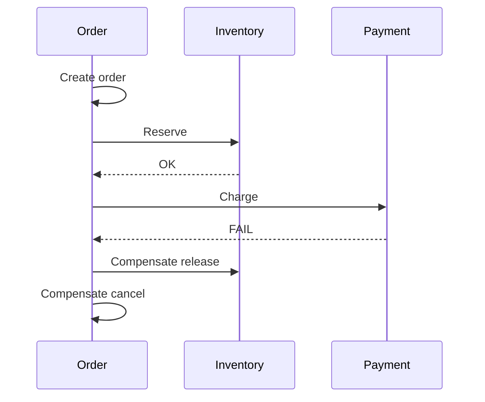

| | 2PC | Saga |
|---|-----|------|
| Global consistency | Immediate | Eventual |
| Rollback | Automatic DB rollback | Compensation (business logic) |
| Cross-service fit | Poor | Good |
| Irreversible steps | N/A | Need manual fix (email sent, package shipped) |

**Execution styles:**

| Style | How | Section |
|-------|-----|---------|
| **Choreography** | Services react to events on a bus | [8.20](#820-choreography) |
| **Orchestration** | Central workflow engine drives steps | [8.21](#821-orchestration) |

Deep dive: [8.19 Saga Pattern](#819-saga-pattern).

---

#### Transaction outbox pattern

The **outbox** solves **dual-write**: you cannot atomically commit PostgreSQL and publish to Kafka in one transaction.

```text
Wrong:  save order → kafka.send()     (either step can fail alone)
Right:  BEGIN → INSERT order + INSERT outbox row → COMMIT → relay publishes async
```

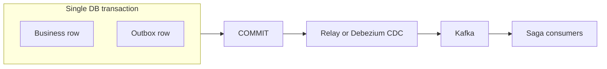

**Role in microservices:**

- **Choreography sagas** — each step commits locally and publishes the next event via outbox (no ghost events, no lost events).
- **Not a global transaction** — outbox guarantees **this service's** write and publish intent are atomic; downstream sagas still use eventual consistency.
- **Preferred over 2PC** for DB + broker — higher availability, no blocking coordinator.

Relay detail, schema, and lag alerts: [6.20 Outbox Pattern](../06-messaging-and-events/README.md#620-outbox-pattern).

---

#### Choosing a pattern

```text
Need atomic commit across 2 JDBC datasources in one JVM?     → 2PC / XA (careful)
Need cross-service checkout over 5 HTTP APIs?                → Saga
Need "saved to DB" and "event on bus" to match?              → Transaction outbox
Need strong global ACID across arbitrary microservices?      → Reconsider architecture (often wrong goal)
```

| Scenario | Recommended | Avoid |
|----------|-------------|-------|
| E-commerce order + payment + inventory | Saga (orchestrated or choreographed) + outbox per step | 2PC across services |
| Order service emits `OrderCreated` reliably | Transaction outbox | `save()` then `kafka.send()` |
| Legacy app server, two SQL databases | 2PC / JTA | Saga if you can refactor |
| Interview: "how fix 2PC blocking?" | Name 3PC, Raft, or saga | Claim 3PC is production default |

**Typical production stack:**

```text
Each service:  local ACID + transaction outbox
Workflow:      saga (Temporal / Camunda / event choreography)
Observability: saga_id / correlation ID on every step
Never:         distributed 2PC across REST microservices
```

---

#### Worked example — checkout failure path

```text
1. Order service: INSERT order PENDING + outbox OrderCreated     (local txn)
2. Relay publishes OrderCreated
3. Inventory: UPDATE stock + outbox InventoryReserved           (local txn)
4. Payment: charge fails
5. Payment publishes PaymentFailed (or Order orchestrator compensates)
6. Inventory: release stock + outbox InventoryReleased
7. Order: status CANCELLED + outbox OrderCancelled

No 2PC — four independent databases, consistent business outcome after compensation.
```

---

### Pitfalls and design tips

#### When to use (and when not to)

- **Default for microservices:** saga + transaction outbox per emitting service.
- **2PC:** only when both participants support XA and latency/partition risk is acceptable (often same data center, same platform).
- **3PC:** understand for theory; do not build custom 3PC between Spring Boot services.
- **Outbox:** any time a local DB write must trigger async downstream work.

#### Common mistakes

- **2PC across HTTP** — timeouts, no standard prepare/commit, operational nightmare.
- **Saga without idempotency** — at-least-once events double-charge or double-release; key by `saga_id` + step.
- **Saga without outbox** — events published before DB commit or lost after commit.
- **Compensation as afterthought** — "refund" and "cancel shipment" must be designed with forward steps.
- **Treating outbox as a distributed transaction** — it fixes **one** service's dual-write, not global atomicity.

#### Production notes

- Persist **saga state** (`PENDING`, `COMPENSATING`, `FAILED`) for stuck-saga alerts and manual recovery.
- Use **orchestration** (8.21) when branching/timeouts dominate; **choreography** (8.20) for simple linear pipelines.
- **Inbox pattern** (6.20) pairs with outbox for idempotent consumption on the receiver side.
- **Interview:** monolith = one ACID; microservices = saga + eventual consistency + outbox for reliable events.

---

### Real-world example: travel booking

**Problem:** A travel app books flight, hotel, and car across three services with separate databases. Payment can fail after flight is held.

**Naive failure:** Synchronous HTTP chain with no compensation — flight held, hotel booked, payment declined; support manually unwinds.

**How patterns combine:**

- **No 2PC** across three cloud APIs — latency and locks unacceptable.
- **Saga (orchestrated):** Temporal workflow runs `holdFlight` → `bookHotel` → `bookCar` → `chargeCard`; on `chargeCard` failure, runs compensations in reverse order.
- **Transaction outbox:** each service writes booking state + outbox event in one DB transaction; relay publishes to Kafka so choreography consumers never see phantom bookings.
- **3PC:** not used — team chose saga explicitly after a prior JTA experiment blocked during coordinator maintenance.

**Outcome:** Temporary inconsistency during the saga (flight held for 30 s) is acceptable; business rules converge to either fully booked or fully cancelled. Ops dashboard shows `saga_id` across all three services for support.

---

## 8.12 Service Registry

### Overview

Calling a friend's landline only works if someone updates the phone book when they move. In microservices, instances start, stop, and change IP addresses constantly — a **service registry** is the live phone book where each instance registers and callers look up who is available right now.

Technically, a **service registry** is a directory of service instances: name, host, port, health status, and metadata. Services **register** on startup and send **heartbeats**; consumers **discover** instances by logical name (`PAYMENT-SERVICE`) instead of hardcoded URLs. Registries may be standalone (Eureka, Consul) or platform-native (Kubernetes Services + Endpoints).

---

### What problem it fixes

Microservice instances are **dynamic**:

- Auto-scaling adds and removes pods
- Container restarts assign new IPs
- Rolling deploys temporarily run old and new versions side by side

Hardcoding `http://10.1.2.15:8080` breaks on the next deploy. Without a registry, every config change requires manual updates and redeploys across all consumers.

---

### What it does

| Operation | Behavior |
|-----------|----------|
| **Register** | Instance announces itself: `PAYMENT-SERVICE` @ `10.0.1.1:8080` |
| **Heartbeat** | Periodic health signal; missed beats → instance marked DOWN |
| **Deregister** | Graceful shutdown removes instance from routing |
| **Discover** | Consumer queries by name → receives list of healthy instances |
| **Load balance** | Client or platform picks one instance (round robin, least connections) |

**Stored fields:**

| Field | Example |
|-------|---------|
| Service name | `PAYMENT-SERVICE` |
| Host / port | `10.0.1.1:8080` |
| Health | UP / DOWN |
| Metadata | version, zone, weight |

---

### How it works — the architecture inside

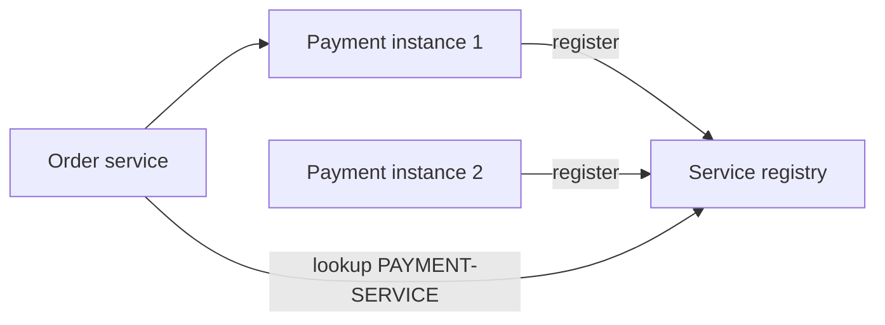

**Client-side vs server-side discovery:**

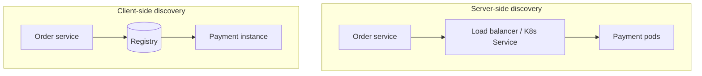

| | Client-side | Server-side |
|---|-------------|-------------|
| **Flow** | Client queries registry, picks instance | Client → LB → backends |
| **Examples** | Spring Cloud + Eureka | Kubernetes Service, AWS ALB |
| **Pros** | Simple, efficient | Client unaware of instance list |
| **Cons** | Discovery logic in each client | Extra hop |

**Kubernetes native discovery:**

```text
Pod → Service → DNS: payment-service.default.svc.cluster.local
```

Control plane maintains Endpoints from ready pods — no separate Eureka cluster needed.

**Registration lifecycle:**

```text
1. Payment service starts
2. Registers with registry (on readiness, not just process start)
3. Heartbeat every 30s
4. Heartbeat stops → instance removed from responses
5. Order service discovers healthy instances only
```

**Registry vs API Gateway:**

| | Service registry | API gateway |
|---|------------------|-------------|
| **Audience** | Service-to-service | External clients |
| **Concerns** | Location, health | Auth, rate limits, edge routing |

---

### Pitfalls and design tips

- **Register on readiness** — registering before the app can serve traffic causes cascading failures.
- **Registry HA** — Eureka/Consul/etcd must be clustered; partition behavior matters (AP vs CP).
- **Kubernetes default:** most new deployments use K8s Services, not standalone Eureka — know both interview answers.
- **Interview angle:** distinguish discovery (where?) from load balancing (which one?).
- **Production:** Consul for multi-cloud; Eureka with Spring Cloud; etcd underlies Kubernetes.

---

### Real-world example

**Netflix Eureka** (with Spring Cloud) powered Netflix's microservices discovery for years: each service instance registers on startup, heartbeats every 30 seconds, and consumers like `OrderService` fetch the current `PAYMENT-SERVICE` instance list and round-robin with Ribbon. When Payment scales from 3 to 30 instances during a flash sale, Order services pick up new instances on the next registry fetch — zero config changes. Modern Netflix workloads increasingly use Envoy and platform discovery, but Eureka remains the reference implementation taught in Spring Cloud tutorials worldwide.

---

## 8.14 Service Mesh

### Overview

In a large office building, you could ask every employee to handle their own mail sorting, security badges, and inter-office courier rules — or hire a facilities team that manages all of it consistently. A **service mesh** is that facilities team for microservices: a dedicated infrastructure layer handling service-to-service networking so application code stays focused on business logic.

Technically, a **service mesh** provides **data plane** proxies (usually Envoy sidecars, 8.15) attached to each service instance and a **control plane** (Istiod, Linkerd controller) that pushes policies centrally. It handles discovery, load balancing, mTLS, retries, circuit breaking, traffic splitting, and observability — without embedding those concerns in every language's codebase.

---

### What problem it fixes

At 20+ microservices, each team reimplements:

- TLS between services
- Retry with backoff
- Circuit breaking
- Metrics and distributed tracing
- Canary routing (90% v1 / 10% v2)

Polyglot stacks (Java, Go, Python) make this inconsistent and hard to audit. A mesh **centralizes** networking policy with uniform enforcement.

---

### What it does

| Feature | Mesh behavior |
|---------|---------------|
| **Service discovery** | Proxy resolves `payment-service` instances |
| **Load balancing** | Round robin, least request, weighted |
| **mTLS** | Mutual TLS — both sides verify identity |
| **Traffic routing** | Canary, blue-green, A/B by header or weight |
| **Retries** | Central policy (e.g. 3 attempts, 500 ms backoff) |
| **Circuit breaking** | Outlier detection ejects unhealthy hosts |
| **Observability** | Request count, latency, error rate per service pair |
| **Tracing** | Propagates trace context (OpenTelemetry, Jaeger) |

**Principle:**

```text
Business logic     → application code
Networking logic   → service mesh
```

---

### How it works — the architecture inside

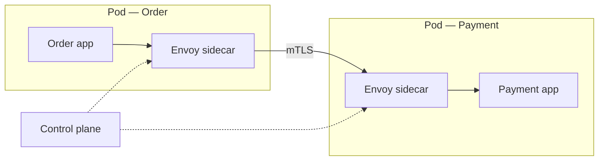

**Request path:**

```text
Order app → localhost → Order sidecar → Payment sidecar → localhost → Payment app
```

Sidecar applies TLS, retry policy, and metrics before forwarding.

**North-south vs east-west:**

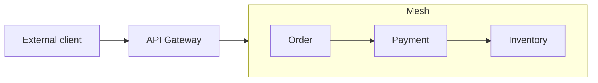

| Layer | Traffic | Examples |
|-------|---------|----------|
| **API Gateway** | North-south (client → cluster) | Auth, rate limits |
| **Service mesh** | East-west (service ↔ service) | mTLS, retries, tracing |

**Mesh vs registry (8.12):**

| | Registry | Mesh |
|---|----------|------|
| **Scope** | Find instances | Full communication management |
| **Examples** | Eureka, Consul | Istio, Linkerd |

**Popular meshes:**

| Mesh | Notes |
|------|-------|
| **Istio** | Envoy data plane; widely adopted |
| **Linkerd** | Lightweight Rust micro-proxy |
| **Cilium** | eBPF option; ambient mode reduces sidecars |

---

### Pitfalls and design tips

- **When not to use:** fewer than ~10 services, few internal calls — libraries (Resilience4j) + K8s Services are enough.
- **Sidecar cost:** ~50–100 MB RAM and ~0.5–1.5 ms latency per hop — measure before meshing everything.

**How to calculate — mesh latency overhead:**

```text
Given: baseline service RTT = 8 ms (app-to-app without mesh),
       mesh overhead per hop = 0.5–1.5 ms (Envoy sidecar in + out ≈ 1 hop each direction)

Step 1 — single call Order → Payment (one mesh hop each way):
  overhead ≈ 1.0 ms (outbound) + 1.0 ms (inbound) = 2 ms

Step 2 — chained call Order → Payment → Inventory (2 internal hops):
  overhead ≈ 2 hops × 1.0 ms × 2 directions = 4 ms (use 0.5 ms/hop → 2 ms; 1.5 ms/hop → 6 ms)

Step 3 — total user-visible latency (3-service chain):
  T_total ≈ 8 + 8 + 8 + 4 = 28 ms app work + mesh tax (vs 24 ms without mesh)

Result: +2–6 ms per multi-hop path at cited sidecar overhead

Sanity check: 50-hop deep call graphs are an architecture smell — mesh overhead compounds linearly;
             at <10 services, 1–2 ms/hop is usually acceptable for mTLS + policy wins.
```

- **Debugging:** extra hop makes traces essential; learn `istioctl` / Linkerd dashboards.
- **Interview angle:** mesh = east-west; gateway = north-south; use both together.
- **Istio ambient mode:** moves some functions to node level — less per-pod overhead than classic sidecars.

---

### Real-world example

**Lyft** created **Envoy** as its service mesh data plane and open-sourced it; **Istio** adopted Envoy as its default proxy. At Lyft-scale ride matching, thousands of services communicate with mTLS enforced by mesh policy — no application code mentions certificates. When the routing service deploys v2, Istio VirtualService sends 5% of traffic to v2 pods while 95% stays on v1, watching error rates before full promotion. This canary pattern would require custom code in every service without a mesh.

---

## 8.15 Sidecar Pattern

### Overview

A motorcycle sidecar carries luggage so the rider focuses on driving. In software, a **sidecar** is a helper process deployed **alongside** the main application in the same pod, handling infrastructure chores — proxying traffic, shipping logs, pulling config — so the app stays pure business logic.

Technically, the **sidecar pattern** colocates a companion container with the application container in a Kubernetes pod. They share a network namespace (communicate on `localhost`). The sidecar lifecycle is tied to the app — start and stop together. Service meshes (8.14) use Envoy sidecars as their data plane; logging (Fluent Bit) and secrets (Vault agent) are other common sidecar roles.

---

### What problem it fixes

Without sidecars, every microservice embeds:

- HTTP proxy / TLS termination logic
- Metrics scraping endpoints and exporters
- Log forwarding SDKs
- Config and secret refresh clients

Implemented separately in Java, Go, Python, and Node — inconsistent behavior, duplicated bugs, and slow policy rollouts (redeploy every service to change retry rules).

---

### What it does

A sidecar:

- Runs **beside** the application in the same pod
- Shares **network namespace** — app talks to sidecar on localhost
- Provides **auxiliary capabilities** transparent to business code
- Can be updated **independently** of the app image (mesh proxy version bump)
- Supports **polyglot** apps — same Envoy image for all languages

**Common roles:**

| Use case | Sidecar | Example |
|----------|---------|---------|
| **Service mesh proxy** | Envoy, Linkerd-proxy | mTLS, retry, routing |
| **Log shipping** | Fluent Bit | Tail files → Elasticsearch |
| **Metrics** | Prometheus exporter | Scrape → Grafana |
| **Secrets** | Vault agent | Inject rotated credentials |
| **Config sync** | Config puller | Hot-reload local files |

---

### How it works — the architecture inside

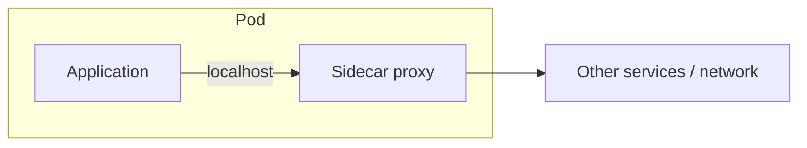

**Mesh traffic flow:**

```text
Order app → localhost:15001 → Envoy sidecar → Payment sidecar → localhost → Payment app
```

**Sidecar vs library:**

| | In-process library | Sidecar |
|---|-------------------|---------|
| **Languages** | Per-language SDK | Language-independent |
| **Updates** | Redeploy every service | Update sidecar / control plane |
| **Example** | Resilience4j (Java only) | Envoy for Java, Go, Python |

**Sidecar vs API Gateway:**

| | Sidecar | API Gateway |
|---|---------|-------------|
| **Placement** | Beside each service | Single edge entry |
| **Traffic** | East-west | North-south |

**Sidecar vs service mesh:**

```text
Sidecar = deployment pattern (helper process)
Mesh    = full solution that uses sidecar proxies (Istio → Envoy)
```

---

### Pitfalls and design tips

- **Resource overhead:** each pod runs N+1 containers — account for CPU/memory in capacity planning.
- **localhost assumption:** app must route outbound traffic through sidecar (iptables redirect or explicit proxy config).
- **When not to use:** monolith or 2–3 services — in-process libraries are simpler.
- **Interview angle:** sidecar enables polyglot resilience; mesh is built on sidecars.
- **Ambient mesh (Istio):** reduces per-pod sidecars by moving some functions to node — know the trade-off.

---

### Real-world example

**Istio on Kubernetes** injects an Envoy sidecar into every pod in a labeled namespace. A Java Order service with no mesh-aware code sends HTTP to `payment-service:8080`; iptables redirect that traffic through the local Envoy on port 15001. Envoy adds mTLS, retry (3 attempts), and emits Prometheus metrics. When platform engineering updates the cluster-wide retry policy, they push new config to Istiod — all Envoys reload without redeploying Order or Payment application images.

---

## 8.16 Circuit Breaker

### Overview

Your home circuit breaker trips when wiring overheats — cutting power before the whole house burns. In software, a **circuit breaker** stops sending requests to a failing dependency, failing fast instead of piling up blocked threads and timeouts that crash the caller.

Technically, a **circuit breaker** wraps outbound calls and tracks failure rates. In the **closed** state, calls pass normally. When failures exceed a threshold, the circuit **opens** — subsequent calls reject immediately without waiting for timeouts. After a cooldown, **half-open** probes test recovery; success closes the circuit, failure reopens it.

---

### What problem it fixes

```text
Order service → Payment service (down or very slow)
```

Without a breaker:

- 1,000 concurrent requests × 10 s timeout = 1,000 blocked threads
- Connection pools exhaust
- Order service becomes unresponsive — **cascading failure**
- Users see timeouts on unrelated features (inventory, cart)

The breaker protects **caller resources** and gives the failing dependency room to recover.

---

### What it does

| State | Behavior |
|-------|----------|
| **Closed** | Normal operation; failures counted in sliding window |
| **Open** | Calls fail immediately; no outbound network wait |
| **Half-open** | Limited probe requests test if dependency recovered |

**Goals:**

1. Prevent cascading failures
2. Fail fast when dependency is unhealthy
3. Automatic recovery probing
4. Enable fallback responses (cached data, degraded mode)

**Configuration parameters:**

| Parameter | Example | Meaning |
|-----------|---------|---------|
| Failure rate threshold | 50% | Open when exceeded |
| Minimum calls | 10 | Sample size before tripping |
| Open duration | 30 s | Wait before half-open |
| Half-open probes | 5 | Test calls allowed |

**How to calculate — circuit breaker thresholds:**

```text
Given: sliding window = 60 s, failure rate threshold = 50%, minimum calls = 10,
       open duration = 30 s, half-open probes = 5

Step 1 — sample before trip (need minimum volume):
  calls < 10 in window → breaker stays CLOSED (avoid noise trips)

Step 2 — trip condition at volume:
  8 failures / 12 calls = 66.7% > 50% → OPEN circuit

Step 3 — open state behavior:
  next 30 s: all calls fail fast (0 ms wait vs 10 s timeout each)
  threads saved ≈ 1,000 concurrent × 10 s = 10,000 s-thread blocked → 0

Step 4 — half-open probe:
  after 30 s, allow 5 test calls; if ≥ 80% succeed → CLOSED, else OPEN again

Result: trip after 50%+ failures with ≥ 10 samples; 30 s cooldown before retry

Sanity check: threshold too low (10%) flaps on normal blips;
             too high (90%) exhausts pools before opening — tune with dependency p99 error rate.
```

---

### How it works — the architecture inside

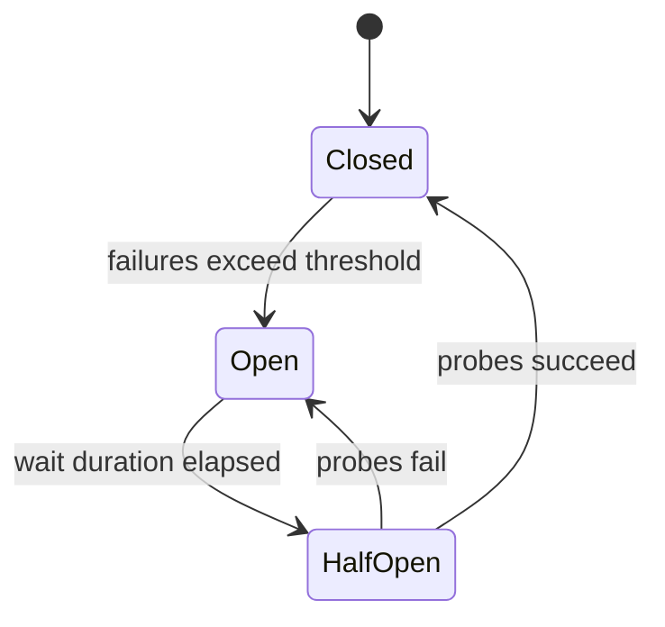

**Healthy path:**

```text
Order → [CLOSED breaker] → Payment → success
```

**Open path:**

```text
Order → [OPEN breaker] → immediate reject + fallback
                        (no call to Payment)
```

**Resilience stack (outer → inner on outbound calls):**

```text
Caller → bulkhead (8.18) → retry (8.17) → circuit breaker → dependency
```

Always pair with **timeouts** — each failed call should fail quickly, not hang.

**Breaker vs timeout:**

| | Timeout | Circuit breaker |
|---|---------|-----------------|
| **Scope** | Per-request wait limit | Stops all calls after pattern of failures |
| **Example** | Max 5 s per call | 50% failure rate → open for 30 s |

**Implementations:**

| Library / platform |
|--------------------|
| **Resilience4j** (Java; Hystrix is legacy) |
| **Polly** (.NET) |
| **Istio / Envoy** outlier detection (mesh, 8.14) |

```java
@CircuitBreaker(name = "paymentService", fallbackMethod = "fallback")
public PaymentResponse processPayment() { /* remote call */ }

public PaymentResponse fallback() {
    return new PaymentResponse("Payment temporarily unavailable");
}
```

---

### Pitfalls and design tips

- **Wrong thresholds cause flapping** — too sensitive opens on noise; too lax allows exhaustion before tripping.
- **Fallback design matters** — "error" fallback is worse than no breaker if UX requires payment; design degraded paths explicitly.
- **Half-open probe storms** — limit probe count; all instances probing simultaneously can DDoS a recovering service.
- **Interview angle:** breaker stops **persistent** failures; retry (8.17) handles **transient** failures — use together.
- **Mesh vs library:** Envoy outlier detection needs no app code but offers less business-specific fallback logic.

---

### Real-world example

**Expedia's checkout** calls payment, fraud, and inventory services. When a payment gateway degraded during peak travel season, Resilience4j circuit breakers on the payment client opened after the failure rate crossed 50% in a 60-second window. Checkout returned "pay at hotel" fallback within milliseconds instead of hanging 30 seconds per request. Inventory and notification calls continued on healthy breakers. After 30 seconds half-open probes detected recovery and closed the circuit — full payment restored without manual intervention or Order service restart.

---

## 8.17 Retry Pattern

### Overview

Redialing a busy phone line once or twice often gets through; hanging up forever on the first busy signal is wasteful. The **retry pattern** automatically re-attempts failed operations that might succeed on a second try — network blips, brief overload, momentary DNS failure.

Technically, retry wraps outbound calls with a policy: maximum attempts, backoff strategy, and classification of which errors are **transient** (retry) vs **permanent** (fail immediately). **Exponential backoff with jitter** is the production default — delays grow (1 s → 2 s → 4 s) with randomization to prevent synchronized retry storms across thousands of clients.

---

### What problem it fixes

Distributed systems fail transiently:

| Transient (retry) | Permanent (do not retry) |
|-------------------|--------------------------|
| Network timeout, connection reset | HTTP 400 validation error |
| HTTP 503, 504 | HTTP 401, 403 |
| Brief DB or broker unavailability | Business rule violation |
| DNS lookup flake | Invalid payment amount |

Without retry, a request that would succeed 200 ms later returns an error to the user. With blind retry on permanent errors, you amplify load on an already failing system.

---

### What it does

```text
Request → call service
            ├─ success → return
            └─ failure → if transient and attempts remain → wait → retry
                       → else → fail
```

**Retry strategies:**

| Strategy | Behavior | Risk |
|----------|----------|------|
| **Immediate** | Retry instantly | Overloads failing service |
| **Fixed delay** | Wait 2 s between attempts | Predictable retry waves |
| **Exponential backoff** | 1 s → 2 s → 4 s | Reduces pressure |
| **Exponential + jitter** | Randomize delay | **Recommended** — spreads load |

**Typical config:**

| Parameter | Example |
|-----------|---------|
| Max attempts | 3 |
| Initial delay | 1 s |
| Multiplier | 2 |

Result: attempt 1 → wait 1 s → attempt 2 → wait 2 s → attempt 3.

---

### How it works — the architecture inside

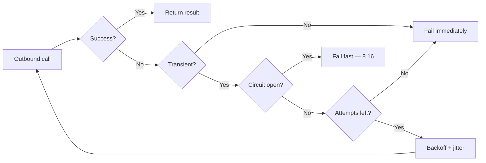

**Jitter — why it matters:**

```text
Without jitter: 1,000 clients retry at exactly 1s, 2s, 4s → traffic spikes
With jitter:    retries spread across 0.8s–1.2s, 1.6s–2.4s, …
```

**Idempotency requirement:**

```text
POST /payments — attempt 1 succeeds, response lost
                 → retry without idempotency key = duplicate charge
                 → retry with Idempotency-Key: abc → safe, one charge
```

Safe retries: GET, idempotent PUT/DELETE, operations with idempotency keys (Ch.7).

**With circuit breaker (8.16):**

```text
Retry only when breaker is CLOSED
When OPEN → fail fast, do not retry
```

**Resilience stack:**

```text
bulkhead (8.18) → retry (8.17) → circuit breaker (8.16) → dependency
```

**Message consumers:**

```text
Kafka consumer → process → fail → retry N times → dead letter queue (DLQ)
```

---

### Pitfalls and design tips

- **Never retry 400-class client errors** — wastes resources, cannot self-heal.
- **Idempotency is mandatory for POST retries** — use `Idempotency-Key` header or dedup table.
- **Retry + no timeout** — each attempt can hang forever; set per-attempt timeout.
- **Interview angle:** exponential backoff + jitter is the default answer; mention idempotency.
- **Production:** Resilience4j `@Retry`, Istio retry policies, AWS SDK built-in retries with jitter.

---

### Real-world example

**AWS SDK** retries failed API calls with exponential backoff and jitter by default: a `PutItem` to DynamoDB that receives `ProvisionedThroughputExceededException` waits a random interval between `base × 2^attempt` bounds and retries up to the configured max (typically 3–10). During a regional blip lasting 2 seconds, most client applications self-heal without custom retry code. Teams override defaults for latency-sensitive paths but rely on SDK behavior for the long tail of transient AWS errors.

---

## 8.18 Bulkhead Pattern

### Overview

Ships divide hulls into watertight compartments — if one floods, others stay dry and the vessel stays afloat. The **bulkhead pattern** isolates thread pools, connection pools, or semaphores per dependency so one slow or failing service cannot exhaust all resources in the caller.

Technically, bulkheads partition **local resources** into independent pools. Payment calls use 20 threads; inventory uses 40; notifications use 40. When payment is slow and saturates its 20-thread pool, inventory and notification calls continue on their own pools. Combined with retry (8.17) and circuit breaker (8.16), bulkhead is the **outermost** layer of the resilience stack.

---

### What problem it fixes

```text
Order service → Payment (slow) + Inventory + Notification
```

With one shared pool of 100 threads:

- Payment slowness blocks all 100 threads
- Inventory and notification get zero threads — **entire Order service stops**
- Users cannot check stock or send confirmations because payment is degraded

Bulkhead limits blast radius to the **affected dependency's pool**.

---

### What it does

| Type | Mechanism | Isolation strength |
|------|-----------|-------------------|
| **Thread pool bulkhead** | Dedicated thread pool per dependency | Strong |
| **Semaphore bulkhead** | Limits concurrent calls without extra threads | Medium |

**Semaphore example:**

```text
Max concurrent payment calls = 10
Request 11 → rejected immediately (no thread consumed waiting)
```

**Kubernetes resource bulkhead:**

| Workload | CPU limit | Memory limit |
|----------|-----------|--------------|
| Payment pods | 2 cores | 4 GB |
| Notification pods | 1 core | 2 GB |

**How to calculate — bulkhead thread pool sizing:**

```text
Given: Order service has 100 worker threads, 3 dependencies,
       Payment p99 = 2 s (slow), Inventory/Notification p99 = 200 ms

Step 1 — reserve pools (leave headroom for HTTP ingress):
  available ≈ 100 − 20 (ingress/overhead) = 80 threads for outbound

Step 2 — allocate by blast-radius priority:
  Payment (slow, critical):     20 threads
  Inventory (fast, critical):   30 threads
  Notification (fast, optional): 30 threads

Step 3 — saturation behavior:
  Payment at 20 concurrent × 2 s = 40 in-flight max; request 21 → bulkhead reject immediately

Step 4 — verify healthy paths still have threads:
  Inventory pool full does not drain Payment pool (isolation goal)

Result: payment bulkhead = 20 threads; inventory = 30; notification = 30

Sanity check: sum of pools ≤ available workers;
             if one pool is always empty, steal capacity — bulkheads are not static forever.
```

---

### How it works — the architecture inside

```mermaid
flowchart LR
    App[Order service] --> PoolA["Bulkhead: payment (20 threads)"]
    App --> PoolB["Bulkhead: inventory (40 threads)"]
    App --> PoolC["Bulkhead: notification (40 threads)"]
    PoolA --> Pay[Payment API]
    PoolB --> Inv[Inventory API]
    PoolC --> Notify[Notification API]
```

**Without vs with bulkhead:**

```mermaid
flowchart LR
    subgraph Without["Without bulkhead"]
        direction LR
        O1[Order service] --> Shared["Shared pool — 100 threads"]
        Shared --> P1[Payment — saturates all]
    end
    subgraph With["With bulkhead"]
        direction LR
        O2[Order service] --> BP["Payment pool — 20"]
        O2 --> BI["Inventory pool — 40"]
        BP --> P2[Payment]
        BI --> I2[Inventory — still healthy]
    end
    Without ~~~ With
```

**Combined resilience stack:**

```text
Order → bulkhead → retry → circuit breaker → Payment
```

| Pattern | Protects against |
|---------|------------------|
| **Bulkhead** | Local resource exhaustion from slow dependency |
| **Retry** | Transient remote failures |
| **Circuit breaker** | Persistent remote failures — fail fast |

**Database bulkhead:**

```text
Transactional pool: 80 connections (critical paths)
Analytics pool:     20 connections (reports)
```

Analytics queries cannot starve checkout transactions.

```java
@Bulkhead(name = "paymentService", type = Bulkhead.Type.SEMAPHORE)
public PaymentResponse processPayment() { /* remote call */ }
```

---

### Pitfalls and design tips

- **Wrong pool sizing** — too small starves healthy traffic; too large negates isolation. Monitor utilization per bulkhead.
- **Rejection handling** — when bulkhead is full, return meaningful error or queue — do not silently drop.
- **Bulkhead ≠ circuit breaker** — bulkhead protects **your** threads; breaker protects against **their** outage.
- **Interview angle:** name the ship compartment analogy; bulkhead is outermost in the resilience stack.
- **Production:** Resilience4j `ThreadPoolBulkhead` and `SemaphoreBulkhead`; HikariCP separate pools per datasource.

---

### Real-world example

**Twitter's Finagle** RPC library popularized bulkheading in JVM services: each downstream destination gets a bounded connection and request queue. During a 2018 partial outage, timeline services that bulkheaded calls to a degraded social-graph service continued serving home timelines from cache while graph-enrichment features degraded. Services without bulkheads saw cascading thread exhaustion and full outages. The pattern is now standard in Resilience4j and Envoy max-connection policies.

---

## 8.19 Saga Pattern

### Overview

Booking a vacation involves flight, hotel, and car — if payment fails after the flight is held, you need to cancel the flight and release the hotel, not pretend nothing happened. A **saga** coordinates a multi-step business process across independent services using **local transactions** and **compensating actions** instead of one giant database transaction.

Technically, the **saga pattern** replaces distributed two-phase commit (2PC) with a sequence of **local ACID transactions**, each in one service's database. If a later step fails, earlier steps run **compensating transactions** (semantic undo: `releaseInventory`, `cancelOrder`). Consistency is **eventual** — there is no global lock, and the system converges to a valid state after forward or compensate steps complete. For how sagas compare to 2PC, 3PC, and the transaction outbox, see [8.9 Distributed Transactions](#89-distributed-transactions).

---

### What problem it fixes

**Monolith** — one database:

```text
BEGIN → update orders, payment, inventory → COMMIT or ROLLBACK
```

**Microservices** — separate databases:

```text
Order DB · Payment DB · Inventory DB
```

2PC across three databases is slow, blocks on failure, and does not scale. A network partition during 2PC leaves participants in ambiguous states. Sagas provide a **practical alternative** for long-running, cross-service workflows. See [8.9](#89-distributed-transactions) for the full comparison with 2PC, 3PC, and transaction outbox.

**Failure without saga:**

```text
Order created ✓ → Inventory reserved ✓ → Payment failed ✗
→ Inventory stuck reserved, order stuck PENDING — manual cleanup
```

---

### What it does

| Concept | Meaning |
|---------|---------|
| **Local transaction** | Commit within one service and its DB |
| **Compensating transaction** | Semantic undo of a completed step |
| **Saga** | Ordered sequence of local transactions with defined compensations |
| **Eventual consistency** | Temporary inconsistency during execution; converges on completion or compensation |

**Forward and compensate pairs:**

| Forward | Compensate |
|---------|------------|
| Reserve inventory | Release inventory |
| Create order | Cancel order |
| Create shipment | Cancel shipment |
| Charge payment | Refund payment (may be async) |

**Execution styles:**

| | Choreography (8.20) | Orchestration (8.21) |
|---|---------------------|----------------------|
| **Coordinator** | None — event reactions | Central orchestrator |
| **Best for** | Simple linear pipelines | Complex branching, visibility |

---

### How it works — the architecture inside

**Happy path:**

```text
Create order → reserve inventory → process payment → create shipment → COMPLETED
```

**Failure path (payment fails):**

```text
Release inventory → cancel order → FAILED
```

```mermaid
sequenceDiagram
    participant O as Order service
    participant I as Inventory service
    participant P as Payment service
    O->>O: Create order (PENDING)
    O->>I: Reserve stock
    I-->>O: OK
    O->>P: Charge card
    P-->>O: FAIL
    O->>I: Compensate: release
    O->>O: Compensate: cancel
```

**State transitions:**

```text
Success: STARTED → ORDER_CREATED → INVENTORY_RESERVED → PAYMENT_COMPLETED → COMPLETED
Failure: … → PAYMENT_FAILED → RELEASE_INVENTORY → CANCEL_ORDER → FAILED
```

**Correlation:** every event and log line carries `saga_id` for tracing.

**How to calculate — saga timeout budget:**

```text
Given: 4 saga steps with per-step timeouts — Order 5 s, Inventory 10 s, Payment 30 s, Shipping 15 s;
       compensation steps: Release 5 s, Cancel 5 s

Step 1 — happy-path budget (sequential orchestration):
  T_happy = 5 + 10 + 30 + 15 = 60 s

Step 2 — failure at Payment (worst common case):
  forward = 5 + 10 + 30 = 45 s (payment times out)
  compensate = 5 (release) + 5 (cancel) = 10 s
  T_fail = 45 + 10 = 55 s

Step 3 — orchestrator workflow timeout:
  saga_timeout ≥ T_fail + margin ≈ 55 + 15 = 70 s (set workflow TTL to 90 s)

Step 4 — client-facing SLA:
  if UX requires < 30 s, Payment step budget must shrink or run async after hold

Result: orchestrator timeout ≈ 90 s; payment is the dominant step (30 s)

Sanity check: sum of step timeouts > user patience → return 202 + poll;
             choreography needs the same budget on consumer processing deadlines.
```

**Saga vs 2PC:** see comparison table in [8.9](#89-distributed-transactions).

**Technologies:**

| Style | Platforms |
|-------|-----------|
| Choreography | Kafka, RabbitMQ, AWS SNS/SQS |
| Orchestration | Temporal, Camunda/Zeebe, Netflix Conductor |

---

### Pitfalls and design tips

- **Compensation is not free** — "email sent" or "package shipped" cannot be fully undone; design compensations upfront, accept manual intervention for irreversible steps.
- **Idempotent handlers** — at-least-once delivery means duplicate events; dedup by `saga_id` + step.
- **Outbox pattern** — publish events only after local DB commit to avoid ghost sagas; see [8.9](#89-distributed-transactions) and [6.20](../06-messaging-and-events/README.md#620-outbox-pattern).
- **Interview angle:** saga = eventual consistency; name choreography vs orchestration trade-offs.
- **Stuck sagas** — alert on `PENDING` past SLA; support manual compensation in ops tooling.

---

### Real-world example

**Uber Eats order flow** spans Restaurant, Order, Payment, and Delivery services. When a customer places an order, the Order service creates a local record and publishes `OrderCreated`. Inventory (menu availability) reserves items; Payment authorizes the card. If no driver accepts within the timeout, a compensation saga runs: void payment authorization, release menu items, mark order cancelled — each step a local transaction in its owning service. Uber uses orchestrated workflows (internal engines similar to Temporal concepts) because branching (driver reassignment, partial refunds) exceeds simple event chains.

---

## 8.20 Choreography

### Overview

A flash mob has no conductor — each dancer watches the others and reacts when the music shifts. **Choreography-based saga** works the same way: each service completes its local step and publishes an event; downstream services react without a central boss telling them what to do next.

Technically, **choreography** implements distributed workflows through **domain events** on a message bus (Kafka, RabbitMQ). There is no saga orchestrator — services subscribe to events they care about, execute local transactions, and publish result events. Compensation propagates as failure events (`PaymentFailed` → Inventory releases stock, Order cancels).

---

### What problem it fixes

Central orchestrators (8.21) add a single point of failure, deployment bottleneck, and coupling surface. For **simple linear pipelines** where teams want full autonomy and already run event-driven architecture, choreography avoids:

- Building and operating a workflow engine
- Orchestrator becoming a god-service with business logic
- Tight API coupling between every service and a coordinator

Choreography fits **loosely coupled, high-throughput async** flows.

---

### What it does

Each service:

1. Listens for relevant events (`OrderCreated`, `InventoryReserved`).
2. Runs a **local transaction** and commits to its DB.
3. Publishes the next event (`InventoryReserved` or `ReservationFailed`).
4. On failure events, runs **compensating** local transactions and publishes compensate events.

**No central state machine** — global saga state is inferred from the event log and distributed traces.

---

### How it works — the architecture inside

```mermaid
flowchart LR
    O[Order service] -->|OrderCreated| Bus[Event bus]
    Bus --> I[Inventory service]
    I -->|InventoryReserved| Bus
    Bus --> P[Payment service]
    P -->|PaymentCompleted| Bus
    Bus --> S[Shipping service]
```

**Success flow:**

```text
OrderCreated → InventoryReserved → PaymentCompleted → ShipmentCreated
```

**Failure flow:**

```mermaid
flowchart LR
    P[Payment service] -->|PaymentFailed| Bus[Event bus]
    Bus --> I[Inventory: release stock]
    Bus --> O[Order: cancel]
    I -->|InventoryReleased| Bus
    O -->|OrderCancelled| Bus
```

**Step by step:**

1. Order commits locally → publishes `OrderCreated` with `saga_id`.
2. Inventory consumes → reserves → publishes `InventoryReserved` or `ReservationFailed`.
3. Payment consumes success → charges → publishes `PaymentCompleted` or `PaymentFailed`.
4. On `PaymentFailed`, Inventory and Order subscribers run compensations independently.

**Event contract table:**

| Event | Publisher |
|-------|-----------|
| `OrderCreated` | Order |
| `InventoryReserved` / `InventoryReleased` | Inventory |
| `PaymentCompleted` / `PaymentFailed` | Payment |
| `OrderCancelled` | Order |

**Requirements:** idempotent consumers, versioned schemas, outbox for publish-after-commit, `saga_id` on every message.

---

### Pitfalls and design tips

- **"Where is order 123?"** — hard without distributed trace + event log; choreography trades visibility for decoupling.
- **Adding a step** often requires updating **multiple** subscribers — strict event contracts and schema registry (Confluent) mitigate breakage.
- **When not to use:** branching logic, timers, human approval — use orchestration (8.21).
- **Interview angle:** no coordinator SPOF; compensation logic scattered — operational complexity moves to observability.
- **Cyclic events** — without discipline, services can ping-pong; document allowed event chains.

---

### Real-world example

**Debezium + Kafka choreography** at companies like Zalando: Order service writes to its PostgreSQL outbox table; Debezium CDC streams `OrderCreated` to Kafka. Inventory and Payment services consume from dedicated topics with consumer groups, each committing locally before publishing the next event. No workflow engine runs — saga progress is reconstructed from Kafka topic offsets and Jaeger traces tagged with `saga_id`. This works for linear checkout flows at high throughput but required investment in schema registry and idempotent consumer libraries shared across teams.

---

## 8.21 Orchestration

### Overview

An orchestra conductor cues each section — strings, then brass, then percussion — and signals a rewind if someone misses an entrance. **Orchestration-based saga** uses a **central coordinator** that commands each service step-by-step, tracks workflow state, and drives explicit compensation on failure.

Technically, an **orchestrator** (workflow engine or custom service) sends commands (`reserveInventory`, `processPayment`) and waits for replies. It persists saga state between steps — durable workflows survive restarts. On failure, it runs compensate commands in reverse order (`releaseInventory`, `cancelOrder`). Frameworks like **Temporal**, **Camunda/Zeebe**, and **Netflix Conductor** provide HA orchestration with timers, retries, and visibility dashboards.

---

### What problem it fixes

Choreography (8.20) scatters workflow logic and makes these hard:

- **Complex branching** — parallel steps, conditional paths, timeouts
- **Human approval** — wait 48 hours for manager sign-off
- **Visibility** — "stuck on step 3 of 7" for support teams
- **Explicit compensation order** — guarantee inventory releases before order cancels

Orchestration centralizes **workflow control** at the cost of an additional component.

---

### What it does

The orchestrator:

1. Receives saga start request (from API or trigger).
2. Sends command to service A → waits for success/failure reply.
3. On success, sends command to service B; on failure, runs compensation sequence.
4. **Persists state** after each step (durable execution).
5. Exposes status API or dashboard for in-flight sagas.

Services expose **idempotent command handlers** — orchestrator will retry on timeout.

---

### How it works — the architecture inside

```mermaid
sequenceDiagram
    participant Orch as Saga orchestrator
    participant O as Order service
    participant I as Inventory service
    participant P as Payment service
    participant S as Shipping service
    Orch->>O: createOrder
    O-->>Orch: OK
    Orch->>I: reserveInventory
    I-->>Orch: OK
    Orch->>P: processPayment
    P-->>Orch: OK
    Orch->>S: createShipment
    S-->>Orch: OK
    Note over Orch: COMPLETED
```

**Failure and compensation:**

```mermaid
sequenceDiagram
    participant Orch as Saga orchestrator
    participant O as Order service
    participant I as Inventory service
    participant P as Payment service
    Orch->>O: createOrder
    O-->>Orch: OK
    Orch->>I: reserveInventory
    I-->>Orch: OK
    Orch->>P: processPayment
    P-->>Orch: FAIL
    Orch->>I: releaseInventory
    I-->>Orch: OK
    Orch->>O: cancelOrder
    O-->>Orch: OK
    Note over Orch: FAILED
```

**Orchestration frameworks:**

| Framework | Strengths |
|-----------|-----------|
| **Temporal** | Durable workflows, timers, retries, polyglot SDKs |
| **Camunda / Zeebe** | BPMN, human tasks, visual models |
| **Netflix Conductor** | JSON workflow definitions |

**Choreography vs orchestration:**

| | Choreography (8.20) | Orchestration |
|---|---------------------|---------------|
| **Coordinator** | None | Central orchestrator |
| **Visibility** | Low (event log) | High (workflow state) |
| **Coupling** | Loose | Services expose orchestrator APIs |
| **Complex flows** | Poor fit | Strong fit |
| **SPOF risk** | None | Orchestrator must run HA |

---

### Pitfalls and design tips

- **Fat orchestrator anti-pattern** — business rules belong in domain services; orchestrator only coordinates steps.
- **Orchestrator HA** — single-instance orchestrator is a SPOF; Temporal and Camunda cluster by design.
- **Idempotent service endpoints** — orchestrator retries on timeout; `reserveInventory` called twice must not double-reserve.
- **When not to use:** simple linear event pipeline with mature Kafka ops — choreography may be simpler.
- **Interview angle:** trade decoupling for visibility; name Temporal as modern default for new orchestration.

---

### Real-world example

**Temporal at Datadog and Snap** runs payment and onboarding sagas: a `ProcessCheckoutWorkflow` function (Go or Java SDK) calls activities `CreateOrder`, `ReserveInventory`, `ChargePayment` sequentially. Temporal persists workflow state after each activity — if the worker crashes mid-saga, another worker resumes from the last completed step without duplicate charges (activities are idempotent). Operations teams inspect stuck workflows in Temporal Web UI ("order 8821 waiting on payment activity since 14:32") and can signal manual compensation — visibility choreography cannot match without building custom tooling.

---

---

[<- Back to master index](../README.md)
