# 9. Observability

> Status: **Documented**  -  MASTER reference depth for all sub-topics below.

[<- Back to master index](../README.md)

---

## Sub-topics

| # | Sub-topic | Status |
|---|-----------|--------|
| 9.1 | [Logging](#91-logging) | Done |
| 9.2 | [Structured Logging](#92-structured-logging) | Done |
| 9.3 | [Metrics](#93-metrics) | Done |
| 9.4 | [Monitoring](#94-monitoring) | Done |
| 9.5 | [Distributed Tracing](#95-distributed-tracing) | Done |
| 9.6 | [OpenTelemetry](#96-opentelemetry) | Done |
| 9.7 | [Correlation IDs](#97-correlation-ids) | Done |
| 9.8 | [SLI](#98-sli) | Done |
| 9.9 | [SLO](#99-slo) | Done |
| 9.10 | [SLA](#910-sla) | Done |
| 9.11 | [Error Budgets](#911-error-budgets) | Done |
| 9.12 | [Alerting](#912-alerting) | Done |
| 9.13 | [Dashboards](#913-dashboards) | Done |
| 9.14 | [Health Checks](#914-health-checks) | Done |
| 9.15 | [Synthetic Monitoring](#915-synthetic-monitoring) | Done |


---

## Overview

Observability is the ability to understand internal system state from externally emitted signals - logs, metrics, and traces - without redeploying code. In distributed systems, it answers *what broke*, *where*, and *for whom* by correlating telemetry across services, infrastructure, and user journeys.

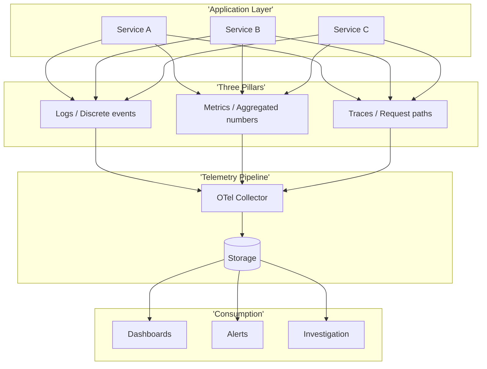

### Three Pillars of Observability

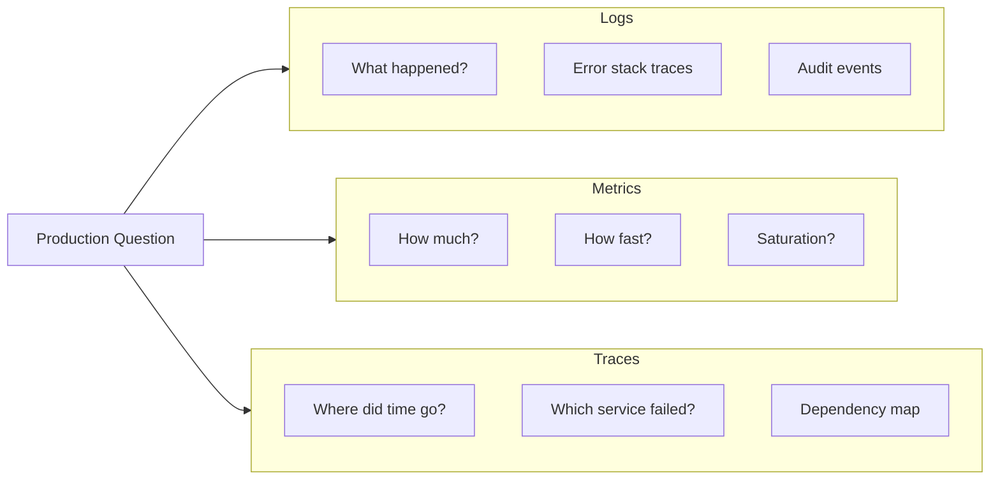

---


## Reading order

Sub-topics are sequenced for progressive learning: foundations first, then related concepts, then specialized topics.

| Group | Sections | Focus |
|-------|----------|-------|
| **1. Logs** | 9.1-9.2 | Logging, structured logging |
| **2. Metrics** | 9.3-9.4 | Metrics, monitoring |
| **3. Traces** | 9.5-9.7 | Distributed tracing, OpenTelemetry, correlation |
| **4. SRE framework** | 9.8-9.11 | SLI -> SLO -> SLA -> error budgets |
| **5. Response** | 9.12-9.15 | Alerting, dashboards, probes, synthetics |

---
---

## 9.1 Logging


### What is it

Immutable, timestamped records of discrete events - errors, requests, state transitions, security actions - written by applications and infrastructure components.

### Why it matters

Logs are the primary forensic tool when debugging a specific failure. They capture context (user, request, error) that aggregated metrics cannot, and they persist long after the incident for postmortems and compliance.

### How it works

Applications emit log lines via a logging framework (Logback, slog, winston). A shipper agent (Fluent Bit, Filebeat) tails files or receives stdout, batches records, and forwards them to a centralized store (Elasticsearch, Loki, CloudWatch). Operators search and filter by time, level, service, and correlation ID.

### Diagram

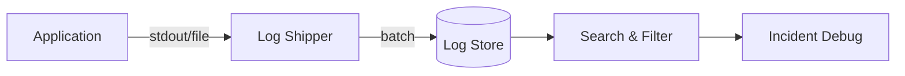

### Key details

- **Levels:** ERROR, WARN, INFO, DEBUG - tune per environment; production rarely needs DEBUG globally
- **Centralization:** never rely on pod-local disks; logs vanish on restart
- **Retention:** hot (7 - 30 days searchable), warm/cold archive for compliance
- **PII/secrets:** redact tokens, passwords, and regulated data at source

### When to use

- Debugging specific errors and stack traces
- Audit trails and security investigations
- Reconstructing request timelines when paired with correlation IDs

### Trade-offs

| Pros | Cons |
|------|------|
| Rich contextual detail | Expensive at high volume |
| Human-readable | Unstructured text hard to query |
| Easy to adopt | Can become noisy without discipline |

### References

- [Google SRE  -  Monitoring Distributed Systems](https://sre.google/sre-book/monitoring-distributed-systems/)

---


## 9.2 Structured Logging


### What is it

Logging where each event is a machine-parseable record (typically JSON) with named fields instead of free-form text strings.

### Why it matters

Structured logs enable fast filtering (`level=ERROR AND service=payment`), aggregation (count errors by `errorCode`), and automatic correlation with traces - without fragile regex parsing.

### How it works

The logging library serializes each event to JSON with standard fields (`timestamp`, `level`, `message`, `traceId`, `spanId`, custom dimensions). The log platform indexes fields as columns. Queries become SQL-like or Lucene field filters.

### Diagram

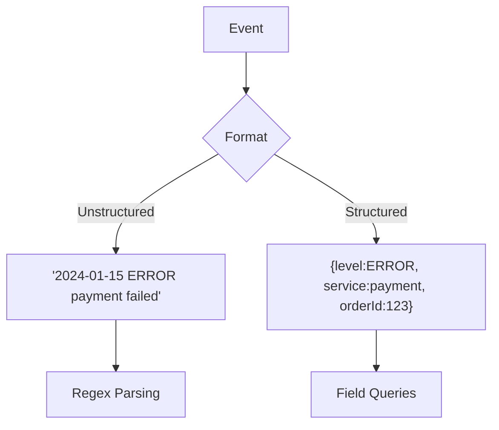

### Key details

- Standard fields: `timestamp`, `level`, `service`, `traceId`, `message`
- Use consistent naming (snake_case or camelCase - pick one)
- Libraries: Logback JSON encoder, structlog, zerolog, winston JSON
- Include exception type, stack (truncated), and business IDs

### When to use

- Any production service at scale
- Microservices where cross-service log correlation is required
- Platforms feeding logs into metrics or alerting rules

### Trade-offs

| Pros | Cons |
|------|------|
| Fast, reliable queries | Slightly larger payload per line |
| Schema evolution possible | Requires discipline on field names |
| Integrates with traces | Bad schemas create indexing bloat |

### References

- [OpenTelemetry Logs Data Model](https://opentelemetry.io/docs/specs/otel/logs/data-model/)

---


## 9.3 Metrics


### What is it

Numeric measurements collected over time - counters, gauges, histograms - that describe system behavior as time series.

### Why it matters

Metrics compress billions of events into trend lines suitable for dashboards, capacity planning, and automated alerting. They answer *how much* and *how fast* at a glance.

### How it works

Instrumentation libraries expose metrics via pull (Prometheus scrapes `/metrics`) or push (StatsD, OTLP). A time-series database stores samples with labels (service, region, endpoint). Query languages (PromQL) aggregate, rate, and percentile over windows.

### Diagram

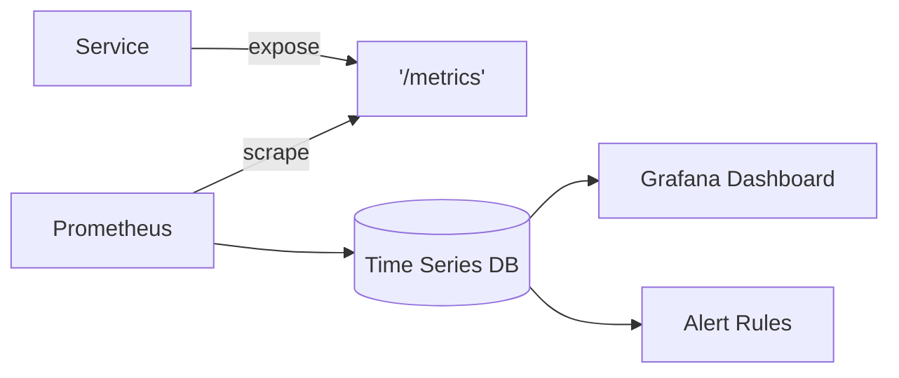

### Key details

- **Counter:** monotonically increasing (`http_requests_total`)
- **Gauge:** point-in-time value (`queue_depth`, `memory_bytes`)
- **Histogram/Summary:** distributions for latency percentiles
- Label cardinality: avoid high-cardinality labels (user IDs) on metrics

### When to use

- SLI measurement (availability, latency)
- Capacity and saturation monitoring
- Alerting on symptoms (error rate, p99 latency)

### Trade-offs

| Pros | Cons |
|------|------|
| Cheap storage vs logs | Loses per-event detail |
| Great for trends | Cardinality explosions are costly |
| Standard alerting input | Requires careful instrumentation design |

### References

- [Prometheus metric types](https://prometheus.io/docs/concepts/metric_types/)
- [RED method](https://www.weave.works/blog/the-red-method-key-metrics-for-microservices-architecture/)

---


## 9.4 Monitoring


### What is it

The practice of continuously observing system health by collecting metrics (and sometimes logs/traces), comparing them to expectations, and surfacing anomalies through dashboards and alerts.

### Why it matters

Monitoring detects degradation before users report outages. It operationalizes reliability goals and gives teams shared situational awareness during incidents.

### How it works

Instrumentation feeds a monitoring stack. SRE frameworks (RED for services, USE for resources) define what to measure. Dashboards visualize golden signals; alert rules fire when thresholds breach; on-call responds via runbooks.

### Diagram

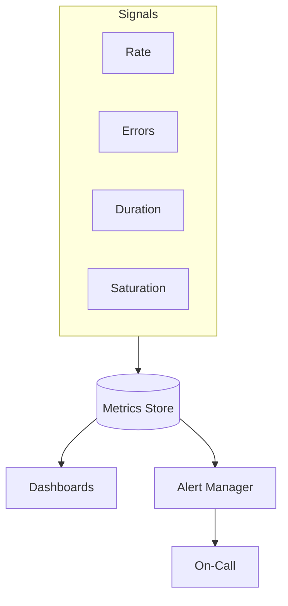

### Key details

- **RED:** Rate, Errors, Duration - for request-driven services
- **USE:** Utilization, Saturation, Errors - for CPU, disk, network
- **Four golden signals:** latency, traffic, errors, saturation
- Monitor symptoms (user-visible), not only causes (CPU)

### When to use

- Always, for any production workload
- Before launching new services (define dashboards first)
- During incidents for real-time triage

### Trade-offs

| Pros | Cons |
|------|------|
| Proactive failure detection | Alert fatigue if poorly tuned |
| Shared team visibility | Wrong metrics create false confidence |
| Drives capacity decisions | Tooling cost at scale |

### References

- [Google SRE  -  Four Golden Signals](https://sre.google/sre-book/monitoring-distributed-systems/#xref_monitoring_golden-signals)

---


## 9.5 Distributed Tracing


### What is it

**Distributed tracing** tracks a single logical request as it crosses process and network boundaries, represented as a **trace** (the whole journey) composed of **spans** (individual timed operations) linked by a shared **trace ID** and parent-child relationships.

Tracing answers: *where did the 2-second checkout latency go?* and *which downstream service returned 500?*

### Why it matters

In monoliths, a stack trace suffices. In microservices:

- One API call fans out to 5–20 internal HTTP/gRPC/DB calls
- Logs alone cannot reconstruct timing per hop
- Metrics show p99 latency spike but not **which dependency** caused it
- **Interview staple:** "Logs = what; metrics = how much; traces = where time went"

### How it works

**Core concepts:**

| Concept | Definition | Example |
|---------|------------|---------|
| **Trace** | End-to-end path of one request | Checkout `trace_id=abc123` |
| **Span** | One timed operation within a trace | `HTTP GET /users/42` — 12 ms |
| **Root span** | First span; no parent | API gateway ingress |
| **Child span** | Created by downstream call | Order service → Payment gRPC |
| **Span attributes** | Key-value metadata | `http.status_code=200`, `db.system=postgresql` |
| **Span events** | Timestamped annotations | `exception` at T+45ms |

**Span tree example (waterfall):**

```text
[trace_id: abc123]  total 847ms
├── gateway.http          847ms
│   ├── order.getOrder    320ms
│   │   ├── postgres.query  45ms
│   │   └── inventory.grpc  180ms
│   └── payment.charge    410ms
│       └── stripe.http     390ms
```

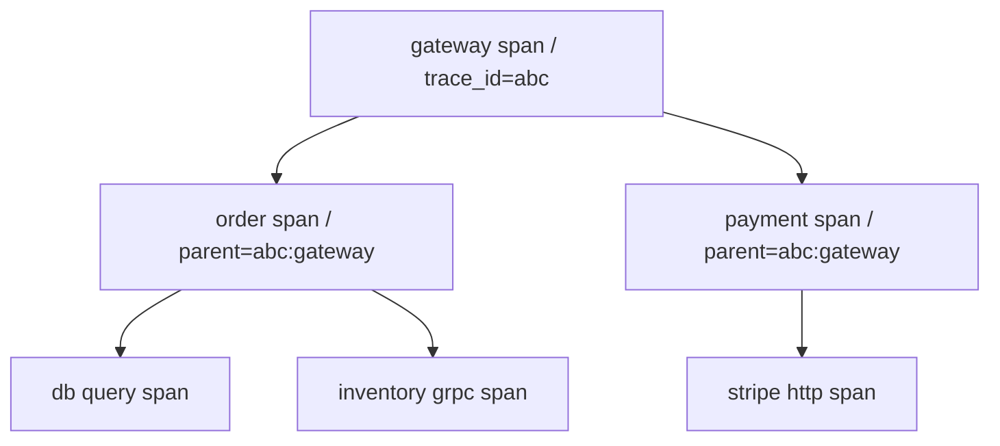

**Trace context propagation**

For spans to link across services, context must **flow with the request**:

| Standard | Header | Format |
|----------|--------|--------|
| **W3C Trace Context** | `traceparent` | `00-{trace-id}-{parent-span-id}-{flags}` |
| **W3C** | `tracestate` | Vendor-specific key-value pairs |
| Legacy B3 | `X-B3-TraceId`, `X-B3-SpanId` | Zipkin format (still common) |

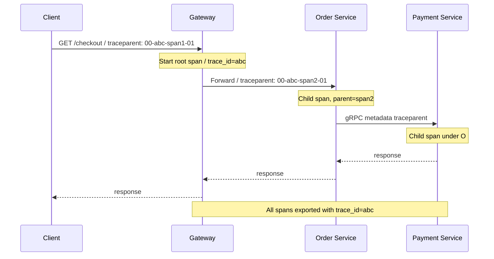

**Propagation rules:**

1. **Ingress:** extract context from incoming headers or start new trace
2. **Egress:** inject context into outbound HTTP headers / gRPC metadata / Kafka headers
3. **Broken propagation** → orphan spans; trace appears fragmented in UI
4. **Async:** pass context in message headers (`traceparent` in Kafka record headers)

**Instrumentation layers:**

| Layer | What it traces | Example |
|-------|----------------|---------|
| Auto-instrumentation | HTTP server/client, gRPC, DB drivers | OpenTelemetry Java agent |
| Manual spans | Business logic | `span.addEvent("payment_authorized")` |
| Service mesh | Envoy generates spans | Istio without app changes |

**Sampling (production necessity)**

100% trace collection at 50K RPS is expensive. Strategies:

| Strategy | Behavior | When |
|----------|----------|------|
| **Head-based** | Decide at root (1–10% random) | Default prod |
| **Tail-based** | Keep traces that ended in error or slow | OTel Collector tail sampling |
| **Always sample** | Dev/staging, errors | Debug sessions |

Rule of thumb: sample 1–5% in prod; **always** capture errors if tail sampling available.

**Linking traces to logs:**

```json
{
  "level": "ERROR",
  "message": "Payment declined",
  "traceId": "abc123def456",
  "spanId": "span789",
  "service": "payment-service"
}
```

Click trace ID in Jaeger → see exact log lines in Loki/Elasticsearch.

### Key details

- **Critical path:** longest chain of dependent spans determines latency floor
- **Span kind:** `SERVER`, `CLIENT`, `PRODUCER`, `CONSUMER`, `INTERNAL`
- **Status:** `OK`, `ERROR` — set on non-2xx and exceptions
- **Baggage:** propagate business context (`tenant_id`) — use sparingly (PII risk)
- Tools: Jaeger, Zipkin, Grafana Tempo, Honeycomb, Datadog APM

### When to use

- Any microservice with multi-hop synchronous or async paths
- Latency debugging (p99 investigations, regression after deploy)
- Dependency mapping and architecture discovery
- SLO debugging — correlate burn-rate spikes to specific downstream

### Trade-offs

| Pros | Cons |
|------|------|
| Pinpoints bottleneck span | Storage cost at high sampling |
| Visual call graph for onboarding | Broken context = incomplete traces |
| Links logs ↔ traces via trace ID | Manual instrumentation for business spans |
| Mesh can add tracing without code | Cardinality of span attributes must be controlled |

### References

- [OpenTelemetry — Traces](https://opentelemetry.io/docs/concepts/signals/traces/)
- [W3C Trace Context](https://www.w3.org/TR/trace-context/)
- [Jaeger architecture](https://www.jaegertracing.io/docs/latest/architecture/)

---


## 9.6 OpenTelemetry


### What is it

A vendor-neutral, CNCF-standard API, SDK, and collector for generating and exporting traces, metrics, and logs - one instrumentation layer for many backends.

### Why it matters

Avoids vendor lock-in and duplicate instrumentation. Teams instrument once with OTel and export to Jaeger, Prometheus, Datadog, or cloud-native backends via configuration.

### How it works

The OTel SDK auto-instruments frameworks (HTTP, gRPC, DB) and supports manual spans. The **Collector** receives OTLP, processes (filter, batch, enrich), and exports to backends. Semantic conventions standardize attribute names across languages.

### Diagram

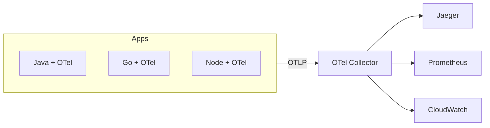

### Key details

- Signals: traces, metrics, logs (unified pipeline)
- Auto-instrumentation vs manual spans for business logic
- Collector processors: tail sampling, attribute scrubbing
- W3C Trace Context is the default propagation format

### When to use

- Greenfield microservices (default choice in 2024+)
- Migrating off vendor-specific agents
- Polyglot environments needing consistent telemetry

### Trade-offs

| Pros | Cons |
|------|------|
| Vendor neutral | Collector ops overhead |
| Rich ecosystem | Semantic convention adoption takes time |
| Single SDK per language | Some vendor features need proprietary exporters |

### References

- [OpenTelemetry Documentation](https://opentelemetry.io/docs/)
- [OTel Collector](https://opentelemetry.io/docs/collector/)

---


## 9.7 Correlation IDs


### What is it

A unique identifier assigned to a request at the system edge and propagated through every service, log line, trace, and support ticket for that request.

### Why it matters

Correlation IDs stitch together fragmented telemetry across dozens of services, turning "find needle in haystack" into "filter by `requestId=xyz`".

### How it works

The API gateway generates an ID (UUID) if the client did not send one. The ID is passed via HTTP header (`X-Request-ID`, `X-Correlation-ID`) or embedded in W3C trace context. Every service copies it into structured logs and span attributes.

### Diagram

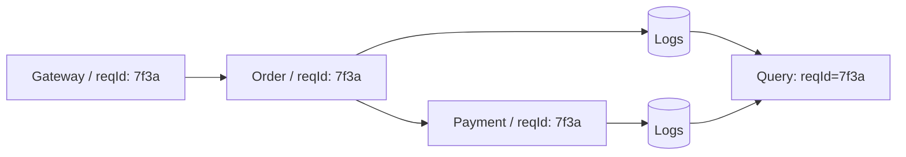

### Key details

- Generate at edge; never trust client-supplied IDs for security decisions
- Log the ID on every line - including async workers and message consumers
- Align with `traceId` when using distributed tracing (often the same or linked)
- Pass through message queues via message headers

### When to use

- All distributed systems
- Support tooling linking user reports to backend logs
- Async pipelines (include ID in event payload)

### Trade-offs

| Pros | Cons |
|------|------|
| Simple, high-value | Useless if propagation breaks mid-chain |
| Works without full tracing | Not a substitute for span timing |
| Low implementation cost | Duplicate IDs if clients resend same header |

### References

- [W3C Trace Context](https://www.w3.org/TR/trace-context/)

---


## 9.8 SLI


### What is it

A **Service Level Indicator (SLI)** is a **quantitative measure** of some aspect of service behavior from the **user's perspective** — the raw metric you actually observe before setting targets.

SLIs answer: *"What exactly are we measuring?"* SLOs answer: *"How well must we measure?"*

### Why it matters

Vague goals ("keep the site fast") are unmeasurable. Precise SLI definitions prevent:

- Engineering optimizing server CPU while users see errors at the CDN
- Disputes during incidents ("was that an outage?")
- Alerts that fire on irrelevant internal metrics

**Google SRE principle:** measure SLIs at the **user boundary** (load balancer, edge, synthetic probe) when possible — not only inside the data center.

### How it works

**The SLI formula:**

```text
SLI = (good events) / (valid events)   × 100%
```

| Term | Definition | Example |
|------|------------|---------|
| **Valid events** | Requests that should be counted | All HTTP requests excluding health checks |
| **Good events** | Events meeting "good" criteria | 2xx/3xx responses, or latency < 300ms |
| **Bad events** | Valid but not good | 5xx, timeout, latency > threshold |

**Common SLI types:**

| SLI type | Good event | Valid events | Measurement point |
|----------|------------|--------------|-------------------|
| **Availability** | Successful response (2xx/3xx) | All non-healthcheck requests | Edge LB, synthetic |
| **Latency** | Response time < T ms | All successful requests | Edge histogram |
| **Quality / Correctness** | Business-valid outcome | All attempts | App-level (e.g., search with results) |
| **Freshness** | Data age < N seconds | All reads | Pipeline watermark |
| **Durability** | Data not lost | All writes | Storage audit (rare for most teams) |

**Availability SLI — definition debates (pick one explicitly):**

| Definition | Formula | Trade-off |
|------------|---------|-----------|
| Strict | `(2xx + 3xx) / all` | Client 404 counts against you |
| Server-focused | `2xx / (all - 4xx)` | Excludes client errors |
| Success-only | `non-5xx / all` | Treats 4xx as "available" |

**Latency SLI — percentile over threshold:**

```text
Latency SLI = (requests with duration < 300ms) / (all valid requests)
```

Or define as: "99th percentile latency < 500ms" — the SLI is the **fraction of windows** meeting that percentile target.

```mermaid
flowchart LR
    Req[Incoming Requests] --> V{Valid event?}
    V -->|healthcheck| Skip[Exclude]
    V -->|yes| G{Good event?}
    G -->|2xx in 200ms| Good[Good +1]
    G -->|5xx or slow| Bad[Bad +1]
    Good & Bad --> SLI['SLI = good / (good+bad)']
    SLI --> SLO[Compare to SLO target]
```

**Instrumentation examples:**

```promql
# Availability SLI (5-minute rate)
sum(rate(http_requests_total{status!~"5.."}[5m]))
/
sum(rate(http_requests_total[5m]))

# Latency SLI — fraction under 300ms (histogram)
sum(rate(http_request_duration_seconds_bucket{le="0.3"}[5m]))
/
sum(rate(http_request_duration_seconds_count[5m]))
```

**Multi-window SLIs:** measure over rolling 1h, 24h, 30d for SLO compliance reporting.

### Key details

- **User-centric:** measure what users experience — synthetic + real traffic combined
- **Few SLIs per service:** typically availability + latency + one domain-specific (correctness)
- **Exclude noise:** health checks, internal metrics scrapes, pen-test traffic
- **Document exclusions:** planned maintenance — in or out of SLI?
- SLI without SLO is just a dashboard metric — pair them (see 9.9)

### When to use

- Defining any reliability target before writing SLO
- Building golden-signal dashboards
- Incident retrospectives — "did we breach SLO?"
- Capacity planning — latency SLI degradation precedes outages

### Trade-offs

| Pros | Cons |
|------|------|
| Objective, auditable measurement | Definition debates (4xx, 3xx) take time |
| Foundation for SLO/error budget | Edge vs server measurement can differ |
| Aligns teams on "good" | Lagging indicator — misses UX nuance (slow but "success") |
| Drives correct instrumentation | Too many SLIs → conflicting goals |

### References

- [Google SRE Workbook — SLI selection](https://sre.google/workbook/implementing-slos/#sli-selection)
- [Google SRE Book — Monitoring Distributed Systems](https://sre.google/sre-book/monitoring-distributed-systems/)

---


## 9.9 SLO


### What is it

A **Service Level Objective (SLO)** is an **internal reliability target** — a threshold applied to an SLI over a defined **time window**, representing the level of reliability your team commits to deliver.

Example: *"99.9% of checkout requests return a successful response within 30 rolling days."*

### Why it matters

SLOs translate "users should be happy" into engineering decisions:

- When to page on-call (SLO burn rate)
- Whether Friday deploys are allowed (error budget remaining)
- How to prioritize reliability vs feature work
- **Interview chain:** SLI (measure) → SLO (target) → Error budget (allowed failure) → SLA (contract)

### How it works

**SLI → SLO relationship:**

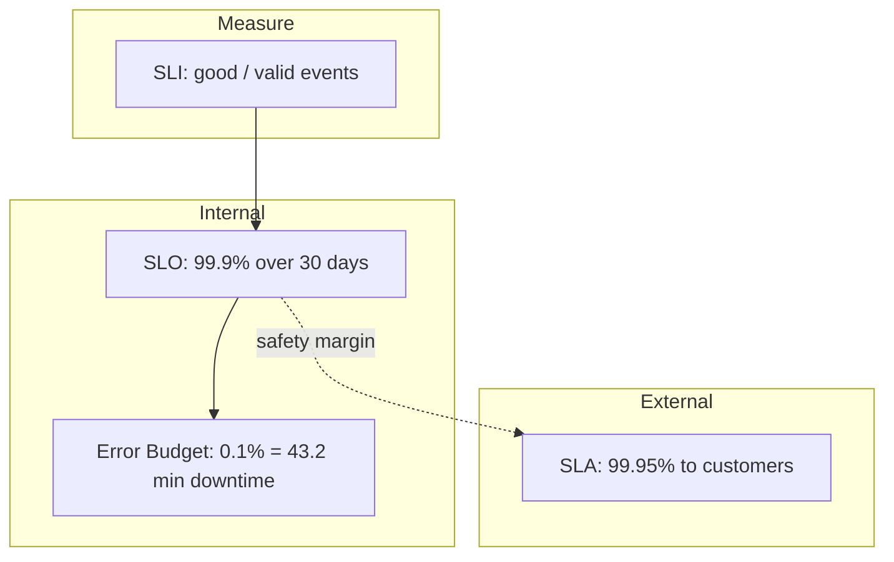

**Writing good SLOs:**

| Component | Example | Notes |
|-----------|---------|-------|
| SLI | Availability of `POST /checkout` | Specific user journey beats "all endpoints" |
| Target | 99.9% | Three nines = 43.2 min/month budget |
| Window | Rolling 30 days | Calendar month also common |
| Measurement | Edge load balancer logs | Document data source |

**Example SLO set for a payment API:**

| SLO | SLI definition | Target | Window |
|-----|----------------|--------|--------|
| Availability | Non-5xx responses / valid requests | 99.95% | 30d rolling |
| Latency | Requests < 500ms / successful requests | 99% | 30d rolling |
| Correctness | Charges without duplicate / total charges | 99.99% | 30d rolling |

**Nines cheat sheet (30-day window):**

| Availability | Downtime/month | Error budget |
|--------------|----------------|--------------|
| 99% (two nines) | 7h 12m | 1% |
| 99.9% (three nines) | 43m 12s | 0.1% |
| 99.95% | 21m 36s | 0.05% |
| 99.99% (four nines) | 4m 19s | 0.01% |

**SLO-based alerting (multi-burn-rate):**

Alert when error budget is **burning too fast** — not on every blip:

| Alert | Burn rate | Window | Meaning |
|-------|-----------|--------|---------|
| Page | 14.4× | 1h | Budget gone in ~2 days if continues |
| Page | 6× | 6h | Serious degradation |
| Ticket | 3× | 3d | Slow burn worth investigating |

```promql
# Simplified burn-rate concept
# (error_rate / (1 - SLO_target)) > burn_rate_threshold
```

**SLO review cadence:**

- Quarterly: adjust targets with product — tighter if users demand, looser if cost prohibitive
- Post-incident: did SLO breach? Was target realistic?
- Avoid **SLO sprawl** — 3–5 SLOs per service maximum

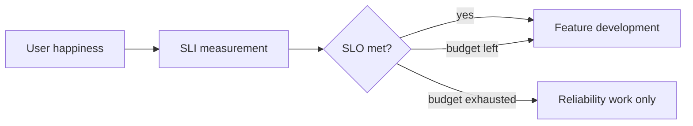

### Key details

- **User-centric journeys:** SLO on `/checkout` not `/internal/metrics`
- **SLO < SLA:** internal target stricter than contractual SLA (buffer for disputes)
- **Shared SLOs:** one customer-facing SLO may map to multiple backend services
- **Composite SLOs:** end-to-end only if you own full path; else per-service SLOs
- Document **exclusions:** maintenance windows, third-party dependency failures

### When to use

- Any production service past MVP — before alert fatigue sets in
- Release governance and error budget policies
- Prioritizing tech debt vs features with product leadership
- On-call paging criteria — page on SLO burn, not CPU > 80%

### Trade-offs

| Pros | Cons |
|------|------|
| Quantifies reliability goals | Wrong SLO optimizes wrong behavior |
| Enables error budget culture | Hard to measure end-to-end in microservices |
| Reduces subjective release debates | Setting too loose → meaningless; too tight → no shipping |
| Aligns eng and product | Requires instrumentation investment first |

### References

- [Google SRE Workbook — Implementing SLOs](https://sre.google/workbook/implementing-slos/)
- [Google SRE — Alerting on SLOs](https://sre.google/workbook/alerting-on-slos/)

---


## 9.10 SLA


### What is it

**Service Level Agreement** - a contractual commitment to customers defining measurable service targets, often with financial remedies (credits) for breach.

### Why it matters

SLAs set external expectations and legal obligations. They must be achievable, measurable, and backed by internal engineering targets (SLOs) with safety margin.

### How it works

Legal and product define SLA terms (e.g., 99.95% monthly uptime). Engineering measures compliance via SLIs. Internal SLO is set stricter than SLA (buffer). Breach triggers service credits per contract.

### Diagram

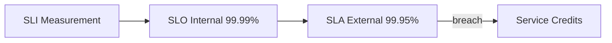

### Key details

- External-facing, legally binding
- Define measurement method, exclusions (planned maintenance), reporting
- Always set SLA below internal SLO
- Multi-tenant: per-customer vs platform-wide SLAs

### When to use

- B2B SaaS with enterprise contracts
- Cloud provider service offerings
- Regulated industries with uptime guarantees

### Trade-offs

| Pros | Cons |
|------|------|
| Customer trust | Financial liability on miss |
| Clear expectations | Conservative targets limit agility |
| Sales differentiator | Disputes over measurement |

### References

- [AWS SLA overview](https://aws.amazon.com/legal/service-level-agreements/)

---


## 9.11 Error Budgets


### What is it

An **error budget** is the **allowed amount of unreliability** implied by an SLO — the mirror image of the reliability target. If your SLO is 99.9% availability, your error budget is **0.1%** of valid events in the measurement window that may fail.

Error budgets make reliability a **finite resource** product and engineering spend together.

### Why it matters

Without error budgets:

- Reliability debates are subjective ("is one outage too many?")
- Teams ship recklessly OR never ship from fear
- On-call pages on noisy thresholds unrelated to user impact

With error budgets:

- **Budget remaining** → justified risk-taking (deploys, experiments)
- **Budget exhausted** → freeze features, focus on stability
- **Interview one-liner:** "Error budget = 1 − SLO; it's how much downtime/latency failure you can afford per month."

### How it works

**Calculation:**

```text
Error budget (fraction) = 1 − SLO target
Error budget (time)     = window_duration × (1 − SLO target)
```

**30-day rolling window examples:**

| SLO target | Error budget % | Allowed downtime / month |
|------------|----------------|--------------------------|
| 99% | 1% | ~7h 18m |
| 99.9% | 0.1% | ~43m 48s |
| 99.95% | 0.05% | ~21m 54s |
| 99.99% | 0.01% | ~4m 23s |

**Request-based example:**

```text
SLO: 99.9% availability over 30d
Valid requests/month: 100 million
Error budget = 0.1% × 100M = 100,000 failed requests allowed
```

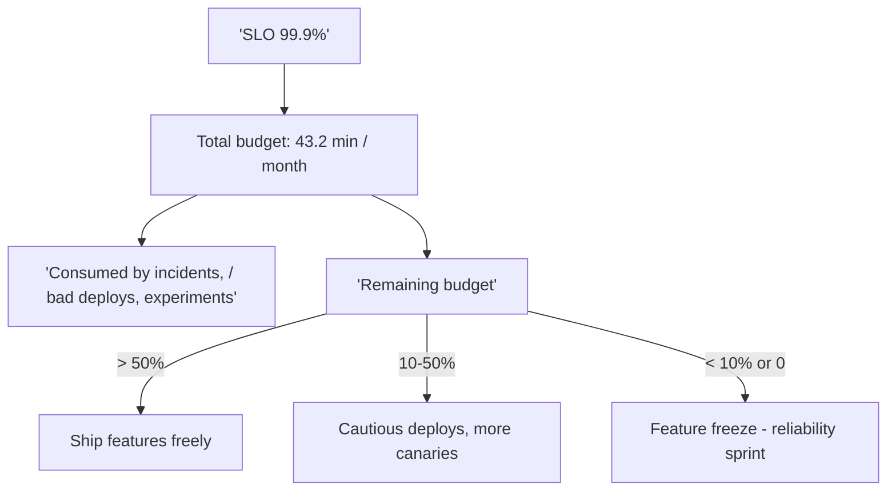

**What consumes error budget:**

| Event | Consumption |
|-------|-------------|
| User-visible outage (5xx storm) | Large — minutes of bad SLI |
| Partial degradation (elevated latency) | Latency SLO budget |
| Bad deploy rolled back in 5 min | Small but non-zero |
| Planned maintenance | Policy choice — exclude or consume |
| Third-party dependency down | Depends — exclude if out of your control |

**Error budget policy (example):**

```text
Budget > 50% remaining  → normal development velocity
Budget 25–50%           → require canary + extra review for risky changes
Budget < 25%            → reliability tasks prioritized in sprint
Budget = 0                → feature freeze until budget recovers OR SLO revised
```

**Burn rate — how fast budget is consumed:**

```text
burn_rate = (current error rate) / (error budget rate)

error budget rate = 1 − SLO = 0.001 for 99.9% SLO

If 1% of requests failing now:
burn_rate = 0.01 / 0.001 = 10×
→ at this rate, monthly budget exhausted in ~3 days
```

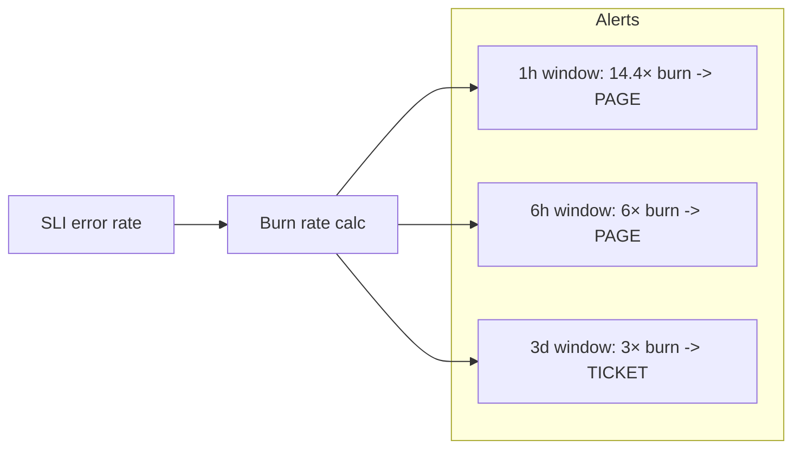

**Product + engineering collaboration:**

- Error budget is a **product decision tool** — not only SRE
- Product accepts: higher SLO = slower feature velocity (more careful deploys)
- Postmortem when budget burned unexpectedly — was deploy process at fault?

### Key details

- Track budget **per SLO**, per service, rolling window (30d common)
- Dashboard: budget remaining % with projection ("at current burn, exhausted in 4 days")
- **Partial outages** consume proportional budget — not binary
- Budget recovery is automatic as window rolls forward (old bad minutes age out)
- Don't game with loose SLOs — meaningless budget helps no one

### When to use

- Teams with defined SLOs practicing SRE
- Release governance: "Can we deploy Friday 4pm?"
- Sprint planning: reliability work vs features
- Incident severity classification tied to budget impact

### Trade-offs

| Pros | Cons |
|------|------|
| Objective ship/no-ship decisions | Requires SLO maturity first |
| Aligns product and engineering incentives | Loose SLO → fake budget |
| Reduces blame — "we spent budget" | Cultural buy-in takes time |
| Focuses alerts on user impact | Multi-service budgets are complex |
| Encourages calculated risk | Budget freeze can frustrate product if overused |

### References

- [Google SRE Book — Embracing Risk](https://sre.google/sre-book/embracing-risk/)
- [Google SRE Workbook — Alerting on SLOs](https://sre.google/workbook/alerting-on-slos/)

---


## 9.12 Alerting


### What is it

Automated notifications when monitored signals breach thresholds or exhibit anomalous behavior, routing humans or automation to respond.

### Why it matters

Users should not be the first detectors of outages. Well-designed alerts shorten mean time to detect (MTTD) and direct on-call engineers to actionable problems.

### How it works

Alert rules evaluate metrics over windows (e.g., `error_rate > 1% for 5m`). Alertmanager groups, deduplicates, and routes by severity to PagerDuty, Slack, or email. Each alert links to a runbook. Post-incident, noisy alerts are tuned or removed.

### Diagram

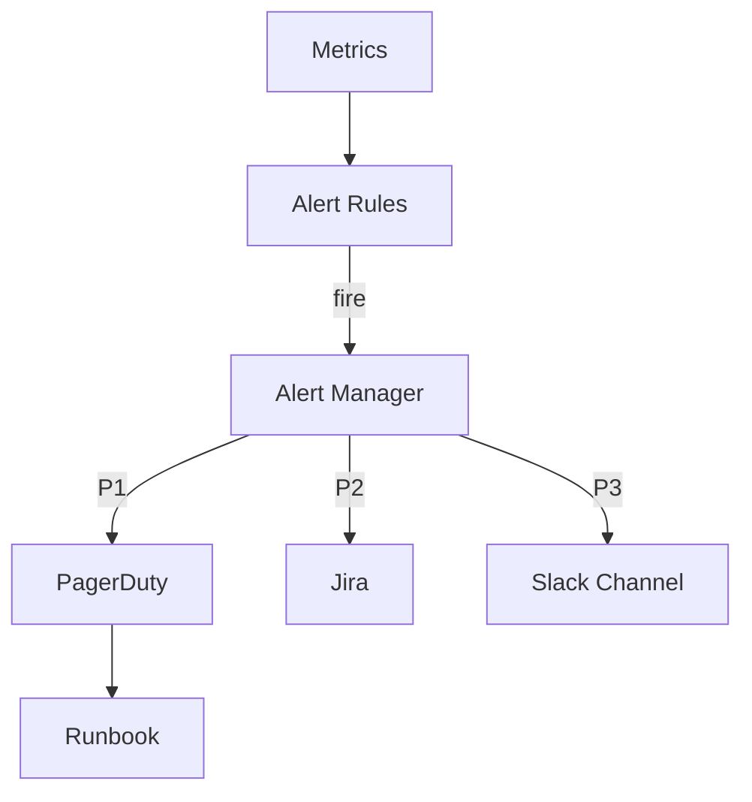

### Key details

- Alert on **symptoms** (error rate, SLO burn), not causes (single CPU spike)
- Severity tiers: P1 pages, P2 business hours, P3 dashboard-only
- Every alert must be actionable - if no action, delete the alert
- Use multi-window burn-rate alerts for SLO-based paging

### When to use

- Production SLO violations
- Dependency failures affecting users
- Security and capacity threshold breaches

### Trade-offs

| Pros | Cons |
|------|------|
| Fast incident detection | Alert fatigue destroys trust |
| Automates vigilance | Flapping alerts waste time |
| Ties to on-call rotation | Poor thresholds -> false positives |

### References

- [Google SRE  -  Alerting on SLOs](https://sre.google/workbook/alerting-on-slos/)
- [Prometheus Alertmanager](https://prometheus.io/docs/alerting/latest/overview/)

---


## 9.13 Dashboards


### What is it

Visual compositions of panels (graphs, gauges, tables) displaying key metrics and logs for real-time and historical system overview.

### Why it matters

Dashboards provide at-a-glance health during incidents and planning sessions. They align teams on golden signals and reduce ad-hoc query friction under pressure.

### How it works

Tools like Grafana connect to metric and log data sources. Panels run PromQL or LogQL queries with templated variables (`$service`, `$region`). Hierarchy: global overview -> service dashboard -> instance drill-down.

### Diagram

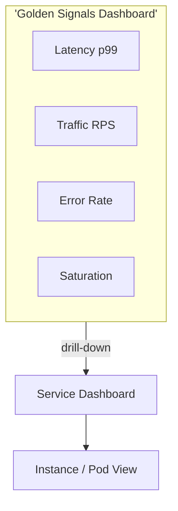

### Key details

- One overview + one dashboard per critical service
- Chart decisions, not vanity metrics (total requests ever)
- Use consistent time ranges and annotation markers for deploys
- Mobile-friendly layouts for incident response

### When to use

- Daily operational health checks
- Incident war rooms
- Capacity review meetings

### Trade-offs

| Pros | Cons |
|------|------|
| Fast situational awareness | Stale dashboards mislead |
| Shared team context | Maintenance burden grows |
| Drill-down accelerates triage | Can hide problems behind averages |

### References

- [Grafana best practices](https://grafana.com/docs/grafana/latest/dashboards/build-dashboards/best-practices/)

---


## 9.14 Health Checks


### What is it

HTTP or TCP endpoints (or exec probes) that report whether a process is alive and whether it can accept traffic.

### Why it matters

Orchestrators and load balancers use health checks to restart failed containers and stop routing to unhealthy instances - automating recovery without human intervention.

### How it works

**Liveness** probes detect deadlocks - failure triggers restart. **Readiness** probes detect temporary unavailability (DB down) - failure removes instance from load balancer. **Startup** probes allow slow-starting apps extra time before liveness kicks in.

### Diagram

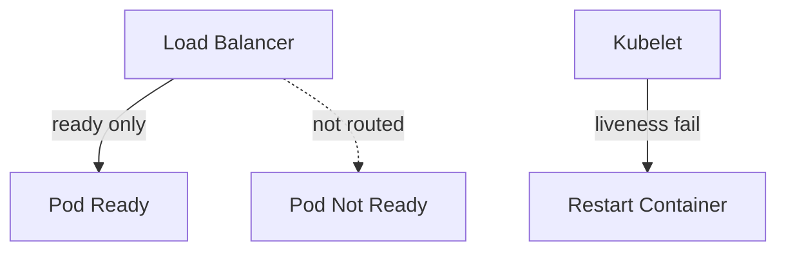

### Key details

- Shallow: `/health` returns 200 if process up
- Deep: `/ready` checks DB, cache, downstream dependencies
- Keep liveness cheap - avoid cascading failures from deep checks
- Kubernetes: `livenessProbe`, `readinessProbe`, `startupProbe`

### When to use

- Container orchestration (Kubernetes, ECS)
- Load balancer target group health
- Dependency-gated traffic shifting (blue/green)

### Trade-offs

| Pros | Cons |
|------|------|
| Automated healing | Deep checks can flap during partial outages |
| Prevents bad traffic routing | Misconfigured probes cause restart loops |
| Standard K8s pattern | Probe latency affects rollout speed |

### References

- [Kubernetes probes](https://kubernetes.io/docs/concepts/configuration/liveness-readiness-startup-probes/)

---


## 9.15 Synthetic Monitoring


### What is it

Automated external probes that simulate user journeys - HTTP checks, browser scripts, API workflows - from outside your network on a schedule.

### Why it matters

Internal metrics can show green while users cannot reach the site (DNS, CDN, certificate issues). Synthetic monitoring detects user-visible outages before real traffic does.

### How it works

A scheduler runs probes every 1 - 5 minutes from multiple geographic locations. Failures trigger alerts. Results feed availability SLIs. Tools: Datadog Synthetics, Pingdom, Grafana k6 cloud, AWS CloudWatch Synthetics.

### Diagram

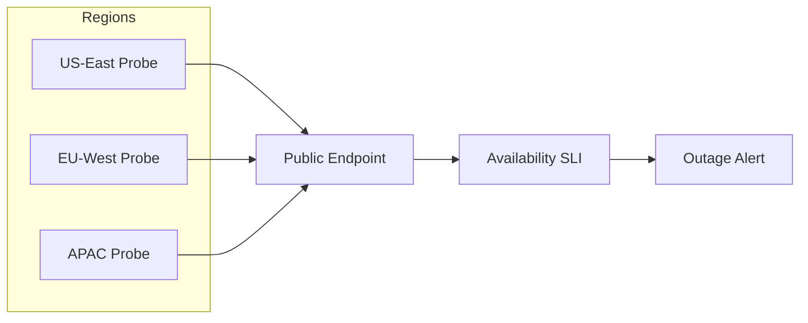

### Key details

- Black-box: tests what users experience, not internal metrics
- Multi-region catches DNS/geo routing failures
- Critical path scripts: login, checkout, search
- Separate from load testing - low frequency, high signal

### When to use

- Public-facing APIs and web apps
- SLO availability measurement
- Certificate and DNS expiry monitoring

### Trade-offs

| Pros | Cons |
|------|------|
| User-perspective truth | Does not cover all code paths |
| Catches external failures | Scripted flows need maintenance |
| Geographic coverage | Can miss internal-only issues |

### References

- [Google SRE  -  SLI measurement](https://sre.google/workbook/implementing-slos/)

---


## Quick Reference

| # | Topic | Summary |
|---|-------|---------|
| 9.1 | Logging | Logging |
| 9.2 | Structured Logging | Structured Logging |
| 9.3 | Metrics | Metrics |
| 9.4 | Monitoring | Monitoring |
| 9.5 | Distributed Tracing | Distributed Tracing |
| 9.6 | OpenTelemetry | OpenTelemetry |
| 9.7 | Correlation IDs | Correlation IDs |
| 9.8 | SLI | SLI |
| 9.9 | SLO | SLO |
| 9.10 | SLA | SLA |
| 9.11 | Error Budgets | Error Budgets |
| 9.12 | Alerting | Alerting |
| 9.13 | Dashboards | Dashboards |
| 9.14 | Health Checks | Health Checks |
| 9.15 | Synthetic Monitoring | Synthetic Monitoring |

---

[â -  Back to master index](../README.md)
