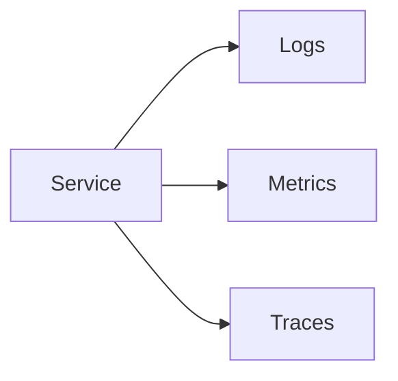
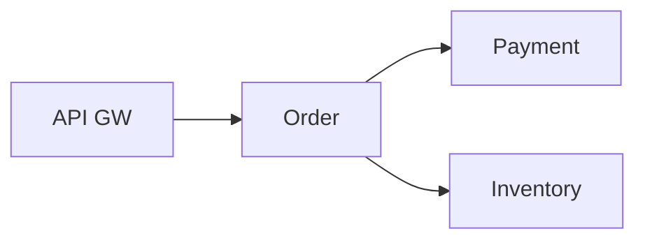
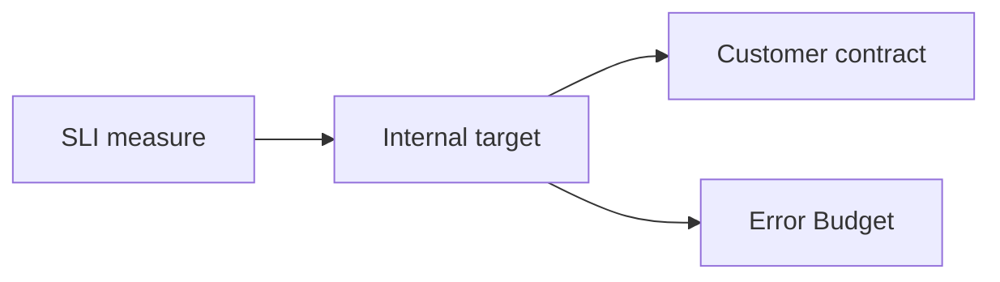

# 9. Observability

> Status: **Documented** — cheat-sheet reference for all sub-topics below.

[← Back to master index](../README.md)

---

## Sub-topics

| # | Sub-topic | Status |
|---|-----------|--------|
| 9.1 | [Logging](#91-logging) | Done |
| 9.2 | [Structured Logging](#92-structured-logging) | Done |
| 9.3 | [Metrics](#93-metrics) | Done |
| 9.4 | [Monitoring](#94-monitoring) | Done |
| 9.5 | [Distributed Tracing](#95-distributed-tracing) | Done |
| 9.6 | [OpenTelemetry](#96-opentelemetry) | Done |
| 9.7 | [Correlation IDs](#97-correlation-ids) | Done |
| 9.8 | [Alerting](#98-alerting) | Done |
| 9.9 | [Dashboards](#99-dashboards) | Done |
| 9.10 | [Health Checks](#910-health-checks) | Done |
| 9.11 | [Synthetic Monitoring](#911-synthetic-monitoring) | Done |
| 9.12 | [Error Budgets](#912-error-budgets) | Done |
| 9.13 | [SLA](#913-sla) | Done |
| 9.14 | [SLO](#914-slo) | Done |
| 9.15 | [SLI](#915-sli) | Done |

---

## Overview

Observability answers "why is the system broken?" using logs, metrics, and traces — the three pillars of production insight.

---

## 9.1 Logging

**Summary:** Immutable timestamped records of discrete events (errors, requests, state changes). Primary tool for debugging specific failures.

- **Levels** — ERROR, WARN, INFO, DEBUG; tune per environment
- **Centralized** — ship to ELK, Loki, CloudWatch; don't rely on local disks
- **PII caution** — never log secrets, tokens, or raw passwords

---

## 9.2 Structured Logging

**Summary:** Logs as key-value JSON instead of free text. Enables filtering, aggregation, and correlation in log platforms.

- **Fields** — `timestamp`, `level`, `message`, `traceId`, `userId`
- **Parse-free queries** — `level=ERROR AND service=payment`
- **Libraries** — Logback JSON, structlog, winston with JSON formatter

---

## 9.3 Metrics

**Summary:** Numeric time-series measurements aggregated over time (counters, gauges, histograms). Best for trends, capacity, and alerting.

- **Counter** — monotonically increasing (requests total)
- **Gauge** — point-in-time value (queue depth, memory)
- **Histogram** — distribution (latency percentiles)

---

## 9.4 Monitoring

**Summary:** Continuous observation of system health against defined thresholds. Combines metrics collection, dashboards, and alerts.

- **RED method** — Rate, Errors, Duration for services
- **USE method** — Utilization, Saturation, Errors for resources
- **Proactive** — detect degradation before user impact

---

## 9.5 Distributed Tracing

**Summary:** Track a single request across multiple services with parent-child spans. Shows where latency and errors occur in the call chain.

- **Trace** — full request journey; **span** — one operation
- **Context propagation** — trace ID passed via HTTP headers
- **Sampling** — trace 1–10% in high traffic; 100% on errors

---

## 9.6 OpenTelemetry

**Summary:** Vendor-neutral standard for traces, metrics, and logs instrumentation. Single SDK exports to Jaeger, Prometheus, Datadog, etc.

- **OTel SDK** — auto + manual instrumentation
- **Collector** — receive, process, export telemetry
- **Semantic conventions** — standard attribute names across languages

---

## 9.7 Correlation IDs

**Summary:** Unique ID attached to a request and propagated across all services and log entries. Ties together logs, traces, and support tickets.

- **Header** — `X-Request-ID` or `traceparent` (W3C)
- **Generate at edge** — gateway creates ID if missing
- **Log every line** — include correlation ID in all log records

---

## 9.8 Alerting

**Summary:** Notify on-call when metrics breach thresholds or anomalies detected. Alerts must be actionable, not noisy.

- **Symptom-based** — alert on user impact (error rate), not causes (CPU)
- **Severity tiers** — P1 page, P2 ticket, P3 dashboard
- **Runbooks** — every alert links to remediation steps

---

## 9.9 Dashboards

**Summary:** Visual panels of key metrics for real-time system overview. One dashboard per service + one golden-signals overview.

- **Golden signals** — latency, traffic, errors, saturation
- **Drill-down** — overview → service → instance
- **Avoid vanity metrics** — chart what drives decisions

---

## 9.10 Health Checks

**Summary:** Endpoints reporting service readiness and liveness. Orchestrators use them for routing and restart decisions.

- **Liveness** — process alive? Restart if fails
- **Readiness** — can accept traffic? Remove from LB if fails
- **Deep vs shallow** — `/health` (up) vs `/ready` (DB connected)

---

## 9.11 Synthetic Monitoring

**Summary:** Automated probes simulating user journeys from outside the system. Detects outages before real users report them.

- **Black-box** — ping URLs, run scripts every N minutes
- **Multi-region** — test from geographic vantage points
- **SLO input** — synthetic uptime feeds availability SLI

---

## 9.12 Error Budgets

**Summary:** Allowed unreliability derived from SLO (e.g., 99.9% = 43 min/month downtime budget). Balances velocity vs stability.

- **Budget consumed** — by incidents, deploys, experiments
- **Policy** — budget exhausted → freeze features, focus on reliability
- **Google SRE** — error budget drives release decisions

---

## 9.13 SLA

**Summary:** Service Level Agreement — contractual commitment to customers with financial penalties for breach. External-facing promise.

- **Legal binding** — credits/refunds on miss
- **Conservative** — set below internal SLO (buffer)
- **Example** — 99.95% monthly uptime

---

## 9.14 SLO

**Summary:** Service Level Objective — internal reliability target the team commits to engineering. Drives error budgets and prioritization.

- **Measurable** — "99.9% of requests < 200ms over 30 days"
- **User-centric** — measure what users experience
- **Few SLOs** — 3–5 per service, not dozens

---

## 9.15 SLI

**Summary:** Service Level Indicator — the actual measured metric underlying an SLO (availability, latency, throughput, correctness).

- **Availability SLI** — successful requests / total requests
- **Latency SLI** — % requests under threshold (p99 < 500ms)
- **Good events / valid events** — define "good" precisely

---

## Quick Reference

| Pillar | Answers | Tools | Best for |
|--------|---------|-------|----------|
| Logs | What happened? | ELK, Loki, CloudWatch | Debugging specific errors |
| Metrics | How much/how fast? | Prometheus, Datadog | Trends, alerting, capacity |
| Traces | Where did time go? | Jaeger, Tempo, Zipkin | Latency across services |
| Correlation ID | Which request? | Headers + structured logs | End-to-end request tracking |
| Health checks | Is it up? | K8s probes, LB checks | Auto-healing, routing |
| SLI → SLO → SLA | How reliable? | Error budgets | Release vs reliability trade-off |
| RED | Service health | Rate, Errors, Duration | Request-driven services |
| USE | Resource health | Utilization, Saturation, Errors | CPU, disk, network |
