# 9. Observability

[<- Back to master index](../README.md)

---

## Sub-topics

| # | Sub-topic |
|---|-----------|
| 9.1 | [Logging](#91-logging) |
| 9.2 | [Structured Logging](#92-structured-logging) |
| 9.3 | [Metrics](#93-metrics) |
| 9.4 | [Monitoring](#94-monitoring) |
| 9.5 | [Distributed Tracing](#95-distributed-tracing) |
| 9.6 | [OpenTelemetry](#96-opentelemetry) |
| 9.7 | [Correlation IDs](#97-correlation-ids) |
| 9.8 | [SLI](#98-sli) |
| 9.9 | [SLO](#99-slo) |
| 9.10 | [SLA](#910-sla) |
| 9.11 | [Error Budgets](#911-error-budgets) |
| 9.12 | [Alerting](#912-alerting) |
| 9.13 | [Dashboards](#913-dashboards) |
| 9.14 | [Health Checks](#914-health-checks) |
| 9.15 | [Synthetic Monitoring](#915-synthetic-monitoring) |

---

## 9.1 Logging

### Overview

Picture a flight recorder on an airplane: every significant event is written down with a timestamp so investigators can reconstruct what happened after something goes wrong. Application **logging** works the same way — your services record what they did, when, and at what severity so engineers can debug production without replaying user traffic.

Technically, **logging** is the practice of emitting discrete event records (lines or JSON objects) from application code to stdout, files, or a log shipper. Logs are one of the three pillars of observability (alongside metrics and traces). They answer *what exactly happened* at a point in time — errors, business events, audit trails — and are typically indexed for search in a centralized platform such as Elasticsearch, Loki, or CloudWatch Logs.

---

### What problem it fixes

When a payment fails at 2 a.m., you need evidence: which service rejected it, what error message the gateway returned, and which user or order was involved. Without logs, engineers SSH into individual servers, grep fragmented files, and still miss events that scrolled off disk.

Logging fixes:

- **Debugging** — stack traces and context around failures
- **Audit** — who did what and when (compliance, security)
- **Incident response** — timeline reconstruction across services
- **Operational visibility** — cache fallbacks, retries, degraded modes

In microservices, one user request touches many processes. Logs without a shared request identifier are impossible to stitch together.

---

### What it does

A log **event** typically carries:

| Field | Role |
|-------|------|
| Timestamp | When the event occurred (prefer UTC, ISO-8601) |
| Level | Severity — TRACE through FATAL |
| Message | Human-readable summary |
| Context | Service name, request ID, user ID, order ID, etc. |

Applications write events continuously; a **log collector** (Fluent Bit, Filebeat, Vector) ships them to **storage** (Elasticsearch, Loki, S3) where teams **search and alert**.


---

### How it works — the architecture inside

#### Log levels

Use levels so operators can filter noise in production:

| Level | Purpose | Example |
|-------|---------|---------|
| TRACE | Very detailed flow | Entering validation method |
| DEBUG | Dev / troubleshooting | `customerId=101` |
| INFO | Normal business events | Order created |
| WARN | Degraded but running | Cache miss, using database |
| ERROR | Operation failed | Payment declined |
| FATAL | Unrecoverable; process may exit | Database unreachable at startup |

Avoid global DEBUG in high-traffic production — volume and cost explode.

#### Centralized vs per-server logs

| | Per-server files | Centralized platform |
|---|------------------|----------------------|
| Search | SSH + grep per machine | Single query UI |
| Retention | Disk-bound per host | Policy-driven hot + archive |
| Correlation | Manual | Filter by request ID across services |

Typical stack:

```text
Application → Fluent Bit / Logstash → Elasticsearch → Kibana
```

Also common: **Grafana Loki**, **AWS CloudWatch Logs**, **Graylog**.

#### Logs vs metrics vs traces

| Signal | Question | Example |
|--------|----------|---------|
| Logs | What happened? | `PaymentFailed: card_declined` |
| Metrics | How much / how often? | Error rate = 0.5% |
| Traces | Where in the path? | Order → payment span 3 s |

They complement each other; logs rarely replace aggregates or request waterfalls.

---

### Pitfalls and design tips

- **Never log secrets** — passwords, tokens, OTPs, full card numbers, or regulated PII; log *that* authentication failed, not the credential.
- **Volume control** — sample verbose DEBUG, cap body logging, set retention tiers (7-day hot, 90-day archive).
- **Structured over prose** — free-text lines need fragile regex; use JSON fields (see Structured Logging).
- **Propagate correlation IDs** — every line for one request should share the same ID (see Correlation IDs).
- **Include stack traces on ERROR** — truncated if huge; omit on INFO.
- **Clock skew** — use NTP; UTC timestamps simplify cross-region search.
- **Interview angle** — logs are high-cardinality and expensive at scale; metrics detect spikes, logs explain individual failures.

---

### Real-world example

A Spring Boot order service runs three replicas behind a load balancer. On checkout failure, it emits:

```json
{
  "timestamp": "2026-06-26T10:15:20Z",
  "level": "ERROR",
  "service": "order-service",
  "correlationId": "abc123",
  "traceId": "4bf92f3577b34da6a3ce929d0e0e4736",
  "event": "PaymentFailed",
  "orderId": 5001,
  "reason": "gateway_timeout"
}
```

Fluent Bit tails container stdout → Elasticsearch. An on-call engineer searches `correlationId:abc123` and sees order, payment, and inventory lines in sequence — payment gateway timed out after 30 s while inventory was never decremented. The fix is a shorter client timeout plus a circuit breaker, not more logging.

---

## 9.2 Structured Logging

### Overview

Imagine receipts where every field is printed in a random sentence versus receipts with labeled columns: date, item, price. **Structured logging** is the labeled-column approach — each log line is a record with named fields machines can filter and aggregate without guessing where the order ID hid in a sentence.

Technically, structured logging serializes each event as **JSON** (or key=value) with a stable schema: `timestamp`, `level`, `service`, `event`, business IDs, and trace fields. Log platforms index those fields as columns, enabling queries like `level=ERROR AND orderId=5001` instead of regex on prose.

---

### What problem it fixes

Traditional lines like `User 101 placed order 5001` do not scale:

- Parsing requires brittle regex per service
- Aggregations (errors by `errorCode`) are painful
- Field names drift between teams (`userId` vs `user_id`)

At millions of events per hour, unstructured logs make dashboards and automated triage impractical. Structured logs turn logging into queryable data.

---

### What it does

Each event becomes a self-describing record:

```json
{
  "timestamp": "2026-06-26T10:15:20Z",
  "level": "INFO",
  "service": "payment-service",
  "userId": 101,
  "orderId": 5001,
  "event": "OrderCreated",
  "message": "Order created successfully"
}
```

Standard fields to align across services:

| Field | Purpose |
|-------|---------|
| `timestamp` | ISO-8601 UTC |
| `level` | Severity |
| `message` | Short human summary |
| `service` | Which binary emitted the line |
| `traceId` / `spanId` | Link to distributed traces |
| `correlationId` | Cross-service request tie-in |
| Business IDs | `orderId`, `userId`, `paymentId` |

Pick **one** naming convention (camelCase or snake_case) and enforce it in code review.

---

### How it works — the architecture inside

#### Traditional vs structured

| | Traditional | Structured |
|---|-------------|------------|
| Example | `Payment failed for order 5001` | `{"event":"PaymentFailed","orderId":5001,"reason":"card_declined"}` |
| Search | Full-text + regex | Field filters |
| Analytics | Hard | Count/group by field |

#### Contextual logging

Bad: `Payment failed` — no IDs to pivot on.

Good: include `orderId`, `customerId`, `amount`, `reason`, and `correlationId` on every line for that request.

#### Libraries by language

| Language | Examples |
|----------|----------|
| Java | Logback JSON encoder, Log4j2 JSON layout |
| Python | `structlog`, JSON formatter on `logging` |
| Go | `zerolog`, `zap` |
| Node.js | `pino`, `winston` JSON |
| .NET | Serilog JSON sink |

#### Microservices flow

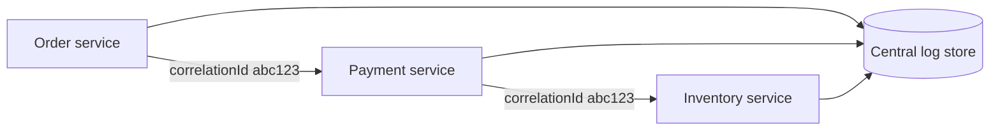

All three services log the same `correlationId`; one search returns the full story.

---

### Pitfalls and design tips

- **Do not log entire HTTP bodies** — size, PII, and cost; log IDs and outcome codes.
- **Stable `event` names** — `PaymentFailed` not varying prose; enables reliable dashboards.
- **Align with OpenTelemetry** — reuse `traceId`/`spanId` field names from W3C trace context.
- **MDC / context propagation** — Java MDC, Go `context`, Node `AsyncLocalStorage` so every line auto-includes IDs without passing parameters manually.
- **Schema drift** — document required fields per service; breaking renames break alerts.
- **Default choice** — JSON to stdout in containers; let the collector handle shipping.

---

### Real-world example

Shopify-scale teams often standardize on JSON logs shipped to Elasticsearch or Datadog. A payment service defines `event` enums (`PaymentStarted`, `PaymentCompleted`, `PaymentFailed`). When error rate spikes in metrics, an engineer filters `event:PaymentFailed AND reason:card_declined` vs `reason:gateway_timeout` in under a minute — two different remediation paths. Unstructured logs would require manual grep across dozens of pods.

---

## 9.3 Metrics

### Overview

A hospital vital-sign monitor does not narrate every heartbeat in prose — it graphs pulse, blood pressure, and oxygen as numbers over time so nurses spot trends instantly. **Metrics** are your system's vital signs: numeric measurements aggregated over time (requests per second, CPU percent, error rate).

Technically, metrics are **time-series data**: a name, labels (dimensions), and a value sampled at intervals. They are cheap to store and query at high cardinality compared to logs. Prometheus, CloudWatch, and Datadog collect them; Grafana visualizes them. Google's four **golden signals** — latency, traffic, errors, saturation — are the default framework for service health.

---

### What problem it fixes

You cannot read billions of log lines to answer "Is checkout slower than yesterday?" or "Are we about to run out of database connections?" Metrics compress behavior into aggregates:

- **Detection** — error rate jumped from 0.1% to 5%
- **Capacity** — CPU saturation trending up before failures
- **SLO tracking** — availability computed continuously from success/total counters
- **Alerting** — thresholds and burn rates fire before users flood support

Logs explain one failure; metrics show whether the *system* is healthy.

---

### What it does

Metrics record **numeric** observations, usually with labels:

```text
http_requests_total{method="GET", status="500"} 42
```

Common categories:

| Category | Examples |
|----------|----------|
| System | CPU, memory, disk, network |
| Application | RPS, latency histograms, error rate |
| Business | Orders/min, payment success rate |

#### Prometheus metric types

| Type | Behavior | Use |
|------|----------|-----|
| Counter | Only increases | Total requests, errors |
| Gauge | Up or down | Active connections, queue depth |
| Histogram | Buckets + sum + count | Latency distribution |
| Summary | Precomputed quantiles | Legacy; prefer histogram + recording rules |

#### Golden signals

| Signal | Question |
|--------|----------|
| Latency | How long do requests take? (use percentiles, not only average) |
| Traffic | How much demand? |
| Errors | How many failures? |
| Saturation | How full are resources? (thread pools, DB connections) |

#### Percentiles

Averages hide tail latency:

```text
P50 = 100 ms   — half of requests faster
P95 = 300 ms   — 5% slower than this
P99 = 800 ms   — worst 1% — often what SLOs target
```

---

### How it works — the architecture inside

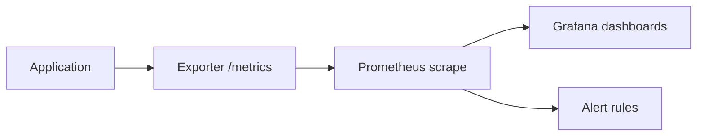

Spring Boot apps often use **Micrometer** → Prometheus. OpenTelemetry can export OTLP metrics to the same backends.

**Error rate:**

```text
error_rate = failed_requests / total_requests
```

**How to calculate — availability SLI from counters:**

```text
Given:  successful_requests = 9,995,000,  total_requests = 10,000,000

availability = successful / total
             = 9,995,000 / 10,000,000
             = 0.9995
             = 99.95%
```

Sanity check: 5,000 failures out of 10M → 0.05% error rate → 99.95% availability.

#### Metrics vs logs vs traces

| | Metrics | Logs | Traces |
|---|---------|------|--------|
| Cardinality | Low (aggregates) | High (every event) | Medium (sampled requests) |
| Best for | Trends, alerts, SLOs | Exact error messages | Per-request latency breakdown |

---

### Pitfalls and design tips

- **Do not alert on CPU alone** — symptom, not user impact; prefer SLI-based burn-rate alerts.
- **Histogram bucket design** — choose buckets matching SLO thresholds (e.g. 100 ms, 250 ms, 500 ms, 1 s).
- **Counter resets** — understand Prometheus `rate()` vs raw counters on restarts.
- **High-cardinality labels** — never put `userId` on every metric; explodes storage.
- **RED method** — Rate, Errors, Duration for services; USE for resources (Utilization, Saturation, Errors).
- **Interview default** — Prometheus + Grafana for new systems; know counter vs gauge cold.

---

### Real-world example

Netflix and many cloud-native shops expose Micrometer/Prometheus metrics from each microservice. A `http_server_requests_seconds` histogram feeds Grafana panels for P99 latency and a recording rule computes `sum(rate(http_requests_total{status=~"5.."}[5m])) / sum(rate(http_requests_total[5m]))` as error rate. When a deployment regresses, P99 jumps before log volume spikes — paging fires on SLO burn rate, and traces plus logs narrow the bad release.

---

## 9.4 Monitoring

### Overview

Monitoring is the security camera that runs 24/7 — not investigating every frame, but watching for smoke, broken locks, or crowds forming so someone responds before the building burns down. **Monitoring** continuously collects health data from infrastructure and applications and compares it to expectations.

Technically, monitoring is the **ongoing process** of ingesting telemetry (metrics primary, plus logs, traces, synthetic probes, health checks), visualizing it on dashboards, and driving alerts. It is a subset of **observability**: monitoring tells you *something* is wrong; observability (logs + metrics + traces together) helps explain *why*.

---

### What problem it fixes

Production systems fail silently until users complain — slow checkout, partial outages, database connection exhaustion. Monitoring aims to **detect degradation before customer impact**:

- Infrastructure overload (CPU, disk full)
- Application regression (latency, error spikes)
- Dependency failure (database, cache, queue)
- Business KPI drops (payment success rate)

Without continuous monitoring, mean time to detect (MTTD) equals mean time to user report.

---

### What it does

A typical monitoring loop:

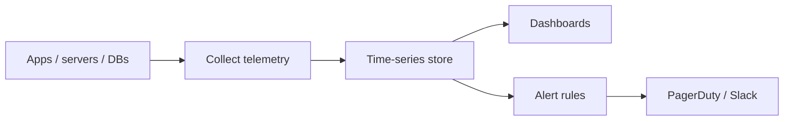

**Layers monitored:**

| Layer | Examples |
|-------|----------|
| Infrastructure | CPU, memory, disk, network |
| Application | RPS, latency, errors, pools |
| Database | Slow queries, connections, deadlocks |
| Network | Latency, packet loss |
| Business | Orders/min, revenue, conversion |

#### White box vs black box

| | White box | Black box |
|---|-----------|-----------|
| View | Internal metrics | External/user perspective |
| Examples | JVM heap, thread count | Synthetic login, `/health` uptime |

Both matter: internal metrics explain cause; black-box checks confirm user-visible availability.

---

### How it works — the architecture inside

#### Monitoring vs observability

| | Monitoring | Observability |
|---|------------|---------------|
| Focus | Thresholds, dashboards, alerts | Exploratory debugging across signals |
| Example | Error rate > 5% alert | Trace shows payment DB slow + log shows timeout |

```text
Observability = logs + metrics + traces (+ health, synthetics)
Monitoring     = continuous watch + alert on those signals
```

#### Tool landscape

| Role | Tools |
|------|-------|
| Metrics | Prometheus, OpenTelemetry, Micrometer |
| Visualization | Grafana, Kibana |
| Cloud | CloudWatch, Azure Monitor, GCP Monitoring |
| APM | Datadog, Dynatrace, New Relic |

#### Microservices challenges

| Challenge | Monitor |
|-----------|---------|
| Many services | Per-service golden signals |
| Cascading failures | Upstream + downstream error rates |
| Autoscaling | Saturation vs replica count |

Real user monitoring (RUM) measures actual browser experience; synthetic monitoring runs scripted probes — both feed the same dashboards.

---

### Pitfalls and design tips

- **Alert fatigue** — hundreds of low-severity pages → ignored critical ones; alert on symptoms users feel.
- **Monitor the user journey** — not only servers; checkout success rate beats single-host CPU.
- **Correlate layers** — app errors + DB connection pool + Kafka lag on one incident board.
- **Maintenance windows** — silence alerts during planned work; document exclusions in SLA measurement.
- **Cardinality of dashboards** — one golden-signals board per service tier, not 200 charts per page.
- **Interview distinction** — monitoring detects; observability investigates.

---

### Real-world example

Kubernetes clusters run **kube-state-metrics** and node exporters into Prometheus. Grafana shows pod restarts, API server latency, and etcd health. When the payment namespace's readiness failures rise, alerts fire before the load balancer drains all pods — engineers correlate with PostgreSQL connection count metrics and fix pool sizing. The same stack does not replace distributed traces for per-request debugging, but it catches the outage first.

---

## 9.5 Distributed Tracing

### Overview

If logs are diary entries and metrics are daily step counts, a **trace** is a GPS route for one trip — every stop, how long you waited, and where you got stuck. **Distributed tracing** follows a single request as it hops through API gateways, microservices, queues, and databases.

Technically, a **trace** is a tree of **spans**: each span is one unit of work (HTTP call, DB query) with start time, duration, status, and attributes. A shared **trace ID** links spans across processes via propagated headers (W3C `traceparent`). Tools like Jaeger, Zipkin, and Grafana Tempo store and visualize traces as waterfall timelines.

---

### What problem it fixes

In a monolith, a slow stack trace points to one process. In microservices:

```text
Client → gateway → order → payment → inventory → database
```

A 6-second response could be 100 ms in order and 5 s in payment — but aggregate metrics only show P99 = 6 s. Without tracing, teams guess which service to optimize or blame the wrong dependency.

Tracing fixes:

- **Latency attribution** — which span consumed time
- **Failure localization** — which hop returned 500
- **Dependency mapping** — de facto architecture diagram from live traffic

---

### What it does

| Concept | Meaning |
|---------|---------|
| Trace | Full journey of one request |
| Span | One operation within a trace |
| Trace ID | Same on all spans for one request |
| Span ID | Unique per span |
| Parent span | Caller; children are downstream work |
| Context propagation | Headers carry IDs across network boundaries |

Example trace:

```text
POST /orders  traceId=abc123  total=3400 ms

  order service      100 ms
    payment service  3000 ms  ← bottleneck
    inventory        200 ms
      database         100 ms
```

Waterfall UI makes the slow span obvious.

---

### How it works — the architecture inside

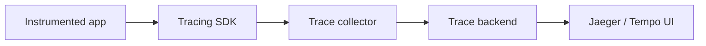

#### Context propagation

```text
traceparent: 00-4bf92f3577b34da6a3ce929d0e0e4736-00f067aa0ba902b7-01

Order receives header → creates child span → forwards header to payment
```

Standards: **W3C Trace Context** (`traceparent`), legacy **B3** (Zipkin).

#### Sampling

Storing every trace at 10k RPS is expensive:

```text
10,000 req/s × 100% = unsustainable storage
10,000 req/s × 10% head sampling = 1,000 traces/s
```

**Tail sampling** (in OpenTelemetry Collector) keeps errors and slow traces even when head sampling drops happy paths.

#### Tracing vs logging vs metrics

| | Traces | Logs | Metrics |
|---|--------|------|---------|
| Unit | One request | One event | Aggregate over time |
| Question | Where did time go? | What was logged? | How bad is it overall? |

Embed `traceId` in log fields to jump from span to lines.

---

### Pitfalls and design tips

- **Broken propagation** — async code, thread pools, and Kafka consumers often drop context; instrument handoff explicitly.
- **Missing DB/external spans** — auto-instrumentation for JDBC, HTTP clients, gRPC; add manual spans for business steps.
- **100% sampling in prod** — budget for tail sampling and retention days, not months of every span.
- **Do not trace health checks** — noise; exclude `/health` from instrumentation rules.
- **Clock skew** — span durations rely on local clocks; NTP matters for cross-host waterfalls.
- **Default stack** — OpenTelemetry SDK → Collector → Jaeger or Tempo.

---

### Real-world example

Uber pioneered heavy tracing at scale (Jaeger originated there). A rider request trace might show map service, pricing, dispatch, and payment spans. When P99 latency regresses, SREs sort traces by duration and see pricing calling an external ML service with 4 s latency — metrics showed elevated P99 but not which dependency. A circuit breaker and cache on that call fix user-visible delay without guessing.

---

## 9.6 OpenTelemetry

### Overview

Before USB-C, every phone needed a different charger. Observability had the same problem — one vendor SDK for metrics, another for traces, another for logs, and switching backends meant rewriting instrumentation. **OpenTelemetry (OTel)** is the USB-C of telemetry: instrument once, export anywhere.

Technically, OpenTelemetry is a CNCF project providing APIs, SDKs, auto-instrumentation agents, the **OTLP** protocol, and the **OpenTelemetry Collector** — a vendor-neutral pipeline that receives, processes, samples, and routes logs, metrics, and traces to Prometheus, Jaeger, Datadog, or cloud backends without recompiling applications.

---

### What problem it fixes

**Vendor lock-in** — proprietary agents tied to one SaaS bill.

**Fragmented instrumentation** — three libraries, three config styles, inconsistent attribute names.

**Migration cost** — changing from Zipkin to Jaeger or self-hosted to cloud meant code changes.

OTel standardizes:

- Span and metric APIs across languages
- Semantic conventions (`http.method`, `db.system`)
- Context propagation (W3C)
- A single collector deployment for routing and sampling

---

### What it does

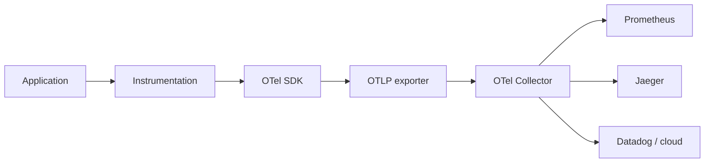

| Component | Role |
|-----------|------|
| API | Interfaces — create spans, record metrics |
| SDK | Implementation — sampling, batching, export |
| Instrumentation | Manual spans or auto hooks for HTTP, DB, Kafka |
| Collector | Receiver → processor → exporter pipeline |
| OTLP | Default wire protocol for all signals |

#### Span model

```text
Trace
 ├─ Span: HTTP POST /orders
 │    ├─ Span: INSERT orders
 │    └─ Span: HTTP POST /payments
 └─ attributes: service.name, http.status_code
```

**Resource attributes** describe the producer: `service.name`, `service.version`, `deployment.environment`.

---

### How it works — the architecture inside

#### Collector pipeline

```text
Receiver (OTLP, Jaeger, Prometheus)
  → Processor (batch, filter, tail sampling, attributes)
    → Exporter (Prometheus remote write, Jaeger, logging)
```

Run the Collector as a **sidecar or DaemonSet** so apps only talk to localhost OTLP — backends change in Collector config.

#### Instrumentation modes

| Mode | When |
|------|------|
| Zero-code agent | Java, .NET — attach agent, get HTTP/DB spans |
| Auto libraries | Spring Boot starter, Node auto-instrumentations |
| Manual | Business-critical steps auto-instrumentation misses |

#### Spring Boot stack

Common production path: **OpenTelemetry Java agent** or Spring Boot 3 observability + **Micrometer Tracing** bridge → OTLP → Collector → Jaeger + Prometheus → Grafana.

#### Sampling example

```text
Given: 100,000 requests/min, head sample 10% → 10,000 traces/min to storage
Tail sampling rule: always keep status=ERROR or duration > 2s
```

---

### Pitfalls and design tips

- **Set `service.name` explicitly** — default `unknown_service` breaks dashboards.
- **Follow semantic conventions** — consistent attribute names across teams.
- **Collector is not free** — monitor Collector CPU/memory; batch size tuning matters.
- **Logs correlation** — inject `trace_id`/`span_id` into structured log MDC via OTel log bridge.
- **Dual-write during migration** — Collector can export to old and new backends in parallel.
- **Interview answer** — OTel is API + SDK + Collector + OTLP; vendor backends are pluggable exporters.

---

### Real-world example

Grafana Labs dogfoods **Grafana Alloy** (OTel Collector distribution) receiving OTLP from hundreds of microservices. Traces go to **Grafana Tempo**, metrics to **Mimir**, logs to **Loki** — all correlated by `traceId` in Explore. When they swap Tempo storage tiers, only Collector exporter config changes; application JARs stay the same. That is the lock-in reduction OTel was built for.

---

## 9.7 Correlation IDs

### Overview

A package shipped through five warehouses needs the same tracking number on every manifest. A **correlation ID** (request ID) is that tracking number for software — one unique value assigned when a request enters your system and copied into every downstream call and log line.

Technically, it is usually a UUID generated at the **edge** (API gateway, load balancer, or first service), passed via HTTP headers (`X-Correlation-ID`, `X-Request-ID`) or message metadata (Kafka headers), and included as a structured log field on every event for that request. It complements distributed tracing: trace IDs power spans; correlation IDs (often identical to trace ID in OTel stacks) power log search.

---

### What problem it fixes

Without a shared ID, concurrent requests interleave in centralized logs:

```text
10:00:01 Order created
10:00:02 Payment started      ← which order?
10:00:02 Order created
10:00:03 Payment completed
```

Engineers cannot reconstruct one user's journey. Correlation IDs make log platforms return **only** lines for request `ABC123`.

---

### What it does

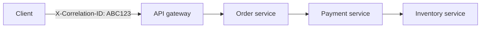

Every hop logs `correlationId=ABC123`. Search `ABC123` → full timeline.

| Without ID | With ID |
|------------|---------|
| `INFO Order created` | `{"correlationId":"ABC123","event":"OrderCreated"}` |
| `INFO Payment started` | `{"correlationId":"ABC123","event":"PaymentStarted"}` |

#### Correlation ID vs trace ID

| | Correlation ID | Trace ID |
|---|----------------|----------|
| Primary use | Log correlation | Span trees in tracing |
| Typical format | UUID | 32-hex (W3C) |

Modern stacks often use **one ID** for both — OpenTelemetry trace ID in logs and Jaeger.

#### Kafka propagation

```text
Producer headers: Correlation-ID=ABC123
Consumer logs:    correlationId=ABC123
```

---

### How it works — the architecture inside

#### Generation rules

- Generate at **entry** if client did not send one (do not trust client IDs for auth).
- **Never change** mid-request — forks get new IDs only for new logical requests.
- Return in response header (`X-Correlation-ID`) so support can ask users for it.

#### MDC pattern (Java)

```java
MDC.put("correlationId", correlationId);
// all log lines include correlationId until request completes
MDC.clear();
```

Spring: servlet filter or WebFlux filter reads header, sets MDC, forwards header on `RestTemplate`/`WebClient`.

#### gRPC

Pass as metadata key `correlation-id` or use W3C `traceparent` exclusively.

---

### Pitfalls and design tips

- **Lost on async boundaries** — thread pool tasks must copy MDC/context explicitly.
- **New ID per internal retry** — retries should keep same ID; only idempotent replays.
- **Multiple IDs** — pick one canonical header; document it in API standards.
- **Security** — IDs are not secrets but avoid embedding PII; UUID v4 is fine.
- **Support workflows** — expose ID in error JSON bodies for B2C apps.
- **Interview tip** — correlation ID is minimum viable distributed debugging; tracing adds timing tree.

---

### Real-world example

AWS API Gateway and many enterprises add `X-Amzn-RequestId` or `X-Request-ID` at the edge. A retail platform's support portal lets agents search CloudWatch Logs Insights by that ID from a customer screenshot. Resolution drops from hours (grep guessing) to minutes — they see auth succeeded, inventory reserved, payment failed with `gateway_timeout`, all without distributed tracing access.

---

## 9.8 SLI

### Overview

A speedometer tells you how fast you're driving right now — not your goal speed, not your rental contract's fine print, just the measured number. A **Service Level Indicator (SLI)** is that measurement for reliability: a quantitative fact about how your service behaved over a window (availability, latency, error rate).

Technically, an SLI is a **ratio or statistic computed from metrics** — e.g. successful HTTP requests ÷ total requests, or fraction of requests faster than 500 ms. SLIs feed **SLOs** (internal targets) and **SLAs** (customer contracts). The chain is: metrics → SLI → SLO → SLA.

---

### What problem it fixes

Teams argue "the system feels slow" or "we're up" without shared numbers. SLIs replace opinion with **agreed measurements**:

- What counts as "successful"? (HTTP 2xx? exclude 4xx client errors?)
- Measured where? (load balancer edge, not internal health ping)
- Over what window? (rolling 30 days for availability)

Without SLIs, SLOs and error budgets have nothing to anchor to.

---

### What it means

| Concept | Role | Example |
|---------|------|---------|
| **SLI** | Measured performance | Availability = 99.95% |
| **SLO** | Internal target | Availability ≥ 99.9% |
| **SLA** | Customer promise | Availability ≥ 99.5% |

```text
SLI = "how are we doing?"
SLO = "how well do we want to do?"
SLA = "what did we promise?"
```

Common SLIs:

- **Availability** — good responses / total valid requests
- **Latency** — proportion under threshold (e.g. 95% < 500 ms)
- **Error rate** — failures / total
- **Throughput** — sustained capacity (jobs processed/sec)
- **Freshness** — age of latest data (pipelines)

---

### How to achieve it — techniques by target

#### Availability SLI

```text
SLI = successful_requests / total_requests
```

**How to calculate:**

```text
Given:  successful = 9,995,000,  total = 10,000,000 (30-day window)

SLI = 9,995,000 / 10,000,000 = 0.9995 = 99.95%
```

Define **successful**: usually 2xx/3xx at the edge; document whether 4xx count against you.

#### Latency SLI

```text
SLI = requests_faster_than_500ms / total_requests
```

Use histogram buckets from Prometheus or APM — not average alone.

#### Measurement architecture

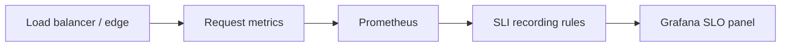

Measure at the **user boundary** — what customers experience, not only internal pod health.

---

### Pitfalls and design tips

- **Vanity metrics** — CPU SLI does not equal user happiness; prefer request success and latency.
- **Denominator games** — excluding all 4xx inflates availability; be honest in docs.
- **Short windows** — 1-minute SLI is noisy; SLOs use 30-day rolling or calendar month.
- **Multi-region** — global SLI vs per-region; partial outages hide in aggregate.
- **Interview flow** — always say SLI before SLO; SLI is empirical, SLO is aspirational threshold.

---

### Real-world example

Google SRE books define availability SLI for a user-facing service as: *the proportion of valid requests that succeeded, measured at the load balancer*. A team exposes `sum(rate(http_requests_total{status!~"5.."}[30d])) / sum(rate(http_requests_total[30d]))` in Grafana. That single panel is the SLI; comparing it to a 99.9% SLO line shows pass/fail for the month — input to error budget and release decisions.

---

## 9.9 SLO

### Overview

A speed limit is not the same as your current speed — it's the target your driving should stay under. A **Service Level Objective (SLO)** is your team's internal reliability target for an SLI: "we aim for 99.9% availability" or "95% of requests under 500 ms."

Technically, an SLO is a **threshold on an SLI** over a defined window (rolling 30 days is common). It is stricter than the customer-facing **SLA** so you have buffer before contractual breach. SLOs drive alerting, error budgets, and engineering prioritization — when you're missing the SLO, feature work yields to reliability work.

---

### What problem it fixes

"Highly available" means nothing without a number. SLOs:

- Align engineering and product on **how reliable is reliable enough**
- Justify **investment in reliability** vs new features
- Trigger **alerts before** user-visible catastrophe (burn-rate alerts)
- Connect observability metrics to **business risk**

Without SLOs, teams either over-build (five nines nobody needs) or under-invest until SLA credits hit.

---

### What it means

| SLI (measured) | SLO (target) |
|----------------|--------------|
| Availability 99.95% | Availability ≥ 99.9% |
| P95 latency 250 ms | 95% of requests < 500 ms |
| Error rate 0.1% | Error rate < 1% |

**SLO vs SLA:**

```text
SLO = 99.9%  (internal — page engineers)
SLA = 99.5%  (contract — customer credits)
```

If measured availability drops to 99.7%, **SLO is violated** but **SLA is still met** — time to fix before contract breach.

#### Availability and "nines"

| Availability | ~Downtime / year |
|--------------|------------------|
| 99% | ~3.65 days |
| 99.9% | ~8.76 hours |
| 99.99% | ~52.6 minutes |
| 99.999% | ~5.26 minutes |

Each nine is an order of magnitude harder and more expensive.

---

### How to achieve it — techniques by target

#### Choosing realistic SLOs

- Start from user pain — mobile app users notice >1 s latency; batch jobs tolerate minutes.
- Survey historical SLI — promising 99.99% when you've been 99.5% sets false confidence.
- **Error budget** (see Error Budgets) = 100% − SLO — operationalizes the target.

#### Alerting on SLO

Alert when burn rate suggests you'll miss the window — not only after breach:

```text
SLO: availability ≥ 99.9%
Warning: SLI < 99.95% with high burn rate
```

Multi-window burn-rate alerts (Google SRE workbook) reduce false positives.

#### Governance

- Review SLOs quarterly with product
- Document exclusions (planned maintenance policy)
- One primary SLO per user journey (checkout, search, login)

---

### Pitfalls and design tips

- **Too many SLOs** — dilutes focus; 2–3 per critical service.
- **SLO = SLA** — no safety margin; any blip becomes legal exposure.
- **Latency SLO on average** — use percentiles (p95, p99).
- **Internal dependencies** — SLO measured at edge even if inner service is "fine."
- **Interview** — SLO is internal goal; SLA is contractual; SLI is measurement.

---

### Real-world example

GitHub publishes status against internal objectives; many SaaS teams set 99.9% monthly availability SLO for the API edge. During an incident, the SLO dashboard shows 99.85% with 12 days left in the month — error budget nearly exhausted. Leadership pauses risky migrations until budget recovers, even though the 99.5% SLA to enterprise customers is not yet violated.

---

## 9.10 SLA

### Overview

A lease spells out what the landlord guarantees — heat, repairs, penalties if they fail. A **Service Level Agreement (SLA)** is the customer-facing contract: promised availability or latency, how you measure it, and what happens if you miss (credits, refunds, termination rights).

Technically, an SLA is a **legal/business document** backed by SLIs measured in observability systems. Engineering tracks a **stricter SLO** so operations fix problems before SLA thresholds trigger customer compensation.

---

### What problem it fixes

Customers and vendors need explicit expectations:

- What "uptime" means (excluding scheduled maintenance?)
- Response times for support severities
- **Remedies** when commitments fail

SLAs turn reliability from marketing language into **enforceable obligations** — and force teams to instrument measurement honestly.

---

### What it means

Example clause:

```text
Monthly API availability ≥ 99.95%
If below: 10% service credit for that month
Measurement: global edge load balancer, excluding published maintenance
```

SLA components:

1. Service description and scope
2. Metric definitions (availability, latency)
3. Measurement method and exclusions
4. Support response targets
5. Credit / penalty schedule
6. Escalation and dispute process

#### SLI → SLO → SLA chain

```text
SLI  = 99.96% measured
SLO  = ≥ 99.9% internal target     → PASS
SLA  = ≥ 99.5% customer promise    → PASS
```

---

### How to achieve it — techniques by target

#### Set SLA below SLO

```text
SLO 99.9%  →  SLA 99.5%  →  ~0.4% buffer for incidents and measurement noise
```

Never publish an SLA tighter than your sustained SLO performance.

#### Cloud provider pattern

AWS, Azure, and GCP publish multi-page SLA documents per product (e.g. EC2 region, S3 durability). Credits tier by how far below threshold:

| Monthly uptime | Credit |
|----------------|--------|
| < 99.9% | 10% |
| < 99.0% | 25% |
| < 95.0% | 100% |

Your product SLAs should be similarly explicit.

#### Operational alignment

- Legal defines wording; engineering defines measurable SLI
- Status page reflects same measurement as SLA
- Post-incident reviews check SLA impact, not only technical root cause

---

### Pitfalls and design tips

- **Ambiguous "downtime"** — partial degradation (slow but not down) must be defined.
- **SLA without instrumentation** — unmeasurable promises are litigation, not engineering.
- **Over-promising** — 99.99% SLA on a 99.9% architecture burns cash on credits.
- **Shared responsibility** — clarify customer misconfiguration vs platform fault.
- **Interview** — SLA has business consequences; SLO is how engineering stays ahead of SLA.

---

### Real-world example

Atlassian's cloud SLAs specify monthly uptime percentages per product with service credits. Engineering monitors Jira Cloud availability SLI at the edge; internal SLO targets 99.9%+ while the published SLA might be 99.5% for certain tiers. A regional DNS incident might breach SLO and trigger internal freeze on deploys days before SLA credits would apply to customers — the buffer does its job.

---

## 9.11 Error Budgets

### Overview

A monthly data cap on your phone plan: you can binge until you hit the limit, then speeds throttle. An **error budget** is the allowable unreliability before you violate your SLO — the "data cap" for downtime and errors.

Technically, **error budget = 100% − SLO**. For a 99.9% availability SLO, the budget is 0.1% failed or unavailable time in the measurement window. Teams **spend** budget on risky deploys and experiments; when budget is exhausted, policy shifts to reliability work only.

---

### What problem it fixes

Pure "zero downtime" culture fights all change; pure "move fast" breaks customers. Error budgets **objectify the trade-off**:

- Budget remaining → ship features, run chaos experiments
- Budget exhausted → freeze releases, fix stability

They align dev and ops with data instead of opinion ("Ops says no deploys" vs "Dev says ship Friday").

---

### What it means

| SLO | Error budget |
|-----|--------------|
| 99% | 1% |
| 99.9% | 0.1% |
| 99.99% | 0.01% |

Relationship:

```text
SLI (measured) → compare to SLO → error budget remaining → release policy
```

#### Burn rate

How fast you consume budget:

```text
burn_rate = current_error_rate / allowed_error_rate

Allowed: 0.1%  |  Current: 0.5%
burn_rate = 0.5 / 0.1 = 5×  → budget drains 5× faster than sustainable
```

Burn-rate alerts warn when you're on track to miss the month even if today's SLI still passes.

---

### How to achieve it — techniques by target

#### Request-based budget

**How to calculate:**

```text
Given:  monthly_requests = 1,000,000,  SLO = 99.9%
       error_budget_fraction = 100% − 99.9% = 0.1%

allowed_failures = 1,000,000 × 0.001 = 1,000 failures/month
```

If actual failures exceed 1,000 → SLO violated for the window.

#### Time-based availability budget

**How to calculate:**

```text
Given:  30-day month = 30 × 24 × 60 = 43,200 minutes
       SLO = 99.9%,  budget = 0.1%

allowed_downtime = 43,200 × 0.001 = 43.2 minutes/month
```

Sanity check: 99.99% SLO → 4.32 minutes/month — four nines is tight.

#### Policy example

| Budget consumed | Action |
|-----------------|--------|
| < 50% | Normal releases |
| 50–75% | Extra caution, smaller batches |
| > 90% | Stop risky changes; reliability sprint |
| 100% | SLO miss — incident review, executive visibility |

#### Tooling

Grafana SLO app, Datadog SLO tracking, and Google Cloud Monitoring SLO objects compute remaining budget and burn rate from Prometheus metrics.

---

### Pitfalls and design tips

- **Error budget ≠ error rate** — rate is current; budget is remaining allowance.
- **Ignoring burn rate** — SLI still green mid-month but 10× burn → miss at day 25.
- **No policy teeth** — budget without release freeze is decorative.
- **Shared budget across teams** — clarify ownership per SLO per service.
- **Interview** — Google SRE popularized; ties observability to product velocity.

---

### Real-world example

Google's SRE teams literally block launches when multi-window burn-rate alerts fire for critical services. A YouTube-scale team with 99.99% SLO has ~4 minutes/month budget — a bad 15-minute partial outage consumes the quarter. Post-incident, error budget review decides whether to defer the next major feature launch until reliability investments (caching, failover) restore headroom — documented in the error budget policy, not hallway debates.

---

## 9.12 Alerting

### Overview

A smoke detector doesn't explain the fire's cause — it wakes you up so you can act. **Alerting** turns monitoring data into **notifications** when human intervention is needed now, routing pages to on-call engineers via PagerDuty, Slack, or SMS.

Technically, alerting evaluates **rules** on time-series data (Prometheus recording/alert rules, CloudWatch alarms, Datadog monitors). Good alerts tie to **symptoms** (SLO burn, error rate, synthetic failure) not noise (CPU 41%). The lifecycle: metric → rule → threshold → notification → investigation → resolution.

---

### What problem it fixes

Without alerts, failures surface via social media before engineering knows:

```text
Without:  outage → users tweet → support overwhelmed → engineer wakes up late
With:     burn rate high → page on-call → mitigate in minutes
```

Alerting reduces **mean time to detect** and routes the right severity to the right person.

---

### What it does

| Alert type | Trigger example |
|------------|-----------------|
| Threshold | CPU > 90% for 5 min |
| Error rate | 5xx > 5% |
| SLO / burn rate | 2-hour burn > 14.4× |
| Anomaly | RPS 10× baseline |
| Heartbeat | Cron did not run |
| Synthetic | Checkout script failed |

#### Severity

| Level | Meaning |
|-------|---------|
| INFO | Awareness only |
| WARNING | Investigate soon |
| CRITICAL | User impact now |
| SEVERE | Major outage |

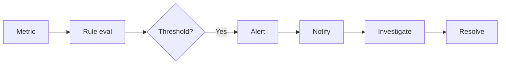

#### Prometheus stack

```text
App → Prometheus → alert rules → Alertmanager → route by severity → PagerDuty
```

**Duration** in rules (`for: 5m`) suppresses flapping on brief spikes.

---

### How it works — the architecture inside

#### Monitoring vs alerting

| | Monitoring | Alerting |
|---|------------|----------|
| Role | Collect and display | Notify when action needed |
| Question | What is happening? | Who must act now? |

#### Actionable alerts

Good: `Payment error rate 8%, burn 6× — checkout broken`

Bad: `CPU 41%` — no required action

#### Alert fatigue mitigation

- Page only on **user-visible** or **SLO-threatening** conditions
- Deduplicate — one root-cause alert, not 50 downstream copies
- Suppress during maintenance
- Weekly review: delete alerts nobody acted on in 90 days

#### Escalation

```text
L1 on-call (5 min) → L2 team lead → L3 manager
```

#### Symptom vs cause

Prefer alerting on **latency SLO** and **error budget**; use traces/logs after wake-up to find cause.

---

### Pitfalls and design tips

- **Alert on every metric** — engineers ignore the channel.
- **Missing runbooks** — alert without link to "what to do" wastes minutes.
- **No `for` duration** — single-sample spikes page falsely.
- **Timezone blindness** — global on-call rotation, not one hero.
- **Test alerts** — game days and synthetic failures validate routing.
- **Default** — multi-window burn-rate alerts for SLO-backed services (Google SRE).

---

### Real-world example

PagerDuty ingests Prometheus Alertmanager webhooks for a fintech payment API. Rule: `slo:burnrate5m > 14.4 and slo:burnrate1h > 14.4` pages payments on-call. During a bad deploy, error rate jumps to 8%; burn-rate fires in 3 minutes — rollback starts before SLA dashboard turns red. Post-incident, they remove a static "disk > 70%" alert that fired 400 times/month with zero actions.

---

## 9.13 Dashboards

### Overview

A car dashboard shows speed, fuel, and warning lights at a glance — you don't open the hood while driving. **Dashboards** visualize metrics, logs, traces, SLO status, and alerts in one place so teams see system health without ad-hoc queries during incidents.

Technically, dashboards are **Grafana boards**, CloudWatch dashboards, or Datadog screens composed of panels wired to queries (PromQL, LogQL, SQL). Role-specific layouts (SRE, executive, on-call) emphasize different signals — golden signals for ops, revenue for leadership.

---

### What problem it fixes

During an outage, typing PromQL under stress wastes minutes. Pre-built dashboards:

- Show **golden signals** immediately (latency, traffic, errors, saturation)
- Display **SLO and error budget** status
- List **service up/down** for microservices
- Support **historical trends** for capacity planning

They reduce cognitive load and standardize incident triage.

---

### What it does

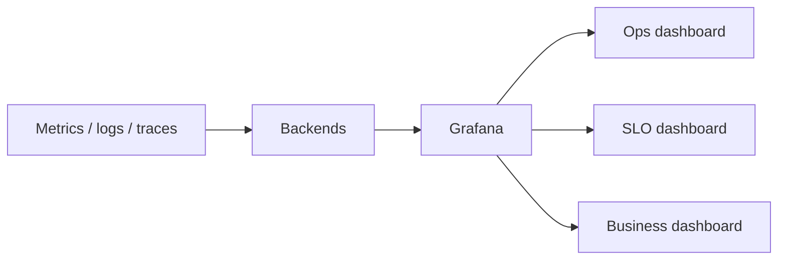

#### Dashboard types

| Type | Widgets |
|------|---------|
| Infrastructure | CPU, memory, disk, network |
| Application | RPS, error rate, latency percentiles |
| Database | Query time, connections, slow queries |
| SLO | SLI vs target, budget remaining, burn rate |
| Incident | Active alerts, impacted services, recent deploys |
| Business | Orders, revenue, conversion |

#### Widget types

Line charts (trends), gauges (current value), heatmaps (latency by hour), status panels (UP/DOWN per service), tables (top slow endpoints).

---

### How it works — the architecture inside

#### Golden signals board

```text
Latency (p95)  |  Traffic (RPS)  |  Errors (%)  |  Saturation (CPU/pool)
```

One screen answers "is it us or traffic?" in seconds.

#### SLO board

```text
Current SLI: 99.95%  |  Target: 99.9%  |  Status: PASS
Error budget remaining: 72%  |  Burn rate: 1.2×
```

#### Grafana + Prometheus

```text
App /metrics → Prometheus → Grafana panels (PromQL)
```

Loki and Tempo data sources add log and trace panels in the same UI (Grafana Explore).

#### Real-time vs historical

| | Real-time | Historical |
|---|-----------|------------|
| Use | Incident, live ops | Capacity reviews, postmortems |
| Range | Last 1–6 hours | Weeks to months |

---

### Pitfalls and design tips

- **Wall of graphs** — 40 panels nobody reads; prioritize top 6 signals.
- **No annotations** — mark deploys and incidents on timelines for causality.
- **Stale dashboards** — broken queries after metric renames erode trust.
- **Wrong audience** — executives don't need JVM thread dumps.
- **Drill-down links** — panel → trace → logs for same time range.
- **TV wall mode** — big fonts, red/green SLO status for NOC.

---

### Real-world example

Stripe's internal ops culture (and many fintechs) centers Grafana dashboards per critical API with RED metrics and SLO overlays. During elevated card decline rates, the on-call opens the payments dashboard: error rate panel up, latency flat, dependency panel shows issuer timeout spike — narrows to external network, not bad deploy. Without the pre-built board, engineers would rebuild queries while merchants still can't pay.

---

## 9.14 Health Checks

### Overview

A hotel "Open" sign doesn't mean every room has clean sheets and hot water — the sign and the guest experience differ. **Health checks** distinguish "process is running" from "service can safely handle real requests," telling load balancers and Kubernetes when to send traffic or restart a pod.

Technically, health checks are HTTP (or TCP/gRPC) **probes** — `/health`, `/health/live`, `/health/ready` — returning JSON status and optional dependency breakdown. **Liveness** means restart if dead; **readiness** means remove from load balancing if not ready.

---

### What problem it fixes

```text
Process alive ≠ healthy
```

Common failure modes:

- JVM running but deadlocked
- App up but database connection pool exhausted
- Pod booting but not warmed — receives traffic too early

Without probes, load balancers send users to broken instances; without liveness, Kubernetes never restarts wedged containers.

---

### What it does

```http
GET /health/ready
```

```json
{
  "status": "UP",
  "components": {
    "database": "UP",
    "redis": "UP",
    "kafka": "UP"
  }
}
```

| Check type | Question | On failure |
|------------|----------|------------|
| **Liveness** | Should kube restart this process? | Restart pod |
| **Readiness** | Should we route traffic here? | Remove from Service endpoints |
| **Startup** | Has slow boot finished? | Hold liveness until done |
| **Deep** | Can real work execute? | Accurate but costly |

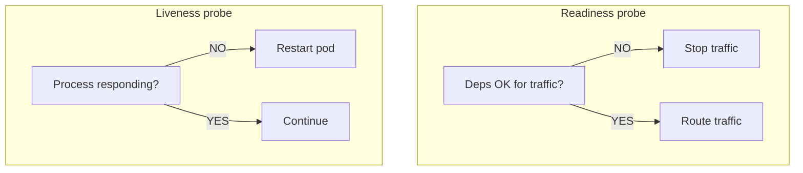

DB down: liveness **UP** (process fine), readiness **DOWN** (no traffic until DB returns).

---

### How it works — the architecture inside

#### Spring Boot Actuator

- `/actuator/health`
- `/actuator/health/liveness`
- `/actuator/health/readiness`

Aggregates `DataSource`, `Redis`, `DiskSpace` health indicators.

#### Kubernetes probes

```text
livenessProbe  → failure → kubelet kills container
readinessProbe → failure → removed from Service endpoints
startupProbe   → disables liveness until success (slow JVM apps)
```

Keep probes **fast** — lightweight ping or `SELECT 1`, not full checkout flow.

#### Load balancers

AWS ALB, GCP LB, Azure App Gateway health-check target groups; unhealthy targets stop receiving requests.

#### Integration with monitoring

Health DOWN → metric + alert → dashboard panel → on-call investigates.

---

### Pitfalls and design tips

- **Always UP** — checking only `return 200` hides DB outages; include critical dependencies in readiness.
- **Heavy deep checks on every probe** — 1 s DB scan × 3 pods × kube 10 s interval loads DB; cache or throttle.
- **Liveness too aggressive** — restarting during slow GC causes flap; tune `initialDelaySeconds`.
- **Readiness includes optional deps** — non-critical third-party down should not drain entire fleet if degraded mode works.
- **Security** — `/health` often unauthenticated; don't leak secrets in response body.
- **Interview** — liveness = restart; readiness = traffic; never confuse them.

---

### Real-world example

A Kubernetes order service uses readiness that checks PostgreSQL (`SELECT 1`) and Redis PING. During a brief Redis failover, readiness fails on all pods — endpoints drain, users hit healthy replicas in another zone, no 500s to half-warmed pods. Liveness stays UP so containers aren't killed mid-reconnect. Spring Actuator exposes component status; Prometheus scrapes `health` metric for the NOC dashboard.

---

## 9.15 Synthetic Monitoring

### Overview

Mystery shoppers visit a store on a schedule to test checkout — not because no real customers came that hour, but to catch broken registers before opening rush. **Synthetic monitoring** runs automated scripts (HTTP pings, browser flows, API sequences) on a timer from one or more regions to verify critical paths work **before** real users hit failures.

Technically, synthetic tests are **scheduled probes** (every 1–5 minutes) executing predefined steps: login, search, add to cart, pay. They emit metrics (availability, latency, success rate) used in SLIs, dashboards, and alerts. They complement **real user monitoring (RUM)**, which measures actual client experience reactively.

---

### What problem it fixes

```text
Without synthetics:  deploy breaks checkout → first real customer fails → support ticket
With synthetics:     script fails in 2 min → page on-call → fix before peak traffic
```

Health checks prove `/health` returns 200; synthetics prove **the business journey** works end-to-end including auth, APIs, and third parties.

---

### What it does

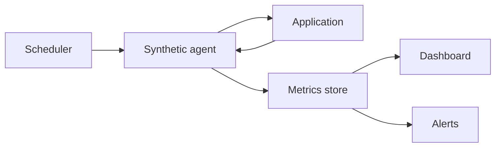

Example e-commerce script every 5 minutes:

```text
Home → login → search → add to cart → checkout → confirm order
```

Failure at any step → critical alert.

#### Synthetic vs RUM

| | Synthetic | RUM |
|---|-----------|-----|
| Source | Scripted robot | Real browsers/apps |
| Timing | Proactive 24/7 | When users visit |
| Asks | Can the flow execute? | What do users experience? |

Use **both** — synthetics catch regressions early; RUM catches device/geo issues scripts miss.

#### Check types

| Type | Example |
|------|---------|
| Availability | `GET /` → 200 |
| API | `POST /api/login` → token + < 500 ms |
| Transaction | Full checkout path |
| Browser | Playwright — JS errors, render |
| Network | DNS, TLS cert expiry |

---

### How it works — the architecture inside

#### Multi-region agents

Run from US, EU, APAC to detect regional DNS, CDN, or routing outages invisible from HQ.

#### Metrics emitted

- Uptime %
- Step latency
- Transaction success rate
- SSL days until expiry

Feeds SLI: `synthetic_success / synthetic_runs`.

#### Synthetic vs health check

| | Health check | Synthetic |
|---|--------------|-----------|
| Scope | Single endpoint | Multi-step journey |
| Question | Process up? | Can users complete checkout? |

#### Tools

Open source: **Playwright**, **Selenium**, **k6** for scripts.

Commercial: **Datadog Synthetics**, **New Relic Synthetics**, **Pingdom**, **Catchpoint**.

---

### Pitfalls and design tips

- **Brittle selectors** — UI tests break on cosmetic CSS changes; prefer API synthetics for stability.
- **Test account hygiene** — dedicated synthetic users, not production admin creds in scripts.
- **False positives** — flaky third-party sandbox causes pages; retry logic and regional quorum.
- **Not a substitute for RUM** — robots don't run old Android WebViews.
- **Credential rotation** — automate secret injection for login steps.
- **Interview** — black-box proactive monitoring; pairs with health checks (shallow) and RUM (reactive real).

---

### Real-world example

Datadog Synthetics runs a **browser test** every 5 minutes against a major bank's login → balance → transfer flow from three continents. When a CDN misconfiguration breaks static assets in APAC only, EU and US synthetics pass but Sydney fails — regional alert fires before APAC morning peak. Engineers correlate with RUM showing elevated load errors in Australia — fix CDN path rule. Health endpoints stayed green throughout because API pods were fine; only the full browser journey exposed the issue.

---

---

[<- Back to master index](../README.md)
