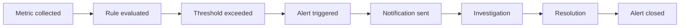
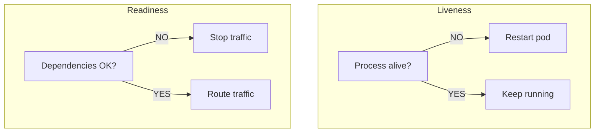

# 9. Observability

[<- Back to master index](../README.md)

---

## Overview

**Observability** is understanding system state from **logs**, **metrics**, and **traces**, plus **monitoring**, **alerting**, **dashboards**, **health checks**, and **synthetic monitoring**. **SLI / SLO / SLA** and **error budgets** define reliability targets.

Sections are in order **9.1 → 9.15**.

---

## Sub-topics

| # | Sub-topic |
|---|-----------|
| 9.1 | Logging |
| 9.2 | Structured Logging |
| 9.3 | Metrics |
| 9.4 | Monitoring |
| 9.5 | Distributed Tracing |
| 9.6 | OpenTelemetry |
| 9.7 | Correlation IDs |
| 9.8 | SLI |
| 9.9 | SLO |
| 9.10 | SLA |
| 9.11 | Error Budgets |
| 9.12 | Alerting |
| 9.13 | Dashboards |
| 9.14 | Health Checks |
| 9.15 | Synthetic Monitoring |

---

## 9.1 Logging

### What is logging?

**Logging** is the process of recording events, messages, errors, warnings, and application activities into log files or log management systems.

Logs help answer:

- What happened?
- When did it happen?
- Where did it happen?
- Why did it happen?

Logging is one of the **three pillars of observability**:

1. **Logs** — this section
2. **Metrics**
3. **Traces**

```text
                Observability
                       |
       +---------------+---------------+
       v               v               v
     Logs           Metrics          Traces
  What happened?  How much/how often?  Where in the path?
```

### Why logging is important

- Debug application issues
- Identify production failures
- Audit user activities
- Monitor application behavior
- Troubleshoot incidents
- Root cause analysis
- Security monitoring

```text
User login request → application generates logs → log storage → search & analysis
```

### Example log entry

```text
2026-06-26 10:15:20 INFO User logged in successfully
```

| Component | Value |
|-----------|-------|
| Timestamp | `2026-06-26 10:15:20` |
| Level | `INFO` |
| Message | User logged in successfully |

### Log levels

| Level | Purpose | Example |
|-------|---------|---------|
| **TRACE** | Very detailed | Entering payment validation method |
| **DEBUG** | Dev / troubleshooting | `CustomerId = 101` |
| **INFO** | Normal business events | Order created successfully |
| **WARN** | Potential problem; app continues | Cache unavailable, using database |
| **ERROR** | Operation failed | Payment processing failed |
| **FATAL** | Critical; may shut down app | Database unavailable — application terminated |

Use appropriate levels in production — avoid global `DEBUG` at high volume.

### Structured logging

Machine-parseable log records (JSON fields) instead of free-form text. Covered in Structured Logging.

### Correlation ID

Unique ID propagated across services to tie logs together. Covered in Correlation IDs.

### Centralized logging

Collect logs from all servers into **one platform** instead of checking each machine.

| | Without centralized | With centralized |
|---|---------------------|------------------|
| **Storage** | Server-1, Server-2, Server-3 logs separately | All servers → central log platform |
| **Search** | SSH per machine | Single search UI |

Benefits: one search location, easier monitoring, better analysis.

### Common logging stack

```text
Application → log collector → log storage → visualization
```

Example:

```text
Application → Fluentd / Fluent Bit / Logstash → Elasticsearch → Kibana
```

Also common: **Loki** + Grafana, **CloudWatch Logs**, **Graylog**.

### Logging in microservices

| Challenge | Solution |
|-----------|----------|
| Multiple services | Centralized aggregation |
| Distributed requests | Correlation IDs |
| Huge volume | Structured logs + retention policy + sampling |

```text
Order service → payment service → inventory service
(all logs share same correlation ID)
```

### Good logging practices

1. Use structured logs
2. Include correlation ID
3. Include request / business context
4. Use appropriate log levels
5. Avoid excessive logging
6. Never log passwords or secrets
7. Never log sensitive personal data
8. Include exception stack traces on errors
9. Use centralized logging
10. Retain logs per policy (hot / archive)

### What should not be logged

Avoid:

- Passwords
- Credit card numbers
- OTPs
- Authentication tokens
- Other regulated PII

| Bad | Good |
|-----|------|
| `Password=admin123` | User authentication failed |

### Logs vs metrics vs traces

| | Logs | Metrics | Traces |
|---|------|----------------------------|----------------------------------------|
| **What** | Detailed event records | Numerical measurements | Request journey across services |
| **Example** | Order created successfully | CPU usage = 70% | Client → order → payment → inventory |
| **Question** | What happened? | How much / how often? | Where did time go? |

Together they provide complete visibility into distributed systems.

### Summary

```text
Logging = record application events and activities
Key ideas: levels, structured logs, correlation IDs, context, centralization
Answers: "What exactly happened in the system?"
```

---

## 9.2 Structured Logging

### What is structured logging?

**Structured logging** writes each log event as a **machine-parseable record** (typically JSON) with named fields — instead of a single free-form text line.

### Traditional vs structured

**Traditional logging:**

```text
User 101 placed order 5001
```

Hard to search, filter, and analyze at scale — requires fragile regex parsing.

**Structured logging:**

```json
{
 "timestamp": "2026-06-26T10:15:20Z",
 "level": "INFO",
 "userId": 101,
 "orderId": 5001,
 "event": "OrderCreated",
 "message": "Order created successfully"
}
```

### Benefits

- **Machine readable** — log platforms index fields as columns
- **Easy filtering** — e.g. `level=ERROR AND orderId=5001`
- **Better analytics** — count errors by `errorCode`, group by `service`
- **Faster troubleshooting** — pivot from metric spike to exact events
- **Integrates with traces** — same `traceId` / `spanId` fields as 
### Standard fields

| Field | Example | Purpose |
|-------|---------|---------|
| `timestamp` | ISO-8601 UTC | When |
| `level` | `INFO`, `ERROR` | Severity |
| `message` | Human-readable summary | Quick read |
| `service` | `payment-service` | Which service |
| `traceId` / `spanId` | From W3C trace context | Link to traces |
| `correlationId` | `abc123xyz` | Cross-service request — |
| Business IDs | `orderId`, `userId` | Investigation context |

Pick **one naming convention** (camelCase or snake_case) and keep it consistent across services.

### Contextual logging

Structured logs should carry **useful context** — not just a message string.

| | Example |
|---|---------|
| **Bad** | `Payment failed` |
| **Good** | `{"event":"PaymentFailed","orderId":5001,"customerId":101,"amount":5000,"reason":"card_declined"}` |

Benefits: easier investigation and root cause analysis without guessing missing IDs.

### Structured logging in microservices

| Challenge | Structured approach |
|-----------|---------------------|
| High volume | Index only useful fields; avoid logging bodies |
| Many services | Same field schema per team (`service`, `level`, `traceId`) |
| Distributed requests | Shared `correlationId` / `traceId` on every line |

```text
Order service → {"correlationId":"abc123","event":"OrderCreated",...}
Payment service → {"correlationId":"abc123","event":"PaymentCompleted",...}
```

### Good practices

1. Use structured logs in production (JSON or key=value)
2. Include correlation ID and trace fields when available
3. Add business context (`orderId`, `userId`) — not only technical messages
4. Use appropriate log levels
5. Never log passwords, tokens, cards, or OTPs
6. On errors, include exception type and stack trace (truncated if needed)
7. Send to a **centralized** log platform

### Common libraries

| Language | Examples |
|----------|----------|
| Java | Logback JSON encoder, Log4j2 JSON layout |
| Python | `structlog`, JSON formatter on stdlib `logging` |
| Go | `zerolog`, `zap` JSON encoder |
| Node.js | `winston` JSON, `pino` |
|.NET | Serilog JSON sink |

### Summary

```text
Structured logging = JSON (or key=value) fields per event, not plain prose
Traditional: hard to query | Structured: filter, aggregate, correlate
Always add context + correlation/trace IDs in microservices
```

---

## 9.3 Metrics

### What are metrics?

**Metrics** are numerical measurements collected over time to monitor the health, performance, and behavior of a system.

Metrics answer:

- How many requests are coming?
- How fast is the application?
- How much CPU is being used?
- How many errors occurred?
- Is the system healthy?

Metrics are one of the **three pillars of observability**:

1. Logs — what happened?
2. **Metrics** — this section — how much / how often?
3. Traces — where in the path?

### Why metrics are important

- Monitor system health
- Detect problems quickly
- Create dashboards
- Trigger alerts
- Measure performance
- Identify trends
- Support capacity planning

```text
Application → collect metrics → store metrics → dashboards & alerts
```

### Metric characteristics

Metrics are:

- **Numeric**
- **Aggregated**
- **Lightweight**
- **Time-based**

Example:

| Time | Requests/sec |
|------|----------------|
| 10:00 AM | 100 |
| 10:01 AM | 120 |
| 10:02 AM | 140 |

### Common types of metrics

| Type | Measures | Examples |
|------|----------|----------|
| **1. System** | Infrastructure health | CPU, memory, disk, network |
| **2. Application** | App performance | Request count, latency, error rate, threads |
| **3. Business** | Business outcomes | Orders created, payments completed, revenue |

Examples:

```text
System: CPU = 75%, Memory = 60%
Application: Average response time = 250 ms
Business: Orders today = 5,000
```

### Golden signals

Google SRE defines four key metrics for most services:

| Signal | Question | Examples |
|--------|----------|----------|
| **1. Latency** | How long do requests take? | Request time = 250 ms; which endpoint is slow? |
| **2. Traffic** | How much demand? | 500 requests/second; transactions per minute |
| **3. Errors** | How many failures? | 5xx count; error rate = failed / total |
| **4. Saturation** | How full are resources? | CPU 95%, memory, thread pool, DB connections |

High saturation may indicate overload before errors spike.

**Error rate:**

```text
Error rate = failed requests / total requests
```

### Prometheus metric types

| Type | Behavior | Examples |
|------|----------|----------|
| **Counter** | Only increases | Total requests, orders, errors (`100 → 150 → 200`) |
| **Gauge** | Up or down | CPU %, memory, active users (`70% → 50% → 80%`) |
| **Histogram** | Distribution of values | Response times in buckets — avg, percentiles |
| **Summary** | Similar to histogram | Count, sum, precomputed percentiles |

### Percentiles

Understand latency distribution — averages hide tail latency.

| Percentile | Meaning |
|------------|---------|
| **P50** | 50% of requests completed within this time |
| **P95** | 95% within this time |
| **P99** | 99% within this time |

Example:

```text
P50 = 100 ms
P95 = 300 ms
P99 = 800 ms → 99% of requests completed within 800 ms
```

Reliability targets (SLI / SLO / SLA) are built from metrics.

### Metrics collection flow

```text
Application → metric exporter → monitoring system → dashboard
```

Example:

```text
Application → Prometheus (scrape /metrics) → Grafana
```

Also: OpenTelemetry → OTLP → Prometheus / cloud backends; **Micrometer** (Spring Boot) → Prometheus, Datadog, CloudWatch.

### Popular tools

| Role | Tools |
|------|-------|
| **Collection** | Prometheus, OpenTelemetry, Micrometer |
| **Visualization** | Grafana |
| **Cloud** | AWS CloudWatch, Azure Monitor, Google Cloud Monitoring |

### Prometheus example

```text
http_requests_total{method="GET"} 500
```

Metric `http_requests_total` — GET endpoint has recorded 500 requests (counter).

### Micrometer example (Spring Boot)

| Type | Example name |
|------|----------------|
| Counter | `requests_total` |
| Timer | `api_response_time` |
| Gauge | `active_users` |

Exports to Prometheus, Datadog, CloudWatch, etc.

### Alerting using metrics

Example rules:

| Rule | Threshold |
|------|-----------|
| CPU | > 90% |
| Memory | > 85% |
| Error rate | > 5% |
| Response time | > 2 s |

```text
Metric → threshold breached → alert → email / Slack / PagerDuty
```

Prefer **SLO burn-rate** alerts over static CPU thresholds when user-facing SLIs exist.

### Metrics vs logs

| | Metrics | Logs |
|---|---------|--------------------------|
| **Data** | Numerical values | Detailed events |
| **Example** | CPU = 80% | Database connection timeout |
| **Answers** | How much? How often? | What happened? |

### Metrics vs traces

| | Metrics | Traces |
|---|---------|----------------------------------------|
| **Scope** | System-wide aggregates | Single request journey |
| **Example** | Response time P99 = 250 ms | Order → payment → inventory |
| **Answers** | Is there a problem? | Where is the problem? |

### Summary

```text
Metrics = numeric, time-series measurements of health and performance
Key ideas: counter/gauge/histogram, golden signals, percentiles, Prometheus/Grafana
SLI/SLO/SLA are built on top of metrics.
Answers: "How healthy and performant is the system?"
```

---

## 9.4 Monitoring

### What is monitoring?

**Monitoring** is the continuous process of collecting, analyzing, and visualizing data about systems, applications, and infrastructure to ensure they are operating correctly.

It helps teams **detect issues before users are affected**.

### Monitoring vs observability

| | Monitoring | Observability |
|---|------------|---------------|
| **Tells you** | When something is wrong | Why it is wrong |
| **Example** | CPU usage > 90% | High CPU caused by slow database queries |

```text
Observability
 |
 +---- Monitoring (subset)
```

Observability uses **logs**, **metrics**, and **traces** together; monitoring focuses on ongoing health checks and thresholds.

### Why monitoring is important

- Detect system failures
- Improve uptime
- Identify performance issues
- Generate alerts
- Ensure SLA compliance
- Improve user experience
- Support capacity planning

### Monitoring workflow

```text
Application / server → collect data → store data → dashboard → alerts
```

### What is monitored?

1. Infrastructure
2. Applications
3. Databases
4. Networks
5. Business processes

### Infrastructure monitoring

Tracks server and hardware resources.

| Examples | Alert example |
|----------|---------------|
| CPU, memory, disk, network | CPU usage = 95% → high CPU utilization |

### Application monitoring

Tracks application performance — see also Metrics golden signals.

| Examples | Alert example |
|----------|---------------|
| Request count, response time, error rate, active sessions | Response time = 3 s → threshold exceeded |

### Database monitoring

| Examples | Alert example |
|----------|---------------|
| Query execution time, connection count, deadlocks, slow queries | Slow query > 5 s |

### Network monitoring

| Examples | Alert example |
|----------|---------------|
| Latency, packet loss, bandwidth, network errors | Packet loss = 10% |

### Business monitoring

Tracks business KPIs.

| Examples | Alert example |
|----------|---------------|
| Orders per minute, revenue, registrations, payment success rate | Payment success rate = 99% |

### Types of monitoring

1. Infrastructure monitoring
2. Application monitoring
3. Network monitoring
4. Database monitoring
5. Cloud monitoring
6. Business monitoring

### White box vs black box

| | White box | Black box |
|---|-----------|-----------|
| **View** | Internal system metrics | User / external perspective |
| **Examples** | CPU, memory, thread count | Website availability, login success, API uptime |
| **Health check** | — | `GET /health` → `{"status":"UP"}` |

### Synthetic monitoring

Automated periodic tests that simulate user behavior. Covered in Synthetic Monitoring.

```text
Every 5 minutes: login → search product → place order
```

Detects issues before real users hit them.

### Real user monitoring (RUM)

Measures **actual** user experience:

- Page load time
- Browser performance
- User interactions
- Geographic performance

Example: average page load time = 2 s. RUM vs synthetic comparison is in Synthetic Monitoring.

### Monitoring metrics examples

| Metric | Example value |
|--------|---------------|
| Availability | 99.99% |
| CPU usage | 75% |
| Memory usage | 65% |
| Error rate | 1% |
| Response time | 250 ms |

### Dashboards

Visual representation of system health. Covered in Dashboards.

```text
+-------------------------+
| CPU Usage 65% |
+-------------------------+
| Memory Usage 70% |
+-------------------------+
| Error Rate 1% |
+-------------------------+
```

Common widgets: CPU/memory graphs, error rate, request count, latency.

### Alerting

Notify teams when thresholds are exceeded. Covered in Alerting.

| Example rule |
|--------------|
| CPU > 90% |
| Memory > 85% |
| Error rate > 5% |
| Disk usage > 90% |

**Alert lifecycle:**

```text
Metric collected → threshold exceeded → alert triggered → notification → issue resolved
```

**Alert channels:** email, SMS, Slack, Microsoft Teams, PagerDuty, Opsgenie.

### Monitoring tools

| Category | Tools |
|----------|-------|
| **Metrics** | Prometheus, OpenTelemetry, Micrometer — |
| **Visualization** | Grafana, Kibana |
| **Cloud** | Amazon CloudWatch, Azure Monitor, Google Cloud Monitoring |
| **APM** | Dynatrace, New Relic, AppDynamics, Datadog |

### Monitoring in microservices

| Challenge | What to monitor |
|-----------|-----------------|
| Many services | Per-service availability, latency, error rate |
| Distributed systems | Inter-service communication |
| Dynamic scaling | Resource usage as pods scale |

### Health checks

Determine whether an application can serve traffic. Covered in Health Checks.

```json
GET /health → { "status": "UP" }
```

| Type | Question |
|------|----------|
| **Liveness** | Is the application running? |
| **Readiness** | Can it accept traffic? |

### Best practices

1. Monitor critical business functions
2. Define meaningful, actionable alerts
3. Avoid alert fatigue
4. Create dashboards
5. Monitor trends over time
6. Monitor infrastructure and application together
7. Use centralized monitoring
8. Automate alerting
9. Regularly review thresholds
10. Integrate with incident management

### Monitoring vs logging

| | Monitoring | Logging |
|---|------------|------------------------------|
| **Shows** | System health via metrics | Detailed events |
| **Example** | CPU = 80% | Database connection failed |
| **Answers** | Is there a problem? | What happened? |

### Monitoring vs tracing

| | Monitoring | Tracing |
|---|------------|----------------------------------------|
| **Shows** | Overall system health | Request flow through services |
| **Example** | Elevated P99 latency | Client → order → payment → DB |
| **Use** | Detect degradation | Find where delays occur |

### Monitoring and observability

```text
 Observability
 |
 +---------------+---------------+
 v v v
 Logs Metrics Traces
 \ | /
 \ | /
 \ | /
 Monitoring
```

Monitoring uses logs, metrics, and traces to continuously track system health.

### Summary

```text
Monitoring = continuous observation to detect issues and maintain reliability
Covers: infra, app, DB, network, business, synthetic, RUM, dashboards, alerts, health checks
Answers: "Is the system healthy right now?"
```

---

## 9.5 Distributed Tracing

### What is distributed tracing?

**Distributed tracing** tracks a request as it travels through multiple services in a distributed system.

It helps answer:

- Where did the request go?
- How long did each service take?
- Which service failed?
- Where are the bottlenecks?

Tracing is one of the **three pillars of observability**:

1. Logs — what happened?
2. Metrics — how much / how often?
3. **Traces** — this section — where in the path?

### Why distributed tracing is needed

**Monolith:**

```text
Client → application → database
```

Single process — stack traces are enough.

**Microservices:**

```text
Client → API gateway → order service
 ├─ payment service
 ├─ inventory service
 └─ notification service
```

One user request crosses many hops. Without tracing:

- Hard to troubleshoot
- Hard to locate failures
- Hard to find latency sources

### Example problem

Customer places an order — total response time **6 seconds**.

```text
Client → order → payment → inventory → database
```

**Which service caused the delay?** Distributed tracing answers that.

### Core concepts

| Concept | Meaning |
|---------|---------|
| **Trace** | Complete journey of one request across all services |
| **Span** | Single unit of work within a trace (one service call) |
| **Trace ID** | Unique ID for the entire request |
| **Span ID** | Unique ID for one span |
| **Parent span** | Span that invoked a child span |
| **Context propagation** | Passing trace/span IDs across service boundaries |

#### Trace

Entire flow = one trace.

```text
Client → order service → payment service → inventory service
```

#### Span

```text
Trace: Place order
 Span-1 → order service
 Span-2 → payment service
 Span-3 → inventory service
```

Each service execution creates a span.

#### Trace ID and span ID

```text
Trace ID: abc123xyz789 (same on all services)

Span IDs:
 Order span = s101
 Payment span = s102
 Inventory span = s103
```

#### Parent-child relationship

```text
Client request
 |
 v
Order service (parent span)
 ├─ payment service (child span)
 └─ inventory service (child span)
```

Reconstructs the request tree in the UI.

#### Context propagation

Trace context must travel with the request:

```text
Header: trace-id=abc123xyz

Order service receives → passes to payment → passes to inventory
```

Standards: W3C `traceparent` header, legacy B3 headers — see OpenTelemetry.

### Distributed trace example

```text
POST /orders Trace ID: abc123xyz

Order service 100 ms
Payment service 3000 ms
Inventory service 200 ms
Database 100 ms
Total 3400 ms

Observation: payment service caused the delay.
```

### Trace visualization

```text
Client
 └─ order service (100 ms)
 ├─ payment service (3000 ms)
 └─ inventory service (200 ms)
```

Slowest span is immediately visible.

### Trace waterfall diagram

```text
Request timeline
---------------------------------------------------
Order service [=====]
Payment service [============================]
Inventory service [====]
Database [==]
---------------------------------------------------
```

Longer bars = more time spent. Waterfall view is standard in Jaeger, Zipkin, Grafana Tempo.

### Error detection using traces

```text
Client → order → payment → ERROR → inventory not called
```

Trace shows:

- Failure location
- Failed service
- Execution path before stop

### Tracing vs logging

| | Logging | Tracing |
|---|------------------------------|---------|
| **Shows** | Individual events | Complete request journey |
| **Example** | Payment started / completed | Client → order → payment → inventory |
| **Answers** | What happened? | Where did it happen? |

Correlate with shared `traceId` in log fields.

### Tracing vs metrics

| | Metrics | Tracing |
|---|----------------------------|---------|
| **Shows** | Aggregated measurements | Single request path |
| **Example** | Avg response time = 200 ms | Request #123 took 4 s |
| **Answers** | Is there a problem? | Which request and where? |

### Distributed tracing components

```text
Application → instrumentation → trace collector → trace storage → visualization
```

#### Instrumentation

| Type | Description |
|------|-------------|
| **Manual** | Developer creates spans explicitly |
| **Automatic** | Agent instruments HTTP, DB, messaging |

#### OpenTelemetry

Industry-standard framework for metrics, logs, and traces. Covered in OpenTelemetry.

- Vendor neutral · open source · automatic instrumentation · context propagation

### Common tracing tools

| | Tools |
|---|-------|
| **Open source** | OpenTelemetry, Jaeger, Zipkin |
| **Commercial** | Datadog, Dynatrace, New Relic, AppDynamics |

**Jaeger:**

```text
Application → OpenTelemetry SDK → Jaeger collector → storage → Jaeger UI
```

**Zipkin:**

```text
Application → Zipkin collector → storage → Zipkin UI
```

### Tracing in Spring Boot

Common: **OpenTelemetry**, **Micrometer Tracing**.

Auto-captures: HTTP, REST, database, Kafka.

Generates: trace ID, span ID, execution time.

### Trace sampling

Storing every trace at high RPS is expensive.

```text
10,000 requests → sample 10% → store 1,000 traces
```

Benefits: lower storage, cost, and collector load. Use **tail sampling** to always keep errors/slow traces when possible.

### Best practices

1. Use OpenTelemetry
2. Propagate trace IDs on every outbound call
3. Trace critical business transactions
4. Prefer automatic instrumentation; add manual spans for domain steps
5. Correlate traces with logs (`traceId`, `spanId`)
6. Use traces to debug latency regressions
7. Tune sampling for prod cost vs debuggability
8. Include database and external API spans
9. Use waterfall views in incidents
10. Propagate context through async / message queues

### Logs + metrics + traces together

```text
User places order

Trace: order → payment → inventory (path + per-span timing)
Metrics: response time = 4 s (aggregate spike)
Logs: payment gateway timeout (exact error message)
```

Together: complete visibility.

### Summary

```text
Distributed tracing = track one request across all services
Key ideas: trace, span, trace/span ID, context propagation, waterfall, sampling
Tools: OpenTelemetry, Jaeger, Zipkin
Answers: "Where did the request spend time or fail?"
```

---

## 9.6 OpenTelemetry

### What is OpenTelemetry?

**OpenTelemetry (OTel)** is an open-source observability framework used to collect, generate, and export:

- Logs
- Metrics
- Traces

It provides a **standard way** to instrument applications for observability.

### Why OpenTelemetry?

**Before OTel:**

```text
Application
 ├─ vendor A SDK
 ├─ vendor B SDK
 └─ vendor C SDK
```

Problems: vendor lock-in, multiple SDKs, different APIs, hard migration.

**With OTel:**

```text
Application → OpenTelemetry SDK → OTel Collector
 ├─ Prometheus
 ├─ Jaeger / Zipkin
 ├─ Grafana
 ├─ Datadog
 └─ Dynatrace
```

Benefits: vendor-neutral, standardized instrumentation, flexible backend choice.

### Architecture

```text
Application → instrumentation → SDK → OTLP exporter → OTel Collector → observability backend
```

### Main components

| # | Component | Role |
|---|-----------|------|
| 1 | **API** | Interfaces — what to collect (create trace, span, attributes, events) |
| 2 | **SDK** | Implementation — span creation, metrics, sampling, export |
| 3 | **Instrumentation** | Adding observability to code (manual or automatic) |
| 4 | **Collector** | Standalone service — receive, process, route telemetry |
| 5 | **Exporters** | Send data to backends |
| 6 | **Context propagation** | Pass trace context across services — |

### Instrumentation

| Type | Description | Examples |
|------|-------------|----------|
| **Manual** | Developer creates/closes spans explicitly | Fine-grained business steps |
| **Automatic** | Agent captures without code changes | HTTP, REST, DB queries, Kafka |

### OpenTelemetry Collector

Central pipeline between apps and backends.

```text
Application → collector → backend
```

Benefits: centralized processing, transform, filter, route, less app overhead.

**Collector pipeline:**

```text
Receiver → processor → exporter
```

| Stage | Role | Examples |
|-------|------|----------|
| **Receiver** | Ingest telemetry | OTLP, Jaeger, Zipkin, Prometheus |
| **Processor** | Modify data | Sampling, filtering, batching, attribute enrichment |
| **Exporter** | Ship to destination | Jaeger, Zipkin, Prometheus, Grafana, Datadog, New Relic |

### OpenTelemetry Protocol (OTLP)

Default OTel transport for **logs, metrics, and traces**.

Advantages: efficient, standardized, vendor-neutral.

### Telemetry signal types

| Signal | Answers | Examples |
|--------|---------|----------|
| **Traces** | Where is latency? Which service failed? | Client → order → payment → inventory |
| **Metrics** | Is the system healthy? How much load? | CPU, request count, error rate |
| **Logs** | What happened? | App started, payment failed |

### Context propagation

Trace information travels with each request so all services share the same **trace ID** — a complete distributed trace.

### Trace structure (OTel model)

```text
Trace
 ├─ Span-1 (order service)
 ├─ Span-2 (payment service)
 └─ Span-3 (inventory service)
```

One trace, many spans.

#### Span

Single operation. Contains:

- Span ID, trace ID
- Start / end time
- Attributes, events, status

Example: database query span — duration 150 ms.

#### Span attributes

Metadata for search/filter:

```text
http.method=GET
http.url=/orders
user.id=101
service.name=payment-service
```

#### Events

Occurrences inside a span:

```text
Span: payment processing
Events: payment started → gateway called → payment completed
```

#### Resource attributes

Describe the producing service:

```text
service.name=order-service
service.version=1.2.0
environment=production
region=india-south
```

### Sampling

Full capture at high volume is expensive.

```text
100,000 requests → sample 10% → store 10,000 traces
```

Benefits: lower storage cost and better performance. Use tail sampling for errors/slow paths when possible.

### OpenTelemetry in microservices

```text
Client → API gateway → order service
 ├─ payment service
 └─ inventory service
```

OTel automatically: creates spans, propagates trace IDs, measures latency, records failures.

### OpenTelemetry and Spring Boot

Auto-captures: REST/MVC, WebClient, database, Kafka producer/consumer.

Generates: trace ID, span ID, execution time.

Common stack: **OpenTelemetry** + **Micrometer Tracing**.

### Observability stack examples

**Full stack:**

```text
Spring Boot → OpenTelemetry SDK → OTel Collector
 ├─ Prometheus (metrics)
 ├─ Jaeger (traces)
 └─ Grafana (visualization)
```

| Backend | Flow | Use for |
|---------|------|---------|
| **Prometheus** | App → OTel → Prometheus → Grafana | CPU, memory, request metrics |
| **Jaeger** | App → OTel → Jaeger | Distributed tracing, latency, failures |
| **ELK** | App → OTel → Elasticsearch → Kibana | Log analysis, error investigation |

### Advantages

1. Open source
2. Vendor neutral
3. Standardized APIs
4. Logs + metrics + traces in one framework
5. Automatic instrumentation
6. Distributed tracing support
7. Cloud native / Kubernetes friendly
8. Easy backend integration
9. Reduces vendor lock-in

### OpenTelemetry vs traditional monitoring

| | Traditional monitoring | OpenTelemetry |
|---|------------------------|---------------|
| **Signals** | Metrics only | Metrics + logs + traces |
| **Example** | CPU = 90% — root cause unclear | CPU 90% + trace shows slow service + log shows DB timeout |
| **Outcome** | Limited | Complete observability |

### Observability with OpenTelemetry

```text
 OpenTelemetry
 |
 +-----------------+-----------------+
 v v v
 Logs Metrics Traces
 +-----------------+-----------------+
 |
 v
 OTel Collector
 |
 v
 monitoring platforms
```

### Best practices

1. Use automatic instrumentation first
2. Add manual spans for critical business logic
3. Always propagate trace IDs on every hop
4. Define meaningful `service.name` and resource attributes
5. Configure sampling for prod cost vs debuggability
6. Correlate logs with traces (`traceId`, `spanId`)
7. Deploy OTel Collector separately from apps
8. Monitor collector health
9. Follow [semantic conventions](https://opentelemetry.io/docs/specs/semconv/)
10. Route via OTLP to backends you can change without re-instrumenting apps

### Summary

```text
OpenTelemetry = vendor-neutral framework for logs, metrics, traces
Key parts: API, SDK, instrumentation, collector, exporters, OTLP, propagation
Instrument once → export to Prometheus, Jaeger, Grafana, Datadog, etc.
```

---

## 9.7 Correlation IDs

### What is a correlation ID?

A **correlation ID** is a unique identifier assigned to a request and **propagated across all services** that process it.

It correlates logs, traces, and events belonging to the **same request**.

Also called: **request ID**, **correlation ID**, **transaction ID**.

### Why correlation IDs are needed

```text
Client → order service
 ├─ payment service
 ├─ inventory service
 └─ notification service
```

One user request produces logs in many services.

**Without correlation ID** — mixed logs from requests A, B, C:

```text
10:00:01 Order created
10:00:02 Payment started
10:00:02 Order created
10:00:03 Inventory updated
10:00:04 Payment completed
```

Which payment belongs to which order?

### Solution

Generate a unique ID when the request enters the system:

```text
Correlation ID: 8f34a1bc-1234-5678-abcd-123456789xyz
```

Attach it to **every** log entry.

### Request flow

```text
Client Correlation-ID=ABC123
 |
 v
Order service (ABC123)
 |
 v
Payment service (ABC123)
 |
 v
Inventory service (ABC123)
 |
 v
Notification service (ABC123)
```

Same ID flows through all services.

### Log examples

| Without correlation ID | With correlation ID |
|------------------------|---------------------|
| `INFO Order created` | `[ABC123] Order created` |
| `INFO Payment started` | `[ABC123] Payment started` |
| `INFO Inventory updated` | `[ABC123] Inventory updated` |

Search `ABC123` → entire request lifecycle.

**Real log example:**

```text
2026-06-26 10:00:01 [ABC123] Order created
2026-06-26 10:00:02 [ABC123] Payment started
2026-06-26 10:00:03 [ABC123] Payment completed
2026-06-26 10:00:04 [ABC123] Inventory updated
```

### How correlation ID is generated

Typically at:

- API gateway
- Load balancer
- First service in the path
- Client (if trusted)

Common format: **UUID**

```text
550e8400-e29b-41d4-a716-446655440000
```

Generate at the **edge** if the client does not send one; do not use client IDs for security decisions.

### HTTP propagation

```text
GET /orders
X-Correlation-ID: ABC123
```

```text
Order service receives ABC123 → forwards ABC123 to payment service
Payment service forwards ABC123 to inventory service
```

Same identifier for the full journey. Also common headers: `X-Request-ID`, W3C `traceparent`.

### Correlation ID in Kafka

```text
Order service → Kafka topic → payment service

Message body: { "orderId": 1001 }
Headers: Correlation-ID=ABC123
```

Producer and consumer logs share the same ID.

### Correlation ID vs trace ID

| | Correlation ID | Trace ID |
|---|----------------|------------------------------------------|
| **Primary use** | Log correlation | Distributed tracing (spans) |
| **Purpose** | Find all logs for one request | Track spans across services |

**Relationship:** trace ID can act as correlation ID. Modern stacks often use **one ID** for both logs and traces (OpenTelemetry).

### Correlation ID and logging

Include correlation ID in **every** log line — ideally as a structured field in :

```text
[ABC123] Customer validation started
[ABC123] Payment gateway called
[ABC123] Payment completed
```

### Correlation ID and MDC

**MDC (Mapped Diagnostic Context)** — common in Java (Logback, Log4j):

```text
Request received → store correlation ID in MDC → all logs auto-include [ABC123]
```

```java
MDC.put("correlationId", "ABC123");
```

### Spring Boot example flow

```text
HTTP request → filter / interceptor
 → generate correlation ID
 → store in MDC
 → application processing
 → every log statement includes same ID
```

### Correlation ID in distributed systems

```text
Client → API gateway → order service
 ├─ payment service
 ├─ inventory service
 └─ shipping service
```

All services log `Correlation-ID=ABC123` — engineers reconstruct the full request.

### Benefits

1. Faster debugging
2. Easier troubleshooting
3. Better log search
4. Root cause analysis
5. Request tracking
6. Essential for distributed systems
7. Improves observability
8. Useful for audits

### Best practices

1. Generate at entry point (gateway / first service)
2. Propagate to all downstream services (HTTP, gRPC, Kafka headers)
3. Include in every log line
4. Include in Kafka / message headers
5. Use REST/gRPC headers consistently
6. Prefer UUID format
7. Store in MDC (Java) or equivalent context (Go `context`, Node AsyncLocalStorage)
8. Return in API responses when useful for support (`X-Correlation-ID`)
9. Align with trace ID where possible
10. **Never change** correlation ID mid-request

### Correlation ID + logs + traces + metrics

```text
Request
 ├─ Trace ID → distributed tracing
 ├─ Correlation ID → log correlation (this section)
 ├─ Logs → what happened?
 ├─ Metrics → how much?
 └─ Traces → where?
```

Correlation ID **connects** related log lines across services.

### End-to-end example

```text
Client Correlation-ID=ABC123

Order service [ABC123] Order created
Payment service [ABC123] Payment started
 [ABC123] Payment completed
Inventory service [ABC123] Stock updated
Notification service [ABC123] Email sent

Search ABC123 → complete journey
```

### Summary

```text
Correlation ID = unique ID for one request across all services
Key ideas: header propagation, log correlation, MDC, Kafka headers, trace ID alignment
Answers: "Which logs belong to this specific request?"
```

---

## 9.8 SLI

### SLI, SLO, SLA — relationship

SRE reliability concepts used with observability to define, measure, and guarantee service quality.

```text
SLI → measurement ("how are we performing?")
SLO → target ("how well do we want to perform?")
SLA → contract ("what did we promise customers?")
```

**Simple example:**

```text
Measure availability → SLI = 99.95% → SLO = 99.90% → SLA = 99.50%

Current performance = 99.95%
Internal target = 99.90%
Customer promise = 99.50%
```

```text
Actual performance (SLI) → internal target (SLO) → customer contract (SLA)
```

### What is an SLI?

A **Service Level Indicator (SLI)** is a **quantitative measurement** of service performance.

It answers: **"How well is the service performing right now?"**

Built from metrics — availability, latency, error rate, throughput, etc.

### SLI examples

#### Availability

```text
SLI = successful requests / total requests

9,995 successful / 10,000 total = 99.95%
SLI = 99.95%
```

#### Latency

```text
Average response time = 200 ms
SLI = 200 ms
```

Or: fraction of requests faster than a threshold (see ).

#### Error rate

```text
SLI = failed requests / total requests

10 failures / 10,000 requests = 0.1%
SLI = 0.1%
```

### Common SLIs

- Availability
- Latency (avg, P95, P99)
- Error rate
- Throughput
- Request success rate
- Database response time
- Queue processing time

### Monitoring SLIs

```text
Application → metrics collection → Prometheus → Grafana dashboard
```

SLIs are computed continuously from time-series metrics.

### How SLI fits the chain

```text
Metrics → SLI (measure) → SLO (target) → SLA (customer commitment)
```

**Observability example:**

| | Value | Status |
|---|-------|--------|
| Metric / **SLI** | Availability = 99.92% | measured |
| **SLO** | ≥ 99.90% | PASS |
| **SLA** | ≥ 99.50% | PASS |

### Summary

```text
SLI = measured performance metric
Formula examples: success/total, failures/total, response time
Answers: "How well is the service performing right now?"
```

---

## 9.9 SLO

### What is an SLO?

A **Service Level Objective (SLO)** is a **target value** for an SLI.

It answers: **"What performance level do we want to achieve?"**

### SLO examples

| SLI (measured) | SLO (target) |
|----------------|--------------|
| Availability = 99.95% | Availability ≥ 99.90% |
| Response time = 250 ms | 95% of requests complete within 500 ms |
| Error rate = 0.1% | Error rate < 1% |

### Purpose of SLO

- Define reliability goals
- Measure operational success
- Prioritize engineering work
- Balance innovation and stability

### Error budget

How much failure is allowed while still meeting the SLO — the bridge between reliability targets and release decisions. Full treatment: Error Budgets.

```text
Error budget = 100% − SLO (e.g. SLO 99.9% → budget 0.1%)
```

### Why SLO is usually stricter than SLA

```text
SLO = 99.9% (internal)
SLA = 99.5% (customer)
```

Safety margin: if performance drops to 99.7%, **SLO is violated** but **SLA is still satisfied** — protects customer commitments.

### Alerting based on SLO

Alert **before** the SLO is breached — not only after.

```text
SLO: availability ≥ 99.9%
Alert: availability < 99.95% → engineering notified early
```

Use SLO burn-rate alerts.

### Common SLO targets

**Availability:** 99.9% · 99.95% · 99.99%

**Latency:**

- 95% of requests < 200 ms
- 99% of requests < 500 ms

**Error rate:** < 1% · < 0.5%

**Support response:** critical < 15 min · high < 1 hour

### Availability and "nines"

| Availability | Approx. downtime / year |
|--------------|-------------------------|
| 99% (two nines) | ~3.65 days |
| 99.9% (three nines) | ~8.76 hours |
| 99.99% (four nines) | ~52.56 minutes |
| 99.999% (five nines) | ~5.26 minutes |

### Real-world example — e-commerce

| | Values |
|---|--------|
| **SLI** | Availability 99.96% · avg response 180 ms · error rate 0.05% |
| **SLO** | Availability ≥ 99.9% · 95% requests < 500 ms · error rate < 1% |

### Best practices

1. Choose meaningful SLIs
2. Define **realistic** SLOs aligned with business goals
3. Keep SLA **lower** than SLO (safety margin)
4. Continuously monitor SLIs
5. Track error budgets
6. Alert before SLO violations
7. Review SLOs regularly

### Summary

```text
SLO = internal target for an SLI
SLI = measure | SLO = goal | SLA = promise
Answers: "How well do we want to perform?"
```

---

## 9.10 SLA

### What is an SLA?

A **Service Level Agreement (SLA)** is a **formal agreement** between a service provider and a customer.

It defines:

- Expected service quality
- Service commitments
- **Penalties** for violations (credits, refunds)

### Example SLA

```text
Availability ≥ 99.5%

If availability falls below 99.5%:
 → service credits / refunds / compensation
```

**Cloud provider example:**

```text
Availability ≥ 99.95%
If violated → 10% service credit
```

### SLA components

1. Service description
2. Availability commitment
3. Performance targets
4. Support response times
5. Escalation process
6. Penalty clauses

### SLI vs SLO vs SLA

| | Role | Example |
|---|------|---------|
| **SLI** | Measurement | Availability = 99.95% |
| **SLO** | Internal target | Availability ≥ 99.90% |
| **SLA** [this section] | Customer promise | Availability ≥ 99.50% |

```text
Easy formula:
 SLI = measure
 SLO = goal
 SLA = promise
```

### Relationship diagram

```text
Actual performance → SLI = 99.95%
Internal target → SLO = 99.90%
Customer contract → SLA = 99.50%
```

### Why SLO is stricter than SLA (safety margin)

| | Value |
|---|-------|
| SLO | 99.9% (internal) |
| SLA | 99.5% (customer) |

Buffer so minor dips violate **SLO first** — e.g. performance drops to 99.7%: SLO violated, SLA still satisfied — time to fix before **contract breach**.

### Real-world example — e-commerce

| | |
|---|---|
| **SLI** | Availability 99.96% · response 180 ms · error rate 0.05% |
| **SLO** | ≥ 99.9% · 95% < 500 ms · error < 1% |
| **SLA** | ≥ 99.5% — violation → customer compensation |

### Observability check

```text
SLI: 99.92% → measured
SLO: ≥ 99.90% → PASS
SLA: ≥ 99.50% → PASS
```

### Best practices

1. Set **SLA below SLO** — never promise customers more than internal target
2. Define **how** availability is measured (exclusions, maintenance windows)
3. Document penalty and credit mechanics
4. Measure SLIs at the **user boundary**
5. Align legal SLA with engineering SLOs and error budgets

### Summary

```text
SLA = contractual commitment to customers
Violation may trigger credits or refunds
SLI = measure → SLO = goal → SLA = promise
```

---

## 9.11 Error Budgets

### What is an error budget?

The amount of failure a system is **allowed** to have while still meeting its SLO.

```text
Error budget = 100% − SLO
```

No system is 100% perfect — bugs, deployments, hardware failures, network issues, and database outages happen. Error budget defines **how much unreliability is acceptable**.

### Relationship with SLO

| | Role | Example |
|---|------|---------|
| **SLO** | Target reliability | Availability ≥ 99.9% |
| **Error budget** | Allowed failure | 100% − 99.9% = **0.1%** |

The service may fail for **0.1% of requests** and still meet the SLO.

### Simple example

```text
Monthly requests: 1,000,000
SLO: 99.9%
Error budget: 0.1%

Allowed failures: 1,000,000 × 0.1% = 1,000
```

Up to **1,000 failures** are acceptable. More than 1,000 → **SLO violation**.

### Availability-based error budget

```text
SLO: 99.9% availability
Error budget: 0.1% downtime
```

**30-day month:**

```text
30 × 24 × 60 = 43,200 minutes
Allowed downtime: 43,200 × 0.1% = 43.2 minutes/month
```

Service may be unavailable **43.2 minutes/month** and still meet the SLO.

### Error budget table

| SLO | Error budget |
|-----|--------------|
| 99% | 1% |
| 99.9% | 0.1% |
| 99.95% | 0.05% |
| 99.99% | 0.01% |
| 99.999% | 0.001% |

Availability downtime by "nines": .

### Error budget consumption

```text
SLO = 99.9% → error budget = 0.1%

Week 1: consumed 0.02% → remaining 0.08%
Week 2: consumed 0.03% → remaining 0.05%
Week 3: consumed 0.04% → remaining 0.01%
Week 4: consumed 0.02% → total 0.11%
```

**Result:** error budget exceeded → **SLO violated**.

### Error budget burn rate

How quickly the budget is being consumed.

```text
Burn rate = actual error rate / allowed error rate

Allowed: 0.1% | current: 0.5%
Burn rate = 0.5 / 0.1 = 5×
```

Budget consumed **5× faster** than expected.

**Why it matters:** a service may still meet its SLO today but burn budget rapidly — burn-rate alerts give **early warning** (e.g. 90% budget remaining but burn rate 10× → outage risk).

### Error budget policy

**Budget available** — team may:

- Release new features
- Deploy frequently
- Experiment and innovate

**Budget exhausted** — team must:

- Stop risky releases
- Focus on reliability
- Fix bugs and improve stability

### Google SRE philosophy

Error budget balances **reliability** and **innovation**.

```text
Without error budget:
 Ops: "Don't deploy." Dev: "Deploy everything."

With error budget:
 Teams use reliability data to decide when to ship.
```

### Example scenarios — e-commerce

**SLO:** 99.9% availability · **monthly requests:** 10,000,000 · **budget:** 0.1% → **allowed failures:** 10,000

| Actual failures | Budget remaining | Result |
|-----------------|------------------|--------|
| 6,000 | 4,000 | Safe to continue deployments |
| 12,000 | 0 (exceeded) | SLO violated — pause feature releases until reliability improves |

### Error budget timeline

```text
Month start budget = 0.1%
 ↓
Minor outage used 0.03% → remaining 0.07%
 ↓
DB failure used 0.04% → remaining 0.03%
 ↓
Network outage used 0.05% → remaining −0.02%
 ↓
SLO violated
```

### Error budget and monitoring

```text
Metrics (availability, latency, error rate)
 ↓
SLI → SLO → error budget calculation → alerts & decisions
```

Built from metrics and SLIs.

### Error budget alert thresholds

| Level | Condition |
|-------|-----------|
| Warning | Consumption > 50% |
| Critical | Consumption > 75% |
| Immediate action | Consumption > 90% |

### Tools and dashboards

Prometheus, Grafana, Datadog, Dynatrace, New Relic — dashboards typically show:

- SLO status
- Error budget remaining
- Burn rate
- Availability trends

### Error budget vs error rate

| | Meaning | Example |
|---|---------|---------|
| **Error rate** | Current failure % | 0.2% — "how many failures are occurring?" |
| **Error budget** | Maximum allowable failure % | 0.1% — "how many failures are allowed?" |

When error rate **exceeds** error budget, the SLO is at risk or violated.

### Benefits

1. Balances reliability and innovation
2. Prevents excessive risk-taking
3. Objective release decisions
4. Encourages reliability improvements
5. Aligns dev and ops
6. Supports SRE practices
7. Reduces subjective arguments

### Best practices

1. Define realistic SLOs
2. Continuously monitor error budgets
3. Configure **burn-rate** alerts
4. Pause risky releases when budget is exhausted
5. Track error budget trends
6. Review reliability after incidents
7. Use automated dashboards

### Relationship summary

```text
SLI (measured) → availability = 99.92%
SLO (target) → 99.9%
Error budget → 0.1% allowed failure
SLA (contract) → 99.5%
```

### Summary

```text
Error budget = acceptable failure before SLO violation
Formula: 100% − SLO

SLO 99.9% → budget 0.1%
SLO 99.99% → budget 0.01%

Balances reliability and feature delivery.
```

---

## 9.12 Alerting

### What is alerting?

**Alerting** automatically notifies teams when a system, application, or infrastructure condition **requires attention**.

Alerts fire when predefined thresholds, rules, or anomalies are detected.

**Goal:** detect problems quickly and notify the right people.

### Why alerting matters

**Without alerting:**

```text
Problem → users discover it → support tickets → investigation begins
```

**With alerting:**

```text
Problem → monitoring detects → alert → team notified → issue resolved
```

### Monitoring vs alerting

| | Role | Answers |
|---|------|---------|
| **Monitoring** | Collects and visualizes data | "What is happening?" |
| **Alerting** | Acts on monitored data | "Who should know about it now?" |

Monitoring examples: CPU, memory, error rate. Alerting example: CPU > 90% → alert generated.

### Alert lifecycle



### Types of alerts

1. **Threshold** — metric exceeds a limit
2. **Anomaly** — behavior deviates from normal patterns
3. **Availability** — service availability drops
4. **Error rate** — failures exceed acceptable limits
5. **SLO** — SLO target at risk
6. **Burn rate** — error budget consumed too fast
7. **Heartbeat** — expected signals stop arriving

#### Threshold alerts

```text
CPU = 95% | threshold = 90% → alert
```

Examples: CPU > 90%, memory > 85%, disk > 90%.

#### Anomaly alerts

```text
Normal: 1,000 req/min → current: 10,000 req/min → anomaly alert
```

Useful when static thresholds are hard to define.

#### Availability alerts

```text
Availability < 99.9% → availability alert
```

#### Error rate alerts

```text
Error rate = failed requests / total requests
Error rate > 5% → alert
```

#### SLO alerts

```text
SLO: availability ≥ 99.9% | current: 99.85% → SLO warning
```

Alert **before** breach — see .

#### Burn rate alerts

```text
Allowed error rate: 0.1% | current: 0.5% → burn rate = 5× → alert
```

Triggered when error budget is consumed too quickly.

#### Heartbeat alerts

```text
Heartbeat every 1 min → none for 5 min → alert
```

### Alert severity levels

| Level | Meaning | Example |
|-------|---------|---------|
| **INFO** | Informational | Backup completed |
| **WARNING** | Potential issue | CPU = 80% |
| **CRITICAL** | Immediate action | Database down |
| **SEVERE** | Major user-facing outage | Production unavailable |

### Common alert metrics

| Layer | Examples |
|-------|----------|
| **Infrastructure** | CPU, memory, disk, network errors |
| **Application** | Error rate, request count, response time, thread pool |
| **Database** | Slow queries, deadlocks, connection pool |
| **Business** | Payment failure rate, order failures, revenue drops |

### Alert channels

Email · SMS · Slack · Microsoft Teams · PagerDuty · Opsgenie · webhooks

### Example alert flow

```text
CPU > 90% → Prometheus → Alertmanager → Slack → engineer investigates
```

### Prometheus alerting architecture

```text
Application → Prometheus → alert rules → Alertmanager → email / Slack / PagerDuty
```

### Example alert rule

```text
Condition: CPU > 90%
Duration: 5 minutes
Action: send alert
```

**Duration** avoids false alerts from temporary spikes.

### Alert fatigue

Too many alerts → engineers ignore them → missed incidents.

**Symptoms:** ignored alerts, delayed responses, reduced productivity.

**Reducing fatigue:**

1. Alert only on **actionable** events
2. Remove noisy alerts
3. Group related alerts
4. Use meaningful thresholds
5. Define severity levels
6. Use alert suppression

### Actionable alerts

| | Example |
|---|---------|
| **Good** | Database connection pool exhausted → increase pool or fix leaks |
| **Bad** | CPU = 41% → no action required |

### Alert deduplication and correlation

**Deduplication:** database down causes 50 downstream service alerts → generate **one** root-cause alert.

**Correlation:** combine related signals into one incident:

```text
Database failure
 ├── high latency
 ├── error rate spike
 └── service failures
```

### Alert escalation

```text
Level 1: on-call engineer → Level 2: team lead → Level 3: manager
```

If no response, escalate up the chain.

### On-call process

```text
Production issue → alert → on-call engineer → investigate → resolve
```

### SRE alerting principles

Alert only when:

- User experience is affected
- SLO is threatened
- Immediate action is needed

Avoid alerting on every metric fluctuation.

### Alerting and error budgets

```text
SLI → SLO → error budget → burn rate monitoring → alert

Burn rate > 4× → critical alert
```

### Monitoring + alerting + observability

```text
Metrics → monitoring → alerting → incident response
```

| Signal | Role in investigation |
|--------|----------------------|
| **Logs** | Explain what happened |
| **Metrics** | Detect abnormal behavior |
| **Traces** | Identify where the issue occurred |

### Real production example — payment service

```text
SLO: 99.9%
Metrics: error rate = 8%, burn rate = 6×
Alert: CRITICAL — payment failure rate exceeded threshold
Notify: PagerDuty, Slack, email
Action: engineer investigates payment service
```

### Best practices

1. Alert on **symptoms**, not causes
2. Make alerts **actionable**
3. Avoid noisy alerts
4. Define severity levels
5. Use **burn-rate** alerts
6. Monitor SLO compliance
7. Automate notifications
8. Review alert effectiveness regularly
9. Use escalation policies
10. Test alerting workflows

### Summary

```text
Alerting = automatic notification when systems need attention
Key types: threshold, anomaly, availability, error rate, SLO, burn rate, heartbeat
Watch for: alert fatigue, deduplication, escalation, on-call
Answers: "Who needs to take action right now because something important is wrong?"
```

---

## 9.13 Dashboards

### What is a dashboard?

A **dashboard** is a visual interface displaying real-time and historical information about system **health**, **performance**, and **reliability**.

Teams use dashboards to see at a glance:

- System status
- Application performance
- Resource utilization
- Business metrics
- Ongoing incidents

### Why dashboards matter

**Without:** engineers manually check logs, metrics, servers, and databases — slow and inefficient.

**With:** important information in one place → faster monitoring, easier troubleshooting, better visibility, faster incident response.

### Dashboard in observability

```text
Observability
 ├── Logs
 ├── Metrics
 └── Traces
           ↓
      Dashboard (unified view)
```

### Dashboard workflow

```text
Application → metrics / logs / traces → monitoring system → dashboard → engineers
```

### What appears on dashboards?

Infrastructure · application · database · network · business metrics · alerts · SLO status

### Dashboard types by domain

#### Infrastructure

Server and infrastructure health.

```text
+-----------------------------------+
| CPU Usage 65% |
| Memory Usage 72% |
| Disk Usage 55% |
+-----------------------------------+
```

Widgets: CPU, memory, disk, network traffic.

#### Application

```text
+-----------------------------------+
| Requests/sec 2500 |
| Error Rate 0.5% |
| Avg Response Time 180 ms |
+-----------------------------------+
```

Widgets: request count, response time, error rate, active users.

#### Database

```text
+-----------------------------------+
| Query Time 120 ms |
| Active Connections 85 |
+-----------------------------------+
```

Widgets: query latency, slow queries, connection pool, deadlocks.

#### Network

```text
+-----------------------------------+
| Network Latency 25 ms |
| Packet Loss 0.1% |
+-----------------------------------+
```

Widgets: latency, throughput, packet loss, network errors.

#### Business

```text
+-----------------------------------+
| Orders Today 50,000 |
| Revenue Today $250,000 |
+-----------------------------------+
```

Widgets: orders, revenue, registrations, payment success rate.

### Common widget types

| Widget | Use |
|--------|-----|
| **Line chart** | Trends over time (CPU, latency) |
| **Bar chart** | Comparisons (requests per service) |
| **Pie chart** | Percentages (traffic sources) |
| **Table** | Detailed rows (service status) |
| **Gauge** | Current value (CPU now) |
| **Heat map** | Patterns (response time by day) |
| **Status panel** | Health (GREEN / RED per service) |

### Golden signals dashboard

Google SRE recommends: latency, traffic, errors, saturation.

```text
+-----------------------------------+
| Latency 220 ms |
| Traffic 2000 RPS |
| Error Rate 0.2% |
| CPU Usage 65% (saturation) |
+-----------------------------------+
```

### SLO dashboard

Tracks reliability objectives — SLI · SLO · Error Budgets.

```text
Current SLI = 99.95% | Target SLO = 99.90% | Status = PASS
Error budget remaining · burn rate
```

### Incident dashboard

Used during outages:

- Active alerts
- Error rate and latency
- Impacted services

### Microservices dashboard

```text
API Gateway UP
Order Service UP
Payment Service DOWN
Inventory UP
Shipping UP
```

### Distributed tracing dashboard

Request flow visualization — :

```text
Client → Order Service → Payment Service → Database
```

Shows latency, errors, bottlenecks per span.

### Real-time vs historical

| | Real-time | Historical |
|---|-----------|------------|
| **Updates** | Every few seconds | Hour / day / week / month |
| **Examples** | CPU, active users, RPS, error rate | Capacity planning, trends, reviews |

### Popular tools

| Category | Tools |
|----------|-------|
| **Open source** | Grafana, Kibana |
| **Cloud** | AWS CloudWatch, Azure Monitor Workbooks, Google Cloud Monitoring |
| **APM** | Datadog, Dynatrace, New Relic, AppDynamics |

### Grafana architecture

```text
Application → Prometheus → Grafana → dashboard
```

Grafana is one of the most widely used dashboard platforms.

### Role-specific dashboards

| Audience | Focus |
|----------|-------|
| **Executive** | Business KPIs — revenue, customer growth |
| **Operations** | Infrastructure, alerts, incidents |
| **Developer** | Latency, error rate, request volume |
| **SRE** | SLI, SLO, error budget, burn rate |

### Monitoring vs dashboard

| | Role |
|---|------|
| **Monitoring** | Collects and stores data (e.g. CPU = 85%) |
| **Dashboard** | Visualizes data (CPU trend graph over time) |

### Dashboard and alerting

```text
Metrics → monitoring ──┬── dashboard  (visualize problems)
                       └── alerting   (notify problems)
```

### Design best practices

1. Show important metrics first
2. Avoid excessive charts
3. Group related metrics
4. Use meaningful labels
5. Highlight critical alerts
6. Display SLO status
7. Provide drill-down capability
8. Keep dashboards simple
9. Focus on actionable information
10. Create role-specific dashboards

### Summary

```text
Dashboard = visual view of metrics, logs, traces, alerts, and business KPIs
Key types: infrastructure, application, database, business, golden signals, SLO, incident
Answers: "What is the current and historical health of the system at a glance?"
```

---

## 9.14 Health Checks

### What are health checks?

Mechanisms that determine whether an application or service is **healthy** and capable of handling requests.

They help:

- Detect failures
- Monitor service availability
- Enable automated recovery
- Support load balancing
- Support container orchestration (Kubernetes)

### Why health checks are needed

```text
Application process running ≠ application is healthy
```

A process can be alive while dependencies fail:

```text
Application started
 ├── database down
 ├── Kafka unavailable
 └── memory exhausted
```

Health checks distinguish **alive** from **usable**.

### Health check example

```http
GET /health
```

```json
{ "status": "UP" }
```

Unhealthy:

```json
{ "status": "DOWN" }
```

### Workflow

```text
Monitoring system → call health endpoint → application → healthy / unhealthy response
```

### Types of health checks

| Type | Question | Action on failure |
|------|----------|-------------------|
| **Liveness** | Should this process be restarted? | Restart container |
| **Readiness** | Can requests be routed here? | Stop traffic; keep process running |
| **Startup** | Has boot finished? | Wait before liveness/readiness |
| **Dependency** | Are externals available? | Reflect in overall status |
| **Deep** | Can real work execute? | Accurate but expensive |

#### Liveness check

Determines whether the **process is alive**.

```http
GET /health/live
```

```json
{ "status": "UP" }
```

Failure → **container restart** (Kubernetes liveness probe).

#### Readiness check

Determines whether the app can **accept traffic**.

```text
App running → database connected? → Kafka connected? → ready for traffic
```

```http
GET /health/ready
```

Failure → **traffic stopped**, container keeps running.

### Liveness vs readiness



| | Liveness | Readiness |
|---|----------|-----------|
| **Asks** | Restart the process? | Send traffic? |
| **Example: DB down** | UP | DOWN |

App stays running but receives no traffic until readiness passes.

### Startup check

For slow boot: load config → connect DB → warm cache → startup complete.

Until finished: startup check = **DOWN** (avoids premature liveness kills).

### Dependency check

Validates externals: database, Redis, Kafka, RabbitMQ, external APIs.

```text
Application
 ├── database
 ├── Kafka
 └── Redis
```

Overall health depends on critical dependency status.

### Deep health check

Detailed validation — more accurate, more expensive:

- `SELECT 1` on database
- Publish test message to Kafka
- Verify cache and external API access

### Health check levels

```text
Basic → application running?
Dependency → database available?
Deep → can business transactions execute?
```

### Typical health endpoint

```http
GET /health
```

```json
{
 "status": "UP",
 "components": {
 "database": "UP",
 "redis": "UP",
 "kafka": "UP"
 }
}
```

### Health status values

| Status | Meaning |
|--------|---------|
| **UP** | Healthy |
| **DOWN** | Unhealthy |
| **UNKNOWN** | Status unknown |
| **OUT_OF_SERVICE** | Deliberately unavailable |

### Spring Boot Actuator

Common endpoints:

- `/actuator/health`
- `/actuator/health/liveness`
- `/actuator/health/readiness`

```json
{ "status": "UP" }
```

Detailed:

```json
{
 "status": "UP",
 "components": {
 "db": { "status": "UP" },
 "diskSpace": { "status": "UP" }
 }
}
```

### Health checks in Kubernetes

```text
Kubernetes → health check → application

Liveness fails → restart pod
Readiness fails → remove pod from Service (no traffic)
```

```text
Pod
 ├── liveness probe
 ├── readiness probe
 └── startup probe
```

### Load balancer health checks

```text
Load balancer
 ├── Service A UP ← traffic
 ├── Service B DOWN ← no traffic
 └── Service C UP ← traffic
```

### Cloud platforms

AWS ELB, ECS, EKS · Azure Application Gateway · Google Cloud Load Balancer — all use health checks for routing targets.

### Health checks and monitoring

```text
Application → health endpoint → monitoring → dashboard → alert
```

Example: health status = DOWN → alert generated.

### Health checks and alerting

Example rules:

- Health status = DOWN
- Readiness failure > 5 minutes
- Dependency failure

Notify via email, Slack, PagerDuty — see .

### Bad vs good health checks

| | Behavior |
|---|----------|
| **Bad** | Process running → always returns UP even when DB, Kafka, Redis are DOWN |
| **Good** | Validates dependencies; returns DOWN when any critical component fails |

### Health checks in observability

```text
Observability
 ├── logs
 ├── metrics
 ├── traces
 └── health checks → immediate service availability visibility
```

### Real production example — order service

Dependencies: PostgreSQL, Redis, Kafka

```http
GET /actuator/health
```

```json
{
 "status": "UP",
 "components": {
 "postgres": "UP",
 "redis": "UP",
 "kafka": "UP"
 }
}
```

Monitoring detects status changes and triggers alerts.

### Best practices

1. Implement **liveness** and **readiness** checks
2. Use **startup** checks for slow applications
3. Validate **critical dependencies**
4. Keep checks **lightweight** — avoid expensive queries on every probe
5. Expose **separate endpoints** (live / ready)
6. Integrate with monitoring and dashboards
7. Configure alerts for failures
8. Test health checks regularly

### Summary

```text
Health check = is the service alive, ready, and capable of serving traffic?
Key types: liveness, readiness, startup, dependency, deep
Integrations: Spring Actuator, Kubernetes probes, load balancers
Answers: "Is the service healthy and ready to handle traffic?"
```

---

## 9.15 Synthetic Monitoring

### What is synthetic monitoring?

**Synthetic monitoring** is a **proactive** technique where automated scripts simulate user interactions with an application at regular intervals.

It detects issues **before** real users experience them.

Instead of waiting for user reports, the system continuously runs predefined actions to verify applications work correctly.

### Why synthetic monitoring?

**Without:**

```text
Application failure → user discovers → complaint → investigation starts
```

**With:**

```text
Application failure → synthetic test detects → alert → team fixes
```

### How it works

```text
Monitoring tool → execute script → application → collect results → dashboard & alerts
```

### Example — e-commerce flow

Every 5 minutes:

```text
Open website → login → search product → add to cart → checkout
```

Any step fails → alert generated.

### Synthetic monitoring flow

```text
Scheduler → run test → collect results → store metrics → dashboard → alerts
```

### Architecture

```text
Monitoring tool → synthetic agent → internet → application
```

Agent executes tests periodically; can run from **multiple regions** (India, USA, Europe, Australia) to detect regional outages, network issues, and CDN problems.

### Real user monitoring (RUM) vs synthetic

| | **RUM** | **Synthetic** |
|---|---------|---------------|
| **Source** | Real users | Automated scripts |
| **Timing** | Reactive | Proactive |
| **Asks** | What are users experiencing? Which pages are slow? | Is the app available? Can critical workflows execute? |
| **Runs** | When users visit | 24/7 on schedule |

**Best practice:** combine both — synthetic catches issues early; RUM reflects actual experience.

### Types of synthetic monitoring

| Type | What it checks |
|------|----------------|
| **Availability** | Service reachable (`GET /health` → HTTP 200) |
| **API** | Status code, response time, response body (`GET /api/orders`) |
| **Transaction** | Full business journey (login → search → cart → checkout) |
| **Browser** | Page load, JS errors, UI rendering, interactions |
| **Network** | DNS, SSL certificate, latency, connectivity |

### Common metrics

Availability · response time · latency · success rate · page load time · transaction duration · error rate

**Examples:**

| Metric | Value |
|--------|-------|
| Website availability | 99.99% |
| Avg response time | 250 ms |
| Checkout duration | 3 s |
| Transaction success rate | 99.8% |

### Synthetic monitoring and SLI / SLO

Synthetic tests measure availability, latency, and success rate — inputs for SLIs and SLOs.

```text
SLI: availability = 99.95% | SLO: ≥ 99.9% → tests verify compliance continuously
```

### Synthetic monitoring and alerting

```text
Synthetic test → failure detected → alert → email / Slack / PagerDuty
```

Example: checkout flow failed → **critical** alert.

### Synthetic monitoring and observability

```text
Synthetic failure
 ↓
Metrics show latency spike
 ↓
Trace identifies slow service
 ↓
Logs reveal database timeout
```

Synthetic monitoring feeds **metrics**; investigation uses logs and traces.

### Synthetic vs health checks

| | Health check | Synthetic monitoring |
|---|------------------------------------------|----------------------|
| **Scope** | Basic availability | Complete workflow |
| **Example** | `GET /health` → UP | Login → search → checkout |
| **Asks** | Is the service running? | Can users successfully use the application? |

### Popular tools

| Category | Tools |
|----------|-------|
| **Open source** | Selenium, Playwright, Cypress |
| **Commercial** | Datadog Synthetics, New Relic Synthetics, Dynatrace, Pingdom, Site24x7, Catchpoint |

### Real production example — banking

Every 5 minutes:

```text
Login → view balance → transfer funds → logout
```

Transfer fails → alert → operations team investigates.

### Benefits

1. Proactive detection
2. Continuous testing
3. Early outage detection
4. Validates business workflows
5. Improves reliability and availability measurement
6. Supports SLA / SLO monitoring
7. Multi-location testing

### Limitations

1. Simulated users only — may not reflect real behavior
2. Script maintenance required
3. Cannot capture all edge cases
4. Complex workflows hard to automate

### Best practices

1. Monitor **critical business flows**
2. Run tests from **multiple locations**
3. Keep scripts reliable
4. Monitor APIs and UI separately
5. Integrate with alerting
6. Track historical trends on dashboards
7. **Combine with RUM**
8. Review failed tests regularly
9. Use realistic test data
10. Monitor response times and availability

### Summary

```text
Synthetic monitoring = proactive automated scripts simulating user interactions
Key types: availability, API, transaction, browser, network
Answers: "Can users successfully perform critical actions right now, even before real users try?"
```

---
