# 9. Observability

> Status: **Documented** — MASTER reference depth for all sub-topics below.

[← Back to master index](../README.md)

---

## Sub-topics

| # | Sub-topic | Status |
|---|-----------|--------|
| 9.1 | [Logging](#91-logging) | Done |
| 9.2 | [Structured Logging](#92-structured-logging) | Done |
| 9.3 | [Metrics](#93-metrics) | Done |
| 9.4 | [Monitoring](#94-monitoring) | Done |
| 9.5 | [Distributed Tracing](#95-distributed-tracing) | Done |
| 9.6 | [OpenTelemetry](#96-opentelemetry) | Done |
| 9.7 | [Correlation IDs](#97-correlation-ids) | Done |
| 9.8 | [Alerting](#98-alerting) | Done |
| 9.9 | [Dashboards](#99-dashboards) | Done |
| 9.10 | [Health Checks](#910-health-checks) | Done |
| 9.11 | [Synthetic Monitoring](#911-synthetic-monitoring) | Done |
| 9.12 | [Error Budgets](#912-error-budgets) | Done |
| 9.13 | [SLA](#913-sla) | Done |
| 9.14 | [SLO](#914-slo) | Done |
| 9.15 | [SLI](#915-sli) | Done |

---

## Overview

Observability is the ability to understand internal system state from externally emitted signals—logs, metrics, and traces—without redeploying code. In distributed systems, it answers *what broke*, *where*, and *for whom* by correlating telemetry across services, infrastructure, and user journeys.

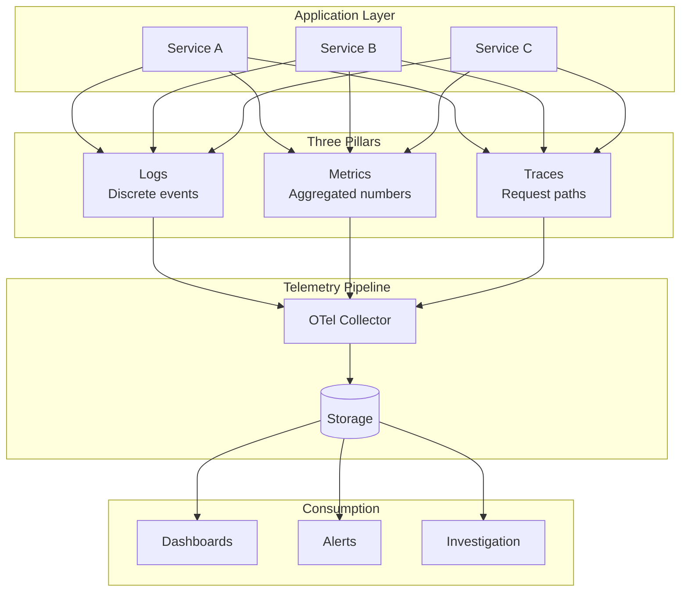

### Three Pillars of Observability

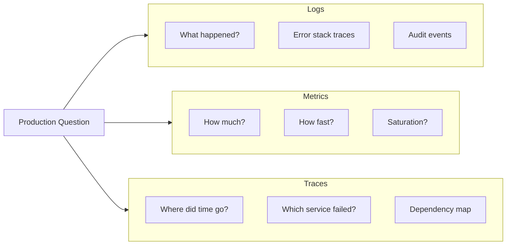

---

## 9.1 Logging

### What is it

Immutable, timestamped records of discrete events—errors, requests, state transitions, security actions—written by applications and infrastructure components.

### Why it matters

Logs are the primary forensic tool when debugging a specific failure. They capture context (user, request, error) that aggregated metrics cannot, and they persist long after the incident for postmortems and compliance.

### How it works

Applications emit log lines via a logging framework (Logback, slog, winston). A shipper agent (Fluent Bit, Filebeat) tails files or receives stdout, batches records, and forwards them to a centralized store (Elasticsearch, Loki, CloudWatch). Operators search and filter by time, level, service, and correlation ID.

### Diagram

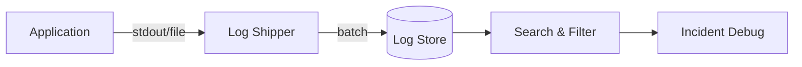

### Key details

- **Levels:** ERROR, WARN, INFO, DEBUG—tune per environment; production rarely needs DEBUG globally
- **Centralization:** never rely on pod-local disks; logs vanish on restart
- **Retention:** hot (7–30 days searchable), warm/cold archive for compliance
- **PII/secrets:** redact tokens, passwords, and regulated data at source

### When to use

- Debugging specific errors and stack traces
- Audit trails and security investigations
- Reconstructing request timelines when paired with correlation IDs

### Trade-offs

| Pros | Cons |
|------|------|
| Rich contextual detail | Expensive at high volume |
| Human-readable | Unstructured text hard to query |
| Easy to adopt | Can become noisy without discipline |

### References

- [Google SRE — Monitoring Distributed Systems](https://sre.google/sre-book/monitoring-distributed-systems/)

---

## 9.2 Structured Logging

### What is it

Logging where each event is a machine-parseable record (typically JSON) with named fields instead of free-form text strings.

### Why it matters

Structured logs enable fast filtering (`level=ERROR AND service=payment`), aggregation (count errors by `errorCode`), and automatic correlation with traces—without fragile regex parsing.

### How it works

The logging library serializes each event to JSON with standard fields (`timestamp`, `level`, `message`, `traceId`, `spanId`, custom dimensions). The log platform indexes fields as columns. Queries become SQL-like or Lucene field filters.

### Diagram

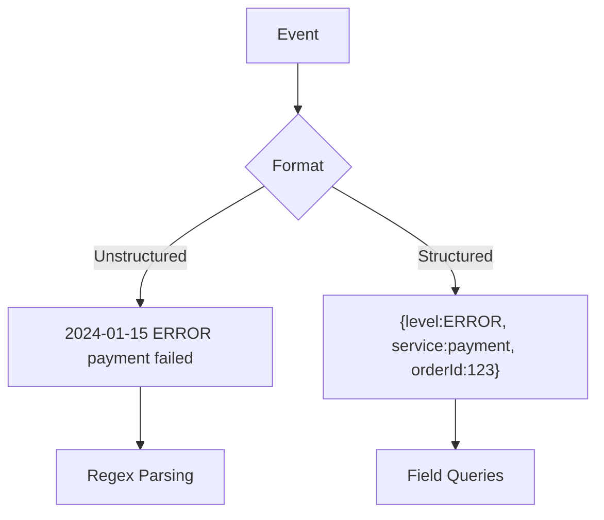

### Key details

- Standard fields: `timestamp`, `level`, `service`, `traceId`, `message`
- Use consistent naming (snake_case or camelCase—pick one)
- Libraries: Logback JSON encoder, structlog, zerolog, winston JSON
- Include exception type, stack (truncated), and business IDs

### When to use

- Any production service at scale
- Microservices where cross-service log correlation is required
- Platforms feeding logs into metrics or alerting rules

### Trade-offs

| Pros | Cons |
|------|------|
| Fast, reliable queries | Slightly larger payload per line |
| Schema evolution possible | Requires discipline on field names |
| Integrates with traces | Bad schemas create indexing bloat |

### References

- [OpenTelemetry Logs Data Model](https://opentelemetry.io/docs/specs/otel/logs/data-model/)

---

## 9.3 Metrics

### What is it

Numeric measurements collected over time—counters, gauges, histograms—that describe system behavior as time series.

### Why it matters

Metrics compress billions of events into trend lines suitable for dashboards, capacity planning, and automated alerting. They answer *how much* and *how fast* at a glance.

### How it works

Instrumentation libraries expose metrics via pull (Prometheus scrapes `/metrics`) or push (StatsD, OTLP). A time-series database stores samples with labels (service, region, endpoint). Query languages (PromQL) aggregate, rate, and percentile over windows.

### Diagram

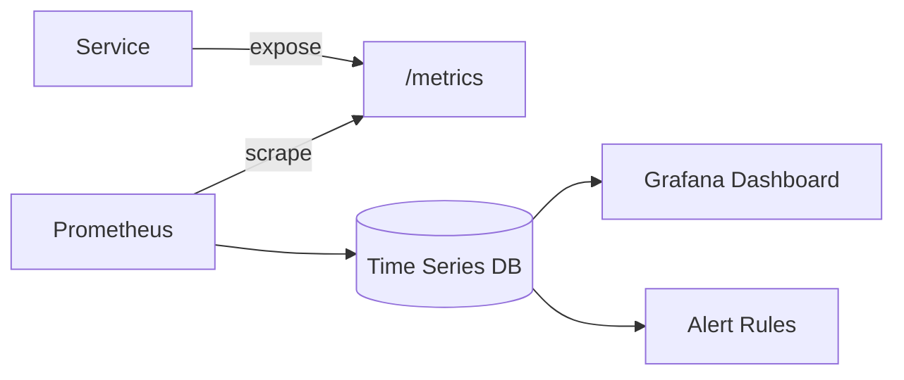

### Key details

- **Counter:** monotonically increasing (`http_requests_total`)
- **Gauge:** point-in-time value (`queue_depth`, `memory_bytes`)
- **Histogram/Summary:** distributions for latency percentiles
- Label cardinality: avoid high-cardinality labels (user IDs) on metrics

### When to use

- SLI measurement (availability, latency)
- Capacity and saturation monitoring
- Alerting on symptoms (error rate, p99 latency)

### Trade-offs

| Pros | Cons |
|------|------|
| Cheap storage vs logs | Loses per-event detail |
| Great for trends | Cardinality explosions are costly |
| Standard alerting input | Requires careful instrumentation design |

### References

- [Prometheus metric types](https://prometheus.io/docs/concepts/metric_types/)
- [RED method](https://www.weave.works/blog/the-red-method-key-metrics-for-microservices-architecture/)

---

## 9.4 Monitoring

### What is it

The practice of continuously observing system health by collecting metrics (and sometimes logs/traces), comparing them to expectations, and surfacing anomalies through dashboards and alerts.

### Why it matters

Monitoring detects degradation before users report outages. It operationalizes reliability goals and gives teams shared situational awareness during incidents.

### How it works

Instrumentation feeds a monitoring stack. SRE frameworks (RED for services, USE for resources) define what to measure. Dashboards visualize golden signals; alert rules fire when thresholds breach; on-call responds via runbooks.

### Diagram

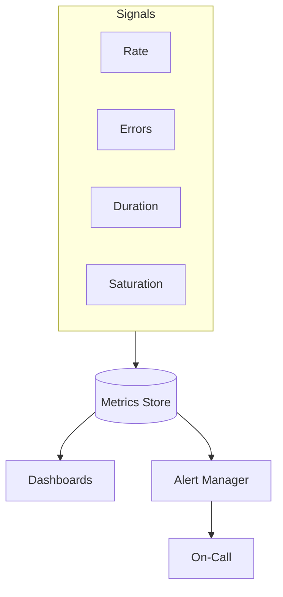

### Key details

- **RED:** Rate, Errors, Duration—for request-driven services
- **USE:** Utilization, Saturation, Errors—for CPU, disk, network
- **Four golden signals:** latency, traffic, errors, saturation
- Monitor symptoms (user-visible), not only causes (CPU)

### When to use

- Always, for any production workload
- Before launching new services (define dashboards first)
- During incidents for real-time triage

### Trade-offs

| Pros | Cons |
|------|------|
| Proactive failure detection | Alert fatigue if poorly tuned |
| Shared team visibility | Wrong metrics create false confidence |
| Drives capacity decisions | Tooling cost at scale |

### References

- [Google SRE — Four Golden Signals](https://sre.google/sre-book/monitoring-distributed-systems/#xref_monitoring_golden-signals)

---

## 9.5 Distributed Tracing

### What is it

End-to-end tracking of a single request as it traverses multiple services, represented as a tree of **spans** (timed operations) linked by a shared **trace ID**.

### Why it matters

In microservices, latency and errors hide in the call graph. Tracing shows which downstream dependency slowed a checkout or which service returned 500—impossible to infer from single-service logs alone.

### How it works

An ingress service starts a root span and injects trace context (`traceparent` header) into outbound calls. Each hop creates child spans with timing and attributes. A collector receives spans; a UI (Jaeger, Tempo) renders the waterfall. Sampling reduces volume in high-traffic systems.

### Diagram — Span Flow

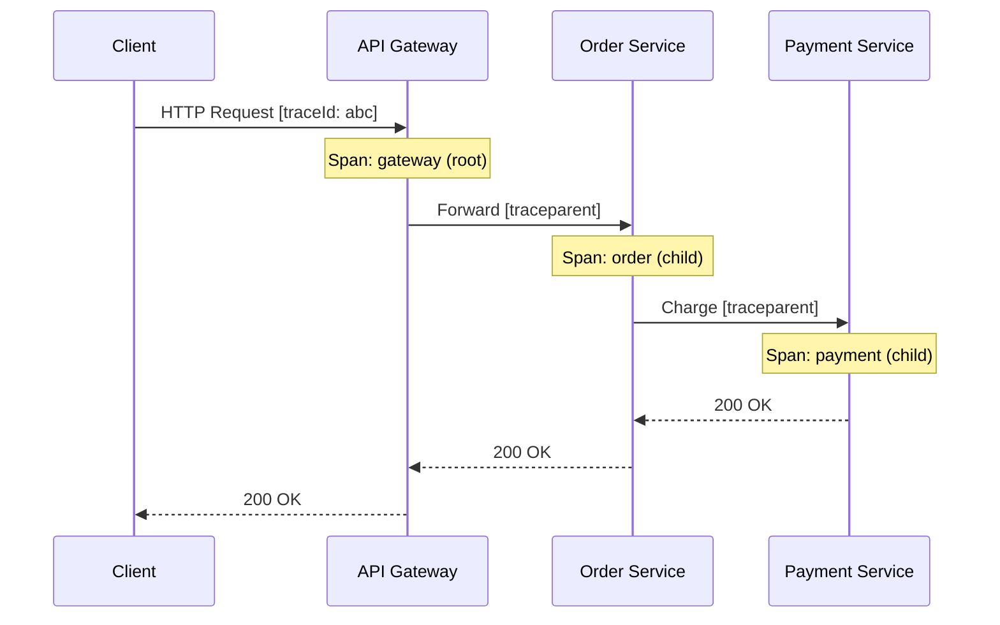

### Key details

- **Trace:** full journey; **span:** one operation (HTTP call, DB query)
- Context propagation via W3C `traceparent` / B3 headers
- **Sampling:** 1–10% head-based in prod; tail-based or 100% on errors
- Add span attributes: `http.status_code`, `db.statement` (sanitized)

### When to use

- Microservices with multi-hop request paths
- Latency debugging (p99 investigations)
- Dependency mapping and critical path analysis

### Trade-offs

| Pros | Cons |
|------|------|
| Pinpoints bottlenecks | Storage cost at 100% sampling |
| Visual call graph | Requires consistent propagation |
| Links to logs via trace ID | Incomplete traces if context dropped |

### References

- [OpenTelemetry Tracing](https://opentelemetry.io/docs/concepts/signals/traces/)
- [Jaeger architecture](https://www.jaegertracing.io/docs/latest/architecture/)

---

## 9.6 OpenTelemetry

### What is it

A vendor-neutral, CNCF-standard API, SDK, and collector for generating and exporting traces, metrics, and logs—one instrumentation layer for many backends.

### Why it matters

Avoids vendor lock-in and duplicate instrumentation. Teams instrument once with OTel and export to Jaeger, Prometheus, Datadog, or cloud-native backends via configuration.

### How it works

The OTel SDK auto-instruments frameworks (HTTP, gRPC, DB) and supports manual spans. The **Collector** receives OTLP, processes (filter, batch, enrich), and exports to backends. Semantic conventions standardize attribute names across languages.

### Diagram

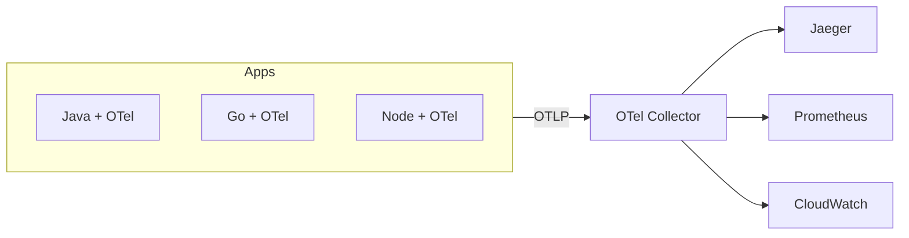

### Key details

- Signals: traces, metrics, logs (unified pipeline)
- Auto-instrumentation vs manual spans for business logic
- Collector processors: tail sampling, attribute scrubbing
- W3C Trace Context is the default propagation format

### When to use

- Greenfield microservices (default choice in 2024+)
- Migrating off vendor-specific agents
- Polyglot environments needing consistent telemetry

### Trade-offs

| Pros | Cons |
|------|------|
| Vendor neutral | Collector ops overhead |
| Rich ecosystem | Semantic convention adoption takes time |
| Single SDK per language | Some vendor features need proprietary exporters |

### References

- [OpenTelemetry Documentation](https://opentelemetry.io/docs/)
- [OTel Collector](https://opentelemetry.io/docs/collector/)

---

## 9.7 Correlation IDs

### What is it

A unique identifier assigned to a request at the system edge and propagated through every service, log line, trace, and support ticket for that request.

### Why it matters

Correlation IDs stitch together fragmented telemetry across dozens of services, turning "find needle in haystack" into "filter by `requestId=xyz`".

### How it works

The API gateway generates an ID (UUID) if the client did not send one. The ID is passed via HTTP header (`X-Request-ID`, `X-Correlation-ID`) or embedded in W3C trace context. Every service copies it into structured logs and span attributes.

### Diagram

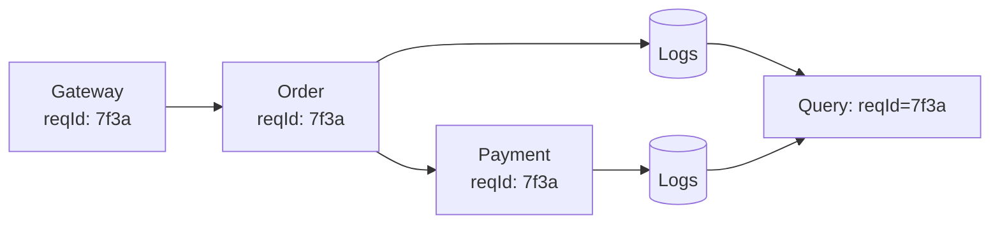

### Key details

- Generate at edge; never trust client-supplied IDs for security decisions
- Log the ID on every line—including async workers and message consumers
- Align with `traceId` when using distributed tracing (often the same or linked)
- Pass through message queues via message headers

### When to use

- All distributed systems
- Support tooling linking user reports to backend logs
- Async pipelines (include ID in event payload)

### Trade-offs

| Pros | Cons |
|------|------|
| Simple, high-value | Useless if propagation breaks mid-chain |
| Works without full tracing | Not a substitute for span timing |
| Low implementation cost | Duplicate IDs if clients resend same header |

### References

- [W3C Trace Context](https://www.w3.org/TR/trace-context/)

---

## 9.8 Alerting

### What is it

Automated notifications when monitored signals breach thresholds or exhibit anomalous behavior, routing humans or automation to respond.

### Why it matters

Users should not be the first detectors of outages. Well-designed alerts shorten mean time to detect (MTTD) and direct on-call engineers to actionable problems.

### How it works

Alert rules evaluate metrics over windows (e.g., `error_rate > 1% for 5m`). Alertmanager groups, deduplicates, and routes by severity to PagerDuty, Slack, or email. Each alert links to a runbook. Post-incident, noisy alerts are tuned or removed.

### Diagram

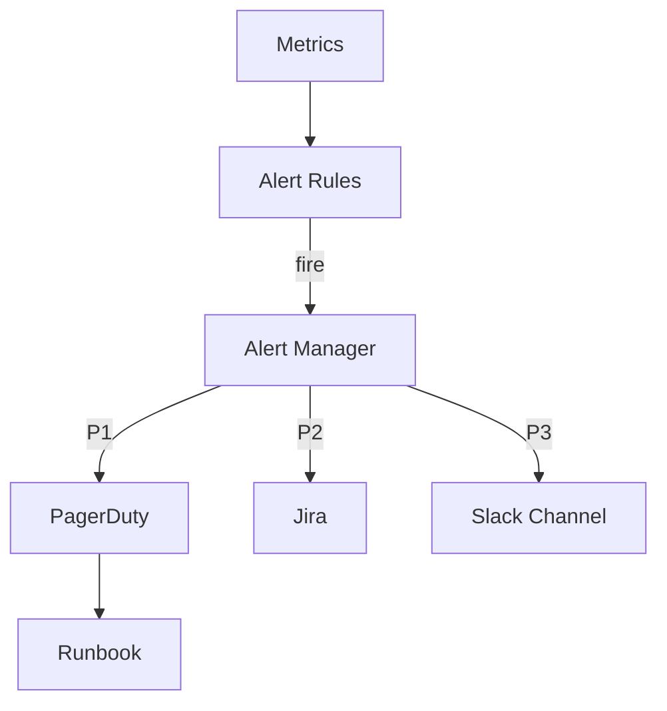

### Key details

- Alert on **symptoms** (error rate, SLO burn), not causes (single CPU spike)
- Severity tiers: P1 pages, P2 business hours, P3 dashboard-only
- Every alert must be actionable—if no action, delete the alert
- Use multi-window burn-rate alerts for SLO-based paging

### When to use

- Production SLO violations
- Dependency failures affecting users
- Security and capacity threshold breaches

### Trade-offs

| Pros | Cons |
|------|------|
| Fast incident detection | Alert fatigue destroys trust |
| Automates vigilance | Flapping alerts waste time |
| Ties to on-call rotation | Poor thresholds → false positives |

### References

- [Google SRE — Alerting on SLOs](https://sre.google/workbook/alerting-on-slos/)
- [Prometheus Alertmanager](https://prometheus.io/docs/alerting/latest/overview/)

---

## 9.9 Dashboards

### What is it

Visual compositions of panels (graphs, gauges, tables) displaying key metrics and logs for real-time and historical system overview.

### Why it matters

Dashboards provide at-a-glance health during incidents and planning sessions. They align teams on golden signals and reduce ad-hoc query friction under pressure.

### How it works

Tools like Grafana connect to metric and log data sources. Panels run PromQL or LogQL queries with templated variables (`$service`, `$region`). Hierarchy: global overview → service dashboard → instance drill-down.

### Diagram

### Key details

- One overview + one dashboard per critical service
- Chart decisions, not vanity metrics (total requests ever)
- Use consistent time ranges and annotation markers for deploys
- Mobile-friendly layouts for incident response

### When to use

- Daily operational health checks
- Incident war rooms
- Capacity review meetings

### Trade-offs

| Pros | Cons |
|------|------|
| Fast situational awareness | Stale dashboards mislead |
| Shared team context | Maintenance burden grows |
| Drill-down accelerates triage | Can hide problems behind averages |

### References

- [Grafana best practices](https://grafana.com/docs/grafana/latest/dashboards/build-dashboards/best-practices/)

---

## 9.10 Health Checks

### What is it

HTTP or TCP endpoints (or exec probes) that report whether a process is alive and whether it can accept traffic.

### Why it matters

Orchestrators and load balancers use health checks to restart failed containers and stop routing to unhealthy instances—automating recovery without human intervention.

### How it works

**Liveness** probes detect deadlocks—failure triggers restart. **Readiness** probes detect temporary unavailability (DB down)—failure removes instance from load balancer. **Startup** probes allow slow-starting apps extra time before liveness kicks in.

### Diagram

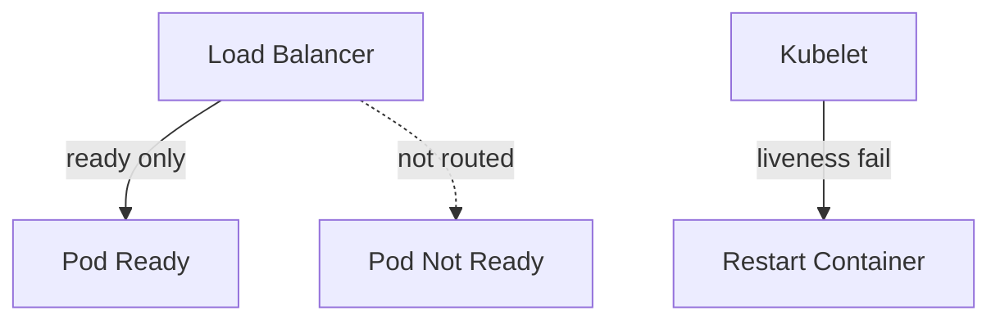

### Key details

- Shallow: `/health` returns 200 if process up
- Deep: `/ready` checks DB, cache, downstream dependencies
- Keep liveness cheap—avoid cascading failures from deep checks
- Kubernetes: `livenessProbe`, `readinessProbe`, `startupProbe`

### When to use

- Container orchestration (Kubernetes, ECS)
- Load balancer target group health
- Dependency-gated traffic shifting (blue/green)

### Trade-offs

| Pros | Cons |
|------|------|
| Automated healing | Deep checks can flap during partial outages |
| Prevents bad traffic routing | Misconfigured probes cause restart loops |
| Standard K8s pattern | Probe latency affects rollout speed |

### References

- [Kubernetes probes](https://kubernetes.io/docs/concepts/configuration/liveness-readiness-startup-probes/)

---

## 9.11 Synthetic Monitoring

### What is it

Automated external probes that simulate user journeys—HTTP checks, browser scripts, API workflows—from outside your network on a schedule.

### Why it matters

Internal metrics can show green while users cannot reach the site (DNS, CDN, certificate issues). Synthetic monitoring detects user-visible outages before real traffic does.

### How it works

A scheduler runs probes every 1–5 minutes from multiple geographic locations. Failures trigger alerts. Results feed availability SLIs. Tools: Datadog Synthetics, Pingdom, Grafana k6 cloud, AWS CloudWatch Synthetics.

### Diagram

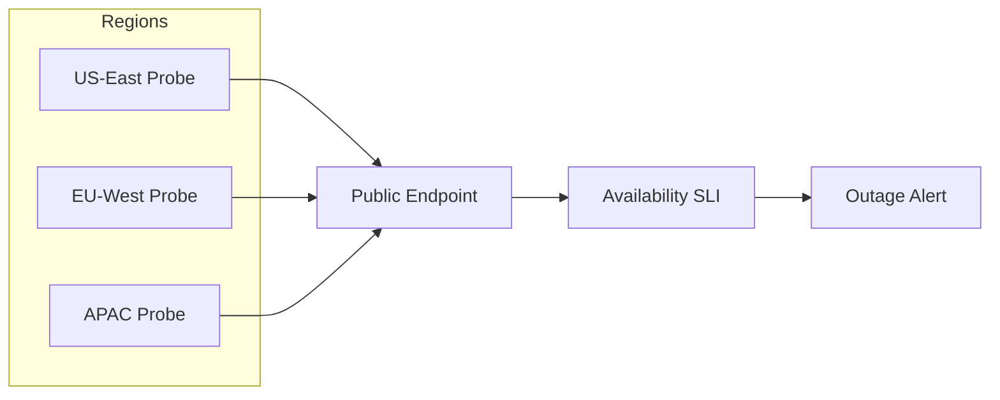

### Key details

- Black-box: tests what users experience, not internal metrics
- Multi-region catches DNS/geo routing failures
- Critical path scripts: login, checkout, search
- Separate from load testing—low frequency, high signal

### When to use

- Public-facing APIs and web apps
- SLO availability measurement
- Certificate and DNS expiry monitoring

### Trade-offs

| Pros | Cons |
|------|------|
| User-perspective truth | Does not cover all code paths |
| Catches external failures | Scripted flows need maintenance |
| Geographic coverage | Can miss internal-only issues |

### References

- [Google SRE — SLI measurement](https://sre.google/workbook/implementing-slos/)

---

## 9.12 Error Budgets

### What is it

The allowed amount of unreliability derived from an SLO—e.g., 99.9% monthly availability permits ~43 minutes of downtime per month.

### Why it matters

Error budgets quantify the tension between shipping features and maintaining reliability. When budget remains, teams move fast; when exhausted, focus shifts to stability.

### How it works

`Error budget = 1 - SLO target` over a rolling window. Incidents, bad deploys, and experiments consume budget. Multi-window burn-rate alerts page when consumption accelerates. Policy: budget at zero → feature freeze, reliability work only.

### Diagram

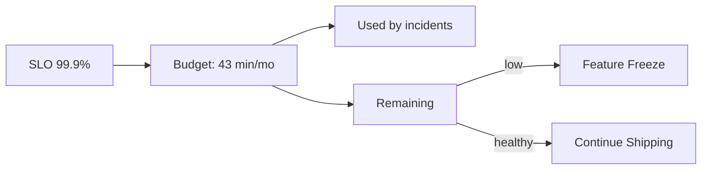

### Key details

- Budget is a product decision tool, not just engineering
- Track per SLO, per service, per window (30d rolling common)
- Partial outages consume proportional budget
- Postmortems when budget burned unexpectedly

### When to use

- Teams practicing SRE with defined SLOs
- Release governance (can we deploy Friday?)
- Prioritizing tech debt vs features

### Trade-offs

| Pros | Cons |
|------|------|
| Objective release decisions | Requires SLO maturity first |
| Aligns product and engineering | Can be gamed with loose SLOs |
| Reduces blame culture | Cultural buy-in takes time |

### References

- [Google SRE — Embracing Risk](https://sre.google/sre-book/embracing-risk/)

---

## 9.13 SLA

### What is it

**Service Level Agreement**—a contractual commitment to customers defining measurable service targets, often with financial remedies (credits) for breach.

### Why it matters

SLAs set external expectations and legal obligations. They must be achievable, measurable, and backed by internal engineering targets (SLOs) with safety margin.

### How it works

Legal and product define SLA terms (e.g., 99.95% monthly uptime). Engineering measures compliance via SLIs. Internal SLO is set stricter than SLA (buffer). Breach triggers service credits per contract.

### Diagram

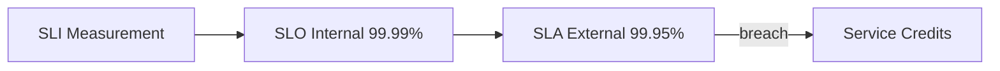

### Key details

- External-facing, legally binding
- Define measurement method, exclusions (planned maintenance), reporting
- Always set SLA below internal SLO
- Multi-tenant: per-customer vs platform-wide SLAs

### When to use

- B2B SaaS with enterprise contracts
- Cloud provider service offerings
- Regulated industries with uptime guarantees

### Trade-offs

| Pros | Cons |
|------|------|
| Customer trust | Financial liability on miss |
| Clear expectations | Conservative targets limit agility |
| Sales differentiator | Disputes over measurement |

### References

- [AWS SLA overview](https://aws.amazon.com/legal/service-level-agreements/)

---

## 9.14 SLO

### What is it

**Service Level Objective**—an internal reliability target the engineering team commits to, expressed as a measurable threshold over a time window.

### Why it matters

SLOs translate user happiness into numbers teams can optimize. They drive alerting, error budgets, and prioritization—reliability becomes engineering work, not hope.

### How it works

Pick 3–5 SLOs per service (availability, latency, correctness). Define SLI measurement. Set target (99.9% requests successful). Implement dashboards and burn-rate alerts. Review quarterly with product.

### Diagram — SLI → SLO → SLA

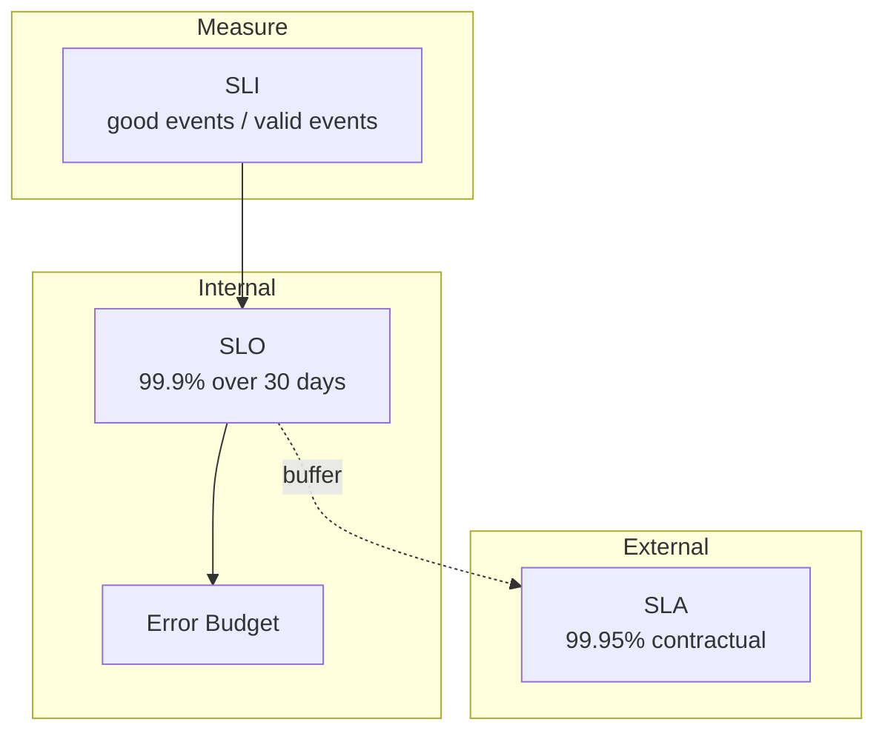

### Key details

- User-centric: measure what users experience at the edge
- Few SLOs—more creates conflicting priorities
- Example: "99% of checkout requests complete < 2s over 28 days"
- SLO review: adjust targets based on user needs and cost

### When to use

- Any production service with reliability goals
- Foundation for error budgets and SRE practice
- Input to alerting (multi-burn-rate pages)

### Trade-offs

| Pros | Cons |
|------|------|
| Quantifies reliability | Wrong SLO optimizes wrong thing |
| Enables error budgets | Measurement can be complex |
| Aligns teams | Too many SLOs → paralysis |

### References

- [Google SRE Workbook — Implementing SLOs](https://sre.google/workbook/implementing-slos/)

---

## 9.15 SLI

### What is it

**Service Level Indicator**—the raw measured metric that quantifies some aspect of service behavior (availability, latency, throughput, freshness, correctness).

### Why it matters

SLOs are only as good as their SLIs. Precise SLI definitions prevent disputes and ensure alerts reflect real user impact.

### How it works

Define **good events** and **valid events**. Availability SLI = successful responses / total valid requests. Latency SLI = fraction of requests faster than threshold. Instrument at the load balancer or edge for user perspective.

### Diagram

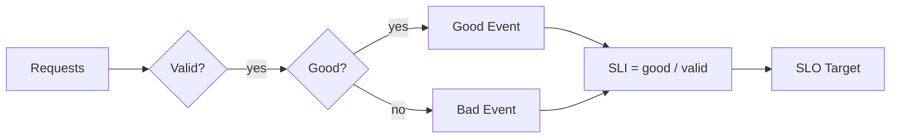

### Key details

- **Availability:** `2xx+3xx / total` or stricter (exclude 4xx client errors)
- **Latency:** `% requests < 200ms` (use histogram buckets)
- **Correctness:** business-valid outcomes / attempts
- Measure at user boundary when possible

### When to use

- Defining any SLO or SLA
- Building availability and latency dashboards
- Synthetic + real traffic combined SLIs

### Trade-offs

| Pros | Cons |
|------|------|
| Objective measurement | Definition debates are common |
| Foundation for SLO/SLA | Edge vs server measurement differs |
| Drives instrumentation | Lagging indicators miss UX nuances |

### References

- [Google SRE — SLI selection](https://sre.google/workbook/implementing-slos/#sli-selection)

---

## Quick Reference

| Pillar | Answers | Tools | Best for |
|--------|---------|-------|----------|
| Logs | What happened? | ELK, Loki, CloudWatch | Debugging specific errors |
| Metrics | How much/how fast? | Prometheus, Datadog | Trends, alerting, capacity |
| Traces | Where did time go? | Jaeger, Tempo, Zipkin | Latency across services |
| Correlation ID | Which request? | Headers + structured logs | End-to-end request tracking |
| Health checks | Is it up? | K8s probes, LB checks | Auto-healing, routing |
| SLI → SLO → SLA | How reliable? | Error budgets | Release vs reliability trade-off |
| RED | Service health | Rate, Errors, Duration | Request-driven services |
| USE | Resource health | Utilization, Saturation, Errors | CPU, disk, network |
