# 10. Security

> Status: **Documented**  -  MASTER reference depth for all sub-topics below.

[<- Back to master index](../README.md)

---

## Sub-topics

| # | Sub-topic | Status |
|---|-----------|--------|
| 10.1 | [Authentication](#101-authentication) | Done |
| 10.2 | [Authorization](#102-authorization) | Done |
| 10.3 | [OAuth2](#103-oauth2) | Done |
| 10.4 | [OpenID Connect](#104-openid-connect) | Done |
| 10.5 | [JWT](#105-jwt) | Done |
| 10.6 | [Session Management](#106-session-management) | Done |
| 10.7 | [RBAC](#107-rbac) | Done |
| 10.8 | [ABAC](#108-abac) | Done |
| 10.9 | [Encryption at Rest](#109-encryption-at-rest) | Done |
| 10.10 | [Encryption in Transit](#1010-encryption-in-transit) | Done |
| 10.11 | [KMS](#1011-kms) | Done |
| 10.12 | [Secret Management](#1012-secret-management) | Done |
| 10.13 | [CSRF](#1013-csrf) | Done |
| 10.14 | [XSS](#1014-xss) | Done |
| 10.15 | [SQL Injection](#1015-sql-injection) | Done |
| 10.16 | [SSRF](#1016-ssrf) | Done |
| 10.17 | [Clickjacking](#1017-clickjacking) | Done |
| 10.18 | [DDoS Protection](#1018-ddos-protection) | Done |
| 10.19 | [WAF](#1019-waf) | Done |
| 10.20 | [Zero Trust Security](#1020-zero-trust-security) | Done |
| 10.21 | [Audit Logging](#1021-audit-logging) | Done |


---

## Overview

Security in distributed systems spans identity (who), access control (what they can do), data protection (at rest and in transit), and defense against abuse. A layered model - perimeter, application, data, and operational controls - reduces blast radius when any single control fails.

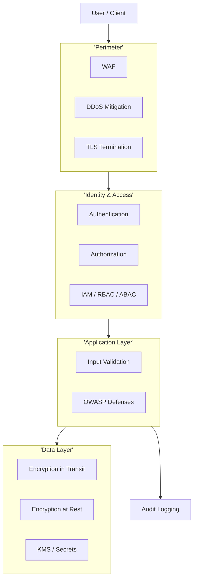

---


## Reading order

Sub-topics are sequenced for progressive learning: foundations first, then related concepts, then specialized topics.

| Group | Sections | Focus |
|-------|----------|-------|
| **1. Identity** | 10.1-10.6 | AuthN, AuthZ, OAuth, OIDC, JWT, sessions |
| **2. Access control** | 10.7-10.8 | RBAC, ABAC |
| **3. Cryptography and secrets** | 10.9-10.12 | Encryption, KMS, secret management |
| **4. Application threats** | 10.13-10.17 | OWASP-class attacks |
| **5. Perimeter and governance** | 10.18-10.21 | DDoS, WAF, zero trust, audit |

---
---

## 10.1 Authentication


### What is it

The process of verifying **identity** - proving a user, service, or device is who they claim to be before granting access.

### Why it matters

Every authorization decision depends on trustworthy identity. Weak authentication is the root cause of account takeover, data breaches, and lateral movement in compromised networks.

### How it works

Common factors: **something you know** (password), **have** (TOTP, hardware key), **are** (biometric). Systems validate credentials against a user store or federated IdP, then issue a session token or credential (cookie, JWT) for subsequent requests. MFA stacks factors to resist credential theft.

### Diagram

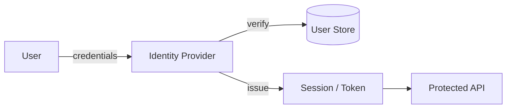

### Key details

- Prefer federated auth (OIDC) over custom password stores
- Enforce MFA for privileged and external-facing accounts
- Rate-limit and lockout on failed attempts; bcrypt/Argon2 for password hashing
- Service-to-service: mTLS or signed tokens, not shared passwords

### When to use

- Every user-facing and admin-facing system
- Machine-to-machine via client credentials or workload identity

### Trade-offs

| Pros | Cons |
|------|------|
| Foundation of all access control | UX friction with strict MFA |
| Federated auth reduces custom risk | IdP outage blocks login |
| MFA dramatically reduces takeover | Legacy apps hard to retrofit |

### References

- [OWASP Authentication Cheat Sheet](https://cheatsheetseries.owasp.org/cheatsheets/Authentication_Cheat_Sheet.html)
- [NIST Digital Identity Guidelines](https://pages.nist.gov/800-63-3/)

---


## 10.2 Authorization


### What is it

Determining **what an authenticated principal is allowed to do** - which resources, actions, and data they may access.

### Why it matters

Authentication without authorization is "logged in but unrestricted." Fine-grained authorization enforces least privilege and contains breach impact.

### How it works

After auth, each request carries identity and claims. An authorization layer (middleware, policy engine, OPA) evaluates rules: role membership, resource ownership, attributes, or policies. Decision: allow or deny before business logic executes.

### Diagram

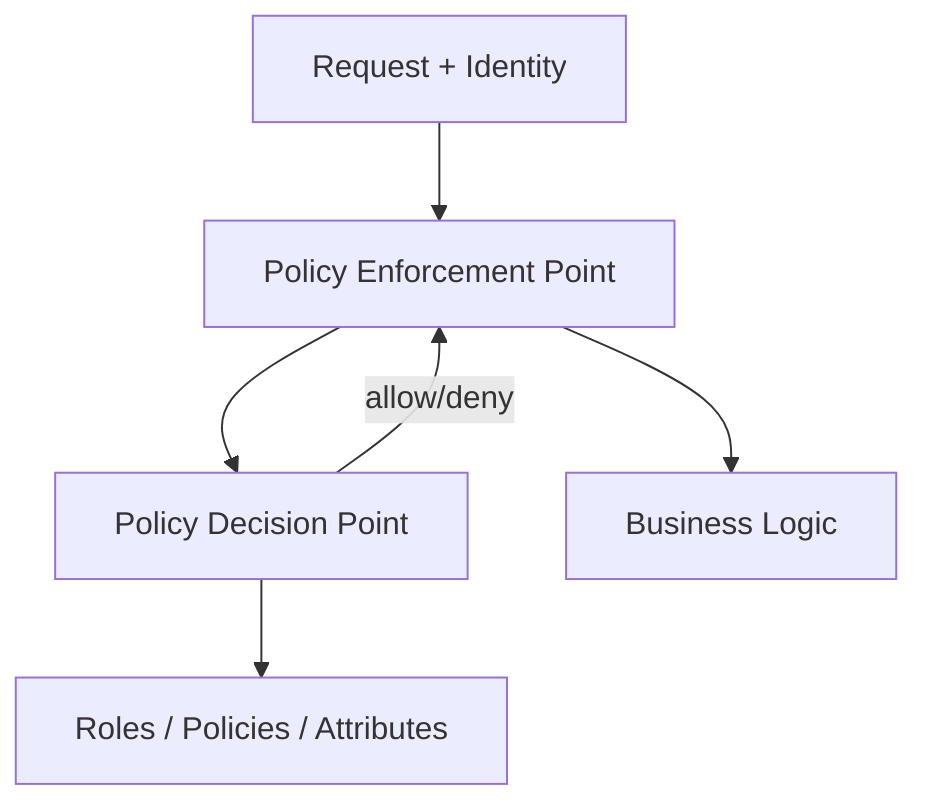

### Key details

- Separate authn from authz in code and architecture
- Deny by default; explicit grants only
- Centralize policy where possible (OPA, Cedar, cloud IAM)
- Re-check authorization on every request - never trust client

### When to use

- Every API endpoint and admin action
- Multi-tenant systems (tenant isolation is authorization)

### Trade-offs

| Pros | Cons |
|------|------|
| Least privilege limits damage | Complex policies hard to test |
| Auditable access decisions | Performance cost of per-request checks |
| Regulatory compliance enabler | Role explosion without governance |

### References

- [OWASP Authorization Cheat Sheet](https://cheatsheetseries.owasp.org/cheatsheets/Authorization_Cheat_Sheet.html)

---


## 10.3 OAuth2


### What is it

**OAuth 2.0** (RFC 6749) is an **authorization framework** — not an authentication protocol — that enables clients to obtain **limited access** to resources on behalf of a **resource owner** (user) or the client itself, via **access tokens** issued by an **authorization server**, without sharing passwords.

Roles:

| Role | Example |
|------|---------|
| **Resource owner** | End user |
| **Client** | Web app, mobile app, backend service |
| **Authorization server** | Okta, Auth0, Keycloak, Google OAuth |
| **Resource server** | Your API protecting `/orders` |

### Why it matters

- **Delegated access:** "Allow App X to read my Google Calendar" without giving App X your Google password
- **Industry standard** for API authorization, SSO integrations, and machine-to-machine auth
- **Interview must-know:** Authorization Code + PKCE for users; Client Credentials for services
- **Common mistake:** OAuth2 alone does not tell you *who* the user is — use **OIDC** (10.4) for identity

### How it works — key flows

**Flow comparison:**

| Flow | Who authenticates | Client type | Use case |
|------|-------------------|-------------|----------|
| **Authorization Code + PKCE** | User at auth server | SPA, mobile, server web app | User login, SSO |
| **Client Credentials** | Client (no user) | Confidential backend service | M2M, cron jobs, microservices |
| **Device Code** | User on second device | TV, CLI, IoT | Input-constrained devices |
| **Refresh Token** | N/A (extends session) | Any flow that issued one | Long-lived access without re-login |

**Deprecated / avoid:** Implicit flow, Resource Owner Password Credentials (ROPC).

---

### Authorization Code Flow (with PKCE) — primary flow for users

**Why PKCE:** public clients (SPAs, mobile) cannot safely store a `client_secret`. **Proof Key for Code Exchange** prevents authorization code interception.

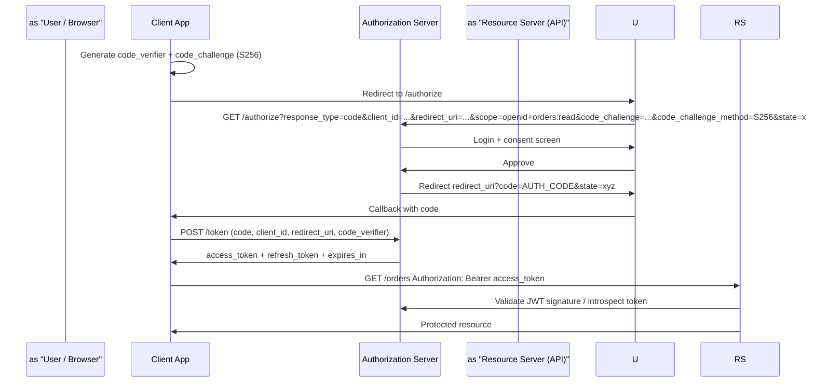

**Step-by-step:**

1. Client generates `code_verifier` (random 43–128 chars) and `code_challenge = BASE64URL(SHA256(verifier))`
2. Redirect user to `/authorize` with `code_challenge`, `scope`, `state` (CSRF protection)
3. User authenticates and consents
4. Auth server redirects to `redirect_uri` with **authorization code** (short-lived, ~60s, single-use)
5. Client exchanges code at `/token` with `code_verifier` — server verifies challenge match
6. Receive **access token** (short-lived, e.g. 15 min) + optional **refresh token**
7. Call API with `Authorization: Bearer <access_token>`

**Security requirements:**

| Requirement | Why |
|-------------|-----|
| Exact `redirect_uri` match | Prevent code theft to attacker URL |
| `state` parameter | CSRF on OAuth callback |
| PKCE for public clients | Stolen code useless without verifier |
| HTTPS everywhere | Tokens in transit protected |
| Short-lived access tokens | Limits blast radius of theft |

---

### Client Credentials Flow — machine-to-machine (no user)

Used when the client **is** the resource owner — no user context.

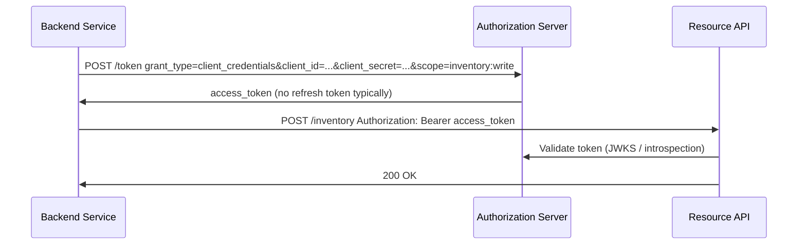

```http
POST /oauth/token
Content-Type: application/x-www-form-urlencoded

grant_type=client_credentials
&client_id=svc_order_processor
&client_secret=<from vault>
&scope=payments:write inventory:read
```

**Characteristics:**

- No refresh token — request new access token when expired
- `client_secret` in vault, rotated regularly — never in source code
- Scopes should be minimal (`payments:write` not `*`)
- Token represents the **service identity**, not a user — audit logs use `client_id`

**When to use Client Credentials:**

- Microservice A calls Microservice B
- Batch jobs, ETL, internal admin tools
- NOT for user-facing login — use Authorization Code

---

### Tokens and scopes

| Token | Purpose | Lifetime |
|-------|---------|----------|
| **Access token** | Authorize API calls | Short (minutes–hours) |
| **Refresh token** | Obtain new access token without re-login | Long (days–months), rotatable |

**Scopes** limit token capability:

```text
openid profile email          # OIDC identity
orders:read orders:write      # API-specific
payments:charge               # Fine-grained
```

Resource server must **enforce scopes** — validating token signature alone is insufficient.

### Key details

- **Token validation:** JWT local verify (JWKS) or RFC 7662 token introspection
- **Refresh token rotation:** issue new refresh token on each use; detect reuse → revoke family
- **Confidential vs public clients:** server apps keep secret; SPAs/mobile use PKCE, no secret
- **OAuth 2.1** consolidates best practices: PKCE mandatory, implicit removed
- Pair with **OIDC** when you need `id_token` with user claims (`sub`, `email`)

### When to use

| Scenario | Flow |
|----------|------|
| User logs into web/mobile app | Authorization Code + PKCE |
| Enterprise SSO | Authorization Code + OIDC |
| Service-to-service API calls | Client Credentials |
| Smart TV / CLI login | Device Code |

### Trade-offs

| Pros | Cons |
|------|------|
| No password sharing with third parties | Easy to misconfigure (redirect URIs, PKCE skip) |
| Scoped, revocable access | Token theft valid until expiry |
| Massive ecosystem support | OAuth ≠ authentication without OIDC |
| Standard for API gateways | Complex for developers first time |

### References

- [RFC 6749 — OAuth 2.0](https://datatracker.ietf.org/doc/html/rfc6749)
- [RFC 7636 — PKCE](https://datatracker.ietf.org/doc/html/rfc7636)
- [OAuth 2.0 Security BCP (RFC 9700)](https://datatracker.ietf.org/doc/html/rfc9700)

---


## 10.4 OpenID Connect


### What is it

Identity layer on top of OAuth2 (OIDC) that adds **authentication** - standardized ID tokens and UserInfo endpoint proving who the user is.

### Why it matters

OAuth2 alone authorizes API access but does not standardize identity. OIDC provides interoperable SSO, ID tokens (JWT), and claims (`sub`, `email`, `name`) for application login.

### How it works

Uses OAuth2 Authorization Code flow. Authorization server returns an **ID token** (JWT) alongside access token. Client validates ID token signature, `iss`, `aud`, `exp`, and `nonce`. UserInfo endpoint provides additional profile claims.

### Diagram

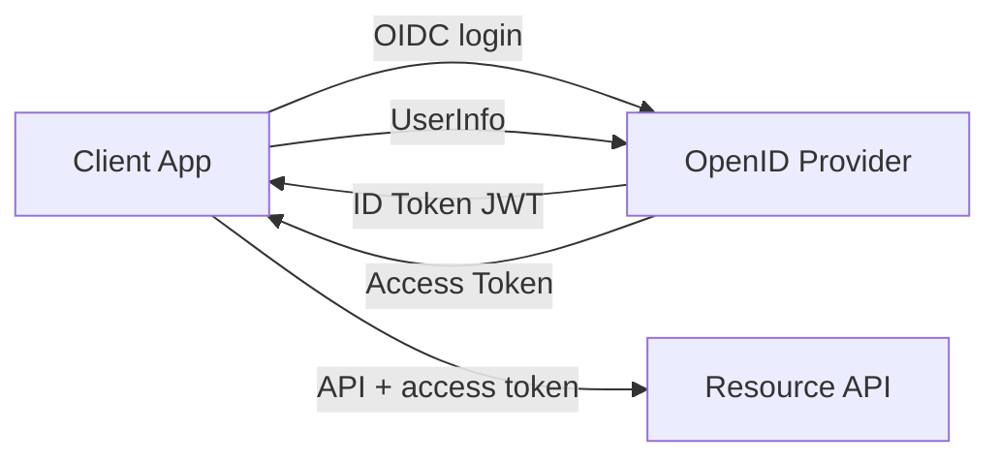

### Key details

- ID token is for client authentication of user, not API authorization
- Discovery document: `/.well-known/openid-configuration`
- JWKS endpoint for public key verification
- Pair with PKCE for public clients

### When to use

- Enterprise SSO (Azure AD, Okta, Keycloak)
- Consumer login (Google, Apple)
- Any "Sign in with  - " feature

### Trade-offs

| Pros | Cons |
|------|------|
| Standard SSO interoperability | IdP dependency |
| JWT-based identity proof | Claim mapping complexity |
| Built on OAuth2 ecosystem | Confusion between ID vs access token |

### References

- [OpenID Connect Core](https://openid.net/specs/openid-connect-core-1_0.html)

---


## 10.5 JWT


### What is it

A **JSON Web Token (JWT)** is a compact, URL-safe string format (`header.payload.signature`) for carrying **claims** between parties. The receiver verifies the **signature** to trust the payload without calling the issuer on every request — enabling **stateless** authentication and authorization at scale.

JWTs are commonly used as **OAuth2 access tokens** and **OIDC ID tokens** — but a JWT is a *format*, not a protocol.

### Why it matters

- **Stateless verification:** microservices validate tokens locally via JWKS public key — no session store lookup per request
- **Self-contained claims:** `sub`, `roles`, `scope` travel with the token
- **Interoperability:** standard across languages, API gateways, and IdPs
- **Interview focus:** structure, validation checklist, refresh token pattern, and why JWT ≠ session

### How it works — JWT structure

A JWT has three Base64URL-encoded parts separated by `.`:

```text
eyJhbGciOiJSUzI1NiIs...   .   eyJzdWIiOiJ1c3JfNDIi...   .   SflKxwRJSMeKKF2QT4fwpM...
        HEADER                   PAYLOAD                    SIGNATURE
```

**1. Header** — algorithm and type:

```json
{
  "alg": "RS256",
  "typ": "JWT",
  "kid": "key-2024-01"
}
```

**2. Payload** — claims (JSON):

```json
{
  "iss": "https://auth.example.com",
  "sub": "usr_42",
  "aud": "api.example.com",
  "exp": 1710000000,
  "iat": 1709996400,
  "nbf": 1709996400,
  "scope": "orders:read payments:write",
  "roles": ["editor"]
}
```

**3. Signature** — cryptographic proof:

```text
RS256:  Sign( base64url(header) + "." + base64url(payload), private_key )
HS256:  HMAC-SHA256( base64url(header) + "." + base64url(payload), shared_secret )
```

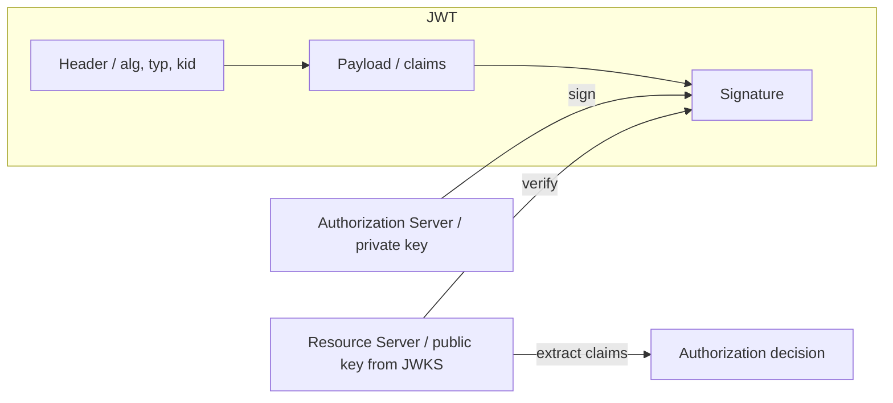

**Claim types:**

| Claim | Name | Required? | Purpose |
|-------|------|-----------|---------|
| `iss` | Issuer | Yes | Who issued token — must match expected IdP |
| `sub` | Subject | Yes | User or client ID |
| `aud` | Audience | Yes | Intended recipient API — reject wrong audience |
| `exp` | Expiration | Yes | Unix timestamp — reject expired |
| `iat` | Issued at | Recommended | Detect clock skew issues |
| `nbf` | Not before | Optional | Token not valid before this time |
| `jti` | JWT ID | Optional | Unique ID for replay prevention / revocation lists |
| Custom | `roles`, `scope` | App-specific | Authorization |

---

### JWT validation checklist (implement every step)

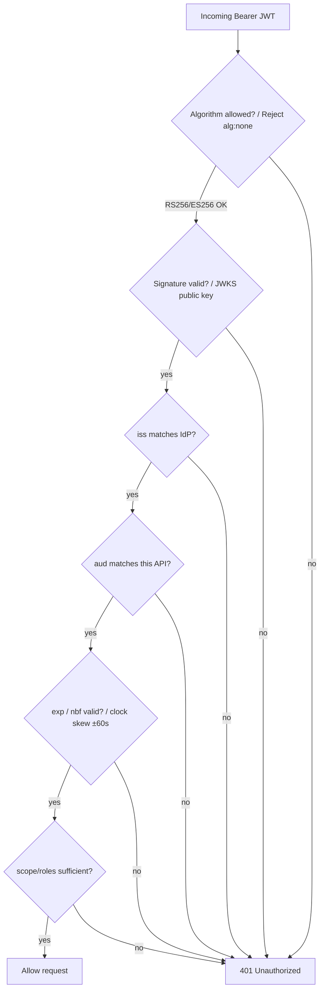

| Check | Attack prevented |
|-------|------------------|
| Reject `alg: none` | Algorithm confusion attack |
| Verify signature via JWKS | Forged tokens |
| Validate `iss` | Token from wrong IdP |
| Validate `aud` | Token meant for different API |
| Validate `exp` / `nbf` | Replay of expired tokens |
| Check `scope` / `roles` | Authorized token but insufficient permissions |

**JWKS endpoint:** IdP publishes public keys at `/.well-known/jwks.json` — cache with TTL, refresh on `kid` mismatch.

```http
GET /.well-known/jwks.json
{
  "keys": [{ "kid": "key-1", "kty": "RSA", "n": "...", "e": "AQAB" }]
}
```

**Algorithm choice:**

| Algorithm | Key type | Use when |
|-----------|----------|----------|
| **RS256 / ES256** | Asymmetric (RSA/EC) | Distributed systems — only IdP has private key |
| **HS256** | Shared secret | Single service or test — all verifiers share secret (risky at scale) |

---

### Access tokens vs refresh tokens

| | Access token (JWT) | Refresh token |
|---|-------------------|---------------|
| **Purpose** | Authorize API calls | Obtain new access token |
| **Lifetime** | Short (5–15 min) | Long (days–weeks) |
| **Sent to** | Resource API on every request | **Only** auth server `/token` endpoint |
| **Format** | Often JWT | Opaque string (recommended) or JWT |
| **Storage (SPA)** | Memory only | HttpOnly secure cookie (not localStorage) |
| **Revocation** | Hard before `exp` | Revoke in DB → all access tokens die at expiry |

**Refresh flow:**

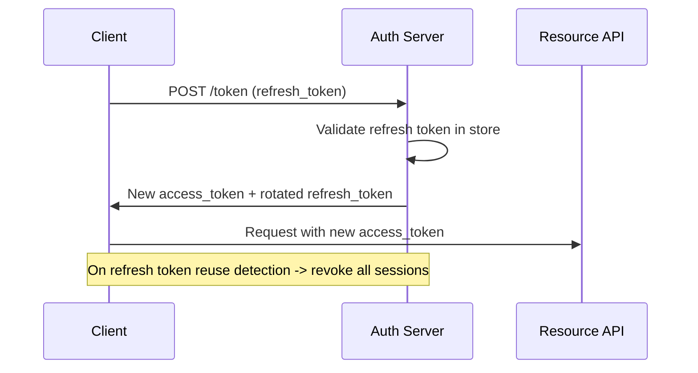

**Refresh token rotation (security best practice):**

1. Each refresh returns a **new** refresh token
2. Old refresh token invalidated
3. If old refresh token presented again → **reuse detected** → revoke entire token family (stolen token scenario)

**Why short-lived access JWT + refresh:**

- Stolen access JWT: attacker window = minutes until `exp`
- Stolen refresh token: detectable via rotation; revocable in server store
- Pure long-lived JWT with no refresh: theft valid for days — bad

---

### Storage and XSS considerations

| Storage | XSS risk | CSRF risk | Recommendation |
|---------|----------|-----------|----------------|
| `localStorage` | **High** — JS can read | Low | Avoid for tokens |
| Memory (SPA variable) | Lost on refresh | Low | OK for access token |
| HttpOnly cookie | JS cannot read | **High** — need CSRF token | OK for refresh token + SameSite |

### Key details

- JWT is **not encrypted** by default — payload is Base64, readable by anyone; use JWE if confidentiality needed
- **Revocation:** maintain denylist of `jti` for high-security; or accept window until `exp`
- **Size:** large claim sets bloat every request header — keep minimal
- **ID token vs access token:** ID token proves authentication to client; access token authorizes API — don't confuse (see OIDC 10.4)
- Gateways can validate JWT once and pass trusted headers to backends on private network

### When to use

- Stateless API auth in microservices (OAuth2 bearer tokens)
- OIDC ID tokens for client-side user identity
- Short-lived service-to-service tokens signed by internal CA
- API gateway JWT validation at edge

### Trade-offs

| Pros | Cons |
|------|------|
| No per-request auth server call | Revocation before expiry is hard |
| Horizontally scalable verification | Token size vs cookies |
| Standard JWKS rotation | `alg:none` and key confusion if poorly implemented |
| Works across polyglot services | Leaked bearer token = credential until expiry |

### References

- [RFC 7519 — JSON Web Token](https://datatracker.ietf.org/doc/html/rfc7519)
- [RFC 8725 — JWT Best Current Practices](https://datatracker.ietf.org/doc/html/rfc8725)
- [OAuth 2.0 Bearer Token Usage (RFC 6750)](https://datatracker.ietf.org/doc/html/rfc6750)

---


## 10.6 Session Management


### What is it

Server-side or client-side mechanisms maintaining authenticated state across HTTP requests - typically via session IDs in HttpOnly cookies.

### Why it matters

HTTP is stateless; sessions bridge identity across page loads and API calls. Poor session management enables hijacking, fixation, and indefinite unauthorized access.

### How it works

On login, server creates session record (user ID, expiry) in Redis/DB and sets `Set-Cookie: sessionId=...; HttpOnly; Secure; SameSite`. Each request sends cookie; server looks up session. Logout invalidates server-side session. Rotate session ID on privilege change.

### Diagram

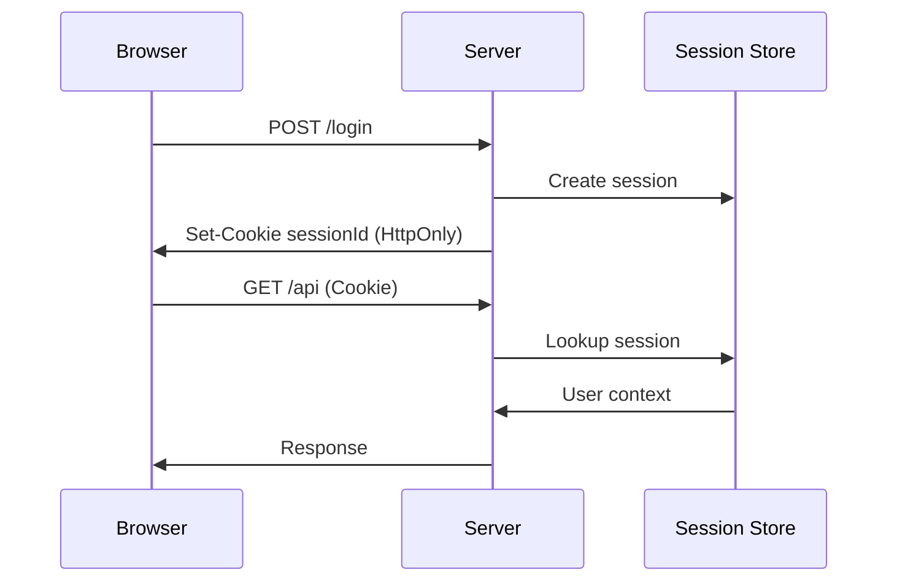

### Key details

- `HttpOnly`, `Secure`, `SameSite=Lax/Strict`
- Regenerate session ID after login (prevent fixation)
- Idle timeout + absolute timeout
- Invalidate all sessions on password change

### When to use

- Traditional web apps with server-rendered pages
- When immediate revocation is required
- Admin consoles with strict session control

### Trade-offs

| Pros | Cons |
|------|------|
| Easy revocation | Server-side store required |
| Smaller client credential | Sticky sessions in load-balanced setups |
| Mature browser cookie security | CSRF considerations with cookies |

### References

- [OWASP Session Management Cheat Sheet](https://cheatsheetseries.owasp.org/cheatsheets/Session_Management_Cheat_Sheet.html)

---


## 10.7 RBAC


### What is it

**Role-Based Access Control** - permissions assigned to roles; users inherit permissions by role membership (`admin`, `editor`, `viewer`).

### Why it matters

RBAC simplifies authorization at scale: manage dozens of roles instead of thousands of per-user permission grants. It maps naturally to organizational structure.

### How it works

Define roles and permission sets. Assign users to roles (directly or via groups). On each request, check `user.roles` contains a role with required permission. Hierarchical roles can inherit sub-role permissions.

### Diagram  -  RBAC Model

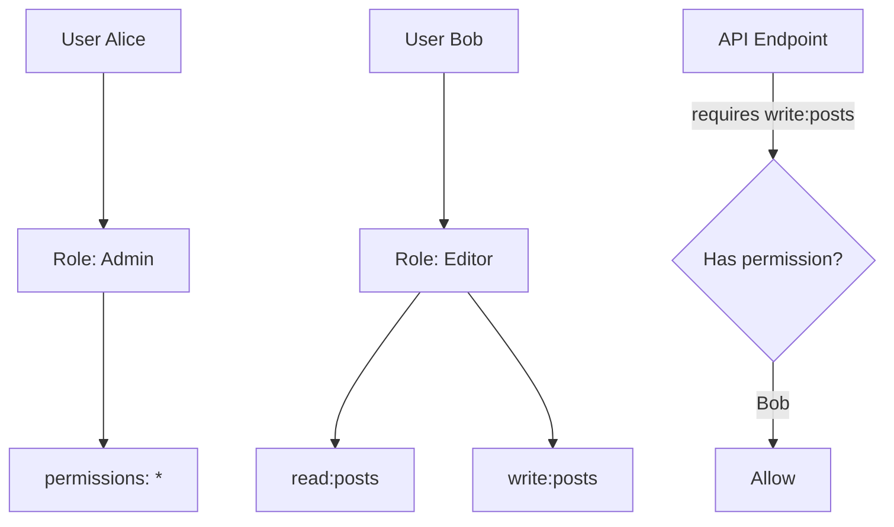

### Key details

- Role explosion: mitigate with role hierarchies and groups
- Separate application roles from infrastructure IAM roles
- Regular access reviews and least-privilege audits
- K8s RBAC: Role/ClusterRole + RoleBinding

### When to use

- Enterprise apps with stable job functions
- Kubernetes and cloud IAM (AWS IAM roles)
- Admin panels with tiered access

### Trade-offs

| Pros | Cons |
|------|------|
| Simple to understand | Coarse-grained for complex policies |
| Easy onboarding (assign role) | Role explosion over time |
| Widely supported | Cannot express context (time, location) |

### References

- [NIST RBAC model](https://csrc.nist.gov/projects/role-based-access-control)

---


## 10.8 ABAC


### What is it

**Attribute-Based Access Control** - access decisions from attributes of user, resource, action, and environment (`department`, `classification`, `time`, `IP`).

### Why it matters

RBAC breaks down when policy needs context: "managers can approve expenses under $10k in their department during business hours." ABAC expresses fine-grained, dynamic rules.

### How it works

Policy engine evaluates boolean rules: `allow if user.department == resource.department AND action == 'read' AND resource.classification <= user.clearance`. Attributes come from IdP claims, resource metadata, and request context. Engines: OPA, AWS Cedar, XACML.

### Diagram

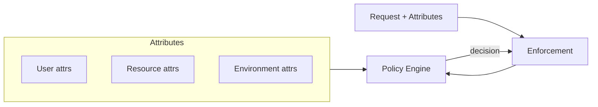

### Key details

- Policies as code - version, test, review in CI
- Attribute source of truth must be reliable
- Start with RBAC; add ABAC for exceptions
- Performance: cache decisions where safe

### When to use

- Multi-tenant SaaS with data isolation rules
- Healthcare/finance with regulatory context
- Zero Trust network policies

### Trade-offs

| Pros | Cons |
|------|------|
| Fine-grained, contextual | Complex to design and debug |
| Flexible without role explosion | Attribute governance overhead |
| Central policy management | Evaluation latency |

### References

- [NIST ABAC Guide](https://csrc.nist.gov/publications/detail/sp/800-162/final)

---


## 10.9 Encryption at Rest


### What is it

Encrypting stored data - databases, disks, backups, object storage - so physical theft or unauthorized disk access does not expose plaintext.

### Why it matters

Compliance (PCI, HIPAA, GDPR) and defense-in-depth require data unreadable without keys, even if storage media is compromised.

### How it works

**Transparent disk encryption** (LUKS, cloud volume encryption) protects entire volumes. **Application-level encryption** encrypts specific fields before write. Keys managed by KMS; data encrypted with DEK (data encryption key), DEK wrapped by KEK (key encryption key).

### Diagram

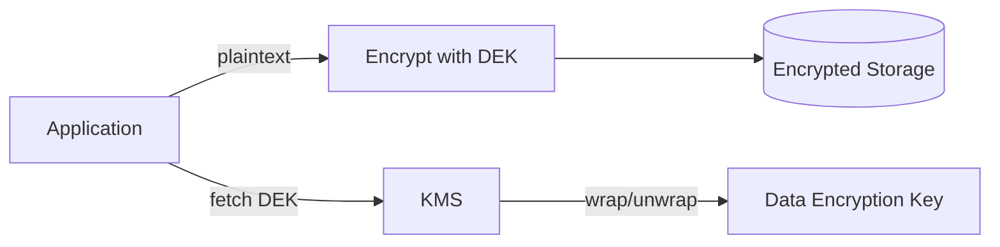

### Key details

- Cloud default: AES-256 volume encryption (AWS EBS, GCP PD)
- Field-level for PII/PCI columns
- Encrypt backups and snapshots
- Key rotation without re-encrypting all data (envelope encryption)

### When to use

- All production databases and object stores
- Laptops and portable media
- Backup and archive systems

### Trade-offs

| Pros | Cons |
|------|------|
| Protects data if media stolen | Key management complexity |
| Compliance requirement | Performance overhead (usually small) |
| Layered defense | Encrypted data still visible to authorized apps |

### References

- [AWS Encryption at Rest](https://docs.aws.amazon.com/whitepapers/latest/kms-best-practices/encryption-at-rest.html)

---


## 10.10 Encryption in Transit


### What is it

Encrypting data while moving across networks - TLS/SSL for HTTP, mTLS for service-to-service, VPN/IPsec for network tunnels.

### Why it matters

Unencrypted traffic is readable by anyone on the path (ISP, compromised Wi-Fi, malicious insider). Transit encryption prevents eavesdropping and tampering.

### How it works

TLS handshake negotiates cipher suite, authenticates server (certificate), establishes session keys. Application data encrypted symmetrically. **mTLS** adds client certificate for mutual authentication. Internal meshes (Istio) automate mTLS between pods.

### Diagram  -  Encryption in Transit

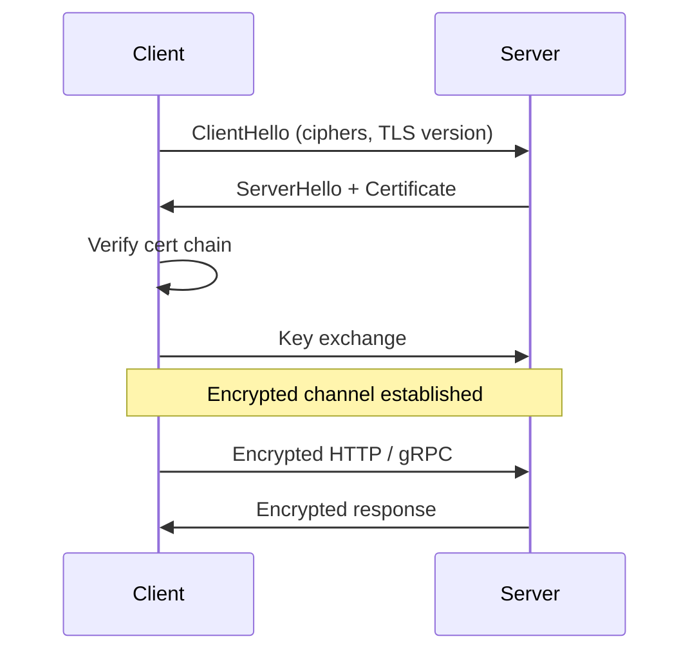

### Key details

- TLS 1.2+ only; prefer TLS 1.3
- HSTS for browsers; certificate auto-renewal (Let's Encrypt, cert-manager)
- mTLS for zero-trust service communication
- Terminate TLS at gateway or end-to-end through mesh

### When to use

- All public and internal HTTP/gRPC
- Database connections over untrusted networks
- Cross-region and cross-cloud replication links

### Trade-offs

| Pros | Cons |
|------|------|
| Confidentiality + integrity | CPU overhead (mitigated by TLS 1.3) |
| User and regulator expectation | Certificate lifecycle management |
| mTLS strong service identity | Debugging encrypted traffic harder |

### References

- [Mozilla SSL Configuration Generator](https://ssl-config.mozilla.org/)
- [Let's Encrypt](https://letsencrypt.org/)

---


## 10.11 KMS


### What is it

**Key Management Service** - managed system for creating, storing, rotating, and using cryptographic keys with hardware security module (HSM) backing.

### Why it matters

Rolling your own key management is error-prone. Cloud KMS provides FIPS-compliant key storage, fine-grained IAM, audit logs, and envelope encryption patterns at scale.

### How it works

Create CMK (customer master key) in KMS. Application calls `Encrypt`/`Decrypt` or uses envelope encryption: KMS wraps DEK; app encrypts data locally with DEK. IAM policies control who can use which keys. Cloud services (S3, RDS) integrate natively.

### Diagram

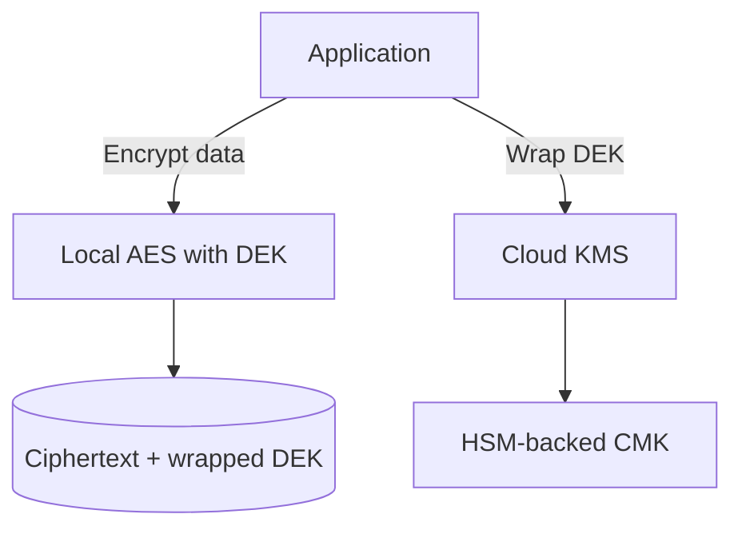

### Key details

- AWS KMS, GCP Cloud KMS, Azure Key Vault
- Automatic key rotation for CMKs (annual)
- Separate keys per environment and data classification
- CloudTrail/audit logs for every key use

### When to use

- Encryption at rest for cloud resources
- Application-level envelope encryption
- Signing and verification (asymmetric keys)

### Trade-offs

| Pros | Cons |
|------|------|
| HSM-grade security | Per-API-call cost and latency |
| Integrated with cloud services | Vendor lock-in |
| Compliance certifications | KMS outage blocks decrypt |

### References

- [AWS KMS Best Practices](https://docs.aws.amazon.com/kms/latest/developerguide/best-practices.html)

---


## 10.12 Secret Management


### What is it

Secure storage, distribution, rotation, and audit of sensitive values - API keys, DB passwords, certificates, encryption keys - not hardcoded in source or config.

### Why it matters

Leaked secrets in Git are a top breach vector. Centralized secret management enables rotation, access control, and audit without redeploying entire applications.

### How it works

Secrets stored in a vault (HashiCorp Vault, AWS Secrets Manager, K8s Secrets + external secrets operator). Apps fetch at runtime via IAM-authenticated API or injected as env/volume mounts. Rotation updates vault; apps reload or restart.

### Diagram

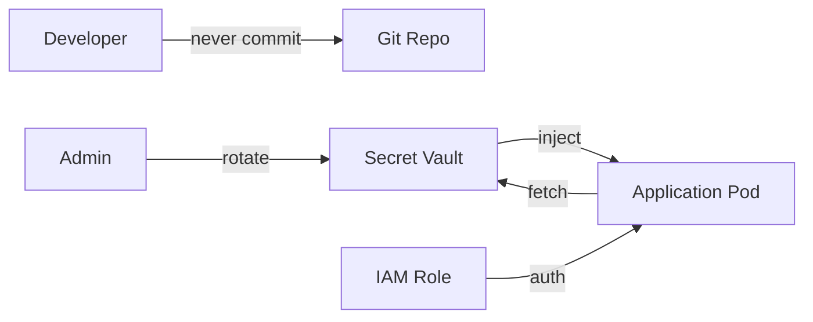

### Key details

- Never commit secrets; scan repos (gitleaks, trufflehog)
- Short-lived credentials over long-lived API keys
- K8s Secrets are base64, not encrypted by default - use Sealed Secrets or ESO
- Audit every secret access

### When to use

- Every production environment
- CI/CD pipeline credentials
- Database and third-party API keys

### Trade-offs

| Pros | Cons |
|------|------|
| Central rotation and audit | Vault becomes critical dependency |
| Removes secrets from code | Operational complexity |
| Dynamic secrets possible | Misconfigured IAM leaks access |

### References

- [HashiCorp Vault](https://developer.hashicorp.com/vault/docs)
- [OWASP Secrets Management](https://cheatsheetseries.owasp.org/cheatsheets/Secrets_Management_Cheat_Sheet.html)

---


## 10.13 CSRF


### What is it

**Cross-Site Request Forgery** - an attack tricking a logged-in user's browser into submitting unwanted requests to a site where they are authenticated.

### Why it matters

If session cookies are sent automatically, a malicious page can trigger state-changing actions (transfer funds, change email) without the user's intent.

### How it works

Attacker hosts page with hidden form/IMG to `bank.com/transfer`. Victim's browser includes session cookie. Server sees valid session and executes action. Defenses: CSRF tokens (synchronizer token), `SameSite` cookies, double-submit cookie, custom headers for APIs.

### Diagram

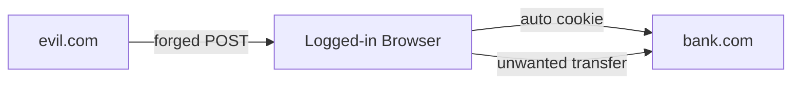

### Key details

- CSRF token in forms + validate server-side
- `SameSite=Lax` or `Strict` on session cookies
- APIs using Bearer tokens (not cookies) are less vulnerable
- Reject state-changing GET requests

### When to use defenses

- Cookie-based session web apps
- Any state-changing endpoint without additional auth proof

### Trade-offs

| Defense | Pros | Cons |
|---------|------|------|
| CSRF token | Strong | Must integrate all forms |
| SameSite cookie | Simple | Breaks some cross-site flows |
| Custom header | Good for SPAs | Requires JavaScript |

### References

- [OWASP CSRF Prevention](https://cheatsheetseries.owasp.org/cheatsheets/Cross-Site_Request_Forgery_Prevention_Cheat_Sheet.html)

---


## 10.14 XSS


### What is it

**Cross-Site Scripting** - injecting malicious JavaScript into pages viewed by other users, executing in the victim's browser with their session context.

### Why it matters

XSS enables session theft, keylogging, defacement, and worm propagation. It is consistently in the OWASP Top 10.

### How it works

**Stored XSS:** malicious script saved in DB (comment field), served to all viewers. **Reflected XSS:** script in URL parameter echoed in response. **DOM XSS:** client-side JS writes untrusted input to DOM. Defense: output encoding, CSP, input validation, HttpOnly cookies.

### Diagram

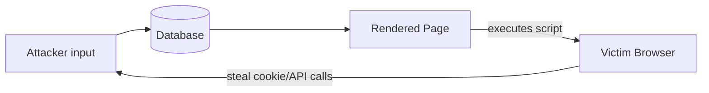

### Key details

- Context-aware encoding (HTML, JS, URL, CSS)
- Content-Security-Policy: `script-src 'self'`
- DOMPurify for rich text
- Never use `innerHTML` with user data

### When to use defenses

- Any user-generated content display
- Search boxes, error messages reflecting input
- Rich text editors

### Trade-offs

| Pros of CSP | Cons |
|-------------|------|
| Strong mitigation | Hard to configure with third-party scripts |
| Browser-enforced | Legacy apps may break |

### References

- [OWASP XSS Prevention](https://cheatsheetseries.owasp.org/cheatsheets/Cross_Site_Scripting_Prevention_Cheat_Sheet.html)

---


## 10.15 SQL Injection


### What is it

Inserting malicious SQL into application queries via unsanitized user input, allowing attackers to read, modify, or delete database data.

### Why it matters

SQLi can exfiltrate entire databases, bypass authentication, and execute admin operations - one of the most damaging and common injection flaws.

### How it works

Input like `' OR '1'='1` appended to query string changes logic. Attackers use UNION SELECT, blind timing attacks, or stacked queries. Defense: **parameterized queries/prepared statements** - never concatenate user input into SQL.

### Diagram

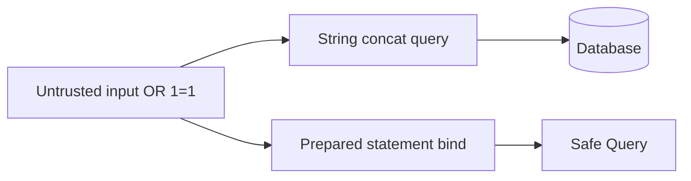

### Key details

- Parameterized queries in every DB call
- ORMs still require parameterization for raw queries
- Least-privilege DB accounts (no DROP for app user)
- WAF as secondary defense, not primary

### When to use defenses

- Every SQL-touching application - no exceptions

### Trade-offs

| Pros | Cons |
|------|------|
| Parameterization is near-complete fix | Legacy dynamic SQL needs refactor |
| Low performance cost | ORM misuse can still inject |

### References

- [OWASP SQL Injection](https://owasp.org/www-community/attacks/SQL_Injection)

---


## 10.16 SSRF


### What is it

**Server-Side Request Forgery** - tricking a server into making HTTP requests to attacker-chosen URLs, often reaching internal services not exposed to the internet.

### Why it matters

SSRF bypasses firewalls: attack cloud metadata endpoints (`169.254.169.254`), internal admin panels, and Redis instances from a public-facing app.

### How it works

App fetches user-supplied URL (webhook preview, PDF generator). Attacker supplies `http://internal-service/admin` or cloud metadata URL. Server executes request with its network privileges. Defense: URL allowlists, block private IP ranges, disable redirects, network segmentation.

### Diagram

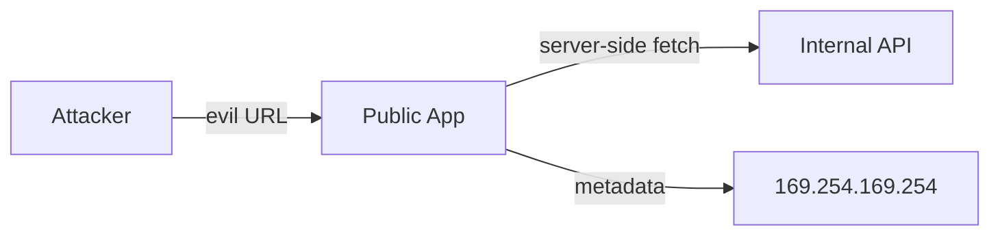

### Key details

- Block RFC1918, link-local, metadata IPs
- Validate URL scheme (http/https only)
- Separate fetch proxy with no internal routing
- IMDSv2 on AWS (session-oriented metadata)

### When to use defenses

- Any feature fetching user-provided URLs
- Webhook validators, import-from-URL, image proxies

### Trade-offs

| Pros | Cons |
|------|------|
| Network segmentation limits blast radius | Allowlists need maintenance |
| Metadata protection critical in cloud | Breaks legitimate internal integrations |

### References

- [OWASP SSRF](https://owasp.org/www-community/attacks/Server_Side_Request_Forgery)

---


## 10.17 Clickjacking


### What is it

Tricking users into clicking invisible or disguised UI elements by embedding your site in a transparent iframe on an attacker's page.

### Why it matters

Users believe they click "Win a prize" but actually confirm a bank transfer or change security settings on an embedded site.

### How it works

Attacker overlays iframe (opacity 0) over decoy buttons. User clicks thinking they interact with attacker's UI but click targets your framed page. Defense: `X-Frame-Options: DENY/SAMEORIGIN` or CSP `frame-ancestors 'none'`.

### Diagram

```mermaid
flowchart TB
    subgraph Attacker Page
        Fake[Fake Button]
        IFrame["Invisible iframe: yoursite.com"]
    end
    Fake -.->|overlay| IFrame
    User[User click] --> Fake
    User -->|actually clicks| IFrame
```

### Key details

- `Content-Security-Policy: frame-ancestors 'self'`
- `X-Frame-Options` for older browsers
- JavaScript frame-busting is unreliable
- Apply on all sensitive pages

### When to use defenses

- Banking, admin consoles, account settings
- Any page with sensitive click actions

### Trade-offs

| Pros | Cons |
|------|------|
| Simple header fix | Breaks legitimate embedding (widgets) |
| Browser-enforced | Must allowlist partners if framing needed |

### References

- [OWASP Clickjacking](https://cheatsheetseries.owasp.org/cheatsheets/Clickjacking_Defense_Cheat_Sheet.html)

---


## 10.18 DDoS Protection


### What is it

Defenses against **Distributed Denial of Service** attacks - overwhelming systems with traffic volume to exhaust bandwidth, connections, or compute.

### Why it matters

DDoS causes outage and revenue loss without traditional "hacking." Attack surface grows with every public endpoint and DNS name.

### How it works

Multi-layer: **network** (BGP scrubbing, anycast absorption), **CDN/edge** (rate limit, challenge, cache static), **application** (connection limits, autoscaling), **WAF** (block attack patterns). Cloud providers: AWS Shield, Cloudflare, Azure DDoS Protection.

### Diagram

```mermaid
flowchart LR
    Bots[Attack Traffic] --> Scrub[Scrubbing Center / CDN]
    Scrub -->|clean traffic| Origin[Origin Servers]
    Scrub -->|drop| Block[Blocked]
```

### Key details

- Anycast + global edge absorbs volumetric attacks
- Rate limiting per IP/API key
- Autoscale handles flash crowds; DDoS exceeds scale - need scrubbing
- Runbooks for L3/L4 vs L7 attacks

### When to use

- All internet-facing services
- Critical during product launches and elections

### Trade-offs

| Pros | Cons |
|------|------|
| Maintains availability | Cost scales with attack size |
| Managed services reduce ops | False positives block legit users |
| Layered defense | Origin IP exposure bypasses CDN |

### References

- [AWS DDoS Best Practices](https://docs.aws.amazon.com/whitepapers/latest/aws-best-practices-ddos-resiliency/welcome.html)

---


## 10.19 WAF


### What is it

**Web Application Firewall** - inspects HTTP/HTTPS traffic and blocks requests matching known attack signatures or custom rules (OWASP Core Rule Set).

### Why it matters

WAF filters SQLi, XSS, and bot traffic at the edge before it reaches application code - defense in depth for apps not yet fully hardened.

### How it works

Reverse proxy or CDN integration evaluates request URI, headers, body against rules. Actions: allow, block, challenge (CAPTCHA), log. Managed rules updated by vendor; custom rules for app-specific paths. ModSecurity is open-source reference.

### Diagram

```mermaid
flowchart LR
    Client[Client] --> WAF[WAF]
    WAF -->|allow| App[Application]
    WAF -->|block| Log[Security Log]
    Rules[Rule Sets / OWASP CRS] --> WAF
```

### Key details

- AWS WAF, Cloudflare, Azure Front Door, ModSecurity
- Start in count/log mode before block
- Tune false positives per application
- Complement - not replace - secure coding

### When to use

- Public web apps and APIs
- Compliance requirements (PCI)
- Temporary mitigation during vulnerability response

### Trade-offs

| Pros | Cons |
|------|------|
| Blocks known attacks quickly | False positives break clients |
| Managed rule updates | Cannot understand business logic |
| Edge enforcement | Added latency (small) |

### References

- [OWASP Core Rule Set](https://coreruleset.org/)

---


## 10.20 Zero Trust Security


### What is it

Security model assuming **no implicit trust** based on network location - every user, device, and service must authenticate and authorize every access attempt.

### Why it matters

Perimeter VPN models fail when attackers breach the network or workloads move to cloud/multi-cloud. Zero Trust limits lateral movement.

### How it works

Verify identity (MFA), device health, and context for each request. Micro-segmentation restricts east-west traffic. mTLS between services. Policy engine (ABAC) decides access. No "trusted internal network" - treat all traffic as hostile.

### Diagram

```mermaid
flowchart TB
    User[User + Device] -->|MFA + posture| ZTNA[Zero Trust Gateway]
    SvcA[Service A] -->|mTLS + policy| SvcB[Service B]
    ZTNA -->|authorized only| App[Application]
    Policy[Policy Engine] --> ZTNA & SvcA & SvcB
```

### Key details

- Principles: verify explicitly, least privilege, assume breach
- Identity-centric over network-centric
- Continuous validation, not one-time VPN login
- Google BeyondCorp, ZTNA vendors, service mesh mTLS

### When to use

- Remote workforce without VPN-to-trust
- Multi-cloud and microservices
- High-sensitivity data environments

### Trade-offs

| Pros | Cons |
|------|------|
| Limits lateral movement | Implementation complexity |
| Fine-grained access | User friction |
| Cloud-native fit | Legacy apps need agents/proxies |

### References

- [NIST Zero Trust Architecture](https://csrc.nist.gov/publications/detail/sp/800-207/final)

---


## 10.21 Audit Logging


### What is it

Tamper-evident records of security-relevant events - authentication, authorization decisions, admin actions, data access - for compliance and forensic investigation.

### Why it matters

Without audit logs, breaches are undetectable and non-repudiation is impossible. Regulators (SOC2, HIPAA, PCI) require provable access trails.

### How it works

Applications emit structured audit events (`who`, `what`, `when`, `resource`, `outcome`) to append-only storage (WORM, centralized SIEM). Separate from debug logs. Restrict access; alert on sensitive actions (role grants, bulk export).

### Diagram

```mermaid
flowchart LR
    App[Applications] --> Audit[Audit Log Stream]
    Admin[Admin Actions] --> Audit
    IAM[IAM Events] --> Audit
    Audit --> SIEM[SIEM / Immutable Store]
    SIEM --> Alert[Security Alerts]
    SIEM --> Compliance[Compliance Reports]
```

### Key details

- Include: actor, action, target, timestamp, source IP, result
- Immutable or WORM storage; separate retention from app logs
- Integrate CloudTrail, Azure Activity Log, app-level events
- Never log secrets or full PII in audit entries

### When to use

- Admin and privileged operations
- Authentication failures and lockouts
- Data export, deletion, permission changes

### Trade-offs

| Pros | Cons |
|------|------|
| Forensics and compliance | Storage and ingestion cost |
| Deters insider abuse | Must protect logs from tampering |
| Incident reconstruction | PII in audit logs is itself sensitive |

### References

- [OWASP Logging Cheat Sheet](https://cheatsheetseries.owasp.org/cheatsheets/Logging_Cheat_Sheet.html)

---


## Quick Reference

| # | Topic | Summary |
|---|-------|---------|
| 10.1 | Authentication | Authentication |
| 10.2 | Authorization | Authorization |
| 10.3 | OAuth2 | OAuth2 |
| 10.4 | OpenID Connect | OpenID Connect |
| 10.5 | JWT | JWT |
| 10.6 | Session Management | Session Management |
| 10.7 | RBAC | RBAC |
| 10.8 | ABAC | ABAC |
| 10.9 | Encryption at Rest | Encryption at Rest |
| 10.10 | Encryption in Transit | Encryption in Transit |
| 10.11 | KMS | KMS |
| 10.12 | Secret Management | Secret Management |
| 10.13 | CSRF | CSRF |
| 10.14 | XSS | XSS |
| 10.15 | SQL Injection | SQL Injection |
| 10.16 | SSRF | SSRF |
| 10.17 | Clickjacking | Clickjacking |
| 10.18 | DDoS Protection | DDoS Protection |
| 10.19 | WAF | WAF |
| 10.20 | Zero Trust Security | Zero Trust Security |
| 10.21 | Audit Logging | Audit Logging |

---

[â -  Back to master index](../README.md)
