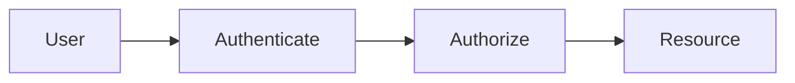
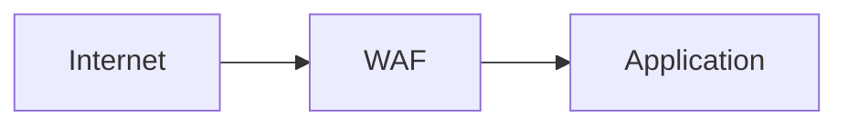

# 10. Security

> Status: **Documented** — cheat-sheet reference for all sub-topics below.

[← Back to master index](../README.md)

---

## Sub-topics

| # | Sub-topic | Status |
|---|-----------|--------|
| 10.1 | [Authentication](#101-authentication) | Done |
| 10.2 | [Authorization](#102-authorization) | Done |
| 10.3 | [OAuth2](#103-oauth2) | Done |
| 10.4 | [OpenID Connect](#104-openid-connect) | Done |
| 10.5 | [JWT](#105-jwt) | Done |
| 10.6 | [Session Management](#106-session-management) | Done |
| 10.7 | [RBAC](#107-rbac) | Done |
| 10.8 | [ABAC](#108-abac) | Done |
| 10.9 | [Encryption at Rest](#109-encryption-at-rest) | Done |
| 10.10 | [Encryption in Transit](#1010-encryption-in-transit) | Done |
| 10.11 | [Secret Management](#1011-secret-management) | Done |
| 10.12 | [KMS](#1012-kms) | Done |
| 10.13 | [CSRF](#1013-csrf) | Done |
| 10.14 | [XSS](#1014-xss) | Done |
| 10.15 | [SQL Injection](#1015-sql-injection) | Done |
| 10.16 | [SSRF](#1016-ssrf) | Done |
| 10.17 | [Clickjacking](#1017-clickjacking) | Done |
| 10.18 | [DDoS Protection](#1018-ddos-protection) | Done |
| 10.19 | [WAF](#1019-waf) | Done |
| 10.20 | [Zero Trust Security](#1020-zero-trust-security) | Done |
| 10.21 | [Audit Logging](#1021-audit-logging) | Done |

---

## Overview

Security layers identity, access control, encryption, and threat mitigation across every boundary — assume breach, verify everything.

---

## 10.1 Authentication

**Summary:** Verify identity — who is this user or service? First gate before any access decision.

- **Factors** — something you know (password), have (TOTP), are (biometric)
- **MFA** — require two factors for sensitive operations
- **Service auth** — mTLS, API keys, workload identity for machine-to-machine

---

## 10.2 Authorization

**Summary:** Determine what an authenticated identity can do. Separate from authentication; both are required.

- **Least privilege** — minimum permissions needed
- **Fail closed** — deny by default
- **Check at every layer** — gateway + service + data row

---

## 10.3 OAuth2

**Summary:** Delegated authorization framework — apps access resources on behalf of users without sharing passwords. Authorization server issues tokens.

- **Flows** — Authorization Code (+ PKCE for SPAs), Client Credentials (M2M)
- **Scopes** — limit what token can access
- **Not authentication** — use OIDC for identity; OAuth2 is authorization

---

## 10.4 OpenID Connect

**Summary:** Identity layer on top of OAuth2. Returns ID token (JWT) with user claims; standard for SSO and social login.

- **ID token** — who the user is (claims: sub, email, name)
- **UserInfo endpoint** — fetch additional profile data
- **Discovery** — `/.well-known/openid-configuration`

---

## 10.5 JWT

**Summary:** Self-contained signed token (header.payload.signature) carrying claims. Stateless auth; verify signature and expiry on every request.

- **Don't store secrets in JWT** — payload is Base64, not encrypted
- **Short expiry** — access token minutes; refresh token longer
- **Validate** — signature, `exp`, `iss`, `aud`; revoke via blocklist if needed

---

## 10.6 Session Management

**Summary:** Server-side state tracking authenticated users via session ID cookie. Alternative to stateless JWT for traditional web apps.

- **Secure cookie** — `HttpOnly`, `Secure`, `SameSite=Strict`
- **Rotation** — regenerate session ID on login/privilege change
- **Timeout** — idle and absolute session expiry

---

## 10.7 RBAC

**Summary:** Role-Based Access Control — permissions assigned to roles; users get roles. Simple, widely used (admin, editor, viewer).

- **Role explosion** — many roles become hard to manage
- **Static** — coarse-grained; good for admin panels
- **Implementation** — Spring Security, AWS IAM roles

---

## 10.8 ABAC

**Summary:** Attribute-Based Access Control — policies evaluate attributes of user, resource, action, and environment. Fine-grained and dynamic.

- **Policy language** — OPA/Rego, XACML, Cedar
- **Example** — "owner can edit if `resource.ownerId == user.id`"
- **Flexible** — handles complex enterprise rules RBAC can't

---

## 10.9 Encryption at Rest

**Summary:** Encrypt stored data (DB, disks, backups) so physical theft or snapshot leak doesn't expose plaintext.

- **AES-256** — standard symmetric encryption
- **Envelope encryption** — data key encrypted by KMS master key
- **TDE** — Transparent Data Encryption in managed databases

---

## 10.10 Encryption in Transit

**Summary:** Encrypt data over the network with TLS 1.2+. Prevents eavesdropping and MITM attacks.

- **HTTPS everywhere** — no plain HTTP in production
- **mTLS** — mutual TLS for service-to-service auth
- **HSTS** — force HTTPS in browsers

---

## 10.11 Secret Management

**Summary:** Secure storage, rotation, and injection of credentials, API keys, and certificates. Never commit secrets to Git.

- **Vaults** — HashiCorp Vault, AWS Secrets Manager, K8s Secrets
- **Rotation** — automated key rotation on schedule
- **Injection** — env vars or mounted files at runtime, not in images

---

## 10.12 KMS

**Summary:** Key Management Service — centralized creation, storage, rotation, and audit of encryption keys. Hardware-backed (HSM) in cloud KMS.

- **CMK** — Customer Master Key never leaves HSM
- **Envelope** — KMS encrypts data keys; app encrypts data locally
- **Audit** — CloudTrail logs every key usage

---

## 10.13 CSRF

**Summary:** Cross-Site Request Forgery — attacker tricks authenticated user's browser into making unwanted requests. Mitigate with tokens and SameSite cookies.

- **CSRF token** — unique per session, validated server-side
- **SameSite cookies** — block cross-origin cookie submission
- **State-changing ops** — never use GET for mutations

---

## 10.14 XSS

**Summary:** Cross-Site Scripting — inject malicious scripts into pages viewed by other users. Steals cookies, sessions, and data.

- **Output encoding** — escape HTML/JS in user content
- **CSP** — Content Security Policy restricts script sources
- **HttpOnly cookies** — JS can't read session cookie

---

## 10.15 SQL Injection

**Summary:** Attacker injects SQL via unsanitized input. Can read, modify, or delete entire database.

- **Parameterized queries** — always; never string-concat SQL
- **ORM** — use bound parameters, not raw queries
- **Least privilege DB user** — app user can't DROP TABLE

---

## 10.16 SSRF

**Summary:** Server-Side Request Forgery — attacker makes server fetch internal URLs (metadata, admin panels). Common in webhooks and URL preview features.

- **Allowlist destinations** — block private IP ranges (169.254.x, 10.x)
- **No raw user URLs** — validate and resolve DNS before fetch
- **Network segmentation** — metadata service not reachable from app tier

---

## 10.17 Clickjacking

**Summary:** Invisible iframe overlays trick users into clicking hidden buttons. Mitigate with frame-busting headers.

- **X-Frame-Options** — `DENY` or `SAMEORIGIN`
- **CSP frame-ancestors** — modern replacement
- **UI confirmation** — sensitive actions need explicit confirm

---

## 10.18 DDoS Protection

**Summary:** Defend against volumetric and application-layer floods that exhaust bandwidth or compute. Multi-layer defense at edge and origin.

- **CDN/scrubbing** — Cloudflare, AWS Shield absorb volumetric attacks
- **Rate limiting** — per-IP and per-user caps
- **Auto-scaling** — absorb moderate spikes; not sufficient alone

---

## 10.19 WAF

**Summary:** Web Application Firewall inspects HTTP traffic and blocks known attack patterns (SQLi, XSS, bad bots). Rules + managed rule sets.

- **OWASP Core Rule Set** — common attack signatures
- **Custom rules** — block by geo, path, header
- **False positives** — tune rules; monitor blocked requests

---

## 10.20 Zero Trust Security

**Summary:** Never trust, always verify — no implicit trust based on network location. Every request authenticated, authorized, and encrypted.

- **Micro-segmentation** — no flat internal network
- **Identity-centric** — user + device + context per access
- **Continuous verification** — not just perimeter firewall

---

## 10.21 Audit Logging

**Summary:** Immutable record of security-relevant actions (login, permission change, data access). Required for compliance and forensics.

- **Who, what, when, where** — actor, action, timestamp, source IP
- **Tamper-evident** — append-only store, separate from app logs
- **Retention** — meet regulatory requirements (SOC2, GDPR, HIPAA)

---

## Quick Reference

| Layer | Mechanism | Threat mitigated |
|-------|-----------|------------------|
| Identity | OAuth2 + OIDC + JWT | Unauthorized access |
| Sessions | Secure cookies, rotation | Session hijacking |
| Access | RBAC / ABAC | Privilege escalation |
| Data at rest | AES + KMS | Disk/snapshot theft |
| Data in transit | TLS 1.2+ / mTLS | Eavesdropping, MITM |
| Secrets | Vault, rotation | Credential leak |
| Input attacks | Parameterized SQL, encoding | SQLi, XSS |
| Request forgery | CSRF tokens, SameSite | Cross-site actions |
| Server abuse | SSRF allowlists | Internal network probe |
| UI attacks | X-Frame-Options, CSP | Clickjacking |
| Flood | CDN, rate limit, WAF | DDoS |
| Architecture | Zero trust | Lateral movement |
| Compliance | Audit logs | Non-repudiation |
