# 11. Cloud & Kubernetes

[<- Back to master index](../README.md)

---

## Overview

Cloud computing delivers compute, storage, and networking on demand across **IaaS**, **PaaS**, and **SaaS** models. Production systems run in **regions** and **availability zones**, inside **VPCs**, with managed storage, databases, and autoscaling.

**Kubernetes** orchestrates containers at scale — packaging apps in **Docker** images, scheduling **pods** on nodes, exposing **services** and **ingress**, and automating rollouts, configuration, and scaling.

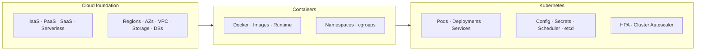

---

## Sub-topics

| # | Sub-topic |
|---|-----------|
| 11.1 | [IaaS](#111-iaas) |
| 11.2 | [PaaS](#112-paas) |
| 11.3 | [SaaS](#113-saas) |
| 11.4 | [Serverless](#114-serverless) |
| 11.5 | [Regions](#115-regions) |
| 11.6 | [Availability Zones](#116-availability-zones) |
| 11.7 | [Multi Region Deployment](#117-multi-region-deployment) |
| 11.8 | [VPC](#118-vpc) |
| 11.9 | [Cloud Networking](#119-cloud-networking) |
| 11.10 | [Cloud Storage](#1110-cloud-storage) |
| 11.11 | [Managed Databases](#1111-managed-databases) |
| 11.12 | [Autoscaling](#1112-autoscaling) |
| 11.13 | [Docker](#1113-docker) |
| 11.14 | [Container Runtime](#1114-container-runtime) |
| 11.15 | [Container Images](#1115-container-images) |
| 11.16 | [Image Layers](#1116-image-layers) |
| 11.17 | [Namespaces](#1117-namespaces) |
| 11.18 | [cgroups](#1118-cgroups) |
| 11.19 | [Kubernetes](#1119-kubernetes) |
| 11.20 | [Pods](#1120-pods) |
| 11.21 | [ReplicaSets](#1121-replicasets) |
| 11.22 | [Deployments](#1122-deployments) |
| 11.23 | [Services](#1123-services) |
| 11.24 | [Ingress](#1124-ingress) |
| 11.25 | [StatefulSets](#1125-statefulsets) |
| 11.26 | [DaemonSets](#1126-daemonsets) |
| 11.27 | [Jobs](#1127-jobs) |
| 11.28 | [CronJobs](#1128-cronjobs) |
| 11.29 | [ConfigMaps](#1129-configmaps) |
| 11.30 | [Secrets](#1130-secrets) |
| 11.31 | [Scheduler](#1131-scheduler) |
| 11.32 | [etcd](#1132-etcd) |
| 11.33 | [Operators](#1133-operators) |
| 11.34 | [HPA](#1134-hpa) |
| 11.35 | [Cluster Autoscaler](#1135-cluster-autoscaler) |

---

## 11.1 IaaS

### What is IaaS?

**IaaS (Infrastructure as a Service)** is a cloud model where the provider supplies computing infrastructure — virtual machines, storage, networking, and security resources. The user installs and manages the operating system, applications, and data.

**Simple idea:** instead of buying physical servers, rent virtual servers from a cloud provider.

### Responsibility

**Cloud provider manages:**

- Physical servers
- Data centers
- Networking
- Storage hardware
- Virtualization layer

**User manages:**

- Operating system
- Runtime
- Middleware
- Applications
- Data
- Security configuration

### Architecture

```text
User → OS + runtime + apps → Virtual Machine → Hypervisor → Physical infrastructure → Cloud provider
```

### Advantages

- No need to purchase hardware
- Easy to increase or decrease resources
- Pay only for what is used
- High availability
- Faster server provisioning

### Disadvantages

- User manages operating systems
- User responsible for software updates
- Security configuration is user's responsibility
- Requires system administration knowledge

### Examples

- Amazon EC2
- Google Compute Engine
- Azure Virtual Machines
- DigitalOcean Droplets

### Use cases

- Hosting web applications
- Development environments
- Disaster recovery
- Backup servers
- Big data processing
- Gaming servers

### Summary

```text
IaaS = rent VMs and infrastructure; you manage OS through applications
Maximum control and flexibility; highest ops burden on your team
```

---

## 11.2 PaaS

### What is PaaS?

**PaaS (Platform as a Service)** provides a complete development platform. The provider manages infrastructure, OS, runtime, middleware, and development tools. The user focuses on writing and deploying applications.

**Simple idea:** write code and deploy it without worrying about servers.

### Responsibility

**Cloud provider manages:**

- Servers
- Storage
- Networking
- Operating system
- Runtime
- Middleware
- Scaling
- Load balancing

**User manages:**

- Application code
- Application configuration
- Data

### Architecture

```text
User code → Runtime environment → Operating system → Virtual infrastructure → Physical infrastructure → Cloud provider
```

### Advantages

- Faster application development
- No server management
- Automatic scaling
- Built-in deployment tools
- Lower maintenance

### Disadvantages

- Less infrastructure control
- Vendor dependency
- Limited customization
- Platform restrictions

### Examples

- Google App Engine
- Azure App Service
- Heroku
- Red Hat OpenShift

### Use cases

- Web applications
- REST APIs
- Mobile backends
- Microservices
- Rapid application development

### Summary

```text
PaaS = provider runs the platform; you deploy code and config
Faster delivery; less control over OS and infrastructure
```

---

## 11.3 SaaS

### What is SaaS?

**SaaS (Software as a Service)** delivers complete software over the internet. Users access it through a browser or mobile app. Everything is managed by the cloud provider.

**Simple idea:** use software directly without installing or maintaining it.

### Responsibility

**Cloud provider manages:**

- Infrastructure
- Operating system
- Runtime
- Applications
- Security
- Updates
- Backup
- Maintenance

**User manages:**

- User data
- Account settings
- Application usage

### Architecture

```text
User → Web browser / app → SaaS application → Cloud infrastructure → Cloud provider
```

### Advantages

- No installation
- Automatic updates
- Accessible from anywhere
- Low maintenance
- Subscription based

### Disadvantages

- Limited customization
- Internet dependency
- Vendor lock-in
- Less control over software

### Examples

- Gmail
- Microsoft 365
- Salesforce
- Slack
- Zoom
- Dropbox

### Use cases

- Email
- Document editing
- Team collaboration
- Customer relationship management
- Video conferencing

### IaaS vs PaaS vs SaaS

| Feature | IaaS | PaaS | SaaS |
|---------|------|------|------|
| **Infrastructure** | User | Provider | Provider |
| **Operating system** | User | Provider | Provider |
| **Runtime** | User | Provider | Provider |
| **Middleware** | User | Provider | Provider |
| **Applications** | User | User | Provider |
| **Data** | User | User | User |
| **Server management** | Yes | No | No |
| **Customization** | High | Medium | Low |
| **Ease of use** | Low | Medium | High |

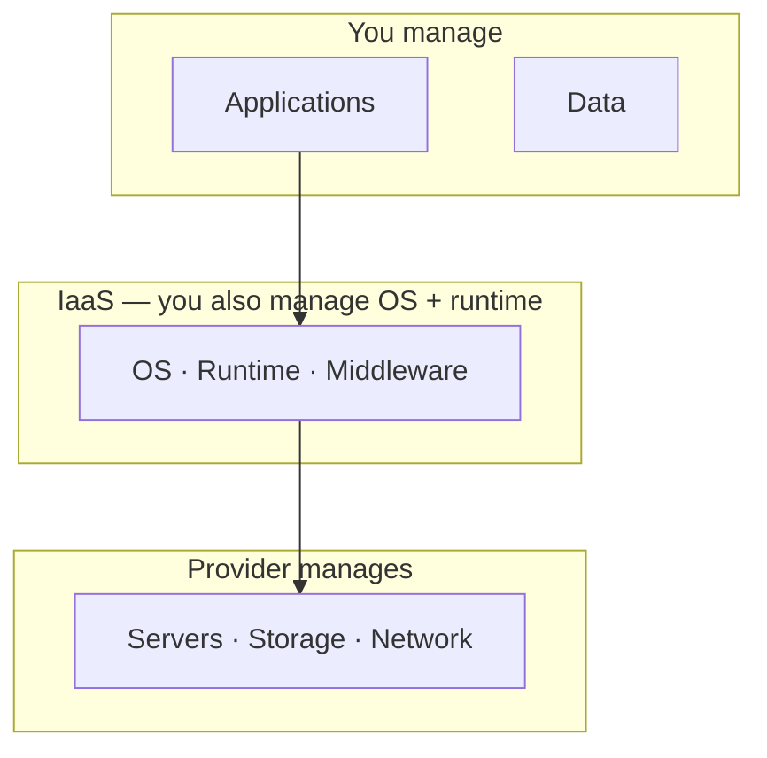

### Summary

```text
SaaS = use ready-made software over the internet; provider runs everything
Lowest ops burden; least customization and control
```

---

## 11.4 Serverless

### What is serverless?

**Serverless computing** is a cloud model where developers write and deploy code without managing servers.

The cloud provider automatically handles:

- Server provisioning
- Infrastructure management
- Scaling
- Load balancing
- Maintenance
- Patching

Even though the name is "serverless," servers still exist — developers do not manage them.

**Simple idea:** write code, deploy it, the cloud provider runs it whenever needed.

### How it works

```text
User request → cloud provider receives request → starts required resources → executes code → returns response → resources stop when idle
```

### Characteristics

- No server management
- Automatic scaling
- Pay only when code runs
- Event-driven execution
- High availability
- Fast deployment

### Responsibility

**Cloud provider manages:**

- Physical servers
- Virtual machines
- Operating system
- Runtime
- Networking
- Scaling
- Monitoring
- Security patching

**User manages:**

- Application code
- Business logic
- Configuration
- Data

### Architecture

```text
User → HTTP request / event → Serverless platform (auto-scales) → Function execution → Database / storage
```

### Common event sources

- HTTP requests
- File upload
- Database changes
- Message queue
- Scheduled jobs
- API calls
- Email events
- IoT devices

### Execution flow

```text
Client → HTTP request → serverless platform → create function instance (if needed) → execute function → access database/storage → return response → function stops
```

### Scaling

**Traditional server:**

```text
Users increase → administrator adds more servers
```

**Serverless:**

```text
Users increase → cloud provider automatically creates more function instances
```

No manual scaling is required.

### Cold start

If no function instance is running, the provider creates a new one. The first request may take slightly longer — this is a **cold start**.

**Request 1 (cold):** start new function → initialization → execute code → higher response time

**Request 2 (warm):** existing function → execute code → lower response time

### Warm start

If a function is already running, incoming requests use the existing instance.

**Benefits:** faster execution · lower latency · no initialization delay

### Stateless nature

Each function execution should be independent. Functions should not rely on data stored in memory from previous executions.

Persistent data should be stored in:

- Database
- Cache
- Object storage

### Advantages

- No infrastructure management
- Automatic scaling
- Pay only for execution time
- High availability
- Faster deployment
- Reduced operational overhead
- Easy integration with cloud services

### Disadvantages

- Cold start latency
- Limited execution time
- Vendor lock-in
- Less control over infrastructure
- Debugging can be more difficult
- Not ideal for long-running applications

### Common use cases

- REST APIs
- Image processing
- File upload processing
- Notification systems
- Scheduled tasks
- Data processing
- Event-driven applications
- Chatbots
- IoT applications
- Backend for mobile apps

### Examples

- AWS Lambda
- Azure Functions
- Google Cloud Functions
- Cloudflare Workers
- Vercel Functions
- Netlify Functions

### Serverless vs traditional servers

| Feature | Traditional server | Serverless |
|---------|-------------------|------------|
| **Server management** | User | Cloud provider |
| **Scaling** | Manual | Automatic |
| **Payment** | Running server | Execution time |
| **Idle cost** | Yes | No |
| **Infrastructure** | User | Cloud provider |
| **Deployment** | Server | Function |
| **Availability** | User managed | Provider managed |

### Function as a Service (FaaS)

**FaaS** is a type of serverless computing. Applications are divided into small independent functions.

Each function:

- Performs one task
- Runs only when triggered
- Stops after execution

**Example:**

```text
User uploads image → image upload event → resize image function → store processed image
```

One event triggers one function.

### Serverless vs Kubernetes

| Feature | Serverless | Kubernetes |
|---------|------------|------------|
| **Server management** | None | User / platform |
| **Scaling** | Automatic | Automatic |
| **Deployment unit** | Function | Pod |
| **Long-running apps** | Poor | Excellent |
| **Short tasks** | Excellent | Good |
| **Infrastructure** | Hidden | Visible |
| **Startup time** | Cold start possible | Usually faster |
| **Cost model** | Pay per execution | Pay for resources |
| **Control** | Low | High |

### When to use serverless

- APIs with unpredictable traffic
- Event-driven applications
- Automation scripts
- Scheduled jobs
- File processing
- Notification services
- Lightweight backend services

### When not to use serverless

- Long-running applications
- Applications requiring full server control
- High-performance workloads with strict latency requirements
- Applications needing custom OS configuration
- Software requiring persistent local state

### Summary

```text
Serverless = no server ops; provider runs functions on events, scales automatically
Pay per execution; watch cold starts and stateless design; FaaS = one function per task
```

---

## 11.5 Regions

### What is a region?

A **region** is a geographical area where a cloud provider operates one or more data centers.

Each region is physically separated from other regions and has its own infrastructure. A region places cloud services close to users to reduce latency and improve availability.

**Simple idea:** region = a geographical location containing multiple data centers.

### Example regions worldwide

```text
North America: US East · US West · Canada Central
Europe:        London · Frankfurt · Paris
Asia:          Mumbai · Singapore · Tokyo · Seoul
Australia:     Sydney · Melbourne
```

### Why multiple regions?

Cloud providers create multiple regions to:

- Reduce latency
- Improve availability
- Meet legal requirements
- Support disaster recovery
- Serve users around the world

### Architecture

```text
Cloud provider → Region A (Mumbai) + Region B (Singapore) + Region C (London) — each with multiple data centers
```

### How requests are served

```text
User in India  → nearest region (Mumbai)  → application → database
User in Europe → nearest region (London)   → application → database
```

Choosing the nearest region reduces response time.

### Benefits

- Lower latency
- Better user experience
- Fault isolation
- Disaster recovery
- Compliance with local regulations
- Higher availability

### Region failure

If one region becomes unavailable, traffic can shift to another region where the app is deployed.

```text
Before failure: Users → Mumbai region
After failure:  Users → Singapore region (failover)
```

Applications continue running when deployed across multiple regions.

### Single region deployment

```text
Users → Mumbai region
```

| Advantages | Disadvantages |
|------------|---------------|
| Simple architecture | Regional outage affects the application |
| Lower cost | Disaster recovery is limited |
| Easier management | |

### Multi-region deployment

```text
Users → Mumbai region | Singapore region → shared services
```

| Advantages | Disadvantages |
|------------|---------------|
| High availability | Higher cost |
| Disaster recovery | More complex architecture |
| Lower latency for global users | Data synchronization challenges |
| Better fault tolerance | |

### Region vs data center

| | Region | Data center |
|---|--------|-------------|
| **What** | Geographic location | Physical building |
| **Contains** | Multiple data centers | Servers |
| **Scope** | Independent | Part of a region |
| **Purpose** | Disaster recovery | Computing resources |

### Region vs availability zone

| | Region | Availability zone |
|---|--------|-------------------|
| **What** | Geographic area | Data center or group of data centers |
| **Contains** | Multiple availability zones | Exists inside a region |
| **Failure domain** | Large | Smaller |

### Common use cases

- Global web applications
- Disaster recovery
- Backup systems
- Content delivery
- Multi-region databases
- Business continuity
- Low-latency applications

### Summary

```text
Region = isolated geographic cloud footprint with multiple data centers
Pick nearest region for latency; multi-region for HA and DR at higher cost/complexity
```

---

## 11.6 Availability Zones

### What is an availability zone?

An **availability zone (AZ)** is one or more physically separate data centers within a cloud **region**.

Each availability zone has its own:

- Power supply
- Cooling system
- Networking

Availability zones are connected using high-speed, low-latency private networks.

**Simple idea:** region = geographic location · availability zone = independent data center (or group) inside a region.

### Example

```text
Region (Mumbai): AZ-1 · AZ-2 · AZ-3 — one region usually contains multiple availability zones
```

### Architecture

```text
Region → AZ-1 | AZ-2 | AZ-3 — each AZ has its own independent infrastructure
```

### Why availability zones?

Availability zones improve:

- High availability
- Fault tolerance
- Disaster recovery
- Reliability

If one AZ fails, applications can continue running in another zone.

### Single availability zone deployment

```text
Users → AZ-1 → application → database
```

**Problem:** if AZ-1 fails → application unavailable.

### Multi-availability zone deployment

```text
Users → load balancer → AZ-1 (application) + AZ-2 (application) → shared database
```

**If AZ-1 fails:** users → load balancer → AZ-2 → application — service continues.

### Benefits

- High availability
- Fault isolation
- Better reliability
- Automatic failover
- Reduced downtime
- Supports load balancing

### How load balancing works

```text
User requests → load balancer → Application 1 (AZ-1) + Application 2 (AZ-2)
```

Traffic is distributed across multiple availability zones.

### Database replication

```text
Primary database (AZ-1) → replication → secondary database (AZ-2)
```

If the primary fails, the secondary can take over.

### Failure example

```text
Before failure: Region → AZ-1 (app) + AZ-2 (app)
After AZ-1 fails: Region → AZ-2 (app) — users continue accessing the application
```

### Advantages

- Better uptime
- Fault tolerance
- Improved reliability
- Supports automatic recovery
- Lower risk of service interruption

### Disadvantages

- Higher infrastructure cost
- Data replication overhead
- More complex architecture

An availability zone sits inside a region and maps to one or more isolated data centers with independent power and networking.

### Common use cases

- Highly available web applications
- Database replication
- Kubernetes clusters
- Load-balanced applications
- Microservices
- Disaster recovery
- Production workloads

### Summary

```text
AZ = isolated data center(s) within a region with own power, cooling, and network
Deploy across multiple AZs + load balancer for HA; replicate databases across zones
```

---

## 11.7 Multi Region Deployment

### What is multi-region deployment?

**Multi-region deployment** is an architecture where an application runs across multiple cloud regions — two or more geographically separated locations — instead of a single region.

**Simple idea:** one application in multiple regions for higher availability, disaster recovery, and lower latency.

### Example

```text
Users worldwide → Mumbai region (application) + Singapore region (application)
If one region fails, the other continues serving users.
```

### Why multi-region deployment?

- High availability
- Disaster recovery
- Fault tolerance
- Global user support
- Lower latency
- Business continuity

### Single region deployment

```text
Users → Mumbai region → application → database
```

**Problem:** if Mumbai region fails → application unavailable.

### Multi-region deployment

```text
Users → Mumbai region (application + database) + Singapore region (application + database)
```

Application remains available even if one region becomes unavailable.

### Traffic routing

```text
Users → global DNS → Mumbai region | Singapore region
```

Global DNS directs users to the nearest or healthiest region.

### Latency improvement

```text
User in India        → Mumbai region
User in Southeast Asia → Singapore region
User in Europe       → London region
```

Users access the closest region, reducing network latency.

### Active-passive architecture

```text
Users → Mumbai region (active) → data replication → Singapore region (passive)
```

**Normal operation:** only Mumbai serves traffic.

**Failure:** if Mumbai fails → users → Singapore region (active).

| Advantages | Disadvantages |
|------------|---------------|
| Simpler architecture | Secondary region may stay underutilized |
| Lower cost | Failover may take time |
| Easier management | |

### Active-active architecture

```text
Users → global DNS → Mumbai region (active) + Singapore region (active)
```

Both regions handle traffic simultaneously.

| Advantages | Disadvantages |
|------------|---------------|
| Better performance | Complex architecture |
| Higher availability | More expensive |
| Faster failover | Data synchronization challenges |
| Better resource utilization | |

### Database replication

```text
Region A database → replication → region B database
```

**1. Synchronous replication**

```text
Write request → region A database → region B database → success response
```

**Characteristics:** strong consistency · higher latency · safer data storage

**2. Asynchronous replication**

```text
Write request → region A database → success response (region B updated later)
```

**Characteristics:** faster writes · lower latency · temporary inconsistency possible

### Failover process

```text
Normal:   Users → Mumbai region
Failure:  Traffic redirected → Users → Singapore region
```

This process is called **failover**.

### Challenges

| Challenge | Description |
|-----------|-------------|
| **Data consistency** | Keeping data synchronized across regions |
| **Network latency** | Cross-region communication is slower |
| **Operational complexity** | More infrastructure to manage |
| **Cost** | Multiple regions increase expenses |
| **Monitoring** | Requires global monitoring and alerting |

### Advantages

- High availability
- Disaster recovery
- Global scalability
- Better fault tolerance
- Reduced downtime
- Lower latency for global users
- Business continuity

### Disadvantages

- Higher infrastructure cost
- Complex deployment strategy
- Data replication challenges
- Increased operational overhead
- More monitoring requirements

### Multi-AZ vs multi-region

| | Multi-AZ | Multi-region |
|---|----------|--------------|
| **Scope** | Same region | Multiple regions |
| **Latency** | Low between AZs | Higher between regions |
| **Protects against** | AZ failures | Region failures |
| **Cost** | Lower | Higher |
| **Management** | Easier | More complex |

### Typical architecture

```text
Users → global DNS → Mumbai region (LB → app → DB) + Singapore region (LB → app → DB) — replicated database
```

### Common use cases

- Global web applications
- E-commerce platforms
- Banking systems
- SaaS applications
- Streaming services
- Social media platforms
- Disaster recovery systems
- Mission-critical applications

### Summary

```text
Multi-region = same app in 2+ geographic regions for HA, DR, and global latency
Active-passive (simpler) vs active-active (higher perf); sync vs async replication trade-offs
```

---

## 11.8 VPC

### What is a VPC?

A **Virtual Private Cloud (VPC)** is a logically isolated private network created inside a public cloud.

A VPC lets you launch and manage cloud resources — virtual machines, databases, containers — in your own secure network. Infrastructure is shared with other tenants, but your VPC is isolated from theirs.

**Simple idea:** your own private network inside the cloud provider's infrastructure.

### Example

```text
Cloud provider → Customer A VPC (VM, DB, LB) | Customer B VPC (VM, DB, K8s) — each isolated
```

### Why use a VPC?

- Network isolation
- Better security
- Custom network configuration
- Private communication
- Traffic control
- Controlled internet access

### Components of a VPC

**1. CIDR block**

Defines the IP address range of the VPC.

```text
Example: VPC 192.168.0.0/16 — all resources get IPs from this range
```

**2. Subnets**

A subnet is a smaller network inside a VPC.

```text
VPC 192.168.0.0/16 → Public subnet 192.168.1.0/24 | Private subnet 192.168.2.0/24
```

**3. Route table**

Defines how traffic moves inside and outside the VPC.

| Destination | Next hop |
|-------------|----------|
| Local | Local |
| Internet | Internet gateway |

**4. Internet gateway**

Connects a VPC to the public internet. Without it, resources cannot directly reach the internet.

**5. NAT gateway**

Allows private subnet resources to access the internet without accepting incoming connections.

```text
Private VM → NAT gateway → internet (incoming traffic cannot reach the private VM directly)
```

**6. Security group**

Virtual firewall for individual resources — controls incoming and outgoing traffic.

```text
Allow: HTTP (80) · HTTPS (443) · SSH (22) — block all other traffic
```

**7. Network ACL**

Controls traffic entering and leaving an entire **subnet** (unlike security groups, which apply per resource).

### VPC architecture

```text
Internet → Internet gateway → VPC → Public subnet (web server) + Private subnet (app server, database) — private subnet outbound via NAT gateway
```

### Traffic flow

**Public web server:**

```text
Internet → internet gateway → public subnet → web server
```

**Private database:**

```text
Internet → ✗ (no direct access)
Application server → database server (private communication inside VPC)
```

### Public subnet

Resources in a public subnet:

- Can have public IP addresses
- Can receive internet traffic
- Usually host web servers
- Connected through internet gateway

### Private subnet

Resources in a private subnet:

- No public IP
- Cannot receive direct internet traffic
- Used for databases and internal services
- Can access internet via NAT gateway

### Advantages

- Network isolation
- Better security
- Flexible network configuration
- Private communication
- Easy scaling
- Fine-grained access control

### Disadvantages

- More networking configuration
- Can become complex for large deployments
- Additional cost for some networking services
- Requires proper security planning

### Typical deployment

```text
Internet → internet gateway → public subnet (load balancer) → web/app servers → private subnet (database servers)
```

### Common use cases

- Hosting web applications
- Kubernetes clusters
- Microservices
- Database hosting
- Enterprise applications
- Multi-tier architectures
- Secure internal services

### VPC vs traditional network

| | Traditional network | VPC |
|---|---------------------|-----|
| **Infrastructure** | Physical | Virtual network |
| **Routing** | Hardware routers | Software-defined network |
| **Provisioning** | Manual | Created in minutes |
| **Capacity** | Fixed | Easily scalable |
| **Location** | On-premises | Cloud |

### VPC vs VPN

| | VPC | VPN |
|---|-----|-----|
| **What** | Private cloud network | Secure encrypted tunnel |
| **Where** | Exists in the cloud | Connects two networks |
| **Purpose** | Hosts cloud resources | Transfers network traffic securely |
| **Isolation** | Network isolation | Secure communication |

### Summary

```text
VPC = isolated private network in public cloud; subnets, routes, IGW, NAT, security groups
Public subnet for internet-facing; private subnet for DB/internal — outbound via NAT only
```

---

## 11.9 Cloud Networking

### What is cloud networking?

**Cloud networking** is the networking infrastructure and services that connect cloud resources, users, applications, and the internet.

It provides communication between virtual machines, containers, databases, storage services, and external users.

**Simple idea:** the network that lets cloud resources talk to each other and to the outside world.

### Example

```text
Internet → cloud network → VM + database + storage (resources communicate privately and with internet as configured)
```

### Why cloud networking?

- Connect cloud resources
- Secure communication
- Internet connectivity
- Private networking
- Traffic management
- High availability
- Scalability

### Basic architecture

```text
Internet → internet gateway → virtual network → public subnet (web server) + private subnet (database server)
```

### Cloud networking components

**1. Virtual network**

Logically isolated network inside the cloud where resources communicate.

**Examples:** VPC · Virtual Network · Virtual Cloud Network (VCN)

**2. Subnet**

Divides a virtual network into smaller networks.

```text
Virtual network → public subnet | private subnet
```

**3. IP address**

Every cloud resource receives an IP address.

| Type | Purpose |
|------|---------|
| **Private IP** | Communication inside the cloud network |
| **Public IP** | Communication over the internet |

**Example:**

```text
Web server:    private 10.0.1.5 · public 34.x.x.x
Database:      private 10.0.2.8 · no public IP
```

**4. CIDR block**

Defines the IP address range inside the virtual network.

```text
VPC: 10.0.0.0/16 → subnets: 10.0.1.0/24 · 10.0.2.0/24
```

**5. Route table**

Determines how network traffic is forwarded.

| Destination | Next hop |
|-------------|----------|
| Local | Local |
| Internet | Internet gateway |

**6. Internet gateway**

Allows resources with public IPs to communicate with the internet.

```text
Internet → internet gateway → public subnet
```

**7. NAT gateway**

Allows private resources outbound internet access without incoming exposure.

```text
Private server → NAT gateway → internet
```

**8. Load balancer**

Distributes incoming requests across multiple servers.

```text
Users → load balancer → Server 1 + Server 2
```

**Benefits:** better performance · high availability · fault tolerance

**9. DNS**

Converts domain names into IP addresses.

```text
www.example.com → 192.168.1.20
```

Users remember domain names instead of IP addresses.

**10. Firewall**

Controls traffic entering and leaving cloud resources.

```text
Allow: HTTP · HTTPS · SSH — block unauthorized traffic
```

**11. Security group**

Virtual firewall attached to individual resources — controls inbound and outbound traffic.

**12. Network ACL**

Controls traffic at the **subnet** level (protects the entire subnet, unlike security groups).

### Network communication

```text
Web server → application server → database (all private IPs inside VPC)
```

### Internet communication

```text
Internet → internet gateway → public server → application server → database
```

Only public resources are directly reachable from the internet.

### Traffic flow

```text
User → internet → load balancer → web server → application server → database
```

### Network isolation

```text
Virtual network → public subnet (web servers) + private subnet (databases) — private resources not reachable from internet
```

### Advantages

- Secure communication
- Easy scalability
- Flexible network design
- High availability
- Global connectivity
- Software-defined networking
- Easy resource isolation

### Disadvantages

- Can become complex
- Requires networking knowledge
- Misconfiguration can expose resources
- Additional networking services may increase cost

### Common use cases

- Web applications
- Kubernetes clusters
- Microservices
- Hybrid cloud
- Multi-cloud networking
- Enterprise applications
- Secure database hosting
- Disaster recovery

### Cloud networking vs traditional networking

| | Cloud networking | Traditional networking |
|---|------------------|------------------------|
| **Model** | Software-defined | Hardware-based |
| **Infrastructure** | Virtual | Physical |
| **Scalability** | Easily scalable | Limited |
| **Provisioning** | On-demand | Manual |
| **Management** | Cloud APIs | Hardware devices |

### Typical cloud network architecture

```text
Internet → IGW → load balancer → public subnet (web) → private subnet (app) → private subnet (DB) → storage
```

Separates public-facing components from internal services for security and availability.

### Summary

```text
Cloud networking = SDN connecting VMs, containers, DBs, storage, and users
Core pieces: VPC, subnets, IPs, routes, IGW, NAT, LB, DNS, firewalls, SGs, NACLs
```

---

## 11.10 Cloud Storage

### What is cloud storage?

**Cloud storage** is a service that lets data be stored, managed, and accessed over the internet instead of on local devices.

The cloud provider manages storage infrastructure; users store and retrieve data whenever needed.

**Simple idea:** store files in the cloud and access them from anywhere.

### Example

```text
User → internet → cloud storage service → images · documents · videos · backups
```

### Why cloud storage?

- Store large amounts of data
- Access from anywhere
- High durability
- Automatic backup
- Easy scalability
- Disaster recovery
- Cost-effective storage

### Cloud storage architecture

```text
User → internet → cloud storage service → storage node A + storage node B → replicated data
```

Data is stored on multiple servers to improve durability and availability.

### Types of cloud storage

**1. Object storage**

Stores data as **objects**. Each object contains data, metadata, and a unique identifier.

```text
Object = file + metadata + object ID
```

| Characteristics | |
|-----------------|---|
| Highly scalable | Ideal for unstructured data |
| API access | Very durable |

**Data examples:** images · videos · audio · documents · backups · log files

**Use cases:** media storage · file sharing · data lakes · backup/archive · static website hosting

**2. Block storage**

Stores data as fixed-size **blocks**. Applications combine blocks into complete files.

```text
Application → Block + Block + Block
```

| Characteristics | |
|-----------------|---|
| High performance | Low latency |
| Random read/write | Suitable for databases |

**Use cases:** virtual machines · databases · operating systems · enterprise applications

**3. File storage**

Stores data as files in directories and folders — like a traditional file system.

```text
Root → Documents · Images · Videos
```

| Characteristics | |
|-----------------|---|
| Hierarchical structure | Shared file access |
| Familiar file system | Easy to organize |

**Use cases:** shared folders · team collaboration · content management · enterprise file sharing

### Storage classes

| Class | Access pattern | Cost | Speed |
|-------|----------------|------|-------|
| **Hot** | Frequently accessed | Higher storage, lower access cost | Fast retrieval |
| **Warm** | Occasionally accessed | Moderate | Moderate |
| **Cold** | Rarely accessed | Low storage, higher retrieval time | Slower |

**Hot examples:** website assets · active application data

**Warm examples:** monthly reports · historical application data

**Cold examples:** backups · archives · compliance records

### Data replication

```text
Storage node A → replication → storage node B
```

If one node fails, another copy remains available.

### Data durability

Cloud providers keep multiple copies of data.

```text
Copy 1 (server A) + Copy 2 (server B) + Copy 3 (server C) — recoverable if one server fails
```

### Data access flow

```text
User → internet → cloud storage → retrieve file
```

### File upload flow

```text
User → upload file → cloud storage → data replicated → file stored
```

### Advantages

- Highly scalable
- High durability
- High availability
- Pay for what you use
- Automatic backup
- Global accessibility
- Disaster recovery
- Easy integration with cloud services

### Disadvantages

- Internet dependency
- Ongoing storage costs
- Retrieval delays for cold storage
- Data transfer costs
- Less control over physical infrastructure

### Object vs block vs file storage

| Feature | Object storage | Block storage | File storage |
|---------|----------------|---------------|--------------|
| **Storage unit** | Object | Block | File |
| **Structure** | Flat | Fixed blocks | Directory tree |
| **Performance** | Medium | High | Medium |
| **Scalability** | Very high | High | Medium |
| **Best for** | Media, backups | Databases, VMs | Shared files |
| **Access method** | API | Disk | File system |

### Common use cases

- Image storage
- Video streaming
- File hosting
- Database storage
- Virtual machine disks
- Backup systems
- Log storage
- Big data
- Data lakes
- Disaster recovery
- Content delivery

### Summary

```text
Cloud storage = provider-managed durable storage over the internet
Object (unstructured/API) · Block (VMs/DBs) · File (shared folders); hot/warm/cold tiers
```

---

## 11.11 Managed Databases

### What is a managed database?

A **managed database** is a cloud database service where the provider handles administration — installation, maintenance, backups, scaling, monitoring, patching, and high availability.

The user focuses on storing and querying data instead of managing database servers.

**Simple idea:** you use the database; the cloud provider runs the infrastructure.

### Traditional vs managed database

**Traditional (self-managed):**

```text
User → install DB → configure → backups → updates → monitor server → handle failures
```

Everything is managed by the user.

**Managed:**

```text
User → create database → store data → execute queries
```

Provider automatically manages: installation · backups · updates · scaling · monitoring · recovery

### Architecture

```text
Application → database endpoint → managed database → primary database + replica database
```

### Why use managed databases?

- No server management
- Automatic backups
- Automatic software updates
- High availability
- Easy scaling
- Built-in monitoring
- Disaster recovery

### Cloud provider responsibilities

- Database installation
- Operating system updates
- Database patching
- Automatic backups
- Storage management
- Monitoring
- Scaling
- Replication
- High availability
- Failure recovery

### User responsibilities

- Database schema
- SQL queries
- Indexes
- Data
- User permissions
- Application integration

### Automatic backup

```text
Application → managed database → backup 1 + backup 2 + backup 3 (scheduled automatically)
```

### Automatic scaling

```text
Low traffic:  application → small database instance
High traffic: application → larger database instance
```

Some managed databases automatically increase storage or compute resources.

### High availability

```text
Application → database endpoint → primary database + standby database
```

If the primary fails, traffic redirects to the standby.

### Read replicas

```text
Read requests:  application → read replica 1 + read replica 2
Write requests: application → primary database
```

Read replicas improve read performance.

### Monitoring

Cloud providers continuously monitor:

- CPU usage
- Memory usage
- Storage usage
- Network traffic
- Slow queries
- Database health

### Automatic recovery

```text
Before failure: application → primary database
After failure:  application → standby database (automatic recovery)
```

### Advantages

- No infrastructure management
- Automatic backups
- Automatic updates
- High availability
- Easy scaling
- Built-in monitoring
- Faster deployment
- Reduced operational overhead

### Disadvantages

- Less control over infrastructure
- Vendor dependency
- Higher cost than self-managed databases
- Limited operating system customization

### Common managed database types

**Relational:** MySQL · PostgreSQL · MariaDB · SQL Server · Oracle Database

**NoSQL:** MongoDB · Cassandra · Redis · DynamoDB · Couchbase

### Managed database workflow

```text
Application → database endpoint → managed database → store data · backup · replication · monitoring
```

### Managed vs self-managed database

| Feature | Managed database | Self-managed database |
|---------|------------------|----------------------|
| **Installation** | Cloud provider | User |
| **Backups** | Automatic | User |
| **Software updates** | Automatic | User |
| **Monitoring** | Automatic | User |
| **Scaling** | Easier | Manual |
| **High availability** | Built-in | User configures |
| **Maintenance** | Cloud provider | User |
| **Infrastructure control** | Limited | Full |

### Typical architecture

```text
Internet → application → managed database → primary DB + replica DB → automatic backup
```

### Common use cases

- Web applications
- Mobile applications
- SaaS platforms
- E-commerce systems
- Banking applications
- Content management systems
- Analytics platforms
- Enterprise applications

### Summary

```text
Managed DB = provider runs ops (backup, patch, scale, HA); you own schema, data, queries
Primary + standby/replicas for HA; read replicas for read scale; less control, faster ops
```

---

## 11.12 Autoscaling

### What is autoscaling?

**Autoscaling** is a cloud feature that automatically increases or decreases computing resources based on application workload.

Instead of manually adding or removing servers, the platform monitors the system and adjusts resources automatically.

**Simple idea:** more users → add servers · fewer users → remove extra servers

### Why autoscaling?

- Handle traffic spikes
- Improve availability
- Reduce infrastructure cost
- Maintain application performance
- Eliminate manual scaling

### Without autoscaling

```text
Users → one application server
```

**Normal traffic:** application works normally.

**High traffic:** CPU overloaded · requests slow · some requests may fail.

### With autoscaling

**Normal traffic:**

```text
Users → load balancer → application server
```

**High traffic:**

```text
Users → load balancer → Server 1 + Server 2 + Server 3 (created automatically)
```

### Basic architecture

```text
Users → load balancer → Server 1 + Server 2 + Server 3 ← autoscaling service (monitors metrics)
```

### Scaling metrics

Autoscaling decisions are commonly based on:

- CPU utilization
- Memory utilization
- Network traffic
- Number of requests
- Response time
- Queue length
- Custom application metrics

### Scale out

**Scale out** = adding more instances (horizontal scaling).

```text
Before: Server 1 → After: Server 1 + Server 2 + Server 3
```

### Scale in

**Scale in** = removing unnecessary instances.

```text
Before: Server 1 + Server 2 + Server 3 → After: Server 1
```

Unused servers are terminated to reduce cost.

### Scale up

**Scale up** = increasing resources on an existing server (vertical scaling).

```text
Before: 2 CPU, 4 GB RAM → After: 8 CPU, 32 GB RAM
```

### Scale down

**Scale down** = reducing resources on an existing server.

```text
Before: 8 CPU, 32 GB RAM → After: 2 CPU, 4 GB RAM
```

### Autoscaling policy

A policy defines when scaling should occur.

```text
If CPU > 70% → add 2 servers
If CPU < 30% → remove 1 server
```

### Scaling workflow

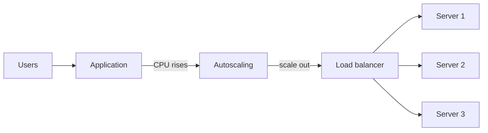

```text
Users → application → CPU increases → autoscaling detects load → new servers created → load balancer distributes traffic → performance improves
```

### Traffic example

| Time | Users | Servers |
|------|-------|---------|
| Morning | 100 | 1 |
| Afternoon | 5,000 | 5 |
| Night | 200 | 1 |

Resources automatically adjust to demand.

### Cooldown period

After a scaling operation, autoscaling waits before making another decision — prevents rapid, unnecessary scaling.

```text
CPU high → add servers → wait 5 minutes → check metrics again
```

### Minimum and maximum instances

**Minimum:** servers that must always run (e.g. minimum = 2).

**Maximum:** cap on servers created (e.g. maximum = 20).

### Health checks

Autoscaling checks instance health. Unhealthy servers are replaced automatically.

```text
Unhealthy server → terminated → new healthy server running
```

### Advantages

- Automatic resource management
- High availability
- Better application performance
- Cost optimization
- Handles sudden traffic spikes
- Reduced manual effort
- Improved fault tolerance

### Disadvantages

- Scaling delay for new instances
- Incorrect policies may cause over-scaling
- Additional monitoring complexity
- Frequent scaling can increase costs

### Horizontal vs vertical scaling

| Feature | Horizontal scaling | Vertical scaling |
|---------|-------------------|------------------|
| **Method** | Add/remove servers | Increase server size |
| **Resource limit** | Very high | Hardware limited |
| **Downtime** | Usually none | May be required |
| **Fault tolerance** | High | Lower |
| **Cost** | Flexible | Can become expensive |

### Autoscaling vs load balancer

| | Autoscaling | Load balancer |
|---|-------------|---------------|
| **Role** | Adds or removes servers automatically | Distributes traffic among servers |
| **Responds to** | Workload | Requests |
| **Manages** | Capacity | Traffic flow |

### Typical architecture

```text
Users → load balancer → app servers (N) ← autoscaling monitors metrics and adjusts instance count
```

### Common use cases

- Web applications
- E-commerce platforms
- Video streaming services
- Microservices
- Kubernetes clusters
- REST APIs
- SaaS applications
- Event-driven applications
- Batch processing
- Machine learning workloads

### Summary

```text
Autoscaling = automatic scale out/in based on metrics (CPU, requests, queues, etc.)
Horizontal (add servers) vs vertical (bigger server); policies, min/max, cooldown, health checks
Works with load balancer — autoscaling sets capacity, LB distributes traffic
In Kubernetes: HPA scales pods; Cluster Autoscaler scales worker nodes
```

---

## 11.13 Docker

### What is Docker?

**Docker** is an open-source platform used to build, package, ship, and run applications inside lightweight **containers**.

Docker packages an application with its dependencies, libraries, and configuration so it runs consistently across environments.

**Simple idea:** application + dependencies = Docker image · Docker image + Docker engine = running container

### Why Docker?

- Consistent application environment
- Faster deployment
- Lightweight compared to virtual machines
- Easy application distribution
- Better resource utilization
- Simplifies development and testing

### Problem before Docker

```text
Developer machine (works) → testing server (missing library, fails) → production (different OS, fails again)
```

Every environment is different.

### Solution with Docker

```text
Developer → build image → push image → testing → production → cloud (same image runs everywhere)
```

### Docker architecture

```text
Docker client → Docker engine → image + container + volume → operating system
```

### Docker components

**1. Docker client**

Command-line interface for Docker.

**Example commands:** `docker build` · `docker run` · `docker pull` · `docker push`

**2. Docker engine**

Core service managing images, containers, networking, and storage.

**Responsibilities:** build images · run/stop/remove containers · manage networking · manage storage

**3. Docker image**

Read-only template to create containers. Contains application, libraries, dependencies, configuration, and runtime.

```text
Docker image → container
```

**4. Docker container**

Running instance of an image. Multiple containers can run from the same image.

```text
Docker image → Container 1 + Container 2
```

**5. Docker registry**

Stores Docker images — upload, download, and share.

```text
Developer → build image → push → Docker registry → pull → run container
```

**6. Dockerfile**

Text file with instructions to build an image.

```text
Dockerfile → docker build → image → docker run → container
```

### Container lifecycle

```text
Docker image → create container → start → running → stop → remove
```

### Docker networking

```text
Container A ↔ Docker network ↔ Container B
```

Containers communicate using Docker networks.

### Docker volumes

```text
Container → Docker volume → persistent data
```

Volumes keep data even if the container is deleted.

### How Docker works

```text
Source code → Dockerfile → build image → store image → run container → application running
```

### Docker vs virtual machine

| | Docker | Virtual machine |
|---|--------|-----------------|
| **OS** | Shares host kernel | Own operating system |
| **Weight** | Lightweight | Heavy |
| **Startup** | Seconds | Minutes |
| **Resources** | Lower usage | Higher usage |
| **Density** | High | Lower |

### Docker image vs container

| | Docker image | Docker container |
|---|--------------|------------------|
| **Type** | Read-only template | Running instance |
| **Execution** | Cannot execute | Executes application |
| **Role** | Used to create containers | Created from image |

### Docker build process

```text
Source code → Dockerfile → docker build → image → registry → docker pull → docker run → running container
```

### Advantages

- Fast deployment
- Lightweight
- Portable
- Efficient resource utilization
- Consistent environments
- Easy scaling
- Simplifies CI/CD
- Easy application distribution

### Disadvantages

- Shares host operating system kernel
- Less isolation than virtual machines
- Persistent storage requires additional configuration
- Security depends on proper container configuration

### Docker and Kubernetes

| | Docker | Kubernetes |
|---|--------|------------|
| **Role** | Builds images, runs containers on one machine | Manages containers across many machines |
| **Focus** | Container creation and execution | Scaling, self-healing, load balancing, deployments |

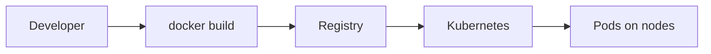

**Relationship:**

```text
Developer → create image → push to registry → Kubernetes pulls image → creates pods → runs containers
```

### Typical architecture

```text
Developer → Dockerfile → build image → Docker registry → Docker engine → running container → OS → hardware
```

### Common use cases

- Microservices
- Web applications
- REST APIs
- CI/CD pipelines
- Cloud-native applications
- Development and testing environments
- Batch processing
- Machine learning applications

### Summary

```text
Docker = package app + deps into images; run as lightweight containers via Docker engine
Image (template) → container (runtime); registry for distribution; volumes for persistence
Kubernetes orchestrates Docker images at scale across clusters
```

---

## 11.14 Container Runtime

### What is a container runtime?

A **container runtime** is software that creates, starts, stops, and manages containers. It executes container images on a host machine.

Without a container runtime, a container image cannot run.

**Simple idea:** container image = blueprint · container runtime = engine that runs the blueprint

### Why container runtime?

- Runs container images
- Creates containers
- Isolates applications
- Manages container lifecycle
- Allocates CPU, memory, and storage
- Connects containers to networks

### Basic workflow

```text
Developer → build image → store in registry → pull image → container runtime → run container → application starts
```

### Container lifecycle

```text
Container image → create → start → running → stop → remove
```

### Container runtime architecture

```text
Container image → container runtime → CPU + memory resources → OS kernel → physical machine
```

### Responsibilities

**Image management:** pull images · store images · delete images

**Container management:** create · start · stop · restart · remove containers

**Resource management:** CPU · memory · storage allocation

**Networking:** assign IPs · connect containers · configure networking

**Storage:** mount volumes · manage persistent storage

**Security:** process isolation · namespace management · resource limits

### How a container starts

```text
Container image → container runtime → create container → allocate resources → start process → application running
```

### Container runtime and operating system

```text
Application → container → container runtime → OS kernel → hardware
```

The runtime communicates directly with the operating system kernel.

### Container runtime in Kubernetes

```text
Kubernetes → kubelet → container runtime → pod → container
```

The kubelet instructs the runtime to create and manage containers inside pods.

### Container Runtime Interface (CRI)

**CRI** is the standard interface Kubernetes uses to talk to different container runtimes. Kubernetes can swap runtimes without changing its own code.

```text
Kubernetes → CRI → container runtime A | container runtime B
```

### Common container runtimes

| Runtime | Notes |
|---------|-------|
| **containerd** | Lightweight · widely used with Kubernetes · CRI support · high performance |
| **CRI-O** | Built for Kubernetes · lightweight · implements CRI directly |
| **Docker Engine** | Popular platform · image build tools · older K8s used Dockershim to talk to Docker |
| **Podman** | Daemonless · no central daemon · local dev and administration |

### Container runtime vs container image

| | Container runtime | Container image |
|---|-------------------|-------------------|
| **Role** | Runs containers | Defines application |
| **Action** | Executes images | Contains application (read-only template) |
| **Management** | Lifecycle, resources | Stored in registry |

### Container runtime vs virtual machine

| | Container runtime | Virtual machine |
|---|-------------------|-------------------|
| **OS** | Shares host kernel | Own operating system |
| **Weight** | Lightweight | Heavier |
| **Startup** | Fast | Slower |
| **Resources** | Lower usage | Higher usage |

### Advantages

- Fast container startup
- Efficient resource utilization
- Process isolation
- Lightweight execution
- Supports automation
- Easy integration with Kubernetes

### Disadvantages

- Shares host operating system kernel
- Limited kernel customization
- Runtime configuration can be complex
- Container security depends on proper isolation

### Typical architecture

```text
Container registry → pull image → container runtime → create container → OS → hardware
```

### Common use cases

- Kubernetes clusters
- Microservices
- CI/CD pipelines
- Cloud-native applications
- Application deployment
- Batch processing
- Edge computing

### Summary

```text
Container runtime = engine that runs images (create, start, stop, isolate, allocate resources)
Kubernetes uses kubelet + CRI (containerd, CRI-O); runtime talks to OS kernel directly
```

---

## 11.15 Container Images

### What is a container image?

A **container image** is a read-only package containing everything required to run an application:

- Application code
- Runtime
- Libraries
- Dependencies
- Configuration files

An image does not execute by itself — it creates one or more running containers.

**Simple idea:** container image = blueprint · container = running instance from the blueprint

### Why container images?

- Package applications
- Ensure consistent environments
- Easy application distribution
- Fast deployment
- Version control
- Reproducible builds

### Basic workflow

```text
Developer → write app → Dockerfile → build image → store in registry → pull image → run container
```

### Container image architecture

```text
Application code → runtime → libraries → dependencies → base OS layer (stacked read-only layers)
```

### Image layers

Each Dockerfile instruction creates a new layer.

```text
Layer 5: application code → Layer 4: configuration → Layer 3: libraries → Layer 2: runtime → Layer 1: base image
```

Each layer is read-only. When the image is updated, only changed layers are rebuilt.

### Base image

The starting layer of a container image.

**Examples:** Ubuntu · Alpine Linux · Debian · BusyBox

```text
Base image → install runtime → copy application → create image
```

### Image build process

```text
Source code → Dockerfile → docker build → container image → image registry → docker pull → container
```

### Container creation

```text
Container image → docker run → running container
```

Multiple containers from one image:

```text
Container image → Container A + Container B
```

### Image registry

Stores container images — upload, download, share, manage versions.

```text
Developer → build image → push → registry → pull → run container
```

### Image versioning

Each image can have different versions.

```text
application:1.0 · application:1.1 · application:2.0
```

Using versions makes deployments predictable.

### Image immutability

Container images are **immutable** — once created, contents do not change.

```text
Old image → modify source → build new image → deploy new image
```

A new image is created instead of modifying the existing one.

### Image size optimization

Smaller images provide faster downloads, faster deployment, lower storage, and better performance.

**Common techniques:**

- Use lightweight base images
- Remove unnecessary files
- Install only required dependencies
- Combine related build steps

### Advantages

- Portable
- Immutable
- Consistent environments
- Easy version management
- Fast deployment
- Reusable
- Efficient layered storage

### Disadvantages

- Large images increase download time
- Poorly designed images waste storage
- Images require regular security updates
- Multiple versions require management

### Container image vs container

| | Container image | Container |
|---|-----------------|-----------|
| **State** | Read-only | Running instance |
| **Execution** | Cannot execute | Executes application |
| **Location** | Stored in registry | Runs on host |
| **Role** | Template | Created from image |

### Container image vs VM image

| | Container image | VM image |
|---|-----------------|----------|
| **OS** | Shares host kernel | Includes full OS |
| **Size** | Lightweight | Large |
| **Startup** | Fast | Slower |
| **Storage** | Small | Larger |

### Typical architecture

```text
Source code → Dockerfile → build image → container registry → pull image → container runtime → running container
```

### Common use cases

- Microservices
- Web applications
- REST APIs
- CI/CD pipelines
- Cloud-native applications
- Kubernetes deployments
- Batch processing
- Machine learning workloads
- Development and testing environments

### Summary

```text
Container image = immutable, layered read-only package (app + runtime + deps + base OS)
Build from Dockerfile → push to registry → pull → run as container; version with tags
```

---

## 11.16 Image Layers

### What are image layers?

**Image layers** are read-only filesystem layers that make up a container image.

Each instruction in a Dockerfile creates a new layer. Layers are stacked to form the final image.

**Simple idea:** container image = stack of layers · each Dockerfile instruction adds one layer

### Why image layers?

- Reuse unchanged layers
- Reduce storage usage
- Speed up image builds
- Speed up image downloads
- Improve caching
- Simplify version management

### Basic architecture

```text
Container image stack (read-only): Application → Configuration → Libraries → Runtime → Base image
```

### How layers are created

```text
FROM ubuntu → Layer 1 → RUN apt install java → Layer 2 → COPY app.jar → Layer 3 → CMD java -jar app.jar → Layer 4 → final image
```

Each instruction creates a new layer.

### Example build process

```text
Source code → Dockerfile → Layer 1 (base) → Layer 2 (runtime) → Layer 3 (application) → final image
```

### Layer reuse

**Image v1:** Layer 1 (base) + Layer 2 (Java runtime) + Layer 3 (application v1)

**Image v2:** Layer 1 (reused) + Layer 2 (reused) + Layer 3 (application v2)

Only Layer 3 changes — layers 1 and 2 are reused.

### Benefits of layer reuse

**Without reuse:** every build rebuilds Layer 1 + Layer 2 + Layer 3

**With reuse:** Layer 1 reused · Layer 2 reused · Layer 3 rebuilt — only modified layers rebuild, making builds faster

### Image caching

Docker stores previously built layers.

```text
Build 1: Layer 1 created · Layer 2 created · Layer 3 created
Build 2: Layer 1 cached · Layer 2 cached · Layer 3 rebuilt
```

Only changed layers require rebuilding.

### Layer sharing

```text
Image A: Ubuntu + Java + Application A
Image B: Ubuntu + Java + Application B  (share layers 1 and 2; only app layer differs)
```

### Read-only layers and writable layer

All image layers are read-only. When a container starts:

```text
Image layers (read-only) → writable layer → running container
```

Changes at runtime (new files, updates, temp data, logs) go in the **writable layer**.

When the container is removed, the writable layer is removed unless data is in a volume.

### Layer order

```text
Top: Application → Configuration → Libraries → Runtime → Base image (bottom)
```

Lower layers rarely change; upper layers change more frequently.

### Why layer order matters

**Good order:** base image → runtime → libraries → application (only app layer changes often)

**Poor order:** application before runtime/libraries — app changes force rebuilding more layers, slower builds

**Note:** deleting files in a later Dockerfile layer does not shrink earlier layers.

### Layer compression

Before storage in a registry, layers are compressed.

**Benefits:** smaller size · faster downloads/uploads · reduced storage

### Advantages

- Faster image builds
- Efficient storage
- Layer caching
- Easy image sharing
- Faster deployments
- Smaller downloads
- Version reuse

### Disadvantages

- Poor Dockerfile design creates unnecessary layers
- Large layers increase image size
- Deleting files later does not reduce earlier layer size
- Many image versions increase storage usage

### Image layers vs writable layer

| | Image layers | Writable layer |
|---|--------------|----------------|
| **Access** | Read-only | Read-write |
| **When** | Part of image | Created at runtime |
| **Sharing** | Shared by containers from same image | Unique per container |
| **Lifetime** | Permanent in image | Removed with container |

### Image layers vs container

| | Image layers | Container |
|---|--------------|-------------|
| **Role** | Blueprint | Running instance |
| **Access** | Read-only | Read-write at runtime |
| **Storage** | In image | Executes application |
| **Lifetime** | Reusable | Temporary |

### Typical architecture

```text
Dockerfile → build image → Layer 1 + Layer 2 + Layer 3 → container image → writable layer → running container
```

### Common use cases

- Docker image creation
- CI/CD pipelines
- Kubernetes deployments
- Microservices
- Cloud-native applications
- Continuous delivery
- Versioned application releases

### Summary

```text
Image layers = read-only stack from Dockerfile instructions; cache and reuse unchanged layers
Container adds writable layer at runtime; order Dockerfile steps so frequently changing content is last
```

---

## 11.17 Namespaces

### What are namespaces?

**Namespaces** are a Linux kernel feature that isolates system resources between processes.

Containers use namespaces so each container believes it has its own independent OS environment, even though all containers share the same host kernel.

**Simple idea:** each container gets its own isolated view of processes, network, hostname, users, mounts, and IPC.

### Why namespaces?

- Process isolation
- Network isolation
- Security
- Resource separation
- Multi-container support
- Container independence

### Without namespaces

```text
Host machine: Process A + Process B + Process C — every process can see each other (no isolation)
```

### With namespaces

```text
Host machine: Container A (Process 1, 2) | Container B (Process 1, 2) — each sees only its own processes
```

### How namespaces work

```text
Application → container runtime → create namespaces → start container → application runs in isolation
```

### Namespace architecture

```text
Host kernel → Namespace A (Container A) + Namespace B (Container B) — each isolated view of resources
```

### Types of namespaces

**1. PID namespace**

Isolates process IDs. Each container starts its own PID numbering.

```text
Container A: PID 1, 2, 3 · Container B: PID 1, 2 — independent (both can have PID 1)
```

**2. Network namespace**

Isolated network stack per container: interfaces · IP addresses · routing · firewall · ports

```text
Container A: 10.0.0.2 · Container B: 10.0.0.3 — communicate via virtual networking
```

**3. Mount namespace**

Isolated filesystem view. Each container mounts its own paths without affecting others.

```text
Container A: /app · Container B: /data
```

**4. UTS namespace**

Independent hostname and domain name.

```text
Container A: web-server · Container B: database-server
```

**5. IPC namespace**

Isolates inter-process communication (shared memory, message queues, semaphores). One container cannot access another's IPC.

**6. User namespace**

Separate user and group IDs. Container root may map to an unprivileged user on the host — improves security.

### Namespace creation

```text
Container runtime → PID namespace → network namespace → mount namespace → UTS namespace → IPC namespace → user namespace → start container
```

### Container isolation

```text
Container A: processes · filesystem · network · hostname
Container B: processes · filesystem · network · hostname
```

Neither container can directly view the other's isolated resources.

### Namespaces and containers

```text
Application → namespaces (isolation) → host Linux kernel → hardware
```

Namespaces provide isolation; the kernel does the actual work.

### Namespaces vs virtual machines

| | Namespaces | Virtual machines |
|---|------------|------------------|
| **Kernel** | Share host kernel | Separate OS kernel |
| **Weight** | Lightweight | Heavy |
| **Startup** | Fast | Slower |
| **Isolation** | Process-level | Full machine |

Namespaces isolate **what** a process can see; **cgroups** (next section) limit **how much** it can use.

### Advantages

- Strong process isolation
- Lightweight
- Fast container startup
- Better security
- Independent networking
- Independent filesystem views
- Efficient resource sharing

### Disadvantages

- Containers still share the host kernel
- Kernel vulnerabilities may affect all containers
- Namespace configuration can be complex
- Isolation is weaker than full virtual machines

### Typical architecture

```text
Host machine → Linux kernel → Namespace set A (Container A → App A) + Namespace set B (Container B → App B)
```

### Common use cases

- Docker containers
- Kubernetes pods
- Microservices
- CI/CD pipelines
- Cloud-native applications
- Application isolation
- Multi-tenant environments

### Summary

```text
Namespaces = Linux kernel isolation (PID, net, mount, UTS, IPC, user) for containers
Isolation of what each process sees; pair with cgroups for resource limits
```

---

## 11.18 cgroups

### What are cgroups?

**cgroups (control groups)** are a Linux kernel feature used to limit, allocate, and monitor resource usage of processes.

Containers use cgroups so one container cannot consume all system resources and affect others.

**Simple idea:** namespaces provide isolation · cgroups control how much CPU, memory, disk, and other resources a container can use

### Why cgroups?

- Prevent resource exhaustion
- Fair resource sharing
- Improve system stability
- Monitor resource usage
- Enforce resource limits
- Support multi-container environments

### Without cgroups

```text
Host: Container A (95% CPU) + Container B (5% CPU) — A starves B
```

### With cgroups

```text
Host: Container A (CPU limit 50%) + Container B (CPU limit 50%) — controlled, fair access
```

### How cgroups work

```text
Application → container runtime → configure resource limits → create cgroups → start container
```

The Linux kernel enforces the configured limits.

### cgroups architecture

```text
Host kernel → cgroups → Container A (2 CPU cores, 2 GB RAM) + Container B (2 CPU cores, 4 GB RAM)
```

### Resources controlled

| Resource | Purpose | Example |
|----------|---------|---------|
| **CPU** | Limit CPU usage | Max 2 cores |
| **Memory** | Limit RAM | Max 4 GB |
| **Disk I/O** | Control read/write speed | Max 100 MB/s |
| **Network** | Limit or prioritize bandwidth | Max 1 Gbps |
| **Process count** | Cap number of processes | Max 200 |

### CPU limits

```text
Without limit: Container A uses entire CPU
With limit:    Container A max 50% + Container B max 50% — kernel schedules fairly
```

### Memory limits

```text
Container memory limit: 2 GB — if it tries to use 3 GB, kernel may kill processes to protect the host
```

### Resource monitoring

cgroups continuously track:

- CPU usage
- Memory usage
- Disk I/O
- Network usage
- Process count

Monitoring tools use this data to observe container usage.

### Resource isolation

```text
Container A: 2 CPU cores · 2 GB memory
Container B: 4 CPU cores · 8 GB memory
```

Each container operates within its assigned limits.

### cgroups and container runtime

```text
Container runtime → configure cgroups → create container → Linux kernel enforces limits
```

### cgroups in Kubernetes

```text
Kubernetes → kubelet → container runtime → cgroups → running pod
```

When resource requests and limits are set on a pod or container, the runtime uses cgroups to enforce them.

### Namespaces and cgroups

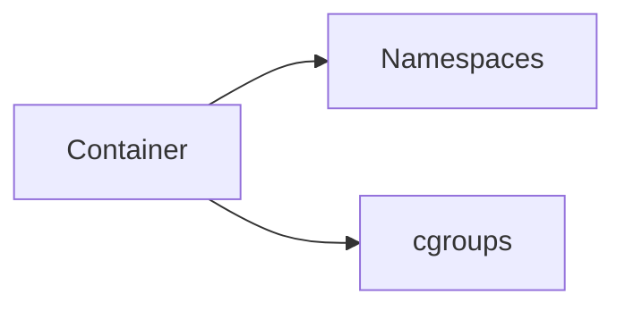

Namespaces control visibility; cgroups enforce resource limits.

**Example:**

```text
Namespaces: own processes · own network · own hostname
cgroups:    CPU = 2 cores · memory = 4 GB · disk = 100 MB/s
```

Both work together for secure, efficient containers.

### Advantages

- Prevents resource starvation
- Fair resource allocation
- Better system stability
- Improved performance isolation
- Continuous resource monitoring
- Supports multi-tenant workloads

### Disadvantages

- Configuration can be complex
- Incorrect limits can hurt performance
- Does not provide process isolation by itself
- Requires Linux kernel support

### Namespaces vs cgroups

| | Namespaces | cgroups |
|---|------------|---------|
| **Purpose** | Resource isolation (what is visible) | Resource limitation (how much is usable) |
| **Controls** | Processes, network, filesystem, hostname | CPU, memory, disk I/O, process count |

### Typical architecture

```text
Host → Linux kernel → namespaces + cgroups → container runtime → running container → application
```

### Common use cases

- Docker containers
- Kubernetes pods
- Microservices
- Multi-tenant platforms
- CI/CD pipelines
- Resource management
- Cloud-native applications
- High-density container deployments

### Summary

```text
cgroups = Linux kernel limits on CPU, memory, disk I/O, network, process count
Pair with namespaces: isolation + quotas; K8s requests/limits enforced via cgroups
```

---

## 11.19 Kubernetes

### What is Kubernetes?

**Kubernetes (K8s)** is an open-source container orchestration platform used to deploy, manage, scale, and automate containerized applications across multiple machines.

Instead of managing containers manually, Kubernetes automatically handles deployment, scaling, networking, load balancing, self-healing, and rolling updates.

**Simple idea:** Docker creates containers · Kubernetes manages containers running on many servers

### Why Kubernetes?

- Automates container deployment
- Automatic scaling
- Self-healing
- Load balancing
- High availability
- Rolling updates
- Efficient resource utilization

### Problem without Kubernetes

```text
Server 1: Container A + Container B | Server 2: Container C
```

Problems: manual deployment · manual scaling · manual recovery · difficult updates · uneven resource usage

### Solution with Kubernetes

```text
Users → Kubernetes cluster → Worker Node 1 (multiple pods) + Worker Node 2 (multiple pods)
```

Kubernetes automatically manages all containers.

### Cluster architecture

A **cluster** is a collection of machines working together. It has a **control plane** (manages the cluster) and **worker nodes** (run workloads).

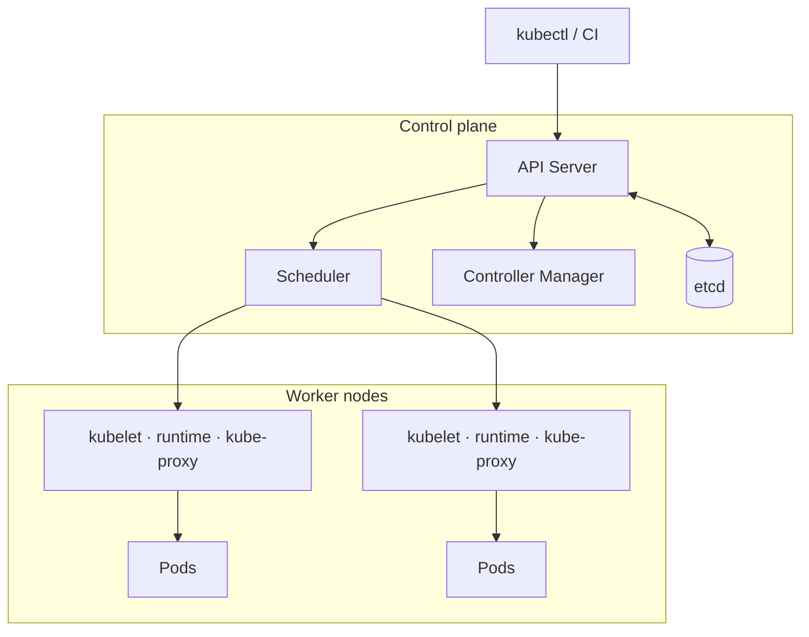

### Control plane components

| Component | Role |
|-----------|------|
| **API Server** | Entry point for all cluster operations (`kubectl` → API Server) |
| **Scheduler** | Picks the worker node for each new pod |
| **Controller Manager** | Reconciles desired vs actual state (e.g. creates missing pods) |
| **etcd** | Distributed key-value store for all cluster state |

### Worker node

Each worker node runs **kubelet** (node agent), **container runtime** (containerd, CRI-O), **kube-proxy** (service networking), and **pods**.

### Core resources

| Resource | Purpose |
|----------|---------|
| **Pod** | Smallest deployable unit; one or more containers sharing network and storage |
| **ReplicaSet** | Keeps N identical pod replicas running |
| **Deployment** | Manages ReplicaSets; rolling updates and rollbacks |
| **Service** | Stable network endpoint and load balancing for pods |
| **Ingress** | External HTTP/HTTPS routing into the cluster |
| **StatefulSet** | Stateful apps with stable identity and storage |
| **DaemonSet** | One pod per eligible node |
| **Job / CronJob** | Run-to-completion and scheduled tasks |
| **ConfigMap / Secret** | Non-sensitive and sensitive configuration |
| **Namespace** | Logical partition inside a cluster (not Linux namespaces) |

### Request workflow


### Key behaviors

**Self-healing:** failed pods are recreated by controllers (ReplicaSet / Deployment).

**Rolling updates:** new versions replace pods one at a time so the app stays available.

**Scaling:** **HPA** adjusts pod count from metrics; **Cluster Autoscaler** adds or removes worker nodes when pods cannot be scheduled.

### Cluster vs node

| | Cluster | Node |
|---|---------|------|
| **Scope** | Collection of nodes | Single machine |
| **Management** | Managed together | Runs pods |
| **Components** | Has control plane | Runs kubelet |

### End-to-end traffic path

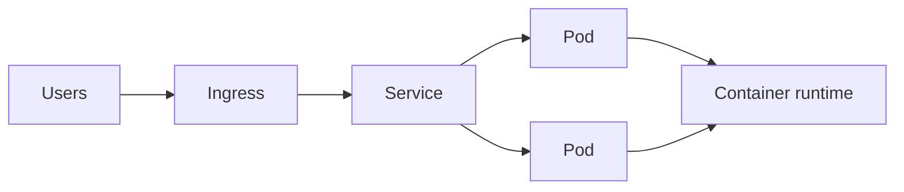

### Advantages

- Automatic deployment
- Automatic scaling
- Self-healing
- High availability
- Rolling updates
- Efficient resource utilization
- Portable across cloud providers
- Supports microservices

### Disadvantages

- Steep learning curve
- Complex setup
- Requires monitoring
- Higher operational complexity
- Networking can be challenging

### Summary

```text
K8s = control plane + worker nodes; declarative resources reconciled to desired state
Pods run workloads; Deployments/Services/Ingress expose them; HPA and Cluster Autoscaler handle scale
```

---

## 11.20 Pods

### What is a Pod?

A **Pod** is the smallest deployable unit in Kubernetes.

A pod is a wrapper around one or more containers that share:

- Network
- Storage (volumes)
- IP address
- Port space

Containers inside the same pod work together as a single unit.

**Simple idea:** container = runs an application · pod = holds one or more closely related containers

### Why pods?

- Deploy containers together
- Share networking
- Share storage
- Simplify application deployment
- Enable container communication

### Basic architecture

```text
Kubernetes cluster → worker node → Pod → Container A (usually one container per pod)
```

### Pod with multiple containers

```text
Pod: Container A + Container B — same IP, shared localhost, shared storage volumes
```

### Pod components

**1. Containers**

A pod contains one or more containers.

```text
Pod → application container
or
Pod → application container + logging container
```

**2. Shared network**

Every pod receives one unique IP address (e.g. `10.244.1.10`). All containers use that IP.

```text
Container A → localhost → Container B
```

**3. Shared storage**

Containers in a pod can share data via volumes — both access the same files.

```text
Pod: Container A ↔ Volume ↔ Container B
```

### Pod lifecycle

```text
Create pod → Pending → Container starting → Running → Succeeded or Failed
```

### Pod creation workflow

```text
Developer → kubectl apply → API Server → Scheduler → worker node → container runtime → pod created
```

### Single-container pod

```text
Pod → web application (most pods contain only one container)
```

### Multi-container pod

```text
Pod: application container + logging container + monitoring container — all work together
```

### Sidecar pattern

A **sidecar container** provides supporting functionality for the main application.

```text
Pod: main application + logging sidecar (collects logs from the application)
```

### Pod networking

```text
Service → Pod 1 + Pod 2 — each pod has unique IP and shared network inside the pod
```

### Communication between pods

```text
Pod A (10.244.1.5) ↔ network ↔ Pod B (10.244.2.7)
```

Pods communicate via IP addresses or Kubernetes Services.

### Pod scheduling

```text
New pod → Scheduler → select worker node → create pod
```

Scheduler considers: available CPU · available memory · resource requirements · node health

### Pod restart

```text
Container crash → kubelet detects failure → container restarted
```

If the entire pod becomes unavailable, a ReplicaSet or Deployment creates a replacement pod.

### Ephemeral nature of pods

Pods are temporary (ephemeral). If a pod is deleted:

```text
Old pod deleted → new pod created (may get different IP and different node)
```

Applications should not rely on a pod existing forever.

### Persistent storage

```text
Without volume: pod deleted → data lost
With volume:    pod deleted → data preserved
```

Volumes allow data to survive pod replacement.

### Pod resource limits

Each container in a pod can have:

- CPU requests
- CPU limits
- Memory requests
- Memory limits

The container runtime uses cgroups to enforce these limits.

### Advantages

- Simple deployment unit
- Shared networking
- Shared storage
- Fast startup
- Easy scaling
- Supports multi-container patterns
- Well suited for microservices

### Disadvantages

- Pods are temporary
- Pod IP addresses can change
- Multiple unrelated applications should not share one pod
- Data is lost without persistent storage

### Pod vs container

| | Pod | Container |
|---|-----|-----------|
| **Role** | Smallest deployment unit | Runs an application |
| **Contents** | Can contain multiple containers | Single executable |
| **Network** | Has its own IP address | Uses pod's IP address |
| **Management** | Managed by Kubernetes | Managed inside a pod |

### Pod vs virtual machine

| | Pod | Virtual machine |
|---|-----|-------------------|
| **Weight** | Lightweight | Heavy |
| **Kernel** | Shares host kernel | Own operating system |
| **Startup** | Seconds | Minutes |
| **Runs** | Containers | Full operating systems |

### Pod vs Deployment

| | Pod | Deployment |
|---|-----|------------|
| **Role** | Runs containers | Manages pods |
| **Lifetime** | Temporary | Maintains desired pod count |
| **Recovery** | Can fail | Recreates failed pods |
| **Usage** | Usually not managed directly | Used in production |

### Typical architecture

```text
Service → Pod (application container + sidecar container) → volume → persistent storage
```

### Common use cases

- Microservices
- Web applications
- REST APIs
- Background workers
- Batch jobs
- Machine learning workloads
- Logging sidecars
- Monitoring agents
- Service mesh proxies

### Summary

```text
Pod = smallest K8s unit; 1+ containers share IP, network, volumes
Ephemeral — use Services for stable access and volumes for data; sidecars for supporting tasks
```

---

## 11.21 ReplicaSets

### What is a ReplicaSet?

A **ReplicaSet** is a Kubernetes controller that ensures a specified number of identical pod replicas are always running.

If a pod crashes, is deleted, or becomes unhealthy, the ReplicaSet automatically creates a new pod to maintain the desired count.

**Simple idea:** desired pods = 3, only 2 running → ReplicaSet creates 1 more pod

### Why ReplicaSets?

- Maintain desired number of pods
- Automatic pod recovery
- High availability
- Self-healing
- Automatic replacement of failed pods

### Basic architecture

```text
ReplicaSet (desired replicas = 3) → Pod 1 + Pod 2 + Pod 3 — continuously monitored
```

### How ReplicaSet works

```text
Desired state: 3 pods → current state: 2 pods → ReplicaSet detects difference → create new pod → current state: 3 pods
```

### Pod failure example

```text
Normal: Pod 1 + Pod 2 + Pod 3
Pod 2 crashes → ReplicaSet detects failure → creates new Pod 2 → application remains available
```

### Scaling ReplicaSets

**Increase replicas (2 → 5):**

```text
Replicas = 2: Pod 1 + Pod 2 → replicas = 5: Pod 1 + Pod 2 + Pod 3 + Pod 4 + Pod 5
```

**Decrease replicas (5 → 2):**

```text
Extra pods are removed — ReplicaSet keeps Pod 1 + Pod 2
```

### Pod selection

ReplicaSets identify pods using **labels**.

```text
ReplicaSet selector: app = web → manages Pod 1 (app = web) + Pod 2 (app = web)
```

### Labels and selectors

```text
Pod A (app = web) + Pod B (app = database)
ReplicaSet selector app = web → manages only Pod A
```

### Pod scheduling

```text
ReplicaSet → create pod → Scheduler → select worker node → pod created
```

### ReplicaSet self-healing

```text
3 running pods → one pod deleted → ReplicaSet detects → new pod created (automatic)
```

### ReplicaSet lifecycle

```text
Create ReplicaSet → create pods → monitor pods → replace failed pods → delete ReplicaSet
```

### ReplicaSet and Deployments

In production, ReplicaSets are usually created and managed by Deployments.

```text
Deployment → ReplicaSet → Pods
```

Developers typically interact with Deployments, not ReplicaSets directly.

### Advantages

- Automatic pod recovery
- Maintains desired replica count
- Supports horizontal scaling
- High availability
- Self-healing
- Simple management of identical pods

### Disadvantages

- Does not support rolling updates by itself
- Manages only identical pods
- Usually not used directly in production
- No built-in deployment strategies

### ReplicaSet vs ReplicationController

| | ReplicaSet | ReplicationController |
|---|------------|-------------------------|
| **Selectors** | Supports label selectors | Limited selector support |
| **Status** | Newer implementation | Older implementation |
| **Usage** | Used by Deployments | Rarely used today |
| **Flexibility** | Flexible pod selection | Less flexible |

### ReplicaSet vs Pod

| | ReplicaSet | Pod |
|---|------------|-----|
| **Role** | Manages pods | Runs containers |
| **Recovery** | Creates replacements | Can fail |
| **Scope** | Maintains replicas | Smallest deployable unit |

### Summary

```text
ReplicaSet = keeps N identical pods running via labels/selectors; self-heals on failure
Production path: Deployment → ReplicaSet → Pods; no rolling updates on its own
```

---

## 11.22 Deployments

### What is a Deployment?

A **Deployment** is a Kubernetes controller that manages the deployment and lifecycle of pods.

A Deployment creates and manages ReplicaSets, and ReplicaSets create and manage pods.

Deployments provide:

- Rolling updates
- Rollbacks
- Scaling
- Self-healing
- Version management

**Simple idea:** Deployment → creates ReplicaSet → creates pods — developers interact with Deployments, not ReplicaSets or pods directly

### Why Deployments?

- Simplify application deployment
- Automatic pod management
- Rolling updates
- Rollback support
- Easy scaling
- Self-healing

### Basic architecture

```text
Deployment → ReplicaSet → Pod 1 + Pod 2 (each with container)
```

### Deployment hierarchy

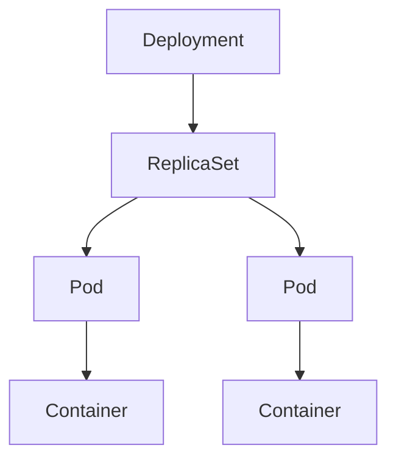

```text
Deployment → ReplicaSet → Pods → Containers
```

Each layer manages the layer below it.

### Scaling Deployments

**Increase replicas (2 → 5):**

```text
Replicas = 2: Pod 1 + Pod 2 → replicas = 5: Pod 1 + Pod 2 + Pod 3 + Pod 4 + Pod 5
```

**Decrease replicas (5 → 2):** extra pods are removed.

### Self-healing

```text
3 pods running → one pod crashes → ReplicaSet detects failure → create new pod → 3 running pods
```

### Rolling update

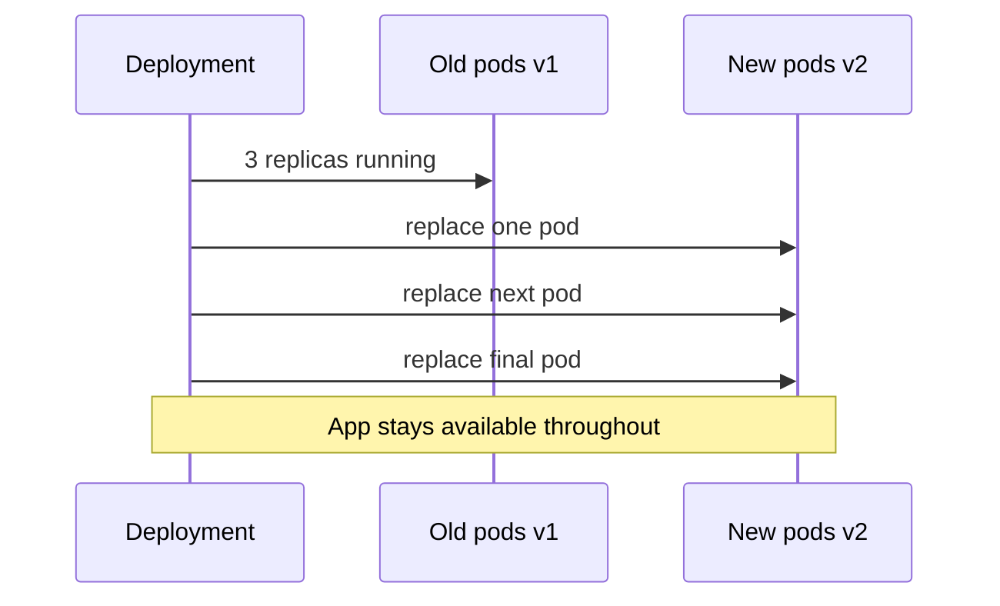

```text
v1: Pod A + Pod B + Pod C → replace one at a time → all on v2
```

### Rollback

```text
Current version v2 → problem detected → rollback → previous version v1 restored
```

Deployment restores the previous working ReplicaSet.

### Deployment revision history

```text
Deployment: Revision 1 → Revision 2 → Revision 3
```

Each deployment change creates a new revision. Old revisions allow rollbacks.

### Pod template

A Deployment contains a **pod template** defining:

- Container image
- Environment variables
- Volumes
- Labels
- Resource limits

Every pod created by the Deployment uses this template.

### Deployment strategy

**1. Rolling update**

Old pods are replaced gradually.

**Advantages:** no downtime · safe updates · easy rollback

**2. Recreate**

Old pods are deleted first, then new pods are created.

**Advantages:** simple deployment

**Disadvantage:** temporary downtime

### Deployment lifecycle

```text
Create Deployment → create ReplicaSet → create pods → monitor pods → scale or update → delete Deployment
```

### Deployment update process

```text
Old Deployment → create new ReplicaSet → gradually increase new pods → gradually remove old pods → update complete
```

### Resource management

Each pod created by a Deployment can define CPU/memory requests and limits. The container runtime uses cgroups to enforce them.

### Advantages

- Simplified application deployment
- Rolling updates
- Rollback support
- Self-healing
- Easy scaling
- High availability
- Version history
- Declarative management

### Disadvantages

- Best suited for stateless applications
- More Kubernetes objects to manage
- Configuration can become complex
- Rolling updates may take time for large applications

### Deployment vs ReplicaSet

| | Deployment | ReplicaSet |
|---|------------|------------|
| **Role** | Manages ReplicaSets | Manages pods |
| **Updates** | Rolling updates | No rolling updates |
| **Rollback** | Rollbacks | No rollback support |
| **History** | Revision history | No revision history |
| **Usage** | Recommended for production | Usually managed by Deployments |

### Deployment vs Pod

| | Deployment | Pod |
|---|------------|-----|
| **Role** | Manages pods | Runs containers |
| **Scaling** | Supports scaling | Single deployment unit |
| **Updates** | Supports updates | Temporary |
| **Recovery** | Self-healing | Can fail |

### Deployment vs StatefulSet

| | Deployment | StatefulSet |
|---|------------|-------------|
| **Apps** | Stateless applications | Stateful applications |
| **Identity** | Pods are interchangeable | Stable pod identity |
| **Updates** | Rolling updates | Ordered deployment |
| **Names** | Dynamic pod names | Fixed pod names |

### Typical architecture

```text
Deployment → ReplicaSet → Pod 1 + Pod 2 (each with container)
```

During updates, the Deployment creates a new ReplicaSet and gradually replaces pods from the old ReplicaSet with pods from the new one.

### Common use cases

- Web applications
- REST APIs
- Microservices
- Stateless applications
- Cloud-native applications
- Kubernetes production workloads
- CI/CD deployments
- Auto-scaled services

### Summary

```text
Deployment = production entry point: manages ReplicaSets → pods; rolling updates, rollbacks, scaling
Stateless apps; strategies: rolling update (default) or recreate; revision history for rollback
```

---

## 11.23 Services

### What is a Service?

A **Service** is a Kubernetes object that provides a stable network endpoint for accessing one or more pods.

Pods are temporary and their IP addresses can change. A Service provides a permanent IP address and DNS name so applications can reliably reach pods.

**Simple idea:** pods can change · service remains the same — applications talk to the Service, not individual pods

### Why Services?

- Stable network endpoint
- Service discovery
- Load balancing
- Hide pod IP changes
- Enable communication between applications

### Problem without Services

```text
Application → Pod (10.244.1.8) — pod crashes → new pod (10.244.2.15) — app must know new IP
```

Pod IP changes break direct connections.

### Solution with Services

```text
Application → Service → Pod 1 + Pod 2 — pods can change, Service stays the same
```

### Basic architecture

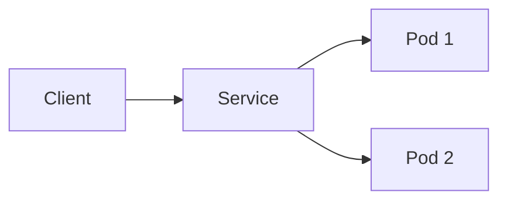

```text
Client → Service → Pod 1 + Pod 2 — Service forwards requests to healthy pods
```

### How Services work

```text
Client → Service → select matching pods → load balance → forward request
```

### Pod selection

Services identify pods using **labels**.

```text
Pods: app = web, app = web, app = database
Service selector app = web → forwards traffic only to web pods
```

### Service workflow

```text
Developer → create Service → API Server → Service created → traffic forwarded → matching pods
```

### Load balancing

```text
Client → Service → Pod 1 + Pod 2 + Pod 3 — requests distributed across available pods
```

### Service discovery

Instead of pod IP addresses, applications use **service names**.

```text
frontend → backend-service → database service
```

Kubernetes resolves service names using DNS.

### ClusterIP Service

**Definition:** accessible only inside the Kubernetes cluster.

```text
Application → ClusterIP Service → pods
```

**Characteristics:** internal communication · default service type · not accessible from outside the cluster

**Use cases:** backend services · database access · internal APIs

### NodePort Service

**Definition:** exposes the Service on a fixed port on every worker node.

```text
Internet → worker node → NodePort → Service → pods
```

**Characteristics:** accessible outside the cluster · fixed port on each node

**Use cases:** testing · small deployments · external access

### LoadBalancer Service

**Definition:** creates an external load balancer provided by the cloud platform.

```text
Internet → load balancer → Service → pods
```

**Characteristics:** public IP · automatic load balancing · cloud integration

**Use cases:** production web applications · public APIs

### ExternalName Service

**Definition:** maps a Kubernetes Service to an external DNS name.

```text
Application → ExternalName Service → external.example.com (no pods involved)
```

### Service endpoints

```text
Service → Pod 1 + Pod 2 — maintains list of healthy pods that receive traffic
```

### Pod replacement

```text
Before: Service → Pod A + Pod B
Pod A fails: Service → Pod C + Pod B — applications keep using the same Service
```

### Advantages

- Stable network endpoint
- Automatic load balancing
- Service discovery
- Hides pod IP changes
- Simplifies application communication
- Supports internal and external access

### Disadvantages

- Adds another networking layer
- Incorrect label selectors can route traffic to wrong pods
- External access requires additional configuration for some service types

### ClusterIP vs NodePort vs LoadBalancer

| Feature | ClusterIP | NodePort | LoadBalancer |
|---------|-----------|----------|--------------|
| **Default type** | Yes | No | No |
| **Internal access** | Yes | Yes | Yes |
| **External access** | No | Yes | Yes |
| **Public IP** | No | No | Yes |
| **Cloud load balancer** | No | No | Yes |

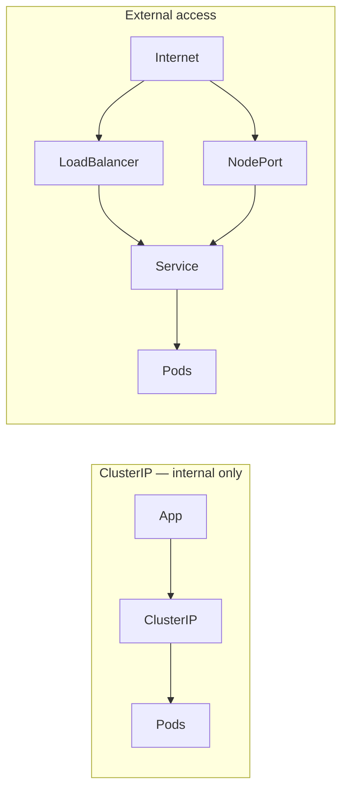

### Service vs Pod

| | Service | Pod |
|---|---------|-----|
| **Endpoint** | Stable | Temporary |
| **Role** | Load balances | Runs containers |
| **Selection** | Uses labels | Has changing IP |
| **Discovery** | Provides discovery | Executes application |

### Typical architecture

```text
Internet → LoadBalancer Service → ClusterIP Service → Pod 1 + Pod 2 (each with container)
```

The Service provides a stable endpoint and distributes requests among healthy pods.

### Common use cases

- Web applications
- REST APIs
- Microservices
- Internal service communication
- Database access
- Kubernetes networking
- Cloud-native applications
- Load-balanced services

### Summary

```text
Service = stable IP/DNS + load balancing over labeled pods; hides ephemeral pod IPs
Types: ClusterIP (internal), NodePort, LoadBalancer (cloud), ExternalName (external DNS)
```

---

## 11.24 Ingress

### What is Ingress?

**Ingress** is a Kubernetes object that manages external HTTP and HTTPS traffic entering a cluster.

Instead of exposing every Service separately, an Ingress provides a single entry point and routes requests to the appropriate Services based on rules.

**Simple idea:** Internet → Ingress → routes traffic → Service → Pods

### Why Ingress?

- Single entry point
- HTTP/HTTPS routing
- Host-based routing
- Path-based routing
- SSL/TLS termination
- Reduce the number of external load balancers

### Problem without Ingress

```text
Internet → Load Balancer 1 → Service A → Pods
        → Load Balancer 2 → Service B → Pods
```

Each application needs its own external load balancer.

### Solution with Ingress

```text
Internet → Ingress → Service A → Pods + Service B → Pods
```

One Ingress manages traffic for multiple applications.

### Basic architecture

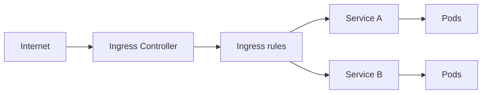

### Ingress resource

The Ingress resource contains routing rules defining:

- Host names
- URL paths
- Target Services
- SSL/TLS configuration

The Ingress resource itself does not process traffic — an **Ingress Controller** does.

### Ingress Controller

An **Ingress Controller** watches Ingress resources and configures traffic routing.

```text
Internet → Ingress Controller → Ingress rules → Services
```

The controller performs the actual routing of requests.

### Traffic flow

```text
Client → Internet → Ingress Controller → Ingress → Service → Pods
```

### Host-based routing

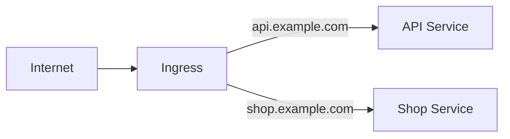

### Path-based routing

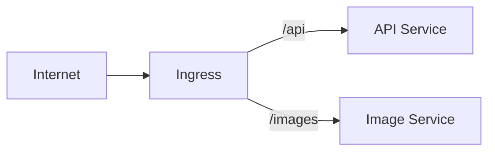

### HTTPS support

Ingress supports SSL/TLS termination.

```text
Internet (HTTPS) → Ingress Controller (decrypt) → HTTP → Services
```

The client-to-Ingress connection is encrypted.

### Ingress workflow

```text
Developer → create Ingress → API Server → Ingress Controller → configure routing → incoming requests → forward to Services
```

### Load balancing

```text
Internet → Ingress → Service → Pod 1 + Pod 2 + Pod 3 + Pod 4 — requests distributed across healthy pods
```

### Ingress and Services

```text
Ingress → Service → Pods
```

Ingress never sends traffic directly to pods — it always routes through a Service.

### Advantages

- Single external entry point
- Host-based routing
- Path-based routing
- SSL/TLS support
- Reduced cloud load balancers
- Centralized traffic management
- Easy routing configuration

### Disadvantages

- Supports only HTTP and HTTPS traffic
- Requires an Ingress Controller
- Additional configuration complexity
- Incorrect rules can block application access

### Ingress vs Service

| | Ingress | Service |
|---|---------|---------|
| **Role** | Routes HTTP/HTTPS traffic | Connects clients to pods |
| **Scope** | External entry point | Stable network endpoint |
| **Routing** | Host/path routing | Label selectors |

### Ingress vs LoadBalancer Service

| | Ingress | LoadBalancer Service |
|---|---------|----------------------|
| **Entry** | One entry point | One load balancer per Service |
| **Scope** | Routes multiple Services | Exposes one Service |
| **Rules** | URL and host routing | No URL or host routing |

### Ingress vs API Gateway

| | Ingress | API Gateway |
|---|---------|-------------|
| **Scope** | Basic HTTP routing | Advanced API management |
| **Features** | SSL/TLS termination | Authentication |
| **Routing** | Host/path routing | Rate limiting, request transformation |
| **Load balancing** | Yes | Yes |

### Typical architecture

```text
Internet → Ingress Controller → Ingress → Service A → Pod 1 + Service B → Pod 2
```

The Ingress Controller processes rules and forwards external HTTP/HTTPS requests to the appropriate Services.

### Common use cases

- Web applications
- REST APIs
- Microservices
- Multi-service applications
- HTTPS termination
- Host-based routing
- Path-based routing
- Cloud-native applications

### Summary

```text
Ingress = single HTTP/HTTPS entry; host/path rules → Services (needs Ingress Controller)
Replaces many LoadBalancers; TLS termination at edge; not for non-HTTP protocols
```

---

## 11.25 StatefulSets

### What is a StatefulSet?

A **StatefulSet** is a Kubernetes controller used to deploy and manage stateful applications.

Unlike Deployments, a StatefulSet provides each pod with:

- Stable pod name
- Stable network identity
- Stable persistent storage
- Ordered deployment
- Ordered scaling
- Ordered termination

**Simple idea:** Deployment = interchangeable pods · StatefulSet = each pod has permanent identity

### Why StatefulSets?

- Stable pod identities
- Persistent storage
- Ordered deployment
- Ordered updates
- Ordered scaling
- Suitable for stateful applications

### Problem with Deployments

```text
Deployment: Pod A fails → new pod — different name, storage, identity
```

Apps that depend on fixed identity may break.

### Solution with StatefulSets

```text
StatefulSet: database-0 fails → database-0 recreated — same name, storage, identity
```

The pod keeps its identity even after being recreated.

### Basic architecture

```text
StatefulSet → database-0 (Persistent Volume) + database-1 (Persistent Volume) — each pod has own storage
```

### Pod identity

Each pod receives a predictable name:

```text
database-0 · database-1 · database-2
```

Names remain consistent throughout the pod's lifetime.

### Stable network identity

Each pod gets a stable DNS name:

```text
database-0 → database-0.database.default.svc.cluster.local
```

Applications communicate using these fixed hostnames.

### Persistent storage

Each pod gets its own Persistent Volume:

```text
database-0 → Volume A | database-1 → Volume B
```

Each pod always reconnects to its own volume.

### Deployment order

Pods are created one at a time:

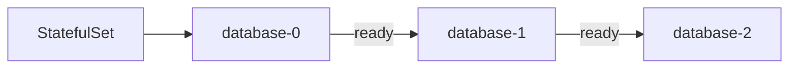

### Scaling

**Scale up:**

```text
database-0 → database-1 → database-2 → database-3 (sequential)
```

**Scale down:**

```text
database-3 → database-2 → database-1 → database-0 (reverse order)
```

### Rolling update

```text
v1: database-0 + database-1 + database-2 → update one at a time → all updated to new version
```

### Pod recovery

```text
database-1 fails → StatefulSet recreates database-1 → reconnects to original Persistent Volume
```

Pod keeps identity and data.

### StatefulSet workflow

```text
Developer → create StatefulSet → API Server → StatefulSet controller → create pod → create Persistent Volume → application running
```

### Headless Service

StatefulSets commonly use a **Headless Service** for:

- Stable DNS names
- Direct pod communication
- Service discovery

```text
Application → Headless Service → database-0 + database-1 + database-2 (individual pod addresses, no load balancing)
```

### Advantages

- Stable pod identity
- Stable DNS names
- Persistent storage
- Ordered deployment
- Ordered updates
- Ordered scaling
- Suitable for distributed systems

### Disadvantages

- More complex than Deployments
- Slower scaling due to sequential operations
- Requires persistent storage
- Best suited only for stateful workloads

### StatefulSet vs Deployment

| | StatefulSet | Deployment |
|---|-------------|------------|
| **Apps** | Stateful applications | Stateless applications |
| **Names** | Stable pod names | Dynamic pod names |
| **Storage** | Stable per-pod storage | Shared or temporary |
| **Deploy** | Ordered deployment | Parallel deployment |
| **Updates** | Ordered updates | Rolling updates |

### StatefulSet vs ReplicaSet

| | StatefulSet | ReplicaSet |
|---|-------------|------------|
| **Identity** | Stable pod identity | Identical pods |
| **Storage** | Persistent storage | No storage management |
| **Order** | Ordered operations | No ordering |
| **Workloads** | Stateful | Stateless |

### StatefulSet vs Pod

| | StatefulSet | Pod |
|---|-------------|-----|
| **Role** | Manages pods | Runs containers |
| **Identity** | Stable identity | Temporary |
| **Storage** | Creates Persistent Volumes | May use storage |
| **Lifecycle** | Ordered lifecycle | Independent lifecycle |

### Typical architecture

```text
Client → Headless Service → database-0 (Volume A) + database-1 (Volume B) + database-2 (Volume C)
```

Each pod has fixed identity, own Persistent Volume, and stable DNS name.

### Common use cases

- Databases
- Distributed databases
- Message brokers
- Search clusters
- Distributed storage systems
- Stateful applications
- Leader-follower clusters
- Applications requiring stable identities

### Summary

```text
StatefulSet = stable pod name, DNS, and PV per replica; ordered create/scale/update/terminate
Use with Headless Service for direct pod DNS; for databases, brokers, clusters — not stateless apps
```

---

## 11.26 DaemonSets

### What is a DaemonSet?

A **DaemonSet** is a Kubernetes controller that ensures one copy of a pod runs on every eligible worker node in the cluster.

When a new worker node joins, the DaemonSet automatically creates a pod on that node. When a node is removed, the corresponding pod is automatically removed.

**Simple idea:** Deployment = specified number of pods · DaemonSet = one pod on every worker node

### Why DaemonSets?

- Run system services on every node
- Automatic deployment to new nodes
- Automatic removal from deleted nodes
- Simplify cluster-wide applications
- Consistent node-level services

### Basic architecture

```text
DaemonSet → Worker 1 (Pod) + Worker 2 (Pod) + Worker 3 (Pod) — exactly one pod per node
```

### How DaemonSet works

```text
Create DaemonSet → check worker nodes → create one pod per node → monitor nodes → create pods for new nodes
```

### DaemonSet workflow

```text
Developer → create DaemonSet → API Server → DaemonSet controller → worker nodes → one pod on each node
```

### Adding a new node

```text
Worker 1 (Pod) + Worker 2 (Pod) → Worker 3 added → DaemonSet detects → creates pod on Worker 3
```

### Removing a node

```text
Worker 1 (Pod) + Worker 2 (Pod) + Worker 3 (Pod) → Worker 3 removed → pod on Worker 3 automatically removed
```

### DaemonSet scheduling

```text
DaemonSet → Worker Node 1 (create pod) + Worker Node 2 (create pod) + Worker Node 3 (create pod)
```

Each eligible node receives exactly one DaemonSet pod.

### Node selection

A DaemonSet can run only on selected nodes.

```text
Worker 1 (Linux) → run pod | Worker 2 (Linux) → run pod | Worker 3 (Windows) → do not run pod
```

Only matching nodes receive pods.

### DaemonSet update

```text
v1: Node 1 (Pod v1) + Node 2 (Pod v1) → update → Node 1 (Pod v2) → Node 2 (Pod v2)
```

Pods are updated one node at a time.

### DaemonSet lifecycle

```text
Create DaemonSet → create pods → monitor worker nodes → add pods for new nodes → remove pods from deleted nodes
```

### DaemonSet and worker nodes

```text
Cluster: Worker 1 (logging pod) + Worker 2 (logging pod) + Worker 3 (logging pod)
```

Every worker node runs one logging pod.

### Advantages

- Automatic deployment on every node
- Ideal for node-level services
- Automatically handles new nodes
- Easy cluster-wide management
- Consistent configuration across nodes

### Disadvantages

- Not suitable for user applications
- Consumes resources on every node
- Scaling depends on the number of nodes
- Poor configuration affects every node

### DaemonSet vs Deployment

| | DaemonSet | Deployment |
|---|-----------|------------|
| **Replicas** | One pod per node | User-defined replicas |
| **Placement** | All eligible nodes | Selected nodes via scheduling |
| **Use** | Node-level services | Application workloads |
| **Count** | No replica count | Replica count required |

### DaemonSet vs StatefulSet

| | DaemonSet | StatefulSet |
|---|-----------|---------------|
| **Placement** | One pod per node | Stable pod identity |
| **Order** | No ordered deployment | Ordered deployment |
| **Storage** | No dedicated storage | Persistent storage |
| **Use** | Cluster services | Stateful applications |

### DaemonSet vs ReplicaSet

| | DaemonSet | ReplicaSet |
|---|-----------|------------|
| **Placement** | One pod on each node | Fixed number of pods |
| **Tracks** | Worker nodes | Replica count |
| **Scheduling** | Node-based | Replica-based |

### Typical architecture

```text
DaemonSet → Worker Node 1 (monitoring pod) + Worker Node 2 (monitoring pod) + Worker Node 3 (monitoring pod)
```

Every eligible worker node always runs exactly one copy of the specified pod.

### Common use cases

- Log collection
- Monitoring agents
- Metrics collection
- Node health monitoring
- Security agents
- Network plugins
- Storage plugins
- Node maintenance services

### Summary

```text
DaemonSet = one pod per eligible node; auto-add on join, auto-remove on leave
Node-level agents (logs, metrics, CNI); not for scaling app replicas — use Deployment
```

---

## 11.27 Jobs

### What is a Job?

A **Job** is a Kubernetes controller that creates one or more pods to perform a specific task and ensures the task completes successfully.

Unlike a Deployment, which keeps pods running continuously, a Job finishes after its task is completed.

**Simple idea:** Deployment = runs continuously · Job = runs once and stops

### Why Jobs?

- Execute one-time tasks
- Ensure task completion
- Automatically retry failed tasks
- Support parallel execution
- Suitable for batch processing

### Basic architecture

```text
Job → Pod → execute task → task completed — Job is complete when task succeeds
```

### How a Job works

```text
Create Job → create pod → run task → success? Yes → finish | No → retry
```

The Job continues until the required number of successful completions is reached.

### Job workflow

```text
Developer → create Job → API Server → Job controller → create pod → execute task → Job complete
```

### Job lifecycle

```text
Create Job → Pending → Running → Succeeded or Failed
```

The Job ends after reaching a successful or failed state.

### Automatic retry

```text
Task starts → pod fails → Job controller → create new pod → retry task
```

Retries continue until the retry limit is reached.

### Single Job

```text
Job → Pod → backup database → complete
```

The Job finishes after the backup is complete.

### Parallel Jobs

```text
Job → Pod 1 + Pod 2 + Pod 3 — each pod executes part of the workload
```

Parallel execution reduces total processing time.

### Completions

A Job can require multiple successful task completions.

```text
Required completions: 5 — Job finishes only after all 5 succeed
```

### Parallelism

**Parallelism** specifies how many pods can run at the same time.

```text
Completions: 10 · Parallelism: 2 — two pods run simultaneously until all ten tasks complete
```

### Completion modes

**1. Non-parallel Job**

```text
One pod → one task → complete
```

**2. Parallel Job**

```text
Multiple pods → multiple tasks → complete
```

### Failed Job

```text
Job → pod fails → retry → retry limit reached → Job failed
```

The Job is marked failed when retries are exhausted.

### Job scheduling

```text
Job → Scheduler → worker node → pod created
```

The Scheduler selects a worker node for each Job pod.

### Job and persistent storage

```text
Job → Pod → Persistent Volume
```

Jobs can use persistent storage when they need to read or write data.

### Advantages

- Ensures task completion
- Automatic retries
- Supports batch processing
- Parallel execution
- Simple one-time task execution
- Reliable execution

### Disadvantages

- Not suitable for continuously running applications
- Completed pods may consume cluster resources until cleaned up
- Long-running tasks may require monitoring
- Resource usage increases with high parallelism

### Job vs Deployment

| | Job | Deployment |
|---|-----|------------|
| **Runtime** | Runs finite tasks | Runs continuously |
| **End state** | Stops after completion | Keeps pods running |
| **Recovery** | Automatic retries | Self-healing |
| **Use** | Batch processing | Long-running services |

### Job vs CronJob

| | Job | CronJob |
|---|-----|---------|
| **Schedule** | Runs once | Runs on a schedule |
| **Trigger** | Manual execution | Automatic execution |
| **Start** | Immediate | Time-based |
| **Repeat** | Single execution | Repeated execution |

### Job vs Pod

| | Job | Pod |
|---|-----|-----|
| **Role** | Manages pods | Runs containers |
| **Retries** | Retries failed tasks | No retry management |
| **Tracking** | Tracks completion | Executes a task |
| **Lifecycle** | Controls lifecycle | Independent lifecycle |

### Typical architecture

```text
Job → Job controller → Scheduler → worker node → Pod → execute task → task completed
```

The Job controller monitors the task and creates replacement pods on failure until required completions are achieved.

### Common use cases

- Database backup
- Data migration
- Batch processing
- Report generation
- File processing
- Data import/export
- Image processing
- Machine learning training
- One-time administrative tasks

### Summary

```text
Job = run-to-completion workload; retries until success or limit; completions + parallelism for batch
Not for long-running services — use Deployment; schedule repeats with CronJob
```

---

## 11.28 CronJobs

### What is a CronJob?

A **CronJob** is a Kubernetes controller that automatically creates Jobs according to a specified schedule.

Each time the schedule is reached, the CronJob creates a new Job, and the Job creates one or more pods to execute the task.

**Simple idea:** CronJob runs tasks at scheduled times

```text
CronJob → Job → Pod → execute task → complete
```

### Why CronJobs?

- Automate repetitive tasks
- Scheduled execution
- Reduce manual work
- Support recurring batch processing
- Reliable task scheduling

### Basic architecture

```text
CronJob → scheduled time reached → Job → Pod → execute task
```

### How CronJobs work

```text
Create CronJob → wait for schedule → create Job → Job creates pod → task executes → task completes
```

### CronJob workflow

```text
Developer → create CronJob → API Server → CronJob controller → scheduled time → create Job → Job creates pod → task complete
```

### Cron schedule

A CronJob uses a **cron expression** to define when a Job should run.

**Format:** `Minute Hour Day Month DayOfWeek`

| Expression | Meaning |
|------------|---------|
| `0 2 * * *` | Every day at 02:00 AM |
| `30 8 * * 1` | Every Monday at 08:30 AM |

### CronJob lifecycle

```text
Create CronJob → wait for schedule → create Job → run pod → task completed → wait for next schedule
```

Every scheduled execution creates a new Job.

### Execution flow

```text
CronJob → scheduled time → Job → Pod → run task → complete → wait for next schedule
```

### Automatic retry

```text
Scheduled Job → pod fails → Job controller → retry → task success
```

Retry behavior is handled by the Job created by the CronJob.

### Parallel executions

```text
10:00 → Job A still running → 10:05 → Job B — both may run simultaneously depending on configuration
```

### Concurrency policies

**1. Allow**

```text
Previous Job running → start new Job — both run together
```

**2. Forbid**

```text
Previous Job running → do not start new Job — scheduled execution skipped
```

**3. Replace**

```text
Previous Job running → stop previous Job → start new Job — only newest continues
```

### Missed schedules

```text
Scheduled time → missed (cluster unavailable) → CronJob controller → missed Job may start after cluster recovers (per configuration)
```

### CronJob scheduling

```text
CronJob → CronJob controller → scheduled time → create Job → Scheduler → worker node → pod created
```

### CronJob and persistent storage

```text
CronJob → Job → Pod → Persistent Volume
```

Scheduled tasks can use persistent storage when required.

### Advantages

- Automatic scheduling
- Reduces manual effort
- Reliable recurring execution
- Supports batch processing
- Integrates with Jobs
- Flexible scheduling

### Disadvantages

- Incorrect schedules can create unnecessary Jobs
- Frequent execution increases resource usage
- Long-running Jobs may overlap
- Requires proper schedule management

### CronJob vs Job

| | CronJob | Job |
|---|---------|-----|
| **Execution** | Scheduled | Immediate |
| **Creates** | Jobs | Pods |
| **Repeat** | Repeats automatically | Runs once |
| **Schedule** | Cron expression | No schedule |

### CronJob vs Deployment

| | CronJob | Deployment |
|---|---------|------------|
| **Use** | Scheduled tasks | Continuous applications |
| **Creates** | Jobs | ReplicaSets |
| **Pods** | Temporary | Long-running |
| **Pattern** | Batch processing | Application hosting |

### CronJob vs Pod

| | CronJob | Pod |
|---|---------|-----|
| **Creates** | Jobs | Runs containers |
| **Timing** | Scheduled execution | Immediate execution |
| **Repeat** | Time-based, repeated | Single lifecycle |

### Typical architecture

```text
CronJob → scheduled time → Job → worker node → Pod → execute task → task completed
```

At every scheduled time, the CronJob creates a new Job; the Job creates pods, runs the task, and finishes.

### Common use cases

- Database backups
- Log cleanup
- Report generation
- Data synchronization
- Cache cleanup
- Email notifications
- File processing
- Scheduled batch processing
- Periodic maintenance tasks

### Summary

```text
CronJob = cron schedule → creates Job → pods run task; concurrency: Allow, Forbid, Replace
Recurring batch work (backups, cleanup, reports); retries delegated to underlying Job
```

---

## 11.29 ConfigMaps

### What is a ConfigMap?

A **ConfigMap** is a Kubernetes object used to store non-sensitive configuration data separately from application code and container images.

Applications read configuration from a ConfigMap at runtime without rebuilding the image.

**Simple idea:** application code + configuration → store in ConfigMap → app reads at runtime

### Why ConfigMaps?

- Separate configuration from application code
- Reuse the same container image in different environments
- Easy configuration updates
- Centralized configuration management
- Simplify application deployment

### Problem without ConfigMaps

```text
Application embeds database URL, API URL, port — change requires rebuild image → redeploy
```

All configuration lives in the container image.

### Solution with ConfigMaps

```text
Container image (application) → ConfigMap (database URL, API URL, port) → app reads configuration
```

Only the ConfigMap changes; the image stays the same.

### Basic architecture

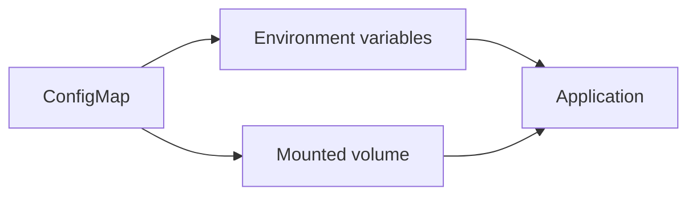

### ConfigMap data

A ConfigMap can store:

- Configuration values
- Environment variables
- Application properties
- Configuration files
- Command-line arguments

**Examples:** database host · application port · log level · API endpoint

### ConfigMap workflow

```text
Developer → create ConfigMap → API Server → store ConfigMap → pod starts → application reads configuration
```

### Using environment variables

```text
ConfigMap (database host) → environment variable → application
```

```text
ConfigMap → environment variables → application
```

### Using mounted files

```text
ConfigMap → volume → configuration file → application
```

The ConfigMap appears as files inside the container.

```text
ConfigMap → volume → container → configuration file
```

### Configuration update

```text
Old ConfigMap → update → new ConfigMap → application uses updated configuration
```

No image rebuild required.

### Example configuration

Values stored in ConfigMap instead of the image:

- Database host
- Database port
- Application port
- Log level
- API endpoint

### Multiple applications

```text
ConfigMap → Application A + Application B — shared configuration
```

### ConfigMap lifecycle

```text
Create ConfigMap → store in cluster → pod reads configuration → update ConfigMap → delete ConfigMap
```

### Advantages

- Separate configuration from code
- Reusable configuration
- Easy updates
- Centralized configuration management
- Simplifies deployments
- Supports multiple applications

### Disadvantages

- Not suitable for sensitive information
- Large ConfigMaps become difficult to manage
- Apps may need restart to pick up updated environment variables
- Incorrect configuration affects applications

### ConfigMap vs Secret

| | ConfigMap | Secret |
|---|-----------|--------|
| **Data** | Non-sensitive | Sensitive |
| **Examples** | Application settings, API endpoints, ports | Passwords, API keys, tokens |
| **Type** | Plain configuration | Credentials |

### Typical architecture

```text
ConfigMap → environment variables + mounted volume → application pod → container
```

The application reads configuration from the ConfigMap; code stays unchanged.

### Common use cases

- Database connection settings
- Application configuration
- Environment variables
- Feature flags
- API endpoints
- Logging configuration
- Port configuration
- External service URLs
- Runtime application settings

### Summary

```text
ConfigMap = non-sensitive config decoupled from image; inject via env vars or mounted files
Use Secrets for credentials; update ConfigMap without rebuild (may need pod restart for env)
```

---

## 11.30 Secrets

### What is a Secret?

A **Secret** is a Kubernetes object used to securely store sensitive information required by applications.

Secrets keep confidential data separate from application code and container images.

**Examples:** passwords · API keys · authentication tokens · TLS certificates · SSH keys

**Simple idea:** application + sensitive data → store in Secret → app reads at runtime

### Why Secrets?

- Separate sensitive data from application code
- Centralized credential management
- Easy credential updates
- Avoid hardcoding passwords
- Reuse credentials across applications

### Problem without Secrets

```text
Container image embeds database password, API key, token — change requires rebuild image → redeploy
```

Sensitive information lives in the container image.

### Solution with Secrets

```text
Container image (application) → Secret (password, API key, token) → app reads Secret
```

Only the Secret changes; the image stays the same.

### Basic architecture

```text
Secret → environment variables + mounted files → application
```

### Secret data

Secrets commonly store:

- Database passwords
- API keys
- OAuth tokens
- TLS certificates
- SSH private keys
- Authentication credentials

### Secret workflow

```text
Developer → create Secret → API Server → store Secret → pod starts → application reads Secret
```

### Using environment variables

```text
Secret → environment variable → application
```

```text
Secret → environment variables → application
```

### Using mounted files

```text
Secret → volume → secret file → application
```

The Secret appears as files inside the container.

```text
Secret → volume → container → secret file
```

### Updating Secrets

```text
Old Secret → update → new Secret → application uses updated Secret
```

Credentials can be updated without rebuilding the image.

### Example Secret

Values stored in a Kubernetes Secret:

- Database password
- API key
- Authentication token
- TLS certificate

### Multiple applications

```text
Secret → Application A + Application B — shared credentials
```

### Secret lifecycle

```text
Create Secret → store in cluster → pod reads Secret → update Secret → delete Secret
```

### Secret types

| Type | Purpose |
|------|---------|
| **Opaque** | Arbitrary key-value pairs |
| **TLS** | TLS certificate and private key |
| **Docker Registry** | Credentials for private image registry |
| **Service Account Token** | Authentication tokens for service accounts |

### Config and credential storage

| | ConfigMap | Secret | Baked into image |
|---|-----------|--------|------------------|
| **Sensitivity** | Non-sensitive | Sensitive | Any (avoid secrets) |
| **Update** | Change object, no rebuild | Change object, no rebuild | Rebuild image |
| **Injection** | Env vars or mounted files | Env vars or mounted files | Hardcoded in image |

### Advantages

- Separate sensitive data from code
- Easy credential updates
- Centralized secret management
- Reusable across applications
- Simplifies application deployment
- Supports multiple Secret types

### Disadvantages

- Incorrect access permissions can expose secrets
- Apps may need restart to pick up updated environment variables
- Large numbers of Secrets increase management complexity
- Secrets still require proper access control and protection

### Typical architecture

```text
Secret → environment variables + mounted volume → application pod → container
```

The application reads sensitive data from the Secret; the image remains unchanged.

### Common use cases

- Database passwords
- API keys
- Authentication tokens
- TLS certificates
- SSH keys
- Private registry credentials
- OAuth credentials
- Secure application configuration
- External service authentication

### Summary

```text
Secret = sensitive data (passwords, keys, certs) decoupled from image; env vars or mounted files
Types: Opaque, TLS, Docker Registry, Service Account Token; pair with RBAC and external secret stores in production
```

---

## 11.31 Scheduler

### What is the Scheduler?

The **Kubernetes Scheduler** is a control plane component that decides on which worker node a newly created pod should run.

The Scheduler does not create pods or run containers — it only selects the most suitable worker node for each pod.

**Simple idea:** new pod → Scheduler → best worker node → pod runs

### Why Scheduler?

- Automatically select the best node
- Efficient resource utilization
- Balance workloads
- Respect scheduling rules
- Improve application availability

### Basic architecture

```text
Control plane → Scheduler → Worker 1 (Pod) + Worker 2 (Pod) + Worker 3 (Pod)
```

### How Scheduler works


### Pod states

```text
Pod created → Pending → Scheduler selects node → Running
```

A pod stays Pending until a suitable worker node is selected.

### Node filtering

The Scheduler first removes nodes that cannot run the pod.

```text
Worker 1 (2 CPU available) — eligible | Worker 2 (no memory) — filtered | Worker 3 (disk pressure) — filtered
```

Only eligible nodes continue to scoring.

### Node scoring

After filtering, the Scheduler scores remaining nodes using:

- Available CPU
- Available memory
- Resource utilization
- Scheduling preferences

The highest-scoring node is selected.

### Resource requests

Each pod can specify CPU and memory requests.

```text
Pod requires 2 CPU + 4 GB memory → Scheduler selects node with sufficient resources
```

### Insufficient resources

```text
Pod requires 8 CPU → no node has 8 CPU available → pod remains Pending until suitable node exists
```

### Node labels

Worker nodes can have labels; pods can request specific labels.

```text
Worker 1 (environment = production) | Worker 2 (environment = development) — Scheduler matches pod requirements
```

### Taints and tolerations

A worker node may reject pods using a **taint**. Only pods with a matching **toleration** can run on that node.

```text
GPU node (taint applied) → only GPU workload pods with toleration scheduled
```

### Node affinity

A pod can specify preferred or required worker nodes based on labels.

```text
Pod requires region = asia → Scheduler selects only matching nodes
```

### Pod affinity

A pod can prefer to run on the same node as another pod.

```text
Frontend pod → same node preferred → backend pod (reduces latency)
```

### Pod anti-affinity

A pod can avoid running with certain pods.

```text
Replica 1 on Worker 1 · Replica 2 on Worker 2 — spreads replicas for fault tolerance
```

### Scheduler decision flow

```text
New pod → filter nodes → score eligible nodes → select best node → assign pod → kubelet starts pod
```

### Advantages

- Automatic pod placement
- Efficient resource utilization
- Supports resource-aware scheduling
- Supports node selection rules
- Improves workload distribution
- Integrates with Kubernetes controllers

### Disadvantages

- Incorrect resource requests can lead to poor scheduling
- Complex scheduling rules increase configuration complexity
- Pods remain Pending if no suitable node exists
- Decisions depend on available cluster resources

### Scheduler vs kubelet

| | Scheduler | kubelet |
|---|-----------|---------|
| **Role** | Selects worker node | Runs pods |
| **Location** | Control plane | Worker node |
| **Action** | Assigns pods | Starts containers |
| **Scope** | Scheduling decisions | Manages pod lifecycle |

### Scheduler vs Deployment

| | Scheduler | Deployment |
|---|-----------|------------|
| **Role** | Assigns pods to nodes | Creates ReplicaSets |
| **Creates pods** | No | Yes |
| **Type** | Cluster component | Kubernetes resource |
| **Scope** | Placement decisions | Application lifecycle |

### Scheduler vs Controller Manager

| | Scheduler | Controller Manager |
|---|-----------|-------------------|
| **Role** | Chooses worker nodes | Maintains cluster state |
| **Action** | Assigns pods | Creates or replaces resources |
| **Type** | Scheduling component | Control loops |

### Typical architecture

```text
Developer → API Server → Scheduler → Worker Node 1 (kubelet → Pod) + Worker Node 2 (kubelet → Pod)
```

The Scheduler picks the best node; kubelet on that node starts the pod.

### Common use cases

- Automatic pod placement
- Resource-aware scheduling
- High availability
- Workload distribution
- GPU workload scheduling
- Multi-zone deployments
- Large Kubernetes clusters
- Production container orchestration

### Summary

```text
Scheduler = control plane; filter nodes → score → bind pod to best node (does not run containers)
Uses requests/limits, labels, taints/tolerations, affinity; Pending until a fit exists
```

---

## 11.32 etcd

### What is etcd?

**etcd** is a distributed, highly available key-value database used by Kubernetes to store all cluster data and state.

It acts as the single source of truth for the cluster. Every Kubernetes component reads or writes cluster information through the API Server, which stores data in etcd.

**Simple idea:** Kubernetes cluster → API Server → etcd — all cluster information stored here

### Why etcd?

- Store cluster state
- Store Kubernetes objects
- Maintain configuration
- Support high availability
- Ensure consistency of cluster data

### Basic architecture

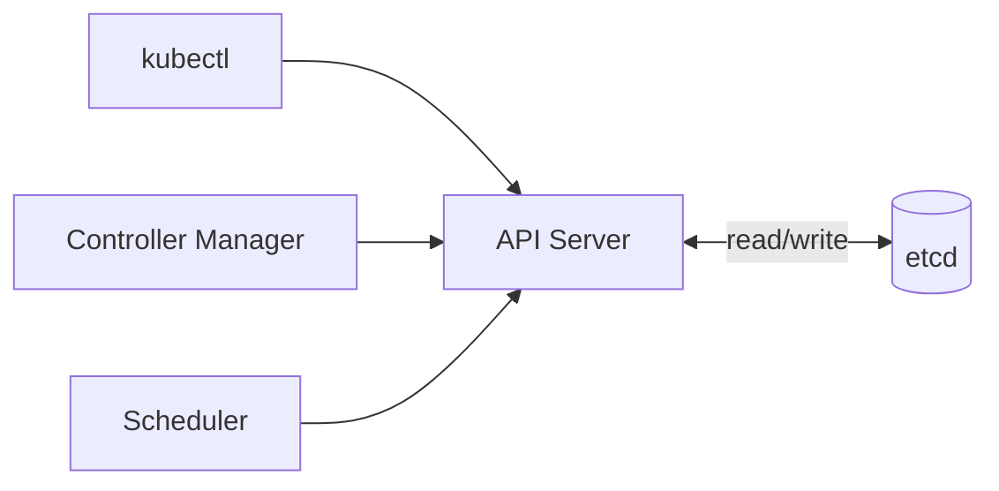

```text
Kubernetes cluster → control plane → API Server → etcd
```

The API Server is the only component that directly communicates with etcd.

### What etcd stores

etcd stores information about:

- Pods, nodes, Deployments, ReplicaSets, Services
- ConfigMaps, Secrets, StatefulSets, DaemonSets
- Jobs, CronJobs, Namespaces
- Cluster configuration

**Example:** pod `web-1` with status `Running` → stored in etcd

### How etcd works

```text
Developer → kubectl apply → API Server → store data → etcd → cluster updated
```

### Reading data

```text
Developer → kubectl get pods → API Server → read from etcd → return result
```

### etcd workflow

```text
Create resource → API Server → store in etcd → controller reads → Scheduler reads → worker nodes updated
```

### Cluster state

etcd stores desired and current state of the cluster.

```text
Desired pods: 3 · Running pods: 2 → Controller Manager reads etcd → creates one more pod
```

### High availability

Multiple etcd instances work together as an **etcd cluster**.

```text
etcd cluster: etcd 1 + etcd 2 + etcd 3 — data replicated across all members
```

### Leader and followers

One etcd member is the **Leader**; the rest are **Followers**.

```text
Leader → Follower 1 + Follower 2 — writes coordinated through Leader
```

### Consensus

etcd uses the **Raft** consensus algorithm so all members agree on cluster data.

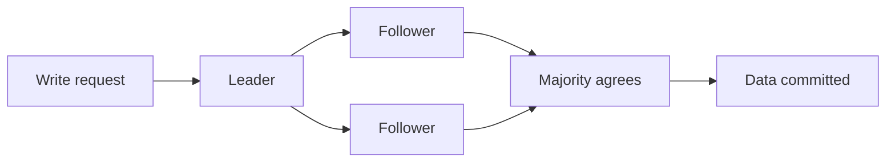

### Data consistency

```text
API Server → etcd Leader → Followers → cluster updated — all members eventually store same data
```

### Failure recovery

```text
Leader fails → followers hold election → new Leader selected → cluster continues
```

The cluster stays available as long as a majority of members are healthy.

### Backup and restore

```text
Backup → store etcd snapshot → failure → restore snapshot → cluster recovered
```

Regular backups are essential — etcd holds the complete cluster state.

### Advantages

- Centralized cluster state
- High availability
- Strong consistency
- Fast key-value storage
- Automatic data replication
- Reliable failure recovery
- Supports distributed clusters

### Disadvantages

- Critical dependency for Kubernetes
- Loss of etcd data affects the entire cluster
- Requires regular backups
- Large clusters require careful capacity planning

### etcd vs database

| | etcd | Traditional database |
|---|------|----------------------|
| **Type** | Key-value store | Relational/NoSQL |
| **Stores** | Cluster metadata | Application/business data |
| **Use** | Kubernetes state | Business information |
| **Consistency** | Strong consistency | Depends on database |

### etcd vs API Server

| | etcd | API Server |
|---|------|------------|
| **Role** | Stores cluster data | Entry point to cluster |
| **Interface** | Key-value database | Kubernetes REST API |
| **Access** | No direct user access | Handles client requests |

### etcd vs Controller Manager

| | etcd | Controller Manager |
|---|------|-------------------|
| **Role** | Stores cluster state | Maintains desired state |
| **Type** | Persistent storage / database | Control loops |
| **Function** | Data store | Cluster management |

### Typical architecture

```text
kubectl → API Server → etcd ← Scheduler + Controller Manager + other control plane components (indirectly via API Server)
```

The API Server stores and retrieves cluster information from etcd; other components interact indirectly through the API Server.

### Common use cases

- Store cluster configuration
- Store Kubernetes resources
- Maintain cluster state
- High availability clusters
- Leader election
- Distributed coordination
- Cluster recovery
- Kubernetes metadata storage

### Summary

```text
etcd = HA key-value store; single source of truth for all K8s objects and state
API Server only direct client; Raft quorum; backup snapshots critical for disaster recovery
```

---

## 11.33 Operators

### What is an Operator?

An **Operator** is a Kubernetes extension that automates management of complex applications using Kubernetes APIs and custom controllers.

An Operator continuously monitors an application and performs operational tasks such as installation, scaling, upgrades, backups, recovery, and configuration automatically.

**Simple idea:** Deployment manages pods · Operator manages an entire application

### Why Operators?

- Automate application management
- Reduce manual operational work
- Perform automatic upgrades
- Handle backups and recovery
- Manage complex stateful applications
- Continuously monitor application health

### Problem without Operators

```text
Administrator → install → configure → upgrade → backup → recover — all manual
```

### Solution with Operators

```text
Administrator → create Custom Resource → Operator → install + configure + upgrade + backup + recover (automatic)
```

### Basic architecture

```text
User → Custom Resource (CR) → Operator → Kubernetes resources → pods and Services
```

The Operator watches the Custom Resource and manages the application.

### How Operators work

```text
Create Custom Resource → API Server → Operator detects change → take required action → application updated
```

### Operator workflow

```text
Developer → create Custom Resource → API Server → Operator → Deployment → pods running
```

### Operator components

**1. Custom Resource Definition (CRD)**

A CRD adds a new resource type to Kubernetes.

**Examples:** Database · Cache · MessageQueue

Once installed, Kubernetes understands these new resource types.

**2. Custom Resource (CR)**

A Custom Resource is an instance of a CRD.

```text
Database → MySQL cluster — Operator watches these resources
```

**3. Controller**

The controller continuously compares **desired state** with **actual state** and performs corrective actions when they differ.

### Reconciliation loop

```mermaid
flowchart LR
    Desired[Desired state] --> Op[Operator]
    Op --> Actual[Actual state]
    Actual -->|drift| Action[Corrective action]
    Action --> Actual
```

### Automatic scaling

```text
Custom Resource (replicas = 5) → Operator → create pods → application running
```

### Automatic upgrade

```text
Application v1 → Custom Resource updated → Operator → upgrade → v2
```

### Automatic backup

```text
Scheduled time → Operator → backup database → store backup
```

### Automatic recovery

```text
Application failure → Operator detects → restore data → restart application → application running
```

### Stateful application example

```text
Database cluster → Operator → create pods → create storage → configure replication → monitor health → recover failures
```

The Operator manages the complete application lifecycle.

### Advantages

- Automates operational tasks
- Reduces manual administration
- Simplifies complex application management
- Continuous monitoring
- Automatic recovery
- Automatic upgrades
- Consistent application deployment

### Disadvantages

- More complex than standard controllers
- Operator development requires programming
- Poorly designed Operators can affect cluster stability
- Additional resources required for Operator execution

### Operator vs Deployment

| | Operator | Deployment |
|---|----------|------------|
| **Scope** | Manages applications | Manages pods |
| **Automation** | Performs operational automation | Creates ReplicaSets |
| **Upgrades** | Handles upgrades | Rolling updates |
| **Backup** | Backup and recovery | No backup management |

### Operator vs StatefulSet

| | Operator | StatefulSet |
|---|----------|-------------|
| **Scope** | Manages application lifecycle | Manages pods |
| **Backup** | Backup automation | No backup management |
| **Recovery** | Recovery automation | Pod management only |
| **Operations** | Advanced operations | Basic workload control |

### Operator vs Controller

| | Operator | Controller |
|---|----------|------------|
| **Scope** | Custom application automation | Built-in resource management |
| **Resources** | Uses CRDs | Uses standard resources |
| **Logic** | Application-specific | Generic reconciliation |

### Typical architecture

```text
Custom Resource → API Server → Operator → Deployment + StatefulSet + Service → Pods
```

The Operator watches the Custom Resource and manages all Kubernetes resources required by the application.

### Common use cases

- Database management
- Kubernetes-native databases
- Message broker clusters
- Search engine clusters
- Monitoring platforms
- Storage systems
- Backup automation
- Automatic upgrades
- Stateful application management

### Summary

```text
Operator = CRD + controller + domain logic; reconcile CR desired state → K8s resources
Automates install, scale, upgrade, backup, recovery for complex stateful apps (e.g. databases)
```

---

## 11.34 HPA

### What is HPA?

**Horizontal Pod Autoscaler (HPA)** is a Kubernetes controller that automatically increases or decreases pod replica count based on resource usage or other metrics.

HPA helps applications handle changing workloads without manual intervention.

**Simple idea:**

```text
Low traffic → 2 pods | High traffic → 8 pods | Traffic decreases → 2 pods
```

HPA automatically adjusts pod count.

### Why HPA?

- Automatic scaling
- Better resource utilization
- Handle traffic spikes
- Reduce infrastructure cost
- Improve application availability

### Basic architecture

```text
Users → application → Service → Pod 1 + Pod 2 ← HPA (monitors metrics continuously)
```

### How HPA works

```mermaid
flowchart LR
    MS[Metrics Server] --> HPA[HPA]
    HPA -->|compare to target| Decision{Scale?}
    Decision -->|up/down| Dep[Deployment replicas]
    Dep --> RS[ReplicaSet]
    RS --> Pods[Pods]
```

### Kubernetes scaling stack

```mermaid
flowchart LR
    Traffic[High traffic] --> HPA[HPA]
    HPA -->|more pods| Pods[Pods]
    Pods -->|pending| Sched[Scheduler]
    Sched -->|no capacity| CA[Cluster Autoscaler]
    CA -->|add nodes| Nodes[Worker nodes]
```

### Metrics used

HPA can use:

- CPU utilization
- Memory utilization
- Custom metrics
- External metrics

**Example:** target CPU 60% · current CPU 90% → scale up

### Scale up

```text
2 pods → high CPU → HPA → increase replicas → 5 pods — traffic distributed across more pods
```

### Scale down

```text
6 pods → low CPU → HPA → reduce replicas → 2 pods — unused pods removed
```

### Scaling process

```text
Users → Service → Deployment → ReplicaSet → Pods
```

HPA changes the desired replica count in the Deployment.

### Metrics Server

The **Metrics Server** collects resource usage from worker nodes.

```text
Pods → kubelet → Metrics Server → HPA
```

The HPA uses these metrics for scaling decisions.

### Minimum and maximum replicas

An HPA defines minimum and maximum replicas.

```text
Minimum: 2 · Maximum: 10 — pod count always stays within this range
```

### Scaling example

```text
CPU 20% → 2 pods | CPU 55% → 2 pods | CPU 85% → 5 pods | CPU 95% → 8 pods
```

As CPU rises, HPA creates additional pods.

### Scaling delay

Metrics are collected periodically. The HPA waits before scaling to avoid rapid changes from temporary workload spikes.

### Advantages

- Automatic pod scaling
- Efficient resource utilization
- Handles traffic spikes
- Reduces manual operations
- Improves application availability
- Saves infrastructure cost

### Disadvantages

- Requires metrics collection
- Scaling is not instantaneous
- Frequent workload changes can cause repeated scaling
- Scales only pod count, not worker nodes

### HPA vs manual scaling

| | HPA | Manual scaling |
|---|-----|----------------|
| **Mode** | Automatic | Manual |
| **Input** | Uses metrics | Human decision |
| **Behavior** | Dynamic | Fixed |
| **Monitoring** | Continuous | No automatic monitoring |

### HPA vs Vertical Pod Autoscaler (VPA)

| | HPA | VPA |
|---|-----|-----|
| **Changes** | Pod count | CPU and memory per pod |
| **Action** | Creates more pods | Resizes existing pods |
| **Best for** | Traffic changes | Resource optimization |

### HPA vs Cluster Autoscaler

| | HPA | Cluster Autoscaler |
|---|-----|-------------------|
| **Scales** | Pods | Worker nodes |
| **Trigger** | CPU, memory, custom metrics | Pending pods / idle nodes |
| **Level** | Application | Infrastructure |
| **Action** | Adds or removes pods | Adds or removes nodes |

### Typical architecture

```text
Users → Service → Pod 1 + Pod 2 ← HPA ← Metrics Server ← kubelet
```

The HPA receives metrics from the Metrics Server and adjusts pod replicas based on configured targets.

### Common use cases

- Web applications
- REST APIs
- Microservices
- E-commerce applications
- Traffic-based scaling
- Cloud-native applications
- Production workloads
- Dynamic application scaling

### Summary

```text
HPA = scale pod replicas on CPU/memory/custom metrics via Metrics Server
Min/max bounds; scales Deployment replicas — pair with Cluster Autoscaler for nodes
```

---

## 11.35 Cluster Autoscaler

### What is Cluster Autoscaler?

**Cluster Autoscaler** is a Kubernetes component that automatically increases or decreases the number of worker nodes in a cluster based on resource demand.

If pods cannot be scheduled because there are not enough resources, Cluster Autoscaler adds worker nodes. If nodes remain underutilized, it removes them.

**Simple idea:**

```text
More pods, not enough nodes → add worker nodes
Less workload, unused nodes → remove worker nodes
```

### Why Cluster Autoscaler?

- Automatically add worker nodes
- Automatically remove unused worker nodes
- Handle increasing workloads
- Improve resource utilization
- Reduce infrastructure costs

### Basic architecture

```text
Kubernetes cluster → Cluster Autoscaler → Worker Node 1 (pods) + Worker Node 2 (pods)
```

Cluster Autoscaler manages worker node count.

### How Cluster Autoscaler works

```mermaid
flowchart LR
    Pod[New pod] --> Sched[Scheduler]
    Sched -->|no resources| Pending[Pod Pending]
    Pending --> CA[Cluster Autoscaler]
    CA --> Cloud[Cloud provider]
    Cloud --> Node[New worker node]
    Node --> Sched
    Sched -->|assign| Running[Pod running]
```

### Cluster Autoscaler workflow

```text
Developer → create Deployment → pods created → Scheduler → pending pods → Cluster Autoscaler → create new worker node → Scheduler places pods
```

### Scale up

```text
Worker 1 + Worker 2 → high workload → new pods → no resources → Cluster Autoscaler → add Worker 3 → pending pods scheduled
```

### Scale down

```text
Worker 1 + Worker 2 + Worker 3 → Worker 3 has no important workloads → Cluster Autoscaler → move pods → remove Worker 3
```

### Worker node addition

```text
Pending pod → Cluster Autoscaler → cloud provider → new VM → joins cluster → Scheduler places pod
```

### Worker node removal

```text
Underutilized node → move pods to other nodes → worker empty → remove worker node
```

A node is deleted only after workloads are moved.

### Relationship with Scheduler

```text
New pod → Scheduler → no suitable node → pod Pending → Cluster Autoscaler → create node → Scheduler → assign pod
```

The Scheduler places pods; Cluster Autoscaler adds or removes nodes.

### Relationship with HPA

```text
High traffic → HPA creates more pods → Scheduler → not enough nodes → Cluster Autoscaler adds nodes → pods scheduled
```

HPA scales pods; Cluster Autoscaler scales worker nodes.

### Cloud integration

Cluster Autoscaler works with cloud providers that support automatic creation and deletion of worker nodes.

```text
Cluster Autoscaler → cloud platform → create VM → worker node joins cluster
```

### Resource optimization

```text
High resource usage → add worker nodes | Low resource usage → remove idle worker nodes
```

Optimizes infrastructure usage.

### Advantages

- Automatic worker node scaling
- Better resource utilization
- Handles growing workloads
- Reduces infrastructure costs
- Integrates with Kubernetes Scheduler
- Supports dynamic clusters

### Disadvantages

- Scaling new worker nodes takes time
- Depends on cloud infrastructure support
- Frequent scaling may increase operational cost
- Does not directly scale pods

### Cluster Autoscaler vs VPA

| | Cluster Autoscaler | VPA |
|---|-------------------|-----|
| **Changes** | Number of worker nodes | CPU and memory per pod |
| **Scope** | Cluster-wide scaling | Pod resource scaling |
| **Level** | Infrastructure | Pod |

### Cluster Autoscaler vs Scheduler

| | Cluster Autoscaler | Scheduler |
|---|-------------------|-----------|
| **Role** | Adds or removes worker nodes | Assigns pods to worker nodes |
| **Trigger** | Responds to pending pods | Chooses best node per pod |
| **Level** | Infrastructure | Workload placement |

### Typical architecture

```text
Users → Deployment → Pods → Scheduler → Worker Node 1 + Worker Node 2
Cluster Autoscaler → cloud provider → new worker node (when nodes cannot run new pods)
```

When existing nodes lack resources, Cluster Autoscaler provisions more. When nodes are underutilized, it removes them.

### Common use cases

- Dynamic Kubernetes clusters
- Production workloads
- Cloud-native applications
- Traffic spikes
- Cost optimization
- Automatic infrastructure scaling
- Large Kubernetes environments
- Resource-efficient clusters

### Summary

```text
Cluster Autoscaler = scale worker nodes on pending pods (scale up) and idle capacity (scale down)
Infrastructure layer; pair with HPA (pods) on cloud-backed node groups; node join/leave takes minutes
```

---
